#  THE PRINCETON COMPANION TO 
# Timothy Gowers EDrToR 
June Barrow-Green & Imre Leader 
ASSOCIATEEDITORS 
# 

The Princeton Companion to Mathematics 

This page intentionally left blank 

# The Princeton Companion to Mathematics 
editor 
Timothy Gowers 
University of Cambridge 
associate editors 
June Barrow-Green 
The Open University 
Imre Leader 
University of Cambridge 
Princeton University Press 
Princeton and Oxford 

Copyright © 2008 by Princeton University Press 
Published by Princeton University Press, 
41 William Street, Princeton, New Jersey 08540 
In the United Kingdom: Princeton University Press, 
6 Oxford Street, Woodstock, Oxfordshire OX20 1TW 
All Rights Reserved 
Library of Congress Cataloging-in-Publication Data 
The Princeton companion to mathematics / Timothy Gowers, editor ; 
June Barrow-Green, Imre Leader, associate editors. 
p. cm. 
Includes bibliographical references and index. 
ISBN 978-0-691-11880-2 (hardcover : alk. paper) 
1. Mathematics—Study and teaching (Higher) 2. Princeton University. 
I. Gowers, Timothy. II. Barrow-Green, June, date– III. Leader, Imre. 
QA11.2.P745 2008 
510—dc22 2008020450 
British Library Cataloging-in-Publication Data is available 
Grateful acknowledgment is made for permission to reprint the following illustrations in part VI: 
Page 739. Portrait of René Descartes taken from Pantheon berühmter Menschen aller Zeiten (Zwickau, 1830). Courtesy of Niedersächsische Staats- und Universitätsbibliothek Göttingen. 
Page 742. Portrait of Isaac Newton. By permission of the Master and Fellows, Trinity College Cambridge. 
Page 744. Copy after a portrait of Gottfried Leibniz by Andreas Scheits (1703). Courtesy of Gottfried Wilhelm Leibniz Bibliothek—Niedersächsische Landesbibliothek Hannover. 
Page 748. Portrait of Leonhard Euler by J. F. A. Darbès (inv. no. 1829-8). Copyright: © Musée d’art et d’histoire, Ville de Genève. 
Page 756. Portrait of Carl Friedrich Gauss. Courtesy of Niedersächsische Staats- und Universitätsbibliothek Göttingen. 
Page 775. Portrait of Bernhard Riemann. Courtesy of Niedersächsische Staats- und Universitätsbibliothek Göttingen. 
Page 786. Portrait of Henri Poincaré. Courtesy of Henri Poincaré Archives (CNRS,UMR 7117, Nancy). 
Page 788. Portrait of David Hilbert. Courtesy of Niedersächsische Staats- und Universitätsbibliothek Göttingen. 
This book has been composed in LucidaBright 
Project management and composition by T T Productions Ltd, London 
Printed on acid-free paper press.princeton.edu 
Printed in the United States of America 

# Contents 
Preface ix 
Contributors xvii 
# Part I Introduction 
# Part II The Origins of Modern Mathematics 
# Part III Mathematical Concepts 

# Part IV Branches of Mathematics 
# Part V Theorems and Problems 

# Contents 
vii 
# Part VI Mathematicians 

viii 
Contents 
VI.86 Emil Artin (1898–1962) 812 
VI.87 Alfred Tarski (1901–1983) 813 
VI.88 Andrei Nikolaevich Kolmogorov (1903–1987) 814 
VI.89 Alonzo Church (1903–1995) 816 
VI.90 William Vallance Douglas Hodge (1903–1975) 816 
VI.91 John von Neumann (1903–1957) 817 
VI.92 Kurt Gödel (1906–1978) 819 
VI.93 André Weil (1906–1998) 819 
VI.94 Alan Turing (1912–1954) 821 
VI.95 Abraham Robinson (1918–1974) 822 
VI.96 Nicolas Bourbaki (1935–) 823 
# Part VII The Influence of Mathematics 
VII.1 Mathematics and Chemistry 827 
VII.2 Mathematical Biology 837 
VII.3 Wavelets and Applications 848 
VII.4 The Mathematics of Traffic in Networks 862 
VII.5 The Mathematics of Algorithm Design 871 
VII.6 Reliable Transmission of Information 878 
VII.7 Mathematics and Cryptography 887 
VII.8 Mathematics and Economic Reasoning 895 
VII.9 The Mathematics of Money 910 
VII.10 Mathematical Statistics 916 
VII.11 Mathematics and Medical Statistics 921 
VII.12 Analysis, Mathematical and Philosophical 928 
VII.13 Mathematics and Music 935 
VII.14 Mathematics and Art 944 
# Part VIII Final Perspectives 
VIII.1 The Art of Problem Solving 955 
VIII.2 “Why Mathematics?” You Might Ask 966 
VIII.3 The Ubiquity of Mathematics 977 
VIII.4 Numeracy 983 
VIII.5 Mathematics: An Experimental Science 991 
VIII.6 Advice to a Young Mathematician 1000 
VIII.7 A Chronology of Mathematical Events 1010 
Index 1015 

# 1 What Is The Companion? 
Bertrand Russell, in his book The Principles of Mathematics, proposes the following as a definition of pure mathematics. 
Pure Mathematics is the class of all propositions of the form implies where p and q are propositions containing one or more variables, the same in the two propositions, and neither p nor q contains any constants except logical constants. And logical constants are all notions definable in terms of the following: Implication, the relation of a term to a class of which it is a member, the notion of such that, the notion of relation, and such further notions as may be involved in the general notion of propositions of the above form. In addition to these, mathematics uses a notion which is not a constituent of the propositions which it considers, namely the notion of truth. 
The Princeton Companion to Mathematics could be said to be about everything that Russell’s definition leaves out. 
Russell’s book was published in 1903, and many mathematicians at that time were preoccupied with the logical foundations of the subject. Now, just over a century later, it is no longer a new idea that mathematics can be regarded as a formal system of the kind that Russell describes, and today’s mathematician is more likely to have other concerns. In particular, in an era where so much mathematics is being published that no individual can understand more than a tiny fraction of it, it is useful to know not just which arrangements of symbols form grammatically correct mathematical statements, but also which of these statements deserve our attention. 
Of course, one cannot hope to give a fully objective answer to such a question, and different mathematicians can legitimately disagree about what they find interesting. For that reason, this book is far less formal than Russell’s and it has many authors with many different points of view. And rather than trying to give a precise answer to the question, “What makes a mathematical statement interesting?” it simply aims to present for the reader a large and representative sample of the ideas that mathematicians are grappling with at the beginning of the twenty-first century, and to do so in as attractive and accessible a way as possible. 

# 2 The Scope of the Book 
The central focus of this book is modern, pure mathematics, a decision about which something needs to be said. “Modern” simply means that, as mentioned above, the book aims to give an idea of what mathematicians are now doing: for example, an area that developed rapidly in the middle of the last century but that has now reached a settled form is likely to be discussed less than one that is still developing rapidly. However, mathematics carries its history with it: in order to understand a piece of present-day mathematics, one will usually need to know about many ideas and results that were discovered a long time ago. Moreover, if one wishes to have a proper perspective on today’s mathematics, it is essential to have some idea of how it came to be as it is. So there is plenty of history in the book, even if the main reason for our including it is to illuminate the mathematics of today. 
The word “pure” is more troublesome. As many have commented, there is no clear dividing line between pure and applied mathematics, and, just as a proper appreciation of modern mathematics requires some knowledge of its history, so a proper appreciation of pure mathematics requires some knowledge of applied mathematics and theoretical physics. Indeed, these areas have provided pure mathematicians with many fundamental ideas, which have given rise to some of the most interesting, important, and currently active branches of pure mathematics. This book is certainly not blind to the impact on pure mathematics of these other disciplines, nor does it ignore the practical and intellectual applications of pure mathematics. Nevertheless, the scope is narrower than it could be. At one stage it was suggested that a more accurate title would be “The Princeton Companion to Pure Mathematics”: the only reason for rejecting this title was that it does not sound as good as the actual title. 

Another thought behind the decision to concentrate on pure mathematics was that it would leave open the possibility of a similar book, a companion Companion so to speak, about applied mathematics and theoretical physics. Until such a book appears, The Road to Reality, by Roger Penrose (Knopf, New York, 2005), covers a very wide variety of topics in mathematical physics, written at a level fairly similar to that of this book, and Elsevier has recently brought out a five-volume Encyclopedia of Mathematical Physics (Elsevier, Amsterdam, 2006). 
# 3 The Companion Is Not an Encyclopedia 
The word “companion” is significant. Although this book is certainly intended as a useful work of reference, you should not expect too much of it. If there is a particular mathematical concept that you want to find out about, you will not necessarily be able to find out about it here, even if it is important; though the more important it is, the more likely it is to be included. In this respect, the book is like a human companion, complete with gaps in its knowledge and views on some topics that may not be universally shared. Having said that, we have at least aimed at some sort of balance: many topics are not covered, but those that are covered range very widely (much more so than one could reasonably expect of any single human companion). In order to achieve this kind of balance, we have been guided to some extent by “objective” indicators such as the American Mathematical Society’s classification of mathematical topics, or the way that mathematics is divided into sections at the four-yearly International Congress of Mathematicians. The broad areas, such as number theory, algebra, analysis, geometry, combinatorics, logic, probability, theoretical computer science, and mathematical physics, are all represented, even if not all their subareas are. Inevitably, some of the choices about what to include, and at what length, were not the result of editorial policy, but were based on highly contingent factors such as who agreed to write, who actually submitted after having agreed, whether those who submitted stuck to their word limit, and so on. Consequently, there are some areas that are not as fully represented as we would have liked, but the point came where it was better to publish an imperfect volume than to spend several more years striving for perfect balance. We hope that there will be future editions of The Companion: if so, there will be a chance to remedy any defects that there might be in this one. 

Another respect in which this book differs from an encyclopedia is that it is arranged thematically rather than alphabetically. The advantage of this is that, although the articles can be enjoyed individually, they can also be regarded as part of a coherent whole. Indeed, the structure of the book is such that it would not be ridiculous to read it from cover to cover, though it would certainly be time-consuming. 
# 4 The Structure of The Companion 
What does it mean to say that The Companion is “arranged thematically”? The answer is that it is divided into eight parts, each with a different general theme and a different purpose. Part I consists of introductory material, which gives a broad overview of mathematics and explains, for the benefit of readers with less of a background in mathematics, some of the basic concepts of the subject. A rough rule of thumb is that a topic belongs in part I if it is part of the necessary background of all mathematicians rather than belonging to one specific area. groups [I.3 §2.1] and vector spaces [I.3 §2.3] belong in this category, to take two obvious examples. 
Part II is a collection of essays of a historical nature. Its aim is to explain how the distinctive style of modern mathematics came into being. What, broadly speaking, are the main differences between the way mathematicians think about their subject now and the way they thought about it 200 years ago (or more)? One is that there is a universally accepted standard for what counts as a proof. Closely related to this is the fact that mathematical analysis (calculus and its later extensions and developments) has been put on a rigorous footing. Other notable features are the extension of the concept of number, the abstract nature of algebra, and the fact that most modern geometers study non-Euclidean geometry rather than the more familiar triangles, circles, parallel lines, and the like. 
Part III consists of fairly short articles, each one dealing with an important mathematical concept that has not appeared in part I. The intention is that this part of the book will be a very good place to look if there is a concept you do not know about but have often heard mentioned. If another mathematician, perhaps a colloquium speaker, assumes that you are familiar with a definition—for example, that of a symplectic form [III.88], or the incompressible euler equation [III.23], or a sobolev space [III.29 §2.4], or the ideal class group [IV.1 §7]—and if you are too embarrassed to admit that in fact you are not, then you now have the alternative of looking these concepts up in The Companion. 

The articles in part III would not be much use if all they gave was formal definitions: to understand a concept one wants to know what it means intuitively, why it is important, and why it was first introduced. Above all, if it is a fairly general concept, then one wants to know some good examples—ones that are not too simple and not too complicated. Indeed, it may well be that providing and discussing a well-chosen example is all that such an article needs to do, since a good example is much easier to understand than a general definition, and more experienced readers will be able to work out a general definition by abstracting the important properties from the example. 
Another use of part III is to provide backup for part IV, which is the heart of the book. Part IV consists of twenty-six articles, considerably longer than those of part III, about different areas of mathematics. A typical part IV article explains some of the central ideas and important results of the area it treats, and does so as informally as possible, subject to the constraint that it should not be too vague to be informative. The original hope was for these articles to be “bedtime reading,” that is, clear and elementary enough that one could read and understand them without continually stopping to think. For that reason, the authors were chosen with two priorities in mind, of equal importance: expertise and expository skill. But mathematics is not an easy subject, and in the end we had to regard the complete accessibility we originally hoped for as an ideal that we would strive toward, even if it was not achieved in every last subsection of every article. But even when the articles are tough going, they discuss what they discuss in a clearer and less formal way than a typical textbook, often with remarkable success. As with part III, several authors have achieved this by looking at illuminating examples, which they sometimes follow with more general theory and sometimes leave to speak for themselves. 
Many part IV articles contain excellent descriptions of mathematical concepts that would otherwise have had articles devoted to them in part III. We originally planned to avoid duplication completely, and instead to include cross-references to these descriptions in part III. However, this risked irritating the reader, so we decided on the following compromise. Where a concept is adequately explained elsewhere, part III does not have a full article, but it does have a short description together with a cross-reference. This way, if you want to look a concept up quickly, you can use part III, and only if you need more detail will you be forced to follow the cross-reference to another part of the book. 

Part V is a complement to part III. Again, it consists of short articles on important mathematical topics, but now these topics are the theorems and open problems of mathematics rather than the basic objects and tools of study. As with the book as a whole, the choice of entries in part V is necessarily far from comprehensive, and has been made with a number of criteria in mind. The most obvious one is mathematical importance, but some entries were chosen because it is possible to discuss them in an entertaining and accessible way, others because they have some unusual feature (an example is the four-color theorem [V.12], though this might well have been included anyway), some because the authors of closely related part IV articles felt that certain theorems should be discussed separately, and some because authors of several other articles wanted to assume them as background knowledge. As with part III, some of the entries in part V are not full articles but short accounts with cross-references to other articles. 
Part VI is another historical section, about famous mathematicians. It consists of short articles, and the aim of each article is to give very basic biographical information (such as nationality and date of birth), together with an explanation of why the mathematician in question is famous. Initially, we planned to include living mathematicians, but in the end we came to the conclusion that it would be almost impossible to make a satisfactory selection of mathematicians working today, so we decided to restrict ourselves to mathematicians who had died, and moreover to mathematicians who were principally known for work carried out before 1950. Later mathematicians do of course feature in the book, since they are mentioned in other articles. They do not have their own entries, but one can get some idea of their achievements by looking them up in the index. 
After six parts mainly about pure mathematics and its history, part VII finally demonstrates the great external impact that mathematics has had, both practically and intellectually. It consists of longer articles, some written by mathematicians with interdisciplinary interests and others by experts from other disciplines who make considerable use of mathematics. 

The final part of the book contains general reflections about the nature of mathematics and mathematical life. The articles in this part are on the whole more accessible than the longer articles earlier in the book, so even though part VIII is the final part, some readers may wish to make it one of the first parts they look at. 
The order of the articles within the parts is alphabetical in parts III and V and chronological in part VI. The decision to organize the articles about mathematicians in order of their dates of birth was carefully considered, and we made it for several reasons: it would encourage the reader to get a sense of the history of the subject by reading the part right through rather than just looking at individual articles; it would make it much clearer which mathematicians were contemporaries or near contemporaries; and after the slight inconvenience of looking up a mathematician by guessing his or her date of birth relative to those of other mathematicians, the reader would learn something small but valuable. 
In the other parts, some attempt has been made to arrange the articles thematically. This applies in particular to part IV, where the ordering attempts to follow two basic principles: first, that articles about closely related branches of mathematics should be close to each other in the book; and second, that if it makes obvious sense to read article A before article B, then article A should come before article B in the book. This is easier said than done, since some branches are hard to classify: for instance, should arithmetic geometry count as algebra, geometry, or number theory? A case could be made for any of the three and it is artificial to decide on just one. So the ordering in part IV should not be taken as a classification scheme, but just as the best linear ordering we could think of. 
As for the order of the parts themselves, the aim has been to make it the most natural one from a pedagogical point of view and to give the book some sense of direction. Parts I and II are obviously introductory, in different ways. Part III comes before part IV because in order to understand an area of mathematics one tends to start by grappling with new definitions. But part IV comes before part V because in order to appreciate a theorem it is a good idea to know how it fits into an area of mathematics. Part VI is placed after parts III–V because one can better appreciate the contribution of a famous mathematician after knowing some mathematics. Part VII is near the end for a similar reason: to understand the influence of mathematics, one should understand mathematics first. And the reflections of part VIII are a sort of epilogue, and therefore an appropriate way for the book to sign off. 

# 5 Cross-References 
From the start, it was planned that The Companion would have a large number of cross-references. One or two have even appeared in this preface, signalled by this font, together with an indication of where to find the relevant article. For example, the reference to a symplectic form [III.88] indicated that symplectic forms are discussed in article number 88 of part III, and the reference to the ideal class group [IV.1 §7] pointed the reader to section 7 of article number 1 in part IV. 
We have tried as hard as possible to produce a book that is a pleasure to read, and the aim is that crossreferences should contribute to this pleasure. This may seem a rather strange thing to say, since it can be annoying to interrupt what one is reading in a book in order to spend a few seconds looking something up elsewhere. However, we have also tried to keep the articles as self-contained as is feasible. Thus, if you do not want to pursue the cross-references, then you will usually not have to. The main exception to this is that authors have been allowed to assume some knowledge of the concepts discussed in part I. If you do not know any university mathematics, then you would be well-advised to start by reading part I in full, as this will greatly reduce your need to look things up while reading later articles. 
Sometimes a concept is introduced in an article and then explained in that article. The usual convention in mathematical writing is to italicize a term when it is being defined. We have stuck to something like that convention, but in an informal article it is not always clear what constitutes the moment of definition of a new or unfamiliar term. Our rough policy has been to italicize a term the first time it is used if that use is followed by a discussion that gives some kind of explanation of the term. We have also italicized terms that are not subsequently explained: this should be taken as a signal that the reader is not required to understand the term in order to understand the rest of the article in question. In more extreme cases of this kind, quotation marks may be used instead. 

Many of the articles end with brief “Further Reading” sections. These are exactly that: suggestions for further reading. They should not be thought of as full-scale bibliographies such as one might find at the end of a survey article. Related to this is the fact that it is not a major concern of The Companion to give credit to all the mathematicians who made the discoveries that it discusses or to cite the papers where those discoveries appeared. The reader who is interested in original sources should be able to find them from the books and articles in the further reading sections, or from the Internet. 
# 6 Who Is The Companion Aimed At? 
The original plan for The Companion was that all of it should be accessible to anybody with a good background in high school mathematics (including calculus). However, it soon became apparent that this was an unrealistic aim: there are branches of mathematics that are so much easier to understand when one knows at least some university-level mathematics that it does not make good sense to attempt to explain them at a lower level. On the other hand, there are other parts of the subject that decidedly can be explained to readers without this extra experience. So in the end we abandoned the idea that the book should have a uniform level of difficulty. 
Accessibility has, however, remained one of our highest priorities, and throughout the book we have tried to discuss mathematical ideas at the lowest level that is practical. In particular, the editors have tried very hard not to allow any material into the book that they do not themselves understand, which has turned out to be a very serious constraint. Some readers will find some articles too hard and other readers will find other articles too easy, but we hope that all readers from advanced high school level onwards will find that they enjoy a substantial proportion of the book. 
What can readers of different levels hope to get out of The Companion? If you have embarked on a universitylevel mathematics course, you may find that you are presented with a great deal of difficult and unfamiliar material without having much idea why it is important and where it is all going. Then you can use The Companion to provide yourself with some perspective on the subject. (For example, many more people know what a ring is than can give a good reason for caring about rings. But there are very good reasons, which you can read about in rings, ideals, and modules [III.81] and algebraic numbers [IV.1].) 
If you are coming to the end of the course, you may be interested in doing research in mathematics. But undergraduate courses typically give you very little idea of what research is actually like. So how do you decide which areas of mathematics truly interest you at the research level? It is not easy, but the decision can make the difference between becoming disillusioned and ultimately not getting a Ph.D., and going on to a successful career in mathematics. This book, especially part IV, tells you what mathematicians of many different kinds are thinking about at the research level, and may help you to make a more informed decision. 
If you are already an established research mathematician, then your main use for this book will probably be to understand better what your colleagues are up to. Most nonmathematicians are very surprised to learn how extraordinarily specialized mathematics has become. Nowadays it is not uncommon for a very good mathematician to be completely unable to understand the papers of another mathematician, even from an area that appears to be quite close. This is not a healthy state of affairs: anything that can be done to improve the level of communication among mathematicians is a good idea. The editors of this book have learned a huge amount from reading the articles carefully, and we hope that many others will avail themselves of the same opportunity. 
# 7 What Does The Companion Offer That the Internet Does Not Offer? 
In some ways the character of The Companion is similar to that of a large mathematical Web site such as the mathematical part of Wikipedia or Eric Weisstein’s “Mathworld” (http://mathworld.wolfram.com/). In particular, the cross-references have something of the feel of hyperlinks. So is there any need for this book? 
At the moment, the answer is yes. If you have ever tried to use the Internet to find out about a mathematical concept, then you will know that it is a hitand-miss affair. Sometimes you find a good explanation that gives you the information you were looking for. But often you do not. The Web sites just mentioned are certainly useful, and recommended for material that is not covered here, but at the time of writing most of the online articles are written in a different style from the articles in this book: drier, and more concerned with giving the basic facts in an economical way than with reflecting on those facts. And one does not find long essays of the kind contained in parts I, II, IV, VII, and VIII of this book. 

Some people will also find it advantageous to have a large collection of material in book form. As has already been mentioned, this book is organized not as a collection of isolated articles but as a carefully ordered sequence that exploits the linear structure that all books necessarily have and that Web sites do not have. And the physical nature of a book makes browsing through it a completely different experience from browsing a Web site: after reading the list of contents one can get a feel for the entire book, whereas with a large Web site one is somehow conscious only of the page one is looking at. Not everyone will agree with this or find it a significant advantage, but many undoubtedly will and it is for them that the book has been written. For now, therefore, The Princeton Companion to Mathematics does not have a serious online competitor: rather than competing with the existing Web sites, it complements them. 
# 8 How The Companion Came into Being 
The Princeton Companion to Mathematics was first conceived by David Ireland in 2002, who was at the time employed in the Oxford office of Princeton University Press. The most important features of the book—its title, its organization into sections, and the idea that one of these sections should consist of articles about major branches of mathematics—were all part of his original conception. He came to visit me in Cambridge to discuss his proposal, and when the moment came (it was clearly going to) for him to ask whether I would be prepared to edit it, I accepted more or less on the spot. 
What induced me to make such a decision? It was partly because he told me that I would not be expected to do all the work on my own: not only would there be other editors involved, but also there would be considerable technical and administrative support. But a more fundamental reason was that the idea for the book was very similar to one that I had had myself in an idle moment as a research student. It would be wonderful, I thought then, if somewhere one could find a collection of well-written essays that presented for you the big themes of mathematical research in different areas of mathematics. Thus a little fantasy had been born, and suddenly I had the chance to turn it into a reality. 
We knew from the outset that we wanted the book to contain a certain amount of historical reflection, and soon after this meeting David Ireland asked June Barrow-Green whether she was prepared to be another editor, with particular responsibility for the historical parts. To our delight, she accepted, and with her remarkable range of contacts she gave us access to more or less all the mathematical historians in the world. 

There then began several meetings to plan the more detailed content of the volume, ending in a formal proposal to Princeton University Press. They sent it out to a team of expert advisers, and although some made the obvious point that it was a dauntingly huge project, all were enthusiastic about it. This enthusiasm was also evident at the next stage, when we began to find contributors. Many of them were very encouraging and said how glad they were that such a book was being produced, confirming what we already thought: that there was a gap in the market. During this stage, we benefited greatly from the advice and experience of Alison Latham, editor of The Oxford Companion to Music. 
In the middle of 2003, David Ireland left Princeton University Press, and with it this project. This was a big blow, and we missed his vision and enthusiasm for the book: we hope that what we have finally produced is something like what he originally had in mind. However, there was a positive development at around the same time, when Princeton University Press decided to employ a small company called T&T Productions Ltd. The company was to be responsible for producing a book out of the files submitted by the contributors, as well as for doing a great deal of the day-to-day work such as sending out contracts, reminding contributors that their deadlines were approaching, receiving files, keeping a record of what had been done, and so on. Most of this work was done by Sam Clark, who is extraordinarily good at it and manages to be miraculously good-humored at the same time. In addition, he did a great deal of copy-editing as well, where that did not need too great a knowledge of mathematics (though as a former chemist he knows more than most people). With Sam’s help we have not just a carefully edited book but one that is beautifully designed as well. Without him, I do not see how it would have ever been completed. 
We continued to have regular meetings, to plan the book in more detail and to discuss progress on it. These meetings were now ably organized and chaired by Richard Baggaley, also from the Oxford office of Princeton University Press. He continued to do this until the summer of 2004, when Anne Savarese, Princeton’s new reference editor, took over. Richard and 

Anne have also been immensely useful, asking the editors the right awkward questions when we have been tempted to forget about the parts of the book that were not quite going to plan, and forcing on us a level of professionalism that, to me at least, does not come naturally. 
In early 2004, at what we naively thought was a late stage in the preparation of the book, but which we now understand was actually near the beginning, we realized that, even with June’s help, I had far too much to do. One person immediately sprang to mind as an ideal coeditor: Imre Leader, who I knew would understand what the book was trying to achieve and would have ideas about how to achieve it. He agreed, and quickly became an indispensable member of the editorial team, commissioning and editing several articles. 
By the second half of 2007, we really were at a late stage, and by that time it had become clear that additional editorial help would make it much easier to complete the tricky tasks that we had been postponing and actually get the book finished. Jordan Ellenberg and Terence Tao agreed to help, and their contribution was invaluable. They edited some of the articles, wrote others, and enabled me to write several short articles on subjects that were outside my area of expertise, safe in the knowledge that they would stop me making serious errors. (I would have made several without their help, but take full responsibility for any that may have slipped through the net.) Articles by the editors have been left unattributed, but a note at the end of the contributor list explains which ones were written by which editor. 
# 9 The Editorial Process 
It is not always easy to find mathematicians with the patience and understanding to explain what they are doing to nonexperts or colleagues from other areas: too often they assume you know something that you do not, and it is embarrassing to admit that you are completely lost. However, the editors of this book have tried to help you by taking this burden of embarrassment on themselves. An important feature of the book has been that the editorial process has been a very active one: we have not just commissioned the articles and accepted whatever we have been sent. Some drafts have had to be completely discarded and new articles written in the light of editorial comments. Others have needed substantial changes, which have sometimes been made by the authors and sometimes by the editors. A few articles were accepted with only trivial changes, but these were a very small minority. 

The tolerance, even gratitude, with which almost all authors have allowed themselves to be subjected to this treatment has been a very welcome surprise and has helped the editors maintain their morale during the long years of preparation of this volume. We would like to express our gratitude in return, and we hope that they agree that the whole process has been worthwhile. To us it seems inconceivable that this amount of work could go into the articles without a substantial payoff. It is not my place to say how successful I think the outcome has been, but, given the number of changes that were made in the interests of accessibility, and given that interventionist editing of this type is rare in mathematics, I do not see how the book can fail to be unusual in a good way. 
A sign of just how long everything has taken, and also of the quality of the contributors, is that a significant number of contributors have received major awards and distinctions since being invited to contribute. At least three babies have been born to authors in the middle of preparing articles. Two contributors, Benjamin Yandell and Graham Allan, have sadly not lived to see their articles in print, but we hope that in a small way this book will be a memorial to them. 
# 10 Acknowledgments 
An early part of the editorial process was of course planning the book and finding authors. This would have been impossible without the help and advice of several people. Donald Albers, Michael Atiyah, Jordan Ellenberg, Tony Gardiner, Sergiu Klainerman, Barry Mazur, Curt McMullen, Robert O’Malley, Terence Tao, and Avi Wigderson all gave advice that in one way or another had a beneficial effect on the shape of the book. June Barrow-Green has been greatly helped in her task by Jeremy Gray and Reinhard Siegmund-Schultze. In the final weeks, Vicky Neale very kindly agreed to proofread certain sections of the book and help with the index; she was amazing at this, picking up numerous errors that we would never have spotted ourselves and are very pleased to have corrected. And there is a long list of mathematicians and mathematical historians who have patiently answered questions from the editors: we would like to thank them all. 
I am grateful to many people for their encouragement, including virtually all the contributors to this volume and many members of my immediate family, particularly my father, Patrick Gowers: this support has kept me going despite the mountainous appearance of the task ahead. I would also like to thank Julie Barrau for her less direct but equally essential help. During the final months of preparation of the book, she agreed to take on much more than her fair share of our domestic duties. Given that a son was born to us in November 2007, this made a huge difference to my life, as has she. 

Timothy Gowers 

# Contributors 
Graham Allan, late Reader in Mathematics, University of Cambridge the spectrum [III.86] 
Noga Alon, Baumritter Professor of Mathematics and Computer Science, Tel Aviv University extremal and probabilistic combinatorics [IV.19] 
George Andrews, Evan Pugh Professor in the Department of Mathematics, The Pennsylvania State University srinivasa ramanujan [VI.82] 
Tom Archibald, Professor, Department of Mathematics, Simon Fraser University the development of rigor in mathematical analysis [II.5], charles hermite [VI.47] 
Sir Michael Atiyah, Honorary Professor, School of Mathematics, University of Edinburgh william vallance douglas hodge [VI.90], advice to a young mathematician [VIII.6] 
David Aubin, Assistant Professor, Institut de Mathématiques de Jussieu nicolas bourbaki [VI.96] 
Joan Bagaria, ICREA Research Professor, University of Barcelona set theory [IV.22] 
Keith Ball, Astor Professor of Mathematics, University College London the euclidean algorithm and continued fractions [III.22], optimization and lagrange multipliers [III.64], high-dimensional geometry and its probabilistic analogues [IV.26] 
Alan F. Beardon, Professor of Complex Analysis, University of Cambridge riemann surfaces [III.79] 
David D. Ben-Zvi, Associate Professor of Mathematics, University of Texas, Austin moduli spaces [IV.8] 
Vitaly Bergelson, Professor of Mathematics, The Ohio State University ergodic theorems [V.9] 
Nicholas Bingham, Professor, Mathematics Department, Imperial College London andrei nikolaevich kolmogorov [VI.88] 
Béla Bollobás, Professor of Mathematics, University of Cambridge and University of Memphis godfrey harold hardy [VI.73], john edensor littlewood [VI.79], advice to a young mathematician [VIII.6] 
Henk Bos, Honorary Professor, Department of Science Studies, Aarhus University; Professor Emeritus, Department of Mathematics, Utrecht University rené descartes [VI.11] 
Bodil Branner, Emeritus Professor, Department of Mathematics, Technical University of Denmark dynamics [IV.14] 
Martin R. Bridson, Whitehead Professor of Pure Mathematics, University of Oxford geometric and combinatorial group theory [IV.10] 
John P. Burgess, Professor of Philosophy, Princeton University analysis, mathematical and philosophical [VII.12] 
Kevin Buzzard, Professor of Pure Mathematics, Imperial College London L-functions [III.47], modular forms [III.59] 
Peter J. Cameron, Professor of Mathematics, Queen Mary, University of London designs [III.14], gödel’s theorem [V.15] 
Jean-Luc Chabert, Professor, Laboratoire Amiénois de Mathématique Fondamentale et Appliquée, Université de Picardie algorithms [II.4] 
Eugenia Cheng, Lecturer, Department of Pure Mathematics, University of Sheffield categories [III.8] 
Clifford Cocks, Chief Mathematician, Government Communications Headquarters, Cheltenham mathematics and cryptography [VII.7] 
Alain Connes, Professor, Collège de France, IHES, and Vanderbilt University advice to a young mathematician [VIII.6] 
Leo Corry, Director, The Cohn Institute for History and Philosophy of Science and Ideas, Tel Aviv University the development of the idea of proof [II.6] 
Wolfgang Coy, Professor of Computer Science, Humboldt-Universität zu Berlin john von neumann [VI.91] 
Tony Crilly, Emeritus Reader in Mathematical Sciences, Department of Economics and Statistics, Middlesex University arthur cayley [VI.46] 
Serafina Cuomo, Lecturer in Roman History, School of History, Classics and Archaeology, Birkbeck College pythagoras [VI.1], euclid [VI.2], archimedes [VI.3], apollonius [VI.4] 
Mihalis Dafermos, Reader in Mathematical Physics, University of Cambridge general relativity and the einstein equations [IV.13] 

Partha Dasgupta, Frank Ramsey Professor of Economics, University of Cambridge mathematics and economic reasoning [VII.8] 
Ingrid Daubechies, Professor of Mathematics, Princeton University wavelets and applications [VII.3] 
Joseph W. Dauben, Distinguished Professor, Herbert H. Lehman College and City University of New York georg cantor [VI.54], abraham robinson [VI.95] 
John W. Dawson Jr., Professor of Mathematics, Emeritus, The Pennsylvania State University kurt gödel [VI.92] 
Francois de Gandt, Professeur d’Histoire des Sciences et de Philosophie, Université Charles de Gaulle, Lille jean le rond d’alembert [VI.20] 
Persi Diaconis, Mary V. Sunseri Professor of Statistics and Mathematics, Stanford University mathematical statistics [VII.10] 
Jordan S. Ellenberg, Associate Professor of Mathematics, University of Wisconsin elliptic curves [III.21], schemes [III.82], arithmetic geometry [IV.5] 
Lawrence C. Evans, Professor of Mathematics, University of California, Berkeley variational methods [III.94] 
Florence Fasanelli, Program Director, American Association for the Advancement of Science mathematics and art [VII.14] 
Anita Burdman Feferman, Independent Scholar and Writer, alfred tarski [VI.87] 
Solomon Feferman, Patrick Suppes Family Professor of Humanities and Sciences and Emeritus Professor of Mathematics and Philosophy, Department of Mathematics, Stanford University alfred tarski [VI.87] 
Charles Fefferman, Professor of Mathematics, Princeton University the euler and navier–stokes equations [III.23], carleson’s theorem [V.5] 
Della Fenster, Professor, Department of Mathematics and Computer Science, University of Richmond, Virginia emil artin [VI.86] 
José Ferreirós, Professor of Logic and Philosophy of Science, University of Seville the crisis in the foundations of mathematics [II.7], julius wilhelm richard dedekind [VI.50], giuseppe peano [VI.62] 
David Fisher, Associate Professor of Mathematics, Indiana University, Bloomington mostow’s strong rigidity theorem [V.23] 
Terry Gannon, Professor, Department of Mathematical Sciences, University of Alberta vertex operator algebras [IV.17] 
A. Gardiner, Reader in Mathematics and Mathematics Education, University of Birmingham the art of problem solving [VIII.1] 
Charles C. Gillispie, Dayton-Stockton Professor of History of Science, Emeritus, Princeton University pierre-simon laplace [VI.23] 
Oded Goldreich, Professor of Computer Science, Weizmann Institute of Science, Israel computational complexity [IV.20] 
Catherine Goldstein, Directeur de Recherche, Institut de Mathématiques de Jussieu, CNRS, Paris pierre fermat [VI.12] 
Fernando Q. Gouvêa, Carter Professor of Mathematics, Colby College, Waterville, Maine from numbers to number systems [II.1], local and global in number theory [III.51] 
Andrew Granville, Professor, Department of Mathematics and Statistics, Université de Montréal analytic number theory [IV.2] 
Ivor Grattan-Guinness, Emeritus Professor of the History of Mathematics and Logic, Middlesex University adrien-marie legendre [VI.24], jean-baptiste joseph fourier [VI.25], siméon-denis poisson [VI.27], augustin-louis cauchy [VI.29], bertrand arthur william russell [VI.71], frigyes (frédéric) riesz [VI.74] 
Jeremy Gray, Professor of History of Mathematics, The Open University geometry [II.2], fuchsian groups [III.28], carl friedrich gauss [VI.26], august ferdinand möbius [VI.30], nicolai ivanovich lobachevskii [VI.31], jános bolyai [VI.34], georg bernhard friedrich riemann [VI.49], william kingdon clifford [VI.55], élie joseph cartan [VI.69], thoralf skolem [VI.81] 
Ben Green, Herchel Smith Professor of Pure Mathematics, University of Cambridge the gamma function [III.31], irrational and transcendental numbers [III.41], modular arithmetic [III.58], number fields [III.63], quadratic forms [III.73], topological spaces [III.90], trigonometric functions [III.92] 
Ian Grojnowski, Professor of Pure Mathematics, University of Cambridge representation theory [IV.9] 
Niccolò Guicciardini, Associate Professor of History of Science, University of Bergamo isaac newton [VI.14] 
Michael Harris, Professor of Mathematics, Université Paris 7—Denis Diderot “why mathematics?” you might ask [VIII.2] 
Ulf Hashagen, Doctor, Munich Center for the History of Science and Technology, Deutsches Museum, Munich peter gustav lejeune dirichlet [VI.36] 
Nigel Higson, Professor of Mathematics, The Pennsylvania State University operator algebras [IV.15], the atiyah–singer index theorem [V.2] 
Andrew Hodges, Tutorial Fellow in Mathematics, Wadham College, University of Oxford alan turing [VI.94] 
F. E. A. Johnson, Professor of Mathematics, University College London braid groups [III.4] 
Mark Joshi, Associate Professor, Centre for Actuarial Studies, University of Melbourne the mathematics of money [VII.9] 

Kiran S. Kedlaya, Associate Professor of Mathematics, Massachusetts Institute of Technology from quadratic reciprocity to class field theory [V.28] 
Frank Kelly, Professor of the Mathematics of Systems and Master of Christ’s College, University of Cambridge the mathematics of traffic in networks [VII.4] 
Sergiu Klainerman, Professor of Mathematics, Princeton University partial differential equations [IV.12] 
Jon Kleinberg, Professor of Computer Science, Cornell University the mathematics of algorithm design [VII.5] 
Israel Kleiner, Professor Emeritus, Department of Mathematics and Statistics, York University karl weierstrass [VI.44] 
Jacek Klinowski, Professor of Chemical Physics, University of Cambridge mathematics and chemistry [VII.1] 
Eberhard Knobloch, Professor, Institute for Philosophy, History of Science and Technology, Technical University of Berlin gottfried wilhelm leibniz [VI.15] 
János Kollár, Professor of Mathematics, Princeton University algebraic geometry [IV.4] 
T. W. Körner, Professor of Fourier Analysis, University of Cambridge special functions [III.85], transforms [III.91], the banach–tarski paradox [V.3], the ubiquity of mathematics [VIII.3] 
Michael Krivelevich, Professor of Mathematics, Tel Aviv University extremal and probabilistic combinatorics [IV.19] 
Peter D. Lax, Professor, Courant Institute of Mathematical Sciences, New York University richard courant [VI.83] 
Jean-François Le Gall, Professor of Mathematics, Université Paris-Sud, Orsay stochastic processes [IV.24] 
W. B. R. Lickorish, Emeritus Professor of Geometric Topology, University of Cambridge knot polynomials [III.44] 
Martin W. Liebeck, Professor of Pure Mathematics, Imperial College London permutation groups [III.68], the classification of finite simple groups [V.7], the insolubility of the quintic [V.21] 
Jesper Lützen, Professor, Department of Mathematical Sciences, University of Copenhagen joseph liouville [VI.39] 
Des MacHale, Associate Professor of Mathematics, University College Cork george boole [VI.43] 
Alan L. Mackay, Professor Emeritus, School of Crystallography, Birkbeck College mathematics and chemistry [VII.1] 
Shahn Majid, Professor of Mathematics, Queen Mary, University of London quantum groups [III.75] 
Lech Maligranda, Professor of Mathematics, Luleå University of Technology, Sweden stefan banach [VI.84] 
David Marker, Head of the Department of Mathematics, Statistics, and Computer Science, University of Illinois at Chicago logic and model theory [IV.23] 
Jean Mawhin, Professor of Mathematics, Université Catholique de Louvain charles-jean de la vallée poussin [VI.67] 
Barry Mazur, Gerhard Gade University Professor, Mathematics Department, Harvard University algebraic numbers [IV.1] 
Dusa McDuff, Professor of Mathematics, Stony Brook University and Barnard College advice to a young mathematician [VIII.6] 
Colin McLarty, Truman P. Handy Associate Professor of Philosophy and of Mathematics, Case Western Reserve University emmy noether [VI.76] 
Bojan Mohar, Canada Research Chair in Graph Theory, Simon Fraser University; Professor of Mathematics, University of Ljubljana the four-color theorem [V.12] 
Peter M. Neumann, Fellow and Tutor in Mathematics, The Queen’s College, Oxford; University Lecturer in Mathematics, University of Oxford niels henrik abel [VI.33], évariste galois [VI.41], ferdinand georg frobenius [VI.58], william burnside [VI.60] 
Catherine Nolan, Associate Professor of Music, The University of Western Ontario mathematics and music [VII.13] 
James Norris, Professor of Stochastic Analysis, Statistical Laboratory, University of Cambridge probability distributions [III.71] 
Brian Osserman, Assistant Professor, Department of Mathematics, University of California, Davis the weil conjectures [V.35] 
Richard S. Palais, Professor of Mathematics, University of California, Irvine linear and nonlinear waves and solitons [III.49] 
Marco Panza, Directeur de Recherche, CNRS, Paris joseph louis lagrange [VI.22] 
Karen Hunger Parshall, Professor of History and Mathematics, University of Virginia the development of abstract algebra [II.3], james joseph sylvester [VI.42] 
Gabriel P. Paternain, Reader in Geometry and Dynamics, University of Cambridge symplectic manifolds [III.88] 
Jeanne Peiffer, Directeur de Recherche, CNRS, Centre Alexandre Koyré, Paris the bernoullis [VI.18] 
Birgit Petri, Ph.D. Candidate, Fachbereich Mathematik, Technische Universität Darmstadt leopold kronecker [VI.48], andré weil [VI.93] 
Carl Pomerance, Professor of Mathematics, Dartmouth College computational number theory [IV.3] 
Helmut Pulte, Professor, Ruhr-Universität Bochum carl gustav jacob jacobi [VI.35] 

Bruce Reed, Canada Research Chair in Graph Theory, McGill University the robertson–seymour theorem [V.32] 
Michael C. Reed, Bishop-MacDermott Family Professor of Mathematics, Duke University mathematical biology [VII.2] 
Adrian Rice, Associate Professor of Mathematics, Randolph–Macon College, Virginia a chronology of mathematical events [VIII.7] 
Eleanor Robson, Senior Lecturer, Department of History and Philosophy of Science, University of Cambridge numeracy [VIII.4] 
Igor Rodnianski, Professor of Mathematics, Princeton University the heat equation [III.36] 
John Roe, Professor of Mathematics, The Pennsylvania State University operator algebras [IV.15], the atiyah–singer index theorem [V.2] 
Mark Ronan, Professor of Mathematics, University of Illinois at Chicago; Honorary Professor of Mathematics, University College London buildings [III.5], lie theory [III.48] 
Edward Sandifer, Professor of Mathematics, Western Connecticut State University leonhard euler [VI.19] 
Peter Sarnak, Professor, Princeton University and Institute for Advanced Study, Princeton advice to a young mathematician [VIII.6] 
Tilman Sauer, Doctor, Einstein Papers Project, California Institute of Technology hermann minkowski [VI.64] 
Norbert Schappacher, Professor, Institut de Recherche Mathématique Avancée, Strasbourg leopold kronecker [VI.48], andré weil [VI.93] 
Andrzej Schinzel, Professor of Mathematics, Polish Academy of Sciences wacław sierpi´nski [VI.77] 
Erhard Scholz, Professor of History of Mathematics, Department of Mathematics and Natural Sciences, Universität Wuppertal felix hausdorff [VI.68], hermann weyl [VI.80] 
Reinhard Siegmund-Schultze, Professor, Faculty of Engineering and Science, University of Agder, Norway henri lebesgue [VI.72], norbert wiener [VI.85] 
Gordon Slade, Professor of Mathematics, University of British Columbia probabilistic models of critical phenomena [IV.25] 
David J. Spiegelhalter, Winton Professor of the Public Understanding of Risk, University of Cambridge mathematics and medical statistics [VII.11] 
Jacqueline Stedall, Junior Research Fellow in Mathematics, The Queen’s College, Oxford françois viète [VI.9] 
Arild Stubhaug, Freelance Writer, Oslo sophus lie [VI.53] 
Madhu Sudan, Professor of Computer Science and Engineering, Massachusetts Institute of Technology reliable transmission of information [VII.6] 
Terence Tao, Professor of Mathematics, University of California, Los Angeles compactness and compactification [III.9], differential forms and integration [III.16], distributions [III.18], the fourier transform [III.27], function spaces [III.29], hamiltonians [III.35], ricci flow [III.78], the schrödinger equation [III.83], harmonic analysis [IV.11] 
Jamie Tappenden, Associate Professor of Philosophy, University of Michigan gottlob frege [VI.56] 
C. H. Taubes, William Petschek Professor of Mathematics, Harvard University differential topology [IV.7] 
Rüdiger Thiele, Privatdozent, Universität Leipzig christian felix klein [VI.57] 
Burt Totaro, Lowndean Professor of Astronomy and Geometry, University of Cambridge algebraic topology [IV.6] 
Lloyd N. Trefethen, Professor of Numerical Analysis, University of Oxford numerical analysis [IV.21] 
Dirk van Dalen, Professor, Department of Philosophy, Utrecht University luitzen egbertus jan brouwer [VI.75] 
Richard Weber, Churchill Professor of Mathematics for Operational Research, University of Cambridge the simplex algorithm [III.84] 
Dominic Welsh, Professor of Mathematics, Mathematical Institute, University of Oxford matroids [III.54] 
Avi Wigderson, Professor in the School of Mathematics, Institute for Advanced Study, Princeton expanders [III.24], computational complexity [IV.20] 
Herbert S. Wilf, Thomas A. Scott Professor of Mathematics, University of Pennsylvania mathematics: an experimental science [VIII.5] 
David Wilkins, Lecturer in Mathematics, Trinity College, Dublin william rowan hamilton [VI.37] 
Benjamin H. Yandell, Pasadena, California (deceased) david hilbert [VI.63] 
Eric Zaslow, Professor of Mathematics, Northwestern University calabi–yau manifolds [III.6], mirror symmetry [IV.16] 
Doron Zeilberger, Board of Governors Professor of Mathematics, Rutgers University enumerative and algebraic combinatorics [IV.18] 
Unattributed articles were written by the editors. In part III, Imre Leader wrote the articles the axiom of choice [III.1], the axiom of determinacy [III.2], cardinals [III.7], countable and uncountable sets [III.11], graphs [III.34], jordan normal form [III.43], measures [III.55], models of set theory [III.57], ordinals [III.66], the peano axioms [III.67], rings, ideals, and modules [III.81], and the zermelo–fraenkel axioms [III.99]. In part V, the independence of the continuum hypothesis [V.18] is by Imre Leader and the three-body problem [V.33] is by June Barrow-Green. In part VI, June Barrow-Green wrote all of the unattributed articles. All other unattributed articles throughout the book were written by Timothy Gowers. 

The Princeton Companion to Mathematics 

This page intentionally left blank 

# Part I 
# Introduction 
# I.1 What Is Mathematics About? 
It is notoriously hard to give a satisfactory answer to the question, “What is mathematics?” The approach of this book is not to try. Rather than giving a definition of mathematics, the intention is to give a good idea of what mathematics is by describing many of its most important concepts, theorems, and applications. Nevertheless, to make sense of all this information it is useful to be able to classify it somehow. 
The most obvious way of classifying mathematics is by its subject matter, and that will be the approach of this brief introductory section and the longer section entitled some fundamental mathematical definitions [I.3]. However, it is not the only way, and not even obviously the best way. Another approach is to try to classify the kinds of questions that mathematicians like to think about. This gives a usefully different view of the subject: it often happens that two areas of mathematics that appear very different if you pay attention to their subject matter are much more similar if you look at the kinds of questions that are being asked. The last section of part I, entitled the general goals of mathematical research [I.4], looks at the subject from this point of view. At the end of that article there is a brief discussion of what one might regard as a third classification, not so much of mathematics itself but of the content of a typical article in a mathematics journal. As well as theorems and proofs, such an article will contain definitions, examples, lemmas, formulas, conjectures, and so on. The point of that discussion will be to say what these words mean and why the different kinds of mathematical output are important. 
# 1 Algebra, Geometry, and Analysis 
Although any classification of the subject matter of mathematics must immediately be hedged around with qualifications, there is a crude division that undoubtedly works well as a first approximation, namely the division of mathematics into algebra, geometry, and analysis. So let us begin with this, and then qualify it later. 

# 1.1 Algebra versus Geometry 
Most people who have done some high school mathematics will think of algebra as the sort of mathematics that results when you substitute letters for numbers. Algebra will often be contrasted with arithmetic, which is a more direct study of the numbers themselves. So, for example, the question, “What is will be thought of as belonging to arithmetic, while the question, “If and , then what is the value of the larger of x and will be regarded as a piece of algebra. This contrast is less apparent in more advanced mathematics for the simple reason that it is very rare for numbers to appear without letters to keep them company. 
There is, however, a different contrast, between algebra and geometry, which is much more important at an advanced level. The high school conception of geometry is that it is the study of shapes such as circles, triangles, cubes, and spheres together with concepts such as rotations, reflections, symmetries, and so on. Thus, the objects of geometry, and the processes that they undergo, have a much more visual character than the equations of algebra. 
This contrast persists right up to the frontiers of modern mathematical research. Some parts of mathematics involve manipulating symbols according to certain rules: for example, a true equation remains true if you “do the same to both sides.” These parts would typically be thought of as algebraic, whereas other parts are concerned with concepts that can be visualized, and these are typically thought of as geometrical. 
However, a distinction like this is never simple. If you look at a typical research paper in geometry, will it be full of pictures? Almost certainly not. In fact, the methods used to solve geometrical problems very often involve a great deal of symbolic manipulation, although good powers of visualization may be needed to find and use these methods and pictures will typically underlie what is going on. As for algebra, is it “mere” symbolic manipulation? Not at all: very often one solves an algebraic problem by finding a way to visualize it. 

As an example of visualizing an algebraic problem, consider how one might justify the rule that if a and b are positive integers then ab  ba. It is possible to approach the problem as a pure piece of algebra (perhaps proving it by induction), but the easiest way to convince yourself that it is true is to imagine a rectangular array that consists of a rows with b objects in each row. The total number of objects can be thought of as a lots of b, if you count it row by row, or as b lots of if you count it column by column. Therefore, . Similar justifications can be given for other basic rules such as and . 
In the other direction, it turns out that a good way of solving many geometrical problems is to “convert them into algebra.” The most famous way of doing this is to use Cartesian coordinates. For example, suppose that you want to know what happens if you reflect a circle about a line L through its center, then rotate it through 40◦ counterclockwise, and then reflect it once more about the same line L. One approach is to visualize the situation as follows. 
Imagine that the circle is made of a thin piece of wood. Then instead of reflecting it about the line you can rotate it through 180◦ about L (using the third dimension). The result will be upside down, but this does not matter if you simply ignore the thickness of the wood. Now if you look up at the circle from below while it is rotated counterclockwise through 40◦, what you will see is a circle being rotated clockwise through 40◦. Therefore, if you then turn it back the right way up, by rotating about L once again, the total effect will have been a clockwise rotation through 40◦. 
Mathematicians vary widely in their ability and willingness to follow an argument like that one. If you cannot quite visualize it well enough to see that it is definitely correct, then you may prefer an algebraic approach, using the theory of linear algebra and matrices (which will be discussed in more detail in [I.3 §3.2]). To begin with, one thinks of the circle as the set of all pairs of numbers (x, y) such that 1. The two transformations, reflection in a line through the center of the circle and rotation through an angle θ, can both be represented by matrices, which are arrays of numbers of the form . There is a slightly complicated, but purely algebraic, rule for multiplying matrices together, and it is designed to have the property that if matrix A represents a transformation R (such as a reflection) and matrix B represents a transformation T , then the product AB represents the transformation that results when you first do T and then R. Therefore, one can solve the problem above by writing down the matrices that correspond to the transformations, multiplying them together, and seeing what transformation corresponds to the product. In this way, the geometrical problem has been converted into algebra and solved algebraically. 

Thus, while one can draw a useful distinction between algebra and geometry, one should not imagine that the boundary between the two is sharply defined. In fact, one of the major branches of mathematics is even called algebraic geometry [IV.4]. And as the above examples illustrate, it is often possible to translate a piece of mathematics from algebra into geometry or vice versa. Nevertheless, there is a definite difference between algebraic and geometric methods of thinking—one more symbolic and one more pictorial—and this can have a profound influence on which subjects a mathematician chooses to pursue. 
# 1.2 Algebra versus Analysis 
The word “analysis,” used to denote a branch of mathematics, is not one that features at high school level. However, the word “calculus” is much more familiar, and differentiation and integration are good examples of mathematics that would be classified as analysis rather than algebra or geometry. The reason for this is that they involve limiting processes. For example, the derivative of a function f at a point x is the limit of the gradients of a sequence of chords of the graph of f , and the area of a shape with a curved boundary is defined to be the limit of the areas of rectilinear regions that fill up more and more of the shape. (These concepts are discussed in much more detail in [I.3 §5].) 
Thus, as a first approximation, one might say that a branch of mathematics belongs to analysis if it involves limiting processes, whereas it belongs to algebra if you can get to the answer after just a finite sequence of steps. However, here again the first approximation is so crude as to be misleading, and for a similar reason: if one looks more closely one finds that it is not so much branches of mathematics that should be classified into analysis or algebra, but mathematical techniques. 
Given that we cannot write out infinitely long proofs, how can we hope to prove anything about limiting processes? To answer this, let us look at the justification for the simple statement that the derivative of is . The usual reasoning is that the gradient of the chord of the line joining the two points and is 

$\frac {(x + h) ^ {3} - x ^ {3}}{x + h - x},$
which works out as . As h “tends to zero,” this gradient “tends to ” so we say that the gradient at x is . But what if we wanted to be a bit more careful? For instance, if x is very large, are we really justified in ignoring the term 3xh? 
To reassure ourselves on this point, we do a small calculation to show that, whatever x is, the error can be made arbitrarily small, provided only that h is sufficiently small. Here is one way of going about it. Suppose we fix a small positive number , which represents the error we are prepared to tolerate. Then if , we know that 3xh is at most . If in addition we know that , then we also know that . So, provided that h is smaller than the minimum of the two numbers /6x and , the difference between and will be at most . 
There are two features of the above argument that are typical of analysis. First, although the statement we wished to prove was about a limiting process, and was therefore “infinitary,” the actual work that we needed to do to prove it was entirely finite. Second, the nature of that work was to find sufficient conditions for a certain fairly simple inequality (the inequality to be true. 
Let us illustrate this second feature with another example: a proof that is positive for every real number x. Here is an “analyst’s argument.” Note first that if then and so the result is certainly true in this case. If , then cannot be greater than , which is at most 8, so which implies that . If , then and 6x - 9, so . If , then , so . Also, , so −  . Therefore, . Finally, if , then 6x, from which it follows that . 
The above argument is somewhat long, but each step consists in proving a rather simple inequality—this is the sense in which the proof is typical of analysis. Here, for contrast, is an “algebraist’s proof.” One simply points out that is equal to , and is therefore always positive. 

This may make it seem as though, given the choice between analysis and algebra, one should go for algebra. After all, the algebraic proof was much shorter, and makes it obvious that the function is always positive. However, although there were several steps to the analyst’s proof, they were all easy, and the brevity of the algebraic proof is misleading since no clue has been given about how the equivalent expression for was found. And in fact, the general question of when a polynomial can be written as a sum of squares of other polynomials turns out to be an interesting and difficult one (particularly when the polynomials have more than one variable). 
There is also a third, hybrid approach to the problem, which is to use calculus to find the points where is minimized. The idea would be to calculate the derivative (an algebraic process, justified by an analytic argument), find its roots (algebra), and check that the values of 10 at the roots of the derivative are positive. However, though the method is a good one for many problems, in this case it is tricky because the cubic 6 does not have integer roots. But one could use an analytic argument to find small intervals inside which the minimum must occur, and that would then reduce the number of cases that had to be considered in the first, purely analytic, argument. 
As this example suggests, although analysis often involves limiting processes and algebra usually does not, a more significant distinction is that algebraists like to work with exact formulas and analysts use estimates. Or, to put it even more succinctly, algebraists like equalities and analysts like inequalities. 
# 2 The Main Branches of Mathematics 
Now that we have discussed the differences between algebraic, geometrical, and analytical thinking, we are ready for a crude classification of the subject matter of mathematics. We face a potential confusion, because the words “algebra,” “geometry,” and “analysis” refer both to specific branches of mathematics and to ways of thinking that cut across many different branches. Thus, it makes sense to say (and it is true) that some branches of analysis are more algebraic (or geometrical) than others; similarly, there is no paradox in the fact that algebraic topology is almost entirely algebraic and geometrical in character, even though the objects it studies, topological spaces, are part of analysis. In this section, we shall think primarily in terms of subject matter, but it is important to keep in mind the distinctions of the previous section and be aware that they are in some ways more fundamental. Our descriptions will be very brief: further reading about the main branches of mathematics can be found in parts II and IV, and more specific points are discussed in parts III and V. 

# 2.1 Algebra 
The word “algebra,” when it denotes a branch of mathematics, means something more specific than manipulation of symbols and a preference for equalities over inequalities. Algebraists are concerned with number systems, polynomials, and more abstract structures such as groups, fields, vector spaces, and rings (discussed in some detail in some fundamental mathematical definitions [I.3]). Historically, the abstract structures emerged as generalizations from concrete instances. For instance, there are important analogies between the set of all integers and the set of all polynomials with rational (for example) coefficients, which are brought out by the fact that both sets are examples of algebraic structures known as Euclidean domains. If one has a good understanding of Euclidean domains, one can apply this understanding to integers and polynomials. 
This highlights a contrast that appears in many branches of mathematics, namely the distinction between general, abstract statements and particular, concrete ones. One algebraist might be thinking about groups, say, in order to understand a particular rather complicated group of symmetries, while another might be interested in the general theory of groups on the grounds that they are a fundamental class of mathematical objects. The development of abstract algebra from its concrete beginnings is discussed in the origins of modern algebra [II.3]. 
A supreme example of a theorem of the first kind is the insolubility of the quintic [V.21]—the result that there is no formula for the roots of a quintic polynomial in terms of its coefficients. One proves this theorem by analyzing symmetries associated with the roots of a polynomial, and understanding the group that these symmetries form. This concrete example of a group (or rather, class of groups, one for each polynomial) played a very important part in the development of the abstract theory of groups. 
As for the second kind of theorem, a good example is the classification of finite simple groups [V.7], which describes the basic building blocks out of which any finite group can be built. 

Algebraic structures appear throughout mathematics, and there are many applications of algebra to other areas, such as number theory, geometry, and even mathematical physics. 
# 2.2 Number Theory 
Number theory is largely concerned with properties of the set of positive integers, and as such has a considerable overlap with algebra. But a simple example that illustrates the difference between a typical question in algebra and a typical question in number theory is provided by the equation . An algebraist would simply note that there is a one-parameter family of solutions: if then so the general solution is . A number theorist would be interested in integer solutions, and would therefore work out for which integers λ the number 1 7λ is a multiple of 13. (The answer is that is a multiple of 13 if and only if λ has the form 13m  11 for some integer m.) 
However, this description does not do full justice to modern number theory, which has developed into a highly sophisticated subject. Most number theorists are not directly trying to solve equations in integers; instead they are trying to understand structures that were originally developed to study such equations but which then took on a life of their own and became objects of study in their own right. In some cases, this process has happened several times, so the phrase “number theory” gives a very misleading picture of what some number theorists do. Nevertheless, even the most abstract parts of the subject can have down-toearth applications: a notable example is Andrew Wiles’s famous proof of fermat’s last theorem [V.10]. 
Interestingly, in view of the discussion earlier, number theory has two fairly distinct subbranches, known as algebraic number theory [IV.1] and analytic number theory [IV.2]. As a rough rule of thumb, the study of equations in integers leads to algebraic number theory, while analytic number theory has its roots in the study of prime numbers, but the true picture is of course more complicated. 
# 2.3 Geometry 
A central object of study is the manifold, which is discussed in [I.3 §6.9]. Manifolds are higher-dimensional generalizations of shapes like the surface of a sphere: a small portion of a manifold looks flat, but the manifold as a whole may be curved in complicated ways. Most people who call themselves geometers are studying manifolds in one way or another. As with algebra, some will be interested in particular manifolds and others in the more general theory. 

Within the study of manifolds, one can attempt a further classification, according to when two manifolds are regarded as “genuinely distinct.” A topologist regards two objects as the same if one can be continuously deformed, or “morphed,” into the other; thus, for example, an apple and a pear would count as the same for a topologist. This means that relative distances are not important to topologists, since one can change them by suitable continuous stretches. A differential topologist asks for the deformations to be “smooth” (which means “sufficiently differentiable”). This results in a finer classification of manifolds and a different set of problems. At the other, more “geometrical,” end of the spectrum are mathematicians who are much more interested in the precise nature of the distances between points on a manifold (a concept that would not make sense to a topologist) and in auxiliary structures that one can associate with a manifold. See riemannian metrics [I.3 §6.10] and ricci flow [III.78] for some indication of what the more geometrical side of geometry is like. 
# 2.4 Algebraic Geometry 
As its name suggests, algebraic geometry does not have an obvious place in the above classification, so it is easier to discuss it separately. Algebraic geometers also study manifolds, but with the important difference that their manifolds are defined using polynomials. (A simple example of this is the surface of a sphere, which can be defined as the set of all (x, y, z) such that This means that algebraic geometry is algebraic in the sense that it is “all about polynomials” but geometric in the sense that the set of solutions of a polynomial in several variables is a geometric object. 
An important part of algebraic geometry is the study of singularities. Often the set of solutions to a system of polynomial equations is similar to a manifold, but has a few exceptional, singular points. For example, the equation defines a (double) cone, which has its vertex at the origin (0, 0, 0). If you look at a small enough neighborhood of a point x on the cone, then, provided x is not (0, 0, 0), the neighborhood will resemble a flat plane. However, if x is (0, 0, 0), then no matter how small the neighborhood is, you will still see the vertex of the cone. Thus, (0, 0, 0) is a singularity. (This means that the cone is not actually a manifold, but a “manifold with a singularity.”) 

The interplay between algebra and geometry is part of what gives algebraic geometry its fascination. A further impetus to the subject comes from its connections to other branches of mathematics. There is a particularly close connection with number theory, explained in arithmetic geometry [IV.5]. More surprisingly, there are important connections between algebraic geometry and mathematical physics. See mirror symmetry [IV.16] for an account of some of these. 
# 2.5 Analysis 
Analysis comes in many different flavors. A major topic is the study of partial differential equations [IV.12]. This began because partial differential equations were found to govern many physical processes, such as motion in a gravitational field, for example. But partial differential equations arise in purely mathematical contexts as well—particularly in geometry—so they give rise to a big branch of mathematics with many subbranches and links to many other areas. 
Like algebra, analysis has an abstract side as well. In particular, certain abstract structures, such as banach spaces [III.62], hilbert spaces [III.37], C∗-algebras [IV.15 §3], and von neumann algebras [IV.15 §2], are central objects of study. These four structures are all infinite-dimensional vector spaces [I.3 §2.3], and the last two are “algebras,” which means that one can multiply their elements together as well as adding them and multiplying them by scalars. Because these structures are infinite dimensional, studying them involves limiting arguments, which is why they belong to analysis. However, the extra algebraic structure of C∗-algebras and von Neumann algebras means that in those areas substantial use is made of algebraic tools as well. And as the word “space” suggests, geometry also has a very important role. 
dynamics [IV.14] is another significant branch of analysis. It is concerned with what happens when you take a simple process and do it over and over again. For example, if you take a complex number , then let , and then let and so on, then what is the limiting behavior of the sequence Does it head off to infinity or stay in some bounded region? The answer turns out to depend in a complicated way on the original number z0. Exactly how it depends on is a question in dynamics. 

Sometimes the process to be repeated is an “infinitesimal” one. For example, if you are told the positions, velocities, and masses of all the planets in the solar system at a particular moment (as well as the mass of the Sun), then there is a simple rule that tells you how the positions and velocities will be different an instant later. Later, the positions and velocities have changed, so the calculation changes; but the basic rule is the same, so one can regard the whole process as applying the same simple infinitesimal process infinitely many times. The correct way to formulate this is by means of partial differential equations and therefore much of dynamics is concerned with the long-term behavior of solutions to these. 
# 2.6 Logic 
The word “logic” is sometimes used as a shorthand for all branches of mathematics that are concerned with fundamental questions about mathematics itself, notably set theory [IV.22], category theory [III.8], model theory [IV.23], and logic in the narrower sense of “rules of deduction.” Among the triumphs of set theory are gödel’s incompleteness theorems [V.15] and Paul Cohen’s proof of the independence of the continuum hypothesis [V.18]. Gödel’s theorems in particular had a dramatic effect on philosophical perceptions of mathematics, though now that it is understood that not every mathematical statement has a proof or disproof most mathematicians carry on much as before, since most statements they encounter do tend to be decidable. However, set theorists are a different breed. Since Gödel and Cohen, many further statements have been shown to be undecidable, and many new axioms have been proposed that would make them decidable. Thus, decidability is now studied for mathematical rather than philosophical reasons. 
Category theory is another subject that began as a study of the processes of mathematics and then became a mathematical subject in its own right. It differs from set theory in that its focus is less on mathematical objects themselves than on what is done to those objects—in particular, the maps that transform one to another. 
A model for a collection of axioms is a mathematical structure for which those axioms, suitably interpreted, are true. For example, any concrete example of a group is a model for the axioms of group theory. Set theorists study models of set-theoretic axioms, and these are essential to the proofs of the famous theorems mentioned above, but the notion of a model is more widely applicable and has led to important discoveries in fields well outside set theory. 

# 2.7 Combinatorics 
There are various ways in which one can try to define combinatorics. None is satisfactory on its own, but together they give some idea of what the subject is like. A first definition is that combinatorics is about counting things. For example, how many ways are there of filling an square grid with 0s and 1s if you are allowed at most two 1s in each row and at most two 1s in each column? Because this problem asks us to count something, it is, in a rather simple sense, combinatorial. 
Combinatorics is sometimes called “discrete mathematics” because it is concerned with “discrete” structures as opposed to “continuous” ones. Roughly speaking, an object is discrete if it consists of points that are isolated from each other, and continuous if you can move from one point to another without making sudden jumps. (A good example of a discrete structure is the integer lattice , which is the grid consisting of all points in the plane with integer coordinates, and a good example of a continuous one is the surface of a sphere.) There is a close affinity between combinatorics and theoretical computer science (which deals with the quintessentially discrete structure of sequences of 0s and 1s), and combinatorics is sometimes contrasted with analysis, though in fact there are several connections between the two. 
A third view of combinatorics is that it is concerned with mathematical structures that have “few constraints.” This idea helps to explain why number theory, despite the fact that it studies (among other things) the distinctly discrete set of all positive integers, is not considered a branch of combinatorics. 
In order to illustrate this last contrast, here are two somewhat similar problems, both about positive integers. 
The first question counts as number theory, since it concerns a very specific sequence—the sequence of squares—and one would expect to use properties of this special set of numbers in order to determine the answer, which turns out to be yes.1 

The second question concerns a far less structured sequence. All we know about is its rough size—it is fairly close to —but we know nothing about its more detailed properties, such as whether it is a prime, or a perfect cube, or a power of 2, etc. For this reason, the second problem belongs to combinatorics. The answer is not known. If the answer turns out to be yes, then it will show that, in a sense, the number theory in the first problem was an illusion and that all that really mattered was the rough rate of growth of the sequence of squares. 
# 2.8 Theoretical Computer Science 
This branch of mathematics is described at considerable length in part IV, so we shall be brief here. Broadly speaking, theoretical computer science is concerned with efficiency of computation, meaning the amounts of various resources, such as time and computer memory, needed to perform given computational tasks. There are mathematical models of computation that allow one to study questions about computational efficiency in great generality without having to worry about precise details of how algorithms are implemented. Thus, theoretical computer science is a genuine branch of pure mathematics: in theory, one could be an excellent theoretical computer scientist and be unable to program a computer. However, it has had many notable applications as well, especially to cryptography (see mathematics and cryptography [VII.7] for more on this). 
# 2.9 Probability 
There are many phenomena, from biology and economics to computer science and physics, that are so complicated that instead of trying to understand them in complete detail one tries to make probabilistic statements instead. For example, if you wish to analyze how a disease is likely to spread, you cannot hope to take account of all the relevant information (such as who will come into contact with whom) but you can build a mathematical model and analyze it. Such models can have unexpectedly interesting behavior with direct practical relevance. For example, it may happen that there is a “critical probability” p with the following property: if the probability of infection after contact of a certain kind is above p then an epidemic may very well result, whereas if it is below p then the disease will almost certainly die out. A dramatic difference in behavior like this is called a phase transition. (See probabilistic models of critical phenomena [IV.25] for further discussion.) 

Setting up an appropriate mathematical model can be surprisingly difficult. For example, there are physical circumstances where particles travel in what appears to be a completely random manner. Can one make sense of the notion of a random continuous path? It turns out that one can—the result is the elegant theory of brownian motion [IV.24]—but the proof that one can is highly sophisticated, roughly speaking because the set of all possible paths is so complex. 
# 2.10 Mathematical Physics 
The relationship between mathematics and physics has changed profoundly over the centuries. Up to the eighteenth century there was no sharp distinction drawn between mathematics and physics, and many famous mathematicians could also be regarded as physicists, at least some of the time. During the nineteenth century and the beginning of the twentieth century this situation gradually changed, until by the middle of the twentieth century the two disciplines were very separate. And then, toward the end of the twentieth century, mathematicians started to find that ideas that had been discovered by physicists had huge mathematical significance. 
There is still a big cultural difference between the two subjects: mathematicians are far more interested in finding rigorous proofs, whereas physicists, who use mathematics as a tool, are usually happy with a convincing argument for the truth of a mathematical statement, even if that argument is not actually a proof. The result is that physicists, operating under less stringent constraints, often discover fascinating mathematical phenomena long before mathematicians do. 
Finding rigorous proofs to back up these discoveries is often extremely hard: it is far more than a pedantic exercise in certifying the truth of statements that no physicist seriously doubted. Indeed, it often leads to further mathematical discoveries. The articles vertex operator algebras [IV.17], mirror symmetry [IV.16], general relativity and the einstein equations [IV.13], and operator algebras [IV.15] describe some fascinating examples of how mathematics and physics have enriched each other. 

# I.2 The Language and Grammar of Mathematics 
# 1 Introduction 
It is a remarkable phenomenon that children can learn to speak without ever being consciously aware of the sophisticated grammar they are using. Indeed, adults too can live a perfectly satisfactory life without ever thinking about ideas such as parts of speech, subjects, predicates, or subordinate clauses. Both children and adults can easily recognize ungrammatical sentences, at least if the mistake is not too subtle, and to do this it is not necessary to be able to explain the rules that have been violated. Nevertheless, there is no doubt that one’s understanding of language is hugely enhanced by a knowledge of basic grammar, and this understanding is essential for anybody who wants to do more with language than use it unreflectingly as a means to a nonlinguistic end. 
The same is true of mathematical language. Up to a point, one can do and speak mathematics without knowing how to classify the different sorts of words one is using, but many of the sentences of advanced mathematics have a complicated structure that is much easier to understand if one knows a few basic terms of mathematical grammar. The object of this section is to explain the most important mathematical “parts of speech,” some of which are similar to those of natural languages and others quite different. These are normally taught right at the beginning of a university course in mathematics. Much of The Companion can be understood without a precise knowledge of mathematical grammar, but a careful reading of this article will help the reader who wishes to follow some of the later, more advanced parts of the book. 
The main reason for using mathematical grammar is that the statements of mathematics are supposed to be completely precise, and it is not possible to achieve complete precision unless the language one uses is free of many of the vaguenesses and ambiguities of ordinary speech. Mathematical sentences can also be highly complex: if the parts that made them up were not clear and simple, then the unclarities would rapidly accumulate and render the sentences unintelligible. 
To illustrate the sort of clarity and simplicity that is needed in mathematical discourse, let us consider the famous mathematical sentence “Two plus two equals four” as a sentence of English rather than of mathematics, and try to analyze it grammatically. On the face of it, it contains three nouns (“two,” “two,” and “four”), a verb (“equals”) and a conjunction (“plus”). However, looking more carefully we may begin to notice some oddities. For example, although the word “plus” resembles the word “and,” the most obvious example of a conjunction, it does not behave in quite the same way, as is shown by the sentence “Mary and Peter love Paris.” The verb in this sentence, “love,” is plural, whereas the verb in the previous sentence, “equals,” was singular. So the word “plus” seems to take two objects (which happen to be numbers) and produce out of them a new, single object, while “and” conjoins “Mary” and “Peter” in a looser way, leaving them as distinct people. 
Reflecting on the word “and” a bit more, one finds that it has two very different uses. One, as above, is to link two nouns, whereas the other is to join two whole sentences together, as in “Mary likes Paris and Peter likes New York.” If we want the basics of our language to be absolutely clear, then it will be important to be aware of this distinction. (When mathematicians are at their most formal, they simply outlaw the noun-linking use of “and”—a sentence such as “3 and 5 are prime numbers” is then paraphrased as “3 is a prime number and 5 is a prime number.”) 
This is but one of many similar questions: anybody who has tried to classify all words into the standard eight parts of speech will know that the classification is hopelessly inadequate. What, for example, is the role of the word “six” in the sentence “This section has six subsections”? Unlike “two” and “four” earlier, it is certainly not a noun. Since it modifies the noun “subsection” it would traditionally be classified as an adjective, but it does not behave like most adjectives: the sentences “My car is not very fast” and “Look at that tall building” are perfectly grammatical, whereas the sentences “My car is not very six” and “Look at that six building” are not just nonsense but ungrammatical nonsense. So do we classify adjectives further into numerical adjectives and nonnumerical adjectives? Perhaps we do, but then our troubles will be only just beginning. For example, what about possessive adjectives such as “my” and “your”? In general, the more one tries to refine the classification of English words, the more one realizes how many different grammatical roles there are. 

# 2 Four Basic Concepts 
Another word that famously has three quite distinct meanings is “is.” The three meanings are illustrated in the following three sentences. 
In the first of these sentences, “is” could be replaced by “equals”: it says that two objects, 5 and the square root of 25, are in fact one and the same object, just as it does in the English sentence “London is the capital of the United Kingdom.” In the second sentence, “is” plays a completely different role. The words “less than form an adjectival phrase, specifying a property that numbers may or may not have, and “is” in this sentence is like in the English sentence “Grass is green.” As for the third sentence, the word “is” there means “is an example of,” as it does in the English sentence “Mercury is a planet.” 
These differences are reflected in the fact that the sentences cease to resemble each other when they are written in a more symbolic way. An obvious way to write (1) is . As for (2), it would usually be written , where the symbol means “is less than.” The third sentence would normally not be written symbolically because the concept of a prime number is not quite basic enough to have universally recognized symbols associated with it. However, it is sometimes useful to do so, and then one must invent a suitable symbol. One way to do it would be to adopt the convention that if n is a positive integer, then stands for the sentence “n is prime.” Another way, which does not hide the word is to use the language of sets. 
# 2.1 Sets 
Broadly speaking, a set is a collection of objects, and in mathematical discourse these objects are mathematical ones such as numbers, points in space, or even other sets. If we wish to rewrite sentence (3) symbolically, another way to do it is to define P to be the collection, or set, of all prime numbers. Then we can rewrite it as belongs to the set This notion of belonging to a set is sufficiently basic to deserve its own symbol, and the symbol used is So a fully symbolic way of writing the sentence is . 
The members of a set are usually called its elements, and the symbol is usually read “is an element of.” So the of sentence (3) is more like than Although one cannot directly substitute the phrase “is an element of” for one can do so if one is prepared to modify the rest of the sentence a little. 

There are three common ways to denote a specific set. One is to list its elements inside curly brackets: 2, 3, 5, 7, 11, 13, 17, 19 , for example, is the set whose elements are the eight numbers 2, 3, 5, 7, 11, 13, 17, and 19. The majority of sets considered by mathematicians are too large for this to be feasible—indeed, they are often infinite—so a second way to denote sets is to use dots to imply a list that is too long to write down: for example, the expressions and can be used to represent the set of all positive integers up to 100 and the set of all positive even numbers, respectively. A third way, and the way that is most important, is to define a set via a property: an example that shows how this is done is the expression {x : x is prime and . To read an expression such as this, one first reads the opening curly bracket as “The set of.” Next, one reads the symbol that occurs before the colon. The colon itself one reads as “such that.” Finally, one reads what comes after the colon, which is the property that determines the elements of the set. In this instance, we end up saying, “The set of x such that x is prime and x is less than 20,” which is in fact equal to the set 2, 3, 5, 7, 11, 13, 17, 19 considered earlier. 
Many sentences of mathematics can be rewritten in set-theoretic terms. For example, sentence (2) earlier could be written as . Often there is no point in doing this (as here, where it is much easier to write but there are circumstances where it becomes extremely convenient. For example, one of the great advances in mathematics was the use of Cartesian coordinates to translate geometry into algebra and the way this was done was to define geometrical objects as sets of points, where points were themselves defined as pairs or triples of numbers. So, for example, the set is (or represents) a circle of radius 1 with its center at the origin (0, 0). That is because, by the Pythagorean theorem, the distance from (0, 0) to is , so the sentence can be reexpressed geometrically as “the distance from (0, 0) to is 1.” If all we ever cared about was which points were in the circle, then we could make do with sentences such as but in geometry one often wants to consider the entire circle as a single object (rather than as a multiplicity of points, or as a property that points might have), and then set-theoretic language is indispensable. 

A second circumstance where it is usually hard to do without sets is when one is defining new mathematical objects. Very often such an object is a set together with a mathematical structure imposed on it, which takes the form of certain relationships among the elements of the set. For examples of this use of set-theoretic language, see sections 1 and 2, on number systems and algebraic structures, respectively, in some fundamental mathematical definitions [I.3]. 
Sets are also very useful if one is trying to do metamathematics, that to prove statements not about mathematical objects but about the process of mathematical reasoning itself. For this it helps a lot if one can devise a very simple language—with a small vocabulary and an uncomplicated grammar—into which it is in principle possible to translate all mathematical arguments. Sets allow one to reduce greatly the number of parts of speech that one needs, turning almost all of them into nouns. For example, with the help of the membership symbol one can do without adjectives, as the translation of “5 is a prime number” (where “prime” functions as an adjective) into has already suggested.1 This is of course an artificial process—imagine replacing “roses are red” by “roses belong to the set —but in this context it is not important for the formal language to be natural and easy to understand. 
# 2.2 Functions 
Let us now switch attention from the word “is” to some other parts of the sentences (1)–(3), focusing first on the phrase “the square root of” in sentence (1). If we wish to think about this phrase grammatically, then we should analyze what sort of role it plays in a sentence, and the analysis is simple: in virtually any mathematical sentence where the phrase appears, it is followed by the name of a number. If the number is n, then this produces the slightly longer phrase, “the square root of which is a noun phrase that denotes a number and plays the same grammatical role as a number (at least when the number is used as a noun rather than as an adjective). For instance, replacing “5” by “the square root of in the sentence “5 is less than yields a new sentence, “The square root of 25 is less than that is still grammatically correct (and true). 
One of the most basic activities of mathematics is to take a mathematical object and transform it into another one, sometimes of the same kind and sometimes not. “The square root transforms numbers into numbers, as do “four plus,” “two times,” “the cosine of,” and “the logarithm of.” A nonnumerical example is “the center of gravity of,” which transforms geometrical shapes (provided they are not too exotic or complicated to have a center of gravity) into points— meaning that if S stands for a shape, then “the center of gravity of stands for a point. A function is, roughly speaking, a mathematical transformation of this kind. 

It is not easy to make this definition more precise. To ask, “What is a function?” is to suggest that the answer should be a thing of some sort, but functions seem to be more like processes. Moreover, when they appear in mathematical sentences they do not behave like nouns. (They are more like prepositions, though with a definite difference that will be discussed in the next subsection.) One might therefore think it inappropriate to ask what kind of object “the square root is. Should one not simply be satisfied with the grammatical analysis already given? 
As it happens, no. Over and over again, throughout mathematics, it is useful to think of a mathematical phenomenon, which may be complex and very unthinglike, as a single object. We have already seen a simple example: a collection of infinitely many points in the plane or space is sometimes better thought of as a single geometrical shape. Why should one wish to do this for functions? Here are two reasons. First, it is convenient to be able to say something like, “The derivative of sin is or to speak in general terms about some functions being differentiable and others not. More generally, functions can have properties, and in order to discuss those properties one needs to think of functions as things. Second, many algebraic structures are most naturally thought of as sets of functions. (See, for example, the discussion of groups and symmetry in [I.3 §2.1]. See also hilbert spaces [III.37], function spaces [III.29], and vector spaces [I.3 §2.3].) 
If f is a function, then the notation means that f turns the object x into the object y. Once one starts to speak formally about functions, it becomes important to specify exactly which objects are to be subjected to the transformation in question, and what sort of objects they can be transformed into. One of the main reasons for this is that it makes it possible to discuss another notion that is central to mathematics, that of inverting a function. (See [I.4 §1] for a discussion of why it is central.) Roughly speaking, the inverse of a function is another function that undoes and that it undoes; for example, the function that takes a number n to is the inverse of the function that takes n to since if you add four and then subtract four, or vice versa, you get the number you started with. 

Here is a function f that cannot be inverted. It takes each number and replaces it by the nearest multiple of 100, rounding up if the number ends in 50. Thus, f (113) = 100, f (3879) = 3900, and . It is clear that there is no way of undoing this process with a function For example, in order to undo the effect of on the number 113 we would need to equal 113. But the same argument applies to every number that is at least as big as 50 and smaller than 150, and g(100) cannot be more than one number at once. 
Now let us consider the function that doubles a number. Can this be inverted? Yes it can, one might say: just divide the number by two again. And much of the time this would be a perfectly sensible response, but not, for example, if it was clear from the context that the numbers being talked about were positive integers. Then one might be focusing on the difference between even and odd numbers, and this difference could be encapsulated by saying that odd numbers are precisely those numbers n for which the equation does not have a solution. (Notice that one can undo the doubling process by halving. The problem here is that the relationship is not symmetrical: there is no function that can be undone by doubling, since you could never get back to an odd number.) 
To specify a function, therefore, one must be careful to specify two sets as well: the domain, which is the set of objects to be transformed, and the range, which is the set of objects they are allowed to be transformed into. A function from a set A to a set B is a rule that specifies, for each element x of an element of B. Not every element of the range needs to be used: consider once again the example of times” when the domain and range are both the set of all positive integers. The set of values actually taken by is called the image of (Slightly confusingly, the word is also used in a different sense, applied to the individual elements of A: if , then its image is ) 
The following symbolic notation is used. The expression means that f is a function with domain A and range B. If we then write , we know that x must be an element of A and y must be an element of B. Another way of writing that is sometimes more convenient is . (The bar on the arrow is to distinguish it from the arrow in which has a very different meaning.) 

If we want to undo the effect of a function then we can, as long as we avoid the problem that occurred with the approximating function discussed earlier. That is, we can do it if and are different whenever x and are different elements of A. If this condition holds, then is called an injection. On the other hand, if we want to find a function that is undone by then we can do so as long as we avoid the problem of the integer-doubling function. That is, we can do it if every element y of B is equal to for some element x of A (so that we have the option of setting . If this condition holds, then is called a surjection. If f is both an injection and a surjection, then is called a bijection. Bijections are precisely the functions that have inverses. 
It is important to realize that not all functions have tidy definitions. Here, for example, is the specification of a function from the positive integers to the positive integers: if n is a prime number, f n is of the form for an integer k greater than 1, and for all other positive integers n. This function has an unpleasant, arbitrary definition but it is nevertheless a perfectly legitimate function. Indeed, “most” functions, though not most functions that one actually uses, are so arbitrary that they cannot be defined. (Such functions may not be useful as individual objects, but they are needed so that the set of all functions from one set to another has an interesting mathematical structure.) 
# 2.3 Relations 
Let us now think about the grammar of the phrase “less than” in sentence (2). As with “the square root of,” it must always be followed by a mathematical object (in this case a number again). Once we have done this we obtain a phrase such as “less than which is importantly different from “the square root of because it behaves like an adjective rather than a noun, and refers to a property rather than an object. This is just how prepositions behave in English: look, for example, at the word “under” in the sentence “The cat is under the table.” 
At a slightly higher level of formality, mathematicians like to avoid too many parts of speech, as we have already seen for adjectives. So there is no symbol for “less than”: instead, it is combined with the previous word to make the phrase “is less than,” which is denoted by the symbol “<.” The grammatical rules for this symbol are once again simple. To use “<” in a sentence, one should precede it by a noun and follow it by a noun. For the resulting grammatically correct sentence to make sense, the nouns should refer to numbers (or perhaps to more general objects that can be put in order). A mathematical “object” that behaves like this is called a relation, though it might be more accurate to call it a potential relationship. “Equals” and “is an element are two other examples of relations. 

Figure 1 Similar shapes.
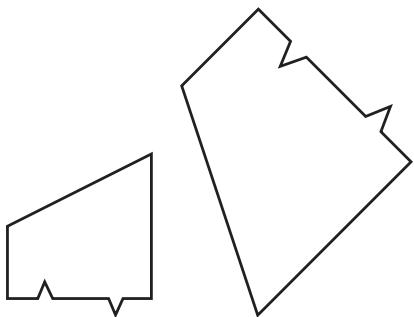

As with functions, it is important, when specifying a relation, to be careful about which objects are to be related. Usually a relation comes with a set A of objects that may or may not be related to each other. For example, the relation “<” might be defined on the set of all positive integers, or alternatively on the set of all real numbers; strictly speaking these are different relations. Sometimes relations are defined with reference to two sets A and B. For example, if the relation is “ ,” then A might be the set of all positive integers and B the set of all sets of positive integers. 
There are many situations in mathematics where one wishes to regard different objects as “essentially the same,” and to help us make this idea precise there is a very important class of relations known as equivalence relations. Here are two examples. First, in elementary geometry one sometimes cares about shapes but not about sizes. Two shapes are said to be similar if one can be transformed into the other by a combination of reflections, rotations, translations, and enlargements (see figure 1); the relation “is similar is an equivalence relation. Second, when doing arithmetic modulo m [III.59], one does not wish to distinguish between two whole numbers that differ by a multiple of m: in this case one says that the numbers are congruent (mod the relation “is congruent (mod m) is another equivalence relation. 
What exactly is it that these two relations have in common? The answer is that they both take a set (in the first case the set of all geometrical shapes, and in the second the set of all whole numbers) and split it into parts, called equivalence classes, where each part consists of objects that one wishes to regard as essentially the same. In the first example, a typical equivalence class is the set of all shapes that are similar to some given shape; in the second, it is the set of all integers that leave a given remainder when you divide by m (for example, if then one of the equivalence classes is the set . . . , 16, 9, 2, 5, 12, 19, . . . ). 
An alternative definition of what it means for a relation , defined on a set A, to be an equivalence relation is that it has the following three properties. First, it is reflexive, which means that x x for every x in A. Second, it is symmetric, which means that if x and y are elements of A and , then it must also be the case that Third, it is transitive, meaning that if x, y, and z are elements of A such that and then it must be the case that (To get a feel for these properties, it may help if you satisfy yourself that the relations “is similar to” and “is congruent (mod m) both have all three properties, while the relation defined on the positive integers, is transitive but neither reflexive nor symmetric.) 
One of the main uses of equivalence relations is to make precise the notion of quotient [I.3 §3.3] constructions. 
# 2.4 Binary Operations 
Let us return to one of our earlier examples, the sentence “Two plus two equals four.” We have analyzed the word “equals” as a relation, an expression that sits between the noun phrases “two plus two” and “four” and makes a sentence out of them. But what about “plus”? That also sits between two nouns. However, the result, “two plus two,” is not a sentence but a noun phrase. That pattern is characteristic of binary operations. Some familiar examples of binary operations are “plus,” “minus,” “times,” “divided by,” and “raised to the power.” 
As with functions, it is customary, and convenient, to be careful about the set to which a binary operation is applied. From a more formal point of view, a binary operation on a set A is a function that takes pairs of elements of A and produces further elements of A from them. To be more formal still, it is a function with the set of all pairs of elements of A as its domain and with A as its range. This way of looking at it is not reflected in the notation, however, since the symbol for the operation comes between x and y rather than before them: we write rather than . 

There are four properties that a binary operation may have that are very useful if one wants to manipulate sentences in which it appears. Let us use the symbol to denote an arbitrary binary operation on some set A. The operation  is said to be commutative if x  y is always equal to , and associative if is always equal to . For example, the operations “plus” and “times” are commutative and associative, whereas “minus,” “divided by,” and “raised to the power” are neither (for instance, while . These last two operations raise another issue: unless the set A is chosen carefully, they may not always be defined. For example, if one restricts one’s attention to the positive integers, then the expression has no meaning. There are two conventions one could imagine adopting in response to this. One might decide not to insist that a binary operation should be defined for every pair of elements of A, and to regard it as a desirable extra property of an operation if it is defined everywhere. But the convention actually in force is that binary operations do have to be defined everywhere, so that “minus,” though a perfectly good binary operation on the set of all integers, is not a binary operation on the set of all positive integers. 
An element e of A is called an identity for  if e x for every element x of A. The two most obvious examples are 0 and 1, which are identities for “plus” and “times,” respectively. Finally, if  has an identity e and x belongs to A, then an inverse for x is an element y such that . For example, is “plus” then the inverse of x is x, while if is “times” then the inverse is . 
These basic properties of binary operations are fundamental to the structures of abstract algebra. See four important algebraic structures [I.3 §2] for further details. 
# 3 Some Elementary Logic 
# 3.1 Logical Connectives 
A logical connective is the mathematical equivalent of a conjunction. That is, it is a word (or symbol) that joins two sentences to produce a new one. We have already discussed an example, namely “and” in its sentencelinking meaning, which is sometimes written by the symbol particularly in more formal or abstract mathematical discourse. If P and are statements (note here the mathematical habit of representing not just numbers but any objects whatsoever by single letters), then is the statement that is true if and only if both P and are true. 

Another connective is the word a word that has a more specific meaning for mathematicians than it has for normal speakers of the English language. The mathematical use is illustrated by the tiresome joke of responding, “Yes please,” to a question such as, “Would you like your coffee with or without sugar?” The symbol for if one wishes to use a symbol, is and the statement is true if and only if P is true or Q is true. This is taken to include the case when they are both true, so for mathematicians, is always the so-called inclusive version of the word. 
A third important connective is “implies,” which is usually written “⇒.” The statement means, roughly speaking, that is a consequence of and is sometimes read as “if P then However, as with this does not mean quite what it would in English. To get a feel for the difference, consider the following even more extreme example of mathematical pedantry. At the supper table, my young daughter once said, “Put your hand up if you are a girl.” One of my sons, to tease her, put his hand up on the grounds that, since she had not added, “and keep it down if you are a boy,” his doing so was compatible with her command. 
Something like this attitude is taken by mathematicians to the word “implies,” or to sentences containing the word The statement is considered to be true under all circumstances except one: it is not true if P is true and Q is false. This is the definition of “implies.” It can be confusing because in English the word “implies” suggests some sort of connection between P and that P in some way causes or is at least relevant to it. If P causes then certainly P cannot be true without Q being true, but all a mathematician cares about is this logical consequence and not whether there is any reason for it. Thus, if you want to prove that , all you have to do is rule out the possibility that P could be true and false at the same time. To give an example: if n is a positive integer, then the statement is a perfect square with final digit implies the statement is a prime number,” not because there is any connection between the two but because no perfect square ends in a 7. Of course, implications of this kind are less interesting mathematically than more genuine-seeming ones, but the reward for accepting them is that, once again, one avoids being confused by some of the ambiguities and subtle nuances of ordinary language. 

# 3.2 Quantifiers 
Yet another ambiguity in the English language is exploited by the following old joke that suggests that our priorities need to be radically rethought. 
Let us try to be precise about how this play on words works (a good way to ruin any joke, but not a tragedy in this case). It hinges on the word “nothing,” which is used in two different ways. The first sentence means “There is no single thing that is better than lifelong happiness,” whereas the second means “It is better to have a cheese sandwich than to have nothing at all.” In other words, in the second sentence, “nothing” stands for what one might call the null option, the option of having nothing, whereas in the first it does not (to have nothing is not better than to have lifelong happiness). 
Words like “all,” “some,” “any,” “every,” and “nothing” are called quantifiers, and in the English language they are highly prone to this kind of ambiguity. Mathematicians therefore make do with just two quantifiers, and the rules for their use are much stricter. They tend to come at the beginning of sentences, and can be read as “for all” (or “for every”) and “there exists” (or “for some”). A rewriting of sentence (4) that renders it unambiguous (but less like real English) is 
(4	 ) For all x, lifelong happiness is at least as good as x. 
The second sentence cannot be rewritten in these terms because the word “nothing” is not playing the role of a quantifier. (Its nearest mathematical equivalent is something like the empty set, that is, the set with no elements.) 
Armed with “for all” and “there exists,” we can be clear about the difference between the beginnings of the following sentences. 
The first sentence makes the point (not necessarily correctly) that there is one drink that everybody likes, whereas the second claims merely that we all have something we like to drink, even if that something varies from person to person. The precise formulations that capture the difference are as follows. 

This illustrates an important general principle: if you take a sentence that begins “for every x there exists y such that . . . ” and interchange the two parts so that it now begins “there exists y such that, for every x, . . . ,” then you obtain a much stronger statement, since y is no longer allowed to depend on x. If the second statement is still true—that is, if you really can choose a y that works for all the x at once—then the first statement is said to hold uniformly. 
The symbols  and  are often used to stand for “for all” and “there exists,” respectively. This allows us to write quite complicated mathematical sentences in a highly symbolic form if we want to. For example, suppose we let P be the set of all primes, as we did earlier. Then the following symbols make the claim that there are infinitely many primes, or rather a slightly different claim that is equivalent to it. 

In words, this says that for every n we can find some m that is both bigger than n and a prime. If we wish to unpack sentence (9) further, we could replace the part m  P by 

There is one final important remark to make about the quantifiers “∀” and “∃.” I have presented them as if they were freestanding, but actually a quantifier is always associated with a set (one says that it quantifies over that set). For example, sentence (10) would not be a translation of the sentence “m is prime” if a and b were allowed to be fractions: if a  3 and then ab  7 without either a or b equaling 1, but this does not show that 7 is not a prime. Implicit in the opening symbols a, b is the idea that a and b are intended to be positive integers. If this had not been clear from the context, then we could have used the symbol N (which stands for the set of all positive integers) and started sentence (10) with a, b N instead. 

# 3.3 Negation 
The basic idea of negation in mathematics is very simple: there is a symbol, which means “not,” and if P is any mathematical statement, then P stands for the statement that is true if and only if P is not true. However, this is another example of a word that has a slightly more restricted meaning to mathematicians than it has in ordinary speech. 
To illustrate this phenomenon once again, let us take A to be a set of positive integers and ask ourselves what the negation is of the sentence “Every number in the set A is odd.” Many people when asked this question will suggest, “Every number in the set A is even.” However, this is wrong: if one thinks carefully about what exactly would have to happen for the first sentence to be false, one realizes that all that is needed is that at least one number in A should be even. So in fact the negation of the sentence , “There exists a number in A that is even.” 
What explains the temptation to give the first, incorrect answer? One possibility emerges when one writes the sentence more formally, thus: 

The first answer is obtained if one negates just the last part of this sentence, is odd”; but what is asked for is the negation of the whole sentence. That is, what is wanted is not 

but rather 

which is equivalent to 
(14) ∃n ∈ A n is even. 
A second possible explanation is that one is inclined (for psycholinguistic reasons) to think of the phrase “every element of as denoting something like a single, typical element of A. If that comes to have the feel of a particular number then we may feel that the negation of is odd” is “n is even.” The remedy is not to think of the phrase “every element of on its own: it should always be part of the longer phrase, “for every element of 
# 3.4 Free and Bound Variables 
Suppose we say something like, “At time t the speed of the projectile is The letters t and v stand for real numbers, and they are called variables, because in the back of our mind is the idea that they are changing. More generally, a variable is any letter used to stand for a mathematical object, whether or not one thinks of that object as changing through time. Let us look once again at the formal sentence that said that a positive integer m is prime: 

In this sentence, there are three variables, and but there is a very important grammatical and semantic difference between the first two and the third. Here are two results of that difference. First, the sentence does not really make sense unless we already know what m is from the context, whereas it is important that a and b do not have any prior meaning. Second, while it makes perfect sense to ask, “For which values of m is sentence (10) it makes no sense at all to ask, “For which values of a is sentence (10) The letter m in sentence (10) stands for a fixed number, not specified in this sentence, while the letters a and b, because of the initial do not stand for numbers—rather, in some way they search through all pairs of positive integers, trying to find a pair that multiply together to give m. Another sign of the difference is that you can ask, “What number is but not, “What number is A fourth sign is that the meaning of sentence (10) is completely unaffected if one uses different letters for a and as in the reformulation 

One cannot, however, change m to n without establishing first that n denotes the same integer as m. A variable such as m, which denotes a specific object, is called a free variable. It sort of hovers there, free to take any value. A variable like a and of the kind that does not denote a specific object, is called a bound variable, or sometimes a dummy variable. (The word “bound” is used mainly when the variable appears just after a quantifier, as in sentence (10).) 
Yet another indication that a variable is a dummy variable is when the sentence in which it occurs can be rewritten without it. For instance, the expression is shorthand for and the second way of writing it does not involve the letter n, so n was not really standing for anything in the first way. Sometimes, actual elimination is not possible, but one feels it could be done in principle. For instance, the sentence “For every real number x, x is either positive, negative, or zero” is a bit like putting together infinitely many sentences such as “t is either positive, negative, or zero,” one for each real number t, none of which involves a variable. 

# 4 Levels of Formality 
It is a surprising fact that a small number of set-theoretic concepts and logical terms can be used to provide a precise language that is versatile enough to express all the statements of ordinary mathematics. There are some technicalities to sort out, but even these can often be avoided if one allows not just sets but also numbers as basic objects. However, if you look at a wellwritten mathematics paper, then much of it will be written not in symbolic language peppered with symbols such as  and , but in what appears to be ordinary English. (Some papers are written in other languages, particularly French, but English has established itself as the international language of mathematics.) How can mathematicians be confident that this ordinary English does not lead to confusion, ambiguity, and even incorrectness? 
The answer is that the language typically used is a careful compromise between fully colloquial English, which would indeed run the risk of being unacceptably imprecise, and fully formal symbolism, which would be a nightmare to read. The ideal is to write in as friendly and approachable a way as possible, while making sure that the reader (who, one assumes, has plenty of experience and training in how to read mathematics) can see easily how what one writes could be made more formal if it became important to do so. And sometimes it does become important: when an argument is difficult to grasp it may be that the only way to convince oneself that it is correct is to rewrite it more formally. 
Consider, for example, the following reformulation of the principle of mathematical induction, which underlies many proofs: 
(15) Every nonempty set of positive integers has a least element. 
If we wish to translate this into a more formal language we need to strip it of words and phrases such as “nonempty” and “has.” But this is easily done. To say that a set A of positive integers is nonempty is simply to say that there is a positive integer that belongs to A. This can be stated symbolically: 

What does it mean to say that A has a least element? It means that there exists an element x of A such that every element y of A is either greater than x or equal to x itself. This formulation is again ready to be translated into symbols: 

Statement (15) says that (16) implies (17) for every set A of positive integers. Thus, it can be written symbolically as follows: 

$[ (\exists n \in \mathbb {N} \quad n \in A)$
$\Rightarrow (\exists x \in A \forall y \in A (y > x) \vee (y = x)) ].$
Here we have two very different modes of presentation of the same mathematical fact. Obviously (15) is much easier to understand than (18). But if, for example, one is concerned with the foundations of mathematics, or wishes to write a computer program that checks the correctness of proofs, then it is better to work with a greatly pared-down grammar and vocabulary, and then (18) has the advantage. In practice, there are many different levels of formality, and mathematicians are adept at switching between them. It is this that makes it possible to feel completely confident in the correctness of a mathematical argument even when it is not presented in the manner of (18)—though it is also this that allows mistakes to slip through the net from time to time. 
# I.3 Some Fundamental Mathematical Definitions 
The concepts discussed in this article occur throughout so much of modern mathematics that it would be inappropriate to discuss them in part III—they are too basic. Many later articles will assume at least some acquaintance with these concepts, so if you have not met them, then reading this article will help you to understand significantly more of the book. 
# 1 The Main Number Systems 
Almost always, the first mathematical concept that a child is exposed to is the idea of numbers, and numbers retain a central place in mathematics at all levels. 

However, it is not as easy as one might think to say what the word “number” means: the more mathematics one learns, the more uses of this word one comes to know, and the more sophisticated one’s concept of number becomes. This individual development parallels a historical development that took many centuries (see from numbers to number systems [II.1]). 
The modern view of numbers is that they are best regarded not individually but as parts of larger wholes, called number systems; the distinguishing features of number systems are the arithmetical operations—such as addition, multiplication, subtraction, division, and extraction of roots—that can be performed on them. This view of numbers is very fruitful and provides a springboard into abstract algebra. The rest of this section gives a brief description of the five main number systems. 
# 1.1 The Natural Numbers 
The natural numbers, otherwise known as the positive integers, are the numbers familiar even to young children: 1, 2, 3, 4, and so on. It is the natural numbers that we use for the very basic mathematical purpose of counting. The set of all natural numbers is usually denoted N. (Some mathematicians prefer to include 0 as a natural number as well: for instance, this is the usual convention in logic and set theory. Both conventions are to be found in this book, but it should always be clear which one is being used.) 
Of course, the phrase “1, 2, 3, 4, and so on” does not constitute a formal definition, but it does suggest the following basic picture of the natural numbers, one that we tend to take for granted. 
This picture is encapsulated by the peano axioms [III.67]. 
Given two natural numbers m and n one can add them together or multiply them, obtaining in each case a new natural number. By contrast, subtraction and division are not always possible. If we want to give meaning to expressions such as 8 − 13 or , then we must work in a larger number system. 
# 1.2 The Integers 
The natural numbers are not the only whole numbers, since they do not include zero or negative numbers, both of which are indispensable to mathematics. One of the first reasons for introducing zero was that it is needed for the normal decimal notation of positive integers—how else could one conveniently write 1005? However, it is now thought of as much more than just a convenience, and the property that makes it significant is that it is an additive identity, which means that adding zero to any number leaves that number unchanged. And while it is not particularly interesting to do to a number something that has no effect, the property itself is interesting and distinguishes zero from all other numbers. An immediate illustration of this is that it allows us to think about negative numbers: if n is a positive integer, then the defining property of −n is that when you add it to n you get zero. 
Somebody with little mathematical experience may unthinkingly assume that numbers are for counting and find negative numbers objectionable because the answer to a question beginning “How many” is never negative. However, simple counting is not the only use for numbers, and there are many situations that are naturally modeled by a number system that includes both positive and negative numbers. For example, negative numbers are sometimes used for the amount of money in a bank account, for temperature (in degrees Celsius or Fahrenheit), and for altitude compared with sea level. 
The set of all integers—positive, negative, and zero— is usually denoted Z (for the German word “Zahlen,” meaning “numbers”). Within this system, subtraction is always possible: that is, if m and n are integers, then so is m  n. 
# 1.3 The Rational Numbers 
So far we have considered only whole numbers. If we form all possible fractions as well, then we obtain the rational numbers. The set of all rational numbers is denoted Q (for “quotients”). 
One of the main uses of numbers besides counting is measurement, and most quantities that we measure are ones that can vary continuously, such as length, weight, temperature, and velocity. For these, whole numbers are inadequate. 
A more theoretical justification for the rational numbers is that they form a number system in which division is always possible—except by zero. This fact, together with some basic properties of the arithmetical operations, means that Q is a field. What fields are and why they are important will be explained in more detail later (section 2.2). 

# 1.4 The Real Numbers 
A famous discovery of the ancient Greeks, often attributed, despite very inadequate evidence, to the school of pythagoras [VI.1], was that the square root of 2 is not a rational number. That is, there is no fraction p/q such that . The Pythagorean theorem about right-angled triangles (which was probably known at least a thousand years before Pythagoras) tells us that if a square has sides of length 1, then the length of its diagonal is . Consequently, there are lengths that cannot be measured by rational numbers. 
This argument seems to give strong practical reasons for extending our number system still further. However, such a conclusion can be resisted: after all, we cannot make any measurements with infinite precision, so in practice we round off to a certain number of decimal places, and as soon as we have done so we have presented our measurement as a rational number. (This point is discussed more fully in numerical analysis [IV.21].) 
Nevertheless, the theoretical arguments for going beyond the rational numbers are irresistible. If we want to solve polynomial equations, take logarithms [III.25 §4], do trigonometry, or work with the gaussian distribution [III.71 §5], to give just four examples from an almost endless list, then irrational numbers will appear everywhere we look. They are not used directly for the purposes of measurement, but they are needed if we want to reason theoretically about the physical world by describing it mathematically. This necessarily involves a certain amount of idealization: it is far more convenient to say that the length of the diagonal of a unit square is than it is to talk about what would be observed, and with what degree of certainty, if one tried to measure this length as accurately as possible. 
The real numbers can be thought of as the set of all numbers with a finite or infinite decimal expansion. In the latter case, they are defined not directly but by a process of successive approximation. For example, the squares of the numbers 1, 1.4, 1.41, 1.414, 1.4142, 1.41421, . . . , get as close as you like to 2, if you go far enough along the sequence, which is what we mean by saying that the square root of 2 is the infinite decimal 1.41421 . . . . 
The set of all real numbers is denoted R. A more abstract view of R is that it is an extension of the rational number system to a larger field, and in fact the only one possible in which processes of the above kind always give rise to numbers that themselves belong to R. 
Because real numbers are intimately connected with the idea of limits (of successive approximations), a true appreciation of the real number system depends on an understanding of mathematical analysis, which will be discussed in section 5. 
# 1.5 The Complex Numbers 
Many polynomial equations, such as the equation 2, do not have rational solutions but can be solved in R. However, there are many other equations that cannot be solved even in R. The simplest example is the equation , which has no real solution since the square of any real number is positive or zero. In order to get around this problem, mathematicians introduce a symbol, i, which they treat as a number, and they simply stipulate that is to be regarded as equal to 1. The complex number system, denoted is the set of all numbers of the form a bi, where a and b are real numbers. To add or multiply complex numbers, one treats i as a variable (like x, say), but any occurrences of are replaced by −1. Thus, 
$(a + b \mathrm{i}) + (c + d \mathrm{i}) = (a + c) + (b + d) \mathrm{i}$
and 
$\begin{array}{l} (a + b \mathrm{i}) (c + d \mathrm{i}) = a c + b c \mathrm{i} + a d \mathrm{i} + b d \mathrm{i} ^ {2} \\ = (a c - b d) + (b c + a d) \mathrm{i}. \\ \end{array}$
There are several remarkable points to note about this definition. First, despite its apparently artificial nature, it does not lead to any inconsistency. Secondly, although complex numbers do not directly count or measure anything, they are immensely useful. Thirdly, and perhaps most surprisingly, even though the number i was introduced to help us solve just one equation, it in fact allows us to solve all polynomial equations. This is the famous fundamental theorem of algebra [V.13]. 
One explanation for the utility of complex numbers is that they provide a concise way to talk about many aspects of geometry, via Argand diagrams. These represent complex numbers as points in the plane, the number a bi corresponding to the point with coordinates (a, b). If and , then a r cos θ and b r sin θ. It turns out that multiplying a complex number by a  bi corresponds to the following geometrical process. First, you associate z with the point in the plane. Next, you multiply this point by r , obtaining the point (r x, r y). Finally, you rotate this new point counterclockwise about the origin through an angle of θ. In other words, the effect on the complex plane of multiplication by is to dilate it by r and then rotate it by θ. In particular, if , then multiplying by a  bi corresponds to rotating by θ. 

For this reason, polar coordinates are at least as good as Cartesian coordinates for representing complex numbers: an alternative way to write a bi is , which tells us that the number has distance r from the origin and is positioned at an angle θ around from the positive part of the real axis (in a counterclockwise direction). If with , then r is called the modulus of denoted by z , and θ is the argument of z. (Since adding 2π to θ does not change , it is usually understood that , or sometimes that − One final useful definition: if iy is a complex number, then its complex conjugate, written z¯, is the number . It is easy to check that . 
# 2 Four Important Algebraic Structures 
In the previous section it was emphasized that numbers are best thought of not as individual objects but as members of number systems. A number system consists of some objects (numbers) together with operations (such as addition and multiplication) that can be performed on those objects. As such, it is an example of an algebraic structure. However, there are many very important algebraic structures that are not number systems, and a few of them will be introduced here. 
# 2.1 Groups 
If S is a geometrical shape, then a rigid motion of S is a way of moving S in such a way that the distances between the points of S are not changed—squeezing and stretching are not allowed. A rigid motion is a symmetry of S if, after it is completed, S looks the same as it did before it moved. For example, if S is an equilateral triangle, then rotating S through about its center is a symmetry; so is reflecting S about a line that passes through one of the vertices of S and the midpoint of the opposite side. 
More formally, a symmetry of S is a function f from S to itself such that the distance between any two points x and y of S is the same as the distance between the transformed points and . 
This idea can be hugely generalized: if S is any mathematical structure, then a symmetry of S is a function from S to itself that preserves its structure. If S is a geometrical shape, then the mathematical structure that should be preserved is the distance between any two of its points. But there are many other mathematical structures that a function may be asked to preserve, most notably algebraic structures of the kind that will soon be discussed. It is fruitful to draw an analogy with the geometrical situation and regard any structure-preserving function as a sort of symmetry. 
Because of its extreme generality, symmetry is an allpervasive concept within mathematics; and wherever symmetries appear, structures known as groups follow close behind. To explain what these are and why they appear, let us return to the example of an equilateral triangle, which has, as it turns out, six possible symmetries. 
Why is this? Well, let f be a symmetry of an equilateral triangle with vertices A, B, and C and suppose for convenience that this triangle has sides of length 1. Then f (A), f (B), and f (C) must be three points of the triangle and the distances between these points must all be 1. It follows that f (A), f (B), and are distinct vertices of the triangle, since the furthest apart any two points can be is 1 and this happens only when the two points are distinct vertices. So , and are the vertices A, B, and C in some order. But the number of possible orders of A, B, and C is 6. It is not hard to show that, once we have chosen , and , the rest of what f does is completely determined. (For example, if X is the midpoint of A and C, then must be the midpoint of and f (C) since there is no other point at distance from f (A) and f (C).) 
Let us refer to these symmetries by writing down in order what happens to the vertices A, B, and C. So, for instance, the symmetry ACB is the one that leaves the vertex A fixed and exchanges B and C, which is achieved by reflecting the triangle in the line that joins A to the midpoint of B and C. There are three reflections like this: ACB, CBA, and BAC. There are also two rotations: BCA and CAB. Finally, there is the “trivial” symmetry, ABC, which leaves all points where they were originally. (The “trivial” symmetry is useful in much the same way as zero is useful for the algebra of integer addition.) 

What makes these and other sets of symmetries into groups is that any two symmetries can be composed, meaning that one symmetry followed by another produces a third (since if two operations both preserve a structure then their combination clearly does too). For example, if we follow the reflection BAC by the reflection ACB, then we obtain the rotation CAB. To work this out, one can either draw a picture or use the following kind of reasoning: the first symmetry takes A to B and the second takes B to C, so the combination takes A to C, and similarly B goes to A, and C to B. Notice that the order in which we perform the symmetries matters: if we had started with the reflection ACB and then done the reflection BAC, then we would have obtained the rotation BCA. (If you try to see this by drawing a picture, it is important to think of A, B, and C as labels that stay where they are rather than moving with the triangle—they mark positions that the vertices can occupy.) 
We can think of symmetries as “objects” in their own right, and of composition as an algebraic operation, a bit like addition or multiplication for numbers. The operation has the following useful properties: it is associative, the trivial symmetry is an identity element, and every symmetry has an inverse [I.2 §2.4]. (For example, the inverse of a reflection is itself, since doing the same reflection twice leaves the triangle where it started.) More generally, any set with a binary operation that has these properties is called a group. It is not part of the definition of a group that the binary operation should be commutative, since, as we have just seen, if one is composing two symmetries then it often makes a difference which one goes first. However, if it is commutative then the group is called Abelian, after the Norwegian mathematician niels henrik abel [VI.33]. The number systems Z, Q, R, and C all form Abelian groups with the operation of addition, or under addition, as one usually says. If you remove zero from Q, R, and C, then they form Abelian groups under multiplication, but Z does not because of a lack of inverses: the reciprocal of an integer is not usually an integer. Further examples of groups will be given later in this section. 
# 2.2 Fields 
Although several number systems form groups, to regard them merely as groups is to ignore a great deal of their algebraic structure. In particular, whereas a group has just one binary operation, the standard number systems have two, namely addition and multiplication (from which further ones, such as subtraction and division, can be derived). The formal definition of a field is quite long: it is a set with two binary operations and there are several axioms that these operations must satisfy. Fortunately, there is an easy way to remember these axioms. You just write down all the basic properties you can think of that are satisfied by addition and multiplication in the number systems R, and C. 

These properties are as follows. Both addition and multiplication are commutative and associative, and both have identity elements (0 for addition and 1 for multiplication). Every element x has an additive inverse x and a multiplicative inverse 1/x (except that 0 does not have a multiplicative inverse). It is the existence of these inverses that allows us to define subtraction and division: means and means . 
That covers all the properties that addition and multiplication satisfy individually. However, a very general rule when defining mathematical structures is that if a definition splits into parts, then the definition as a whole will not be interesting unless those parts interact. Here our two parts are addition and multiplication, and the properties mentioned so far do not relate them in any way. But one final property, known as the distributive law, does this, and thereby gives fields their special character. This is the rule that tells us how to multiply out brackets: for any three numbers x, y , and z. 
Having listed these properties, one may then view the whole situation abstractly by regarding the properties as axioms and saying that a field is any set with two binary operations that satisfy all those axioms. However, when one works in a field, one usually thinks of the axioms not as a list of statements but rather as a general license to do all the algebraic manipulations that one can do when talking about rational, real, and complex numbers. 
Clearly, the more axioms one has, the harder it is to find a mathematical structure that satisfies them, and it is indeed the case that fields are harder to come by than groups. For this reason, the best way to understand fields is probably to concentrate on examples. In addition to and one other field stands out as fundamental, namely , which is the set of integers modulo a prime with addition and multiplication also defined modulo (see modular arithmetic [III.58]). 

What makes fields interesting, however, is not so much the existence of these basic examples as the fact that there is an important process of extension that allows one to build new fields out of old ones. The idea is to start with a field F, find a polynomial P that has no roots in F, and “adjoin” a new element to F with the stipulation that it is a root of P . This produces an extended field , which consists of everything that one can produce from this root and from elements of F using addition and multiplication. 
We have already seen an important example of this process: in the field R, the polynomial has no root, so we adjoined the element i and let C be the field of all combinations of the form . 
We can apply exactly the same process to the field , in which again the equation has no solution. If we do so, then we obtain a new field, which, like consists of all combinations of the form , but now a and b belong to . Since has three elements, this new field has nine elements. Another example is the field , which consists of all numbers of the form , where now a and b are rational numbers. A slightly more complicated example is , where γ is a root of the polynomial typical element of this field has the form , with and c rational. If one is doing arithmetic in , then whenever appears, it can be replaced by (because , just as can be replaced by −1 in the complex numbers. For more on why field extensions are interesting, see the discussion of automorphisms in section 4.1. 
A second very significant justification for introducing fields is that they can be used to form vector spaces, and it is to these that we now turn. 
# 2.3 Vector Spaces 
One of the most convenient ways to represent points in a plane that stretches out to infinity in all directions is to use Cartesian coordinates. One chooses an origin and two directions X and Y , usually at right angles to each other. Then the pair of numbers stands for the point you reach in the plane if you go a distance a in direction X and a distance b in direction Y (where if a is a negative number such , this is interpreted as going a distance 2 in the opposite direction to X, and similarly for b). 
Another way of saying the same thing is this. Let x and y stand for the unit vectors in directions X and Y , respectively, so their Cartesian coordinates are (1, 0) and (0, 1). Then every point in the plane is a so-called linear combination of the basis vectors x and To interpret the expression , first rewrite it as ). Then a times the unit vector (1, 0) is (a, 0) and b times the unit vector (0, 1) is (0, b) and when you add and (0, b) coordinate by coordinate you get the vector (a, b). 

Here is another situation where linear combinations appear. Suppose you are presented with the differential equation , and happen to know (or notice) that sin x and y  cos x are two possible solutions. Then you can easily check that sin x b cos x is a solution for any pair of numbers a and b. That is, any linear combination of the existing solutions sin x and cos x is another solution. It turns out that all solutions are of this form, so we can regard sin x and cos x as “basis vectors” for the “space” of solutions of the differential equation. 
Linear combinations occur in many many contexts throughout mathematics. To give one more example, an arbitrary polynomial of degree 3 has the form , which is a linear combination of the four basic polynomials 1, , and . 
A vector space is a mathematical structure in which the notion of linear combination makes sense. The objects that belong to the vector space are usually called vectors, unless we are talking about a specific example and are thinking of them as concrete objects such as polynomials or solutions of a differential equation. Slightly more formally, a vector space is a set V such that, given any two vectors v and w (that is, elements of V) and any two real numbers a and we can form the linear combination . 
Notice that this linear combination involves objects of two different kinds, the vectors v and w and the numbers a and b. The latter are known as scalars. The operation of forming linear combinations can be broken up into two constituent parts: addition and scalar multiplication. To form the combination av bw, first multiply the vectors v and w by the scalars a and obtaining the vectors av and bw, and then add these resulting vectors to obtain the full combination . 
The definition of linear combination must obey certain natural rules. Addition of vectors must be commutative and associative, with an identity (the zero vector) and an inverse for each v (written v). Scalar multiplication must obey a sort of associative law, namely that a(bv) and (ab)v are always equal. We also need two distributive laws: and av + aw for any scalars a and b and any vectors v and w. 

Another context in which linear combinations arise, one that lies at the heart of the usefulness of vector spaces, is the solution of simultaneous equations. Suppose one is presented with the two equations 6 and . The usual way to solve such a pair of equations is to try to eliminate either x or y by adding an appropriate multiple of one of the equations to the other: that is, by taking a certain linear combination of the equations. In this case, we can eliminate y by adding twice the second equation to the first, obtaining the equation , which tells us that and hence that . Why were we allowed to combine equations like this? Well, let us write and for the left- and right-hand sides of the first equation, and similarly and for the second. If, for some particular choice of x and it is true that and , then clearly , as the two sides of this equation are merely giving different names to the same numbers. 
Given a vector space V , a basis is a collection of vectors with the following property: every vector in V can be written in exactly one way as a linear combination . There are two ways in which this can fail: there may be a vector that cannot be written as a linear combination of or there may be a vector that can be so expressed, but in more than one way. If every vector is a linear combination then we say that the vectors span V , and if no vector is a linear combination in more than one way then we say that they are independent. An equivalent definition is that are independent if the only way of writing the zero vector as is by taking . 
The number of elements in a basis is called the dimension of V . It is not immediately obvious that there could not be two bases of different sizes, but it turns out that there cannot, so the concept of dimension makes sense. For the plane, the vectors x and y defined earlier formed a basis, so the plane, as one would hope, has dimension 2. If we were to take more than two vectors, then they would no longer be independent: for example, if we take the vectors (1, 2), (1, 3), and , then we can write (0, 0) as the linear combination 8(1, 2) 5(1, 3) (3, 1). (To work this out one must solve some simultaneous equations—this is typical of calculations in vector spaces.) 
The most obvious n-dimensional vector space is the space of all sequences of n real numbers. To add this to a sequence one simply forms the sequence and to multiply it by a scalar c one forms the sequence ). This vector space is denoted . Thus, the plane with its usual coordinate system is and three-dimensional space is R3. 
It is not in fact necessary for the number of vectors in a basis to be finite. A vector space that does not have a finite basis is called infinite dimensional. This is not an exotic property: many of the most important vector spaces, particularly spaces where the “vectors” are functions, are infinite dimensional. 
There is one final remark to make about scalars. They were defined earlier as real numbers that one uses to make linear combinations of vectors. But it turns out that the calculations one does with scalars, in particular solving simultaneous equations, can all be done in a more general context. What matters is that they should belong to a field, so Q, R, and C can all be used as systems of scalars, as indeed can more general fields. If the scalars for a vector space V come from a field F, then one says that V is a vector space over F. This generalization is important and useful: see, for example, algebraic numbers [IV.1 §17]. 
# 2.4 Rings 
Another algebraic structure that is very important is a ring. Rings are not quite as central to mathematics as groups, fields, or vector spaces, so a proper discussion of them will be deferred to rings, ideals, and modules [III.81]. However, roughly speaking, a ring is an algebraic structure that has most, but not necessarily all, of the properties of a field. In particular, the requirements of the multiplicative operation are less strict. The most important relaxation is that nonzero elements of a ring are not required to have multiplicative inverses; but sometimes multiplication is not even required to be commutative. If it is, then the ring itself is said to be commutative—a typical example of a commutative ring is the set Z of all integers. Another is the set of all polynomials with coefficients in some field F. 
# 3 Creating New Structures Out of Old Ones 
An important first step in understanding the definition of some mathematical structure is to have a supply of examples. Without examples, a definition is dry and abstract. With them, one begins to have a feeling for the structure that its definition alone cannot usually provide. 

One reason for this is that it makes it much easier to answer basic questions. If you have a general statement about structures of a given type and want to know whether it is true, then it is very helpful if you can test it in a wide range of particular cases. If it passes all the tests, then you have some evidence in favor of the statement. If you are lucky, you may even be able to see why it is true; alternatively, you may find that the statement is true for each example you try, but always for reasons that depend on particular features of the example you are examining. Then you will know that you should try to avoid these features if you want to find a counterexample. If you do find a counterexample, then the general statement is false, but it may still happen that a modification to the statement is true and useful. In that case, the counterexample will help you to find an appropriate modification. 
The moral, then, is that examples are important. So how does one find them? There are two completely different approaches. One is to build them from scratch. For example, one might define a group G to be the group of all symmetries of an icosahedron. Another, which is the main topic of this section, is to take some examples that have already been constructed and build new ones out of them. For instance, the group , which consists of all pairs of integers (x, y), with addition defined by the obvious rule , is a “product” of two copies of the group Z. As we shall see, this notion of product is very general and can be applied in many other contexts. But first let us look at an even more basic method of finding new examples. 
# 3.1 Substructures 
As we saw earlier, the set C of all complex numbers, with the operations of addition and multiplication, forms one of the most basic examples of a field. It also contains many subfields: that is, subsets that themselves form fields. Take, for example, the set Q(i) of all complex numbers of the form a bi for which a and b are rational. This is a subset of C and is also a field. To show this, one must prove that Q(i) is closed under addition, multiplication, and the taking of inverses. That is, if z and w are elements of Q(i), then w and zw must be as well, as must z and (this last requirement applying only when . Axioms such as the commutativity and associativity of addition and multiplication are then true in Q(i) for the simple reason that they are true in the larger set C. 

Even though Q(i) is contained in C, it is a more interesting field in some important ways. But how can this be? Surely, one might think, an object cannot become more interesting when most of it is taken away. But a moment’s further thought shows that it certainly can: for example, the set of all prime numbers contains fascinating mysteries of a kind that one does not expect to encounter in the set of all positive integers. As for fields, the fundamental theorem of algebra [V.13] tells us that every polynomial equation has a solution in C. This is very definitely not true in Q(i). So in Q(i), and in many other fields of a similar kind, we can ask which polynomial equations have solutions. This turns out to be a deep and important question that simply does not arise in the larger field C. 
In general, given an example X of an algebraic structure, a substructure of X is a subset Y that has relevant closure properties. For instance, groups have subgroups, vector spaces have subspaces, rings have subrings (and also ideals [III.81]), and so on. If the property defining the substructure Y is a sufficiently interesting one, then Y may well be significantly different from X and may therefore be a useful addition to one’s stock of examples. 
This discussion has focused on algebra, but interesting substructures abound in analysis and geometry as well. For example, the plane is not a particularly interesting set, but it has subsets, such as the mandelbrot set [IV.14 §2.8], to give just one example, that are still far from fully understood. 
# 3.2 Products 
Let G and H be two groups. The product group has as its elements all pairs of the form such that belongs to G and h belongs to H. This definition shows how to build the elements of out of the elements of G and the elements of H. But to define a group we need to do more: we are given binary operations on G and H and we must use them to build a binary operation on and are elements of let us write for the result of applying G’s binary operation to them, as is customary, and let us do the same for H. Then there is an obvious binary operation we can define on the pairs, namely 
$(g _ {1}, h _ {1}) (g _ {2}, h _ {2}) = (g _ {1} g _ {2}, h _ {1} h _ {2}).$

That is, one applies the binary operation from G to the first coordinate and the binary operation from H to the second. 
One can form products of vector spaces in a very similar way. If V and W are two vector spaces, then the elements of are all pairs of the form with v in V and w in W . Addition and scalar multiplication are defined by the formulas 
$\left(v _ {1}, w _ {1}\right) + \left(v _ {2}, w _ {2}\right) = \left(v _ {1} + v _ {2}, w _ {1} + w _ {2}\right)$
and 
$\lambda (v, w) = (\lambda v, \lambda w).$
The dimension of the resulting space is the sum of the dimensions of V and W . (It is actually more usual to denote this space by V  W and call it the direct sum of V and W . Nevertheless, it is a product construction.) 
It is not always possible to define product structures in this simple way. For example, if F and are two fields, we might be tempted to define a “product field” using the formulas 
$\left(x _ {1}, y _ {1}\right) + \left(x _ {2}, y _ {2}\right) = \left(x _ {1} + x _ {2}, y _ {1} + y _ {2}\right)$
and 
$(x _ {1}, y _ {1}) (x _ {2}, y _ {2}) = (x _ {1} x _ {2}, y _ {1} y _ {2}).$
However, this definition does not give us a field. Most of the axioms hold, including the existence of additive and multiplicative identities—they are (0, 0) and (1, 1), respectively—but the nonzero element (1, 0) does not have a multiplicative inverse, since the product of (1, 0) and (x, y) is , which can never equal (1, 1). 
Occasionally we can define more complicated binary operations that do make the set into a field. For instance, if , then we can define addition as above but define multiplication in a less obvious way as follows: 
$(x _ {1}, y _ {1}) (x _ {2}, y _ {2}) = (x _ {1} x _ {2} - y _ {1} y _ {2}, x _ {1} y _ {2} + x _ {2} y _ {1}).$
Then we obtain C, the field of complex numbers, since the pair can be identified with the complex number . However, this is not a product field in the general sense we are discussing. 
Returning to groups, what we defined earlier was the direct product of G and H. However, there are other, more complicated products of groups, which can be used to give a much richer supply of examples. To illustrate this, let us consider the dihedral group , which is the group of all symmetries of a square, of which there are eight. If we let R stand for one of the reflections and T for a counterclockwise quarter turn, then every symmetry can be written in the form , where i is 0, 1, 2, or 3 and j is 0 or 1. (Geometrically, this says that you can produce any symmetry by either rotating through a multiple of or reflecting and then rotating.) 

This suggests that we might be able to regard as a product of the group }, consisting of four rotations, with the group I, R , consisting of the identity I and the reflection R. We could even write instead of . However, we have to be careful. For instance, (T R)(T R) does not equal but I. The correct rule for multiplication can be deduced from the fact that (which in geometrical terms is saying that if you reflect the square, rotate it counterclockwise through 90◦, and reflect back, then the result is a clockwise rotation through 90◦). It turns out to be 
$(T ^ {i}, R ^ {j}) (T ^ {i ^ {\prime}}, R ^ {j ^ {\prime}}) = (T ^ {i + (- 1) ^ {j} i ^ {\prime}}, R ^ {j + j ^ {\prime}}).$
For example, the product of with is , which equals . 
This is a simple example of a “semidirect product” of two groups. In general, given two groups G and H, there may be several interesting ways of defining a binary operation on the set of pairs , and therefore several potentially interesting new groups. 
# 3.3 Quotients 
Let us write Q[x] for the set of all polynomials in the variable x with rational coefficients: that is, expressions like . Any two such polynomials can be added, subtracted, or multiplied together and the result will be another polynomial. This makes Q[x] into a commutative ring, but not a field, because if you divide one polynomial by another then the result is not (necessarily) a polynomial. 
We will now convert Q[x] into a field in what may at first seem a rather strange way: by regarding the polynomial as “equivalent” to the zero polynomial. To put this another way, whenever a polynomial involves we will allow ourselves to replace by , and we will regard the new polynomial that results as equivalent to the old one. For example, writing for “is equivalent to”: 
$\begin{array}{l} x ^ {5} = x ^ {3} x ^ {2} \sim (x + 1) x ^ {2} = x ^ {3} + x ^ {2} \\ \sim x + 1 + x ^ {2} = x ^ {2} + x + 1. \\ \end{array}$
Notice that in this way we can convert any polynomial into one of degree at most 2, since whenever the degree is higher, you can reduce it by taking out from the term of highest degree and replacing it by , just as we did above. 

Notice also that whenever we do such a replacement, the difference between the old polynomial and the new one is a multiple of − 1. For example, when we replaced by the difference was . Therefore, what our process amounts to is this: two polynomials are equivalent if and only if their difference is a multiple of the polynomial . 
Now the reason Q[x] was not a field was that nonconstant polynomials do not have multiplicative inverses. For example, it is obvious that one cannot multiply by a polynomial and obtain the polynomial 1. However, we can obtain a polynomial that is equivalent to 1 if we multiply by . Indeed, the product of the two is 
$x ^ {2} + x ^ {3} - x ^ {4} \sim x ^ {2} + x + 1 - (x + 1) x = 1.$
It turns out that all polynomials that are not equivalent to zero (that is, are not multiples of have multiplicative inverses in this generalized sense. (To find an inverse for a polynomial P one applies the generalized euclid algorithm [III.22] to find polynomials Q and R such that . The reason we obtain 1 on the right-hand side is that cannot be factorized in and P is not a multiple of , so their highest common factor is 1. The inverse of is then 
In what sense does this mean that we have a field? After all, the product of and was not 1: it was merely equivalent to 1. This is where the notion of quotients comes in. We simply decide that when two polynomials are equivalent, we will regard them as equal, and we denote the resulting mathematical structure by . This structure turns out to be a field, and it turns out to be important as the smallest field that contains Q and also has a root of the polynomial . What is this root? It is simply x. This is a slightly subtle point because we are now thinking of polynomials in two different ways: as elements of (at least when equivalent ones are regarded as equal), and also as functions defined on . So the polynomial is not the zero polynomial, since for example it takes the value 5 when and the value when . 
You may have noticed a strong similarity between the discussion of the field and the discussion of the field at the end of section 2.2. And indeed, this is no coincidence: they are two different ways of describing the same field. However, thinking of the field as brings significant advantages, as it converts questions about a mysterious set of complex numbers into more approachable questions about polynomials. 

What does it mean to “regard two mathematical objects as equal” when they are not equal? A formal answer to this question uses the notion of equivalence relations and equivalence classes (discussed in the language and grammar of mathematics [I.2 §2.3]): one says that the elements of are not in fact polynomials but equivalence classes of polynomials. However, to understand the notion of a quotient it is much easier to look at an example with which we are all familiar, namely the set Q of rational numbers. If we are trying to explain carefully what a rational number is, then we may start by saying that a typical rational number has the form , where a and b are integers and b is not 0. And it is possible to define the set of rational numbers to be the set of all such expressions, with the rules 
$\frac {a}{b} + \frac {c}{d} = \frac {a d + b c}{b d}$
and 
$\frac {a}{b} \frac {c}{d} = \frac {a c}{b d}.$
However, there is one very important further remark we must make, which is that we do not regard all such expressions as different: for example, and are supposed to be the same rational number. So we define two expressions and to be equivalent if and we regard equivalent expressions as denoting the same number. Notice that the expressions can be genuinely different, but we think of them as denoting the same object. 
If we do this, then we must be careful whenever we define functions and binary operations. For example, suppose we tried to define a binary operation on by the natural-looking formula 
$\frac {a}{b} \circ \frac {c}{d} = \frac {a + c}{b + d}.$
This definition turns out to have a very serious flaw. To see why, let us apply it to the fractions and . Then it gives us the answer equivalent fraction 5 2 and apply the formula again. This . Now let us replace by the time it gives us the answer , which is different. Thus, although the formula defines a perfectly good binary operation on the set of expressions of the form , it does not make any sense as a binary operation on the set of rational numbers. 

In general, it is essential to check that if you put equivalent objects in then you get equivalent objects out. For example, when defining addition and multiplication for the field , one must check that if P and differ by a multiple of , and and also differ by a multiple of , then so do and , and so do PQ and . This is an easy exercise. 
An important example of a quotient construction is that of a quotient group. If G is a group and H is a subgroup of , then it is natural to try to do what we did for polynomials and define and to be equivalent if (the obvious notion of the “difference” between and belongs to H. The equivalence class of an element is easily seen to be the set of all elements gh such that , which is usually written . (It is called a left coset of H.) 
There is a natural candidate for a binary operation ∗ on the set of all left cosets: ∗ . In other words, given two left cosets, pick elements and from each, form the product , and take the left coset . Once again, it is important to check that if you pick different elements from the original cosets, then you will still get the coset . It turns out that this is not always the case: one needs the additional assumption that H is a normal subgroup, which means that if h is any element of , then is an element of H for every element of Elements of the form are called conjugates of thus, a normal subgroup is a subgroup that is “closed under conjugation.” 
If H is a normal subgroup, then the set of left cosets forms a group under the binary operation just defined. This group is written and is called the quotient of G by H. One can regard G as a product of H and G/H (though it may be a somewhat complicated product), so if you understand both H and then for many purposes you understand G. Therefore, groups G that do not have normal subgroups (other than G itself and the subgroup that consists of just the identity element) have a special role, a bit like the role of prime numbers in number theory. They are called simple groups. (See the classification of finite simple groups [V.7].) 
Why is the word “quotient” used? Well, a quotient is normally what you get when you divide one number by another, so to understand the analogy let us think about dividing 21 by 3. We can think of this as dividing up twenty-one objects into sets of three objects each and asking how many sets we get. This can be described in terms of equivalence as follows. Let us call two objects equivalent if they belong to the same one of the seven sets. Then there can be at most seven inequivalent objects. So when we regard equivalent objects as the same, we “divide out by the equivalence,” obtaining a “quotient set” that has seven elements. 

A rather different use of quotients leads to an elegant definition of the mathematical shape known as a torus: that is, the shape of the surface of a doughnut (of the kind that has a hole). We start with the plane, , and define two points and to be equivalent if and are both integers. Suppose that we regard any two equivalent points as the same and that we start at a point and move right until we reach the point . This point is “the same” as , since the difference is (1, 0). Therefore, it is as though the entire plane has been wrapped around a vertical cylinder of circumference 1 and we have gone around this cylinder once. If we now apply the same argument to the y-coordinate, noting that is always “the same” point as , then we find that this cylinder is itself “folded around” so that if you go “upwards” by a distance of 1 then you get back to where you started. But that is what a torus is: a cylinder that is folded back into itself. (This is not the only way of defining a torus, however. For example, it can be defined as the product of two circles.) 
Many other important objects in modern geometry are defined using quotients. It often happens that the object one starts with is extremely big, but that at the same time the equivalence relation is very generous, in the sense that it is easy for one object to be equivalent to another. In that case the number of “genuinely distinct” objects can be quite small. This is a rather loose way of talking, since it is not really the number of distinct objects that is interesting so much as the complexity of the set of these objects. It might be better to say that one often starts with a hopelessly large and complicated structure but “divides out most of the mess” and ends up with a quotient object that has a structure that is simple enough to be manageable while still conveying important information. Good examples of this are the fundamental group [IV.6 §2] and the homology and cohomology groups [IV.6 §4] of a topological space; an even better example is the notion of a moduli space [IV.8]. 
Many people find the idea of a quotient somewhat difficult to grasp, but it is of major importance throughout mathematics, which is why it has been discussed at some length here. 

# 4 Functions between Algebraic Structures 
One rule with almost no exceptions is that mathematical structures are not studied in isolation: as well as the structures themselves one looks at certain functions defined on those structures. In this section we shall see which functions are worth considering, and why. (For a discussion of functions in general, see the language and grammar of mathematics [I.2 §2.2].) 
# 4.1 Homomorphisms, Isomorphisms, and Automorphisms 
If X and Y are two examples of a particular mathematical structure, such as a group, field, or vector space, then, as was suggested in the discussion of symmetry in section 2.1, there is a class of functions from X to Y of particular interest, namely the functions that “preserve the structure.” Roughly speaking, a function is said to preserve the structure of X if, given any relationship between elements of X that is expressed in terms of that structure, there is a corresponding relationship between the images of those elements that is expressed in terms of the structure of For example, if X and Y are groups and and c are elements of X such that , then, if f is to preserve the algebraic structure of must equal in Y . (Here, as is usual, we are using the same notation for the binary operations that make X and Y groups as is normally used for multiplication.) Similarly, if X and Y are fields, with binary operations that we shall write using the standard notation for addition and multiplication, then a function will be interesting only if whenever and whenever For vector spaces, the functions of interest are ones that preserve linear combinations: if V and W are vector spaces, then should always equal . 
A function that preserves structure is called a homomorphism, though homomorphisms of particular mathematical structures often have their own names: for example, a homomorphism of vector spaces is called a linear map. 
There are some useful properties that a homomorphism may have if we are lucky. To see why further properties can be desirable, consider the following example. Let X and Y be groups and let be the function that takes every element of X to the identity element e of Y . Then, according to the definition above, f preserves the structure of , since whenever we have . However, it seems more accurate to say that has collapsed the structure. One can make this idea more precise: although whenever the converse does not hold: it is perfectly possible for to equal without ab equaling c, and indeed that happens in the example just given. 

An isomorphism between two structures X and Y is a homomorphism that has an inverse that is also a homomorphism. For most algebraic structures, if has an inverse then is automatically a homomorphism; in such cases we can simply say that an isomorphism is a homomorphism that is also a bijection [I.2 §2.2]. That is, f is a one-toone correspondence between X and Y that preserves structure.1 
If X and Y are fields, then these considerations are less interesting: it is a simple exercise to show that every homomorphism that is not identically zero is automatically an isomorphism between X and its image , that the set of all values taken by the function f . So structure cannot be collapsed without being lost. (The proof depends on the fact that the zero in Y has no multiplicative inverse.) 
In general, if there is an isomorphism between two algebraic structures X and then X and Y are said to be isomorphic (coming from the Greek words for “same” and “shape”). Loosely, the word “isomorphic” means “the same in all essential respects,” where what counts as essential is precisely the algebraic structure. What is absolutely not essential is the nature of the objects that have the structure: for example, one group might consist of certain complex numbers, another of integers modulo a prime p, and a third of rotations of a geometrical figure, and they could all turn out to be isomorphic. The idea that two mathematical constructions can have very different constituent parts and yet in a deeper sense be “the same” is one of the most important in mathematics. 
An automorphism of an algebraic structure X is an isomorphism from X to itself. Since it is hardly surprising that X is isomorphic to itself, one might ask what the point is of automorphisms. The answer is that automorphisms are precisely the algebraic symmetries alluded to in our discussion of groups. An automorphism of X is a function from X to itself that preserves the structure (which now comes in the form of statements like . The composition of two automorphisms is clearly a third, and as a result the automorphisms of a structure X form a group. Although the individual automorphisms may not be of much interest, the group certainly is, as it often encapsulates what one really wants to know about a structure X that is too complicated to analyze directly. 

A spectacular example of this is when X is a field. To illustrate, let us take the example of . If is an automorphism, then . (This follows easily from the fact that 1 is the only multiplicative identity.) It follows that . Continuing like this, we can show that for every positive integer n. Then so . Finally, when p and q are integers with takes every rational number to itself. What can we say about Well, , but this implies only that is . It turns out that both choices are possible: one automorphism is the “trivial” one, , and the other is the more interesting one, . This observation demonstrates that there is no algebraic difference between the two square roots; in this sense, the field ) does not know which square root of 2 is positive and which negative. These two automorphisms form a group, which is isomorphic to the group consisting of the elements 1 under multiplication, or the group of integers modulo 2, or the group of symmetries of an isosceles triangle that is not equilateral, . The list is endless. 
The automorphism groups associated with certain field extensions are called Galois groups, and are a vital component of the proof of the insolubility of the quintic [V.21], as well as large parts of algebraic number theory [IV.1]. 
An important concept associated with a homomorphism φ between algebraic structures is that of a kernel. This is defined to be the set of all elements x of X such that is the identity element of Y (where this means the additive identity if X and Y are structures that involve both additive and multiplicative binary operations). The kernel of a homomorphism tends to be a substructure of X with interesting properties. For instance, if G and K are groups, then the kernel of a homomorphism from G to K is a normal subgroup of G; and conversely, if H is a normal subgroup of G, then the quotient map, which takes each element g to the left coset , is a homomorphism from G to the quotient group G/H with kernel H. Similarly, the kernel of any ring homomorphism is an ideal [III.81], and every ideal I in a ring R is the kernel of a “quotient from R to . (This quotient construction is discussed in more detail in rings, ideals, and modules [III.81].) 

# 4.2 Linear Maps and Matrices 
Homomorphisms between vector spaces have a distinctive geometrical property: they send straight lines to straight lines. For this reason they are called linear maps, as was mentioned in the previous subsection. From a more algebraic point of view, the structure that linear maps preserve is that of linear combinations: a function f from one vector space to another is a linear map if for every pair of vectors and every pair of scalars a and b. From this one can deduce the more general assertion that is always equal to . 
Suppose that we wish to define a linear map from V to W . How much information do we need to provide? In order to see what sort of answer is required, let us begin with a similar but slightly easier question: how much information is needed to specify a point in space? The answer is that, once one has devised a sensible coordinate system, three numbers will suffice. If the point is not too far from Earth’s surface then one might wish to use its latitude, its longitude, and its height above sea level, for instance. Can a linear map from V to W similarly be specified by just a few numbers? 
The answer is that it can, at least if V and W are finite dimensional. Suppose that V has a basis , that W has a basis , and that is the linear map we would like to specify. Since every vector in V can be written in the form and since is always equal , once we decide what are we have specified f completely. But each vector is a linear combination of the basis vectors that is, it can be written in the form 
$f (\boldsymbol {v} _ {j}) = a _ {1 j} \boldsymbol {w} _ {1} + \dots + a _ {m j} \boldsymbol {w} _ {m}.$
Thus, to specify an individual needs m numbers, the scalars . Since there are n different vectors , the linear map is determined by the mn numbers , where i runs from 1 to m and j from 1 to n. 

These numbers can be written in an array, as follows: 
$\left( \begin{array}{c c c c} a _ {1 1} & a _ {1 2} & \dots & a _ {1 n} \\ a _ {2 1} & a _ {2 2} & \dots & a _ {2 n} \\ \vdots & \vdots & \ddots & \vdots \\ a _ {m 1} & a _ {m 2} & \dots & a _ {m n} \end{array} \right).$
An array like this is called a matrix. It is important to note that a different choice of basis vectors for V and W would lead to a different matrix, so one often talks of the matrix of f relative to a given pair of bases (a basis for V and a basis for W ). 
Now suppose that f is a linear map from V to W and that g is a linear map from U to V . Then stands for the linear map from U to W obtained by doing first , then If the matrices of f and relative to certain bases of and W, are A and B, then what is the matrix of To work it out, one takes a basis vector of and applies to it the function obtaining a linear combination of the basis vectors of V . To this linear combination one applies the function obtaining a rather complicated linear combination of linear combinations of the basis vectors of W . 
Pursuing this idea, one can calculate that the entry in row i and column j of the matrix P of is . This matrix P is called the product of A and B and is written AB. If you have not seen this definition then you will find it hard to grasp, but the main point to remember is that there is a way of calculating the matrix for from the matrices A and B of and and that this matrix is denoted AB. Matrix multiplication of this kind is associative but not commutative. That is, A(BC) is always equal to (AB)C but AB is not necessarily the same as BA. The associativity follows from the fact that composition of the underlying linear maps is associative: if A, B, and C are the matrices of f , g, and respectively, then A(BC) is the matrix of the linear map “do h-then , then and (AB)C is the matrix of the linear map “do h, then and these are the same linear map. 
Let us now confine our attention to automorphisms from a vector space V to itself. These are linear maps that can be inverted; that is, for which there exists a linear map such that for every vector v in V. These we can think of as of the vector space and as such they form a group under composition. If V is n dimensional and the scalars come from the field F, then this group is called . The letters and stand for “general” and “linear”; some of the most important and difficult problems in mathematics arise when one tries to understand the structure of the general linear groups (and related groups) for certain interesting fields F (see representation theory [IV.9 §§5,6]). 

While matrices are very useful, many interesting linear maps are between infinite-dimensional vector spaces, and we close this section with two examples for the reader who is familiar with elementary calculus. (There will be a brief discussion of calculus later in this article.) For the first, let V be the set of all functions from R to R that can be differentiated and let W be the set of all functions from R to R. These can be made into vector spaces in a simple way: if and are functions, then their sum is the function h defined by the formula , and if a is a real number then is the function k defined by the formula . (So, for example, we could regard the polynomial as a linear combination of the functions and the constant function 1.) Then differentiation is a linear map (from V to W ), since the derivative is . This is clearer if we write Df for the derivative of then we are saying that . 
A second example uses integration. Let V be another vector space of functions, and let u be a function of two variables. (The functions involved have to have certain properties for the definition to work, but let us ignore the technicalities.) Then we can define a linear map on the space V by the formula 
$(T f) (x) = \int u (x, y) f (y) d y.$
Definitions like this one can be hard to take in, because they involve holding in one’s mind three different levels of complexity. At the bottom we have real numbers, denoted by x and y. In the middle are functions like and which turn real numbers (or pairs of them) into real numbers. At the top is another function, T , but the that it transforms are themselves functions: it turns a function like f into a different function . This is just one example where it is important to think of a function as a single, elementary “thing” rather than as a process of transformation. (See the discussion of functions in the language and grammar of mathematics [I.2 §2.2].) Another remark that may help to clarify the definition is that there is a very close analogy between the role of the two-variable function and the role of a matrix (which can itself be thought of as a function of the two integer variables i and Functions like u are sometimes called kernels (which should not be confused with kernels of homomorphisms). For more about linear maps between infinite-dimensional spaces, see operator algebras [IV.15] and linear operators [III.50]. 

# 4.3 Eigenvalues and Eigenvectors 
Let V be a vector space and let be a linear map from V to itself. An eigenvector of S is a nonzero vector v in V such that Sv is proportional to that is, for some scalar λ. The scalar in question is called the eigenvalue corresponding to v. This simple pair of definitions is extraordinarily important: it is hard to think of any branch of mathematics where eigenvectors and eigenvalues do not have a major part to play. But what is so interesting about Sv being proportional to v? A rather vague answer is that in many cases the eigenvectors and eigenvalues associated with a linear map contain all the information one needs about the map, and in a very convenient form. Another answer is that linear maps occur in many different contexts, and questions that arise in those contexts often turn out to be questions about eigenvectors and eigenvalues, as the following two examples illustrate. 
First, imagine that you are given a linear map T from a vector space V to itself and want to understand what happens if you perform the map repeatedly. One approach would be to pick a basis of work out the corresponding matrix A of T , and calculate the powers of A by matrix multiplication. The trouble is that the calculation will be messy and uninformative, and it does not really give much insight into the linear map. 
However, it often happens that one can pick a very special basis, consisting only of eigenvectors, and in that case understanding the powers of T becomes easy. Indeed, suppose that the basis vectors are and that each is an eigenvector with corresponding eigenvalue . That is, suppose that for every i. If w is any vector in , then there is exactly one way of writing it in the form , and then 
$T (\boldsymbol {w}) = \lambda_ {1} a _ {1} \boldsymbol {v} _ {1} + \dots + \lambda_ {n} a _ {n} \boldsymbol {v} _ {n}.$
Roughly speaking, this says that T stretches the part of w in direction by a factor of . But now it is easy to say what happens if we apply T not just once but m times to w. The result will be 
$T ^ {m} (\boldsymbol {w}) = \lambda_ {1} ^ {m} a _ {1} \boldsymbol {v} _ {1} + \dots + \lambda_ {n} ^ {m} a _ {n} \boldsymbol {v} _ {n}.$
In other words, now the amount by which we stretch in the direction is , and that is all there is to it. 
Why should one be interested in doing linear maps over and over again? There are many reasons: one fairly convincing one is that this sort of calculation is exactly what Google does in order to put Web sites into a useful order. Details can be found in the mathematics of algorithm design [VII.5]. 
The second example concerns the interesting property of the exponential function [III.25] that its derivative is the same function. In other words, if , then . Now differentiation, as we saw earlier, can be thought of as a linear map, and if then this map leaves the function unchanged, which says that is an eigenvector with eigenvalue 1. More generally, if , then , so is an eigenvector of the differentiation map, with eigenvalue λ. Many linear differential equations can be thought of as asking for eigenvectors of linear maps defined using differentiation. (Differentiation and differential equations will be discussed in the next section.) 
# 5 Basic Concepts of Mathematical Analysis 
Mathematics took a huge leap forward in sophistication with the invention of calculus, and the notion that one can specify a mathematical object indirectly by means of better and better approximations. These ideas form the basis of a broad area of mathematics known as analysis, and the purpose of this section is to help the reader who is unfamiliar with them. However, it will not be possible to do full justice to the subject, and what is written here will be hard to understand without at least some prior knowledge of calculus. 
# 5.1 Limits 
In our discussion of real numbers (section 1.4) there was a brief discussion of the square root of 2. How do we know that 2 has a square root? One answer is the one given there: that we can calculate its decimal expansion. If we are asked to be more precise, we may well end up saying something like this. The real numbers 1, 1.4, 1.41, 1.414, 1.4142, 1.41421, . . . , which have terminating decimal expansions (and are therefore rational), approach another real number 1.4142135. . . . We cannot actually write down x properly because it has an infinite decimal expansion but we can at least explain how its digits are defined: for example, the third digit after the decimal point is a 4 because 1.414 is the largest multiple of 0.001 that squares to less than 2. It follows that the squares of the original numbers, 1, 1.96, 1.9881, 1.999396, 1.99996164, 1.9999899241, . . . , approach 2, and this is why we are entitled to say that . 

Suppose that we are asked to determine the length of a curve drawn on a piece of paper, and that we are given a ruler to help us. We face a problem: the ruler is straight and the curve is not. One way of tackling the problem is as follows. First, draw a few points along the curve, with at one end and at the other. Next, measure the distance from to , the distance from to and so on up to . Finally, add all these distances up. The result will not be an exactly correct answer, but if there are enough points, spaced reasonably evenly, and if the curve does not wiggle too much, then our procedure will give us a good notion of the “approximate length” of the curve. Moreover, it gives us a way to define what we mean by the “exact length”: suppose that, as we take more and more points, we find that the approximate lengths, in the sense just defined, approach some number l. Then we say that l is the length of the curve. 
In both these examples there is a number that we reach by means of better and better approximations. I used the word “approach” in both cases, but this is rather vague, and it is important to make it precise. Let . be a sequence of real numbers. What does it mean to say that these numbers approach a specified real number l? 
The following two examples are worth bearing in mind. The first is the sequence . In a sense, the numbers in this sequence approach 2, since each one is closer to 2 than the one before, but it is clear that this is not what we mean. What matters is not so much that we get closer and closer, but that we get arbitrarily close, and the only number that is approached in this stronger sense is the obvious “limit,” 1. 
A second sequence illustrates this in a different way: Here, we would like to say that the numbers approach 0, even though it is not true that each one is closer than the one before. Nevertheless, it is true that eventually the sequence gets as close as you like to 0 and remains at least that close. 
This last phrase serves as a definition of the mathematical notion of a limit : the limit of the sequence of numbers is l if eventually the sequence gets as close as you like to l and remains that close. However, in order to meet the standards of precision demanded by mathematics, we need to know how to translate English words like “eventually” into mathematics, and for this we need quantifiers [I.2 §3.2]. 

Suppose δ is a positive number (which one usually imagines as small). Let us say that is δ-close to l if , the difference between and l, is less than δ. What would it mean to say that eventually the sequence gets δ-close to l and stays there? It means that from some point onwards, all the are close to l. And what is the meaning of “from some point onwards”? It is that there is some number N (the point in question) with the property that is δ-close to l from N onwards—that is, for every n that is greater than or equal to N. In symbols: 
$\exists N \quad \forall n \geqslant N \quad a _ {n} \text {   is   } \delta \text {-close   to   } l.$
It remains to capture the idea of “as close as you like.” What this means is that the above sentence is true for any δ you might wish to specify. In symbols: 
$\forall \delta > 0 \quad \exists N \quad \forall n \geqslant N \quad a _ {n} \text {   is   } \delta \text {-close   to   } l.$
Finally, let us stop using the nonstandard phrase close”: 
$\forall \delta > 0 \quad \exists N \quad \forall n \geqslant N \quad | a _ {n} - l | <   \delta .$
This sentence is not particularly easy to understand. Unfortunately (and interestingly in the light of the discussion in [I.2 §4]), using a less symbolic language does not necessarily make things much easier: “Whatever positive δ you choose, there is some number N such that for all bigger numbers n the difference between and l is less than δ.” 
The notion of limit applies much more generally than just to real numbers. If you have any collection of mathematical objects and can say what you mean by the distance between any two of those objects, then you can talk of a sequence of those objects having a limit. Two objects are now called δ-close if the distance between them is less than rather than the difference. (The idea of distance is discussed further in metric spaces [III.56].) For example, a sequence of points in space can have a limit, as can a sequence of functions. (In the second case it is less obvious how to define distance— there are many natural ways to do it.) A further example comes in the theory of fractals (see dynamics [IV.14]): the very complicated shapes that appear there are best defined as limits of simpler ones. 
Two other ways of saying “the limit of the sequence . is are converges to and tends to One sometimes says that this happens as n tends to infinity. Any sequence that has a limit is called convergent. If converges to l then one often writes 

# 5.2 Continuity 
Suppose you want to know the approximate value of . Perhaps the easiest thing to do is to press a π button on a calculator, which displays 3.1415927, and then an button, after which it displays 9.8696044. Of course, one knows that the calculator has not actually squared π: instead it has squared the number 3.1415927. (If it is a good one, then it may have secretly used a few more digits of π without displaying them, but not infinitely many.) Why does it not matter that the calculator has squared the wrong number? 
A first answer is that it was only an approximate value of that was required. But that is not quite a complete explanation: how do we know that if x is a good approximation to π then is a good approximation to Here is how one might show this. If x is a good approximation to π, then we can write for some very small number δ (which could be negative). Then . Since δ is small, so is , so is indeed a good approximation to . 
What makes the above reasoning work is that the function that takes a number x to its square is continuous. Roughly speaking, this means that if two numbers are close, then so are their squares. 
To be more precise about this, let us return to the calculation of , and imagine that we wish to work it out to a much greater accuracy—so that the first hundred digits after the decimal point are correct, for example. A calculator will not be much help, but what we might do is find a list of the digits of π (on the Internet you can find sites that tell you at least the first fifty million), use this to define a new x that is a much better approximation to π, and then calculate the new by getting a computer to do the necessary long multiplication. 
How close to π do we need x to be for to be within of To answer this, we can use our earlier argument. Let again. Then , and an easy calculation shows that this has modulus less than if δ has modulus less than . So we will be all right if we take the first 101 digits of π after the decimal point. 
More generally, however accurate we wish our estimate of to be, we can achieve this accuracy if we are prepared to make x a sufficiently good approximation to π. In mathematical parlance, the function is continuous at π. 
Let us try to say this more symbolically. The statement to within an accuracy of means that . To capture the phrase “however accurate,” we need this to be true for every positive , so we should start by saying . Now let us think about the words “if we are prepared to make x a sufficiently good approximation to The thought behind them is that there is some for which the approximation is guaranteed to be accurate to within  as long as x is within δ of π . That is, there exists a such that if then it is guaranteed that . Putting everything together, we end up with the following symbolic sentence: 
$\forall \epsilon > 0 \exists \delta > 0 (| x - \pi | <   \delta \Rightarrow | x ^ {2} - \pi^ {2} | <   \epsilon).$
To put that in words: “Given any positive number  there is a positive number δ such that if is less than δ then is less than .” Earlier, we found a δ that worked when  was chosen to be : it was 10−101. 
What we have just shown is that the function is continuous at the point . Now let us generalize this idea: let f be any function and let a be any real number. We say that f is continuous at a if 
$\forall \epsilon > 0 \quad \exists \delta > 0 \quad (| x - a | <   \delta \Rightarrow | f (x) - f (a) | <   \epsilon).$
This says that however accurate an estimate for you wish to be, you can achieve this accuracy if you are prepared to make x a sufficiently good approximation to a. The function f is said to be continuous if it is continuous at every a. Roughly speaking, what this means is that f has no “sudden jumps.” (It also rules out certain kinds of very rapid oscillations that would also make accurate estimates difficult.) 
As with limits, the idea of continuity applies in much more general contexts, and for the same reason. Let be a function from a set X to a set Y , and suppose that we have two notions of distance, one for elements of X and the other for elements of Y . Using the expression to denote the distance between x and a, and similarly for ), one says that f is continuous at a if 
$\forall \epsilon > 0 \exists \delta > 0 (d (x, a) <   \delta \Rightarrow d (f (x), f (a)) <   \epsilon)$
and that f is continuous if it is continuous at every a in X. In other words, we replace differences such as by distances such as . 
Like homomorphisms (which are discussed in section 4.1 above), continuous functions can be regarded as preserving a certain sort of structure. It can be shown that a function f is continuous if and only if, whenever , we also have . That continuous functions are functions that preserve the structure provided by convergent sequences and their limits. 

# 5.3 Differentiation 
The derivative of a function at a value a is usually presented as a number that measures the rate of change of as x passes through a. The purpose of this section is to promote a slightly different way of regarding it, one that is more general and that opens the door to much of modern mathematics. This is the idea of differentiation as linear approximation. 
Intuitively speaking, to say that is to say that if one looks through a very powerful microscope at the graph of in a tiny region that includes the point , then what one sees is almost exactly a straight line of gradient m. In other words, in a sufficiently small neighborhood of the point the function is approximately linear. We can even write down a formula for the linear function g that approximates 
$g (x) = f (a) + m (x - a).$
This is the equation of the straight line of gradient m that passes through the point . Another way of writing it, which is a little clearer, is 
$g (a + h) = f (a) + m h,$
and to say that g approximates in a small neighborhood of a is to say that is approximately equal to when h is small. 
One must be a little careful here: after all, if f does not jump suddenly, then, when h is small, will be close to and mh will be small, so h) is approximately equal to . This line of reasoning seems to work regardless of the value of and yet we wanted there to be something special about the choice . What singles out that particular value is that is not just close to , but so close that the difference  is small compared with h. That is, as 0. (This is a slightly more general notion of limit than the one discussed in section 5.1. It means that you can make as small as you like if you make h small enough.) 
The reason these ideas can be generalized is that the notion of a linear map is much more general than simply a function from R to R of the form . Many functions that arise naturally in mathematics— and also in science, engineering, economics, and many other areas—are functions of several variables, and can therefore be regarded as functions defined on a vector space of dimension greater than 1. As soon as we look at them this way, we can ask ourselves whether, in a small neighborhood of a point, they can be approximated by linear maps. It is very useful if they can: a general function can behave in very complicated ways, but if it can be approximated by a linear function, then at least in small regions of n-dimensional space its behavior is much easier to understand. In this situation one can use the machinery of linear algebra and matrices, which leads to calculations that are feasible, especially if one has the help of a computer. 

Imagine, for instance, a meteorologist interested in how the direction and speed of the wind change as one looks at different parts of some three-dimensional region above Earth’s surface. Wind behaves in complicated, chaotic ways, but to get some sort of handle on this behavior one can describe it as follows. To each point in the region (think of x and as horizontal coordinates and z as a vertical one) one can associate a vector representing the velocity of the wind at that point: , and w are the components of the velocity in the , and z-directions. 
Now let us change the point (x, y, z) very slightly by choosing three small numbers and l and looking at . At this new point, we would expect the wind vector to be slightly different as well, so let us write it . How does the small change in the wind vector depend on the small change in the position vector? Provided the wind is not too turbulent and and l are small enough, we expect the dependence to be roughly linear: that is how nature seems to work. In other words, we expect there to be some linear map T such that is roughly when and l are small. Notice that each of and r depends on each of and so nine numbers will be needed in order to specify this linear map. In fact, we can express it in matrix form: 
$\left( \begin{array}{c} p \\ q \\ r \end{array} \right) = \left( \begin{array}{c c c} a _ {1 1} & a _ {1 2} & a _ {1 3} \\ a _ {2 1} & a _ {2 2} & a _ {2 3} \\ a _ {3 1} & a _ {3 2} & a _ {3 3} \end{array} \right) \left( \begin{array}{c} h \\ k \\ l \end{array} \right).$
The matrix entries express individual dependencies. For example, if x and z are held fixed, then we are setting , from which it follows that the rate of change of u as just varies is given by the entry . That is the partial derivative at the point . 
This tells us how to calculate the matrix, but from the conceptual point of view it is easier to use vector notation. Write x for for , h for , and for . Then what we are saying is that 

$\boldsymbol {p} = T (\boldsymbol {h}) + \epsilon (\boldsymbol {h})$
for some vector that is small relative to h. Alternatively, we can write 
$\boldsymbol {u} (\boldsymbol {x} + \boldsymbol {h}) = \boldsymbol {u} (\boldsymbol {x}) + T (\boldsymbol {h}) + \epsilon (\boldsymbol {h}),$
a formula that is closely analogous to our earlier formula . This tells us that if we add a small vector h to x, then will change by roughly T (h). 
More generally, let u be a function from to . Then u is defined to be differentiable at a point if there is a linear map such that, once again, the formula 
$\boldsymbol {u} (\boldsymbol {x} + \boldsymbol {h}) = \boldsymbol {u} (\boldsymbol {x}) + T (\boldsymbol {h}) + \epsilon (\boldsymbol {h})$
holds, with small relative to h. The linear map T is the derivative of u at x. 
An important special case of this is when . If is differentiable at then the derivative of at x is a linear map from to R. The matrix of T is a row vector of length n, which is often denoted and referred to as the gradient of at x. This vector points in the direction in which increases most rapidly and its magnitude is the rate of change in that direction. 
# 5.4 Partial Differential Equations 
Partial differential equations are of immense importance in physics, and have inspired a vast amount of mathematical research. Three basic examples will be discussed here, as an introduction to more advanced articles later in the volume (see, in particular, partial differential equations [IV.12]). 
The first is the heat equation, which, as its name suggests, describes the way the distribution of heat in a physical medium changes with time: 
$\frac {\partial T}{\partial t} = \kappa \left(\frac {\partial^ {2} T}{\partial x ^ {2}} + \frac {\partial^ {2} T}{\partial y ^ {2}} + \frac {\partial^ {2} T}{\partial z ^ {2}}\right).$
Here, is a function that specifies the temperature at the point at time t. 
It is one thing to read an equation like this and understand the symbols that make it up, but quite another to see what it really means. However, it is important to do so, since of the many expressions one could write down that involve partial derivatives, only a minority are of much significance, and these tend to be the ones that have interesting interpretations. So let us try to interpret the expressions involved in the heat equation. 

The left-hand side, , is quite simple. It is the rate of change of the temperature when the spatial coordinates and z are kept fixed and t varies. In other words, it tells us how fast the point is heating up or cooling down at time t. What would we expect this to depend on? Well, heat takes time to travel through a medium, so although the temperature at some distant point will eventually affect the temperature at , the way the temperature is changing right now (that is, at time t) will be affected only by the temperatures of points very close to if points in the immediate neighborhood of are hotter, on average, than itself, then we expect the temperature at ) to be increasing, and if they are colder then we expect it to be decreasing. 
The expression in brackets on the right-hand side appears so often that it has its own shorthand. The symbol defined by 
$\Delta f = \frac {\partial^ {2} f}{\partial x ^ {2}} + \frac {\partial^ {2} f}{\partial y ^ {2}} + \frac {\partial^ {2} f}{\partial z ^ {2}},$
is known as the Laplacian. What information does give us about a function The answer is that it captures the idea in the last paragraph: it tells us how the value of compares with the average value of in a small neighborhood of more precisely, with the limit of the average value in a neighborhood of as the size of that neighborhood shrinks to zero. 
This is not immediately obvious from the formula, but the following (not wholly rigorous) argument in one dimension gives a clue about why second derivatives should be involved. Let f be a function that takes real numbers to real numbers. Then to obtain a good approximation to the second derivative of at a point one can look at the expression for some small h. (If one substitutes h for h in the above expression, one obtains the more usual formula, but this one is more convenient here.) The derivatives and can themselves be approximated by and , respectively, and if we substitute these approximations into the earlier expression, then we obtain 
$\frac {1}{h} \left(\frac {f (x + h) - f (x)}{h} - \frac {f (x) - f (x - h)}{h}\right),$
which equals . Dividing the top of this last fraction by 2, we obtain 

that is, the difference between the value of f at x and the average value of at the two surrounding points and . 
In other words, the second derivative conveys just the idea we want—a comparison between the value at x and the average value near x. It is worth noting that if f is linear, then the average of and will be equal to , which fits with the familiar fact that the second derivative of a linear function is zero. 
Just as, when defining the first derivative, we have to divide the difference by h so that it is not automatically tiny, so with the second derivative it is appropriate to divide by . (This is appropriate, since, whereas the first derivative concerns linear approximations, the second derivative concerns quadratic ones: the best quadratic approximation for a function f near a value x is , an approximation that one can check is exact if f was a quadratic function to start with.) 
It is possible to pursue thoughts of this kind and show that if f is a function of three variables then the value of at does indeed tell us how the value of f at (x, y, z) compares with the average values of at points nearby. (There is nothing special about the number 3 here—the ideas can easily be generalized to functions of any number of variables.) All that is left to discuss in the heat equation is the parameter κ. This measures the conductivity of the medium. If κ is small, then the medium does not conduct heat very well and ΔT has less of an effect on the rate of change of the temperature; if it is large then heat is conducted better and the effect is greater. 
A second equation of great importance is the Laplace equation, . Intuitively speaking, this says of a function f that its value at a point is always equal to the average value at the immediately surrounding points. If is a function of just one variable x, this says that the second derivative of f is zero, which implies that f is of the form ax b. However, for two or more variables, a function has more flexibility—it can lie above the tangent lines in some directions and below it in others. As a result, one can impose a variety of boundary conditions on f (that is, specifications of the values f takes on the boundaries of certain regions), and there is a much wider and more interesting class of solutions. 
A third fundamental equation is the wave equation. In its one-dimensional formulation it describes the motion of a vibrating string that connects two points A and B. Suppose that the height of the string at distance x from A and at time t is written . Then the wave equation says that 

$\frac {1}{v ^ {2}} \frac {\partial^ {2} h}{\partial t ^ {2}} = \frac {\partial^ {2} h}{\partial x ^ {2}}.$
Ignoring the constant for a moment, the left-hand side of this equation represents the acceleration (in a vertical direction) of the piece of string at distance x from A. This should be proportional to the force acting on it. What will govern this force? Well, suppose for a moment that the portion of string containing x were absolutely straight. Then the pull of the string on the left of x would exactly cancel out the pull on the right and the net force would be zero. So, once again, what matters is how the height at x compares with the average height on either side: if the string lies above the tangent line at x, then there will be an upwards force, and if it lies below, then there will be a downwards one. This is why the second derivative appears on the righthand side once again. How much force results from this second derivative depends on factors such as the density and tautness of the string, which is where the constant comes in. Since h and x are both distances, has dimensions of (distance/time)2, which means that v represents a speed, which is, in fact, the speed of propagation of the wave. 
Similar considerations yield the three-dimensional wave equation, which is, as one might now expect, 
$\frac {1}{v ^ {2}} \frac {\partial^ {2} h}{\partial t ^ {2}} = \frac {\partial^ {2} h}{\partial x ^ {2}} + \frac {\partial^ {2} h}{\partial y ^ {2}} + \frac {\partial^ {2} h}{\partial z ^ {2}},$
or, more concisely, 
$\frac {1}{v ^ {2}} \frac {\partial^ {2} h}{\partial t ^ {2}} = \Delta h.$
One can be more concise still and write this equation as where is shorthand for 
$\Delta h - \frac {1}{v ^ {2}} \frac {\partial^ {2} h}{\partial t ^ {2}}.$
The operation is called the d’Alembertian, after d’alembert [VI.20], who was the first to formulate the wave equation. 
# 5.5 Integration 
Suppose that a car drives down a long straight road for one minute, and that you are told where it starts and what its speed is during that minute. How can you work out how far it has gone? If it travels at the same speed for the whole minute then the problem is very simple indeed—for example, if that speed is thirty miles per hour then we can divide by sixty and see that it has gone half a mile—but the problem becomes more interesting if the speed varies. Then, instead of trying to give an exact answer, one can use the following technique to approximate it. First, write down the speed of the car at the beginning of each of the sixty seconds that it is traveling. Next, for each of those seconds, do a simple calculation to see how far the car would have gone during that second if the speed had remained exactly as it was at the beginning of the second. Finally, add up all these distances. Since one second is a short time, the speed will not change very much during any one second, so this procedure gives quite an accurate answer. Moreover, if you are not satisfied with this accuracy, then you can improve it by using intervals that are shorter than a second. 

If you have done a first course in calculus, then you may well have solved such problems in a completely different way. In a typical question, one is given an explicit formula for the speed at time t—something like , for example—and in order to work out how far the car has gone one “integrates” this function to obtain the formula for the distance traveled at time t. Here, integration simply means the opposite of differentiation: to find the integral of a function f is to find a function such that . This makes sense, because if is the distance traveled and is the speed, then is indeed the rate of change of . 
However, antidifferentiation is not the definition of integration. To see why not, consider the following question: what is the distance traveled if the speed at time t is It is known that there is no nice function (which means, roughly speaking, a function built up out of standard ones such as polynomials, exponentials, logarithms, and trigonometric functions) with as its derivative, yet the question still makes good sense and has a definite answer. (It is possible that you have heard of a function Φ(t) that differentiates to , from which it follows that differentiates to . However, this does not remove the difficulty, since Φ(t) is defined as the integral of ) 
In order to define integration in situations like this where antidifferentiation runs into difficulties, we must fall back on messy approximations of the kind discussed earlier. A formal definition along such lines was given by riemann [VI.49] in the mid nineteenth century. To see what Riemann’s basic idea is, and to see also that integration, like differentiation, is a procedure that can usefully be applied to functions of more than one variable, let us look at another physical problem. Suppose that you have a lump of impure rock and wish to calculate its mass from its density. Suppose also that this density is not constant but varies rather irregularly through the rock. Perhaps there are even holes inside, so that the density is zero in places. What should you do? 

Riemann’s approach would be this. First, you enclose the rock in a cuboid. For each point in this cuboid there is then an associated density (which will be zero if lies outside the rock or inside a hole). Second, you divide the cuboid into a large number of smaller cuboids. Third, in each of the small cuboids you look for the point of lowest density (if any point in the cuboid is not in the rock, then this density will be zero) and the point of highest density. Let C be one of the small cuboids and suppose that the lowest and highest densities in C are a and b, respectively, and that the volume of C is V . Then the mass of the part of the rock that lies in C must lie between and bV. Fourth, add up all the numbers aV that are obtained in this way, and then add up all the numbers bV . If the totals are and respectively, then the total mass of rock has to lie between and . Finally, repeat this calculation for subdivisions into smaller and smaller cuboids. As you do this, the resulting numbers and will become closer and closer to each other, and you will have better and better approximations to the mass of the rock. 
Similarly, his approach to the problem about the car would be to divide the minute up into small intervals and look at the minimum and maximum speeds during those intervals. For each interval, this would give him a pair of numbers a and b for which he could say that the car had traveled a distance of at least a and at most b. Adding up these sets of numbers, he could then say that over the full minute the car must have traveled a distance of at least (the sum of the as) and at most (the sum of the bs). 
With both these problems we had a function (density/speed) defined on a set (the cuboid/a minute of time) and in a certain sense we wanted to work out the “total amount” of the function. We did so by dividing the set into small parts and doing simple calculations in those parts to obtain approximations to this amount from below and above. This process is what is known as (Riemann) integration. The following notation is common: if S is the set and f is the function, then the total amount of f in S, known as the integral, is written dx. Here, x denotes a typical element of S. If, as in the density example, the elements of S are points , then vector notation such as dx can be used, though often it is not and the reader is left to deduce from the context that an ordinary denotes a vector rather than a real number. 

We have been at pains to distinguish integration from antidifferentiation, but a famous theorem, known as the fundamental theorem of calculus, asserts that the two procedures do, in fact, give the same answer, at least when the function in question has certain continuity properties that all “sensible” functions have. So it is usually legitimate to regard integration as the opposite of differentiation. More precisely, if f is continuous and is defined to be dt for some a, then F can be differentiated and . That is, if you integrate a continuous function and differentiate it again, you get back to where you started. Going the other way around, if F has a continuous derivative f and , then . This almost says that if you differentiate F and then integrate it again, you get back to F. Actually, you have to choose an arbitrary number a and what you get is the function F with the constant subtracted. 
To get an idea of the sort of exceptions that arise if one does not assume continuity, consider the so-called Heaviside step function , which is 0 when and 1 when . This function has a jump at 0 and is therefore not continuous. The integral J(x) of this function is 0 when and x when , and for almost all values of x we have . However, the gradient of J suddenly changes at 0, so J is not differentiable there and one cannot say that . 
# 5.6 Holomorphic Functions 
One of the jewels in the crown of mathematics is complex analysis, which is the study of differentiable functions that take complex numbers to complex numbers. Functions of this kind are called holomorphic. 
At first, there seems to be nothing special about such functions, since the definition of a derivative in this context is no different from the definition for functions of a real variable: if f is a function then the derivative at a complex number z is defined to be the limit as h tends to zero of . However, if we look at this definition in a slightly different way (one that we saw in section 5.3), we find that it is not altogether easy for a complex function to be differentiable. Recall from that section that differentiation means linear approximation. In the case of a complex function, this means that we would like to approximate it by functions of the form , where λ and μ are complex numbers. (The approximation near z will be , which gives and 

Let us regard this situation geometrically. If then the effect of multiplying by λ is to expand z by some factor r and to rotate it by some angle θ. This means that many transformations of the plane that we would ordinarily consider to be linear, such as reflections, shears, or stretches, are ruled out. We need two real numbers to specify λ (whether we write it in the form bi or , but to specify a general linear transformation of the plane takes four (see the discussion of matrices in section 4.2). This reduction in the number of degrees of freedom is expressed by a pair of differential equations called the Cauchy– Riemann equations. Instead of writing let us write , where x and y are the real and imaginary parts of z and u and are the real and imaginary parts of . Then the linear approximation to f near z has the matrix 
$\left( \begin{array}{c c} \frac {\partial u}{\partial x} & \frac {\partial u}{\partial y} \\ \frac {\partial v}{\partial x} & \frac {\partial v}{\partial y} \end{array} \right).$
The matrix of an expansion and rotation always has the form , from which we deduce that 
$\frac {\partial u}{\partial x} = \frac {\partial v}{\partial y} \quad \text { and } \quad \frac {\partial u}{\partial y} = - \frac {\partial v}{\partial x}.$
These are the Cauchy–Riemann equations. One consequence of these equations is that 
$\frac {\partial^ {2} u}{\partial x ^ {2}} + \frac {\partial^ {2} u}{\partial y ^ {2}} = \frac {\partial^ {2} v}{\partial x \partial y} - \frac {\partial^ {2} v}{\partial y \partial x} = 0.$
(It is not obvious that the necessary conditions hold for the symmetry of the mixed partial derivatives, but when f is holomorphic they do.) Therefore, u satisfies the Laplace equation (which was discussed in section 5.4). A similar argument shows that v does as well. 
These facts begin to suggest that complex differentiability is a much stronger condition than real differentiability and that we should expect holomorphic functions to have interesting properties. For the remainder of this subsection, let us look at a few of the remarkable properties that they do indeed have. 
The first is related to the fundamental theorem of calculus (discussed in the previous subsection). Suppose that F is a holomorphic function and that we are given its derivative f and the value of F(u) for some complex number u. How can we reconstruct F? An approximate method is as follows. Let w be another complex number and let us try to work out . We take a sequence of points with and , and with the differences − zn 1| all small. We can then approximate by . It follows that , which equals , is approximated by the sum of all the . (Since we have added together many small errors, it is not obvious that this approximation is a good one, but it turns out that it is.) We can imagine a number z that starts at u and follows a path P to w by jumping from one to another in small steps of . In the limit as n goes to infinity and the steps δz go to zero we obtain a so-called path integral, which is denoted . 

The above argument has the consequence that if the path P begins and ends at the same point u, then the path integral is zero. Equivalently, if two paths and have the same starting point u and the same endpoint then the path integrals dz and dz are the same, since they both give the value . 
Of course, in order to establish this, we made the big assumption that f was the derivative of a function F. Cauchy’s theorem says that the same conclusion is true if f is holomorphic. That is, rather than requiring to be the derivative of another function, it asks for f itself to have a derivative. If that is the case, then any path integral of f depends only on where the path begins and ends. What is more, these path integrals can be used to define a function F that differentiates to so a function with a derivative automatically has an antiderivative. 
It is not necessary for the function f to be defined on the whole of C for Cauchy’s theorem to be valid: everything remains true if we restrict attention to a simply connected domain, which means an open set [III.90] with no holes in it. If there are holes, then two path integrals may differ if the paths go around the holes in different ways. Thus, path integrals have a close connection with the topology of subsets of the plane, an observation that has many ramifications throughout modern geometry. For more on topology, see section 6.4 of this article and algebraic topology [IV.6]. 
A very surprising fact, which can be deduced from Cauchy’s theorem, is that if f is holomorphic then it can be differentiated twice. (This is completely untrue of real-valued functions: consider, for example, the function where when and when It follows that is holomorphic, so it too can be differentiated twice. Continuing, one finds that can be differentiated any number of times. Thus, for complex functions differentiability implies infinite differentiability. (This property is what is used to establish the symmetry, and even the existence, of the mixed partial derivatives mentioned earlier.) 

A closely related fact is that wherever a holomorphic function is defined it can be expanded in a power series. That is, if f is defined and differentiable everywhere on an open disk of radius R about , then it will be given by a formula of the form 
$f (z) = \sum_ {n = 0} ^ {\infty} a _ {n} (z - w) ^ {n},$
valid everywhere in that disk. This is called the Taylor expansion of 
Another fundamental property of holomorphic functions, one that shows just how “rigid” they are, is that their entire behavior is determined just by what they do in a small region. That is, if f and are holomorphic and they take the same values in some tiny disk, then they must take the same values everywhere. This remarkable fact allows a process of analytic continuation. If it is difficult to define a holomorphic function f everywhere you want it defined, then you can simply define it in some small region and say that elsewhere it takes the only possible values that are consistent with the ones that you have just specified. This is how the famous riemann zeta function [IV.2 §3] is conventionally defined. 
Finally, we mention a theorem of liouville [VI.39], which states that if f is a holomorphic function defined on the whole complex plane, and if is bounded (that is, if there is some constant C such that for every complex number z), then must be constant. Once again, this is obviously false for real functions. For example, the function sin(x) has no difficulty combining boundedness with very good behavior: it can be expanded in a power series that converges everywhere. (However, if you use the power series to define an extension of the function sin(x) to the complex plane, then the function you obtain is unbounded, as Liouville’s theorem predicts.) 
# 6 What Is Geometry? 
It is not easy to do justice to geometry in this article because the fundamental concepts of the subject are either too simple to need explaining—for example, there is no need to say here what a circle, line, or plane is—or sufficiently advanced that they are better discussed in parts III and IV of the book. However, if you have not met the advanced concepts and have no idea what modern geometry is like, then you will get much more out of this book if you understand two basic ideas: the relationship between geometry and symmetry, and the notion of a manifold. These ideas will occupy us for the rest of the article. 

# 6.1 Geometry and Symmetry Groups 
Broadly speaking, geometry is the part of mathematics that involves the sort of language that one would conventionally regard as geometrical, with words such as “point,” “line,” “plane,” “space,” “curve,” “sphere,” “cube,” “distance,” and “angle” playing a prominent role. However, there is a more sophisticated view, first advocated by klein [VI.57], that regards transformations as the true subject matter of geometry. So, to the above list one should add words like “reflection,” “rotation,” “translation,” “stretch,” “shear,” and “projection,” together with slightly more nebulous concepts such as “angle-preserving map” or “continuous deformation.” 
As was discussed in section 2.1, transformations go hand in hand with groups, and for this reason there is an intimate connection between geometry and group theory. Indeed, given any group of transformations, there is a corresponding notion of geometry, in which one studies the phenomena that are unaffected by transformations in that group. In particular, two shapes are regarded as equivalent if one can be turned into the other by means of one of the transformations in the group. Different groups will of course lead to different notions of equivalence, and for this reason mathematicians frequently talk about geometries, rather than about a single monolithic subject called geometry. This subsection contains brief descriptions of some of the most important geometries and their associated groups of transformations. 
# 6.2 Euclidean Geometry 
Euclidean geometry is what most people would think of as “ordinary” geometry, and, not surprisingly given its name, it includes the basic theorems of Greek geometry that were the staple of geometers for over two millennia. For example, the theorem that the three angles of a triangle add up to belongs to Euclidean geometry. 

To understand Euclidean geometry from a transformational viewpoint, we need to say how many dimensions we are working in, and we must of course specify a group of transformations. The appropriate group is the group of rigid transformations. These can be thought of in two different ways. One is that they are the transformations of the plane, or of space, or more generally of Rn for some n, that preserve distance. That is, T is a rigid transformation if, given any two points x and y, the distance between T x and T y is always the same as the distance between x and y. (In dimensions greater than 3, distance is defined in a way that naturally generalizes the Pythagorean formula. See metric spaces [III.56] for more details.) 
It turns out that every such transformation can be realized as a combination of rotations, reflections, and translations, and this gives us a more concrete way to think about the group. Euclidean geometry, in other words, is the study of concepts that do not change when you rotate, reflect, or translate, and these include points, lines, planes, circles, spheres, distance, angle, length, area, and volume. The rotations of Rn form an important group, the special orthogonal group, known as SO(n). The larger orthogonal group O(n) includes reflections as well. (It is not quite obvious how to define a “rotation” of n-dimensional space, but it is not too hard to do. An orthogonal map of is a linear map T that preserves distances, in the sense that d(T x, T y) is always the same as d(x, y). It is a rotation if its determinant [III.15] is 1. The only other possibility for the determinant of a distance-preserving map is 1. Maps with determinant 1 are like reflections in that they turn space “inside out.”) 
# 6.3 Affine Geometry 
There are many linear maps besides rotations and reflections. What happens if we enlarge our group from SO(n) or O(n) to include as many of them as possible? For a transformation to be part of a group it must be invertible and not all linear maps are, so the natural group to look at is the group GLn(R) of all invertible linear transformations of , a group that we first met in section 4.2. These maps all leave the origin fixed, but if we want we can incorporate translations and consider a larger group that consists of all transformations of the form , where b is a fixed vector and T is an invertible linear map. The resulting geometry is called affine geometry. 

Since linear maps include stretches and shears, they preserve neither distance nor angle, so these are not concepts of affine geometry. However, points, lines, and planes remain as points, lines, and planes after an invertible linear map and a translation, so these concepts do belong to affine geometry. Another affine concept is that of two lines being parallel. (That is, although angles in general are not preserved by linear maps, angles of zero are.) This means that although there is no such thing as a square or a rectangle in affine geometry, one can still talk about a parallelogram. Similarly, one cannot talk of circles but one can talk of ellipses, since a linear map transformation of an ellipse is another ellipse (provided that one regards a circle as a special kind of ellipse). 
# 6.4 Topology 
The idea that the geometry associated with a group of transformations “studies the concepts that are preserved by all the transformations” can be made more precise using the notion of equivalence relations [I.2 §2.3]. Indeed, let G be a group of transformations of . We might think of an n-dimensional “shape” as being a subset S of Rn, but if we are doing G-geometry, then we do not want to distinguish between a set S and any other set we can obtain from it using a transformation in G. So in that case we say that the two shapes are equivalent. For example, two shapes are equivalent in Euclidean geometry if and only if they are congruent in the usual sense, whereas in two-dimensional affine geometry all parallelograms are equivalent, as are all ellipses. One can think of the basic objects of G-geometry as equivalence classes of shapes rather than the shapes themselves. 
Topology can be thought of as the geometry that arises when we use a particularly generous notion of equivalence, saying that two shapes are equivalent, or homeomorphic, to use the technical term, if each can be “continuously deformed” into the other. For example, a sphere and a cube are equivalent in this sense, as figure 1 illustrates. 
Because there are very many continuous deformations, it is quite hard to prove that two shapes are not equivalent in this sense. For example, it may seem obvious that a sphere (this means the surface of a ball rather than the solid ball) cannot be continuously deformed into a torus (the shape of the surface of a doughnut of the kind that has a hole in it), since they are fundamentally different shapes—one has a “hole” and the other does not. However, it is not easy to turn this intuition into a rigorous argument. For more on this kind of problem, see invariants [I.4 §2.2], algebraic topology [IV.6], and differential topology [IV.7]. 
Figure1 Asphere morphing into a cube.
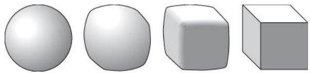

# 6.5 Spherical Geometry 
We have been steadily relaxing our requirements for two shapes to be equivalent, by allowing more and more transformations. Now let us tighten up again and look at spherical geometry. Here the universe is no longer but the n-dimensional sphere , which is defined to be the surface of the (n  1)-dimensional ball of radius 1, or, to put it more algebraically, the set of all points in such that +. Just as the surface of a three-dimensional ball is two dimensional, so this set is n dimensional. We shall discuss the case here, but it is easy to generalize the discussion to larger n. 
The appropriate group of transformations is SO(3): the group that consists of all rotations about axes that go through the origin. (One could allow reflections as well and take O(3).) These are symmetries of the sphere , and that is how we regard them in spherical geometry, rather than as transformations of the whole of . 
Among the concepts that make sense in spherical geometry are line, distance, and angle. It may seem odd to talk about a line if one is confined to the surface of a ball, but a “spherical line” is not a line in the usual sense. Rather, it is a subset of obtained by intersecting with a plane through the origin. This produces a great circle, that is, a circle of radius 1, which is as large as it can be given that it lives inside a sphere of radius 1. 
The reason that a great circle deserves to be thought of as some sort of line is that the shortest path between any two points x and y in will always be along a great circle, provided that the path is confined to . This is a very natural restriction to make, since we are regarding as our “universe.” It is also a restriction of some practical relevance, since the shortest sensible route between two distant points on Earth’s surface will not be the straight-line route that burrows hundreds of miles underground. 

The distance between two points x and y is defined to be the length of the shortest path from x to y that lies entirely in . (If x and are opposite each other, then there are infinitely many shortest paths, all of length π, so the distance between x and y is π.) How about the angle between two spherical lines? Well, the lines are intersections of with two planes, so one can define it to be the angle between these two planes in the Euclidean sense. A more aesthetically pleasing way to view this, because it does not involve ideas external to the sphere, is to notice that if you look at a very small region about one of the two points where two spherical lines cross, then that portion of the sphere will be almost flat, and the lines almost straight. So you can define the angle to be the usual angle between the “limiting” straight lines inside the “limiting” plane. 
Spherical geometry differs from Euclidean geometry in several interesting ways. For example, the angles of a spherical triangle always add up to more than 180◦. Indeed, if you take as the vertices the North Pole, a point on the equator, and a second point a quarter of the way around the equator from the first, then you obtain a triangle with three right angles. The smaller a triangle, the flatter it becomes, and so the closer the sum of its angles comes to . There is a beautiful theorem that gives a precise expression to this: if we switch to radians, and if we have a spherical triangle with angles and then its area is . (For example, this formula tells us that the triangle with three angles of has area , which indeed it does as the surface area of a ball of radius 1 is 4π and this triangle occupies one-eighth of the surface.) 
# 6.6 Hyperbolic Geometry 
So far, the idea of defining geometries with reference to sets of transformations may look like nothing more than a useful way to view the subject, a unified approach to what would otherwise be rather differentlooking aspects. However, when it comes to hyperbolic geometry, the transformational approach becomes indispensable, for reasons that will be explained in a moment. 
The group of transformations that produces hyperbolic geometry is called , the projective special linear group in two dimensions. One way to present this group is as follows. The special linear group is the set of all matrices with determinant [III.15] ad  bc equal to 1. (These form a group because the product of two matrices with determinant 1 again has determinant 1.) To make this “projective,” one then regards each matrix A as equivalent for example, the matrices ) and ) are equivalent. 

To get from this group to the geometry one must first interpret it as a group of transformations of some twodimensional set of points. Once we have done this, we have what is called a model of two-dimensional hyperbolic geometry. The subtlety is that there is no single model of hyperbolic geometry that is clearly the most natural in the way that the sphere is the most natural model of spherical geometry. (One might think that the sphere was the only sensible model of spherical geometry, but this is not in fact the case. For example, there is a natural way of associating with each rotation of a transformation of with a “point at infinity” added, so the extended plane can be used as a model of spherical geometry.) The three most commonly used models of hyperbolic geometry are called the half-plane model, the disk model, and the hyperboloid model. 
The half-plane model is the one most directly associated with the group . The set in question is the upper half-plane of the complex numbers that the set of all complex numbers iy such that . Given a matrix , the corresponding transformation is the one that takes the point z to the point . (Notice that if we replace a, b, c, and d by their negatives, then we get the same transformation.) The condition can be used to show that the transformed point will still lie in the upper half-plane, and also that the transformation can be inverted. 
What this does not yet do is tell us anything about distances, and it is here that we need the group to “gener-the geometry. If we are to have a notion of distance d that is sensible from the perspective of our group of transformations, then it is important that the transformations should preserve it. That is, if T is one of the transformations and z and w are two points in the upper half-plane, then should always be the same as . It turns out that there is essentially only one definition of distance that has this property, and that is the sense in which the group defines the geometry. (One could of course multiply all distances by some constant factor such as 3, but this would be like measuring distances in feet instead of yards, rather than a genuine difference in the geometry.) 
This distance has some properties that at first seem odd. For example, a typical hyperbolic line takes the form of a semicircular arc with endpoints on the real axis. However, it is semicircular only from the point of view of the Euclidean geometry of C: from a hyperbolic perspective it would be just as odd to regard a Euclidean straight line as straight. The reason for the discrepancy is that hyperbolic distances become larger and larger, relative to Euclidean ones, the closer you get to the real axis. To get from a point z to another point w, it is therefore shorter to take a “detour” away from the real axis, and the best detour turns out to be along an arc of the circle that goes through z and w and cuts the real axis at right angles. (If z and w are on the same vertical line, then one obtains a “degenerate circle,” namely that vertical line.) These facts are no more paradoxical than the fact that a flat map of the world involves distortions of spherical geometry, making Greenland very large, for example. The half-plane model is like a “map” of a geometric structure, the hyperbolic plane, that in reality has a very different shape. 

One of the most famous properties of two-dimensional hyperbolic geometry is that it provides a geometry in which Euclid’s parallel postulate fails to hold. That is, it is possible to have a hyperbolic line a point x not on the line, and two different hyperbolic lines through x, neither of which meets L. All the other axioms of Euclidean geometry are, when suitably interpreted, true of hyperbolic geometry as well. It follows that the parallel postulate cannot be deduced from those axioms. This discovery, associated with gauss [VI.26], bolyai [VI.34], and lobachevskii [VI.31], solved a problem that had bothered mathematicians for over two thousand years. 
Another property complements the result about the angle sums of spherical and Euclidean triangles. There is a natural notion of hyperbolic area, and the area of a hyperbolic triangle with angles and γ is . Thus, in the hyperbolic plane α β γ is always less than π, and it almost equals π when the triangle is very small. These properties of angle sums reflect the fact that the sphere has positive curvature [III.13], the Euclidean plane is “flat,” and the hyperbolic plane has negative curvature. 
The disk model, conceived in a famous moment of inspiration by poincaré [VI.61] as he was getting into a bus, takes as its set of points the open unit disk in C, that is, the set D of all complex numbers with modulus less than 1. This time, a typical transformation takes the following form. One takes a real number and a complex number a from inside D, and sends each z in D to the point . It is not completely obvious that these transformations form a group, and still less that the group is isomorphic to PSL2(R). However, it turns out that the function that takes maps the unit disk to the upper half-plane and vice versa. This shows that the two models give the same geometry and can be used to transfer results from one to the other. 
Figure 2 A tessellation of the hyperbolic disk.
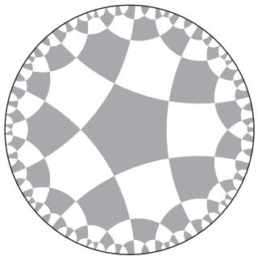

As with the half-plane model, distances become larger, relative to Euclidean distances, as you approach the boundary of the disk: from a hyperbolic perspective, the diameter of the disk is infinite and it does not really have a boundary. Figure 2 shows a tessellation of the disk by shapes that are congruent in the sense that any one can be turned into any other by means of a transformation from the group. Thus, even though they do not look identical, within hyperbolic geometry they all have the same size and shape. Straight lines in the disk model are either arcs of (Euclidean) circles that meet the unit circle at right angles, or segments of (Euclidean) straight lines that pass through the center of the disk. 
The hyperboloid model is the model that explains why the geometry is called hyperbolic. This time the set is the hyperboloid consisting of all points such that and . This is the hyperboloid of revolution about the z-axis of the hyperbola in the plane general transformation in the group is a sort of “rotation” of the hyperboloid, and can be built up from genuine rotations about the zaxis, and “hyperbolic rotations” of the xz-plane, which have matrices of the form 
$\left( \begin{array}{c c} \cosh \theta & \sinh \theta \\ \sinh \theta & \cosh \theta \end{array} \right).$
Just as an ordinary rotation preserves the unit circle, one of these hyperbolic rotations preserves the hyperbola , moving points around inside it. Again, it is not quite obvious that this gives the same group of transformations, but it does, and the hyperboloid model is equivalent to the other two. 

# 6.7 Projective Geometry 
Projective geometry is regarded by many as an old-fashioned subject, and it is no longer taught in schools, but it still has an important role to play in modern mathematics. We shall concentrate here on the real projective plane, but projective geometry is possible in any number of dimensions and with scalars in any field. This makes it particularly useful to algebraic geometers. 
Here are two ways of regarding the projective plane. The first is that the set of points is the ordinary plane, together with a “line at infinity.” The group of transformations consists of functions known as projections. To understand what a projection is, imagine two planes P and P	 in space, and a point x that is not in either of them. We can “project” P onto P	 as follows. If a is a point in P, then its image φ(a) is the point where the line joining x to a meets P	 . (If this line is parallel to P	, then φ(a) is a point on the line at infinity of P	 .) Thus, if you are at x and a picture is drawn on the plane P, then its image under the projection φ will be the picture drawn on P	 that to you looks exactly the same. In fact, however, it will have been distorted, so the transformation φ has made a difference to the shape. To turn φ into a transformation of P itself, one can follow it by a rigid transformation that moves P	 back to where P is. 
Such projections clearly do not preserve distances, but they do preserve other interesting concepts, such as points, lines, quantities known as cross-ratios, and, most famously, conic sections. A conic section is the intersection of a plane with a cone, and it can be a circle, an ellipse, a parabola, or a hyperbola. From the point of view of projective geometry, these are all the same kind of object (just as, in affine geometry, one can talk about ellipses but there is no special ellipse called a circle). 
A second view of the projective plane is that it is the set of all lines in that go through the origin. Since a line is determined by the two points where it intersects the unit sphere, one can regard this set as a sphere, but with the significant difference that opposite points are regarded as the same—because they correspond to the same line. 
Under this view, a typical transformation of the projective plane is obtained as follows. Take any invertible linear map, and apply it to . This takes lines through the origin to lines through the origin, and can therefore be thought of as a function from the projective plane to itself. If one invertible linear map is a multiple of another, then they will have the same effect on all lines, so the resulting group of transformations is like , except that all nonzero multiples of any given matrix are regarded as equivalent. This group is called the projective special linear group , and it is the three-dimensional equivalent of , which we have already met. Since is bigger than , the projective plane comes with a richer set of transformations than the hyperbolic plane, which is why fewer geometrical properties are preserved. (For example, we have seen that there is a useful notion of hyperbolic distance, but there is no obvious notion of projective distance.) 

# 6.8 Lorentz Geometry 
This is a geometry used in the theory of special relativity to model four-dimensional spacetime, otherwise known as Minkowski space. The main difference between it and four-dimensional Euclidean geometry is that, instead of the usual notion of distance between two points and , one considers the quantity 
$- (t - t ^ {\prime}) ^ {2} + (x - x ^ {\prime}) ^ {2} + (y - y ^ {\prime}) ^ {2} + (z - z ^ {\prime}) ^ {2},$
which would be the square of the Euclidean distance were it not for the all-important minus sign before . This reflects the fact that space and time are significantly different (though intertwined). 
A Lorentz transformation is a linear map from to that preserves these “generalized distances.” Letting g be the linear map that sends to and letting G be the corresponding matrix (which has −1, 1, 1, 1 down the diagonal and 0 everywhere else), we can define a Lorentz transformation abstractly as one whose matrix Λ satisfies where I is the identity matrix and is the transpose of Λ. (The transpose of a matrix A is the matrix B defined by 
A point is said to be spacelike if , and timelike if then the point lies in the light cone. All these are genuine concepts of Lorentzian geometry because they are preserved by Lorentz transformations. 
Lorentzian geometry is also of fundamental importance to general relativity, which can be thought of as the study of Lorentzian manifolds. These are closely related to Riemannian manifolds, which are discussed in section 6.10. For a discussion of general relativity, see general relativity and the einstein equations [IV.13]. 

# 6.9 Manifolds and Differential Geometry 
To somebody who has not been taught otherwise, it is natural to think that Earth is flat, or rather that it consists of a flat surface on top of which there are buildings, mountains, and so on. However, we now know that it is in fact more like a sphere, appearing to be flat only because it is so large. There are various kinds of evidence for this. One is that if you stand on a cliff by the sea then you can see a definite horizon, not too far away, over which ships disappear. This would be hard to explain if Earth were genuinely flat. Another is that if you travel far enough in what feels like a straight line then you eventually get back to where you started. A third is that if you travel along a triangular route and the triangle is a large one, then you will be able to detect that its three angles add up to more than 180◦. 
It is also very natural to believe that the geometry that best models that of the universe is three-dimensional Euclidean geometry, or what one might think of as “normal” geometry. However, this could be just as much of a mistake as believing that two-dimensional Euclidean geometry is the best model for Earth’s surface. 
Indeed, one can immediately improve on it by considering Lorentzian geometry as a model of spacetime, but even if there were no theory of special relativity, our astronomical observations would give us no particular reason to suppose that Euclidean geometry was the best model for the universe. Why should we be so sure that we would not obtain a better model by taking the three-dimensional surface of a very large fourdimensional ball? This might feel like “normal” space in just the way that the surface of Earth feels like a “normal” plane unless you travel large distances. Perhaps if you traveled far enough in a rocket without changing your course then you would end up where you started. 
It is easy to describe “normal” space mathematically: one just associates with each point in space a triple of coordinates in the usual way. How might we describe a huge “spherical” space? It is slightly harder, but not much: one can give each point four coordinates but add the condition that these must satisfy the equation for some fixed R that we think of as the “radius” of the universe. This describes the three-dimensional surface of a four-dimensional ball of radius R in just the same way that the equation describes the two-dimensional surface of a three-dimensional ball of radius R. 

A possible objection to this approach is that it seems to rely on the rather implausible idea that the universe lives in some larger unobserved four-dimensional space. However, this objection can be answered. The object we have just defined, the 3-sphere , can also be described in what is known as an intrinsic way: that is, without reference to some surrounding space. The easiest way to see this is to discuss the 2-sphere first, in order to draw an analogy. 
Let us therefore imagine a planet covered with calm water. If you drop a large rock into the water at the North Pole, a wave will propagate out in a circle of everincreasing radius. (At any one moment, it will be a circle of constant latitude.) In due course, however, this circle will reach the equator, after which it will start to shrink, until eventually the whole wave reaches the South Pole at once, in a sudden burst of energy. 
Now imagine setting off a three-dimensional wave in space—it could, for example, be a light wave caused by the switching on of a bright light. The front of this wave would now be not a circle but an everexpanding spherical surface. It is logically possible that this surface could expand until it became very large and then contract again, not by shrinking back to where it started, but by turning itself inside out, so to speak, and shrinking to another point on the opposite side of the universe. (Notice that in the two-dimensional example, what you want to call the inside of the circle changes when the circle passes the equator.) With a bit of effort, one can visualize this possibility, and there is no need to appeal to the existence of a fourth dimension in order to do so. More to the point, this account can be turned into a mathematically coherent and genuinely three-dimensional description of the 3-sphere. 
A different and more general approach is to use what is called an atlas. An atlas of the world (in the normal, everyday sense) consists of a number of flat pages, together with an indication of their overlaps: that is, of how parts of some pages correspond to parts of others. Now, although such an atlas is mapping out an external object that lives in a three-dimensional universe, the spherical geometry of Earth’s surface can be read off from the atlas alone. It may be much less convenient to do this but it is possible: rotations, for example, might be described by saying that such-and-such a part of page 17 moved to a similar but slightly distorted part of page 24, and so on. 

Not only is this possible, but one can define a surface by means of two-dimensional atlases. For example, there is a mathematically neat “atlas” of the 2-sphere that consists of just two pages, both of them circular. One is a map of the Northern Hemisphere plus a little bit of the Southern Hemisphere near the equator (to provide a small overlap) and the other is a map of the Southern Hemisphere with a bit of the Northern Hemisphere. Because these maps are flat, they necessarily involve some distortion, but one can specify what this distortion is. 
The idea of an atlas can easily be generalized to three dimensions. A “page” now becomes a portion of threedimensional space. The technical term is not “page” but “chart,” and a three-dimensional atlas is a collection of charts, again with specifications of which parts of one chart correspond to which parts of another. A possible atlas of the 3-sphere, generalizing the simple atlas of the 2-sphere just discussed, consists of two solid threedimensional balls. There is a correspondence between points toward the edge of one of these balls and points toward the edge of the other, and this can be used to describe the geometry: as you travel toward the edge of one ball you find yourself in the overlapping region, so you are also in the other ball. As you go further, you are off the map as far as the first ball is concerned, but the second ball has by that stage taken over. 
The 2-sphere and the 3-sphere are basic examples of manifolds. Other examples that we have already met in this section are the torus and the projective plane. Informally, a d-dimensional manifold, or d-manifold, is any geometrical object M with the property that every point x in M is surrounded by what feels like a portion of d-dimensional Euclidean space. So, because small parts of a sphere, torus, or projective plane are very close to planar, they are all 2-manifolds, though when the dimension is two the word surface is more usual. (However, it is important to remember that a “surface” need not be the surface of anything.) Similarly, the 3-sphere is a 3-manifold. 
The formal definition of a manifold uses the idea of atlases: indeed, one says that the atlas is a manifold. This is a typical mathematician’s use of the word “is,” and it should not be confused with the normal use. In practice, it is unusual to think of a manifold as a collection of charts with rules for how parts of them correspond, but the definition in terms of charts and atlases turns out to be the most convenient when one wishes to reason about manifolds in general rather than discussing specific examples. For the purposes of this book, it may be better to think of a d-manifold in the “extrinsic” way that we first thought about the 3-sphere: as a d-dimensional “hypersurface” living in some higher-dimensional space. Indeed, there is a famous theorem of Nash that states that all manifolds arise in this way. Note, however, that it is not always easy to find a simple formula for defining such a hypersurface. For example, while the 2-sphere is described by the simple formula and the torus by the slightly more complicated and more artificial formula , where r is shorthand for , it is not easy to come up with a formula that describes a two-holed torus. Even the usual torus is far more easily described using quotients, as we did in section 3.3. Quotients can also be used to define a two-holed torus (see fuchsian groups [III.28]), and the reason one is confident that the result is a manifold is that every point has a small neighborhood that looks like a small part of the Euclidean plane. In general, a d-dimensional manifold can be thought of as any construction that gives rise to an object that is “locally like Euclidean space of d dimensions.” 

An extremely important feature of manifolds is that calculus is possible for functions defined on them. Roughly speaking, if M is a manifold and f is a function from M to R, then to see whether f is differentiable at a point x in M you first find a chart that contains x (or a representation of it), and regard f as a function defined on the chart instead. Since the chart is a portion of the d-dimensional Euclidean space and we can differentiate functions defined on such sets, the notion of differentiability now makes sense for f . Of course, for this definition to work for the manifold, it is important that if x belongs to two overlapping charts, then the answer will be the same for both. This is guaranteed if the function that gives the correspondence between the overlapping parts (known as a transition function) is itself differentiable. Manifolds with this property are called differentiable manifolds: manifolds for which the transition functions are continuous but not necessarily differentiable are called topological manifolds. The availability of calculus makes the theory of differentiable manifolds very different from that of topological manifolds. 
The above ideas generalize easily from real-valued functions to functions from M to Rd, or from M to M	 , where M	 is another manifold. However, it is easier to judge whether a function defined on a manifold is differentiable than it is to say what the derivative is. The derivative at some point x of a function from to Rm is a linear map, and so is the derivative of a function defined on a manifold. However, the domain of the linear map is not the manifold itself, which is not usually a vector space, but rather the so-called tangent space at the point x in question. 

For more details on this and on manifolds in general, see differential topology [IV.7]. 
# 6.10 Riemannian Metrics 
Suppose you are given two points P and Q on a sphere. How do you determine the distance between them? The answer depends on how the sphere is defined. If it is the set of all points such that then P and Q are points in . One can therefore use the Pythagorean theorem to calculate the distance between them. For example, the distance between the points and (0, 1, 0) is . 
However, do we really want to measure the length of the line segment PQ? This segment does not lie in the sphere itself, so to use it as a means of defining length does not sit at all well with the idea of a manifold as an intrinsically defined object. Fortunately, as we saw earlier in the discussion of spherical geometry, there is another natural definition that avoids this problem: we can define the distance between P and Q as the length of the shortest path from P to Q that lies entirely within the sphere. 
Now let us suppose that we wish to talk more generally about distances between points in manifolds. If the manifold is presented to us as a hypersurface in some bigger space, then we can use lengths of shortest paths as we did in the sphere. But suppose that the manifold is presented differently and all we have is a way of demonstrating that every point is contained in a chart— that is, has a neighborhood that can be associated with a portion of d-dimensional Euclidean space. (For the purposes of this discussion, nothing is lost if one takes d to be 2 throughout, in which case there is a correspondence between the neighborhood and a portion of the plane.) One idea is to define the distance between the two points to be the distance between the corresponding points in the chart, but this raises at least three problems. 
The first is that the points P and Q that we are looking at might belong to different charts. This, however, is not too much of a problem, since all we actually need to do is calculate lengths of paths, and that can be done provided we have a way of defining distances between points that are very close together, in which case we can find a single chart that contains them both. 

The second problem, which is much more serious, is that for any one manifold there are many ways of choosing the charts, so this idea does not lead to a single notion of distance for the manifold. Worse still, even if one fixes one set of charts, these charts will overlap, and it may not be possible to make the notions of distance compatible where the overlap occurs. 
The third problem is related to the second. The surface of a sphere is curved, whereas the charts of any atlas (in either the everyday or the mathematical sense) are flat. Therefore, the distances in the charts cannot correspond exactly to the lengths of shortest paths in the sphere itself. 
The single most important moral to draw from the above problems is that if we wish to define a notion of distance for a given manifold, we have a great deal of choice about how to do so. Very roughly, a Riemannian metric is a way of making such a choice. 
A little less roughly, a metric means a sensible notion of distance (the precise definition can be found in [III.56]). A Riemannian metric is a way of determining infinitesimal distances. These infinitesimal distances can be used to calculate lengths of paths, and then the distance between two points can be defined as the length of the shortest path between them. To see how this is done, let us first think about lengths of paths in the ordinary Euclidean plane. Suppose that belongs to a path and is another point on the path, very close to . Then the distance between the two points is . To calculate the length of a sufficiently smooth path, one can choose a large number of points along the path, each one very close to the next, and add up their distances. This gives a good approximation, and one can make it better and better by taking more and more points. 
In practice, it is easier to work out the length using calculus. A path itself can be thought of as a moving point (x(t), y(t)) that starts when and ends when . If δt is very small, then is approximately and is approximately . Therefore, the distance between and is approximately , by the Pythagorean theorem. Therefore, letting δt go to zero and integrating all the infinitesimal distances along the path, we obtain the formula 
$\int_ {0} ^ {1} \sqrt {x ^ {\prime} (t) ^ {2} + y ^ {\prime} (t) ^ {2}} d t$

for the length of the path. Notice that if we write and as dx/dt and , then we can rewrite t as , which is the infinitesimal version of the expression that we had earlier. We have just defined a Riemannian metric, which is usually denoted by . This can be thought of as the square of the distance between the point and the infinitesimally close point (x + dx, y + dy). 
If we want to, we can now prove that the shortest path between two points and is a straight line, which will tell us that the distance between them is . (A proof can be found in variational methods [III.94].) However, since we could have just used this formula to begin with, this example does not really illustrate what is distinctive about Riemannian metrics. To do that, let us give a more precise definition of the disk model for hyperbolic geometry, which was discussed in section 6.6. There it was stated that distances become larger, relative to Euclidean distances, as one approaches the edge of the disk. A more precise definition is that the open unit disk is the set of all points such that and that the Riemannian metric on this disk is given by the expression . This is how we define the square of the distance between and . Equivalently, the length of a path with respect to this Riemannian metric is defined as 
$\int_ {0} ^ {1} \sqrt {\frac {x ^ {\prime} (t) ^ {2} + y ^ {\prime} (t) ^ {2}}{1 - x (t) ^ {2} - y (t) ^ {2}}} d t.$
More generally, a Riemannian metric on a portion of the plane is an expression of the form 
$E (x, y) \mathrm{d} x ^ {2} + 2 F (x, y) \mathrm{d} x \mathrm{d} y + G (x, y) \mathrm{d} y ^ {2}$
that is used to calculate infinitesimal distances and hence lengths of paths. (In the disk model we took and to be and to be 0.) It is important for these distances to be positive, which will turn out to be the case provided that is always positive. One also needs the functions , and G to satisfy certain smoothness conditions. 
This definition generalizes straightforwardly to more dimensions. In n dimensions we must use an expression of the form 
$\sum_ {i, j = 1} ^ {n} F _ {i j} (x _ {1}, \dots , x _ {n}) \mathrm{d} x _ {i} \mathrm{d} x _ {j}.$
to specify the squared distance between the points and . The numbers form an n×n matrix that depends on the point . This matrix is required to be symmetric and positive definite: that is, should always equal , and the expression that determines the squared distance should always be positive. It should also depend smoothly on the point . 
Finally, now that we know how to define many different Riemannian metrics on portions of Euclidean space, we have many potential ways to define metrics on the charts that we use to define a manifold. A Riemannian metric on a manifold is a way of choosing compatible Riemannian metrics on the charts, where “compatible” means that wherever two charts overlap the distances should be the same. As mentioned earlier, once one has done this, one can define the distance between two points to be the length of a shortest path between them. 
Given a Riemannian metric on a manifold, it is possible to define many other concepts, such as angles and volumes. It is also possible to define the important concept of curvature, which is discussed in ricci flow [III.78]. Another important definition is that of a geodesic, which is the analogue for Riemannian geometry of a straight line in Euclidean geometry. A curve C is a geodesic if, given any two points P and Q on C that are sufficiently close, the shortest path from P to Q is part of C. For example, the geodesics on the sphere are the great circles. 
As should be clear by now from the above discussion, on any given manifold there is a multitude of possible Riemannian metrics. A major theme in Riemannian geometry is to choose one that is “best” in some way. For example, on the sphere, if we take the obvious definition of the length of a path, then the resulting metric is particularly symmetric, and this is a highly desirable property. In particular, with this Riemannian metric the curvature of the sphere is the same everywhere. More generally, one searches for extra conditions to impose on Riemannian metrics. Ideally, these conditions should be strong enough that there is just one Riemannian metric that satisfies them, or at least that the family of such metrics should be very small. 
# I.4 The General Goals of Mathematical Research 
The previous article introduced many concepts that appear throughout mathematics. This one discusses what mathematicians do with those concepts, and the sorts of questions they ask about them. 

# 1 Solving Equations 
As we have seen in earlier articles, mathematics is full of objects and structures (of a mathematical kind), but they do not simply sit there for our contemplation: we also like to do things to them. For example, given a number, there will be contexts in which we want to double it, or square it, or work out its reciprocal; given a suitable function, we may wish to differentiate it; given a geometrical shape, we may wish to transform it; and so on. 
Transformations like these give rise to a never-ending source of interesting problems. If we have defined some mathematical process, then a rather obvious mathematical project is to invent techniques for carrying it out. This leads to what one might call direct questions about the process. However, there is also a deeper set of inverse questions, which take the following form. Suppose you are told what process has been carried out and what answer it has produced. Can you then work out what the mathematical object was that the process was applied to? For example, suppose I tell you that I have just taken a number and squared it, and that the result was 9. Can you tell me the original number? 
In this case the answer is more or less yes: it must have been 3, except that if negative numbers are allowed, then another solution is 3. 
If we want to talk more formally, then we say that we have been examining the equation , and have discovered that there are two solutions. This example raises three issues that appear again and again. 
The first two concerns are known as the existence and the uniqueness of solutions. The third does not seem particularly interesting in the case of the equation but in more complicated cases, such as partial differential equations, it can be a subtle and important question. 
To use more abstract language, suppose that is a function [I.2 §2.2] and that we are faced with a statement of the form . The direct question is to work out y given what x is. The inverse question is to work out x given what y is: this would be called solving the equation . Not surprisingly, questions about the solutions of an equation of this form are closely related to questions about the invertibility of the function which were discussed in [I.2]. Because x and y can be very much more general objects than numbers, the notion of solving equations is itself very general, and for that reason it is central to mathematics. 

# 1.1 Linear Equations 
The very first equations a schoolchild meets will typically be ones like . To solve simple equations like this, one treats x as an unknown number that obeys the usual rules of arithmetic. By exploiting these rules one can transform the equation into something much simpler: subtracting 3 from both sides we learn that , and dividing both sides of this new equation by 2 we then discover that . If we are very careful, we will notice that all we have shown is that if there is some number x such that then x must be 7. What we have not shown is that there is any such x. So strictly speaking there is a further step of checking that . This will obviously be true here, but the corresponding assertion is not always true for more complicated equations so this final step can be important. 
The equation is called “linear” because the function f we have performed on x (to multiply it by 2 and add 3) is a linear one, in the sense that its graph is a straight line. As we have just seen, linear equations involving a single unknown x are easy to solve, but matters become considerably more sophisticated when one starts to deal with more than one unknown. Let us look at a typical example of an equation in two unknowns, the equation . This equation has many solutions: for any choice of y you can set and you have a pair that satisfies the equation. To make it harder, one can take a second equation as well, , say, and try to solve the two equations simultaneously. Then, it turns out, there is just one solution, namely and . Typically, two linear equations in two unknowns have exactly one solution, just as these two do, which is easy to see if one thinks about the situation geometrically. An equation of the form is the equation of a straight line in the xy-plane. Two lines normally meet in a single point, the exceptions being when they are identical, in which case they meet in infinitely many points, or parallel but not identical, in which case they do not meet at all. 

If one has several equations in several unknowns, it can be conceptually simpler to think of them as one equation in one unknown. This sounds impossible, but it is perfectly possible if the new unknown is allowed to be a more complicated object. For example, the two equations 3x and can be rewritten as the following single equation involving matrices and vectors: 
$\left( \begin{array}{c c} 3 & 2 \\ 5 & 3 \end{array} \right) \binom{x}{y} = \binom{1 4}{2 2}.$
If we let A stand for the matrix, x for the unknown column vector, and b for the known one, then this equation becomes simply which looks much less complicated, even if in fact all we have done is hidden the complication behind our notation. 
There is more to this process, however, than sweeping dirt under the carpet. While the simpler notation conceals many of the specific details of the problem, it also reveals very clearly what would otherwise be obscured: that we have a linear map from to and we want to know which vectors if any, map to the vector b. When faced with a particular set of simultaneous equations, this reformulation does not make much difference—the calculations we have to do are the same—but when we wish to reason more generally, either directly about simultaneous equations or about other problems where they arise, it is much easier to think about a matrix equation with a single unknown vector than about a collection of simultaneous equations in several unknown numbers. This phenomenon occurs throughout mathematics and is a major reason for the study of high-dimensional spaces. 
# 1.2 Polynomial Equations 
We have just discussed the generalization of linear equations from one variable to several variables. Another direction in which one can generalize them is to think of linear functions as polynomials of degree 1 and consider functions of higher degree. At school, for example, one learns how to solve quadratic equations, such as . More generally, a polynomial equation is one of the form 
$a _ {n} x ^ {n} + a _ {n - 1} x ^ {n - 1} + \cdot \cdot \cdot + a _ {2} x ^ {2} + a _ {1} x + a _ {0} = 0.$
To solve such an equation means to find a value of x for which the equation is true (or, better still, all such values). This may seem an obvious thing to say until one considers a very simple example such as the equation , or equivalently . The solution to this is, of course, . What, though, is It is defined to be the positive number that squares to 2, but it does not seem to be much of a “solution” to the equation to say that x is plus or minus the positive number that squares to 2. Neither does it seem entirely satisfactory to say that , since this is just the beginning of a calculation that never finishes and does not result in any discernible pattern. 

There are two lessons that can be drawn from this example. One is that what matters about an equation is often the existence and properties of solutions and not so much whether one can find a formula for them. Although we do not appear to learn anything when we are told that the solutions to the equation are this assertion does contain within it a fact that is not wholly obvious: that the number 2 has a square root. This is usually presented as a consequence of the intermediate value theorem (or another result of a similar nature), which states that if f is a continuous real-valued function and and lie on either side of 0, then somewhere between a and b there must be a c such that . This result can be applied to the function , since and . Therefore, there is some x between 1 and 2 such that , that is, . For many purposes, the mere existence of this x is enough, together with its defining properties of being positive and squaring to 2. 
A similar argument tells us that all positive real numbers have positive square roots. But the picture changes when we try to solve more complicated quadratic equations. Then we have two choices. Consider, for example, the equation . We could note that when and 2 when and deduce from the intermediate value theorem that the equation has some solution between 4 and 5. However, we do not learn as much from this as if we complete the square, rewriting as . This allows us to rewrite the equation as , which has the two solutions . We have already established that exists and lies between 1 and 2, so not only do we have a solution of that lies between 4 and 5, but we can see that it is closely related to, indeed built out of, the solution to the equation . This demonstrates a second important aspect of equation solving, which is that in many instances the explicit solubility of an equation is a relative notion. If we are given a solution to the equation , we do not need any new input from the intermediate value theorem to solve the more complicated equation all we need is some algebra. The solution, is given by an explicit expression, but inside that expression we have , which is not defined by means of an explicit formula but as a real number, with certain properties, that we can prove to exist. 

Solving polynomial equations of higher degree is markedly more difficult than solving quadratics, and raises fascinating questions. In particular, there are complicated formulas for the solutions of cubic and quartic equations, but the problem of finding corresponding formulas for quintic and higher-degree equations became one of the most famous unsolved problems in mathematics, until abel [VI.33] and galois [VI.41] showed that it could not be done. For more details about these matters see the insolubility of the quintic [V.21]. For another article related to polynomial equations see the fundamental theorem of algebra [V.13]. 
# 1.3 Polynomial Equations in Several Variables 
Suppose that we are faced with an equation such as 
$x ^ {3} + y ^ {3} + z ^ {3} = 3 x ^ {2} y + 3 y ^ {2} z + 6 x y z.$
We can see straight away that there will be many solutions: if you fix x and then the equation is a cubic polynomial in z, and all cubics have at least one (real) solution. Therefore, for every choice of x and y there is some z such that the triple is a solution of the above equation. 
Because the formula for the solution of a general cubic equation is rather complicated, a precise specification of the set of all triples that solve the equation may not be very enlightening. However, one can learn a lot by regarding this solution set as a geometric object—a two-dimensional surface in space, to be precise—and asking qualitative questions about it. One might, for instance, wish to understand roughly what shape it is. Questions of this kind can be made precise using the language and concepts of topology [I.3 §6.4]. 
One can of course generalize further and consider simultaneous solutions to several polynomial equations. Understanding the solution sets of such systems of equations is the province of algebraic geometry [IV.4]. 
# 1.4 Diophantine Equations 
As has been mentioned, the answer to the question of whether a particular equation has a solution varies according to where the solution is allowed to be. The equation has no solution if x is required to be real, but in the complex numbers it has the two solutions . The equation has infinitely many solutions if we are looking for x and in the real numbers, but none if they have to be integers. 

This last example is a typical Diophantine equation, the name given to an equation if one is looking for integer solutions. The most famous Diophantine equation is the Fermat equation , which is now known, thanks to Andrew Wiles, to have no positive integer solutions if n is greater than 2. (See fermat’s last theorem [V.10]. By contrast, the equation has infinitely many solutions.) A great deal of modern algebraic number theory [IV.1] is concerned with Diophantine equations, either directly or indirectly. As with equations in the real and complex numbers, it is often fruitful to study the structure of sets of solutions to Diophantine equations: this investigation belongs to the area known as arithmetic geometry [IV.5]. 
A notable feature of Diophantine equations is that they tend to be extremely difficult. It is therefore natural to wonder whether there could be a systematic approach to them. This question was the tenth in a famous list of problems asked by hilbert [VI.63] in 1900. It was not until 1970 that Yuri Matiyasevitch, building on work by Martin Davis, Julia Robinson, and Hilary Putnam, proved that the answer was no. (This is discussed further in the insolubility of the halting problem [V.20].) 
An important step in the solution was taken in 1936, by church [VI.89] and turing [VI.94]. This was to make precise the notion of a “systematic approach,” by formalizing (in two different ways) the notion of an algorithm (see algorithms [II.4 §3] and computational complexity [IV.20 §1]). It was not easy to do this in the pre-computer age, but now we can restate the solution of Hilbert’s tenth problem as follows: there is no computer program that can take as its input any Diophantine equation, and without fail print “YES” if it has a solution and otherwise. 
What does this tell us about Diophantine equations? We can no longer dream of a final theory that will encompass them all, so instead we are forced to restrict our attention to individual equations or special classes of equations, continually developing different methods for solving them. This would make them uninteresting after the first few, were it not for the fact that specific Diophantine equations have remarkable links with very general questions in other parts of mathematics. For example, equations of the form , where is a cubic polynomial in x, may look rather special, but in fact the elliptic curves [III.21] that they define are central to modern number theory, including the proof of Fermat’s last theorem. Of course, Fermat’s last theorem is itself a Diophantine equation, but its study has led to major developments in other parts of number theory. The correct moral to draw is perhaps this: solving a particular Diophantine equation is fascinating and worthwhile if, as is often the case, the result is more than a mere addition to the list of equations that have been solved. 

# 1.5 Differential Equations 
So far, we have looked at equations where the unknown is either a number or a point in n-dimensional space (that is, a sequence of n numbers). In order to generate these equations, we took various combinations of the basic arithmetical operations and applied them to our unknowns. 
Here, for comparison, are two well-known differential equations, the first “ordinary” and the second “partial”: 
$\frac {\mathrm{d} ^ {2} x}{\mathrm{d} t ^ {2}} + k ^ {2} x = 0,$
$\frac {\partial T}{\partial t} = \kappa \left(\frac {\partial^ {2} T}{\partial x ^ {2}} + \frac {\partial^ {2} T}{\partial y ^ {2}} + \frac {\partial^ {2} T}{\partial z ^ {2}}\right).$
The first is the equation for simple harmonic motion, which has the general solution x(t)  A sin kt B cos the second is the heat equation, which was discussed in some fundamental mathematical definitions [I.3 §5.4]. 
For many reasons, differential equations represent a jump in sophistication. One is that the unknowns are functions, which are much more complicated objects than numbers or n-dimensional points. (For example, the first equation above asks what function x of t has the property that if you differentiate it twice then you get times the original function.) A second is that the basic operations one performs on functions include differentiation and integration, which are considerably less “basic” than addition and multiplication. A third is that differential equations that can be solved in “closed form,” that is, by means of a formula for the unknown function f , are the exception rather than the rule, even when the equations are natural and important. 
Consider again the first equation above. Suppose that, given a function we write φ(f ) for the function . Then φ is a linear map, in the sense that and for any constant a. This means that the differential equation can be regarded as something like a matrix equation, but generalized to infinitely many dimensions. The heat equation has the same property: if we define ψ(T ) to be 

$\frac {\partial T}{\partial t} - \kappa \left(\frac {\partial^ {2} T}{\partial x ^ {2}} + \frac {\partial^ {2} T}{\partial y ^ {2}} + \frac {\partial^ {2} T}{\partial z ^ {2}}\right),$
then is another linear map. Such differential equations are called linear, and the link with linear algebra makes them markedly easier to solve. (A very useful tool for this is the fourier transform [III.27].) 
What about the more typical equations, the ones that cannot be solved in closed form? Then the focus shifts once again toward establishing whether or not solutions exist, and if so what properties they have. As with polynomial equations, this can depend on what you count as an allowable solution. Sometimes we are in the position we were in with the equation it is not too hard to prove that solutions exist and all that is left to do is name them. A simple example is the equation . In a certain sense, this cannot be solved: it can be shown that there is no function built out of polynomials, exponentials [III.25], and trigonometric functions [III.92] that differentiates to . However, in another sense the equation is easy to solve— all you have to do is integrate the function . The resulting function (when divided by √ 2π) is the normal distribution [III.71 §5] function. The normal distribution is of fundamental importance in probability, so the function is given a name, Φ. 
In most situations, there is no hope of writing down a formula for a solution, even if one allows oneself to integrate “known” functions. A famous example is the so-called three-body problem [V.33]: given three bodies moving in space and attracted to each other by gravitational forces, how will they continue to move? Using Newton’s laws, one can write down some differential equations that describe this situation. newton [VI.14] solved the corresponding equations for two bodies, and thereby explained why planets move in elliptical orbits around the Sun, but for three or more bodies they proved very hard indeed to solve. It is now known that there was a good reason for this: the equations can lead to chaotic behavior. (See dynamics [IV.14] for more about chaos.) However, this opens up a new and very interesting avenue of research into questions of chaos and stability. 
Sometimes there are ways of proving that solutions exist even if they cannot be easily specified. Then one may ask not for precise formulas, but for general descriptions. For example, if the equation has a time dependence (as, for instance, the heat equation and wave equations have), one can ask whether solutions tend to decay over time, or blow up, or remain roughly the same. These more qualitative questions concern what is known as asymptotic behavior, and there are techniques for answering some of them even when a solution is not given by a tidy formula. 

As with Diophantine equations, there are some special and important classes of partial differential equations, including nonlinear ones, that can be solved exactly. This gives rise to a very different style of research: again one is interested in properties of solutions, but now these properties may be more algebraic in nature, in the sense that exact formulas will play a more important role. See linear and nonlinear waves and solitons [III.49]. 
# 2 Classifying 
If one is trying to understand a new mathematical structure, such as a group [I.3 §2.1] or a manifold [I.3 §6.9], one of the first tasks is to come up with a good supply of examples. Sometimes examples are very easy to find, in which case there may be a bewildering array of them that cannot be put into any sort of order. Often, however, the conditions that an example must satisfy are quite stringent, and then it may be possible to come up with something like an infinite list that includes every single one. For example, it can be shown that any vector space [I.3 §2.3] of dimension n over a field F is isomorphic to . This means that just one positive integer, is enough to determine the space completely. In this case our “list” will be . In such a situation we say that we have a classification of the mathematical structure in question. 
Classifications are very useful because if we can classify a mathematical structure then we have a new way of proving results about that structure: instead of deducing a result from the axioms that the structure is required to satisfy, we can simply check that it holds for every example on the list, confident in the knowledge that we have thereby proved it in general. This is not always easier than the more abstract, axiomatic approach, but it certainly is sometimes. Indeed, there are several results proved using classifications that nobody knows how to prove in any other way. More generally, the more examples you know of a mathematical structure, the easier it is to think about that structure— testing hypotheses, finding counterexamples, and so on. If you know all the examples of the structure, then for some purposes your understanding is complete. 

# 2.1 Identifying Building Blocks and Families 
There are two situations that typically lead to interesting classification theorems. The boundary between them is somewhat blurred, but the distinction is clear enough to be worth making, so we shall discuss them separately in this subsection and the next. 
As an example of the first kind of situation, let us look at objects called regular polytopes. Polytopes are polygons, polyhedra, and their higher-dimensional generalizations. The regular polygons are those for which all sides have the same length and all angles are equal, and the regular polyhedra are those for which all faces are congruent regular polygons and every vertex has the same number of edges coming out of it. More generally, a higher-dimensional polytope is regular if it is as symmetrical as possible, though the precise definition of this is somewhat complicated. (Here, in three dimensions, is a definition that turns out to be equivalent to the one just given but easier to generalize. A flag is a triple where v is a vertex of the polyhedron, e is an edge containing and is a face containing e. A polyhedron is regular if for any two flags and there is a symmetry of the polyhedron that takes v to , e to , and f to 
It is easy to see what the regular polygons are in two dimensions: for every k greater than 2 there is exactly one regular k-gon and that is all there is. In three dimensions, the regular polyhedra are the famous Platonic solids, that , the tetrahedron, the cube, the octahedron, the dodecahedron, and the icosahedron. It is not too hard to see that there cannot be any more regular polyhedra, since there must be at least three faces meeting at each vertex, and the angles at that vertex must add up to less than 360◦. This constraint means that the only possibilities for the faces at a vertex are three, four, or five triangles, three squares, or three pentagons. These give the tetrahedron, the octahedron, the icosahedron, the cube, and the dodecahedron, respectively. 
Some of the polygons and polyhedra just defined have natural higher-dimensional analogues. For example, if you take points in all at the same distance from one another, then they form the vertices of a regular simplex, which is an equilateral triangle or regular tetrahedron when or 3. The set of all points with for every i forms the n-dimensional analogue of a unit square or cube. The octahedron can be defined as the set of all points (x, y, z) in such that , and the analogue of this in n dimensions is the set of all points such that . 

It is not obvious how the dodecahedron and icosahedron would lead to infinite families of regular polytopes, and it turns out that they do not. In fact, apart from three more examples in four dimensions, the above polytopes constitute a complete list. These three examples are quite remarkable. One of them has 120 “three-dimensional faces,” each of which is a regular dodecahedron. It has a so-called dual, which has 600 regular tetrahedra as its “faces.” The third example can be described in terms of coordinates: its vertices are the sixteen points of the form , together with the eight points , , and . 
The theorem that these are all the regular polytopes is significantly harder to prove than the result sketched above for three dimensions. The complete list was obtained by Schäfli in the mid nineteenth century; the first proof that there are no others was given by Donald Coxeter in 1969. 
We therefore know that the regular polytopes in dimensions three and higher fall into three families—the n-dimensional versions of the tetrahedron, the cube, and the octahedron—together with five “exceptional” examples—the dodecahedron, the icosahedron, and the three four-dimensional polytopes just described. This situation is typical of many classification theorems. The exceptional examples, often called “sporadic,” tend to have a very high degree of symmetry—it is almost as if we have no right to expect this degree of symmetry to be possible, but just occasionally by a happy chance it is. The families and sporadic examples that occur in different classification results are often closely related, and this can be a sign of deep connections between areas that do not at first appear to be connected at all. 
Sometimes, instead of trying to classify all mathematical structures of a given kind, one identifies a certain class of “basic” structures out of which all the others can be built in a simple way. A good analogy for this is the set of primes, out of which all other integers can be built as products. Finite groups, for example, are all “products” of certain basic groups that are called simple. the classification of finite simple groups [V.7], one of the most famous theorems of twentieth-century mathematics, is discussed in part V. For more on this style of classification theorem, see also lie theory [III.48]. 

# 2.2 Equivalence, Nonequivalence, and Invariants 
There are many situations in mathematics where two objects are, strictly speaking, different, but where we are not interested in the difference. In such situations we want to regard the objects as “essentially the same,” or “equivalent.” Equivalence of this kind is expressed formally by the notion of an equivalence relation [I.2 §2.3]. 
For example, a topologist regards two shapes as essentially the same if one is a continuous deformation of the other, as we saw in [I.3 §6.4]. As pointed out there, a sphere is the same as a cube in this sense, and one can also see that the surface of a doughnut, that is, a torus, is essentially the same as the surface of a teacup. (To turn the teacup into a doughnut, let the handle expand while the cup part is gradually swallowed up into it.) It is equally obvious, intuitively speaking, that a sphere is not essentially the same as a torus, but this is much harder to prove. 
Why should nonequivalence be harder to prove than equivalence? The answer is that in order to show that two objects are equivalent, all one has to do is find a single transformation that demonstrates this equivalence. However, to show that two objects are not equivalent, one must somehow consider all possible transformations and show that not one of them works. How can one rule out the existence of some wildly complicated continuous deformation that is impossible to visualize but happens, remarkably, to turn a sphere into a torus? 
Here is a sketch of a proof. The sphere and the torus are examples of compact orientable surfaces, which means, roughly speaking, two-dimensional shapes that occupy a finite portion of space and have no boundary. Given any such surface, one can find an equivalent surface that is built out of triangles and is topologically the same. Here is a famous theorem of euler [VI.19]. 
Let P be a polyhedron that is topologically the same as a sphere, and suppose that it has V vertices, E edges, and F faces. Then . 
For example, if P is an icosahedron, then it has twelve vertices, thirty edges, and twenty faces, and is indeed equal to 2. 
For this theorem, it is not in fact important that the triangles are flat: we can draw them on the original sphere, except that now they are spherical triangles. It is just as easy to count vertices, edges, and faces when we do this, and the theorem is still valid. A network of triangles drawn on a sphere is called a triangulation of the sphere. 

Euler’s theorem tells us that regardless of what triangulation of the sphere we take. Moreover, the formula is still valid if the surface we triangulate is not a sphere but another shape that is topologically equivalent to the sphere, since triangulations can be continuously deformed without or F changing. 
More generally, one can triangulate any surface, and evaluate . The result is called the Euler characteristic of that surface. For this definition to make sense, we need the following fact, which is a generalization of Euler’s theorem (and which is not much harder to prove than the original result). 
(i) Although a surface can be triangulated in many ways, the quantity will be the same all triangulations. 
If we continuously deform the surface and continuously deform one of its triangulations at the same time, we can deduce that the Euler characteristic of the new surface is the same as that of the old one. In other words, fact (i) above has the following interesting consequence. 
(ii) If two surfaces are continuous deformations of each other, then they have the same Euler characteristic. 
This gives us a potential method for showing that surfaces are not equivalent: if they have different Euler characteristics then we know from the above that they are not continuous deformations of each other. The Euler characteristic of the torus turns out to be 0 (as one can show by calculating for any triangulation), and that completes the proof that the sphere and the torus are not equivalent. 
The Euler characteristic is an example of an invariant. This means a function φ, the domain of which is the set of all objects of the kind one is studying, with the property that if X and Y are equivalent objects, then . To show that X is not equivalent to Y , it is enough to find an invariant φ for which φ(X) and are different. Sometimes the values φ takes are numbers (as with the Euler characteristic), but often they will be more complicated objects such as polynomials or groups. 
It is perfectly possible for φ(X) to equal φ(Y ) even when X and Y are not equivalent. An extreme example would be the invariant that simply took the value 0 for every object X. However, sometimes it is so hard to prove that objects are not equivalent that invariants can be considered useful and interesting even when they work only part of the time. 

There are two main properties that one looks for in an invariant φ, and they tend to pull in opposite directions. One is that it should be as fine as possible: that is, as often as possible φ(X) and φ(Y ) are different if X and Y are not equivalent. The other is that as often as possible one should actually be able to establish when is different from . There is not much use in having a fine invariant if it is impossible to calculate. (An extreme example would be the “trivial” invariant that simply mapped each X to its equivalence class. It is as fine as possible, but unless we have some independent means of specifying it, then it does not represent an advance on the original problem of showing that two objects are not equivalent.) The most powerful invariants therefore tend to be ones that can be calculated, but not very easily. 
In the case of compact orientable surfaces, we are lucky: not only is the Euler characteristic an invariant that is easy to calculate, but it also classifies the compact orientable surfaces completely. To be precise, k is the Euler characteristic of a compact orientable surface if and only if it is of the form for some nonnegative integer g (so the possible Euler characteristics are and two compact orientable surfaces with the same Euler characteristic are equivalent. Thus, if we regard equivalent surfaces as the same, then the number g gives us a complete specification of a surface. It is called the genus of the surface, and can be interpreted geometrically as the number of the surface has (so the genus of the sphere is 0 and that of the torus is 1). 
For other examples of invariants, see algebraic topology [IV.6] and knot polynomials [III.44]. 
# 3 Generalizing 
When an important mathematical definition is formulated, or theorem proved, that is rarely the end of the story. However clear a piece of mathematics may seem, it is nearly always possible to understand it better, and one of the most common ways of doing so is to present it as a special case of something more general. There are various different kinds of generalization, of which we discuss a few here. 

# 3.1 Weakening Hypotheses and Strengthening Conclusions 
The number 1729 is famous for being expressible as the sum of two cubes in two different ways: it is and also . Let us now try to decide whether there is a number that can be written as the sum of four cubes in ten different ways. 
At first this problem seems alarmingly difficult. It is clear that any such number, if it exists, must be very large and would be extremely tedious to find if we simply tested one number after another. So what can we do that is better than this? 
The answer turns out to be that we should weaken our hypotheses. The problem we wish to solve is of the following general kind. We are given a sequence . of positive integers and we are told that it has a certain property. We must then prove that there is a positive integer that can be written as a sum of four terms of the sequence in ten different ways. This is perhaps an artificial way of thinking about the problem since the property we assume of the sequence is the property of “being the sequence of cubes,” which is so specific that it is more natural to think of it as an identification of the sequence. However, this way of thinking encourages us to consider the possibility that the conclusion might be true for a much wider class of sequences. And indeed this turns out to be the case. 
There are a thousand cubes less than or equal to 1 000 000 000. We shall now see that this property alone is sufficient to guarantee that there is a number that can be written as the sum of four cubes in ten different ways. That is, if is any sequence of positive integers, and if none of the first thousand terms exceeds 1 000 000 000, then some number can be written as the sum of four terms of the sequence in ten different ways. 
To prove this, all we have to do is notice that the number of different ways of choosing four distinct terms from the sequence is 1000×999×998× , which is greater than . The sum of any four terms of the sequence cannot exceed 4 1 000 000 000. It follows that the average number of ways of writing one of the first 4 000 000 000 numbers as the sum of four terms of the sequence is at least ten. But if the average number of representations is at least ten, then there must certainly be numbers that have at least this number of representations. 
Why did it help to generalize the problem in this way? One might think that it would be harder to prove a result if one assumed less. However, that is often not true. The less you assume, the fewer options you have when trying to use your assumptions, and that can speed up the search for a proof. Had we not generalized the problem above, we would have had too many options. For instance, we might have found ourselves trying to solve very difficult Diophantine equations involving cubes rather than noticing the easy counting argument. In a way, it was only once we had weakened our hypotheses that we understood the true nature of the problem. 

We could also think of the above generalization as a strengthening of the conclusion: the problem asks for a statement about cubes, and we prove not just that but much more besides. There is no clear distinction between weakening hypotheses and strengthening conclusions, since if we are asked to prove a statement of the form , we can always reformulate it as . Then, if we weaken P we are weakening the hypotheses of but strengthening the conclusion of . 
# 3.2 Proving a More Abstract Result 
A famous result in modular arithmetic, known as fermat’s little theorem [III.58], states that if is a prime and a is not a multiple of , then leaves a remainder of 1 when you divide by That is, is congruent to 1 mod . 
There are several proofs of this result, one of which is a good illustration of a certain kind of generalization. Here is the argument in outline. The first step is to show that the numbers form a group [I.3 §2.1] under multiplication mod . (This means multiplication followed by taking the remainder on division by p. For example, if then the “product” of 3 and 6 is 4, since 4 is the remainder when you divide 18 by 7.) The next step is to note that if −1 then the powers of a (mod form a subgroup of this group. Moreover, the size of the subgroup is the smallest positive integer m such that is congruent to 1 mod . One then applies Lagrange’s theorem, which states that the size of a group is always divisible by the size of any of its subgroups. In this case, the size of the group is , from which it follows that is divisible by m. But then, since , it follows that . 
This argument shows that Fermat’s little theorem is, when viewed appropriately, just one special case of Lagrange’s theorem. (The word is, however, a little misleading, because it is not wholly obvious that the integers mod p form a group in the way stated. This fact is proved using euclid’s algorithm [III.22].) 

Fermat could not have viewed his theorem in this way, since the concept of a group had not been invented when he proved it. Thus, the abstract concept of a group helps one to see Fermat’s little theorem in a completely new way: it can be viewed as a special case of a more general result, but a result that cannot even be stated until one has developed some new, abstract concepts. 
This process of abstraction has many benefits. Most obviously, it provides us with a more general theorem, one that has many other interesting particular cases. Once we see this, then we can prove the general result once and for all rather than having to prove each case separately. A related benefit is that it enables us to see connections between results that may originally have seemed quite different. And finding surprising connections between different areas of mathematics almost always leads to significant advances in the subject. 
# 3.3 Identifying Characteristic Properties 
There is a marked contrast between the way one defines and the way one defines , or i as it is usually written. In the former case one begins, if one is being careful, by proving that there is exactly one positive real number that squares to 2. Then is defined to be this number. 
This style of definition is impossible for i since there is no real number that squares . So instead one asks the following question: if there were a number that squared , what could one say about it? Such a number would not be a real number, but that does not rule out the possibility of extending the real number system to a larger system that contains a square root of 1. 
At first it may seem as though we know precisely one thing about i: that . But if we assume in addition that i obeys the normal rules of arithmetic, then we can do more interesting calculations, such as 
$(\mathrm{i} + 1) ^ {2} = \mathrm{i} ^ {2} + 2 \mathrm{i} + 1 = - 1 + 2 \mathrm{i} + 1 = 2 \mathrm{i},$
which implies that is a square root of i. 
From these two simple assumptions—that and that i obeys the usual rules of arithmetic—we can develop the entire theory of complex numbers [I.3 §1.5] without ever having to worry about what i actually is. And in fact, once you stop to think about it, the existence of though reassuring, is not in practice anything like as important as its defining properties, which are very similar to those of i: it squares to 2 and obeys the usual rules of arithmetic. 

Many important mathematical generalizations work in a similar way. Another example is the definition of when x and a are real numbers with x positive. It is difficult to make sense of this expression in a direct way unless a is a positive integer, and yet mathematicians are completely comfortable with it, whatever the value of How can this be? The answer is that what really matters about is not its numerical value but its characteristic properties when one thinks of it as a function of The most important of these is the property that . Together with a couple of other simple properties, this completely determines the function . More importantly, it is these characteristic properties that one uses when reasoning about . This example is discussed in more detail in the exponential and logarithmic functions [III.25]. 
There is an interesting relationship between abstraction and classification. The word “abstract” is often used to refer to a part of mathematics where it is more common to use characteristic properties of an object than it is to argue directly from a definition of the object itself (though, as the example of shows, this distinction can be somewhat hazy). The ultimate in abstraction is to explore the consequences of a system of axioms, such as those for a group or a vector space. However, sometimes, in order to reason about such algebraic structures, it is very helpful to classify them, and the result of classification is to make them more concrete again. For instance, every finitedimensional real vector space V is isomorphic to for some nonnegative integer n, and it is sometimes helpful to think of V as the concrete object , rather than as an algebraic structure that satisfies certain axioms. Thus, in a certain sense, classification is the opposite of abstraction. 
# 3.4 Generalization after Reformulation 
Dimension is a mathematical idea that is also a familiar part of everyday language: for example, we say that a photograph of a chair is a two-dimensional representation of a three-dimensional object, because the chair has height, breadth, and depth, but the image just has height and breadth. Roughly speaking, the dimension of a shape is the number of independent directions one can move about in while staying inside the shape, and this rough conception can be made mathematically precise (using the notion of a vector space [I.3 §2.3]). 

If we are given any shape, then its dimension, as one would normally understand it, must be a nonnegative integer: it does not make much sense to say that one can move about in 1.4 independent directions, for example. And yet there is a rigorous mathematical theory of fractional dimension, in which for every nonnegative real number d you can find many shapes of dimension d. 
How do mathematicians achieve the seemingly impossible? The answer is that they reformulate the concept of dimension and only then do they generalize it. What this means is that they give a new definition of dimension with the following two properties. 
There are several ways of doing this, but most of them focus on the differences between length, area, and volume. Notice that a line segment of length 2 can be expressed as a union of two nonoverlapping line segments of length 1, a square of side-length 2 can be expressed as a union of four nonoverlapping squares of side-length 1, and a cube of side-length 2 can be expressed as a union of eight nonoverlapping cubes of side-length 1. It is because of this that if you enlarge a ddimensional shape by a factor r , then its d-dimensional “volume” is multiplied by . Now suppose that you would like to exhibit a shape of dimension 1.4. One way of doing it is to let , so that , and find a shape X such that if you expand X by a factor of then the expanded shape can be expressed as a union of two disjoint copies of X. Two copies of X ought to have twice the “volume” of X itself, so the dimension d of X ought to satisfy the equation . By our choice of r , this tells us that the dimension of X is 1.4. For more details, see dimension [III.17]. 
Another concept that seems at first to make no sense is noncommutative geometry. The word “commutative” applies to binary operations [I.2 §2.4] and therefore belongs to algebra rather than geometry, so what could “noncommutative geometry” possibly mean? 
By now the answer should not be a surprise: one reformulates part of geometry in terms of a certain algebraic structure and then generalizes the algebra. The algebraic structure involves a commutative binary operation, so one can generalize the algebra by allowing the binary operation not to be commutative. 

The part of geometry in question is the study of manifolds [I.3 §6.9]. Associated with a manifold X is the set C(X) of all continuous complex-valued functions defined on X. Given two functions in C(X), and two complex numbers λ and μ, the linear combination is another continuous complex-valued function, so it also belongs to C(X). Therefore, C(X) is a vector space. However, one can also multiply f and g to form the continuous function (defined by . This multiplication has various natural properties (for instance, for all functions , and h) that make C(X) into an algebra, and even a -algebra [IV.15 §3]. It turns out that a great deal of the geometry of a compact manifold X can be reformulated purely in terms of the corresponding C∗-algebra C(X). The word “purely” here means that it is not necessary to refer to the manifold X in terms of which the algebra C(X) was originally defined—all one uses is the fact that C(X) is an algebra. This raises the possibility that there might be algebras that do not arise geometrically, but to which the reformulated geometrical concepts nevertheless apply. 
An algebra has two binary operations: addition and multiplication. Addition is always assumed to be commutative, but multiplication is not: when multiplication is commutative as well, one says that the algebra is commutative. Since and are clearly the same function, the algebra C(X) is a commutative C∗-algebra, so the algebras that arise geometrically are always commutative. However, many geometrical concepts, once they have been reformulated in algebraic terms, continue to make sense for noncommutative - algebras, and that is why the phrase “noncommutative” geometry is used. For more details, see operator algebras [IV.15 §5]. 
This process of reformulating and then generalizing underlies many of the most important advances in mathematics. Let us briefly look at a third example. the fundamental theorem of arithmetic [V.14] is, as its name suggests, one of the foundation stones of number theory: it states that every positive integer can be written in exactly one way as a product of prime numbers. However, number theorists like to look at enlarged number systems, and for most of these the obvious analogue of the fundamental theorem of arithmetic is no longer true. For example, in the ring [III.81 §1] of numbers of the form (where a and b are required to be integers), the number 6 can be written either as or as . Since none of the numbers , or can be decomposed further, the number 6 has two genuinely different prime factorizations in this ring. 

There is, however, a natural way of generalizing the concept of “number” to include ideal numbers [III.81 §2] that allow one to prove a version of the fundamental theorem of arithmetic in rings such as the one just defined. First, we must reformulate: we associate with each number γ the set of all its multiples , where δ belongs to the ring. This set, which is denoted (γ), has the following closure property: if α and β belong to and δ and  are any two elements of the ring, then belongs to (γ). 
A subset of a ring with that closure property is called an ideal. If the ideal is of the form (γ) for some number then it is called a principal ideal. However, there are ideals that are not principal, so we can think of the set of ideals as generalizing the set of elements of the original ring (once we have reformulated each element γ as the principal ideal . It turns out that there are natural notions of addition and multiplication that can be applied to ideals. Moreover, it makes sense to define an ideal I to be if the only way of writing I as a product is if one of J and K is a “unit.” In this enlarged set, unique factorization turns out to hold. These concepts give us a very useful way to measure “the extent to which unique factorization fails” in the original ring. For more details, see algebraic numbers [IV.1 §7]. 
# 3.5 Higher Dimensions and Several Variables 
We have already seen that the study of polynomial equations becomes much more complicated when one looks not just at single equations in one variable, but at systems of equations in several variables. Similarly, we have seen that partial differential equations [I.3 §5.4], which can be thought of as differential equations involving several variables, are typically much more difficult to analyze than ordinary differential equations, that is, differential equations in just one variable. These are two notable examples of a process that has generated many of the most important problems and results in mathematics, particularly over the last century or so: the process of generalization from one variable to several variables. 
Suppose one has an equation that involves three real variables, x, y, and z. It is often useful to think of the triple as an object in its own right, rather than as a collection of three numbers. Furthermore, this object has a natural interpretation: it represents a point in three-dimensional space. This geometrical interpretation is important, and goes a long way toward explaining why extensions of definitions and theorems from one variable to several variables are so interesting. If we generalize a piece of algebra from one variable to several variables, we can also think of what we are doing as generalizing from a one-dimensional setting to a higher-dimensional setting. This idea leads to many links between algebra and geometry, allowing techniques from one area to be used to great effect in the other. 
Figure 1 The densest possible packing of circles in the plane.
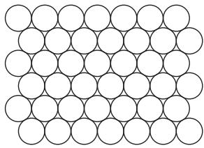

# 4 Discovering Patterns 
Suppose that you wish to fill the plane as densely as possible with nonoverlapping circles of radius 1. How should you do it? This question is an example of a socalled packing problem. The answer is known, and it is what one might expect: you should arrange the circles so that their centers form a triangular lattice, as shown in figure 1. In three dimensions a similar result is true, but much harder to prove: until recently it was a famous open problem known as the Kepler conjecture. Several mathematicians wrongly claimed to have solved it, but in 1998 a long and complicated solution, obtained with the help of a computer, was announced by Thomas Hales, and although his solution has proved very hard to check, the consensus is that it is probably correct. 
Questions about packing of spheres can be asked in any number of dimensions, but they become harder and harder as the dimension increases. Indeed, it is likely that the best density for a ninety-seven-dimensional packing, say, will never be known. Experience with similar problems suggests that the best arrangement will almost certainly not have a simple structure such as one sees in two dimensions, so that the only method for finding it would be a “brute-force search” of some kind. However, to search for the best possible complicated structure is not feasible: even if one could somehow reduce the search to finitely many possibilities, there would be far more of them than one could feasibly check. 

When a problem looks too difficult to solve, one should not give up completely. A much more productive reaction is to formulate related but more approachable questions. In this case, instead of trying to discover the very best packing, one can simply see how dense a packing one can find. Here is a sketch of an argument that gives a goodish packing in n dimensions, when n is large. One begins by taking a maximal packing: that is, one simply picks sphere after sphere until it is no longer possible to pick another one without it overlapping one of the spheres already chosen. Now let x be any point in . Then there must be a sphere in our collection such that the distance between x and its center is less than 2, since otherwise we could take a unit sphere about x and it would not overlap any of the other spheres. Therefore, if we take all the spheres in the collection and expand them by a factor of 2, then we cover all of . Since expanding an n-dimensional sphere by a factor of 2 increases its (n-dimensional) volume by a factor of , the proportion of covered by the unexpanded spheres must be at least . 
Notice that in the above argument we learned nothing at all about the nature of the arrangements of spheres with density . All we did was take a maximal packing, and that can be done in a very haphazard way. This is in marked contrast with the approach that worked in two dimensions, where we defined a specific pattern of circles. 
This contrast pervades all of mathematics. For some problems, the best approach is to build a highly structured pattern that has the properties you need, while for others—usually problems for which there is no hope of obtaining an exact answer—it is better to look for less specific arrangements. “Highly structured” in this context often means “possessing a high degree of symmetry.” 
The triangular lattice is a rather simple pattern, but some highly structured patterns are much more complicated, and much more of a surprise when they are discovered. A notable example occurs in packing problems. By and large, the higher the dimension you are working in, the more difficult it is to find good patterns, but an exception to this general rule occurs at twenty-four dimensions. Here, there is a remarkable construction, known as the Leech lattice, which gives rise to a miraculously dense packing. Formally, a lattice in is a subset Λ with the following three properties. 

A good example of a lattice is the set of all points in with integer coordinates. If one is searching for a dense packing, then it is a good idea to look at lattices, since if you know that every nonzero point in a lattice has distance at least d from 0, then you know that any two points have distance at least d from each other. This is because the distance between x and y is the same as the distance between 0 and , both of which lie in the lattice if x and y do. Thus, instead of having to look at the whole lattice, one can get away with looking at a small portion around 0. 
In twenty-four dimensions it can be shown that there is a lattice Λ with the following additional properties, and that it is unique, in the sense that any other lattice with those properties is just a rotation of the first one. 
The nonzero vector nearest to 0 is far from unique: in fact there are 196 560 of them, which is a remarkably large number considering that these points must all be at distance at least 2 from each other. 
The Leech lattice also has an extraordinary degree of symmetry. To be precise, it has 8 315 553 613 086 720 000 rotational symmetries. (This number equals If you take the quotient [I.3 §3.3] of its symmetry group by the subgroup consisting of the identity and minus the identity, then you obtain the Conway group , which is one of the famous sporadic simple groups [V.7]. The existence of so many symmetries makes it easier still to determine the smallest distance from 0 of any nonzero point of the lattice, since once you have checked one distance you have automatically checked lots of others (just as, in the triangular lattice, the six-fold rotational symmetry tells us that the distances from 0 to its six neighbors are all the same). 

These facts about the Leech lattice illustrate a general principle of mathematical research: often, if a mathematical construction has one remarkable property, it will have others as well. In particular, a high degree of symmetry will often be related to other interesting features. So, although it is a surprise that the Leech lattice exists at all, it is not as surprising when one then discovers that it gives an extremely dense packing of . In fact, it was shown in 2004 by Henry Cohn and Abhinav Kumar that it gives the densest possible packing of spheres in twenty-four-dimensional space, at least among all packings derived from lattices. It is probably the densest packing of any kind, but this has not yet been proved. 
# 5 Explaining Apparent Coincidences 
The largest of all the sporadic finite simple groups is called the Monster group. Its name is partly explained by the fact that it has elements. How can one hope to understand a group of this size? 
One of the best ways is to show that it is a group of symmetries of some other mathematical object (see the article on representation theory [IV.9] for much more on this theme), and the smaller that object is, the better. We have just seen that another large sporadic group, the Conway group Co1, is closely related to the symmetry group of the Leech lattice. Might there be a lattice that played a similar role for the Monster group? 
It is not hard to show that there will be at least some lattice that works, but more challenging is to find one of small dimension. It has been shown that the smallest possible dimension that can be used is 196 883. 
Now let us turn to a different branch of mathematics. If you look at the article about algebraic numbers [IV.1 §8] you will see a definition of a function j(z), called the elliptic modular function, of central importance in algebraic number theory. It is given as the sum of a series that starts 
$\begin{array}{l} j (z) = \mathrm{e} ^ {- 2 \pi \mathrm{i} z} + 7 4 4 + 1 9 6 8 8 4 \mathrm{e} ^ {2 \pi \mathrm{i} z} \\ + 2 1 4 9 3 7 6 0 \mathrm{e} ^ {4 \pi \mathrm{i} z} + 8 6 4 2 9 9 9 7 0 \mathrm{e} ^ {6 \pi \mathrm{i} z} + \dots . \\ \end{array}$
Rather intriguingly, the coefficient of e2πiz in this series is 196 884, one more than the smallest possible dimension of a lattice that has the Monster group as its group of symmetries. 
It is not obvious how seriously we should take this observation, and when it was first made by John McKay opinions differed about it. Some believed that it was probably just a coincidence, since the two areas seemed to be so different and unconnected. Others took the attitude that the function j(z) and the Monster group are so important in their respective areas, and the number 196 883 so large, that the surprising numerical fact was probably pointing to a deep connection that had not yet been uncovered. 
It turned out that the second view was correct. After studying the coefficients in the series for j(z), McKay and John Thompson were led to a conjecture that related them all (and not just 196 884) to the Monster group. This conjecture was extended by John Conway and Simon Norton, who formulated the “Monstrous Moonshine” conjecture, which was eventually proved by Richard Borcherds in 1992. (The word “moonshine” reflects the initial disbelief that there would be a serious relationship between the Monster group and the j-function.) 
In order to prove the conjecture, Borcherds introduced a new algebraic structure, which he called a vertex algebra [IV.17]. And to analyze vertex algebras, he used results from string theory [IV.17 §2]. In other words, he explained the connection between two very different-looking areas of pure mathematics with the help of concepts from theoretical physics. 
This example demonstrates in an extreme way another general principle of mathematical research: if you can obtain the same series of numbers (or the same structure of a more general kind) from two different mathematical sources, then those sources are probably not as different as they seem. Moreover, if you can find one deep connection, you will probably be led to others. There are many other examples where two completely different calculations give the same answer, and many of them remain unexplained. This phenomenon results in some of the most difficult and fascinating unsolved problems in mathematics. (See the introduction to mirror symmetry [IV.16] for another example.) 
Interestingly, the j-function leads to a second famous mathematical “coincidence.” There may not seem to be anything special about the number , but here is the beginning of its decimal expansion: 
$\begin{array}{l} \mathrm{e} ^ {\pi \sqrt {1 6 3}} \\ = 2 6 2 5 3 7 4 1 2 6 4 0 7 6 8 7 4 3. 9 9 9 9 9 9 9 9 9 9 9 9 2 5 \dots , \\ \end{array}$

which is astonishingly close to an integer. Again it is initially tempting to dismiss this as a coincidence, but one should think twice before yielding to the temptation. After all, there are not all that many numbers that can be defined as simply as , and each one has a probability of less than one in a million million of being as close to an integer as is. In fact, it is not a coincidence at all: for an explanation see algebraic numbers [IV.1 §8]. 
# 6 Counting and Measuring 
How many rotational symmetries are there of a regular icosahedron? Here is one way to work it out. Choose a vertex v of the icosahedron and let be one of its neighbors. An icosahedron has twelve vertices, so there are twelve places where v could end up after the rotation. Once we know where v goes, there are five possibilities for (since each vertex has five neighbors and must still be a neighbor of v after the rotation). Once we have determined where v and there is no further choice we can make, so the number of rotational symmetries is . 
This is a simple example of a counting argument, that is, an answer to a question that begins “How many.” However, the word “argument” is at least as important as the word “counting,” since we do not put all the symmetries in a row and say “one, two, three, . . . , sixty,” as we might if we were counting in real life. What we do instead is come up with a reason for the number of rotational symmetries being . At the end of the process, we understand more about those symmetries than merely how many there are. Indeed, it is possible to go further and show that the group of rotations of the icosahedron is , the alternating group [III.68] on five elements. 
# 6.1 Exact Counting 
Here is a more sophisticated counting problem. A onedimensional random walk of n steps is a sequence of integers , such that for each i the difference is either 1 or 1. For example, is a seven-step random walk. The number of n-step random walks that start at 0 is clearly , since there are two choices for each step (either you add 1 or you subtract 1). 
Now let us try a slightly harder problem. How many walks of length 2n are there that start and end at 0? (We look at walks of length 2n since a walk that starts and ends in the same place must have an even number of steps.) 

In order to think about this problem, it helps to use the letters R and L (for “right” and “left”) to denote adding 1 and subtracting 1, respectively. This gives us an alternative notation for random walks that start at 0: for example, the walk would be rewritten as RRLRLLL. Now a walk will end at 0 if and only if the number of Rs is equal to the number of Ls. Moreover, if we are told the set of steps where an R occurs, then we know the entire walk. So what we are counting is the number of ways of choosing n of the 2n steps as the steps where an R will occur. And this is well-known to be . 
Now let us look at a related quantity that is considerably less easy to determine: the number W (n) of walks of length 2n that start and end at 0 and are never negative. Here, in the notation introduced for the previous problem, is a list of all such walks of length 6: RRRLLL, RRLRLL, RRLLRL, RLRRLL, and RLRLRL. 
Now three of these five walks do not just start and end at 0 but visit it in the middle: RRLLRL visits it after four steps, RLRRLL after two, and RLRLRL after two and four. Suppose we have a walk of length 2n that is never negative and visits 0 for the first time after 2k steps. Then the remainder of the walk is a walk of length that starts and ends at 0 and is never negative. There are of these. As for the first 2k steps of such a walk, they must begin with R and end with and in between must never visit 0. This means that between the initial R and the final L they give a walk of length 2(k 1) that starts and ends at 1 and is never less than 1. The number of such walks is clearly the same as . Therefore, since the first visit to 0 must take place after 2k steps for some k between 1 and satisfies the following slightly complicated recurrence relation: 
$W (n) = W (0) W (n - 1) + \dots + W (n - 1) W (0).$
Here, is taken to be equal to 1. 
This allows us to calculate the first few values of W . We have , which is easier to see directly: the only possibility is RL. Then , and W (3), which counts the number of such walks of length equals , confirming our earlier calculation. 
Of course, it would not be a good idea to use the recurrence relation directly if one wished to work out W (n) for large values of n such as . However, the recurrence is of a sufficiently nice form that it is amenable to treatment by generating functions [IV.18 §§2.4, 3], as is explained in enumerative and algebraic combinatorics [IV.18 §3]. (To see the connection with that discussion, replace the letters R and L by the square brackets [ and ], respectively. A legal bracketing then corresponds to a walk that is never negative.) 

The argument above gives an efficient way of calculating W (n) exactly. There are many other exact counting arguments in mathematics. Here is a small further sample of quantities that mathematicians know how to count exactly without resorting to “brute force.” (See the introduction to [IV.18] for a discussion of when one regards a counting problem as solved.) 
(i) The number r (n) of regions that a plane is cut into by n lines if no two of the lines are parallel and no three concurrent. The first four values of r (n) are and 11. It is not hard to prove that which leads to the formula . This statement, and its proof, can be generalized to higher dimensions. 
(ii) The number s(n) of ways of writing n as a sum of four squares. Here we allow zero and negative numbers and we count different orderings as different (so, for example, , and are considered to be four different ways of writing 30 as a sum of four squares). It can be shown that s(n) is equal to 8 times the sum of all the divisors of n that are not multiples of 4. For example, the divisors of 12 are 1, 2, 3, 4, 6, and 12, of which and 6 are not multiples of 4. Therefore . The different ways are , and the other expressions that can be obtained from these ones by reordering and replacing positive integers by negative ones. 
(iii) The number of lines in space that meet a given four lines when those four are in “general position.” (This means that they do not have special properties such as two of them being parallel or intersecting each other.) It turns out that for any three such lines, there is a subset of R3 known as a quadric surface that contains them, and this quadric surface is unique. Let us take the surface for , and L3 and call it S. 
The surface S has some interesting properties that allow us to solve the problem. The main one is that one can find a continuous family of lines (that is, a collection of lines , one for each real number t, that varies continuously with t) that, between them, make up the surface S and include each of the lines , and . But there is also another such continuous family of lines , each of which meets every line L(t) in exactly one point. In particular, every line meets all of , and , and in fact every line that meets all of , and must be one of the lines M(s). 

It can be shown that intersects the surface S in exactly two points, P and Q. Now P lies in some line from the second family, and Q lies in some other line (which must be different, or else L4 would equal and intersect , L2, and contradicting the fact that the lines Li are in general position). Therefore, the two lines and intersect all four of the lines But every line that meets all the has to be one of the lines and has to go through either P or Q (since the lines M(s) lie in S and meets S at only those two points). Therefore, the answer is 2. 
This question can be generalized very considerably, and answered by means of a technique known as Schubert calculus. 
(iv) The number of ways of expressing a positive integer n as a sum of positive integers. When n 6 this number is 11, since The function p(n) is called the partition function. A remarkable formula, due to hardy [VI.73] and ramanujan [VI.82], gives an approximation α(n) to that is so accurate that is always the nearest integer to α(n). 
# 6.2 Estimates 
Once we have seen example (ii) above, it is natural to ask whether it can be generalized. Is there a formula for the number t(n) of ways of writing n as a sum of ten sixth powers, for example? It is generally believed that the answer to this question is no, and certainly no such formula has been discovered. However, as with packing problems, even if an exact answer does not seem to be forthcoming, it is still very interesting to obtain estimates. In this case, one can try to define an easily calculated function f such that is always approximately equal to t(n). If even that is too hard, one can try to find two easily calculated functions L and U such that for every n. If we succeed, then we call L a lower bound for t and U an upper bound. Here are a few examples of quantities that nobody knows how to count exactly, but for which there are interesting approximations, or at least interesting upper and lower bounds. 

(i) Probably the most famous approximate counting problem in all of mathematics is to estimate π(n), the number of prime numbers less than or equal to n. For small values of n, we can of course compute π(n) exactly: for example, π(20) 8 since the primes less than or equal to 20 are 2, 3, 5, 7, 11, 13, 17, and 19. However, there does not seem to be a useful formula for π(n), and although it is easy to think of a brute-force algorithm for computing π(n)—look at every number up to n, test whether it is prime, and keep count as you go along—such a procedure takes a prohibitively long time if n is at all large. Furthermore, it does not give us much insight into the nature of the function π(n). 
If, however, we modify the question slightly, and ask roughly how many primes there are up to n, then we find ourselves in the area known as analytic number theory [IV.2], a branch of mathematics with many fascinating results. In particular, the famous prime number theorem [V.26], proved by hadamard [VI.65] and de la vallée poussin [VI.67] at the end of the nineteenth century, states that π(n) is approximately equal to n/ log n, in the sense that the ratio of to n/ log n converges to 1 as n tends to infinity. 
This statement can be refined. It is believed that the “density” of primes close to n is about 1/ log n, in the sense that a randomly chosen integer close to n has a probability of about 1/ log n of being prime. This would suggest that π(n) should be about dt/ log t, a function of n that is known as the logarithmic integral of n, or li(n). 
How accurate is this estimate? Nobody knows, but the riemann hypothesis [V.26], perhaps the most famous unsolved problem in mathematics, is equivalent to the statement that and li(n) differ by at most log n for some constant c. Since log n is much smaller than π(n), this would tell us that li(n) was an extremely good approximation to π(n). 
(ii) A self-avoiding walk of length n in the plane is a sequence of points with the following properties. 
The first two conditions tell us that the sequence forms a two-dimensional walk of length n, and the third says that this walk never visits any point more than once— hence the term “self-avoiding.” 

Let S(n) be the number of self-avoiding walks of length n that start at . There is no known formula for S(n), and it is very unlikely that such a formula exists. However, quite a lot is known about the way the function S(n) grows as n grows. For instance, it is fairly easy to prove that converges to a limit c. The value of c is not known, but it has been shown (with the help of a computer) to lie between 2.62 and 2.68. 
(iii) Let C(t) be the number of points in the plane with integer coordinates contained in a circle of radius t about the origin. That is, C(t) is the number of pairs (a, b) of integers such that . A circle of radius t has area , and the plane can be tiled by unit squares, each of which has a point with integer coordinates at its center. Therefore, when t is large it is fairly clear (and not hard to prove) that C(t) is approximately . However, it is much less clear how good this approximation is. 
To make this question more precise, let us set (t) to equal |. That is, (t) is the error in as an estimate for C(t). It was shown in 1915, by Hardy and Landau, that (t) must be at least for some constant , and this estimate, or something very similar, probably gives the right order of magnitude for (t). However, the best upper bound known, which was proved by Huxley in 2003 (the latest in a long line of successive improvements), is that (t) is at most for some constant A. 
# 6.3 Averages 
So far, our discussion of estimates and approximations has been confined to problems where the aim is to count mathematical objects of a given kind. However, that is by no means the only context in which estimates can be interesting. Given a set of objects, one may wish to know not just how large the set is, but also what a typical object in the set looks like. Many questions of this kind take the form of asking what the average value is of some numerical parameter that is associated with each object. Here are two examples. 
(i) What is the average distance between the starting point and the endpoint of a self-avoiding walk of length n? In this instance, the objects are self-avoiding walks of length n that start at (0, 0), and the numerical parameter is the end-to-end distance. 
Surprisingly, this is a notoriously difficult problem, and almost nothing is known. It is obvious that n is an upper bound for S(n), but one would expect a typical self-avoiding walk to take many twists and turns and end up traveling much less far than n away from its starting point. However, there is no known upper bound for S(n) that is substantially better than n. 

In the other direction, one would expect the endto-end distance of a typical self-avoiding walk to be greater than that of an ordinary walk, to give it room to avoid itself. This would suggest that S(n) is significantly greater than but it has not even been proved that it is greater. 
This is not the whole story, however, and the problem will be discussed further in section 8. 
(ii) Let n be a large randomly chosen positive integer and let ω(n) be the number of distinct prime factors of n. On average, how large will ω(n) be? As it stands, this question does not quite make sense because there are infinitely many positive integers, so one cannot choose one randomly. However, one can make the question precise by specifying a large integer m and choosing a random integer n between m and 2m. It then turns out that the average size of is around log log n. 
In fact, much more is known than this. If all you know about a random variable [III.71 §4] is its average, then a great deal of its behavior is not determined, so for many problems calculating averages is just the beginning of the story. In this case, Hardy and Ramanujan gave an estimate for the standard deviation [III.71 §4] of ω(n), showing that it is about - log log n. Then Erd˝os and Kac went even further and gave a precise estimate for the probability that ω(n) differs from log log n by more than c - log log n, proving the surprising fact that the distribution of ω is approximately gaussian [III.71 §5]. 
To put these results in perspective, let us think about the range of possible values of ω(n). At one extreme, n might be a prime itself, in which case it obviously has just one prime factor. At the other extreme, we can write the primes in ascending order as and take numbers of the form . With the help of the prime number theorem, one can show that the order of magnitude of k is log n/ log log n, which is much bigger than log log n. However, the results above tell us that such numbers are exceptional: a typical number has a few distinct prime factors, but nothing like as many as log n/ log log n. 
# 6.4 Extremal Problems 
There are many problems in mathematics where one wishes to maximize or minimize some quantity in the presence of various constraints. These are called extremal problems. As with counting questions, there are some extremal problems for which one can realistically hope to work out the answer exactly, and many more for which, even though an exact answer is out of the question, one can still aim to find interesting estimates. Here are some examples of both kinds. 

(i) Let n be a positive integer and let X be a set with n elements. How many subsets of X can be chosen if none of these subsets is contained in any other? 
A simple observation one can make is that if two different sets have the same size, then neither is contained in the other. Therefore, one way of satisfying the constraints of the problem is to choose all the sets of some particular size k. Now the number of subsets of X of size k is , which is usually written (or , and it is not hard to show that is largest when if n is even and when if n is odd. For simplicity let us concentrate on the case when n is even. What we have just proved is that it is possible to pick n/2that none of them contains any other. That is, subsets of an n-element set in such a way Sperner’s theorem states that it is an upper bound as well. That if you choose more than subsets of X, then, however you do it, one of these subsets will be contained in another. Therefore, the question is answered exactly, and the answer is   . (When n is odd, then the answer is n(n 1)/2 , as one might now expect.) 
(ii) Suppose that the two ends of a heavy chain are attached to two hooks on the ceiling and that the chain is not supported anywhere else. What shape will the hanging chain take? 
At first, this question does not look like a maximization or minimization problem, but it can be quickly turned into one. That is because a general principle from physics tells us that the chain will settle in the shape that minimizes its potential energy. We therefore find ourselves asking a new question: let A and B be two points at distance d apart, and let C be the set of all curves of length l that have A and B as their two endpoints. Which curve has the smallest potential energy? Here one takes the mass of any portion of the curve to be proportional to its length. The potential energy of the curve is equal to , where m is the mass of the curve, g is the gravitational constant, and h is the height of the center of gravity of the curve. Since m and do not change, another formulation of the question is: which curve has the smallest average height? 

This problem can be solved by means of a technique known as the calculus of variations. Very roughly, the idea is this. We have a set, C, and a function h defined on C that takes each curve to its average height. We are trying to minimize and a natural way to approach that task is to define some sort of derivative and look for a curve C at which this derivative is 0. Notice that the word here does not refer to the rate of change of height as you move along the curve. Rather, it means the (linear) way that the average height of the entire curve changes in response to small perturbations of the curve. Using this kind of derivative to find a minimum is more complicated than looking for the stationary points of a function defined on R, since C is an infinite-dimensional set and is therefore much more complicated than R. However, the approach can be made to work, and the curve that minimizes the average height is known. (It is called a catenary, after the Latin word for chain.) Thus, this is another minimization problem that has been answered exactly. 
For a typical problem in the calculus of variations, one is trying to find a curve, or surface, or more general kind of function, for which a certain quantity is minimized or maximized. If a minimum or maximum exists (which is by no means automatic when one is working with an infinite-dimensional set, so this can be an interesting and important question), the object that achieves it satisfies a system of partial differential equations [I.3 §5.4] known as the Euler–Lagrange equations. For more about this style of minimization or maximization, see variational methods [III.94] (and also optimization and lagrange multipliers [III.64]). 
(iii) How many numbers can you choose between 1 and n if no three of them are allowed to lie in an arithmetic progression? If then the answer is 5. To see this, note first that no three of the five numbers 1, 2, 4, 8, 9 lie in an arithmetic progression. Now let us see if we can find six numbers that work. 
If we make one of our numbers 5, then we must leave out either 4 or 6, or else we would have the progression 4, 5, 6. Similarly, we must leave out one of 3 and 7, one of 2 and 8, and one of 1 and 9. But then we have left out four numbers. It follows that we cannot choose 5 as one of the numbers. 
We must leave out one of 1, 2, and 3, and one of and 9, so if we leave out 5 then we must include 4 and 6. But then we cannot include 2 or 8. But we must also leave out at least one of 1, 4, and 7, so we are forced to leave out at least four numbers. 

An ugly case-by-case argument of this kind is feasible when , but as soon as n is at all large there are far too many cases for it to be possible to consider them all. For this problem, there does not seem to be a tidy answer that tells us exactly which is the largest set of integers between 1 and n that contains no arithmetic progression of length 3. So instead one looks for upper and lower bounds on its size. To prove a lower bound, one must find a good way of constructing a large set that does not contain any arithmetic progressions, and to prove an upper bound one must show that any set of a certain size must necessarily contain an arithmetic progression. The best bounds to date are very far apart. In 1947, Behrend found a set of size that contains no arithmetic progression, and in 1999 Jean Bourgain proved that every set of size log n contains an arithmetic progression. (If it is not obvious to you that these numbers are far apart, then consider what happens when , say. Then is about 4 000 000, while - log n/ log log n is about 6.5.) 
(iv) Theoretical computer science is a source of many minimization problems: if one is programming a computer to perform a certain task, then one wants it to do so in as short a time as possible. Here is an elementarysounding example: how many steps are needed to multiply two n-digit numbers together? 
Even if one is not too precise about what is meant by one can see that the traditional method, long multiplication, takes at least steps since, during the course of the calculation, each digit of the first number is multiplied by each digit of the second. One might imagine that this was necessary, but in fact there are clever ways of transforming the problem and dramatically reducing the time that a computer needs to perform a multiplication of this kind. The fastest known method uses the fast fourier transform [III.26] to reduce the number of steps from to Cn log n log log n. Since the logarithm of a number is much smaller than the number itself, one thinks of Cn log n log log n as being only just worse than a bound of the form Cn. Bounds of this form are called linear, and for a problem like this are clearly the best one can hope for, since it takes 2n steps even to read the digits of the two numbers. 
Another question that is similar in spirit is whether there are fast algorithms for matrix multiplication. To multiply two matrices using the obvious method one needs to do individual multiplications of the numbers in the matrices, but once again there are less obvious methods that do better. The main breakthrough on this problem was due to Strassen, who had the idea of splitting each matrix into four matrices and multiplying those together. At first it seems as though one has to calculate the products of eight pairs of matrices, but these products are related, and Strassen came up with seven such calculations from which the eight products could quickly be derived. One can then apply recursion: that is, use the same idea to speed up the calculation of the seven matrix products, and so on. 

Strassen’s algorithm reduces the number of numerical multiplications from about to about . Since is less than 2.81, this is a significant improvement, but only when n is large. His basic divide-andconquer strategy has been developed further, and the current record is better than . In the other direction, the situation is less satisfactory: nobody has found a proof that one needs to use significantly more than multiplications. 
For more problems of a similar kind, see computational complexity [IV.20] and the mathematics of algorithm design [VII.5]. 
(v) Some minimization and maximization problems are of a more subtle kind. For example, suppose that one is trying to understand the nature of the differences between successive primes. The smallest such difference is 1 (the difference between 2 and 3), and it is not hard to prove that there is no largest difference (given any integer n greater than 1, none of the numbers between and is a prime). Therefore, there do not seem to be interesting maximization or minimization problems concerning these differences. 
However, one can in fact formulate some fascinating problems if one first normalizes in an appropriate way. As was mentioned earlier in this section, the prime number theorem states that the density of primes near n is about 1/ log n, so an average gap between two primes near n will be about log n. If p and q are successive primes, we can therefore define a “normalized to be . The average value of this normalized gap will be 1, but is it sometimes much smaller and sometimes much bigger? 
It was shown by Westzynthius in 1931 that even normalized gaps can be arbitrarily large, and it was widely believed that they could also be arbitrarily close to zero. (The famous twin prime conjecture—that there are infinitely many primes for which is also a prime—implies this immediately.) However, it took until 2005 for this to be proved, by Goldston, Pintz, and Yıldırım. (See analytic number theory [IV.2 §§6–8] for a discussion of this problem.) 

# 7 Determining Whether Different Mathematical Properties Are Compatible 
In order to understand a mathematical concept, such as that of a group or a manifold, there are various stages one typically goes through. Obviously it is a good idea to begin by becoming familiar with a few representative examples of the structure, and also with techniques for building new examples out of old ones. It is also extremely important to understand the homomorphisms, or “structure-preserving functions,” from one example of the structure to another, as was discussed in some fundamental mathematical definitions [I.3 §§4.1, 4.2]. 
Once one knows these basics, what is there left to understand? Well, for a general theory to be useful, it should tell us something about specific examples. For instance, as we saw in section 3.2, Lagrange’s theorem can be used to prove Fermat’s little theorem. Lagrange’s theorem is a general fact about groups: that if G is a group of size n, then the size of any subgroup of G must be a factor of n. To obtain Fermat’s little theorem, one applies Lagrange’s theorem to the particular case when G is the multiplicative group of nonzero integers mod p. The conclusion one obtains—that is always congruent to a—is far from obvious. 
However, what if we want to know something about a group G that might not be true for all groups? That is, suppose that we wish to determine whether G has some property P that some groups have and others do not. Since we cannot prove that the property P follows from the group axioms, it might seem that we are forced to abandon the general theory of groups and look at the specific group G. However, in many situations there is an intermediate possibility: to identify some fairly general property Q that the group G has, and show that Q implies the more particular property P that interests us. 
Here is an illustration of this sort of technique in a different context. Suppose we wish to determine whether the polynomial has a real root. One method would be to study this particular polynomial and try to find a root. After quite a lot of effort we might discover that can be factorized as . The first factor is always positive, but if we apply the quadratic formula to the second, we find that p(x)  0 when . An alternative method, which uses a bit of general theory, is to notice that p(1) is negative (in fact, it equals −3) and that is large when x is large (because then the term is far bigger than anything else), and then to use the intermediate value theorem, the result that any continuous function that is negative somewhere and positive somewhere else must be zero somewhere in between. 

Notice that, with the second approach, there was still some computation to do—finding a value of x for which p(x) is negative—but that it was much easier than the computation in the first approach—finding a value of for which is zero. In the second approach, we established that had the rather general property of being negative somewhere, and used the intermediate value theorem to finish off the argument. 
There are many situations like this throughout mathematics, and as they arise certain general properties become established as particularly useful. For example, if you know that a positive integer n is prime, or that a group G is Abelian (that is, for any two elements g and h of G), or that a function taking complex numbers to complex numbers is holomorphic [I.3 §5.6], then as a consequence of these general properties you know a lot more about the objects in question. 
Once properties have established themselves as important, they give rise to a large class of mathematical questions of the following form: given a mathematical structure and a selection of interesting properties that it might have, which combinations of these properties imply which other ones? Not all such questions are interesting, of course—many of them turn out to be quite easy and others are too artificial—but some of them are very natural and surprisingly resistant to one’s initial attempts to solve them. This is usually a sign that one has stumbled on what mathematicians would call a “deep” question. In the rest of this section let us look at a problem of this kind. 
A group G is called finitely generated if there is some finite set of elements of G such that all the rest can be written as products of elements in that set. For example, the group consists of all matrices such that and d are integers and . This group is finitely generated: it is a nice exercise to show that every such matrix can be built from the four matrices , and ) using matrix multiplication. (See [I.3 §3.2] for a discussion of matrices. A first step toward proving this result is to show that 

Now let us consider a second property. If x is an element of a group G, then x is said to have finite order if there is some power of x that equals the identity. The smallest such power is called the order of x. For example, in the multiplicative group of nonzero integers mod 7, the identity is 1, and the order of the element 4 is 3, because and mod 7. As for its first six powers are 1, so it has order 6. Now some groups have the very special property that there is some integer n such that equals the identity for every x—or, equivalently, the order of every x is a factor of n. What can we say about such groups? 
Let us look first at the case where all elements have order 2. Writing e for the identity element, we are assuming that for every element a. If we multiply both sides of this equation by the inverse , then we deduce that . The opposite implication is equally easy, so such groups are ones where every element is its own inverse. 
Now let a and b be two elements of G. For any two elements a and b of any group we have the identity (simply because and in our special group where all elements equal their inverses we can deduce from this that . That is, G is automatically Abelian. 
Already we have shown that one general property, that every element of G squares to the identity, implies another, that G is Abelian. Now let us add the condition that G is finitely generated, and let be a minimal set of generators. That is, suppose that every element of can be built up out of the and that we need all of the to be able to do this. Because G is Abelian and because every element is equal to its own inverse, we can rearrange products of the into a standard form, where each occurs at most once and the indices increase. For example, take the product x4x3x1x4x4x1x3x1x5. Because G is Abelian, this equals x1x1x1x3x3x4x4x4x5, and because each element is its own inverse this equals , the standard form of the original expression. 
This shows that G can have at most elements, since for each we have the choice of whether or not to include it in the product (after it has been put in the form above). In particular, the properties is finitely generated” and “every nonidentity element of G has order imply the third property is finite.” It turns out to be fairly easy to prove that two elements whose standard forms are different are themselves different, so in fact G has exactly elements (where k is the size of a minimal set of generators). 

Now let us ask what happens if n is some integer greater than 2 and for every element x. That is, if G is finitely generated and for every x, must G be finite? This turns out to be a much harder question, originally asked by burnside [VI.60]. Burnside himself showed that G must be finite if , but it was not until 1968 that his problem was solved, when Adian and Novikov proved the remarkable result that if then G does not have to be finite. There is of course a big gap between 3 and 4381, and progress in bridging it has been slow. It was only in 1992 that this was improved to , by Ivanov. And to give an idea of how hard the Burnside problem is, it is still not known whether a group with two generators such that the fifth power of every element is the identity must be finite. 
# 8 Working with Arguments That Are Not Fully Rigorous 
A mathematical statement is considered to be established when it has a proof that meets the high standards of rigor that are characteristic of the subject. However, nonrigorous arguments have an important place in mathematics as well. For example, if one wishes to apply a mathematical statement to another field, such as physics or engineering, then the truth of the statement is often more important than whether one has proved it. 
However, this raises an obvious question: if one has not proved a statement, then what grounds could there be for believing it? There are in fact several different kinds of nonrigorous justification, so let us look at some of them. 
# 8.1 Conditional Results 
As was mentioned earlier in this article, the Riemann hypothesis is the most famous unsolved problem in mathematics. Why is it considered so important? Why, for example, is it considered more important than the twin prime conjecture, another problem to do with the behavior of the sequence of primes? 
The main reason, though not the only one, is that it and its generalizations have a huge number of interesting consequences. In broad terms, the Riemann hypothesis tells us that the appearance of a certain degree of “randomness” in the sequence of primes is not misleading: in many respects, the primes really do behave like an appropriately chosen random set of integers. 

If the primes behave in a random way, then one might imagine that they would be hard to analyze, but in fact randomness can be an advantage. For example, it is randomness that allows me to be confident that at least one girl was born in London on every day of the twentieth century. If the sex of babies were less random, I would be less sure: there could be some strange pattern such as girls being born on Mondays to Thursdays and boys on Fridays to Sundays. Similarly, if I know that the primes behave like a random sequence, then I know a great deal about their average behavior in the long term. The Riemann hypothesis and its generalizations formulate in a precise way the idea that the primes, and other important sequences that arise in number theory, “behave randomly.” That is why they have so many consequences. There are large numbers of papers with theorems that are proved only under the assumption of some version of the Riemann hypothesis. Therefore, anybody who proves the Riemann hypothesis will change the status of all these theorems from conditional to fully proved. 
How should one regard a proof if it relies on the Riemann hypothesis? One could simply say that the proof establishes that such and such a result is implied by the Riemann hypothesis and leave it at that. But most mathematicians take a different attitude. They believe the Riemann hypothesis, and believe that it will one day be proved. So they believe all its consequences as well, even if they feel more secure about results that can be proved unconditionally. 
Another example of a statement that is generally believed and used as a foundation for a great deal of further research comes from theoretical computer science. As was mentioned in section 6.4 (iv), one of the main aims of computer science is to establish how quickly certain tasks can be performed by a computer. This aim splits into two parts: finding algorithms that work in as few steps as possible, and proving that every algorithm must take at least some particular number of steps. The second of these tasks is notoriously difficult: the best results known are far weaker than what is believed to be true. 
There is, however, a class of computational problems, called NP-complete problems, that are known to be of equivalent difficulty. That is, if there were an efficient algorithm for one of these problems, then it could be converted into an efficient algorithm for any other. 

However, largely for this very reason it is almost universally believed that there is in fact no efficient algorithm for any of the problems, or, as it is usually expressed, that “P does not equal NP.” Therefore, if you want to demonstrate that no quick algorithm exists for some problem, all you have to do is prove that it is at least as hard as some problem that is already known to be NP-complete. This will not be a rigorous proof, but it will be a convincing demonstration, since most mathematicians are convinced that P does not equal NP. (See computational complexity [IV.20] for much more on this topic.) 
Some areas of research depend on several conjectures rather than just one. It is as though researchers in such areas have discovered a beautiful mathematical landscape and are impatient to map it out despite the fact that there is a great deal that they do not understand. And this is often a very good research strategy, even from the perspective of finding rigorous proofs. There is far more to a conjecture than simply a wild guess: for it to be accepted as important, it should have been subjected to tests of many kinds. For example, does it have consequences that are already known to be true? Are there special cases that one can prove? If it were true, would it help one solve other problems? Is it supported by numerical evidence? Does it make a bold, precise statement that would probably be easy to refute if it were false? It requires great insight and hard work to produce a conjecture that passes all these tests, but if one succeeds, one has not just an isolated statement, but a statement with numerous connections to other statements. This increases the chances that it will be proved, and greatly increases the chances that the proof of one statement will lead to proofs of others as well. Even a counterexample to a good conjecture can be extraordinarily revealing: if the conjecture is related to many other statements, then the effects of the counterexample will permeate the whole area. 
One area that is full of conjectural statements is algebraic number theory [IV.1]. In particular, the Langlands program is a collection of conjectures, due to Robert Langlands, that relate number theory to representation theory (it is discussed in representation theory [IV.9 §6]). Between them, these conjectures generalize, unify, and explain large numbers of other conjectures and results. For example, the Shimura–Taniyama–Weil conjecture, which was central to Andrew Wiles’s proof of fermat’s last theorem [V.10], forms one small part of the Langlands program. The Langlands program passes the tests for a good conjecture supremely well, and has for many years guided the research of a large number of mathematicians. 

Another area of a similar nature is known as mirror symmetry [IV.16]. This is a sort of duality [III.19] that relates objects known as calabi–yau manifolds [III.6], which arise in algebraic geometry [IV.4] and also in string theory [IV.17 §2], to other, dual manifolds. Just as certain differential equations can become much easier to solve if one looks at the fourier transforms [III.27] of the functions in question, so there are calculations arising in string theory that look impossible until one transforms them into equivalent calculations in the dual, or “mirror,” situation. There is at present no rigorous justification for the transformation, but this process has led to complicated formulas that nobody could possibly have guessed, and some of these formulas have been rigorously proved in other ways. Maxim Kontsevich has proposed a precise conjecture that would explain the apparent successes of mirror symmetry. 
# 8.2 Numerical Evidence 
The goldbach conjecture [V.27] states that every even number greater than or equal to 4 is the sum of two primes. It seems to be well beyond what anybody could hope to prove with today’s mathematical machinery, even if one is prepared to accept statements such as the Riemann hypothesis. And yet it is regarded as almost certainly true. 
There are two principal reasons for believing Goldbach’s conjecture. The first is a reason we have already met: one would expect it to be true if the primes are “randomly distributed.” This is because if n is a large even number, then there are many ways of writing , and there are enough primes for one to expect that from time to time both a and b would be prime. 
Such an argument leaves open the possibility that for some value of n that is not too large one might be unlucky, and it might just happen that n − a was composite whenever a was prime. This is where numerical evidence comes in. It has now been checked that every even number up to can be written as a sum of two primes, and once n is greater than this, it becomes extremely unlikely that it could “just happen,” by a fluke, to be a counterexample. 
This is perhaps rather a crude argument, but there is a way to make it even more convincing. If one makes more precise the idea that the primes appear to be randomly distributed, one can formulate a stronger version of Goldbach’s conjecture that says not only that every even number can be written as a sum or two primes, but also roughly how many ways there are of doing this. For instance, if a and are both prime, then neither is a multiple of 3 (unless one of them is equal to 3 itself). If n is a multiple of 3, then this merely says that a is not a multiple of 3, but if n is of the form 3m  1 then a cannot be of the form either (or would be a multiple of 3). So, in a certain sense, it is twice as easy for n to be a sum of two primes if it is a multiple of 3. Taking this kind of information into account, one can estimate in how many ways it “ought” to be possible to write n as a sum of two primes. It turns out that, for every even n, there should be many such representations. Moreover, one’s predictions of how many are closely matched by the numerical evidence: that is, they are true for values of n that are small enough to be checked on a computer. This makes the numerical evidence much more convincing, since it is evidence not just for Goldbach’s conjecture itself, but also for the more general principles that led us to believe it. 

This illustrates a general phenomenon: the more precise the predictions that follow from a conjecture, the more impressive it is when they are confirmed by later numerical evidence. Of course, this is true not just of mathematics but of science more generally. 
# 8.3 “Illegal” Calculations 
In section 6.3 it was stated that “almost nothing is known” about the average end-to-end distance of an nstep self-avoiding walk. That is a statement with which theoretical physicists would strongly disagree. Instead, they would tell you that the end-to-end distance of a typical n-step self-avoiding walk is somewhere in the region of . This apparent disagreement is explained by the fact that, although almost nothing has been rigorously proved, physicists have a collection of nonrigorous methods that, if used carefully, seem to give correct results. With their methods, they have in some areas managed to establish statements that well beyond what mathematicians can prove. Such results are fascinating to mathematicians, partly because if one regards the results of physicists as mathematical conjectures then many of them are excellent conjectures, by the standards explained earlier: they are deep, completely unguessable in advance, widely believed to be true, backed up by numerical evidence, and so on. Another reason for their fascination is that the effort to provide them with a rigorous underpinning often leads to significant advances in pure mathematics. 

To give an idea of what the nonrigorous calculations of physicists can be like, here is a rough description of a famous argument of Pierre-Gilles de Gennes, which lies behind some of the results (or predictions, if you prefer to call them that) of physicists. In statistical physics there is a model known as the n-vector model, closely related to the Ising and Potts models described in probabilistic models of critical phenomena [IV.25]. At each point of one places a unit vector in . This gives rise to a random configuration of unit vectors, with which one associates an “energy” that increases as the angles between neighboring vectors increase. De Gennes found a way of transforming the self-avoiding-walk problem so that it could be regarded as a question about the n-vector model in the case The 0-vector problem itself does not make obvious sense, since there is no such thing as a unit vector in , but de Gennes was nevertheless able to take parameters associated with the n-vector model and show that if you let n converge to zero then you obtained parameters associated with selfavoiding walks. He proceeded to choose other parameters in the n-vector model to derive information about self-avoiding walks, such as the expected end-to-end distance. 
To a pure mathematician, there is something very worrying about this approach. The formulas that arise in the n-vector model do not make sense when so instead one has to regard them as limiting values when n tends to zero. But n is very clearly a positive integer in the n-vector model, so how can one say that it tends to zero? Is there some way of defining an n-vector model for more general n? Perhaps, but nobody has found one. And yet de Gennes’s argument, like many other arguments of a similar kind, leads to remarkably precise predictions that agree with numerical evidence. There must be a good reason for this, even if we do not understand what it is. 
The examples in this section are just a few illustrations of how mathematics is enriched by nonrigorous arguments. Such arguments allow one to penetrate much further into the mathematical unknown, opening up whole areas of research into phenomena that would otherwise have gone unnoticed. Given this, one might wonder whether rigor is important: if the results established by nonrigorous arguments are clearly true, then is that not good enough? As it happens, there are examples of statements that were “established” by nonrigorous methods and later shown to be false, but the most important reason for caring about rigor is that the understanding one gains from a rigorous proof is frequently deeper than the understanding provided by a nonrigorous one. The best way to describe the situation is perhaps to say that the two styles of argument have profoundly benefited each other and will undoubtedly continue to do so. 

# 9 Finding Explicit Proofs and Algorithms 
There is no doubt that the equation has a solution. After all, if we set , then and , so somewhere between 1 and 2 there will be an x for which . 
That is an example of a pure existence argument—in other words, an argument that establishes that something exists (in this case, a solution to a certain equation), without telling us how to find it. If the equation had been then we could have used an argument of a very different sort: the formula for quadratic equations tells us that there are precisely two solutions, and it even tells us what they are (they are and . However, there is no similar formula for quintic equations. (See the insolubility of the quintic [V.21].) 
These two arguments illustrate a fundamental dichotomy in mathematics. If you are proving that a mathematical object exists, then sometimes you can do so explicitly, by actually describing that object, and sometimes you can do so only indirectly, by showing that its nonexistence would lead to a contradiction. 
There is also a spectrum of possibilities in between. As it was presented, the argument above showed merely that the equation has a solution between 1 and 2, but it also suggests a method for calculating that solution to any desired accuracy. If, for example, you want to know it to two decimal places, then run through the numbers evaluating f at each one. You will find that is approximately 0.0889 and that is approximately 0.3337, so there must be a solution between the two (which the calculations suggest will be closer to 1.71 than to 1.72). And in fact there are much better ways, such as newton’s method [II.4 §2.3], of approximating solutions. For many purposes, a pretty formula for a solution is less important than a method of calculating or approximating it. (See numerical analysis [IV.21 §1] for a further discussion of this point.) And if one has a method, its usefulness depends very much on whether it works quickly. 

Thus, at one end of the spectrum one has simple formulas that define mathematical objects and can easily be used to find them, at the other one has proofs that establish existence but give no further information, and in between one has proofs that yield algorithms for finding the objects, algorithms that are significantly more useful if they run quickly. 
Just as, all else being equal, a rigorous argument is preferable to a nonrigorous one, so an explicit or algorithmic argument is worth looking for even if an indirect one is already established, and for similar reasons: the effort to find an explicit argument very often leads to new mathematical insights. (Less obviously, as we shall soon see, finding indirect arguments can also lead to new insights.) 
One of the most famous examples of a pure existence argument concerns transcendental numbers [III.41], which are real numbers that are not roots of any polynomial with integer coefficients. The first person to prove that such numbers existed was liouville [VI.39], in 1844. He proved that a certain condition was sufficient to guarantee that a number was transcendental and demonstrated that it is easy to construct numbers satisfying his condition (see liouville’s theorem and roth’s theorem [V.22]). After that, various important numbers such as e and π were proved to be transcendental, but these proofs were difficult. Even now there are many numbers that are almost certainly transcendental but which have not been proved to be transcendental. (See irrational and transcendental numbers [III.41] for more information about this.) 
All the proofs mentioned above were direct and explicit. Then in 1873 cantor [VI.54] provided a completely different proof of the existence of transcendental numbers, using his theory of countability [III.11]. He proved that the algebraic numbers were countable and the real numbers uncountable. Since countable sets are far smaller than uncountable sets, this showed that almost every real number (though not necessarily almost every real number you will actually meet) is transcendental. 
In this instance, each of the two arguments tells us something that the other does not. Cantor’s proof shows that there are transcendental numbers, but it does not provide us with a single example. (Strictly speaking, this is not true: one could specify a way of listing the algebraic numbers and then apply Cantor’s famous diagonal argument to that particular list. However, the resulting number would be virtually devoid of meaning.) Liouville’s proof is much better in that way, as it gives us a method of constructing several transcendental numbers with fairly straightforward definitions. However, if one knew only the explicit arguments such as Liouville’s and the proofs that e and π are transcendental, then one might have the impression that transcendental numbers are numbers of a very special kind. The insight that is completely missing from these arguments, but present in Cantor’s proof, is that a typical real number is transcendental. 

For much of the twentieth century, highly abstract and indirect proofs were fashionable, but in more recent years, especially with the advent of the computer, attitudes have changed. (Of course, this is a very general statement about the entire mathematical community rather than about any single mathematician.) Nowadays, more attention is often paid to the question of whether a proof is explicit, and, if so, whether it leads to an efficient algorithm. 
Needless to say, algorithms are interesting in themselves, and not just for the light they shed on mathematical proofs. Let us conclude this section with a brief description of a particularly interesting algorithm that has been developed by several authors over the last few years. It gives a way of computing the volume of a high-dimensional convex body. 
A shape K is called convex if, given any two points x and y in K, the line segment joining x to y lies entirely inside K. For example, a square or a triangle is convex, but a five-pointed star is not. This concept can be generalized straightforwardly to n dimensions, for any n, as can the notions of area and volume. 
Now let us suppose that an n-dimensional convex body K is specified for us in the following sense: we have a computer program that runs quickly and tells us, for each point , whether or not that point belongs to K. How can we estimate the volume of K? One of the most powerful methods for problems like this is statistical: you choose points at random and see whether they belong to basing your estimate of the volume of on the frequency with which they do. For example, if you wanted to estimate π, you could take a circle of radius 1, enclose it in a square of side-length 2, and choose a large number of points randomly from the square. Each point has a probability (the ratio of the area π of the circle to the area 4 of the square) of belonging to the circle, so we can estimate π by taking the proportion of points that fall in the circle and multiplying it by 4. 

This approach works quite easily for very low dimensions but as soon as n is at all large it runs into a severe difficulty. Suppose for example that we were to try to use the same method for estimating the volume of an n-dimensional sphere. We would enclose that sphere in an n-dimensional cube, choose points at random in the cube, and see how often they belonged to the sphere as well. However, the ratio of the volume of an n-dimensional sphere to that of an n-dimensional cube that contains it is exponentially small, which means that the number of points you have to pick before even one of them lands in the sphere is exponentially large. Therefore, the method becomes hopelessly impractical. 
All is not lost, though, because there is a trick for getting around this difficulty. You define a sequence of convex bodies, , each contained in the next, starting with the convex body whose volume you want to know, and ending with the cube, in such a way that the volume of is always at least half that of Then for each i you estimate the ratio of the volumes of and . The product of all these ratios will be the ratio of the volume of to that of . Since you know the volume of , this tells you the volume of . 
How do you estimate the ratio of the volumes of and You simply choose points at random from and see how many of them belong to . However, it is just here that the true subtlety of the problem arises: how do you choose points at random from a convex body that you do not know much about? Choosing a random point in the n-dimensional cube is easy, since all you need to do is independently choose n random numbers , each between 1 and 1. But for a general convex body it is not easy at all. 
There is a wonderfully clever idea that gets around this problem. It is to design carefully a random walk that starts somewhere inside the convex body and at each step moves to another point, chosen at random from just a few possibilities. The more random steps of this kind that are taken, the less can be said about where the point is, and if the walk is defined properly, it can be shown that after not too many steps, the point reached is almost purely random. However, the proof is not at all easy. (It is discussed further in high-dimensional geometry and its probabilistic analogues [IV.26 §6].) 

For further discussion of algorithms and their mathematical importance, see algorithms [II.4], computational number theory [IV.3], computational complexity [IV.20], and the mathematics of algorithm design [VII.5]. 
# 10 What Do You Find in a Mathematical Paper? 
Mathematical papers have a very distinctive style, one that became established early in the twentieth century. This final section is a description of what mathematicians actually produce when they write. 
A typical paper is usually a mixture of formal and informal writing. Ideally (but by no means always), the author writes a readable introduction that tells the reader what to expect from the rest of the paper. And if the paper is divided into sections, as most papers are unless they are quite short, then it is also very helpful to the reader if each section can begin with an informal outline of the arguments to follow. But the main substance of the paper has to be more formal and detailed, so that readers who are prepared to make a sufficient effort can convince themselves that it is correct. 
The object of a typical paper is to establish mathematical statements. Sometimes this is an end in itself: for example, the justification for the paper may be that it proves a conjecture that has been open for twenty years. Sometimes the mathematical statements are established in the service of a wider aim, such as helping to explain a mathematical phenomenon that is poorly understood. But either way, mathematical statements are the main currency of mathematics. 
The most important of these statements are usually called theorems, but one also finds statements called propositions, lemmas, and corollaries. One cannot always draw sharp distinctions between these kinds of statements, but in broad terms this is what the different words mean. A theorem is a statement that you regard as intrinsically interesting, a statement that you might think of isolating from the paper and telling other mathematicians about in a seminar, for instance. The statements that are the main goals of a paper are usually called theorems. A proposition is a bit like a theorem, but it tends to be slightly “boring.” It may seem odd to want to prove boring results, but they can be important and useful. What makes them boring is that they do not surprise us in any way. They are statements that we need, that we expect to be true, and that we do not have much difficulty proving. 
Here is a quick example of a statement that one might choose to call a proposition. The associative law for a binary operation [I.2 §2.4] “ ” states that . One often describes this law informally by saying that “brackets do not matter.” However, while it shows that we can write without fear of ambiguity, it does not show quite so obviously that we can write , for example. How do we know that, just because the positions of brackets do not matter when you have three objects, they do not matter when you have more than three? 
Many mathematics students go happily through university without noticing that this is a problem. It just seems obvious that the associative law shows that brackets do not matter. And they are basically right: although it is not completely obvious, it is certainly not a surprise and turns out to be easy to prove. Since we often need this simple result and could hardly call it a theorem, we might call it a proposition instead. To get a feel for how to prove it, you might wish to show that the associative law implies that 
$(a * ((b * c) * d)) * e = a * (b * ((c * d) * e)).$
Then you can try to generalize what it is you are doing. 
Often, if you are trying to prove a theorem, the proof becomes long and complicated, in which case if you want anybody to read it you need to make the structure of the argument as clear as possible. One of the best ways of doing this is to identify subgoals, which take the form of statements intermediate between your initial assumptions and the conclusion you wish to draw from them. These statements are usually called lemmas. Suppose, for example, that you are trying to give a very detailed presentation of the standard proof that is irrational. One of the facts you will need is that every fraction is equal to a fraction with r and s not both even, and this fact requires a proof. For the sake of clarity, you might well decide to isolate this proof from the main proof and call the fact a lemma. Then you have split your task into two separate tasks: proving the lemma, and proving the main theorem using the lemma. One can draw a parallel with computer programming: if you are writing a complicated program, it is good practice to divide your main task into subtasks and write separate mini-programs for them, which you can then treat as “black boxes,” to be called upon by other parts of the program whenever they are useful. 
Some lemmas are difficult to prove and are useful in many different contexts, so the most important lemmas can be more important than the least important theorems. However, a general rule is that a result will be called a lemma if the main reason for proving it is in order to use it as a stepping stone toward the proofs of other results. 

A corollary of a mathematical statement is another statement that follows easily from it. Sometimes the main theorem of a paper is followed by several corollaries, which advertise the strength of the theorem. Sometimes the main theorem itself is labeled a corollary, because all the work of the proof goes into proving a different, less punchy statement from which the theorem follows very easily. If this happens, the author may wish to make clear that the corollary is the main result of the paper, and other authors would refer to it as a theorem. 
A mathematical statement is established by means of a proof. It is a remarkable feature of mathematics that proofs are possible: that, for example, an argument invented by euclid [VI.2] over two thousand years ago can still be accepted today and regarded as a completely convincing demonstration. It took until the late nineteenth and early twentieth centuries for this phenomenon to be properly understood, when the language of mathematics was formalized (see the language and grammar of mathematics [I.2], and especially section 4, for an idea of what this means). Then it became possible to make precise the notion of a proof as well. From a logician’s point of view a proof is a sequence of mathematical statements, each written in a formal language, with the following properties: the first few statements are the initial assumptions, or premises; each remaining statement in the sequence follows from earlier ones by means of logical rules that are so simple that the deductions are clearly valid (for instance rules such as is true then P is true,” where “ ” is the logical symbol for “and”); and the final statement in the sequence is the statement that is to be proved. 
The above idea of a proof is a considerable idealization of what actually appears in a normal mathematical paper under the heading “Proof.” That is because a purely formal proof would be very long and almost impossible to read. And yet, the fact that arguments can in principle be formalized provides a very valuable underpinning for the edifice of mathematics, because it gives a way of resolving disputes. If a mathematician produces an argument that is strangely unconvincing, then the best way to see whether it is correct is to ask him or her to explain it more formally and in greater detail. This will usually either expose a mistake or make it clearer why the argument works. 
Another very important component of mathematical papers is definitions. This book is full of them: see in particular part III. Some definitions are given simply because they enable one to speak more concisely. For example, if I am proving a result about triangles and I keep needing to consider the distances between the vertices and the opposite sides, then it is a nuisance to have to say “the distances from A, B, and C to the lines BC, AC, and AB, respectively,” so instead I will probably choose a word like “altitude” and write, “Given a vertex of a triangle, define its altitude to be the distance from that vertex to the opposite side.” If I am looking at triangles with obtuse angles, then I will have to be more careful: “Given a vertex A of a triangle ABC, define its altitude to be the distance from A to the unique line that passes through B and C.” From then on, I can use the word “altitude” and the exposition of my proof will be much more crisp. 
Definitions like this are mere definitions of convenience. When the need arises, it is pretty obvious what to do and one does it. But the really interesting definitions are ones that are far from obvious and that make you think in new ways once you know them. A very good example is the definition of the derivative of a function. If you do not know this definition, you will have no idea how to find out for which nonnegative x the function −6x+1 takes its smallest value. If you do know it, then the problem becomes a simple exercise. That is perhaps an exaggeration, since you also need to know that the minimum will occur either at 0 or at a point where the derivative vanishes, and you will need to know how to differentiate f (x), but these are simple facts—propositions rather than theorems—and the real breakthrough is the concept itself. 
There are many other examples of definitions like this, but interestingly they are more common in some branches of mathematics than in others. Some mathematicians will tell you that the main aim of their research is to find the right definition, after which their whole area will be illuminated. Yes, they will have to write proofs, but if the definition is the one they are looking for, then these proofs will be fairly straightforward. And yes, there will be problems they can solve with the help of the new definition, but, like the minimization problem above, these will not be central to the theory. Rather, they will demonstrate the power of the definition. For other mathematicians, the main purpose of definitions is to prove theorems, but even very theorem-oriented mathematicians will from time to time find that a good definition can have a major effect on their problem-solving prowess. 

This brings us to mathematical problems. The main aim of an article in mathematics is usually to prove theorems, but one of the reasons for reading an article is to advance one’s own research. It is therefore very welcome if a theorem is proved by a technique that can be used in other contexts. It is also very welcome if an article contains some good unsolved problems. By way of illustration, let us look at a problem that most mathematicians would not take all that seriously, and try to see what it lacks. 
A number is called palindromic if its representation in base 10 is a palindrome: some simple examples are 22, 131, and 548 845. Of these, 131 is interesting because it is also a prime. Let us try to find some more prime palindromic numbers. Single-digit primes are of course palindromic, and two-digit palindromic numbers are multiples of 11, so only 11 itself is also a prime. So let us move quickly on to three-digit numbers. Here there turn out to be several examples: 101, 131, 151, 181, 191, 313, 353, 373, 383, 727, 757, 787, 797, 919, and 929. It is not hard to show that every palindromic number with an even number of digits is a multiple of 11, but the palindromic primes do not stop at 929—for example, 10 301 is the next smallest. 
And now anybody with a modicum of mathematical curiosity will ask the question: are there infinitely many palindromic primes? This, it turns out, is an unsolved problem. It is believed (on the combined grounds that the primes should be sufficiently random and that palindromic numbers with an odd number of digits do not seem to have any particular reason to be factorizable) that there are, but nobody knows how to prove it. 
This problem has the great virtue of being easy to understand, which makes it appealing in the way that fermat’s last theorem [V.10] and goldbach’s conjecture [V.27] are appealing. And yet, it is not a central problem in the way that those two are: most mathematicians would put it into a mental box marked “recreational” and forget about it. 
What is the reason for this dismissive attitude? Are the primes not central objects of study in mathematics? Well, yes they are, but palindromic numbers are not. And the main reason they are not is that the definition of “palindromic” is extremely unnatural. If you know that a number is palindromic, what you know is less a feature of the number itself and more a feature of the particular way that, for accidental historical reasons, we choose to represent it. In particular, the property depends on our choice of the number 10 as our base. For example, if we write 131 in base 3, then it becomes 11212, which is no longer the same when written backwards. By contrast, a prime number is prime however you write it. 

Though persuasive, this is not quite a complete explanation, since there could conceivably be interesting properties that involved the number 10, or at least some artificial choice of number, in an essential way. For example, the problem of whether there are infinitely many primes of the form is considered interesting, despite the use of the particular number 2. However, the choice of 2 can be justified here: has a factor , so for any larger integer the answer would be no. Moreover, numbers of the form have special properties that make them more likely to be prime. (See computational number theory [IV.3] for an explanation of this point.) 
But even if we replace 10 by the “more natural” number 2 and look at numbers that are palindromic when written in binary, we still do not obtain a property that would be considered a serious topic for research. Suppose that, given an integer n, we define r (n) to be the reverse of n—that is, the number obtained if you write n in binary and then reverse its digits. Then a palindromic number, in the binary sense, is a number n such that . But the function r (n) is very strange and “unmathematical.” For instance, the reverses of the numbers from 1 to 20 are 1, 1, 3, 1, 5, 3, 7, 1, 9, 5, 13, 3, 11, 7, 15, 1, 17, 9, 25, and 5, which gives us a sequence with no obvious pattern. Indeed, when one calculates this sequence, one realizes that it is even more artificial than it at first seemed. One might imagine that the reverse of the reverse of a number is the number itself, but that is not so. If you take the number 10, for example, it is 1010 in binary, so its reverse is 0101, which is the number 5. But this we would normally write as 101, so the reverse of 5 is not 10 but 5. But we cannot solve this problem by deciding to write 5 as 0101, since then we would have the problem that 5 was no longer palindromic, when it clearly ought to be. 
Does this mean that nobody would be interested in a proof that there were infinitely many palindromic primes? Not at all. It can be shown quite easily that the number of palindromic numbers less than n is in the region of , which is a very small fraction indeed. It is notoriously hard to prove results about primes in sparse sets like this, so a solution to this conjecture would be a big breakthrough. However, the definition of “palindromic” is so artificial that there seems to be no way of using it in a detailed way in a mathematical proof. The only realistic hope of solving this problem would be to prove a much more general result, of which this would be just one of many consequences. Such a result would be wonderful, and undeniably interesting, but you will not discover it by thinking about palindromic numbers. Instead, you would be better off either trying to formulate a more general question, or else looking at a more natural problem of a similar kind. An example of the latter is this: are there infinitely many primes of the form +1 for some positive integer m? 

Perhaps the most important feature of a good problem is generality: the solution to a good problem should usually have ramifications beyond the problem itself. A more accurate word for this desirable quality is “generalizability,” since some excellent problems may look rather specific. For example, the statement that is irrational looks as though it is about just one number, but once you know how to prove it, you will have no difficulty in proving that is irrational as well, and in fact the proof can be generalized to a much wider class of numbers (see algebraic numbers [IV.1 §14]). It is quite common for a good problem to look uninteresting until you start to think about it. Then you realize that it has been asked for a reason: it might be the “first difficult case” of a more general problem, or it might be just one well-chosen example of a cluster of problems, all of which appear to run up against the same difficulty. 

Sometimes a problem is just a question, but frequently the person who asks a mathematical question has a good idea of what the answer is. A conjecture is a mathematical statement that the author firmly believes but cannot prove. As with problems, some conjectures are better than others: as we have already discussed in section 8.1, the very best conjectures can have a major effect on the direction of mathematical research. 

# Part II 
# The Origins of Modern Mathematics 
# II.1 From Numbers to Number Systems 
Fernando Q. Gouvêa 
People have been writing numbers down for as long as they have been writing. In every civilization that has developed a way of recording information, we also find a way of recording numbers. Some scholars even argue that numbers came first. 
It is fairly clear that numbers first arose as adjectives: they specified how many or how much of something there was. Thus, it was possible to talk about three apricots, say, long before it was possible to talk about the number 3. But once the concept of “threeness” is on the table, so that the same adjective specifies three fish and three horses, and once a written symbol such as “3” is developed that can be used in all of those instances, the conditions exist for 3 itself to emerge as an independent entity. Once it does, we are doing mathematics. 
This process seems to have repeated itself many times when new kinds of numbers have been introduced: first a number is used, then it is represented symbolically, and finally it comes to be conceived as a thing in itself and as part of a system of similar entities. 
# 1 Numbers in Early Mathematics 
The earliest mathematical documents we know about go back to the civilizations of the ancient Middle East, in Egypt and in Mesopotamia. In both cultures, a scribal class developed. Scribes were responsible for keeping records, which often required them to do arithmetic and solve simple mathematical problems. Most of the mathematical documents we have from those cultures seem to have been created for the use of young scribes learning their craft. Many of them are collections of problems, provided with either answers or brief solutions: twenty-five problems about digging trenches in one tablet, twelve problems requiring the solution of a linear equation in another, problems about squares and their sides in a third. 

Numbers were used both for counting and for measuring, so a need for fractional numbers must have come up fairly early. Fractions are complicated to write down, and computing with them can be difficult. Hence, the problem of “broken numbers” may well have been the first really challenging mathematical problem. How does one write down fractions? The Egyptians and the Mesopotamians came up with strikingly different answers, both of which are also quite different from the way we write them today. 
In Egypt (and later in Greece and much of the Mediterranean world), the fundamental notion was “the nth part,” as in “the third part of six is two.” In this language, one would express the idea of dividing 7 by 3 as, “What is the third part of seven?” The answer is, “Two and the third.” The process was complicated by an additional restriction: one never recorded a final result using more than one of the same kind of part. Thus, the number we would want to express as “two fifth parts” would have to be given as “the third and the fifteenth.” 
In Mesopotamia, we find a very different idea, which may have arisen to allow easy conversion between different kinds of units. First of all, the Babylonians had a way to generate symbols for all the numbers from 1 to 59. For larger numbers, they used a positional system much like the one we use today, but based on 60 rather than 10. So something like 1, 20 means one sixty and twenty units, that is, 1×60+20 = 80. The same system was then extended to fractions, so that one half was represented as thirty sixtieths. It is convenient to mark the beginning of the fractional part with a semicolon, though this and the comma are a modern convention that has no counterpart in the original texts. Then, for example, 1;24,36 means 一 36602 , which we would more usually write as , or 1.41. The Mesopotamian way of writing numbers is called a sexagesimal placevalue system by analogy with the system we use today, which is, of course, a decimal place-value system. 

Neither of these systems is really equipped to deal well with complicated numbers. In Mesopotamia, for example, only finite sexagesimal expressions were employed, so the scribes were not able to write down an exact value for the reciprocal of 7 because there is no finite sexagesimal expression for 1 . In practice, this meant that to divide by 7 required finding an approximate answer. The Egyptian “parts” system, on the other hand, can represent any positive rational number, but doing so may require a sequence of denominators that to our eyes looks very complicated. One of the surviving papyri includes problems that look designed to produce just such complicated answers. One of these answers is , the 4th, the 56th, the 97th, the 194th, the 388th, the the 776th,” which in modern notation is the fraction . It seems that the joy of computation for its own sake became well-established very early in the development of mathematics. 
Mediterranean civilizations preserved both of these systems for a while. Most everyday numbers were specified using the system of “parts.” On the other hand, astronomy and navigation required more precision, so the sexagesimal system was used in those fields. This included measuring time and angles. The fact that we still divide an hour into sixty minutes and a minute into sixty seconds goes back, via the Greek astronomers, to the Babylonian sexagesimal fractions; almost four thousand years later, we are still influenced by the Babylonian scribes. 
# 2 Lengths Are Not Numbers 
Things get more complicated with the mathematics of classical Greek and Hellenistic civilizations. The Greeks, of course, are famous for coming up with the first mathematical proofs. They were the first to attempt to do mathematics in a rigorously deductive way, using clear initial assumptions and careful statements. This, perhaps, is what led them to be very careful about numbers and their relations to other magnitudes. 
Sometime before the fourth century b.c.e., the Greeks made the fundamental discovery of “incommensurable magnitudes.” That is, they discovered that it is not always possible to express two given lengths as (integer) multiples of a third length. It is not just that lengths and numbers are conceptually distinct things (though this was important too). The Greeks had found a proof that one cannot use numbers to represent lengths. 

Suppose, they argued, you have two line segments. If their lengths are both given by numbers, then those numbers will at worst involve some fractions. By changing the unit of length, then, we can make sure that both of the lengths correspond to whole numbers. In other words, it must be possible to choose a unit length so that each of our segments consists of a whole number multiple of the unit. The two segments, then, could be “measured together,” i.e., would be “commensurable.” 
Now here’s the catch: the Greeks could prove that this was not always the case. Their standard example had to do with the side and the diagonal of a square. We do not know exactly how they first established that these two segments are not commensurable, but it might have been something like this: if you subtract the side from the diagonal, you will get a segment shorter than either of them; if both side and diagonal are measured by a common unit, then so is the difference. Now repeat the argument: take the remainder and subtract it from the side until we get a second remainder smaller than the first (it can be subtracted twice, in fact). The second remainder will also be measured by the common unit. It turns out to be quite easy to show that this process will never terminate; instead, it will produce smaller and smaller remainder segments. Eventually, the remainder segment will be smaller than the unit that supposedly measures it a whole number of times. That is impossible (no whole number is smaller than 1, after all), and hence we can conclude that the common unit does not, in fact, exist. 
Of course, the diagonal does in fact have a length. Today, we would say that if the length of the side is one unit, then the length of the diagonal is units, and we would interpret this argument as showing that the number is not a fraction. The Greeks did not quite see in what sense could be a number. Instead, it was a length, or, even better, the ratio between the length of the diagonal and the length of the side. Similar arguments could be applied to other lengths; for example, they knew that the side of a square of area 1 and a square of area 10 are incommensurable. 
The conclusion, then, is that lengths are not numbers: instead, they are some other kind of magnitude. But now we are faced with a proliferation of magnitudes: numbers, lengths, areas, angles, volumes, etc. Each of these must be taken as a different kind of quantity, not comparable with the others. 

This is a problem for geometry, particularly if we want to measure things. The Greeks solved this problem by relying heavily on the notion of a ratio. Two quantities of the same type have a ratio, and this ratio was allowed to be equal to the ratio of two quantities of another type: equality of two ratios was defined using Eudoxus’s theory of proportion, the latter being one of the most important and deep ideas of Greek geometry. So, for example, rather than talking about a number called π, which to them would not be a number at all, they would say that “the ratio of the circle to the square on its radius is the same as the ratio of the circumference to the diameter.” Notice that one of the two ratios is between two areas, the other between two lengths. The number π itself had no name in Greek mathematics, but the Greeks did compare it with ratios between numbers: archimedes [VI.3] showed that it was just a little bit less than the ratio of 22 to 7 and just a little bit more than the ratio of 223 to 71. 
Doing things this way seems ungainly to us, but it worked very well. Furthermore, it is philosophically satisfying to conceive of a great variety of magnitudes organized into various kinds (segments, angles, surfaces, etc.). Magnitudes of the same kind can be related to one another by ratios, and ratios can be compared with each other because they are relations perceived by our minds. In fact, the word for ratio, both in Greek and in Latin, is the same as the word for “reason” or “explanation” (logos in Greek, ratio in Latin). From the beginning, “irrational” (alogos in Greek) could mean both “without a ratio” and “unreasonable.” 
Inevitably, this austere theoretical system was somewhat disconnected from the everyday needs of people who needed to measure things such as lengths and angles. Astronomers kept right on using sexagesimal approximations, as did mapmakers and other scientists. There was some “leakage” of course: in the first century c.e., Heron of Alexandria wrote a book that reads like an attempt to apply the theoreticians’ discoveries to practical measurement. It is to him, for example, that we owe the recommendation to use 227 as an approximation for π. (Presumably, he chose Archimedes’ upper bound because it was the simpler number.) In theoretical mathematics, however, the distinction between numbers and other kinds of magnitudes remained firm. 
The history of numbers in the West over the fifteen hundred years that followed the classical Greek period can be seen as having two main themes: first, the Greek compartmentalization between different kinds of quantities was slowly demolished; second, in order to do this the notion of number had to be generalized over and over again. 

# 3 Decimal Place Value 
Our system for representing whole numbers goes back, ultimately, to the mathematicians of the Indian subcontinent. Sometime before (probably well before) the fifth century c.e., they created nine symbols to designate the numbers from one to nine and used the position of these symbols to indicate their actual value. So a 3 in the units position meant three, and a 3 in the tens position meant three tens, i.e., thirty. This, of course, is what we still do; the symbols themselves have changed, but not the principle. At about the same time, a place marker was developed to indicate an unoccupied space; this eventually evolved into our zero. 
Indian astronomy made extensive use of sines, which are almost never whole numbers. To represent these, a Babylonian-style sexagesimal system was used, with each “sexagesimal unit” being represented using the decimal system. So “thirty-three and a quarter” might be represented as 33 15	 , i.e., 33 units and 15 “minutes” (sixtieths). 
Decimal place-value numeration was passed on from India to the Islamic world fairly early. In the ninth century c.e. in Baghdad, the recently established capital of the caliphate, one finds al-khw¯arizm¯ı [VI.5] writing a treatise on numeration in the Indian style, “using nine symbols.” Several centuries later, al-Khw¯arizm¯ı’s treatise was translated into Latin. It was so popular and influential in late-medieval Europe that decimal numeration was often referred to as “algorism.” 
It is worth noting that in al-Khw¯arizm¯ı’s writing zero still had a special status: it was a place holder, not a number. But once we have a symbol, and we start doing arithmetic using these symbols, the distinction quickly disappears. We have to know how to add and multiply numbers by zero in order to multiply multidigit numbers. In this way, “nothing” slowly became a number. 
# 4 What People Want Is a Number 
As Greek culture was displaced by other influences, the practical tradition became more important. One can see this in al-Khw¯arizm¯ı’s other famous book, whose title gave us the word “algebra.” The book is actually a compendium of many different kinds of practical or semipractical mathematics problems. Al-Khw¯arizm¯ı opens the book with a declaration that tells us at once that we are no longer in the Greek mathematical world: “When I considered what people generally want in calculating, I found that it is always a number.” 

The first portion of al-Khw¯arizm¯ı’s book deals with quadratic equations and with the algebraic manipulations (done entirely in words, with no symbols whatsoever) needed to deal with them. His procedure is exactly the quadratic formula we still use, which of course requires extracting a square root. But in every example the number whose square root we need to find turns out to be a square, so that the square root is easily found—and al-Khw¯arizm¯ı does get a number! 
At other points in the book, however, we can see that al-Khw¯arizm¯ı is beginning to think of irrational square roots as number-like entities. He teaches the reader how to manipulate symbols with square roots in them, and gives (in words, of course) examples such as (20 √ 200) (√ 200 10) 10. In the second part of the book, which deals with geometry and measurement, one even sees an approximation to a square root: “The product is one thousand eight hundred and seventyfive; take its root, it is the area; it is forty-three and a little.” 
The mathematicians of medieval Islam were influenced not only by the practical tradition represented by al-Khw¯arizm¯ı, but also by the Greek tradition, especially euclid’s [VI.2] Elements. One finds in their writing a mixture of Greek precision and a more practical approach to measurement. In Omar Khayyam’s Algebra, for example, one sees both theorems in the Greek style and the desire for numerical solutions. In his discussion of cubic equations Khayyam manages to find solutions by means of geometric constructions but laments his inability to find numerical values. 
Slowly, however, the realm of “number” began to grow. The Greeks might have insisted that √ 10 was not a number, but rather a name for a line segment, the side of a square whose area is 10, or a name for a ratio. Among the medieval mathematicians, both in Islam and in Europe, √10 started to behave more and more like a number, entering into operations and even appearing as the solution of certain problems. 
# 5 Giving Equal Status to All Numbers 
The idea of extending the decimal place-value system to include fractions was discovered by several mathematicians independently. The most influential of these was stevin [VI.10], a Flemish mathematician and engineer who popularized the system in a booklet called De Thiende (“The tenth”), which was first published in 1585. By extending place value to tenths, hundredths, and so on, Stevin created the system we still use today. More importantly, he explained how it simplified calculations that involved fractions, and gave many practical applications. The cover page, in fact, announces that the book is for “astrologers, surveyors, measurers of tapestries.” 

Stevin was certainly aware of some of the issues created by his move. He knew, for example, that the decimal expansion for 1 was infinitely long; his discussion simply says that while it might be more correct to say that the full infinite expansion was the correct representation, in practice it made little difference if we truncated it. 
Stevin was also aware that his system provided a way to attach a “number” (meaning a decimal expansion) to every single length. He saw little difference between 1.1764705882 (the beginning of the decimal expansion of 20 ) and 1.4142135623 (the beginning of the decimal expansion of √ 2). In his Arithmetic he boldly declared that all (positive) numbers were squares, cubes, fourth powers, etc., and that roots were just numbers. He also says that “there are no absurd, irrational, irregular, inexplicable, or surd numbers.” Those were all terms used for irrational numbers, i.e., numbers that are not fractions. 
What Stevin was proposing, then, was to flatten the incredible diversity of “quantities” or “magnitudes” into one expansive notion of number, defined by decimal expansions. He was aware that these numbers could be represented as lengths along a line. This amounted to a fairly clear notion of what we now call the positive real numbers. 
Stevin’s proposal was made immensely more influential by the invention of logarithms. Like the sine and the cosine, these were practical computational tools. In order to be used, they needed to be tabulated, and the tables were given in decimal form. Very soon, everyone was using decimal representation. 
It was only much later that it came to be understood what a bold leap this move represented. The positive real numbers are not just a larger number system; they are an immensely larger number system, whose internal complexity we still do not fully understand (see set theory [IV.22]). 

# 6 Real, False, Imaginary 
Even as Stevin was writing, the next steps were being taken: under the pressure of the theory of equations, negative numbers and complex numbers began to be useful. Stevin himself was already aware of negative numbers, though he was clearly not quite comfortable with them. For example, he explained that the fact that 3 is a root of really means that 3 is a root of the associated polynomial , obtained by replacing x by −x everywhere. 
This was an easy dodge, but cubic equations created more difficult problems. The work of several Italian mathematicians of the sixteenth century led to a method for solving cubic equations. As a crucial step, this method involved extracting a square root. The problem was that the number whose root was needed sometimes came out negative. 
Up until then, it had always turned out that when an algebraic problem led to the extraction of the square root of a negative number, the problem simply had no solution. But the equation clearly did have a solution—indeed, is one—it was just that applying the cubic formula required computing . 
It was bombelli [VI.8], also a mathematician and engineer, who decided to bite the bullet and just see what happened. In his Algebra, published in 1572, he went ahead and computed with this “new kind of radical” and showed that he could find the solution of the cubic in this way. This showed that the cubic formula did indeed work in this case; more importantly, it showed that these strange new numbers could be useful. 
It took a while for people to become comfortable with these new quantities. About fifty years later, we find both Albert Girard and descartes [VI.11] saying that equations can have three sorts of roots: true (meaning positive), false (negative), and imaginary. It is not completely clear that they understood that these imaginary roots would be what we now call complex numbers; Descartes, at least, sometimes seems to be saying that an equation of degree n must have n roots, and that the ones that are neither “true” nor “false” must simply be imagined. 
Slowly, however, complex numbers began to be used. They came up in the theory of equations, in debates about the logarithms of negative numbers, and in connection to trigonometry. Their connection with the sine and cosine functions (via the exponential) was turned into a powerful tool by euler [VI.19] in the eighteenth century. By the middle of the eighteenth century, it was well-known that every polynomial had a complete set of roots in the complex numbers. This result became known as the fundamental theorem of algebra [V.13]; it was finally proved to everyone’s satisfaction by gauss [VI.26]. Thus, the theory of equations did not seem to require any further extension of the notion of number. 

# 7 Number Systems, Old and New 
Since complex numbers are clearly different from real numbers, their presence stimulated people to begin classifying numbers into different kinds. Stevin’s egalitarianism had its impact, but it could not quite erase the fact that whole numbers are nicer than decimals, and that fractions are generally easier to grasp than irrational numbers. 
In the nineteenth century, all sorts of new ideas created the need for a more careful look at this classification. In number theory, Gauss and kummer [VI.40] started looking at subsets of the complex numbers that behaved in a way analogous to the integers, such as the set of all numbers with a and b both integers. In the theory of equations, galois [VI.41] pointed out that in order to do a careful analysis of the solvability of an equation one must start by agreeing on what numbers count as “rational.” So, for example, he pointed out that in abel’s [VI.33] theorem on the unsolvability of the quintic, “rational” meant “expressible as a quotient of polynomials in the symbols used as the coefficients of the equation,” and he noted that the set of all such expressions obeyed the usual rules of arithmetic. 
In the eighteenth century, Johann Lambert had established that e and π were irrational, and conjectured that in fact they were transcendental, that is, that they were not roots of any polynomial equation. Even the existence of transcendental numbers was not known at the time; liouville [VI.39] proved that such numbers exist in 1844. Within a few decades, it was proved that both e and π were transcendental, and later in the century cantor [VI.54] showed that in fact the vast majority of real numbers were transcendental. Cantor’s discovery highlighted, for the first time, that the system Stevin had popularized contained unexpected depths. 
Perhaps the most important change in the concept of number, however, came after hamilton’s [VI.37] discovery, in 1843, of a completely new number system. Hamilton had noticed that coordinatizing the plane using complex numbers (rather than simply using pairs of real numbers) vastly simplified plane geometry. He set out to find a similar way to parametrize threedimensional space. This turned out to be impossible, but led Hamilton to a four-dimensional system, which he called the quaternions [III.76]. These behaved much like numbers, with one crucial difference: multiplication was not commutative, that is, if q and q	 are quaternions, qq	 and q	 q are usually not the same. 

The quaternions were the first system of “hypercomplex numbers,” and their appearance generated lots of new questions. Were there other such systems? What counts as a number system? If certain “numbers” can fail to satisfy the commutative law, can we make numbers that break other rules? 
In the long run, this intellectual ferment led mathematicians to let go of the vague notion of “number” or “quantity” and to hold on, instead, to the more formal notion of an algebraic structure. Each of the number systems, in the end, is simply a set of entities on which we can do operations. What makes them interesting is that we can use them to parametrize, or coordinatize, systems that interest us. The whole numbers (or integers, to give them their latinized formal name), for example, formalize the notion of counting, while the real numbers parametrize the line and serve as the basis for geometry. 
By the beginning of the twentieth century, there were many well-known number systems. The integers had pride of place, followed by a nested hierarchy consisting of the rational numbers (i.e., the fractions), the real numbers (Stevin’s decimals, now carefully formalized), and the complex numbers. Still more general than the complex numbers were the quaternions. But these were by no means the only systems around. Number theorists worked with several different fields of algebraic numbers, subsets of the complex numbers that could be understood as autonomous systems. Galois had introduced finite systems that obeyed the usual rules of arithmetic, which we now call finite fields. Function theorists worked with fields of functions; they certainly did not think of these as numbers, but their analogy to number systems was known and exploited. 
Early in the twentieth century, Kurt Hensel introduced the p-adic numbers [III.51], which were built from the rational numbers by giving a special role to a prime number p. (Since p can be chosen at will, Hensel in fact created infinitely many new number systems.) These too “obeyed the usual rules of arithmetic,” in the sense that addition and multiplication behaved as expected; in modern language, they were fields. The p-adics provided the first system of things that were recognizably numbers but that had no visible relation to the real or complex numbers—apart from the fact that both systems contained the rational numbers. As a result, they led Ernst Steinitz to create an abstract theory of fields. 

The move to abstraction that appears in Steinitz’s work had also occurred in other parts of mathematics, most notably the theory of groups and their representations and the theory of algebraic numbers. All of these theories were brought together into conceptual unity by noether [VI.76], whose program came to be known as “abstract algebra.” This left numbers behind completely, focusing instead on the abstract structure of sets with operations. 
Today, it is no longer that easy to decide what counts as a “number.” The objects from the original sequence of “integer, rational, real, and complex” are certainly numbers, but so are the p-adics. The quaternions are rarely referred to as “numbers,” on the other hand, though they can be used to coordinatize certain mathematical notions. In fact, even stranger systems can show up as coordinates, such as Cayley’s octonions [III.76]. In the end, whatever serves to parametrize or coordinatize the problem at hand is what we use. If the requisite system turns out not to exist yet, well, one just has to invent it. 
# Further Reading 

Menninger, K. 1992. Number Words and Number Symbols: A Cultural History of Numbers. New York: Dover. (Translated by P. Broneer from the revised German edition of 1957/58: Zahlwort und Ziffer. Eine Kulturgeschichte der Zahl. Göttingen: Vandenhoeck und Ruprecht.) Reid, C. 2006. From Zero to Infinity: What Makes Numbers Interesting. Natick, MA: A. K. Peters. 
# II.2 Geometry Jeremy Gray 
# 1 Introduction 
The modern view of geometry was inspired by the novel geometrical theories of hilbert [VI.63] and Einstein in the early years of the twentieth century, which built in their turn on other radical reformulations of geometry in the nineteenth century. For thousands of years, the geometrical knowledge of the Greeks, as set out most notably in euclid’s [VI.2] Elements, was held up as a paradigm of perfect rigor, and indeed of human knowledge. The new theories amounted to the overthrow of an entire way of thinking. This essay will pursue the history of geometry, starting from the time of Euclid, continuing with the advent of non-Euclidean geometry, and ending with the work of riemann [VI.49], klein [VI.57], and poincaré [VI.61]. Along the way, we shall examine how and why the notions of geometry changed so remarkably. Modern geometry itself will be discussed in later parts of this book. 
# 2 Naive Geometry 
Geometry generally, and Euclidean geometry in particular, is informally and rightly taken to be the mathematical description of what you see all around you: a space of three dimensions (left–right, up–down, forwards–backwards) that seems to extend indefinitely far. Objects in it have positions, they sometimes move around and occupy other positions, and all of these positions can be specified by measuring lengths along straight lines: this object is twenty meters from that one, it is two meters tall, and so on. We can also measure angles, and there is a subtle relationship between angles and lengths. Indeed, there is another aspect to geometry, which we do not see but which we reason about. Geometry is a mathematical subject that is full of theorems—the isosceles triangle theorem, the Pythagorean theorem, and so on—which collectively summarize what we can say about lengths, angles, shapes, and positions. What distinguishes this aspect of geometry from most other kinds of science is its highly deductive nature. It really seems that by taking the simplest of concepts and thinking hard about them one can build up an impressive, deductive body of knowledge about space without having to gather experimental evidence. 

But can we? Is it really as simple as that? Can we have genuine knowledge of space without ever leaving our armchairs? It turns out that we cannot: there are other geometries, also based on the concepts of length and angle, that have every claim to be useful, but that disagree with Euclidean geometry. This is an astonishing discovery of the early nineteenth century, but, before it could be made, a naive understanding of fundamental concepts, such as straightness, length, and angle, had to be replaced by more precise definitions—a process that took many hundreds of years. Once this had been done, first one and then infinitely many new geometries were discovered. 
# 3 The Greek Formulation 
Geometry can be thought of as a set of useful facts about the world, or else as an organized body of knowledge. Either way, the origins of the subject are much disputed. It is clear that the civilizations of Egypt and Babylonia had at least some knowledge of geometry— otherwise, they could not have built their large cities, elaborate temples, and pyramids. But not only is it difficult to give a rich and detailed account of what was known before the Greeks, it is difficult even to make sense of the few scattered sources that we have from before the time of Plato and Aristotle. One reason for this is the spectacular success of the later Greek writer, and author of what became the definitive text on geometry, Euclid of Alexandria (ca. 300 b.c.e.). One glance at his famous Elements shows that a proper account of the history of geometry will have to be about something much more than the acquisition of geometrical facts. The Elements is a highly organized, deductive body of knowledge. It is divided into a number of distinct themes, but each theme has a complex theoretical structure. Thus, whatever the origins of geometry might have been, by the time of Euclid it had become the paradigm of a logical subject, offering a kind of knowledge quite different from, and seemingly higher than, knowledge directly gleaned from ordinary experience. 
Rather, therefore, than attempt to elucidate the early history of geometry, this essay will trace the high road of geometry’s claim on our attention: the apparent certainty of mathematical knowledge. It is exactly this claim to a superior kind of knowledge that led eventually to the remarkable discovery of non-Euclidean geometry: there are geometries other than Euclid’s that are every bit as rigorously logical. Even more remarkably, some of these turn out to provide better models of physical space than Euclidean geometry. 

The Elements opens with four books on the study of plane figures: triangles, quadrilaterals, and circles. The famous theorem of Pythagoras is the forty-seventh proposition of the first book. Then come two books on the theory of ratio and proportion and the theory of similar figures (scale copies), treated with a high degree of sophistication. The next three books are about whole numbers, and are presumably a reworking of much older material that would now be classified as elementary number theory. Here, for example, one finds the famous result that there are infinitely many prime numbers. The next book, the tenth, is by far the longest, and deals with the seemingly specialist topic of lengths of the form -a √ b (to write them as we would). The final three books, where the curious lengths studied in Book X play a role, are about three-dimensional geometry. They end with the construction of the five regular solids and a proof that there are no more. The discovery of the fifth and last had been one of the topics that excited Plato. Indeed, the five regular solids are crucial to the cosmology of Plato’s late work the Timaeus. 
Most books of the Elements open with a number of definitions, and each has an elaborate deductive structure. For example, to understand the Pythagorean theorem, one is driven back to previous results, and thence to even earlier results, until finally one comes to rest on basic definitions. The whole structure is quite compelling: reading it as an adult turned the philosopher Thomas Hobbes from incredulity to lasting belief in a single sitting. What makes the Elements so convincing is the nature of the arguments employed. With some exceptions, mostly in the number-theoretic books, these arguments use the axiomatic method. That is to say, they start with some very simple axioms that are intended to be self-evidently true, and proceed by purely logical means to deduce theorems from them. 
For this approach to work, three features must be in place. The first is that circularity should be carefully avoided. That is, if you are trying to prove a statement P and you deduce it from an earlier statement, and deduce that from a yet earlier statement, and so on, then at no stage should you reach the statement P again. That would not prove P from the axioms, but merely show that all the statements in your chain were equivalent. Euclid did a remarkable job in this respect. 

The second necessary feature is that the rules of inference should be clear and acceptable. Some geometrical statements seem so obvious that one can fail to notice that they need to be proved: ideally, one should use no properties of figures other than those that have been clearly stated in their definitions, but this is a difficult requirement to meet. Euclid’s success here was still impressive, but mixed. On the one hand, the Elements is a remarkable work, far outstripping any contemporary account of any of the topics it covers, and capable of speaking down the millennia. On the other, it has little gaps that from time to time later commentators would fill. For example, it is neither explicitly assumed nor proved in the Elements that two circles will meet if their centers lie outside each other and the sum of their radii is greater than the distance between their centers. However, Euclid is surprisingly clear that there are rules of inference that are of general, if not indeed universal, applicability, and others that apply to mathematics because they rely on the meanings of the terms involved. 
The third feature, not entirely separable from the second, is adequate definitions. Euclid offered two, or perhaps three, sorts of definition. Book I opens with seven definitions of objects, such as “point” and “line,” that one might think were primitive and beyond definition, and it has recently been suggested that these definitions are later additions. Then come, in Book I and again in many later books, definitions of familiar figures designed to make them amenable to mathematical reasoning: “triangle,” “quadrilateral,” “circle,” and so on. The postulates of Book I form the third class of definition and are rather more problematic. 
Book I states five “common notions,” which are rules of inference of a very general sort. For example, “If equals be added to equals, the wholes are equals.” The book also has five “postulates,” which are more narrowly mathematical. For example, the first of these asserts that one may draw a straight line from any point to any point. One of these postulates, the fifth, became notorious: the so-called parallel postulate. It says that “If a straight line falling on two straight lines make the interior angles on the same side less than two right angles, the two straight lines, if produced indefinitely, meet on that side on which are the angles less than two right angles.” 

Parallel lines, therefore, are straight lines that do not meet. A helpful rephrasing of Euclid’s parallel postulate was introduced by the Scottish editor, Robert Simson. It appears in his edition of Euclid’s Elements from 1806. There he showed that the parallel postulate is equivalent, if one assumes those parts of the Elements that do not depend on it, to the following statement: given any line m in a plane, and any point P in that plane that does not lie on the line m, there is exactly one line n in the plane that passes through the point P and does not meet the line m. From this formulation it is clear that the parallel postulate makes two assertions: given a line and a point as described, a parallel line exists and it is unique. 
It is worth noting that Euclid himself was probably well aware that the parallel postulate was awkward. It asserts a property of straight lines that seems to have made Greek mathematicians and philosophers uncomfortable, and this may be why its appearance in the Elements is delayed until proposition 29 of Book I. The commentator Proclus (fifth century c.e.), in his extensive discussion of Book I of the Elements, observed that the hyperbola and asymptote get closer and closer as they move outwards, but they never meet. If a line and a curve can do this, why not two lines? The matter needs further analysis. Unfortunately, not much of the Elements would be left if mathematicians dropped the parallel postulate and retreated to the consequences of the remaining definitions: a significant body of knowledge depends on it. Most notably, the parallel postulate is needed to prove that the angles in a triangle add up to two right angles—a crucial result in establishing many other theorems about angles in figures, including the Pythagorean theorem. 
Whatever claims educators may have made about Euclid’s Elements down the ages, a significant number of experts knew that it was an unsatisfactory compromise: a useful and remarkably rigorous theory could be had, but only at the price of accepting the parallel postulate. But the parallel postulate was difficult to accept on trust: it did not have the same intuitively obvious feel of the other axioms and there was no obvious way of verifying it. The higher one’s standards, the more painful this compromise was. What, the experts asked, was to be done? 
One Greek discussion must suffice here. In Proclus’s view, if the truth of the parallel postulate was not obvious, and yet geometry was bare without it, then the only possibility was that it was true because it was a theorem. And so he gave it a proof. He argued as follows. Let two lines m and n cross a third line k at P and Q, respectively, and make angles with it that add up to two right angles. Now draw a line l that crosses m at P and enters the space between the lines m and n. The distance between l and m as one moves away from the point P continually increases, said Proclus, and therefore line l must eventually cross line n. 

Proclus’s argument is flawed. The flaw is subtle, and sets us up for what is to come. He was correct that the distance between the lines l and m increases indefinitely. But his argument assumes that the distance between lines m and n does not also increase indefinitely, and is instead bounded. Now Proclus knew very well that if the parallel postulate is granted, then it can be shown that the lines m and n are parallel and that the distance between them is a constant. But until the parallel postulate is proved, nothing prevents one saying that the lines m and n diverge. Proclus’s proof does not therefore work unless one can show that lines that do not meet also do not diverge. 
Proclus’s attempt was not the only one, but it is typical of such arguments, which all have a standard form. They start by detaching the parallel postulate from Euclid’s Elements, together with all the arguments and theorems that depend on it. Let us call what remains the “core” of the Elements. Using this core, an attempt is then made to derive the parallel postulate as a theorem. The correct conclusion to be derived from Proclus’s attempt is not that the parallel postulate is a theorem, but rather that, given the core of the Elements, the parallel postulate is equivalent to the statement that lines that do not meet also do not diverge. Aganis, a writer of the sixth century c.e. about whom almost nothing is known, assumed, in a later attempt, that parallel lines are everywhere equidistant, and his argument showed only that, given the core, the Euclidean definition of parallel lines is equivalent to defining them to be equidistant. 
Notice that one cannot even enter this debate unless one is clear which properties of straight lines belong to them by definition, and which are to be derived as theorems. If one is willing to add to the store of “commonsense” assumptions about geometry as one goes along, the whole careful deductive structure of the Elements collapses into a pile of facts. 
This deductive character of the Elements is clearly something that Euclid regarded as important, but one can also ask what he thought geometry was about. Was it meant, for example, as a mathematical description of space? No surviving text tells us what he thought about this question, but it is worth noting that the most celebrated Greek theory of the universe, developed by Aristotle and many later commentators, assumed that space was finite, bounded by the sphere of the fixed stars. The mathematical space of the Elements is infinite, and so one has at least to consider the possibility that, for all these writers, mathematical space was not intended as a simple idealization of the physical world. 

# 4 Arab and Islamic Commentators 
What we think of today as Greek geometry was the work of a handful of mathematicians, mostly concentrated in a period of less than two centuries. They were eventually succeeded by a somewhat larger number of Arabic and Islamic writers, spread out over a much greater area and a longer time. These writers tend to be remembered as commentators on Greek mathematics and science, and for transmitting them to later Western authors, but they should also be remembered as creative, innovative mathematicians and scientists in their own right. A number of them took up the study of Euclid’s Elements, and with it the problem of the parallel postulate. They too took the view that it was not a proper postulate, but one that could be proved as a theorem using the core alone. 
Among the first to attempt a proof was Th¯abit ibn Qurra. He was a pagan from near Aleppo who lived and worked in Baghdad, where he died in 901. Here there is room to describe only his first approach. He argued that if two lines m and n are crossed by a third, k, and if they approach each other on one side of the line k, then they diverge indefinitely on the other side of k. He deduced that two lines that make equal alternate angles with a transversal (the marked angles in figure 1) cannot approach each other on one side of a transversal: the symmetry of the situation would imply that they approached on the other side as well, but he had shown that they would have to diverge on the other side. From this he deduced the Euclidean theory of parallels, but his argument was also flawed, since he had not considered the possibility that two lines could diverge in both directions. 
The distinguished Islamic mathematician and scientist ibn al-Haytham was born in Basra in 965 and died in Egypt in 1041. He took a quadrilateral with two equal sides perpendicular to the base and dropped a perpendicular from one side to the other. He now attempted to prove that this perpendicular is equal to the base, and to do so he argued that as one of two original perpendiculars is moved toward the other, its tip sweeps 
Figure 1 The lines m and n make equal alternate angles a and b with the transversal k.
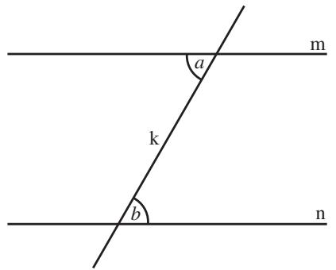
Figure 2 AB and CD are equal, the angle ADC is a right angle, A	 B	 is an intermediate position of AB as it moves toward CD.
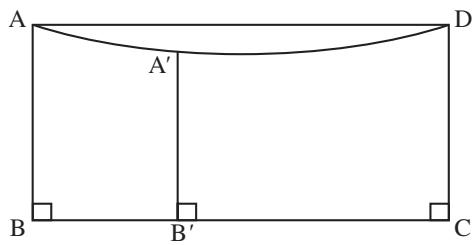
out a straight line, which will coincide with the perpendicular just dropped (see figure 2). This amounts to the assumption that the curve everywhere equidistant from a straight line is itself straight, from which the parallel postulate easily follows, and so his attempt fails. His proof was later heavily criticized by Omar Khayyam for its use of motion, which he found fundamentally unclear and alien to Euclid’s Elements. It is indeed quite distinct from any use Euclid had for motion in geometry, because in this case the nature of the curve obtained is not clear: it is precisely what needs to be analyzed. 
The last of the Islamic attempts on the parallel postulate is due to Nasır al-D¯ın al-T¯us¯ı. He was born in Iran in 1201 and died in Baghdad in 1274. His extensive commentary is also one of our sources of knowledge of earlier Islamic mathematical work on this subject. Al-T¯us¯ı focused on showing that if two lines begin to converge, then they must continue to do so until they eventually meet. To this end he set out to show that 
(∗) if l and m are two lines that make an angle of less than a right angle, then every line perpendicular to l meets the line m. 

He showed that if ( ) is true, then the parallel postulate follows. However, his argument for ( ) is flawed. 
It is genuinely difficult to see what is wrong with some of these arguments if one uses only the techniques available to mathematicians of the time. Islamic mathematicians showed a degree of sophistication that was not to be surpassed by their Western successors until the eighteenth century. Unfortunately, however, their writings did not come to the attention of the West until much later, with the exception of a single work in the Vatican Library, published in 1594, which was for many years erroneously attributed to al-T. ¯us¯ı (and which may have been the work of his son). 
# 5 The Western Revival of Interest 
The Western revival of interest in the parallel postulate came with the second wave of translations of Greek mathematics, led by Commandino and Maurolico in the sixteenth century and spread by the advent of printing. Important texts were discovered in a number of older libraries, and ultimately this led to the production of new texts of Euclid’s Elements. Many of these had something to say about the problem of parallels, pithily referred to by Henry Savile as “a blot on Euclid.” For example, the powerful Jesuit Christopher Clavius, who edited and reworked the Elements in 1574, tried to argue that parallel lines could be defined as equidistant lines. 
The ready identification of physical space with the space of Euclidean geometry came about gradually during the sixteenth and seventeenth centuries, after the acceptance of Copernican astronomy and the abolition of the so-called sphere of fixed stars. It was canonized by newton [VI.14] in his Principia Mathematica, which proposed a theory of gravitation that was firmly situated in Euclidean space. Although Newtonian physics had to fight for its acceptance, Newtonian cosmology had a smooth path and became the unchallenged orthodoxy of the eighteenth century. It can be argued that this identification raised the stakes, because any unexpected or counterintuitive conclusion drawn solely from the core of the Elements was now, possibly, a counterintuitive fact about space. 
In 1663 the English mathematician John Wallis took a much more subtle view of the parallel postulate than any of his predecessors. He had been instructed by Halley, who could read Arabic, in the contents of the apocryphal edition of al-T. ¯us¯ı’s work in the Vatican Library, and he too gave an attempted proof. Unusually, Wallis also had the insight to see where his own argument was flawed, and commented that what it really showed was that, in the presence of the core, the parallel postulate was equivalent to the assertion that there exist similar figures that are not congruent. 

Half a century later, Wallis was followed by the most persistent and thoroughgoing of all the defenders of the parallel postulate, Gerolamo Saccheri, an Italian Jesuit who published in 1733, the year of his death, a short book called Euclid Freed of Every Flaw. This little masterpiece of classical reasoning opens with a trichotomy. Unless the parallel postulate is known, the angle sum of a triangle may be either less than, equal to, or greater than two right angles. Saccheri showed that whatever happens in one triangle happens for them all, so there are apparently three geometries compatible with the core. In the first, every triangle has an angle sum less than two right angles (call this case L). In the second, every triangle has an angle sum equal to two right angles (call this case E). In the third, every triangle has an angle sum greater than two right angles (call this case G). Case E is, of course, Euclidean geometry, which Saccheri wished to show was the only case possible. He therefore set to work to show that each of the other cases independently self-destructed. He was successful with case G, and then turned to case L “which alone obstructs the truth of the [parallel] axiom,” as he put it. 
Case L proved to be difficult, and during the course of his investigations Saccheri established a number of interesting propositions. For example, if case L is true, then two lines that do not meet have just one common perpendicular, and they diverge on either side of it. In the end, Saccheri tried to deal with his difficulties by relying on foolish statements about the behavior of lines at infinity: it was here that his attempted proof failed. 
Saccheri’s work sank slowly, though not completely, into obscurity. It did, however, come to the attention of the Swiss mathematician Johann Lambert, who pursued the trichotomy but, unlike Saccheri, stopped short of claiming success in proving the parallel postulate. Instead the work was abandoned, and was published only in 1786, after his death. Lambert distinguished carefully between unpalatable results and impossibilities. He had a sketch of an argument to show that in case L the area of a triangle is proportional to the difference between two right angles and the angle sum of the triangle. He knew that in case L similar triangles had to be congruent, which would imply that the tables of trigonometric functions used in astronomy were not in fact valid and that different tables would have to be produced for every size of triangle. In particular, for every angle less than 60◦ there would be precisely one equilateral triangle with that given angle at each vertex. This would lead to what philosophers called an “absolute” measure of length (one could take, for instance, the length of the side of an equilateral triangle with angles equal to 30◦), which leibniz’s [VI.15] follower Wolff had said was impossible. And indeed it is counterintuitive: lengths are generally defined in relative terms, as, for instance, a certain proportion of the length of a meter rod in Paris, or of the circumference of Earth, or of something similar. But such arguments, said Lambert, “were drawn from love and hate, with which a mathematician can have nothing to do.” 

# 6 The Shift of Focus around 1800 
The phase of Western interest in the parallel postulate that began with the publication of modern editions of Euclid’s Elements started to decline with a further turn in that enterprise. After the French revolution, legendre [VI.24] set about writing textbooks, largely for the use of students hoping to enter the École Polytechnique, that would restore the study of elementary geometry to something like the rigorous form in which it appeared in the Elements. However, it was one thing to seek to replace books of a heavily intuitive kind, but quite another to deliver the requisite degree of rigor. Legendre, as he came to realize, ultimately failed in his attempt. Specifically, like everyone before him, he was unable to give an adequate defense of the parallel postulate. Legendre’s Éléments de Géométrie ran to numerous editions, and from time to time a different attempt on the postulate was made. Some of these attempts would be hard to describe favorably, but the best can be extremely persuasive. 
Legendre’s work was classical in spirit, and he still took it for granted that the parallel postulate had to be true. But by around 1800 this attitude was no longer universally held. Not everybody thought that the postulate must, somehow, be defended, and some were prepared to contemplate with equanimity the idea that it might be false. No clearer illustration of this shift can be found than a brief note sent to gauss [VI.26] by F. K. Schweikart, a Professor of Law at the University of Marburg, in 1818. Schweikart described in a page the main results he had been led to in what he called “astral geometry,” in which the angle sum of a triangle was less than two right angles: squares had a particular form, and the altitude of a right-angled isosceles triangle was bounded by an amount Schweikart called “the constant.” Schweikart went so far as to claim that the new geometry might even be the true geometry of space. Gauss replied positively. He accepted the results, and he claimed that he could do all of elementary geometry once a value for the constant was given. One could argue, somewhat ungenerously, that Schweikart had done little more than read Lambert’s posthumous book—although the theorem about isosceles triangles is new. However, what is notable is the attitude of mind: the idea that this new geometry might be true, and not just a mathematical curiosity. Euclid’s Elements shackled him no more. 

Unfortunately, it is much less clear what Gauss himself thought. Some historians, bearing Gauss’s remarkable mathematical originality in mind, have been inclined to interpret the evidence in such a way that Gauss emerges as the first person to discover non-Euclidean geometry. However, the evidence is slight, and it is difficult to draw firm conclusions from it. There are traces of some early investigations by Gauss of Euclidean geometry that include a study of a new definition of parallel lines; there are claims made by Gauss late in life that he had known this or that fact for many years; and there are letters he wrote to his friends. But there is no material in the surviving papers that allows us to reconstruct what Gauss knew or that supports the claim that Gauss discovered non-Euclidean geometry. 
Rather, the picture would seem to be that Gauss came to realize during the 1810s that all previous attempts to derive the parallel postulate from the core of Euclidean geometry had failed and that all future attempts would probably fail as well. He became more and more convinced that there was another possible geometry of space. Geometry ceased, in his mind, to have the status of arithmetic, which was a matter of logic, and became associated with mechanics, an empirical science. The simplest accurate statement of Gauss’s position through the 1820s is that he did not doubt that space might be described by a non-Euclidean geometry, and of course there was only one possibility: that of case L described above. It was an empirical matter, but one that could not be resolved by land-based measurements because any departure from Euclidean geometry was, evidently, very small. In this view he was supported by his friends, such as Bessel and Olbers, both professional astronomers. Gauss the scientist was convinced, but Gauss the mathematician may have retained a small degree of doubt, and certainly never developed the mathematical theory required to describe non-Euclidean geometry adequately. 

One theory available to Gauss from the early 1820s was that of differential geometry. Gauss eventually published one of his masterworks on this subject, his Disquisitiones Generales circa Superficies Curvas (1827). In it he showed how to describe geometry on any surface in space, and how to regard certain features of the geometry of a surface as intrinsic to the surface and independent of how the surface was embedded into three-dimensional space. It would have been possible for Gauss to consider a surface of constant negative curvature [III.78], and to show that triangles on such a surface are described by hyperbolic trigonometric formulas, but he did not do this until the 1840s. Had he done so, he would have had a surface on which the formulas of a geometry satisfying case L apply. 
A surface, however, is not enough. We accept the validity of two-dimensional Euclidean geometry because it is a simplification of three-dimensional Euclidean geometry. Before a two-dimensional geometry satisfying the hypotheses of case L can be accepted, it is necessary to show that there is a plausible three-dimensional geometry analogous to case L. Such a geometry has to be described in detail and shown to be as plausible as Euclidean three-dimensional geometry. This Gauss simply never did. 
# 7 Bolyai and Lobachevskii 
The fame for discovering non-Euclidean geometry goes to two men, bolyai [VI.34] in Hungary and lobachevskii [VI.31] in Russia, who independently gave very similar accounts of it. In particular, both men described a system of geometry in two and three dimensions that differed from Euclid’s but had an equally good claim to be the geometry of space. Lobachevskii published first, in 1829, but only in an obscure Russian journal, and then in French in 1837, in German in 1840, and again in French in 1855. Bolyai published his account in 1831, in an appendix to a two-volume work on geometry by his father. 
It is easiest to describe their achievements together. Both men defined parallels in a novel way, as follows. Given a point P and a line m there will be some lines through P that meet m and others that do not. Separating these two sets will be two lines through P that do not quite meet m but which might come arbitrarily close, one to the right of P and one to the left. This situation is illustrated in figure 3: the two lines in question 
Figure 3 The lines n	 and n		 through P separate the lines through P that meet the line m from those that do not.
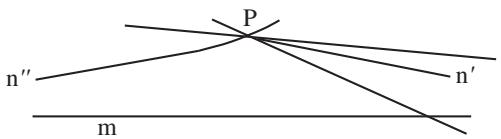
Figure 4 A curve perpendicular to a family of parallels.
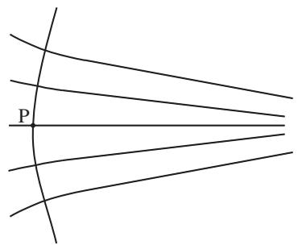
are n	 and n		. Notice that lines on the diagram appear curved. This is because, in order to represent them on a flat, Euclidean page, it is necessary to distort them, unless the geometry is itself Euclidean, in which case one can put n	 and n		 together and make a single line that is infinite in both directions. 
Given this new way of talking, it still makes sense to talk of dropping the perpendicular from P to the line m. The left and right parallels to m through P make equal angles with the perpendicular, called the angle of parallelism. If the angle is a right angle, then the geometry is Euclidean. However, if it is less than a right angle, then the possibility arises of a new geometry. It turns out that the size of the angle depends on the length of the perpendicular from P to m. Neither Bolyai nor Lobachevskii expended any effort in trying to show that there was not some contradiction in taking the angle of parallelism to be less than a right angle. Instead, they simply made the assumption and expended a great deal of effort on determining the angle from the length of the perpendicular. 
They both showed that, given a family of lines all parallel (in the same direction) to a given line, and given a point on one of the lines, there is a curve through that point that is perpendicular to each of the lines (figure 4). 
In Euclidean geometry the curve defined in this way is the straight line that is at right angles to the family of parallel lines and that passes through the given point (figure 5). If, again in Euclidean geometry, one takes the family of all lines through a common point Q and chooses another point P, then there will be a curve through P that is perpendicular to all the lines: the circle with center Q that passes through P (figure 6). 

Figure 5 A curve perpendicular to a family of Euclidean parallels.
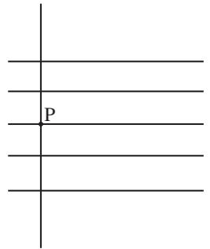
Figure 6 A curve perpendicular to a family of Euclidean lines through a point.
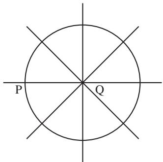

The curve defined by Bolyai and Lobachevskii has some of the properties of both these Euclidean constructions: it is perpendicular to all the parallels, but it is curved and not straight. Bolyai called such a curve an L-curve. Lobachevskii more helpfully called it a horocycle, and the name has stuck. 
Their complicated arguments took both men into three-dimensional geometry. Here Lobachevskii’s arguments were somewhat clearer than Bolyai’s, and both men notably surpassed Gauss. If the figure defining a horocycle is rotated about one of the parallel lines, the lines become a family of parallel lines in three dimensions and the horocycle sweeps out a bowl-shaped surface, called the F-surface by Bolyai and the horosphere by Lobachevskii. Both men now showed that something remarkable happens. Planes through the horosphere cut it either in circles or in horocycles, and if a triangle is drawn on a horosphere whose sides are horocycles, then the angle sum of such a triangle is two right angles. To put this another way, although the space that contains the horosphere is a three-dimensional version of case L, and is definitely not Euclidean, the geometry you obtain when you restrict attention to the horosphere is (two-dimensional) Euclidean geometry! 

Bolyai and Lobachevskii also knew that one can draw spheres in their three-dimensional space, and they showed (though in this they were not original) that the formulas of spherical geometry hold independently of the parallel postulate. Lobachevskii now used an ingenious construction involving his parallel lines to show that a triangle on a sphere determines and is determined by a triangle in the plane, which also determines and is determined by a triangle on the horosphere. This implies that the formulas of spherical geometry must determine formulas that apply to the triangles on the horosphere. On checking through the details, Lobachevskii, and in more or less the same way Bolyai, showed that the triangles on the horosphere are described by the formulas of hyperbolic trigonometry. 
The formulas for spherical geometry depend on the radius of the sphere in question. Similarly, the formulas of hyperbolic trigonometry depend on a certain real parameter. However, this parameter does not have a similarly clear geometrical interpretation. That defect apart, the formulas have a number of reassuring properties. In particular, they closely approximate the familiar formulas of plane geometry when the sides of the triangles are very small, which helps to explain how this geometry could have remained undetected for so long—it differs very little from Euclidean geometry in small regions of space. Formulas for length and area can be developed in the new setting: they show that the area of a triangle is proportional to the amount by which the angle sum of the triangle falls short of two right angles. Lobachevskii, in particular, seems to have felt that the very fact that there were neat and plausible formulas of this kind was enough reason to accept the new geometry. In his opinion, all geometry was about measurement, and theorems in geometry were unfailing connections between measurements expressed by formulas. His methods produced such formulas, and that, for him, was enough. 
Bolyai and Lobachevskii, having produced a description of a novel three-dimensional geometry, raised the question of which geometry is true: is it Euclidean geometry or is it the new geometry for some value of the parameter that could presumably be determined experimentally? Bolyai left matters there, but Lobachevskii explicitly showed that measurements of stellar parallax might resolve the question. Here he was unsuccessful: such experiments are notoriously delicate. 

By and large, the reaction to Bolyai and Lobachevskii’s ideas during their lifetimes was one of neglect and hostility, and they died unaware of the success their discoveries would ultimately have. Bolyai and his father sent their work to Gauss, who replied in 1832 that he could not praise the work “for to do so would be to praise myself,” adding, for extra measure, a simpler proof of one of Janos Bolyai’s opening results. He was, he said, nonetheless delighted that it was the son of his old friend who had taken precedence over him. Janos Bolyai was enraged, and refused to publish again, thus depriving himself of the opportunity to establish his priority over Gauss by publishing his work as an article in a mathematics journal. Oddly, there is no evidence that Gauss knew the details of the young Hungarian’s work in advance. More likely, he saw at once how the theory would go once he appreciated the opening of Bolyai’s account. 
A charitable interpretation of the surviving evidence would be that, by 1830, Gauss was convinced of the possibility that physical space might be described by non-Euclidean geometry, and he surely knew how to handle two-dimensional non-Euclidean geometry using hyperbolic trigonometry (although no detailed account of this survives from his hand). But the three-dimensional theory was known first to Bolyai and Lobachevskii, and may well not have been known to Gauss until he read their work. 
Lobachevskii fared little better than Bolyai. His initial publication of 1829 was savaged in the press by Ostrogradskii, a much more established figure who was, moreover, in St Petersburg, whereas Lobachevskii was in provincial Kazan. His account in Journal für die reine und angewandte Mathematik (otherwise known as Crelle’s Journal) suffered grievously from referring to results proved only in the Russian papers from which it had been adapted. His booklet of 1840 drew only one review, of more than usual stupidity. He did, however, send it to Gauss, who found it excellent and had Lobachevskii elected to the Göttingen Academy of Sciences. But Gauss’s enthusiasm stopped there, and Lobachevskii received no further support from him. 
Such a dreadful response to a major discovery invites analysis on several levels. It has to be said that the definition of parallels upon which both men depended was, as it stood, inadequate, but their work was not criticized on that account. It was dismissed with scorn, as if it were self-evident that it was wrong: so wrong that it would be a waste of time finding the error it surely contained, so wrong that the right response was to heap ridicule upon its authors or simply to dismiss them without comment. This is a measure of the hold that Euclidean geometry still had on the minds of most people at the time. Even Copernicanism, for example, and the discoveries of Galileo drew a better reception from the experts. 

# 8 Acceptance of Non-Euclidean Geometry 
When Gauss died in 1855, an immense amount of unpublished mathematics was found among his papers. Among it was evidence of his support for Bolyai and Lobachevskii, and his correspondence endorsing the possible validity of non-Euclidean geometry. As this was gradually published, the effect was to send people off to look for what Bolyai and Lobachevskii had written and to read it in a more positive light. 
Quite by chance, Gauss had also had a student at Göttingen who was capable of moving the matter decisively forward, even though the actual amount of contact between the two was probably quite slight. This was riemann [VI.49]. In 1854 he was called to defend his Habilitation thesis, the postdoctoral qualification that was a German mathematician’s license to teach in a university. As was the custom, he offered three titles and Gauss, who was his examiner, chose the one Riemann least expected: “On the hypotheses that lie at the foundation of geometry.” The paper, which was to be published only posthumously, in 1867, was nothing less than a complete reformulation of geometry. 
Riemann proposed that geometry was the study of what he called manifolds [I.3 §§6.9, 6.10]. These were “spaces” of points, together with a notion of distance that looked like Euclidean distance on small scales but which could be quite different at larger scales. This kind of geometry could be done in a variety of ways, he suggested, by means of the calculus. It could be carried out for manifolds of any dimension, and in fact Riemann was even prepared to contemplate manifolds for which the dimension was infinite. 
A vital aspect of Riemann’s geometry, in which he followed the lead of Gauss, was that it was concerned only with those properties of the manifold that were intrinsic, rather than properties that depended on some embedding into a larger space. In particular, the distance between two points x and y was defined to be the length of the shortest curve joining x and y that lay entirely within the surface. Such curves are called geodesics. (On a sphere, for example, the geodesics are arcs of great circles.) 

Even two-dimensional manifolds could have different, intrinsic curvatures—indeed, a single two-dimensional manifold could have different curvatures in different places—so Riemann’s definition led to infinitely many genuinely distinct geometries in each dimension. Furthermore, these geometries were best defined without reference to a Euclidean space that contained them, so the hegemony of Euclidean geometry was broken once and for all. 
As the word “hypotheses” in the title of his thesis suggests, Riemann was not at all interested in the sorts of assumptions needed by Euclid. Nor was he much interested in the opposition between Euclidean and non-Euclidean geometry. He made a small reference at the start of his paper to the murkiness that lay at the heart of geometry, despite the efforts of Legendre, and toward the end he considered the three different geometries on two-dimensional manifolds for which the curvature is constant. He noted that one was spherical geometry, another was Euclidean geometry, and the third was different again, and that in each case the angle sums of all triangles could be calculated as soon as one knew the sum of the angles of any one triangle. But he made no reference to Bolyai or Lobachevskii, merely noting that if the geometry of space was indeed a threedimensional geometry of constant curvature, then to determine which geometry it was would involve taking measurements in unfeasibly large regions of space. He did discuss generalizations of Gauss’s curvature to spaces of arbitrary dimension, and he showed what metrics [III.56] (that is, definitions of distance) there could be on spaces of constant curvature. The formula he wrote down is very general, but as with Bolyai and Lobachevskii it depended on a certain real parameter— the curvature. When the curvature is negative, his definition of distance gives a description of non-Euclidean geometry. 
Riemann died in 1866, and by the time his thesis was published an Italian mathematician, Eugenio Beltrami, had independently come to some of the same ideas. He was interested in what the possibilities were if one wished to map one surface to another. For example, one might ask, for some particular surface S, whether it is possible to find a map from S to the plane such that the geodesics in S are mapped to straight lines in the plane. He found that the answer was yes if and only if the space has constant curvature. There is, for example, a well-known map from the hemisphere to a plane with this property. Beltrami found a simple way of modifying the formula so that now it defined a map from a surface of constant negative curvature onto the interior of a disk, and he realized the significance of what he had done: his map defined a metric on the interior of the disk, and the resulting metric space obeyed the axioms for non-Euclidean geometry; therefore, those axioms would not lead to a contradiction. 

Some years earlier, Minding, in Germany, had found a surface, sometimes called the pseudosphere, that had constant negative curvature. It was obtained by rotating a curve called the tractrix about its axis. This surface has the shape of a bugle, so it seemed rather less natural than the space of Euclidean plane geometry and unsuitable as a rival to it. The pseudosphere was independently rediscovered by liouville [VI.39] some years later, and Codazzi learned of it from that source and showed that triangles on this surface are described by the formulas of hyperbolic trigonometry. But none of these men saw the connection to non-Euclidean geometry—that was left to Beltrami. 
Beltrami realized that his disk depicted an infinite space of constant negative curvature, in which the geometry of Lobachevskii (he did not know at that time of Bolyai’s work) held true. He saw that it related to the pseudosphere in a way similar to the way that a plane relates to an infinite cylinder. After a period of some doubt, he learned of Riemann’s ideas and realized that his disk was in fact as good a depiction of the space of non-Euclidean geometry as any could be; there was no need to realize his geometry as that of a surface in Euclidean three-dimensional space. He thereupon published his essay, in 1868. This was the first time that sound foundations had been publicly given for the area of mathematics that could now be called non-Euclidean geometry. 
In 1871 the young klein [VI.57] took up the subject. He already knew that the English mathematician cayley [VI.46] had contrived a way of introducing Euclidean metrical concepts into projective geometry [I.3 §6.7]. While studying at Berlin, Klein saw a way of generalizing Cayley’s idea and exhibiting Beltrami’s non-Euclidean geometry as a special case of projective geometry. His idea met with the disapproval of weierstrass [VI.44], the leading mathematician in Berlin, who objected that projective geometry was not a metrical geometry: therefore, he claimed, it could not generate metrical concepts. However, Klein persisted and in a series of three papers, in 1871, 1872, and 1873, showed that all the known geometries could be regarded as subgeometries of projective geometry. His idea was to recast geometry as the study of a group acting on a space. Properties of figures (subsets of the space) that remain invariant under the action of the group are the geometric properties. So, for example, in a projective space of some dimension, the appropriate group for projective geometry is the group of all transformations that map lines to lines, and the subgroup that maps the interior of a given conic to itself may be regarded as the group of transformations of non-Euclidean geometry: see the box on p. 94. (For a fuller discussion of Klein’s approach to geometry, see [I.3 §6].) 

In the 1870s Klein’s message was spread by the first and third of these papers, which were published in the recently founded journal Mathematische Annalen. As Klein’s prestige grew, matters changed, and by the 1890s, when he had the second of the papers republished and translated into several languages, it was this, the Erlanger Programm, that became well-known. It is named after the university where Klein became a professor, at the remarkably young age of twenty-three, but it was not his inaugural address. (That was about mathematics education.) For many years it was a singularly obscure publication, and it is unlikely that it had the effect on mathematics that some historians have come to suggest. 
# 9 Convincing Others 
Klein’s work directed attention away from the figures in geometry and toward the transformations that do not alter the figures in crucial respects. For example, in Euclidean geometry the important transformations are the familiar rotations and translations (and reflections, if one chooses to allow them). These correspond to the motions of rigid bodies that contemporary psychologists saw as part of the way in which individuals learn the geometry of the space around them. But this theory was philosophically contentious, especially when it could be extended to another metrical geometry, non-Euclidean geometry. Klein prudently entitled his main papers “On the so-called non-Euclidean geometry,” to keep hostile philosophers at bay (in particular Lotze, who was the well-established Kantian philosopher at Göttingen). But with these papers and the previous work of Beltrami the case for non-Euclidean geometry was made, and almost all mathematicians were persuaded. They believed, that is, that alongside Euclidean geometry there now stood an equally valid mathematical system called non-Euclidean geometry. As for which one of these was true of space, it seemed so clear that Euclidean geometry was the sensible choice that there appears to have been little or no discussion. Lipschitz showed that it was possible to do all of mechanics in the new setting, and there the matter rested, a hypothetical case of some charm but no more. Helmholtz, the leading physicist of his day, became interested—he had known Riemann personally—and gave an account of what space would have to be if it was learned about through the free mobility of bodies. His first account was deeply flawed, because he was unaware of non-Euclidean geometry, but when Beltrami pointed this out to him he reworked it (in 1870). The reworked version also suffered from mathematical deficiencies, which were pointed out somewhat later by lie [VI.53], but he had more immediate trouble from philosophers. 

Their question was, “What sort of knowledge is this theory of non-Euclidean geometry?” Kantian philosophy was coming back into fashion, and in Kant’s view knowledge of space was a fundamental pure a priori intuition, rather than a matter to be determined by experiment: without this intuition it would be impossible to have any knowledge of space at all. Faced with a rival theory, non-Euclidean geometry, neo-Kantian philosophers had a problem. They could agree that the mathematicians had produced a new and prolonged logical exercise, but could it be knowledge of the world? Surely the world could not have two kinds of geometry? Helmholtz hit back, arguing that knowledge of Euclidean geometry and non-Euclidean geometry would be acquired in the same way—through experience—but these empiricist overtones were unacceptable to the philosophers, and non-Euclidean geometry remained a problem for them until the early years of the twentieth century. 
Mathematicians could not in fact have given a completely rigorous defense of what was becoming the accepted position, but as the news spread that there were two possible descriptions of space, and that one could therefore no longer be certain that Euclidean geometry was correct, the educated public took up the question: what was the geometry of space? Among the first to grasp the problem in this new formulation was poincaré [VI.61]. He came to mathematical fame in the early 1880s with a remarkable series of essays in which he reformulated Beltrami’s disk model so as to make it conformal: that is, so that angles in non-Euclidean geometry were represented by the same angles in the 

Cross-ratios and distances in conics. A projective transformation of the plane sends four distinct points on a line, A, B, C, D, to four distinct collinear points, A	 , B	, C	, D	, in such a way that the quantity 
$\frac {\mathrm{AB}}{\mathrm{AD}} \frac {\mathrm{CD}}{\mathrm{CB}}$
is preserved: that is, 
$\frac {\mathrm{AB}}{\mathrm{AD}} \frac {\mathrm{CD}}{\mathrm{CB}} = \frac {\mathrm{A} ^ {\prime} \mathrm{B} ^ {\prime}}{\mathrm{A} ^ {\prime} \mathrm{D} ^ {\prime}} \frac {\mathrm{C} ^ {\prime} \mathrm{D} ^ {\prime}}{\mathrm{C} ^ {\prime} \mathrm{B} ^ {\prime}}.$
This quantity is called the cross-ratio of the four points A, B, C, D, and is written CR(A, B, C, D). 
In 1871, Klein described non-Euclidean geometry as the geometry of points inside a fixed conic, K, where the transformations allowed are the projective transformations that map K to itself and its interior to its interior (see figure 7). To define the distance between two points P and Q inside K, Klein noted that if the line PQ is extended to meet K at A and D, then the cross-ratio CR(A, P, D, Q) does not change if one applies a projective transformation: that is, it is a projective invariant. Moreover, if R is a third point on the line PQ and the points lie in the order P, Q , R, then CR(A, P, D, Q ) CR(A, Q , D, R) CR(A, P, D, R). Accordingly, he defined the distance between P and Q as d(PQ) = − 1 log CR(A, P, D, Q) (the factor of is introduced to facilitate the later introduction of trigonometry). With this definition, distance is additive along a line: d(PQ)  d(QR) d(PR). 

Figure 7 Three points, P, Q, and R, on a non-Euclidean straight line in Klein’s projective model of non-Euclidean geometry.
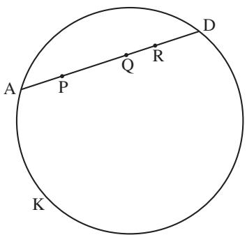
model. He then used his new disk model to connect complex function theory, the theory of linear differential equations, riemann surface [III.79] theory, and non-Euclidean geometry to produce a rich new body of ideas. Then, in 1891, he pointed out that the disk model permitted one to show that any contradiction in non-Euclidean geometry would yield a contradiction in Euclidean geometry as well, and vice versa. Therefore, Euclidean geometry was consistent if and only if non-Euclidean geometry was consistent. A curious consequence of this was that if anybody had managed to derive the parallel postulate from the core of Euclidean geometry, then they would have inadvertently proved that Euclidean geometry was inconsistent! 
One obvious way to try to decide which geometry described the actual universe was to appeal to physics. But Poincaré was not convinced by this. He argued in another paper (1902) that experience was open to many interpretations and there was no logical way of deciding what belonged to mathematics and what to physics. Imagine, for example, an elaborate set of measurements of angle sums of figures, perhaps on an astronomical scale. Something would have to be taken to be straight, perhaps the paths of rays of light. Suppose, finally, that the conclusion is that the angle sum of a triangle is indeed less than two right angles by an amount proportional to the area of the triangle. Poincaré said that there were two possible conclusions: light rays are straight and the geometry of space is non-Euclidean; or light rays are somehow curved, and space is Euclidean. Moreover, he continued, there was no logical way to choose between these possibilities. All one could do was to make a convention and abide by it, and the sensible convention was to choose the simpler geometry: Euclidean geometry. 

This philosophical position was to have a long life in the twentieth century under the name of conventionalism, but it was far from accepted in Poincaré’s lifetime. A prominent critic of conventionalism was the Italian Federigo Enriques, who, like Poincaré, was both a powerful mathematician and a writer of popular essays on issues in science and philosophy. He argued that one could decide whether a property was geometrical or physical by seeing whether we had any control over it. We cannot vary the law of gravity, but we can change the force of gravity at a point by moving matter around. Poincaré had compared his disk model to a metal disk that was hot in the center and got cooler as one moved outwards. He had shown that a simple law of cooling produced figures identical to those of non-Euclidean geometry. Enriques replied that heat was likewise something we can vary. A property such as Poincaré invoked, which was truly beyond our control, was not physical but geometric. 

# 10 Looking Ahead 
In the end, the question was resolved, but not in its own terms. Two developments moved mathematicians beyond the simple dichotomy posed by Poincaré. Starting in 1899, hilbert [VI.63] began an extensive rewriting of geometry along axiomatic lines, which eclipsed earlier ideas of some Italian mathematicians and opened the way to axiomatic studies of many kinds. Hilbert’s work captured very well the idea that if mathematics is sound, it is sound because of the nature of its reasoning, and led to profound investigations in mathematical logic. And in 1915 Einstein proposed his general theory of relativity, which is in large part a geometric theory of gravity. Confidence in mathematics was restored; our sense of geometry was much enlarged, and our insights into the relationships between geometry and space became considerably more sophisticated. Einstein made full use of contemporary ideas about geometry, and his achievement would have been unthinkable without Riemann’s work. He described gravity as a kind of curvature in the four-dimensional manifold of spacetime (see general relativity and the einstein equations [IV.13]). His work led to new ways of thinking about the large-scale structure of the universe and its ultimate fate, and to questions that remain unanswered to this day. 
# Further Reading 
# II.3 The Development of Abstract Algebra 
Karen Hunger Parshall 
# 1 Introduction 
What is algebra? To the high school student encountering it for the first time, algebra is an unfamiliar abstract language of x’s and y’s, a’s and b’s, together with rules for manipulating them. These letters, some of them variables and some constants, can be used for many purposes. For example, one can use them to express straight lines as equations of the form y = ax b, which can be graphed and thereby visualized in the Cartesian plane. Furthermore, by manipulating and interpreting these equations, it is possible to determine such things as what a given line’s root is (if it has one)— that is, where it crosses the x-axis—and what its slope is—that is, how steep or flat it appears in the plane relative to the axis system. There are also techniques for solving simultaneous equations, or equivalently for determining when and where two lines intersect (or demonstrating that they are parallel). 
Just when there already seem to be a lot of techniques and abstract manipulations involved in dealing with lines, the ante is upped. More complicated curves like quadratics, , and even cubics, and quartics, enter the picture, but the same sort of notation and rules apply, and similar sorts of questions are asked. Where are the roots of a given curve? Given two curves, where do they intersect? 
Suppose now that the same high school student, having mastered this sort of algebra, goes on to university and attends an algebra course there. Essentially gone are the by now familiar and b’s; essentially gone are the nice graphs that provide a way to picture what is going on. The university course reflects some brave new world in which the algebra has somehow become “modern.” This modern algebra involves abstract structures—groups [I.3 §2.1], rings [III.81 §1], fields [I.3 §2.2], and other so-called objects—each one defined in terms of a relatively small number of axioms and built up of substructures like subgroups, ideals, and subfields. There is a lot of moving around between these objects, too, via maps like group homomorphisms and ring automorphisms [I.3 §4.1]. One objective of this new type of algebra is to understand the underlying structure of the objects and, in doing so, to build entire theories of groups or rings or fields. These abstract theories may then be applied in diverse settings where the basic axioms are satisfied but where it may not be at all apparent a priori that a group or a ring or a field may be lurking. This, in fact, is one of modern algebra’s great strengths: once we have proved a general fact about an algebraic structure, there is no need to prove that fact separately each time we come across an instance of that structure. This abstract approach allows us to recognize that contexts that may look quite different are in fact importantly similar. 

How is it that two endeavors—the high school analysis of polynomial equations and the modern algebra of the research mathematician—so seemingly different in their objectives, in their tools, and in their philosophical outlooks are both called “algebra”? Are they even related? In fact, they are, but the story of how they are is long and complicated. 
# 2 Algebra before There Was Algebra: From Old Babylon to the Hellenistic Era 
Solutions of what would today be recognized as firstand second-degree polynomial equations may be found in Old Babylonian cuneiform texts that date to the second millennium b.c.e. However, these problems were neither written in a notation that would be recognizable to our modern-day high school student nor solved using the kinds of general techniques so characteristic of the high school algebra classroom. Rather, particular problems were posed, and particular solutions obtained, from a series of recipe-like steps. No general theoretical justification was given, and the problems were largely cast geometrically, in terms of measurable line segments and surfaces of particular areas. Consider, for example, this problem, translated and transcribed from a clay tablet held in the British Museum (catalogued as BM 13901, problem 1) that dates from between 1800 and 1600 b.c.e.: 
The surface of my confrontation I have accumulated: 45	 is it. 1, the projection, you posit. The moiety of 1 you break, 30	 and 30	 you make hold. 15	 to 45	 you append: by 1, 1 is equalside. 30	 which you have made hold in the inside you tear out: 30	 the confrontation. 
This may be translated into modern notation as the equation , where it is important to notice that the Babylonian number system is base 60, so 45 denotes . The text then lays out the following algorithm for solving the problem: take 1, the coefficient of the linear term, and halve it to get . Square to get Add 14 to , the constant term, to get 1. This is the square of 1. Subtract from this the which you multiplied by to get the side of the square. The modern reader can easily see that this algorithm is equivalent to what is now called the quadratic formula, but the Babylonian tablet presents it in the context of a particular problem and repeats it in the contexts of other particular problems. There are no equations in the modern sense; the Babylonian writer is literally effecting a construction of plane figures. Similar problems and similar algorithmic solutions can also be found in ancient Egyptian texts such as the Rhind papyrus, believed to have been copied in 1650 b.c.e. from a text that was about a century and a half older. 

There is a sharp contrast between the problem-oriented, untheoretical approach characteristic of texts from this early period and the axiomatic and deductive approach that euclid [VI.2] introduced into mathematics in around 300 b.c.e. in his magisterial, geometrical treatise, the Elements. (See geometry [II.2] for a further discussion of this work.) There, building on explicit definitions and a small number of axioms or selfevident truths, Euclid proceeded to deduce known— and almost certainly some hitherto unknown—results within a strictly geometrical context. Geometry done in this axiomatic context defined Euclid’s standard of rigor. But what does this quintessentially geometrical text have to do with algebra? Consider the sixth proposition in Euclid’s Book II, ostensibly a book on plane figures, and in particular quadrilaterals: 
If a straight line be bisected and a straight line be added to it in a straight line, the rectangle contained by the whole with the added straight line and the added straight line together with the square on the half is equal to the square on the straight line made up of the half and the added straight line. 
While clearly a geometrical construction, it equally clearly describes two constructions—one a rectangle and one a square—that have equal areas. It therefore describes something that we should be able to write as an equation. Figure 1 gives the picture corresponding to Euclid’s construction: he proves that the area of rectangle ADMK equals the sum of rectangles CDML and HMFG. To do this, he adds the square on CB— namely, square LHGE—to CDML and HMFG. This gives square CDFE. It is not hard to see that this is equivalent to the high school procedure of “completing the square” and to the algebraic equation , which we obtain by setting CB a and 

Figure 1 The sixth proposition from Euclid’s Book II.
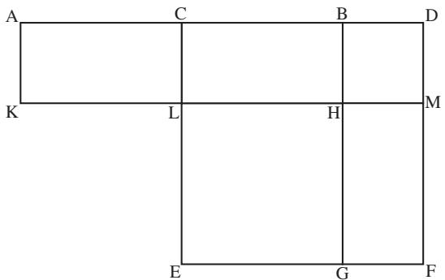
BD  b. Equivalent, yes, but for Euclid this is a specific geometrical construction and a particular geometrical equivalence. For this reason, he could not deal with anything but positive real quantities, since the sides of a geometrical figure could only be measured in those terms. Negative quantities did not and could not enter into Euclid’s fundamentally geometrical mathematical world. Nevertheless, in the historical literature, Euclid’s Book II has often been described as dealing with “geometrical algebra,” and, because of our easy translation of the book’s propositions into the language of algebra, it has been argued, albeit ahistorically, that Euclid had algebra but simply presented it geometrically. 
Although Euclid’s geometrical standard of rigor came to be regarded as a pinnacle of mathematical achievement, it was in many ways not typical of the mathematics of classical Greek antiquity, a mathematics that focused less on systematization and more on the clever and individualistic solution of particular problems. There is perhaps no better exemplar of this than archimedes [VI.3], held by many to have been one of the three or four greatest mathematicians of all time. Still, Archimedes, like Euclid, posed and solved particular problems geometrically. As long as geometry defined the standard of rigor, not only negative numbers but also what we would recognize as polynomial equations of degree higher than three effectively fell outside the sphere of possible mathematical discussion. (As in the example from Euclid above, quadratic polynomials result from the geometrical process of completing the square; cubics could conceivably result from the geometrical process of completing the cube; but quartics and higher-degree polynomials could not be constructed in this way in familiar, threedimensional space.) However, there was another mathematician of great importance to the present story, Diophantus of Alexandria (who was active in the middle of the third century c.e.). Like Archimedes, he posed particular problems, but he solved them in an algorithmic style much more reminiscent of the Old Babylonian texts than of Archimedes’ geometrical constructions, and as a result he was able to begin to exceed the bounds of geometry. 

In his text Arithmetica, Diophantus put forward general, indeterminate problems, which he then restricted by specifying that the solutions should have particular forms, before providing specific solutions. He expressed these problems in a very different way from the purely rhetorical style that held sway for centuries after him. His notation was more algebraic and was ultimately to prove suggestive to sixteenth-century mathematicians (see below). In particular, he used special abbreviations that allowed him to deal with the first six positive and negative powers of the unknown as well as with the unknown to the zeroth power. Thus, whatever his mathematics was, it was not the “geometrical algebra” of Euclid and Archimedes. 
Consider, for example, this problem from Book II of the Arithmetica: find three numbers such that the square of any one of them minus the next following gives a square.” In terms of modern notation, he began by restricting his attention to solutions of the form . It is easy to see that and , so two of the conditions of the problem are immediately satisfied, but he needed to be a square as well. Arbitrarily setting , Diophantus then determined that gave him what he needed, so a solution was 9 , and he was done. He provided no geometrical justification because in his view none was needed; a single numerical solution was all he required. He did not set up what we would recognize as a more general set of equations and try to find all possible solutions. 
Diophantus, who lived more than four centuries after Archimedes’ death, was doing neither geometry nor algebra in our modern sense, yet the kinds of problems and the sorts of solutions he obtained for them were very different from those found in the works of either Euclid or Archimedes. The extent to which Diophantus created a wholly new approach, rather than drawing on an Alexandrian tradition of what might be called “algorithmic algebraic,” as opposed to “geometric algebraic,” scholarship is unknown. It is clear that by the time Diophantus’s ideas were introduced into the Latin West in the sixteenth century, they suggested new possibilities to mathematicians long conditioned to the authority of geometry. 

# 3 Algebra before There Was Algebra: The Medieval Islamic World 
The transmission of mathematical ideas was, however, a complex process. After the fall of the Roman Empire and the subsequent decline of learning in the West, both the Euclidean and the Diophantine traditions ultimately made their way into the medieval Islamic world. There they were not only preserved—thanks to the active translation initiatives of Islamic scholars—but also studied and extended. 
al-khw¯arizm¯ı [VI.5] was a scholar at the royally funded House of Wisdom in Baghdad. He linked the kinds of geometrical arguments Euclid had presented in Book II of his Elements with the indigenous problemsolving algorithms that dated back to Old Babylonian times. In particular, he wrote a book on practical mathematics, entitled al-Kit¯ab al-mukhtasar f¯ı his¯ab al-jabr wa’l-muq¯abala (“The compendious book on calculation by completion and balancing”), beginning it with a theoretical discussion of what we would now recognize as polynomial equations of the first and second degrees. (The latinization of the word “al-jabr” or “completion” in his title gave us our modern term “algebra.”) Because he employed neither negative numbers nor zero coefficients, al-Khw¯arizm¯ı provided a systematization in terms of six separate kinds of examples where we would need just one, namely ax2+bx+c = 0. He considered, for example, the case when “a square and 10 roots are equal to 39 units,” and his algorithmic solution in terms of multiplications, additions, and subtractions was in precisely the same form as the above solution from tablet BM 13901. This, however, was not enough for al-Khw¯arizm¯ı. “It is necessary,” he said, “that we should demonstrate geometrically the truth of the same problems which we have explained in numbers,” and he proceeded to do this by “completing the square” in geometrical terms reminiscent of, but not as formal as, those Euclid used in Book II. (Ab¯u K¯amil (ca. 850–930), an Egyptian Islamic mathematician of the generation after al-Khw¯arizm¯ı, introduced a higher level of Euclidean formality into the geometric–algorithmic setting.) This juxtaposition made explicit how the relationships between geometrical areas and lines could be interpreted in terms of numerical multiplications, additions, and subtractions, a key step that would ultimately suggest a move away from the geometrical solution of particular problems and toward an algebraic solution of general types of equations. 

Another step along this path was taken by the mathematician and poet Omar Khayyam (ca. 1050–1130) in a book he entitled Al-jabr after al-Khw¯arizm¯ı’s work. Here he proceeded to systematize and solve what we would recognize, in the absence of both negative numbers and zero coefficients, as the cases of the cubic equation. Following al-Khw¯arizm¯ı, Khayyam provided geometrical justifications, yet his work, even more than that of his predecessor, may be seen as closer to a general problem-solving technique for specific cases of equations, that is, closer to the notion of algebra. 
The Persian mathematician al-Karaj¯ı (who flourished in the early eleventh century) also knew well and appreciated the geometrical tradition stemming from Euclid’s Elements. However, like Ab¯u-K¯amil, he was aware of the Diophantine tradition too, and synthesized in more general terms some of the procedures Diophantus had laid out in the context of specific examples in the Arithmetica. Although Diophantus’s ideas and style were known to these and other medieval Islamic mathematicians, they would remain unknown in the Latin West until their rediscovery and translation in the sixteenth century. Equally unknown in the Latin West were the accomplishments of Indian mathematicians, who had succeeded in solving some quadratic equations algorithmically by the beginning of the eighth century and who, like Bragmagupta four hundred years later, had techniques for finding integer solutions to particular examples of what are today called Pell’s equations, namely, equations of the form , where a and b are integers and a is not a square. 
# 4 Algebra before There Was Algebra: The Latin West 
Concurrent with the rise of Islam in the East, the Latin West underwent a gradual cultural and political stabilization in the centuries following the fall of the Roman Empire. By the thirteenth century, this relative stability had resulted in the firm entrenchment of the Catholic Church as well as the establishment both of universities and of an active economy. Moreover, the Islamic conquest of most of the Iberian peninsula in the eighth century and the subsequent establishment there of an Islamic court, library, and research facility similar to the House of Wisdom in Baghdad brought the fruits of medieval Islamic scholarship to western Europe’s doorstep. However, as Islam found its position on the Iberian peninsula increasingly compromised in the twelfth and thirteenth centuries, this Islamic learning, as well as some of the ancient Greek scholarship that the medieval Islamic scholars had preserved in Latin translation, began to filter into medieval Europe. In particular, fibonacci [VI.6], son of an influential administrator within the Pisan city state, encountered al-Khw¯arizm¯ı’s text and recognized not only the impact that the Arabic number system detailed there could have on accounting and commerce (Roman numerals and their cumbersome rules for manipulation were still widely in use) but also the importance of al-Khw¯arizm¯ı’s theoretical discussion, with its wedding of geometrical proof and the algorithmic solution of what we can interpret as first- and second-degree equations. In his 1202 book Liber Abbaci, Fibonacci presented al-Khw¯arizm¯ı’s work almost verbatim, and extolled all of these virtues, thus effectively introducing this knowledge and approach into the Latin West. 

Fibonacci’s presentation, especially of the practical aspects of al-Khw¯arizm¯ı’s text, soon became wellknown in Europe. So-called abacus schools (named after Fibonacci’s text and not after the Chinese calculating instrument) sprang up all over the Italian peninsula, particularly in the fourteenth and fifteenth centuries, for the training of accountants and bookkeepers in an increasingly mercantilistic Western world. The teachers in these schools, the “maestri d’abaco,” built on and extended the algorithms they found in Fibonacci’s text. Another tradition, the Cossist tradition—after the German word “Coss” connoting algebra, that is, “Kunstrechnung” or “artful calculation”—developed simultaneously in the Germanic regions of Europe and aimed to introduce algebra into the mainstream there. 
In 1494 the Italian Luca Pacioli published (by now this is the operative word: Pacioli’s text is one of the earliest printed mathematical texts) a compendium of all known mathematics. By this time, the geometrical justifications that al-Khw¯arizm¯ı and Fibonacci had presented had long since fallen from the mathematical vernacular. By reintroducing them in his book, the Summa, Pacioli brought them back to the mathematical fore. Not knowing of Khayyam’s work, he asserted that solutions had been discovered only in the six cases treated by both al-Khw¯arizm¯ı and Fibonacci, even though there had been abortive attempts to solve the cubic and even though he held out the hope that it could ultimately be solved. 

Pacioli’s book had highlighted a key unsolved problem: could algorithmic solutions be determined for the various cases of the cubic? And, if so, could these be justified geometrically with proofs similar in spirit to those found in the texts of al-Khw¯arizm¯ı and Fibonacci? 
Among several sixteenth-century Italian mathematicians who eventually managed to answer the first question in the affirmative was cardano [VI.7]. In his Ars Magna, or The Great Art, of 1545, he presented algorithms with geometric justifications for the various cases of the cubic, effectively completing the cube where al-Khw¯arizm¯ı and Fibonacci had completed the square. He also presented algorithms that had been discovered by his student Ludovico Ferrari (1522–65) for solving the cases of the quartic. These intrigued him, because, unlike the algorithms for the cubic, they were not justified geometrically. As he put it in his book, “all those matters up to and including the cubic are fully demonstrated, but the others which we will add, either by necessity or out of curiosity, we do not go beyond barely setting out.” An algebra was breaking out of the geometrical shell in which it had been encased. 
# 5 Algebra Is Born 
This process was accelerated by the rediscovery and translation into Latin of Diophantus’s Arithmetica in the 1560s, with its abbreviated presentational style and ungeometrical approach. Algebra, as a general problem-solving technique, applicable to questions in geometry, number theory, and other mathematical settings, was established in raphael bombelli’s [VI.8] Algebra of 1572 and, more importantly, in viète’s [VI.9] In Artem Analyticem Isagoge, or Introduction to the Analytic Art, of 1591. The aim of the latter was, in Viète’s words, “to leave no problem unsolved,” and to this end he developed a true notation—using vowels to denote variables and consonants to denote coefficients—as well as methods for solving equations in one unknown. He called his techniques “specious logistics.” 
Dimensionality—in the form of his so-called law of homogeneity—was, however, still an issue for Viète. As he put it, “[o]nly homogeneous magnitudes are to be compared to one another.” The problem was that he distinguished two types of magnitudes: “ladder magnitudes”—that is, variables (A side) (or x in our modern notation), (A square) (or , (A cube) (or , etc.; and “compared magnitudes”—that is, coefficients (B length) of dimension one, (B plane) of dimension two, (B solid) of dimension three, etc. In the light of his law of homogeneity, then, Viète could legitimately perform the operation (A cube)+(B plane)(A side) (or bx in our notation), since the dimension of (A cube) is three, as is that of the product of the two-dimensional coefficient (B plane) and the one-dimensional variable (A side), but he could not legally add the threedimensional variable (A cube) to the two-dimensional product of the one-dimensional coefficient (B length) and the one-dimensional variable (A side) (or, again, + bx in our notation). Be this as it may, his “analytic art” still allowed him to add, subtract, multiply, and divide letters as opposed to specific numbers, and those letters, as long as they satisfied the law of homogeneity, could be raised to the second, third, fourth, or, indeed, any power. He had a rudimentary algebra, although he failed to apply it to curves. 

The first mathematicians to do that were fermat [VI.12] and descartes [VI.11] in their independent development of the analytic geometry so familiar to the high school algebra student of today. Fermat, and others like Thomas Harriot (ca. 1560–1621) in England, were influenced in their approaches by Viète, while Descartes not only introduced our present-day notational convention of representing variables by and y’s and constants by a’s, b’s, and c’s but also began the arithmetization of algebra. He introduced a unit that allowed him to interpret all geometrical magnitudes as line segments, whether they were , or any higher power of x, thereby removing concerns about homogeneity. Fermat’s main work in this direction was a 1636 manuscript written in Latin, entitled “Introduction to plane and solid loci” and circulated among the early seventeenth-century mathematical cognoscenti; Descartes’s was La Géométrie, written in French as one of three appendices to his philosophical tract, Discours de la Méthode, published in 1637. Both were regarded as establishing the identification of geometrical curves with equations in two unknowns, or in other words as establishing analytic geometry and thereby introducing algebraic techniques into the solution of what had previously been considered geometrical problems. In Fermat’s case, the curves were lines or conic sections—quadratic expressions in x and Descartes did this too, but he also considered equations more generally, tackling questions about the roots of polynomial equations that were connected with transforming and reducing the polynomials. 
In particular, although he gave no proof or even general statement of it, Descartes had a rudimentary version of what we would now call the fundamental theorem of algebra [V.13], the result that a polynomial equation of degree n has precisely n roots over the field C of complex numbers. For example, while he held that a given polynomial of degree n could be decomposed into n linear factors, he also recognized that the cubic has three roots: the real root 2 and two complex roots. In his further exploration of these issues, moreover, he developed algebraic techniques, involving suitable transformations, for analyzing polynomial equations of the fifth and sixth degrees. Liberated from homogeneity concerns, Descartes was thus able to use his algebraic techniques freely to explore territory where the geometrically bound Cardano had clearly been reluctant to venture. newton [VI.14] took the liberation of algebra from geometrical concerns a step further in his Arithmetica Universalis (or Universal Arithmetic) of 1707, arguing for the complete arithmetization of algebra, that is, for modeling algebra and algebraic operations on the real numbers and the usual operations of arithmetic. 
Descartes’s La Géométrie highlighted at least two problems for further algebraic exploration: the fundamental theorem of algebra and the solution of polynomial equations of degree greater than four. Although eighteenth-century mathematicians like d’alembert [VI.20] and euler [VI.19] attempted proofs of the fundamental theorem of algebra, the first person to prove it rigorously was gauss [VI.26], who gave four distinct proofs over the course of his career. His first, an algebraic geometrical proof, appeared in his doctoral dissertation of 1799, while a second, fundamentally different proof was published in 1816, which in modern terminology essentially involved constructing the polynomial’s splitting field. While the fundamental theorem of algebra established how many roots a given polynomial equation has, it did not provide insight into exactly what those roots were or how precisely to find them. That problem and its many mathematical repercussions exercised a number of mathematicians in the late eighteenth and nineteenth centuries and formed one of the strands of the mathematical thread that became modern algebra in the early twentieth century. Another emerged from attempts to understand the general behavior of systems of (one or more) polynomials in n unknowns, and yet another grew from efforts to approach number-theoretic questions algebraically. 

# 6 The Search for the Roots of Algebraic Equations 
The problem of finding roots of polynomials provides a direct link from the algebra of the high school classroom to that of the modern research mathematician. Today’s high school student dutifully employs the quadratic formula to calculate the roots of seconddegree polynomials. To derive this formula, one transforms the given polynomial into one that can be solved more easily. By more complicated manipulations of cubics and quartics, Cardano and Ferrari obtained formulas for the roots of those as well. It is natural to ask whether the same can be done for higher-degree polynomials. More precisely, are there formulas that involve just the usual operations of arithmetic—addition, subtraction, multiplication, and division—together with the extraction of roots? When there is such a formula, one says that the equation is solvable by radicals. 
Although many eighteenth-century mathematicians (including Euler, Alexandre-Théophile Vandermonde (1735–96), waring [VI.21], and Étienne Bézout (1730– 83)) contributed to the effort to decide whether higherorder polynomial equations are solvable by radicals, it was not until the years from roughly 1770 to 1830 that there were significant breakthroughs, particularly in the work of lagrange [VI.22], abel [VI.33], and Gauss. 
In a lengthy set of “Réflections sur la résolution algébrique des équations” (Reflections on the algebraic resolution of equations) published in 1771, Lagrange tried to determine principles underlying the resolution of algebraic equations in general by analyzing in detail the specific cases of the cubic and the quartic. Building on the work of Cardano, Lagrange showed that a cubic of the form could always be transformed into a cubic with no quadratic term and that the roots of this could be written as where and are the roots of a certain quadratic polynomial equation. Lagrange was then able to show that if are the three roots of the cubic, the intermediate functions u and v could actually be written as and , for α a primitive cube root of unity. That is, u and v could be written as rational expressions or resolvents in x1, x2, x3. Conversely, starting with a linear expression in the roots and then permuting the roots in all possible ways yielded six expressions each of which was a root of a particular sixth-degree polynomial equation. An analysis of the latter equation (which involved the exploitation of properties of symmetric polynomials) yielded the same expressions for u and v in terms of and the cube root of unity α. As Lagrange showed, this kind of two-pronged analysis— involving intermediate expressions rational in the roots that are solutions of a solvable equation as well as the behavior of certain rational expressions under permutation of the roots—yielded the complete solution in the cases both of the cubic and the quartic. It was one approach that encompassed the solution of both types of equation. But could this technique be extended to the case of the quintic and higher-degree polynomials? Lagrange was unable to push it through in the case of the quintic, but by building on his ideas, first his student Paolo Ruffini (1765–1822) at the turn of the nineteenth century and then, definitively, the young Norwegian mathematician Abel in the 1820s showed that, in fact, the quintic is not solvable by radicals. (See the insolubility of the quintic [V.21].) This negative result, however, still left open the questions of which algebraic equations were solvable by radicals and why. 

As Lagrange’s analysis seemed to underscore, the answer to this question in the cases of the cubic and the quartic involved in a critical way the cube and fourth roots of unity, respectively. By definition, these satisfy the particularly simple polynomial equations and , respectively. It was thus natural to examine the general case of the so-called cyclotomic equation and ask for what values n the nth roots of unity are actually constructible. To put this question in equivalent algebraic terms: for which n is it possible to find a formula for the nth roots of unity that expresses them in terms of integers using the usual arithmetical operations and extraction of square (but not higher) roots? This was one of the many questions explored by Gauss in his wide-ranging, magisterial, and groundbreaking 1801 treatise Disquisitiones Arithmeticae. One of his most famous results was that the regular 17-gon (or, equivalently, a 17th root of unity) was constructible. In the course of his analysis, he not only employed techniques similar to those developed by Lagrange but also developed key concepts such as modular arithmetic [III.58] and the properties of the modular “worlds” for p a prime, and, more generally, , for , as well as the notion of a primitive element (a generator) of what would later be termed a cyclic group. 
Although it is not clear how well he knew Gauss’s work, in the years around 1830 galois [VI.41] drew from the ideas both of Lagrange on the analysis of resolvents and of cauchy [VI.29] on permutations and substitutions to obtain a solution to the general problem of solvability of polynomial equations by radicals. Although his approach borrowed from earlier ideas, it was in one important respect fundamentally new. Whereas prior efforts had aimed at deriving an explicit algorithm for calculating the roots of a polynomial of a given degree, Galois formulated a theoretical process based on constructs more general than but derived from the given equation that allowed him to assess whether or not that equation was solvable. 

To be more precise, Galois recast the problem into one in terms of two new concepts: fields (which he called “domains of rationality”) and groups (or, more precisely, groups of substitutions). A polynomial equation of degree n was reducible over its domain of rationality—the ground field from which its coefficients were taken—if all n of its roots were in that ground field; otherwise, it was irreducible over that field. It could, however, be reducible over some larger field. Consider, for example, the polynomial as a polynomial over R, the field of real numbers. While we know from high school algebra that this polynomial does not factor into a product of two real, linear factors (that is, there are no real numbers and such that , it does factor over C, the field of complex numbers, and, specifically, . Thus, if we take all numbers of the form , where a and b belong to R, then we enlarge R to a new field C in which the polynomial is reducible. If F is a field and x is an element of F that does not have an nth root in F, then by a similar process we can adjoin an element y to F and stipulate that . We call y a radical. The set of all polynomial expressions in y, with coefficients in can be shown to form a larger field. Galois showed that if it was possible to enlarge F by successively adjoining radicals to obtain a field K in which f (x) factored into n linear factors, then was solvable by radicals. He developed a process that hinged both on the notion of adjoining an element—in particular, a socalled primitive element—to a given ground field and on the idea of analyzing the internal structure of this new, enlarged field via an analysis of the (finite) group of substitutions (automorphisms of K) that leave invariant all rational relations of the n roots of . The group-theoretic aspects of Galois’s analysis were particularly potent; he introduced the notions, although not the modern terminology, of a normal subgroup of a group, a factor group, and a solvable group. Galois thus resolved the concrete problem of determining when a polynomial equation was solvable by radicals by examining it from the abstract perspective of groups and their internal structure. 

Galois’s ideas, although sketched in the early 1830s, did not begin to enter into the broader mathematical consciousness until their publication in 1846 in liouville’s [VI.39] Journal des Mathématiques Pures et Appliquées, and they were not fully appreciated until two decades later when first Joseph Serret (1819–85) and then jordan [VI.52] fleshed them out more fully. In particular, Jordan’s Traité des Substitutions et des Équations Algébriques (“Treatise on substitutions and on algebraic equations”) of 1870 not only highlighted Galois’s work on the solution of algebraic equations but also developed the general structure theory of permutation groups as it had evolved at the hands of Lagrange, Gauss, Cauchy, Galois, and others. By the end of the nineteenth century, this line of development of group theory, stemming from efforts to solve algebraic equations by radicals, had intertwined with three others: the abstract notion of a group defined in terms of a group multiplication table, which was formulated by cayley [VI.46], the structural work of mathematicians like Ludwig Sylow (1832–1918) and Otto Hölder (1859–1937), and the geometrical work of lie [VI.53] and klein [VI.57]. By 1893, when Heinrich Weber (1842– 1914) codified much of this earlier work by giving the first actual abstract definitions of the notions both of group and field, thereby recasting them in a form much more familiar to the modern mathematician, groups and fields had been shown to be of central importance in a wide variety of areas, both mathematical and physical. 
# 7 Exploring the Behavior of Polynomials in n Unknowns 
The problem of solving algebraic equations involved finding the roots of polynomials in one unknown. At least as early as the late seventeenth century, however, mathematicians like leibniz [VI.15] had been interested in techniques for solving simultaneously systems of linear equations in more than two variables. Although his work remained unknown at the time, Leibniz considered three linear equations in three unknowns and determined their simultaneous solvability based on the value of a particular expression in the coefficients of the system. This expression, equivalent to what Cauchy would later call the determinant [III.15] and which would ultimately be associated with an n  n square array or matrix [I.3 §4.2] of coefficients, was also developed and analyzed independently by Gabriel Cramer (1704–52) in the mid eighteenth century in the general context of the simultaneous solution of a system of n linear equations in n unknowns. From these beginnings, a theory of determinants, independent of the context of solving systems of linear equations, quickly became a topic of algebraic study in its own right, attracting the attention of Vandermonde, laplace [VI.23], and Cauchy, among others. Determinants were thus an example of a new algebraic construct, the properties of which were then systematically explored. 

Although determinants came to be viewed in terms of what sylvester [VI.42] would dub matrices, a theory of matrices proper grew initially from the context not of solving simultaneous linear equations but rather of linearly transforming the variables of homogeneous polynomials in two, three, or more generally n variables. In the Disquisitiones Arithmeticae, for example, Gauss considered how binary and ternary quadratic forms with integer coefficients—expressions of the form and , respectively—are affected by a linear transformation of their variables. In the ternary case, he applied the linear transformation , and to derive a new ternary form. He denoted the linear transformation of the variables by the square array 
$\begin{array}{l} \alpha , \quad \beta , \quad \gamma \\ \alpha^ {\prime}, \quad \beta^ {\prime}, \quad \gamma^ {\prime} \\ \alpha^ {\prime \prime}, \beta^ {\prime \prime}, \gamma^ {\prime \prime} \\ \end{array}$
and, in the process of showing what the composition of two such transformations was, gave an explicit example of matrix multiplication. By the middle of the nineteenth century, Cayley had begun to explore matrices per se and had established many of the properties that the theory of matrices as a mathematical system in its own right enjoys. This line of algebraic thought was eventually reinterpreted in terms of the theory of algebras (see below) and developed into the independent area of linear algebra and the theory of vector spaces [I.3 §2.3]. 
Another theory that arose out of the analysis of linear transformations of homogeneous polynomials was the theory of invariants, and this too has its origins in some sense in Gauss’s Disquisitiones. As in his study of ternary quadratic forms, Gauss began his study of binary forms by applying a linear transformation, specifically, . The result was the new binary form , where, explicitly, , and . As Gauss noted, if you multiply the second of these equations by itself and subtract from this the product of the first and the third equations, you obtain the relation . To use language that Sylvester would develop in the early 1850s, Gauss realized that the expression in the coefficients of the original binary quadratic form is an invariant in the sense that it remains unchanged up to a power of the determinant of the linear transformation. By the time Sylvester coined the term, the invariant phenomenon had also appeared in the work of the English mathematician boole [VI.43], and had attracted Cayley’s attention. It was not until after Cayley and Sylvester met in the late 1840s, however, that the two of them began to pursue a theory of invariants proper, which aimed to determine all invariants for homogeneous polynomials of degree m in n unknowns as well as simultaneous invariants for systems of such polynomials. 

Although Cayley and (especially) Sylvester pursued this line of research from a purely algebraic point of view, invariant theory also had number-theoretic and geometric implications, the former explored by Gotthold Eisenstein (1823–52) and hermite [VI.47], the latter by Otto Hesse (1811–74), Paul Gordan (1837– 1912), and Alfred Clebsch (1833–72), among others. It was of particular interest to understand how many “genuinely distinct” invariants were associated with a specific form, or system of forms. In 1868, Gordan achieved a fundamental breakthrough by showing that the invariants associated with any binary form in n variables can always be expressed in terms of a finite number of them. By the late 1880s and early 1890s, however, hilbert [VI.63] brought new, abstract concepts associated with the theory of algebras (see below) to bear on invariant theory and, in so doing, not only reproved Gordan’s result but also showed that the result was true for forms of degree m in n unknowns. With Hilbert’s work, the emphasis shifted from the concrete calculations of his English and German predecessors to the kind of structurally oriented existence theorems that would soon be associated with abstract, modern algebra. 

# 8 The Quest to Understand the Properties of “Numbers” 
As early as the sixth century b.c.e., the Pythagoreans had studied the properties of numbers formally. For example, they defined the concept of a perfect number, which is a positive integer, such as and , which is the sum of its divisors (excluding the integer itself). In the sixteenth century, Cardano and Bombelli had willingly worked with new expressions, complex numbers, of the form , for real numbers a and and had explored their computational properties. In the seventeenth century, Fermat famously claimed that he could prove that the equation , for n an integer greater than 2, had no solutions in the integers, except for the trivial cases when and the remaining variable is zero. The latter result, known as fermat’s last theorem [V.10], generated many new ideas, especially in the eighteenth and nineteenth centuries, as mathematicians worked to find an actual proof of Fermat’s claim. Central to their efforts were the creation and algebraic analysis of new types of number systems that extended the integers in much the same way that Galois had extended fields. This flexibility to create and analyze new number systems was to become one of the hallmarks of modern algebra as it would develop into the twentieth century. 
One of the first to venture down this path was Euler. In the proof of Fermat’s last theorem for the case that he gave in his Elements of Algebra of 1770, Euler introduced the system of numbers of the form , where a and b are integers. He then blithely proceeded to factorize them into primes, without further justification, just as he would have factorized ordinary integers. By the 1820s and 1830s, Gauss had launched a more systematic study of numbers that are now called the Gaussian integers. These are all numbers of the form , for integers a and b. He showed that, like the integers, the Gaussian integers are closed under addition, subtraction, and multiplication; he defined the notions of unit, prime, and norm in order to prove an analogue of the fundamental theorem of arithmetic [V.14] for them. He thereby demonstrated that there were whole new algebraic worlds to create and explore. (See algebraic numbers [IV.1] for more on these topics.) 
Whereas Euler had been motivated in his work by Fermat’s last theorem, Gauss was trying to generalize the law of quadratic reciprocity [V.28] to a law of biquadratic reciprocity. In the quadratic case, the problem was the following. If a and m are integers with m , then we say that a is a quadratic residue mod m if the equation has a solution mod that is, if there is an integer x such that is congruent to a mod m. Now suppose that and q are distinct odd primes. If you know whether p is a quadratic residue mod is there a simple way of telling whether is a quadratic residue mod In 1785, Legendre had posed and answered this question—the status of q mod will be the same as that of mod if at least one of and is congruent to 1 mod 4, and different if they are both congruent to 3 mod 4—but he had given a faulty proof. By 1796, Gauss had come up with the first rigorous proof of the theorem (he would ultimately give eight different proofs of it), and by the 1820s he was asking the analogous question for the case of two biquadratic equivalences (mod and (mod . It was in his attempts to answer this new question that he introduced the Gaussian integers and signaled at the same time that the theory of residues of higher degrees would make it necessary to create and analyze still other new sorts of “integers.” Although Eisenstein, dirichlet [VI.36], Hermite, kummer [VI.40], and kronecker [VI.48], among others, pushed these ideas forward in this Gaussian spirit, it was dedekind [VI.50] in his tenth supplement to Dirichlet’s Vorlesungen über Zahlentheorie (Lectures on Number Theory) of 1871 who fundamentally reconceptualized the problem by treating it not number theoretically but rather set theoretically and axiomatically. Dedekind introduced, for example, the general notions—if not what would become the precise axiomatic definitions—of fields, rings, ideals [III.81 §2], and modules [III.81 §3] and analyzed his number-theoretic setting in terms of these new, abstract constructs. His strategy was, from a philosophical point of view, not unlike that of Galois: translate the “concrete” problem at hand into new, more abstract terms in order to solve it more cleanly at a “higher” level. In the early twentieth century, noether [VI.76] and her students, among them Bartel van der Waerden (1903–96), would develop Dedekind’s ideas further to help create the structural approach to algebra so characteristic of the twentieth century. 

Parallel to this nineteenth-century, number-theoretic evolution of the notion of “number” on the continent of Europe, a very different set of developments was taking place, initially in the British Isles. From the late eighteenth century, British mathematicians had debated not only the nature of number—questions such as, “Do negative and imaginary numbers make sense?”— but also the meaning of algebra—questions like, “In an expression like ax + by, what values may and y legitimately take on and what precisely may ‘+’ connote?” By the 1830s, the Irish mathematician hamilton [VI.37] had come up with a “unified” interpretation of the complex numbers that circumvented, in his view, the logical problem of adding a real number and an imaginary one, an apple and an orange. Given real numbers a and b, Hamilton conceived of the complex number as the ordered pair (he called it a “couple”) (a, b). He then defined addition, subtraction, multiplication, and division of such couples. As he realized, this also provided a way of representing numbers in the complex plane, and so he naturally asked whether he could construct algebraic, ordered triples so as to represent points in 3-space. After a decade of contemplating this question off and on, Hamilton finally answered it not for triples but for quadruples, the socalled quaternions [III.76], “numbers” of the form where a, b, c, and d are real and where , k satisfy the relations . As in the twodimensional case, addition is defined component-wise, but multiplication, while definable in such a way that every nonzero element has a multiplicative inverse, is not commutative. Thus, this new number system did not obey all of the “usual” laws of arithmetic. 

Although some of Hamilton’s British contemporaries questioned the extent to which mathematicians were free to create such new mathematical worlds, others, like Cayley, immediately took the idea further and created a system of ordered 8-tuples, the octonions, the multiplication of which was neither commutative nor even, as was later discovered, associative. Several questions naturally arise about such systems, but one that Hamilton asked was what happens if the field of coefficients, the base field, is not the reals but rather the complexes? In that case, it is easy to see that the product of the two nonzero complex quaternions and is In other words, the complex quaternions contain zero divisors—nonzero elements the product of which is zero—another phenomenon that distinguishes their behavior fundamentally from that of the integers. As it flourished in the hands of mathematicians like Benjamin Peirce (1809–80), frobenius [VI.58], Georg Scheffers (1866–1945), Theodor Molien (1861–1941), cartan [VI.69], and Joseph H. M. Wedderburn (1882–1948), among others, this line of thought resulted in a freestanding theory of algebras. This naturally intertwined with developments in the theory of matrices (the n n matrices form an algebra of dimension over their base field) as it had evolved through the work of Gauss, Cayley, and Sylvester. It also merged with the not unrelated theory of n-dimensional vector spaces (n-dimensional algebras are n-dimensional vector spaces with a vector multiplication as well as a vector addition and scalar multiplication) that issued from ideas like those of Hermann Grassmann (1809–77). 

# 9 Modern Algebra 
By 1900, many new algebraic structures had been identified and their properties explored. Structures that were first isolated in one context were then found to appear, sometimes unexpectedly, in others: thus, these new structures were mathematically more general than the problems that had led to their discovery. In the opening decades of the twentieth century, algebraists (the term is not ahistorical by 1900) increasingly recognized these commonalities—these shared structures such as groups, fields and rings—and asked questions at a more abstract level. For example, what are all of the finite simple groups? Can they be classified? (See the classification of finite simple groups [V.7].) Moreover, inspired by the set-theoretic and axiomatic work of cantor [VI.54], Hilbert, and others, they came to appreciate the common standard of analysis and comparison that axiomatization could provide. Coming from this axiomatic point of view, Ernst Steinitz (1871– 1928), for example, laid the groundwork for an abstract theory of fields in 1910, while Abraham Fraenkel (1891– 1965) did the same for an abstract theory of rings four years later. As van der Waerden came to realize in the late 1920s, these developments could be interpreted as dovetailing philosophically with results like Hilbert’s in invariant theory and Dedekind’s and Noether’s in the algebraic theory of numbers. That interpretation, laid out in 1930 in van der Waerden’s classic textbook Moderne Algebra, codified the structurally oriented “modern algebra” that subsumed the algebra of polynomials of the high school classroom and that continues to characterize algebraic thought today. 
# Further Reading 

# II.4 Algorithms 
Jean-Luc Chabert 
# 1 What Is an Algorithm? 
It is not easy to give a precise definition of the word “algorithm.” One can provide approximate synonyms: some other words that (sometimes) mean roughly the same thing are “rule,” “technique,” “procedure,” and “method.” One can also give good examples, such as long multiplication, the method one learns in high school for multiplying two positive integers together. However, although informal explanations and wellchosen examples do give a good idea of what an algorithm is, the concept has undergone a long evolution: it was not until the twentieth century that a satisfactory formal definition was achieved, and ideas about algorithms have evolved further even since then. In this article, we shall try to explain some of these developments and clarify the contemporary meaning of the term. 
# 1.1 Abacists and Algorists 
Returning to the example of multiplication, an obvious point is that how you try to multiply two numbers together is strongly influenced by how you represent those numbers. To see this, try multiplying the Roman numerals CXLVII and XXIX together without first converting them into their decimal counterparts, 147 and 29. It is difficult and time-consuming, and explains why arithmetic in the Roman empire was extremely rudimentary. A numeration system can be additive, as it was for the Romans, or positional, like ours today. If it is positional, then it can use one or several bases—for instance, the Sumerians used both base 10 and base 60. 
For a long time, many processes of calculation used abacuses. Originally, these were lines traced on sand, onto which one placed stones (the Latin for small stone is calculus) to represent numbers. Later there were counting tables equipped with rows or columns onto which one placed tokens. These could be used to represent numbers to a given base. For example, if the base was 10, then a token would represent one unit, ten units, one hundred units, etc., according to which row or column it was in. The four arithmetic operations could then be carried out by moving the tokens according to precise rules. The Chinese counting frame can be regarded as a version of the abacus. 
In the twelfth century, when the Arabic mathematical works were translated into Latin, the denary positional numeration system spread through Europe. This system was particularly suitable for carrying out the arithmetic operations, and led to new methods of calculation. The term algoritmus was introduced to refer to these, and to distinguish them from the traditional methods that used tokens on an abacus. 
Although the signs for the numerals had been adapted from Indian practice, the numerals became known as Arabic. And the origin of the word “algorithm” is Arabic: it arose from a distortion of the name alkhw¯arizm¯ı [VI.5], who was the author of the oldest known work on algebra, in the first half of the ninth century. His treatise, entitled al-Kit¯ab al-mukhtas. ar f¯ı h. is¯ab al-jabr wa’l-muq¯abala (“The compendious book on calculation by completion and balancing”), gave rise to the word “algebra.” 
# 1.2 Finiteness 
As we have just seen, in the Middle Ages the term “algorithm” referred to the processes of calculation based on the decimal notation for the integers. However, in the seventeenth century, according to d’alembert’s [VI.20] Encyclopédie, the word was used in a more general sense, referring not just to arithmetic but also to methods in algebra and to other calculational procedures such as “the algorithm of the integral calculus” or “the algorithm of sines.” 

Gradually, the term came to mean any process of systematic calculation that could be carried out by means of very precise rules. Finally, with the growing role of computers, the important role of finiteness was fully understood: it is essential that the process stops and provides a result after a finite time. Thus one arrives at the following naive definition: 
An algorithm is a set of finitely many rules for manipulating a finite amount of data in order to produce a result in a finite number of steps. 
Note the insistence on finiteness: finiteness in the writing of the algorithm and finiteness in the implementation of the algorithm. 
The formulation above is not of course a mathematical definition in the classical sense of the term. As we shall see later, it was important to formalize it further. But for now, let us be content with this “definition” and look at some classical examples of algorithms in mathematics. 
# 2 Three Historical Examples 
A feature of algorithms that we have not yet mentioned is iteration, or the repetition of simple procedures. To see why iteration is important, consider once again the example of long multiplication. This is a method that works for positive integers of any size. As the numbers get larger, the procedure takes longer, but—and this is of vital importance—the method is “the same”: if you understand how to multiply two three-digit numbers together, then you do not need to learn any new principles in order to multiply two 137-digit numbers together (even if you might be rather reluctant to do the calculation). The reason for this is that the method for long multiplication involves a great deal of carefully structured repetition of much smaller tasks, such as multiplying two one-digit numbers together. We shall see that iteration plays a very important part in the algorithms to be discussed in this section. 
# 2.1 Euclid’s Algorithm: Iteration 
One of the best, and most often used, examples to illustrate the nature of algorithms is euclid’s algorithm [III.22], which goes back to the third century b.c.e. It is a procedure described by euclid [VI.2] to determine the greatest common divisor (gcd) of two positive integers a and b. (Sometimes the greatest common divisor is known as the highest common factor (hcf).) 

When one first meets the concept of the greatest common divisor of a and b, it is usually defined to be the largest positive integer that is a divisor (or factor) of both a and b. However, for many purposes it is more convenient to think of it as the unique positive integer d with the following two properties. First, d is a divisor of a and b, and second, if c is any other divisor of a and then d is divisible by c. The method for determining d is provided by the first two propositions of Book VII of Euclid’s Elements. Here is the first one: “Two unequal numbers being set out, and the less being continually subtracted in turn from the greater, if the number which is left never measures the one before it until a unit is left, the original numbers will be prime to one another.” In other words, if by carrying out successive alternate subtractions one obtains the number 1, then the gcd of the two numbers is equal to 1. In this case one says that the numbers are relatively prime or coprime. 
# 2.1.1 Alternate Subtractions 
Let us describe Euclid’s procedure in general. It is based on two simple observations: 
Now suppose that we wish to determine the gcd of a and b and suppose that . If then observation (i) tells us that the gcd is b. Otherwise, observation (ii) tells us that the answer will be the same as it is for the two numbers and b. If we now let be the larger of these two numbers and the smaller (of course, if they are equal then we just set , then we are faced with the same task that we started with—to determine the gcd of two numbers—but the larger of these two numbers, , is smaller than the larger of the original two numbers. We can therefore repeat the process: if then the gcd of and , and hence that of a and is , and otherwise we replace by and reorganize the numbers and so that if one of them is larger then it comes first. 

Figure 1 A flow chart for the procedure in Euclid’s algorithm.
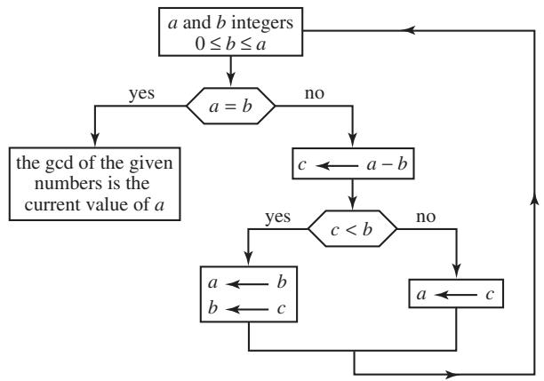
One further observation is needed if we want to show that this procedure works. It is the following fundamental fact about the positive integers, sometimes known as the well-ordering principle. 
(iii) A strictly decreasing sequence of positive integers a0 must be finite. 
Since the iterative procedure just described produces exactly such a strictly decreasing sequence, the iterations must eventually stop, which means that at some point and will be equal, and that value is thus the gcd of a and b (see figure 1). 
# 2.1.2 Euclidean Divisions 
Euclid’s algorithm is usually described in a slightly different way. One makes use of a more complex procedure called Euclidean division—that is, division with remainder—which greatly reduces the number of steps that the algorithm takes. The basic fact underlying this procedure is that if a and b are two positive integers then there are (unique) integers q and r such that 
$a = b q + r \quad \text { and } \quad 0 \leqslant r <   b.$
The number q is called the quotient and r is the remainder. Remarks (i) and (ii) above are then replaced by the following ones: 
This time, at the first step, one replaces by . If , then at the second step one replaces by , where is the remainder in the division of b by r , and so on. The sequence of remainders is strictly decreasing , so the process stops and the gcd is the last nonzero remainder. 

It is not hard to see that the two approaches are equivalent. Suppose, for example, that and . If you use the first approach, then you will repeatedly subtract 37 from 103 438 until you reach a number that is smaller than 37. This number will be the remainder when 103 438 is divided by 37, which is the first number you would calculate if you used the second approach. Thus, the reason for the second approach is that repeated subtraction can be a very inefficient way of calculating remainders. This efficiency gain is very important in practice: the second approach gives rise to a polynomial-time algorithm [IV.20 §2], while the time taken by the first is exponentially long. 
# 2.1.3 Generalizations 
Euclid’s algorithm can be generalized to many other contexts where we have notions of addition, subtraction, and multiplication. For example, there is a variant of it that applies to the ring [III.81 §1] Z[i] of Gaussian integers, that is, numbers of the form , where a and b are ordinary integers. It can also be applied to the ring of all polynomials with real coefficients (or coefficients in any field, for that matter). The one requirement is that we should be able to find some analogue of the notion of division with remainder, after which the algorithm is virtually identical to the algorithm for positive integers. For example, we have the following statement for polynomials: given any two polynomials A and B with B not the zero polynomial, there are polynomials Q and R such that R and either or the degree of R is less than the degree of B. 
As Euclid noticed (Elements, Book X, proposition 2), one may also carry out the procedure on pairs of numbers a and b that are not necessarily integers. It is easy to check that the process will stop if and only if the ratio is a rational number. This observation leads to the concept of continued fractions [III.22], which are discussed in part III. They were not studied explicitly before the seventeenth century, but the roots of the idea can be traced back to archimedes [VI.3]. 
# 2.2 The Method of Archimedes to Calculate π: Approximation and Finiteness 
The ratio of the circumference of a circle to the diameter is a constant that has been denoted by π since the eighteenth century (see [III.70]). Let us see how Archimedes, in the third century b.c.e., obtained the classical approximation for this ratio. If one draws inscribed polygons (whose vertices lie on the circle) and circumscribed polygons (whose sides are tangent to the circle) and if one computes the length of these polygons, then one obtains lower and upper bounds for the value of since the circumference of the circle is greater than the length of any inscribed polygon and less than the length of any circumscribed polygon (figure 2). Archimedes started with regular hexagons, and then repeatedly doubled the number of sides, obtaining more and more precise bounds. He finished with ninety-six-sided polygons, obtaining the estimates 

$3 + \frac {1 0}{7 1} \leqslant \pi \leqslant 3 + \frac {1}{7}.$
This process clearly involves iteration, but is it right to call it an algorithm? Strictly speaking it is not: however many sides you take for your polygon, all you will get is an approximation to π, so the process is not finite. However, what we do have is an algorithm that will calculate π to any desired accuracy: for example, if you demand an approximation that is correct to ten decimal places, then after a finite number of steps the algorithm will give you one. What matters now is that the process converges. That is, it is important that the values that come out of the iteration get arbitrarily close to π. The geometric origin of the method can be used to prove that this is indeed the case, and in 1609 in Germany Ludolph van Ceulen obtained an approximation accurate to thirty-five decimal places using polygons with sides. 
Nevertheless, there is a clear difference between this algorithm for approximating π and Euclid’s algorithm for calculating the gcd of two positive integers. Algorithms like Euclid’s are often called discrete algorithms, and are contrasted with numerical algorithms, which are algorithms that are used to compute numbers that are not integers (see numerical analysis [IV.21]). 
# 2.3 The Newton–Raphson Method: Recurrence Formulas 
In around 1670, newton [VI.14] devised a method for finding roots of equations, which he explained with reference to the example . His explanation starts with the observation that the root x is approximately equal to 2. He therefore writes and obtains an equation for by substituting 2 p for x in the original equation. This new equation works out to be . Because x is close to 2, p is small, so he then estimates p by forgetting the terms and (since these should be considerably smaller than 10p 1). This gives him the equation 10p 1 0, or course, this is not an exact solution, but it provides him with a new and better approximation, 2.1, for x. He then repeats the process, writing substituting to obtain an equation for q, solving this equation approximately, and refining his estimate still further. The estimate he obtains for , so the next approximation for x is 2.0946. 
Figure 2 Approximation of \pi .
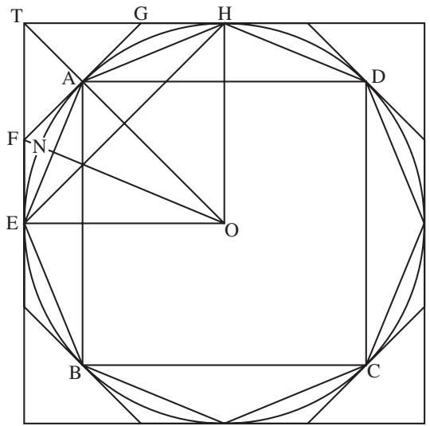

How, though, can we be sure that this process really does converge to x? Let us examine the method more closely. 
# 2.3.1 Tangents and Convergence 
Newton’s method can be interpreted geometrically in terms of the graph of a function though Newton himself did not do so. A root x of the equation corresponds to a point where the curve with equation intersects the x-axis. If you start with an approximate value a for x and set , as we did above, then when you substitute a p for x to obtain a new function , you are effectively moving the origin from (0, 0) to the point . Then when you forget all powers of other than the constant and linear terms, you are finding the best linear approximation to the function , geometrically speaking, is the tangent line to at the point ). Thus, the approximate value you obtain for p is the x-coordinate of the point where the tangent at crosses the x-axis. Adding a to this value returns the origin to and gives the new approximation to the root of This is why Newton’s method is often called the tangent method (figure 3). And one can now see that the new approximation will definitely be better than the old one if the tangent to f at ) intersects the x-axis at a point that lies between a and the point where the curve intersects the x-axis. 

Figure 3 Newton’s method.
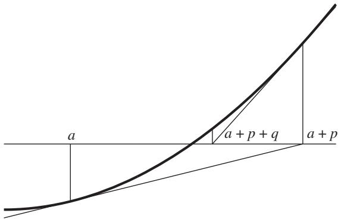

As it happens, this is not the case for Newton’s choice of the value above, but it is true for the approximate value 2.1 and for all subsequent ones. Geometrically, the favorable situation occurs if the point lies above the x-axis in a convex part of the curve that crosses the x-axis or below the x-axis in a concave part of the curve that crosses the x-axis. Under these circumstances, and provided the root is not a multiple one, the convergence is quadratic, meaning that the error at each stage is roughly the square of the error at the previous stage—or, equivalently, the approximation is valid to a number of decimal places that roughly doubles at each stage. This is enormously fast. 
The choice of the initial approximation value is obviously important, and raises unexpectedly subtle questions. These are clearer if we look at complex polynomials and their complex roots. Newton’s method can be easily adapted to this more general context. Suppose that z is a root of some complex polynomial and that is an initial approximation for z. Newton’s method then gives us a sequence which may or may not converge to z. We define the domain of attraction, denoted A(z), to be the set of all complex numbers such that the resulting sequence does indeed converge to z. How do we determine 
The first person to ask this problem was cayley [VI.46], in 1879. He noticed that the solution is easy for quadratic polynomials but difficult as soon as the degree is 3 or more. For example, the domains of attraction of the roots 1 of the polynomial are the open half-planes bounded by the vertical axis, but the domains corresponding to the roots 1, ω, and of are extremely complicated sets. They were described by Julia in 1918—such subsets are now called fractal sets. Newton’s method and fractal sets are discussed further in dynamics [IV.14]. 

# 2.3.2 Recurrence Formulas 
At each stage of his method, Newton had to produce a new equation, but in 1690 Raphson noticed that this was not really necessary. For particular examples, he gave single formulas that could be used at each step, but his basic observation applies in general and leads to a general formula for every case, which one can easily obtain using the interpretation in terms of tangents. Indeed, the tangent to the curve at the point of x-coordinate a has the equation , and it cuts the x-axis at the point with x-coordinate . What we now call the Newton–Raphson method springs from this simple formula. One starts with an initial approximation and then defines successive approximations using the recurrence formula 
$a _ {n + 1} = a _ {n} - \frac {f (a _ {n})}{f ^ {\prime} (a _ {n})}.$
As an example, let us consider the function . Here, Newton’s method provides a sequence of approximations of the square root of given by the recurrence formula (which we obtain by substituting for in the general formula above). This method for approximating square roots was known by Heron of Alexandria in the first century. Note that if is close to then is also close, lies between them, and is their arithmetic mean. 
# 3 Does an Algorithm Always Exist? 
# 3.1 Hilbert’s Tenth Problem: 
# The Need for Formalization 
In 1900, at the Second International Congress of Mathematicians, hilbert [VI.63] proposed a list of twentythree problems. These problems, and Hilbert’s works in general, had a huge influence on mathematics during the twentieth century (Gray 2000). We are interested here in Hilbert’s tenth problem: given a Diophantine equation, that is, a polynomial equation with any number of indeterminates and with integer coefficients, process is sought by which it can be determined, in a finite number of operations, whether the equation is solvable in integral numbers.” In other words, we have to find an algorithm which tells us, for any Diophantine equation, whether or not it has at least one integer solution. Of course, for many Diophantine equations it is easy to find solutions, or to prove that no solutions exist. However, this is by no means always the case: consider, for instance, the Fermat equation (n . (Even before the solution of fermat’s last theorem [V.10] an algorithm was known for determining for any specific n whether this equation had a solution. However, one could not call it easy.) 

If Hilbert’s tenth problem has a positive answer, then one can demonstrate it by exhibiting a “process” of the sort that Hilbert asked for. To do this, it is not necessary to have a precise understanding of what a “process” is. However, if you want to give a negative answer, then you have to show that no algorithm exists, and for that you need to say precisely what counts as an algorithm. In section 1.2 we gave a definition that seems to be reasonably precise, but it is not precise enough to enable us to think about Hilbert’s tenth problem. What kind of rules are we allowed to use in an algorithm? How can we be sure that no algorithm achieves a certain task, rather than just that we are unable to find one? 
# 3.2 Recursive Functions: Church’s Thesis 
What we need is a formal definition of the notion of an algorithm. In the seventeenth century, leibniz [VI.15] envisaged a universal language that would allow one to reduce mathematical proofs to simple computations. Then, during the nineteenth century, logicians such as Charles Babbage, boole [VI.43], frege [VI.56], and peano [VI.62] tried to formalize mathematical reasoning by an “algebraization” of logic. Finally, between 1931 and 1936, gödel [VI.92], church [VI.89], and Stephen Kleene introduced the notion of recursive functions (see Davis (1965), which contains the original texts). Roughly speaking, a recursive function is one that can be calculated by means of an algorithm, but the definition of recursive functions is different, and is completely precise. 
# 3.2.1 Primitive Recursive Functions 
Another rough definition of a recursive function is as follows: a recursive function is one that has an inductive definition. To give an idea of what this means, let us consider addition and multiplication as functions from N ×N to N. To emphasize this, we shall write sum(x, y) and prod(x, y) for and respectively. 

A familiar fact about multiplication is that it is “repeated addition.” Let us examine this idea more precisely. We can define the function “prod” in terms of the function “sum” by means of the following two rules: prod(1, y) equals and prod(x  1, y) equals sum(prod(x, y), y). Thus, if you know prod(x, y) and you know how to calculate sums, then you can work out prod . Since you also know the “base case” prod(1, y), a simple inductive argument shows that these simple rules completely determine the function “prod.” 
We have just seen how one function can be “recursively defined” in terms of another. We now want to understand the class of all functions from to N that can be built up in a few basic ways, of which recursion is the most important. We shall refer to functions from to N as n-ary functions. 
To begin with, we need an initial stock of functions out of which the rest will be built. It turns out that a very simple set of functions is enough. Most basic are the constant functions: that is, functions that take every n-tuple in to some fixed positive integer c. Another very simple function, but the function that allows us to create much more interesting ones, is the successor function, which takes a positive integer n to the next one, . Finally, we have projection functions: the function takes a sequence in and maps it to the kth coordinate . 
We then have two ways of constructing functions from other functions. The first is substitution. Given an m-ary function and m n-ary functions , one defines an n-ary function by 
$(x _ {1}, \dots , x _ {n}) \mapsto \phi (\psi_ {1} (x _ {1}, \dots , x _ {n}), \dots , \psi_ {m} (x _ {1}, \dots , x _ {n})).$
For example, prod(sum(x, y), sum , so we can obtain the function from the functions “sum” and “prod” by means of substitution. 
The second method of construction is called primitive recursion. This is a more general form of the inductive method we used above in order to construct the function “prod” from the function “sum.” Given an (n − 1)-ary function ψ and an (n + 1)-ary function one defines an n-ary function φ by saying that 
$\phi (1, x _ {2}, \dots , x _ {n}) = \psi (x _ {2}, \dots , x _ {n})$

and 
$\begin{array}{l} \phi (k + 1, x _ {2}, \dots , x _ {n}) \\ = \mu (k, \phi (k, x _ {2}, \dots , x _ {n}), x _ {2}, \dots , x _ {n}). \\ \end{array}$
In other words, ψ tells you the “initial values” of (the values when the first coordinate is 1) and tells you how to work out in terms of and k. (The sum–product example was simpler because we did not have a dependence on k.) 
A primitive recursive function is any function that can be built from the initial stock of functions using the two operations, substitution and primitive recursion, that we have just described. 
# 3.2.2 Recursive Functions 
If you think for a while about primitive recursion and know a small amount about programming computers, you should be able to convince yourself that they are effectively computable: that is, that for any primitive recursive function there is an algorithm for computing it. (For example, the operation of primitive recursion can usually be realized in a rather direct way as a FOR loop.) 
How about the converse? Are all computable functions primitive recursive? Consider, for example, the function that takes the positive integer n to , the nth prime number. It is not hard to devise a simple algorithm for computing , and it is then a good exercise (if you want to understand primitive recursion) to convert this algorithm into a proof that the function is primitive recursive. 
However, it turns out that this function is not typical: there are computable functions that are not primitive recursive. In 1928, Wilhelm Ackermann defined a function, now known as the Ackermann function, that has a “doubly inductive” definition. The following function is not quite the same as Ackermann’s, but it is very similar. It is the function that is determined by the following recurrence rules: 
For example, . From this and the fact that it follows that for every . In a similar way one can show that , and in general that for each x the function that takes to “iterates” the function that takes to . This means that the values of are extremely large even when x and are fairly small. For example, , so in general is given by an “exponential tower” of height y. We have , and , which is too large a number for its decimal notation to be reproduced here. 

It can be shown that for every primitive recursive function there is some x such that the function grows faster than . This is proved by an inductive argument. To oversimplify slightly, if and have already been shown to grow more slowly than A(x, y), then one can show that the function produced from them by primitive recursion also grows more slowly. This allows us to define a “diagonal” function that is not primitive recursive because it grows faster than any of the functions ). 
If we are trying to understand in a precise way which functions can be calculated algorithmically, then our definition will surely have to encompass functions like the Ackermann function, since they can in principle be computed. Therefore, we must consider a larger class of functions than just the primitive recursive ones. This is what Gödel, Church, and Kleene did, and they obtained in different ways the same class of recursive functions. For instance, Kleene added a third method of construction, which he called minimization. If is an (n  1)-ary function, one defines an n-ary function g by taking to be the smallest y such that (If there is no such y, one regards g as undefined for . We shall ignore this complication in what follows.) 
It turns out that, not only is the Ackermann function recursive, but so are all functions that one can write a computer program to calculate. So this gives us the formal definition of computability that we did not have before. 
# 3.2.3 Effective Calculability 
Once the notion of recursive functions had been formulated, Church claimed that the class of recursive functions was exactly the same as the class of “effectively calculable” functions. This claim is widely believed, but it is a conviction that cannot be proved since the notion of recursive function is a mathematically precise concept while that of an effectively calculable function is an intuitive notion, rather like that of “algorithm.” Church’s statement lies in the realm of metamathematics and is now called Church’s thesis. 

# 3.3 Turing Machines 
One of the strongest pieces of evidence for Church’s thesis is that in 1936 turing [VI.94] found a very different-looking way of formalizing the notion of an algorithm, which he showed was equivalent. That is, every function that was computable in his new sense was recursive and vice versa. His approach was to define a notion that is now called a Turing machine, which can be thought of as an extremely primitive computer, and which played an important part in the development of actual computers. Indeed, functions that are computable by Turing machines are precisely those that can be programmed on a computer. The primitive architecture of Turing machines does not make them any less powerful: it merely means that in practice they would be too cumbersome to program or to implement in hardware. Since recursive functions are the same as Turing-computable functions, it follows that recursive functions too are those functions that can be programmed on a computer, so to disbelieve Church’s thesis would be to maintain that there are some “effective procedures” that cannot be converted into computer programs—which seems rather implausible. A description of Turing machines can be found in computational complexity [IV.20 §1]. 
Turing introduced his machines in response to a question that generalized Hilbert’s tenth problem. The Entscheidungsproblem, or decision problem, was also asked by Hilbert, in 1922. He wanted to know whether there was a “mechanical process” by which one could determine whether any given mathematical statement could be proved. In order to think about this, Turing needed a precise notion of what constituted a “mechanical process.” Once he had defined Turing machines, he was able to show by means of a fairly straightforward diagonal argument that the answer to Hilbert’s question was no. His argument is outlined in the insolubility of the halting problem [V.20]. 
# 4 Properties of Algorithms 
# 4.1 Iteration versus Recursion 
As previously mentioned, we often encounter computation rules which define each element of a sequence in terms of the preceding elements. This gives rise to two different ways of carrying out the computation. The first is iteration: one computes the first terms, then one obtains succeeding terms by means of a recurrence formula. The second is recursion, a procedure which seems circular at first because one defines a procedure in terms of itself. However, this is allowed because the procedure calls on itself with smaller values of the variables. The concept of recursion is subtle and powerful. Let us try to clarify the difference between recursion and iteration with some examples. 

Suppose that we wish to compute n! 1 2 . An obvious way of doing it is to note the recurrence relation n! n (n 1)! and the initial value 1!  1. Having done so, one could then compute successively the numbers 2!, 3!, 4!, and so on until one reached n!, which would be the iterative approach. Alternatively, one could say that if fact(n) is the result of a procedure that leads to n!, then fact(n) n fact(n 1), which would be a recursive procedure. The second approach says that to obtain n! it suffices to know how to obtain (n 1)!, and to obtain (n 1)! it suffices to know how to obtain (n 2)!, and so on. Since one knows that 1! 1, one can obtain n!. Thus, recursion is a bit like iteration but thought of “backwards.” 
In some ways this example is too simple to show clearly the difference between the two procedures. Moreover, if one wishes to compute n!, then iteration seems simpler and more natural than recursion. We now look at an example where recursion is far simpler than iteration. 
# 4.1.1 The Tower of Hanoi 
The Tower of Hanoi is a problem that goes back to Édouard Lucas in 1884. One is given n disks, all of different sizes and each with a hole in the middle, stacked on a peg A in order of size, with the largest one at the bottom. We also have two empty pegs B and C. The problem is to move the stack from peg A to peg B while obeying the following rules. One is allowed to move just one disk at a time, and each move consists in taking the top disk from one of the pegs and putting it onto another peg. In addition, no disk may ever be placed above a smaller disk. 
The problem is easy if you have just three disks, but becomes rapidly harder as the number of disks increases. However, with the help of recursion one can see very quickly that an algorithm exists for moving the disks in the required way. Indeed, suppose that we know a procedure H(n 1) that solves the problem for n 1 disks. Here is a procedure H(n) for n disks: move the first disks on top of A to C with the procedure , then move the last disk on A to B, and finally apply once more the procedure H(n−1) to move all the disks from C to B. If we write for the procedure that moves n disks from peg A to peg B according to the rules, then we can represent this recursion symbolically as 

$H _ {\mathrm{AB}} (n) = H _ {\mathrm{AC}} (n - 1) H _ {\mathrm{AB}} (1) H _ {\mathrm{BC}} (n - 1).$
Thus, is deduced from and 1), which are clearly equivalent to . Since is certainly easy, we have the full recursion. 
One can easily check by induction that this procedure takes moves—moreover, it turns out that the task cannot be accomplished in fewer moves. Thus, the number of moves is an exponential function of so for large n the procedure will be very long. 
Furthermore, the larger n is, the more memory one must use to keep track of where one is in the procedure. By contrast, if we wish to carry out an iteration during an iterative procedure, it is usually enough to know just the result of the previous iteration. Thus, the most we need to remember is the result of one iteration. There is in fact an iterative procedure for the Tower of Hanoi as well. It is easy to describe, but it is much less obvious that it actually solves the problem. It encodes the positions of the n disks as an n-bit sequence and at each step applies a very simple rule to obtain the next n-bit sequence. This rule makes no reference to how many steps have so far taken place, and therefore the amount of memory needed, beyond that required to store the positions of the disks, is very small. 
# 4.1.2 The Extended Euclid Algorithm 
Euclid’s algorithm is another example that lends itself in a very natural way to a recursive procedure. Recall that if a and b are two positive integers, then we can write with . The algorithm depended on the observation that . Since the remainder r can be calculated easily from a and b, and since the pair is smaller than the pair , this gives us a recursive procedure, which stops when we reach a pair of the form . 
An important extension of Euclid’s algorithm is Bé- zout’s lemma, which states that for any pair of positive integers there exist (not necessarily positive) integers u and v such that 
$u a + v b = d = \operatorname * {g c d} (a, b).$
How can we obtain such integers u and v? The answer is given by the extended Euclid algorithm, which again can be defined using recursion. Suppose we can find a pair that works for b and r : that is, d. Since , we can substitute into this equation and deduce that . Thus, setting and we have . Since a pair that works for a and b can be easily calculated from a pair that works for the smaller b and r , this gives us a recursive procedure. The “bottom” of the recursion is when in which case we know that 1b Once we reach this, we can “run back through Euclid’s algorithm, successively modifying our pair (u, v) according to the rule just given. Notice, incidentally, that the fact that this procedure exists is a proof of Bézout’s lemma. 

# 4.2 Complexity 
So far we have considered algorithms in a theoretical way and ignored their obvious practical importance. However, the mere existence of an algorithm for carrying out a certain task does not guarantee that your computer can do it, because some algorithms take so many steps that no computer can implement them (unless you are prepared to wait billions of years for the answer). The complexity of an algorithm is, loosely speaking, the number of steps it takes to complete its task (as a function of the size of the input). More precisely, this is the time complexity of the algorithm. There is also its space complexity, which measures the maximum amount of memory a computer needs in order to implement it. Complexity theory is the study of the computational resources that are needed to carry out various tasks. It is discussed in detail in computational complexity [IV.20]—here we shall give a hint of it by examining the complexity of one algorithm. 
# 4.2.1 The Complexity of Euclid’s Algorithm 
The length of time that a computer will take to implement Euclid’s algorithm is closely related to the number of times one needs to compute quotients and remainders: that is, to the number of times that the recursive procedure calls on itself. Of course, this number depends in turn on the size of the numbers a and b whose gcd is to be determined. An initial observation is that if , then the remainder in the division of a by b is less than To see this, notice that if then the remainder is which is at most , whereas if then we know that the remainder is at most b and so is again at most It follows that after two steps of calculating the remainder, one arrives at a pair where the larger number is at most half what it was before. From this it is easy to show that the number of such calculations needed is at most , which is roughly proportional to the number of digits of a. Since this number is far smaller than a itself, the algorithm can be used easily for very large numbers, which gives it great practical utility to go with its theoretical significance. 

The number of divisions needed in the worst case does not appear to have been studied until the first half of the nineteenth century: the above bound of 1 was given by Pierre-Joseph-Étienne Finck in 1841. It is in fact not hard to improve this result slightly and prove that the algorithm takes longest when a and b are consecutive Fibonacci numbers. This implies that the number of divisions needed is never more than logφ a+ 1, where φ is the golden ratio. 
Euclid’s algorithm also has low space complexity: once one has replaced a pair (a, b) by a new pair , one can forget the original pair, so at any stage one does not have to hold very much in one’s memory (or store it in the memory of one’s computer). By contrast, the extended Euclid algorithm appears to require one to remember the entire sequence of calculations that leads to the gcd d of a and b, so that one can make a series of substitutions and eventually find u and v such that . However, a closer look at it reveals that one can perform it while keeping track of only a few numbers at any one time. 
Let us see how this works with an example. We shall set , and find integers u and v such that . We begin by writing down the first step of Euclid’s algorithm: 
$3 8 = 1 \times 2 1 + 1 7.$
This tells us that . Now we write down the second step: 
$2 1 = 1 \times 1 7 + 4.$
We know how to write 17 in terms of 38 and 21, so let us do a substitution: 
$2 1 = 1 \times (3 8 - 2 1) + 4.$
Rearranging this, we discover that . Now we write down the third step of Euclid’s algorithm: 
$1 7 = 4 \times 4 + 1.$
We know how to write 17 and 4 in terms of 38 and 21, so let us substitute again: 
$3 8 - 2 1 = 4 \times (2 \times 2 1 - 3 8) + 1.$
Rearranging this, we find that , and we have finished. 
If you think about this procedure, you will see that at each stage one just has to keep track of how two numbers are expressed in terms of a and b. Thus, the space complexity of the extended Euclid algorithm is small if you implement it properly. 
# 5 Modern Aspects of Algorithms 
# 5.1 Algorithms and Chance 
Earlier it was remarked that the notion of algorithm has continued to develop even since its formalization in the 1920s and 1930s. One of the main reasons for this has been the realization that randomness can be a very useful tool in algorithms. This may seem puzzling at first, since algorithms as we have described them are deterministic procedures; in a moment we shall give an example that illustrates how randomness can be used. A second reason is the recent development of the notion of a quantum algorithm: for more about this, see quantum computation [III.74]. 
The following simple example illustrates how chance can be useful. Given an integer n, we shall define a function that is not too hard to calculate but is difficult to analyze. If n has d digits, then you approximate to the point where the first d digits after the decimal point are correct (using Newton’s method, say), and let equal the dth digit. Now suppose that you wish to know roughly what proportion of numbers n between and have . There does not seem to be a good way of determining this theoretically, but calculating it on a computer looks very hard, too, as there are so many numbers between and . However, if one chooses a random sample of 10 000 numbers between and and does the calculation for just those numbers, then with high probability the proportion of those numbers with will be roughly the same as the proportion of all numbers in the range with . Thus, if you do not demand absolute certainty but instead are satisfied with a very small error probability, then you can achieve your goal with much more modest computational resources. 
# 5.1.1 Pseudorandom Numbers 
How, though, does one use a deterministic computer to select ten thousand random numbers between and The answer is that one does not in fact need to: it is almost always good enough to make a pseudorandom selection instead. The basic idea is well-illustrated by a method proposed by von neumann [VI.91] in the mid 1940s. One begins with a 2n-digit integer a, called the “seed,” calculates , and extracts from a new 2n-digit number b by taking all the digits of from the (n + 1)st to the 3nth. One then repeats the procedure for b, and so on. Because of the way multiplication jumbles up digits, the resulting sequence of 2n-digit numbers is very hard to distinguish from a truly random sequence, and can be used in randomized algorithms. 

There are many other ways of producing pseudorandom sequences, and this raises an obvious question: what properties should a sequence have for us to regard it as pseudorandom? This turns out to be a complex question, and several different answers have been proposed. Randomized algorithms and pseudorandomness are discussed in depth in computational complexity [IV.20 §§6, 7], and a formal definition of “pseudorandom generators” can be found there. (See also computational number theory [IV.3 §2] for an account of a famous randomized algorithm for testing whether a number is prime.) Here, let us discuss a similar question about infinite sequences of zeros and ones. When should we regard such a sequence as “random”? 
Again, many different answers have been suggested. One idea is to consider simple statistical tests: we would expect that in the long run the frequency of zeros should be roughly the same as that of ones, and more generally that any small subsequence such as 00110 should appear with the “right” frequency (which for this sequence would be since it has length 5). 
It is perfectly possible, however, for a sequence to pass these simple tests but to be generated by a deterministic procedure. If one is trying to decide whether a sequence of zeros and ones is actually random— that is, produced by some means such as tossing a coin—then we will be very suspicious of a sequence if we can identify an algorithm that produces the same sequence. For example, we would reject a sequence that was derived in a simple way from the digits of π, even if it passed the statistical tests. However, merely to ask that a sequence cannot be produced by a recursive procedure does not give a good test for randomness: for example, if one takes any such sequence and alternates the terms of that sequence with zeros, one then obtains a new sequence that is far from random, but which still cannot be produced recursively. 
For this reason, von Mises suggested in 1919 that a sequence of zeros and ones should be called random if it is not only the case that the limit of the frequency of ones is , but also that the same is true for any subsequence that can be extracted “by means of a reasonable procedure.” In 1940 Church made this more precise by translating “by means of a reasonable procedure” into “by means of a recursive function.” However, even this condition is too weak: there are such sequences that do not satisfy the “law of the iterated logarithm” (something that a random sequence would satisfy). Currently, the so-called Martin–Löf thesis, formulated in 1966, is one of the most commonly used definitions of randomness: a random sequence is a sequence that satisfies all the “effective statistical sequential tests,” a notion that we cannot formulate precisely here, but which uses in an essential manner the notion of recursive function. By contrast with Church’s thesis, with which almost every mathematician agrees, the Martin–Löf thesis is still very much under discussion. 

# 5.2 The Influence of Algorithms on Contemporary Mathematics 
Throughout its history, mathematics has concerned itself with problems of existence. For example, are there transcendental numbers [III.41], that is, numbers that are not the root of any polynomial with integer coefficients? There are two kinds of answers to such questions: either one actually exhibits a number such as π and proves that it is transcendental (this was done by Carl Lindemann in 1873), or one gives an “indirect existence proof,” such as cantor’s [VI.54] demonstration that there are “far more” real numbers than there are roots of polynomials with integer coefficients (see countable and uncountable sets [III.11]), which shows in particular that some real numbers must be transcendental. 
# 5.2.1 Constructivist Schools 
In around 1910, under the leadership of l. e. j. brouwer [VI.75], the intuitionist school [II.7 §3.1] of mathematics arose, which rejected the principle of the excluded middle, the principle that every mathematical assertion is either true or false. In particular, Brouwer did not accept that the existence of a mathematical object such as a transcendental number is proved by the fact that its nonexistence would lead to a contradiction. This was the first of several “constructivist” schools, for which an object exists if and only if it can be constructed explicitly. 

Not many working mathematicians have subscribed to these principles, but almost all would agree that there is an important difference between constructive proofs and indirect proofs of existence, a difference that has come to seem more important with the rise of computer science. This has added a further level of refinement: sometimes, even if you know that a mathematical object can be produced algorithmically, you still care whether the algorithm can be made to work in a reasonably short time. 
# 5.2.2 Effective Results 
In number theory there is an important distinction between “effective” and “ineffective” results. For example, mordell’s conjecture [V.29], proposed in 1922 and finally proved by Faltings in 1983, states that a smooth rational plane curve of degree has at most finitely many points with rational coefficients. Among its many consequences is that the Fermat equation has only finitely many integral solutions for each . (Of course, we now know that it has no nontrivial solutions, but the Mordell conjecture was proved before Fermat’s last theorem, and it has many other consequences.) However, Faltings’s proof is ineffective, which means that it does not give any information about how many solutions there are (except that there are not infinitely many), or how large they can be, so one cannot use a computer to find them all and know that one has finished the job. There are many other very important proofs in number theory that are ineffective, and replacing any one of them with an effective argument would be a major breakthrough. 
A completely different set of issues was raised by another solution to a famous open problem, the fourcolor theorem [V.12], which was conjectured by Francis Guthrie, a student of de morgan [VI.38], in 1852 and proved in 1976 by Appel and Haken, with a proof that made essential use of computers. They began with a theoretical argument that reduced the problem to checking finitely many cases, but the number of cases was so large that it could not be done by hand and was instead done by computers. But how should we judge such a proof? Can we be sure that the computer has been programmed correctly? And even if it has, how do we know with a computation of that size that the computer has operated correctly? And does a proof that relies on a computer really tell us why the theorem is true? These questions continue to be debated today. 
# Further Reading 
# II.5 The Development of Rigor in Mathematical Analysis Tom Archibald 
# 1 Background 
This article is about how rigor came to be introduced into mathematical analysis. This is a complicated topic, since mathematical practice has changed considerably, especially in the period between the founding of the calculus (shortly before 1700) and the early twentieth century. In a sense, the basic criteria for what constitutes a correct and logical argument have not altered, but the circumstances under which one would require such an argument, and even to some degree the purpose of the argument, have altered with time. The voluminous and successful mathematical analysis of the 1700s, associated with names such as Johann and Daniel bernoulli [VI.18], euler [VI.19], and lagrange [VI.22], lacked foundational clarity in ways that were criticized and remedied in subsequent periods. By around 1910 a general consensus had emerged about how to make arguments in analysis rigorous. 
Mathematics consists of more than techniques for calculation, methods for describing important features of geometric objects, and models of worldly phenomena. Nowadays, almost all working mathematicians are trained in, and concerned with, the production of rigorous arguments that justify their conclusions. These conclusions are usually framed as theorems, which are statements of fact, accompanied by an argument, or proof, that the theorem is indeed true. Here is a simple example: every positive whole number that is divisible by 6 is also divisible by 2. Running through the six times table (6, 12, 18, 24, …) we see that each number is even, which makes the statement easy enough to believe. A possible justification of it would be to say that since 6 is divisible by 2, then every number divisible by 6 must also be divisible by 2. 

Such a justification might or might not be thought of as a thorough proof, depending on the reader. For on hearing the justification we can raise questions: is it always true that if and c are three positive whole numbers such that c is divisible by b and b is divisible by a, then c is divisible by a? What is divisibility exactly? What is a whole number? The mathematician deals with such questions by precisely defining concepts (such as divisibility of one number by another), basing the definitions on a smallish number of undefined terms (“whole number” might be one, though it is possible to start even further back, with sets). For example, one could define a number n to be divisible by a number m if and only if there exists an integer q such that . Using this definition, we can give a more precise proof: if n is divisible by 6, then for some q, and therefore , which proves that n is divisible by 2. Thus we have used the definitions to show that the definition of divisibility by 2 holds whenever the definition of divisibility by 6 holds. 
Historically, mathematical writers have been satisfied with varying levels of rigor. Results and methods have often been widely used without a full justification of the kind just outlined, particularly in bodies of mathematical thought that are new and rapidly developing. Some ancient cultures, the Egyptians for example, had methods for multiplication and division, but no justification of these methods has survived and it does not seem especially likely that formal justification existed. The methods were probably accepted simply because they worked, rather than because there was a thorough argument justifying them. 
By the middle of the seventeenth century, European mathematical writers who were engaged in research were well-acquainted with the model of rigorous mathematical argument supplied by euclid’s [VI.2] Elements. The kind of deductive, or synthetic, argument we illustrated earlier would have been described as a proof more geometrico—in the geometrical way. While Euclid’s arguments, assumptions, and definitions are not wholly rigorous by today’s standards, the basic idea was clear: one proceeds from clear definitions and generally agreed basic ideas (such as that the whole is greater than the part) to deduce theorems (also called propositions) in a step-by-step manner, not bringing in anything extra (either on the sly or unintentionally). This classical model of geometric argument was widely used in reasoning about whole numbers (for example by fermat [VI.12]), in analytic geometry (descartes [VI.11]), and in mechanics (Galileo). 

This article is about rigor in analysis, a term which itself has had a shifting meaning. Coming from ancient origins, by around 1600 the term was used to refer to mathematics in which one worked with an unknown (something we would now write as x) to do a calculation or find a length. In other words, it was closely related to algebra, though the notion was imported into geometry by Descartes and others. However, over the course of the eighteenth century the word came to be associated with the calculus, which was the principal area of application of analytic techniques. When we talk about rigor in analysis it is the rigorous theory of the mathematics associated with differential and integral calculus that we are principally discussing. In the third quarter of the seventeenth century rival methods for the differential and integral calculus were devised by newton [VI.14] and leibniz [VI.15], who thereby synthesized and extended a considerable amount of earlier work concerned with tangents and normals to curves and with the areas of regions bounded by curves. The techniques were highly successful, and were extended readily in a variety of directions, most notably in mechanics and in differential equations. 
The key common feature of this research was the use of infinities: in some sense, it involved devising methods for combining infinitely many infinitely small quantities to get a finite answer. For example, suppose we divide the circumference of a circle into a (large) number of equal parts by marking off points at equal distances, then joining the points and creating triangles by joining the points to the center. Adding up the areas of the triangles approximates the circular area, and the more points we use the better the approximation. If we imagine infinitely many of these inscribed triangles, the area of each will be “infinitely small” or infinitesimal. But because the total involves adding up infinitely many of them, it may be that we get a finite positive total (rather than just 0, from adding up infinitely many zeros, or an infinite number, as we would get if we added the same finite number to itself infinitely many times). Many techniques for doing such calculations were devised, though the interpretation of what was taking place varied. Were the infinities involved “real” or merely “potential”? If something is “really” 

infinitesimal, is it just zero? Aristotelian writers had abhorred actual infinities, and complaints about them were common at the time. 
Newton, Leibniz, and their immediate followers provided mathematical arguments to justify these methods. However, the introduction of techniques involving reasoning with infinitely small objects, limiting processes, infinite sums, and so forth meant that the founders of the calculus were exploring new ground in their arguments, and the comprehensibility of these arguments was frequently compromised by vague terminology or by the drawing of one conclusion when another might seem to follow equally well. The objects they were discussing included infinitesimals (quantities infinitely smaller than those we experience directly), ratios of vanishingly small quantities (i.e., fractions in, or approaching, the form , and finite sums of infinitely many positive terms. Taylor series representations, in particular, provoked a variety of questions. A function may be written as a series in such a way that the series, when viewed as a function, will have, at a given point the same value as the function, the same rate of change (or first derivative), and the same higher-order derivatives to arbitrary order: 
$f (x) = f (a) + f ^ {\prime} (a) (x - a) + \frac {1}{2} f ^ {\prime \prime} (a) (x - a) ^ {2} + \dots .$
For example, sin x a fact already known to Newton though such series are now named after Newton’s disciple brook taylor [VI.16]. 
One problem with early arguments was that the terms being discussed were used in different ways by different writers. Other problems arose from this lack of clarity, since it concealed a variety of issues. Perhaps the most important of these was that an argument could fail to work in one context, even though a very similar argument worked perfectly well in another. In time, this led to serious problems in extending analysis. Eventually, analysis became fully rigorous and these difficulties were solved, but the process was a long one and it was complete only by the beginning of the twentieth century. 
Let us consider some examples of the kinds of difficulties that arose from the very beginning, using a result of Leibniz. Suppose we have two variables, u and v, each of which changes when another variable, x, changes. An infinitesimal change in x is denoted dx, the differential of x. The differential is an infinitesimal quantity, thought of as a geometrical magnitude, such as a length, for example. This was imagined to be combined or compared with other magnitudes in the usual ways (two lengths can be added, have a ratio, and so on). When x changes to u and v change to and v dv, respectively. Leibniz concluded that the product uv would then change to so that d(uv)  u dv v du. His argument is, roughly, that d(uv) (u du)(v dv) uv. Expanding the right-hand side using regular algebra and then simplifying gives u dv v du du dv. But the term du dv is a second-order infinitesimal, vanishingly small compared with the first-order differentials, and is thus treated as equal to 0. Indeed, one aspect of the problems is that there appears to be an inconsistency in the way that infinitesimals are treated. For instance, if you want to work out the derivative of , the calculation corresponding to the one just given (expanding , and so on) shows that . We then treat the dx on the right-hand side as zero, but the one on the left-hand side seems as though it ought to be an infinitesimal nonzero quantity, since otherwise we could not divide by it. So is it zero or not? And if not, how do we get around the apparent inconsistency? 

At a slightly more technical level, the calculus required mathematicians to deal repeatedly with the “ultimate” values of ratios of the form dy/dx when the quantities in both numerator and denominator approach or actually reach 0. This phrasing uses, once again, the differential notation of Leibniz, though the same issues arose for Newton with a slightly different notational and conceptual approach. Newton generally spoke of variables as depending on time, and he sought (for example) the values approached when “evanescent increments”—vanishingly small time intervals— are considered. One long-standing set of confusions arose precisely from this idea that variable quantities were in the process of changing, whether with time or with changes in the value of another variable. This means that we talk about values of a variable approaching a given value, but without a clear idea of what this “approach” actually is. 
# 2 Eighteenth-Century Approaches and Critiques 
Of course, had the calculus not turned out to be an enormously fruitful field of endeavor, no one would have bothered to criticize it. But the methods of Newton and Leibniz were widely adopted for the solution of problems that had interested earlier generations (notably tangent and area problems) and for the posing and solution of problems that these techniques suddenly made far more accessible. Problems of areas, maxima and minima, the formulation and solution of differential equations to describe the shape of hanging chains or the positions of points on vibrating strings, applications to celestial mechanics, the investigation of problems having to do with the properties of functions (thought of for the most part as analytic expressions involving variable quantities)—all these fields and more were developed over the course of the eighteenth century by mathematicians such as Taylor, Johann and Daniel Bernoulli, Euler, d’alembert [VI.20], Lagrange, and many others. These people employed many virtuoso arguments of suspect validity. Operations with divergent series, the use of imaginary numbers, and manipulations involving actual infinities were used effectively in the hands of the most capable of these writers. However, the methods could not always be explained to the less capable, and thus certain results were not reliably reproducible—a very odd state for mathematics from today’s standpoint. To do Euler’s calculations, one needed to be Euler. This was a situation that persisted well into the following century. 

Specific controversies often highlighted issues that we now see as a result of foundational confusion. In the case of infinite series, for example, there was confusion about the domain of validity of formal expressions. Consider the series 
$1 - 1 + 1 - 1 + 1 - 1 + 1 - \dots .$
In today’s usual elementary definition (due to cauchy [VI.29] around 1820) we would now consider this series to be divergent because the sequence of partial sums . does not tend to a limit. But in fact there was some controversy about the actual meaning of such expressions. Euler and Nicolaus Bernoulli, for example, discussed the potential distinction between the sum and the value of an infinite sum, Bernoulli arguing that something like · has no sum but that this algebraic expression does constitute a value. Whatever may have been meant by this, Euler defended the notion that the sum of the series is the value of the finite expression that gives rise to the series. In his 1755 Institutiones Calculi Differentialis, he gives the example of , which comes from , and later defended the view that this meant that . His view was not universally accepted. Similar controversies arose in considering how to extend the values of functions outside their usual domain, for example with the logarithms of negative numbers. 
Probably the most famous eighteenth-century critique of the language and methods of eighteenth-century analysis is due to the philosopher George Berkeley (1685–1753). Berkeley’s motto, “To be is to be perceived,” expresses his idealist stance, which was coupled with a strong view that the abstraction of individual qualities, for the purposes of philosophical discussion, is impossible. The objects of philosophy should thus be things that are perceived, and perceived in their entirety. The impossibility of perceiving infinitesimally small objects, combined with their manifestly abstracted nature, led him to attack their use in his 1734 treatise The Analyst: Or, a Discourse Addressed to an Infidel Mathematician. Referring sarcastically in 1734 to infinitesimals as the “ghosts of departed quantities,” Berkeley argued that neglecting some quantity, no matter how small, was inappropriate in mathematical argument. He quoted Newton in this regard, to the effect that “in mathematical matters, errors are to be condemned, no matter how small.” Berkeley continued, saying that “[n]othing but the obscurity of the subject” could have induced Newton to impose this kind of reasoning on his followers. Such remarks, while they apparently did not dissuade those enamored of the methods, contributed to a sentiment that aspects of the calculus required deeper explanation. Writers such as Euler, d’Alembert, Lazare Carnot, and others attempted to address foundational criticisms by clarifying what differentials were, and gave a variety of arguments to justify the operations of the calculus. 
# 2.1 Euler 
Euler contributed to the general development of analysis more than any other individual in the eighteenth century, and his approaches to justifying his arguments were enormously influential even after his death, owing to the success and wide use of his important textbooks. Euler’s reasoning is sometimes regarded as rather careless since he operated rather freely with the notation of the calculus, and many of his arguments are certainly deficient by later standards. This is particularly true of arguments involving infinite series and products. A typical example is provided by an early version of his proof that 
$\sum_ {n = 1} ^ {\infty} \frac {1}{n ^ {2}} = \frac {\pi^ {2}}{6}.$
His method is as follows. Using the known series expansion for sin x he considered the zeros of 
${\frac {\sin {\sqrt {x}}}{\sqrt {x}}} = 1 - {\frac {x}{3 !}} + {\frac {x ^ {2}}{5 !}} - {\frac {x ^ {3}}{7 !}} + \dots .$

These lie at Applying (without argument) the factor theorem for finite algebraic equations he expressed this equation as 
$\frac {\sin \sqrt {x}}{\sqrt {x}} = \left(1 - \frac {x}{\pi^ {2}}\right) \left(1 - \frac {x}{4 \pi^ {2}}\right) \left(1 - \frac {x}{9 \pi^ {2}}\right) \dots .$
Now, it can be seen that the coefficient of x in the infinite sum, should equal the negative of the sum of the coefficients of x in the product. Euler apparently concluded this by imagining multiplying out the infinitely many terms and selecting the 1 from all but one of them. This gives 
$\frac {1}{\pi^ {2}} + \frac {1}{4 \pi^ {2}} + \frac {1}{9 \pi^ {2}} + \dots = \frac {1}{6},$
and multiplying both sides by gives the required sum. 
We now think of this approach as having several problems. The product of the infinitely many terms may or may not represent a finite value, and today we would specify conditions for when it does. Also, applying a result about (finite) polynomials to (infinite) power series is a step that requires justification. Euler himself was to provide alternative arguments for this result later in his life. But the fact that he may have known counterexamples—situations in which such usages would not work—was not, for him, a decisive obstacle. This view, in which one reasoned in a generic situation that might admit a few exceptions, was common at his time, and it was only in the late nineteenth century that a concerted effort was made to state the results of analysis in ways that set out precisely the conditions under which the theorems would hold. 
Euler did not dwell on the interpretation of infinite sums or infinitesimals. Sometimes he was happy to regard differentials as actually equal to zero, and to derive the meaning of a ratio of differentials from the context of the problem: 
An infinitely small quantity is nothing but a vanishing quantity and therefore will be actually equal to . Hence there are not so many mysteries hidden in this concept as there are usually believed to be. These supposed mysteries have rendered the calculus of the infinitely small quite suspect to many people. 
This statement, from the Institutiones Calculi Differentialis of 1755, was followed by a discussion of proportions in which one of the ratios is , and a justification of the fact that differentials may be neglected in calculations with ordinary numbers. This accurately describes a good deal of his practice—when he worked with differential equations, for example. 

Controversial matters did arise, however, and debates about definitions were not unusual. The bestknown example involves discussions connected with the so-called vibrating string problem, which involved Euler, d’Alembert, and Daniel Bernoulli. These were closely connected with the definition of functions [I.2 §2.2], and the question of which functions studied by analysis actually could be represented by series (in particular trigonometric series). The idea that a curve of arbitrary shape could serve as an initial position for a vibrating string extended the idea of function, and the work of fourier [VI.25] in the early nineteenth century made such functions analytically accessible. In this context, functions with broken graphs (a kind of discontinuous function) came under inspection. Later, how to deal with such functions would be a decisive issue for the foundations of analysis, as the more “natural” objects associated with algebraic operations and trigonometry gave way to the more general modern concept of function. 
# 2.2 Responses from the Late Eighteenth Century 
One significant response to Berkeley in Britain was that of Colin Maclaurin (1698–1746), whose 1742 textbook A Treatise of Fluxions attempted to clarify the foundations of the calculus and do away with the idea of infinitely small quantities. Maclaurin, a leading figure of the Scottish Enlightenment of the mid eighteenth century, was the most distinguished British mathematician of his time and an ardent proponent of Newton’s methods. His work, unlike that of many of his British contemporaries, was read with interest on the Continent, especially his elaborations of Newtonian celestial mechanics. Maclaurin attempted to base his reasoning on the notion of the limits of what he termed “assignable” finite quantities. Maclaurin’s work is famously obscure, though it did provide examples of calculating the limits of ratios. Perhaps his most important contribution to the clarification of the foundations of analysis was his influence on d’Alembert. 
D’Alembert had read both Berkeley and Maclaurin and followed them in rejecting infinitesimals as real quantities. While exploring the idea of a differential as a limit, he also attempted to reconcile his idea with the idea that infinitesimals may be consistently regarded as being actually zero, perhaps in a nod to Euler’s view. The main exposition of d’Alembert’s views may be found in the Encyclopédie, in the articles on differentials (published in 1754) and on limits (1765). D’Alembert argued for the importance of geometric rather than algebraic limits. His meaning seems to have been that the quantities being investigated should not be treated merely formally, by substitution and simplification. Rather, a limit should be understood as the limit of a length (or collection of lengths), area, or other dimensioned quantity, in much the way that a circle may be seen as a limit of inscribed polygons. His aim seems primarily to have been to establish the reality of the objects described by existing algorithms, since the actual calculations he employs are carried out with differentials. 

# 2.2.1 Lagrange 
In the course of the eighteenth century, the differential and the integral calculus gradually distinguished themselves as a set of methods distinct from their applications in mechanics and physics. At the same time, the primary focus of the methods moved away from geometry, so that in work of the second half of the eighteenth century we increasingly see calculus treated as “algebraic analysis” of “analytic functions.” The term “analytic” was used in a variety of senses. For many writers, such as Euler, it merely referred to a function (that is, a relationship between variable quantities) that is given by a single expression of the type used in analysis. 
Lagrange provided a foundation for the calculus that was indebted to this algebraic viewpoint. Lagrange concentrated on power-series expansions as the basic entity of analysis, and through his work the term analytic function evolved toward its more recent meaning connected with the existence of a convergent Taylor series representation. His approach reached a full expression in his Théorie des Fonctions Analytiques of 1797. This was a version of his lectures at the École Polytechnique, a new institution for the elite training of military engineers in revolutionary France. Lagrange assumed that a function must necessarily be expressible as an infinite series of algebraic functions, basing this argument on the existence of expansions for known functions. He first sought to show that “in general” no negative or fractional powers would appear in the expansion, and from this he obtained a powerseries representation. His arguments here are surprising, and somewhat ad hoc, and I use an example given by Fraser (1987). The slightly strange notation is based on that of Lagrange. Suppose that one seeks an expansion of in powers of i. In general, only integer powers will be involved. Terms of the form im/n do not make sense, says Lagrange, since the expression of the function is only two-valued, while im/n has n values. Hence the series 

$\sqrt {x + i} = \sqrt {x} + p i + q i ^ {2} + \dots + t i ^ {k} + \dots$
obtains its two values from the term , and all other powers must be integral. With fractional exponents set aside, Lagrange argued that , with P finite for . Successive application of this result gave him the expansion 
$f (x + i) = f (x) + p i + q i ^ {2} + r i ^ {3} + \dots ,$
where i was a small increment. The number p depends on x, so Lagrange defined a derived function p(x). The French term dérivée is the origin of the term derivative, and in Lagrange’s language f is the “primitive” of this derived function. Similar arguments can be made to relate the higher coefficients to the higher derivatives in the usual Taylor formula. 
This approach, which seems oddly circular to modern eyes, relied on the eighteenth-century distinction between the “algebraic” infinite process of the series expansion on the one hand, and the use of differentials on the other. Lagrange did not see the original series expansion as based on the limit process. With the renewed emphasis on limits and modern definitions developed by Cauchy, this approach was soon to be regarded as untenable. 
# 3 The First Half of the Nineteenth Century 
# 3.1 Cauchy 
Many writers contributed to discussions on rigor in analysis in the first decades of the nineteenth century. It was Cauchy who was to revive the limit approach to greatest effect. His aim was pedagogical, and his ideas were probably worked out in the context of preparing his introductory lectures for the École Polytechnique at the beginning of the 1820s. Although the students were the best in France in scholarly ability, many found the approach too difficult. As a result, while Cauchy himself continued to use his methods, other instructors held on to older approaches using infinitesimals, which they found more intuitively accessible for the students as well as better adapted to the solution of problems in elementary mechanics. Cauchy’s self-imposed exile from Paris in the 1830s further limited the impact of his approach, which was initially taken up only by a few of his students. 

Nonetheless, Cauchy’s definitions of limit, of continuity, and of the derivative gradually came into general use in France, and were influential elsewhere as well, especially in Italy. Moreover, his methods of using these definitions in proofs, and particularly his use of mean value theorems in various forms, moved analysis from a collection of symbolic manipulations of quantities with special properties toward the science of argument about infinite processes using close estimation via the manipulation of inequalities. 
In some respects, Cauchy’s greatest contribution lay in his clear definitions. For earlier writers, the sum of an infinite series was a somewhat vague notion, sometimes interpreted by a kind of convergence argument (as with the sum of a geometric series such as and sometimes as the value of the function from which the series was derived (as Euler, for example, often regarded it). Cauchy revised the definition to state that the sum of an infinite series was the limit of the sequence of partial sums. This provided a unified approach for series of numbers and series of functions, an important step in the move to base calculus and analysis on ideas about real numbers. This trend, eventually dominant, is often referred to as the “arithmetization of analysis.” Similarly, a continuous function is one for which “an infinitely small increase of the variable produces an infinitely small increase of the function itself” (Cauchy 1821, pp. 34–35). 
As we see from the example just given, Cauchy did not shy away from infinitely small quantities, nor did he analyze this notion further. The limit of a variable quantity is defined in a way that we would now regard as conversational, or heuristic: 
When the values that are successively assigned to a given variable approach a fixed value indefinitely, in such a way that it ends up differing from it as little as one wishes, this latter value is called the limit of all the others. Thus, for example, an irrational number is the limit of the various fractions that provide values that are closer and closer to it. 
Cauchy (1821, p. 4) 
These ideas were not completely rigorous by modern standards, but he was able to use them to provide a unified foundation for the basic processes of analysis. 
This use of infinitely small quantities appears, for example, in his definition of a continuous function. To paraphrase his definition, suppose that a function is single-valued on some finite interval of the real line, and choose any value inside the interval. If the value of is increased to , the function also changes by the amount ). Cauchy says that the function f is continuous for this interval if, for each value of in that interval, the numerical value of the difference decreases indefinitely to 0 with a. In other words, Cauchy defines continuity as a property on an interval rather than at a point, in essence by saying that on that interval infinitely small changes in the argument produce infinitely small changes in the function value. Cauchy appears to have considered continuity to be a property of a function on an interval. 

This definition emphasizes the importance of jumps in the value of the function for the understanding of its properties, something that Cauchy had encountered early in his career when discussing the fundamental theorem of calculus [I.3 §5.5]. In his 1814 memoir on definite integrals, Cauchy stated: 
If the function φ(z) increases or decreases in a continuous manner between and , the value of the integral will ordinarily be represented by . But if … the function passes suddenly from one value to another sensibly different … the ordinary value of the integral must be diminished. 
Oeuvres (volume 1, pp. 402–3) 
In his lectures, Cauchy assumed continuity when defining the definite integral. He considered first of all a division of the interval of integration into a finite number of subintervals on which the function is either increasing or decreasing. (This is not possible for all functions, but this appeared not to concern Cauchy.) He then defined the definite integral as the limit of the sum as the number n becomes very large. Cauchy gives a detailed argument for the existence of this limit, using his theorem of the mean and the fact of continuity. 
Versions of the main subjects of Cauchy’s lectures were published in 1821 and 1823. Every student at the École Polytechnique would have been aware of them subsequently, and many would have used them explicitly. They were joined in 1841 by a version of the course elaborated by Cauchy’s associate, the Abbé Moigno. They were referred to frequently in France and the definitions employed by Cauchy became standard there. We also know that the lectures were studied by others, notably by abel [VI.33] and dirichlet [VI.36], who spent time in Paris in the 1820s, and by riemann [VI.49]. 

Cauchy’s movement away from the formal approach of Lagrange rejected the “vagueness of algebra.” Although he was clearly guided by intuition (both geometric and otherwise), he was well aware that intuition could be misleading, and produced examples to show the value of adhering to precise definitions. One famous example, the function that takes the value when and zero when is differentiable infinitely many times, yet it does not yield a Taylor series that converges to the function at the origin. Despite this example, which he mentioned in his lectures, Cauchy was not a specialist in counterexamples, and in fact the trend toward producing counterexamples for the purpose of clarifying definitions was a later development. 
Abel famously drew attention to an error in Cauchy’s work: his statement that a convergent series of continuous functions has a continuous sum. For this to be true, the series must be uniformly convergent, and in 1826 Abel gave as a counterexample the series 
$\sum_ {k = 1} ^ {\infty} (- 1) ^ {k + 1} \frac {\sin k x}{k},$
which is discontinuous at odd multiples of π. Cauchy was led to make this distinction only much later, after the phenomenon had been identified by several writers. Historians have written extensively about this apparent error; one influential account, due to Bottazzini, proposes that for various reasons Cauchy would not have found Abel’s example telling, even if he had known of it at the time (this account appears in Bottazzini (1990, p. LXXXV)). 
Before leaving the time of Cauchy, we should note the related independent activity of bolzano [VI.28]. Bolzano, a Bohemian priest and professor whose ideas were not widely disseminated at the time, investigated the foundations of the calculus extensively. In 1817, for example, he gave what he termed a “purely analytic proof of the theorem that between any two values that possess opposite signs, at least one real root of the equation exists”: the intermediate value theorem. Bolzano also studied infinite sets: what is now called the Bolzano–Weierstrass theorem states that for every bounded infinite set there is at least one point having the property that any disk about that point contains infinitely many points of the set. Such “limit points” were studied independently by weierstrass [VI.44]. By the 1870s, Bolzano’s work became more broadly known. 
# 3.2 Riemann, the Integral, and Counterexamples 
Riemann is indelibly associated with the foundations of analysis because of the Riemann integral, which is part of every calculus course. Despite this, he was not always driven by issues involving rigor. Indeed he remains a standard example of the fruitfulness of nonrigorous intuitive invention. There are many points in Riemann’s work at which issues about rigor arise naturally, and the wide interest in his innovations did much to direct the attention of researchers to making these insights precise. 
Riemann’s definition of the definite integral was presented in his 1854 Habilitationschrift—the “second thesis,” which qualified him to lecture at a university for fees. He generalized Cauchy’s notion to functions that are not necessarily continuous. He did this as part of an investigation of fourier series [III.27] expansions. The extensive theory of such series was devised by Fourier in 1807 but not published until the 1820s. A Fourier series represents a function in the form 
$f (x) = a _ {0} + \sum_ {n = 1} ^ {\infty} \left(a _ {n} \cos (n x) + b _ {n} \sin (n x)\right)$
on a finite interval. 
The immediate inspiration for Riemann’s work was dirichlet [VI.36], who had corrected and developed earlier faulty work by Cauchy on the question of when and whether the Fourier series expansion of a function converges to the function from which it is derived. In 1829 Dirichlet had succeeded in proving such convergence for a function with period 2π that is integrable on an interval of that length, does not possess infinitely many maxima and minima there, and at jump discontinuities takes on the average value between the two limiting values on each side. As Riemann noted, following his professor Dirichlet, “this subject stands in the closest connection to the principles of infinitesimal calculus, and can therefore serve to bring these to greater clarity and definiteness” (Riemann 1854, p. 238). Riemann sought to extend Dirichlet’s investigations to further cases, and was thus led to investigate in detail each of the conditions given by Dirichlet. Accordingly, he generalized the definition of a definite integral as follows: 
We take between a and b an increasing sequence of values and for brevity designate by by by and by  a positive proper fraction. Then the value of the sum 

$\begin{array}{l} S = \delta_ {1} f (a + \epsilon_ {1} \delta_ {1}) + \delta_ {2} f (x _ {1} + \epsilon_ {2} \delta_ {2}) \\ + \delta_ {3} f (x _ {2} + \epsilon_ {3} \delta_ {3}) + \dots + \delta_ {n} f (x _ {n - 1} + \epsilon_ {n} \delta_ {n}) \\ \end{array}$
depends on the choice of the intervals δ and the quantities . If it has the property that it approaches infinitely closely a fixed limit A no matter how the δ and  are chosen, as δ becomes infinitely small, then we call this value . 
In connection with this definition of the integral, and in part to show its power, Riemann provided an example of a function that is discontinuous in any interval, yet can be integrated. The integral thus has points of nondifferentiability on each interval. Riemann’s definition rendered problematic the inverse relationship between differentiation and integration, and his example brought this problem out clearly. The role of such “pathological” counterexamples in pushing the development of rigor, already apparent in Cauchy’s work, intensified greatly around this time. 
Riemann’s definition was published only in 1867, following his death; an expository version due to Gaston Darboux appeared in French in 1873. The popularization and extension of Riemann’s approach went hand in hand with the increasing appreciation of the importance of rigor associated with the Weierstrass school, discussed below. Riemann’s approach focused attention on sets of points of discontinuities, and thus were seminal for cantor’s [VI.54] investigations into point sets in the 1870s and afterwards. 
The use of the Dirichlet principle serves as a further example of the way in which Riemann’s work drew attention to problems in the foundations of analysis. In connection with his research into complex analysis, Riemann was led to investigate solutions to the so-called Dirichlet problem: given a function g, defined on the boundary of a closed region in the plane, does there exist a function that satisfies the laplace partial differential equation [I.3 §5.4] in the interior and takes the same values as on the boundary? Riemann asserted that the answer was yes. To demonstrate this, he reduced the question to proving the existence of a function that minimizes a certain integral over the region, and argued on physical grounds that such a minimizing function must always exist. Even before Riemann’s death his assertion was questioned by weierstrass [VI.44], who published a counterexample in 1870. This led to attempts to reformulate Riemann’s results and prove them by other means, and ultimately to a rehabilitation of the Dirichlet principle through the provision of precise and broad hypotheses for its validity, which were expressed by hilbert [VI.63] in 1900. 

# 4 Weierstrass and His School 
Weierstrass had a passion for mathematics as a student at Bonn and Münster, but his student career was very uneven. He spent the years from 1840 to 1856 as a high school teacher, undertaking research independently but at first publishing obscurely. Papers from 1854 onward in Journal für die reine und angewandte Mathematik (otherwise known as Crelle’s Journal) attracted wide attention to his talent, and he obtained a professorship in Berlin in 1856. Weierstrass began to lecture regularly on mathematical analysis, and his approach to the subject developed into a series of four courses of lectures given cyclically between the early 1860s and 1890. The lectures evolved over time and were attended by a large number of important mathematical researchers. They also indirectly influenced many others through the circulation of unpublished notes. This circle included R. Lipschitz, P. du Bois-Reymond, H. A. Schwarz, O. Hölder, Cantor, L. Koenigsberger, G. Mittag-Leffler, kovalevskaya [VI.59], and L. Fuchs, to name only some of the most important. Through their use of Weierstrassian approaches in their own research, and their espousal of his ideas in their own lectures, these approaches became widely used well before the eventual publication of a version of his lectures late in his life. The account that follows is based largely on the 1878 version of the lectures. His approach was also influential outside Germany: parts of it were absorbed in France in the lectures of hermite [VI.47] and jordan [VI.52], for example. 
Weierstrass’s approach builds on that of Cauchy (though the detailed relationship between the two bodies of work has never been fully examined). The two overarching themes of Weierstrass’s approach are, on the one hand, the banning of the idea of motion, or changing values of a variable, from limit processes, and, on the other, the representation of functions, notably of a complex variable. The two are intimately linked. Essential to the motion-free definition of a limit is Weierstrass’s nascent investigation of what we would now call the topology of the real line or complex plane, with the idea of a limit point, and a clear distinction between local and global behavior. The central objects of study for Weierstrass are functions (of one or more real or complex variable quantities), but it should be borne in mind that set theory is not involved, so that functions are not to be thought of as sets of ordered pairs. 

The lectures begin with a now-familiar subject: the development of rational, negative, and real numbers from the integers. For example, negative numbers are defined operationally by making the integers closed under the operation of subtraction. He attempted a unified approach to the definition of rational and irrational numbers which involved unit fractions and decimal expansions and now seems somewhat murky. Weierstrass’s definition of the real numbers appears unsatisfactory to modern eyes, but the general path of arithmetization of analysis was established by this approach. In parallel to the development of number systems, he also developed different classes of functions, building them up from rational functions by using power-series representations. Thus, in Weierstrass’s approach, a polynomial (called an integer rational function) is generalized to a “function of integer character,” which means a function with a convergent power-series expansion everywhere. The Weierstrass factorization theorem asserts that any such function may be written as a (possibly infinite) product of certain “prime” functions and exponential functions with polynomial exponents of a certain type. 
The limit definition given by Weierstrass has thoroughly modern features: 
That a variable quantity x becomes infinitely small simultaneously with another quantity y means: “After the assumption of an arbitrarily small quantity  a bound δ for x may be found, such that for every value of x for which , the corresponding value of |y| will be less than .” 
Weierstrass (1988, p. 57) 
Weierstrass immediately used this definition to give a proof of continuity for rational functions of several variables, using an argument that could appear in a textbook today. The former notions of variables tending to given values were replaced by quantified statements about linked inequalities. The framing of hypotheses in terms of inequalities became a guiding motif in the work of Weierstrass’s school: here we mention in passing the Lipschitz and Hölder conditions in the existence theory for differential equations. The clarity that this language gave to problems involving the interchange of limits, for example, meant that previously intractable problems could now be handled in a routine way by those inculcated in the Weierstrass approach. 

The fact that general functions were built from rational functions using series expansions gave the latter a key role in Weierstrass’s work, and as early as 1841 he had identified the importance of uniform convergence. The distinction between uniform and pointwise convergence was made very clearly in his lectures. A series converges, as it does for Cauchy, if its sequence of partial sums converges, though now the convergence is phrased in the following terms: the series converges to s0 at if, given an arbitrary positive , there is an integer N such that for every . The convergence is uniform on a domain of the variable if the same N will work for that  value for all x in the domain. Uniform convergence guarantees continuity of the sum, since these are series of rational, hence continuous, functions. From this point of view, then, uniform convergence is important well beyond the context of trigonometric series (important though those may be). Indeed, it is a central tool of the entire theory of functions. 
Weierstrass’s role as a critic of rigor in the work of others, notably Riemann, has already been noted. More than any other leading figure, he generated counterexamples to illustrate difficulties with received notions and to distinguish between different kinds of analytical behavior. One of his best-known examples was of an everywhere-continuous but nowhere-differentiable function, namely , which is uniformly convergent for but fails to be differentiable at any x if . Similarly he constructed functions for which the Dirichlet principle fails, examples of sets constituting “natural boundaries,” that is, obstacles to continuing series expansions into larger domains, and so forth. The careful distinctions he encouraged, and the very procedure of seeking pathological rather than typical examples, threw the spotlight on the precision of hypotheses in analysis to an unprecedented degree. From the 1880s, with the maturity of this program, analysis no longer dealt with generic cases and looked instead for absolutely precise statements in a way that has for the most part endured to the present. This was also to become a pattern and an imperative in other areas of mathematics, though sometimes the passage from reasoning from generic examples to fully expressed hypotheses and definitions took decades. (Algebraic geometry provides a famous example, one in which reasoning with generic cases lasted until the 1920s.) In this sense the form of rigorous argument and exposition espoused by Weierstrass and his school was to become a pattern for mathematics generally. 

# 4.1 The Aftermath of Weierstrass and Riemann 
Analysis became the model subdiscipline for rigor for a variety of reasons. Of course, analysis was important for the sheer volume and range of application of its results. Not everyone agreed with the precise way in which Weierstrass approached foundational questions (through series, rational functions, and so on). Indeed, Riemann’s more geometric approach had also attracted followers, if not exactly a school, and the insights his approach afforded were enthusiastically embraced. However, any subsequent discussion had to take place at a level of rigor comparable to that which Weierstrass had attained. While approaches to the foundations of analysis were to vary, the idea that limits should be rigorously handled in much the way that Weierstrass did was not to alter. Among the remaining central issues for rigor was the definition of the number systems. 
For the real numbers, probably the most successful definition (in terms of its later use) was provided by dedekind [VI.50]. Dedekind, like Weierstrass, took the integers as fundamental, and extended them to the rationals, noting that the algebraic properties satisfied by the latter are those satisfied by what we now call a field [I.3 §2.2]. (This idea is also Dedekind’s.) He then showed that the rational numbers satisfy a trichotomy law. That is, each rational number x divides the entire collection into three parts: x itself, rational numbers greater than and rational numbers less than x. He also showed that the rationals greater and less than a given number extend to infinity, and that any rational corresponds to a distinct point on the number line. However, he also observed that along that line there are infinitely many points that do not correspond to any rational. Using the idea that to every point on the line there should correspond a number, he constructed the remainder of the continuum (that is, the real line) by the use of cuts. These are ordered pairs of nonempty sets of rational numbers such that every element of the first set is less than every element of the second, and such that taken together they contain all the rationals. Such cuts may obviously be produced by an element in which case x is either the greatest element of or the least element of . But sometimes does not have a greatest element, or a least element, and in that case we can use the cut to define a new number, which is necessarily irrational. The set of all such cuts may be shown to correspond to the points of the number line, so that nothing is left out. A critical reader might feel that this is begging the question, since the idea of the number line constituting a continuum in some way might seem to be a hidden premise. 

Dedekind’s construction stimulated a good deal of discussion, especially in Germany, about the best way to found the real numbers. Participants included Cantor, E. Heine, and the logician frege [VI.56]. Heine and Cantor, for example, considered real numbers as equivalence classes of Cauchy sequences of rationals, together with a machinery that permitted them to define the basic arithmetical operations. A very similar approach was proposed by the French mathematician Charles Méray. Frege, by contrast, in his 1884 Die Grundlagen der Arithmetik, sought to found the integers on logic. While his attempts to construct the reals along these lines did not bear fruit, he had an important role in his insistence that the various constructions should not merely be mathematically functional but should also be demonstrably free from internal contradiction. 
Despite much activity on the foundations of the real numbers, infinite sets, and other basic notions for analysis, consensus remained elusive. For example, the influential Berlin mathematician leopold kronecker [VI.48] denied the existence of the reals, and held that all true mathematics was to be based on finite sets. Like Weierstrass, with whom he worked and whom he influenced, he emphasized the strong analogies between the integers and the polynomials, and sought to use this algebraic foundation to build all of mathematics. Hence for Kronecker the entire main path of research in analysis was anathema, and he opposed it ardently. These views were influential, both directly and indirectly, on a number of later writers, including brouwer [VI.75], the intuitionist school around him, and the algebraist and number theorist Kurt Hensel. 
All efforts to found analysis were based in one way or another on an underlying notion (not always made explicit) of quantity. The foundational framework of analysis, however, was to shift over the period from 1880 to 1910 toward the theory of sets. This had its origin in the work of Cantor, a student of Weierstrass who began studying discontinuities of Fourier series in the early 1870s. Cantor became concerned about how to distinguish between different types of infinite sets. His proofs that the rational numbers and the algebraic numbers are countable [III.11] while the reals are not 
