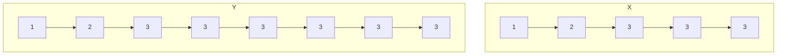
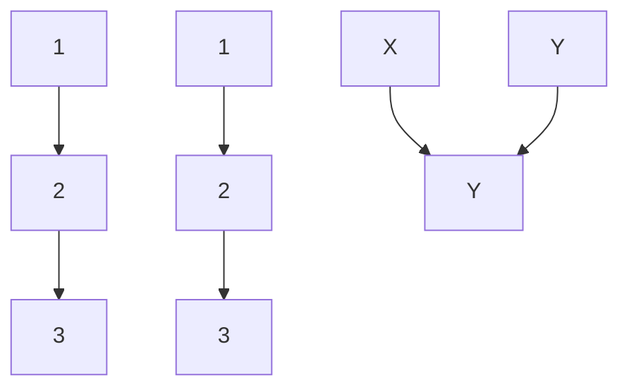
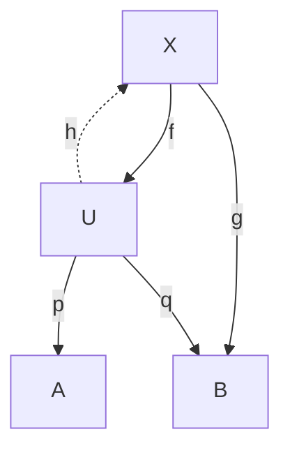
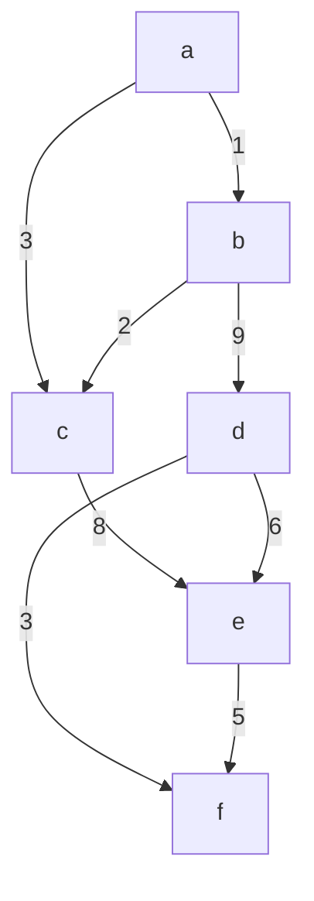
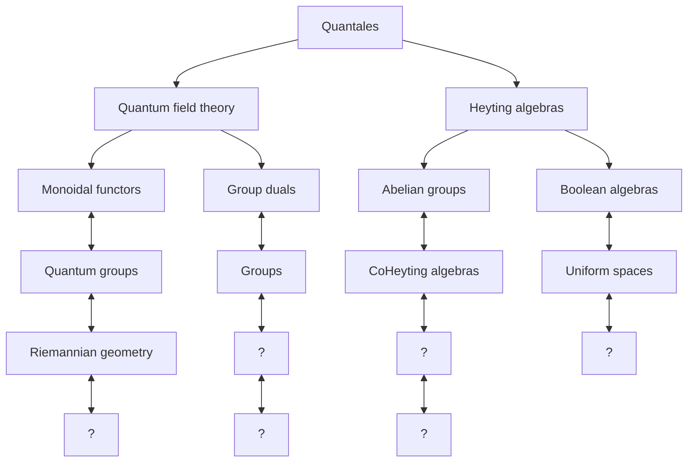

led him to a hierarchy of infinite sets of different cardinality. The importance of this discovery for analysis was at first not widely recognized, though in the 1880s Mittag-Leffler and Hurwitz both made significant applications of notions about derived sets (the set of limit points of a given set) and dense or nowhere-dense sets.

Cantor gradually came to the view that set theory could function as a foundational tool for all of mathematics. As early as 1882 he wrote that the science of sets encompassed arithmetic, function theory, and geometry, combining them into a “higher unity” based on the idea of cardinality. However, this proposal was vaguely articulated and at first attracted no adherents. Nonetheless, sets began to find their way into the language of analysis, most notably through ideas of measure [III.55] and measurability of a set. Indeed, one important route to the absorption of analysis by set theory was the path that sought to determine what kind of function could “measure” a set in an abstract sense. The work of lebesgue [VI.72] and borel [VI.70] around 1900 on integration and measurability tied set theory to the calculus in a very concrete and intimate way.

A further key step in the establishment of the foundations of analysis in the early twentieth century was a new emphasis on mathematical theories as axiomatic structures. This received enormous impetus from the work of Hilbert, who, beginning in the 1890s, had sought to provide a renewed axiomatization of geometry. peano [VI.62] in Italy headed a school with similar aims. Hilbert redefined the reals on these axiomatic grounds, and his many students and associates turned to axiomatics with enthusiasm for the clarity the approach could provide. Rather than proving the existence of specific entities such as the reals, the mathematician posits a system satisfying the fundamental properties they possess. A real number (or whatever object) is then defined by the set of axioms provided. As Epple has pointed out, such definitions were considered to be ontologically neutral in that they did not provide methods for telling real numbers from other objects, or even state whether they existed at all (Epple 2003, p. 316). Hilbert’s student Ernst Zermelo began work on axiomatizing set theory along these lines, publishing his axioms in 1908 (see [IV.22 §3]). Problems with set theory had emerged in the form of paradoxes, the most famous due to russell [VI.71]: if S is the set of all sets that do not contain themselves, then it is not possible for S to be in S, nor can it not be in S. Zermelo’s axiomatics sought to avoid this difficulty, in part by avoiding the definition of set. By 1910, weyl [VI.80] was to refer to mathematics as the science of “ ,” or set membership, rather than the science of quantity. Nonetheless, Zermelo’s axioms as a foundational strategy were contested. For one thing, a consistency proof for the axioms was lacking. Such “meaning-free” axiomatization was also contested on the grounds that it removed intuition from the picture.

Against the complex and rapidly developing background of mathematics in the early twentieth century, these debates took on many dimensions that have implications well beyond the question of what constitutes rigorous argument in analysis. For the practicing analyst, however, as well as for the teacher of basic infinitesimal calculus, these discussions are marginal to everyday mathematical life and education, and are treated as such. Set theory is pervasive in the language used to describe the basic objects. Real-valued functions of one real variable are defined as sets of ordered pairs of real numbers, for example; a set-theoretic definition of an ordered pair was given by wiener [VI.85] in 1914, and the set-theoretic definition of functions may be dated from that time. However, research in analysis has been largely distinct from, and generally avoids, the foundational issues that may remain in connection with this vocabulary. This is not at all to say that contemporary mathematicians treat analysis in a purely formal way. The intuitive content associated with numbers and functions is very much a part of the way of thinking of most mathematicians. The axioms for the reals and for set theory form a framework to be referred to when necessary. But the essential objects of basic analysis, namely derivatives, integrals, series, and their existence or convergence behaviors, are dealt with along the lines of the early twentieth century, so that the ontological debates about the infinitesimal and infinite are no longer very lively.

A coda to this story is provided by the researches of robinson [VI.95] (1918–74) into “nonstandard” analysis, published in 1961. Robinson was an expert in model theory: the study of the relationship between systems of logical axioms and the structures that may satisfy them. His differentials were obtained by adjoining to the regular real numbers a set of “differentials,” which satisfied the axioms of an ordered field (in which there is ordinary arithmetic like that of the real numbers) but in addition had elements that were smaller than 1/n for every positive integer n. In the eyes of some, this creation eliminated many of the unpleasant features of the usual way of dealing with the reals, and realized the ultimate goal of Leibniz to have a theory of infinitesimals which was part of the same structure as that of the reals. Despite stimulating a flurry of activity, and considerable acclaim from some quarters, Robinson’s approach has never been widely accepted as a working foundation for analysis.

# Further Reading

Bottazzini, U. 1990. Geometrical rigour and “modern analysis”: an introduction to Cauchy’s Cours d’Analyse. In Cauchy (1821). Bologna: Editrice CLUB.   
Cauchy, A.-L. 1821. Cours d’Analyse de l’École Royale Polytechnique: Première Partie—Analyse Algébrique. Paris: L’Imprimerie Royale. (Reprinted, 1990, by Editrice CLUB, Bologna.)   
Epple, M. 2003. The end of the science of quantity: foundations of analysis, 1860–1910. In A History of Analysis, edited by H. N. Jahnke, pp. 291–323. Providence, RI: American Mathematical Society.   
Fraser, C. 1987. Joseph Louis Lagrange’s algebraic vision of the calculus. Historia Mathematica 14:38–53.   
Jahnke, H. N., ed. 2003. A History of Analysis. Providence, RI: American Mathematical Society/London Mathematical Society.   
Riemann, G. F. B. 1854. Ueber die Darstellbarkeit einer Function durch eine trigonometrische Reihe. Königlichen Gesellschaft der Wissenschaften zu Göttingen 13:87–131. Republished in Riemann’s collected works (1990): Gesammelte Mathematische Werke und Wissenschaftliche Nachlass und Nachträge, edited by R. Narasimhan, 3rd edn., pp. 259–97. Berlin: Springer.   
Weierstrass, K. 1988. Einleitung in die Theorie der Analytischen Functionen: Vorlesung Berlin 1878, edited by P. Ullrich. Braunschweig: Vieweg/DMV.

# II.6 The Development of the Idea of Proof

Leo Corry

# 1 Introduction and Preliminary Considerations

In many respects the development of the idea of proof is coextensive with the development of mathematics as a whole. Looking back into the past, one might at first consider mathematics to be a body of scientific knowledge that deals with the properties of numbers, magnitudes, and figures, obtaining its justifications from proofs rather than, say, from experiments or inductive inferences. Such a characterization, however, is not without problems. For one thing, it immediately leaves out important chapters in the history of civilization that are more naturally associated with mathematics than with any other intellectual activity. For example, the Mesopotamian and Egyptian cultures developed elaborate bodies of knowledge that would most naturally be described as belonging to arithmetic or geometry, even though nothing is found in them that comes close to the idea of proof as it was later practiced in mathematics at large. To the extent that any justification is given, say, in the thousands of mathematical procedures found on clay tablets written in cuneiform script, it is inductive or based on experience. The tablets repetitively show—without additional explanation or attempts at general justifications—a given procedure to be followed whenever one is pursuing a certain type of result. Later on, in the context of Chinese, Japanese, Mayan, or Hindu cultures, one again finds important developments in fields naturally associated with mathematics. The extent to which these cultures pursued the idea of mathematical proof—a question that is debated among historians to this day— was undoubtedly not as great as it was in Greek tradition, and it certainly did not take the specific forms we typically associate with the latter. Should one nevertheless say that these are instances of mathematical knowledge, even though they are not justified on the basis of some kind of general, deductive proof? If so, then we cannot characterize mathematics as a body of knowledge that is backed up by proofs, as suggested above. However, this litmus test certainly provides a useful criterion—one that we do not want to give up too easily—for distinguishing mathematics from other intellectual endeavors.

Without totally ignoring these important questions, the present account focuses on a story that started, at some point in the past, usually taken to be before or around the fifth century b.c.e. in Greece, with the realization that there was a distinctive body of claims, mainly associated with numbers and with diagrams, whose truth could be and needed to be vindicated in a very special way—namely, by means of a general, deductive argument, or “proof.” Exactly when and how this story began is unclear. Equally unclear are the direct historical sources of such a unique idea. Since the emphasis on the use of logic and reason in constructing an argument was well-entrenched in other spheres of public life in ancient Greece—such as politics, rhetoric, and law—much earlier than the fifth century b.c.e., it is possible that it is in those domains that the origins of mathematical proof are to be found.

The early stages of this story raise additional questions, both historical and methodological. For instance, Thales of Miletus, the first mathematician known by name (though he was also a philosopher and scientist), is reported to have proved several geometric theorems, such as, for instance, that the opposite angles between two intersecting straight lines are equal, or that if two vertices of a triangle are the endpoints of the diameter of a circle and the third is any other point on the circle then the triangle must be right angled. Even if we were to accept such reports at face value, several questions would immediately arise: in what sense can it be asserted that Thales “proved” these results? More specifically, what were Thales’s initial assumptions and what inference methods did he take to be valid? We know very little about this. However, we do know that, as a result of a complex historical process, a certain corpus of knowledge eventually developed that comprised known results, techniques employed, and problems (both solved and yet requiring solution). This corpus gradually also incorporated the regulatory idea of proof: that is, the idea that some kind of general argument, rather than an example (or even many examples), was the necessary justification to be sought in all cases. As part of this development, the idea of proof came to be associated with strictly deductive arguments, as opposed to, say, dialogic (meaning “negotiated”) or “probabilistically inferred” truth. It is an interesting and difficult historical question to establish why this was the case, and one that we will not address here.

euclid’s [VI.2] Elements was compiled some time around the year 300 b.c.e. It stands out as the most successful and comprehensive attempt of its kind to organize the basic concepts, results, proofs, and techniques required by anyone wanting to master this increasingly complex body of knowledge. Still, it is important to stress that it was not the only such attempt within the Hellenic world. This endeavor was not just a matter of compilation, codification, and canonization, such as one can find in any other evolving field of learning at any point in time. Instead, the assertions it contained were of two different kinds, and the distinction was vitally important. On the one hand there were basic assumptions, or axioms, and on the other there were theorems, which were typically more elaborate statements, together with accounts of how they followed from the axioms—that is, proofs. The way that proof was conceived and realized in the Elements became the paradigm for centuries to come.

This article outlines the evolution of the idea of deductive proof as initially shaped in the framework of Euclidean-style mathematics and as subsequently practiced in the mainstream mathematical culture of ancient Greece, the Islamic world, Renaissance Europe, early modern European science, and then in the nineteenth century and at the turn of the twentieth. The main focus will be on geometry: other fields like arithmetic and algebra will be treated mainly in relation to it. This choice is amply justified by the subject matter itself. Indeed, much as mathematics stands out among the sciences for the unique way in which it relies on proof, so Euclidean-style geometry stood out—at least until well into the seventeenth century—among closely related disciplines such as arithmetic, algebra, and trigonometry.

Results in these other disciplines, or indeed the disciplines as a whole, were often regarded as fully legitimate only when they had been provided with a geometric (or geometric-like) foundation. However, important developments in nineteenth-century mathematics, mainly in connection with the rise of noneuclidean geometries [II.2 §§6–10] and with problems in the foundations of analysis [II.5], eventually led to a fundamental change of orientation, where arithmetic (and eventually set theory [IV.22]) became the bastion of certainty and clarity from which other mathematical disciplines, geometry included, drew their legitimacy and their clarity. (See the crisis in the foundations of mathematics [II.7] for a detailed account of this development.) And yet, even before this fundamental change, Euclidean-style proof was not the only way in which mathematical proof was conceived, explored, and practiced. By focusing mainly on geometry, the present account will necessarily leave out important developments that eventually became the mainstream of legitimate mathematical knowledge. To mention just one important example in this regard, a fundamental question that will not be pursued here is how the principle of mathematical induction originated and developed, became accepted as a legitimate inference rule of universal validity, and was finally codified as one of the basic axioms of arithmetic in the late nineteenth century. Moreover, the evolution of the notion of proof involves many other dimensions that will not be treated here, such as the development of the internal organization of mathematics into subdisciplines, as well as the changing interrelations between mathematics and its neighboring disciplines. At a different level, it is related to how mathematics itself evolved as a socially institutionalized enterprise: we shall not discuss interesting questions about how proofs are produced, made public, disseminated, criticized, and often rewritten and improved.

# 2 Greek Mathematics

Euclid’s Elements is the paradigmatic work of Greek mathematics, partly for what it has to say about the basic concepts, tools, results, and problems of synthetic geometry and arithmetic, but also for how it regards the role of a mathematical proof and the form that such a proof takes. All proofs appearing in the Elements have six parts and are accompanied by a diagram. I illustrate this with the example of proposition I.37. Euclid’s text is quoted here in the classical translation of Sir Thomas Heath, and the meaning of some terms differs from current usage. Thus, two triangles are said to be “in the same parallels” if they have the same height and both their bases are contained in a single line, and any two figures are said to be “equal” if their areas are equal. For the sake of explanation, names of the parts of the proof have been added: these do not appear in the original. The proof is illustrated in figure 1.

Protasis (enunciation). Triangles which are on the same base and in the same parallels are equal to one another.

Ekthesis (setting out). Let ABC, DBC be triangles on the same base BC and in the same parallels AD, BC.

Diorismos (definition of goal). I say that the triangle ABC is equal to the triangle DBC.

Kataskeue (construction). Let AD be produced in both directions to E, F; through B let BE be drawn parallel to CA, and through C let CF be drawn parallel to BD.

Apodeixis (proof). Then each of the figures EBCA, DBCF is a parallelogram; and they are equal, for they are on the same base BC and in the same parallels BC, EF. Moreover the triangle ABC is half of the parallelogram EBCA, for the diameter AB bisects it; and the triangle DBC is half of the parallelogram DBCF, for the diameter DC bisects it. Therefore the triangle ABC is equal to the triangle DBC.

Sumperasma (conclusion). Therefore triangles which are on the same base and in the same parallels are equal to one another.

This is an example of a proposition that states a property of geometric figures. The Elements also includes propositions that express a task to be carried out. An example is proposition I.1: “On a given finite straight line to construct an equilateral triangle.” The same six parts of the proof and the diagram invariably appear in propositions of this kind as well. This formal structure is also followed in all propositions appearing in the three arithmetic books of the Elements and, most importantly, all of them are always accompanied by a diagram. Thus, for instance, consider proposition IX.35, which in its original version reads as follows:

text_image

E
A
D
F
B
C

Figure 1 Proposition I.37 of Euclid’s Elements.

text_image

A
B G C
D
E L K H F

Figure 2 Proposition IX.35 of Euclid’s Elements.

If as many numbers as we please be in continued proportion, and there be subtracted from the second and the last numbers equal to the first, then, as the excess of the second is to the first, so will the excess of the last be to all those before it.

This cumbersome formulation may prove incomprehensible on first reading. In more modern terms, an equivalent to this theorem would state that, given a geometric progression $a _ { 1 } , a _ { 2 } , \ldots , a _ { n + 1 }$ , we have

$$
\left(a _ {n + 1} - a _ {1}\right): \left(a _ {1} + a _ {2} + \dots + a _ {n}\right) = \left(a _ {2} - a _ {1}\right): a _ {1}.
$$

This translation, however, fails to convey the spirit of the original, in which no formal symbolic manipulation is, or can be, made. More importantly, a modern algebraic proof fails to convey the ubiquity of diagrams in Greek mathematical proofs, even where they are not needed for a truly geometric construction. Indeed, the accompanying diagram for proposition IX.35 is shown as figure 2 and the first few lines of the proof are as follows:

Let there be as many numbers as we please in continued proportion A, BC, D, EF, beginning from A as least and let there be subtracted from BC and EF the numbers BG, FH, each equal to A; I say that, as GC is to A, so is EH to A, BC, D. For let FK be made equal to BC and FL equal to D. . . .

This proposition and its proof provide good examples of the capabilities, as well as the limitations, of ancient Greek practices of notation, and especially of how they managed without a truly symbolic language. In particular, they demonstrate that proofs were never conceived by the Greeks, even ideally, as purely logical constructs, but rather as specific kinds of arguments that one applied to a diagram. The diagram was not just a visual aid to the argumentation. Rather, through the ekthesis part of the proof, it embodied the idea referred to by the general character and formulation of the proposition.

Together with the centrality of diagrams, the sixpart structure is also typical of most of Greek mathematics. The constructions and diagrams that typically appeared in Greek mathematical proofs were not of an arbitrary kind, but what we identify today as straightedge-and-compass constructions. The reasoning in the apodeixis part could be either a direct deduction or an argument by contradiction, but the result was always known in advance and the proof was a means to justify it. In addition, Greek geometric thinking, and in particular Euclid-style geometric proofs, strictly adhered to a principle of homogeneity. That is, magnitudes were only compared with, added to, or subtracted from magnitudes of like kind—numbers, lengths, areas, or volumes. (See numbers [II.1 §2] for more about this.)

Of particular interest are those Greek proofs concerned with lengths of curves, as well as with areas or volumes enclosed by curvilinear shapes. Greek mathematicians lacked a flexible notation capable of expressing the gradual approximation of curves by polygons and an eventual passage to the infinite. Instead, they devised a special kind of proof that involved what can retrospectively be seen as an implicit passage to the limit, but which did so in the framework of a purely geometric proof and thus unmistakably followed the sixpart proof-scheme described above. This implicit passage to the infinite was based on the application of a continuity principle, later associated with archimedes [VI.3]. In Euclid’s formulation, for instance, the principle states that, given two unequal magnitudes of the same kind, A, B (be they two lengths, two areas, or two volumes), with A greater than B, and if we subtract from A a magnitude which is greater than A/2, and from the remainder we subtract a magnitude that is greater than its half, and if this process is iterated a sufficient number of times, then we will eventually remain with a magnitude that is smaller than B. Euclid used this principle to prove, for instance, that the ratio of the areas of two circles equals the ratio of the squares of their diameters (XII.2). The method used, later known as the exhaustion method, was based on a double contradiction that became standard for many centuries to come. This double contradiction is illustrated in figure 3, the accompanying diagram to the proposition.

text_image

A
O
R
B
D
P
C
Q
K
E
F
H
L
G
M
S

Figure 3 Proposition XII.2 of Euclid’s Elements.

If the ratio of the square on BD to the square on FH is not the same as the ratio of circle ABCD to circle EFGH, then it must be the same as the ratio of circle ABCD to an area S either larger or smaller than circle EFGH. The curvilinear figures are approximated by polygons, since the continuity principle allows the difference between the inscribed polygon and the circle to be as close as desired (e.g., closer than the difference between S and EFGH). The “double contradiction” is reached if one assumes that S is either smaller or larger than EFGH.

Forms of proof and constructions other than those mentioned so far are occasionally found in Greek mathematical texts. These include diagrams based on what is assumed to be the synchronized motion of two lines (e.g., the trisectrix, or Archimedes’ spiral), mechanical devices of many sorts, or reasoning based on idealized mechanical considerations. However, the Euclidean type of proof described above remained a model to be followed wherever possible. There is a famous Archimedes palimpsest that provides evidence of how less canonical methods, drawing on mechanical considerations (albeit of a highly idealized kind), were used to deduce results about areas and volumes. However, even this bears testimony to the primacy of the ideal model: there is a letter from Archimedes to Eratosthenes in which he displays the ingenuity of his mechanical methods but at the same time is at pains to stress their heuristic character.

# 3 Islamic and Renaissance Mathematics

Just as Euclid is now considered to represent an entire mainstream tradition of Greek mathematics, so alkhw¯arizm¯ı [VI.5] is regarded as a representative of Islamic mathematics. There are two main traits of his work that are relevant to the present account and that became increasingly central to the development of mathematics, starting with his works in the late eighth century and continuing until the works of cardano [VI.7] in sixteenth-century Italy. These traits are a pervasive “algebraization” of mathematical thinking, and a continued reliance on Euclidean-style geometric proof as the main way of legitimizing the validity of mathematical knowledge in general and of algebraic reasoning in mathematics in particular.

The prime example of this combination is found in al-Khw¯arizm¯ı’s seminal text al-Kit¯ab al-mukhtas. ar $\boldsymbol { \mathit { f } } \boldsymbol { \mathit { \Pi } }$ h. is¯ab al-jabr wa’l-muq¯abala (“The compendious book on calculation by completion and balancing”), where he discusses the solutions of problems in which the unknown length appears in combination with numbers and squares (the side of which is an unknown). Since he only envisages the possibility of positive “coefficients” and positive rational solutions, al-Khw¯arizm¯ı needs to consider six different situations each of which requires a different recipe for finding the unknown: the fullgrown idea of a general quadratic equation and an algorithm to solve it in all cases does not appear in Islamic mathematical texts. For instance, the problem “squares and roots equal to numbers” (e.g., $x ^ { 2 } + 1 0 x = 3 9$ , in modern notation) and the problem “roots and numbers equal to squares” $( \mathrm { e . g . , ~ } 3 x + 4 ~ = ~ x ^ { 2 } )$ are considered to be completely different ones, as are their solutions, and accordingly al-Khw¯arizm¯ı treats them separately. In all cases, however, al-Khw¯arizm¯ı proves the validity of the method described by translating it into geometric terms and then relying on Euclid-like geometric theorems built around a specific diagram. It is noteworthy, however, that the problems refer to specific numerical quantities associated with the magnitudes involved, and these measured magnitudes refer to the accompanying diagrams as well. In this way, al-Khw¯arizm¯ı interestingly departs from the Euclidean style of proof. Still, the Greek principle of homogeneity is essentially preserved, as the three quantities usually involved in the problem are all of the same kind, namely, areas.

<table><tr><td></td><td>c</td><td></td></tr><tr><td rowspan="2">f</td><td>a</td><td rowspan="2">d</td></tr><tr><td>b</td></tr><tr><td></td><td>e</td><td></td></tr></table>

Figure 4 Al-Khw¯arizm¯ı’s geometric justification of the formula for a quadratic equation.

Consider, for instance, the equation $x ^ { 2 } \ + \ 1 0 x =$ 39, which corresponds to the following problem of al-Khw¯arizm¯ı.

What is the square which combined with ten of its roots will give a sum total of 39?

The recipe prescribes the following steps.

Take one-half of the roots [5] and multiply them by itself [25]. Add this amount to 39 and obtain 64. Take the square root of this, which is eight, subtract from it half the roots, leaving three. The number three therefore represents one root of this square, which itself, of course, is nine.

The justification is provided by figure 4.

Here ab represents the said square, which for us is $x ^ { 2 } ,$ , and the rectangles c, d, e, f represent an area of $\textstyle { \frac { 1 0 } { 4 } } x$ each, so that all of them together equal 10x, as in the problem. Thus, the small squares in the corners represent an area of 6.25 each, and we can “complete” the large square, being equal to 64, and whose side is therefore 8, thus yielding the solution 3 for the unknown.

Abu Kamil Shuja, just one generation after al-Khw¯arizm¯ı, added force to this approach when he solved additional problems while specifically relying on theorems taken from the Elements, including the accompanying diagrams, in order to justify his method of solution. The primacy of the Euclidean-type proof, which was already accepted in geometry and arithmetic, thus also became associated with the algebraic methods that eventually turned into the main topic of interest in Renaissance mathematics. Cardano’s 1545 Ars

Magna, the foremost example of this new trend, presented a complete treatment of the equations of third and fourth degree. Although the algebraic line of reasoning that he adopted and developed became increasingly abstract and formal, Cardano continued to justify his arguments and methods of solution by reference to Euclid-like geometric arguments based on diagrams.

# 4 Seventeenth-Century Mathematics

The next significant change in the conception of proof appears in the seventeenth century. The most influential development of mathematics in this period was the creation of the infinitesimal calculus simultaneously by newton [VI.14] and leibniz [VI.15]. This momentous development was the culmination of a process that spanned most of the century, involving the introduction and gradual improvement of important techniques for determining areas and volumes, gradients of tangents, and maxima and minima. These developments included the elaboration of traditional points of view that went back to the Greek classics, as well as the introduction of completely new ideas such as the “indivisibles,” whose status as a legitimate tool for mathematical proof was hotly debated. At the same time, the algebraic techniques and approaches that Renaissance mathematicians continued to expand upon, following on from their Islamic predecessors, now gained additional impetus and were gradually incorporated— starting with the work of fermat [VI.12] and descartes [VI.11]—into the arsenal of tools available for proving geometric results. Underlying these various trends were different conceptions and practices of mathematical proof, which are briefly described and illustrated now.

Examples of how the classical Greek conception of geometric proof was essentially followed but at the same time fruitfully modified and expanded are found in the work of Fermat, as can be seen in his calculation of the area enclosed by a generalized hyperbola (in modern notation $( y / a ) ^ { m } = ( x / b ) ^ { n } ( m , n \neq 1 )$ and its asymptotes.

The quadratic hyperbola (i.e., a figure represented by $y = 1 / x ^ { 2 } )$ , for instance, is defined here in terms of a purely geometric relationship on any two of its points, namely, that the ratio between the squares built on the abscissas equals the inverse ratio between the lengths of the ordinates. In its original version it is expressed as follows: $\mathrm { A G } ^ { 2 } : \mathrm { A H } ^ { 2 } : \because \mathrm { I H }$ : EG (see figure 5). It should be noticed that this is not an equation in the present sense of the word, on which the standard symbolic manipulations can be directly performed. Rather, this is a fourterm proportion to which the rules of Greek classical mathematics apply. Also, the proof was entirely geometric and indeed it essentially followed the Euclidean style. Thus, if the segments AG, AH, AO, etc., are chosen in continued proportion, then one can prove that the rectangles EH, IO, NM, etc., are also in continued proportion, and indeed that EH : IO :: IO : NM ::  :: AH : AG.

text_image

C
B
E
I
N
P
A
G
H
O
M

Figure 5 Diagram for Fermat’s proof of the area under a hyperbola.

Fermat made use of proposition IX.35 of the Elements (mentioned above), which comprises an expression for the sum of any number of quantities in a geometric progression, namely (in more modern notation):

$$
(a _ {n + 1} - a _ {1}): (a _ {1} + a _ {2} + \dots + a _ {n}) = (a _ {2} - a _ {1}): a _ {1}.
$$

But at this point his proof takes an interesting turn. He introduces the somewhat obscure concept of “adequare,” which he found in the works of Diophantus, and which allows a kind of “approximate equality.” Specifically, this idea allows him to bypass the cumbersome procedure of double contradiction typically used in Greek geometry as an implicit passage to the infinite. A figure bounded by GE, by the horizontal asymptote, and by the hyperbola will equal the infinite sum of rectangles obtained when the rectangle EH “will vanish and will be reduced to nothing.” Further, proposition IX.35 implies that this sum equals the area of the rectangle BG. Significantly, Fermat still chose to rely on the authority of the ancients, hinting at the method of double contradiction when he declared that this result “would be easy to confirm by a more lengthy proof carried out in the manner of Archimedes.”

Attempts to expand the accepted canon of geometric proof eventually led to the more progressive approaches associated with the idea of indivisibles, as practiced by Cavalieri, Roberval, and Torricelli. This is well illustrated by Torricelli’s 1643 calculation of the volume of the infinite body created by rotating the hyperbola $x y \ = \ k ^ { 2 }$ around the y-axis, with values of x between 0 and a (as we would describe it in modern terms).

The essential idea of indivisibles is that areas are considered to be sums, or collections, of infinitely many line segments, and volumes are considered to be sums, or collections, of infinitely many areas. In this example, Torricelli calculated the volume of revolution by considering it to be a sum of the curved surfaces of an infinite collection of cylinders successively inscribed within each other and having radii ranging from 0 to a. In modern algebraic terms, the height of the inscribed cylinder with radius x is $k ^ { 2 } / x$ , so the area of its curved surface is 2πx $( k ^ { 2 } / x ) = \pi ( { \sqrt { 2 } } k ) ^ { 2 }$ , a constant value that is independent of x and equal to the area of a circle of radius ${ \sqrt { 2 } } k$ . Thus, in Torricelli’s approach based on the geometry of indivisibles, the collection of all surfaces that, when taken together, comprise the infinite body can be equated to a collection of circles with area $2 \pi k ^ { 2 }$ , one for each x between 0 and a, or equivalently to a cylinder of volume $2 \pi k ^ { 2 } a$ .

The rules of Euclid-like geometric proof were completely contravened in proofs of this kind and this made them unacceptable in the eyes of many. On the other hand, their fruitfulness was highly appealing, especially in cases like this one in which an infinite body was shown to have a finite volume, a result which Torricelli himself found extremely surprising. Both supporters and detractors alike, however, realized that techniques of this kind might lead to contradictions and inaccurate results. By the eighteenth century, with the accelerated development of the infinitesimal calculus and its associated techniques and concepts, techniques based on indivisibles had essentially disappeared.

The limits set by the classical paradigm of Euclidean geometric proof were then transgressed in a different direction by the all-embracing algebraization of geometry at the hands of Descartes. The fundamental step undertaken by Descartes was to introduce unit lengths as a key element in the diagrams used in geometric proofs. The radical innovation implied by this step, allowing the hitherto nonexistent possibility of defining operations with line segments, was explicitly stressed by Descartes in La Géométrie in 1637:

Just as arithmetic consists of only four or five operations, namely addition, subtraction, multiplication,

division, and the extraction of roots, which may be considered a kind of division, so in geometry, to find required lines it is merely necessary to add or subtract other lines; or else, taking one line, which I shall call the unit in order to relate it as closely as possible to numbers, and which can in general be chosen arbitrarily, and having given two other lines, to find a fourth line which shall be to one of the given lines as the other is to the unit (which is the same as multiplication); or again, to find a fourth line which is to one of the given lines as the unit is to the other (which is equivalent to division); or, finally, to find one, two, or several mean proportionals between the unit and some other line (which is the same as extracting the square root, cube root, etc., of the given line).

Thus, for instance, given two segments BD, BE, the division of their lengths is represented by BC in figure 6, in which AB represents the unit length.

Although the proof was Euclid-like in appearance (because of the diagram and the use of the theory of similar triangles), the introduction of the unit length and its use for defining the operations with segments set it radically apart and opened completely new horizons for geometric proofs. Not only had measurements of length been absent from Euclidean-style proofs thus far, but also, as a consequence of the very existence of these operations, the essential dimensionality traditionally associated with geometric theorems lost its significance. Descartes used expressions such as a − b, a/b, a2, b3, and their roots, but he stressed that they should all be understood as “only simple lines, which, however, I name squares, cubes, etc., so that I make use of the terms employed in algebra.” With the removal of dimensionality, the requirement of homogeneity also became unnecessary. Unlike his predecessors, who handled magnitudes only when they had a direct geometric significance, Descartes could not see any problem in forming an expression such as $a ^ { 2 } b ^ { 2 } - b$ and then extracting its cube root. In order to do so, he said “we must consider the quantity $a ^ { 2 } b ^ { 2 }$ divided once by the unit, and the quantity b multiplied twice by the unit.” Sentences of this kind would be simply incomprehensible to Greek geometers, as well as to their Islamic and Renaissance followers.

This algebraization of geometry, and particularly the newly created possibility of proving geometric facts via algebraic procedures, was strongly related to the recent consolidation of the idea of an algebraic equation, seen as an autonomous mathematical entity, for which formal rules of manipulation were well-known and could be systematically applied. This idea reached full maturity in the hands of viète [VI.9] only around 1591. But not all mathematicians in the seventeenth century saw the important developments associated with algebraic thinking either as a direction to be naturally adopted or as a clear sign of progress in the latter discipline. A prominent opponent of any attempt to deviate from the classical Euclidean-style approach in geometry was none other than newton [VI.14], who, in the Arithmetica Universalis (1707), was emphatic in expressing his views:

text_image

E
C
D A B

Figure 6 Descartes’s geometric calculation of the division of two given segments.

Equations are expressions of arithmetic computation and properly have no place in geometry, except in so far as truly geometrical quantities (lines, surfaces, solids and proportions) are thereby shown equal, some to others. Multiplications, divisions, and computations of that kind have recently been introduced into geometry, unadvisedly and against the first principle of this science. . . . Therefore these two sciences ought not to be confounded, and recent generations by confounding them have lost that simplicity in which all geometrical elegance consists.

Newton’s Principia bears witness to the fact that statements like this one were far from mere lip service, as Newton consistently preferred Euclidean-style proofs, considering them to be the correct language for presenting his new physics and for bestowing it with the highest degree of certainty. He used his own calculus only where strictly necessary, and barred algebra from his treatise entirely.

# 5 Geometry and Proof in Eighteenth-Century Mathematics

Mathematical analysis became the primary focus of mathematicians in the eighteenth century. Questions relating to the foundations of analysis arose immediately after the calculus began to be developed and were not settled until the late nineteenth century. To a considerable extent these questions were about the nature of legitimate mathematical proof, and debates about them played an important role in undermining the longundisputed status of geometry as the basis for mathematical certainty and bestowing this status on arithmetic instead. The first important stage in this process was euler’s [VI.19] reformulation of the calculus. Once separated from its purely geometric roots, the calculus came to be centered on the algebraically oriented concept of function. This trend for favoring algebra over geometry was given further impetus by Euler’s successors. d’alembert [VI.20], for instance, associated mathematical certainty above all with algebra—because of its higher degree of generality and abstraction—and only subsequently with geometry and mechanics. This was a clear departure from the typical views of Newton and of his contemporaries. The trend reached a peak and was transformed into a well-conceived program in the hands of lagrange [VI.22], who in the preface to his 1788 Méchanique Analitique famously expressed a radical view about how one could achieve certainty in the mathematical sciences while distancing oneself from geometry. He wrote as follows:

One will not find figures in this work. The methods that I expound require neither constructions, nor geometrical or mechanical arguments, but only algebraic operations, subject to a regular and uniform course.

The details of these developments are beyond the scope of this article. What is important to stress, however, is that in spite of their very considerable impact, the basic conceptions of proof in the more mainstream realm of geometry did not change very much during the eighteenth century. An illuminating perspective on these conceptions is offered by the views of contemporary philosophers, especially Immanuel Kant.

Kant had a very profound knowledge of contemporary science, and particularly of mathematics. A philosophical discussion of his views on mathematical knowledge and proof need not concern us here. However, given his acquaintance with contemporary conceptions, they do provide an insightful historical perspective on proof as it was understood at the time. Of particular interest is the contrast he draws between a philosophical argument, on the one hand, and a geometric proof, on the other. Whereas the former deals with general concepts, the latter deals with concrete, yet nonempirical, concepts, by reference to “visualizable intuitions” (Anschauung). This difference is epitomized in the following, famous passage from his Critique of Pure Reason.

Suppose a philosopher be given the concept of a triangle and he is left to find out, in his own way, what relation the sum of its angles bears to a right angle. He has nothing but the concept of a figure enclosed by three straight lines, and possessing three angles. However long he meditates on this concept, he will never produce anything new. He can analyze and clarify the concept of a straight line or of an angle or of the number three, but he can never arrive at any properties not already contained in these concepts. Now let the geometrician take up these questions. He at once begins by constructing a triangle. Since he knows that the sum of two right angles is exactly equal to the sum of all the adjacent angles which can be constructed from a single point on a straight line, he prolongs one side of his triangle and obtains two adjacent angles, which together are equal to two right angles. He then divides the external angle by drawing a line parallel to the opposite side of the triangle, and observes that he has thus obtained an external adjacent angle which is equal to an internal angle—and so on. In this fashion, through a chain of inferences guided throughout by intuition, he arrives at a fully evident and universally valid solution of the problem.

In a nutshell, then, for Kant the nature of mathematical proof that sets it apart from other kinds of deductive argumentation (like philosophy) lies in the centrality of the diagrams and the role that they play. As in the Elements, this diagram is not just a heuristic guide for what is no more than abstract reasoning, but rather an “intuition,” a singular embodiment of the mathematical idea that is clearly located not only in space, but rather in space and time. In fact,

I cannot represent to myself a line, however small, without drawing it in thought, that is gradually generating all its parts from a point. Only in this way can the intuition be obtained.

This role played by diagrams as “visualizable intuitions” is what provides, for Kant, the explanation of why geometry is not just an empirical science, but also not just a huge tautology devoid of any synthetic content. According to him, geometric proof is constrained by logic but it is much more than just a purely logical analysis of the terms involved. This view was at the heart of a novel philosophical analysis whose starting point was the then-entrenched conception of what a mathematical proof is.

# 6 Nineteenth-Century Mathematics and the Formal Conception of Proof

The nineteenth century was full of important developments in geometry and other parts of mathematics, not just of the methods but also of the aims of the various subdisciplines. Logic, as a field of knowledge, also underwent significant changes and a gradual mathematization that entirely transformed its scope and methods. Consequently, by the end of the century the conception of proof and its role in mathematics had also been deeply transformed.

In Göttingen in 1854 riemann [VI.49] gave his seminal talk “On the hypotheses which lie at the foundations of geometry.” At around the same time, the works of bolyai [VI.34] and lobachevskii [VI.31] on non-Euclidean geometry, as well as the related ideas of gauss [VI.26], all dating from the 1830s, began to be more generally known. The existence of coherent, alternative geometries brought about a pressing need for the most basic, longstanding beliefs about the essence of geometric knowledge, including the role of proof and mathematical rigor, to be revised. Of even greater significance in this regard was the renewed interest in projective geometry [I.3 §6.7], which became a very active field of research with its own open research questions and foundational issues after the publication of Jean Poncelet’s 1822 treatise. The addition of projective geometry to the many other possible geometric perspectives prompted a variety of attempts at unification and classification, the most significant of which were those based on group-theoretic ideas. Particularly notable were those of klein [VI.57] and lie [VI.53] in the 1870s. In 1882, Moritz Pasch published an influential treatise on projective geometry devoted to a systematic exploration of its axiomatic foundations and the interrelationships among its fundamental theorems. Pasch’s book also attempted to close the many logical gaps that had been found in Euclidean geometry over the years. More systematically than any of his fellow nineteenthcentury mathematicians, Pasch emphasized that all geometric results should be obtained from axioms by strict logical deduction, without relying on analytical means, and above all without appeal to diagrams or to properties of the figures involved. Thus, although in some ways he was consciously reverting to the canons of Euclid-like proof (which by then were somewhat loosened), his attitude toward diagrams was fundamentally different. Aware of the potential limitations of visualizing diagrams (and perhaps their misleading influence)

he put a much greater emphasis on the pure logical structure of the proof than his predecessors had. Nevertheless, he was not led to an outright formalist view of geometry and geometric proof. Rather, he consistently adopted an empirical approach to the origins and meaning of geometry and fell short of claiming that diagrams were for heuristic use only:

The basic propositions [of geometry] cannot be understood without corresponding drawings; they express what has been observed from certain, very simple facts. The theorems are not founded on observations, but rather, they are proved. Every inference performed during a deduction must find confirmation in a drawing, yet it is not justified by a drawing but from a certain preceding statement (or a definition).

Pasch’s work definitely contributed to diagrams losing their central status in geometric proofs in favor of purely deductive relations, but it did not directly lead to a thorough revision of the status of the axioms of geometry, or to a change in the conception that geometry deals essentially with the study of our spatial, visualizable intuition (in the sense of Anschauung). The all-important nineteenth-century developments in geometry produced significant changes in the conception of proof only under the combined influence of additional factors.

Mathematical analysis continued to be a primary field of research, and the study of its foundations became increasingly identified with arithmetic, rather than geometric, rigor. This shift was provoked by the works of mathematicians like cauchy [VI.29], weierstrass [VI.44], cantor [VI.54], and dedekind [VI.50], which aimed at eliminating intuitive arguments and concepts in favor of ever more elementary statements and definitions. (In fact, it was not until the work of Dedekind on the foundations of arithmetic, in the last third of the century, that the rigorous formulation pursued in these works was given any kind of axiomatic underpinning.) The idea of investigating the axiomatic basis of mathematical theories, whether geometry, algebra, or arithmetic, and of exploring alternative possible systems of postulates was indeed pursued during the nineteenth century by mathematicians such as George Peacock, Charles Babbage, John Herschel, and, in a different geographical and mathematical context, Hermann Grassmann. But such investigations were the exception rather than the rule, and they had only a fairly limited role in shaping a new conception of proof in analysis and geometry.

One major turning point, where the above trends combined to produce a new kind of approach to proof, is to be found in the works of giuseppe peano [VI.62] and his Italian followers. Peano’s mainstream activities were as a competent analyst, but he was also interested in artificial languages, and particularly in developing an artificial language that would allow a completely formal treatment of mathematical proofs. In 1889 his successful application of such a conceptual language to arithmetic yielded his famous postulates for the natural numbers [III.67]. Pasch’s systems of axioms for projective geometry posed a challenge to Peano’s artificial language, and he set out to investigate the relationship between the logical and the geometric terms involved in the deductive structure of geometry. In this context he introduced the idea of an independent set of axioms, and applied this concept to his own system of axioms for projective geometry, which were a slight modification of Pasch’s. This view did not lead Peano to a formalistic conception of proof, and he still conceived geometry in terms very similar to his predecessors:

Anyone is allowed to take a hypothesis and develop its logical consequences. However, if one wants to give this work the name of geometry it is necessary that such hypotheses or postulates express the result of simple and elementary observations of physical figures.

Under the influence of Peano, Mario Pieri developed a symbolism with which to handle abstract–formal theories. Unlike Peano and Pasch, Pieri consistently promoted the idea of geometry as a purely logical system, where theorems are deduced from hypothetical premises and where the basic terms are completely detached from any empirical or intuitive significance.

A new chapter in the history of geometry and of proof was opened at the end of the nineteenth century with the publication of hilbert’s [VI.63] Grundlagen der Geometrie, a work that synthesized and brought to completion the various trends of geometric research described above. Hilbert was able to achieve a comprehensive analysis of the logical interrelations among the fundamental results of projective geometry, such as the theorems of Desargues and Pappus, while paying particular attention to the role of continuity considerations within their proofs. His analysis was based on the introduction of a generalized analytic geometry, in which the coordinates may be taken from a variety of different number fields [III.63], rather than from the real numbers alone. This approach created a purely synthetic arithmetization of any given type of geometry, and thus helped to clarify the logical structure of Euclidean geometry as a deductive system. It also clarified the relationship between Euclidean geometry and the various other kinds of known geometries—non-Euclidean, projective, or non-Archimedean. This focus on logic implied, among other things, that diagrams should be relegated to a merely heuristic role. In fact, although diagrams still appear in many proofs in the Grundlagen, the entire purpose of the logical analysis is to avoid being misled by diagrams. Proofs, and particularly geometric proofs, have thus become purely logical arguments, rather than arguments about diagrams. And at the same time, the essence and the role of the axioms from which the derivations in question start also underwent a dramatic change.

Following Pasch’s lead, Hilbert introduced a new system of axioms for geometry that attempted to close the logical gaps inherent in earlier systems. These axioms were of five kinds—axioms of incidence, of order, of congruence, of parallels, and of continuity— each of which expressed a particular way in which spatial intuition manifests itself in our understanding. They were formulated for three fundamental kinds of object: points, lines, and planes. These remained undefined, and the system of axioms was meant to provide an implicit definition of them. In other words, rather than defining points or lines at the outset and then postulating axioms that are assumed to be valid for them, a point and a line were not directly defined, except as entities that satisfy the axioms postulated by the system. Further, Hilbert demanded that the axioms in a system of this kind should be mutually independent, and introduced a method for checking that this demand is fulfilled; in order to do so, he constructed models of geometries that fail to satisfy a given axiom of the system but satisfy all the others. Hilbert also required that the system be consistent, and that the consistency of geometry could be made to depend, in his system, on that of arithmetic. He initially assumed that proving the consistency of arithmetic would not present a major obstacle and it was a long time before he realized that this was not the case. Two additional requirements that Hilbert initially introduced for axiomatic systems were simplicity and completeness. Simplicity meant, in essence, that an axiom should not contain more than “a single idea.” The demand that every axiom in a system be “simple,” however, was never clearly defined or systematically pursued in subsequent works of Hilbert or any of his successors. The last requirement, completeness, meant for Hilbert in 1900 that any adequate axiomatization of a mathematical domain should allow for a derivation of all the known theorems of the discipline in question. Hilbert claimed that his axioms would indeed yield all the known results of Euclidean geometry, but of course this was not a property that he could formally prove. In fact, since this property of “completeness” cannot be formally checked for any given axiomatic system, it did not become one of the standard requirements of an axiomatic system. It is important to note that the concept of completeness used by Hilbert in 1900 is completely different from the currently accepted, model-theoretical one that appeared much later. The latter amounts to the requirement that in a given axiomatic system every true statement, be it known or unknown, should be provable.

The use of undefined concepts and the concomitant conception of axioms as implicit definitions gave enormous impetus to the view of geometry as a purely logical system, such as Pieri had devised it, and eventually transformed the very idea of truth and proof in mathematics. Hilbert claimed on various occasions—echoing an idea of Dedekind—that, in his system, “points, lines, and planes” could be substituted by “chairs, tables, and beer mugs,” without thereby affecting in any sense the logical structure of the theory. Moreover, in the light of discussions about set-theoretical paradoxes, Hilbert strongly emphasized the view that the logical consistency of a concept implicitly defined by axioms was the essence of mathematical existence. Under the influence of these views, of the new methodological tools introduced by Hilbert, and of the successful overview of the foundations of geometry thus achieved, many mathematicians went on to promote new views of mathematics and new mathematical activities that in many senses went beyond the views embodied in Hilbert’s approach. On the one hand, a trend that thrived in the United States at the beginning of the twentieth century, led by Eliakim H. Moore, turned the study of systems of postulates into a mathematical field in its own right, independent of direct interest in the field of research defined by the systems in question. For instance, these mathematicians defined the minimal set of independent postulates for groups, fields, projective geometry, etc., without then proceeding to investigate of any of these individual disciplines. On the other hand, prominent mathematicians started to adopt and develop increasingly formalistic views of proof and of mathematical truth, and began applying them in a growing number of mathematical fields. The work of the radically modernist mathematician felix hausdorff [VI.68] provides important examples of this trend, as he was among the first to consistently associate Hilbert’s achievement with a new, formalistic view of geometry. In 1904, for instance, he wrote:

In all philosophical debates since Kant, mathematics, or at least geometry, has always been treated as heteronomous, as dependent on some external instance of what we could call, for want of a better term, intuition, be it pure or empirical, subjective or scientifically amended, innate or acquired. The most important and fundamental task of modern mathematics has been to set itself free from this dependency, to fight its way through from heteronomy to autonomy.

Hilbert himself would pursue such a point of view around 1918, when he engaged in the debates about the consistency of arithmetic and formulated his “finitist” program. This program did indeed adopt a strongly formalistic view, but it did so with the restricted aim of solving this particular problem. It is therefore important to stress that Hilbert’s conceptions of geometry were, and remained, essentially empiricist and that he never regarded his axiomatic analysis of geometry as part of an overall formalistic conception of mathematics. He considered the axiomatic approach as a tool for the conceptual clarification of existing, well-elaborated theories, of which geometry provided only the most prominent example.

The implication of Hilbert’s axiomatic approach for the concept of proof and of truth in mathematics provoked strong reactions from some mathematicians, and prominently so from frege [VI.56]. Frege’s views are closely related to the changing status of logic at the turn of the twentieth century and its gradual process of mathematization and formalization. This process was an outcome of the successive efforts through the nineteenth century of boole [VI.43], de morgan [VI.38], Grassmann, Charles S. Peirce, and Ernst Schröder at formulating an algebra of logic. The most significant step toward a new, formal conception of logic, however, came with the increased understanding of the role of the logical quantifiers [I.2 §3.2] (universal, ∀, and existential, ) in the process of formulating a modern mathematical proof. This understanding emerged in an informal, but increasingly clear, fashion as part of the process of the rigorization of analysis and the distancing from visual intuition, especially at the hands of Cauchy, bolzano [VI.28], and Weierstrass. It was formally defined and systematically codified for the first time by Frege in his 1879 Begriffsschrift. Frege’s system, as well as similar ones proposed later by Peano and by russell [VI.71], brought to the fore a clear distinction between propositional connectives and quantifiers, as well as between logical symbols and algebraic or arithmetic ones.

Frege formulated the idea of a formal system, in which one defines in advance all the allowable symbols, all the rules that produce well-formed formulas, all axioms (i.e., certain preselected, well-formed formulas), and all the rules of inference. In such systems any deduction can be checked syntactically—in other words, by purely symbolic means. On the basis of such systems Frege aimed to produce theories with no logical gaps in their proofs. This would apply not only to analysis and to its arithmetic foundation—the mathematical fields that provided the original motivation for his work—but also to the new systems of geometry that were evolving at the time. On the other hand, in Frege’s view the axioms of mathematical theories—even if they appear in the formal system merely as well-formed formulas—embody truths about the world. This is precisely the source of his criticism of Hilbert. It is the truth of the axioms, asserted Frege, that certifies their consistency, rather than the other way around, as Hilbert suggested.

We thus see how foundational research in two separate fields—geometry and analysis—was inspired by different methodologies and philosophical outlooks, but converged at the turn of the twentieth century to create an entirely new conception of mathematical proof. In this conception a mathematical proof is seen as a purely logical construct validated in purely syntactic terms, independently of any visualization through diagrams. This conception has dominated mathematics ever since.

# Epilogue: Proof in the Twentieth Century

The new notion of proof that stabilized at the beginning of the twentieth century provided an idealized model— broadly accepted to this day—of what should constitute a valid mathematical argument. To be sure, actual proofs devised and published by mathematicians since that time are seldom presented as fully formalized texts. They typically present a clearly articulated argument in a language that is precise enough to convince the reader that it could—in principle, and perhaps with straightforward (if sustained) effort—be turned into one. Throughout the decades, however, some limitations of this dominant idea have gradually emerged and alternative conceptions of what should count as a valid mathematical argument have become increasingly accepted as part of current mathematical practice.

The attempt to pursue this idea systematically to its full extent led, early on and very unexpectedly, to a serious difficulty with the notion of a proof as a completely formalized and purely syntactic deductive argument. In the early 1920s, Hilbert and his collaborators developed a fully fledged mathematical theory whose subject matter was “proof,” considered as an object of study in itself. This theory, which presupposed the formal conception of proof, arose as part of an ambitious program for providing a direct, finitistic consistency proof of arithmetic represented as a formalized system. Hilbert asserted that, just as the physicist examines the physical apparatus with which he carries out his experiments and the philosopher engages in a critique of reason, so the mathematician should be able to analyze mathematical proofs and do so strictly by mathematical means. About a decade after the program was launched, gödel [VI.92] came up with his astonishing incompleteness theorem [V.15], which famously showed that “mathematical truth” and “provability” were not one and the same thing. Indeed, in any consistent, sufficiently rich axiomatic system (including the systems typically used by mathematicians) there are true mathematical statements that cannot be proved. Gödel’s work implied that Hilbert’s finitistic program was too optimistic, but at the same time it also made clear the deep mathematical insights that could be obtained from Hilbert’s proof theory.

A closely related development was the emergence of proofs that certain important mathematical statements were undecidable. Interestingly, these seemingly negative results have given rise to new ideas about the legitimate grounds for establishing the truth of such statements. For instance, in 1963 Paul Cohen established that the continuum hypothesis [IV.22 §5] can be neither proved nor disproved in the usual systems of axioms for set theory. Most mathematicians simply accept this idea and regard the problem as solved (even if not in the way that was originally expected), but some contemporary set theorists, notably Hugh Woodin, maintain that there are good reasons to believe that the hypothesis is false. The strategy they follow in order to justify this assertion is fundamentally different from the formal notion of proof: they devise new axioms, demonstrate that these axioms have very desirable properties, argue that they should therefore be accepted, and then show that they imply the negation of the continuum hypothesis. (See set theory [IV.22 §10] for further discussion.)

A second important challenge came from the everincreasing length of significant proofs appearing in various mathematical domains. A prominent example was the classification theorem for finite simple groups [V.7], whose proof was worked out in many separate parts by a large numbers of mathematicians. The resulting arguments, if put together, would reach about ten thousand pages, and errors have been found since the announcement in the early 1980s that the proof was complete. It has always been relatively straightforward to fix the errors and the theorem is indeed accepted and used by group theorists. Nevertheless, the notion of a proof that is too long for a single human being to check is a challenge to our conception of when a proof should be accepted as such. The more recent, very conspicuous cases of fermat’s last theorem [V.10] and the poincaré conjecture [V.25] were hard to survey for different reasons: not only were they long (though nowhere near as long as the classification of finite simple groups), but they were also very difficult. In both cases there was a significant interval between the first announcement of the proofs and their complete acceptance by the mathematical community because checking them required enormous efforts by the very few people qualified to do so. There is no controversy about either of these two breakthroughs, but they do raise an interesting sociological problem: if somebody claims to have proved a theorem and nobody else is prepared to check it carefully (perhaps because, unlike the two theorems just mentioned, this one is not important enough for another mathematician to be prepared to spend the time that it would take), then what is the status of the theorem?

Proofs based on probabilistic considerations have also appeared in various mathematical domains, including number theory, group theory, and combinatorics. It is sometimes possible to prove mathematical statements (see, for example, the discussion of random primality testing in computational number theory [IV.3 §2]), not with complete certainty, but in such a way that the probability of error is tiny—at most one in a trillion, say. In such cases, we may not have a formal proof, but the chances that we are mistaken in considering the given statement to be true are probably lower than, say, the chance that there is a significant mistake in one of the lengthy proofs mentioned above.

Another challenge has come from the introduction of computer-assisted methods of proof. For instance, in 1976 Kenneth Appel and Wolfgang Haken settled a famous old problem by proving the four-color theorem [V.12]. Their proof involved the checking of a huge number of different map configurations, which they did with the help of a computer. Initially, this raised debates about the legitimacy of their proof but it quickly became accepted and there are now several proofs of this kind. Some mathematicians even believe that computer-assisted and, more importantly, computer-generated proofs are the future of the entire discipline. Under this (currently minority) view, our present views about what counts as an acceptable mathematical proof will soon become obsolete.

A last point to stress is that many branches of mathematics now contain conjectures that seem to be both fundamentally important and out of reach for the foreseeable future. Mathematicians persuaded of the truth of such conjectures increasingly undertake the systematic study of their consequences, assuming that an acceptable proof will one day appear (or at least that the conjecture is true). Such conditional results are published in leading mathematical journals and doctoral degrees are routinely awarded for them.

These trends all raise interesting questions about existing conceptions of legitimate mathematical proofs, the status of truth in mathematics, and the relationship between “pure” and “applied” fields. The formal notion of a proof as a string of symbols that obeys certain syntactical rules continues to provide an ideal model for the principles that underlie what most mathematicians see as the essence of their discipline. It allows far-reaching mathematical analysis of the power of certain axiomatic systems, but at the same time it falls short of explaining the changing ways in which mathematicians decide what kinds of arguments they are willing to accept as legitimate in their actual professional practice.

Acknowledgments. I thank José Ferreirós and Reviel Netz for useful comments on previous versions of this text.

# Further Reading

Bos, H. 2001. Redefining Geometrical Exactness. Descartes’ Transformation of the Early Modern Concept of Construction. New York: Springer.   
Ferreirós, J. 2000. Labyrinth of Thought. A History of Set Theory and Its Role in Modern Mathematics. Boston, MA: Birkhäuser.   
Grattan-Guinness, I. 2000. The Search for Mathematical Roots, 1870–1940: Logics, Set Theories and the Foundations of Mathematics from Cantor through Russell to Gödel. Princeton, NJ: Princeton University Press.

Netz, R. 1999. The Shaping of Deduction in Greek Mathematics: A Study in Cognitive History. Cambridge: Cambridge University Press.

Rashed, R. 1994. The Development of Arabic Mathematics: Between Arithmetic and Algebra, translated by A. F. W. Armstrong. Dordrecht: Kluwer.

# II.7 The Crisis in the Foundations of Mathematics

José Ferreirós

The foundational crisis is a celebrated affair among mathematicians and it has also reached a large nonmathematical audience. A well-trained mathematician is supposed to know something about the three viewpoints called “logicism,” “formalism,” and “intuitionism” (to be explained below), and about what gödel’s incompleteness results [V.15] tell us about the status of mathematical knowledge. Professional mathematicians tend to be rather opinionated about such topics, either dismissing the foundational discussion as irrelevant—and thus siding with the winning party— or defending, either as a matter of principle or as an intriguing option, some form of revisionist approach to mathematics. But the real outlines of the historical debate are not well-known and the subtler philosophical issues at stake are often ignored. Here we shall mainly discuss the former, in the hope that this will help bring the main conceptual issues into sharper focus.

The foundational crisis is usually understood as a relatively localized event in the 1920s, a heated debate between the partisans of “classical” (meaning late-nineteenth-century) mathematics, led by hilbert [VI.63], and their critics, led by brouwer [VI.75], who advocated strong revision of the received doctrines. There is, however, a second, and in my opinion very important, sense in which the “crisis” was a long and global process, indistinguishable from the rise of modern mathematics and the philosophical and methodological issues it created. This is the standpoint from which the present account has been written.

Within this longer process one can still pick out some noteworthy intervals. Around 1870 there were many discussions about the acceptability of non-Euclidean geometries, and also about the proper foundations of complex analysis and even the real numbers. Early in the twentieth century there were debates about set theory, about the concept of the continuum, and about the role of logic and the axiomatic method versus the role of intuition. By about 1925 there was a crisis in the proper sense, during which the main opinions in these debates were developed and turned into detailed mathematical research projects. And in the 1930s gödel [VI.92] proved his incompleteness results, which could not be assimilated without some cherished beliefs being abandoned. Let us analyze some of these events and issues in greater detail.

# 1 Early Foundational Questions

There is evidence that in 1899 Hilbert endorsed the viewpoint that came to be known as logicism. Logicism was the thesis that the basic concepts of mathematics are definable by means of logical notions, and that the key principles of mathematics are deducible from logical principles alone.

Over time this thesis has become unclear, based as it seems to be on a fuzzy and immature conception of the scope of logical theory. But historically speaking logicism was a neat intellectual reaction to the rise of modern mathematics, and particularly to the set-theoretic approach and methods. Since the majority opinion was that set theory is just a part of (refined) logic,1 this thesis was thought to be supported by the fact that the theories of natural and real numbers can be derived from set theory, and also by the increasingly important role of set-theoretic methods in algebra and in real and complex analysis.

Hilbert was following dedekind [VI.50] in the way he understood mathematics. For us, the essence of Hilbert’s and Dedekind’s early logicism is their selfconscious endorsement of certain modern methods, however daring they seemed at the time. These methods had emerged gradually during the nineteenth century, and were particularly associated with Göttingen mathematics (gauss [VI.26] and dirichlet [VI.36]); they experienced a crucial turning point with riemann’s [VI.49] novel ideas, and were developed further by Dedekind, cantor [VI.54], Hilbert, and other, lesser figures. Meanwhile, the influential Berlin school of mathematics had opposed this new trend, kronecker [VI.48] head-on and weierstrass [VI.44] more subtly. (The name of Weierstrass is synonymous with the introduction of rigor in real analysis, but in fact, as will be indicated below, he did not favor the more modern methods elaborated in his time.) Mathematicians in Paris and elsewhere also harbored doubts about these new and radical ideas.

The most characteristic traits of the modern approach were:

(i) acceptance of the notion of an “arbitrary” function proposed by Dirichlet;   
(ii) a wholehearted acceptance of infinite sets and the higher infinite;   
(iii) a preference “to put thoughts in the place of calculations” (Dirichlet), and to concentrate on “structures” characterized axiomatically; and   
(iv) a frequent reliance on “purely existential” methods of proof.

An early and influential example of these traits was Dedekind’s approach (1871) to algebraic number theory [IV.1]—his set-theoretic definition of number fields [III.63] and ideals [III.81 §2], and the methods by which he proved results such as the fundamental theorem of unique decomposition. In a remarkable departure from the number-theoretic tradition, Dedekind studied the factorization properties of algebraic integers in terms of ideals, which are certain infinite sets of algebraic integers. Using this new abstract concept, together with a suitable definition of the product of two ideals, Dedekind was able to prove in full generality that, within any ring of algebraic integers, ideals possess a unique decomposition into prime ideals.

The influential algebraist Kronecker complained that Dedekind’s proofs do not enable us to calculate, in a particular case, the relevant divisors or ideals: that is, the proof was purely existential. Kronecker’s view was that this abstract way of working, made possible by the set-theoretic methods and by a concentration on the algebraic properties of the structures involved, was too remote from an algorithmic treatment—that is, from so-called constructive methods. But for Dedekind this complaint was misguided: it merely showed that he had succeeded in elaborating the principle “to put thoughts in the place of calculations,” a principle that was also emphasized in Riemann’s theory of complex functions. Obviously, concrete problems would require the development of more delicate computational techniques, and Dedekind contributed to this in several papers. But he also insisted on the importance of a general, conceptual theory.

The ideas and methods of Riemann and Dedekind became better known through publications of the period 1867–72. These were found particularly shocking because of their very explicit defense of the view that mathematical theories ought not to be based upon formulas and calculations—they should always be based on clearly formulated general concepts, with analytical expressions or calculating devices relegated to the further development of the theory.

To explain the contrast, let us consider the particularly clear case of the opposition between the different approaches of Riemann and Weierstrass to function theory. Weierstrass explicitly represented analytic (or holomorphic [I.3 §5.6]) functions as collections of power series of the form $\textstyle \sum _ { n = 0 } ^ { \infty } a _ { n } ( z - a ) ^ { n }$ , which were connected with each other by analytic continuation [I.3 §5.6]. Riemann chose a very different and more abstract approach, defining a function to be analytic if it satisfies the cauchy–riemann differentiability conditions $[ \mathrm { I . 3 \ S 5 . 6 } ] . ^ { 2 }$ This neat conceptual definition appeared objectionable to Weierstrass, as the class of differentiable functions had never been carefully characterized (in terms of series representations, for example). Exercising his famous critical abilities, Weierstrass offered examples of continuous functions that were nowhere differentiable.

It is worth mentioning that, in preferring infinite series as the key means for research in analysis and function theory, Weierstrass remained closer to the old eighteenth-century idea of a function as an analytical expression. On the other hand, Riemann and Dedekind were always in favor of Dirichlet’s abstract idea of a function $f$ as an “arbitrary” way of associating with each x some $y \ = \ f ( x )$ . (Previously it had been required that y should be expressed in terms of x by means of an explicit formula.) In his letters, Weierstrass criticized this conception of Dirichlet’s as too general and vague to constitute the starting point for any interesting mathematical development. He seems to have missed the point that it was in fact just the right framework in which to define and analyze general concepts such as continuity [I.3 §5.2] and integration [I.3 §5.5]. This framework came to be called the conceptual approach in nineteenth-century mathematics.

Similar methodological debates emerged in other areas too. In a letter of 1870, Kronecker went as far as saying that the Bolzano–Weierstrass theorem was an “obvious sophism,” promising that he would offer counterexamples. The Bolzano–Weierstrass theorem, which states that an infinite bounded set of real numbers has an accumulation point, was a cornerstone of classical analysis, and was emphasized as such by Weierstrass in his famous Berlin lectures. The problem for Kronecker was that this theorem rests entirely on the completeness axiom for the real numbers (which, in one version, states that every sequence of nonempty nested closed intervals in R has a nonempty intersection). The real numbers cannot be constructed in an elementary way from the rational numbers: one has to make heavy use of infinite sets (such as the set of all possible “Dedekind cuts,” which are subsets $C \subset \mathbb { Q }$ such that $p \in C$ whenever p and q are rational numbers such that $p \ < \ q$ and $q \in C )$ . To put it another way: Kronecker was drawing attention to the problem that, very often, the accumulation point in the Bolzano– Weierstrass theorem cannot be constructed by elementary operations from the rational numbers. The classical idea of the set of real numbers, or “the continuum,” already contained the seeds of the nonconstructive ingredient in modern mathematics.

Later on, in around 1890, Hilbert’s work on invariant theory led to a debate about his purely existential proof of another basic result, the basis theorem, which states (in modern terminology) that every ideal in a polynomial ring is finitely generated. Paul Gordan, famous as the “king” of invariants for his heavily algorithmic work on the topic, remarked humorously that this was “theology,” not mathematics! (He apparently meant that, because the proof was purely existential, rather than constructive, it was comparable with philosophical proofs of the existence of God.)

This early foundational debate led to a gradual clarification of the opposing viewpoints. Cantor’s proofs in set theory also became quintessential examples of the modern methodology of existential proof. He offered an explicit defense of the higher infinite and modern methods in a paper of 1883, which was peppered with hidden attacks on Kronecker’s views. Kronecker in turn criticized Dedekind’s methods publicly in 1882, spoke privately against Cantor, and in 1887 published an attempt to spell out his foundational views. Dedekind replied with a detailed set-theoretic (and “thus,” for him, logicistic) theory of the natural numbers in 1888.

The early round of criticism ended with an apparent victory for the modern camp, which enrolled new and powerful allies such as Hurwitz, minkowski [VI.64], Hilbert, Volterra, Peano, and hadamard [VI.65], and which was defended by influential figures such as klein [VI.57]. Although Riemannian function theory was still in need of further refinement, recent developments in real analysis, number theory, and other fields were showing the power and promise of the modern methods. During the 1890s, the modern viewpoint in general, and logicism in particular, enjoyed great expansion. Hilbert developed the new methodology into the axiomatic method, which he used to good effect in his treatment of geometry (1899 and subsequent editions) and of the real number system.

Then, dramatically, came the so-called logical paradoxes, discovered by Cantor, Russell, Zermelo, and others, which will be discussed below. These were of two kinds. On the one hand, there were arguments showing that assumptions that certain sets exist lead to contradictions. These were later called the set-theoretic paradoxes. On the other, there were arguments, later known as the semantic paradoxes, which showed up difficulties with the notions of truth and definability. These paradoxes completely destroyed the attractive view of recent developments in mathematics that had been proposed by logicism. Indeed, the heyday of logicism came before the paradoxes, that is, before 1900; it subsequently enjoyed a revival with Russell and his “theory of types,” but by 1920 logicism was of interest more to philosophers than to mathematicians. However, the divide between advocates of the modern methods and constructivist critics of these methods was there to stay.

# 2 Around 1900

Hilbert opened his famous list of mathematical problems at the Paris International Congress of Mathematics of 1900 with Cantor’s continuum problem [IV.22 §5], a key question in set theory, and with the problem of whether every set can be well-ordered. His second problem amounted to establishing the consistency of the notion of the set R of real numbers. It was not by chance that he began with these problems: rather, it was a way of making a clear statement about how mathematics should be in the twentieth century. Those two problems, and the axiom of choice [III.1] employed by Hilbert’s young colleague Zermelo to show that R (the continuum) can be well-ordered, are quintessential examples of the traits (i)–(iv) that were listed above. It is little wonder that less daring minds objected and revived Kronecker’s doubts, as can be seen in many publications of 1905–6. This brings us to the next stage of the debate.

# 2.1 Paradoxes and Consistency

In a remarkable turn of events, the champions of modern mathematics stumbled upon arguments that cast new doubts on its cogency. In around 1896, Cantor discovered that the seemingly harmless concepts of the set of all ordinals and the set of all cardinals led to contradictions. In the former case the contradiction is usually called the Burali-Forti paradox; the latter is the Cantor paradox. The assumption that all transfinite ordinals form a set leads, by Cantor’s previous results, to the result that there is an ordinal that is less than itself—and similarly for cardinals. Upon learning of these paradoxes, Dedekind began to doubt whether human thought is completely rational. Even worse, in 1901–2 Zermelo and Russell discovered a very elementary contradiction, now known as Russell’s paradox or sometimes as the Zermelo–Russell paradox, which will be discussed in a moment. The untenability of the previous understanding of set theory as logic became clear, and there began a new period of instability. But it should be said that only logicists were seriously upset by these arguments: they were presented with contradictions in their theories.

Let us explain the importance of the Zermelo–Russell paradox. From Riemann to Hilbert, many authors accepted the principle that, given any well-defined logical or mathematical property, there exists a set of all objects satisfying that property. In symbols: given a well-defined property $p ,$ there exists another object, the set x : p(x) . For example, corresponding to the property of “being a real number” (which is expressed formally by Hilbert’s axioms) there is the set of all real numbers; corresponding to the property of “being an ordinal” there is the set of all ordinals; and so on. This is called the comprehension principle, and it constitutes the basis for the logicistic understanding of set theory, often called naive set theory, although its naivete is only clear with hindsight. The principle was thought of as a basic logical law, so that all of set theory was merely a part of elementary logic.

The Zermelo–Russell paradox shows that the comprehension principle is contradictory, and it does so by formulating a property that seems to be as basic and purely logical as possible. Let $p ( x )$ be the property $x \notin x$ (bearing in mind that negation and membership were assumed to be purely logical concepts). The comprehension principle yields the existence of the set $R \ = \ \{ x \ : \ x \ \notin \ x \}$ , but this leads quickly to a contradiction: if $R \in R ,$ , then $R \notin R$ (by the definition of R), and similarly, if R ∉ R, then $R \in R$ . Hilbert (like his older colleague frege [VI.56]) was led to abandon logicism, and even wondered whether Kronecker might have been right all along. Eventually he concluded that set theory had shown the need to refine logical theory. It was also necessary to establish set theory axiomatically, as a basic mathematical theory based on mathematical (not logical) axioms, and Zermelo undertook this task.

Hilbert famously advocated that to claim that a set of mathematical objects exists is tantamount to proving that the corresponding axiom system is consistent— that is, free of contradictions. The documentary evidence suggests that Hilbert came to this celebrated principle in reaction to Cantor’s paradoxes. His reasoning may have been that, instead of jumping directly from well-defined concepts to their corresponding sets, one had first to prove that the concepts are logically consistent. For example, before one could accept the set of all real numbers, one should prove the consistency of Hilbert’s axiom system for them. Hilbert’s principle was a way of removing any metaphysical content from the notion of mathematical existence. This view, that mathematical objects had a sort of “ideal existence” in the realm of thought rather than an independent metaphysical existence, had been anticipated by Dedekind and Cantor.

The “logical” paradoxes included not only the ones that go by the names of Burali-Forti, Cantor, and Russell, but also many semantic paradoxes formulated by Russell, Richard, König, Grelling, etc. (Richard’s paradox will be discussed below.) Much confusion emerged from the abundance of different paradoxes, but one thing is clear: they played an important role in promoting the development of modern logic and convincing mathematicians of the need for strictly formal presentation of their theories. Only when a theory has been stated within a precise formal language can one disregard the semantic paradoxes, and even formulate the distinction between these and the set-theoretic ones.

# 2.2 Predicativity

When the books of Frege and Russell made the paradoxes of set theory widely known to the mathematical community in 1903, poincaré [VI.61] used them to put forward criticisms of both logicism and formalism.

His analysis of the paradoxes led him to coin an important new notion, predicativity, and maintain that impredicative definitions should be avoided in mathematics. Informally, a definition is impredicative when it introduces an element by reference to a totality that already contains that element. A typical example is the following: Dedekind defines the set N of natural numbers as the intersection of all sets that contain 1 and are closed under an injective function σ such that 1 ∉ σ (N). (The function σ is called the successor function.) His idea was to characterize N as minimal, but in his procedure the set N is first introduced by appeal to a totality of sets that should already include N itself. This kind of procedure appeared unacceptable to Poincaré (and also to Russell), especially when the relevant object can be specified only by reference to the more embracing totality. Poincaré found examples of impredicative procedures in each of the paradoxes he studied.

Take, for instance, Richard’s paradox, which is one of the linguistic or semantic paradoxes (where, as we said, the notions of truth and definability are prominent). One begins with the idea of definable real numbers. Because definitions must be expressed in a certain language by finite expressions, there are only countably many definable numbers. Indeed, we can explicitly count the definable real numbers by listing them in alphabetical order of their definitions. (This is known as the lexicographic order.) Richard’s idea was to apply to this list a diagonal process, of the kind used by Cantor to prove that R is not countable [III.11]. Let the definable numbers be $a _ { 1 } , a _ { 2 } , a _ { 3 } , \dots$ . Define a new number r in a systematic way, making sure that the nth decimal digit of r is different from the nth decimal digit of $a _ { n } .$ (For example, let the nth digit of r be 2 unless the nth digit of $a _ { n }$ is 2, in which case let the nth digit of r be 4.) Then r cannot belong to the set of definable numbers. But in the course of this construction, the number r has just been defined in finitely many words! Poincaré would ban impredicative definitions and would therefore prevent the introduction of the number r , since it was defined with reference to the totality of all definable numbers.3

In this kind of approach to the foundations of mathematics, all mathematical objects (beyond the natural numbers) must be introduced by explicit definitions. If a definition refers to a presumed totality of which the object being defined is itself a member, we are involved in a circle: the object itself is then a constituent of its own definition. In this view, “definitions”

must be predicative: one refers only to totalities that have already been established before the object one is defining. Important authors such as Russell and weyl [VI.80] accepted this point of view and developed it.

Zermelo was not convinced, arguing that impredicative definitions were often used unproblematically, not only in set theory (as in Dedekind’s definition of N, for example), but also in classical analysis. As a particular example, he cited cauchy’s [VI.29] proof of the fundamental theorem of algebra [V.13],4 but a simpler example of impredicative definition is the least upper bound in real analysis. The real numbers are not introduced separately, by explicit predicative definitions of each one of them; rather, they are introduced as a completed whole, and the particular way in which the least upper bound of an infinite bounded set of reals is singled out becomes impredicative. But Zermelo insisted that these definitions are innocuous, because the object being defined is not “created” by the definition; it is merely singled out (see his paper of 1908 in van Heijenoort (1967, pp. 183–98)).

Poincaré’s idea of abolishing impredicative definitions became important for Russell, who incorporated it as the “vicious circle principle” in his influential theory of types. Type theory is a system of higher-order logic, with quantification over properties or sets, over relations, over sets of sets, and so on. Roughly speaking, it is based on the idea that the elements of any set should always be objects of a certain homogeneous type. For instance, we can have sets of “individuals,” such as a, b , or sets of sets of individuals, such as {{a}, {a, b}}, but never a “mixed” set like {a, {a, b}}. Russell’s version of type theory became rather complicated because of the so-called ramification he adopted in order to avoid impredicativity. This system, together with axioms of infinity, choice, and “reducibility” (a surprisingly ad hoc means to “collapse” the ramification), sufficed for the development of set theory and the number systems. Thus it became the logical basis for the renowned Principia Mathematica by Whitehead and Russell (1910–13), in which they carefully developed a foundation for mathematics.

Type theory remained the main logical system until about 1930, but under the form of simple type theory (that is, without ramification), which, as Chwistek, Ramsey, and others realized, suffices for a foundation in the style of Principia. Ramsey proposed arguments that were aimed at eliminating worries about impredicativity, and he tried to justify the other existence axioms of Principia—the axiom of infinity and the axiom of choice—as logical principles. But his arguments were inconclusive. Russell’s attempt to rescue logicism from the paradoxes remained unconvincing, except to some philosophers (especially members of the Vienna Circle).

Poincaré’s suggestions also became a key principle for the interesting foundational approach proposed by Weyl in his book Das Kontinuum (1918). The main idea was to accept the theory of the natural numbers as they were conventionally developed using classical logic, but to work predicatively from there on. Thus, unlike Brouwer, Weyl accepted the principle of the excluded middle. (This, and Brouwer’s views, will be discussed in the next section.) However, the full system of the real numbers was not available to him: in his system the set R was not complete and the Bolzano–Weierstrass theorem failed, which meant that he had to devise sophisticated replacements for the usual derivations of results in analysis.

The idea of predicative foundations for mathematics, in the style of Weyl, has been carefully developed in recent decades with noteworthy results (see Feferman 1998). Predicative systems lie between those that countenance all of the modern methodology and the more stringent constructivistic systems. This is one of several foundational approaches that do not fit into the conventional but by now outdated triad of logicism, formalism, and intuitionism.

# 2.3 Choices

As important as the paradoxes were, their impact on the foundational debate has often been overstated. One frequently finds accounts that take the paradoxes as the real starting point of the debate, in strong contrast with our discussion in section 1. But even if we restrict our attention to the first decade of the twentieth century, there was another controversy of equal, if not greater, importance: the arguments that surrounded the axiom of choice and Zermelo’s proof of the well-ordering theorem.

Recall from section 2.1 that the association between sets and their defining properties was at the time deeply ingrained in the minds of mathematicians and logicians (via the contradictory principle of comprehension). The axiom of choice (AC) is the principle that, given any infinite family of disjoint nonempty sets, there is a set, known as a choice set, that contains exactly one element from each set in the family. The problem with this, said the critics, is that it merely stipulates the existence of the choice set and does not give a defining property for it. Indeed, when it is possible to characterize the choice set explicitly, then the use of AC is avoidable! But in the case of Zermelo’s well-ordering theorem it is essential to employ AC. The required well-ordering of R “exists” in the ideal sense of Cantor, Dedekind, and Hilbert, but it seemed clear that it was completely out of reach from any constructivist perspective.

Thus, the axiom of choice exacerbated obscurities in previous conceptions of set theory, forcing mathematicians to introduce much-needed clarifications. On the one hand, AC was nothing but an explicit statement of previous views about arbitrary subsets, and yet, on the other, it obviously clashed with strongly held views about the need to explicitly define infinite sets by properties. The stage was set for deep debate. The discussions about this particular topic contributed more than anything else to a clarification of the existential implications of modern mathematical methods. It is instructive to know that borel [VI.70], Baire, and lebesgue [VI.72], who became critics, had all relied on AC in less obvious ways in order to prove theorems of analysis. Not by chance, the axiom was suggested to Zermelo by an analyst, Erhard Schmidt, who was a student of Hilbert.5

After the publication of Zermelo’s proof, an intense debate developed throughout Europe. Zermelo was spurred on to work out the foundations of set theory in an attempt to show that his proof could be developed within an unexceptionable axiom system. The outcome was his famous axiom system [IV.22 §3], a masterpiece that emerged from careful analysis of set theory as it was historically given in the contributions of Cantor and Dedekind and in Zermelo’s own theorem. With some additions due to Fraenkel and von neumann [VI.91] (the axioms of replacement and regularity) and the major innovation proposed by Weyl and skolem [VI.81] (to formulate it within first-order logic [IV.23 §1], i.e., quantifying over individuals, the sets, but not over their properties), the axiom system became in the 1920s the one that we now know.

The ZFC system (this stands for “Zermelo–Fraenkel with choice”) codifies the key traits of modern mathematical methodology, offering a satisfactory framework for the development of mathematical theories and the conduct of proofs. In particular, it includes strong existence principles, allows impredicative definitions and arbitrary functions, warrants purely existential proofs, and makes it possible to define the main mathematical structures. It thus exhibits all the tendencies (i)–(iv) mentioned in section 1. Zermelo’s own work was completely in line with Hilbert’s informal axiomatizations of about 1900, and he did not forget to promise a proof of consistency. Axiomatic set theory, whether in the Zermelo–Fraenkel presentation or the von Neumann–Bernays–Gödel version, is the system that most mathematicians regard as the working foundation for their discipline.

As of 1910, the contrast between Russell’s type theory and Zermelo’s set theory was strong. The former system was developed within formal logic, and its point of departure (albeit later compromised for pragmatic reasons) was in line with predicativism; in order to derive mathematics, the system needed the existential assumptions of infinity and choice, but these were rhetorically treated as tentative hypotheses rather than outright axioms. The latter system was presented informally, adopted the impredicative standpoint wholeheartedly, and asserted as axioms strong existential assumptions that were sufficient to derive all of classical mathematics and Cantor’s theory of the higher infinite. In the 1920s the separation diminished greatly, especially with respect to the first two traits just indicated. Zermelo’s system was perfected and formulated within the language of modern formal logic. And the Russellians adopted simple type theory, thus accepting the impredicative and “existential” methodology of modern mathematics. This is often given the (potentially confusing) term “Platonism”: the objects that the theory refers to are treated as if they were independent of what the mathematician can actually and explicitly define.

Meanwhile, back in the first decade of the twentieth century, a young mathematician in the Netherlands was beginning to find his way toward a philosophically colored version of constructivism. Brouwer presented his strikingly peculiar metaphysical and ethical views in 1905, and started to elaborate a corresponding foundation for mathematics in his thesis of 1907. His philosophy of “intuitionism” derived from the old metaphysical view that individual consciousness is the one and only source of knowledge. This philosophy is perhaps of little interest in itself, so we shall concentrate here on Brouwer’s constructivistic principles. In the years around 1910, Brouwer became a renowned mathematician, with crucial contributions to topology such as his fixed point theorem [V.11]. By the end of World War I, he started to publish detailed elaborations of his foundational ideas, helping to create the famous “crisis,” to which we now turn. He was also successful in establishing the customary (but misleading) distinction between formalism and intuitionism.

# 3 The Crisis in a Strict Sense

In 1921, the Mathematische Zeitschrift published a paper by Weyl in which the famous mathematician, who was a disciple of Hilbert, openly espoused intuitionism and diagnosed a “crisis in the foundations” of mathematics. The crisis pointed toward a “dissolution” of the old state of analysis, by means of Brouwer’s “revolution.” Weyl’s paper was meant as a propaganda pamphlet to rouse the sleepers, and it certainly did. Hilbert answered in the same year, accusing Brouwer and Weyl of attempting a “putsch” aimed at establishing “dictatorship à la Kronecker” (see the relevant papers in Mancosu (1998) and van Heijenoort (1967)). The foundational debate shifted dramatically toward the battle between Hilbert’s attempts to justify “classical” mathematics and Brouwer’s developing reconstruction of a much-reformed intuitionistic mathematics.

Why was Brouwer “revolutionary”? Up to 1920 the key foundational issues had been the acceptability of the real numbers and, more fundamentally, of the impredicativity and strong existential assumptions of set theory, which supported the higher infinite and the unrestricted use of existential proofs. Set theory and, by implication, classical analysis had been criticized for their reliance on impredicative definitions and for their strong existential assumptions (in particular, the axiom of choice, of which extensive use was made by sierpi´nski [VI.77] in 1918). Thus, the debate in the first two decades of the twentieth century was mainly about which principles to accept when it came to defining and establishing the existence of sets and subsets. A key question was, can one make rigorous the vague idea behind talk of “arbitrary subsets”? The most coherent reactions had been Zermelo’s axiomatization of set theory and Weyl’s predicative system in Das Kontinuum. (The Principia Mathematica of Whitehead and Russell was an unsuccessful compromise between predicativism and classical mathematics.)

Brouwer, however, brought new and even more basic questions to the fore. No one had questioned the traditional ways of reasoning about the natural numbers: classical logic, in particular the use of quantifiers and the principle of the excluded middle, had been used in this context without hesitation. But Brouwer put forward principled critiques of these assumptions and started developing an alternative theory of analysis that was much more radical than Weyl’s. In doing so, he came upon a new theory of the continuum, which finally enticed Weyl and made him announce the coming of a new age.

# 3.1 Intuitionism

Brouwer began systematically developing his views with two papers on “intuitionistic set theory,” written in German and published in 1918 and 1919 by the Verhandelingen of the Dutch Academy of Sciences. These contributions were part of what he regarded as the “Second $\mathrm { { A c t } } ^ { \mathfrak { N } }$ of intuitionism. The “First Act” (from 1907) had been his emphasis on the intuitive foundations of mathematics. Already Klein and Poincaré had insisted that intuition has an inescapable role to play in mathematical knowledge: as important as logic is in proofs and in the development of mathematical theory, mathematics cannot be reduced to pure logic; theories and proofs are of course organized logically, but their basic principles (axioms) are grounded in intuition. But Brouwer went beyond them and insisted on the absolute independence of mathematics from language and logic.

From 1907, Brouwer rejected the principle of the excluded middle (PEM), which he regarded as equivalent to Hilbert’s conviction that all mathematical problems are solvable. PEM is the logical principle that the statement p p (that is, either p or not p) must always be true, whatever the proposition p may be. (For example, it follows from PEM that either the decimal expansion of π contains infinitely many sevens or it contains only finitely many sevens, even though we do not have a proof of which.) Brouwer held that our customary logical principles were abstracted from the way we dealt with subsets of a finite set, and that it was wrong to apply them to infinite sets as well. After World War I he started the systematic reconstruction of mathematics.

The intuitionist position is that one can only state ${ } ^ { \mathfrak { s } } p$ or $q "$ when one can give either a constructive proof of p or a constructive proof of q. This standpoint has the consequence that proofs by contradiction (reductio ad absurdum) are not valid. Consider Hilbert’s first proof of his basis theorem (section 1), achieved by reductio: he showed that one can derive a contradiction from the assumption that the basis is infinite, and from this he concluded that the basis is finite. The logic behind this procedure is that we start from a concrete instance of PEM, $p \lor \lnot p$ , show that p is untenable, and conclude that p must be true. But constructive mathematics asks for explicit procedures for constructing each object that is assumed to exist, and explicit constructions behind any mathematical statement. Similarly, we have mentioned before (section 2.1) Cauchy’s proof of the fundamental theorem of algebra, as well as many proofs in real analysis that invoke the least upper bound. All of these proofs are invalid for a constructivist, and several mathematicians have tried to save the theorems by finding constructivist proofs for them. For instance, both Weyl and Kneser worked on constructivist proofs for the fundamental theorem of algebra.

It is easy to give instances of the use of PEM that a constructivist will not accept: one just has to apply it to any unsolved mathematical problem. For example, Catalan’s constant is the number

$$
K = \sum_ {n = 0} ^ {\infty} \frac {(- 1) ^ {n}}{(2 n + 1) ^ {2}}.
$$

It is not known whether K is transcendental, so if p is the statement “Catalan’s constant is transcendental,” then a constructivist will not accept that p is either true or false.

This may seem odd, or even obviously wrong, until one realizes that constructivists have a different view about what truth is. For a constructivist, to say that a proposition is true simply means that we can prove it in accordance with the stringent methods that we are discussing; to say that it is false means that we can actually exhibit a counterexample to it. Since there is no reason to suppose that every existence statement has either a strict constructivist proof or an explicit counterexample, there is no reason to believe PEM (with this notion of truth). Thus, in order to establish the existence of a natural number with a certain property, a proof by reductio ad absurdum is not enough. Existence must be shown by explicit determination or construction if you want to persuade a constructivist.

Notice also how this viewpoint implies that mathematics is not timeless or ahistorical. It was only in 1882 that Lindemann proved that π is a transcendental number [III.41]. Since that date, it has been possible to assign a truth value to statements that were neither true nor false before, according to intuitionists. This may seem paradoxical, but it was just right for Brouwer, since in his view mathematical objects are mental constructions and he rejected as “metaphysics” the assumption that they have an independent existence.

In 1918, Brouwer replaced the sets of Cantor and Zermelo by constructive counterparts, which he would later call “spreads” and “species.” A species is basically a set that has been defined by a characteristic property, but with the proviso that every element has been previously and independently defined by an explicit construction. In particular, the definition of any given species will be strictly predicative.

The concept of a spread is particularly characteristic of intuitionism, and it forms the basis for Brouwer’s definition of the continuum. It is an attempt to avoid idealization and do justice to the temporal nature of mathematical constructions. Suppose, for example, that we wish to define a sequence of rational numbers that gives better and better approximations to the square root of 2. In classical analysis, one conceives of such sequences as existing in their entirety, but Brouwer defined a notion that he called a choice sequence, which pays more attention to how they might be produced. One way to produce them is to give a rule, such as the recurrence relation $x _ { n + 1 } = ( x _ { n } ^ { 2 } + 2 ) / 2 x _ { n }$ (and the initial condition $x _ { 1 } ~ = ~ 2 )$ . But another is to make less rigidly determined choices that obey certain constraints: for instance, one might insist that $x _ { n }$ has denominator n and that $x _ { n } ^ { 2 }$ differs from 2 by at most 100/n, which does not determine $x _ { n }$ uniquely but does ensure that the sequence produces better and better approximations to $\sqrt { 2 }$ .

A choice sequence is therefore not required to be completely specified from the outset, and it can involve choices that are freely made by the mathematician at different moments in time. Both these features make choice sequences very different from the sequences of classical analysis: it has been said that intuitionist mathematics is “mathematics in the making.” By contrast, classical mathematics is marked by a kind of timeless objectivity, since its objects are assumed to be fully determined in themselves and independent of the thinking processes of mathematicians.

A spread has choice sequences as its elements—it is something like a law that regulates how the sequences are constructed.6 For instance, one could take a spread that consisted of all choice sequences that began in some particular way, and such a spread would represent a segment—in general, spreads do not represent isolated elements, but continuous domains. By using spreads whose elements satisfy the Cauchy condition, Brouwer offered a new mathematical conception of the continuum: rather than being made up of points (or real numbers) with some previous Platonic existence, it was more genuinely “continuous.” Interestingly, this view is reminiscent of Aristotle, who, twenty-three centuries earlier, had emphasized the priority of the continuum and rejected the idea that an extended continuum can be made up of unextended points.

The next stage in Brouwer’s redevelopment of analysis was to analyze the idea of a function. Brouwer defined a function to be an assignment of values to the elements of a spread. However, because of the nature of spreads, this assignment had to be wholly dependent on an initial segment of the choice sequence in order to be constructively admissible. This threw up a big surprise: all functions that are everywhere defined are continuous (and even uniformly continuous). What, you might wonder, about the function f where f (x) = 0 when x < 0 and f (x) = 1 when x  0? For Brouwer, this is not a well-defined function, and the underlying reason for this is that one can determine spreads for which we do not know (and may never know) whether they are positive, zero, or negative. For instance, one could let $x _ { n }$ be 1 if all the even numbers between 4 and 2n are sums of two primes, and 1 otherwise.

The rejection of PEM has the effect that intuitionistic negation differs in meaning from classical negation. Thus, intuitionistic arithmetic is also different from classical arithmetic. Nevertheless, in 1933 Gödel and Gentzen were able to show that the dedekind–peano axioms [III.67] of arithmetic are consistent relative to formalized intuitionistic arithmetic. (That is, they were able to establish a correspondence between the sentences of both formal systems, such that a contradiction in classical arithmetic yields a contradiction in its intuitionistic counterpart; thus, if the latter is consistent, the former must be as well.) This was a small triumph for the Hilbertians, though corresponding proofs for systems of analysis or set theory have never been found.

Initially there had been hopes that the development of intuitionism would end in a simple and elegant presentation of pure mathematics. However, as Brouwer’s reconstruction developed in the 1920s, it became more and more clear that intuitionistic analysis was extremely complicated and foreign. Brouwer was not worried, for, as he would say in 1933, “the spheres of truth are less transparent than those of illusion.” But Weyl, although convinced that Brouwer had delineated the domain of mathematical intuition in a completely satisfactory way, remarked in 1925: “the mathematician watches with pain the largest part of his towering theories dissolve into mist before his eyes.” Weyl seems to have abandoned intuitionism shortly thereafter. Fortunately, there was an alternative approach that suggested another way of rehabilitating classical mathematics.

# 3.2 Hilbert’s Program

This alternative approach was, of course, Hilbert’s program, which promised, in the memorable phrasing of 1928, “to eliminate from the world once and for all the skeptical doubts” as to the acceptability of the classical theories of mathematics. The new perspective, which he started to develop in 1904, relied heavily on formal logic and a combinatorial study of the formulas that are provable from given formulas (the axioms). With modern logic, proofs are turned into formal computations that can be checked mechanically, so that the process is purely constructivistic.

In the light of our previous discussion (section 1), it is interesting that the new project was to employ Kroneckerian means for a justification of modern, anti-Kroneckerian methodology. Hilbert’s aim was to show that it is impossible to prove a contradictory formula from the axioms. Once this had been shown combinatorially or constructively (or, as Hilbert also said, finitarily), the argument can be regarded as a justification of the axiom system—even if we read the axioms as talking about non-Kroneckerian objects like the real numbers or transfinite sets.

Still, Hilbert’s ideas at the time were marred by a deficient understanding of logical theory.7 It was only in 1917–18 that Hilbert returned to this topic, now with a refined understanding of logical theory and a greater awareness of the considerable technical difficulties of his project. Other mathematicians played very significant parts in promoting this better understanding. By 1921, helped by his assistant Bernays, Hilbert had arrived at a very refined conception of the formalization of mathematics, and had perceived the need for a deeper and more careful probing into the logical structure of mathematical proofs and theories. His program was first clearly formulated in a talk at Leipzig late in 1922.

Here we will describe the mature form of Hilbert’s program, as it was presented for instance in the 1925 paper “On the infinite” (see van Heijenoort 1967). The main goal was to establish, by means of syntactic consistency proofs, the logical acceptability of the principles and modes of inference of modern mathematics. Axiomatics, logic, and formalization made it possible to study mathematical theories from a purely mathematical standpoint (hence the name metamathematics), and Hilbert hoped to establish the consistency of the theories by employing very weak means. In particular, Hilbert hoped to answer all of the criticisms of Weyl and Brouwer, and thereby justify set theory, the classical theory of real numbers, classical analysis, and of course classical logic with its PEM (the basis for indirect proofs by reductio ad absurdum).

The whole point of Hilbert’s approach was to make mathematical theories fully precise, so that it would become possible to obtain precise results about their properties. The following steps are indispensable for the completion of such a program.

(i) Finding suitable axioms and primitive concepts for a mathematical theory T , such as that of the real numbers.   
(ii) Finding axioms and inference rules for classical logic, which makes the passage from given propositions to new propositions a purely syntactic, formal procedure.   
(iii) Formalizing T by means of the formal logical calculus, so that propositions of T are just strings of symbols, and proofs are sequences of such strings that obey the formal rules of inference.   
(iv) A finitary study of the formalized proofs of T that shows that it is impossible for a string of symbols that expresses a contradiction to be the last line of a proof.

In fact, steps (ii) and (iii) can be solved with rather simple systems formalized in first-order logic, like those studied in any introduction to mathematical logic, such as Dedekind–Peano arithmetic or Zermelo–Fraenkel set theory. It turns out that first-order logic is enough for codifying mathematical proofs, but, interestingly, this realization came rather late—after gödel’s theorems [V.15].

Hilbert’s main insight was that, when theories are formalized, any proof becomes a finite combinatorial object: it is just an array of strings of symbols complying with the formal rules of the system. As Bernays said, this was like “projecting” the deductive structure of a theory T into the number-theoretic domain, and it became possible to express in this domain the consistency of T . These realizations raised hopes that a finitary study of formalized proofs would suffice to establish the consistency of the theory, that is, to prove the sentence expressing the consistency of T . But this hope, not warranted by the previous insights, turned out to be wrong.8

Also, a crucial presupposition of the program was that not only the logical calculus but also each of the axiomatic systems would be complete. Roughly speaking, this means that they would be sufficiently powerful to allow the derivation of all the relevant results.9 This assumption turned out to be wrong for systems that contain (primitive recursive) arithmetic, as Gödel showed.

It remains to say a bit more about what Hilbert meant by finitism (for details, see Tait 1981). This is one of the points in which his program of the 1920s adopted to some extent the principles of intuitionists such as Poincaré and Brouwer and deviated strongly from the ideas Hilbert himself had considered in 1900. The key idea is that, contrary to the views of logicists like Frege and Dedekind, logic and pure thought require something that is given “intuitively” in our immediate experience: the signs and formulas.

In 1905, Poincaré had put forth the view that a formal consistency proof for arithmetic would be circular, as such a demonstration would have to proceed by induction on the length of formulas and proofs, and thus would rely on the same axiom of induction that it was supposed to establish. Hilbert replied in the 1920s that the form of induction required at the metamathematical level is much weaker than full arithmetical induction, and that this weak form is grounded on the finitary consideration of signs that he took to be intuitively given. Finitary mathematics was not in need of any further justification or reduction.

Hilbert’s program proceeded gradually by studying weak theories at first and proceeding to progressively stronger ones. The metatheory of a formal system studies properties such as consistency, completeness, and some others (“completeness” in the logical sense means that all true or valid formulas that can be represented in the calculus are formally deducible in it). Propositional logic was quickly proved to be consistent and complete. First-order logic, also known as predicate logic, was proved complete by Gödel in his dissertation of 1929. For all of the 1920s, the attention of Hilbert and coworkers was set on elementary arithmetic and its subsystems; once this had been settled, the project was to move on to the much more difficult, but crucial, cases of the theory of real numbers and set theory. Ackermann and von Neumann were able to establish consistency results for certain subsystems of arithmetic, but between 1928 and 1930 Hilbert was convinced that the consistency of arithmetic had already been established. Then came the severe blow of Gödel’s incompleteness results (see section 4).

The name “formalism,” as a description of this program, came from the fact that Hilbert’s method consisted in formalizing each mathematical theory, and formally studying its proof structure. However, this name is rather one-sided and even confusing, especially because it is usually contrasted with intuitionism, a full-blown philosophy of mathematics. Like most mathematicians, Hilbert never viewed mathematics as a mere game played with formulas. Indeed, he often emphasized the meaningfulness of (informal) mathematical statements and the depth of conceptual content expressed in them.10

# 3.3 Personal Disputes

The crisis was unfolding not just at an intellectual level but also at a personal level. One should perhaps tell this story as a tragedy, in which the personalities of the main figures and the successive events made the final result quite inescapable.

Hilbert and Brouwer were very different personalities, though they were both extremely willful and clever men. Brouwer’s worldview was idealistic and tended to solipsism. He had an artistic temperament and an eccentric private life. He despised the modern world, looking to the inner life of the self as the only way out (at least in principle, though not always in practice). He preferred to work in isolation, although he had good friends in the mathematical community, especially in the international group of topologists that gathered around him. Hilbert was typically modernist in his views and attitudes; full of optimism and rationalism, he was ready to lead his university, his country, and the international community into a new world. He was very much in favor of collaboration, and felt happy to join Klein’s schemes for institutional development and power.

As a consequence of World War I, Germans in the early 1920s were not allowed to attend the International Congresses of Mathematicians. When the opportunity finally arose in 1928, Hilbert was eager to seize on it, but Brouwer was furious because of restrictions that were still imposed on the German delegation and sent a circular letter in order to convince other mathematicians. Their viewpoints were widely known and led to a clash between the two men. On another level, Hilbert had made important concessions to his opponents in the 1920s, hoping that he would succeed in his project of finding a consistency proof. Brouwer emphasized these concessions, accusing him of failing to recognize authorship, and demanded new concessions.11 Hilbert must have felt insulted and perhaps even threatened by a man whom he regarded as perhaps the greatest mathematician of the younger generation.

The last straw came with an episode in 1928. Brouwer had since 1915 been a member of the editorial board of Mathematische Annalen, the most prestigious mathematics journal at the time, of which Hilbert had been the main editor since 1902. Ill with “pernicious anemia,” and apparently thinking that he was close to the end, Hilbert feared for the future of his journal and decided it was imperative to remove Brouwer from the editorial board. When he wrote to other members of the board explaining his scheme, which he was already carrying out, Einstein replied saying that his proposal was unwise and that he wanted to have nothing to do with it. Other members, however, did not wish to upset the old and admired Hilbert. Finally, a dubious procedure was adopted, where the whole board was dissolved and created anew. Brouwer was greatly disturbed by this action, and as a result of it the journal lost Einstein and Carathéodory, who had previously been main editors (see van Dalen 2005).

After that, Brouwer ceased to publish for some years, leaving some book plans unfinished. With his disappearance from the scene, and with the gradual disappearance of previous political turbulences, the feelings of “crisis” began to fade away (see Hesseling 2003). Hilbert did not intervene much in the subsequent debates and foundational developments.

# 4 Gödel and the Aftermath

It was not only the Annalen war that Hilbert won: the mathematical community as a whole continued to work in the style of modern mathematics. And yet his program suffered a profound blow with the publication of Gödel’s famous 1931 article in the Monatshefte für Mathematik und Physik. An extremely ingenious development of metamathematical methods—the arithmetization of metamathematics—allowed Gödel to prove that systems like axiomatic set theory or Dedekind– Peano arithmetic are incomplete (see gödel’s theorem [V.15]). That is, there exist propositions P formulated strictly in the language of the system such that neither P nor P is formally provable in the system.

This theorem already presented a deep problem for Hilbert’s endeavor, as it shows that formal proof cannot even capture arithmetical truth. But there was more. A close look at Gödel’s arguments made it clear that this first metamathematical proof could itself be formalized, which led to “Gödel’s second theorem”—that it is impossible to establish the consistency of the systems mentioned above by any proof that can be codified within them. Gödel’s arithmetization of metamathematics makes it possible to build a sentence, in the language of formal arithmetic, that expresses the consistency of this same formal system. And this sentence turns out to be among those that are unprovable.12 To express it contrapositively, a finitary formal proof (codifiable in the system of formal arithmetic) of the impossibility of proving 1 0 could be transformed into a contradiction of the system! Thus, if the system is indeed consistent (as most mathematicians are convinced it is), then there is no such finitary proof.

According to what Gödel called at the time “the von Neumann conjecture” (namely, that if there is a finitary proof of consistency, then it can be formalized and codified within elementary arithmetic), the second theorem implies the failure of Hilbert’s program (see Mancosu (1999, p. 38) and, for more on the reception, Dawson (1997, pp. 68 ff)). One should emphasize that Gödel’s negative results are purely constructivistic and even finitistic, valid for all parties in the foundational debate. They were difficult to digest, but in the end they led to a reestablishment of the basic terms for foundational studies.

Mathematical logic and foundational studies continued to develop brilliantly with Gentzen-style proof theory, with the rise of model theory [IV.23], etc.— all of which had their roots in the foundational studies of the first third of the twentieth century. Although the Zermelo–Fraenkel axioms suffice for giving a rigorous foundation to most of today’s mathematics, and have a rather convincing intuitive justification in terms of the “iterative” conception of sets,13 there is a general feeling that foundational studies, instead of achieving their ambitious goal, “found themselves attracted into the whirl of mathematical activity, and are now enjoying full voting rights in the mathematical senate.”14

However, this impression is somewhat superficial. Proof theory has developed, leading to noteworthy reductions of classical theories to systems that can be regarded as constructive. A striking example is that analysis can be formalized in conservative extensions of arithmetic: that is, in systems that extend the language of arithmetic while including all theorems of arithmetic, but which are “conservative” in the sense that they have no new consequences in the language of arithmetic. Some parts of analysis can even be developed in conservative extensions of primitive recursive arithmetic (see Feferman 1998). This raises questions about the philosophical bases on which the admissibility of the relevant constructive theories can be founded. But for these systems the question is far less simple than it was for Hilbert’s finitary mathematics; it seems fair to say that no general consensus has yet been reached.

Whatever its roots and justification may be, mathematics is a human activity. This truism is clear from the subsequent development of our story. The mathematical community refused to abandon “classical” ideas and methods; the constructivist “revolution” was aborted. In spite of its failure, formalism established itself in practice as the avowed ideology of twentieth-century mathematicians. Some have remarked that formalism was less a real faith than a Sunday refuge for those who spent their weekdays working on mathematical objects as something very real. The Platonism of working days was only abandoned, as a bourbaki [VI.96] member said, when a ready-made reply was needed to unwelcome philosophical questions concerning mathematical knowledge.

One should note that formalism suited very well the needs of a self-conscious, autonomous community of research mathematicians. It granted them full freedom to choose their topics and to employ modern methods to explore them. However, to reflective mathematical minds it has long been clear that it is not the answer. Epistemological questions about mathematical knowledge have not been “eliminated from the world”; philosophers, historians, cognitive scientists, and others keep looking for more adequate ways of understanding its content and development. Needless to say, this does not threaten the autonomy of mathematical researchers—if autonomy is to be a concern, perhaps we should worry instead about the pressures exerted on us by the market and other powers.

Both (semi-)constructivism and modern mathematics have continued to develop: the contrast between them has simply been consolidated, though in a very unbalanced way, since some 99% of practicing mathematicians are “modern.” (But do statistics matter when it comes to the correct methods for mathematics?) In 1905, commenting on the French debate, hadamard [VI.65] wrote that “there are two conceptions of mathematics, two mentalities, in evidence.” It has now come to be recognized that there is value in both approaches: they complement each other and can coexist peacefully. In particular, interest in effective methods, algorithms, and computational mathematics has grown markedly in recent decades—and all of these are closer to the constructivist tradition.

The foundational debate left a rich legacy of ideas and results, key insights and developments, including the formulation of axiomatic set theories and the rise of intuitionism. One of the most important of these developments was the emergence of modern mathematical logic as a refinement of axiomatics, which led to the theories of recursion and computability in around 1936 (see algorithms [II.4 §3.2]). In the process, our understanding of the characteristics, possibilities, and limitations of formal systems was hugely clarified.

One of the hottest issues throughout the whole debate, and probably its main source, was the question of how to understand the continuum. The reader may recall the contrast between the set-theoretic understanding of the real numbers and Brouwer’s approach, which rejected the idea that the continuum is “built $\mathrm { o f " }$ points. That this is a labyrinthine question was further established by results on Cantor’s continuum hypothesis (CH), which postulates that the cardinality of the set of real numbers is $\aleph _ { 1 } ,$ the second transfinite cardinal, or equivalently that every infinite subset of R must biject with either N or with R itself. Gödel proved in 1939 that CH is consistent with axiomatic set theory, but Paul Cohen proved in 1963 that it is independent of its axioms (i.e., Cohen proved that the negation of CH is consistent with axiomatic set theory [IV.22 §5]). The problem is still alive, with a few mathematicians proposing alternative approaches to the continuum and others trying to find new and convincing set-theoretic principles that will settle Cantor’s question (see Woodin 2001).

The foundational debate has also contributed in a definitive way to clarifying the peculiar style and methodology of modern mathematics, especially the so-called Platonism or existential character of modern mathematics (see the classic 1935 paper of Bernays in Benacerraf and Putnam (1983)), by which is meant (here at least) a methodological trait rather than any supposed implications of metaphysical existence. Modern mathematics investigates structures by considering their elements as given independently of human (or mechanical) capabilities of effective definition and construction. This may seem surprising, but perhaps this trait can be explained by broader characteristics of scientific thought and the role played by mathematical structures in the modeling of scientific phenomena.

In the end, the debate made it clear that mathematics and its modern methods are still surrounded by important philosophical problems. When a sizable amount of mathematical knowledge can be taken for granted, theorems can be established and problems can be solved with the certainty and clarity for which mathematics is celebrated. But when it comes to laying out the bare beginnings, philosophical issues cannot be avoided. The reader of these pages may have felt this at several places, especially in the discussion of intuitionism, but also in the basic ideas behind Hilbert’s program, and of course in the problem of the relationship between formal mathematics and its informal counterpart, a problem that is brought into sharp focus by Gödel’s theorems.

Acknowledgments. I thank Mark van Atten, Jeremy Gray, Paolo Mancosu, José F. Ruiz, Wilfried Sieg, and the editors for their helpful comments on a previous version of this paper.

# Further Reading

It is impossible to list here all the relevant articles by Bernays, Brouwer, Cantor, Dedekind, Gödel, Hilbert, Kronecker, von Neumann, Poincaré, Russell, Weyl, Zermelo, etc. The reader can easily find them in the source books by van Heijenoort (1967), Benacerraf and Putnam (1983), Heinzmann (1986), Ewald (1996), and Mancosu (1998).

Benacerraf, P., and H. Putnam, eds. 1983. Philosophy of Mathematics: Selected Readings. Cambridge: Cambridge University Press.   
Dawson Jr., J. W. 1997. Logical Dilemmas: The Life and Work of Kurt Gödel. Wellesley, MA: A. K. Peters.   
Ewald, W., ed. 1996. From Kant to Hilbert: A Source Book in the Foundations of Mathematics, 2 vols. Oxford: Oxford University Press.   
Feferman, S. 1998. In the Light of Logic. Oxford: Oxford University Press.   
Ferreirós, J. 1999. Labyrinth of Thought: A History of Set Theory and Its Role in Modern Mathematics. Basel: Birkhäuser.   
Heinzmann, G., ed. 1986. Poincaré, Russell, Zermelo et Peano. Paris: Vrin.

Hesseling, D. E. 2003. Gnomes in the Fog: The Reception of Brouwer’s Intuitionism in the 1920s. Basel: Birkhäuser.   
Heyting, A. 1956. Intuitionism: An Introduction. Amsterdam: North-Holland. Third revised edition, 1971.   
Hilbert, D., and P. Bernays. 1934/39. Grundlagen der Mathematik, 2 vols. Berlin: Springer.   
Mancosu, P., ed. 1998. From Hilbert to Brouwer: The Debate on the Foundations of Mathematics in the 1920s. Oxford: Oxford University Press.   
. 1999. Between Vienna and Berlin: the immediate reception of Gödel’s incompleteness theorems. History and Philosophy of Logic 20:33–45.   
Mehrtens, H. 1990. Moderne—Sprache—Mathematik. Frankfurt: Suhrkamp.   
Moore, G. H. 1982. Zermelo’s Axiom of Choice. New York: Springer.   
. 1998. Logic, early twentieth century. In Routledge Encyclopedia of Philosophy, edited by E. Craig. London: Routledge.   
Rowe, D. 1992. Natur und mathematisches Erkennen. Basel: Birkhäuser.   
Sieg, W. 1999. Hilbert’s programs: 1917–1922. The Bulletin of Symbolic Logic 5:1–44.   
Smullyan, R. 2001. Gödel’s Incompleteness Theorems. Oxford: Oxford University Press.   
Tait, W. W. 1981. Finitism. Journal of Philosophy 78:524–46. van Atten, M. 2003. On Brouwer. Belmont, CA: Wadsworth.   
van Dalen, D. 1999/2005. Mystic, Geometer, and Intuitionist: The Life of L. E. J. Brouwer. Volume I: The Dawning Revolution. Volume II: Hope and Disillusion. Oxford: Oxford University Press.   
van Heijenoort, J., ed. 1967. From Frege to Gödel: A Source Book in Mathematical Logic. Cambridge, MA: Harvard University Press. (Reprinted, 2002.)   
Weyl, H. 1918. Das Kontinuum. Leipzig: Veit.   
Whitehead, N. R., and B. Russell. 1910/13. Principia Mathematica. Cambridge: Cambridge University Press. Second edition 1925/27. (Reprinted, 1978.)   
Woodin, W. H. 2001. The continuum hypothesis, I, II. Notices of the American Mathematical Society 48:567–76, 681–90.

# Part III

# Mathematical Concepts

# III.1 The Axiom of Choice

Consider the following problem: it is easy to find two irrational numbers a and b such that $a + b$ is rational, or such that ab is rational (in both cases one could take $a = { \sqrt { 2 } }$ and $b = - \sqrt { 2 } )$ , but is it possible for $a ^ { b }$ to be rational? Here is an elegant proof that the answer is yes. Let $x = { \sqrt { 2 } } ^ { \sqrt { 2 } }$ . If x is rational then we have our example. But $x ^ { { \sqrt { 2 } } } = { \sqrt { 2 } } ^ { 2 } = 2$ is rational, so if x is irrational then again we have an example.

Now this argument certainly establishes that it is possible for a and b to be irrational and for $a ^ { b }$ to be rational. However, the proof has a very interesting feature: it is nonconstructive, in the sense that it does not actually name two irrationals a and b that work. Instead, it tells us that either we can take $a = b = { \sqrt { 2 } }$ or we can take $a = { \sqrt { 2 } } ^ { \sqrt { 2 } }$ and $b = { \sqrt { 2 } }$ . Not only does it not tell us which of these alternatives will work, it gives us absolutely no clue about how to find out.

Arguments of this kind have troubled some philosophers and philosophically inclined mathematicians, but as far as mainstream mathematics goes they are a fully accepted and important style of reasoning. Formally, we have appealed to the “law of the excluded middle.” We have shown that the negation of the statement cannot be true, and deduced that the statement itself must be true. A typical reaction to the proof above is not that it is in any sense invalid, but merely that its nonconstructive nature is rather surprising.

Nevertheless, faced with a nonconstructive proof, it is very natural to ask whether there is a constructive proof. After all, an actual construction may give us more insight into the statement, which is an important point since we prove things not only to be sure they are true but also to gain an idea of why they are true. Of course, to ask whether there is a constructive proof is not to suggest that the nonconstructive proof is invalid, but just that it may be more informative to have a constructive proof.

The axiom of choice is one of several rules that we use for building sets out of other sets. Typical examples of such rules are the statement that for any set A we can form the set of all its subsets, and the statement that for any set A and any property p we can form the set of all elements of A that satisfy p (these are usually called the power-set axiom and the axiom of comprehension, respectively). Roughly speaking, the axiom of choice says that we are allowed to make an arbitrary number of unspecified choices when we wish to form a set.

Like the other axioms, the axiom of choice can seem so natural that one may not even notice that one is using it, and indeed it was applied by many mathematicians before it was first formalized. To get an idea of what it means, let us look at the well-known proof that the union of a countable family of countable sets [III.11] is countable. The fact that the family is countable allows us to write out the sets in a list $A _ { 1 } , A _ { 2 } , A _ { 3 } , \dotsc$ , and then the fact that each individual set $A _ { n }$ is countable allows us to write its elements in a list $a _ { n 1 } , a _ { n 2 } , a _ { n 3 } , . . .$ . We then finish the proof by finding some systematic way of counting through the elements anm. $\scriptstyle { a _ { n m } }$

Now in that proof we actually made an infinite number of unspecified choices. We were told that each $A _ { n }$ was countable and then for each $A _ { n }$ we “chose” a listing of the elements of $A _ { n }$ without specifying the choice we had made. Moreover, since we are told absolutely nothing about the sets $A _ { n } ,$ it is clearly impossible to say how we choose to list them. This remark does not invalidate the proof, but it does show that it is nonconstructive. (Note, however, that if we are actually told what the sets $A _ { n }$ are, then we may well be able to specify listings of their elements and thereby give a constructive proof that the union of those particular sets is countable.)

Here is another example. A graph [III.34] is bipartite if its vertices can be split into two classes X and Y in such a way that no two vertices in the same class are connected by an edge. For example, any even cycle (an even number of points arranged in a circle, with consecutive points joined) is bipartite, while no odd cycle is. Now, is an infinite disjoint union of even cycles bipartite? Of course it is: we just split each of the individual cycles C into two classes $X _ { C }$ and $Y _ { C }$ and then let X be the union of the sets $X _ { C }$ and Y be the union of the sets $Y _ { C }$ . But how do we choose for each cycle C which set to call $X _ { C }$ and which to call $Y _ { C } ?$ Again, we cannot actually specify how we do this, so we are using the axiom of choice (even if we do not explicitly say so).

In general, the axiom of choice states that if we are given a family of nonempty sets $X _ { i } ,$ then we may select an element $x _ { i }$ from each one. More precisely, it states that if the $X _ { i }$ are nonempty sets, where i ranges over some index set $I ,$ then there is a function f defined on I such that $f ( i ) \in X _ { i }$ for all i. Such a function f is called a choice function for the family.

For one set we do not need any separate rule to do this: indeed, the statement that a set $X _ { 1 }$ is nonempty is exactly the statement that there exists $x _ { 1 } \in X _ { 1 }$ . (More formally, we might say that the function $f$ that takes 1 to x1 is a choice function for the “family” that consists of the single set $X _ { 1 \cdot } )$ For two sets, and indeed for any finite collection of sets, one can prove the existence of a choice function by induction on the number of sets. But for infinitely many sets it turns out that one cannot deduce the existence of a choice function from the other rules for building sets.

Why do people make a fuss about the axiom of choice? The main reason is that if it is used in a proof, then that part of the proof is automatically nonconstructive. This is reflected in the very statement of the axiom. For the other rules that we use, such as “one may take the union of two sets,” the set whose existence is being asserted is uniquely defined by its properties (u is an element of X  Y if and only if it is an element of X or of Y or of both). But this is not the case with the axiom of choice: the object whose existence is asserted (a choice function) is not uniquely specified by its properties, and there will typically be many choice functions.

For this reason, the general view in mainstream mathematics is that, although there is nothing wrong with using the axiom of choice, it is a good idea to signal that one has used it, to draw attention to the fact that one’s proof is not constructive.

An example of a statement whose proof involves the axiom of choice is the banach–tarski paradox [V.3]. This says that there is a way of dividing up a solid unit sphere into a finite number of subsets and then reassembling these subsets (using rotations, reflections, and translations) to form two solid unit spheres. The proof does not provide an explicit way of defining the subsets.

It is sometimes claimed that the axiom of choice has “undesirable” or “highly counterintuitive” consequences, but in almost all cases a little thought reveals that the consequence under consideration is actually not counterintuitive at all. For example, consider the Banach–Tarski paradox above. Why does it seem strange and paradoxical? It is because we feel that volume has not been preserved. And indeed, this feeling can be converted into a rigorous argument that the subsets used in the decomposition cannot all be sets to which one can meaningfully assign a volume. But that is not a paradox at all: we can say what we mean by the volume of a nice set such as a polyhedron, but there is no reason to suppose that we can give a sensible definition of volume for all subsets of the sphere. (The subject called measure theory can be used to give a volume to a very wide class of sets, called the measurable sets [III.55], but there is no reason at all to believe that all sets should be measurable, and indeed it can be shown, again by a use of the axiom of choice, that there are sets that are not measurable.)

There are two forms of the axiom of choice that are more often used in daily mathematical life than the basic form we have been discussing. One is the well-ordering principle, which states that every set can be well-ordered [III.66]. The other is Zorn’s lemma, which states that under certain circumstances “maximal” elements exist. For example, a basis for a vector space is precisely a maximal linearly independent set, and it turns out that Zorn’s lemma applies to the collection of linearly independent sets in a vector space, which shows that every vector space has a basis.

These two statements are called forms of the axiom of choice because they are equivalent to it, in the sense that each one both implies the axiom of choice and may be deduced from it, in the presence of the other rules for building sets. A good way of seeing why these two other forms of the axiom have a nonconstructive feel to them is to spend a few minutes trying to find a wellordering of the reals, or a basis for the vector space of all sequences of real numbers.

For more about the axiom of choice, and especially about its relationship to the other axioms of formal set theory, see set theory [IV.22].

# III.2 The Axiom of Determinacy

Consider the following “infinite game.” Two players, A and B, take turns to name natural numbers, with A going first, say. By doing this, they generate an infinite sequence. A wins the game if this sequence is “eventually periodic,” and B wins if it is not. (An eventually periodic sequence is one like 1, 56, 4, 5, 8, 3, 5, 8, 3, 5, 8, 3, 5, $8 , 3 , \ldots 3$ that is, one that settles down after a while to a recurring pattern.) It is not hard to see that B has a winning strategy for this game, since eventually periodic sequences are rather special. However, at any stage of the game it is always possible that A will win (if B plays sufficiently badly), since every finite sequence is the beginning of many eventually periodic sequences.

More generally, any collection S of infinite sequences of natural numbers gives rise to an infinite game: A’s object is now to ensure that the sequence produced is one of the sequences in S, and B’s object is to ensure the reverse. The resulting game is called determined if one of the two players has a winning strategy. As we have seen, the game is certainly determined when S is the set of eventually periodic sequences, and indeed for just about any set S that one writes down it is easy to see that the corresponding game is determined. Nevertheless, it turns out that there are games that are not determined. (It is an instructive exercise to see where the plausible-seeming argument, “If A does not have a winning strategy, then A cannot force a win, so B must have a winning strategy,” breaks down.)

It is not too hard to construct nondetermined games, but the constructions use the axiom of choice [III.1]: roughly speaking, one can well-order all possible strategies so that each one has fewer predecessors than there are infinite sequences, and select sequences to belong to S or its complement in a way that stops each strategy in turn from being a winning strategy for either player.

The axiom of determinacy states that all games are determined. It contradicts the axiom of choice, but it is a rather interesting axiom when it is added to the zermelo–fraenkel axioms [III.99] without choice. It turns out, for example, to imply that many sets of reals have surprisingly good properties, such as being Lebesgue measurable. Variants of the axiom of determinacy are closely connected with the theory of large cardinals. For more details, see set theory [IV.22].

# Banach Spaces

See normed spaces and banach spaces [III.62]

# III.3 Bayesian Analysis

Suppose you throw a pair of standard dice. The probability that the total is 10 is $\frac { 1 } { 1 2 }$ because there are thirtysix ways the dice can come up, of which three (4 and 6, 5 and 5, and 6 and 4) give 10. If, however, you look at the first die and see that it came up as a 6, then the conditional probability that the total is 10, given this information, is $\frac { 1 } { 6 }$ (since that is the probability that the other die comes up as a 4).

In general, the probability of A given B is defined to be the probability of A and B divided by the probability of B. In symbols, one writes

$$
\mathbb {P} [ A | B ] = \frac {\mathbb {P} [ A \wedge B ]}{\mathbb {P} [ B ]}.
$$

From this it follows that $\mathbb { P } [ A \land B ] = \mathbb { P } [ A | B ] \mathbb { P } [ B ]$ . Now $\mathbb { P } [ A \land B ]$ is the same as $\mathbb { P } [ B \land A ]$ . Therefore,

$$
\mathbb {P} [ A | B ] \mathbb {P} [ B ] = \mathbb {P} [ B | A ] \mathbb {P} [ A ],
$$

since the left-hand side is P[A  B] and the right-hand side is $\mathbb { P } [ B \land A ]$ . Dividing through by P[B] we obtain Bayes’s theorem:

$$
\mathbb {P} [ A | B ] = \frac {\mathbb {P} [ B | A ] \mathbb {P} [ A ]}{\mathbb {P} [ B ]},
$$

which expresses the conditional probability of A given B in terms of the conditional probability of B given A.

A fundamental problem in statistics is to analyze random data given by an unknown probability distribution [III.71]. Here, Bayes’s theorem can make a significant contribution. For example, suppose you are told that some unbiased coins have been tossed and that three of them have come up heads. Suppose that you are told that the number of coins tossed is between 1 and 10, and that you wish to guess this number. Let $H _ { 3 }$ stand for the event that three coins came up heads and let C be the number of coins. Then for each n between 1 and 10 it is not hard to calculate the conditional probability $\mathbb { P } [ H _ { 3 } | C ~ = ~ n ]$ , but we would like to know the reverse, namely $\mathbb { P } [ C = n | H _ { 3 } ]$ . Bayes’s theorem tells us that it is

$$
\mathbb {P} [ H _ {3} | C = n ] \frac {\mathbb {P} [ C = n ]}{\mathbb {P} [ H _ {3} ]}.
$$

This would tell us the ratios between the various conditional probabilities $\mathbb { P } [ C = n | H _ { 3 } ]$ if we knew what the probabilities $\mathbb { P } [ C \mathrm { ~ = ~ } n ]$ were. Typically, one does not know this, but one makes some kind of guess, called a prior distribution. For example, one might guess, before knowing that three coins had come up heads, that for each n between 1 and 10 the probability that n coins had been chosen was $\frac { 1 } { 1 0 }$ . After this information, one would use the calculation above to revise one’s assessment and obtain a posterior distribution, in which the probability that C  n would be proportional to ${ \frac { 1 } { 1 0 } } \mathbb { P } [ H _ { 3 } | C = n ]$ .

There is more to Bayesian analysis than simply applying Bayes’s theorem to replace prior distributions by posterior distributions. In particular, as in the example just given, there is not always an obvious prior distribution to take, and it is a subtle and interesting mathematical problem to devise methods for choosing prior distributions that are “optimal” in different ways. For further discussion, see mathematics and medical statistics [VII.11] and mathematical statistics [VII.10].

# III.4 Braid Groups

# F. E. A. Johnson

Take two parallel planes, each punctured at n points. Label the holes 1 to n in each plane, and run a string from each hole in the first plane to one in the second, in such a way that no two strings go to the same hole. The result is an n-braid. Two different 3-braids, shown in two-dimensional projection in a similar manner to knot diagrams [III.44], are given in figure 1.

As the diagrams suggest, we insist that the strings go from left to right without “doubling back”; so, for example, a knotted string is not allowed.

A certain freedom is allowed when we describe a braid: provided that the string ends remain fixed and the strings do not break or pass through each other, one can stretch, contract, bend, and otherwise move the strings about in three dimensions and end up with the “same” braid. This notion of “sameness” is an equivalence relation [I.2 §2.3] called braid isotopy.

Braids may be composed as follows: arrange a pair of braids end to end to abut in a common (middle) plane, join up the strings, and remove the middle plane. For the braids X and Y in figure 1, the composition XY is given in figure 2.

With this notion of composition, n-braids form a group $B _ { n } .$ . In our example, $Y = X ^ { - 1 }$ , since “pulling all the strings tight” shows that XY is isotopic to the trivial braid (figure 3), which acts as the identity.

flowchart

Figure 1 Two 3-braids.

flowchart

Figure 2 Braid composition.

text_image

1
2
3

Figure 3 The trivial braid.

As a group, $B _ { n }$ is generated by elements $( \sigma _ { i } ) _ { 1 \leqslant i \leqslant n - 1 } ,$ where $\sigma _ { i }$ is formed from the trivial braid by crossing the ith string over the (i 1)st as in figure 4. The reader may perceive a similarity between the $\sigma _ { i }$ and the adjacent transpositions that generate the group $S _ { n }$ of permutations [III.68] of $\{ 1 , \ldots , n \}$ . Indeed, any braid determines a permutation by the rule

text_image

i-1 —— i-1
i —— i
i+1 —— i+1
i+2 —— i+2
σᵢ

Figure 4 The generator $\sigma _ { i }$

$i \mapsto { \mathrm { r i g h t } } { \mathrm { - h a n d l a b e l o f ~ } } i { \mathrm { t h ~ s t r i n g } } .$

Ignoring everything except the behavior at the ends gives a surjective homomorphism $B _ { n } \enspace  \enspace S _ { n }$ , which maps $\sigma _ { i }$ to the transposition (i, i 1). This is not an isomorphism, however, as $B _ { n }$ is infinite. In fact, σi has infinite order, whereas the transposition $( i , i + 1 )$ squares to the identity. In his celebrated 1925 paper “Theorie der Zöpfe,” artin [VI.86] showed that multiplication in $B _ { n }$ is completely described by the relations

$$
\sigma_ {i} \sigma_ {j} = \sigma_ {j} \sigma_ {i} \quad (| i - j | \geqslant 2),
$$

$$
\sigma_ {i} \sigma_ {i + 1} \sigma_ {i} = \sigma_ {i + 1} \sigma_ {i} \sigma_ {i + 1}.
$$

These relations have subsequently acquired importance in statistical physics, where they are known as the Yang–Baxter equations.

In groups defined by generators and relations it is usually difficult (there being no method that works uniformly in all cases) to decide whether an arbitrary word in the generators represents the identity element (see geometric and combinatorial group theory [IV.10]). For $B _ { n }$ , Artin solved this problem geometrically, by “combing the braid.” An alternative algebraic method, due to Garside (1967), also decides when two elements in $B _ { n }$ are conjugate.

In relation to the decidability of such questions, and in many other respects, braid groups display close affinities with linear groups: that is, groups in which all elements behave as if they were invertible $N \times N$ matrices. Although such similarities suggested that it should be possible to prove that braid groups genuinely are linear, the problem of doing so remained unsolved for many years, until in 2001 a proof was eventually found by Bigelow and independently by Krammer.

The groups described here are, strictly speaking, braid groups of the plane, the plane being the object punctured. Other braid groups also occur, often in surprising contexts. The connection with statistical physics has already been mentioned. They also arise in algebraic geometry, when algebraic curves become punctured by discarding exceptional points. Thus, though originating in topology, braids may intervene significantly in areas such as “constructive Galois theory” that seem at first sight to be purely algebraic.

# III.5 Buildings

# Mark Ronan

The invertible linear transformations on a vector space form a group, called the general linear group. If n is the dimension of the vector space and K is the field of scalars, then it is denoted by ${ \mathrm { G L } } _ { n } ( K )$ , and if we pick a basis for the vector space, then each group element can be written as an n  n matrix whose determinant [III.15] is nonzero. This group and its subgroups are of great interest in mathematics, and can be studied “geometrically” in the following way. Instead of looking at the vector space $V ,$ where of course the origin plays a unique role and is fixed by the group, we use the projective space [I.3 §6.7] associated with V : the points of projective space are the one-dimensional subspaces of $V ,$ the lines are the two-dimensional subspaces, the planes are the three-dimensional subspaces, and so on.

Several important subgroups of ${ \mathrm { G L } } _ { n } ( K )$ can be obtained by imposing constraints on the linear maps (or matrices). For example, $\mathrm { S L } _ { n } ( K )$ consists of all linear transformations of determinant 1. The group O(n) consists of all linear transformations α of an n-dimensional real inner-product space such that αv, αw v, w for any two vectors v and w (or in matrix terms all real matrices A such that $A A ^ { \mathrm { T } } \ = \ I ) ;$ more generally, one can define many similar subgroups of ${ \mathrm { G L } } _ { n } ( K )$ by taking all linear maps that preserve certain forms, such as bilinear or sesquilinear forms. These subgroups are called classical groups. The classical groups are either simple or close to simple (for example, we can often make them simple by quotienting out by the subgroup of scalar matrices). When K is the field of real or complex numbers, the classical groups are Lie groups.

Lie groups and their classification are discussed in lie theory [III.48]: the simple Lie groups comprise the classical groups, which fall into one of four families, known as $A _ { n } , B _ { n } , C _ { n }$ , and $D _ { n }$ (where n is a natural number), along with other types known as $E _ { 6 } , E _ { 7 } , E _ { 8 }$ ,

$F _ { 4 } ,$ , and $G _ { 2 }$ . The subscripts are related to the dimensions of the groups. For example, the groups of type $A _ { n }$ are the groups of invertible linear transformations in $n + 1$ dimensions.

These simple Lie groups have analogues over any field, where they are often referred to as groups of Lie type. For example, K can be a finite field, in which case the groups are finite. It turns out that almost all finite simple groups are of Lie type: see the classification of finite simple groups [V.7]. A geometric theory underlying the classical groups had been developed by the first half of the twentieth century. It used projective space and various subgeometries of projective space, which made it possible to provide analogues for the classical groups, but it did not provide analogues for the groups of types $E _ { 6 } , E _ { 7 } , E _ { 8 } , F _ { 4 }$ , and $G _ { 2 }$ . For this reason, Jacques Tits looked for a geometric theory that would embrace all families, and ended up creating the theory of buildings.

The full abstract definition of a building is somewhat complicated, so instead we shall try to give some idea of the concept by looking at the building associated with the groups ${ \mathrm { G L } } _ { n } ( K )$ and $\mathrm { S L } _ { n } ( K )$ , which are of type $A _ { n - 1 } { \mathrm { . } }$ . This building is an abstract simplicial complex, which can be thought of as a higher-dimensional analogue of a graph [III.34]. It consists of a collection of points called vertices; as in a graph, some pairs of vertices form edges; however, it is then possible for triples of vertices to form two-dimensional faces, and for sets of k vertices to form (k  1)-dimensional “simplexes.” (The geometrical meaning of the word “simplex” is a convex hull of a finite set of points in general position: for instance, a three-dimensional simplex is a tetrahedron.) All faces of simplexes must also be included, so for example three vertices cannot form a two-dimensional face unless each pair is joined by an edge.

To form the building of type $A _ { n - 1 }$ , we start by taking all the 1-spaces, 2-spaces, 3-spaces, and so on (corresponding to points, lines, planes, and so on, in projective space), and treat them as “vertices.” The simplexes are formed by all nested sequences of proper subspaces: for example, a 2-space inside a 4-space inside a 5-space will form a “triangle” whose vertices are these three subspaces. The simplexes of maximal dimension have n  1 vertices: a 1-space inside a 2-space inside a 3-space, and so on. These simplexes are called chambers.

There are many subspaces, so a building is a huge object. However, buildings have important subgeometries called apartments, which in the $A _ { n - 1 }$ case are obtained by taking a basis for the vector space, and then taking all subspaces generated by subsets of this basis. For example, in the $A _ { 3 }$ case our vector space is four dimensional, so a basis has four elements; its subsets span four 1-spaces, six 2-spaces, and four 3-spaces. To visualize this apartment it helps to view the four 1-spaces as the vertices of a tetrahedron, the six 2-spaces as the midpoints of its edges, and the four 3-spaces as the midpoints of its faces. The apartment has twenty-four chambers, six for each face of the original tetrahedron, and they form a triangular tiling of the surface of the tetrahedron. This surface is topologically equivalent to a sphere, as are all apartments of this building: such buildings are called spherical. The buildings for the groups of Lie type are all spherical, and, just as $A _ { 3 }$ is related to the tetrahedron, their apartments are related to the regular and semiregular polyhedra in n dimensions, where n is the subscript in the Lie notation given earlier.

Buildings have the following two noteworthy features. First, any two chambers lie in a common apartment: this is not obvious in the example above but it can be proved using linear algebra. Second, in any building all apartments are isomorphic and any two apartments intersect nicely: more precisely, if A and $A ^ { \prime }$ are apartments, then $A \cap A ^ { \prime }$ is convex and there is an isomorphism from A to A	 that fixes $A \cap A ^ { \prime }$ . These two features were originally used by Tits in defining buildings.

The theory of spherical buildings does not just give a pleasing geometric basis for the groups of Lie type: it can also be used to construct the ones of types $E _ { 6 } , E _ { 7 } ,$ , $E _ { 8 } ,$ and $F _ { 4 } ,$ for an arbitrary field $K ,$ without the need for sophisticated machinery such as Lie algebras. Once the building has been constructed (and a construction can be given in a surprisingly simple manner), a theorem of Tits on the existence of automorphisms shows that the groups themselves must exist.

In a spherical building the apartments are tilings of a sphere, but other types of buildings also play significant roles. Of particular importance are affine buildings, in which the apartments are tilings of Euclidean space; such buildings arise in a natural way from groups, such as ${ \mathrm { G L } } _ { n } ( K )$ , where K is a p-adic field [III.51]. For such fields there are two buildings, one spherical and one affine, but the affine one carries more information and yields the spherical building as a structure “at infin-$\mathrm { i t y . } ^ { \mathfrak { N } }$ Going beyond affine buildings, there are hyperbolic buildings, whose apartments are tilings of hyperbolic space; they arise naturally in the study of hyperbolic Kac–Moody groups.

# III.6 Calabi–Yau Manifolds Eric Zaslow

# 1 Basic Definition

Calabi–Yau manifolds, named after Eugenio Calabi and Shing-Tung Yau, arise in Riemannian geometry and algebraic geometry, and play a prominent role in string theory and mirror symmetry.

In order to explain what they are, we need first to recall the notion of orientability on a real manifold [I.3 §6.9]. Such a manifold is orientable if you can choose coordinate systems at each point in such a way that any two systems $\pmb { x } ~ = ~ ( x ^ { 1 } , \dots , x ^ { m } )$ and $\boldsymbol { y } = ( y ^ { 1 } , \ldots , y ^ { m } )$ that are defined on overlapping sets give rise to a positive Jacobian: $\operatorname* { d e t } ( \partial \gamma ^ { i } / \partial x ^ { j } ) > 0 .$ . The notion of a Calabi–Yau manifold is the natural complex analogue of this. Now the manifold is complex, and for each local coordinate system $z = ( z ^ { 1 } , \ldots , z ^ { n } )$ ) one has a holomorphic function [I.3 §5.6] $f ( z )$ . It is vital that $f$ should be nonvanishing: that is, it never takes the value 0. There is also a compatibility condition: if z(z)¯ is another coordinate system, then the corresponding function $\tilde { f }$ is related to $f$ by the equation $f = \tilde { f } \operatorname* { d e t } ( \partial \tilde { z } ^ { a } / \partial z ^ { b } )$ ). Note that if we replace all complex terms by real terms in this definition, then we have the notion of a real orientation. So a Calabi–Yau manifold can be thought of informally as a complex manifold with complex orientation.

# 2 Complex Manifolds and Hermitian Structure

Before we go any further, a few words about complex and Kähler geometry are in order. A complex manifold is a structure that looks locally like $\mathbb { C } ^ { n }$ , in the sense that one can find complex coordinates $\boldsymbol { z } = ( z ^ { 1 } , \ldots , z ^ { n } )$ ) near every point. Moreover, where two coordinate systems z and z˜ overlap, the coordinates $\tilde { z } ^ { a }$ are holomorphic when they are regarded as functions of the $z ^ { b }$ . Thus, the notion of a holomorphic function on a complex manifold makes sense and does not depend on the coordinates used to express the function. In this way, the local geometry of a complex manifold does indeed look like an open set in $\mathbb { C } ^ { n }$ , and the tangent space at a point looks like $\mathbb { C } ^ { n }$ itself.

On complex vector spaces it is natural to consider Hermitian inner products [III.37] represented by hermitian matrices [III.50 §3] $g _ { a \bar { b } }$ with respect to a basis $e _ { a } .$ . On complex manifolds, a Hermitian inner product on the tangent spaces is called a “Hermitian metric,” and is represented in a coordinate basis by a Hermitian matrix $g _ { a \bar { b } }$ , which depends on position.1

# 3 Holonomy, and Calabi–Yau Manifolds in Riemannian Geometry

On a riemannian manifold [I.3 §6.10] one can move a vector along a path so as to keep it of constant length and “always pointing in the same direction.” Curvature expresses the fact that the vector you wind up with at the end of the path depends on the path itself. When your path is a closed loop, the vector at the starting point comes back to a new vector at the same point. (A good example to think about is a path on a sphere that goes from the North Pole to the equator, then a quarter of the way around the equator, then back to the North Pole again. When the journey is completed, the “constant” vector that began by pointing south will have been rotated by $9 0 ^ { \circ } . )$ With each loop we associate a matrix operator called the holonomy matrix, which sends the starting vector to the ending vector; the group generated by all of these matrices is called the holonomy group of the manifold. Since the length of the vector does not change during the process of keeping it constant along the loop, the holonomy matrices all lie in the orthogonal group of length-preserving matrices, O(m). If the manifold is oriented, then the holonomy group must lie in SO(m), as one can see by transporting an oriented basis of vectors around the loop.

Every complex manifold of (complex) dimension n is also a real manifold of (real) dimension $m \ = \ 2 n ,$ , which one can think of as coordinatized by the real and imaginary parts of the complex coordinates $z ^ { j }$ . Real manifolds that arise in this way have additional structure. For example, the fact that we can multiply complex coordinate directions by $\mathrm { ~ i ~ } = \mathrm { ~ \sqrt { - 1 } ~ }$ implies that there must be an operator on the real tangent space that squares to −1. This operator has eigenvalues i, which can be thought of as “holomorphic” and “anti-holomorphic” directions. The Hermitian property states that these directions are orthogonal, and we say that the manifold is Kähler if they remain so after transport around loops. This means that the holonomy group is a subgroup of U(n) (which itself is a subgroup of SO(m): complex manifolds always have real orientations). There is a nice local characterization of the Kähler property: if $g _ { a \bar { b } }$ are the components of the Hermitian metric in some coordinate patch, then there exists a function ϕ on that patch such that $g _ { a \bar { b } } =$ $\partial ^ { 2 } \varphi / \partial z ^ { a } \partial { \bar { z } } ^ { b }$ .

Given a complex orientation—that is, the nonmetric definition of a Calabi–Yau manifold given above—a compatible Kähler structure leads to a holonomy that lies in $\operatorname { S U } ( n ) \subset \operatorname { U } ( n )$ , the natural analogue of the case of real orientation. This is the metric definition of a Calabi–Yau manifold.

# 4 The Calabi Conjecture

Calabi conjectured that, for any Kähler manifold of complex dimension n and any complex orientation, there exists a function u and a new Kähler metric ${ \tilde { g } } ,$ , given in coordinates by

$$
\tilde {g} _ {a \bar {b}} = g _ {a \bar {b}} + \frac {\partial^ {2} u}{\partial z ^ {a} \partial \bar {z} ^ {b}},
$$

that is compatible with the orientation. In equations, the compatibility condition states that

$$
\det \left(g _ {a \bar {b}} + \frac {\partial^ {2} u}{\partial z ^ {a} \partial \bar {z} ^ {b}}\right) = | f | ^ {2},
$$

where f is the holomorphic orientation function discussed above. Thus, the metric notion of a Calabi–Yau manifold amounts to a formidable nonlinear partial differential equation for u. Calabi proved the uniqueness and Yau proved the existence of a solution to this equation. So in fact the metric definition of a Calabi–Yau manifold is uniquely determined by its Kähler structure and its complex orientation.

Yau’s theorem establishes that the space of metrics with holonomy group SU(n) on a manifold with complex orientation is in correspondence with the space of inequivalent Kähler structures. The latter space can easily be probed with the techniques of algebraic geometry.

# 5 Calabi–Yau Manifolds in Physics

Einstein’s theory of gravity, general relativity, constructs equations that the metric of a Riemannian space-time manifold must obey (see general relativity and the einstein equations [IV.13]). The equations involve three symmetric tensors: the metric, the ricci curvature [III.78] tensor, and the energy– momentum tensor of matter. A Riemannian manifold whose Ricci tensor vanishes is a solution to these equations when there is no matter, and is a special case of an Einstein manifold. A Calabi–Yau manifold with its unique SU(n)-holonomy metric has vanishing Ricci tensor, and is therefore of interest in general relativity.

A fundamental problem in theoretical physics is the incorporation of Einstein’s theory into the quantum theory of particles. This enterprise is known as quantum gravity, and Calabi–Yau manifolds figure prominently in the leading theory of quantum gravity, string theory [IV.17 §2].

In string theory, the fundamental objects are onedimensional “strings.” The motion of the strings in space-time is described by two-dimensional trajectories, known as worldsheets, so every point on the worldsheet is labeled by the point in space-time where it sits. In this way, string theory is constructed from a quantum field theory of maps from two-dimensional riemann surfaces [III.79] to a space-time manifold M. The two-dimensional surface should be given a Riemannian metric, and there is an infinite-dimensional space of such metrics to consider. This means that we must solve quantum gravity in two dimensions— a problem that, like its four-dimensional cousin, is too hard. If, however, it happens that the two-dimensional worldsheet theory is conformal (invariant under local changes of scale), then just a finite-dimensional space of conformally inequivalent metrics remains, and the theory is well-defined.

The Calabi–Yau condition arises from these considerations. The requirement that the two-dimensional theory should be conformal, so that the string theory makes good sense, is in essence the requirement that the Ricci tensor of space-time should vanish. Thus, a two-dimensional condition leads to a space-time equation, which turns out to be exactly Einstein’s equation without matter. We add to this condition the “phenomenological” criterion that the theory be endowed with “supersymmetry,” which requires the space-time manifold M to be complex. The two conditions together mean that M is a complex manifold with holonomy group SU(n): that is, a Calabi–Yau manifold. By Yau’s theorem, the choices of such M can easily be described by algebraic geometric methods.

We remark that there is a kind of distillation of string theory called “topological strings,” which can be given a rigorous mathematical framework. Calabi–Yau manifolds are both symplectic and complex, and this leads to two versions of topological strings, called A and B, that one can associate with a Calabi–Yau manifold. Mirror symmetry is the remarkable phenomenon that the A version of one Calabi–Yau manifold is related to the B version of an entirely different “mirror partner.” The mathematical consequences of such an equivalence are extremely rich. (See mirror symmetry [IV.16] for more details. For other notions related to those discussed in this article, see symplectic manifolds [III.88].)

# The Calculus of Variations

See Variational Methods [III.94]

# III.7 Cardinals

The cardinality of a set is a measure of how large that set is. More precisely, two sets are said to have the same cardinality if there is a bijection between them. So what do cardinalities look like?

There are finite cardinalities, meaning the cardinalities of finite sets: a set has “cardinality $n "$ if it has precisely n elements. Then there are countable [III.11] infinite sets: these all have the same cardinality (this follows from the definition of “countable”), usually written $\aleph _ { 0 } .$ . For example, the natural numbers, the integers, and the rationals all have cardinality $\aleph _ { 0 } .$ . However, the reals are uncountable, and so do not have cardinality ℵ0. In fact, their cardinality is denoted by 2ℵ0 .

It turns out that cardinals can be added and multiplied and even raised to powers of other cardinals (so “2ℵ0 ” is not an isolated piece of notation). For details, and more explanation, see set theory [IV.22 §2].

# III.8 Categories

# Eugenia Cheng

When we study groups [I.3 §2.1] or vector spaces [I.3 §2.3], we pay particular attention to certain classes of maps between them: the important maps between groups are the group homomorphisms [I.3 §4.1], and the important maps between vector spaces are the linear maps [I.3 §4.2]. What makes these maps important is that they are the functions that “preserve structure”: for example, if $\phi$ is a homomorphism from a group G to a group $H ,$ then it “preserves multiplication,” in the sense that $\phi ( g _ { 1 } g _ { 2 } ) = \phi ( g _ { 1 } ) \phi ( g _ { 2 } )$ for any pair of elements $_ { g _ { 1 } }$ and $g _ { 2 }$ of G. Similarly, linear maps preserve addition and scalar multiplication.

The notion of a structure-preserving map applies far more generally than just to these two examples, and one of the purposes of category theory is to understand the general properties of such maps. For instance, if A, $B ,$ and C are mathematical structures of some given type, and $f$ and $_ g$ are structure-preserving maps from A to B and from B to C, respectively, then their composite $g \circ f$ is a structure-preserving map from A to C. That is, structure-preserving maps can be composed (at least if the range of one equals the domain of the other). We also use structure-preserving maps to decide when to regard two structures as “essentially the same”: we call A and B isomorphic if there is a structure-preserving map from A to B with an inverse that also preserves structure.

A category is a mathematical structure that allows one to discuss properties such as these in the abstract. It consists of a collection of objects, together with morphisms between those objects. That is, if a and b are two objects in the category, then there is a collection of morphisms between a and b. There is also a notion of composition of morphisms: if f is a morphism from a to b and $^ g$ is a morphism from b to $^ { c , }$ then there is a composite of f and $g _ { \mathrm { : } }$ , which is a morphism from a to c. This composition must be associative. In addition, for each object a there is an “identity morphism,” which has the property that if you compose it with another morphism f then you get $f .$ .

As the earlier discussion suggests, an example of a category is the category of groups. The objects of this category are groups, the morphisms are group homomorphisms, and composition and the identity are defined in the way we are used to. However, it is by no means the case that all categories are like this, as the following examples show.

(i) We can form a category by taking the natural numbers as its objects, and letting the morphisms from n to m be all the n  m matrices with real entries. Composition of morphisms is the usual matrix multiplication. We would not normally think of an n  m matrix as a map from the number n to the number m, but the axioms for a category are nevertheless satisfied.   
(ii) Any set can be turned into a category: the objects are the elements of the set, and a morphism from x to y is the assertion ${ } ^ { " } x = y . { } ^ { " }$ We can also make an ordered set into a category by letting a morphism from x to $_ y$ be the assertion $" x \leqslant y . "$ (The “composite” of $" x \leqslant y "$ and $^ { \mathrm { * } } y \leqslant z ^ { \mathrm { * } } \mathrm { \ i s \ } ^ { \mathrm { * } } x \leqslant z . ^ { \mathrm { * } } )$   
(iii) Any group G can be made into a category as follows: you have just one object, and the morphisms from that object to itself are the elements of the group, with the group multiplication defining the composition of two morphisms.

(iv) There is an obvious category where the objects are topological spaces [III.90] and the morphisms are continuous functions. A less obvious category with the same objects takes as its morphisms not continuous functions but homotopy classes [IV.6 §2] of continuous functions.

Morphisms are also called maps. However, as the above examples illustrate, the maps in a category do not have to be remotely map-like. They are also called arrows, partly to emphasize the more abstract nature of a general category, and partly because arrows are often used to represent morphisms pictorially.

The general framework and language of “objects and morphisms” enable us to seek and study structural features that depend only on the “shape” of the category, that is, on its morphisms and the equations they satisfy. The idea is both to make general arguments that are then applicable to all categories possessing particular structural features, and also to be able to make arguments in specific environments without having to go into the details of the structures in question. The use of the former to achieve the latter is sometimes referred to, endearingly or otherwise, as “abstract nonsense.”

As we mentioned above, the morphisms in a category are generally depicted as arrows, so a morphism f from a to b is depicted as $a \ { \overset { f } { \longrightarrow } } \ b$ and composition is depicted by concatenating the arrows $a \ { \overset { f } { \longrightarrow } } \ b \ { \overset { g } { \longrightarrow } } \ c$ . This notation greatly eases complex calculations and gives rise to the so-called commutative diagrams that are often associated with category theory; an equality between composites of morphisms such as $g \circ f = t \circ s$ is expressed by asserting that the following diagram commutes, that is, that either of the two different paths from a to c yields the same composite:

$$
\begin{array}{c} a \xrightarrow {f} b \\ s \Biggl \downarrow \\ d \xrightarrow {t} c \end{array} \Biggl \downarrow g
$$

Proving that one long string of compositions equals another then becomes a matter of “filling in” the space in between with smaller diagrams that are already known to commute. Furthermore, many important mathematical concepts can be described in terms of commutative diagrams: some examples are free groups, free rings, free algebras, quotients, products, disjoint unions, function spaces, direct and inverse limits, completion, compactification, and geometric realization.

Let us see how it is done in the case of disjoint unions. We say that a disjoint union of sets A and B is a set U equipped with morphisms A p U and $B \ { \stackrel { q } { \to } } \ U$ such that, given any set X and morphisms $A \ { \stackrel { f } { \longrightarrow } } \ X$ and $B \ { \stackrel { g } { \longrightarrow } } \ X ,$ , there is a unique morphism $U \ { \stackrel { h } { \longrightarrow } } \ X$ that makes the following diagram commute:

flowchart

Here p and q tell us how A and B inject into the disjoint union. The “such that” part of the definition above is a universal property. It expresses the fact that giving a function from the disjoint union to another set is precisely the same as giving a function from each of the individual sets; this completely characterizes a disjoint union (which we regard as defined up to isomorphism). Another viewpoint is that the universal property expresses the fact that a disjoint union is the “most free” way of having two sets map into another set, neither adding any information nor collapsing any information. Universal properties are central to the way category theory describes structures that are somehow “canonical.” (See also the discussion of free groups in geometric and combinatorial group theory [IV.10].)

Another key concept in a category is that of an isomorphism. As one might expect, this is defined to be a morphism with a two-sided inverse. Isomorphic objects in a given category are thought of as “the same, as far as this particular category is concerned.” Thus, categories provide a framework in which the most natural way of classifying objects is “up to isomorphism.”

Categories are mathematical structures of a certain kind, and as such they themselves form a category (subject to size restrictions so as to avoid a Russelltype paradox). The morphisms, which are the structurepreserving maps for categories, are called functors. In other words, a functor F from a category X to a category Y takes the objects of X to the objects of Y and the morphisms of X to the morphisms of Y in such a way that the identity of a is taken to the identity of Fa and the composite of $f$ and g is taken to the composite of $F f$ and $F g .$ . An important example of a functor is the one that takes a topological space S with a “marked point” s to its fundamental group $\pi _ { 1 } ( S , s ) \colon$ it is one of the basic theorems of algebraic topology that a continuous map between two topological spaces (that takes marked point to marked point) gives rise to a homomorphism between their fundamental groups.

Furthermore, there is a notion of morphism between functors called a natural transformation, which is analogous to the notion of homotopy between maps of topological spaces. Given continuous maps $F , G : X \to$ Y , a homotopy from F to G gives us, for every point x in X, a path in Y from Fx to Gx; analogously, given functors $F , G : X \longrightarrow Y ,$ , a natural transformation from F to G gives us, for every point x in X, a morphism in Y from Fx to Gx. There is also a commuting condition that is analogous to the fact that, in the case of homotopy, a path in X must have its image under F continuously transformed to its image under G without passing over any “holes” in the space Y . This avoidance of holes is expressed in the category case by the commutativity of certain squares in the target category Y , which is known as the “naturality condition.”

One example of a natural transformation encodes the fact that every vector space is canonically isomorphic to its double dual; there is a functor from the category of vector spaces to itself that takes each vector space to its double dual, and there is an invertible natural transformation from this functor to the identity functor via the canonical isomorphisms. By contrast, every finite-dimensional vector space is isomorphic to its dual, but not canonically so because the isomorphism involves an arbitrary choice of basis; if we attempt to construct a natural transformation in this case, we find that the naturality condition fails. In the presence of natural transformations, categories actually form a 2-category, which is a two-dimensional generalization of a category, with objects, morphisms, and morphisms between morphisms. These last are thought of as two-dimensional morphisms; more generally an n-category has morphisms for each dimension up to n.

Categories and the language of categories are used in a wide variety of other branches of mathematics. Historically, the subject is closely associated with algebraic topology; the notions were first introduced in 1945 by Eilenberg and Mac Lane. Applications followed in algebraic geometry, theoretical computer science, theoretical physics, and logic. Category theory, with its abstract nature and lack of dependency on other fields of mathematics, can be thought of as “foundational.” In fact, it has been proposed as an alternative candidate for the foundations of mathematics, with the notion of morphism as the basic one from which everything else is built up, instead of the relation of set membership that is used in set-theoretic foundations [IV.22 §4].

# Class Field Theory

See from quadratic reciprocity to class field theory [V.28]

# Cohomology

See homology and cohomology [III.38]

# III.9 Compactness and Compactification

Terence Tao

In mathematics, it is well-known that the behavior of finite sets and the behavior of infinite sets can be rather different. For instance, each of the following statements is easily seen to be true whenever X is a finite set but false whenever X is an infinite set.

All functions are bounded. If $f : X \to \mathbb { R }$ is a realvalued function on X, then f must be bounded (i.e., there exists a finite number M such that $| f ( x ) | \leqslant M$ for all $x \in X )$ .

All functions attain a maximum. If $f : X \to \mathbb { R }$ is a realvalued function on X, then there must exist at least one point $x _ { 0 } ~ \in ~ X$ such that $f ( x _ { 0 } ) \ \geqslant \ f ( x )$ for all $x \in X$ .

All sequences have constant subsequences. If $x _ { 1 } , x _ { 2 } ,$ $x _ { 3 } , \cdots \in X$ is a sequence of points in X, then there must exist a subsequence $x _ { n _ { 1 } } , x _ { n _ { 2 } } , x _ { n _ { 3 } } , \ldots$ . that is constant. In other words, $x _ { n _ { 1 } } = x _ { n _ { 2 } } = \cdot \cdot \cdot = c$ for some c  X. (This fact is sometimes known as the infinite pigeonhole principle.)

The first statement—that all functions on a finite set are bounded—can be viewed as a very simple example of a local-to-global principle. The hypothesis is an assertion of “local” boundedness: it asserts that $\mid f ( x ) \mid$ is bounded for each point $x \in X$ separately, but with a bound that may depend on x. The conclusion is that of “global” boundedness: that $\vert f ( x ) \vert$ is bounded by a single bound M for all $x \in X .$ .

So far we have viewed the object X only as a set. However, in many areas of mathematics we like to endow our objects with additional structures, such as a topology [III.90], a metric [III.56], or a group structure [I.3 §2.1]. When we do this, it turns out that some objects exhibit properties similar to those of finite sets (in particular, they enjoy local-to-global principles), even though as sets they are infinite. In the categories of topological spaces and metric spaces, these “almostfinite” objects are known as compact spaces. (Other categories have “almost-finite” objects as well. For example, in the category of groups there is a notion of a pro-finite group; for linear operators [III.50] between normed spaces [III.62] the analogous notion is that of a compact operator, which is “almost of finite rank”; and so forth.)

A good example of a compact set is the closed unit interval $X = [ 0 , 1 ]$ . This is an infinite set, so the previous three assertions are all false as stated for X. But if we modify them by inserting topological concepts such as continuity and convergence, then we can restore these assertions for [0, 1] as follows.

All continuous functions are bounded. If $\because X$ R is a real-valued continuous function on X, then f must be bounded. (This is again a type of local-to-global principle: if a function does not vary too much locally, then it does not vary too much globally.)

All continuous functions attain a maximum. If $f :$ X R is a real-valued continuous function on $X ,$ then there must exist at least one point $x _ { 0 } \in X$ such that $f ( x _ { 0 } ) \geqslant f ( x )$ for all $x \in X$ .

All sequences have convergent subsequences. If $x _ { 1 } , x _ { 2 } , x _ { 3 } , \cdot \cdot \cdot \in X$ is a sequence of points in $X ,$ then there must exist a subsequence $x _ { n _ { 1 } } , x _ { n _ { 2 } } , x _ { n _ { 3 } } , . . .$ . that converges to some limit $c \in X$ . (This statement is known as the Bolzano–Weierstrass theorem.)

To these assertions we can add a fourth (which, like the others, has a rather trivial analogue for finite sets).

All open covers have finite subcovers. If is a collection of open sets and the union of all these open sets contains X (in which case  is called an open cover of X), then there must exist a finite subcollection $V _ { n _ { 1 } } , V _ { n _ { 2 } } , \dots , V _ { n _ { k } }$ of sets in  that still covers X .

All four of these topological statements are false for sets such as the open unit interval (0, 1) or the real line R, as one can easily check by constructing simple counterexamples. The Heine–Borel theorem asserts that when X is a subset of a Euclidean space Rn, the above statements are all true when X is topologically closed and bounded, and all false otherwise.

The above four assertions are closely related to each other. For instance, if you know that all sequences in X contain convergent subsequences, then you can quickly deduce that all continuous functions have a maximum. This is done by first constructing a maximizing sequence—a sequence of points $x _ { n }$ in X such that $f ( x _ { n } )$ approaches the maximal value of f (or, more precisely, its supremum)—and then investigating a convergent subsequence of that sequence. In fact, given some fairly mild assumptions on the space X (e.g., that X is a metric space), one can deduce any of these four statements from any of the others.

To oversimplify a little, we say that a topological space X is compact if one (and hence all) of the above four assertions holds for X. Because the four assertions are not quite equivalent in general, the formal definition of compactness uses only the fourth version: that every open cover has a finite subcover. There are other notions of compactness, such as sequential compactness, for example, which is based on the third version, but the distinctions between these notions are technical and we shall gloss over them here.

Compactness is a powerful property of spaces, and it is used in many ways in many different areas of mathematics. One is via appeal to local-to-global principles: one establishes local control on a function, or on some other quantity, and then uses compactness to boost the local control to global control. Another is to locate maxima or minima of a function, which is particularly useful in the calculus of variations [III.94]. A third is to partially recover the notion of a limit when dealing with nonconvergent sequences, by accepting the need to pass to a subsequence of the original sequence. (However, different subsequences may converge to different limits; compactness guarantees the existence of a limit point, but not its uniqueness.) Compactness of one object also tends to beget compactness of other objects; for instance, the image of a compact set under a continuous map is still compact, and the product of finitely many or even infinitely many compact sets continues to be compact. This last result is known as Tychonoff’s theorem.

Of course, many spaces of interest are not compact. An obvious example is the real line R, which is not compact, because it contains sequences such as 1, 2, 3, . . . that are “trying to escape” the real line and that do not leave behind any convergent subsequences. However, one can often recover compactness by adding a few more points to the space: this process is known as compactification. For instance, one can compactify the real line by adding one point at each end: we call the added points +∞ and −∞. The resulting object, known as the extended real line $[ - \infty , + \infty ]$ , can be given a topology in a natural way, which basically defines what it means to converge to +∞ or to − $\scriptscriptstyle \cdot \infty$ . The extended real line is compact: any sequence $x _ { n }$ of extended real numbers will have a subsequence that either converges to +∞, or converges to −∞, or converges to a finite number. Thus, by using this compactification of the real line, we can generalize the notion of a limit to one that no longer has to be a real number. While there are some drawbacks to dealing with extended reals instead of ordinary reals (for instance, one can always add two real numbers together, but the sum of  and  is undefined), the ability to take limits of what would otherwise be divergent sequences can be very useful, particularly in the theory of infinite series and improper integrals.

It turns out that a single noncompact space can have many different compactifications. For instance, by the device of stereographic projection, one can topologically identify the real line with a circle that has a single point removed. (For example, if one maps the real number x to the point $( x / ( 1 + x ^ { 2 } ) , x ^ { 2 } / ( 1 + x ^ { 2 } ) )$ , then R maps to the circle of radius $\frac { 1 } { 2 }$ and center $( 0 , { \frac { 1 } { 2 } } )$ ), with the north pole (0, 1) removed.) If we then insert the missing point, we obtain the one-point compactification R ∪ {∞} of the real line. More generally, any reasonable topological space (e.g., a locally compact Hausdorff space) has a number of compactifications, ranging from the one-point compactification X ∪{∞}, which is the “minimal” compactification as it adds only one point, to the Stone–Cech compactification ˇ βX, which is the “maximal” compactification and adds an enormous number of points. The Stone–Cech compactificationˇ βN of the natural numbers N is the space of ultrafilters, which are very useful tools in the more infinitary parts of mathematics.

One can use compactifications to distinguish between different types of divergence in a space. For instance, the extended real line $[ - \infty , + \infty ]$ distinguishes between divergence to +∞ and divergence to −∞. In a similar spirit, by using compactifications of the plane $\mathbb { R } ^ { 2 }$ such as the projective plane [I.3 §6.7], one can distinguish a sequence that diverges along (or near) the x-axis from a sequence that diverges along (or near) the y-axis. Such compactifications arise naturally in situations in which sequences that diverge in different ways exhibit markedly different behavior.

Another use of compactifications is to allow one to view one type of mathematical object rigorously as a limit of others. For instance, one can view a straight line in the plane as the limit of increasingly large circles by describing a suitable compactification of the space of circles that includes lines. This perspective allows us to deduce certain theorems about lines from analogous theorems about circles, and conversely to deduce certain theorems about very large circles from theorems about lines. In a rather different area of mathematics, the Dirac delta function is not, strictly speaking, a function, but it exists in certain (local) compactifications of spaces of functions, such as spaces of measures [III.55] or distributions [III.18]. Thus, one can view the Dirac delta function as a limit of classical functions, and this can be very useful for manipulating it. One can also use compactifications to view the continuous as the limit of the discrete: for instance, it is possible to compactify the sequence $\mathbb { Z } / 2 \mathbb { Z } , \mathbb { Z } / 3 \mathbb { Z } , \mathbb { Z } / 4 \mathbb { Z } , \dots$ of cyclic groups in such a way that their limit is the circle group $\mathbb { T } = \mathbb { R } / \mathbb { Z }$ . These simple examples can be generalized to much more sophisticated examples of compactifications, which have many applications in geometry, analysis, and algebra.

# III.10 Computational Complexity Classes

One of the basic challenges of theoretical computer science is to determine what computational resources are necessary in order to perform a given computational task. The most basic resource is time, or equivalently (given the hardware) the number of steps needed to implement the most efficient algorithm that will carry out the task. Especially important is how this time scales up with the size of the input for the task: for instance, how much longer does it take to factorize an integer with 2n digits than an integer with n digits? Another resource connected with the feasibility of a computation is memory: one can ask how much storage space a computer will need in order to implement an algorithm, and how this can be minimized. A complexity class is a set of computational problems that can be performed with certain restrictions on the resources allowed. For instance, the complexity class consists of all problems that can be performed in “polynomial time”: that is, there is some positive integer k such that if the size of the problem is n (in the example above, the size was the number of digits of the integer to be factorized), then the computation can be carried out in at most $n ^ { k }$ steps. A problem belongs to  if and only if the time taken to solve it scales up by at most a constant factor when the size of the input scales up by a constant factor. A good example of such a problem is multiplication of two n-digit numbers: if you use ordinary long multiplication, then replacing n by 2n increases the time taken by a factor of 4.

Suppose that you are presented with a positive integer x and told that it is a product of two primes p and q. How difficult is it to determine p and q? Nobody knows, but one thing is easy to see: if you are told p and q, then it is not hard (for a computer, at any rate) to check that pq really does equal x. Indeed, as we have just seen, long multiplication takes polynomial time, and comparing the answer with x is even easier. The complexity class NP consists of those computational tasks for which a correct answer can be verified in polynomial time, even if it cannot necessarily be found in polynomial time. Remarkably, although this is a fundamental distinction, nobody knows how to prove that   : this problem is widely considered to be the most important in theoretical computer science.

We briefly mention two other important complexity classes. consists of all problems that can be solved using an amount of memory that grows at most polynomially with the size of the input. It turns out to be the natural class associated with reasonable computational strategies for games such as chess. The complexity class  is the set of all Boolean functions that can be computed by a “circuit of polynomial size and depth at most a polynomial in log n.” This last class is a model for the class of problems that can be solved very rapidly using parallel processing. In general, complexity classes are often surprisingly good at characterizing large families of problems with interesting and intuitively recognizable features in common. Another remarkable fact is that almost all complexity classes have “hardest problems” within them: that is, problems for which a solution can be converted into a solution for any other problem in the class. These problems are said to be complete for the class in question.

These issues, as well as several other complexity classes, are discussed in computational complexity [IV.20]. A vast number of further classes can be found at

http://qwiki.stanford.edu/wiki/Complexity\_Zoo

along with a brief definition of each.

# Continued Fractions

See the euclidean algorithm and continued fractions [III.22]

# III.11 Countable and Uncountable Sets

Infinite sets arise all the time in mathematics: the natural numbers, the squares, the primes, the integers, the rationals, the reals, and so on. It is often natural to try to compare the sizes of these sets: intuitively, one feels that the set of natural numbers is “smaller” than the set of integers (as it contains just the positive ones), and much larger than the set of squares (since a typical large integer is unlikely to be a square). But can we make comparisons of size in a precise way?

An obvious method of attack is to build on our intuition about finite sets. If A and B are finite sets, there are two ways we might go about comparing their sizes. One is to count their elements: we obtain two nonnegative integers m and n and just look at whether m < n, m  n, or m > n. But there is another important method, which does not require us to know the sizes of either A or B. This is to pair off elements from A with elements of B until one or other of the sets runs out of elements: the first one to run out is the smaller set, and if there is a dead heat, then the sets have the same size.

A suitable modification of this second method works for infinite sets as well: we can declare two sets to be of equal size if there is a one-to-one correspondence between them. This turns out to be an important and useful definition, though it does have some consequences that seem a little odd at first. For example, there is an obvious one-to-one correspondence between natural numbers and perfect squares: for each n we let n correspond to n2. Thus, according to this definition there are “as many” squares as there are natural numbers. Similarly, we could show that there are as many primes as natural numbers by associating n with the nth prime number.1

What about Z? It seems that it should be “twice as large” as N, but again we can find a one-to-one correspondence between them. We just list the integers in the order 0, 1, −1, 2, −2, 3, − $\cdot 3 , \ldots$ . and then match the natural numbers with them in the obvious way: 1 with 0, then 2 with 1, then 3 with 1, then 4 with 2, then 5 with −2, and so on.

An infinite set is called countable if it has the same size as the natural numbers. As the above example shows, this is exactly the same as saying that we can list the elements of the set. Indeed, if we have listed a set as $a _ { 1 } , a _ { 2 } , a _ { 3 } , \dots ,$ then our correspondence is just to send n to $\scriptstyle a _ { n } .$ . It is worth noting that there are of course many attempted listings that fail: for example, for Z we might have tried $- 3 , - 2 , - 1 , 0 , 1 , 2 , 3 , 4 , \dots \dots \mathrm { S o }$ it is important to recognize that when we say that a set is countable we are not saying that every attempt to list it works, or even that the obvious attempt does: we are merely saying that there is some way of listing the elements. This is in complete contrast to finite sets, where if we attempt to match up two sets and find some elements of one set left over, then we know that the two sets cannot be in one-to-one correspondence. It is this difference that is mainly responsible for the “odd consequences” mentioned above.

Now that we have established that some sets that seem smaller or larger than N, such as the squares or the integers, are actually countable, let us turn to a set that seems “much larger,” namely Q. How could we hope to list all the rationals? After all, between any two of them you can find infinitely many others, so it seems hard not to leave some of them out when you try to list them. However, remarkable as it may seem, it is possible to list the rationals. The key idea is that listing the rationals whose numerator and denominator are both smaller (in modulus) than some fixed number k is easy, as there are only finitely many of them. So we go through in order: first when both numerator and denominator are at most 1, then when they are at most 2, and so on (being careful not to relist any number, so that for example This leads to an $\frac { 1 } { 2 }$ should not aldering such as ${ \frac { 2 } { 4 } } \ \mathrm { o r } \ { \frac { 3 } { 6 } } ) .$ $0 , 1 , - 1 , 2 , - 2 , \frac { 1 } { 2 } , - \frac { 1 } { 2 }$ $3 , - 3 , { \frac { 1 } { 3 } } , - { \frac { 1 } { 3 } } , { \frac { 2 } { 3 } } , - { \frac { 2 } { 3 } } , { \frac { 3 } { 2 } } , - { \frac { 3 } { 2 } } , 4 , - 4 , \ldots .$ 3, −3, 1 , − 13 , 23 , − 23 , 32 , − 32 , 4, −4, . . . .

We could use the same idea to list sets that look even larger, such as, for example, the algebraic numbers (all real numbers, such as ${ \sqrt { 2 } } ,$ , that satisfy a polynomial equation with integer coefficients). Indeed, we note that each polynomial has only finitely many roots (which are therefore listable), so all we need to do is list the polynomials (as then we can go through them, in order, listing their roots). And we can do that by applying the same technique again: for each d we list those polynomials of degree at most d that we have not already listed, with coefficients that are at most d in modulus.

Based on the above examples, one might well guess that every infinite set is countable. But a beautiful argument of cantor [VI.54], called his “diagonal” argument, shows that the real numbers are not countable. We imagine that we have a list of all real numbers, say $r _ { 1 } , r _ { 2 } , r _ { 3 } , \ldots$ . Our aim is to show that this list cannot possibly contain all the reals, so we wish to construct a real that is not on this list. How do we accomplish this? We have each $r _ { i }$ written as an infinite decimal, say, and now we define a new number s as follows. For the first digit of s (after the decimal point), we choose a digit that is not the first digit of $r _ { 1 }$ . Note that this already guarantees that s cannot equal $r _ { 1 }$ . (To avoid coincidences with recurring 9s and the like, it is best to choose this first digit of s not to be 0 or 9 either.) Then, for the second digit of s, we choose a digit that is not the second digit of $r _ { 2 } ;$ this guarantees that s cannot be equal to r2. Continuing in this way, we end up with a real number s that is not on our list: whatever n is, the number s cannot be $r _ { n } ,$ , as s and $r _ { n }$ differ in the nth decimal place!

One can use similar arguments any time that we have $^ { * } { \bf a n }$ infinite number of independent choices” to make in specifying an object (like the various digits of s). For example, let us use the same ideas to show that the set of all subsets of N is uncountable. Suppose we have listed all the subsets as $A _ { 1 } , A _ { 2 } , A _ { 3 } , \dotsc$ We will define a new set B that is not equal to any of the $A _ { n } .$ So we include the point 1 in B if and only if 1 does not belong to $A _ { 1 }$ (this guarantees that B is not equal to $A _ { 1 } )$ , and we include 2 in B if and only if 2 does not belong to $A _ { 2 } ,$ and so on. It is amusing to note that one can write this set B down as $\{ n \in \mathbb { N } : n \not \in A _ { n } \}$ , which shows a striking resemblance to the set in Russell’s paradox.

Countable sets are the “smallest” infinite sets. However, the set of real numbers is by no means the “largest” infinite set. Indeed, the above argument shows that no set X can be put into one-to-one correspondence with the set of all its subsets. So the set of all subsets of the real numbers is “strictly larger” than the set of real numbers, and so on.

The notion of countability is often a very fruitful one to bear in mind. For example, suppose we want to know whether or not all real numbers are algebraic. It is a genuinely hard exercise to write down a particular real that is transcendental [III.41] (meaning not algebraic; see liouville’s theorem and roth’s theorem [V.22] for an idea of how it can be done), but the above notions make it utterly trivial that transcendental numbers exist. Indeed, the set of all real numbers is uncountable but the set of algebraic numbers is countable! Furthermore, this shows that “most” real numbers are transcendental: the algebraic numbers form only a tiny proportion of the reals.

# III.12 C∗-Algebras

A banach space [III.62] is both a vector space [I.3 §2.3] and a metric space [III.56], and the study of Banach spaces is therefore a mixture of linear algebra and analysis. However, one can arrive at more sophisticated mixtures of algebra and analysis if one looks at Banach spaces that have more algebraic structure. In particular, while one can add two elements of a Banach space together, one cannot in general multiply them. However, sometimes one can: a vector space with a multiplicative structure is called an algebra, and if the vector space is also a Banach space, and if the multiplication has the property that xy - x y for any two elements x and y, then it is called a Banach algebra. (This name does not really reflect historical reality, since the basic theory of Banach algebras was not worked out by Banach. A more appropriate name might have been Gelfand algebras.)

A C∗-algebra is a Banach algebra with an involution, which means a function that associates with each element x another element x∗ in such a way that $x ^ { * * } = x ,$ , $\| x ^ { * } \| = \| x \| , ( x + y ) ^ { * } = x ^ { * } + y ^ { * }$ , and $( x y ) ^ { * } = y ^ { * } x ^ { * }$ for any elements x and y; this involution is required to satisfy the C∗-identity $\| x x ^ { * } \| = \| x \| ^ { 2 }$ . A basic example of a $C ^ { * }$ -algebra is the algebra B(H) of all continuous linear maps T defined on a hilbert space [III.37] H. The norm of T is defined to be the smallest constant M such that $\| T x \| \leqslant M \| x \|$ for every $x \in H ,$ , and the involution takes T to its adjoint. This is a map $T ^ { * }$ that has the property that $\langle x , T y \rangle = \langle T ^ { * } x , y \rangle$ for every x and y in H. (It can be shown that there is exactly one map with this property.) If H is finite dimensional, then T can be thought of as an n n matrix for some n, and $T ^ { * }$ is then the complex conjugate of the transpose of T .

A fundamental theorem of Gelfand and Naimark states that every C∗-algebra can be represented as a subalgebra of B(H) for some Hilbert space H. For more information, see operator algebras [IV.15 §3].

# III.13 Curvature

If you cut an orange in half, scoop out the inside, and try to flatten one of the resulting hemispheres of peel, then you will tear it. If you try to flatten a horse’s saddle, or a soggy potato chip, then you will have the opposite problem: this time, there is “too much” of the surface to flatten and you will have to fold it over itself. If, however, you have a roll of wallpaper and wish to flatten it, then there is no difficulty: you just unroll it. Surfaces such as spheres are said to be positively curved, ones with a saddle-like shape are negatively curved, and ones like a piece of wallpaper are flat.

Notice that a surface can be flat in this sense even if it does not lie in a plane. This is because curvature is defined in terms of the intrinsic geometry of a surface, where distance is measured in terms of paths that lie inside the surface.

There are various ways of making the above notion of curvature precise, and also quantitative, so that with each point of a surface one can associate a number that tells you “how curved” it is at that point. In order to do this, the surface must have a riemannian metric [I.3 §6.10] on it, which is used to determine the lengths of paths. The notion of curvature can also be generalized to higher dimensions, so that one can talk about the curvature of a point in a d-dimensional Riemannian manifold. However, when the dimension is higher than 2, the way that the manifold can curve at a point is more complicated, and is expressed not by a single number but by the so-called Ricci tensor. See ricci flow [III.78] for more details.

Curvature is one of the fundamental concepts of modern geometry: not only the notion just described but also various alternative definitions that measure in other ways how far a geometric object deviates from being flat. It is also an integral part of the theory of general relativity (which is discussed in general relativity and the einstein equations [IV.13]).

# III.14 Designs

# Peter J. Cameron

Block designs were first used in the design of experiments in statistics, as a method for coping with systematic differences in the experimental material. Suppose, for example, that we want to test seven different varieties of seed in an agricultural experiment, and that we have twenty-one plots of land available for the experiment. If the plots can be regarded as identical, then the best strategy is clearly to plant three plots with each variety. Suppose, however, that the available plots are on seven farms in different regions, with three plots on each farm. If we simply plant one variety on each farm, we lose information, because we cannot distinguish systematic differences between regions from differences in the seed varieties. It is better to follow a scheme like this: plant varieties 1, 2, 3 on the first farm; 1, 4, 5 on the second; and then 1, 6, 7; 2, 4, 6; 2, 5, 7; 3, 4, 7; and 3, 5, 6. This design is represented in figure 1.

text_image

1
3
5
7
2
6
4

Figure 1 A block design.

This arrangement is called a balanced incompleteblock design, or BIBD for short. The blocks are the sets of seed varieties used on the seven farms. The blocks are “incomplete” because not every variety can be planted on every farm; the design is “balanced” because each pair of varieties occurs in the same block the same number of times (just once in this case). This is a (7, 3, 1) design: there are seven varieties; each block contains three of them; and two varieties occur together in a block once. It is also an example of a finite projective plane. Because of the connection with geometry, varieties are usually called “points.”

Mathematicians have developed an extensive theory of BIBDs and related classes of designs. Indeed, the study of such designs predates their use in statistics. In 1847, T. P. Kirkman showed that a (v, 3, 1) design exists if and only if v is congruent to 1 or 3 mod 6. (Such designs are now called Steiner triple systems, although Steiner did not pose the problem of their existence until 1853.)

Kirkman also posed a more difficult problem. In his own words,

Fifteen young ladies in a school walk out three abreast for seven days in succession: it is required to arrange them daily so that no two shall walk twice abreast.

The solution requires a (15, 3, 1) Steiner triple system with the extra property that the thirty-five blocks can be partitioned into seven sets called “replicates,” each replicate consisting of five blocks that partition the set of points. Kirkman himself gave a solution, but it was not until the late 1960s that Ray-Chaudhuri and Wilson showed that (v, 3, 1) designs with this property exist whenever v is congruent to 3 mod 6.

For which v, k, λ do designs exist? Counting arguments show that, given k and λ, the values of v for which (v, k, λ) designs exist are restricted to certain congruence classes. (We noted above that (v, 3, 1) designs exist only if v is congruent to 1 or 3 mod 6.) An asymptotic existence theory developed by Richard Wilson shows that this necessary condition is sufficient for the existence of a design, apart from finitely many exceptions, for each value of k and λ.

The concept of design has been further generalized: a t–(v, k, λ) design has the property that any t points are contained in exactly λ blocks. Luc Teirlinck showed that nontrivial t-designs exist for all t, but examples for t > 3 are comparatively rare.

The statisticians’ concerns are a bit different. In our introductory example, if only six farms were available, we could not use a BIBD for the experiment, but would have to choose the most “efficient” possible design (allowing the most information to be obtained from the experimental results). A BIBD is most efficient if it exists; but not much is known in other cases.

There are other types of design; these can be important to statistics and also lead to new mathematics. Here, for example, is an orthogonal array: if you take any two rows of this matrix you obtain a 2 9 matrix in which each ordered pair of symbols from 0, 1, 2 occurs exactly once as a column.

<table><tr><td>0</td><td>0</td><td>0</td><td>1</td><td>1</td><td>1</td><td>2</td><td>2</td><td>2</td></tr><tr><td>0</td><td>1</td><td>2</td><td>0</td><td>1</td><td>2</td><td>0</td><td>1</td><td>2</td></tr><tr><td>0</td><td>1</td><td>2</td><td>1</td><td>2</td><td>0</td><td>2</td><td>0</td><td>1</td></tr><tr><td>0</td><td>2</td><td>1</td><td>1</td><td>0</td><td>2</td><td>2</td><td>1</td><td>0</td></tr></table>

It could be used if we had four different treatments, each of which could be applied at three different levels, and if we had nine plots available for testing.

Design theory is closely related to other combinatorial topics such as error-correcting codes; indeed, Fisher “discovered” the Hamming codes as designs five years before R. W. Hamming found them in the context of error correction. Other related subjects include packing and covering problems, and especially finite geometry, where many finite versions of classical geometries can be regarded as designs.

# III.15 Determinants

The determinant of a $2 \times 2$ matrix

$$
\left( \begin{array}{c c} a & b \\ c & d \end{array} \right)
$$

is defined to be ad bc. The determinant of $\textsf { a } 3 \times 3$ matrix

$$
\left( \begin{array}{c c c} a & b & c \\ d & e & f \\ g & h & i \end{array} \right)
$$

is defined to be aei bf g cdh af h bdi ceg. What do these expressions have in common, how do they generalize, and why is the generalization significant?

To begin with the first question, let us make a few simple observations. Both expressions are sums and differences of products of entries from the matrix. Each one of these products contains exactly one element from each row of the matrix and also exactly one element from each column. In both cases, a minus sign seems to attach itself to the products for which the entries selected from the matrix “slope upward” rather than “downward.”

Up to a point it is easy to see how to extend this definition to $n \times n$ matrices with $n \geqslant 4 .$ . We simply take sums and differences of all possible products of n entries, where one entry from each row is used and one from each column. The difficulty comes in deciding which of these products to add and which to subtract. To do this we take one of the products and use it to define a permutation σ of the set $\{ 1 , 2 , \ldots , n \}$ as follows. For each $i \leqslant n ,$ , the product contains exactly one entry in the ith row. If it belongs to the jth column then $\sigma ( i ) = j$ . The product is added if this permutation is even and subtracted if it is odd (see permutation groups [III.68]). So, for example, the permutation corresponding to the entry $a f h$ in the $3 \times 3$ determinant above sends 1 to 1, 2 to 3, and 3 to 2. This is an odd permutation, which is why $a f h$ receives a minus sign.

We still need to explain why the particular choice of products and minus signs that we have just defined is important. The reason is that it tells us something about the effect of a matrix when it is considered as a linear map. Let A be an n  n matrix. Then, as explained in [I.3 §3.2], A specifies a linear map α from $\mathbb { R } ^ { n }$ to $\mathbb { R } ^ { n }$ . The determinant of A tells us what this linear map does to volumes. More precisely, if X is a subset of $\mathbb { R } ^ { n }$ with n-dimensional volume V, then αX, the result of transforming X using the linear map $\alpha ,$ will have volume V times the determinant of A. We could write this symbolically as follows:

$$
\operatorname{vol} (\alpha X) = \det A \cdot \operatorname{vol} (X).
$$

For example, consider the 2  2 matrix

$$
A = \left( \begin{array}{c c} \cos \theta & - \sin \theta \\ \sin \theta & \cos \theta \end{array} \right).
$$

The corresponding linear map is a rotation of $\mathbb { R } ^ { 2 }$ through an angle of θ. Since rotating a shape does not affect its volume, we should expect the determinant of A to be 1, and sure enough it is $\cos ^ { 2 } \theta + \sin ^ { 2 } \theta ,$ , which is 1 by Pythagoras’s theorem.

The above explanation is a slight oversimplification in one respect: determinants can be negative, but clearly volumes cannot. If the determinant of a matrix is −2, to give an example, it means that the linear map multiplies volumes by 2 but also “turns shapes inside out” by reflecting them.

Determinants have many useful properties, which become obvious once one knows the above interpretation in terms of volumes. (However, it is much less obvious that this interpretation is correct: in setting up the theory of determinants one must do some work somewhere.) Let us give three of these properties.

(i) Let V be a vector space [I.3 §2.3] and let $\alpha : V  V$ be a linear map. Let $\pmb { \nu } _ { 1 } , \dots , \pmb { \nu } _ { n }$ be a basis of V and let A be the matrix of α with respect to this basis. Now let $\pmb { w } _ { 1 } , \dots , \pmb { w } _ { n }$ be another basis of V and let B be the matrix of α with respect to this different basis. Then A and B are different matrices, but since they both represent the linear map α, they must have the same effect on volumes. It follows that $\operatorname* { d e t } ( A ) \ = \operatorname* { d e t } ( B )$ . To put this another way: the determinant is better thought of as a property of linear maps rather than of matrices.

Two matrices that represent the same linear map in the above sense are called similar. It turns out that A and B are similar if and only if there is an invertible matrix P such that $P ^ { - 1 } A P = B ,$ (An $n \times n$ matrix P is invertible if there is a matrix Q such that PQ equals the n n identity matrix, $I _ { n } ,$ which turns out to imply that $Q P$ equals $I _ { n }$ as well. If this is true, then $Q$ is called the inverse of P and is denoted $P ^ { - 1 } . )$ What we have just shown is that similar matrices have the same determinant.

(ii) If A and B are any two $n \times n$ matrices, then they represent linear maps α and $\beta$ of $\mathbb { R } ^ { n }$ . The product AB represents the linear map αβ: that is, the linear map that results from doing $\beta$ followed by α. Since β multiplies volumes by det B and α multiplies them by det A, αβ multiplies them by det A det B. It follows that det(AB)  det A det B. (The determinant of a product equals the product of the determinants.)

(iii) If A is a matrix with determinant 0 and B is any other matrix, then AB will have determinant 0 as well, by the multiplicative property just discussed. It follows that AB cannot equal $I _ { n } ,$ since $I _ { n }$ has determinant 1. Therefore a matrix with determinant 0 is not invertible. The converse of this turns out to be true as well: a matrix with nonzero determinant is invertible. Thus, the determinant gives us a way of finding out whether a matrix can be inverted.

# III.16 Differential Forms and Integration

Terence Tao

It goes without saying that integration is one of the fundamental concepts of single-variable calculus. However, there are in fact three concepts of integration that appear in the subject: the indefinite integral $\int f$ (also known as the antiderivative), the unsigned definite integral $\int _ { [ a , b ] } f ( { \boldsymbol { x } } )$ dx (which one would use to find the area under a curve, or the mass of a one-dimensional object of varying density), and the signed definite integral $\textstyle \int _ { a } ^ { b } f ( x )$ dx (which one would use, for instance, to compute the work required to move a particle from a to b). For simplicity we shall restrict our attention here to functions $f : \mathbb { R }$ R that are continuous on the entire real line (and similarly, when we come to differential forms, we shall discuss only forms that are continuous on the entire domain). We shall also informally use terminology such as “infinitesimal” in order to avoid having to discuss the (routine) “epsilon–delta” analytical issues that one must resolve in order to make these integration concepts fully rigorous.

These three concepts of integration are of course closely related to each other in single-variable calculus; indeed, the fundamental theorem of calculus [I.3 §5.5] relates the signed definite integral $\textstyle \int _ { a } ^ { b } f ( x )$ dx to any one of the indefinite integrals $F = \textstyle \int f$ by the formula

$$
\int_ {a} ^ {b} f (x) \mathrm{d} x = F (b) - F (a), \tag {1}
$$

while the signed and unsigned integrals are related by the simple identity

$$
\int_ {a} ^ {b} f (x) \mathrm{d} x = - \int_ {b} ^ {a} f (x) \mathrm{d} x = \int_ {[ a, b ]} f (x) \mathrm{d} x, \tag {2}
$$

which is valid whenever $a \leqslant b .$

When one moves from single-variable calculus to several-variable calculus, though, these three concepts begin to diverge significantly from each other. The indefinite integral generalizes to the notion of a solution to a differential equation, or to an integral of a connection, vector field [IV.6 §5], or bundle [IV.6 §5]. The unsigned definite integral generalizes to the lebesgue integral [III.55], or more generally to integration on a measure space. Finally, the signed definite integral generalizes to the integration of forms, which will be our focus here. While these three concepts are still related to each other, they are not as interchangeable as they are in the single-variable setting. The integration-offorms concept is of fundamental importance in differential topology, geometry, and physics, and also yields one of the most important examples of cohomology [IV.6 §4], namely de Rham cohomology, which (roughly speaking) measures the extent to which the fundamental theorem of calculus fails in higher dimensions and on general manifolds.

To provide some motivation for the concept, let us informally revisit one of the basic applications of the signed definite integral from physics, namely computing the amount of work required to move a onedimensional particle from point a to point b in the presence of an external field. (For example, one might be moving a charged particle in an electric field.) At the infinitesimal level, the amount of work required to move a particle from a point $x _ { i } \in$ R to a nearby point $x _ { i + 1 } \in \mathbb { R }$ is (up to a small error) proportional to the displacement $\Delta x _ { i } = x _ { i + 1 } - x _ { i } ,$ , with the constant of proportionality $f ( x _ { i } )$ depending on the initial location $x _ { i }$ of the particle. Thus, the total work required for this is approximately $f ( x _ { i } ) \Delta x _ { i }$ . Note that we do not require $x _ { i + 1 }$ to be to the right of $x _ { i } ,$ so the displacement $\Delta x _ { i }$ (or the infinitesimal work $f ( x _ { i } ) \Delta x _ { i } )$ may well be negative. To return to the noninfinitesimal problem of computing the work required to move from a to $^ { b , }$ we arbitrarily select a discrete path $x _ { 0 } = a , x _ { 1 } , x _ { 2 } , \ldots , x _ { n } = b$ from a to $^ { b , }$ and approximate the work as

$$
\int_ {a} ^ {b} f (x) \mathrm{d} x \approx \sum_ {i = 0} ^ {n - 1} f (x _ {i}) \Delta x _ {i}. \tag {3}
$$

Again, we do not require $x _ { i + 1 }$ to be to the right of $x _ { i } ;$ it is quite possible for the path to “backtrack” repeatedly: for instance, one might have $x _ { i } < x _ { i + 1 } > x _ { i + 2 }$ for some i. However, it turns out that the effect of such backtracking eventually cancels itself out; regardless of what path we choose, the expression (3) above converges as the maximum step size tends to zero, and the limit is the signed definite integral

$$
\int_ {a} ^ {b} f (x) \mathrm{d} x, \tag {4}
$$

provided only that the total length $\textstyle \sum _ { i = 0 } ^ { n - 1 } | \Delta x _ { i } |$ of the path (which controls the amount of backtracking involved) stays bounded. In particular, in the case when $a = b$ , so that all paths are closed (i.e., $x _ { 0 } = x _ { n } )$ , we see that the signed definite integral is zero:

$$
\int_ {a} ^ {a} f (x) \mathrm{d} x = 0. \tag {5}
$$

From this informal definition of the signed definite integral it is obvious that we have the concatenation formula

$$
\int_ {a} ^ {c} f (x) \mathrm{d} x = \int_ {a} ^ {b} f (x) \mathrm{d} x + \int_ {b} ^ {c} f (x) \mathrm{d} x \tag {6}
$$

regardless of the relative position of the real numbers a, b, and c. In particular (setting $a = c$ and using (5)) we conclude that

$$
\int_ {a} ^ {b} f (x) \mathrm{d} x = - \int_ {b} ^ {a} f (x) \mathrm{d} x.
$$

Thus, if we reverse a path from a to b to form a path from b to $^ { a , }$ then the sign of the integral changes. This contrasts with the unsigned definite integral $\int _ { [ a , b ] } f ( { \boldsymbol { x } } )$ dx, since the set [a, b] of numbers between a and b is exactly the same as the set of numbers between b and a. Thus we see that paths are not quite the same as sets: they carry an orientation which can be reversed, whereas sets do not.

Now let us move from one-dimensional integration to higher-dimensional integration: that is, from singlevariable calculus to several-variable calculus. It turns out that there are two objects whose dimensions may increase: the “ambient space,”1 which will now be $\mathbb { R } ^ { n }$ instead of R, and the path, which will now become an oriented k-dimensional manifold S, over which the integration will take place. For example, if $n = 3$ and $k = 2$ , then one is integrating over a surface that lives in $\mathbb { R } ^ { 3 } .$ .

Let us begin with the case $n \geqslant 1$ and $k = 1$ . Here, we will be integrating over a continuously differentiable path (or oriented rectifiable curve) γ in $\mathbb { R } ^ { n }$ starting and ending at points a and $^ { b , }$ respectively. (These points may or may not be distinct, depending on whether the path is open or closed.) From a physical point of view, we are still computing the work required to move from a to $^ { b , }$ but now we are moving in several dimensions instead of one. In the one-dimensional case, we did not need to specify exactly which path we used to get from a to $^ { b , }$ because all backtracking canceled itself out. However, in higher dimensions, the exact choice of the path γ becomes important.

Formally, a path from a to b can be described (or parametrized) as a continuously differentiable function $\gamma$ from the unit interval [0, 1] to $\mathbb { R } ^ { n }$ such that $\gamma ( 0 ) =$ a and $\gamma ( 1 ) \ : = \ : b$ . For instance, the line segment from a to b can be parametrized as $\gamma ( t ) \ : = \ : ( 1 - t ) a \ : + \ : t b .$ This segment also has many other parametrizations, such as $\tilde { \gamma } ( t ) = ( 1 - t ^ { 2 } ) a + t ^ { 2 } b ;$ however, as in the onedimensional case, the exact choice of parametrization does not ultimately influence the integral. On the other hand, the reverse line segment $( - y ) ( t ) = t a + ( 1 - t ) b$ from b to a is a genuinely different path; the integral along γ will turn out to be the negative of the integral along γ.

As in the one-dimensional case, we will need to approximate the continuous path γ by a discrete path

$x _ { 0 } = y ( t _ { 0 } ) , \ x _ { 1 } = y ( t _ { 1 } ) , \ x _ { 2 } = y ( t _ { 2 } ) , \ \dots , \ x _ { n } = y ( t _ { n } )$ , where $\gamma ( t _ { 0 } ) = a$ and $\gamma ( t _ { n } ) = b .$ . Again, we allow some backtracking: $t _ { i + 1 }$ is not necessarily larger than $t _ { i } .$ . The displacement $\Delta x _ { i } = x _ { i + 1 } - x _ { i } \in \mathbb { R } ^ { n }$ from $x _ { i }$ to $x _ { i + 1 }$ is now a vector rather than a scalar. (Indeed, with an eye on the generalization to manifolds, one should think of $\Delta x _ { i }$ as an infinitesimal tangent vector to the ambient space $\mathbb { R } ^ { n }$ at the point $x _ { i \cdot } )$ In the one-dimensional case, we converted the scalar displacement $\Delta x _ { i }$ into a new number $f ( x _ { i } ) \Delta x _ { i } ,$ which was linearly related to the original displacement by a proportionality constant $f ( x _ { i } )$ that depended on the position $x _ { i } .$ . In higher dimensions, we again have a linear dependence, but this time, since the displacement is a vector, we must replace the simple constant of proportionality by a linear transformation $\omega _ { x _ { i } }$ from $\mathbb { R } ^ { n }$ to R. Thus, $\omega _ { x _ { i } } ( \Delta x _ { i } )$ represents the infinitesimal “work” required to move from $x _ { i } \ \mathrm { t o } \ x _ { i + 1 }$ . In technical terms, $\omega _ { x _ { i } }$ is a linear functional on the space of tangent vectors at $x _ { i } ,$ and is thus a cotangent vector at $x _ { i } .$ By analogy with (3), the net work $\int _ { \gamma }$ ω required to move from a to b along the path γ is approximated by

$$
\int_ {\gamma} \omega \approx \sum_ {i = 0} ^ {n - 1} \omega_ {x _ {i}} (\Delta x _ {i}). \tag {7}
$$

As in the one-dimensional case, one can show that the right-hand side of (7) converges if the maximum step size $\mathrm { s u p } _ { 0 \leqslant i \leqslant n - 1 } | \Delta x _ { i } |$ of the path converges to zero and the total length $\textstyle \sum _ { i = 0 } ^ { n - 1 } | \Delta x _ { i } |$ of the path stays bounded. The limit is written as $\int _ { \gamma } \omega$ . (Recall that we are restricting our attention to continuous functions. The existence of this limit uses the continuity of ω.)

The object $\omega ,$ which continuously assigns2 a cotangent vector to each point in $\mathbb { R } ^ { n }$ , is called a $1 \cdot f o r m ,$ and (7) leads to a recipe for integrating any 1-form ω on a path $\gamma .$ That ${ \mathrm { i } } s ,$ to shift the emphasis slightly, it allows us to integrate the path γ “against” the 1-form ω. Indeed, it is useful to think of this integration as a binary operation (similar in some ways to the dot product) that takes the curve $\gamma$ and the form ω as inputs, and returns a scalar $\int _ { \gamma } \omega$ as output. There is in fact a “duality” between curves and forms; compare, for instance, the identity

$$
\int_ {\gamma} \left(\omega_ {1} + \omega_ {2}\right) = \int_ {\gamma} \omega_ {1} + \int_ {\gamma} \omega_ {2},
$$

which expresses (part of) the fundamental fact that integration of forms is a linear operation, with the identity

$$
\int_ {\gamma_ {1} + \gamma_ {2}} \omega = \int_ {\gamma_ {1}} \omega + \int_ {\gamma_ {2}} \omega ,
$$

which generalizes (6) whenever the initial point of $\gamma _ { 2 }$ is the final point of $\gamma _ { 1 }$ , where $\chi _ { 1 } + \chi _ { 2 }$ is the concatenation of $\gamma _ { 1 }$ and $\gamma _ { 2 } . ^ { 3 }$

Recall that if $f$ is a differentiable function from $\mathbb { R } ^ { n }$ to $\mathbb { R } ,$ then its derivative at a point x is a linear map from $\mathbb { R } ^ { n }$ to R (see [I.3 §5.3]). If f is continuously differentiable, then this linear map depends continuously on $x ,$ and can therefore be thought of as a 1-form, which we denote by $\mathrm { d } f ,$ , writing $\mathrm { d } f _ { x }$ for the derivative at x. This 1-form can be characterized as the unique 1-form such that one has the approximation

$$
f (x + v) \approx f (v) + \mathrm{d} f _ {x} (v)
$$

for all infinitesimal v. (More rigorously, the condition is that $| f ( x + \nu ) - f ( \nu ) - \mathrm { d } f _ { x } ( \nu ) | / | \nu | \to 0$ as $\nu \to 0 . )$

The fundamental theorem of calculus (1) now generalizes to

$$
\int_ {\gamma} \mathrm{d} f = f (b) - f (a) \tag {8}
$$

whenever $\gamma$ is any oriented curve from a point a to a point b. In particular, if γ is closed, then $\textstyle \int _ { \gamma } \operatorname { d } f = 0 .$ . Note that in order to interpret the left-hand side of the above equation, we are regarding it as a particular example of an integral of the form $\int _ { \gamma }$ ω: in this case, ω happens to be the form $\mathrm { d } f .$ Note also that, with this interpretation, ${ \mathrm { d } } f$ has an independent meaning (it is a 1-form) even if it does not appear under an integral sign.

A 1-form whose integral against every sufficiently small4 closed curve vanishes is called closed, while a 1-form that can be written as df for some continuously differentiable function is called exact. Thus, the fundamental theorem implies that every exact form is closed. This turns out to be a general fact, valid for all manifolds. Is the converse true: that is, is every closed form exact? If the domain is a Euclidean space, or indeed any other simply connected manifold, then the answer is yes (this is a special case of the Poincaré lemma), but it is not true for general domains. In modern terminology, this demonstrates that the de Rham cohomology of such domains can be nontrivial.

As we have just seen, a 1-form can be thought of as an object ω that associates with each path γ a scalar, which we denote by $\int _ { \mathcal { Y } }$ ω. Of course, ω is not just any old function from paths to scalars: it must satisfy the concatenation and reversing rules discussed earlier, and this, together with our continuity assumptions, more or less forces it to be associated with some kind of continuously varying linear function that can be used, in combination with $\gamma ,$ to define an integral. Now let us see if we can generalize this basic idea from paths to k-dimensional sets with $k > 1$ . For simplicity we shall stick to the two-dimensional case, that is, to integration of forms on (oriented) surfaces in $\mathbb { R } ^ { n }$ , since this already illustrates many features of the general case.

Physically, such integrals arise when one is computing a flux of some field (e.g., a magnetic field) across a surface. We parametrized one-dimensional oriented curves as continuously differentiable functions $\gamma$ from the interval [0, 1] to $\mathbb { R } ^ { n }$ . It is thus natural to parametrize two-dimensional oriented surfaces as continuously differentiable functions φ defined on the unit square $[ 0 , 1 ] ^ { 2 }$ . This does not in fact cover all possible surfaces one wishes to integrate over, but it turns out that one can cut up more general surfaces into pieces that can be parametrized using “nice” domains such as $[ 0 , 1 ] ^ { 2 }$ .

In the one-dimensional case, we cut up the oriented interval [0, 1] into infinitesimal oriented intervals from $t _ { i }$ to $t _ { i + 1 } = t _ { i } + \Delta t$ , which led to infinitesimal curves from $x _ { i } = \gamma ( t _ { i } )$ to $x _ { i + 1 } = \gamma ( t _ { i + 1 } ) = x _ { i } + \Delta x _ { i }$ . Note that $\Delta x _ { i }$ and Δt are related by the approximation $\Delta x _ { i }$ $\gamma ^ { \prime } ( t _ { i } ) \Delta t _ { i }$ . In the two-dimensional case, we will cut up the unit square $[ 0 , 1 ] ^ { 2 }$ into infinitesimal squares in an obvious $\mathrm { w a y . ^ { 5 } \ A }$ typical one of these will have corners of the form $( t _ { 1 } , t _ { 2 } ) , \ ( t _ { 1 } + \Delta t , t _ { 2 } ) , \ ( t _ { 1 } , t _ { 2 } + \Delta t )$ , $( t _ { 1 } + \Delta t , t _ { 2 } + \Delta t )$ . The surface described by $\phi$ can then be partitioned into regions, with corners $\phi ( t _ { 1 } , t _ { 2 } ) ,$ , $\phi ( t _ { 1 } + \Delta t , t _ { 2 } ) , \phi ( t _ { 1 } , t _ { 2 } + \Delta t ) , \phi ( t _ { 1 } + \Delta t , t _ { 2 } + \Delta t )$ , each of which carries an orientation. Since φ is differentiable, it is approximately linear at small distance scales, so this region is approximately an oriented parallelogram in $\mathbb { R } ^ { n }$ with corners $x , x + \Delta _ { 1 } x , x + \Delta _ { 2 } x , x + \Delta _ { 1 } x +$ $\Delta _ { 2 } x ,$ where $x ~ = ~ \phi ( t _ { 1 } , t _ { 2 } )$ and $\Delta _ { 1 } x$ and $\Delta _ { 2 } x$ are the infinitesimal vectors

$$
\Delta_ {1} x = \frac {\partial \phi}{\partial t _ {1}} (t _ {1}, t _ {2}) \Delta t, \quad \Delta_ {2} x = \frac {\partial \phi}{\partial t _ {2}} (t _ {1}, t _ {2}) \Delta t.
$$

Let us refer to this object as the infinitesimal parallelogram with dimensions $\Delta _ { 1 } x \wedge \Delta _ { 2 } x$ and base point $x .$ . For now, we will think of the symbol $" \wedge "$ as a mere notational convenience and not try to interpret it. In order to integrate in a manner analogous with integration on curves, we now need some sort of functional $\omega _ { x }$ at this base point that depends continuously on x. This functional should take the above infinitesimal parallelogram and return an infinitesimal number $\omega _ { x } ( \Delta _ { 1 } x \wedge \Delta _ { 2 } x )$ , which one can think of as the amount of “flux” passing through this parallelogram.

As in the one-dimensional case, we expect $\omega _ { x }$ to have certain properties. For instance, if you double $\Delta _ { 1 } x .$ , you double one of the sides of the infinitesimal parallelogram, so (by the continuity of ω) the $\ " \mathrm { f l u x } \ "$ passing through the parallelogram should double. More generally, $\omega _ { x } ( \Delta _ { 1 } x \wedge \Delta _ { 2 } x )$ should depend linearly on each of $\Delta _ { 1 } x$ and $\Delta _ { 2 } x \colon$ in other words, it is bilinear. (This generalizes the linear dependence in the one-dimensional case.)

Another important property is that

$$
\omega_ {x} (\Delta_ {2} x \wedge \Delta_ {1} x) = - \omega_ {x} (\Delta_ {1} x \wedge \Delta_ {2} x). \tag {9}
$$

That is, the bilinear form $\omega _ { x }$ is antisymmetric. Again, this has an intuitive explanation: the parallelogram represented by Δ x $\wedge \Delta x$ is the same as that represented by $\Delta _ { 1 } x \wedge \Delta _ { 2 } x$ except that it has had its orientation reversed, so the $\ " \mathrm { f l u x } \ "$ now counts negatively where it used to count positively, and vice versa. Another way of seeing this is to note that if $\Delta _ { 1 } x = \Delta _ { 2 } x$ , then the parallelogram is degenerate and there should be no flux. Antisymmetry follows from this and the bilinearity. A 2-form ω is a continuous assignment of a functional $\omega _ { x }$ with these properties to each point x.

If ω is a 2-form and $\phi : [ 0 , 1 ] ^ { 2 } \to \mathbb { R } ^ { n }$ is a continuously differentiable function, we can now define the integral $\int _ { \phi } \omega$ of ω “against” φ (or, more precisely, the integral against the image under $\phi$ of the oriented square $[ 0 , 1 ] ^ { 2 } )$ by the approximation

$$
\int_ {\phi} \omega \approx \sum_ {i} \omega_ {x _ {i}} (\Delta x _ {1, i} \wedge \Delta x _ {2, i}), \tag {10}
$$

where the image of $\phi$ is (approximately) partitioned into parallelograms of dimensions $\Delta x _ { 1 , i } \wedge \Delta x _ { 2 , i }$ based at points $x _ { i }$ . We do not need to decide what order these parallelograms should be arranged in, because addition is both commutative and associative. One can show that the right-hand side of (10) converges to a unique limit as one makes the partition of parallelograms “increasingly fine,” though we will not make this precise here.

We have thus shown how to integrate 2-forms against oriented two-dimensional surfaces. More generally, one can define the concept of a k-form on an n-dimensional manifold (such as $\mathbb { R } ^ { n } )$ for any $0 \leqslant k \leqslant n$ and integrate this against an oriented k-dimensional surface in that manifold. For instance, a 0-form on a manifold X is the same thing as a scalar function $f : X \to \mathbb { R } ,$ whose integral on a positively oriented point x (which is zero dimensional) is $f ( x )$ , and on a negatively oriented point $x \operatorname { i s } - f ( x )$ . A k-form tells us how to assign a value to an infinitesimal k-dimensional parallelepiped with dimensions $\Delta x _ { 1 } \wedge \cdots \wedge \Delta x _ { k } ,$ , and hence to a portion of k-dimensional “surface,” in much the same way as we have seen when $k = 2$ . By convention, if $k \neq k ^ { \prime }$ , the integral of a k-dimensional form on a $k ^ { \prime } .$ -dimensional surface is understood to be zero. We refer to 0-forms, 1-forms, 2-forms, etc. (and formal sums and differences thereof), collectively as differential forms.

There are three fundamental operations that one can perform on scalar functions: addition $( f , g ) \mapsto f + g ,$ pointwise product $( f , g ) \mapsto f g$ , and differentiation $f \mapsto \mathrm { d } f .$ , although the last of these is not especially useful unless $f$ is continuously differentiable. These operations have various relationships with each other. For instance, the product is distributive over addition,

$$
f (g + h) = f g + f h,
$$

and differentiation is a derivation with respect to the product:

$$
\mathrm{d} (f g) = (\mathrm{d} f) g + f (\mathrm{d} g).
$$

It turns out that one can generalize all three of these operations to differential forms. Adding a pair of forms is easy: if ω and η are two k-forms and $\phi$ : $[ 0 , 1 ] ^ { k } \to \mathbb { R } ^ { n }$ is a continuously differentiable function, then $\int _ { \phi } ( \omega + \eta )$ is defined to be $\int _ { \phi } \omega + \int _ { \phi } \eta .$ . One multiplies forms using the so-called wedge product. If ω is a k-form and η is an l-form, then ω  η is a $( k + l ) { \cdot } \mathrm { f o r m } .$ Roughly speaking, given a (k l)-dimensional infinitesimal parallelepiped with base point x and dimensions $\Delta x _ { 1 } \wedge \cdots \wedge \Delta x _ { k + l } ,$ one evaluates ω and η at the parallelepipeds with base point x and dimensions $\Delta x _ { 1 } \wedge$ $\cdots \wedge \Delta x _ { k }$ and $\Delta x _ { k + 1 } \wedge \cdot \cdot \cdot \wedge \Delta x _ { k + l }$ , respectively, and multiplies the results together.

As for differentiation, if ω is a continuously differentiable k-form, then its derivative dω is a $( k + 1 )$ -form that measures something like the “rate of change” of ω. To see what this might mean, and in particular to see why dω is a (k  1)-form, let us think how we might answer a question of the following kind. We are given a spherical surface in $\mathbb { R } ^ { 3 }$ and a flow, and we would like to know the net flux out of the surface: that is, the difference between the amount of flux coming out and the amount going in. One way to do this would be to approximate the surface of the sphere by a union of tiny parallelograms, to measure the flux through each one, and to take the sum of all these fluxes. Another would be to approximate the solid sphere by a union of tiny parallelepipeds, to measure the net flux out of each of these, and to add up the results. If a parallelepiped is small enough, then we can closely approximate the net flux out of it by looking at the difference, for each pair of opposite faces, between the amount coming out of the parallelepiped through one and the amount going into it through the other, and this will depend on the rate of change of the 2-form.

The process of summing up the net fluxes out of the parallelepipeds is more rigorously described as integrating a 3-form over the solid sphere. In this way, one can see that it is natural to expect that information about how a 2-form varies should be encapsulated in a 3-form.

The exact construction of these operations requires a little bit of algebra and is omitted here. However, we remark that they obey similar laws to their scalar counterparts, except that there are some sign changes that are ultimately due to the antisymmetry (9). For instance, if ω is a k-form and η is an l-form, the commutative law for multiplication becomes

$$
\omega \wedge \eta = (- 1) ^ {k l} \eta \wedge \omega ,
$$

basically because kl swaps are needed to interchange k dimensions with l dimensions; and the derivation rule for differentiation becomes

$$
\mathrm{d} (\omega \wedge \eta) = (\mathrm{d} \omega) \wedge \eta + (- 1) ^ {k} \omega \wedge (\mathrm{d} \eta).
$$

Another rule is that the differentiation operator d is nilpotent:

$$
\mathrm{d} (\mathrm{d} \omega) = 0. \tag {11}
$$

This may seem rather unintuitive, but it is fundamentally important. To see why it might be expected, let us think about differentiating a 1-form twice. The original 1-form associates a scalar with each small line segment. Its derivative is a 2-form that associates a scalar with each small parallelogram. This scalar essentially measures the sum of the scalars given by the 1-form as you go around the four edges of the parallelogram, though to get a sensible answer when you pass to the limit you have to divide by the area of the parallelogram. If we now repeat the process, we are looking at a sum of the six scalars associated with the six faces of a parallelepiped. But each of these scalars in turn comes from a sum of the scalars associated with the four directed edges around the corresponding face, and each edge is therefore counted twice (as it belongs to two faces), once in each direction. Therefore, the contributions from each edge cancel and the sum of all contributions is zero.

The description given earlier of the relationship between integrating a 2-form over the surface of a sphere and integrating its derivative over the solid sphere can be thought of as a generalization of the fundamental theorem of calculus, and can itself be generalized considerably: Stokes’s theorem is the assertion that

$$
\int_ {S} \mathrm{d} \omega = \int_ {\partial S} \omega \tag {12}
$$

for any oriented manifold S and form ω, where ∂S is the oriented boundary of S (which we will not define here). Indeed one can view this theorem as a definition of the derivative operation ω dω; thus, differentiation is the adjoint of the boundary operation. (For instance, the identity (11) is dual to the geometric observation that the boundary ∂S of an oriented manifold itself has no boundary: $\partial ( \partial S ) = { \cal \emptyset } . )$ As a particular case of Stokes’s theorem, we see that $\int _ { S } \mathrm { d } \omega = 0$ whenever S is a closed manifold, i.e., one with no boundary. This observation lets one extend the notions of closed and exact forms to general differential forms, which (together with (11)) allows one to fully set up de Rham cohomology.

We have already seen that 0-forms can be identified with scalar functions. Also, in Euclidean spaces one can use the inner product to identify linear functionals with vectors, and therefore 1-forms can be identified with vector fields. In the special (but very physical) case of three-dimensional Euclidean space $\mathbb { R } ^ { 3 }$ , 2-forms can also be identified with vector fields via the famous righthand rule, 6 and 3-forms can be identified with scalar functions by a variant of this rule. (This is an example of a concept known as Hodge duality.) In this case, the differentiation operation ω dω can be identified with the gradient operation $f \mapsto \nabla f$ when ω is a 0-form, with the curl operation $X \mapsto \nabla \times X$ when ω is a 1-form, and with the divergence operation $X \mapsto \nabla \cdot X$ when ω is a 2-form. Thus, for instance, the rule (11) implies that $\nabla \times \nabla f = 0$ and $\nabla \cdot ( \nabla \times \boldsymbol { X } )$ for any suitably smooth scalar function f and vector field X, while various cases of Stokes’s theorem (12), with this interpretation, become the various theorems about integrals of curves and surfaces in three dimensions that you may have seen referred to as “the divergence theorem,” “Green’s theorem,” and “Stokes’s theorem” in a course on several-variable calculus.

Just as the signed definite integral is connected to the unsigned definite integral in one dimension via (2), there is a connection between integration of differential forms and the Lebesgue (or Riemann) integral. On the Euclidean space Rn one has the n standard coordinate functions $x _ { 1 } , x _ { 2 } , \ldots , x _ { n } \ : \ \mathbb { R } ^ { n } \ \to$ R. Their derivatives $\mathrm { d } x _ { 1 } , \ldots , \mathrm { d } x _ { n }$ are then 1-forms on $\mathbb { R } ^ { n }$ . Taking their wedge product, one obtains an n-form $\mathrm { d } x _ { 1 } \wedge \cdots \wedge \mathrm { d } x _ { n }$ . We can multiply this by any (continuous) scalar function $f : \mathbb { R } ^ { n }  \mathbb { R }$ to obtain another nform f (x) dx $\wedge \cdots \wedge \mathrm { d } x _ { n }$ . If Ω is any open bounded domain in $\mathbb { R } ^ { n }$ , we then have the identity

$$
\int_ {\Omega} f (x) \mathrm{d} x _ {1} \wedge \dots \wedge \mathrm{d} x _ {n} = \int_ {\Omega} f (x) \mathrm{d} x,
$$

where on the left-hand side we have an integral of a differential form (with Ω viewed as a positively oriented n-dimensional manifold) and on the right-hand side we have the Riemann or Lebesgue integral of f on Ω. If we give Ω the negative orientation, we have to reverse the sign of the left-hand side. This correspondence generalizes (2).

There is one last operation on forms that is worth pointing out. Suppose we have a continuously differentiable map $\phi : X  Y$ from one manifold to another (we allow X and Y to have different dimensions). Then of course every point x in X pushes forward to a point $\varPhi ( x )$ in Y . Similarly, if we let $\nu \in T _ { x } X$ be an infinitesimal tangent vector to X based at x, then this tangent vector also pushes forward to a tangent vector $\Phi _ { * } \nu \in T _ { \phi ( x ) } Y$ based at $\phi ( x ) ;$ ; informally speaking, $\Phi _ { * } \nu$ can be defined by requiring the infinitesimal approximation $\phi ( x + \nu ) = \phi ( x ) + \phi _ { * } \nu$ . One can write $\Phi _ { * } \nu = $ $\mathrm { D } \phi ( { \boldsymbol { x } } ) ( { \boldsymbol { \nu } } )$ , where DΦ : $T _ { x } X ~ \to ~ T _ { \phi ( x ) } Y$ is the derivative of the several-variable map Φ at x. Finally, any k-dimensional oriented manifold S in X also pushes forward to a k-dimensional oriented manifold Φ(S) in X, although in some cases (e.g., if the image of Φ has dimension less than k) this pushed-forward manifold may be degenerate.

We have seen that integration is a duality pairing between manifolds and forms. Since manifolds push forward under Φ from X to Y , we expect forms to pull back from Y to X. Indeed, given any k-form ω on ${ \cal Y } ,$ we can define the pullback $\Phi ^ { * } \omega$ as the unique k-form on X such that we have the change-of-variables formula

$$
\int_ {\Phi (S)} \omega = \int_ {S} \Phi^ {*} (\omega).
$$

In the case of 0-forms $( \mathrm { i . e . , }$ scalar functions), the pullback $\Phi ^ { * } f : X \to$ R of a scalar function $f : Y \to$ R is given explicitly by $\Phi ^ { * } f ( x ) = f ( \phi ( x ) )$ , while the pullback of a 1-form ω is given explicitly by the formula

$$
\left(\Phi^ {*} \omega\right) _ {\chi} (\nu) = \omega_ {\Phi (\chi)} \left(\Phi_ {*} \nu\right).
$$

Similar definitions can be given for other differential forms. The pullback operation enjoys several nice properties: for instance, it respects the wedge product,

$$
\Phi^ {*} (\omega \wedge \eta) = (\Phi^ {*} \omega) \wedge (\Phi^ {*} \eta),
$$

and the derivative,

$$
\mathrm{d} (\Phi^ {*} \omega) = \Phi^ {*} (\mathrm{d} \omega).
$$

By using these properties, one can recover rather painlessly the change-of-variables formulas in severalvariable calculus. Moreover, the whole theory carries over effortlessly from Euclidean spaces to other manifolds. It is because of this that the theory of differential forms and integration is an indispensable tool in the modern study of manifolds, and especially in differential topology [IV.7].

# III.17 Dimension

What is the difference between a two-dimensional set and a three-dimensional set? A rough answer that one might give is that a two-dimensional set lives inside a plane, while a three-dimensional set fills up a portion of space. Is this a good answer? For many sets it does seem to be: triangles, squares, and circles can be drawn in a plane, while tetrahedra, cubes, and spheres cannot. But how about the surface of a sphere? This we would normally think of as two dimensional, contrasting it with the solid sphere, which is three dimensional. But the surface of a sphere does not live inside a plane.

Does this mean that our rough definition was incorrect? Not exactly. From the perspective of linear algebra, the set $\{ ( x , y , z ) : x ^ { 2 } + y ^ { 2 } + z ^ { 2 } = 1 \}$ , which is the surface of a sphere of radius 1 in $\mathbb { R } ^ { 3 }$ centered at the origin, is three dimensional, precisely because it is not contained in a plane. (One can express this in algebraic language by saying that the affine subspace generated by the sphere is the whole of R3.) However, this sense of “three dimensional” does not do justice to the rough idea that the surface of a sphere has no thickness. Surely there ought to be another sense of dimension in which the surface of a sphere is two dimensional?

As this example illustrates, dimension, though very important throughout mathematics, is not a single concept. There turn out to be many natural ways of generalizing our ideas about the dimensions of simple sets such as squares and cubes, and they are often incompatible with one another, in the sense that the dimension of a set may vary according to which definition you use. The remainder of this article will set out a few different definitions.

One very basic idea we have about the dimension of a set is that it is “the number of coordinates you need to specify a point.” We can use this to justify our instinct that the surface of a sphere is two dimensional: you can specify any point by giving its longitude and latitude. It is a little tricky to turn this idea into a rigorous mathematical definition because you can in fact specify a point of the sphere by means of just one number if you do not mind doing it in a highly artificial way. This is because you can take any two numbers and interleave the digits to form a single number from which the original two numbers can be recovered. For instance, from the two numbers π 3.141592653 . . . and $\textrm { e } = \ 2 . 7 1 8 2 8 1 8 2 8 \ldots$ . you can form the number 32.174118529821685238 . . . , and by taking alternate digits you get back π and e again. It is even possible to find a continuous function f from the closed interval [0, 1] (that is, the set of all real numbers between 0 and 1, inclusive) to the surface of a sphere that takes every value.

We therefore have to decide what we mean by a “natural” coordinate system. One way of making this decision leads to the definition of a manifold, a very important concept that is discussed in [I.3 §6.9] and also in differential topology [IV.7]. This is based on the idea that every point in the sphere is contained in a neighborhood N that “looks like” a piece of the plane, in the sense that there is a “nice” one-to-one correspondence φ between N and a subset of the Euclidean plane $\mathbb { R } ^ { 2 } .$ . Here, “nice” can have different meanings: typical ones are that φ and its inverse should both be continuous, or differentiable, or infinitely differentiable.

Thus, the intuitive notion that a d-dimensional set is one where you need d numbers to specify a point can be developed into a rigorous definition that tells us, as we had hoped, that the surface of a sphere is two dimensional. Now let us take another intuitive notion and see what we can get from it.

Suppose I want to cut a piece of paper into two pieces. The boundary that separates the pieces will be a curve, which we would normally like to think of as one dimensional. Why is it one dimensional? Well, we could use the same reasoning: if you cut a curve into two pieces then the part where the two pieces meet each other is a single point (or pair of points if the curve is a loop), which is zero dimensional. That is, there appears to be a sense in which a (d 1)-dimensional set is needed if you want to cut a d-dimensional set into two.

Let us try to be slightly more precise about this idea. Suppose that X is a set and x and y are points in X. Let us call a set Y a barrier between x and y if there is no continuous path from x to y that avoids Y . For example, if X is a solid sphere of radius 2, x is the center of X, and y is a point on the boundary of X, then one possible barrier between x and y is the surface of a sphere of radius 1. With this terminology in place, we can make the following inductive definition. A finite set is zero dimensional, and in general we say that X is at most d dimensional if between any two points in X there is a barrier that is at most (d  1) dimensional. We also say that X is d dimensional if it is at most d dimensional but not at most (d 1) dimensional.

The above definition makes sense, but it runs into difficulties: one can construct a pathological set X that acts as a barrier between any two points in the plane, but contains no segment of any curve. This makes X zero dimensional and therefore makes the plane one dimensional, which is not satisfactory. A small modification to the above definition eliminates such pathologies and gives a definition that was put forward by brouwer [VI.75]. A complete metric space [III.56] X is said to have dimension at most d if, given any pair of disjoint closed sets A and B, you can find disjoint open sets U and V with $A \subset U$ and $B \subset V$ such that the complement Y of $U \cup V$ (that is, everything in X that does not belong to either $U \ \mathrm { o r } \ V )$ has dimension at most $d - 1$ . The set Y is the barrier—the main difference is that we have now asked for it to be closed. The induction starts with the empty $\mathbf { s e t } ,$ which has dimension 1. Brouwer’s definition is known as the inductive dimension of a set.

natural_image

Repeating brick wall pattern with uniform square cells (no text or symbols)

Figure 1 How to cover with squares so that no four overlap.

Here is another basic idea that leads to a useful definition of dimension, proposed by lebesgue [VI.72]. Suppose you want to cover an open interval of real numbers (that is, an interval that does not contain its endpoints) with shorter open intervals. Then you will be forced to make the shorter ones overlap, but you can do it in such a way that no point is contained in more than two of your intervals: just start each new interval close to the end of the previous one.

Now suppose that you want to cover an open square (that is, one that does not contain its boundary) with smaller open squares. Again you will be forced to make the smaller squares overlap, but this time the situation is slightly worse: some points will have to be contained in three squares. However, if you take squares arranged like bricks, as in figure 1, and expand them slightly, then you can do the covering in such a way that no four squares overlap. In general, it seems that to cover a typical d-dimensional set with small open sets, you need to have overlaps of d 1 sets but you do not need to have overlaps greater than this.

The precise definition that this leads to is surprisingly general: it makes sense not just for subsets of $\mathbb { R } ^ { n }$ but even for an arbitrary topological space [III.90]. We say that a set X is at most d dimensional if, however you cover X with a finite collection of open sets $U _ { 1 } , \dots , U _ { n } ,$ , you can find a finite collection of open sets $V _ { 1 } , \ldots , V _ { m }$ with the following properties:

(i) the sets $V _ { i }$ also cover the whole of $X ;$   
(ii) every $V _ { i }$ is a subset of at least one $U _ { i } ;$   
(iii) no point is contained in more than $d + 1$ of the $V _ { i } .$

If X is a metric space, then we can choose our $U _ { i }$ to have small diameter, thereby forcing the $V _ { i }$ to be small. So this definition is basically saying that it is possible to cover X with open sets with no d + 2 of them overlapping, and that these open sets can be as small as you like.

We then define the topological dimension of X to be the smallest d such that X is at most d dimensional. And again it can be shown that this definition assigns the “correct” dimension to the familiar shapes of elementary geometry.

A fourth intuitive idea leads to concepts known as homological and cohomological dimension. Associated with any suitable topological space $X ,$ such as a manifold, are sequences of groups known as homology and cohomology groups [IV.6 §4]. Here we will discuss homology groups, but a very similar discussion is possible for cohomology. Roughly speaking, the nth homology group tells you how many interestingly different continuous maps there are from closed n-dimensional manifolds M to X. If X is a manifold of dimension less than n, then it can be shown that the nth homology group is trivial: in a sense, there is not enough room in X to define any map that is interestingly different from a constant map. On the other hand, the nth homology group of the n-sphere itself is $\mathbb { Z } ,$ which says that one can classify the maps from the n-sphere to itself by means of an integer parameter.

It is therefore tempting to say that a space is at least n dimensional if there is room inside it for interesting maps from n-dimensional manifolds. This thought leads to a whole class of definitions. The homological dimension of a structure X is defined to be the largest n for which some substructure of X has a nontrivial nth homology group. (It is necessary to consider substructures, because homology groups can also be trivial when there is too much room: it then becomes easy to deform a continuous map and show that it is equivalent to a constant map.) However, homology is a very general concept and there are many different homology theories, so there are many different notions of homological dimension. Some of these are geometric, but there are also homology theories for algebraic structures: for example, using suitable theories, one can define the homological dimension of algebraic structures such as rings [III.81 §1] or groups [I.3 §2.1]. This is a very good example of geometrical ideas having an algebraic payoff.

Now let us turn to a fifth and final (for this article at least) intuitive idea about dimension, namely the way it affects how we measure size. If you want to convey how big a shape X is, then a good way of doing so is to give the length of X if X is one dimensional, the area if it is two dimensional, and the volume if it is three dimensional. Of course, this presupposes that you already know what the dimension is, but, as we shall see, there is a way of deciding which measure is the most appropriate without determining the dimension in advance. Then the tables are turned: we can actually define the dimension to be the number that corresponds to the best measure.

To do this, we use the fact that length, area, and volume scale in different ways when you expand a shape. If you take a curve and expand it by a factor of 2 (in all directions), then its length doubles. More generally, if you expand by a factor of C, then the length multiplies by C. However, if you take a two-dimensional shape and expand it by C, then its area multiplies by $C ^ { 2 }$ . (Roughly speaking, this is because each little portion of the shape expands by $C ~ ^ { \bullet } \mathrm { i n }$ two directions” so you have to multiply the area by C twice.) And the volume of a threedimensional shape multiplies by $C ^ { 3 } \mathbf { : }$ for instance, the volume of a sphere of radius 3 is twenty-seven times the volume of a sphere of radius 1.

It may look as though we still have to decide in advance whether we will talk about length, area, or volume before we can even begin to think about how the measurement scales when we expand the shape. But this is not the case. For instance, if we expand a square by a factor of 2, then we obtain a new square that can be divided up into four congruent copies of the original square. So, without having decided in advance that we are talking about area, we can say that the size of the new square is four times that of the old square.

This observation has a remarkable consequence: there are sets to which it is natural to assign a dimension that is not an integer! Perhaps the simplest example is a famous set first defined by cantor [VI.54] and now known as the Cantor set. This set is produced as follows. You start with the closed interval $[ 0 , 1 ]$ , and call it $X _ { 0 }$ . Then you form a set $X _ { 1 }$ by removing the middle third of $X _ { 0 } { \mathrm { : } }$ that is, you remove all points between $\frac 1 3$ and ${ \frac { 2 } { 3 } } ,$ , but leave $\frac 1 3$ and $\frac { 2 } { 3 }$ themselves. So $X _ { 1 }$ is the union of the closed intervals $[ 0 , \textstyle { \frac { 1 } { 3 } } ]$ and $[ \frac { 2 } { 3 } , 1 ]$ . Next, you remove the middle thirds of these two closed intervals to produce a set $X _ { 2 } ,$ so $X _ { 2 }$ is the union of the intervals $[ 0 , \frac { 1 } { 9 } ] , [ \frac { 2 } { 9 } , \frac { 1 } { 3 } ] , [ \frac { 2 } { 3 } , \frac { 7 } { 9 } ]$ , and $[ \frac { 8 } { 9 } , 1 ]$ .

In general, $X _ { n }$ is a union of closed intervals, and $X _ { n + 1 }$ is what you get by removing the middle thirds of each of these intervals—so $X _ { n + 1 }$ consists of twice as many intervals as $X _ { n }$ , but they are a third of the size. Once you have produced the sequence $X _ { 0 } , X _ { 1 } , X _ { 2 } , \dots$ you define the Cantor set to be the intersection of all the $X _ { i } { \mathrm { : } }$ that ${ \mathrm { i } } \mathbf { s } ,$ all the real numbers that remain, no matter how far you go with the process of removing middle thirds of intervals. It is not hard to show that these are precisely the numbers whose ternary expansions consist just of 0s and 2s. (There are some numbers that have two different ternary expansions. For instance, $\frac 1 3$ can be written either as 0.1 or as 0.02222 . . . . In such cases we take the recurring expansion rather than the terminating one. So $\frac 1 3$ belongs to the Cantor set.) Indeed, when you remove middle thirds for the nth time, you are removing all numbers that have a 1 in the nth place after the “decimal” (in fact, ternary) point.

The Cantor set has many interesting properties. For example, it is uncountable [III.11], but it also has measure [III.55] zero. Briefly, the first of these assertions follows from the fact that there is a different element of the Cantor set for every subset A of the natural numbers (just take the ternary number $0 . a _ { 1 } a _ { 2 } a _ { 3 } \ldots ,$ where $a _ { i } = 2$ whenever $i \in A$ and $a _ { i } = 0$ otherwise), and there are uncountably many subsets of the natural numbers. To justify the second, note that the total length of the intervals making up $X _ { n }$ is $( { \frac { 2 } { 3 } } ) ^ { n }$ (since one removes a third of $X _ { n - 1 }$ to produce $X _ { n } )$ . Since the Cantor set is contained in every $X _ { n } ,$ , its measure must be smaller than $( { \frac { 2 } { 3 } } ) ^ { n }$ , whatever n ${ \mathrm { i } } \mathbf { s } ,$ which means that it must be zero. Thus, the Cantor set is very large in one respect and very small in another.

A further property of the Cantor set is that it is selfsimilar. The set $X _ { 1 }$ consists of two intervals, and if you look at just one of these intervals as the middle thirds are repeatedly removed, then what you see is just like the construction of the whole Cantor set, but scaled down by a factor of 3. That is, the Cantor set consists of two copies of itself, each scaled down by a factor of 3. From this we deduce the following statement: if you expand the Cantor set by a factor of 3, then you can divide the expanded set up into two congruent copies of the original, so it is “twice as big.”

What consequence should this have for the dimension of the Cantor set? Well, if the dimension is $^ { d , }$ then the expanded set ought to be $3 ^ { d }$ times as big. Therefore, $3 ^ { d }$ should equal 2. This means that d should be log 2/ log 3, which is roughly 0.63.

Once one knows this, the mystery of the Cantor set is lessened. As we shall see in a moment, a theory of fractional dimension can be developed with the useful property that a countable union of sets of dimension at most d has dimension at most d. Therefore, the fact that the Cantor set has dimension greater than 0 implies that it cannot be countable (since single points have dimension 0). On the other hand, because the dimension of the Cantor set is less than 1, it is much smaller than a one-dimensional set, so it is no surprise that its measure is zero. (This is a bit like saying that a surface has no volume, but now the two dimensions are 0.63 and 1 instead of 2 and 3.)

The most useful theory of fractional dimension is one developed by hausdorff [VI.68]. One begins with a concept known as Hausdorff measure, which is a natural way of assessing the $^ { * } d \cdot$ -dimensional volume” of a set, even if d is not an integer. Suppose you have a curve in $\mathbb { R } ^ { 3 }$ and you want to work out its length by considering how easy it is to cover it with spheres. A first idea might be to say that the length was the smallest you could make the sum of the diameters of the spheres. But this does not work: you might be lucky and find that a long curve was tightly wrapped up, in which case you could cover it with a single sphere of small diameter.

However, this would no longer be possible if your spheres were required to be small. Suppose, therefore, that we require all the diameters of the spheres to be at most δ. Let L(δ) be the smallest we can then get the sum of the diameters to be. The smaller δ is, the less flexibility we have, so the larger L(δ) will be. Therefore, L(δ) tends to a (possibly infinite) limit L as δ tends to 0, and we call L the length of the curve.

Now suppose that we have a smooth surface in $\mathbb { R } ^ { 3 }$ and want to deduce its area from information about covering it with spheres. This time, the area that you can cover with a very small sphere (so small that it meets only one portion of the surface and that portion is almost flat) will be roughly proportional to the square of the diameter of the sphere. But that is the only detail we need to change: let $A ( \delta )$ be the smallest we can make the sum of the squares of the diameters of a set of spheres that cover the surface, if all those spheres have diameter at most δ. Then declare the area of the surface to be the limit of A(δ) as δ tends to 0. (Strictly speaking, we ought to multiply this limit by $\pi / 4$ , but then we get a definition that does not generalize easily.) We have just given a way of defining length and area, for shapes in $\mathbb { R } ^ { 3 }$ . The only difference between the two was that for length we considered the sum of the diameters of small spheres, while for area we considered the sum of the squares of the diameters of small spheres. In general, we define the d-dimensional Hausdorff measure in a similar way, but considering the sum of the dth powers of the diameters.

We can use the concept of Hausdorff measure to give a rigorous definition of fractional dimension. It is not hard to show that for any shape X there will be exactly one appropriate $^ { d , }$ in the following sense: if c is less than $^ { d , }$ then the c-dimensional Hausdorff measure of X is infinite, while if c is greater than $^ { d , }$ then it is 0. (For instance, the c-dimensional Hausdorff measure of a smooth surface is 0 if $c < 2$ and infinite if $c > 2 . )$ This d is called the Hausdorff dimension of the set X. Hausdorff dimension is very useful for analyzing fractal sets, which are discussed further in dynamics [IV.14].

It is important to realize that the Hausdorff dimension of a set need not equal its topological dimension. For example, the Cantor set has topological dimension zero and Hausdorff dimension log 2/ log 3. A larger example is a very wiggly curve known as the Koch snowflake. Because it is a curve (and a single point is enough to cut it into two) it has topological dimension 1. However, because it is very wiggly, it has infinite length, and its Hausdorff dimension is in fact log 4/ log 3.

# III.18 Distributions

# Terence Tao

A function is normally defined to be an object $f : X \to Y$ which assigns to each point x in a set $X ,$ known as the domain, a point $f ( x )$ in another set Y , known as the range (see the language and grammar of mathematics [I.2 §2.2]). Thus, the definition of functions is set-theoretic and the fundamental operation that one can perform on a function is evaluation: given an element x of X, one evaluates f at x to obtain the element $f ( x )$ of Y .

However, there are some fields of mathematics where this may not be the best way of describing functions. In geometry, for instance, the fundamental property of a function is not necessarily how it acts on points, but rather how it pushes forward or pulls back objects that are more complicated than points (e.g., other functions, bundles [IV.6 §5] and sections, schemes [IV.5 §3] and sheaves, etc.). Similarly, in analysis, a function need not necessarily be defined by what it does to points, but may instead be defined by what it does to objects of different kinds, such as sets or other functions; the former leads to the notion of a measure; the latter to that of a distribution.

Of course, all these notions of function and functionlike objects are related. In analysis, it is helpful to think of the various notions of a function as forming a spectrum, with very “smooth” classes of functions at one end and very “rough” ones at the other. The smooth classes of functions are very restrictive in their membership: this means that they have good properties, and there are many operations that one can perform on them (such as, for example, differentiation), but it also means that one cannot necessarily ensure that the functions one is working with belong to this category. Conversely, the rough classes of functions are very general and inclusive: it is easy to ensure that one is working with them, but the price one pays is that the number of operations one can perform on these functions is often sharply reduced (see function spaces [III.29]).

Nevertheless, the various classes of functions can often be treated in a unified manner, because it is often possible to approximate rough functions arbitrarily well (in an appropriate topology [III.90]) by smooth ones. Then, given an operation that is naturally defined for smooth functions, there is a good chance that there will be exactly one natural way to extend it to an operation on rough functions: one takes a sequence of better and better smooth approximations to the rough functions, performs the operation on them, and passes to the limit.

Distributions, or generalized functions, belong at the rough end of the spectrum, but before we say what they are, it will be helpful to begin by considering some smoother classes of functions, partly for comparison and partly because one obtains rough classes of functions from smooth ones by a process known as duality: a linear functional defined on a space E of functions is simply a linear map φ from E to the scalars R or C. Typically, E is a normed space, or at least comes with a topology, and the dual space is the space of continuous linear functionals.

The class $C ^ { \omega } [ - 1 , 1 ]$ of analytic functions. These are in many ways the “nicest” functions of all, and include many familiar functions such as exp(x), sin(x), polynomials, and so on. However, we shall not discuss them further, because for many purposes they form too rigid a class to be useful. (For example, if an analytic function is zero everywhere on an interval, then it is forced to be zero everywhere.)

The class $C _ { \mathrm { c } } ^ { \infty } [ - 1 , 1 ]$ of test functions. These are the smooth (that is, infinitely differentiable) functions $f ,$ defined on the interval $[ - 1 , 1 ]$ , that vanish on neighborhoods of 1 and 1. (That is, one can find $\delta > 0$ such that $f ( x ) = 0$ whenever $x > 1 - \delta \ \mathrm { o r } \ x < - 1 + \delta . )$ They are more numerous than analytic functions and therefore more tractable for analysis. For instance, it is often useful to construct smooth “cutoff functions,” which are functions that vanish outside some small set but do not vanish inside it. Also, all the operations from calculus (differentiation, integration, composition, convolution, evaluation, etc.) are available for these functions.

The class $C ^ { 0 } [ - 1 , 1 ]$ of continuous functions. These functions are regular enough for the notion of evaluation, $x \mapsto f ( x )$ , to make sense for every $x \in [ - 1 , 1 ]$ , and one can integrate such functions and perform algebraic operations such as multiplication and composition, but they are not regular enough that operations such as differentiation can be performed on them. Still, they are usually considered among the smoother examples of functions in analysis.

The class $L ^ { 2 } [ - 1 , 1 ]$ of square-integrable functions. These are measurable functions $f : [ - 1 , 1 ] \ \to \ \mathbb { R }$ for which the Lebesgue integral $\int _ { - 1 } ^ { 1 } | f ( x ) | ^ { 2 }$ dx is finite. Usually one regards two such functions $f$ and $^ g$ as equal if the set of x such that $f ( x ) \neq g ( x )$ has measure zero. (Thus, from the set-theoretic point of view, the object in question is really an equivalence class [I.2 §2.3] of functions.) Since a singleton x has measure zero, we can change the value of $f ( x )$ without changing the function. Thus, the notion of evaluation does not make sense for a square-integrable function $f ( x )$ at any specific point x. However, two functions that differ on a set of measure zero have the same lebesgue integral [III.55], so integration does make sense.

A key point about this class is that it is self-dual in the following sense. Any two functions in this class can be paired together by the inner product $\langle f , g \rangle = \int _ { - 1 } ^ { 1 } f ( x ) g ( x )$ dx. Therefore, given a function $g \in L ^ { 2 } [ - 1 , 1 ]$ , the map $f \mapsto \langle f , g \rangle$ defines a linear functional on $L ^ { 2 } [ - 1 , 1 ]$ , which turns out to be continuous. Moreover, given any continuous linear functional $\phi$ on $L ^ { 2 } [ - 1 , 1 ]$ , there is a unique function $g \in L ^ { 2 } [ - 1 , 1 ]$ such that $\phi ( f ) = \langle f , g \rangle$ for every $f .$ This is a special case of one of the Riesz representation theorems.

The class $C ^ { 0 } [ - 1 , 1 ] ^ { * }$ of finite Borel measures. Any finite Borel measure [III.55] μ gives rise to a continuous linear functional on $C ^ { 0 } [ - 1 , 1 ]$ defined by $f \mapsto \langle \mu , f \rangle =$ $\textstyle \int _ { - 1 } ^ { 1 } f ( x ) \mathop { } \mathrm { d } \mu$ . Another of the Riesz representation theorems says that every continuous linear functional on $C ^ { 0 } [ - 1 , 1 ]$ arises in this way, so one could in principle define a finite Borel measure to be a continuous linear functional on $C ^ { 0 } [ - 1 , 1 ]$ .

The class $C _ { \mathrm { c } } ^ { \infty } [ - 1 , 1 ] ^ { * }$ of distributions. Just as measures can be viewed as continuous linear functionals on $C ^ { 0 } [ - 1 , 1 ]$ , a distribution μ is a continuous linear functional on $C _ { \mathrm { c } } ^ { \infty } [ - 1 , 1 ]$ (with an appropriate topol-$\mathbf { o g y } )$ . Thus, a distribution can be viewed as a “virtual function”: it cannot itself be directly evaluated, or even integrated over an open set, but it can still be paired with any test function g $\ v \in C _ { \mathrm { c } } ^ { \infty } [ - 1 , 1 ]$ ], producing a number $\langle \mu , g \rangle$ . A famous example is the Dirac distribution $\delta _ { 0 } ,$ , defined as the functional which, when paired with any test function $^ { g , }$ , returns the evaluation $g ( 0 )$ of $^ g$ at zero: $\langle \delta _ { 0 } , g \rangle = g ( 0 )$ . Similarly, we have the derivative of the Dirac distribution, $- \delta _ { 0 } ^ { \prime } ,$ , which, when paired with any test function $^ { g , }$ returns the derivative $g ^ { \prime } ( 0 )$ of $^ g$ at zero: $\langle - \delta _ { 0 } ^ { \prime } , g \rangle = g ^ { \prime } ( 0 )$ . (The reason for the minus sign will be given later.) Since test functions have so many operations available to them, there are many ways to define continuous linear functionals, so the class of distributions is quite large. Despite this, and despite the indirect, virtual nature of distributions, one can still define many operations on them; we shall discuss this later.

The class $C ^ { \omega } [ - 1 , 1 ] ^ { * }$ of hyperfunctions. There are classes of functions more general still than distributions. For instance, there are hyperfunctions, which roughly speaking one can think of as linear functionals that can be tested only against analytic functions $g \in C ^ { \omega } [ - 1 , 1 ]$ rather than against test functions $_ { g \in }$ $C ^ { \infty } [ - 1 , 1 ]$ . However, as the class of analytic functions is so sparse, hyperfunctions tend not to be as useful in analysis as distributions.

At first glance, the concept of a distribution has limited utility, since all a distribution $\mu$ is empowered to do is to be tested against test functions $^ g$ to produce inner products $\langle \mu , g \rangle$ . However, using this inner product, one can often take operations that are initially defined only on test functions, and extend them to distributions by duality. A typical example is differentiation. Suppose one wants to know how to define the derivative $\mu ^ { \prime }$ of a distribution, or in other words how to define $\langle \mu ^ { \prime } , g \rangle$ for any test function $^ g$ and distribution $\mu .$ If $\mu$ is itself a test function $\mu = f ,$ , then we can evaluate this using integration by parts (recalling that test functions vanish at −1 and 1). We have

$$
\begin{array}{l} \langle f ^ {\prime}, g \rangle = \int_ {- 1} ^ {1} f ^ {\prime} (x) g (x) d x \\ = - \int_ {- 1} ^ {1} f (x) g ^ {\prime} (x) d x = - \langle f, g ^ {\prime} \rangle . \\ \end{array}
$$

Note that if $_ g$ is a test function, then so is $g ^ { \prime }$ . We can therefore generalize this formula to arbitrary distributions by defining $\langle \mu ^ { \prime } , g \rangle = - \langle \mu , g ^ { \prime } \rangle$ . This is the justification for the differentiation of the Dirac distribution: $\langle \delta _ { 0 } ^ { \prime } , g \rangle = - \langle \delta _ { 0 } , g ^ { \prime } \rangle = - g ^ { \prime } ( 0 )$ .

More formally, what we have done here is to compute the adjoint of the differentiation operation (as defined on the dense space of test functions). Then we have taken adjoints again to define the differentiation operation for general distributions. This procedure is well-defined and also works for many other concepts; for instance, one can add two distributions, multiply a distribution by a smooth function, convolve two distributions, and compose distributions on both the left and the right with suitably smooth functions. One can even take Fourier transforms of distributions. For instance, the Fourier transform of the Dirac delta $\delta _ { 0 }$ is the constant function 1, and vice versa (this is essentially the Fourier inversion formula), while the distribution $\textstyle \sum _ { n \in \mathbb { Z } } \delta _ { 0 } ( x - n )$ is its own Fourier transform (this is essentially the Poisson summation formula). Thus, the space of distributions is quite a good space to work in, in that it contains a large class of functions (e.g., all measures and integrable functions), and is also closed under a large number of common operations in analysis. Because the test functions are dense in the space of distributions, the operations as defined on distributions are usually compatible with those on test functions. For instance, if $f$ and $^ g$ are test functions and $f ^ { \prime } = g$ in the sense of distributions, then $f ^ { \prime } = g$ will also be true in the classical sense. This often allows one to manipulate distributions as if they were test functions without fear of confusion or inaccuracy. The main operations one has to be careful about are evaluation and pointwise multiplication of distributions, both of which are usually not well-defined (e.g., the square of the Dirac delta distribution is not well-defined as a distribution).

Another way to view distributions is as the weak limit of test functions. A sequence of functions $f _ { n }$ is said to converge weakly to a distribution $\mu$ if $\langle f _ { n } , g \rangle \to \langle \mu , g \rangle$ for all test functions $g .$ For instance, if ϕ is a test function with total integral $\int _ { - 1 } ^ { 1 } \varphi = 1$ , then the test functions $f _ { n } ( x ) ~ = ~ n \varphi ( n x )$ can be shown to converge weakly to the Dirac delta distribution $\delta _ { 0 } ,$ while the functions $f _ { n } ^ { \prime } ( x ) = n ^ { 2 } \varphi ^ { \prime } ( n x )$ converge weakly to the derivative $\delta _ { 0 } ^ { \prime }$ of the Dirac delta. On the other hand, the functions $g _ { n } ( x ) = \cos ( n x ) \varphi ( x )$ converge weakly to zero (this is a variant of the Riemann–Lebesgue lemma). Thus weak convergence has some unusual features not present in stronger notions of convergence, in that severe oscillations can sometimes “disappear” in the limit. One advantage of working with distributions instead of smoother functions is that one often has some compactness in the space of distributions under weak limits (e.g., by the Banach–Alaoglu theorem). Thus, distributions can be thought of as asymptotic extremes of behavior of smoother functions, just as real numbers can be thought of as limits of rational numbers.

Because distributions can be easily differentiated, while still being closely connected to smoother functions, they have been extremely useful in the study of partial differential equations (PDEs), particularly when the equations are linear. For instance, the general solution to a linear PDE can often be described in terms of its fundamental solution, which solves the PDE in the sense of distributions. More generally, distribution theory (together with related concepts, such as that of a weak derivative) gives an important (though certainly not the only) means to define generalized solutions of both linear and nonlinear PDEs. As the name suggests, these generalize the concept of smooth (or classical) solutions by allowing the formation of singularities, shocks, and other nonsmooth behavior. In some cases the easiest way to construct a smooth solution to a PDE is first to construct a generalized solution and then to use additional arguments to show that the generalized solution is in fact smooth.

# III.19 Duality

Duality is an important general theme that has manifestations in almost every area of mathematics. Over and over again, it turns out that one can associate with a given mathematical object a related, “dual” object that helps one to understand the properties of the object one started with. Despite the importance of duality in mathematics, there is no single definition that covers all instances of the phenomenon. So let us look at a few examples and at some of the characteristic features that they exhibit.

# 1 Platonic Solids

Suppose you take a cube, draw points at the centers of each of its six faces, and let those points be the vertices of a new polyhedron. The polyhedron you get will be a regular octahedron. What happens if you repeat the process? If you draw a point at the center of each of the eight faces of the octahedron, you will find that these points are the eight vertices of a cube. We say that the cube and the octahedron are dual to one another. The same can be done for the other Platonic solids: the dodecahedron and the icosahedron are dual to one another, while the dual of a tetrahedron is again a tetrahedron.

The duality just described does more than just split up the five Platonic solids into three groups: it allows us to associate statements about a solid with statements about its dual. For instance, two faces of a dodecahedron are adjacent if they share an edge, and this is so if and only if the corresponding vertices of the dual icosahedron are linked by an edge. And for this reason there is also a correspondence between edges of the dodecahedron and edges of the icosahedron.

# 2 Points and Lines in the Projective Plane

There are several equivalent definitions of the projective plane [I.3 §6.7]. One, which we shall use here, is that it is the set of all lines in $\mathbb { R } ^ { 3 }$ that go through the origin. These lines we call the “points” of the projective plane. In order to visualize this set as a geometrical object and to make its “points” more point-like, it is helpful to associate each line through the origin with the pair of points in $\mathbb { R } ^ { 3 }$ at which it intersects the unit sphere: indeed, one can define the projective plane as the unit sphere with opposite points identified.

A typical “line” in the projective plane is the set of all “points” (that is, lines through the origin) that lie in some plane through the origin. This is associated with the great circle in which that plane intersects the unit sphere, once again with opposite points identified.

There is a natural association between lines and points in the projective plane: each point P is associated with the line L that consists of all points orthogonal to P, and each line L is associated with the single point P that is orthogonal to all points in L. For example, if P is the z-axis, then the associated projective line L is the set of all lines through the origin that lie in the xy-plane, and vice versa. This association has the following basic property: if a point P belongs to a line L, then the line associated with P contains the point associated with L.

This allows us to translate statements about points and lines into logically equivalent statements about lines and points. For example, three points are collinear (that is, they all lie in a line) if and only if the corresponding lines are concurrent (that is, there is some point that is contained in all of them). In general, once you have proved a theorem in projective geometry, you get another, dual, theorem for free (unless the dual theorem turns out to be the same as the original one).

# 3 Sets and Their Complements

Let X be a set. If A is any subset of X, then the complement of A, written Ac, is the set of all elements of X that do not belong to A. The complement of the complement of A is clearly A, so there is a kind of duality between sets and their complements. De Morgan’s laws are the statements that $( A \cap B ) ^ { \mathrm { c } } \ = \ A ^ { \mathrm { c } } \cup B ^ { \mathrm { c } }$ and $( A \cup B ) ^ { \mathrm { c } } = A ^ { \mathrm { c } } \cap B ^ { \mathrm { c } } \colon$ : they tell us that complementation “turns intersections into unions,” and vice versa. Notice that if we apply the first law to $A ^ { \mathrm { c } }$ and $B ^ { \mathrm { c } }$ , then we find that $( A ^ { \mathrm { c } } \cap B ^ { \mathrm { c } } ) ^ { \mathrm { c } } = A \cup B$ . Taking complements of both sides of this equality gives us the second law.

Because of de Morgan’s laws, any identity involving unions and intersections remains true when you interchange them. For example, one useful identity is $A \cup ( B \cap C ) = ( A \cup B ) \cap ( A \cup C )$ . Applying this to the complements of the sets and using de Morgan’s laws, it is straightforward to deduce the equally useful identity $A \cap ( B \cup C ) = ( A \cap B ) \cup ( A \cap C )$ .

# 4 Dual Vector Spaces

Let V be a vector space [I.3 §2.3], over R, say. The dual space $V ^ { * }$ is defined to be the set of all linear functionals on V : that is, linear maps from V to R. It is not hard to define appropriate notions of addition and scalar multiplication and show that these make $V ^ { * }$ into a vector space as well.

Suppose that T is a linear map [I.3 §4.2] from a vector space V to a vector space W . If we are given an element $w ^ { * }$ of the dual space $W ^ { * }$ , then we can use T and $w ^ { * }$ to create an element of $V ^ { * }$ as follows: it is the map that takes v to the real number $\boldsymbol { w } ^ { * } ( T \boldsymbol { \nu } )$ . This map, which is denoted by $T ^ { * } w ^ { * }$ , is easily checked to be linear. The function $T ^ { * }$ is itself a linear map, called the adjoint of $T ,$ and it takes elements of $W ^ { * }$ to elements of $V ^ { * }$ .

This is a typical feature of duality: a function f from object A to object B very often gives rise to a function g from the dual of B to the dual of A.

Suppose that $T ^ { * }$ is a surjection. Then if $\nu \ne \nu ^ { \prime }$ , we can find $\nu ^ { * }$ such that $\nu ^ { * } ( \nu ) \neq \nu ^ { * } ( \nu ^ { \prime } )$ , and then $w ^ { * } \in W ^ { * }$ such that $T ^ { * } w ^ { * } = \nu ^ { * }$ , so that $T ^ { * } w ^ { * } ( \nu ) \not =$ $T ^ { * } w ^ { * } ( \nu ^ { \prime } )$ , and therefore ${ w ^ { * } ( T \nu ) \ \ne \ w ^ { * } ( T \nu ^ { \prime } ) }$ . This implies that $T \nu \neq T \nu ^ { \prime }$ , which proves that T is an injection. We can also prove that if $T ^ { * }$ is an injection, then T is a surjection. Indeed, if T is not a surjection, then $T V$ is a proper subspace of W, which allows us to find a nonzero linear functional $w ^ { * }$ such that ${ \boldsymbol { w } } ^ { * } ( T { \boldsymbol { \nu } } ) = 0$ for every $\nu \in V ,$ and hence such that $T ^ { * } w ^ { * } = 0$ , which contradicts the injectivity of $T ^ { * }$ . If V and W are finite dimensional, then $( T ^ { * } ) ^ { * } = T$ , so in this case we find that T is an injection if and only if $T ^ { * }$ is a surjection, and vice versa. Therefore, we can use duality to convert an existence problem into a uniqueness problem. This conversion of one kind of problem into a different kind is another characteristic and very useful feature of duality.

If a vector space has additional structure, the definition of the dual space may well change. For instance, if X is a real banach space [III.62], then $X ^ { * }$ is defined to be the space of all continuous linear functionals from X to R, rather than the space of all linear functionals. This space is also a Banach space: the norm of a continuous linear functional $f$ is defined to be sup{ $| f ( x ) | : x \in X ,$ , x - 1}. If X is an explicit example of a Banach space (such as one of the spaces discussed in function spaces [III.29]), it can be extremely useful to have an explicit description of the dual space. That is, one would like to find an explicitly described Banach space Y and a way of associating with each nonzero element y of Y a nonzero continuous linear functional $\phi _ { y }$ defined on X, in such a way that every continuous linear functional is equal to $\phi _ { y }$ for some $y \in Y$ .

From this perspective, it is more natural to regard X and Y as having the same status. We can reflect this in our notation by writing $\langle x , y \rangle$ instead of $\phi _ { y } ( x )$ . If we do this, then we are drawing attention to the fact that the map $\langle \cdot , \cdot \rangle$ , which takes the pair $( x , y )$ to the real number $\langle x , y \rangle$ , is a continuous bilinear map from $X \times Y$ to R.

More generally, whenever we have two mathematical objects A and B, a set S of “scalars” of some kind, and a function $\beta : A \times B \to S$ that is a structure-preserving map in each variable separately, we can think of the elements of A as elements of the dual of B, and vice versa. Functions like $\beta$ are called pairings.

# 5 Polar Bodies

Let X be a subset of $\mathbb { R } ^ { n }$ and let $\langle \cdot , \cdot \rangle$ be the standard inner product [III.37] on $\mathbb { R } ^ { n }$ . Then the polar of $X ,$ denoted $X ^ { \circ }$ , is the set of all points $y \in \mathbb { R } ^ { n }$ such that $\langle x , y \rangle \leqslant 1$ for every $x \in X$ . It is not hard to check that $X ^ { \circ }$ is closed and convex, and that if X is closed and convex, then $( X ^ { \circ } ) ^ { \circ } = X$ . Furthermore, if $n = 3$ and X is a Platonic solid centered at the origin, then $X ^ { \circ }$ is (a multiple of) the dual Platonic solid, and if X is the “unit ball” of a normed space (that is, the set of all points of norm at most 1), then $X ^ { \circ }$ is (easily identified with) the unit ball of the dual space.

# 6 Duals of Abelian Groups

If G is an Abelian group, then a character on G is a homomorphism from G to the group T of all complex numbers of modulus 1. Two characters can be multiplied together in an obvious way, and this multiplication makes the set of all characters on G into another Abelian group, called the dual group, ${ \hat { G } } ,$ of the group G. Again, if G has a topological structure, then one usually imposes an additional continuity condition.

An important example is when the group is itself T. It is not hard to show that the continuous homomorphisms from T to T all have the form $\mathbf { e } ^ { \mathrm { i } \theta } \mapsto \ \mathbf { e } ^ { \mathrm { i } n \theta }$ for some integer n (which may be negative or zero). Thus, the dual of T is (isomorphic to) Z.

This form of duality between groups is called Pontryagin duality. Note that there is an easily defined pairing between $G$ and $\hat { G } \mathrm { : }$ given an element $g \in G$ and a character $\psi \in { \hat { G } } ,$ , we define $\langle g , \psi \rangle$ to be $\psi ( g )$ .

Under suitable conditions, this pairing extends to functions defined on G and ${ \hat { G } } .$ For instance, if G and $\hat { G }$ are finite, and $f : G \to \mathbb { C }$ and $F \ : \ { \hat { G } } \ \to \ \mathbb { C } ,$ then we can define $\langle f , F \rangle$ to be the complex number $\textstyle | G | ^ { - 1 } \sum _ { g \in G } \sum _ { \psi \in \hat { G } } f ( g ) F ( \psi )$ . In general, one obtains a pairing between a complex hilbert space [III.37] of functions on G and a Hilbert space of functions on ${ \hat { G } } .$

This extended pairing leads to another important duality. Given a function in the Hilbert space $L ^ { 2 } ( \mathbb { T } )$ , its Fourier transform is the function $\hat { f } \in \ell _ { 2 } ( \mathbb { Z } )$ that is defined by the formula

$$
\hat {f} (n) = \frac {1}{2 \pi} \int_ {0} ^ {2 \pi} f (\mathrm{e} ^ {\mathrm{i} \theta}) \mathrm{e} ^ {- \mathrm{i} n \theta} \mathrm{d} \theta .
$$

The Fourier transform, which can be defined similarly for functions on other Abelian groups, is immensely useful in many areas of mathematics. (See, for example, fourier transforms [III.27] and representation theory [IV.9].) $\boldsymbol { \mathrm { B y } }$ contrast with some of the previous examples, it is not always easy to translate a statement about a function $f$ into an equivalent statement about its Fourier transform ${ \hat { f } } ,$ , but this is what gives the Fourier transform its power: if you wish to understand a function $f$ defined on T, then you can explore its properties by looking at both $f$ and ${ \hat { f } } .$ . Some properties will follow from facts that are naturally expressed in terms of f and others from facts that are naturally expressed in terms of ${ \hat { f } } .$ Thus, the Fourier transform “doubles one’s mathematical power.”

# 7 Homology and Cohomology

Let X be a compact n-dimensional manifold [I.3 §6.9]. If M and $M ^ { \prime }$ are an i-dimensional submanifold and an $( n - i ) \cdot$ -dimensional submanifold of X, respectively, and if they are well-behaved and in sufficiently general position, then they will intersect in a finite set of points. If one assigns either 1 or 1 to each of these points in a natural way that takes account of how M and $M ^ { \prime }$ intersect, then the sum of the numbers at the points is an invariant called the intersection number of M and $M ^ { \prime }$ . This number turns out to depend only on the homology classes [IV.6 §4] of M and $M ^ { \prime }$ . Thus, it defines a map from $H _ { i } ( X ) \times H _ { n - i } ( X )$ to $\mathbb { Z } ,$ where we write $H _ { r } ( X )$ for the r th homology group of X. This map is a group homomorphism in each variable separately, and the resulting pairing leads to a notion of duality called Poincaré duality, and ultimately to the modern theory of cohomology, which is dual to homology. As with some of our other examples, many concepts associated with homology have dual concepts: for example, in homology one has a boundary map, whereas in cohomology there is a coboundary map (in the opposite direction). Another example is that a continuous map from X to Y gives rise to a homomorphism from the homology group $H _ { i } ( X )$ to the homology group $H _ { i } ( Y )$ , and also to a homomorphism from the cohomology group $H ^ { i } ( Y )$ to the cohomology group $H ^ { i } ( X )$ ).

# 8 Further Examples Discussed in This Book

The examples above are not even close to a complete list: even in this book there are several more. For instance, the article on differential forms [III.16] discusses a pairing, and hence a duality, between k-forms and k-dimensional surfaces. (The pairing is given by integrating the form over the surface.) The article on distributions [III.18] shows how to use duality to give rigorous definitions of function-like objects such as the Dirac delta function. The article on mirror symmetry [IV.16] discusses an astonishing (and still largely conjectural) duality between calabi–yau manifolds [III.6] and so-called “mirror manifolds.” Often the mirror manifold is much easier to understand than the original manifold, so this duality, like the Fourier transform, makes certain calculations possible that would otherwise be unthinkable. And the article on representation theory [IV.9] discusses the “Langlands dual” of certain (non-Abelian) groups: a proper understanding of this duality would solve many major open problems.

# III.20 Dynamical Systems and Chaos

From a scientific point of view, a dynamical system is a physical system, such as a collection of planets or the water in a canal, that changes over time. Typically, the positions and velocities of the parts of such a system at a time t depend only on the positions and velocities of those parts just before that time, which means that the behavior of the system is governed by a system of partial differential equations [I.3 §5.3]. Often, a very simple collection of partial differential equations can lead to very complicated behavior of the physical system.

From a mathematical point of view, a dynamical system is any mathematical object that evolves in time according to a precise rule that determines the behavior of the system at time t from its behavior just beforehand. Sometimes, as above, “just beforehand” refers to a time infinitesimally earlier, which is why calculus is involved. But there is also a vigorous theory of discrete dynamical systems, where the “time” t takes integer values, and the “time just before t” is t  1. If f is the function that tells us how the system at time t depends on the system at time t 1, then the system as a whole can be thought of as the process of iterating f : that is, applying f over and over again.

As with continuous dynamical systems, a very simple function f can lead to very complicated behavior if you iterate it enough times. In particular, some of the most interesting dynamical systems, both discrete ones and continuous ones, exhibit an extreme sensitivity to initial conditions, which is known as chaos. This is true, for example, of the equations that govern weather. One cannot hope to specify exactly the wind speed at every point on the Earth’s surface (not to mention high above it), which means that one has to make do with approximations. Because the relevant equations are chaotic, the resulting inaccuracies, which may be small to start with, rapidly propagate and overwhelm the system: you could start with a different, equally good approximation and find that after a fairly short time the system had evolved in a completely different way. This is why accurate forecasting is impossible more than a few days in advance.

For more about dynamical systems and chaos, see dynamics [IV.14].

# III.21 Elliptic Curves Jordan S. Ellenberg

An elliptic curve over a field K can be defined as an algebraic curve of genus 1 over K, endowed with a point defined over K. If this definition is too abstract for your tastes, then an equivalent definition is the following: an elliptic curve is a curve in the plane determined by an equation of the form

$$
y ^ {2} + a _ {1} x y + a _ {3} y = x ^ {3} + a _ {2} x ^ {2} + a _ {4} x + a _ {6}. \tag {1}
$$

When the characteristic of K is not 2, we can transform this equation into the simpler form y2  f (x), for some cubic polynomial f . In this sense, an elliptic curve is a rather concrete object. However, this definition has given rise to a subject of seemingly inexhaustible mathematical interest, which has provided a tremendous fund of ideas, examples, and problems in number theory and algebraic geometry. This is in part because there are many values of “X” for which it is the case that “the simplest interesting example of X is an elliptic curve.”

For instance, the points of an elliptic curve E with coordinates in K naturally form an Abelian group, which we call E(K). The connected projective varieties [III.95] that admit a group law of this kind are called Abelian varieties; and elliptic curves are just the Abelian varieties that are one dimensional. The Mordell–Weil theorem tells us that, when K is a number field and A is an Abelian variety, A(K) is actually a finitely generated Abelian group, called a Mordell–Weil group; these Abelian groups are much studied but have retained much of their mystery (see rational points on curves and the mordell conjecture [V.29]). Even when A is an elliptic curve, in which case we would call it E instead, there is a great deal that we do not know, though the birch–swinnerton-dyer conjecture [V.4] offers a conjectural formula for the rank of the group E(K). For much more on the topic of rational points on elliptic curves, see arithmetic geometry [IV.5].

Since E(K) forms an Abelian group, given any prime p one can look at the subgroup of elements P such that $p P = 0 .$ . This subgroup is called E(K)[p]. In particular, we can take the algebraic closure K¯ of K and look at $E ( \bar { K } ) [ p ]$ . It turns out that, when K is a number field [III.63] (or, for that matter, any field of characteristic not equal to $p ) ,$ this group is isomorphic to $( \mathbb { Z } / p \mathbb { Z } ) ^ { 2 }$ , no matter what choice of E we started with. If the group is the same for all elliptic curves, why is it interesting? Because it turns out that the galois group [V.21] Gal(K/K) ¯ permutes the set E(K)[p] ¯ . In fact, the action of Gal(K/K) ¯ on the group $( \mathbb { Z } / p \mathbb { Z } ) ^ { 2 }$ gives rise to a representation [III.77] of the Galois group. This is a foundational example in the theory of Galois representations, which has become central to contemporary number theory. Indeed, the proof of fermat’s last theorem [V.10] by Andrew Wiles is in the end a theorem about the Galois representations that arise from elliptic curves. And what Wiles proved about these special Galois representations is itself a small special case of the family of conjectures known as the Langlands program, which proposes a thoroughgoing correspondence between Galois representations and automorphic forms, which are generalized versions of the classical analytic functions called modular forms [III.59].

In another direction, if E is an elliptic curve over C, then the set of points of E with complex coordinates, which we denote E(C), is a complex manifold [III.88 §3]. It turns out that this manifold can always be expressed as the quotient of the complex plane by a certain group Λ of transformations. What is more, these transformations are just translations: each map sends z to z  c for some complex number c. (This expression of E(C) as a quotient is carried out with the help of elliptic functions [V.31].) Each elliptic curve gives rise in this way to a subset—indeed, a subgroup—of the complex numbers; the elements of this subgroup are called periods of the elliptic curve. This construction can be regarded as the very beginning of Hodge theory, a powerful branch of algebraic geometry with a reputation for extreme difficulty. (The Hodge conjecture, a central question in the theory, is one of the Clay Institute’s million-dollar-prize problems.)

Yet another point of view is presented by the moduli space [IV.8] of elliptic curves, denoted $M _ { 1 , 1 }$ . This is itself a curve, but not an elliptic one. (In fact, if I am completely honest, I should say that $M _ { 1 , 1 }$ 1 is not quite a curve at all—it is an object called, depending on whom you ask, an orbifold [IV.4 §7] or an algebraic stack— you can think of it as a curve from which someone has removed a few points, folded the points in half or into thirds, and then glued the folded-up points back in. You might find it reassuring to know that even professionals in the subject find this process rather difficult to visualize.) The curve $M _ { 1 , 1 }$ is a “simplest exam-$\mathrm { p l e } ^ { \boldsymbol { \mathsf { \prime } } }$ in two ways: it is the simplest modular curve, and simultaneously the simplest moduli space of curves.

# III.22 The Euclidean Algorithm and Continued Fractions

Keith Ball

# 1 The Euclidean Algorithm

the fundamental theorem of arithmetic [V.14], which states that every integer can be factored into primes in a unique way, has been known since antiquity. The usual proof depends upon what is known as the Euclidean algorithm, which constructs the highest common factor (h, say) of two numbers m and n. In doing so, it shows that h can be written in the form am bn for some pair of integers $^ { a , }$ b (not necessarily positive). For example, the highest common factor of $1 7$ and 7 is 1, and sure enough we can express 1 as the combination $1 = 5 \times 1 7 - 1 2 \times 7 .$

The algorithm works as follows. Assume that m is larger than n and start by dividing m by n to yield a quotient $q _ { 1 }$ and a nonnegative remainder $r _ { 1 }$ that is less than n. Then we have

$$
m = q _ {1} n + r _ {1}. \tag {1}
$$

Now since $r _ { 1 } ~ < ~ n$ we may divide n by $r _ { 1 }$ to obtain a second quotient and remainder:

$$
n = q _ {2} r _ {1} + r _ {2}. \tag {2}
$$

Continue in this way, dividing $r _ { 1 }$ by $r _ { 2 } , r _ { 2 }$ by $r _ { 3 }$ , and so on. The remainders get smaller each time but cannot go below zero. So the process must stop at some point with a remainder of 0: that is, with a division that comes out exactly. For instance, if m 165 and $n = 7 0$ , the algorithm generates the sequence of divisions

$$
1 6 5 = 2 \times 7 0 + 2 5, \tag {3}
$$

$$
7 0 = 2 \times 2 5 + 2 0, \tag {4}
$$

$$
2 5 = 1 \times 2 0 + 5, \tag {5}
$$

$$
2 0 = 4 \times 5 + 0. \tag {6}
$$

The process guarantees that the last nonzero remainder, 5 in this case, is the highest common factor of m and n. On the one hand, the last line shows that 5 is a factor of the previous remainder 20. Now the last-butone line shows that 5 is also a factor of the remainder 25 that occurred one step earlier, because 25 is expressed as a combination of 20 and 5. Working back up the algorithm we conclude that 5 is a factor of both $m = 1 6 5$ and $n = 7 0$ . So 5 is certainly a common factor of m and n.

On the other hand, the last-but-one line shows that 5 can be written as a combination of 25 and 20 with integer coefficients. Since the previous line shows that 20 can be written as a combination of 70 and 25 we can write 5 in terms of 70 and 25:

$$
5 = 2 5 - 2 0 = 2 5 - (7 0 - 2 \times 2 5) = 3 \times 2 5 - 7 0.
$$

Continuing back up the algorithm we can express 25 in terms of 165 and 70 and conclude that

$$
5 = 3 \times (1 6 5 - 2 \times 7 0) - 7 0 = 3 \times 1 6 5 - 7 \times 7 0.
$$

This shows that 5 is the highest common factor of 165 and 70 because any factor of 165 and 70 would automatically be a factor of $3 \times 1 6 5 - 7 \times 7 0 \colon$ that is, a factor of 5. Along the way we have shown that the highest common factor can be expressed as a combination of the two original numbers m and n.

# 2 Continued Fractions for Numbers

During the 1500 years following Euclid, it was realized by mathematicians of the Indian and Arabic schools that the application of the Euclidean algorithm to a pair of integers m and n could be encoded in a formula for the ratio m/n. The equation (1) can be written

$$
\frac {m}{n} = q _ {1} + \frac {r _ {1}}{n} = q _ {1} + \frac {1}{F},
$$

where $F = n / r _ { 1 }$ . Now equation (2) expresses F as

$$
F = q _ {2} + \frac {r _ {2}}{r _ {1}}.
$$

The next step of the algorithm will produce an expression for $r _ { 1 } / r _ { 2 }$ and so on. If the algorithm stops after k steps, then we can put these expressions together to get what is called the continued fraction for m/n:

$$
\frac {m}{n} = q _ {1} + \frac {1}{q _ {2} + \frac {1}{q _ {3} + \ddots + \frac {1}{q _ {k}}}}.
$$

For example,

$$
\frac {1 6 5}{7 0} = 2 + \frac {1}{2 + \frac {1}{1 + \frac {1}{4}}}.
$$

The continued fraction can be constructed directly from the ratio $1 6 5 / 7 0 ~ = ~ 2 . 3 5 7 1 4 . .$ . without reference to the integers 165 and 70. We start by subtracting from $2 . 3 5 7 1 4 \dots$ . the largest whole number we can: namely 2. Now we take the reciprocal of what is left: $1 / 0 . 3 5 7 1 4 . . . = 2 . 8 .$ . Again we subtract off the largest integer we can, 2, which tells us that $q _ { 2 } = 2 { \ : }$ . The reciprocal of 0.8 is 1.25, so $q _ { 3 } = 1$ and then, finally, 1/0.25 4, so $q _ { 4 } = 4$ and the continued fraction stops.

The mathematician John Wallis, who worked in the seventeenth century, seems to have been the first to give a systematic account of continued fractions and to recognize that continued-fraction expansions exist for all numbers (not only rational numbers), provided that we allow the continued fraction to have infinitely many levels. If we start with any positive number, we can build its continued fraction in the same way as for the ratio 2.35714 . . . . For example, if the number is $\pi = 3 . 1 4 1 5 9 2 6 5 \ldots$ , we start by subtracting 3, then take the reciprocal of what is left: $1 / 0 . 1 4 1 5 9 \ldots =$ $7 . 0 6 2 5 1 \ldots$ So for π we get that the second quotient is 7. Continuing the process we build the continued fraction

$$
\pi = 3 + \frac {1}{7 + \frac {1}{1 5 + \frac {1}{1 + \frac {1}{2 9 2 + \frac {1}{1 + \ddots}}}}} \tag {7}
$$

The numbers 3, 7, 15, and so on, that appear in the fraction are called the partial quotients of π.

The continued fraction for a real number can be used to approximate it by rational numbers. If we truncate the continued fraction after several steps, we are left with a finite continued fraction which is a rational number: for example, by truncating the fraction (7), one level down we get the familiar approximation $\pi ~ \approx$ $3 + 1 / 7 = 2 2 / 7 ;$ at the second level we get the approximation $3 + 1 / ( 7 + 1 / 1 5 ) = 3 3 3 / 1 0 6$ . The truncations at different levels thus generate a sequence of rational approximations: the sequence for π begins

$$
3, 2 2 / 7, 3 3 3 / 1 0 6, 3 5 5 / 1 1 3, \dots
$$

Whatever positive real number x we start with, the sequence of continued-fraction approximations will approach x as we move further down the fraction. Indeed, the formal interpretation of the equation (7) is precisely that the successive truncations of the fraction approach π.

Naturally, in order to get better approximations to a number x we need to take more “complicated” fractions—fractions with larger numerator and denominator. The continued-fraction approximations to x are best approximations to x in the following sense: if $p / q$ is one of these fractions, then it is impossible to find any fraction $r / s$ that is closer than $p / q$ to x and that has denominator s smaller than q.

Moreover, if $p / q$ is one of the approximations coming from the continued fraction for x, then the error $x - p / q$ cannot be too large relative to the size of the denominator q; specifically, it is always true that

$$
\left| x - \frac {p}{q} \right| \leqslant \frac {1}{q ^ {2}}. \tag {8}
$$

This error estimate shows just how special the continued-fraction approximations are: if you pick a denominator q without thinking, and then select the numerator $p$ that makes $p / q$ closest to x, the only thing you can guarantee is that x lies between $( p - 1 / 2 ) / q$ and $( p + 1 / 2 ) / q$ . So the error could be as large as $1 / ( 2 q )$ , which is much bigger than $1 / ( q ^ { 2 } )$ if q is a large integer.

Sometimes a continued-fraction approximation to x can have even smaller error than is guaranteed by (8). For example, the approximation $\pi \approx 3 5 5 / 1 1 3$ that we get by truncating (7) at the third level is exceptionally accurate, the reason being that the next partial quotient, 292, is rather large. So we are not changing the fraction much by ignoring the tail $1 / ( 2 9 2 + 1 / ( 1 + \ ' _ { . } ) )$ . In this sense, the most difficult number to approximate by fractions is the one with the smallest possible partial quotients, i.e., the one with all its partial quotients equal to 1. This number,

$$
1 + \frac {1}{1 + \frac {1}{1 + \ddots}}, \tag {9}
$$

can be easily calculated because the sequence of partial quotients is periodic: it repeats itself. If we call the number $\phi ,$ then φ − 1 is $1 / ( 1 + 1 / ( 1 + \cdot _ { . } ) )$ . The reciprocal of this number is exactly the continued fraction (9) for $\phi .$ Hence

$$
\frac {1}{\phi - 1} = \phi ,
$$

which in turn implies that $\phi ^ { 2 } - \phi = 1$ . The roots of this quadratic equation are $( 1 + { \sqrt { 5 } } ) / 2 = 1 . 6 1 8 . .$ . and $( 1 - { \sqrt { 5 } } ) / 2 = - 0 . 6 1 8 \dots .$ . Since the number we are trying to find is positive, it is the first of these roots: the so-called golden ratio.

It is quite easy to show that, just as (9) represents the positive solution of the equation $x ^ { 2 } - x - 1 = 0 ,$ any other periodic continued fraction represents a root of a quadratic equation. This fact seems to have been understood already in the sixteenth century. It is quite a lot trickier to prove the converse: that the continued fraction of any quadratic surd is periodic. This was established by lagrange [VI.22] during the eighteenth century and is closely related to the existence of units in quadratic number fields [III.63].

# 3 Continued Fractions for Functions

Several of the most important functions in mathematics are most easily described using infinite sums. For example, the exponential function [III.25] has the infinite series

$$
\mathrm{e} ^ {x} = 1 + x + \frac {x ^ {2}}{2} + \dots + \frac {x ^ {n}}{n !} + \dots .
$$

There are also a number of functions that have simple continued-fraction expansions: continued fractions involving a variable like x. These are probably the most important continued fractions historically.

For example, the function x → tan x has the continued fraction

$$
\tan x = \frac {x}{1 - \frac {x ^ {2}}{3 - \frac {x ^ {2}}{5 - \ddots}}}, \tag {10}
$$

valid for any value of x other than the odd multiples of $\pi / 2$ , where the tangent function has a vertical asymptote.

Whereas the infinite series of a function can be truncated to provide polynomial approximations to the function, truncation of the continued fraction provides approximations by rational functions: functions that are ratios of polynomials. For instance, if we truncate the fraction for the tangent after one level, then we get the approximation

$$
\tan x \approx \frac {x}{1 - x ^ {2} / 3} = \frac {3 x}{3 - x ^ {2}}.
$$

This continued fraction, and the rapidity with which its truncations approach tan x, played the central role in the proof that π is irrational: that π is not the ratio of two whole numbers. The proof was found by Johann Lambert in the 1760s. He used the continued fraction to show that if x is a rational number (other than 0), then tan x is not. But tan $\pi / 4 = 1$ (which certainly is rational), so π /4 cannot be.

# III.23 The Euler and Navier–Stokes Equations

# Charles Fefferman

The Euler and Navier–Stokes equations describe the motion of an idealized fluid. They are important in science and engineering, yet they are very poorly understood. They present a major challenge to mathematics.

To state the equations we work in Euclidean space $\mathbb { R } ^ { d } .$ with d equal to 2 or 3. Suppose that, at position $x ~ = ~ ( x _ { 1 } , \ldots , x _ { d } ) ~ \in ~ \mathbb { R } ^ { d }$ and at time $t \in \mathbb { R } ,$ the fluid is moving with a velocity vector $u ( x , t ) ~ =$ $( u _ { 1 } ( x , t ) , \ldots , u _ { d } ( x , t ) ) \in \mathbb { R } ^ { d }$ , and the pressure in the fluid is $p ( x , t ) \in \mathbb { R } .$ . The Euler equation is

$$
\left(\frac {\partial}{\partial t} + \sum_ {j = 1} ^ {d} u _ {j} \frac {\partial}{\partial x _ {j}}\right) u _ {i} (x, t) = \frac {- \partial p}{\partial x _ {i}} (x, t) \quad (i = 1, \dots , d) \tag {1}
$$

for all (x, t); and the Navier–Stokes equation is

$$
\begin{array}{l} \left(\frac {\partial}{\partial t} + \sum_ {j = 1} ^ {d} u _ {j} \frac {\partial}{\partial x _ {j}}\right) u _ {i} (x, t) \\ = v \left(\sum_ {j = 1} ^ {d} \frac {\partial^ {2}}{\partial x _ {j} ^ {2}}\right) u _ {i} (x, t) - \frac {\partial p}{\partial x _ {i}} (x, t) \quad (i = 1, \dots , d) \tag {2} \\ \end{array}
$$

for all (x, t). Here, ν > 0 is a coefficient of friction called the $\ " { \bf { v i s c o s i t y } } ^ { 3 }$ of the fluid.

In this article we restrict our attention to incompressible fluids, which means that, in addition to requiring that they satisfy (1) or (2), we also demand that

$$
\operatorname{div} u \equiv \sum_ {j = 1} ^ {d} \frac {\partial u _ {j}}{\partial x _ {j}} = 0 \tag {3}
$$

for all (x, t). The Euler and Navier–Stokes equations are nothing but Newton’s law F = ma applied to an infinitesimal portion of the fluid. In fact, the vector

$$
\left(\frac {\partial}{\partial t} + \sum_ {j = 1} ^ {d} u _ {j} \frac {\partial}{\partial x _ {j}}\right) u
$$

is easily seen to be the acceleration experienced by a molecule of fluid that finds itself at position x at time t.

The forces F leading to the Euler equation arise entirely from pressure gradients (e.g., if the pressure increases with height, then there is a net force pushing the fluid down). The additional term

$$
\nu \left(\sum_ {j = 1} ^ {d} \frac {\partial^ {2}}{\partial x _ {j} ^ {2}}\right) u
$$

in (2) arises from frictional forces.

The Navier–Stokes equations agree very well with experiments on real fluids under many and varied circumstances. Since fluids are important, so are the Navier–Stokes equations.

The Euler equation is simply the limiting case $\nu =$ 0 of Navier–Stokes. However, as we shall see, solutions of the Euler equation behave very differently from solutions of the Navier–Stokes equation, even when ν is small.

We want to understand the solutions of the Euler equations (1) and $( 3 ) ,$ or the Navier–Stokes equations (2) and (3), together with an initial condition

$$
u (x) = u ^ {0} (x) \quad \text { for   all } x \in \mathbb {R} ^ {d}, \tag {4}
$$

where $u ^ { 0 } ( x )$ is a given initial velocity, i.e., a vectorvalued function on $\mathbb { R } ^ { d }$ . For consistency with (3), we assume that

$$
\operatorname{div} u ^ {0} (x) = 0 \quad \text { for   all } x \in \mathbb {R} ^ {d}.
$$

Also, to avoid physically unreasonable conditions, such as infinite energy, we demand that $u ^ { 0 } ( x )$ , as well as $u ( x , t )$ for each fixed t, should tend to zero “fast enough” as |x| → ∞. We will not specify here exactly what is meant by “fast enough,” but we assume from now on that we are dealing only with such rapidly decreasing velocities.

A physicist or engineer would want to know how to calculate efficiently and accurately the solution to the Navier–Stokes equations (2)–(4), and to understand how that solution behaves. A mathematician asks first whether a solution exists, and, if so, whether there is only one solution. Although the Euler equation is 250 years old and the Navier–Stokes equation well over 100 years old, there is no consensus among experts as to whether Navier–Stokes or Euler solutions exist for all time, or whether instead they “break down” at a finite time. Definitive answers supported by rigorous proofs seem a long way off.

Let us state more precisely the problem of “breakdown” for the Euler and Navier–Stokes equations. Equations (1)–(3) refer to the first and second derivatives of u(x, t). It is natural to suppose that the initial velocity $u ^ { 0 } ( x )$ in (4) has derivatives

$$
\partial^ {\alpha} u ^ {0} (x) = \left(\frac {\partial}{\partial x _ {1}}\right) ^ {\alpha_ {1}} \dots \left(\frac {\partial}{\partial x _ {d}}\right) ^ {\alpha_ {d}} u ^ {0} (x)
$$

of all orders, and that these derivatives tend to zero “fast enough” as $| x | \to \infty$ . We then ask whether the Navier–Stokes equations (2)–(4), or the Euler equations $( 1 ) , ( 3 ) ,$ , and (4), have solutions $u ( x , t ) , p ( x , t )$ , defined for all $x \in \mathbb { R } ^ { d }$ and $t > 0 ,$ , such that the derivatives

$$
\partial_ {x, t} ^ {\alpha} u (x, t) = \left(\frac {\partial}{\partial t}\right) ^ {\alpha_ {0}} \left(\frac {\partial}{\partial x _ {1}}\right) ^ {\alpha_ {1}} \dots \left(\frac {\partial}{\partial x _ {d}}\right) ^ {\alpha_ {d}} u (x, t)
$$

and $\partial _ { x , t } ^ { \alpha } p ( x , t )$ of all orders exist for all $x \in \mathbb { R } ^ { d } , t \in$ $[ 0 , \infty )$ (and tend to zero “fast enough” as x ). A pair u and p with these properties is called a “smooth” solution for the Euler or Navier–Stokes equations. No one knows whether such solutions exist (in the threedimensional case). It is known that, for some positive time $T = T ( u ^ { 0 } ) > 0$ depending on the initial velocity $u ^ { 0 }$ in (4), there exist smooth solutions $u ( x , t ) , p ( x , t )$ to the Euler or Navier–Stokes equations, defined for x ∈ $\mathbb { R } ^ { d }$ and $t \in [ 0 , T )$ .

In two space dimensions (one speaks of “2D Euler” or “2D Navier–Stokes”), we can take $T = + \infty ;$ in other words, there is no “breakdown” for 2D Euler or 2D Navier–Stokes. In three space dimensions, no one can rule out the possibility that, for some finite $T = T ( u ^ { 0 } )$ as above, there is an Euler or Navier–Stokes solution $u ( x , t ) , p ( x , t )$ , which is defined and smooth on

$$
\Omega = \{(x, t): x \in \mathbb {R} ^ {3}, t \in [ 0, T) \},
$$

such that some derivative $\vert \partial _ { x , t } ^ { \alpha } u ( x , t ) \vert \ \mathrm { o r } \ \vert \partial _ { x , t } ^ { \alpha } p ( x , t ) \vert$ is unbounded on Ω. This would imply that there is no smooth solution past time T . (We say that the 3D Navier–Stokes or Euler solution “breaks down” at time T .) Perhaps this can actually happen for 3D Euler and/or Navier–Stokes. No one knows what to believe.

Many computer simulations of the 3D Navier–Stokes and Euler equations have been carried out. Navier– Stokes simulations exhibit no evidence of breakdown, but this may mean only that initial velocities $u ^ { 0 }$ that lead to breakdown are exceedingly rare. Solutions of 3D Euler behave very wildly, so that it is hard to decide whether a given numerical study indicates a breakdown. Indeed, it is notoriously hard to perform a reliable numerical simulation of the 3D Euler equations.

It is useful to study how a Navier–Stokes or Euler solution behaves if one assumes that there is a breakdown. For instance, if there is a breakdown at time $T \ < \ \infty$ for the 3D Euler equation, then a theorem of Beale, Kato, and Majda asserts that the “vorticity”

$$
\begin{array}{l} \omega (x, t) = \operatorname{curl} (u (x, t)) \\ = \left(\frac {\partial u _ {2}}{\partial x _ {3}} - \frac {\partial u _ {3}}{\partial x _ {2}}, \frac {\partial u _ {3}}{\partial x _ {1}} - \frac {\partial u _ {1}}{\partial x _ {3}}, \frac {\partial u _ {1}}{\partial x _ {2}} - \frac {\partial u _ {2}}{\partial x _ {1}}\right) \tag {5} \\ \end{array}
$$

grows so large as t → T that the integral

$$
\int_ {0} ^ {T} \left(\max _ {x \in \mathbb {R} ^ {3}} | \omega (x, t) |\right) d t
$$

diverges. This has been used to invalidate some plausible computer simulations that allegedly indicated a breakdown for 3D Euler. It is also known that the direction of the vorticity vector ω(x, t) must vary wildly with x, as t approaches a finite breakdown time T .

The vector ω in (5) has a natural physical meaning: it indicates how the fluid is rotating about the point x at time t. A small pinwheel placed in the fluid in position x at time t with its axis of rotation oriented parallel to $\omega ( x , t )$ would be turned by the fluid at an angular velocity ω(x, t) .

For the 3D Navier–Stokes equation, a recent result of V. Sverak shows that if there is a breakdown, then the pressure $p ( x , t )$ is unbounded, both above and below.

A promising idea, pioneered by J. Leray in the 1930s, is to study “weak solutions” of the Navier–Stokes equations. The idea is as follows. At first glance, the Navier– Stokes equations (2) and (3) make sense only when u(x, t), $p ( x , t )$ are sufficiently smooth: for example, one would like the second derivatives of u with respect to the $x _ { j }$ to exist. However, a formal calculation shows that (2) and (3) are apparently equivalent to conditions that we shall call (2	) and (3	 ), which make sense even when $\boldsymbol { u } ( \boldsymbol { x } , t )$ and $p ( x , t )$ are very rough. Let us first see how to derive (2	 ) and (3	 ), and then we will discuss their use.

The starting point is the observation that a function F on $\mathbb { R } ^ { n }$ is equal to zero if and only if $\int _ { \mathbb { R } ^ { n } } F \theta \mathrm { d } x = 0$ for every smooth function θ. Applying this remark to the 3D Navier–Stokes equations (2) and (3) and performing a simple formal computation (an integration by parts), we find that (2) and (3) are equivalent to the following equations:

$$
\begin{array}{l} \iint_ {\mathbb {R} ^ {3} \times (0, \infty)} \left\{- \sum_ {i = 1} ^ {3} u _ {i} \frac {\partial \theta_ {i}}{\partial t} - \sum_ {i, j = 1} ^ {3} u _ {i} u _ {j} \left(\frac {\partial \theta_ {i}}{\partial x _ {j}}\right) \right\} d x d t \\ = \iint_ {\mathbb {R} ^ {3} \times (0, \infty)} \left\{\nu \sum_ {i, j = 1} ^ {3} \left(\frac {\partial^ {2}}{\partial x _ {j} ^ {2}} \theta_ {i}\right) u _ {i} + \left(\sum_ {i = 1} ^ {3} \frac {\partial \theta_ {i}}{\partial x _ {i}}\right) p \right\} d x d t \tag {$2^{\prime$}} \\ \end{array}
$$

and

$$
\iint_ {\mathbb {R} ^ {3} \times (0, \infty)} \left\{\sum_ {i = 1} ^ {3} u _ {i} \frac {\partial \varphi}{\partial x _ {i}} \right\} d x d t = 0. \tag {$3^{\prime$}}
$$

More precisely, given any smooth functions $\boldsymbol { u } ( \boldsymbol { x } , t )$ and $p ( x , t )$ , equations (2) and (3) hold if and only if (2	) and (3	 ) are satisfied for arbitrary smooth functions $\theta _ { 1 } ( x , t ) , \ \theta _ { 2 } ( x , t ) , \ \theta _ { 3 } ( x , t )$ , and ϕ(x, t) that vanish outside a compact subset of $\mathbb { R } ^ { 3 } \times ( 0 , \infty )$ .

We call $\theta _ { 1 } , ~ \theta _ { 2 } , ~ \theta _ { 3 }$ , and φ test functions, and we say that u and p form a weak solution of 3D Navier– Stokes. Since all the derivatives in (2	 ) and (3	 ) are applied to smooth test functions, equations $( 2 ^ { \prime } )$ and (3	) make sense even for very rough functions u and p. To summarize, we have the following conclusion.

A smooth pair $( u , p )$ solves 3D Navier–Stokes if and only if it is a weak solution. However, the idea of a weak solution makes sense even for rough $( u , p )$ .

We hope to use weak solutions, by carrying out the following plan.

Step (i): prove that suitable weak solutions exist for 3D Navier–Stokes on all of $\mathbb { R } ^ { 3 } \times ( 0 , \infty )$ .

Step (ii): prove that any suitable weak solution of 3D Navier–Stokes must be smooth.

Step (iii): conclude that the suitable weak solution constructed in step (i) is in fact a smooth solution of the 3D Navier–Stokes equations on all of $\mathbb { R } ^ { 3 } \times ( 0 , \infty )$ .

Here, “suitable” means “not too big”; we omit the precise definition.

Analogues of the above plan have succeeded for interesting partial differential equations. But for 3D Navier–Stokes, the plan has been only partly carried out. It has been known for a long time how to construct suitable weak solutions of 3D Navier–Stokes, but the uniqueness of these solutions has not been proved. Thanks to the work of Sheffer, of Lin, and of Caffarelli, Kohn, and Nirenberg, it is known that any suitable weak solution to 3D Navier–Stokes must be smooth (i.e., it must possess derivatives of all orders), outside a set $E \subset \mathbb { R } ^ { 3 } \times ( 0 , \infty )$ of small fractal dimension [III.17]. In particular, E cannot contain a curve. To rule out a breakdown, one would have to show that E is the empty set.

For the Euler equation, weak solutions again make sense, but examples due to Sheffer and Shnirelman show that they can behave very strangely. A twodimensional fluid that is initially at rest and subject to no outside forces can suddenly start moving in a bounded region of space and then return to rest. Such behavior can occur for a weak solution of 2D Euler.

The Navier–Stokes and Euler equations give rise to a number of fundamental problems in addition to the breakdown problem discussed above. We finish this article with one such problem. Suppose that we fix an initial velocity $u ^ { 0 } ( x )$ for the 3D Navier–Stokes or Euler equation. The energy E0 at time t = 0 is given by

$$
E _ {0} = \frac {1}{2} \int_ {\mathbb {R} ^ {3}} | u (x, 0) | ^ {2} d x.
$$

For $\nu \geqslant 0 ,$ , let $u ^ { ( \nu ) } ( x , t ) = ( u _ { 1 } ^ { ( \nu ) } , u _ { 2 } ^ { ( \nu ) } , u _ { 3 } ^ { ( \nu ) } )$ u(ν)3 ) denote the Navier–Stokes solution with initial velocity $u ^ { 0 }$ and with viscosity ν. (If $\nu = 0 ,$ then $u ^ { ( 0 ) }$ is an Euler solution.) We assume that $u ^ { ( \nu ) }$ exists for all time, at least when $\nu > 0 .$ . The energy for $u ^ { ( \nu ) } ( x , t )$ at time $t \geqslant 0$ is given by

$$
E ^ {(\nu)} (t) = \frac {1}{2} \int_ {\mathbb {R} ^ {3}} | u ^ {(\nu)} (x, t) | ^ {2} d x.
$$

An elementary calculation based on (1)–(3) (we multiply (1) or (2) by $u _ { i } ( x )$ , sum over i, integrate over all $x \in \mathbb { R } ^ { 3 }$ , and integrate by parts) shows that

$$
\frac {\mathrm{d}}{\mathrm{d} t} E ^ {(\nu)} (t) = - \frac {1}{2} \nu \int_ {\mathbb {R} ^ {3}} \sum_ {i j = 1} ^ {3} \left(\frac {\partial u _ {i} ^ {(\nu)}}{\partial x _ {j}}\right) ^ {2} \mathrm{d} x. \tag {6}
$$

In particular, for the Euler equation we have $\nu = 0 ,$ , and (6) shows that the energy is equal to $E _ { 0 } ,$ , independently of time, as long as the solution exists.

Now suppose that ν is small but nonzero. From (6) it is natural to guess that $| ( \mathbf { d } / \mathbf { d } t ) E ^ { ( \nu ) } ( t ) |$ is small when ν is small, so that the energy remains almost constant for a long time. However, numerical and physical experiments suggest strongly that this is not the case. Instead, it seems that there exists $T _ { 0 } > 0 ,$ depending on $u ^ { 0 }$ but independent of $\nu ,$ such that the fluid loses at least half of its initial energy by time $T _ { 0 } ,$ regardless of how small ν is (provided that $\nu > 0 )$ .

It would be very important if one could prove (or disprove) this assertion. We need to understand why a tiny viscosity dissipates a lot of energy.

# III.24 Expanders

# Avi Wigderson

# 1 The Basic Definition

An expander is a special sort of graph [III.34] that has remarkable properties and many applications. Roughly speaking, it is a graph that is very hard to disconnect because every set of vertices in the graph is joined by many edges to its complement. More precisely, we say that a graph with n vertices is a c-expander if for every m $\leqslant \frac { 1 } { 2 }$ n and every set S of m vertices there are at least cm edges between S and the complement of S.

This definition is particularly interesting when G is sparse: in other words, when G has few edges. We shall concentrate on the important special case where G is regular of degree d for some fixed constant d that is independent of the number n of vertices: this means that every vertex is joined to exactly d others. When G is regular of degree $^ { d , }$ the number of edges from S to its complement is obviously at most $d m ,$ so if c is some fixed constant (that is, not tending to zero with n), then the number of edges between any set of vertices and its complement is within a constant of the largest number possible. As this comment suggests, we are usually interested not in single graphs but in infinite families of graphs: we say that an infinite family of d-regular graphs is a family of expanders if there is a constant $c > 0$ such that each graph in the family is a c-expander.

# 2 The Existence of Expanders

The first person to prove that expanders exist was Pinkser, who proved that if n is large and $d \ \geqslant \ 3 ,$ then almost every d-regular graph with n vertices is an expander. That ${ \mathrm { i } } s ,$ he proved that there is a constant $c > 0$ such that for every fixed $d \geqslant 3 ,$ , the proportion of d-regular graphs with n vertices that are not expanders tends to zero as n tends to infinity. This proof was an early example of the probabilistic method [IV.19 §3] in combinatorics. It is not hard to see that if a d-regular graph is chosen uniformly at random, then the expected number of edges leaving a set S is $d | S | ( n - | S | ) / n .$ , which is at least $( { \textstyle { \frac { 1 } { 2 } } } d ) | S |$ . Standard “tail estimates” are then used to prove that, for any fixed S, the probability that the number of edges leaving S is significantly different from its expected value is extremely small: so small that if we add up the probabilities for all sets, then even the sum is small. So with high probability all sets S have at least c S edges to their complement. (In one respect this description is misleading: it is not a straightforward matter to discuss probabilities of events concerning random d-regular graphs because the edges are not independently chosen. However, Bollobás has defined an equivalent model for random regular graphs that allows them to be handled.)

Note that this proof does not give us an explicit description of any expander: it merely proves that they exist in abundance. This is a drawback to the proof, because, as we shall see later, there are applications for expanders that depend on some kind of explicit description, or at least on an efficient method of producing expanders. But what exactly is an “explicit description” or an “efficient method”? There are many possible answers to this question, of which we shall discuss two. The first is to demand that there is an algorithm that can list, for any integer n, all the vertices and edges of a d-regular c-expander with around n vertices (we could be flexible about this and ask for the number of vertices to be between n and $n ^ { 2 } ,$ , say) in a time that is polynomial in n. (See computational complexity [IV.20 §2] for a discussion of polynomial-time algorithms.) Descriptions of this kind are sometimes called “mildly explicit.”

To get an idea of what is “mild” about this, consider the following graph. Its vertices are all 01 sequences of length $k ,$ and two such sequences are joined by an edge if they differ in exactly one place. This graph is sometimes called the discrete cube in k dimensions. It has $2 ^ { k }$ vertices, so the time taken to list all the vertices and edges will be huge compared with k. However, for many purposes we do not actually need such a list: what matters is that there is a concise way of representing each vertex, and an efficient algorithm for listing the (representations of the) neighbors of any given vertex. Here the 01 sequence itself is a very concise representation, and given such a sequence σ it is very easy to list, in a time that is polynomial in k rather than $2 ^ { k }$ , the k sequences that can be obtained by altering σ in one place. Graphs that can be efficiently described in this way (so that listing the neighbors of a vertex takes a time that is polynomial in the logarithm of the number of vertices) are called strongly explicit.

The quest for explicitly constructed expanders has been the source of some beautiful mathematics, which has often used ideas from fields such as number theory and algebra. The first explicit expander was discovered by Margulis. We give his construction and another one; we stress that although these constructions are very simple to describe, it is rather less easy to prove that they really are expanders.

Margulis’s construction gives an 8-regular graph $G _ { m }$ for every integer m. The vertex set is $\mathbb { Z } _ { m } \times \mathbb { Z } _ { m }$ , where $\mathbb { Z } _ { m }$ is the set of all integers mod m. The neighbors of the vertex (x, y) are $( x + y , y ) , ( x - y , y ) , ( x , y + x )$ , $( x , y - x ) , ( x + y + 1 , y ) , ( x - y + 1 , y ) , ( x , y + x + 1 )$ , $( x , y - x + 1 )$ (all operations are mod m). Margulis’s proof that $G _ { m }$ is an expander was based on representation theory [IV.9] and did not provide any specific bound on the expansion constant c. Gabber and Galil later derived such a bound using harmonic analysis [IV.11]. Note that this family of graphs is strongly explicit.

Another construction provides, for each prime $\nu ,$ a 3-regular graph with $p$ vertices. This time the vertex set is $\mathbb { Z } _ { p }$ , and a vertex x is connected to $x + 1 , x - 1$ , and $x ^ { - 1 }$ (where this is the inverse of x mod $\nu ,$ and we define the inverse of 0 to be 0). The proof that these graphs are expanders depends on a deep result in number theory, called the Selberg $3 / 1 6$ theorem. This family is only mildly explicit, since we are at present unable to generate large primes deterministically.

Until recently, the only known methods for explicitly constructing expanders were algebraic. However, in 2002 Reingold, Vadhan, and Wigderson introduced the so-called zigzag product of graphs, and used it to give a combinatorial, iterative construction of expanders.

# 3 Expanders and Eigenvalues

The condition that a graph should be a c-expander involves all subsets of the vertices. Since there are exponentially many subsets, it would seem on the face of it that checking whether a graph is a c-expander is an exponentially long task. And, indeed, this problem turns out to be co-np complete [IV.20 §§3, 4]. However, we shall now describe a closely related property that can be checked in polynomial time, and which is in some ways more natural.

Given a graph G with n vertices, its adjacency matrix $A$ is the $n \times n$ matrix where $A _ { u \nu }$ is defined to be 1 if u is joined to v and 0 otherwise. This matrix is real and symmetric, and therefore has n real eigenvalues [I.3 §4.3] $\lambda _ { 1 } , \lambda _ { 2 } , \ldots , \lambda _ { n } ,$ , which we name in such a way that $\lambda _ { 1 } \geqslant \lambda _ { 2 } \geqslant \dotsb \geqslant \lambda _ { n }$ . Moreover, eigenvectors [I.3 §4.3] with distinct eigenvalues are orthogonal.

It turns out that these eigenvalues encode a great deal of useful information about G. But before we come to this, let us briefly consider how A acts as a linear map. If we are given a function $f ,$ defined on the vertices of $G ,$ then $A f$ is the function whose value at u is the sum of $f ( \nu )$ over all neighbors v of u. From this we see immediately that if G is d-regular and f is the function that is 1 at every vertex, then $A f$ is the function that is d at every vertex. In other words, a constant function is an eigenvector of A with eigenvalue d. It is also not hard to see that this is the largest possible eigenvalue $\lambda _ { 1 } ,$ , and that if the graph is connected, then the second largest eigenvalue $\lambda _ { 2 }$ will be strictly less than d.

In fact, the relationship between $\lambda _ { 2 }$ and connectivity properties of the graph is considerably deeper than this: roughly speaking, the further away λ2 is from $^ { d , }$ the bigger the expansion parameter $c$ of the graph. More precisely, it can be shown that c lies between $\begin{array} { r } { \frac { 1 } { 2 } ( d - \lambda _ { 2 } ) } \end{array}$ and $\sqrt { 2 d ( d - \lambda _ { 2 } ) }$ . From this it follows that an infinite family of d-regular graphs is a family of expanders if and only if there is some constant $\alpha > 0$ such that the spectral gaps $d - \lambda _ { 2 }$ are at least a for every graph in the family. One of the many reasons these bounds on c are important is that although, as we have remarked, it is hard to test whether a graph is a c-expander, its second largest eigenvalue can be computed in polynomial time. So we can at least obtain estimates for how good the expansion properties of a graph are.

Another important parameter of a d-regular graph G is the largest absolute value of any eigenvalue apart from $\lambda _ { 1 } ;$ this parameter is denoted by λ(G). If $\lambda ( G )$ is small, then G behaves in many respects like a random d-regular graph. For example, let A and B be two disjoint sets of vertices. If G were random, a small calculation shows that we would expect the number $E ( A , B )$ of edges from A to B to be about $d | A | \ | B | / n$ . It can be shown that, for any two disjoint sets in any d-regular graph $G , E ( A , B )$ will differ from this expected amount by at most $\lambda ( G ) { \sqrt { | A | \left| B \right| } }$ . Therefore, if $\lambda ( G )$ is a small fraction of $^ { d , }$ then between any two reasonably large sets A and B we get roughly the number of edges that we expect. This shows that graphs for which $\lambda ( G )$ is small “behave like random graphs.”

It is natural to ask how small λ(G) can be in dregular graphs. Alon and Boppana proved that it was always at least $2 \sqrt { d - 1 } - g ( n )$ for a certain function $_ g$ that tends to zero as n increases. Friedman proved that almost all d-regular graphs G with n vertices have $\lambda ( G ) \leqslant 2 { \sqrt { d - 1 } } + h ( n )$ , where h(n) tends to zero, so a typical d-regular graph comes very close to matching the best possible bound for $\lambda ( G )$ . The proof was a tour de force. Even more remarkably, it is possible to match the lower bound with explicit constructions: the famous Ramanujan graphs of Lubotzky, Philips, and Sarnak, and, independently, Margulis. They constructed, for each d such that $d - 1$ is a prime power, a family of d-regular graphs G with $\lambda ( G ) = 2 { \sqrt { d - 1 } }$ .

# 4 Applications of Expanders

Perhaps the most obvious use for expanders is in communication networks. The fact that expanders are highly connected means that such a network is highly “fault tolerant,” in the sense that one cannot cut off part of the network without destroying a large number of individual communication lines. Further desirable properties of such a network, such as a small diameter, follow from an analysis of random walks on expanders.

A random walk of length m on a d-regular graph G is a path $\nu _ { 0 } , \nu _ { 1 } , \dots , \nu _ { m }$ , where each $\nu _ { i }$ is a randomly chosen neighbor of $\nu _ { i - 1 }$ . Random walks on graphs can be used to model many phenomena, and one of the questions one frequently asks about a random walk is how rapidly it “mixes.” That is, how large does m have to be before the probability that $\nu _ { m } = \nu$ is approximately the same for all vertices v?

If we let $p _ { k } ( \nu )$ be the probability that $\upsilon _ { k } = \upsilon$ , then it is not hard to show that $p _ { k + 1 } \ : = \ : d ^ { - 1 } A p _ { k }$ . In other words, the transition matrix T of the random walk, which tells you how the distribution after $k + 1$ steps depends on the distribution after k steps, is $d ^ { - 1 }$ times the adjacency matrix A. Therefore, its largest eigenvalue is 1, and if λ(G) is small then all other eigenvalues are small.

Suppose that this is the case, and let $p$ be any probability distribution [III.71] on the vertices of G. Then we can write p as a linear combination $\textstyle \sum _ { i } u _ { i }$ , where $u _ { i }$ is an eigenvector of T with eigenvalue $d ^ { - 1 } \lambda _ { i }$ . If T is applied k times, then the new distribution will be $\textstyle \sum _ { i } ( d ^ { - 1 } \lambda _ { i } ) ^ { k } u _ { i }$ . If λ(G) is small, then $( d ^ { - 1 } \lambda _ { i } ) ^ { k }$ tends rapidly to zero, except that it equals 1 when $i \ = \ 1$ . In other words, after a short time, the “nonconstant part” of p goes to zero and we are left with the uniform distribution.

Thus, random walks on expanders mix rapidly. This property is at the heart of some of the applications of expanders. For example, suppose that V is a large set, f is a function from V to the interval [0, 1], and we wish to estimate quickly and accurately the average of $f . \mathrm { A }$ natural idea is to choose a random sample $\nu _ { 1 } , \nu _ { 2 } , \ldots , \nu _ { k }$ of points in V and calculate the average $\textstyle k ^ { - 1 } \sum _ { i = 1 } ^ { k } f ( \nu _ { i } )$ . If k is large and the $\nu _ { i }$ are chosen independently, then it is not too hard to prove that this sample average will almost certainly be close to the true average: the probability that they differ by more than  is at most $\mathrm { e } ^ { - \epsilon ^ { 2 } k }$ .

This idea is very simple, but actually implementing it requires a source of randomness. In theoretical computer science, randomness is regarded as a resource, and it is desirable to use less of it if one can. The above procedure needed about log( V ) bits of randomness for each $\nu _ { i } ,$ so k log( V ) bits in all. Can we do better? Ajtai, Komlós, and Szemerédi showed that the answer is yes: big time! What one does is associate V with the vertices of an explicit expander. Then, instead of choosing $\nu _ { 1 } , \nu _ { 2 } , \ldots , \nu _ { k }$ independently, one chooses them to be the vertices of a random walk in this expanding graph, starting at a random point $\nu _ { 1 }$ of V . The randomness needed for this is far smaller: log(|V |) bits for $\nu _ { 1 }$ and log(d) bits for each further $\nu _ { i } ,$ making log $[ | V | ) + k \log ( d )$ bits in all. Since V is very large and d is a fixed constant, this is a big saving: we essentially pay only for the first sample point.

But is this sample any good? Clearly there is a heavy dependence between the $\nu _ { i } .$ However, it can be shown that nothing is lost in accuracy: again, the probability that the estimate differs from the true mean by more than  is at most $\mathrm { e } ^ { - \epsilon ^ { 2 } k }$ . Thus, there are no costs attached to the big saving in randomness.

This is just one of a huge number of applications of expanders, which include both practical applications and applications in pure mathematics. For instance, they were used by Gromov to give counterexamples to certain variants of the famous baum–connes conjecture [IV.15 §4.4]. And certain bipartite graphs called “lossless expanders” have been used to produce linear codes with efficient decodings. (See reliable transmission of information [VII.6] for a description of what this means.)

# III.25 The Exponential and Logarithmic Functions

# 1 Exponentiation

The following is a very well-known mathematical sequence: 2, 4, 8, 16, 32, 64, 128, 256, 512, 1024, . . . . Each term in this sequence is twice the term before, so, for instance, 128, the seventh term in the sequence, is equal to $2 \times 2 \times 2 \times 2 \times 2 \times 2 \times 2 \times 2$ . Since repeated multiplications of this kind occur throughout mathematics, it is useful to have a less cumbersome notation for them, so $2 \times 2 \times 2 \times 2 \times 2 \times 2 \times 2 \times 2$ is normally written as $2 ^ { 7 }$ , which we read as $^ { * 2 }$ to the power $7 "$ or just “2 to the $7 . "$ More generally, if a is any real number and m is any positive integer, then $\boldsymbol { a } ^ { m }$ stands for $a \times a \times \cdots \times a .$ where there are m as in the product. This product is called “a to the $m , "$ and numbers of the form $\boldsymbol { a } ^ { m }$ are called the powers of a.

The process of raising a number to a power is known as exponentiation. (The number m is called the exponent.) A fundamental fact about exponentiation is the following identity:

$$
a ^ {m + n} = a ^ {m} \cdot a ^ {n}
$$

This says that exponentiation “turns addition into multiplication.” It is easy to see why this identity must be true if one looks at a small example and temporarily reverts to the old, cumbersome notation. For instance,

$$
\begin{array}{l} 2 ^ {7} = 2 \times 2 \times 2 \times 2 \times 2 \times 2 \times 2 \\ = (2 \times 2 \times 2) \times (2 \times 2 \times 2 \times 2) \\ = 2 ^ {3} \times 2 ^ {4}. \\ \end{array}
$$

Suppose now that we are asked to evaluate $2 ^ { 3 / 2 }$ . At first sight, the question seems misconceived: an essential part of the definition of $2 ^ { m }$ that has just been given was that m was a positive integer. The idea of multiplying one-and-a-half 2s together does not make sense. However, mathematicians like to generalize, and even if we cannot immediately make sense of $2 ^ { m }$ except when m is a positive integer, there is nothing to stop us inventing a meaning for it for a wider class of numbers.

The more natural we make our generalization, the more interesting and useful it is likely to be. And the way we make it natural is to ensure that at all costs we keep the property of “turning addition into multiplication.” This, it turns out, leaves us with only one sensible choice for what $2 ^ { 3 / 2 }$ should be. If the fundamental property is to be preserved, then we must have

$$
2 ^ {3 / 2} \cdot 2 ^ {3 / 2} = 2 ^ {3 / 2 + 3 / 2} = 2 ^ {3} = 8.
$$

Therefore, $2 ^ { 3 / 2 }$ has to be $\pm { \sqrt { 8 } } .$ . It turns out to be convenient to take $2 ^ { 3 / 2 }$ to be positive, so we define $2 ^ { 3 / 2 }$ to be $\sqrt { 8 }$ .

A similar argument shows that $2 ^ { 0 }$ should be defined to be 1: if we wish to keep the fundamental property, then

$$
2 = 2 ^ {1} = 2 ^ {1 + 0} = 2 ^ {1} \cdot 2 ^ {0} = 2 \cdot 2 ^ {0}.
$$

Dividing both sides by 2 gives the answer $2 ^ { 0 } = 1$ .

What we are doing with these kinds of arguments is solving a functional equation, that is, an equation where the unknown is a function. So that we can see this more clearly, let us write $f ( t )$ for $2 ^ { t }$ . The information we are given is the fundamental property $f ( t + u ) =$ $f ( t ) f ( u )$ together with one value, $f ( 1 ) = 2 ,$ , to get us started. From this we wish to deduce as much as we can about $f .$

It is a nice exercise to show that the two conditions we have placed on $f$ determine the value of $f$ at every rational number, at least if $f$ is assumed to be positive. For instance, to show that $f ( 0 )$ should be 1, we note that $f ( 0 ) f ( 1 ) = f ( 1 )$ , and we have already shown that $f ( 3 / 2 )$ must be ${ \sqrt { 8 } } .$ . The rest of the proof is in a similar spirit to these arguments, and the conclusion is that $f ( p / q )$ must be the qth root of $2 ^ { p }$ . More generally, the only sensible definition of $a ^ { p / q }$ is the qth root of $\boldsymbol { a } ^ { p } .$ .

We have now extracted everything we can from the functional equation, but we have made sense of $a ^ { t }$ only if t is a rational number. Can we give a sensible definition when t is irrational? For example, what would be the most natural definition of $2 ^ { \sqrt { 2 } } ?$ Since the functional equation alone does not determine what $2 ^ { \sqrt { 2 } }$ should be, the way to answer a question like this is to look for some natural additional property that $f$ might have that would, together with the functional equation, specify $f$ uniquely. It turns out that there are two obvious choices, both of which work. The first is that $f$ should be an increasing function: that is, if s is less than t, then $f ( s )$ is less than $f ( t )$ . Alternatively, one can assume that $f$ is continuous [I.3 §5.2].

Let us see how the first property can in principle be used to work out $2 ^ { \sqrt { 2 } }$ . The idea is not to calculate it directly but to obtain better and better estimates. For instance, since $1 . 4 < \sqrt { 2 } < 1 . 5$ the order property tells us that $2 ^ { \sqrt { 2 } }$ should lie between $2 ^ { 7 / 5 }$ and $2 ^ { 3 / 2 }$ , and in general that if $p / q < \sqrt { 2 } < r / s$ then $2 ^ { \sqrt { 2 } }$ should lie between $2 ^ { p / q }$ and $2 ^ { r / s }$ . It can be shown that if two rational numbers $p / q$ and $r / s$ are very close to each other, then $2 ^ { p / q }$ and $2 ^ { r / s }$ are also close. It follows that as we choose fractions $p / q$ and $r / s$ that are closer and closer together, so the resulting numbers $2 ^ { p / q }$ and $2 ^ { r / s }$ converge to some limit, and this limit we call $2 ^ { \sqrt { 2 } }$ .

# 2 The Exponential Function

One of the hallmarks of a truly important concept in mathematics is that it can be defined in many different but equivalent ways. The exponential function exp(x) very definitely has this property. Perhaps the most basic way to think of it, though for most purposes not the best, is that $\exp ( x ) = \mathbf { e } ^ { x } ,$ where e is a number whose decimal expansion begins 2.7182818. Why do we focus on this number? One property that singles it out is that if we differentiate the function $\exp ( x ) = \mathbf { e } ^ { x }$ , then we obtain $\mathrm { e } ^ { x }$ again—and e is the only number for which that is true. Indeed, this leads to a second way of defining the exponential function: it is the only solution of the differential equation $f ^ { \prime } ( x ) = f ( x )$ that satisfies the initial condition $f ( 0 ) = 1$ .

A third way to define exp(x), and one that is often chosen in textbooks, is as the limit of a power series:

$$
\exp (x) = 1 + x + \frac {x ^ {2}}{2 !} + \frac {x ^ {3}}{3 !} + \dots ,
$$

known as the Taylor series of exp(x). It is not immediately obvious that the right-hand side of this definition gives us some number raised to the power $x ,$ which is why we are using the notation exp(x) rather than $\mathrm { e } ^ { x }$ . However, with a bit of work one can verify that it yields the basic properties exp(x $+ y ) = \exp ( x ) \exp ( y )$ , $\exp ( 0 ) = 1$ , and $( \mathrm { d } / \mathrm { d } x ) \exp ( x ) = \exp ( x )$ .

There is yet another way to define the exponential function, and this one comes much closer to telling us what it really means. Suppose you wish to invest some money for ten years and are given the following choice: either you can add 100% to your investment (that is, double it) at the end of the ten years, or each year you can take whatever you have and increase it by 10%. Which would you prefer?

The second is the better investment because in the second case the interest is compounded: for instance, if you start with \$100, then after a year you will have \$110 and after two years you will have \$121. The increase of \$11 in the second year breaks down as 10% interest on the original \$100 plus a further dollar, which is 10% interest on the interest earned in the first year. Under the second scheme, the amount of money you end up with is \$100 times (1.1)10, since each year it multiplies by 1.1. The approximate value of $( 1 . 1 ) ^ { 1 0 }$ is 2.5937, so you will get almost \$260 instead of \$200.

What if you compounded your interest monthly? Instead of multiplying your investment by $1 \frac { 1 } { 1 0 }$ ten times, you would multiply it by $1 \frac { 1 } { 1 2 0 }$ 120 times. By the end of ten years your \$100 would have been multiplied by (1 + 1120 ) $( 1 + { \frac { 1 } { 1 2 0 } } ) ^ { 1 2 0 }$ , which is approximately 2.707. If you compounded it daily, you could increase this to approximately 2.718, which is suspiciously close to e. In fact, e can be defined as the limit, as n tends to infinity, of the number $( 1 + { \frac { 1 } { n } } ) ^ { n }$ .

It is not instantly obvious that this expression really does tend to a limit. For any fixed power m, the limit of $( 1 + { \frac { 1 } { n } } ) ^ { m }$ as n tends to infinity is 1, while for any fixed $n ,$ the limit as m tends to infinity is . When it comes to $( 1 + { \frac { 1 } { n } } ) ^ { n }$ , the increase in the power just compensates for the decrease in the number $1 + { \frac { 1 } { n } }$ and we get a limit between 2 and 3. If x is any real number, then $( 1 + { \frac { x } { n } } ) ^ { n }$ also converges to a limit, and this we define to be exp(x).

Here is a sketch of an argument that shows that if we define exp(x) in this way, then we obtain the main property that we need if our definition is to be a good one, namely exp(x) $\exp ( y ) = \exp ( x + y )$ . Let us take

$$
\left(1 + \frac {x}{n}\right) ^ {n} \left(1 + \frac {y}{n}\right) ^ {n},
$$

which equals

$$
\left(1 + \frac {x}{n} + \frac {y}{n} + \frac {x y}{n ^ {2}}\right) ^ {n}.
$$

Now the ratio of $1 + x / n + y / n + x y / n ^ { 2 }$ to $1 + x / n +$ $_ { y / n }$ is smaller than $1 + x y / n ^ { 2 }$ , and $( 1 + x y / n ^ { 2 } ) ^ { n }$ can be shown to converge to 1 (as here the increase in n is not enough to compensate for the rapid decrease in $x y / n ^ { 2 } )$ . Therefore, for large n the number we have is very close to

$$
\left(1 + \frac {x + y}{n}\right) ^ {n}.
$$

Letting n tend to infinity, we deduce the result.

# 3 Extending the Definition to Complex Numbers

If we think of exp(x) as ex, then the idea of generalizing the definition to complex numbers seems hopeless: our intuition tells us nothing, the functional equation does not help, and we cannot use continuity or order relations to determine it for us. However, both the power series and the compound-interest definitions can be generalized easily. If z is a complex number, then the most usual definition of exp(z) is

$$
1 + z + \frac {z ^ {2}}{2 !} + \frac {z ^ {3}}{3 !} + \dots .
$$

Setting $z = \mathrm { i } \theta ,$ , for a real number θ, and splitting the resulting expression into its real and imaginary parts, we obtain

$$
1 - \frac {\theta^ {2}}{2 !} + \frac {\theta^ {4}}{4 !} + \dots + \mathrm{i} \left(\theta - \frac {\theta^ {3}}{3 !} + \frac {\theta^ {5}}{5 !} - \dots\right),
$$

which, using the power-series expansions for cos(θ) and sin(θ), tells us that $\exp ( \mathrm { i } \theta ) = \cos ( \theta ) + \mathrm { i } \sin ( \theta )$ , the formula for the point with argument θ on the unit circle in the complex plane. In particular, if we take $\theta = \pi$ , we obtain the famous formula $\mathrm { e } ^ { \mathrm { i } \pi } = - 1$ (since cos $( \pi ) = - 1$ and sin(π )  0).

This formula is so striking that one feels that it ought to hold for a good reason, rather than being a mere fact that one notices after carrying out some formal algebraic manipulations. And indeed there is a good reason. To see it, let us return to the compound-interest idea and define exp(z) to be the limit of $( 1 + z / n ) ^ { n }$ as n tends to infinity. Let us concentrate just on the case where z  iπ: why should $( 1 + \mathrm { i } \pi / n ) ^ { n }$ be close to 1 when n is very large?

To answer this, let us think geometrically. What is the effect on a complex number of multiplying it by $1 + \mathrm { i } \pi / n ?$ On the Argand diagram this number is very close to 1 and vertically above it. Because the vertical line through 1 is tangent to the circle, this means that the number is very close indeed to a number that lies on the circle and has argument $\pi / n$ (since the argument of a number on the circle is the length of the circular arc from 1 to that number, and in this case the circular arc is almost straight). Therefore, multiplication by 1 iπ /n is very well approximated by rotation through an angle of $\pi / n .$ . Doing this n times results in a rotation by π, which is the same as multiplication by 1. The same argument can be used to justify the formula exp(iθ) cos(θ) i sin(θ).

Continuing in this vein, let us see why the derivative of the exponential function is the exponential function.

We know already that exp(z  w)  exp(z) exp(w), so the derivative of exp at z is the limit as w tends to zero of exp(z)(exp(w) − 1)/w. It is therefore enough to show that exp(w) 1 is very close to w when w is small. To get a good idea of exp(w) we should take a large n and consider $( 1 + w / n ) ^ { n }$ . It is not hard to prove that this is indeed close to $1 + w$ , but here is an informal argument instead. Suppose that you have a bank account that offers a tiny rate of interest over a year, say 0.5%. How much better would you do if you could compound this interest monthly? The answer is not very much: if the total amount of interest is very small, then the interest on the interest is negligible. This, in essence, is why $( 1 + w / n ) ^ { n }$ is approximately 1 w when w is small.

One can extend the definition of the exponential function yet further. The main ingredients one needs are addition, multiplication, and the possibility of limiting arguments. So, for example, if x is an element of a banach algebra [III.12] A, then exp(x) makes sense. (Here, the power series definition is the easiest, though not necessarily the most enlightening.)

# 4 The Logarithm Function

Natural logarithms, like exponentials, can be defined in many ways. Here are three.

(i) The function log is the inverse of the function exp. That is, if t is a positive real number, then the statement u log(t) is equivalent to the statement t  exp(u).

(ii) Let t be a positive real number. Then

$$
\log (t) = \int_ {1} ^ {t} \frac {\mathrm{d} x}{x}.
$$

(iii) If $| x | < 1$ then log $\begin{array} { r } { 1 + x ) = x - \frac { 1 } { 2 } x ^ { 2 } + \frac { 1 } { 3 } x ^ { 3 } - \cdot \cdot \cdot } \end{array}$ This defines log(t) for $0 \ < \ t \ < \ 2$ If $t \geqslant 2$ then log(t) can be defined as  log(1/t).

The most important feature of the logarithmic function is a functional equation that is the reverse of the functional equation for exp, namely $\log ( s t ) = \log ( s ) +$ log(t). That is, whereas exp turns addition into multiplication, log turns multiplication into addition. A more formal way of putting this is that R forms a group under addition, and $\mathbb { R } _ { + } ,$ the set of positive real numbers, forms a group under multiplication. The function exp is an isomorphism from R to R , and log, its inverse, is an isomorphism from R to R. Thus, in a sense the two groups have the same structure, and the exponential and logarithmic functions demonstrate this.

Let us use the first definition of log to see why log(st) must equal log(s) + log(t). Write $s = \exp ( a )$ and $t =$ exp(b). Then log(s) = a, log(t) = b, and

$$
\log (s t) = \log (\exp (a) \exp (b))
$$

$$
= \log (\exp (a + b))
$$

$$
= a + b.
$$

The result follows.

In general, the properties of log closely follow those of exp. However, there is one very important difference, which is a complication that arises when one tries to extend log to the complex numbers. At first it seems quite easy: every complex number z can be written as $r \mathrm { e } ^ { \mathrm { i } \theta }$ for some nonnegative real number r and some θ (the modulus and argument of z, respectively). If $z = r \mathrm { e } ^ { \mathrm { i } \theta }$ then log(z), one might think, should be log(r ) + iθ (using the functional equation for log and the fact that log inverts exp). The problem with this is that θ is not uniquely determined. For instance, what is log(1)? Normally we would like to say 0, but we could, perversely, say that $1 = \mathrm { e } ^ { 2 \pi \mathrm { i } }$ and claim that $\log ( 1 ) = 2 \pi \mathrm { i }$ .

Because of this difficulty, there is no single best way to define the logarithmic function on the entire complex plane, even if 0, a number that does not have a logarithm however you look at it, is removed. One convention is to write $z = r \mathrm { e } ^ { \mathrm { i } \theta }$ with $r > 0$ and $0 \leqslant \theta < 2 \pi ,$ which can be done in exactly one way, and then define log(z) to be log(r ) + iθ. However, this function is not continuous: as you cross the positive real axis, the argument jumps by 2π and the logarithm jumps by 2π i.

Remarkably, this difficulty, far from being a blow to mathematics, is an entirely positive phenomenon that lies behind several remarkable theorems in complex analysis, such as Cauchy’s residue theorem, which allows one to evaluate very general path integrals.

# III.26 The Fast Fourier Transform

If $f : \mathbb { R } \ \to \ \mathbb { R }$ is a periodic function with period 1, then one can obtain a great deal of useful information about f by calculating its Fourier coefficients (see the fourier transform [III.27] for a discussion of why). This is true for both theoretical and practical reasons, and because of the latter it is highly desirable to have a good way of computing Fourier coefficients quickly. A method for doing this was discovered by Cooley and Tukey in 1965 (though it turned out that Gauss had anticipated them over 150 years earlier).

The r th Fourier coefficient of f is given by the formula

$$
\hat {f} (r) = \int_ {0} ^ {1} f (x) \mathrm{e} ^ {- 2 \pi \mathrm{i} r x} \mathrm{d} x.
$$

If we do not have an explicit formula for the integral (as would be the case, for instance, if $f$ were derived from some physical signal rather than a mathematical formula), then we will want to approximate this integral numerically, and a natural way to do that is to discretize it: that is, turn it into a sum of the form $\begin{array} { r } { N ^ { - 1 } \sum _ { n = 0 } ^ { N - 1 } f ( n / N ) \mathrm { e } ^ { - 2 \pi \mathrm { i } r n / N } } \end{array}$ . If f is not too wildly oscillating and r is not too big, then this should be a good approximation.

The sum above will be unchanged if we add a multiple of N to r , so we now care only about the values of $f$ at points of the form $n / N .$ Moreover, the periodicity of f tells us that adding a multiple of N to n also makes no difference. So we can regard both n and r as belonging to the group $\mathbb { Z } _ { N }$ of integers mod N (see modular arithmetic [III.58]). Let us change our notation to one that reflects this. Given a function $_ g$ defined on ZN we define the discrete Fourier transform of $^ g$ to be the function ${ \hat { g } } ,$ , also defined on $\mathbb { Z } _ { N }$ , which is given by the formula

$$
\hat {g} (r) = N ^ {- 1} \sum_ {n \in \mathbb {Z} _ {N}} g (n) \omega^ {- r n}, \tag {1}
$$

where we are writing ω for $\mathrm { e } ^ { 2 \pi \mathrm { i } / N }$ , so that $\omega ^ { - r n } ~ =$ $\mathbf { e } ^ { - 2 \pi \mathrm { i } r n / N }$ . Note that the sum over n could be regarded as a sum from 0 to $N - 1$ just as above; the other notational change is that we have written g(n) instead of $f ( n / N )$ .

The discrete Fourier transform can be thought of as multiplying a column vector (corresponding to the function $g )$ by an $N \times N$ matrix (with entries $N ^ { - 1 } \omega$ −r n for each r and n). Therefore it can be calculated using about $N ^ { 2 }$ arithmetical operations. The fast Fourier transform arises from the observation that the sum in (1) has symmetry properties that allow it to be calculated much more efficiently. This is most easily seen when N is a power of 2, and to make it even easier we shall look at the case N 8. The sums to be evaluated are then

$$
g (0) + \omega^ {- r} g (1) + \omega^ {- 2 r} g (2) + \dots + \omega^ {- 7 r} g (7)
$$

for each r between 0 and 7. Now a sum like this can be rewritten as

$$
\begin{array}{l} g (0) + \omega^ {- 2 r} g (2) + \omega^ {- 4 r} g (4) + \omega^ {- 6 r} g (6) \\ + \omega^ {- r} (g (1) + \omega^ {- 2 r} g (3) + \omega^ {- 4 r} g (5) + \omega^ {- 6 r} g (7)), \\ \end{array}
$$

which is interesting because

$$
g (0) + \omega^ {- 2 r} g (2) + \omega^ {- 4 r} g (4) + \omega^ {- 6 r} g (6)
$$

and

$$
g (1) + \omega^ {- 2 r} g (3) + \omega^ {- 4 r} g (5) + \omega^ {- 6 r} g (7)
$$

are themselves values of discrete Fourier transforms. For instance, if we set $h ( n ) \ = \ g ( 2 n )$ for $0 \leqslant n \leqslant 3 ,$ and write ψ for $\omega ^ { 2 } = \mathrm { e } ^ { 2 \pi \mathrm { i } / 4 }$ , then the first expression equals $h ( 0 ) + \psi ^ { - r } h ( 1 ) + \psi ^ { - 2 r } h ( 2 ) + \psi ^ { - 3 r } h ( 3 )$ . If we think of h as being defined on $\mathbb { Z } _ { 4 }$ , then this is precisely the formula for h(r )ˆ .

A similar remark applies to the second expression, so if we can calculate the discrete Fourier transforms of the “even part” of $_ g$ and the “odd part” of $^ { g , }$ then it will be very straightforward to obtain each value of the Fourier transform of $^ g$ itself: it will be a linear combination of values of the transforms of the two parts of $g .$ Thus, if N is even and we write F(N) for the number of operations needed to calculate the discrete Fourier transform of a function defined on $\mathbb { Z } _ { N }$ , we obtain a recurrence of the form

$$
F (N) = 2 F (N / 2) + C N.
$$

The interpretation of this is that in order to work out the N values of the transform of a function on $\mathbb { Z } _ { N } ,$ , it is enough to work out two such transforms for functions on $\mathbb { Z } _ { N / 2 }$ and work out N linear combinations, each of which takes a constant number of steps.

If N is a power of 2, then we can iterate this: $F ( N / 2 )$ will be at most $2 F ( N / 4 ) + C N / 2$ , and so on. It is not hard to show as a result that $F ( N )$ is at most CN log N for some constant C, a considerable improvement on $C N ^ { 2 }$ . If N is not a power of 2, then the above argument does not work, but there are modifications of the method that do, and that lead to similar efficiency gains. (Indeed, this is true for the Fourier transform on an arbitrary finite Abelian group.)

Once we can calculate Fourier transforms efficiently, there are other calculations that immediately become easy as well. A simple example is the inverse Fourier transform, which has a formula very similar to that of the Fourier transform and can therefore be calculated in a similar way. Another calculation that becomes easy is the convolution of two sequences, which is defined as follows. If $a = ( a _ { 0 } , a _ { 1 } , a _ { 2 } , \dots , a _ { m } )$ and $b =$ $( b _ { 0 } , b _ { 1 } , b _ { 2 } , \ldots , b _ { n } )$ are two sequences, then their convolution is the sequence $c = ( c _ { 0 } , c _ { 1 } , c _ { 2 } , \ldots , c _ { m + n } )$ , where each $c _ { r }$ is defined to be $a _ { 0 } b _ { r } + a _ { 1 } b _ { r - 1 } + \cdot \cdot \cdot + a _ { r } b _ { 0 }$ . This sequence is denoted by a b. One of the most important properties of Fourier transforms is that they “convert convolutions into multiplication.” That is, if we find a suitable way of regarding a and b as functions on $\mathbb { Z } _ { N }$ , then the Fourier transform of $a * b$ is the function $r \mapsto \hat { a } ( r ) \hat { b } ( r )$ . Therefore, to work out a b we can work out aˆ and $\hat { b } ,$ multiply them together for each $r ,$ and take the inverse Fourier transform of the result. All stages of this calculation are quick, so calculating convolutions is quick.

This immediately leads to a quick way of multiplying the two polynomials $a _ { 0 } + a _ { 1 } x + \cdot \cdot \cdot + a _ { m } x ^ { m }$ and b0 $\mathbf { \partial } _ { + } b _ { 1 } x + \mathbf { \partial } _ { + } . . . + b _ { n } x ^ { n }$ together, since the coefficients of the product are given by the sequence $c = a * b$ . If all the $\alpha _ { i }$ are between 0 and 9, it is a quick process to evaluate the product polynomial at $x = 1 0$ (since none of the coefficients $c _ { r }$ will have many digits), so we also have a method of multiplying two n-digit integers together that is far faster than long multiplication. These are two of the huge number of applications of the fast Fourier transform. A more direct source of applications occurs in engineering, where one frequently wishes to analyze a signal by looking at its Fourier transform. A very surprising application is to quantum computation [III.74]: a famous result of Peter Shor is that one can use a quantum computer to factorize large integers very quickly; this algorithm depends in an essential way on the fast Fourier transform, but uses the power of quantum computing in an almost miraculous way to divide the N log N steps into N lots of log N steps that can be carried out “in parallel.”

# III.27 The Fourier Transform

# Terence Tao

Let $f$ be a function from R to R. Typically, there is not much that one can say about $f ,$ but certain functions have useful symmetry properties. For instance, $f$ is called even if $f ( - x ) = f ( x )$ for every x, and it is called odd if $f ( - x ) = - f ( x )$ for every $x .$ Furthermore, every function f can be written as a superposition of an even part, $f _ { \mathrm { e } } ,$ , and an odd part, $f _ { 0 } .$ . For instance, the function $f ( x ) = x ^ { 3 } + 3 x ^ { 2 } .$ 3x  1 is neither even nor odd, but it can be written as $f _ { \mathrm { e } } ( x ) + f _ { 0 } ( x )$ , where $f _ { \mathrm { e } } ( x ) = 3 x ^ { 2 } + 1$ and $f _ { 0 } ( x ) = x ^ { 3 } + 3 \qquad $ x. For a general function $f ,$ the decomposition is unique and is given by the formulas

$$
f _ {\mathrm{e}} (x) = \frac {1}{2} (f (x) + f (- x))
$$

and

$$
f _ {0} (x) = \frac {1}{2} (f (x) - f (- x)).
$$

What are the symmetry properties enjoyed by even and odd functions? A useful way to regard them is as follows. We have a group of two transformations of the real line: one is the identity map $\iota : x \mapsto x$ and the other is the reflection $\rho : x \mapsto - x .$ Now any transformation $\phi$ of the real line gives rise to a transformation of the functions defined on the real line: given a function $f ,$ the transformed function is the function $g ( x ) = f ( \phi ( x ) )$ ). In the case at hand, if $\phi = \iota$ then the transformed function is just $f ( x )$ , while if $\phi = \rho$ then it is $f ( - x )$ . If $f$ is either even or odd, then both the transformed functions are scalar multiples of the original function $f .$ In particular, when $\phi = \rho ,$ , the transformed function is $f ( x )$ when $f$ is even (so the scalar multiple is 1) and $\cdot f ( x )$ when $f$ is odd (so the scalar multiple is −1).

The procedure just described can be thought of as a very simple prototype of the general notion of a Fourier transform. Very broadly speaking, a Fourier transform is a systematic way to decompose “generic” functions into a superposition of “symmetric” functions. These symmetric functions are usually quite explicitly defined: for instance, one of the most important examples is a decomposition into the trigonometric functions [III.92] sin(nx) and cos(nx). They are also often related to physical concepts such as frequency or energy. The symmetry will usually be associated with a group [I.3 §2.1] $G ,$ which is usually Abelian. (In the case considered above, it is the two-element group.) Indeed, the Fourier transform is a fundamental tool in the study of groups, and more precisely in the representation theory [IV.9] of groups, which concerns different ways in which a group can be regarded as a group of symmetries. It is also related to topics in linear algebra, such as the representation of a vector as linear combinations of an orthonormal basis [III.37], or as linear combinations of eigenvectors [I.3 §4.3] of a matrix or linear operator [III.50].

For a more complicated example, let us fix a positive integer n and let us define a systematic way of decomposing functions from C to C, that is, complex-valued functions defined on the complex plane. If $f$ is such a function and $j$ is an integer between 0 and $n - 1$ , then we say that $f$ is a harmonic of order $j$ if it has the following property. Let $\omega = \mathrm { e } ^ { 2 \pi \mathrm { i } / n }$ , so that ω is a primitive nth root of 1 (meaning that $\omega ^ { n } = 1$ but no smaller positive power of ω gives 1). Then $f ( \omega z ) ~ = ~ \omega ^ { j } f ( z )$ for every $z \in \mathbb { C } .$ Notice that if $n = 2$ , then $\omega = - 1 ,$ , so when $j = 0$ we recover the definition of an even function and when $j = 1$ we recover the definition of an odd function. In fact, inspired by this, we can give a general formula for a decomposition of $f$ into harmonics, which again turns out to be unique. If we define

$$
f _ {j} (z) = \frac {1}{n} \sum_ {k = 0} ^ {n - 1} f (\omega^ {k} z) \omega^ {- j k},
$$

then it is a simple exercise to prove that

$$
f (z) = \sum_ {j = 0} ^ {n - 1} f _ {j} (z)
$$

for every z (use the fact that $\begin{array} { r } { \sum _ { j } \omega ^ { - j k } = n } \end{array}$ if $k \ = \ 0$ and 0 otherwise), and that $f _ { j } ( \omega z ) = \omega ^ { j } f _ { j } ( z )$ for every z. Thus, $f$ can be decomposed as a sum of harmonics. The group associated with this Fourier transform is the multiplicative group of the nth roots of unity $1 , \omega , \ldots , \omega ^ { n - 1 }$ , or the cyclic group of order n. The root ωj is associated with the rotation of the complex plane through an angle of $2 \pi j / n$ .

Now let us consider infinite groups. Let $f$ be a complex-valued function defined on the unit circle $\mathbb { T } =$ $\{ z \in \mathbb { C } : | z | = 1 \}$ . To avoid technical issues we shall assume that $f$ is smooth—that ${ \mathrm { i } } s ,$ it is infinitely differentiable. Now if $f$ is a function of the simple form $f ( z ) ~ = ~ c z ^ { n }$ for some integer n and some constant $^ { c , }$ then f will have rotational symmetry of order $n .$ That is, if $\omega = \mathrm { e } ^ { 2 \pi \mathrm { i } / n }$ again, then $f ( \omega z ) ~ = ~ f ( z )$ for all complex numbers z. After our earlier examples, it should come as no surprise that an arbitrary smooth function $f$ can be expressed as a superposition of such rotationally symmetric functions. Indeed, one can write

$$
f (z) = \sum_ {n = - \infty} ^ {\infty} \hat {f} (n) z ^ {n},
$$

where the numbers ${ \hat { f } } ( n )$ , called the Fourier coefficients of $f$ at the frequencies n, are given by the formula

$$
\hat {f} (n) = \frac {1}{2 \pi} \int_ {0} ^ {2 \pi} f \left(\mathrm{e} ^ {\mathrm{i} \theta}\right) \mathrm{e} ^ {- \mathrm{i} n \theta} \mathrm{d} \theta .
$$

This formula can be thought of as the limiting case n → of the previous decomposition, restricted to the unit circle. It can also be regarded as a generalization of the Taylor series expansion of a holomorphic function [I.3 §5.6]. If $f$ is holomorphic on the closed unit disk $\{ z \in \mathbb { C } : | z | \leqslant 1 \}$ , then one can write

$$
f (z) = \sum_ {n = 0} ^ {\infty} a _ {n} z ^ {n},
$$

where the Taylor coefficient $a _ { n }$ is given by the formula

$$
a _ {n} = \frac {1}{2 \pi \mathrm{i}} \int_ {| z | = 1} \frac {f (z)}{z ^ {n + 1}} \mathrm{d} z.
$$

In general, there are very strong links between Fourier analysis and complex analysis.

If f is smooth, then its Fourier coefficients decay to zero very quickly and it is easy to show that the Fourier series $\scriptstyle \sum _ { n = - \infty } ^ { \infty } { \hat { f } } ( n ) z ^ { n }$ converges. The issue becomes more subtle if $f$ is not smooth (for instance, if it is merely continuous). Then one must be careful to specify the precise sense in which the series converges. In fact, a significant portion of harmonic analysis [IV.11] is devoted to questions of this kind, and to developing tools for answering them.

The group of symmetries associated with this version of Fourier analysis is the circle group T. (Notice that we can think of the number $\mathrm { e } ^ { \mathrm { i } \theta }$ both as a point in the circle and as a rotation through an angle of θ. Thus, the circle can be identified with its own group of rotational symmetries.) But there is a second group that is important here as well, namely the additive group Z of all integers. If we take two of our basic symmetric functions, $z ^ { m }$ and $z ^ { n }$ , and multiply them together, then we obtain the function $z ^ { m + n }$ , so the map $n \to z ^ { n }$ is an isomorphism from Z to the set of all these functions under multiplication. The group Z is known as the Pontryagin dual of T.

In the theory of partial differential equations and in related areas of harmonic analysis, the most important Fourier transform is defined on the Euclidean space $\mathbb { R } ^ { d } .$ . Among all functions $f : \mathbb { R } ^ { d }  \mathbb { C }$ , the ones considered to be $\ " { \mathrm { b a s i c } } ^ { \prime \prime }$ are the plane waves $f ( x ) = c \xi \mathrm { e } ^ { 2 \pi \mathrm { i } x \cdot \xi }$ , where $\boldsymbol { \xi } \in \mathbb { R } ^ { d }$ is a vector (known as the frequency of the plane wave), $x \cdot \xi$ is the dot product between the position x and the frequency $\xi ,$ and $c _ { \xi }$ is a complex number (whose magnitude is the amplitude of the plane wave). Notice that sets of the form $H _ { \lambda } = \{ x : x \cdot \xi = \lambda \}$ are (hyper)planes orthogonal to $\xi ,$ , and on each such set the value of $f ( x )$ is constant. Moreover, the value taken by $f$ on $H _ { \lambda }$ is always equal to the value taken on $H _ { \lambda + 2 \pi }$ . This explains the name “plane waves.” It turns out that if a function $f$ is sufficiently “nice” (e.g., smooth and rapidly decreasing as x gets large), then it can be represented uniquely as the superposition of plane waves, where a “superposition” is now interpreted as an integral rather than a summation. More precisely, we have the formulas1

$$
f (x) = \int_ {\mathbb {R} ^ {d}} \hat {f} (\xi) \mathrm{e} ^ {2 \pi \mathrm{i} x \cdot \xi} \mathrm{d} \xi ,
$$

where

$$
\hat {f} (\xi) = \int_ {\mathbb {R} ^ {d}} f (x) \mathrm{e} ^ {- 2 \pi \mathrm{i} x \cdot \xi} \mathrm{d} x.
$$

The function $\hat { f } ( \xi )$ is known as the Fourier transform of $f ,$ and the second formula is known as the Fourier inversion formula. These two formulas show how to determine the Fourier-transformed function from the original function and vice versa. One can view the quantity $\hat { f } ( \xi )$ as the extent to which the function $f$ contains a component that oscillates at frequency $\xi .$ As it turns out, there is no difficulty in justifying the convergence of these integrals when $f$ is sufficiently nice, though the issue again becomes more subtle for functions that are somewhat rough or slowly decaying. In this case, the underlying group is the Euclidean group $\mathbb { R } ^ { d }$ (which can also be thought of as the group of d-dimensional translations); note that both the position variable x and the frequency variable $\xi$ are contained in $\mathbb { R } ^ { d }$ , so $\mathbb { R } ^ { d }$ is also the Pontryagin dual group in this setting.2

One major application of the Fourier transform lies in understanding various linear operations on functions, such as, for instance, the Laplacian on $\mathbb { R } ^ { d } .$ . Given a function $f : \mathbb { R } ^ { d }  \mathbb { C } ,$ , its Laplacian $\Delta f$ is defined by the formula

$$
\Delta f (x) = \sum_ {j = 1} ^ {d} \frac {\partial^ {2} f}{\partial x _ {j} ^ {2}},
$$

where we think of the vector x in coordinate form, $x =$ $( x _ { 1 } , \ldots , x _ { d } )$ , and of $f$ as a function $f ( x _ { 1 } , \ldots , x _ { d } )$ of d real variables. To avoid technicalities let us consider only those functions that are smooth enough for the above formula to make sense without any difficulty.

In general, there is no obvious relationship between a function $f$ and its Laplacian $\Delta f .$ But when f is a plane wave such as $f ( x ) ~ = ~ \mathrm { e } ^ { 2 \pi \mathrm { i } x \cdot \xi }$ , there is a very simple relationship:

$$
\Delta \mathrm{e} ^ {2 \pi \mathrm{i} x \cdot \xi} = - 4 \pi^ {2} | \xi | ^ {2} \mathrm{e} ^ {2 \pi \mathrm{i} x \cdot \xi}.
$$

That is, the effect of the Laplacian on the plane wave $\mathrm { e } ^ { 2 \pi \mathrm { i } x \cdot \xi }$ is to multiply it by the scalar $- 4 \pi ^ { 2 } | \xi | ^ { 2 }$ . In other words, the plane wave is an eigenfunction3 for the Laplacian $\Delta ,$ with eigenvalue $- 4 \pi ^ { 2 } | \xi | ^ { 2 }$ . (More generally, plane waves will be eigenfunctions for any linear operation that commutes with translations.) Therefore, the Laplacian, when viewed through the lens of the Fourier transform, is very simple: the Fourier transform lets one write an arbitrary function as a superposition of plane waves, and the Laplacian has a very simple effect on each plane wave. To be explicit about it,

$$
\begin{array}{l} \Delta f (x) = \Delta \int_ {\mathbb {R} ^ {d}} \hat {f} (\xi) \mathrm{e} ^ {2 \pi \mathrm{i} x \cdot \xi} \mathrm{d} \xi \\ = \int_ {\mathbb {R} ^ {d}} \hat {f} (\xi) \Delta \mathrm{e} ^ {2 \pi \mathrm{i} x \cdot \xi} \mathrm{d} \xi \\ = \int_ {\mathbb {R} ^ {d}} (- 4 \pi^ {2} | \xi | ^ {2}) \hat {f} (\xi) \mathrm{e} ^ {2 \pi \mathrm{i} x \cdot \xi} \mathrm{d} \xi , \\ \end{array}
$$

which gives us a formula for the Laplacian of a general function. Here we have interchanged the Laplacian $\Delta$ with an integral; this can be rigorously justified for suitably nice $f ,$ but we omit the details.

This formula represents $\Delta f$ as a superposition of plane waves. But any such representation is unique, and the Fourier inversion formula tells us that

$$
\Delta f (x) = \int_ {\mathbb {R} ^ {d}} \widehat {\Delta f} (\xi) \mathrm{e} ^ {2 \pi \mathrm{i} x \cdot \xi} \mathrm{d} \xi .
$$

Therefore,

$$
\widehat {\Delta f} (\xi) = (- 4 \pi^ {2} | \xi | ^ {2}) \hat {f} (\xi),
$$

a fact that can also be derived directly from the definition of the Fourier transform using integration by parts. This identity shows that the Fourier transform diagonalizes the Laplacian: the operation of taking the Laplacian, when viewed using the Fourier transform, is nothing more than multiplication of a function $F ( \xi )$ by the multiplier $\cdot 4 \pi ^ { 2 } | \xi | ^ { 2 }$ . The quantity $\cdot 4 \pi ^ { 2 } | \xi | ^ { 2 }$ can be interpreted as the energy level associated4 with the frequency $\xi .$ In other words, the Laplacian can be viewed as a Fourier multiplier, meaning that to calculate the Laplacian you take the Fourier transform, multiply by the multiplier, and then take the inverse Fourier transform again. This viewpoint allows one to manipulate the Laplacian very easily. For instance, we can iterate the above formula to compute higher powers of the Laplacian:

$$
\widehat {\Delta^ {n} f} (\xi) = (- 4 \pi^ {2} | \xi | ^ {2}) ^ {n} \hat {f} (\xi) \quad \text { for } n = 0, 1, 2, \dots .
$$

Indeed, we are now in a position to develop more general functions of the Laplacian. For instance, we can take a square root as follows:

$$
\widehat {\sqrt {- \Delta} f (\xi)} = 2 \pi | \xi | \hat {f} (\xi).
$$

This leads to the theory of fractional differential operators (which are in turn a special case of pseudodifferential operators), as well as the more general theory of functional calculus [IV.15 §3.1], in which one starts with a given operator (such as the Laplacian) and then studies various functions of that operator, such as square roots, exponentials, inverses, and so forth.

As the above discussion shows, the Fourier transform can be used to develop a number of interesting operations, which have particular importance in the theory of differential equations. To analyze these operations effectively, one needs various estimates on the Fourier transform. For instance, it is often important to know how the size of a function $f ,$ as measured by some norm, relates to the size of its Fourier transform, as measured by a possibly different norm. For a further discussion of this point, see function spaces [III.29]. One particularly important and striking estimate of this type is the Plancherel identity,

$$
\int_ {\mathbb {R} ^ {d}} | f (x) | ^ {2} \mathrm{d} x = \int_ {\mathbb {R} ^ {d}} | \hat {f} (\xi) | ^ {2} \mathrm{d} \xi ,
$$

which shows that the $L _ { 2 } \cdot$ -norm of a Fourier transform is actually equal to the $L _ { 2 }$ -norm of the original function. The Fourier transform is therefore a unitary operation, so one can view the frequency-space representation of a function as being in some sense a “rotation” of the physical-space representation.

Developing further estimates related to the Fourier transform and associated operators is a major component of harmonic analysis. A variant of the Plancherel identity is the convolution formula:

$$
\int_ {\mathbb {R} ^ {d}} f (y) g (x - y) \mathrm{d} y = \int_ {\mathbb {R} ^ {d}} \hat {f} (\xi) \hat {g} (\xi) \mathrm{e} ^ {2 \pi \mathrm{i} x \cdot \xi} \mathrm{d} \xi .
$$

This formula allows one to analyze the convolution

$$
f * g (x) = \int_ {\mathbb {R} ^ {d}} f (y) g (x - y) d y
$$

of two functions $f$ and $_ g$ in terms of their Fourier transforms; in particular, if the Fourier coefficients of $f$ or $_ g$ are small, then we expect the convolution $f * g$ to be small as well. This relationship means that the Fourier transform controls certain correlations of a function with itself and with other functions, which makes the Fourier transform an important tool in understanding the randomness and uniform distribution properties of various objects in probability theory, harmonic analysis, and number theory. For instance, one can pursue the above ideas to establish the central limit theorem, which asserts that the sum of many independent random variables will eventually resemble a gaussian distribution [III.71 §5]; one can even use such methods to establish vinogradov’s theorem [V.27], that every sufficiently large odd number is the sum of three primes.

There are many directions in which to generalize the above set of ideas. For instance, one can replace the Laplacian by a more general operator and the plane waves by (generalized) eigenfunctions of that operator. This leads to the subject of spectral theory [III.86] and functional calculus; one can also study the algebra of Fourier multipliers (and of convolution) more abstractly, which leads to the theory of C∗-algebras [IV.15 §3]. One can also go beyond the theory of linear operators and study bilinear, multilinear, or even fully nonlinear operators. This leads in particular to the theory of paraproducts, which are generalizations of the pointwise product operation $( f ( x ) , g ( x ) ) \mapsto$ $f g ( x )$ that are of importance in differential equations. In another direction, one can replace Euclidean space $\mathbb { R } ^ { d }$ by a more general group, in which case the notion of a plane wave is replaced by the notion of a character (if the group is Abelian) or a representation (if the group is non-Abelian). There are other variants of the Fourier transform, such as the Laplace transform or the Mellin transform (for more about other transforms, see the article transforms [III.91]), which are very similar algebraically to the Fourier transform and play similar roles (for instance, the Laplace transform is also useful in analyzing differential equations). We have already seen that Fourier transforms are connected to Taylor series; there is also a connection to some other important series expansions, notably Dirichlet series, as well as expansions of functions in terms of special polynomials [III.85] such as orthogonal polynomials or spherical harmonics [III.87].

The Fourier transform decomposes a function exactly into many components, each of which has a precise frequency. In some applications it is more useful to adopt a “fuzzier” approach, in which a function is decomposed into fewer components but each component has a range of frequencies rather than consisting purely of a single frequency. Such decompositions can have the advantage of being less constrained by the uncertainty principle, which asserts that it is impossible for both a function and its Fourier transform to be concentrated in very small regions of $\mathbb { R } ^ { d }$ . This leads to some variants of the Fourier transform, such as wavelet transforms [VII.3], which are better suited to a number of problems in applied and computational mathematics, and also to certain questions in harmonic analysis and differential equations. The uncertainty principle, being fundamental to quantum mechanics, also connects the Fourier transform to mathematical physics, and in particular to the connections between classical and quantum physics, which can be studied rigorously using the methods of geometric quantization and microlocal analysis.

# III.28 Fuchsian Groups Jeremy Gray

One of the most basic objects in geometry is the torus: a surface that has the shape of the surface of a bagel. If you want to construct one, you can do so by taking a square and gluing opposite edges together. When you glue the top and bottom edges together you have a cylinder, and when you glue the other two edges together, which have now become circles, you obtain your torus.

A more mathematical way of making a torus is as follows. We start with the usual (x, y) coordinate plane and the square in it with vertices at $( 0 , 0 ) , ( 1 , 0 ) , ( 1 , 1 )$ , and (0, 1), which consists of the points whose coordinates satisfy $0 \leqslant x \leqslant 1 , 0 \leqslant y \leqslant 1$ . This square can be moved around horizontally and vertically. If we shift it m units horizontally and n units vertically, where m and n are integers, we get the square that consists of the points whose coordinates satisfy $m \leqslant x \leqslant m + 1 ,$ , $n \leqslant y \leqslant n + 1$ . As m and n run through all the integers, we see that the copies of the square cover the whole plane, with four squares coming together at each point with integer coordinates. The plane is said to be tiled or tessellated (from the Latin word for a marble chip in a mosaic), and it is easy to see that you can color the squares alternately black and white and get an infinite checkerboard pattern.

To make the torus we “identify” points. We say that the points $( x , y )$ and $( x ^ { \prime } , y ^ { \prime } )$ correspond to the same point in a certain new figure if $x - x ^ { \prime }$ and $y - y ^ { \prime }$ are both integers. To see what the new figure looks like, we observe that any point in the plane corresponds to a point inside, or on the edge of, our original square. Moreover, the point $( x , y )$ corresponds to exactly one point inside the square provided that neither x nor y is an integer. So our new space looks a lot like our original square. But what about the points $( \textstyle { \frac { 1 } { 4 } } , 0 )$ and $( { \scriptstyle { \frac { 1 } { 4 } } } , 1 ) ?$ They correspond to the same point in our new space, as do any corresponding pairs of points on the upper and lower edges of our square. So those edges are identified in our new space. By a similar argument, so too are the left and right edges. The result is that, after points are identified according to our rule, we obtain the torus.

If we make the torus in this way, we can draw small figures on it just by drawing them in the original square; lengths in the square will then correspond exactly to lengths on the torus. This is how old-fashioned printing on a drum works: an inked figure on a cylinder is rolled over the paper to make exact copies of the figure. Thus, as far as small figures are concerned, the geometry of the torus is exactly like Euclidean geometry. In mathematical language we say that the geometry on the torus is induced from the geometry on the plane, and therefore that it is locally Euclidean. Globally, of course, it is different, because one can draw curves on the torus that cannot be shrunk to a point, whereas one cannot do so on the plane.

Notice, too, that we have brought in a group to do the bulk of the work for us. In this case the group is the set of all pairs $( m , n )$ where m and n are integers, with $( m , n ) + ( m ^ { \prime } , n ^ { \prime } )$ defined to be $( m + m ^ { \prime } , n + n ^ { \prime } )$ .

The torus and the sphere are but two of an infinite class of surfaces that are closed (they have no boundary) and compact (they do not in any sense go off to infinity). Other examples include the two-holed torus, and more generally the n-holed torus (the surfaces of genus $2 , 3 , 4 , \ldots ) .$ To create these in a similar way, we need Fuchsian groups.

It is natural to expect that we can get other surfaces by using polygons with more than four sides. It turns out that if you use a polygon with eight sides, for example a regular octagon, and glue sides 1 and 3 together, 2 and 4 together, 5 and 7 together, and 6 and 8 together, you get the two-holed torus. How can we use a group to achieve the same result, as we did with the torus? For that we need a way of fitting lots of copies of the octagon together so that they overlap only along edges. The problem is that one cannot tile the plane with octagons: the angles of an octagon are 135◦, and that is far too big because we need eight octagons to fit together at each vertex.

The way forward here is to use hyperbolic geometry [I.3 §6.6] instead of Euclidean geometry. But we can also work with our bare hands. Take the unit disk in the complex plane, $\mathbb { D } ~ = ~ \{ z ~ : ~ | z | ~ \leqslant ~ 1 \}$ . Take the group of what are called Möbius transformations, which are maps of the form $z \mapsto ( a z + b ) / ( c z + d )$ . It is a routine calculation to show that these maps send circles and straight lines to circles and straight lines (they mix the two types up, sometimes sending a circle to a straight line and vice versa) and that they map angles to equal angles, just like the more familiar Euclidean rotations. If we now select just those Möbius transformations that map D to itself, then we have a group that we shall call G. Indeed, we very nearly have a Fuchsian group.

We need to find a shape that will play the role that the square played in the Euclidean plane. Our group G has the property that it maps diameters of D and arcs of circles perpendicular to the boundary of D to diameters of D and arcs of circles perpendicular to the boundary of D, so we let these play the role of straight lines and use eight of them as the edges of a (non-Euclidean) octagon. We find that we can do this in many ways, so we pick one with the highest degree of symmetry to make things easy for ourselves. That is, we draw a “regular octagon” centered on the center of the disk D. This still leaves us with some choice: the bigger the octagon, the smaller its angles. So we draw the octagon with angles of π /4, which allows eight of them to cluster at each vertex, and then we can fit them together as we want. If we identify points that lie in corresponding places in different copies of the polygon, then the resulting space is a riemann surface [III.79] of genus 2.

A Fuchsian group is a subgroup of the group G (of Möbius transformations that map D to itself) that moves some polygon around “en bloc” and thereby tiles the disk. Just as with the torus, we have a notion of equivalent points (ones that are in the corresponding place in different tiles) and when we identify equivalent points we get the space that we would also have obtained by identifying the edges of the polygon in pairs, which is the space we wanted.

All this can be described in the language of hyperbolic geometry. The disk model is defined by means of a riemannian metric [I.3 §6.10] on D, the differential of which is given by

$$
\mathrm{d} s = \frac {| \mathrm{d} z |}{\sqrt {1 - | z | ^ {2}}}.
$$

The elements of G move figures around in D in a way that preserves hyperbolic distances. It follows that the geometry on the surface that we obtain by identifying points in the manner just described is locally hyperbolic, just as that of the torus was locally Euclidean.

It turns out that if we carry out the above construction starting with a regular 4n-sided figure (with n > 2), then we obtain a Riemann surface of genus n. But mathematicians can do much more. If you go back to the plane and start not with a square but with a rectangle, or still more generally a parallelogram, it is reasonably easy to see that the same construction can be carried out. Indeed, if you just watch the original construction from an appropriate angle, instead of from vertically above the plane, then the square will turn into any parallelogram you choose (possibly enlarged or contracted). When you use a parallelogram, you again obtain a torus, but it differs from the original one in the same way that the square and the parallelogram differ: angles are distorted. It is a not entirely trivial exercise to show that the only angle-preserving maps from one parallelogram to another are similarities (uniform scaling by the same amount in two, and therefore all, directions). So the resulting tori have a different sense of what angles are: that is, they have different conformal structures.

The same happens in the hyperbolic disk. If one picks a 4n-sided polygon (its sides are parts of geodesics) whose edges come in pairs of equal length, and one finds a group that moves this polygon around en bloc and matches the edges exactly, then a Riemann surface is once again obtained, but if the polygons are not conformally equivalent, then neither are the corresponding surfaces; they have the same genus, n, but different conformal structures. We can even go further and allow some of the vertices of the polygon to lie on the boundary of the disk, in which case the corresponding sides of the polygon are infinitely long with respect to the hyperbolic metric. The space we then construct is a “punctured” Riemann surface, and again mathematicians can vary its conformal structure.

The fundamental importance of Fuchsian groups derives from the uniformization theorem, which says that all but the simplest Riemann surfaces arise from some Fuchsian group in the fashion described above. This includes every Riemann surface of genus greater than 1, and those of genus 1 with at least one puncture, with any possible conformal structure.

The name Fuchsian group was given to these groups by poincaré [VI.61] in 1881, who discovered them in the course of work on the hypergeometric equation and related differential equations, which had been inspired by the work of the German mathematician Lazarus Fuchs. klein [VI.57] protested to him that a better procedure might have been to name them after Schwarz, and Poincaré was willing to agree once he read the relevant paper by Schwarz, but by then Fuchs had given his approval to the name. When Klein protested too much (in Poincaré’s view), Poincaré publicly gave the name Kleinian groups to the analogous class of groups that arise in the study of conformal transformations of the three-dimensional unit ball. The names have stuck ever since, but the study of Kleinian groups is much more difficult and neither Poincaré nor Klein could do much with the concept. However, the idea that every Riemann surface might arise from either the sphere, the Euclidean plane, or the hyperbolic plane was something they both came to conjecture. Rigorous proofs of this statement, the uniformization theorem, were to be given only in 1907, by Poincaré and Koebe independently.

The formal definition of a Fuchsian group is as follows. A subgroup H of the group of all Möbius transformations is said to act discontinuously if, for every compact set K in the disk D the sets h(K) and K are disjoint except for finitely many $h \in H .$ . A Fuchsian group is a subgroup H of the group of all Möbius transformations that acts discontinuously on the disk D.

# III.29 Function Spaces

Terence Tao

# 1 What Is a Function Space?

When one works with real or complex numbers, there is a natural notion of the magnitude of a number x, namely its modulus x . One can also use this notion of magnitude to define a distance $| x - y |$ between two numbers x and y and thereby say in a quantitative way which pairs of numbers are close and which ones are far apart.

The situation becomes more complicated, however, when one deals with objects with more degrees of freedom. Consider for instance the problem of determining the “magnitude” of a three-dimensional rectangular box. There are several candidates for such a magnitude: length, width, height, volume, surface area, diameter (the length of a long diagonal), eccentricity, and so forth. Unfortunately, these magnitudes do not give equivalent comparisons: for example, box A may be longer and have a greater volume than box B, but box B may be wider and have a greater surface area. Because of this, one abandons the idea that there should be only one notion of “magnitude” for boxes, and instead accepts that there is a multiplicity of such notions and that they can all be useful: for some applications one may wish to distinguish the large-volume boxes from the small-volume boxes, while in others one may wish to distinguish the eccentric boxes from the round boxes. Of course, there are several relationships between the different notions of magnitude (e.g., the isoperimetric inequality [IV.26] allows one to place an upper limit on the possible volume if one knows the surface area), so the situation is not as disorganized as it may at first appear.

Now let us turn to functions with a fixed domain and range. (A good case to have in mind is functions f : [−1, 1] → R from the interval [−1, 1] to the real line R.) These objects have infinitely many degrees of freedom, so it should not be surprising that there are now infinitely many distinct notions of “magnitude,” which all provide different answers to the question “how large is a given function $f ? "$ (or to the closely related question “how close together are two functions $f$ and $g ? ? )$ . In some cases, certain functions may have infinite magnitude by one measure and finite magnitude by another (similarly, a pair of functions may be very close by one measure and very far apart by another). Again, this situation may seem chaotic, but it simply reflects the fact that functions have many distinct characteristics— some are tall, some are broad, some are smooth, some are oscillatory, and so forth—and that, depending on the application at hand, one may need to give more weight to one of these characteristics than to others. In analysis, these characteristics are embodied in a variety of standard function spaces and their associated norms, which are available to describe functions both qualitatively and quantitatively.

Formally, a function space is a normed space [III.62] X, the elements of which are functions (with some fixed domain and range). A majority (but certainly not all) of the standard function spaces considered in analysis are not just normed spaces but also banach spaces [III.62]. The norm $\| f \| _ { X }$ of a function f in X is the function space’s way of measuring how large f is. It is common, though not universal, for the norm to be defined by a simple formula and for the space X to consist precisely of those functions f for which the resulting definition $\| f \| _ { X }$ makes sense and is finite. Thus, the mere fact that a function f belongs to a function space X can already convey some qualitative information about that function. For example, it may imply some regularity,1 decay, boundedness, or integrability on the function f . The actual value of the norm f X makes this information quantitative. It may tell us how regular f is, how much decay it has, by which constant it is bounded, or how large its integral is.

# 2 Examples of Function Spaces

We now present a sample of commonly used function spaces. For simplicity we shall consider only spaces of functions from [ 1, 1] to R.

# 2.1 C0[−1, 1]

This space consists of all continuous functions [I.3 §5.2] from [ 1, 1] to R, and is sometimes denoted C[ 1, 1]. Continuous functions are regular enough to allow one to avoid many of the technical subtleties associated with very rough functions. Continuous functions on a compact [III.9] interval such as [ 1, 1] are bounded, so the most natural norm to place on this space is the supremum norm, denoted $\| f \| _ { \infty } ,$ , which is the largest possible value of $\vert f ( x ) \vert$ . (Formally, it is defined to be sup $\{ | f ( x ) | : x \in [ - 1 , 1 ] \}$ , but for continuous functions on [−1, 1] the two definitions are equivalent.)

The supremum norm is the norm associated with uniform convergence: a sequence $f _ { 1 } , f _ { 2 } , \ldots$ . converges uniformly to f if and only if $\| f _ { n } - f \| _ { \infty }$ tends to 0 as n tends to ∞. The space $C ^ { 0 } [ - 1 , 1 ]$ has the useful property that one can multiply functions together as well as adding them. This makes it a basic example of a Banach algebra.

# 2.2 C1[−1, 1]

This is a space that has a more restricted membership than $C ^ { 0 } [ - 1 , 1 ] \colon$ not only must a function $f$ in $C ^ { 1 } [ - 1 , 1 ]$ be continuous but it must also have a derivative that is continuous. The supremum norm here is no longer a natural one, because a sequence of continuously differentiable functions can converge in this norm to a nondifferentiable function. Instead, the right norm here is the $C ^ { 1 }$ -norm $\| f \| _ { C ^ { 1 } \left[ - 1 , 1 \right] }$ , which is defined to be $\| f \| _ { \infty } + \| f ^ { \prime } \| _ { \infty }$ .

Notice that the $C ^ { 1 }$ -norm measures both the size of a function and the size of its derivative. (Merely controlling the latter would be unsatisfactory, since it would give constant functions a norm of zero.) Thus it is a norm that forces a greater degree of regularity than the supremum norm. One can similarly define the space $C ^ { 2 } [ - 1 , 1 ]$ of twice continuously differentiable functions, and so forth, all the way up to the space $C ^ { \infty } [ - 1 , 1 ]$ of infinitely differentiable functions. (There are also “fractional” versions of these spaces, such as $C ^ { 0 , \alpha } [ - 1 , 1 ]$ , the space of α-Hölder continuous functions. We will not discuss these variants here.)

# 2.3 The Lebesgue Spaces Lp[−1, 1]

The supremum norm $\| f \| _ { \infty }$ mentioned earlier gives simultaneous control on the size of $\mid f ( x ) \mid$ for all $x \in$ [ 1, 1]. However, this means that if there is a tiny set of x for which $\mid f ( x ) \mid$ is very large, then $\| f \| _ { \infty }$ is very large, even if a typical value of $\mid f ( x )$ is much smaller. It is sometimes more advantageous to work with norms that are less influenced by the values of a function on small sets. The $L ^ { p . }$ -norm of a function f is

$$
\| f \| _ {p} = \left(\int_ {- 1} ^ {1} | f (x) | ^ {p} d x\right) ^ {1 / p}.
$$

This is defined for 1 $\leqslant p <$ and for any measurable f . The function space $L ^ { p } [ - 1 , 1 ]$ is the class of measurable functions for which the above norm is finite. The norm $\| f \| _ { \infty }$ of a measurable function $f$ is its essential supremum: roughly speaking this means the largest value of $\mid f ( x ) \mid$ if you ignore sets of measure zero. It turns out to be the limit of the norms $\| f \| _ { p } \ { \mathrm { a s } } \ p$ tends to infinity. The space $L ^ { \infty } [ - 1 , 1 ]$ consists of those measurable functions $f$ for which $\| f \| _ { \infty }$ is finite. While the $L ^ { \infty }$ norm is concerned solely with the “height” of a function, the $L ^ { p }$ norms are instead concerned with a combination of the “height” and “width” of a function.

Particularly important among these norms is the $L ^ { 2 } { \mathrm { - n o r m } } ,$ , since $L ^ { 2 } [ - 1 , 1 ]$ is a hilbert space [III.37]. This space is exceptionally rich in symmetries: there is a wide variety of unitary transformations, that is, invertible linear maps T defined on $L ^ { 2 } [ - 1 , 1 ]$ such that $\| T f \| _ { 2 } = \| f \| _ { 2 }$ for every function $f \in L ^ { 2 } [ - 1 , 1 ]$ .

# 2.4 The Sobolev Spaces $W ^ { k , p } [ - 1 , 1 ]$

The Lebesgue norms control, to some extent, the height and width of a function, but say nothing about regularity; there is no reason why a function in $L ^ { p }$ should be differentiable or even continuous. To incorporate such information one often turns to the Sobolev norms $\| f \| _ { W ^ { k , p } [ - 1 , 1 ] } ,$ defined for $1 \leqslant p \leqslant$ ∞ and $k \geqslant 0$ by

$$
\| f \| _ {W ^ {k, p} [ - 1, 1 ]} = \sum_ {j = 0} ^ {k} \left\| \frac {\mathrm{d} ^ {j} f}{\mathrm{d} x ^ {j}} \right\| _ {p}.
$$

The Sobolev space $W ^ { k , p } [ - 1 , 1 ]$ is the space of functions for which this norm is finite. Thus, a function lies in $W ^ { k , p } [ - 1 , 1 ]$ if it and its first k derivatives all belong to $L ^ { p } [ - 1 , 1 ]$ . There is one subtlety: we do not require $f$ to be k times differentiable in the usual sense, but in the weaker sense of distributions [III.18]. For instance, the function $f ( x ) = | x |$ is not differentiable at zero, but it does have a natural weak derivative: the function $f ^ { \prime } ( x )$ which is 1 when $x \ < \ 0$ and 1 when $x > 0 .$ . This function lies in $L ^ { \infty } [ - 1 , 1 ]$ (since the set 0 has measure zero, we do not need to specify $f ^ { \prime } ( 0 ) )$ , and therefore $f$ lies in $W ^ { 1 , \infty } [ - 1 , 1 ]$ (which turns out to be the space of Lipschitz-continuous functions). We need to consider these generalized differentiable functions because without them the space $W ^ { k , p } [ - 1 , 1 ]$ would not be complete.

Sobolev norms are particularly natural and useful in the analytical study of partial differential equations and mathematical physics. For instance, the $W ^ { 1 , 2 }$ norm can be interpreted as (the square root of) an “energy” associated with a function.

# 3 Properties of Function Spaces

There are many ways in which knowledge of the structure of function spaces can assist in the study of functions. For instance, if one has a good basis for the function space, so that every function in the space is a (possibly infinite) linear combination of basis elements, and one has some quantitative estimates on how this linear combination converges to the original function, then this allows one to represent that function efficiently in terms of a number of coefficients, and also allows one to approximate that function by smoother functions. For instance, one basic result about $L ^ { 2 } [ - 1 , 1 ]$ is the Plancherel theorem, which asserts, among other things, that there are numbers $( a _ { n } ) _ { n = - \infty } ^ { \infty }$ such that

$$
\left|\left| f - \sum_ {n = - N} ^ {N} a _ {n} \mathrm{e} ^ {\pi \mathrm{i} n x} \right|\right| _ {2} \rightarrow 0 \quad \text { as } N \rightarrow \infty .
$$

This shows that any function in $L ^ { 2 } [ - 1 , 1 ]$ can be approximated to any desired accuracy in $L ^ { 2 }$ by a trigonometric polynomial: that is, an expression of the form $\begin{array} { r } { \sum _ { n = - N } ^ { N } a _ { n } \mathrm { e } ^ { \pi \mathrm { i } n x } } \end{array}$ . The number $a _ { n }$ is the nth Fourier coefficient f (n) ˆ of $f .$ . It is given by the formula

$$
\hat {f} (n) = \frac {1}{2} \int_ {- 1} ^ {1} f (x) \mathrm{e} ^ {- \pi \mathrm{i} n x} \mathrm{d} x.
$$

One can regard this result as saying that the functions $\mathrm { e } ^ { \pi \mathrm { i } n x }$ form a very good basis for $L ^ { 2 } [ - 1 , 1 ]$ . (They are in fact an orthonormal basis: they have norm 1 and the inner product of two different ones is always zero.)

Another very basic fact about function spaces is that certain function spaces embed into others, so that a function from one space automatically also belongs to other spaces. Furthermore, there is often some inequality that gives an upper bound for one norm in terms of another. For instance, a function in a high-regularity space such as $C ^ { 1 } [ - 1 , 1 ]$ automatically belongs to a low-regularity space such as $C ^ { 0 } [ - 1 , 1 ] ,$ , and a function in a high-integrability space such as $L ^ { \infty } [ - 1 , 1 ]$ automatically belongs to a low-integrability space such as $L ^ { 1 } [ - 1 , 1 ]$ . (This statement is no longer true if one replaces the interval [ 1, 1] by a set of infinite measure, such as the real line R.) These inclusions cannot be reversed; however, one does have the Sobolev embedding theorem, which allows one to “trade” regularity for integrability. This result tells us that spaces with lots of regularity but low integrability can be embedded into spaces with low regularity but high integrability. A sample estimate of this type is

$$
\| f \| _ {\infty} \leqslant \| f \| _ {W ^ {1, 1} [ - 1, 1 ]},
$$

which tells us that if the integrals of $\mid f ( x ) \mid$ and $\mathinner { | { f ^ { \prime } \mathopen { \left( x \right) } } | }$ are both finite, then f must be bounded (which is a far stronger integrability condition than the finiteness of $\| f \| _ { 1 } )$ .

Another very useful concept is that of duality [III.19]. Given a function space X, one can define the dual space $X ^ { * }$ , which is formally defined as the class of all continuous linear functionals on $X ,$ or more precisely all maps ω : $X \to \mathbb { R } { \mathrm { ~ ( o r ~ } } \omega : X \to \mathbb { C } .$ , if the function space is complex valued) that are linear and continuous with respect to the norm of X. For example, it turns out that every linear functional ω on the space $L ^ { p } [ - 1 , 1 ]$ is of the form

$$
\omega (f) = \int_ {- 1} ^ {1} f (x) g (x) d x
$$

for some function $_ g$ in $L ^ { q } [ - 1 , 1 ]$ , where q is the dual or conjugate exponent of $p ,$ defined by the equation $1 / p + 1 / q = 1$ .

One can sometimes analyze functions in a function space by looking instead at how the linear functionals in the dual space act on those functions. Similarly, one can often analyze a continuous linear operator $T : X \ \to \ Y$ from one function space to another by first considering the adjoint operator $T ^ { * } : Y ^ { * } \to X ^ { * }$ , defined for all linear functionals ω : $Y  \mathbb { R }$ by letting $T ^ { * } \omega$ be the functional on X defined by the formula $T ^ { * } \omega ( x ) = \omega ( T x )$ .

We mention one more important fact about function spaces, which is that certain function spaces X “interpolate” between two other function spaces $X _ { 0 }$ and $X _ { 1 }$ . For example, there is a natural sense in which the spaces $L ^ { p } [ - 1 , 1 ]$ ] with $1 ~ < ~ p ~ < ~ \infty$ “lie between” the spaces $L ^ { 1 } [ - 1 , 1 ]$ and $L ^ { \infty } [ - 1 , 1 ]$ . The precise definition of interpolation is too technical for this article, but its usefulness lies in the fact that the “extreme” spaces $X _ { 0 }$ and $X _ { 1 }$ are often easier to deal with than the “intermediate” spaces X. For this reason, it is sometimes possible to prove difficult results about X by proving much easier results about $X _ { 0 }$ and $X _ { 1 }$ and “interpolat-$\mathrm { i n g ^ { \prime \prime } }$ between them. For instance, it can be used to give a short proof of Young’s inequality, which is the following statement. Let $1 \leqslant p , q , r \leqslant$ satisfy the equation $1 / p + 1 / q = 1 / r + 1$ , let f and $^ g$ belong to $L ^ { p } \left( \mathbb { R } \right)$ and $L ^ { q } ( \mathbb { R } )$ , respectively, and let f ∗g be the convolution of f and $_ { g } \mathbf { : }$ that is, $\textstyle f * g ( x ) = \int _ { - \infty } ^ { \infty } f ( y ) g ( x - y ) \mathrm { d } y$ . Then

$$
\begin{array}{l} \left(\int_ {- \infty} ^ {\infty} | f * g (x) | ^ {r} d x\right) ^ {1 / r} \\ \leqslant \left(\int_ {- \infty} ^ {\infty} | f (x) | ^ {p} d x\right) ^ {1 / p} \left(\int_ {- \infty} ^ {\infty} | g (x) | ^ {q} d x\right) ^ {1 / q}. \\ \end{array}
$$

Interpolation is useful here because the inequality is easy to prove in the extreme cases when $p = 1$ , when q 1, or when $r = \infty$ . It is much harder to prove this result without the help of interpolation theory.

# III.30 Galois Groups

Given a polynomial function f with rational coefficients, the splitting field of f is defined to be the smallest field [I.3 §2.2] that contains all rational numbers and all the roots of f . The Galois group of f is the group of all automorphisms [I.3 §4.1] of the splitting field. Each such automorphism permutes the roots of $f ,$ so the Galois group can be thought of as a subset of the group of all permutations [III.68] of these roots. The structure and properties of the Galois group are closely connected with the solubility of the polynomial: in particular, the Galois group can be used to show that not all polynomials are solvable by radicals (that is, solvable by means of a formula that involves the usual arithmetic operations together with the extraction of roots). This theorem, spectacular as it is, is by no means the only application of Galois groups: they play a central role in modern algebraic number theory.

For more details, see the insolubility of the quintic [V.21] and algebraic numbers [IV.1 §20].

# III.31 The Gamma Function

# Ben Green

If n is a positive integer, then its factorial, written $n ! ,$ is the number $1 \times 2 \times \cdots \times n \colon$ that is, the product of all positive integers up to n. For example, the first eight factorials are 1, 2, 6, 24, 120, 720, 5040, and 40 320. (The exclamation mark was introduced by Christian Kramp 200 years ago as a convenience to the printer: it is perhaps also intended to convey some alarm at the rapidity with which n! grows. An obsolete notation, which can still be found in some twentieth-century texts, is n .) From this definition, it might appear to be impossible to make sense of the idea of the factorial of a number that is not a positive integer, but, as it turns out, it is not just possible to do so, but also extremely useful.

The gamma function, written Γ , is a function that agrees with the factorial function at positive integer values, but that makes sense for any real number, and even for any complex number. Actually, for various reasons it is natural to define Γ so that $\begin{array} { r } { T ( n ) = ( n - 1 ) ! } \end{array}$ for $n = 2 , 3 , \ldots .$ Let us start by writing

$$
\Gamma (s) = \int_ {0} ^ {\infty} x ^ {s - 1} \mathrm{e} ^ {- x} \mathrm{d} x, \tag {1}
$$

without paying too much attention to whether the integral converges. If we integrate by parts, then we find that

$$
\Gamma (s) = \left[ - x ^ {s - 1} \mathrm{e} ^ {- x} \right] _ {0} ^ {\infty} + \int_ {0} ^ {\infty} (s - 1) x ^ {s - 2} \mathrm{e} ^ {- x} \mathrm{d} x. \tag {2}
$$

As x tends to infinity, $x ^ { s - 1 } \mathrm { e } ^ { - x }$ tends to zero, and if s is, for example, a real number greater than 1, then $x ^ { s - 1 } = 0$ when $x \ = \ 0 .$ . Therefore, for such s, we can ignore the first term in the above expression. But the second one is simply the formula for $T ( s - 1 )$ , so we have shown that $\boldsymbol { \Gamma } ( s ) = ( s - 1 ) \boldsymbol { \Gamma } ( s - 1 )$ ), which is just what we need if we want to think of Γ (s) as something like (s  1)!.

It is not hard to show that the integral is in fact convergent whenever s is a complex number and Re(s) (the real part of s) is positive. Moreover, it defines a holomorphic function [I.3 §5.6] in that region. When the real part of s is negative, the integral does not converge at all, and so the formula (1) cannot be used to define the gamma function in its entirety. However, we can instead use the property $\boldsymbol { \Gamma } ( s ) = ( s - 1 ) \boldsymbol { \Gamma } ( s - 1 )$ to extend the definition. For example, when $- 1 < \operatorname { R e } ( s ) \leqslant 0 ,$ , we know that the definition does not work directly, but it does work for s 1, since $\operatorname { R e } ( s + 1 ) > 0$ . We would like Γ (s 1) to equal sΓ (s), so it makes sense to define Γ (s) to be $\displaystyle { \cal T } ( s + 1 ) / s$ . Once we have done this, we can turn our attention to values of s with $- 2 < \mathrm { R e } ( s ) \leqslant - 1$ , and so on.

The reader may object that in defining Γ (0) (for example), we have divided by zero. This is perfectly permissible, however, if all we require of Γ is that it should be meromorphic [V.31], because meromorphic functions are allowed to take the “value” . Indeed, it is not hard to see that Γ , as we have defined it, has simple poles at $0 , - 1 , - 2 , \ldots$ .

There are in fact many functions that share the useful properties of Γ . (For instance, because cos(2πs) cos $( 2 \pi ( s + 1 ) )$ ) for any s, and cos(2πn) = 1 for every integer n, the function $F ( s ) = { \varGamma } ( s )$ cos(2πs) also has the property $F ( s ) = ( s - 1 ) F ( s - 1 )$ and $F ( n ) = ( n - 1 ) ! . )$ Nevertheless, for a variety of reasons, the function $T ,$ , as we have defined it, is the most natural meromorphic extension of the factorial function. The most persuasive reason is the fact that it arises so often in natural contexts, but it is also, in a certain sense, the smoothest interpolation of the factorial function to all positive real values. In fact, if $f : ( 0 , \infty ) \to ( 0 , \infty )$ ) is such that $f ( x + 1 ) = x f ( x ) , f ( 1 ) = 1$ , and log f is convex, then $f = T ,$ .

There are many interesting formulas involving $T ,$ such as $T ( s ) T ( 1 - s ) = \pi / \frac { } { }$ sin(πs). There is also the famous result $T ( \textstyle { \frac { 1 } { 2 } } ) = { \sqrt { \pi } }$ , which is essentially equivalent to the fact that the area under the “normal distribution curve” $h ( x ) = ( 1 / \sqrt { 2 \pi } ) \mathrm { e } ^ { - x ^ { 2 } / 2 }$ is 1 (this can be seen by making the substitution $x \ : = \ : u ^ { 2 } / 2$ in (1)). A very important result concerning Γ is the Weierstrass product expansion, which states that

$$
\frac {1}{\Gamma (z)} = z \mathrm{e} ^ {\gamma z} \prod_ {n = 1} ^ {\infty} \left(1 + \frac {z}{n}\right) \mathrm{e} ^ {- z / n}
$$

for all complex z, where γ is Euler’s constant:

$$
\gamma = \lim _ {n \rightarrow \infty} \left(1 + \frac {1}{2} + \dots + \frac {1}{n} - \log n\right).
$$

This formula makes it clear that Γ never vanishes, and that it has simple poles at 0 and the negative integers.

Why is the gamma function important? A simple reason is that it occurs frequently in many parts of mathematics, but one can still ask why this should be so. One reason is that $T ,$ as defined in $( 1 ) ,$ is the Mellin transform of the unarguably natural function $f ( x ) = \mathbf { e } ^ { - x }$ . The Mellin transform is a type of fourier transform [III.27], but it is defined for functions on the group $( \mathbb { R } ^ { + } , \times )$ rather than (R, ) (which is the habitat of the most familiar type of Fourier transform). For this reason, Γ is often seen in number theory, particularly analytic number theory [IV.2], where multiplicatively defined functions are often studied by taking Fourier transforms.

One appearance of Γ in a number-theoretical context is in the functional equation for the riemann zeta function [IV.2 §3], namely,

$$
\Xi (s) = \Xi (1 - s),
$$

where

$$
\Xi (s) = \Gamma (s / 2) \pi^ {- s / 2} \zeta (s). \tag {3}
$$

The $\boldsymbol { \varsigma }$ function has a well-known product representation

$$
\zeta (s) = \prod_ {p} (1 - p ^ {- s}) ^ {- 1},
$$

where the product is over primes and the representation is valid for $\operatorname { R e } ( s ) > 1$ . The extra factor $T ( s / 2 ) \pi ^ { - s / 2 }$ in (3) may be regarded as coming from the “prime at infinity” (a term which may be rigorously defined).

Stirling’s formula is a very useful tool in dealing with the gamma function: it provides a rather accurate estimate for Γ (z) in terms of simpler functions. A very rough (but often useful) approximation for n! is $( n / \mathrm { e } ) ^ { n }$ , which tells us that log(n!) is about n(log $n - 1 )$ . Stirling’s formula is a sharper version of this crude estimate. Let $\delta > 0$ and suppose that z is a complex number that has modulus at least 1 and argument between −π + δ and π − δ. (This second condition keeps z away from the negative real axis, where the poles are.) Then Stirling’s formula states that

$$
\log \Gamma (z) = \left(z - \frac {1}{2}\right) \log z - z + \frac {1}{2} \log 2 \pi + E,
$$

where the error E is at most $C ( \delta ) / | z |$ . Here, $C ( \delta )$ stands for a certain positive real number that depends on $\delta .$ (The smaller you make $\delta ,$ the larger you have to make $C ( \delta ) . )$ Using this, one may confirm that Γ decays exponentially as Im $z  \infty$ in any fixed vertical strip in the complex plane. In fact, if $\alpha < \sigma < \beta$ , then

$$
| \Gamma (\sigma + \mathrm{i} t) | \leqslant C (\alpha , \beta) | t | ^ {\beta - 1} \mathrm{e} ^ {- \pi | t | / 2}
$$

for all $| t | > 1$ , uniformly in σ .

# III.32 Generating Functions

Suppose that you have defined a combinatorial structure, and for each nonnegative integer n you wish to understand how many examples of this structure there are of size n. If $a _ { n }$ denotes this number, then the object that you are trying to analyze is the sequence $a _ { 0 } , a _ { 1 } , a _ { 2 } , a _ { 3 } , \dots .$ . If the structure is quite complicated, then this may be a very hard problem, but one can sometimes make it easier by considering a different object, the generating function of the sequence, which contains the same information.

To define this function, one simply regards the sequence $a _ { n }$ as the sequence of coefficients in a power series. That is, the generating function $f$ of the sequence is given by the formula

$$
f (x) = a _ {0} + a _ {1} x + a _ {2} x ^ {2} + a _ {3} x ^ {3} + \dots .
$$

The reason this can be useful is that one can sometimes derive a succinct expression for f and analyze it without reference to the individual numbers $\scriptstyle { a _ { n } } .$ . For example, one important generating function has the formula $f ( x ) = ( 1 - \sqrt { 1 - 4 x } ) / 2 x$ . In such cases, one can deduce properties of the sequence $a _ { 0 } , a _ { 1 } , a _ { 2 } , \dots$ from properties of $f ,$ rather than the other way round.

For more on generating functions, see enumerative and algebraic combinatorics [IV.18] and transforms [III.91].

# III.33 Genus

The genus is a topological invariant of surfaces: that is, a quantity associated with a surface that does not change when the surface is continuously deformed. Roughly speaking, it corresponds to the number of holes of that surface, so a sphere has genus 0, a torus has genus 1, a pretzel shape (that is, the surface of a blown-up figure eight) has genus 2, and so on. If one triangulates an orientable surface and counts the vertices, edges, and faces in the triangulation, denoting their numbers by V , E, and F, respectively, then the Euler characteristic is defined to be V − E + F. It can be shown that if $^ g$ is the genus and $\chi$ is the Euler characteristic, then $\chi = 2 - 2 g$ . See [I.4 §2.2] for a fuller discussion.

A famous result of poincaré [VI.61] states that for every nonnegative integer $^ g$ there is precisely one orientable surface of genus $g .$ (Moreover, genus can also be defined for nonorientable surfaces, where a similar result holds.) See differential topology [IV.7 §2.3] for more about this theorem.

One can associate an orientable surface, and therefore a genus, with a smooth algebraic curve. An elliptic curve [III.21] can be defined as a smooth curve of genus 1. See algebraic geometry [IV.4 §10] for more details.

# III.34 Graphs

A graph is one of the simplest of all mathematical structures: it consists of some elements called vertices (of which there are usually just finitely many), some pairs of which are deemed to be “joined” or “adjacent.” It is customary to represent the vertices by points in a plane and to join adjacent points by a line. The line is referred to as an edge (though how the line is drawn or visualized is irrelevant: all that is important is whether or not two points are joined).

For example, the rail network of a country can be represented by a graph: we can use vertices to represent the stations, and we can join two vertices if they represent consecutive stations along some railroad. Another example is provided by the Internet: the vertices are all the world’s computers, and two are adjacent if there is a direct link between them.

Many questions in graph theory take the form of asking what some structural property of a graph can tell you about its other properties. For example, suppose that we are trying to find a graph with n vertices that does not contain a triangle (defined to be a set of three vertices that are mutually joined). How many edges can the graph have? Clearly ${ \scriptstyle { \frac { 1 } { 4 } } } n ^ { 2 }$ is possible, at least if n is even, since one can then divide up the n vertices into two equal classes and join all vertices in one class to all vertices in the other. But can there be more edges than that?

Here is another example of a typical question about graphs. Let k be a positive integer. Must there exist an n such that every graph with n vertices always contains either k vertices that are all joined to each other or k vertices no two of which are joined to each other? This question is quite easy for k = 3 (where n = 6 suffices), but already for k  4 it is not obvious that such an n exists.

For more on these problems (the first is the founding problem of “extremal graph theory,” while the second is the founding problem of “Ramsey theory”) and on the study of graphs in general, see extremal and probabilistic combinatorics [IV.19].

# III.35 Hamiltonians

# Terence Tao

At first glance, the many theories and equations of modern physics exhibit a bewildering diversity: for instance, compare classical mechanics with quantum mechanics, or nonrelativistic physics with relativistic physics, or particle physics with statistical mechanics. However, there are strong unifying themes connecting all of these theories. One of these is the remarkable fact that in all of them the evolution of a physical system over time (as well as the steady states of that system) is largely controlled by a single object, the Hamiltonian of that system, which can often be interpreted as describing the total energy of any given state in that system. Roughly speaking, each physical phenomenon (e.g., electromagnetism, atomic bonding, particles in a potential well, etc.) may correspond to a single Hamiltonian $H ,$ while each type of mechanics (classical, quantum, statistical, etc.) corresponds to a different way of using that Hamiltonian to describe a physical system. For instance, in classical physics, the Hamiltonian is a function $( q , p ) \ \mapsto \ H ( q , p )$ of the positions q and momenta p of the system, which then evolve according to Hamilton’s equations:

$$
\frac {\mathrm{d} q}{\mathrm{d} t} = \frac {\partial H}{\partial p}, \quad \frac {\mathrm{d} p}{\mathrm{d} t} = - \frac {\partial H}{\partial q}.
$$

In (nonrelativistic) quantum mechanics, the Hamiltonian H becomes a linear operator [III.50] (which is often a formal combination of the position operators q and momentum operators p), and the wave function ψ of the system then evolves according to the schrödinger equation [III.83]:

$$
\mathrm{i} \hbar \frac {\mathrm{d}}{\mathrm{d} t} \psi = H \psi .
$$

In statistical mechanics, the Hamiltonian H is a function of the microscopic state (or microstate) of a system, and the probability that a system at a given temperature T will lie in a given microstate is proportional to $\mathbf { e } ^ { - H / k T }$ . And so on and so forth.

Many fields of mathematics are closely intertwined with their counterparts in physics, and so it is not surprising that the concept of a Hamiltonian also appears in pure mathematics. For instance, motivated by classical physics, Hamiltonians (as well as generalizations of Hamiltonians, such as moment maps) play a major role in dynamical systems, differential equations, Lie group theory, and symplectic geometry. Motivated by quantum mechanics, Hamiltonians (as well as generalizations, such as observables or pseudo-differential operators) are similarly prominent in operator algebras, spectral theory, representation theory, differential equations, and microlocal analysis.

Because of their presence in so many areas of physics and mathematics, Hamiltonians are useful for building bridges between seemingly unrelated fields: for instance, between classical mechanics and quantum mechanics, or between symplectic mechanics and operator algebras. The properties of a given Hamiltonian often reveal much about the physical or mathematical objects associated with that Hamiltonian. For example, the symmetries of a Hamiltonian often induce corresponding symmetries in objects described using that Hamiltonian. While not every interesting feature of a mathematical or physical object can be read off directly from its Hamiltonian, this concept is still fundamental to understanding the properties and behavior of such objects.

See also vertex operator algebras [IV.17 §2.1], mirror symmetry [IV.16 §§2.1.3, 2.2.1], and symplectic manifolds [III.88 §2.1].

# III.36 The Heat Equation Igor Rodnianski

The heat equation was first proposed by fourier [VI.25] as a mathematical description of the transfer of heat in solid bodies. Its influence has subsequently been felt in many corners of mathematics: it provides explanations for such disparate phenomena as the formation of ice (the Stefan problem), the theory of incompressible viscous fluids (the navier– stokes equation [III.23]), geometric flows (e.g., curve shortening, and the harmonic-map heat flow problem), brownian motion [IV.24], liquid filtration in porous media (the Hele-Shaw problem), index theorems (e.g., the Gauss–Bonnet–Chern formula), the price of stock options (the black–scholes formula [VII.9 §2]), and the topology of three-dimensional manifolds (the poincaré conjecture [V.25]). But the bright future of the heat equation could have been predicted at its birth: after all, another small event that accompanied it was the creation of fourier analysis [III.27].

The propagation of heat is based on a simple continuity principle. The change in the quantity of heat u in a small volume ΔV over a small interval of time Δt is approximately

$$
C D \frac {\partial u}{\partial t} \Delta t \Delta V,
$$

where C is the heat capacity of the substance and D is its density; but it is also given by the amount of heat entering and exiting through ΔV, which is approximately

$$
K \Delta t \int_ {\partial \Delta V} \frac {\partial u}{\partial \boldsymbol {n}},
$$

where K is the heat conductivity constant and n is the unit normal to the boundary of ΔV.

Thus, setting the values of all physical constants to 1, dividing through by Δt and ΔV, and letting them tend to zero, we find that the evolution of the amount of heat (that is, the temperature) in a three-dimensional solid Ω is governed by the following classical heat equation, where u(t, x) is the temperature at time t at the point $\pmb { x } = ( x , y , z ) \colon$

$$
\frac {\partial}{\partial t} u (t, \boldsymbol {x}) - \Delta u (t, \boldsymbol {x}) = 0. \tag {1}
$$

Here

$$
\Delta = \frac {\partial^ {2}}{\partial x ^ {2}} + \frac {\partial^ {2}}{\partial y ^ {2}} + \frac {\partial^ {2}}{\partial z ^ {2}}
$$

is the three-dimensional Laplacian; Δu is the limit as the diameter of ΔV tends to zero of the quantity

$$
\frac {1}{\Delta V} \int_ {\partial \Delta V} \frac {\partial u}{\partial \boldsymbol {n}}.
$$

To determine $u ( t , \pmb { x } )$ , equation (1) needs to be complemented by the initial distribution $u _ { 0 } ( { \pmb x } ) = u ( 0 , { \pmb x } )$ and boundary conditions on the solid interface ∂Ω. For example, for a solid unit cube C with surface maintained at zero temperature, the heat equation is considered as a problem with Dirichlet boundary conditions and, as was proposed by Fourier, u(t, x) can be found by the method of separation of variables by expanding $u _ { 0 } ( { \pmb x } )$ into its Fourier series

$$
u _ {0} (x, y, z) = \sum_ {k, m, l = 0} ^ {\infty} C _ {k m l} \sin (\pi k x)   \times \sin (\pi m y) \sin (\pi l z),
$$

which leads to the solution

$$
u (t, x, y, z) = \sum_ {k, m, l = 0} ^ {\infty} \mathrm{e} ^ {- \pi^ {2} (k ^ {2} + m ^ {2} + l ^ {2}) t} C _ {k m l} \sin (\pi k x)   \times \sin (\pi m y) \sin (\pi l z).
$$

This simple example already illuminates a fundamental property of the heat equation: the tendency of its solutions to converge to an equilibrium state. In this case it reflects a physically intuitive fact that the temperature u(t, x) converges to the constant distribution $u ^ { * } ( { \pmb x } ) = C _ { 0 0 0 }$ .

Propagation of heat in an insulated body corresponds to the choice of the Neumann boundary conditions, in which the normal derivative of u (normal, that is, to the boundary ∂Ω) is set to vanish. Its solutions can be constructed in a similar fashion.

The reason that Fourier analysis is intimately connected with the heat equation is that the trigonometric functions are eigenfunctions [I.3 §4.3] of the Laplacian. A variety of more general heat equations can be obtained if one replaces the Laplacian by a more general linear, self-adjoint [III.50 §3.2], nonnegative hamiltonian [III.35] H with a discrete set of eigenvalues $\lambda _ { n }$ and corresponding eigenfunctions $\psi _ { n }$ . That is, one considers the heat flow

$$
\frac {\partial}{\partial t} u + H u = 0.
$$

The solution u(t) is given by the formula $\begin{array} { r l } { u ( t ) } & { { } = } \end{array}$ $\mathbf { e } ^ { - t H } u _ { 0 }$ , where $\mathbf { e } ^ { - t H }$ is the heat semigroup generated by H, which also takes the more explicit form

$$
u (t, \boldsymbol {x}) = \sum_ {n = 0} ^ {\infty} \mathrm{e} ^ {- \lambda_ {n} t} C _ {n} \psi_ {n} (\boldsymbol {x}).
$$

Here the coefficients $C _ { n }$ are the Fourier coefficients of u0 relative to H: that is, they are the coefficients that arise when we write u0 as a sum $\scriptstyle \sum _ { n = 0 } ^ { \infty } C _ { n } \psi _ { n }$ . (The existence of such a decomposition follows from the spectral theorem [III.50 §3.4] for self-adjoint operators. In a similar way, heat flows can also be generated by selfadjoint operators with a continuous spectrum.) In particular, the asymptotic behavior of $u ( t , x )$ as $t  + \infty$ is completely determined by the spectrum of H.

Although explicit, representations like this do not provide very good quantitative descriptions of the behavior of the heat equation. To obtain such descriptions one has to abandon the idea of constructing solutions explicitly and look instead for principles and methods that apply to general classes of solutions while also being sufficiently robust to be useful in the analysis of more complicated heat equations.

The first methods of this type are called energy identities. To derive an energy identity, one multiplies the heat equation by a certain quantity, which may depend on the given solution, and integrates by parts. The simplest two identities of this type are the conservation of total heat of an insulated body,

$$
\frac {\mathrm{d}}{\mathrm{d} t} \int_ {\Omega} u (t, \boldsymbol {x}) \mathrm{d} \boldsymbol {x} = 0,
$$

and the energy identity,

$$
\begin{array}{l} \int_ {\Omega} u ^ {2} (t, \boldsymbol {x}) \mathrm{d} x + 2 \int_ {0} ^ {t} \int_ {\Omega} | \nabla u (s, \boldsymbol {x}) | ^ {2} \mathrm{d} x \mathrm{d} s \\ = \int_ {\Omega} u ^ {2} (0, \boldsymbol {x}) d x. \\ \end{array}
$$

The second identity already captures a fundamental smoothing property of the heat equation: since all three integrands are nonnegative and the first and third integrals are finite, the average of the mean-square gradient of u is finite, even if the initial mean-square gradient is infinite, and it even decreases to zero with t. In fact, away from the boundary of Ω an arbitrary amount of smoothing takes place, and not just on average but at every time $t > 0$ .

The second fundamental principle of the heat equation is the global maximum principle

$$
\begin{array}{l} \max _ {\boldsymbol {x} \in \Omega , 0 \leqslant t \leqslant T} u (t, \boldsymbol {x}) \\ \leqslant \max \left(u (0, \boldsymbol {x}), \max _ {\boldsymbol {x} \in \partial \Omega , 0 \leqslant t \leqslant T} u (t, \boldsymbol {x})\right), \\ \end{array}
$$

which tells us the familiar fact that the hottest spot in the body, over all time, is either on its boundary or in the initial distribution.

Finally, the diffusive properties of the heat equation in $\mathbb { R } ^ { n }$ are captured by the Harnack inequality for nonnegative solutions u. It tells us that

$$
\frac {u \left(t _ {2} , \boldsymbol {x} _ {2}\right)}{u \left(t _ {1} , \boldsymbol {x} _ {1}\right)} \geqslant \left(\frac {t _ {1}}{t _ {2}}\right) ^ {n / 2} \mathrm{e} ^ {- \left| \boldsymbol {x} _ {2} - \boldsymbol {x} _ {1} \right| ^ {2} / 4 \left(t _ {2} - t _ {1}\right)}
$$

when $t _ { 2 } > t _ { 1 }$ . This tells us that if the temperature at x1 at time $t _ { 1 }$ takes a certain value, then the temperature at $\pmb { x } _ { 2 }$ at time $t _ { 2 }$ cannot be too much smaller.

This form of the Harnack inequality features a very important object in the study of the heat equation, called the heat kernel:

$$
p (t, \boldsymbol {x}, \boldsymbol {y}) = \frac {1}{(4 \pi t) ^ {n / 2}} \mathrm{e} ^ {- | \boldsymbol {x} - \boldsymbol {y} | ^ {2} / 4 t}.
$$

One of its many uses is that it allows one to construct solutions of the heat equation in the whole of space (that is, in Rn) from initial data $u _ { 0 } ,$ , by the formula

$$
u (t, \boldsymbol {x}) = \int_ {\mathbb {R} ^ {n}} p (t, \boldsymbol {x}, \boldsymbol {y}) u _ {0} (\boldsymbol {y}) d \boldsymbol {y}.
$$

It also shows that after a time t initial point disturbances become distributed in a ball of radius $\sqrt { t }$ around the point of the original disturbance. This sort of relation between spatial scales and timescales is the characteristic parabolic scaling of the heat equation.

As was shown by Einstein, the heat equation is intimately connected with the diffusion process of Brownian motion. In fact, the mathematical description of Brownian motion is in terms of a random process $B _ { t }$ with transitional probability densities given by the heat kernel $p ( t , \pmb { x } , \pmb { y } )$ . For the n-dimensional Brownian motion $B _ { t } ^ { x }$ starting at x, the function

$$
\boldsymbol {u} (t, \boldsymbol {x}) = \mathbb {E} [ \boldsymbol {u} _ {0} (\sqrt {2} B _ {t} ^ {\boldsymbol {x}}) ]
$$

computed with the help of expectation value E is precisely the solution of the heat equation in $\mathbb { R } ^ { n }$ with initial data $u _ { 0 } ( { \pmb x } )$ . This connection is the start of a mutually beneficial relationship between the theory of the heat equation and probability. Among the most profitable applications of this relationship is the Feynman–Kac formula

$$
u (t, \boldsymbol {x}) = \mathbb {E} \left[ \exp \left(- \int_ {0} ^ {t} V (\sqrt {2} B _ {s} ^ {\boldsymbol {x}}) \mathrm{d} s\right) u _ {0} (\sqrt {2} B _ {t} ^ {\boldsymbol {x}}) \right],
$$

which connects Brownian motion with solutions of the heat equation

$$
\frac {\partial}{\partial t} u (t, \boldsymbol {x}) - \Delta u (t, \boldsymbol {x}) + V (\boldsymbol {x}) u (t, \boldsymbol {x}) = 0
$$

with initial data $u _ { 0 } ( { \pmb x } )$ .

The three fundamental principles of the heat equation described above are remarkably robust, in the sense that they, or weaker versions of them, hold even for very general variants of the classical equation. For instance, they can be applied to the question of the continuity of solutions of the heat equation

$$
\frac {\partial}{\partial t} u - \sum_ {i, j = 1} ^ {n} \frac {\partial}{\partial x _ {i}} \left(a _ {i j} (\boldsymbol {x}) \frac {\partial}{\partial x _ {j}} u\right) = 0,
$$

where all that is assumed of the coefficients $\boldsymbol { a } _ { i j }$ is that they are bounded and that they satisfy the ellipticity condition $\begin{array} { r } { \lambda | \xi | ^ { 2 } \leqslant \sum _ { i , j } a _ { i j } \xi ^ { i } \xi ^ { j } \leqslant \varLambda | \xi | ^ { 2 } } \end{array}$ . One can even look at the equations in “nondivergence form”:

$$
\frac {\partial}{\partial t} u - \sum_ {i, j = 1} ^ {n} a _ {i j} (\pmb {x}) \frac {\partial}{\partial x _ {i}} \frac {\partial}{\partial x _ {j}} u = 0.
$$

Here, the connection between the heat equation and the corresponding stochastic diffusion process turns out to be particularly helpful. This analysis has led to beautiful applications in the calculus of variations [III.94] and in fully nonlinear problems.

The same principles also hold for the heat equations on riemannian manifolds [I.3 §6.10]. The appropriate analogue of the Laplacian for a manifold M is the Laplace–Beltrami operator $\Delta _ { M }$ , and the heat equation for M is

$$
\frac {\partial}{\partial t} u - \Delta_ {M} u = 0.
$$

If the Riemannian metric is $^ { g , }$ , then in local coordinates $\Delta _ { M }$ takes the form

$$
\Delta_ {M} = \frac {1}{\sqrt {\det g (\boldsymbol {x})}} \sum_ {i, j = 1} ^ {n} \frac {\partial}{\partial x _ {i}} \left(g ^ {i j} (\boldsymbol {x}) \sqrt {\det g (\boldsymbol {x})} \frac {\partial}{\partial x _ {j}}\right).
$$

In this case, a version of the Harnack inequality holds for the heat equation on a manifold that has ricci curvature [III.78] bounded from below. Interest in the heat equations on manifolds is in part motivated by nonlinear geometric flows and attempts to understand their long-term behavior. One of the earliest geometric flows was the harmonic map flow

$$
\frac {\partial}{\partial t} \Phi - \Delta_ {M} ^ {N} \Phi = 0,
$$

which describes a deformation of the map $\boldsymbol { \phi } ( t , \cdot )$ between two compact Riemannian manifolds M and N. The operator $\Delta _ { M } ^ { N }$ is a nonlinear Laplacian that is constructed by projecting $\Delta _ { M }$ onto the tangent space of N. This is a gradient flow associated with the energy

$$
E [ U ] = \frac {1}{2} \int_ {M} | \mathrm{d} U | _ {N} ^ {2};
$$

it measures the stretching of the map U between M and $N .$ Under the assumption that the sectional curvature of N is nonpositive, it can be shown that the harmonic map heat flow is regular and converges, as t  , to a harmonic map between M and N, which is a critical point of the energy functional E[U]. This heat equation is used to establish the existence of harmonic maps and to construct a continuous deformation of a given map $\varPhi ( 0 , \cdot )$ to a harmonic map $\varPhi ( + \infty , \cdot )$ . The curvature assumption on the target manifold N is responsible for the crucial monotonicity properties of the harmonic map heat flow, which come to light through the use of the energy estimates.

An even more spectacular application of a deformation principle of this kind appears in the threedimensional ricci flow [III.78]

$$
\frac {\partial}{\partial t} g _ {i j} = - 2 \operatorname{Ric} _ {i j} (g).
$$

This is a quasilinear heat evolution of a family of metrics $g _ { i j } ( t )$ on a given manifold M. In this case the flow is not necessarily regular; nonetheless, it can be extended as a flow with “surgeries” in such a way that the structure of the surgeries and the long-term behavior of the flow can be precisely analyzed. This analysis shows in particular that any three-dimensional simply connected manifold is diffeomorphic to a threedimensional sphere, which gives the proof of the Poincaré conjecture.

The long-term behavior of the heat equation is also important in the analysis of reaction–diffusion systems and associated biological phenomena. This was suggested already in the work of turing [VI.94] in his attempt to understand morphogenesis (the formation of inhomogeneous patterns such as animalcoat patterns from a nearly homogeneous initial state) by means of exponential instabilities in the reaction– diffusion equations

$$
\frac {\partial}{\partial t} u = \mu \Delta u + f (u, v), \quad \frac {\partial}{\partial t} v = \nu \Delta v + g (u, v).
$$

These examples emphasize the long-term behavior of the heat equation, and in particular the tendency of its solutions to converge to an equilibrium, or alternatively to develop exponential instabilities. However, it turns out that the short-term behavior of the heat equation on a manifold M is of the utmost importance in connection with the geometry and topology of M. This connection is twofold: first, one seeks to establish a relationship between the spectrum of $\Delta _ { M }$ and the geometry of $M ;$ second, one can use an analysis of the short-term behavior to prove index theorems. The former aspect, in the context of planar domains, is captured by Marc $\mathrm { K a c } ^ { \prime } \mathbf { s }$ well-known question, “Can one hear the shape of a drum?” For manifolds it begins with the Weyl formula

$$
\sum_ {i = 0} ^ {\infty} \mathrm{e} ^ {- t \lambda_ {i}} = \frac {1}{(4 \pi t) ^ {n / 2}} (\operatorname{Vol} (M) + O (t))
$$

as t tends to 0. The left-hand side of the identity is the trace of the heat kernel of $\Delta _ { M }$ . That is,

$$
\sum_ {i = 0} ^ {\infty} \mathrm{e} ^ {- t \lambda_ {i}} = \operatorname{tr} \mathrm{e} ^ {- t \Delta_ {M}} = \int_ {M} p (t, x, x) \mathrm{d} x,
$$

where $p ( t , x , y )$ is such that any solution of the heat equation $\partial u / \partial t - \triangle _ { M } u \ = \ 0$ with $u ( 0 , x ) ~ = ~ u _ { 0 } ( x )$ is given by the expression

$$
u (t, x) = \int_ {M} p (t, x, y) u _ {0} (y) d y.
$$

The right-hand side of the Weyl identity reflects the short-term asymptotics of the heat kernel $p ( t , x , y )$ .

The heat-flow approach to the proof of the index theorems can be viewed as a refinement of both sides of the Weyl identity. The trace on the left-hand side is replaced by a more complicated “super-trace,” while the right-hand side involves full asymptotics of the heat kernel, which requires one to understand subtle cancelations. The simplest example of this kind is the Gauss–Bonnet formula

$$
\chi (M) = 2 \pi \int_ {M} R,
$$

which connects the Euler characteristic of a two-dimensional manifold M and the integral of its scalar curvature. The Euler characteristic $\chi ( M )$ arises from a linear combination of traces of the heat flows associated with the Hodge Laplacian $( { \mathsf { d } } + { \mathsf { d } } ^ { * } ) ^ { 2 }$ restricted to the space of exterior differential 0-forms, 1-forms, and 2-forms. A proof of a general atiyah–singer index theorem [V.2] involves heat flows associated with an operator given by the square of a Dirac operator.

# III.37 Hilbert Spaces

The theory of vector spaces [I.3 §2.3] and linear maps [I.3 §4.2] underpins a large part of mathematics. However, angles cannot be defined using vector space concepts alone, since linear maps do not in general preserve angles. An inner product space can be thought of as a vector space with just enough extra structure for the notion of angle to make sense.

The simplest example of an inner product on a vector space is the standard scalar product defined on $\mathbb { R } ^ { n }$ , the space of all real sequences of length $^ { n , }$ as follows. If $\nu \ : = \ : ( \nu _ { 1 } , \ldots , \nu _ { n } )$ and $\boldsymbol { w } \ : = \ : ( w _ { 1 } , \ldots , w _ { n } )$ are two such sequences, then their scalar product, denoted $\langle \nu , w \rangle$ , is the sum $\nu _ { 1 } w _ { 1 } + \nu _ { 2 } w _ { 2 } + \cdot \cdot \cdot + \nu _ { n } w _ { n } .$ . (For example, the scalar product of $( 3 , 2 , - 1 )$ and $( 1 , 4 , 4 )$ is $3 \times 1 +$ $2 \times 4 + ( - 1 ) \times 4 = 7 . )$

Among the properties that the scalar product has are the following two.

(i) It is linear in each variable separately. That ${ \mathrm { i } } s ,$ $\langle \lambda u + \mu \nu , w \rangle = \lambda \langle u , w \rangle + \mu \langle \nu , w \rangle$ for any three vectors $u , \nu ,$ and w and any two scalars λ and $\mu ,$ and similarly $\langle u , \lambda \nu + \mu w \rangle = \lambda \langle u , \nu \rangle + \mu \langle u , w \rangle$ .   
(ii) The scalar product $\langle \nu , \nu \rangle$ of any vector v with itself is always a nonnegative real number, and is zero only if v is zero.

In a general vector space, any function $\langle \nu , w \rangle$ of pairs of vectors v and w that has these two properties is called an inner product, and a vector space with an inner product is called an inner product space. If the vector space has complex scalars, then instead of (i) one must use the following modification.

(i	) For any three vectors $u , \nu ,$ and w and any two scalars λ and $\mu , \langle \lambda u + \mu \nu , w \rangle = \lambda \langle u , w \rangle + \mu \langle \nu , w \rangle$ , and $\langle u , \lambda \nu + \mu w \rangle = \bar { \lambda } \langle u , \nu \rangle + \bar { \mu } \langle u , w \rangle$ . That is, the inner product is conjugate-linear in the second variable.

The reason this has anything to do with angles is that in $\mathbb { R } ^ { 2 }$ and $\mathbb { R } ^ { 3 }$ the scalar product of two vectors v and w works out as the length of v times the length of w times the cosine of the angle between them. In particular, since a vector v makes an angle of zero with itself, $\langle \nu , \nu \rangle$ is the square of the length of v.

This gives us a natural way to define length and angle in an inner product space. The length, or norm, of a vector v, denoted v , is $\sqrt { \langle \upsilon , \upsilon \rangle }$ . Given two vectors v and $w ,$ the angle between them is defined by the fact that it lies between 0 and π (or 180◦) and its cosine is $\langle \nu , \boldsymbol { w } \rangle / \| \boldsymbol { \nu } \| \| \boldsymbol { w } \|$ . Once length has been defined, we can also talk about distance: the distance $d ( \nu , \nu )$ between v and w is the length of their difference, or $\lVert \boldsymbol { \nu } - \boldsymbol { w } \rVert$ . This definition of distance satisfies the axioms for a metric space [III.56]. From the notion of angle, we can say what it is for v and w to be orthogonal to each other: this simply means that $\langle \nu , w \rangle = 0$ .

The usefulness of inner product spaces goes far beyond their ability to represent the geometry of twoand three-dimensional space. Where they really come into their own is if they are infinite dimensional. Then it becomes convenient if they satisfy the additional property of completeness, which is briefly discussed at the end of [III.62]. A complete inner product space is called a Hilbert space.

Two important examples of Hilbert spaces are the following.

(i) $\ell _ { 2 }$ is the natural infinite-dimensional generalization of $\mathbb { R } ^ { n }$ with the standard scalar product. It is the set of all sequences $( a _ { 1 } , a _ { 2 } , a _ { 3 } , \dots )$ such that the infinite sum $| a _ { 1 } | ^ { 2 } + | a _ { 2 } | ^ { 2 } + | a _ { 3 } | ^ { 2 } + \cdot \cdot \cdot$ converges. The inner product of $( a _ { 1 } , a _ { 2 } , a _ { 3 } , \dots )$ and $( b _ { 1 } , b _ { 2 } , b _ { 3 } , \dots )$ is $a _ { 1 } b _ { 1 } + a _ { 2 } b _ { 2 } + a _ { 3 } b _ { 3 } + \cdot \cdot \cdot$ (which can be shown to converge by the cauchy– schwarz inequality [V.19]).   
(ii) $L _ { 2 } [ 0 , 2 \pi ]$ is the set of all functions f defined on the interval [0, 2π] of all real numbers between 0 and $2 \pi$ , such that the integral $\int _ { 0 } ^ { 2 \pi } | f ( x ) | ^ { 2 }$ dx makes sense and is finite. The inner product of two functions f and $_ g$ in L2[0, 2π] is defined to be $\int _ { 0 } ^ { 2 \pi } f ( x ) g ( x )$ dx. (For technical reasons, this definition is not quite accurate, as a nonzero function can have norm zero, but this problem can easily be dealt with.)

The second of these examples is central to Fourier analysis. A trigonometric function is a function of the form cos(mx) or sin(nx). The inner product of any two different trigonometric functions is zero, so they are all orthogonal. Even more importantly, the trigonometric functions serve as a coordinate system for the space $L _ { 2 } [ 0 , 2 \pi ]$ , in that every function $f$ in the space can be represented as an (infinite) linear combination of trigonometric functions. This allows Hilbert spaces to model sound waves: if the function f represents a sound wave, then the trigonometric functions are the pure tones that are its constituent parts.

These properties of trigonometric functions illustrate a very important general phenomenon in the theory of Hilbert spaces: that every Hilbert space has an orthonormal basis. This means a set of vectors $e _ { i }$ with the following three properties:

• $\| e _ { i } \| = 1$ for every i;   
· $\langle e _ { i } , e _ { j } \rangle = 0$ whenever $i \neq j ;$ and   
every vector v in the space can be expressed as a convergent sum of the form $\sum _ { i } \lambda _ { i } e _ { i }$ .

The trigonometric functions do not quite form an orthonormal basis of $L _ { 2 } [ 0 , 2 \pi ]$ but suitable multiples of them do. There are many contexts besides Fourier analysis where one can obtain useful information about a vector by decomposing it in terms of a given orthonormal basis, and many general facts that can be deduced from the existence of such bases.

Hilbert spaces (with complex scalars) are also central to quantum mechanics. The vectors of a Hilbert space can be used to represent possible states of a quantum mechanical system, and observable features of that system correspond to certain linear maps.

For this and other reasons, the study of linear operators [III.50] on Hilbert spaces is a major branch of mathematics: see operator algebras [IV.15].

# III.38 Homology and Cohomology

If X is a topological space [III.90], then one can associate with it a sequence of groups $H _ { n } ( X , R ) ,$ , where R is a commutative ring [III.81 §1] such as Z or C. These groups, the homology groups of X (with coefficients in $R ) _ { ☉ }$ , are a powerful invariant: powerful because they contain a great deal of information about X but are nevertheless easy to compute, at least compared with some other invariants. The closely related cohomology groups $H ^ { n } ( X , R )$ are more useful still because they can be made into a ring: to oversimplify slightly, an element of the cohomology group $H ^ { n } ( X )$ is an equivalence class [I.2 §2.3] [Y ] of a subspace Y of codimension n. (Of course, for this to make true sense X should be a fairly nice space such as a manifold [I.3 §6.9].) Then, if [Y ] and [Z] belong to $H ^ { n } ( X , R )$ and $H ^ { m } ( X , R )$ , respectively, their product is $[ Y \cap Z ]$ . Since $Y \cap Z ^ { \cdots } { \mathrm { t y p } } \cdot$ ically” has codimension n  m, the equivalence class $[ Y \cap Z ]$ belongs to $H ^ { n + m } ( X , R )$ . Homology and cohomology groups are described in more detail in algebraic topology [IV.6].

The concepts of homology and cohomology have become far more general than the above discussion suggests, and are no longer tied to topological spaces: for instance, the notion of group cohomology is of great importance in algebra. Even within topology, there are many different homology and cohomology theories. In 1945, Eilenberg and Steenrod devised a small number of axioms that greatly clarified the area: a homology theory is any association of groups with topological spaces that satisfies these axioms, and the fundamental properties of homology theories follow from the axioms.

# III.39 Homotopy Groups

If X is a topological space [III.90], then a loop in X is a path that begins and ends at the same point; or, more formally, a continuous function $f : [ 0 , 1 ] \to X$ such that $f ( 0 ) = f ( 1 )$ . The point where the path begins and ends is called the base point. If two loops have the same base point, they are called homotopic if one can be continuously deformed to the other, with all the intermediate paths living in X and beginning and ending at the given base point. For example, if X is the plane $\mathbb { R } ^ { 2 }$ , then any two paths that begin and end at $( 0 , 0 )$ are homotopic, whereas if X is the plane with the origin removed, then whether or not two paths (that begin and end at some other point) are homotopic depends on whether or not they go around the origin the same number of times.

Homotopy is an equivalence relation [I.2 §2.3], and the equivalence classes of paths with base point x form the fundamental group of $X ,$ relative to $x ,$ which is denoted by $\pi _ { 1 } ( X , x )$ ). If X is connected, then this does not depend on x and we can write $\pi _ { 1 } ( X )$ instead. The group operation is “concatenation”: given two paths that begin and end at $x ,$ their “product” is the combined path that goes along one and then the other, and the product of equivalence classes is then defined to be the equivalence class of the product. This group is a very important invariant (see for instance geometric and combinatorial group theory [IV.10 §7]); it is the first in a sequence of higher-dimensional homotopy groups, which are described in algebraic topology [IV.6 §§2, 3].

# III.40 The Ideal Class Group

the fundamental theorem of arithmetic [V.14] asserts that every positive integer can be written in exactly one way (apart from reordering) as a product of primes. Analogous theorems are true in other contexts as well: for example, there is a unique factorization theorem for polynomials, and another one for Gaussian integers, that is, numbers of the form a  ib where a and b are integers.

However, for most number fields [III.63], the associated “ring of integers” does not have the unique-factorization property. For example, in the ring [III.81 §1] of numbers of the form a + $b { \sqrt { - 5 } }$ with a and b integers, one can factorize 6 either as $2 \times 3$ or as $( 1 + { \sqrt { - 5 } } ) ( 1 -$ $\sqrt { - 5 } )$ .

The ideal class group is a way of measuring how badly unique factorization fails. Given any ring of integers of a number field, one can define a multiplicative structure on its set of ideals [III.81 §2], for which unique factorization holds. The elements of the ring itself correspond to so-called “principal ideals,” so if every ideal is principal, then unique factorization holds for the ring. If there are nonprincipal ideals, then one can define a natural equivalence relation [I.2 §2.3] on them in such a way that the equivalence classes, which are called ideal classes, form a group [I.3 §2.1]. This group is the ideal class group. All principal ideals belong to the class that forms the identity of this group, so the larger and more complex the ideal group is, the further the ring is from having the unique-factorization property. For more details, see algebraic numbers [IV.1], and in particular section 7.

# III.41 Irrational and Transcendental

# Numbers

Ben Green

An irrational number is one that cannot be written as a/b with both a and b integers. A great many naturally occurring numbers, such as ${ \sqrt { 2 } } , \mathbf { e } ,$ and π, are irrational. The following proof that $\sqrt { 2 }$ is irrational is one of the best-known arguments in all of mathematics. Suppose that ${ \sqrt { 2 } } = a / b ;$ since common factors can be canceled, we may assume that a and b have no common factor; we have $a ^ { 2 } = 2 b ^ { 2 }$ , which means that a must be even; write $a = 2 c ;$ but then $4 c ^ { 2 } = 2 b ^ { 2 }$ , which implies that $2 c ^ { 2 } \ = \ b ^ { 2 }$ , and hence b must be even too; this, however, is contrary to our assumption that a and b were coprime.

There are several famous conjectures in mathematics that ask whether certain specific numbers are rational or not. For example, $\pi + \mathrm { \bf e }$ and $\pi ^ { \mathrm { e } }$ are not known to be irrational, and neither is Euler’s constant:

$$
\gamma = \lim _ {n \rightarrow \infty} \left(1 + \frac {1}{2} + \dots + \frac {1}{n} - \log n\right) \approx 0. 5 7 7 2 1 5 \dots .
$$

It is known that $\zeta ( 3 ) = 1 + 2 ^ { - 3 } + 3 ^ { - 3 } + \cdot \cdot$ is irrational. Almost certainly, $\zeta ( 5 ) , \zeta ( 7 ) , \zeta ( 9 ) , \dots$ . are all irrational as well. However, although it has been shown that infinitely many of these numbers are irrational, no specific one is known to be.

A classic proof is that of the irrationality of e. If

$$
\mathrm{e} = \sum_ {j = 0} ^ {\infty} \frac {1}{j !}
$$

were equal to $p / q ,$ , then we would have

$$
p (q - 1)! = \sum_ {j = 0} ^ {\infty} \frac {q !}{j !}.
$$

The left-hand side and the terms of the sum with $j \leqslant q$ are all integers. Therefore the quantity

$$
\sum_ {j \geqslant q + 1} \frac {q !}{j !} = \frac {1}{q + 1} + \frac {1}{(q + 1) (q + 2)} + \dots
$$

is also an integer. But it is not hard to show that this quantity lies strictly between 0 and 1, a contradiction.

The principle used here, that a nonzero integer must have absolute value at least one, is surprisingly powerful in the theory of irrational and transcendental numbers.

Some numbers are more irrational than others. In a sense, the most irrational number is $\textstyle { \tau = { \frac { 1 } { 2 } } ( 1 + { \sqrt { 5 } } ) }$ , the golden ratio, because the best rational approximations to it, which are ratios of consecutive Fibonacci numbers, approach it rather slowly. There is also a very elegant proof that τ is irrational. This is based on the observation that the $\tau \times 1$ rectangle R may be divided into a square of side 1 and a $1 / \tau \times 1$ rectangle. $\mathrm { I f } ~ \tau$ were rational, then we would be able to create a rectangle with integer sides that was similar to R. From this we could remove a square, and we would be left with a smaller rectangle with integer sides that would still be similar to R. We could continue this process ad infinitum, which is clearly impossible.

A transcendental number is one which is not algebraic, that is to say, is not the root of a polynomial equation with integer coefficients. Thus, $\sqrt { 2 }$ is not transcendental, since it solves $x ^ { 2 } - 2 = 0$ , and neither is ${ \sqrt { 7 + { \sqrt { 1 7 } } } } .$ .

Are there, in fact, any transcendental numbers? This question was answered by liouville [VI.39] in 1844, who showed that various numbers were transcendental, of which

$$
\begin{array}{l} \kappa = \sum_ {n \geqslant 1} 1 0 ^ {- n!} \\ = 0. 1 1 0 0 0 1 0 0 0 0 0 0 0 0 0 0 0 0 0 0 0 0 0 1 0 \dots \\ \end{array}
$$

is a well-known example. This is not algebraic, because it can be approximated by rationals more accurately than any algebraic number can. For example, the rational approximation 110 001/1 000 000 is very close indeed to κ, but its denominator is not particularly large.

Liouville showed that if α is a root of a polynomial of degree n, then

$$
\left| \alpha - \frac {a}{q} \right| > \frac {C}{q ^ {n}}
$$

for all integers a and q and for some constant C depending on α. In words, α cannot be too well approximated by rationals. Roth later proved that the exponent n here can actually be replaced by $2 + \varepsilon$ for any $\varepsilon > 0 .$ . (For more on these topics, see liouville’s theorem and roth’s theorem [V.22].)

A completely different approach to the existence of transcendental numbers was discovered by cantor [VI.54] thirty years later. He proved that the set of algebraic numbers is countable [III.11], which means, roughly speaking, that they may be listed in order. More precisely, there is a surjective map from N, the set of natural numbers, to the set of algebraic numbers. By contrast, the real numbers R are not countable. Cantor’s famous proof of this uses a diagonalization argument to show that any listing of all the real numbers must be incomplete. There must, therefore, be real numbers that are not algebraic.

It is generally rather difficult to prove that a specific number is transcendental. For instance, it is by no means the case that all transcendental numbers are very well approximated by rationals; this merely provides a useful sufficient condition. There are other ways to establish that numbers are transcendental. Both e and π are known to be transcendental, and it is known that $| \mathbf { e } - a / b | > C ( \varepsilon ) / b ^ { 2 + \varepsilon }$ for all $\varepsilon > 0 ,$ , so e is not all that well approximated by rationals. Since ζ(2m) is always a rational multiple of $\pi ^ { 2 m }$ , it follows that the numbers ζ(2), ζ(4), . . . are all transcendental.

The modern theory of transcendental numbers contains a wealth of beautiful results. An early one is the Gel’fond–Schneider theorem, which says that $\alpha ^ { \beta }$ is transcendental if $\alpha \neq 0 ,$ 1 is algebraic, and if $\beta$ is algebraic but not rational. In particular, ${ \sqrt { 2 } } ^ { \sqrt { 2 } }$ is transcendental. There is also the six-exponentials theorem, which states that if $x _ { 1 } , x _ { 2 }$ are two linearly independent complex numbers, and if $y _ { 1 } , y _ { 2 } , y _ { 3 }$ are three linearly independent complex numbers, then at least one of the six numbers

$$
\mathrm{e} ^ {x _ {1} y _ {1}}, \mathrm{e} ^ {x _ {1} y _ {2}}, \mathrm{e} ^ {x _ {1} y _ {3}}, \mathrm{e} ^ {x _ {2} y _ {1}}, \mathrm{e} ^ {x _ {2} y _ {2}}, \mathrm{e} ^ {x _ {2} y _ {3}}
$$

is transcendental. Related to this is the (as yet unsolved) four-exponentials conjecture: if $x _ { 1 }$ and x2 are two linearly independent complex numbers, and if $_ { y _ { 1 } }$ and y2 are linearly independent, then at least one of the four exponentials

$$
\mathrm{e} ^ {x _ {1} y _ {1}}, \mathrm{e} ^ {x _ {1} y _ {2}}, \mathrm{e} ^ {x _ {2} y _ {1}}, \mathrm{e} ^ {x _ {2} y _ {2}}
$$

is transcendental.

# III.42 The Ising Model

The Ising model is one of the fundamental models of statistical physics. It was originally designed as a model for the behavior of a ferromagnetic material when it is heated up, but it has since been used to model many other phenomena.

The following is a special case of the model. Let $G _ { n }$ be the set of all pairs of integers with absolute value at most n. A configuration is a way of assigning to each point x in $G _ { n }$ a number $\sigma _ { x }$ , which equals 1 or −1. The points represent atoms and σ (x) represents whether x has “spin $\boldsymbol { \mathbf { u } \mathbf { p } } ^ { \prime }$ or “spin down.” With each configuration σ we associate an “energy” E(σ ), which equals $- \sum \sigma _ { x } \sigma _ { y }$ , where the sum is taken over all pairs of neighboring points x and y. Thus, the energy is high if many points have different signs from some of their neighbors, and low if $G _ { n }$ is divided into large clusters of points with the same sign.

Each configuration is assigned a probability, which is proportional to $\mathrm { e } ^ { - E ( \sigma ) / T }$ . Here, T is a positive real number that represents temperature. The probability of a given configuration is therefore higher when it has small energy, so there is a tendency for a typical configuration to have clusters of points with the same sign. However, as the temperature T increases, this clustering effect becomes smaller since the probabilities become more equal.

The two-dimensional Ising model with zero potential is the limit of this model as n tends to infinity. For a more detailed discussion of the general model and of the phase transition associated with it, see probabilistic models of critical phenomena [IV.25 §5].

# III.43 Jordan Normal Form

Suppose that you are presented with an n n real or complex matrix [I.3 §4.2] A and would like to understand it. You might ask how it behaves as a linear map [I.3 §4.2] on $\mathbb { R } ^ { n }$ or Cn, or you might wish to know what the powers of A are. In general, answering these questions is not particularly easy, but for some matrices it is very easy. For example, if A is a diagonal matrix (that ${ \mathrm { i } } \mathbf { s } ,$ one whose nonzero entries all lie on the diagonal), then both questions can be answered immediately: if x is a vector in $\mathbb { R } ^ { n }$ or $\mathbb { C } ^ { n }$ , then Ax will be the vector obtained by multiplying each entry of x by the corresponding diagonal element of A, and to compute $A ^ { m }$ you just raise each diagonal entry to the power m.

So, given a linear map T (from $\mathbb { R } ^ { n }$ to $\mathbb { R } ^ { n }$ or from $\mathbb { C } ^ { n }$ to $\mathbb { C } ^ { n } ) _ { : }$ , it is very nice if we can find a basis with respect to which T has a diagonal matrix; if this can be done, then we feel that we “understand” the linear map. Saying that such a basis exists is the same as saying that there is a basis consisting of eigenvectors [I.3 §4.3]: a linear map is called diagonalizable if it has such a basis. Of course, we may apply the same terminology to a matrix (since a matrix A determines a linear map on $\mathbb { R } ^ { n }$ or $\mathbb { C } ^ { n }$ , by mapping x to Ax). So a matrix is also called diagonalizable if it has a basis of eigenvectors, or equivalently if there is an invertible matrix P such that $P ^ { - 1 } A P$ is diagonal.

Is every matrix diagonalizable? Over the reals, the answer is no for uninteresting reasons, since there need not even be any eigenvectors: for example, a rotation in the plane clearly has no eigenvectors. So let us restrict our attention to matrices and linear maps over the complex numbers.

If we have a matrix A, then its characteristic polynomial, namely det $( A - t I )$ , certainly has a root, by the fundamental theorem of algebra [V.13]. If λ is such a root, then standard facts from linear algebra tell us that $A - \lambda I$ is singular, and therefore that there is a vector x such that $( A - \lambda I ) x = 0 ,$ , or equivalently that $A x = \lambda x$ . So we do have at least one eigenvector. Unfortunately, however, there need not be enough eigenvectors to form a basis. For example, consider the linear map T that sends (1, 0) to (0, 1) and (0, 1) to (0, 0). The matrix of this map (with respect to the obvious basis) is ${ \bigl ( } { \begin{array} { l } { 0 } \\ { 1 } \end{array} } { \bigl ) }$ . This matrix is not diagonalizable. One way of seeing why not is the following. The characteristic polynomial turns out to be $t ^ { 2 } ,$ , of which the only root is 0. An easy computation reveals that if $A x = 0$ then x has to be a multiple of (0, 1), so we cannot find two linearly independent eigenvectors. A rather more elegant method of proof is to observe that $T ^ { 2 }$ is the zero matrix (since it maps each of (1, 0) and $( 0 , 1 )$ to (0, 0)), so that if T were diagonalizable, then its diagonal matrix would have to be zero (since any nonzero diagonal matrix has a nonzero square), and therefore T would have to be the zero matrix, which it is not.

The same argument shows that any matrix A such that $A ^ { k } \ = \ 0$ for some k (such matrices are called nilpotent) must fail to be diagonalizable, unless A is itself the zero matrix. This applies, for example, to any matrix that has all of its nonzero entries below the main diagonal.

What, then, can we say about our nondiagonalizable matrix T above? In a sense, one feels that (1, 0) is $\mathbf { \ " } \mathbf { n e a r l } \mathbf { y } ^ { \mathbf { " } }$ an eigenvector, since we do have $T ^ { 2 } ( 1 , 0 ) \ =$ $( 0 , 0 )$ . So what happens if we extend our point of view by allowing such vectors? One would say that a vector x is a generalized eigenvector of T , with eigenvalue λ, if some power of $T - \lambda$ maps x to zero. For instance, in our example above the vector (1, 0) is a generalized eigenvector with eigenvalue 0. And, just as we have an “eigenspace” associated with each eigenvalue λ (defined to be the space of all eigenvectors with eigenvalue λ), we also have a “generalized eigenspace,” which consists of all generalized eigenvectors with eigenvalue λ.

Diagonalizing a matrix corresponds exactly to decomposing the vector space (Cn) into eigenspaces. So it is natural to hope that one could decompose the vector space into generalized eigenspaces for any matrix. And this turns out to be true. The way of breaking up the space is called Jordan normal form, which we shall now describe in more detail.

Let us pause for a moment and ask: what is the very simplest situation in which we get a generalized eigenvector? It would surely be the obvious generalization of the above example to n dimensions. In other words, we have a linear map T that sends $e _ { 1 }$ to e2, e2 to $e _ { 3 } ,$ , and so on, until $e _ { n - 1 }$ is sent to $e _ { n } ,$ , with $e _ { n }$ itself mapped to zero. This corresponds to the matrix

$$
\left( \begin{array}{c c c c c c} 0 & 0 & 0 & \dots & 0 & 0 \\ 1 & 0 & 0 & \dots & 0 & 0 \\ 0 & 1 & 0 & \dots & 0 & 0 \\ \vdots & \vdots & \vdots & \ddots & \vdots & \vdots \\ 0 & 0 & 0 & \dots & 1 & 0 \end{array} \right).
$$

Although this matrix is not diagonalizable, its behavior is at least very easy to understand.

The Jordan normal form of a matrix will be a diagonal sum of matrices that are easily understood in the way that this one is. Of course, we have to consider eigenvalues other than zero: accordingly, we define a block to be any matrix of the form

$$
\left( \begin{array}{c c c c c c} \lambda & 0 & 0 & \dots & 0 & 0 \\ 1 & \lambda & 0 & \dots & 0 & 0 \\ 0 & 1 & \lambda & \dots & 0 & 0 \\ \vdots & \vdots & \vdots & \ddots & \vdots & \vdots \\ 0 & 0 & 0 & \dots & 1 & \lambda \end{array} \right).
$$

Note that this matrix $A ,$ with λI subtracted, is precisely the matrix above, so that $( A - \lambda I ) ^ { n }$ is indeed zero. Thus, a block represents a linear map that is indeed easy to understand, and all its vectors are generalized eigenvectors with the same eigenvalue. The Jordan normal form theorem tells us that every matrix can be decomposed into such blocks: that is, a matrix is in Jordan normal form if it is of the form

$$
\left( \begin{array}{c c c c} B _ {1} & 0 & \dots & 0 \\ 0 & B _ {2} & \dots & 0 \\ \vdots & \vdots & \ddots & \vdots \\ 0 & 0 & \dots & B _ {k} \end{array} \right).
$$

Here, the $B _ { i }$ are blocks, which can have different sizes, and the 0s represent submatrices of the matrix with sizes depending on the block sizes. Note that a block of size 1 simply consists of an eigenvector.

Once a matrix A is put into Jordan normal form, we have broken up the space into subspaces on which it is easy to understand the action of A. For example, suppose that A is the matrix

$$
\left( \begin{array}{c c c c c c c} 4 & 0 & 0 & 0 & 0 & 0 & 0 \\ 1 & 4 & 0 & 0 & 0 & 0 & 0 \\ 0 & 1 & 4 & 0 & 0 & 0 & 0 \\ 0 & 0 & 0 & 4 & 0 & 0 & 0 \\ 0 & 0 & 0 & 1 & 4 & 0 & 0 \\ 0 & 0 & 0 & 0 & 0 & 2 & 0 \\ 0 & 0 & 0 & 0 & 0 & 1 & 2 \end{array} \right),
$$

which is made out of three blocks, of sizes 3, 2, and 2. Then we can instantly read off a great deal of information about A. For instance, consider the eigenvalue 4. Its algebraic multiplicity (its multiplicity as a root of the characteristic polynomial) is 5, since it is the sum of the sizes of all the blocks with eigenvalue 4, while its geometric multiplicity (the dimension of its eigenspace) is 2, since it is the number of such blocks (because in each block we only have one actual eigenvector). And even the minimal polynomial of the matrix (the smallestdegree polynomial P (t) such that P (A) = 0) is easy to write down. The minimal polynomial of each block can be written down instantly: if the block has size k and generalized eigenvalue λ, then it is $( t - \lambda ) ^ { k }$ . The minimal polynomial of the whole matrix is then the “lowest common multiple” of the polynomials for the individual blocks. For the matrix above, we get (t − 4)3, $( t - 4 ) ^ { 2 }$ , and $( t - 2 ) ^ { 2 }$ for the three blocks, so the minimal polynomial of the whole matrix is $( t - 4 ) ^ { 3 } ( t - 2 ) ^ { 2 }$ .

There are some generalizations of Jordan normal form, away from the context of linear maps acting on vector spaces. For example, there is an analogue of the theorem that applies to Abelian groups, which turns out to be the statement that every finite Abelian group can be decomposed as a direct product of cyclic groups.

# III.44 Knot Polynomials

W. B. R. Lickorish

# 1 Knots and Links

A knot is a curve in three-dimensional space that is closed (in other words, it stops where it began) and never meets itself along its way. A link is several such curves, all disjoint from one another, which are called the components of the link. Some simple examples of knots and links are the following:

  
unknot

  
trefoil

  
figure eight

unlink   

  
Hopf link

  
Whitehead link

Two knots are equivalent or “the same” if one can be moved continuously, never breaking the “string,” to become the other. Isotopy is the technical term for such movement. For example, the following knots are the same:

The first problem in knot theory is how to decide whether two knots are the same. Two knots may appear to be very different but how does one prove that they are different? In classical geometry two triangles are the same (or congruent) if one can be moved rigidly on to the other. Numbers that measure side-lengths and angles are assigned to each triangle to help determine whether this is the case. Similarly, mathematical entities called invariants can be associated with knots and links in such a way that if two links have different invariants, then they cannot be the same link. Many invariants relate to the geometry or topology of the complement of a link in three-dimensional space. The fundamental group [IV.6 §2] of this complement is an excellent invariant, but algebraic techniques are then needed to distinguish the groups. The polynomial of J. W. Alexander (published in 1926) is a link invariant derived from distinguishing such groups. Although rooted in algebraic topology [IV.6], the Alexander polynomial has long been known to satisfy a skein relation (see below). The HOMFLY polynomial of 1984 generalizes the Alexander polynomial and can be based on the simple combinatorics of skein theory alone.

# 1.1 The HOMFLY Polynomial

Suppose that links are oriented so that directions, indicated by arrows, are given to all components. To each oriented link L is assigned its HOMFLY polynomial

P (L), a polynomial with integer coefficients in two variables v and z (allowing both positive and negative powers of v and z). The polynomials are such that

$$
P (\text { unknot }) = 1 \tag {1}
$$

and there is a linear skein relation

$$
\nu^ {- 1} P (L _ {+}) - \nu P (L _ {-}) = z P (L _ {0}). \tag {2}
$$

This means that equation (2) holds whenever three links have identical diagrams except near one crossing where they are as follows

then this equation holds.

This turns out to be good notation, although one could in principle use x and y in place of v−1 and v. Although Alexander’s polynomial satisfied a particular instance of (2), it took almost sixty years and the discovery of the Jones polynomial for it to be realized that this general linear relation can be used. Note that there are two possible types of crossing in a diagram of an oriented link. A crossing is positive if, when approaching the crossing along the under-passing arc in the direction of the arrow, the other directed arc is seen to cross over from left to right. If the over-passing arc crosses from right to left, the crossing is negative. When interpreting the skein relation at a crossing of a link L, it is vital that L be regarded as L if the crossing is positive and as L if it is negative.

The theorem that underpins this theory, which is not at all obvious, is that it is possible to assign such polynomials to oriented links in a coherent fashion, uniquely, independent of any choice of a link’s diagram. A proof of this is given in Lickorish (1997).

# 1.2 HOMFLY Calculations

In a diagram of a knot it is always possible to change some of the crossings, from over to under, to achieve a diagram of the unknot. Links can be undone similarly. Using this, the polynomial of any link can be calculated from the above equations, though the length of the calculation is exponential in the number of crossings. The following is a calculation of P(trefoil). Firstly, consider the following instance of the skein relation:

$$
v ^ {- 1} P (\bigotimes) - v P (\bigotimes) = z P (\bigotimes).
$$

Substituting the polynomial 1 for the polynomials of the two unknots, this shows that the HOMFLY polynomial of the two-component unlink is $z ^ { - 1 } ( \nu ^ { - 1 } - \nu )$ . A second usage of the skein relation is

$$
v ^ {- 1} P \left(\bigotimes\right) - v P \left(\bigotimes\right) = z P \left(\bigotimes\right).
$$

Substituting the previous answer for the unlink shows that the HOMFLY polynomial of the Hopf link is equal to $z ^ { - 1 } ( \nu ^ { - 3 } - \nu ^ { - 1 } ) - z \nu ^ { - 1 }$ . Finally, consider the following instance of the skein relation:

$$
v ^ {- 1} P \Big (\bigotimes^ {\rightarrow} \Big) - v P \Big (\bigotimes^ {\rightarrow} \Big) = z P \Big (\bigotimes^ {\rightarrow} \Big).
$$

Substitution of the polynomial already calculated for the Hopf link and of course the value 1 for the unknot shows that

$$
P (\text { trefoil }) = - \nu^ {- 4} + 2 \nu^ {- 2} + z ^ {2} \nu^ {- 2}.
$$

A similar calculation shows that

$$
P (\text { figure   eight }) = v ^ {2} - 1 + v ^ {- 2} - z ^ {2}.
$$

The trefoil and the figure eight thus have different polynomials; this proves they are different knots. Experimentally, if a trefoil is actually made from a necklace (using the clasp to join the ends together) it is indeed found to be impossible to move it to the configuration of a figure eight knot. Note that the polynomial of a knot is not dependent on the choice of its orientation (but this is not so for links).

Reflecting a knot in a mirror is equivalent to changing every crossing in a diagram of the knot from an over-crossing to an under-crossing and vice versa (consider the plane of the diagram to be the mirror). The polynomial of the reflection is always the same as that of the original knot except that every occurrence of v must be replaced by one of v−1. Thus the trefoil and its reflection,

have polynomials

$$
- v ^ {- 4} + 2 v ^ {- 2} + z ^ {2} v ^ {- 2} \quad \text { and } \quad - v ^ {4} + 2 v ^ {2} + z ^ {2} v ^ {2}.
$$

As these polynomials are not the same, the trefoil and its reflection are different knots.

# 2 Other Polynomial Invariants

The HOMFLY polynomial was inspired by the discovery in 1984 of the polynomial of V. F. R. Jones. For an oriented link $L ,$ the Jones polynomial V(L) has just one variable t (together with t−1). It is obtained from P (L) by substituting v  t and $z = t ^ { 1 / 2 } - t ^ { - 1 / 2 }$ , where $t ^ { 1 / 2 }$ is just a formal square root of t. The Alexander polynomial is obtained by the substitution $\nu = 1$ , $z = t ^ { - 1 / 2 } - t ^ { 1 / 2 }$ . This latter polynomial is well understood in terms of topology, by way of the fundamental group, covering spaces, and homology theory, and can be calculated by various methods involving determinants. It was J. H. Conway who, in discussing in 1969 his normalized version of the Alexander polynomial (the polynomial in one variable z obtained by substituting v = 1 into the HOMFLY polynomial), first developed the theory of skein relations.

There is one more polynomial (due to L. H. Kauffman) based on a linear skein relation. The relation involves four links with unoriented diagrams differing as follows:

There are examples of pairs of knots that the Kauffman polynomial but not the HOMFLY polynomial can distinguish and vice versa; some pairs are not distinguished by any of these polynomials.

# 2.1 Application to Alternating Knots

For the Jones polynomial there is a particularly simple formulation, by means of “Kauffman’s bracket polynomial,” that leads to an easy proof that the Jones (but not the HOMFLY) polynomial is coherently defined. This approach has been used to give the first rigorous confirmation of P. G. Tait’s (1898) highly believable proposal that a reduced alternating diagram of a knot has the minimal number of crossings for any diagram of that knot. Here “alternating” means that in going along the knot the crossings go: … over, under, over, under, over, … . Not every knot has such a diagram. “Reduced” means that there are, adjacent to each crossing, four distinct regions of the diagram’s planar complement. Thus, for example, any nontrivial reduced alternating diagram is not a diagram of the unknot. Also, the figure eight knot certainly has no diagram with only three crossings.

# 2.2 Physics

Unlike that of Alexander, the HOMFLY polynomial has no known interpretation in terms of classical algebraic topology. It can, however, be reformulated as a collection of state sums, summing over certain labelings of a knot diagram. This recalls ideas from statistical mechanics; an elementary account is given in Kauffman (1991). An amplification of the whole HOMFLY polynomial theory leads into a version of conformal field theory called topological quantum field theory.

# Further Reading

Kauffman, L. H. 1991. Knots and Physics. Singapore: World Scientific.   
Lickorish, W. B. R. 1997. An Introduction to Knot Theory. Graduate Texts in Mathematics, volume 175. New York: Springer.   
Tait, P. G. 1898. On knots. In Scientific Papers, volume I, pp. 273–347. Cambridge: Cambridge University Press.

# III.45 K-Theory

K-theory concerns one of the most important invariants of a topological space [III.90] X, a pair of groups called the K-groups of X. To form the group $K ^ { 0 } ( X )$ one takes all (equivalence classes of) vector bundles on $X ,$ and uses the direct sum as the group operation. This leads not to a group but to a semigroup. However, from the semigroup one can easily construct a group in the same way that one constructs Z out of N: by taking equivalence classes of expressions of the form $a - b .$ If i is a positive integer, then there is a natural way of defining a group $K ^ { - i } ( X ) { \mathrm { : } }$ it is closely related to the group $K ^ { 0 } ( S ^ { i } \times X )$ . The very important Bott periodicity theorem says that $K ^ { i } ( X )$ depends only on the parity of $i ,$ so there are in fact just two distinct K-groups, $K ^ { 0 } ( X )$ and $K ^ { 1 } ( X )$ . See algebraic topology [IV.6 §6] for more details.

If X is a topological space such as a compact manifold, then one can associate with it the $C ^ { * }$ -algebra C(X) of all continuous functions from X to C. It turns out to be possible to define the K-groups in terms of this algebra in such a way that it applies to algebras that are not of the form C(X). In particular, it applies to algebras where multiplication is not commutative. For instance, K-theory provides important invariants of $C ^ { * }$ -algebras. See operator algebras [IV.15 §4.4].

# Lagrange Multipliers

See optimization and lagrange multipliers [III.64]

# III.46 The Leech Lattice

To define a lattice in $\mathbb { R } ^ { d }$ one chooses d linearly independent vectors $\nu _ { 1 } , \ldots , \nu _ { d }$ and takes all combinations of the form $a _ { 1 } \nu _ { 1 } + \cdot \cdot \cdot + a _ { d } \nu _ { d }$ , where $a _ { 1 } , \ldots , a _ { d }$ are integers. For example, to define the hexagonal lattice in $\mathbb { R } ^ { 2 }$ one can take $\nu _ { 1 }$ and $\nu _ { 2 }$ to be (1, 0) and $( { \scriptstyle { \frac { 1 } { 2 } } } , { \scriptstyle { \frac { { \sqrt { 3 } } } { 2 } } } )$ , respectively. Notice that $\nu _ { 2 }$ is $\nu _ { 1 }$ rotated by $\pi / 3 ,$ , and also that $\upsilon _ { 2 } - \upsilon _ { 1 }$ is $\upsilon _ { 2 }$ rotated by $\pi / 3$ . Continuing this process, one can generate all the points in a regular hexagon about the origin.

The hexagonal lattice is unusual, among lattices in $\mathbb { R } ^ { 2 } .$ , in that it has a rotational symmetry of order 6. This makes it the “best” lattice in many ways. (For example, bees arrange their hives in hexagonal lattices, soap bubbles of similar sizes naturally organize themselves into hexagonal lattices, and so on.) The Leech lattice plays a similar role in twenty-four dimensions: it is the “most symmetrical” of all twenty-four-dimensional lattices, with a degree of symmetry that is quite extraordinary. It is discussed in more detail in the general goals of mathematical research [I.4 §4].

# III.47 L-Functions

# Kevin Buzzard

# 1 How Can We “Package” a Sequence of Numbers?

Suppose we are given a sequence of numbers such as

$$
\pi , \sqrt {2}, 6. 0 2 3 \times 1 0 ^ {2 3}, \dots .
$$

How can we package up this sequence into one object that remembers everything about the sequence, and that might even give us new insights into the sequence? One standard technique is to use a generating function [III.32], but here is another way, which has proved very fruitful in number theory and elsewhere. Given a sequence $a _ { 1 } , a _ { 2 } , a _ { 3 } , \dots ,$ , we define the Dirichlet series

$$
\begin{array}{l} L (s) = \frac {a _ {1}}{1 ^ {s}} + \frac {a _ {2}}{2 ^ {s}} + \frac {a _ {3}}{3 ^ {s}} + \dots \\ = \sum_ {n \geqslant 1} a _ {n} / n ^ {s}. \\ \end{array}
$$

Here, s could be a positive integer, or a real number, for example. As long as our sequence $a _ { 1 } , a _ { 2 } , \dots$ does not grow too quickly (which we shall henceforth assume), the series L(s) will converge for all sufficiently large values of s. Moreover, it may be a very “rich” object, even if the initial sequence is simple. For example, if $a _ { n } \ = \ 1$ for all $n ,$ then the resulting function L(s) is the famous riemann zeta function [IV.2 §3] ζ(s) $1 ^ { - s } + 2 ^ { - s } + 3 ^ { - s } + \cdot \cdot \cdot$ , which converges when $s > 1$ and was shown by Euler to satisfy the following identities, among others (there is one for each even number):

$$
\zeta (2) = \pi^ {2} / 6, \qquad \zeta (4) = \pi^ {4} / 9 0,
$$

$$
\zeta (1 2) = \frac {6 9 1 \pi^ {1 2}}{6 3 8 5 1 2 8 7 5}.
$$

Thus, even a sequence as simple as $1 , 1 , 1 , \ldots$ . leads us to some natural questions that cry out to be answered.

The zeta function is the prototypical example of an L-function. However, not every Dirichlet series deserves to be called an L-function. We will mention below some “good” properties that the zeta function has: roughly speaking, a Dirichlet series is considered to be an L-function if it has these good properties. This is not a formal definition of course, but in fact there is no formal definition of “an L-function.” (People have tried to give one, but there is no real consensus about what the right definition should be.) What happens in practice is that a mathematician finds a way of associating a sequence $a _ { 1 } , a _ { 2 } , \dots$ of numbers with a mathematical object $X ,$ and if evidence then emerges to suggest that the associated Dirichlet series $L ( s )$ shares the good properties of the zeta function, then L(s) will be called the L-function of X.

# 2 What Good Properties Might L(s) Have?

One can check that the zeta function can also be expressed as an infinite product over primes $\zeta ( s ) =$ $\begin{array} { r } { \prod _ { p } ( 1 - p ^ { - s } ) ^ { - 1 } } \end{array}$ . The product is usually referred to as an Euler product, and if a Dirichlet series is to deserve the title of L-function, then it should have some kind of analogous product expansion. The existence of such an expansion is closely related $^ { \mathrm { t o , } }$ , but a little stronger than, the property that the sequence $a _ { 1 } , a _ { 2 } , \dots$ . should be multiplicative, which means that $\begin{array} { l l l } { a _ { m n } } & { = } & { a _ { m } a _ { n } } \end{array}$ whenever m and n are coprime.

To go further we must expand our horizons. It is not hard to show that our definition of $L ( s )$ makes sense even when s is a complex number, as long as it has a sufficiently large real part. Moreover, it defines a holomorphic function [I.3 §5.6] in the region of the complex plane where the sum converges. For example, the Dirichlet series defining the zeta function converges for every s such that $\operatorname { R e } ( s ) > 1$ . A standard fact about the zeta function is that it has a unique extension to a holomorphic function of s for any complex number $s \neq 1$ . This phenomenon is known as meromorphic continuation of the zeta function. It is similar to the fact that the infinite sum $1 + x + x ^ { 2 } + x ^ { 3 } + \cdot \cdot \cdot$ converges only when $| x | < 1$ but, when rewritten as $1 / ( 1 - x )$ , has a natural interpretation for any complex number x other than 1.

A meromorphic continuation is another of the properties that one would expect of a general L-function. It is important to stress, however, that extending a Dirichlet series to a function on the whole complex plane is not a “purely formal” technique: for a random sequence $a _ { 1 } , a _ { 2 } , \dots$ . there is no reason at all for the associated Dirichlet series L(s) to have a natural extension beyond the region where the series converges. The existence of a meromorphic continuation is somehow a rigorous way of asserting the existence of subtle symmetries in the series.

While on the subject of meromorphic continuation, we should briefly mention the riemann hypothesis [V.26], a conjecture which states that, once one has extended ζ(s) to a function on the whole complex plane, the complex numbers s such that $0 < \mathrm { R e } ( s ) < 1$ and $\pmb { \zeta } ( s ) = 0$ all have real part equal to ${ \frac { 1 } { 2 } } .$ . There are analogous Riemann hypotheses for many L-functions, almost all of which are open problems.

The final property we shall emphasize is that there is a relatively simple formula relating ζ(s) and $\zeta ( 1 - s )$ . This relation is called the functional equation of the zeta function, and any Dirichlet series worthy of the name L-function should also have an analogous property. (In general one looks for a relation between L(s) and $\bar { L } ( k - s )$ , where k is some real number and L(s) ¯ is the Dirichlet series associated with the series of complex conjugates $\overline { { a _ { 1 } } } , \overline { { a _ { 2 } } } , \ldots . )$

There are many examples of Dirichlet series arising in number theory that do have, or are at least conjectured to have, these three key properties: an Euler product, meromorphic continuation, and a functional equation. These are the Dirichlet series that have come to be known as L-functions. For example, if A and B are integers such that the three roots of the cubic polynomial $x ^ { 3 } + A x + B$ are distinct, then the equation

$$
y ^ {2} = x ^ {3} + A x + B \tag {1}
$$

defines an elliptic curve [III.21], and associated with it there is a natural sequence $a _ { 1 } , a _ { 2 } , \dotsb$ . (where $a _ { n }$ is related to the number of solutions of (1) modulo n, at least when n is prime—see arithmetic geometry [IV.5 §5.1] for more details). However, it was an open problem for years to establish the existence of a meromorphic continuation of the associated Dirichlet series L(s) to the complex plane: it is now known to exist (and indeed to have no poles) as a consequence of the work of Wiles, Taylor, and others that grew out of the proof of fermat’s last theorem [V.10].

# 3 What Is the Point of L-Functions?

One of the first uses of L-functions was by dirichlet [VI.36] himself, who used them to prove that there are infinitely many primes in a general arithmetic progression (see analytic number theory [IV.2 §4]). In fact, although the Riemann hypothesis is still an open problem, even partial results about the locations of the zeros of the Riemann zeta function have deep consequences in the theory of a distribution of prime numbers.

However, over the last hundred years mathematicians have realized a second use for them: if X is a mathematical object and L(s) is its associated L-function, then there are deep conjectures relating the arithmetic of X to the values that L(s) assumes, typically at points where the Dirichlet series defining L(s) does not converge! Hence, one can investigate X by investigating its L-function. One basic example of this phenomenon is the birch–swinnerton-dyer conjecture [V.4], a weak form of which states that the L-function associated with equation (1) should vanish at $s \ = \ 1$ if and only if (1) has infinitely many solutions such that both x and y are rational numbers. Much is known about this conjecture, and it has been vastly generalized by work of Deligne, Belinson, Bloch, and Kato. However, at the time of writing it remains open.

# III.48 Lie Theory

# Mark Ronan

# 1 Lie Groups

Why are groups important in mathematics? One major reason is that it is often possible to understand a mathematical structure by understanding its symmetries, and the symmetries of a given mathematical structure form a group. Some mathematical structures are so symmetrical that they have not just a finite number of symmetries, but a continuous family of them. When this is the case, we find ourselves in the realms of Lie groups and Lie theory.

One of the simplest “continuous” groups is the group SO(2), which consists of all rotations of the plane $\mathbb { R } ^ { 2 }$ about the origin. With each element of $S O ( 2 )$ one can associate an angle θ: the angle of the rotation in question. If we write $R _ { \theta }$ for the counterclockwise rotation by $\theta ,$ then the group operation is given by $R _ { \theta } R _ { \phi } ~ =$ $R _ { \theta + \varphi }$ , where $R _ { 2 \pi }$ is understood to equal $R _ { 0 } ,$ , the identity element of the group.

The group SO(2) is not just a continuous group, but also a Lie group. Roughly speaking, this means that it is a group in which one can meaningfully define the concept of a smooth curve (that is, a curve that is not just continuous but differentiable as well). Given any two elements $R _ { \theta }$ and $R _ { \phi }$ of SO(2), one can easily define a smooth path from $R _ { \theta }$ to $R _ { \phi }$ by smoothly modifying θ until it becomes ϕ. (The most obvious such path would be given in parametric form by $R _ { ( 1 - t ) \theta + t \varphi } ,$ , as t goes from 0 to 1.) It is not always the case that every pair of points in a Lie group can be connected by a path: when they can, the Lie group is said to be connected. An example of a Lie group that is not connected is O(2), which consists of SO(2) together with all reflections of the plane about lines through the origin. Any two rotations can be linked by a path, as can any two reflections, but there is no continuous way of changing a rotation into a reflection.

Lie groups were introduced by sophus lie [VI.53] in order to create an analogue of galois theory [V.21] for differential equations. Lie groups that consist of invertible linear transformations of $\mathbb { R } ^ { n }$ or $\mathbb { C } ^ { n }$ , like the examples above, are called linear Lie groups, and they are an important subclass. For linear Lie groups it is fairly easy to work out what terms such as “continuous,” “differentiable,” or “smooth” should mean. However, one can also consider more abstract Lie groups (both real and complex), with elements that are not given as linear transformations. In order to give a proper definition of Lie groups in their full generality, one needs the concept of a smooth manifold [I.3 §6.9]. However, for simplicity we shall mostly restrict attention to linear Lie groups.

A very common way to create a Lie group is to collect all transformations of a given space that preserve one or more specified geometric structures. For instance, the general linear group $\mathrm { G L } _ { n } ( \mathbb { R } )$ is defined to be the group of all invertible linear transformations from $\mathbb { R } ^ { n }$ to $\mathbb { R } ^ { n }$ . Inside this group is the special linear group $\mathrm { S L } _ { n } ( \mathbb { R } )$ , in which we retain only those linear transformations that preserve volume and orientation (or equivalently those with determinant [III.15] equal to 1). If instead we retain the linear transformations that preserve distance, then we obtain the orthogonal group O(n); if we retain linear transformations that preserve both distance and orientation we obtain the special orthogonal group SO(n), which is easily seen to equal $\mathrm { S L } _ { n } ( \mathbb { R } ) \cap \mathrm { O } ( n )$ . The Euclidean group E(n) of rigid motions of $\mathbb { R } ^ { n }$ (that ${ \mathrm { i } } s ,$ all transformations that preserve distances and angles, such as rotations, reflections, and translations) is generated by the orthogonal group O(n), together with the group of translations (which is isomorphic to $\mathbb { R } ^ { n } )$ . There are analogues of all of the above groups in which the real numbers R are replaced by the complex numbers C. For instance, $\mathrm { G L } _ { n } ( \mathbb { C } )$ is the group of all invertible complex-linear transformations of $\mathbb { C } ^ { n }$ , and the complex analogue of the orthogonal group O(n) is the unitary group U(n). There are also the symplectic groups Sp(2n), which are analogues of O(n) and U(n) over the quaternions [III.76]. These are all manifestly linear Lie groups except for E(n), and in fact it is not difficult to describe a linear Lie group that is isomorphic to E(n) as well.

Many important examples of Lie groups are finite dimensional, which roughly means that they can be described using a finite number of continuous parameters. (Infinite-dimensional Lie groups, while important, are more difficult to handle and will not be discussed in detail here.) For example, the group SO(3), of rotations of $\mathbb { R } ^ { 3 }$ that fix the origin, is three dimensional. Each rotation can be specified using three parameters, which could, for instance, be taken as rotations around the x-axis, y-axis, and z-axis. These particular parameters are known to airline pilots as roll, pitch, and yaw, where the x-axis is in the direction of the airplane. Another way of specifying each rotation is by its axis and angle of rotation. Two parameters are needed to specify the axis (using spherical coordinates for example), and one parameter is needed to specify the angle of rotation. Let us take this angle to be between 0 and π (a rotation by an angle greater than π has the same effect as a rotation by an angle less than π from the opposite direction).

We can represent SO(3) geometrically as follows. Let B be a ball of radius π centered at the origin. Given any noncentral point P of $B ,$ associate with it the rotation of $\mathbb { R } ^ { 3 }$ about the axis OP (where O is the origin) through an angle that is given in radians by the distance from O to P. With O itself we associate the identity map, so the only ambiguity is that a rotation through π radians is associated with two opposite points P and $\mathbf { P ^ { \prime } }$ on the surface of B. We can remove this ambiguity by gluing all such pairs of points together. This tells us what SO(3) looks like as a topological space [III.90]: it is equivalent to the three-dimensional projective space $[ \mathrm { I } . 3 \ S \ S 6 . 7 ] \mathbb { R P } ^ { 3 }$ . The group SO(2), by comparison, is much simpler, and is topologically equivalent to a circle.

Lie groups arise naturally in any subject that involves continuous motion. For instance, they appear in applied topics such as the design of guidance systems and also in very pure topics such as geometry or differential equations. Lie groups, and the closely related Lie algebras discussed below, also frequently arise in many types of algebra, particularly in the algebraic structures that appear in quantum mechanics and other related branches of physics.

# 2 Lie Algebras

As the examples above show, Lie groups are often “curved” and have some nontrivial topology. However, one can profitably analyze a Lie group by associating with it a flat space known as a Lie algebra. This idea is similar to the idea of studying a symmetric object such as a sphere by first studying its relationship to one of its tangent planes. The Lie algebra uses the tangent space to the Lie group at the identity element, and one can view it as a “logarithm” of the Lie group.

To see how Lie algebras arise, let us consider a linear Lie group. The elements of the group can be viewed as linear transformations on a vector space, or equivalently (when we have selected a coordinate basis) as square matrices. In general, two matrices A and B do not commute (that is, AB does not have to equal BA), but the situation becomes simpler if one looks at matrices that are very close to the identity matrix I. If $A =$ $I + \epsilon X$ and $B = I + \epsilon Y$ for some very small positive  and two fixed matrices X and Y , then

$$
A B = I + \epsilon (X + Y) + \epsilon^ {2} X Y
$$

and

$$
B A = I + \epsilon (X + Y) + \epsilon^ {2} Y X.
$$

Thus, if we ignore the terms containing $\epsilon ^ { 2 } ,$ , we see that A and B “almost commute,” and that multiplication of A and B “almost corresponds to” addition of X and Y : indeed, one can view X and Y as analogous to “logarithms” of A and B respectively.

Let us now informally define the Lie algebra of a linear Lie group G to be the space of all matrices X such that, for sufficiently small $\epsilon ,$ the matrix I X lies in $G ,$ up to errors of size $\epsilon ^ { 2 }$ . For example, the Lie algebra ${ \mathfrak { g l } } _ { n } ( \mathbb { C } )$ of the general linear group $\mathrm { G L } _ { n } ( \mathbb { C } )$ is the space of all n n complex matrices. One can view the Lie algebra as describing all possible instantaneous directions and speeds within the group $G ,$ , and a more precise definition is the collection of all derivatives $R _ { 0 } ^ { \prime }$ of smooth curves $\epsilon \mapsto R _ { \epsilon }$ in G that pass through the identity element $R _ { 0 } \mathrm { \Omega }$ . This definition can also be extended to more abstract Lie groups without much difficulty. (To return to the example of the airplane pilot, an element of the Lie group SO(3) could be used to describe the current orientation of the aircraft with respect to a fixed coordinate system, whereas an element of the Lie algebra (3) could be used to describe the current rate of roll, pitch, and yaw that the pilot is applying to the aircraft to smoothly change its orientation.)

As we have just seen, the Lie algebra ${ \mathfrak { g l } } _ { n } ( \mathbb { C } )$ of the general linear group $\mathrm { G L } _ { n } ( \mathbb { C } )$ is the space of all $n \times n$ complex matrices. The Lie algebra ${ \mathfrak { s l } } _ { n } ( \mathbb { C } )$ of the special linear group $\mathrm { S L } _ { n } ( \mathbb { C } )$ is the subspace of all matrices with trace zero. This is because det(I $+ \epsilon X ) = 1 + \epsilon \mathrm { t r } X$ , up to errors of size $\epsilon ^ { 2 }$ , so if $\epsilon \mapsto I + \epsilon X$ is a path in the group, then tr $X = 0$ . The Lie algebra (n) of SO(n) is equal to the Lie algebra (n) of O(n), and both are equal to the space of all antisymmetric matrices. Similarly, both the Lie algebra (n) of SU(n) and the Lie algebra (n) of U(n) are equal to the space of skew-Hermitian umatrices. (A matrix is skew-Hermitian if it equals minus the complex conjugate of its transpose.)

The fact that a Lie group is closed under multiplication can be used to show that its Lie algebra is closed under addition. Thus, a Lie algebra is a (real) vector space. However, it has some additional structure that makes it far more than just a vector space. For instance, let A and B be two elements of the Lie group G that are very close to the identity. Then we can write $A \approx I + \epsilon X$ and $B \approx I + \epsilon Y$ for some very small  and some elements X and Y of the Lie algebra . A little matrix algebra shows that the commutator $A B A ^ { - 1 } B ^ { - 1 }$ of A and B, which is the element of G that measures the extent to which A and B fail to commute, can be approximated by $I + \epsilon ^ { 2 } [ X , Y ]$ , where $[ X , Y ] = X Y - Y X$ . This quantity [X, Y ] is called the Lie bracket of X and Y . Informally, it represents the net direction of motion if one first moves an infinitesimal amount in the X direction, then in the Y direction, then back in the X direction and back in the Y direction, in that order. The resulting new direction may be quite different from the original directions X and Y.

The Lie bracket obeys a number of nice identities, such as the antisymmetric identity $[ X , Y ] \ = \ - [ Y , X ]$ and the Jacobi identity

$$
[ [ X, Y ], Z ] + [ [ Y, Z ], X ] + [ [ Z, X ], Y ] = 0.
$$

One can in fact use such identities to define Lie algebras in a completely abstract fashion, without any reference to matrices or Lie groups, in much the same way that other algebraic objects such as groups, rings, and fields can be defined using a handful of algebraic identities as axioms, but we shall not focus on the abstract approach to Lie algebras here. A familiar example of a Lie algebra is $\mathbb { R } ^ { 3 }$ with the Lie bracket [x, y] defined to be the cross-product $x \times y$ . Notice that the Lie bracket does not satisfy the associative law (unless it is trivial).

We have seen that a linear Lie group G naturally generates the bracket operation [ , ] on its Lie algebra . Conversely, if the Lie group is connected, one can almost reconstruct it from the Lie algebra, with its addition, scalar multiplication, and Lie bracket operation. More precisely, every element A of the Lie group can be written as an exponential [III.25] exp(X) of an element X of the Lie algebra. For example, if the Lie group is SO(2), then we can identify it with the unit circle in C. The tangent to this circle at 1 is a vertical line, so we can identify the Lie algebra with the set iR of purely imaginary numbers. (Normally, however, we would just say that the Lie algebra is R.) The rotation through an angle θ can then be written as exp(iθ). Note that this representation is not unique, since exp(iθ)  exp(i(θ 2π)). It is not hard to see that the Lie group R also has R as its Lie algebra (to make sense of this it helps to replace R by the multiplicative group of positive real numbers, which is isomorphic to R), and that in this case the representation of a group element as an exponential is unique. In general, if two connected Lie groups have the same Lie algebra, then those Lie groups share the same universal cover, and are therefore closely related to one another.

In the case of linear Lie groups, the exponential can be described by the familiar formula

$$
\exp (X) = \lim _ {n \rightarrow \infty} \left(I + \frac {1}{n} X\right) ^ {n}.
$$

For more abstract Lie groups, the exponential is best described in the language of ordinary differential equations,1 using a suitable generalization of the identity

$$
\frac {\mathrm{d}}{\mathrm{d} t} \mathrm{e} ^ {t X} = X \mathrm{e} ^ {t X}
$$

from single-variable calculus. However, owing to the noncommutativity of the Lie group, it is not quite true that exp(X  Y ) equals exp(X) exp(Y ); instead, the correct identity is the Baker–Campbell–Hausdorff formula

$$
\exp (X) \exp (Y) = \exp (X + Y + \frac {1}{2} [ X, Y ] + \dots),
$$

where the missing terms consist of a moderately complicated infinite series involving the Lie bracket. The exponential map that connects Lie algebras and Lie groups is closely related to the Lie bracket, and because of this it is possible to study and classify Lie groups by first studying and classifying Lie algebras with their Lie bracket operation.

# 3 Classification

It is always of interest when a mathematical structure can be classified, but especially so if the structure is important and the classification is not straightforward. By these criteria, the results that have been obtained concerning the classification of Lie algebras are undeniably interesting, and they are regarded as one of the great mathematical achievements from around the turn of the twentieth century.

It turns out to be easier to classify complex Lie algebras: that is, Lie algebras such as ${ \mathfrak { s l } } _ { n } ( \mathbb { C } )$ that have the structure of a complex vector space. Each real Lie algebra embeds in a complex Lie algebra of twice the (real) dimension, known as the complexification of the original algebra. However, a complex Lie algebra may arise as the complexification of several different real Lie algebras (known as real forms of the complex Lie algebra).

In classifying Lie groups and Lie algebras, the first step is to restrict attention to simple Lie groups and Lie algebras; these are analogous to prime numbers in the sense that they cannot be “factored” into smaller components. For instance, the Euclidean group E(n) contains the translation group $\mathbb { R } ^ { n }$ as a connected normal subgroup. If we factor out this group, then we obtain the orthogonal group O(n), so E(n) is not simple. More formally, a Lie group is simple if it contains no proper connected normal subgroups, and a Lie algebra is simple if it contains no proper ideals [III.81 §2]. In this sense, the Lie group $\mathrm { S L } _ { n } ( \mathbb { C } )$ and its Lie algebra ${ \mathfrak { s l } } _ { n } ( \mathbb { C } )$ are simple for every n. Finite-dimensional, complex, simple Lie algebras were classified by Wilhelm Killing and Élie cartan [VI.69] in 1888–94.

This classification is often placed in the context of socalled semisimple Lie algebras, which can be factored in a unique way (up to rearrangement) as a direct sum of simple Lie algebras, just as a natural number can be factored uniquely as a product of prime numbers. Furthermore, a theorem of Levi shows that a general finitedimensional Lie algebra  can be expressed as a combination (or, more precisely, a “semidirect product”) of a semisimple algebra (called a Levi subalgebra of ) and a solvable subalgebra (known as the radical of ${ \mathfrak { g } } ) .$ Solvable Lie algebras, which are related to the concept of a solvable group [V.21] in group theory, are difficult to classify, but in many applications one can restrict attention to semisimple Lie algebras, and hence to simple Lie algebras.

A simple Lie algebra  splits into smaller subalgebras, which are not ideals but which are related to one another in particularly nice ways. The case of ${ \mathfrak { s l } } _ { n + 1 }$ is typical and we shall use it to explain the general theory. It comprises all $( n + 1 ) \times ( n + 1 )$ matrices of trace zero, and splits as a direct sum in the following way:

$$
\mathfrak {s l} _ {n + 1} = \mathfrak {n} _ {+} \oplus \mathfrak {h} \oplus \mathfrak {n} _ {-},
$$

where  is the set of diagonal matrices of trace zero, and and ${ \mathfrak { n } } _ { - } \ { \mathrm { a r e } } ,$ respectively, the sets of upper and lower triangular matrices with 0s on the diagonal. Two diagonal matrices X and Y commute with one another, so their Lie bracket $[ X , Y ] = X Y - Y X$ is 0. In other words, if X and Y belong to , then $[ X , Y ] = 0 . \mathrm { A }$ Lie algebra in which $[ X , Y ] = 0$ for any two elements X and Y is called Abelian.

Each simple Lie algebra  has a similar decomposition where the subspace is a maximal Abelian subalgebra called a Cartan subalgebra. (For Lie algebras that are not simple, the definition of Cartan subalgebras is more complicated.) Cartan subalgebras are important because their action on the rest of the Lie algebra can be simultaneously diagonalized. What this means is that a complement to  can be split up into onedimensional components ${ \mathfrak { g } } \alpha ,$ known as root spaces, that are invariant under the action of . To put this another hway, if X belongs to , and Y belongs to a root space, then [X, Y ] is a scalar multiple of Y . (The diagonalization requires the fundamental theorem of algebra [V.13], which is why we need to work with complex Lie algebras.)

For ${ \mathfrak { s l } } _ { n + 1 }$ this works as follows. Each root space ${ \mathfrak { g } } _ { i j }$ is sl gthe one-dimensional space of matrices whose entries are 0 except for a single entry in the ith row and jth column. If $X \in { \mathfrak { h } }$ (that is, if X is a diagonal matrix of trace zero) and $Y ~ \in ~ { \mathfrak { g } } _ { i j }$ , then it is not hard to check that [X, Y ] also lies in ${ \mathfrak { g } } _ { i j }$ . In fact,

$$
[ X, Y ] = (X _ {i i} - X _ {j j}) Y.
$$

If we identify the diagonal matrix X with the vector whose n coordinates appear down its diagonal, and if we write $e _ { i }$ for the vector that is 1 in the ith position and 0 elsewhere, then $X _ { i i } - X _ { j j }$ can be rewritten as $\langle e _ { i } - e _ { j } , X \rangle$ . We refer to the vectors $e _ { i } - e _ { j }$ as root vectors.

text_image

Aₙ
Bₙ
Cₙ
Dₙ
E₆
E₇
E₈
F₄
G₂

Figure 1 Dynkin diagrams.

In general, a complex semisimple Lie algebra  can be completely described by its root vectors α and corresponding root spaces ${ \mathfrak { g } } \alpha \cdot$ . The rank of $\mathfrak { g }$ equals the dimension of the Cartan subalgebra , and also equals the dimension of the vector space spanned by the root vectors. For example, $\mathfrak { s l } _ { n + 1 }$ has rank n, and its root vectors are the vectors $e _ { i } - e _ { j }$ , as we have just seen. Sets of root vectors are far from arbitrary: they must obey some simple but quite restrictive geometric properties. For instance, if a root vector α is reflected in the hyperplane perpendicular to another root vector $\beta ,$ the result must be a third root vector $s _ { \beta } ( \alpha )$ , where $s _ { \beta }$ is the reflection concerned. (To make the notion of “perpendicular” precise, one needs to define a special inner product on the Cartan subalgebra, known as the Killing form, but we shall not discuss this here.) The group generated by these reflections is called the Weyl group of the Lie algebra.

The root vectors form what is called a root system, and the geometric properties mentioned above allow one to classify all root systems, and hence all complex semisimple Lie algebras. This classification is given by some very simple diagrams called Dynkin diagrams, which are shown in figure 1.

The nodes of the diagram correspond to so-called simple roots. Every root is a linear combination of simple roots with coefficients that are either all nonnegative or all nonpositive. The nature of the bond (or lack thereof) between two nodes determines the inner product of the corresponding simple roots. If there is no bond, then the inner product is 0; if there is a single bond, then the root vectors have the same length and the angle between them is $1 2 0 ^ { \circ }$ . In diagrams that have only single bonds, the root vectors span a set of lines in $\mathbb { R } ^ { n }$ in which the angle between any two lines is either $9 0 ^ { \circ }$ or 60◦. In the diagrams $B _ { n } , C _ { n } , F _ { 4 }$ , and $G _ { 2 }$ there are arrows between certain pairs of nodes. The direction of an arrow is from a long root to a short root: the ratio of the root lengths is $\sqrt { 2 }$ in the first three cases and $\sqrt { 3 }$ in the case of $G _ { 2 }$ . In these cases there are exactly two root lengths, but in the single-bond cases all roots have the same length.

The $A _ { n }$ diagram is the one for ${ \mathfrak { s l } } _ { n + 1 }$ . The simple roots are $e _ { i } - e _ { i + 1 }$ for $1 \leqslant i \leqslant n$ , going from left to right on the diagram. Notice that the inner product of two simple roots is 0 unless they are adjacent on the diagram, in which case it $\mathrm { i s } - 1$ . Each root $e _ { i } - e _ { j }$ is a sum of simple roots with coefficients all 1 or all 1 on a connected segment of the diagram.

The four infinite families $A _ { n } \ B _ { n } , \ C _ { n }$ , and $D _ { n }$ correspond to the classical Lie algebras, of which ${ \mathfrak { s l } } _ { n + 1 } ( \mathbb { R } )$ , (2n 1), (2n), and (2n) are real forms. These so sp soare the algebras associated with the classical Lie groups $\operatorname { S L } _ { n + 1 } ( \mathbb { R } ) , \operatorname { S O } ( 2 n + 1 ) , \operatorname { S p } ( 2 n )$ , and SO(2n), respectively.

As mentioned earlier, a simple Lie algebra of rank n decomposes as the direct sum of a Cartan subalgebra of dimension n plus a set of one-dimensional root spaces, one for each root. It follows that

dim  = the rank of ${ \mathfrak { g } } +$ the number of roots.

Here are the dimensions of the simple Lie algebras:

$$
\begin{array}{l} \dim A _ {n} = n + n (n + 1) = n (n + 2), \\ \dim B _ {n} = n + 2 n ^ {2} = n (2 n + 1), \\ \dim C _ {n} = n + 2 n ^ {2} = n (2 n + 1), \\ \dim D _ {n} = n + 2 n (n - 1) = n (2 n - 1), \\ \dim G _ {2} = 2 + 1 2 = 1 4, \\ \dim F _ {4} = 4 + 4 8 = 5 2, \\ \dim E _ {6} = 6 + 7 2 = 7 8, \\ \dim E _ {7} = 7 + 1 2 6 = 1 3 3, \\ \dim E _ {8} = 8 + 2 4 0 = 2 4 8. \\ \end{array}
$$

Each node of the diagram corresponds to a simple root, and hence to a reflection across the hyperplane perpendicular to that root. This set of reflections generates the Weyl group W in a particularly elegant way. If $s _ { i }$ denotes the reflection corresponding to node i, then W is generated by elements $s _ { i }$ of order 2, subject only to the relations

$$
(s _ {i} s _ {j}) ^ {m _ {i j}} = 1,
$$

where $m _ { i j }$ is the order of $s _ { i } s _ { j }$ (see [IV.10 §2] for a discussion of generators and relations). These orders are determined by the diagram according to the following rules:

(i) $s _ { i } s _ { j }$ has order 2 if there is no bond;   
(ii) $s _ { i } s _ { j }$ has order 3 if there is a single bond;   
(iii) $s _ { i } s _ { j }$ has order 4 if there is a double bond; and   
(iv) $s _ { i } s _ { j }$ has order 6 if there is a triple bond.

For example, the Weyl group of type $A _ { n }$ is isomorphic to the symmetric group [III.68] $S _ { n + 1 }$ , and one can take $s _ { 1 } , \ldots , s _ { n }$ to be the transpositions (1 2), (2 3), . . . , (n $n + 1 )$ . Notice that the Dynkin diagrams for the $B _ { n }$ and $C _ { n }$ root systems yield the same Weyl group.

In principle, this classification of root systems leads to a classification of all semisimple finite-dimensional Lie algebras and Lie groups. However, there are many fundamental questions about simple Lie algebras and Lie groups that remain only partly understood. For instance, one particularly important aim of Lie theory is to understand the linear representations of a given Lie group or Lie algebra; roughly speaking, a linear representation is a way of interpreting an abstract Lie group or Lie algebra as a linear Lie group or Lie algebra by assigning a matrix to each of its elements. While the representations of all the simple Lie algebras and Lie groups have been classified and described explicitly, these descriptions are not always easy to work with, and answering basic questions (such as how a given representation decomposes into simpler representations) often requires some sophisticated tools from algebraic combinatorics.

The theory of root systems outlined above can also be extended to an important class of infinite-dimensional Lie algebras, namely the Kac–Moody algebras. Such algebras arise in several areas of physics (such as are described in vertex operator algebras [IV.17]) and algebraic combinatorics.

# III.49 Linear and Nonlinear Waves and Solitons

Richard S. Palais

# 1 John Scott Russell and the Great Wave of Translation

To the world at large, John Scott Russell is known as the naval architect who designed The Great Eastern, a steamship larger than any built before. But long after The Great Eastern has been forgotten, Russell will be remembered by mathematicians as the man who, despite limited mathematical training and background, was the first person to recognize the highly important mathematical concept known as a soliton, which he referred to as “the great wave of translation.” Here is his oft-quoted passage in which he describes how he first became acquainted with it:

I was observing the motion of a boat which was rapidly drawn along a narrow channel by a pair of horses, when the boat suddenly stopped—not so the mass of water in the channel which it had put in motion; it accumulated round the prow of the vessel in a state of violent agitation, then suddenly leaving it behind, rolled forward with great velocity, assuming the form of a large solitary elevation, a rounded, smooth and well-defined heap of water, which continued its course along the channel apparently without change of form or diminution of speed. I followed it on horseback, and overtook it still rolling on at a rate of some eight or nine miles an hour, preserving its original figure some thirty feet long and a foot to a foot and a half in height. Its height gradually diminished, and after a chase of one or two miles I lost it in the windings of the channel. Such, in the month of August 1834, was my first chance interview with that singular and beautiful phenomenon which I have called the Wave of Translation.

Russell (1844)

You may feel that there is nothing unusual about what Russell describes here, and indeed many before and since have watched this same scenario play out without noticing anything out of the ordinary. But Russell was very familiar with wave phenomena and had a scientist’s keenly observant eye. What struck him was the remarkable stability of the bow wave as it traveled over a long distance. He knew that if one tried to create a traveling water wave on, say, a calm lake, it would soon disperse into a train of smaller wavelets—it would not just go marching along as a single “heap” over a long distance. There was clearly something very special about water waves traveling in a narrow and shallow channel.

Russell became fascinated—even a little obsessed— with his discovery. He built a wave tank behind his home and proceeded to do extensive experiments, recording the results as data and sketches in his notebooks. He found, for example, that the speed of a soliton depended on its height, and he was even able to discover the correct formula for the speed as a function of height. More surprising still, in Russell’s notebooks one finds remarkable sketches of a two-soliton interaction—something that would evoke amazement when it was rediscovered as a rigorous solution to the KdV equation (see section 3 below) more than a hundred years later.

However, as we shall see, solitons are very much a nonlinear phenomenon, and when some of the best mathematicians of Russell’s day, notably Stokes and Airy, tried to understand Russell’s observations using the linearized theory of water waves that was then available, they failed to find any trace of soliton-like behavior and expressed doubts that what Russell had seen was real.

It was not until after Russell’s death, with the more sophisticated nonlinear mathematical treatment by Boussinesq in 1871 and by Korteweg and de Vries in 1895, that Russell’s careful observations and experiments were at last seen to be in complete agreement with mathematical theory. And it took another seventy years before the full importance of the great wave of translation was recognized, after which it became an object of intensive study for the rest of the twentieth century.

# 2 The Korteweg–de Vries Equation

Korteweg and de Vries were the first people to derive the appropriate differential equation to describe the motion of a wave in a shallow channel. We can write their equation, usually called the KdV equation, in a succinct form as follows:

$$
u _ {t} + u u _ {x} + \delta^ {2} u _ {x x x} = 0.
$$

Here, u is a function of two variables, x and t, which represent space and time, respectively. “Space” is one dimensional, so x is a real number, and u(x, t) represents the height of the wave at x at time t. The notation $u _ { t }$ is shorthand for $\partial u / \partial t ;$ similarly, $u _ { x }$ stands for ∂u/∂x and $u _ { x x x }$ stands for $\partial ^ { 3 } u / \partial x ^ { 3 }$ .

This is an example of an evolution equation: if, for each t, we write u(t) for the function from R to R that takes x to u(x, t), then it describes how the function u(t) “evolves” over time. The Cauchy problem for an evolution equation is the problem of determining this evolution from knowledge of its initial value u(0).

# 2.1 Some Model Equations

To put the KdV equation into perspective, it is useful to think briefly about three other evolution equations. The first is the classic wave equation [I.3 §5.4]

$$
u _ {t t} - c ^ {2} u _ {x x} = 0.
$$

To solve the Cauchy problem for this equation, we factor the wave operator $( \partial ^ { 2 } / \partial t ^ { 2 } ) - c ^ { 2 } ( \partial ^ { 2 } / \partial x ^ { 2 } )$ as a product $( ( \partial / \partial t ) - c ( \partial / \partial x ) ) ( ( \partial / \partial t ) + c ( \partial / \partial x ) )$ . Then we transform to so-called characteristic coordinates $\xi ~ = ~ x - c t , ~ \eta ~ = ~ x + c t$ . The equation becomes $\partial ^ { 2 } u / \partial \xi \partial \eta \ = \ 0 ,$ which clearly has the general solution $u ( \xi , \eta ) = F ( \xi ) + G ( \eta )$ . Transforming back to “laboratory coordinate ${ \mathrm {  ~ s ~ } } ^ { \mathfrak { p } } \ { \boldsymbol { x } } , \ t ,$ the general solution is $u ( x , t ) \ : = \ : F ( x - c t ) \ : + \ : G ( x + c t )$ . If the initial shape of the wave is $u ( x , 0 ) = u _ { 0 } ( x )$ and its initial velocity is $u _ { t } ( x , 0 ) = \nu ( x , 0 ) = \nu _ { 0 } ( x )$ , then an easy algebraic computation gives the following very explicit formula:

$$
\begin{array}{l} u (x, t) = \frac {1}{2} [ u _ {0} (x - c t) + u _ {0} (x + c t) ] \\ + \frac {1}{2 c} \int_ {x - c t} ^ {x + c t} v _ {0} (\xi) d \xi , \\ \end{array}
$$

known as “d’Alembert’s solution” of the Cauchy problem for the wave equation.

Note the geometric interpretation in the important “plucked string” case, $\nu _ { 0 } ~ = ~ 0 ;$ the initial profile u0 breaks up into the sum of two “traveling waves,” both with the same profile ${ \scriptstyle { \frac { 1 } { 2 } } } u _ { 0 }$ , one traveling to the right, and the other to the left, both with speed c. It is an easy exercise to derive d’Alembert’s solution using the following hint: since $u _ { 0 } ( x ) = F ( x ) + G ( x ) , u _ { 0 } ^ { \prime } ( x ) =$ $F ^ { \prime } ( x ) + G ^ { \prime } ( x )$ , while $\nu _ { 0 } ( x ) = u _ { t } ( x , 0 ) = - c F ^ { \prime } ( x ) +$ $c G ^ { \prime } ( x )$ .

The next equation to think about is

$$
u _ {t} = - u _ {x x x}, \tag {1}
$$

which we can obtain from the KdV equation if we drop the nonlinear term $u u _ { x }$ . This equation is not just linear but also translation invariant (meaning that if $\boldsymbol { u } ( \boldsymbol { x } , t )$ is a solution, then so is $u ( x - x _ { 0 } , t - t _ { 0 } )$ for any constants $x _ { 0 }$ and $t _ { 0 } )$ . Such equations can be solved using the fourier transform [III.27]. Let us try to find a “plane-wave” solution of the form $u ( x , t ) = \mathrm { e } ^ { \mathrm { i } ( k x - \omega t ) }$ . If we substitute this into (1), then we obtain the equation

$$
- \mathrm{i} \omega \mathrm{e} ^ {\mathrm{i} (k x - \omega t)} = \mathrm{i} k ^ {3} \mathrm{e} ^ {\mathrm{i} (k x - \omega t)},
$$

and therefore the simple algebraic equation $\omega + k ^ { 3 } = 0$ . This is called the dispersion relation of (1): with the help of the Fourier transform it is not hard to show that every solution is a superposition of solutions of the form $\mathrm { e } ^ { \mathrm { i } ( k x - \omega t ) }$ , and the dispersion relation tells us how the “wave number” k is related to the “angular frequency” ω in each of these elementary solutions.

The function $\operatorname { e } ^ { \mathrm { i } ( k x - \omega t ) }$ represents a wave that travels at a speed of $\omega / k ,$ which we have just shown to be equal $\mathrm { t o } - k ^ { 2 }$ . Therefore, the different plane-wave components of the solution travel at different speeds: the higher the angular frequency, the greater the speed. For this reason, the equation (1) is called dispersive.

What happens if instead we omit the $u _ { x x x }$ term from the KdV equation? Then we obtain the inviscid Burgers equation

$$
u _ {t} + u u _ {x} = 0. \tag {2}
$$

The term $u u _ { x }$ can be rewritten as $\textstyle ( { \partial / \partial x } ) ( { \frac { 1 } { 2 } } u ^ { 2 } )$ . Let us consider the integral $\int _ { - \infty } ^ { \infty } u ( x , t )$ dx, which is a function of t. The derivative of this function is $\int _ { - \infty } ^ { \infty } u _ { t }$ dx, which equation (2) tells us is equal to

$$
- \int_ {- \infty} ^ {\infty} \frac {\partial}{\partial x} (\frac {1}{2} u ^ {2}) d x,
$$

which equals $\lbrack - \frac { 1 } { 2 } u ( x , t ) ^ { 2 } \rbrack _ { - \infty } ^ { \infty }$ . Therefore, if ${ \scriptstyle { \frac { 1 } { 2 } } } u ( x , t ) ^ { 2 }$ vanishes at infinity, then $\int _ { - \infty } ^ { \infty } u ( x , t )$ dx is a “constant of the motion.” We say that the inviscid Burgers equation is a conservation law. (The argument we have just used can be used for any equation of the form $u _ { t } ~ =$ $( F ( u ) ) _ { x } ,$ , where F is a smooth function of u and its partial derivatives with respect to x. This is known as the general conservation law. For example, taking $\begin{array} { r } { F ( u ) = - ( \frac { 1 } { 2 } u ^ { 2 } + \delta ^ { 2 } u _ { x x } ) } \end{array}$ gives rise to the KdV equation.)

The inviscid Burgers equation (and other conservation laws where F is a function just of u) can be solved using the method of characteristics. The idea of this method is to look for smooth curves $( x ( s ) , t ( s ) )$ in the xt-plane along which the solution to the Cauchy problem is constant. Suppose that $s _ { 0 }$ is such that $t ( s _ { 0 } ) = 0 $ , and write $x _ { 0 }$ for $x ( s _ { 0 } )$ . Then the constant value that the solution $u ( x , t )$ will have to take along this curve is $u ( x _ { 0 } , 0 )$ , which we also write as $u _ { 0 } ( x _ { 0 } )$ . The derivative of u along this so-called characteristic curve is $( \mathbf { d } / \mathbf { d } s ) u ( x ( s ) , t ( s ) ) = u _ { x } x ^ { \prime } + u _ { t } t ^ { \prime }$ , so if we want the solution to be constant along the curve, then we need this to be 0. Therefore, using the fact that $u _ { t } = - u u _ { x }$ , we find that

$$
\frac {\mathrm{d} x}{\mathrm{d} t} = \frac {x ^ {\prime} (s)}{t ^ {\prime} (s)} = - \frac {u _ {t}}{u _ {x}} = u (x (s), t (s)) = u _ {0} (x _ {0}),
$$

so the characteristic curve is a straight line of slope $u _ { 0 } ( x _ { 0 } )$ . In other words, u has the constant value $u _ { 0 } ( x _ { 0 } )$ along the line $x = x _ { 0 } + u _ { 0 } ( x _ { 0 } ) t$ .

Note the following geometric interpretation of this last result: to find the wave profile at time t $( \mathrm { i . e . } ,$ , the graph of the map $x \ \mapsto \ u ( x , t ) )$ , we translate each point $( x , u _ { 0 } ( x ) )$ ) of the initial profile to the right by the amount $u _ { 0 } ( x ) t$ . Suppose we look at a portion of the initial profile where $u _ { 0 }$ is decreasing. Then the earlier, and higher, parts of the initial wave are translated at a greater speed (since $u _ { 0 } ( x )$ is larger), so that the negative slope of the wave becomes more negative. Indeed, after a finite time the earlier part of the wave “catches $\boldsymbol { \mathbf { u } \mathbf { p } } ^ { \prime }$ with the later part, which means that we no longer have a graph of a function. The first time at which this sort of problem happens is called the “breaking time,” since one can visualize it as the breaking of a wave. This process is usually referred to as shock formation, or steepening and breaking of the wave profile: once again, the phenomenon occurs for many other conservation laws.

# 2.2 Split-Stepping

Now let us return to the KdV equation itself, in the form $u _ { t } = - u u _ { x } - u _ { x x x }$ . Why is it that this equation gives rise to the remarkable stability of the solutions that was observed experimentally by Russell? Intuitively, the reason is that there is a balance between the dispersing effect of the $u _ { x x x }$ term and the shock-forming effect of the $u u _ { x }$ term.

There turns out to be a very general technique for analyzing balances of this kind. In the pure-mathematics community it is usually called the Trotter product formula, while in the applied-mathematics and numerical-analysis communities it is called splitstepping. The rough idea is simple: as t increases to $t + \Delta t ,$ you first change u to u $u _ { x x x } \Delta t$ , as would be required by the equation $u _ { t } ~ = ~ - u _ { x x x }$ , and then you take a further step to $u - u _ { x x x } \Delta t - u u _ { x } \Delta t .$ , the small change required by the equation $u _ { t } = - u u _ { x }$ . To work out the function u(t, x), you start at the initial function $u _ { 0 }$ and take a succession of alternating small steps of this form. You then take the limit as the step size tends to zero.

Split-stepping suggests a way to understand the mechanism by which dispersion from $u _ { x x x }$ balances shock formation from $u u _ { x }$ in KdV. If we imagine the evolution of the wave profile as made up of a succession of pairs of small steps in this way, then when $u , u _ { x }$ , and $u _ { x x x }$ are not too large, the steepening mechanism will dominate. But as the time t approaches the breaking time $T _ { \mathrm { B } } ,$ u remains bounded (since it is made out of horizontally translated parts of $u _ { 0 } )$ . It is not hard to prove that the maximum slope (that ${ \mathrm { i } } s ,$ the maximum value of $u _ { x } )$ blows up like the function $( T _ { \mathrm { B } } - t ) ^ { - 1 }$ , while at the same place $u _ { x x x }$ blows up like the function $( T _ { \mathrm { B } } - t ) ^ { - 5 }$ . Thus, near the breaking time, and breaking point, the $u _ { x x x }$ term will dwarf the nonlinearity and will disperse the incipient shock. Thus, the stability is caused by a kind of negative feedback. Computer simulations show just such a scenario playing out.

# 3 Solitons and Their Interactions

We have just seen that the KdV equation expresses a balance between dispersion from its third-derivative term and the shock-forming tendency of its nonlinear term, and in fact many models of one-dimensional physical systems that exhibit mild dispersion and weak nonlinearity lead to KdV as the controlling equation at some level of approximation.

In their 1894 paper, Korteweg and de Vries introduced the KdV equation and gave a convincing mathematical argument that this was the equation that governed wave motion in a shallow canal. They also showed by explicit computation that it admitted traveling-wave solutions that had exactly the properties that had been described by Russell, including the relation of height to speed that Russell had determined experimentally with the help of his wave tank.

But it was only much later that further remarkable properties of the KdV equation became evident. In 1954, Fermi, Pasta, and Ulam (FPU) used one of the very first digital computers to perform numerical experiments on an elastic string with a nonlinear restoring force, and their results contradicted the then current expectations of how energy should distribute itself among the normal modes of such a system. A decade later, Zabusky and Kruskal reexamined the FPU results in a famous paper in which they showed that the FPU string was well approximated by the KdV equation. They then did their own computer experiments, solving the Cauchy problem for KdV with initial conditions corresponding to those used in the FPU experiments. In the results of these simulations they observed the first example of a “soliton,” a term that they coined to describe a remarkable particle-like behavior (elastic scattering) exhibited by certain KdV solutions. Zabusky and Kruskal showed how the coherence of solitons explained the anomalous results observed by Fermi, Pasta, and Ulam. But in solving that mystery they had uncovered a larger one: the behavior of KdV solitons was unlike anything seen before in applied mathematics, and the search for an explanation of their remarkable behavior led to a series of discoveries that changed the course of applied mathematics for the next thirty years. We shall now fill in some of the mathematical details behind the above sketch, beginning with a discussion of explicit solutions to the KdV equation.

It is straightforward to find the traveling-wave solutions of KdV. First, we substitute a traveling wave $u ( x , t ) = f ( x - c t )$ into KdV, obtaining the ordinary differential equation $- c f ^ { \prime } + 6 f f ^ { \prime } + f ^ { \prime \prime \prime } = 0$ . If we add as a boundary condition that f should vanish at infinity, then a routine computation leads to the following two-parameter family of traveling-wave solutions:

$$
u (x, t) = 2 a ^ {2} \operatorname{sech} ^ {2} (a (x - 4 a ^ {2} t + d)).
$$

These are the solitary waves seen by Russell, and they are now usually referred to as the 1-soliton solutions of KdV. Note that their amplitude, $2 a ^ { 2 }$ , is just half their speed, $4 a ^ { 2 }$ , while their “width” is proportional to $\displaystyle { a ^ { - 1 } }$ . Thus, taller solitary waves are thinner and move faster.

Next, following Toda, we will $^ { \mathrm { * } } \mathrm { d e r i v e } ^ { \mathrm { * 1 } }$ the 2-soliton solutions of KdV. Rewrite the 1-soliton solution as $u ( x , t ) = 2 ( \partial ^ { 2 } / \partial x ^ { 2 } )$ log cosh $( a ( x \mathrm { ~ - ~ } 4 a ^ { 2 } t \mathrm { ~ + ~ } \delta ) )$ , or $u ( x , t ) = 2 ( \partial ^ { 2 } / \partial x ^ { 2 } )$ log $K ( x , t )$ , where $K ( x , t ) = ( 1 +$ $\mathrm { e } ^ { 2 a ( x - 4 a ^ { 2 } t + \delta ) } )$ . We now try to generalize, looking for solutions of the form $u ( x , t ) = 2 ( \partial ^ { 2 } / \partial x ^ { 2 } )$ log $K ( x , t )$ , with $K ( x , t ) = 1 + A _ { 1 } \mathrm { e } ^ { 2 \eta _ { 1 } } + A _ { 2 } \mathrm { e } ^ { 2 \eta _ { 2 } } + A _ { 3 } \mathrm { e } ^ { 2 ( \eta _ { 1 } + \eta _ { 2 } ) }$ , where $\eta _ { i } = a _ { i } ( x - 4 a _ { i } ^ { 2 } t + d _ { i } )$ , and we shall choose the $A _ { i }$ and $d _ { i }$ by substituting into KdV and seeing what works. One can check that KdV is satisfied for $\boldsymbol { u } ( \boldsymbol { x } , t )$ of this form and arbitrary $A _ { 1 } , A _ { 2 } , a _ { 1 } , a _ { 2 } , d _ { 1 } , d _ { 2 }$ , provided that we define $A _ { 3 } = ( ( a _ { 2 } - a _ { 1 } ) / ( a _ { 1 } + a _ { 2 } ) ) ^ { 2 } A _ { 1 } A _ { 2 }$ , and solutions of KdV arising in this way are called the KdV 2-soliton solutions.

It can now be shown that for these choices of $\boldsymbol { a } _ { 1 }$ and $\displaystyle a _ { 2 } .$ ,

$$
u (x, t) = 1 2 \frac {3 + 4 \cosh (2 x - 8 t) + \cosh (4 x - 6 4 t)}{[ \cosh (3 x - 3 6 t) + 3 \cosh (x - 2 8 t) ] ^ {2}}.
$$

In particular, $u ( x , 0 ) = 6 \mathrm { s e c h } ^ { 2 } ( x ) , u ( x , t )$ is asymptotically equal to 2 sech $^ 2 ( x - 4 t - \phi ) + 8$ sech $^ 2 ( x - 1 6 t + \frac { 1 } { 2 } \phi )$ when t is large and negative, and $\boldsymbol { u } ( \boldsymbol { x } , t )$ is asymptotically equal to $2 \operatorname { s e c h } ^ { 2 } ( x - 4 t + \phi ) + 8 \operatorname { s e c h } ^ { 2 } ( x - 1 6 t - { \frac { 1 } { 2 } } \phi )$ when t is large and positive, where $\begin{array} { r } { \phi = \frac { 1 } { 3 } } \end{array}$ log(3).

Note what this says. If we follow the evolution from T to T (where T is large and positive), we first see the superposition of two 1-solitons: a larger and thinner one to the left of, and catching up with, a shorter, fatter, and slower-moving one to the right. Around $t = 0$ they merge into a single lump (with the shape $6 \operatorname { s e c h } ^ { 2 } ( x ) )$ , and then they separate again, with their original shapes restored—but now the taller and thinner one is to the right. It is almost as if they had passed right through each other. The only effect of their interaction is the pair of phase shifts: the slower one is retarded slightly from where it would have been, and the faster one is slightly ahead of where it would have been. Except for these phase shifts, the final result is what we might expect from a linear interaction. It is only if we look closely at the interaction as the two solitons meet that we can detect its highly nonlinear nature. (Note, for example, that at time $t = 0$ , the maximum amplitude, $^ { 6 , }$ of the combined wave is actually less than the maximum amplitude, 8, of the taller wave when they are separated.) But of course the really striking fact is the resilience of the two individual solitons: their ability to put themselves back together after the collision. Not only is no energy radiated away, but their actual shapes are preserved. (Remarkably, Russell (1844, p. 384) gives a sketch of a 2-soliton interaction experiment that he had carried out in his wave tank!)

Now back to the computer experiment of Zabusky and Kruskal. For numerical reasons, they chose to deal with the case of periodic boundary conditions: in effect, studying the KdV equation $u _ { t } + u u _ { x } + \delta ^ { 2 } u _ { x x x } = 0$ (which they label (1)) on the circle instead of on the line. For their published report, they chose $\delta = 0 . 0 2 2$ and used the initial condition $u ( x , 0 ) = \cos ( \pi x )$ . With the above background in mind, it is interesting to read the following extract from their 1965 report, which contains the first use of the term “soliton”:

(I) Initially the first two terms of Eq. (1) dominate and the classical overtaking phenomenon occurs; that is u steepens in regions where it has negative slope. (II) Second, after u has steepened sufficiently, the third term becomes important and serves to prevent the formation of a discontinuity. Instead, oscillations of small wavelength (of order δ) develop on the left of the front. The amplitudes of the oscillations grow, and finally each oscillation achieves an almost steady amplitude (that increases linearly from left to right) and has the shape of an individual solitary-wave of (1). (III) Finally, each “solitary wave pulse” or soliton begins to move uniformly at a rate (relative to the background value of u from which the pulse rises) which is linearly proportional to its amplitude. Thus, the solitons spread apart. Because of the periodicity, two or more solitons eventually overlap spatially and interact nonlinearly. Shortly after the interaction they reappear virtually unaffected in size or shape. In other words, solitons “pass through” one another without losing their identity. Here we have a nonlinear physical process in which interacting localized pulses do not scatter irreversibly.

Zabusky and Kruskal (1965)

# Further Reading

Lax, P. D. 1996. Outline of a Theory of the KdV Equation in Recent Mathematical Methods in Nonlinear Wave Propagation. Lecture Notes in Mathematics, volume 1640, pp. 70–102. New York: Springer.

Palais, R. S. 1997. The symmetries of solitons. Bulletin of the American Mathematical Society 34:339–403.   
Russell, J. S. 1844. Report on waves. In Report of the 14th Meeting of the British Association for the Advancement of Science, pp. 311–90. London: John Murray.   
Toda, M. 1989. Nonlinear Waves and Solitons. Dordrecht: Kluwer.   
Zabusky, N. J., and M. D. Kruskal. 1965. Interaction of solitons in a collisionless plasma and the recurrence of initial states. Physics Review Letters 15:240–43.

# III.50 Linear Operators and Their Properties

# 1 Some Examples of Linear Operators

A linear map [I.3 §4.2] between two vector spaces [I.3 §2.3] V and W is a function T : V W that satisfies the condition $T ( \lambda _ { 1 } \nu _ { 1 } + \lambda _ { 2 } \nu _ { 2 } ) = \lambda _ { 1 } T \nu _ { 1 } + \lambda _ { 2 } T \nu _ { 2 }$ . Two phrases that are used almost interchangeably with “linear map” are “linear transformation” and “linear operator.” The former is often used when one wishes to draw attention to the effect of a linear map on some other object; for example, one might well choose to use the word “transformation” to describe geometrical operations such as reflections or rotations. As for “operator,” it tends to be the word of choice when the linear map is between infinite-dimensional spaces, especially when it is just one of an ensemble of linear maps that form an algebra. It is these maps that we shall discuss here.

Let us begin with some examples of linear operators.

(i) If X is a banach space [III.62] whose elements are infinite sequences, then we can define a “shift” S from X to X, which takes the sequence $( a _ { 1 } , a _ { 2 } , a _ { 3 } , \dots )$ to the sequence $( 0 , a _ { 1 } , a _ { 2 } , a _ { 3 } , \dots )$ . (In other words, it puts a 0 at the beginning and shifts the other values of the sequence one place to the right.) The map S is linear, and if the norm on X is not too pathological, then S will be a continuous function from X to X.   
(ii) If X is a space of functions [III.29] defined on the closed interval [0, 1] and w is some fixed function, then the map M that takes the function f to the product f w (which is shorthand for the function $x \mapsto f ( x ) w \left( x \right) )$ i s linear, and, provided w is small enough in some appropriate sense, M is a continuous linear map from X to X. Such maps are called multipliers. (Note that the property of “being a multiplier” depends not just on the space X and the map M but also on the way we choose to represent X as a space of functions, so it is not an intrinsic property of the map itself.)

(iii) Another important way of defining linear operators on function spaces is to use a kernel. This is a function K of two variables, which can be used to define a linear map in a way that is similar to the way a matrix can be used to define a map between finite-dimensional vector spaces. The following formula uses K to define a linear map T :

$$
T f (x) = \int K (x, y) f (y) d y. \tag {1}
$$

Note the formal similarity between this and the formula

$$
(A \nu) _ {i} = \sum_ {j} A _ {i j} \nu_ {j},
$$

which defines the product of a matrix with a column vector. Once again, K will have to satisfy appropriate conditions in order for (1) to define a continuous linear map.

A good example of a linear operator defined by a kernel is the fourier transform [III.27] , which takes a function in $L ^ { 2 } ( \mathbb { R } )$ to another such function. It is defined by the formula

$$
(\mathcal {F} f) (\alpha) = \int_ {- \infty} ^ {\infty} f (x) \mathrm{e} ^ {- \mathrm{i} \alpha x} \mathrm{d} x.
$$

The kernel in this case is the function $K ( \alpha , x ) = \mathrm { e } ^ { - \mathrm { i } \alpha x }$ .

(iv) If f is a differentiable function defined on R, say, and we write Df for its derivative, then we can think of D as a linear map, since $\mathrm { D } ( \lambda f + \mu g ) = \lambda \mathrm { D } f + \mu \mathrm { D } g$ . In order to regard D as an operator, we need to require f to belong to a suitable function space. The best way of doing this varies from context to context: choosing a good function space can be very important and can raise subtle questions. One way is not to insist that D is defined for every function in the space and not to require D to be continuous: sometimes it is enough if D is discontinuous but defined on a dense set of functions.

Similarly, many partial differential operators, such as the gradient [I.3 §5.3] and the laplacian [I.3 §5.4], are linear operators when viewed appropriately.

# 2 Algebras of Operators

Although individual operators can be important, linear operators would not be as interesting as they are if it were not for the fact that they can be formed into families. If X is a Banach space, then the set B(X) of all continuous linear operators from X to itself forms a structure known as a Banach algebra. Roughly speaking, this means that it is a Banach space (the norm of an operator T is defined to be the supremum of T x over all x such that $\| x \| \leqslant 1 )$ in which the elements can be multiplied as well as added. The product of $T _ { 1 }$ and $T _ { 2 }$ is defined to be the composition $T _ { 1 } T _ { 2 } ,$ and it is easily seen to satisfy the inequality $\lVert T _ { 1 } T _ { 2 } \rVert \leqslant \lVert T _ { 1 } \rVert \lVert T _ { 2 } \rVert$ . This algebra is particularly important when X is a hilbert space [III.37] H: subalgebras of B(H) have a very rich structure, which is discussed in operator algebras [IV.15].

# 3 Properties of Operators Defined on a Hilbert Space

Unlike a general Banach space, a Hilbert space H has an inner product. It is therefore natural to ask that a continuous linear operator from H to H should relate to the inner product somehow. This basic idea leads to several different definitions, each of which picks out an important class of operators.

# 3.1 Unitary and Orthogonal Maps

Perhaps the most obvious condition one might require of an operator T is that it should preserve the inner product, in the sense that T x, T y should equal $\langle x , y \rangle$ for any two vectors x and y. In particular, this implies that $\| T x \| = \| x \|$ for every x, and therefore that T is an isometry (that is, a map that preserves distances). If in addition, T is invertible, which it will be if its image is the whole of H, then T is a unitary map. The unitary maps form a group. If H is n dimensional, then this group is an important lie group [III.48 §1] called U(n). If H is a real Hilbert space (as opposed to a complex one), then the word “orthogonal” is used instead of “unitary” and the corresponding Lie group is called $O ( n )$ . When n 3, orthogonal maps are rotations and reflections, so O(n) is the generalization of the group of rotations and reflections to n dimensions.

# 3.2 Hermitian and Self-Adjoint Maps

Given any operator T from H to H, there is an operator $T ^ { * }$ from H to H with the property that $\langle T x , y \rangle =$ $\langle x , T ^ { * } y \rangle$ for every x and $_ y$ . This operator is unique, and it is called the adjoint of T . A second property that T can have is that of equaling its own adjoint, which is the case if and only if $\langle T x , y \rangle = \langle x , T y \rangle$ for every x and y. Such operators are called Hermitian or, when the scalars are real, self-adjoint. A simple source of examples of Hermitian maps is multipliers on the space $L ^ { 2 } [ 0 , 1 ]$ , where the function one multiplies by is bounded and real-valued. As we shall see in a moment, there is a sense in which these are the only examples.

# 3.3 Properties of Matrices

If H is a finite-dimensional space with an orthonormal basis, then we can form the matrix A of T with respect to that basis. The various properties of T discussed above then turn out to be equivalent to properties of the matrix A. The transpose of A is the matrix $A ^ { \mathrm { T } }$ defined by $( A ^ { \mathrm { T } } ) _ { i j } = A _ { j i }$ , and the conjugate transpose is the matrix $A ^ { * }$ defined by $( A ^ { * } ) _ { i j } = { \overline { { A _ { j i } } } }$ . An n × n matrix A is unitary if $A A ^ { * }$ is the identity, orthogonal if A is real and AAT is the identity, Hermitian if $A = A ^ { * }$ , and self-adjoint if $A = A ^ { \mathrm { T } }$ (in which case we say that A is symmetric). The operator T has one of these four properties if and only if its matrix A has the corresponding property.

# 3.4 The Spectral Theorem

Notice that the adjoint of a unitary operator is the inverse of that operator. In particular, both unitary and Hermitian operators commute with their adjoints. An operator with this property is called normal. Normal operators are important because of the famous spectral theorem. If T is a normal operator on a finitedimensional space H, then the spectral theorem asserts that H has an orthonormal basis [III.37] of eigenvectors of T . In other words, there is a basis of H consisting of orthogonal unit vectors, with the property that the matrix of T with respect to this basis is diagonal. This is an extremely useful theorem in linear algebra. In general, if T is a normal operator on a Hilbert space H, then the spectral theorem tells us that there is something like a “basis” for $H ,$ with respect to which T is a multiplier. To put this slightly differently, there is an isometric isomorphism φ from H to a Hilbert space $H ^ { \prime }$ of functions that are square-integrable with respect to some measure [III.55], and the map $\phi T \phi ^ { - 1 }$ is a multiplier on $H ^ { \prime }$ .

# 3.5 Projections

Another important class of maps on a Hilbert space is the set of orthogonal projections. In general, an element T of an algebra is an idempotent if it has the property that $T ^ { 2 } = T$ . If the algebra is an algebra of operators on a space X, then T is called a projection. To see why this name is appropriate, note that every x is mapped to the subspace T X of X, and all points in that subspace are left fixed by T (since $T ( T x ) = T ^ { 2 } x = T x ) .$ . A projection is orthogonal if T x is always orthogonal to $x - T x$ . This tells us that T is a projection on to some subspace Y of

H, and that it takes each vector to the nearest point in Y , so that the vector x  T x is orthogonal to the whole of the subspace Y .

# III.51 Local and Global in Number Theory

Fernando Q. Gouvêa

Analogy is a powerful tool. When one can see parallels between two different theories, this often allows one to transport insights from one to the other. The idea of studying something “locally” comes from the theory of functions. Imported into number theory by way of an analogy between functions and numbers, it leads us to a whole new kind of number, the p-adic numbers, and to the local–global principle, which has become one of the guiding ideas of modern number theory.

# 1 Studying Functions Locally

Suppose that we have a polynomial such as

$$
f (x) = - 1 8 + 2 1 x - 2 6 x ^ {2} + 2 2 x ^ {3} - 8 x ^ {4} + x ^ {5}.
$$

From the very way the polynomial is written down, we can see certain things about it. For example, we can see at once that if we plug in x 0, we get $f ( 0 ) =$ 18. Other things are less apparent. For example, to determine the values of f (2) or f (3), we would have to do some arithmetic. But if we were to rewrite the polynomial as

$$
\begin{array}{l} f (x) = 5 (x - 2) - 6 (x - 2) ^ {2} - 2 (x - 2) ^ {3} \\ + 2 (x - 2) ^ {4} + (x - 2) ^ {5}, \\ \end{array}
$$

we could see at once that f (2) = 0. (Of course, one needs to check that those two expressions really are equal!) Similarly, we can check that

$$
f (x) = 1 0 (x - 3) ^ {2} + 1 6 (x - 3) ^ {3} + 7 (x - 3) ^ {4} + (x - 3) ^ {5}
$$

and see at once that f (3) is also zero, and in fact that the polynomial has a double root at x = 3.

One way to think about this is to describe the first expression as “local at $x = 0 , "$ because it privileges the value 0 over all others. Then the other two expressions are local at 2 and local at 3, respectively. On the other hand, a formula like

$$
f (x) = (x - 2) (x - 3) ^ {2} (x ^ {2} + 1)
$$

(which is also correct) is clearly more “global.” It tells us where all the roots are: at 2, 3, and $\pm { \sqrt { - 1 } }$ , with the 3 being a double root.

The same ideas extend to functions that are not polynomials, as long as we allow the expressions to be infinite. So, for example, let us take

$$
g (x) = \frac {x ^ {2} - 5 x + 2}{x ^ {3} - 2 x ^ {2} + 2 x - 4}.
$$

Locally at 0, we can write this as

$$
g (x) = - \frac {1}{2} + x + \frac {1}{2} x ^ {2} - \frac {3}{8} x ^ {3} - \frac {3}{1 6} x ^ {4} + \frac {7}{3 2} x ^ {5} + \dots .
$$

Or we can write it locally at 2:

$$
\begin{array}{l} g (x) = - \frac {2}{3} (x - 2) ^ {- 1} + \frac {5}{1 8} + \frac {5}{5 4} (x - 2) \\ - \frac {3 5}{3 2 4} (x - 2) ^ {2} + \frac {5 5}{9 7 2} (x - 2) ^ {3} \\ - \frac {1 1 5}{5 8 3 2} (x - 2) ^ {4} + \frac {6 5}{1 7 4 9 6} (x - 2) ^ {5} + \dots . \\ \end{array}
$$

Notice that this time we had to use a negative power of (x  2), because plugging in x  2 makes the denominator zero. Nevertheless, the expansion tells us that the “badness” at 2 is not too bad. Specifically, we can see that while g(2) is undefined, $( x - 2 ) g ( 2 )$ makes sense and is equal $\tan \mathrm { \Omega } - \frac { 2 } { 3 }$ − 23 .

It is easy to keep going. To handle general functions locally at a, we may sometimes need to use fractional powers of (x a), but it does not get much worse than that. Such expansions are a very powerful tool in the theory of functions. One of the motivations for the discovery of the p-adic numbers was to find a similarly powerful tool for the study of numbers.

# 2 Numbers Are Like Functions

It was dedekind [VI.50] and Heinrich Weber who first realized that an analogy could be drawn between numbers and functions. In their scheme, positive whole numbers were compared to polynomials, while fractions were analogous to quotients of polynomials such as the function g(x) above. More complicated functions were like more complicated kinds of number. elliptic functions [V.31], for example, were similar to certain kinds of algebraic number. On the other hand, functions like sin(x) were more like transcendental numbers [III.41] such as e or π.

Dedekind and Weber pushed the idea that “functions are like numbers” in order to understand functions better. In particular, they showed that the techniques developed to study algebraic numbers could be used to study a whole class of functions, which came to be known as algebraic functions. It was Kurt Hensel, however, who saw that if functions are like numbers, then numbers must be like functions. In particular, he set out to find an analogue, for numbers, of the local expansions that were so useful in the theory of functions.

To get to Hensel’s idea, let us start by noticing that the way we usually represent numbers already points in the right direction. After all, an expression like 34 291 really means

$$
3 4 2 9 1 = 1 + 9 \cdot 1 0 + 2 \cdot 1 0 ^ {2} + 4 \cdot 1 0 ^ {3} + 3 \cdot 1 0 ^ {4}.
$$

If we allow ourselves to think of 10 as being something like the variable x, this looks exactly like a polynomial. What is more, just as we can expand a polynomial in terms of different expressions $( x - a )$ , we can write numbers in other bases. For example,

$$
3 4 2 9 1 = 4 + 4 \cdot 1 1 + 8 \cdot 1 1 ^ {2} + 3 \cdot 1 1 ^ {3} + 2 \cdot 1 1 ^ {4}.
$$

It is easy to see how to find this expansion. First, divide 34 291 by 11, and look at the remainder. It is 4. That is our first term. Next, subtract 4 from the original number to get something divisible by 11:

$$
3 4 2 9 1 - 4 = 3 4 2 8 7 = 3 1 1 7 \cdot 1 1.
$$

Now divide 3117 by 11 to find the next remainder, which will give the second term. Keep repeating this process, and you will find the base-11 expansion.

That sounds very promising, but there is one little insight missing. The fact is that 10 is not really like $( x - 2 )$ , because 10 can be factored, while (x − 2) cannot. So expanding a number in base 10 is a little like trying to express a polynomial in powers of $( x ^ { 2 } - 3 x + 2 )$ , which factors as $( x - 1 ) ( x - 2 )$ . Such an expansion is not really local, since it is looking at two possible values of x at once. Similarly, the base-10 expansion mixes information about 2 and information about 5. The upshot is that we should always use a prime number as our base.

Just to fix ideas, let us choose p 11. We already know that we can write positive numbers in base 11, i.e., as “polynomials in powers of 11.” What happens if we try it with a fraction? Let us take $\frac { 1 } { 2 }$ . The first step is to find the remainder, that is, to find a number r (between 0 and 10) such that $\frac { 1 } { 2 }$ r is divisible by 11. Well, $\textstyle { \frac { 1 } { 2 } } - 6 = - { \frac { 1 1 } { 2 } } = - { \frac { 1 } { 2 } } \cdot 1 1$ . So the first term is $_ 6 .$ (To see what is meant by divisibility here, consider what would have happened if we had taken $r = 4 . \mathrm { T h e n } \ { \scriptstyle { \frac { 1 } { 2 } } } - r$ would have been $- \frac 7 2$ , and if we divide that by 11 we get − $\frac { 7 } { 2 2 }$ , which has a factor of 11 in the denominator. It is this that is not allowed and that does not happen when $r = 6 . )$

Now we repeat with the quotient, which was $- \frac 1 2$ − 12 . We see that $- { \frac { 1 } { 2 } } { \dot { - } } 5 = - { \frac { 1 1 } { 2 } } = - { \dot { \frac { 1 } { 2 } } } \cdot 1 1$ . So the second term will be 5 11. But now we find ourselves having to do $- \frac 1 2$ again! So we will do this again and again, and all of the remaining terms will have coefficient 5. In other words,

$$
\frac {1}{2} = 6 + 5 \cdot 1 1 + 5 \cdot 1 1 ^ {2} + 5 \cdot 1 1 ^ {3} + 5 \cdot 1 1 ^ {4} + 5 \cdot 1 1 ^ {5} + \dots .
$$

It is not clear quite what the equals sign means here, but in any case we have obtained an infinite expansion in powers of 11. It is called the 11-adic expansion of $\frac { 1 } { 2 }$ . Furthermore, the expansion “works” when we do arithmetic with it. For example, if we multiply it by 2 and do all the rearranging $( 2 \times 6 = 1 2 = 1 + 1 1$ , so carry a 1, etc.) we do end up with 1.

Hensel showed that one can do this with all algebraic numbers as long as one allows infinite expansions, a finite number of negative powers of 11 (so that one can handle $\frac { 5 } { 3 3 }$ and similar things), and, in certain cases, fractional powers of 11. He argued that we should view such expansions as giving information “locally at 11.” The same happens with all of the prime numbers. So if we have a prime number p we can consider our numbers “locally at $p ^ { \prime \prime }$ by taking their expansions in powers of $p .$ These we call their p-adic expansions. Just as in the case of functions, such expansions immediately tell us how divisible by p a number is, while hiding all the information about other primes; in that sense, they are truly “local.”

# 3 p-adic Numbers

The best answers always raise new questions. Having discovered that any rational number has a p-adic expansion, and that one can “do arithmetic” directly with the expansions, it is inevitable to ask whether we have therefore enlarged the world of numbers under consideration. Once we have chosen the prime p, any rational number gives us a p-adic expansion. But does every such expansion come from a rational number?

Not a chance. It is easy to see that the set of all expansions is much bigger than the set of all rational numbers. Hensel’s next move, then, was to point out that the set $\mathbb { Q } _ { p }$ of all possible p-adic expansions is a new realm of numbers, which he called the p-adic numbers. It includes not only all the rational numbers, but also a lot more.

The best way to think of $\mathbb { Q } _ { p }$ is by analogy with the set R of all real numbers. Real numbers are usually given by their decimal expansions. When we write $\mathbf { e } = 2 . 7 1 8 \dots ,$ what we mean is that

$$
\mathrm{e} = 2 + 7 \cdot 1 0 ^ {- 1} + 1 \cdot 1 0 ^ {- 2} + 8 \cdot 1 0 ^ {- 3} + \dots .
$$

The set of all such expansions is the set of all real numbers. It contains all the rational numbers, but is much bigger.

Of course, except for the fact that both contain the rationals, these two realms are almost completely different. For example, in both $\mathbb { Q } _ { p }$ and R there is a natural notion of “distance between two numbers.” But these distances are completely different, even when the numbers in question are rational. So, in the reals, 2 is very close to 2001/1000. In the 5-adics, however, the distance between these two numbers is quite large!

It turns out that we can do calculus with p-adic numbers, just as we do it with reals. Many other mathematical ideas also extend. So Hensel’s ideas led to a system of “parallel (numerical) universes”—one for each prime, plus the real numbers—in which we can do mathematics.

# 4 The Local–Global Principle

At first, most mathematicians seem to have found Hensel’s new numbers interesting in a formal way, but also to have wondered what the point of them was. One does not adopt a new number system just for fun; it needs to be useful for something. Hensel was fascinated by his numbers and kept writing about them, but to begin with he had trouble demonstrating their usefulness. He showed, for example, that they could be used to develop the basics of algebraic number theory in a new way—but most folks seemed happy with the old way.

One can demonstrate the power of a new idea by giving a beautiful and easy proof of a difficult result. Hensel wrote a paper purporting to do just that: he gave an easy and elegant p-adic proof that the number e is transcendental. This did get people’s attention. Unfortunately, when they looked hard at the proof they realized that it contained a subtle error. As a result, mathematicians’ attitude of suspicion about Hensel’s strange new numbers was reinforced.

The tide was turned by Helmut Hasse. He had been studying in Göttingen. At one point, he walked into a used bookstore and found a copy of Hensel (1913), a book written a few years earlier. Hasse was fascinated, and moved to Marburg to study with Hensel. A couple of years later, in 1920, he found the idea that was to make the p-adic numbers a crucial tool for number theorists.

What Hasse showed was that it was possible to answer some questions in number theory by answering them “locally.” Here is a (not very important, but fairly easy to follow) example. Suppose x is a rational number that is a square of some other rational number $y , \mathbf { s o } x = y ^ { 2 }$ . Since all rational numbers are also p-adic, it is true that for every prime number p the number x, thought of as a p-adic number, is a square. And similarly, the real number x is a square. In other words, the rational number y is a kind of “global” square root, in that it serves as a square root in each local setting.

So far, so boring. But now reverse the thing. Suppose that we know that for every prime number p the number x, thought of as a p-adic number, is the square of some p-adic number (which may depend on p), and also that x, thought of as a real number, is the square of some real number. A priori, these local square roots of x could all be different! But it turns out that under these assumptions x must be the square of some rational number, so that in fact all the local roots must come from a “global” root.

This leads us to think of the rational numbers as “global” and of the various $\mathbb { Q } _ { p }$ and of R as “local.” Then the previous paragraph claims that the property of “being a square” is true globally if and only if it is true “everywhere locally.” This turns out to be a powerful and illuminating idea, and it has become known as the Hasse principle or the local–global principle.

Our example, of course, demonstrates the principle in its strongest case: solve a problem locally in all cases, and you have solved it globally. That is often too much to hope for. Nevertheless, attacking a problem locally and then putting the local pieces together has become a fundamental technique in modern number theory. It has been used to simplify older proofs, as in class field theory [V.28], and also to obtain new results, as in Wiles’s proof of fermat’s last theorem [V.10]. So Hensel was right after all: his new numbers have earned their place along with the real numbers in every number theorist’s heart.

# Further Reading

Gouvêa, F. Q. 2003. p-adic Numbers: An Introduction, revised 3rd printing of the 2nd edn. New York: Springer.   
Hasse, H. 1962. Kurt Hensels entscheidener Anstoss zur Entdeckung des Lokal–Global-Prinzips. Journal für die reine und angewandte Mathematik 209:3–4.   
Hensel, K. 1913. Zahlentheorie. Leipzig: G. J. Göschenische.   
Roquette, P. 2002. History of valuation theory. I. In Valuation Theory and Its Applications, volume I, pp. 291–355. Providence, RI: American Mathematical Society.   
Ullrich, P. 1995. On the origins of p-adic analysis. Proceedings of the 2nd Gauss Symposium. Conference A: Mathematics and Theoretical Physics, Munich, 1993, pp. 459–73. Symposia Gaussiana. Berlin: Walter de Gruyter.

Ullrich, P. 1998. The genesis of Hensel’s p-adic numbers. In Charlemagne and His Heritage. 1200 Years of Civilization and Science in Europe, volume 2, pp. 163–78. Turnhout: Brepols.

# The Logarithmic Function

See the exponential and logarithmic functions [III.25]

# III.52 The Mandelbrot Set

Suppose we have a complex polynomial f defined by a formula $f ( z ) = z ^ { 2 } +$ C for some complex number C. Then for any choice of complex number z0 we can form a sequence $z _ { 0 } , z _ { 1 } , z _ { 2 } , \ldots$ by iterating, that is, repeatedly applying, the function f . So we let $z _ { 1 } = f ( z _ { 0 } ) , z _ { 2 } =$ $f ( z _ { 1 } )$ , and so on. Sometimes the resulting sequence will tend to infinity, but sometimes it remains bounded— that is, it stays within a fixed distance from 0. For example, if we take $C \ = \ 2$ and start with $z _ { 0 } ~ = ~ 1$ , then the sequence goes 1, 3, 11, 123, 15 131, . . . and clearly tends to infinity, whereas if we start with z0 equal to $\scriptstyle { \frac { 1 } { 2 } } ( 1 - \mathbf { i } { \sqrt { 7 } } )$ , then we find that $z _ { 1 } = z _ { 0 } ^ { 2 } + 2 = z _ { 0 }$ so the sequence is bounded since all its terms are equal to z0. The Julia set associated with the constant C is the set of all z0 for which the sequence remains bounded. Julia sets often have a fractal shape (see [IV.14 §2.5]).

To define a Julia set, one fixes C and considers different possibilities for z0. What happens if one fixes z0 and considers different possibilities for C? The result is the Mandelbrot set. The precise definition is that it is the set of all C such that the sequence is bounded if you take $z _ { 0 } \ = \ 0 .$ (One could consider other values of z0, but the resulting sets are not interestingly different because they are related to each other by a simple change of variables.)

The Mandelbrot set also has an intricate fractal shape—one that has captured the popular imagination. The detailed geometry of the Mandelbrot set is not yet fully understood; some of the resulting open problems are of major importance because they encode very general information about dynamical systems. See dynamics [IV.14 §2.8] for more details.

# III.53 Manifolds

The surface of a sphere has the property that if you look at a very small portion of it then that portion will look like part of a plane. More generally, a d-dimensional manifold, or d-manifold, is a geometrical object that looks “locally” like d-dimensional euclidean space [I.3 §6.2]. Thus, 2-manifolds are smooth surfaces such as those of a sphere or a torus. Higher-dimensional manifolds are harder to visualize, but are a major topic of research. The basics of manifolds are set out in some fundamental mathematical definitions [I.3 §§6.9, 6.10]. More advanced ideas are discussed in differential topology [IV.7] and algebraic topology [IV.6]. See also algebraic geometry [IV.4], moduli spaces [IV.8], and ricci flow [III.78]. (Even this is far from a complete list of articles in which manifolds feature.)

# III.54 Matroids

# Dominic Welsh

The original aim of Hassler Whitney when he introduced the concept of a matroid in 1935 was to produce an abstract notion that would capture the main ingredients of the structure of a set of vectors in a vector space [I.3 §2.3], while avoiding any explicit mention of linear independence.

To do this he singled out two fundamental properties and postulated that any family of subsets that possessed these properties was the collection of “independent sets” of a “matroid.” The first of these properties was an obvious one: any subset of a linearly independent set is also linearly independent. The second property was more subtle: if A and B are two linearly independent sets and B contains more elements than A, then there exists some element of B that is not in A but which, when added to A, gives a set that is still linearly independent. Finally, in order to avoid trivialities he insisted that in every matroid the empty set must be independent.

Thus, formally, a matroid is defined to be a finite set E together with a family of subsets of E which are called the independent sets and which satisfy the following axioms.

(i) The empty set is independent.   
(ii) Every subset of an independent set is independent.   
(iii) If A and B are independent sets, with the number of elements of A being one less than the number of elements of B, then there is some x in B that is not in A such that $A \cup \{ x \}$ is also independent.

Property (iii) is called the exchange axiom. The most fundamental example of a matroid is a set of vectors in a vector space with the “independent sets” being the usual linearly independent ones: in this case the exchange axiom is known as Steinitz’s exchange lemma. However, there are many examples of matroids that are not subsets of vector spaces.

  
Figure 1 Two graphs giving rise to the same matroid.

Here, for example, is an important class of matroids that arise from graph theory. A cycle in a graph is a collection of edges of the form $( \nu _ { 1 } , \nu _ { 2 } ) , ( \nu _ { 2 } , \nu _ { 3 } ) , \ldots ,$ $( \nu _ { k - 1 } , \nu _ { k } ) , ( \nu _ { k } , \nu _ { 1 } )$ , where the $\nu _ { i }$ are distinct vertices. Take any graph and call a subset of edges “independent” if it contains no cycle.

So here we are thinking of a cycle among the edges as being in some way similar to a linear dependence among some vectors. It is obvious that any subset of an independent set will also not contain a cycle, so condition (ii) is satisfied. Slightly less obvious is that if A and B are sets of t and t  1 edges, respectively, neither containing a cycle, then there will be at least one edge in B but not in A which can be added to A without creating a cycle. So we see that this is another example of a matroid, even though it arises in a very different context from the vector space one.

As it turns out, there is a way of identifying the edges of a graph with a set of vectors in a vector space over the field $\mathbb { F } _ { 2 }$ of integers mod 2 (see modular arithmetic [III.58]). If G has n vertices and one associates with each vertex a basis element of $\mathbb { F } _ { 2 } ^ { n }$ , then one can associate with each edge the vector that is given by the sum of the basis elements corresponding to its two endpoints. A set of edges will then be independent if and only if the corresponding vectors in $\mathbb { F } _ { 2 } ^ { n }$ are linearly independent. However, as we shall see, there are important examples of matroids that are not even isomorphic to sets of vectors.

Note that the collection of the independent sets (in a graph) conveys part of the information present in the graph, but by no means all of it. For example, consider the graphs G and H in figure 1. As graphs, G and H are distinct, but both give the same matroid on the set $\{ a , b , c , d \}$ (the independent sets are all subsets of size less than or equal to 3, except for $\{ a , b , c \} )$ . Note that this matroid is also the same as the matroid formed by the columns of the matrix

$$
A = \left( \begin{array}{c c c c} a & b & c & d \\ 1 & 0 & 1 & 1 \\ 0 & 1 & 1 & 1 \\ 0 & 0 & 0 & 1 \end{array} \right).
$$

However, it turns out that most matroids do not come from either graphs or matrices.

Although a matroid is defined by very simple axioms, many basic results from both linear algebra and graph theory can be extended to the wider setting of matroids. For example, suppose that $G$ is a connected graph. It is not hard to prove that if B is a maximal independent set of the matroid on $G ,$ then B is a tree which is incident with every vertex of G. Such a tree is called a spanning tree of G. All spanning trees of a connected graph have the same number of edges, namely, one less than the number of vertices. Similarly, in a vector space, or indeed in any subset of vectors, all maximal linearly independent sets have the same size. Both of these are special cases of the general result that in any matroid all maximal independent sets have the same size. This common size is called the rank of the matroid and, by analogy with vector spaces, a maximal independent set in a matroid is called a basis.

Matroids arise naturally in many parts of mathematics, and they often turn up unexpectedly. For example, consider the minimum connector problem: a company needs to connect a number of cities by links, such as railways or phone cables, and wishes to minimize the total cost. This is clearly equivalent to the following problem. Given a connected graph $G ,$ with each edge e having a nonnegative weight w(e), find a set of edges that has the minimum total weight but that connects all the vertices of G. It is not hard to see that this problem reduces to finding a spanning tree of minimum weight.

For this there is a classical algorithm. It is the simplest possible algorithm one could imagine for the problem, and it works as follows. Start by choosing an edge of minimum weight, and at each subsequent step add an edge of minimum weight to your chosen set provided that at no stage a cycle is formed.

For example, consider the graph in figure 2. The algorithm would successively select the edges $( a , b ) , ( b , c )$ , (d, f ), (e, f ), (c, d), giving a spanning tree of total weight $1 + 2 + 3 + 5 + 7 = 1 8$ . Because of the way it works, the algorithm is known as a greedy algorithm.

At first sight, it seems rather unlikely that this algorithm could work, as it denies the possibility that choosing a suboptimal edge now might have a payoff later. However, it is not hard to show that the algorithm is actually correct. In fact, it extends in almost exactly the same way to matroids in general: what it gives is a (rather fast) algorithm for selecting a basis of minimum weight in a matroid in which each element has a nonnegative weight.

flowchart

Figure 2 A graph with edge-weights.

Somewhat more surprisingly, matroids are the only structures for which the greedy algorithm works. More precisely, suppose that is a family of subsets of a set E with the property that if $A \in { \mathcal { I } }$ and $B \subseteq A ,$ , then $B \in { \mathfrak { I } } .$ . Now let w be any weight function and suppose that the problem is to select a member B of which has maximum weight, where the weight of a set is just the sum of the weights of its elements. As above, the greedy algorithm starts by choosing an element e of maximum weight and then successively picks elements of maximum weight from the remaining elements subject to the proviso that at each stage, the set of elements chosen is a member of . It turns out that the following is true: the greedy algorithm works on  for all weight functions w if and only if is the collection of independent sets of a matroid. Thus, matroids form a “natural home” for many optimization problems. Moreover, the concept is genuinely useful, since many of the matroids that arise in such problems are not derived from either vector spaces or graphs.

# III.55 Measures

To understand measure theory, and to see why it is useful and important, it is instructive to start with a problem about lengths. Suppose that we have a sequence of intervals in [0, 1] (the closed interval from 0 to 1), of total length less than 1. Can they cover [0, 1]? In other words, given intervals $[ a _ { 1 } , b _ { 1 } ] , [ a _ { 2 } , b _ { 2 } ] , \ldots$ , with $\textstyle \sum ( b _ { n } - a _ { n } ) < 1$ , is it possible that their union equals [0, 1]?

One is tempted to answer $" \mathrm { n o } ,$ as the total length is too small.” But this is just to restate the question. After all, why should “total length less than $1 ^ { \mathfrak { v } }$ actually imply that the intervals cannot cover [0, 1]? Another tempting answer is to say “just rearrange the intervals so that they go from the left to the right, and then we never get to the right-hand end of $[ 0 , 1 ] . ^ { \prime \prime }$ In other words, if the nth interval has length $b _ { n } - a _ { n } = d _ { n }$ , then just translate the intervals to be the intervals $[ 0 , d _ { 1 } ] , [ d _ { 1 } , d _ { 1 } + d _ { 2 } ] .$ , . . . . In this rearrangement it is indeed true that we never cover any point beyond $\textstyle \sum d _ { n }$ , and so do not cover all of [0, 1], but why does this imply that the original intervals do not cover [0, 1]?

It is quite easy to see that this rearrangement argument works for a finite number of intervals, but it does not work in general. Indeed, suppose we ask our original question again, but this time for the rationals: that is, let us replace the interval [0, 1] by the rational interval [0, 1] ∩ Q. If our intervals have lengths 14 , 18 , 116 , . . . , ${ \frac { 1 } { 4 } } , { \frac { 1 } { 8 } } , { \frac { 1 } { 1 6 } } , \ldots ,$ for example, so that the total length is only ${ \frac { 1 } { 2 } } ,$ then certainly the left-to-right intervals will cover only the interval $[ 0 , { \frac { 1 } { 2 } } ] \cap \mathbb { Q } ,$ , but it is possible for the original intervals to cover all of $[ 0 , 1 ] \cap \mathbb { Q }$ , since we can just enumerate the rationals as $q _ { 1 } , q _ { 2 } , \dots$ . (see countable and uncountable sets [III.11]), and then put an interval of length $\frac { 1 } { 4 }$ around $q _ { 1 }$ , one of length $\frac { 1 } { 8 }$ around $q _ { 2 }$ , and so on.

This observation shows that the answer to our problem must involve properties of the reals that are not shared by the rationals, which wrecks any kind of “it is obvious” argument. In fact, the result is true for the reals, but its proof is a good exercise.

Why is this an important fact? It stems from a wish to define “length” for general sets of reals (for simplicity, we will concentrate on [0, 1], just to avoid some technicalities about “infinite length”). What should the “length” of a set be? For intervals the answer is clear, and it is also clear for finite unions of intervals. But what about sets like $\{ \frac { 1 } { 2 } , \frac { 1 } { 3 } , \frac { 1 } { 4 } , \dots \}$ , or Q itself?

A natural first attempt would be to use finite unions of intervals: one could take the length of a set A to be the least value of the length of a finite union of intervals that covers A. More precisely, one could define the length of A to be the infimum of $( b _ { 1 } \textrm { -- } a _ { 1 } ) \textrm { + }$ $\cdots + ( b _ { n } - a _ { n } )$ , taken over all finite unions of intervals $[ a _ { 1 } , b _ { 1 } ] \cup \dotsb \cup [ a _ { n } , b _ { n } ]$ that cover A.

Unfortunately, this definition has some very undesirable properties. For example, the length of the set of all rational numbers in the interval [0, 1] would then be 1, as would the length of all irrational numbers in [0, 1]. We would thus have two disjoint sets (and very natural ones at that) such that the length of their union is not the sum of their lengths. So this form of “length” is not really well-behaved for such sets.

What we want is a notion of length that applies to all the sets we know and are used to, and is additive, meaning that the length of A B is the sum of the lengths of A and B whenever A and B are disjoint. Remarkably, this can be achieved, and the key idea is to allow countable covers. That is, we modify the above definition as follows: the length (or measure, to give it its usual name) of a set A is the infimum of $( b _ { 1 } - a _ { 1 } ) + ( b _ { 2 } - a _ { 2 } ) + \cdot \cdot \cdot ,$ , taken over all unions of intervals $[ a _ { 1 } , b _ { 1 } ] \cup [ a _ { 2 } , b _ { 2 } ] \cup \cdot \cdot \cdot$ that cover A. Note that, thanks to the puzzle discussed earlier, the measure of the interval [a, b] is $b - a$ , just as we would hope.

It is also not hard to see that the measure of the set of rationals in [0, 1] is zero, and it turns out that the measure of the irrationals in [0, 1] is 1. Indeed, any countable set has measure zero. In many contexts, sets of measure zero are regarded as “negligible” or “of no importance.” It is worth mentioning that there are also sets of measure zero that are uncountable (an example is the cantor set [III.17]).

It turns out that, even with this definition, there are pairs of disjoint sets A and B such that the measure of A B is not the sum of the measures of A and B. However, it can be shown that for all “reasonable” sets the measure is additive. More precisely, one says that a subset of [0, 1] is measurable if the measures of it and its complement add up to 1, as they should. If A and B are disjoint measurable sets, then the measure of their union is the sum of their measures.

This is a very useful fact, since it can be shown that every set that arises naturally in mathematics, or that has an explicit definition, is measurable: intervals, finite unions of intervals, countable unions of intervals, Cantor sets, things involving rationals or irrationals, and so on. In fact, the union of any countable family of measurable sets is again measurable: one says that the measurable sets form a sigma-algebra. Even better, for measurable sets the measure is countably additive, meaning that the measure of a disjoint union of countably many measurable sets is the sum of the measures of the individual sets.

More generally, in many other settings, one wants to end up with a sigma-algebra, containing all the sets one is interested in, on which we can define a countably additive measure, or “length function.” The above example is called Lebesgue measure on [0, 1]. In general, whenever one wishes to define a countably additive measure, one always needs a result like the puzzle above in order to get started.

An important sigma-algebra is the algebra of all Borel sets. This is the smallest sigma-algebra that contains all open and closed intervals. Roughly speaking, it is the collection of all sets that you can build out of open and closed intervals using countable unions and intersections. (However, this masks the fact that the building up process can be very complicated: there is in fact a transfinite hierarchy of Borel sets.) The sigma-algebra of all Borel sets is smaller than the sigma-algebra of all Lebesgue-measurable sets because an arbitrary set of measure zero does not have to be a Borel set. Borel sets are one of the basic notions of descriptive set theory [IV.22 §9]: in a certain technical sense they are “easily describable.”

Here is another example of a sigma-algebra with a countably additive measure: we could work in $[ 0 , 1 ] ^ { 2 }$ (the unit square in the plane), and base our ideas upon rectangles instead of intervals. So we would define the measure of a set as the least total area of a sequence of rectangles that covers the set. This gives an elegant and powerful approach to integration: the integral of a function f (defined on [0, 1], say, and taking values in [0, 1]) is just defined to be the “area under its graph”: that is, the measure of the set $\{ ( x , y ) : y \leqslant f ( x ) \}$ . Many complicated-looking functions can now be integrated: for example, the function $f$ that is 1 on the rationals and 0 on the irrationals is easily checked to have an integral, namely 0, whereas in earlier theories such as Riemann integration that function would be too rapidly varying to be integrable.

This approach to integration gives rise to the socalled Lebesgue integral (further discussed in the article on lebesgue [VI.72]), which is one of the fundamental concepts in mathematics. It allows one to integrate a wide range of functions that are not Riemann integrable, but the main reason for its importance is not so much this as the fact that the Lebesgue integral has very good limiting properties that the Riemann integral lacks. For example, if $f _ { 1 } , f _ { 2 } , \ldots$ . is a sequence of Lebesgue-integrable functions from [0, 1] to [0, 1] and $f _ { n } ( x )$ converges to $f ( x )$ for every x, then $f$ is Lebesgue-integrable and the Lebesgue integrals of the functions $f _ { n }$ converge to the Lebesgue integral of $f .$

# III.56 Metric Spaces

There are many contexts in mathematics, especially in analysis, where one would like to say that two mathematical objects are close, and understand precisely what that means. If the two objects are the points $( x _ { 1 } , x _ { 2 } )$ and $( y _ { 1 } , y _ { 2 } )$ in a plane, then the task is straightforward: the distance between them is

$$
\sqrt {(y _ {1} - x _ {1}) ^ {2} + (y _ {2} - x _ {2}) ^ {2}},
$$

by the Pythagorean theorem, and it makes sense to say that the points are close if this distance is small.

Now suppose that we have two points in n-dimensional space, $( x _ { 1 } , \ldots , x _ { n } )$ and $( y _ { 1 } , \ldots , y _ { n } )$ . It is a simple matter to generalize the formula just given when $n = 2$ and define the distance between them to be

$$
\sqrt {(y _ {1} - x _ {1}) ^ {2} + (y _ {2} - x _ {2}) ^ {2} + \cdots + (y _ {n} - x _ {n}) ^ {2}}.
$$

Of course, the fact that the formula can be easily generalized is not in itself a guarantee that the resulting notion is a sensible definition of distance. And this raises the question of what properties we would like a definition to have for it to count as sensible. A metric space is an abstract notion that results from thinking about this question.

Let X be a set of “points.” Suppose that, given any two of these points, x and y say, we have a way of assigning a real number d(x, y) that we wish to regard as the distance between them. The following three properties are ones that it would be highly desirable for this idea of distance to have.

(P1) $d ( x , y ) \geqslant 0$ with equality if and only if $x = y$   
(P2) $d ( x , y ) = d ( y , x )$ for any two points x and y.   
(P3) $d ( x , y ) + d ( y , z ) \geqslant d ( x , z )$ for any three points x, y , and z.

The first of these properties says that the distance between two points is always positive, except when the two points are the same, when it is zero. The second says that distance is a symmetric notion: the distance from x to y is the same as the distance from y to x. The third is called the triangle inequality: if you imagine x, y, and z as the vertices of a triangle, it says that the length of any side never exceeds the sum of the lengths of the other two sides.

A function d defined on pairs of points (x, y) from a set X is called a metric if it has properties (P1)–(P3) above. In that case, X and d together form a metric space. This abstraction of the usual notion of distance is very useful, and there are many important examples of metrics that are not necessarily derived from the Pythagorean theorem. Here are a few examples.

(i) Let X be n-dimensional space, that is, the set Rn of all sequences $( x _ { 1 } , \ldots , x _ { n } )$ of n real numbers. It

can be shown that the formula derived above from the Pythagorean theorem gives a notion of distance that does indeed satisfy properties (P1)–(P3). This metric is called the Euclidean distance and the resulting metric space is called Euclidean space. Euclidean spaces are perhaps the single most basic and important class of metric spaces in mathematics.

(ii) Nowadays, information is often transmitted digitally in the form of a string of 0s and 1s, such as 000111010010. The Hamming distance between two such strings is defined to be the number of places where the strings are different. For example, the Hamming distance between the strings 00110100 and 00100101 is 2, since the strings differ in the fourth and eighth places only. This idea of distance also satisfies properties (P1)–(P3).   
(iii) If you are driving from one town to another, then the distance you care about is not the distance as the crow flies but the length of the shortest route along the network of available roads. Similarly, if you wish to travel from London to Sydney, then what matters is the length of the shortest path (known as a geodesic) along the Earth’s surface, rather than the “actual” distance through the Earth itself. Many useful metrics come from this general idea of a shortest route, which guarantees that property (P3) will hold.   
(iv) An important feature of Euclidean distance is its rotational symmetry: in other words, rotating the plane, or space, does not alter the Euclidean distances between points. There are other metrics that also have a great deal of symmetry, and these have great geometrical significance. In particular, the discovery of the hyperbolic metric [I.3 §§6.6, 6.10] in the early nineteenth century demonstrated that the parallel postulate could not be proved using Euclid’s other axioms. This resolved a question that had been open for thousands of years. See riemannian metrics [I.3 §6.10].

# III.57 Models of Set Theory

A model of set theory is, roughly speaking, a structure in which the usual axioms of set theory [IV.22 §3.1] (that is, the axioms of ZF or ZFC) hold. To explain what this means, let us think first about groups. The axioms of group theory mention certain operations (such as multiplication and inversion), and a model of group theory is a set, equipped with such operations, such that the axioms hold. In other words, a model of group theory is nothing other than a group. So what does a “model of $\mathrm { Z F " }$ mean? The axioms of ZF mention one relation, namely “is an element $\mathrm { o f , \ " }$ or “ .” A model of ZF is a set M, on which there is a relation $E ,$ such that all the axioms of ZF hold in S if we replace $" \in { \mathfrak { N } }$ by $" E . "$

However, there is one very important difference between these two sorts of model. When one first meets groups, one starts with some very simple examples, such as cyclic groups, or groups of symmetries of regular polygons, and one then builds up to more sophisticated examples such as the symmetric and alternating groups [III.68], and beyond. But this gentle process is not available for models of ZF. Indeed, since all of mathematics can be formulated in the language of ZF, it follows that every model of ZF has to contain a $" \mathrm { c o p y } "$ of the whole world of mathematics. This makes studying models of ZF rather difficult.

One aspect that is often found puzzling is the fact that a model of ZF is a set. This might seem to mean that there is a “universal” set (a set that has every set as a member), but from russell’s paradox [II.7 §2.1] it is easy to see that there can be no such set. The answer to this apparent problem is that the model M is indeed a set in the real mathematical universe, but that inside the model there is no universal set—in other words, there is no element x of M such that yEx for every element $_ y$ of M. Thus, from the perspective of the model, the statement “there is no universal $\mathbf { \boldsymbol { s e t } } ^ { \prime \prime }$ is true.

See model theory [IV.23] for more about models in general, and set theory [IV.22] for more about models of set theory.

# III.58 Modular Arithmetic Ben Green

Is there a square number whose decimal expansion ends $\dots 7 2$ Is 438 345 divisible by 9? For which positive integers n is $n ^ { 2 } - 5$ a power of two? Is $n ^ { 7 } - 7 7$ ever a Fibonacci number?

These questions, and more, can be answered using modular arithmetic. Let us look at the first question. Listing the first few squares, $1 , 4 , 9 , 1 6 , \ldots$ , one does not find any whose final digit is 7. In fact, writing down just the final digits, one gets the sequence

$$
1, 4, 9, 6, 5, 6, 9, 4, 1, 0, 1, 4, 9, 6, 5, 6, \dots ,
$$

which seems to repeat (and thus never contain the number 7).

An explanation of this phenomenon is as follows. Let n be a number to be squared. We can always write n as a multiple of 10 plus a remainder; that is, $n = 1 0 q + r$ where $r \in \{ 0 , 1 , \ldots , 9 \}$ }. Now, if we square n we get

$$
\begin{array}{l} n ^ {2} = (1 0 q + r) ^ {2} \\ = 1 0 0 q ^ {2} + 2 0 q r + r ^ {2} \\ = 1 0 (1 0 q ^ {2} + 2 q r) + r ^ {2}. \\ \end{array}
$$

The only part of this expression that affects the final digit is the $r ^ { 2 }$ , which immediately explains why the sequence of last digits of squares repeats with period 10, and hence contains no ${ 7 s }$ .

Modular arithmetic is essentially just a notation for writing down arguments of this sort. If two numbers (like n and r ) leave the same remainder on division by $^ { 1 0 , }$ then we say that they are congruent modulo 10 and write $n \equiv r$ mod 10. What we proved above is the statement that, if $n \equiv r$ mod $^ { 1 0 , }$ then $n ^ { 2 } \equiv r ^ { 2 }$ mod 10.

Everything we have just said applies equally well if we replace 10 by an arbitrary modulus m: if n and $r$ leave the same remainder on division by m, then we say that n and r are congruent modulo m and we write $n \ \equiv \ r$ mod m. Equivalently, n and r are congruent modulo m if m divides $n - r$ . (An integer a is said to divide another integer b if b is an integer multiple of a.) The above argument is just one instance of the following general fact, which is not hard to prove: if $\alpha \equiv$ $\boldsymbol { a ^ { \prime } }$ mod m and $b \equiv b ^ { \prime }$ mod m, then $a b \equiv a ^ { \prime } b ^ { \prime }$ modm and a $\boldsymbol { \cdot } \boldsymbol { b } \equiv a ^ { \prime } + b ^ { \prime }$ mod m.

Now observe that 10 1 mod 9. It follows that $1 0 \times$ $1 0 \equiv 1 \times 1 \equiv 1$ mod 9, and in fact that $1 0 ^ { d } \equiv 1$ mod 9 for any d ∈ N. Suppose that we have a number N whose decimal expansion is $a _ { d } a _ { d - 1 } \cdot \cdot \cdot a _ { 2 } a _ { 1 } a _ { 0 }$ . This means that

$$
N = a _ {d} 1 0 ^ {d} + a _ {d - 1} 1 0 ^ {d - 1} + \dots + a _ {1} 1 0 + a _ {0}.
$$

Applying the rules of modular arithmetic, we get

$$
N \equiv a _ {d} + a _ {d - 1} + \cdot \cdot \cdot + a _ {1} + a _ {0} \bmod 9.
$$

This gives the well-known test for divisibility by 9: simply add up the digits of the number in base 10, and see if the result is divisible by 9. For the example $N =$ 438 345 the sum of the digits is $^ { 2 7 , }$ which is divisible by 9. So N is a multiple of 9 (in fact $N = 9 \times 4 8 7 0 5 )$ .

If m is a modulus and n is an integer, then there is precisely one value of r between 0 and $m - 1$ such that $n \ \equiv \ r$ mod m. This number r is often called the least residue or simply the residue of n to the modulus m.

Now let us consider the third question posed at the beginning of this article, namely the matter of when $n ^ { 2 } - 5$ is a power of two. When $n = 3 , 3 ^ { 2 } - 5 = 4$ is a power of two, but a little experimentation does not reveal any further examples. What aspect of the problem changes as n becomes larger than 3? The key observation is that $n ^ { 2 } - 5$ is now greater than 4, and so if it were a power of 2, then it would have to be divisible by 8. That would mean that $n ^ { 2 } \equiv 5$ mod 8, but this is never the case. Indeed, the residues of the first eight squares are 1, 4, 1, 0, 1, 4, 1, 0, and we know that the sequence will repeat with period 8 (actually, it repeats with period 4). Thus, it never contains a 5.

Modular arithmetic should be used with care. Although the rules for addition and subtraction are simple, division is somewhat more subtle. For example, if we are given that $a c \equiv b c$ mod m, it is not, in general, permissible to divide by c and conclude that $a \equiv b$ mod m: consider, for instance, the case $a = 2 .$ , $b = 4 , c = 3 , m = 6 .$ .

Let us examine what has just gone wrong. To say that $a c \equiv b c$ mod m means that m divides $a c - b c =$ $( a - b ) \times c$ . But this clearly does not mean that m divides $a - b ,$ since m could divide c (or at least have a common factor with it). However, if m has no factor in common with c, then it must divide $a - b$ , so in this case we do indeed have $\alpha \equiv b$ mod m. In particular, for any prime number p we have the very useful cancelation law: if $a c \equiv b c$ mod p and $c \neq 0$ mod p, then a  b mod p.

The examples so far may have suggested that the principal uses of modular arithmetic are to do with specific moduli such as 10 and 8. However, this is far from true, and the subject really comes into its own when one looks at more general m. For example, one of the basic results in number theory is Fermat’s little theorem, which states that if p is a prime and a $\not = 0$ mod $\nu ,$ , then $a ^ { p - 1 } \equiv 1$ mod p. Let us quickly prove this. Consider the numbers $a , 2 a , 3 a , \ldots , ( p \mathrm { ~ - ~ } 1 ) a$ mod p. If $r a \equiv s a$ mod p, then from the cancelation law we can deduce that $r \ \equiv s$ mod $\nu ,$ , from which it follows that $a , 2 a , \ldots , ( p - 1 ) a$ are all different modulo $p .$ . Furthermore, none of these numbers is 0 mod p. We are thus forced to conclude that the numbers $a , 2 a , 3 a , \ldots , ( p$ 1)a mod p are simply a rearrangement of the numbers $1 , 2 , 3 , \ldots , p - 1$ mod p. In particular, the products of the numbers in these two sets are the same, which implies that

$$
a ^ {p - 1} (p - 1)! \equiv (p - 1)! \bmod p.
$$

Since $( p - 1 ) !$ is not a multiple of $\nu ,$ we can apply the cancelation law again and divide both sides by $( p - 1 ) !$ . This implies the result.

Euler’s theorem is a generalization of Fermat’s little theorem to composite moduli. It states that if m is a positive integer and a is another positive integer that is coprime to m (this means that a and m have no common factor), then $a ^ { \phi ( m ) } \equiv 1$ mod m. Here φ is Euler’s totient function: $\phi ( m )$ is the number of integers less than m that are coprime to m. For instance, if $m = 9 ,$ then the integers less than m and coprime to m are $1 , 2 , 4 , 5 , 7 ,$ and $^ { 8 , }$ so $\phi ( 9 ) ~ = ~ 6$ and we can deduce from Euler’s theorem that $5 ^ { 6 } \equiv 1$ mod 9. Let us check this directly: $5 ^ { 6 } = 1 5 6 2 5$ , so the sum of its digits is 19, which is indeed congruent to 1 mod 9. For further discussion of the Fermat–Euler theorem, see mathematics and cryptography [VII.7], computational number theory [IV.3], and the weil conjectures [V.35].

The final question from above—whether $n ^ { 7 } - 7 7$ is ever a Fibonacci number—is left as an exercise to the reader.

# III.59 Modular Forms

# Kevin Buzzard

# 1 A Lattice in the Complex Numbers

When one first learns about the complex numbers, one is taught to think of them as a two-dimensional space, with one real and one imaginary dimension: a complex number $z = x + \mathrm { i } y$ has real part x and imaginary part $_ { 3 , }$ where i is a square root of 1.

Now let us consider what the complex numbers that have integers for their real and imaginary parts look like. These complex numbers, such as $3 + 4 \mathrm { i } { \mathrm { ~ o r ~ } } - 2 3 \mathrm { i }$ , form a “lattice” in the complex plane (see figure 1).

By definition, every element of this lattice is of the form m ni for some pair of integers m and n. We say that the lattice is generated by 1 and i, and use the notation $\mathbb { Z } + \mathbb { Z } \mathbf { i }$ for it. Note that this lattice can be generated in plenty of other ways. For example, it is also generated by the pair (1, i), the pair (1, 100 i) or even the pair $( 1 0 1 + \mathrm { i } , 1 0 0 + \mathrm { i } )$ . In fact, one can easily check that this lattice is generated by the pair $( a + b \mathrm { i } , c + d \mathrm { i } )$ (meaning that every element of the lattice is an integer combination of $a + b \mathrm { i }$ and $c + d \mathrm { i } )$ if and only if $a , b , c ,$ and d are integers and $a d - b c = \pm 1$ .

text_image

2 + i
0

Figure 1 A lattice.

# 2 More General Lattices

Now let v and w be any two complex numbers and consider the set of complex numbers of the form av bw, again with a and b integers (see figure 2).

A lattice is exactly such a thing: a grid $\mathbb { Z } \nu + \mathbb { Z } \nu$ in the complex plane generated by two complex numbers v and $w ,$ with the provisos that neither v nor w is zero and that $\nu / w$ is not real (this is just to ensure that v and w do not both lie on one line).

If $\tau = x + \mathrm { i } y$ is a complex number with $y \ne 0$ , then there is a standard lattice associated with $\tau ,$ namely $\mathbb { Z } \tau + \mathbb { Z } .$ . We call this lattice $\varLambda _ { \tau }$ and note that $ { \boldsymbol { { \Lambda } } } _ { \tau } =  { \boldsymbol { { \Lambda } } } _ { - \tau }$ . In general, however, distinct complex numbers τ give rise to distinct lattices—and furthermore there are plenty of lattices that are not equal to Λτ for any τ, for the simple reason that 1 belongs to $\varLambda _ { \tau }$ for every τ.

# 3 Relations between Lattices

If Λ is a lattice generated by v and w, and α is a nonzero complex number, then one can multiply the entire situation by α and deduce that αΛ is the lattice generated by αv and αw. Geometrically, this says that one can rotate and rescale lattices.

If Λ is a lattice generated by v and w, and we scale it by dividing everything by $w ,$ then we get a new lattice $( 1 / w ) \varLambda$ , which is generated by $\nu / w$ and $w / w = 1$ . In particular, this new lattice is equal to $\varLambda _ { 7 }$ for the complex number $\tau = \nu / w$ .

It may seem like an odd thing to do, but one can apply this scaling trick to $\varLambda _ { \tau }$ itself. The lattice $\varLambda _ { \tau }$ is generated by $( \tau , 1 )$ but also by any pair $( \nu , w ) = ( a \tau + b , c \tau + d )$ , if $a , b , c ,$ and d are integers such that $a d - b c = \pm 1$ . If we divide by $c \tau + d$ and set $\sigma = ( a \tau + b ) / ( c \tau + d )$ , then we see that

$$
\frac {1}{c \tau + d} \Lambda_ {\tau} = \Lambda_ {\sigma}. \tag {1}
$$

text_image

w
0 v

Figure 2 A general lattice.

# 4 Modular Forms as Functions on Lattices

The formal definition of a modular form is rather unenlightening: it is a function that obeys certain boundedness conditions and transformation properties. One way of seeing where the transformation properties come from is to think about lattices. If k is an integer, then a modular form of weight k is a function f that associates a complex number $f ( \Lambda )$ with any lattice $\varLambda ,$ and has the property that

$$
f (\alpha \Lambda) = \alpha^ {- k} f (\Lambda). \tag {2}
$$

The function also has to satisfy some other properties (a differentiability condition and a boundedness condition), but the crucial property is the one above. If k is even and at least $^ { 4 , }$ then an example of a modular form of weight k is the Eisenstein series $G _ { k }$ defined by the formula

$$
G _ {k} (\Lambda) = \sum_ {0 \neq \lambda \in \Lambda} \lambda^ {- k}.
$$

The assumption that k is at least 4 guarantees that the sum converges, and the evenness of k ensures that the function is nonzero.

We have seen that any lattice can be scaled so that it takes the form $\varLambda _ { \tau }$ for some $\tau ,$ so (2) implies that a modular form will be determined by its values on such lattices. If H denotes the complex numbers with positive imaginary part, then, because $\Lambda _ { \tau } = \Lambda _ { - \tau } ,$ a modular form is in fact determined by its values on $\varLambda _ { 7 }$ for $\tau \in { \mathcal { H } }$ .

However, an arbitrary function on  does not give us a modular form: equation (1) tells us that if $f$ is a modular form and F is the function on  defined by $F ( \tau ) = f ( \Lambda _ { \tau } )$ , then F must satisfy the equation

$$
F \left(\frac {a \tau + b}{c \tau + d}\right) = (c \tau + d) ^ {k} F (\tau) \tag {3}
$$

for every $a , b , c , d ~ \in ~ \mathbb { Z }$ such that ad $\mathit { \Pi } _ { \cdot \mathrm { ~ - ~ } b c \mathrm { ~ = ~ } 1 }$ . (The reason we exclude the case $a d - b c = - 1$ is that $( a \tau +$ $b ) / ( c \tau + d )$ would not be in the upper half-plane in this case.) This is the equation at the heart of the definition of a modular form.

Over the years, mathematicians have isolated other desirable properties that F should have in order to give a useful theory. Nowadays, modular forms are required to obey the additional properties that F is holomorphic [I.3 §5.6] and that F(x + iy) does not grow too quickly as y goes to ; these assumptions imply that the vector space of weight k modular forms is finite dimensional. The Eisenstein series above do have these additional properties, and are the first basic examples of modular forms.

# 5 Why Modular Forms?

Modular forms have connections with arithmetic, geometry, representation theory, and even physics. Modular forms also played a key role in the Taylor–Wiles proof of fermat’s last theorem [V.10]. Why is this? One general reason is that there are links between modular forms and other mathematical objects: here we briefly explain one of the links.

Lattices in the complex plane are related to elliptic curves [III.21]: the quotient of the complex numbers by a lattice is an elliptic curve, and every elliptic curve arises in this way. Hence to study elliptic curves, or families of elliptic curves, one can instead study families of lattices. One way of studying an object is by studying the functions on that object, and a modular form is precisely that: a function on the collection of all lattices. And indeed, automorphic forms, which are generalizations of modular forms, have been used to great effect in studying a wide variety of families of algebraic objects in this way.

# III.60 Moduli Spaces

An important general problem in mathematics is classification (see the general goals of mathematical research [I.4 §2]). Often, one has a set of mathematical structures and a notion of equivalence, and one would like to describe the equivalence classes [I.2 §2.3]. For example, two (compact, orientable) surfaces are often regarded as equivalent if each can be continuously deformed into the other. Each equivalence class is then fully described by the genus [III.33], or “number of holes,” in the surface.

Topological equivalence is rather “crude,” in the sense that it is relatively easy for two surfaces to be equivalent. As a result, the equivalence classes are parametrized by a fairly simple set: the set of all positive integers. But there are many geometrical contexts in which finer notions of equivalence are important. For example, in several contexts one wishes to regard two two-dimensional lattices [III.59] as equivalent if one is a rotation and enlargement of the other. Equivalence relations such as this one often lead to parameter sets that themselves have an interesting geometrical structure. Such sets are called moduli spaces. For details, see [IV.8] and also [V.23].

# III.61 The Monster Group

the classification of finite simple groups [V.7] is one of the landmarks of twentieth-century mathematics. As its name suggests, it gives a complete description of all finite simple groups, which can be thought of as the building blocks for all finite groups. It states that each finite simple group belongs to one of eighteen infinite families, or else is one of twenty-six “sporadic” examples. The Monster group is the largest of these sporadic groups, with 808 017 424 794 512 875 886 459 904 961 710 757 005 754 368 000 000 000 elements.

As well as having a starring role in the classification theorem, the Monster group has remarkable and deep connections with other areas of mathematics. Most notably, the smallest dimension of a faithful representation [IV.9] of the Monster group is 196 883, while the coefficient of $\mathrm { e } ^ { 2 \pi \mathrm { i } z }$ in the important and famous “elliptic modular function” (see algebraic numbers [IV.1 §8]) is 196 884. Far from being an amusing coincidence, the fact that these two numbers differ by just 1 is a manifestation of a very deep connection between the two. See vertex operator algebras [IV.17 §4.2] for further details.

# The Navier–Stokes Equation

See the euler and navier–stokes equations [III.23]

# III.62 Normed Spaces and Banach Spaces

It is often useful to approximate a function f by a polynomial P. For example, if you are designing a pocket calculator and want it to calculate logarithms [III.25 §4], you cannot expect it to do so exactly, since a calculator cannot handle infinitely many digits, so instead you will get it to calculate a different function $P ( x )$ that approximates log(x) well. Polynomials are a good choice, because they can be built up from the basic operations of addition and multiplication. This idea raises two questions: which functions can you hope to approximate, and what counts as a good approximation?

Clearly, the answer to the second question determines the answer to the first, but there is no single right answer to the second: it is up to you what you would like to declare to be a good approximation. However, not all decisions are equally natural. Suppose that $P$ and $Q$ are polynomials, $f$ and $^ g$ are more general functions, and x is a real number. If $P ( x )$ is close to $f ( x )$ and $Q ( x )$ is close to $g ( x )$ , then $P ( x ) + Q ( x )$ will be close to $f ( x ) + g ( x )$ . Also, if λ is a real number and $P ( x )$ is close enough to $f ( x )$ , then $\lambda P ( x )$ will be close to $\lambda f ( x )$ . This informal argument suggests that the functions that we can approximate well will form a vector space [I.3 §2.3].

We have arrived, by one of many possible routes, at the following general situation: we are given a vector space V (consisting, in our case, of certain functions) and we would like to be able to say in a precise way what it is for two elements of the vector space to be close.

The idea of closeness is formally captured by the notion of a metric space [III.56], so the obvious approach is to define a metric d on the vector space V . Now a general principle, when putting two structures together (in this case, the linear structure of the vector space and the distance structure of the metric), is that the two structures should relate to one another in a natural way. In our case, there are two natural properties that one should ask for. The first is translation invariance. If u and v are two vectors and we translate them by adding w to both, then their distance should not change: that is, $d ( u + w , \nu + w ) = d ( u , \nu )$ . The second is that the metric should scale correctly. For example, if one doubles two vectors u and $\nu ,$ then the distance between them should double. More generally, if one multiplies u and v by a scalar $\lambda ,$ then the distance between them should multiply by λ : that is, $d ( \lambda u , \lambda \nu ) = | \lambda | d ( u , \nu )$ .

If a metric has the first of these properties, then, setting $w = - u ,$ , we find that $d ( u , \nu ) = d ( 0 , \nu - u )$ . It follows that if we know distances from $0 ,$ then we know all distances. Let us write $\| \nu \|$ instead of $d ( 0 , \nu )$ . Then what we have just shown is that $d ( u , \nu ) = \lVert \nu - u \rVert$ . The expression  is called a norm, and v is the norm $o f \nu .$ . The following two properties of norms are easy to deduce from the fact that d is a metric that scales properly.

(i) For any vector $\nu , \| \nu \| \geqslant 0$ . Moreover, $\| \boldsymbol \nu \| = 0$ only if $\nu = 0 .$ .   
(ii) For any vector v and any scalar λ, $\| \lambda \nu \| = | \lambda | \| \nu \|$ .

We also have the so-called triangle inequality.

(iii) $\| u + \nu \| \leqslant \| u \| + \| \nu \|$ for any two vectors u and v.

This follows from translation invariance and the triangle inequality for metric spaces, since

$$
\begin{array}{l} \| u + v \| = d (0, u + v) \leqslant d (0, u) + d (u, u + v) \\ = d (0, u) + d (0, v) = \| u \| + \| v \|. \\ \end{array}
$$

In general, any function · on a vector space V that has properties (i)–(iii) is called a norm on V . A vector space with a norm on it is called a normed space. Given a normed space $V ,$ we can say that two vectors u and v are close if their distance $\lVert \boldsymbol { \nu } - \boldsymbol { u } \rVert$ is small.

There are many important examples of normed spaces, several of which are discussed elsewhere in this volume. One class of examples that stands out is that of hilbert spaces [III.37], which can be thought of as norms given by distances that stay the same not just when you translate but also when you rotate. Other examples are discussed in function spaces [III.29].

Let us return to the problem of how to discuss approximation by polynomials. The most commonly given answers to the two questions that arose earlier are as follows. The functions that one can approximate well are all continuous functions defined on some closed interval $[ a , b ]$ of real numbers. These functions form a vector space which is denoted $C [ a , b ]$ . To make the notion of good approximation precise, we introduce a norm on this space: f  is defined to be the largest value of $\mid f ( x ) \mid$ for any x in the interval (that is, for any x between a and b). With this definition, the distance $\| f - g \|$ between two functions $f$ and $_ g$ will be small if and only if $| f ( x ) - g ( x ) |$ is small for every x in the interval. In this situation one says that $f$ uniformly approximates $g .$ It is not obvious that every continuous function on [a, b] can be uniformly approximated by a polynomial: the statement that it can is called the Weierstrass approximation theorem.

Here is a different way in which normed spaces arise. For most partial differential equations [I.3 §5.4] it is not possible to write down a tidy formula that solves them. However, there are many techniques for proving that solutions exist, and they usually involve limiting arguments. For example, sometimes one can generate a sequence of functions $f _ { 1 } , f _ { 2 } , \ldots$ and show that these functions “converge” to some “limiting func-$\tan ^ { \prime \prime } \ f ,$ which, owing to the way we constructed the sequence $f _ { 1 } , f _ { 2 } , \ldots$ , must be a solution to the equation. Again, if we want to make sense of this, we must know what it is for two functions to be close, which means that the functions $f _ { n }$ should belong to a normed space.

How can we show that these functions converge to a limit f if we cannot already describe $f 2$ The answer is that most interesting normed spaces, including Hilbert spaces and most important function spaces, have an additional property, called completeness, which guarantees, under certain conditions, that limits do indeed exist. Informally, it says that if the vectors in a sequence $\nu _ { 1 } , \nu _ { 2 } , \ldots$ . all get very close to each other when you go far enough along the sequence, then they must converge to a limit, $\nu ,$ that belongs to the normed space as well. A complete normed space is known as a Banach space, after the Polish mathematician stefan banach [VI.84], who developed much of the general theory of such spaces. Banach spaces have many useful properties that normed spaces do not have in general: the completeness property can be thought of as ruling out pathological examples.

The theory of Banach spaces is sometimes known as linear analysis, since by mixing vector spaces and metric spaces it mixes linear algebra and analysis. Banach spaces arise throughout modern analysis: see, for example, the articles in this volume on partial differential equations [IV.12], harmonic analysis [IV.11], and operator algebras [IV.15].

# III.63 Number Fields

# Ben Green

A number field K is a “finite-degree field extension” of $\mathbb { Q } ,$ the field of rational numbers. This means that K is a field [I.3 §2.2] that is finite dimensional when one regards it as a vector space [I.3 §2.3] over Q. The following alternative description is somewhat more concrete. Take finitely many algebraic numbers $\alpha _ { 1 } , \ldots , \alpha _ { k }$ (that is, roots of polynomials with integer coefficients) and consider the field K of all rational functions in the $\alpha _ { i } .$ . (In other words, K consists of numbers like $\alpha _ { 1 } ^ { 2 } \alpha _ { 3 } / ( \alpha _ { 2 } ^ { 2 } + 7 ) . )$ Then it turns out that K is a number field (the one thing that is not completely obvious is that it has finite degree over Q), which we denote by $\mathbb { Q } ( \alpha _ { 1 } , \ldots , \alpha _ { k } )$ . Conversely, every number field is of this form.

The simplest number fields are perhaps the quadratic fields. These are fields of the form $\mathbb { Q } ( { \sqrt { d } } ) = \{ a +$ $b { \sqrt { d } } : a , b \in \mathbb { Q } \}$ , where d is an integer (which, it is important to stress, may be negative) that is squarefree. This last condition tells us that d has no nontrivial square factors. It is there for convenience so that all the $\mathbb { Q } ( { \sqrt { d } } )$ will be distinct. (For example, $\mathbb { Q } ( { \sqrt { 1 2 } } )$ , if we were to allow it, would equal $\mathbb { Q } ( { \sqrt { 3 } } )$ , since ${ \sqrt { 1 2 } } =$ $2 { \sqrt { 3 } } . )$ Among the other important number fields are the cyclotomic fields. Here we take a primitive mth root of unity $\varsigma _ { m }$ (which, for concreteness, one could take to be $\mathbf { e } ^ { 2 \pi \mathrm { i } / m } )$ and “adjoin” it to $\mathbb { Q } ,$ obtaining the field $\mathbb { Q } ( \zeta _ { m } )$ .

Why consider number fields? Historically, an important reason is that they allow us to factorize certain Diophantine equations. For example, the Ramanujan– Nagell equation $x ^ { 2 } = 2 ^ { n } - 7$ may be factorized as

$$
(x + \sqrt {- 7}) (x - \sqrt {- 7}) = 2 ^ {n}
$$

if we allow coefficients in the field $\mathbb { Q } ( { \sqrt { - 7 } } )$ , while the Fermat equation $x ^ { n } + y ^ { n } = z ^ { n }$ is equivalent to

$$
x ^ {n} = (z - y) \left(z - \zeta_ {n} y\right) \dots \left(z - \zeta_ {n} ^ {n - 1} y\right) \tag {1}
$$

if we allow coefficients in the field $\mathbb { Q } ( \zeta _ { n } )$ .

Before one can start thinking about whether such factorizations are useful, it is necessary to understand the notion of an integer in a number field K. A number $\alpha \in K$ is an (algebraic) integer if it is a root of a monic polynomial with coefficients in Z: that is, a polynomial with leading coefficient 1. For simple fields like $\mathbb { Q } ( { \sqrt { d } } )$ with d squarefree, the integers can be described quite explicitly. They are all the numbers of the form $a + b { \sqrt { d } }$ for integers a and b, unless $d \equiv 1$ (mod 4), in which case we must include more numbers: we get all numbers of the form a + $b ( \textstyle { \frac { 1 } { 2 } } ( 1 + { \sqrt { d } } ) )$ , again for integers a and b. The set of integers in K is often denoted by $\mathcal { O } _ { K }$ , and it forms a ring [III.81 §1].

Unfortunately, factorizations such as (1) are not as helpful as they seem at first sight: $\mathcal { O } _ { K }$ turns out not to be OK, at least if one expects familiar properties of the ring Z to carry over unchanged. In particular, unique factorization into primes fails to hold: for example, $2 \cdot 3 = ( 1 + { \sqrt { - 5 } } ) ( 1 - { \sqrt { - 5 } } )$ in the field $\mathbb { Q } ( { \sqrt { - 5 } } )$ . The numbers on both sides are integers in this field, and it is not possible to decompose any of them any further.

Amazingly, unique factorization may be restored by embedding $\mathcal { O } _ { K }$ into a larger set, which consists of objects called ideals [III.81 §2]. There is a natural equivalence relation [I.2 §2.3] that one can place on these ideals, and the number of equivalence classes, called the class number and written h(K), is one of the most important invariants in number theory: in a certain sense, it measures “the extent to which unique factorization fails” in the number field K. (See algebraic numbers [IV.1 §7] for more details.) The fact that it is finite is one of the two basic finiteness theorems in algebraic number theory.

When $h ( K ) = 1$ , the integers $\mathcal { O } _ { K }$ themselves enjoy unique factorization, without the need for extra ideals. This does not happen particularly often; among the fields $\mathbb { Q } ( { \sqrt { - d } } )$ with d positive and squarefree, only nine have this property, namely $d = 1 , 2 , 3 , 7 , 1 1 , 1 9 , 4 3 ,$ $6 7 ,$ and 163. The problem of determining these numbers was posed by gauss [VI.26] and finally solved by Heegner in 1952.

The fact that $h ( \mathbb { Q } ( { \sqrt { - 1 6 3 } } ) ) = 1$ is closely related to some remarkable facts. For example, the polynomial $x ^ { 2 } + x + 4 1$ takes prime values when $x = 0 , 1 , \ldots , 3 9$ (observe that $4 \times 4 1 = 1 6 3 + 1 )$ , and the number $\mathrm { e } ^ { \pi { \sqrt { 1 6 3 } } }$ is within $1 0 ^ { - 1 2 }$ of an integer.

It is a well-known open problem to decide whether or not there are infinitely many fields $\mathbb { Q } ( { \sqrt { d } } ) , d > 0 ,$ with class number 1. Gauss and many subsequent authors have conjectured that there are.

The second basic finiteness result in algebraic number theory is Dirichlet’s unit theorem. A unit is simply some $x \in { \mathcal { O } } _ { K }$ such that there exists $y \in { \mathcal { O } } _ { K }$ with $x y = 1$ . The numbers 1 and 1 are always units, but there can certainly be others: for example, $1 7 - 1 2 { \sqrt { 2 } }$ is a unit in $\mathbb { Q } ( { \sqrt { 2 } } )$ (since its reciprocal is $1 7 + 1 2 { \sqrt { 2 } } )$ . The units form an Abelian group $\mathcal { U } _ { K }$ under multiplication. Dirichlet’s theorem states that this group has finite rank, which means that it is generated by finitely many of its elements.

If $d > 0$ is squarefree and if $K = \mathbb { Q } ( { \sqrt { d } } )$ , then $\mathcal { U } _ { K }$ has rank 1. When $d \neq 1$ (mod 4), the fact that it has rank at least 1 is equivalent to the statement that the Pell equation $x ^ { 2 } - d y ^ { 2 } ~ = ~ 1$ always has a nontrivial solution. This is because the Pell equation factors as $( x - y { \sqrt { d } } ) ( x + y { \sqrt { d } } ) = 1$ . The unit $1 7 - 1 2 { \sqrt { 2 } }$ in $\mathbb { Q } ( { \sqrt { 2 } } )$ corresponds to the solution $x \ = \ 1 7 , \ y \ = \ 1 2$ of the equation $x ^ { 2 } - 2 y ^ { 2 } = 1$ .

For more about some of the topics discussed in this article, see fermat’s last theorem [V.10].

# III.64 Optimization and Lagrange Multipliers

Keith Ball

# 1 Optimization

Soon after being introduced to calculus, most students learn of its application to optimization: that is, to the problem of finding the largest or smallest value of a given differentiable function, which is usually referred to as the objective function. A very helpful observation is that if f is an objective function that is maximized or minimized at $x ,$ then the tangent to the graph at the point $( x , f ( x ) )$ will be horizontal, since otherwise we can find some value $x ^ { \prime }$ close to x for which $f ( x ^ { \prime } )$ is higher. This means that we can narrow down the search for the maximum and minimum values of f by looking just at the values of $f ( x )$ for which $f ^ { \prime } ( x ) = 0 .$ .

Now suppose that we have an objective function of more than one variable, such as, for example, the function

$$
F (x, y) = 2 x + 1 0 y - x ^ {2} + 2 x y - 3 y ^ {2}.
$$

The $\ " { \mathrm { g r a p h } } \ "$ of F is obtained by plotting the values $F ( x , y )$ of F as heights above the corresponding points $( x , y )$ of the plane, so now it is a surface instead of a curve. A smooth surface possesses not a tangent line at each point, but a tangent plane. If F has a maximum value, it will occur at a point where the tangent plane is horizontal.

The tangent plane at each point $( x , y )$ is the graph of the linear function that best approximates F near $( x , y )$ . For small values of h and $k , F ( x + h , y + k )$ will be approximately equal to $F ( x , y )$ plus a function of the form

$$
(h, k) \mapsto a h + b k,
$$

that is, $F ( x , y )$ plus a linear function of h and k. As explained in some fundamental mathematical definitions [I.3 §5.3], the derivative of F at (x, y) is this linear map. The map can be represented by the pair of numbers $( a , b )$ , which can in turn be thought of as a vector in $\mathbb { R } ^ { 2 }$ . This derivative vector is usually called the gradient of the function F at the point $( x , y )$ and is written $\nabla F ( x , y )$ . In vector notation (writing x for $( x , y )$ and h for $( h , k ) )$ , the approximation to F near $( x , y )$ is

$$
F (\boldsymbol {x} + \boldsymbol {h}) \approx F (\boldsymbol {x}) + \boldsymbol {h} \cdot \nabla F. \tag {1}
$$

Thus, ∇F points in the direction in which F increases most rapidly if you start at x, and the magnitude of ∇F is the slope of the “graph” of F in this direction.

The components a and b of the gradient can be calculated using partial differentiation. The number a tells us how quickly $F ( x , y )$ changes as we vary x while keeping y fixed: so to find a, we differentiate $F ( x , y ) =$ $2 x + 1 0 y - x ^ { 2 } + 2 x y - 3 y ^ { 2 }$ with respect to x, treating y as a constant. In this case we get the partial derivative

$$
a = \frac {\partial F (x , y)}{\partial x} = 2 - 2 x + 2 y.
$$

Similarly,

$$
b = \frac {\partial F (x , y)}{\partial y} = 1 0 + 2 x - 6 y.
$$

Now, if we want to locate points where the tangent plane is horizontal, then we want to find the points at which the gradient is zero: that is, the points at which the vector $( a , b )$ is the zero vector. So we solve the pair of simultaneous equations

$$
2 - 2 x + 2 y = 0,
$$

$$
1 0 + 2 x - 6 y = 0
$$

to get $x = 4 , y = 3$ . Thus, the only candidate for the maximum is the point (4, 3), where F takes the value 19. It can be checked that 19 is indeed the maximum value of F .

# 2 The Gradient and Contours

One of the most common ways of representing surfaces (landscapes on maps, for example) is by means of contour lines, or curves of constant height. In the xy-plane, we plot several curves of the form $F ( x , y ) = V ,$ for various “representative” values of V . For the function we considered earlier,

$$
F (x, y) = 2 x + 1 0 y - x ^ {2} + 2 x y - 3 y ^ {2},
$$

the values 0, 8, 14, 18, 19 yield the contour plot shown in figure 1. The 14 contour, for example, contains all the points at which the surface has height 14. The figure indicates that this particular surface is an elliptical hump whose peak occurs at (4, 3) and has height 19.

There is a simple geometrical relationship between the contour lines and the gradient vector. The vector equation (1) shows that the direction h in which F is instantaneously constant is the direction which makes the scalar product h  ∇F equal to 0: the direction perpendicular to F. At each point, the gradient vector is perpendicular to the contour through that point. This fact underlies the method of Lagrange multipliers that we shall discuss in the next section.

contour

| Contour Level | Value |
| ------------- | ----- |
| Top Left      | 19    |
| Top Right     | 18    |
| Bottom Left   | 14    |
| Bottom Right  | 8     |
| Bottom Right  | 0     |

Figure 1 A contour plot.

text_image

4y - x = 7
4y - x = -7

Figure 2 Constrained optimization.

# 3 Constrained Optimization and Lagrange Multipliers

It often happens that we are interested in the maximum or minimum value of an objective function that depends upon several variables whose values are constrained to satisfy certain equations or inequalities. Consider, for example, the following problem.

Find the maximum value of

$$
F (x, y) = 4 y - x
$$

over all pairs (x, y) satisfying the constraint

$$
G (x, y) = x ^ {2} - x y + y ^ {2} - x + y - 4 = 0. \tag {2}
$$

Figure 2 shows the curve in the xy-plane defined by $G ( x , y ) = 0$ (an ellipse), and also a number of contour lines of the function $4 y \mathrm { ~ - ~ } x .$ . Our aim is to find the largest that $4 y - x$ can be if (x, y) is a point on the curve. So we want to find the largest value of V for which the corresponding contour 4y $x = V$ contains a point on the curve. The value of V increases as the lines move up the diagram, and the uppermost line that touches the curve is the one labeled 4y  x  7. So the maximum value we are looking for is $^ { 7 , }$ and it occurs at the point where the line 4y $\mathbf { \partial } ^ { \prime } - x = 7$ touches the curve. It is easy to check that this point is (1, 2).

How could we locate this point algebraically, rather than by drawing? The important thing to notice is that the optimizing line is tangent to the curve: the line and the curve are parallel at their common point. The line was chosen to be a contour of the function F. The curve is also a contour: the 0 contour of G. From the discussion in the previous section we know that these contours are perpendicular to the gradients of F and $G ,$ respectively (at the point in question). So the two gradient vectors are parallel to one another and are therefore multiples of one another: $\nabla F = \lambda \nabla G ,$ , say.

We thus have a way to hunt for solutions to the constrained optimization problem

$\mathrm { m a x i m i z e } \ : F ( x , y ) \quad \mathrm { s u b j e c t \ : t o } \ : G ( x , y ) = 0 .$

We look for a point $( x , y )$ and a number λ such that

$$
\nabla F (x, y) = \lambda \nabla G (x, y) \quad \text { and } \quad G (x, y) = 0. \tag {3}
$$

For our example (2), the gradient equation gives two partial derivative equations,

$$
- 1 = \lambda (2 x - y - 1), \quad 4 = \lambda (- x + 2 y + 1),
$$

from which we conclude that

$$
x = \frac {2 + \lambda}{3 \lambda}, \quad y = \frac {7 - \lambda}{3 \lambda}. \tag {4}
$$

Substituting these values into the equation $G ( x , y ) =$ 0, we obtain

$$
\frac {1 3 (1 - \lambda^ {2})}{3 \lambda^ {2}} = 0,
$$

which has two solutions: λ = 1 and $\lambda = - 1$ . If we substitute λ  1 into (4), we get the point (1, 2) where F is at its maximum. (Taking λ = −1 yields the minimum.)

The number λ that we introduced to solve the problem is called a Lagrange multiplier. It is possible to reformulate the problem by defining the Lagrangian

$$
\mathcal {L} (x, y, \lambda) = F (x, y) - \lambda G (x, y)
$$

and then condensing the equations (3) into a single equation

$$
\nabla \mathcal {L} = 0.
$$

The reason this works is that if we differentiate with respect to λ, then we obtain $G ( x , y )$ , so requiring this partial derivative to be zero is equivalent to requiring $G ( x , y )$ to be zero. And asking for the other two partial derivatives to be zero is equivalent to requiring that $\pmb { \nabla } F = \lambda \pmb { \nabla } G$ . The remarkable fact about this reformulation is that it has turned a constrained optimization problem involving x and y into an unconstrained problem involving $x , y ,$ , and λ.

# 4 The General Method of Lagrange Multipliers

In real problems we may wish to optimize a function F of many variables $x _ { 1 } , \ldots , x _ { n }$ under many constraints $G _ { 1 } ( x _ { 1 } , \ldots , x _ { n } ) \ = \ 0 , G _ { 2 } ( x _ { 1 } , \ldots , x _ { n } ) \ = \ 0 ,$ , . . . , $G _ { m } ( x _ { 1 } , \ldots , x _ { n } ) = 0 $ . In this case we introduce a Lagrange multiplier for each constraint and define the Lagrangian L by the formula

$$
\begin{array}{l} \mathcal {L} (x _ {1}, \dots , x _ {n}, \lambda_ {1}, \dots , \lambda_ {m}) \\ = F (x _ {1}, \dots , x _ {n}) - \sum_ {1} ^ {m} \lambda_ {i} G _ {i} (x _ {1}, \dots , x _ {n}). \\ \end{array}
$$

The partial derivative of  with respect to $\lambda _ { i }$ is zero if and only if $G _ { i } ( x _ { 1 } , \dots , x _ { n } ) = 0 .$ And the partial derivatives with respect to the $x _ { i }$ will all be zero if and only if $\begin{array} { r } { \pmb { \nabla } F = \sum _ { 1 } ^ { m } \lambda _ { i } \pmb { \nabla } G _ { i } } \end{array}$ . This tells us that any direction that is perpendicular to all the gradients $\pmb { \nabla } G _ { i }$ (and therefore lies in all their “contour hypersurfaces”) will be perpendicular to the gradient F as well, so we cannot find a direction in which F increases while all the constraints are satisfied.

Problems of this kind occur frequently in economics, where the objective function F is a cost (which we are probably trying to minimize), and the constraints force us to allocate spending among different items so as to satisfy certain overall demands. For instance, we might want to minimize the total cost of supplies of various different foodstuffs that between them had to satisfy various nutritional demands. In this case, the Lagrange multipliers have an interpretation as “notional prices.” As we have just seen, at the optimum point we have an equation of the form $\begin{array} { r } { \pmb { \nabla } F = \sum _ { 1 } ^ { m } \lambda _ { i } \pmb { \nabla } G _ { i } } \end{array}$ . This tells us how much F will vary as we vary the $G _ { i }$ by small amounts: that is, it tells us the costs associated with increasing the various demands.

For a further use of Lagrange multipliers, see the mathematics of traffic in networks [VII.4].

# III.65 Orbifolds

If you take a quotient [I.3 §3.3] of the plane $\mathbb { R } ^ { 2 }$ by a group of symmetries, then you may obtain a manifold [I.3 §6.9]. For instance, if the group consists of all translations by an integer vector, then two points $( x , y )$ and $( z , w )$ are equivalent if and only if z − x and w − y are both integers, and the quotient space is a torus. However, if you take instead the group of all rotations about the origin through a multiple of $\pi / 3 ,$ , then every point apart from the origin is equivalent to exactly five others, while the origin is equivalent only to itself. The result in this case is not a manifold, because the exceptional behavior at the origin results in a singularity. However, it is a well-understood kind of singularity. An orbifold is, roughly speaking, just like a manifold, except that whereas manifolds are locally like $\mathbb { R } ^ { n }$ , orbifolds are locally like quotients of $\mathbb { R } ^ { n }$ by groups of symmetries, and can therefore have a few singularities. See algebraic geometry [IV.4 §7] and also mirror symmetry [IV.16 §7].

# III.66 Ordinals

Loosely speaking, the ordinals are what we get if, starting with 0, we use the following two procedures. We can add 1 to whatever we have, and we can “collect together” (or “take the limit of”) whatever we have so far. So from 0 we would get 1, then 2, then 3, and so on. After all of those, we could take their “limit” (i.e., the limit of $0 , 1 , 2 , 3 , \ldots ) .$ , which is called ω. Then we can add 1, obtaining ω 1, then $\omega + 2 .$ , and so on. And then we can take the limit of all of those, to obtain an ordinal we could write as $\omega + \omega ,$ . And so on. Note that this final “and so $\mathrm { o n } ^ { \dag }$ carries quite a lot inside it. For example, the ordinals do not just consist of finite sums of ωs and natural numbers, since we can take the limit of $\omega , \omega + \omega , \omega + \omega + \omega , \ldots ,$ which we might call $\omega ^ { 2 }$ .

Ordinals arise in two ways (which turn out to be closely related). First, they give a measure of the $" s i z e '$ of a well-ordering. A well-ordering on a set is an ordering in which every (nonempty) subset has a least element. For example, the set $\{ \frac { 1 } { 2 } , \frac { 2 } { 3 } , \frac { 3 } { 4 } , \dots \} \cup \{ \frac { 3 } { 2 } , \frac { 5 } { 3 } , \frac { 7 } { 4 } , \dots \}$ { 32 , 53 , 74 , . . . } in the reals is well-ordered, while the set {. . . , 14 , 13 , 12 } $\{ \ldots , \frac { 1 } { 4 } , \frac { 1 } { 3 } , \frac { 1 } { 2 } \}$ is not. The first set is order isomorphic to the ordinals less than $\omega + \omega ,$ , meaning that there is a bijection that preserves the order. So one says that that set has order type ω ω.

Ordinals also commonly arise when one wishes to index transfinite processes. Here “transfinite” means “going beyond finite.” As an example, suppose that we wish to “count, in increasing order” the elements of the well-ordered set above. How would we do it? We would start with $\frac { 1 } { 2 }$ , then $\frac { 2 } { 3 }$ , then $\frac 3 4$ , and so on. But, at the end of all time, we would still not have reached elements like $\frac 3 2$ or $\frac { 5 } { 3 }$ . So we would start again: “at time $\omega "$ we would count $\frac { 3 } { 2 }$ , then at time ω + 1 we would count ${ \frac { 5 } { 3 } } ,$ , and so on. Thus our counting is complete by time $\omega + \omega$ .

For a more detailed explanation of ordinals, including more examples and more on how they arise in mathematics, see set theory [IV.22 §2].

# III.67 The Peano Axioms

Everyone knows what the natural numbers are: $0 , 1 , 2 ,$ $^ { 3 , }$ and so on. But how would we make that “and so on” precise? Can we look at the way that we reason about natural numbers and isolate a few basic principles, or axioms, whose consequences do complete justice to our intuitive picture of what the natural numbers should be? To put it another way, when we are proving something about the natural numbers, what assumptions do we need in order to get started?

To answer this question, let us strip things down to the bare minimum: we have an object called 0, and an operation $s ,$ called the successor function, which we think of intuitively as “adding $1 . "$ In this pareddown language, we would like to say two things: that all the numbers $0 , s ( 0 ) , s ( s ( 0 ) ) , \ldots .$ are distinct natural numbers, and that there are no others.

One simple way is to use the following two axioms. The first says that 0 is not a successor:

(i) For all $x , s ( x ) \neq 0 .$ .

The second says that distinct elements stay distinct when you take their successors:

(ii) For all x and $y , \operatorname { i f } x \neq y$ , then $s ( x ) \neq s ( y ) .$ .

Note that this implies, for example, that $s ( s ( s ( 0 ) ) ) \neq$ $s ( 0 )$ , for if they were equal, then, from rule (ii), we could deduce that $s ( s ( 0 ) ) = 0$ , contradicting rule (i).

Now, how can we say that there are no other natural numbers? One would like to say that, for every x, either $x = 0 \mathrm { o r } x = s ( 0 ) \mathrm { o r } x = s ( s ( 0 ) ) \mathrm { o r } \cdot \cdot \cdot$ , but that is an infinitely long statement, and those are definitely not allowed. After the failure of that very natural attempt, one might guess that there is no way to achieve the goal, but in fact there is a brilliant solution: induction. Here is an axiom that expresses the principle of induction.

(iii) Let A be any subset of the natural numbers with the following properties: $0 \in A ,$ , and $s ( x ) \in A$ whenever $x \in A .$ . Then A must be the set of all natural numbers.

Note that this does express our intuitive idea that there are no “extra” natural numbers, since we can take A to be the set of all the numbers $0 , s ( 0 ) , s ( s ( 0 ) ) , . .$ . that were on our list.

Rules (i), (ii), and (iii) are called the Peano axioms for the natural numbers. As explained above, they “characterize” the natural numbers, in the sense that all reasoning about the natural numbers may be reduced or rewritten in such a way that the only assumptions one needs are the Peano axioms.

There is a related system used in logic, called the first-order Peano axioms. The idea here is that we want to express the Peano axioms in the language of firstorder logic [IV.23 §1]. This means that we are allowed variables (that are interpreted as ranging over the natural numbers), as well as the symbols 0 and s, logical connectives, and the like, but nothing more: so there is no “member of” symbol, and no sets are allowed. (However, for technical reasons one does allow symbols for “plus” and “times.”)

To give an idea of what is allowed and what is not, consider the statements “there are infinitely many perfect squares” and “every infinite set of positive integers contains either infinitely many odd numbers or infinitely many even numbers.” With a little effort, we can express the first of these statements in first-order logic, as follows:

$$
(\forall m) (\exists n) (\exists x) \quad x x = m + n.
$$

In words, this says that for every m you can find a perfect square of the form m n (which is how we express the fact that it is larger than m). However, in order to express the second statement, we find ourselves wanting to write ( A), where A ranges over all possible subsets of the natural numbers, rather than all possible elements: this is the main thing that is not allowed in first-order logic.

By this criterion, rules (i) and (ii) are fine, but rule (iii) is not. Instead, we have to use an “axiom scheme,” which is an infinite set of axioms, one for each firstorder statement p(x). So our version of rule (iii) is this: for each statement p(x), we have an axiom saying that if p(0) is true, and p(x) implies $p ( \boldsymbol { s } ( \boldsymbol { x } ) )$ ), then p(x) is true for all x.

Note that these axioms do not have the full strength of the usual Peano axioms. For instance, there are only countably many possible formulas p(x), whereas there are uncountably many sets A. It turns out that in fact there are “nonstandard” models of these axioms, meaning structures other than the natural numbers that satisfy the axioms of first-order Peano arithmetic.

Actually, one also allows parameters in the statements p(x); for example, p(x) could be the statement “there exists z with $x = y + z , ^ { \prime }$ which would correspond to the set of all natural numbers greater than or equal to y, and would therefore depend on y. And one also adds some axioms saying how plus and times behave (for example, commutativity of addition). This whole collection of axioms is known as Peano arithmetic, or PA for short.

See model theory [IV.23] for more on some of the topics discussed in this article.

# III.68 Permutation Groups

# Martin W. Liebeck

Let S be a set. A permutation of S is a function from S to S that is both injective and surjective—in other words, a function that “rearranges” the elements of S. For example, if S = {1, 2, 3}, then the function a : $\colon S  S$ that sends 1 to 3, 2 to 1, and 3 to 2 is a permutation of S; so is the function b that sends 1 to 3, 2 to 2, and 3 to 1; whereas the function c that sends 1 to 3, 2 to 1, and 3 to 1 is not a permutation. An example of a permutation of the set of real numbers R is the function $x \mapsto 8 - 2 x$ .

From the point of view of finite group theory, the most important permutations to study are those of the set $I _ { n } ~ = ~ \{ 1 , 2 , \ldots , n \}$ , where n is a positive integer. Let $S _ { n }$ denote the set of all permutations of $I _ { n } .$ . So, for example, the permutations a and b defined in the previous paragraph lie in $S _ { 3 } .$ To count how many permutations there are altogether in $S _ { n } .$ , observe that, for a permutation $f : I _ { n } \to I _ { n }$ , there are n choices for f (1), then n 1 choices for f (2) (we can choose anything different from f (1)), then n 2 for f (3), and so on, until we have just 1 choice for f (n). Therefore the total number of permutations in $S _ { n }$ is $n ( n - 1 ) ( n - 2 ) \cdot \cdot \cdot 1 = n !$ .

If f and g are permutations of a set S, their composition $f \circ g$ is defined by $f \circ g ( s ) = f ( g ( s ) )$ for all $s \in S ,$ and it is quite easy to see that $f \circ g$ is also a permutation of S. It is usual to drop the “◦” symbol and write just $f g$ instead of $f \circ g .$ . For example, if $a , b \in S _ { 3 }$ are as in the first paragraph, then ab $\in S _ { 3 }$ sends 1 to 2, 2 to 1, and 3 to 3, while ba sends 1 to 1, 2 to 3, and 3 to 2. Notice that ab  ba.

For any set S, the identity function $\iota : S  S ,$ , defined by ι(s) = s for all $s \in S$ , is a permutation of S; and if f is a permutation of S, then there is an inverse permutation $f ^ { - 1 }$ that sends everything back to where it came from and therefore satisfies $f f ^ { - 1 } ~ = ~ f ^ { - 1 } f ~ = ~ \iota$ . For example, the inverse of the above permutation $a \in S _ { 3 }$ is the permutation that sends 1 to $2 , 2$ to 3, and 3 to 1. Also, for any permutations $f , g ,$ h of $S ,$ we have $f ( g h ) ~ = ~ ( f g ) h$ , since both sides send any $s \in S$ to $f ( g ( h ( s ) ) )$ .

Thus, the set of all permutations of S, together with the binary operation [I.2 §2.4] of composition, satisfies the axioms for a group [I.3 §2.1]. In particular, $S _ { n }$ is a finite group of size n!, known as the symmetric group of degree n.

There is a neat way of representing permutations succinctly, known as the cycle notation. It is best explained with an example. Let $d \in S _ { 6 }$ be the permutation $1 \mapsto 3 .$ , $2  5 , 3  6 , 4  4 , 5  2 , 6  1$ . We can represent this more economically by writing $1 \mapsto 3 \mapsto 6 \mapsto 1 , 2 \mapsto 5 \mapsto$ 2, and 4  4. We say the symbols 1, 3, 6 form a cycle of d (of length 3); similarly, 2, 5 form a cycle of length ${ } ^ { 2 , }$ and 4 a cycle of length 1. We then compress our notation even further and write $d = ( 1 3 6 ) ( 2 5 ) ( 4 )$ , indicating that each number 1, 3, 6 in the first cycle is sent to the next one, except for the last which is sent back to the first, and likewise for the second and third cycles. This is the cycle notation for $d ;$ notice that the cycles have no symbols in common—they are called disjoint cycles. It is not too hard to see that every permutation in $S _ { n }$ can be expressed as a product of disjoint cycles; this is what we mean by the cycle notation for a permutation. For example, in cycle notation, the six permutations of $S _ { 3 }$ are ι, (1 2) (3), (1 3) (2), (2 3) (1), (1 2 3), and (1 3 2). (The permutations a and b in the first paragraph are (1 3 2) and (1 3) (2), respectively.) You might like to while away a few minutes by working out the multiplication table of $S _ { 3 }$ .

The cycle-shape of a permutation $_ g$ is the sequence of numbers we get by writing down the lengths of the disjoint cycles in the cycle notation for $^ { g , }$ in decreasing order. For example, the cycle-shape of the permutation (1 6 3) (2 4) (5 8) (7) (9) in $S _ { 9 }$ is $( 3 , 2 , 2 , 1 , 1 )$ , or more succinctly $( 3 , 2 ^ { 2 } , 1 ^ { 2 } )$ .

One can define the powers of a permutation $f \in S _ { n }$ in a natural way—namely, $f ^ { 1 } = f , f ^ { 2 } = f f , f ^ { 3 } = f ^ { 2 } f ,$ , and so on. For example, if $e ~ = ~ ( 1 2 3 4 ) ~ \in ~ S _ { 4 }$ , then $e ^ { 2 } = ( 1 3 ) ( 2 4 ) , e ^ { 3 } = ( 1 4 3 2 )$ ), and $e ^ { 4 } \ = \ \iota .$ . The order of a permutation $f \in S _ { n }$ is defined to be the smallest positive integer r such that $f ^ { r } = \iota ;$ that is, the smallest number of times we have to do $f$ to send everything back to where it came from. So the order of the 4-cycle e above is 4. In general, the order of an r -cycle (i.e., a cycle of length r ) is equal to $r ,$ and the order of a permutation in cycle notation is equal to the least common multiple of the lengths of the (disjoint) cycles.

It is often useful to be able to work out the order of a permutation. Here is one such instance. Suppose we shuffle a pack of eight cards in the following way: the pack is divided into two equal parts and then “interlaced,” so that if the original order was $1 , 2 , 3 , 4 , \ldots ,$ the new order is $1 , 5 , 2 , 6 , \ldots$ . How many times must this shuffle be repeated before the cards are again in the original order? Well, the shuffle gives the permutation of the eight card positions sending 1 to 1, 2 to $5 , \ 3 \ \mathrm { ~ t o ~ } 2 , \ 4 \ \mathrm { ~ t o ~ } 6 ,$ and so on, which in cycle notation is (1) (2 5 3) (4 6 7) (8). This has order 3, so the cards return to their original order after three shuffles. Things get quite interesting if we consider the same problem for different numbers of cards—you might like to try it yourself with fifty-two cards, for instance.

There is one slightly more subtle aspect of permutations which is important for group theory: namely, the theory of even and odd permutations. Again, this is best illustrated by example. Take $n = 3$ , and let $x _ { 1 }$ , $x _ { 2 } , x _ { 3 }$ be three variables. Let us think of the permutations in $S _ { 3 }$ as moving these variables around rather than the numbers 1, 2, and 3. So, for instance, we shall take the permutation (1 3 2) to send $x _ { 1 }$ to $x _ { 3 } ,$ x2 to $x _ { 1 }$ , and $x _ { 3 }$ to x2. Now let Δ be the expression $\Delta = ( x _ { 1 } - x _ { 2 } ) ( x _ { 1 } - x _ { 3 } ) ( x _ { 2 } - x _ { 3 } )$ . We can apply permutations in $S _ { 3 }$ to Δ in an obvious way: for example, (1 2 3) sends Δ to $( x _ { 2 } - x _ { 3 } ) ( x _ { 2 } - x _ { 1 } ) ( x _ { 3 } - x _ { 1 } )$ . Notice that this is just the expression for Δ with two of the brackets, $( x _ { 1 } - x _ { 2 } )$ and $\left( x _ { 1 } - x _ { 3 } \right)$ , reversed. So (1 2 3) sends Δ to Δ. However, if we apply (1 2) (3) to $\Delta ,$ we get $( x _ { 2 } - x _ { 1 } ) ( x _ { 2 } - x _ { 3 } ) ( x _ { 1 } - x _ { 3 } ) = - \Delta$ . You can see that each permutation in $S _ { 3 }$ sends Δ to either Δ or $- \Delta .$ . Call those permutations that send Δ to $+ \Delta$ even permutations and those that send $\Delta \mathrm { t o } - \Delta$ odd permutations. Check that ι, (1 2 3), and (1 3 2) are even, while (1 2) (3), (1 3) (2), and (2 3) (1) are odd.

The definition of even and odd permutations for general n is very similar to this example. Let $x _ { 1 } , \ldots , x _ { n }$ be variables, and regard the permutations in $S _ { n }$ as moving these variables around rather than the symbols $1 , 2 , \ldots , n$ . Define $\Delta$ to be the product of all $x _ { i } - x _ { j }$ for $\textit { i } < \textit { j }$ . Just as in the example, we can apply any permutation $g \in S _ { n }$ to $\Delta ,$ , and the result will be either $+ \Delta \ \mathrm { o r \ } - \Delta$ . Define the signature of g to be the number $\operatorname { s g n } ( g ) \in \{ + 1 , - 1 \}$ such that $g ( \Delta ) = \mathsf { s g n } ( g ) \Delta$ . This defines the signature function sgn $\colon S _ { n } \  \ \{ + 1 , - 1 \}$ .

Then a permutation $g \in S _ { n }$ is even if $\operatorname { s g n } ( g ) = + 1$ , and is odd if $\operatorname { s g n } ( g ) = - 1$ .

It follows easily from the definition that

$$
\operatorname{sgn} (g h) = \operatorname{sgn} (g) \operatorname{sgn} (h)
$$

for any $g , h \in S _ { n } ,$ , and also that the signature of any 2-cycle is 1. Since an r -cycle $( a _ { 1 } a _ { 2 } \cdots a _ { r } )$ can be expressed as a product $( a _ { 1 } a _ { r } ) ( a _ { 1 } a _ { r - 1 } ) \cdot \cdot \cdot ( a _ { 1 } a _ { 2 } )$ of 2-cycles, the signature of the r -cycle is $( - 1 ) ^ { r - 1 }$ . Hence, if $g \in S _ { n }$ has cycle-shape $( r _ { 1 } , r _ { 2 } , \ldots , r _ { k } )$ , then

$$
\operatorname{sgn} (g) = (- 1) ^ {r _ {1} - 1} (- 1) ^ {r _ {2} - 1} \dots (- 1) ^ {r _ {k} - 1}.
$$

This makes it easy to work out the signature of any permutation. For example, the even permutations in $S _ { 5 }$ are those that have cycle-shape $( 1 ^ { 5 } ) , ( 2 ^ { 2 } , 1 ) , ( 3 , 1 ^ { 2 } )$ , or (5). If you count these, you will find that there are sixty even permutations in $S _ { 5 }$ altogether, which is exactly half of the total of $5 ! = 1 2 0$ permutations in $S _ { 5 } .$ . In general, the number of even permutations in $S _ { n }$ is 1 n!.

So what is the point of this complicated definition? The answer is that the set of all even permutations in $S _ { n }$ forms a subgroup of size ${ \scriptstyle { \frac { 1 } { 2 } } } n ! .$ , known as the alternating group of degree $^ { n , }$ and written as $A _ { n } .$ . The alternating groups are very important examples of finite groups, because of the fact that, for $n \ \geqslant \ 5 , \ A _ { n }$ is a simple group—that is, its only normal subgroups [I.3 §3.3] are the identity subgroup and $A _ { n }$ itself (see the classification of finite simple groups [V.7]). For example, $A _ { 5 }$ is a simple group of size 60, and in fact is the smallest non-Abelian finite simple group.

# III.69 Phase Transitions

If you heat up a block of ice, then it turns into water. This very familiar phenomenon is actually rather mysterious, because it shows that the properties of the chemical H2O do not depend continuously on temperature: the block of ice goes straight from a solid to a liquid, rather than doing so by a process of gradual softening.

This is an example of a phase transition. Phase transitions tend to occur in systems that involve a large number of particles with “local” interactions—that is, where the behavior of one particle is directly influenced only by the particles in its immediate vicinity.

Such systems can be modeled mathematically, and the study of these models belongs to the area known as statistical physics. For further discussion of such models, see probabilistic models of critical phenomena [IV.25].

# III.70 π

What makes one number more fundamental and important, mathematically speaking, than another? Why, for instance, would almost everybody agree that 2 is more important than $\frac { 4 3 } { 3 2 } ?$ One possible answer is that what really matters about a number is its properties, and in particular any interesting properties it might have that distinguish it from all other numbers. Of course, we now have to decide what counts as an interesting property: for example, why do we not regard it as interesting that $\frac { 4 3 } { 3 2 }$ is the only number that gives you $\frac { 4 3 } { 1 6 }$ when you double it? An obvious reason is that there is an analogous property for every number x you might care to choose: x is the only number that gives you 2x when you double it. By contrast, the property “is the smallest prime number” does not mention any specific number and is easily stated in terms of a concept, that of “prime number,” whose importance is itself easy to explain. This property must apply to exactly one number, so it is likely that that number will have an important part to play in mathematics, and indeed it does. (As it happens, $\frac { 4 3 } { 3 2 }$ is conjectured to be an important critical exponent in statistical physics, which means that it can be singled out as an interesting number, though still nothing like as fundamental as 2.)

Everybody agrees that π is one of the most important numbers in mathematics, and it is easy to justify this assessment by the criterion of the previous paragraph, because π has an abundance of properties—so many that when π appears unexpectedly in a calculation, one is not unduly surprised. For example, the following is a famous theorem of euler [VI.19]:

$$
\sum_ {n = 1} ^ {\infty} \frac {1}{n ^ {2}} = 1 + \frac {1}{4} + \frac {1}{9} + \frac {1}{1 6} + \frac {1}{2 5} + \dots = \frac {\pi^ {2}}{6}.
$$

What on earth, one might wonder, has π to do with adding up reciprocals of squares? This is a perfectly legitimate question, but the idea that there could in principle be a connection is not, to an experienced mathematician, a surprise. A very common way to prove mathematical identities is to show that the two sides of the identity are different ways of evaluating the same quantity. In this case, one can use a basic fact from fourier analysis [III.27], known as Plancherel’s identity, which states the following. If $f : \mathbb { R } \to \mathbb { C }$ is a periodic function with period 2π, and for every integer n (positive or negative) we define its nth Fourier coefficient $a _ { n }$ by the formula

$$
a _ {n} = \frac {1}{2 \pi} \int_ {- \pi} ^ {\pi} f (x) \mathrm{e} ^ {\mathrm{i} n x} \mathrm{d} x,
$$

then

$$
\frac {1}{2 \pi} \int_ {- \pi} ^ {\pi} | f (x) | ^ {2} d x = \sum_ {n = - \infty} ^ {\infty} | a _ {n} | ^ {2}.
$$

If you now take as $f$ the function that is 1 whenever x is between $( 2 n - { \frac { 1 } { 2 } } ) \pi$ and $( 2 n + { \frac { 1 } { 2 } } ) \pi$ for some integer $n ,$ and 0 otherwise, then you find that the left-hand side works out as ${ \frac { 1 } { 2 } } .$ . You also find, after a small calculation, that $| a _ { n } | ^ { 2 } = \mathbf { \bar { l } } / ( \pi n ) ^ { 2 }$ when n is odd, that $\begin{array} { r } { | a _ { 0 } | ^ { 2 } = \frac { 1 } { 4 } } \end{array}$ , and that $| a _ { n } | ^ { 2 } = 0$ whenever n is even and nonzero. Therefore,

$$
\frac {1}{2} = \frac {1}{4} + \frac {1}{\pi^ {2}} \sum_ {n \text { odd }} \frac {1}{n ^ {2}}.
$$

Bearing in mind that $n ^ { 2 } = ( - n ) ^ { 2 }$ , we can deduce easily that

$$
\frac {\pi^ {2}}{8} = 1 + \frac {1}{3 ^ {2}} + \frac {1}{5 ^ {2}} + \frac {1}{7 ^ {2}} + \dots .
$$

This closely resembles the identity we were trying to prove, which we can get by noticing that the right-hand side is equal to $\smash { \sum _ { n } 1 / n ^ { 2 } - \sum _ { n } 1 / ( 2 n ) ^ { 2 } }$ , which is three quarters of $\textstyle \sum _ { n } 1 / n ^ { 2 }$ . Therefore, $\textstyle \sum _ { n } 1 / n ^ { 2 } = { \pi ^ { 2 } } / 6$ .

Now we have a reason for the appearance of π: it comes up in the formula for the Fourier coefficients. What is more, its appearance there can be explained as well. A periodic function on R is more naturally thought of as a function defined on the unit circle. The Fourier coefficient $a _ { n }$ is a certain average defined on the unit circle, so we have to divide by the length of the circle, which is 2π .

What, then, is π? Well, we have just seen what is perhaps the most elementary definition: it is the ratio of the circumference of a circle to its diameter. But what makes π so interesting is that it has many different defining properties. Here are a few more of them.

(i) Define a function sin x to be equal to the sum of the power series

$$
x - \frac {x ^ {3}}{3 !} + \frac {x ^ {5}}{5 !} - \dots .
$$

Then π is the smallest positive number x such that sin x = 0. (For more on sin x, see trigonometric functions [III.92].)

${ \mathrm { ( i i ) ~ } } \pi = \int _ { - 1 } ^ { 1 } { \frac { { \mathrm { d } } x } { \sqrt { 1 - x ^ { 2 } } } } .$

$( { \mathrm { i i i } } ) { \frac { \pi } { 2 } } = \int _ { - 1 } ^ { 1 } { \sqrt { 1 - x ^ { 2 } } } \mathrm { d } x .$

(iv) ${ \frac { \pi } { 4 } } = { \Big ( } 1 - { \frac { 1 } { 3 } } + { \frac { 1 } { 5 } } - { \frac { 1 } { 7 } } + { \frac { 1 } { 9 } } - \cdot \cdot \cdot { \Big ) } .$

(v) ${ \sqrt { 2 \pi } } = \int _ { - \infty } ^ { \infty } \mathrm { e } ^ { - x ^ { 2 } / 2 } \mathrm { d } x .$

(vi) $\pi = \sum _ { k = 0 } ^ { \infty } { \frac { 1 } { 1 6 ^ { k } } } \left( { \frac { 4 } { 8 k + 1 } } - { \frac { 2 } { 8 k + 4 } } \right.$

$$
- \frac {1}{8 k + 5} - \frac {1}{8 k + 6} \Biggr).
$$

The integrals on the right-hand sides of the second and third properties above are expressions for half the circumference of the unit circle and half its area, respectively. So those definitions are analytical expressions of the geometrical facts that a unit circle has circumference 2π and area π, respectively.

The fifth property tells us what constant to put in front of $\mathrm { e } ^ { - x ^ { 2 } / 2 }$ to make it into the famous normal distribution [III.71 §5]. (Why should π come into it? One can give several reasons. One is that the function $\mathrm { e } ^ { - x ^ { 2 } / 2 }$ has a special role in Fourier analysis, and so does π. Another fundamental property of $\mathrm { e } ^ { - x ^ { 2 } / 2 }$ is that the function $f ( x , y ) = \mathrm { e } ^ { - ( x ^ { 2 } + y ^ { 2 } ) / 2 }$ is rotationally invariant, and rotations involve circles, which involve π.)

The last formula above is a remarkable recent discovery of David Bailey, Peter Borwein, and Simon Plouffe. The presence of the factor $1 / 1 6 ^ { k }$ leads to a way of calculating hexadecimal digits of π (that is, digits to base 16), without needing to work out all the earlier digits first. It has been used to work out digits that are astonishingly far along the hexadecimal expansion: for example, it is known that the trillionth hexadecimal digit is 8. (See mathematics: an experimental science [VIII.5 §7] for a further discussion of this formula.)

A fact that seems paradoxical to many nonmathematicians is that a number as natural as π turns out to be irrational, and also transcendental [III.41]. However, this is not surprising at all: the defining properties of π are simple, but they do not lead to solutions of polynomial equations, so it would be extraordinary if π were not transcendental. Similarly, it would be a major surprise if one could find any pattern in the decimal digits of π. Indeed, π is conjectured to be normal to base 10, meaning that every sequence of digits occurs with about the frequency you would expect: for example, if you look at pairs of consecutive digits, then you expect 35 to occur about a hundredth of the time. However, this conjecture seems to be very hard, and it has not even been proved that the decimal expansion of π contains all the digits from 0 to 9 infinitely often.

# III.71 Probability Distributions James Norris

# 1 Discrete Distributions

When we toss a coin, we have no idea whether it will land heads or tails. However, there is a different sense in which the behavior of the coin is highly predictable: if it is tossed many times, then the proportion of heads is very likely to be close to $\frac { 1 } { 2 }$ .

In order to study this phenomenon mathematically, we need to model it, and this is done by defining a sample space, which represents the set of possible outcomes, and a probability distribution on that space, which tells you their probabilities. In the case of a coin, the natural sample space is the set $\{ \mathrm { H } , \mathrm { T } \}$ , and the obvious distribution assigns the number $\frac { 1 } { 2 }$ to each element. Alternatively, since we are interested in the number of heads, we could use the set 0, 1 instead: after one toss, there is a probability of $\frac { 1 } { 2 }$ that the number of heads is 0 and a probability of $\frac { 1 } { 2 }$ that it is 1. More generally, a (discrete) sample space is simply a set $\varOmega$ , and a probability distribution on $\varOmega$ is a way of assigning a nonnegative real number to each element of Ω in such a way that the sum of all these numbers is 1. The number assigned to a particular element of Ω is then interpreted as the probability that some corresponding outcome will occur, the total probability being 1.

If Ω is a set of size $n ,$ then the uniform distribution on Ω is the probability distribution that assigns a probability of $1 / n$ to each element of $\varOmega$ . However, it is often more appropriate to assign different probabilities to different outcomes. For example, given any real number $p$ between 0 and 1, the Bernoulli distribution with parameter p on the set 0, 1 is the distribution that assigns the number $p$ to 1 and 1  p to 0. This can be used to model the toss of a biased coin.

Suppose now that we toss an unbiased coin n times. If we are interested in the outcome of every toss, then we would choose the sample space consisting of all possible sequences of 0s and 1s of length n. For instance, if $n = 5$ , a typical element of the sample space is 01101. (This particular element represents the outcome tails, heads, heads, tails, heads, in that order.) Since there are $2 ^ { n }$ such sequences and they are all equally likely, the appropriate distribution on this space will be the uniform one, which assigns a probability of $1 / 2 ^ { n }$ to each sequence.

But what if we are interested not in the particular sequence of heads and tails but just in the total number of heads? In that case, we could take as our sample space the set $\{ 0 , 1 , 2 , \ldots , n \}$ . The probability that the total number of heads is k is $2 ^ { - n }$ times the number of sequences of 0s and 1s that contain exactly k 1s. This number is

$$
\binom {n} {k} = \frac {n !}{k ! (n - k) !},
$$

so the probability we assign to k is $p _ { k } = { \binom { n } { k } } 2 ^ { - n }$ .

More generally, for a sequence of n independent experiments, each with the same probability p of success, the probability of a given sequence of k successes and $n - k$ failures is $p ^ { k } ( 1 - p ) ^ { n - k }$ . So, the probability of having exactly k successes is $p _ { k } = { \binom { n } { k } } p ^ { k } ( 1 - p ) ^ { n - k } .$ This is called the binomial distribution with parameters n and $p .$ . It models the number of heads if you toss a biased coin n times, for example.

Suppose we perform such experiments for as long as we need to in order to obtain one success. When k experiments are performed, the probability of getting $k - 1$ failures followed by a success is $p _ { k } = ( 1 - p ) ^ { k - 1 } p$ . Therefore, this formula gives us the distribution of the number of experiments up to the first success. It is called the geometric distribution of parameter p. In particular, the number of tosses of a fair coin needed to get the first head has a geometric distribution of parameter $\frac { 1 } { 2 }$ . Notice that our sample space is now the set of all nonnegative integers—in particular, it is infinite. So in this case the condition that the probabilities add up to 1 is requiring that a certain infinite series (the series $\scriptstyle \sum _ { k = 1 } ^ { \infty } p _ { k } )$ converges to 1.

Now let us imagine a somewhat more complicated experiment. Suppose we have a radioactive source that occasionally emits an alpha particle. It is often reasonable to suppose that these emissions are independent and equally likely to occur at any time. If the average number of emissions per minute is λ, say, then what is the probability that during any given minute there will be k particles emitted?

One way to think about this question is to divide up the minute into n equal intervals, for some large n. If n is large enough, then the probability of two emissions occurring in the same interval is so small that it can be ignored, and therefore, since the average number of emissions per minute is $\lambda ,$ the probability of an emission during any given interval must be approximately $\lambda / n$ . Let us call this number p. Since the emissions are independent, we can now regard the number of emissions as the number of successes when we do n trials, each with probability p of success. That is, we have the binomial distribution with parameters n and p, where $p = \lambda / n$ .

Notice that as n gets larger, p gets smaller. Also, the approximations just made become better and better. It is therefore natural to let n tend to infinity and study the resulting “limiting distribution.” It can be checked that, in the limit as $n  \infty$ , the binomial probabilities converge to $p _ { k } = \mathbf { e } ^ { - \lambda } \lambda ^ { k } / k ! .$ . These numbers define a distribution on the set of all nonnegative integers, known as the Poisson distribution of parameter λ.

# 2 Probability Spaces

Suppose that I throw a dart at a dartboard. Not being very good at darts, I am not able to say very much about where the dart will land, but I can at least try to model it probabilistically. The obvious sample space to take consists of a circular disk, the points of which represent where the dart lands. However, now there is a problem: if I look at any particular point in the disk, the probability that the dart will land at precisely that point is zero. So how do I define a probability distribution?

A clue to the answer lies in the fact that it seems to be perfectly easy to make sense of a question such as “What is the probability that I will hit the bull’s-eye?” In order to hit the bull’s-eye, the dart has to land in a certain region of the board, and the probability of this happening does not have to be zero. It might, for instance, be equal to the area of the bull’s-eye region divided by the total area of the board.

What we have just observed is that even if we cannot assign probabilities to individual points in the sample space, we can still hope to give probabilities to subsets. That is, if Ω is a sample space and A is a subset of Ω, we can try to assign a number P(A) between 0 and 1 to the set A. This represents the probability that the random outcome belongs to the set A, and can be thought of as something like a notion of “mass” for the set A.

For this to work, we need P(Ω) to be 1 (since the probability of getting something in the sample space must be 1). Also, if A and B are disjoint subsets of $\varOmega ,$ , then P(A B) should be P(A) P(B). From this it follows that if $A _ { 1 } , \ldots , A _ { n }$ are all disjoint, then $\mathbb { P } ( A _ { 1 } \cup \cdot \cdot \cdot \cup A _ { n } )$ is equal to $\mathbb { P } ( A _ { 1 } ) + \cdot \cdot \cdot + \mathbb { P } ( A _ { n } )$ . Actually, it turns out to be important that this should be true not just for finite unions but even for countably infinite [III.11] ones as well. (Related to this point is the fact that one does not attempt to define P(A) for every subset A of Ω but just for measurable subsets [III.55]. For our purposes, it is sufficient to regard P(A) as given whenever A is a set we can actually define.)

A probability space is a sample space Ω together with a function P, defined on all “sensible” subsets A of $\varOmega ,$ that satisfies the conditions mentioned in the previous two paragraphs. The function P itself is known as a probability measure or probability distribution. The term probability distribution is often preferred when we specify P concretely.

# 3 Continuous Probability Distributions

There are three particularly important distributions defined on subsets of R, of which two will be discussed in this section. The first is the uniform distribution on the interval [0, 1]. We would like to capture the idea that “all points in [0, 1] are equally likely.” In view of the problems mentioned above, how should we do this?

A good way is to take seriously the “mass” metaphor. Although we cannot calculate the mass of an object by adding up the masses of all the infinitely small points that make up the object, we can assign to those points a density and integrate it. That is exactly what we shall do here. We assign a probability density of 1 to each point in the interval [0, 1]. Then we determine the probability of a subinterval, $[ \frac { 1 } { 3 } , \frac { 1 } { 2 } ]$ say, by calculating the integral $\begin{array} { r } { \mathbb { P } ( [ \frac { 1 } { 3 } , \frac { 1 } { 2 } ] ) = \int _ { 1 / 3 } ^ { 1 / 2 } 1 \overset { \smile } { \mathrm { d } } \bar { x } = \frac { 1 } { 6 } } \end{array}$ . More generally, the probability associated with an interval $[ a , b ]$ will just be its length $b - a$ . The probability of a union of disjoint intervals will then be the sum of the lengths of those intervals, and so on.

This “continuous” uniform distribution sometimes arises naturally from requirements of symmetry, just like its discrete counterpart. It can also arise as a limiting distribution. For instance, suppose that a hermit lives deep in a cave, away from any clocks or sources of natural light, and that each “day” he spends lasts for a random length of time between twenty-three and twenty-five hours. To start with, he will have some idea of what the time is, and be able to make statements such as, “I’m having lunch now, so it’s probably light outside,” but after a few weeks of this regime, he will no longer have any idea: any outside time will be just as likely as any other.

Now let us look at a rather more interesting density function, which depends on the choice of a positive constant λ. Consider the density function $f ( x ) = \lambda \mathbf { e } ^ { - \lambda x }$ , defined on the set of all nonnegative real numbers. To work out the probability associated with an interval

[a, b], we now calculate

$$
\int_ {a} ^ {b} f (x) \mathrm{d} x = \int_ {a} ^ {b} \lambda \mathrm{e} ^ {- \lambda x} \mathrm{d} x = \mathrm{e} ^ {- \lambda a} - \mathrm{e} ^ {- \lambda b}.
$$

The resulting probability distribution is called the exponential distribution with parameter λ. The exponential distribution is appropriate if we are modeling the time T of a spontaneous event, such as the time it takes for a radioactive nucleus to decay, or for the next spam email to arrive. The reason for this is based on the assumption of memorylessness: for example, if we know that the nucleus remains intact at time s, the probability that it will remain intact until a later time s t is the same as the original probability that it would remain intact to time t. Let G(t) represent the probability that the nucleus remains intact up to time t. Then the probability that it remains intact up to time s  t given that it has remained intact up to time s is $G ( s + t ) / G ( s )$ , so this has to equal G(t). Equivalently, $G ( s + t ) ~ = ~ G ( s ) G ( t )$ . The only decreasing functions that have this property are exponential functions [III.25], that is, functions of the form $G ( t ) = \mathbf { e } ^ { - \lambda t }$ for some positive λ. Since $1 - G ( t )$ represents the probability that the nucleus decays before time t, this should equal $\textstyle \int _ { 0 } ^ { t } f ( x )$ ) dx, from which it is easy to deduce that $f ( x ) = \lambda \mathrm { e } ^ { - \lambda x }$ .

We shall come to the third, and most important, distribution below.

# 4 Random Variables, Mean, and Variance

Given a probability space, an event is defined to be a (sufficiently nice) subset of that space. For example, if the probability space is the interval [0, 1] with the uniform distribution, then the interval [ 1 , 1] is an event: it represents a randomly chosen number between 0 and 1 turning out to be at least ${ \frac { 1 } { 2 } } .$ . It is often useful to think not just about random events, but also about random numbers associated with a probability space. For example, let us look once again at a sequence of tosses of a biased coin that has probability p of coming up heads. The natural sample space associated with this experiment is the set Ω of all sequences ω of 0s and 1s. Earlier, we showed that the probability of obtaining k heads is $p _ { k } = { \binom { n } { k } } p ^ { k } ( 1 - p ) ^ { n - k }$ , and we described that as a distribution on the sample space $\{ 0 , 1 , 2 , \ldots , n \}$ . However, it is in many ways more natural, and often far more convenient, to regard the original set Ω as the sample space and to define a function X from Ω to R to represent the number of heads: that is, X(ω) is the number of 1s in the sequence ω. We then write

$$
\mathbb {P} (X = k) = p _ {k} = \binom {n} {k} p ^ {k} (1 - p) ^ {n - k}.
$$

A function like this is called a random variable. If X is a random variable and it takes values in a set Y , then the distribution of X is the function P defined on subsets of Y by the formula

$$
P (A) = \mathbb {P} (X \in A) = \mathbb {P} (\{\omega \in \Omega : X (\omega) \in A \}).
$$

It is not hard to see that P is indeed a probability distribution on Y .

For many purposes, it is enough to know the distribution of a random variable. However, the notion of a random variable defined on a sample space captures our intuition of a random quantity, and it allows us to ask further questions. For example, if we were to ask for the probability that there were k heads given that the first and last tosses had the same outcome, then the distribution of X would not provide the answer, whereas our richer model of regarding X as a function defined on sequences would do so. Furthermore, we can talk of independent random variables, $X _ { 1 } , \ldots , X _ { n }$ say, meaning that the subset of Ω where $X _ { i } ( \omega ) \in A _ { i }$ for all i has probability given by the product $\mathbb { P } ( X _ { 1 } ~ \in$ $A _ { 1 } ) \times \cdot \cdot \cdot \times \mathbb { P } ( X _ { n } \in A _ { n } )$ for all possible sets of values $A _ { i }$ .

Associated with a random variable X are two important numbers that begin to characterize it, called the mean or expectation E(X) and the variance var(X). Both these numbers are determined by the distribution of X. If X takes integer values, with distribution $\mathbb { P } ( X = k ) = p _ { k }$ , then

$$
\mathbb {E} (X) = \sum_ {k} k p _ {k}, \quad \operatorname{var} (X) = \sum_ {k} (k - \mu) ^ {2} p _ {k},
$$

where $\mu \ = \ \operatorname { \mathbb { E } } ( X )$ . The mean tells us how big X is on average. The variance, or more precisely its square root, the standard deviation $\sigma = { \sqrt { \operatorname { v a r } ( X ) } }$ , tells us how far away X lies, typically, from its mean. It is not hard to derive the following useful alternative formula for the variance:

$$
\operatorname{var} (X) = \mathbb {E} (X ^ {2}) - \mathbb {E} (X) ^ {2}.
$$

To understand the meaning of the variance, consider the following situation. Suppose that one hundred people take an exam and you are told that their average mark is 75%. This gives you some useful information, but by no means a complete picture of how the marks are distributed. For example, perhaps the exam consisted of four questions of which three were very easy and one almost impossible, so that all the marks were clustered around 75%. Or perhaps about fifty people got full marks and fifty got around half marks. To model this situation let the sample space Ω consist of the hundred people and let the probability distribution be the uniform distribution. Given a random person ω, let $X ( \omega )$ be that person’s mark. Then in the first situation, the variance will be small, since almost everybody’s mark is close to the mean of 75%; whereas in the second it is close to $2 5 ^ { 2 } = 6 2 5$ , since almost everybody’s mark was about $2 5$ away from the mean. Thus, the variance helps us to understand the difference between the two situations.

As we discussed at the start of this article, it is known from experience that the “expected” number of heads in a sequence of n tosses of a fair coin is around ${ \scriptstyle { \frac { 1 } { 2 } } } n ,$ , in the sense that the proportion is usually close to ${ \frac { 1 } { 2 } } .$ . It is not hard to work out that, if X models the number of heads in n tosses, that ${ \mathrm { i } } s ,$ if X is binomially distributed with parameters n and $\frac { 1 } { 2 }$ , then $\mathbb { E } ( X ) ~ = ~ \frac { 1 } { 2 } n$ . The variance of $X$ is ${ \scriptstyle { \frac { 1 } { 4 } } } n ,$ , so the natural distance scale with which to measure the spread of the distribution is $\textstyle \sigma = { \frac { 1 } { 7 } } { \sqrt { n } }$ . This allows us to see that $X / n$ is close to $\frac { 1 } { 2 }$ with probability close to 1 for large n, in accordance with experience.

More generally, ${ \mathrm { i f } } X _ { 1 } , X _ { 2 } , \ldots , X _ { n }$ are independent random variables, then var $( X _ { 1 } + \cdot \cdot \cdot + X _ { n } ) = \operatorname { v a r } ( X _ { 1 } ) + \cdot \cdot \cdot +$ var $( X _ { n } )$ . It follows that if all the $X _ { i }$ have the same distribution with mean $\mu$ and variance $\sigma ^ { 2 }$ , then the variance of the sample average ${ \bar { X } } = n ^ { - 1 } ( X _ { 1 } + \cdot \cdot \cdot + X _ { n } )$ is $n ^ { - 2 } ( n \sigma ^ { 2 } ) = \sigma ^ { 2 } / n$ , which tends to zero as n tends to infinity. This observation can be used to prove that, for any $\epsilon > 0$ , the probability that $| { \bar { X } } - \mu |$ is greater than  tends to zero as n tends to infinity. Thus, the sample average “converges in probability” to the mean μ.

This result is called the weak law of large numbers. The argument sketched above implicitly assumes that the random variables have finite variance, but this assumption turns out not to be necessary. There is also a strong law of large numbers, which states that, with probability 1, the sample average of the first n variables converges to $\mu$ as n tends to infinity. As its name suggests, the strong law is stronger than the weak law, in the sense that the weak law can be deduced from the strong law. Notice that these laws make long-term predictions of a statistical kind about the real events that we have chosen to model using probability theory. Moreover, these predictions can be checked experimentally, and the experimental evidence confirms them. This provides a convincing scientific justification for our models.

# 5 The Normal Distribution and the Central Limit Theorem

As we have seen, for the binomial distribution with parameters n and $\nu ,$ , the probability $p _ { k }$ is given by the formula ${ \binom { n } { k } } p ^ { k } ( 1 - p ) ^ { n - k }$ . If n is large and you plot the points $( k , p _ { k } )$ on a graph, then you will notice that they lie in a bell-shaped curve that has a sharp peak around the mean $n p .$ The width of the tall part of the curve has order of magnitude $\sqrt { n p ( 1 - p ) }$ , the standard deviation of the distribution. Let us assume for simplicity that np is an integer, and define a new probability distribution $q _ { k }$ by $q _ { k } = p _ { k + n p }$ . The points $( k , q _ { k } )$ peak at $k = 0 .$ If you now rescale the graph, compressing horizontally by a factor of $\sqrt { n p ( 1 - p ) }$ and expanding vertically by the same factor, then the points will all lie close to the graph of

$$
f (x) = \frac {1}{\sqrt {2 \pi}} \mathrm{e} ^ {- x ^ {2} / 2}.
$$

This is the density function of a famous distribution known as the standard normal distribution on R. It is also often called the Gaussian distribution.

To put this differently, if you toss a biased coin a large number of times, then the number of heads, minus its mean and divided by its standard deviation, is close to a standard normal random variable.

The function $( 1 / \sqrt { 2 \pi } ) \mathrm { e } ^ { - x ^ { 2 } / 2 }$ occurs in a huge variety of mathematical contexts, from probability theory to fourier analysis [III.27] to quantum mechanics. Why should this be? The answer, as it is for many such questions, is that there are properties that this function has that are shared by no other function.

One such property is rotational invariance. Suppose once again that we are throwing a dart at a dartboard and aiming for the bull’s-eye. We could model this as the result of adding two independent normal distributions at right angles to each other: one for the x-coordinate and one for the y-coordinate (each having mean 0 and variance 1, say). If we do this, then the twodimensional “density function” is given by the formula $( 1 / 2 \pi ) \mathrm { e } ^ { - x ^ { 2 } / 2 } \mathrm { e } ^ { - y ^ { 2 } / 2 }$ , which can conveniently be written as $\displaystyle ( 1 / 2 \pi ) \mathbf { e } ^ { - r ^ { 2 } / 2 }$ , where r denotes the length of $( x , y )$ . In other words, the density function depends only on the distance from the origin. (This is why it is called “rotationally invariant.”) This very appealing property holds in more dimensions as well. And it turns out to be quite easy to check that $( 1 / 2 \pi ) \mathbf { e } ^ { - r ^ { 2 } / 2 }$ is the only such function: more precisely, it is the only rotationinvariant density function that makes the coordinates x and y into independent random variables of variance 1. Thus, the normal distribution has a very special symmetry property.

Properties like this go some way toward explaining the ubiquity of the normal distribution in mathematics. However, the normal distribution has an even more remarkable property, which leads to its appearance wherever mathematics is used to model disorder in the real world. The central limit theorem states that, for any sequence of independent and identically distributed random variables $X _ { 1 } , X _ { 2 } , \ldots$ (with finite mean $\mu$ and nonzero finite variance $\sigma ^ { 2 } )$ , we have

$$
\begin{array}{l} \lim _ {n \rightarrow \infty} \mathbb {P} (X _ {1} + \dots + X _ {n} \leqslant n \mu + \sqrt {n} \sigma x) \\ = \int_ {- \infty} ^ {x} \frac {1}{\sqrt {2 \pi}} \mathrm{e} ^ {- y ^ {2} / 2} \mathrm{d} y \\ \end{array}
$$

for every real number x. The expected value of $X _ { 1 }$ $\cdots + X _ { n }$ is nμ and its standard deviation is $\sqrt { n } \sigma$ , so another way of thinking about this is to let $Y _ { n } ~ =$ $( X _ { 1 } + \cdot \cdot \cdot + X _ { n } - n \mu ) / \sqrt { n } \sigma$ . This rescales $X _ { 1 } + \cdots + X _ { n }$ to have mean 0 and variance 1, and the probability becomes the probability that $Y _ { n } ~ \leqslant ~ x$ . Thus, whatever distribution we start with, the limiting distribution of the sum of many independent copies is normal (after appropriate rescaling). Many natural processes can realistically be modeled as accumulations of small independent random effects, and this is why many distributions that one observes, such as the distribution of heights of adults in a given town, have a familiar bell-shaped curve.

A useful application of the central limit theorem is to simplify what look like impossibly complicated calculations. For example, when the parameter n is large, the calculation of binomial probabilities becomes prohibitively complicated. But if X is a binomial random variable, with parameters n and ${ \frac { 1 } { 2 } } ,$ , for instance, then we can write X as a sum $Y _ { 1 } + \cdots + Y _ { n } ,$ where $Y _ { 1 } , \dots , Y _ { n }$ are independent Bernoulli random variables with parameter $\frac { 1 } { 2 }$ . Then, by the central limit theorem,

$$
\lim _ {n \rightarrow \infty} \mathbb {P} (X \leqslant \frac {1}{2} n + \frac {1}{2} \sqrt {n} x) = \int_ {- \infty} ^ {x} \frac {1}{\sqrt {2 \pi}} \mathrm{e} ^ {- y ^ {2} / 2} \mathrm{d} y.
$$

# III.72 Projective Space

The real projective plane can be defined in various ways. One way is to use three homogeneous coordinates: a typical point is represented as $( x , y , z )$ , where not all of x, y, and z are equal to 0, with the convention that if λ is a nonzero constant, then $( x , y , z )$ and $( \lambda x , \lambda y , \lambda z )$ are regarded as equal. Notice that for each $( x , y , z )$ the set of all points of the form $( \lambda x , \lambda y , \lambda z )$ is the line through the origin and $( x , y , z )$ , and indeed a more geometrical definition of the real projective plane is that it is the set of all lines in $\mathbb { R } ^ { 3 }$ that pass through the origin. Each such line meets the unit sphere in exactly two points, which are opposite each other, and a third way of defining the real projective plane is to define opposite points in the unit sphere to be equivalent and to take the quotient [I.3 §3.3] of the unit sphere by this equivalence relation [I.2 §2.3]. A fourth way to define the projective plane is to start with the usual Euclidean plane and to add one “point at infinity” for each possible slope that a line can have. With an appropriate topology, this defines the projective plane as a compactification [III.9] of the Euclidean plane.

Taking the third definition, a line in the projective plane is defined to be a great circle with its opposite points identified. It is then not hard to see that any two lines meet in exactly one point (since any two great circles meet in exactly two opposite points) and that any two points are contained in exactly one line. This property can be used to define much more abstract generalizations of the notion of a projective plane.

There are similar definitions for other fields besides R, and also in higher dimensions. For instance, complex projective n-space is the set of all points of the form $( z _ { 1 } , z _ { 2 } , \ldots , z _ { n + 1 } )$ , where not every $z _ { i }$ is $0 ,$ with $( z _ { 1 } , z _ { 2 } , \ldots , z _ { n + 1 } )$ equivalent to $( \lambda z _ { 1 } , \lambda z _ { 2 } , \ldots , \lambda z _ { n + 1 } )$ if λ is a nonzero complex scalar. This is the set of all “complex lines” in $\mathbb { C } ^ { n + 1 }$ that pass through the origin. See some fundamental mathematical definitions [I.3 §6.7] for more details about projective geometry.

# III.73 Quadratic Forms

# Ben Green

A quadratic form is a homogeneous polynomial of degree 2 in some finite set of unknowns $x _ { 1 } , x _ { 2 } , \ldots , x _ { n } \colon$ : an example is $q ( x _ { 1 } , x _ { 2 } , x _ { 3 } ) = x _ { 1 } ^ { 2 } - 3 x _ { 1 } x _ { 2 } + 4 x _ { 3 } ^ { 2 }$ . Here, the coefficients $1 , - 3 ,$ , and 4 are integers, but the idea generalizes straightforwardly from Z to any ring R. Since linear functions are undeniably important and 2 is the next positive integer after 1, one might expect quadratic forms to be important as well, and indeed they are, in many different branches of mathematics, including linear algebra itself.

Here are two theorems about quadratic forms.

Theorem 1. If x, y, and z are three points in $\mathbb { R } ^ { d }$ , then the distances between them satisfy the triangle inequality

$$
| \boldsymbol {x} - \boldsymbol {z} | \leqslant | \boldsymbol {x} - \boldsymbol {y} | + | \boldsymbol {y} - \boldsymbol {z} |.
$$

Theorem 2. An odd prime p can be written as the sum of two squares if and only if it leaves remainder 1 on division by 4.

It is not at first sight clear why theorem 1 has anything to do with quadratic forms. The reason is that the square of the Euclidean distance

$$
| \pmb {x} | = \sqrt {x _ {1} ^ {2} + \cdots + x _ {d} ^ {2}}
$$

is a quadratic form over the real numbers R (here, the $x _ { i }$ are the coordinates of x). This form is derived from the inner product

$$
\langle \boldsymbol {x}, \boldsymbol {y} \rangle = x _ {1} y _ {1} + \dots + x _ {d} y _ {d}
$$

by taking $| { \pmb x } | ^ { 2 }$ to be $\langle { \pmb x } , { \pmb x } \rangle$ . The inner product satisfies the relations

(i) $\langle { \pmb x } , { \pmb x } \rangle \geqslant 0$ for all $\pmb { x } \in \mathbb { R } ^ { d }$ , with equality if and only if $\pmb { x } = 0 ,$ .   
(ii) $\langle { \pmb x } , { \pmb y } + { \pmb z } \rangle = \langle { \pmb x } , { \pmb y } \rangle + \langle { \pmb x } , { \pmb z } \rangle$ for all $\pmb { x } , \pmb { y } , \pmb { z } \in \mathbb { R } ^ { d }$ .   
(iii) $\langle \lambda { \pmb x } , { \pmb y } \rangle = \langle { \pmb x } , \lambda { \pmb y } \rangle = \lambda \langle { \pmb x } , { \pmb y } \rangle$ for all $\lambda \ \in \ \mathbb { R }$ and x $, \pmb { y } \in \mathbb { R } ^ { d } .$ .   
(iv) $\langle { \pmb x } , { \pmb y } \rangle = \langle { \pmb y } , { \pmb x } \rangle$ for all $\pmb { x } , \pmb { y } \in \mathbb { R } ^ { d }$

More generally, any function $\phi ( x , y )$ that satisfies these relations is called an inner product. The triangle inequality is a consequence of arguably the most important inequality in mathematics, the cauchy–schwarz inequality [V.19]

$$
| \langle \boldsymbol {x}, \boldsymbol {y} \rangle | \leqslant | \boldsymbol {x} | | \boldsymbol {y} |.
$$

Not all quadratic forms on $\mathbb { R } ^ { d }$ come from inner products, but they do all come from symmetric bilinear forms $g : \mathbb { R } ^ { d } \times \mathbb { R } ^ { d } \to \mathbb { R }$ . These are functions of two variables that satisfy all the axioms of an inner product except possibly (i), the positivity criterion. Given a quadratic form $q ( x ) = g ( x , x )$ , one may recover $^ g$ using the polarization identity

$$
g (x, y) = \frac {1}{2} (q (x + y) - q (x) - q (y)).
$$

This correspondence between quadratic forms and symmetric bilinear forms works just as well when R is replaced by any field $k ,$ except that there are some serious technical issues when k has characteristic two (due to the presence of the fraction $\frac { 1 } { 2 }$ in the above formula). In linear algebra one often defines quadratic forms by first discussing symmetric bilinear forms. The advantage of this more abstract approach over the concrete definition we gave at the beginning is that it is not necessary to specify a basis for Rd.

If one makes a good choice of basis, then the quadratic form can be made to look particularly pleasant: we may always choose a basis in such a way that

$$
q (\pmb {x}) = x _ {1} ^ {2} + \dots + x _ {s} ^ {2} - x _ {s + 1} ^ {2} - \dots - x _ {t} ^ {2}
$$

for some s and t satisfying $0 \leqslant s \leqslant t \leqslant d .$ Here $x _ { 1 } , \ldots , x _ { t }$ are the coefficients of x with respect to the basis we have carefully chosen. The quantity $s - t$ is called the signature of the form. When $s \ = \ d$ (as is the case for the form defining the Euclidean distance) the form is said to be positive definite. Forms that are not positive definite occur very commonly. For example, the form $x ^ { 2 } + y ^ { 2 } + z ^ { 2 } - t ^ { 2 }$ is used to define minkowski space [I.3 §6.8], which plays a key role in special relativity.

We turn now to examples of quadratic forms in number theory, beginning with two very famous theorems about quadratic forms over the integers Z. The first is theorem 2, mentioned at the start of the article. It is due to fermat [VI.12]. There are many related results for other binary quadratic forms such as $x ^ { 2 } + 2 y ^ { 2 }$ and $x ^ { 2 } + 3 y ^ { 2 }$ . In general, however, the question of which primes are represented by $x ^ { 2 } + n y ^ { 2 }$ is extremely subtle and interesting, and leads one to class field theory [V.28].

In 1770 lagrange [VI.22] showed that every number n can be written as a sum of four squares. In fact, the number of such representations of $n , r _ { 4 } ( n )$ , is given by the formula

$$
r_{4}(n) = \sum_{\substack{d|n\\ 4\nmid d}}d.
$$

This formula can be explained using the theory of modular forms [III.59], one of the most important topics in number theory. Indeed, the generating series

$$
f (z) = \sum_ {n = 0} ^ {\infty} r _ {4} (n) \mathrm{e} ^ {2 \pi \mathrm{i} n z}
$$

is a theta series, as a result of which it satisfies certain transformations that identify it as a modular form.

A remarkable theorem of Conway and Schneeberger states that if a quadratic form $a _ { 1 } x _ { 1 } ^ { 2 } + a _ { 2 } x _ { 2 } ^ { 2 } + a _ { 3 } x _ { 3 } ^ { 2 } +$ $a _ { 4 } x _ { 4 } ^ { 2 }$ with $a _ { 1 } , \dotsc , a _ { 4 } \ \in \ \mathbb { N }$ represents all the positive integers less than or equal to 15, then it represents all positive integers. ramanujan [VI.82] listed fifty-five such forms; actually, one of his forms did not represent 15, but the remaining fifty-four forms constitute the complete list. For example, every positive integer can be written as $x _ { 1 } ^ { 2 } + 2 x _ { 2 } ^ { 2 } + 4 x _ { 3 } ^ { 2 } + 1 3 x _ { 4 } ^ { 2 }$ .

Quadratic forms in three variables are more difficult to treat. gauss [VI.26] proved that $n = x _ { 1 } ^ { 2 } + x _ { 2 } ^ { 2 } + x _ { 3 } ^ { 2 }$ if and only if n does not have the form $4 ^ { t } ( 8 k + 7 )$ for integers t and k. It is still not known exactly which integers can be written as $x _ { 1 } ^ { 2 } + x _ { 2 } ^ { 2 } + 1 0 x _ { 3 } ^ { 2 }$ (this is known as Ramanujan’s ternary form).

From the point of view of prime number theory, quadratic forms in one variable are the hardest to understand. For example, are there infinitely many primes of the form $x ^ { 2 } + 1 2$

Let us mention one final topic, where quadratic forms over R are studied but where the unknowns $x _ { 1 } , \ldots , x _ { n }$ are replaced by integers. In particular, let us mention a beautiful result of Margulis, which confirmed a conjecture of Oppenheim. One instance of the result is the following: for any $\epsilon > 0 ,$ , one may find integers $x _ { 1 } , x _ { 2 }$ , and $x _ { 3 }$ such that

$$
0 <   | x _ {1} ^ {2} + x _ {2} ^ {2} \sqrt {2} - x _ {3} ^ {2} \sqrt {3} | <   \epsilon .
$$

The proof uses techniques from ergodic theory [V.9], which in related contexts are proving very influential at the forefront of research today. No explicit bounds are known on how large $x _ { 1 } , x _ { 2 } ,$ and $x _ { 3 }$ need to be.

# III.74 Quantum Computation

A quantum computer is a theoretical device that makes use of the phenomenon of “superposition” in quantum mechanics to carry out certain computations in a way that is fundamentally different from any known classical methods, and in a few important cases remarkably efficient. In classical physics, if there is some property that a particle could have, then either it has it or it does not. But according to quantum mechanics, it can exist in a sort of indeterminate state that is a linear combination of several states, in some of which it might have the property in question and in others not. The coefficients in this linear combination are called probability amplitudes: the modulus squared of the coefficient associated with a state tells you the probability of finding that the particle is in that state if you do a measurement.

Exactly what happens when you take a measurement is puzzling, and the subject of much debate among physicists and philosophers. Fortunately, however, one can understand quantum computation without solving the measurement problem, as it is called: indeed, one can get away with not understanding quantum mechanics at all. (Similarly, and for similar reasons, one could in principle do significant work in theoretical computer science without having the slightest idea what a transistor is or how it works.)

To understand quantum computation it is helpful to look at two other models of computation. The notion of a classical computation is a mathematical distillation of what actually goes on inside your computer. The $" s t a t e "$ of a computer at any one time is modeled by an n-bit string: that is, a sequence of 0s and 1s of length n. Let us write σ for a typical string and $\sigma _ { 1 } , \sigma _ { 2 } , \ldots , \sigma _ { n }$ for the bits that make it up. A “computation” is a sequence of very simple operations performed on the initial string. For example, one operation might be to choose three numbers $i , j ,$ and k, all less than $n ,$ and change the kth bit $\sigma _ { k }$ of the current state σ to 1 if $\sigma _ { i } = \sigma _ { j } = 1$ and to 0 otherwise. What makes an operation such as this “simple” is that it is local in character: what it does to σ depends on, and affects, just a bounded number of bits of σ (in this case it depends on two bits and affects one). The “state space” of a classical computer, in this model, is the set $\{ 0 , 1 \} ^ { n }$ of all possible n-bit strings, which we shall denote by $Q _ { n }$ .

After a certain number of stages, we declare the computation to have finished. At this point we perform a simple sequence of “measurements” on the final state, which consist in looking at the bits of the string we have ended up with. If our problem is a “decision problem,” then we will typically organize the computation so that all we need to look at is a single bit: if it is 0 then the answer is no and if it is 1 then the answer is yes.

If the ideas of the last two paragraphs are unfamiliar to you, then you are strongly advised to read the first few sections of computational complexity [IV.20] before continuing with this article.

The next model we shall consider is probabilistic computation. This is just like classical computation except that at each stage we are allowed to toss a (possibly biased) coin and let the simple operation we perform depend on the outcome of the toss. For instance, we might again choose three numbers $i , j ,$ and k, but this time proceed as follows: with probability $\frac { 2 } { 3 }$ we perform the operation described earlie ${ \mathrm { r } } ,$ and with probability $\frac 1 3$ we change $\sigma _ { k }$ to $1 \mathrm { ~ - ~ } \sigma _ { k }$ . Remarkably, introducing randomness into algorithms can be extremely helpful. (Equally remarkably, there are strong theoretical reasons for believing that all algorithms that use randomness can in fact be “derandomized.” See [IV.20 §7.1] for details.)

Suppose that we allow our randomized probabilistic computation to run for k steps and that we do not examine the result. How should we model the current state of the computer? We could use exactly the same definition as in the classical case—a state is an n-bit string—and simply say that the computation is in a state that we cannot know until we do a measurement. But the state of the computer is not a complete mystery: for each n-bit string σ there will be some probability $p _ { \sigma }$ that the state is σ . In other words, it is better to think of the state of the computer as a probability distribution [III.71] on $Q _ { n } .$ . This probability distribution will depend on the initial string, and therefore it can in principle give us useful information about that string.

Here is how to use a randomized computation to solve a decision problem. Let us write $P ( \sigma )$ for the probability that a certain bit (without loss of generality the first) is 1 at the end of the computation, when the initial string is σ . Suppose we can arrange for $P ( \sigma )$ to be at least a for all strings σ for which the answer is yes, and at most some smaller number b for all strings σ for which the answer is no. Let c be the average of a and b. Now run the computation m times for some large m. With very high probability, if the answer is yes then when we have finished the first bit will have been 1 more than cm times, and if the answer is no then it will have been 1 fewer than cm times. So we can solve the decision problem, not with certainty, but at least with a negligibly small chance of error.

The “state space” of a probabilistic computer consists of all possible probability distributions on $Q _ { n } ,$ , or equivalently all possible functions $p : Q _ { n } \to [ 0 , 1 ]$ such that $\scriptstyle \sum _ { \sigma \in Q _ { n } } p _ { \sigma } \ = \ 1$ . The state space of a quantum computer also consists of functions defined on $Q _ { n }$ , but there are two differences. First, they can take complex as well as real values. Second, if $\lambda : Q _ { n } \to \mathbb { C }$ is a state, then the requirement on the size of λ is that $\begin{array} { r } { \sum _ { \sigma \in Q _ { n } } | \lambda | ^ { 2 } \ = \ 1 } \end{array}$ . In other words, λ is a unit vector in the hilbert space [III.37] $\ell _ { 2 } ( Q _ { n } , \mathbb { C } )$ rather than a nonnegative unit vector in the banach space [III.62] $\ell _ { 1 } ( Q _ { n } , \mathbb { R } )$ . The scalars $\lambda _ { \sigma }$ are the probability amplitudes mentioned earlier. We shall explain what this means later.

Among the possible states of a quantum computer are the “basis states,” which are the functions that take the value 1 at one string and 0 everywhere else. It is customary to use Dirac’s “bra” and “ket” notation for these, writing σ if the string in question is σ . Other “pure states” are then linear combinations of these, and Dirac’s notation is again used. For instance, if $n = 5$ , then one fairly simple state that the computer could be in is $| \psi \rangle = ( 1 / { \sqrt { 2 } } ) | 0 1 1 0 1 \rangle + ( \mathbf { i } / { \sqrt { 2 } } ) | 1 1 0 0 1 \rangle$ .

To get from one state to another, we again apply “local” operations, but adapted to the new, Hilbert space context. Suppose first that we have a basis state σ . Again we look at a very small number of bits. If, for instance, we look at three bits, at $i , j ,$ , and $k ,$ then there are eight possibilities for the triple ${ \boldsymbol { \tau } } ~ = ~ ( \sigma _ { 1 } , \sigma _ { 2 } , \sigma _ { 3 } )$ , which we could think of as the basis states in a much smaller state space: the space of all functions $\mu : Q 3$ C such that $\begin{array} { r } { \sum _ { \tau \in Q _ { 3 } } | \mu _ { \tau } | ^ { 2 } = 1 } \end{array}$ . The obvious operations that take unit vectors to unit vectors in a complex Hilbert space are the unitary maps [III.50 §3.1], and these are indeed what are used.

Let us illustrate this with an example. Suppose that $n = 5$ , and that i, j, and k are 1, 2, and 4. One possible operation on these three bits would send 000 to $( \left. 0 0 0 \right. + \mathrm { i } \left. 1 1 1 \right. ) / \sqrt { 2 }$ and 111 to $( \mathrm { i } | 0 0 0 \rangle + | 1 1 1 \rangle ) / \sqrt { 2 }$ , leaving all other three-bit sequences as they are. If our initial basis state is |01000, then the first, second, and fourth bits are in the state 000 , so the resulting state at the end of the operation would be $( | 0 1 0 0 0 \rangle + \mathrm { i } | 1 1 1 1 0 \rangle ) / \sqrt { 2 }$ .

Now that we have explained what a basic operation does to a basis state, we have in fact explained what it does in general, since the basis states form a basis of the state space. In other words, if you start with a linear combination (or superposition) of basis states, you apply the operation described above to each basis state and take the corresponding linear combination of the results.

Thus, an elementary operation of quantum computation consists in acting on the state space by means of a very special sort of unitary map. If the operation is on k bits (where k is typically very small indeed), then the matrix of this map will be a diagonal sum of $2 ^ { n - k }$ copies of the $2 ^ { k } \times 2 ^ { k }$ unitary matrix used to manipulate those k bits (if the basis elements are appropriately ordered). A quantum computation is a sequence of these elementary operations.

Measuring the result of a quantum computation is more mysterious. The basic idea is simple: we do a certain number of elementary operations and then look at one of the bits of the resulting state. But what does this mean, when the state is not a basis state but rather a superposition of such states? The answer is that when we “measure” the r th bit of the output, we are doing a probabilistic process that is somewhat different from the measurement of a probabilistic computation: if the output state is $\scriptstyle \sum _ { \sigma \in Q _ { n } } \lambda _ { \sigma } | \sigma \rangle$ , then the probability that we observe 1 is the sum of all $| \lambda _ { \sigma } | ^ { 2 }$ such that the kth bit of σ is 1, and the probability that we observe 0 is the same sum but over those σ for which the kth bit is 0. This is why the numbers $\lambda _ { \sigma }$ are called probability amplitudes. In order to get a useful answer from a quantum computation, one runs it several times, just as with a probabilistic computation.

Note the following two important differences between a quantum computation and a probabilistic computation. We described the state of a probabilistic computation as a probability distribution on $Q _ { n } ,$ , which one could also call a convex combination of basis states. But this probability distribution is not telling us what is in the computer: that is a basis state. Rather, it is describing our knowledge about what is in the computer. By contrast, the state of a quantum computer really is a unit vector in a $2 ^ { n }$ -dimensional Hilbert space. So in a certain sense a huge amount of computation can go on in parallel: this is what gives quantum computation its power. Although we cannot know much about the computation, since a single measurement causes it to “collapse,” we can hope to organize it so that different parts of it “interfere” with each other. This “interference” is related to the second main difference, which is the fact that we deal with probability amplitudes rather than probabilities. Roughly speaking, a quantum computation can “split up” and “reassemble itself,” whereas once a probabilistic computation splits up it stays split up. Crucial to the reassembly process in a quantum computation is cancelation of probability amplitudes: to give an extreme example, if you multiply a typical unitary matrix by its inverse, then there is a huge amount of cancelation to get all the off-diagonal entries of the resulting matrix to be zero.

All this raises two obvious questions: what are quantum computers good for, and can they actually be built? It turns out that a quantum computer can carry out classical and probabilistic computations, so the first question is asking whether they can do anything further.1 One might think so, since the state space is so much bigger than it is for a classical computation (it is 2n dimensional rather than merely n dimensional), and the reassembly process means that we can potentially afford to visit remote parts of the state space, where all coefficients might be of very similar (and small) magnitudes, and come back again to a state where a useful measurement can be made. However, the very vastness of this space means that most states are completely inaccessible unless one is prepared to use a vast number of basic operations. Additionally, it is important that at the end of the computation the output should not be a “typical” state, since only very special states give rise to useful measurements.

These arguments show that if a quantum computation is to be useful, then it will have to be very carefully (and cleverly) organized. However, there is a spectacular example of just such a computation: Peter Shor’s use of a quantum computer to calculate fast fourier transforms [III.26] extremely rapidly. The fast Fourier transform has a symmetry that allows the calculation to be split up and carried out “in parallel” (it might be better to say “in superposition”) in a way that is ideally suited to a quantum computer. A super-fast Fourier transform can then be used to solve (by classical methods) some famous computational problems, such as the discrete logarithm problem and the factorization of large integers. The latter can then be used to break a public-key cryptosystem, the encryption method that lies at the heart of modern computer security. (See mathematics and cryptography [VII.7 §5] and computational number theory [IV.3 §3] for further discussion of these problems.)

Can a machine be built that would actually be able to do this? There are formidable problems to overcome, arising from a phenomenon in quantum mechanics known as “decoherence,” which makes it very hard to stop a complicated state from “collapsing” to a simpler one that is no longer of use. Some progress has been made, but it is too early to say whether, or when, a quantum computer will be built that can factorize large numbers quickly.

Nevertheless, the theoretical challenges raised by the notion of a quantum computer are fascinating. Perhaps the most interesting one is very simple: find an application of quantum computers that is significantly different from the few that have already been found. The fact that quantum computers can factorize large numbers is strong evidence that they are more powerful, but it would be good to have a better understanding of why. (It is known that quantum computers are better for some other uses, such as communication complexity [IV.20 §5.1.4].) Is there a much simpler task that is easy for quantum computers and difficult for classical computers, at least if some well-known plausible hypothesis is true about what classical computers cannot do? Can quantum computers solve np-complete [IV.20 §4] problems? The majority opinion is that they cannot, and indeed the statement that they cannot is becoming another of the many “plausible hypotheses” of complexity theory, but it would be good to have stronger reasons for believing in this statement, such as a proof subject to already-known plausible hypotheses in classical computation.

# III.75 Quantum Groups Shahn Majid

There are at least three different paths that lead to the objects known today as quantum groups. They could be summarized briefly as quantum geometry, quantum symmetry, and self-duality. Any one of them would be a great reason to invent quantum groups and each of them had a role in the development of the modern theory.

# 1 Quantum Geometry

One of the great discoveries in physics in the last century was that classical mechanics should be replaced by quantum mechanics, in which the space of possible positions and momenta of a particle is replaced by the formulation of position and momentum as mutually noncommuting operators. This noncommutativity underlies Heisenberg’s “uncertainty principle,” but it also suggests the need for a more general notion of geometry in which coordinates need not commute. One approach to noncommutative geometry is discussed in operator algebras [IV.15 §5]. However, another approach is to note that geometry really grew out of examples such as spheres, tori, and so forth, which are lie groups [III.48 §1] or objects closely related to Lie groups. If one wants to “quantize” geometry, one should first think about how to generalize basic examples like this: in other words, one should try to define “quantum Lie groups” and associated “quantum” homogeneous spaces.

The first step is to consider geometrical structures not so much in terms of their points but in terms of corresponding algebras. For example, the group $\mathrm { S L } _ { 2 } ( \mathbb { C } )$ is defined as the set of $2 \times 2$ matrices $( { \overset { \alpha \beta } { \gamma } } )$ of complex numbers such that $\alpha \delta - \beta \gamma = 1$ . We can think of this as a subset of $\mathbb { C } ^ { 4 }$ , and indeed not just a subset but a variety [III.95]. The natural class of functions associated with this variety is the set of polynomials in four variables (which are defined on $\mathbb { C } ^ { 4 } )$ restricted to the variety. However, if two polynomials take equal values on the variety, then we identify them. In other words, we take the algebra of polynomials in four variables $a , b , c ,$ and d and quotient [I.3 §3.3] by the ideal [III.81 §2] generated by the polynomial $a d - b c - 1$ . (This construction is discussed in detail in arithmetic geometry [IV.5 §3.2].) Let us call the resulting algebra $\mathbb { C } [ \mathrm { { S L } _ { 2 } } ]$ .

We can do the same for any subset $X ~ \subset ~ \mathbb { C } ^ { n }$ that is defined by polynomial relations. This gives us a precise one-to-one correspondence between subsets of this type and certain commutative algebras equipped with n generators. Let us write C[X] for the algebra that corresponds to X. As with many similar constructions (see, for example, the discussion of adjoint maps in duality [III.19]), a suitable map from X to Y gives rise to a map from C[Y ] to C[X]. More precisely, the map φ from X to Y has to be polynomial (in a suitable sense) and the resulting map from C[Y ] to C[X] is an algebra homomorphism $\phi ^ { * }$ that satisfies the formula $\phi ^ { * } ( p ) ( x ) = p ( \phi { x } )$ for every $x \in X$ and $p \in \mathbb { C } [ Y ]$ .

Going back to our example, the set SL2(C) has a group structure ${ \mathrm { S L } } _ { 2 } ( \mathbb { C } ) \times { \mathrm { S L } } _ { 2 } ( \mathbb { C } ) \to { \mathrm { S L } } _ { 2 } ( \mathbb { C } )$ defined by the matrix product. The set $\mathrm { S L } _ { 2 } ( \mathbb { C } ) \times \mathrm { S L } _ { 2 } ( \mathbb { C } )$ is a variety in $\mathbb { C } ^ { 8 }$ and the matrix product depends in a polynomial way on the entries in the matrices, so we obtain an algebra homomorphism $\Delta : \mathbb { C } [ \mathrm { S L _ { 2 } } ]  \mathbb { C } [ \mathrm { S L _ { 2 } } ] \otimes \mathbb { C } [ \mathrm { S L _ { 2 } } ]$ , which is known as the coproduct. (The algebra $\mathbb { C } [ \mathrm { S L _ { 2 } } ] \otimes \mathbb { C } [ \mathrm { S L _ { 2 } } ]$ is isomorphic to $\mathbb { C } [ \mathrm { { S L } _ { 2 } } \times \mathrm { { S L } _ { 2 } } ] . )$ It turns out that Δ can be expressed by the formula

$$
\Delta \left( \begin{array}{c c} a & b \\ c & d \end{array} \right) = \left( \begin{array}{c c} a & b \\ c & d \end{array} \right) \otimes \left( \begin{array}{c c} a & b \\ c & d \end{array} \right).
$$

This formula needs a word or two of explanation: the variables $a , b , c ,$ and d are the four generators of the algebra of polynomials in four variables (and hence of its quotient by ad $- \ b c \ - 1 )$ , and the right-hand side is a shorthand way of saying that $\Delta a = a \otimes a + b \otimes c ,$ and so on. Thus, Δ is defined on the generators by a sort of mixture of tensor products [III.89] and matrix multiplication.

One can then show that the associativity of matrix multiplication in $\mathrm { S L _ { 2 } }$ is equivalent to the assertion that (Δ id)Δ (id Δ)Δ. To understand what these expressions mean, bear in mind that Δ takes elements of C[SL2] to elements of $\mathbb { C } [ \mathrm { S L _ { 2 } } ] \otimes \mathbb { C } [ \mathrm { S L _ { 2 } } ]$ . Thus, when we apply the map $( \Delta \otimes \mathrm { i d } ) \Delta$ , for example, we begin by applying $\Delta ,$ and thereby creating an element of $\mathbb { C } [ \mathrm { S L _ { 2 } } ] \otimes \mathbb { C } [ \mathrm { S L _ { 2 } } ]$ . This element will be a linear combination of elements of the form $p \otimes q ,$ each of which will then be replaced by $\Delta p \otimes q .$ .

Similarly, one can express the rest of the group structure of SL2(C) equivalently in terms of the algebra $\mathbb { C } [ \mathrm { { S L } _ { 2 } } ]$ . There is a counit map $\epsilon : \mathbb { C } [ { \mathrm { S L } } _ { 2 } ] \to k ,$ which corresponds to the group identity, and an antipode map $S : \mathbb { C } [ { \mathrm { S L } } _ { 2 } ] \to \mathbb { C } [ { \mathrm { S L } } _ { 2 } ]$ , which corresponds to the group inversion. The group axioms appear as equivalent properties of these maps, making C[SL2] into a “Hopf algebra” or “quantum group.” The formal definition is as follows.

Definition. A Hopf algebra over a field k is a quadruple $( H , \Delta , \epsilon , S )$ , where

(i) H is a unital algebra over k;   
(ii) $\Delta : H \to H \otimes H , \epsilon : H \to k$ are algebra homomorphisms such that $( \Delta \otimes \mathrm { i d } ) \Delta \ : = \ : ( \mathrm { i d } \otimes \Delta ) \Delta$ and $( \epsilon \otimes \mathrm { i d } ) \Delta = ( \mathrm { i d } \otimes \epsilon ) \Delta = \mathrm { i d } ;$   
(iii) $S : H  H$ is a linear map such that m $( \operatorname { i d } \otimes S ) \Delta =$ $m ( S \otimes \mathrm { i d } ) \Delta = 1 \epsilon$ , where m is the product operation on H .

There are two great things about this formulation. The first is that the notion of a Hopf algebra makes sense over any field. The second is that nowhere did we demand that H was commutative. Of course, if H is derived from a group, then it certainly is commutative (since multiplying two polynomials is commutative), so if we can find a noncommutative Hopf algebra, then we have obtained a strict generalization of the notion of a group. The great discovery of the past two decades is that there are indeed many natural noncommutative examples.

For example, the quantum group $\mathbb { C } _ { q } [ \mathrm { { S L } _ { 2 } } ]$ is defined as the free associative noncommutative algebra on symbols $a , b , c ,$ , and d modulo the relations

$$
\begin{array}{c} b a = q a b, b c = c b, c a = q a c, d c = q c d, \\ d b = q b d, d a = a d + (q - q ^ {- 1}) b c, a d - q ^ {- 1} b c = 1. \end{array}
$$

This forms a Hopf algebra with Δ given by the same formula as it is for $\mathbb { C } [ \mathrm { { S L } _ { 2 } } ]$ and with suitable maps  and S. Here q is a nonzero element of C, and as $q \to 1$ one obtains $\mathbb { C } [ \mathrm { { S L } _ { 2 } } ]$ . This example generalizes to canonical examples $\mathbb { C } _ { q } [ G ]$ for all complex simple Lie groups $G .$

Much of group theory and Lie group theory can be generalized to quantum groups. For example, Haar integration is a linear map $\int : H \to k$ that is translation invariant in a certain sense that involves Δ. If it exists, it is unique up to a scalar multiple, and it does indeed exist in most cases of interest, including all finitedimensional Hopf algebras. Likewise, the notion of a complex of differential forms [III.16] (Ω, d) makes sense over any algebra H as a proxy for a differential structure. Here, $\varOmega = \bigoplus _ { n } \varOmega ^ { n }$ is required to be an associative algebra generated by $\varOmega ^ { 0 } = H$ and $\varOmega ^ { 1 }$ , but one does not assume that it is graded-commutative as in the classical case. When H is a Hopf algebra one can ask that Ω is translation invariant, again in a certain sense that involves the coproduct Δ. In this case both Ω and its cohomology [IV.6 §4] as a complex are super (or graded) quantum groups. The axioms of a (graded) Hopf algebra were originally introduced by Heinz Hopf in 1947 precisely to express the structure of the cohomology ring of a group, so this result brings us back full circle to the origins of the subject. For most quantum groups, including all the $\mathbb { C } _ { q } [ G ]$ , one has a natural minimal complex (Ω, d). Thus, a “quantum group” is not merely a Hopf algebra but has additional structure analogous to that of a Lie group.

There are many other quantum groups that are not related to q-deformations. There are also applications of the theory to finite groups. If G is a finite group, one has a corresponding algebra k(G) of all functions on G with pointwise product and a coproduct $( \Delta f ) ( g , h ) = f ( g h )$ for $f \in k ( G )$ and $g , h \in G$ . Here we identify $k ( G ) \otimes k ( G )$ and $k ( G \times G )$ , which makes $\Delta f$ into a function of two variables, and one may check even more simply that this is a Hopf algebra. There can never be an interesting classical differential structure on a finite set, but if we use the methods developed for quantum groups, then we have one or more translation-invariant complexes $( \varOmega ^ { 1 } ,  { \mathrm { d } } )$ on any finite group. Applying further parts of the theory of quantum group differential geometry, one finds, for example, that the alternating group $A _ { 4 }$ is naturally Ricci-flat, while the symmetric group $S _ { 3 }$ naturally has constant curvature [III.13], much like a 3-sphere.

# 2 Quantum Symmetry

Symmetry in mathematics is usually expressed as the action of a group or Lie algebra of finite or infinitesimal transformations of some structure. If you have a collection of transformations that is closed under inversion and composition, then you necessarily have an ordinary group. So how might one generalize this? The answer is that one begins by observing that a group G can act on several objects at the same time. If a group acts on two objects X and Y , then it also acts on their direct product $X \times Y .$ , with $g ( x , y ) \ = \ ( g x , g y )$ . Here we are making implicit use of a diagonal or “duplication” map $\Delta : G \to G \times G$ , which duplicates a group element so that one copy can act on the first object and the other on the second object. In order to generalize this it once again pays to replace the notion of a group G by that of an algebra. This time we use the group algebra $k G ,$ which is the set of all formal linear combinations $\textstyle \sum _ { i } \lambda _ { i } g _ { i }$ , where the $g _ { i }$ are elements of G and the $\lambda _ { i }$ are scalars from the field k. The elements of G (considered as particularly simple linear combinations of this kind) form a basis of kG and we multiply them as we would in G itself. One then extends this definition to products of more general linear combinations in the obvious way. We also extend Δ linearly from $\Delta g = g \otimes g$ on the basis elements to a map from kG to $k G \otimes k G$ . Together with some associated maps  and S, this makes $k G$ into a Hopf algebra. Note that this is a completely different use of the coproduct from the one in the previous section, since the group product has already gone into the algebra. One has a similar story for the “enveloping algebra” U( ) associated with any Lie algebra ; this is generated by a basis of  with certain relations and becomes a Hopf algebra with the coproduct $\Delta \xi = \xi \otimes 1 + 1 \otimes \xi$ “sharing out” an element $\xi \in { \mathfrak { g } }$ for the purposes of acting on a tensor product of objects on which  acts.

Extrapolating from these two examples, a general “quantum symmetry” means an algebra H equipped with further structure Δ that allows one to form a tensor product $V \otimes W$ of any two representations V, W of the algebra in an associative manner. An element h $\in H$ acts as $h ( \nu \otimes w ) = ( \Delta h ) ( \nu \otimes w )$ , where one part of Δh acts on $\nu \in V$ and another part on $w \in W$ . This is a second route to the Hopf algebra axioms we gave in the previous section.

Note that, in the examples just given, Δ has had a symmetric output. As a consequence, if V and W are representations of a group or Lie algebra, then $V \otimes W$ and $W \otimes V$ are isomorphic via the obvious map that takes v  w to w  v. In general, however, $V \otimes W$ and W V may be unrelated, so it is now the tensor product that is being made noncommutative. In nice examples it may be the case that $V \otimes W \cong W \otimes V$ , but not necessarily by the obvious map. Instead, there may be a nontrivial isomorphism for every pair V, W , which may nevertheless obey some reasonable conditions. This happens for a large class of examples, denoted by $\mathrm { U } _ { q } ( { \mathfrak { g } } )$ and associated with all complex simple Lie algebras. For these examples, the isomorphism obeys the braid or Yang–Baxter relations among any three representations (see braid groups [III.4]). As a result, these quantum groups lead to knot and 3-manifold invariants [III.44] (the Jones knot invariant comes from the example $\mathrm { U } _ { q } ( \mathfrak { s l } _ { 2 } )$ , where ${ \mathfrak { s l } } _ { 2 }$ is the Lie algebra of the group $\mathrm { S L } _ { 2 } ( \mathbb { C } ) )$ ). The parameter q can usefully be regarded here as a formal variable, and these examples can be thought of as some kind of deformation of the classical enveloping algebras $\operatorname { U } ( { \mathfrak { g } } )$ . They arose originally in work of Drinfeld and of Jimbo in the theory of quantum integrable systems.

# 3 Self-duality

A third point of view is that Hopf algebras are the next simplest category [III.8] after Abelian groups of structures that admit a fourier transform [III.27]. It is not immediately obvious, but the axioms (i)–(iii) in the definition we gave earlier have a certain symmetry. One can write out the requirement (i) of a unital algebra H in terms of linear maps m : $H \otimes H \to k$ and $\eta : k \to H$ (here η specifies the identity element of H as the image of $1 \in k )$ that have to obey some straightforward commutative diagrams. If you reverse all the arrows in these diagrams, then you have the axioms displayed in (ii), obtaining what could be called a “coalgebra.” The requirement that the coalgebra structures Δ and  are algebra maps is given by a collection of diagrams that is invariant under arrow reversal. Finally, the axioms in (iii), as commutative diagrams, are invariant under arrow reversal in the above sense.

Thus, the axioms of a Hopf algebra have the special property of being symmetric under arrow reversal. A practical consequence is that if H is a finitedimensional Hopf algebra, then so is $H ^ { * }$ , with all structure maps defined as the adjoints of those of H (which necessarily reverses arrows). In the infinitedimensional case one needs a suitable topological dual, or one can just speak of two Hopf algebras as dually paired to each other. For instance, $\mathbb { C } _ { q } [ \mathrm { S L } _ { 2 } ]$ and $\mathrm { U } _ { q } ( \mathfrak { s l } _ { 2 } )$ above are dually paired, while if G is finite then $( k G ) ^ { * } =$ $k ( G )$ , the Hopf algebra of functions on $G .$

As an application, let H be finite dimensional with basis $\{ e _ { a } \}$ , let $H ^ { * }$ have a dual basis $\{ f ^ { a } \}$ , and let denote a right-translation-invariant integral on H. The Fourier transform $\mathcal { F } : H \to H ^ { * }$ is defined as

$$
\mathcal {F} (h) = \sum_ {a} \left(\int e _ {a} h\right) f ^ {a}
$$

and has many remarkable properties. A special case is a Fourier transform ${ \mathcal { F } } : k ( G ) \to$ kG for any finite group $G ,$ which does not have to be Abelian. If G happens to be Abelian, then $k G \cong k ( { \hat { G } } )$ , where $\hat { G }$ is the group of characters, and we recover the usual Fourier transform for finite Abelian groups. The point is that in the non-Abelian case, kG is not commutative and hence not the algebra of functions on any usual “Fourier dual” space.

flowchart

Figure 1 Putting quantum groups in context. Self-dual categories are shown on the horizontal axis.

This point of view is responsible for the second main class of genuine quantum groups to have been discovered, namely the “bicrossproduct” ones of self-dual form. They are simultaneously “coordinate” and “symmetry” algebras, and are truly connected with quantum mechanics. An example, which is written

$$
\mathbb {C} [ \mathbb {R} ^ {3} \rtimes \mathbb {R} ] _ {\lambda} \blacktriangleright U (\mathfrak {s o} (1, 3)),
$$

is the so-called Poincaré quantum group of a certain noncommutative spacetime with coordinates x, y, z, t, where t does not commute with the other variables. This quantum group can also be interpreted as the quantization of a particle moving in a curved geometry with black-hole-like features. In essence, the selfduality of quantum groups provides a paradigm for “toy models” of the unification of gravity (as spacetime geometry) and quantum theory.

This is part of a wider picture indicated in figure 1. A category of objects with a coherent notion of “tensor product” is called a monoidal (or tensor) category, and we have seen that this is the case for representations of quantum groups. There, one also has a “forgetful functor” to the category of vector spaces, which forgets the quantum group action. This embeds quantum groups into the next most general self-dual category (in a representation-theoretic sense), namely that of functors between monoidal categories. Over on the right, I have included Boolean algebras as primitive structures with (de Morgan) duality. However, the connection between duality here and the other dualities is speculative.

# Further Reading

Majid, S. 2002. A Quantum Groups Primer. London Mathematical Society Lecture Notes, volume 292. Cambridge: Cambridge University Press.

# III.76 Quaternions, Octonions, and Normed Division Algebras

Mathematics took a leap forward in sophistication with the introduction of the complex numbers [I.3 §1.5]. To define these, one suspends one’s disbelief, introduces a new number i, and declares that i2 1. A typical complex number is of the form a ib, and the arithmetic of complex numbers is easy to deduce from the normal rules of arithmetic for real numbers. For example, to calculate the product of 1 2i and 2 i one simply expands some brackets:

$$
(1 + 2 \mathrm{i}) (2 + \mathrm{i}) = 2 + 5 \mathrm{i} + 2 \mathrm{i} ^ {2} = 5 \mathrm{i},
$$

the last equality following from the fact that $\mathrm { i } ^ { 2 } = - 1$ . One of the great advantages of the complex numbers is that, if complex roots are allowed, every polynomial can be factorized into linear factors: this is the famous fundamental theorem of algebra [V.13].

Another way to define a complex number is to say that it is a pair of real numbers. That is, instead of writing a ib one writes simply $( a , b )$ . To add two complex numbers is simple, and exactly what one does when adding two vectors: $( a , b ) + ( c , d ) = ( a + c , b + d )$ . However, it is less obvious how to multiply: the product of (a, b) and (c, d) is $( a c - b d , a d + b c )$ , which seems an odd definition unless one goes back to thinking of (a, b) and (c, d) as a  ib and c  id.

Nevertheless, the second definition draws our attention to the fact that the complex numbers are formed out of the two-dimensional vector space [I.3 §2.3] R2 with a carefully chosen definition of multiplication. This immediately raises a question: could we do the same for higher-dimensional spaces?

As it stands, this question is not wholly precise, since we have not been clear about what “the same” means. To make it precise, we must ask what properties this multiplication should have. So let us return to $\mathbb { R } ^ { 2 }$ and think about why it would be a bad idea to define the product of (a, b) and (c, d) in a simple-minded way as (ac, bd). Of course, part of the reason is that the product of a  ib and c  id is not ac  ibd, but why should we not also be interested in other ways of multiplying vectors in $\mathbb { R } ^ { 2 } ?$

The trouble with this alternative definition is that it allows zero divisors, that is, pairs of nonzero numbers that multiply together to give zero. For example, it gives us $( 1 , 0 ) ( 0 , 1 ) \ = \ ( 0 , 0 )$ . If we have zero divisors, then we cannot have multiplicative inverses, since if every nonzero number in a number system has a multiplicative inverse, and if $x y = 0$ , then either $x = 0$ or $\ y = x ^ { - 1 } x y = x ^ { - 1 } 0 = 0$ . And if we do not have multiplicative inverses, then we cannot define a useful notion of division.

Let us return then to the usual definition of the complex numbers and try to think how we can go beyond it. One way we might try to “do the same” as we did before is to do to the complex numbers what we did to the real numbers. That is, why not define a “super-complex” number to be an ordered pair $( z , w )$ of complex numbers? Since we still want to have a vector space, we will continue to define the sum of $( z , w )$ and $( u , \nu )$ to be $( z + u , w + \nu )$ , but we need to think about the best way of defining their product. An obvious guess is to use precisely the expression that worked before, namely $( z u - w \nu , z \nu + w u )$ ). But if we do that, then the product of (1, i) and $( 1 , - \mathrm { i } )$ works out to be $( 1 + \mathrm { i } ^ { 2 } , \mathrm { i } - \mathrm { i } ) = ( 0 , 0 )$ , so we have zero divisors.

This example came from the following thought. The modulus of a complex number $z = a + \mathrm { i } b ,$ , which measures the length of the vector $( a , b )$ , is the real number $| z | = { \sqrt { a ^ { 2 } + b ^ { 2 } } }$ . This can also be written as ${ \sqrt { { \bar { z } } z } } ,$ , where $\bar { z }$ is the complex conjugate $a - \mathrm { i } b$ of z. Now if a and b are allowed to take complex values, then there is no reason for $a ^ { 2 } + b ^ { 2 }$ to be nonnegative, so we may not be able to take its square root. Moreover, if $a ^ { 2 } + b ^ { 2 } = 0$ it does not follow that $a = b = 0$ . The example above came from taking $\alpha = 1$ and $b = \mathrm { i }$ and multiplying the number (1, i) by its “conjugate” (1, i).

There is, nevertheless, a natural way to define the modulus of a pair $( z , w )$ that works even when z and w are complex numbers. The number $| z | ^ { 2 } + | w | ^ { 2 }$ is guaranteed to be nonnegative, so we can take its square root. Moreover, ${ \mathrm { i f ~ } } z = a +$ ib and $w \ = \ c + \mathrm { i } d ,$ then we will obtain the number $( a ^ { 2 } + b ^ { 2 } + c ^ { 2 } + d ^ { 2 } ) ^ { 1 / 2 }$ , which is the length of the vector $( a , b , c , d )$ .

This observation leads to another: the complex conjugate of a real number is the number itself, so, if we want to “use the same formula” for the complex numbers as we used for the reals, we are free to introduce complex conjugates into that formula. Before we try to do that, let us think about what we might mean by the “conjugate” of a pair $( z , w )$ . We expect $( z , 0 )$ to behave like the complex number z, so its conjugate should be $( \bar { z } , 0 )$ . Similarly, if z and w are real, then the conjugate of $( z , w )$ should be $( z , - w )$ . This leaves us with two reasonable possibilities for a general pair $( z , w )$ : either $( \bar { z } , - \bar { w } ) \mathrm { o r } ( \bar { z } , - w )$ . Let us consider the second of these.

We would like the product of (z, w) and its conjugate, which we are defining as $( { \bar { z } } , - w )$ , to be $( | z | ^ { 2 } + | w | ^ { 2 } , 0 )$ . We want to achieve this by introducing complex conjugates into the formula

$$
(z, w) (u, v) = (z u - w v, z v + w u).
$$

An obvious way of getting the result we want is to take

$$
(z, w) (u, v) = (z u - \bar {w} v, \bar {z} v + w u),
$$

and this modified formula, it turns out, defines an associative binary operation [I.2 §2.4] on the set of pairs (z, w). If you try the other definition of conjugate, you will find that you end up with zero divisors. (A first indication of trouble is that, under the other definition, the pair (0, i) is its own conjugate.)

We have just defined the quaternions, a set H of “numbers” that form a four-dimensional real vector space, or alternatively a two-dimensional complex vector space. (The letter $\mathbf { \ " H \ " }$ is in honor of William Rowan Hamilton, their discoverer. See hamilton [VI.37] for the story of how the discovery was made.) But why should we have wished to do that? This question becomes particularly pressing when we notice that the notion of multiplication that we have defined is not commutative. For example, $( 0 , 1 ) ( \mathrm { i } , 0 ) ~ = ~ ( 0 , \mathrm { i } )$ , while $( \mathrm { i } , 0 ) ( 0 , 1 ) = ( 0 , - \mathrm { i } )$ .

To answer it, let us take a step back and think about the complex numbers again. The most obvious justification for introducing those is that one can use them to solve all polynomial equations, but that is by no means the only justification. In particular, complex numbers have an important geometrical interpretation, as rotations and enlargements. This connection becomes particularly clear if we choose yet another way of writing the complex number $a + \mathrm { i } b ,$ , as the matrix $\big ( \begin{array} { l l } { a } & { - b } \\ { b } & { a } \end{array} \big )$ ). Multiplication by the complex number $a + \mathrm { i } b$ can be thought of as a linear map [I.3 §4.2] on the plane $\mathbb { R } ^ { 2 } .$ , and this is the matrix of that linear map. For example, the complex number i corresponds to the matrix $( { \mathbf { \Sigma } } _ { 1 } ^ { 0 } { \mathbf { \Sigma } } _ { 0 } ^ { - 1 }$ ), which is the matrix of a counterclockwise rotation through ${ \scriptstyle { \frac { 1 } { 2 } } } \pi$ about the origin, and this rotation is exactly what multiplying by i does to the complex plane.

If complex numbers can be thought of as linear maps from $\mathbb { R } ^ { 2 }$ to $\mathbb { R } ^ { 2 }$ , then quaternions should have an interpretation as linear maps from $\mathbb { C } ^ { 2 }$ to $\mathbb { C } ^ { 2 }$ . And indeed they do. Let us associate with the pair $( z , w )$ the matrix ${ \bigl ( \begin{array} { l l } { z } & { \bar { w } } \\ { - w } & { \bar { z } } \end{array} \bigr ) }$ . Now let us consider the product of two such matrices:

$$
\left( \begin{array}{c c} z & \bar {w} \\ - w & \bar {z} \end{array} \right) \left( \begin{array}{c c} u & \bar {v} \\ - v & \bar {u} \end{array} \right) = \left( \begin{array}{c c} z u - \bar {w} v & z \bar {v} + \bar {w} \bar {u} \\ - \bar {z} v - w u & \bar {z} \bar {u} - w \bar {v} \end{array} \right).
$$

This product is precisely the matrix associated with the pair $( z u \mathrm { ~ - ~ } w \bar { \upsilon } , z \nu \mathrm { ~ + ~ } w \bar { u } )$ , which is the quaternionic product of $( z , w )$ and (u, v)! As an immediate corollary, we have a proof of a fact mentioned earlier: that quaternionic multiplication is associative. $\mathrm { W h y ? }$ Because matrix multiplication is associative. (And that is true because the composition of functions is associative: see [I.3 §3.2].)

Notice that the determinant [III.15] of the matrix $( \begin{array} { c } { z } \\ { - w } \end{array} \frac { \bar { w } } { \bar { z } } ) \mathrm { \ i s \ } | z | ^ { 2 } + | w | ^ { 2 }$ , so the modulus of the pair $( z , w )$ (which is defined to be $\sqrt { | z | ^ { 2 } + | w | ^ { 2 } } )$ is just the determinant of the associated matrix. This proves that the modulus of the product of two quaternions is the product of their moduli (since the determinant of a product is the product of determinants). Notice also that the adjoint of the matrix (that is, the complex conjugate of the transpose matrix) is ${ \bigl ( } { \begin{array} { l l } { { \bar { z } } } & { - { \bar { w } } } \\ { w } & { z } \end{array} } { \bigr ) }$ , which is the matrix associated with the conjugate pair $( { \bar { z } } , - w )$ . Finally, notice that if $| z | ^ { 2 } + | w | ^ { 2 } = 1$ , then

$$
\left( \begin{array}{c c} z & \bar {w} \\ - w & \bar {z} \end{array} \right) \left( \begin{array}{c c} \bar {z} & - \bar {w} \\ w & z \end{array} \right) = \left( \begin{array}{c c} 1 & 0 \\ 0 & 1 \end{array} \right),
$$

which tells us that the matrix is unitary [III.50 §3.1]. Conversely, any unitary $2 \times 2$ matrix with determinant 1 can easily be shown to have the form $( \begin{array} { c } { { z } } \\ { { - w } } \end{array} \bar { \frac { w } { z } } )$ ). Therefore, the unit quaternions (that is, the quaternions of modulus 1) have a geometrical interpretation: they correspond to the “rotations” of $\mathbb { C } ^ { 2 }$ (that is, the unitary maps of determinant 1), just as the unit complex numbers correspond to the rotations of $\mathbb { R } ^ { 2 }$ .

The group of unitary transformations of $\mathbb { C } ^ { 2 }$ of determinant 1 is an important lie group [III.48 §1] called the special unitary group SU(2). Another important Lie group is the group SO(3), of rotations of $\mathbb { R } ^ { 3 }$ . Surprisingly, the unit quaternions can be used to describe this group as well. To see this, it is convenient to present the quaternions in another, more conventional, way.

Quaternions, as they are usually introduced, are a system of numbers where we introduce not just one square root of 1 but three, called i, j, and k (together with their negatives). Once one knows that $\mathbf { i } ^ { 2 } = \mathbf { j } ^ { 2 } = $ $\mathrm { k } ^ { 2 } = - 1$ , and also that $\mathbf { i j } = \mathbf { k } , \mathbf { j k } = \mathbf { i }$ , and $\mathrm { k i } = \mathrm { j }$ , one has all the information one needs to multiply two quaternions. For example, ${ \bf j } { \bf i } = { \bf j } { \bf j } { \bf k } = - { \bf k . } { \bf A }$ typical quaternion takes the form a ib jc kd, which corresponds to the pair of complex numbers $( a + \mathrm { i } c , b + \mathrm { i } d )$ in our previous way of thinking about quaternions. Now if we want, we can think of this quaternion as a pair $( a , \pmb { \nu } )$ , where a is a real number and v is the vector $( b , c , d )$ in $\mathbb { R } ^ { 3 }$ . The product of (a, v) and $( b , { \pmb w } )$ then works out to be $( a b - \pmb { \nu } \cdot \pmb { w } , a \pmb { w } + b \pmb { \nu } + \pmb { \nu } \wedge \pmb { w } )$ , where v w and v w are the scalar and vector products of v and w.

If $\boldsymbol { q } = ( a , \pmb { u } )$ is a quaternion of modulus 1, then $a ^ { 2 }$ + $\| u \| ^ { 2 } = 1$ , so we can write q in the form (cos θ, v sin θ) with v a unit vector. This quaternion corresponds to a counterclockwise rotation R about an axis in direction v through an angle of 2θ. This angle is not what one might at first expect, and neither is the way the correspondence works. If w is another vector, we can represent it as the quaternion $( 0 , { \pmb w } )$ . We would now like a neat expression for the quaternion $( 0 , R w ) ;$ i t turns out that $( 0 , R { \pmb w } ) \ = \ q ( 0 , { \pmb w } ) q ^ { * }$ , where $q ^ { * }$ is the conjugate (cos $\theta , - \pmb \nu$ sin θ) of $^ { q , }$ which is also its multiplicative inverse, as q has modulus 1. So to do the rotation R, you do not multiply by $q$ but rather you conjugate by q. (This is a different meaning of the word “conjugate,” referring to multiplying on one side by $q$ and on the other side by $q ^ { - 1 } . )$ Now if $q _ { 1 }$ and $q _ { 2 }$ are quaternions corresponding to rotations $R _ { 1 }$ and $R _ { 2 } ,$ , respectively, then

$$
q _ {2} q _ {1} (0, \boldsymbol {w}) q _ {1} ^ {*} q _ {2} ^ {*} = q _ {2} q _ {1} (0, \boldsymbol {w}) (q _ {2} q _ {1}) ^ {*},
$$

from which it follows that $q _ { 2 } q _ { 1 }$ corresponds to the rotation $R _ { 2 } R _ { 1 }$ . This tells us that quaternionic multiplication corresponds to composition of rotations.

The unit quaternions form a group, as we have already seen—it is SU(2). It might appear that we have shown that SU(2) is the same as the group SO(3) of rotations of $\mathbb { R } ^ { 3 }$ . However, we have not quite done this, because for each rotation of $\mathbb { R } ^ { 3 }$ there are two unit quaternions that give rise to it. The reason is simple: a counterclockwise rotation through θ about a vector v is the same as a counterclockwise rotation through $- \theta$ about v. In other words, if q is a unit quaternion, then q and q give rise to the same rotation of $\mathbb { R } ^ { 3 }$ . So SU(2) is not isomorphic to SO(3); rather, it is a double cover of SO(3). This fact has important ramifications in mathematics and physics. In particular, it lies behind the notion of the “spin” of an elementary particle.

Let us return to the question we were considering earlier: for which n is there a good way of multiplying vectors in Rn? We now know that we can do it for $n = 1$ ,