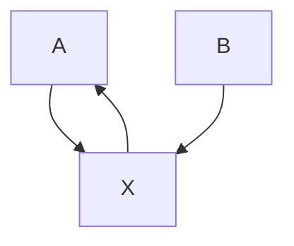

2, or 4. When $n = 4$ we had to sacrifice commutativity, but we were amply rewarded for this, since quaternion multiplication gives a very concise way of representing the important groups SU(2) and SO(3). These groups are not commutative, so it was essential to our success that quaternion multiplication should also not be commutative.

One obvious thing we can do is continue the process that led to the quaternions. That is, we can consider pairs $( q , r )$ of quaternions, and multiply these pairs together using the formula

$$
(q, r) (s, t) = \left(q s - r ^ {*} t, q ^ {*} t + r s\right).
$$

Since the conjugate $q ^ { * }$ of a quaternion q is the analogue of the complex conjugate z¯ of a complex number z, this is basically the same formula that we used for multiplication of pairs of complex numbers—that is, for quaternions.

However, we need to be careful: multiplication of quaternions is not commutative, so there are in fact many formulas we could write down that would be “basically the same” as the earlier one. Why choose the above one, rather than, say, replacing $q ^ { * } t$ by $t q ^ { * } ?$

It turns out that the formula suggested above leads to zero divisors. For example, (j, i)(l, k) works out to be (0, 0). However, the modified formula

$$
(q, r) (s, t) = (q s - t r ^ {*}, q ^ {*} t + s r),
$$

which one can discover fairly quickly if one bears in mind that one would like $( q , r ) ( q ^ { * } , - r )$ to work out as $( | q | ^ { 2 } + | r | ^ { 2 } , 0 )$ , does produce a useful number system. It is denoted O and its elements are called the octonions (or sometimes the Cayley numbers). Unfortunately, multiplication of octonions is not even associative, but it does have two very good properties: every nonzero octonion has a multiplicative inverse, and two nonzero octonions never multiply together to give zero. (Because octonion multiplication is not associative, these two properties are no longer obviously equivalent. However, any subalgebra of the octonions generated by two elements is associative, and this is enough to prove the equivalence.)

So now we have number systems when n = 1, 2, 4, or 8. It turns out that these are the only dimensions with good notions of multiplication. Of course, “good” has a technical meaning here: matrix multiplication, which is associative but gives zero divisors, is for many purposes “better” than octonion multiplication, which has no zero divisors but is not associative. So let us finish by seeing more precisely what it is that is special about dimensions 1, 2, 4, and 8.

All the number systems constructed above have a notion of size given by a norm [III.62]. For real and complex numbers $z ,$ the norm of z is just its modulus. For a quaternion or octonion x, it is defined to be ${ \sqrt { x ^ { * } x } } ,$ where $x ^ { * }$ is the conjugate of x (a definition that works for real and complex numbers as well). If we write x for the norm of $x ,$ then the norms constructed have the property that $\| x y \| = \| x \| \| y \|$ for every x and $y .$ This property is extremely useful: for example, it tells us that the elements of norm 1 are closed under multiplication, a fact that we used many times when discussing the geometric importance of complex numbers and quaternions.

The feature that distinguishes dimensions 1, 2, 4, and 8 from all other dimensions is that these are the only dimensions for which one can define a norm  and a notion of multiplication with the following properties.

(i) There is a multiplicative identity: that is, a number 1 such that $1 x = x 1 = x$ for every x.   
(ii) Multiplication is bilinear, meaning that $x ( y + z ) =$ xy+xz for every $x , y ,$ , and z, and $x ( a y ) = a ( x y )$ whenever a is a real number, and similarly for multiplication on the right.   
(iii) For any x and y, xy x y (and therefore there are no zero divisors).

A normed division algebra is a vector space $\mathbb { R } ^ { n }$ together with a norm and a method of multiplying vectors that satisfy the above properties. So normed division algebras exist only in dimensions 1, 2, 4, and 8. Furthermore, even in these dimensions, R, C, H, and O are the only examples.

There are various ways to prove this fact, which is known as Hurwitz’s theorem. Here is a very brief sketch of one of them. The idea is to prove that if a normed division algebra A contains one of the above examples, then either it is that example, or it contains the next one in the sequence. So either A is one of R, C, H, and O or A contains the algebra produced by doing to O the process we used to construct H from C and O from H, a process known as the Cayley–Dickson construction. How-$\mathrm { e v e r , }$ if one applies the Cayley–Dickson construction to $\mathbb { O } ,$ one obtains an algebra with zero divisors.

To see how such an argument might work, let us imagine, for the sake of example, that A contains O as a proper subalgebra. It turns out that the norm on A must be a euclidean norm [III.37]—that is, a norm derived from an inner product. (Roughly speaking, this is because multiplication by an element of norm 1 does not change the norm, which gives A so many symmetries that the norm on A has to be the most symmetric of all, namely Euclidean.) Let us call an element of A imaginary if it is orthogonal to the element 1. Then we can define a conjugation operation on A by taking $1 ^ { * }$ to be 1 and $x ^ { * }$ to be −x when x is imaginary, and extending linearly. This operation can be shown to have all the properties one would like. In particular, $a a ^ { * } = a ^ { * } a = \| a \| ^ { 2 }$ for every element a of A. Let us choose a norm-1 element of A that is orthogonal to all of O and call it i. Then $\mathbf { i } ^ { * } = - \mathbf { i } , \mathbf { s o } \ 1 = \mathbf { i } ^ { * } \mathbf { i } = - \mathbf { i } ^ { 2 }$ , so $\mathbf { i } ^ { 2 } = - 1$ . Now take the algebra generated by i and the copy of O that lies in A. With some algebraic manipulation, one can demonstrate that this consists of elements of the form $x + \mathrm { i } y ,$ , with x and y belonging to O. Moreover, the product of $x + \mathrm { i } y$ and z + iw turns out to be xz $w y ^ { * } + \mathrm { i } ( x ^ { * } w + z y )$ , which is exactly what the Cayley–Dickson construction gives.

For further details about quaternions and octonions, two excellent sources are a discussion by John Baez at http://math.ucr.edu/home/baez/octonions and a book, On Quaternions and Octonions: Their Geometry, Arithmetic, and Symmetry, by J. H. Conway and D. A. Smith (2003; Wellesley, MA: AK Peters).

# III.77 Representations

A linear representation of a finite group [I.3 §2.1] G is a way of associating a linear map $T _ { g } { \mathrm { ; } }$ , from some vector space [I.3 §2.3] V to itself, with each element $_ g$ of G. Of course, this association must reflect the group structure of $G ,$ so $T _ { g } T _ { h }$ should equal $T _ { g h }$ , and if e is the identity of $G ,$ then $T _ { e }$ should be the identity map on V .

One useful aspect of linear representations is that the dimension of the vector space V may be considerably smaller than the size of G. If this is the case, then the representation packages the information about G in a particularly efficient way. For example, the alternating group [III.68] $A _ { 5 } ,$ which has sixty elements, is isomorphic to the group of rotational symmetries of an icosahedron, and can therefore be thought of as a group of transformations of $\mathbb { R } ^ { 3 }$ (or, equivalently, of $3 \times 3$ matrices).

A more fundamental reason for representations being useful is that every representation can be decomposed into building blocks known as irreducible representations. It turns out that a great deal of information about G can be deduced from a few basic facts about its irreducible representations.

These ideas can be generalized to infinite groups as well, and are particularly important in the case of lie groups [III.48 §1]. Since Lie groups have a differentiable structure, the representations of interest are those where the homomorphism $g \mapsto T _ { g }$ reflects this structure (for example, by being differentiable).

Representations are discussed in much greater detail in representation theory [IV.9]. See also operator algebras [IV.15 §2].

# III.78 Ricci Flow

# Terence Tao

Ricci flow is a technique that allows one to take an arbitrary riemannian manifold [I.3 §6.10] and smooth out the geometry of that manifold to make it look more symmetric. It has proven to be a very useful tool in understanding the topology of such manifolds.

Ricci flow can be defined for Riemannian manifolds of any dimension, but for the sake of exposition we restrict ourselves here to two-dimensional manifolds $( \mathrm { i . e . }$ , surfaces) as they are easy to visualize. From our everyday experience with three-dimensional space $\mathbb { R } ^ { 3 }$ , we are familiar with many surfaces, such as spheres, cylinders, planes, tori (the shape of the surface of a doughnut), and so forth. This is an extrinsic way to think about surfaces: as subsets of a larger ambient space, which in this case is three-dimensional Euclidean space. On the other hand, one can think about surfaces in a more abstract intrinsic manner: by considering how the points in the surface stand in relation to each other, but not in relation to any external space. (For instance, the Klein bottle makes perfect sense as a surface from an intrinsic viewpoint, but cannot be viewed extrinsically in three-dimensional Euclidean space $\mathbb { R } ^ { 3 }$ , although it can be viewed extrinsically in four-dimensional Euclidean space $\mathbb { R } ^ { 4 } . )$ It turns out that the two viewpoints are mostly equivalent to each other, but it will be more convenient here to adopt the intrinsic perspective.

A good example of a surface is the surface of Earth. Extrinsically, this is a subset of a three-dimensional space $\mathbb { R } ^ { 3 }$ . But we can also view this surface two dimensionally by using an atlas: a collection of maps or charts that describe various regions of this surface by identifying them with a subset of a two-dimensional plane. As long as we have enough charts to cover the original surface, this atlas is sufficient to describe the surface. This way of thinking of a surface is not completely intrinsic, because there is more than one atlas that one could associate with this surface, and they may differ in various minor ways. For instance, in one atlas the city of Los Angeles might be on the boundary of one of the charts, whereas in another atlas it might be in the interior of every chart that it appears in. However, there are many facts one can deduce from an atlas that do not depend on the choice of atlas; for instance, using any accurate atlas of Earth one can see that it is impossible to travel from Los Angeles to Sydney without crossing at least one ocean. If a fact regarding a surface does not depend on which atlas one uses, we say that it is intrinsic or coordinate-independent. It will turn out that Ricci flow is an intrinsic flow on surfaces; it can be defined without any knowledge of charts or of some external space.

We have informally described the mathematical concept of a surface, or two-dimensional manifold. But to describe Ricci flow we need the more sophisticated concept of a Riemannian surface (or two-dimensional Riemannian manifold). This is a surface M with an additional (intrinsic) object, a Riemannian metric g, which specifies the distance $d ( x , y )$ between any two points $x , y$ on the surface. This metric allows one to define the angle $\angle \gamma _ { 1 } , \gamma _ { 2 }$ that any two curves $\gamma _ { 1 } , \gamma _ { 2 }$ on the surface make where they intersect; for instance, the Earth’s equator intersects any longitude at right angles. And it can also be used to define the area A of any given set A on the surface (e.g., the area of Australia). There are a number of properties that these concepts of distance, angle, and area have to satisfy, but the most important property can be stated informally as follows: the geometry of a Riemannian surface has to be very close to the geometry of the Euclidean plane at small length scales.

To give an example of what the above statement means, take any point x in the surface M, and pick any positive radius r . Because the Riemannian metric g specifies a notion of distance, we can define the disk $B ( x , r )$ of radius r centered at x to be the set of all points y whose distance $d ( x , y )$ to x is less than $r .$ Because the Riemannian metric g defines a notion of area, we can then discuss the area of this disk $B ( x , r )$ . In the Euclidean plane, this area would of course be $\pi r ^ { 2 }$ . In a Riemannian surface, this need not be the case: for instance, the total area of the surface of Earth (and hence of all disks within this surface) is finite, even though $\pi r ^ { 2 }$ can be arbitrarily large as r goes to infinity. However, we do require that, when r is very small, the area of the disk $B ( x , r )$ becomes increasingly close to $\pi r ^ { 2 } ;$ more precisely, we require that the ratio between the area and $\pi r ^ { 2 }$ converges to 1 in the limit as r tends to 0.

This brings us to the notion of scalar curvature $R ( x )$ . In some cases, such as on the sphere, the area $\left| B ( x , r ) \right|$ of a small disk $B ( x , r )$ is actually a little bit smaller than $\pi r ^ { 2 } ;$ when this is the case, we say that the surface has positive scalar curvature at x. In some other cases, such as on a saddle, the area $\left| B ( x , r ) \right|$ of a small disk $B ( x , r )$ is a bit larger than $\pi r ^ { 2 } ;$ ; then we say that the surface has negative scalar curvature at x. In other cases again, such as on a cylinder, the area $\left| B ( x , r ) \right|$ of a small disk $B ( x , r )$ is equal (or very nearly equal) to $\pi r ^ { 2 } ;$ in this case we say the surface has vanishing scalar curvature at x. (This is despite the cylinder being “curved” when viewed extrinsically as a subset of threedimensional space.) Note that on a complicated surface it is perfectly possible to have positive scalar curvature at some points of the surface and negative or vanishing scalar curvature at other points. The scalar curvature $R ( x )$ at any given point x can be defined more precisely by the formula

$$
R (x) = \lim _ {r \to 0} \frac {\pi r ^ {2} - | B (x , r) |}{\pi r ^ {4} / 2 4}.
$$

(For surfaces in an external space, this intrinsic concept of scalar curvature is almost identical to the extrinsic concept of Gauss curvature, which we will not discuss here.)

One can refine this notion to that of Ricci curvature $\operatorname { R i c } ( x ) ( \nu , \nu )$ . Consider now an angular sector $A ( x , r , \theta , \nu )$ inside a small disk $B ( x , r )$ of small angular aperture θ (measured in radians) about some direction v (a unit vector) emanating from x. This sector is well-defined, basically because the Riemannian metric gives us the appropriate notions of distance and angle. In Euclidean space, the area $\left| A ( x , r , \theta , \nu ) \right|$ of this sector is ${ \frac { 1 } { 2 } } \theta r ^ { 2 }$ . But on a surface, the area $\vert A ( x , r , \theta , \nu ) \vert$ may be slightly less (respectively, slightly more) than ${ \frac { 1 } { 2 } } \theta r ^ { 2 }$ . In these cases we say that the surface has positive (respectively, negative) Ricci curvature at x in the direction v. More precisely, we have

$$
\operatorname{Ric} (x) (\nu , \nu) = \lim _ {r \rightarrow 0} \lim _ {\theta \rightarrow 0} \frac {\frac {1}{2} \theta r ^ {2} - | A (x , r , \theta , \nu) |}{\theta r ^ {4} / 2 4}.
$$

Now it turns out that for surfaces, this more complicated notion of curvature is in fact equal to half the scalar curvature: $\begin{array} { r } { \mathrm { R i c } ( x ) ( \nu , \nu ) = \frac { 1 } { 2 } R ( x ) } \end{array}$ . In particular, the direction v plays no role in Ricci curvature in two dimensions. However, it is possible to extend all of the above concepts to other dimensions. (For instance, to define scalar and Ricci curvature for threedimensional manifolds, one would use balls and solid sectors instead of disks and angular sectors, as well as making other necessary adjustments, such as replacing the expression $\pi r ^ { 2 }$ with ${ \scriptstyle { \frac { 4 } { 3 } } } \pi r ^ { 3 } . )$ In higher dimensions it turns out that the Ricci curvature is more complicated than the scalar curvature. For instance, in three dimensions it is possible for a point x to have positive Ricci curvature in one direction but negative Ricci curvature in another; intuitively, this means that narrow sectors in the former direction “curve inward,” whereas narrow sectors in the latter direction “curve outward.”

Now we can describe Ricci flow informally as the process of stretching the metric g in directions of negative Ricci curvature, and contracting the metric in directions of positive Ricci curvature. The stronger the curvature, the faster the stretching or contracting of the metric. The concepts of stretching and contracting will not be defined formally here, but they increase or decrease the distance between points along these directions. By changing the notion of distance, one also affects the notions of angle and volume (though it turns out that Ricci flow in two dimensions is conformal, which means that the notion of angle remains unaffected by the flow; this fact is closely related to the previously mentioned fact that in two dimensions the Ricci curvature is the same in all directions). Ricci flow can be described succinctly and precisely by the equation

$$
\frac {\mathrm{d}}{\mathrm{d} t} g = - 2 \text { Ric },
$$

although we will not define here exactly what it means to differentiate the metric g with respect to the time variable t, or what it means for that derivative to equal the Ricci curvature multiplied by 2.

In principle, one could perform Ricci flow on a manifold for as long a period of time as one wished. In practice, however, it is possible (especially in the presence of positive curvature) for the Ricci flow to cause a manifold to develop singularities: points where it ceases to look like a manifold, and where the geometry may stop resembling Euclidean geometry even at very small scales. For example, if one starts with a perfectly round sphere and performs Ricci flow, what happens is that the sphere contracts at a steady rate until it becomes a point, which is no longer a two-dimensional manifold. In three dimensions, more complicated singularities are possible: for instance, one can have a neck pinch, in which a cylinder-like “neck” of the manifold shrinks under Ricci flow, until at one or more places along the neck, the cylinder has tapered down to a point. The types of possible singularity formations for three-dimensional Ricci flow were only classified completely in a recent and very important paper of Grigori Perelman.

Some years ago, Richard Hamilton made the fundamental observation that Ricci flow is an excellent tool for simplifying the structure of a manifold: generally speaking, it compresses all the positive-curvature parts of the manifold into nothingness, while expanding the negative-curvature parts of the manifold until they become very homogeneous, in the sense that the manifold begins to look much the same no matter which vantage point one selects inside it. Indeed, the flow seems to separate the manifold into extremely symmetric components. For instance, in two dimensions the Ricci flow always ends up endowing the manifold with a metric of constant curvature, which could be positive (as in the sphere), zero (as in the cylinder), or negative (as in hyperbolic space); the fact that such a constantcurvature metric can always be found is known as the uniformization theorem [V.34] and is of fundamental importance in the theory of surfaces. In higher dimensions, the Ricci flow can develop singularities before perfect symmetry is attained, but it turns out that it is possible to perform “surgeries” (see differential topology [IV.7 §§2.3, 2.4]) on the singularities that develop this way, so that the manifold becomes smooth again and one can restart the Ricci flow process. (The surgery may, however, change the topology of the manifold: for instance, it can convert a connected manifold into two disconnected pieces.) In three dimensions it has recently been shown by Perelman that Ricci flow, when augmented by surgery to remove the singularities, does indeed convert an arbitrary manifold (obeying some mild assumptions) into a finite union of some very symmetric and explicitly describable pieces; the precise statement of this conclusion was known as the geometrization conjecture of Thurston. One consequence of this conjecture, which is now a rigorous theorem proved by Perelman, is the poincaré conjecture [V.25]: any compact three-dimensional manifold that is simply connected (meaning that any closed loop on the manifold can be contracted smoothly to a point without ever leaving the manifold) can in fact be smoothly deformed into a 3-sphere (which is to four-dimensional Euclidean space as the usual twodimensional sphere is to three-dimensional Euclidean space). The proof of Poincaré’s conjecture is one of the most impressive recent achievements of modern mathematics.

# III.79 Riemann Surfaces

Alan F. Beardon

Let D be a region (that is, a connected open set) in the complex plane. If f is a complex-valued function defined on D, then we can define its derivative just as we would for real-valued functions defined on subsets of R: the derivative of f at w is the limit as z tends to w of the “difference quotient” $( f ( z ) - f ( w ) ) / ( z - w )$ . Of course, this limit does not necessarily exist, but if it exists for every w in D, then f is said to be analytic, or holomorphic, on D. Analytic functions have amazing properties; for example, if a function is analytic in a region, then it automatically has a Taylor-series expansion at each point of the region, from which one can deduce that it is infinitely differentiable. This is in stark contrast to the theory of real functions of a real variable, where, for example, a function may be once differentiable but not twice differentiable at some point x, yet three-times differentiable at some other point y. Complex analysis is the study of analytic functions. Perhaps more than any other mathematical topic, it is both immensely useful in a practical sense and profound and beautiful in a theoretical sense. (Some of the basic results of complex analysis are described in [I.3 §5.6].)

Just as group theorists do not generally distinguish between isomorphic groups, and topologists do not distinguish between homeomorphic topological spaces, complex analysts do not distinguish between two regions D and $D ^ { \prime }$ if there is an analytic bijection between D and $D ^ { \prime }$ . When this is the case, we say that D and D	 are conformally equivalent. Conformal equivalence is, as its name suggests, an equivalence relation [I.2 §2.3]: the proof depends on the surprising fact that if f is an analytic bijection from D to D	, then its inverse $f ^ { - 1 } : D ^ { \prime } \to D$ is also analytic. Again, this contrasts with real analysis. If D and $D ^ { \prime }$ are conformally equivalent, then “interesting” properties of analytic functions on D are transferred automatically to corresponding properties of analytic functions defined on $D ^ { \prime }$ . Indeed, this statement can almost be taken as a definition of “interesting” properties (although admittedly this conflicts with the numerical side of complex analysis, because purely numerical statements do not usually transfer under such maps). Naturally, we would like to know which properties of analytic functions are “interesting” in this sense. One such property is that (except at certain isolated points) the angle between two intersecting curves in D is preserved under an analytic map: this is the origin of the term “conformal.” It is less well-known that if a bijection (which is not assumed to be differentiable) preserves the angles between curves (that is, both their magnitude and whether they are measured clockwise or counterclockwise), then it is analytic. Thus, loosely speaking, the preservation of angles implies the existence of a Taylor series!

The impact of complex analysis on other topics is so great that it is natural to try to find the most general type of surface on which we can study analytic functions. This leads to the definition of a Riemann surface (after bernhard riemann [VI.49], who introduced the idea in his doctoral dissertation). In order to put a coordinate system on a surface S we try to map S bijectively onto a plane region D; if we succeed, then we can transfer the coordinates from D to S. For many surfaces (for example, a sphere) it is not possible to find such a map, and we have to be satisfied with local coordinates. This means that at each point w of S, we map a neighborhood N of w onto a plane region, and so obtain coordinates that are restricted to N. As there are usually infinitely many ways to do this, we are forced to consider the class of transition maps; that is, the maps from one coordinate system at w to another. The surface is a Riemann surface precisely when each such transition map is an analytic bijection. This definition resembles that of a two-dimensional manifold [I.3 §6.9], but the requirement that the transition maps should be analytic is much stronger, so by no means every 2-manifold is a Riemann surface.

It is not difficult to construct Riemann surfaces. Consider, for example, a sphere S resting on a horizontal table. If we imagine a light source at the highest point P of the sphere, then each point of S except P casts a “shadow” on the table: since the table has a simple coordinate system, we can use these “shadows” to define a coordinate system on all of S except the point P. Similarly, a light source at the point Q of tangency with the table casts a shadow onto the (horizontal) tangent plane at P, and this gives a coordinate system valid throughout S except at Q. It can be shown that if the second coordinate system is composed with a reflection, then the sphere does have the structure of a Riemann surface. This is an extremely important example, because it allows one to handle questions involving infinity in a satisfactory way; it is known as the Riemann sphere.

For another example, consider a cube C, and (for simplicity only) remove the eight vertices. Given a face F of C (without its bounding edges), we can find a Euclidean rigid motion that maps F into C, so we can easily define a coordinate system on F. If w is an interior point of an edge E of C, we can “open” the two faces that meet at E to make a planar region that contains E, and then map this region into C by a Euclidean rigid motion. In this way we see that C (less its vertices) is a Riemann surface. The problem with the vertices can be solved by technical means, and this method can then be generalized to show that any polyhedron (even one with holes, such as a “square” torus) is a Riemann surface. These are known as compact surfaces. It is a deep but fascinating classical result that each such surface corresponds bijectively to an irreducible polynomial P (z, w) in two complex variables. To give an idea of how the correspondence works, let us consider an equation such as ${ \pmb w } ^ { 3 } + { \pmb w } z + z ^ { 2 } = 0$ . For each z this can be solved to give three values of w, say w1, w2, and $w _ { 3 } ;$ as we allow z to vary in C, the values wj vary, and as they do so they create a Riemann surface W , which can be shown to be connected. This surface can be thought of as lying “above” C, and for all but a finite set of z in C there are exactly three points on W that are “above” z.

As we have mentioned, Riemann surfaces are important because they are the most general surfaces on which one can study analytic functions, with all of their remarkable properties. It is easy to define what we mean by an analytic function f on a Riemann surface R. Given a coordinate system on part of R, we can think of f as a function of the coordinates, and we then regard f as analytic if and only if it depends analytically on the coordinates. Because the transition maps are analytic, f will be analytic with respect to one coordinate system if and only if it is analytic with respect to all the other coordinate systems defined at the point in question.

This simple property—that if something holds in one coordinate system, then it holds in all of them—is one of the crucial features of the theory. For example, suppose that we have two curves crossing on an (abstract) Riemann surface. If we transfer the two curves to plane regions using different local coordinate systems at the crossing point, and then measure the angle of intersection in each case, we must get the same result (since the transition from one coordinate system to another preserves angles). It follows that the angle between intersecting curves on an abstract Riemann surface is a well-defined concept.

It turns out that analysis on Riemann surfaces goes beyond analytic functions. Harmonic functions (solutions of laplace’s equation [I.3 §5.4]) are intimately connected to analytic functions, since the real part of an analytic function is harmonic and any harmonic function is (locally) the real part of an analytic function. Thus, on a Riemann surface, complex analysis merges almost imperceptibly with potential theory (which is the study of harmonic functions).

Perhaps the most profound theorem of all about Riemann surfaces is the uniformization theorem [V.34]. Roughly speaking, this says that every Riemann surface is obtained from either Euclidean, spherical, or hyperbolic geometry (see some fundamental mathematical definitions [I.3 §§6.2, 6.5, 6.6]) by taking a polygon in that geometry and gluing its sides together, in the same way that one obtains a torus by gluing opposite sides of a rectangle together. (See also fuchsian groups [III.28].) Remarkably, only very few Riemann surfaces come from the Euclidean or spherical geometries; essentially, every Riemann surface can be constructed in this way from (and only from) the hyperbolic plane. This means that virtually every region in the complex plane comes equipped with a natural and intrinsic geometry whose character is hyperbolic and not, as one might expect, Euclidean. The Euclidean character of a generic plane region comes from its embedding in C, and not from its own intrinsic hyperbolic geometry.

# III.80 The Riemann Zeta Function

The Riemann zeta function ζ is a function defined on the complex numbers that encapsulates in a remarkable way many of the most important properties about the distribution of prime numbers. If s is a complex number with real part greater than 1, then ζ(s) is defined to be $\textstyle \sum _ { n = 1 } ^ { \infty } n ^ { - s }$ . The condition that Re(s) > 1 is needed to ensure that this series converges. However, because the resulting function is holomorphic [I.3 §5.6], it is possible to extend the definition by means of analytic continuation. The result is a function that is defined everywhere on the complex plane (though it takes the value at 1).

A first clue to why this function is related to the distribution of primes is Euler’s product formula:

$$
\zeta (s) = \prod_ {p} (1 - p ^ {- s}) ^ {- 1}.
$$

Here, the product on the right-hand side is over all primes. The formula can be proved by writing (1 $p ^ { - s } ) ^ { - 1 } \mathtt { a s } 1 + p ^ { - s } + p ^ { - 2 s } + \cdot \cdot \cdot$ , expanding out the product, and using the fundamental theorem of arithmetic [V.14]. Deeper connections were discovered by riemann [VI.49], who formulated the famous riemann hypothesis [IV.2 §3].

The Riemann zeta function is just one of a family of functions that encode important number-theoretic information. For example, the Dirichlet L-functions are closely related to the distribution of primes in arithmetic progressions. For more details about these and about the Riemann zeta function itself, see analytic number theory [IV.2]. Some more sophisticated zeta functions are described in the weil conjectures [V.35]. See also L-functions [III.47].

# III.81 Rings, Ideals, and Modules

# 1 Rings

A ring, like a group [I.3 §2.1] or a field [I.3 §2.2], is an algebraic structure that satisfies certain axioms. To remember the axioms for both rings and fields at the same time, it is helpful to think of two simple examples: with the two operations of addition and multiplication, the set Z of all integers forms a ring and the set Q of all rational numbers forms a field. In general, a ring is a set R with two binary operations [I.2 §2.4], denoted by $" + "$ and $" \times "$ , which satisfies all the field axioms apart from the one that says that nonzero elements have multiplicative inverses.

Although the integers are the prototypical example of a ring, the notion arose historically as an abstraction from several sources, one of which was polynomials. Like integers, polynomials (with real coefficients, say) can be added and multiplied, and these operations have all the properties one might expect, such as the fact that multiplication is distributive over addition, so the space of such polynomials forms a ring. Other examples include the integers modulo n (for any positive integer n), the rationals (or indeed any other field), and the set Z[i] of all complex numbers a + bi such that a and b are integers.

Sometimes the assumptions that multiplication is commutative and has an identity element are dropped. This leads to a more complicated theory, but it does encompass important examples such as the set of all n n matrices (with elements in a given field, or even just a ring).

As with other algebraic structures, there are several ways of forming new rings from old ones: for instance, we can take subrings and direct products of two rings. Slightly less obviously, we can start with a ring R and form the ring of all polynomials with coefficients in R. We can also take quotients [I.3 §3.3], but in order to discuss these we must introduce the notion of an ideal.

# 2 Ideals

A typical quotient construction for an algebraic structure A will identify some substructure B and regard two elements of A as “equivalent” if they “differ by an element of $B , \ " \operatorname { I f } A$ is a group or a vector space [I.3 §2.3], then B will be a subgroup or a subspace. However, the situation for rings is slightly different.

We can see why if we think about quotients in another way: as images of homomorphisms [I.3 §4.1]. The substructures that we like to quotient by are the kernels of these homomorphisms, so we should ask ourselves what the kernel of a ring homomorphism (that is, the set of elements that map to 0) will be like.

If $\phi : R \to R ^ { \prime }$ is a homomorphism between two rings, and $\phi ( a ) ~ = ~ \phi ( b ) ~ = ~ 0$ , then $\phi ( a + b ) \ = \ 0 . \ \mathrm { A l s o } ,$ if r is any element of R, then $\phi ( r a ) = \phi ( r ) \phi ( a ) = 0 .$ . Thus, the kernel of a homomorphism is closed under addition, and also under multiplication by any element of the ring. These two properties define the notion of an ideal. For example, the set of all even integers is an ideal in Z. In interesting cases, ideals are not subrings, since if an ideal contains 1 then it must contain r for every r in the ring. (An example that makes the difference very clear is the subset of the ring of all polynomials that consists of all constant polynomials. The constants form a subring, but they certainly do not form an ideal.)

It is not hard to show that for any ideal I in a ring R there is a homomorphism that has I as its kernel, namely the quotient map from R to the quotient $R / I .$ Here $R / I$ is a construction that as usual we think of as ${ } ^ { " } R ,$ , but with two elements considered the same if they differ by an element of $I . "$

Quotients of rings are extremely useful in algebraic number theory [IV.1] because they allow us to rephrase questions about algebraic numbers as questions about polynomials. To get an idea of how this is done, consider the ring Z[X] of all polynomials with integer coefficients, and the ideal that consists of all multiples (by integer polynomials) of the polynomial $X ^ { 2 } + 1$ . In the quotient of Z[X] by this ideal, we regard two polynomials as the same if they differ by a multiple of $X ^ { 2 } + 1$ . In particular, $X ^ { 2 }$ is the same as 1. In other words, in this quotient ring we have a square root of 1, and in fact the quotient ring is isomorphic to the ring Z[i] that we met earlier.

One of the things we like to do to integers is factorize them, and we can try to do the same in rings as well. However, it turns out that, while it is usually possible to factorize an element of a ring into “irreducible” ones that cannot be factorized further (like the primes in Z), in many cases the factorization is not unique. At first, this might be rather unexpected, and indeed it was a stumbling block for many early workers (in the eighteenth and nineteenth centuries). Here is an example: in the ring $\mathbb { Z } [ { \sqrt { - 3 } } ]$ , which consists of all complex numbers $a + b { \sqrt { - 3 } } ,$ where a and b are integers, the number 4 may be factorized as $2 \times 2$ and also as $( 1 + { \sqrt { - 3 } } ) \times ( 1 - { \sqrt { - 3 } } )$ .

# 3 Modules

Modules are to rings as vector spaces are to fields. In other words, they are algebraic structures where the basic operations are addition and scalar multiplication, but now the scalars are allowed to come from a ring rather than a field. For an example of a module over a ring that is not a field, take any Abelian group G. This can be turned into a module over Z, with addition given by the group operation and scalar multiplication defined in the obvious way: for instance, 3g means $g + g + g$ , and $- 2 g$ means the inverse of $g + g .$ .

The simplicity of this definition masks the fact that the structure of modules is in general far more subtle than that of vector spaces. For example, we can define a basis of a module to be a linearly independent set of elements that spans the module. However, many useful facts about bases in vector spaces do not hold for modules. For instance, in Z, which we may consider as a module over itself, the set 2, 3 spans the module but does not contain a basis, and similarly the set 2 is linearly independent but cannot be extended to a basis. In fact, modules may be very far from having a basis: for example, if we consider the integers modulo n as a module over $\mathbb { Z } ,$ then even a single element x fails to be linearly independent, since $n x = 0 .$ .

The following example of a module is an important one. Let V be a complex vector space and let α be a linear map from V to V. This can be made into a module over the ring C[X]: if $\nu \in V$ and P is a complex polynomial, then Pv is defined to be $P ( \alpha ) \nu$ . (For instance, if P is the polynomial $x ^ { 2 } + 1$ , then $P \nu = \alpha ^ { 2 } \nu + \nu . )$ Applying general structural results about modules to this example, one obtains a proof of the jordan normal form theorem [III.43].

# III.82 Schemes

# Jordan S. Ellenberg

One frequently finds in the history of mathematics that a definition thought to be completely general was in fact too restrictive to treat certain problems of interest. The notion of “number,” for instance, has been expanded again and again—most notably to incorporate irrationalities and complex numbers, the former arising from problems in geometry and the latter needed in order to describe solutions to arbitrary algebraic equations. In a similar way, algebraic geometry, which was once understood as the study of algebraic varieties, or solution sets of algebraic equations in some finite-dimensional space, has grown to encompass more general objects known as “schemes.” As a very meager example one might consider the two equations $x + y = 0$ and $( x + y ) ^ { 2 } = 0$ . The two equations have the same set of solutions in the plane, so they describe the same variety; but the schemes attached to the two objects are completely different. The reformulation of algebraic geometry in the language of schemes was a tremendous project spearheaded by Alexander Grothendieck in the 1960s. As the above example suggests, the scheme-theoretic viewpoint tends to emphasize the algebraic aspects of the subject (equations) rather than the traditionally geometric ones (solution sets of equations). This viewpoint has made a reality of the long-hoped-for unification of algebraic number theory [IV.1] and algebraic geometry, and, indeed, much recent progress in number theory would have been impossible without the geometric insight supplied by the theory of schemes.

Even schemes are not enough to handle all the problems of current interest, and still more general notions (stacks, “noncommutative varieties,” derived categories of sheaves, etc.) are brought to bear when necessary. These can appear exotic, but to our successors they will no doubt be second nature, just as schemes are to us. For more on algebraic geometry in general, see algebraic geometry [IV.4]. Schemes are discussed at greater length in arithmetic geometry [IV.5].

# III.83 The Schrödinger Equation

# Terence Tao

In mathematical physics, the Schrödinger equation (and the closely related Heisenberg equation) are the most fundamental equations in nonrelativistic quantum mechanics, playing the same role as Hamilton’s laws of motion (and the closely related Poisson equation) in nonrelativistic classical mechanics. (In relativistic quantum mechanics, the equations of quantum field theory take over the role of Heisenberg’s equation, while Schrödinger’s equation does not have a natural direct analogue.) In pure mathematics, the Schrödinger equation, together with its variants, is one of the basic equations studied in the field of partial differential equations [IV.12], and has applications to geometry, to spectral and scattering theory, and to integrable systems.

The Schrödinger equation can be used to describe the quantum dynamics of many-particle systems under the influence of a variety of forces, but for simplicity let us consider just a single particle, of mass $m > 0 ,$ , moving about in n-dimensional space $\mathbb { R } ^ { n }$ subject to the influence of a potential, which we shall take to be a function $V : \mathbb { R } ^ { n } $ R. To avoid technicalities we shall assume that all the functions we discuss are smooth.

In classical mechanics, this particle would have a specific position $\ b { q } ( t ) \in \mathbb { R } ^ { n }$ and a specific momentum $\ b { p } ( t ) \in \mathbb { R } ^ { n }$ for each time t. (Eventually we shall observe the familiar law $p ( t ) = m \nu ( t )$ , where $\nu ( t ) = q ^ { \prime } ( t )$ is the velocity of the particle.) Thus, the state of this system at any given time t is described by the element $( q ( t ) , p ( t ) )$ of the space $\mathbb { R } ^ { n } \times \mathbb { R } ^ { n }$ , which is known as phase space. The energy of this state is described by the hamiltonian function [III.35] $H : \mathbb { R } ^ { n } \times \mathbb { R } ^ { n } \to \mathbb { R }$ on phase space, defined in this case by

$$
H (q, p) = \frac {| p | ^ {2}}{2 m} + V (q).
$$

(Physically, the quantity $\begin{array} { r } { | p | ^ { 2 } / 2 m = \frac { 1 } { 2 } m | \nu | ^ { 2 } } \end{array}$ represents kinetic energy, while $V ( q )$ represents potential energy.) The system then evolves according to Hamilton’s equations of motion:

$$
q ^ {\prime} (t) = \frac {\partial H}{\partial p}, \quad p ^ {\prime} (t) = - \frac {\partial H}{\partial q}, \tag {1}
$$

where we keep in mind that p and q are vectors, so that these derivatives are gradients [I.3 §5.3]. Hamilton’s equations of motion are valid for any classical system, but in our specific case of a particle in a “potential well,” they become

$$
q ^ {\prime} (t) = \frac {1}{m} p (t), \quad p ^ {\prime} (t) = - \nabla V (q). \tag {2}
$$

The first equation is asserting that $p = m \nu ,$ , while the second equation is basically Newton’s second law of motion.

From (1) we can easily derive Poisson’s equation of motion

$$
\frac {\mathrm{d}}{\mathrm{d} t} A (q (t), p (t)) = \{H, A \} (q (t), p (t)) \tag {3}
$$

for any classical observable $A : \mathbb { R } ^ { n } \times \mathbb { R } ^ { n }$ → R, where

$$
\{H, A \} = \frac {\partial H}{\partial p} \frac {\partial A}{\partial q} - \frac {\partial A}{\partial p} \frac {\partial H}{\partial q}
$$

is the Poisson bracket of H and A. Setting $A = H ,$ , we have in particular the conservation-of-energy law:

$$
H (q (t), p (t)) = E \tag {4}
$$

for all $t \in \mathbb R$ and some quantity E independent of t.

Now we analyze the quantum mechanical analogue of the above classical system. We need a small1 parameter $\hbar > 0$ , known as Planck’s constant. The state of the particle at a time t is no longer described by a single point $( q ( t ) , p ( t ) )$ in phase space, but is instead described by a wave function, which is a complex-valued function of position that evolves over time: that is, for each t we have a function $\psi ( t )$ from $\mathbb { R } ^ { n }$ to C. It is required to obey the normalization condition $\langle \psi ( t ) , \psi ( t ) \rangle = 1$ , where $\langle \cdot , \cdot \rangle$ denotes the inner product

$$
\langle \phi , \psi \rangle = \int_ {\mathbb {R} ^ {n}} \phi (q) \overline {{{{\psi (q)}}}} d q.
$$

Unlike a classical particle, a wave function $\psi ( t )$ does not necessarily have a specific position q(t). However, it does have an average position $\langle q ( t ) \rangle$ , defined as

$$
\langle q (t) \rangle = \langle Q \psi (t), \psi (t) \rangle = \int_ {\mathbb {R} ^ {n}} q | \psi (t, q) | ^ {2} d q.
$$

Here, we have written $\psi ( t , q )$ for the value of ψ(t) at the point q, and Q is the position operator, defined by $( Q \psi ) ( t , q ) \ = \ q \psi ( t , q )$ : that is, Q is the operator that multiplies pointwise by q. Similarly, while ψ does not have a specific momentum $p ( t )$ , it does have an average momentum $\langle p ( t ) \rangle$ , defined as

$$
\langle p (t) \rangle = \langle P \psi (t), \psi (t) \rangle = \frac {\hbar}{\mathrm{i}} \int_ {\mathbb {R} ^ {n}} (\nabla_ {q} \psi (t, q)) \overline {{{{\psi (t , q)}}}} \mathrm{d} q,
$$

where the momentum operator P is defined by Planck’s law

$$
P \psi (t, q) = \frac {\hbar}{\mathrm{i}} \nabla_ {q} \psi (t, q).
$$

Note that the vector $\langle p ( t ) \rangle$ is real-valued because all the components of P are self-adjoint [III.50 §3.2]. More generally, given any quantum observable, by which we mean a self-adjoint operator [III.50] A acting on the space $L ^ { 2 } ( \mathbb { R } ^ { n } )$ of complex-valued square integrable functions, we can define the average value A(t) of A

at time t by the formula

$$
\langle A (t) \rangle = \langle A \psi (t), \psi (t) \rangle .
$$

The analogue of Hamilton’s equations of motion (1) is now the time-dependent Schrödinger equation:

$$
\mathrm{i} \hbar \frac {\partial \psi}{\partial t} = H \psi , \tag {5}
$$

where H is now a quantum observable rather than a classical one. More precisely,

$$
H = \frac {| P | ^ {2}}{2 m} + V (Q).
$$

In other words, we have

$$
\begin{array}{l} \mathrm{i} \hbar \frac {\partial \psi}{\partial t} (t, q) = H \psi (t, q) \\ = - \frac {\hbar^ {2}}{2 m} \Delta_ {q} \psi (t, q) + V (q) \psi (t, q), \\ \end{array}
$$

where

$$
\Delta_ {q} \psi = \sum_ {j = 1} ^ {n} \frac {\partial^ {2} \psi}{\partial q _ {j} ^ {2}}
$$

is the Laplacian of ψ. The analogue of Poisson’s equation of motion (3) is the Heisenberg equation

$$
\frac {\mathrm{d}}{\mathrm{d} t} \langle A (t) \rangle = \left\langle \frac {\mathrm{i}}{\hbar} [ H (t), A (t) ] \right\rangle \tag {6}
$$

for any observable A, where $[ A , B ] = A B - B A$ is the commutator or Lie bracket of A and B. (The quantity $( \mathrm { i } / \hbar ) [ A , B ]$ is occasionally referred to as the quantum Poisson bracket of A and B.)

If the quantum state ψ oscillates in time according to the formula $\psi ( t , q ) = \mathrm { { \bf ~ e } } ^ { ( E / \mathrm { i } \hbar ) t } \psi ( 0 , q )$ for some real number E (known as the energy level or eigenvalue), then one has the time-independent Schrödinger equation:

$$
H \psi (t) = E \psi (t) \quad \text { for   all   times } t \tag {7}
$$

(compare this with (4)). More generally, the important subject of spectral theory provides many links between the time-dependent equation (5) and the timeindependent equation (7).

There are several strong analogies between the equations of classical mechanics and those of quantum mechanics. For instance, from (6) one has the equations

$$
\frac {\mathrm{d}}{\mathrm{d} t} \langle q (t) \rangle = \frac {1}{m} \langle p (t) \rangle , \quad \frac {\mathrm{d}}{\mathrm{d} t} \langle p (t) \rangle = - \langle \nabla_ {q} V (q) (t) \rangle ,
$$

which should be compared with (2). Also, given any classical solution $t \mapsto ( q ( t ) , p ( t ) )$ to Hamilton’s equation of motion, one can construct a corresponding family of approximate solutions ψ(t) to Schrödinger’s equation, for instance by the formula2

$$
\psi (t, q) = \mathrm{e} ^ {(\mathrm{i} / \hbar) L (t)} \mathrm{e} ^ {(\mathrm{i} / \hbar) p (t) \cdot (q - q (t))} \varphi (q - q (t)),
$$

where

$$
L (t) = \int_ {0} ^ {t} \frac {p (s) ^ {2}}{2 m} - V (q (s)) d s
$$

is the classical action and ϕ is any slowly varying function that is normalized in the sense that

$$
\int_ {\mathbb {R} ^ {n}} | \varphi (q) | ^ {2} d q = 1.
$$

One can verify that ψ solves (5) except for some errors that are small when  is small. In physics, this fact is an example of the correspondence principle, which asserts that classical mechanics can be used to approximate quantum mechanics accurately if Planck’s constant is small and one is working at macroscopic scales (which is what allows us to use slowly varying functions ϕ). In mathematics (and more precisely in the fields of microlocal analysis and semi-classical analysis), there are a number of formalizations of this principle that allow us to use knowledge about the behavior of Hamilton’s equations of motion in order to analyze the Schrödinger equation. For example, if the classical equations of motion have periodic solutions, then the Schrödinger equation often has nearly periodic solutions, whereas if the classical equations have very chaotic solutions, then the Schrödinger equation typically does as well (this phenomenon is known as quantum chaos or quantum ergodicity).

There are many aspects of the Schrödinger equation that are of interest. We mention just one of them here for illustration, namely that of scattering theory. If the potential function V decays sufficiently quickly at infinity, and $k \in \mathbb { R } ^ { n }$ is a nonzero frequency vector, then, setting the energy level as $E \ = \ \hbar ^ { 2 } | k | ^ { 2 } / 2 m$ , the timeindependent Schrödinger equation $H \psi = E \psi$ admits solutions ψ(q) that behave asymptotically (as $| q | \to \infty )$ as

$$
\psi (q) \approx \mathrm{e} ^ {\mathrm{i} k \cdot q} + f \left(\frac {q}{| q |}, k\right) \frac {\mathrm{e} ^ {\mathrm{i} | k | | q |}}{r ^ {(n - 1) / 2}}
$$

for some canonical function $f : S ^ { n - 1 } \times \mathbb { R } ^ { n } \to \mathbb { C } ,$ which is known as the scattering amplitude function. This scattering amplitude depends (in a nonlinear fashion) on the potential V , and the map from V to f is known as the scattering transform. The scattering transform can be viewed as a nonlinear variant of the fourier transform [III.27]; it is connected to many areas of partial differential equations, such as the theory of integrable systems.

There are many generalizations and variants of the Schrödinger equation; one can generalize to manyparticle systems, or add other forces such as magnetic fields or even nonlinear terms. One can also couple this equation to other physical equations such as maxwell’s equations [IV.13 §1.1] of electromagnetism, or replace the domain $\mathbb { R } ^ { n }$ by another space such as a torus, a discrete lattice, or a manifold. Alternatively, one could place some impenetrable obstacles in the domain (thus effectively removing those regions of space from the domain). The study of all of these variants leads to a vast and diverse field in both pure mathematics and in mathematical physics.

# III.84 The Simplex Algorithm

# Richard Weber

# 1 Linear Programming

The simplex algorithm is the preeminent tool for solving some of the most important mathematical problems arising in business, science, and technology. In these problems, which are called linear programs, we are to maximize (or minimize) a linear function subject to linear constraints. An example is the diet problem posed by the U.S. Air Force in 1947: find quantities of seventy-seven differently priced foodstuffs (cheese, spinach, etc.) to satisfy a man’s minimum daily requirements for nine nutrients (protein, iron, etc.) at least cost. Further applications occur in choosing the elements of an investment portfolio, rostering an airline’s crew, and finding optimal strategies in two-person games. The study of linear programming has inspired many of the central ideas of optimization theory, such as duality [III.19], the importance of convexity, and computational complexity [IV.20].

The input data of a linear program (LP) consists of two vectors $b \in \mathbb { R } ^ { m }$ and $c \in \mathbb { R } ^ { n }$ , and an $m \times n$ matrix $A = ( a _ { i j } )$ . The problem is to find values for n nonnegative decision variables, $x _ { 1 } , \ldots , x _ { n } ,$ to maximize the objective function $c _ { 1 } x _ { 1 } + \cdot \cdot \cdot + c _ { n } x _ { n }$ , subject to m constraints, $a _ { i 1 } x _ { 1 } + \cdot \cdot \cdot + a _ { i n } x _ { n } \leqslant b _ { i } , i = 1 , \ldots , m$ . In the diet problem, $n = 7 7$ and $m = 9 ,$ . In the following simple example (not a diet problem), $n = 2$ and $m = 3 ,$ . In serious real-life problems, n and m can be greater than 100 000.

text_image

x₂
C
B
P
D
O
E
x₁

Figure 1 Feasible region $\mathrm { \ " P } ^ { \mathrm { \prime \prime } }$ of an LP.

$\begin{array} { r l } { \mathrm { M a x i m i z e } } & { { } x _ { 1 } + 2 x _ { 2 } } \end{array}$

$\mathrm { s u b j e c t } \mathrm { t o } - x _ { 1 } + 2 x _ { 2 } \leqslant 2 ,$

$$
x _ {1} + x _ {2} \leqslant 4,
$$

$$
2 x _ {1} - x _ {2} \leqslant 5,
$$

$$
x _ {1}, x _ {2} \geqslant 0.
$$

The constraints define a feasible region for $( x _ { 1 } , x _ { 2 } )$ , a convex polygon that is depicted by the shaded region $" \mathrm { P } "$ in figure 1. The two dotted lines mark those x where the value of the objective function value is 4 and where it is 6. Clearly, it is maximized at point C.

The general story is similar to that of the example. If the feasible region ${ \mathrm { ~ P ~ } = \{ x : A x \leqslant b , x \geqslant 0 \} }$ is nonempty, then it is a convex polytope in $\mathbb { R } ^ { n }$ , and an optimal solution can be found at one of its vertices. It is helpful to introduce “slack variables” $x _ { 3 } , x _ { 4 } , x _ { 5 } \geqslant$ 0 to take up the slack on the left of the inequality constraints. We can write

$$
- x _ {1} + 2 x _ {2} + x _ {3} = 2,
$$

$$
x _ {1} + x _ {2} \quad + x _ {4} = 4,
$$

$$
2 x _ {1} - x _ {2} + x _ {5} = 5.
$$

We now have three equations in five variables, so we can set any two of the variables $x _ { 1 } , \ldots , x _ { 5 }$ equal to 0, and solve the equations for the other three variables (or solve a perturbation of them if they happen not to be independent). There are ten ways to choose two variables from five. Not all of the ten corresponding solutions satisfy $x _ { 1 } , x _ { 2 } , x _ { 3 } , x _ { 4 } , x _ { 5 } \geqslant 0$ , but five of them do. These are called basic feasible solutions (BFSs), and correspond to the vertices of P marked O, B, C, D, E.

# 2 How the Algorithm Works

George Dantzig invented the simplex algorithm in 1947 as a means of solving the Air Force’s diet problem mentioned at the start. The word “program” was not yet used to mean computer code, but was a military term for a logistic plan or schedule. The fundamental fact on which the algorithm relies is that if an LP has a bounded optimal solution, then the optimum value is attained at a BFS, i.e., at a vertex (or so-called “extreme point”) of the polytope of feasible points, P. Another name for the feasible polytope is “simplex,” which is where the algorithm gets its name. It works as follows.

Step 0. Pick a BFS.

Step 1. Test whether this BFS is optimal.

If so, stop. If not, go to step 2.

Step 2. Find a better BFS.

Repeat from step 1.

Since there are only finitely many BFSs (i.e., vertices of P), the algorithm must stop.

Now that we have an overview, let us look at the details. Suppose that at step 0 we pick the BFS of $x ~ = ~ ( x _ { 1 } , x _ { 2 } , x _ { 3 } , x _ { 4 } , x _ { 5 } ) ~ = ~ ( 0 , 0 , 2 , 4 , 5 )$ , corresponding to vertex O. At step 1 we wish to know whether the objective function can be increased if $x _ { 1 }$ or $x _ { 2 }$ is increased from 0. So we write $x _ { 3 } , x _ { 4 } , x _ { 5 } ,$ , and the objective function $c ^ { \mathrm { T } } x$ in terms of $x _ { 1 }$ and $x _ { 2 }$ , and display this as dictionary 1.

Dictionary 1

$$
x _ {3} = 2 + x _ {1} - 2 x _ {2},
$$

$$
x _ {4} = 4 - x _ {1} - x _ {2},
$$

$$
x _ {5} = 5 - 2 x _ {1} + x _ {2},
$$

$$
c ^ {T} x = x _ {1} + 2 x _ {2}.
$$

The last equation in the dictionary shows that we can increase the value of $c ^ { \mathrm { T } } x$ by increasing either $x _ { 1 }$ or $x _ { 2 }$ from 0. Suppose that we increase $x _ { 2 }$ . The first and second equations show that $x _ { 3 }$ and $x _ { 4 }$ must decrease, and we cannot increase x2 beyond 1, at which point $x _ { 3 } = 0$ and $x _ { 4 } \ = \ 3 , \ x _ { 5 } \ = \ 6 .$ Increasing $x _ { 2 }$ as much as possible, we complete step 2 and arrive at a new BFS of $\boldsymbol { x } = ( 0 , 1 , 0 , 3 , 6 )$ , which is vertex B. Now we are ready for step 1 again, and so we write $x _ { 2 } , x _ { 4 } , x _ { 5 }$ , and $c ^ { \mathrm { T } } x$ in terms of the variables that are now zero, namely $x _ { 1 } , x _ { 3 }$ , to give dictionary 2.

Dictionary 2

$$
x _ {2} = 1 + \frac {1}{2} x _ {1} - \frac {1}{2} x _ {3},
$$

$$
x _ {4} = 3 - \frac {3}{2} x _ {1} + \frac {1}{2} x _ {3},
$$

$$
x _ {5} = 6 - \frac {3}{2} x _ {1} - \frac {1}{2} x _ {3},
$$

$$
c ^ {\mathrm{T}} x = 2 + 2 x _ {1} - x _ {3}.
$$

Dictionary 3

$$
x _ {1} = 2 + \frac {1}{3} x _ {3} - \frac {2}{3} x _ {4},
$$

$$
x _ {2} = 2 - \frac {1}{3} x _ {3} - \frac {1}{3} x _ {4},
$$

$$
x _ {5} = 3 - x _ {3} + x _ {4},
$$

$$
c ^ {\mathrm{T}} x = 6 - \frac {1}{3} x _ {3} - \frac {4}{3} x _ {4}.
$$

This shows that $c ^ { \mathrm { T } } x$ can be increased by increasing $x _ { 1 }$ from 0, but that $x _ { 1 }$ can increase no further than 2 because at that point $x _ { 4 } = 0 .$ . This brings us to a new solution $( 2 , 2 , 0 , 0 , 3 )$ , which is vertex C. Once more, we are ready for step 1, and so compute dictionary 3, now writing things in terms of $x _ { 3 }$ and $x _ { 4 } ,$ which are 0. The algorithm now stops because, as we require $x _ { 3 } , x _ { 4 } \geqslant 0 ,$ the bottom line of dictionary 3 proves that $c ^ { \mathrm { T } } x \leqslant 6$ for all feasible x.

There is other important information in the final dictionary. If b is changed to $b + \epsilon ,$ for small $\epsilon ^ { \mathrm { { T } } } = $ $( \epsilon _ { 1 } , \epsilon _ { 2 } , \epsilon _ { 3 } )$ , then the maximum value of $c ^ { \mathrm { T } } x$ will change to $6 + { \textstyle \frac { 1 } { 3 } } \epsilon _ { 1 } + { \textstyle \frac { 4 } { 3 } } \epsilon _ { 2 }$ . The coefficient $\frac 1 3$ is called a “shadow price,” because it is what we should be willing to pay per unit increase in $b _ { 1 }$ .

# 3 How the Algorithm Performs

In running the simplex algorithm the serious work comes in computing the dictionaries. To find dictionary 2, we could use the first equation of dictionary 1 to rewrite $x _ { 2 }$ in terms of $x _ { 1 }$ and $x _ { 3 }$ , and then substitute for $x _ { 2 }$ in the other equations. Versions of the simplex algorithm have been invented that reduce the computing effort by taking advantage of special structure in the matrix $A ,$ , such as the fact that most of its entries are zero. The dictionary data is often held in a so-called tableau of coefficients.

There are many other practical and theoretical issues. One concerns the selection of the pivot, that is, the variable that is to be increased from 0. Starting at O, and depending on which of $x _ { 1 }$ and $x _ { 2 }$ we choose as the first variable to increase from zero, the path to C can be O, E, D, C or O, B, C. There is no known way to guarantee that the algorithm takes the shortest path.

The question of how many steps the simplex algorithm really needs is related to the famous Hirsch conjecture: that for any bounded n-dimensional polytope with m faces, the diameter (defined as the maximum number of edges on the shortest edge-traversing path between any two vertices) is at most $m - n$ . If this were true, it would suggest that some version of the simplex algorithm might run in a number of steps that grows only linearly in the numbers of variables and constraints. However, Klee and Minty (1972) have given an example based on a perturbed n-dimensional cube (m  2n faces and diameter n), in which if the algorithm selects among possible pivots by choosing the one for which the objective function increases at the greatest rate per unit increase in that variable, then it visits all $2 ^ { n }$ vertices before reaching the optimum. Indeed, for most deterministic pivot selection rules, examples are known in which the number of steps grows exponentially in n.

Fortunately, things are usually much better in practical problems than in worst-case examples. Typically, only $O ( m )$ steps are needed to solve a problem with m constraints. Moreover, Khachian (1979) proved (by analysis of the so-called ellipsoid algorithm) that linear programs can in principle be solved by an algorithm whose running time grows only polynomially in n. Thus linear programming is much easier than “integer linear programming,” in which $x _ { 1 } , \ldots , x _ { n }$ are required to be integers and for which no algorithm with polynomial running time is known.

Karmarkar (1984) pioneered development of “interior” methods for linear programming problems. These move through the interior of the polytope P, rather than among its vertices, and can sometimes solve large LPs more quickly than the simplex algorithm. Modern computer software uses both methods and can easily solve LPs with millions of variables and constraints.

# Further Reading

Dantzig, G. 1963. Linear Programming and Extensions. Princeton, NJ: Princeton University Press.

Karmarkar, N. 1984. A new polynomial-time algorithm for linear programming. Combinatorica 4:373–95.

Khachian, L. G. 1979. A polynomial algorithm in linear programming. Soviet Mathematics Doklady 20:191–94.

Klee, V., and G. Minty. 1972. How good is the simplex algorithm? In Inequalities III, edited by O. Shisha, volume 16, pp. 159–75. New York: Academic Press.

# Solitons

See linear and nonlinear waves and solitons [III.49]

# III.85 Special Functions

T. W. Körner

Suppose that the only functions we have come across are quotients of polynomials and that we are asked to solve the differential equation

$$
f ^ {\prime} (x) = 1 / x \tag {1}
$$

for all $x > 0 ,$ subject to the condition $f ( 1 ) = 0 .$ .

If we try $f ( x ) ~ = ~ P ( x ) / Q ( x )$ , where P and Q are polynomials with no common factors, then we find that

$$
x (Q (x) P ^ {\prime} (x) - P (x) Q ^ {\prime} (x)) = Q (x) ^ {2}.
$$

By comparing coefficients we can show that $Q ( 0 ) \ =$ $P ( 0 ) = 0$ , which shows that, contrary to our assumptions, both P (x) and Q(x) are divisible by x. Thus, we cannot solve equation (1) in terms of known functions. However, the fundamental theorem of calculus [I.3 §5.5] tells us that equation (1) does indeed have a solution, namely

$$
F (x) = \int_ {1} ^ {x} \frac {1}{t} d t.
$$

Further study shows that the function F has many useful properties. For example, using the substitution $u = t / a$ , we find that

$$
\begin{array}{l} F (a b) = \int_ {1} ^ {a} \frac {1}{t} d t + \int_ {a} ^ {a b} \frac {1}{t} d t \\ = \int_ {1} ^ {a} \frac {1}{t} d t + \int_ {1} ^ {b} \frac {1}{u} d u \\ = F (a) + F (b), \\ \end{array}
$$

and, using the formula for differentiating an inverse function, we find that $F ^ { - 1 }$ is the solution of the differential equation

$$
g ^ {\prime} (x) = g (x).
$$

We therefore give the function a name (the logarithm) and add it to our list of standard functions.

At a more advanced level, integration by parts shows that the gamma function [III.31] (introduced by euler [VI.19])

$$
\Gamma (x) = \int_ {0} ^ {\infty} t ^ {x - 1} \mathrm{e} ^ {- t} \mathrm{d} t,
$$

defined for all $x > 0 ,$ has the property that

$$
\Gamma (x) = (x - 1) \Gamma (x - 1)
$$

for all $x \ > \ 1$ , and therefore ${ \cal T } ( n ) \ = \ ( n - 1 ) !$ for all integers $n \geqslant 1$ (since Γ (1)  1). As one might expect from its association with factorials, the gamma function turns out to be very useful in number theory and statistics.

In practice, a “special function” is any function that, like the logarithm and the gamma function, has been extensively studied and has turned out to be useful. Some authors use the phrase “special functions” in a more restricted sense, meaning something like “functions that turn up in the solution of physical problems”

or “functions other than those generally provided by a pocket calculator,” but these restrictions do not seem to be very useful.

In spite of this apparent generality, the theory of special functions is linked in the minds of many mathematicians to a collection of particular ideas and methods. Indeed, it is often linked to particular books like Whittaker and Watson’s A Course of Modern Analysis (which was first published in 1902 and is still selling well) and Abramowitz and Stegun’s Handbook of Mathematical Functions. These connections may simply be accidents of history, but the phrase “special functions” is often associated with other phrases like “equations of mathematical physics,” “beautiful formulas,” and “sheer ingenuity.” We illustrate this and other themes in the particular case of Legendre polynomials. (The next paragraph involves more advanced mathematics and glosses over several long calculations, but the reader may simply glance over its contents and resume careful reading thereafter.)

Suppose that we wish to examine the gravitational potential ψ of Earth by looking at solutions of $\mathrm { L A ^ { - } }$ place’s equation [I.3 §5.4] Δψ 0. Since Earth is an oblate spheroid that is nearly spherical, we use spherical polar coordinates (r, θ, φ) and, noting that Earth is symmetric about its axis of rotation, we may suppose that ψ depends only on r and θ. Under these assumptions, Laplace’s equation takes the form

$$
\sin \theta \frac {\partial}{\partial r} \left(r ^ {2} \frac {\partial \psi}{\partial r}\right) + \frac {\partial}{\partial \theta} \left(\sin \theta \frac {\partial \psi}{\partial \theta}\right) = 0. \tag {2}
$$

Following the standard technique of separation of variables, we look for solutions of the form $\psi ( r , \theta ) = $ $R ( r ) \Theta ( \theta )$ . After a little calculation, equation (2) yields

$$
\frac {1}{R (r)} \frac {\mathrm{d}}{\mathrm{d} r} (r ^ {2} R ^ {\prime} (r)) = - \frac {1}{\sin \theta \Theta (\theta)} \frac {\mathrm{d}}{\mathrm{d} \theta} (\sin \theta \Theta^ {\prime} (\theta)). \tag {3}
$$

Since one side of equation (3) depends on r alone and the other on θ alone, both sides must equal some constant k. The equation

$$
\frac {1}{R (r)} \frac {\mathrm{d}}{\mathrm{d} r} \left(r ^ {2} R ^ {\prime} (r)\right) = k
$$

has the solution $R ( r ) = r ^ { l }$ whenever $l ( l + 1 ) = k$ . The corresponding equation for Θ is then

$$
\frac {1}{\sin \theta \Theta (\theta)} \frac {\mathrm{d}}{\mathrm{d} \theta} (\sin \theta \Theta^ {\prime} (\theta)) = - l (l + 1). \tag {4}
$$

We now make the substitution $x = \cos \theta , y ( x ) = \theta ( \theta )$ to convert (4) to Legendre’s equation

$$
(1 - x ^ {2}) y ^ {\prime \prime} (x) - 2 x y ^ {\prime} (x) + l (l + 1) y (x) = 0. \tag {5}
$$

Routine equating of coefficients reveals that, if we seek nontrivial solutions of the form $\textstyle f ( x ) ~ = ~ \sum _ { j = 0 } ^ { \infty } a _ { j } x ^ { j } ,$ then, unless l is an integer, f (x) is unbounded as x approaches 1 (that is, as θ approaches 0), so these solutions are not useful physically. However, if l is a positive integer, then there is a polynomial solution of degree l. (If l is a negative integer, the same polynomials reappear.) In fact, we have the following stronger statement: if l is a positive integer, then there exists a unique polynomial $P _ { l }$ of degree l satisfying Legendre’s equation (5) such that $P _ { l } ( 1 ) = 1$ . We call Pl the lth Legendre polynomial. Returning to our original problem, we see that it has solutions of the form

$$
\psi (r, \theta) = \sum_ {n = 0} ^ {\infty} A _ {n} \frac {P _ {n} (\cos \theta)}{r ^ {n + 1}}.
$$

It is obvious to the physicist, and can be proved by the mathematician, that this is the most general solution if we also demand that $\phi ( r , \theta ) \to 0$ as r . Notice that if r is large, then only the first few terms will contribute much to the final answer.

There are many different ways of obtaining the Legendre polynomials. The reader is invited to verify that, if we define $Q _ { n }$ inductively by setting $Q _ { 0 } ( x ) = 1$ and $Q _ { 1 } ( x ) = x ,$ , and using the “three-term recurrence relation”

$$
(n + 1) Q _ {n + 1} (x) - (2 n + 1) x Q _ {n} (x) + n Q _ {n - 1} (x) = 0,
$$

then $Q _ { n } ( 1 ) \ = \ 1$ and $Q _ { n }$ is a polynomial that satisfies Legendre’s equation (5) (with l  n), from which it follows that $Q _ { n }$ is the Legendre polynomial of degree n.

If we set $\nu _ { n } ( x ) = ( x ^ { 2 } - 1 ) ^ { n }$ , then

$$
(x ^ {2} - 1) v _ {n} ^ {\prime} (x) = 2 n x v (x).
$$

Differentiating both sides of this equation $n + 1$ times using Leibniz’s rule, we see that $\nu _ { n } ^ { ( n ) }$ satisfies Legendre’s equation (5) with l = n. Differentiating $\nu _ { n } ( x ) =$ $( x \mathrm { ~ - ~ } 1 ) ^ { n } ( x + 1 ) ^ { n }$ n times using Leibniz’s rule and noting that all but one of the resulting terms vanish when $x \ = \ 1$ , we see that $\nu _ { n } ^ { n }$ is a polynomial with $\nu _ { n } ^ { ( n ) } ( 1 ) = 2 ^ { n } n !$ n . Putting all this information together, we obtain Rodriguez’s formula

$$
P _ {n} (x) = \frac {1}{2 ^ {n} n !} v _ {n} ^ {(n)} (x) = \frac {1}{2 ^ {n} n !} \frac {\mathrm{d}}{\mathrm{d} x} (x ^ {2} - 1) ^ {n}.
$$

Equation (5) is an example of a Sturm–Liouville equation. Setting l = n and $y = P _ { n }$ and rewriting slightly, we obtain the equation

$$
\frac {\mathrm{d}}{\mathrm{d} x} \left((1 - x ^ {2}) P _ {n} ^ {\prime} (x)\right) + n (n + 1) P _ {n} (x) = 0. \tag {6}
$$

If m and n are positive integers, then, using (6) and integrating by parts, we obtain

$$
\begin{array}{l} - n (n + 1) \int_ {- 1} ^ {1} P _ {n} (x) P _ {m} (x) d x \\ = \int_ {- 1} ^ {1} \left(\frac {\mathrm{d}}{\mathrm{d} x} \left((1 - x ^ {2}) P _ {n} ^ {\prime} (x)\right)\right) P _ {m} (x) \mathrm{d} x \\ = [ (1 - x ^ {2}) P _ {n} ^ {\prime} (x) P _ {m} (x) ] _ {- 1} ^ {1} \\ + \int_ {- 1} ^ {1} (1 - x ^ {2}) P _ {n} ^ {\prime} (x) P _ {m} ^ {\prime} (x) d x \\ = \int_ {- 1} ^ {1} (1 - x ^ {2}) P _ {n} ^ {\prime} (x) P _ {m} ^ {\prime} (x) d x. \\ \end{array}
$$

Thus, by symmetry,

$$
\begin{array}{l} n (n + 1) \int_ {- 1} ^ {1} P _ {n} (x) P _ {m} (x) d x \\ = m (m + 1) \int_ {- 1} ^ {1} P _ {n} (x) P _ {m} (x) d x, \\ \end{array}
$$

and, if $m \neq n$ ,

$$
\int_ {- 1} ^ {1} P _ {n} (x) P _ {m} (x) \mathrm{d} x = 0. \tag {7}
$$

The “orthogonality relation” given by (7) has important consequences. Since $P _ { r }$ is a polynomial of degree exactly r , we know that any polynomial Q of degree n  1 or less can be written

$$
Q (x) = \sum_ {r = 0} ^ {n - 1} a _ {r} P _ {r} (x)
$$

and so

$$
\int_ {- 1} ^ {1} P _ {n} (x) Q (x) \mathrm{d} x = \sum_ {r = 0} ^ {n - 1} a _ {r} \int_ {- 1} ^ {1} P _ {n} (x) P _ {r} (x) \mathrm{d} x = 0. \tag {8}
$$

Thus, $P _ { n }$ is orthogonal to all polynomials of lower degree.

Suppose that the points where $P _ { n } ( x )$ changes sign in the interval [−1, 1] are $\alpha _ { 1 } , \ldots , \alpha _ { m }$ . Then, if we write

$$
Q (x) = \left(x - \alpha_ {1}\right) \left(x - \alpha_ {2}\right) \dots \left(x - \alpha_ {m}\right),
$$

we know that $P ( x ) Q ( x )$ does not change sign on [−1, 1] and so

$$
\int_ {- 1} ^ {1} P _ {n} (x) Q (x) \mathrm{d} x \neq 0.
$$

By equation (8) this means that the degree m of Q is at least n and so (since a polynomial of degree n can have at most n zeros) $P _ { n }$ must have exactly n distinct zeros and they must all lie in the interval [ 1, 1].

gauss [VI.26] made use of these facts to obtain a powerful method of numerical integration. Suppose that $x _ { 1 } , x _ { 2 } , \ldots , x _ { n + 1 }$ are distinct points on [ 1, 1]. If we set

$$
e _ {j} (x) = \prod_ {i \neq j} \frac {x - x _ {i}}{x _ {j} - x _ {i}},
$$

then $e _ { j } ( x )$ is a polynomial of degree n that takes the value 1 when $x = x _ { j }$ and 0 when $\boldsymbol { x } = \boldsymbol { x } _ { k }$ with $k \neq j .$ Thus, if R is any polynomial of degree at most n, the polynomial Q given by

$$
\begin{array}{l} Q (x) = R \left(x _ {1}\right) e _ {1} (x) + R \left(x _ {2}\right) e _ {2} (x) + \dots \\ + R (x _ {n + 1}) e _ {n + 1} (x) - R (x) \\ \end{array}
$$

has degree at most n, and R Q vanishes at the $n + 1$ points xj . It follows that $R = Q$ , so

$$
\begin{array}{l} R (x) = R \left(x _ {1}\right) e _ {1} (x) + R \left(x _ {2}\right) e _ {2} (x) + \dots \\ + R (x _ {n + 1}) e _ {n + 1} (x). \\ \end{array}
$$

If we write $\textstyle { a _ { j } = \int _ { - 1 } ^ { 1 } e _ { j } ( x ) }$ dx, then

$$
\int_ {- 1} ^ {1} R (x) \mathrm{d} x = a _ {1} R \left(x _ {1}\right) + a _ {2} R \left(x _ {2}\right) + \dots + a _ {n + 1} R \left(x _ {n + 1}\right).
$$

It is natural to hope that the approximation

$$
\int_ {- 1} ^ {1} f (x) \mathrm{d} x \approx a _ {1} f \left(x _ {1}\right) + a _ {2} f \left(x _ {2}\right) + \dots + a _ {n + 1} f \left(x _ {n + 1}\right), \tag {9}
$$

which is an exact equality when f is a polynomial of degree n or less, will work well for other well-behaved functions.

Gauss observed that we can make a major improvement by taking the $x _ { j }$ to be the $n + 1$ roots of the (n + 1)st Legendre polynomial. Suppose that P is a polynomial of degree at most 2n  1. Then we can write

$$
P (x) = Q (x) P _ {n + 1} (x) + R (x),
$$

where Q and R are polynomials of degree at most n and $P _ { n + 1 }$ is the $( n + 1$ )st Legendre polynomial. Now $P _ { n + 1 }$ is orthogonal to polynomials over lower degree (and, in particular, to Q), $P _ { n + 1 } ( x _ { j } ) = 0$ by the definition of $x _ { j } ,$ and the approximation (9) is an equality for R. Thus,

$$
\begin{array}{l} \int_ {- 1} ^ {1} P (x) \mathrm{d} x = \int_ {- 1} ^ {1} P _ {n + 1} (x) Q (x) \mathrm{d} x + \int_ {- 1} ^ {1} R (x) \mathrm{d} x \\ = 0 + \sum_ {j = 1} ^ {n + 1} a _ {j} R (x _ {j}) \\ = \sum_ {j = 1} ^ {n + 1} a _ {j} (P _ {n + 1} (x _ {j}) Q (x _ {j}) + R (x _ {j})) \\ = \sum_ {j = 1} ^ {n + 1} a _ {j} P (x _ {j}). \\ \end{array}
$$

We have shown that the “quadrature formula” (9) is actually exact for all polynomials of degree at most 2n 1, provided we choose the $x _ { j }$ to be the numbers suggested by Gauss. Unsurprisingly, this choice gives an extremely good way of estimating integrals numerically. “Gaussian quadrature” is one of the two main methods used to evaluate integrals on computers today.

We conclude with a brief look at a few other special functions.

Consider de Moivre’s formula

$$
\cos n \theta + \mathrm{i} \sin n \theta = (\cos \theta + \mathrm{i} \sin \theta) ^ {n}.
$$

Using the binomial expansion, we see that

$$
\cos n \theta + \mathrm{i} \sin n \theta = \sum_ {r = 0} ^ {n} \binom {n} {r} \mathrm{i} ^ {r} \cos^ {n - r} \theta \sin^ {r} \theta ,
$$

and, taking real parts,

$$
\cos n \theta = \sum_ {r = 0} ^ {\lfloor n / 2 \rfloor} \binom {n} {2 r} (- 1) ^ {r} \cos^ {n - 2 r} \theta \sin^ {2 r} \theta .
$$

Since sin $\lfloor ^ { 2 } \theta = 1 - \cos ^ { 2 } \theta ,$ we have

$$
\begin{array}{l} \cos n \theta = \sum_ {r = 0} ^ {\lfloor n / 2 \rfloor} \binom {n} {2 r} (- 1) ^ {r} \cos^ {n - 2 r} \theta (1 - \cos^ {2} \theta) ^ {r} \\ = T _ {n} (\cos \theta), \\ \end{array}
$$

where $T _ { n }$ is a polynomial of degree n called the nth Chebyshev polynomial. The Chebyshev polynomials play an important role in numerical analysis.

The next collection of functions requires us to calculate with infinite sums. Readers may treat our calculations as plausible or justify them rigorously according to taste. Observe first that

$$
h (x) = \sum_ {n = - \infty} ^ {\infty} \frac {1}{(x - n \pi) ^ {2}}
$$

is well-defined for each real x that is not a multiple of π. Note also that $h ( x + \pi ) = h ( x )$ and $h ( { \frac { 1 } { 2 } } \pi - x ) =$ $h ( { \frac { 1 } { 2 } } \pi + x )$ . Set $f ( x ) = h ( x ) - \csc ^ { 2 } ( \pi x )$ . By showing that there are constants $K _ { 1 }$ and $K _ { 2 }$ such that

$$
0 <   \sum_ {n = 1} ^ {\infty} \frac {1}{(x - n \pi) ^ {2}} <   K _ {1}
$$

and

$$
0 <   \operatorname{cosec} ^ {2} x - \frac {1}{x ^ {2}} <   K _ {2}
$$

for all $0 < x \leqslant { \frac { 1 } { 2 } } \pi$ , we deduce that there is a constant K such that $| f ( x ) | < K$ for all $0 < x < \pi$ . Simple calculations show that

$$
f (x) = \frac {1}{4} (f (\frac {1}{2} x) + f (\frac {1}{2} (x + \pi))). \tag {10}
$$

A single application of (10) shows that $| f ( x ) | ~ < ~ { \textstyle { \frac { 1 } { 2 } } } K$ for all $0 < x < \pi$ , and repeated applications show that $f ( x ) = 0$ . Thus

$$
\operatorname{cosec} ^ {2} x = \sum_ {n = - \infty} ^ {\infty} \frac {1}{(x - n \pi) ^ {2}}
$$

for all real noninteger x.

If we seek analogues in the complex plane, we are led to functions of the type

$$
F (z) = \sum_ {n = - \infty} ^ {\infty} \sum_ {m = - \infty} ^ {\infty} \frac {1}{(z - n - m i) ^ {3}}.
$$

Observe that, while the real function cosec2 x satisfies $\mathbf { c o s e c } ^ { 2 } ( x + \pi ) = \mathbf { c o s e c } ^ { 2 } ( x )$ and is periodic with period $\pi ,$ the complex function F just defined satisfies

$$
F (z + 1) = F (z), \quad F (z + \mathrm{i}) = F (z)
$$

and is doubly periodic with periods 1 and i. Functions like F are called elliptic functions and have a theory that parallels that of the trigonometric functions [III.92].

The function $E ( x ) = ( 2 \pi ) ^ { - 1 / 2 } \mathrm { e } ^ { - x ^ { 2 } / 2 }$ is called the Gaussian or normal function and appears in probability and the study of diffusion processes (see [III.71 §5] and [IV.24]). The partial differential equation

$$
\frac {\partial^ {2} \phi}{\partial x ^ {2}} (x, t) = K \frac {\partial \phi}{\partial t} (x, t)
$$

with x corresponding to distance and t to time provides a reasonable model for diffusion. It is easy to check that $\phi ( x , t ) \ = \ \psi ( x , t ) \ = \ ( K t ) ^ { - 1 / 2 } { \cal E } ( x ( K t ) ^ { - 1 / 2 } )$ is a solution. By sketching a graph of $\psi ( x , t )$ as a function of x for various values of t, readers will see that ψ can be considered as the response to a disturbance at $x = 0$ when t 0. By considering the behavior of $\psi ( x , t )$ as a function of t for a given value of $x ,$ they will see that “the effect at x of a disturbance at the origin becomes noticeable only after a time of the order $x ^ { 1 / 2 }$ .” Living cells depend on diffusion processes and the result just given suggests (correctly) that such processes are very slow over long distances. It is plausible that this sets a limit on the size of a single cell: a large organism must be multi-celled.

Statisticians constantly use the related error function

$$
\operatorname{erf} (x) = \frac {2}{\pi^ {1 / 2}} \int_ {0} ^ {x} \exp (- t ^ {2}) d t.
$$

There is a famous theorem of liouville [VI.39] that shows that erf(x) cannot be expressed as a composition of elementary functions (such as quotients of polynomials, trigonometric functions, and exponential functions [III.25]).

We have been able to look at only a few properties of a few special functions in this article, but even this small sample shows how much interesting mathematics arises when we study one function or a class of particular functions rather than functions in general.

# III.86 The Spectrum

# G. R. Allan

In the theory of linear maps [I.3 §4.2], or operators, on a vector space [I.3 §2.3], the notions of eigenvalue and eigenvector [I.3 §4.3] play an important role. Recall that if V is a vector space (over R or C) and if $T : V \to V$ is a linear mapping, then an eigenvector of T is a nonzero vector e in V such that $T ( e ) = \lambda e$ for some scalar λ; then λ is the eigenvalue corresponding to the eigenvector e. If V is finite dimensional, then the eigenvalues are also the roots of the characteristic polynomial $\chi ( t ) = \operatorname* { d e t } ( t I - T )$ of T . Because every nonconstant complex polynomial has a root (the so-called fundamental theorem of algebra [V.13]), it follows that every linear operator on a finite-dimensional, complex vector space has at least one eigenvalue. If the scalar field is R, then not all operators have eigenvectors (e.g., consider a rotation about the origin in R2).

The linear operators that arise in analysis usually act on infinite-dimensional spaces (see [III.50]). We consider continuous linear operators acting on a complex banach space [III.62]; these will be referred to simply as operators (even though not all linear operators on an infinite-dimensional Banach space are continuous). We shall now see that, for X infinite dimensional, not every such operator has an eigenvalue.

Example 1. Let X be the Banach space $C [ 0 , 1 ]$ , consisting of all continuous, complex-valued functions on the closed interval [0, 1] of the real line. The vector-space structure is the “natural” one (e.g., for $f , g \in X$ the sum $f + g$ is defined by setting $( f + g ) ( t ) = f ( t ) + g ( t )$ for each t and the norm is the supremum norm, that is, the largest value of any |f (t)|).

Now let u be a continuous complex-valued function on [0, 1]. We can associate with it a multiplication operator $M _ { u }$ on $C [ 0 , 1 ]$ as follows. Given a function $f ,$ , let $M _ { u } ( f )$ be the function that takes t to $u ( t ) f ( t )$ . It is clear that $M _ { u }$ is linear and continuous. We shall see that whether $M _ { u }$ has an eigenvalue depends on the choice of u. We consider two simple cases.

(i) Let u be the constant function $u ( t ) \equiv k .$ . Then evidently $M _ { u }$ has the single eigenvalue k and every (nonzero) function f in X is an eigenvector.   
(ii) Let $u ( t ) = t$ for all t. Suppose that the complex number λ is an eigenvalue of $M _ { u }$ . Then there is some $f \in C [ 0 , 1 ]$ , not identically zero, such that $u ( t ) f ( t ) = \lambda f ( t )$ and so $( t - \lambda ) f ( t ) = 0$ for all

t. But then $f ( t ) = 0$ for all $t \neq \lambda ,$ , so that, since f is continuous, $f ( t ) \equiv 0$ , contrary to hypothesis. ${ \mathrm { S o } } ,$ for this choice of u, the operator $M _ { u }$ has no eigenvalue.

Let X be a complex Banach space and let T be an operator on X. Then T is said to be invertible if and only if there is some operator S on X for which $S T =$ $T S = I$ (here, ST is the composition of S and T , and I is the identity operator on X). It can be shown that T is invertible if and only if T is both injective (i.e., $T ( x ) = 0$ only for $x = 0 )$ and surjective (i.e., $T ( X ) = X )$ . The part here that is not just simple algebra is to show that if T is both injective and surjective, then the linear inverse $T ^ { - 1 }$ is a continuous operator. A complex number λ is an eigenvalue of T precisely if T − λI is not injective.

If V is a finite-dimensional space, then an injective operator $T : V \to V$ is necessarily also surjective, and hence invertible. For X infinite dimensional this implication is no longer valid.

Example 2. Let H be the hilbert space $\operatorname { [ I I I . 3 7 ] } \ell ^ { 2 }$ that consists of all sequences $( \xi _ { n } ) _ { n \geqslant 1 }$ of complex numbers such that $\textstyle \sum _ { n \geq 1 } | \xi _ { n } | ^ { 2 } < \infty$ . Let S be the “right-shift” operator defined by $S ( \xi _ { 1 } , \xi _ { 2 } , \xi _ { 3 } , \ldots ) \ = \ ( 0 , \xi _ { 1 } , \xi _ { 2 } , \ldots )$ . Then S is injective but not surjective. The “reverse shift” S∗, defined by $S ^ { * } ( \xi _ { 1 } , \xi _ { 2 } , \xi _ { 3 } , \ldots ) \ = \ ( \xi _ { 2 } , \xi _ { 3 } , \ldots )$ , is surjective but not injective.

With this example in mind, we make the following definition.

Definition 3. Let X be a complex Banach space and let T be an operator on X. The spectrum of $T ,$ denoted by Sp T (or $\sigma ( T ) )$ , is the set of all complex numbers λ such that $T - \lambda I$ is not invertible.

The following remarks should be clear.

(i) If X is finite dimensional, then Sp T is just the set of eigenvalues of T .   
(ii) For general X, Sp T includes the set of eigenvalues of T , but may be larger (e.g., in example 2, 0 is not an eigenvalue of S, but 0 does belong to the spectrum of S).

It is easy to show that the spectrum is always a bounded and closed (i.e., compact [III.9]) subset of C. A rather deeper fact is that it is never empty: that is, there will always be some λ for which $T - \lambda I$ is not invertible. That is proved by applying liouville’s theorem [I.3 §5.6] to the analytic operator-valued function $\lambda \mapsto ( \lambda I - T ) ^ { - 1 }$ , defined for λ not in the spectrum of T.

Example 1 continued. We have already seen that not all multiplication operators have eigenvalues. However, they do have an easily described spectrum. Let $M _ { u }$ be such an operator and let S be the set of all values u(t) taken by the function u. Let $\mu = u ( t _ { 0 } )$ be one of these values and consider the operator $M _ { u } \mathrm { ~ - ~ } \mu I .$ Given any function f in C[0, 1], the value of $( M _ { u } - \mu I ) f$ at $t _ { 0 }$ is $u ( t _ { 0 } ) f ( t _ { 0 } ) - \mu f ( t _ { 0 } ) = 0$ . It follows that $M _ { u } - \mu I$ is not surjective (for instance, the range of $M _ { u } - \mu I$ does not contain any nonzero constant function) and therefore μ belongs to the spectrum of $M _ { u } .$ . Thus, S is contained in the spectrum of $M _ { u } ;$ it is not hard to show that the two are in fact equal.

We may easily generalize this example to show that if K is any nonempty compact subset of C, then there is a linear operator T with K as its spectrum. Let X be the space of continuous complex-valued functions defined on $K ,$ for each $z \in K ,$ let $u ( z ) ~ = ~ z$ , and let T be the multiplication operator $M _ { u } ,$ defined as it was when K was the set [0, 1].

The spectrum is central to most aspects of operator theory. We shall briefly mention a result about Hilbert space operators, known as the spectral theorem (there are a number of variations).

Let H be a Hilbert space with inner product x, y. A continuous linear operator T on H is called Hermitian if $\langle T x , y \rangle = \langle x , T y \rangle$ for every x and y in H.

# Examples 4.

(i) If H is finite dimensional, then a linear operator S on H is Hermitian if and only if, with respect to some (and hence every) orthonormal basis [III.37], S is represented by a Hermitian matrix (i.e., a matrix A with $A = { \bar { A } } ^ { \mathrm { T } } )$ .

(ii) On the Hilbert space $L _ { 2 } [ 0 , 1 ]$ , let $M _ { u }$ be the operator of multiplication by a continuous function u (just as in example 1, but now we apply $M _ { u }$ to functions in $L _ { 2 } [ 0 , 1 ]$ rather than just $C [ 0 , 1 ] )$ . Then $M _ { u }$ is Hermitian if and only if u is real-valued.

If H is finite dimensional and T is a Hermitian operator on H, then H has an orthonormal basis consisting of eigenvectors of T (a “diagonal basis”). Equivalently, $\begin{array} { r } { T = \sum _ { j = 1 } ^ { k } \lambda _ { j } P _ { j } } \end{array}$ , where $\{ \lambda _ { 1 } , \ldots , \lambda _ { k } \}$ are the distinct eigenvalues of T and $P _ { j }$ is the orthogonal projection of H onto the eigenspace $E _ { j } ~ \equiv ~ \{ x ~ \in ~ H ~ :$ $T x = \lambda _ { j } x \}$ .

If H is infinite dimensional and T is a Hermitian operator on H, then it is not generally true that H has a basis of eigenvectors. But, very importantly, the representation $\boldsymbol { T } = \sum \lambda _ { j } \boldsymbol { P } _ { j }$ does generalize to a representation $T = \int \lambda \mathrm { d } P ,$ , a kind of integral with respect to a “projection-valued measure” on the spectrum of T .

There is an intermediate case, for so-called compact Hermitian operators, “compactness” being a kind of strong continuity, of great importance in applications. The technicalities are much simpler than in the general case, involving an infinite sum, rather than an integral. A very readable introduction may be found in Young (1988).

# Further Reading

Young, N. 1988. An Introduction to Hilbert Space. Cambridge: Cambridge University Press.

# III.87 Spherical Harmonics

The starting point for fourier analysis [III.27] is the observation that a wide class of periodic functions $f ( \theta )$ with period 2π can be decomposed as infinite linear combinations of the trigonometric functions [III.92] sin nθ and cos nθ, or, equivalently, as sums of the form $\scriptstyle \sum _ { n = - \infty } ^ { \infty } a _ { n } \mathrm { e } ^ { \mathrm { i } n \theta }$ .

A useful way to think of a periodic function f defined on the real line is as an equivalent function F defined on T, the unit circle in the complex plane. A typical point on the circle has the form $\mathrm { e } ^ { \mathrm { i } \theta }$ , and we define $F ( \mathrm { e } ^ { \mathrm { i } \theta } )$ to be $f ( \theta )$ ). (Note that if we add 2π to θ then $F ( \mathrm { e } ^ { \mathrm { i } \theta } )$ does not change because $\mathrm { e } ^ { \mathrm { i } \theta } = \mathrm { e } ^ { \mathrm { i } ( \theta + 2 \pi ) }$ and $f ( \theta )$ does not change because f is periodic with period 2π.)

If $\begin{array} { r c l } { f ( \theta ) } & { = } & { \sum _ { n = - \infty } ^ { \infty } a _ { n } \mathrm { e } ^ { \mathrm { i } n \theta } } \end{array}$ and we write z for $\mathrm { e } ^ { \mathrm { i } \theta }$ , then $\begin{array} { l } { F ( z ) ~ = ~ \sum _ { n = - \infty } ^ { \infty } a _ { n } z ^ { n } } \end{array}$ . Therefore, if we consider functions defined on T rather than periodic functions defined on R, then Fourier analysis decomposes our functions into infinite linear combinations of the functions $z ^ { n }$ , where n can be any integer.

What is special about the functions $z ^ { n } ?$ The answer is that they are the characters of T, which means that they are the only nonzero continuous complex-valued functions defined on T that satisfy the relation $\phi ( z w ) =$ $\phi ( z ) \phi ( w )$ for every z and w in T.

Now imagine that F is a function defined not on T but on the two-dimensional set $S ^ { 2 }$ , which is the unit sphere in R3 (defined as the set of points $( x , y , z )$ such that $x ^ { 2 } + y ^ { 2 } + z ^ { 2 } = 1 )$ . More generally, how about functions F defined on $S ^ { d - 1 }$ (defined as the set of points $( x _ { 1 } , \ldots , x _ { d } )$ such that $x _ { 1 } ^ { 2 } + \cdot \cdot \cdot + x _ { d } ^ { 2 } = 1 ) !$ Is there a natural way of decomposing such an F, at least if it is sufficiently nice? That ${ \mathrm { i } } s ,$ is there a good way of generalizing Fourier analysis to higher-dimensional spheres?

There is an important and initially discouraging difference between the sphere $S ^ { 2 }$ and the circle $S ^ { 1 } = \mathbb { T }$ . We defined T as a set of complex numbers rather than as a set of points in the plane $\mathbb { R } ^ { 2 }$ because that way it forms a multiplicative group. The sphere, by contrast, does not have a useful group structure (for a clue about why, see quaternions, octonions, and normed division algebras [III.76]), so we cannot talk about characters. This makes it less obvious what the $\ " \mathrm { n i c e } \ "$ functions should be, into which we might hope to decompose more general functions.

However, there is another way of explaining why the trigonometric functions arise naturally, one that does not involve complex numbers. We can write a typical point in $S ^ { 1 }$ as $( x , y )$ with $x ^ { 2 } + y ^ { 2 } = 1$ , or equivalently as (cos θ, sin θ) for some real number θ. Then our basic functions, if we wish to avoid complex numbers, are cos nθ and sin nθ, but these can also be written in terms of $_ x$ and $y .$ . For instance, cos θ and sin θ are x and $_ { \mathcal { V } , }$ respectively, cos $2 \theta = \cos ^ { 2 } \theta - \sin ^ { 2 } \theta = x ^ { 2 } - y ^ { 2 }$ , and so on. (Note that $x ^ { 2 } - y ^ { 2 } = 2 x ^ { 2 } - 1 = 1 - 2 y ^ { 2 }$ , since $x ^ { 2 } + y ^ { 2 } = 1 . )$ In general, cos nθ and sin nθ can always be written as polynomials in cos θ and sin $\theta ,$ s o the basic trigonometric functions can be thought of as restrictions to the unit circle of certain polynomials.

What are these polynomials? It turns out that they are harmonic and homogeneous. A harmonic polynomial $p ( x , y )$ is one that satisfies the laplace equation [I.3 §5.4] $\Delta p = 0$ , where $\Delta p$ stands for

$$
\frac {\partial^ {2} p}{\partial x ^ {2}} + \frac {\partial^ {2} p}{\partial y ^ {2}}.
$$

For instance, if $p ( x , y ) = x ^ { 2 } - y ^ { 2 }$ , then $\partial ^ { 2 } p / \partial x ^ { 2 } = 2$ and $\partial ^ { 2 } p / \partial y ^ { 2 } = - 2$ , so $x ^ { 2 } - y ^ { 2 }$ is, as we would hope, a harmonic polynomial. Since the Laplacian Δ is a linear operator, the harmonic polynomials form a vector space. A homogeneous polynomial of degree n is one in which the total degree of each term is n, or equivalently a polynomial $p ( x , y )$ such that $p ( \lambda x , \lambda y )$ is always equal to $\lambda ^ { n } p ( x , y )$ . For example, $x ^ { 3 } - 3 x y ^ { 2 }$ is homogeneous of degree 3 (and also harmonic). The homogeneous harmonic polynomials of degree n form a subspace of the space of all harmonic polynomials. It has dimension 1 when $n = 0$ and 2 when $n > 0 .$ . (When $n > 0$ it corresponds to the space of functions of the form A cos n $\theta + B$ sin nθ. The polynomial $x ^ { 3 } - 3 x y ^ { 2 }$ , for instance, corresponds to the function cos 3θ.) The notion of a harmonic polynomial generalizes very easily to higher dimensions. For example, in three dimensions a harmonic polynomial is a polynomial $p ( x , y , z )$ such that

$$
\frac {\partial^ {2} p}{\partial x ^ {2}} + \frac {\partial^ {2} p}{\partial y ^ {2}} + \frac {\partial^ {2} p}{\partial z ^ {2}} = 0.
$$

A spherical harmonic of order n and dimension d is the restriction to the sphere $S ^ { d - 1 }$ of a harmonic polynomial in d variables that is homogeneous of degree n.

Here are some of the properties of spherical harmonics that make them particularly useful and closely analogous to the trigonometric polynomials on the circle. We shall fix a dimension d and use the notation dμ to denote Haar measure on the unit sphere $S = S ^ { d - 1 }$ . Basically, this means that if $f$ is an integrable function from S to R, then $\int _ { S } f ( x ) \mathop { } \mathrm { d } \mu$ is its average.

(i) Orthogonality. If p and q are spherical harmonics of dimension $^ { d , }$ and if they have different degrees, then $\textstyle \int _ { S } p ( x ) q ( x ) \mathrm { d } \mu = 0$   
(ii) Completeness. Every function $f ~ : ~ { \cal { S } } ~  ~ \mathbb { R }$ that belongs to $L ^ { 2 } ( S , \mu )$ (meaning that $\int _ { S } | f ( x ) | ^ { 2 } \mathrm { d } \mu$ exists and is finite) can be written as a sum $\textstyle \sum _ { n = 0 } ^ { \infty } H _ { n }$ (with convergence in $L ^ { 2 } ( S , \mu ) )$ ), where $H _ { n }$ is a spherical harmonic of order n.   
(iii) Finite-dimensionality of decomposition. For each d and n, the vector space of spherical harmonics of dimension d and order n is finite dimensional.

From these three properties it is easy to deduce that $L ^ { 2 } ( S , \mu )$ has an orthonormal basis [III.37] consisting of spherical harmonics.

Why are spherical harmonics natural, and why are they useful? Both questions can be given several answers: here is one for each.

The Laplace operator $\Delta ,$ , which operates on functions defined on $\mathbb { R } ^ { n }$ , can be generalized to functions defined on any riemannian manifold [I.3 §6.10] M. The generalization, denoted $\Delta _ { M }$ , is called the Laplace–Beltrami operator for M, and its behavior gives one a great deal of information about the geometry of $M .$ In particular, the Laplace–Beltrami operator can be defined for the sphere $S ^ { d - 1 }$ , where it is called simply the Beltrami operator. It turns out that the spherical harmonics are the eigenvectors [I.3 §4.3] of the Beltrami operator. More precisely, a spherical harmonic of dimension d and order n is an eigenvector with eigenvalue n(n d 2). (Notice that the second derivative of cos nθ is $- n ^ { 2 }$ cos nθ, which corresponds to the case $d = 2 . )$ This gives an alternative, more natural (but less elementary) definition of spherical harmonics. This definition, combined with the fact that the Laplace operator is self-adjoint, explains many of the important properties of spherical harmonics. (See linear operators and their properties [III.50 §3] for an amplification of this remark.)

One reason for the importance of Fourier analysis is that many important linear operators become diagonal, and hence particularly easy to understand, when they are applied to the Fourier transform of a function. For example, if f is a smooth periodic function and we write it as $\scriptstyle \sum _ { n \in \mathbb { Z } } a _ { n } \mathrm { e } ^ { \mathrm { i } n \theta }$ , then the derivative of $f$ is $\textstyle \sum _ { n \in \mathbb { Z } } n a _ { n } \mathrm { e } ^ { \mathrm { i } n \theta }$ . Writing f (n) ˆ and ${ \widehat { f ^ { \prime } } } ( n )$ for the nth Fourier coefficients of $f$ and $f ^ { \prime }$ , respectively, we deduce that ${ \widehat { f ^ { \prime } } } ( n ) = n { \widehat { f } } ( n )$ , which tells us that to differentiate a function $f$ all we have to do is multiply its Fourier transform pointwise by the function $g ( n ) \ = \ n .$ . This provides a very useful technique for solving differential equations.

As has already been mentioned, spherical harmonics are eigenvectors of the Laplacian, but they also diagonalize several other linear operators. A good example is the spherical Radon transform, which is defined as follows. If f is a function from $S ^ { d - 1 }$ to R, then its spherical Radon transform $R f$ is another function from $S ^ { d - 1 }$ to R, and the value of $R f$ at a point x is the average value of $f$ over all points y that are orthogonal to x. This is closely related to the more usual Radon transform, which replaces a function defined on the plane by its averages over lines; inverting the Radon transform is important for creating images from the outputs of medical scanners. The spherical harmonics turn out to be eigenfunctions for the spherical Radon transform. More generally, any transform T of the form $\begin{array} { r } { T f ( x ) = \int _ { S } w ( x \cdot y ) f ( y ) \mathrm { d } \mu ( y ) } \end{array}$ , where w is a suitable function (or generalized function), is diagonalized by spherical harmonics. The eigenvalue associated with a given spherical harmonic can be calculated by the so-called Funk–Hecke formula.

Spherical harmonics give a way of linking chebyshev and legendre polynomials [III.85], and showing that both of them are natural concepts. The Chebyshev polynomials are those polynomials in x that are also spherical harmonics of dimension 2: that is, that are equal on $S ^ { 1 }$ to homogeneous harmonic polynomials in two variables. For instance, because $x ^ { 2 } + y ^ { 2 } = 1$ for every $( x , y )$ in the circle $S ^ { 1 }$ , the function $x ^ { 3 } - 3 x y ^ { 2 }$ that we considered earlier is equal on $S ^ { 1 }$ to the function $4 x ^ { 3 } - 3 x$ , so $4 x ^ { 3 } - 3 x$ is a Chebyshev polynomial. The Legendre polynomials are those polynomials in x that are equal to spherical harmonics of dimension 3. For example, if $p ( x , y , z ) = 2 x ^ { 2 } - y ^ { 2 } - z ^ { 2 }$ then $\Delta p \ : = \ : 0$ , and $p ( x , y , z ) \ : = \ : 3 x ^ { 2 } \ : - \ : 1$ everywhere on $S ^ { 2 }$ , since $x ^ { 2 } + y ^ { 2 } + z ^ { 2 } = 1$ . Therefore, $3 x ^ { 2 } - 1$ is a Legendre polynomial.

Here is a sketch of a proof that these polynomials are equal to the Chebyshev and Legendre polynomials as they are usually defined. The usual definition is that they are sequences of polynomials, one for each degree, that are uniquely determined by certain orthogonality relations. Because spherical harmonics of different orders are orthogonal, the polynomials just described also satisfy certain orthogonality relations. When one works out what these are, one discovers that they are precisely the relations that define the Chebyshev and Legendre polynomials.

# III.88 Symplectic Manifolds

# Gabriel P. Paternain

Symplectic geometry is the geometry that governs classical physics, and more generally plays an important role in helping us to understand the actions of groups on manifolds. It shares some features with Riemannian geometry and complex geometry, and there is an important special class of manifolds, the Kähler manifolds, in which all three geometric structures are unified.

# 1 Symplectic Linear Algebra

Just as riemannian geometry [I.3 §6.10] is based on euclidean geometry [I.3 §6.2], symplectic geometry is based on the geometry of the so-called linear symplectic space $( \mathbb { R } ^ { 2 n } , \omega _ { 0 } )$ .

Given two vectors $\nu ~ = ~ ( q , p )$ and $\nu ^ { \prime } = ( q ^ { \prime } , p ^ { \prime } )$ in the plane $\mathbb { R } ^ { 2 }$ , the signed area $\omega _ { 0 } ( \nu , \nu ^ { \prime } )$ of the parallelogram spanned by v and $\nu ^ { \prime }$ is given by the formula

$$
\omega_ {0} (v, v ^ {\prime}) = \det \left( \begin{array}{c c} q ^ {\prime} & q \\ p ^ {\prime} & p \end{array} \right) = p q ^ {\prime} - q p ^ {\prime}.
$$

It can also be written using matrices and inner products as $\omega _ { 0 } ( \nu , \nu ^ { \prime } ) = \nu ^ { \prime } \cdot J \nu$ , where J is the $2 \times 2$ matrix

$$
J = \left( \begin{array}{c c} 0 & 1 \\ - 1 & 0 \end{array} \right).
$$

If a linear transformation $A : \mathbb { R } ^ { 2 }  \mathbb { R } ^ { 2 }$ is area preserving and orientation preserving, then $\omega _ { 0 } ( A \nu , A \nu ^ { \prime } ) =$ $\omega _ { 0 } ( \nu , \nu ^ { \prime } )$ for every v and $\nu ^ { \prime }$ .

Symplectic geometry studies two-dimensional signed area measurements like this, as well as transformations that preserve these measurements, but it applies to general spaces of dimension 2n rather than just to the plane.

If we split $\mathbb { R } ^ { 2 n }$ up as $\mathbb { R } ^ { n } \times \mathbb { R } ^ { n }$ , then we can write a vector v in $\mathbb { R } ^ { 2 n }$ as $\nu = ( q , p )$ , where q and p each belong to $\mathbb { R } ^ { n }$ . The standard symplectic form ω0 $: \mathbb { R } ^ { 2 n } \times \mathbb { R } ^ { 2 n } \to \mathbb { R }$ is defined by the formula

$$
\omega_ {0} (v, v ^ {\prime}) = p \cdot q ^ {\prime} - q \cdot p ^ {\prime},
$$

where $^ { 6 6 } \cdot ^ { 9 }$ denotes the usual inner product in $\mathbb { R } ^ { n } .$ . Geometrically, $\omega _ { 0 } ( \nu , \nu ^ { \prime } )$ can be interpreted as the sum of the signed areas of the parallelograms spanned by the projections of v and $\nu ^ { \prime }$ to the $q _ { i } p _ { i }$ i-planes. In terms of matrices, we can write

$$
\omega_ {0} (\nu , \nu^ {\prime}) = \nu^ {\prime} \cdot J \nu , \tag {1}
$$

where J is the $2 n \times 2 n$ matrix

$$
J = \left( \begin{array}{c c} 0 & I \\ - I & 0 \end{array} \right) \tag {2}
$$

and I is the $n \times n$ identity matrix.

A linear map $A : \mathbb { R } ^ { 2 n }  \mathbb { R } ^ { 2 n }$ that preserves the product ω0 of any two vectors (that is, $\omega _ { 0 } ( A \nu , A \nu ^ { \prime } ) =$ $\omega _ { 0 } ( \nu , \nu ^ { \prime } )$ for all $\nu , \nu ^ { \prime } \in \mathbb { R } ^ { 2 n } )$ is called a symplectic linear transformation; equivalently, a 2n 2n matrix $A$ is symplectic if and only if $A ^ { \mathrm { T } } J A ~ = ~ J$ , where $A ^ { \mathrm { T } }$ is the transpose of A. Symplectic linear transformations are to symplectic geometry as rigid motions are to Euclidean geometry. The set of all symplectic linear transformations of $( \mathbb { R } ^ { 2 n } , \omega _ { 0 } )$ is one of the classical lie groups [III.48 §1] and is denoted by Sp(2n). One can show that symplectic matrices $A \in \mathrm { S p } ( 2 n )$ always have determinant [III.15] 1, and are thus volume preserving. However, the converse does not hold when $n \geqslant 2 .$ . For instance, if $n = 2 ,$ , the linear map

$$
\left(q _ {1}, q _ {2}, p _ {1}, p _ {2}\right) \mapsto \left(a q _ {1}, q _ {2} / a, a p _ {1}, p _ {2} / a\right)
$$

has determinant 1 for any $a \ne 0 ,$ , but it is symplectic only if $\alpha ^ { 2 } = 1$ .

The standard symplectic form $\omega _ { 0 }$ has three properties worth noting. First, it is bilinear: the expression $\omega _ { 0 } ( \nu , \nu ^ { \prime } )$ varies linearly in v when $\nu ^ { \prime }$ is held fixed, and vice versa. Second, it is antisymmetric: we have $\omega _ { 0 } ( \nu , \nu ^ { \prime } ) = - \omega _ { 0 } ( \nu ^ { \prime } , \nu )$ for all v and $\nu ^ { \prime } ,$ , and in particular $\omega _ { 0 } ( \nu , \nu ) = 0 .$ . Finally, it is nondegenerate, which means that for every nonzero v there is a nonzero $\nu ^ { \prime }$ such that $\omega _ { 0 } ( \nu , \nu ^ { \prime } ) \neq 0$ . The standard symplectic form $\omega _ { 0 }$ is not the only form that obeys these three properties; however, it turns out that any form with these three properties can be converted into the standard form $\omega _ { 0 }$ after an invertible linear change of variables. (This is a special case of Darboux’s theorem.) Thus $( \mathbb { R } ^ { 2 n } , \omega _ { 0 } )$ is essentially the “only” linear symplectic geometry in 2n dimensions. There are no symplectic forms in odd-dimensional spaces.

# 2 Symplectic Diffeomorphisms of $( \mathbb { R } ^ { 2 n } , \pmb { \omega } _ { 0 } )$

In Euclidean geometry, all rigid motions are automatically linear (or affine) transformations. However, in symplectic geometry there are many more symplectic maps than just the symplectic linear transformations. These nonlinear symplectic maps in $( \mathbb { R } ^ { 2 n } , \omega _ { 0 } )$ are one of the principal objects of study in symplectic geometry.

Let $U \subset \mathbb { R } ^ { 2 n }$ be an open set. Recall that a map $\phi :$ $U \to \mathbb { R } ^ { 2 n }$ is called smooth if it has continuous partial derivatives of all orders. A diffeomorphism is a smooth map with smooth inverse.

A smooth nonlinear map $\phi : U \to \mathbb { R } ^ { 2 n }$ is said to be symplectic if, for every $x \in U$ , the Jacobian matrix $\phi ^ { \prime } ( x )$ of first derivatives of φ is a symplectic linear transformation. Informally, a symplectic map is one that behaves like a symplectic linear transformation at infinitesimally small scales. Since symplectic linear transformations have determinant 1, we can conclude using several-variable calculus that a symplectic map is always locally volume preserving and locally invertible; roughly speaking, this means that the map φ : $A \ \to \ \phi ( A )$ is invertible whenever A is a sufficiently small subset of $U ,$ and $\phi ( A )$ has the same volume as A. However, the converse is not true when $n \geqslant 2 ;$ the class of symplectic maps is much more restricted than that of volume-preserving maps. In fact, Gromov’s nonsqueezing theorem (see below) shows how striking this difference can be.

Symplectic maps have been around for quite a long time in Hamiltonian mechanics under the name of canonical transformations. We briefly explain this in the next subsection.

# 2.1 Hamilton’s Equations

How can we produce nonlinear symplectic maps? Let us begin by exploring a familiar example. Consider the motion of a simple pendulum with length l and mass m and let $q ( t )$ be the angle it makes with the vertical at time t. The equation of motion is

$$
\frac {\mathrm{d} ^ {2} q}{\mathrm{d} t ^ {2}} + \frac {g}{l} \sin q = 0,
$$

where $^ g$ is the acceleration due to gravity. If we define the momentum p as $p ~ = ~ m l ^ { 2 } { \dot { q } }$ , then we may transform this second-order differential equation into a first-order system in the phase plane $\mathbb { R } ^ { 2 }$ , namely

$$
\frac {\mathrm{d}}{\mathrm{d} t} (q, p) = X (q, p), \tag {3}
$$

where the vector field $X ~ : ~ \mathbb { R } ^ { 2 } ~ \to ~ \mathbb { R } ^ { 2 }$ is given by the formula $X ( q , p ) = ( p / m l ^ { 2 } , - m g l$ sin q). For each $( q ( 0 ) , p ( 0 ) ) \in \mathbb { R } ^ { 2 }$ there is a unique solution $( q ( t ) , p ( t ) )$ to (3) with initial condition $( q ( 0 ) , p ( 0 ) )$ . Then for any fixed time t we obtain an evolution map (or flow) $\phi _ { t }$ : $\mathbb { R } ^ { 2 } \to \mathbb { R } ^ { 2 }$ given by $\phi _ { t } ( q ( 0 ) , p ( 0 ) ) = ( q ( t ) , p ( t ) )$ , which has the remarkable property of being area preserving. This can be deduced from the observation that X is divergence free, or in other words that

$$
\frac {\mathrm{d}}{\mathrm{d} q} \frac {p}{m l ^ {2}} + \frac {\mathrm{d}}{\mathrm{d} p} (- m g l \sin q) = 0.
$$

In fact, for every time $t , \ \phi _ { t }$ is a symplectic map on $( \mathbb { R } ^ { 2 } , \omega _ { 0 } )$ .

More generally, any system in classical mechanics with finitely many degrees of freedom can be reformulated in a similar fashion, so that the evolution maps $\phi _ { t }$ are always symplectic maps; in this context, they are also known as canonical transformations. The Irish mathematician william rowan hamilton [VI.37] showed us how to do this in general more than 170 years ago. Given any smooth function $H : \mathbb { R } ^ { 2 n } $ R (called the Hamiltonian), the system of first-order differential equations given by

$$
\frac {\mathrm{d} q _ {i}}{\mathrm{d} t} = \frac {\partial H}{\partial p _ {i}}, \quad i = 1, \dots , n, \tag {4}
$$

$$
\frac {\mathrm{d} p _ {i}}{\mathrm{d} t} = - \frac {\partial H}{\partial q _ {i}}, \quad i = 1, \dots , n, \tag {5}
$$

will (under some mild growth assumptions on $H ,$ which we ignore here) give rise to evolution operators $\phi _ { t } : $ $\mathbb { R } ^ { 2 n } \to \mathbb { R } ^ { 2 n }$ , which are symplectic maps on $( \mathbb { R } ^ { 2 n } , \omega _ { 0 } )$ for every time t. To see the connection with the symplectic form $\omega _ { \mathrm { 0 } } ,$ observe that we may rewrite (4) and (5) in the following equivalent form:

$$
\frac {\mathrm{d} x}{\mathrm{d} t} = J \nabla H (x), \tag {6}
$$

where H is the usual gradient [I.3 §5.3] of H and J was defined in (2). From (6), (1), and the antisymmetry property of $\omega _ { 0 } ,$ it is then not difficult to verify that $\phi _ { t }$ is symplectic for every t (the main trick is to compute the derivative of $\omega _ { 0 } ( \phi _ { t } ^ { \prime } ( x ) \nu , \phi _ { t } ^ { \prime } ( x ) \nu ^ { \prime } )$ in t and check that it equals zero).

We have already pointed out that symplectic maps are volume preserving. The preservation of volume by Hamiltonian systems (a result known as Liouville’s theorem) attracted considerable attention in the nineteenth century and it was a driving force in the development of ergodic theory [V.9], which studies recurrence properties of measure-preserving transformations.

Symplectic maps or canonical transformations play an important role in classical physics, as they allow one to replace a complicated system by an equivalent system that is simpler to analyze.

# 2.2 Gromov’s Nonsqueezing Theorem

What is the difference between a symplectic map and a volume-preserving map? In order to answer this question, suppose that we have two connected open sets U and $V { \mathrm { ~ i n ~ } } \mathbb { R } ^ { 2 n }$ and that we wish to embed one into the other using a symplectic map. This means that we are looking for a symplectic map $\phi : U \to V$ such that $\phi$ is a homeomorphism onto its image. We know such a $\phi$ must be volume preserving, so we clearly have the restriction that the volume of U should be at most the volume of $V ,$ but is this restriction all that matters? Consider the open ball $B ( R ) \ = \ \{ x \in \mathbb { R } ^ { 2 n } : | x | \ <$ $R \}$ , which has radius R and center at the origin, and clearly has finite volume. It is not hard to embed it symplectically into the infinite-volume cylinder given by

$$
C (r) = \{(q, p) \in \mathbb {R} ^ {2 n}: q _ {1} ^ {2} + q _ {2} ^ {2} <   r ^ {2} \},
$$

whatever the values of R and r . Indeed, the linear symplectic map

$$
(q, p) \mapsto (a q _ {1}, a q _ {2}, q _ {3}, \dots , q _ {n}, p _ {1} / a, p _ {2} / a, p _ {3}, \dots , p _ {n})
$$

will do the trick when a is sufficiently small and positive. However, the situation is radically different if instead we consider the infinite-volume cylinder

$$
Z (r) = \{(q, p) \in \mathbb {R} ^ {2 n}: q _ {1} ^ {2} + p _ {1} ^ {2} <   r ^ {2} \}.
$$

We could try with a similar linear map like

$$
(q, p) \mapsto (a q _ {1}, q _ {2} / a, q _ {3}, \dots , q _ {n}, a p _ {1}, p _ {2} / a, p _ {3}, \dots , p _ {n}).
$$

This map is volume preserving (it has determinant 1) and for a small it embeds B(R) into $Z ( r )$ . However, it is symplectic only if $\alpha = 1$ , so it will give a symplectic embedding only if $R \leqslant r .$ One is tempted to think that if $R > r ,$ , then there should still be a nonlinear symplectic embedding squeezing B(R) into $Z ( r )$ , but a remarkable theorem of Gromov from 1985 asserts that it is not possible to find such a map.

In spite of this deep result of Gromov, and other results that followed it, we still do not know much about how sets in $\mathbb { R } ^ { 2 n }$ embed into one another.

# 3 Symplectic Manifolds

Recall from differential topology [IV.7] that a manifold of dimension d is a topological space [III.90] such that each point has a neighborhood that is homeomorphic to an open set in Euclidean space $\mathbb { R } ^ { d } .$ One can think of $\mathbb { R } ^ { d }$ as a local model for this manifold, in the sense that it describes what the manifold looks like at very small distance scales. Recall also that a smooth manifold is one for which the “transition functions” are smooth. This means that if $\psi : U \to \mathbb { R } ^ { d }$ and $\varphi : V \to \mathbb { R } ^ { d }$ are coordinate charts, then the transition function $\psi \circ \varphi ^ { - 1 }$ between the open sets $\varphi ( U \cap V )$ and $\psi ( U \cap V )$ is smooth.

A symplectic manifold is defined similarly, but now the local model is the linear symplectic space $( \mathbb { R } ^ { 2 n } , \omega _ { 0 } )$ . More precisely, a symplectic manifold M is a manifold of dimension 2n that can be covered with domains of coordinate charts whose transition functions are symplectic diffeomorphisms of $( \mathbb { R } ^ { 2 n } , \omega _ { 0 } )$ .

Of course, any open set in $( \mathbb { R } ^ { 2 n } , \omega _ { 0 } )$ is a symplectic manifold. An example of a compact symplectic manifold is the torus $\mathbb { T } ^ { 2 n }$ , which is obtained as the quotient of $\mathbb { R } ^ { 2 n }$ by the action of $ { \mathbb { Z } } ^ { 2 n }$ . In other words, two points $x , y \in \mathbb { R } ^ { 2 n }$ are equivalent if $x \mathrm { ~ - ~ } y$ has integer coordinates. Other important examples of symplectic manifolds include riemann surfaces [III.79], complex projective space [III.72], and cotangent bundles [IV.6 §5]. However, it is a wide open problem to determine, given a compact manifold, whether it can be assigned a system of coordinate charts that makes it symplectic.

We have seen that in $( \mathbb { R } ^ { 2 n } , \omega _ { 0 } )$ , one can assign an $\ " \mathrm { a r e a } \ " \omega _ { 0 } ( \nu , \nu ^ { \prime } )$ to any parallelogram in the space $\mathbb { R } ^ { 2 n }$ . In a symplectic manifold $M ,$ one can similarly assign an area $\omega _ { p } ( \nu , \nu ^ { \prime } )$ , but only to infinitesimal parallelograms based at a point $p \in M$ . The axes of such a parallelogram are two infinitesimal vectors (or more precisely tangent vectors) v and $\nu ^ { \prime }$ . There is a unique way to do this so that all the coordinate charts for M are symplectic diffeomorphisms. In the language of differential forms [III.16], the map $p \mapsto \omega _ { p }$ is an antisymmetric nondegenerate 2-form, which can then be used to compute the “area” $\int _ { S }$ ω of noninfinitesimal twodimensional surfaces S in M. One can show that for any sufficiently small closed surface S, the integral $\int _ { S }$ ω vanishes, so ω is a closed form. Indeed, one can define a symplectic manifold more abstractly (without reference to charts) as a smooth manifold equipped with a closed, antisymmetric nondegenerate 2-form ω; a classical theorem of Darboux asserts that this abstract definition is equivalent to the more concrete definition using coordinate charts.

Finally, a special class of symplectic manifolds is given by Kähler manifolds. These are symplectic manifolds that are also complex manifolds, in such a way that the two structures are naturally compatible, a condition that generalizes the relationship (1). Observe that if one identifies points $( q , p )$ in $\mathbb { R } ^ { 2 n }$ with points $p + \mathrm { i } q \mathrm { i n } \mathbb { C } ^ { n }$ , then the linear transformation $J : \mathbb { R } ^ { 2 n }  \mathbb { R } ^ { 2 n }$ becomes the operation of multiplication by i:

$$
J: (z _ {1}, \dots , z _ {n}) \mapsto (\mathrm{i} z _ {1}, \dots , \mathrm{i} z _ {n}).
$$

Thus the identity (1) relates the symplectic structure (as given by $\omega _ { 0 } )$ , the complex structure (as given by $J ) ,$ and the Riemannian structure (as given by the dot product $^ { 6 6 } \cdot ^ { 9 9 } ) .$ . A complex manifold is a manifold that at small distance scales looks like regions of $\mathbb { C } ^ { n }$ , with the transition functions required to be holomorphic [I.3 §5.6]. (A smooth map $f : U \subset \mathbb { C } ^ { n } \to \mathbb { C } ^ { n }$ is said to be holomorphic if each coordinate component of $f ( z _ { 1 } , \ldots , z _ { n } )$ is holomorphic in each variable $z _ { k } . )$ On a complex manifold we can multiply tangent vectors by i. This gives us at each point $p \in M$ a linear map $J _ { p }$ such that $J _ { p } ^ { 2 } \nu = - \nu$ for all tangent vectors v at $p .$ A Kähler manifold is a complex manifold M with a symplectic structure ω (which computes signed areas of infinitesimal parallelograms) and a Riemannian metric $_ g$ (which computes an inner product $g _ { p } ( \nu , \nu ^ { \prime } )$ of any two tangent vectors v , $\nu ^ { \prime }$ at $p ) ;$ these two structures are linked together by the analogue of (1), namely

$$
\omega_ {p} (\nu , \nu^ {\prime}) = g _ {p} (\nu^ {\prime}, J _ {p} \nu).
$$

Examples of Kähler manifolds include complex vector spaces $\mathbb { C } ^ { n }$ , Riemann surfaces, and complex projective spaces CPn. $\mathbb { C P } ^ { n }$

An example of a compact symplectic manifold that is not Kähler can be obtained by taking the quotient of $\mathbb { R } ^ { 4 }$ by a symplectic action of a group that looks like $\mathbb { Z } ^ { 4 }$ but with a group operation that differs from the usual one. The change in the group structure manifests itself as a topological property (an odd first Betti number) that prevents the quotient being Kähler.

# Further Reading

Arnold, V. I. 1989. Mathematical Methods of Classical Mechanics, 2nd edn. Graduate Texts in Mathematics, volume 60. New York: Springer.   
McDuff, D., and D. Salamon. 1998. Introduction to Symplectic Topology, 2nd edn. Oxford Mathematical Monographs. Oxford: Clarendon Press/Oxford University Press.

# III.89 Tensor Products

If U, V, and W are vector spaces [I.3 §2.3] over some field, then a bilinear map from $U \times V$ to W is a map φ obeying the rules

$$
\phi (\lambda u + \mu u ^ {\prime}, v) = \lambda \phi (u, v) + \mu \phi (u ^ {\prime}, v)
$$

and

$$
\phi (u, \lambda v + \mu v ^ {\prime}) = \lambda \phi (u, v) + \mu \phi (u, v ^ {\prime}).
$$

That is, it is linear in each variable separately.

Many important maps, such as inner products [III.37], are bilinear. The tensor product $U \otimes V$ of two vector spaces U and V is a way of capturing the idea of the “most general” bilinear map that we can define on $U \times V .$ To get an idea of what this might mean, let us try to imagine a “completely arbitrary” bilinear map from $U \times V$ to a “completely arbitrary” vector space W , and let us use the notation u v instead of $\phi ( u , \nu )$ . Now because our linear map is perfectly general, all we know about it is what we can deduce from the fact that it is bilinear. For example, we know that $u \otimes \nu _ { 1 } + u \otimes \nu _ { 2 } = u \otimes ( \nu _ { 1 } + \nu _ { 2 } )$ . This example might suggest that all elements of $U \otimes V$ are of the form u  v, but that is certainly not the case: for instance, in general there is no way of simplifying an expression such as $u _ { 1 } \otimes \nu _ { 1 } + u _ { 2 } \otimes \nu _ { 2 }$ . (This reflects the fact that the set of values taken by a bilinear map from $U \times V$ to W is not in general a subspace of W .)

Thus, a typical element of $U \otimes V$ is a linear combination of elements of the form $u \otimes \upsilon$ , with the rule that different linear combinations give the same element of $U \otimes V$ whenever they are forced to by the bilinearity property: for instance, $( u _ { 1 } + 2 u _ { 2 } ) \otimes ( \nu _ { 1 } - \nu _ { 2 } )$ will always be equal to

$$
u _ {1} \otimes v _ {1} + 2 u _ {2} \otimes v _ {1} - u _ {1} \otimes v _ {2} - 2 u _ {2} \otimes v _ {2}.
$$

A more formal way of expressing the above ideas is to say that $U \otimes V$ has a universal property. (See geometric and combinatorial group theory [IV.10] for some other examples of universal properties. See also categories [III.8].) The property in question is the following: given any bilinear map φ from $U \times V$ to a space W , we can find a linear map α from $U \otimes V$ to W such that $\phi ( u , \nu ) ~ = ~ \alpha ( u \otimes \nu )$ for every u and v. That is, every bilinear map φ defined on $U { \times } V$ is naturally associated with a linear map defined on $U \otimes V$ . (This linear map takes u v to $\phi ( u , \nu )$ : the identifications made in the definition of the tensor product ensure that we can extend this to linear combinations of such elements in a consistent way.)

It is not hard to show that if U and V are finite dimensional, with bases $u _ { 1 } , \ldots , u _ { m }$ and $\nu _ { 1 } , \ldots , \nu _ { n }$ , then the vectors $u _ { i } \otimes \nu _ { j }$ form a basis for $U \otimes V ,$ . Other important properties of the tensor product are that it is commutative and associative, in the sense that $U \otimes V$ is naturally isomorphic to $V \otimes U$ and $U \otimes ( V \otimes W )$ is naturally isomorphic to $( U \otimes V ) \otimes W$ .

We have been discussing tensor products of vector spaces, but the definition can easily be generalized to any algebraic structure for which some notion of bilinearity makes sense, such as a module [III.81 §3] or a $C ^ { * } { \mathrm { - A L G E B R A } }$ [IV.15 §3]. Sometimes the tensor product of two structures is not what you would immediately expect. For instance, let Zn be the set of integers mod n, and consider both $\mathbb { Z } _ { n }$ and Q as modules over Z. Then their tensor product is zero. This reflects the fact that every bilinear map from $\mathbb { Z } _ { n } \times \mathbb { Q }$ must be the zero map.

Tensor products occur in many mathematical contexts. For a good example, see quantum groups [III.75].

# Transcendental Numbers

See irrational and transcendental numbers [III.41]

# III.90 Topological Spaces

Ben Green

A topological space is the most basic context in which one can understand the notion of a continuous function [I.3 §5.2].

Let us recall a standard definition of what it means for a function $f : \mathbb { R } \to \mathbb { R }$ to be continuous. Suppose that $f ( x ) = y .$ . Then f is continuous at x provided that $f ( x ^ { \prime } )$ is close to y whenever $x ^ { \prime }$ is close to x. Of course, to make this a mathematically rigorous notion we have to be precise about the meaning of $" \mathrm { c l o s e . } ^ { \mathrm { 3 } }$ We could say that $f ( x ^ { \prime } )$ is close to $y \operatorname { i f } | f ( x ^ { \prime } ) - f ( x ) | < \varepsilon ,$ , where $\varepsilon > 0$ is some small positive constant. And we could deem x to be close to $x ^ { \prime }$ whenever $| x - x ^ { \prime } | < \delta _ { \mathrm { { f } } }$ , where δ is another positive constant.

We say that f is continuous at x if an appropriate δ can be found, regardless of how small ε was chosen to be (δ is allowed, of course, to depend on ε). And $f$ is said to be continuous if it is continuous at every point x on the real line.

How might we generalize this notion, replacing R by an arbitrary set $X ?$ Our existing definition makes sense only if we can decide when two points $x , x ^ { \prime } \in X$ are close. For a general set, which might not be nicely embedded in Euclidean space, this is impossible without the addition of further structure. (When such structure is added one has the notion of a metric space [III.56]: metric spaces are less general than topological spaces.)

If the notion of closeness is unavailable, how should one define continuity? The answer may be found in the notion of an open set. A set $U \subset \mathbb { R }$ is said to be open if for any point x in U there is an interval $( a , b )$ that contains x (that is, $a < x < b )$ and is contained in U.

It is an amusing exercise to check that if $f : \mathbb { R } \to \mathbb { R }$ is continuous, and if U is open, then $f ^ { - 1 } ( U )$ is open. Conversely, if $f ^ { - 1 } ( U )$ is open for every open set U, then $f$ is continuous. Thus, at least for functions from R to $\mathbb { R } ,$ one may characterize continuity purely in terms of open sets. The notion of closeness is used only when it comes to defining what an open set is.

We now turn to the formal definition. A topological space is a set X together with a collection  of subsets of X (called the “open sets”) satisfying the following axioms.

• The empty set $\emptyset$ and the set X are both open.   
is closed under taking arbitrary unions (so if $( U _ { i } ) _ { i \in I }$ is a collection of open sets, then so is $\cup _ { i \in I } U _ { i } )$ .   
is closed under taking finite intersections (so if $U _ { 1 } , \dots , U _ { k }$ are open sets, then so is $U _ { 1 } \cap \cdots \cap U _ { k } )$ .

The collection U is called a topology on X. It is easy to verify that the usual open subsets of R satisfy the above axioms: thus, R forms a topological space with these sets.

A subset of a topological space is called closed if and only if its complement is open. Note that “closed” does not mean “not open”: for example, in the space R, the half-open interval [0, 1) is neither open nor closed, and the empty set is both open and closed.

Note that we do not demand many properties from our open sets: this makes the notion of topological space a rather general one. Indeed, under many circumstances the concept is a little too general: then it can be convenient to assume that a topological space has further properties. For instance, a topological space X is called Hausdorff if, for any two distinct points $x _ { 1 }$ and $x _ { 2 }$ in X, there are disjoint open sets $U _ { 1 }$ and $U _ { 2 }$ that contain $x _ { 1 }$ and $x _ { 2 } ,$ , respectively. Hausdorff topological spaces (of which R is an obvious example) have many useful properties that general topological spaces do not necessarily have.

We saw earlier that for functions from R to R the notion of continuity could be formulated entirely in terms of open sets. This means that we can define continuity for functions between topological spaces: if X and Y are two topological spaces and if $f : X \to Y$ is a function between them, then we simply define $f$ to be continuous if $f ^ { - 1 } ( U )$ is open for every open set $U \subset Y$ . Remarkably, we have found a useful definition of continuity that does not rely on a notion of distance.

A continuous map that has a continuous inverse is known as a homeomorphism. If there is a homeomorphism between two spaces X and Y , then they are regarded as equivalent from the point of view of topology. In topology texts one will often see it said that a topologist is unable to distinguish between a doughnut and a teacup because each can be continuously deformed into the other (imagine that they are both made of modeling clay).

If X is a topological space, then a very useful way of describing the topology on X is by giving a basis for it. This is a subcollection $\mathcal { B } \subseteq \mathcal { U }$ with the property that every open set (that is, every element of ) is a union of open sets in B. A basis for R with the usual topology is the collection of open intervals $\{ ( a , b ) : a < b \}$ , and a basis for $\mathbb { R } ^ { 2 }$ is the collection of open balls: that is, sets of the form $\left\{ B _ { \delta } ( x ) = \{ y : | x - y | < \delta \} \right\}$ .

Let us give some examples.

The discrete topology. Let X be any set whatsoever, and take  to be the collection of all subsets of X. It is a simple matter to check that the axioms for a topological space are satisfied.

Euclidean spaces. Let $X = \mathbb { R } ^ { d }$ , and let  contain all sets that are open in the Euclidean metric. That is, $U \subseteq$ X is open ${ \mathrm { i f } } ,$ for every $u \in U ,$ there is $\delta > 0$ such that $B _ { \delta } ( u )$ is contained in U. It is only slightly more taxing to check that the axioms are satisfied in this case. More generally, for any metric space the open sets can be defined in a similar way and they form a topological space.

Subspace topology. If X is a topological space and if $S \subseteq X ,$ then we may make S a topological space. We declare the open sets in S to be all sets of the form $S \cap U ,$ where $U \in \mathcal { U }$ is an open set in X.

The Zariski topology. This is used in algebraic geometry [IV.4]. It is specified by giving its closed sets (and hence, by complementation, its open sets)—these are the zero loci of systems of polynomial equations. On $\mathbb { C } ^ { 2 }$ , for example, these closed sets are precisely the sets of the form

$$
\begin{array}{l} \{(z _ {1}, z _ {2}): f _ {1} (z _ {1}, z _ {2}) = f _ {2} (z _ {1}, z _ {2}) \\ = \dots = f _ {k} (z _ {1}, z _ {2}) = 0 \}, \\ \end{array}
$$

where $f _ { 1 } , \ldots , f _ { k }$ are polynomials. To show that this defines a topology is somewhat nontrivial, the difficulty being to show that an arbitrary intersection of closed sets is closed (which is equivalent to the assertion that an arbitrary union of open sets is open). This is a consequence of Hilbert’s basis theorem.

The notion of topological space is a very good example of the power of abstraction in mathematics. The definition is simple and covers a wide variety of natural situations, yet it has enough content that one can make interesting definitions and prove theorems purely within the world of topological spaces. It is often fun to take a familiar concept, that applies to R or $\mathbb { R } ^ { 2 }$ , say, and try to find an analogue of it in the world of general topological spaces. We give two examples.

Connectedness. The rough idea of connectedness is that a connected set is one that does not break up into pieces in an obvious way. Most people would imagine that they could discern, from a list of pictures of reasonably sensible subsets of $\mathbb { R } ^ { 2 } .$ , which were connected and which were not. But can one give a precise mathematical definition that applies to all sets, including potentially very wild ones, and says whether they are connected or not? For example, is the space

$$
S = ((\mathbb {Q} \times \mathbb {R}) \cup (\mathbb {R} \times \mathbb {Q})) \setminus (\mathbb {Q} \times \mathbb {Q}),
$$

which consists of all points with exactly one rational coordinate, connected or not (with the subspace topology)? It turns out that a definition can indeed be given, and moreover that it applies not just to $\mathbb { R } ^ { 2 }$ but to general topological spaces. We say that a space X is connected if there is no decomposition $X = U _ { 1 } \cup U _ { 2 }$ of X into two disjoint, nonempty, open sets. We leave it to the reader to decide whether S is connected or not.

Compactness. This is one of the most important concepts in all of mathematics, but it can appear strange at first sight. It comes from attempting to abstract the notion of a closed and bounded set (in $\mathbb { R } ^ { 2 } ,$ say) to a general topological space. We say that X is compact if, given any collection C of open sets U that cover X (i.e., whose union is X), we may find a finite subcollection $\{ U _ { 1 } , \ldots , U _ { k } \} \subseteq C$ that still covers X. Specializing this definition to $\mathbb { R } ^ { 2 }$ with the usual topology, it can indeed be proved that a set $S \subseteq \mathbb { R } ^ { 2 }$ is compact (in the subspace topology) if and only if it is closed and bounded. See compactness and compactification [III.9] for more information.

# III.91 Transforms

# T. W. Körner

If we have a finite sequence $a _ { 0 } , a _ { 1 } , \ldots , a _ { n }$ of real numbers (written briefly as a), then we can look at the polynomial

$$
P _ {\boldsymbol {a}} (t) = a _ {0} + a _ {1} t + \dots + a _ {n} t ^ {n}.
$$

Conversely, given a polynomial Q of degree m $\leqslant n ,$ we can recover a unique sequence $b _ { 0 } , b _ { 1 } , \ldots , b _ { n }$ such that

$$
Q (t) = b _ {0} + b _ {1} t + \dots + b _ {n} t ^ {n}
$$

by, for example, taking $b _ { k } = Q ^ { ( k ) } ( 0 ) / k ! .$ .

We observe that if $a _ { 0 } , a _ { 1 } , \ldots , a _ { n }$ and $b _ { 0 } , b _ { 1 } , \ldots , b _ { n }$ are finite sequences, then

$$
P _ {\boldsymbol {a}} (t) P _ {\boldsymbol {b}} (t) = P _ {\boldsymbol {a} * \boldsymbol {b}} (t),
$$

where $\pmb { a } * \pmb { b } = \pmb { c }$ is a sequence $c _ { 0 } , c _ { 1 } , \ldots , c _ { 2 n }$ given by

$$
c _ {k} = a _ {0} b _ {k} + a _ {1} b _ {k - 1} + \dots + a _ {k} b _ {0},
$$

where we interpret $\alpha _ { i }$ and $b _ { i }$ as $0 \mathrm { i f } i > n$ . This sequence is called the convolution of the sequences a and b.

To see the kind of use that one can make of this observation, consider what happens when we throw two dice, the first of which has probability $a _ { u }$ of showing u and the second of which has probability $b _ { \nu }$ of showing v. The probability that their sum is k is given by the number $c _ { k }$ defined above. If we take both $_ { a _ { u } }$ and $b _ { u }$ to be the probability of throwing u with an ordinary fair die (so they are equal to $\frac { 1 } { 6 } \ \mathrm { i f } \ 1 \leqslant u \leqslant 6$ , and 0 otherwise), then

$$
\begin{array}{l} P _ {\boldsymbol {c}} (t) = P _ {\boldsymbol {a}} (t) P _ {\boldsymbol {b}} (t) \\ = \left(\frac {1}{6} (t + t ^ {2} + \dots + t ^ {6})\right) ^ {2}. \\ \end{array}
$$

This polynomial can be rewritten as

$$
\begin{array}{l} \frac {1}{3 6} (t (t + 1) (t ^ {4} + t ^ {2} + 1)) (t (t ^ {2} + t + 1) (t ^ {3} + 1)) \\ = \frac {1}{3 6} (t (t + 1) (t ^ {2} + t + 1)) (t (t ^ {4} + t ^ {2} + 1) (t ^ {3} + 1)) \\ = P _ {A} (t) P _ {B} (t), \\ \end{array}
$$

where A and B are two different sequences, given by ${ \cal A } _ { 1 } \ = \ { \cal A } _ { 4 } \ = \ { \frac { 1 } { 6 } } , \ { \cal A } _ { 2 } \ = \ { \cal A } _ { 3 } \ = \ { \frac { 2 } { 6 } }$ , and $A _ { u } ~ = ~ 0$ otherwise, and $B _ { 1 } = B _ { 3 } = B _ { 4 } = B _ { 5 } = B _ { 6 } = B _ { 8 } = { \frac { 1 } { 6 } }$ , and $B _ { \nu } ~ = ~ 0$ otherwise. Thus, if we take two fair dice A and B and number A so that it has 2 on two faces, 3 on two faces, 1 on one face, and 4 on the remaining face, and we number B so that it has 1, 3, 4, 5, 6, and 8 on its faces, then the probability of throwing a sum k is the same as with an ordinary pair of dice. It is not hard to show, by considering the roots of the polynomial $t + t ^ { 2 } + \cdots + t ^ { 6 }$ , that this is the only nonstandard labeling of dice with strictly positive integers that has this property.

These general ideas are easily extended to infinite sequences. If a is the sequence $a _ { 0 } , a _ { 1 } , \ldots ,$ , we can define an “infinite polynomial” $\mathbf { \Sigma } ( G \pmb { a } ) ( t )$ to be $\textstyle \sum _ { r = 0 } ^ { \infty } a _ { r } t ^ { r }$ . For the moment, we shall proceed formally, without worrying in what sense the sum exists. Observe that, much as before,

$$
(\mathcal {G} \boldsymbol {a}) (t) (\mathcal {G} \boldsymbol {b}) (t) = (\mathcal {G} (\boldsymbol {a} * \boldsymbol {b})) (t),
$$

where the infinite sequence $\pmb { c } = \pmb { a }$ ∗ b is given by

$$
c _ {k} = a _ {0} b _ {k} + a _ {1} b _ {k - 1} + \dots + a _ {k} b _ {0}.
$$

(Again, we call this the convolution of a and b.)

There is a well-known problem in which we are asked how many ways there are of making change for r units of currency using notes of given denominations. (For example, we can ask how many ways there are of making \$43 out of \$1 and \$5 bills.) If we can make r units in $a _ { r }$ ways using one set of denominations and $b _ { r }$ ways using a completely different set, then it is not hard to see that, if we are allowed to use both sets of denominations, we can make up k units in $c _ { k }$ ways, where $c _ { k }$ is again the number defined earlier.

Let us see how this applies in the simple case where $a _ { r }$ is the number of ways of making up r dollars using \$1 bills and $b _ { r }$ is the number of ways of making up r dollars using \$2 bills. We observe that

$$
(\mathcal {G} \boldsymbol {a}) (t) = \sum_ {r = 0} ^ {\infty} t ^ {r} = \frac {1}{1 - t},
$$

$$
(\mathcal {G} \boldsymbol {b}) (t) = \sum_ {r = 0} ^ {\infty} t ^ {2 r} = \frac {1}{1 - t ^ {2}},
$$

and $\mathbf { s o } ,$ using partial fractions,

$$
\begin{array}{l} (\mathcal {G} \boldsymbol {c}) (t) = (\mathcal {G} (\boldsymbol {a} * \boldsymbol {b})) (t) = (\mathcal {G} \boldsymbol {a}) (t) (\mathcal {G} \boldsymbol {b}) (t) \\ = \frac {1}{(1 - t) (1 - t ^ {2})} = \frac {1}{(1 - t) ^ {2} (1 + t)} \\ = \frac {1}{2 (1 - t) ^ {2}} + \frac {1}{4 (1 + t)} + \frac {1}{4 (1 - t)} \\ = \frac {1}{2} \sum_ {r = 0} ^ {\infty} (r + 1) t ^ {r} + \frac {1}{4} \sum_ {r = 0} ^ {\infty} (- 1) ^ {r} t ^ {r} + \frac {1}{4} \sum_ {r = 0} ^ {\infty} t ^ {r} \\ = \sum_ {r = 0} ^ {\infty} \frac {2 r + 3 + (- 1) ^ {r}}{4} t ^ {r}. \\ \end{array}
$$

Thus we can make change for r dollars in $\scriptstyle { \frac { 1 } { 7 } } ( r + 1 )$ ) ways when r is odd and $\scriptstyle { \frac { 1 } { 2 } } ( r + 2 )$ ways when r is even. In this simple case it is easy to obtain the result directly but the method indicated works automatically in all cases. (The calculations can be made easier if we allow ourselves to work with complex roots.)

We have produced a “generating function transform” or $" { \cal G } .$ -transform,” which takes a sequence $a _ { 0 } , a _ { 1 } , \ldots$ into a Taylor series $\scriptstyle \sum _ { r = 0 } ^ { \infty } a _ { r } x ^ { r }$ . (These names are not standard: most mathematicians would simply talk about generating functions [IV.18 §§2.4, 3].) The next two examples show how we can use G-transforms to restate problems about sequences as problems about Taylor series. Consider first the problem of finding a sequence $u _ { n }$ such that $u _ { 0 } = 0 , u _ { 1 } = 1$ , and

$$
u _ {n + 2} - 5 u _ {n + 1} + 6 u _ {n} = 0
$$

for all $n \geqslant 0 .$ . Observe that we must have

$$
u _ {n + 2} t ^ {n + 2} - 5 u _ {n + 1} t ^ {n + 2} + 6 u _ {n} t ^ {n + 2} = 0
$$

for all $n \geqslant 0 ,$ , so that summing over all $n \geqslant 0$ yields

$$
((G \boldsymbol {u}) (t) - u _ {1} t - u _ {0}) - 5 (t (G \boldsymbol {u}) (t) - u _ {0}) + 6 t ^ {2} (G \boldsymbol {u}) (t) = 0.
$$

Recalling that $u _ { 0 } ~ = ~ 0 , u _ { 1 } ~ = ~ 1$ , and rearranging, we obtain

$$
(6 t ^ {2} - 5 t + 1) (\mathcal {G} \boldsymbol {u}) (t) = t.
$$

Thus, using partial fractions, we obtain

$$
\begin{array}{l} (G \boldsymbol {u}) (t) = \frac {t}{6 t ^ {2} - 5 t + 1} = \frac {t}{(1 - 2 t) (1 - 3 t)} \\ = \frac {- 1}{1 - 2 t} + \frac {1}{1 - 3 t} \\ = - \sum_ {r = 0} ^ {\infty} (2 t) ^ {r} + \sum_ {r = 0} ^ {\infty} (3 t) ^ {r} \\ = \sum_ {r = 0} ^ {\infty} (3 ^ {r} - 2 ^ {r}) t ^ {r}. \\ \end{array}
$$

It follows that $u _ { r } = 3 ^ { r } - 2 ^ { r }$ .

Next consider the rather trivial problem of finding a sequence $u _ { n }$ such that $u _ { 0 } = 1$ and

$$
(n + 1) u _ {n + 1} + u _ {n} = 0
$$

for all $n \geqslant 0$ . For every t we have

$$
(n + 1) u _ {n + 1} t ^ {n} + u _ {n} t ^ {n} = 0
$$

and $\mathbf { s o } ,$ summing over all n and assuming that the usual laws of differentiation apply to infinite sums, we obtain

$$
(\mathcal {G} \boldsymbol {u}) ^ {\prime} (t) + (\mathcal {G} \boldsymbol {u}) (t) = 0.
$$

This differential equation gives $\begin{array} { r } { ( g \mathbf { u } ) ( t ) ~ = ~ A \mathrm { e } ^ { - t } } \end{array}$ for some constant A. Setting $t = 0 ,$ , we obtain

$$
1 = u _ {0} = (\mathcal {G} \boldsymbol {u}) (0) = A \mathrm{e} ^ {0} = A.
$$

Thus

$$
(G \boldsymbol {u}) (t) = \mathrm{e} ^ {- t} = \sum_ {r = 0} ^ {\infty} \frac {(- 1) ^ {r}}{r !} t ^ {r},
$$

so $u _ { r } = ( - 1 ) ^ { r } / r ! .$ .

We can write down some of the correspondences between sequences and their -transforms:

$$
(a _ {0}, a _ {1}, a _ {2}, \dots) \longleftrightarrow (\mathcal {G} \boldsymbol {a}) (t),
$$

$$
\left(a _ {0} + b _ {0}, a _ {1} + b _ {1}, a _ {2} + b _ {2}, \dots\right) \longleftrightarrow (\mathcal {G} \boldsymbol {a}) (t) + (\mathcal {G} \boldsymbol {b}) (t),
$$

$$
\boldsymbol {a} * \boldsymbol {b} \longleftrightarrow (\mathcal {G} \boldsymbol {a}) (t) (\mathcal {G} \boldsymbol {b}) (t),
$$

$$
(0, a _ {0}, a _ {1}, a _ {2}, \dots) \longleftrightarrow t (\mathcal {G} \boldsymbol {a}) (t),
$$

$$
(a _ {1}, 2 a _ {2}, 3 a _ {2}, \dots) \longleftrightarrow (\mathcal {G} \boldsymbol {a}) ^ {\prime} (t).
$$

It is also important that we can recover the sequence a from its G-transform. One way of seeing this is to note that

$$
a _ {r} = \frac {(\mathcal {G} \boldsymbol {a}) ^ {(r)} (0)}{r !}.
$$

We can use these rules, as in the examples above, to convert problems about sequences into problems about functions and vice versa. In textbooks and examinations, the effect of such a transformation is to make things simpler. In real life, it will usually convert your problem into a more complicated problem. However, occasionally you strike lucky and it is these occasions that make transforms such a valuable weapon in the mathematician’s armory.

Up to now we have handled -transforms formally. However, if we wish to use the methods of analysis, we need to know that $\textstyle \sum _ { r = 0 } ^ { \infty } a _ { r } t ^ { r }$ converges, at least when t is small. Provided that the $a _ { r }$ do not increase too rapidly, this will always be the case. However, we run into difficulties when we try to extend our ideas to “two-sided sequences” $( a _ { r } )$ , where r runs through all integers rather than just the nonnegative ones, and to the resulting sums $\scriptstyle \sum _ { r = - \infty } ^ { \infty } a _ { r } t ^ { r }$ . If |t| is small, then $| t ^ { r } |$ is large when r is large and negative, while if t is large, then tr is large when r is large and positive. In many cases, the best we can hope for is that $\scriptstyle \sum _ { r = - \infty } ^ { \infty } a _ { r } t ^ { r }$ might converge when t = −1 and t = 1. It is not very useful to talk about functions defined at only two points, but we save the situation by moving from R to C.

If we have a well-behaved sequence $( a _ { r } )$ of complex numbers where r runs through all integers, then we consider the sum $\scriptstyle \sum _ { r = - \infty } ^ { \infty } a _ { r } z ^ { r }$ , where the complex number z belongs to the unit circle (or, in other words, $| z | = 1 )$ ). Since any such z can be written

$$
z = \mathrm{e} ^ {\mathrm{i} \theta} = \cos \theta + \mathrm{i} \sin \theta
$$

with $\theta \ \in \ \mathbb { R } ,$ , it is more usual to talk about the 2π - periodic function ${ \textstyle \sum _ { r = - \infty } ^ { \infty } a _ { r } \mathrm { e } ^ { \mathrm { i } r \theta } }$ . We thus have the “Fourier series transform” (once again, the name is nonstandard)  given by

$$
(\mathcal {H} \boldsymbol {a}) (\theta) = \sum_ {r = - \infty} ^ {\infty} a _ {r} \mathrm{e} ^ {\mathrm{i} r \theta}.
$$

The H -transform takes a two-sided sequence a to a 2π-periodic complex-valued function $\textbf { \textit { f } } = \mathbf { \mathcal { H } } \mathbf { a }$ on the real line, but historically mathematicians have been more interested in reversing the process and obtaining a from f . If

$$
f (\theta) = \sum_ {r = - \infty} ^ {\infty} a _ {r} \mathrm{e} ^ {\mathrm{i} r \theta},
$$

then, arguing formally,

$$
\frac {1}{2 \pi} \int_ {- \pi} ^ {\pi} f (\theta) \mathrm{e} ^ {- \mathrm{i} k \theta} \mathrm{d} \theta = \frac {1}{2 \pi} \int_ {- \pi} ^ {\pi} \sum_ {r = - \infty} ^ {\infty} a _ {r} \mathrm{e} ^ {\mathrm{i} (r - k) \theta} \mathrm{d} \theta
$$

$$
= \sum_ {r = - \infty} ^ {\infty} \frac {a _ {r}}{2 \pi} \int_ {- \pi} ^ {\pi} \mathrm{e} ^ {\mathrm{i} (r - k) \theta} \mathrm{d} \theta
$$

$$
= \sum_ {r = - \infty} ^ {\infty} \frac {a _ {r}}{2 \pi} \int_ {- \pi} ^ {\pi} \cos (r - k) \theta + \mathrm{i} \sin (r - k) \theta \mathrm{d} \theta = a _ {k}.
$$

If we write

$$
\hat {f} (k) = \frac {1}{2 \pi} \int_ {- \pi} ^ {\pi} f (\theta) \mathrm{e} ^ {- \mathrm{i} k \theta} \mathrm{d} \theta ,
$$

then we obtain the celebrated Fourier sum formula

$$
f (\theta) = \sum_ {r = - \infty} ^ {\infty} \hat {f} (r) \mathrm{e} ^ {\mathrm{i} r \theta}. \tag {1}
$$

dirichlet [VI.36] proved that this formula holds in its natural interpretation for reasonably well-behaved functions, but the question of the appropriate interpretation and proof for wider classes of functions took much longer to settle (see carleson’s theorem [V.5]). Aspects of the question are still open today.

It is worth noting that we can obtain qualitative information about a sequence from its -transform and vice versa without explicit calculation. For example, if $a _ { r } r ^ { m + 3 }$ forms a bounded sequence, then the rules for term-by-term differentiation show that a is continuously m times differentiable, and if $f$ is m times continuously differentiable, then repeated integration by parts shows that the numbers $r ^ { m } { \hat { f } } ( r )$ form a bounded sequence.

Suppose that $f$ represents a signal fed into a “black box,” such as a telephone system, which gives rise to a resultant signal $T f$ . Many important black boxes in physics and engineering have the “infinite linearity”

property that

$$
T \bigg (\sum_ {r = - \infty} ^ {\infty} c _ {r} g _ {r} \bigg) (\theta) = \sum_ {r = - \infty} ^ {\infty} c _ {r} T g _ {r} (\theta)
$$

for all well-behaved function $g _ { r }$ and constants $c _ { r }$ . Many such systems also have the key property that

$$
T e _ {k} (\theta) = \gamma_ {k} e _ {k} (\theta)
$$

for some constant $\gamma _ { k } ,$ where we have written $e _ { k } ( \theta )$ for the quantity $\mathrm { e } ^ { - \mathrm { i } k \theta }$ . In other words, the functions $e _ { k }$ are eigenfunctions [I.3 §4.3] for T . We can use the Fourier sum formula to obtain the formula

$$
\begin{array}{l} T f (\theta) = \left(\sum_ {r = - \infty} ^ {\infty} \hat {f} (r) T e _ {r}\right) (\theta) \\ = \sum_ {r = - \infty} ^ {\infty} \gamma_ {r} \hat {f} (r) e _ {r} (\theta). \\ \end{array}
$$

In this context, it makes sense to think of f as the weighted sum of simple signals $e _ { k }$ of frequency k.

Mathematicians are always interested to see what happens if sums are replaced by integrals. In this case we obtain the classical Fourier transform. If F is a reasonably well-behaved function F : R  C, then we define its Fourier transform F by the formula

$$
\mathcal {F} F (\lambda) = \int_ {- \infty} ^ {\infty} F (t) \mathrm{e} ^ {- \mathrm{i} \lambda s} \mathrm{d} s.
$$

Much of the analysis that is typically taught in the first year or two of a university mathematics course was developed in the context of this transform and related topics. Using that analysis, it is not hard to obtain the correspondences

$$
\begin{array}{l} F (t) \longleftrightarrow (\mathcal {F} F) (\lambda), \\ F (t) + G (t) \longleftrightarrow (\mathcal {F} F) (\lambda) + (\mathcal {F} G) (\lambda), \\ F * G (t) \longleftrightarrow (\mathcal {F} F) (\lambda) (\mathcal {F} G) (\lambda), \\ F (t + u) \longleftrightarrow \mathrm{e} ^ {- \mathrm{i} u \lambda} (\mathcal {F} F) (\lambda), \\ F ^ {\prime} (t) \longleftrightarrow \mathrm{i} \lambda \mathcal {F} F (\lambda). \\ \end{array}
$$

In this context we define the convolution of F and G by

$$
F * G (t) = \int_ {- \infty} ^ {\infty} F (t - s) G (s) d s.
$$

There is an element of truth in the saying that the importance of the Fourier transform is that it converts convolution to multiplication and the importance of convolution is that it is the operation that is transformed to multiplication by the Fourier transform. Just as we can use the -transform to solve difference equations, we can use the -transform to solve important classes of partial differential equations [I.3 §5.4] that occur in physics and some parts of probability theory. For more on the Fourier transform, see [III.27]. By rescaling the Fourier sum formula (1), we obtain the formula

$$
F (t) = \sum_ {r = - \infty} ^ {\infty} \frac {1}{2 \pi N} \int_ {- \pi N} ^ {\pi N} F (s) \mathrm{e} ^ {- \mathrm{i} r s / N} \mathrm{d} s \mathrm{e} ^ {\mathrm{i} r t / N}
$$

when $| t | < \pi N .$ . If we let $N  \infty$ , we obtain, more or less formally,

$$
F (t) = \frac {1}{2 \pi} \int_ {- \infty} ^ {\infty} (\mathcal {F} F) (s) \mathrm{e} ^ {\mathrm{i} s t} \mathrm{d} s,
$$

which translates to the marvelous formula

$$
(\mathcal {F} \mathcal {F} F) (t) = 2 \pi F (- t).
$$

Like the Fourier sum formula, this Fourier inversion formula can be proved under a wide range of circumstances, though often at the price of reinterpreting the formula in novel ways.

Beautiful though the Fourier inversion formula is, it should be noted that, both in practice and in theory, we often need only the observation that ${ \mathcal { F } } F ~ = ~ { \mathcal { F } } G$ implies $F \ = \ G .$ . The uniqueness of the Fourier transform is often easier to prove and more convenient to use, and it holds over a wider range of conditions than the inversion formula. A similar observation holds for other transforms.

When we talked about the Fourier sums associated with 2π-periodic functions, we said that $\hat { f } ( \boldsymbol { r } )$ measured the proportion of the signal f with frequency 2πr . In the same way, ( F)(λ) gives a measure of the proportion of F composed of frequencies close to λ. There is a family of inequalities, known generically as Heisenberg uncertainty principles, which say, in effect, that if most of FF is concentrated in a narrow band, then the signal F must be very spread out. This fact places strong restrictions on our ability to manipulate signals and occupies a central place in quantum theory.

At the beginning of this article we talked about transformations of sequences and saw that it was easier to handle one-sided sequences than two-sided sequences. In the same way, we can apply Fourier transforms to a wider range of functions F : R  C if we know that F(t) = 0 for t < 0. More specifically, if F is such a onesided function, and if it does not grow too fast, then we can compute the Laplace transform

$$
\begin{array}{l} (\mathcal {L} F) (x + \mathrm{i} y) = \int_ {- \infty} ^ {\infty} F (s) \mathrm{e} ^ {- (x + \mathrm{i} y) s} \mathrm{d} s \\ = \int_ {0} ^ {\infty} F (s) \mathrm{e} ^ {- (x + \mathrm{i} y) s} \mathrm{d} s \\ \end{array}
$$

whenever x and y are real and x is sufficiently large. If we use the more natural notation

$$
(\mathcal {L} F) (z) = \int_ {- \infty} ^ {\infty} F (s) \mathrm{e} ^ {- z s} \mathrm{d} s,
$$

we see that F can be considered as a weighted average of holomorphic [I.3 §5.6] (that is, complex differentiable) functions and this can be used to show that F is holomorphic. The Laplace transform shares many of the properties of the Fourier transform and we can use these, as well as the extensive collection of results on holomorphic functions, whenever we manipulate Laplace transforms. Many of the deepest results in number theory, such as the prime number theorem [V.26], are most easily obtained by clever uses of the Laplace transform.

The transforms we have discussed all belong to the same family, as is indicated by the fact that they all take convolution to multiplication. The general idea of a transform has been developed in several different directions, generally by concentrating on some aspects of the “classical transforms” and being prepared to lose others.

One of the most important of these new transforms is the Gelfand transform, which gives a concrete representation of the abstract commutative Banach algebras. It is discussed in operator algebras [IV.15 §3.1]. Other integral transforms extend the integral definition of the Fourier transform by setting up a correspondence

$$
F (t) \longleftrightarrow \int_ {- \infty} ^ {\infty} F (s) K (\lambda - s) d s
$$

or, more generally,

$$
F (t) \longleftrightarrow \int_ {- \infty} ^ {\infty} F (s) \kappa (s, \lambda) d s.
$$

Another interesting transform is the Radon or xray transform. We shall consider the three-dimensional case and talk very informally. Suppose we shine a beam of radiation through a body in direction u. Suppose also that f is a function defined on R3 that represents how much radiation is absorbed by different parts of the body. What we can measure is the amount of radiation absorbed along any given straight line. We might present some of this information in the form of a twodimensional image, which could represent the amount absorbed by all lines in the direction u. In general, we can use f to define a new function

$$
(\mathcal {R} f) (\boldsymbol {u}, \boldsymbol {v}) = \int_ {- \infty} ^ {\infty} f (t \boldsymbol {u} + \boldsymbol {v}) d t,
$$

which tells us how much radiation is absorbed along the line in direction u that goes through a vector v perpendicular to u. The tomography problem deals with the recovery of f from f .

Because the idea of a transform has been developed in so many different directions, any attempt to give a general definition results in something too general to be useful. The most that we can say about the various transforms is that they present a more or less distant analogy to the classical Fourier transforms and that this analogy has been found useful by those who developed them. (See also the fourier transform [III.27], spherical harmonics [III.87], representation theory [IV.9 §3], and wavelets and applications [VII.3].)

# III.92 Trigonometric Functions Ben Green

The basic trigonometric functions “sin” and “cos,” as well as the four related functions “tan,” “cot,” “sec,” and “cosec,” will probably be familiar to most readers in some form. One way to define the sine function sin : R [ 1, 1] is as follows.

In almost all branches of mathematics one measures angles using radians, which are defined in terms of arclength: to say that the angle ∠AOB in figure 1 is θ radians is to say that the arc AB of the circle has length θ. This definition makes sense when $0 \leqslant \theta < 2 \pi .$ . One then defines sin θ to be the length PB, where P is the foot of the perpendicular from B to OA. It is very important that this length be taken with the correct sign. If 0 < θ < π then we take the positive sign, whereas if π < θ < 2π we take the negative sign. In other words, sin θ is the y-coordinate of the point B.

The sine function is, at the moment, defined on the interval [0, 2π). To define it on all of R one simply insists that it be periodic with period 2π (that is, that it satisfies the relation sin θ  sin(2πn  θ) for any integer n).

There is one problem with our definition of sine. What do we mean by the length of the arc AB? The only really satisfactory way of understanding this is to use calculus. The equation of the unit circle is y = √ 1 − x2, at least if (x, y) lies in the upper-right quadrant. (Otherwise one must be careful about sign.) The formula for the arc-length of a curve y  f (x) between y = a and y = b is

$$
S = \int_ {a} ^ {b} \sqrt {1 + (\mathrm{d} x / \mathrm{d} y) ^ {2}} \mathrm{d} y.
$$

(This may be thought of as a definition, though the motivation for the definition comes from pictures.) For the circle, $\sqrt { 1 + ( { \bf d } x / { \bf d } y ) ^ { 2 } } = 1 \Big / \sqrt { 1 - y ^ { 2 } }$ . Since the arclength of the circle between the points P  (x, sin θ)

text_image

(0,1)
(0,-1)
(-1,0)
O
θ
B
P
A
x
y

Figure 1 Interpreting trigonometric functions geometrically.

and $\mathrm { A } = ( 1 , 0 )$ is θ, this gives the formula

$$
\int_ {0} ^ {\sin \theta} \frac {\mathrm{d} y}{\sqrt {1 - y ^ {2}}} = \theta \tag {1}
$$

for $0 \leqslant \theta \leqslant \pi / 2$ (we do not care about what x is). This can be regarded as giving a precise, even if implicit, definition of sin θ for $0 \leqslant \theta \leqslant \pi / 2$ .

As with many of the most natural concepts in mathematics, sin may be defined in a multitude of equivalent ways. Another definition (whose equivalence to the first one is not obvious) is

$$
\sin z = z - \frac {z ^ {3}}{3 !} + \frac {z ^ {5}}{5 !} - \frac {z ^ {7}}{7 !} + \dots . \tag {2}
$$

This infinite series converges for all real z. The resulting definition has a distinct advantage over (1), in that it also makes sense when z is an arbitrary complex number (that is why we replaced the letter θ by z). It therefore allows us to extend sin to a holomorphic function [I.3 §5.6] on C.

If the sine function is analytic, then what is its derivative? The answer is the cosine function cos z, which may be defined in much the same way as sin: either geometrically or using a power series. The power series is

$$
\cos (z) = 1 - \frac {z ^ {2}}{2 !} + \frac {z ^ {4}}{4 !} - \frac {z ^ {6}}{6 !} + \dots , \tag {3}
$$

which may be obtained by differentiating the series for sin term by term (naturally, this is an operation that must be properly justified, but it can be).

If one differentiates again, one gets the formula $( \mathrm { d } ^ { 2 } / \mathrm { d } z ^ { 2 } )$ sin z   sin z. In fact, it is possible to define sin : $\mathbb { R } \to [ - 1 , 1 ]$ as the unique solution y to the differential equation $y ^ { \prime \prime } = - y$ that also satisfies the initial value conditions $y ( 0 ) = 0 , y ^ { \prime } ( 0 ) = 1$ . This is a very sensible way of proving that the two definitions (1) and (2) are equivalent (it is a good calculus exercise to prove that sin		 = − sin using (1)).

Ultimately, the power series expansions (2) and (3) display the most important side of sin and cos, which is their relation with the exponential function [III.25]:

$$
\mathrm{e} ^ {z} = 1 + z + \frac {z ^ {2}}{2 !} + \frac {z ^ {3}}{3 !} + \dots .
$$

Comparing this with (2) and (3), one gets the famous formula

$$
\mathrm{e} ^ {\mathrm{i} \theta} = \cos \theta + \mathrm{i} \sin \theta .
$$

The exponential functions $\theta \mapsto \mathrm { e } ^ { \mathrm { i } n \theta }$ are characters, that is, homomorphisms [I.3 §4.1] from R/2πZ to the unit circle $S ^ { 1 }$ (which form groups under addition mod 2π and multiplication, respectively). This makes them the natural objects with which to do a fourier analysis [III.27] of 2π-periodic functions on R. Because sin and cos are real-valued, it is convenient to try to decompose such a function f (x) not into exponentials, but as a series

$$
a _ {0} + a _ {1} \cos x + b _ {1} \sin x + a _ {2} \cos 2 x + b _ {2} \sin 2 x + \dots .
$$

Under favorable circumstances (if the function f is sufficiently smooth, say) one can recover the coefficients $a _ { i } , b _ { i }$ by using orthogonality relations such as

$$
\begin{array}{l} \frac {1}{\pi} \int_ {0} ^ {2 \pi} \cos n x \cos m x d x \\ = \left\{ \begin{array}{l l} 0 & \text { for   all } n, m \geqslant 0, n \neq m, \\ 1 & n = m, \end{array} \right. \\ \end{array}
$$

and

$$
\frac {1}{\pi} \int_ {0} ^ {2 \pi} \cos n x \sin m x d x = 0 \quad \text { for   all } n, m \geqslant 0.
$$

Thus, for example, we have

$$
a _ {n} = \frac {1}{\pi} \int_ {0} ^ {2 \pi} f (x) \cos n x d x.
$$

Such decompositions into trigonometric functions ultimately underlie devices like compact disk players and mobile phones.

Let us conclude by remarking that there is a whole zoo of formulas concerning sin, cos, and the other four trigonometric functions (which we have not discussed here), as well as integrals involving these functions. It is these formulas that make the trigonometric functions an indispensable tool in classical Euclidean geometry. There are many further formulas in that setting. To mention just one beautiful example, the area of a triangle inscribed in a unit circle with angles A, B, and C is exactly 2 sin A sin B sin C.

# Uncountable Sets

See countable and uncountable sets [III.11]

# III.93 Universal Covers

Let X be a topological space [III.90]. A loop in X can be defined as a continuous function f from the closed interval [0, 1] to X such that $f ( 0 ) ~ = ~ f ( 1 )$ . A continuous family of loops is a continuous function F from $[ 0 , 1 ] ^ { 2 }$ to X such that $F ( t , 0 ) = F ( t , 1 )$ for every t; the idea is that for each t we can define a loop $f _ { t }$ by taking $f _ { t } ( s )$ to be $F ( t , s )$ , and if we do this then the loops $f _ { t }$ “vary continuously” with t. A loop f is contractible if it can be continuously shrunk to a point: more formally, there should be a continuous family of loops $F ( t , s )$ with $F ( 0 , s ) = f ( s )$ for every s and with all values of $F ( 1 , s )$ equal. If all loops are contractible, then X is said to be simply connected. For instance, a sphere is simply connected, but a torus is not because there are loops that “go around” the torus and therefore cannot be contracted (since any continuous deformation of a loop that goes around the torus goes around the same number of times).

Given any sufficiently nice path-connected space (that is, a space X such as a manifold [I.3 §6.9], with the property that any two points in X are linked by a continuous path), we can define a closely related simply connected space X˜ as follows. First, we pick an arbitrary “base point” x0 in X. We then take the set of all continuous paths $f$ from [0, 1] to X such that $f ( 0 ) = x _ { 0 }$ (but we do not necessarily ask for f (1) to be $x _ { 0 } )$ . Next, we regard two of these paths $f$ and $_ g$ as equivalent, or homotopic, if $f ( 1 ) \ = \ g ( 1 )$ and there is a continuous family of paths that begins with $f$ and ends with g and always has the same beginning point and endpoint. That is, $f$ and $_ g$ are homotopic if there is a continuous function F from $[ 0 , 1 ] ^ { 2 }$ to X such that $F ( t , 0 ) = x _ { 0 }$ and $F ( t , 1 ) = f ( 1 ) = g ( 1 )$ for every t, and $F ( 0 , s ) = f ( s )$ and $F ( 1 , s ) = g ( s )$ for every s. Finally, we define the universal cover $\tilde { X }$ of X to be the space of all homotopy classes of paths: that is, it is the quotient [I.3 §3.3] of the space of all continuous paths that start at x0 by the equivalence relation [I.2 §2.3] of homotopy.

Let us see how this works in practice. As mentioned earlier, the torus is not simply connected, so what is its universal cover? To answer this question, it helps to think of the torus in a slightly artificial way: fix a point $x _ { 0 }$ and define the torus to be the set of all continuous paths that begin at $x _ { 0 } ,$ with two of these paths regarded as equivalent if they have the same endpoint. If we do this, then for each path “all we care about” is where it ends, and the set of endpoints is clearly the torus itself. But this was not the definition of the universal cover. There we cared not just about the endpoint of a path but also about how we reached the endpoint. For instance, if the path happens to be a loop, in which case the endpoint is $x _ { 0 }$ itself, then we care about how many times that loop goes around the torus, and in what manner it goes around.

The torus can be defined as the quotient of $\mathbb { R } ^ { 2 }$ by the equivalence relation where we define two points as equivalent if their difference belongs to $\mathbb { Z } ^ { 2 }$ . Then any point in $\mathbb { R } ^ { 2 }$ maps to a point in the torus (by the quotient map). Any continuous path on the torus then “lifts” uniquely to the plane in the following sense. Fix a point $u _ { 0 }$ in $\mathbb { R } ^ { 2 }$ that maps to $x _ { 0 }$ in the torus. Then if you trace out any continuous path in the torus that starts at x0, there will be exactly one way of tracing out a path in $\mathbb { R } ^ { 2 }$ such that each point in that path maps to the appropriate point in the path in the torus.

Now suppose that we have two paths in the torus that start at $x _ { 0 }$ and end at the same point $x _ { 1 }$ . Then the $\mathrm { \ " { l i f t s } \ " }$ of those paths both start at $u _ { 0 } ,$ , but all we know about their endpoints is that they are equivalent: we do not know that they are the same. Indeed, if the first path is a contractible loop and the second is a loop that goes once around the torus, then their lifts will end at different points. It turns out (and if you try to visualize this then you will see that the result is very natural and plausible) that the $\mathrm { \ " { l i f t s } \ " }$ of two paths will end at the same point if and only if the original paths are homotopic. In other words, there is a one-to-one correspondence between homotopy classes of paths in the torus and points in $\mathbb { R } ^ { 2 }$ . This shows that $\mathbb { R } ^ { 2 }$ is the universal cover of the torus. In a sense, the operation of passing from a space to its universal cover “unfolds” the quotienting operation that we use to get from the universal cover to the space.

A fruitful way to think of this example is to think about the natural group action [IV.9 §2] of $\mathbb { Z } ^ { 2 }$ on $\mathbb { R } ^ { 2 }$ . This associates with each element $( m , n )$ of $ { \mathbb { Z } } ^ { 2 }$ the translation $( x , y ) \mapsto ( x + m , y + n )$ . We can then regard the torus as the quotient of $ { \mathbb { Z } } ^ { 2 }$ by this action. That is, the elements of the torus are the orbits of the action (which are sets of the form $\{ ( x + m , y + n ) : ( m , n ) \in \mathbb { Z } ^ { 2 } \}$ with the quotient topology (which basically means that two translates of $ { \mathbb { Z } } ^ { 2 }$ are close when you think they are close). The action of $ { \mathbb { Z } } ^ { 2 }$ on $\mathbb { R } ^ { 2 }$ is free and discrete, which means that each nonzero element o $\colon \mathbb { Z } ^ { 2 }$ moves a small neighborhood of each point entirely off itself. It turns out that every sufficiently nice space X arises as the quotient of its universal cover by a similar group action: this group is the fundamental group [IV.6 §2] of X.

As its name suggests, the universal cover has a universal property. Roughly speaking, a cover of a space X is a space Y and a continuous surjection from Y to X such that the inverse image of a small neighborhood in X is a disjoint union of small neighborhoods in Y . If U is the universal cover of X and Y is any other cover of $X ,$ then U can be made into a cover of Y in a natural way. For instance, one can define a cover of the torus by an infinite cylinder by wrapping the cylinder around, and the cylinder can in turn be covered by the plane. Thus, all connected covers of X are quotients of the universal cover. What is more, each is the space of orbits for the action on the universal cover of a subgroup of the fundamental group of X. This observation sets up a correspondence between conjugacy classes of subgroups of the fundamental group of X and equivalence classes of covers. This “Galois correspondence” has many analogues elsewhere in mathematics, most classically in the theory of field extensions (see the insolubility of the quintic [V.21]).

An example of the use of universal covers can be found in geometric and combinatorial group theory [IV.10 §§7, 8].

# III.94 Variational Methods

Lawrence C. Evans

The calculus of variations is both a theory in itself and a toolbox of techniques for studying certain kinds of (often extremely nonlinear) ordinary and partial differential equations. These equations, which arise when we seek critical points of appropriate “energy” functionals, are usually far more tractable than other nonlinear problems.

# 1 Critical Points

Let us begin with a simple observation from firstyear calculus, where we learn that if $ { f ^ { \mathrm { ~ ~ } } } =  { f ( t ) }$ is a smooth function defined on the real line R and if $f$ has a local minimum (or maximum) at a point $t _ { 0 } ,$ then $( \mathrm { d } f / \mathrm { d } t ) ( t _ { 0 } ) = 0$ .

The calculus of variations vastly extends this insight. The basic object to be considered is a functional F, which is applied not to real numbers but to functions, or rather to certain admissible classes of functions. That is, F takes functions u to real numbers $F ( u )$ . If $u _ { 0 }$ is a minimizer of F (that is, $F ( u _ { 0 } ) \leqslant F ( u )$ for all admissible functions u), then we can expect that “the derivative of $F$ at $u _ { 0 }$ is zero.” Of course, this idea has to be made precise, which one might expect to be tricky since the space of admissible functions is infinite dimensional. But in practice these so-called variational methods end up using just standard calculus, and they provide deep insights into the nature of minimizing functions u0.

# 2 One-Dimensional Problems

The simplest situation to which variational techniques apply involves functions of a single variable. Let us see why minimizers of appropriate functionals in this setting must automatically satisfy certain ordinary differential equations.

# 2.1 Shortest Distance

As a warmup problem, we shall show that the shortest path between two points in the plane is a line segment. Of course, this is obvious, but the methods we develop can be applied to much more interesting situations.

Suppose, then, that we are given two points P and $Q$ in the plane. We take as our class of admissible functions all smooth, real-valued functions $u ,$ defined on some interval $I = [ a , b ]$ , such that $u ( a ) \ = \ P$ and $u ( b ) = Q$ . The length of this curve is

$$
F [ u ] = \int_ {I} (1 + (u ^ {\prime}) ^ {2}) ^ {1 / 2} \mathrm{d} x, \tag {1}
$$

where $u \ : = \ : u ( x )$ and a prime denotes differentiation with respect to x. Now suppose that some particular curve $u _ { 0 }$ minimizes the length. We want to deduce that the graph of $u _ { 0 }$ is a line segment, which we will do by “setting the derivative of F to $\boldsymbol { z } \mathrm { e r o } ^ { \prime \prime }$ at the minimizer $u _ { 0 } .$ .

To make sense of this idea, select any other smooth function w that is defined on our interval I and that vanishes at its endpoints. For each t define f (t) to be $F [ u _ { 0 } + t w ]$ . Since the graph of the function $u _ { 0 } + t w$ connects the given endpoints, and since $u _ { 0 }$ gives the minimum length, it follows that the function $f ,$ , which is just an ordinary function from R to R, has a minimum at $t = 0 .$ . Therefore, $\left( { \mathrm { d } f / \mathrm { d } t } \right) \left( 0 \right) = 0$ . But we can explicitly compute $( \mathrm { d } f / \mathrm { d } t ) ( 0 )$ by differentiating under the integral sign and then integrating by parts. This gives

$$
\int_ {I} \frac {u _ {0} ^ {\prime} w ^ {\prime}}{(1 + (u _ {0} ^ {\prime}) ^ {2}) ^ {1 / 2}} d x = - \int_ {I} \left(\frac {u _ {0} ^ {\prime}}{(1 + (u _ {0} ^ {\prime}) ^ {2}) ^ {1 / 2}}\right) ^ {\prime} w d x.
$$

This identity holds for all functions w with the properties specified above, and consequently

$$
\left(\frac {u _ {0} ^ {\prime}}{(1 + (u _ {0} ^ {\prime}) ^ {2}) ^ {1 / 2}}\right) ^ {\prime} = \frac {u _ {0} ^ {\prime \prime}}{(1 + (u _ {0} ^ {\prime}) ^ {2}) ^ {3 / 2}} = 0 \tag {2}
$$

everywhere on the interval I.

To summarize the discussion so far: if the graph of $u _ { 0 }$ minimizes the distance between the given endpoints, then $u _ { 0 } ^ { \prime \prime }$ identically equals zero, and therefore the shortest path is a line segment. This conclusion may not seem too exciting, but even this simple case has an interesting feature. The calculus of variations automatically focuses our attention on the expression

$$
\kappa = \frac {u ^ {\prime \prime}}{(1 + (u ^ {\prime}) ^ {2}) ^ {3 / 2}},
$$

which turns out to be the curvature of the graph of u. The graph of the minimizer $u _ { 0 }$ has zero curvature everywhere.

# 2.2 Generalization: The Euler–Lagrange Equations

It turns out that the technique we used for the previous example is extremely powerful and can be vastly generalized.

One useful extension is to replace the length functional (1) by a more general functional of the form

$$
F [ u ] = \int_ {I} L (u ^ {\prime}, u, x)   \mathrm{d} x, \tag {3}
$$

where $L \ = \ L ( \nu , z , x )$ is a given function, sometimes called the Lagrangian. Then F[u] can be interpreted as the “energy” (or “action”) of a given function u defined on the interval I.

Suppose next that a particular curve $u _ { 0 }$ is a minimizer of $F ,$ subject to certain fixed boundary conditions. We want to extract information about the behavior of $u _ { 0 } ,$ , and to do so we proceed as in our first example. We select a smooth function w as above, define $f ( t ) = F [ u _ { 0 } + t w ]$ , observe that $f$ has a minimum at $t ~ = ~ 0$ , and consequently deduce that $( { \bf d } f / { \bf d } t ) ( 0 ) = 0 . { \bf A } \mathfrak { s }$ s in the previous calculation, we then explicitly compute this derivative:

$$
\frac {\mathrm{d} f}{\mathrm{d} t} (0) = \int_ {I} L _ {v} w ^ {\prime} + L _ {z} w \mathrm{d} x = \int_ {I} \left(- \left(L _ {v}\right) ^ {\prime} + L _ {z}\right) w \mathrm{d} x.
$$

Here, $L _ { \nu }$ and $L _ { z }$ stand for the partial derivatives $\partial L / \partial \nu$ and $\partial L / \partial z$ , evaluated at $( u _ { 0 } ^ { \prime } , u _ { 0 } , x )$ . This expression equals zero for all functions w satisfying the given conditions. Therefore,

$$
- (L _ {v} (u _ {0} ^ {\prime}, u _ {0}, x)) ^ {\prime} + L _ {z} (u _ {0} ^ {\prime}, u _ {0}, x) = 0 \tag {4}
$$

everywhere on the interval I. This nonlinear ordinary differential equation for the function $u _ { 0 }$ is called the Euler–Lagrange equation. The key point is that any minimizer of our functional F must be a solution of this differential equation, which often contains important geometrical or physical information.

For example, take $L ( \nu , z , x ) = \textstyle { \frac { 1 } { 2 } } m \nu ^ { 2 } - W ( z )$ , which we interpret as the difference between the kinetic energy and the potential energy W of a particle of mass m moving along the real line. The Euler–Lagrange equation (4) is then

$$
m u _ {0} ^ {\prime \prime} = - W ^ {\prime} (u _ {0}),
$$

which is Newton’s second law of motion. The calculus of variations provides us with an elegant derivation of this fundamental law of physics.

# 2.3 Systems

We can generalize further, by taking

$$
F [ \boldsymbol {u} ] = \int_ {I} L (\boldsymbol {u} ^ {\prime}, \boldsymbol {u}, x)   \mathrm{d} x, \tag {5}
$$

where now we are taking vector-valued functions u that map the interval I into $\mathbb { R } ^ { m }$ . If u0 is a minimizer in some appropriate class of functions, then one can compute the Euler–Lagrange equation using ideas similar to those discussed above. We obtain the equations

$$
- (L _ {v ^ {k}} (\boldsymbol {u} _ {0} ^ {\prime}, \boldsymbol {u} _ {0}, x)) ^ {\prime} + L _ {z ^ {k}} (\boldsymbol {u} _ {0} ^ {\prime}, \boldsymbol {u} _ {0}, x) = 0, \tag {6}
$$

one for each k. Here $L _ { \nu ^ { k } }$ and $L _ { z ^ { k } }$ represent the partial derivatives of L with respect to the kth variables of $\pmb { u } ^ { \prime }$ and u, evaluated at $( \pmb { u } _ { 0 } ^ { \prime } , \pmb { u } _ { 0 } , \pmb { x } )$ . These equations form a system of coupled ordinary differential equations for the components of $\pmb { u } _ { 0 } = ( u _ { 0 } ^ { 1 } , \dots , u _ { 0 } ^ { m } )$ .

For a geometric example, put

$$
L (v, z, x) = (\sum_ {i, j = 1} ^ {m} g _ {i j} (z) v ^ {i} v ^ {j}) ^ {1 / 2},
$$

so that $F [ { \pmb u } ]$ is the length of the curve u in the riemannian metric [I.3 §6.10] determined by the $g _ { i j }$ . When u0 is a curve of constant unit speed, the Euler–Lagrange system of equations (6) can be rewritten, after some work, to read

$$
(u _ {0} ^ {k}) ^ {\prime \prime} + \sum_ {i, j = 1} ^ {m} \Gamma_ {i j} ^ {k} (u _ {0} ^ {i}) ^ {\prime} (u _ {0} ^ {j}) ^ {\prime} = 0 \quad (k = 1, \dots , m)
$$

for certain expressions ${ \Gamma } _ { i j } ^ { k } ,$ , called Christoffel symbols, that can be computed in terms of the $g _ { i j }$ . Solutions of this system of ordinary differential equations are called geodesics. Thus, we have deduced that lengthminimizing curves are geodesics.

A physical example is $\begin{array} { r } { L ( \nu , z , x ) = \frac { 1 } { 2 } m | \nu | ^ { 2 } - W ( z ) } \end{array}$ , for which the Euler–Lagrange equation is

$$
m \boldsymbol {u} _ {0} ^ {\prime \prime} = - \nabla W (\boldsymbol {u} _ {0}).
$$

This is Newton’s second law of motion for a particle in $\mathbb { R } ^ { m }$ moving under the influence of the potential energy W .

# 3 Higher-Dimensional Problems

Variational methods also apply to expressions involving functions of several variables, in which case the resulting Euler–Lagrange equations are partial differential equations (PDEs).

# 3.1 Least Area

A first example extends our earlier examination of shortest curves. For this problem we are given a region U in the plane, with boundary ∂U, and a real-valued function $_ g$ defined on the boundary. We then look at a class of admissible real-valued functions u, defined on U, with the condition that u should equal $_ g$ on the boundary. We can think of the graph of u as a twodimensional curved surface with a boundary equal to the graph of $g .$ The area of this surface is

$$
F [ u ] = \int_ {U} (1 + | \nabla u | ^ {2}) ^ {1 / 2} d x. \tag {7}
$$

Let us assume that a particular function $u _ { 0 }$ minimizes the area among all other surfaces with the given boundary. What can we deduce about the geometric behavior of this so-called minimal surface?

Yet again we proceed by writing $f ( t ) = F [ u _ { 0 } + t w ]$ , differentiating with respect to t, and so on. After some calculation we eventually discover that

$$
\operatorname{div} \left(\frac {\nabla u _ {0}}{(1 + | \nabla u _ {0} | ^ {2}) ^ {1 / 2}}\right) = 0 \tag {8}
$$

within the region $U ,$ where $\ " \mathrm { d i v } \ "$ denotes the divergence operator. This nonlinear PDE is the minimal surface equation. The left-hand side turns out to be a formula for (twice) the mean curvature of the graph of $u _ { 0 } .$ Consequently, we have shown that a minimal surface has zero mean curvature everywhere.

Minimal surfaces are sometimes regarded physically as the surfaces formed by soap films when they are stretched between a fixed wire frame that traces out the boundary specified by the function g.

# 3.2 Generalization: The Euler–Lagrange Equations

It is now straightforward, and sometimes very profitable, to replace the area functional (7) by the general expression

$$
F [ u ] = \int_ {U} L (\nabla u, u, x) \mathrm{d} x, \tag {9}
$$

in which we now take U to be a region in $\mathbb { R } ^ { n }$ . Assuming that u0 is a minimizer, subject to given boundary conditions, we deduce the Euler–Lagrange equation

$$
- \operatorname{div} (\nabla_ {v} L (\nabla u _ {0}, u _ {0}, x)) + L _ {z} (\nabla u _ {0}, u _ {0}, x) = 0. \tag {10}
$$

This is a nonlinear PDE that a minimizer must satisfy. A given PDE is called variational if it has this form.

If, for example, we take $L ( \nu , z , x ) = \frac { 1 } { 2 } | \nu | ^ { 2 } + G ( z )$ , the corresponding Euler–Lagrange equation is the nonlinear Poisson equation

$$
\Delta u = g (u),
$$

where $\begin{array} { r } { \mathbf { \Lambda } _ { g } \ = \ \mathbf { \Lambda } _ { G } ^ { C ^ { \prime } } } \end{array}$ and $\begin{array} { r } { \Delta u \ = \ \sum _ { k = 1 } ^ { n } u _ { x _ { k } x _ { k } } } \end{array}$ is the laplacian [I.3 §5.4] of u. We have shown that this important PDE is variational. This is a valuable insight, since we can then find solutions by constructing minimizers (or other critical points) of the functional $F [ u ] =$ $\begin{array} { r } { \int _ { U } \frac { 1 } { 2 } | \nabla u | ^ { 2 } + G ( u ) \mathrm { d } x } \end{array}$ .

# 4 Further Issues in the Calculus of Variations

Our examples have shown pretty convincingly how useful our simple method, called computing the first variation, can be when applied to the right geometrical and physical problems. And indeed, variational principles and methods appear in several branches of both mathematics and physics. Many of the objects that mathematicians consider most important have an underlying variational principle of some kind. The list is impressive and, besides the examples we have discussed, includes Hamilton’s equations, the Yang– Mills and Selberg–Witten equations, various nonlinear wave equations, Gibbs states in statistical physics, and dynamic programming equations from optimal control theory.

Many issues remain. For example, if $f = f ( t )$ has a local minimum at a point $t _ { 0 } ,$ , then we know not only that $( \mathrm { d } f / \mathrm { d } t ) ( t _ { 0 } ) = 0 \mathrm { ~ }$ , but also that $( \mathrm { d } ^ { 2 } f / \mathrm { d } t ^ { 2 } ) ( t _ { 0 } ) \geqslant 0 .$ . The attentive reader will correctly guess that a generalization of this observation, called computing the second variation, is important for the calculus of variations. It provides an insight into appropriate convexity conditions that are needed to ensure that critical points are in fact stable minimizers. Even more fundamental is the question of the existence of minimizers or other critical points. Here mathematicians have devoted great ingenuity to designing appropriate function spaces within which “generalized” solutions can be found. But these weak solutions need not be smooth, and so the further question of their regularity and/or possible singularities must then be addressed.

However, these are all highly technical mathematical issues, far beyond the scope of this article. We end our discussion here, in the hope that our excessive demands upon the reader’s attention have been minimized.

# III.95 Varieties

Two simple examples of varieties are the circle and the parabola, which can be defined by the polynomial equations $x ^ { 2 } + y ^ { 2 } = 1$ and $y \ = \ x ^ { 2 } ,$ , respectively. With one qualification, a variety is the solution set of a system of polynomial equations. The qualification is that there are certain examples that we do not want to include. For instance, the set of solutions to the equation $x ^ { 2 } - y ^ { 2 } = 0$ is the union of the two lines $x = y$ and $x = - y ,$ , which naturally splits into two pieces. So the solution set to a system of polynomial equations is called an algebraic set, and it is called a variety if it cannot be written as a union of smaller algebraic sets.

The examples just given were subsets of the plane $\mathbb { R } ^ { 2 }$ . However, the concept is much more general: varieties can live in $\mathbb { R } ^ { n }$ for any n, and also in $\mathbb { C } ^ { n }$ for any n. Indeed, the definitions make sense, and are interesting and important, in $\mathbb { F } ^ { n }$ , where F can be any field.

The varieties defined so far have been affine varieties. For many purposes it is more convenient to deal with projective varieties. The definition is similar, but now they live inside a projective space [III.72], and the polynomials used to define them must be homogeneous—that is, any multiple of a solution must still be a solution.

See algebraic geometry [IV.4] and arithmetic geometry [IV.5] for more information.

# III.96 Vector Bundles

Let X be a topological space [III.90]. A vector bundle over X is, roughly speaking, a way of associating a vector space with each point x of X in such a way that these spaces “vary continuously” as you vary x. As an example, consider a smooth surface X in $\mathbb { R } ^ { 3 }$ . Associated with each point x is the tangent plane at x, which varies continuously with x and can be identified in a natural way with a two-dimensional vector space. A more precise definition is as follows: a vector bundle of rank n over X is a topological space E, together with a continuous map $p : E \to X$ , such that the inverse image $p ^ { - 1 } ( x )$ of each point x (that is, the set of points in E that map to x) is an n-dimensional vector space. Moreover, for every sufficiently small region U of X, the inverse image of U is homeomorphic to $\mathbb { R } ^ { n } \times U$ (this property is called local triviality). The most obvious vector bundle of rank n over X is the space $\mathbb { R } ^ { n } \times X$ with the map $p ( \nu , x ) = x ;$ this is called the trivial bundle. However, the interesting bundles are the nontrivial ones, such as the tangent bundle of the 2-sphere. One can learn a great deal about a topological space by understanding its vector bundles. For this reason, vector bundles are central to algebraic topology. See algebraic topology [IV.6 §5] for more details.

# III.97 Von Neumann Algebras

A unitary representation of a group [I.3 §2.1] G is a homomorphism [I.3 §4.1] that associates with each element $_ g$ of G a unitary map [III.50 §3.1] $U _ { g }$ defined on some hilbert space [III.37] H. A von Neumann algebra is a special kind of $C ^ { * }$ -algebra [III.12], intimately connected with the theory of unitary representations. There are several equivalent ways of defining von Neumann algebras. One is as follows. It can be checked that, given any unitary representation, its commutant, defined to be the set of all operators [III.50] in B(H) that commute with every single unitary map $U _ { g }$ in the representation, forms a $C ^ { * }$ -algebra. Von Neumann algebras are algebras that arise in this way. They can also be defined abstractly as follows: a $C ^ { * }$ -algebra A is a von Neumann algebra if there is a banach space [III.62] X such that the dual [III.19 §4] of X is A (when A is itself considered as a Banach space).

The basic building blocks of von Neumann algebras are special kinds of von Neumann algebras called $f a c -$ tors. The classification of factors is a major topic of research, which includes some of the most celebrated theorems of the second half of the twentieth century. See operator algebras [IV.15 §2] for more details.

# III.98 Wavelets

If you wish to send a black and white picture from one computer to another, then an obvious way of doing it is to encode it pixel by pixel: 0 for black and 1 for white. However, for certain pictures this would obviously be extremely inefficient. For instance, if the picture is a square, the left half of which is entirely white and the right half of which is entirely black, then it is clearly much better to send a set of instructions for reconstructing the picture than a list of every single pixel. Furthermore, the precise details of the pixels usually do not matter: if you want a patch of gray, then it is enough to put in black and white pixels in the right proportion and make sure that they are evenly distributed.

However, finding a good way of encoding pictures is difficult, and an important area of research in engineering. A picture can be thought of as a function from a rectangle to R. The set of all such functions forms a vector space [I.3 §2.3], and a natural way to try to come up with a good encoding is to find a good basis for this space. Here “good” means that the functions one is interested in (that is, ones that correspond to the kinds of pictorial representations one might wish to send) are determined by just a few of their coefficients, apart from minor variations that are not detectable by the human eye.

Wavelets are a particularly good basis for many purposes. In some ways they are like fourier transforms [III.27], but they are much better suited to encoding details such as sharp boundaries, and patterns that are “localized,” rather than spread throughout the picture. For more details, see wavelets and applications [VII.3].

# III.99 The Zermelo–Fraenkel Axioms

The Zermelo–Fraenkel, or ZF, axioms are a collection of axioms that provide a foundation for set theory. They may be viewed in two ways. The first is as a list of the “allowed operations” on sets. For example, there is an axiom that states that, given sets x and y, there exists a “pair set,” whose members are precisely x and y.

One of the reasons the ZF axioms are important is that it is possible to reduce all of mathematics to set theory, so the ZF axioms can be regarded as a foundation for mathematics as a whole. Of course, for this to be the case it is vital that the operations allowed by the ZF axioms do indeed allow one to perform all of the usual mathematical constructions. Some of the axioms are rather subtle as a result.

The other way to view the ZF axioms is as giving us just what we need to “build up” the world of all sets, starting with just the empty set. One can look at the various ZF axioms and see that each one plays an essential role as we create the set-theoretic universe. Equivalently, they are “closure rules” that any universe of sets, or more precisely any model of set theory, should obey. So, for example, there is an axiom that says that every set has a power set (the set of all its subsets), and this axiom allows us to build up a huge collection of sets starting with just the empty set: one obtains the power set of the empty set, the power set of the power set of the empty set, and so on. Indeed, the universe of all sets could (in a sense) be described as the closure of the empty set under all the allowable operations of ZF.

The ZF axioms are written in the language of firstorder logic [IV.23 §1]. So each axiom can mention variables (which are interpreted as ranging over all sets), as well as the usual logical operations, and also one “primitive relation,” namely membership. For example, the pair-set axiom above would be formally written as

$$
(\forall x) (\forall y) (\exists z) (\forall t) (t \in z \iff t = x \text {   or   } t = y).
$$

By convention, the ZF axioms do not include the axiom of choice [III.1]; when one does include the axiom of choice, the axioms are usually called the “ZFC axioms.”

For a more detailed discussion of the ZF axioms see set theory [IV.22 §3.1].

# Part IV

# Branches of Mathematics

# IV.1 Algebraic Numbers Barry Mazur

The roots of our subject go back to ancient Greece while its branches touch almost all aspects of contemporary mathematics. In 1801 the Disquisitiones Arithmeticae of carl friedrich gauss [VI.26] was first published, a “founding treatise,” if ever there was one, for the modern attitude toward number theory. Many of the still unachieved aims of current research can be seen, at least in embryonic form, as arising from Gauss’s work.

This article is meant to serve as a companion to the reader who might be interested in learning, and thinking about, some of the classical theory of algebraic numbers. Much can be understood, and much of the beauty of algebraic numbers can be appreciated, with a minimum of theoretical background. I recommend that readers who wish to begin this journey carry in their backpacks Gauss’s Disquisitiones Arithmeticae as well as Davenport’s The Higher Arithmetic (1992), which is one of the gems of exposition of the subject, and which explains the founding ideas clearly and in depth using hardly anything more than high school mathematics.

# 1 The Square Root of 2

The study of algebraic numbers and algebraic integers begins with, and constantly reverts back to, the study of ordinary rational numbers and ordinary integers. The first algebraic irrationalities occurred not so much as numbers but rather as obstructions to simple answers to questions in geometry.

That the ratio of the diagonal of a square to the length of its side cannot be expressed as a ratio of whole numbers is purported to be one of the vexing discoveries of the early Pythagoreans. But this very ratio, when squared, is 2:1. So we might—and later mathematicians certainly did—deal with it algebraically. We can think of this ratio as a cipher, about which we know nothing beyond the fact that its square is 2 (a viewpoint taken toward algebraic numbers by kronecker [VI.48], as we shall see below). We can write $\sqrt { 2 }$ in various forms, e.g.,

$$
\sqrt {2} = | 1 - \mathrm{i} |, \tag {1}
$$

and we can think of $1 - \mathrm { i } = 1 - \mathrm { e } ^ { 2 \pi \mathrm { i } / 4 }$ as the world’s simplest trigonometric sum; we shall see generalizations of this for all quadratic surds below. We can also view $\sqrt { 2 }$ as a limit of various infinite sequences, one of which is given by the elegant continued fraction [III.22]

$$
\sqrt {2} = 1 + \frac {1}{2 + \frac {1}{2 + \ddots}}. \tag {2}
$$

Directly connected to this continued fraction (2) is the Diophantine equation

$$
2 X ^ {2} - Y ^ {2} = \pm 1 \tag {3}
$$

known as the Pell equation. There are infinitely many pairs of integers (x, y) satisfying this equation, and the corresponding fractions y/x are precisely what you get by truncating the expression in (2). For example, the first few solutions are (1, 1), (2, 3), (5, 7), and (12, 17), and

$$
\left. \begin{array}{l} \frac {3}{2} = 1 + \frac {1}{2} = 1. 5, \\ \frac {7}{5} = 1 + \frac {1}{2 + \frac {1}{2}} = 1. 4, \\ \frac {1 7}{1 2} = 1 + \frac {1}{2 + \frac {1}{2 + \frac {1}{2}}} = 1. 4 1 6 \dots . \end{array} \right\} \tag {4}
$$

Replace the 1 on the right-hand side of (3) by zero and you get $2 X ^ { 2 } - Y ^ { 2 } = 0 .$ , an equation all of whose positive real-number solutions (X, Y ) have the ratio $Y / X = { \sqrt { 2 } }$ , so it is easy to see that the sequence of fractions (4) (these being alternately larger and smaller than $\sqrt { 2 } = 1 . 4 1 4 \ldots )$ converges to $\sqrt { 2 }$ in the limit. Even more striking is that (4) is a list of fractions that best approximate ${ \sqrt { 2 } } .$ (A rational number $a / d$ is said to be a best approximant to a real number α if $a / d$ is closer to α than any rational number of denominator smaller than or equal to $d . )$ To deepen the picture, consider another important infinite expression, the conditionally convergent series

$$
\frac {\log (\sqrt {2} + 1)}{\sqrt {2}} = 1 - \frac {1}{3} - \frac {1}{5} + \frac {1}{7} + \frac {1}{9} + \dots \pm \frac {1}{n} + \dots . \tag {5}
$$

Here the n range over positive odd numbers, and the sign of the term ±1/n is plus if n has a remainder of 1 or 7 when divided by 8, and it is minus if n has a remainder of 3 or 5. This elegant formula (5), which you are invited to “check out” at least to one digit accuracy with a calculator, is an instance of the powerful and general theory of analytic formulas for special values of L-functions [III.47], which plays the role of a bridge between the more algebraic and the more analytic sides of the story. When we allude to this, below, we will call it “the analytic formula,” for short.

# 2 The Golden Mean

If you are looking for quadratic irrationalities that have been the subject of geometric fascination through the ages, then $\sqrt { 2 }$ has a strong competitor in the number ${ \frac { 1 } { 2 } } ( 1 + { \sqrt { 5 } } )$ , known as the golden mean. The ratio $\frac 1 2 ( 1 \bar { + } \sqrt { 5 } ) { : 1 }$ gives the proportions of a rectangle with the property that when you remove a square from it, as in figure 1, you are left with a smaller rectangle whose sides are in the same proportion. Its corresponding trigonometric sum description is

$$
\frac {1}{2} (1 + \sqrt {5}) = \frac {1}{2} + \cos \frac {2}{5} \pi - \cos \frac {4}{5} \pi . \tag {6}
$$

Its continued-fraction expansion is

$$
\frac {1}{2} (1 + \sqrt {5}) = 1 + \frac {1}{1 + \frac {1}{1 + \ddots}}, \tag {7}
$$

where the sequence of fractions obtained by successive truncations of this continued fraction,

$$
\frac {y}{x} = \frac {1}{1}, \frac {2}{1}, \frac {3}{2}, \frac {5}{3}, \frac {8}{5}, \frac {1 3}{8}, \frac {2 1}{1 3}, \frac {3 4}{2 1}, \dots , \tag {8}
$$

is a sequence of best rational-number approximants to

$$
\frac {1}{2} (1 + \sqrt {5}) = 1. 6 1 8 0 3 3 9 8 8 7 4 9 8 9 4 8 4 8 \dots ,
$$

where “best” has the sense already mentioned. For example, the fraction

$$
\frac {3 4}{2 1} = 1 + \frac {1}{1 + \frac {1}{1 + \frac {1}{1 + \frac {1}{1 + \frac {1}{1 + \frac {1}{1 + \frac {1}{1}}}}}}}
$$

equals 1.619047619047619047 . . . and is closer to the golden mean than any fraction with denominator less than 21.

natural_image

Pure geometric diagram with nested rectangles and lines, no text or symbols present

Figure 1 The outer rectangle has its height-to-width ratio equal to the golden mean. If you remove a square from it as indicated in the figure, you are left with a rectangle that has the golden mean as its width-to-height ratio. This procedure is of course repeatable.

Nevertheless, the exclusive appearance of 1s in this continued fraction1 can be used to show that, among all irrational real numbers, the golden mean is the number that is, in a specific technical sense, least well approximated by rational numbers.

Readers familiar with the sequence of Fibonacci numbers will recognize them in the successive denominators of (8), and in the numerators as well. The analogue to equation (3) is

$$
X ^ {2} + X Y - Y ^ {2} = \pm 1. \tag {9}
$$

This time, if you replace the 1 on the right-hand side of the equation by 0, you get the equation $X ^ { 2 } + X Y$ $Y ^ { 2 } \ = \ 0 ,$ whose positive real-number solutions (X, Y ) have the ratio $Y / X \ = \ { \frac { 1 } { 7 } } ( 1 + { \sqrt { 5 } } )$ , that is, the golden mean. And now the numerators and denominators y, x that appear in (8) run through the positive integral solutions of (9). The analogue of formula (5) (the “analytic formula”) for the golden mean is the conditionally convergent infinite sum

$$
\frac {2 \log (\frac {1}{2} (1 + \sqrt {5}))}{\sqrt {5}} = 1 - \frac {1}{2} - \frac {1}{3} + \frac {1}{4} + \frac {1}{6} + \dots \pm \frac {1}{n} + \dots , \tag {10}
$$

where the n range over positive integers not divisible by 5, and the sign of ±1/n is plus if n has a remainder of ±1 when divided by 5, and minus otherwise.

What governs the choice of the plus terms and minus terms is whether or not n is a quadratic residue modulo 5. Here is a brief explanation of this terminology. If m is an integer, two integers a, b are said to be congruent modulo m (in symbols we write ${ a \equiv b }$ mod m) if the difference $a - b$ is an integral multiple of m; if $^ { a , }$ $^ { b , }$ and m are positive numbers, it is equivalent to ask that a and b have the same “remainder” (sometimes also called “residue”) when each is divided by m (see modular arithmetic [III.58]). An integer a relatively prime to m is called a quadratic residue modulo m if a is congruent to the square of some integer, modulo m; otherwise it is called a quadratic nonresidue modulo m. So, $1 , 4 , 6 , 9 , \ldots$ are quadratic residues modulo 5, while $2 , 3 , 7 , 8 , \ldots$ are quadratic nonresidues modulo 5.

A generalization of equations (5) and (10) (the “analytic formula for the L-function attached to quadratic Dirichlet characters”) gives a very surprising formula for the conditionally convergent sum of terms 1/n, where n runs through positive integers relatively prime to a fixed integer and the sign of 1/n corresponds to whether n is a quadratic residue, or nonresidue modulo that integer.

# 3 Quadratic Irrationalities

The quadratic formula

$$
X = \frac {- b \pm \sqrt {b ^ {2} - 4 a c}}{2 a}
$$

gives the solutions (usually two) to the general quadratic polynomial equation $a X ^ { 2 } + b X + c = 0$ as a rational expression of the number ${ \sqrt { D } } ,$ , where $D = b ^ { 2 } -$ 4ac is known as the discriminant of the polynomial $a X ^ { 2 } .$ bX c, or, equivalently, of the corresponding homogeneous quadratic form [III.73] $a X ^ { 2 } + b X Y + c Y ^ { 2 }$ . This formula introduces many irrational numbers: Plato’s dialogue “Theaetetus” has the young Theaetetus credited with the discovery that $\sqrt { D }$ is irrational whenever D is a natural number that is not a perfect square. The curious switch, from initially perceiving an obstruction to a problem to eventually embodying this obstruction as a number or an algebraic object of some sort that we can effectively study, is repeated over and over again, in different contexts, throughout mathematics. Much later, complex quadratic irrationalities also made their appearance. Again these were not at first regarded as “numbers as such,” but rather as obstructions to the solution of problems. Nicholas Chuquet, for example, in his 1484 manuscript, Le Triparty, raised the question of whether or not there is a number whose triple is four plus its square and he comes to the conclusion that there is no such number because the quadratic formula applied to this problem yields “impossible” numbers, i.e., complex quadratic irrationalities in our terminology.2

For any real quadratic (“integral”) irrationality there is a discussion along similar lines to the ones we have just given (expressions (1)–(5) for $\sqrt { 2 }$ and expressions (6)–(10) for ${ \frac { 1 } { 7 } } ( 1 + { \sqrt { 5 } } ) _ { . } ^ { \cdot }$ ). For complex irrationalities, there is also such a theory, but with interesting twists. For one thing, we do not have anything directly comparable to continued-fraction expansions for a complex quadratic irrationality. In fact, the simple, but true, answer to the problem of how to find an infinite number of rational numbers that converge to such an irrationality is that you cannot! Correspondingly, the analogue of the Pell equation has only finitely many solutions. As a consolation, however, the appropriate “analytic formula” has a simpler sum, as we will see below.

Let d be any square-free integer, positive or negative. Associated with d is a particularly important number $\tau _ { d } ,$ defined as follows. If d is congruent to 1 mod 4 (that is, if $d$ 1 is a multiple of $^ { 4 ) , }$ then $\begin{array} { l } { \displaystyle \tau _ { d } ~ = ~ \frac { 1 } { 2 } ( 1 + \sqrt { d } ) } \end{array}$ ; otherwise, $\tau _ { d } = \sqrt { d }$ . We will refer to these quadratic irrationalities $\tau _ { d }$ as fundamental algebraic integers of degree 2. The general notion of an “algebraic integer” is defined in section 11. An algebraic integer of degree two is simply a root of a quadratic polynomial of the form $X ^ { 2 } + a X + b$ with a, b ordinary integers. In the first case (when $d \equiv 1$ modulo 4), τd is a root of the polynomial $\begin{array} { r } { X ^ { 2 } - X + \frac { 1 } { 4 } ( 1 - d ) } \end{array}$ and in the second it is a root of $X ^ { 2 } - d .$ The reason special names are given to these quadratic irrationalities is that any quadratic algebraic integer is a linear combination (with ordinary integers as coefficients) of 1 and one of these fundamental quadratic algebraic integers.

# 4 Rings and Fields

I think that one of the big early advances in mathematics is the now-current, universal recognition of the importance of studying the properties of collections of mathematical objects, and not just the objects in isolation. A ring R of complex numbers is a collection of them that contains 1 and is closed under the operations of addition, subtraction, and multiplication. That is, if $^ { a , }$ b are any two numbers in $R , a \pm b$ and ab must also be in R. If such a ring R has the further property that it is closed under division by nonzero elements $( \mathrm { i . e . } ,$ if $a / b$ is again in R whenever a and b are, and $b \neq 0 )$ , then we say that R is a field. (These concepts are discussed further in fields [I.3 §2.2] and rings, ideals, and modules [III.81].) The ring Z of ordinary integers, $\{ 0 , \pm 1 , \pm 2 , \ldots \}$ is our “founding example” of a ring; visibly, it is the smallest ring of complex numbers.

The collection of all real or complex numbers that are integral linear combinations of 1 and $\tau _ { d }$ is closed under addition, subtraction, and multiplication, and is therefore a ring, which we denote by $R _ { d }$ . That is, $R _ { d }$ is the set of all numbers of the form $a + b \tau _ { d }$ where a and b are ordinary integers. These rings $R _ { d }$ are our first, basic, examples of rings of algebraic integers beyond that prototype, $\mathbb { Z } ,$ and they are the most important rings that are receptacles for quadratic irrationalities. Every quadratic irrational algebraic integer is contained in exactly one $R _ { d }$ .

For example, when $d = - 1$ the corresponding ring $R _ { - 1 } ,$ , usually referred to as the ring of Gaussian integers, consists of the set of complex numbers whose real and imaginary parts are ordinary integers. These complex numbers may be visualized as the vertices of the infinite tiling of the complex plane by squares whose sides have length 1 (see figure 2).

When $\ d \ = \ - 3$ the complex numbers in the corresponding ring $R _ { - 3 }$ may be visualized as the vertices of a tiling of the complex plane by equilateral triangles (see figure 3).

With the rings $R _ { d }$ in hand, we may ask ring-theoretic questions about them, and here is some of the standard vocabulary useful for this. A unit u in a given ring R of complex numbers is a number in R whose reciprocal 1/u is also in $R ;$ an irreducible element in R is a nonunit that cannot be written as the product of two nonunits in R. A ring of complex numbers R has the unique factorization property if every nonzero, nonunit, algebraic number in R can be expressed as a product of irreducible elements in exactly one way (where two factorizations are counted as the same if one can be obtained from the other by rearranging the order in which the irreducible elements appear and multiplying them by units).

text_image

-2 + i -1 + i + i 1 + i 2 + i
-2 -1 0 1 2
-2 -i -1 -i -i 1 -i 2 -i

Figure 2 The Gaussian integers are the vertices of this lattice of squares tiling the complex plane.

text_image

-1 + \u0394_{-3} \u0394_{-3}
-1 0 +1
-\u0394_{-3} 1 - \u0394_{-3}

Figure 3 The elements of the ring $R _ { - 3 }$ are the vertices of this lattice of equilateral triangles tiling the complex plane.

In the prototype ring Z of ordinary integers, the only units are 1 and the irreducible elements are all numbers of the form p with p prime. The fundamental fact that any ordinary integer greater than 1 can be uniquely expressed as a product of (positive) prime numbers (that is, that Z enjoys the unique factorization property) is crucial for much of the number theory done with ordinary integers. That this unique factorization property for integers actually required proof was itself a hard-won realization of Gauss, who also provided its proof (see the fundamental theorem of arithmetic [V.14]).

It is easy to see that there are only four units in the ring $R _ { - 1 }$ of Gaussian integers, namely 1 and i;

multiplication by any of these units effects a symmetry of the infinite square tiling (figure 2 above). There are only six units in the ring $R _ { - 3 } , \mathrm { n a m e l y } \pm 1 , \pm \frac { 1 } { 2 } ( 1 + \sqrt { - 3 } )$ and $\pm { \frac { 1 } { 2 } } ( 1 - { \sqrt { - 3 } } ) ;$ multiplication by any of these units results in a symmetry of the infinite triangular tiling illustrated in figure 3.

Fundamental to understanding the arithmetic of $R _ { d }$ is the following question: which ordinary prime numbers p are irreducible elements of $R _ { d }$ and which ones factorize as products of irreducible elements in $R d ^ { 2 }$ We will see shortly that if a prime number does factorize in $R _ { d }$ , it must be expressible as the product of precisely two irreducible factors. For example, in the ring of Gaussian integers, $R _ { - 1 }$ , we have the factorizations

$$
2 = (1 + \mathrm{i}) (1 - \mathrm{i}),
$$

$$
5 = (1 + 2 \mathrm{i}) (1 - 2 \mathrm{i}),
$$

$$
1 3 = (2 + 3 \mathrm{i}) (2 - 3 \mathrm{i}),
$$

$$
1 7 = (1 + 4 \mathrm{i}) (1 - 4 \mathrm{i}),
$$

$$
2 9 = (2 + 5 \mathrm{i}) (2 - 5 \mathrm{i}),
$$

where all the Gaussian integer factors in brackets above are irreducible elements of the ring of Gaussian integers.

Let us say that an odd prime p splits in $R _ { - 1 }$ if it factorizes into a product of at least two primes and remains prime if it does not do so. As we shall soon see, the officially agreed-upon definitions of splitting and remaining prime for more general rings of algebraic integers (even ones of the form $R _ { d } )$ are worded slightly, but very significantly, differently from the way we have just defined these concepts in the ring $R _ { - 1 }$ of Gaussian integers. (Note that we have excluded the prime $p = 2$ from the above dichotomy. This is because 2 ramifies in $R _ { - 1 } ;$ for a discussion of this concept see section 7 below.) In any event, there is an elementary computable rule that tells us, for any $R _ { d } ,$ which primes p split and which remain prime in this agreed sense. The rule depends upon the residue of $p$ modulo 4d: the reader is invited to guess it for the ring of Gaussian integers given the data just displayed above. In general, an elementary computable rule that says which primes split and which do not in a ring of algebraic integers such as $R _ { d }$ is referred to as a splitting law for the ring of algebraic integers in question.

# 5 The Rings $R _ { d }$ of Quadratic Integers

There is a very important “symmetry,” or automorphism [I.3 §4.1], defined on the ring $R _ { d }$ . It sends $\sqrt { d }$ to $- { \sqrt { d } } ,$ keeps all ordinary integers fixed, and more generally, for rational numbers u and v, it sends $\alpha = u + \nu \sqrt { d }$ to what we may call its algebraic conjugate $\alpha ^ { \prime } = u$ − $\nu { \sqrt { d } } .$ . (The word “algebraic” is to remind you that this is not necessarily the same as the complex-conjugate symmetry of the complex numbers!)

You can immediately work out the formulas for this algebraic conjugation operation on the fundamental quadratic irrationalities $\tau _ { d } .$ if d is not congruent to 1 modulo $^ { 4 , }$ then $\tau _ { d } = \sqrt { d } ,$ so obviously $\tau _ { d } ^ { \prime } = - \tau _ { d } ,$ , while if d is congruent to 1 modulo 4, then $\begin{array} { r } { \tau _ { d } = \frac { 1 } { 2 } ( 1 + \sqrt { d } ) } \end{array}$ and $\begin{array} { r } { \tau _ { d } ^ { \prime } = \frac { 1 } { 2 } ( 1 - \sqrt { d } ) = 1 - \tau _ { d } } \end{array}$ . This symmetry $\alpha \mapsto \alpha ^ { \prime }$ respects all algebraic formulas. For example, to work out the algebraic conjugate of a polynomial expression like $\alpha \beta + 2 \gamma ^ { 2 }$ , where $\alpha , \beta ,$ and γ are numbers in $R _ { d } ,$ you just replace each individual number by its algebraic conjugate, obtaining the expression α $\beta ^ { \prime } + 2 \gamma ^ { \prime 2 }$ .

The most telling integer quantity attached to a number $\alpha = x + y \tau _ { d }$ in $R _ { d }$ is its norm $N ( \alpha )$ , which is defined to be the product αα	 . This equals $x ^ { 2 } - d y ^ { 2 }$ when $\tau _ { d } = \sqrt { d }$ and $x ^ { 2 } + x y - { \textstyle { \frac { 1 } { 4 } } } ( d - 1 ) y ^ { 2 }$ when $\begin{array} { r } { \tau _ { d } = \frac { 1 } { 2 } ( 1 + \sqrt { d } ) } \end{array}$ . The norm turns out to be multiplicative, meaning that $N ( \alpha \beta ) = N ( \alpha ) N ( \beta )$ , as you can directly check by multiplying out the formula for the norm of each factor and comparing with the norm of the product. This gives us a useful tactic for trying to factorize algebraic numbers in $R _ { d } ,$ , and offers criteria for determining whether a number α in $R _ { d }$ is a unit, and whether it is prime in $R _ { d }$ . In fact, an element $\alpha \in R _ { d }$ is a unit if and only if $N ( \alpha ) = \alpha \alpha ^ { \prime } = \pm 1 ;$ in other words, the units are given by the integral solutions to the equations

$$
X ^ {2} - d Y ^ {2} = \pm 1 \tag {11}
$$

or

$$
X ^ {2} + X Y - \frac {1}{4} (d - 1) Y ^ {2} = \pm 1 \tag {12}
$$

following the two cases. Here is the proof of this. If $\alpha = x + y \tau _ { d }$ is a unit in $R _ { d }$ , then its reciprocal, $\beta = 1 / \alpha$ , must also be in $R _ { d } ,$ , and, of course, we have $\alpha \beta = 1$ . Applying the norm to both sides of this equation and using the multiplicative property discussed above, we see that $N ( \alpha )$ and $N ( \beta )$ are reciprocal ordinary integers. Therefore, they are either both equal to 1 or both equal $\mathbf { t o } - 1$ . This shows that $( x , y )$ is a solution to whichever of equation (11) or (12) is appropriate. In the other direction, $\mathrm { i f } \ N ( \alpha ) = \alpha \alpha ^ { \prime } = \pm 1$ , then the reciprocal of α is simply $\pm \alpha ^ { \prime }$ . This is in $R _ { d }$ so α is indeed a unit in $R _ { d }$ .

These homogeneous quadratic forms, the left-hand sides of equations (11) and (12) (which generalize formulas (3) and (9)), play an important role; let us refer to whichever of them is relevant to $R _ { d }$ as the fundamental quadratic form for $R _ { d }$ , and to its discriminant D as the fundamental discriminant. (D is equal to d if d is congruent to 1 modulo 4 and to 4d otherwise.) When d is negative there are only finitely many units (if $d < - 3$ the only ones are ±1) but when d is positive, so that $R _ { d }$ consists entirely of real numbers, there are infinitely many. The ones that are greater than 1 are powers of a smallest such unit, $\varepsilon _ { d } ,$ , and this is called the fundamental unit.

For example, when $d = 2$ the fundamental unit, $\varepsilon _ { 2 } ,$ , is $1 + { \sqrt { 2 } }$ , and when $d = 5$ it is the golden mean, $\varepsilon _ { 5 } =$ ${ \frac { 1 } { 2 } } ( 1 + { \sqrt { 5 } } )$ . Since any power of a unit is again a unit, we immediately have a machine for producing infinitely many units from any single one. For example, taking powers of the golden mean, we get

$$
\varepsilon_ {5} = \frac {1}{2} (1 + \sqrt {5}), \qquad \varepsilon_ {5} ^ {2} = \frac {1}{2} (3 + \sqrt {5}),
$$

$$
\varepsilon_ {5} ^ {3} = 2 + \sqrt {5}, \quad \varepsilon_ {5} ^ {4} = \frac {1}{2} (7 + 3 \sqrt {5}),
$$

$$
\varepsilon_ {5} ^ {5} = \frac {1}{2} (1 1 + 5 \sqrt {5}),
$$

all of which are units in $R _ { 5 }$ . The study of these fundamental units was already under way in the twelfth century in India, but in general their detailed behavior as d varies still holds mysteries for us today. For example, there is a deep theorem of Hua (1942) that tells us that $\varepsilon _ { d } < ( 4 e ^ { 2 } d ) ^ { \sqrt { d } }$ (for a proof of it along with a historical discussion of such estimates, see chapters 3 and 8 in Narkiewicz (1973)). There are examples of d that come close to attaining that bound, but we still do not know whether or not there is a positive number η and an infinity of square-free d for which $\varepsilon _ { d } > d ^ { d ^ { \eta } }$ . (The answer to this question would be yes if, for example, there were an infinity of $R _ { d }$ satisfying the unique factorization property! This follows from a famous theorem of Brauer (1947) and Siegel (1935); for a proof of the Brauer–Siegel theorem, see theorem 8.2 of chapter 8 in Narkiewicz (1973) or Lang (1970).)

# 6 Binary Quadratic Forms and the Unique Factorization Property

The principle of unique factorization is an all-important fact for the ring of ordinary integers Z. The question of whether this principle does or does not hold for a given ring $R _ { d }$ is central to the algebraic number theory. There are helpful, analyzable, obstructions to the validity of unique factorization in $R _ { d }$ . These obstructions, in turn, connect with profound arithmetic issues, and have become the focus of important study in their own right. One such mode of expressing the obstruction to unique factorization is already prominent in Gauss’s Disquisitiones Arithmeticae (1801), in which much of the basic theory of $R _ { d }$ was already laid down.

This “obstruction” has to do with how many “essentially different” binary quadratic forms $a X ^ { 2 } + b X Y +$ $c Y ^ { 2 }$ there are with discriminant equal to the fundamental discriminant D of $R _ { d } .$ . (Recall that the discriminant of a $X ^ { 2 } + b X Y + c Y ^ { 2 }$ is $b ^ { 2 } - 4 a c$ , and that D equals 4d unless $d \equiv 1$ mod 4, in which case it equals d.)

In order to define a binary quadratic form $a X ^ { 2 } +$ $b X Y + c Y ^ { 2 }$ of discriminant D, what you need to provide is simply a triplet of coefficients $( a , b , c )$ such that $b ^ { 2 } - 4 a c = D .$ . Given such a form, one can use it to define other ones. For example, if we make a small linear change of the variables, replacing X by X Y and keeping Y fixed, then we get $a ( X - Y ) ^ { 2 } + b ( X - Y ) Y + c Y ^ { 2 }$ , which simplifies to $a X ^ { 2 } + ( b - 2 a ) X Y + ( c - b + a ) Y ^ { 2 }$ . That is, we get a new binary quadratic form whose triplet of coefficients is $( a , b - 2 a , c - b + a )$ , and which (as can easily be checked) has the same discriminant D. We can “reverse” this change by replacing X by $X + Y$ and keeping Y fixed. If we do this reversal and perform the corresponding simplification then we get back our original binary quadratic form. Because of this reversibility, these two quadratic forms take exactly the same set of integer values as X and Y vary: it is therefore reasonable to think of them as equivalent.

More generally, then, one says that two binary quadratic forms are equivalent if one can be turned into the other (or minus the other) by any “reversible” linear change of variables with integer coefficients. That is, one chooses integers r , s, u, v such that $r \nu - s u = \pm 1$ , replaces X and Y by the linear combinations $\begin{array} { r l } { X ^ { \prime } } & { { } = } \end{array}$ $r X + s Y , Y ^ { \prime } = u X + \nu Y$ , and simplifies the resulting expression to get a new triplet of coefficients. The condition $r \nu - s u = \pm 1$ guarantees that by a similar operation we can get back to our original binary quadratic form, and also that the new binary quadratic form has the same discriminant D as the old one. So when we talk of “essentially different” binary quadratic forms of discriminant D we mean that we cannot turn one into the other by this kind of change of variables.

Here is the surprising obstruction to unique factorization that Gauss discovered.

The unique factorization principle is valid in $R _ { d }$ if and only if every homogeneous quadratic form a $X ^ { 2 } +$ $b X Y + c Y ^ { 2 }$ with discriminant equal to the fundamental discriminant of $R _ { d }$ is equivalent to the fundamental quadratic form of $R _ { d }$ .

Furthermore, the collection of inequivalent quadratic forms whose discriminant is the fundamental discriminant of $R _ { d }$ expresses in concrete terms the degree to which $R _ { d } ~ \mathrm { { ^ { * } e n j o y s } }$ unique factorization.”

If you have never seen this theory of binary quadratic forms before, try your hand at working with quadratic forms in the case where $D = - 2 3$ . The idea is to start with some particular quadratic form $a X ^ { 2 } + b X Y + c Y ^ { 2 }$ of your choice with discriminant $D \ = \ b ^ { 2 } \ - \ 4 a c \ =$ 23. Then, using a sequence of carefully chosen linear changes of variables you reduce the size of the coefficients a, b, and c until you can go no further. Eventually you should end up with one of the two (inequivalent) quadratic forms that there are with discriminant −23: the fundamental form $X ^ { 2 } \ : + \ : X Y \ : + \ : 6 Y ^ { 2 }$ , or the form $2 X ^ { 2 } + X Y + 3 Y ^ { 2 }$ . For example, can you see that the binary quadratic form $X ^ { 2 } \ : + \ : 3 X Y \ : + \ : 8 Y ^ { 2 }$ is equivalent to $X ^ { 2 } + X Y + 6 Y ^ { 2 } \ ?$

This type of exercise offers a small hint of the role that the geometry of numbers will play in the eventual theory. As you might expect from the venerability of these ideas, elegant streamlined methods have been discovered for making such calculations. Nevertheless, it is an open secret that any working mathematician, contemporary or ancient, engaged in this subject or nearby subjects, has done a myriad of straightforward simple hand computations along the lines of the above exercise.

If you try a few examples of this exercise, as I hope you do, here is one way of organizing your calculations. First, find a simple reversible linear change of variables to turn your form into an equivalent one with $a , b , c \geqslant 0$ . (You may also have to multiply the whole form by 1.)

The cleanest way of writing down all binary quadratic forms given by triplets $( a , b , c )$ of discriminant 23 is to list the triplets in increasing order of $^ { b , }$ which will now be an odd positive integer. For each value of b you can then choose a and c in such a way that their product is ${ \scriptstyle { \frac { 1 } { 4 } } } ( b ^ { 2 } + 2 3 )$ . At this point the aim is to build up a repertoire of moves that tend to decrease b (which will keep a and c within bounds as well). A big clue, and aid, here is that for any pair of relatively prime integers $x , y$ if you evaluate your quadratic form a $X ^ { 2 } + b X Y + c Y ^ { 2 }$ at $( X , Y ) = ( x , y )$ to get the integer $a ^ { \prime } = a x ^ { 2 } + b x y + c y ^ { 2 }$ , you can find, for appropriate $b ^ { \prime }$ and $c ^ { \prime } { \mathrm { . } }$ , a quadratic form $a ^ { \prime } X ^ { 2 } + b ^ { \prime } X Y + c ^ { \prime } Y ^ { 2 }$ equivalent to yours, with first coefficient $a ^ { \prime } . \mathrm { ~ } \mathrm { ~ } \mathrm { ~ S o } ,$ one tactic is to look for small integers represented by your quadratic form. Also the “exam-$\mathrm { p l e } ^ { \prime \prime }$ linear change of variables $X \mapsto X - Y , Y \mapsto Y$ will lead you to be able to reduce the coefficient b to an integer smaller than 2a. Can you check that $X ^ { 2 } + X Y + 6 Y ^ { 2 }$ and $2 X ^ { 2 } + X Y + 3 Y ^ { 2 }$ are inequivalent?

Now, as we have just discussed, it follows from the general theory that $R _ { - 2 3 }$ does not have the unique factorization property. We can also see this directly. For example,

$$
\tau_ {- 2 3} \cdot \tau_ {- 2 3} ^ {\prime} = 2 \cdot 3,
$$

and all four of the factors in this equation are irreducible in $R _ { - 2 3 }$ . To be a faithful companion, I should at this point give at least a hint at what connection there might be between this specific “failure of unique factorization” and the previous discussion. It may become a bit clearer in the next paragraph, but the underlying tension in the equation $\tau _ { - 2 3 } \cdot \tau _ { - 2 3 } ^ { \prime } = 2 \cdot 3$ is that all the factors in our ring are prime: we are missing any elements in our ring $R _ { - 2 3 }$ that could factorize it further. We lack, for example, elements that play the role of the greatest common divisor of factors of this equation. The general theory regarding these matters (which we are not entering into here, but see euclid’s algorithm [III.22]) tells us that what is missing is some element $\mathcal { Y }$ in $R _ { - 2 3 }$ that is both a linear combination of the numbers $\tau _ { - 2 3 }$ and 2 (with coefficients in the ring $R _ { - 2 3 } )$ and also a common divisor of $\tau _ { - 2 3 }$ and 2 in the ring $R _ { - 2 3 }$ , i.e., such that $\tau _ { - 2 3 } / \gamma$ and $2 / \gamma$ are both in $R _ { - 2 3 }$ . There is no such element, for its norm must divide $N ( \tau _ { - 2 3 } ) = 6$ and $N ( 2 ) = 4 \AA$ , and therefore be equal to 2, which can easily be shown to be impossible. But we are interested, rather, in the phenomenon that inequivalence of certain binary quadratic forms will indeed show this, so let us go on.

First, check that any linear combination

$$
\alpha \cdot \tau_ {- 2 3} + \beta \cdot 2
$$

with $\alpha , ~ \beta$ elements of $R _ { - 2 3 }$ can also be written as $u \cdot \tau _ { - 2 3 } + \nu \cdot 2$ , where u and v are ordinary integers. Now compute the binary quadratic form given by systematically taking the norms of these linear combinations, and viewing these norms as functions of the integer coefficients u, v:

$$
\begin{array}{l} N (u \cdot \tau_ {- 2 3} + v \cdot 2) = (\tau_ {- 2 3} u + 2 v) (\tau_ {- 2 3} ^ {\prime} u + 2 v) \\ = 6 u ^ {2} + 2 u v + 4 v ^ {2}. \\ \end{array}
$$

Viewing the u and the v as variables, and dubbing them U and V to emphasize their status as variables, we can say that the norm quadratic form obtained from the collection of linear combinations of $\tau _ { - 2 3 }$ and 2 is

$$
6 U ^ {2} + 2 U V + 4 V ^ {2} = 2 \cdot (3 U ^ {2} + U V + 2 V ^ {2}).
$$

Now suppose that, contrary to fact, there were a common divisor, $\gamma ,$ as above; in particular, the multiples of γ in the ring $R _ { - 2 3 }$ would then be precisely the linear combinations of the numbers $\tau _ { - 2 3 }$ and 2. We would then have another way of describing those linear combinations; namely, for any pair of ordinary integers $( u , \nu )$ there would be a pair of ordinary integers $( r , s )$ such that

$$
u \cdot \tau_ {- 2 3} + v \cdot 2 = y \cdot (r \tau_ {- 2 3} + s) = r y \tau_ {- 2 3} + s y.
$$

Taking norms, as above, we would get

$$
\begin{array}{l} N (\gamma \cdot (r \tau_ {- 2 3} + s)) = N (r \gamma \tau_ {- 2 3} + s \gamma) \\ = N (\gamma) (6 r ^ {2} + r s + s ^ {2}). \\ \end{array}
$$

Again, thinking of r and s as variables and renaming them R and S we would have the corresponding norm quadratic form:

$$
N (\gamma) \cdot (6 R ^ {2} + R S + S ^ {2}) = 2 \cdot (6 R ^ {2} + R S + S ^ {2}).
$$

Given the above facts—dependent, of course, on the contrary-to-fact hypothesis that there is a γ as above— the key idea is that there would be linear changes of variables from $( U , V )$ to (R, S) and back that would establish an equivalence between the two quadratic forms $2 \cdot ( 3 U ^ { 2 } + U V + 2 V ^ { 2 } )$ and $2 \cdot ( 6 R ^ { 2 } + R S + S ^ { 2 } )$ . But these quadratic forms are not equivalent! Their inequivalence therefore shows that the putative γ does not exist and factorization in the ring $R _ { - 2 3 }$ is not unique.

# 7 Class Numbers and the Unique Factorization Property

In the previous section we saw that the collection of inequivalent quadratic forms of discriminant equal to the fundamental discriminant provides us with an obstruction to unique factorization. Somewhat later, a more articulated version of this obstruction arose, known as the ideal class group $H _ { d }$ of $R _ { d } .$ . As its name implies, to describe this we must use the vocabulary of ideals [III.81 §2] and groups [I.3 §2.1]. A subset I of $R _ { d }$ is an ideal if it has the following closure properties: if α belongs to I, so do α and $\tau _ { d } \alpha ,$ , and if α and $\beta$ belong to I, so does $\alpha + \beta .$ . (The first and third properties imply together that any integer combination of α and β belongs to $I . )$ The basic example of such an ideal is the set of all multiples of some fixed, nonzero element γ of $R _ { d }$ , where by a multiple of $\mathcal { Y }$ we mean the product of γ and an element of $R _ { d }$ . We denote this set tersely as (γ), or, slightly more expressively, as $\gamma \cdot R _ { d } .$ . An ideal of this sort, i.e., one that can be expressed as the set of all multiples of a single nonzero element γ, is called a principal ideal. For example, the ring $R _ { d }$ itself is an ideal (it consists, after all, of all linear combinations of 1 and $\tau _ { d } )$ and is even a principal ideal: in our laconic terminology, it can be denoted $( 1 ) = 1 { \cdot } R _ { d } = R _ { d }$ . Strictly speaking, the singleton {0} is also an ideal, but the ones that will interest us are the nonzero ideals.

As a direct counterpart to the obstruction principle involving binary quadratic forms that was described in the previous section, we have the following obstruction principle involving ideals.

The unique factorization principle is valid in $R _ { d }$ if and only if every ideal in $R _ { d }$ is principal.

Reflecting on this, you can get a sense of why the word “ideal” might have been chosen. Every principal ideal in $R _ { d }$ is of the form $\gamma \cdot R _ { d }$ for some number γ in $R _ { d }$ (which is uniquely determined apart from multiplication by units), but sometimes there are more general ideals. These arise if you ever have two elements of $R _ { d }$ (think of $\tau _ { - 2 3 }$ and 2, as in the previous section) such that the set of all their integer combinations cannot be expressed as the set of multiples of some fixed number $\gamma$ in $R _ { d }$ . This phenomenon is a sign that we may be missing numbers in $R _ { d }$ that provide fine enough factorizations to make the arithmetic in $R _ { d }$ as smooth going as one might hope for. Just as a principal ideal $\gamma \cdot R _ { d }$ corresponds to the number $\gamma ,$ , ideals of this more general kind (think of the set of all integer combinations of $\tau _ { - 2 3 }$ and 2) can be thought of as corresponding to “ideal numbers” that should, “by rights,” be present in our ring, but happen not to be.

Once we think of ideals as standing for ideal numbers it makes some sense to try to multiply them: if I, J are two ideals in $R _ { d }$ , we let $I \cdot J$ denote the set of all finite sums of products $\alpha \cdot \beta$ in which α is in I and β is in J. The product of two principal ideals $( \gamma _ { 1 } ) \cdot ( \gamma _ { 2 } )$ is the principal ideal $( \gamma _ { 1 } \cdot \gamma _ { 2 } )$ so, just as one would hope, multiplication of principal ideals corresponds to multiplication of the corresponding numbers. Multiplication of any ideal I by the ideal (1) leaves I unchanged: (1) $I = I ;$ we therefore refer to the ideal (1) as the unit ideal. With this new notion of multiplication of ideals we can now give the general definition of what it means for a prime number p to split or to remain prime in a ring $R _ { d } ,$ , the definition we promised in section 4.

The idea behind the definition is to use multiplication of ideals rather than of numbers. So if we are thinking about a prime p, the first thing we do is turn our attention to the principal ideal $( p )$ in $R _ { d } .$ . If this can be factorized as a product of two different ideals (not necessarily principal ideals, this is the whole point) in $R _ { d } .$ , and if neither of these is the unit ideal $( 1 ) \ : = \ : R _ { d }$ , then we say that $p$ splits in $R _ { d } .$ . If, on the other hand, no factorization of the ideal $( p )$ can be made without one of the factors being the ideal $( 1 ) \ = \ R _ { d }$ , then we say that p remains prime in $R _ { d } .$ . There is also a third important definition: if the principal ideal (p) can be expressed as the square of another ideal $I ,$ then we say that $p$ ramifies in $R _ { d } .$ . Continuing with the momentum of this definition, we may say that an ideal P is a prime ideal if P cannot be “factorized” as the product of two ideals neither of which is the unit ideal. This definition makes sense whether or not P is principal, so we are subtly shifting our attention from the multiplicative arithmetic of the numbers in $R _ { d }$ to the ideals.

By definition, two ideals are in the same ideal class if when you multiply each by an appropriate principal ideal you get the same ideal as a result. This is a natural equivalence relation [I.2 §2.3] on ideals. It is also one that respects products, meaning that if I and J are two ideals, then the ideal class of their product $I \cdot J$ depends only on the ideal classes of I and $J .$ (In other words, if $I ^ { \prime }$ is in the same ideal class as I and $J ^ { \prime }$ is in the same ideal class as $J ^ { \prime } ,$ , then $I ^ { \prime } \cdot J ^ { \prime }$ is in the same ideal class as $I \cdot J . )$ We can therefore say what we mean by multiplication of ideal classes: to multiply two classes, pick an ideal from each, multiply those, and take the ideal class of the resulting product. The set $H _ { d }$ of ideal classes of $R _ { d }$ , given this operation of multiplication, forms an Abelian group, in the sense that the multiplication law we have just defined is associative and commutative, and there are inverses. The identity element is the principal ideal $R _ { d }$ itself. This group $H _ { d } ,$ the ideal class group, directly measures the extent to which the ideals of the ring $R _ { d }$ are principal: roughly speaking it is what you get if you take the multiplicative structure of all ideals and “divide out” by the principal ones.

As was mentioned in section $6 ,$ there is a close connection between ideal classes and binary quadratic forms. To begin to see this, take an ideal I of $R _ { d }$ and write it as the set of all integer combinations of two elements $\alpha , \beta$ of $R _ { d }$ . Then consider the norm function on the elements of I, that is,

$$
\begin{array}{l} N (x \alpha + y \beta) = (x \alpha + y \beta) \left(x \alpha^ {\prime} + y \beta^ {\prime}\right) \\ = \alpha \alpha^ {\prime} x ^ {2} + (\alpha \beta^ {\prime} + \alpha^ {\prime} \beta) x y + \beta \beta^ {\prime} y ^ {2}. \\ \end{array}
$$

This is a binary quadratic form in the variable coefficients x and $y .$ If you start with a different choice of $\alpha ,$ $\beta$ that generate I you get a different form, but the two forms are scalar multiples of two forms with discriminant D that are equivalent to one another. Even better, the equivalence class of these forms depends only on the ideal class of I.

It can be shown that there are only a finite number of distinct ideal classes of $R _ { d } ;$ that is, the ideal class group $H _ { d }$ is finite. The number of its elements is denoted $h _ { d }$ and called the class number of $R _ { d } .$ . So, the obstruction to unique factorization of $R _ { d }$ is given by the nontriviality of the group $H _ { d } ;$ equivalently, unique factorization holds for $R _ { d }$ if and only if its class number is 1. But whether or not $H _ { d }$ is trivial, its detailed group-theoretic structure is profoundly related to the arithmetic of $R _ { d }$ .

The class number enters into the generalizations of formulas (5) and (10) of section $^ { 1 ; }$ that is, the analytic formulas we alluded to in that section. These formulas represent just the beginning of one of the ongoing chapters of our subject, and form a bridge between the world of discrete arithmetical issues and that of calculus, infinite series, and volumes of spaces, all of which can be attacked by the methods of complex analysis [I.3 §5.6]. Here is a sample of them.

(i) If $d > 0$ is a square-free integer and D is either d or 4d according to whether d is congruent to 1 modulo 4 or not, then

$$
h _ {d} \cdot \frac {\log \varepsilon_ {d}}{\sqrt {D}} = \sum_ {n > 0} \pm \frac {1}{n},
$$

where the integers n run through those that are relatively prime to D and the signs ± are chosen in a way that depends only on the residue class of n modulo D.

(ii) If $d \digamma < 0$ we have a somewhat simpler formula: there is no fundamental unit $\varepsilon _ { d }$ in $R _ { d }$ to contend with, but when $d = - 1 \mathrm { o r } - 3 ,$ there are more roots of unity than merely 1. If $w _ { d }$ denotes the number of roots of unity in $R _ { d } ,$ then $w _ { - 1 } = 4 , w _ { - 3 } = 6$ and otherwise $w _ { d } = 2$ , and then one has a formula of the following type:

$$
\frac {h _ {d}}{w _ {d} \sqrt {| D |}} = \sum_ {n > 0} \pm \frac {1}{n}.
$$

As d tends to −∞ the class number $h _ { d }$ tends to infinity.

We have effective lower bounds for the growth of $h _ { d }$ but these lower bounds are probably still far from the actual growth (cf. Goldfeld 1985). The effective lower bounds that are known are exceedingly weak. They follow, however, from beautiful work of Goldfeld, and of Gross and Zagier: for every real number $r \mathrm { ~ < ~ } 1$ there is a computable constant $C ( r )$ such that $h _ { d } > C ( r )$ log $| D | ^ { r }$ . Here is a sample:

$$
h _ {d} > \frac {1}{5 5} \prod_ {p \mid D} \left(1 - \frac {2 \sqrt {p}}{p + 1}\right) \cdot \log | D |
$$

if $( D , 5 0 7 7 ) = 1$ .

It is a striking lacuna in our theory that, even today, nobody knows how to prove that there are infinitely many values of $d > 0$ for which $R _ { d }$ enjoys the unique factorization property—particularly since we expect that more than three quarters of them do! Our expectations are even more precise than that, thanks to Henri Cohen and Hendrik Lenstra, who make use of certain probabilistic expectations (now known as the Cohen–Lenstra heuristics) to conjecture that the density of positive fundamental discriminants of class number 1 among all positive fundamental discriminants is 0.75446 . . . .

# 8 The Elliptic Modular Function and the Unique Factorization Property

A different obstruction to unique factorization in $R _ { d }$ is available when d is negative. Now $R _ { d }$ may be thought of as a lattice in the complex plane (see figure 3), which makes a wonderful tool available for us: the classical elliptic modular function of klein [VI.57],

$$
\begin{array}{l} j (z) = \mathrm{e} ^ {- 2 \pi \mathrm{i} z} + 7 4 4 + 1 9 6 8 8 4 \mathrm{e} ^ {2 \pi \mathrm{i} z} \\ + 2 1 4 9 3 7 6 0 \mathrm{e} ^ {4 \pi \mathrm{i} z} + 8 6 4 2 9 9 9 7 0 \mathrm{e} ^ {6 \pi \mathrm{i} z} + \dots . \tag {13} \\ \end{array}
$$

This function, also colloquially referred to as the “j-function,” converges for complex numbers $z = x +$ iy with $\ y > 0 . { \mathrm { I f } } \ z = x + { \mathrm { i } } y$ and $z ^ { \prime } = x ^ { \prime } + \mathrm { i } y ^ { \prime }$ are two such complex numbers, then $j ( z ) = j ( z ^ { \prime } )$ if and only if the lattice generated by z and 1 in the complex plane is the same as the lattice generated by $z ^ { \prime }$ and 1 (or, equivalently, $z ^ { \prime } = ( a z + b ) / ( c z + d )$ , where $a , b , c ,$ and d are ordinary integers such that $a d - b c = 1 )$ . We can paraphrase this by saying that the value j(z) depends only on, and characterizes, the lattice generated by z and 1.

It turns out (by a theorem of Schneider) that if an algebraic number $\alpha = x + \mathrm { i } y$ with $y > 0$ has the property that $j ( \alpha )$ is also algebraic, then α is a (complex) quadratic irrationality; and the converse is also true. In particular, since $\alpha = \tau _ { d }$ is such a complex quadratic irrationality when d is negative, the value, $j ( \tau _ { d } )$ , of the j-function on $\tau _ { d }$ is an algebraic number—in fact, an algebraic integer. This will be of some importance for our story. First, since the ring $R _ { d }$ as situated in the complex plane is simply the lattice generated by $\tau _ { d }$ and 1, it follows from the previous paragraph that this value $j ( \tau _ { d } )$ will be the same if we replace $\tau _ { d }$ by any element α of $R _ { d } ,$ as long as the lattice generated by α and 1 is the entire ring $R _ { d }$ . More importantly, $j ( \tau _ { d } )$ is an algebraic integer of degree roughly comparable with the class number of $R _ { d } .$ . In particular, it is an ordinary integer if and only if the ring $R _ { d }$ has the unique factorization property. (This result is one of the great applications of a classical theory known as complex multiplication.) In brief, here is yet another answer to the question of when the unique factorization principle holds for $R _ { d }$ when d is negative: if $j ( \tau _ { d } )$ is an ordinary integer, the answer is yes; otherwise it is no.

The search for the full list of negative values of d for which $R _ { d }$ has the unique factorization property makes a marvelous tale: there are precisely nine values of d for which it occurs (see below), but for over two decades number theorists, while knowing these nine, could prove only that there were no more than ten. The history of how the nonexistence of a possible tenth value of d was established, and reestablished, is one of the thrilling chapters in our subject. K. Heegner, in an article published in 1952, provided what he claimed was a proof of the nonexistence of the possible tenth value of d. However, Heegner’s proof was framed in somewhat unfamiliar language and was not understood by the mathematicians of the time. His paper and his purported proof were largely forgotten until the late 1960s, when the nonexistence of the tenth field was established (to the mathematical community’s satisfaction) by Stark (1967) and independently, via a different method, by Baker (1971). It was only then that mathematicians took a second and closer look at Heegner’s original article and discovered that he had indeed proven exactly what he claimed. Moreover, his proof offered an elegant direct conceptual road to an understanding of the underlying issue.

Here are the nine values of d:

$$
d = - 1, - 2, - 3, - 7, - 1 1, - 1 9, - 4 3, - 6 7, - 1 6 3.
$$

And here are the corresponding nine values of $j ( \tau _ { d } ) \colon$

$$
\begin{array}{l} j (\tau_ {d}) = 2 ^ {6} 3 ^ {3}, 2 ^ {6} 5 ^ {3}, 0, - 3 ^ {3} 5 ^ {3}, - 2 ^ {1 5}, - 2 ^ {1 5} 3 ^ {3}, \\ - 2 ^ {1 8} 3 ^ {3} 5 ^ {3}, - 2 ^ {1 5} 3 ^ {3} 5 ^ {3} 1 1 ^ {3}, - 2 ^ {1 8} 3 ^ {3} 5 ^ {3} 2 3 ^ {3} 2 9 ^ {3}. \\ \end{array}
$$

As Stark once pointed out, if, for some of these values of $^ { d , }$ you simply $\ " \mathrm { p l u g } \ " \tau _ { d }$ into the power-series expansion for j, you get rather surprising formulas. For example, when d  163, then

$$
\mathrm{e} ^ {- 2 \pi \mathrm{i} \tau_ {d}} = - \mathrm{e} ^ {\pi \sqrt {1 6 3}}
$$

is the first term of the power series for $j ( \tau _ { - 1 6 3 } )$ (see formula (13)). Since $j ( \tau _ { - 1 6 3 } ) ~ = ~ - 2 ^ { 1 8 } 3 ^ { 3 } 5 ^ { 3 } 2 3 ^ { 3 } 2 9 ^ { 3 }$ and since all the terms $\mathrm { e } ^ { 2 \pi n \tau _ { d } } ~ ( n > 0 )$ that appear in the power series for the j-function are relatively small, we find that $\scriptstyle \mathbf { e } ^ { \pi { \sqrt { 1 6 3 } } }$ is incredibly close to an integer. Indeed, it is $2 ^ { 1 8 } 3 ^ { 3 } 5 ^ { 3 } 2 3 ^ { 3 } 2 9 ^ { 3 }$ + 744 + · · · , which works out as 262 537 412 640 768 744 − , where the error term  is less than $7 . 5 \times 1 0 ^ { - 1 3 }$ .

# 9 Representations of Prime Numbers by Binary Quadratic Forms

More often than you might expect, it turns out to be possible to translate difficult and/or somewhat artificial problems about ordinary integers into natural and tractable problems about larger rings of algebraic integers. My favorite elementary example of this type is the theorem due to fermat [VI.12] that if a prime number p may be expressed as a sum of two squares, $p = a ^ { 2 } + b ^ { 2 }$ with $0 < a \leqslant b$ , then it has only one such expression. (For example, $1 ^ { 2 } + 1 0 ^ { 2 }$ is the only way of expressing the prime number 101 as the sum of two squares.) Moreover, a prime number p can be expressed as a sum of two squares if and only if $p \ = \ 2$ or p is of the form $4 k + 1$ . (The “only $\mathrm { i f } ^ { \flat }$ part of this is easy to see: since any square is congruent either to 0 or to 1 mod 4, an odd integer that is a sum of two squares is necessarily congruent to 1 mod 4.) These statements about ordinary integers can be translated into basic statements about the ring of Gaussian integers. For if we write $a ^ { 2 } + b ^ { 2 } = ( a + \mathrm { i } b ) ( a - \mathrm { i } b )$ , with $\mathrm { i } = \sqrt { - 1 }$ , then we can view $a ^ { 2 } + b ^ { 2 }$ as the norm of the (conjugate) elements $a \pm \mathrm { i } b$ in the ring of Gaussian integers. So, if p is a prime number that admits an expression as a sum of squares, $p \ = \ a ^ { 2 } + b ^ { 2 }$ , it follows that each of the elements $a \pm \mathrm { i } b$ has norm a prime integer. It is easy to deduce that $a \pm \mathrm { i } b$ is itself a prime in the ring of Gaussian integers. Indeed, any factorization of $a \pm \mathrm { i } b$ into a product of two Gaussian integers would have the property that the norms of the factors are ordinary integers which multiply out to be the prime p, and this severely limits their possibilities: one of them has to be a unit.

In other words, whenever $p = a ^ { 2 } + b ^ { 2 }$ , then

$$
p = (a + \mathrm{i} b) (a - \mathrm{i} b)
$$

is a factorization of the ordinary integer prime p into a product of two Gaussian integer primes. The uniqueness part of Fermat’s theorem then follows from (in fact, it is readily seen to be equivalent to) the unique factorization property of the ring $R _ { - 1 }$ of Gaussian integers. That any prime number p of the form $4 k + 1$ admits such an expression as a sum of two squares follows from the splitting law for primes $p$ in the ring of Gaussian integers: an odd prime number $p$ is a norm, and hence splits into the product of two distinct primes, in the ring of Gaussian integers if and only if p is congruent to 1 mod 4. This result is just the beginning of an immense chapter of arithmetic.

# 10 Splitting Laws and the Race between Residues and Nonresidues

The simple splitting law for ordinary prime integers p in the ring of Gaussian integers, which states that p splits if $p \equiv 1$ mod 4 and not if $p \equiv - 1$ mod 4, invites us to ask how often each of these cases occurs (see figure 4). dirichlet [VI.36] proved a famous theorem that says that there are infinitely many primes in the arithmetic progression $c , m + c , 2 m + c , \ldots$ . if the integers m and c are relatively prime. A more precise version of his result gives a clear asymptotic answer to the question we have just asked: as x goes to infinity, the ratio of the number of primes less than x that split to the number that do not tends to 1. (See analytic number theory [IV.2 §4] for a further discussion of Dirichlet’s theorem.)

For fun, one might ask a fussier question: which type of prime less than x is actually in greater abundance, the nonsplit primes or the split ones (see figure 4)? To put some perspective on this, let us widen our query: for q equal either to 4 or to an odd prime, let $A ( x )$ be the number of primes $\ell < x$ that are quadratic residues modulo q and let $B ( x )$ be the number of primes $\ell < x$ that are quadratic nonresidues modulo $q .$ Let $D ( x ) = A ( x ) - B ( x )$ be the difference; what does $D ( x )$ look like?

For an absorbing account of the history and status of this problem, see Granville and Martin (2006).

# 11 Algebraic Numbers and Algebraic Integers

Now that we have seen the algebraic integers $j ( \tau _ { d } )$ for negative values of $^ { d , }$ and have touched on trigonometric sums, we have a few hints that, as with ordinary integers, the deep structure of these rings of quadratic integers may be better understood within a larger context of algebraic numbers. So now let us deal with algebraic numbers in full generality.

line

| x    | y1   | y2   |
| ---- | ---- | ---- |
| 0    | 0    | 0    |
| 991  | 98   | 49   |
| 1982 | 197  | 98   |
| 2973 | 295  | 148  |
| 3964 | 394  | 246  |
| 4955 | 492  | 394  |
| 5946 | 591  | 492  |
| 6937 | 590  | 541  |
| 7928 | 590  | 541  |
| 8919 | 590  | 590  |

Figure 4 The higher of the two graphs in the figure represents the number of primes less than X that remain prime in the ring of Gaussian integers, and the lower represents the number of primes less than X that split in the ring of Gaussian integers. The third graph hovering around the x-axis represents the difference between the two numbers. We thank William Stein for this data.

By a monic polynomial, we mean a polynomial of the form

$$
P (X) = X ^ {n} + a _ {1} X ^ {n - 1} + \dots + a _ {n - 1} X + a _ {n},
$$

i.e., a polynomial of degree n such that the coefficient of $X ^ { n }$ is 1. In general, the other coefficients are just assumed to be complex numbers. If $P ( X ) \ = \ X ^ { n } \ +$ $a _ { 1 } X ^ { n - 1 } + \cdot \cdot \cdot + a _ { n - 1 } X + a _ { n }$ is such a polynomial, and if Θ is a complex number such that $P ( \Theta ) \ = \ 0 ,$ , or, equivalently, if Θ satisfies the polynomial equation

$$
\Theta^ {n} + a _ {1} \Theta^ {n - 1} + \dots + a _ {n - 1} \Theta + a _ {n} = 0,
$$

we say that Θ is a root of the polynomial P (X). the fundamental theorem of algebra [V.13], initially proved by Gauss, guarantees that any such polynomial of degree n factors into a product of n linear polynomials. That is,

$$
P (X) = (X - \Theta_ {1}) (X - \Theta_ {2}) \cdot \cdot \cdot (X - \Theta_ {n})
$$

for some complex numbers $\theta _ { 1 } , \theta _ { 2 } , \ldots , \theta _ { n }$ that are in fact precisely the roots of the polynomial P (X).

If Θ is a root of such a polynomial $P ( X ) \ = \ X ^ { n } \ +$ $a _ { 1 } X ^ { n - 1 } + \cdot \cdot \cdot + a _ { n - 1 } X + a _ { n }$ and if in addition the coefficients $\alpha _ { i }$ are rational numbers, then Θ is called an algebraic number. If the coefficients are not just rational but are in fact integers, then Θ is called an algebraic integer. So, for example, the square root of any rational number is an algebraic number and the square root of any “ordinary” integer is an algebraic integer. The same holds true for nth roots of ordinary integers, or of algebraic integers, for any natural number n. For an example of a different sort, we have already mentioned the theorem that the values of the j-function on complex quadratic irrational integers are algebraic integers. For a (random) particular case of that theorem, the complex number $j ( \tau _ { - 2 3 } )$ is a root of the monic polynomial

$$
\begin{array}{l} X ^ {3} + 3 4 9 1 7 5 0 X ^ {2} - 5 1 5 1 2 9 6 8 7 5 X \\ + 1 2 7 7 1 8 8 0 8 5 9 3 7 5. \\ \end{array}
$$

An exercise: show that any algebraic number can be expressed as an algebraic integer divided by an ordinary integer.

# 12 Presentation of Algebraic Numbers

In dealing with any mathematical concept, we confront, in one way or another, the dual problem of the various forms in which it comes to us when it arises in our work, and the various ways we can present it so as to deal with it effectively. We have already seen a bit of this at the outset of this article, in our discussion of quadratic surds, and we will continue to see it in our treatment of them below, where the various modes in which quadratic surds can be presented—as radicals, as eventually recurrent continued fractions, or as trigonometric sums—come together, all contributing to their unified theory.

This issue of presentation is all the more of a problem with algebraic numbers in general, which may come to us in a multitude of ways. For example, they can arise as the coordinates of points on specific algebraic varieties whose defining equations may not be easily available, or as special values of functions like the j-function. It is natural, then, to look for some uniform way of presenting algebraic numbers, and the history of the subject shows how much effort has been devoted to such a search. For example, consider the focus on iterated radical expressions, as in the famous formula for the solution to the general cubic equation $X ^ { 3 } ~ = ~ b X + c$ given by

$$
X = \left(\frac {c}{2} + \sqrt {\frac {c ^ {2}}{2} - \frac {b ^ {3}}{2 7}}\right) ^ {1 / 3} + \left(\frac {c}{2} - \sqrt {\frac {c ^ {2}}{2} - \frac {b ^ {3}}{2 7}}\right) ^ {1 / 3}, \tag {14}
$$

or the corresponding general solution to the fourthdegree equation. These were major achievements of sixteenth-century Italian algebra, and they culminated in the proof that the general fifth-degree algebraic number could not be so expressed, which was a major achievement of the early nineteenth century (see the insolubility of the quintic [V.21]). The challenge to give some analytic expression for such fifth-degree algebraic numbers was the source of a classic book by Klein, The Icosahedron, written in the late nineteenth century. Kronecker wrote that it was the “dream of his youth” (his Jugendtraum) to establish a uniform mode of presentation for a class of algebraic numbers that interested him, by expressing them as values of certain analytic functions.

# 13 Roots of Unity

A central role in the theory of algebraic numbers is played by the roots of unity, that is, the n complex solutions of the equation $X ^ { n } \ = \ 1$ , or equivalently the n roots of the polynomial $X ^ { n } - 1$ . If we let $\zeta _ { n } = \mathrm { e } ^ { 2 \pi \mathrm { i } / n }$ , then these roots are precisely $\zeta _ { n }$ and its powers, so in particular they are algebraic integers. They give us the factorization

$$
X ^ {n} - 1 = (X - 1) (X - \zeta_ {n}) (X - \zeta_ {n} ^ {2}) \cdot \cdot \cdot (X - \zeta_ {n} ^ {n - 1}).
$$

Now the powers of $\boldsymbol { \varsigma } _ { n }$ form the vertices of a regular ngon in the complex plane, centered at the origin. This has the following consequence, noticed by Gauss in his youth. It can be shown that compass and straightedge constructions allow us, in effect, to extract square roots, so whenever $\zeta _ { n }$ can be given as an expression built out of just square roots and the usual arithmetical operations, we have, implicitly, a ruler-and-compass construction of the regular n-gon, and conversely.

To get some idea of why square roots are so closely connected with these constructions, consider this. If we have given ourselves a unit measure, which we can view as the distance between the numbers 0 and 1 in the (complex) plane, and if we have already constructed, by whatever device, a specific point, x say, between 0 and 1 on the horizontal axis of the plane, we can first “construct” $x / 4$ by straightedge and compass, and then go on to form a right-angled triangle with hypotenuse of length $1 + x / 4$ and one of its other sides of length $1 - x / 4$ (again using a straightedge and compass). The Pythagorean theorem gives us that the third side of that triangle is of length ${ \sqrt { x } } .$ . If one follows this line of thought (but adapts it to deal with complex quantities as well as the real number x as in the example we have just discussed), then one can see that the equations

$$
\zeta_ {3} = \frac {1}{2} (1 + \mathrm{i} \sqrt {3}),
$$

$$
\zeta_ {4} = \sqrt {\mathrm{i}},
$$

$$
\zeta_ {5} = \frac {1}{4} (\sqrt {5} - 1) + \mathrm{i} \frac {1}{8} (\sqrt {5 + \sqrt {5}}),
$$

$$
\zeta_ {6} = - \frac {1}{2} (1 + \mathrm{i} \sqrt {3})
$$

provide (implicit) constructions of the equilateral triangle, the square, the regular pentagon, and the regular hexagon, respectively. By contrast, $\zeta _ { 7 }$ cannot be expressed solely in terms of the arithmetical operations and square roots (it is the root of a quadratic equation with coefficients that are rational expressions in the roots of the irreducible cubic polynomial $X ^ { 3 } \mathrm { ~ - ~ } \frac { 7 } { 3 } X \mathrm { ~ + ~ }$ $\frac { 7 } { 2 7 } )$ , which already suggests that the regular heptagon might fail to be constructible by the standard classical means—and indeed it does fail without some act of “angle trisection.” (In principle, though, the reader can work out an expression for $\zeta _ { 7 }$ in terms of square roots and cube roots by means of the information provided in the parenthetical phrase above, together with equation (14).)

Gauss showed that if $n > 2$ is a prime number then the regular n-gon is classically constructible if and only if n is a Fermat prime, that is, a prime number of the form $2 ^ { 2 ^ { a } } + 1$ . So, for example, the 11-gon and 13-gon are not constructible by classical means, but since $\zeta _ { 1 7 }$ is expressible as nested rational expressions of square roots, the 17-gon is, famously, constructible.

$S 0 ,$ not all roots of unity can be expressed as iterated rational expressions of square roots. However, this inhospitability is not mutual, since all square roots of integers can be expressed as integer combinations of roots of unity. More mysteriously, the elusive fundamental units $\varepsilon _ { d }$ (for d positive), for which there is no known formula, are intimately related to a unit $c _ { d }$ in $R _ { d }$ which is an explicit rational expression of roots of unity. (See below: it is called a circular unit.) This satisfies the elegant formula

$$
c _ {d} = \varepsilon_ {d} ^ {h _ {d}}, \tag {15}
$$

which establishes yet another explicit test of unique factorization: the equality $c _ { d } = \varepsilon _ { d }$ is a “litmus” requirement for the unique factorization principle to hold in $R _ { d }$ .

To give the flavor of the formulas involved, let $p$ be an odd prime number and let a be an integer not divisible by $p .$ . Then define $\sigma _ { p } ( a )$ to be +1 if a is a quadratic residue modulo $\nu ,$ that is, if a is congruent to the square of an integer modulo $p ,$ , and 1 if not. The simple trigonometric sums of (1) and (6) generalize to quadratic Gauss sums:

$$
\begin{array}{l} \pm \mathrm{i} ^ {(p - 1) / 2} \sqrt {p} = \zeta_ {p} + \sigma_ {p} (2) \zeta_ {p} ^ {2} + \sigma_ {p} (3) \zeta_ {p} ^ {3} + \dots \\ + \sigma_ {p} (p - 2) \zeta_ {p} ^ {p - 2} + \sigma_ {p} (p - 1) \zeta_ {p} ^ {p - 1}. \tag {16} \\ \end{array}
$$

This formula is not too hard to prove, apart from determining which sign is correct in the initial , but after considerable efforts Gauss managed to work this out too. To see the connection between, say, formula (6) and (16) note that when $p \ = \ 5 ,$ , the left-hand side of (16) is $\sqrt { 5 }$ and the right-hand side is

$$
\zeta_ {5} - \zeta_ {5} ^ {2} - \zeta_ {5} ^ {- 2} + \zeta_ {5} ^ {- 1} = 2 \cos \frac {2}{5} \pi - 2 \cos \frac {4}{5} \pi .
$$

As for the circular unit $c _ { p } ,$ , it is defined to be

$$
\prod_ {a = 1} ^ {(p - 1) / 2} \left(\zeta_ {p} ^ {a} - \zeta_ {p} ^ {- a}\right) ^ {\sigma_ {p} (a)} = \prod_ {a = 1} ^ {(p - 1) / 2} \sin (\pi a / p) ^ {\sigma_ {p} (a)},
$$

and this leads to further formulas. For example, when $p = 5$ , we have $\begin{array} { r } { \varepsilon _ { p } = \tau _ { 5 } = \frac { 1 } { 7 } ( 1 + \sqrt { 5 } ) } \end{array}$ , and since $h _ { 5 } = 1$ , formula (6) for $p = 5$ tells us that

$$
\frac {1 + \sqrt {5}}{2} = \frac {\zeta_ {5} - \zeta_ {5} ^ {- 1}}{\zeta_ {5} ^ {2} - \zeta_ {5} ^ {- 2}} = \frac {\sin \frac {1}{5} \pi}{\sin \frac {2}{5} \pi}.
$$

# 14 The Degree of an Algebraic Number

If Θ is an algebraic integer that is also a rational number, then Θ is an “ordinary” integer. Here is the proof of this fact. If Θ is a rational number, then we may write $\Theta \ = \ C / D$ as a fraction in lowest terms. If Θ is also an algebraic integer, then it is the root of a monic polynomial with rational integer coefficients, $\Theta ^ { n } + a _ { 1 } \Theta ^ { n - 1 } + \cdot \cdot \cdot + a _ { n } ,$ , so we have an equation

$$
(C / D) ^ {n} + a _ {1} (C / D) ^ {n - 1} + \dots + a _ {n - 1} (C / D) + a _ {n} = 0.
$$

Multiplying through by $D ^ { n }$ we get

$$
C ^ {n} + a _ {1} C ^ {n - 1} D + \dots + a _ {n - 1} C D ^ {n - 1} + a _ {n} D ^ {n} = 0,
$$

where all terms are (ordinary) integers, and all but the first one is divisible by D. If $D > 1$ then it has some prime factor $p ,$ so all terms apart from the first are also divisible by $p .$ . Since the terms add up to zero, it follows that $p$ divides $C ^ { n }$ , which implies that $p$ divides C, which contradicts the assertion that the fraction $C / D$ is in its lowest terms. This in turn contradicts the hypothesis that Θ can be expressed as a ratio of whole numbers in the first place. As the reader may like to verify, this fact implies the result attributed to Theaetetus above, that $\sqrt { A }$ is irrational if and only if A is not a perfect square.

The degree of an algebraic number $\Theta$ is defined to be the smallest degree, n, of any polynomial relation $\theta ^ { n } + a _ { 1 } \theta ^ { n - 1 } + \cdot \cdot \cdot + a _ { n - 1 } \theta + a _ { n } = 0$ that Θ satisfies, where the coefficients $\alpha _ { i }$ are rational numbers. The corresponding polynomial, $P ( X ) = X ^ { n } + a _ { 1 } X ^ { n - 1 } + \cdot \cdot \cdot +$ $a _ { n - 1 } X + a _ { n }$ is unique, since if there were two of them then their difference would be of smaller degree and would also have $\boldsymbol { \Theta }$ as a root. (One could make it monic by dividing it through by the leading coefficient.) Let us call $P ( X )$ the minimal polynomial of Θ. The minimal polynomial is irreducible over the field of rational numbers: that is, it cannot be factored as a product of two polynomials, each of smaller degree and having rational numbers as coefficients. (If it could, then it would not be of minimal degree, since one of its factors would have $\Theta$ as a root.) The minimal polynomial $P ( X )$ of $\Theta$ is a factor of any monic polynomial $G ( X )$ with rational coefficients that has Θ as root. (The greatest common divisor of $P$ and G is another monic polynomial with rational coefficients that has Θ as a root, so it cannot be of degree smaller than that of P and it must therefore be $P . )$ The minimal polynomial $P ( X )$ of Θ has distinct roots. (If $P ( X )$ had multiple roots, then a little elementary calculus shows that it would share a nontrivial factor with its derivative, $P ^ { \prime } \left( X \right)$ . Since the derivative is of lower degree than $P ( X )$ and again has rational coefficients, the greatest common divisor of P and $P ^ { \prime }$ would provide a nontrivial factorization of $P ( X )$ , contradicting its irreducibility.)

A fundamental result due to Gauss is that the nth root of unity $\zeta _ { n } ~ = ~ \mathrm { e } ^ { 2 \pi \mathrm { i } / n }$ is an algebraic integer of degree precisely $\phi ( n )$ , where $\phi$ is Euler’s φ-function. For example, if $p$ is prime, the minimal polynomial of $\zeta _ { p }$ is

$$
\frac {X ^ {p} - 1}{X - 1} = X ^ {p - 1} + X ^ {p - 2} + \dots + X + 1,
$$

which is of degree $\phi ( p ) = p - 1$ .

# 15 Algebraic Numbers as Ciphers Determined by Their Minimal Polynomials

We have expressly insisted that our algebraic numbers are complex numbers (of a certain sort). But another possible attitude toward an algebraic number, Θ, an attitude at times promoted by Kronecker, among others, is to deal with Θ as an unknown satisfying only the algebraic relations implied by the fact that it is a root of its (unique monic) minimal polynomial with rational coefficients. For example, if the minimal polynomial of Θ is $P ( X ) = X ^ { 3 } - X - 1$ , then, according to this view,

Θ is just an algebraic symbol that comes with the rule that any occurrence of $\Theta ^ { 3 }$ may be replaced by $\Theta + 1$ (rather as the complex number i can be regarded as a symbol with the property that $\mathrm { i } ^ { 2 }$ may be replaced by 1). Any root of the minimal polynomial of Θ satisfies all the same polynomial relations with rational coefficients that Θ satisfies; these roots are called conjugates of Θ. If Θ is an algebraic number of degree n, then Θ has n distinct conjugates, all of them again, of course, algebraic numbers.

# 16 A Few Remarks about the Theory of Polynomials

Central to the theory of polynomials in one variable— and, therefore, particularly to the theory of algebraic numbers—is the general relationship that roots have to coefficients:

$$
\prod_ {i = 1} ^ {n} (X - T _ {i}) = X ^ {n} + \sum_ {j = 1} ^ {n} (- 1) ^ {j} A _ {j} (T _ {1}, T _ {2}, \dots , T _ {n}) X ^ {n - j}.
$$

The polynomial $A _ { j } ( T _ { 1 } , T _ { 2 } , \dots , T _ { n } )$ is homogeneous of degree j (this means that every monomial in it has total degree $j ) ,$ has integer coefficients, and is symmetric in $( \mathrm { i . e . }$ , unchanged by any permutation of) the variables $T _ { 1 } , T _ { 2 } , \dots , T _ { n }$ .

The constant term is given by the product of the roots:

$$
A _ {n} (T _ {1}, T _ {2}, \dots , T _ {n}) = T _ {1} \cdot T _ {2} \cdot \dots \cdot T _ {n},
$$

which is known as the norm form. The coefficient of $X ^ { n - 1 }$ is given by the sum of the roots:

$$
A _ {1} (T _ {1}, T _ {2}, \dots , T _ {n}) = T _ {1} + T _ {2} + \dots + T _ {n},
$$

and this is the trace form.

When $n = 2$ the norm and trace are all the symmetric polynomials in the list. For n = 3, beyond the norm and trace we also have the symmetric polynomial of degree two:

$$
\begin{array}{l} A _ {2} (T _ {1}, T _ {2}, T _ {3}) = T _ {1} T _ {2} + T _ {2} T _ {3} + T _ {3} T _ {1} \\ = \frac {1}{2} \{(T _ {1} + T _ {2} + T _ {3}) ^ {2} - (T _ {1} ^ {2} + T _ {2} ^ {2} + T _ {3} ^ {2}) \}. \\ \end{array}
$$

It is of major importance to this theory, and more specifically to galois theory [V.21], that the symmetry properties of the conjugate roots are nicely reflected in these symmetric polynomials. In particular, we have the fundamental result that any symmetric polynomial in $T _ { 1 } , T _ { 2 } , \dots , T _ { n }$ with rational coefficients can be expressed as a polynomial with rational coefficients in the symmetric polynomials $A _ { j } ( T _ { 1 } , T _ { 2 } , \dots , T _ { n } )$ , and similarly with integral coefficients. For example, the equation above shows that $T _ { 1 } ^ { 2 } + T _ { 2 } ^ { 2 } + T _ { 3 } ^ { 2 }$ can be expressed as

$$
A _ {1} (T _ {1}, T _ {2}, T _ {3}) ^ {2} - 2 A _ {2} (T _ {1}, T _ {2}, T _ {3}).
$$

# 17 Fields of Algebraic Numbers and Rings of Algebraic Integers

The inverse of a nonzero algebraic number is again an algebraic number; the sum, difference, and product of two algebraic numbers are algebraic numbers; the sum, difference, and product of two algebraic integers are algebraic integers. The neat proofs of these (latter) facts are a good demonstration of the power of linear algebra, and in particular of Cramer’s rule. This states that any matrix with integer coefficients (and therefore also any linear transformation of a finite-dimensional vector space that preserves an integer lattice) satisfies a monic polynomial identity with integer coefficients.

To see just how useful this remark is for finding polynomial relations, and more specifically for showing that the collections of algebraic numbers and algebraic integers are closed under sums and products, try your hand at showing that ${ \sqrt { 2 } } + { \sqrt { 3 } }$ is an algebraic integer. One way to do it is to search for the monic fourth-degree polynomial equation that it satisfies. But this is hardly a beautiful calculation! If, however, you are familiar with linear algebra, then a less painful route is to form the four-dimensional vector space over the rational numbers, generated by $1 , { \sqrt { 2 } } , { \sqrt { 3 } } ,$ and √ 6 (which are linearly independent when the scalars are rational). Multiplication by ${ \sqrt { 2 } } + { \sqrt { 3 } }$ defines a linear transformation T of this vector space, and one can compute its characteristic polynomial P. The Cayley–Hamilton theorem says that $P ( T ) = 0$ , and this translates into the statement that ${ \sqrt { 2 } } + { \sqrt { 3 } }$ is a root of P .

These “closure properties” we have just discussed lead us to study, in complete generality, fields of algebraic numbers and rings of algebraic integers. A number field is a field that is generated (as a field) by finitely many algebraic numbers. A standard result tells us that any number field K can in fact be generated by a single carefully chosen algebraic number. The degree of this algebraic number equals the degree of $K ,$ , which is defined to be the dimension of K when K is viewed as a vector space over the field Q of rational numbers. One of the main introductory observations of Galois theory is that if K is a number field of degree n, then there are exactly n distinct ring homomorphisms (“embeddings”) $\iota : K \to \mathbb { C }$ from K into the field of complex numbers. (This means that ι sends 1 to 1 and respects the addition and multiplication laws within K. That ${ \mathrm { i } } s ,$ $\iota ( x + y ) = \iota ( x ) + \iota ( y )$ and $\iota ( x \cdot y ) = \iota ( x ) \cdot \iota ( y ) . )$ ) From these embeddings, we can construct some very useful rational-valued functions on K. For any element x in $K ,$ we form the n complex numbers $x _ { 1 } , x _ { 2 } , \ldots , x _ { n }$ that are the images of x under the n different embeddings of K into C. We then let

$$
a _ {j} (x) = A _ {j} \left(x _ {1}, x _ {2}, \dots , x _ {n}\right),
$$

where $A _ { j } ( X _ { 1 } , X _ { 2 } , \ldots , X _ { n } )$ is the jth symmetric polynomial of section 14 above. (Because the polynomials $A _ { j }$ are symmetric, we do not have to worry about the order of the images $x _ { 1 } , x _ { 2 } , \ldots , x _ { n }$ in the above expression.) It is not immediately obvious that the values of $\boldsymbol { a } _ { j }$ are rational numbers, but there is a theorem that tells us this.

If an algebraic number Θ in K generates K (as a field), then the rational numbers $a _ { j } ( \theta )$ are the coefficients of its minimal polynomial; in general they are the coefficients of a power of its minimal polynomial. The most prominent of these functions are the multiplicative function $a _ { n } ( x ) = x _ { 1 } \cdot x _ { 2 } \cdot \cdot \cdot \cdot \cdot x _ { n }$ , called the norm function, usually denoted $x \mapsto N _ { K / \mathbb { Q } } ( x )$ , and the additive function $a _ { 1 } ( x ) = x _ { 1 } + x _ { 2 } + \cdot \cdot \cdot + x _ { n } ,$ called the trace function, usually denoted $x \mapsto \operatorname { t r a c e } _ { K / \mathbb { Q } } ( x )$ .

The trace function can be used to define a fundamental symmetric bilinear form on the Q-vector space $K ,$ ,

$$
\langle x, y \rangle = \operatorname{trace} _ {K / \mathbb {Q}} (x \cdot y),
$$

which turns out to be nondegenerate. This nondegeneracy, together with the fact that if x, y are both algebraic integers, then $\langle x , y \rangle$ is an ordinary integer, can be used to show that the ring O(K) of all algebraic integers in K is finitely generated as an additive group. More specifically, there is a basis of algebraic integers in $K ,$ that is, a finite set $\{ \theta _ { 1 } , \theta _ { 2 } , \ldots , \theta _ { n } \}$ , such that any other algebraic integer in K can be expressed as an “ordinary” integer combination of the numbers $\Theta _ { i }$ .

Let us summarize this structure. The number field K is a finite-dimensional vector space over Q and comes equipped with a nondegenerate bilinear symmetric form $( x , y ) \ \mapsto \ \langle x , y \rangle$ , and also with a lattice ${ \mathcal { O } } ( K ) \subset K$ . Moreover, the restriction of the bilinear form to (K) takes on integral values.

The discriminant of K, denoted D(K), is defined to be the determinant [III.15] of the matrix whose ij-entry is $\langle \boldsymbol { \Theta } _ { i } , \boldsymbol { \Theta } _ { j } \rangle$ , for $\{ \theta _ { 1 } , \theta _ { 2 } , \ldots , \theta _ { n } \}$ a basis of the lattice $\mathcal { O } ( K ) ;$ ; this determinant does not depend on the basis chosen.

The discriminant represents important information about the number field K. For one thing, there is a natural generalization to any number field of the notions of splitting and ramification that we discussed for quadratic fields, and the prime divisors p of $D ( K )$ are precisely those prime numbers that ramify in the field extension K. By a theorem of minkowski [VI.64], the absolute value of the discriminant D(K) of a number field K of degree n is always greater than

$$
\left(\frac {\pi}{4}\right) ^ {n} \cdot \left(\frac {n ^ {n}}{n !}\right) ^ {2}.
$$

This is greater than 1 unless K is the field of rational numbers. It follows that any nontrivial extension of the field of rational numbers has some prime that ramifies in it, a result that would be very hard to prove without the help of the algebraic structures we have just defined. This integer D(K) really is quite a discriminating “tag” for our number field K, for, by a theorem of hermite [VI.47], given any integer D there are only finitely many different number fields with discriminant equal to D. (Not all integers can be discriminants: as is true for quadratic number fields, the integers D that are discriminants are either divisible by 4 or else congruent to 1 modulo 4.)

# 18 On the Size(s) of the Absolute Values of All Conjugates of an Algebraic Integer

As we have just seen, the coefficients of the minimal polynomial for an algebraic integer Θ are given by the ordinary integers $a _ { j } ( \theta _ { 1 } , \theta _ { 2 } , \ldots , \theta _ { n } )$ , where the numbers $\Theta _ { i }$ are all the conjugates of Θ. The sizes of all these coefficients must therefore all be less than some universal number M that depends only on the degree of Θ and the largest absolute value of any of its conjugates. As a consequence, given any n and any positive number B, there are only finitely many algebraic integers Θ of degree less than n such that the absolute values of Θ and its conjugates are all less than B. (This is because for any n and M there are only finitely many polynomials of degree less than or equal to n with the absolute values of all their integer coefficients at most M.) This finiteness result is the key to the following observation, due to Kronecker: if Θ is an algebraic number and if the absolute values of Θ and of all of its conjugates are equal to 1, then Θ is a root of unity. Indeed, all the powers of Θ have degree at most that of Θ, and they enjoy the same property: their absolute value, and that of all their conjugates, is equal to 1. Consequently, there are only finitely many such algebraic numbers, from which it follows that there must be at least one coincidence of the form $\Theta ^ { a } = \Theta ^ { b }$ for different a and b. But this can happen only if Θ is a root of unity.

# 19 Weil Numbers

To follow this thread for just a bit, let us generalize the hypothesis of Kronecker’s observation, and define a Weil number 3 of absolute value r to be a nonzero algebraic integer such that it and all of its conjugates have the same absolute value r . By the discussion in the previous section there are only finitely many distinct Weil numbers of given degree and absolute value. By Kronecker’s theorem, which we have just described, the Weil numbers of absolute value 1 are precisely the roots of unity. Here are further basic facts that you might try to prove. First, the quadratic Weil numbers ω are precisely those quadratic algebraic integers such that $| \mathrm { t r a c e } ( \omega ) | \leqslant 2 \sqrt { | N ( \omega ) | } = 2 \sqrt { | \omega \omega ^ { \prime } | }$ , where $\omega ^ { \prime }$ is the (algebraic) conjugate of ω. Second, if $p$ is prime then a quadratic Weil number ω of absolute value $\sqrt { p }$ is a prime element of the (unique) ring of quadratic integers $R _ { d }$ that contains ω, and therefore gives a prime factorization $\omega \omega ^ { \prime } = \pm p$ of the integer p in that ring.

Weil numbers of absolute value $p ^ { \nu / 2 }$ , where p is again a prime number and ν is a natural number, are extremely important in arithmetic: they hold the key to counting numbers of rational solutions of systems of polynomial equations over finite fields. For just one concrete example, the Gaussian integer $\omega = - 1 + \mathrm { i }$ and its algebraic conjugate (which, in this instance, is also its complex conjugate) $\bar { \omega } = - 1 - \mathrm { i }$ are Weil numbers (of absolute value 2) that control the number of solutions of the equation $y ^ { 2 } - y = x ^ { 3 } - x$ over all finite fields of size a power of 2. Specifically, the number of solutions of that equation over a field of order $2 ^ { \nu }$ is given by the formula

$$
2 ^ {\nu} - (- 1 - \mathrm{i}) ^ {\nu} - (- 1 + \mathrm{i}) ^ {\nu}
$$

(which is an ordinary integer). This leads to another immense chapter of mathematics.

# 20 Epilogue

The single symmetry $\alpha \mapsto \alpha ^ { \prime }$ , the algebraic conjugation in the rings $R _ { d }$ that we have discussed, gave birth, thanks to abel [VI.33] and galois [VI.41] in the beginning of the nineteenth century, to the rich study of (Galois) groups of symmetries of general number fields (see the insolubility of the quintic [V.21]). This study continues with great intensity, since these Galois groups and their linear representations hold the key to a very detailed understanding of number fields. In its modern dress, algebraic number theory is closely connected with what is often called arithmetic geometry [IV.5]. Kronecker’s dream of getting explicit control of a wealth of algebraic number theoretic material by expressing algebraic numbers in terms of natural analytic functions has not yet been fully realized. Nevertheless, the scope of this dream (and, one might also add, the supply of natural analytic and algebraic functions) has expanded substantially: the full range of algebraic geometry and group representation theory is now being brought to bear on it. This is done, for example, by the Langlands program, which among other things works with objects known as Shimura varieties. On the one hand, these varieties have close connections with the theory of group representations and classical algebraic geometry, which greatly helps us to understand them. On the other hand, they are a rich source of concrete linear representations of Galois groups of number fields. This program, one of the glories of current mathematics, will, I expect, make a terrific chapter for a Companion to Mathematics to be written at the beginning of the next century.

# Further Reading

# Basic Texts

First, I list three classics that require a minimum of background.

Davenport, H. 1992. The Higher Arithmetic: An Introduction to the Theory of Numbers. Cambridge: Cambridge University Press.

Gauss, C. F. 1986. Disquisitiones Arithmeticae, English edn. New York: Springer.

Hardy, G. H., and E. M. Wright. 1980. An Introduction to the Theory of Numbers, 5th edn. Oxford: Oxford University Press.

At a more advanced level, the following are extraordinary expository books.

Borevich, Z. I., and I. R. Shafarevich. 1966. Number Theory. New York: Academic Press.

Cassels, J., and A. Fröhlich. 1967. Algebraic Number Theory. New York: Academic Press.

Cohen, H. 1993. A Course in Computational Algebraic Number Theory. New York: Springer.

Ireland, K., and M. Rosen. 1982. A Classical Introduction to Modern Number Theory, 2nd edn. New York: Springer.

Serre, J.-P. 1973. A Course in Arithmetic. New York: Springer.

# Technical Articles and Books

Baker, A. 1971. Imaginary quadratic fields with class number 2. Annals of Mathematics (2) 94:139–52.   
Brauer, R. 1950. On the Zeta-function of algebraic number fields. I. American Journal of Mathematics 69:243–50.   
Brauer, R. 1950. On the Zeta-function of algebraic number fields. II. American Journal of Mathematics 72:739–46.   
Goldfeld, D. 1985. Gauss’s class number problem for imaginary quadratic fields. Bulletin of the American Mathematical Society 13:23–37.   
Granville, A., and G. Martin. 2006. Prime number races. American Mathematical Monthly 113:1–33.   
Gross, B., and D. Zagier. 1986. Heegner points and derivatives of L-series. Inventiones Mathematicae 84:225–320.   
Heegner, K. 1952. Diophantische Analysis und Modulfunktionen. Mathematische Zeitschrift 56:227–53.   
Hua, L.-K. 1942. On the least solution of Pell’s equation. Bulletin of the American Mathematical Society 48:731–35.   
Lang, S. 1970. Algebraic Number Theory. Reading, MA: Addison-Wesley.   
Narkiewicz, W. 1973. Algebraic Numbers. Warsaw: Polish Scientific Publishers.   
Siegel, C. L. 1935. Über die Classenzahl quadratischer Zahlörper. Acta Arithmetica 1:83–86.   
Stark, H. 1967. A complete determination of the complex quadratic fields of class-number one. Michigan Mathematical Journal 14:1–27.

# IV.2 Analytic Number Theory Andrew Granville

# 1 Introduction

What is number theory? One might have thought that it was simply the study of numbers, but that is too broad a definition, since numbers are almost ubiquitous in mathematics. To see what distinguishes number theory from the rest of mathematics, let us look at the equation $x ^ { 2 } + y ^ { 2 } = 1 5 9 2 5 .$ , and consider whether it has any solutions. One answer is that it certainly does: indeed, the solution set forms a circle of radius √ 15 925 in the plane. However, a number theorist is interested in integer solutions, and now it is much less obvious whether any such solutions exist.

A useful first step in considering the above question is to notice that 15 925 is a multiple of 25: in fact, it is $2 5 \times 6 3 7$ . Furthermore, the number 637 can be decomposed further: it is 49 13. That is, $1 5 9 2 5 = 5 ^ { 2 } \times 7 ^ { 2 } \times 1 3 .$ . This information helps us a lot, because if we can find integers a and b such that $a ^ { 2 } + b ^ { 2 } = 1 3$ , then we can multiply them by $5 \times 7 = 3 5$ and we will have a solution to the original equation. Now we notice that $\alpha = 2$ and b = 3 works, since $2 ^ { 2 } + 3 ^ { 2 } = 1 3$ . Multiplying these numbers by 35, we obtain the solution $7 0 ^ { 2 } + 1 0 5 ^ { 2 } = 1 5 9 2 5$ to the original equation.

As this simple example shows, it is often useful to decompose positive integers multiplicatively into components that cannot be broken down any further. These components are called prime numbers, and the fundamental theorem of arithmetic [V.14] states that every positive integer can be written as a product of primes in exactly one way. That is, there is a one-to-one correspondence between positive integers and finite products of primes. In many situations we know what we need to know about a positive integer once we have decomposed it into its prime factors and understood those, just as we can understand a lot about molecules by studying the atoms of which they are composed. For example, it is known that the equation $x ^ { 2 } + y ^ { 2 } = n$ has an integer solution if and only if every prime of the form 4m 3 occurs an even number of times in the prime factorization of n. (This tells us, for instance, that there are no integer solutions to the equation $x ^ { 2 } + y ^ { 2 } = 1 3 4 7 5 ,$ since $1 3 4 7 5 \ : = \ : 5 ^ { 2 } \times 7 ^ { 2 } \times 1 1$ , and 11 appears an odd number of times in this product.)

Once one begins the process of determining which integers are primes and which are not, it is soon apparent that there are many primes. However, as one goes further and further, the primes seem to consist of a smaller and smaller proportion of the positive integers. They also seem to come in a somewhat irregular pattern, which raises the question of whether there is any formula that describes all of them. Failing that, can one perhaps describe a large class of them? We can also ask whether there are infinitely many primes. If there are, can we quickly determine how many there are up to a given point? Or at least give a good estimate for this number? Finally, when one has spent long enough looking for primes, one cannot help but ask whether there is a quick way of recognizing them. This last question is discussed in computational number theory [IV.3]; the rest motivate the present article.

Now that we have discussed what marks number theory out from the rest of mathematics, we are ready to make a further distinction: between algebraic and analytic number theory. The main difference is that in algebraic number theory (which is the main topic of algebraic numbers [IV.1]) one typically considers questions with answers that are given by exact formulas, whereas in analytic number theory, the topic of this article, one looks for good approximations. For the sort of quantity that one estimates in analytic number theory, one does not expect an exact formula to exist, except perhaps one of a rather artificial and unilluminating kind. One of the best examples of such a quantity is one we shall discuss in detail: the number of primes less than or equal to x.

Since we are discussing approximations, we will need terminology that allows us to give some idea of the quality of an approximation. Suppose, for example, that we have a rather erratic function $f ( x )$ but are able to show that, once x is large enough, $f ( x )$ is never bigger than $2 5 x ^ { 2 }$ . This is useful because we understand the function $g ( x ) \ = \ x ^ { 2 }$ quite well. In general, if we can find a constant c such that $| f ( x ) | \leqslant c g ( x )$ for every x, then we write $f ( x ) = O ( g ( x ) )$ ). A typical usage occurs in the sentence “the average number of prime factors of an integer up to x is log log $x + O ( 1 ) " ;$ in other words, there exists some constant $c > 0$ such that the average log log $\left| x \right| \leqslant c$ once x is sufficiently large.

We write $f ( x ) \sim g ( x )$ if $\begin{array} { r } { \operatorname* { l i m } _ { x \to \infty } f ( x ) / g ( x ) = 1 ; } \end{array}$ and also $f ( x ) \approx g ( x )$ when we are being a little less precise, that ${ \mathrm { i } } s ,$ when we want to say that $f ( x )$ and $g ( x )$ come close when x is sufficiently large, but we cannot be, or do not want to be, more specific about what we mean by “come close.”

It is convenient for us to use the notation $\scriptstyle \sum$ for sums and  for product. Typically we will indicate beneath the symbol what terms the sum, or product, is to be taken over. For example, $\sum m \geqslant 2$ will be a sum over all integers m that are greater than or equal to ${ } ^ { 2 , }$ whereas $\prod _ { p { \mathrm { p r i m e } } }$ will be a product over all primes p.

# 2 Bounds for the Number of Primes

Ancient Greek mathematicians knew that there were infinitely many primes. Their beautiful proof by contradiction goes as follows. Suppose that there are only finitely many primes, say k of them, which we will denote by $p _ { 1 } , p _ { 2 } , \ldots , p _ { k }$ . What are the prime factors of $p _ { 1 } p _ { 2 } \ldots p _ { k } + 1 ?$ Since this number is greater than 1 it must have at least one prime factor, and this must be $p _ { j }$ for some j (since all primes are contained among $p _ { 1 } , p _ { 2 } , \ldots , p _ { k } )$ . But then $p _ { j }$ divides both $p _ { 1 } p _ { 2 } \cdots p _ { k }$ and $p _ { 1 } p _ { 2 } \cdots p _ { k } + 1$ , and hence their difference, 1, which is impossible.

Many people dislike this proof, since it does not actually exhibit infinitely many primes: it merely shows that there cannot be finitely many. It is more or less possible to correct this deficiency by defining the sequence $x _ { 1 } = 2 , x _ { 2 } = 3$ , and $x _ { k + 1 } = x _ { 1 } x _ { 2 } \cdot \cdot \cdot \cdot x _ { k } + 1$ for each $k \geqslant 2$ . Then each $x _ { k }$ must contain at least one prime factor, qk say, and these prime factors must be distinct, since if $k < \ell ,$ , then $q _ { k }$ divides $x _ { k }$ which divides $x _ { \ell } - 1$ , while $q _ { \ell }$ divides $x _ { \ell } .$ This gives us an infinite sequence of primes.

In the eighteenth century euler [VI.19] gave a different proof that there are infinitely many primes, one that turned out to be highly influential in what was to come later. Suppose again that the list of primes is $p _ { 1 } , p _ { 2 } , \ldots , p _ { k } .$ As we have mentioned, the fundamental theorem of arithmetic implies that there is a one-to-one correspondence between the set of all integers and the set of products of the primes, which, if those are the only primes, is the set $\{ p _ { 1 } ^ { a _ { 1 } } p _ { 2 } ^ { a _ { 2 } } \cdot \cdot \cdot \cdot p _ { k } ^ { a _ { k } }$ : $a _ { 1 } , a _ { 2 } , \dots , a _ { k } \geqslant 0 \}$ . But, as Euler observed, this implies that a sum involving the elements of the first set should equal the analogous sum involving the elements of the second set:

$$
\sum_ {n \geqslant 1} \quad \frac {1}{n ^ {s}}
$$

n a positive integer

$$
= \sum_ {a _ {1}, a _ {2}, \dots , a _ {k} \geqslant 0} \frac {1}{\left(p _ {1} ^ {a _ {1}} p _ {2} ^ {a _ {2}} \cdots p _ {k} ^ {a _ {k}}\right) ^ {s}}
$$

$$
= \left(\sum_ {a _ {1} \geqslant 0} \frac {1}{\left(p _ {1} ^ {a _ {1}}\right) ^ {s}}\right) \left(\sum_ {a _ {2} \geqslant 0} \frac {1}{\left(p _ {2} ^ {a _ {2}}\right) ^ {s}}\right) \dots \left(\sum_ {a _ {k} \geqslant 0} \frac {1}{\left(p _ {k} ^ {a _ {k}}\right) ^ {s}}\right)
$$

$$
= \prod_ {j = 1} ^ {k} \left(1 - \frac {1}{p _ {j} {} ^ {s}}\right) ^ {- 1}.
$$

The last equality holds because each sum in the secondlast line is the sum of a geometric progression. Euler then noted that if we take $s \ = \ 1$ , the right-hand side equals some rational number (since each $p _ { j } ~ > ~ 1 )$ whereas the left-hand side equals ∞. This is a contradiction, so there cannot be finitely many primes. (To see why the left-hand side is infinite when $s = 1$ , note that $( 1 / n ) \geqslant \int _ { n } ^ { n + 1 } ( 1 / t )$ dt since the function 1/t is decreasing, and therefore $\textstyle \sum _ { n = 1 } ^ { N - 1 } ( 1 / n ) \geqslant \int _ { 1 } ^ { N } ( 1 / t )$ dt = log N which tends to as $N \to \infty . )$

During the proof above, we gave a formula for $\textstyle \sum n ^ { - s }$ under the false assumption that there are only finitely many primes. To correct it, all we have to do is rewrite it in the obvious way without that assumption:

$$
\sum_ {\substack {n \geqslant 1 \\ n \text {a positive integer}}} \frac {1}{n ^ {s}} = \prod_ {p \text {prime}} \left(1 - \frac {1}{p ^ {s}}\right) ^ {- 1}. \tag{1}
$$

Now, however, we need to be a little careful about whether the two sides of the formula converge. It is safe to write down such a formula when both sides are absolutely convergent, and this is true when s > 1. (An infinite sum or product is absolutely convergent if the value does not change when we take the terms in any order we want.)

Like Euler, we want to be able to interpret what happens to (1) when $s = 1$ . Since both sides converge and are equal when $s > 1$ , the natural thing to do is consider their common limit as s tends to 1 from above. To do this we note, as above, that the left-hand side of (1) is well approximated by

$$
\int_ {1} ^ {\infty} \frac {\mathrm{d} t}{t ^ {s}} = \frac {1}{s - 1},
$$

so it diverges as $s \to 1 ^ { + }$ . We deduce that

$$
\prod_ {p \text {   prime }} \left(1 - \frac {1}{p}\right) = 0. \tag {2}
$$

Taking logarithms and discarding negligible terms, we then find that

$$
\sum_ {p \text {   prime }} \frac {1}{p} = \infty . \tag {3}
$$

So how numerous are the primes? One way to get an idea is to determine the behavior of the sum analogous to (3) for other sequences of integers. For instance, $\textstyle \sum _ { n \geqslant 1 } 1 / n ^ { 2 }$ converges, so the primes are, in this sense, more numerous than the squares. This argument works if we replace the power 2 by any $s > 1$ , since then, as we have just observed, the sum $\textstyle \sum _ { n \geqslant 1 } 1 / n ^ { s }$ is about $1 / ( s - 1 )$ and in particular converges. In fact, since $\textstyle \sum _ { n \geq 1 } 1 / n ( \log n ) ^ { 2 }$ converges, we see that the primes are in the same sense more numerous than the numbers $\{ n ( \log n ) ^ { 2 } : n \geqslant 1 \}$ , and hence there are infinitely many integers x for which the number of primes less than or equal to x is at least $x / ( \log x ) ^ { 2 }$ .

Thus, there seem to be primes in abundance, but we would also like to verify our observations, made from calculations, that the primes constitute a smaller and smaller proportion of the integers as the integers become larger and larger. The easiest way to see this is to try to count the primes using the “sieve of Eratosthenes.” In the sieve of Eratosthenes one starts with all the positive integers up to some number x. From these, one deletes the numbers 4, 6, 8 and so on—that is, all multiples of 2 apart from 2 itself. One then takes the first undeleted integer greater than 2, which is 3, and deletes all its multiples—again, not including the number 3 itself. Then one removes all multiples of 5 apart from 5, and so on. By the end of this process, one is left with the primes up to x.

This suggests a way to guess at how many there are. After deleting every second integer up to x other than 2 (which we call “sieving by 2”) one is left with roughly half the integers up to x; after sieving by 3, one is left with roughly two thirds of those that had remained; continuing like this we expect to have about

$$
x \prod_ {p \leqslant y} \left(1 - \frac {1}{p}\right) \tag {4}
$$

integers left by the time we have sieved with all the primes up to y. Once $y = { \sqrt { x } }$ the undeleted integers are 1 and the primes up to x, since every composite has a prime factor no bigger than its square root. So, is (4) a good approximation for the number of primes up to x when $y = { \sqrt { x } } ?$

To answer this question, we need to be more precise about what the formula in (4) is estimating. It is supposed to approximate the number of integers up to x that have no prime factors less than or equal to y, plus the number of primes up to y. The so-called inclusion– exclusion principle can be used to show that the approximation given in (4) is accurate to within $2 ^ { k }$ , where k is the number of primes less than or equal to y. Unless k is very small, this error term of $2 ^ { k }$ is far larger than the quantity we are trying to estimate, and the approximation is useless. It is quite good if k is less than a small constant times log x, but, as we have seen, this is far less than the number of primes we expect up to y if $y \approx { \sqrt { x } }$ . Thus it is not clear whether (4) can be used to obtain a good estimate for the number of primes up to x. What we can do, however, is use this argument to give an upper bound for the number of primes up to $x ,$ since the number of primes up to x is never more than the number of integers up to x that are free of prime factors less than or equal to y, plus the number of primes up to y, which is no more than $2 ^ { k }$ plus the expression in (4).

Now, by (2), we know that as y gets larger and larger the product $\textstyle \prod _ { p \leqslant y } ( 1 - 1 / p )$ converges to zero. Therefore, for any small positive number ε we can find a y such that $\textstyle \prod _ { p \leqslant y } ( 1 - 1 / p ) < \varepsilon / 2$ . Since every term in this product is at least $1 / 2$ , the product is at least $1 / 2 ^ { k }$ . Hence, for any $x \geqslant 2 ^ { 2 k }$ our error term, $2 ^ { k }$ , is no bigger than the quantity in (4), and therefore the number of primes up to x is no larger than twice (4), which, by our choice of $_ { \mathcal { V } , }$ is less than εx. Since we were free to make ε as small as we liked, the primes are indeed a vanishing proportion of all the integers, as we predicted.

Even though the error term in the inclusion–exclusion principle is too large for us to use that method to estimate (4) when $y = { \sqrt { x } }$ , we can still hope that (4) is a good approximation for the number of primes up to x: perhaps a different argument would give us a much smaller error term. And this turns out to be the case: in fact, the error never gets much bigger than (4). However, when $y = { \sqrt { x } }$ the number of primes up to x is actually about 8/9 times (4). So why does (4) not give a good approximation? After sieving with prime p we supposed that roughly 1 in every p of the remaining integers were deleted: a careful analysis yields that this can be justified when $p$ is small, but that this becomes an increasingly poor approximation of what really happens for larger $p ;$ in fact (4) does not give a correct approximation once y is bigger than a fixed power of x. So what goes wrong? In the hope that the proportion is roughly $1 / p$ lies the unspoken assumption that the consequences of sieving by p are independent of what happened with the primes smaller than p. But if the primes under consideration are no longer small, then this assumption is false. This is one of the main reasons that it is hard to estimate the number of primes up to x, and indeed similar difficulties lie at the heart of many related problems.

One can refine the bounds given above but they do not seem to yield an asymptotic estimate for the primes (that is, an estimate which is correct to within a factor that tends to 1 as x gets large). The first good guesses for such an estimate emerged at the beginning of the nineteenth century, none better than what emerges from an observation of gauss [VI.26], made when studying tables of primes up to three million at sixteen years of age, that “the density of primes at around x is about 1/ log x.” Interpreting this, we guess that the number of primes up to x is about

$$
\sum_ {n = 2} ^ {x} \frac {1}{\log n} \approx \int_ {2} ^ {x} \frac {\mathrm{d} t}{\log t}.
$$

Let us compare this prediction (rounded to the nearest integer) with the latest data on numbers of primes, discovered by a mixture of ingenuity and computational power. Table 1 shows the actual numbers of primes up to various powers of 10 together with the difference between these numbers and what Gauss’s formula gives. The differences are far smaller than the numbers themselves, so his prediction is amazingly accurate. It does seem always to be an overcount, but since the width of the last column is about half that of the central one it appears that the difference is something like $\sqrt { x } .$ .

Table 1 Primes up to various $x ,$ and the overcount in Gauss’s prediction. 

<table><tr><td>x</td><td> $\pi(x) = \#\{primes \leqslant x\}$ </td><td>Overcount: $\int_{2}^{x} \frac{dt}{\log t} - \pi(x)$ </td></tr><tr><td> $10^8$ </td><td>5761455</td><td>753</td></tr><tr><td> $10^9$ </td><td>50847534</td><td>1700</td></tr><tr><td> $10^{10}$ </td><td>455052511</td><td>3103</td></tr><tr><td> $10^{11}$ </td><td>4118054813</td><td>11587</td></tr><tr><td> $10^{12}$ </td><td>37607912018</td><td>38262</td></tr><tr><td> $10^{13}$ </td><td>346065536839</td><td>108970</td></tr><tr><td> $10^{14}$ </td><td>3204941750802</td><td>314889</td></tr><tr><td> $10^{15}$ </td><td>29844570422669</td><td>1052618</td></tr><tr><td> $10^{16}$ </td><td>279238341033925</td><td>3214631</td></tr><tr><td> $10^{17}$ </td><td>2623557157654233</td><td>7956588</td></tr><tr><td> $10^{18}$ </td><td>24739954287740860</td><td>21949554</td></tr><tr><td> $10^{19}$ </td><td>234057667276344607</td><td>99877774</td></tr><tr><td> $10^{20}$ </td><td>2220819602560918840</td><td>222744643</td></tr><tr><td> $10^{21}$ </td><td>21127269486018731928</td><td>597394253</td></tr><tr><td> $10^{22}$ </td><td>201467286689315906290</td><td>1932355207</td></tr></table>

In the 1930s, Harald Cramér, the great probability theorist, gave a probabilistic way of interpreting Gauss’s prediction. We can represent the primes as a sequence of 0s and 1s. If we start with 3 and put a 1 each time we encounter a prime and 0 otherwise, then we obtain the sequence $1 , 0 , 1 , 0 , 1 , 0 , 0 , 0 , 1 , 0 , 1 , . . .$ . Cramér’s idea is to suppose that this sequence, which represents the primes, has the same properties as a “typical” sequence of 0s and $^ { 1 \mathrm { s } , }$ and to use this principle to make precise conjectures about the primes. More precisely, let $X _ { 3 } , X _ { 4 } , \ldots$ . be an infinite sequence of random variables [III.71 §4] taking the values 0 or 1, and let the variable $X _ { n }$ equal 1 with probability 1/ log n (so that it equals 0 with probability 1 1/ log n). Assume also that the variables are independent, so for each m knowledge about the variables other than $X _ { m }$ tells us nothing about $X _ { m }$ itself. Cramér’s suggestion was that any statement about the distribution of 1s in the sequence that represents the primes will be true if and only if it is true with probability 1 for his random sequences. Some care is needed in interpreting this statement: for example, with probability 1 a random sequence will contain infinitely many even numbers. However, it is possible to formulate a general principle that takes account of such examples.

Here is an example of a use of the Gauss–Cramér model. With the help of the central limit theorem [III.71 §5] one can prove that, with probability 1, there are

$$
\int_ {2} ^ {x} \frac {\mathrm{d} t}{\log t} + O (\sqrt {x} \log x)
$$

1s among the first x terms in our sequence. The model tells us that the same should be true of the sequence representing primes, and so we predict that

$$
\# \{\text { primes   up   to } x \} = \int_ {2} ^ {x} \frac {\mathrm{d} t}{\log t} + O (\sqrt {x} \log x), \tag {5}
$$

just as the table suggests.

The Gauss–Cramér model provides a beautiful way to think about distribution questions concerning the prime numbers, but it does not give proofs, and it does not seem likely that it can be made into such a tool; so for proofs we must look elsewhere. In analytic number theory one attempts to count objects that appear naturally in arithmetic, yet which resist being counted easily. So far, our discussion of the primes has concentrated on upper and lower bounds that follow from their basic definition and a few elementary properties— notably the fundamental theorem of arithmetic. Some of these bounds are good and some not so good. To improve on these bounds we shall do something that seems unnatural at first, and reformulate our question as a question about complex functions. This will allow us to draw on deep tools from analysis.

# 3 The “Analysis” in Analytic Number Theory

These analytic techniques were born in an 1859 memoir of riemann [VI.49], in which he looked at the function that appears in the formula (1) of Euler, but with one crucial difference: now he considered complex values of s. To be precise, he defined what we now call the Riemann zeta function as follows:

$$
\zeta (s) = \sum_ {n \geqslant 1} \frac {1}{n ^ {s}}.
$$

It can be shown quite easily that this sum converges whenever the real part of s is greater than 1, as we have already seen in the case of real s. However, one of the great advantages of allowing complex values of s is that the resulting function is holomorphic [I.3 §5.6], and we can use a process of analytic continuation to make sense of $\zeta ( s )$ for every s apart from 1. (A similar but more elementary example of this phenomenon is the infinite series $\textstyle \sum _ { n \geqslant 0 } z ^ { n }$ , which converges if and only $\mathrm { i f ~ } | z | < 1$ . However, when it does converge, it equals $1 / ( 1 - z )$ , and this formula defines a holomorphic function that is defined everywhere except $z = 1 . )$ Riemann proved the remarkable fact that confirming Gauss’s conjecture for the number of primes up to x is equivalent to gaining a good understanding of the zeros of the function ζ(s), that is, of the values of s for which $\pmb { \zeta } ( s ) = 0$ . Riemann’s deep work gave birth to our subject, so it seems worthwhile to at least sketch the key steps in the argument linking these seemingly unconnected topics.

Riemann’s starting point was Euler’s formula (1). It is not hard to prove that this formula is valid when s is complex, as long as its real part is greater than 1, so we have

$$
\zeta (s) = \prod_ {p \text {   prime }} \left(1 - \frac {1}{p ^ {s}}\right) ^ {- 1}.
$$

If we take the logarithm of both sides and then differentiate, we obtain the equation

$$
- \frac {\zeta^ {\prime} (s)}{\zeta (s)} = \sum_ {p \text {   prime }} \frac {\log p}{p ^ {s} - 1} = \sum_ {p \text {   prime }} \sum_ {m \geqslant 1} \frac {\log p}{p ^ {m s}}.
$$

We need some way to distinguish between primes $p \leqslant$ x and primes $p \ > \ x ;$ that is, we want to count those primes p for which $x / p \geqslant 1 ,$ , but not those with $x / p <$ 1. This can be done using the step function that takes the value 0 for $y \ : < \ : 1$ and the value 1 for $y > 1$ (so that its graph looks like a step). At $y = 1$ , the point of discontinuity, it is convenient to give the function the average value, 1 . Perron’s formula, one of the big tools of analytic number theory. describes this step function by an integral, as follows. For any $c > 0$ ,

$$
\frac {1}{2 \pi \mathrm{i}} \int_ {s: \operatorname{Re} (s) = c} \frac {y ^ {s}}{s} \mathrm{d} s = \left\{ \begin{array}{l l} 0 & \text {if} 0 <   y <   1, \\ \frac {1}{2} & \text {if} y = 1, \\ 1 & \text {if} y > 1. \end{array} \right.
$$

The integral is a path integral along a vertical line in the complex plane: the line consisting of all points $c + \mathrm { i } t$ with $t \in \mathbb { R } .$ . We apply Perron’s formula with ${ y } = { x } / { p ^ { m } }$ , so that we count the term corresponding to $p ^ { m }$ when $p ^ { m } \ < \ x ,$ , but not when $p ^ { m } \ > \ x$ . To avoid the $^ { \mathfrak { s } } \frac { 1 } { 2 } , ^ { \mathfrak { w } }$ assume that x is not a prime power. In that case we obtain

$$
\begin{array}{l} \sum_{\substack{p\text{prime}, m\geqslant 1\\ p^{m}\leqslant x}}\log p \\ = \frac {1}{2 \pi \mathrm{i}} \sum_ {p \text {   prime,   } m \geqslant 1} \log p \int_ {s: \operatorname{Re} (s) = c} \left(\frac {x}{p ^ {m}}\right) ^ {s} \frac {\mathrm{d} s}{s} \\ = - \frac {1}{2 \pi \mathrm{i}} \int_ {s: \operatorname{Re} (s) = c} \frac {\zeta^ {\prime} (s)}{\zeta (s)} \frac {x ^ {s}}{s} \mathrm{d} s. \tag {6} \\ \end{array}
$$

We can justify swapping the order of the sum and the integral if c is taken large enough, since everything then converges absolutely. Now the left-hand side of the above equation is not counting the number of primes up to x but rather a “weighted” version: for each prime p we add a weight of log p to the count. It turns out, though, that Gauss’s prediction for the number of primes up to x follows so long as we can show that x is a good estimate for this weighted count when x is large. Notice that the sum in (6) is exactly the logarithm of the lowest common multiple of the integers less than or equal to x, which perhaps explains why this weighted counting function for the primes is a natural function to consider. Another explanation is that if the density of primes near p is indeed about 1/ log p, then multiplying by a weight of log p makes the density everywhere about 1.

If you know some complex analysis, then you will know that Cauchy’s residue theorem allows one to evaluate the integral in (6) in terms of the “residues” of the integrand $( \zeta ^ { \prime } ( s ) / \zeta ( s ) ) ( x ^ { s } / s )$ , that is, the poles of this function. Moreover, for any function f that is analytic except perhaps at finitely many points, the poles of $f ^ { \prime } ( s ) / f ( s )$ are the zeros and poles of $f .$ Each pole of $f ^ { \prime } ( s ) / f ( s )$ has order 1, and the residue is simply the order of the corresponding zero, or minus the order of the corresponding pole, of $f .$ Using these facts we can obtain the explicit formula

$$
\sum_ {\substack {p \text {prime}, m \geqslant 1 \\ p ^ {m} \leqslant x}} \log p = x - \sum_ {\rho : \zeta (\rho) = 0} \frac {x ^ {\rho}}{\rho} - \frac {\zeta^ {\prime} (0)}{\zeta (0)}. \tag{7}
$$

Here the zeros of $\zeta ( s )$ are counted with multiplicity: that is, if ρ is a zero of $\boldsymbol { \zeta } ( s )$ of order $k ,$ then there are k terms for ρ in the sum. It is astonishing that there can be such a formula, an exact expression for the number of primes up to x in terms of the zeros of a complicated function: you can see why Riemann’s work stretched people’s imagination and had such an impact.

Riemann made another surprising observation which allows us to easily determine the values of $\zeta ( s )$ on the left-hand side of the complex plane (where the function is not naturally defined). The idea is to multiply $\zeta ( s )$ by some simple function so that the resulting product ξ(s) satisfies the functional equation

$$
\xi (s) = \xi (1 - s) \quad \text { for   all } s. \tag {8}
$$

He determined that this can be done by taking $\xi ( s ) =$ $\begin{array} { r } { \frac { 1 } { 2 } s ( s \mathrm { ~ - ~ } 1 ) \pi ^ { - s / 2 } \varGamma ( \frac { 1 } { 2 } s ) \zeta ( s ) } \end{array}$ . Here $\boldsymbol { \Gamma } ( s )$ is the famous gamma function [III.31], which equals the factorial function at positive integers (that is, $T ( n ) = ( n - 1 ) ! )$ , and is well-defined and continuous for all other s.

A careful analysis of (1) reveals that there are no zeros of $\zeta ( s )$ with $\operatorname { R e } ( s ) > 1$ . Then, with the help of $( 8 ) ,$ we can deduce that the only zeros of $\zeta ( s )$ with $ { \mathrm { R e } } ( s ) < 0$ lie at the negative even integers $- 2 , - 4 , \dots$ (the “trivial zeros”). So, to be able to use $( 7 ) ,$ we need to determine the zeros inside the critical strip, the set of all s such that $0 \leqslant \operatorname { R e } ( s ) \leqslant 1$ . Here Riemann made yet another extraordinary observation which, if true, would allow us tremendous insight into virtually every aspect of the distribution of primes.

The Riemann hypothesis. If $0 \leqslant \operatorname { R e } ( s ) \leqslant 1$ and $\zeta ( s ) =$ 0, then $\begin{array} { r } { \mathrm { R e } ( s ) = \frac { 1 } { 2 } } \end{array}$ .

It is known that there are infinitely many zeros on the line $\begin{array} { r } { \operatorname { R e } ( s ) = \frac { 1 } { 2 } } \end{array}$ , crowding closer and closer together as we go up the line. The Riemann hypothesis has been verified computationally for the ten billion zeros of lowest height (that is, with Im(s) smallest), it can be shown to hold for at least 40% of all zeros, and it fits nicely with many different heuristic assertions about the distribution of primes and other sequences. Yet, for all that, it remains an unproved hypothesis, perhaps the most famous and tantalizing in all of mathematics.

How did Riemann think of his “hypothesis”? Riemann’s memoir gives no hint as to how he came up with such an extraordinary conjecture, and for a long time afterwards it was held up as an example of the great heights to which humankind could ascend by pure thought alone. However, in the 1920s Siegel and weil [VI.93] got hold of Riemann’s unpublished notes and from these it is evident that Riemann had been able to determine the lowest few zeros to several decimal places through extensive hand calculations—so much for “pure thought alone”! Nevertheless, the Riemann hypothesis is a mammoth leap of imagination and to have come up with an algorithm to calculate zeros of $\zeta ( s )$ is a remarkable achievement. (See computational number theory [IV.3] for a discussion of how zeros of $\boldsymbol { \zeta } ( s )$ can be calculated.)

If the Riemann hypothesis is true, then it is not hard to prove the bound

$$
\left| \frac {x ^ {\rho}}{\rho} \right| \leqslant \frac {x ^ {1 / 2}}{| \operatorname{Im} (\rho) |}.
$$

Inserting this into (7) one can deduce that

$$
\sum_ {\substack {p \text {prime} \\ p \leqslant x}} \log p = x + O (\sqrt {x} \log^ {2} x). \tag{9}
$$

This, in turn, can be “translated” into (5). In fact these estimates hold if and only if the Riemann hypothesis is true.

The Riemann hypothesis is not an easy thing to understand, nor to fully appreciate. The equivalent, (5), is perhaps easier. Another version, which I prefer, is that, for every $N \geqslant 1 0 0$ ,

$$
\left| \log (\operatorname{lcm} [ 1, 2, \dots , N ]) - N \right| \leqslant \sqrt {N} (\log N) ^ {2}.
$$

To focus on the overcount in Gauss’s guesstimate for the number of primes up to x, we use the following approximation, which can be deduced from (7) if, and only if, the Riemann hypothesis is true:

$$
\begin{array}{l} \frac {\int_ {2} ^ {x} (1 / \log t) \mathrm{d} t - \# \{\text { primes } \leqslant x \}}{\sqrt {x} / \log x} \\ \approx 1 + 2 \sum_ {\substack {\text {all real numbers} y > 0 \\ \text {such that} \frac {1}{2} + i y \\ \text {is a zero of} \zeta (s)}} \frac {\sin (\gamma \log x)}{\gamma}. \tag{10} \\ \end{array}
$$

The right-hand side here is the overcount in Gauss’s prediction for the number of primes up to x, divided by something that grows like ${ \sqrt { x } } .$ When we looked at the table of primes it seemed that this quantity should be roughly constant. However, that is not quite true as we see upon examining the right-hand side. The first term on the right-hand side, the $" 1 , "$ corresponds to the contribution of the squares of the primes in (7). The subsequent terms correspond to the terms involving the zeros of $\zeta ( s )$ in $( 7 ) ;$ these terms have denominator γ so the most significant terms in this sum are those with the smallest values of γ. Moreover, each of these terms is a sine wave, which oscillates, half the time positive and half the time negative. Having the $ { \mathbf { \ " } }  { \mathbf { l o g } }  { x }  { \mathbf { \ " } }$ in there means that these oscillations happen slowly (which is why we hardly notice them in the table above), but they do happen, and indeed the quantity in (10) does eventually get negative. No one has yet determined a value of x for which this is negative (that is, a value of x for which there are more than $\int _ { 2 } ^ { x } ( 1 / \log t )$ dt primes up to x), though our best guess is that the first time this happens is for

$$
x \approx 1. 3 9 8 \times 1 0 ^ {3 1 6}.
$$

How does one arrive at such a guess given that the table of primes extends only up to $1 0 ^ { 2 2 } ?$ One begins by using the first thousand terms of the right-hand side of (10) to approximate the left-hand side; wherever it looks as though it could be negative, one approximates with more terms, maybe a million, until one becomes pretty certain that the value is indeed negative.

It is not uncommon to try to understand a given function better by representing it as a sum of sines and cosines like this; indeed this is how one studies the harmonics in music, and (10) becomes quite compelling from this perspective. Some experts suggest that (10) tells us that “the primes have music in them” and thus makes the Riemann hypothesis believable, even desirable.

To prove unconditionally that

$$
\# \{\text { primes } \leqslant x \} \sim \int_ {2} ^ {x} \frac {\mathrm{d} t}{\log t},
$$

the so-called prime number theorem, we can take the same approach as above but, since we are not asking for such a strong approximation to the number of primes up to x, we need to show only that the zeros near to the line $\operatorname { R e } ( s ) = 1$ do not contribute much to the formula (7). By the end of the nineteenth century this task had been reduced to showing that there are no zeros actually on the line Re(s) 1: this was eventually established by de la vallée poussin [VI.67] and hadamard [VI.65] in 1896.

Subsequent research has provided wider and wider subregions of the critical strip without zeros of $\zeta ( s )$ (and thus improved approximations to the number of primes up to x), without coming anywhere near to proving the Riemann hypothesis. This remains as an outstanding open problem of mathematics.

A simple question like “How many primes are there up to $x ? ^ { \mathfrak { n } }$ deserves a simple answer, one that uses elementary methods rather than all of these methods of complex analysis, which seem far from the question at hand. However, (7) tells us that the prime number theorem is true if and only if there are no zeros of $\zeta ( s )$ on the line $\operatorname { R e } ( s ) = 1$ , and so one might argue that it is inevitable that complex analysis must be involved in such a proof. In 1949 Selberg and Erd˝os surprised the mathematical world by giving an elementary proof of the prime number theorem. Here, the word “elementary” does not mean “easy” but merely that the proof does not use advanced tools such as complex analysis— in fact, their argument is a complicated one. Of course their proof must somehow show that there is no zero on the line $\operatorname { R e } ( s ) ~ = ~ 1$ , and indeed their combinatorics cunningly masks a subtle complex analysis proof beneath the surface (read Ingham’s discussion (1949) for a careful examination of the argument).

# 4 Primes in Arithmetic Progressions

After giving good estimates for the number of primes up to x, which from now on we shall denote by π(x), we might ask for the number of such primes that are congruent to a mod q. (If you do not know what this means, see modular arithmetic [III.58].) Let us write $\pi ( x ; q , a )$ for this quantity. To start with, note that there is only one prime congruent to 2 mod 4, and indeed there can be no more than one prime in any arithmetic progression $a , a + q , a + 2 q , . .$ . if a and q have a common factor greater than 1. Let φ(q) denote the number of integers $a , 1 \leqslant a \leqslant q ,$ such that $( a , q ) =$ 1. (The notation (a, q) stands for the highest common factor of a and q.) Then all but a small finite number of the infinitely many primes belong to the $\phi ( q )$ arithmetic progressions $a , a + q , a + 2 q , . .$ . with $1 \leqslant a < q$ and $( a , q ) = 1$ . Calculation reveals that the primes seem to be pretty evenly split between these $\phi ( q )$ arithmetic progressions, so we might guess that in the limit the proportion of primes in each of them is $1 / \phi ( q )$ . That is, whenever $( a , q ) \ = \ 1$ , we might conjecture that, as $x \to \infty$ ,

$$
\pi (x; q, a) \sim \frac {\pi (x)}{\phi (q)}. \tag {11}
$$

It is far from obvious even that the number of primes congruent to a mod q is infinite. This is a famous theorem of dirichlet [VI.36]. To begin to consider such questions we need a systematic way to identify integers n that are congruent to a mod $^ { q , }$ and this Dirichlet provided by introducing a class of functions now known as (Dirichlet) characters. Formally, a character mod q is a function χ from $\mathbb { Z } \textrm { t o } \mathbb { C }$ with the following three properties (in ascending order of interest):

(i) $\chi ( n ) = 0$ whenever n and q have a common factor greater than 1;   
(ii) χ is periodic mod q (that is, $\chi ( n + q ) = \chi ( n )$ for every integer n);   
(iii) χ is multiplicative (that is, $\chi ( m n ) = \chi ( m ) \chi ( n )$ for any two integers m and n).

An easy but important example of a character mod $q$ is the principal character $\chi _ { q } ,$ , which takes the value 1 if $( n , q ) = 1$ and 0 otherwise. If q is prime, then another important example is the Legendre symbol $( { \frac { \cdot } { q } } )$ ): one sets $\textstyle { \bigl ( } { \frac { n } { q } } { \bigr ) }$ ) to be 0 if n is a multiple of $^ { q , }$ 1 if n is a quadratic residue mod $^ { q , }$ and 1 if n is a quadratic nonresidue mod q. (An integer n is called a quadratic residue mod q if n is congruent mod q to a perfect square.) If q is composite, then a function known as the Legendre–Jacobi symbol $( { \dot { \overline { { q } } } } )$ , which generalizes the Legendre symbol, is also a character. This too is an important example that helps us, in a slightly less direct way, to recognize squares mod q.

These characters are all real-valued, which is the exception rather than the rule. Here is an example of a genuinely complex-valued character in the case q 5. Set χ(n) to be 0 if n 0 (mod 5), i if $n \equiv$ 2, 1 if n 4, i if $n \ \equiv \ 3$ , and 1 if $n \ \equiv \ 1$ . To see that this is a character, note that the powers of 2 mod 5 are $2 , 4 , 3 , 1 , 2 , 4 , 3 , 1 , \ldots ,$ while the powers of i are i, −1, −i, 1, i, −1, −i, 1, . . . .

It can be shown that there are precisely $\phi ( q )$ distinct characters mod $q .$ Their usefulness to us comes from the properties above, together with the following formula, in which the sum is over all characters mod q and χ(a) ¯ denotes the complex conjugate of χ(a):

$$
\frac {1}{\phi (q)} \sum_ {\chi} \bar {\chi} (a) \chi (n) = \left\{ \begin{array}{l l} 1 & \text { if } n \equiv a (\mathrm{mod} q), \\ 0 & \text { otherwise }. \end{array} \right.
$$

What is this formula doing for us? Well, understanding the set of integers congruent to a mod q is equivalent to understanding the function that takes the value 1 if $n \ \equiv \ a$ (mod $q )$ and 0 otherwise. This function appears on the right-hand side of the formula. However, it is not a particularly nice function to deal with, so we write it as a linear combination of characters, which are much nicer functions because they are multiplicative. The coefficient associated with the character χ in this linear combination is the number $\bar { \chi } ( a ) / \phi ( q )$ .

From the formula, it follows that

$$
\begin{array}{l} \sum \log p \\ p \text {   prime,   } m \geqslant 1 \\ p ^ {m} \leqslant x \\ p ^ {m} \equiv a (\mathrm{mod} q) \\ = \frac{1}{\phi(q)}\sum_{\chi (\mathrm{mod} q)}\bar{\chi} (a)\sum_{\substack{p\text{prime},m\geqslant 1\\ p^{m}\leqslant x}}\chi (p^{m})\log p. \\ \end{array}
$$

The sum on the left-hand side is a natural adaptation of the sum we considered earlier when we were counting all primes. And we can estimate it if we can get good estimates for each of the sums

$$
\sum_{\substack{p\text{prime}, m\geqslant 1\\ p^{m}\leqslant x}}\chi (p^{m})\log p.
$$

We approach these sums much as we did before, obtaining an explicit formula, analogous to (7), (10), now in terms of the zeros of the Dirichlet L-function:

$$
L (s, \chi) = \sum_ {n \geqslant 1} \frac {\chi (n)}{n ^ {s}}.
$$

This function turns out to have properties closely analogous to the main properties of $\zeta ( s )$ . In particular, it is here that the multiplicativity of χ is all-important, since it gives us a formula similar to (1):

$$
\sum_ {n \geqslant 1} \frac {\chi (n)}{n ^ {s}} = \prod_ {p \text {   prime }} \left(1 - \frac {\chi (p)}{p ^ {s}}\right) ^ {- 1}. \tag {12}
$$

That is, $L ( s , \chi )$ has an Euler product. We also believe the “generalized Riemann hypothesis” that all zeros $\rho$ of $L ( \rho , \chi ) = 0$ in the critical strip satisfy $\begin{array} { r } { \mathrm { R e } ( \rho ) = \frac { 1 } { 2 } . } \end{array}$ This would imply that the number of primes up to x that are congruent to a mod q can be estimated as

$$
\pi (x; q, a) = \frac {\pi (x)}{\phi (q)} + O (\sqrt {x} \log^ {2} (q x)). \tag {13}
$$

Therefore, the generalized Riemann hypothesis implies the estimate we were hoping for (formula (11)), provided that x is a little bigger than $q ^ { 2 }$ .

In what range can we prove (11) unconditionally— that is, without the help of the generalized Riemann hypothesis? Although we can more or less translate the proof of the prime number theorem over into this new setting, we find that it gives (11) only when x is very large. In fact, x has to be bigger than an exponential in a power of $^ { q , }$ which is a lot bigger than the ${ } ^ { " } x$ is a little larger than $q ^ { 2 , \dag }$ that we obtained from the generalized Riemann hypothesis. We see a new type of problem emerging here, in which we are asking for a good starting point for the range of x for which we obtain good estimates, as a function of the modulus $q ;$ this does not have an analogy in our exploration of the prime number theorem. By the way, even though this bound “x is a little larger than $q ^ { 2 } "$ is far out of reach of current methods, it still does not seem to be the best answer; calculations reveal that (11) seems to hold when x is just a little bigger than q. So even the Riemann hypothesis and its generalizations are not powerful enough to tell us the precise behavior of the distribution of primes.

Throughout the twentieth century much thought was put in to bounding the number of zeros of Dirichlet Lfunctions near to the 1-line. It turns out that one can make enormous improvements in the range of x for which (11) holds (to “halfway between polynomial in q and exponential in $q " )$ provided there are no Siegel zeros. These putative zeros β of $L ( s , ( \underline { { { \cdot } } } ) ) .$ ) would be real numbers with $\beta > 1 - c / \sqrt { q } ;$ they can be shown to be extremely rare if they exist at all.

That Siegel zeros are rare is a consequence of the Deuring–Heilbronn phenomenon: that zeros of L-functions [III.47] repel each other, rather like similarly charged particles. (This phenomenon is akin to the fact that different algebraic numbers repel one another, part of the basis of the subject of Diophantine approximation.)

How big is the smallest prime congruent to a mod q when $( a , q ) = 1 2$ Despite the possibility of the existence of Siegel zeros, one can prove that there is always such a prime less than $q ^ { 5 . 5 }$ if q is sufficiently large. Obtaining a result of this type is not difficult when there are no Siegel zeros. If there are Siegel zeros, then we go back to the explicit formula, which is similar to (7) but now concerns zeros of $L ( s , \chi )$ . If β is a Siegel zero, then it turns out that in the explicit formula there are now two obviously large terms: $x / \phi ( q )$ and − $\cdot { \bigl ( } { \frac { a } { q } } { \bigr ) } x ^ { \beta } / \beta \phi ( q )$ . When $\begin{array} { r } { ( \frac { a } { q } ) = 1 } \end{array}$ it appears that they might almost cancel (since β is close to 1), but with more care we obtain

$$
x - \frac {a}{q} \frac {x ^ {\beta}}{\beta} = (x - x ^ {\beta}) + x ^ {\beta} \left(1 - \frac {1}{\beta}\right) \sim x (1 - \beta) \log x.
$$

This is a smaller main term than before, but it is not too hard to show that it is bigger than the contributions of all of the other zeros combined, because the Deuring–Heilbronn phenomenon implies that the Siegel zero repels those zeros, forcing them to be far to the left. When $\textstyle { \bigl ( } { \frac { a } { a } } { \bigr ) } = - 1$ , the same two terms tell us that if $( 1 - \beta )$ log x is small, then there are twice as many primes as we would expect up to x that are congruent to a mod q.

There is a close connection between Siegel zeros and class numbers, which are defined and discussed in algebraic numbers [IV.1 §7]. Dirichlet’s class number formula states that $L ( 1 , ( \frac { . } { q } ) ) = \pi h _ { - q } / \sqrt { q }$ for $q > 6 ,$ where $h _ { - q }$ is the class number of the field $\mathbb { Q } ( { \sqrt { - q } } )$ . A class number is always a positive integer, so this result immediately implies that $L ( 1 , ( { \frac { \cdot } { q } } ) ) \geqslant \pi / { \sqrt { q } }$ . Another consequence is that $h _ { - q }$ is small if and only if $L ( 1 , \bigl ( \frac { \cdot } { q } \bigr ) )$ is small. The reason this gives us information about Siegel zeros is that one can show that the derivative $L ^ { \prime } ( \sigma , ( \mathit { \Pi } _ { q } ^ { \cdot } ) )$ is positive (and not too small) for real numbers $\sigma$ close to 1. This implies that $L ( 1 , \bigl ( \frac { \cdot } { q } \bigr ) )$ is small if and only if $L ( s , ( \underline { { { \cdot } } } ) )$ ) has a real zero close to 1, that is, a Siegel zero $\beta .$ When $h _ { - q } ~ = ~ 1$ , the link is more direct: it can be shown that the Siegel zero β is approximately 1 $6 / ( \pi _ { \sqrt { q } } )$ . (There are also more complicated formulas for larger values of $h _ { - q } . )$

These connections show that getting good lower bounds on $h _ { - q }$ is equivalent to getting good bounds on the possible range for Siegel zeros. Siegel showed that for any $\varepsilon \ > \ 0$ there exists a constant $c _ { \varepsilon } \ > \ 0$ such that $L ( 1 , ( \frac { \cdot } { a } ) ) \geqslant c \varepsilon q ^ { - \varepsilon }$ . His proof was unsatisfactory because by its very nature one cannot give an explicit value for $c _ { \varepsilon } .$ . Why not? Well, the proof comes in two parts. The first assumes the generalized Riemann hypothesis, in which case an explicit bound follows easily. The second obtains a lower bound in terms of the first counterexample to the generalized Riemann hypothesis. So if the generalized Riemann hypothesis is true but remains unproved, then Siegel’s proof cannot be exploited to give explicit bounds. This dichotomy, between what can be proved with an explicit constant and what cannot be, is seen far and wide in analytic number theory—and when it appears it usually stems from an application of Siegel’s result, and especially its consequences for the range in which the estimate (11) is valid.

A polynomial with integer coefficients cannot always take on prime values when we substitute in an integer. To see this, note that if p divides $f ( m )$ then p also divides $f ( m + p ) , f ( m + 2 p ) , \ldots .$ . However, there are some prime-rich polynomials, a famous example being the polynomial $x ^ { 2 } + x + 4 1$ , which is prime for $x = 0 , 1 , 2 , \ldots , 3 9$ . There are almost certainly quadratic polynomials that take on more consecutive prime values, though their coefficients would have to be very large. If we ask the more restricted question of when the polynomial $x ^ { 2 } + x + p$ is prime for $x = 0 , 1 , 2 , \dotsc , p - 2$ , then the answer, given by Rabinowitch, is rather surprising: it happens if and only if $h _ { - q } = 1$ , where $q =$ 4p − 1. Gauss did extensive calculations of class numbers and predicted that there are just nine values of q with $h _ { - q } = 1$ , the largest of which is $1 6 3 = 4 \times 4 1 - 1$ . Using the Deuring–Heilbronn phenomenon researchers showed, in the 1930s, that there is at most one q with $h _ { - q } = 1$ that is not already on Gauss’s list; but as usual with such methods, one could not give a bound on the size of the putative extra counterexample. It was not until the 1960s that Baker and Stark proved that there was no tenth q, both proofs involving techniques far removed from those here (in fact Heegner gave what we now understand to have been a correct proof in the 1950s but he was so far ahead of his time that it was difficult for mathematicians to appreciate his arguments and to believe that all of the details were correct). In the 1980s Goldfeld, Gross, and Zagier gave the best result to date, showing that $h _ { - q } \geqslant \frac { 1 } { 7 7 0 0 }$ log q this time using the Deuring–Heilbronn phenomenon with the zeros of yet another type of L-function to repel the zeros of $L ( s , ( \underline { { { \cdot } } } ) )$ .

This idea that primes are well-distributed in arithmetic progressions except for a few rare moduli was exploited by Bombieri and Vinogradov to prove that (11) holds “almost always” when x is a little bigger than $q ^ { 2 }$ (that is, in the same range that we get “always” from the generalized Riemann hypothesis). More precisely, for given large x we have that (11) holds for “almost all” q less than $\scriptstyle { \sqrt { x } } / ( \log x ) ^ { 2 }$ and for all a such that $( a , q ) \ = \ 1$ . “Almost all” means that, out of all q less than $\scriptstyle { \sqrt { x } } / ( \log x ) ^ { 2 }$ , the proportion for which (11) does not hold for every a with $( a , q ) = 1$ tends to 0 as $x \to \infty .$ Thus, the possibility is not ruled out that there are infinitely many counterexamples. However, since this would contradict the generalized Riemann hypothesis, we do not believe that it is so.

The Barban–Davenport–Halberstam theorem gives a weaker result, but it is valid for the whole feasible range: for any given large x, the estimate (11) holds for “almost all” pairs q and a such that $q \leqslant x / ( \log x ) ^ { 2 }$ and $( a , q ) = 1$ .

# 5 Primes in Short Intervals

Gauss’s prediction referred to the primes “around” x, so it perhaps makes more sense to interpret his statement by considering the number of primes in short intervals at around x. If we believe Gauss, then we might expect the number of primes between x and $x + y$ to be about y/ log x. That is, in terms of the prime-counting function π, we might expect that

$$
\pi (x + y) - \pi (x) \sim \frac {y}{\log x} \tag {14}
$$

for $| y | \leqslant x / 2 .$ . However, we have to be a little careful about the range for y. For example, if $\begin{array} { r } { y = \frac { 1 } { 2 } } \end{array}$ log x, then we certainly cannot expect to have half a prime in each interval. Obviously we need y to be large enough that the prediction can be interpreted in a way that makes sense; indeed, the Gauss–Cramér model suggests that (14) should hold when y is a little bigger than (log x)2.

If we attempt to prove (14) using the same methods we used in the proof of the prime number theorem, we find ourselves bounding differences between ρth powers as follows:

$$
\begin{array}{l} \left| \frac {(x + y) ^ {\rho} - x ^ {\rho}}{\rho} \right| = \left| \int_ {x} ^ {x + y} t ^ {\rho - 1} d t \right| \\ \leqslant \int_ {x} ^ {x + y} t ^ {\operatorname{Re} (\rho) - 1} \mathrm{d} t \\ \leqslant y (x + y) ^ {\operatorname{Re} (\rho) - 1}. \\ \end{array}
$$

With bounds on the density of zeros of $\boldsymbol { \zeta } ( s )$ well to the right of ${ \frac { 1 } { 2 } } ,$ it has been shown that (14) holds for $_ y$ a little bigger than $x ^ { 7 / 1 2 } ;$ but there is little hope, even assuming the Riemann hypothesis, that such methods will lead to a proof of (14) for intervals of length $\sqrt { x }$ or less.

In 1949 Selberg showed that (14) is true for “almost all” x when y is a little bigger than $( \log x ) ^ { 2 }$ , assuming the Riemann hypothesis. Once again, “almost all” means with density tending to 1, rather than “all,” and it is feasible that there are infinitely many counterexamples, though at that time it seemed highly unlikely.

It therefore came as a surprise when Maier showed, in 1984, that, for any fixed $A > 0$ , the estimate (14) fails for infinitely many integers x, with $y = ( \log x ) ^ { A }$ . His ingenious proof rests on showing that the small primes do not always have as many multiples in an interval as one might expect.

Let $p _ { 1 } ~ = ~ 2 ~ < ~ p _ { 2 } ~ = ~ 3 ~ < ~ \cdot \cdot \cdot$ be the sequence of primes. We are now interested in the size of the gaps $p _ { n + 1 } ~ - ~ p _ { n }$ between consecutive primes. Since there are about x/ log x primes up to x, the average difference is log x and we might ask how often the difference between consecutive primes is about average, whether the differences can get really small, and whether the differences can get really large. The Gauss– Cramér model suggests that the proportion of n for which the gap between consecutive primes is more than λ times the average, that is $p _ { n + 1 } - p _ { n } > \lambda \log p _ { n } ,$ , is approximately $\mathbf { e } ^ { - \lambda } ;$ and, similarly, the proportion of intervals $[ x , x + \lambda$ log x] containing exactly k primes is approximately $\mathbf { e } ^ { - \lambda } \lambda ^ { k } / k !$ , a suggestion which, as we shall see, is supported by other considerations. By looking at the tail of this distribution, Cramér conjectured that lim su $\vert { \bf p } _ { n  \infty } ( p _ { n + 1 } - p _ { n } ) / ( \log p _ { n } ) ^ { 2 } = 1$ , and the evidence we have seems to support this (see table 2).

The Gauss–Cramér model does have a big drawback: it does not “know any arithmetic.” In particular, as we noted earlier, it does not predict divisibility by small primes. One manifestation of this failing is that it predicts that there should be just about as many gaps of length 1 between primes as there are of length 2. However, there is only one gap of length 1, since if two primes differ by 1, then one of them must be even, whereas there are many examples of pairs of primes differing by 2, and there are believed to be infinitely many. For the model to make correct conjectures about prime pairs, we must consider divisibility by small primes in the formulation of the model, which makes it rather more complicated. Since there are these glaring errors in the simpler model, Cramér’s conjecture for the largest gaps between consecutive primes must be treated with a degree of suspicion. And in fact, if one corrects the model to account for divisibility by small primes, one is led to conjecture that lim $\operatorname { s u p } _ { n \to \infty } ( p _ { n + 1 } - p _ { n } ) / ( \log p _ { n } ) ^ { 2 }$ is greater than ${ \frac { 9 } { 8 } } .$

Finding large gaps between primes is equivalent to finding long sequences of composite numbers. How about trying to do this explicitly? For example, we know that n! j is composite for $2 \leqslant j \leqslant n ,$ , as it is divisible by j. Therefore we have a gap of length at least n between consecutive primes, the first of which is

Table 2 The largest known gaps between primes. 

<table><tr><td> $p_n$ </td><td> $p_{n+1} - p_n$ </td><td> $\frac{p_{n+1} - p_n}{\log^2 p_n}$ </td></tr><tr><td>113</td><td>14</td><td>0.6264</td></tr><tr><td>1 327</td><td>34</td><td>0.6576</td></tr><tr><td>31 397</td><td>72</td><td>0.6715</td></tr><tr><td>370 261</td><td>112</td><td>0.6812</td></tr><tr><td>2 010 733</td><td>148</td><td>0.7026</td></tr><tr><td>20 831 323</td><td>210</td><td>0.7395</td></tr><tr><td>25 056 082 087</td><td>456</td><td>0.7953</td></tr><tr><td>2 614 941 710 599</td><td>652</td><td>0.7975</td></tr><tr><td>19 581 334 192 423</td><td>766</td><td>0.8178</td></tr><tr><td>218 209 405 436 543</td><td>906</td><td>0.8311</td></tr><tr><td>1 693 182 318 746 371</td><td>1132</td><td>0.9206</td></tr></table>

the largest prime less than or equal to n!  1. However, this observation is not especially helpful, since the average gap between primes around n! is log(n!), which is approximately equal to n log n, whereas we are looking for gaps that are larger than the average. However, it is possible to generalize this argument and show that there are indeed long sequences of consecutive integers, each with a small prime factor. In the 1930s, Erd˝os reformulated the question as follows. Fix a positive integer $z ,$ and for each prime $p \leqslant z$ choose an integer $a _ { p }$ in such a way that, for as large an integer y as possible, every positive integer $n \leqslant \mathcal { \gamma }$ satisfies at least one of the congruences $n \equiv a _ { p }$ (mod p). Now let X be the product of all the primes up to z (which means, by the prime number theorem, that log X is about z), and let x be the integer between X and 2X such that $x \equiv - a _ { p }$ (mod p) for every $p \leqslant z .$ (This integer exists, by the Chinese remainder theorem.) If m is an integer between $x + 1$ and $x + y ,$ , then $m \ : - \ : x$ is a positive integer less than y, so $m - x \equiv a _ { p }$ (mod $p )$ for some prime $p \leqslant z .$ . Since $x \equiv - a _ { p }$ (mod p), it follows that m is divisible by p. Thus, all the integers from $x + 1$ to $x + y$ are composite. Using this basic idea, it can be shown that there are infinitely many primes $p _ { n }$ for which $p _ { n + 1 } - p _ { n }$ is about (log $p _ { n } ) ( \log \log p _ { n } )$ , which is significantly larger than the average but nowhere close to Cramér’s conjecture.

# 6 Gaps between Primes That Are Smaller Than the Average

We have just seen how to show that there are infinitely many pairs of consecutive primes whose difference is much bigger than the average: that is, lim $\begin{array} { r } { \mathbf { s u p } _ { n  \infty } ( p _ { n + 1 } - p _ { n } ) / ( \log p _ { n } ) = \infty } \end{array}$ . We would now like to show that there are infinitely many pairs of consecutive primes whose difference is much smaller than the average: that is, lim in $\mathsf { f } _ { n \to \infty } ( p _ { n + 1 } - p _ { n } ) / ( \log p _ { n } ) =$ 0. Of course, it is believed that there are infinitely many pairs of primes that differ by 2, but this question seems intractable for now.

Until recently researchers had very little success with the question of small gaps; the best result before 2000 was that there are infinitely many gaps of size less than one-quarter of the average. However, a recent method of Goldston, Pintz, and Yıldırım, which counts primes in short intervals with simple weighting functions, proves that lim in $\stackrel { \cdot } { \cdot } { n }  \infty ( p _ { n + 1 } - p _ { n } ) / ( \log p _ { n } ) = 0 ,$ and even that there are infinitely many pairs of consecutive primes with difference no larger than about ${ \sqrt { \log p _ { n } } } .$ . Their proof, rather surprisingly, rests on estimates for primes in arithmetic progressions; in particular, that (11) holds for almost all q up to $\sqrt { x }$ (as discussed earlier). Moreover, they obtain a conditional result of the following kind: if in fact (11) holds for almost all q up to a little larger than ${ \sqrt { x } } ,$ , then it follows that there exists an integer B such that $p _ { n + 1 } - p _ { n } \leqslant B$ for infinitely many primes $p _ { n }$ .

# 7 Very Small Gaps between Primes

There appear to be many pairs of primes that differ by two, like 3 and 5, 5 and $7 , \ldots ,$ the so-called twin primes, though no one has yet proved that there are infinitely many. In fact, for every even integer 2k there seem to be many pairs of primes that differ by 2k, but again no one has yet proved that there are infinitely many. This is one of the outstanding problems in the subject.

In a similar vein is Goldbach’s conjecture from the 1760s: is it true that every even integer greater than 2 is the sum of two primes? This is still an open question, and indeed a publisher recently offered a million dollars for its solution. We know it is true for almost all integers, and it has been computer tested for every even integer up $\mathrm { t o } 4 \times 1 0 ^ { 1 4 }$ . The most famous result on this question is due to Chen (1966), who showed that every even integer can be written as the sum of a prime and a second integer that has at most two prime factors (that is, it could be a prime or an “almost-prime”).

In fact, goldbach [VI.17] never asked this question. He asked Euler, in a letter in the 1760s, whether every integer greater than 1 can be written as the sum of at most three primes, which would imply what we now call the “Goldbach conjecture.” In the 1920s Vinogradov showed that every sufficiently large odd integer can be written as the sum of three primes (and thus every sufficiently large even integer can be written as the sum of four primes). We actually believe that every odd integer greater than 5 is the sum of three primes but the known proofs only work once the numbers involved are large enough. In this case we can be explicit about “sufficiently $\mathrm { l a r g e " - a t }$ t the moment the proof needs them to be at least $\mathrm { e ^ { 5 7 0 0 } }$ , but it is rumored that this may soon be substantially reduced, perhaps even to $7 .$

To guess at the precise number of prime pairs $q , q + 2$ with $q \leqslant x$ we proceed as follows. If we do not consider divisibility by the small primes, then the Gauss–Cramér model suggests that a random integer up to x is prime with probability roughly 1/ log x, so we might expect $x / ( \log x ) ^ { 2 }$ prime pairs $q , q + 2$ up to x. However, we do have to account for the small primes, as the $q , q + 1$ example shows, so let us consider 2-divisibility. The proportion of random pairs of integers that are both odd is $\frac { 1 } { 4 }$ , whereas the proportion of random q such that q and $q + 2$ are both odd is ${ \frac { 1 } { 2 } } .$ . Thus we should adjust our guess $x / ( \log x ) ^ { 2 }$ by a factor $\begin{array} { r } { ( \frac { 1 } { 2 } ) / ( \frac { 1 } { 4 } ) = 2 } \end{array}$ . Similarly, the proportion of random pairs of integers that are both not divisible by 3 (or indeed by any given odd prime p) is $\begin{array} { l } { ( { \frac { 2 } { 3 } } ) ^ { 2 } } \end{array}$ (and $( 1 - 1 / p ) ^ { 2 }$ , respectively), whereas the proportion of random q such that q and $q + 2$ are both not divisible by 3 (or by prime p) is $\frac { 1 } { 3 }$ (and $( 1 - 2 / p )$ , respectively). Adjusting our formula for each prime p we end up with the prediction

$$
\# \{q \leqslant x: q \text {   and   } q + 2 \text {   both   prime } \}
$$

$$
\sim 2 \prod_ {p \text {   an   odd   prime }} \frac {(1 - 2 / p)}{(1 - 1 / p) ^ {2}} \frac {x}{(\log x) ^ {2}}.
$$

This is known as the asymptotic twin prime conjecture. Despite its plausibility there do not seem to be any practical ideas around for turning the heuristic argument above into something rigorous. The one good unconditional result known is that the number of twin primes less than or equal to x is never more than four times the quantity we have just predicted. One can make a more precise prediction replacing $x / ( \log x ) ^ { 2 }$ by $\int _ { 2 } ^ { x } ( 1 / ( \log t ) ^ { 2 } )$ dt, and then we expect that the difference between the two sides is no more than $c \sqrt { x }$ for some constant $c > 0 ,$ , a guesstimate that is well supported by computational evidence.

A similar method allows us to make predictions for the number of primes in any polynomial-type patterns. Let $f _ { 1 } ( t ) , f _ { 2 } ( t ) , \ldots , f _ { k } ( t ) \in \mathbb { Z } [ t ]$ be distinct irreducible polynomials of degree greater than or equal to 1 with positive leading coefficient, and define $\omega ( p )$ to be the number of integers n (mod $p )$ for which $p$ divides $f _ { 1 } ( n ) f _ { 2 } ( n ) \cdot \cdot \cdot f _ { k } ( n )$ . (In the case of twin primes above we have $f _ { 1 } ( t ) = t , f _ { 2 } ( t ) = t + 2$ with $\omega ( 2 ) = 1$ and $\omega ( p ) = 2$ for all odd primes p.) If $\omega ( p ) = p$ then p always divides at least one of the polynomial values, so they can be simultaneously prime just finitely often (an example of this is when $f _ { 1 } ( t ) = t , f _ { 2 } ( t ) = t + 1$ , in which case $\omega ( 2 ) = 2 )$ . Otherwise we have an admissible set of polynomials for which we predict that the number of integers n less than x for which all of $f _ { 1 } ( n ) , f _ { 2 } ( n ) , \ldots , f _ { k } ( n )$ are prime is about

$$
\begin{array}{l} \prod_ {p \text {   prime }} \frac {(1 - \omega (p) / p)}{(1 - 1 / p) ^ {k}} \\ \times \frac {x}{\log | f _ {1} (x) | \log | f _ {2} (x) | \cdots \log | f _ {k} (x) |} \tag {15} \\ \end{array}
$$

once x is sufficiently large. One can use a similar heuristic to make predictions in Goldbach’s conjecture, that is, for the number of pairs of primes p, q for which $p \ + \ q \ = \ 2 N$ . Again, these predictions are very well matched by the computational evidence.

There are just a few cases of conjecture (15) that have been proved. Modifications of the proof of the prime number theorem give such a result for admissible polynomials qt a (in other words, for primes in arithmetic progressions) and for admissible $a t ^ { 2 } + b t u + c u ^ { 2 }$ ∈ $\mathbb { Z } [ t , u ]$ (as well as some other polynomials in two variables of degree two). It is also known for a certain type of polynomial in n variables of degree n (the admissible “norm-forms”).

There was little improvement on this situation during the twentieth century until quite recently, when, by very different methods, Friedlander and Iwaniec broke through this stalemate showing such a result for the polynomial $t ^ { 2 } + u ^ { 4 }$ , and then Heath-Brown did so for any admissible homogeneous polynomial in two variables of degree three.

Another truly extraordinary breakthrough occurred recently with a result of Green and Tao, proved in 2004, which states that for every k there are infinitely many k-term arithmetic progressions of primes: that is, pairs of integers a, d such that $a , a + d , a + 2 d , \ldots , a + ( k - 1 ) d$ are all prime. Green and Tao are currently hard at work attempting to show that the number of k-term arithmetic progressions of primes is indeed well approximated by (15). They are also extending their results to other families of polynomials.

# 8 Gaps between Primes Revisited

In the 1970s Gallagher deduced from the conjectured prediction (15) (with $f _ { j } ( t ) = t + a _ { j } )$ that the proportion of intervals $[ x , x + \lambda$ log x] which contain exactly k primes is close to e $^ { - \lambda } \lambda ^ { k } / k !$ (as was also deduced, in section 5 above, from the Gauss–Cramér heuristics). This has recently been extended to support the prediction that, as we vary x from X to 2X, the number of primes in the interval $[ x , x + y ]$ is normally distributed with mean $\int _ { x } ^ { x + y } ( 1 /$ log t) dt and variance $( 1 - \delta ) y / \log x ,$ where δ is some constant strictly between 0 and 1 and we take y to be $x ^ { \delta }$ .

When $y > { \sqrt { x } }$ the Riemann zeta function supplies information on the distribution of primes in intervals $[ x , x + y )$ via the explicit formula (7). Indeed, when we compute the “variance”

$$
\frac{1}{X}\int_{X}^{2X}\Big(\sum_{\substack{p\text{prime},\\ x <   p\leqslant x + y}}\log p - y\Big)^{2}\mathrm{d}x
$$

using the explicit formula we obtain a sum of terms of the form $\int _ { X } ^ { 2 X } { x ^ { \mathrm { i } ( \gamma _ { j } - \gamma _ { k } ) } }$ dx. Here we are assuming the Riemann hypothesis and writing the zeros of $\zeta ( s )$ as $\frac { 1 } { 2 } \pm \mathrm { i } y _ { n }$ with $0 < \gamma _ { 1 } < \gamma _ { 2 } < \cdot \cdot \cdot$ . This sum is dominated by the terms corresponding to those pairs $\gamma _ { j } , \gamma _ { k }$ for which $| \gamma _ { j } - \gamma _ { k } |$ is small (in which case there is little cancellation in the integral). Therefore, in order to understand the variance for the distribution of primes in short intervals we need to understand the distribution of the zeros of $\zeta ( s )$ in short intervals. In 1973 Montgomery investigated this and suggested that the proportion of pairs of zeros of $\zeta ( s )$ whose difference is less than α times the average gap between consecutive zeros is given by the integral

$$
\int_ {0} ^ {\alpha} \left(1 - \left(\frac {\sin \pi \theta}{\pi \theta}\right) ^ {2}\right) d \theta , \tag {16}
$$

and he proved an equivalent form of this in a limited range. If the zeros were placed “randomly,” then (16) would be replaced by α. In fact (16) is about $\textstyle { \frac { 1 } { 9 } } \alpha ^ { 3 }$ for small $\alpha ,$ which is far smaller than α. This means that there are far fewer pairs of zeros of $\zeta ( s )$ that are close together than one might expect, which we express informally by saying that the zeros of ζ(s) repel one another.

In a now-famous conversation that took place at the Institute for Advanced Study in Princeton, Montgomery mentioned his ideas to the physicist Freeman Dyson. Dyson immediately recognized (16) as a function that comes up in modeling energy levels in quantum chaos. Believing that this was unlikely to be a coincidence, he suggested that the zeros of the Riemann zeta function are distributed, in all aspects, like energy levels, which are in turn modeled on the distribution of eigenvalues [I.3 §4.3] of random hermitian matrices [III.50 §3]. There is now substantial computational and theoretical evidence that Dyson’s suggestion is correct and can be extended to Dirichlet L-functions, as well as other types of L-functions, and even to other statistics about L-functions.

One note of caution. Few of the conjectured consequences of this new “random matrix theory” have been unconditionally proved, or seem likely to be in the foreseeable future. It simply provides a tool to make predictions where that was too difficult to do before. However, there is at least one key question about which we still cannot make a well-substantiated prediction: how big does $\zeta ( s )$ get on the 1 -line? One can show that log |ζ( 1 + it)| gets larger than $\sqrt { \log T }$ for values of t close to T , and that it gets no larger than log T . However, it is unclear, even if we do not insist on a rigorous proof, whether the true maximal order is nearer the upper or lower bound.

# 9 Sieve Methods

Almost all of our discussion so far has been about developments of Riemann’s approach to counting primes. This approach is very delicate and not as adaptable as one might wish to many natural questions (such as counting k-tuples of primes $n + a _ { 1 } , n + a _ { 2 } , \ldots , n + a _ { k } ) ,$ . However, one can go back to sieve methods, which are modifications of the sieve of Eratosthenes, and at least get upper bounds. For example, suppose we want to find an upper bound for the number of prime pairs $n , n + 2$ with $N < n \leqslant 2 N$ . One possibility would be to fix a number y and determine for how many pairs n, n 2 with $N < n \leqslant 2 N$ it is the case that neither n nor n 2 has a prime factor less than y. If we took y to be $( 2 N ) ^ { 1 / 2 }$ , then this method would exactly count the twin primes, but it seems to be far too difficult to implement. But it turns out that if instead we take y to be a small power of N, then the calculations become much easier and there are methods of obtaining good bounds. (However, the bounds given by these methods become less accurate as the power gets closer to 1 .)

In the 1920s Brun showed how to make the principle of inclusion–exclusion into a useful tool in this type of question. This principle is best exhibited when counting the number of integers n in a set S that are coprime to given integer m. We begin with the number of integers in S, which is obviously more than the quantity we seek. Next, we subtract, for each prime p dividing m, the number of integers in S that are divisible by p. If n  S is divisible by exactly r prime factors of m, then we have counted $1 + r \times ( - 1 )$ for the contribution of n so far, which is less than or equal to 0, and less than 0 for $r \geqslant 2 ;$ whereas we wanted to count 0 when $r \geqslant 2$ (since n is not coprime to m). Thus we obtain a number that is less than the quantity we seek. To compensate for that, we add back in the number of integers in S divisible by $_ { p q }$ for each pair of primes $p \ < \ q$ which divide m. We have now counted $\begin{array} { r } { 1 + r \times ( - 1 ) + \binom { r } { 2 } \times 1 } \end{array}$ for the contribution of n, which is greater than or equal to 0, and greater than 0 for $r \geqslant 3$ . Similarly, we subtract the number of integers divisible by $p q r , \mathrm { e t c . }$ .

For each $n \in S$ we end up counting $( 1 - 1 ) ^ { r }$ for $n ,$ where r is the number of distinct prime factors of $( m , n )$ . Expanding this sum with the binomial theorem we may reexpress this identity as follows. Let $\chi _ { m } ( n ) = 1 \mathrm { i f } ( n , m ) = 1$ and 0 otherwise. Then

$$
\chi_ {m} (n) = \sum_ {d | (m, n)} \mu (d),
$$

where $\mu ( m )$ , the Möbius function, equals 0 if m is divisible by the square of a prime and equals ( 1)ω(m) otherwise, where ω(m) is the number of distinct prime factors of m.

The inclusion–exclusion inequalities just discussed may be obtained from

$$
\sum_{\substack{d|(m,n)\\ \omega (d)\leqslant 2k + 1}}\mu (d)\leqslant \chi_{m}(n)\leqslant \sum_{\substack{d|(m,n)\\ \omega (d)\leqslant 2k}}\mu (d),
$$

which holds for any $k \geqslant 0 ,$ , by summing over all $n \in S .$ .

The reason for using these abbreviated sums rather than the complete sum is that there are far fewer terms and thus, when one sums over values of n, there will be far fewer rounding errors (remember that it was rounding errors that sank our attempt to estimate the number of primes up to x using the sieve of Eratosthenes). On the other hand, they have the disadvantage that they cannot possibly give the exact answer, since they are missing many appropriate terms. However, with a judicious choice of k the missing terms do not contribute much to the complete sum and we get a good answer.

Minor variants work well for many questions. In the “combinatorial sieve” one selects which d are part of the upper and lower bound sums, not by counting the total number of prime factors they contain but instead using other criteria, such as the numbers of prime factors of d in each of several intervals. Using such a method, Brun showed that there cannot be too many twin primes $p , p + 2 ;$ indeed, the sum of $1 / p ,$ over all primes p for which $p + 2$ is also prime, converges, in contrast with (3).

In the “Selberg upper bound sieve” one comes up with some numbers $\lambda _ { d }$ that are nonzero only when $d \leqslant D$ (where D is chosen to be not too large), with the property that

$$
\chi_ {m} (n) \leqslant \left(\sum_ {d | n} \lambda_ {d}\right) ^ {2} \text {   for   all   } n.
$$

Summing over the appropriate n one then finds the optimal solution by minimizing the resulting quadratic form. Lower bounds can also be obtained out of Selberg’s methods. It was by using such methods that Chen was able to prove there are infinitely many primes p for which $p + 2$ has at most two prime factors, and that Goldston, Pintz, and Yıldırım were able to establish that there are sometimes short gaps between primes. These methods are also an essential ingredient in the work of Green and Tao. One can also get good upper bounds on the number of primes in arithmetic progressions and short intervals:

• the number of primes in any interval of length y is never greater than $2 y /$ log y ;   
the number of primes less than x in an arithmetic progression mod q is never greater than $2 x / \phi ( q ) \log ( x / q )$ .

Notice that in each case the log in the denominator is of the number of integers being considered (y and $x / q ,$ respectively), not log x as expected, though this will only make a significant difference if the number of integers being considered is small. Otherwise these inequalities are bigger than the expected quantity by a factor of 2. Can this “2” be improved? It will be difficult because we showed earlier that if there are Siegel zeros then we get twice as many primes as expected in certain arithmetic progressions. Therefore, if we can improve the “2” in these two formulas, then we can deduce that there are no Siegel zeros!

# 10 Smooth Numbers

An integer is y-smooth if all of its prime factors are less than or equal to y. A proportion 1 − log 2 of the integers up to x are √x-smooth, and indeed, for any fixed $u > 1$ there exists some number $\rho ( u ) > 0$ such that if $x = y ^ { u }$ , then a proportion $\rho ( u )$ of the integers up to x are y-smooth. This proportion does not seem to have any easy definition in general. For $1 \leqslant u \leqslant 2$ w e have $\rho ( u ) = 1 - \log u$ , but for larger u it is best defined as

$$
\rho (u) = \frac {1}{u} \int_ {0} ^ {1} \rho (u - t) d t,
$$

an integral delay equation. Such an equation is typical when we give precise estimates for questions that arise in sieve theory.

Questions about the distribution of smooth numbers arise frequently in the analysis of algorithms, and have consequently been the focus of a lot of recent research. (See computational number theory [IV.3 §3] for an example of the use of smooth numbers.)

# 11 The Circle Method

Another method of analysis that plays a prominent role in this subject is the so-called circle method, which goes back to hardy [VI.73] and littlewood [VI.79]. This method uses the fact that, for any integer n,

$$
\int_ {0} ^ {1} \mathrm{e} ^ {2 \mathrm{i} \pi n t}   \mathrm{d} t = \left\{ \begin{array}{l l} 1 & \text { if } n = 0, \\ 0 & \text { otherwise }. \end{array} \right.
$$

For example, if we wish to count the number, $r ( n )$ , of solutions to the equation $p + q = n$ with p and q prime, we can express it as an integral as follows:

$$
\begin{array}{l} r(n) = \sum_{\substack{p,q\leqslant n\\ \text{both prime}}}\int_{0}^{1}\mathrm{e}^{2\mathrm{i}\pi (p + q - n)t}  \mathrm{d}t \\ = \int_ {0} ^ {1} \mathrm{e} ^ {- 2 \mathrm{i} \pi n t} \left(\sum_ {p \text {prime}, p \leqslant n} \mathrm{e} ^ {2 \mathrm{i} \pi p t}\right) ^ {2} \mathrm{d} t. \\ \end{array}
$$

The first equality holds because the integrand is 0 when $p + q \neq n$ and 1 otherwise, and the second is easy to check.

At first sight it looks more difficult to estimate the integral than it is to estimate $r ( n )$ directly, but this is not the case. For instance, the prime number theorem for arithmetic progressions allows us to estimate $\begin{array} { r } { P ( t ) = \sum _ { p \leqslant n } \mathrm { e } ^ { 2 \mathrm { i } \pi p t } } \end{array}$ when t is a rational $\ell / m$ with m small. For in this case,

$$
\begin{array}{l} P\left(\frac{\ell}{m}\right) = \sum_{(a,m) = 1}\mathrm{e}^{2\mathrm{i}\pi a\ell /m}\sum_{\substack{p\leqslant n,\\ p\equiv a\pmod{m}}}1 \\ \approx \sum_ {(a, m) = 1} \mathrm{e} ^ {2 \mathrm{i} \pi a \ell / m} \frac {\pi (n)}{\phi (m)} = \mu (m) \frac {\pi (n)}{\phi (m)}. \\ \end{array}
$$

If t is sufficiently close to $\ell / m ,$ , then $\begin{array} { r } { P ( t ) \approx P ( \ell / m ) ; } \end{array}$ such values of t are called the major arcs and we believe that the integral over the major arcs gives, in total, a very good approximation to r (n); indeed, we get something very close to the quantity one predicts from something like (15). Thus to prove the Goldbach conjecture we need to show that the contribution to the integral from the other values of t (that is, from the minor arcs) is small. In many problems one can successfully do this, but no one has yet succeeded in doing so for the Goldbach problem. Also useful is the “discrete analogue” of the above: using the identity

$$
\frac {1}{m} \sum_ {j = 0} ^ {m - 1} \mathrm{e} ^ {2 \mathrm{i} \pi j n / m}   \mathrm{d} t = \left\{ \begin{array}{l l} 1 & \text { if } n \equiv 0 \pmod {m}, \\ 0 & \text { otherwise } \end{array} \right.
$$

(which holds for any given integer m $\geqslant 1 ) ,$ , we have that

$$
\begin{array}{l} r(n) = \sum_{\substack{p,q\leqslant n\\ \text{both prime}}}\frac{1}{m}\sum_{j = 0}^{m - 1}\mathrm{e}^{2\mathrm{i}\pi j(p + q - n) / m} \\ = \sum_ {j = 0} ^ {m - 1} \mathrm{e} ^ {- 2 \mathrm{i} \pi j n / m} P (j / m) ^ {2} \\ \end{array}
$$

provided $m > n .$ A similar analysis can be used here but working mod m sometimes has advantages, as it allows us to use properties of the multiplicative group mod m.

Sums like $P ( j / m )$ in the paragraph above or more simple sums like $\scriptstyle \sum _ { n \leqslant N } \mathbf { e } ^ { 2 \mathrm { i } \pi n ^ { k } / m }$ are called exponential sums. They play a central role in many of the calculations one does in analytic number theory. There are several techniques for investigating them.

(1) It is easy to calculate the sum $\scriptstyle \sum _ { n \leqslant N } \mathbf { e } ^ { 2 \mathrm { i } \pi n / m }$ , since it is a geometric progression. With higher-degree polynomials one can often reduce to this case; for example, by writing $n _ { 1 } - n _ { 2 } = h$ we have

$$
\begin{array}{l} \left| \sum_ {n \leqslant N} \mathrm{e} ^ {2 \mathrm{i} \pi n ^ {2} / m} \right| ^ {2} \\ = \sum_ {n _ {1}, n _ {2} \leqslant N} \mathrm{e} ^ {2 \mathrm{i} \pi (n _ {1} ^ {2} - n _ {2} ^ {2}) / m} \\ = \sum_{|h|\leqslant N}\mathrm{e}^{2\mathrm{i}\pi h^{2} / m}\sum_{\substack{\max \{0, - h\} <  n_{2}\\ \leqslant \min \{N,N - h\}}}\mathrm{e}^{4\mathrm{i}\pi hn_{2} / m}, \\ \end{array}
$$

and the inner sum is now a geometric progression.

(2) The work of Weil and Deligne, which gives very accurate results on the number of solutions to equations mod $\nu ,$ , is ideally suited to many applications in analytic number theory. For example, the “Kloosterman sum $\begin{array} { r } { \stackrel { \mathfrak { p } } { : } \sum _ { a _ { 1 } a _ { 2 } \cdots a _ { k } \equiv b \pmod { p } } \mathrm { e } ^ { 2 \mathrm { i } \pi ( a _ { 1 } + a _ { 2 } + \cdots + a _ { k } ) / p } , } \end{array}$ , where the $\alpha _ { i }$ run over the integers mod p and $( b , p ) = 1$ , appears naturally in many questions; Deligne showed that it has absolute value less than or equal to $k p ^ { ( k - 1 ) / 2 }$ , an extraordinary amount of cancellation in this sum which has about $p ^ { k - 1 }$ summands, each of absolute value 1. (See the weil conjectures [V.35].)

(3) We discussed earlier the fact that the values of $\zeta ( s )$ satisfy a symmetry about the line $\operatorname { R e } ( s ) = { \frac { 1 } { 2 } }$ , given by the “functional equation.” There are other functions (called “modular functions”) that also have symme-

tries in the complex plane; typically the value of the function at s is related to the value of the function at $\left( \alpha s + \beta \right) / \left( \gamma s + \delta \right)$ , for some integers $\alpha , \beta , \gamma ,$ , δ satisfying $\alpha \delta - \beta \gamma = 1$ . Sometimes an exponential sum can be related to the value of a modular function, and subsequently to the value of that modular function at another point, using the symmetry of the function.

# 12 More L-Functions

There are many types of L-functions beyond Dirichlet Lfunctions, some of which are well understood, some not (see L-functions [III.47]). The type that has received the most attention recently is a class of L-functions that can be associated with elliptic curves (see arithmetic geometry [IV.5 §5.1]). An elliptic curve E is given by an equation of the form $y ^ { 2 } = x ^ { 3 } + a x + b ,$ where the discriminant $4 a ^ { 3 } + 2 7 b ^ { 2 }$ is nonzero. The associated Lfunction $L ( E , s )$ is most easily described in terms of its Euler product:

$$
L (E, s) = \prod_ {p} \left(1 - \frac {a _ {p}}{p ^ {s}} + \frac {p}{p ^ {2 s}}\right) ^ {- 1}. \tag {17}
$$

Here $a _ { p }$ is an integer which, for primes p not dividing $4 a ^ { 3 } + 2 7 b ^ { 2 }$ , is defined to be p minus the number of solutions $( x , y )$ (mod $p )$ to the equation $y ^ { 2 } \equiv x ^ { 3 } + a x + b$ (mod p). It can be shown that each $| a _ { p } |$ is less than $2 \sqrt { p }$ , so the Euler product above converges absolutely when $\operatorname { R e } ( s ) > { \frac { 3 } { 2 } }$ . Therefore, (17) is a good definition for these values of s. Can we now extend it to the whole of the complex plane, as we did for $\zeta ( s ) ?$ This is a very deep problem—the answer is yes; in fact, it is the celebrated theorem of Andrew Wiles that implied fermat’s last theorem [V.10].

Another interesting question is to understand the distribution of values of $a _ { p } / 2 \sqrt { p }$ as we range over primes $p .$ These all lie in the interval [ 1, 1]. One might expect them to be uniformly distributed in the interval, but in fact this is never the case. As discussed in algebraic numbers [IV.1] one can write $a _ { p } = \alpha _ { p } + \bar { \alpha } _ { p } ,$ where $| \alpha _ { p } | = { \sqrt { p } } ;$ and $\alpha _ { p }$ is called the Weil number. If we write $\alpha = { \sqrt { p } } \mathrm { e } ^ { \pm \mathrm { i } \theta _ { p } }$ , then $a _ { p } = 2 \sqrt { p }$ cos $( \theta _ { p } )$ for some angle $\theta _ { p } \in [ 0 , \pi ]$ . We can then think of $\theta _ { p }$ as belonging to the upper half of a circle. The surprise is that for almost all elliptic curves the $\theta _ { p }$ are not uniformly distributed, which would mean the proportion in a certain arc would be proportional to the length of that arc. Rather, they are distributed in such a way that the proportion of them in any given arc is proportional to the area under that arc. This is a recent result of Richard Taylor.

The correct analogue of the Riemann hypothesis for $L ( E , s )$ turns out to be that all the nontrivial zeros lie on the line Re(s) = 1. This is believed to be true. Moreover, it is believed that they, like the zeros of $\zeta ( s )$ , are distributed according to the rules that govern the eigenvalues of randomly chosen matrices.

These L-functions often have zeros at $s = 1$ (which is linked to the birch–swinnerton-dyer conjecture [V.4]) and these zeros repel zeros of Dirichlet Lfunctions (which is what was used by Goldfeld, Gross, and Zagier, as mentioned in section 4, to get their lower bound on $h _ { - q } )$ .

L-functions arise in many areas of arithmetic geometry, and their coefficients typically describe the number of points satisfying certain equations mod $p .$ The Langlands program seeks to understand these connections at a deep level.

It seems that every “natural” L-function has many of the same analytic properties as those discussed in this article. Selberg has proposed that this phenomenon should be even more general. Consider sums $\begin{array} { r } { A ( s ) = \sum _ { n \geq 1 } a _ { n } / n ^ { s } } \end{array}$ that

• are well-defined when $\operatorname { R e } ( s ) > 1$ ,   
• have an Euler product $\begin{array} { r } { \prod _ { p } ( 1 + b _ { p } / p ^ { s } + b _ { p ^ { 2 } } / p ^ { 2 s } + } \end{array}$ $\mathbf { \nabla } \cdot \cdot \mathbf { \nabla } )$ in this (or an even smaller) region,   
• have coefficients $a _ { n }$ that are smaller than any given power of n, once n is sufficiently large,   
• satisfy $| b _ { n } | < \kappa n ^ { \theta }$ for some constants $\theta < { \frac { 1 } { 2 } }$ and $\kappa > 0 .$ .

Selberg conjectures that we should be able to give a good definition to A(s) on the whole complex plane, and that A(s) should have a symmetry connecting the value of A(s) with A(1 s). Furthermore, he conjectures that the Riemann hypothesis should hold for A(s)!

The current wishful thinking is that Selberg’s family of L-functions is precisely the same as those considered by Langlands.

# 13 Conclusion

In this article we have described current thinking on several key questions about the distribution of primes. It is frustrating that after centuries of research so little has been proved, the primes guarding their mysteries so jealously. Each new breakthrough seems to require brilliant ideas and extraordinary technical prowess. As euler [VI.19] wrote in 1770:

Mathematicians have tried in vain to discover some order in the sequence of prime numbers but we have every reason to believe that there are some mysteries which the human mind will never penetrate.

# Further Reading

Hardy and Wright’s classic book (1980) stands alone among introductory number theory texts for the quality of its discussion of analytic topics. The best introduction to the heart of analytic number theory is the masterful book by Davenport (2000). Everything you have ever wanted to know about the Riemann zeta function is in Titchmarsh (1986). Finally, there are two recently released books by modern masters of the subject (Iwaniec and Kowalski 2004; Montgomery and Vaughan 2006) that introduce the reader to the key issues of the subject.

The reference list below includes several papers, significant for this article, whose content is not discussed in any of the listed books.

Davenport, H. 2000. Multiplicative Number Theory, 3rd edn. New York: Springer.   
Deligne, P. 1977. Applications de la formule des traces aux sommes trigonométriques. In Cohomologie Étale (SGA 4 1/2). Lecture Notes in Mathematics, volume 569. New York: Springer.   
Green, B., and T. Tao. 2008. The primes contain arbitrarily long arithmetic progressions. Annals of Mathematics 167: 481–547.   
Hardy, G. H., and E. M. Wright. 1980. An Introduction to the Theory of Numbers, 5th edn. Oxford: Oxford University Press.   
Ingham, A. E. 1949. Review 10,595c (MR0029411). Mathematical Reviews. Providence, RI: American Mathematical Society.   
Iwaniec, H., and E. Kowalski. 2004. Analytic Number Theory. AMS Colloquium Publications, volume 53. Providence, RI: American Mathematical Society.   
Montgomery, H. L., and R. C. Vaughan. 2006. Multiplicative Number Theory I: Classical Theory. Cambridge: Cambridge University Press.   
Soundararajan, K. 2007. Small gaps between prime numbers: the work of Goldston–Pintz–Yıldırım. Bulletin of the American Mathematical Society 44:1–18.   
Titchmarsh, E. C. 1986. The Theory of the Riemann Zeta-Function, 2nd edn. Oxford: Oxford University Press.

# IV.3 Computational Number Theory Carl Pomerance

# 1 Introduction

Historically, computation has been a driving force in the development of mathematics. To help measure the sizes of their fields, the Egyptians invented geometry. To help predict the positions of the planets, the Greeks invented trigonometry. Algebra was invented to deal with equations that arose when mathematics was used to model the world. The list goes on, and it is not just historical. If anything, computation is more important than ever. Much of modern technology rests on algorithms that compute quickly: examples range from the wavelets [VII.3] that allow CAT scans, to the numerical extrapolation of extremely complex systems in order to predict weather and global warming, and to the combinatorial algorithms that lie behind Internet search engines (see the mathematics of algorithm design [VII.5 §6]).

In pure mathematics we also compute, and many of our great theorems and conjectures are, at root, motivated by computational experience. It is said that gauss [VI.26], who was an excellent computationalist, needed only to work out a concrete example or two to discover, and then prove, the underlying theorem. While some branches of pure mathematics have perhaps lost contact with their computational origins, the advent of cheap computational power and convenient mathematical software has helped to reverse this trend.

One mathematical area where the new emphasis on computation can be clearly felt is number theory, and that is the main topic of this article. A prescient call-toarms was issued by Gauss as long ago as 1801:

The problem of distinguishing prime numbers from composite numbers, and of resolving the latter into their prime factors, is known to be one of the most important and useful in arithmetic. It has engaged the industry and wisdom of ancient and modern geometers to such an extent that it would be superfluous to discuss the problem at length. Nevertheless we must confess that all methods that have been proposed thus far are either restricted to very special cases or are so laborious and difficult that even for numbers that do not exceed the limits of tables constructed by estimable men, they try the patience of even the practiced calculator. And these methods do not apply at all to larger numbers. . . . Further, the dignity of the science itself seems to require that every possible means be explored for the solution of a problem so elegant and so celebrated.

Factorization into primes is a very basic issue in number theory, but essentially all branches of number theory have a computational component. And in some areas there is such a robust computational literature that we discuss the algorithms involved as mathematically interesting objects in their own right. In this article we will briefly present a few examples of the computational spirit: in analytic number theory (the distribution of primes and the Riemann hypothesis); in Diophantine equations (Fermat’s last theorem and the ABC conjecture); and in elementary number theory (primality and factorization). A secondary theme that we shall explore is the strong and constructive interplay between computation, heuristic reasoning, and conjecture.

# 2 Distinguishing Prime Numbers from Composite Numbers

The problem is simple to state. Given an integer $n > 1 ,$ decide if n is prime or composite. And we all know an algorithm. Divide n by each positive integer in turn. Either we find a proper factor, in which case we know that n is composite, or we do not, in which case we know that n is prime. For example, take $n = 2 6 9$ . It is odd, so it has no even divisors. It is not a multiple of 3, so it has no divisor which is a multiple of 3. Continuing, we rule out 5, 7, 11, and 13. The next possibility, 17, has a square that is greater than 269, which means that if 269 were a multiple of 17, then it would also have to be a multiple of some number less than 17. Since we have ruled that out, we can stop our trial division at 13 and conclude that 269 is prime. (If we were actually carrying out the algorithm, we might try dividing 269 by $^ { 1 7 , }$ in which case we would discover that $2 6 9 = 1 5 \times 1 7 + 1 4$ . At that point we would notice that the quotient, 15, is less than 17, which is what would tell us that $1 7 ^ { 2 }$ was greater than 269. Then we could stop.) In general, since a composite number n has a proper factor d with $d \leqslant \sqrt { n } ,$ one can give up on the trial dividing once one passes $\sqrt { n } ,$ , at which point we know that n is prime.

This straightforward method is excellent for mental computation with small numbers, and for machine computation for somewhat larger numbers. But it scales poorly, in that if you double the number of digits of n, then the time for the worst case is squared; it is therefore an “exponential-time” algorithm. One might tolerate such an algorithm for twenty-digit inputs, but think how long it would take to establish the primality of a forty-digit number! And you can forget about numbers with hundreds or thousands of digits. The issue of how the running time of an algorithm scales when one goes to larger inputs is absolutely paramount in measuring one algorithm against another. In contrast to the exponential time it takes to use trial division to recognize primes, consider the problem of multiplying two numbers. The school method of multiplication is to take each digit of one number in turn and multiply it by the other number, forming a parallelogram array.

One then performs an addition to obtain the answer. If you now double the number of digits in each number, then the parallelogram becomes twice as large in each dimension, so the running time grows by a factor of about 4. Multiplication of two numbers is an example of a “polynomial time” algorithm; its running time scales by a constant factor when the input length is doubled.

One might then rephrase Gauss’s call to arms as follows. Is there a polynomial-time algorithm that distinguishes prime numbers from composite numbers? Is there a polynomial-time algorithm that can produce a nontrivial factor of a composite number? It might not be apparent at this point that these are two different questions, since trial division does both. We will see, though, that it is convenient to separate them, as did Gauss.

Let us focus on recognizing primes. What we would like is a simply computed criterion that primes satisfy and composites do not, or vice versa. An old theorem of Wilson might just fit the bill. Note that $6 ! = 7 2 0 ,$ , which is just one less than a multiple of 7. Wilson’s theorem asserts that if n is prime, then $( n - 1 ) ! \equiv - 1$ (mod n). (The meaning of this and similar statements is explained in modular arithmetic [III.58].) This cannot hold when n is composite, for if $p$ is a prime factor of n and is smaller than n, then it is a factor of $( n - 1 ) !$ , so it cannot possibly be a factor of $( n - 1 ) ! + 1$ . Thus, we have an ironclad criterion for primality. However, the Wilson criterion does not meet the standard of being simply computed, since we know no especially rapid way of computing factorials modulo another number. For example, Wilson predicts that $2 6 8 ! \equiv - 1$ (mod 269), as we have already seen that 269 is prime. But if we did not know this already, how in the world could we quickly find the remainder when 268! is divided by 269? We can work out the product 268! one factor at a time, but this would take many more steps than trying divisors up to 17. It is hard to prove that something cannot be done, and in fact there is no theorem that says we cannot compute a! mod b in polynomial time. We do know some ways of speeding up the computation over the totally naive method, but all methods known so far take exponential time. So, Wilson’s theorem initially seems promising, but in fact it is no help at all unless we can find a fast way to compute a! mod b.

How about fermat’s little theorem [III.58]? Note that $2 ^ { 7 } = 1 2 8$ , which is 2 more than a multiple of 7. Or take $3 ^ { 5 } = 2 4 3$ , which is 3 mod 5. Fermat’s little theorem tells us that if n is prime and a is any integer, then $a ^ { n } \equiv a$ (mod n). If computing a large factorial modulo n is hard, perhaps it is also hard to compute a large power modulo n.

It cannot hurt to try it out for some moderate example to see if any ideas pop up. Take $a = 2$ and $n = 9 1$ , so that we are trying to compute $2 ^ { 9 1 }$ mod 91. A powerful idea in mathematics is that of reduction. Can we reduce this computational problem to a smaller one? Notice that if we had already computed $2 ^ { 4 5 }$ mod 91, obtaining a remainder $r _ { 1 } , \mathrm { s a y }$ , then $2 ^ { 9 1 } \equiv 2 r _ { 1 } ^ { 2 }$ (mod 91). That is, it is just a short additional calculation to get to our goal, yet the power 45 is only half as big. How to continue is clear: we further reduce to the exponent 22, which is less than half of 45. If $2 ^ { 2 2 }$ mod $9 1 = r _ { 2 } ,$ , then $2 ^ { 4 5 } \equiv 2 r _ { 2 } ^ { 2 }$ (mod 91). And of course $2 ^ { 2 2 }$ is the square of $2 ^ { 1 1 }$ , and so on. It is not so hard to “automate” this procedure: the exponent sequence

$$
\begin{array}{l} 1, 2, 5, 1 1, 2 2, 4 5, 9 1 \end{array}
$$

can be read directly from the binary (base 2) representation of 91 as 1011011, since the above sequence in binary is

$$
\begin{array}{l} 1, 1 0, 1 0 1, 1 0 1 1, 1 0 1 1 0, 1 0 1 1 0 1, 1 0 1 1 0 1 1. \end{array}
$$

These are the initial strings from the left of 1011011. And it is plain that the transition from one term to the next is either the double or the double plus 1.

This procedure scales nicely. When the number of digits of n is doubled, so is the sequence of exponents, and the time it takes to get from one exponent to the next, being a modular multiplication, is multiplied by 4. (As with naive multiplication, naive dividewith-remainder also takes four times as long when the size of the problem is doubled.) Thus, the overall time is multiplied by 8, yielding a polynomial time method. We call this the “powermod” algorithm.

So, let us try to illustrate Fermat’s little theorem, taking $a = 2$ and $n = 9 1$ . Our sequence of powers is

$$
\begin{array}{l} 2 ^ {1} \equiv 2, \qquad 2 ^ {2} \equiv 4, \qquad 2 ^ {5} \equiv 3 2, \qquad 2 ^ {1 1} \equiv 4 6, \\ 2 ^ {2 2} \equiv 2 3, \qquad 2 ^ {4 5} \equiv 5 7, \qquad 2 ^ {9 1} \equiv 3 7, \\ \end{array}
$$

where each congruence is modulo 91, and each term in the sequence is found by squaring the prior one mod 91 or squaring and multiplying by 2 mod 91.

Wait a second: does Fermat’s little theorem not say that we are supposed to get 2 for the final residue? Well, yes, but this is guaranteed only if n is prime. And as you have probably already noticed, 91 is composite. In fact, the computation proves this.

Quite remarkably, here is an example of a computation that proves that n is composite, yet it does not reveal any nontrivial factorization!

You are invited to try out the powermod algorithm as above, but to change the base of the power from 2 to 3. The answer you should come to is that $3 ^ { 9 1 } \equiv 3$ (mod 91): that is, the congruence for Fermat’s little theorem holds. Since you already know that 91 is composite, I am sure you would not jump to the false conclusion that it is prime! So, as it stands, Fermat’s little theorem can sometimes be used to recognize composites, but it cannot be used to recognize primes.

There are two interesting further points to be made regarding Fermat’s little theorem. First, on the negative side, there are some composites, such as $n = 5 6 1$ , where the Fermat congruence holds for every integer a. These numbers n are called Carmichael numbers, and unfortunately (from the point of view of testing primality) there are infinitely many of them, a result due to Alford, Granville, and me. But, on the positive side, if one were to choose randomly among all pairs a, n for which $a ^ { n } \equiv a$ (mod n), with a < n and n bounded by a large number x, almost certainly (as x grows) you would choose a pair with n prime, a result of Erd˝os and myself.

It is possible to combine Fermat’s little theorem with another elementary property of (odd) prime numbers. If n is an odd prime, there are exactly two solutions to the congruence $x ^ { 2 } \equiv 1$ (mod n), namely 1. Actually, some composites have this property as well, but composites divisible by two different odd primes do not.

Now let us suppose that n is an odd number and that we wish to determine whether it is prime. Suppose that we pick some number a with $1 \leqslant a \leqslant n$ 1 and discover that $a ^ { n - 1 } \equiv 1$ (mod n). If we set $x = a ^ { ( n - 1 ) / 2 }$ , then $x ^ { 2 } = a ^ { n - 1 } \equiv 1$ (mod n); so, by the simple property of primes just mentioned, if n is prime, then x must be 1. Therefore, if we calculate $a ^ { ( n - 1 ) / 2 }$ and discover that it is not congruent to 1 (mod n), then n must be composite.

Let us try this idea with $a ~ = ~ 2 , ~ n ~ = ~ 5 6 1$ . We know already that $2 ^ { 5 6 0 } \ \equiv \ 1$ (mod 561), so what is $2 ^ { 2 8 0 }$ mod 561? This too turns out to be 1, so we have not shown that 561 is composite. However, we can go further, since now we know that $2 ^ { 1 4 0 }$ is also a square root of 1 and computing this we find that $2 ^ { 1 4 0 } \equiv 6 7$ (mod 561). So now we have found a square root of 1 that is not 1, which proves that 561 is composite. (Of course, for this particular number, it is obviously divisible by 3, so there was not really any mystery about whether it was prime or composite. But the method can be used in much less obvious cases.) In practice, there is no need to backtrack from a higher exponent to a smaller one. Indeed, in order to calculate $2 ^ { 5 6 0 }$ mod 561 by the efficient method outlined earlier, one calculates the numbers $2 ^ { 1 4 0 }$ and $2 ^ { 2 8 0 }$ along the way, so that this generalization of the earlier test is both quicker and stronger.

Here is the general principle that we have illustrated. Suppose that n is an odd prime and let a be an integer not divisible by n. Write $n - 1 = 2 ^ { s } t$ , where t is odd. Then

$$
\text { either } a ^ {t} \equiv 1 (\mathrm{mod} n) \quad \text { or } \quad a ^ {2 ^ {i} t} \equiv - 1 (\mathrm{mod} n)
$$

for some $i = 0 , 1 , \ldots , s - 1$ . Call this the strong Fermat congruence. The wonderful thing here is that, as proved independently by Monier and Rabin, there is no analogue of a Carmichael number. They showed that if n is an odd composite, then the strong Fermat congruence fails for at least three quarters of the choices for a with $1 \leqslant a \leqslant n - 1$ .

If you want only to be able to distinguish between primes and composites in practice, and you do not insist on proof, then you have read enough. Namely, given a large odd number n, choose twenty values of a at random from $[ 1 , n - 1 ]$ , and begin trying to verify the strong Fermat congruence with these bases a. If it should ever fail, you may stop: the number n must be composite. And if the strong Fermat congruence holds, we might surmise that n is actually prime. Indeed, if n were composite, the Monier–Rabin theorem says that the chance that the strong Fermat congruence would hold for twenty random bases is at most $4 ^ { - 2 0 }$ , which is less than one chance in a trillion. Thus we have a remarkable probabilistic test for primality. If it tells us that n is composite, then we know for sure that n is composite; if it tells us that n is prime, then the chances that n is not prime are so small as to be more or less negligible.

If three quarters of the numbers a in $[ 1 , n - 1 ]$ provide the key to an easily checkable proof that the odd composite number n is indeed composite, surely it should not be so hard to find just one! How about checking small numbers a, in order, until one is found? Excellent, but when do we stop? Let us think about this for a moment. We have given up the power of randomness and are forcing ourselves to choose sequentially among small numbers for the trial bases a. Can we argue heuristically that they continue to behave as if they were random choices? Well, there are some connections among them. For example, if taking $a = 2$ does not result in a proof that n is composite, then neither will taking any power of 2. It is theoretically possible for 2 and 3 not to give proofs that n is composite but for 6 to work just fine, but this turns out not to be very common. So let us amend the heuristic and assume that we have independence for prime values of a. Up to log n log log n there are about log n primes (via the prime number theorem [V.26] discussed later in this article); so, heuristically, the probability that n is composite, but that none of these primes help us to prove it, is about $4 ^ { - \log n } < n ^ { - 4 / 3 }$ . Since the infinite sum $\sum n ^ { - 4 / 3 }$ converges, perhaps a stopping point of log n log log n is sufficient, at least for large n.

Miller was able to prove the slightly weaker result that a stopping point of $c ( \log n ) ^ { 2 }$ is adequate, but his proof assumes a generalization of the riemann hypothesis [V.26]. (We discuss the Riemann hypothesis below; the generalization that Miller assumes is beyond the scope of this article.) In further work, Bach was able to show that we may take $c \ = \ 2$ in this last result. Summarizing, if this generalized Riemann hypothesis holds, and if the strong Fermat congruence holds for every positive integer $a \leqslant 2 ( \log n ) ^ { 2 }$ , then n is prime. So, provided that a famous unproved hypothesis in another field of mathematics is correct, one can decide in polynomial time, via a deterministic algorithm, whether n is prime or composite. (It has been tempting to use this conditional test, for if it should ever lie to you and tell you that a particular composite number is prime, then this failure—if you were able to detect it—would be a disproof of one of the most famous conjectures in mathematics. Perhaps this is not too disastrous a failure!)

After Miller’s test in the 1970s, the question continually challenging us was whether it is possible to test for primality in polynomial time without assuming unproved hypotheses. Recently, Agrawal et al. (2004) answered this question with a resounding yes. Their idea begins with a combination of the binomial theorem and Fermat’s little theorem. Given an integer $^ { a , }$ consider the polynomial $( x + a ) ^ { n }$ and expand it in the usual way through the binomial theorem. Each intermediate term between the leading $x ^ { n }$ and the trailing $\scriptstyle { a ^ { n } }$ has the coefficient $n ! / ( j ! ( n - j ) ! )$ for some j between 1 and $n - 1$ . If n is prime, then this coefficient, which is an integer, is divisible by n because n appears as a factor in the numerator that is not canceled by any factors in the denominator. That is, the coefficient is 0 (mod n). For example, $( x + 1 ) ^ { 7 }$ is equal to

$$
x ^ {7} + 7 x ^ {6} + 2 1 x ^ {5} + 3 5 x ^ {4} + 3 5 x ^ {3} + 2 1 x ^ {2} + 7 x + 1,
$$

and we see each internal coefficient is a multiple of $7 .$ Thus, we have $( x + 1 ) ^ { 7 } \equiv x ^ { 7 } + 1$ (mod 7). (Two polynomials are congruent mod n if corresponding coefficients are congruent mod n.) In general, if n is prime and a is any integer, then via this binomial-theorem idea and Fermat’s little theorem we have

$$
(x + a) ^ {n} \equiv x ^ {n} + a ^ {n} \equiv x ^ {n} + a (\mathrm{mod} n).
$$

It is an easy exercise to show that this congruence in the simple case $\alpha = 1$ is actually equivalent to primality. But as with the Wilson criterion we know no way of quickly verifying that all these coefficients are indeed divisible by n.

However, one can do more with polynomials than raise them to powers. We can also divide one polynomial by another to find a quotient and a remainder, just as we do with integers. It makes sense, for example, to say that $g ( x ) \equiv h ( x )$ (mod $f ( x ) )$ , meaning that $g ( x )$ and $h ( x )$ leave the same remainder when divided by $f ( x )$ . We will write $g ( x ) \ \equiv \ h ( x )$ (mod $n , f ( x ) )$ if the remainders upon division by $f ( x )$ are congruent mod n. As with the powermod algorithm for integer congruences, we can quickly compute $g ( x ) ^ { n }$ (mod $n , f ( x ) )$ ), provided the degree of $f ( x )$ is not too big. This is exactly what Agrawal et al. propose. They have an auxiliary polynomial $f ( x )$ of not-too-high degree such that, if

$$
(x + a) ^ {n} \equiv x ^ {n} + a (\mathrm{mod} n, f (x))
$$

for each $a \ = \ 1 , 2 , \ldots , B ,$ for a not-too-high bound $B ,$ then n must be in a set that contains the primes and certain composites that are easily recognized as composites. (Not all composites are hard to recognize as such, e.g., any number with a small prime factor is easy to recognize.) These ideas put together form the primality test of Agrawal et al. To give the argument in full detail one has to specify the auxiliary polynomial $f ( x )$ that is used and what the bound B is, and one has to prove rigorously that it is exactly the primes which pass the test.

Agrawal et al. (2004) show that the auxiliary polynomial $f ( x )$ can be taken to be the beautifully simple $x ^ { r } - 1$ , with an elementary upper bound for r of about (log n)5. Doing this leads to a time bound of about $( \log n ) ^ { 1 0 . 5 }$ for the algorithm. Using a numerically ineffective tool, they bring the time bound down to (log n)7.5. Recently, Lenstra and I presented a not-sosimple but numerically effective method of bringing the exponent on log n down to 6. We did this by expanding the set of polynomials used beyond those of the form $x ^ { r }$ − 1: in particular we used polynomials that are related to Gauss’s famous algorithm for construction of certain regular n-gons with straightedge and compass (see algebraic numbers [IV.1 §13]). It was indeed satisfying to us to bring in a famous tool of Gauss to say something about his problem of distinguishing prime numbers from composite numbers.

Are the new polynomial-time primality tests good in practice? So far, the answer is no, the competition is just too tough. For example, using the arithmetic of elliptic curves [III.21] we can come up with bona fide proofs of primality for huge numbers. This algorithm is conjectured to run in polynomial time but we have not even proved that it always terminates. If, at the end of the day, or in this case the end of the run, we have a legitimate proof, then perhaps we can tolerate the situation of not being sure that it would work out when we started! The method, pioneered by Atkin and Morain, has recently proved the primality of a number that has over 20 000 decimal digits, and is not of some special form such as $2 ^ { n } - 1$ that makes testing for primality easier. The record for the new breed of polynomial-time tests is a measly 300 digits.

For numbers of certain special forms there are much faster primality tests. Mersenne primes comprise the most famous of these forms; these are primes that are 1 less than a power of 2. It is suspected that there are infinitely many examples, but we seem to be very far from a proof of this. Just forty-three Mersenne primes are known, the record example being $2 ^ { 3 0 4 0 2 4 5 7 } - 1$ , a prime with more than 9.15 million decimal digits.

For much more on primality testing, and for references to various other sources, see Crandall and Pomerance (2005).

# 3 Factoring Composite Numbers

Compared with what we know about testing primality, our ability to factor large numbers is still in the dark ages. In fact this imbalance between the two problems forms the bulwark for the security of electronic commerce on the Internet. (See mathematics and cryptography [VII.7] for an account of why.) This is a very important application of mathematics, but also an odd one, and not something to brag about, since it depends on the inability of mathematicians to efficiently solve a basic problem!

Nevertheless, we do have our tricks. Part of the landscape is euclid’s algorithm [III.22] for computing the greatest common divisor (GCD) of two numbers. One might naively think that, to find the GCD of two positive integers m and n, one should find all of their divisors and pick the largest one common to the two. But Euclid’s algorithm is much more efficient: the number of arithmetic steps is bounded by the logarithm of the smaller number, so not only does it run in polynomial time, it is in fact quite speedy.

${ \mathrm { S o } } ,$ if we can build up a special number m that may be likely to have a nontrivial factor in common with n, we can use Euclid’s algorithm to discover this factor. For example, Pollard and Strassen (independently) used this idea, together with fast subroutines for multiplication and polynomial evaluation, to enhance the trial division method discussed in the last section. Somewhat miraculously, one can take the integers up to $n ^ { 1 / 2 }$ , break them into $n ^ { 1 / 4 }$ subintervals of length $n ^ { 1 / 4 }$ , and for each subinterval calculate the GCD of n with the product of all the integers in the subinterval, spending only about $n ^ { 1 / 4 }$ elementary steps in total. If n is composite, then at least one GCD will be larger than 1, and then a search over the first such subinterval will locate a nontrivial factor of n. To date, this algorithm is the fastest rigorous and deterministic method of factoring that we know.

Most practical factoring algorithms are based on unproved but reasonable-seeming hypotheses about the natural numbers. Although we may not know how to prove rigorously that these methods will always produce a factorization, or do so quickly, in practice they do. This situation resembles the experimental sciences, where hypotheses are tested against experiments. Our experience with certain factoring algorithms is now so overwhelming that a scientist might claim that a physical law is involved. As mathematicians, we still search for proof, but fortunately the numbers we factor do not feel the need to wait for us.

I often mention a contest problem from my high school years: factor 8051. The trick is to notice that $8 0 5 1 ~ = ~ 9 0 ^ { 2 } ~ - ~ 7 ^ { 2 } ~ = ~ ( 9 0 ~ - ~ 7 ) ( 9 0 ~ + ~ 7 )$ , from which the factorization $8 3 \cdot 9 7$ can be read off. In fact every odd composite can be factored as the difference of two squares, an idea that goes back to fermat [VI.12]. Indeed, if n has the nontrivial factorization $^ { a b , }$ then let $\begin{array} { r } { u = \frac { 1 } { 2 } ( a + b ) } \end{array}$ and $\textstyle \nu = { \frac { 1 } { 2 } } ( a - b )$ , so that $n = u ^ { 2 } - \nu ^ { 2 }$ , and $a = u + \nu , b = u - \nu$ . This method works very well if n has a divisor very close to $n ^ { 1 / 2 }$ , as $n = 8 0 5 1$ does, but in the worst case, the Fermat method is slower than trial division.

My quadratic sieve method (which follows work of Kraitchik, Brillhart–Morrison, and Schroeppel) tries to efficiently extend Fermat’s idea to all odd composites. For example, take $n = 1 6 4 9$ . We start just above $n ^ { 1 / 2 }$ with $j = 4 1$ , and consider the numbers $j ^ { 2 } - 1 6 4 9$ . As j runs, we will eventually hit a value where $j ^ { 2 }$ − 1649 is a square, and so be able to use Fermat’s method. Let’s try it:

$$
\begin{array}{l} 4 1 ^ {2} - 1 6 4 9 = 3 2, \\ 4 2 ^ {2} - 1 6 4 9 = 1 1 5, \\ 4 3 ^ {2} - 1 6 4 9 = 2 0 0, \\ \end{array}
$$

Well, no squares yet, which is not surprising, since the Fermat method is often very poor. But wait, do the first and third lines not multiply together to give a square? Yes they do, $3 2 \cdot 2 0 0 = 8 0 ^ { 2 }$ . So, multiplying the first and third lines, and treating them as congruences mod 1649, we have

$$
(4 1 \cdot 4 3) ^ {2} \equiv 8 0 ^ {2} (\mathrm{mod} 1 6 4 9).
$$

That is, we have a pair $u ,$ v with $u ^ { 2 } \equiv \nu ^ { 2 }$ (mod 1649). This is not quite the same as having $u ^ { 2 } - \nu ^ { 2 } = 1 6 4 9$ , but we do have 1649 a divisor of $u ^ { 2 } - \nu ^ { 2 } = ( u - \nu ) ( u + \nu )$ . Now maybe 1649 divides one of these factors, but if it does not, then it is split between them, and so a computation of the GCD of $u \ : - \ : \nu \ :$ (or u v) with 1649 will reveal a proper factor. Now $\nu \ = \ 8 0$ and $u = 4 1 \cdot 4 3 \equiv 1 1 4$ (mod 1649), and so we see instantly that u $\neq \pm \upsilon$ (mod 1649), so we are in business. The GCD of 114 80 34 with 1649 is 17. Dividing, we see that $1 6 4 9 = 1 7 \cdot 9 7$ , and we are done.

Can we generalize this? In trying to factor $n = 1 6 4 9$ we considered consecutive values of the quadratic polynomial $f ( j ) = j ^ { 2 } - n$ for j starting just above ${ \sqrt { n } } ,$ and viewed these as congruences $\begin{array} { r } { j ^ { 2 } \equiv f ( j ) } \end{array}$ (mod n). Then we found a set M of numbers j with $\textstyle \prod _ { j \in { \mathcal { M } } } f ( j )$ equal to a square, say $\nu ^ { 2 }$ . We then let $\begin{array} { r } { u = \prod _ { j \in \mathcal { M } } j , } \end{array}$ so that $u ^ { 2 } \equiv \nu ^ { 2 }$ (mod n). Since u $\neq \pm \upsilon$ (mod n), we could split n via the GCD of $u - \upsilon$ and n.

There is another lesson that we can learn from our small example with $n = 1 6 4 9$ . We used 32 and 200 to form our square, but we ignored 115. If we had thought about it, we might have noticed from the start that 32 and 200 were more likely to be useful than 115. The reason is that 32 and 200 are smooth numbers (meaning that they have only small prime factors), while 115 is not smooth, having the relatively large prime factor 23. Say you have k 1 positive integers that involve in their prime factorizations only the first k primes. It is an easy theorem that some nonempty subset of these numbers has product a square. The proof has us associate with each of these numbers, which can be written in the form $p _ { 1 } ^ { a _ { 1 } } p _ { 2 } ^ { a _ { 2 } } \ldots p _ { k } ^ { a _ { k } }$ , an exponent vector $( a _ { 1 } , a _ { 2 } , \ldots , a _ { k } )$ . Since squares are detected by all even exponents, we really only care whether the exponents $\alpha _ { i }$ are odd or even. Thus, we think of these vectors as having coordinates 0 and 1, and when we add them (which corresponds to multiplying the underlying numbers), we do so mod 2. Since we have k + 1 vectors, each with only k coordinates, an easy matrix calculation leads quickly to a nonempty subset that adds up to the 0-vector. The product of the corresponding integers is then a square.

In our toy example with $n ~ = ~ 1 6 4 9 .$ , the first and third numbers, which are $3 2 \ = \ 2 ^ { 5 } 3 ^ { 0 } 5 ^ { 0 }$ and $2 0 0 ^ { \circ } \ =$ $2 ^ { 3 } 3 ^ { 0 } 5 ^ { 2 }$ , have exponent vectors $( 5 , 0 , 0 )$ and $( 3 , 0 , 2 )$ , which reduce to (1, 0, 0) and (1, 0, 0), so we see that the sum of them is $( 0 , 0 , 0 )$ , which indicates that we have a square. We were lucky that we could make do with just two vectors, instead of the four that the above argument shows would be sufficient.

In general with the quadratic sieve, one finds smooth numbers in the sequence $~ j ^ { 2 } ~ - ~ n ,$ forms the exponent vectors mod 2, and then uses a matrix to find a nonempty subset which adds up to the 0-vector, which then corresponds to a set M for which $\textstyle \prod _ { j \in { \mathcal { M } } } f ( j )$ is a square.

In addition, the “sieve” in the quadratic sieve comes in with the search for smooth values of $f ( j ) = j ^ { 2 } - n .$ . These numbers are the consecutive values of a (quadratic) polynomial, so those divisible by a given prime can be found in regular places in the sequence. For example, in our illustration, $j ^ { 2 }$ 1649 is divisible by 5 precisely when $j \equiv 2$ or 3 (mod 5). A sieve very much like the sieve of Eratosthenes can then be used to efficiently find the special numbers j where $j ^ { 2 } - n$ is smooth. A key issue, though, is how smooth a value $f ( j )$ has to be for us to decide to accept it. If we choose a smaller bound for the primes involved, we do not have to find all that many of them to use the matrix method. But such very smooth values might be very rare. If we use a larger bound for the primes involved, then smooth values of $f ( j )$ may be more common, but we will need many of them. Somewhere between smaller and larger is just right! In order to make the choice, it would help to know how frequently values of an irreducible quadratic polynomial are smooth. Unfortunately, we do not have a theorem that tells us, but we can still make a good choice by assuming that this frequency is about that for a random number of the same size, an assumption that is probably correct even if it is hard to prove.

Finally, note that if the final GCD yields only a trivial factor with n, one can continue just a bit longer and find more linear dependencies, each with a fresh chance at splitting n.

These thoughts lead us to a time bound of about

$$
\exp \left(\sqrt {\log n \log \log n}\right)
$$

for the quadratic sieve to factor n. Instead of being exponential in the number of digits of n, as with trial division, this is exponential in about the square root of the number of digits of n. This is certainly a huge improvement, but it is still a far cry from polynomial time.

Lenstra and I actually have a rigorous random factoring method with the same time complexity as that above for the quadratic sieve. (It is random in the sense that a coin is flipped at various junctures, and decisions on what to do next depend on the outcomes of these flips. Through this process, we expect to get a bona fide factorization within the advertised time bound.) However, the method is not so computer practical, and if you had to choose in practice between the two, then you should go with the nonrigorous quadratic sieve. A triumph for the quadratic sieve was the 1994 factorization of the 129-digit RSA cryptographic challenge first published in Martin Gardner’s column in Scientific American in 1977.

The number field sieve, which is another sieve-based factoring algorithm, was discovered in the late 1980s by Pollard for integers close to powers, and later developed by Buhler, Lenstra, and me for general integers. The method is similar in spirit to the quadratic sieve, but assembles its squares from the product of certain sets of algebraic integers. The number field sieve has a conjectured time complexity of the type

$$
\exp (c (\log n) ^ {1 / 3} (\log \log n) ^ {2 / 3}),
$$

for a value of c slightly below 2. For composite numbers beyond 100 digits or so that have no small prime factor, it is the method of choice, with the current record being 200 decimal digits.

The sieve-based factorization methods share the property that if you use them, then all composite numbers of about the same size are equally hard to factor. For instance, factoring n will be about as difficult if n is a product of five primes each roughly near the fifth root of n as it will be if n is a product of two primes roughly near the square root of n. This is quite unlike trial division, which is happiest when there is a small prime factor. We will now describe a famous factorization method due to Lenstra that detects small prime factors before large ones, and beyond baby cases is much superior to trial dividing. This is his elliptic curve method.

Just as the quadratic sieve searches for a number m with a nontrivial GCD with n, so does the elliptic curve method. But where the quadratic sieve painstakingly builds up to a successful m from many small successes, the elliptic curve method hopes to hit upon m with essentially one lucky choice.

Choosing random numbers m and testing their GCD with n can also have instant success, but you can well imagine that if n has no small prime factors, then the expected time for success would be enormous. Instead, the elliptic curve method involves considerably more cleverness.

Consider first the ${ } ^ { \mathfrak { s } } p - 1$ method” of Pollard. Suppose you have a number n you wish to factor and a certain large number k. Unbeknownst to you, n has a prime factor p with $p - 1$ a divisor of $k ,$ and another prime factor q with q  1 not a divisor of k. You can use this imbalance to split n. First of all, by Fermat’s little theorem there are many numbers u with $u ^ { k } \equiv 1$ (mod p) and $u ^ { k } \neq 1$ (mod $q )$ . Say you have one of these, and let m be $u ^ { k }$ 1 reduced mod n. Then the GCD of m and n is a nontrivial factor of $n ;$ it is divisible by p but not by q. Pollard suggests taking k as the least common multiple of the integers to some moderate bound so that it has many divisors and perhaps a decent chance that it is divisible by $p - 1$ . The best case of Pollard’s method is when n has a prime factor $p$ with $p - 1$ smooth (has all small prime factors—see the quadratic sieve discussion above). But if n has no prime factors p with $p - 1$ smooth, Pollard’s method fares poorly.

What is going on here is that corresponding to the prime p we have the multiplicative group [I.3 §2.1] of the p 1 nonzero residues mod $p .$ Furthermore, when doing arithmetic mod n with numbers relatively prime to n, we are, whether we realize it or not, doing arithmetic in this group. We are exploiting the fact that $u ^ { k }$ is the group identity mod $p ,$ but not mod q.

Lenstra had the brilliant idea of using the Pollard method in the context of elliptic curve groups. There are many elliptic curve groups associated with the prime $p ,$ and therefore many chances to hit upon one where the number of elements is smooth. Of great importance here are theorems of Hasse and Deuring. An elliptic curve [III.21] mod $p$ (for $p > 3 )$ can be taken as the set of solutions to the congruence $y ^ { 2 } \equiv$ $x ^ { 3 } + a x + b$ (mod $p )$ , for given integers $^ { a , }$ b with the property that $x ^ { 3 } + a x + b$ does not have repeated roots mod $p .$ There is one additional “point at infin-$\mathrm { i t y ^ { \prime \prime } }$ thrown in (see below). A fairly simple addition law (but not as simple as adding coordinatewise!) makes the elliptic curve into a group, with the point at infinity as the identity (see rational points on curves and the mordell conjecture [V.29]). Hasse, in a result later generalized by weil [VI.93] with his famous proof of the “Riemann hypothesis for curves,” showed us that the number of elements in the elliptic curve group always lies between $p + 1 - 2 { \sqrt { p } }$ and $p + 1 + 2 { \sqrt { p } }$ (see the weil conjectures [V.35])). And Deuring proved that every number in this range is indeed associated with some elliptic curve mod $p$ .

Say we randomly choose integers $x _ { 1 } , y _ { 1 } , a ,$ , and then choose b so that $y _ { 1 } ^ { 2 }$ is congruent to $x _ { 1 } ^ { 3 } + a x _ { 1 } + b$ (mod $n )$ . This gives us the curve with coefficients a, b and a point $P = ( x _ { 1 } , y _ { 1 } )$ on the curve. One can then mimic the Pollard strategy, with a number k as before with many divisors, and with the point P playing the role of u. Let $k P$ denote the k-fold sum of P added to itself using elliptic curve addition. If $k P$ is the point at infinity on the curve considered mod p (which it will be if the number of points on the curve is a divisor of $k ) ,$ but not on the curve considered mod $^ { q , }$ then this gives us a number m whose GCD with n is divisible by p and not by q. We will have factored n.

To see where m comes from it is convenient to consider the curve projectively: we take solutions $( x , y , z )$ 号 of the congruence $y ^ { 2 } z \equiv x ^ { 3 } + a x z ^ { 2 } + b z ^ { 3 }$ (mod $p )$ . The triple $( c x , c y , c z )$ when $c \neq 0$ is considered to be the same as $( x , y , z )$ . The mysterious point at infinity is now demystified; it is just $( 0 , 1 , 0 )$ . And our point $P$ is $( x _ { 1 } , y _ { 1 } , 1 )$ . (This is the mod $p$ version of classical projective geometry [I.3 §6.7].) Say we work mod n and compute the point $k P = ( x _ { k } , y _ { k } , z _ { k } )$ . Then the candidate for the number m is just $z _ { k } .$ . Indeed, if $k P$ is the point at infinity mod $\nu ,$ , then $z _ { k } \equiv 0$ (mod $p )$ , and if it is not the point at infinity mod $^ { q , }$ then $z _ { k } \neq 0$ (mod $q )$ .

When Pollard’s p  1 method fails, our only recourse is to raise k or give up. With the elliptic curve method, if things do not work for our randomly chosen curve, we can pick another. Corresponding to the hidden prime p in n, we are actually picking new elliptic curve groups mod $p ,$ and so gaining a fresh chance for the number of elements in the group to be smooth. The elliptic curve method has been quite successful in factoring numbers which have a prime factor up to about fifty decimal digits, and occasionally even somewhat larger primes have been discovered.

We conjecture that the expected time for the elliptic curve method to find the least prime factor p of n is about

$$
\exp \left(\sqrt {2 \log p \log \log p}\right)
$$

arithmetic operations mod n. What is holding us back from proving this conjecture is not lack of knowledge about elliptic curves, but rather lack of knowledge of the distribution of smooth numbers.

For more on these and other factorization methods, the reader is referred to Crandall and Pomerance (2005).

# 4 The Riemann Hypothesis and the Distribution of the Primes

As a teenager looking at a modest table of primes, Gauss conjectured that their frequency decays logarithmically and that $\operatorname { l i } ( x ) = \int _ { 2 } ^ { x } ( 1 / \log t )$ dt should be a good approximation for π(x), the number of primes between 1 and x. Sixty years later, riemann [VI.49] showed how Gauss’s conjecture can be proved if one assumes that the Riemann zeta function $\begin{array} { r } { \zeta ( s ) = \sum _ { n } n ^ { - s } } \end{array}$ has no zeros in the complex half-plane where the real part of s is greater than $\frac { 1 } { 2 }$ . The series for $\zeta ( s )$ converges only for $\operatorname { R e } s > 1$ , but it may be analytically continued to Re $s > 0 ,$ with a simple pole at $s = 1$ . (For a brief description of the process of analytic continuation, see some fundamental mathematical definitions [I.3 §5.6].) This continuation may be seen quite concretely via the identity $\begin{array} { r } { \zeta ( s ) = s / ( s - 1 ) - s \int _ { 1 } ^ { \infty } \{ x \} x ^ { - s - 1 } \mathrm { d } x } \end{array}$ , with x the fractional part of x (so that $\{ x \} = x - [ x ] ) \colon$ note that this integral converges quite nicely in the halfplane R $: s > 0 .$ . In fact, via Riemann’s functional equation mentioned below, $\zeta ( s )$ can be continued to a meromorphic function in the whole complex plane, with the single pole at $s = 1$ .

The assertion that $\boldsymbol { \zeta } ( s ) \neq \boldsymbol { 0 }$ for Re $s > \frac { 1 } { 2 }$ is known as the riemann hypothesis [IV.2 §3]; arguably it is the most famous unsolved problem in mathematics. Though hadamard [VI.65] and de la vallée poussin [VI.67] were able in 1896 to prove (independently) a weak form of Gauss’s conjecture known as the prime number theorem [V.26], the apparent breathtaking strength of the approximation li(x) to π(x) is uncanny. For example, take $x = 1 0 ^ { 2 2 }$ . We have

$$
\pi (1 0 ^ {2 2}) = 2 0 1 4 6 7 2 8 6 6 8 9 3 1 5 9 0 6 2 9 0
$$

exactly, and, to the nearest integer, we have

$$
\mathrm{li} (1 0 ^ {2 2}) \approx 2 0 1   4 6 7   2 8 6   6 9 1   2 4 8   2 6 1   4 9 7.
$$

As you can plainly see, Gauss’s guess is right on the money!

The numerical computation of li(x) is simple via numerical methods for integration, and it is directly obtainable in various mathematics computing packages. However, the computation of $\pi ( 1 0 ^ { 2 2 } )$ (due to Gourdon) is far from trivial. It would be far too laborious to count these approximately $2 \times 1 0 ^ { 2 0 }$ primes one by one, so how are they counted? In fact, we have various combinatorial tricks to count without listing everything. For example, one does not need to count one by one to see that there are exactly $2 [ 1 0 ^ { 2 2 } / 6 ] + 1$ integers in the interval from 1 to $1 0 ^ { 2 2 }$ that are relatively prime to 6. Rather, one thinks of these numbers grouped in blocks of six, with two in each block coprime to $6 . ( \mathrm { T h e ~ } ^ { \ast } { + 1 } ^ { \ast }$ comes from the partial block at the end.) Building on early ideas of Meissel and Lehmer, Lagarias, Miller, and Odlyzko presented an elegant combinatorial method for computing $\pi ( x )$ that takes about $x ^ { 2 / 3 }$ elementary steps. The method was refined by Deléglise and Rivat, and then Gourdon found a way to distribute the computation to many computers.

From work of von Koch, and later Schoenfeld, we know that the Riemann hypothesis is equivalent to the assertion that

$$
\left| \pi (x) - \operatorname{li} (x) \right| <   \sqrt {x} \log x \tag {1}
$$

for all $x \geqslant 3$ (see Crandall and Pomerance 2005, exercise 1.37). Thus, the mammoth calculation of $\pi ( 1 0 ^ { 2 2 } )$ ) might be viewed as computational evidence for the Riemann hypothesis—in fact, if the count had turned out to violate (1), we would have had a disproof.

It may not be obvious what (1) has to do with the location of the zeros of $\boldsymbol { \zeta } ( s )$ . To understand the connection, let us first dismiss the so-called “trivial” zeros, which occur at each negative even integer. The nontrivial zeros ρ are known to be infinite in number, and, as mentioned above, are conjectured to satisfy Re $\rho \leqslant { \frac { 1 } { 2 } }$ . There are certain symmetries among these zeros: indeed, if $\rho$ is a zero, then so are $\bar { \rho } , 1 - \rho ,$ , and $1 - \bar { \rho } .$ . Therefore, the Riemann hypothesis is the assertion that every nontrivial zero has real part equal to $\frac { 1 } { 2 }$ . (The symmetry with $\rho$ and $1 - \rho ,$ which follows from Riemann’s functional equation $\zeta ( 1 - s ) = 2 ( 2 \pi ) ^ { - s } \cos ( { \textstyle { \frac { 1 } { 2 } } } \pi s ) { \cal { T } } ( s ) \zeta ( s ) $ , perhaps provides some heuristic support for the Riemann hypothesis.)

The connection to prime numbers begins with the fundamental theorem of arithmetic [V.14], which yields the identity

$$
\begin{array}{l} \zeta (s) = \sum_ {n = 1} ^ {\infty} n ^ {- s} = \prod_ {p \text {   prime }} \sum_ {j = 0} ^ {\infty} p ^ {- j s} \\ = \prod_ {p \text {   prime }} (1 - p ^ {- s}) ^ {- 1}, \\ \end{array}
$$

a product that converges when $\mathrm { R e } s > 1$ . Thus, taking the logarithmic derivative (that is, taking the logarithm of both sides and then differentiating), we have

$$
\frac {\zeta^ {\prime} (s)}{\zeta (s)} = - \sum_ {p \text {   prime }} \frac {\log p}{p ^ {s} - 1} = - \sum_ {p \text {   prime }} \sum_ {j = 1} ^ {\infty} \frac {\log p}{p ^ {j s}}.
$$

That ${ \mathrm { i } } s ,$ if we define $\varLambda ( n )$ to be log p if $n = p ^ { j }$ for a prime $p$ and an integer $j \geqslant 1$ , and $\varLambda ( n ) = 0$ if n is not of this form, then we have the identity

$$
\sum_ {n = 1} ^ {\infty} \frac {\Lambda (n)}{n ^ {s}} = - \frac {\zeta^ {\prime} (s)}{\zeta (s)}.
$$

Through various relatively routine calculations, one can then relate the function

$$
\psi (x) = \sum_ {n \leqslant x} \Lambda (n)
$$

to the residues at the poles of $\zeta ^ { \prime } / \zeta ,$ which correspond to the zeros (and single pole) of ζ. In fact, as Riemann showed, we have the following beautiful formula:

$$
\psi (x) = x - \sum_ {\rho} \frac {x ^ {\rho}}{\rho} - \log (2 \pi) - \frac {1}{2} \log (1 - x ^ {- 2})
$$

if x itself is not a prime or prime power, and where the sum over the nontrivial zeros ρ of $\boldsymbol { \varsigma }$ is to be understood in the symmetric sense where we sum over those ρ with Im $. \rho | < T$ and let $T \to \infty$ . Through elementary manipulations, an understanding of the function $\psi ( x )$ readily gives an equivalent understanding of $\pi ( x )$ , and it should be clear now that $\psi ( x )$ is intimately connected to the nontrivial zeros ρ of $\zeta .$ .

The function ψ(x) defined above has a simple interpretation. It is the logarithm of the least common multiple of the integers in the interval [1, x]. As with (1) we have an elementary translation of the Riemann hypothesis: it is equivalent to the assertion that

$$
| \psi (x) - x | <   \sqrt {x} \log^ {2} x
$$

for all $x \geqslant 3 ,$ This inequality involves only the elementary concepts of least common multiple, natural logarithm, absolute value, and square root, yet it is equivalent to the Riemann hypothesis.

A number of nontrivial zeros ρ of $\zeta ( s )$ have actually been calculated and it has been verified that they lie on the line Re $\begin{array} { r } { s = \frac { 1 } { 2 } } \end{array}$ . One might wonder how someone can computationally verify that a complex number $\rho$ has Re $\rho \ = \ { \textstyle { \frac { 1 } { 2 } } }$ . For example, suppose that we are carrying calculations to (an unrealistically large) $1 0 ^ { 1 0 }$ significant digits, and suppose we come across a zero with real part $\textstyle { \frac { 1 } { \gamma } } + 1 0 ^ { - 1 0 ^ { \mathrm { { l 0 0 } } } }$ . It would be far beyond the precision of the calculation to be able to distinguish this number from $\frac { 1 } { 2 }$ itself. Nevertheless, we do have a method for seeing if particular zeros $\rho$ satisfy $\begin{array} { r } { \mathrm { R e } \rho = \frac { 1 } { 2 } } \end{array}$ . There are two ideas involved, one of which comes from elementary calculus. If we have a continuous real-valued function $f ( x )$ defined on the real numbers, we can sometimes use the intermediate value theorem to count zeros. For example, say $f ( 1 ) > 0 , f ( 1 . 7 ) < 0 , f ( 2 . 3 ) >$ 0. Then we know for sure that $f$ has at least one zero between 1 and 1.7, and at least one zero between 1.7 and 2.3. If we know for other reasons that f has exactly two zeros, then we have accounted for both of them. To locate zeros of the complex function $\zeta ( s )$ , a realvalued function $g ( t )$ is constructed with the property that $\zeta ( { \frac { 1 } { 2 } } + \mathrm { i } t ) = 0$ if and only if $g ( t ) = 0$ . By looking at sign changes for $g ( t )$ for $0 < t < T$ , we can get a lower bound for the number of zeros $\rho$ of $\boldsymbol { \varsigma }$ with Re $\rho \ = \ { \textstyle { \frac { 1 } { 2 } } }$ and $0 < \operatorname { I m } \rho < T$ . In addition, we can use the so-called argument principle from complex analysis to count the exact number of zeros with $0 ~ <$ Im $\rho \ < \ T .$ . If we are lucky and this exact count is equal to our lower bound, then we have accounted for all of $\zeta :$ s zeros here, showing that they all have real part $\frac { 1 } { 2 }$ (and, in addition, that they are all simple zeros). If the counts did not match, it would not be a disproof of the Riemann hypothesis, but certainly it would indicate a region where we should be checking the data more closely. So far, whenever we have tried this approach, the counts have matched, though sometimes we have been forced to evaluate $g ( t )$ at very closely spaced points.

The first few nontrivial zeros were computed by Riemann himself. The famous cryptographer and early computer scientist alan turing [VI.94] also computed some zeta zeros. The current record for this kind of calculation is held by Gourdon, who has shown that the first $1 0 ^ { 1 3 }$ zeta zeros with positive imaginary part all have real part equal to $\frac { 1 } { 2 }$ , as predicted by Riemann. Gourdon’s method is a modification of that pioneered by Odlyzko and Schönhage (1988), who ushered in the modern age of zeta-zero calculations.

Explicit zeta-function calculations can lead to highly useful explicit prime number estimates. If $p _ { n }$ is the nth prime, then the prime number theorem implies that $p _ { n } \sim n$ log n as $n  \infty$ . Actually, there is a secondary term of order n log log n, and so for all sufficiently large n, we have $p _ { n } > r$ log n. By using explicit zeta estimates, Rosser was able to put a numerical bound on the “sufficiently large” in this statement, and then, by checking small cases, was able to prove that in fact $p _ { n } \ > \ n$ log n for every n. The paper of Rosser and Schoenfeld (1962) is filled with highly useful and numerically explicit inequalities of this kind.

Let us imagine for a moment that the Riemann hypothesis had been proved. Mathematics is never “used up,” as there is always that next problem around the bend. Even if we know that all of zeta’s nontrivial zeros lie on the line Im $\begin{array} { r } { s = \frac { 1 } { 2 } } \end{array}$ , we can still ask how they are distributed on this line. We have a fairly concise understanding of how many zeros there should be up to a given height T . In fact, as already found by Riemann, this count is about (1/2π)T log T . Thus, on average, the zeros would tend to get closer and closer with about (1/2π) log T of them in a unit interval near height T .

This tells us the average distance, or spacing, between one zeta zero and the next, but there is much more that one can ask about how these spacings are distributed. In order to discuss this question, it is very convenient to “normalize” the spacings, so that the average (normalized) gap between consecutive zeros is 1. By Riemann’s result, together with our assumption of the Riemann hypothesis, this can be done if we multiply a gap near $T$ by (1/2π) log T , or, equivalently, if for each zero $\rho$ we replace its imaginary part t = Im ρ by (1/2π)t log t. In this way we arrive at a sequence $\delta _ { 1 } , \delta _ { 2 } , \dots$ . of normalized gaps between consecutive zeros, which on average are about 1.

Checking numerically, we see that some $\delta _ { n }$ are large, with others close to $0 ;$ it is just the average that is 1. Mathematics is well equipped to study random phenomena, and we have names for various probability distributions [III.71], such as Poisson, Gaussian, etc. Is this what is happening here? These zeta zeros are not random at all, but perhaps thinking in terms of randomness has promise.

In the early twentieth century, hilbert [VI.63] and Pólya suggested that the zeros of the zeta function might correspond to the eigenvalues [I.3 §4.3] of some operator [III.50]. Now this is provocative! But what operator? Some fifty years later in a now famous conversation between Dyson and Montgomery at the Institute for Advanced Study, it was conjectured that the nontrivial zeros behave like the eigenvalues of a random matrix from the so-called Gaussian unitary ensemble. This conjecture, now known as the GUE conjecture, can be numerically tested in various ways. Odlyzko has done this, and found persuasive evidence for the conjecture: the higher the batches of zeros one looks at, the more closely their distribution corresponds to what the GUE conjecture predicts.

line

| Normalized spacing | Density |
| ------------------ | ------- |
| 0.0                | 0.0     |
| 0.5                | 0.6     |
| 1.0                | 0.95    |
| 1.5                | 0.6     |
| 2.0                | 0.2     |
| 2.5                | 0.05    |
| 3.0                | 0.0     |

Figure 1 Nearest-neighbor spacing and the Gaudin distribution.

For example, take the 1 041 417 089 numbers $\delta _ { n }$ with n starting at $1 0 ^ { 2 3 } \ : + \ : 1 7 3 6 8 5 8 8 7 9 4$ . (The imaginary parts of these zeros are around $1 . 3 \times 1 0 ^ { 2 2 } . )$ For each interval $( j / 1 0 0 , ( j + 1 ) / 1 0 0 ]$ we can compute the proportion of these normalized gaps that lie in this interval, and plot it. If we were dealing with eigenvalues from a random matrix from the GUE, we would expect these statistics to converge to a certain distribution known as the Gaudin distribution (for which there is no closed formula, but which is easily computable). Odlyzko has kindly supplied me with the graph in figure 1, which plots the Gaudin distribution against the data just described (but leaves out every second data point to avoid clutter). Like pearls on a necklace! The fit is absolutely remarkable.

The vital interplay of thought experiments and numerical computation has taken us to what we feel is a deeper understanding of the zeta function. But where do we go next? The GUE conjecture suggests a connection to random matrix theory, and pursuing further connections seems promising to many. It may be that random matrix theory will allow us only to formulate great conjectures about the zeta function, and will not lead to great theorems. But then again, who can deny the power of a glimpse at the truth? We await the next chapter in this development.

# 5 Diophantine Equations and the ABC Conjecture

Let us move now from the Riemann hypothesis to fermat’s last theorem [V.10]. Until the last decade it too was one of the most famous unsolved problems in mathematics, once even having a mention on an episode of Star Trek. The assertion is that the equation $x ^ { n } + y ^ { n } = z ^ { n }$ has no solutions in positive integers x, y, z, n, where $n \ \geqslant \ 3 .$ . This conjecture had remained unproved for three and a half centuries until Andrew Wiles published a proof in 1995. In addition, perhaps more important than the solution of this particular Diophantine equation (that is, an equation where the unknowns are restricted to the integers), the centuries-long quest for a proof helped establish the field of algebraic number theory [IV.1]. And the proof itself established a long-sought and wonderful connection between modular forms [III.59] and elliptic curves.

But do you know why Fermat’s last theorem is true? That is, just in case you are not an expert on all of the intricacies of the proof, are you surprised that there are in fact no solutions? In fact, there is a fairly simple heuristic argument that supports the assertion. First note that the case $n = 3$ , namely $x ^ { 3 } + y ^ { 3 } = z ^ { 3 }$ , can be handled by elementary methods, and this in fact had already been done by euler [VI.19]. So, let us focus on the cases when $n \geqslant 4 . ^ { 1 }$ Let $S _ { n }$ be the set of positive nth powers of integers. How likely is it that the sum of two members of $S _ { n }$ is itself a member of $S _ { n } ?$ Well, not at all likely, since Wiles has proved that this never occurs! But recall that we are trying to think naively.

Let us try to mimic our situation by replacing the set $S _ { n }$ with a random set. In fact, we will throw all of the powers together into one set. Following an idea of Erd˝os and Ulam (1971) we create a set  by a random process: each integer m is considered independently, and the chance it gets thrown into  is proportional to $m ^ { - 3 / 4 }$ . This process would typically give us about $x ^ { 1 / 4 }$ numbers in R in the interval [1, x], or at least this would be the order of magnitude. Now the total number of fourth and higher powers between 1 and x is also about $x ^ { 1 / 4 }$ , so we can take our random set  as modeling the situation for these powers, namely the union of all sets $S _ { n }$ for n  4. We ask how likely it is to have $a + b = c$ where a, b, and c all come from .

The probability that a number m may be represented as $a + b$ with $0 < a < b <$ m and $a , b \in \mathcal { R }$ is proportional to $\textstyle \sum _ { 0 < a < m / 2 } a ^ { - 3 / 4 } ( m - a ) ^ { - 3 / 4 }$ , since for each a less than m the probability that a and m a both lie in is $a ^ { - 3 / 4 } ( m - a ) ^ { - 3 / 4 }$ . Actually, there is a minor caveat when m is even, since then $a = m - a$ when $\begin{array} { r } { { \boldsymbol { a } } = ~ \frac { 1 } { 2 } } \end{array}$ m: to cover this, we add the single term $( { \scriptstyle { \frac { 1 } { 2 } } } m ) ^ { - 3 / 4 }$ to the above sum. Replacing each $m - a$ in the sum with ${ \scriptstyle { \frac { 1 } { 2 } } } m ,$ , we get a larger sum that is easy to estimate and turns out to be proportional to $m ^ { - 1 / 2 }$ . That is, the chance that a random number m is a sum of two members of is at most a certain quantity that is proportional to $m ^ { - 1 / 2 }$ . Now the events that would have to occur for m to be given as such a sum involve numbers smaller than m, so the event that m itself is in  is independent of these. Therefore, the probability that m is not only the sum of two members of ${ \mathcal { R } } ,$ but also itself a member of , is at most a quantity proportional to $m ^ { - 1 / 2 } m ^ { - 3 / 4 } = m ^ { - 5 / 4 }$ . So now we can count how many times we should expect a sum of two members of R to itself be a member of . This is at most a constant times $\Sigma _ { m } m ^ { - 5 / 4 }$ . But this sum is convergent, so we expect only finitely many examples. Further, since the tail of a convergent series is tiny, we do not expect any large examples.

Thus, this argument suggests that there are at most finitely many positive integer solutions to

$$
x ^ {u} + y ^ {v} = z ^ {w}, \tag {2}
$$

where the exponents u, v, w are at least 4. Since Fermat’s last theorem is the special case when $u = \nu = w$ , we would have at most finitely many counterexamples to that as well.

This seems tidy enough, but now we get a surprise! There are actually infinitely many solutions to (2) in positive integers with $u , \nu ,$ , w all at least 4. For example, note that $1 7 ^ { 4 } + 3 4 ^ { 4 } = 1 7 ^ { 5 }$ . This is the case $a = 1 , b = 2$ , $u = 4$ of a more general identity: if a, b are positive integers, and $c = a ^ { u } + b ^ { u }$ , we have $( a c ) ^ { u } + ( b c ) ^ { u } = c ^ { u + 1 }$ . Another way to get infinitely many examples is to build on the possible existence of just one example. If $x , y$ , $z , u , \upsilon ,$ w are positive integers satisfying (2), then with the same exponents, we may replace x, y, z with $\boldsymbol { a } ^ { \nu \nu } \boldsymbol { x } ,$ , $a ^ { u w } y , a ^ { u \nu } z$ for any integer $^ { a , }$ and so get infinitely many solutions.

The point is that events of the kind that we are considering—that a given integer is a power—are not quite independent. For instance, if A and B are both uth powers, then so is AB, and this idea is exploited in the infinite families just mentioned.

So how do we neatly bar these trivialities and come to the rescue of our heuristic argument? One simple way to do this is to insist that the numbers $x , y , z \mathrm { i n } \left( 2 \right)$ be relatively prime. This gives no restriction whatsoever in the Fermat case of equal exponents, since a solution to $x ^ { n } + y ^ { n } = z ^ { n }$ with d the greatest common divisor of $x ,$ $y , z$ leads to the coprime solution $( x / d ) ^ { n } + ( y / d ) ^ { n } =$ $( z / d ) ^ { n }$ .

Concerning Fermat’s last theorem, one might ask how far it had actually been verified before the final proof by Wiles. The paper by Buhler et al. (1993) reports a verification for all exponents n up to 4 000 000. This type of calculation, which is far from trivial, has its roots in nineteenth-century work of kummer [VI.40] and early-twentieth-century work of Vandiver. In fact, Buhler et al. (1993) also verify in the same range a related conjecture of Vandiver dealing with cyclotomic fields, but this conjecture may in fact be false in general.

The probabilistic thinking above, combined with computation of small cases, can carry us deeply into some very provocative conjectures. The above probabilistic argument can easily be extended to suggest that (2) has at most finitely many relatively prime solutions x, y, z over all possible exponent triples u, v, w with $1 / u + 1 / \nu + 1 / w < 1$ . This conjecture has come to be known as the Fermat–Catalan conjecture, since it contains within it essentially Fermat’s last theorem and also the Catalan conjecture (recently proved by Mih˘ailescu) that 8 and 9 are the only consecutive powers.

It is good that we do allow for the possibility that there are some solutions, and this is where our main topic of computing comes in. For example, since $1 + 8 =$ 9, we have a solution to $x ^ { 7 } + y ^ { 3 } = z ^ { 2 }$ , where $x \ : = \ : 1$ , $y = 2$ , and z 3. (The exponent 7 is chosen to insure that the reciprocal sum of the exponents is less than 1. Of course, we could replace 7 by any larger integer, but since in each case the power involved is the number 1, they should all together be considered as just one example.) Here are the known solutions to (2):

$$
\begin{array}{l} 1 ^ {n} + 2 ^ {3} = 3 ^ {2}, \\ 2 ^ {5} + 7 ^ {2} = 3 ^ {4}, \\ 1 3 ^ {2} + 7 ^ {3} = 2 ^ {9}, \\ \end{array}
$$

$$
2 ^ {7} + 1 7 ^ {3} = 7 1 ^ {2},
$$

$$
3 ^ {5} + 1 1 ^ {4} = 1 2 2 ^ {2},
$$

$$
3 3 ^ {8} + 1 5 4 9 0 3 4 ^ {2} = 1 5 6 1 3 ^ {3},
$$

$$
1 4 1 4 ^ {3} + 2 2 1 3 4 5 9 ^ {2} = 6 5 ^ {7},
$$

$$
9 2 6 2 ^ {3} + 1 5 3 1 2 2 8 3 ^ {2} = 1 1 3 ^ {7},
$$

$$
1 7 ^ {7} + 7 6 2 7 1 ^ {3} = 2 1 0 6 3 9 2 8 ^ {2},
$$

$$
4 3 ^ {8} + 9 6 2 2 2 ^ {3} = 3 0 0 4 2 9 0 7 ^ {2}.
$$

The larger members were found in an exhaustive computer search by Beukers and Zagier. Perhaps this is the complete list of all solutions, or perhaps not—we have no proof.

However, for particular choices of u, v, w, more can be said. Using results from a famous paper of Faltings, Darmon and Granville (1995) have shown that for any fixed choice of u, v, w with reciprocal sum at most 1, there are at most finitely many coprime triples x, y, z solving (2). For a particular choice of exponents, one might try to actually find all of the solutions. If it can be handled at all, this task can involve a delicate interplay between arithmetic geometry [IV.5], effective methods in transcendental number theory, and good hard computing. In particular, the exponent triple sets {2, 3, 7}, {2, 3, 8}, {2, 3, 9}, and {2, 4, 5} are known to have all their solutions in the above table. See Poonen et al. (2007) for the treatment of the case 2, 3, 7 and links to other work.

the abc conjecture [V.1] of Oesterlé and Masser is deceptively simple. It involves positive integer solutions to the equation $a + b = c , $ hence the name. To put some meaning into $a + b = c , $ , we define the radical of a nonzero integer n as the product of the primes that divide n, denoting this as rad(n). So, for example, $\mathrm { r a d } ( 1 0 ) = 1 0 , \mathrm { r a d } ( 7 2 ) = 6 ,$ and rad(65 536)  2. In particular, high powers have small radicals in comparison to the number itself, and so do many other numbers. Basically, the ABC conjecture asserts that if a $+ b = c ,$ then the radical of abc cannot be too small. More specifically we have the following.

The ABC conjecture. For each $\varepsilon > 0$ there are at most finitely many relatively prime positive integer triples a, $^ { b , }$ c with $a + b = c$ and $\operatorname { r a d } ( a b c ) < c ^ { 1 - \varepsilon }$ .

Note that the ABC conjecture immediately solves the Fermat–Catalan problem. Indeed, if u, v, w are positive integers with $1 / u + 1 / \nu + 1 / w < 1$ , then it is easily found that we must have $1 / u + 1 / \nu + 1 / w \leqslant 4 1 / 4 2$ . Suppose we have a coprime solution to (2). Then $x \leqslant$ $z ^ { w / u }$ and $y \leqslant z ^ { w / \nu }$ , so that

$$
\operatorname{rad} \left(x ^ {u} y ^ {v} z ^ {w}\right) \leqslant x y z \leqslant \left(z ^ {w}\right) ^ {4 1 / 4 2}.
$$

Thus, the ABC conjecture with $\varepsilon = 1 / 4 2$ implies that there are at most finitely many solutions.

The ABC conjecture has many other marvelous consequences; for a delightful survey, see Granville and Tucker (2002). In fact, the ABC conjecture and its generalizations can be used to prove so many things that I have joked that it is beginning to resemble a false statement, since a false statement implies everything. But probably the ABC conjecture is true. Indeed, though a bit harder to see, the Erd˝os–Ulam probabilistic argument can be modified to provide heuristic evidence for it too.

Basic to this argument is a perfectly rigorous result on the distribution of integers n for which rad(n) is below some bound. These ideas, which lead to a more explicit version of the ABC conjecture, are worked through in the thesis of van Frankenhuijsen and by Stewart and Tenenbaum. Here is a slightly weaker statement: if $a + b = c$ are relatively prime positive integers and c is sufficiently large, then we have

$$
\operatorname{rad} (a b c) > c ^ {1 - 1 / \sqrt {\log c}}. \tag {3}
$$

One might like to know how the numerical evidence stacks up against (3). This inequality asserts that if rad(abc)  r , then $\log ( c / r ) / \sqrt { \log c } \ < \ 1$ . So, let $T ( a , b , c )$ denote the test statistic log( $: / r ) / \sqrt { \log c }$ . There is a Web site maintained by Nitaj that contains a wealth of information about the ABC conjecture (www. math.unicaen.fr/ nitaj/abc.html). Checking the data, there are quite a few examples with $T ( a , b , c ) \geqslant 1$ , the champion so far being

$$
a = 7 ^ {2} \cdot 4 1 ^ {2} \cdot 3 1 1 ^ {3} = 2 4 7 7 6 7 8 5 4 7 2 3 9
$$

$$
b = 1 1 ^ {1 6} \cdot 1 3 ^ {2} \cdot 7 9 = 6 1 3   4 7 4   8 4 3   4 0 8   5 5 1   9 2 1   5 1 1
$$

$$
c = 2 \cdot 3 ^ {3} \cdot 5 ^ {2 3} \cdot 9 5 3 = 6 1 3 4 7 4 8 4 5 8 8 6 2 3 0 4 6 8 7 5 0
$$

$$
r = 2 \cdot 3 \cdot 5 \cdot 7 \cdot 1 1 \cdot 1 3 \cdot 4 1 \cdot 7 9 \cdot 3 1 1 \cdot 9 5 3
$$

$$
= 2 8 8 2 8 3 3 5 6 4 6 1 1 0,
$$

so that

$$
T (a, b, c) = \frac {\log (c / r)}{\sqrt {\log c}} = 2. 4 3 8 8 6 \dots .
$$

Is it always true that $T ( a , b , c ) < 2 . 5 ?$

One can get carried away with heuristics, forgetting that one is not actually proving a theorem, but making a guess. Heuristics are often based on the idea of randomness, and all bets are off if there is some underlying structure. But how do we know that there is no underlying structure? Consider the case of an “abcd conjecture.” Here we consider integers a, b, c, and d with $a + b + c + d = 0$ . The condition that the terms be relatively prime now takes on two possible meanings: pairwise relatively prime or no nontrivial common divisor of all four numbers. The first condition seems more in the spirit of the three-term conjecture, but may be a tad too strong in that it disallows using any even numbers. So say we take the four terms with no pair having a common factor greater than 2. Under this condition, our heuristics seem to suggest that for each $\varepsilon > 0 ,$ , we have

$$
\operatorname{rad} (a b c d) ^ {1 + \varepsilon} <   \max \{| a |, | b |, | c |, | d | \} \tag {4}
$$

for at most finitely many cases. But consider the polynomial identity

$$
(x + 1) ^ {5} = (x - 1) ^ {5} + 1 0 (x ^ {2} + 1) ^ {2} - 8
$$

(suggested to me by Granville). If we take x as a multiple of 10, the four terms involved in the identity are pairwise relatively prime except for the last two, which have a common factor of 2. Let $x = 1 1 ^ { k } - 1$ , which is a multiple of 10. The largest of the four terms is $1 1 ^ { 5 k } ,$ , and the radical of the product of the four terms is at most

$$
1 1 0 (1 1 ^ {k} - 2) ((1 1 ^ {k} - 1) ^ {2} + 1) <   1 1 0 \cdot 1 1 ^ {3 k}.
$$

The heuristics are saying that this cannot be, yet here it is right before our eyes!

What is happening is that the polynomial identity is supplying an underlying structure. For the four-term abcd conjecture, Granville conjectures that for each $\varepsilon > 0$ , all counterexamples to (4) come from at most finitely many polynomial families. And the number of polynomial families grows to infinity as ε shrinks to 0.

We have looked here at only a small portion of the field of Diophantine equations, and then we have looked mainly at the dynamic relationship between heuristics and computational searches for small solutions. For much more on the subject of computational Diophantine methods, see Smart (1998).

Heuristic arguments often assume that the objects of study behave as if they were random, and we have visited several cases where it is useful to think this way. Other examples include the twin prime conjecture (there are infinitely many primes p such that $p + 2$ is prime), Goldbach’s conjecture (every even number larger than 2 is the sum of two primes), and countless other conjectures in number theory. Often the computational evidence for the probabilistic view is striking, even overwhelming, and we become convinced of the truth of our model. But on the other hand, if it is this pseudo-proof that is all we have to go on, we may still be very far from the truth. Nevertheless, the interplay of computations and heuristic thinking forms an indispensable part of our arsenal, and mathematics is the richer for it.

Remarks and Acknowledgments. I would like to recommend to the reader the book by Cohen (1993) for a discussion of computational algebraic number theory, a subject that is neglected in this article. I am grateful to the following people, who generously shared their expertise: X. Gourdon, A. Granville, A. Odlyzko, E. Schaefer, K. Soundararajan, C. Stewart, R. Tijdeman, and M. van Frankenhuijsen. I am also thankful to A. Granville and D. Pomerance for helpful suggestions with the exposition. I was supported in part by NSF grant DMS-0401422.

# Further Reading

Agrawal, M., N. Kayal, and N. Saxena. 2004. PRIMES is in P. Annals of Mathematics 160:781–93.   
Buhler, J., R. Crandall, R. Ernvall, and T. Metsänkylä. 1993. Irregular primes and cyclotomic invariants to four million. Mathematics of Computation 61:151–53.   
Cohen, H. 1993. A Course in Computational Algebraic Number Theory. Graduate Texts in Mathematics, volume 138. New York: Springer.   
Crandall, R., and C. Pomerance. 2005. Prime Numbers: A Computational Perspective, 2nd edn. New York: Springer.   
Darmon, H., and A. Granville. 1995. On the equations $z ^ { m } =$ F(x, y) and Axp + Byq = Czr . Bulletin of the London Mathematical Society 27:513–43.   
Erd˝os, P., and S. Ulam. 1971. Some probabilistic remarks on Fermat’s last theorem. Rocky Mountain Journal of Mathematics 1:613–16.   
Granville, A., and T. J. Tucker. 2002. It’s as easy as abc. Notices of the American Mathematical Society 49:1224– 31.   
Odlyzko, A. M., and A. Schönhage. 1988. Fast algorithms for multiple evaluations of the Riemann zeta function. Transactions of the American Mathematical Society 309: 797–809.   
Poonen, B., E. Schaefer, and M. Stoll. 2007. Twists of X(7) and primitive solutions to $x ^ { 2 } + y ^ { 3 } = z ^ { 7 }$ . Duke Mathematics Journal 137:103–58.   
Rosser, J. B., and L. Schoenfeld. 1962. Approximate formulas for some functions of prime numbers. Illinois Journal of Mathematics 6:64–94.   
Smart, N. 1998. The Algorithmic Resolution of Diophantine Equations. London Mathematical Society Student Texts, volume 41. Cambridge: Cambridge University Press.

# IV.4 Algebraic Geometry János Kollár

# 1 Introduction

Succinctly put, algebraic geometry is the study of geometry using polynomials and the investigation of polynomials using geometry.

Many of us were taught the beginnings of algebraic geometry in high school, under the name “analytic geometry.” When we say that y = mx + b is the equation of a line L, or that $x ^ { 2 } + y ^ { 2 } = r ^ { 2 }$ describes a circle C of radius r , we establish a basic connection between geometry and algebra.

If we want to find the points where the line L and the circle C intersect, we just substitute mx + b for y in the circle equation to get $x ^ { 2 } + ( m x + b ) ^ { 2 } = r ^ { 2 }$ and solve the resulting quadratic equation to obtain the x coordinates of the two intersection points.

This simple example encapsulates the method of algebraic geometry: a geometric problem is translated into algebra, where it is readily solvable; conversely, we get insight into algebra problems by using geometry. It is hard to guess the solutions of systems of polynomial equations, but once a corresponding geometric picture is drawn, we start to have a qualitative understanding of them. The precise quantitative answer is then provided by algebra.

# 2 Polynomials and Their Geometry

Polynomials are the expressions one can put together from variables and numbers by addition and multiplication. The most familiar are one-variable polynomials such as $x ^ { 3 } - x + 4 ,$ , but we can use two or three variables to get, for instance, $2 x ^ { 5 } - 3 x y ^ { 2 } + y ^ { 3 }$ (which has degree 5 in two variables) or $x ^ { 5 } - y ^ { 7 } + x ^ { 2 } z ^ { 8 }$ x y z  1 (which has degree 10 in three variables). In general, one can use n variables, in which case they are frequently denoted by $x _ { 1 } , x _ { 2 } , \ldots , x _ { n }$ , and we write $f ( x _ { 1 } , \ldots , x _ { n } )$ , f (x) or simply f to denote an unspecified polynomial.

Polynomials are the only functions that computers can work with. (Although your pocket calculator is likely to have a button for logarithms, it is secretly computing a polynomial whose value at a number b agrees with log b up to many decimal places.)

We can slightly rewrite the equations we gave earlier for the line L and the circle C: as $y - m x - b = 0$ and $x ^ { 2 } + y ^ { 2 } - r ^ { 2 } = 0$ . We can then describe L and C as zero sets: L is the zero set of y mx b (that is, the set of all points (x, y) such that $\ y - m x - b = 0 )$ ) and C is the zero set of $x ^ { 2 } + y ^ { 2 } - r ^ { 2 }$ .

natural_image

Pure geometric diagram of a double cone intersecting a plane, no text or symbols present

Figure 1 A hyperboloid intersecting a plane.

Similarly, the zero set of $2 x ^ { 2 } + 3 y ^ { 2 } - z ^ { 2 }$ −7 in 3-space is a hyperboloid, the zero set of $z - x - y$ in 3-space is a plane, and the common zero set of these two equations in 3-space is the intersection of the hyperboloid and the plane, which is an ellipse (see figure 1).

The set of common zeros of a system of polynomial equations in any number of variables is called an algebraic set. These are the basic objects of algebraic geometry.

Most people feel that geometry ends in 3-space. Very few have a feeling for 4-space, also called space-time, and 5-space is by and large inconceivable to almost everyone. So what is the meaning of geometry in many variables?

Algebra comes to our rescue here. While I have great difficulty visualizing what a four-dimensional sphere of radius r in 5-space should be, I can easily write down its equation,

$$
x _ {1} ^ {2} + x _ {2} ^ {2} + x _ {3} ^ {2} + x _ {4} ^ {2} + x _ {5} ^ {2} - r ^ {2} = 0,
$$

and work with it. This equation is also something a computer can handle, which is immensely useful in applications.

I will, nonetheless, stick to two or three variables for the rest of this article. This is where all geometry starts and there are plenty of interesting questions and results.

The importance of algebraic geometry derives from the fact that significant interactions between algebra and geometry happen very frequently. Let us look at two examples, just for illustration.

# 3 Most Shapes Are Algebraic

Shapes that occur frequently enough to have their own name, for instance, lines, planes, circles, ellipses, hyperbolas, parabolas, hyperboloids, paraboloids, ellipsoids, are almost all algebraic. Even the more esoteric conchoid (or shell curve) of Dürer, the trident of newton [VI.14], and the folium of Kepler are algebraic.

Some shapes cannot be described by polynomial equations, but they can be described by polynomial inequalities. For instance, the inequalities $0 \leqslant x \leqslant a$ and $0 \leqslant y \leqslant b$ together describe a rectangle with side lengths $a , b .$ . Shapes described by polynomial inequalities are called semialgebraic, and every polyhedron is semialgebraic.

Not everything is an algebraic set, though. Look, for example, at the graph of the sine function y = sin x. This crosses the x-axis infinitely many times (at multiples of π ). If $f ( x )$ is any polynomial, then it has at most as many roots as its degree, so $y = f ( x )$ will never look like $y = \sin x$ .

We can, however, get very close to sin x with a polynomial if we concentrate on values of x that are not too large. For instance, the degree-7 Taylor polynomial

$$
x - \frac {1}{6} x ^ {3} + \frac {1}{1 2 0} x ^ {5} - \frac {1}{5 0 4 0} x ^ {7}
$$

differs from sin x by an error of at most 0.1 for $- \pi <$ < $x \ < \ \pi$ . This is a very special case of a basic theorem of Nash that says that every “reasonable” geometric shape is algebraic if we ignore what happens very far from the origin. So, what is reasonable? Certainly not everything. Fractals seem profoundly nonalgebraic. The nicest shapes are manifolds [I.3 §6.9], and all of these can be described by polynomials.

Nash’s theorem. Let M be any manifold in Rn. Fix any large number R. Then there is a polynomial f whose zero set is as close to M as we want, at least inside a ball of radius R around the origin.

# 4 Codes and Finite Geometries

Consider the equation $x ^ { 2 } + y ^ { 2 } = z ^ { 2 }$ , which describes a double cone in 3-space (see figure 4). If we confine ourselves to natural numbers, then the solutions of $x ^ { 2 } + y ^ { 2 } = z ^ { 2 }$ are the Pythagorean triples, corresponding to right-angled triangles where all sides have integer lengths, of which the two best-known examples are (3, 4, 5) and (5, 12, 13).

Let us now look at the same equation, but declare that we care only about the parities of the two sides (that is, whether they are even or odd). For instance, $3 ^ { 2 } + 1 5 ^ { 2 }$ and $4 ^ { 2 }$ are both even, so we say that $3 ^ { 2 } + 1 5 ^ { 2 } \equiv 4 ^ { 2 }$ (mod 2). The parities of $x ^ { 2 } + y ^ { 2 }$ and of $z ^ { 2 }$ depend only on those of $x , y ,$ and z, so we can pretend that x, y, and z are all either 0 (the even case) or 1 (the odd case). Our equation modulo 2 therefore has four solutions:

$$
\begin{array}{l} 0 0 0, 0 1 1, 1 0 1, 1 1 0. \end{array}
$$

These look like code words in a computer message. It was quite a surprise when it was discovered that using polynomials and their solutions modulo 2 is a great—probably the best—way of constructing errorcorrecting codes [VII.6 §§3–5].

There is something very substantial and new happening here. Let us think for a moment about what 3-space is for us. For many it is an amorphous everything, but for algebraic geometers (with descartes [VI.11] as our ancestor) it is simply a collection of points described by three numbers, the $x , y ,$ and z coordinates. Let us make a jump here, and declare that “3-space modulo $2 "$ is the collection of all “points” given by three coordinates modulo 2. Four of these are listed above, and there are four more. The beauty of algebra is that suddenly we can talk about lines, planes, spheres, cones in this “3-space having only eight points.”

We do not need to stop here, and one can work modulo any integer. For example, working modulo 7, we have 0, 1, 2, 3, 4, 5, 6 as possible coordinates, and so “3-space modulo 7” has $7 ^ { 3 } = 3 4 3$ points.

Talking about geometry in these spaces is very intriguing, but also technically difficult. Its great reward is that one can view this process as a “discretization” of ordinary space. Working modulo n for large n (especially when n is a prime number) gets very close to the usual geometry.

This approach is especially fruitful in number-theoretic questions. It was, for instance, instrumental in Wiles’s proof of Fermat’s last theorem.

For more on these topics, see arithmetic geometry [IV.5].

# 5 Snapshots of Polynomials

Consider the equation $x ^ { 2 } + y ^ { 2 } = R . { \mathrm { I f ~ } } R > 0$ , then the real solutions form a circle of radius ${ \sqrt { R } } ;$ if $R = 0 ,$ , we get only the origin; and if $R < 0$ , we get the empty set. Thus, if $R > 0$ , then the geometry of the solution set determines what R is, but otherwise it does not. We can of course look at complex solutions, and the complex solutions always determine R. (For instance, the intersection points with the x-axis are $( \pm \sqrt { R } , 0 ) .$ )

If R is a rational number, we can ask about rational solutions of $x ^ { 2 } + y ^ { 2 } = R$ , and if R is an integer, we can also look for solutions in the “plane modulo $m "$ for any m.

One can even look for solutions where $x \ = \ x ( t )$ , $y = y ( t )$ are themselves polynomials in a variable t. (Most generally, we can ask for solutions where $x , y$ are elements of any ring containing the number R.)

To my mind, the polynomial is the central object, and each time we look at solution sets we are taking a “snapshot” of the polynomial. Some snapshots are good (like the above real snapshot for $R > 0 )$ and some are bad (like the above real snapshot for $R < 0 )$ .

How good can snapshots be? Can we determine a polynomial from its snapshots?

One frequently talks about $" \mathrm { t h e } ^ { \prime \prime }$ equation of a hyperbola, but $" \mathrm { a n } "$ equation would be more correct. Indeed, the hyperbola $x ^ { 2 } - y ^ { 2 } - R = 0$ can also be given by an equation $c x ^ { 2 } - c y ^ { 2 } - c R = 0 ,$ for any $c \neq 0$ . We can also use the equation $( x ^ { 2 } - y ^ { 2 } - R ) ^ { 2 } = 0 ,$ , which we may well not recognize in its expanded form. Higher powers can also be used. What about the equation $f ( x , y ) =$ $( x ^ { 2 } - y ^ { 2 } - R ) ( x ^ { 2 } + y ^ { 2 } + R ^ { 2 } ) \ = \ 0 2$ If we look only at real solutions, this is still just the hyperbola since $x ^ { 2 } + y ^ { 2 } + R ^ { 2 }$ is always positive for $x , y$ real. However, as with one-variable polynomials, one should look at all complex roots to understand everything. Then we see that $f ( \sqrt { - 1 } R , 0 ) = 0$ , but the complex point $( \sqrt { - 1 } R , 0 )$ is not on the hyperbola $x ^ { 2 } - y ^ { 2 } - R = 0 .$ . In general, as long as $R \ne 0$ , we get that if $f$ is a polynomial that has exactly the same complex roots as $x ^ { 2 } - y ^ { 2 } - R$ , then $f ( x , y ) ~ = ~ c ( x ^ { 2 } - y ^ { 2 } - R ) ^ { m }$ for some m and $c \neq 0 ,$ .

Why is the $R = 0$ case different? The reason is that for $R \neq 0$ the polynomial $x ^ { 2 } - y ^ { 2 } - R$ is irreducible (that is, it cannot be written as the product of other polynomials), while $x ^ { 2 } - y ^ { 2 } = ( x + y ) ( x - y )$ is reducible with irreducible factors $x + y$ and $x - y$ . In the latter case one gets that if $g ( x , y )$ is a polynomial that has exactly the same complex roots as $x ^ { 2 } - y ^ { 2 }$ , then $f = c \cdot ( x + y ) ^ { m } ( x - y ) ^ { n }$ for some m, n and $c \neq 0$ .

The analogous question for systems of equations is answered by the fundamental theorem of algebraic geometry. It is sometimes called Hilbert’s theorem on the zeros, but its German name is used most of the time. For simplicity, we state only the case of one equation.

Hilbert’s Nullstellensatz. Two complex polynomials f and g have the same complex solutions if and only if they have the same irreducible factors.

We can do even better for polynomials with integer coefficients. For instance, $x ^ { 2 } - y ^ { 2 } - 1 = 0$ and $2 ( x ^ { 2 } -$ $y ^ { 2 } - 1 ) = 0$ have the same solutions over the real or complex numbers, and the same solutions modulo p for any odd prime $p ,$ but they have different solutions modulo 2. The general result in this case is easy and simple.

Arithmetic Nullstellensatz. Two polynomials with integer coefficients f and $^ g$ have the same solutions modulo m for every m if and only $i f f = \pm g$ .

# 6 Bézout’s Theorem and Intersection Theory

If h(x) is a polynomial of degree n, then it has n complex roots, at least when they are counted with multiplicity. What happens with a system $f ( x , y ) =$ $g ( x , y ) = 0 ?$ Geometrically we see two curves in the plane, so we expect that there will typically be finitely many intersection points.

$\operatorname { I f } f , g$ are both linear, we have two lines in the plane. These usually intersect in a single point, but they can be parallel and they can coincide. The first case leads to the classical declaration that “parallel lines meet at infinity” and the definition of projective planes and projective spaces [III.72]. (The introduction of projective spaces and the corresponding projective varieties is a key step in algebraic geometry. It is somewhat technical so we shall skip it here, but it is indispensable even at the most basic level.)

Next, consider two polynomials of degree 2, that is, two plane conics. Two smooth conics usually intersect in at most four points (just try this by drawing two ellipses). There are also some rather degenerate cases. Two conics may coincide, or, if they are both reducible, they can have a common line. In any case, we are ready to formulate a basic result, dating back to 1779.

Bézout’s theorem. Let $f _ { 1 } ( { \pmb x } ) , \dots , f _ { n } ( { \pmb x } )$ be n polynomials in n variables, and for each i let $d _ { i }$ be the degree of $f _ { i }$ . Then either

(i) the equation(s) $f _ { 1 } ( { \pmb x } ) = \pmb { \cdot } \bullet \bullet = f _ { n } ( { \pmb x } ) = 0$ have at most $d _ { 1 } d _ { 2 } \dots d _ { n }$ solutions; or   
(ii) the $f _ { i }$ vanish identically on an algebraic curve $^ { C , }$ and so there is a continuous family of solutions.

As an example, the second alternative happens for the system of equations xz $y ^ { 2 } = y ^ { 3 } - z ^ { 2 } = x ^ { 3 }$ $z = 0$ , which has $( t , t ^ { 2 } , t ^ { 3 } )$ as a solution for any t. This case is actually quite rare. If we pick the coefficients of the polynomials $f _ { i }$ randomly, then the first alternative happens with probability 1.

Ideally, we would like to make the stronger claim that if the first alternative happens, then there are exactly $d _ { 1 } d _ { 2 } \dots d _ { n }$ solutions, but counted “with multiplicity.” This actually works, and gives us our first example of an extremely useful feature of algebraic geometry. Even in very degenerate situations it is possible to define and count the multiplicities easily. This is frequently of great help since the typical (or “generic”) cases are usually very hard to compute. To get around this problem, we can sometimes find a special, degenerate case where we know that the answer will be the same, but the computations are much easier.

There are two ways to think about multiplicity: one algebraic and one geometric. The algebraic definition is computationally very efficient, but somewhat technical. The geometric interpretation is easier to explain, so that is the one we shall give here, but it would be hard to compute with in practice.

If $\textbf { \em x } = \textbf { \em p }$ is an isolated solution of the equations $f _ { 1 } ( { \pmb x } ) ~ = ~ \cdot ~ \cdot ~ \cdot ~ = ~ f _ { n } ( { \pmb x } ) ~ = ~ 0$ with multiplicity m, then the perturbed system

$$
f _ {1} (\boldsymbol {x}) + \epsilon_ {1} = \dots = f _ {n} (\boldsymbol {x}) + \epsilon_ {n} = 0
$$

has exactly m solutions near $\pmb { x } = \pmb { p }$ for almost all small values of the $\epsilon _ { i }$ .

Intersection theory is the branch of algebraic geometry that deals with generalizations of Bézout’s theorem. Above, we looked at intersections of hypersurfaces—that is, of zero sets of single polynomials—but we may wish to look at intersections of more general algebraic sets. Also, even when the second alternative holds, we may want to count the number of isolated intersection points; this can be very tricky but also very useful.

# 7 Varieties, Schemes, Orbifolds, and Stacks

Consider the system $x z = y z = 0$ in 3-space. It consists of two pieces, the $z ~ = ~ 0$ plane and the $x \ = \ y \ = \ 0$ line. It is easy to see that neither the plane nor the line can be written as the union of algebraic sets (except by nitpickers who point out that the line is the union of the line itself and of any point on the line). In general, any algebraic set can be written in exactly one way as the union of smaller algebraic sets that in turn cannot be decomposed further. These basic building blocks are called irreducible algebraic sets or algebraic varieties.

text_image

y
x

Figure 2 A smooth cubic: $y ^ { 2 } = x ^ { 3 } - x .$ .

Sometimes this is not exactly what one would naively expect. For instance, the curve in figure 2 has two connected components. The two parts are, however, not algebraic sets.

An explanation is provided by looking at the complex solutions of this equation. We shall see later that these form a connected set, namely a torus (with a missing point at infinity). We see two components when we look at the real solutions because we are taking a cross-section of this torus.

In general, the zero set $f = 0$ is irreducible as an algebraic set if and only if $f$ is irreducible as a polynomial (or if it is the power of an irreducible polynomial). The implication in one direction is easy to see: if $f = g h ,$ , then the zero set of $f$ is the union of the zero set of $^ g$ and of the zero set of h.

For many questions, keeping track only of the zero set is not enough. For instance, look at the polynomial $f = x ^ { 2 } ( x - 1 ) ( x - 2 ) ^ { 3 }$ . It has degree 6 and three roots at $x = 0 , 1 , 2$ . These roots behave differently, however, and one usually says that $f$ has a double root at $x = 0$ and a triple root at $x \ = \ 2$ . If we perturb f by adding a small number  to it, then the perturbed equation $f ( x ) + \epsilon = 0$ has two (complex) solutions near 0, one solution near 1 and three (complex) solutions near $2 .$ Thus, these multiplicities carry important geometric meaning about the perturbation of the equation.

Similarly, it is natural to say that while $x ^ { 2 } y = 0$ and $x y ^ { 3 } = 0$ define the same algebraic set (consisting of the two axes), the first “assigns multiplicity $2 ^ { \mathfrak { p } }$ to the y-axis and the other “assigns multiplicity $3 "$ to the x-axis.

More complicated things can happen for systems of equations. Consider the systems $x \ = \ y ^ { 2 } \ = \ 0$ and $x ^ { 3 } = y = 0$ in 3-space. Both define the z-axis and it is reasonable to say that the first does so with multiplicity 2, the second with multiplicity 3. There is, however, a further difference. In the first case the multiplicity seems to “go in the y-direction” and in the second case it seems to go in the x-direction. We can also look at other systems, like $x - c y = y ^ { 3 } = 0$ , if we want to see more complicated behavior.

Roughly speaking, a scheme is an algebraic set where we also keep track of the multiplicities and of the directions they occur in.

Consider the xy-plane and consider the map that reflects across the origin. Thus a point $( x , y )$ is mapped to $( - x , - y )$ . Let us try to glue each point $( x , y )$ to its image $( - x , - y )$ . What do we get? The right half-plane $x \geqslant 0$ is mapped to the left half-plane $x \leqslant 0 ,$ , so it is enough to work out what happens with the right halfplane. The positive y-axis is glued to the negative yaxis, and the resulting surface is a dunce cap (but less pointy).

Algebraically, it is one half of the cone $z ^ { 2 } = x ^ { 2 } + y ^ { 2 }$ . This cone looks nice and smooth except at the vertex. There it is more complicated, but the above construction shows that it can be obtained from a plane by a reflection across a point. More generally, suppose we take the n-dimensional space Rn and finitely many symmetries of it. If we glue together points that move into each other, we again get an algebraic variety, most of whose points are smooth, but some of which are more complicated. A variety made up of pieces like these is called an orbifold. (When this is defined more precisely, we also keep track of which symmetries have been used.) In practice, such varieties occur frequently; that is why they deserve a separate name.

Finally, if we marry a scheme to an orbifold, the outcome is a stack. The study of stacks is strongly recommended to people who would have been flagellants in earlier times.

# 8 Curves, Surfaces, Threefolds

As with any geometric object, one of the simplest questions one can ask about a variety is: what is its dimension? As expected, a curve in the plane has dimension 1, and a surface in 3-space has dimension 2. This seems quite simple until one writes down examples like $S = ( x ^ { 4 } + y ^ { 4 } + z ^ { 4 } = 0 )$ , which is only the origin in $\mathbb { R } ^ { 3 }$ . This example is, nonetheless, still two dimensional: the explanation is that we were looking at the wrong snapshot. Using complex numbers we can solve the equation as $z = \sqrt [ 4 ] { - x ^ { 4 } - y ^ { 4 } }$ , so the complex solutions of $x ^ { 4 } + y ^ { 4 } + z ^ { 4 } = 0$ can be described by two independent variables $x , y$ and a dependent variable z. Thus, it is quite reasonable to say that S is two dimensional. This idea works more generally. If X is any variety in some complex space $\mathbb { C } ^ { n }$ , then choose a random set of n independent directions to serve as a basis, or coordinate system, for $\mathbb { C } ^ { n }$ , and hence for X. With probability 1 (i.e., except in degenerate cases) one finds that there is some d such that the first d coordinates of a point x in X can vary independently, while the rest depend on them. This number d depends on X only and is called the dimension (or, to be precise, the algebraic dimension) of X.

If X is a variety and f is a polynomial, then the intersection $X \cap ( f = 0 )$ has dimension one less than dim X (unless f vanishes identically on X or never takes the value zero on X).

If X is a subset of $\mathbb { R } ^ { n }$ defined by real equations, and if it is smooth (see the next section for a discussion of smoothness), then its topological dimension [III.17] is the same as its algebraic dimension.

For complex varieties, the topological dimension is twice the algebraic dimension. Thus, for an algebraic geometer, $\mathbb { C } ^ { n }$ has dimension n. In particular, for us C is the “complex line,” whereas everybody else calls this the “complex plane.” Our “complex plane” is, of course, C2.

A variety of dimension 1 is called a curve. A surface is a variety of dimension 2, and a threefold is a variety of dimension 3.

The theory of algebraic curves is a very well developed and beautiful subject. We shall see later how one can start to get an overview of all algebraic curves. Surfaces have been intensively studied for the last century, and now we have reached a reasonably complete understanding of them. This is a much more complicated theory than for curves. Still very little is known for varieties of dimension 3 and up. At least conjecturally, all these dimensions behave in roughly the same way. Despite some progress, especially in dimension 3, many questions are wide open.

# 9 Singularities and Their Resolutions

If we look at the simplest examples of algebraic curves in figure 3, we see that most points of a curve are smooth, but that there may be a finite set of more complicated singular points. Let us compare these with the curve in figure 2.

All three curves pass through the origin, since their equation has no constant term. The equation of figure 2 has a linear term and the curve looks nice and smooth at the origin, whereas the equations of figure 3 contain no linear term and the curves are more complicated at the origin. This is not an accident. For small values of $x ,$ the higher powers $x ^ { 2 } , x ^ { 3 } , \ldots$ . are much smaller than x in absolute value, so near the origin the linear terms dominate. If we have only linear terms ax + $\begin{array} { r } { . ~ b y = 0 , } \end{array}$ , we get a line through the origin, and an algebraic curve ax by $+ c x ^ { 2 } + g x y + e y ^ { 2 } + \cdot \cdot \cdot = 0$ is close to the line $a x + b y = 0 ,$ , at least for very small values of x and y.

text_image

(a)
y
x

text_image

(b)
y
x

Figure 3 Singular cubics: (a) $y ^ { 2 } = x ^ { 3 } + x ^ { 2 }$ and (b) $y ^ { 2 } = x ^ { 3 }$ .

The study of a curve near another point with coordinates $( p , q )$ can be reduced to the case $( p , q ) = ( 0 , 0 )$ via the coordinate change $( x , y ) \mapsto ( x - p , y - q )$ .

In general, if $f ( { \bf 0 } ) \ = \ 0$ and f has a (nonzero) linear term $L ( f )$ , the hypersurface $f = 0$ is very close to the hyperplane $L ( f ) = 0$ . This is the so-called implicit function theorem. Such points are called smooth. Points that are not smooth are called singular. One can easily show that the singular points of X form an algebraic set, defined by the vanishing of all partial derivatives $\partial f / \partial x _ { i } . \operatorname { A }$ random hypersurface will, with probability 1, be smooth, but there are many singular hypersurfaces as well.

The smooth and singular points of an arbitrary variety of dimension d can be defined analogously by comparing X with d-dimensional linear subspaces.

Singularities also occur in other geometric fields, such as topology and differential geometry, but by and large these fields shy away from their study (with the notable exception of catastrophe theory). By contrast, algebraic geometry provides very powerful tools for their investigation.

Let us start with singularities of hypersurfaces, or equivalently with critical points of functions. When thinking about these it is natural to work not just with polynomials but with more general power series, that is, functions $f ( x _ { 1 } , \ldots , x _ { n } )$ that can be written as $\mathrm { \ " p o l y - }$ nomials of infinite degree.” For simplicity of notation we shall assume that $f ( { \bf 0 } ) \ = \ 0$ . Two functions $f , g$ are considered to be equivalent if there is a coordinate change $x _ { i } \mapsto \phi _ { i } ( { \pmb x } )$ , where each $\phi _ { i }$ is given by a power series, such that $f ( \phi _ { 1 } ( { \pmb x } ) , \dots , \phi _ { n } ( { \pmb x } ) ) = g ( { \pmb x } )$ .

In the one-variable case, any $f$ can be written as

$$
f = x ^ {m} (a _ {m} + a _ {m + 1} x + \dots),
$$

where $a _ { m } \neq 0 ,$ . The (inverse of the) substitution

$$
x \mapsto x \sqrt [ m ]{a _ {m} + a _ {m + 1} x + \cdots}
$$

then shows that $f$ is equivalent to $x ^ { m }$ . The functions $x ^ { m }$ are inequivalent for different values of m, so in this particular case the lowest-degree monomial occurring in $f$ determines f up to equivalence. (Note that even if $f$ is a polynomial, the above change of variable involves an infinite power series: it is because we cannot invert polynomials, even locally, that it is more convenient to consider general power series.)

In general, the lowest-degree terms of a power series do not determine the singularity, but taking more terms is usually enough to do so, because of the following result.

Algebraization of analytic singularities. Given a power series f , let $f _ { \leqslant N }$ denote the polynomial obtained from f by deleting all monomials of degree greater than N. If 0 is an isolated singular point of the hypersurface $\left( \boldsymbol { f } \ = \ \boldsymbol { 0 } \right)$ , then $f$ is equivalent to $f _ { \leqslant N }$ for sufficiently large N.

To see an example of a nonisolated singularity at $\mathbf { 0 , }$ take

$$
\begin{array}{l} g (x, y, z) = \left(y + \frac {x}{1 - x}\right) ^ {2} - z ^ {3} \\ = (y + x + x ^ {2} + x ^ {3} + \dots) ^ {2} - z ^ {3}. \\ \end{array}
$$

It has singular points not just at 0, but everywhere along the curve $\mathcal { Y } + \left( \mathcal { x } / ( 1 - \mathcal { x } ) \right) = z = 0$ . On the other hand, one can easily check that all truncations $g _ { \leqslant N }$ do have an isolated singular point at 0.

If we have two power series, f and $^ { g , }$ we can view functions of the form $f + \epsilon g$ as perturbations of $f .$ A very fruitful question of singularity theory asks:

what can we say about the perturbations of a given polynomial or power series $f 2$

For instance, in the one-variable case, the polynomial $x ^ { m }$ can be perturbed as $x ^ { m } + \epsilon x ^ { r }$ , which is equivalent to $x ^ { r } { \mathrm { ~ i f ~ } } r < m$ . Every perturbation contains $x ^ { m }$ , so if $r \ > \ m$ , then no perturbation of $x ^ { m }$ will be equivalent to $x ^ { r }$ (because near the origin $x ^ { m }$ will be much larger than $x ^ { r } )$ . Hence, up to equivalence, the set of all possible perturbations of $x ^ { m }$ is $\{ x ^ { r } : r \leqslant m \}$ .

On the other hand, it is not hard to see that for any given , there are only twenty-four different values of η for which the polynomials $x y ( x ^ { 2 } - y ^ { 2 } ) + \epsilon y ^ { 2 } ( x ^ { 2 } - y ^ { 2 } )$ and $x y ( x ^ { 2 } - y ^ { 2 } ) + \eta y ^ { 2 } ( x ^ { 2 } - y ^ { 2 } )$ ) are equivalent. (Indeed, both polynomials describe four lines through the origin. The first one gives the lines $\ y = 0 , x = y , x = - y$ , and $x ~ = ~ - \epsilon y ,$ , and the second gives the same lines except that η replaces . The linear part of any supposed equivalence gives a linear transformation mapping the first set of four lines to the second. There are twenty-four ways to assign which line goes to which line.) Thus $x y ( x ^ { 2 } - y ^ { 2 } )$ has a continuous family of inequivalent perturbations.

Simple singularities. Suppose that the polynomial or power series $f ( x _ { 1 } , \ldots , x _ { n } )$ has only finitely many inequivalent perturbations. Then f is equivalent to one of the following normal forms:

$$
A _ {m} \quad x _ {1} ^ {m + 1} + x _ {2} ^ {2} + \dots + x _ {n} ^ {2} \quad (m \geqslant 1),
$$

$$
D _ {m} \quad x _ {1} ^ {2} x _ {2} + x _ {2} ^ {m - 1} + x _ {3} ^ {2} + \dots + x _ {n} ^ {2} \quad (m \geqslant 4),
$$

$$
E _ {6} \quad x _ {1} ^ {3} + x _ {2} ^ {4} + x _ {3} ^ {2} + \dots + x _ {n} ^ {2},
$$

$$
{E _ {7}} {x _ {1} ^ {3} + x _ {1} x _ {2} ^ {3} + x _ {3} ^ {2} + \cdot \cdot \cdot + x _ {n} ^ {2},}
$$

$$
E _ {8} x _ {1} ^ {3} + x _ {2} ^ {5} + x _ {3} ^ {2} + \dots + x _ {n} ^ {2}.
$$

The names should bring to mind the classification of lie groups [III.48]. The connections are numerous but not easy to explain. When $n \ = \ 3$ , these are also called Du Val singularities or rational double points.

Consider again the cone $z ^ { 2 } = x ^ { 2 } + y ^ { 2 }$ . Earlier, we described a two-to-one parametrization of it. Here is another, and for many purposes better, parametrization over the real numbers.

In the $( u , \nu , w ) \mathbf { \cdot s p a c e }$ consider the smooth cylinder $u ^ { 2 } + \nu ^ { 2 } = 1$ . The map $( u , \nu , w ) \mapsto ( u w , \nu w , w )$ maps the cylinder onto the cone (see figure 4). The map is oneto-one away from the vertex, the preimage of which is the circle $u ^ { 2 } + \nu ^ { 2 } = 1$ in the $( w = 0 )$ -plane.

(Sharp-eyed readers will have noticed that this map is not so nice if we use complex numbers. In general, we want parametrizations that work both for real and complex numbers, but that would be quite a bit more complicated to describe.)

text_image

Diagram illustrating the geometric transformation of a cylinder into a cross-section, with dashed and solid lines indicating different orientations.

Figure 4 A resolution of the cone.

The advantage of the cylinder over the cone is that it does not have a singularity. Parametrizations of varieties in terms of smooth varieties are very useful, and there is a major result that tells us that they always exist, at least when the varieties are real or complex. (The corresponding result is still unknown for the finite geometries considered earlier.)

Resolution of singularities (Hironaka). For any variety X there is another smooth variety Y and a polynomially defined surjective map $\pi : Y \to X$ such that π is invertible at all smooth points of X.

(In the cone example above, one can take the whole cylinder, but the cylinder minus finitely many points in the collapsed circle would also work. In order to avoid such silly cases, we require π to be surjective in a very strong sense: if a sequence of smooth points $x _ { i } \in X$ converges to a limit in X, then a subsequence of their preimages $\pi ^ { - 1 } ( x _ { i } )$ converges to a limit in Y .)

# 10 Classification of Curves

In order to get an idea of how the classification of algebraic varieties should proceed, let us look at hypersurfaces of degree d in n-space. These are given by a degree-d polynomial $f ( x _ { 1 } , \ldots , x _ { n } ) ~ = ~ 0$ . The set of all polynomials of degree at most d forms a vector space $V _ { n , d }$ . Thus hypersurfaces have two obvious discrete invariants, the dimension and the degree, and one can move between hypersurfaces of the same dimension and degree by varying the coefficients of f continuously. Moreover, the entire set $V _ { n , d }$ is itself an algebraic variety. Our aim is to develop a similar understanding for all varieties, which can be done in two steps.

The first step is to define some integers, naturally attached to varieties, which stay the same if we change a variety continuously. Such integers are called discrete invariants. The simplest example is the dimension.

The second is to show that the set of all varieties with the same discrete invariant is parametrized by another algebraic variety, called the moduli space [IV.8]. Moreover, we would like the variety used for this parametrization to be chosen as economically as possible. We will look at this in more detail in the next section.

Let us see how it is accomplished for curves. Here there is only one more discrete invariant besides the dimension, known as the genus of the curve. This has many different definitions: one of the simplest is through topology. Let E be a smooth curve and let us look at its complex points. Locally, this set looks like $\mathbb { C } ,$ so it is a topological surface. After patching up some holes at infinity, we get a compact surface. Multiplication by $\sqrt { - 1 }$ gives an orientation, so basic topology tells us that we get a sphere with a certain number of handles attached (see differential topology [IV.7]). The genus of the curve is defined to be the number of these handles (that is, the genus of the corresponding surface). To see what this means in practice, let us look at some examples.

A line in 2-space is like the complex numbers, which can be viewed as a sphere minus a point. This sphere, C plus the point at infinity, is also called the Riemann sphere. So the genus is zero.

Next, we look at conics. Here it is better to use some projective geometry. Take any tangent of the conic and move this so that it becomes the line at infinity. Then we get a parabola, which, in suitable coordinates, is given by an equation $y = x ^ { 2 }$ . The polynomial map $t \mapsto ( t , t ^ { 2 } )$ , with its inverse $( x , y ) \mapsto x$ , shows that this parabola is isomorphic to a line, so again has genus 0.

Cubics are quite a bit more complicated. A first warning is that $y = x ^ { 3 }$ is the wrong cubic to look at. It is smooth (and has genus 0) but it is singular at infinity. (The earlier expediency of keeping silent about projective geometry starts to bite us!) In any case, the correct thing to do is to choose the tangent line of the cubic at an inflection point and move that to infinity. After some computation we obtain a much-simplified equation $y ^ { 2 } = f ( x )$ , where f has degree 3. What is the genus?

Consider the special case $y ^ { 2 } \ = \ x ( x \ - \ 1 ) ( x \ - \ 2 )$ . We try to understand the two-to-one projection to the (complex) x-axis, but it is better to do this when the x-axis has already had the point at infinity added, so that it is the Riemann sphere. If we remove the interval $0 \leqslant x \leqslant 1$ and the half line $2 \leqslant x \leqslant -$ from the Riemann sphere, then the function $y = \sqrt { x ( x - 1 ) ( x - 2 ) }$ has two branches. (This means that y takes two different values for each x, the positive and negative square roots of $x ( x - 1 ) ( x - 2 )$ , but if one moves x about, one can let y vary in a continuous way.) The sphere minus two slits is topologically like a cylinder, hence the complex cubic is glued together from two cylinders. So we get the torus and the genus is 1.

It turns out that a smooth plane curve of degree d has genus ${ \frac { 1 } { 2 } } ( d - 1 ) ( d - 2 )$ , but I find this hard to see directly topologically.

It is a (probably hopeless) dream of algebraic geometers to give a similarly simple description of the discrete invariants for higher-dimensional varieties. Unfortunately, the topological invariants of the complex points are not good enough, and they probably mislead more than help.

As a further illustration of the approach to the classification of curves, here is a list of all curves of low genus.

Genus 0. There is only one curve of genus 0. As we saw, it can be realized as a line or as a conic in the plane.

Genus 1. Every curve of genus 1 is a plane cubic, and it can be given by an equation of the form $\scriptstyle y ^ { 2 } \ =$ $f ( x )$ , where $f$ has degree 3. Genus-1 curves are usually called elliptic curves [III.21], since they first appeared (in the guise of elliptic integrals) in connection with the arc length of ellipses. We look at these in more detail later.

Genus 2. Every curve of genus 2 can be given by an equation of the form $\begin{array} { r c l } { y ^ { 2 } } & { = } & { f ( x ) } \end{array}$ , where $f$ has degree 5. (These curves are singular at infinity.) More generally, if f has degree $2 g + 1$ or $2 g + 2$ , then the curve $y ^ { 2 } = f ( x )$ has genus g. For $g \geqslant 3$ , such curves, called hyperelliptic, are rather special.

Genus 3. Every curve of genus 3 can be realized as a plane curve of degree 4 (or it is hyperelliptic).

Genus 4. Every curve of genus 4 can be presented as a space curve given by two equations of degrees 2 and 3 (or it is hyperelliptic).

It should be emphasized that hyperelliptic curves do not form a separate family. One can move continuously from any hyperelliptic curve to a general curve of the kind described above. This can be seen through morecomplicated representations.

One can continue in this manner a bit longer, up to about genus 10, but no such explicit construction is possible when the genus is large.

# 11 Moduli Spaces

Let us go back to plane cubics, which we parametrized by the vector space $V _ { 2 , 3 }$ of degree-3 polynomials in two variables. This is not very economical. For instance, $x ^ { 3 } + 2 y ^ { 3 } + 1$ and $3 x ^ { 3 } + 6 y ^ { 3 } + 3$ are different polynomials, but define the same curve. Furthermore, there is not much reason to distinguish $x ^ { 3 } + 2 y ^ { 3 } +$ 1 from $2 x ^ { 3 } + y ^ { 3 } + 1$ , since they are obtained from each other by switching the two coordinate axes. More generally, as we have seen in the previous section, any cubic curve can be transformed into one given by an equation $y ^ { 2 } = f ( x )$ , where $f = a x ^ { 3 } + b x ^ { 2 } + c x + d .$ .

This is better but not yet optimal, and there are two more steps to take. First, one can set the leading coefficient of $f$ to be 1. Indeed, substitute $y = \sqrt { a } y _ { 1 }$ and then divide the whole equation by a to get $y _ { 1 } ^ { 2 } =$ $x ^ { 3 } + \cdots$ . Second, we can make a substitution $x \quad =$ $u x _ { 1 } + \nu$ to get another elliptic curve with equation $y ^ { 2 } = f ( u x _ { 1 } + \nu ) = f _ { 1 } ( x _ { 1 } )$ , where $f _ { 1 }$ is easy to write down explicitly. One can see that these are the only coordinate changes that we can make without messing up the form $y ^ { 2 } = { }$ (cubic polynomial).

It is still not very clear what happens. To get a better answer, look at the three roots of $f ,$ so $f ( x ) = ( x -$ $r _ { 1 } ) ( x - r _ { 2 } ) ( x - r _ { 3 } ) . ( \mathrm { A g a i n } ,$ , complex numbers inevitably appear.) If we make the substitution $x \mapsto ( r _ { 2 } - r _ { 1 } ) x +$ $r _ { 1 }$ , we get a new polynomial $f _ { 1 } ( x )$ , two of whose roots are 0 and 1. Thus our elliptic curve is transformed into $y ^ { 2 } = x ( x - 1 ) ( x - \lambda )$ . So instead of the four unknown coefficients of $f ,$ we are down to only one unknown, $\lambda .$

This form is still not completely unique. In our transformation we sent r1, r2 to 0, 1, but we could have used any two roots. For instance, we can substitute $x \mapsto 1 - x ,$ sending $\lambda \mapsto 1 - \lambda , \operatorname { o r } x \mapsto \lambda x$ , sending $\lambda \mapsto \lambda ^ { - 1 }$ . All together, the six values

$$
\lambda , \frac {1}{\lambda}, 1 - \lambda , \frac {1}{1 - \lambda}, \frac {- \lambda}{1 - \lambda}, \frac {1 - \lambda}{- \lambda}
$$

give “the same” elliptic curve. Most of the time these six values are different, but there may be coincidences. For instance, we get only three different values if $\lambda ~ = ~ - 1$ . This corresponds to the fact that the elliptic curve $y ^ { 2 } ~ = ~ x ( x ~ - ~ 1 ) ( x ~ + ~ 1 )$ has four symmetries: $( x , y ) \mapsto ( - x , \pm \sqrt { - 1 } y )$ and $( x , y ) \ \mapsto \ ( x , \pm y )$ . (An unusual feature of elliptic curves is that they all have the second pair of symmetries. $\operatorname { A t } \lambda = 1$ we pick up $4 / 2$ new symmetries, which corresponds to halving the number of different values above.)

The best way to think about it is to view this as an action of the symmetric group $S _ { 3 }$ (the group of permutations of a three-element set) on the set $\mathbb { C } \setminus \{ 0 , 1 \}$ .

It is not at all obvious that we have run out of tricks, but we have in fact reached the final result.

Moduli of elliptic curves. The set of all elliptic curves is in a natural one-to-one correspondence with the points of the quotient orbifold $( \mathbb { C } \setminus \{ 0 , 1 \} ) / S _ { 3 }$ . The orbifold points correspond to the elliptic curves with extra automorphisms.

This is the simplest illustration of a general phenomenon.

Moduli principle. In most cases of interest, the set of all algebraic varieties with fixed discrete invariants is in a natural one-to-one correspondence with the points of an orbifold. The orbifold points correspond to the varieties with extra automorphisms.

The moduli orbifold (also called the moduli space) of smooth curves of genus g is denoted by $\mathcal { M } _ { g }$ . These are among the most intensely studied orbifolds in algebraic geometry, especially since the recent discovery of their fundamental position in string theory $[ \mathrm { I V } . 1 7 \ S 2 ]$ and mirror symmetry [IV.16].

# 12 Effective Nullstellensatz

In order to show that there are still interesting elementary questions in algebraic geometry, let us try to decide when m given polynomials $f _ { 1 } , \ldots , f _ { m }$ have no common complex zero. The classical answer is given by the following result, which tells us that an obviously necessary condition is in fact sufficient.

Weak Nullstellensatz. The polynomials $f _ { 1 } , \ldots , f _ { m }$ have no common complex zero if and only if there are polynomials $g _ { 1 } , \ldots , g _ { m }$ such that

$$
g _ {1} f _ {1} + \dots + g _ {m} f _ {m} = 1.
$$

Let us now make a guess that we can find $g _ { j }$ with degree at most 100. We can then write

$$
g _ {j} = \sum_ {i _ {1} + \dots + i _ {n} \leqslant 1 0 0} a _ {j, i _ {1}, \dots , i _ {n}} x _ {1} ^ {i _ {1}} \dots x _ {n} ^ {i _ {n}},
$$

where the $a _ { j , i _ { 1 } , \ldots , i _ { n } }$ are indeterminates. If we write $g _ { 1 } f _ { 1 } + \cdot \cdot \cdot + g _ { m } f _ { m }$ as a polynomial in the variables $x _ { 1 } , \ldots , x _ { n }$ , then all the coefficients must vanish, save the constant term which must equal 1. Thus we get a system of linear equations in the indeterminates $a _ { j , i _ { 1 } , \ldots , i _ { n } }$ . The solvability of systems of linear equations is well-known (with good computer implementations). Thus we can decide if there is a solution with deg $\ : g _ { j } \leqslant \ :$ 100. Of course it is possible that 100 was too small a guess, and we may have to repeat the process with larger and larger degree bounds. Will this ever end? The answer is given by the following result, which was proved only recently.

Effective Nullstellensatz. Let $f _ { 1 } , \ldots , f _ { m }$ be polynomials of degree less than or equal to d in n variables, where $d \geqslant 3 , n \geqslant 2$ . If they have no common zero, then $g _ { 1 } f _ { 1 } + \cdot \cdot \cdot + g _ { m } f _ { m } = 1$ has a solution such that deg $g _ { j } \leqslant d ^ { n } - d$ .

For most systems, one can find solutions such that deg $g _ { j } \leqslant ( n - 1 ) ( d - 1 )$ , but in general the upper bound $d ^ { n }$ d cannot be improved.

As explained above, this provides a computational method for deciding whether or not a system of polynomial equations has a common solution. Unfortunately, this is rather useless in practice as we end up with exceedingly large linear systems. We still do not have a computationally effective and foolproof method.

# 13 So, What Is Algebraic Geometry?

To me algebraic geometry is a belief in the unity of geometry and algebra. The most exciting and profound developments arise from the discovery of new connections. We have seen hints of some of these; many more were left unmentioned. Born with Cartesian coordinates, algebraic geometry is now intertwined with coding theory, number theory, computer-aided geometric design, and theoretical physics. Several of these connections have emerged in the last decade, and I hope to see many more in the future.

# Further Reading

Most of the algebraic geometry literature is very technical. A notable exception is Plane Algebraic Curves (Birkhäuser, Boston, MA, 1986), by E. Brieskorn and H. Knörrer, which starts with a long overview of algebraic curves through arts and sciences since antiquity, with many nice pictures and reproductions. A Scrapbook of Complex Curve Theory (American Mathematical Society, Providence, RI, 2003), by C. H. Clemens, and Complex Algebraic Curves (Cambridge University Press, Cambridge, 1992), by F. Kirwan, also start at an easily accessible level, but then delve more quickly into advanced subjects.

The best introduction to the techniques of algebraic geometry is Undergraduate Algebraic Geometry (Cambridge University Press, Cambridge, 1988), by M. Reid. For those wishing for a general overview, An Invitation to Algebraic Geometry (Springer, New York, 2000), by K. E. Smith, L. Kahanpää, P. Kekäläinen, and W. Traves, is a good choice, while Algebraic Geometry (Springer, New York, 1995), by J. Harris, and Basic Algebraic Geometry, volumes I and II (Springer, New York, 1994), by I. R. Shafarevich, are suitable for more systematic readings.

# IV.5 Arithmetic Geometry

# Jordan S. Ellenberg

# 1 Diophantine Problems, Alone and in Teams

Our goal is to sketch some of the essential ideas of arithmetic geometry; we begin with a problem which, on the face of it, involves no geometry and only a bit of arithmetic.

Problem. Show that the equation

$$
x ^ {2} + y ^ {2} = 7 z ^ {2} \tag {1}
$$

has no solution in nonzero rational numbers x, y, z.

(Note that it is only in the coefficient 7 that (1) differs from the Pythagorean equation $x ^ { 2 } + y ^ { 2 } = z ^ { 2 }$ , which we know has infinitely many solutions. It is a feature of arithmetic geometry that modest changes of this kind can have drastic effects!)

Solution. Suppose x, y, z are rational numbers satisfying (1); we will derive from this a contradiction.

If n is the least common denominator of $x , y , z ,$ we can write

$$
x = a / n, \quad y = b / n, \quad z = c / n
$$

such that $a , \ b , \ c ,$ and n are integers. Our original equation (1) now becomes

$$
\left(\frac {a}{n}\right) ^ {2} + \left(\frac {b}{n}\right) ^ {2} = 7 \left(\frac {c}{n}\right) ^ {2},
$$

and multiplying through by $n ^ { 2 }$ one has

$$
a ^ {2} + b ^ {2} = 7 c ^ {2}. \tag {2}
$$

If $a , b ,$ and c have a common factor m, then we can replace them by a/m, b/m, and c/m, and (2) still holds for these new numbers. We may therefore suppose that $a , b ,$ and c are integers with no common factor.

We now reduce the above equation modulo 7 (see modular arithmetic [III.58]). Denote by a¯ and b¯ the reductions of a and b modulo 7. The right-hand side of (2) is a multiple of $^ { 7 , }$ so it reduces to 0. We are left with

$$
\bar {a} ^ {2} + \bar {b} ^ {2} = 0. \tag {3}
$$

Now there are only seven possibilities for $\bar { \alpha } ,$ and seven possibilities for $\bar { b } .$ . So the analysis of the solutions of (3) amounts to checking the forty-nine choices of ${ \bar { a } } , { \bar { b } }$ and seeing which ones satisfy the equation. A few minutes of calculation are enough to convince us that (3) is satisfied only if $\bar { a } = \bar { b } = 0$ .

But saying that $\bar { a } = \bar { b } = 0$ is the same as saying that a and b are both multiples of 7. This being the case, $a ^ { 2 }$ and $b ^ { 2 }$ are both multiples of 49. It follows that their sum, $7 c ^ { 2 }$ , is a multiple of 49 as well. Therefore, $c ^ { 2 }$ is a multiple of $^ { 7 , }$ and this implies that c itself is a multiple of $7 .$ In particular, a, $^ { b , }$ and c share a common factor of 7. We have now arrived at the desired contradiction, since we chose a, b, and c to have no common factor. Thus, the hypothesized solution leads us to a contradiction, so we are forced to conclude that there is not, in fact, any solution to (1) consisting of nonzero rational numbers.1

In general, the determination of rational solutions to a polynomial equation like (2) is called a Diophantine problem. We were able to dispose of (2) in a paragraph, but that turns out to be the exception: in general, Diophantine problems can be extraordinarily difficult. For instance, we might modify the exponents in (2) and consider the equation

$$
x ^ {5} + y ^ {5} = 7 z ^ {5}. \tag {4}
$$

I do not know whether (4) has any solutions in nonzero rational numbers or not; one can be sure, though, that determining the answer would be a substantial piece of work, and it is quite possible that the most powerful techniques available to us are insufficient to answer this simple question.

More generally, one can take an arbitrary commutative ring [III.81] R, and ask whether a certain polynomial equation has solutions in R. For instance, does (2) have a solution with x, y, z in the polynomial ring C[t]? (The answer is yes. We leave it as an exercise to find some solutions.) We call the problem of solving a polynomial equation over R a Diophantine problem over R. The subject of arithmetic geometry has no precise boundary, but to a first approximation one may say that it concerns the solution of Diophantine problems over subrings of number fields [III.63]. (To be honest, a problem is usually called Diophantine only when R is a subring of a number field. However, the more general definition suits our current purposes.)

With any particular equation like (2), one can associate infinitely many Diophantine problems, one for each commutative ring R. A central insight—in some sense the basic insight—of modern algebraic geometry is that this whole gigantic ensemble of problems can be treated as a single entity. This widening of scope reveals structure that is invisible if we consider each problem on its own. The aggregate we make of all these Diophantine problems is called a scheme. We will return to schemes later, and will try, without giving precise definitions, to convey some sense of what is meant by this not very suggestive term.

A word of apology: I will give only the barest sketch of the immense progress that has taken place in arithmetic geometry in recent decades—there is simply too much to cover in an article of the present scope. I have chosen instead to discuss at some length the idea of a scheme, assuming, I hope, minimal technical knowledge on the part of the reader. In the final section, I shall discuss some outstanding problems in arithmetic geometry with the help of the ideas developed in the body of the article. It must be conceded that the theory of schemes, developed by Grothendieck and his collaborators in the 1960s, belongs to algebraic geometry as a whole, and not to arithmetic geometry alone. I think, though, that in the arithmetic setting, the use of schemes, and the concomitant extension of geometric ideas to contexts that seem “nongeometric” at first glance, is particularly central.

# 2 Geometry without Geometry

Before we dive into the abstract theory of schemes, let us splash around a little longer among the polynomial equations of degree 2. Though it is not obvious from our discussion so far, the solution of Diophantine problems is properly classified as part of geometry. Our goal here will be to explain why this is so.

Suppose we consider the equation

$$
x ^ {2} + y ^ {2} = 1. \tag {5}
$$

One can ask: which values of $x , y \in \mathbb { Q }$ satisfy (5)? This problem has a flavor very different from that of the previous section. There we looked at an equation with no rational solutions. We shall see in a moment that (5), by contrast, has infinitely many rational solutions. The solutions $x \ = \ 0 , \ y \ = \ 1$ and $\textstyle x = { \frac { 3 } { 5 } } , y = - { \frac { 4 } { 5 } }$ are representative examples. (The four solutions $( \pm 1 , 0 )$ and $( 0 , \pm 1 )$ are the ones that would be said, in the usual mathematical parlance, to be “staring you in the face.”)

Equation (5) is, of course, immediately recognizable as “the equation of a circle.” What, precisely, do we mean by that assertion? We mean that the set of pairs of real numbers $( x , y )$ satisfying (5) forms a circle when plotted in the Cartesian plane.

So geometry, as usually construed, makes its entrance in the figure of the circle. Now suppose that we want to find more solutions to (5). One way to proceed is as follows. Let P be the point (1, 0), and let L be a line through P of slope m. Then we have the following geometric fact.

(G) The intersection of a line with a circle consists of either zero, one, or two points; the case of a single point occurs only when the line is tangent to the circle.

From (G) we conclude that, unless L is the tangent line to the circle at P, there is exactly one point other than P where the line intersects the circle. In order to find solutions (x, y) to (5), we must determine coordinates for this point. So suppose L is the line through (1, 0) with slope m, which is to say it is the line $\mathrm { L } _ { m }$ whose equation is $y \ = \ m ( x - 1 )$ . Then in order to find the x-coordinates of the points of intersection between Lm and the circle, we need to solve the simultaneous equations $y = m ( x - 1 )$ and $x ^ { 2 } + y ^ { 2 } = 1 ;$ ; that is, we need to solve $x ^ { 2 } + m ^ { 2 } ( x - 1 ) ^ { 2 } = 1$ or, equivalently,

$$
(1 + m ^ {2}) x ^ {2} - 2 m ^ {2} x + (m ^ {2} - 1) = 0. \tag {6}
$$

Of course, (6) has the solution x = 1. How many other solutions are there? The geometric argument above leads us to believe that there is at most one solution to (6). Alternatively, we can use the following algebraic fact, which is analogou $\mathsf { 1 s ^ { 2 } }$ to the geometric fact (G).

(A) The equation $( 1 + m ^ { 2 } ) x ^ { 2 } - 2 m ^ { 2 } x + ( m ^ { 2 } - 1 ) = 0$ has either zero, one, or two solutions in x.

Of course, the conclusion of statement (A) holds for any nontrivial quadratic equation in x, not just (6); it is a consequence of the factor theorem.

In this case, it is not really necessary to appeal to any theorem; one can find by direct computation that the solutions of (6) are $x \ = \ 1$ and $x = ( m ^ { 2 } - 1 ) / ( m ^ { 2 } +$ 1). We conclude that the intersection between the unit circle and $\mathrm { L } _ { m }$ consists of (1, 0) and the point $\mathrm { P } _ { m }$ with coordinates

$$
\left(\frac {m ^ {2} - 1}{m ^ {2} + 1}, \frac {- 2 m}{m ^ {2} + 1}\right). \tag {7}
$$

Equation (7) establishes a correspondence $m \mapsto \operatorname { P } _ { m }$ , which associates with each slope m a solution $\mathrm { P } _ { m }$ to (5). What is more, since every point on the circle, other than (1, 0) itself, is joined to (1, 0) by a unique line, we find that we have established a one-to-one correspondence between slopes m and solutions, other than (1, 0), to equation (5).

A very nice feature of this construction is that it allows us to construct solutions to (5) not only over R but over smaller fields, like Q: it is evident that, when m is rational, so are the coordinates of the solution yielded by (7). For example, taking $m \ = \ 2$ yields the solution $( \frac { 3 } { 5 } , - \frac { 4 } { 5 } )$ . In fact, not only does (7) show us that (5) admits infinitely many solutions over $\mathbb { Q } ,$ it also gives us an explicit way to parametrize the solutions in terms of a variable m. We leave it as an exercise to prove that the solutions of (5) over $\mathbb { Q } ,$ apart from (1, 0), are in oneto-one correspondence with rational values of m. Alas, rare is the Diophantine problem whose solutions can be parametrized in this way! Still, polynomial equations like (5) with solutions that can be parametrized by one or more variables play a special role in arithmetic geometry; they are called rational varieties and constitute by any measure the best-understood class of examples in the subject.

I want to draw your attention to one essential feature of this discussion. We relied on geometric intuition $( \mathrm { e . g . } ,$ , our knowledge of facts like (G)) to give us ideas about how to construct solutions to (5). On the other hand, now that we have erected an algebraic justification for our construction, we can kick away our geometric intuition as needless scaffolding. It was a geometric fact about lines and circles that suggested to us that (6) should have only one solution other than $x = 1$ . However, once one has had that thought, one can prove that there is at most one such solution by means of the purely algebraic statement $( \mathrm { A } ) ,$ , which involves no geometry whatsoever.

The fact that our argument can stand without any reference to geometry means that it can be applied in situations that might not, at first glance, seem geometric. For instance, suppose we wished to study solutions to (5) over the finite field F7. Now this solution set would not seem rightfully to be called “a circle” at all—it is just a finite set of points! Nonetheless, our geometrically inspired argument still works perfectly. The possible values of m in $\mathbb { F } _ { 7 }$ are 0, 1, 2, 3, 4, 5, 6, and the corresponding solutions $\mathrm { P } _ { m }$ are (−1, 0), (0, −1), (2, 2), (5, 5), (5, 2), (2, 5), (0, 1). These seven points, together with (1, 0), form the whole solution set of (5) over F7.

We have now started to reap the benefits of considering a whole bundle of Diophantine problems at once; in order to find the solutions to (5) over F7, we used a method that was inspired by the problem of finding solutions to (5) over R. Similarly, in general, methods suggested by geometry can help us solve Diophantine problems. And these methods, once translated into purely algebraic form, still apply in situations that do not appear to be geometric.

We must now open our minds to the possibility that the purely algebraic appearance of certain equations is deceptive. Perhaps there could be a sense of “geometry” that was general enough to include entities like the solution set of (5) over $\mathbb { F } _ { 7 } ,$ and in which this particular example had every right to be called a “circle.” And why not? It has properties a circle has: most importantly for us, it has either zero, one, or two intersection points with any line. Of course, there are features of “circleness” which this set of points lacks: infinitude, continuity, roundness, etc. But these latter qualities turn out to be inessential when we are doing arithmetic geometry. From our viewpoint the set of solutions of (5) over $\mathbb { F } _ { 7 }$ has every right to be called the unit circle.

To sum up, you might think of the modern point of view as an upending of the traditional story of Cartesian space. There, we have geometric objects (curves, lines, points, surfaces) and we ask questions such as, “What is the equation of this curve?” or “What are the coordinates of that point?” The underlying object is the geometric one, and the algebra is there to tell us about its properties. For us, the situation is exactly reversed: the underlying object is the equation, and the various geometric properties of solution sets of the equation are merely tools that tell us about the equation’s algebraic properties. For an arithmetic geometer, “the unit circle” is the equation $x ^ { 2 } + y ^ { 2 } = 1$ . And the round thing on the page? That is just a picture of the solutions to the equation over R. It is a distinction that makes a remarkable difference.

# 3 From Varieties to Rings to Schemes

In this section, we will attempt to give a clearer answer to the question, “What is a scheme?” Instead of trying to lay out a precise definition—which requires more algebraic apparatus than would fit comfortably here—we will approach the question by means of an analogy.

# 3.1 Adjectives and Qualities

So let us think about adjectives. Any adjective, such as “yellow” for instance, picks out a set of nouns to which the adjective applies. For each adjective A, we might call this set of nouns Γ (A). For instance, Γ (“yellow”) is an infinite set that might look like {lemon, school bus, banana, sun, . . . . 3 And anyone would agree that Γ (A) is an important thing to know about A.

Now suppose that, moved by a desire for lexical parsimony, a theoretician among us suggested that adjectives could in fact be dispensed with entirely. If, instead of A, we spoke only of Γ (A), we could get by with a grammatical theory involving only nouns.

Is this a good idea? Well, there are certainly some obvious ways that things could go wrong. For instance, what if lots of different adjectives were sent to the same set of nouns? Then our new viewpoint would be less precise than the old one. But it certainly seems that if two adjectives apply to exactly the same set of nouns, then it is fair to say that the adjectives are the same, or at least synonymous.

What about relationships between adjectives? For instance, we can ask of two adjectives whether one is stronger than another, in the way that “gigantic” is stronger than “large.” Is this relationship between adjectives still visible on the level of sets of nouns? The answer is yes: it seems fair to say that A is “stronger than” B precisely when Γ (A) is a subset of Γ (B). In other words, what it means to say that “gigantic” is stronger than “large” is that all gigantic things are large, though some large things may not be gigantic.

So far, so good. We have paid a price in technical difficulty: it is much more cumbersome to speak of infinite sets of nouns than it was to use simple, familiar adjectives. But we have gained something, too:

the opportunity for generalization. Our theoretician— whom we may now call a “set-theoretic grammarian”— observes that there is, perhaps, nothing special about the sets of nouns that happen to be of the form Γ (A) for some already known adjective A. Why not take a conceptual leap and redefine the word “adjective” to mean “a set of nouns”? To avoid confusion with the usual meaning of “adjective,” the theoretician might even use a new term, like “quality,” to refer to his new objects of study.

Now we have a whole new world of qualities to play with. For example, there is a quality “school bus”, “sun” which is stronger than “yellow,” and a quality “sun” (not the same thing as the noun “sun”!) which is stronger than the qualities “yellow,” “gigantic,” “large,” and “school bus”, “sun” .

I may not have convinced you that, on balance, this reconception of the notion of “adjective” is a good idea. In fact, it probably is not, which is why set-theoretic grammar is not a going concern. The corresponding story in algebraic geometry, however, is quite a different matter.

# 3.2 Coordinate Rings

A warning: the next couple of sections will be difficult going for those not familiar with rings and ideals—such readers can either skip to section 4, or try to follow the discussion after reading rings, ideals, and modules [III.81] (see also algebraic numbers [IV.1]).

Let us recall that a complex affine variety (from now on, just “variety”) is the set of solutions over C to some finite set of polynomial equations. For instance, one variety V we could define is the set of points $( x , y )$ in $\mathbb { C } ^ { 2 }$ satisfying our favorite equation

$$
x ^ {2} + y ^ {2} = 1. \tag {8}
$$

Then V is what we called in the previous section “the unit circle,” though in fact the shape of the set of complex solutions of (8) is a sphere with two points removed. (This is not supposed to be obvious.) It is a question of general interest, given some variety X, to understand the ring of polynomial functions that take points on X to complex numbers. This ring is called the coordinate ring of X, and is denoted Γ (X).

Certainly, given any polynomial in x and y, we can regard it as a function defined on our particular variety V . So is the coordinate ring of V just the polynomial ring $\mathbb { C } [ x , y ]$ ? Not quite. Consider, for instance, the function $f = 2 x ^ { 2 } + 2 y ^ { 2 } + 5$ . If we evaluate this function at various points on V ,

$$
f (0, 1) = 7, f (1, 0) = 7,
$$

$$
f (1 / \sqrt {2}, 1 / \sqrt {2}) = 7, f (\mathrm{i}, \sqrt {2}) = 7, \dots ,
$$

we notice that f keeps taking the same value; indeed, since $x ^ { 2 } + y ^ { 2 } = 1$ for all $( x , y ) \in V ,$ , we see that $f =$ $2 ( x ^ { 2 } + y ^ { 2 } ) + 5$ takes the value 7 at every point on V . So $2 x ^ { 2 } + 2 y ^ { 2 } + 5$ and 7 are just different names for the same function on V .

So Γ (V ) is smaller than C[x, y]; it is the ring obtained from C[x, y] by declaring two polynomials f and g to be the same function whenever they take the same value at every point of V. (More formally, we are defining an equivalence relation [I.2 §2.3] on the set of complex polynomials in two variables.) It turns out that f and g have this property precisely when their difference is a multiple of $x ^ { 2 } + y ^ { 2 } - 1$ . Thus, the ring of polynomial functions on V is the quotient of C[x, y] by the ideal generated by $x ^ { 2 } + y ^ { 2 } - 1$ . This ring is denoted by C[ $x , y ] / ( x ^ { 2 } + y ^ { 2 } - 1 )$ .

We have shown how to attach a ring of functions to any variety. It is not hard to show that, if X and Y are two varieties, and if their coordinate rings Γ (X) and Γ (Y ) are isomorphic [I.3 §4.1], then X and Y are in a sense the “same” variety. It is a short step from this observation to the idea of abandoning the study of varieties entirely in favor of the study of rings. Of course, we are here in the position of the set-theoretic grammarian in the parable above, with “variety” playing the part of “adjective” and “coordinate ring” the part of “set of nouns.”

Happily, we can recover the geometric properties of a variety from the algebraic properties of its coordinate ring; if this were not the case, the coordinate ring would not be such a useful object! The relationship between geometry and algebra is a long story—and much of it belongs to algebraic geometry in general, not arithmetic geometry in particular—but to give the flavor, let us discuss some examples.

A straightforward geometric property of a variety is irreducibility. We say a variety X is reducible if X can be expressed as the union of two varieties $X _ { 1 }$ and $X _ { 2 } ,$ neither of which is the whole of X. For example, the variety

$$
x ^ {2} = y ^ {2} \tag {9}
$$

in $\mathbb { C } ^ { 2 }$ is the union of the lines $x = y$ and x y. A variety is called irreducible if it is not reducible. All varieties are thus built up from irreducible varieties: the relationship between irreducible varieties and general varieties is rather like the relationship between prime numbers and general positive integers.

Moving from geometry to algebra, we recall that a ring R is called an integral domain if, whenever $f , g$ are nonzero elements of R, their product $f g$ is also nonzero; the ring C[x, y] is a good example.

Fact. A variety X is irreducible if and only if Γ (X) is an integral domain.

Experts will note that we are glossing over issues of “reducedness” here.

We will not prove this fact, but the following example is illustrative: consider the two functions $f = x - y$ and $\boldsymbol { g } \ : = \boldsymbol { x } \ : + \boldsymbol { y }$ on the variety X defined by (9). Neither of these functions is the zero function; note, for instance, that $f ( 1 , - 1 )$ is nonzero, as is $g ( 1 , 1 )$ . Their product, however, is $x ^ { 2 } - y ^ { 2 }$ , which is equal to zero on X; so Γ (X) is not an integral domain. Notice that the functions $f$ and $_ g$ that we chose are closely related to the decomposition of X as the union of two smaller varieties.

Another crucial geometric notion is that of functions from one variety to another. (It is common practice to call such functions “maps” or “morphisms”; we will use the three words interchangeably.) For instance, suppose that W is the variety in $\mathbb { C } ^ { 3 }$ determined by the equation xyz  1. Then the map $F : \mathbb { C } ^ { 3 } \to \mathbb { C } ^ { 2 }$ defined by

$$
F (x, y, z) = \left(\frac {1}{2} (x + y z), \frac {1}{2 \mathrm{i}} (x - y z)\right)
$$

maps points of W to points of V .

It turns out that knowing the coordinate rings of varieties makes it very easy to see the maps between the varieties. We merely observe that if $G : V _ { 1 } \to V _ { 2 }$ is a map between varieties $V _ { 1 }$ and $V _ { 2 } ,$ , and if f is a polynomial function on $V _ { 2 } ,$ , then we have a polynomial function on $V _ { 1 }$ that sends every point v to $f ( G ( \nu ) )$ . This function on $V _ { 1 }$ is denoted by $G ^ { * } ( f )$ . For example, if $f$ is the function $x + y$ on V, and F is the map above, $F ^ { * } ( f ) = { \textstyle \frac { 1 } { 2 } } ( x + y z ) + { \textstyle \frac { 1 } { 2 \mathrm { i } } } ( x - y z )$ . It is easy to check that $G ^ { * }$ is a C-algebra homomorphism (that is, a homomorphism of rings that sends each element of C to itself) from Γ (V2) to $\displaystyle { T ( V _ { 1 } ) }$ ). What is more, one has the following theorem.

Fact. For any pair of varieties V , W , the correspondence sending G to $G ^ { * }$ is a bijection between the polynomial functions sending W to V and the C-algebra homomorphisms from Γ (V ) to Γ (W ).

You would not be far off in thinking of the statement “there is an injective map from V to $W ^ { \prime \prime }$ as analogous to “quality A is stronger than quality $B . ^ { \prime \prime }$

The move to transform geometry into algebra is not something one undertakes out of sheer love of abstraction, or hatred of geometry. Instead, it is part of the universal mathematical instinct to unify seemingly disparate theories. I cannot put it any better than Dieudonné (1985) does in his History of Algebraic Geometry:

. . . from [the 1882 memoirs of] Kronecker and Dedekind–Weber dates the awareness of the profound analogies between algebraic geometry and the theory of algebraic numbers, which originated at the same time. Moreover, this conception of algebraic geometry is the most simple and most clear for us, trained as we are in the wielding of “abstract” algebraic notions: rings, ideals, modules, etc. But it is precisely this “abstract” character that repulsed most contemporaries, disconcerted as they were by not being able to recover the corresponding geometric notions easily. Thus the influence of the algebraic school remained very weak up until 1920. . . . It certainly seems that Kronecker was the first to dream of one vast algebraico-geometric construction comprising these two theories at once; this dream has begun to be realized only recently, in our era, with the theory of schemes.

Let us therefore move on to schemes.

# 3.3 Schemes

We have seen that each variety X gives rise to a ring Γ (X), and furthermore that the algebraic study of these rings can stand in for the geometric study of varieties. But just as not every set of nouns corresponds to an adjective, not every ring arises as the coordinate ring of a variety. For example, the ring Z of integers is not the coordinate ring of a variety, as we can see by the following argument: for every complex number a and every variety V , the constant function a is a function on $V ,$ and therefore $\mathbb { C } \subset T ( V )$ for every variety V . Since Z does not contain C as a subring, it is not the coordinate ring of any variety.

Now we are ready to imitate the set-theoretic grammarian’s coup de grâce. We know that some, but not all, rings arise from geometric objects (varieties); and we know that the geometry of these varieties is described by algebraic properties of these special rings. Why not, then, just consider every ring R to be a “geometric object” whose geometry is determined by algebraic properties of R? The grammarian needed to invent a new word, “quality,” to describe his generalized adjectives; we are in the same position with our rings-thatare-not-coordinate-rings; we will call them schemes.

So, after all this work, the definition of scheme is rather prosaic—schemes are rings! (In fact, we are hiding some technicalities; it is correct to say that affine schemes are rings. Restricting our attention to affine schemes will not interfere with the phenomena that we are aiming to explain.) More interesting is to ask how we can carry out the task whose difficulty “disconcerted” the early algebraic geometers—how can we identify “geometric” features of arbitrary rings?

For instance, if R is supposed to be an arbitrary geometric object, it ought to have “points.” But what are the “points” of a ring? Clearly we cannot mean by this the elements of the ring; for in the case $R = { \cal { T } } ( X )$ , the elements of R are functions on X, not points on X. What we need, given a point p on $X ,$ is some entity attached to the ring R that corresponds to p.

The key observation is that we can think of p as a map from Γ (X) to C: given a function f from Γ (X) we map it to the complex number $f ( p )$ . This map is a homomorphism, called the evaluation homomorphism at p. Since points on X give us homomorphisms on $\boldsymbol { \Gamma } ( \boldsymbol { X } )$ , a natural way to define the word “point” for the ring $R = { \cal T } ( X )$ , without using geometry, is to say that a “point” is a homomorphism from R to C. It turns out that the kernel of such a homomorphism is a maximal ideal, i.e., a proper ideal in R which is contained in no larger ideal except R itself. Moreover, every maximal ideal of R arises from a point p of X. So a very concise way to describe the points of X might be to say that they are the maximal ideals of R. A modern algebraic geometer would say that all prime ideals correspond to points, not only the maximal ones. The “points” corresponding to the nonmaximal ideals are not points in the usual sense of the term; for instance, the point corresponding to the zero ideal (when it is prime) is the “generic point,” which is in one sense everywhere on X at once, and in another sense nowhere in particular at all. This description sounds rather woolly, but on the algebraic side the zero ideal is something quite concrete—and in fact, having a precise notion of “generic point” turns out quite often to be useful in making a certain species of vague geometric argument into a rigorous proof.

The definition we have arrived at makes sense for all rings R, and not just those of the form $R \ : = \ : { \cal { T } } ( X )$ . So we might define the “points” of a ring R to be its prime ideals. The set of prime ideals of R is given the name Spec R, and it is Spec R that we call the scheme associated with R. (More precisely, Spec R is defined to be a “locally ringed topological space” whose points are the prime ideals of R, but we will not need the full power of this definition for our discussion here.)

We are now in a position to elucidate our claim, made in the first section, that a scheme incorporates into one package Diophantine problems over many different rings. Suppose, for instance, that R is the ring $\mathbb { Z } [ x , y ] / ( x ^ { 2 } + y ^ { 2 } - 1 )$ . We are going to catalog the homomorphisms $f : R \to \mathbb { Z }$ . To specify f , I merely have to tell you the values of $f ( x )$ and f (y) in Z. But I cannot choose these values arbitrarily: since $x ^ { 2 } + y ^ { 2 } - 1 = 0$ in R, it must be the case that $f ( x ) ^ { 2 } + f ( y ) ^ { 2 } - 1 = 0 \sin \mathbb { Z } .$ In other words, the pair $( f ( x ) , f ( y ) )$ ) constitutes a solution over Z to the Diophantine equation $x ^ { 2 } + y ^ { 2 } = 1$ . What is more, the same argument shows that, for any ring S, a homomorphism $f : R \to S$ yields a solution over S to $x ^ { 2 } + y ^ { 2 } = 1$ , and vice versa. In summary,

for each S, there is a one-to-one correspondence between the set of ring homomorphisms from R to S, and solutions over S to $x ^ { 2 } + y ^ { 2 } = 1$ .

This behavior is what we have in mind when we say that the ring R “packages” information about Diophantine equations over different rings.

It turns out, just as one might hope, that every interesting geometric property of varieties can be computed by means of the coordinate ring, which means it can be defined not only for varieties but also for general schemes. We have already seen, for instance, that a variety X is irreducible if and only if Γ (X) is an integral domain. Thus, we say in general that a scheme Spec R is irreducible if and only if R is an integral domain (or, more precisely, if the quotient of R by its nilradical is an integral domain). One can speak of the connectedness of a scheme, its dimension, whether it is smooth, and so forth. All these geometric properties turn out, like irreducibility, to have purely algebraic descriptions. In fact, to the arithmetic geometer’s way of thinking, all these are, at bottom, algebraic properties.

# 3.4 Example: Spec Z, the Number Line

The first ring we encounter in our mathematical education—and the ring that is the ultimate subject of number theory—is Z, the ring of integers. How does it fit into our picture? The scheme Spec Z has as its points the set of prime ideals of $\mathbb { Z } ,$ which come in two flavors: there are the principal ideals $( p )$ , with p a prime number; and there is the zero ideal.

We are supposed to think of Z as the ring of “functions” on Spec Z. How can an integer be a function? Well, I merely need to tell you how to evaluate an integer n at a point of Spec Z. If the point is a nonzero prime ideal (p), then the evaluation homomorphism at (p) is precisely the homomorphism whose kernel is $( p ) ;$ so the value of n at (p) is just the reduction of n modulo $p .$ At the point (0), the evaluation homomorphism is the identity map $\mathbb { Z } \to \mathbb { Z } ;$ so the value of n at (0) is just n.

# 4 How Many Points Does a Circle Have?

We now return to the method of section 2, paying particular attention to the case where the equation $x ^ { 2 } + y ^ { 2 } = 1$ is considered over a finite field $\mathbb { F } _ { p }$ .

Let us write V for the scheme of solutions of $x ^ { 2 } +$ $y ^ { 2 } = 1$ . For any ring R, we will denote by $V ( R )$ the set of solutions of $x ^ { 2 } + y ^ { 2 } = 1$ .

If R is a finite field $\mathbb { F } _ { p }$ , the set $V ( \mathbb { F } _ { p } )$ is a subset of $\mathbb { F } _ { p } ^ { 2 }$ . In particular, it is a finite set. So it is natural to wonder how large this set is: in other words, how many points does a circle have?

In section 2, guided by our geometric intuition, we observed that, for every $m \in \mathbb { Q } ,$ the point

$$
\mathrm{P} _ {m} = \left(\frac {m ^ {2} - 1}{m ^ {2} + 1}, \frac {- 2 m}{m ^ {2} + 1}\right)
$$

lies on $V .$

The algebraic computation showing that $\mathrm { P } _ { m }$ satisfies the equation $x ^ { 2 } + y ^ { 2 } = 1$ is no different over a finite field. So we might be inclined to think that $V ( \mathbb { F } _ { p } )$ consists of $p + 1$ points: namely, the points $\mathrm { P } _ { m }$ for each $m \in \mathbb { F } _ { p } ,$ , together with (1, 0).

But this is not right: for instance, when $p \ : = \ : 5$ it is easy to check that the four points $( 0 , 1 ) , ( 0 , - 1 ) , ( 1 , 0 )$ , ( 1, 0) make up all of $V ( \mathbb { F } _ { 5 } )$ . Computing $\mathrm { P } _ { m }$ for various m, we quickly discover the problem; when m is $2$ or 3, the formula for $\mathrm { P } _ { m }$ does not make sense, because the denominator $m ^ { 2 } + 1$ is zero! This is a wrinkle we did not see over $\mathbb { Q } ,$ where $m ^ { 2 } + 1$ was always positive.

What is the geometric story here? Consider the intersection of the line $\mathrm { L } _ { 2 } ,$ that is, the line $y \ = \ 2 ( x - 1 )$ , with V . If $( x , y )$ belongs to this intersection, then $x ^ { 2 } + ( 2 ( x - 1 ) ) ^ { 2 } = 1 , { \textnormal s o } 5 x ^ { 2 } - 8 x + 3 = 0$ . Since 5 0 and $8 = 3$ in $\mathbb { F } _ { 5 }$ , this equation can be written as $3 - 3 x = 0 ;$ in other words, $x = 1$ , which in turn implies that $y = 0 .$ In other words, the line $\mathrm { L } _ { 2 }$ intersects the circle V at only one point!

We are left with two possibilities, both disturbing to our geometric intuition. We might declare that $\mathrm { L } _ { 2 }$ is tangent to $V ;$ but this means that V would have multiple tangents at (1, 0), since the vertical line $x = 1$ should surely still be considered a tangent. The alternative is to declare that $\mathrm { L } _ { 2 }$ is not tangent to $V ;$ but then we are in the equally unsavory situation of having a line which, while not tangent to the circle $V ,$ intersects it at only one point. You are now beginning to see why I did not include an algebraic definition of “tangent” in statement (A) above!

This quandary illustrates the nature of arithmetic geometry nicely. When we move into novel contexts, like geometry over $\mathbb { F } _ { p } { \mathrm { : } }$ , some features stay fixed (such as ${ \ " } { \bf a }$ line intersects a circle in at most two points”), while others have to be discarded (such as “there exists exactly one line, which we may call the tangent line to the circle at (1, 0), that intersects the circle at (1, 0) and no other point”4).

Notwithstanding these subtleties, we are now ready to compute the number of points in $V ( \mathbb { F } _ { p } )$ . First of all, when $p = 2$ one can check directly that (0, 1) and $( 1 , 0 )$ are the only two points in $V ( \mathbb { F } _ { 2 } )$ . Having treated this case, we assume for the rest of this section that p is odd. It follows from basic number theory that the equation $m ^ { 2 } + 1 = 0$ has a solution in $\mathbb { F } _ { p }$ if and only if $p \equiv 1$ (mod 4), in which case there are exactly two such m. So, if $p \equiv 3$ (mod 4), then every line $\mathrm { L } _ { m }$ intersects the circle at a point other than $( 1 , 0 )$ , and we have $p + 1$ points in all. If $p \ \equiv \ 1$ (mod 4), there are two choices of m for which $\mathrm { L } _ { m }$ intersects V only at (1, 0); eliminating these two choices of m yields a total of $p - 1$ points in $V ( \mathbb { F } _ { p } )$ .

We conclude that $\vert V ( \mathbb { F } _ { p } ) \vert$ is equal to 2 when $p = 2 ,$ to $p - 1$ when $p \equiv 1$ (mod 4), and to $p + 1$ when $p \equiv 3$ (mod 4). The interested reader will find the following exercises useful: how many solutions are there to $x ^ { 2 } +$ $3 y ^ { 2 } = 1$ over $\mathbb { F } _ { p } ?$ What about $x ^ { 2 } + y ^ { 2 } = 0 ?$

More generally, let X be the scheme of solutions of any system of equations

$$
F _ {1} (x _ {1}, \dots , x _ {n}) = 0, F _ {2} (x _ {1}, \dots , x _ {n}) = 0, \dots , \tag {10}
$$

where the $F _ { i }$ are polynomials with integral coefficients. Then one can associate with F a list of integers $N _ { 2 } ( X ) , N _ { 3 } ( X ) , N _ { 5 } ( X ) , \ldots ,$ where $N _ { p } ( X )$ is the number of solutions to (10) with $x _ { 1 } , \ldots , x _ { n } \in \mathbb { F } _ { p }$ . This list of integers turns out to contain a surprising amount of geometric information about the scheme $X ;$ even for the simplest schemes, the analysis of these lists is a deep problem of intense current interest, as we will see in the next section.

# 5 Some Problems in Classical and Contemporary Arithmetic Geometry

In this section I will try to give an impression of a few of arithmetic geometry’s great successes, and to gesture at some problems of current interest for researchers in the area.

A word of warning is in order. In what follows, I will be trying to give brief and nontechnical descriptions of some mathematics of extreme depth and complexity. Consequently, I will feel very free to oversimplify. I will try to avoid making assertions that are actually false, but I will often use definitions (like that of the L-function attached to an elliptic curve) that do not exactly agree with those in the literature.

# 5.1 From Fermat to Birch–Swinnerton-Dyer

The world is not lacking in expositions of the proof of fermat’s last theorem [V.10] and I will not attempt to give another one here, although it is without question the most notable contemporary achievement in arithmetic geometry. (Here I am using the mathematician’s sense of “contemporary,” which, as the old joke goes, means “theorems proved since I entered graduate school.” The shorthand for “theorems proved before I entered graduate school” is “classical.”) I will content myself with making some comments about the structure of the proof, emphasizing connections with the parts of arithmetic geometry we have discussed above.

Fermat’s last theorem (rightly called “Fermat’s conjecture,” since it is almost impossible to imagine that fermat [VI.12] proved it) asserts that the equation

$$
A ^ {\ell} + B ^ {\ell} = C ^ {\ell}, \tag {11}
$$

where  is an odd prime, has no solutions in positive integers $A , B , C .$ .

The proof uses the crucial idea, introduced independently by Frey and Hellegouarch, of associating with any solution $( A , B , C )$ of (11) a certain variety $X _ { A , B } ,$ , namely the curve described by the equation

$$
y ^ {2} = x (x - A ^ {\ell}) (x + B ^ {\ell}).
$$

What can we say about $N _ { p } ( X _ { A , B } ) ?$ We begin with a simple heuristic. There are $p$ choices for x in $\mathbb { F } _ { p }$ . For each choice of $x ,$ there are either zero, one, or two choices for $_ { \mathcal { V } , }$ , depending on whether $x ( x - A ^ { \ell } ) ( x + B ^ { \ell } )$ is a quadratic nonresidue, zero, or a quadratic residue in $\mathbb { F } _ { p }$ . Since there are equally many quadratic residues and nonresidues in $\mathbb { F } _ { p } ,$ we might guess that those two cases arise equally often. If so, there would on average be one choice of y for each of the $p$ choices of x, which inclines us to make the estimate $N _ { p } ( X _ { A , B } ) \sim p \ /$ . Define $a _ { p }$ to be the error in this estimate: $a _ { p } = p - N _ { p } ( X _ { A , B } )$ . It is worth remembering that when X was the scheme attached to $x ^ { 2 } + y ^ { 2 } = 1$ , the behavior of $p \mathrm { ~ - ~ } N _ { p } ( X )$ was very regular; in particular, this quantity took the value 1 at primes congruent to 1 mod 4 and 1 at primes congruent to 3 mod 4. (We note, in particular, that the heuristic estimate $N _ { p } ( X ) \sim p$ is quite good in this case.) Might one hope that $a _ { p }$ displays the same kind of regularity?

In fact, the behavior of the $a _ { p }$ is very irregular, as a famous theorem of Mazur shows; not only do the $a _ { p }$ fail to vary periodically, even their reductions modulo various primes are irregular!

Fact (Mazur). Suppose that  is a prime greater than 3, and let b be a positive integer. It is not the case that $a _ { p }$ takes the same value (mod ) for all primes p congruent to 1 (mod b). 5

On the other hand—if I may compress a 200-page paper into a slogan—Wiles proved that, when $A , B , C$ is a solution to (11), the reductions mod  of the $a _ { p }$ necessarily behaved periodically, contradicting Mazur’s theorem when $\ell > 3$ . The case $\ell = 3$ is an old theorem of euler [VI.19]. This completes the proof of Fermat’s conjecture, and, I hope, bolsters our assertion that the careful study of the values $N _ { p } ( X )$ is an interesting way to study a variety X!

But the story does not end with Fermat. In general, if $f ( x )$ is a cubic polynomial with coefficients in Z and no repeated roots, the curve E defined by the equation

$$
y ^ {2} = f (x) \tag {12}
$$

is called an elliptic curve [III.21] (note well that an elliptic curve is not an ellipse). The study of rational points on elliptic curves (that is, pairs of rational numbers satisfying (12)) has been occupying arithmetic geometers since before our subject existed as such; a decent treatment of the story would fill a book, as indeed it does fill the book of Silverman and Tate (1992). We can define $a _ { p } ( E )$ to be $p - N _ { p } ( E )$ as above. First of all, if our heuristic $N _ { p } ( E ) \sim p$ is a good estimate, we might expect that $a _ { p } ( E )$ is small compared with $p ;$ and, in fact, a theorem of Hasse from the 1930s shows that $a _ { p } ( E ) \leqslant 2 { \sqrt { p } }$ for all but finitely many $p .$

It turns out that some elliptic curves have infinitely many rational points, and some only finitely many. One might expect that an elliptic curve with many points over Q would tend to have more points over finite fields as well, since the coordinates of a rational point can be reduced mod $p$ to yield a point over the finite field $\mathbb { F } _ { p }$ . Conversely, one might imagine that, by knowing the list of numbers $\boldsymbol { a } _ { p } ,$ , one could draw conclusions about the points of E over Q.

In order to draw such conclusions, one needs a nice way to package the information of the infinite list of integers $\boldsymbol { a } _ { p } .$ . Such a package is given by the L-function [III.47] of the elliptic curve, defined to be the following function of a variable s:

$$
L (E, s) = \prod_ {p} ^ {\prime} (1 - a _ {p} p ^ {- s} + p ^ {1 - 2 s}) ^ {- 1}. \tag {13}
$$

The notation $\Pi ^ { \prime }$ means that this product is evaluated over all primes apart from a finite set, which is easy to determine from the polynomial f . (As is often the case, we are oversimplifying; what I have written here differs in some irrelevant-to-us respects from what is usually called $L ( E , s )$ in the literature.) It is not hard to check that (13) is a convergent product when s is a real number greater than $\frac { 3 } { 2 }$ . Not much deeper is the fact that the right-hand side of (13) is well-defined when s is a complex number whose real part exceeds $\frac 3 2$ . What is much deeper—following from the theorem of Wiles, together with later theorems of Breuil, Conrad, Diamond, and Taylor—is that we can extend $L ( E , s )$ to a holomorphic function [I.3 §5.6] defined for every complex number s.

A heuristic argument might suggest the following relationship between the values of $N _ { p } ( E )$ and the value of $L ( E , 1 )$ . If the $a _ { p }$ are typically negative (corresponding to the $N _ { p } ( E )$ typically being greater than p) the terms in the infinite product tend to be smaller than 1; when the $a _ { p }$ are positive, the terms in the product tend to be larger than 1. In particular, one might expect the value of L(E, 1) to be closer to 0 when E has many rational points. Of course, this heuristic should be taken with a healthy pinch of salt, given that $L ( E , 1 )$ is not in fact defined by the infinite product on the right-hand side of (13)! Nonetheless, the birch–swinnerton-dyer conjecture [V.4], which makes precise the heuristic prediction above, is widely believed, and supported by many partial results and numerical experiments. We do not have the space here to state the conjecture in full generality. However, the following conjecture would follow from Birch–Swinnerton-Dyer.

Conjecture. The elliptic curve E has infinitely many points over Q if and only if $L ( E , 1 ) = 0$ .

Kolyvagin proved one direction of this conjecture in 1988: that E has finitely many rational points if $L ( E , 1 ) \neq 0$ . (To be precise, he proved a theorem that yields the assertion here once combined with the later theorems of Wiles and others.) It follows from a theorem of Gross and Zagier that E has infinitely many rational points if $L ( E , s )$ has a simple zero at $s = 1$ . That more or less sums up our present knowledge about the relationship between L-functions and rational points on elliptic curves. This lack of knowledge has not, however, prevented us from constructing a complex of ever more rarefied conjectures in the same vein, of which the Birch–Swinnerton-Dyer conjecture is only a tiny and relatively down-to-earth sliver.

Before we leave the subject of counting points behind, we will pause and point out one more beautiful result: the theorem of andré weil [VI.93] bounding the number of points on a curve over a finite field. (Because we have not introduced projective geometry, we will satisfy ourselves with a somewhat less beautiful formulation than the usual one.) Let $F ( x , y )$ be an irreducible polynomial in two variables, and let X be the scheme of solutions of $F ( x , y ) = 0 $ Then the complex points of X define a certain subset of $\mathbb { C } ^ { 2 }$ , which we call an algebraic curve. Since X is obtained by imposing one polynomial condition on the points of $\mathbb { C } ^ { 2 }$ , we expect that X has complex dimension 1, which is to say it has real dimension 2. Topologically speaking, X(C) is, therefore, a surface. It turns out that, for almost all choices of $F ,$ the surface X(C) will have the topology of a “g-holed doughnut” with d points removed, for some nonnegative integers g and d. In this case we say that X is a curve of genus g.

In section 2 we saw that the behavior of schemes over finite fields seemed to “remember” facts arising from our geometric intuition over R and C: our example there was the fact that circles and lines intersect in at most two points.

The theorem of Weil reveals a similar, though much deeper, phenomenon.

Fact. Suppose the scheme X of solutions of $F ( x , y )$ is a curve of genus $_ { g . }$ Then, for all but finitely many primes $p ,$ the number of points of X over $\mathbb { F } _ { p }$ is at most $p + 1 + 2 g { \sqrt { p } }$ and at least $p + 1 - 2 g \sqrt { p } - d \ /$ .

Weil’s theorem illustrates the startlingly close bonds between geometry and arithmetic. The more complicated the topology of X(C), the further the number of $\mathbb { F } _ { p }$ -points can vary from the “expected” answer of $p .$ What is more, it turns out that knowing the size of the set $X ( \mathbb { F } _ { q } )$ for every finite field $\mathbb { F } _ { q }$ allows us to determine the genus of X. In other words, the finite sets of points $X ( \mathbb { F } _ { q } )$ somehow “remember” the topology of the space of complex points $X ( \mathbb { C } ) !$ In modern language, we say that there is a theory applying to general schemes, called étale cohomology, which mimics the theory of cohomology applying to the topology of varieties over C.

Let us return for a moment to our favorite curve, by taking the polynomial $F ( x , y ) = x ^ { 2 } + y ^ { 2 } - 1$ . In this case, it turns out that X(C) has $g ~ = ~ 0$ and $d \ = \ 2 \colon$ : our previous result that $X ( \mathbb { F } _ { p } )$ contains either $p + 1$ o r $p - 1$ points therefore conforms exactly with the Weil bounds. We also remark that elliptic curves always have genus 1; so the theorem of Hasse alluded to above is a special case of Weil’s theorem as well.

Recall from section 2 that the solutions to $x ^ { 2 } +$ $y ^ { 2 } = 1$ , over R, over Q, or over various finite fields, could be parametrized by the variable m. It was this parametrization that enabled us to determine a simple formula for the size of $X ( \mathbb { F } _ { p } )$ in this case. We remarked earlier that most schemes could not be so parametrized; now we can make that statement a bit more precise, at least for algebraic curves.

Fact. If X is a genus-0 curve, then the points of X can be parametrized by a single variable.

The converse of this fact is more or less true as well (though stating it properly requires us to say more than we can here about “singular curves”). In other words, a thoroughly algebraic question—whether the solutions of a Diophantine equation can be parametrized—is hereby given a geometric answer.

# 5.2 Rational Points on Curves

As we said above, some elliptic curves (which are curves of genus 1) have finitely many rational points, and others have infinitely many. What is the situation for algebraic curves of other flavors?

We have already encountered a curve of genus 0 with infinitely many points: namely, the curve $x ^ { 2 } + y ^ { 2 } = 1$ . On the other hand, the curve $x ^ { 2 } + y ^ { 2 } = 7$ also has genus 0, and a simple modification of the argument of the first section shows that this curve has no rational points. It turns out these are the only two possibilities.

Fact. If X is a curve of genus 0, then $X ( \mathbb { Q } )$ is either empty or infinite.

Genus-1 curves are known to fall into a similar dichotomy, thanks to the theorem of Mazur we alluded to earlier.

Fact. If X is a genus-1 curve, then either X has at most sixteen rational points or it has infinitely many rational points.

What about curves of higher genus? In the early 1920s, Mordell made the following conjecture.

Conjecture. If X is a curve of genus greater than ${ } ^ { 2 , }$ then X has finitely many rational points.

This conjecture was proved by Faltings in 1983; in fact, he proved a more general theorem of which this conjecture is a special case. It is worth remarking that the work of Faltings involves a great deal of importation of geometric intuition to the study of the scheme Spec Z.

When you prove that a set is finite, it is natural to wonder whether you can bound its size. For example, if $f ( x )$ is a degree 6 polynomial with no repeated roots, the curve $y ^ { 2 } = f ( x )$ turns out to have genus $2 ;$ so by Faltings’s theorem there are only finitely many pairs of rational numbers $( x , y )$ satisfying $y ^ { 2 } = f ( x )$ .

Question. Is there a constant B such that, for all degree 6 polynomials with coefficients in Q and no repeated roots, the equation $y ^ { 2 } \ = \ f ( x )$ has at most B solutions?

This question remains open, and I do not think there is a strong consensus about whether the answer will be yes or no. The current world record is held by the curve

$$
y ^ {2} = 3 7 8 3 7 1 0 8 1 x ^ {2} (x ^ {2} - 9) ^ {2} - 2 2 9 8 3 3 6 0 0 (x ^ {2} - 1) ^ {2},
$$

which was constructed by Keller and Kulesz and has 588 rational points.

Interest in the above question comes from its relation to a conjecture of Lang, which involves points on higher-dimensional varieties. Caporaso, Harris, and Mazur showed that Lang’s conjecture implies a positive answer to the question above. This suggests a natural attack on the conjecture: if one can find a way to construct an infinite sequence of degree 6 polynomials $f ( x )$ so that the equations $y = f ( x )$ have ever more numerous rational solutions, then one has a disproof of Lang’s conjecture! No one has yet been successful at this task. If one could prove that the answer to the question above was affirmative, it would probably bolster our faith in the correctness of Lang’s conjecture, though of course it would bring us no nearer to turning the conjecture into a theorem.

In this article we have seen only a glimpse of the modern theory of arithmetic geometry, and perhaps I have overemphasized mathematicians’ successes at the expense of the much larger territory of questions, like Lang’s conjecture above, about which we remain wholly ignorant. At this stage in the history of mathematics, we can confidently say that the schemes attached to Diophantine problems have geometry. What remains is to say as much as we can about what this geometry is like, and in this respect, despite the progress described here, our understanding is still quite unsatisfactory when compared with our knowledge of more classical geometric situations.

# Further Reading

Dieudonné, J. 1985. History of Algebraic Geometry. Monterey, CA: Wadsworth.

Silverman, J., and J. Tate. 1992. Rational Points on Elliptic Curves. New York: Springer.

# IV.6 Algebraic Topology Burt Totaro

# Introduction

Topology is concerned with the properties of a geometric shape that are unchanged when we continuously deform it. In more technical terms, topology tries to classify topological spaces [III.90], where two spaces are considered the same if they are homeomorphic. Algebraic topology assigns numbers to a topological space, which can be thought of as the “number of holes” in that space. These holes can be used to show that two spaces are not homeomorphic: if they have different numbers of holes of some kind, then one cannot be a continuous deformation of the other. In the happiest cases, we can hope to show the converse statement: that two spaces with the same number of holes (in some precise sense) are homeomorphic.

Topology is a relatively new branch of mathematics, with its origins in the nineteenth century. Before that, mathematics usually sought to solve problems exactly: to solve an equation, to find the path of a falling body, to compute the probability that a game of dice will lead to bankruptcy. As the complexity of mathematical problems grew, it became clear that most problems would never be solved by an exact formula: a classic example is the problem, known as the three-body problem [V.33], of computing the future movements of Earth, the Sun, and the Moon under the influence of gravity. Topology allows the possibility of making qualitative predictions when quantitative ones are impossible. For example, a simple topological fact is that a trip from New York to Montevideo must cross the equator at some point, although we cannot say exactly where.

# 1 Connectedness and Intersection Numbers

Perhaps the simplest topological property is one called connectedness. This can be defined in various ways, as we shall see in a moment, but once we have a notion of what it means for a space to be connected we can then divide a topological space up into connected pieces, called components. The number of these pieces is a simple but useful invariant [I.4 §2.2]: if two spaces have different numbers of connected components, then they are not homeomorphic.

For nice topological spaces, the different definitions of connectedness are equivalent. However, they can be generalized to give ways of measuring the number of holes in a space; these generalizations are interestingly different and all of them are important.

The first interpretation of connectedness uses the notion of a path, which is defined to be a continuous mapping f from the unit interval [0, 1] to a given space X. (We think of f as a path from f (0) to f (1).) Let us declare two points of X to be equivalent if there is a path from one to the other. The set of equivalence classes [I.2 §2.3] is called the set of path components of X and is written π0(X). This is a very natural way of defining the “number of connected pieces” into which X breaks up. One can generalize this notion by considering mappings into X from other standard spaces such as spheres: this leads to the notion of homotopy groups, which will be the topic of section 2.

A different way of thinking about connectedness is based on functions from X to the real line rather than functions from a line segment into X. Let us assume that we are in a situation where it makes sense to differentiate functions on X. For example, X could be an open subset of some Euclidean space, or more generally a smooth manifold [I.3 §6.9]. Consider all the realvalued functions on X whose derivative is everywhere equal to zero: these functions form a real vector space [I.3 §2.3], which we call H0(X, R) (the “zeroth cohomology group of X with real coefficients”). Calculus tells us that if a function defined on an interval has derivative zero, then it must be constant, but that is not true when the domain has several connected pieces: all we can say then is that the function is constant on each connected piece of X. The number of degrees of freedom of such a function is therefore equal to the number of connected pieces, so the dimension of the vector space $H ^ { 0 } ( X , \mathbb { R } )$ is another way to describe the number of connected components of X. This is the simplest example of a cohomology group. Cohomology will be discussed in section 4.

We can use the idea of connectedness to prove a serious theorem of algebra: every real polynomial of odd degree has a real root. For example, there must be some real number x such that $x ^ { 3 } + 3 x - 4 = 0$ . The basic observation is that when x is a large positive number or a highly negative number, the term $x ^ { 3 }$ is much bigger (in absolute value) than the other terms of the polynomial. Since this top term is an odd power of $x ,$ we have $f ( x ) > 0$ for some positive number x and $f ( x ) < 0$ for some negative number x. If $f$ were never equal to zero, then it would be a continuous mapping from the real line into the real line minus the origin. But the real line is connected, while the real line minus the origin has two connected components, the positive and negative numbers. It is easy to show that a continuous map from a connected space X to another space Y must map X into just one connected component of Y : in our case, this contradicts the fact that f takes both positive and negative values. Therefore $f$ must be equal to zero at some point, and the proof is complete.

This argument can be phrased in terms of the “intermediate value theorem” of calculus, which is indeed one of the most basic topological theorems. An equivalent reformulation of this theorem states that a continuous curve that goes from the lower half-plane to the upper half-plane must cross the horizontal axis at some point. This idea leads to intersection numbers, one of the most useful concepts in topology. Let M be a smooth oriented manifold. (Roughly speaking, a manifold is oriented if you cannot continuously slide a shape about inside it and end up with a reflection of that shape. The simplest nonoriented manifold is a Möbius strip: to reflect a shape, slide it around the strip an odd number of times.) Let A and B be two closed oriented submanifolds of M with dimensions adding up to the dimension of M. Finally, suppose that A and B intersect transversely, so that their intersection has the “correct” dimension, namely 0, and is therefore a collection of separated points.

Now let p be one of these points. There is a way of assigning a weight of +1 or −1 to p, which depends

  
Figure 1 Intersection numbers: (a) A B 1; (b) A C 1.

text_image

B
+1
A

text_image

+1
-1
+1
A
B

Figure 2 Moving a submanifold.

in a natural way on the relationship between the orientations of A, B, and M (see figure 1). For example, if M is a sphere, A is the equator of M, B is a closed curve, and appropriate directions are given to A and B, then the weight of $p$ will tell you whether B crosses A upwards or downwards at $p .$ . If A and B intersect in only finitely many points, then we can define the intersection number of A and $B ,$ written A B, to be the sum of the weights ( 1 or 1) at all the intersection points. In particular, this will happen if M is compact [III.9] (that is, we can think of it as a closed bounded subset of $\mathbb { R } ^ { N }$ for some N).

The important point about the intersection number is that it is an invariant, in the following sense: if you move A and B about in a continuous way, ending up with another pair of transverse submanifolds $A ^ { \prime }$ and $B ^ { \prime }$ , then the intersection number $A ^ { \prime } \cdot B ^ { \prime }$ is the same as A B, even though the number of intersection points can change. To see why this might be true, consider again the case where A and B are curves and M is two dimensional: if A and B meet at a point with weight 1, we can wiggle one of them to turn that point into three points with weights 1, 1, and 1, but the total contribution to the intersection number is unchanged. This is illustrated in figure 2. As a result, the intersection number A B is defined for any two submanifolds of complementary dimension: if they do not intersect transversely, one can move them until they do and use the definition we have just given.

In particular, if two submanifolds have nonzero intersection number, then they can never be moved to be disjoint from each other. This is another way to describe the earlier arguments about connectedness. It is easy to write down one curve from New York to Montevideo whose intersection number with the equator is equal to 1. Therefore, no matter how we move that curve (provided that we keep the endpoints fixed: more generally, if either A or B has a boundary, then that boundary should be kept fixed), its intersection number with the equator will always be 1, and in particular it must meet the equator in at least one point.

natural_image

Abstract diagram of two overlapping circles with shaded regions (no text or symbols)

Figure 3 A surface bounded by a knot.

One of many applications of intersection numbers in topology is the idea of linking numbers, which comes from knot theory [III.44]. A knot is a path in space that begins and ends at the same point, or, more formally, a closed connected one-dimensional submanifold of $\mathbb { R } ^ { 3 }$ . Given any knot K, it is always possible to find a surface S in $\mathbb { R } ^ { 3 }$ with K as its boundary (see figure 3). Now let L be a knot that is disjoint from K. The linking number of K with L is defined to be the intersection number of L with the surface S. The properties of intersection numbers imply that if the linking number of K with L is nonzero, then the knots K and L are “linked,” in the sense that it is impossible to pull them apart.

# 2 Homotopy Groups

If we remove the origin from the plane $\mathbb { R } ^ { 2 }$ , then we obtain a new space that is different from the plane in a fundamental way: it has a hole in it. However, we cannot detect this difference by counting components, since both the plane and the plane without the origin are connected. We begin this section by defining an invariant called the fundamental group, which does detect this kind of hole.

As a first approximation, one could say that the elements of the fundamental group of a space X are loops, which can be formally defined as continuous functions $f$ from [0, 1] to X such that $f ( 0 ) ~ = ~ f ( 1 )$ . However, this is not quite accurate, for two reasons. The first reason, which is extremely important, is that two loops are regarded as equivalent if one can be continuously deformed to the other while all the time staying inside X. If this is the case, we say that they are homotopic. To be more formal about this, let us suppose that $f _ { 0 }$ and $f _ { 1 }$ are two loops. Then a homotopy between $f _ { 0 }$ and $f _ { 1 }$ is a collection of loops $f _ { s }$ in X, one for each s between 0 and 1, such that the function $F ( s , t ) = f _ { s } ( t )$ is a continuous function from $[ 0 , 1 ] ^ { 2 }$ to X. Thus, as s increases from 0 to 1, the loop $f _ { s }$ moves continuously from $f _ { 0 }$ to $f _ { 1 }$ . If two loops are homotopic, then we count them as the same. So the elements of the homotopy group are not actually loops but equivalence classes, or homotopy classes, of loops.

flowchart

text_image

X
A
B
X
X

Figure 4 Multiplication in the fundamental group and in higher homotopy groups.

Even this is not quite correct, because for technical reasons we need to impose an extra condition on our loops: that they all start from (and therefore end at) a given point, called the base point. If X is connected, it turns out not to matter what this base point is, but we need it to be the same for all loops. The reason for this is that it gives us a way to multiply two loops: if x is the base point and A and B are two loops that start and end at x, then we can define a new loop by going around A and then going around B. This is illustrated in figure 4. We regard this new loop as the product of the loops A and B. It is not hard to check that the homotopy class of this product depends only on the homotopy classes of A and B, and that the resulting binary operation turns the set of homotopy classes of loops into a group [I.3 §2.1]. It is this group that we call the fundamental group of X. It is denoted $\pi _ { 1 } ( X )$ .

The fundamental group can be computed for most of the spaces we are likely to encounter. This makes it an important way to distinguish one space from another. First of all, for any n the fundamental group of $\mathbb { R } ^ { n }$ is the trivial group with just one element, because any loop in $\mathbb { R } ^ { n }$ can be continuously shrunk to its base point. On the other hand, the fundamental group of $\mathbb { R } ^ { 2 } \backslash \{ 0 \}$ , the plane with the origin removed, is isomorphic to the group Z of the integers. This tells us that we can associate with any loop in $\mathbb { R } ^ { 2 } \ \backslash$ 0 an integer that does not change if we modify the loop in a continuous way. This integer is known as the winding number. Intuitively, the winding number measures the total number of times that the mapping goes around the origin, with counterclockwise circuits counting positively and clockwise ones negatively. Since the fundamental group of $\mathbb { R } ^ { 2 } \backslash$ 0 is not the trivial group, $\mathbb { R } ^ { 2 } \ \backslash$ 0 cannot be homeomorphic to the plane. (It is an interesting exercise to try to find an elementary proof of this result—that is, a proof that does not use, or implicitly reconstruct, any of the machinery of algebraic topology. Such proofs do exist, but it is tricky to find them.)

A classic application of the fundamental group is to prove the fundamental theorem of algebra [V.13], which states that every nonconstant polynomial with complex coefficients has a complex root. (The proof is sketched in the article just cited, though the fundamental group is not explicitly mentioned there.)

The fundamental group tells us about the number of “one-dimensional holes” that a space has. A basic example is given by the circle, which has fundamental group $\mathbb { Z } ,$ just as $\mathbb { R } ^ { 2 } \ \backslash$ {0} does, and for essentially the same reason: given a path in the circle that begins and ends at the same point, we can see how many times it goes around the circle. In the next section we shall see some more examples.

Before we think about higher-dimensional holes, we first need to discuss one of the most important topological spaces: the n-dimensional sphere. For any natural number n, this is defined to be the set of points in $\mathbb { R } ^ { n + 1 }$ at distance 1 from the origin. It is denoted $S ^ { n }$ . Thus, the 0-sphere $S ^ { 0 }$ consists of two points, the 1-sphere $S ^ { 1 }$ is the circle, and the 2-sphere $S ^ { 2 }$ is the usual sphere, like the surface of Earth. Higher-dimensional spheres take a little bit of getting used $^ { \mathrm { t o , } }$ but we can work with them in the same way that we can with lower-dimensional spheres. For example, we can construct the 2-sphere from a closed two-dimensional disk by identifying all the points on the boundary circle with each other. In the same way, the 3-sphere can be obtained from a solid three-dimensional ball by identifying all the points on the boundary 2-sphere. A related picture is to think of the 3-sphere as being obtained from our familiar three-dimensional space $\mathbb { R } ^ { 3 }$ by adding one point “at infinity.”

Now let us think about the familiar sphere $S ^ { 2 }$ . This has trivial fundamental group, since any loop drawn on the sphere can be shrunk to a point. However, this does not mean that the topology of $S ^ { 2 }$ is trivial. It just means that in order to detect its interesting properties we need a different invariant. And it is possible to base such an invariant on the observation that even if loops can always be shrunk, there are other maps that cannot. Indeed, the sphere itself cannot be shrunk to a point. To say this more formally, the identity map from the sphere to itself is not homotopic to a map from the sphere to just one point.

This idea leads to the notion of higher-dimensional homotopy groups of a topological space X. The rough idea is to measure the number of “n-dimensional holes” in X, for any natural number $n ,$ by considering all the continuous mappings from the n-sphere to X. We want to see whether any of these spheres wrap around a hole in X. Once again, we consider two mappings from $S ^ { n }$ to X to be equivalent if they are homotopic. And the elements of the nth homotopy group $\pi _ { n } ( X )$ are again defined to be the homotopy classes of these mappings.

Let $f$ be a continuous map from [0, 1] to X with $f ( 0 ) = f ( 1 ) = x$ . If we like we can turn the interval [0, 1] into the circle $S ^ { 1 }$ by “identifying” the points 0 and 1: then $f$ becomes a map from $S ^ { 1 }$ to X, with one specified point in $S ^ { 1 }$ mapping to x. In order to be able to define a group operation for mappings from a higherdimensional $S ^ { n }$ , we similarly fix a point s in $S ^ { n }$ and a base point x in X and look just at maps that send s to x.

Let A and B be two continuous mappings from $S ^ { n }$ to X with this property. The “product” mapping A B from $S ^ { n }$ to X is defined as follows. First “pinch” the equator of $S ^ { n }$ down to a point. When $n = 1$ , the equator consists of just two points and the result is a figure eight. Similarly, for general n, we end up with two copies of $S ^ { n }$ that touch each other, one made out of the northern hemisphere and one out of the southern hemisphere of the original unpinched copy of $S ^ { n }$ . We now use the map A to map the bottom half into X and the map B to map the top half into X, with the equator mapping to the base point x. (For both halves, the pinched equator is playing the part of the point s.)

As in the one-dimensional case, this operation makes the set $\pi _ { n } ( X )$ into a group, and this group is the nth homotopy group of the space X. One can think of it as measuring how many “n-dimensional holes” a space has.

These groups are the beginning of “algebraic” topology: starting from any topological space, we construct an algebraic object, in this case a group. If two spaces are homeomorphic, then their fundamental groups (and higher homotopy groups) must be isomorphic. This is richer than the original idea of just measuring the number of holes, since a group contains more information than just a number.

Any continuous function from $S ^ { n }$ into Rm can be continuously shrunk to a point in a straightforward way. This shows that all the higher homotopy groups of $\mathbb { R } ^ { m }$ are also trivial, which is a precise formulation of the vague idea that $\mathbb { R } ^ { m }$ has no holes.

Under certain circumstances one can show that two different topological spaces X and Y must have the same number of holes of all types. This is clearly true if X and Y are homeomorphic, but it is also true if X and Y are equivalent in a weaker sense, known as homotopy equivalence. Let X and Y be topological spaces and let $f _ { 0 }$ and $f _ { 1 }$ be continuous maps from X to Y . A homotopy from $f _ { 0 }$ to $f _ { 1 }$ is defined more or less as it was for spheres: it is a continuous family of continuous maps from X to $Y$ that starts with $f _ { 0 }$ and ends with $f _ { 1 }$ . As then, if such a homotopy exists, we say that $f _ { 0 }$ and $f _ { 1 }$ are homotopic. Next, a homotopy equivalence from a space $X$ to a space $Y$ is a continuous map $f : X \to Y$ such that there is another continuous map $g : Y \to X$ with the property that the composition $g \circ f : X \to X$ is homotopic to the identity map on $X ,$ , and $f \circ g : Y \to Y$ is homotopic to the identity map on Y . (Notice that if we replaced the word “homotopic” with “equal,” we would obtain the definition of a homeomorphism.) When there is a homotopy equivalence from X to Y , we say that X and Y are homotopy equivalent, and also that X and Y have the same homotopy type.

A good example is when X is the unit circle and Y is the plane with the origin removed. We have already observed that these have the same fundamental group, and commented that it was “for essentially the same reason.” Now we can be more precise. Let $f : X \to Y$ be the map that takes $( x , y )$ to $( x , y )$ (where the first $( x , y )$ belongs to the circle and the second to the plane). Let $g : Y \to X$ be the map that takes (u, v) to

$$
\left(\frac {u}{\sqrt {u ^ {2} + v ^ {2}}}, \frac {v}{\sqrt {u ^ {2} + v ^ {2}}}\right).
$$

(Note that $u ^ { 2 } + \nu ^ { 2 }$ is never zero because the origin is not contained in $Y . )$ Then ${ \boldsymbol { g } } \circ { \boldsymbol { f } }$ is easily seen to equal the identity on the unit circle, so it is certainly homotopic to the identity. As for $f \circ g .$ , it is given by the same formula as $_ g$ itself. More geometrically, it takes the points on each radial line to the point where that line intersects the unit circle. It is not hard to show that this map is homotopic to the identity on Y . (The basic idea is to “shrink the radial lines down” to the points where they intersect the circle.)

natural_image

Five geometric shapes: circle, square, cylinder, cylinder, and Möbius strip (no text or labels)

Figure 5 Some spaces that are homotopy equivalent to the circle.

Very roughly speaking, two spaces are homotopy equivalent if they have the same number of holes of all types. This is a more flexible notion of “having the same shape” than the notion of homeomorphism. For example, Euclidean spaces of different dimensions are not homeomorphic to each other, but they are all homotopy equivalent. Indeed, they are all homotopy equivalent to a point: such spaces are called contractible, and one thinks of them as the spaces that have no hole of any sort. The circle is not contractible, but it is homotopy equivalent to many other natural spaces: the plane $\mathbb { R } ^ { 2 }$ minus the origin (as we have seen), the cylinder $S ^ { 1 } \times \mathbb { R } .$ , the compact cylinder $S ^ { 1 } \times [ 0 , 1 ]$ , and even the Möbius strip (see figure 5). Most invariants in algebraic topology (such as homotopy groups and cohomology groups) are the same for any two spaces that are homotopy equivalent. Thus, knowing that the fundamental group of the circle is isomorphic to the integers tells us that the same is true for the various homotopy equivalent spaces just mentioned. Roughly speaking, this says that all these spaces have “one basic one-dimensional hole.”

# 3 Calculations of the Fundamental Group and Higher Homotopy Groups

To give some more feeling for the fundamental group, let us review what we already know and look at a few more examples. The fundamental group of the 2-sphere, or indeed of any higher-dimensional sphere, is trivial. The two-dimensional torus $S ^ { 1 } \times S ^ { 1 }$ has fundamental group $\mathbb { Z } ^ { 2 } = \mathbb { Z } \times \mathbb { Z }$ . Thus, a loop in the torus determines two integers, which measure how many times it winds around in the meridian direction and how many in the longitudinal direction.

The fundamental group can also be non-Abelian; that ${ \mathrm { i } } \mathbf { s } ,$ we can have $^ { a b \ \ne }$ ba for some elements a and b of the fundamental group. The simplest example is a space X built out of two circles that meet at a single point (see figure 6). The fundamental group of X is the free group [IV.10 §2] on two generators a and b. Roughly speaking, an element of this group is any product you can write down using the generators and their inverses, such as $a b a a b ^ { - 1 } a ,$ , except that if a and $\displaystyle { a ^ { - 1 } }$ or b and $b ^ { - 1 }$ appear next to each other, you cancel them first. (So instead of $a b b ^ { - 1 } b a b ^ { - 1 }$ one would simply write aba $b ^ { - 1 }$ , for example.) The generators correspond to loops around each of the two circles. The free group is in a sense the most highly non-Abelian group. In particular, ab is not equal to ba, which in topological terms tells us that going around loop a and then loop b in the space X is not homotopic to the loop that goes around loop b and then loop a.

text_image

a
b

Figure 6 One-point union of two circles.

text_image

A
B
A
B
A
B
A
B
A

Figure 7 Proof that $\pi _ { 2 }$ of any space is Abelian.

This space may seem somewhat artificial, but it is homotopy equivalent to the plane with two points removed, which appears in many contexts. More generally, the fundamental group of the plane with d points removed is the free group on d generators: this is a precise sense in which the fundamental group measures the number of holes.

In contrast with the fundamental group, the higher homotopy groups $\pi _ { n } ( X )$ are Abelian when n is at least 2. Figure 7 gives a “proof without words” in the case $n \ : = \ : 2$ , the proof being the same for any larger n. In the figure, we view the 2-sphere as the square with its boundary identified to a point. So any elements A and B of $\pi _ { 2 } ( X )$ are represented by continuous maps of the square to X that map the boundary of the square to the base point x. The figure exhibits (several steps of) a homotopy from $A B$ to BA, with the shaded regions and the boundary of the square all mapping to the base point x. The picture is reminiscent of the simplest nontrivial braid, in which one string is twisted around another; this is the beginning of a deep connection between algebraic topology and braid groups [III.4].

The fundamental group is especially powerful in low dimensions. For example, every compact connected surface (or two-dimensional manifold) is homeomorphic to one of those on a standard list (see differential topology [IV.7 §2.3]), and we compute that all the manifolds on this list have different (nonisomorphic) fundamental groups. So, when you capture a closed surface in the wild, computing its fundamental group tells you exactly where it fits in the classification. Moreover, the geometric properties of the surface are closely tied to its fundamental group. The surfaces with a riemannian metric [I.3 §6.10] of positive curvature [III.13] (the 2-sphere and real projective plane [I.3 §6.7]) are exactly the surfaces with finite fundamental group; the surfaces with a metric of curvature zero (the torus and Klein bottle) are exactly the surfaces with a fundamental group that is infinite but “almost Abelian” (there is an Abelian subgroup of finite index); and the remaining surfaces, those that have a metric of negative curvature, have “highly non-Abelian” fundamental group, like the free group (see figure 8).

After more than a century of studying three-dimensional manifolds, we now know, thanks to the advances of Thurston and Perelman, that the picture is almost the same for these as it is for 2-manifolds: the fundamental group controls the geometric properties of the 3-manifold almost completely (see differential topology [IV.7 §2.4]). But this is completely untrue for 4-manifolds and in higher dimensions: there are many different simply connected manifolds, meaning manifolds with trivial fundamental group, and we need more invariants to be able to distinguish between them. (To begin with, the 4-sphere $S ^ { 4 }$ and the product $S ^ { 2 } \times S ^ { 2 }$ are both simply connected. More generally, we can take the connected sum of any number of copies of $S ^ { 2 } \times S ^ { 2 }$ , obtained by removing 4-balls from these manifolds and identifying the boundary 3-spheres. These 4-manifolds are all simply connected, and yet no two of them are homeomorphic or even homotopy equivalent.)

An obvious way in which we might try to distinguish different spaces is to use higher homotopy groups, and indeed this works in simple cases. For example, $\pi _ { 2 }$ of the connected sum of r copies of $S ^ { 2 } \times S ^ { 2 }$ is isomorphic to $ { \mathbb { Z } } ^ { 2 r }$ . Also, we can show that the sphere $S ^ { n }$ of any dimension is not contractible (although it is simply connected for $n \geqslant 2 )$ by computing that $\pi _ { n } ( S ^ { n } )$ is isomorphic to the integers (rather than the trivial group). Thus, each continuous map from the n-sphere to itself determines an integer, called the degree of the map, which generalizes the notion of winding number for maps from the circle to itself.

  
Sphere

  
One-holed torus

natural_image

Simple 3D torus shape with two circular holes, no text or symbols present

Two-holed torus

  
Figure 8 A sphere, a torus, and a surface of genus 2.

In general, however, the homotopy groups are not a practical way of distinguishing one space from another, because they are amazingly hard to compute. A first hint of this was Hopf’s 1931 discovery that $\pi _ { 3 } ( S ^ { 2 } )$ is isomorphic to the integers: it is clear that the 2-sphere has a two-dimensional hole, as measured by $\pi _ { 2 } ( S ^ { 2 } ) \cong$ Z, but in what sense does it have a three-dimensional hole? This does not correspond to our naive view of what such a hole should be. The problem of computing the homotopy groups of spheres turns out to be one of the hardest in all of mathematics: some of what we know is shown in table 1, but despite massive efforts the homotopy groups $\pi _ { i } ( S ^ { 2 } )$ , for example, are known only for $i \leqslant 6 4 .$ . There are tantalizing patterns in these calculations, with a number-theoretic flavor, but it seems impossible to formulate a precise guess for the homotopy groups of spheres in general. And computing the homotopy groups for spaces more complex than spheres is even more complicated.

To get an idea of the difficulties involved, let us define the so-called Hopf map from $S ^ { 3 }$ to $S ^ { 2 }$ , which turns out to represent a nonzero element of $\pi _ { 3 } ( S ^ { 2 } )$ . There are in fact several equivalent definitions. One of them is to regard a point $( x _ { 1 } , x _ { 2 } , x _ { 3 } , x _ { 4 } )$ in $S ^ { 3 }$ as a pair of complex numbers $( z _ { 1 } , z _ { 2 } )$ such that $| z _ { 1 } | ^ { 2 } + | z _ { 2 } | ^ { 2 } = 1$ . This we do by setting $z _ { 1 } = x _ { 1 }$ + ix2 and $z _ { 2 } = x _ { 3 } + \mathrm { i } x _ { 4 }$ . We then map the pair $( z _ { 1 } , z _ { 2 } )$ to the complex number $z _ { 1 } / z _ { 2 }$ . This may not look like a map to $S ^ { 2 }$ , but it is because z2 may be zero, so in fact the image of the map is not C but the Riemann sphere $\mathbb { C } \cup \infty ,$ , which can be identified with $S ^ { 2 }$ in a natural way.

Another way of defining the Hopf map is to regard points $( x _ { 1 } , x _ { 2 } , x _ { 3 } , x _ { 4 } )$ in $S ^ { 3 }$ as unit quaternions. In the article on quaternions in this volume [III.76], it is shown that each unit quaternion can be associated with a rotation of the sphere. If we fix some point s in the sphere and map each unit quaternion to the image of s under the associated rotation, then we get a map from $S ^ { 3 }$ to $S ^ { 2 }$ that is homotopic to the map defined in the previous paragraph.

The Hopf map is an important construction, and will reappear more than once later in this article.

# 4 Homology Groups and the Cohomology Ring

Homotopy groups, then, can be rather mysterious and very hard to calculate. Fortunately, there is a different way to measure the number of holes in a topological space: homology and cohomology groups. The definitions are more subtle than the definition of homotopy groups, but the groups turn out to be easier to compute and are for this reason much more commonly used.

Recall that elements of the nth homotopy group $\pi _ { n } ( X )$ of a topological space X are represented by continuous maps from the n-sphere to X. Let X be a manifold, for simplicity. There are two key differences between homotopy groups and homology groups. The first is that the basic objects of homology are more general than n-dimensional spheres: every closed oriented n-dimensional submanifold A of X determines an element of the nth homology group of $X , H _ { n } ( X )$ . This might make homology groups seem much bigger than homotopy groups, but that is not the case, because of the second major difference between homotopy and homology. As with homotopy, the elements of the homology groups are not the submanifolds themselves but equivalence classes of submanifolds, but the definition of the equivalence relation for homology makes it much easier for two of these submanifolds to be equivalent than it is for two spheres to be homotopic.

We shall not give a formal definition of homology, but here are some examples that convey some of its flavor. Let X be the plane with the origin removed and let A be a circle that goes around the origin. If we continuously deform this circle, we will obtain a new curve that is homotopic to the original circle, but with homology we can do more. For instance, we can start with a continuous deformation that causes two of its points to touch and turns it into a figure eight. One half of this figure eight will have to contain the origin, but we can leave that still and slide the other part away. The result is then two closed curves, with the origin inside one and outside the other. This pair of curves, which together form a 1-manifold with two components, is equivalent to the original circle. It can be seen as a continuous deformation of a more general kind.

Table 1 The first few homotopy groups of spheres. 

<table><tr><td></td><td> $S^{1}$ </td><td> $S^{2}$ </td><td> $S^{3}$ </td><td> $S^{4}$ </td><td> $S^{5}$ </td><td> $S^{6}$ </td><td> $S^{7}$ </td><td> $S^{8}$ </td><td> $S^{9}$ </td></tr><tr><td> $\pi_{1}$ </td><td> $\mathbb{Z}$ </td><td>0</td><td>0</td><td>0</td><td>0</td><td>0</td><td>0</td><td>0</td><td>0</td></tr><tr><td> $\pi_{2}$ </td><td>0</td><td> $\mathbb{Z}$ </td><td>0</td><td>0</td><td>0</td><td>0</td><td>0</td><td>0</td><td>0</td></tr><tr><td> $\pi_{3}$ </td><td>0</td><td> $\mathbb{Z}$ </td><td> $\mathbb{Z}$ </td><td>0</td><td>0</td><td>0</td><td>0</td><td>0</td><td>0</td></tr><tr><td> $\pi_{4}$ </td><td>0</td><td> $\mathbb{Z}/2$ </td><td> $\mathbb{Z}/2$ </td><td> $\mathbb{Z}$ </td><td>0</td><td>0</td><td>0</td><td>0</td><td>0</td></tr><tr><td> $\pi_{5}$ </td><td>0</td><td> $\mathbb{Z}/2$ </td><td> $\mathbb{Z}/2$ </td><td> $\mathbb{Z}/2$ </td><td> $\mathbb{Z}$ </td><td>0</td><td>0</td><td>0</td><td>0</td></tr><tr><td> $\pi_{6}$ </td><td>0</td><td> $\mathbb{Z}/4\times\mathbb{Z}/3$ </td><td> $\mathbb{Z}/4\times\mathbb{Z}/3$ </td><td> $\mathbb{Z}/2$ </td><td> $\mathbb{Z}/2$ </td><td> $\mathbb{Z}$ </td><td>0</td><td>0</td><td>0</td></tr><tr><td> $\pi_{7}$ </td><td>0</td><td> $\mathbb{Z}/2$ </td><td> $\mathbb{Z}/2$ </td><td> $\mathbb{Z}\times\mathbb{Z}/4\times\mathbb{Z}/3$ </td><td> $\mathbb{Z}/2$ </td><td> $\mathbb{Z}/2$ </td><td> $\mathbb{Z}$ </td><td>0</td><td>0</td></tr><tr><td> $\pi_{8}$ </td><td>0</td><td> $\mathbb{Z}/2$ </td><td> $\mathbb{Z}/2$ </td><td> $\mathbb{Z}/2\times\mathbb{Z}/2$ </td><td> $\mathbb{Z}/8\times\mathbb{Z}/3$ </td><td> $\mathbb{Z}/2$ </td><td> $\mathbb{Z}/2$ </td><td> $\mathbb{Z}$ </td><td>0</td></tr><tr><td> $\pi_{9}$ </td><td>0</td><td> $\mathbb{Z}/3$ </td><td> $\mathbb{Z}/3$ </td><td> $\mathbb{Z}/2\times\mathbb{Z}/2$ </td><td> $\mathbb{Z}/2$ </td><td> $\mathbb{Z}/8\times\mathbb{Z}/3$ </td><td> $\mathbb{Z}/2$ </td><td> $\mathbb{Z}/2$ </td><td> $\mathbb{Z}$ </td></tr><tr><td> $\pi_{10}$ </td><td>0</td><td> $\mathbb{Z}/3\times\mathbb{Z}/5$ </td><td> $\mathbb{Z}/3\times\mathbb{Z}/5$ </td><td> $\mathbb{Z}/8\times\mathbb{Z}/3\times\mathbb{Z}/3$ </td><td> $\mathbb{Z}/2$ </td><td>0</td><td> $\mathbb{Z}/8\times\mathbb{Z}/3$ </td><td> $\mathbb{Z}/2$ </td><td> $\mathbb{Z}/2$ </td></tr></table>

text_image

A

Figure 9 The circle A represents zero in the homology of the surface.

A second example shows how natural it is to include other manifolds in the definition of homology. This time let X be $\mathbb { R } ^ { 3 }$ with a circle removed, and let A be a sphere that contains the circle in its interior. Suppose that the circle is in the XY -plane and that both it and the sphere A are centered at the origin. Then we can pinch the top and bottom of A toward the origin until they just touch. If we do so, then we obtain a shape that looks like a torus, except that the hole in the middle has been shrunk to zero. But we can open up this hole with the help of a further continuous deformation and obtain a genuine torus, which is a “tube” around the original circle. From the point of view of homology, this torus is equivalent to the sphere A.

A more general rule is that if X is a manifold and B is a compact oriented (n 1)-dimensional submanifold of X with a boundary, then this boundary ∂B will be equivalent to zero (which is the same as saying that $[ \partial B ] = 0 \mathrm { i n } H _ { n } ( X ) )$ : see figure 9.

The group operation is easy to define: if A and B are two disjoint submanifolds of X, giving rise to homology classes [A] and [B], then $[ A ] + [ B ]$ is the homology class of $[ A \cup B ]$ . (More generally, the definition of homology allows us to add up any collection of submanifolds, whether or not they overlap.) Here are some simple examples of homology groups, which, unlike the fundamental group, are always Abelian. The homology groups of a sphere, $H _ { i } ( S ^ { n } )$ , are isomorphic to the integers Z for $i \ : = \ : 0$ and for $i \ = \ n ,$ and 0 otherwise. This contrasts with the complicated homotopy groups of the sphere, and better reflects the naive idea that the n-sphere has one n-dimensional hole and no other holes. Note that the fundamental group of the circle, the group of integers, is the same as its first homology group. More generally, for any path-connected space, the first homology group is always the “Abelianization” of the fundamental group (which is formally defined to be its largest Abelian quotient). For example, the fundamental group of the plane with two points removed is the free group on two generators, while the first homology group is the free Abelian group on two generators, or $ { \mathbb { Z } } ^ { 2 }$ .

The homology groups of the two-dimensional torus $H _ { i } ( S ^ { 1 } \times S ^ { 1 } )$ are isomorphic to Z for $i = 0 , \operatorname { t o } \mathbb { Z } ^ { 2 } \operatorname { f o r } i = 1 ,$ and to Z for i = 2. All of this has geometric meaning. The zeroth homology group of any space is isomorphic to Zr for a space X with r connected components. So the fact that the zeroth homology group of the torus is isomorphic to Z means that the torus is connected. Any closed loop in the torus determines an element of the first homology group $ { \mathbb { Z } } ^ { 2 }$ , which measures how many times the loop winds around the meridian and longitudinal directions of the torus. And finally, the homology of the torus in dimension 2 is isomorphic to Z because the torus is a closed orientable manifold. That tells us that the whole torus defines an element of the second homology group of the torus, which is in fact a generator of that group. By contrast, the homotopy group $\pi _ { 2 } ( S ^ { 1 } \times S ^ { 1 } )$ is the trivial group: there are no interesting maps from the 2-sphere to the 2-torus, but homology shows that there are interesting maps from other closed 2-manifolds to the 2-torus.

As we have mentioned, calculating homology groups is much easier than calculating homotopy groups. The main reason for this is the existence of results that tell you the homology groups of a space that is built up from smaller pieces in terms of the homology groups of those pieces and their intersections. Another important property of homology groups is that they are “functorial” in the sense that a continuous map f from a space X to a space Y leads in a natural way to a homomorphism $f _ { * }$ from $H _ { i } ( X )$ to $H _ { i } ( Y )$ for each i: $f _ { * } ( [ A ] )$ ) is defined to be [f (A)]. In other words, $f _ { * } ( [ A ] )$ is the equivalence class of the image of A under $f .$

We can define the closely related idea of “cohomology” simply by a different numbering. Let X be a closed oriented n-dimensional manifold. Then we define the ith cohomology group $H ^ { i } ( X )$ to be the homology group $H _ { n - i } ( X )$ . Thus, one way to write down a cohomology class (an element of $H ^ { i } ( X ) )$ is by choosing a closed oriented submanifold S of codimension i in X. (This means that the dimension of S is $n - i . )$ We write [S] for the corresponding cohomology class.

For more general spaces than manifolds, cohomology is not just a simple renumbering of homology. Informally, if X is a topological space, then we think of an element of $H ^ { i } ( X )$ as being represented by a codimension-i subspace of X that can move around freely in X. For example, suppose that f is a continuous map from X to an i-dimensional manifold. If X is a manifold and f is sufficiently “well-behaved,” then the inverse image of a “typical” point in the manifold will be an icodimensional submanifold of X, and as we move the point about, this submanifold will vary continuously, and will do so in a way that is similar to the way that a circle became two circles and a sphere became a torus earlier. If X is a more general topological space, the map f still determines a cohomology class in $H ^ { i } ( X )$ , which we think of as being represented by the inverse image in X of any point in the manifold.

However, even when X is an oriented n-dimensional manifold, cohomology has distinct advantages over homology. This may seem odd, since the cohomology groups are the homology groups with different names. However, this renumbering allows us to give very useful extra algebraic structure to the cohomology groups of X: not only can we add cohomology classes, we can multiply them as well. Furthermore, we can do so in such a way that, taken together, the cohomology groups of X form a ring [III.81 §1]. (Of course, we could do this for the homology groups, but the cohomology groups form a so-called graded ring. In particular, if $[ A ] \in H ^ { i } ( X )$ and $[ B ] \in H ^ { j } ( X )$ , then $[ A ] \cdot [ B ] \in H ^ { i + j } ( X ) . )$

text_image

A'
A
A
B
B B'

${ \begin{array} { r l } & { { \mathrm { F i g u r e ~ } } 1 0 \ A ^ { 2 } = A \cdot A ^ { \prime } = 0 , A \cdot B = [ { \mathrm { p o i n t } } ] , } \\ & { { \mathrm { a n d } } \ B ^ { 2 } = B \cdot B ^ { \prime } = 0 . } \end{array} }$

The multiplication of cohomology classes has a rich geometric meaning, especially on manifolds: it is given by the intersection of two submanifolds. This generalizes our discussion of intersection numbers in section 1: there we considered zero-dimensional intersections of submanifolds, whereas we are now considering (cohomology classes of) higher-dimensional intersections. To be precise, let S and T be closed oriented submanifolds of X, of codimension i and $j ,$ respectively. By moving S slightly (which does not change its class in $H ^ { i } ( X ) )$ we can assume that S and T intersect transversely, which implies that the intersection of S and T is a smooth submanifold of codimension $i + j$ in X . Then the product of the cohomology classes [S] and [T ] is simply the cohomology class of the intersection $S \cap T$ in $H ^ { i + j } ( X )$ . (In addition, the submanifold $S \cap T$ inherits an orientation from S, T , and X: this is needed to define the associated cohomology class.)

As a result, to compute the cohomology ring of a manifold, it is enough to specify a basis for the cohomology groups (which, as we have already discussed, are relatively easy to determine) using some submanifolds and to see how these submanifolds intersect. For example, we can compute the cohomology ring of the 2- torus as shown in figure 10. For another example, it is not hard to show that the cohomology of the complex projective plane [III.72] $\mathbb { C P } ^ { 2 }$ has a basis given by three basic submanifolds: a point, which belongs to $H ^ { 4 } ( \mathbb { C P } ^ { 2 } )$ because it is a submanifold of codimension 4; a complex projective line $\mathbb { C P } ^ { 1 } ~ = ~ S ^ { 2 }$ , which belongs to $H ^ { 2 } ( \mathbb { C P } ^ { 2 } ) ;$ ; and the whole manifold CP2, which is in $H ^ { 0 } ( \mathbb { C P } ^ { 2 } )$ and represents the identity element 1 of the cohomology ring. The product in the cohomology ring is described by saying that $[ \mathbb { C P } ^ { 1 } ] [ \mathbb { C P } ^ { 1 } ] = [ \mathrm { p o i n t } ]$ , because any two distinct lines $\mathbb { C P } ^ { 1 }$ in the plane meet transversely in a single point.

This calculation of the cohomology ring of the complex projective plane, although very simple, has several strong consequences. First of all, it implies Bézout’s theorem on intersections of complex algebraic curves (see algebraic geometry [IV.4 §6]). An algebraic curve of degree d in $\mathbb { C P } ^ { 2 }$ represents d times the class of a line $\mathbb { C P } ^ { 1 }$ in $H ^ { 2 } ( \mathbb { C P } ^ { 2 } )$ ). Therefore, if two algebraic curves D and E of degrees d and e meet transversely, then the cohomology class $[ D \cap E ]$ equals

$$
[ D ] \cdot [ E ] = (d [ \mathbb {C P} ^ {1} ]) (e [ \mathbb {C P} ^ {1} ]) = d e [ \text { point } ].
$$

For complex submanifolds of a complex manifold, intersection numbers are always 1, not 1, and so this means that D and E meet in exactly de points.

We can also use the computation of the cohomology ring of $\mathbb { C P } ^ { 2 }$ to prove something about the homotopy groups of spheres. It turns out that $\mathbb { C P } ^ { 2 }$ can be constructed as the union of the 2-sphere and the closed four-dimensional ball, with each point of the boundary $S ^ { 3 }$ of the ball identified with a point in $S ^ { 2 }$ by the Hopf map, which was defined in the previous section.

A constant map from one space to another, or a map homotopic to a constant map, gives rise to the zero homomorphism between the homology groups $H _ { i } ,$ at least when $i \ > \ 0 ,$ . The Hopf map $f : S ^ { 3 } \ \to \ S ^ { 2 }$ also induces the zero homomorphism because the nonzero homology groups of $S ^ { 3 }$ and $S ^ { 2 }$ are in different dimensions. Nonetheless, we will show that f is not homotopic to the constant map. If it were, then the space $\mathbb { C P } ^ { 2 }$ obtained by attaching a 4-ball to the 2-sphere using the map f would be homotopy equivalent to the space obtained by attaching a 4-ball to the 2-sphere using a constant map. The latter space Y is the union of $S ^ { 2 }$ and $S ^ { 4 }$ identified at one point. But in fact Y is not homotopy equivalent to the complex projective plane, because their cohomology rings are not isomorphic. In particular, the product of any element of $H ^ { 2 } ( Y )$ ) with itself is zero, unlike what happens in $\mathbb { C P } ^ { 2 }$ where $\begin{array} { r l } { [ { \mathbb C } { \mathbb P } ^ { 1 } ] [ { \mathbb C } { \mathbb P } ^ { 1 } ] = } \end{array}$ [point]. Therefore f is nonzero in $\pi _ { 3 } ( S ^ { 2 } )$ . A more careful version of this argument shows that $\pi _ { 3 } ( S ^ { 2 } )$ is isomorphic to the integers, and the Hopf map $f : S ^ { 3 } \to S ^ { 2 }$ is a generator of this group.

This argument shows some of the rich relations between all the basic concepts of algebraic topology: homotopy groups, cohomology rings, manifolds, and so on. To conclude, here is a way to visualize the nontriviality of the Hopf map $f : S ^ { 3 } \to S ^ { 2 }$ . Look at the subset of $S ^ { 3 }$ that maps to any given point of the 2-sphere. These inverse images are all circles in the 3-sphere. To draw them, we can use the fact that $S ^ { 3 }$ minus a point is homeomorphic to $\mathbb { R } ^ { 3 } ;$ so these inverse images form a family of disjoint circles that fills up three-dimensional space, with one circle being drawn as a line (the circle through the point we removed from $S ^ { 3 } )$ . The striking feature of this picture is that any two of this huge family of circles have linking number 1 with each other: there is no way to pull any two of them apart (see figure 11).

natural_image

Diagram of magnetic field lines around a solenoid (no text or labels)

Figure 11 Fibers of the Hopf map.

# 5 Vector Bundles and Characteristic Classes

We now introduce another major topological idea: fiber bundles. If E and B are topological spaces, x is a point in B, and $p : E  B$ is a continuous map, then the fiber of p over x is the subspace of E that maps to x. We say that p is a fiber bundle, with fiber $F ,$ if every fiber of $p$ is homeomorphic to the same space F. We call B the base space and E the total space. For example, any product space $B \times F$ is a fiber bundle over B, called the trivial F-bundle over B. (The continuous map in this case is the map that takes $( x , y )$ to x.) But there are many nontrivial fiber bundles. For example, the Möbius strip is a fiber bundle over the circle with fiber a closed interval. This example helps to explain the old name “twisted product” for fiber bundles. Another example: the Hopf map makes the 3-sphere the total space of a circle bundle over the 2-sphere.

Fiber bundles are a fundamental way to build up complicated spaces from simple pieces. We will focus on the most important special case: vector bundles. A vector bundle over a space B is a fiber bundle $p : E \to B$ whose fibers are all real vector spaces of some dimension n.

natural_image

Two abstract diagrams: one showing a circular flow with arrows, the other a torus with concentric curved arrows (no text or symbols)

Figure 12 Trivializations of the tangent bundle for the circle and the torus.

This dimension is called the rank of the vector bundle. A line bundle means a vector bundle of rank 1; for example, we can view the Möbius strip (not including its boundary) as a line bundle over the circle $S ^ { 1 }$ . It is a nontrivial line bundle; that is, it is not isomorphic to the trivial line bundle $S ^ { 1 } \times \mathbb { R } .$ (There are many ways of constructing it: one is to take the strip $\{ ( x , y ) : 0 \leqslant x \leqslant 1 \}$ and identify each point $( 0 , y )$ with the point (1, y). The base space of this line bundle is the set of all points (x, 0), which is a circle since (0, 0) and (1, 0) have been identified.)

If M is a smooth manifold of dimension n, its tangent bundle $T M \to M$ is a vector bundle of rank n. We can easily define this bundle by considering M as a submanifold of some Euclidean space $\mathbb { R } ^ { N }$ . (Every smooth manifold can be embedded into Euclidean space.) Then T M is the subspace of $M \times \mathbb { R } ^ { N }$ of pairs (x, v) such that the vector v is tangent to M at the point x; the map $T M \to M$ sends a pair (x, v) to the point x. The fiber over x then has the form of the set of all pairs $( x , \nu )$ with v belonging to an affine subspace of $\mathbb { R } ^ { N }$ of dimension equal to that of M. For any fiber bundle, a section means a continuous map from the base space B to the total space E that maps each point x in B to some point in the fiber over x. A section of the tangent bundle of a manifold is called a vector field. We can draw a vector field on a given manifold by putting an arrow (possibly of zero length) at every point of the manifold.

In order to classify smooth manifolds, it is important to study their tangent bundles, and in particular to see whether they are trivial or not. Some manifolds, like the circle $S ^ { 1 }$ and the torus $S ^ { 1 } \times S ^ { 1 }$ , do have trivial tangent bundle. The tangent bundle of an n-manifold M is trivial if and only if we can find n vector fields that are linearly independent at every point of M. So we can prove that the tangent bundle is trivial just by writing down such vector fields; see figure 12 for the circle or the torus. But how can we show that the tangent bundle of a given manifold is nontrivial?

natural_image

Three diagrams showing a sphere with internal flow arrows, no text or symbols present

Figure 13 The hairy ball theorem.

One way is to use intersection numbers. Let M be a closed oriented n-manifold. We can identify M with the image of the “zero-section” inside the tangent bundle T M, the section that assigns to every point of M the zero vector at that point. Since the dimension of T M is precisely double that of M, the discussion of intersection numbers in section 1 gives a well-defined integer $M ^ { 2 } = M \cdot M ,$ the self-intersection number of M inside T M; this is called the Euler characteristic χ(M). By the definition of intersection numbers, for any vector field v on M that meets the zero-section transversely, the Euler characteristic of M is equal to the number of zeros of $\nu ,$ counted with signs.

As a result, if the Euler characteristic of M is not zero, then every vector field on M must meet the zerosection; in other words, every vector field on M must equal zero somewhere. The simplest example occurs when M is the 2-sphere $S ^ { 2 }$ . We can easily write down a vector field (for example, the one pointing toward the east along circles of latitude, which vanishes at the north and south poles) whose intersection number with the zero-section is 2. Therefore the 2-sphere has Euler characteristic 2, and so every vector field on the 2-sphere must vanish somewhere. This is a famous theorem of topology known as the “hairy ball theorem”: it is impossible to comb the hair on a coconut (see figure 13).

This is the beginning of the theory of characteristic classes, which measure how nontrivial a given vector bundle is. There is no need to restrict ourselves to the tangent bundle of a manifold. For any oriented vector bundle E of rank n on a topological space X, we can define a cohomology class $\chi ( E )$ in $H ^ { n } ( X )$ , the Euler class, which vanishes if the bundle is trivial. Intuitively, the Euler class of E is the cohomology class represented by the zero set of a general section of $E ,$ which (for example, if X is a manifold) should be a codimensionn submanifold of X, since X has codimension n in E. If X is a closed oriented n-manifold, then the Euler class of the tangent bundle in $H ^ { n } ( X ) = \mathbb { Z }$ is the Euler characteristic of X.

One of the inspirations for the theory of characteristic classes was the Gauss–Bonnet theorem, generalized to all dimensions in the 1940s. The theorem expresses the Euler characteristic of a closed manifold with a Riemannian metric as the integral over the manifold of a certain curvature function. More broadly, a central goal of differential geometry is to understand how the geometric properties of a Riemannian manifold such as its curvature are related to the topology of the manifold.

The characteristic classes for complex vector bundles (that is, bundles where the fibers are complex vector spaces) turn out to be particularly convenient: indeed, real vector bundles are often studied by constructing the associated complex vector bundle. If E is a complex vector bundle of rank n over a topological space $X ,$ the Chern classes of E are a sequence $c _ { 1 } ( E ) , \ldots , c _ { n } ( E )$ of cohomology classes on X, with $c _ { i } ( E )$ belonging to $H ^ { 2 i } ( X )$ , which all vanish if the bundle is trivial. The top Chern class, $c _ { n } ( E )$ , is simply the Euler class of E: thus, it is the first obstruction to finding a section of E that is everywhere nonzero. The more general Chern classes have a similar interpretation. For any $1 \leqslant j \leqslant n$ , choose j general sections of E. The subset of X over which these sections become linearly dependent will have codimension $2 ( n + 1 - j )$ (assuming, for example, that X is a manifold). The Chern class $c _ { n + 1 - j } ( E )$ is precisely the cohomology class of this subset. Thus the Chern classes measure in a natural way the failure of a given complex vector bundle to be trivial. The Pontryagin classes of a real vector bundle are defined to be the Chern classes of the associated complex vector bundle.

A triumph of differential topology is Sullivan’s 1977 theorem that there are only finitely many smooth closed simply connected manifolds of dimension at least 5 with any given homotopy type and given Pontryagin classes of the tangent bundle. This statement fails badly in dimension 4, as Donaldson discovered in the 1980s (see differential topology [IV.7 §2.5]).

# 6 K-Theory and Generalized Cohomology Theories

The effectiveness of vector bundles in geometry led to a new way of measuring the “holes” in a topological space X: looking at how many different vector bundles over X there are. This idea gives a simple way to define a cohomology-like ring associated to any space, known as K-theory (after the German word “Klasse,” since the theory involves equivalence classes of vector bundles). It turns out that K-theory gives a very useful new angle by which to look at topological spaces. Some problems that could be solved only with enormous effort using ordinary cohomology became easy with K-theory. The idea was created in algebraic geometry by Grothendieck in the 1950s and then brought into topology by Atiyah and Hirzebruch in the 1960s.

The definition of K-theory can be given in a few lines. For a topological space $X ,$ we define an Abelian group $K ^ { 0 } ( X )$ , the K-theory of X, whose elements can be written as formal differences [E]  [F], where E and F are any two complex vector bundles over X. The only relations we impose in this group are that $[ E \oplus F ] = [ E ] + [ F ]$ for any two vector bundles E and F over X. Here E  F denotes the direct sum of the two bundles; if $E _ { x }$ and $F _ { x }$ denote the fibers at a given point x in X, the fiber of E  F at x is simply $E _ { x } \times F _ { x }$ .

This simple definition leads to a rich theory. First of all, the Abelian group $K ^ { 0 } ( X )$ is in fact a ring: we multiply two vector bundles on X by forming the tensor product [III.89]. In this respect, K-theory behaves like ordinary cohomology. The analogy suggests that the group $K ^ { 0 } ( X )$ should form part of a whole sequence of Abelian groups $K ^ { i } ( X )$ , for integers i, and indeed these groups can be defined. In particular, $K ^ { - i } ( X )$ can be defined as the subgroup of those elements of $K ^ { 0 } ( S ^ { i } \times X )$ whose restriction to $K ^ { 0 } ( \mathbf { p o i n t } \times X )$ is zero.

Then a miracle occurs: the groups $K ^ { i } ( X )$ turn out to be periodic of order 2: $K ^ { i } ( X ) = K ^ { i + 2 } ( X )$ for all integers i. This is a famous phenomenon known as Bott periodicity. So there are really only two different K-groups attached to any topological space: $K ^ { 0 } ( X )$ and $K ^ { 1 } ( X )$ .

This may suggest that K-theory contains less information than ordinary cohomology, but that is not so. Neither K-theory nor ordinary cohomology determines the other, although there are strong relations between them. Each brings different aspects of the shape of a space to the fore. Ordinary cohomology, with its numbering, shows fairly directly the way a space is built up from pieces of different dimensions. K-theory, having only two different groups, looks cruder at first (and is often easier to compute as a result). But geometric problems involving vector bundles often involve information that is subtle and hard to extract from ordinary cohomology, whereas this information is brought to the surface by K-theory.

The basic relation between K-theory and ordinary cohomology is that the group $K ^ { 0 } ( X )$ constructed from the vector bundles on X “knows” something about all the even-dimensional cohomology groups of X. To be precise, the rank of the Abelian group $K ^ { 0 } ( X )$ is the sum of the ranks of all the even-dimensional cohomology groups $H ^ { 2 i } ( X )$ . This connection comes from associating with a given vector bundle on X its Chern classes. The odd K-group $K ^ { 1 } ( X )$ is related in the same way to the odd-dimensional ordinary cohomology.

As we have already hinted, the precise group $K ^ { 0 } ( X )$ , as opposed to just its rank, is better adapted to some geometric problems than ordinary cohomology. This phenomenon shows the power of looking at geometric problems in terms of vector bundles, and thus ultimately in terms of linear algebra. Among the classic applications of K-theory is the proof, by Bott, Kervaire, and Milnor, that the 0-sphere, the 1-sphere, the 3-sphere, and the 7-sphere are the only spheres whose tangent bundles are trivial. This has a deep algebraic consequence, in the spirit of the fundamental theorem of algebra: the only dimensions in which there can be a real division algebra (not assumed to be commutative or even associative) are 1, 2, 4, and 8. There are indeed division algebras of all four types: the real numbers, complex numbers, quaternions, and octonions (see quaternions, octonions, and normed division algebras [III.76]).

Let us see why the existence of a real division algebra of dimension n implies that the (n 1)-sphere has trivial tangent bundle. In fact, let us merely assume that we have a finite-dimensional real vector space V with a bilinear map $V \times V \to V$ , which we call the “product,” such that if x and y are vectors in V with $x y ~ = ~ 0 ,$ then either $x \ = \ 0$ or $y \ = \ 0 .$ For convenience, let us also assume that there is an identity element 1 in V , so $1 \cdot x \ = \ x \cdot 1 \ = \ x$ for all $x \ \in \ V ;$ one can, however, do without this assumption. If V has dimension n, then we can identify V with $\mathbb { R } ^ { n }$ . Then, for each point x in the sphere $S ^ { n - 1 }$ , left multiplication by x gives a linear isomorphism from $\mathbb { R } ^ { n }$ to itself. By scaling the output to have length 1, left multiplication by x gives a diffeomorphism from $S ^ { n - 1 }$ to itself which maps the point 1 (scaled to have length 1) to x. Taking the derivative of this diffeomorphism at the point 1 gives a linear isomorphism from the tangent space of the sphere at the point 1 to the tangent space at x. Since the point x on the sphere is arbitrary, a choice of basis for the tangent space of the sphere at the point 1 determines a trivialization of the whole tangent bundle of the (n 1)-sphere.

Among other applications, K-theory provides the best “explanation” for the low-dimensional homotopy groups of spheres, and in particular for the numbertheoretic patterns that are seen there. Notably, denominators of Bernoulli numbers appear among those groups (such as $\pi _ { n + 3 } ( S ^ { n } ) \cong \mathbb { Z } / 2 4$ for n at least 5), and this pattern was explained using K-theory by Milnor, Kervaire, and Adams.

the atiyah–singer index theorem [V.2] provides a deep analysis of linear differential equations on closed manifolds using K-theory. The theorem has made K-theory important for gauge theories and string theories in physics. K-theory can also be defined for noncommutative rings, and is in fact the central concept in “noncommutative geometry” (see operator algebras [IV.15 §5]).

The success of K-theory led to a search for other “generalized cohomology theories.” There is one other theory that stands out for its power: complex cobordism. The definition is very geometric: the complex cobordism groups of a manifold M are generated by mappings of manifolds (with a complex structure on the tangent bundle) into M. The relations say that any manifold counts as zero if it is the boundary of some other manifold. For example, the union of two circles would count as zero if you could find a cylinder whose ends were those circles.

It turns out that complex cobordism is much richer than either K-theory or ordinary cohomology. It sees far into the structure of a topological space, but at the cost of being difficult to compute. Over the past thirty years, a whole series of cohomology theories, such as elliptic cohomology and Morava K-theories, have been constructed as “simplifications” of complex cobordism: there is a constant tension in topology between invariants that carry a lot of information and invariants that are easy to compute. In one direction, complex cobordism and its variants provide the most powerful tool for the computation and understanding of the homotopy groups of spheres. Beyond the range where Bernoulli numbers appear, we see deeper number theory such as modular forms [III.59]. In another direction, the geometric definition of complex cobordism makes it useful in algebraic geometry.

# 7 Conclusion

The line of thought introduced by pioneering topologists like riemann [VI.49] is simple but powerful. Try to translate any problem, even a purely algebraic one, into geometric terms. Then ignore the details of the geometry and study the underlying shape or topology of the problem. Finally, go back to the original problem and see how much has been gained. The fundamental topological ideas such as cohomology are used throughout mathematics, from number theory to string theory.

# Further Reading

From the definition of topological spaces to the fundamental group and a little beyond, I like M. A. Armstrong’s Basic Topology (Springer, New York, 1983). The current standard graduate textbook is A. Hatcher’s Algebraic Topology (Cambridge University Press, Cambridge, 2002). Two of the great topologists, Bott and Milnor, are also brilliant writers. Every young topologist should read R. Bott and L. Tu’s Differential Forms in Algebraic Topology (Springer, New York, 1982), J. Milnor’s Morse Theory (Princeton University Press, Princeton, NJ, 1963), and J. Milnor and J. Stasheff’s Characteristic Classes (Princeton University Press, Princeton, NJ, 1974).

# IV.7 Differential Topology

# C. H. Taubes

# 1 Smooth Manifolds

This article is about classifying certain objects called smooth manifolds, so I need to start by telling you what they are. A good example to keep in mind is the surface of a smooth ball. If you look at a small portion of it from very close up, then it looks like a portion of a flat plane, but of course it differs in a radical way from a flat plane on larger distance scales. This is a general phenomenon: a smooth manifold can be very convoluted, but must be quite regular in close-up. This “local regularity” is the condition that each point in a manifold belongs to a neighborhood that looks like a portion of standard Euclidean space in some dimension. If the dimension in question is d for every point of the manifold, then the manifold itself is said to have dimension d. A schematic of this is shown in figure 1.

What does it mean to say that a neighborhood “looks like a portion of standard Euclidean space”? It means that there is a “nice” one-to-one map φ from the neighborhood into $\mathbb { R } ^ { d }$ (with its usual notion of distance). One can think of $\phi$ as “identifying” points in the neighborhood with points in $\mathbb { R } ^ { d } \colon$ that is, x is identified with φ(x). If we do this, then the function φ is called a coordinate chart of the neighborhood, and any chosen basis for the linear functions on the Euclidean space is called a coordinate system. The reason for this is that φ allows us to use the coordinates in $\mathbb { R } ^ { d }$ to label points in the neighborhood: if x belongs to the neighborhood, then one can label it with the coordinates of $\phi ( x )$ . For example, Europe is part of the surface of a sphere. A typical map of Europe identifies each point in Europe with a point in flat, two-dimensional Euclidean space, that is, a square grid labeled with latitude and longitude. These two numbers give us a coordinate system for the map, which can also be transferred to a coordinate system for Europe itself.

natural_image

Diagram showing a large irregular shape with three smaller circles and two smaller squares, connected by lines to a grid-like pattern (no text or symbols)

Figure 1 Small portions of a manifold resemble regions in a Euclidean space.

natural_image

Diagram showing a grid with an arrow pointing to a curved surface with shaded regions (no text or symbols)

Figure 2 A transition function from a rectangular grid to a distorted rectangular grid.

Now, here is a straightforward but central observation. Suppose that M and N are two neighborhoods that intersect, and suppose that functions $\phi : M \to \mathbb { R } ^ { d }$ and $\psi : N \to \mathbb { R } ^ { d }$ are used to give them each a coordinate chart. Then the intersection M ∩ N is given two coordinate charts, and this gives us an identification between the open regions φ(M ∩ N) and $\psi ( M \cap N )$ of $\mathbb { R } ^ { d } \colon$ : given a point x in the first region, the corresponding point in the second is $\psi ( \phi ^ { - 1 } ( x ) )$ . This composition of maps is called a transition function, and it tells you how the coordinates from one of the charts on the intersecting region relate to those of the other. The transition function is a homeomorphism [III.90] between the regions $\phi ( M \cap N )$ and $\psi ( M \cap N )$ .

Suppose that you take a rectangular grid in the first Euclidean region and use the transition function $\psi \phi ^ { - }$ −1 to map it to the second one. It is possible that the image will again be a rectangular grid, but in general it will be somewhat distorted. An illustration is given in figure 2.

The proper term for a space whose points are surrounded by regions that can be identified with parts of Euclidean space is a topological manifold. The word “topological” is used in order to indicate that there are no constraints on the coordinate-chart transition functions apart from the basic one that they should be continuous. However, some continuous functions are quite unpleasant, so one typically introduces extra constraints in order to limit the distorting effect that the transition functions can have on a rectangular coordinate grid.

Of prime interest here is the case where the transition functions are required to be differentiable to all orders. If a manifold has a collection of charts for which all the transition functions are infinitely differentiable, then it is said to have a smooth structure, and it is called a smooth manifold. Smooth manifolds are especially interesting because they are the natural arena for calculus. Roughly speaking, they are the most general context in which the notion of differentiation to any order makes intrinsic sense.

A function $f ,$ defined on a manifold, is said to be differentiable if, given any of its coordinate charts φ $\cdot \boldsymbol { N } \to$ $\mathbb { R } ^ { d }$ , the function $g ( y ) = f ( \phi ^ { - 1 } ( y ) )$ ) (which is defined on a region of $\mathbb { R } ^ { d } )$ is differentiable [I.3 §5.3]. Calculus is impossible on a manifold if it does not admit charts with differentiable transition functions, because a function that might appear differentiable in one chart will not, in general, be differentiable when viewed from a neighboring chart.

Here is a one-dimensional example to illustrate this point. Consider the following two coordinate charts of a neighborhood of the origin in the real line. The first is the obvious chart that simply represents a real number x by itself. (Formally speaking, one is taking the function $\phi$ to be defined by the simple formula $\phi ( x ) = x . )$ The second represents x by the point $x ^ { 1 / 3 }$ . (Here the cube root of a negative number x is defined to be minus the cube root of x.) What is the transition function between these two charts? Well, if t is a point in the region of R used for the first chart, then $\phi ^ { - 1 } ( t ) = t ,$ so $\psi ( \phi ^ { - 1 } ( t ) ) = \psi ( t ) = t ^ { 1 / 3 }$ . This is a continuous function of t but it is not differentiable at the origin.

Now consider the simplest possible function defined on the region used for the second chart, the function $h ( s ) = s$ , and let us work out the corresponding function f on the manifold itself. The value of f at x should be the value of h at the point s corresponding to x. This point is $\psi ( x ) = x ^ { 1 / 3 }$ , so $f ( x ) = h ( x ^ { 1 / 3 } ) = x ^ { 1 / 3 }$ Finally, since the point x in the manifold corresponds to the point $t = \phi ( x ) = x$ in the first region, the corresponding function on the first region is $g ( t ) = t ^ { 1 / 3 }$ . (This is the same function as f only because φ happens to be the very special map that takes each number to itself.) Thus, the eminently differentiable function h on one coordinate chart translates into the continuous but not differentiable function $^ g$ on the other.

Suppose one is given a topological manifold M with two sets of charts, both of which have infinitely differentiable transition functions. Then each set of charts gives us a smooth structure on the manifold. Of great importance is the fact that these two smooth structures can be fundamentally different.

To see what this means, let us call the sets of charts K and L. Given a function $f ,$ let us call it K-differentiable if it is differentiable from the viewpoint of $K ,$ and L-differentiable if it is differentiable from the viewpoint of L. It may easily happen that a function is K-differentiable without being L-differentiable or vice versa. However, we can say that K and L give the same smooth structure on M when there is a map, $F ,$ from M to itself with the following three properties. First, F is invertible and both F and $F ^ { - 1 }$ are continuous. Second, the composition of F with any function that is K-differentiable is L-differentiable. Third, the composition of the inverse of $F ^ { - 1 }$ with any function that is L-differentiable is K-differentiable. Loosely speaking, F turns the K-differentiable functions into L-differentiable ones and $F ^ { - 1 }$ turns them back again. If no such function F exists, then the smooth structures given by K and L are considered to be genuinely different.

To see how this plays out, let us look at the onedimensional example again. As noted previously, the functions that you deem to be differentiable if you use the φ-chart are not the same as those you deem to be differentiable if you use the ψ-chart. For example, the function $x \mapsto x ^ { 1 / 3 }$ is not φ-differentiable but it is ψ-differentiable. Even so, the φ-differentiable and $\psi \mathrm { - }$ differentiable sets of functions define the same smooth structure for the line, since any $\psi \cdot$ differentiable function becomes φ-differentiable once you compose it with the self-map $\boldsymbol { F } : t \mapsto t ^ { 3 }$ .

It is very far from obvious that any manifold can have more than one smooth structure, but this turns out to be the case. There are also manifolds that are entirely lacking in smooth structures. These two facts lead directly to the central concern of this essay, the long-sought quest for the two holy grails of differential topology.

A list of all smooth structures on any given topological manifold.   
• An algorithm to identify any given smooth structure on any given topological manifold with the corresponding structure from the list.

# 2 What Is Known about Manifolds?

Much has been accomplished as of the writing of this article with respect to the two points listed above. This said, the task for this part of the article is to summarize the state of affairs at the beginning of the twenty-first century. Various examples of manifolds are described along the way.

The story here requires a brief, preliminary digression to set the stage. If you have two manifolds and you set them side by side without their touching, then technically speaking they can be regarded as a single manifold that happens to have two components. In such a case, one can study the components individually. Therefore, in this article I shall talk exclusively about connected manifolds: that is, manifolds with just one component. In a connected manifold, one can get from any point to any other point without ever leaving the manifold.

A second technical point is that it is useful to distinguish between manifolds such as the sphere, which are bounded in extent, and manifolds such as the plane, which go off to infinity. More precisely, I am talking about the distinction between compact [III.9] and noncompact manifolds: a compact manifold can be thought of as one that can be expressed as a closed bounded subset of $\mathbb { R } ^ { n }$ for some n. The discussion that follows will be almost entirely about compact manifolds. As some of the examples below will demonstrate, the story for compact manifolds is less convoluted than the analogous story for noncompact ones. For simplicity I shall often use the word “manifold” to mean “compact manifold”; it will be clear from the context if noncompact manifolds are also being discussed.

# 2.1 Dimension 0

There is only one dimension-0 manifold. It is a single point. The period at the end of this sentence looks, from afar, like a connected, dimension-0 manifold. Note that the distinction between topological and smooth is irrelevant here.

text_image

y
U₁
x
y
x
U₂

Figure 3 Two charts that cover the circle.

# 2.2 Dimension 1

There is only one compact, connected, one-dimensional topological manifold, namely the circle. Moreover, the circle has just one smooth structure. Here is one way to represent this structure. Take as a representative circle the unit circle in the xy-plane, that is, the set of all points (x, y) with $x ^ { 2 } + y ^ { 2 } = 1$ . This can be covered by two overlapping intervals, each of which covers slightly more than half of the circle. The intervals $U _ { 1 }$ and $U _ { 2 }$ are drawn in figure 3. Each interval constitutes a coordinate chart. The one on the left, $U _ { 1 }$ , can be parametrized in a continuous fashion by taking the angle of a given point as measured counterclockwise from the positive x-axis. For example, the point (1, 0) has angle 0, and the point ( 1, 0) has angle π. In order to parametrize $U _ { 2 }$ by angle, you will have to start with angle π at the negative x-axis. If you move around $U _ { 2 } ,$ varying this angle continuously, then when you reach the point (1, 0) you will have parametrized it as a point in $U _ { 2 }$ using the angle 2π.

As you can see, the arcs $U _ { 1 }$ and $U _ { 2 }$ intersect in two separated, smaller arcs; these are labeled $V _ { 1 }$ and V2 in figure 4. The transition function on $V _ { 1 }$ is the identity map, since the $U _ { 1 }$ angle of any given point in $V _ { 1 }$ is the same as its $U _ { 2 }$ angle. By contrast, the $U _ { 2 }$ angle of a point in $V _ { 2 }$ is obtained from the $U _ { 1 }$ angle by adding 2π. Thus, the transition function on $V _ { 2 }$ is not the identity map but the map that adds $2 \pi$ to the coordinate function.

This one-dimensional example brings up a number of important issues, all related to a particularly troubling question. To state it, consider first that there are lots of closed loops in the plane that can be taken as model circles. Indeed, the word “lots” considerably understates the situation. Moreover, why should we restrict our attention to circles in the plane? There are closed loops galore in 3-space too: see figure 5, for example. For that matter, any manifold of dimension greater than 1 has smooth loops. Earlier, it was asserted that there is just one smooth, compact, connected, one-dimensional manifold, so all of these loops must be considered the “same.” Why is this?

text_image

y
V₁ V₂ x

Figure 4 The intersection of the arcs $U _ { 1 }$ and $U _ { 2 } .$

natural_image

Abstract geometric symbol composed of three interlocking loops (no text or symbols)

Figure 5 A knotted loop in 3-space.

Here is the answer. We often think of a manifold as it might appear were it sitting in some larger space. For example, we might imagine a circle sitting in the plane, or sitting knotted in three-dimensional Euclidean space. However, the notion of “smooth manifold” introduced above is an intrinsic one, in the sense that it does not depend on how the manifold is placed inside a higher-dimensional space. Indeed, it is not even necessary for there to be a higher-dimensional space at all. In the case of the circle, this can be said in the following way. The circle can be placed as a loop in the plane, or as a knot in 3-space, or whatever. Each view of the circle in a higher-dimensional Euclidean space defines a collection of functions that are considered differentiable: one just takes the differentiable functions of the coordinates of the big Euclidean space and restricts them to the circle. As it turns out, any one such collection defines the same smooth structure on the circle as any other. Thus, the smooth structures that are provided by these different views of a circle are all the same, even though there are many interesting ways of placing a circle in a given higher-dimensional space. (In fact, the classification of knots in 3-space is a fascinating, vibrant topic in its own right: see knot polynomials [III.44].)

natural_image

Abstract 3D wireframe illustration of a twisted ribbon or torus shape (no text or symbols)

Figure 6 A Möbius strip has just one side.

How is it proved that there is only one smooth structure for the circle? For that matter, how is it proved that there is but a single compact topological manifold in dimension 1? Since this article is not meant to provide proofs, these questions are left as serious exercises with the following advice. Think hard about the definitions and, for the smooth-manifold question, use some calculus.

# 2.3 Dimension 2

The story for two-dimensional, connected, compact manifolds is much richer than that for dimension 1. In the first place, there is a basic dichotomy between two kinds of manifold: orientable and nonorientable. Roughly speaking, this is the distinction between manifolds that have two sides and those that have just one. To give a more formal definition, a two-dimensional manifold is called orientable if every loop in the manifold that does not cross itself or have any kinks has two distinct sides. This is to say that there is no path from one side of the loop to the other that avoids the loop yet remains very close to it. The Möbius strip (see figure 6) is not orientable because there are paths from one side of the central loop to the other that do not cross the central loop yet remain very close to it. The orientable, compact, connected, topological, two-dimensional manifolds are in one-to-one correspondence with a collection of fundamental foods: the apple, the doughnut, the two-holed pretzel, the threeholed pretzel, the four-holed pretzel, and so on (see figure 7). Technically, they are classified by an integer, called the genus. This is 0 for the sphere, 1 for the torus, 2 for the two-holed torus, etc. The genus counts the number of holes that appear in a given example from

  
Sphere

  
One-holed torus

natural_image

Simple 3D torus shape with no text or symbols

Two-holed torus

Figure 7 The orientable manifolds of dimension 2.   

natural_image

Diagram of two toroidal shapes with bidirectional arrows indicating interaction (no text or symbols)

Figure 8 Cutting and gluing.   
figure 7. To say that this classifies them is to say that two such manifolds are the same if and only if they have the same genus. This is a theorem due to poincaré [VI.61].

As it turns out, every topological two-dimensional manifold has exactly one smooth structure, so the list in figure 7 is the same as the list of the smooth orientable two-dimensional manifolds. Here one should keep in mind that the notion of a smooth manifold is intrinsic, and therefore independent of how the manifold is represented as a surface in 3-space, or in any other space. For example, the surfaces of an orange, a banana, and a watermelon each represent embedded images of the two-dimensional sphere, the leftmost example in figure 7.

The shapes illustrated in figure 7 suggest an idea that plays a key role when it comes to classifying manifolds of higher dimensions. Notice that the two-holed torus can be viewed as the result of taking two one-holed tori, cutting disks out of both, gluing the results together across their boundary circles, and then smoothing the corners. This operation is depicted in figure 8. This sort of cutting and gluing operation is an example of what is called a surgery. The analogous surgery can also be done with a one-holed torus and a two-holed torus to obtain a three-holed torus. And so on. Thus, all of the oriented two-dimensional manifolds can be built using standard surgeries on copies of just two fundamental building blocks: the one-holed torus and the sphere. Here is a nice exercise to test your understanding of this process. Suppose that you perform a surgery, as in figure 8, on a sphere and another manifold M. Prove that the resulting manifold is the same, with regard to its topological and smooth structure, as M.

As it turns out, all of the nonorientable two-dimensional manifolds can be built using a version of surgery

natural_image

Two abstract geometric shapes: a dome with concentric lines and a curved band, both without any text or symbols.

Projective plane

natural_image

3D diagram of a curved pipe or duct with dashed internal lines, no text or symbols present

Klein bottle   
Figure 9 Two nonorientable surfaces. To form the projective plane, one identifies the boundary of the Möbius strip with the boundary of the hemisphere.

that first cuts a disk out of an orientable two-dimensional manifold and then glues on a Möbius strip. To be more precise, note that the Möbius strip has a circle as its boundary. Cut a disk out of any given orientable, two-dimensional manifold and the result also has a circular boundary. Glue the latter circular boundary to the Möbius strip boundary, smooth the corners, and the result is a smooth manifold that is nonorientable. Every nonorientable, topological (and thus every nonorientable, smooth), two-dimensional manifold is obtained in this way. Moreover, the manifold you get depends only on the number of holes (the genus) of the orientable manifold that is used.

The manifold obtained from the surgery of a Möbius strip with a sphere is called the projective plane. The one that uses the Möbius strip and the torus is called the Klein bottle. These shapes are illustrated in figure 9. No nonorientable example can be put into three-dimensional Euclidean space in a clean way; any such placement is forced to have portions that pass through other portions, as can be seen in the illustration of the Klein bottle.

How does one prove that the list given above exhausts all two-dimensional manifolds? One method uses versions of the geometric techniques that are discussed below in the three-dimensional context.

# 2.4 Dimension 3

There is now a complete classification of all smooth, three-dimensional manifolds; however, this is a very recent achievement. There has been for some time a conjectured list of all three-dimensional manifolds, and a conjectured procedure for telling one from the other. The proof of these conjectures was recently completed by Grigori Perelman; this is a much-celebrated event in the mathematics community. The proof uses geometry about which more is said in the final part of this article. Here I shall concentrate on the classification scheme.

Before getting to the classification scheme, it is necessary to introduce the notion of a geometric structure on a manifold. Roughly speaking, this means a rule for defining the lengths of paths on the manifold. This rule must satisfy the following conditions. The constant path that simply stays at one point has length 0, but any path that moves at all has positive length. Second, if one path starts where another ends, the length of their concatenation (that is, the result of putting the two paths together) is the sum of their lengths.

Note that a rule of this sort for path lengths leads naturally to a notion of distance $d ( x , y )$ between any two points x and y on the manifold: one takes the length of the shortest path between them. It turns out to be particularly interesting when $d ( x , y ) ^ { 2 }$ varies as a smooth function of x and y.

As it happens, there is nothing special about having a geometric structure. Manifolds have them in spades. The following are three very useful geometric structures for the interior of the ball of radius 2 about the origin in n-dimensional Euclidean space. In these formulas, the given path is viewed as if drawn in real time by some hyper-dimensional artist, with $x ( t )$ denoting the position of the pencil tip on the path at time t. Here, t ranges over some interval of the real line:

$$
\left. \begin{array}{l} \text { length } = \int | \dot {x} (t) | \mathrm{d} t; \\ \text { length } = \int | \dot {x} (t) | \frac {1}{1 + \frac {1}{4} | x (t) | ^ {2}} \mathrm{d} t; \\ \text { length } = \int | \dot {x} (t) | \frac {1}{1 - \frac {1}{4} | x (t) | ^ {2}} \mathrm{d} t. \end{array} \right\} \tag {1}
$$

In these formulas, x˙ denotes the time-derivative of the path $t \to x ( t )$ .

The first of these geometric structures leads to the standard Euclidean distance between pairs of points. For this reason it is called the Euclidean geometry for the ball. The second defines what is called spherical geometry because the distance between any two points is the angle between certain corresponding points in the sphere of radius 1 in $( n + 1 )$ -dimensional Euclidean space. The correspondence comes from an (n 1)- dimensional version of the stereographic projection that is used for maps of the Earth’s polar regions. The third distance function defines what is called the hyperbolic geometry on the ball. This arises when the ball of radius 2 in n-dimensional Euclidean space is identified in a certain way with a particular hyperbola in $( n + 1 )$ -dimensional Euclidean space.

The geometric structures that are depicted in (1) turn out to be symmetrical with respect to rotations and certain other transformations of the unit ball. (You can read more about Euclidean, spherical, and hyperbolic geometry in some fundamental mathematical definitions [I.3 §§6.2, 6.5, 6.6].)

As was remarked above, there are very many geometric structures on any given manifold and so one might hope to find one that has some particularly desirable properties. With this goal in mind, suppose that I have specified some “standard” geometric structure S for the ball in $\mathbb { R } ^ { n }$ to serve as a model of an exceptionally desirable structure. This could be one of the ones I have just defined or some other favorite. This leads to a corresponding notion of the structure S for a compact manifold. Roughly speaking, one says that a geometric structure on a manifold is of the type S if every point in the manifold feels as though it belongs to the unit ball with the structure S, that is, if one can use the structure S on the ball to provide coordinate charts that respect the geometric structure on the manifold. To be more precise, suppose that I am defining a coordinate system in a small neighborhood N of x by means of a function $\phi : N \to \mathbb { R } ^ { d }$ . If I can always do this in such a way that the image $\phi ( N )$ lies inside the ball, and such that the distance between any two points x and y in N equals the distance between their images φ(x) and $\phi ( y )$ , defined in terms of the structure S on the ball, then I will say that the manifold has structure of type S. In particular, a geometric structure is said to be Euclidean, spherical, or hyperbolic when the structure on the ball is Euclidean, spherical, or hyperbolic, respectively.

For example, the sphere in any dimension has a spherical geometric structure (as it should!). As it turns out, every two-dimensional manifold has a geometric structure that is either spherical, Euclidean, or hyperbolic. Moreover, if it has a structure of one of these types, then it cannot have one of a different type. In particular, the sphere has a spherical structure, but not a Euclidean or hyperbolic structure. Meanwhile, the torus in dimension 2 has a Euclidean geometric structure but only a Euclidean one, and all of the other manifolds listed in figure 7 have hyperbolic geometric structures and only hyperbolic ones.

William Thurston had the great insight to realize that three-dimensional manifolds might be classifiable using geometric structures. In particular, he made what was known as the geometrization conjecture, which says, roughly speaking, that every three-dimensional manifold is made up of “nice” pieces:

Every smooth three-dimensional manifold can be cut in a canonical fashion along a predetermined set of twodimensional spheres and one-holed tori so that each of the resulting parts has precisely one of a list of eight possible geometric structures.

The eight possible structures include the spherical, Euclidean, and hyperbolic ones. These plus the other five are, in a sense that can be made precise, those that are maximally symmetric. The other five are associated with various lie groups [III.48 §1], as are the listed three.

Since its proof by Perelman, the geometrization conjecture has come to be known as the geometrization theorem. As I shall explain in a moment, this provides a satisfactory resolution of the three-dimensional part of the quest set out at the end of section 1. This is because a manifold with one of the eight geometric structures can be described in a canonical fashion using group theory. As a result, the geometrization theorem turns the classification issue for manifolds into a question that group theory can answer. What follows is an indication of how this comes about.

Each of the eight geometric structures has an associated model space which has the given geometric structure. For example, in the case of the spherical structure, the model space is the three-dimensional sphere. For the Euclidean structure, the model space is the threedimensional Euclidean space. For the hyperbolic structure, it is the hyperbola in the four-dimensional Euclidean space, where the coordinates (x, y, z, t) obey $t ^ { 2 } =$ $1 + x ^ { 2 } + y ^ { 2 } + z ^ { 2 }$ . In all of the eight cases, the model space has a canonical group of self-maps that preserve the distance between any two pairs of points. In the Euclidean case, this group is the group of translations and rotations of the three-dimensional Euclidean space. In the spherical case, it is the group of rotations of the four-dimensional Euclidean space, and in the hyperbolic case, it is the group of Lorentz transformations of four-dimensional Minkowski space. The associated group of self-maps is called the isometry group for the given geometric structure.

The connection between manifolds and group theory arises because a certain set of discrete subgroups of the isometry group of any one of the eight model spaces determines a compact manifold with the corresponding geometric structure. (A subgroup is called discrete if every point in the subgroup is isolated, meaning that it belongs to a neighborhood that contains no other points from the subgroup.) This compact manifold is obtained as follows. Two points x and y in the model space are declared to be equivalent if there is an isometry T , belonging to the subgroup, such that $T x = y .$ . In other words, x is equivalent to all its images under isometries from the subgroup. It is easy to check that this notion of equivalence is a genuine equivalence relation [I.2 §2.3]. The equivalence classes are then in one-to-one correspondence with the points of the associated compact manifold.

Here is a one-dimensional example of how this works. Think of the real line as a model space whose isometry group is the group of translations. The set of translations by integer multiples of 2π forms a discrete subgroup of this group. Given a point t in the real line, the possible images under translations from the subgroup are all the numbers of the form t 2nπ, where n is an integer, so one regards two real numbers as equivalent if they differ by a multiple of 2π, and the equivalence class of t is t  2nπ : n  Z . One can associate with this equivalence class the point (x, y)  (cos t, sin t) in the circle, since adding a multiple of 2π to t does not affect either its sine or its cosine. (Intuitively speaking, if you regard each t as equivalent to $t + 2 \pi ,$ then you are wrapping the real line around and around a circle.)

This association between certain subgroups of the isometry group and compact manifolds with the given geometric structure goes in the other direction as well. That is, the subgroup can be recovered from the manifold in a relatively straightforward fashion using the fact that each point in the manifold lies in a coordinate chart where its distance function is the same as that of the associated model space.

Even before Perelman’s work there was a tremendous amount of evidence for the validity of the geometrization conjecture, much of it supplied by Thurston. In order to discuss this evidence, a small digression is required to give some of the background. First, I need to bring in the notion of a link in the three-dimensional sphere. A link is the name given to a finite disjoint union of knots. Figure 10 depicts an example of one that is made out of two knots.

natural_image

Abstract line drawing of intertwined loops (no text or symbols)

Figure 10 A link formed out of two knots.

I also need the notion of surgery on a link. To this end, thicken the link so as to view it as a union of knotted, solid tubes. (Think of the knot as the copper in an insulated wire and view the solid tube as the copper plus the surrounding insulation.) Notice that the boundary of any given component tube is really a copy of our one-holed torus from figure 7. Therefore, removing any one of the tubes leaves a tubular-shaped missing region from the three-dimensional sphere whose boundary is a torus.

Now, to define a surgery, imagine removing a knotted tube and then gluing it back in a different way. That is, imagine gluing the boundary of the tube to the boundary of the resulting missing region using an identification that is not the same as the original. For example, take the “unknot,” a standard round circle in a given plane, here viewed as living inside a coordinate chart of the three-dimensional sphere. Take out the solid tube around it, and then replace the tube by gluing the boundary in the “wrong” way, as follows. Consider the leftmost torus in figure 11 as the boundary of the complement of the tube in $\mathbb { R } ^ { 3 }$ . Consider the middle torus as the inside of the tube. The “wrong” gluing identifies the circles marked $" { \mathrm { R } } ^ { \prime \prime }$ and “L” on the leftmost torus with their counterparts on the middle torus. The resulting space is a three-dimensional manifold which turns out to be the product of the circle with the two-dimensional sphere. That is to ${ \mathrm { ~ s a y } } ,$ it is the set of ordered pairs (x, y), where x is a point in the circle and y is a point in the two-dimensional sphere. There are many other possible ways to glue the boundary torus, and almost all of the corresponding surgeries give rise to distinct three-dimensional manifolds. One of these is illustrated in the rightmost part of figure 11.

In general, given any link one can construct a countably infinite set of distinct, smooth three-dimensional manifolds by using surgeries on it. Furthermore, Raymond Lickorish proved that every three-dimensional manifold can be obtained by using surgery on some link in the three-dimensional sphere. Unfortunately, this characterization of three-dimensional manifolds via surgeries on links does not provide a satisfactory resolution to the central quest of classifying smooth structures because the process is far from unique: for any given manifold there is a bewildering assortment of links and surgeries that can be used to produce it. Moreover, as of this writing, there is no known way to classify knots and links in the three-dimensional sphere.

In any event, here is a taste of Thurston’s evidence for his geometrization conjecture. Given any link, all but finitely many of the three-dimensional manifolds you can produce from it by surgery satisfy the conclusions of the geometrization conjecture. Thurston also proved that, given any knot apart from the unknot, all but finitely many surgeries on it produce a manifold with a hyperbolic geometric structure.

By the way, Perelman’s proof of the geometrization theorem gives as a special case a proof of the Poincaré conjecture, proposed by Poincaré in 1904. To state this we need the notion of a simply connected manifold. This is a manifold with the property that any closed loop in it can be shrunk down to a point. To be more precise, designate a point in the manifold as the “base point.” Then any path in the manifold that starts and ends at the chosen base point can be continuously deformed in such a way that at each stage of the deformation the path still starts and ends at the base point, and so that the end result is the trivial path that starts at the base point and just stays there. For example, the twodimensional sphere is simply connected, but the torus is not, since a loop that goes “once around” the torus (for example, any of the loops R or L in the various tori of figure 11) cannot be shrunk to a point. In fact, a sphere is the only two-dimensional manifold that is simply connected, and spheres are simply connected in all dimensions greater than 1.

The Poincaré conjecture. Every compact, simply connected, three-dimensional manifold is the three-dimensional sphere.

# 2.5 Dimension 4

This is the weird dimension. Nobody has managed to formulate a useful and viable conjecture for the classification of smooth, compact, four-dimensional manifolds. On the other hand, the classification story for many categories of topological four-dimensional manifolds is well-understood. For the most part, this work is by Michael Freedman.

natural_image

Three 3D torus diagrams showing different topological surfaces with labeled radii (R) and length (L), no text or symbols present.

Figure 11 Different ways of gluing a tube into a tube-shaped hole.

Some of the topological manifolds in dimension 4 do not admit smooth structures. The so-called $^ { * } \frac { 1 1 } { 8 }$ conjecture” proposes necessary and sufficient conditions for a four-dimensional, topological manifold to have at least one smooth structure. The fraction $\frac { 1 1 } { 8 }$ here refers to the absolute value of the ratio of the rank to the signature of a certain symmetric, bilinear form that appears in the four-dimensional story. The case $\frac { 0 } { 0 }$ excepted, the conjecture asserts that a smooth structure exists if and only if this ratio is at least $\frac { 1 1 } { 8 }$ . The bilinear form in question is obtained by counting with signed weights the intersection points between various two-dimensional surfaces inside the given fourdimensional manifold. In this regard, note that a typical pair of two-dimensional surfaces in four dimensions will intersect at finitely many points. This is a higherdimensional analogue of a fact that is rather easier to visualize: that a typical pair of loops in the two-dimensional plane will intersect at finitely many points. Not surprisingly, the bilinear form here is called the intersection form; it plays a prominent role in Freedman’s classification theorems.

Meanwhile, the problem of listing all smooth structures is wide open in four dimensions: there are no cases of a topological manifold with at least one smooth structure where the list of distinct structures is known to be complete. Some topological fourdimensional manifolds are known to have (countably) infinitely many distinct smooth structures. For others there is only one known structure. For example, the four-dimensional sphere has one obvious smooth structure and this is the only one known. However, the underlying topological manifold may, for all anyone knows, have many distinct smooth structures. By the way, the story for noncompact manifolds in dimension 4 is truly bizarre. For example, it is known that there are uncountably many smooth manifolds that are homeomorphic to the standard, four-dimensional Euclidean space. But even here, our understanding is less than optimal since there is no known explicit construction of a single one of these “exotic” smooth structures.

Simon Donaldson provided a set of geometric invariants that have the power to distinguish smooth structures on a given topological 4-manifold. Donaldson’s invariants were recently superseded by a suite of more computable invariants; these were proposed by Edward Witten and are called the Seiberg–Witten invariants. More recently still, Peter Oszvath and Zoltan Szabo designed a possibly equivalent set of invariants that are even easier to use. Do the Seiberg–Witten invariants (broadly defined) distinguish all smooth structures? No one knows. A bit more is said about these invariants in the final part of this article.

Note that Freedman’s results include the topological version of the four-dimensional Poincaré conjecture that follows.

The four-dimensional sphere is the only compact, topological 4-manifold with the following property: every based map from either a one-dimensional circle or a two-dimensional sphere can be continuously deformed so that the result maps onto the base point.

The smooth version of this conjecture has not been resolved.

Is there a four-dimensional version of the geometrization conjecture/theorem?

# 2.6 Dimensions 5 and Greater

Surprisingly enough, the issues raised at the end of the first section have more or less been resolved in all dimensions that are greater than 4. This was done some time ago by Stephen Smale with input from John Stallings. In these higher dimensions it is also possible to say what conditions need to hold in order for a topological manifold to admit a smooth structure. For example, John Milnor and others determined that the respective number of smooth structures on the spheres of dimensions 5–18 are as follows: 1, 1, 28, 2, 8, 6, 992, 1, 3, 2, 16 256, 2, 16, 16.

At first sight, it is surprising that the dimensions greater than 4 are easier to deal with than dimensions 3 and 4. However, there is a good reason for this. It turns out that there is more room to maneuver in these higher-dimensional spaces and this extra room makes all the difference. To get a sense for this, let n be a positive integer, and let $S ^ { n }$ denote the n-dimensional sphere. To make this more concrete, view $S ^ { n }$ as the set of points $( x _ { 1 } , \ldots , x _ { n + 1 } )$ in the Euclidean space $\mathbb { R } ^ { n }$ such that $x _ { 1 } ^ { 2 } + \cdot \cdot \cdot + x _ { n + 1 } ^ { 2 } = 1$ . Now consider the product manifold, $S ^ { n } \times S ^ { n }$ . This is the set of pairs of points (x, y), where x is in one copy of $S ^ { n }$ and $_ y$ is in another. This product manifold has dimension $2 n$ . A standard picture of $S ^ { n } \times S ^ { n }$ has two distinguished copies of $S ^ { n }$ inside ${ \mathrm { i t } } ,$ one consisting of all points of the form $( x , y )$ with $y = ( 1 , 0 , \dots )$ and the other consisting of all points $( x , y )$ with $x = ( 1 , 0 , \dots )$ . Let us call the first copy $S _ { \mathrm { R } }$ and the second one $S _ { \mathrm { L } } . \mathrm { O f }$ particular interest here is the fact that SR and SL intersect in precisely one point, the point $( ( 1 , 0 , \dots ) , ( 1 , 0 , \dots ) )$ .

By the way, in the n  1 case, the space $S ^ { 1 } \times S ^ { 1 }$ is the doughnut in figure 7. The one-dimensional spheres $S _ { \mathrm { R } }$ and $S _ { \mathrm { { L } } }$ inside it are the circles that are drawn in the leftmost diagram in figure 11.

If you are with me so far, suppose now that an advanced alien en route from Arcturus to the galactic center kidnaps you and drops you into some unknown, 2n-dimensional manifold. You suspect that it is $S ^ { n } { \times } S ^ { n }$ , but are not sure. One reason that you suspect this to be the case is that you have found a pair of n-dimensional spheres in it, one you call $M _ { \mathrm { R } }$ and the other you call $M _ { \mathrm { L } }$ . Unfortunately, they intersect in 2N  1 points, where $N > 0 .$ . You would be less nervous about things if you could find a pair of different spheres that intersect precisely once. So you wonder whether perhaps you can push $M _ { \mathrm { L } }$ around a bit so as to remove the 2N unwanted intersection points.

The surprise here is that the issue of removing intersection points in any dimension concerns only certain zero-, one-, and two-dimensional manifolds that live inside your 2n-dimensional one. This is an old observation due to Hassler Whitney. In particular, Whitney discovered that in the 2n-dimensional manifold you must be able to find a disk of dimension two whose boundary loop lies half in $M _ { \mathrm { L } }$ and half in $M _ { \mathrm { R } }$ . This boundary loop must hit two of the intersection points (one when it passes from $M _ { \mathrm { L } }$ to $M _ { \mathrm { R } }$ and one when it passes back again). The disk must also stick out orthogonally to $M _ { \mathrm { L } }$ and $M _ { \mathrm { R } }$ where it touches them. If its interior is disjoint from both $M _ { \mathrm { L } }$ and $M _ { \mathrm { R } }$ , and if there are no points where the disk comes back to intersect itself, then you can push the part of $M _ { \mathrm { L } }$ that is very near the disk along the disk while stretching the remaining part to keep things from tearing. If you extend the disk a bit past $M _ { \mathrm { R } } .$ , then you will have removed two of the intersection points when you have pushed past the end of the disk. Figure 12 is a schematic of this. This pushing operation (the Whitney trick) can be performed in any manifold of any dimension if you can find the required disk. The problem is to find the disk. Figure 13 is a drawing of a cross-sectional slice showing a “good” disk on the left and some badly chosen disks in the middle and on the right. If you have a badly chosen disk that nevertheless satisfies the required boundary conditions, then you might hope to find a tiny wiggle of its interior that makes it better. You would like the new disk to have no self-intersection points and you would like its interior to be disjoint from both $M _ { \mathrm { L } }$ and $M _ { \mathrm { R } }$ . No wiggle along a direction that is parallel to the disk itself will help, for any such wiggle only changes the position of the intersection point in the disk. Likewise, a wiggle in a direction parallel to the offending $M _ { \mathrm { L } }$ or $M _ { \mathrm { R } }$ is useless since it only changes the position of the intersection point in the latter space. Thus, $2 + n$ of the $2 n$ dimensions are useless when it comes to wiggling a disk. However, there are $2 n - ( n + 2 ) = n - 2$ remaining dimensions to work with, which is a positive number when $2 n > 4 .$ In fact, when this is true a generic wiggle in any of these extra dimensions does the trick.

Now, when $2 n \ = \ 4 \ ( s o \ n \ = \ 2 )$ there are no extra dimensions, and, consequently, no small wiggle can make a new disk without intersection points. So if a given candidate disk intersects $M _ { \mathrm { R } }$ , then the Whitney trick just trades the old pair of intersection points for a new collection. If the disk intersects either itself or $M _ { \mathrm { L } }$ , then the new version of $M _ { \mathrm { L } }$ has self-intersection points: that is, points where one part has come around to intersect another.

This failure of the Whitney trick is the bane of four-dimensional topology. Thus, a major lemma for Michael Freedman’s classification theorem about topological four-dimensional manifolds describes ubiquitous circumstances where a topologically (but not smoothly!) embedded disk can be found for use in the Whitney trick.

# 3 How Geometry Enters the Fray

Much of our current understanding about smooth manifolds in dimensions 4 or less has come via what might be called geometric techniques. The search for a canonical geometric structure on a given three-dimensional manifold is an example. Perelman’s proof of the geometrization theorem proceeds in this manner. The idea is to choose any convenient geometric structure on a given three-dimensional manifold and then continuously deform it by some well-defined rule. If one views the deformation as a time-dependent process, then the goal is to design the deformation rule to make the geometric structure ever more symmetric as time goes on.

text_image

M_L
M_R
Original
M_L
M_R
Whitney
disk
M_R
New M_L
Final

Figure 12 The Whitney trick.

text_image

ML
Whitney
disk
MR
ML
Disk
MR
ML
Disk
MR

Figure 13 Some possible Whitney disks.

A rule introduced and much studied by Richard Hamilton and then used by Perelman specifies the timederivative of the geometric structure at any given time in terms of certain of its properties at that time. It is a nonlinear version of the classical heat equation [I.3 §5.4]. For those unfamiliar with the latter, the simplest version modifies functions on the real line and will now be described. Let τ denote the time parameter, and let $f ( x )$ denote a given function on the line, representing the initial distribution of heat. The resulting time-dependent family of functions associates with any given positive value for τ a function, $F _ { \tau } ( x )$ , which represents the distribution of heat at time τ. The partial derivative of $F _ { \tau } ( x )$ with respect to τ is equal to its second partial derivative with respect to x, and the initial condition is that $F _ { 0 } ( x ) = f ( x )$ . If the initial function f is zero outside some interval, then one can write down a formula for $F _ { \tau }$ :

$$
F _ {\tau} (x) = \frac {1}{(2 \pi \tau) ^ {1 / 2}} \int_ {- \infty} ^ {\infty} \mathrm{e} ^ {- (x - y) ^ {2} / 2 \tau} f (y) \mathrm{d} y. \tag {2}
$$

One can see from (2) that $F _ { \tau } ( x )$ tends uniformly to zero in x as τ tends to infinity. In particular, this limit is completely ignorant of the starting function $f ;$ and, being identically zero, it is also the most symmetric function possible. The representation for $F _ { \tau }$ in (2) indicates how this comes about. The value of $F _ { \tau }$ at any given point is a weighted average of the values of the original function. Moreover, as τ increases, this average looks more like the standard average over ever-larger regions of the line. Physically this is very plausible as well: the heat spreads itself out more and more thinly as time goes on.

The time-dependent family of geometric structures that Hamilton introduced and Perelman used is defined by an equation that relates the time-derivative of the geometric structure at any given time to its Ricci curvature, a certain natural substitute in the context of geometric structures for the second derivatives that enter the heat equation for the functions $F _ { \tau }$ above. The idea much studied by Hamilton and then by Perelman is to let the evolving geometric structure decompose the manifold into the canonical pieces that are predicted to exist by the geometrization conjecture. Perelman proved that the pieces required by the geometrization conjecture emerge as regions whose points stay relatively close together (as measured by a certain rescaling of the distance function) while the points in distinct regions move farther and farther apart.

The equation used by Perelman and Hamilton for the time-evolution of a geometric structure is rather complicated. Its standard incarnation involves the notion of a riemannian metric [I.3 §6.10]. This appears in any given coordinate chart on an n-dimensional manifold as a symmetric, positive-definite $n \times n$ matrix whose entries are functions of the coordinates. The various components of this matrix are traditionally written as $\{ g _ { i j } \} _ { 1 \leqslant i , j \leqslant n }$ . The matrix determines the geometric structure and can in turn be derived from it.

Hamilton and Perelman study a time-dependent family of Riemannian metrics, $\tau \ \to \ g _ { \tau } ,$ , where the rule for the time dependence is obtained using an equation for the τ-derivative of $g _ { \tau }$ τ that has the schematic form $\partial _ { \tau } ( g _ { \tau } ) _ { i j } \ = \ - 2 R _ { i j } [ g _ { \tau } ]$ , where $\{ R _ { i j } \} _ { 1 \leqslant i , j \leqslant n }$ are the components of the aforementioned Ricci curvature, a certain symmetric matrix that is determined at any given τ by the metric $g _ { \tau }$ . Every Riemannian metric has a Ricci curvature; its components are standard (nonlinear) functions of the components of the matrix and their first- and second-order partial derivatives in the coordinate directions. The Ricci curvatures for the metrics that define the respective Euclidean, spherical, and hyperbolic geometries have the particularly simple form $R _ { i j } ~ = ~ c g _ { i j }$ , where c is 0, 1, or −1, respectively. For more about these ideas, see ricci flow [III.78].

As was mentioned at the beginning of this part of the article, geometry has also played a central role in the developments in the classification program for smooth, four-dimensional manifolds. In this case, geometrically defined data are used to distinguish smooth structures on topologically equivalent manifolds. What follows is a very brief sketch of how this is done.

To begin with, the idea is to introduce a geometric structure on the manifold and then to use the latter to define a canonical system of partial differential equations. In any given coordinate chart, these equations are for a particular set of functions. The equations state that certain linear combinations of the collection of first derivatives of the functions from the set are equal to terms that are linear and quadratic in the values of the functions themselves. In the case of the Donaldson invariants, and also of the newer Seiberg–Witten invariants, the relevant equations are nonlinear generalizations of the maxwell equations [IV.13 §1.1] for electricity and magnetism.

In any event, one then counts the solutions with algebraic weights. The purpose of the algebraic weighting of the count is to obtain an invariant [I.4 §2.2], that is, a count that does not change if the given geometric structure is changed. The point here is that the naive count will typically depend on the structure, but a suitably weighted count will not. Imagine, for example, that one has a continuously varying family of geometric structures, and that new solutions appear and old ones disappear only in pairs, where one solution has been assigned weight 1 and the other 1.

The following toy model illustrates this appearance and disappearance phenomenon. The equation in question is for a single function on the circle. That is, it will concern a function, $f ,$ of one variable, x, that is periodic with period 2π. For example, take the equation $\partial f / \partial x + \tau f - f ^ { 3 } = 0 ,$ where τ is a constant that is specified in advance. Varying τ can now be viewed as a model for the variation of the geometric structure. When $\tau > 0$ there are exactly three solutions: $f \equiv 0 ,$ $f \equiv \tau$ , and $f \equiv - \tau$ . However, when $\tau \leqslant 0 ,$ , the only solution is $f \equiv 0 .$ . Thus, the number of solutions changes as τ crosses zero. Even so, a suitable weighted count is independent of τ.

Let us return now to the four-dimensional story. If the weighted sum is independent of the chosen geometric structure, then it depends only on the underlying smooth structure. Therefore, if two geometric structures on a given topological manifold provide distinct sums, then the underlying smooth structures must be distinct.

As I remarked earlier, Oszvath and Szabo have defined invariants for four-dimensional manifolds that are easier to use than the Seiberg–Witten invariants, but probably equivalent to them. These are also defined as the number of solutions to a particular system of differential equations, counted in a creative way. In this case, the equations are analogues of the cauchy–riemann equations [I.3 §5.6], and the arena is a space that can be defined after cutting the 4-manifold into simpler pieces. There are myriad ways to slice a 4-manifold in the prescribed manner, but a suitably creative, algebraic count of solutions provides the same number for each.

With hindsight, one can see that the use of differential equations to distinguish smooth structures on a given topological manifold makes good sense, since a smooth structure is needed to take a derivative in the first place. Even so, this author is constantly amazed by the fact that the Donaldson/Seiberg–Witten/Oszvath– Szabo strategy of algebraically counting differential equation solutions yields counts that are both tractable and useful. (Getting the same count in all cases is no help at all.)

# Further Reading

Those who wish to learn more about manifolds in general can consult J. Milnor’s book Topology from the Differentiable Viewpoint (Princeton University Press, Princeton, NJ, 1997) or the book Differential Topology (Prentice Hall, Englewood Cliffs, NJ, 1974), by V. Guillemin and A. Pollack. A good introduction to the classification problem in dimensions 2 and 3 is the book Three-Dimensional Geometry and Topology (Princeton University Press, Princeton, NJ, 1997), by W. Thurston. This book also has a nice discussion of geometric structures. A full account of Perelman’s proof of the Poincaré conjecture can be found in Ricci Flow and the Poincaré Conjecture, by J. Morgan and G. Tian (American Mathematical Society, Providence, RI, 2007). The story for topological 4-manifolds is told in the book by M. Freedman and F. Quinn titled Topology of 4-Manifolds (Princeton University Press, Princeton, NJ, 1990). There are no books available that serve as general introductions to the smooth 4-manifold story. A book that does introduce the Seiberg–Witten invariants is The Seiberg–Witten Equations and Applications to the Topology of Smooth Four-Manifolds (Princeton University Press, Princeton, NJ, 1995), by J. Morgan. Meanwhile, the Donaldson invariants are discussed in detail in the book by Donaldson and P. Kronheimer titled Geometry of Four-Manifolds (Oxford University Press, Oxford, 1990). Finally, parts of the story for dimensions greater than 4 are told in Lectures on the h-Cobordism Theorem (Princeton University Press, Princeton, NJ, 1965), by J. Milnor, and Foundational Essays on Topological Manifolds, Smoothings and Triangulations (Princeton University Press, Princeton, NJ, 1977), by R. Kirby and L. Siebenman.

# IV.8 Moduli Spaces

David D. Ben-Zvi

Many of the most important problems in mathematics concern classification [I.4 §2]. One has a class of mathematical objects and a notion of when two objects should count as equivalent. It may well be that two equivalent objects look superficially very different, so one wishes to describe them in such a way that equivalent objects have the same description and inequivalent objects have different descriptions.

Moduli spaces can be thought of as geometric solutions to geometric classification problems. In this article we shall illustrate some of the key features of moduli spaces, with an emphasis on the moduli spaces of riemann surfaces [III.79]. In broad terms, a moduli problem consists of three ingredients.

Objects: which geometric objects would we like to describe, or parametrize?

Equivalences: when do we identify two of our objects as being isomorphic, or “the same”?

Families: how do we allow our objects to vary, or modulate?

In this article we will discuss what these ingredients signify, as well as what it means to solve a moduli problem, and we will give some indications as to why this might be a good thing to do.

Moduli spaces arise throughout algebraic geometry [IV.4], differential geometry, and algebraic topology [IV.6]. (Moduli spaces in topology are often referred to as classifying spaces.) The basic idea is to give a geometric structure to the totality of the objects we are trying to classify. If we can understand this geometric structure, then we obtain powerful insights into the geometry of the objects themselves. Furthermore, moduli spaces are rich geometric objects in their own right. They are “meaningful” spaces, in that any statement about their geometry has a “modular” interpretation, in terms of the original classification problem. As a result, when one investigates them one can often reach much further than one can with other spaces. Moduli spaces such as the moduli of elliptic curves [III.21] (which we discuss below) play a central role in a variety of areas that have no immediate link to the geometry being classified, in particular in algebraic number theory [IV.1] and algebraic topology. Moreover, the study of moduli spaces has benefited tremendously in recent years from interactions with physics (in particular with string theory [IV.17 §2]). These interactions have led to a variety of new questions and new techniques.

# 1 Warmup: The Moduli Space of Lines in the Plane

Let us begin with a problem that looks rather simple, but that nevertheless illustrates many of the important ideas of moduli spaces.

Problem. Describe the collection of all lines in the real plane R2 that pass through the origin.

To save writing, we are using the word “line” to mean “line that passes through the origin.” This classification problem is easily solved by assigning to each line L an essential parameter, or modulus, a quantity that we can calculate for each line and that will help us tell different lines apart. All we have to do is take standard Cartesian coordinates $x , y$ on the plane and measure the angle $\theta ( L )$ between the line L and the x-axis, taken in counterclockwise fashion. We find that the possible values of θ are those for which $0 \leqslant \theta < \pi ,$ and that for every such θ there is exactly one line L that makes an angle of θ with the x-axis. So as a set, we have a complete solution to our classification problem: the set of lines L, known as the real projective line $\mathbb { R } ^ { \mathbb { P } ^ { 1 } }$ , is in one-to-one correspondence with the half-open interval [0, π).

However, we are seeking a geometric solution to the classification problem. What does this entail? We have a natural notion of when two lines are near each other, which our solution should capture—in other words, the collection of lines has a natural topology [III.90]. So far, our solution does not reflect the fact that lines L for which the angle $\theta ( L )$ is close to π are almost horizontal: they are therefore close to the x-axis (for which $\theta = 0 )$ and to the lines L with $\theta ( L )$ close to zero. We need to find some way of “wrapping around” the interval [0, π) so that π becomes close to 0.

One way to do this is to take not the half-open interval $[ 0 , \pi )$ but the closed interval $[ 0 , \pi ] ,$ , and then to “identify” the points 0 and π. (This idea can easily be made formal by defining an appropriate equivalence relation [I.2 §2.3].) If π and 0 are regarded as the same, then numbers close to π are close to numbers close to 0. This is a way of saying that if you attach the two ends of a line segment together, then, topologically speaking, you obtain a circle.

A more natural way of achieving the same end is suggested by the following geometric construction of $\mathbb { R } ^ { \mathbb { P } ^ { 1 } }$ . Consider the unit circle $S ^ { 1 } \subset \mathbb { R } ^ { 2 }$ . To each point $s \in S ^ { 1 }$ , there is an obvious way of assigning a line $L ( s ) { \mathrm { : } }$ take the line that passes through s and the origin. Thus, we have a family of lines parametrized $b y S ^ { 1 }$ , that is, a map (or function) $s \mapsto L ( s )$ that takes points in $S ^ { 1 }$ to lines in our set $\mathbb { R } \mathbb { P } ^ { 1 }$ . What is important about this is that we already know what it means for two points in $S ^ { 1 }$ to be close to each other, and the map $s \mapsto L ( s )$ is continuous. However, this map is a two-to-one function rather than a bijection, since s and s always give the same line. To remedy this, we can identify each s in the circle $S ^ { 1 }$ with its antipodal point s. We then have a oneto-one correspondence between $\mathbb { R } ^ { \mathbb { P } ^ { 1 } }$ and the resulting quotient space [I.3 §3.3] (which again is topologically a circle), and this correspondence is continuous in both directions.

The key feature of the space $\mathbb { R } ^ { \mathbb { P } ^ { 1 } }$ , considered as the moduli space of lines in the plane, is that it captures the ways in which lines can modulate, or vary continuously in families. But when do families of lines arise? A good example is provided by the following construction. Whenever we have a continuous curve $C \subset \mathbb { R } ^ { 2 } \setminus 0$ in the plane, we can assign to each point c in C the line $L ( c )$ that passes through 0 and c. This gives us a family of lines parametrized by C. Moreover, the function that takes c to L(c) is a continuous function from $C \ \mathrm { t o } \ \mathbb { R } \mathbb { P } ^ { 1 }$ , so the parametrization is a continuous one.

Suppose, for example, that C is a copy of R realized as the set of points (x, 1) at height 1. Then the map from C to $\mathbb { R } ^ { \mathbb { P } ^ { 1 } }$ gives an isomorphism between R and the set $\{ L : \theta ( L ) \neq 0 \}$ , which is the subset of $\mathbb { R } ^ { \mathbb { P } ^ { 1 } }$ consisting of all lines apart from the x-axis. Put more abstractly, we have an intuitive notion of what it means for a collection of lines through the origin to depend continuously on some parameters, and this notion is captured precisely by the geometry of $\mathbb { R } \mathbb { P } ^ { 1 }$ : for instance, if you tell me you have a continuous 37-parameter family of lines in $\mathbb { R } ^ { 2 }$ , this is the same as saying that you have a continuous map from $\mathbb { R } ^ { 3 7 }$ to $\mathbb { R } ^ { \mathbb { P } ^ { 1 } }$ , which sends a point $\nu ~ \in ~ \mathbb { R } ^ { 3 7 }$ to a line $L (  { \boldsymbol \nu } ) ~ \in ~ \mathbb { R P } ^ { 1 }$ . (More concretely, we could say that the real function $\nu \mapsto \theta ( L ( \nu ) )$ on $\mathbb { R } ^ { 3 7 }$ is continuous away from the locus where θ is close to $\pi .$ . Near this locus we could use instead the function $\phi$ that measures the angle from the y-axis.)

# 1.1 Other Families

The idea of families of lines leads to various other geometric structures on the space $\mathbb { R } ^ { \mathbb { P } ^ { 1 } }$ , and not just its topological structure. For example, we have the notion of a differentiable family of lines in the plane, which is a family of lines for which the angles vary differentiably. (The same ideas apply if we replace “differentiable” by “measurable,” “C∞,” “real analytic,” etc.) To parametrize such a family appropriately, we would like $\mathbb { R } \mathbb { P } ^ { 1 }$ to be a differentiable manifold [I.3 §6.9], so that we can calculate derivatives of functions on it. Such a structure on $\mathbb { R } \mathbb { P } ^ { 1 }$ can be specified by using the angle functions θ and φ defined in the previous section. The function θ gives us a coordinate for lines that are not too close to the x-axis, and φ gives us a coordinate for lines that are not too close to the y-axis. We can calculate derivatives of functions on $\mathbb { R } ^ { \mathbb { P } ^ { 1 } }$ by writing them in terms of these coordinates. One can justify this differentiable structure on $\mathbb { R } \mathbb { P } ^ { 1 }$ by checking that for any differentiable curve $C \subset \mathbb { R } ^ { 2 } \backslash ($ the map $c \mapsto L ( c )$ comes out as differentiable. This means that if $L ( c )$ is not close to the x-axis, then the function $x \mapsto \theta ( L ( x ) )$ is differentiable at $x = c ,$ , and similarly for $\phi$ and the y-axis. The functions $x \mapsto \theta ( L ( x ) )$ and $\mapsto \phi ( L ( x ) )$ are called pullbacks, because they are the result of converting, or “pulling back,” θ and φ from functions defined on $\mathbb { R } ^ { \mathbb { P } ^ { 1 } }$ to functions defined on C.

We now can state the fundamental property of $\mathbb { R } ^ { \mathbb { P } ^ { 1 } }$ as a differentiable space.

A differentiable family of lines in $\mathbb { R } ^ { 2 }$ parametrized by a differentiable manifold X is the same thing as a function from X to $\mathbb { R } ^ { \mathbb { P } ^ { 1 } }$ , taking a point x to a line $L ( x )$ , such that the pullbacks $x \mapsto \theta ( L ( x ) )$ and $x \mapsto \phi ( L ( x ) )$ of the functions $\theta ,$ φ are differentiable functions.

We say that $\mathbb { R } ^ { \mathbb { P } ^ { 1 } }$ (with its differentiable structure) is the moduli space of (differentiably varying families of) lines in $\mathbb { R } ^ { 2 }$ . This means that $\mathbb { R } ^ { \mathbb { P } ^ { 1 } }$ carries the universal differentiable family of lines. From the very definition, we have assigned to each point of $\mathbb { R } \mathbb { P } ^ { 1 }$ a line in $\mathbb { R } ^ { 2 }$ , and these lines vary differentiably as we vary the point. The above assertion says that any differentiable family of lines, parametrized by a space X, is described by giving a map $f : X \to \mathbb { R P } ^ { 1 }$ and assigning to $x \in X$ the line $L ( f ( x ) )$ .

# 1.2 Reformulation: Line Bundles

It is interesting to reformulate the notion of a (continuous or differentiable) family of lines as follows. Let X be a space and let $x \mapsto L ( x )$ be an assignment of lines to points in X. For each point $x \in X ,$ , we place a copy of $\mathbb { R } ^ { 2 }$ at x; in other words, we consider the Cartesian product $X \times \mathbb { R } ^ { 2 }$ . We may now visualize the line $L ( x )$ as living in the copy of $\mathbb { R } ^ { 2 }$ that lies over x. This gives us a continuously varying collection of lines $L ( x )$ parametrized by $x \in X ,$ , otherwise known as a line bundle over X. Moreover, this line bundle is embedded in the “trivial” vector bundle $[ \mathrm { I V } . 6 \ S 5 ] X \times \mathbb { R } ^ { 2 }$ , which is the constant assignment that takes each x to the plane $\mathbb { R } ^ { 2 }$ . In the case when X is $\mathbb { R } ^ { \mathbb { P } ^ { 1 } }$ itself, we have a “tautological” line bundle: to each point $s \in \mathbb { R P } ^ { 1 }$ , which we can think of as a line $L _ { s }$ in $\mathbb { R } ^ { 2 }$ , it assigns that very same line $L _ { s }$ .

Proposition. For any topological space X there is a natural bijection between the following two sets:

(i) the set of continuous functions $f : X \to \mathbb { R P } ^ { 1 } ;$ and (ii) the set of line bundles on X that are contained in the trivial vector bundle $X \times \mathbb { R } ^ { 2 }$ .

This bijection sends a function f to the corresponding pullback of the tautological line bundle on $\mathbb { R } \mathbb { P } ^ { 1 }$ . That is, the function $f$ is mapped to the line bundle $x \ \mapsto \ L _ { f ( x ) }$ . (This is a pullback because it converts L from a function defined on $\mathbb { R } \mathbb { P } ^ { 1 }$ to a function defined on X.)

Thus, the space $\mathbb { R } ^ { \mathbb { P } ^ { 1 } }$ carries the universal line bundle that sits in the trivial $\mathbb { R } ^ { 2 }$ bundle—any time we have a line bundle sitting in the trivial $\mathbb { R } ^ { 2 }$ bundle, we can obtain it by pulling back the universal (tautological) example on RP1.

# 1.3 Invariants of Families

Associated with any continuous function $f$ from the circle $S ^ { 1 }$ to itself is an integer known as its degree. Roughly speaking, the degree of $f$ is the number of times $f ( x )$ goes around the circle when x goes around once. (If it goes backwards n times, then we say that the degree is n.) Another way to think of the degree is as the number of times a typical point in $S ^ { 1 }$ is passed by $f ( x )$ as x goes around the circle, where we count this as 1 if it is passed in the counterclockwise direction and 1 if it is passed in the clockwise direction.

Earlier, we showed that the circle $S ^ { 1 }$ , which we obtained by identifying the endpoints of the closed interval $[ 0 , \pi ]$ , could be used to parametrize the moduli space $\mathbb { R } ^ { \mathbb { P } ^ { 1 } }$ of lines. Combining this with the notion of degree, we can draw some interesting conclusions. In particular, we can define the notion of winding numbers. Suppose that we are given a continuous function $\gamma$ from the circle $S ^ { 1 }$ into the plane $\mathbb { R } ^ { 2 }$ and suppose that it avoids 0. The image of this map will be a closed loop $C$ (which may cross itself). This defines for us a map from $S ^ { 1 }$ to itself: first do $\mathcal { Y }$ to obtain a point c in $C ,$ then work out $L ( c )$ , which belongs to $\mathbb { R } \mathbb { P } ^ { 1 }$ , and finally use the parametrization of $\mathbb { R } \mathbb { P } ^ { 1 }$ to associate with $L ( c )$ a point in $S ^ { 1 }$ again. The degree of the resulting composite map will be twice the number of times that $\gamma ,$ and hence C, winds around 0, so half this number is defined to be the winding number of $\gamma .$ .

More generally, given a family of lines in $\mathbb { R } ^ { 2 }$ parametrized by some space X, we would like to measure the “manner in which X winds around the circle.” To be precise, given a function φ from X to $\mathbb { R } ^ { \mathbb { P } ^ { 1 } }$ , which defines the parametrized family of lines, we would like to be able to say, for any map $f : S ^ { 1 } \to X$ , what the winding number is of the composition $\phi f _ { \ l }$ , which takes a point x in $S ^ { 1 }$ to its image $f ( x )$ in $X$ and from there to the corresponding line $\phi ( f ( x ) )$ in the family. Thus, the map φ gives us a way of assigning to each function $f : S ^ { 1 } \to X$ an integer, the winding number of $\phi f$ . The way this assignment works does not change if φ is continuously deformed: that is, it is a topological invariant of φ. What it does depend on is the class that $\phi$ belongs to in the first cohomology group [IV.6 §4] of $X , \mathrm { H } ^ { 1 } ( X , \mathbb { Z } )$ . Equivalently, to any line bundle on a space X which is contained in the trivial $\mathbb { R } ^ { 2 } .$ -bundle, we have associated a cohomology class, known as the Euler class of the bundle. This is the first example of a characteristic class [IV.6 §5] for vector bundles. It demonstrates that if we understand the topology of moduli spaces of classes of geometric objects, then we can define topological invariants for families of those objects.

# 2 The Moduli of Curves and Teichmüller Spaces

We now turn our attention to perhaps the most famous examples of moduli spaces, the moduli spaces of curves, and their first cousins, the Teichmüller spaces. These moduli spaces are the geometric solution to the problem of classification of compact Riemann surfaces, and can be thought of as the “higher theory” of Riemann surfaces. The moduli spaces are “meaningful spaces,” in that each of their points stands for a Riemann surface. As a result, any statement about their geometry tells us something about the geometry of Riemann surfaces.

We turn first to the objects. Recall that a Riemann surface is a topological surface X (connected and oriented) to which a complex structure has been given. Complex structures can be described in many ways, and they enable us to do complex analysis, geometry, and algebra on the surface X. In particular, they enable us to define holomorphic [I.3 §5.6] (complex-analytic) and meromorphic functions [V.31] on open subsets of X. To be precise, X is a two-dimensional manifold, but the charts are thought of as open subsets of C rather than of R, and the maps that glue them together are required to be holomorphic. An equivalent notion is that of a conformal structure on X, which is the structure needed to make it possible to define angles between curves in X. Yet another important equivalent notion is that of algebraic structure on X, making X into a complex-algebraic curve (leading to the persistent confusion in terminology: a Riemann surface is two dimensional, and therefore a surface, from the point of view of topology or the real numbers, but one dimensional, and therefore a curve, from the point of view of complex analysis and algebra). An algebraic structure is what allows us to speak of polynomial, rational, or algebraic functions on $X ,$ and is usually specified by realizing X as the set of solutions to polynomial equations in complex projective space [III.72] CP2 (or CPn).

In order to speak of a classification problem, let alone a moduli space, for Riemann surfaces we must next specify when we regard two Riemann surfaces as equivalent. (We postpone the discussion of the final ingredient, the notion of families of Riemann surfaces, to section 2.2.) To do this, we must give a notion of isomorphism between Riemann surfaces: when should two Riemann surfaces X and Y be “identified,” or thought of as giving two equivalent realizations of the same underlying object of our classification? This issue was hidden in our toy example of classifying lines in the plane: there we simply identified two lines if and only if they were equal as lines in the plane. This naive option is not available to us with the more abstractly defined Riemann surfaces. If we considered Riemann surfaces realized concretely as subsets of some larger space—for example, as solution sets to algebraic equations in complex projective space—we could similarly choose to identify surfaces only if they were equal as subsets. However, this is too fine a classification for most applications: what we care about is the intrinsic geometry of Riemann surfaces, and not incidental features that result from the particular way we choose to realize them.

At the other extreme, we might choose to ignore the extra geometric structure that makes a surface into a Riemann surface. That is, we could identify two Riemann surfaces X and Y if they are topologically equivalent, or homeomorphic (the “coffee mug is a doughnut” perspective). The classification of compact Riemann surfaces up to topological equivalence is captured by a single positive integer, the genus g (“number of holes”) of the surface. Any surface of genus zero is homeomorphic to the Riemann sphere $\mathbb { C P } ^ { 1 } \simeq S ^ { 2 }$ , any surface of genus 1 is homeomorphic to a torus $S ^ { 1 } \times S ^ { 1 }$ , and so on. Thus, in this case there is no issue of “modulation”— the classification is solved by giving a list of possible values of a single discrete invariant.

However, if we are interested in Riemann surfaces as Riemann surfaces rather than simply as topological manifolds, then this classification is too crude: it completely ignores the complex structure. We would now like to refine our classification to remedy this defect. To this end, we say that two Riemann surfaces X and Y are (conformally, or holomorphically) equivalent if there is a topological equivalence between them that preserves the geometry, i.e., a homeomorphism that preserves the angles between curves, or takes holomorphic functions to holomorphic functions, or takes rational functions to rational functions. (These conditions are all equivalent.) Note that we still have at our disposal our discrete invariant—the genus of a surface. However, as we shall see, this invariant is not fine enough to distinguish between all inequivalent Riemann surfaces. In fact, it is possible to have families of inequivalent Riemann surfaces that are parametrized by continuous parameters (but we cannot make proper sense of this idea until we have said precisely what is meant by a family of Riemann surfaces). Thus, the next step is to fix our discrete invariant and to try to classify all the different isomorphism classes of Riemann surfaces with the same genus by assembling them in a natural geometric fashion.

An important step toward this classification is the uniformization theorem [V.34]. This states that any simply connected Riemann surface is holomorphically isomorphic to one of the following three: the Riemann sphere $\mathbb { C P } ^ { 1 }$ , the complex plane C, or the upper half-plane H (equivalently, the unit disk D). Since the universal covering space [III.93] of any Riemann surface is a simply connected Riemann surface, the uniformization theorem provides an approach to classifying arbitrary Riemann surfaces. For instance, any compact [III.9] Riemann surface of genus zero is simply connected, and in fact homeomorphic to the Riemann sphere, so the uniformization theorem already solves our classification problem in genus zero: up to equivalence, $\mathbb { C P } ^ { 1 }$ is the only Riemann surface of genus zero, and so in this case the topological and conformal classifications agree.

# 2.1 Moduli of Elliptic Curves

Next, we consider Riemann surfaces whose universal cover is C, which is the same as saying that they are quotients of C. For example, we can look at a quotient of C by Z, which means that we regard two complex numbers z and w as equivalent if $z - w$ is an integer. This has the effect of “wrapping C around” into a cylinder. Cylinders are not compact, but to get a compact surface we could take a quotient by $ { \mathbb { Z } } ^ { 2 }$ instead: that is, we could regard z and w as equivalent if their difference is of the form $a + b \mathrm { i }$ , where a and b are both integers. Now C is wrapped around in two directions and the result is a torus with a complex (or, equivalently, conformal or algebraic) structure. This is a compact Riemann surface of genus 1. More generally, we can replace $ { \mathbb { Z } } ^ { 2 }$ by any lattice L, regarding z and w as equivalent if $z - w$ belongs to L. (A lattice L in C is an additive subgroup of C with two properties. First, it is not contained in any line. Second, it is discrete, which means that there is a constant $d > 0$ such that the distance between any two points in L is at least d. Lattices are also discussed in the general goals of mathematical research [I.4 §4]. A basis for a lattice L is a pair of complex numbers u and v belonging to L such that every z in L can be written in the form $^ { a u \mathrm { ~ + ~ } }$ bv with a and b integers. Such a basis will not be unique: for example, i ${ \bf \nabla } L = \mathbb { Z } \oplus \mathbb { Z } ,$ , then the obvious basis is $u = 1$ and $\nu = \mathrm { i } ,$ , but $u = 1$ and $\nu = 1 + \mathrm { i }$ would do just as well.) If we take a quotient of C by a lattice, then we again obtain a torus with complex structure. It turns out that any compact Riemann surface of genus 1 can be produced in this way.

From a topological point of view, any two tori are the same, but once we consider the complex structure we start to find that different choices of lattice may lead to different Riemann surfaces. Certain changes to L do not have an effect: for example, if we multiply a lattice L by some nonzero complex number λ, then the quotient surface $\mathbb { C } / L$ will not be affected. That is, C/L is naturally isomorphic to $\mathbb { C } / \lambda L$ . Therefore, we need only worry about the difference between lattices when one is not a multiple of the other. Geometrically, this says that one cannot be obtained from the other by a combination of rotation and dilation.

Notice that by taking the quotient C/L we obtain not just a “naked” Riemann surface, but one equipped with an “origin,” that is, a distinguished point $e \in E ,$ , which is the image of the origin $0 ~ \in ~ \mathbb { C }$ . In other words, we obtain an elliptic curve:

Definition. An elliptic curve (over C) is a Riemann surface E of genus 1, equipped with a marked point $e \in E .$ Elliptic curves, up to isomorphism, are in bijection with lattices $L \subset \mathbb { C }$ up to rotation.

Remark. In fact, since $L \subset \mathbb { C }$ is a subgroup of the Abelian group C, the elliptic curve $E = \mathbb { C } / L$ is naturally an Abelian group, with e as its identity element. This is an important motivation for keeping e as part of the data that defines an elliptic curve. A more subtle reason for remembering the location of e when we speak of E is that it helps us to define E more uniquely. This is useful, because any surface E of genus 1 has lots of symmetries, or automorphisms [I.3 §4.1]: there is always a holomorphic automorphism of E taking any point x to any other given point y. (If we think of E as a group, these are achieved by translations.) Thus, if someone hands us another genus-1 surface $E ^ { \prime }$ , there may be no way to identify E with E	 , or there may be infinitely many ways: we can always compose a given isomorphism between them with a self-symmetry of E. As we will discuss later, automorphisms haunt almost every moduli problem, and are crucial when we consider the behavior of families. It is usually convenient to “rigidify” the situation somewhat, so that the possible isomorphisms between different objects are less “floppy” and more uniquely determined. In the case of elliptic curves, distinguishing the point e achieves this by reducing the symmetry of E. Once we do that, there is usually at most one way to identify two elliptic curves (one way, that is, that takes origin to origin).

We see that Riemann surfaces of genus 1 (with the choice of a marked point) can be described by concrete “linear algebra data”: a lattice $L \subset \mathbb { C } ,$ or rather the equivalence class consisting of all nonzero scalar multiples λL of L. This is the ideal setting to study a classification, or moduli, problem. The next step is to find an explicit parametrization of the collection of all lattices, up to multiplication, and to decide in what sense we have obtained a geometric solution to the classification problem.

In order to parametrize the collection of lattices, we follow a procedure used for all moduli problems: first parametrize lattices together with the choice of some additional structure, and then see what happens when we forget this choice. For every lattice L we choose a basis $\omega _ { 1 } , \omega _ { 2 } \ \in \ L \colon$ that is, we represent L as the set of all integer combinations $a \omega _ { 1 } +$ bω2. We do this in an oriented fashion: we require that the fundamental parallelogram spanned by $\omega _ { 1 }$ and $\omega _ { 2 }$ is positively oriented. (That is, the numbers $0 , \omega _ { 1 } , \omega _ { 1 } + \omega _ { 2 }$ , and $\omega _ { 2 }$ list the vertices of the parallelogram in a counterclockwise order. From the geometric point of view of the elliptic curve $E , L$ is the fundamental group [IV.6 §2] of $E ,$ and the orientation condition says that we generate L by two loops, $_ \mathrm { o r }$ “meridians,” $A = \omega _ { 1 } , B = \omega _ { 2 }$ , which are oriented, in that their oriented intersection number $A \cap B$ is equal to 1 rather than 1.) Since we are interested in lattices only up to multiplication, we can multiply L by a complex number so as to turn $\omega _ { 1 }$ into 1 and hence $\omega _ { 2 }$ into $\omega = \omega _ { 2 } / \omega _ { 1 }$ . The orientation condition now says that ω is in the upper half-plane H: i.e., its imaginary part is positive, Im $\omega > 0 .$ Conversely, any complex number $\omega \in \mathbb { H }$ in the upper half-plane determines a unique oriented lattice L  Z1  Zω (that is, the set of all integer combinations a  bω of 1 and ω) and no two of these lattices are related by a rotation.

What does this tell us about elliptic curves? We saw earlier that an elliptic curve is defined by a lattice L and an identity e. Now we have seen that if we give L some extra structure, namely an oriented basis, then we can parametrize it by a complex number ω ∈ H. This makes precise for us the “additional structure” that we want to place on elliptic curves. We say that a marked elliptic curve is an elliptic curve $E , e$ together with the choice of an oriented basis $\omega _ { 1 } , \omega _ { 2 }$ for the associated lattice (fundamental group) L of E. The point is that any lattice has infinitely many different bases, which lead to many automorphisms of E. By “marking” one of these bases, we stop them being automorphisms.

# 2.2 Families and Teichmüller Spaces

With our new definition, we can summarize the earlier discussion by saying that marked elliptic curves are in bijection with points $\omega \in$ H of the upper half-plane. The upper half-plane is, however, much more than just a set of points: it carries a host of geometric structures, in particular a topology and a complex structure. In what sense do these structures reflect geometric properties of marked elliptic curves? In other words, in what sense is the complex manifold H, known in this context as the Teichmüller space $\mathcal { T } _ { 1 , 1 }$ of genus-1 Riemann surfaces with one marked point, a geometric solution to the problem of classifying marked elliptic curves?

In order to answer this question, we need the notion of a continuous family of Riemann surfaces, and also the notion of a complex-analytic family. A continuous family of Riemann surfaces parametrized by a topological space S, such as the circle $S ^ { 1 }$ , for example, is a “continuously varying” assignment of a Riemann surface $X _ { s }$ to every point s of S. In our example of the moduli of lines in the plane, a continuous family of lines was characterized by the property that the angles between the lines and the x-axis or y-axis defined continuous functions of the parameters. Geometrically defined collections of lines, such as those produced by a curve C in the plane, then gave rise to continuous families. More abstractly, a continuous family of lines defined a line bundle over the parameter space. A good criterion for a family of Riemann surfaces is likewise that any “reasonably defined” geometric quantity that we can calculate for every Riemann surface should vary continuously in the family. For example, a classical construction of Riemann surfaces of genus $^ g$ comes from taking 4g-gons and gluing opposite sides together. The resulting Riemann surface is fully determined by the edge-lengths and angles of the polygon. Therefore, a continuous family of Riemann surfaces described in this fashion should be precisely a family such that the edge-lengths and angles give continuous functions of the parameter set.

In more abstract topological terms, if we have a collection $\{ X _ { s } , ~ s ~ \in ~ S \}$ of Riemann surfaces depending on points in a space S and we wish to make it into a continuous family, then we should give the union $\cup _ { s \in S } X _ { s }$ itself the structure of a topological space $x ,$ which should simultaneously extend the topology on each individual $X _ { s }$ . The result is called a Riemann surface bundle. Associated with is the map that takes each point x to the particular s for which x belongs to $X _ { s }$ . We should demand that this map is continuous, and perhaps more (it could be a fibration, or fiber bundle). This definition has the advantage of great flexibility. For example, if S is a complex manifold, then in just the same way we can speak of a complex-analytic family of Riemann surfaces $\{ X _ { s } , ~ s ~ \in$ S parametrized by S: now we ask for the union of the $X _ { s }$ to carry not just a topology but a complex structure (i.e., it should form a complex manifold), extending the complex structure on the fibers and mapping holomorphically to the parameter set. The same holds with “complex-analy $\operatorname { t i c } ^ { \prime \prime }$ replaced by “algebraic.” These abstract definitions have the property that if our Riemann surfaces are described in a concrete way—cut out by equations, glued from coordinate patches, etc.— then the coefficients of our equations or gluing data will vary as complex-analytic functions in our family precisely when the family is complex analytic (and likewise for continuous or algebraic families).

As a reality check, note that a (continuous, analytic, or other) family of Riemann surfaces parametrized by a single point $s \ = \ S$ is indeed just a single Riemann surface $X _ { s } .$ Just as in this simple case we wish to consider Riemann surfaces only up to equivalence, so there is a notion of equivalence or isomorphism of two analytic families $\{ X _ { s } \}$ and X	 parametrized by the same space S. We simply regard the families as equivalent if the surfaces $X _ { s }$ and $X _ { s } ^ { \prime }$ are isomorphic for every s, and if the isomorphism depends analytically on s.

Armed with the notion of family, we can now formulate the characteristic property that the upper halfplane possesses when we think of it as the moduli space of marked elliptic curves. We define a continuous or analytic family of marked elliptic curves to be a family where the underlying genus-1 surfaces vary continuously or analytically, while the choice of basepoint $e _ { s } \in E _ { s }$ s and the basis of the lattice Ls vary continuously.

The upper half-plane H plays a role for marked elliptic curves that is similar to the role played by $\mathbb { R } ^ { \mathbb { P } ^ { 1 } }$ for lines in the plane. The following theorem makes this statement precise.

Theorem. For any topological space $S ,$ there is a oneto-one correspondence between continuous maps from S to H and isomorphism classes of continuous families of marked elliptic curves parametrized by S. Similarly, there is a one-to-one correspondence between analytic maps from any complex manifold S to H and isomorphism classes of analytic families of marked elliptic curves parametrized by S.

If we apply the theorem in the case where S is a single point, it simply tells us that the points of H are in bijection with the isomorphism classes of marked elliptic curves, as we already knew. However, it contains more information: it says that H, with its topology and complex structure, embodies the structure of marked elliptic curves and the ways in which they can modulate. At the other extreme, we could take S = H itself, mapping S to H by the identity map. This expresses the fact that H itself carries a family of marked elliptic curves, i.e., the collection of Riemann surfaces defined by ω  H fit together into a complex manifold fibering over H with elliptic curve fibers. This family is called the universal family, since by the theorem any family is “deduced” (or pulled back) from this one universal example.

# 2.3 From Teichmüller Spaces to Moduli Spaces

We have arrived at a complete and satisfying picture for the classification of elliptic curves when we choose in addition a marking (that is, an oriented basis of the associated lattice $L = \pi _ { 1 } ( E ) $ ). What can we say about elliptic curves themselves, without the choice of marking? We somehow need to “forget” the marking, by regarding two points of H as equivalent if they correspond to two different markings of the same elliptic curve.

Now, given any two bases of the group (or lattice) $\mathbb { Z } \oplus \mathbb { Z } ,$ there is an invertible $2 \times 2$ matrix with integer entries that takes one basis to the other. If the two bases are oriented, then this matrix will have determinant 1, which means that it is an element

$$
A = \left( \begin{array}{c c} a & b \\ c & d \end{array} \right) \in \mathrm{SL} _ {2} (\mathbb {Z})
$$

of the group of invertible unimodular matrices over Z. Similarly, given any two oriented bases $( \omega _ { 1 } , \omega _ { 2 } )$ and $( \omega _ { 1 } ^ { \prime } , \omega _ { 2 } ^ { \prime } )$ of a lattice $L ,$ which can be thought of as oriented identifications of L with $\mathbb { Z } \oplus \mathbb { Z } ,$ , there is a matrix $A \in \mathrm { S L } _ { 2 } ( \mathbb { Z } )$ such that $\omega _ { 1 } ^ { \prime } \ = \ a \omega _ { 1 } + b \omega _ { 2 }$ and $\omega _ { 2 } ^ { \prime } \ = \ c \omega _ { 1 } + d \omega _ { 2 }$ . If we now consider the normalized bases $( 1 , \omega )$ and $( 1 , \omega ^ { \prime } )$ , where $\omega = \omega _ { 1 } / \omega _ { 2 }$ and $\omega ^ { \prime } = \omega _ { 1 } ^ { \prime } / \omega _ { 2 } ^ { \prime }$ , then we obtain a transformation of the upper half-plane. It is given by the formula

$$
\omega^ {\prime} = \frac {a \omega + b}{c \omega + d}.
$$

That is, the group $\mathrm { S L } _ { 2 } ( \mathbb { Z } )$ is acting on the upper halfplane by linear fractional (or Möbius) transformations with integer coefficients, and two points in the upper half-plane correspond to the same elliptic curve if one can be turned into the other by means of such a transformation. If this is the case, then we should regard the two points as equivalent: that is how we formalize the idea of $\mathrm { { } ^ { \mathfrak { s e r g e t t i n g } ^ { \mathfrak { n } } } }$ the marking. Note also that the scalar matrix Id in $\mathrm { S L } _ { 2 } ( \mathbb { Z } )$ , which negates both ω1 and ω2, acts trivially on the upper half-plane, so that we in fact get an action of $\operatorname { P S L } _ { 2 } \left( \mathbb { Z } \right) = \operatorname { S L } _ { 2 } \left( \mathbb { Z } \right) / \left\{ \pm \operatorname { I d } \right\}$ on H.

So we come to the conclusion that elliptic curves (up to isomorphism) are in bijection with orbits of $\mathrm { P S L _ { 2 } ( Z ) }$ on the upper half-plane, or equivalently with points of the quotient space $\mathbb { H } / \operatorname { P S L } _ { 2 } ( \mathbb { Z } )$ . This quotient space has a natural quotient topology, and in fact can be given a complex-analytic structure, which, it turns out, identifies it with the complex plane C itself. To see this one uses the classical modular function [IV.1 §8] j(z), a complex-analytic function on H which is invariant under the modular group $\mathrm { P S L _ { 2 } ( Z ) }$ and which therefore defines a natural coordinate H $[ / \operatorname { P S L } _ { 2 } ( \mathbb { Z } ) \to \mathbb { C }$ .

It appears that we have solved the moduli problem for elliptic curves: we have a topological, and even complex-analytic, space $\mathfrak { M } _ { 1 , 1 } = \mathbb { H } / \operatorname { P S L } _ { 2 } ( \mathbb { Z } )$ whose Mpoints are in one-to-one correspondence with isomorphism classes of elliptic curves. This already qualifies $\mathfrak { M } _ { 1 , 1 }$ as the coarse moduli space for elliptic curves, Mwhich means it is as good a moduli space as we can hope for. However, $\mathfrak { M } _ { 1 , 1 }$ fails an important test for a moduli space that $\mathcal { T } _ { 1 , 1 }$ passed (as we saw in section 2.2): it is not true, even for the circle $S = S ^ { 1 }$ , that every continuous family of elliptic curves over S corresponds to a map from S to $\mathfrak { M } _ { 1 , 1 }$ .

MThe reason for this failure is the problem of automorphisms. These are equivalences from E to itself: that is, complex-analytic maps from E to E that preserve the basepoint e. Equivalently, they are given by complexanalytic self-maps of C that preserve 0 and the lattice L. Such a map must be a rotation: that is, multiplication by some complex number λ of modulus 1. It is easy to check that for most lattices L in the plane, the only rotation that sends L to itself is multiplication by $\lambda = - 1$ . Note that this is the same −1 that we quotiented out by to pass from $\mathrm { S L _ { 2 } ( Z ) }$ to $\mathrm { P S L } _ { 2 } ( \mathbb { Z } )$ . However, there are two special lattices that have greater symmetry. These are the square lattice ${ \cal L } = \mathbb { Z } \cdot 1 \oplus \mathbb { Z } \cdot \mathrm { i } ,$ corresponding to the fourth root of unity i, and the hexagonal lattice $L = \mathbb { Z } \cdot 1 \oplus \mathbb { Z } \cdot \mathrm { e } ^ { 2 \pi \mathrm { i } / 6 }$ , corresponding to a sixth root of unity. (Note that the hexagonal lattice is also represented by the point $\omega ~ = ~ \mathrm { e } ^ { 2 \pi \mathrm { i } / 3 } . )$ The square lattice, which corresponds to the elliptic curve formed by gluing the opposite sides of a square, has as its symmetries the group Z/4Z of rotational symmetries of the square. The hexagonal lattice, which corresponds to the elliptic curve formed by gluing the opposite sides of a regular hexagon, has as its symmetries the group Z/6Z of rotational symmetries of a hexagon.

We see that the number of automorphisms of an elliptic curve jumps discontinuously at the special points ω  i and $\omega = \mathrm { e } ^ { 2 \pi \mathrm { i } / 6 }$ . This already suggests that something might be wrong with $\mathfrak { M } _ { 1 , 1 }$ as a moduli space. MNote that we avoided this problem with the moduli $\mathcal { T } _ { 1 , 1 }$ of marked elliptic curves, since there are no automorphisms of an elliptic curve that also preserve the marking. Another place we might have observed this problem with $\mathfrak { M } _ { 1 , 1 }$ is when we passed to the quotient H/ $\mathrm { P S L _ { 2 } ( Z ) }$ M. We avoided the automorphism $\lambda = - 1$ b y quotienting by $\mathrm { P S L _ { 2 } ( Z ) }$ rather than $\mathrm { S L _ { 2 } ( Z ) }$ . However, the two special points i and $\mathrm { e } ^ { 2 \pi \mathrm { i } / 6 }$ are preserved by integer Möbius transformations of H other than the identity, and they are the only points with that property. This means that the quotient H/ $\mathrm { P S L _ { 2 } ( Z ) }$ naturally comes with conical singularities at the points corresponding to these two orbits: one looks like a cone with angle $\pi ,$ , and the other like a cone with angle ${ \frac { 2 } { 3 } } \pi .$ . (To see why this is plausible, imagine the following simpler instance of the same phenomenon. If for every complex number z you identify z with z, then the result is to wrap the complex plane around into a cone with a singularity at 0. The reason 0 is singled out is that it is preserved by the transformation $z \mapsto - z .$ . Here the angle would be π because the identification of points is twoto-one away from the singularity and π is half of 2π.) It is possible to massage these singularities away using the j-function, but they are indicating a basic difficulty.

So why do automorphisms form an obstacle to the existence of “good” moduli spaces? We can demonstrate the difficulty by considering an interesting continuous family of marked elliptic curves parametrized by the circle $S \ = \ S ^ { 1 }$ . Let E(i) be the “square” elliptic curve that we considered earlier, based on the lattice of integer combinations of 1 and i. Next, for every t between 0 and 1, let $E _ { t }$ be a copy of E(i). Thus, we have taken the constant, or “trivial,” family of elliptic curves over the closed unit interval $[ 0 , 1 ]$ , where every curve in the family is E(i). Now we identify the elliptic curves at the two ends of this family, not in the obvious way, but by using the automorphism given by a 90◦ rotation, or multiplication by i. This means that we are looking at the family of elliptic curves over the circle where each member of the family is a copy of the elliptic curve E(i), but these copies twist by $9 0 ^ { \circ }$ as we go around the circle.

It is easy to see that there is no way to capture this family of elliptic curves by means of a map from $S ^ { 1 }$ to the space $\mathfrak { M } _ { 1 , 1 }$ . Since all of the members of the family Mare isomorphic, each point of the circle should map to the same point in ${ \mathfrak { M } } _ { 1 , 1 }$ (the equivalence class of i in MH). But the constant map $S ^ { 1 } \to \{ \mathrm { i } \} \in \mathfrak { M } _ { 1 , 1 }$ classifies the trivial family $S ^ { 1 } \times E _ { i }$ Mof elliptic curves over $S ^ { 1 }$ , that ${ \mathrm { i } } s ,$ the family where every curve is equal to E(i) but the curves do not twist as we go around! Thus, there are more families of elliptic curves than there are maps to ${ \mathfrak { M } } _ { 1 , 1 ; }$ the quotient space H/ PSL2(Z) cannot handle Mthe complications caused by automorphisms. A variant of this construction applies to complex-analytic families with $S ^ { 1 }$ replaced by $\mathbb { C } ^ { \times }$ . This is a very general phenomenon in moduli problems: whenever objects have nontrivial automorphisms, we can imitate the construction above to get nontrivial families over an interesting parameter set, all of whose members are the same. As a result, they cannot be classified by a map to the set of all isomorphism classes.

What do we do about this problem? One approach is to resign ourselves to having coarse moduli spaces, which have the right points and right geometry but do not quite classify arbitrary families. Another approach is the one that leads to $\mathcal { T } _ { 1 , 1 } \colon$ we can fix markings of one kind or another, which $" \mathrm { k i l l } "$ all automorphisms. In other words, we choose enough extra structure on our objects so that there do not remain any (nontrivial) automorphisms that preserve all this decoration. In fact, one can be far more economical than picking a basis of the lattice L and obtaining the infinite covering $\mathcal { T } _ { 1 , 1 }$ of $\mathfrak { M } _ { 1 , 1 } \colon$ one can fix a basis of L only up Mto some congruence (for example, of L/2L). Finally, we can simply learn to come to terms with the automorphisms, keeping them as part of the data, resulting in “spaces” where points have internal symmetries. This is the notion of an orbifold [IV.4 §7], or stack [IV.4 §7], which is flexible enough to deal with essentially all moduli problems.

# 3 Higher-Genus Moduli Spaces and Teichmüller Spaces

We would now like to generalize as much as possible of the picture of elliptic curves and their moduli to higher-genus Riemann surfaces. For each $^ g$ we would like to define a space ${ \mathfrak { M } } _ { g } ,$ called the moduli space of curves of genus $^ { g , }$ M, that classifies compact Riemann surfaces of genus $_ g$ and tells us how they modulate. Thus, the points of ${ \mathfrak { M } } _ { g }$ should correspond to our Mobjects, compact Riemann surfaces of genus $^ { g , }$ or, to be more accurate, equivalence classes of such surfaces, where two surfaces are considered to be equivalent if there is a complex-analytic isomorphism between them. In addition, we would like ${ \mathfrak { M } } _ { g }$ to do the best it can to embody the structure of continuous families of genus-g surfaces. Likewise, there are spaces ${ \mathfrak { M } } _ { g , n }$ parametrizing “n-punctured” Riemann surfaces Mof genus g. This means we consider not “bare” Riemann surfaces, but Riemann surfaces together with a “decoration” or “marking” by n distinct labeled points (punctures). Two of these are considered to be equivalent if there is a complex-analytic isomorphism between them that takes punctures to punctures and preserves labels. Since there are Riemann surfaces with automorphisms, we do not expect ${ \mathfrak { M } } _ { g }$ to be able to classify all families of Riemann surfaces: that ${ \mathrm { i } } s ,$ we will expect examples similar to the twisted square-lattice construction discussed earlier. However, if we consider Riemann surfaces with enough extra markings, then we will be able to obtain a moduli space in the strongest sense. One way to choose such markings is to consider ${ \mathfrak { M } } _ { g , n }$ with n large enough (for fixed $g )$ M. Another approach will be to mark generators of the fundamental group, leading to the Teichmüller spaces $\mathcal { T } _ { g }$ and $\mathcal { T } _ { g , n }$ . We now outline this process.

To construct the space ${ \mathfrak { M } } _ { g }$ , we return to the uni-Mformization theorem. Any compact surface X of genus $g > 1$ has as its universal cover the upper half-plane H, so it is represented as a quotient $X = \mathbb { H } / T$ , where Γ is a representation of the fundamental group of X as a subgroup of conformal self-maps of H. The group of all conformal automorphisms of H is PSL2(R), the group of linear fractional transformations with real coefficients. The fundamental groups of all compact genus-g Riemann surfaces are isomorphic to a fixed abstract group $\Gamma _ { g } ,$ with $2 g$ generators $A _ { i } , B _ { i } \ : ( i = 1 , \ldots , g )$ and one relation: that the product of all commutators $A _ { i } B _ { i } A _ { i } ^ { - 1 } B _ { i } ^ { - 1 }$ is the identity. A subgroup ${ \cal { T } } \subset \mathrm { { P S L } } _ { 2 } ( \mathbb { R } )$ that acts on H in such a way that the quotient H/Γ is a Riemann surface (technically, the action should have no fixed points and should be properly discontinuous) is known as a fuchsian group [III.28]. Thus, the analogue of the representation of elliptic curves by lattices $L \simeq \mathbb { Z } \oplus \mathbb { Z }$ in the plane is the representation of higher-genus Riemann surfaces as H/Γ , where Γ is a Fuchsian group.

The Teichmüller space $\mathcal { T } _ { g }$ of genus-g Riemann surfaces is the space that solves the moduli problem for genus-g surfaces when they come with a marking of their fundamental group. This means that our objects are genus-g surfaces X plus a set of generators $A _ { i } , B _ { i }$ of $\pi _ { 1 } ( X )$ , which give an isomorphism between $\pi _ { 1 } ( X )$ and $T _ { g } ,$ , up to conjugation.1 Our equivalences are complex-analytic maps that preserve the markings. Finally, our continuous (respectively, complex-analytic) families are continuous (complex-analytic) families of Riemann surfaces with continuously varying markings of the fundamental group. In other words, we are asserting the existence of a topological space/complex manifold $\mathcal { T } _ { g }$ , with a complex-analytic family of marked Riemann surfaces over it, and the following strong property.

The characteristic property of $\mathcal { T } _ { g }$ . For any topological space (respectively, complex manifold) S, there is a bijection between continuous maps (respectively, holomorphic maps) $S \ \to \ \mathcal { T } _ { g }$ and isomorphism classes of continuous (respectively, complex-analytic) families of marked genus-g surfaces parametrized by S.

# 3.1 Digression: “Abstract Nonsense”

It is interesting to note that, while we have yet to see why such a space exists, it follows from general, nongeometric principles—category theory [III.8] or “abstract nonsense”—that it is completely and uniquely determined, both as a topological space and as a complex manifold, by this characteristic property. In a very abstract way, every topological space M can be uniquely reconstructed from its set of points, the set of paths between these points, the set of surfaces spanning these paths, and so on. To put it differently, we can think of M as a “machine” that assigns to any topological space S the set of continuous maps from S to M. This machine is known as the “functor of points of $M . ^ { \mathfrak { v } }$ Similarly, a complex manifold M provides a machine that assigns to any other complex manifold S the set of complex-analytic maps from S to M. A curious discovery of category theory (the Yoneda lemma) is that for very general reasons (having nothing to do with geometry), these machines (or functors) uniquely determine M as a space, or a complex manifold.

Any moduli problem in the sense we have described (giving objects, equivalences, and families) also gives such a machine, where to S we assign the set of all families over S, up to isomorphism. So just by setting up the moduli problem we have already uniquely determined the topology and complex structure on Teichmüller space. The interesting part then is to know whether or not there actually exists a space giving rise to the same machine we have constructed, whether we can construct it explicitly, and whether we can use its geometry to learn interesting facts about Riemann surfaces.

# 3.2 Moduli Spaces and Representations

Coming back to earth, we discover that we have a fairly concrete model of Teichmüller space at our disposal. Once we have fixed the marking $\pi _ { 1 } ( X ) \simeq { \cal { T } } _ { g }$ we are simply looking at all ways to represent $\Gamma _ { g }$ as a Fuchsian subgroup of $\mathrm { P S L } _ { 2 } ( \mathbb { R } )$ . Ignoring the Fuchsian condition for a moment, this means finding $2 g$ real matrices (up $\mathfrak { t o } \pm \mathrm { I d } ) \ A _ { i } , B _ { i } \in \mathrm { P S L } _ { 2 } ( \mathbb { R } )$ satisfying the commutator relation of $\Gamma _ { g }$ . This gives an explicit set of (algebraic!) equations for the entries of the ${ 2 g }$ matrices, which determine the space of all representations $T _ { g } $ $\mathrm { P S L _ { 2 } ( \mathbb { R } ) }$ ). We must now quotient out by the action of PSL2(R) that simultaneously conjugates all $2 g$ matrices to obtain the representation variety Re $\ u _ { \ r } ( T _ { \boldsymbol { g } } , \mathrm { P S L _ { 2 } } ( \mathbb { R } ) )$ ). This is analogous to considering lattices in C up to rotation, and is motivated by the fact that the quotients of H by two conjugate subgroups of $\mathrm { P S L } _ { 2 } ( \mathbb { R } )$ will be isomorphic.

Once we have described the space of all representations of $\varGamma _ { g }$ into $\mathrm { P S L } _ { 2 } ( \mathbb { R } )$ , we can then single out Teichmüller space as the subset of the representation variety that consists of Fuchsian representations of $\varGamma _ { g }$ into $\mathrm { P S L } _ { 2 } ( \mathbb { R } )$ ). Luckily this subset is open in the representation variety, which gives a nice realization of $\mathcal { T } _ { g }$ as a topological space—in fact, $\mathcal { T } _ { g }$ is homeomorphic to $\mathbb { R } ^ { 6 g - 6 }$ . (This can be seen very explicitly in terms of the Fenchel–Nielsen coordinates, which parametrize a surface in $\mathcal { T } _ { g }$ via a cut-and-paste procedure involving $3 g - 3$ lengths and $3 g - 3$ angles.) We may now try to “forget” the marking $\pi _ { 1 } ( X ) \cong \Gamma _ { g }$ , to obtain the moduli space ${ \mathfrak { M } } _ { g }$ of unmarked Riemann surfaces. In other Mwords, we would like to take $\mathcal { T } _ { g }$ and identify any two points that represent the same underlying Riemann surface with different markings. This identification is achieved by the action of a group, the genus-g mapping class group $\mathsf { M C G } _ { g }$ or Teichmüller modular group, on $\mathcal { T } _ { g } ,$ , which generalizes the modular group $\mathrm { P S L } _ { 2 } ( \mathbb { Z } )$ that acts on $\mathbb { H } = \mathcal { T } _ { 1 , 1 }$ . (The mapping class group is defined as the group of all self-diffeomorphisms of a genus-g surface—remember that all such surfaces are topologically the same—modulo those diffeomorphisms that act trivially on the fundamental group.) As in the case of elliptic curves, Riemann surfaces with automorphisms correspond to points in $\mathcal { T } _ { g }$ fixed by some subgroup of $\mathsf { M C G } _ { g }$ , and give rise to singular points in the quotient ${ \mathfrak { M } } _ { g } = { \mathcal { T } } _ { g } / \operatorname { M C G } _ { g }$ .

Representation varieties, or moduli spaces of representations, are an important and concrete class of moduli spaces that arise throughout geometry, topology, and number theory. Given any (discrete) group Γ , we ask (for example) for a space that parametrizes homomorphisms of Γ into the group of n n matrices. The notion of equivalence is given by conjugation by ${ \mathrm { G L } } _ { n } ,$ and that of families by continuous (or analytic, or algebraic, etc.) families of matrices. This problem is interesting even when the group Γ is Z. Then we are simply considering invertible n × n matrices (the image of $1 \in \mathbb { Z } )$ up to conjugacy. It turns out that there is no moduli space for this problem, even in the coarse sense, unless we consider only “nice enough” matrices: for example, matrices that consist of only a single Jordan block. This is a good example of a ubiquitous phenomenon in moduli problems: one is often forced to throw out some “bad” (unstable) objects in order to have any chance of obtaining a moduli space. (See the paper by Mumford and Suominen (1972) for a detailed discussion.)

# 3.3 Moduli Spaces and Jacobians

The upper half-plane $\mathbb { H } = \mathcal { T } _ { 1 , 1 }$ , together with the action of $\mathrm { P S L _ { 2 } ( Z ) }$ , gives an appealingly complete picture of the moduli problem for elliptic curves and its geometry. The same cannot be said, unfortunately, for the picture of $\mathcal { T } _ { g }$ as an open subset of the representation variety. In particular, the representation variety does not even carry a natural complex structure, so we cannot see from this description the geometry of $\mathcal { T } _ { g }$ as a complex manifold. This failure reflects some of the ways in which the study of moduli spaces is more complicated for genus greater than 1. In particular, the moduli spaces of higher-genus surfaces are not described purely by linear algebra plus data about orientation, as is the case in genus 1.

Part of the blame for this complexity lies with the fact that the fundamental group $T _ { g } \simeq \pi _ { 1 } ( X )$ (g > 1) is no longer Abelian, and in particular it is no longer equal to the first homology group H1(X, Z). A related problem is that X is no longer a group. A beautiful solution to this problem is given by the construction of the Jacobian Jac(X), which shares with elliptic curves the properties of being a torus (homeomorphic to $( S ^ { 1 } ) ^ { 2 g } )$ , an Abelian group, and a complex (in fact complex-algebraic) manifold. (The Jacobian of an elliptic curve is the elliptic curve itself.) The Jacobian captures the “Abelian” or “linear” aspects of the geometry of X. There is a moduli space $\mathcal { A } _ { g }$ for such complex-algebraic tori (known as Abelian varieties), which does share all of the nice properties and linear algebraic description of the moduli of elliptic curves $\mathfrak { M } _ { 1 , 1 } = \mathcal { A } _ { 1 }$ . The good news—the Torelli Mtheorem—is that by assigning to each Riemann surface X its Jacobian we embed ${ \mathfrak { M } } _ { g }$ as a closed, complexanalytic subset of $\mathcal { A } _ { g } .$ M. The interesting news—the Schottky problem—is that the image is quite complicated to characterize intrinsically. In fact, solutions to this problem have come from as far afield as the study of nonlinear partial differential equations!

# 3.4 Further Directions

In this section we give hints at some interesting questions about, and applications of, moduli spaces.

Deformations and degenerations. Two of the main topics in moduli spaces ask which objects are very near to a given one, and what lies very far away. Deformation theory is the calculus of moduli spaces: it describes their infinitesimal structure. In other words, given an object, deformation theory is concerned with describing all its small perturbations (see Mazur (2004) for a beautiful discussion of this). At the other extreme, we can ask what happens when our objects degenerate? Most moduli spaces, for example the moduli of curves, are not compact, so there are families “going off to infinity.” It is important to find “meaningful” compactifications of moduli spaces, which classify the possible degenerations of our objects. Another advantage of compactifying moduli spaces is that we can then calculate integrals over the completed space. This is crucial for the next item.

Invariants from moduli spaces. An important application of moduli spaces in geometry and topology is inspired by quantum field theory, where a particle, rather than following the “best” classical path between two points, follows all paths with varying probabilities (see mirror symmetry [IV.16 §2.2.4]). Classically, one calculates many topological invariants by picking a geometric structure (such as a metric) on a space, calculating some quantity using this structure, and finally proving that the result of the calculation did not depend on the structure we chose. The new alternative is to look at all such geometric structures, and integrate some quantity over the space of all choices. The result, if we can show convergence, will manifestly not depend on any choices. String theory has given rise to many important applications of this idea, in particular by giving a rich structure to the collection of integrals obtained in this way. Donaldson and Seiberg–Witten theories use this philosophy to give topological invariants of four-manifolds. Gromov–Witten theory applies it to the topology of symplectic manifolds [III.88], and to counting problems in algebraic geometry, such as, How many rational plane curves of degree 5 pass through fourteen points in general position? (Answer: 87 304.)

Modular forms. One of the most profound ideas in mathematics, the Langlands program, relates number theory to function theory (harmonic analysis) on very special moduli spaces, generalizing the moduli space of elliptic curves. These moduli spaces (Shimura varieties) are expressible as quotients of symmetric spaces (such as H) by arithmetic groups (such as PSL2(Z)). modular forms [III.59] and automorphic forms are special functions on these moduli spaces, described by their interaction with the large symmetry groups of the spaces. This is an extremely exciting and active area of mathematics, which counts among its recent triumphs the proof of fermat’s last theorem [V.10] and the Shimura–Taniyama–Weil conjecture (Wiles, Taylor– Wiles, Breuil–Conrad–Diamond–Taylor).

# Further Reading

For historical accounts and bibliographies on moduli spaces, the following articles are highly recommended.

A beautiful and accessible overview of moduli spaces, with an emphasis on the notion of deformations, is given by Mazur (2004). The articles by Hain (2000) and Looijenga (2000) give excellent introductions to the study of the moduli spaces of curves, perhaps the oldest and most important of all moduli problems. The article by Mumford and Suominen (1972) introduces the key ideas underlying the study of moduli spaces in algebraic geometry.

Hain, R. 2000. Moduli of Riemann surfaces, transcendental aspects. In School on Algebraic Geometry, Trieste, 1999, pp. 293–353. ICTP Lecture Notes Series, no. 1. Trieste: The Abdus Salam International Centre for Theoretical Physics.   
Looijenga, E. 2000. A minicourse on moduli of curves. In School on Algebraic Geometry, Trieste, 1999, pp. 267–91. ICTP Lecture Notes Series, no. 1. Trieste: The Abdus Salam International Centre for Theoretical Physics.   
Mazur, B. 2004. Perturbations, deformations and variations (and “near-misses”) in geometry. Physics and number theory. Bulletin of the American Mathematical Society 41(3):307–36.   
Mumford, D., and K. Suominen. 1972. Introduction to the theory of moduli. In Algebraic Geometry, Oslo, 1970: Proceedings of the Fifth Nordic Summer School in Mathematics, edited by F. Oort, pp. 171–222. Groningen: Wolters-Noordhoff.

# IV.9 Representation Theory Ian Grojnowski

# 1 Introduction

It is a fundamental theme in mathematics that many objects, both mathematical and physical, have symmetries. The goal of group [I.3 §2.1] theory in general, and representation theory in particular, is to study these symmetries. The difference between representation theory and general group theory is that in representation theory one restricts one’s attention to symmetries of vector spaces [I.3 §2.3]. I will attempt here to explain why this is sensible and how it influences our study of groups, causing us to focus on groups with certain nice structures involving conjugacy classes.

# 2 Why Vector Spaces?

The aim of representation theory is to understand how the internal structure of a group controls the way it acts externally as a collection of symmetries. In the other direction, it also studies what one can learn about a group’s internal structure by regarding it as a group of symmetries.

We begin our discussion by making more precise what we mean by “acts as a collection of symmetries.” The idea we are trying to capture is that if we are given a group G and an object X, then we can associate with each element g of G some symmetry of X, which we call $\phi ( g )$ . For this to be sensible, we need the composition of symmetries to work properly: that is, $\phi ( g ) \phi ( h )$ (the result of applying φ(h) and then $\phi ( g ) )$ should be the same symmetry as φ(gh). If X is a set, then a symmetry of X is a particular kind of permutation [III.68] of its elements. Let us denote by Aut(X) the group of all permutations of X. Then an action of G on X is defined to be a homomorphism from G to Aut(X). If we are given such a homomorphism, then we say that G acts on X.

The image to have in mind is that G “does things” to X. This idea can often be expressed more conveniently and vividly by forgetting about φ in the notation: thus, instead of writing $\phi ( g ) ( x )$ for the effect on x of the symmetry associated with $^ { g , }$ we simply think of $_ g$ itself as a permutation and write gx. However, sometimes we do need to talk about $\phi$ as well: for instance, we might wish to compare two different actions of G on X.

Here is an example. Take as our object X a square in the plane, centered at the origin, and let its vertices be A, B, C, and D (see figure 1). A square has eight symmetries: four rotations by multiples of $9 0 ^ { \circ }$ and four reflections. Let G be the group consisting of these eight symmetries; this group is often called $D _ { 8 } ,$ , or the dihedral group of order 8. By definition, G acts on the square. But it also acts on the set of vertices of the square: for instance, the action of the reflection through the y-axis is to switch A with B and C with D. It might seem as though we have done very little here. After all, we defined G as a group of symmetries so it does not take much effort to associate a symmetry with each element of G. However, we did not define G as a group of permutations of the set A, B, C, D , so we have at least done something.

To make this point clearer, let us look at some other sets on which G acts, which will include any set that we can build sufficiently naturally from the square. For instance, G acts not only on the set of vertices A, B, C, D , but on the set of edges AB, BC, CD, DA and on the set of cross-diagonals AC, BD as well. Notice in the latter case that some of the elements of $G$ act in the same way: for example, a clockwise rotation through $9 0 ^ { \circ }$ interchanges the two diagonals, as does a counterclockwise rotation through 90◦. If all the elements of G act differently, then the action is called faithful.

natural_image

Geometric diagram of a square with diagonals and labeled vertices A, B, C, D (no text or symbols beyond labels)

Figure 1 A square and its diagonals.

Notice that the operations on the square (“reflect through the y-axis,” “rotate through $9 0 ^ { \circ } , "$ and so on) can be applied to the whole Cartesian plane $\mathbb { R } ^ { 2 }$ . Therefore, $\mathbb { R } ^ { 2 }$ is another (and much larger) set on which G acts. To call $\mathbb { R } ^ { 2 }$ a set, though, is to forget the very interesting fact that the elements in $\mathbb { R } ^ { 2 }$ can be added together and multiplied by real numbers: in other words, $\mathbb { R } ^ { 2 }$ is a vector space. Furthermore, the action of $G$ is well-behaved with respect to this extra structure. For instance, if $^ g$ is one of our symmetries and $\nu _ { 1 }$ and $\upsilon _ { 2 }$ are two elements of $\mathbb { R } ^ { 2 }$ , then $_ g$ applied to the sum $\nu _ { 1 } + \nu _ { 2 }$ yields the sum $g ( \nu _ { 1 } ) + g ( \nu _ { 2 } )$ . Because of this, we say that G acts linearly on the vector space $\mathbb { R } ^ { 2 }$ . When V is a vector space, we denote by GL(V ) the set of invertible linear maps from V to V . If V is the vector space $\mathbb { R } ^ { n }$ , this group is the familiar group $\mathrm { G L } _ { n } ( \mathbb { R } )$ of invertible n n matrices with real entries; similarly, when $V = \mathbb { C } ^ { n }$ it is the group of invertible matrices with complex entries.

Definition. A representation of a group G on a vector space V is a homomorphism from G to GL(V ).

In other words, a group action is a way of regarding a group as a collection of permutations, while a representation is the special case where these permutations are invertible linear maps. One sometimes sees representations referred $^ { \mathrm { t o , } }$ for emphasis, as linear representations. In the representation of $D _ { 8 }$ on $\mathbb { R } ^ { 2 }$ that we described above, the homomorphism from G to $\mathrm { G L } _ { 2 } ( \mathbb { R } )$ took the symmetry “clockwise rotation through $9 0 ° ^ { \mathfrak { g } , \mathfrak { g } }$ to the matrix $\bigl ( \begin{array} { c } { { 0 } } \\ { { - 1 } } \end{array} \bigr )$ ) and the symmetry “reflection through −the y-axis” to the matrix $\big ( \begin{array} { l } { - 1 } \\ { 0 } \end{array} \big )$ .

Given one representation of G, we can produce others using natural constructions from linear algebra. For example, if ρ is the representation of G on $\mathbb { R } ^ { 2 }$ described above, then its determinant [III.15] det $\rho$ is a homomorphism from G to $\mathbb { R } ^ { * }$ (the group of nonzero real numbers under multiplication), since

$$
\det (\rho (g h)) = \det (\rho (g) \rho (h)) = \det (\rho (g)) \det (\rho (h)),
$$

by the multiplicative property of determinants. This makes det ρ a one-dimensional representation, since each nonzero real number t can be thought of as the element “multiply by $t "$ of GL1(R). If ρ is the representation of $D _ { 8 }$ just discussed, then under det ρ we find that rotations act as the identity and reflections act as multiplication by 1.

The definition of “representation” is formally very similar to the definition of “action,” and indeed, since every linear automorphism of V is a permutation on the set of vectors in V , the representations of G on V form a subset of the actions of G on V. But the set of representations is in general a much more interesting object. We see here an instance of a general principle: if a set comes equipped with some extra structure (as a vector space comes with the ability to add elements together), then it is a mistake not to make use of that structure; and the more structure the better.

In order to emphasize this point, and to place representations in a very favorable light, let us start by considering the general story of actions of groups on sets. Suppose, then, that G is a group that acts on a set X. For each x, the set of all elements of the form gx, as g ranges over G, is called the orbit of x. It is not hard to show that the orbits form a partition of X.

Example. Let G be the dihedral group $D _ { 8 }$ acting on the set X of ordered pairs of vertices of the square, of which there are sixteen. Then there are three orbits of G on X, namely {AA, BB, CC, DD}, {AB, BA, BC, CB, CD, DC, DA, AD , and AC, CA, BD, DB .

An action of G on X is called transitive if there is just one orbit. In other words, it is transitive if for every x and y in X you can find an element g such that $g x = y$ . When an action is not transitive, we can consider the action of G on each orbit separately, which effectively breaks up the action into a collection of transitive actions on disjoint sets. So in order to study all actions of G on sets it suffices to study transitive actions; you can think of actions as “molecules” and transitive actions as the “atoms” into which they can be decomposed. We shall see that this idea of decomposing into objects that cannot be further decomposed is fundamental to representation theory.

What are the possible transitive actions? A rich source of such actions comes from subgroups H of $G .$ Given a subgroup H of $G ,$ a left coset of H is a set of the form $\{ g h : h \in H \}$ , which is commonly denoted by $g H .$ . An elementary result in group theory is that the left cosets form a partition of G (as do the right cosets, if you prefer them). There is an obvious action of G on the set of left cosets of H, which we denote by G/H: if $g ^ { \prime }$ is an element of G, then it sends the coset gH to the coset $( g ^ { \prime } g ) H$ .

It turns out that every transitive action is of this form! Given a transitive action of G on a set $X ,$ choose some $x \in X$ and let $H _ { x }$ be the subgroup of G consisting of all elements h such that $h x = x .$ . (This set is called the stabilizer of $x . )$ Then one can check that the action of G on X is the $\mathrm { s a m e ^ { 1 } }$ as that of G on the left cosets of $H _ { x } .$ For example, the action of $D _ { 8 }$ on the first orbit above is isomorphic to the action on the left cosets of the twoelement subgroup H generated by a reflection of the square through its diagonal. If we had made a different choice of x, for example the point $x ^ { \prime } = g x$ , then the subgroup of G fixing $x ^ { \prime }$ would just be $g H _ { x } g ^ { - 1 }$ . This is a so-called conjugate subgroup, and it gives a different description of the same orbit, this time as left cosets of $g H _ { x } g ^ { - 1 }$ .

It follows that there is a one-to-one correspondence between transitive actions of G and conjugacy classes of subgroups (that is, collections of subgroups conjugate to some given subgroup). If G acts on our original set X in a nontransitive way, then we can break X up into a union of orbits, each of which, as a result of this correspondence, is associated with a conjugacy class of subgroups. This gives us a convenient “bookkeeping” mechanism for describing the action of G on X: just keep track of how many times each conjugacy class of subgroups arises.

Exercise. Check that in the example earlier the three orbits correspond (respectively) to a two-element subgroup R generated by reflection through a diagonal, the trivial subgroup, and another copy of the group R.

This completely solves the problem of how groups act on sets. The internal structure that controls the action is the subgroup structure of G.

In a moment we will see the corresponding solution to the problem of how groups act on vector spaces. First, let us just stare at sets for a while and see why, though we have answered our question, we should not feel too happy about it.2

The problem is that the subgroup structure of a group is just horrible.

For example, any finite group of order n is a subgroup of the symmetric group [III.68] $S _ { n }$ (this is “Cayley’s theorem,” which follows by considering the action of G on itself), so in order to list the conjugacy classes of subgroups of the symmetric group $S _ { n }$ one must understand all finite groups of size less than $n . ^ { 3 }$ Or consider the cyclic group $\mathbb { Z } / n \mathbb { Z } .$ The subgroups correspond to the divisors of $n ,$ a subtle property of n that makes the cyclic groups behave quite differently as n varies. If n is prime, then there are very few subgroups, while if n is a power of 2 there are quite a few. So number theory is involved even if all we want to do is understand the subgroup structure of a group as simple as a cyclic group.

With some relief we now turn our attention back to linear representations. We will see that, just as with actions on sets, one can decompose representations into “atomic” ones. But, by contrast with the case of sets, these atomic representations (called “irreducible” representations, or sometimes simply “irreducibles”) turn out to exhibit quite beautiful regularities.

The nice properties of representation theory come largely from the following fact. While elements of the symmetric group $S _ { n }$ can be multiplied together, elements of GL(V ), being matrices, can be added as well as multiplied. (But beware: the sum of two elements of GL(V ) is not necessarily an element of GL(V ), because it may not be invertible. It is, however, an element of the endomorphism algebra End(V ). When $V = \mathbb { C } ^ { n }$ , End(V ) is just the familiar algebra of all $n \times n$ matrices with complex entries, both invertible and not.)

To see the difference it makes to be able to add, consider the cyclic group $G = \mathbb { Z } / n \mathbb { Z }$ . For each $\omega \in \mathbb { C }$ with $\omega ^ { n } = 1$ , we get a representation $\chi _ { \omega }$ of G on C by associating the element $r \in \mathbb { Z } / n \mathbb { Z }$ with multiplication by $\omega ^ { r }$ , which we think of as a linear map from the onedimensional space C to itself. This gives us n different one-dimensional representations, one for each nth root of unity, and it turns out that there are no others. Moreover, if $\rho : G \to { \mathrm { G L } } ( V )$ is any representation of $\mathbb { Z } / n \mathbb { Z } ,$ then we can write it as a direct sum of these representations by imitating the formula for finding the Fourier mode of a function. Using the representation $\rho ,$ we associate with each r in Z/nZ a linear map ρ(r ). Now let us define a linear map $p _ { \omega } : V \to V$ by the formula

$$
p _ {\omega} = \frac {1}{n} \sum_ {0 \leqslant r <   n} \omega^ {- r} \rho (r).
$$

Then $p _ { \omega }$ is an element of End(V ), and one can check that it is actually a projection [III.50 §3.5] onto a subspace $V _ { \omega }$ of V . In fact, this subspace is an eigenspace [I.3 §4.3]: it consists of all vectors v such that $\rho ( 1 ) \nu =$ ωv, which implies, since $\rho$ is a representation, that $\rho ( r ) \nu = \omega ^ { r } \nu$ . The projection $p _ { \omega }$ should be thought of as the analogue of the nth fourier coefficient [III.27] $a _ { n } ( f )$ of a function $f ( \theta )$ on the circle; note the formal similarity of the above formula to the Fourier expansion formula $a _ { n } ( f ) = \int \mathrm { e } ^ { - 2 \pi \mathrm { i } n \theta } f ( \theta ) \mathrm { d } \theta$ .

Now the interesting thing about the Fourier series of $f$ is that, under favorable circumstances, it adds up to $f$ itself: that ${ \mathrm { i } } s ,$ it decomposes f into trigonometric functions [III.92]. Similarly, what is interesting about the subspaces $V _ { \omega }$ is that we can use them to decompose the representation $\rho .$ The composition of any two distinct projections $p _ { \omega }$ is $0 ,$ from which it can be shown that

$$
V = \bigoplus_ {\omega} V _ {\omega}.
$$

We can write each subspace $V _ { \omega }$ as a sum of onedimensional spaces, which are copies of $\mathbb { C } ,$ and the restriction of $\rho$ to any one of these is just the simple representation $\chi _ { \omega }$ defined earlier. Thus, ρ has been decomposed as a combination of very simple “atoms” χω . 4 $\chi _ { \omega } . ^ { 4 }$

This ability to add matrices has a very useful consequence. Let a finite group $G$ act on a complex vector space V. A subspace W of V is called G-invariant if $g W = W$ for every $g \in G .$ . Let W be a G-invariant subspace, and let U be a complementary subspace (that is, one such that every element v of $V$ can be written in exactly one way as $w + u$ with $w \in W$ and $u \in U )$ . Let φ be an arbitrary projection onto U. Then it is a simple exercise to show that the linear map $1 / | G | \textstyle \sum _ { g \in G } g \phi$ is also a projection onto a complementary subspace, but with the added advantage that it is G-invariant. This latter fact follows because applying an element $g ^ { \prime }$ to the sum just rearranges its terms.

The reason this is so useful is that it allows us to decompose an arbitrary representation into a direct sum of irreducible representations, which are representations without a G-invariant subspace. Indeed, if $\rho$ is not irreducible, then there is a G-invariant subspace W . By the above remark, we can write $G \ : = \ : W \ : \oplus \ : W ^ { \prime }$ with $W ^ { \prime }$ also G-invariant. If either W or $W ^ { \prime }$ has a further G-invariant subspace, then we can decompose it further, and so on. We have just seen this done for the cyclic group: in that case the irreducible representations were the one-dimensional representations $\chi _ { \omega } .$ .

The irreducible representations are the basic building blocks of arbitrary complex representations, just as the basic building blocks for actions on sets are the transitive actions. It raises the question of what the irreducible representations are, a question that has been answered for many important examples, but which is not yet solvable by any general procedure.

To return to the difference between actions and representations, another important observation is that any action of a group G on a finite set X can be linearized in the following sense. If X has n elements, then we can look at the hilbert space [III.37] $L ^ { 2 } ( X )$ of all complexvalued functions defined on X. This has a natural basis given by the “delta functions $" \delta _ { x }$ , which send x to 1 and all other elements of X to 0. Now we can turn the action of G on X into an action of G on the basis in an obvious way: we just define $g \delta _ { x }$ to be $\delta _ { g x }$ . We can extend this definition by linearity, since an arbitrary function $f$ is a linear combination of the basis functions $\delta _ { x }$ . This gives us an action of G on $L ^ { 2 } ( X )$ , which can be defined by a simple formula: if $f$ is a function in $L ^ { 2 } ( X )$ , then $g f$ is the function defined by $( g f ) ( x ) = f ( g ^ { - 1 } x )$ . Equivalently, $g f$ does to $_ { g x }$ what f does to x. Thus, an action on sets can be thought of as an assignment of a very special matrix to every group element, namely a matrix with only 0s and 1s and precisely one 1 in each row and each column. (Such matrices are called permutation matrices.) By contrast, a general representation assigns an arbitrary invertible matrix.

Now, even when X itself is a single orbit under the action of $G ,$ the above representation on $L ^ { 2 } ( X )$ can break up into pieces. For an extreme example of this phenomenon, consider the action of $\mathbb { Z } / n \mathbb { Z }$ on itself by multiplication. We have just seen that, by means of the “Fourier expansion” above, this breaks up into a sum of n one-dimensional representations.

Let us now consider the action of an arbitrary group G on itself by multiplication, or, to be more precise, left multiplication. That is, we shall associate with each element $^ g$ the permutation of G that takes each h in G to $_ { g h . }$ . This action is obviously transitive. As an action on a set it cannot be decomposed any further. But when we linearize this action to a representation of G on the vector space $L ^ { 2 } ( G )$ , we have much greater flexibility to decompose the action. It turns out that, not only does it break up into a direct sum of many irreducible representations, but every irreducible representation $\rho$ of G occurs as one of the summands in this direct sum, and the number of times that $\rho$ appears is equal to the dimension of the subspace on which it acts.

The representation we have just discussed is called the left regular representation of G. The fact that every irreducible representation occurs in it so regularly makes it extremely useful. Notice that it is easier to decompose representations on complex vector spaces than on real vector spaces, since every automorphism of a complex vector space has an eigenvector. So it is simplest to begin by studying complex representations.

The time has now come to state the fundamental theorem about complex representations of finite groups. This theorem tells us how many irreducible representations there are for a finite group, and, more colorfully, that representation theory is a “non-Abelian analogue of Fourier decomposition.”

Let $\rho : G \to { \mathrm { E n d } } ( V )$ be a representation of G. The character $\chi _ { \rho }$ of ρ is defined to be its trace: that is, $\chi _ { \rho }$ is a function from G to C and $\chi _ { \rho } ( g ) = \operatorname { t r } ( \rho ( g ) )$ for each g in G. Since $\operatorname { t r } ( A B ) = \operatorname { t r } ( B A )$ for any two matrices A and $B ,$ we have $\chi _ { \rho } ( h g h ^ { - 1 } ) = \chi _ { \rho } ( g )$ . Therefore, χV is very far from an arbitrary function on G: it is a function that is constant on each conjugacy class. Let $K _ { G }$ denote the vector space of all complex-valued functions on G with this property; it is called the representation ring of G.

The characters of the irreducible representations of a group form a very important set of data about the group, which it is natural to organize into a matrix. The columns are indexed by the conjugacy classes, the rows by the irreducible representations, and each entry is the value of the character of the given representation at the given conjugacy class. This array is called the character table of the group, and it contains all the important information about representations of the group: it is our periodic table. The basic theorem of the subject is that this array is a square.

Theorem (the character table is square). Let G be a finite group. Then the characters of the irreducible representations form an orthonormal basis of $K _ { G }$ .

When we say that the basis of characters is orthonormal we mean that the Hermitian inner product defined by

$$
\langle \chi , \psi \rangle = | G | ^ {- 1} \sum_ {g \in G} \chi (g) \overline {{\psi (g)}}
$$

is 1 when $\chi ~ = ~ \psi$ and 0 otherwise. The fact that it is a basis implies in particular that there are exactly as many irreducible representations as there are conjugacy classes in $G ,$ and the map from isomorphism classes of representations to $K _ { G }$ that sends each $\rho$ to its character is an injection. That is, an arbitrary representation is determined up to isomorphism by its character.

The internal structure of a group G that controls how it can act on vector spaces is the structure of conjugacy classes of elements of G. This is a much gentler structure than the set of all conjugacy classes of subgroups of G. For example, in the symmetric group $S _ { n }$ two permutations belong to the same conjugacy class if and only if they have the same cycle type. Therefore, in that group there is a bijection between conjugacy classes and partitions of $n . ^ { 5 }$

Furthermore, whereas it is completely unclear how to count subgroups, conjugacy classes are much easier to handle. For instance, since they partition the group, we have the formula $\begin{array} { r } { | G | = \sum _ { C \mathrm { a c o n j u g a c y c l a s s } } | C | } \end{array}$ |. On the representation side, there is a similar formula, which arises from the decomposition of the regular representation $L ^ { 2 } ( G )$ into irreducibles: $\textstyle | G | = \sum _ { V { \mathrm { i r r e d u c i b l e } } } ( \dim V ) ^ { 2 }$ . It is inconceivable that there might be a similarly simple formula for sums over all subgroups of a group.

We have reduced the problem of understanding the general structure of the representations of a finite group G to the problem of determining the character table of G. When $G = \mathbb { Z } / n \mathbb { Z } ,$ , our description of the n irreducible representations above implies that all the entries of this matrix are roots of unity. Here are the character tables for $D _ { 8 }$ (on the left), the group of symmetries of the square, and, just for contrast, for the group Z/3Z (on the right):

<table><tr><td>1</td><td>1</td><td>1</td><td>1</td><td>1</td><td>1</td><td>1</td><td>1</td><td>1</td></tr><tr><td>1</td><td>1</td><td>1</td><td>-1</td><td>-1</td><td>1</td><td>z</td><td>$ z^{2} $</td><td></td></tr><tr><td>1</td><td>1</td><td>-1</td><td>1</td><td>-1</td><td>1</td><td>$ z^{2} $</td><td>z</td><td></td></tr><tr><td>1</td><td>1</td><td>-1</td><td>-1</td><td>1</td><td></td><td></td><td></td><td></td></tr><tr><td>2</td><td>-2</td><td>0</td><td>0</td><td>0</td><td></td><td></td><td></td><td></td></tr></table>

where $z = \exp ( 2 \pi \mathrm { i } / 3 )$ .

The obvious question—Where did the first table come from?—indicates the main problem with the theorem: though it tells us the shape of the character table, it leaves us no closer to understanding what the actual character values are. We know how many representations there are, but not what they are, or even what their dimensions are. We do not have a general method for constructing them, a kind of “non-Abelian Fourier transform.” This is the central problem of representation theory.

Let us see how this problem can be solved for the group $D _ { 8 } .$ . Over the course of this article, we have already encountered three irreducible representations of this group. The first is the “trivial” one-dimensional representation: the homomorphism $\rho : D _ { 8 }  { \mathrm { G L } }$ 1 that takes every element of $D _ { 8 }$ to the identity. The second is the two-dimensional representation we wrote down in the first section, where each element of $D _ { 8 }$ acts on $\mathbb { R } ^ { 2 }$ in the obvious way. The determinant of this representation is a one-dimensional representation that is not trivial: it sends the rotations to 1 and the reflections to $^ { - 1 }$ . So we have constructed three rows of the character table above. There are five conjugacy classes in $D _ { 8 }$ (trivial, reflection through axis, reflection through diagonal, 90◦ rotation, 180◦ rotation), so we know that there are just two more rows.

The equality $| G | ~ = ~ 8 ~ = ~ 2 ^ { 2 } + 1 + 1 + ( \mathrm { d i m } V _ { 4 } ) ^ { 2 } +$ (dim $V _ { 5 } ) ^ { 2 }$ implies that these missing representations are one dimensional. One way of getting the missing character values is to use orthogonality of characters.

A slightly (but only slightly) less ad hoc way is to decompose $L ^ { 2 } ( X )$ for small X. For example when X is the pair of diagonals AC, BD , we have $L ^ { 2 } ( X ) = V _ { 4 } \oplus \mathbb { C } ,$ where C is the trivial representation.

We are now going to start pointing the way toward some more modern topics in representation theory. Of necessity, we will use language from fairly advanced mathematics: the reader who is familiar with only some of this language should consider browsing the remaining sections, since different discussions have different prerequisites.

In general, a good, but not systematic, way of finding representations is to find objects on which G acts, and “linearize” the action. We have seen one example of this: when G acts on a set X we can consider the linearized action on $L ^ { 2 } ( X )$ . Recall that the irreducible G-sets are all of the form $G / H ,$ , for H some subgroup of G. As well as looking at $L ^ { 2 } ( G / H )$ , we can consider, for every representation W of H, the vector space $L ^ { 2 } ( G / H , W ) = \{ f : G \to W \mid f ( g h ) = h ^ { - 1 } f ( g ) , g \in$ $G , h \in H \}$ ; in geometric language, for those who prefer it, this is the space of sections of the associated W -bundle on G/H. This representation of G is called the induced representation of W from H to G.

Other linearizations are also important. For example, if G acts continuously on a topological space X, we can consider how it acts on homology classes and hence on the homology groups [IV.6 §4] of $X . ^ { 6 }$ The simplest case of this is the map $z \  \ \bar { z }$ of the circle $S ^ { 1 }$ . Since this map squares to the identity map, it gives us an action of $\mathbb { Z } / 2 \mathbb { Z }$ on $S ^ { 1 }$ , which becomes a representation of Z/2Z on $H _ { 1 } ( S ^ { 1 } ) = \mathbb { R }$ (which represents the identity as multiplication by 1 and the other element of $\mathbb { Z } / 2 \mathbb { Z }$ as multiplication by −1).

Methods like these have been used to determine the character tables of all finite simple groups [I.3 §3.3], but they still fall short of a uniform description valid for all groups.

There are many arithmetic properties of the character table that hint at properties of the desired non-Abelian Fourier transform. For example, the size of a conjugacy class divides the order of the group, and in fact the dimension of a representation also divides the order of the group. Pursuing this thought leads to an examination of the values of the characters mod $p ,$ relating them to the so-called p-local subgroups. These are groups of the form $N ( Q ) / Q$ , where Q is a subgroup of $G ,$ the number of elements of Q is a power of $\nu ,$ and $N ( Q )$ ) is the normalizer of Q (defined to be the largest subgroup of G that contains Q as a normal subgroup). When the so-called $^ { * } p { \mathrm { - } } S \mathrm { y }$ low subgroup” of G is Abelian, beautiful conjectures of Broué give us an essentially complete picture of the representations of G. But in general these questions are at the center of a great deal of contemporary research.

# 3 Fourier Analysis

We have justified the study of group actions on vector spaces by explaining that the theory of representations has a nice structure that is not present in the theory of group actions on sets. A more historically based account would start by saying that spaces of functions very often come with natural actions of some group $G ,$ and many problems of traditional interest can be related to the decomposition of these representations of G.

In this section we will concentrate on the case where G is a compact lie group [III.48 §1]. We will see that in this case many of the nice features of the representation theory of finite groups persist.

The prototypical example is the space $L ^ { 2 } ( S ^ { 1 } )$ of square-integrable functions on the circle $S ^ { 1 }$ . We can think of the circle as the unit circle in C, and thereby identify it with the group of rotations of the circle (since multiplication by $\mathrm { e } ^ { \mathrm { i } \theta }$ rotates the circle by $\theta ) .$ This action linearizes to an action on $L ^ { 2 } ( S ^ { 1 } ) { : \operatorname { i f } f }$ is a squareintegrable function defined on $S ^ { 1 }$ and w belongs to the circle, then $( { \boldsymbol { w } } \cdot { \boldsymbol { f } } ) ( { \boldsymbol { z } } )$ is defined to be $f ( w ^ { - 1 } z )$ ). That ${ \mathrm { i } } \mathbf { s } ,$ w  f does to wz what $f$ does to z.

Classical Fourier analysis expands functions in the space $L ^ { 2 } ( S ^ { 1 } )$ in terms of a basis of trigonometric functions: the functions $z ^ { n }$ for n $\in \mathbb { Z } .$ (These look more “trigonometric” if one writes $\mathrm { e } ^ { \mathrm { i } \theta }$ for z and $ { \mathrm { e } } ^ { \mathrm { i } n \theta }$ for $z ^ { n } . )$ If we fix w and write $\phi _ { n } ( z ) = z ^ { n }$ , then $( { \boldsymbol { w } } \cdot \phi _ { n } ) ( z ) =$ $\phi _ { n } ( w ^ { - 1 } z ) = w ^ { - n } \phi _ { n } ( z )$ . In particular, $\boldsymbol { w } \cdot \boldsymbol { \phi } _ { n }$ is a multiple of $\phi _ { n }$ for each $w ,$ so the one-dimensional subspace generated by $\phi _ { n }$ is invariant under the action of $S ^ { 1 }$ . In fact, every irreducible representation of $S ^ { 1 }$ is of this form, as long as we restrict attention to continuous representations.

Now let us consider an innocuous-looking generalization of the above situation: we shall replace 1 by n and try to understand $L ^ { 2 } ( S ^ { n } )$ , the space of complexvalued square-integrable functions on the n-sphere $S ^ { n }$ . The n-sphere is acted on by the group of rotations ${ \mathrm { S O } } ( n + 1 )$ . As usual, this can be converted into a representation of SO(n 1) on the space $L ^ { 2 } ( S ^ { n } )$ , which we would like to decompose into irreducible representations; equivalently, we would like to decompose $L ^ { 2 } ( S ^ { n } )$ ) into a direct sum of minimal ${ \mathrm { S O } } ( n + 1 )$ -invariant subspaces.

This turns out to be possible, and the proof is very similar to the proof for finite groups. In particular, a compact group such as $S \mathrm { O } ( n + 1 )$ has a natural probability measure [III.71 §2] on it (called Haar measure) in terms of which we can define averages. Roughly speaking, the only difference between the proof for ${ \mathrm { S O } } ( n + 1 )$ and the proof in the finite case is that we have to replace a few sums by integrals.

The general result that one can prove by this method is the following. If G is a compact group that acts continuously on a compact space X (in the sense that each permutation $\phi ( g )$ of X is continuous, and also that $\phi ( g )$ varies continuously with $^ { g ) , }$ , then $L ^ { 2 } ( X )$ splits up into an orthogonal direct sum of finite-dimensional minimal G-invariant subspaces; equivalently, the linearized action of G on $L ^ { 2 } ( X )$ splits up into an orthogonal direct sum of irreducible representations, all of which are finite dimensional. The problem of finding a

Hilbert space basis of $L ^ { 2 } ( X )$ then splits into two subproblems: we must first determine the irreducible representations of $G ,$ a problem which is independent of $X ,$ and then determine how many times each of these irreducible representations occurs in $L ^ { 2 } ( X )$ .

When $G = S ^ { 1 }$ (which we identified with SO(2)) and $X \ = \ S ^ { 1 }$ as well, we saw that these irreducible representations were one dimensional. Now let us look at the action of the compact group SO(3) on $S ^ { 2 } .$ . It can be shown that the action of G on $L ^ { 2 } ( S ^ { 2 } )$ commutes with the Laplacian, the differential operator $\Delta$ on $L ^ { 2 } ( S ^ { 2 } )$ defined by

$$
\Delta = \frac {\partial^ {2}}{\partial x ^ {2}} + \frac {\partial^ {2}}{\partial y ^ {2}} + \frac {\partial^ {2}}{\partial z ^ {2}}.
$$

That is, $g ( \Delta f ) ~ = ~ \Delta ( g f )$ for any $g \in G$ and any (sufficiently smooth) function $f .$ In particular, if $f$ is an eigenfunction for the Laplacian (which means that $\Delta f = \lambda f$ for some $\lambda \in \mathbb { C } )$ , then for each $g \in \ S \mathrm { O } ( 3 )$ ) we have

$$
\Delta g f = g \Delta f = g \lambda f = \lambda g f,
$$

so $g f$ is also an eigenfunction for Δ. Therefore, the space $V _ { \lambda }$ of all eigenvectors for the Laplacian with eigenvalue $\lambda$ is G-invariant. In fact, it turns out that if $V _ { \lambda }$ is nonzero then the action of $G$ on $V _ { \lambda }$ is an irreducible representation. Furthermore, each irreducible representation of SO(3) arises exactly once in this way. More precisely, we have a Hilbert space direct sum,

$$
L ^ {2} (S ^ {2}) = \bigoplus_ {n \geqslant 0} V _ {2 n (2 n + 2)},
$$

and each eigenspace $V _ { 2 n ( 2 n + 2 ) }$ has dimension $2 n + 1$ . Note that this is a case where the set of eigenvalues is discrete. (These eigenspaces are discussed further in spherical harmonics [III.87].)

The nice feature that each irreducible representation appears at most once is rather special to the example $L ^ { 2 } ( S ^ { n } )$ . (For an example where this does not happen, recall that with the regular representation $L ^ { 2 } ( G )$ of a finite group $G$ each irreducible representation $\rho$ occurs dim $. \rho$ times in $L ^ { 2 } ( G ) . )$ However, other features are more generic: for example, when a compact Lie group acts differentiably on a space $X ,$ , then the sum of all the G-invariant subspaces of $L ^ { 2 } ( X )$ corresponding to a particular representation is always equal to the set of common eigenvectors of some family of commuting differential operators. (In the example above, there was just one operator, the Laplacian.)

Interesting special functions [III.85], such as solutions of certain differential equations, often admit representation-theoretic meaning, for example as matrix coefficients. Their properties can then easily be deduced from general results in functional analysis and representation theory rather than from any calculation. Hypergeometric equations, Bessel equations, and many integrable systems arise in this way.

There is more to say about the similarities between the representation theory of compact groups and that of finite groups. Given a compact group $G$ and an irreducible representation $\rho$ of $G ,$ , we can again take its trace (since it is finite dimensional) and thereby define its character $\chi _ { \rho }$ . Just as before, $\chi _ { \rho }$ is constant on each conjugacy class. Finally, “the character table is square,” in the sense that the characters of the irreducible representations form an orthonormal basis of the Hilbert space of all square-integrable functions that are conjugation invariant in this sense. (Now, though, the “square matrix” is infinite.) When $G = S ^ { 1 }$ this is the Fourier theorem; when G is finite this is the theorem of section 2.

# 4 Noncompact Groups, Groups in Characteristic p, and Lie Algebras

The “character table is square” theorem focuses our attention on groups with nice conjugacy-class structure. What happens when we take such a group but relax the requirement that it be compact?

A paradigmatic noncompact group is the real numbers R. Like $S ^ { 1 }$ , R acts on itself in an obvious way (the real number t is associated with the translation $s \mapsto s + t )$ , so let us linearize that action in the usual way and look for a decomposition of $L ^ { 2 } ( \mathbb { R } )$ into R-invariant subspaces.

In this situation we have a continuous family of irreducible one-dimensional representations: for each real number λ we can define the function $\chi _ { \lambda }$ by $\chi _ { \lambda } ( x ) ~ =$ $\mathrm { e } ^ { 2 \pi \mathrm { i } \lambda x }$ . These functions are not square integrable, but despite this difficulty classical Fourier analysis tells us that we can write an $L ^ { 2 } .$ -function in terms of them. However, since the Fourier modes now vary in a continuous family, we can no longer decompose a function as a sum: rather we must use an integral. First, we define the Fourier transform $\hat { f }$ of $f$ by the formula ${ \hat { f } } ( \lambda ) = \int f ( x ) \mathrm { e } ^ { 2 \pi \mathrm { i } \lambda x }$ dx. The desired decomposition of $f$ is then $f ( x ) ~ = ~ \int { \hat { f } } ( \lambda ) \mathrm { e } ^ { - 2 \pi \mathrm { i } \lambda x } \mathrm { d } \lambda$ . This, the Fourier inversion formula, tells us that $f$ is a weighted integral of the functions $\chi _ { \lambda }$ . We can also think of it as something like a decomposition of $L ^ { 2 } ( \mathbb { R } )$ as a “direct integral” (rather than direct sum) of the one-dimensional subspaces generated by the functions $\chi _ { \lambda }$ . However, we must treat this picture with due caution since the functions $\chi _ { \lambda }$ do not belong to $L ^ { 2 } ( \mathbb { R } )$ .

This example indicates what we should expect in general. If X is a space with a measure and G acts continuously on it in a way that preserves the measures of subsets of X (as translations did with subsets of R), then the action of G on X gives rise to a measure $\mu _ { X }$ defined on the set of all irreducible representations, and $L ^ { 2 } ( X )$ can be decomposed as the integral over all irreducible representations with respect to this measure. A theorem that explicitly describes such a decomposition is called a Plancherel theorem for X.

For a more complicated but more typical example, let us look at the action of $\mathrm { S L _ { 2 } ( \mathbb { R } ) }$ (the group of real $2 \times 2$ matrices with determinant 1) on $\mathbb { R } ^ { 2 }$ and see how to decompose $L ^ { 2 } ( \mathbb { R } ^ { 2 } )$ . As we did when we looked at functions defined on $S ^ { 2 }$ , we shall make use of a differential operator. This involves the small technicality that we should look at smooth functions, and we do not ask for them to be defined at the origin. The appropriate differential operator this time turns out to be the Euler vector field $x ( \partial / \partial x ) + y ( \partial / \partial y )$ . It is not hard to check that if $f$ satisfies the condition $f ( t x , t y ) = t ^ { s } f ( x , y )$ for every $x , y ,$ , and $t > 0 ,$ then f is an eigenfunction of this operator with eigenvalue $s ,$ and indeed all functions in the eigenspace with this eigenvalue, which we shall denote by $W _ { s } ,$ are of this form. We can also split $W _ { s }$ up as $W _ { s } ^ { + } \oplus W _ { s } ^ { - }$ , where $W _ { s } ^ { + }$ and $W _ { s } ^ { - }$ consist of the even and odd functions in $W _ { s }$ , respectively.

The easiest way of analyzing the structure of $W _ { s }$ is to compute the action of the lie algebra [III.48 §2] 2. slFor those readers unfamiliar with Lie algebras, we will say only that the Lie algebra of a Lie group G keeps track of the action of elements of G that are “infinitesimally close to the identity,” and that in this case the Lie algebra ${ \mathfrak { s l } } _ { 2 }$ can be identified with the space of $2 \times 2$ slmatrices of trace 0, with $( \mathbf { \Sigma } _ { c \ - a } ^ { a b } ) ^ { \ }$ ) acting as the differential operator $( - a x - b y ) ( \partial / \partial x ) + ( - c x + a y ) ( \partial / \partial y )$ .

Every element of $W _ { s }$ is a function on $\mathbb { R } ^ { 2 } .$ . If we restrict these functions to the unit circle, then we obtain a map from $W _ { s }$ to the space of smooth functions defined on $S ^ { 1 }$ , which turns out to be an isomorphism. We already know that this space has a basis of Fourier modes $z ^ { m }$ , which we can now think of as $( x + \mathrm { i } y ) ^ { m }$ , defined when $x ^ { 2 } + y ^ { 2 } = 1$ . There is a unique extension of this from a function defined on $S ^ { 1 }$ to a function in $W _ { s } ,$ , namely the function $w _ { m } ( x , y ) = ( x + \mathrm { i } y ) ^ { m } ( x ^ { 2 } + y ^ { 2 } ) ^ { ( s - m ) / 2 }$ . One can then check the following actions of simple matrices on these functions (to do so, recall the association of the matrices with differential operators given in the previous paragraph):

$$
\left( \begin{array}{c c} 0 & - \mathrm{i} \\ \mathrm{i} & 0 \end{array} \right) \cdot w _ {m} = m w _ {m},
$$

$$
\left( \begin{array}{c c} 1 & \text {i} \\ \text {i} & - 1 \end{array} \right) \cdot w _ {m} = (m - s) w _ {m + 2},
$$

$$
\left( \begin{array}{c c} 1 & - \mathrm{i} \\ - \mathrm{i} & - 1 \end{array} \right) \cdot w _ {m} = (- m - s) w _ {m - 2}.
$$

It follows that if s is not an integer, then from any function $\boldsymbol { w } _ { m }$ in $W _ { s } ^ { + }$ we can produce all the others using the action of $\mathrm { S L } _ { 2 } ( \mathbb { R } )$ . Therefore, $\mathrm { S L } _ { 2 } ( \mathbb { R } )$ acts irreducibly on $W _ { s } ^ { + }$ . Similarly, it acts irreducibly on $W _ { s } ^ { - }$ . We have therefore encountered a significant difference between this and the finite/compact case: when G is not compact, irreducible representations of G can be infinite dimensional.

Looking more closely at the formulas for $W _ { s }$ when $s \in \mathbb { Z } ,$ we see more disturbing differences. In order to understand these, let us distinguish carefully between representations that are reducible and representations that are decomposable. The former are representations that have nontrivial G-invariant subspaces, whereas the latter are representations where one can decompose the space on which G acts into a direct sum of G-invariant subspaces. Decomposable representations are obviously reducible. In the finite/compact case, we used an averaging process to show that reducible representations are decomposable. Now we do not have a natural probability measure to use for the averaging, and it turns out that there can be reducible representations that are not decomposable.

Indeed, if s is a nonnegative integer, then the subspaces $W _ { s } ^ { + }$ and $W _ { s } ^ { - }$ give us an example of this phenomenon. They are indecomposable (in fact, this is true even when s is a negative integer not equal to −1) but they contain an invariant subspace of dimension $s + 1$ . Thus, we cannot write the representation as a direct sum of irreducible representations. (One can do something a little bit weaker, however: if we quotient out by the $( s + 1 )$ )-dimensional subspace, then the quotient representation can be decomposed.)

It is important to understand that in order to produce these indecomposable but reducible representations we worked not in the space $L ^ { 2 } ( \mathbb { R } ^ { 2 } )$ but in the space of smooth functions on $\mathbb { R } ^ { 2 }$ with the origin removed. For instance, the functions $\boldsymbol { w } _ { m }$ above are not square integrable. If we look just at representations of G that act on subspaces of $L ^ { 2 } ( X )$ , then we can split them up into a direct sum of irreducibles: given a G-invariant subspace, its orthogonal complement is also G-invariant.