Now let us turn to decision problems. These are simply problems where one is looking for a yes/no answer. The problem with which we opened this article—Is N a prime number?—is a classic example of a decision problem. Notice that here and in the paragraph before last we are using the word “problem” in a slightly unusual way, to mean a general class of questions rather than just one. In this example, the question, “Is 443 a prime number?” would be called an instance of the problem, “Is N a prime number?”

Modeling decision problems is very simple: they are subsets of I. The idea is that a subset S of I consists of all the strings where the answer is yes. So if the problem is to determine primality, then S would consist of all binary expansions of prime numbers, at least if we chose the obvious encoding of the problem. When do we say that a machine M solves the decision problem S? We would like it to compute a function f that says yes when the input x belongs to S and says no otherwise. That is, we say that M solves the problem S if the associated function $f _ { M }$ is a function from I to the set $\{ 0 , 1 \}$ such that $f _ { M } ( x ) = 1$ whenever $x \in S$ and $f _ { M } ( x ) = 0$ otherwise.

Most of this article will be focused on decision problems, but the reader should bear in mind that computational tasks that seem more complicated, including search problems, can in fact usually be reduced to sequences of decision problems. For example, if you can solve all decision problems and you want to factorize a large composite number N, then you can proceed as follows. First, determine whether the smallest prime factor of the number ends in a 1 (in its binary expansion). If the answer is yes, you can look at the next digit by asking if this factor ends in 11; if it is no, then you can ask if it ends in 10. You can continue this process, extending your knowledge of the smallest prime factor by one bit at a time. The number of queries you will need to make will be at most the number of digits of N.

# 2 Efficiency and Complexity

Near the beginning of this article we asked what was meant by the phrase “efficient procedure.” We have now discussed the word “procedure” in some depth, but we have yet to say what we mean by “efficient,” beyond pointing out that trial division takes too long to be practical if we have a very large integer and want to determine whether it is prime.

# 2.1 Complexity of Algorithms

How can we describe mathematically what it means for a procedure to “take too long to be practical”? The Turing-machine formalization is particularly useful for answering questions like this, because we can say precisely what a step of a Turing-machine computation is and this allows us to give a precise definition: an algorithm is a Turing machine, and its complexity is defined to be the number of steps the machine takes before halting.

If we look at this definition carefully, we see that what it defines is not just one number but a function. The time taken by a Turing machine depends on the input, so, given a Turing machine M and a string x, we can define $t _ { M } ( x )$ to be the number of steps M takes before halting when x is the input. The function $t _ { M } : \mathbb { I } \to \mathbb { N }$ is the complexity function of the machine M.

Most of the time, we are interested not so much in the full detail of this complexity function, but in the worstcase complexity of the machine M. This is a function $T _ { M } : \mathbb { N }$ → N defined as follows. Given a positive integer n, TM(n) is the maximum value of $t _ { M } ( x )$ over all input strings x of length n. In other words, we want to know the longest possible time that our machine might take when faced with an input of length n. And usually we do not look for an exact formula for $T _ { M } ( n ) { \mathrm { : } }$ for most purposes it is enough to have a good upper bound.

The function $t _ { M } ( x )$ is more accurately called the time complexity of the algorithm M, since it measures how long M takes given x as its input. But time is not the only resource that matters in computer science. Another is how much memory an algorithm uses, beyond that needed to store the input, and this too can be captured in our formal model. Given a Turing machine M and an input x, we can define $s _ { M } ( x )$ to be the number of cells, other than input cells, that are visited before the machine halts, under the extra condition that the input cells must be left unchanged.

# 2.2 Intrinsic Complexity of Problems

Much of this article will be concerned with a very general analysis of the power of computation. In particular, we shall discuss a central subfield of theoretical computer science known as computational complexity (or complexity theory). The aim of this area is to understand the intrinsic complexity of computational tasks.

Notice that we said “computational tasks” rather than “algorithms.” This is an important distinction and it involves a change of focus. Returning to our example of primality testing, it is not too hard to estimate how long various algorithms take, and indeed we had no trouble in seeing that trial division would take a very long time indeed. But does that mean that the task of primality testing is intrinsically hard? Not necessarily, since there may be other algorithms that do the job much more quickly.

This idea fits neatly into our formal scheme. What would be a good definition of the complexity of a computational task? Roughly speaking, the complexity of such a task should be the smallest complexity of any algorithm M that solves it. A convenient way of saying this is as follows. If T : N N is some integer function, we say that the task has complexity at most T if there is an algorithm M that solves the task such that $T _ { M } \leqslant T$ $( \mathrm { i . e . , } T _ { M } ( n ) \leqslant T ( n )$ for every n).

If you want to show that a computational task is not intrinsically hard, then all you have to do is devise an algorithm with low complexity that solves this task. But what if you want to show that this task is intrinsically hard? Then you have to prove, for every possible low-complexity algorithm M, that M does not solve this task. This is much harder: even after half a century of intensive work, the best results that are known are very weak. Notice a big difference between the two kinds of research: one can find algorithms without knowing how the concept of “algorithm” is formalized, but to analyze all algorithms with a certain property, it is essential to have a precise definition of what an algorithm is. Fortunately, with Turing’s formalization, we have one.

# 2.3 Efficient Computation and P

Now we have ways of measuring the complexity of algorithms and computational tasks. But we have not yet addressed the question of when we should regard an algorithm as efficient, or a computational task as efficiently solvable. We shall propose a definition of efficiency that seems somewhat arbitrary and then explain why it is in fact a surprisingly good one.

If M is an algorithm, then we regard it as efficient if and only if it terminates in polynomial time. This means that there are constants c and k such that the worst-case complexity $T _ { M }$ always satisfies the inequality $T _ { M } ( n ) \leqslant c n ^ { k }$ . In other words, the time taken by the algorithm is bounded above by a polynomial function of the length of the input string. It is not hard to convince yourself that the familiar methods for adding or multiplying two n-digit numbers terminate in polynomial time, whereas trial division for primality testing does not. Other familiar examples of tasks with efficient algorithms are putting a set of numbers in increasing order, computing the determinant [III.15] of a matrix (provided one uses row operations rather than substituting the entries directly into the formula), solving linear equations by Gaussian elimination, finding the shortest path in a given network, and more.

Since we are interested in the intrinsic complexity of computational tasks, we now define such a task to be efficiently computable if there is an efficient algorithm M that solves it. In our discussion of efficient computability, we shall focus on decision problems and consider the class of all decision problems that have efficient algorithms. Understanding it is the major goal of computational complexity theory. Here is a formal definition. We shall use the following convenient piece of notation: if M is a Turing machine and x is an input, then M(x) is the output of x. (Earlier we wrote $f _ { M } ( x )$ for this function.) Since we are considering decision problems, M(x) will be 0 or 1.

Definition. A decision problem $S \subseteq \mathbb { I }$ is solvable in polynomial time if there is a Turing machine M, terminating in polynomial time, such that $M ( x ) = 1$ if and only if $x \in S .$ .

The class of decision problems that are solvable in polynomial time is our first example of a complexity class. It is denoted .

The asymptotic analysis of running time, i.e., estimating the running time as a function of the input length, turns out to be crucial for revealing structure in the theory of efficient computation. The choice of polynomial time as the standard for efficiency may seem arbitrary, and theories could be developed with other choices, but it has amply justified itself. The main reason for this is that the class of polynomials (or functions bounded above by a polynomial) is closed under various operations that arise naturally in computation. In particular, the sum, product, or composition of two polynomials is again a polynomial. This allows us, for example, to think of long division as a basic, one-step operation when we are investigating the efficiency of algorithms for primality testing. In fact, long division takes more than one step, but it is in $\mathcal { P }$ so the time it takes does not affect whether an algorithm that uses it is itself in . In general, if we use the basic programming technique of subroutines, and if our subroutines are in , then we will preserve the efficiency of the algorithm as a whole.

Almost all computer programs that are used in practice turn out to be efficient in this theoretical sense. Of course, the converse is not true: an algorithm that runs in time $n ^ { 1 0 0 }$ is completely useless despite the fact that $n ^ { 1 0 0 }$ is a polynomial. However, this seems not to matter. It is unusual to discover even an n10-time algorithm for a natural problem, and on the rare occasions when this happens, improvements to $n ^ { 3 . }$ or $n ^ { 2 } .$ -time, which border on the practical, almost always follow.

It is important to contrast  with the class . A problem belongs to  if there is an algorithm that solves it in at most exp(p(n)) steps for any input of length n, where p is some polynomial. (Roughly speaking, consists of problems that can be solved in exponential time: the polynomial p makes the definition more robust and less dependent on the precise nature of encodings, etc.)

If you use trial division to test the primality of a number N with n digits in its binary expansion, then you have to do $\sqrt { N }$ long-division calculations. Since $\sqrt { N }$ is about $2 ^ { n / 2 }$ , this is an exponential-time procedure. Exponential running time is considered blatantly inefficient, and if the problem has no faster algorithm, then it is deemed intractable. It is known (via a basic technique called diagonalization) that $\begin{array} { r } { \mathcal { P } ~ \ne ~ \mathcal { E } \mathcal { X } \mathcal { P } ; } \end{array}$ furthermore, some problems in really do require exponential time. Almost all problems and classes considered in this paper can easily be shown to belong to via trivial, “brute-force” algorithms such as the trial division just discussed: the main question will be whether much faster algorithms can be devised for them.

# 3 The P versus NP Question

In this section we discuss the famous versus question, which is usually formulated in terms of decision problems, but which also has an interpretation in terms of search problems. We shall start with the latter.

# 3.1 Finding versus Checking

Can you rearrange the letters CHAIRMITTE to form an English word? To solve a puzzle like this, one has to search among many possibilities (all permutations of those letters), perhaps building up fragments of words and hoping that inspiration will strike. Now consider the following question: can the letters of CHAIRMITTE be rearranged to form the word “arithmetic”? It is very easy (if slightly boring) to check that the answer is yes. This informal example illustrates an important feature of many search problems: that once you find a solution, it is easy to recognize that it is a solution. The hard part is to find the solution in the first place. Or at least, so it seems. But actually proving that search problems of this kind are hard is a famous unsolved problem, the P versus NP question.

Another search problem with this quality, which is in fact quite general and has a natural appeal to mathematicians, is the task of finding proofs for valid mathematical statements. Again it seems to be far easier to check that an argument is a valid proof than it is to find the argument in the first place. Since finding a proof is a process that requires considerable creativity (as, in a much smaller way, is finding an anagram), the  versus  question is, in a sense, asking whether this kind of creativity can be automated.

In section 3.2 we shall define the class  formally. Informally, it corresponds to the set of all search problems for which it is easy to check whether you have found what you are searching for. Another example of such a problem is that of finding a factor of a large composite integer N. If you are told that K is a factor, then it is an easy task for you (or your computer) to verify that this is true: all you have to do is a single instance of long division.

A vast number of problems in science (such as creating theories to explain various natural phenomena) and engineering (such as creating designs under various physical and economic constraints) have the same property that success is much easier to recognize than to achieve in the first place. This gives some indication of the importance of this class of problems.

# 3.2 Deciding versus Verifying

For the purposes of theoretical analysis, it is actually more convenient to define $\mathcal { N P }$ as a class of decision problems. For instance, consider the decision problem, “Is N composite?” What makes this a problem in is that, whenever N is composite, there is a short proof of this fact. Such a proof consists of a factor of N, and is easy to check that this proof is correct. That is, it is easy to devise a polynomial-time algorithm M that takes as input a pair (N, K) of positive integers and outputs 1 if K is a nontrivial factor of N and 0 otherwise. If N is prime, then $M ( N , K ) = 0$ for every K, while if N is composite there will always exist an integer K such that $M ( N , K ) = 1$ . Moreover, in this case the string that encodes K will be at most as long as the string that encodes N, though all we really care about is that it should not be too much longer. These properties we now encapsulate in a formal definition.

Definition (the complexity class $\pmb { \mathcal { N P } } ^ { 1 } )$ . A decision problem $S ~ \subset ~ \mathbb { I }$ belongs to NP if there is a subset $R \subset \mathbb { I } \times \mathbb { I }$ with the following three properties.

(i) There is a polynomial function p such that $| y | \leqslant$ $p ( | x | )$ whenever $( x , y ) \in R .$ .   
(ii) x belongs to S if and only if there is some y such that $( x , y )$ belongs to R.   
(iii) The problem of determining whether a pair $( x , y )$ belongs to R is in .

When such a y exists, it is called a proof (or witness) of the fact that x belongs to S. The polynomialtime algorithm for determining whether a pair $( x , y )$ belongs to R is called a verification procedure for determining whether x belongs to S.

Notice that every problem S in the class is also in NP, since we can simply forget about the candidate proof y and use the efficient test for whether x belongs to S. On the other hand, every problem in is trivially in , because we can enumerate all possible ys (in exponential time) and check for each one whether it works. (This is more or less what we do with trial division.) Can this trivial algorithm be improved? Sometimes it can, even in very nonobvious cases. In fact, recently it was proved that the problem of determining whether a number N is composite belongs to P. (Further details can be found in computational number theory [IV.3 §2].) However, we would like to know whether for every problem in NP one can do much better than the trivial algorithm.

# 3.3 The Big Conjecture

The versus problem asks whether or not equals NP. In terms of decision problems, this question is asking whether the existence of an efficient verification procedure for some set implies the existence of an efficient decision procedure for it. In other words, if there is a polynomial-time algorithm for checking whether proofs that $x \in S$ are correct (as in the definition of just given), does it follow that there is a polynomial-time algorithm for deciding whether x  S?

As our earlier examples suggest, the problem can also be formulated as a question about search problems. Suppose we have a set R ⊂ I×I satisfying properties (i) and (iii) of the definition of . For instance, R might correspond to all pairs of integers (N, K) such that K is a nontrivial factor of N. Then the corresponding search problem, “Given a composite number N find a nontrivial factor $K , "$ is closely related to the integer factorization problem. In general, any such relation R gives rise to a search problem, “Given a string x, find a string y such that (x, y) belongs to R (if such a y exists).” Now the  versus  problem asks the following: “Are all such search problems solvable in polynomial time?”

If the answer is yes, then the mere fact that it can be checked in polynomial time whether K is a nontrivial factor of N would imply that such a factor could actually be found in polynomial time.2 Similarly, the mere fact that a short proof of a mathematical statement existed would be enough to guarantee that it could be found in a short time by a purely mechanical process. The apparent difference between the difficulty of discovering solutions and the ease of checking them once discovered would be entirely illusory.

This would be very strange, and almost all experts believe that it is not the case. However, nobody has managed to prove it. So the big conjecture is that  does not equal NP. That is, finding is harder than checking, and efficient verification procedures do not necessarily lead to efficient algorithms for decision problems. This conjecture is strongly supported by our intuition, which has been developed over many centuries of dealing with search and decision problems in a wide variety of human activities. Further empirical evidence in favor of the conjecture is given by the fact that there are literally thousands of problems, from many mathematical and scientific disciplines, that are not known to be solvable in polynomial time, despite the fact that researchers have tried very hard to discover efficient procedures for solving them.

The  ≠  conjecture is certainly the most important open problem in computer science, and one of the most significant in all of mathematics. Our later section on circuit complexity (section 5.1) is devoted to attempts to prove it. There we shall discuss some partial results and limits of the techniques used so far.

# 3.4 NP versus co NP

Another important class, known as co , is the class of complements of sets (or decision problems) in NP. For example, the problem “Is N prime?” belongs to co NP because there is an efficient verification procedure for showing that a given positive integer N is not prime, namely, exhibiting some factors. Equivalently, the set of primes belongs to co because its complement belongs to NP.

Does  equal co ? That is, if you have an efficient verification procedure for determining membership of a set S, do you also have one for determining nonmembership? Again, intuition would suggest not, or at least not necessarily. For instance, if a jumble of letters can be rearranged to form a word, then that word serves as a short demonstration. But suppose a jumble of letters cannot be rearranged to form a word. One could demonstrate this by looking at all possible rearrangements and noting that none of them is a word, but this is a very long demonstration and there does not seem to be a systematic way of finding a truly short one.

Here again intuition from mathematics is extremely relevant: to verify that a set of logical constraints is mutually inconsistent, that a family of polynomial equations has no common root, or that a set of regions in space has empty intersection seems far harder than to verify the opposite (exhibiting a consistent valuation, a common root, or a point that belongs to all the regions). Indeed, only when rare extra mathematical structure is available, such as duality [III.19] theorems or complete systems of invariants, are we able to show that a set and its complement are computationally equivalent. So another big conjecture is that is not equal to co . The section on proof complexity (section 5.3) looks further at this conjecture and at attempts to resolve it.

Surprisingly, it is not hard to show that the problem, “Is N composite?” which obviously belongs to NP, actually belongs to co NP as well. To prove this, one uses the following fact from elementary number theory: p is prime if and only if there is an integer $a < p$ such that $\boldsymbol { a } ^ { p - 1 } \equiv 1$ (mod p) and $\boldsymbol { a } ^ { r } \neq 1$ whenever r is a factor of $p \mathrm { ~ - ~ } 1$ . Thus, to verify that p is prime it is enough to exhibit such an integer a. However, to check that a works, one needs to know the prime factorization of $p - 1$ , and one must give a short proof that it really is a factorization into primes. This takes us back to the problem we started with, but the numbers are smaller so one can give a recursive argument. (We mention again that the set of primes is actually in P, but this is harder to prove.)

# 4 Reducibility and NP-Completeness

One sign that a mathematical problem is fundamental is that it has many equivalent formulations. This is true to a quite extraordinary extent for the versus problem, as we shall see in this section. Fundamental to our discussion will be the notion of polynomialtime reducibility. Roughly speaking, one computational problem is polynomially reducible to another if any polynomial-time algorithm for the second can be converted into a polynomial-time algorithm for the first. Let us see an example of this, and then we will define the notion formally.

First, here is a famous problem in , called SAT. Consider the logical formula

$$
(p \vee q \vee \bar {r}) \wedge (\bar {p} \vee q) \wedge (p \vee \bar {q} \vee r) \wedge (\bar {p} \vee \bar {r}).
$$

Here, p, q, and r are propositions, each of which can be true or false. The symbols “∨” and “∧” stand for OR and AND, respectively, and $\bar { p }$ (read as “NOT-p”) is the proposition that is true if and only if p is false.

Suppose now that p is true, q is true, and r is false. Then the first subformula $p \vee q \vee \bar { r }$ is true because at least one of $p , q ,$ and r¯ is true. Similarly, one can check that all the other subformulas are true, which means that the entire formula is true. We call our choice of truth values for p, q, and r a satisfying assignment for the formula, and we say that the formula is satisfiable. A natural computation problem that arises is the following.

SAT: given a propositional formula, is it satisfiable?

In the example above, the formula was a conjunction of subformulas, called clauses. In their turn, these subformulas were disjunctions of propositions or their negations, which are called literals. (The conjunction of some formulas $\phi _ { 1 } , \ldots , \phi _ { k }$ is the formula φ1 $\wedge \cdots \wedge \phi _ { k }$ and their disjunction is $\phi _ { 1 } \lor \cdots \lor \phi _ { k } . )$

3SAT: given a propositional formula that consists of a conjunction of clauses that contain at most three literals each, is the formula satisfiable?

Notice that SAT and 3SAT are in NP, since it is an easy matter to check whether a given truth assignment to the variables is a satisfying assignment for the formula.

Let us now turn to a second problem in .

3-colorability: given a planar map (such as one might find in an atlas), can its regions be colored with three colors, Red, Blue, and Green, such that no two adjacent countries have the same color?3

We shall now “reduce” 3-colorability to 3SAT: that is, show how an algorithm that solves 3SAT can be used to solve 3-colorability as well. Suppose, then, that we have a map with n regions. We shall need 3n propositions, which we shall call $R _ { 1 } , \ldots , R _ { n } , B _ { 1 } , \ldots , B _ { n }$ , and $G _ { 1 } , \ldots , G _ { n } ,$ and we would like to define a logical formula in such a way that a satisfying assignment of the formula will correspond to a 3-coloring of the graph. In the back of our minds, we shall think of $R _ { i }$ as the statement, “Region i of the map is colored Red,” and similarly for $B _ { i }$ and $G _ { i } .$ We then take as our clauses some statements that tell us that every region receives a single color and no two adjacent regions receive the same color.

This is easy to do: to guarantee that region i receives a color, we take the clause $R _ { i } \vee B _ { i } \vee G _ { i }$ , and if regions i and j are adjacent, then to guarantee that they do not receive the same color we take the three clauses $\overline { { R _ { i } } } \vee \overline { { R _ { j } } } , \overline { { B _ { i } } } \vee \overline { { B _ { j } } }$ , and $\overline { { G _ { i } } } \vee \overline { { G _ { j } } }$ . (To ensure that no region is assigned more than one color, we can also add clauses of the form $\overline { { R _ { i } } } \vee \overline { { B _ { i } } } , \overline { { B _ { i } } } \vee \overline { { G _ { i } } } ,$ and $\overline { { G _ { i } } } \vee \overline { { R _ { i } } }$ . Alternatively, we can allow multiple colors and finish by picking one of the assigned colors for each region.)

It is not hard to see that the conjunction of all these clauses is satisfiable if and only if there is a 3-coloring of the map. Furthermore, the conversion process is a simple one that can be carried out in a time that is polynomial in the number of regions in the map. Thus, we have our hoped-for polynomial-time reduction.

Now let us give a formal description of what we have just done.

Definition (polynomial-time reducibility). Let S and T be subsets of I. We say that S is polynomial-time reducible to T if there exists a polynomial-time computable function h : I  I such that $x \in S$ if and only if $h ( x ) \in T$ .

If S is polynomial-time reducible to T , then the following algorithm can be used to decide membership of S: given x, compute h(x) (in polynomial time), then decide whether $h ( x ) \in T$ . Therefore, if membership of T can be decided in polynomial time, so can membership of S. An equivalent, and important, way of saying this is that if membership of S cannot be decided in polynomial time, then neither can membership of T . In short, if S is hard, then T is hard.

Now let us give a very important definition based on the notion of polynomial-time reducibility.

Definition (NP-completeness). A decision problem S is NP-complete if S is in NP and every decision problem in  is polynomial-time reducible to S.

That is, if S has a polynomial-time algorithm, then so do all other problems in . Thus, an NP-complete (decision) problem is in a certain sense “universal” among all problems in .

At first this may seem a peculiar definition, because it is far from obvious that there are any NP-complete problems! However, in 1971, it was proved that SAT is NP-complete, and since then thousands of problems have been proved to be NP-complete as well. (Hundreds of them are listed in Garey and Johnson (1979).) Other examples are 3SAT and 3-colorability. The significance of 3SAT is that it is one of the most basic of all NP-complete problems. (It is not too hard to show that, by contrast, 2SAT and 2-colorability have polynomial-time algorithms.) In order to prove that a decision problem S is NP-complete, one starts with a known NP-complete problem $S ^ { \prime }$ and finds a polynomial-time reduction from $S ^ { \prime }$ to S. It now follows that if S has a polynomial-time algorithm, then so does $S ^ { \prime }$ and hence so do all other problems in . Sometimes these reductions are quite simple, like our reduction of 3-colorability to 3SAT. But sometimes they need a great deal of ingenuity.

Here are two further NP-complete problems.

Subset sum: given a sequence of integers $a _ { 1 } , \ldots , a _ { n }$ and another integer b, does there exist a set J such that $\textstyle \sum _ { i \in J } a _ { i } = b ?$

Traveling salesman problem: given a finite graph [III.34] $G ,$ does there exist a Hamilton cycle? That is, can one find a cycle of edges that visits each vertex of the graph exactly once?

Interestingly, almost all natural problems in  that are not obviously in  turn out to be NP-complete. However, there are two important examples that have not been shown to be NP-complete and are strongly believed not to be. The first is a problem we have already discussed: integer factorization. More precisely, consider the following decision problem.

Factor in interval: given $x , a , b ,$ does x have a prime factor y such that $a \leqslant y \leqslant b ?$

A polynomial-time algorithm for this can be combined with a simple binary search to find a prime factor if it exists. The reason this problem is unlikely to be NPcomplete is that it also belongs to co NP. (Roughly speaking, this is true because one can exhibit the prime factorization of x and demonstrate in polynomial time that it really is a prime factorization.) If it were NPcomplete, then it would follow that $\mathcal { N P } \subset \mathbf { c o } \mathcal { N P }$ , and hence, by symmetry, that $\mathcal { N P } = \cos \mathcal { N P }$ .

The second example is the following.

Graph isomorphism: given two graphs G and H with n vertices, is there a function φ from the vertex set of G to the vertex set of H such that $\phi ( x ) \phi ( y )$ is an edge of H when, and only when, xy is an edge of G?

Notice with these two examples how surprising it is that they can be reduced in polynomial time to problems such as 3SAT or 3-colorability. This is particularly true of the first, which has nothing to do with graphs or satisfiability of logical formulas.

If $\begin{array} { r l r } { \mathcal { P } } & { { } \neq } & { \mathcal { N P } _ { } } \end{array}$ , then no NP-complete problem has a polynomial-time decision procedure. Consequently, the corresponding search problems cannot be solved in polynomial time. Thus, a proof that a problem is NP-complete is often taken as evidence that this problem is hard: if we could solve it, then we could also efficiently solve a multitude of other problems. But thousands of researchers (and tens of thousands of engineers) have, over several decades, tried and failed to find such procedures.

NP-completeness has more positive aspects as well. Sometimes it is possible to prove a fact about all sets in by establishing it only for some NP-complete set (and noting that polynomial-time reductions preserve the claimed property). Famous examples include the existence of “zero-knowledge proofs,” established first for 3-coloring (see section 6.3.2), and the so-called PCP theorem, established first for 3SAT (see section 6.3.3).

# 5 Lower Bounds

As we mentioned earlier, it is very much harder to prove that certain problems cannot be solved efficiently than it is to find efficient algorithms (when they exist). In this section, we shall survey some of the basic methods that have been developed for finding lower bounds for the complexity of natural computational problems. That is, we shall discuss results that say that no algorithm can run in fewer than a given number of steps.

In particular, we shall introduce the theories of circuit complexity and proof complexity. The first is defined with the long-term goal of proving that $\begin{array} { r } { \mathcal { P } \neq \mathcal { N P } , } \end{array}$ , and the second is a program that is aimed at proving that $\mathcal { N P } \neq \mathrm { c o } \mathcal { N P }$ . Both of these theories use the notion of a directed acyclic graph, which models the flow of information in a computation or a proof, and the sequence of derivations of each new piece of information from previous ones.

A directed graph is a graph for which each edge is given a direction. One can visualize it as a graph with arrows along the edges. A directed cycle is a sequence of vertices $\nu _ { 1 } , . . . , \nu _ { t }$ such that for every i between 1 and t − 1 there is an edge pointing from $\nu _ { i }$ toward $\nu _ { i + 1 }$ and there is also an edge pointing from $\nu _ { t }$ back to $\nu _ { 1 }$ . If a directed graph G has no directed cycle, then it is called acyclic. We shall abbreviate the phrase “directed acyclic graph” by writing DAG.

It is not hard to see that in every DAG there will be some vertices with no incoming edges and some with no outgoing edges. These are called inputs and outputs, respectively. If u and v are vertices of a DAG and there is an edge from u to v, then we say that u is a predecessor of v. The basic idea of the DAG model is that you place information at each input, and at each vertex v you have a very simple rule that derives some information at v from the information at all the predecessors of v. Starting at the inputs, you gradually move through the graph, working out the information at a vertex once you have worked out the information for all its predecessors, until you have reached all the outputs.

# 5.1 Boolean Circuit Complexity

A Boolean circuit is a DAG in which all the values at the inputs, outputs, and intermediate vertices are bits. That is, each vertex may take the value 0 or 1. We have to specify simple rules for determining the value at a vertex from the values of its predecessors, and the usual choice is to allow three logical operations: AND, OR, and NOT. We call a vertex v an AND gate if the following rule applies: the value at v is 1 if all its predecessors have value 1 and is otherwise 0. At an OR gate we have a similar rule: the value at v is 1 if and only if at least one of its predecessors has value 1. Finally, v is a NOT gate if it has exactly one predecessor u, and v takes the value 1 if and only if u takes the value 0.

Given any Boolean circuit with n inputs $u _ { 1 } , \ldots , u _ { n }$ and m outputs $\nu _ { 1 } , \ldots , \nu _ { m }$ one can associate with it a function $f$ from $\mathtt { I } _ { n }$ to $\mathtt { I } _ { m }$ as follows. Given a {0, 1}-string ${ \boldsymbol { x } } = ( x _ { 1 } , \ldots , x _ { n } )$ of length $n ,$ , let each $u _ { i }$ take the value $x _ { i } .$ Then use the gates of the circuit to find the values at the outputs $\nu _ { 1 } , \ldots , \nu _ { m }$ . If these are $y _ { 1 } , \ldots , y _ { m }$ , then $f ( x _ { 1 } , \ldots , x _ { n } ) = ( y _ { 1 } , \ldots , y _ { m } )$ .

It is not hard to prove that any function from $\mathtt { I } _ { n }$ to $\mathtt { I } _ { m }$ can be computed in this way. Thus, we say that AND, $\mathrm { O R } ,$ and NOT gates, or more briefly $^ { * } \wedge ^ { \prime \prime } , ^ { * } \vee ^ { \prime \prime }$ , and $"  "$ , form a complete basis. Moreover, this is true even if we restrict attention to DAGs where every vertex has at most two predecessors. In fact, we shall now assume that our DAGs have this property unless we say otherwise. There are other choices of gates that are complete bases, but we shall stick with $^ { * } \wedge ^ { \prime \prime } , ^ { * } \vee ^ { \prime \prime }$ , and $" \to "$ since this does not affect our discussion in an essential way.

It may be easy to show that every Boolean function $f$ can be computed by means of a circuit, but as soon as one asks how large the circuit needs to be, one comes up against fascinating and very difficult questions. Thus, the following definition is central to the subject of circuit complexity.

Definition. Let $f$ be a function from $\mathtt { I } _ { n }$ to $\mathtt { I } _ { m }$ . Then $S ( f )$ is the size of the smallest Boolean circuit that computes $f ,$ where this is measured by the number of vertices in the corresponding DAG.

To see what this has to do with the  versus question, consider an NP-complete decision problem such as 3SAT. This can be coded as a function f from I to 0, 1 , with $f ( x )$ taking the value 1 if and only if the formula corresponding to x is satisfiable. Now we cannot find a circuit to compute $f$ for the simple reason that I is an infinite set. However, if we restrict attention to formulas that can be encoded as strings of length $n ,$ then we obtain a function $f _ { n } : \mathbb { I } _ { n } \to \{ 0 , 1 \}$ , and we can try to estimate $S ( f _ { n } )$ .

If we do this for every n, then we obtain an estimate for the growth rate of $S ( f _ { n } )$ as n tends to infinity. Writing f for the infinite sequence of functions $( f _ { 1 } , f _ { 2 } , \ldots )$ , let us define $S ( f )$ to be the function that takes n to $S ( f _ { n } )$ .

This is an important definition because of the following fact: if there is a polynomial-time algorithm for computing f , then the function $S ( f )$ is bounded above by a polynomial. More generally, given any function $f : \mathbb { I } \to \mathbb { I } , \operatorname { l e t } f _ { n }$ stand for the restriction of $f \operatorname { t o } \operatorname { I } _ { n \cdot } \operatorname { I f } f$ has Turing complexity T (as defined in section $2 . 1 ) .$ , then $S ( f _ { n } )$ is bounded above by a polynomial function of T (n). That is, there is a sequence of circuits that computes the function $f ,$ and takes a time not significantly different from the time taken by the Turing machine.

This provides us with a potential method of proving lower bounds on computational complexity, since if we can prove that $S ( f _ { n } )$ grows very rapidly with n, then we have proved that the Turing complexity of $f$ is very large. If $f$ is a problem in , then this proves that $\mathcal { P } \neq \mathcal { N P }$ .

The circuit model of computation is finite rather than infinite, which raises an issue called uniformity. When we build a family of circuits from a Turing machine, the circuits are all in a certain sense “the same.” More precisely, there is an algorithm that can generate these circuits, and the time it takes to generate each one is polynomial in its size. A uniform family of circuits is one that can be generated in this way.

However, by no means all families of circuits are uniform. Indeed, there are functions f that cannot be computed by Turing machines at all (let alone in a reasonable amount of time), despite having circuits of linear size. This extra power comes from the fact that these families of circuits do not have a succinct (“effective”) description; that is, there is no single algorithm that can generate them. Such families are called nonuniform.

If there are many families of circuits that do not arise from Turing machines, then it would seem that proving good lower bounds for circuit complexity should be much harder than proving lower bounds for Turing complexity, since now one must rule out many more potential ways of computing a function. However, there is a strong sentiment that the extra power provided by nonuniformity is irrelevant to the  versus  question: it is believed that for a natural problem such as 3SAT, nonuniformity does not help. Therefore, we have another big conjecture of theoretical computer science: that NP-complete sets do not have polynomial-size circuits. Why do we believe this conjecture? It would be nice to be able to say that its falsehood implied that $\mathcal { P } = \mathcal { N P }$ .

We do not quite know that, but we do know that if it is false then “the polynomial-time hierarchy collapses.” Roughly speaking, this means that a whole system of complexity classes, which appear to be distinct, would in fact all be the same, which would be very unexpected. In any case, it is hard to imagine that there might be a sequence of polynomial-sized circuits computing an NP-complete problem without its being possible to generate such a sequence by an efficient algorithm.

Even if we grant that nonuniformity does not help solve NP-complete problems, what is the point of replacing the Turing machine model by the more powerful model of circuit families? The main reason is that circuits are simpler mathematical objects than Turing machines, and have the great advantage of being finite. The hope is that, while abstracting away the uniformity condition, which ought to be irrelevant, circuits provide us with a model that can be analyzed using combinatorial techniques.

It is also worth mentioning that Boolean circuits are a natural computational model of “hardware complexity,” so their study is of independent interest. Moreover, some of the techniques for analyzing Boolean functions have found applications elsewhere: for example, in computational learning theory, combinatorics, and game theory.

# 5.1.1 Basic Results and Questions

We have already mentioned several basic facts about Boolean circuits, in particular the fact that they can efficiently simulate Turing machines. Another basic fact is that most Boolean functions require exponential-size circuits. This can be proved by a simple counting argument: the number of small circuits is far smaller than the number of functions. More precisely, let the number of inputs be n. The number of possible functions defined on the set of all n-bit sequences is precisely $2 ^ { 2 ^ { n } }$ . On the other hand, it is not hard to show that the number of circuits of size m is bounded above by around $m ^ { m ^ { 2 } }$ . It follows easily that we cannot compute all functions unless $m > 2 ^ { n / 2 } / n$ . Furthermore, the proportion of functions that can be computed by a circuit of size at most m is tiny.

Thus, hard functions (for circuits and consequently for Turing machines) abound. However, this hardness is proved via a counting argument, which does not give us a way of actually exhibiting a hard function. That is, we cannot prove such hardness for any explicit function $f ,$ where “explicit” means that we place some algorithmic restriction on $f ,$ such as belonging to NP or EXP. In fact, the situation is even worse: no nontrivial lower bound is known for any explicit function. For any function $f$ on n bits (assuming that it depends on all its inputs), we trivially must have $S ( f ) \geqslant n ,$ , just to read the inputs. A major open problem of circuit complexity is beating this trivial bound by more than a constant factor.

Open problem. Find an explicit Boolean function f (or even a length-preserving function f ) for which S(f ) is superlinear: that is, not bounded above by cn for any constant c.

A particularly basic special case of this problem is the question of whether addition is easier than multiplication. Let ADD and MULT denote, respectively, the addition and multiplication functions defined on pairs of integers (presented in binary). For addition, the usual procedure one learns at school gives rise to a lineartime algorithm, which implies a linear upper bound for (ADD) as well. For multiplication, the standard school algorithm runs in quadratic time: that is, the number of steps is proportional to $n ^ { 2 }$ . This can be greatly improved (via fast fourier transforms [III.26]) to an algorithm that yields $S ( \mathsf { M U L T } ) \ < \ n ( \log n ) ^ { 2 }$ . Since log n grows very slowly with n, this is only slightly superlinear. And now the question is whether this can be improved further. In particular, do there exist linear-size circuits for multiplication?

How can circuit complexity be a thriving subject if no nontrivial bounds are known for any explicit functions? The answer is that there have been some remarkable successes in proving lower bounds under natural extra assumptions on the circuits. We shall now describe the most important of these extra assumptions.

# 5.1.2 Monotone Circuits

As we have seen, general Boolean circuits can compute every Boolean function, and can do it at least as efficiently as general algorithms. Now some functions have additional properties that might lead one to expect that they could be computed with Boolean circuits of a particular kind. For example, consider the function CLIQUE, defined on the set of all graphs as follows. If G is a graph with n vertices, then a clique in G is defined to be a set of vertices such that any two are joined by an edge. Let us define CLIQUE(G) to be 1 if G contains a clique of size at least √n and 0 otherwise.

Notice that if we add an edge to G, then either CLIQUE(G) changes from 0 to 1 or it stays the same. What it will not do is change from 1 to 0: adding an edge obviously cannot destroy a clique.

We can encode G as a string x of  n2 bits, one for each pair of vertices, assigning 1 to a bit if the corresponding pair of vertices is joined by an edge and 0 otherwise. If we then set CLIQUE(x) to equal CLIQUE(G), we find that changing any bit of x from a 0 to a 1 cannot change CLIQUE(x) from 1 to 0. Boolean functions with this property are called monotone.

When considering the complexity of monotone functions, it is extremely natural to restrict the circuits by allowing only $\mathrm { A N D }$ and OR gates, and disallowing NOT gates. Notice that $" \wedge "$ and $" \lor '$ are monotone operations, in the sense that changing an input bit from 0 to 1 will not change the output of the gate from 1 to $0 ,$ whereas $" \to "$ is certainly not monotone in this sense. A circuit that uses just $" \wedge "$ and $" \vee '$ is called a monotone circuit. It is not hard to show that every monotone function $f : \mathbb { I } _ { n } \to \mathbb { I } _ { m }$ can be computed by a monotone circuit, and that almost all monotone functions need exponential-sized circuits.

Does the extra restriction on the circuits make it easier to prove lower bounds? For over forty years the answer seemed to be not much: nobody could prove a super-polynomial lower bound for the monotone complexity of any explicit monotone function. But then, in 1985, a new technique called the approximation method was invented to prove the remarkable theorem that CLIQUE has super-polynomial monotone complexity. This technique eventually led to the following even stronger result.

Theorem. CLIQUE requires monotone circuits of exponential size.

Very roughly speaking, the approximation method works as follows. Assume that CLIQUE can be computed with a small monotone circuit. Then replace the occurrences of $" \wedge "$ and $" \vee '$ in this circuit with other gates that are cleverly chosen (and complex to describe), denoting these by $" \wedge "$ and “∨˜,” respectively. The new gates are chosen to satisfy two key properties.

(i) Replacing one particular gate has only a “small” effect on the output of the circuit (where “small” is defined in terms of a certain natural but nontrivial measure of distance). Consequently, if a circuit has few gates, then replacing all of them yields a new circuit that approximates the original circuit for “most” choices of inputs.   
(ii) On the other hand, every circuit (regardless of its size) containing only the approximating gates $" \wedge "$ and $" \bigtriangledown ^ { \prime \prime }$ computes a function that can be shown to be “far” from CLIQUE, in the sense that it disagrees with CLIQUE on many inputs.

CLIQUE is a well-known NP-complete problem, so the above theorem provides us with an explicit monotone function, conjectured not to be in P, that cannot be computed by small monotone circuits. It is natural at this point to wonder whether every monotone function that is in $\mathcal { P }$ can be computed by a small monotone circuit. If so, we would be able to deduce that $\mathcal { P } \neq \mathcal { N P }$ . However, the same method yields a super-polynomial lower bound for the size of monotone circuits that compute the PERFECT MATCHING function, which is monotone and is in P. Given a graph $G ,$ this function outputs 1 if one can pair up the vertices in such a way that every pair is connected by an edge and 0 otherwise. Furthermore, exponential-size lower bounds are known for other monotone functions in , so general circuits are known to be substantially more powerful than monotone circuits, even for computing monotone functions.

# 5.1.3 Bounded-Depth Circuits

To understand the motivation for our next model, consider the following basic question: “Can one speed up computation by using several computers in parallel?” For instance, suppose that a certain task can be performed by one computer in t steps. Can it be performed by t (or even $t ^ { 2 } )$ cooperating computers in constant time (or just in $\sqrt { t }$ time)? The common wisdom is that the answer depends on the task in question: if a single person can dig at a rate of one cubic meter per hour, then in one hour a hundred people can dig a ditch that is 100 m long, but not a hole 100 m deep. Determining which computational tasks can be “parallelized” when many processors are available and which are “inherently sequential” is a basic question for both practical and theoretical reasons.

A very good feature of the circuit model is that it can easily be used to study questions of this kind. Let us define the depth of a DAG to be the length of the longest directed path in it: that is, the longest sequence of vertices where there is an edge from each one to the next. This notion of depth models the parallel time needed to compute the function: if you put a separate processor at each gate of a circuit of depth $d ,$ and at each phase you evaluate all gates for which the inputs have already been evaluated, then the number of phases you need is d. Parallel time is another important computational resource. Here again our knowledge is scarce— we do not know how to disprove the statement that every explicit function can be computed by a circuit of polynomial size and logarithmic depth.

Thus, we will restrict d to be a constant. It then becomes necessary to allow our gates to have unbounded fan-in, meaning that the AND and OR gates are allowed to have any number of incoming edges. (If we do not allow this, then each output bit can depend only on a constant number of input bits.) With this very stringent restriction on circuit depth, it is possible to prove lower bounds for the complexity of explicit functions. For example, let PAR(x) (for “parity”) equal 1 if and only if the binary string has an odd number of ${ 1 \bf s } ,$ and let MAJ(x) (for “majority”) equal 1 if and only if there are more 1s than 0s in x.

Theorem. For any constant $^ { d , }$ the functions PAR and MAJ cannot be computed by a polynomial-sized family of circuits of depth d.

This result is due to another fundamental proof technique: the random restriction method. The idea is to fix at random (with judiciously chosen parameters) most of the input variables, by assigning them random values. Note that this simultaneously restricts the function as well as the circuit. This “restriction” should satisfy the following two properties.

(i) The restricted circuit becomes very simple: for instance, it may depend on only a small subset of the remaining, unfixed input variables.   
(ii) The restricted function remains complex: for instance, it may depend on all remaining input variables.

For PAR the second property is easily seen to hold, and of course the heart of the matter is analyzing the effect of random restrictions on shallow circuits.

Interestingly, MAJ remains hard for constant-depth polynomial-size circuits even if the circuits are also allowed (unbounded fan-in) PAR-gates. However the “converse” does not hold; that is, PAR has constantdepth polynomial-size circuits with (unbounded fanin) MAJ-gates. Indeed, the latter class seems to be quite powerful: nobody has managed to prove that there are functions in  that cannot be computed by such circuits, even if the depth is restricted to 3.

# 5.1.4 Formula Size

Formulas are perhaps the most standard way in which mathematicians express functions. For example, given a quadratic polynomial $\boldsymbol { a } t ^ { 2 }$ bt  c with $b ^ { 2 } > 4 a c ,$ , the larger of its two roots is represented in terms of its (input) coefficients $a , b ,$ and c by the formula $( - b + \sqrt { b ^ { 2 } - 4 a c } ) / 2 a$ . This is an arithmetic formula. In Boolean formulas the logical operations ${ } ^ { \mathfrak { s } } \neg { } ^ { \mathfrak { s } } , { } ^ { \mathfrak { s } } \wedge { } ^ { \mathfrak { s } } , { } ^ { \mathfrak { s } } \vee { } ^ { \mathfrak { s } }$ replace the arithmetic operations above. For example, if $\boldsymbol { x } = ( x _ { 1 } , x _ { 2 } )$ is a Boolean string of length 2, then PAR(x) is given by the formula $( \neg x _ { 1 } \land x _ { 2 } ) \lor ( x _ { 1 } \land \neg x _ { 2 } )$ .

Any formula can be represented by a circuit, but this circuit has the additional property that its underlying DAG is a tree. Intuitively, this means that the computation is not allowed to reuse a previously computed partial result (unless it recomputes it). A natural size measure for formulas is the number of occurrences of variables in them, which is the same as the number of gates, to within a factor of 2.

Formulas are natural not only because of their prevalence in mathematics, but also because their size can be related to the depth of circuits and to the memory requirements of Turing machines (i.e., their space complexity).

By recursively using the above formula for PAR, that is, by using the fact that $\mathsf { P A R } ( x _ { 1 } , \ldots , x _ { 2 n } )$ is equal to $\mathsf { P A R } ( \mathsf { P A R } ( x _ { 1 } , \ldots , x _ { n } ) , \mathsf { P A R } ( x _ { n + 1 } , \ldots , x _ { 2 n } ) )$ , we obtain a formula for the parity of n variables that has size $n ^ { 2 } .$ . Given the fact that PAR has a simple circuit of linear size, one might wonder if there are smaller formulas as well. One of the oldest results in circuit complexity gives a negative answer.

Theorem. Boolean formulas for PAR and MAJ must have at least quadratic size.

The proof follows a simple combinatorial (or information-theoretic) argument. By contrast, there are linear-size circuits for both functions. This is very easy to show for PAR, but not for MAJ.

Can we give super-polynomial lower bounds on formula size? One of the cleanest methods suggested so far is the communication complexity method, which provides an information-theoretic setting for studying this computational problem. The power of this approach has been demonstrated mainly in the context of monotone formulas, where it yields an exponential lower bound for the PERFECT MATCHING problem (defined in section 5.1.2).

Suppose that two players play the following game. One player is given a graph G with n vertices that contains no perfect matching, and the other is given a graph $H ,$ with the same vertices, that does contain a perfect matching. Then there must be some pair of vertices that are joined by an edge in H but not joined in $G .$ The aim of the two players is to find such a pair by sending each other bit strings, which each thinks of as encoding messages according to some prearranged scheme. Of course, the player with graph G could simply send enough messages to specify the entire graph, but the question is whether there is some protocol that would enable them to find a pair of the desired kind with far fewer bits being exchanged. The smallest number of bits needed (in the worst case) is called the monotone communication complexity of the problem.

It has been shown that the monotone communication complexity must be at least linear in n, and this leads to the exponential lower bound just mentioned. More generally, if $f : \mathbb { I } _ { n } \to \{ 0 , 1 \}$ is a monotone function, then the monotone communication complexity of $f$ is the smallest number of bits that must be exchanged, in the worst case, to find a place i where $x _ { i } = 0$ and $y _ { i } = 1$ , if $f ( x ) = 0$ and $f ( y ) = 1$ . If f is not monotone, then one simply asks to find i such that $x _ { i }$ and $y _ { i }$ differ, and the smallest number of exchanges needed is the communication complexity of f . It can be shown that the monotone formula size of f is at least exp(cm) for a positive constant c if and only if the monotone communication complexity of $f$ is at least $c ^ { \prime } m$ for a positive constant $c ^ { \prime } .$ . The corresponding statement also holds for general formula size and general communication complexity.

# 5.1.5 Why Is It so Difficult to Prove Lower Bounds?

As we have seen, complexity theory has developed quite a few powerful techniques, which have been useful for proving strong lower bounds, at least in restricted models of computation. But they all fall well short of providing nontrivial lower bounds for general circuits. Is there a fundamental reason for this failure? The same may be asked about any long-standing mathematical problem, such as the riemann hypothesis [V.26], for example, and the typical answer would be rather vague: that it seems that the current tools and ideas do not suffice.

Remarkably, for circuit complexity this vague feeling has been made into a precise theorem. Thus, there is a “formal excuse” for our failure so far. Roughly speaking, a very general class of arguments, called natural proofs, has been defined and shown to include all known proofs of lower bounds for restricted circuits. In fact, so broad is the class of arguments that it is very hard to envisage what an “unnatural” proof might be like. On the other hand, it has also been shown that if there is a natural proof that $\mathcal { P } \neq \mathcal { N P }$ , then there are fairly efficient (not quite polynomial-time, but significantly faster than known) algorithms for various problems, including integer factorization. So if, like most complexity theorists, you believe that these problems do not have efficient algorithms, then you also believe that there is no natural proof that $\mathcal { P } \neq \mathcal { N P }$ .

The connection between natural proofs that $\mathcal { P } \neq \mathcal { N P }$ and some notoriously hard problems is through the notion of pseudorandomness, which is discussed in section 7.1.

One interpretation of this result is that it shows that general circuit lower bounds are “independent” of a certain natural fragment of peano arithmetic [III.67]. This gives a hint that the  versus  question may be independent of all of Peano arithmetic, or even of the axioms of zfc [IV.22 §3.1], although few believe the latter to be the case.

# 5.2 Arithmetic Circuits

As mentioned earlier, directed acyclic graphs can be used in various different contexts. We shall now leave Boolean functions and operations and look instead at arithmetical operations and functions that take numerical values, by which we mean values in Q or R or indeed in any field [I.3 §2.2]. If F is a field, then we can consider a DAG in which the inputs are now elements of F and the gates are the field operations $" + "$ and $" \times "$ (including multiplication by fixed field elements such as −1). Then, just as with Boolean circuits, once we know the inputs we can assign values to all vertices of the DAG: at each vertex one just applies the corresponding arithmetical operation to the values assigned to its predecessors, once these have been calculated. An arithmetic circuit computes a polynomial function $p : F ^ { n } \to F ^ { m }$ , and every homogeneous polynomial function is computed by some circuit. To allow the computation of inhomogeneous polynomials, we augment the model by allowing a special input vertex whose value is the constant $" 1 "$ of the field.

Let us consider a couple of examples. The polynomial $x ^ { 2 } - y ^ { 2 }$ , which as written requires two multiplications and one addition, can be computed by the circuit $( x + y ) ( x - y )$ which requires instead one multiplication and two additions. The polynomial $x ^ { d }$ , which is defined using d 1 multiplications, may in fact be computed with only 2 log d multiplications: first compute $x , x ^ { 2 } , x ^ { 4 } , \dots$ (each term in the sequence squaring the previous one), and then multiply together the appropriate subset of these powers to get the exponent d.

We denote by $S _ { F } ( p )$ the smallest possible size of a circuit that computes p. When we give no subscript, we shall assume that $F = \mathbb { Q } ,$ the field of rational numbers.

We do not count multiplication by a fixed field element as contributing to the size of a circuit: for example, when we said that $( x + y ) ( x - y )$ involves one multiplication, we were not counting the multiplication of y by 1. The reader may wonder about division. However, we will be mainly interested in computing polynomials, and for computing polynomials (over infinite fields) division can be efficiently emulated by the other operations. As usual, we will be interested in sequences of polynomials, one for every input size, and will study size asymptotically.

It is easy to see that, for any fixed finite field F, arithmetic circuits over F can simulate Boolean circuits (on Boolean inputs) with only a constant factor increase in size. Thus, lower bounds for such arithmetic circuits yield corresponding lower bounds for Boolean circuits. Therefore, if we want to avoid the extreme difficulty with which we are already familiar, it makes sense to focus more on infinite fields, where lower bounds may perhaps be easier to obtain.

As in the Boolean case, the mere existence of hard polynomials is easy to establish.4 But, as before, we will be interested in explicit (families of) polynomials. The notion of explicitness is more delicate here, but it can be formally defined (and, for example, polynomials with algebraically independent coefficients are not considered explicit).

An important parameter, which is absent in the Boolean model, is the degree of the polynomial(s) being computed. For example, a polynomial of degree d, even in one variable, requires size at least log d. Let us briefly consider the one-variable, or univariate, case first, in which the degree is the main parameter of interest, since this case already contains striking and important problems. Then we shall move to the general multivariate case, in which n, the number of inputs, will be the main parameter.

# 5.2.1 Univariate Polynomials

How tight is the log d lower bound for the size of an arithmetic circuit computing a polynomial of degree d? A simple dimension argument shows that for most degree-d polynomials p, S(p) is proportional to d. However, we know of no explicit polynomial with this property. (Of course, this is shorthand for “explicit family of polynomials, one for each degree d.”) In fact, considerably less is known even than this.

Open problem. Find an explicit polynomial p of degree d, such that $S ( p )$ is not bounded above by c log d for some constant c.

Two concrete examples are illuminating. Let $p _ { d } ( x ) =$ $x ^ { d }$ , and $q _ { d } ( x ) = ( x + 1 ) ( x + 2 ) \cdot \cdot \cdot ( x + d )$ . We have already seen that $S ( p _ { d } ) \leqslant 2 \log d ,$ so the trivial lower bound is relatively tight. On the other hand, it is a major open problem to determine $S ( q _ { d } )$ , and the conjecture is that $S ( q _ { d } )$ grows more quickly than any power of log d. This question is particularly important because of the following result. $I f S ( q _ { d } )$ is bounded above by a power of log d, then integer factorization has polynomial-size circuits.

# 5.2.2 Multivariate Polynomials

Now let us return to polynomials with n variables. It is convenient to make n our only input size parameter, so we shall restrict ourselves to polynomials of total degree at most n, even when we do not mention this restriction.

For almost every polynomial p in n variables, S(p) is at least exp(n/2). Again, this follows from an easy dimension argument, but again we would like to find explicit (families of) polynomials that are hard to compute. Unlike in the Boolean world, here there are lower bounds that slightly exceed the trivial ones. The following theorem is proved using elementary tools from algebraic geometry.

Theorem. There is a positive constant c such that $S ( x _ { 1 } ^ { n } + x _ { 2 } ^ { n } + \cdot \cdot \cdot + x _ { n } ^ { n } ) \geq$ cn log n.

The same techniques extend to prove lower bounds of similar strength for other natural polynomials such as the symmetric polynomials and the determinant [III.15] (which can be regarded as a polynomial in the entries of the matrix). Establishing a stronger lower bound for some explicit polynomial is a major open problem. Another is obtaining a superlinear lower bound for any polynomial map of constant total degree. Outstanding candidates for the latter are the linear maps that compute the discrete Fourier transform over the complex numbers or the Walsh transform over the rationals. For both these transformations algorithms of time complexity O(n log n) are known.

Now let us focus on specific polynomials of central importance. The most natural and well-studied candidate for the last open problem is matrix multiplication [I.3 §4.2]: given two $m \times m$ matrices A, B, how many operations are needed to compute their product? The obvious algorithm, which follows from the definition of matrix product, requires about $m ^ { 3 }$ operations. Can this be beaten? It turns out that what really matters here is the number of multiplications. The first hint that one can improve on the obvious algorithm comes from the first nontrivial case $( \mathrm { i . e . , } m = 2 ) .$ . While the usual algorithm uses eight multiplications, one can in fact reorganize the calculation and get away with only seven. This leads to a recursive argument: given a $2 m \times 2 m$ matrix, think of it as a $2 \times 2$ matrix, each entry of which is itself an $m \times m$ matrix. It follows that doubling the size of the matrix increases the number of multiplications needed by a factor of at most $7 .$ This argument leads to an algorithm with only $m ^ { \mathrm { l o g } _ { 2 } 7 }$ multiplications (and roughly as many additions).

These ideas have been developed and extended to yield the following strong, but not quite linear, upper bound, where we denote by $n = m ^ { 2 }$ the natural input size, and by MM the matrix multiplication function.

Theorem. For every field F there is a constant c such that SF (MM) - cn1.19. $S _ { F } ( \mathsf { M M } ) \leqslant c n ^ { 1 . 1 9 }$

So what is the complexity of MM (even if one counts only multiplication gates)? Is it linear, or almost linear (something like n log n, say), or is (MM) at least $n ^ { \alpha }$ for some $\alpha > 1 2$ This is a famous open problem.

We next consider two polynomials in the $n \ : = \ : m ^ { 2 }$ variables representing an $m \times m$ matrix. We have already mentioned the determinant, but we shall also look at the permanent, which is defined by the determinant formula, except that now all the signs are positive. (In other words, one simply adds up m! products instead of adding some and subtracting others.) We shall denote these by DET and PER, respectively.

While DET plays a major role in classical mathematics, PER is somewhat esoteric (though it appears in statistical mechanics and quantum mechanics). In the context of complexity theory both polynomials are of great importance, because they are representative of natural complexity classes. DET has relatively low complexity (and is related to the class of polynomials having polynomial-sized arithmetic formulas), while PER seems to have high complexity (indeed, it is complete for a complexity class of counting problems denoted # , which extends ). Thus, it is natural to conjecture that PER is not polynomial-time reducible to DET.

One restricted type of reduction that makes sense in this algebraic context is called projection. Suppose we wish to find an algorithm for computing the permanent of an $m \times m$ matrix A. One approach might be to construct an $M \times M$ matrix B such that each of its entries is either a (variable) entry of A or a fixed element of the field, and to do so in such a way that the determinant of B equals the permanent of A. Then, as long as M is not too much larger than m, we can use the efficient algorithm for DET to give us an efficient algorithm for PER. A projection of this kind is known to exist with $M = 3 ^ { m }$ , but this is nothing like good enough. Therefore we ask the following question.

Open problem. Can the permanent of an $m \times m$ matrix be expressed as the determinant of an $M \times M$ matrix, with M bounded above by a polynomial in m?

If so, then $\begin{array} { r } { \mathcal { P } = \mathcal { N P } : } \end{array}$ therefore, the answer is likely to be no. Conversely, if the answer could be shown to be no, then this would provide a significant step toward proving that $\begin{array} { r } { \mathcal { P } \neq \mathcal { N P } , } \end{array}$ , though it would probably not imply it.

# 5.3 Proof Complexity

The concept of proof distinguishes mathematics from all other fields of human inquiry. Mathematicians have gathered millennia of experience to attribute such adjectives to proofs as “insightful,” “original,” “deep,” and, most notably, “difficult.” Can one quantify mathematically the difficulty of proving various theorems? This is exactly the task undertaken in proof complexity. It seeks to classify theorems according to the difficulty of proving them, much as circuit complexity seeks to classify functions according to the difficulty of computing them. In proofs, just as in computation, there will be a number of models, called proof systems, that capture the power of reasoning that is allowed to the prover.

The types of statements, theorems, and proofs we shall deal with are best illustrated by the following example. We warn the reader in advance that the theorem we are about to discuss may seem too trivial to give us any insight into the nature of proofs: however, it turns out to be highly relevant.

The theorem in question is the well-known pigeonhole principle, which states that if you have more pigeons than holes then at least two pigeons will have to share a hole. More formally, there is no injection [I.2 §2.2] f from a finite set X to a smaller finite set Y . Let us reformulate this theorem and then discuss the complexity of proving it. First, we turn it into a sequence of finite statements. For each m > n let $\mathsf { P } \mathsf { H P } _ { n } ^ { m }$ stand for the statement, “You cannot fit m pigeons into n holes if each pigeon needs a hole to itself.” A convenient way of formulating this mathematically is to use an m × n matrix of Boolean variables $x _ { i j }$ . This can be used to describe a hypothetical mapping if we interpret $x _ { i j } ~ = ~ 1$ to mean that the ith pigeon is placed in the jth hole. The pigeonhole principle states that either some pigeon is not mapped anywhere or two pigeons are mapped to the same hole. In terms of the matrix, this says that either there is some i such that $x _ { i j } = 0$ for every j, or we can find $i \neq i ^ { \prime }$ and j such that $x _ { i j } = x _ { i ^ { \prime } j } = 1 . ^ { 5 }$ These conditions are easily expressible as a propositional formula in the variables $x _ { i j }$ (that is, an expression built out of the $x _ { i j }$ using $^ { * } \wedge ^ { \prime \prime } , ^ { * } \vee ^ { \prime \prime }$ , and $" \neg " ) ,$ and the pigeonhole principle is the statement that this formula is a tautology: that is, it is satisfied by every assignment of true or false values (or equivalently 1 or 0) to the variables.

How can we prove this tautology to someone who can read our proof and perform simple, efficient computations? Here are a few possibilities which differ from each other in a number of ways.

The standard proof uses symmetry and induction. It reduces $\mathsf { P } \mathsf { H P } _ { n } ^ { m }$ to $\mathsf { P H P } _ { n - 1 } ^ { m - 1 }$ by saying that once the first pigeon has been assigned a hole, the task that is left is to place the remaining n 1 pigeons into m 1 holes. Notice that these holes may not be the first $n - 1$ holes, so for such an argument to become a formal proof one must argue by symmetry. Our proof system must be strong enough to capture this symmetry (which amounts to a renaming of the variables), and it must also allow us to use induction.   
At the other extreme, one can obtain a trivial proof, which requires only “mechanical reasoning,” by simply presenting an evaluation of the formula for every possible input. As there are mn variables, the proof length is 2mn, which is exponential in the size of the formula describing the assertion PHPmn .   
A more sophisticated (“mechanical”) proof uses counting. Assume for a contradiction that there

exists an assignment of truth values to the variables that falsifies the formula. Since each pigeon is mapped to some hole, the assignment must have at least m 1s. But since each hole contains at most one pigeon, the assignment must contain at most n 1s. Therefore, $m \leqslant n$ , which contradicts the assumption that $m > n$ . For this proof to be admissible, our system has to allow inferences powerful enough to do counting of this kind.

The lesson from the above example is that proofs and their length depend on the underlying proof system. But what exactly is a proof system, and how do we measure the complexity of a proof? It is to this question that we now turn. Here are the salient features that we expect from any such system.

Completeness: every true statement has a proof.

Soundness: no false statement has a proof.

Verification efficiency: given a mathematical statement T and a purported proof for it π, it can be easily checked whether π does indeed prove T in the system.6

Actually, even the first two requirements are too much to expect from strong proof systems, as gödel [VI.92] famously proved in his incompleteness theorem [V.15]. However, we are considering just propositional formulas with finite proofs, and for these there are proof systems. In this context, the above conditions are concisely captured by the following definition.

Definition. A (propositional) proof system is a polynomial-time Turing machine M with the property that T is a tautology if and only if there exists a (“proof ”) π such that $M ( \pi , T ) = 1 . ^ { 7 }$

As a simple example, consider the following “truthtable” proof system $M _ { \mathrm { T T } } .$ , which corresponds to the trivial proof in the foregoing example. Basically, this machine will declare a formula T to be a theorem if evaluating T on each possible input makes T true. A bit more formally, for any formula T in n variables, $M _ { \mathrm { T T } } ( \pi , T ) = 1$ if and only if π is a list of all binary strings of length n, and for each such string σ we have $T ( \sigma ) = 1$ .

Notice that $M _ { \mathrm { T T } }$ runs in polynomial time in its input length. The point, of course, is that for typical interesting formulas such as the pigeonhole principle, whose size depends polynomially on the number of variables, the input length is extremely long, since the proof π has length exponential in the length of the formula. This leads us to the definition of the efficiency (or complexity) of a general propositional proof system M: it is the length of the shortest proof of each tautology. That is, if T is a tautology, we define its complexity $\mathcal { L } _ { M } ( T )$ to be the length of the shortest string π such that $M ( \pi , T ) = 1$ . We then measure the efficiency of the proof system itself $( \mathrm { i . e . , } M )$ by defining ${ \mathcal { L } } _ { M } ( n )$ to be the maximum of $\mathcal { L } _ { M } ( T )$ over all tautologies T of length n.

Is there a propositional proof system which has polynomial-size proofs for all tautologies? The following theorem provides a basic connection between this question and computational complexity, and in particular with the major question of section 3.4. It follows quite easily from the NP-completeness of SAT, the problem of satisfying propositional formulas (and the fact that a formula is satisfiable if and only if its negation is not a tautology).

Theorem. There exists a proof system M such that $\mathcal { L } _ { M }$ is polynomial if and only $i f \mathcal { N P } = \cos \mathcal { N P }$ .

To start attacking this formidable problem it makes good sense to begin by considering simpler (and thus weaker) proof systems before moving on to more and more complex ones. Moreover, there are tautologies and proof systems that naturally suggest themselves as good ones to study, systems in which certain basic forms of reasoning are allowed while others are not. In the rest of this section we shall focus on some of these restricted proof systems.

If a typical proof in a branch of mathematics such as algebra, geometry, or logic is written out in full, then it starts with some axioms and proceeds to a conclusion using a set of very simple and transparent deduction rules. Each line of the proof consists of a mathematical statement, or formula, which follows from earlier statements by means of one of these rules.8 This deductive approach goes right back to euclid [VI.2] and perfectly fits our DAG model: the inputs can be labeled by the axioms, every other vertex is assigned a deduction rule, and the statement associated with each vertex is the statement that follows from its predecessors by means of the specified rule.

There is an equivalent and somewhat more convenient view of (simple) proof systems, namely as (simple) refutation systems. These encapsulate the idea of a proof by contradiction. We assume the negation of the tautology T we wish to prove, and use the rules of the system to derive a contradiction—that is, a statement that is identically FALSE. It is often easy to write the negation of a tautology T as a conjunction of mutually contradicting formulas (e.g., a set of clauses with no common truth assignment, a system of polynomials with no common root, a collection of half-spaces with empty intersection, etc). Assuming, for a contradiction, that all these are simultaneously satisfiable by some σ (which could be an assignment, root, or point, respectively), we derive more and more formulas that must also be satisfied by σ because of the soundness of the derivation rules, until eventually we reach a blatant contradiction (such as $\neg x \land x , 1 = 0 ,$ , or $1 ~ < ~ 0 ,$ , respectively). We will use the refutation viewpoint throughout, and often exchange “tautology” and its negation, “contradiction.”

So we turn to studying the proof length $\mathcal { L } _ { \pi } ( T )$ of tautologies T in proof systems Π. The first observation, which reveals a major difference between proof complexity and circuit complexity, is that the trivial counting argument $f a i l s .$ The reason is that, while the number of functions on n bits is $2 ^ { 2 ^ { n } }$ , there are at most $2 ^ { n }$ tautologies of length $n .$ Thus, in proof complexity, even the existence of a hard tautology, let alone an explicit one, would be of interest. As we shall see, however, most known lower bounds (in restricted proof systems) apply to very natural tautologies.

# 5.3.1 Logical Proof Systems

The proof systems in this section will all have lines that are Boolean formulas. The differences between the systems will be in the structural limits that are imposed on these formulas.

The most basic proof system, called the Frege system, puts no restriction on the formulas manipulated by the proof. It has just one derivation rule, called the cut rule: from the two formulas $( A \lor C ) , ( B \lor \neg C )$ we can derive $A \lor B .$ . Different basic books in logic have slightly different ways of describing this system. However, from a computational perspective they are all equivalent, in the sense that (up to polynomial factors) the length of the shortest proofs is independent of which variant you pick.

The counting-based proof of the pigeonhole principle can be carried out efficiently in the Frege system (but this is not a trivial fact), which tells us that $\mathcal { L } _ { \mathrm { F r e g e } } ( \mathsf { P H P } _ { n } ^ { n + 1 } )$ is polynomial in n. The major open problem in proof complexity is to find any tautology (as usual we mean a family of tautologies) that has no polynomial-size proof in the Frege system.

Open problem. Establish a super-polynomial lower bound for the Frege system.

As it seems to be very hard to find lower bounds for Frege systems, we turn to natural and interesting subsystems. The most widely studied system is called resolution. Its importance stems from its use by most propositional (as well as first-order) automated theorem provers.9 The formulas allowed in resolution refutations are simply clauses (disjunctions), so the cut rule defined earlier simplifies to the resolution rule: from two clauses $( A \lor x ) , ( B \lor \neg x )$ we can derive $A \lor B ,$ , where A, B are clauses and x is a variable.

A major result of proof complexity is that proving the pigeonhole principle is hard in the resolution system.

Theorem. $\mathcal { L } _ { \mathrm { r e s o l u t i o n } } ( \mathsf { P } \mathsf { H } \mathsf { P } _ { n } ^ { n + 1 } ) = 2 ^ { \Omega ( n ) }$

The proof of this result is related in an interesting way to the circuit lower bounds for the parity and majority functions discussed in section 5.1.3.

# 5.3.2 Algebraic Proof Systems

Just as a natural contradiction in the Boolean setting is an unsatisfiable collection of clauses, a natural contradiction in the algebraic setting is a system of polynomials without a common root.10

How would you prove that the system $\{ f _ { 1 } = x y +$ $1 , \ f _ { 2 } = 2 y z - 1 , \ f _ { 3 } = x z + 1 , \ f _ { 4 } = x + y + z - 1 \}$ has no common root (over any field)? A quick way is to observe that $z f _ { 1 } - x f _ { 2 } + y f _ { 3 } - f _ { 4 } \equiv 1$ . Clearly, a common root of the system would be a root of this linear combination, which is a contradiction because the constant 1 function has no root. Can we always use such proofs?

A famous theorem known as hilbert’s nullstellensatz [V.17] tells us that the answer is yes. It states that if $f _ { 1 } , f _ { 2 } , \ldots , f _ { n }$ are polynomials (with any number of variables) that have no common root, then there exist polynomials $g _ { 1 } , \ldots , g _ { n }$ such that $\begin{array} { r } { \sum _ { i } g _ { i } f _ { i } \equiv 1 } \end{array}$ . How efficient are such proofs? Can we always have proofs $( \mathrm { i . e . }$ , $g _ { i } \mathbf { s } )$ of length polynomial in the description of the $f _ { i } \mathbf { s } \mathrm { ? }$ Unfortunately not: the shortest explicit description of the $_ { g _ { i } s }$ may be of exponential length, though proving this fact is highly nontrivial.

Another natural proof system, which is related both to Hilbert’s Nullstellensatz and to computations of Gröbner bases in symbolic algebra programs, is polynomial calculus (PC). The lines in this system are polynomials, represented explicitly by all their coefficients, and it has two deduction rules: for any two polynomials $g , h ,$ , we can derive their sum, $g + h ,$ and for any polynomial $_ g$ and any variable $x _ { i } ,$ we can derive the product $x _ { i } g .$ PC is known to be exponentially stronger than the proof system underlying Hilbert’s Nullstellensatz. However, strong size lower bounds (obtained from degree lower bounds) are known for this system as well. For example, encoding the pigeonhole principle as a contradicting set of constant degree polynomials, we have the following theorem.

Theorem. For every n and every $m > n , \mathcal { L } _ { \mathrm { P C } } ( \mathsf { P H P } _ { n } ^ { m } ) \geqslant$ $2 ^ { n / 2 }$ , over every field.

# 5.3.3 Geometric Proof Systems

Yet another natural way to represent contradictions is by sets of regions in space that have empty intersection. For instance, many important problems in combinatorial optimization concern systems of linear inequalities in $\mathbb { R } ^ { n }$ and their relationship to the Boolean cube $\{ 0 , 1 \} ^ { n }$ . Each inequality defines a half-space, and the problem is to decide whether the intersection of all these halfspaces contains a point with coordinates all equal to 0 or 1.

The most basic proof system is called Cutting Planes (CP). A line of a proof is a linear inequality with integer coefficients. The deduction rules are that you can add two inequalities, and, less obviously, that you can divide the coefficients by a constant and do some rounding, taking advantage of the fact that the points of the solution space have integer coordinates.

While $\mathsf { P } \mathsf { H P } _ { n } ^ { m }$ is easy in this system, exponential lower bounds are known for other tautologies. They are obtained from the monotone circuit lower bounds of section 5.1.2.

# 6 Randomized Computation

Up to now, the computations we have considered have all been deterministic: that is, the output is completely determined by the inputs and the rules governing the computations. In this section we shall continue to focus on polynomial-time computations, but now we shall allow our computing devices to make probabilistic, or randomized, choices.

# 6.1 Randomized Algorithms

A famous example of such an algorithm is one that tests for primality. If N is the positive integer to be tested, then the algorithm randomly chooses k numbers less than N, and repeatedly performs a simple test using each of the chosen numbers in turn. If N is composite, then the probability that the test detects this is at least ${ \frac { 3 } { 4 } } .$ Therefore, the probability that the algorithm fails to detect it for any of the k numbers is at most $\textstyle { { \binom { 1 } { 4 } } k }$ , which is very small indeed for even modestly large values of k. Details of how the test works can be found in computational number theory [IV.3 §2].

It is not hard to give a rigorous definition of a randomized Turing machine, but we shall not need the precise details here. The main point is that if M is a randomized Turing machine and x is an input string, then $M ( x )$ is not a fixed output string, but rather a random variable [III.71 §4]. If, for example, the output is a single bit, then we shall make statements such as, “The probability that $M ( x ) = 1$ is $p . \ "$ The actual value of M(x) will depend on the particular random choices made by the machine M when it runs.

If we are using a randomized algorithm to solve a decision problem S, then we would like M(x) to give the correct answer with high probability whatever the input x. (The correct answer is 1 if $x \in S$ and 0 otherwise.) This leads to the definition of the complexity class (for bounded error, probabilistic polynomial time).

Definition ( ). A Boolean function $f$ is in  if there exists a probabilistic polynomial-time machine M such that $\operatorname* { P r } [ M ( x ) \neq f ( x ) ] \leqslant { \frac { 1 } { 3 } }$ for every $x \in \mathbb { I }$ .

The error bound $\frac 1 3$ is arbitrary, and can be made much smaller if one runs the algorithm several times and takes a majority vote of the answers. (We stress that the random moves in the various runs are independent.) Standard probabilistic estimates show that, for any k, the error probability can be reduced to $2 ^ { - k }$ if one runs the algorithm O(k) times.

Because randomness is believed to be “available” and an exponentially small chance of failure is of no practical importance, the class BPP is in many ways a better model for efficient computation than , which it trivially contains. Let us mention some relations of this class  to other complexity classes we have seen already. It is easy to see that $\mathcal { B } \mathcal { P } \mathcal { P } \subseteq \mathcal { Z } \mathcal { X } \mathcal { P } ;$ if the machine tosses m coins, we could enumerate all $2 ^ { m }$ possible outcomes of these coin tosses and take a majority vote. The relation of  to  is not known, but it is known that if $\mathcal { P } ~ = ~ \mathcal { N P }$ then $\begin{array} { r } { \begin{array} { r } { \mathcal { P } \ = \ \mathcal { B } \mathcal { P } \mathcal { P } } \end{array} } \end{array}$ as well. Finally, nonuniformity can replace randomness: every function in BPP has polynomial-size circuits. But the fundamental question is whether or not randomized algorithms are genuinely more powerful than deterministic ones (for decision problems).

# Open problem. Does $\mathcal { P } = \mathcal { B } \mathcal { P } \mathcal { P } ?$

As we mentioned earlier, a deterministic polynomialtime algorithm was recently discovered for primality testing, though in practice the randomized algorithm is much more efficient. However, there are quite a few problems11 that are known to be in  but not known to be in . Indeed, for most of these problems randomness gives an exponential improvement over the best deterministic algorithms that are known. Is this evidence that randomness increases our power to solve decision problems? Surprisingly, a completely different kind of evidence (discussed in section 7.1) suggests the opposite, namely that $\mathcal { P } = \mathcal { B } \mathcal { P } \mathcal { P }$ .

# 6.2 Counting at Random

One important general question regarding NP search problems is that of determining how many solutions a particular instance has. This includes a host of interesting problems from various disciplines: for example, counting the number of solutions to a system of multivariate polynomials, counting the number of perfect matchings of a graph (or, equivalently, computing the permanent of a {0, 1} matrix), computing the volume of a polytope (defined by linear inequalities) in high dimension (see [I.4 §9] for more about this problem), computing various parameters of physical systems, etc.

For most of these problems, even approximate counting is good enough. Clearly, an approximate count of the number of solutions will in particular allow one to determine whether a solution exists at all. For example, if one knows the approximate number of satisfying assignments for a given propositional formula, then one certainly knows whether this number is at least 1. This tells us whether the formula is satisfiable and solves an instance of SAT. Interestingly, the converse is also true: if one can solve SAT, then one can use this ability to produce a randomized algorithm for approximating the number of solutions, to within any constant factor greater than 1. More precisely, there is an efficient probabilistic algorithm that can produce such an approximate count if it is allowed to make free use of a subroutine that solves SAT instances. It turns out that analogous statements holds for all NP-complete problems.

For some problems, approximate counting can be done without the SAT subroutine. There are polynomial-time probabilistic algorithms for approximating the permanent of positive matrices, approximating the volume of polytopes, and more. These algorithms use a connection between approximate counting and another natural algorithmic problem: that of randomly generating a solution in such a way that all correct solutions are equally likely to occur. The basic technique is to construct a Markov chain on the space of solutions with uniform stationary distribution and to analyze the rate of convergence of the chain to this distribution (see Hochbaum 1996, chapter 12).

What about exact counting? It is believed that this cannot be done by an efficient probabilistic algorithm, even if it can make free use of a SAT subroutine. A remarkable “complete” problem for this class of counting problems is counting the number of perfect matchings in a graph. What is surprising about it is that there is an efficient algorithm for finding a perfect matching in a graph, if one exists, and yet counting such matchings is complete in the sense that an efficient algorithm for doing this can be turned into an efficient algorithm for the counting version of any other problem in .

# 6.3 Probabilistic Proof Systems

As we saw earlier, proof systems are defined in terms of their verification procedure. In section 5.3, we considered verification procedures that run in time that is polynomial in the combined length of the assertion and its alleged proof. Here (as in section 3.2), we restrict our attention to verification procedures that run in time that is polynomial in the length of the assertion. Such proof systems are related to the class , since sets S in  are those with the following property: there is a polynomial-time algorithm M such that x belongs to S if and only if there exists a string y of length polynomial in x with M(x, y) = 1. In other words, we can regard y as a concise proof (verifiable by M) that x belongs to S.

What if we now allow M to be a randomized algorithm? Then we obtain a probabilistic proof system. Such systems are not put forward as a substitute for the notion of mathematical proof, but rather as an interesting extension of the notion of efficient verifiability in situations where a tiny amount of error can be tolerated. As we shall see, various types of probabilistic proof systems yield enormous advantages in computer science. We shall exhibit three remarkable manifestations of this. The first shows that we can use it to prove many more theorems, the second that we can do so without revealing anything in our proof, and the third that alleged proofs can be written in such a way that verifiers need only look at a tiny handful of bits in order to decide whether they are correct.

# 6.3.1 Interactive Proof Systems

Recall the graph isomorphism problem from section 4. Given two graphs G and H, it asks whether H is obtained from G by simply permuting the vertices. This problem is clearly in NP, since one can just exhibit a permutation that transforms G into H.

We can look at this as a protocol involving a verifier, who can do polynomial-time computations, and a prover, who has unlimited computational resources. The verifier wishes to be convinced that G and H are isomorphic, so the prover sends a permutation and the verifier checks (in polynomial time) that it is valid.

Suppose that we now look at the graph nonisomorphism problem. Is there any way for a prover to convince a verifier that two graphs G and H are not isomorphic? Obviously there will be for some pairs of graphs (G, H), but there does not seem to be a systematic method of demonstration that works for all nonisomorphic pairs. Yet, remarkably, if we allow randomness and interaction, then there is a simple way for the verifier to be convinced.12

Here is how it works. The verifier chooses at random one of the two graphs G and H, randomly permutes its vertices, and sends it to the prover. The prover then sends back a message saying whether this permuted graph is G or H.

If G and H are not isomorphic, then the permuted graph is isomorphic to exactly one of G and H, so the prover can determine which and thereby get the right answer. But if G and H are isomorphic, then the prover has no way of knowing which graph has been permuted, and therefore has a 50% chance of getting the right answer.

So now, to become convinced, the verifier repeats the procedure k times. If the graphs are not isomorphic, the prover will always get the right answer. If they are isomorphic, then with probability 1− $- 2 ^ { - k }$ the prover will make at least one mistake. If k is large, this becomes a near-certainty, so if the prover never makes a mistake, then the verifier will be convinced that the graphs are not isomorphic.

That was an example of an interactive proof system. Given a decision problem S, an interactive proof system for S is a protocol involving an interacting verifier and prover, with the property that if $x \in S$ then the verifier will eventually output 1, while if $x \notin S$ then there is a probability of at least $\frac { 1 } { 2 }$ that the verifier will output 0. As in the example, the verifier can then repeat the protocol several times, thereby replacing 1 by a probability very close to 1. Also as in the example, the verifier is allowed polynomial-time randomized computations and the prover has unlimited computational power. Finally, the number of rounds of the interaction must be at most polynomial in the size of the input x, so that the entire verification procedure is efficient. The class of decision problems for which an interactive proof system exists is denoted .

One can view the protocol as an “interrogation” by a persistent student, who asks the teacher “tough” questions in order to be convinced of correctness. Interestingly, it turns out that asking “tough” questions is no better than asking random questions! That is, every set that has an interactive proof system also has one in which the verifier only asks random questions that are uniformly and independently distributed in some predetermined set.

It turns out that for every decision problem S that belongs to there is an interactive proof system that can be used to demonstrate that x S. It works by demonstrating the nonexistence of an NP-proof that x is in S. The proof of this result, which tells us that $\begin{array} { l l l } { \displaystyle \mathrm { c o } \ \mathcal { N P } } & { \subset } & { \mathcal { I P } , } \end{array}$ , involves an arithmetization of Boolean formulas. Furthermore, a complete characterization of the power of interactive proofs is known. Let  be the class of all problems solvable in polynomial space (or memory). Although solving problems in PSPACE may require exponential time, they all have interactive proofs.

# Theorem. $\begin{array} { r } { \mathcal { I P } = \mathcal { P } S \mathcal { P } \mathcal { A } C \mathcal { E } . } \end{array}$

While it is not known if $\begin{array} { r } { \begin{array} { r c l } { \mathcal { N } \mathcal { P } } & { \ne } & { \mathcal { P } S \mathcal { P } \mathcal { A } C \mathcal { E } , } \end{array} } \end{array}$ it is widely believed to be the case, and so it seems that interactive proofs are much more powerful than standard noninteractive and deterministic proofs (that is, NP-proofs).

# 6.3.2 Zero-Knowledge Proof Systems

A typical mathematical proof not only guarantees the truth of a statement, but also teaches you something about it. In this section we shall discuss a kind of proof that teaches you absolutely nothing, beyond the fact that the statement is true. Since this seems impossible, let us give an example.

Suppose a prover wants to convince you that a certain map (in the geography sense) can be colored with three colors in such a way that no two adjacent regions have the same color. The most obvious approach is actually to show you a coloring, but this teaches you something—a particular coloring—which you would not otherwise be able to find easily, even knowing that it existed (since this search problem is NP-complete). Is there any way the prover can convince you without giving you this extra knowledge?

Here is a way of doing it. Given any coloring of the map, with red, blue, and green, say, one can produce other colorings by permuting the colors: for instance, one might change all the red regions into blue and all the blue ones into red. Let the prover take six copies of the map and color them in six different ways, one for each permutation of the three colors. Now we have a sequence of rounds. In each round the prover randomly chooses one of the six colored maps, you randomly choose a pair of adjacent regions, and the prover allows you to check that they have different colors, but does not allow you to look at the rest of the map. If the graph cannot be properly colored with three colors and the prover tries to cheat, then after enough rounds (a polynomial number suffices) you will discover the deception by hitting upon two adjacent regions that have been given the same color (or perhaps one of them has not been colored at all). However, at each stage, all you learn about the two regions you look at is that they have different colors—you have no idea what those colors are in the coloring the prover started with. So you end up with no knowledge beyond the fact that the map can (almost certainly) be properly colored.

Similarly, a “zero-knowledge proof” that a certain formula is satisfiable should not reveal a satisfying assignment, or even any partial information (such as the truth value of one of the variables), or irrelevant information that is hard to compute (such as how to factorize an integer that happens to be encoded by the formula). In general, a zero-knowledge proof is an interactive proof that does not help you (the verifier) to make any computations that you were not able to make efficiently already.

Which theorems have zero-knowledge proofs? Obviously, if the verifier can determine the answer with no help, then the theorem has a trivial zero-knowledge proof, in which the prover does nothing at all. Thus, any set in has a zero-knowledge proof. The zero-knowledge proof outlined for 3-colorability depended on noncomputational procedures, such as the prover watching carefully to make sure that you just look at two regions. Implementing the protocol in full on a computer takes some care, but a method of doing it has been devised, which depends on the hardness of integer factorization. The result is a zeroknowledge proof system. Combining this with the NPcompleteness of 3-colorability, one can prove that zero-knowledge proof systems exist for every set in . More generally, we have the following theorem.

Theorem. If one-way functions exist (these are defined in section 7), then every set in has a zero-knowledge proof system. Moreover, this proof system can be efficiently derived from the standard NP proof.

This theorem has a dramatic effect on the design of cryptographic protocols (see section 7.2). Furthermore, under the same assumption, an even stronger result holds: any set that has an interactive proof system also has a zero-knowledge interactive proof system.

# 6.3.3 Probabilistically Checkable Proofs

In this section we turn to one of the deepest and most surprising discoveries about the power of probabilistic proofs. Here, as in the case of standard (noninteractive) proofs, the verifier receives a complete written proof. The catch is that the verifier may read only a very small, randomly selected, part of this proof.

A good analogy is to imagine that you are refereeing a paper and trying to decide the correctness of a long proof by reading just a few random lines. If the proof has a single (but crucial) mistake, then you will probably not read the relevant line so you will not notice the mistake. But this is true only for the “natural” way of writing down proofs. It turns out that there are ways of writing proofs “robustly” (with a certain amount of redundancy) so that any mistake will manifest itself in many different places. (This may remind you of error-correcting codes [VII.6]. There is indeed an important analogy here, and crossfertilization between the two areas has been very significant.) Such a robust proof system is called a PCP, which stands for “probabilistically checkable proof.”

Loosely speaking, a PCP system for a set S consists of a probabilistic polynomial-time verifier who has access to individual bits in a string that represents the (alleged) proof. The verifier tosses coins and, depending on the outcome, accesses only a constant number of the bits in the alleged proof. It should output 1 whenever x belongs to S (and an adequate proof is provided), while if x does not belong to S, then (no matter which false proof is provided) it should output 0 with probability at least 2 .

Theorem (the PCP theorem). Every set in NP has a PCP system. Furthermore, there exists a polynomialtime procedure for converting any NP-proof to the corresponding PCP.

In particular, it follows that the (robust) PCP has length that is polynomial in the length of the input. In fact, this PCP is itself an NP-proof.13

On top of its direct conceptual appeal, the PCP theorem (and its variants) has a major application to complexity theory: it allows us to prove that several natural approximation problems are hard (assuming that P ≠ N P).

For example, suppose we are given n linear equations over the two-element field F2. If we choose random values for the variables, then any given equation will be satisfied with probability 1 , so it is clearly possible to satisfy at least half the equations. Also, by linear algebra one can quickly determine whether it is possible to satisfy all the equations simultaneously. However, it turns out that if ≠ then there is no polynomialtime algorithm that will output 1 if 99% of the equations can be satisfied simultaneously and 0 if it is impossible to satisfy more than 51% of them. That is, even approximately determining the number of equations that can be satisfied simultaneously is hard.

To see the connection between such approximation problems and PCP, note that a PCP system for any set S gives rise to an optimization problem as follows. Suppose we are given an input x. Then for any alleged proof that $x \in S ,$ , which is presented as a string y, there is a certain probability that the verifier accepts y. What is the maximum of this probability over all alleged proofs $y ?$ If we could answer this question to within a factor of 2, then we would be able to tell whether x belongs to S. Hence, if S is an NP-complete decision problem, the PCP theorem implies that this optimization problem is NP-hard (that is, at least as hard as any problem in ). One can now use reductions, capitalizing on the fact that the verifier reads only a constant number of bits in the alleged proof, to obtain similar results for many natural optimization problems.

This is of great theoretical interest, but some practical disappointment: in many cases, approximate solutions would have been just as useful as exact ones, but they turn out to be just as hard to obtain.

# 6.4 Weak Random Sources

We now turn to the question of how to obtain the randomness for all the probabilistic computations discussed in this section. Although randomness seems to be present in the world (e.g., the perceived randomness in the weather, Geiger counters, Zener diodes, real coin flips, etc.), it does not seem to be in the perfect form of the unbiased and independent coin tosses we have postulated. If we actually want to use randomized procedures, then we need to convert weak sources of randomness into almost perfect ones, because this is what probabilistic computations were defined to work with.

Algorithms that convert imperfect randomness into a stream of almost completely independent and unbiased bits are called randomness extractors, and near optimal ones have been constructed. This large body of work is surveyed in Shaltiel (2002), for example. The questions that arise turn out to be related to certain types of pseudorandom generators (see section 7.1) as well as to combinatorics and coding theory.

To illustrate the nature of the problem of randomness extraction, we consider three relatively simple models of weak random sources. Imagine first that you are in possession of a biased coin that has probability p of coming up Heads, where $\textstyle { \frac { 1 } { 3 } } < p < { \frac { 2 } { 3 } }$ , but you do not know the bias. Can you produce a uniformly distributed binary value using such a coin? A simple solution consists of tossing the coin twice, outputting 1 if the result is Heads followed by Tails and 0 if the result is Tails followed by Heads, and otherwise continuing to the next attempt. This way we can generate a perfect coin toss by tossing the biased coin an expected number $( ( 1 - p ) p ) ^ { - 1 }$ of times.

A more challenging setting arises if you are given n different biased coins, with unknown biases $p _ { 1 } , . . . , p _ { n }$ , each in the interval $\bigl ( \frac 1 3 , \frac 2 3 \bigr )$ , and you are asked to generate an almost uniformly distributed binary value by tossing each of these coins exactly once. Here a good solution consists of tossing all coins and outputting the parity of the number of Heads. It can be shown that the outcome will be 1 with a probability that is exponentially (in n) close to $\frac { 1 } { 2 }$ .

Finally, consider a situation in which the devil designs the coins in the latter example, but does so after seeing the outcome of previous coin tosses. That is, you are tossing n different coins, but the bias of the ith coin (i.e., pi) may depend on the outcome of the previous i − 1 coin tosses (but still lies between $\frac 1 3$ and $_ { \frac { 2 } { 3 } ) } ^ { 2 }$ . It can be shown that in this case you cannot do better than simply outputting the outcome of the first coin. However, if you are allowed to use just a few genuinely random bits, then you can do much better: given just O(log(n/)) perfectly random coin tosses, together with the n biased coin tosses, you can output a string of length proportional to n that is “-close” to being uniformly distributed.

# 7 The Bright Side of Hardness

If $\mathcal { P } \neq \mathcal { N P }$ , as almost everybody believes, then there are computational problems of great interest that are inherently intractable. This is bad news, but there is a bright side to the matter: computational hardness has many fascinating conceptual consequences as well as important practical applications.

The hardness assumption we shall make is the existence of one-way functions; namely, functions that are easy to compute but hard to invert. For example, the product of two integers is of course easy to compute, but its “inverse”—factoring the resulting product—is the integer factorization problem, widely believed to be intractable. For our purposes, we shall need the inverse to be hard not just in the worst case, but hard on average. For example, for factoring it is believed that the product of two random primes of length n cannot be factored in polynomial time, even with some small constant probability of success. In general, we shall say that a function $f : { \mathbb { I } } _ { n } \to { \mathbb { I } } _ { n }$ is a one-way function if it is easy to evaluate (i.e., there exists a polynomialtime algorithm that returns $f ( x )$ when you input x) but hard to invert in the following average-case sense: any polynomial-time algorithm M will fail to invert $f$ correctly for at least half the input strings $x \in \mathbb { I } _ { n } .$ That is, for at least half the strings x, if you input $y = f ( x )$ into M, then the output will not be a string $x ^ { \prime }$ such that $f ( x ^ { \prime } ) = y$ .

Do one-way functions exist? It is easy to see that if $\mathcal { P } \ = \ \mathcal { N P }$ then the answer is no. The converse is an important open problem: $I f \mathcal { P } \neq \mathcal { N P }$ , does it follow that one-way functions exist?

Below, we discuss the connections between computational difficulty (in the form of one-way functions), and two important computational complexity theories: the theory of pseudorandomness and the theory of cryptography.

# 7.1 Pseudorandomness

What is randomness? When should we say that a mathematical or physical object behaves randomly? These are fundamental questions that have been thought about for centuries. When the objects are probability distributions, on n-bit sequences, say, there is consensus about one point at least: the uniform distribution (in which each n-bit string appears with probability $2 ^ { - n } )$ is “the most random” one. More generally, it seems reasonable to say that any distribution that is statistically close to the uniform distribution should also be regarded as having “good randomness” properties.14

One of the great insights of computational complexity theory is that there are distributions that are extremely far from the uniform distribution, but which are nevertheless “effectively random.” The reason is that they are computationally indistinguishable from the uniform distribution.

Let us try to formalize this idea. Suppose we can randomly sample n-bit strings chosen according to a probability distribution $P _ { n } ,$ , and suppose that we want to know whether $P _ { n }$ is in fact the uniform distribution. One way to try to tell is to fix an efficiently computable function $f : \mathbb { I } _ { n }  \{ 0 , 1 \}$ and consider two experiments: one of the probability that $f ( x ) = 1$ when x is chosen with probability $P _ { n } ( x )$ , and the other of the probability that $f ( x ) = 1$ when x is chosen with the uniform probability $2 ^ { - n }$ . If there is a noticeable discrepancy between these two probabilities, then certainly $P _ { n }$ is not uniform. However, the converse is not true: it may be that $P _ { n }$ is far from uniform, but no efficiently computable function $f$ can help us detect this. In that case, we say that $P _ { n }$ is pseudorandom.

This definition is both general and pragmatic. It refers to any efficient procedure that may be employed in an attempt to tell two distributions apart. And it is pragmatic because for any practical purpose a pseudorandom distribution is as good as a random one, for reasons we shall now explain.

Notice first that the behavior of any efficient probabilistic algorithm will be virtually unaffected if we replace its random source with a pseudorandom one. Why? Because if its behavior changed, then the algorithm itself would have efficiently distinguished between the random and pseudorandom sources, contradicting the definition of pseudorandomness!

Replacing uniform distributions by pseudorandom distributions is beneficial provided we can generate the latter using fewer resources. In this context, the resource we are trying hardest to save on is randomness. Suppose we have an efficiently computable function φ $: { \mathbb { I } } _ { m }  { \mathbb { I } } _ { n }$ and suppose that $n > m$ . Then we can define a probability distribution on n-bit strings by choosing a random m-bit string x and computing $\phi ( x )$ . If this distribution is pseudorandom, then φ is called a pseudorandom generator. The random string x is called the seed, and if the generator stretches m-bit long seeds into strings of length $n = \ell ( m )$ , then we call the function  the stretch measure of the generator. The larger the stretch measure, the better the generator is considered to be.

Of course, all this raises an important question: Do pseudorandom generators exist? It is to this question that we now turn.

# 7.1.1 Hardness versus Randomness

There is an obvious connection between pseudorandom generators and computational difficulty, since the main property of a pseudorandom generator is that its output should be computationally hard to distinguish from a purely random string, even though the two distributions are significantly different. However, there is a much less obvious connection as well.

Theorem. Pseudorandom generators exist if and only if one-way functions exist. Furthermore, if pseudorandom generators exist then they exist for any stretch measure that is a polynomial.15

This theorem converts computational difficulty, or hardness, into pseudorandomness, and vice versa. Furthermore, its proof links computational indistinguishability to computational unpredictability, hinting that the computational difficulty is linked to randomness, or at least to the appearance of randomness.

The existence of pseudorandom generators has the remarkable consequence that probabilistic algorithms can be partially or even wholly derandomized. The basic idea is this. Suppose you have a probabilistic algorithm that computes a function f and requires nc random bits (where n denotes the length of the input). Suppose that this algorithm outputs f (x) with probability at least 2 . If you replace the random bits with nc pseudorandom bits, generated from a seed of size m, then the behavior of the algorithm will hardly be affected. Therefore, if m is small, then you can do the same computation with only a small amount of randomness. If m is as small as O(log n), then it becomes feasible to check through all possible seeds. For close to two thirds of these, the algorithm outputs f (x). But this means we can compute f (x) deterministically and efficiently by taking a majority vote!

Can this actually be done? Can we use hardness to achieve the ultimate derandomization result, that $\mathcal { B } \mathcal { P } \mathcal { P } ~ = ~ \mathcal { P } ?$ The theory has developed to give essentially optimal answers to this question. Notice that if we wish to achieve an exponential stretch measure, we do not mind if the algorithm that performs the stretch takes exponential time (in the length of the seed). Such pseudorandom generators exist under very plausible hardness assumptions, such as the assumption that -complete problems require exponential-size Boolean circuits. More generally, we have the following theorem.

Theorem. If, for some constant $\epsilon > 0 , S ( \mathsf { S A T } ) > 2 ^ { \epsilon n }$ , then BPP = P. Moreover, SAT can be replaced by any problem computable in $2 ^ { O ( n ) }$ -time.

# 7.1.2 Pseudorandom Functions

Pseudorandom generators allow you to generate long pseudorandom sequences efficiently from short random seeds. Pseudorandom functions are even more powerful: if you are given a random seed of n bits, they provide you with an efficient way of computing a function $f : { \mathbb { I } } _ { n } \to \{ 0 , 1 \}$ that is computationally indistinguishable from a random function. Thus, with just n bits of randomness, one has efficient access to 2n bits that appear random. (Note that it is inefficient to scan through all these bits—what we are given is the ability to look at any one of them in polynomial time.)

It turns out that pseudorandom functions can be constructed given any pseudorandom generator, and that they have many applications (most notably in cryptography).

# 7.2 Cryptography

Cryptography has existed for millennia, but whereas in the past it was focused on one basic problem— that of providing secret communications—the modern computational theory of cryptography is interested in all tasks that involve several agents who each wish to obtain some information while preserving the secrecy of other information. An important priority besides privacy (that is, keeping secrets) is resilience: one would like guaranteed privacy even if one is not certain that the other participants are behaving honestly.

A good example to illustrate these difficulties is playing a game of poker over the telephone or e-mail. You are encouraged to ponder seriously how this might be done, and realize to what extent standard poker relies on human vision, physical implements like cards with opaque backs, etc., to protect privacy and prevent cheating.

The general goal of cryptography is to construct schemes, called protocols, that maintain any desired functionality (rules, privacy requirements, etc.), even in the face of malicious attempts to make them deviate from this functionality. As with pseudorandomness, there are two key assumptions underlying the new theory. First, it is assumed that all parties, including the malicious adversaries, are computationally limited. Second, it is assumed that there are hard functions. Sometimes these are one-way functions, and sometimes they are yet stronger functions called “trapdoor permutations,” which also exist if integer factorization is hard.

This goal is an ambitious one, but it has been achieved. There is a result that says, roughly speaking, that every functionality can be securely implemented.

This includes highly complex tasks such as playing poker over the phone, but also very basic ones such as secure communication, digital signatures (a digital analogue of handwritten signatures), collective coin flipping, auctions, elections, and the famous millionaires’ problem: how can two people interact to determine who is richer, without either of them learning anything further about the other’s wealth?

Let us very briefly hint at connections between cryptography and matters that we have already discussed. First of all, consider the very definition of the central notion of cryptography: that of a secret. If you have an n-bit string, then when should we say that it is completely secret? A natural definition would be that it is secret if nobody else has any information about it: that is, from anybody else’s point of view it is equally likely to be any of the 2n-bit strings. However, in the new computational complexity theory, this is not the definition taken, since a pseudorandom n-bit string will, for all practical purposes, be just as secret.

The difference between the two definitions of a secret is huge. The point of cryptography is not just to have secrets (that is easy, just select a string at random) but actually to use them without giving away information. At first this seems impossible, since any nontrivial use of a secret n-bit string will cut down the set of possible strings that it might be, and therefore give away genuine information. However, if the new probability distribution over the possible strings (after the information has been given away) is pseudorandom, then this information cannot feasibly be used, since no efficient algorithm can tell the difference between a string that gives rise to the information you have revealed and a truly random string.

A famous example of this idea is given by the socalled public-key encryption schemes, such as RSA, which are described in detail in mathematics and cryptography [VII.7] and in Goldreich (2004, chapter 5). In the RSA scheme, if a user, say Alice, wants to receive messages, she publishes a number N, called a public key, which is a product of two primes P and Q. If you know N then you can encrypt any message, but to decrypt it you need to know P and Q. Thus, if integer factorization is hard, then only Alice can feasibly decrypt messages, even though P and Q are completely determined by N.

The generic problem about using secrets is one in which there are k parties, and each party has a string of bits. They are interested in the value of some efficiently computable function f that depends on all the strings of bits, but they would like to ascertain this without giving away any information about their own strings beyond what follows from the value of f . For example, in the case of the millionaires’ problem, there are two parties, each with a string that encodes their wealth. They would like a protocol that provides them with a single bit that tells them who is richer, but gives them no information beyond this. The precise formulation of this condition is an extension of the formulation of zero-knowledge proofs (presented in section 6.3.2). As hinted at earlier in this section, assuming the existence of trapdoor permutations, every such multiparty computation can be performed without yielding anything beyond the designated outputs.

Finally, we come to the issue of cheating. In the foregoing discussion, we did not worry about malicious behavior and focused on what participants may learn from the transcript of their interaction. But how can a player, Bob, say, be forced to act “as specified,” when his actions may depend partly on his secrets, which he does not want to reveal? The answer is closely related to zero-knowledge proofs. Essentially, each player whose turn it is to perform some computation is asked to prove to the others that he has acted as specified. This is a (mathematically boring) theorem and the standard proof is obvious (i.e., revealing all his secrets). But as we saw in our discussion of zero-knowledge proof systems in section 6.3.2, if a proof exists, then a zero-knowledge proof can be efficiently derived from it. Thus, Bob can convince the others of his proper behavior without revealing anything about his secrets.

# 8 The Tip of an Iceberg

Even within the topics reviewed above, many important notions and results have not been discussed, for space reasons. Furthermore, other important topics and even wide areas have not been mentioned at all.

The  versus  question, as well as most of the discussion so far, focuses on a simplified view of the goals of (efficient) computations. Specifically, we have insisted on efficient procedures that always give the exact answer. However, in practice one may be content with less. For example, one may be happy with an efficient procedure that gives the correct answer for a large fraction of the instances. This will be useful if all instances are equally interesting, but that is typically not the case. On the other hand, demanding success under all input distributions gives back worst-case complexity. Between these two extremes is a useful and appealing theory of average-case complexity (see Goldreich 1997): one demands that algorithms succeed with high probability on every possible input distribution that can be efficiently sampled.

Another possible relaxation is settling for approximate answers. This can mean many things, and the best notion of approximation varies from context to context. For search problems, we may be satisfied with a solution that is close in some metric [III.56] to being valid (see Hochbaum (1996) and the mathematics of algorithm design [VII.5]). For decision problems, we might ask how close the input is (again in some natural metric) to an instance in the set (see Ron 2001). And there is also approximate counting, which was discussed in section 6.2.

In this article we have focused on the running time of procedures. This is arguably the most important complexity measure, but it is not the only one. Another is the amount of work space consumed during the computation (see Sipser 1997). Another important issue is the extent to which a computation can be performed in parallel; that is, speeding up the computation by splitting the work among several computing devices, which are viewed as components of the same (parallel) machine and are provided with direct access to the same memory module. In addition to the parallel time, a fundamentally important complexity measure in such a case is the number of parallel computing devices used (see Karp and Ramachandran 1990).

Finally, there are several computational models that we have not discussed here. Models of distributed computing refer to distant computing devices, each given a local input, which may be viewed as a part of a global input. In typical studies one wishes to minimize the amount of communication between these devices (and certainly avoid the communication of the entire input). In addition to measures of communication complexity, a central issue is asynchrony (see Attiya and Welch 1998). The communication complexity of two-argument (and many-argument) functions is a measure of their “complexity” (see Kushilevitz and Nisan 1996), but in these studies communication proportional to the length of the input is not ruled out (but rather appears frequently). While being “information theoretic” in nature, this model has many connections to complexity theory. Altogether different types of computational problems are investigated in the context of computational learning theory (see Kearns and Vazirani 1994) and of online algorithms (see Borodin and El-Yaniv 1998). Finally, quantum computation [III.74] investigates the possibility of using quantum mechanics to speed up computation (see Kitaev et al. 2002).

# 9 Concluding Remarks

We hope that this ultra-brief survey conveys the fascinating flavor of the concepts, results, and open problems that dominate the field of computational complexity. One important feature of the field we did not do justice to is the remarkable web of (often surprising) connections between different subareas, and its impact on progress.

For further details on sections 1–4 the reader is referred to standard textbooks such as Garey and Johnson (1979) and Sipser (1997). For further details on sections 5.1–5.3 the reader is referred to Boppana and Sipser (1990), Strassen (1990), and Beame and Pitassi (1998), respectively. For further details on sections 6 and 7 the reader is referred to Goldreich (1999) (and also to Goldreich (2001, 2004)).

# Further Reading

Attiya, H., and J. Welch. 1998. Distributed Computing: Fundamentals, Simulations and Advanced Topics. Columbus, OH: McGraw-Hill.   
Beame, P., and T. Pitassi. 1998. Propositional proof complexity: past, present, and future. Bulletin of the European Association for Theoretical Computer Science 65:66–89.   
Boppana, R., and M. Sipser. 1990. The complexity of finite functions. In Handbook of Theoretical Computer Science, volume A, Algorithms and Complexity, edited by J. van Leeuwen. Cambridge, MA: MIT Press/Elsevier.   
Borodin, A., and R. El-Yaniv. 1998. On-line Computation and Competitive Analysis. Cambridge: Cambridge University Press.   
Garey, M. R., and D. S. Johnson. 1979. Computers and Intractability: A Guide to the Theory of NP-Completeness. New York: W. H. Freeman.   
Goldreich, O. 1997. Notes on Levin’s theory of averagecase complexity. Electronic Colloquium on Computational Complexity, TR97-058.   
. 1999. Modern Cryptography, Probabilistic Proofs and Pseudorandomness. Algorithms and Combinatorics Series, volume 17. New York: Springer.   
. 2001. Foundation of Cryptography, volume 1: Basic Tools. Cambridge: Cambridge University Press.   
. 2004. Foundation of Cryptography, volume 2: Basic Applications. Cambridge: Cambridge University Press.   
. 2008. Computational Complexity: A Conceptual Perspective. Cambridge: Cambridge University Press.   
Hochbaum, D., ed. 1996. Approximation Algorithms for NP-Hard Problems. Boston, MA: PWS.

Karp, R. M., and V. Ramachandran. 1990. Parallel algorithms for shared-memory machines. In Handbook of Theoretical Computer Science, volume A, Algorithms and Complexity, edited by J. van Leeuwen. Cambridge, MA: MIT Press/Elsevier.   
Kearns, M. J., and U. V. Vazirani. 1994. An Introduction to Computational Learning Theory. Cambridge, MA: MIT Press.   
Kitaev, A., A. Shen, and M. Vyalyi. 2002. Classical and Quantum Computation. Providence, RI: American Mathematical Society.   
Kushilevitz, E., and N. Nisan. 1996. Communication Complexity. Cambridge: Cambridge University Press.   
Ron, D. 2001. Property testing (a tutorial). In Handbook on Randomized Computing, volume II. Dordrecht: Kluwer.   
Shaltiel, R. 2002. Recent developments in explicit constructions of extractors. Bulletin of the European Association for Theoretical Computer Science 77:67–95.   
Sipser, M. 1997. Introduction to the Theory of Computation. Boston, MA: PWS.   
Strassen, V. 1990: Algebraic complexity theory. In Handbook of Theoretical Computer Science, volume A, Algorithms and Complexity, edited by J. van Leeuwen. Cambridge, MA: MIT Press/Elsevier.

# IV.21 Numerical Analysis

# Lloyd N. Trefethen

# 1 The Need for Numerical Computation

Everyone knows that when scientists and engineers need numerical answers to mathematical problems, they turn to computers. Nevertheless, there is a widespread misconception about this process.

The power of numbers has been extraordinary. It is often noted that the scientific revolution was set in motion when Galileo and others made it a principle that everything must be measured. Numerical measurements led to physical laws expressed mathematically, and, in the remarkable cycle whose fruits are all around us, finer measurements led to refined laws, which in turn led to better technology and still finer measurements. The day has long since passed when an advance in the physical sciences could be achieved, or a significant engineering product developed, without numerical mathematics.

Computers certainly play a part in this story, yet there is a misunderstanding about what their role is. Many people imagine that scientists and mathematicians generate formulas, and then, by inserting numbers into these formulas, computers grind out the necessary results. The reality is nothing like this. What really goes on is a far more interesting process of execution of algorithms. In most cases the job could not be done even in principle by formulas, for most mathematical problems cannot be solved by a finite sequence of elementary operations. What happens instead is that fast algorithms quickly converge to “approximate” answers that are accurate to three or ten digits of precision, or a hundred. For a scientific or engineering application, such an answer may be as good as exact.

We can illustrate the complexities of exact versus approximate solutions by an elementary example. Suppose we have one polynomial of degree 4,

$$
p (z) = c _ {0} + c _ {1} z + c _ {2} z ^ {2} + c _ {3} z ^ {3} + c _ {4} z ^ {4},
$$

and another of degree 5,

$$
q (z) = d _ {0} + d _ {1} z + d _ {2} z ^ {2} + d _ {3} z ^ {3} + d _ {4} z ^ {4} + d _ {5} z ^ {5}.
$$

It is well-known that there is an explicit formula that expresses the roots of p in terms of radicals (discovered by Ferrari around 1540), but no such formula for the roots of q (as shown by Ruffini and abel [VI.33] more than 250 years later; see the insolubility of the quintic [V.21] for more details). Thus, in a certain philosophical sense the root-finding problems for p and q are utterly different. Yet in practice they hardly differ at all. If a scientist or a mathematician wants to know the roots of one of these polynomials, he or she will turn to a computer and get an answer to sixteen digits of precision in less than a millisecond. Did the computer use an explicit formula? In the case of q, the answer is certainly no, but what about p? Maybe, maybe not. Most of the time, the user neither knows nor cares, and probably not one mathematician in a hundred could write down formulas for the roots of p from memory.

Here are three more examples of problems that can be solved in principle by a finite sequence of elementary operations, like finding the roots of p.

(i) Linear equations: solve a system of n linear equations in n unknowns.   
(ii) Linear programming: minimize a linear function of n variables subject to m linear constraints.   
(iii) Traveling salesman problem: find the shortest tour between n cities.

And here are five that, like finding the roots of q, cannot generally be solved in this manner.

(iv) Find an eigenvalue [I.3 §4.3] of an n  n matrix.

(v) Minimize a function of several variables.

(vi) Evaluate an integral.   
(vii) Solve an ordinary differential equation (ODE).   
(viii) Solve a partial differential equation (PDE).

Can we conclude that (i)–(iii) will be easier than (iv)–(viii) in practice? Absolutely not. Problem (iii) is usually very hard indeed if n is, say, in the hundreds or thousands. Problems (vi) and (vii) are usually rather easy, at least if the integral is in one dimension. Problems (i) and (iv) are of almost exactly the same difficulty: easy when n is small, like 100, and often very hard when n is large, like 1 000 000. In fact, in these matters philosophy is such a poor guide to practice that, for each of the three problems (i)–(iii), when n and m are large one often ignores the exact solution and uses approximate (but fast!) methods instead.

Numerical analysis is the study of algorithms for solving the problems of continuous mathematics, by which we mean problems involving real or complex variables. (This definition includes problems like linear programming and the traveling salesman problem posed over the real numbers, but not their discrete analogues.) In the remainder of this article we shall review some of its main branches, past accomplishments, and possible future trends.

# 2 A Brief History

Throughout history, leading mathematicians have been involved with scientific applications, and in many cases this has led to the discovery of numerical algorithms still in use today. gauss [VI.26], as usual, is an outstanding example. Among many other contributions, he made crucial advances in least-squares data fitting (1795), systems of linear equations (1809), and numerical quadrature (1814), as well as inventing the fast fourier transform [III.26] (1805), though the last did not become widely known until its rediscovery by Cooley and Tukey in 1965.

Around 1900, the numerical side of mathematics started to become less conspicuous in the activities of research mathematicians. This was a consequence of the growth of mathematics generally and of great advances in fields in which, for technical reasons, mathematical rigor had to be the heart of the matter. For example, many advances of the early twentieth century sprang from mathematicians’ new ability to reason rigorously about infinity, a subject relatively far from numerical calculation.

A generation passed, and in the 1940s the computer was invented. From this moment numerical mathematics began to explode, but now mainly in the hands of specialists. New journals were founded such as Mathematics of Computation (1943) and Numerische Mathematik (1959). The revolution was sparked by hardware, but it included mathematical and algorithmic developments that had nothing to do with hardware. In the halfcentury from the 1950s, machines sped up by a factor of around 109, but so did the best algorithms known for some problems, generating a combined increase in speed of almost incomprehensible scale.

Half a century on, numerical analysis has grown into one of the largest branches of mathematics, the specialty of thousands of researchers who publish in dozens of mathematical journals as well as applications journals across the sciences and engineering. Thanks to the efforts of these people going back many decades, and thanks to ever more powerful computers, we have reached a point where most of the classical mathematical problems of the physical sciences can be solved numerically to high accuracy. Most of the algorithms that make this possible were invented since 1950.

Numerical analysis is built on a strong foundation: the mathematical subject of approximation theory. This field encompasses classical questions of interpolation, series expansions, and harmonic analysis [IV.11] associated with newton [VI.14], fourier [VI.25], Gauss, and others; semiclassical problems of polynomial and rational minimax approximation associated with names such as chebyshev [VI.45] and Bernstein; and major newer topics, including splines, radial basis functions, and wavelets [VII.3]. We shall not have space to address these subjects, but in almost every area of numerical analysis it is a fact that, sooner or later, the discussion comes down to approximation theory.

# 3 Machine Arithmetic and Rounding Errors

It is well-known that computers cannot represent real or complex numbers exactly. A quotient like 1/7 evaluated on a computer, for example, will normally yield an inexact result. (It would be different if we designed machines to work in base 7!) Computers approximate real numbers by a system of floating-point arithmetic, in which each number is represented in a digital equivalent of scientific notation, so that the scale does not matter unless the number is so huge or tiny as to cause overflow or underflow. Floating-point arithmetic was invented by Konrad Zuse in Berlin in the 1930s, and by the end of the 1950s it was standard across the computer industry.

Until the 1980s, different computers had widely different arithmetic properties. Then, in 1985, after years of discussion, the IEEE (Institute of Electrical and Electronics Engineers) standard for binary floating-point arithmetic was adopted, or IEEE arithmetic for short. This standard has subsequently become nearly universal on processors of many kinds. An IEEE (double precision) real number consists of a 64-bit word divided into 53 bits for a signed fraction in base 2 and 11 bits for a signed exponent. Since $2 ^ { - 5 3 } \approx 1 . 1 \times 1 0 ^ { - 1 6 }$ , IEEE numbers represent the numbers of the real line to a relative accuracy of about 16 digits. Since 2±210 $2 ^ { \pm 2 ^ { 1 0 } } \approx 1 0 ^ { \pm 3 0 8 }$ , this system works for numbers up to about $1 0 ^ { 3 0 8 }$ and down to about 10−308.

Computers do not merely represent numbers, of course; they perform operations on them such as addition, subtraction, multiplication, and division, and more complicated results are obtained from sequences of these elementary operations. In floating-point arithmetic, the computed result of each elementary operation is almost exactly correct in the following sense: if $" * "$ is one of these four operations in its ideal form and $" \textcircled { \ast } '$ is the same operation as realized on the computer, then for any floating-point numbers x and y, assuming that there is no underflow or overflow,

$$
x \circledast y = (x * y) (1 + \varepsilon).
$$

Here ε is a very small quantity, no greater in absolute value than a number known as machine epsilon, denoted by $\varepsilon _ { \mathrm { m a c h } }$ , that measures the accuracy of the computer. In the IEEE system, $\varepsilon _ { \mathrm { m a c h } } = 2 ^ { - 5 3 } \approx 1 . 1 \times$ $1 0 ^ { - 1 6 }$ .

Thus, on a computer, the interval [1, 2], for example, is approximated by about $1 0 ^ { 1 6 }$ numbers. It is interesting to compare the fineness of this discretization with that of the discretizations of physics. In a handful of solid or liquid or a balloonful of gas, the number of atoms or molecules in a line from one point to another is on the order of $1 0 ^ { 8 }$ (the cube root of Avogadro’s number). Such a system behaves enough like a continuum to justify our definitions of physical quantities such as density, pressure, stress, strain, and temperature. Computer arithmetic, however, is more than a million times finer than this. Another comparison with physics concerns the precision to which fundamental constants are known, such as (roughly) 4 digits for the gravitational constant G, 7 digits for Planck’s constant h and the elementary charge e, and 12 digits for the ratio $\mu _ { \mathrm { e } } / \mu _ { \mathrm { B } }$ of the magnetic moment of the electron to the Bohr magneton. At present, almost nothing in physics is known to more than 12 or 13 digits of accuracy. Thus IEEE numbers are orders of magnitude more precise than any number in science. (Of course, purely mathematical quantities like π are another matter.)

In two senses, then, floating-point arithmetic is far closer to its ideal than is physics. It is a curious phenomenon that, nevertheless, it is floating-point arithmetic rather than the laws of physics that is widely regarded as an ugly and dangerous compromise. Numerical analysts themselves are partly to blame for this perception. In the 1950s and 1960s, the founding fathers of the field discovered that inexact arithmetic can be a source of danger, causing errors in results that “ought” to be right. The source of such problems is numerical instability: that is, the amplification of rounding errors from microscopic to macroscopic scale by certain modes of computation. These men, including von neumann [VI.91], Wilkinson, Forsythe, and Henrici, took great pains to publicize the risks of careless reliance on machine arithmetic. These risks are very real, but the message was communicated all too successfully, leading to the current widespread impression that the main business of numerical analysis is coping with rounding errors. In fact, the main business of numerical analysis is designing algorithms that converge quickly; rounding-error analysis, while often a part of the discussion, is rarely the central issue. If rounding errors vanished, 90% of numerical analysis would remain.

# 4 Numerical Linear Algebra

Linear algebra became a standard topic in undergraduate mathematics curriculums in the 1950s and 1960s, and has remained there ever since. There are several reasons for this, but I think one is at the bottom of it: the importance of linear algebra has exploded since the arrival of computers.

The starting point of this subject is Gaussian elimination, a procedure that can solve n linear equations in n unknowns using on the order of $n ^ { 3 }$ arithmetic operations. Equivalently, it solves equations of the form $A x = b ,$ , where A is an n n matrix and x and b are column vectors of size n. Gaussian elimination is invoked on computers around the world almost every time a system of linear equations is solved. Even if n is as large as 1000, the time required is well under a second on a typical 2008 desktop machine. The idea of elimination was first discovered by Chinese scholars about 2000 years ago, and more recent contributors include lagrange [VI.22], Gauss, and jacobi [VI.35]. The modern way of describing such algorithms, however, was apparently introduced as late as the 1930s. Suppose that, say, α times the first row of A is subtracted from the second row. This operation can be interpreted as the multiplication of A on the left by the lower-triangular matrix $M _ { 1 }$ consisting of the identity with the additional nonzero entry $m _ { 2 1 } = - \alpha$ . Further analogous row operations correspond to further multiplications on the left by lower-triangular matrices $M _ { j }$ . If k steps convert A to an upper-triangular matrix $U ,$ then we have $M A = U$ with $M = M _ { k } \cdot \cdot \cdot \cdot M _ { 2 } M _ { 1 }$ , or, upon setting $L = M ^ { - 1 }$ ,

$$
A = L U.
$$

Here L is unit lower-triangular, that is, lower-triangular with all its diagonal entries equal to 1. Since U represents the target structure and L encodes the operations carried out to get there, we can say that Gaussian elimination is a process of lower-triangular uppertriangularization.

Many other algorithms of numerical linear algebra are also based on writing a matrix as a product of matrices that have special properties. To borrow a phrase from biology, we may say that this field has a central dogma:

$\mathrm { \ a l g o r i t h m s \ \longleftrightarrow \ m a t r i x \ f a c t o r i z a t i o n s . }$

In this framework we can quickly describe the next algorithm that needs to be considered. Not every matrix has an LU factorization; $\textsf { a } 2 \times 2$ counterexample is the matrix

$$
A = \left( \begin{array}{c c} 0 & 1 \\ 1 & 0 \end{array} \right).
$$

Soon after computers came into use it was observed that even for matrices that do have LU factorizations, the pure form of Gaussian elimination is unstable, amplifying rounding errors by potentially large amounts. Stability can be achieved by interchanging rows during the elimination in order to bring maximal entries to the diagonal, a process known as pivoting. Since pivoting acts on rows, it again corresponds to a multiplication of A by other matrices on the left. The matrix factorization corresponding to Gaussian elimination with pivoting is

$$
P A = L U,
$$

where U is upper-triangular, L is unit lower-triangular, and P is a permutation matrix, i.e., the identity matrix with permuted rows. If the permutations are chosen to bring the largest entry below the diagonal in column k to the $( k , k )$ position before the kth elimination step, then L has the additional property $| \ell _ { i j } | \leqslant 1$ for all i and $j .$

The discovery of pivoting came quickly, but its theoretical analysis has proved astonishingly hard. In practice, pivoting makes Gaussian elimination almost perfectly stable, and it is routinely done by almost all computer programs that need to solve linear systems of equations. Yet it was realized in around 1960 by Wilkinson and others that for certain exceptional matrices, Gaussian elimination is still unstable, even with pivoting. The lack of an explanation of this discrepancy represents an embarrassing gap at the heart of numerical analysis. Experiments suggest that the fraction of matrices (for example, among random matrices with independent normally distributed entries) for which Gaussian elimination amplifies rounding errors by a factor greater than $\rho n ^ { 1 / 2 }$ is in a certain sense exponentially small as a function of $\rho$ as $\rho \to \infty$ , where n is the dimension, but a theorem to this effect has never been proved.

Meanwhile, beginning in the late 1950s, the field of numerical linear algebra expanded in another direction: the use of algorithms based on orthogonal [III.50 §3] or unitary [III.50 §3] matrices, that is, real matrices with $Q ^ { - 1 } = Q ^ { \mathrm { T } }$ or complex ones with $Q ^ { - 1 } = Q ^ { * }$ , where $Q ^ { * }$ denotes the conjugate transpose. The starting point of such developments is the idea of QR factorization. If A is an $m \times n$ matrix with m  n, a QR factorization of A is a product

$$
A = Q R,
$$

where Q has orthonormal columns and R is upper-triangular. One can interpret this formula as a matrix expression of the familiar idea of Gram–Schmidt orthogonalization, in which the columns $q _ { 1 } , q _ { 2 } , \dots$ . of Q are determined one after another. These column operations correspond to multiplication of A on the right by elementary upper-triangular matrices. One could say that the Gram–Schmidt algorithm aims for $Q$ and gets R as a by-product, and is thus a process of triangular orthogonalization. A big event was when Householder showed in 1958 that a dual strategy of orthogonal triangularization is more effective for many purposes. In this approach, by applying a succession of elementary matrix operations each of which reflects $\mathbb { R } ^ { m }$ across a hyperplane, one reduces A to upper-triangular form via orthogonal operations: one aims at R and gets Q as a by-product. The Householder method turns out to be more stable numerically, because orthogonal operations preserve norms and thus do not amplify the rounding errors introduced at each step.

From the QR factorization sprang a rich collection of linear algebra algorithms in the 1960s. The QR factorization can be used by itself to solve leastsquares problems and construct orthonormal bases. More remarkable is its use as a step in other algorithms. In particular, one of the central problems of numerical linear algebra is the determination of the eigenvalues and eigenvectors of a square matrix A. If A has a complete set of eigenvectors, then by forming a matrix X whose columns are these eigenvectors and a diagonal matrix D whose diagonal entries are the corresponding eigenvalues, we obtain

$$
A X = X D,
$$

and hence, since X is nonsingular,

$$
A = X D X ^ {- 1},
$$

the eigenvalue decomposition. In the special case in which A is hermitian [III.50 §3], a complete set of orthonormal eigenvectors always exists, giving

$$
A = Q D Q ^ {*},
$$

where Q is unitary. The standard algorithm for computing these factorizations was developed in the early 1960s by Francis, Kublanovskaya, and Wilkinson: the QR algorithm. Because polynomials of degree 5 or more cannot be solved by a formula, we know that eigenvalues cannot generally be computed in closed form. The QR algorithm is therefore necessarily an iterative one, involving a sequence of QR factorizations that is in principle infinite. Nevertheless, its convergence is extraordinarily rapid. In the symmetric case, for a typical matrix A, the QR algorithm converges cubically, in the sense that at each step the number of correct digits in one of the eigenvalue–eigenvector pairs approximately triples.

The QR algorithm is one of the great triumphs of numerical analysis, and its impact through widely used software products has been enormous. Algorithms and analysis based on it led in the 1960s to computer codes in Algol and Fortran and later to the software library EISPACK (“Eigensystem Package”) and its descendant LAPACK. The same methods have also been incorporated in general-purpose numerical libraries such as the NAG, IMSL, and Numerical Recipes collections, and in problem-solving environments such as MAT-LAB, Maple, and Mathematica. These developments have been so successful that the computation of matrix eigenvalues long ago became a “black box” operation for virtually every scientist, with nobody but a few specialists knowing the details of how it is done. A curious related story is that EISPACK’s relative LINPACK for solving linear systems of equations took on an unexpected function: it became the original basis for the benchmarks that all computer manufacturers run to test the speed of their computers. If a supercomputer is lucky enough to make the TOP500 list, updated twice a year since 1993, it is because of its prowess in solving certain matrix problems $A x = b$ of dimensions ranging from 100 into the millions.

The eigenvalue decomposition is familiar to all mathematicians, but the development of numerical linear algebra has also brought its younger cousin onto the scene: the singular value decomposition (SVD). The SVD was discovered by Beltrami, jordan [VI.52], and sylvester [VI.42] in the late nineteenth century, and made famous by Golub and other numerical analysts beginning in around 1965. If A is an m n matrix with m  n, an SVD of A is a factorization

$$
A = U \Sigma V ^ {*},
$$

where U is m n with orthonormal columns, V is n n and unitary, and Σ is diagonal with diagonal entries $\sigma _ { 1 } \ \geqslant \ \sigma _ { 2 } \ \geqslant \ \cdot \ \cdot \ \geqslant \ \sigma _ { n } \ \geqslant \ 0$ . One could compute the SVD by relating it to the eigenvalue problems for $A A ^ { * }$ and A∗A, but this proves numerically unstable; a better approach is to use a variant of the QR algorithm that does not square A. Computing the SVD is the standard route to determining the norm [III.62] $\| A \| = \sigma _ { 1 }$ (here  is the hilbert space [III.37] or “2” norm), the norm of the inverse $\| A ^ { - 1 } \| = 1 / \sigma _ { n }$ in the case where A is square and nonsingular, or their product, known as the condition number,

$$
\kappa (A) = \| A \| \| A ^ {- 1} \| = \sigma_ {1} / \sigma_ {n}.
$$

It is also a step in an extraordinary variety of further computational problems including rank-deficient least-squares, computation of ranges and nullspaces, determination of ranks, “total least-squares,” low-rank approximation, and determination of angles between subspaces.

All the discussion above concerns “classical” numerical linear algebra, born in the period 1950–75. The ensuing quarter-century brought in a whole new set of tools: methods for large-scale problems based on Krylov subspace iterations. The idea of these iterations is as follows. Suppose a linear algebra problem is given that involves a matrix of large dimension, say n 1000. The solution may be characterized as the vector $x \in \mathbb { R } ^ { n }$ that satisfies a certain variational property such as minimizing ${ \scriptstyle { \frac { 1 } { 7 } } } x ^ { \mathrm { T } } A x - x ^ { \mathrm { T } } k$ b (for solving Ax  b if A is symmetric positive definite) or being a stationary point of $( x ^ { \mathrm { T } } A x ) / ( x ^ { \mathrm { T } } x )$ (for solving $A x = \lambda x$ if A is symmetric). Now if $K _ { k }$ is a k-dimensional subspace of $\mathbb { R } ^ { n }$ with $k \ll n ,$ , then it may be possible to solve the same variational problem much more quickly in that subspace. The magical choice of $K _ { k }$ is a Krylov subspace

$$
K _ {k} (A, q) = \operatorname{span} (q, A q, \dots , A ^ {k - 1} q)
$$

for an initial vector q. For reasons that have fascinating connections with approximation theory, solutions in these subspaces often converge very rapidly to the exact solution in $\mathbb { R } ^ { n }$ as k increases, if the eigenvalues of A are favorably distributed. For example, it is often possible to solve a matrix problem involving $1 0 ^ { 5 }$ unknowns to ten-digit precision in just a few hundred iterations. The speedup compared with the classical algorithms may be a factor of thousands.

Krylov subspace iterations originated with the conjugate gradient and Lanczos iterations published in 1952, but in those years computers were not powerful enough to solve problems of a large enough scale for the methods to be competitive. They took off in the 1970s with the work of Reid and Paige and especially van der Vorst and Meijerink, who made famous the idea of preconditioning. In preconditioning a system $A x \ = \ b ;$ , one replaces it by a mathematically equivalent system such as

$$
M A x = M b
$$

for some nonsingular matrix M. If M is well chosen, the new problem involving MA may have favorably distributed eigenvalues and a Krylov subspace iteration may solve it quickly.

Since the 1970s, preconditioned matrix iterations have emerged as an indispensable tool of computational science. As one indication of their prominence we may note that in 2001, Thomson ISI announced that the most heavily cited article in all of mathematics in the 1990s was the 1989 paper by van der Vorst introducing Bi-CGStab, a generalization of conjugate gradients for nonsymmetric matrices.

Finally, we must mention the biggest unsolved problem in numerical analysis. Can an arbitrary n n matrix A be inverted in $O ( n ^ { \alpha } )$ operations for every $\alpha > 2 ?$ (The problems of solving a system $A x \ = \ b$ or computing a matrix product AB are equivalent.) Gaussian elimination has $\alpha \ : = \ : 3$ , and the exponent shrinks as far as 2.376 for certain recursive (though impractical) algorithms published by Coppersmith and Winograd in 1990. Is there a “fast matrix inverse” in store for us?

# 5 Numerical Solution of Differential Equations

Long before much attention was paid to linear algebra, mathematicians developed numerical methods to solve problems of analysis. The problem of numerical integration or quadrature goes back to Gauss and newton [VI.14], and even to archimedes [VI.3]. The classic quadrature formulas are derived from the idea of interpolating data at $n + 1$ points by a polynomial of degree n, then integrating the polynomial exactly. Equally spaced interpolation points give the Newton– Cotes formulas, which are useful for small degrees but diverge at a rate as high as $2 ^ { n }$ as $n  \infty { : }$ the Runge phenomenon. If the points are chosen optimally, then the result is Gauss quadrature, which converges rapidly and is numerically stable. It turns out that these optimal points are roots of Legendre polynomials, which are clustered near the endpoints. (A proof is sketched in special functions [III.85].) Equally good for most purposes is Clenshaw–Curtis quadrature, where the interpolation points become $\cos ( j \pi / n ) , 0 \leqslant j \leqslant n$ . This quadrature method is also stable and rapidly convergent, and unlike Gauss quadrature can be executed in O(n log n) operations by the fast Fourier transform. The explanation of why clustered points are necessary for effective quadrature rules is related to the subject of potential theory.

Around 1850 another problem of analysis began to get attention: the solution of ODEs. The Adams formulas are based on polynomial interpolation in equally spaced points, which in practice typically number fewer than ten. These were the first of what are now called multistep methods for the numerical solution of ODEs. The idea here is that for an initial value problem $u ^ { \prime } =$ $f ( t , u )$ with independent variable $t > 0 ,$ we pick a small time step $\Delta t > 0$ and consider a finite set of time values

$$
t _ {n} = n \Delta t, \quad n \geqslant 0.
$$

We then replace the ODE by an algebraic approximation that enables us to calculate a succession of approximate values

$$
v ^ {n} \approx u (t _ {n}), \quad n \geqslant 0.
$$

(The superscript here is just a superscript, not a power.) The simplest such approximate formula, going back to euler [VI.19], is

$$
\nu^ {n + 1} = \nu^ {n} + \Delta t f (t _ {n}, \nu^ {n}),
$$

or, using the abbreviation $f ^ { n } = f ( t _ { n } , \nu ^ { n } )$ ,

$$
\nu^ {n + 1} = \nu^ {n} + \Delta t f ^ {n}.
$$

Both the ODE itself and its numerical approximation may involve one equation or many, in which case $u ( t , x )$ and $\nu ^ { n }$ become vectors of an appropriate dimension. The Adams formulas are higher-order generalizations of Euler’s formula that are much more efficient at generating accurate solutions. For example, the fourth-order Adams–Bashforth formula is

$$
\nu^ {n + 1} = \nu^ {n} + \frac {1}{2 4} \Delta t (5 5 f ^ {n} - 5 9 f ^ {n - 1} + 3 7 f ^ {n - 2} - 9 f ^ {n - 3}).
$$

The term “fourth-order” reflects a new element in the numerical treatment of problems of analysis: the appearance of questions of convergence as $\Delta t { \bf \Omega }  { \bf \Omega } 0 .$ . The formula above is of fourth order in the sense that it will normally converge at the rate $O ( ( \Delta t ) ^ { 4 } )$ . The orders employed in practice are most often in the range 3–6, enabling excellent accuracy for all kinds of computations, typically in the range of 3–10 digits, and higherorder formulas are occasionally used when still more accuracy is needed.

Most unfortunately, the habit in the numerical analysis literature is to speak not of the convergence of these magnificently efficient methods, but of their error, or more precisely their discretization or truncation error as distinct from rounding error. This ubiquitous language of error analysis is dismal in tone, but seems ineradicable.

At the turn of the twentieth century, the second great class of ODE algorithms, known as Runge–Kutta or one-step methods, was developed by Runge, Heun, and Kutta. For example, here are the formulas of the famous fourth-order Runge–Kutta method, which advance a numerical solution (again scalar or system) from time step $t _ { n }$ to $t _ { n + 1 }$ with the aid of four evaluations of the function $f \colon$

$$
\begin{array}{l} a = \Delta t f (t _ {n}, v ^ {n}), \\ b = \Delta t f (t _ {n} + \frac {1}{2} \Delta t, v ^ {n} + \frac {1}{2} a), \\ c = \Delta t f (t _ {n} + \frac {1}{2} \Delta t, v ^ {n} + \frac {1}{2} b), \\ d = \Delta t f (t _ {n} + \Delta t, v ^ {n} + c), \\ \nu^ {n + 1} = \nu^ {n} + \frac {1}{6} (a + 2 b + 2 c + d). \\ \end{array}
$$

Runge–Kutta methods tend to be easier to implement but sometimes harder to analyze than multistep formulas. For example, for any s, it is a trivial matter to derive the coefficients of the s-step Adams–Bashforth formula, which has order of accuracy $p = s .$ . For Runge– Kutta methods, by contrast, there is no simple relationship between the number of “stages” (i.e., function evaluations per step) and the attainable order of accuracy. The classical methods with $s = 1 , 2 , 3 , 4$ were known to Kutta in 1901 and have order $p = s ,$ but it was not until 1963 that it was proved that $s = 6$ stages are required to achieve order $p = 5 ,$ . The analysis of such problems involves beautiful mathematics from graph theory and other areas, and a key figure in this area since the 1960s has been John Butcher. For orders $p = 6 , 7 , 8$ the minimal numbers of stages are $s = 7 , 9 , 1 1$ , while for $p > 8$ exact minima are not known. Fortunately, these higher orders are rarely needed for practical purposes.

When computers began to be used to solve differential equations after World War II, a phenomenon of the greatest practical importance appeared: once again, numerical instability. As before, this phrase refers to the unbounded amplification of local errors by a computational process, but now the dominant local errors are usually those of discretization rather than rounding. Instability typically manifests itself as an oscillatory error in the computed solution that blows up exponentially as more numerical steps are taken. One mathematician concerned with this effect was Germund Dahlquist. Dahlquist saw that the phenomenon could be analyzed with great power and generality, and some people regard the appearance of his 1956 paper as one of the events marking the birth of modern numerical analysis. This landmark paper introduced what might be called the fundamental theorem of numerical analysis:

$$
\text { consistency } + \text { stability } = \text { convergence }.
$$

The theory is based on precise definitions of these three notions along the following lines. Consistency is the property that the discrete formula has locally positive order of accuracy and thus models the right ODE. Stability is the property that errors introduced at one time step cannot grow unboundedly at later times. Convergence is the property that as $\Delta t  0 ,$ in the absence of rounding errors, the numerical solution converges to the correct result. Before Dahlquist’s paper, the idea of an equivalence of stability and convergence was perhaps in the air in the sense that practitioners realized that if a numerical scheme was not unstable, then it would probably give a good approximation to the right answer. His theory gave rigorous form to that idea for a wide class of numerical methods.

As computer methods for ODEs were being developed, the same was happening for the much bigger subject of PDEs. Discrete numerical methods for solving PDEs had been invented around 1910 by Richardson for applications in stress analysis and meteorology, and further developed by Southwell; in 1928 there was also a theoretical paper on finite-difference methods by courant [VI.83], Friedrichs, and Lewy. But although the Courant–Friedrichs–Lewy work later became famous, the impact of these ideas before computers came along was limited. After that point the subject developed quickly. Particularly influential in the early years was the group of researchers around von Neumann at the Los Alamos laboratory, including the young Peter Lax.

Just as for ODEs, von Neumann and his colleagues discovered that some numerical methods for PDEs were subject to catastrophic instabilities. For example, to solve the linear wave equation $u _ { t } = u _ { x }$ numerically we may pick space and time steps Δx and Δt for a regular grid,

$$
x _ {j} = j \Delta x, \quad t _ {n} = n \Delta t, \quad j, n \geqslant 0,
$$

and replace the PDE by algebraic formulas that compute a succession of approximate values:

$$
v _ {j} ^ {n} \approx u (t _ {n}, x _ {j}), \quad j, n \geqslant 0.
$$

A well-known discretization for this purpose is the Lax– Wendroff formula:

$$
\nu_ {j} ^ {n + 1} = \nu_ {j} ^ {n} + \frac {1}{2} \lambda (\nu_ {j + 1} ^ {n} - \nu_ {j - 1} ^ {n}) + \frac {1}{2} \lambda^ {2} (\nu_ {j + 1} ^ {n} - 2 \nu_ {j} ^ {n} + \nu_ {j - 1} ^ {n}),
$$

where $\lambda = \Delta t / \Delta x .$ , which can be generalized to nonlinear systems of hyperbolic conservation laws in one dimension. For $u _ { t } = u _ { x } , \mathrm { i f } \lambda$ is held fixed at a value less than or equal to 1, the method will converge to the correct solution as $\Delta x , \Delta t \to 0$ (ignoring rounding errors). If λ is greater than 1, on the other hand, it will explode. Von Neumann and others realized that the presence or absence of such instabilities could be tested, at least for linear constant-coefficient problems, by discrete fourier analysis [III.27] in x: “von Neumann analysis.” Experience indicated that, as a practical matter, a method would succeed if it was not unstable. A theory soon appeared that gave rigor to this observation: the Lax equivalence theorem, published by Lax and Richtmyer in $1 9 5 6 ,$ , the same year as Dahlquist’s paper. Many details were different—this theory was restricted to linear equations whereas Dahlquist’s theory for ODEs also applied to nonlinear ones—but broadly speaking the new result followed the same pattern of equating convergence to consistency plus stability. Mathematically, the key point was the uniform boundedness principle. In the half-century since von Neumann died, the Lax–Wendroff formula and its relatives have grown into a breathtakingly powerful subject known as computational fluid dynamics. Early treatments of linear and nonlinear equations in one space dimension soon moved to two dimensions and eventually to three. It is now a routine matter to solve problems involving millions of variables on computational grids with hundreds of points in each of three directions. The equations are linear or nonlinear; the grids are uniform or nonuniform, often adaptively refined to give special attention to boundary layers and other fast-changing features; the applications are everywhere. Numerical methods were used first to model airfoils, then whole wings, then whole aircraft. Engineers still use wind tunnels, but they rely more on computations.

Many of these successes have been facilitated by another numerical technology for solving PDEs that emerged in the 1960s from diverse roots in engineering and mathematics: finite elements. Instead of approximating a differential operator by a difference quotient, finite-element methods approximate the solution itself by functions $f$ that can be broken up into simple pieces. For instance, one might partition the domain of $f$ into elementary sets such as triangles or tetrahedra and insist that the restriction of $f$ to each piece is a polynomial of small degree. The solution is obtained by solving a variational form of the PDE within the corresponding finite-dimensional subspace, and there is often a guarantee that the computed solution is optimal within that subspace. Finite-element methods have taken advantage of tools of functional analysis to develop to a very mature state. These methods are known for their flexibility in handling complicated geometries, and in particular they are entirely dominant in applications in structural mechanics and civil engineering. The number of books and articles that have been published about finite-element methods is in excess of 10 000.

In the vast and mature field of numerical solution of PDEs, what aspect of the current state of the art would most surprise Richardson or Courant, Friedrichs, and Lewy? I think it is the universal dependence on exotic algorithms of linear algebra. The solution of a largescale PDE problem in three dimensions may require a system of a million equations to be solved at each time step. This may be achieved by a GMRES matrix iteration that utilizes a finite-difference preconditioner implemented by a Bi-CGStab iteration relying on another multigrid preconditioner. Such stacking of tools was surely not imagined by the early computer pioneers. The need for it ultimately traces to numerical instability, for as Crank and Nicolson first noted in 1947, the crucial tool for combating instability is the use of implicit formulas, which couple together unknowns at the new time step $t _ { n + 1 }$ , and it is in implementing this coupling that solutions of systems of equations are required.

Here are some examples that illustrate the successful reliance of today’s science and engineering on the numerical solution of PDEs: chemistry (the schrödinger equation [III.83]); structural mechanics (the equations of elasticity); weather prediction (the geostrophic equations); turbine design (the navier– stokes equations [III.23]); acoustics (the Helmholtz equation); telecommunications (maxwell’s equations [IV.13 §1.1]); cosmology (the Einstein equations); oil discovery (the migration equations); groundwater remediation (Darcy’s law); integrated circuit design (the drift diffusion equations); tsunami modeling (the shallowwater equations); optical fibers (the nonlinear wave equations [III.49]); image enhancement (the Perona– Malik equation); metallurgy (the Cahn–Hilliard equation); pricing financial options (the black–scholes equation [VII.9 §2]).

# 6 Numerical Optimization

The third great branch of numerical analysis is optimization, that is, the minimization of functions of several variables and the closely related problem of solution of nonlinear systems of equations. The development of optimization has been somewhat independent of that of the rest of numerical analysis, carried forward in part by a community of scholars with close links to operations research and economics.

Calculus students learn that a smooth function may achieve an extremum at a point of zero derivative, or at a boundary. The same two possibilities characterize the two big strands of the field of optimization. At one end there are problems of finding interior zeros and minima of unconstrained nonlinear functions by methods related to multivariate calculus. At the other are problems of linear programming, where the function to be minimized is linear and therefore easy to understand, and all the challenge is in the boundary constraints.

Unconstrained nonlinear optimization is an old subject. Newton introduced the idea of approximating functions by the first few terms of what we now call their Taylor series; indeed, Arnol’d has argued that Taylor series were Newton’s “main mathematical discovery.” To find a zero x of a function F of a real variable x, everyone knows the idea of Newton’s method: at the kth step, given an estimate $x ^ { ( k ) } \approx x _ { * }$ , use the derivative $F ^ { \prime } ( x ^ { ( k ) } )$ to define a linear approximation from which to derive a better estimate $x ^ { ( k + 1 ) }$ :

$$
x ^ {(k + 1)} = x ^ {(k)} - F (x ^ {(k)}) / F ^ {\prime} (x ^ {(k)}).
$$

Newton (1669) and Raphson (1690) applied this idea to polynomials, and Simpson (1740) generalized it to other functions F and to systems of two equations. In today’s language, for a system of n equations in n unknowns, we regard F as an n-vector whose derivative at a point $x ^ { ( k ) } \in \mathbb { R } ^ { n }$ is the $n \times n$ Jacobian matrix with entries

$$
J _ {i j} (x ^ {(k)}) = \frac {\partial F _ {i}}{\partial x _ {j}} (x ^ {(k)}), \quad 1 \leqslant i, j \leqslant n.
$$

This matrix defines a linear approximation to $F ( x )$ that is accurate for $x \approx x ^ { ( k ) }$ . Newton’s method then takes the matrix form

$$
x ^ {(k + 1)} = x ^ {(k)} - (J (x ^ {(k)})) ^ {- 1} F (x ^ {(k)}),
$$

which in practice means that to get $x ^ { ( k + 1 ) }$ from $x ^ { ( k ) }$ , we solve a linear system of equations:

$$
J (x ^ {(k)}) (x ^ {(k + 1)} - x ^ {(k)}) = - F (x ^ {(k)}).
$$

As long as J is Lipschitz continuous and nonsingular at $x _ { * }$ and the initial guess is good enough, the convergence of this iteration is quadratic:

$$
\left\| x ^ {(k + 1)} - x _ {*} \right\| = O \left(\left\| x ^ {(k)} - x _ {*} \right\| ^ {2}\right). \tag {1}
$$

Students often think it might be a good idea to develop formulas to enhance the exponent in this estimate to 3 or 4. However, this is an illusion. Taking two steps at a time of a quadratically convergent algorithm yields a quartically convergent one, so the difference in efficiency between quadratic and quartic is at best a constant factor. The same goes if the exponent 2, 3, or 4 is replaced by any other number greater than 1. The true distinction is between all of these algorithms that converge superlinearly, of which Newton’s method is the prototype, and those that converge linearly or geometrically, where the exponent is just 1.

From the point of view of multivariate calculus, it is a small step from solving a system of equations to minimizing a scalar function f of a variable x $\in \mathbb { R } ^ { n } :$ to find a (local) minimum, we seek a zero of the gradient $g ( x ) = \nabla f ( x )$ , an n-vector. The derivative of $_ g$ is the Jacobian matrix known as the Hessian of ${ \bf \omega } _ { f , \quad }$ with entries

$$
H _ {i j} (x ^ {(k)}) = \frac {\partial^ {2} f}{\partial x _ {i} \partial x _ {j}} (x ^ {(k)}), \quad 1 \leqslant i, j \leqslant n,
$$

and one may utilize it just as before in a Newton iteration to find a zero of $g ( x )$ , the new feature being that a Hessian is always symmetric.

Though the Newton formulas for minimization and finding zeros were already established, the arrival of computers created a new field of numerical optimization. One of the obstacles quickly encountered was that Newton’s method often fails if the initial guess is not good. This problem has been comprehensively addressed both practically and theoretically by the algorithmic technologies known as line searches and trust regions.

For problems with more than a few variables, it also quickly became clear that the cost of evaluating Jacobians or Hessians at every step could be exorbitant. Faster methods were needed that might make use of inexact Jacobians or Hessians and/or inexact solutions of the associated linear equations, while still achieving superlinear convergence. An early breakthrough of this kind was the discovery of quasi-Newton methods in the 1960s by Broyden, Davidon, Fletcher, and Powell, in which partial information is used to generate steadily improving estimates of the true Jacobian or Hessian or its matrix factors. An illustration of the urgency of this subject at the time is the fact that in 1970 the optimal rank-two symmetric positivedefinite quasi-Newton updating formula was published independently by no fewer than four different authors, namely Broyden, Fletcher, Goldfarb, and Shanno; their discovery has been known ever since as the BFGS formula. In subsequent years, as the scale of tractable problems has increased exponentially, new ideas have also become important, including automatic differentiation, a technology that enables derivatives of computed functions to be determined automatically: the computer program itself is “differentiated,” so that as well as producing numerical outputs it also produces their derivatives. The idea of automatic differentiation is an old one, but for various reasons, partly related to advances in sparse linear algebra and to the development of “reverse mode” formulations, it did not become fully practical until the work of Bischof, Carle, and Griewank in the 1990s.

Unconstrained optimization problems are relatively easy, but they are not typical; the true depth of this field is revealed by the methods that have been developed for dealing with constraints. Suppose a function $f : \mathbb { R } ^ { n }$ R is to be minimized subject to certain equality constraints $c _ { j } ( x ) ~ = ~ 0$ and inequality constraints $d _ { j } ( x ) \geqslant 0 _ { \mathrm { {  } } }$ , where $\{ c _ { j } \}$ and $\{ d _ { j } \}$ are also functions from $\mathbb { R } ^ { n }$ to R. Even the problem of stating local optimality conditions for solutions to such problems is nontrivial, a matter involving lagrange multipliers [III.64] and a distinction between active and inactive constraints. This problem was solved by what are now known as the KKT conditions, introduced by Kuhn and Tucker in 1951 and also twelve years earlier, it was subsequently realized, by Karush. Development of algorithms for constrained nonlinear optimization continues to be an active research topic today.

The problem of constraints brings us to the other strand of numerical optimization, linear programming. This subject was born in the 1930s and 1940s with Kantorovich in the Soviet Union and Dantzig in the United States. As an outgrowth of his work for the U.S. Air Force in the war, Dantzig invented in 1947 the famous simplex algorithm [III.84] for solving linear programs. A linear program is nothing more than a problem of minimizing a linear function of n variables subject to m linear equality and/or inequality constraints. How can this be a challenge? One answer is that m and n may be large. Large-scale problems may arise through discretization of continuous problems and also in their own right. A famous early example was Leontiev’s theory of input–output models in economics, which won him the Nobel Prize in 1973. Even in the 1970s the Soviet Union used an input–output computer model involving thousands of variables as a tool for planning the economy.

The simplex algorithm made medium- and largescale linear programming problems tractable. Such a problem is defined by its objective function, the function $f ( x )$ to be minimized, and its feasible region, the set of vectors x $\in \mathbb { R } ^ { n }$ that satisfy all the constraints. For a linear program the feasible region is a polyhedron, a closed domain bounded by hyperplanes, and the optimal value of f is guaranteed to be attained at one of the vertex points. (A point is called a vertex if it is the unique solution of some subset of the equations that define the constraints.) The simplex algorithm proceeds by moving systematically downhill from one vertex to another until an optimal point is reached. All of the iterates lie on the boundary of the feasible region.

In 1984, an upheaval occurred in this field, triggered by Narendra Karmarkar at AT&T Bell Laboratories. Karmarkar showed that one could sometimes do much better than the simplex algorithm by working in the interior of the feasible region instead. Once a connection was shown between Karmarkar’s method and the logarithmic barrier methods popularized by Fiacco and

McCormick in the 1960s, new interior methods for linear programming were devised by applying techniques previously viewed as suitable only for nonlinear problems. The crucial idea of working in tandem with a pair of primal and dual problems led to today’s powerful primal–dual methods, which can solve continuous optimization problems with millions of variables and constraints. Starting with Karmarkar’s work, not only has the field of linear programming changed completely, but the linear and nonlinear sides of optimization are seen today as closely related rather than essentially different.

# 7 The Future

Numerical analysis sprang from mathematics; then it spawned the field of computer science. When universities began to found computer science departments in the 1960s, numerical analysts were often in the lead. Now, two generations later, most of them are to be found in mathematics departments. What happened? A part of the answer is that numerical analysts deal with continuous mathematical problems, whereas computer scientists prefer discrete ones, and it is remarkable how wide a gap this can be.

Nevertheless, the computer science side of numerical analysis is of crucial importance, and I would like to end with a prediction that emphasizes this aspect of the subject. Traditionally one might think of a numerical algorithm as a cut-and-dried procedure, a loop of some kind to be executed until a well-defined termination criterion is satisfied. For some computations this picture is accurate. On the other hand, beginning with the work of de Boor, Lyness, Rice and others in the 1960s, a less deterministic kind of numerical computing began to appear: adaptive algorithms. In an adaptive quadrature program of the simplest kind, two estimates of the integral are calculated on each portion of a certain mesh and then compared to produce an estimate of the local error. Based on this estimate, the mesh may then be refined locally to improve the accuracy. This process is carried out iteratively until a final answer is obtained that aims to be accurate to a tolerance specified in advance by the user. Most such computations come with no guarantee of accuracy, but an exciting ongoing development is the advance of more sophisticated techniques of a posteriori error control that sometimes do provide guarantees. When these are combined with techniques of interval arithmetic, there is even the prospect of accuracy guaranteed with respect to rounding as well as discretization error.

First, computer programs for quadrature became adaptive; then programs for ODEs did as well. For PDEs, the move to adaptive programs is happening on a longer timescale. More recently there have been related developments in the computation of Fourier transforms, optimization, and large-scale numerical linear algebra, and some of the new algorithms adapt to the computer architecture as well as the mathematical problem. In a world where several algorithms are known for solving every problem, we increasingly find that the most robust computer program will be one that has diverse capabilities at its disposal and deploys them adaptively on the fly. In other words, numerical computation is increasingly embedded in intelligent control loops. I believe this process will continue, just as has happened in so many other areas of technology, removing scientists further from the details of their computations but offering steadily growing power in exchange. I expect that most of the numerical computer programs of 2050 will be 99% intelligent “wrapper” and just 1% actual “algorithm,” if such a distinction makes sense. Hardly anyone will know how they work, but they will be extraordinarily powerful and reliable, and will often deliver results of guaranteed accuracy.

This story will have a mathematical corollary. One of the fundamental distinctions in mathematics is between linear problems, which can be solved in one step, and nonlinear ones, which usually require iteration. A related distinction is between forward problems (one step) and inverse problems (iteration). As numerical algorithms are increasingly embedded in intelligent control loops, almost every problem will be handled by iteration, regardless of its philosophical status. Problems of algebra will be solved by methods of analysis; and between linear and nonlinear, or forward and inverse, the distinctions will fade.

# 8 Appendix: Some Major Numerical Algorithms

The list in table 1 attempts to identify some of the most significant algorithmic (as opposed to theoretical) developments in the history of numerical analysis. In each case some of the key early figures are cited, more or less chronologically, and a key early date is given. Of course, any brief sketch of history like this must be an oversimplification. Distressing omissions of names occur throughout the list, including many early contributors in fields such as finite elements, preconditioning, and automatic differentiation, as well as more than half of the authors of the EISPACK, LINPACK, and LAPACK libraries. Even the dates can be questioned; the fast Fourier transform is listed as 1965, for example, since that is the year of the paper that brought it to the world’s attention, though Gauss made the same discovery 160 years earlier. Nor should one imagine that the years from 1991 to the present have been a blank! No doubt in the future we shall identify developments from this period that deserve a place in the table.

Table 1 Some algorithmic developments in the history of numerical analysis. 

<table><tr><td>Year</td><td>Development</td><td>Key early figures</td></tr><tr><td>263</td><td>Gaussian elimination</td><td>Liu, Lagrange, Gauss, Jacobi</td></tr><tr><td>1671</td><td>Newton&#x27;s method</td><td>Newton, Raphson, Simpson</td></tr><tr><td>1795</td><td>Least-squares fitting</td><td>Gauss, Legendre</td></tr><tr><td>1814</td><td>Gauss quadrature</td><td>Gauss, Jacobi, Christoffel, Stieltjes</td></tr><tr><td>1855</td><td>Adams ODE formulas</td><td>Euler, Adams, Bashforth</td></tr><tr><td>1895</td><td>Runge-Kutta ODE formulas</td><td>Runge, Heun, Kutta</td></tr><tr><td>1910</td><td>Finite differences for PDE</td><td>Richardson, Southwell, Courant, von Neumann, Lax</td></tr><tr><td>1936</td><td>Floating-point arithmetic</td><td>Torres y Quevedo, Zuse, Turing</td></tr><tr><td>1943</td><td>Finite elements for PDE</td><td>Courant, Feng, Argyris, Clough</td></tr><tr><td>1946</td><td>Splines</td><td>Schoenberg, de Casteljau, Bezier, de Boor</td></tr><tr><td>1947</td><td>Monte Carlo simulation</td><td>Ulam, von Neumann, Metropolis</td></tr><tr><td>1947</td><td>Simplex algorithm</td><td>Kantorovich, Dantzig</td></tr><tr><td>1952</td><td>Lanczos and conjugate gradient iterations</td><td>Lanczos, Hestenes, Stiefel</td></tr><tr><td>1952</td><td>Stiff ODE solvers</td><td>Curtiss, Hirschfelder, Dahlquist, Gear</td></tr><tr><td>1954</td><td>Fortran</td><td>Backus</td></tr><tr><td>1958</td><td>Orthogonal linear algebra</td><td>Aitken, Givens, Householder, Wilkinson, Golub</td></tr><tr><td>1959</td><td>Quasi-Newton iterations</td><td>Davidon, Fletcher, Powell, Broyden</td></tr><tr><td>1961</td><td>QR algorithm for eigenvalues</td><td>Rutishauser, Kublanovskaya, Francis, Wilkinson</td></tr><tr><td>1965</td><td>Fast Fourier transform</td><td>Gauss, Cooley, Tukey, Sande</td></tr><tr><td>1971</td><td>Spectral methods for PDE</td><td>Chebyshev, Lanczos, Clenshaw, Orszag, Gottlieb</td></tr><tr><td>1971</td><td>Radial basis functions</td><td>Hardy, Askey, Duchon, Micchelli</td></tr><tr><td>1973</td><td>Multigrid iterations</td><td>Fedorenko, Bakhvalov, Brandt, Hackbusch</td></tr><tr><td>1976</td><td>EISPACK, LINPACK, LAPACK</td><td>Moler, Stewart, Smith, Dongarra, Demmel, Bai</td></tr><tr><td>1976</td><td>Nonsymmetric Krylov iterations</td><td>Vinsome, Saad, van der Vorst, Sorensen</td></tr><tr><td>1977</td><td>Preconditioned matrix iterations</td><td>van der Vorst, Meijerink</td></tr><tr><td>1977</td><td>MATLAB</td><td>Moler</td></tr><tr><td>1977</td><td>IEEE arithmetic</td><td>Kahan</td></tr><tr><td>1982</td><td>Wavelets</td><td>Morlet, Grossmann, Meyer, Daubechies</td></tr><tr><td>1984</td><td>Interior methods in optimization</td><td>Fiacco, McCormick, Karmarkar, Megiddo</td></tr><tr><td>1987</td><td>Fast multipole method</td><td>Rokhlin, Greengard</td></tr><tr><td>1991</td><td>Automatic differentiation</td><td>Iri, Bischof, Carle, Griewank</td></tr></table>

# Further Reading

Ciarlet, P. G. 1978. The Finite Element Method for Elliptic Problems. Amsterdam: North-Holland.

Golub, G. H., and C. F. Van Loan. 1996. Matrix Computations, 3rd edn. Baltimore, MD: Johns Hopkins University Press.

Hairer, E., S. P. Nørsett (for volume I), and G. Wanner. 1993, 1996. Solving Ordinary Differential Equations, volumes I and II. New York: Springer.

Iserles, A., ed. 1992–. Acta Numerica (annual volumes). Cambridge: Cambridge University Press.

Nocedal, J., and S. J. Wright. 1999. Numerical Optimization. New York: Springer.

Powell, M. J. D. 1981. Approximation Theory and Methods. Cambridge: Cambridge University Press.

Richtmyer, R. D., and K. W. Morton. 1967. Difference Methods for Initial-Value Problems. New York: Wiley Interscience.

# IV.22 Set Theory

# Joan Bagaria

# 1 Introduction

Among all mathematical disciplines, set theory occupies a special place because it plays two very different roles at the same time: on the one hand, it is an area of mathematics devoted to the study of abstract sets and their properties; on the other, it provides mathematics with its foundation. This second aspect of set theory gives it philosophical as well as mathematical significance. We shall discuss both aspects of the subject in this article.

# 2 The Theory of Transfinite Numbers

Set theory began with the work of cantor [VI.54]. In 1874 he proved that there are more real numbers than there are algebraic ones, thus showing that infinite sets can be of different sizes. This also provided a new proof of the existence of transcendental numbers [III.41]. Recall that a real number is called algebraic if it is the solution of some polynomial equation

$$
a _ {n} X ^ {n} + a _ {n - 1} X ^ {n - 1} + \dots + a _ {1} X + a _ {0} = 0,
$$

where the coefficients $a _ { i }$ are integers (and $\begin{array} { r l } { a _ { n } } & { { } \neq } \end{array}$ 0). Thus, numbers like ${ \sqrt { 2 } } , \ { \frac { 3 } { 4 } } ,$ , and the golden ratio, ${ \frac { 1 } { 2 } } ( 1 + { \sqrt { 5 } } )$ , are algebraic. A transcendental number is one that is not algebraic.

What does it mean to say that there are “more” real numbers than algebraic ones, when there are infinitely many of both? Cantor defined two sets A and B to have the same size, or cardinality, if there is a bijection between them: that is, if there is a one-to-one correspondence between the elements of A and the elements of B. If there is no bijection between A and B, but there is a bijection between A and a subset of $B ,$ then A is of smaller cardinality than B. So what Cantor in fact showed was that the set of algebraic numbers had smaller cardinality than that of all real numbers.

In particular, Cantor distinguished between two different kinds of infinite set: countable and uncountable [III.11]. A countable set is one that can be put into one-to-one correspondence with the natural numbers. In other words, it is a set that we can “enumerate,” assigning a different natural number to each of its elements. Let us see how this can be done for the algebraic numbers. Given a polynomial equation as above, let the number

$$
\left| a _ {n} \right| + \left| a _ {n - 1} \right| + \dots + \left| a _ {0} \right| + n
$$

be called its index. It is easy to see that for every $k > 0$ there are only a finite number of equations of index k. For instance, there are only four equations of index 3 with strictly positive $a _ { n }$ , namely, $X ^ { 2 } \ = \ 0 , 2 X \ = \ 0 ,$ , $X + 1 = 0 ,$ , and $X - 1 = 0 ,$ , which have as solutions 0, 1, and 1. Thus, we can enumerate the algebraic numbers by first enumerating all solutions of equations of index 1, then all solutions of equations of index 2 that we have not already enumerated, and so on. Therefore, the algebraic numbers are countable. Note that from this proof we also see that the sets Z and Q are countable.

Cantor discovered that, surprisingly, the set R of real numbers is not countable. Here is Cantor’s original proof. Suppose, aiming for a contradiction, that $r _ { 0 } , r _ { 1 } , r _ { 2 } , \ldots$ is an enumeration of R. Let $a _ { 0 } = ~ r _ { 0 }$ . Choose the least k such that $a _ { 0 } < r _ { k }$ and put $b _ { 0 } = r _ { k }$ . Given $a _ { n }$ and $b _ { n }$ , choose the least l such that $\ a _ { n } \ <$ $r _ { l } ~ < ~ b _ { n }$ , and put $a _ { n + 1 } ~ = ~ r _ { l }$ . And choose the least m such that $a _ { n + 1 } < r _ { m } < b _ { n }$ , and put $b _ { n + 1 } = r _ { m }$ . Thus, we have $a _ { 0 } < a _ { 1 } < a _ { 2 } < \cdot \cdot \cdot < b _ { 2 } < b _ { 1 } < b _ { 0 }$ . Now let a be the limit of the $a _ { n }$ . Then a is a real number different from $r _ { n } ,$ , for all n, contradicting our assumption that the sequence $r _ { 0 } , r _ { 1 } , r _ { 2 } , \ldots$ . enumerates all real numbers.

Thus it was established for the first time that there are at least two genuinely different kinds of infinite sets. Cantor also showed that there are bijections between any two of the sets $\mathbb { R } ^ { n } , n \geqslant 1 ,$ , and even $\mathbb { R } ^ { \mathbb { N } }$ , the set of all infinite sequences $r _ { 0 } , r _ { 1 } , r _ { 2 } , \ldots$ . of real numbers, so all these sets have the same (uncountable) cardinality.

From 1879 to 1884 Cantor published a series of works that constitute the origin of set theory. An important concept that he introduced was that of infinite, or “transfinite,” ordinals. When we use the natural numbers to count a collection of objects, we assign a number to each object, starting with 1, continuing with 2, 3, etc., and stopping when we have counted each object exactly once. When this process is over we have done two things. The more obvious one is that we have obtained a number n, the last number in the sequence, that tells us how many objects there are in the collection. But that is not all we have done: as we count we also define an ordering on the objects that we were counting, namely the order in which we count them. This reflects two different ways in which we can think about the set 1, 2, . . . , n . Sometimes all we care about is its size. Then, if we have a set X in one-to-one correspondence with $\{ 1 , 2 , \ldots , n \}$ , we conclude that X has cardinality n. But sometimes we also take note of the natural ordering on the set $\{ 1 , 2 , \ldots , n \}$ , in which case we observe that our one-to-one correspondence provides us with an ordering on X too. If we adopt the first point of view, then we are regarding n as a cardinal, and if we adopt the second, then we are regarding it as an ordinal.

If we have a countably infinite set, then we can think of that from the ordinal point of view too. For instance, if we define a one-to-one correspondence between N and Z by taking $0 , 1 , 2 , 3 , 4 , 5 , 6 , 7 , . .$ . to 0, 1, 1, 2, 2, 3, $^ { - 3 , \dots , }$ , then we have not only shown that N and Z have the same cardinality, but also used the obvious ordering on N to define an ordering on $\mathbb { Z } .$

Suppose now that we want to count the points in the unit interval [0, 1]. Cantor’s argument given above shows that no matter how we assign numbers in this interval to the numbers 0, 1, 2, 3, etc., we will run out of natural numbers before we have counted all points. However, when this happens, nothing prevents us from simply setting aside the numbers we have already counted and starting again. This is where transfinite ordinals come in: they are a continuation of the sequence $0 , 1 , 2 , 3 , \ldots$ . “beyond infinity,” and they can be used to count bigger infinite sets.

To start with, we need an ordinal number that represents the first position in the sequence that comes straight after all the natural numbers. This is the first infinite ordinal number, which Cantor denoted by ω. In other words, after $0 , 1 , 2 , 3 , \ldots$ comes ω. The ordinal ω has a different character from the previous ordinals, because although it has predecessors, it has no immediate predecessor (unlike 7, say, which has immediate predecessor 6). We say that ω is a limit ordinal. But once we have ω, we can continue the ordinal sequence in a very simple way, just by adding 1 repeatedly. Thus, the sequence of ordinal numbers begins as follows:

$$
0, 1, 2, 3, 4, 5, 6, 7, \dots , \omega , \omega + 1, \omega + 2, \omega + 3, \dots .
$$

After this comes the next limit ordinal, which it seems natural to call $\omega + \omega$ , and which we can write as $\omega \cdot 2 .$ The sequence continues as

$$
\omega \cdot 2, \omega \cdot 2 + 1, \omega \cdot 2 + 2, \dots , \omega \cdot n, \dots , \omega \cdot n + m, \dots .
$$

As this discussion indicates, there are two basic rules for generating new ordinals: adding 1 and passing to the limit. What we mean by “passing to the $\operatorname { l i m i t } ^ { \prime \prime }$ is “assigning a new ordinal number to the position in the ordinal sequence that comes straight after all the ordinals obtained so far.” For example, after all the ordinals ω n m comes the next limit ordinal, which we write as $\omega \cdot \omega , \mathrm { o r } \omega ^ { 2 }$ , and we obtain

$$
\omega^ {2}, \omega^ {2} + 1, \dots , \omega^ {2} + \omega , \dots , \omega^ {2} + \omega \cdot n, \dots , \omega^ {2} \cdot n, \dots .
$$

Eventually, we reach $\omega ^ { 3 }$ and the sequence continues as

$$
\omega^ {3}, \omega^ {3} + 1, \dots , \omega^ {3} + \omega , \dots , \omega^ {3} + \omega^ {2}, \dots , \omega^ {3} \cdot n, \dots .
$$

The next limit ordinal is $\omega ^ { 4 } ,$ , and so on. The first limit ordinal after all the $\omega ^ { n }$ is $\omega ^ { \omega }$ . And after $\omega ^ { \omega } , \omega ^ { \omega ^ { \omega } }$ ,

text_image

ω 0,1,2,3,4,5,6,...,n,n+1,...
ω + 1 0,1,2,3,4,5,6,...,n,......→ ω

Figure 1 ω and ω + 1 have the same cardinality.

ωωωω , $\omega ^ { \omega ^ { \omega ^ { \omega } } } , \dots$ . . . comes the limit ordinal denoted by $\varepsilon _ { \boldsymbol { 0 } } .$ And on and on it goes.

In set theory, one likes to regard all mathematical objects as sets. For ordinals this can be done in a particularly simple way: we represent 0 by the empty set, and the ordinal number α is then identified with the set of all its predecessors. For instance, the natural number n is identified with the set $\{ 0 , 1 , \ldots , n - 1 \}$ (which has cardinality n) and the ordinal ω 3 is identified with the set $\{ 0 , 1 , 2 , 3 , \ldots , \omega , \omega + 1 , \omega + 2 \}$ . If we think of ordinals in this way, then the ordering on the set of ordinals becomes set membership: if α comes before $\beta$ in the ordinal sequence, then α is one of the predecessors of $\beta$ and therefore an element of $\beta .$ A critically important property of this ordering is that each ordinal is a well-ordered set, which means that every nonempty subset of it has a least element.

As we said earlier, cardinal numbers are used for measuring the sizes of sets, while ordinal numbers indicate the position in an ordered sequence. This distinction is much more apparent for infinite numbers than for finite ones, because then it is possible for two different ordinals to have the same size. For example, the ordinals ω and $\omega + 1$ are different but the corresponding sets $\{ 0 , 1 , 2 , \ldots \}$ and $\{ 0 , 1 , 2 , \ldots , \omega \}$ have the same cardinality, as figure 1 shows. In fact, all sets that can be counted using the infinite ordinals we have described so far are countable. So in what sense are different ordinals different? The point is that although two sets such as $\{ 0 , 1 , 2 , \ldots \}$ and $\{ 0 , 1 , 2 , \ldots , \omega \}$ have the same cardinality, they are not order isomorphic: that is, you cannot find a bijection φ from one set to the other such that $\phi ( x ) < \phi ( y )$ whenever $x < y$ . Thus, they are the same “as sets” but not “as ordered sets.”

Informally, the cardinal numbers are the possible sizes of sets. A convenient formal definition of a cardinal number is that it is an ordinal number that is bigger than all its predecessors. Two important examples of such ordinals are $\omega ,$ the first infinite ordinal, and the set of all countable ordinals, which Cantor denoted by $\omega _ { 1 }$ . The second of these is the first uncountable ordinal: uncountable since it cannot include itself as an element, and the first one because all its elements are countable. (If this seems paradoxical, consider the ordinal ω: it is infinite, but all its elements are finite.) Therefore, it is also a cardinal number, and when we consider this aspect of it rather than its order structure we call it $\aleph _ { 1 }$ , again following Cantor. Similarly, when we think of ω as a cardinal, we call it ℵ0.

The process used to define $\aleph _ { 1 }$ can be repeated. The set of all ordinals of cardinality $\aleph _ { 1 }$ (or equivalently the set of all ordinals that can be put in one-to-one correspondence with the first uncountable ordinal $\omega _ { 1 } )$ is the smallest ordinal that has cardinality greater than $\aleph _ { 1 } .$ . As an ordinal it is called $\omega _ { 2 }$ and as a cardinal it is called $\aleph _ { 2 }$ . We can continue, generating a whole sequence of ordinals $\omega _ { 1 } , \omega _ { 2 } , \omega _ { 3 } , \ldots$ . of larger and larger cardinality. Moreover, using limits as well, we can continue this sequence transfinitely: for example, the ordinal $\omega _ { \omega }$ is the limit of all the ordinals $\omega _ { n } .$ As we do this, we also produce the sequence of infinite, or transfinite, cardinals:

$$
\aleph_ {0}, \aleph_ {1}, \dots , \aleph_ {\omega}, \aleph_ {\omega + 1}, \dots , \aleph_ {\omega^ {\omega}}, \dots ,
$$

$$
\aleph_ {\omega_ {1}}, \dots , \aleph_ {\omega_ {2}}, \dots , \aleph_ {\omega_ {\omega}}, \dots .
$$

Given two natural numbers, we can calculate their sum and product. A convenient set-theoretic way to define these binary operations is as follows. Given two natural numbers m and $n ,$ take any two disjoint sets A and B of size m and n, respectively; $m + n$ is then the size of the union A B. As for the product, it is the size of the set $A \times B ,$ , the set of all ordered pairs $( a , b )$ with $a \in A$ and $b \in B .$ . (For this set, which is called the Cartesian product, we do not need A and B to be disjoint.)

The point of these definitions is that they apply just as well to infinite cardinal numbers: just replace m and n in the above definitions by two infinite cardinals κ and λ. The resulting arithmetic of transfinite cardinals is very simple, however. It turns out that for all transfinite cardinals $\aleph _ { \alpha }$ and $\aleph \beta$ ,

$$
\aleph_ {\alpha} + \aleph_ {\beta} = \aleph_ {\alpha} \aleph_ {\beta} = \max (\aleph_ {\alpha}, \aleph_ {\beta}) = \aleph_ {\max (\alpha , \beta)}.
$$

However, it is also possible to define cardinal exponentiation, and for this the picture changes completely. If κ and λ are two cardinals, then $\kappa ^ { \lambda }$ is defined as the cardinality of the Cartesian product of λ copies of any set of cardinality κ. Equivalently, it is the cardinality of the set of all functions from a set of cardinality λ into a set of cardinality κ. Again, if κ and λ are finite numbers, this gives us the usual definition: for instance, the number of functions from a set of size 3 to a set of size 4 is $4 ^ { 3 }$ . What happens if we take the simplest nontrivial transfinite example, $2 ^ { \aleph _ { 0 } } ?$ Not only is this question extremely hard, there is a sense in which it cannot be resolved, as we shall see later.

The most obvious set of cardinality $2 ^ { \aleph _ { 0 } }$ is the set of functions from N to the set 0, 1 . If f is such a function, then we can regard it as giving the binary expansion of the number

$$
x = \sum_ {n \in \mathbb {N}} f (n) 2 ^ {- (n + 1)},
$$

which belongs to the closed interval [0, 1]. (The power is $2 ^ { - ( n + 1 ) }$ rather than $2 ^ { - n }$ because we are using the convention, standard in set theory, that 0 is the first natural number rather than 1.) Since every point in [0, 1] has at most two different binary representations, it follows easily that $2 ^ { \aleph _ { 0 } }$ is also the cardinality of $[ 0 , 1 ]$ , and therefore also the cardinality of R. Thus, $2 ^ { \aleph _ { 0 } }$ is uncountable, which means that it is greater than or equal to $\aleph _ { 1 }$ . Cantor conjectured that it is exactly $\aleph _ { 1 }$ . This is the famous continuum hypothesis, which will be discussed at length in section 5 below.

It is not immediately obvious, but there are many mathematical contexts in which transfinite ordinals occur naturally. Cantor himself devised his theory of transfinite ordinals and cardinals as a result of his attempts, which were eventually successful, to prove the continuum hypothesis for closed sets. He first defined the derivative of a set X of real numbers to be the set you obtain when you throw out all the “isolated” points of X. These are points x for which you can find a small neighborhood around x that contains no other points in X. For example, if X is the set $\{ 0 \} \cup \{ 1 , \frac { 1 } { 2 } , \frac { 1 } { 3 } , \dots \}$ , then all points in X are isolated except for 0, so the derivative of X is the set 0 .

In general, given a set X, we can take its derivative repeatedly. If we set $X ^ { 0 } = X ,$ , then we obtain a sequence $X ^ { 0 } \ \supseteq \ X ^ { 1 } \ \supseteq \ X ^ { 2 } \ \supseteq \ \cdots ,$ , where $X ^ { n + 1 }$ is the derivative of $X ^ { n }$ . But the sequence does not stop here: we can take the intersection of all the $X ^ { n }$ and call it $X ^ { \omega }$ , and if we do that, then we can define $X ^ { \omega + 1 }$ to be the derivative of $X ^ { \omega }$ , and so on. Thus, the reason that ordinals appear naturally is that we have two operations, taking the derivative and taking the intersection of everything so far, which correspond to successors and limits in the ordinal sequence. Cantor initially regarded superscripts such as $\omega + 1$ as “tags” that marked the transfinite stages of the derivation. These tags later became the countable ordinal numbers.

Cantor proved that for every closed set X there must be a countable ordinal α (which could be finite) such that $X ^ { \alpha } = X ^ { \alpha + 1 }$ . It is easy to show that each $X ^ { \beta }$ in the sequence of derivatives is closed, and that it contains all but countably many points of the original set X. Therefore, $X ^ { \alpha }$ is a closed set that contains no isolated points. Such sets are called perfect sets and it is not too hard to show that they are either empty or have cardinality 2ℵ0 . From this it follows that X is either countable or of cardinality 2ℵ0 .

The intimate connection, discovered by Cantor, between transfinite ordinals and cardinals and the structure of the continuum was destined to leave its mark on the entire subsequent development of set theory.

# 3 The Universe of All Sets

In the discussion so far we have taken for granted that every set has a cardinality, or in other words that for every set X there is a unique cardinal number that can be put into one-to-one correspondence with X. If κ is such a cardinal and $f : X \to \kappa$ is a bijection (recall that we identify κ with the set of all its predecessors), then we can define an ordering on X by taking $x < y$ if and only if $f ( x ) < f ( y )$ . Since κ is a well-ordered set, this makes X into a well-ordered set. But it is far from obvious that every set can be given a well-ordering: indeed, it is not obvious even for the set R. (If you need convincing of this, then try to find one.)

Thus, to make full use of the theory of transfinite ordinals and cardinals and to solve some of the fundamental problems—such as computing where in the aleph hierarchy of infinite cardinals the cardinal of R is—one must appeal to the well-ordering principle: the assertion that every set can be well-ordered. Without this assertion, one cannot even make sense of the questions. The well-ordering principle was introduced by Cantor, but he was unable to prove it. hilbert [VI.63] listed proving that R could be well-ordered as part of the first problem in his celebrated list of twenty-three unsolved mathematical problems presented in 1900 at the Second International Congress of Mathematicians in Paris. Four years later, Ernst Zermelo gave a proof of the well-ordering principle that drew a lot of criticism for its use of the axiom of choice [III.1] (AC), a principle that had been tacitly used for many years but which was now brought into focus by Zermelo’s result. AC states that for every set X of pairwise-disjoint nonempty sets there is a set that contains exactly one element from each set in X. In a second, much more detailed, proof published in 1908, Zermelo spells out some of the principles or axioms involved in his proof of the well-ordering principle, including AC.

In that same year, Zermelo published the first axiomatization of set theory, the main motivation being the need to continue with the development of set theory while avoiding the logical traps, or paradoxes, that originated in the careless use of the intuitive notion of a set (see the crisis in the foundations of mathematics [II.7]). For instance, it seems intuitively clear that every property determines a set, namely, the set of those objects that have that property. But then consider the property of being an ordinal number. If this property determined a set, this would be the set of all ordinal numbers. But a moment of reflection shows that there cannot be such a set, since it would be well-ordered and would therefore correspond to an ordinal greater than all ordinals, which is absurd. Similarly, the property of being a set that is not an element of itself cannot determine a set, for otherwise we fall into Russell’s paradox, that if A is such a set, then A is an element of A if and only if A is not an element of A, which is absurd. Thus, not every collection of objects, not even those that are defined by some property, can be taken to be a set. So what is a set? Zermelo’s 1908 axiomatization provides the first attempt to capture our intuitive notion of set in a short list of basic principles. It was later improved through contributions from skolem [VI.81], Abraham Fraenkel, and von neumann [VI.91], becoming what is now known as Zermelo–Fraenkel set theory with the axiom of choice, or ZFC.

The basic idea behind the axioms of ZFC is that there is a “universe of all sets” that we would like to understand, and the axioms give us the tools we need to build sets out of other sets. In usual mathematical practice we take sets of integers, sets of real numbers, sets of functions, etc., but also sets of sets (such as sets of open sets in a topological space [III.90]), sets of sets of sets (such as sets of open covers), and so on. Thus, the universe of all sets should consist not only of sets of objects, but also of sets of sets of objects, etc. Now it turns out that it is much more convenient to dispense with “objects” altogether and consider only sets whose elements are sets, whose elements are also sets, etc. Let us call those sets “pure sets.” The restriction to pure sets is technically advantageous and yields a more elegant theory. Moreover, it is possible to model traditional mathematical concepts such as real numbers using pure sets, so one does not lose any mathematical power. Pure sets are built from nothing, i.e., the empty set, by successively applying the “set of” operation. A simple example is , , : to build this we start by forming {∅}, then {∅, {∅}}, and putting these two sets together gives us , , . Thus, at every stage we form all the sets whose elements are sets already obtained in the previous stages. Once again, this can be continued transfinitely: at limit stages we collect into a set all the sets obtained so far, and keep going. The universe of all (pure) sets, represented by the letter V and usually drawn as a V-shape with a vertical axis representing the ordinals (see figure 2), therefore forms a cumulative well-ordered hierarchy, indexed by the ordinal numbers, beginning with the empty set . That is, we let

text_image

λ
Vλ
α + 1
Vα + 1
α
Vα
Ø

Figure 2 The universe V of all pure sets.

$$
V _ {0} = \varnothing ,
$$

$V _ { \alpha + 1 } = { \mathcal { P } } ( V _ { \alpha } )$ , the set of all subsets of $V _ { \alpha } ,$ ,

$$
V _ {\lambda} = \bigcup_ {\beta <   \lambda} V _ {\beta}, \quad \text { the   union   of   all   the } V _ {\beta}, \beta <   \lambda ,
$$

if λ is a limit ordinal.

The universe of all sets is then the union of all the sets $V _ { \alpha }$ such that α is an ordinal. More concisely,

$$
V = \bigcup_ {\alpha} V _ {\alpha}.
$$

# 3.1 The Axioms of ZFC

The ZFC axioms, stated informally, are the following.

(i) Extensionality. If two sets have the same elements, they are equal.   
(ii) Power set. For every set x there is a set (x) whose elements are all the subsets of x.   
(iii) Infinity. There is an infinite set.   
(iv) Replacement. If x is a set and φ is a functionclass1 restricted to x, then there is a set $y = \{ \phi ( u )$ : u  x .   
(v) Union. For every set x, there is a set " x whose elements are all the elements of the elements of x.

(vi) Regularity. Every set x belongs to $V _ { \alpha } ,$ for some ordinal α.   
(vii) Axiom of choice (AC). For every set X of pairwisedisjoint nonempty sets there is a set that contains exactly one element from each set in X.

Usually a further axiom appears on this list, called the pairing axiom. It asserts that for any two sets A and B the set A, B exists. In particular, A exists. Applying the union axiom to the set A, B one then gets the union A B of A and B. But pairing can be derived from the other axioms. Another important axiom that appeared in Zermelo’s original list, one that is both natural and very useful, is the axiom of separation. It states that for every set A and every definable property P, the set of elements of A that have the property P is also a set. But this axiom is a consequence of the axiom of replacement, so there is no need to include it in the list. Using the axiom of separation one can easily prove the existence of the empty set , as well as the intersection A  B and difference A  B of any two sets A and B. The axiom of regularity is also known as the axiom of foundation and it is usually stated as follows: every nonempty set X has an -minimal element, i.e., an element that no element of X belongs to. In the presence of the other axioms the two formulations are equivalent. We chose the formulation in terms of the $V _ { \alpha } \mathbf { s }$ to stress the fact that this is a natural axiom based on the construction of the universe of all sets. But it is important to notice that the notions of “ordinal” and the “cumulative hierarchy of $V _ { \alpha } \mathbf { s } ^ { \prime \prime }$ need not appear in the formulation of the axioms of ZFC.

The axioms of ZFC lead a kind of double life. On the one hand, they tell us the things we can do with sets. In this sense, ZFC is just like any other collection of axioms for algebraic structures, e.g., the axioms for groups [I.3 §2.1], or fields [I.3 §2.2]: in both cases they give rules for creating new objects from old ones, though there are more rules for sets than there are for group or field elements and they are more complicated. Thus, just as one studies abstract groups, i.e., algebraic structures that satisfy the axioms for groups, so one can study the mathematical structures that satisfy the axioms of ZFC. These are called models of ZFC. Since, for reasons to be explained below, models of ZFC are not easy to come by, one is also interested in models of fragments of ZFC: that is, of axiom systems A that consist of just some of the axioms of ZFC. A model of a fragment A of ZFC is defined to be a pair M, E , where M is a nonempty set and E is a binary relation on M, such that all axioms of A are true when the elements of M are interpreted as the sets and E is interpreted as the membership relation. For example, if A includes the union axiom, then for every element x of M there must be an element y of M such that zEy if and only if there exists w such that zEw and wEx. (If we replaced E by ∈ and “element of M” by “set” in the last sentence, then we would recover the usual union axiom.)

The set $\langle V _ { \omega } , \in \rangle$ is a model of all the axioms of ZFC except infinity, and $\langle V _ { \omega + \omega } , \in \rangle$ is a model of ZFC except replacement. (To see why replacement fails, let x be the set ω and define a function φ on x by letting φ(n) equal $\omega + n$ . The range of φ belongs to $V _ { \omega + \omega + 1 }$ but not to $V _ { \omega + \omega }$ because the ordinal ω ω does not belong to any set $V _ { \omega + n }$ and $V _ { \omega + \omega }$ is the union of the sets $V _ { \omega + n } . )$ For both these models, we took E to be , but one can also look at a completely different relation E on a set $M ,$ and see whether it happens to satisfy some of the axioms of ZFC. For example, take the pair N, E , where mEn if and only if the mth digit (counting from right to left) in the binary expansion of n is 1. This is a model of ZFC without the axiom of infinity, as the reader may care to check.

The other way of thinking of the ZFC axioms is that they tell us how to build up the hierarchy of the $V _ { \alpha } \mathbf { s }$ . Axiom (i), the axiom of extensionality, states that a set is something entirely determined by its elements. Axioms (ii)–(v) are tailored to construct V . The powerset axiom is what we use to get from $V _ { \alpha }$ to $V _ { \alpha + 1 }$ . The axiom of infinity allows the construction to go into the transfinite. Indeed, in the context of the other ZFC axioms, this axiom is equivalent to the assertion that ω exists. The axiom of replacement is used to continue the construction of V at limit stages λ. To see this, consider the function defined by $F ( x ) = y$ if and only if x is an ordinal and $y = V _ { x }$ . The range of F restricted to λ then consists of all $V _ { \beta }$ with $\beta < \lambda$ . By the axiom of replacement these sets form a set. Now, by an application of the union axiom to this set one obtains $V _ { \lambda }$ . Finally, the axiom of regularity states that all sets are obtained in this way: that is, the universe of all sets is precisely V . This rules out pathologies, such as sets that belong to themselves. The point is that for every set X there is a first α such that $X \in V _ { \alpha + 1 }$ . This α is called the rank of X and it marks the stage of the cumulative hierarchy where X was formed. So X could not possibly be an element of itself, since all elements of X must have a rank strictly smaller than the rank of X. The axiom of choice is equivalent, in the context of the other ZFC axioms, to the well-ordering principle.

# 3.2 Formulas and Models

The ZFC axioms can be formalized using the language of first-order logic for sets. The symbols of first-order logic are variables such as $x , y , z , \ldots ;$ the quantifiers $" \forall "$ (for all) and “ ” (there exists); the logical connectives “ ” (not), “ ” (and), “ ” (or), “ ” (if …, then …), and “ ” (if and only if); the equality symbol $\mathbf { \ " } = \mathbf { \ " } ;$ and parentheses. To make this first-order logic for sets we add one other symbol, “ ,” standing for “is an element $\mathrm { o f , \ " }$ and the quantifiers are understood to range over sets. Here is how the axiom of extensionality is expressed in this language:

$$
\forall x \forall y (\forall z (z \in x \leftrightarrow z \in y) \rightarrow x = y).
$$

This reads as: for every set x and every set y, if every set z belongs to x if and only if it belongs to $y \ { \mathrm { ( i . e . , } }$ , if x and y have the same elements), then x and y are equal. It is an example of a formula in our language. Formulas can be defined inductively as follows. The atomic formulas are $x \ = \ y$ and $x \in y$ . Using quantifiers and logical connectives one can build up more complicated formulas using the following rules: if ϕ and ψ are formulas, then so are ϕ, (ϕ  ψ), (ϕ  ψ), $( \varphi \to \psi )$ , (ϕ ψ), xϕ, and xϕ. Thus, formulas are the formal counterpart of sentences in English (or in any other natural language) that talk only about sets and the membership relation. (For another discussion of formal languages, see logic and model theory [IV.23 §1].)

Conversely, any formula of the formal language can be interpreted as a sentence (in English) about sets, and it makes sense to ask whether the interpreted sentence is true or not. Usually, by “true” we mean “true in the universe V of all sets,” but it also makes sense to ask about the truth or falsity of a formula in any structure of the form $\langle M , E \rangle$ , where E is a binary relation on M. For example, the formula x y x y is true in all models M, E of ZFC, while the formula $\exists x \forall y \ p \in x .$ is false (because of the axiom of regularity). Any formula that can be deduced from the axioms of ZFC is true in all models of ZFC.

Once we have defined what a formula is, we are in a position to make many statements precise that would otherwise not be. For example, the axiom of replacement involves the notion of a function-class. To make proper sense of it one formulates it in terms of firstorder formulas. For example, the operation that takes each set a to the singleton a is definable, and this depends on the fact that the statement $y \ = \ \{ x \}$ can be expressed by the formula $\forall z ( z \in y  z = x )$ . It is not a function, since it is defined on all sets, and the universe of all sets is not a set. This is why we use the different phrase “function-class.” In addition, we sometimes allow parameters in our definitions of functionclasses. For example, the function-class that, for a fixed set $^ { b , }$ takes each set a to the set a b is defined by the formula $\forall z ( z \in y  z \in x \land z \in b )$ , which depends on the set b: we call b a parameter and we say that the function-class is definable with parameters. More generally, a function-class is a function on sets given by a formula. But the function itself may not exist as a set, since its domain may contain all sets, or all ordinals, etc. Since the axiom of replacement is a statement about all function-classes, it is not in fact a single axiom but rather an “axiom scheme,” consisting of one axiom for each function-class.

An important consequence of the fact that ZFC can be formalized in first-order logic is that it is subject to a remarkable theorem of Löwenheim and Skolem. The Löwenheim–Skolem theorem is a general result about first-order formal languages; in the particular case of ZFC, it says that if ZFC has a model, then it has a countable model. More precisely, given any model M  M, E of ZFC, there is a model N of ZFC contained in M that is countable and that satisfies exactly the same sentences as M. At first, this may seem paradoxical, for how can ZFC have a countable model if one can prove in ZFC that there are uncountable sets? Does the theorem not lead to a contradiction and therefore imply that there are no models of ZFC? Not quite. Suppose that we have a countable model N of ZFC and a set a in N. If we want to show that the statement “a is countable” is true in $N ,$ then we must show that in N there is a surjective map from ω to a. But it is possible for such a map to exist in $V ,$ or in some model M that is larger than N, without existing in $N ,$ because V and M contain more sets, and therefore more functions, than N does. In such a case, a is uncountable from the point of view of N but countable from the point of view of M or V.

Far from presenting a problem, the relativity of certain set-theoretic notions, like being countable or having a certain cardinality, with respect to different models of ZFC is an important phenomenon which, even if a bit disconcerting at first, may be used to great advantage in consistency proofs (see section 5 below).

It is not difficult to see that all the axioms of ZFC are true in V , which is hardly surprising since they were designed for that to happen. But the ZFC axioms may conceivably hold in some smaller universes. That is, there may be some class M properly contained in V , or even some set $M ,$ and therefore by the Löwenheim– Skolem theorem also some countable set M, which is a model of ZFC. As we shall see, while the existence of models of ZFC cannot be proved in ZFC, the fact that one can consistently assume that they exist— provided ZFC is consistent, of course—is of the greatest importance for set theory.

# 4 Set Theory and the Foundation of Mathematics

As we have seen, we can use ZFC to develop the theory of transfinite numbers. But it turns out that all standard mathematical objects may be viewed as sets, and all classical mathematical theorems can be proved from ZFC using the usual logical rules of proof. For example, real numbers can be defined as certain sets of rational numbers, which can be defined as equivalence classes [I.2 §2.3] of ordered pairs of integers. The ordered pair (m, n) can be defined as the set {m, {m, n}}, integers can be defined as equivalence classes of ordered pairs of positive integers, and positive integers can be thought of as finite ordinals, which as we have seen can be defined as sets. Tracing back, one finds that a real number can be regarded as a set of sets of sets of sets of sets of sets of finite ordinals. Similarly, all the usual mathematical objects— such as algebraic structures, vector spaces, topological spaces, smooth manifolds, dynamical systems, and so on—can be shown to exist in ZFC. Theorems concerning these objects can be expressed in the formal language of ZFC, as can their proofs. Of course, writing out a complete proof using the formal language would be extremely laborious, and the result would not only be very long but also virtually impossible to understand. It is important, however, to convince oneself that in principle it can be done. It is the fact that all standard mathematics can be formulated and developed within the axiomatic system of ZFC that makes metamathematics possible, that is, the rigorous mathematical study of mathematics itself. For example, it allows us to think about whether a mathematical statement has a proof: once we have rigorous definitions of “mathematical statement” and “proof,” the question of whether a proof exists becomes a mathematical one with a determinate answer.

# 4.1 Undecidable Statements

In mathematics the truth of a mathematical statement ϕ is established by means of a proof from basic principles or axioms. Similarly, the falsity of ϕ is established by a proof of ϕ. It is tempting to believe that there must always be a proof of either ϕ or ϕ, but in 1931 gödel [VI.92] proved in his famous incompleteness theorems [V.15] that this is not the case. The first incompleteness theorem says that in every axiomatic formal system that is consistent and rich enough to develop basic arithmetic there are undecidable statements: that is, statements such that neither they nor their negations are provable in the system. In particular, there are statements of the formal language of set theory that are neither provable nor disprovable from the ZFC axioms, supposing, that is, that ZFC is consistent.

But is ZFC consistent? The statement that asserts the consistency of ZFC, usually written as CON(ZFC), is the translation into the language of set theory of:

$$
0 = 1 \text {   is   not   provable   in   ZFC.   }
$$

This statement asserts that the sequence of symbols 0 1 is not the last step of any formal proof from ZFC. One can encode a formal proof as a finite sequence of natural numbers that satisfies certain arithmetical properties, and thereby regard the above statement as an arithmetical one. Gödel’s second incompleteness theorem says that in any consistent axiomatic formal system that is rich enough to develop basic arithmetic, the arithmetical statement that asserts the consistency of the system cannot be proved. Thus, if ZFC is consistent, then its consistency can neither be proved nor disproved in ZFC.

ZFC is currently accepted as the standard formal system in which to develop mathematics. Thus, the truth of a mathematical statement is firmly established if its translation into the language of set theory is provable in ZFC. But what about undecidable statements? Since ZFC embodies all standard mathematical methods, the fact that a given mathematical statement ϕ is undecidable in ZFC means that the truth or falsity of ϕ cannot be established by means of usual mathematical practice. If all undecidable statements were like CON(ZFC), this would probably not be a cause of worry, since they seem not to directly affect the kind of mathematical problems that people are usually interested in. But for better or worse this is not so. As we will see, there are many statements of mathematical interest that are undecidable in ZFC.

There is an obvious way of showing that a mathematical statement has a proof: you just find one. But how can it be possible to prove, mathematically, that a given mathematical statement ϕ is undecidable in ZFC? This question has a short but far-reaching answer. If we can find a model M of ZFC in which ϕ is false, then there cannot be a proof of ϕ (because that proof would show that ϕ was true in M). Therefore, if we can find models M and N of ZFC with ϕ true in M and false in N, we can conclude that ϕ is undecidable.

Unfortunately, a consequence of Gödel’s second incompleteness theorem is that it is not possible to prove in ZFC the existence of a model of ZFC. This is because another theorem of Gödel, called the completeness theorem for first-order logic, asserts that ZFC is consistent if and only if it has a model. However, we can get around this difficulty by splitting the proof of the undecidability of ϕ into two relative consistency proofs: the first is a proof that if ZFC is consistent, then so is ZFC plus ϕ; and the second is a proof that if ZFC is consistent, then so is ZFC plus the negation of ϕ. That is, one assumes that there is a model M of ZFC and proves the existence of two models of ZFC: one where ϕ holds, and one where it fails. One can then conclude that either ϕ and its negation are both unprovable in ZFC, or ZFC is inconsistent, in which case everything is provable.

One of the most surprising results of twentieth-century mathematics is that the continuum hypothesis is undecidable in ZFC.

# 5 The Continuum Hypothesis

Cantor’s continuum hypothesis (CH), first formulated in 1878, states that every infinite set of real numbers is either countable or has the same cardinality as R. In ZFC, since AC implies that every set, and in particular every infinite set of real numbers, can be put into one-to-one and onto correspondence with a cardinal number, one can easily see that CH is equivalent to the assertion that the cardinality of R is 1, or equivalently, that $2 ^ { \aleph _ { 0 } } = \aleph _ { 1 }$ , the version of the statement that we mentioned earlier.

Solving CH was the first problem in Hilbert’s famous list of twenty-three unsolved problems, and has been one of the main driving forces for the development of set theory. In spite of many attempts at proving CH by Cantor himself and by many leading mathematicians of the first third of the twentieth century, no major progress was made until, sixty years after its formulation, Gödel was able to prove its consistency with ZFC.

# 5.1 The Constructible Universe

In 1938, Gödel found a way to construct, starting with a model M of ZFC, another model of ZFC, contained in M, where CH holds. He thereby proved the relative consistency of CH with ZFC. Gödel’s model is known as the constructible universe and is represented by the letter L. Since M is a model of ZFC, we may view M as the universe V of all sets. Then L is built inside M in a way that is similar to how we built $V ,$ but with the following important difference. When we passed from $V _ { \alpha }$ to $V _ { \alpha + 1 }$ we took all subsets of $V _ { \alpha } ,$ but to go from $L _ { \alpha } \mathrm { t o } L _ { \alpha + 1 }$ one takes only those subsets of $L _ { \alpha }$ that are definable in $L _ { \alpha } .$ That is, $L _ { \alpha + 1 }$ consists of all sets of the form $\{ a : a \in$ $L _ { \alpha }$ and $\varphi ( a )$ holds in $L _ { \alpha } \}$ , where ϕ(x) is a formula of the language of set theory that may mention elements of $L _ { \alpha } .$ If λ is a limit ordinal, then $L _ { \lambda }$ is just the union of all the $L _ { \alpha } , \alpha < \lambda$ , and L is the union of all the $L _ { \alpha } ,$ α an ordinal. Of course, we can also build L inside V. This is the real L, the universe of all constructible sets.

One important observation is that to build L it is not necessary to use AC, and so we do not require AC to hold in M. But once L is constructed it can be verified that AC holds in L, as do the other axioms of ZFC. The verification of AC is based on the fact that every element of L is defined at some stage $\alpha ,$ and so it is uniquely determined by a formula and some ordinals. Therefore, any sensible well-ordering of all the formulas will naturally yield a well-ordering of $L ,$ and thus of every set in L. This shows that if ZF (i.e., ZFC minus AC) is consistent, then so is ZFC. In other words, if we add AC to the ZF axioms, then no contradiction is introduced into the system. This is very reassuring, for although AC has many desirable consequences it also has some that at first sight can appear counterintuitive, such as the banach–tarski paradox [V.3].

That CH holds in L is due to the fact that in L every real number appears at some countable stage of the construction, i.e., in some $L _ { \alpha } ,$ where α is countable in L. To prove this, one shows first that every real r belongs to some $L _ { \beta }$ that satisfies a finite number of axioms of ZFC that are sufficient to build L, where $\beta$ is an ordinal that is not necessarily countable. Then, with the help of the Löwenheim–Skolem theorem, one can show that there is a countable subset X of $L _ { \beta }$ that contains r and satisfies the same axioms as $L _ { \beta } .$ . And then one shows that X must be isomorphic to $L _ { \alpha }$ for some countable ordinal $\alpha ,$ via an isomorphism that is the identity on r ; this finishes the proof that r appears at a countable stage. But since there are only $\aleph _ { 1 }$ countable ordinals, and $L _ { \alpha }$ is countable for each countable ordinal α, there can be only $\aleph _ { 1 }$ real numbers.

Since, for each ordinal $\alpha , L _ { \alpha }$ contains only the sets that are strictly necessary, namely those that were explicitly definable in one of the previous stages, L is the smallest possible model of ZFC containing all the ordinals, and in it the cardinality of R is also the smallest possible, namely $\aleph _ { 1 }$ . In fact, in L the generalized continuum hypothesis (GCH) holds: that is, for every ordinal $\alpha , \ 2 ^ { \aleph _ { \alpha } }$ has the smallest possible value, namely, $\aleph _ { \alpha + 1 }$ .

The theory of constructible sets went through an extraordinary development in the hands of Ronald Jensen. He showed that in L a well-known conjecture called Suslin’s hypothesis was false (see section 10 below) and isolated two important combinatorial principles, known as ♦ (diamond) and  (square), that hold in L. These two principles, which will not be defined here, enable us to carry out constructions of uncountable mathematical structures by induction on the ordinals in such a way that the construction does not break down at limit stages. This is extremely useful, because it allows one to prove consistency results without going to the trouble of analyzing constructible sets: if you can deduce a statement $\varphi$ from ♦ or , then it holds in $L ,$ since, by Jensen’s results, ♦ and  hold in $L ;$ it follows that ϕ is consistent with ZFC.

There is also an important generalization of the notion of constructibility, called inner model theory. Given any set A it is possible to build the constructible closure of $A ,$ which is the smallest model of ZF that contains all ordinals and A. This model, called L(A), is built in the same way as L, but instead of beginning with the empty set one begins with the transitive closure of $A ,$ which consists of A, the elements of A, the elements of the elements of A, and so on. Models of this sort are examples of inner models: that is, models of ZF that contain all the ordinals and all the elements of their elements. Especially prominent are the inner models L(r ), where r is a real number, and L(R), the constructible closure of the set of real numbers. Also very important are the inner models of large-cardinal axioms, which will be discussed in section 6 below.

After the result of Gödel, and given the repeated failed attempts to prove CH in ZFC, the idea started to take shape that maybe it was undecidable. To prove this, it was necessary to find a way to build a model of ZFC in which CH is false. This was finally accomplished twenty-five years later, in 1963, by Paul Cohen, using a revolutionary new technique called forcing.

# 5.2 Forcing

The forcing technique is an extremely flexible and powerful tool for building models of ZFC. It allows one to construct models with the most diverse properties and with great control over the statements that will hold in the model being constructed. It has made it possible to prove the consistency of many statements with ZFC that were not previously known to be consistent, and this has led to many undecidability results.

In a manner reminiscent of the way one passes from a field K to an algebraic extension $K [ a ]$ , one goes from a model M of ZFC to a forcing extension M[G] that is also a model of ZFC. However, the forcing method is far more complex, both conceptually and technically, involving set-theoretic, combinatorial, topological, logical, and metamathematical aspects.

To give an idea of how it works, let us consider Cohen’s original problem of starting from a model M of ZFC and obtaining from it a model where CH fails. The only thing we know about M is that it is a model of ZFC, and as far as we know CH may hold in it. In fact, for all we know, M might be the constructible universe L: perhaps when we build L inside M we obtain the whole of M. Therefore, when we extend M we shall have to add to it some new real numbers to ensure that in the extension M[G] there will be at least $\aleph _ { 2 }$ of them. More precisely, we need the model M[G] to satisfy the sentence that says that there are at least 2-many real numbers. However, the “real numbers” in M[G] may not be real numbers in the actual universe V: all that matters is that in M[G] they satisfy sentences that say “I am a real number.” Similarly, the element of $M [ G ]$ that plays the role of the cardinal $\aleph _ { 2 }$ need not be the actual cardinal $\aleph _ { 2 }$ in V .

In order to explain the method, let us consider the simpler problem of adding to M just a single new real number r . To make things even simpler, let us think of r as just the binary representation of a real in [0, 1]. In other words, r is an infinite binary sequence in the real world V.

A first difficulty is that M may already contain all infinite binary sequences, in which case we will not be able to find one to add. However, by the Löwenheim–Skolem theorem, every model M of ZFC has a countable submodel N that satisfies exactly the same sentences of the language of set theory as M. Let us emphasize that N is countable in the real world, that is, in $V ;$ so there is, outside N, a function that enumerates all its elements. Nevertheless, N will contain sets x for which the sentence that says “x is uncountable” is true in N. Since M was a model of ZFC, so is N. So, since we really do not care about the size of M, but only that it is a model of ZFC, we may as well assume that $M = N$ , so that M itself is countable. And now, since there are uncountably many infinite binary sequences, there are plenty of them that do not belong to M.

So, can we just pick any one of them and add it to M? Well, no. The problem is that there are some binary sequences that have a great influence on any model that contains them. For example, we can encode any countable ordinal α as a real number as follows. First let f be a bijection from N to α and define a subset $A \subset \mathbb { N } ^ { 2 }$ to be $\{ ( m , n ) \in \mathbb { N } ^ { 2 } : f ( m ) < f ( n ) \}$ . Now choose a bijection g from N to $\mathbb { N } ^ { 2 }$ and let $c ( n ) = 1$ if and only if $g ( n ) \in A$ . If $_ g$ is sufficiently explicit (as it can easily be chosen to be), then any model M that contains the infinite binary sequence c must contain the ordinal $\alpha ,$ since α can be built out of c using the axioms of ZFC.

To see why this matters, suppose that M is of the form $L _ { \alpha } ,$ as constructed in V , where α is a countable ordinal in V. The existence of models of ZFC of this form follows, for instance, from the existence of large cardinals (see section 6 below), so we certainly cannot rule out this possibility. Since we want to build a model $M [ c ]$ of ZFC that contains a new infinite binary sequence c and all the elements of M, it will have to contain $L _ { \alpha } ( c )$ , i.e., all sets that can be constructed in fewer than α steps starting with c. But if c is a sequence that encodes $\alpha ,$ as above, then M[c] cannot equal $L _ { \alpha } ( c )$ and still be a model of $\mathrm { Z F C }$ , since this would imply that $L _ { \alpha } ( c )$ contained itself. If we try to circumvent the problem by adding more sets to $M [ c ]$ so that it becomes a model of ZFC, then we may end up with $M [ c ] = L _ { y }$ for some ordinal γ greater than α. And this is not good for our purposes since CH holds in all models of ZFC of the form $L _ { \gamma } .$ The conclusion is that we cannot just pick an arbitrary c that is not in M: we will have to choose it very carefully.

The key idea is that c should be “generic,” meaning that it should have no special property that singles it out. The reason for this is that if, as before, $M = L _ { \alpha } ,$ and we want to ensure that $M [ c ] \ = \ L _ { \alpha } ( c )$ is still a model of ZFC, then we do not want c to have any special property that would interfere in the construction of M[c] and cause some ZFC axiom not to hold any more. To accomplish this we build c little by little so that it avoids all the special properties that could possibly have any undesirable effect on M[c]. For example, if we do not want c to encode the ordinal α in the manner sketched above, we simply set some c(n) equal to 0 for some n such that $g ( n ) \in A$ .

Of course, if we have built up the first N binary digits of c and ϕ is a property that holds for all real numbers that begin with those N digits, then we cannot avoid ϕ without undoing our previous work. Let us call a property avoidable if every finite binary sequence p can be extended to a finite binary sequence q such that no infinite sequence that extends q has the property. For instance, the property “all terms in the sequence are zero” is avoidable, while the property “there are ten consecutive ones in the sequence” is not avoidable.

A real number c is called generic, or Cohen, over M if it avoids all avoidable properties that can be defined in M, that is, properties that can be defined by means of formulas that may mention sets in M. It is easy to see that c cannot belong to $M ,$ since if it did then the property “is equal to $c "$ would be definable in M, and it is certainly avoidable.

Why should a generic real number exist? Once again, we use the fact that M is countable. From this it follows that there are only countably many avoidable properties. If we enumerate them as $\phi _ { 1 } , \phi _ { 2 } , \ldots ,$ then we can pick a finite sequence $q _ { 1 }$ such that no infinite extension of $q _ { 1 }$ satisfies $\varphi _ { 1 }$ . Then we can extend $q _ { 1 }$ to $q _ { 2 }$ such that no infinite extension of $q _ { 2 }$ satisfies $\varphi _ { 2 }$ . Continuing in this way we create an infinite binary sequence c that does not have any of the properties $\varphi _ { i }$ . In other words, it is generic.

Now let $M [ c ]$ be the set of all sets that can be constructed, using c and the elements of M as parameters, in as many steps as the ordinals of M. For instance, if M were of the form $L _ { \alpha } ,$ then $M [ c ]$ would just be $L _ { \alpha } ( c )$ . The model $M [ c ]$ is called a Cohen-generic extension of M .

It turns out that, miraculously, M[c] is a model of ZFC. Moreover, it has the same ordinals as M and, therefore, it is not of the form $L _ { \gamma } { } _ { ; }$ for any ordinal γ. In particular, when we build L inside $M [ c ]$ , c does not belong to it. These statements are by no means easy to prove, but very roughly what Cohen showed was that a formula ϕ is true in $M [ c ]$ if and only if there is an initial segment p of c that “forces” ϕ to be true. Moreover, the relation ${ } ^ { \mathfrak { s } } p$ forces ϕ to be true,” which relates finite binary sequences to formulas and is written p  ϕ, can be defined in M. Therefore, to know whether a statement ϕ is true in M[c] one just needs to check whether there is an initial segment p of c such that $p \Vdash \varphi$ . In particular, using this result one can prove that M[c] satisfies the ZFC axioms.

In order to build a model where CH fails, one adds not just one generic real number but $\aleph _ { 2 } ^ { M }$ of them, where $\aleph _ { 2 } ^ { M }$ is the ordinal that plays the role of $\aleph _ { 2 }$ in M. That is, it is the second uncountable cardinal in M. This need not be the real $\aleph _ { 2 } ,$ and indeed it will not be if, for instance, M is of the form $L _ { \alpha }$ for some countable ordinal α in V. Adding $\aleph _ { 2 } ^ { M }$ generic real numbers can be done by finitely approximating any finite number of them while avoiding all avoidable properties they could have. Thus, instead of finite binary sequences we now work with finite sets of finite binary sequences indexed by ordinals less than $\aleph _ { ? } ^ { M }$ . A generic object will be a sequence $\langle c _ { \alpha } : \alpha \ : < \ : \aleph _ { 2 } ^ { M } \rangle$ of Cohen reals over M, all different, and so CH is false in the generic extension $M [ \langle c _ { \alpha } : \alpha < \aleph _ { 2 } ^ { M } \rangle ]$ .

However, there is an important point that needs to be addressed. When we add the new real numbers to $M ,$ it is important that the $\aleph _ { 2 }$ of the new expanded model is the same as $\aleph _ { 2 } ^ { M }$ . Otherwise, CH might hold in the expanded model and our work would have been wasted. Fortunately, this is true, but again we must use the facts about forcing to prove it.

The same kind of forcing argument allows one to construct models where the cardinality of R is ℵ3, or $\aleph _ { 2 7 } ,$ or any other cardinal of uncountable cofinality, i.e., any uncountable cardinal that is not the least upper bound of countably many smaller cardinals. The cardinality of the continuum is, therefore, undetermined by ZFC. Furthermore, since CH holds in Gödel’s constructible universe L and fails in the model constructed by Cohen using forcing, it is undecidable in ZFC.

Cohen also used forcing to prove that AC is independent of ZF. Since AC holds in $L ,$ this amounted to constructing a model of $\mathrm { Z F }$ in which AC was false. He did this by adding a countable collection $\langle c _ { n } : n \in \mathbb { N } \rangle$ of generic real numbers to a countable model M of ZF. To see why this works, let N be the smallest submodel of $M [ \langle c _ { n } : n \in \mathbb { N } \rangle ]$ that contains all the ordinals and the unordered set $A = \{ c _ { n } : n \in \mathbb { N } \}$ . Thus, N is just L(A), as built inside $M [ \langle c _ { n } : n \in \mathbb { N } \rangle ]$ . One can then show that N is a model of ZF, but that in N there is no well-ordering of $A .$ The reason is that any well-ordering of A would be definable in $L ( A )$ with a finite number of ordinals and finitely many elements of A as parameters, and then each one of the $c _ { n }$ would in its turn be definable by indicating its ordinal position in the well-ordering. But since the whole sequence of $c _ { n } s$ is generic over L, no formula can distinguish one of the $c _ { n } s$ from another unless they appear as parameters in the formula. Since we can choose two different $c _ { n } s$ that do not appear as parameters in the definition of the well-ordering of $A ,$ and that well-ordering distinguishes all the $c _ { n } s$ from each other, we have a contradiction. Therefore, the set A cannot be well-ordered, so AC does not hold.

Immediately after Cohen’s proof of the independence of AC from ZF and of CH from ZFC, a result for which he got the Fields Medal in 1966, many set theorists started developing the forcing technique in its full generality (notably Azriel Lévy, Dana Scott, Joseph Shoenfield, and Robert Solovay) and began to apply it to other well-known mathematical problems. For instance, Solovay constructed a model of ZF in which every set of real numbers is lebesgue measurable [III.55], thereby showing that AC is necessary for the existence of nonmeasurable sets. He also constructed a model of ZFC where every definable set of real numbers is Lebesgue measurable; therefore, nonmeasurable sets, although they can be proved to exist (see the example in section 6.1 below), cannot be explicitly given; Solovay and Stanley Tennenbaum developed the theory of iterated forcing and used it to prove the consistency of Suslin’s hypothesis (see section 10 below); Adrian Mathias proved the consistency of the infinitary form of ramsey’s theorem [IV.19 §2.2]; Saharon Shelah proved the undecidability of the Whitehead problem in group theory; and Richard Laver proved the consistency of the Borel conjecture; to cite just a few remarkable examples from the 1970s.

The forcing technique now pervades all of set theory. It continues to be a research area of great interest, very sophisticated from the technical point of view and of great beauty. It keeps producing important results, with applications in many areas of mathematics, such as topology, combinatorics, and analysis. Especially influential has been the development over the last twenty-five years of the theory of proper forcing, introduced by Shelah. Proper forcing has proved very useful in the context of forcing iterations, and in the formulation and study of new forcing axioms, which will be dealt with in section 10, as well as in the analysis of cardinal invariants of the continuum. These are uncountable cardinals associated with various topological or combinatorial properties of the real line that can consistently take different values in different models obtained by forcing. An example of a cardinal invariant is the least number of null sets needed to cover the real line. Another important development has been the use of class forcing by Anthony Dodd and Ronald Jensen for coding the universe into a single real number, which shows that, amazingly, one can always use forcing to turn any model M into a model of the form L(r ) for some real number r . A more recent contribution is the invention by W. Hugh Woodin of new powerful forcing notions associated with the theory of large cardinals (see the next section), which have provided new insights into the continuum hypothesis (see the end of section 10).

The large number of independence results obtained by forcing have made very clear that the axioms of ZFC are insufficient to answer many fundamental mathematical questions. Thus, it is desirable to find new axioms that, once added to ZFC, will provide a solution to some of those questions. We shall discuss some candidates in the next few sections.

# 6 Large Cardinals

As we have already seen, the collection of all ordinal numbers cannot form a set. But if it did, then to that set there would correspond an ordinal number κ. This ordinal would coincide with the κth cardinal $\aleph _ { K } ,$ since otherwise $\aleph _ { K }$ would be a larger ordinal. Moreover, $V _ { K }$ would be a model of ZFC. We cannot prove in ZFC that there is an ordinal κ with these properties, for then we would have proved in ZFC that ZFC has a model, which is impossible by Gödel’s second incompleteness theorem. So, why do we not add to ZFC the axiom that says that there is a cardinal κ such that $V _ { K }$ is a model of ZFC?

This axiom, with the further requirement that κ be regular, that is, not the limit of fewer than κ smaller cardinals, was proposed in 1930 by sierpi´nski [VI.77] and tarski [VI.87], and it is the first of the largecardinal axioms. A cardinal κ with those properties is called inaccessible.

Other notions of large cardinals, which implied inaccessibility, kept appearing during the twentieth century. Some of them originated in generalizations to uncountable sets of the infinite version of Ramsey’s theorem, which states that if each (unordered) pair of elements of ω $( \mathrm { i . e . , }$ of natural numbers) is painted either red or blue, then there is an infinite subset X of ω such that all pairs of elements of X have the same color. The natural generalization of the theorem to $\omega _ { 1 }$ turns out to be false. However, on the positive side, Paul Erd˝os and Richard Rado proved that for every cardinal $\kappa > 2 ^ { \aleph _ { 0 } }$ , if each pair of elements of κ is painted either red or blue, then there is a subset X of κ of size $\omega _ { 1 }$ such that all pairs of elements of X have the same color. This is one of the landmark results of the partition calculus, an important area of combinatorial set theory developed mainly by the Hungarian school, led by Erd˝os and András Hajnal. The problem of whether Ramsey’s theorem can be generalized to some uncountable cardinal leads naturally to cardinals that are called weakly compact. A cardinal κ is weakly compact if it is uncountable and satisfies the strongest possible Ramsey-type theorem: whenever all pairs of elements of κ are painted either red or blue, there is a subset X of κ of size κ such that all pairs of elements of X have the same color. Weakly compact cardinals are inaccessible, so their existence cannot be proved in ZFC. Moreover, it turns out that below the first weakly compact cardinal, assuming it exists, there are many inaccessible cardinals, so the existence of a weakly compact cardinal cannot be proved even if one assumes the existence of inaccessible cardinals.

The most important large cardinals, the measurable cardinals, are much larger than the weakly compact ones, and were discovered in 1930 by Stanisław Ulam.

# 6.1 Measurable Cardinals

A set A of real numbers is a borel set [III.55] if it can be obtained in countably many steps starting from the open intervals and applying the two operations of taking complements and countable unions. It is null, or has measure zero, if for every $\varepsilon > 0$ there is a sequence of open intervals $I _ { 0 } , I _ { 1 } , I _ { 2 } , \ldots$ . such that $A \subseteq \bigcup _ { n } I _ { n }$ and $\textstyle \sum _ { n } | I _ { n } | < \varepsilon .$ . It is Lebesgue measurable if it is almost a Borel set, that is, if it differs from a Borel set by a null set. To each measurable set A corresponds a number $\mu ( A ) \in [ 0 , \infty ]$ , its measure, that is invariant under translation of A and is countably additive, that is, the measure of a countable union of measurable pairwisedisjoint sets is the sum of their measures. Moreover, the measure of an interval is its length. (See measures [III.55] for a fuller discussion of these concepts.)

One can prove in ZFC that there exist non-Lebesguemeasurable sets of real numbers. For example, the following set was discovered in 1905 by Giuseppe Vitali. Define two elements of the closed interval [0, 1] to be equivalent if they differ by a rational, and let A be a subset of [0, 1] that contains precisely one element from each equivalence class. This requires one to make a large number of choices, which can be done by AC. To see that A is not measurable, consider for each rational $p$ the set $A _ { p } = \{ x + p : x \in A \}$ . Any two of these sets are disjoint, because of the way we built A. Let B be the union of all $A _ { p }$ over all rational numbers p in the interval [ 1, 1]. A cannot have measure zero, for then B itself would have measure zero, and this is impossible because $[ 0 , 1 ] ~ \subseteq ~ B$ . On the other hand, A cannot have positive measure either, since then B would have infinite measure, and this is impossible because $B \subseteq [ - 1 , 2 ]$ .

Since measurable sets are closed under taking complements and countable unions, all Borel sets are measurable. In 1905 lebesgue [VI.72] showed that there are measurable sets that are not Borel. While reading Lebesgue’s work, Mikhail Suslin noticed that Lebesgue had made a mistake in claiming that continuous images of Borel sets are Borel. Indeed, Suslin soon found a counterexample, which led eventually to the discovery of a new natural hierarchy of sets of reals beyond the Borel sets, the so-called projective sets. These are the sets that can be obtained from the Borel sets by taking continuous images and complements (see section 9 below). In 1917 Nikolai Luzin showed that all continuous images of Borel sets, the analytic sets, are also measurable. If a set is measurable, then so is its complement, so all complements of analytic sets, the coanalytic sets, are also Lebesgue measurable. It is therefore natural to ask whether we can continue like this. In particular, are continuous images of coanalytic sets, or Σ12 sets, as they are known, also measurable? The answer to this question turns out to be undecidable in ZFC: in L there are ${ \boldsymbol { \Sigma } } _ { 2 } ^ { 1 }$ sets that are not Lebesgue measurable, and with forcing one can construct models where all $\boldsymbol { \Sigma } _ { 2 } ^ { 1 }$ sets are measurable.

The proof given above of the existence of a non-Lebesgue-measurable set of reals hinges on the fact that Lebesgue measure is translation invariant. In fact, the proof shows that there cannot be any countably additive translation-invariant measure that extends Lebesgue measure and measures all sets of reals. Thus, a natural question, known as the measure problem, is whether, if one drops the requirement of translation invariance, there can exist some countably additive measure that extends Lebesgue measure and measures all sets of reals. If such a measure exists, then the cardinality of the continuum cannot be $\aleph _ { 1 } ,$ , nor $\aleph _ { 2 } ,$ nor any $\aleph _ { n }$ with $n < \omega ,$ , etc. In fact, Ulam proved in 1930 that a positive solution to the measure problem implies that the cardinality of R is extremely large: it is greater than or equal to the least uncountable regular cardinal that is a limit of smaller cardinals. He also proved that the existence of a nontrivial countably additive measure on any set implies either a positive solution to the measure problem, or that there exists an uncountable cardinal κ with a (nontrivial) 0, 1 -valued κ-additive measure that measures all its subsets. Such a cardinal is called measurable. If κ is measurable, then it is weakly compact, and therefore inaccessible. In fact, the set of weakly compact cardinals smaller than κ has measure 1, and so κ is itself the κth weakly compact cardinal. It follows that the existence of a measurable cardinal cannot be proved in ZFC, even if one adds the axiom that inaccessible, or weakly compact, cardinals exist (unless, of course, ZFC plus the existence of such cardinals is inconsistent). A complete clarification of the measure problem was finally provided by Solovay, who showed that if the solution is positive, then there is an inner model with a measurable cardinal. Conversely, if there is a measurable cardinal, then one can build a forcing extension where the measure problem has a positive solution.

An unexpected consequence of the existence of a measurable cardinal is that the universe V cannot be L: that is, there are nonconstructible sets, and even nonconstructible real numbers. In fact, if there is a measurable cardinal, then V is much larger than $L .$ For instance, the first uncountable cardinal, $\aleph _ { 1 }$ , is an inaccessible cardinal in L.

After the invention of forcing and the subsequent avalanche of independence results, the hope arose that axioms asserting the existence of large cardinals, like measurable cardinals, would settle some of the questions that, thanks to the forcing technique, had been proved undecidable in ZFC. It was soon shown, however, by Lévy and Solovay, that large-cardinal axioms could not settle CH, as one could easily use forcing to change the cardinality of the continuum and make CH hold or fail without destroying the large cardinals. But Solovay proved in 1969 that, surprisingly, if there exists a measurable cardinal, then all ${ \boldsymbol { \Sigma } } _ { 2 } ^ { 1 }$ sets of real numbers are Lebesgue measurable. $S 0 ,$ while the axiom that asserts the existence of a measurable cardinal cannot settle the size of the continuum, it has a profound effect on its structure. It is indeed astonishing that measurable cardinals, so far away from the sets of real numbers in the universe V, have such a strong influence on their basic properties. While the relationship between large cardinals and the structure of the continuum is not yet fully understood, great progress has been made in the last thirty years through the work done in descriptive set theory and determinacy, which will be described in sections 8 and 9 below.

Some of the deepest and most technically difficult work in set theory is currently devoted to the construction and analysis of canonical inner models for large cardinals. These are analogues of L for large cardinals, that is, they are models built in some canonical way that contain all the ordinals and are transitive (i.e., they contain all elements of their elements), and in which certain large cardinals exist. The larger the cardinal, the more difficult it is to build the model. This work is known as the inner model program.

One of the striking consequences of the inner model program is that it provides a way of measuring the consistency strength of virtually any set-theoretic statement $\varphi ,$ using large cardinals. That is, there are largecardinal axioms $A _ { 1 }$ and $A _ { 2 }$ such that the consistency of ZFC plus $\varphi$ implies that of ZFC plus $A _ { 1 }$ and is implied by the consistency of ZFC plus A2. We refer to $A _ { 1 }$ as a lower bound for the consistency of $\varphi$ and to $A _ { 2 }$ as an upper bound. In the fortunate cases when the lower and upper bounds coincide, we obtain an exact measure of the consistency strength of $\varphi .$ An upper bound $A _ { 2 }$ is usually obtained by forcing over a model of ZFC plus $A _ { 2 } ,$ whereas a lower bound $A _ { 1 }$ is obtained by inner model theory. Earlier in this section we saw that the consistency strength of a positive solution to the measure problem is exactly that of the existence of a measurable cardinal. We shall see another important example in the next section.

Knowing upper and lower bounds for the consistency strength of set-theoretic statements—or, even better, knowing their exact consistency strength—is extremely useful for comparing them. Indeed, if the lower bound for a sentence $\varphi$ is greater than the upper bound for another sentence $\psi ,$ then we can conclude, via Gödel’s incompleteness theorem, that ψ does not imply $\varphi .$ .

# 7 Cardinal Arithmetic

Beyond the continuum hypothesis, understanding the behavior of the exponential function $2 ^ { \kappa }$ for arbitrary infinite cardinals κ has been a motivating force in set theory. Cantor proved that $2 ^ { \kappa } >$ κ for all $\kappa ,$ and Dénes König proved that the cofinality of $2 ^ { \kappa }$ is always greater than κ: that is, $2 ^ { \kappa }$ is not the limit of fewer than κ smaller cardinals. The GCH, which, as we saw, holds in the constructible universe L, states precisely that $2 ^ { \kappa }$ has the least possible value, namely, the least cardinal greater than κ, usually denoted by $\kappa ^ { + }$ . One might think that, as in the case of 2ℵ0 , by forcing it should be possible to build models of ZFC where $2 ^ { \kappa }$ takes any prescribed value, subject only to the necessary requirement that its cofinality should be greater than κ. This is true for cardinals κ that are regular, that is, not the limit of fewer than κ smaller cardinals. Indeed, William Easton showed that for any function F on the regular cardinals such that $\kappa \leqslant \lambda$ implies $F ( \kappa ) ~ \leqslant ~ F ( \lambda )$

and F(κ) has cofinality greater than κ, there is a forcing extension of L in which $2 ^ { \kappa } = F ( \kappa )$ , for all regular κ. So, for instance, one can build a model of ZFC where $2 ^ { \aleph _ { 0 } } = \aleph _ { 7 } , ~ 2 ^ { \aleph _ { 1 } } = \aleph _ { 2 0 } , ~ 2 ^ { \aleph _ { 2 } } = \aleph _ { 2 0 } , ~ 2 ^ { \aleph _ { 3 } } = \aleph _ { 1 0 1 }$ etc. This shows that the behavior of the exponential function for infinite regular cardinals is totally undetermined in ZFC, and anything possible can be attained by forcing.

But how about nonregular cardinals? Nonregular cardinals are called singular. Thus, an infinite cardinal κ is singular if it is the supremum of fewer than κ smaller cardinals. For instance, $\aleph _ { \omega }$ , being the supremum of the $\aleph _ { n } , n \in \mathbb { N } ,$ , is the first singular cardinal. Determining the possible values of the exponential function at singular cardinals is a very hard problem that has generated much important research and involves, quite surprisingly, the necessary use of large cardinals.

Using a supercompact cardinal, which is a measurable cardinal with certain further properties that make it much larger than ordinary measurable cardinals, Matthew Foreman and Woodin built a model of ZFC in which GCH fails everywhere, $\mathrm { i . e . , } 2 ^ { \kappa } > \kappa ^ { + }$ for all cardinals κ. But curiously, the value of the exponential function at a singular cardinal of uncountable cofinality is somehow determined by its values at smaller regular cardinals. Indeed, in 1975, Jack Silver proved that if κ is a singular cardinal of uncountable cofinality and $2 ^ { \alpha } = \alpha ^ { + }$ for all $\alpha \ < \ \kappa ,$ , then $2 ^ { \kappa } = \kappa ^ { + }$ . That is, if the GCH holds below $\kappa ,$ then it also holds at κ. That this is also the case for singular cardinals of countable cofinality is a consequence of the singular cardinal hypothesis (SCH), a general principle weaker than the GCH that completely determines singular cardinal exponentiation, relative to exponentiation for regular cardinals. A special case of SCH is the following. $I f 2 ^ { \mathrm { x } _ { n } } < \aleph _ { \omega } f o r a l l$ finite n, then $2 ^ { \mathrm { N } \omega } = \mathrm { N } _ { \omega + 1 } . \mathrm { S o }$ , in particular, if the GCH holds below $\aleph _ { \omega } ,$ then it must hold at $\aleph _ { \omega }$ . Shelah used his powerful “PCF theory” to obtain the unexpected result that if $2 ^ { \aleph _ { n } } ~ < ~ \aleph _ { \omega }$ for all $n ,$ then $2 ^ { \aleph _ { \omega } } < \aleph _ { \omega _ { 4 } } .$ . So, if GCH holds below $\aleph _ { \omega } ,$ then there is a bound (in ZFC!) on the possible values of $2 ^ { \aleph _ { \omega } }$ . But can this value actually be greater than the least possible one, namely $\aleph _ { \omega + 1 } ?$ I n particular, can the GCH first fail at $\aleph _ { \omega } ?$ The answer is yes, but large cardinals are needed. Indeed, on the one hand Menachem Magidor proved the consistency of the first failure of GCH at $\aleph _ { \omega }$ , assuming the consistency of the existence of a supercompact cardinal. Thus, the existence of a supercompact cardinal is an upper bound for the failure of SCH. On the other hand, using inner model theory, Dodd and Jensen showed that large car-

<table><tr><td>I</td><td>n0</td><td>n2</td><td>n4</td><td>···</td><td>n2k</td><td>···</td></tr><tr><td>II</td><td>n1</td><td>n3</td><td>n5</td><td>···</td><td>n2k+1</td><td>···</td></tr></table>

Figure 3 A run of the infinite game associated with a set A  [0, 1].

dinals are required for this to happen. An exact measure of the consistency strength of the failure of SCH was later established by Moti Gitik.

# 8 Determinacy

It turns out that the existence of very large cardinals, such as supercompact cardinals, has a dramatic effect on the properties of sets of real numbers, especially when they can be defined in some simple way. The link between the two appears through the analysis of certain infinite two-player games that are associated with sets of real numbers. Given a subset A of [0, 1], consider the following infinite game associated with A: there are two players, I and II, who alternately choose a number $n _ { i }$ that equals either 0 or 1. To begin with, player I plays n0, then player II plays $^ { n _ { 1 } , }$ to which I answers by playing $n _ { 2 } ,$ , and so on. A run of the game is displayed in figure 3. At the end of the run, the players have produced an infinite binary sequence: $n _ { 0 } , n _ { 1 } , n _ { 2 } , \ldots$ . This sequence can be regarded as the binary expansion of a real number r in [0, 1]. Player I wins the game if r belongs to A and player II wins otherwise.

For example, if A is the interval $[ 0 , { \scriptstyle { \frac { 1 } { 2 } } } ]$ , then a winning strategy for player I is simply to start by playing 0, whereas if $A \ = \ [ 0 , { \frac { 1 } { 4 } } )$ , then player II wins the game by playing 1 in her first move. But for most games, the question of who wins is not decided after any finite number of moves. For instance, if A is the set of rational points of [0, 1], then one can easily see that player II has a strategy for winning the game (for example, whatever player I does, player II will win if she plays 01001000100001 . . . ), but she will not win at any finite stage of the run.

The game is determined if one of the two players has a winning strategy. Formally, a strategy for player II is a function f that assigns 0 or 1 to each finite binary sequence of odd length. It is a winning strategy if player II always wins the game if she plays $f ( n _ { 0 } , n _ { 1 } , \dots , n _ { 2 k } )$ in her kth turn, whatever moves are made by player I. Similarly, one can define a winning strategy for I. We say that the set A is determined if the game associated with A is determined. One might guess that every game is determined, but actually it is quite easy, using AC, to prove the existence of a game that is not determined.

It turns out that the determinacy of the games associated with certain classes of sets of reals implies that all sets in the class have properties similar to those of the Borel sets. For example, the axiom of determinacy (AD), which asserts that all sets of reals are determined, implies that every set of reals is Lebesgue measurable, has the property of Baire $( \mathrm { i . e . , }$ differs from an open set by a set of first category), and has the perfect set property (i.e., contains a perfect set if it is uncountable). To give the flavor of a typical argument, let us indicate why every set A of reals is Lebesgue measurable.

First, one observes that it is enough to show that if all measurable subsets of A are null, then A itself must be null. And for this one plays, for every $\varepsilon \ > \ 0 ,$ , the covering game for A and ε. In this game, player I plays so that the sequence $a = \langle n _ { 0 } , n _ { 2 } , n _ { 4 } , . . . \rangle$ represents an element of $A ,$ and player II plays (binary encodings of) finite unions of rational intervals, with measures adding up to at most $\varepsilon ,$ while attempting to cover a. It can be shown that if every measurable subset of A is null, then player I cannot have a winning strategy. So by AD there must be a winning strategy for II. Using this strategy one can show that the outer measure of A is at most ε. And since this works for all $\varepsilon > 0 ,$ , A must be null.

While AD rules out the existence of badly behaved sets of reals, it implies the negation of AC, so AD is inconsistent with ZFC. However, weaker versions of AD are compatible with, and even follow from, ZFC. Indeed, Donald Martin proved in 1975 that ZFC implies that every Borel set is determined. Moreover, if there exists a measurable cardinal, then every analytic set, and therefore also every coanalytic set, is determined. A natural question, therefore, is whether the existence of larger cardinals implies the determinacy of more complex sets such as the $\Sigma _ { 2 } ^ { 1 }$ sets.

The intimate connection between large cardinals and the determinacy of simple sets of reals was first made explicit by Leo Harrington, who showed that the determinacy of all analytic sets is in fact equivalent to a large-cardinal principle slightly weaker than the existence of a measurable cardinal. As we shall shortly see, large cardinals imply the determinacy of certain simply definable sets of reals, the so-called projective sets, while the determinacy of those sets implies in turn the existence of the same kind of large cardinals in some inner models.

# 9 Projective Sets and Descriptive Set Theory

As we have seen, very basic questions about sets of real numbers can be extremely hard to answer. However, it often turns out to be possible to answer them for sets that occur “in nature,” or that can be explicitly described. This raises the hope that one might be able to prove facts about definable sets of reals that cannot be proved for arbitrary sets.

The study of the structure of definable sets of reals is the subject of descriptive set theory. Examples of such sets are the Borel sets, and also the projective sets, which are sets that can be obtained from Borel sets by taking continuous images and complements. An equivalent definition of the projective sets is that they are subsets of R that can be obtained from closed subsets of $\mathbb { R } ^ { n }$ by a mixture of projecting to a lower dimension and taking complements. To see how this relates to definability, consider projecting a subset $A \subset \mathbb { R } ^ { 2 }$ down to the x-axis. The result will be the set of all x such that there exists $_ y$ with $( x , y ) \in A .$ . Thus, projection corresponds to existential quantification. Taking complements corresponds to negation, so one can combine the two and obtain universal quantification as well. One can therefore think of a projective set as a set that is definable from a closed set.

Since analytic sets are continuous images of Borel sets, they are projective. And so are the complements of the analytic sets, the coanalytic sets, and the continuous images of coanalytic sets, the Σ12 sets. More complex projective sets are obtained by taking complements of ${ \boldsymbol { \Sigma } } _ { 2 } ^ { 1 }$ sets, the so-called $\boldsymbol { \Pi } _ { 2 } ^ { 1 }$ sets, their continuous images, called ${ \boldsymbol { \Sigma } } _ { 3 } ^ { 1 }$ , etc. The projective sets form a hierarchy of increasing complexity, in accordance with the number of steps (always finite) that are necessary to obtain them from the Borel sets. Many sets of reals that appear naturally in usual mathematical practice are projective. Moreover, the results and techniques of descriptive set theory, although originally developed for the study of sets of reals, also apply to definable sets in any Polish space (a separable and completemetrizable space). These include basic examples such as $\mathbb { R } ^ { n }$ , C, separable banach spaces [III.62], etc., where projective sets arise in a very natural way. For example, in the space C[0, 1] of continuous real-valued functions on [0, 1] with the sup norm, the set of everywhere differentiable functions is coanalytic, and the set of functions that satisfy the mean value theorem is $\boldsymbol { \Pi } _ { 2 } ^ { 1 }$ . Thus, since descriptive set theory deals with rather natural sets in Polish spaces of general mathematical interest, it is not surprising that it has found many applications in other areas of mathematics such as harmonic analysis, group actions, ergodic theory, and dynamical systems.

Classical results of descriptive set theory are that all analytic sets, and hence also all coanalytic sets, are Lebesgue measurable and have the Baire property, and that all uncountable analytic sets contain a perfect set. However, as we have already pointed out, one cannot prove in ZFC that all $\Sigma _ { 2 } ^ { 1 }$ sets have those properties, since in L there are counterexamples. By contrast, if there exists a measurable cardinal, then they do have them. But what about more complex projective sets?

The theory of projective sets is closely tied to large cardinals. On the one hand, Solovay showed that if the existence of an inaccessible cardinal is consistent, then so is the statement that every projective set of reals is Lebesgue measurable, has the Baire property, etc. On the other hand, Shelah showed, quite unexpectedly, that the inaccessible cardinal is necessary, in the sense that if all Σ13 sets are Lebesgue measurable, then $\aleph _ { 1 }$ is an inaccessible cardinal in L.

Nearly all the classical properties of Borel and analytic sets are shared by the projective sets, assuming that they are determined. So since the determinacy of all projective sets cannot be proved in ZFC and since it allows for the extension of the theory of Borel and analytic sets to all projective sets in a very elegant and satisfactory way, it constitutes an excellent candidate for a new set-theoretic axiom. This axiom is known as projective determinacy (PD). It implies, for instance, that every projective set is Lebesgue measurable, has the Baire property, and has the perfect set property. In particular, since every uncountable perfect set has the same cardinality as R, it implies that there is no projective counterexample to CH.

One of the most remarkable advances in set theory over the last twenty years is the proof that PD follows from the existence of large cardinals. Martin and John Steel proved in 1988 that if there exist infinitely many so-called Woodin cardinals, then PD holds. Woodin cardinals lie between measurable and supercompact in the hierarchy of large cardinals. Subsequently, Woodin showed that, surprisingly, the hypothesis that for each n it is consistent that there exist n Woodin cardinals is necessary in order to obtain the consistency of PD. Thus the existence of infinitely many Woodin cardinals is a sufficient, and essentially necessary, assumption for extending the classical theory of Borel and analytic sets to all projective sets of reals, and more generally to all projective sets in Polish spaces.

In spite of the enormous success of the known largecardinal axioms, not only in descriptive set theory but also in many other areas of mathematics, their status as true axioms of set theory is still a matter of debate. This is more so in the case of very large cardinals such as the supercompact ones, the reason being that there is as yet no inner model theory available for them, which means that there is not even strong evidence for their consistency. However, it should be noted that, as Harvey Friedman has shown, large cardinals are necessary even for proving quite simple-looking and rather natural statements about finite functions on the integers, which provides evidence for their essential role in even the most basic parts of mathematics. Another shortcoming of the known large-cardinal axioms is that they cannot decide some fundamental questions. The most conspicuous is CH, but there are others.

# 10 Forcing Axioms

Another old and basic question about the continuum that the known large-cardinal axioms cannot solve is Suslin’s hypothesis (SH). Cantor had proved that every linearly ordered set that is dense (i.e., any two distinct elements have another element in between), complete (i.e., every nonempty subset with an upper bound has a supremum), separable (i.e., contains a dense countable subset), and without endpoints is order-isomorphic to the real line. In 1920 Suslin conjectured that if instead of separability one assumes the weaker countable chain condition, or CCC, which demands that every pairwisedisjoint collection of open intervals should be at most countable, then it must still be isomorphic to R. The importance of SH for the development of set theory is that it led to the discovery of a new class of axioms, the so-called forcing axioms.

In 1967, Solovay and Tennenbaum used forcing to construct a model in which SH holds. The idea is to use the forcing to destroy any counterexamples that there might be to SH. But when one does this one may create new ones, and the result is that one needs to force again and again, transfinitely many times. The iteration of forcing is technically cumbersome and difficult to control, for many unwanted things can happen at the limit stages. For instance, $\omega _ { 1 }$ may be “collapsed,” i.e., it may become countable.

Fortunately, these difficulties can be dealt with. In general, a forcing argument involves a partially ordered set. (In the case we looked at earlier, it was the set of all finite binary sequences, with $p \ < \ q$ if p was a proper initial segment of $q . )$ If one starts with a model where GCH holds, uses only partial orderings that are CCC—that is, in which every set of incompatible elements is countable—and takes so-called direct limits at the limit stages, then in $\omega _ { 2 }$ steps one can destroy all counterexamples so that SH holds in the final model. On the other hand, Jensen proved in 1968 that a counterexample to SH exists in L, thereby proving the undecidability of SH in ZFC.

From the construction of Solovay and Tennenbaum, Martin isolated a new principle now known as Martin’s axiom (MA), which generalizes the well-known Baire category theorem. The latter states that in every compact Hausdorff topological space, the intersection of a countable collection of dense open sets is nonempty. MA says the following:

In every compact Hausdorff CCC topological space, the intersection of $\aleph _ { 1 }$ dense open sets is nonempty.

The condition that the space be CCC (i.e., every collection of pairwise-disjoint open sets is countable) is necessary, for without it the statement is false. It is easy to see that MA implies the negation of CH, for if there are only $\aleph _ { 1 }$ real numbers, then the intersection of the $\aleph _ { 1 }$ dense open sets R r , as r ranges over all the real numbers, is empty. However, MA does not decide the cardinality of R.

MA has been used with great success to solve many questions that are undecidable in ZFC. For example, it implies SH and that every ${ \boldsymbol { \Sigma } } _ { 2 } ^ { 1 }$ set is Lebesgue measurable. But is MA really an axiom? In what sense, if any, is it a natural, or at least plausible, assumption about sets? Is the fact that it decides many ZFC undecidable questions sufficient for it to be accepted as being on a par with the ZFC axioms or the axioms of large cardinals? We shall come back to this.

MA has many different equivalent formulations. The original formulation of Martin was more closely connected with forcing—hence the term forcing axiom. Roughly speaking it said that if you have a CCC partial order, then you can avoid $\aleph _ { 1 }$ avoidable properties, and not just countably many. This allows one to prove the existence of generic subsets of the partial order, over models M of size $\aleph _ { 1 }$ .

Stronger forcing axioms can be obtained by expanding the class of partial orderings to which MA applies while keeping the axiom consistent. An important such strengthening is the proper forcing axiom (PFA), which is formulated for partial orderings that are proper. Properness is a property weaker than the CCC that was discovered by Shelah and is particularly useful when working with complicated forcing iterations. The strongest possible forcing axiom of this type was discovered by Foreman, Magidor, and Shelah in 1988. It is called Martin’s maximum (MM) and is consistent with ZFC, assuming the consistency of a supercompact cardinal.

Both MM and PFA have striking consequences. For example, PFA, and therefore also MM, implies the axiom of projective determinacy (PD), the singular cardinal hypothesis (SCH), and that the cardinality of R is ℵ2.

An advantage of forcing axioms is that one can apply them without having to go into the details of forcing, just as ♦ and  save one from having to go into the details of constructible sets. A very good example of this is PFA and some combinatorial principles derived from it, like the so-called open coloring axiom, which have been used with great success by Stevo Todorcevic to solve many outstanding problems in general topology and infinite combinatorics.

As we have already pointed out, forcing axioms are not as intuitively evident as the ZFC axioms, or even the axioms of large cardinals, so one can ask to what extent they should be considered as true axioms of set theory rather than just useful principles for showing that certain statements are consistent with ZFC. In the case of MA and some weaker forms of PFA and MM, some justification for their being taken as true axioms is based on the fact that they are equivalent to principles of generic absoluteness. That is, they assert, under certain restrictions that are necessary to avoid inconsistency, that everything that might exist, does exist. More precisely, if some set having certain properties could be forced to exist over V , then a set having the same properties already exists (in V ). So, like the axioms of large cardinals, they are maximality principles, i.e., they attempt to make V as large as possible.

For example, MA is equivalent to the assertion that if a set X having some properties that depend exclusively on subsets of $\omega _ { 1 }$ could be forced to exist over V using a CCC partial ordering P, then such an X already exists in V . This characterization of MA in terms of generic absoluteness provides some justification for regarding MA as a true axiom of set theory. The analogous principle of generic absoluteness, but for proper partial orderings instead of CCC, is known as the bounded proper forcing axiom (BPFA). Although weaker than PFA, BPFA is strong enough to decide many questions that the large-cardinal axioms are unable to settle. Most notably, Justin Moore has recently proved, following a series of results by Woodin, David Asperó, and Todorcevic, that BPFA implies that the cardinality of R is ℵ2.

To finish, we briefly mention some deep results that establish strong underlying connections between large cardinals, inner models, determinacy, forcing axioms, generic absoluteness, and the continuum. These results hold under the assumption that for every ordinal α there exists a Woodin cardinal greater than α.

The first one, due to Shelah and Woodin, is that the theory of L(R) is generically absolute. That is, all sentences with real numbers as parameters that would hold in the L(R) of any generic extension of V are already true in the real L(R). This kind of generic absoluteness implies that all sets of reals in L(R), and in particular the projective sets, are Lebesgue measurable, have the Baire property, etc. Furthermore, by refining the Martin–Steel result that large cardinals imply PD, Woodin showed that in L(R) every set of reals is determined.

Another result of Woodin is that there is an axiom, which he calls ( ), that is intended to play the role for subsets of $\omega _ { 1 }$ that PD plays for sets of natural numbers, in the sense that it decides “practically all” questions about those sets. Of course, no consistent axiom can really decide all questions that refer only to subsets of $\omega _ { 1 } ,$ , since by Gödel’s incompleteness theorem there will always be undecidable arithmetical statements. So, to formulate precisely the notion of deciding practically all questions, Woodin introduces a new logic, called Ω-logic, that strengthens ordinary first-order logic. One of the main features of Ω-logic is that the valid statements in Ω-logic are generically absolute. Under suitable large-cardinal hypotheses, ( ) is consistent in Ω- logic and decides in Ω-logic all questions that refer only to subsets of $\omega _ { 1 }$ . The main open problem is the Ω-conjecture, whose formulation is quite technical and beyond the scope of this article. If the Ω-conjecture is true, then any axiom compatible with the existence of large cardinals that decides all questions that depend exclusively on subsets of ω1 in Ω-logic must imply the negation of CH. Thus, the theories ZFC plus CH and ZFC plus not-CH are not equally reasonable from the point of view of Ω-logic, since in the presence of large cardinals CH puts an unnecessary limitation on the possibility of settling all natural questions about subsets of $\omega _ { 1 }$ .

# 11 Final Remarks

In this short account of set theory, we have reviewed some of the key developments since its beginnings in the late nineteenth century. What started in the hands of Cantor as a mathematical theory of transfinite numbers has developed to become a general theory of infinite sets and a foundation for mathematics. The fact that it has been possible to unify all of classical mathematics into one single theoretical framework, the ZFC axiom system, is certainly remarkable. But beyond this, and most importantly, the techniques developed by set theory, such as constructibility, forcing, infinite combinatorics, the theory of large cardinals, determinacy, the descriptive theory of definable sets in Polish spaces, etc., have turned it into a discipline of great depth and beauty, with fascinating results that stimulate and challenge our imagination, and with numerous applications in areas such as algebra, topology, real and complex analysis, functional analysis, and measure theory. In the twenty-first century, the ideas and techniques generated within set theory will surely continue to contribute to the solution of outstanding mathematical problems, old as well as new, and will help mathematicians gain an ever deeper insight into the complexities and vastness of the mathematical universe.

# Further Reading

Foreman, M., and A. Kanamori, eds. 2008. Handbook of Set Theory. New York: Springer.   
Friedman, S. D. 2000. Fine Structure and Class Forcing. De Gruyter Series in Logic and Its Applications, volume 3. Berlin: Walter de Gruyter.   
Hrbacek, K., and T. Jech. 1999. Introduction to Set Theory, 3rd edn., revised and expanded. New York: Marcel Dekker.   
Jech, T. 2003. Set Theory, 3rd edn. New York: Springer.   
Kanamori, A. 2003. The Higher Infinite, 2nd edn. Springer Monographs in Mathematics. New York: Springer.   
Kechris, A. S. 1995. Classical Descriptive Set Theory. Graduate Texts in Mathematics. New York: Springer.   
Kunen, K. 1980. Set Theory: An Introduction to Independence Proofs. Amsterdam: North-Holland.   
Shelah, S. 1998. Proper and Improper Forcing, 2nd edn. New York: Springer.   
Woodin, W. H. 1999. The Axiom of Determinacy, Forcing Axioms, and the Nonstationary Ideal. De Gruyter Series in Logic and Its Applications, volume 1. Berlin: Walter de Gruyter.   
Zeman, M. 2001. Inner Models and Large Cardinals. De Gruyter Series in Logic and Its Applications, volume 5. Berlin: Walter de Gruyter.

# IV.23 Logic and Model Theory David Marker

# 1 Languages and Theories

Mathematical logic is the study of formal languages that are used to describe mathematical structures and what these can tell us about the structures themselves. We can learn a lot about a formal language by investigating which of its sentences are true for the structure it describes, and we can learn a lot about the structure by investigating the subsets of it that can be defined using the language. In this article, we shall see several examples of languages and the structures that they are used to describe. We shall also see instances of the remarkable phenomenon that theorems in logic can sometimes be used to prove “purely mathematical” results that seem to have nothing to do with logic. This introductory section briefly introduces some of the basic ideas that will be needed to understand the later sections.

All the formal languages that we consider will be extensions of a basic logical language that we shall denote by $\mathcal { L } _ { 0 } .$ . The statements, or formulas, of this language are made up of the following components: variables, which are denoted by letters of the alphabet such as x or $_ { \mathcal { V } , }$ or letters with subscripts such as $\nu _ { 1 } , \nu _ { 2 } , \ldots ,$ the parentheses $" ( "$ and “)”; the equality symbol $\mathbf { \ " } = \mathbf { \ " } ;$ the logical connectives $\wedge , \vee , \ \lnot , \ \to , \  ,$ , which we read as “and,” “or,” “not,” “implies,” and “if and only if”; and the quantifiers  and , which we read as “there exists” and “for all.” (If these symbols are unfamiliar to you, then you should read the language and grammar of mathematics [I.2] before attempting to read this article.) Here are a couple of formulas of $\mathcal { L } _ { 0 } \mathbf { : }$

(i) ∀x ∀y ∃z (z = x ∧ z = y );   
(ii) $\forall x ( x = y \lor x = z ) .$

The first of these says that if any object exists at all then there are at least three objects, and the second says that $_ y$ and z are the only objects. There is an important difference between the two formulas: the variables $x , y ,$ and z that occur in the first formula are all bound variables, which means that they are all attached to quantifiers, whereas in the second formula, only the variable x is bound, while the variables y and z are free. This means that the first formula expresses a statement about some mathematical structure, while the second is a statement about not just a structure but also the particular elements y and z.

There are various rules that allow one to build larger formulas out of smaller ones. We will not give them all, but for example if φ and ψ are formulas, then ¬φ, $\phi \vee \psi , \phi \wedge \psi , \phi  \psi .$ , and $\phi  \psi$ are all formulas. In general, if φ is built out of smaller formulas $\phi _ { 1 } , \ldots , \phi _ { n }$ using logical connectives (and parentheses), then we call $\phi$ a Boolean combination of $\phi _ { 1 } , \ldots , \phi _ { n } .$ . Another important way to modify a formula is quantification: if φ(x) is a formula involving a free variable $x ,$ , then xφ(x) and $\exists x \phi ( x )$ are both formulas.

The formulas just discussed are “purely logical,” which makes them not very useful for describing interesting mathematical structures. Suppose, for example, that we wanted to study real solutions to algebraic and exponential equations over the field [I.3 §2.2] of real numbers. We can think of this as studying the “mathematical structure”

$$
\mathbb {R} _ {\exp} = (\mathbb {R}, +, \cdot , \exp , <  , 0, 1),
$$

where the right-hand side is a septuple that consists of the set R of real numbers, the binary operations of addition and multiplication, the exponential function [III.25], the “less than” relation, and the real numbers 0 and 1.

The various components of this structure are of course related to each other in many ways, but we cannot express these relationships unless we are prepared to extend the basic language $\mathcal { L } _ { 0 }$ . For example, if we wanted to write, in a formal way, the statement that the exponential function turns addition into multiplication, then the obvious thing to write down would be

$$
\text {(i)} \forall x \forall y \exp (x) \cdot \exp (y) = \exp (x + y).
$$

Here we have two quantifiers, two bound variables x and $_ { 3 , }$ and the equals sign, but the rest of the formula involves extraneous elements such as $" + " , " \cdot "$ , and $" \mathrm { e x p } "$ . Thus, to discuss the structure $\mathbb { R } _ { \mathrm { e x p } } ,$ we extend the language $\mathcal { L } _ { 0 }$ to a language $\mathcal { L } _ { \mathrm { e x p } }$ , by adding in the symbols $^ { \omega } + ^ { \prime \prime } , ^ { \omega } \cdot \cdot ^ { \prime \prime } , ^ { \omega } \mathrm { e x p } ^ { \prime \prime } , ^ { \omega } < ^ { \prime \prime } , ^ { \omega } 0 ^ { \prime \prime }$ , and $" 1 " .$ . Of course, these come with various syntactic rules that reflect the fact that $" + "$ is a binary operation, “exp” is a function, and so on. For instance, these rules would allow us to write exp(x $+ \ y ) \ = \ z$ but would forbid us to write exp $( x = y ) + z$ .

Here are three more $\mathcal { L } _ { \mathrm { e x p } }$ -formulas:

(ii) ∀x (x > 0 → ∃y exp(y) = x);   
(iii) ∃x $x ^ { 2 } = - 1 ;$   
(iv) $\exists y \ y ^ { 2 } = x .$

We interpret these formulas as the assertions “for all positive x, there is a y such that ${ \bf e } ^ { y } ~ = ~ x , " ~ { \bf \Phi } ^ { \ast } - 1$ is a square,” and ${ } ^ { " } x$ is a square.” The first three formulas above are declarative statements about the structure $\mathbb { R } _ { \mathrm { e x p } }$ . Formulas (i) and (ii) are true in $\mathbb { R } _ { \mathbf { e x p } } .$ , while (iii) is false. Formula (iv) is different because x is a free variable: thus, it expresses a property of x. (For instance, it is true if $x \ = \ 8 .$ , but false if $x = - 7 . )$ A sentence is defined to be a formula with no free variables. If φ is an $\mathcal { L } _ { \mathrm { e x p } }$ -sentence, then φ is either true or false in $\mathbb { R } _ { \mathrm { e x p } }$ .

If φ is a formula with free variables $x _ { 1 } , \ldots , x _ { n } .$ , and $a _ { 1 } , \ldots , a _ { n }$ are real numbers, then we write $\mathbb { R } _ { \mathbf { e x p } } \ \vDash$ $\phi ( a _ { 1 } , \ldots , a _ { n } )$ if the formula φ is true for the particular sequence $( a _ { 1 } , \ldots , a _ { n } )$ . We think of the formula as defining the set

$$
\{(a _ {1}, \dots , a _ {n}) \in \mathbb {R} ^ {n}: \mathbb {R} _ {\exp} \vDash \phi (a _ {1}, \dots , a _ {n}) \},
$$

that is, the set of all sequences $( a _ { 1 } , \ldots , a _ { n } )$ for which the formula is true when you set xi to equal $\alpha _ { i }$ for every i. For example, the formula

$$
\exists z (x = z ^ {2} + 1 \land y = z \cdot \exp (\exp (z)))
$$

defines the parametrized curve

$$
\left\{\left(t ^ {2} + 1, t \mathrm{e} ^ {\mathrm{e} ^ {t}}\right): t \in \mathbb {R} \right\}.
$$

For another example, one that illustrates an important point, let us consider the structure $( \mathbb { Z } , + , \cdot , 0 , 1 ) \colon$ that is, the integers, with addition, multiplication, 0, and 1. The language used to describe this structure is the language of rings, $\mathcal { L } _ { \mathrm { { r n g } } } ~ = ~ \mathcal { L } ( + , \cdot , 0 , 1 )$ . (The notation here lists the symbols that we add to the basic language $\mathcal { L } _ { 0 } . )$ The language $\mathcal { L } _ { \mathrm { r n g } }$ has no symbol for the usual ordering on Z, but, surprisingly, this ordering can nevertheless be defined in terms of $\mathcal { L } _ { \mathrm { r n g } } .$ . (To appreciate the nonobviousness of this fact, the reader is encouraged to try to work out why it is true before reading on.)

The trick is to use a well-known theorem due to lagrange [VI.22], which asserts that every nonnegative integer is a sum of four squares. It follows that the statement $x \geqslant 0$ can be defined by the formula

$$
\exists y _ {1} \exists y _ {2} \exists y _ {3} \exists y _ {4} x = y _ {1} ^ {2} + y _ {2} ^ {2} + y _ {3} ^ {2} + y _ {4} ^ {2}.
$$

(Of course, we are also using the fact that a negative integer cannot be written as a sum of four squares. Note too that a similar trick would work even if all one knew was that every nonnegative integer was a sum of a hundred squares.) Once one has a way of expressing the statement that x is nonnegative, it is easy to define the symbol $" < "$ . The interesting aspect of this is that the reformulation was not obvious—it depended on a genuine mathematical theorem.

It is important to understand that formulas are restricted in several ways, of which two stand out in particular.

Formulas are finite. We do not allow formulas like   
which would express the fact that R has the socalled Archimedean property. (If we did, then it would be much easier to define “<” above.)   
• Quantifiers range over elements of the structure, and not subsets. This rules out a “second-order” formula such as

$$
\forall x > 0 (x <   1 \vee x <   1 + 1 \vee x <   1 + 1 + 1 \vee \dots),
$$

$$
\begin{array}{l l} \forall S \subseteq \mathbb {R} & (\text { if   } S \text {   is   bounded   above }, \\ & \text { then   } S \text {   has   a   least   upper   bound }), \end{array}
$$

which would express the completeness of R by quantifying over all subsets S of R. Since we look just at “first-order” formulas, what we are studying is often called first-order logic.

Now that we have seen some examples of languages, let us discuss them more generally. A language is basically something like $\mathcal { L } _ { \mathrm { e x p } } \ : \mathrm { ~ o r ~ } \ : \mathcal { L } _ { \mathrm { r n g } }$ above: that is, a set of symbols (combined with the basic logical symbols) together with some rules concerning their use. If is a language, then an -structure is a mathematical structure in which all the sentences of can be interpreted. (This concept will become clearer in a moment, when we give a couple of examples.) An -theory T is just a set of -sentences, which one can think of as axioms that an -structure might or might not satisfy. A model of T is then an -structure  in which all the sentences of T , suitably interpreted, are true. For instance, the structure was a model for the formulas (i) and (ii) of the language $\mathcal { L } _ { \mathrm { e x p } }$ that we discussed earlier. (Another model for the same two formulas would be one in which we replaced the exponential function by the function $2 ^ { x }$ and interpreted “exp” as referring to that function instead.)

The justification for the word “theory” is clearer in another example, the language of groups [I.3 §2.1], $\mathcal { L } _ { \mathrm { g r p } } ~ = ~ \mathcal { L } ( \circ , e )$ . Here, ◦ is a binary operation symbol and e is a constant. We might look at the theory $T _ { \mathrm { g r p } }$ consisting of the sentences

(i) $\forall x \forall y \forall z x \circ ( y \circ z ) = ( x \circ y ) \circ z ;$   
(ii) ∀x $x \circ e = e \circ x = x ;$   
(iii) $\forall x \exists y \ x \circ y = y \circ x = e ;$

which are the usual axioms for groups.

In order to interpret this language in some mathematical structure M we need M to consist of a set M, a binary operation $f : M ^ { 2 } \to M$ and an element $a \in M$ . We then interpret $" \mathrm { \circ } \mathrm { \ d }$ as referring to $f , \ " e \ "$ a s referring to the element $^ { a , }$ and quantification as being over the set M. Thus, for example, the interpretation of (iii) is that for every x in M there exists a $_ y$ in M such that $f ( x , y ) \ = \ a$ . Under this interpretation of the symbols of $\mathcal { L } _ { \mathrm { g r p } }$ , the structure M becomes an $\scriptstyle { \mathcal { L } } _ { \mathrm { g r p } ^ { - } }$ structure. This $\mathcal { L } _ { \mathrm { g r p } }$ -structure is a model of $T _ { \mathrm { g r p } }$ if in addition the sentences (i), (ii), and (iii) are all true. Since sentences (i)–(iii) are the axioms for groups, a model of $T _ { \mathrm { g r p } }$ is nothing other than a group.

We say that an L-sentence φ is a logical consequence of a theory $T ,$ , and write $T \ \models \ \phi ,$ , if $\phi$ is true in every model of T . That is, $T \models \phi$ if φ is true in every structure in which all the sentences of $T$ are true. Thus, the symbol $" \vdash "$ has two different meanings, according to whether there is a structure or a theory on the left-hand side. However, these two meanings are closely related in that they are both concerned with truth in models: ${ \mathcal { M } } \models \phi$ means that φ is true in the model , and $T \models \phi$ , as we have just said, means that φ is true in every possible model of T . Either way, the symbol $" \models "$ stands for a “semantic” notion of entailment.

Returning to the example of groups, if $\phi$ is a sentence in $\scriptstyle { \mathcal { L } } _ { \mathrm { g r p } } .$ , then $T _ { \mathrm { g r p } } \models \phi$ if and only if $\phi$ is true for every group. So, for instance,

$$
T _ {\mathrm{grp}} \vDash \forall x \forall y \forall z (x y \neq x z \lor y = z),
$$

because if x, y, and z are elements of any group and $x y = x z ,$ then we can multiply both sides on the left by the inverse of x to deduce that $y = z$ .

We can now describe some of the basic problems in logic.

(i) Given an -theory $T ,$ can we decide if a sentence φ is a logical consequence of T , and if so how?   
(ii) Given an interesting mathematical structure, like $\mathbb { R } _ { \mathbf { e x p } } .$ , or $( \mathbb { N } , + , \cdot , 0 , 1 )$ , or the complex field, and a language L that describes the structure, can we determine which -sentences are true of the structure?   
(iii) Given a structure described by a language, do the subsets of the structure that can be defined in the language have special properties? Are they in some sense “simple”? For example, earlier we saw how to use $\mathcal { L } _ { \mathrm { e x p } }$ to define a certain curve in the plane. Now consider a very complicated set such

as a cantor set [III.17] or the mandelbrot set [IV.14 §2.8]. Is it possible to prove that these sets cannot be defined in $\mathcal { L } _ { \mathrm { e x p } }$ because they are “too complex” in some sense?

# 2 Completeness and Incompleteness

Let T be an -theory and let $\phi$ be an -sentence. To show that $T \models \phi$ , we must show that φ holds in every model of T . Checking all models of $T$ sounds like a daunting task, but fortunately it is not necessary, since instead we can use a proof. One of the first tasks in mathematical logic is to say precisely what this means.

Suppose, then, that L is some language and that T is a set of sentences in $\mathcal { L } , \mathrm { i . e . }$ , an -theory. Suppose also that $\phi$ is a formula of L. Informally speaking, a proof of $\phi$ assumes the statements of T and ends up establishing $\phi .$ . We express this idea formally as follows. A proof of $\phi$ from T is a finite sequence of L-formulas $\psi _ { 1 } , . . . , \psi _ { m }$ (which one can think of as the lines of the proof) with the following properties:

(i) each $\psi _ { i }$ is either a logical axiom, or a sentence of $T ,$ or a formula that follows from the previous formulas $\psi _ { 1 } , \dots , \psi _ { i - 1 }$ by means of simple logical rules;   
(ii) $\psi _ { m } = \phi ,$ .

We shall not say precisely what a “simple logical rule” is, but three examples are

• from φ and ψ it follows that $\phi \wedge \psi ;$   
• from φ ∧ ψ it follows that φ;   
• from φ(x) it follows that ∃v $\phi ( \nu )$ .

The other possible rules are similarly elementary.

There are three points about proofs that need to be stressed. The first is that they are finite, which may seem too obvious to mention but is important because it has a number of consequences that are not obvious. The second is that proof systems have to be sound: if there is a proof of $\phi$ from T , then φ is true in every model of T . To put this more succinctly, let us introduce the notation $T \vdash \phi$ for the statement that there is a proof of $\phi$ from T . Then soundness is the assertion that if $T \vdash \phi$ then $T \models \phi .$ . This is why we can prove that φ is true in every model of T by finding a proof rather than by looking at all the models. The third point is that it is easy to check whether a sequence of sentences is a proof. More precisely, there is an algorithm that can look at a sequence $\psi _ { 1 } , \ldots , \psi _ { m }$ and decide whether it really is a proof of φ from T .

It is not too surprising that if φ can be proved from $T ,$ then $\phi$ is true in all models of T . Much more remarkable is that the converse is also true: if $\phi$ cannot be proved from T , then there must be a model of $T$ in which $\phi$ is false. This tells us that two very different notions—the finitistic, syntactic notion of “proof” and the semantic notion of “logical consequence,” which concerns truth in models—always agree. This result is known as Gödel’s completeness theorem. Here is its formal statement.

Theorem. Let T be an L-theory and let $\phi$ be an -sentence. Then $T \models \phi$ if and only i $f T \vdash \phi$ .

Suppose that T is a simple theory like $T _ { \mathrm { g r p } }$ , where there is an algorithm to decide whether a sentence is in T . (In the case of $T _ { \mathrm { g r p } }$ this algorithm is particularly simple, but some theories might have infinitely many sentences.) We could write a computer program which, given a formula φ as its input, would systematically generate all possible proofs σ from T and check to see whether σ was a proof of $\phi .$ If such a program finds a proof of φ, then it halts and tells us that $T \models \phi$ . We say that $\{ \phi : T \models \phi \}$ is recursively enumerable.

However, one might hope for more. If $T \ \not \in \ \phi ,$ , our program above will go on searching forever, so it will never tell us that there is no proof of $\phi .$ . We say that an -theory T is decidable if there is a computer program which, when given an -sentence φ as input, will always halt and tell us, one way or another, whether $T \models \phi$ . Such a program would have to be cleverer than the one that just checks all possible proofs σ , and unfortunately such a program does not have to exist: as gödel [VI.92] proved in his famous incompleteness theorem [V.15], many important theories are undecidable. Here is a first version of his theorem, concerning the theory of the natural numbers (or theory of N for short), which means the set of all sentences in the language $\mathcal { L } _ { \mathrm { r n g } }$ that are true of the structure $( \mathbb { N } , + , \cdot , 0 , 1 )$ .

Theorem. The theory of the natural numbers is undecidable.

At first, this might seem rather strange: after all, if T is the theory of N, then T contains all true sentences about N. So a sentence φ is provable from T if and only if it has a one-line proof (the line being φ itself). However, this does not make φ decidable, because the theory T is very complicated and there is no algorithm for deciding whether φ belongs to T .

One approach to proving the incompleteness theorem is to associate a natural number with each computer program in such a way that statements about programs can be recast as statements about natural numbers. The theory of N then determines whether a program P halts on input x, thus solving what is known as the halting problem. Since the halting problem was shown by turing [VI.94] to be undecidable (a sketch of the proof can be found in the insolubility of the halting problem [V.20]), it follows that the theory of N is undecidable.

How can we understand the theory of N? One might hope to find a much smaller theory that yielded the same true sentences. That is, we could try to find a simple set of axioms about N that we know are true and hope that every true sentence follows from these axioms. A good candidate is first-order Peano arithmetic, or PA. This is a theory in the language $\mathcal { L } ( + , \cdot , 0 , 1 )$ that involves a few simple axioms about addition and multiplication, such as

$$
\forall x \forall y x \cdot (y + 1) = x \cdot y + x,
$$

together with axioms for induction.

Why do we need more than one axiom of induction? The reason is that the obvious statement that expresses the principle of mathematical induction, namely

$$
\forall A (0 \in A \land \forall x x \in A \rightarrow x + 1 \in A) \rightarrow \forall x x \in A,
$$

is not a first-order sentence, because the quantifier is applied to all subsets A of N. (It is also not a sentence in $\mathcal { L } _ { \mathrm { r n g } }$ since it uses the symbol $" \in { \mathfrak { N } }$ , but this is a less fundamental problem.) To get around this difficulty, one has a separate axiom of induction for each formula φ. It is the assertion that

$$
[ \phi (0) \land \forall x (\phi (x) \rightarrow \phi (x + 1)) ] \rightarrow \forall x \phi (x).
$$

In words, this says that if $\phi ( 0 )$ is true and $\phi ( x + 1 )$ is true whenever $\phi ( x )$ is true, then $\phi ( x )$ is true for every x in N.

Most of number theory can be formalized in PA and one might hope that $\mathrm { P A } \vdash \phi$ for every φ that is true in N. Sadly, this is not true. Here is a second version of Gödel’s incompleteness theorem. Recall that the notation $\mathbb { N } \models \psi$ means simply that ψ is true in N.

Theorem. There is a sentence ψ such that N $\models \psi$ but $\mathrm { P A } \not \vdash \psi .$ .

Another way to state this result is to say that there is a sentence ψ such that PA  ψ and $\mathrm { P A } \not \vdash \neg \psi$ . To see that this is an equivalent statement, let ψ be any sentence. Then precisely one of ψ and ψ is true. Therefore, if the theorem is false, then PA must prove either $\psi \ \mathrm { o r } \ \lnot \psi$ . But this means that we can decide which by simply going through all possible proofs in PA until we find a proof of ψ or a proof of ¬ψ.

Gödel’s original example of a true but unprovable sentence was a self-referential sentence that effectively asserted

“I am not provable from PA.”

More precisely, he found a sentence ψ for which he was able to show that ψ is true in N if and only if ψ is not provable from PA. With more work he showed that there is a sentence that asserts

“PA is consistent”

that is unprovable from PA. The somewhat artificial and metamathematical nature of these sentences might lead one to hope that all “mathematically interesting” sentences about N are settled by PA. However, more recent work has shown that even this is a forlorn hope, since there are undecidable statements related to ramsey’s theorem [IV.19 §2.2] in finite combinatorics.

Undecidability also appears in number theory in a very basic way. Hilbert’s tenth problem asked if there is an algorithm to decide whether a polynomial $p ( X _ { 1 } , \ldots , X _ { n } )$ with integer coefficients has an integer zero. Davis, Matijasevic, Putnam, and Robinson showed that the answer is no.

Theorem. For any recursively enumerable $S \subseteq$ N there is n > 0 and $p ( X , Y _ { 1 } , \dots , Y _ { n } ) \in \mathbb { Z } [ X , Y _ { 1 } , \dots , Y _ { n } ]$ such that m  S if and only $i f p ( m , Y _ { 1 } , \ldots , Y _ { n } )$ has an integer zero.

Since the halting problem provides an undecidable recursively enumerable set, the answer to Hilbert’s tenth problem is no. An important open question is whether there is an algorithm to decide if a polynomial with rational coefficients has a rational zero. Hilbert’s tenth problem is also discussed in the insolubility of the halting problem [V.20], and other interesting examples of undecidability can be found in geometric and combinatorial group theory [IV.10].

# 3 Compactness

A theory T is called satisfiable if there are structures that satisfy all of the sentences in T (that is, if T has a model), and we call T consistent if we cannot derive a contradiction from T . Since our proof system is sound, any satisfiable theory is consistent. On the other hand if T is not satisfiable, then every sentence φ is a logical consequence of T , for the trivial reason that there are no models of T in which $\phi$ is required to be true. But the completeness theorem then tells us that $T \vdash \phi$ for every φ. Choosing φ to be some contradictory statement, of the form $\psi \wedge \neg \psi$ , for instance, we see that T is inconsistent. This way of reformulating the completeness theorem has the following simple consequence, called the compactness theorem, which turns out to be surprisingly important, as we shall see.

Theorem. If every finite subset of T is satisfiable, then T is satisfiable.

The reason this is true is that if T is not satisfiable then it is inconsistent (as we have just seen), which means that a contradiction can be proved from T . Since this proof, like all proofs, must be finite, it involves only finitely many sentences from T . Therefore, T has a finite subset that implies a contradiction, which contradicts our assumption that all finite subsets of T are satisfiable.

Although the compactness theorem is an easy consequence of the completeness theorem, it has many immediate intriguing consequences and lies at the heart of many constructions in model theory. Here are two simple applications that show that theories have many models that you might not expect. If is some -structure, let us write $\operatorname { T h } ( { \mathcal { M } } )$ for the theory of : that is, for the set of all -sentences that are true in . We also extend our earlier notation ${ \mathcal { M } } \models \phi$ from single formulas to collections of formulas, so if is an -structure and T is an -theory, then ${ \mathcal { M } } \models T$ means that every sentence of T is true in M, or in other words that is a model of T .

Corollary. There exists an $\mathcal { L } _ { \mathrm { e x p } }$ -structure M containing an infinite element a (which means that a $> 1 , a > 1 + 1 ;$ , $a > 1 + 1 + 1 , e t c . ) ,$ such that $\mathcal { M } \mathop { \vartriangle } { \boldsymbol { \mathrm { T h } } } ( \mathbb { R } _ { \mathrm { e x p } } )$ .

That is, there is a structure  in which all the true first-order statements about the structure $\mathbb { R } _ { \mathrm { e x p } }$ are still true, but  is different from $\mathbb { R } _ { \mathrm { e x p } }$ because it contains an infinite element. To prove this, we add one more constant symbol c to our language and consider the theory T that consists of all the statements of $\operatorname { T h } ( { \mathbb { R } } _ { \exp } )$ (that is, all true statements about $\mathbb { R } _ { \mathrm { e x p } } )$ , together with the infinite sequence of statements $c > 1 , c > 1 + 1 ,$ , $c > 1 + 1 + 1$ , and so on. If Δ is any finite subset of T , then we can make R a model of Δ simply by interpreting c as a sufficiently large real number—large enough to satisfy all the statements of the form $c > 1 + 1 + \cdot \cdot \cdot + 1$ that belong to Δ. Since we can model every finite subset Δ of T , the compactness theorem tells us that we can model T itself. If ${ \mathcal { M } } \models T$ , then the element named by c must be infinite.

The element $1 / a$ will be an infinitesimal element of (which means that it satisfies statements that effectively say that it is smaller than 1/n for every positive integer n). This observation is the first step toward a rigorous development of calculus with infinitesimals.

For another example, let $\mathcal { L } _ { \mathrm { { r n g } } } = \mathcal { L } ( + , \cdot , 0 , 1 )$ be the language of rings. Let T be the set of -sentences that are true in every finite field. We call T the theory of finite fields. Recall that a field is said to have characteristic p if p is the smallest positive integer (which has to be prime) such that $1 + 1 + \cdot \cdot \cdot + 1 = 0$ in the field, where the number of 1s in the sum is $p .$ . If there is no such $p ,$ , then the field is said to have characteristic zero. Thus, the fields $\mathbb { Q } , \mathbb { R } ,$ and C all have characteristic zero.

Corollary. There is a field F with characteristic zero such that $F \models T$ .

This result tells us that there is no possible set of axioms that characterizes the finite fields: given any set of statements that are true in all finite fields, there is an infinite field in which they are also all true. To prove it, we look at the theory $T ^ { \prime }$ that consists of T together with the statements $1 + 1 \neq 0 , 1 + 1 + 1 \neq 0$ , and so on. Any finite set of statements in $T ^ { \prime }$ will be true of a finite field of sufficiently large characteristic, and thus satisfiable. By the compactness theorem $T ^ { \prime }$ is satisfiable, but a model of T clearly has to have characteristic zero.

The compactness theorem can sometimes be used to show the existence of interesting algebraic bounds. The next result allows us to deduce from hilbert’s nullstellensatz [V.17] a stronger “quantitative version.” It is our first example of a statement that does not appear to be logical in nature but which can be proved using logic. Recall that a field is algebraically closed if every polynomial with coefficients in the field has a root in the field. (the fundamental theorem of algebra [V.13] is the assertion that C is an algebraically closed field.)

Proposition. For any three positive integers n, m, d there is a positive integer l such that if K is an algebraically closed field and $f _ { 1 } , \ldots , f _ { m }$ are polynomials in n variables with coefficients in K, degree at most d and no common zero, then there are polynomials $g _ { 1 } , \ldots , g _ { m }$ of degree at most l such that $\sum g _ { i } f _ { i } = 1$ . Hilbert’s Nullstellensatz itself is the same statement but without the extra information about the degrees of the polynomials gi.

To see how the proposition is proved, we will restrict our attention to the case $n = d = 2$ . This is just for notational simplicity: the proof is almost identical in larger cases. For each i between 1 and m let

$$
F _ {i} = a _ {i} X ^ {2} + b _ {i} Y ^ {2} + c _ {i} X Y + d _ {i} X + e _ {i} Y + f _ {i}.
$$

For each k write down a formula $\phi _ { k }$ that asserts that there are no polynomials $G _ { 1 } , \ldots , G _ { m }$ with degree at most k such that $\begin{array} { r } { \mathrm { ~ 1 ~ } = \sum F _ { i } G _ { i } } \end{array}$ . Let T be the theory of algebraically closed fields with the formulas $\phi _ { 1 } , \phi _ { 2 } , . . . .$ and the assertion that the polynomials $F _ { 1 } , \ldots , F _ { m }$ have no common zero. If there is no positive integer l satisfying the conclusion of the proposition, then every finite subset of T is satisfiable. Hence, by the compactness theorem, T is satisfiable. If $K \models T$ , then $F _ { 1 } , \ldots , F _ { m }$ are polynomials over an algebraically closed field with no common zero, but it is impossible to find polynomials $G _ { 1 } , \ldots , G _ { m }$ such that $\sum G _ { i } F _ { i } = 1$ . This contradicts Hilbert’s Nullstellensatz.

Notice that in the above argument we did not say anything about the dependence of l on n, m, and $d .$ This is because the proof does not actually find a bound: it merely shows that some sort of bound must exist. However, good explicit bounds were recently discovered—see algebraic geometry [IV.4] for more details.

# 4 The Complex Field

A surprising counterpoint to Gödel’s incompleteness theorem is a result of tarski [VI.87], which states that the theories of the fields of real and complex numbers are decidable. The key to these results is a method known as quantifier elimination. If we have a formula without quantifiers that concerns the natural numbers, then it is easy to decide whether it is true or false. The negative solution to Hilbert’s tenth problem shows that as soon as we start adding existential quantifiers (as we do if, for example, we assert that a polynomial has a zero), then we leave the realm of decidability.

Thus, if we want to show that a formula is decidable, it will be very useful if we can find an equivalent formula that does not have quantifiers. And in some settings, this turns out to be possible. For example, let $\phi ( a , b , c )$ be the formula

$$
\exists x a x ^ {2} + b x + c = 0.
$$

The usual rule for solving quadratics tells us that, as long as $\alpha \neq 0$ , this is true in R if and only if $b ^ { 2 } \geqslant$ 4ac. Therefore, $\mathbb { R } \mapsto \phi ( a , b , c )$ if and only if

$$
[ (a \neq 0 \land b ^ {2} - 4 a c \geqslant 0) \lor (a = 0 \land (b \neq 0 \lor c = 0)) ].
$$

As for the complex numbers, it is easy to see that $\mathbb { C } \models$ $\phi ( a , b , c )$ if and only if

$$
a \neq 0 \lor b \neq 0 \lor c = 0.
$$

In either case, $\phi$ is equivalent to a formula with no quantifiers.

For a second example, let $\phi ( a , b , c , d )$ be the formula

$$
\exists x \exists y \exists u \exists v (x a + y c = 1 \land x b + y d = 0
$$

$$
\wedge u a + v c = 0 \wedge u b + v d = 1).
$$

The formula $\phi ( a , b , c , d )$ is the obvious way of asserting that the matrix $( \mathbf { \Pi } _ { c } ^ { a \ b } )$ is invertible. However, by the determinant [III.15] test, we know that, for any field $F , F \in \phi ( a , b , c , d )$ if and only if ad $b c \neq 0 .$ . Thus the existence of an inverse can be expressed by the quantifier-free formula ad − $b c \neq 0$ .

Tarski proved that we can always eliminate quantifiers in algebraically closed fields.

Theorem. For any $\mathcal { L } _ { \mathrm { r n g } } \ – f o r m u l a \phi$ there is a quantifierfree formula ψ such that φ is equivalent to ψ in every algebraically closed field.

Furthermore, Tarski gave an explicit algorithm for eliminating the quantifiers.

The equivalent quantifier-free formulas above were both finite Boolean combinations of formulas of the form $p ( \nu _ { 1 } , \ldots , \nu _ { n } ) = q ( \nu _ { 1 } , \ldots , \nu _ { n } )$ , where $p$ and $\boldsymbol { q }$ are polynomials in n variables with integer coefficients. It is not hard to see that this is true of any quantifierfree $\mathcal { L } _ { \mathrm { r n g } }$ -formula. It follows that a quantifier-free $\scriptstyle \mathcal { L } _ { \mathrm { r m g } ^ { - } }$ sentence is particularly simple: if no free variables are allowed and no quantifiers are allowed, then there cannot be any variables! Therefore, the polynomials $p$ and q have to be constant, which means that a quantifierfree ${ \mathcal { L } } _ { \mathrm { r n g } } .$ -sentence is a finite Boolean combination of formulas of the form $k \ = \ l$ (where this should be regarded as an abbreviation for $1 + 1 + \cdot \cdot \cdot + 1 =$ $1 + 1 + \cdots + 1$ , with k 1s on the left-hand side and l 1s on the right-hand side).

This leads to the decidability result. If we want to know whether $\mathbb { C } \models \phi ,$ , then we use Tarski’s algorithm to convert $\phi$ into an equivalent quantifier-free sentence. But the very simple form of such sentences makes their truth or falsity easy to decide.

In the remainder of this section, we shall discuss a number of other consequences of Tarski’s theorem. The first is that sentences in the language $\mathcal { L } _ { \mathrm { r n g } }$ cannot distinguish between different algebraically closed fields of the same characteristic. That is, if φ is any $\mathcal { L } _ { \mathrm { r n g } } .$ -sentence that is true for some algebraically closed field of characteristic p (where p is allowed to be zero), then it is true in every algebraically closed field of characteristic $p .$

To see why this is true, let K and F be two algebraically closed fields of characteristic $p ,$ and suppose that $K \models \phi$ (or in other words that $\phi$ is true of $K ) .$ Let k be the field Q if the characteristic is zero and the field with $p$ elements otherwise. Tarski’s theorem tells us that there is a quantifier-free sentence $\psi$ that is equivalent to $\phi$ in all algebraically closed fields of characteristic $p .$ However, the extremely simple nature of the quantifier-free sentences of $\mathcal { L } _ { \mathrm { r n g } }$ means that their truth or falsity in any given field depends only on the elements $0 , 1 , 1 + 1$ , and so on. Therefore,

$$
K \vDash \psi \Leftrightarrow k \vDash \psi \Leftrightarrow F \vDash \psi .
$$

Since $K \models \phi$ and $\phi$ and $\psi$ are equivalent in all algebraically closed fields of characteristic $p ,$ , it follows that $F \models \phi$ as well.

A consequence of this theorem is that an $\mathcal { L } _ { \mathrm { r n g } }$ -sentence $\phi$ is true of the complex numbers if and only if it is true of the algebraic numbers $\mathbb { Q } ^ { \mathrm { a l g } }$ . (Recall that these are all roots of polynomials with integer coefficients. As one would expect, the algebraic numbers form an algebraically closed field, though this is not a wholly obvious fact.) Thus, rather surprisingly, if we wish to prove something about $\mathbb { Q } ^ { \mathrm { a l g } }$ , we have the option of working in C and using the methods of complex analysis; similarly, if we want to prove something about $\mathbb { C }$ we can, if it makes things easier, work in $\mathbb { Q } ^ { \mathrm { a l g } }$ and use number-theoretic methods.

Combining these ideas with the completeness theorem gives another useful tool. If φ is any $\mathcal { L } _ { \mathrm { r n g } }$ -sentence, then the following are equivalent:

(i) φ is true in every algebraically closed field of characteristic zero;   
(ii) for some $m > 0 ,$ φ is true in every algebraically closed field of characteristic $p > m ;$ ;   
(iii) there are arbitrarily large p such that $\phi$ is true in some algebraically closed field of characteristic $p .$

Let us see why this is so. Suppose first that $\phi$ is true in every algebraically closed field of characteristic $0 .$ The completeness theorem then implies that there is a proof of $\phi$ from the axioms for algebraically closed fields combined with the sentences $1 \neq 0 , 1 + 1 \neq 0$ , $1 + 1 + 1 \neq 0$ , and so on. Since proofs are finite sequences of formulas, there must be some m such that the proof used only the first m of these sentences (not necessarily all of them). If $p$ is some prime bigger than m, then this proof shows that $\phi$ holds in algebraically closed fields of characteristic $\nu ,$ since all the sentences we used are true in such fields.

We have just shown that (i) implies (ii). It is obvious that (ii) implies (iii). To see that (iii) implies (i), let us suppose that (i) fails, so that there is an algebraically closed field of characteristic zero in which $\neg \phi$ is true. Then, by the principle we proved earlier, $\neg \phi$ is true in every algebraically closed field of characteristic zero. Thus, since (i) implies (ii), there is an m such that φ is true in every algebraically closed field of characteristic $p > m$ . Therefore (iii) fails.

An interesting application of this theorem was found by Ax. It is another example of a statement that has nothing to do with logic, but which can be proved using logical tools. It is perhaps more striking than the previous example because in this case one does not even feel with hindsight that the statement did after all have some logical content.

Theorem. If a polynomial map from $\mathbb { C } ^ { n }$ to $\mathbb { C } ^ { n }$ is an injection, then it must also be a surjection.

The basic thought behind the proof of this result is very simple indeed: what is remarkable is that it is of any help. It is the observation that if k is a finite field, then every injective polynomial map from $k ^ { n }$ to $k ^ { n }$ is a surjection. This is true because every injection from a finite set to itself is automatically a surjection.

How do we exploit this observation? Well, the previous results tell us that, in several situations, statements are true for one field if and only if they are true for another. We shall use these results to transfer our problem from $\mathbb { C } ,$ where it is hard, to a finite field $k ,$ where it is trivial. The first step is a routine exercise: one shows that for each positive integer d there is a sentence $\phi _ { d }$ in $\mathcal { L } _ { \mathrm { r n g } }$ that expresses the fact that every injective polynomial map from $F ^ { n }$ to $F ^ { n }$ , with the n polynomials all of degree at most $^ { d , }$ is surjective. We would like to prove that all the sentences $\phi _ { d }$ are true when $F = \mathbb { C }$ .

The equivalences in the previous theorem imply that it is enough to prove that the sentences $\phi _ { d }$ are true when F is the field $\mathbb { F } _ { p } ^ { \mathrm { a l g } }$ , the algebraic closure of the p-element field. (It can be shown that any field F is contained in an algebraically closed field. Roughly speaking, the algebraic closure of F is the smallest algebraically closed field that contains F.) Suppose, then, that some $\phi _ { d }$ fails for $\mathbb { F } _ { p } ^ { \mathrm { a l g } }$ . Then there must be an injective polynomial map $f$ from $( \mathbb { F } _ { p } ^ { \mathrm { a l g } } ) ^ { n }$ to $( \mathbb { F } _ { p } ^ { \mathrm { a l g } } ) ^ { n }$ that is not surjective. Since every finite subset of $\mathbb { F } _ { p } ^ { \mathrm { { \dot { a l g } } } }$ is contained in a finite subfield, there is a finite subfield k such that all the n polynomials used to define $f$ have coefficients in $k ,$ from which it follows that $f$ maps $k ^ { n }$ to $k ^ { n }$ . Moreover, by enlarging k if necessary, we can ensure that there is an element of $k ^ { n }$ that is not in the image of $f .$ But now we have succeeded in transferring ourselves to a finite field: this function $f : k ^ { n } \to k ^ { n }$ is an injection between finite sets that is not a surjection, which is a contradiction.

Quantifier elimination has other useful applications. Let F be a field, let K be a subfield of $F ,$ , let $\psi ( \nu _ { 1 } , \dots , \nu _ { n } )$ be a quantifier-free formula, and let $a _ { 1 } , \ldots , a _ { n }$ be elements of K. Since, as we have already mentioned, quantifier-free formulas are just Boolean combinations of equalities between polynomials, the statement $\psi ( a _ { 1 } , \ldots , a _ { n } )$ involves just the elements of $K ,$ and is therefore true in K if and only if it is true in F. By quantifier elimination, if K and F are algebraically closed, then the same is true for all formulas $\psi ,$ and not just those that are quantifier free. From this observation we can prove the “weak version” of Hilbert’s Nullstellensatz. (For the proof, we shall need to assume a certain degree of familiarity with the basics of ring theory [III.81]. We shall also write $K [ X ]$ for the polynomial ring $K [ X _ { 1 } , \ldots , X _ { n } ]$ and v¯ for the n-tuple $( \nu _ { 1 } , \ldots , \nu _ { n } ) . )$ )

Proposition. Suppose that K is an algebraically closed field, P is a prime ideal in $K [ X ]$ , and $_ g$ is a polynomial in K[X] that does not belong to P. Then there is some $a = ( a _ { 1 } , \ldots , a _ { n } )$ in $K ^ { n }$ such that $f ( \alpha ) = 0$ for every $f$ that belongs to P, and such that $g ( a ) \neq 0 .$ .

Proof. Let F be the algebraic closure of the fraction field of the integral domain $K [ X ] / P$ . We can view F as an extension field of K with a natural homomorphism η : $K [ X ] \to F$ . Let $b _ { i } = \eta ( X _ { i } )$ and let $b \in F ^ { n }$ be the element $( b _ { 1 } , \ldots , b _ { n } )$ . Then $f ( b ) = 0$ for all $f \in P$ and $g ( b ) \neq 0$ . We would like to find such an element in K. Since ideals in polynomial rings are finitely generated, we can find polynomials $f _ { 1 } , \ldots , f _ { m }$ that generate P. The sentence

$$
\exists v _ {1} \dots \exists v _ {n} (f _ {1} (\bar {v}) = \dots = f _ {m} (\bar {v}) = 0 \land g (\bar {v}) \neq 0)
$$

is true in F. Thus it is also true in K and we can find a $\in$ $K ^ { n }$ such that each $f \in P$ vanishes at a but $g ( a ) \neq 0$ .

Notice that the above proof has the same basic structure as the result about polynomial maps on Cn. The idea was to come up with a different field, in this case F, where the result was easy to prove, and use logical ideas to deduce the result for the field we were originally interested in, in this case K.

# 5 The Reals

Quantifier elimination in the language of rings does not work in the field of real numbers. For instance, the formula

$$
\exists y x = y \cdot y,
$$

which asserts ${ } ^ { " } x$ is a square,” is not equivalent to a quantifier-free formula in the language of rings. Of course, x is a square if and only ${ \mathrm { i f ~ } } x \geqslant 0 .$ . So we could eliminate this quantifier if we were prepared to add a symbol for the ordering to our language. An amazing result of Tarski shows that this is the only obstruction to quantifier elimination.

Let $\scriptstyle { \mathcal { L } } _ { \mathrm { o r } }$ be the language of ordered rings, which is the language of rings with the addition of the symbol $" < "$ for an ordering. Which $\scriptstyle { \mathcal { L } } _ { 0 \mathrm { r } }$ -sentences are true in the real field? Some of the properties of R that we can formalize in $\scriptstyle { \mathcal { L } } _ { 0 \mathrm { r } }$ include:

(i) the axioms for ordered fields, such as the sentence

$$
\forall x \forall y (x > 0 \land y > 0) \rightarrow x \cdot y > 0;
$$

(ii) the intermediate-value property for polynomials, which states that if p(x) is a polynomial and there exist a and b such that $a \ < \ b$ and $p ( a ) \ < \ 0 \ <$ $p ( b )$ , then there exists a real number c such that $a < c < b$ and $p ( c ) = 0$ .

The intermediate-value property is expressed not by just one sentence, but by the infinite sequence of sentences

$$
\forall d _ {0} \dots \forall d _ {n} \forall a \forall b
$$

$$
\left(\sum d _ {i} a ^ {i} <   0 <   \sum d _ {i} b ^ {i} \rightarrow \exists c \sum d _ {i} c ^ {i} = 0\right),
$$

one for each positive integer n.

An ordered field that satisfies the intermediate-value property is called a real closed field. It turns out that an equivalent way of axiomatizing real closed fields is as ordered fields for which every positive element is a square and every polynomial of odd degree has a zero. Tarski’s theorem is the following statement.

Theorem. For any $\scriptstyle { \mathcal { L } } _ { 0 \mathrm { r } }$ -formula φ there is a quantifierfree $\scriptstyle { \mathcal { L } } _ { 0 \mathrm { r } }$ -formula ψ such that φ and ψ are equivalent in every real closed field.

What are the quantifier-free formulas of $\mathcal { L } _ { \mathrm { o r } } ?$ It turns out (and is not hard to show) that they are finite Boolean combinations of formulas of the form $p ( \nu _ { 1 } , \ldots , \nu _ { n } ) =$ $q ( \nu _ { 1 } , \ldots , \nu _ { n } )$ and formulas of the form $p ( \nu _ { 1 } , \ldots , \nu _ { n } ) <$ < $q ( \nu _ { 1 } , \ldots , \nu _ { n } )$ , where, as in the case of $\mathcal { L } _ { \mathrm { { r } n g } } , p$ and q are polynomials in n and m variables, respectively, with integer coefficients. As for quantifier-free sentences, they are Boolean combinations of sentences of the form $k = l$ and sentences of the form $k < l .$ .

One consequence of quantifier elimination is the following result, which tells us that every $\scriptstyle { \mathcal { L } } _ { 0 \mathrm { r } }$ statement that is true in R can be proved from the real-closedfield axioms. One says that these axioms completely axiomatize the theory of the real field.

Corollary. Let K be a real closed field and let φ be an $\mathcal { L } _ { \mathrm { o r } } { \cdot } s e n t e n c e .$ Then $K \models \phi$ if and only $i f \mathbb { R } \models \phi$ .

To prove this, first use Tarski’s theorem to find a quantifier-free sentence ψ such that φ and ψ are equivalent in any real closed field. Every ordered field has characteristic zero and contains the rational numbers as an ordered subfield. Therefore Q is a subfield of both K and R. But the very simple nature of quantifier-free sentences in $\scriptstyle { \mathcal { L } } _ { \mathrm { o r } }$ means that

$$
K \vDash \psi \Leftrightarrow \mathbb {Q} \vDash \psi \Leftrightarrow \mathbb {R} \vDash \psi .
$$

Since φ and ψ are equivalent in all real closed fields, it follows that $K \models \phi$ if and only ${ \mathrm { i f ~ } } \mathbb { R } \models \phi$ .

By the completeness theorem, φ is true in every real closed field if and only if we can prove φ from the axioms for real closed fields, and φ is false in every real closed field if and only if we can prove φ from the axioms for real closed fields. It follows that the $\scriptstyle { \mathcal { L } } _ { 0 \mathrm { { r } } ^ { - } }$ theory of the real field is decidable. Indeed, if φ is true in R, then by the corollary above, it is true in every real closed field, so it has a proof. If φ is false in R, then φ is true in R, so for the same reason $\neg \phi$ has a proof. Therefore, to decide whether φ is true, one can search through all possible proofs from the axioms of real closed fields until one proves either φ or φ.

Let  be a mathematical structure consisting of a set M and various other parts such as functions and binary operations. A subset X of M is called definable, with respect to some language  that describes , if there is an -formula φ with a free variable x such that $X =$ $\{ x \in M : \phi ( x ) \}$ . Quantifier elimination gives us a good geometric understanding of the definable sets. If K is an ordered field, we say that $X \subseteq K ^ { n }$ is semialgebraic if it is a finite Boolean combination of sets of the form

$$
\{x \in K ^ {n}: p (x) = 0 \} \quad \text { and } \quad \{x \in K ^ {n}: q (x) > 0 \},
$$

where $p , q \in K [ X _ { 1 } , \ldots , X _ { n } ]$ . By quantifier elimination, the definable sets in a real closed field are easily shown to be exactly the semialgebraic sets.

A simple application of this fact is that if A is a semialgebraic subset of $\mathbb { R } ^ { n }$ , then the closure of A is also semialgebraic. Indeed, the closure of A is, by definition, the set

$$
\left\{x \in \mathbb {R} ^ {n}: \forall \epsilon > 0 \exists y \in A \sum_ {i = 1} ^ {n} (x _ {i} - y _ {i}) ^ {2} <   \epsilon \right\}.
$$

This is a definable set, and hence a semialgebraic set.

Semialgebraic subsets of the real line are particularly simple. For any real polynomial f in one variable, the set $\{ x \in \mathbb { R } : f ( x ) > 0 \}$ is a finite union of open intervals. Therefore, any semialgebraic subset of R is a finite union of points and intervals. This simple fact is the starting point of the modern model-theoretic approach to R. Let $\mathcal { L } ^ { * }$ be a language extending $\scriptstyle { \mathcal { L } } _ { 0 \mathrm { r } }$ and let $\mathbb { R } ^ { * }$ denote the reals considered as an $\mathcal { L } ^ { * }$ -structure. For example, below we will be interested in the case where $\mathcal { L } ^ { * } = \mathcal { L } _ { \mathrm { e x p } }$ and $\mathbb { R } ^ { * } = \mathbb { R } _ { \exp }$ . We say that $\mathbb { R } ^ { * }$ is o-minimal if every subset of R definable using $\mathcal { L } ^ { * }$ -formulas is a finite union of points and intervals. The $" _ { 0 } \ '$ in “o-minimal” stands for “ordered $\because \mathbb { R } ^ { * }$ is o-minimal if every definable subset of R can be defined using only the ordering.

Pillay and Steinhorn introduced o-minimality, generalizing an earlier idea of van den Dries. It turned out to be a key definition, because although o-minimality is defined in terms of the one-dimensional set R, it has remarkably strong consequences for definable subsets of $\mathbb { R } ^ { n }$ when $n > 1$ .

To explain this, we inductively define a collection of basic sets called cells as follows.

A subset X of R is a cell if and only if it is either a point or an interval.   
If X is a cell in $\mathbb { R } ^ { n }$ and f is a continuous definable function from X to R, then the graph of f (which is a subset of $\mathbb { R } ^ { n + 1 } )$ is a cell.   
If X is a cell in $\mathbb { R } ^ { n }$ and $f$ and g are continuous definable functions from X to R such that $f ( x ) \ > \ g ( x )$ for every $x \in X$ , then $\{ ( x , y )$ : $x \in X$ and $f ( x ) \ > \ y \ > \ g ( x ) \}$ is a cell, as are $\{ ( x , y ) : x \in X$ and $f ( x ) > y \}$ and $\{ ( x , y ) : x \in$ X and $y > f ( x ) \}$ .

Cells are topologically simple definable sets that play the role of open intervals in R. It is not hard to see that any cell is homeomorphic to $( 0 , 1 ) ^ { n }$ for some n. Remarkably, all definable sets can be decomposed into cells. The following theorem is a precise version of this statement.

# Theorem.

(i) $H \mathbb { R } ^ { * }$ is an o-minimal structure, then every definable set X can be partitioned into finitely many disjoint cells.   
(ii) $I f f : X \to \mathbb { R }$ is a definable function, then there is a partition of X into finitely many cells such that $f$ is continuous on each cell.

This is just the beginning. In any o-minimal structure, definable sets have many of the good topological and geometric properties of the semialgebraic sets. For example:

• Any definable set has finitely many connected components.   
• Definable bounded sets can be definably triangulated.   
• Suppose that X is a definable subset of Rn+m. For each $a \in \mathbb { R } ^ { m }$ , let $X _ { a }$ be the “cross-section” $\{ x \in$ $\mathbb { R } ^ { n } : ( x , a ) \in X \}$ . Then there are only finitely many different homeomorphism types for the sets $X _ { a } .$ .

As these results were known for semialgebraic sets, the real interest is in finding new o-minimal structures. The most interesting example is $\mathbb { R } _ { \mathrm { e x p } } .$ . It is known that $\mathbb { R } _ { \mathrm { e x p } }$ does not have quantifier elimination in the language $\mathcal { L } _ { \mathrm { e x p } } .$ Wilkie showed that the next best thing is true. We say that $\mathbb { R } ^ { n }$ is an exponential variety if it is the zero set of a finite system of exponential terms. For example, the set $\{ ( x , y , z ) : x = \exp ( y ) ^ { 2 } - z ^ { 3 } \wedge$ $\exp ( \exp ( z ) ) = y - x \}$ is an exponential variety.

Theorem. Every $\mathcal { L } _ { \mathrm { e x p } }$ -definable subset $o f \mathbb { R } ^ { n }$ is of the form

$$
\{x \in \mathbb {R} ^ {n}: \exists y \in \mathbb {R} ^ {m} (x, y) \in V \}
$$

for some exponential variety $V \subseteq \mathbb { R } ^ { n + m }$ .

In other words, the definable sets, though not exponential varieties themselves, are projections of exponential varieties, which makes them tractable. Indeed, a theorem from real analytic geometry, due to Khovanskii, states that every exponential variety has a finite number of connected components. Since this property is preserved by projections, it follows that every definable set has a finite number of connected components, and also that every definable subset of the real line is a finite union of points and intervals. Thus $\mathbb { R } _ { \mathrm { e x p } }$ is o-minimal and all of the results above about definable sets in o-minimal structures apply.

Tarski asked if the theory of $\mathbb { R } _ { \mathrm { e x p } }$ is decidable. This question remains open, but the answer is known to follow from the following conjecture of Schanuel in transcendental number theory.

Conjecture. Suppose that $\lambda _ { 1 } , \ldots , \lambda _ { n }$ are complex numbers that are linearly independent over Q. Then the field $\mathbb { Q } ( \lambda _ { 1 } , \ldots , \lambda _ { n } , \mathrm { e } ^ { \lambda _ { 1 } } , \ldots , \mathrm { e } ^ { \lambda _ { n } } )$ has transcendence degree at least n.

Macintyre and Wilkie have shown that if Schanuel’s conjecture is true, then the theory of $\mathbb { R } _ { \mathrm { e x p } }$ is decidable.

# 6 The Random Graph

Model-theoretic methods give interesting information about random graphs [III.34]. Suppose we construct a graph as follows. The vertex set is the set N of all natural numbers N. To decide whether we will have an edge between x and y (with $x \neq y )$ we flip a coin, putting an edge there if and only if we get heads. Although these constructions are random, we will show below that, with probability 1, any two such graphs are isomorphic.

The proof depends on the following extension property. Let A and B be disjoint finite subsets of $\mathbb { N } ,$ and suppose that they have sizes n and m, respectively. We would like to find a vertex $x \in$ N that is joined to every element of A and to no element of B. Now for any particular $x ,$ the probability that it does not have the desired property is $p = 1 - 2 ^ { - ( n + m ) }$ . Therefore, if we look at N different vertices, the probability that none of them has the desired property is $p ^ { N }$ . Since this converges to zero with N, the probability that at least one x ∈ N has the property is 1. Moreover, since there are only countably many disjoint pairs $( A , B )$ of finite sets, with probability 1 it is the case that for every such pair (A, B) one can find a vertex x that is joined to every vertex in A and to no vertex in B.

We can formalize this observation in a model-theoretic way. Let $\begin{array} { r } { \mathcal { L } _ { \mathrm { g } } = \mathcal { L } ( \sim ) } \end{array}$ , where $^ { 6 } \sim ^ { 9 }$ is a binary relation symbol (which we read as “is joined $\mathrm { t o } ^ { \mathfrak { N } } )$ . We let $T$ be the $\mathcal { L } _ { \mathrm { g } } .$ -theory:

(i) $\forall x \forall y x \sim y \to y \sim x ;$   
(ii) $\forall x \neg ( x \sim x ) ;$   
(iii) $\varPhi _ { n , m }$ for $n , m \geqslant 0 .$

Here $\varPhi _ { n , m }$ is the sentence

$$
\forall x _ {1} \dots \forall x _ {n} \forall y _ {1} \dots \forall y _ {m}
$$

$$
\bigwedge_ {i = 1} ^ {n} \bigwedge_ {j = 1} ^ {m} x _ {i} \neq y _ {j} \rightarrow \exists z \left(\left(\bigwedge_ {i = 1} ^ {n} x _ {i} \sim z\right) \wedge \left(\bigwedge_ {i = 1} ^ {m} \neg (y _ {i} \sim z)\right)\right).
$$

The first two sentences tell us that the relation $^ { 6 , 5 }$ defines a graph, and for each pair (n, m) the sentence $\varPhi _ { n , m }$ tells us that the extension property holds for all pairs of disjoint sets A and B with A of size n and B of size m. Thus, a model of T is a graph for which the extension property holds for any pair of disjoint finite sets of vertices.

The argument above shows that with probability 1 the random graphs we constructed are models of T . Now let us see why they are isomorphic (again with probability 1). This will be an immediate consequence of the following theorem.

Theorem. $I f G _ { 1 }$ and $G _ { 2 }$ are any two countable models of T , then $G _ { 1 }$ is isomorphic to $G _ { 2 }$ .

Recall that an isomorphism between $G _ { 1 }$ and $G _ { 2 }$ means a bijection f from the vertex set of $G _ { 1 }$ to the vertex set of $G _ { 2 }$ such that x is joined to $_ y$ in $G _ { 1 }$ if and only if $f ( x )$ is joined to $f ( y )$ in $G _ { 2 }$ . The proof, which we shall now sketch, is a “back-and-for $\mathrm { { t h } } ^ { \mathfrak { N } }$ argument that gradually builds up an isomorphism between $G _ { 1 }$ and $G _ { 2 } .$ . First, let $a _ { 0 } , a _ { 1 } , \dots$ be an enumeration of the vertices of $G _ { 1 }$ and let $b _ { 0 } , b _ { 1 } , \ldots$ be an enumeration of the vertices of $G _ { 2 }$ . Let us set $f ( a _ { 0 } )$ to be $b _ { 0 }$ . Next, we choose an image for $_ { a _ { 1 } : }$ if $_ { a _ { 1 } }$ is joined to $_ { a _ { 0 } }$ then we need to find some vertex that is joined to $b _ { 0 }$ and if $\boldsymbol { a } _ { 1 }$ is not joined to $\scriptstyle a _ { 0 }$ then we need to find a vertex that is not joined to $b _ { 0 }$ . Either way, we can do it because G is a model of $T ,$ , so it satisfies the extension property. (The particular cases we use here are $\Phi _ { 1 , 0 }$ and $\Phi _ { 0 , \mathrm { 1 } } . )$

It is tempting to continue finding images for $\displaystyle a _ { 2 } ,$ , a3, and so on, in each case using the extension property to make sure that the images are joined to each other if and only if the original vertices are. The trouble with this is that we may not end up with a bijection, since for any particular $b _ { j }$ there is no guarantee that we will ever choose it as the image of some $\boldsymbol { a } _ { j }$ . However, we can remedy this by alternately choosing an image for the first $\alpha _ { i }$ that does not yet have an image, and a preimage for the first $b _ { j }$ that does not yet have a preimage. In this way we build the desired isomorphism.

It was not essential to use model theory to prove the above result. However, it has the following very nice model-theoretic consequence.

Corollary. For any $\mathcal { L } _ { \mathrm { g } }$ -sentence φ either $\phi$ is true in every model of T or φ is true in every model of T . Moreover, there is an algorithm that will tell us which of φ $o r \lnot \phi$ is true in every model of T .

To prove this, one first applies a slight strengthening of the compactness theorem, which allows one to conclude that if the result is false then there are countable models $G _ { 1 }$ and $G _ { 2 }$ of T such that φ is true in $G _ { 1 }$ and ¬φ is true in $G _ { 2 }$ . But this shows that $G _ { 1 }$ and $G _ { 2 }$ are not isomorphic, and therefore directly contradicts the previous theorem.

To decide which of φ or ¬φ is true in every model of $T ,$ one searches through all possible proofs from the sentences of T . By the completeness theorem, one or other of the statements has a proof, so we will eventually find either a proof of φ or a proof of $\neg \phi$ . At that point we will know which of φ and $\neg \phi$ is true in every model of T .

The theory T also gives us information about random finite graphs. Let $\mathcal { G } _ { N }$ be the set of all graphs with vertices $\{ 1 , 2 , \ldots , N \}$ . We consider the probability measure on $\mathcal { G } _ { N }$ in which we make all graphs equally likely. This is the same as constructing a random graph on N vertices, where for each i and j we toss an unbiased coin in order to decide whether i is joined to $j .$ For any $\mathcal { L } _ { \mathrm { g } } .$ sentence $\phi ,$ , let us write $p _ { N } ( \phi )$ ) for the probability that a random graph on N vertices satisfies φ.

An easy variant of the argument for infinite graphs shows that for each extension axiom $\varPhi _ { n , m }$ , the probability $p _ { N } ( \phi _ { n , m } )$ tends to 1. Therefore, for any fixed M, if N is sufficiently large, then with very high probability a random graph on N vertices satisfies all the axioms $\varPhi _ { n , m }$ with $n , m \leqslant M$ .

This observation allows us to use the theory T to get a good understanding of the asymptotic properties of random graphs. The following result is called a zero– one law.

Theorem. Given any $\mathcal { L } _ { \mathrm { g } }$ -sentence φ, the probability pN(φ) either tends to 0 or tends to 1 as $N \to \infty$ . Moreover, T axiomatizes the set of statements φ such that the limit is $^ { 1 , }$ called the almost sure theory of graphs, which is a decidable theory.

This follows from our previous results. We saw earlier that either $\phi$ is true in every model of T or φ is true in every model of T . In the first case, by the completeness theorem there must be a proof of φ from T . Since proofs are finite, this proof can use only finitely many of the statements $\varPhi _ { n , m }$ . Therefore, there exists some M such that if $G \ \models \ \Phi _ { M , M }$ , then $G \ \models \ \phi$ . But if G is a random graph on N vertices, then the probability that $G \ \models \ \varPhi _ { M , M }$ tends to 1, and therefore the probability $p _ { N } ( \phi )$ that $G \models \phi$ tends to 1 as well. The same argument holds $\operatorname { i f } \lnot \phi$ is true in every model of T and shows that $p _ { N } ( \lnot \phi )$ tends to 1, which implies that $p _ { N } ( \phi )$ tends to 0.

Note the following interesting consequence of this result. It is not hard to prove that the probability that a random graph contains at least ${ \frac { 1 } { 2 } } \left( { N \atop 2 } \right)$ edges converges to $\frac { 1 } { 2 }$ as N tends to infinity. Combining this simple observation with the theorem we can deduce that the property “contains at least as many edges as nonedges” cannot be expressed by a first-order formula in $\mathcal { L } _ { \mathrm { g } } .$ This is a purely syntactic result, but to prove it we made essential use of model theory.

# Further Reading

Shoenfield (2001) is an excellent introduction to logic including the completeness and incompleteness theorems, basic computability theory, and elementary model theory.

The examples described here give only a small part of the flavor for modern model theory. Hodges (1993), Marker (2002), and Poizat (2000) are comprehensive introductions. Marker et al. (1995) contains several introductory articles on the model theory of fields.

In addition to providing tools for analyzing definability in particular structures, a major goal in model theory is proving structure theorems for wide classes of mathematical structures. A key feature is the development by Shelah of notions of dependence generalizing linear dependence in vector spaces and algebraic dependence in fields. Led by Hrushovski and Zilber, model theorists have studied the geometry of dependence and found that frequently it can be used to detect hidden algebraic structure.

In recent years, abstract model theory has found interesting applications in classical mathematics. Hrushovski used these ideas to give a model-theoretic proof of the Mordell–Lang conjecture for function fields in Diophantine geometry. Bouscaren (1998) is an excellent collection of survey articles leading up to Hrushovski’s proof.

Bouscaren, E., ed. 1998. Model Theory and Algebraic Geometry. An Introduction to E. Hrushovski’s Proof of the Geometric Mordell–Lang Conjecture. New York: Springer.   
Hodges, W. 1993. Model Theory. Encyclopedia of Mathematics and Its Applications, volume 42. Cambridge: Cambridge University Press.   
Marker, D. 2002. Model Theory: An Introduction. New York: Springer.   
Marker, D., M. Messmer, and A. Pillay. 1995. Model Theory of Fields. New York: Springer.   
Poizat, B. 2000. A Course in Model Theory. An Introduction to Contemporary Mathematical Logic. New York: Springer.   
Shoenfield, J. 2001. Mathematical Logic. Natick, MA: A. K. Peters.

# IV.24 Stochastic Processes

# Jean-François Le Gall

# 1 Historical Introduction

Stochastic processes are one of the major themes of modern probability theory. Roughly speaking, they are mathematical models that describe the evolution of random phenomena as time goes by. In this article, we shall introduce and illustrate the fundamental ideas of the theory of stochastic processes by concentrating on the single most important example: Brownian motion. We start with a brief historical introduction, in order to provide some motivation for the mathematical theory that follows.

In 1828, the British botanist Robert Brown observed the very irregular and wiggly motion of small particles of pollen suspended in water. Brown pointed out the unpredictable character of the motion, which appeared to obey no known physical rule. During the nineteenth century, several physicists tried to understand the origin of this “Brownian motion,” which turned out to be present in many other physical phenomena. Several theories were proposed, some of them rather fanciful: perhaps Brownian particles were living microscopic animals, or perhaps the motion was due to electrostatic forces. By the end of the century, however, physicists had concluded that the constant changes of direction in Brownian motion could be explained by the impacts on a particle from the molecules of the surrounding medium. If the particle was sufficiently light, then these numerous collisions could have a macroscopic influence on its displacement. This explanation was also consistent with the experimental observation that the motion became faster if the temperature of the water, and thus the thermal agitation of its molecules, increased.

Albert Einstein, in one of his three famous 1905 papers, was responsible for a major step forward in the understanding of Brownian motion. He worked out that if a Brownian particle starts at the origin, then after a fixed time t its position should be randomly distributed according to the (three-dimensional) gaussian distribution [III.71 §5] with mean 0 and variance $\sigma ^ { 2 } t$ , where $\sigma ^ { 2 }$ is a constant, called the diffusion constant, that measures how quickly the distribution spreads out with time. (One can think of this loosely as the speed of the Brownian motion, but we shall see later that the word “speed” is not really appropriate.) Einstein’s method was based on considerations of statistical physics, which led him to the heat equation [I.3 §5.4] and then to the Gaussian density that solves this equation (see section 5.2).

A few years before Einstein, the French mathematician Louis Bachelier, in his work about the mathematical modeling of stock markets, had already noticed the Gaussian distribution of Brownian motion. However, Bachelier was dealing not with the physical phenomenon known as Brownian motion, but rather with random walks where the step size was very small. As we shall see in sections 2 and 3, the two concepts are essentially equivalent from a mathematical viewpoint. Bachelier pointed out what we call today the Markov property of Brownian motion: if we wish to predict the displacement after time t of a Brownian particle, then knowledge of the path followed by the particle before time t does not help us any more than just knowing the position at time t. Bachelier’s arguments were not completely satisfactory, and his ideas were not fully appreciated in his time.

How does one go about modeling a particle that moves in a random way? A first remark is that the position of the particle at time t will be a random variable [III.71 §4] Bt. But these random variables will depend on each other: if you know where the particle is at time t, it will affect your knowledge of how likely it is to be in a certain region at some later time. These two considerations can be accommodated if we take as our basic model a set of random variables $B _ { t } ,$ , one for each nonnegative real number, all defined on the same underlying probability space. This, formally speaking, is what a stochastic process is.

This may seem a rather simple definition, but in order for a stochastic process to be interesting it needs to have additional properties, and difficult mathematical questions arise as soon as one tries to obtain them. Let us write Ω for the underlying probability space. Then each of the random variables $B _ { t }$ is a function from Ω to $\mathbb { R } ^ { 3 }$ , and therefore we associate a point in $\mathbb { R } ^ { 3 }$ with each pair (t, ω) (where t is a positive real number and ω belongs to Ω). So far we have thought about the probability distribution of $B _ { t }$ , so we have been focusing on what happens when we fix t and let ω vary. However, we must also consider what happens when we look at a “single instance” of a stochastic process, by fixing ω and letting t vary. For fixed ω, the function that takes t to $B _ { t } ( \omega )$ is called a sample path. If we want a rigorous mathematical theory of Brownian motion, then a very important property it should satisfy is that all the sample paths are continuous: that is, for fixed ω the point $B _ { t } ( \omega )$ depends continuously on t.

Physical observations, as well as the contributions of Einstein and Bachelier described above, suggested a few other properties that Brownian motion should satisfy. It then became a substantial mathematical problem to prove that there existed a stochastic process with those properties. Wiener was the first person to establish this, which he did in 1923, and for this reason the mathematical concept of Brownian motion is sometimes called the Wiener process.

The most famous names of probability theory in the twentieth century, including kolmogorov [VI.88], Lévy, Itô, and Doob, all made important contributions to the study of Brownian motion. Detailed properties of the sample paths have received particular attention, ever since the physicist Jean Perrin observed that these functions are nowhere differentiable (despite Wiener’s later result that they were continuous). The nondifferentiability of Brownian trajectories led Itô to introduce a differential calculus for functions of Brownian motion and more general stochastic processes. This Itô stochastic calculus, which will be briefly presented in section 4, has found many applications in many different areas of modern probability theory.

# 2 Coin Tossing and Random Walks

One of the easiest ways to understand Brownian motion is via another important concept of probability: that of random walks. Suppose you were to play a game where you repeatedly tossed a coin, winning €1 if it came up heads, and losing €1 if it came up tails. One could then define a sequence of random variables $S _ { 0 } , S _ { 1 } , S _ { 2 } , \ldots$ , where $S _ { n }$ represented your total gain (which could well be negative) after n tosses of the coin. Two simple properties of this sequence are that $S _ { 0 }$ must be 0 and that $S _ { n }$ and $S _ { n - 1 }$ always differ by 1. One can see this in figure 1, which plots a graph of the sequence in the case where the coin tosses are HTTTHTHHHTHHTH ….

A third property becomes clear if one defines another sequence of random variables $\varepsilon _ { 1 } , \varepsilon _ { 2 } , \ldots$ , representing the outcome of each toss of the coin. These are independent, and each $\varepsilon _ { n }$ takes the value 1 with probability $\mathbf { \bar { \frac { 1 } { 2 } } }$ and −1 with probability $\frac { 1 } { 2 }$ . Moreover, for each n we can write $S _ { n } = \varepsilon _ { 1 } + \cdot \cdot \cdot + \varepsilon _ { n }$ . The distribution of sums of this kind depends in a very simple way on the wellknown binomial distribution [III.71 §1]. (To be precise, the binomial distribution tells you that the probability that the number of heads after n tosses is k is $2 ^ { - n } { \binom { n } { k } }$ . If it is k, then $S _ { n } = k - ( n - k ) = 2 k - n . )$ What is more, if m $> 0$ then $S _ { m + n }$ − Sm = εm 1 + · · · + εm n, which is also a sum of n of the $\varepsilon _ { i } ,$ so the distribution of $S _ { m + n } - S _ { m }$ is the same as that of $S _ { n }$ . Note too that it is independent of the values of $S _ { 0 } , S _ { 1 } , \ldots , S _ { m }$ .

line

| n   | Sn  |
| --- | --- |
| -1  | 0   |
| -2  | 1   |
| -3  | 0   |
| -4  | -1  |
| -5  | -2  |
| -6  | -1  |
| -7  | -2  |
| -8  | -1  |
| -9  | 0   |
| -10 | 1   |
| -11 | 0   |
| -12 | 1   |
| -13 | 0   |
| -14 | 1   |
| -15 | 2   |
| -16 | 1   |
| -17 | 2   |

Figure 1 The accumulated gain in coin tossing.

The name “random walk” comes from the fact that we can think of the sequence $S _ { 0 } , S _ { 1 } , S _ { 2 } , \ldots$ . as taking a succession of random steps, each of either 1 or 1. Brownian motion can be thought of as the limit of this process as the number of steps gets larger and larger and the sizes of the steps get correspondingly smaller.

To see what “correspondingly” means here, we appeal to the central limit theorem [III.71 §5], which tells us about the limiting behavior of the distribution of $S _ { n }$ when n gets large. Or rather, it tells us about the distribution of $( 1 / { \sqrt { n } } ) S _ { n } \colon$ the reason it is appropriate to divide by √n is that $\sqrt { n }$ is the standard deviation [III.71 §4] of $S _ { n }$ . This one can think of as its “typical size”: thus, when we divide by ${ \mathrm { i t } } ,$ the “renormalized” distribution will have “typical size” 1 (and therefore we will get the same typical size for each n).

The precise information that the central limit theorem gives us is that for any real numbers a and b with $a < b$ , the probability that $a < ( 1 / \sqrt { n } ) S _ { n } < b$ tends to

$$
\frac {1}{\sqrt {2 \pi}} \int_ {a} ^ {b} \mathrm{e} ^ {- x ^ {2} / 2} \mathrm{d} x
$$

as n tends to $\infty .$ . That is, the limiting behavior of the distribution of $( 1 / \sqrt { n } ) S _ { n }$ is Gaussian with mean 0 and standard deviation 1. Since the distribution of $S _ { m + n } -$ $S _ { m }$ is the same as that of $S _ { n }$ (as we saw earlier), this also tells us the limiting behavior of the distribution of $( 1 / \sqrt { n } ) ( S _ { m + n } - S _ { m } )$ for any m.

line

| t    | S_t^(n) |
| ---- | ------- |
| 0    | 0       |
| 1    | -1      |
| 2    | -2      |
| 3    | -3      |
| 4    | -4      |
| 5    | -5      |
| 6    | -6      |
| 7    | -7      |
| 8    | -8      |
| 9    | -9      |
| 10   | -10     |
| 11   | -11     |
| 12   | -12     |
| 13   | -13     |
| 14   | -14     |
| 15   | -15     |
| 16   | -16     |
| 17   | -17     |
| 18   | -18     |
| 19   | -19     |
| 20   | -20     |
| 21   | -21     |
| 22   | -22     |
| 23   | -23     |
| 24   | -24     |
| 25   | -25     |
| 26   | -26     |
| 27   | -27     |
| 28   | -28     |
| 29   | -29     |
| 30   | -30     |
| 31   | -31     |
| 32   | -32     |
| 33   | -33     |
| 34   | -34     |
| 35   | -35     |
| 36   | -36     |
| 37   | -37     |
| 38   | -38     |
| 39   | -39     |
| 40   | -40     |
| 41   | -41     |
| 42   | -42     |
| 43   | -43     |
| 44   | -44     |
| 45   | -45     |
| 46   | -46     |
| 47   | -47     |
| 48   | -48     |
| 49   | -49     |
| 50   | -50     |
| 51   | -51     |
| 52   | -52     |
| 53   | -53     |
| 54   | -54     |
| 55   | -55     |
| 56   | -56     |
| 57   | -57     |
| 58   | -58     |
| 59   | -59     |
| 60   | -60     |
| 61   | -61     |
| 62   | -62     |
| 63   | -63     |
| 64   | -64     |
| 65   | -65     |
| 66   | -66     |
| 67   | -67     |
| 68   | -68     |
| 69   | -69     |
| 70   | -70     |
| 71   | -71     |
| 72   | -72     |
| 73   | -73     |
| 74   | -74     |
| 75   | -75     |
| 76   | -76     |
| 77   | -77     |
| 78   | -78     |
| 79   | -79     |
| 80   | -80     |
| 81   | -81     |
| 82   | -82     |
| 83   | -83     |
| 84   | -84     |
| 85   | -85     |
| 86   | -86     |
| 87   | -87     |
| 88   | -88     |
| 89   | -89     |
| 90   | -90     |
| 91   | -91     |
| 92   | -92     |
| 93   | -93     |
| 94   | -94     |
| 95   | -95     |
| 96   | -96     |
| 97   | -97     |
| 98   | -98     |
| 99   | -99     |
| 100  | +0      |

Figure 2 The rescaled random walk $S ^ { ( n ) }$ for $n = 1 0 0 .$ .

line

| t    | B_t  |
| ---- | ---- |
| 0    | 0    |
| 1    | -1   |
| 2    | -2   |
| 3    | -3   |
| 4    | -4   |
| 5    | -5   |
| 6    | -6   |
| 7    | -7   |
| 8    | -8   |
| 9    | -9   |
| 10   | -10  |
| 11   | -11  |
| 12   | -12  |
| 13   | -13  |
| 14   | -14  |
| 15   | -15  |
| 16   | -16  |
| 17   | -17  |
| 18   | -18  |
| 19   | -19  |
| 20   | -20  |
| 21   | -21  |
| 22   | -22  |
| 23   | -23  |
| 24   | -24  |
| 25   | -25  |
| 26   | -26  |
| 27   | -27  |
| 28   | -28  |
| 29   | -29  |
| 30   | -30  |
| 31   | -31  |
| 32   | -32  |
| 33   | -33  |
| 34   | -34  |
| 35   | -35  |
| 36   | -36  |
| 37   | -37  |
| 38   | -38  |
| 39   | -39  |
| 40   | -40  |
| 41   | -41  |
| 42   | -42  |
| 43   | -43  |
| 44   | -44  |
| 45   | -45  |
| 46   | -46  |
| 47   | -47  |
| 48   | -48  |
| 49   | -49  |
| 50   | -50  |
| 51   | -51  |
| 52   | -52  |
| 53   | -53  |
| 54   | -54  |
| 55   | -55  |
| 56   | -56  |
| 57   | -57  |
| 58   | -58  |
| 59   | -59  |
| 60   | -60  |
| 61   | -61  |
| 62   | -62  |
| 63   | -63  |
| 64   | -64  |
| 65   | -65  |
| 66   | -66  |
| 67   | -67  |
| 68   | -68  |
| 69   | -69  |
| 70   | -70  |
| 71   | -71  |
| 72   | -72  |
| 73   | -73  |
| 74   | -74  |
| 75   | -75  |
| 76   | -76  |
| 77   | -77  |
| 78   | -78  |
| 79   | -79  |
| 80   | -80  |
| 81   | -81  |
| 82   | -82  |
| 83   | -83  |
| 84   | -84  |
| 85   | -85  |
| 86   | -86  |
| 87   | -87  |
| 88   | -88  |
| 89   | -89  |
| 90   | -90  |
| 91   | -91  |
| 92   | -92  |
| 93   | -93  |
| 94   | -94  |
| 95   | -95  |
| 96   | -96  |
| 97   | -97  |
| 98   | -98  |
| 99   | -99  |
| 100  | +0   |

Figure 3 Simulation of linear Brownian motion.

# 3 From Random Walks to Brownian Motion

In the previous section, we looked at a sequence of random variables $S _ { 0 } , S _ { 1 } , S _ { 2 } , \ldots$ . This is another stochastic process, except that “time” is now represented by a positive integer. (One says that it is a discrete-time process.) Now let us try to do justice to the idea that Brownian motion is something like a random walk with infinitely many infinitesimally small steps. (We are now looking at one-dimensional Brownian motion, rather than the three-dimensional Brownian motion discussed right at the beginning of this article.)

It will be slightly simpler to think about a Brownian motion $B _ { t }$ that runs just for times t between 0 and 1. We hope that the distributions of $B _ { t }$ , and in particular of $B _ { 1 }$ , will be Gaussian, and the results from the last section suggest that this is exactly what we should expect if they are appropriately scaled limits of the distributions of the $S _ { n } .$ . To be precise, suppose we have a graph like that of figure 1 but with some large number of steps n. Then the x-axis will go from 1 to n and the standard deviation of the height of the end of the graph will be ${ \sqrt { n } } .$ Therefore, if we shrink the graph horizontally by a factor of n and vertically by a factor of $\sqrt { n }$ we will obtain the graph of a random function $S ^ { ( n ) }$ from [0, 1] to R, and the standard deviation of $S ^ { ( n ) } ( 1 )$ will be 1. Effectively, we are shrinking the time between the steps of the random walk from 1 to $1 / n$ and shrinking the step size from 1 to $1 / { \sqrt { n } } .$ Also, so that the functions $S ^ { ( n ) }$ are defined everywhere, we “join the dots” of the graph with straight lines, just as we did in figure 1. A rescaled random walk of this kind is shown in figure 2.

At this point, we shall simply assume that the distributions of these rescaled random walks converge, in an appropriate sense, to a stochastic process with continuous sample paths. This stochastic process is the Brownian motion $B _ { t }$ . The graph of a typical sample path is illustrated in figure 3. Notice how similar its general behavior is to that of the graph in figure 2.

If we want to approximate a Brownian motion that goes on forever rather than stopping at 1, all we have to do is let the rescaled random walk go on forever, rather than stopping after n steps.

Now let us give a more precise definition. A linear Brownian motion starting at x is a collection $( B _ { t } ) _ { t \geqslant 0 }$ of real-valued random variables with the following properties.

• $B _ { 0 } = x$ . (In other words, $B _ { 0 } ( \omega ) = x$ for every ω in the underlying probability space.)   
• The sample paths are continuous.   
Given any $\textit { s } < \textit { t }$ the distribution of $B _ { t } ~ - ~ B _ { s }$ is Gaussian with mean 0 and variance t  s.   
• Moreover, $B _ { t } \mathrm { ~ - ~ } B _ { s }$ is independent of the process up to time s. (This implies the Markov property mentioned in section 1.)

Each of these properties has its counterpart for random walks, as we saw in the previous section. Therefore, even though it is not easy to prove that Brownian motion exists, the result is nevertheless highly plausible. (It turns out to be easy to construct a stochastic process that satisfies all the properties above apart from the second; the difficulty is in obtaining the continuity of the sample paths.) Another important remark is that the above properties characterize Brownian motion: any two stochastic processes with those properties are essentially the same.

We have not yet said what it means for the rescaled random walks $S ^ { ( n ) }$ to “converge” to Brownian motion. Rather than defining this notion precisely, we shall merely remark that any “reasonable” function that we can define on the processes $S ^ { ( n ) }$ will converge to the “corresponding” function of the limiting Brownian motion $B _ { t }$ . For example, as we have already seen, the probability that $S ^ { ( n ) } ( 1 )$ lies between a and b converges to

$$
\frac {1}{\sqrt {2 \pi}} \int_ {a} ^ {b} \mathrm{e} ^ {- x ^ {2} / 2} \mathrm{d} x.
$$

But $B _ { 1 }$ is governed by the Gaussian distribution, so this is also the probability that $B _ { 1 }$ lies between a and b.

A more interesting example is the proportion $X _ { n }$ of times t between 0 and 1 for which $S ^ { ( n ) } ( t )$ is positive, or rather the way that this proportion (which is a random variable that depends on the walk $S ^ { ( n ) } )$ is distributed. This “converges in distribution” to the distribution of the corresponding proportion X for Brownian motion. That is, for any $a < b ,$ the probability that the proportion $X _ { n }$ lies between a and b converges to the probability that the proportion X lies between a and b. The probability distribution for X is known explicitly, and is called Paul Lévy’s arcsine law:

$$
P [ a \leqslant X \leqslant b ] = \int_ {a} ^ {b} \frac {\mathrm{d} x}{\pi \sqrt {x (1 - x)}}.
$$

Perhaps surprisingly, X is more likely to be close to 0 or 1 than to $\frac { 1 } { 2 }$ . The basic reason for this is that if s and t are two different times, then the events $B _ { s } ~ > ~ 0$ and $B _ { t } > 0$ are positively correlated.

The convergence of random walks to Brownian motion is just one special case of a much more general phenomenon (see, for example, Billingsley 1968). For instance, we can allow other probability distributions for the individual steps of the random walk. A typical result is that if each individual step has mean 0 (as is the case when we have 1 or 1 with probability $\frac { 1 } { 2 } )$ and finite variance, then the limiting process will always be a simple rescaling of Brownian motion. In this sense Brownian motion appears as a universal object: it is the continuous limit of a wide range of discrete models. (See the introduction to probabilistic models of critical phenomena [IV.25] for a discussion of universality.)

Now that we have discussed one-dimensional Brownian motion, let us think about how to model random continuous paths in three dimensions. An obvious way of doing it would be to take three independent Brownian motions, $B _ { t } ^ { 1 } , B _ { t } ^ { 2 }$ , and $B _ { t } ^ { 3 }$ , and let these be the three coordinates of a point in a random path in $\mathbb { R } ^ { 3 }$ . And indeed, this is how three-dimensional Brownian motion is defined. However, it is not quite so obvious that this is a good definition. In particular, it seems to depend on our choice of coordinate system, which is worrying if we want a good model for physical Brownian motion.

natural_image

Abstract black ink blot pattern on white background (no text or symbols)

Figure 4 Simulation of planar Brownian motion.

However, a central property of higher-dimensional Brownian motion (the definition just given clearly generalizes to any dimension $^ { d ) }$ is rotational invariance. That is, if we choose a different orthonormal basis [III.37] as our coordinate system, then we obtain the same stochastic process. The proof of this is a simple deduction from the basic fact that the density function [III.71 §3] of a vector made up of d independent one-dimensional Gaussian random variables is

$$
\frac {1}{(2 \pi) ^ {d / 2}} \mathrm{e} ^ {- (x _ {1} ^ {2} + \dots + x _ {d} ^ {2}) / 2}.
$$

Since the quantity $x _ { 1 } ^ { 2 } + \cdot \cdot \cdot + x _ { d } ^ { 2 }$ is just the square of the distance from 0 to $( x _ { 1 } , \ldots , x _ { d } )$ , the density does not change when you rotate.

In the planar case $d \ = \ 2 ,$ , there is a much deeper invariance property, which we shall explain in section 5.3.

It is not hard to incorporate the notion of a diffusion constant into our model. (This is the constant $\sigma ^ { 2 }$ mentioned in section 1 that measures how quickly the Brownian motion tends to spread out.) All one has to do is rescale from $B _ { t }$ to $B _ { \sigma ^ { 2 } t }$ t .

As one might expect, higher-dimensional Brownian motions are limits of higher-dimensional random walks. This helps to explain why mathematical Brownian motion is a good model for the physical phenomenon observed by Brown: the erratic displacements caused by collisions with molecules resemble the steps of a random walk with very small step size. See figure 4 for a simulation of the curve of a planar Brownian motion over the time interval [0, 1].

# 4 Itô’s Formula and Martingales

Let f be a real-valued differentiable function. Suppose that we are told the values of $f ^ { \prime } ( x )$ at $0 , 1 / n , 2 / n , \ldots ,$ $( n - 1 ) / n$ for some large positive integer n and are asked to estimate $f ( 1 ) \mathrm { ~ - ~ } f ( 0 )$ . If the derivative $f ^ { \prime }$ did not vary too rapidly, then we would expect the difference $f ( ( j + 1 ) / n ) - f ( j / n )$ to be approximately $( 1 / n ) f ^ { \prime } ( j / n )$ , so a good approximation ought to be

$$
\frac {1}{n} \left(f ^ {\prime} (0) + f ^ {\prime} \left(\frac {1}{n}\right) + f ^ {\prime} \left(\frac {2}{n}\right) + \dots + f ^ {\prime} \left(\frac {n - 1}{n}\right)\right).
$$

the fundamental theorem of calculus [I.3 §5.5] implies that this argument is indeed correct if the derivative $f ^ { \prime }$ is continuous.

Now let us look at a setup that is superficially similar. This time, let us suppose that the numbers $x _ { 0 } , x _ { 1 } , x _ { 2 } , \ldots , x _ { n }$ are the positions of a random walk with step size $1 / { \sqrt { n } }$ . Suppose that $f$ is a function with a well-behaved derivative, and that we know the values of $f ^ { \prime } ( x )$ at $x _ { 0 } , x _ { 1 } , \ldots , x _ { n - 1 }$ . This time, let us think about estimating $f ( x _ { n } ) - f ( x _ { 0 } )$ .

If we follow the lines of our previous argument, then we will comment that $f ( x _ { j + 1 } ) - f ( x _ { j } )$ is approximately $( x _ { j + 1 } - x _ { j } ) f ^ { \prime } ( x _ { j } )$ , which would lead to an estimate of

$$
\begin{array}{l} (x _ {1} - x _ {0}) f ^ {\prime} (x _ {0}) + (x _ {2} - x _ {1}) f ^ {\prime} (x _ {1}) \\ + \cdot \cdot \cdot + (x _ {n} - x _ {n - 1}) f ^ {\prime} (x _ {n - 1}). \\ \end{array}
$$

Now it is not obvious that this will still be a good estimate. The reason is that, typically, the random walk will have gone backwards and forwards, covering the same ground several times before reaching its eventual destination $x _ { n } ,$ and this gives the errors in the approximations a chance to accumulate. To see that this is a serious problem, consider the very well-behaved function $f ( x ) = x ^ { 2 }$ and let $x _ { 0 } = 0 ,$ . In this case,

$$
f (x _ {j + 1}) - f (x _ {j}) = x _ {j + 1} ^ {2} - x _ {j} ^ {2}
$$

and a simple calculation shows that this is equal to

$$
(x _ {j + 1} - x _ {j}) 2 x _ {j} + (x _ {j + 1} - x _ {j}) ^ {2}.
$$

The first term here equals $( x _ { j + 1 } - x _ { j } ) f ^ { \prime } ( x _ { j } )$ and is therefore the approximation that we are considering, so the error we have to worry about is $( x _ { j + 1 } - x _ { j } ) ^ { 2 }$ , which is the square of the step size of the random walk. In other words, it is $1 / n$ . But there are n steps to the walk, so the total error (all of which is positive) is 1. Since the order of magnitude of $x _ { n } ,$ and hence $x _ { n } ^ { 2 }$ , is typically about 1, this is a significant fraction of $f ( x _ { n } ) - f ( x _ { 0 } )$ , and therefore our estimate is not a good one.

Remarkably, this turns out to be the “only” problem that can occur, and we can get around it rather easily. All we have to do is use one more term in the Taylor expansion. That is, we use the slightly more refined approximation

$$
\begin{array}{l} f (x _ {j + 1}) - f (x _ {j}) = (x _ {j + 1} - x _ {j}) f ^ {\prime} (x _ {j}) \\ + \frac {1}{2} (x _ {j + 1} - x _ {j}) ^ {2} f ^ {\prime \prime} (x _ {j}). \\ \end{array}
$$

(Of course, now we are assuming that the second derivative $f ^ { \prime \prime }$ exists and is continuous.) Notice that in the example $f ( x ) ~ = ~ x ^ { 2 }$ just considered, $f ^ { \prime \prime } ( x ) ~ = ~ 2$ for every $x ,$ and so if we add up all the above approximations we get exactly the right answer. In general, as this observation would suggest, one can show that $f ( x _ { n } ) - f ( x _ { 0 } )$ is well-approximated by

$$
\sum_ {j = 0} ^ {n - 1} \left(x _ {j + 1} - x _ {j}\right) f ^ {\prime} \left(x _ {j}\right) + \frac {1}{2} \sum_ {j = 0} ^ {n - 1} \left(x _ {j + 1} - x _ {j}\right) ^ {2} f ^ {\prime \prime} \left(x _ {j}\right).
$$

Now let us think about what happens to these two sums if we allow our random walks to converge to a Brownian motion $B t . \mathrm { A }$ relatively straightforward argument, based on the fact that $( x _ { j + 1 } - x _ { j } ) ^ { 2 }$ is just the reciprocal of the number of steps, shows that the limiting distribution of the second sum exists and is given by the integral $\frac { 1 } { 2 } \int _ { 0 } ^ { t } { f ^ { \prime \prime } ( B _ { s } ) }$ ds. This suggests that the first sum should also converge to a limit, which indeed it does: the limit is called the stochastic integral and is written $\int _ { 0 } ^ { t } f ^ { \prime } ( B _ { s } ) \mathrm { d } B _ { s }$ . More precisely, one ends up with the formula

$$
f (B _ {t}) = f (B _ {0}) + \int_ {0} ^ {t} f ^ {\prime} (B _ {s})   \mathrm{d} B _ {s} + \frac {1}{2} \int_ {0} ^ {t} f ^ {\prime \prime} (B _ {s})   \mathrm{d} s, \tag {1}
$$

which is known as Itô’s formula. Note the similarity to the fundamental theorem of calculus. The main difference is the extra term involving the second derivative, the so-called Itô term.

Why, one might wonder, is this interesting? If we wish to estimate the difference between two values of a function by integrating its derivative, why not choose a smooth path rather than a very wiggly one? The point, however, is that we are not interested in just one path. For any fixed sample path, the two sides of the above formula are just numbers, but if we think of $B _ { t }$ as a random variable, then they too become random variables. And since both sides are defined for all $t \geqslant 0 ,$ , they are actually stochastic processes. So what we are discussing is a way of integrating one stochastic process to produce another.

The reason Itô’s formula is so useful is that stochastic integrals have properties that allow one to prove many facts about them. In particular, if we view the stochastic integral $\int _ { 0 } ^ { t } f ^ { \prime } ( B _ { s } ) \mathrm { d } B _ { s }$ as a collection of random variables indexed by the parameter t, then we have a stochastic process of an especially nice sort called a martingale. A martingale is a stochastic process $( M _ { t } ) _ { t \geqslant 0 }$ with the property that, whenever $s \leqslant t ,$ , the expected value of $M _ { t } .$ , conditional on the values of $M _ { r }$ for all $r \leqslant s ,$ is just $M _ { s }$ .

Brownian motion is a particularly simple kind of martingale, but martingales are much more general because $M _ { t } - M _ { s }$ is not independent of the values of $M _ { r }$ with $r \leqslant s \colon$ all one knows is that the expectation of Mt − $M _ { s } ,$ , given those values, is zero. Here is an example that illustrates the difference: start running Brownian motion at 0; when it first reaches 1 (if it ever does), continue with Brownian motion but at double the speed (or rather, double the diffusion constant). In this case, the behavior of $M _ { t } - M _ { s }$ certainly depends on what has happened up to $s ,$ but its expectation is nevertheless zero.

In a certain sense, the stochastic integral term in Itô’s formula behaves like a Brownian motion “run at a varying speed,” rather like the example just given. The precise result is that there exists another Brownian motion $\beta = ( \beta _ { t } ) _ { t \geq 0 }$ such that, for every $t \geqslant 0$ ,

$$
\int_ {0} ^ {t} f ^ {\prime} (B _ {s}) \mathrm{d} B _ {s} = \beta_ {\int_ {0} ^ {t} f ^ {\prime} (B _ {s}) ^ {2} \mathrm{d} s}.
$$

This is in fact true for any continuous martingale—not just one given by a stochastic integral—and the relevant time change is a quantity called the quadratic variation of the martingale. Therefore, the graph of a continuous martingale is obtained from that of a Brownian motion by a time-change operation. This is why Brownian motion is such a central example, and why it is important to understand its behavior before going on to deal with more general stochastic processes.

It is straightforward to generalize the previous derivation of Itô’s formula to multidimensional Brownian motion. If $\boldsymbol { x } = ( x _ { 1 } , \dots , x _ { d } )$ and $\boldsymbol { y } = ( y _ { 1 } , \dots , y _ { d } )$ belong to $\mathbb { R } ^ { d }$ and are close together, then the first approximation to $f ( x ) - f ( y )$ is now

$$
\sum_ {i = 1} ^ {d} (x _ {i} - y _ {i}) \partial_ {i} f (y),
$$

where $\partial _ { i } f ( \boldsymbol { y } )$ denotes the ith partial derivative of $f ,$ evaluated at $y .$ The vector of partial derivatives at $_ y$ is usually denoted $\nabla f ( y )$ . It is called the gradient of f at y (or “grad $f "$ for short). As for the second derivative of $f ,$ it naturally generalizes to the Laplacian $\Delta f$ (for reasons that are explained in some fundamental mathematical definitions [I.3 §5.4]), and we therefore arrive at the formula

$$
f \left(B _ {t}\right) = f \left(B _ {0}\right) + \int_ {0} ^ {t} \nabla f \left(B _ {s}\right) \cdot \mathrm{d} B _ {s} + \frac {1}{2} \int_ {0} ^ {t} \Delta f \left(B _ {s}\right) \mathrm{d} s.
$$

The stochastic integral term is defined formally in terms of one-dimensional stochastic integrals in the obvious way:

$$
\int_ {0} ^ {t} \nabla f (B _ {s}) \cdot \mathrm{d} B _ {s} = \sum_ {j = 1} ^ {d} \int_ {0} ^ {t} \frac {\partial f}{\partial x _ {j}} (B _ {s}) \mathrm{d} B _ {s} ^ {j}.
$$

Since stochastic integrals are martingales, the stochastic process

$$
M _ {t} ^ {f} = f (B _ {t}) - \frac {1}{2} \int_ {0} ^ {t} \Delta f (B _ {s}) d s
$$

is (under appropriate conditions on f ) a martingale. This observation leads to the martingale problem for Brownian motion. To state a martingale problem for a stochastic process $( X _ { t } ) _ { t \geqslant 0 }$ is to give a collection of martingales defined as functionals of this stochastic process—just as $M ^ { f }$ above is defined as a certain function of $( B _ { s } ) _ { s \geqslant 0 }$ . The martingale problem is said to be well-posed if it characterizes the distribution of the given stochastic process. In the preceding example, the martingale problem is well-posed: if we know nothing about the distribution of the process $( B _ { t } ) _ { t \geqslant 0 }$ apart from the fact that $M _ { t } ^ { f }$ is a martingale for every (twice continuously differentiable) function $f ,$ , we can infer that B must be a Brownian motion.

Martingale problems play a fundamental role in modern probability theory (see in particular Stroock and Varadhan (1979), and also the mathematics of money [VII.9 §2.3]). The introduction of a suitable martingale problem is often the most convenient way to specify a stochastic process, or more precisely to characterize its probability distribution.

# 5 Brownian Motion and Analysis

# 5.1 Harmonic Functions

A continuous function h defined on an open subset U of $\mathbb { R } ^ { d }$ is called harmonic if the average value of h over any closed ball contained in $U ,$ or equivalently the average value over the boundary of any such ball, is equal to its value at the center of the ball. A basic result of analysis is that h is harmonic if and only if it is twice continuously differentiable and $\Delta h \ = \ 0 .$ Harmonic functions play an important role in several areas of mathematics as well as in physics. For instance, the electrical potential of a conductor in equilibrium is a harmonic function outside the conductor. And if the temperature of the boundary of a body is kept fixed (that is, although different parts of the boundary may have different temperatures, these temperatures do not change over time), then the equilibrium temperature inside the body is also a harmonic function. (See the discussion of the heat equation in the next section.)

text_image

Bτ
U
x
BT

Figure 5 The probabilistic solution of the Dirichlet problem.

Harmonic functions have a very close relationship with Brownian motion, which leads to one of the most important connections between probability and analysis. This connection is already apparent from the fact that $M _ { t } ^ { f }$ , defined in the previous section, is a martingale. It follows from this that $h ( B _ { t } )$ is a martingale if (and in fact only if) h is harmonic, since then the second term vanishes. However, we will explain the link between Brownian motion and harmonic functions in a more elementary way, from the classical Dirichlet problem. Let U be a bounded open set, and let $_ g$ be a continuous real-valued function defined on the boundary ∂U of U. The classical Dirichlet problem is to find a function h that is harmonic on U and is equal to $_ g$ on the boundary.

The Dirichlet problem has a remarkably simple solution in terms of Brownian motion: take $x \in U$ , start a Brownian motion from x, and evaluate $_ g$ at the point $B _ { \tau }$ where this Brownian motion leaves U (see figure 5); then define $h ( x )$ to be the average value you get. Why does this work? That is, why is the function $h ,$ defined in this way, harmonic, and why does it equal (or, to be more accurate, converge to) $_ g$ at the boundary?

The answer to the last question is roughly that if x is very close to the boundary, then a Brownian motion started at x is very likely to leave U at a point close to $x .$ Therefore, since g is continuous, the average value of $^ g$ at the first exit point will be close to the value of $_ g$ at any point near x.

To show that h is harmonic is more interesting. Let x be a point in U and suppose that the ball of radius r about x is contained in U. We would like to show that $h ( x )$ equals the average value of h on the boundary of this ball. Now $h ( x )$ is the average value of $_ g$ at the point where a Brownian motion that starts at x leaves U. Let us work out this average by conditioning on the first point $B _ { T }$ where the Brownian path leaves the ball of radius $r$ (see figure 5). By the rotational invariance of Brownian motion, this point will be evenly distributed around the boundary of this ball. If we reach the boundary at a point $_ y$ , then the average value of $_ g$ when the path leaves $U$ (conditioning on this extra information) is $h ( y )$ , by definition. Therefore, h(x) is indeed the average value of h on the boundary of the ball of radius r .

Convincing though this argument might seem, there is a subtlety concealed within it, connected with the fact that a Brownian path will typically cross the boundary of the ball many times. Suppose we tried a similar argument, but this time we conditioned on the value at the last point where the path left the ball. If this point was $_ { 3 , }$ we could not then say that the expected value of $_ g$ where the path first reached the boundary of U was $h ( y )$ because from that point onward the path would be forbidden to enter the ball again, and would therefore not be a Brownian motion.

Recall that the Markov property of a Brownian motion states that, given a fixed time T and another time t with $T < t$ , the value of $B _ { t } { - } B _ { T }$ is independent of $B _ { s }$ for $s \leqslant T$ . It may seem that we are applying this principle in the argument above, taking T to be the first time that the Brownian motion reaches the boundary of the ball. But if we do that, then T is not a fixed time since it depends on the Brownian motion. However, the argument can still be made to work because $T$ is a so-called stopping time. Informally, this means that T does not depend on what the Brownian motion does after T . (Therefore the last time it leaves the ball of radius r is not a stopping time, because whether or not a given time is this last time depends on the subsequent behavior of the Brownian motion.) Brownian motion can be shown to have the strong Markov property, which is like the usual Markov property except that T is allowed to be a stopping time. Given this fact, it is not hard to show rigorously that h is harmonic.

# 5.2 The Heat Equation

Let f be a function on $\mathbb { R } ^ { d }$ (which we shall assume to be continuous and bounded). If we think of f as a temperature distribution at time 0, then the heat equation [III.36] models what happens to the temperature at subsequent times. To find a solution to this equation with initial value f means to find a continuous function $u ( t , x )$ , defined for every $t \geqslant 0$ and $x \in \mathbb { R } ^ { d }$ , that solves the partial differential equation

$$
\frac {\partial u}{\partial t} = \frac {1}{2} \Delta u \tag {2}
$$

whenever $t \ > \ 0 ,$ , and that satisfies the condition $u ( 0 , x ) = f ( x )$ for every x. (The factor $\frac { 1 } { 2 }$ in this equation is not important but it makes the probabilistic interpretation easier to express.)

The heat equation also has a simple solution in terms of Brownian motion: $u ( t , x )$ is defined to be the expected value of $f ( B _ { t } )$ when $B _ { t }$ is a Brownian motion that starts at x. This tells us that heat propagates like a collection of infinitesimal Brownian particles.

The preceding probabilistic representation is quite easy to derive since one can write down an explicit formula for the expectation of $f ( B _ { t } )$ ) in terms of the Gaussian density function. Given this formula, all we have to do is differentiate it and check that the equation is satisfied. However, the connection between Brownian motion and the heat equation is much deeper, and in many other cases there is a probabilistic representation for a solution but no explicit formula. To take one example, suppose that we want to solve the heat equation in an open set U with Dirichlet boundary conditions. This means that we specify an initial value $f ( x )$ for the temperature of each point $x \in U$ and stipulate that the temperature at the boundary is kept at 0. In other words, we want to find a function $u ( t , x )$ such that $u ( 0 , x ) = f ( x )$ for every $x \in U , u ( t , x ) = 0$ for every time $t ~ \geqslant ~ 0$ and every x in the boundary of $U ,$ and u satisfies the heat equation inside U. In this case, the solution is obtained as follows. Run a Brownian motion $\left( { B _ { t } } \right)$ starting at x. Let $g _ { t } = f ( B _ { t } )$ if it has not left U at any time before t, and let $g _ { t } \ = \ 0$ otherwise. Then define $u ( t , x )$ to be the expected value of $g _ { t }$ .

Thus, in order to obtain the solution, we had to make just a small modification to the solution of the heat equation in $\mathbb { R } ^ { d }$ . An analytic treatment of this version of the heat equation would be much more complicated.

# 5.3 Holomorphic Functions

Let us now concentrate on the case d 2. As usual, we identify $\mathbb { R } ^ { 2 }$ with the complex plane C. Let $f = f _ { 1 } + \mathrm { i } f _ { 2 }$ be a holomorphic function [I.3 §5.6] defined on $\mathbb { C } .$ Then the real part $f _ { 1 }$ and the imaginary part $f _ { 2 }$ of $f$ are both harmonic functions, so that $f _ { 1 } ( B _ { t } )$ and $f _ { 2 } ( B _ { t } )$ are martingales. More precisely, Itô’s formula tells us that, for $j = 1 , 2 ,$ ,

$$
f _ {j} (B _ {t}) = f _ {j} (x) + \int_ {0} ^ {t} \frac {\partial f _ {j}}{\partial x _ {1}} (B _ {s}) d B _ {s} ^ {1} + \int_ {0} ^ {t} \frac {\partial f _ {j}}{\partial x _ {2}} (B _ {s}) d B _ {s} ^ {2},
$$

since the Itô term vanishes. As we saw in section 3, each of the two processes $f _ { j } ( B _ { t } )$ can be expressed as a time change of a linear Brownian motion $\beta ^ { j } .$ . However, a stronger result can also be proved, namely that the time change is the same in both cases and that the Brownian motions $\beta ^ { 1 }$ and $\beta ^ { 2 }$ are independent. This makes it possible to prove a “localized” rotational invariance, which leads to the important conformal invariance property of Brownian motion. Roughly speaking, this states that the image of a planar Brownian motion under a conformal (that is, angle-preserving) mapping is another planar Brownian motion run at a different speed.

# 6 Stochastic Differential Equations

Imagine a Brownian particle in some water. If the temperature of the water rises, then we expect there to be more collisions with faster-moving molecules; this can be modeled easily by increasing the diffusion constant. But what if the temperature in the water varied from place to place? Then the particle would be more agitated in some parts of the water than in others. And if the water was moving, with different parts moving at different speeds, then one would need to superimpose on the Brownian motion a “drift” term, to take into account that on average we would expect the particle to move with the surrounding water.

Stochastic differential equations are used to model more complicated situations like this. Let us begin by considering the one-dimensional case. Let σ and b be two functions (which we shall assume to be continuous) defined on R. We think of $\sigma ( x )$ as telling us the rate of diffusion at x and of $b ( x )$ as the drift at x. (For the sake of a picture, one could think of $\sigma ( x )$ as the local temperature at x and $b ( x )$ as the velocity at x of some “one-dimensional water.”) Let $\left( { B _ { t } } \right)$ be a onedimensional Brownian motion.

The notation used for the associated stochastic differential equation is

$$
\mathrm{d} X _ {t} = \sigma (X _ {t}) \mathrm{d} B _ {t} + b (X _ {t}) \mathrm{d} t. \tag {3}
$$

Here $( X _ { t } )$ is an unknown stochastic process. The idea is that, infinitesimally speaking, its behavior is like that of a Brownian motion with diffusivity $\sigma ( X _ { t } )$ (which is the diffusivity at the point that $X _ { t }$ has reached) superimposed onto a linear motion at speed $b ( X _ { t } )$ . More precisely, a solution to the above equation is defined to be a continuous stochastic process $( X _ { t } )$ that satisfies, for every $t \geqslant 0 ,$ , the integral equation

$$
X _ {t} = X _ {0} + \int_ {0} ^ {t} \sigma (X _ {s}) d B _ {s} + \int_ {0} ^ {t} b (X _ {s}) d s.
$$

Notice that if $\sigma ( x ) = 0$ for every x, this boils down to the ordinary differential equation $x ^ { \prime } ( t ) = b ( x ( t ) )$ . The stochastic integral $\int _ { 0 } ^ { t } \sigma ( X _ { s } ) \mathrm { d } B _ { s }$ is defined by approximations similar to those described in section 4. (For this to work, there are certain technical conditions that the process $( X _ { t } )$ must satisfy.) In fact, stochastic differential equations were Itô’s original motivation for developing stochastic integrals.

Itô proved, under suitable conditions on σ and $^ { b , }$ that for each $x \in \mathbb { R }$ the above equation has a unique solution $( X _ { t } )$ that starts at x. Furthermore, this solution is a Markov process in the sense that was explained above: the way that $( X _ { t } )$ evolves after time T given the value of $X _ { T }$ is independent of what happens before T , and is distributed in the same way as a solution of the equation that starts at $X _ { T }$ . In fact, it is also a strong Markov process in the sense explained in section 5.

An important example can be found in the famous black–scholes model [VII.9 §2] of mathematical finance. In this model, the price of a share solves a stochastic differential equation of the type above with $\sigma ( x ) = \sigma x$ and $b ( x ) = b x$ , where $\sigma$ and b are positive constants. This is motivated by the simple idea that the price fluctuations of a share should be roughly proportional to its current value. In this context, the number σ is called the volatility of the share.

The previous discussion generalizes fairly easily to stochastic differential equations in higher dimensions. The solution of a d-dimensional stochastic equation (which when $\textit { d } = \textit { } 3$ could model the water example mentioned at the beginning of this section) is once again a strong Markov process, known as a diffusion process. Much of what was said earlier about the relationship between Brownian motion and partial differential equations can be generalized to diffusion processes as well. Roughly speaking, with each diffusion process one can associate a differential operator L, and this operator plays the role that the Laplacian plays for Brownian motion.

# 7 Random Trees

Brownian motion and more general diffusion processes appear as limits of many discrete models in probability theory, combinatorics, and statistical physics. The most striking recent example of this is given by the so-called stochastic Loewner evolution (commonly abbreviated to SLE) processes, which are discussed in [IV.25 §5]). These are expected to describe the asymptotic behavior of a large number of two-dimensional models, and their definition involves both linear Brownian motion and the Loewner equation from complex analysis. Rather than trying to give a general presentation of the relationship between Brownian motion and discrete models, in this final section we shall discuss a surprising application of Brownian motion to random trees, which can be used to describe the genealogy of a population.

The basic discrete model is the following. We start with a single “ancestor,” which we label . Then we place a probability distribution μ on the nonnegative integers, and use this to determine the number of children the ancestor has. Then each child is assumed to have children, the numbers of children being independent and also determined by the probability distribution μ. And so on. The case that we shall be interested in is the so-called critical case, where the expected number of children is exactly 1 (and the variance is finite).

We can represent the outcome of this process as a labeled tree, called the genealogical tree, in a natural way. To draw the tree one simply joins each member of the population to its children. As for the labels, the children of the original ancestor are labeled $1 , 2 , \ldots ,$ left to right, the children of 1 are labeled $( 1 , 1 ) , ( 1 , 2 ) , \ldots$ , the children of 2 are labeled (2, 1), (2, 2), . . . , and so on. (For instance, the children of (3, 4, 2), if it is ever born, are labeled (3, 4, 2, 1), (3, 4, 2, 2), . . . .) See the left-hand side of figure 6 for a simple example of a tree. It is known that in this critical case the population will eventually die out with probability 1. (To avoid the certainty of this fate, the average number of children must be more than 1. A particular case of this process is discussed in [IV.25 §2].)

The genealogical tree, which we shall denote by $\theta ,$ is a random variable. It is called the Galton–Watson tree with offspring distribution μ. A convenient way to represent this tree is via its so-called contour function, which is illustrated on the right-hand side of figure 6. Informally, we imagine the motion of a particle that starts from the root and explores the tree from the left to the right, moving continuously along the edges at constant vertical speed (we set the height of each edge to 1), until it has completely explored the tree and come back to its starting point, after which it stays at this point. Since the particle will go along each edge exactly twice in this evolution, once upward and once downward, the total time $T ( \theta )$ needed to explore the tree is twice the number of edges. The value $C _ { t } ^ { \theta }$ of the contour function at time t is the height of the particle at time t. All this should be clear from figure 6.

line

| t | C_t^θ |
|---|---|
| 1 | 0 |
| 2 | 2 |
| 3 | 1 |
| 4 | 3 |
| 5 | 2 |
| 6 | 1 |
| 7 | 2 |
| 8 | 0 |
| 9 | 1 |
| 10 | 0 |

Figure 6 Left: a tree θ. Right: the contour function $C ^ { \theta } .$

It may be that a typical tree dies out fairly quickly. However, our goal is to understand the shape of the tree when it is “conditioned to be large.” This is a bit like the difference between on the one hand picking a random person alive one thousand years ago and looking at the tree of all his or her descendants, and on the other hand looking at the tree of a random ancestor, alive one thousand years ago, of an individual who is alive today. In the latter case the tree is guaranteed to continue for many generations without dying out.

Suppose we condition on the event that the tree θ (or rather the population it represents) survives for n generations. We may now ask all sorts of questions about this genealogical tree. How many individuals are there in a given generation of the tree? If we pick two individuals in the same generation, how far do we typically have to go back in the tree to reach a common ancestor? Asymptotic answers to such questions are also of interest in computer science and in combinatorics.

We will condition on a slightly different event, namely the event that θ has exactly n edges. The conditioned tree is called $\theta ^ { n }$ . It is a random tree with n edges, so $T ( \theta ^ { n } ) = 2 n$ .

In the particular case where the probability $\mu ( k )$ of having k children is $2 ^ { - ( k + 1 ) }$ , it is not hard to prove that the distribution of $\theta ^ { n }$ will actually be uniform over all trees with n edges. A famous theorem of Aldous gives the asymptotic behavior of the contour function $C ^ { \theta ^ { n } }$ as $n  \infty$ for general offspring distributions, and it turns out to be very closely related to a linear Brownian motion.

Notice that it cannot be a Brownian motion because it exhibits some behavior that is very untypical: it begins and ends at zero and remains positive for all time. However, we can use Brownian motion in a simple way to define a notion called a Brownian excursion, for which the sample paths have the right shape. The rough idea is to start a linear Brownian motion at zero, draw its graph, and then pick out the part of the graph between $x \ = \ x _ { 1 }$ and $x \ = \ x _ { 2 }$ , where $x _ { 1 }$ is the point where it last crosses the x-axis before $x = 1$ and $x _ { 2 }$ is the point where it first crosses the x-axis after $x = 1$ . The corresponding portion of the Brownian motion will start and end at zero and not cross zero in between. We then need to rescale it so that x goes from 0 to 1 instead of from $x _ { 1 }$ to $x _ { 2 } .$ , and we also need to rescale the height appropriately, by dividing by $1 / \sqrt { x _ { 2 } - x _ { 1 } }$ . Also, if the path is everywhere negative between $x _ { 1 }$ and $x _ { 2 }$ , we simply turn it upside down to make it positive.

Aldous’s theorem states that the limiting distribution of the contour function $C ^ { \theta ^ { n } }$ (rescaled in time by the factor 1/2n and in space by the factor $1 / { \sqrt { 2 n } } ,$ like the rescaling in section 3) is a Brownian excursion. The surprising fact about this result is that it does not depend on the offspring distribution μ. Since the contour function completely determines the shape of the corresponding tree, we find that the limiting shape of a large critical Galton–Watson tree does not depend on the offspring distribution. This is another example of universality.

This result and variants of it provide a lot of useful information about the asymptotic behavior of large trees. Many interesting functions of the tree can be rewritten in terms of the contour function and by Aldous’s theorem they will converge to similar functions of the Brownian excursion, whose distribution can be computed explicitly with the help of stochastic calculus. To give just one example, this technique can be used to calculate the limiting distribution of the height of the tree $\theta ^ { n }$ . Let the variance of the offspring distribution be σ , and let us define the rescaled height of a tree to be its original height multiplied by $\sigma / 2 { \sqrt { n } } .$ The probability that this is at least x turns out to converge, as n gets large, to the quantity

$$
2 \sum_ {k = 1} ^ {\infty} (4 x ^ {2} k ^ {2} - 1) \exp (- 2 k ^ {2} x ^ {2}).
$$

Acknowledgments. The author is indebted to Gilles Stoltz for his help with the simulations and to Gordon Slade for his remarks on the first version of this article.

# Further Reading

Aldous, D. 1993. The continuum random tree. III. Annals of Probability 21:248–89.   
Bachelier, L. 1900. Théorie de la spéculation. Annales Scientifiques de l’École Normale Supérieure (3) 17:21–86.   
Billingsley, P. 1968. Convergence of Probability Measures. New York: John Wiley.   
Durrett, R. 1984. Brownian Motion and Martingales in Analysis. Belmont, CA: Wadsworth.   
Einstein, A. 1956. Investigations on the Theory of the Brownian Movement. New York: Dover.   
Revuz, D., and M. Yor. 1991. Continuous Martingales and Brownian Motion. New York: Springer.   
Stroock, D. W., and S. R. S. Varadhan. 1979. Multidimensional Diffusion Processes. New York: Springer.   
Wiener, N. 1923. Differential space. Journal of Mathematical Physics Massachusetts Institute of Technology 2:131–74.

# IV.25 Probabilistic Models of Critical Phenomena Gordon Slade

# 1 Critical Phenomena

# 1.1 Examples

A population can explode if its birth rate exceeds its death rate, but otherwise it becomes extinct. The nature of the population’s evolution depends critically on which way the balance tips between adding new members and losing old ones.

A porous rock with randomly arranged microscopic pores has water spilled on top. If there are few pores, the water will not percolate through the rock, but if there are many pores, it will. Surprisingly, there is a critical degree of porosity that exactly separates these behaviors. If the rock’s porosity is below the critical value, then water cannot flow completely through the rock, but if its porosity exceeds the critical value, even slightly, then water will percolate all the way through.

A block of iron placed in a magnetic field will become magnetized. If the magnetic field is extinguished, then the iron will remain magnetized if the temperature is below the Curie temperature $7 7 0 \ ^ { \circ } \mathrm { C } \ ( 1 4 1 8 \ ^ { \circ } \mathrm { F } ) .$ , but not if the temperature is above this critical value. It is striking that there is a specific temperature above which the magnetization of the iron does not merely remain small, but actually vanishes.

The above are three examples of critical phenomena. In each example, global properties of the system change abruptly as a relevant parameter (fertility, degree of porosity, or temperature) is varied through a critical value. For parameter values just below the critical value, the overall organization of the system is quite different from how it is for values just above. The sharpness of the transition is remarkable. How does it occur so suddenly?

# 1.2 Theory

The mathematical theory of critical phenomena is currently undergoing intense development. Intertwined with the science of phase transitions, it draws on ideas from probability theory and statistical physics. The theory is inherently probabilistic: each possible configuration of the system (e.g., a particular arrangement of pores in a rock, or of the magnetic states of the individual atoms in a block of iron) is assigned a probability, and the typical behavior of this ensemble of random configurations is analyzed as a function of parameters of the system (e.g., porosity or temperature).

The theory of critical phenomena is now guided to a large degree by a profound insight from physics known as universality, which, at present, is more of a philosophy than a mathematical theorem. The notion of universality refers to the fact that many essential features of the transition at a critical point depend on relatively few attributes of the system under consideration. In particular, simple mathematical models can capture some of the qualitative and quantitative features of critical behavior in real physical systems even if the models dramatically oversimplify the local interactions present in the real systems. This observation has helped to focus attention on particular mathematical models, among both physicists and mathematicians.

This essay discusses several models of critical phenomena that have attracted much attention from mathematicians, namely branching processes, the model of random networks known as the random graph, the percolation model, the Ising model of ferromagnetism, and the random cluster model. As well as having applications, these models are mathematically fascinating. Deep theorems have been proved, but many problems of central importance remain unsolved and tantalizing conjectures abound.

# 2 Branching Processes

Branching processes provide perhaps the simplest example of a phase transition. They occur naturally as a model of the random evolution of a population that changes in time as a result of births and deaths. The simplest branching process is defined as follows.

Consider an organism that lives for a unit time and that reproduces immediately before death. The organism has two potential offspring, which we can regard as the $\mathrm { \ " { l e f t } \ " }$ offspring and the “right” offspring. At the moment of reproduction, the organism has either no offspring, a left but no right offspring, a right but no left offspring, or both a left and a right offspring. Assume that each of the potential offspring has a probability p of being born and that these two births occur independently. Here, the number $p ,$ which lies between 0 and 1, is a measure of the population’s fecundity. Suppose that we start with a single organism at time zero, and that each descendant of this organism reproduces independently in the above manner.

A possible family tree is depicted in figure 1, showing all births that occurred. In this family tree, ten offspring were produced in all, but twelve potential offspring were not born, so the probability of this particular tree occurring is $p ^ { 1 0 } ( 1 - p ) ^ { 1 2 }$ .

If $p \ = \ 0 ,$ , then no offspring are born, and the family tree always consists of the original organism only. If $p = 1$ , then all possible offspring are born, the family tree is the infinite binary tree, and the population always survives forever. For intermediate values of $\nu ,$ , the population may or may not survive forever: let $\theta ( p )$

```mermaid
graph TD
    A[" "] --> B[" "]
    B --> C[" "]
    C --> D[" "]
    D --> E[" "]
    E --> F[" "]
    F --> G[" "]
    G --> H[" "]
    H --> I[" "]
    I --> J[" "]
    J --> K[" "]
    K --> L[" "]
    L --> M[" "]
    M --> N[" "]
    N --> O[" "]
    O --> P[" "]
    P --> Q[" "]
    Q --> R[" "]
    R --> S[" "]
    S --> T[" "]
    T --> U[" "]
    U --> V[" "]
    V --> W[" "]
    W --> X[" "]
```

flowchart

Figure 1 A possible family tree, with probability $p ^ { 1 0 } ( 1 - p ) ^ { 1 2 }$ .

denote the survival probability, that is, the probability that the branching process survives forever when the fecundity is set at p. How does $\theta ( p )$ interpolate between the two extremes $\theta ( 0 ) = 0$ and $\theta ( 1 ) = 1 \ ?$

# 2.1 The Critical Point

Since an organism has each of two potential offspring independently with probability $p ,$ it has, on average, $2 p$ offspring. It is natural to suppose that survival for all time will not occur if $\begin{array} { r } { p < \frac { 1 } { 2 } } \end{array}$ , since then each organism, on average, produces less than 1 offspring. On the other hand, if $p > \frac { 1 } { 2 }$ , then, on average, organisms more than replace themselves, and it is plausible that a population explosion can lead to survival for all time.

Branching processes have a recursive nature, not present in other models, that facilitates explicit computation. Exploiting this, it is possible to show that the survival probability is given by

$$
\theta (p) = \left\{ \begin{array}{l l} 0 & \text { if } p \leqslant \frac {1}{2}, \\ \frac {1}{p ^ {2}} (2 p - 1) & \text { if } p \geqslant \frac {1}{2}. \end{array} \right.
$$

The value $\begin{array} { r } { p = p _ { \mathrm { c } } = \frac { 1 } { 2 } } \end{array}$ is a critical value, at which the graph of $\theta ( p )$ has a kink (see figure 2). The interval $p \ < \ p _ { \mathrm { c } }$ is referred to as subcritical, whereas $p > p _ { \mathrm { c } }$ is supercritical.

Rather than asking for the probability $\theta ( p )$ that the initial organism has infinitely many descendants, one could ask for the probability $P _ { k } ( p )$ that the number of descendants is at least k. If there are at least k  1 descendants, then there are certainly at least $k ,$ so $P _ { k } ( p )$ decreases as k increases. In the limit as k increases to infinity, $P _ { k } ( p )$ decreases to $\theta ( p )$ ). In particular, when $p > p _ { \mathrm { c } } , P _ { k } ( p )$ approaches a positive limit as k approaches infinity, whereas $P _ { k } ( p )$ goes to zero when $p \leqslant p _ { \mathrm { { c } } } .$ . When $p$ is strictly less than $p _ { \mathrm { c } }$ , it can be shown that $P _ { k } ( p )$ goes to zero exponentially rapidly, but at the critical value itself we have

line

| p     | θ    |
|-------|------|
| 0     | 0    |
| 1/2   | 0    |
| 1     | 1    |

Figure 2 The survival probability θ versus p.

line

| p     | χ   |
|-------|-----|
| 0     | 1   |
| 1/2   | >1  |

Figure 3 The average family size χ versus p.

$$
P _ {k} (p _ {\mathrm{c}}) \sim \frac {2}{\sqrt {\pi k}}.
$$

The symbol $^ { 6 } \sim ^ { 9 }$ denotes asymptotic behavior, and means that the ratio of the left- and right-hand sides in the above formula goes to 1 as k goes to infinity. In other words, $P _ { k } ( p _ { \mathrm { c } } )$ ) behaves essentially like $2 / { \sqrt { \pi k } }$ when k is large.

There is a pronounced difference between the exponential decay of $P _ { k } ( p _ { \mathrm { c } } )$ for $p < p _ { \mathrm { { c } } }$ c and the square-root decay at $p _ { \mathrm { c } }$ . When $\textstyle p = { \frac { 1 } { 4 } }$ , family trees larger than 100 are sufficiently rare that in practical terms they do not occur: the probability is less than $1 0 ^ { - 1 4 }$ . However, when $p = p _ { \mathrm { c } }$ , roughly one in every ten trees will have size at least $1 0 0 ,$ , and roughly one in a thousand will have size at least 1 000 000. At the critical value, the process is poised between extinction and survival.

Another important attribute of the branching process is the average size of a family tree, denoted $\chi ( p )$ . A calculation shows that

$$
\chi (p) = \left\{ \begin{array}{l l} \frac {1}{1 - 2 p} & \text { if } p <   \frac {1}{2}, \\ \infty & \text { if } p \geqslant \frac {1}{2}. \end{array} \right.
$$

In particular, the average family size becomes infinite at the same critical value $\begin{array} { r } { p _ { \mathrm { c } } = \frac { 1 } { 2 } } \end{array}$ above which the probability of an infinite family ceases to be zero. The graph of χ is shown in figure $3 . \mathrm { A t } p = p _ { \mathrm { c } } $ , it may seem at first sight contradictory that family trees are always finite (since $\theta ( p _ { \mathrm { c } } ) = 0 )$ and yet the average family size is infinite (since $\chi ( p _ { \mathrm { c } } ) = \infty )$ . However, there is no inconsistency, and this combination, which occurs only at the critical point, reflects the slowness of the square-root decay of $P _ { k } ( p _ { \mathrm { c } } )$ .

# 2.2 Critical Exponents and Universality

Some aspects of the above discussion are specific to twofold branching, and will change for a branching process with higher-order branching. For example, if each organism has not two but m potential offspring, again independently with probability p, then the average number of offspring per organism is mp and the critical probability $p _ { \mathrm { c } }$ changes to $1 / m$ . Also, the formulas written above for the survival probability, for the probability of at least k descendants, and for the average family size must all be modified and will involve the parameter m.

However, the way that $\theta ( p )$ goes to zero at the critical point, the way that $P _ { k } ( p _ { \mathrm { c } } )$ goes to zero as k goes to infinity, and the way that $\chi ( p )$ diverges to infinity as p approaches the critical point $p _ { \mathrm { c } }$ will all be governed by exponents that are independent of $m .$ To be more specific, they behave in the following manner:

$$
\theta (p) \sim C _ {1} (p - p _ {\mathrm{c}}) ^ {\beta}, \quad \text { as } p \to p _ {\mathrm{c}} ^ {+},
$$

$$
P _ {k} (p _ {\mathrm{c}}) \sim C _ {2} k ^ {- 1 / \delta}, \quad \text { as } k \to \infty ,
$$

$$
\chi (p) \sim C _ {3} (p _ {\mathrm{c}} - p) ^ {- \gamma}, \text { as } p \rightarrow p _ {\mathrm{c}} ^ {-}.
$$

Here, the numbers $C _ { 1 } , C _ { 2 } ,$ and $C _ { 3 }$ are constants that depend on m. By contrast, the exponents $\beta , \delta ,$ and $\mathcal { Y }$ take on the same values for every m $\geqslant 2$ . Indeed, those values are $\beta = 1 , \delta = 2$ , and $\gamma = 1$ . They are called critical exponents, and they are universal in the sense that they do not depend on the precise form of the law that governs how the individual organisms reproduce. Related exponents will appear below in other models.

# 3 Random Graphs

An active research field in discrete mathematics with many applications is the study of objects known as graphs [III.34]. These are used to model systems such as the Internet, the World Wide Web, and highway networks. Mathematically, a graph is a collection of vertices (which might represent computers, Web pages, or cities) joined in pairs by edges (physical connections between computers, hyperlinks between Web pages, highways). Graphs are also called networks, vertices are also called nodes or sites, and edges are also called links or bonds.

# 3.1 The Basic Model of a Random Graph

A major subarea of graph theory, initiated by Erd˝os and Rényi in 1960, concerns the properties that a graph typically has when it has been generated randomly. A natural way to do this is to take n vertices and for each pair to decide randomly (by the toss of a coin, say) whether it should be linked by an edge. More generally, one can choose a number p between 0 and 1 and let p be the probability that any given pair is linked. (This would correspond to using a biased coin to make the decisions.) The properties of random graphs come into their own when n is large, and of particular interest is the fact that there is a phase transition.

# 3.2 The Phase Transition

If x and y are vertices in a graph, then a path from x to y is a sequence of vertices that starts with x and ends with y in such a way that neighboring terms of the sequence are joined by edges. (If the vertices are represented by points and the edges by lines, then a path is a way of getting from x to y by traveling along the lines.) If x and y are joined by a path, then they are said to be connected. A component, or connected cluster, in a graph is what you obtain if you take a vertex together with all the other vertices that are connected to it.

Any graph decomposes naturally into its connected clusters. These will, in general, have different sizes (as measured by the number of vertices), and given a graph it is interesting to know the size of its largest cluster, which we shall denote by N. If we are considering a random graph with n vertices, then the value of N will depend on the multitude of random choices made when the graph was generated, and thus N is itself a random variable. The possible values of N are everything from 1, the value it takes when no edges are present and every cluster consists of a single vertex, to n, when there is just one connected cluster consisting of all the vertices. In particular, $N = 1$ when $p = 0 ,$ , and $N = n$ when $p = 1$ . At a certain point between these extremes, N undergoes a dramatic jump.

It is possible to guess where the jump might take place, by considering the degree of a typical vertex x. This means the number of neighbors of x, that is, other vertices that are directly linked to x by a single edge. Each vertex has $n - 1$ potential neighbors, and for each one the probability that it is an actual neighbor is $p _ { : }$ , so the expected degree of any given vertex is $p ( n - 1 )$ . When p is less than $1 / ( n - 1 )$ , each vertex has, on average, less than one neighbor, whereas when p exceeds $1 / ( n - 1 )$ , it has, again on average, more than one. This suggests that $p _ { \mathrm { c } } = 1 / ( n - 1 )$ will be a critical value, with N being small when p is below $p _ { \mathrm { { c } } } ,$ , and large when $p$ is above $p _ { \mathrm { c } }$ .

This is indeed the case. If we set $p _ { \mathrm { c } } = 1 / ( n - 1 )$ and write $p ~ = ~ p _ { \mathrm { c } } ( 1 + \varepsilon )$ , with ε a fixed number between 1 and 1, then $\varepsilon = p ( n - 1 ) - 1$ . Since $p ( n - 1 )$ is the average degree of each vertex, ε is a measure of how much the average degree differs from 1. Erd˝os and Rényi showed that, in an appropriate sense, as n goes to infinity,

$$
N \sim \left\{ \begin{array}{l l} 2 \varepsilon^ {- 2} \log n & \text { if } \varepsilon <   0, \\ A n ^ {2 / 3} & \text { if } \varepsilon = 0, \\ 2 \varepsilon n & \text { if } \varepsilon > 0. \end{array} \right.
$$

The A in the above formula is not a constant but a certain random variable that is independent of n (the distribution of which we have not specified here). When ε  0 and n is large, the formula will tell us, for any $a < b ,$ , the approximate probability that N lies between $a n ^ { 2 / 3 }$ and $b n ^ { 2 / 3 }$ . To put it another way, A is the limiting distribution of the quantity $n ^ { - 2 / 3 } N$ when $\varepsilon = 0 ,$ .

There is a marked difference between the behavior of the functions log $n , n ^ { 2 / 3 }$ , and $n ,$ for large n. The small clusters present for $p < p _ { \mathrm { { c } } }$ correspond to what is called a subcritical phase, whereas in the so-called supercritical phase, where $p > p _ { \mathrm { c } } ,$ , there is a “giant cluster” whose size is of the same order of magnitude as the entire graph (see figure 4).

It is interesting to consider the “evolution” of the random graph, as p is increased from subcritical to supercritical values. (Here one can imagine more and more edges being randomly added to the graph.) A remarkable coalescence occurs, in which many smaller clusters rapidly merge into a giant cluster whose size is proportional to the size of the entire system. The coalescence is thorough, in the sense that in the supercritical phase the giant cluster dominates everything: indeed, the second-largest cluster is known to have asymptotic size only $2 \varepsilon ^ { - 2 }$ log n, which makes it far smaller than the giant cluster.

bubble

| x | y | size |
|---|---|------|
| 0.5 | 0.8 | 100 |
| 0.6 | 0.7 | 95 |
| 0.7 | 0.6 | 90 |
| 0.8 | 0.5 | 85 |
| 0.9 | 0.4 | 80 |
| 1.0 | 0.3 | 75 |
| 1.1 | 0.2 | 70 |
| 1.2 | 0.1 | 65 |
| 1.3 | 0.0 | 60 |
| 1.4 | 0.1 | 55 |
| 1.5 | 0.2 | 50 |
| 1.6 | 0.3 | 45 |
| 1.7 | 0.4 | 40 |
| 1.8 | 0.5 | 35 |
| 1.9 | 0.6 | 30 |
| 2.0 | 0.7 | 25 |
| 2.1 | 0.8 | 20 |
| 2.2 | 0.9 | 15 |
| 2.3 | 1.0 | 10 |
| 2.4 | 1.1 | 5 |
| 2.5 | 1.2 | 0 |
| 2.6 | 1.3 | 0 |
| 2.7 | 1.4 | 0 |
| 2.8 | 1.5 | 0 |
| 2.9 | 1.6 | 0 |
| 3.0 | 1.7 | 0 |
| 3.1 | 1.8 | 0 |
| 3.2 | 1.9 | 0 |
| 3.3 | 2.0 | 0 |
| 3.4 | 2.1 | 0 |
| 3.5 | 2.2 | 0 |
| 3.6 | 2.3 | 0 |
| 3.7 | 2.4 | 0 |
| 3.8 | 2.5 | 0 |
| 3.9 | 2.6 | 0 |
| 4.0 | 2.7 | 0 |
| 4.1 | 2.8 | 0 |
| 4.2 | 2.9 | 0 |
| 4.3 | 3.0 | 0 |
| 4.4 | 3.1 | 0 |
| 4.5 | 3.2 | 0 |
| 4.6 | 3.3 | 0 |
| 4.7 | 3.4 | 0 |
| 4.8 | 3.5 | 0 |
| 4.9 | 3.6 | 0 |
| 5.0 | 3.7 | 0 |
| 5.1 | 3.8 | 0 |
| 5.2 | 3.9 | 0 |
| 5.3 | 4.0 | 0 |
| 5.4 | 4.1 | 0 |
| 5.5 | 4.2 | 0 |
| 5.6 | 4.3 | 0 |
| 5.7 | 4.4 | 0 |
| 5.8 | 4.5 | 0 |
| 5.9 | 4.6 | 0 |
| 6.0 | 4.7 | 0 |
| 6.1 | 4.8 | 0 |
| 6.2 | 4.9 | 0 |
| 6.3 | 5.0 | 0 |
| 6.4 | 5.1 | 0 |
| 6.5 | 5.2 | 0 |
| 6.6 | 5.3 | 0 |
| 6.7 | 5.4 | 0 |
| 6.8 | 5.5 | 0 |
| 6.9 | 5.6 | 0 |
| 7.0 | 5.7 | 0 |
| 7.1 | 5.8 | 0 |
| 7.2 | 5.9 | 0 |
| 7.3 | 6.0 | 0 |
| 7.4 | 6.1 | 0 |
| 7.5 | 6.2 | 0 |
| 7.6 | 6.3 | 0 |
| 7.7 | 6.4 | 0 |
| 7.8 | 6.5 | 0 |
| 7.9 | 6.6 | 0 |
| 8.0 | -    | -    |
| ... (additional points) are not explicitly labeled in the image; the actual values may be estimated based on the provided code and are not explicitly stated in the image.

bubble

| x | y | size |
|---|---|------|
| (various) | (various) | 1, 2, 3, 4, 5, 6, 7, 8, 9, 10, 11, 12, 13, 14, 15, 16, 17, 18, 19, 20 |

Figure 4 The largest cluster (black) and second largest cluster (dots) in random graphs with 625 vertices. These clusters have sizes (a) 17 and 11 and (b) 284 and 16. The hundreds of edges in the graphs are not clearly shown.

# 3.3 Cluster Size

For branching processes, we defined the quantity $\chi ( p )$ to be the average size of the family tree spawned by an individual when the probability of each potential offspring being born was $p .$ By analogy, for the random graph it is natural to take an arbitrary vertex v and define $\chi ( p )$ to be the average size of the connected cluster containing v. Since all the vertices play identical roles, $\chi ( p )$ is independent of the particular choice of v. If we fix a value of ε, set $p = p _ { \mathrm { c } } ( 1 + \varepsilon )$ , and let n tend to infinity, it turns out that the behavior of $\chi ( p )$ is described by the formula

$$
\chi (p) \sim \left\{ \begin{array}{l l} 1 / | \varepsilon | & \text { if } \varepsilon <   0, \\ c n ^ {1 / 3} & \text { if } \varepsilon = 0, \\ 4 \varepsilon^ {2} n & \text { if } \varepsilon > 0, \end{array} \right.
$$

where c is a constant. Thus the expected cluster size is independent of n when $\varepsilon < 0 ,$ , grows like $n ^ { 1 / 3 }$ when $p = p _ { \mathrm { c } } ,$ and is much larger—indeed, of the same order of magnitude n as the entire system—when $\varepsilon > 0$ .

To continue the analogy with branching processes, let $P _ { k } ( p )$ denote the probability that the cluster containing the arbitrary vertex v consists of at least k vertices. Again this does not depend on the particular choice of v. In the subcritical phase, when $p = p _ { \mathrm { c } } ( 1 + \varepsilon )$ for some fixed negative value of ε, the probability $P _ { k } ( p )$ is essentially independent of n and is exponentially small in k. Thus, large clusters are extremely rare. However, at the critical point $p ~ = ~ p _ { \mathrm { c } } , ~ P _ { k } ( p )$ decays like a multiple of $1 / { \sqrt { k } }$ (for an appropriate range of k). This much slower square-root decay is similar to what happens for branching processes.

# 3.4 Other Thresholds

It is not only the largest cluster size that jumps. Another quantity that does so is the probability that a random graph is connected, meaning that there is a single connected cluster that contains all the n vertices. For what values of the edge-probability p is this likely? It is known that the property of being connected has a sharp threshold, at $p _ { \mathrm { c o n n } } ~ = ~ ( 1 / n )$ log n, in the following sense. If $p ~ = ~ p _ { \mathrm { c o n n } } ( 1 + \varepsilon )$ for some fixed negative ε, then the probability that the graph is connected approaches 0 as $n  \infty ,$ . If on the other hand ε is positive, then the probability approaches 1. Roughly speaking, if you add edges randomly, then the graph suddenly changes from being almost certainly not connected to almost certainly connected as the proportion of edges present moves from just below $p _ { \mathrm { c o n n } }$ to just above it.

There is a wide class of properties with thresholds of this sort. Other examples include the absence of any isolated vertex (a vertex with no incident edge), and the presence of a Hamiltonian cycle (a closed loop that visits every vertex exactly once). Below the threshold, the random graph almost certainly does not have the property, whereas above the threshold it almost certainly does. The transition occurs abruptly.

  
Figure 5 Bond-percolation configurations on a 14  14 piece of the square lattice $ { \mathbb { Z } } ^ { 2 }$ for p = 0.25, p = 0.45, p = 0.55, p = 0.75. The critical value is $\begin{array} { r } { p _ { \mathrm { c } } = \frac { 1 } { 2 } } \end{array}$ .

# 4 Percolation

The percolation model was introduced by Broadbent and Hammersley in 1957 as a model of fluid flow in a porous medium. The medium contains a network of randomly arranged microscopic pores through which fluid can flow. A d-dimensional medium can be modeled with the help of the infinite d-dimensional lattice $\mathbb { Z } ^ { d } .$ , which consists of all points x of the form $( x _ { 1 } , \ldots , x _ { d } )$ , where each $x _ { i }$ is an integer. This set can be made into a graph in a natural way if we join each point to the 2d points that differ from it by 1 in one coordinate and are the same in the others. (So, for example, in $ { \mathbb { Z } } ^ { 2 }$ the neighbors of (2, 3) are the four points (1, 3), (3, 3), (2, 2), and (2, 4).) One thinks of the edges as representing all pores potentially present in the medium.

To model the medium itself, one first chooses a porosity parameter $p ,$ which is a number between 0 and 1. Each edge (or bond) of the above graph is then retained with probability p and deleted with probability $1 - p ,$ , with all choices independent. The retained edges are referred to as “occupied” and the deleted ones as “vacant.” The result is a random subgraph of $\mathbb { Z } ^ { d }$ whose edges are the occupied bonds. These model the pores actually present in a macroscopic chunk of the medium.

For fluid to flow through the medium there must be a set of pores connected together on a macroscopic scale. This idea is captured in the model by the existence of an infinite cluster in the random subgraph, that is, a collection of infinitely many points all connected to one another. The basic question is whether or not an infinite cluster exists. If it does, then fluid can flow through the medium on a macroscopic scale, and otherwise it cannot. Thus, when an infinite cluster exists, it is said that “percolation occurs.”

Percolation on the square lattice $ { \mathbb { Z } } ^ { 2 }$ is depicted in figure 5. Percolation in a three-dimensional physical medium is modeled using $\mathbb { Z } ^ { 3 }$ . It is instructive, and mathematically interesting, to think how the model’s behavior might change as the dimension d is varied.

For $d = 1$ , percolation will not occur unless $p \ : = \ : 1$ . The simple observation that leads to this conclusion is the following. Given any particular sequence of m consecutive edges, the probability that they are all occupied is $p ^ { m }$ , and if $p \ < \ 1$ , then this goes to zero as m goes to infinity. The situation is quite different for d $\geqslant 2$ .

# 4.1 The Phase Transition

For $d \geqslant 2 ,$ , there is a phase transition. Let $\theta ( p )$ denote the probability that any given vertex of $\mathbb { Z } ^ { d }$ is in an infinite connected cluster. (This probability does not depend on the choice of vertex.) It is known that for $d \geqslant 2$ there is a critical value $p _ { \mathrm { c } } ,$ depending on $^ { d , }$ such that $\theta ( p )$ is zero if $p < p _ { \mathrm { c } }$ and positive if $p > p _ { \mathrm { c } }$ . The exact value of $p _ { \mathrm { c } }$ is not known in general, but a special symmetry of the square lattice allows for a proof that $\begin{array} { r } { p _ { \mathrm { c } } = \frac { 1 } { 2 } } \end{array}$ when $d = 2$ .

Using the fact that $\theta ( p )$ is the probability that any particular vertex lies in an infinite cluster, it can be shown that when $\theta ( p ) > 0$ there must be an infinite connected cluster somewhere in $\mathbb { Z } ^ { d }$ , while when $\theta ( p ) =$ 0 there will not be one. Thus, percolation occurs when $p > p _ { \mathrm { c } }$ but not when $p < p _ { \mathrm { c } } ,$ , and the system’s behavior changes abruptly at the critical value. A deeper argument shows that when $p > p _ { \mathrm { c } }$ there must be exactly one infinite cluster; infinite clusters cannot coexist on $\mathbb { Z } ^ { d }$ . This is analogous to the situation in the random graph, where one giant cluster dominates when p is above the critical value.

Let $\chi ( p )$ denote the average size of the connected cluster containing a given vertex. Certainly $\chi ( p )$ is infinite for $p \ > \ p _ { \mathrm { c } } ,$ since then there is a positive probability that the given vertex is in an infinite cluster. It is conceivable that $\chi ( p )$ could be infinite also for some values of $p$ less than $p _ { \mathrm { c } }$ , since infinite expectation is in principle compatible with $\theta ( p ) = 0 .$ . However, it is a nontrivial and important theorem of the subject that this is not the case: $\chi ( p )$ is finite for all $p \ < \ p _ { \mathrm { c } }$ and diverges to infinity as p approaches $p _ { \mathrm { c } }$ from below.

Qualitatively, the graphs of θ and $\chi$ have the appearance depicted for the branching process in figures 2 and 3, although the critical value will be less than $\frac { 1 } { 2 }$ for $d \geqslant 3$ . There is, however, a caveat. It has been proved that θ is continuous in p except possibly at $p _ { \mathrm { c } } ,$ , and right-continuous for all $p .$ . It is widely believed that θ is equal to zero at the critical point, so that θ is continuous for all $p$ and percolation does not occur at the critical point. But proofs that $\theta ( p _ { \mathrm { c } } ) = 0$ are currently known only for $d \ = \ 2$ , for $d \geqslant 1 9$ , and for certain related models when $d > 6 .$ . The lack of a general proof is all the more intriguing since it has been proved for all d $\geqslant 2$ that there is zero probability of an infinite cluster in any half-space when $p = p _ { \mathrm { c } } .$ . This still allows for an infinite cluster with an unnatural spiral behavior, for example, though it is believed that this does not occur.

# 4.2 Critical Exponents

Assuming that $\theta ( p )$ does in fact approach zero as $p$ is decreased to $p _ { \mathrm { c } } ,$ it is natural to ask in what manner this occurs. Similarly, we can ask in what manner $\chi ( p )$ diverges as p increases to $p _ { \mathrm { { c } } } .$ Deep arguments of theoretical physics, and substantial numerical experimentation, have led to the prediction that this, as well as other, behavior is described by certain powers known as critical exponents. In particular, it is predicted that there are asymptotic formulas

$$
\theta (p) \sim C (p - p _ {\mathrm{c}}) ^ {\beta}, \quad \text { as } p \to p _ {\mathrm{c}} ^ {+},
$$

$$
\chi (p) \sim C (p _ {\mathrm{c}} - p) ^ {- \gamma}, \text {   as   } p \to p _ {\mathrm{c}} ^ {-}.
$$

The critical exponents here are the powers $\beta$ and $\gamma ,$ which depend, in general, on the dimension d. (The letter C is used to denote a constant whose precise value is inessential and may change from line to line.)

When p is less than $p _ { \mathrm { c } } ,$ large clusters have exponentially small probabilities. For example, in this case the probability $P _ { k } ( p )$ that the size of the connected cluster containing any given vertex exceeds k is known to decay exponentially as $k \to \infty$ . At the critical point, this exponential decay is predicted to be replaced by a power-law decay involving a number δ, which is another critical exponent:

$$
P _ {k} (p _ {\mathrm{c}}) \sim C k ^ {- 1 / \delta} \quad \text { as } k \to \infty .
$$

Also, for $p \ < \ p _ { \mathrm { c } } ,$ the probability $\tau _ { p } ( x , y )$ that two vertices x and $_ y$ are in the same connected cluster decays exponentially like $\mathbf { e } ^ { - | x - y | / \xi ( p ) }$ as the separation between x and $_ y$ is increased. The number $\xi ( p )$ is called the correlation length. (Roughly speaking, $\tau _ { p } ( x , y )$ starts to become small when the distance between x and $_ y$ exceeds $\xi ( p ) . \rfloor$ The correlation length is known to diverge as p increases to $p _ { \mathrm { c } } ,$ and the predicted form of this divergence is

$$
\xi (p) \sim C (p _ {\mathrm{c}} - p) ^ {- \nu} \quad \text { as } p \to p _ {\mathrm{c}} ^ {-},
$$

where ν is a further critical exponent. As before, the decay at the critical point is no longer exponential. It is predicted that $\tau _ { p _ { \mathrm { c } } } ( x , y )$ decays instead via a power law, traditionally written in the form

$$
\tau_ {p _ {\mathrm{c}}} (x, y) \sim C \frac {1}{| x - y | ^ {d - 2 + \eta}}, \quad \text { as } | x - y | \to \infty ,
$$

for yet another critical exponent η.

The critical exponents describe large-scale aspects of the phase transition and thus provide information relevant to the macroscopic scale of the physical medium. However, in most cases they have not been rigorously proved to exist. To do so, and to establish their values, is a major open problem in mathematics, one of central importance for percolation theory.

In view of this, it is important to be aware of a prediction from theoretical physics that the exponents are not independent, but are related to each other by what are called scaling relations. Three scaling relations are

$$
\gamma = (2 - \eta) v, \quad \gamma + 2 \beta = \beta (\delta + 1), \quad d v = \gamma + 2 \beta .
$$

# 4.3 Universality

Since the critical exponents describe large-scale behavior, it seems plausible that they might depend only weakly on changes in the fine structure of the model. In fact, it is a further prediction of theoretical physics, one that has been verified by numerical experiments, that the critical exponents are universal, in the sense that they depend on the spatial dimension d but on little else.

For example, if the two-dimensional lattice $ { \mathbb { Z } } ^ { 2 }$ is replaced by another two-dimensional lattice, such as the triangular or the hexagonal lattice, then the values of the critical exponents are believed not to change. Another modification, for general $d \geqslant 2 ,$ is to replace the standard percolation model with the so-called spread-out model. In the spread-out model, the edge set of $\mathbb { Z } ^ { d }$ is enriched so that now two vertices are joined whenever they are separated by a distance of L or less, where $L \geqslant 1$ is a fixed finite parameter, usually taken to be large. Universality suggests that the critical exponents for percolation in the spread-out model do not depend on the parameter L.

The discussion so far falls within the general framework of bond percolation, in which it is bonds (edges) that are randomly occupied or vacant. A much-studied variant is site percolation, where now it is vertices, or $" s i t e s , "$ that are independently “occupied” with probability p and “vacant” with probability $1 - p .$ . The connected cluster of a vertex x consists of the vertex x itself together with those occupied vertices that can be reached by a path that starts at $x ,$ travels along edges in the graph, and visits only occupied vertices. For $d \geqslant 2 ,$ , site percolation also experiences a phase transition. Although the critical value for site percolation is different from the critical value for bond percolation, it is a prediction of universality that site and bond percolation on $\mathbb { Z } ^ { d }$ have the same critical exponents.

These predictions are mathematically very intriguing: the large-scale properties of the phase transition described by critical exponents appear to be insensitive to the fine details of the model, in contrast to features like the value of critical probability $p _ { \mathrm { c } }$ , which depends heavily on such details.

At the time of writing, the critical exponents have been proved to exist, and their values rigorously computed, only for certain percolation models in dimensions $d = 2$ and $d > 6$ , while a general mathematical understanding of universality remains an elusive goal.

# 4.4 Percolation in Dimensions d $> 6$

Using a method known as the lace expansion, it has been proved that the critical exponents exist, with values

$$
\beta = 1, \quad \gamma = 1, \quad \delta = 2, \quad \nu = \frac {1}{2}, \quad \eta = 0,
$$

for percolation in the spread-out model when d $> 6$ and L is large enough. The proof makes use of the fact that vertices in the spread-out model have many neighbors. For the more conventional nearest-neighbor model, where bonds have length 1 and there are fewer neighbors per vertex, results of this type have also been obtained, but only in dimensions d $\geqslant 1 9$ .

The above values of β, γ, and δ are the same as those observed previously for branching processes. A branching process can be regarded as percolation on an infinite tree rather than on $\mathbb { Z } ^ { d }$ , and thus percolation in dimensions $d > 6$ behaves like percolation on a tree. This is an extreme example of universality, in which the critical exponents are also independent of the dimension, at least when $d > 6 .$ .

If the above values for the exponents are substituted into the scaling relation dν $= \gamma + 2 \beta ,$ , the result is $d = 6 .$ Thus, the scaling relation (called a hyperscaling relation because of the presence of the dimension d in the equation) is false for $d > 6$ . However, this particular relation is predicted to apply only in dimensions $d \leqslant 6 .$ . In lower dimensions, the nature of the phase transition is affected by the manner in which critical clusters fit into space, and the nature of the fit is partly described by the hyperscaling relation, in which d appears explicitly.

The critical exponents are predicted to take on different values below $d = 6 .$ Recent advances have shed much light on the situation for $d = 2 ,$ , as we shall see in the next section.

# 4.5 Percolation in Dimension 2

# 4.5.1 Critical Exponents and Schramm–Loewner Evolution

For site percolation on the two-dimensional triangular lattice it has been shown, in a major recent achievement, that the critical exponents exist and take the remarkable values

$$
\beta = \frac {5}{3 6}, \quad \gamma = \frac {4 3}{1 8}, \quad \delta = \frac {9 1}{5}, \quad \nu = \frac {4}{3}, \quad \eta = \frac {5}{2 4}.
$$

The scaling relations play an important role in the proof, but an essential additional step requires understanding of a concept known as the scaling limit.

To get some idea of what this is, let us look at the so-called exploration process, which is depicted in figure 6. In figure 6, hexagons represent vertices of the triangular lattice. Hexagons in the bottom row have been colored gray on the left half and white on the right half. The other hexagons have been chosen to be gray or white independently with probability $\frac 1 2 ,$ which is the critical probability for site percolation on the triangular lattice. It is not hard to show that there is a path, also illustrated in figure 6, which starts at the bottom and all along its length is gray to the left and white to the right. The exploration process is this random path, which can be thought of as the gray/white interface. The boundary conditions at the bottom force it to be infinite.

The exploration process provides information about the boundaries separating large critical clusters of different color, and from this it is possible to extract information about critical exponents. It is the macroscopic large-scale structure that is essential, so interest is focused on the exploration process in the limit as the spacing between vertices of the triangular lattice goes to zero. In other words, what does the curve in figure 6 typically look like in the limit as the size of the hexagons shrinks to zero? It is now known that this limit is described by a newly discovered stochastic process [IV.24 §1] called the Schramm–Loewner evolution (SLE) with parameter six, or $\mathrm { S L E _ { 6 } }$ for short. The SLE processes were introduced by Schramm in 2000, and have become a topic of intense current research activity.

natural_image

Hexagonal grid pattern with black irregular polygonal outlines (no text or symbols)

Figure 6 The exploration process.

This is a major step forward in the understanding of two-dimensional site percolation on the triangular lattice, but much remains to be done. In particular, it is still an unsolved problem to prove universality. There is currently no proof that critical exponents exist for bond percolation on the square lattice Z2, although universality predicts that the critical exponents for the square lattice should also take on the interesting values listed above.

# 4.5.2 Crossing Probabilities

In order to understand two-dimensional percolation, it is very helpful to understand the probability that there will be a path from one side of a region of the plane to another, especially when the parameter p takes its critical value $p _ { \mathrm { c } }$ .

To make this idea precise, fix a simply connected region in the plane $( \mathrm { i . e . , }$ a region with no holes), and fix two arcs on the boundary of the region. The crossing probability (which depends on p) is the probability that there is an occupied path inside the region that joins one arc to the other, or more accurately the limit of this probability as the lattice spacing between vertices is reduced to zero. For $p \ < \ p _ { \mathrm { c } }$ , clusters with diameter much larger than the correlation length $\xi ( p )$ (measured by the number of steps in the lattice) are extremely rare. However, to cross the region, a cluster needs to be larger and larger as the lattice spacing goes to zero. It follows that the crossing probability is 0. When $p > p _ { \mathrm { c } } ,$ there is exactly one infinite cluster, from which it can be deduced that if the lattice spacing is very small, then with very high probability there will be a crossing of the region. In the limit, the crossing probability is 1. What if $p = p _ { \mathrm { c } } ?$ There are three remarkable predictions for critical crossing probabilities.

natural_image

Four geometric shapes: a grid, a curved grid, a jagged line graph, and a triangular prism (no text or symbols)

Figure 7 The two regions are related by a conformal transformation, depicted in the upper figures. In the lower figures, the limiting critical crossing probabilities are identical.

The first prediction is that critical crossing probabilities are universal, which is to say that they are the same for all finite-range two-dimensional bond- or sitepercolation models. (As always, we are talking about the limiting probabilities as the lattice spacing goes to zero.)

The second prediction is that the critical crossing probabilities are conformally invariant. A conformal transformation is a transformation that locally preserves angles, as shown in figure 7. The remarkable riemann mapping theorem [V.34] states that any two simply connected regions that are not the entire plane are related by a conformal transformation. The statement that the critical crossing probability is conformally invariant means that if one region with two specified boundary arcs is mapped to another region by a conformal transformation, then the critical crossing probability between the images of the arcs in the new region is identical to the crossing probability of the original region. (Note that the underlying lattice is not transformed; this is what makes the prediction so striking.)

text_image

s
Side = 1

Figure 8 For the equilateral triangle of unit side length, Cardy’s formula asserts that the limiting critical crossing probability shown is simply the length s.

The third prediction is Cardy’s explicit formula for critical crossing probabilities. Assuming conformal invariance, it is only necessary to give the formula for one region. For an equilateral triangle, Cardy’s formula is particularly simple (see figure 8).

In 2001, in a celebrated achievement, Smirnov studied critical crossing probabilities for site percolation on the triangular lattice. Using the special symmetries of this particular model, Smirnov proved that the limiting critical crossing probabilities exist, that they are conformally invariant, and that they obey Cardy’s formula. To prove universality of the crossing probabilities remains a tantalizing open problem.

# 5 The Ising Model

In 1925, Ising published an analysis of a mathematical model of ferromagnetism which now bears his name (although it was in fact Ising’s doctoral supervisor Lenz who first defined the model). The Ising model occupies a central position in theoretical physics, and is of considerable mathematical interest.

# 5.1 Spins, Energy, and Temperature

In the Ising model, a block of iron is regarded as a collection of atoms whose positions are fixed in a crystalline lattice. Each atom has a magnetic “spin,” which is assumed for simplicity to point upward or downward. Each possible configuration of spins has an associated energy, and the greater this energy is, the less likely the configuration is to occur.

On the whole, atoms like to have the same spin as their immediate neighbors, and the energy reflects this: it increases according to the number of pairs of neighboring spins that are not aligned with each other. If there is an external magnetic field, also assumed to be directed up or down, then there is an additional contribution: atoms like to be aligned with the external field, and the energy is greater the more spins there are that are not aligned with it. Since configurations with higher energy are less likely, spins have a general tendency to align with each other, and also to align with the direction of the external magnetic field. When a larger fraction of spins points up than down, the iron is said to have a positive magnetization.

Although energy considerations favor configurations with many aligned spins, there is a competing effect. As the temperature increases, there are more random thermal fluctuations of the spins, and these diminish the amount of alignment. Whenever there is an external magnetic field, the energy effects predominate and there is at least some magnetization, however high the temperature. However, when the external field is turned off, the magnetization persists only if the temperature is below a certain critical temperature. Above this temperature, the iron will lose its magnetization.

The Ising model is a mathematical model that captures the above picture. The crystalline lattice is modeled by the lattice $\mathbb { Z } ^ { d }$ . Vertices of $\mathbb { Z } ^ { d }$ represent atomic positions, and the atomic spin at a vertex x is simply modeled by one of the two numbers +1 (representing spin up) or 1 (representing spin down). The particular number chosen at x is denoted $\sigma _ { x } ,$ and a collection of choices, one for each x in the lattice, is called a configuration of the Ising model. The configuration as a whole is denoted simply as σ . (Formally, a configuration σ is a function from the lattice to the set 1, 1 .)

Each configuration σ comes with an associated energy, defined as follows. If there is no external field, the energy of σ consists of the sum, taken over all pairs of neighboring vertices x, y, of the quantity $- \sigma _ { x } \sigma _ { y }$ . This quantity is 1 if $\sigma _ { x } = \sigma _ { y } ,$ , and is 1 otherwise, so the energy is indeed larger the more nonaligned pairs there are. If there is a nonzero external field, modeled by a real number h, then the energy receives an additional contribution $- h \sigma _ { x }$ , which is larger the more spins there are with a different sign from that of h. Thus, in total, the energy E(σ ) of a spin configuration

σ is defined by

$$
E (\sigma) = - \sum_ {\langle x, y \rangle} \sigma_ {x} \sigma_ {y} - h \sum_ {x} \sigma_ {x},
$$

where the first sum is over neighboring pairs of vertices, the second sum is over vertices, and h is a real number that may be positive, negative, or zero.

The sums defining E(σ ) actually make sense only when there are finitely many vertices, but one wishes to study the infinite lattice $\mathbb { Z } ^ { d }$ . This problem is handled by restricting $\mathbb { Z } ^ { d }$ to a large finite subset and later taking an appropriate limit, the so-called thermodynamic limit. This is a well-understood process that will not be described here.

Two features remain to be modeled, namely, the manner in which lower-energy configurations are “preferred,” and the manner in which thermal fluctuations can lessen this preference. Both features are handled simultaneously, as follows. We wish to assign to each configuration a probability that decreases as its energy increases. According to the foundations of statistical mechanics, the right way to do this is to make the probability proportional to the so-called Boltzmann fac-$t o r \ : \mathrm { e } ^ { - E ( \sigma ) / T }$ , where T is a nonnegative parameter that represents the temperature. Thus, the probability is

$$
P (\sigma) = \frac {1}{Z} \mathrm{e} ^ {- E (\sigma) / T},
$$

where the normalization constant, or partition function, $Z ,$ is defined by

$$
Z = \sum_ {\sigma} \mathrm{e} ^ {- E (\sigma) / T},
$$

where the sum is taken over all possible configurations σ (again it is necessary to work first in a finite subset of $\mathbb { Z } ^ { d }$ to make this precise). The reason for this choice of Z is that once we divide by it then we have ensured that the probabilities of the configurations add up to one, as they must. With this definition, the desired preference for low energy is achieved, since the probability of a given configuration is smaller when the energy of the configuration is larger. As for the effect of the temperature, note that when T is very large, all the numbers $\mathrm { e } ^ { - E ( \sigma ) / T }$ are close to 1, so all probabilities are roughly equal. In general, as the temperature increases the probabilities of the various configurations become more similar, and this models the effect of random thermal fluctuations.

There is more to the story than energy, however. The Boltzmann factor makes any individual low-energy configuration much more likely than any individual highenergy configuration. However, the low-energy configurations have a high degree of alignment, so there are far fewer of them than there are of the more randomly arranged high-energy configurations. It is not obvious which of these two competing considerations will predominate, and in fact the answer depends on the value of the temperature T in a very interesting way.

# 5.2 The Phase Transition

For the Ising model with external field h and temperature T , let us choose a configuration randomly with the probabilities defined above. The magnetization $M ( h , T )$ is defined to be the expected value of the spin $\sigma _ { x }$ at a given vertex x. Because of the symmetry of the lattice $\mathbb { Z } ^ { d }$ , this does not depend on the particular vertex chosen. Accordingly, if the magnetization $M ( h , T )$ is positive, then spins have an overall tendency to be aligned in the positive direction, and the system is magnetized.

The symmetry between up and down implies that $M ( - h , T ) = - M ( h , T ) \ ( \mathrm { i . e . } ,$ reversing the external field reverses the magnetization) for all h and T . In particular, when $h = 0 ,$ , the magnetization must be zero. On the other hand, if there is a nonzero external field $h ,$ then configurations with spins that are aligned with h are overwhelmingly more likely (because their energy is lower), and the magnetization satisfies

$$
M (h, T) \left\{ \begin{array}{l l} <   0 & \text { if } h <   0, \\ = 0 & \text { if } h = 0, \\ > 0 & \text { if } h > 0. \end{array} \right.
$$

What happens if the external field is initially positive and then is reduced to zero? In particular, is the spontaneous magnetization, defined by

$$
M _ {+} (T) = \lim _ {h \to 0 ^ {+}} M (h, T),
$$

positive or zero? If M (T ) is positive, then the magnetization persists after the external field is turned off. In this case there will be a discontinuity in the graph of M versus h at $h = 0$ .

Whether or not this happens depends on the temperature T . In the limit as T is reduced to zero, a small difference in the energies of two configurations results in an enormous difference in their probabilities. When $h > 0$ and the temperature is reduced to zero, only the minimal energy configuration, in which all spins are 1, has any chance of occurring. This is the case no matter how small the external field becomes, so M (0)  1. On the other hand, in the limit of infinitely high temperature, all configurations become equally likely and the spontaneous magnetization is equal to zero.

  
Figure 9 Magnetization versus external field, and spontaneous magnetization versus temperature.

For dimensions d $\geqslant 2 ,$ the behavior of $M _ { + } ( T )$ when T lies between these two extremes is quite surprising. In particular, it is not differentiable everywhere: there is a critical temperature $T _ { \mathrm { c } } ,$ depending on the dimension, such that the spontaneous magnetization is strictly positive for $T \ < \ T _ { \mathrm { c } }$ and zero for $T > T _ { \mathrm { c } } ,$ and it is at $T = T _ { \mathrm { c } }$ that differentiability fails. Schematic graphs of the magnetization versus h and the spontaneous magnetization versus $T$ are shown in figure 9. What happens at the critical temperature itself is delicate. In all dimensions except $d = 3$ it has been proved that there is no spontaneous magnetization at the critical temperature, which is to say that M $( T _ { \mathrm { c } } ) = 0$ . It is believed that this is true when $d = 3$ as well, but it remains an open problem to prove it.

# 5.3 Critical Exponents

The phase transition for the Ising model is again described by critical exponents. The critical exponent $\beta ,$ given by

$$
M _ {+} (T) \sim C (T _ {\mathrm{c}} - T) ^ {\beta}, \quad \text { as } T \to T _ {\mathrm{c}} ^ {-},
$$

indicates how the spontaneous magnetization disappears as the temperature increases toward the critical temperature $T _ { \mathrm { { c } } } .$ For $T > T _ { \mathrm { c } } ,$ the magnetic susceptibil-$i t y ,$ denoted $\chi ( T )$ , is defined to be the rate of change of $M ( h , T )$ with respect to h, at h = 0. This partial derivative in h diverges as T approaches $T _ { \mathrm { c } }$ from above, and the exponent γ is defined by

$$
\chi (T) \sim C (T - T _ {\mathrm{c}}) ^ {- \gamma}, \quad \text { as } T \to T _ {\mathrm{c}} ^ {+}.
$$

Finally, δ describes the manner in which the magnetization goes to zero as the external field is reduced to zero at the critical temperature. That is,

$$
M (h, T _ {\mathrm{c}}) \sim C h ^ {1 / \delta}, \quad \text { as } h \to 0 ^ {+}.
$$

These critical exponents, like those for percolation, are predicted to be universal and to obey various scaling relations. They are now understood mathematically in all dimensions except d = 3.

# 5.4 Exact Solution for d 2

In 1944, Onsager published a famous paper in which he gave an exact solution of the two-dimensional Ising model. His remarkable computation is a landmark in the development of the theory of critical phenomena. With the exact solution as a starting point, critical exponents could be calculated. As with two-dimensional percolation, the exponents take interesting values:

$$
\beta = \frac {1}{8}, \quad \gamma = \frac {7}{4}, \quad \delta = 1 5.
$$

# 5.5 Mean-Field Theory for d  4

Two modifications of the Ising model are relatively easy to analyze. One is to formulate the model on the infinite binary tree, rather than on the integer lattice $\mathbb { Z } ^ { d }$ . Another is to formulate the Ising model on the so-called “complete graph,” which is the graph consisting of n vertices with an edge joining every pair of vertices, and then take the limit as n goes to infinity. In the latter, known as the Curie–Weiss model, each spin interacts equally with all the other spins, $^ { \mathrm { o r , } }$ put another way, each spin feels the mean field of all the other spins. In each of these modifications, the critical exponents take on the so-called mean-field values

$$
\beta = \frac {1}{2}, \quad \gamma = 1, \quad \delta = 3.
$$

Ingenious methods have been used to prove that the Ising model on $\mathbb { Z } ^ { d }$ has these same critical exponents in dimensions $d \geqslant 4 ,$ , although in dimension 4 there remain unresolved issues concerning logarithmic corrections to the asymptotic formulas.

# 6 The Random-Cluster Model

The percolation and Ising models appear to be quite different. A percolation configuration consists of a random subgraph of a given graph (usually a lattice as in the examples earlier), with edges included independently with probability p. A configuration of the Ising model consists of an assignment of values 1 to spins at the vertices of a graph (again usually a lattice), with these spins influenced by energy and temperature.

In spite of these differences, in around 1970 Fortuin and Kasteleyn had the insight to observe that the two models are in fact closely related to each other, as members of a larger family of models known as the randomcluster model. The random-cluster model also includes a natural extension of the Ising model known as the Potts model.

In the Potts model, spins at the vertices of a given graph G may take on any one of q different values, where q is an integer greater than or equal to 2. When $q = 2$ there are two possible spin values and the model is equivalent to the Ising model. For general q, it is convenient to label the possible spin values as $1 , 2 , \ldots , q .$ As before, a configuration of spins has an associated energy that is smaller when more spins are aligned. The energy associated with an edge is −1 if the spins at the vertices joined by the edge are identical, and 0 otherwise. The total energy $E ( \sigma )$ of a spin configuration σ , assuming no external field, is the sum of the energies associated with all edges. The probability of a particular spin configuration σ is again taken to be proportional to a Boltzmann factor, namely

$$
P (\sigma) = \frac {1}{Z} \mathrm{e} ^ {- E (\sigma) / T},
$$

where the partition function Z is once again there to ensure that the probabilities add up to 1.

Fortuin and Kasteleyn noticed that the partition function of the Potts model on a finite graph G can be recast as

$$
\sum_ {S \subset G} p ^ {| S |} (1 - p) ^ {| G \setminus S |} q ^ {n (S)}.
$$

In this formula, the sum is over all subgraphs S that can be obtained by deleting edges from G, S is the number of edges in $S , | G \backslash S |$ is the number of edges deleted from G to obtain $S , n ( S )$ is the number of distinct connected clusters of S, and p is related to the temperature by

$$
p = 1 - \mathrm{e} ^ {- 1 / T}.
$$

The restriction that q be an integer greater than or equal to 2 is essential for the definition of the Potts model, but the above sum makes good sense for any positive real value of q.

The random-cluster model has the above sum as its partition function. Given any real number $q > 0 ,$ , a configuration of the random-cluster model is a set S of occupied edges of the graph G, exactly like a configuration of bond percolation. However, in the random-cluster model we do not simply associate p with each occupied edge and 1  p with each vacant edge. Instead, the probability associated with a configuration is proportional to $p ^ { | S | } ( 1 - p ) ^ { | G \backslash S | } q ^ { n ( S ) }$ . In particular, for the choice $q = 1$ , the random-cluster model is the same as bond percolation. Thus the randomcluster model provides a one-parameter family of models, indexed by q, which corresponds to percolation for $q = 1$ , to the Ising model for $q \ : = \ : 2$ , and to the Potts model for integer $q \geqslant 2 ,$ . The random-cluster model has a phase transition for general $q \geqslant 1$ , and provides a unified setting and a rich family of examples.

# 7 Conclusion

The science of critical phenomena and phase transitions is a source of fascinating mathematical problems of real physical significance. Percolation is a central mathematical model in the subject. Often formulated on $\mathbb { Z } ^ { d }$ , it can also be defined instead on a tree or on the complete graph, as a result of which it encompasses branching processes and the random graph. The Ising model is a fundamental model of the ferromagnetic phase transition. At first sight unrelated to percolation, it is in fact closely connected within the wider setting of the random-cluster model. The latter provides a unified framework and a powerful geometric representation for the Ising and Potts models.

Part of the fascination of these models is due to the prediction from theoretical physics that large-scale features near the critical point are universal. However, proofs often rely on specific details of a model, even when universality predicts that these details should not be essential to the results. For example, the understanding of critical crossing probabilities and the calculation of critical exponents has been carried out for site percolation on the triangular lattice, but not for bond percolation on $\mathbb { Z } ^ { 2 }$ . Although the progress for the triangular lattice is a triumph of the theory, it is not the last word. Universality remains a guiding principle but it is not yet a general theorem.

In the physically most interesting case of dimension 3, a very basic feature of percolation and the Ising model is not understood at all: it has not yet been proved that there is no percolation at the critical point and that the spontaneous magnetization is zero.

Much has been accomplished but much remains to be done, and it seems clear that further investigation of models of critical phenomena will lead to highly important mathematical discoveries.

Acknowledgments. The figures were produced by Bill Casselman, Department of Mathematics, University of British Columbia, and Graphics Editor of Notices of the American Mathematical Society.

# Further Reading

Grimmett, G. R. 1999. Percolation, 2nd edn. New York: Springer.   
. 2004. The random-cluster model. In Probability on Discrete Structures, edited by H. Kesten, pp. 73–124. New York: Springer.   
Janson, S., T. Łuczak, and A. Ruci´nski. 2000. Random Graphs. New York: John Wiley.   
Thompson, C. J. 1988. Classical Equilibrium Statistical Mechanics. Oxford: Oxford University Press.   
Werner, W. 2004. Random planar curves and Schramm– Loewner evolutions. In Lectures on Probability Theory and Statistics. École d’Eté de Probabilités de Saint–Flour XXXII— 2002, edited by J. Picard. Lecture Notes in Mathematics, volume 1840. New York: Springer.

# IV.26 High-Dimensional Geometry and Its Probabilistic Analogues

Keith Ball

# 1 Introduction

If you have ever watched a child blowing soap bubbles, then you cannot have failed to notice that the bubbles are, at least as far as the human eye can tell, perfectly spherical. From a mathematical perspective, the reason for this is simple. The surface tension in the soap solution causes each bubble to make its area as small as possible, subject to the constraint that it encloses a fixed amount of air (and cannot compress the air too much). The sphere is the surface of smallest area that encloses a given volume.

As a mathematical principle, this seems to have been recognized by the ancient Greeks, although fully rigorous demonstrations did not appear until the end of the nineteenth century. This and similar statements are known as “isoperimetric principles.”1

natural_image

Abstract 3D geometric shape resembling a toroidal or fan-like structure with shaded surfaces (no text or symbols)

Figure 1 A soap film has minimum area.

The two-dimensional form of the problem asks: what is the shortest curve that encloses a given area? The answer, as we might expect by analogy with the threedimensional case, is a circle. Thus, by minimizing the length of the curve we force it to have a great deal of symmetry: the curve should be equally curved everywhere along its length. In three or more dimensions, many different kinds of curvature [III.78] are used in different contexts. One, known as mean curvature, is the appropriate one for area-minimization problems.

The sphere has the same mean curvature at every point, but then it is pretty clear from its symmetry that the sphere would have the same curvature at every point whatever measure of curvature we used. More illustrative examples are provided by the soap films (much more varied than simple bubbles) that are a popular feature of recreational mathematics lectures: figure 1 shows such a soap film stretched across a wire frame. The film adopts the shape that minimizes its area, subject to the constraint that it is bounded by the wire frame. One can show that the minimal surface (the exact mathematical solution to the minimization problem) has constant mean curvature: its mean curvature is the same at every point.

Isoperimetric principles turn up all over mathematics: in the study of partial differential equations, the calculus of variations, harmonic analysis, computational algorithms, probability theory, and almost every branch of geometry. The aim of the first part of this article is to describe a branch of mathematics, highdimensional geometry, whose starting point is the fundamental isoperimetric principle: that the sphere is the surface of least area that encloses a given volume. The most remarkable feature of high-dimensional geometry is its intimate connection to the theory of probability: geometric objects in high-dimensional space exhibit many of the characteristic properties of random distributions. The aim of the second part of this article is to outline the links between the geometry and probability.

# 2 High-Dimensional Spaces

So far we have discussed only two- and three-dimensional geometry. Higher-dimensional spaces seem to be impossible for humans to visualize but it is easy to provide a mathematical description of them by extending the usual description of three-dimensional space in terms of Cartesian coordinates. In three dimensions, a point $( x , y , z )$ is given by three coordinates; in n-dimensional space, the points are n-tuples $( x _ { 1 } , x _ { 2 } , \ldots , x _ { n } )$ . As in two and three dimensions, the points are related to one another in that we can add two of them together to produce a third, by simply adding corresponding coordinates:

$$
(2, 3, \dots , 7) + (1, 5, \dots , 2) = (3, 8, \dots , 9).
$$

By relating points to one another, addition gives the space some structure or “shape.” The space is not just a jumble of unrelated points.

To describe the shape of the space completely, we also need to specify the distance between any two points. In two dimensions, the distance of a point $( x , y )$ from the origin is $\sqrt { x ^ { 2 } + y ^ { 2 } }$ by the Pythagorean theorem (and the fact that the axes are perpendicular). Similarly, the distance between two points $( u , \nu )$ and $( x , y )$ is

$$
\sqrt {(x - u) ^ {2} + (y - v) ^ {2}}.
$$

In n dimensions we define the distance between points $( u _ { 1 } , u _ { 2 } , \ldots , u _ { n } )$ and $( x _ { 1 } , x _ { 2 } , \ldots , x _ { n } )$ to be

$$
\sqrt {(x _ {1} - u _ {1}) ^ {2} + (x _ {2} - u _ {2}) ^ {2} + \cdots + (x _ {n} - u _ {n}) ^ {2}}.
$$

Volume is defined in n-dimensional space roughly as follows. We start by defining a cube in n dimensions. The two- and three-dimensional cases, the square and the usual three-dimensional cube, are very familiar. The set of all points in the xy-plane whose coordinates are between 0 and 1 is a square of side 1 unit (as shown in figure 2), and, similarly, the set of all points $( x , y , z )$ for which x, y, and z are all between 0 and 1 is a unit cube. In n-dimensional space the analogous cube consists of those points whose coordinates are all between 0 and 1. We stipulate that the unit cube has volume 1. Now, if we double the size of a plane figure, its area increases by a factor of 4. If we double a three-dimensional body, its volume increases by a factor of 8. In n-dimensional space, the volume scales as the nth power of size: so a cube of side t has volume $t ^ { n } .$ . To find the volume of a more general set we try to approximate it by covering it with little cubes whose total volume is as small as possible. The volume of the set is calculated as a limit of these approximate volumes.

text_image

(0,1)
(1,1)
(0,0)
(1,0)

Figure 2 The unit square.

Whatever the dimension, a special geometric role is played by the unit sphere: that is, the surface consisting of all points that are a distance of 1 unit from a fixed point, the center. As one might expect, the corresponding solid sphere, or unit ball, consisting of all points enclosed by the unit sphere, also plays a special role. There is a simple relationship between the (n-dimensional) volume of the unit ball and the (n − 1)-dimensional “area” of the sphere. If we let $\nu _ { n }$ denote the volume of the unit ball in n dimensions, then the surface area is $n \nu _ { n } .$ One way to see this is to imagine enlarging the unit ball by a factor slightly greater than 1, say 1  ε. This is pictured in figure 3. The enlarged ball has volume $( 1 + \varepsilon ) ^ { n } \upsilon _ { n }$ and so the volume of the shell between the two spheres is $( ( 1 + \varepsilon ) ^ { n } - 1 ) \nu _ { n }$ . Since the shell has thickness ε, this volume is approximately the surface area multiplied by ε. So the surface area is approximately

$$
\frac {(1 + \varepsilon) ^ {n} - 1}{\varepsilon} v _ {n}.
$$

By taking the limit as ε approaches 0 we obtain the surface area exactly:

$$
\lim _ {\varepsilon \to 0} \frac {(1 + \varepsilon) ^ {n} - 1}{\varepsilon} v _ {n}.
$$

One can check that this limit is $n \nu _ { n }$ either by expanding the power $( 1 + \varepsilon ) ^ { n }$ or by observing that the expression is the formula for a derivative.

So far we have discussed bodies in n-dimensional space without being too precise about what kind of sets we are considering. Many of the statements in this article hold true for quite general sets. But a special role is played in high-dimensional geometry by convex sets (a set is convex if it contains the entire line segment joining any two of its points). Balls and cubes are both examples of convex sets. The next section describes a fundamental principle which holds for very general sets but which is intrinsically linked to the notion of convexity.

text_image

1 + ε
1

Figure 3 An inflated ball.

# 3 The Brunn–Minkowski Inequality

The two-dimensional isoperimetric principle was essentially proved in 1841 by Steiner, although there was a technical gap in the argument which was filled later. The general (n-dimensional) case was completed by the end of the nineteenth century. A couple of decades later a different approach to the principle, with far-reaching consequences, was found by hermann minkowski [VI.64]—an approach which was inspired by an idea of Hermann Brunn.

Minkowski considered the following way to add together two sets in n-dimensional space. If C and D are sets, then the sum $C + D$ consists of all points which can be obtained by adding a point of C to a point of D. Figure 4 shows an example in which C is an equilateral triangle and D is a square centered at the origin. We place a copy of the square at each point of the triangle (some of these are illustrated) and the set $C + D$ consists of all points that are included in all these squares. The outline of $C + D$ is shown dashed.

The Brunn–Minkowski inequality relates the volume of the sum of two sets to the volumes of the sets themselves. It states that (as long as the two sets C and D are not empty)

$$
\operatorname{vol} (C + D) ^ {1 / n} \geqslant \operatorname{vol} (C) ^ {1 / n} + \operatorname{vol} (D) ^ {1 / n}. \tag {1}
$$

The inequality looks a bit technical, if only because the volumes appearing in the inequality are raised to the power $1 / n .$ However, this fact is crucial. If each of C and D is a unit cube (with their edges aligned the same way), then the sum $C + D$ is a cube of side $2 \colon \mathsf { a }$ cube twice as large. Each of C and D has volume 1 while the volume of $C + D$ is 2n. So, in this case, vol $( C + D ) ^ { 1 / n } = 2$

natural_image

Geometric diagram showing nested squares and a triangle with dashed lines (no text or symbols)

Figure 4 Adding two sets.

and each of $\mathrm { v o l } ( C ) ^ { 1 / n }$ and vol $( D ) ^ { 1 / n }$ is equal to 1: the inequality (1) holds with equality. Similarly, whenever C and D are copies of one another, the Brunn–Minkowski inequality holds with equality. If we omitted the exponents $1 / n ,$ the statement would still be true; in the case of two cubes, it is certainly true that $2 ^ { n } \geqslant 1 + 1$ . But the statement would be extremely weak: it would give us almost no useful information.

The importance of the Brunn–Minkowski inequality stems from the fact that it is the most fundamental principle relating volume to the operation of addition, which is the operation that gives space its structure. At the start of this section it was explained that Minkowski’s formulation of Brunn’s idea provided a new approach to the isoperimetric principle. Let us see why.

Let C be a compact set [III.9] in $\mathbb { R } ^ { n }$ whose volume is equal to that of the unit ball B. We want to show that the surface area of C is at least n vol(B) since this is the surface area of the ball. We consider what happens to C if we add a small ball to it. An example (a right-angled triangle) is shown in figure 5: the dashed curve outlines the enlarged set we obtain by adding to C a copy of the ball B scaled by a small factor ε. This looks rather like figure 3 above but here we do not expand the original set, we add a ball. Just as before, the difference between $C + \varepsilon B$ and C is a shell around C of width ε, so we can express the surface area as a limit as ε approaches 0:

$$
\lim _ {\varepsilon \rightarrow 0} \frac {\operatorname{vol} (C + \varepsilon B) - \operatorname{vol} (C)}{\varepsilon}.
$$

Now the Brunn–Minkowski inequality tells us that

$$
\operatorname{vol} (C + \varepsilon B) ^ {1 / n} \geqslant \operatorname{vol} (C) ^ {1 / n} + \operatorname{vol} (\varepsilon B) ^ {1 / n}.
$$

text_image

C + \u03c9B
C
\u03c9

Figure 5 An ε-enlargement.

The right-hand side of this inequality is

$$
\operatorname{vol} (C) ^ {1 / n} + \varepsilon \operatorname{vol} (B) ^ {1 / n} = (1 + \varepsilon) \operatorname{vol} (B) ^ {1 / n}
$$

because vol(εB)  εn vol(B) and $\operatorname { v o l } ( C ) \ = \ \operatorname { v o l } ( B )$ . So the surface area is at least

$$
\begin{array}{l} \lim _ {\varepsilon \to 0} \frac {(1 + \varepsilon) ^ {n} \operatorname{vol} (B) - \operatorname{vol} (C)}{\varepsilon} \\ = \lim _ {\varepsilon \rightarrow 0} \frac {(1 + \varepsilon) ^ {n} \operatorname{vol} (B) - \operatorname{vol} (B)}{\varepsilon}. \\ \end{array}
$$

Again as in section 2, this limit is n vol(B) and we conclude that the surface of C has at least this area.

Over the years, many different proofs of the Brunn– Minkowski inequality have been found, and most of the methods have other important applications. To finish this section we shall describe a modified version of the Brunn–Minkowski inequality that is often easier to use than (1). If we replace the set $C + D$ by a scaled copy half as large, ${ \frac { 1 } { 2 } } \left( C + D \right)$ , then its volume is scaled by $1 / 2 ^ { n }$ and the nth root of this volume is scaled by ${ \frac { 1 } { 2 } } .$ Therefore, the inequality can be rewritten

$$
\operatorname{vol} \left(\frac {1}{2} (C + D)\right) ^ {1 / n} \geqslant \frac {1}{2} \operatorname{vol} (C) ^ {1 / n} + \frac {1}{2} \operatorname{vol} (D) ^ {1 / n}.
$$

Because of the simple inequality ${ \begin{array} { l } { { \frac { 1 } { 2 } } x + { \frac { 1 } { 2 } } y \geqslant { \sqrt { x y } } } \end{array} }$ for positive numbers, the right-hand side of this inequality is at least $\sqrt { \mathbf { v o l } ( C ) ^ { 1 / n } \mathbf { v o l } ( D ) ^ { 1 / n } }$ . It follows that

$$
\operatorname{vol} \left(\frac {1}{2} (C + D)\right) ^ {1 / n} \geqslant \sqrt {\operatorname{vol} (C) ^ {1 / n} \operatorname{vol} (D) ^ {1 / n}}
$$

and hence that

$$
\operatorname{vol} (\frac {1}{2} (C + D)) \geqslant \sqrt {\operatorname{vol} (C) \operatorname{vol} (D)}. \tag {2}
$$

We shall elucidate a striking consequence of this inequality in the next section.

The Brunn–Minkowski inequality holds true for very general sets in n-dimensional space, but for convex sets it is the beginning of a surprising theory that was initiated by Minkowski and developed in a remarkable way by Aleksandrov, Fenchel, and Blaschke, among others: the theory of so-called mixed volumes. In the 1970s Khovanskii and Teissier (using a discovery of D. Bernstein) found an astonishing connection between the theory of mixed volumes and the Hodge index theorem in algebraic geometry.

text_image

D
C

Figure 6 Expanding half a ball.

# 4 Deviation in Geometry

Isoperimetric principles state that if a set is reasonably large, then it has a large surface or boundary. The Brunn–Minkowski inequality (and especially the argument we used to deduce the isoperimetric principle) expands upon this statement by showing that if we start with a reasonably large set and extend it (by adding a small ball), then the volume of the new set is quite a lot bigger than that of the original. During the 1930s Paul Lévy realized that in certain situations, this fact can have very striking consequences. To get an idea of how this works suppose that we have a compact set C inside the unit ball, whose volume is half that of the ball; for example, C might be the set pictured in figure 6.

Now extend the set C by including all points of the ball that are within distance ε of C, much as we did when deducing the isoperimetric inequality (the dashed curve in figure 6 shows the boundary of the extended set). Let D denote the remainder of the ball (also illustrated). Then if c is a point in C and d is a point in D, we are guaranteed that c and d are separated by a distance of at least ε. A simple two-dimensional argument, pictured in figure 7, shows that in this case the midpoint ${ \frac { 1 } { 2 } } \left( c + d \right)$ cannot be too near the surface of the ball. In fact, its distance from the center is no more than $1 - { \textstyle { \frac { 1 } { 8 } } } \varepsilon ^ { 2 }$ . So the set ${ \frac { 1 } { 2 } } \left( C + D \right)$ lies inside the ball of radius $1 - { \frac { 1 } { 8 } } \varepsilon ^ { 2 }$ , whose volume is $( 1 - { \textstyle { \frac { 1 } { 8 } } } \varepsilon ^ { 2 } ) ^ { n }$ times the volume of the ball $\nu _ { n }$ . The crucial point is that if the exponent n is large and ε is not too small, the factor $( 1 - \frac { 1 } { 8 } \varepsilon ^ { 2 } ) ^ { n }$ is extremely small: in a space of high dimension, a ball of slightly smaller radius has very much smaller volume. In order to make use of this we apply inequality $( 2 ) ,$ which states that the volume of ${ \frac { 1 } { 2 } } \left( C + D \right)$ is at least -vol(C) vol(D). Therefore,

text_image

c
ε
d

Figure 7 A two-dimensional argument.

$$
\sqrt {\operatorname{vol} (C) \operatorname{vol} (D)} \leqslant (1 - \frac {1}{8} \varepsilon^ {2}) ^ {n} v _ {n}
$$

or, equivalently,

$$
\operatorname{vol} (C) \operatorname{vol} (D) \leqslant (1 - \frac {1}{8} \varepsilon^ {2}) ^ {2 n} v _ {n} ^ {2}.
$$

Since the volume of C is ${ \frac { 1 } { 2 } } \nu _ { n }$ , we deduce that

$$
\operatorname{vol} (D) \leqslant 2 (1 - \frac {1}{8} \varepsilon^ {2}) ^ {2 n} v _ {n}.
$$

It is convenient to replace the factor $( 1 - { \textstyle { \frac { 1 } { 8 } } } \varepsilon ^ { 2 } ) ^ { 2 n }$ by a (pretty accurate) approximation $\mathrm { e } ^ { - n \varepsilon ^ { 2 } / 4 }$ , which is slightly easier to understand. We can then conclude that the volume vol(D) of the residual set D satisfies the inequality

$$
\operatorname{vol} (D) \leqslant 2 \mathrm{e} ^ {- n \varepsilon^ {2} / 4} v _ {n}. \tag {3}
$$

If the dimension n is large, then the exponential factor $\mathrm { e } ^ { - n \varepsilon ^ { 2 } / 4 }$ is very small, as long as ε is a bit bigger than $1 / { \sqrt { n } } .$ . What this means is that only a small fraction of the ball lies in the residual set D. All but a small fraction of the ball lies close to $^ { C , }$ , even though some points in the ball may lie much farther from C. Thus, if we start with a set (any set) that occupies half the ball and extend it a little bit, we swallow up almost the entire ball. With a little more sophistication, the same argument can be used to show that the surface of the ball, the sphere, has exactly the same property. If a set C occupies half the sphere, then almost all of the sphere is close to that set.

This counterintuitive effect turns out to be characteristic of high-dimensional geometry. During the 1980s a startling probabilistic picture of high-dimensional space was developed from Lévy’s basic idea. This picture will be sketched in the next section.

One can see why the high-dimensional effect has a probabilistic aspect if one thinks about it in a slightly different way. To begin with, let us ask ourselves a basic question: what does it mean to choose a random number between 0 and 1? It could mean many things but if we want to specify one particular meaning, then our job is to decide what the chance is that the random number will fall into each possible range $a \leqslant x \leqslant$ b: what is the chance that it lies between 0.12 and 0.47, for example? For most people, the obvious answer is 0.35, the difference between 0.47 and 0.12. The probability that our random number lands in the interval $a \leqslant x \leqslant b$ will just be $b - a ,$ , the length of that interval. This way of choosing a random number is called uniform. Equalsized parts of the range between 0 and 1 are equally likely to be selected.

Just as we can use length to describe what is meant by a random number, we can use the volume measure in n-dimensional space to say what it means to select a random point of the n-dimensional ball. We have to decide what the chance is that our random point falls into each subregion of the ball. The most natural choice is to say that it is equal to the volume of that subregion divided by the volume of the entire ball, that is, the proportion of the ball occupied by the subregion. With this choice of random point, it is possible to reformulate the high-dimensional effect in the following way. If we choose a subset C of the ball which has a $\frac { 1 } { 2 }$ chance of being hit by our random point, then the chance that our random point lies more than ε away from C is no more than 2e−nε2/4. $2 \mathrm { e } ^ { - n \varepsilon ^ { 2 } / 4 }$

To finish this section it will be useful to rephrase the geometric deviation principle as a statement about functions rather than sets. We know that if C is a set occupying half the sphere, then almost the entire sphere is within a small distance of C. Now suppose that $f$ is a function defined on the sphere: f assigns a real number to each point of the sphere. Assume that $f$ cannot change too rapidly as you move around the sphere: for example, that the values f (x) and $f ( y )$ at two points x and $_ y$ cannot differ by more than the distance between x and y. Let M be the median value of $f ,$ meaning that $f$ is at most M on half the sphere and at least M on the other half. Then it follows from the deviation principle that $f$ must be almost equal to M on all but a small fraction of the sphere. The reason is that almost all of the sphere is close to the half where $f$ is below $M ;$ so $f$ cannot be much more than M except on a small set. On the other hand, almost all of the sphere is close to the half where f is at least M; so f cannot be much less than M except on a small set.

Thus, the geometric deviation principle says that if a function on the sphere does not vary too fast, then it must be almost constant on almost the entire sphere (even though there may be some points where it is very far from this constant value).

# 5 High-Dimensional Geometry

It was mentioned at the end of section 3 that convex sets have a special significance in Minkowski’s theory relating volume to the additive structure of space. They also occur naturally in a large number of applications: in linear programming and partial differential equations, for example. Although convexity is a fairly restrictive condition for a body to satisfy, it is not hard to convince oneself that convex sets exhibit considerable variety and that this variety seems to increase with the dimension. The simplest convex sets after the balls are cubes. If the dimension is large, the surface of a cube looks very unlike the sphere. Let us consider, not a unit cube, but a cube of side 2 whose center is the origin. The corners of the cube are points like $( 1 , 1 , \ldots , 1 )$ or $( 1 , - 1 , - 1 , \ldots , 1 )$ , whose coordinates are all equal to $1 \ \mathrm { o r \mathrm { ~ - 1 ~ } }$ , while the center of each face is a point like $( 1 , 0 , 0 , \ldots , 0 )$ which has just one coordinate equal to 1 or 1. The corners are at a distance $\sqrt { n }$ from the center of the cube, while the centers of the faces are at distance 1 from the origin. Thus, the largest sphere that can be fitted inside the cube has radius 1, while the smallest sphere that encloses the cube has radius $\sqrt { n }$ (this is illustrated in figure 8).

When the dimension n is large, this ratio of $\sqrt { n }$ is also large. As one might expect, this gap between the ball and the cube is able to accommodate a wide variety of different convex shapes. Nevertheless, the probabilistic view of high-dimensional geometry has led to an understanding that, for many purposes, this enormous variety is an illusion: that in certain well-defined senses, all convex bodies behave like balls.

Probably the first discovery that pointed strongly in this direction was made by Dvoretzky in the late 1960s. Dvoretzky’s theorem says that every high-dimensional convex body has slices that are almost spherical. More precisely, if you specify a dimension (say ten) and a degree of accuracy, then for any sufficiently large dimension n, every n-dimensional convex body has a ten-dimensional slice that is indistinguishable from a ten-dimensional sphere, up to the specified accuracy.

text_image

(1,1,...,1)
√n
1
(1,0,...,0)

Figure 8 A ball in a box in a ball.

text_image

K
0
θ
r(θ)

Figure 9 The directional radius.

The proof of Dvoretzky’s theorem that is conceptually simplest depends upon the deviation principle described in the last section and was found by Milman a few years after Dvoretzky’s theorem appeared. The idea is roughly this. Consider a convex body K in n dimensions that contains the unit ball. For each point θ on the sphere, imagine the line segment starting at the origin, passing through the sphere at $\theta ,$ and extending out to the surface of K (see figure 9). Think of the length of this line as the “radius” of K in the direction of θ and call it r (θ). This “directional radius” is a function on the sphere. Our aim is to find (say) a 10-dimensional slice of the sphere on which $r ( \theta )$ is almost constant. In such a slice, the body K looks like a ball, since its radius hardly varies.

The fact that K is convex means that the function r cannot change too rapidly as we move around the sphere: if two directions are close together, then the radius of K must be about the same in these two directions. Now we apply the geometric deviation principle to conclude that the radius of K is roughly the same on almost the entire sphere: the radius is close to its average (or median) value for all but a small fraction of the possible directions. That means that we have plenty of room in which to go looking for a slice on which the radius is almost constant—we just have to choose a slice that avoids the small bad regions. It can be shown that this happens if we choose the slice at random from among all possible slices. The fact that most of the sphere consists of good regions means that a random slice has a good chance of falling into a good region.

Dvoretzky’s theorem can be recast as a statement about the behavior of the entire body $K ,$ rather than just its sections, by using the Minkowski sums defined in the previous section. The statement is that if K is a convex body in n dimensions, then there is a family of m rotations $K _ { 1 } , K _ { 2 } , \ldots , K _ { m }$ of K whose Minkowski sum $K _ { 1 } + \cdots + K _ { m }$ is approximately a ball, where the number m is significantly smaller than the dimension n. Recently, Milman and Schechtman realized that the smallest number m that would work could be described almost exactly, in terms of relatively simple properties of the body K, despite the apparently enormous complexity of the choice of rotations available.

For some n-dimensional convex sets, it is possible to create a ball with many fewer than n rotations. In the late 1970s Kašin discovered that if K is the cube, then just two rotations $K _ { 1 }$ and $K _ { 2 }$ are enough to produce something approximating a ball, even though the cube itself is extremely far from spherical. In two dimensions it is not hard to work out which rotations are best: if we choose $K _ { 1 }$ to be a square and $K _ { 2 }$ to be its rotation through 45◦, then $K _ { 1 } + K _ { 2 }$ is a regular octagon which is as close to a circle as we can get with just two squares. In higher dimensions it is extremely hard to describe which rotations to use. At present the only known method is to use randomly chosen rotations, even though the cube is as concrete and explicit an object as one ever meets in mathematics.

The strongest principle discovered to date showing that most bodies behave like balls is what is usually called the reverse Brunn–Minkowski inequality. This result was proved by Milman, building on ideas of his own and of Pisier and Bourgain. The Brunn–Minkowski inequality was stated earlier for sums of bodies. The reverse one has a number of different versions; the simplest is in terms of intersections. To begin with, if K is a body and B is a ball of the same volume, then the intersection of these two sets, the region that they have in common, is clearly of smaller volume. This obvious fact can be stated in a complicated way that looks like the Brunn–Minkowski inequality:

$$
\operatorname{vol} (K \cap B) ^ {1 / n} \leqslant \operatorname{vol} (K) ^ {1 / n}. \tag {4}
$$

If K is extremely long and thin, then whenever we intersect it with a ball of the same volume, we capture only a tiny part of K. So there is no possibility of reversing inequality (4) as it stands: no possibility of estimating the volume of $K \cap B$ from below. But if we are allowed to stretch the ball before intersecting it with K, the situation changes completely. A stretched ball in n-dimensional space is called an ellipsoid (in two dimensions it is just an ellipse). The reverse Brunn–Minkowski inequality states that for every convex body $K ,$ there is an ellipsoid of the same volume for which

$$
\operatorname{vol} (K \cap \mathcal {E}) ^ {1 / n} \geqslant \alpha \operatorname{vol} (K) ^ {1 / n},
$$

where α is a fixed positive number.

There is a widespread (but not quite universal) belief that an apparently much stronger principle is true: that if we are allowed to enlarge the ellipsoid by a factor of (say) 10, then we can ensure that it includes half the volume of K. In other words, for every convex body, there is an ellipsoid of roughly the same size that contains half of K. Such a statement flies in the face of our intuition about the huge variety of shapes in high dimensions, but there are some good reasons to believe it.

Since the Brunn–Minkowski inequality has a reverse form, it is natural to ask whether the isoperimetric inequality also does. The isoperimetric inequality guarantees that sets cannot have a surface that is too small. Is there a sense in which bodies cannot have too large a surface area? The answer is yes, and indeed a rather precise statement can be made. Just as in the case of the Brunn–Minkowski inequality, we have to take into account the possibility that our body could be long and thin and so have small volume but very large surface. So we have to start by applying a linear transformation that stretches the body in certain directions (but does not bend the shape). For example, if we start with a triangle, we first transform it into an equilateral triangle and then measure its surface and its volume. Once we have transformed our body as best we can, it turns out that we can specify precisely which convex body has the largest surface for a given volume. In two dimensions it is the triangle, in three it is the tetrahedron, and in n dimensions it is the natural analogue of these: the n-dimensional convex set (called a simplex) which has n  1 corners. The fact that this set has the largest surface was proved by the present author using an inequality from harmonic analysis discovered by Brascamp and Lieb; the fact that the simplex is the only convex set with maximal surface (in the sense described) was proved by Barthe.

In addition to geometric deviation principles, two other methods have played a central role in the modern development of high-dimensional geometry; these methods grew out of two branches of probability theory. One is the study of sums of random points in normed spaces [III.62] and how big they are, which provides important geometrical information about the spaces themselves. The other, the theory of Gaussian processes, depends upon a detailed understanding of how to cover sets in high-dimensional space efficiently with small balls. This issue may sound abstruse but it addresses a fundamental problem: how to measure (or estimate) the complexity of a geometric object. If we know that our object can be covered by one ball of radius 1, ten balls of radius $\frac { 1 } { 2 }$ , fifty-seven balls of radius ${ \frac { 1 } { 4 } } ,$ and so on, then we have a good idea of how complicated the object can be.

The modern view of high-dimensional space has revealed that it is at once much more complicated than was previously thought and at the same time in other ways much simpler. The first of these is well illustrated by the solution of a problem posed by Borsuk in the 1930s. A set is said to have diameter at most d if no two points in the set are further than d from each other. In connection with his work in topology, Borsuk asked whether every set of diameter 1 in n-dimensional space could be broken into n 1 pieces of smaller diameter. In two and three dimensions this is always possible, and as late as the 1960s it was expected that the answer should be yes in all dimensions. However, a few years ago, Kahn and Kalai showed that in n dimensions it might require something like $\mathbf { e } ^ { \sqrt { n } }$ pieces, enormously more than n  1.

On the other hand, the simplicity of high-dimensional space is reflected in a fact discovered by Johnson and Lindenstrauss: if we pick a configuration of n points (in whatever dimension we like), we can find an almost perfect copy of the configuration sitting in a space of dimension much smaller than n: roughly the logarithm of n. In the last few years this fact has found applications in the design of computer algorithms, since many computational problems can be phrased geometrically and become much simpler if the dimension involved is small.

# 6 Deviation in Probability

If you toss a fair coin repeatedly, you expect that heads will occur on roughly half the tosses, and tails on roughly half. Moreover, as the number of tosses increases, you expect the proportion of heads to get closer and closer to $\frac { 1 } { 2 }$ . The number $\frac { 1 } { 2 }$ is called the expected number of heads per toss. The number of heads yielded by a given toss is either 1 or 0, with equal probability, so the expected number of heads is the average of these, namely $\frac { 1 } { 2 }$ .

The crucial unspoken assumption that we make about the tosses of the coin is that they are independent: that the outcomes of different tosses do not influence one another. (Independence and other basic probabilistic concepts are discussed in probability distributions [III.71].) The coin-tossing principle, or its generalization to other random experiments, is called the strong law of large numbers. The average of a large number of independent repetitions of a random quantity will be close to the expected value of the quantity.

The strong law of large numbers for coin tosses is fairly simple to demonstrate. The general form, which applies to much more complicated random quantities, is considerably more difficult. It was first established by kolmogorov [VI.88] in the early part of the twentieth century.

The fact that averages accumulate near the expected value is certainly useful to know, but for most purposes in statistics and probability theory it is vital to have more detailed information. If we focus our attention near the expected value, we may ask how the average is distributed around this number. For example, if the expected value is $\frac { 1 } { 2 }$ , as for coin tossing, we might ask, what is the chance that the average is as large as 0.55 or as small as 0.42? We want to know how likely it is that our average number of heads will deviate from the expected value by a given amount.

The bar chart in figure 10 shows the probabilities of obtaining each of the possible numbers of heads, with twenty tosses of a coin. The height of each bar shows the chance that the corresponding number of heads will occur. As we would expect from the strong law of large numbers, the taller bars are concentrated near the middle. Superimposed upon the chart is a curve that plainly approximates the probabilities quite well. This is the famous “bell-shaped” or “normal” curve. It is a shifted and rescaled copy of the so-called standard normal curve, whose equation is

histogram

| Number of heads | Probability |
| --------------- | ----------- |
| 5               | 0.04        |
| 6               | 0.07        |
| 7               | 0.12        |
| 8               | 0.16        |
| 9               | 0.17        |
| 10              | 0.16        |
| 11              | 0.12        |
| 12              | 0.07        |
| 13              | 0.04        |
| 14              | 0.02        |
| 15              | 0.01        |
| 16              | 0.005       |
| 17              | 0.002       |
| 18              | 0.001       |
| 19              | 0.0005      |
| 20              | 0.0001      |

Figure 10 Twenty tosses of a fair coin.

$$
y = \frac {1}{\sqrt {2 \pi}} \exp (- \frac {1}{2} x ^ {2}). \tag {5}
$$

The fact that the curve approximates coin-tossing probabilities is an example of the most important principle in probability theory: the central limit theorem. This states that whenever we add up a large number of small independent random quantities, the result has a distribution that is approximated by a normal curve.

The equation of the normal curve (5) can be used to show that if we toss a coin n times, then the chance that the proportion of heads deviates from $\frac { 1 } { 2 }$ by more than ε is at most $\mathrm { e } ^ { - 2 n \varepsilon ^ { 2 } }$ . This closely resembles the geometric deviation estimate (3) from section 4. This resemblance is not coincidental, although we are still far from a full understanding of when and how it applies.

The simplest way to see why a version of the central limit theorem might apply to geometry is to replace the toss of a coin by a different random experiment. Suppose that we repeatedly select a random number between 1 and 1, and that the selection is uniform in the sense described in section 4. Let the first n selections be the numbers $x _ { 1 } , x _ { 2 } , \ldots , x _ { n }$ . Instead of thinking of them as independent random choices, we can consider the point $( x _ { 1 } , \ldots , x _ { n } )$ as a randomly chosen point inside the cube that consists of all points whose coordinates lie between 1 and 1. The expression $( 1 / { \sqrt { n } } ) \textstyle \sum _ { i = 1 } ^ { n } x _ { i }$ measures the distance of the random point from a certain (n 1)-dimensional “plane,” which consists of all points whose coordinates add up to zero (the two-dimensional case is shown in figure 11). So the chance that $\textstyle ( 1 / { \sqrt { n } } ) \sum _ { i = 1 } ^ { n } x _ { i }$ deviates from its expected value, 0, by more than ε is the same as the chance that a random point of the cube lies a distance of more than ε from the plane. This chance is proportional to the volume of the set of points that are more than ε from the plane: the set shown shaded in figure 11. When we discussed the geometric deviation principle, we estimated the volume of the set of points which were more than ε away from a set C which occupied half the ball. The present situation is really the same, because each part of the shaded set consists of those points that are more than ε away from whichever half of the cube lies on the other side of the plane.

text_image

(-1,1)
(1,1)
ε
Plane: x + y = 0

Figure 11 A random point of the cube.

Arguments akin to the central limit theorem show that if we cut the cube in half with a plane, then the set of points which lie more than a distance ε from one of the halves has volume no more than $\mathrm { e } ^ { - \varepsilon ^ { 2 } }$ . This statement is different from, and apparently much weaker than, the one we obtained for the ball (3) because the factor of n is missing from the exponent. The estimate implies that if you take any plane through the center of the cube, then most points in the cube will be at a distance of less than 2 from it. If the plane is parallel to one of the faces of the cube, this statement certainly is weak, because all of the cube is within distance 1 of the plane. The statement becomes significant when we consider planes like the one in figure 11. Some points of the cube are at a distance of $\sqrt { n }$ from this “diagonal” plane, but still, the overwhelming majority of the cube is very much closer. Thus, the estimates for the cube and the ball contain essentially the same information; what is different is that the cube is bigger than the ball by a factor of about $\sqrt { n }$ .

In the case of the ball we were able to prove a deviation estimate for any set occupying half the ball, not just the special sets that are cut off by planes. Towards the end of the 1980s Pisier found an elegant argument that showed that the general case works for the cube as well as for the ball. Among other things, the argument uses a principle which goes back to the early days of large-deviation theory in the work of Donsker and Varadhan.

The theory of large deviations in probability is now highly developed. In principle, more or less precise estimates are known for the probability that a sum of independent random variables deviates from its expectation by a given amount, in terms of the original distribution of the variables. In practice, the estimates involve quantities that may be difficult to compute, but there are sophisticated methods for doing this. The theory has numerous applications within probability and statistics, computer science, and statistical physics.

One of the most subtle and powerful discoveries of this theory is Talagrand’s deviation inequality for product spaces, discovered in the mid 1990s. Talagrand himself has used this to solve several famous problems in combinatorial probability and to obtain striking estimates for certain mathematical models in particle physics. The full inequality of Talagrand is somewhat technical and is difficult to describe geometrically. However, the discovery had a precursor which fits perfectly into the geometric picture and which captures at least one of the most important ideas.2 We look again at random points in the cube but this time the random point is not chosen uniformly from within the cube. As before, we choose the coordinates $x _ { 1 } , x _ { 2 } , \ldots , x _ { n }$ of our random point independently of one another, but we do not insist that each coordinate is chosen uniformly from the range between 1 and 1. For example, it might be that $x _ { 1 }$ can take only the values 1, 0, or −1, each with probability $\frac 1 3$ , that x2 can take only the values 1 or −1 each with probability ${ \frac { 1 } { 2 } } ,$ , and perhaps that $x _ { 3 }$ is chosen uniformly from the entire range between 1 and 1. What matters is that the choice of each coordinate has no effect on the choice of any others.

Any sequence of rules that dictates how we choose each coordinate determines a way of choosing a random point in the cube. This in turn gives us a way of measuring a kind of volume for subsets of the cube: the “volume” of a set A is the chance that our random point is selected from A. This way to measure volume might be very different from the usual one; among other things, an individual point might have nonzero volume.

Now suppose that C is a convex subset of the cube and that its “volume” is $\frac { 1 } { 2 }$ , in the sense that our random point will be selected from C with probability $\frac { 1 } { 2 }$ . Talagrand’s inequality says that the chance that our random point will lie a distance of more than ε from C is less than $2 \mathrm { e } ^ { - \varepsilon ^ { 2 } / 1 6 }$ . This statement looks like the deviation estimate for the cube except that it refers only to convex sets C. But the crucial new information that makes the estimate and its later versions important is that we are allowed to choose our random point in so many different ways.

This section has described deviation estimates in probability theory that have a geometric flavor. For the cube, we are able to show that if C is any set occupying half the cube, then almost the entire cube is close to C. It would be extremely useful to know the same thing for convex sets more general than the cube. There are some other highly symmetric sets for which we do know it, but the most general possible statement of this type seems to be beyond our current methods. One potential application, which comes from theoretical computer science, is to the analysis of random algorithms for volume calculation. The problem may sound specialized, but it arises in linear programming [III.84] (which alone is sufficient reason to justify the expenditure of enormous effort) and in the numerical estimation of integrals. In principle, one can calculate the volume of a set by laying over it a very fine grid, and counting how many grid points fall into the set. In practice, if the dimension is large, the number of grid points will be so astronomically huge that no computer has a chance of performing the count.

The problem of calculating the volume of a set is essentially the same as the problem of choosing a point at random within the set, roughly as we saw in section 4. So the aim is to select a random point without identifying a huge number of possible points to select from. At present, the most effective way of generating a random point in a convex set is to carry out a random walk within the set. We perform a sequence of small steps whose directions are chosen randomly and then select the point that we have reached after a fairly large number of steps, in the hope that this point has roughly the correct chance of falling into each part of the set. For the method to be effective, it is essential that the random walk quickly visits points all over the set: that it does not get stuck for a long time in, say, half of the set. In order to guarantee this rapid mixing, as it is called, we need an isoperimetric principle or deviation principle. We need to know that each half of our set has a large boundary, so that there is a good chance that our random walk will cross the boundary quickly and land in the other half of our set.

In a series of papers published over the last ten years, Applegate, Bubley, Dyer, Frieze, Jerrum, Kannan, Lovasz, Montenegro, Simonovits, Vempala, and others have found very efficient random walks for sampling from a convex set. A geometric deviation principle of the kind alluded to above would make it possible to estimate the efficiency of these random walks almost perfectly.

# 7 Conclusion

The study of high-dimensional systems has become increasingly important in the last few decades. Practical problems in computing frequently lead to highdimensional questions, many of which can be posed geometrically, while many models in particle physics are automatically high-dimensional because it is necessary to consider a huge number of particles in order to mimic large-scale phenomena in the real world. The literature in both these fields is vast but some general remarks can be made. The intuition that we gain from low-dimensional geometry leads us wildly astray if we try to apply it in many dimensions. It has become clear that naturally occurring high-dimensional systems exhibit characteristics that we expect to arise in probability theory, even if the original system does not have an explicitly random element. In many cases these random characteristics are manifested as an isoperimetric or deviation principle, that is, a statement to the effect that large sets have large boundaries. In the classical theory of probability, independence assumptions can often be used to demonstrate deviation principles quite simply. For the very much more complicated systems that are studied today it is usually useful to have a geometric picture to accompany the probabilistic one. That way one can understand probabilistic deviation principles as analogues of the isoperimetric principle discovered by the ancient Greeks. This article has described the relationship between geometry and probability in just a few special cases. A very much more detailed picture is almost certainly waiting to be found. At present it seems to be just out of reach.

# Further Reading

Ball, K. M. 1997. An elementary introduction to modern convex geometry. In Flavors of Geometry, edited by Silvio Levy. Cambridge: Cambridge University Press.   
Bollobás, B. 1997. Volume estimates and rapid mixing. In Flavors of Geometry, edited by Silvio Levy. Cambridge: Cambridge University Press.   
Chavel, I. 2001. Isoperimetric Inequalities. Cambridge: Cambridge University Press.   
Dembo, A., and O. Zeitouni. 1998. Large Deviations Techniques and Applications. New York: Springer.   
Ledoux, M. 2001. The Concentration of Measure Phenomenon. Providence, RI: American Mathematical Society.   
Osserman, R. 1978. The isoperimetric inequality. Bulletin of the American Mathematical Society 84:1182–238.   
Pisier, G. 1989. The Volume of Convex Bodies and Banach Space Geometry. Cambridge: Cambridge University Press.   
Schneider, R. 1993. Convex Bodies: The Brunn–Minkowski Theory. Cambridge: Cambridge University Press.

# Part V

# Theorems and Problems

# V.1 The ABC Conjecture

The ABC conjecture, proposed by Masser and Oesterlé in 1985, is a bold and very general conjecture in number theory with a wide range of important consequences. The rough idea of the conjecture is that it is impossible for one number to be the sum of two others if all three numbers have many repeated prime factors and no two have a prime factor in common (which would then have to be shared by the third).

More precisely, one defines the radical of a positive integer n to be the product of all primes that divide n, with each distinct prime included just once. For instance, $3 9 6 0 ~ = ~ 2 ^ { 3 } \times 3 ^ { 2 } \times 5 \times 1 1$ , so its radical is $2 \times 3 \times 5 \times 1 1 = 3 3 0$ . Let us write rad(n) for the radical of n. The ABC conjecture asserts that for every positive real number  there is a constant $K _ { \epsilon }$ such that if $a , b ,$ and c are coprime integers and $a + b = c$ , then $c < K _ { \epsilon } \operatorname { r a d } ( a b c ) ^ { 1 + \epsilon }$ .

To get a feel for the meaning of this conjecture, consider the Fermat equation $x ^ { r } + y ^ { r } = z ^ { r }$ . If three positive integers $x , y ,$ and z solve the equation, then we can divide through by any common factors they might have and obtain a solution for which $x , y ,$ , and z, and hence their r th powers, are coprime. Set $a = x ^ { r } , b = y ^ { r }$ , and $c = z ^ { r }$ . Then

$$
\operatorname{rad} (a b c) = \operatorname{rad} (x y z) \leqslant x y z = (a b c) ^ {1 / r} \leqslant c ^ {3 / r},
$$

where the last inequality follows from the fact that c is greater than both a or b. If we set  to be $\frac { 1 } { 6 }$ , then the ABC conjecture gives us a constant K such that c cannot be more than $K ( c ^ { 3 / r } ) ^ { 7 / 6 } = K c ^ { 7 / 2 r }$ . If r  4 then the power $7 / 2 r$ is less than 1, so the Fermat equation can have at most finitely many solutions with $x , y ,$ , and z coprime.

It is clear that this is just one of a huge number of consequences of a similar kind. For instance, we could deduce that there are only finitely many solutions of the equation $2 ^ { r } + 3 ^ { s } = x ^ { 2 }$ , since the radical of $2 ^ { r } 3 ^ { s } x ^ { 2 }$ is at most 6x, which is considerably smaller than $x ^ { 2 } .$ But the ABC conjecture has other consequences that are less obvious, and more important, than this one. For instance, Bombieri has shown that the ABC conjecture implies roth’s theorem [V.22], Elkies has shown that it implies the mordell conjecture [V.29], and Granville and Stark have shown that a strengthening of the ABC conjecture implies the nonexistence of Siegel zeros (these are defined in analytic number theory [IV.2]). It is also equivalent to strong forms, as yet unproven, of a famous theorem of Baker in transcendence theory, and of the theorem of Wiles about modular forms [III.59] that implies Fermat’s last theorem.

The ABC conjecture is discussed further in computational number theory [IV.3].

# V.2 The Atiyah–Singer Index Theorem

Nigel Higson and John Roe

# 1 Elliptic Equations

The Atiyah–Singer index theorem is concerned with the existence and uniqueness of solutions to linear partial differential equations of elliptic type. To understand this concept, consider the two equations

$$
\frac {\partial f}{\partial x} + \frac {\partial f}{\partial y} = 0 \quad \text { and } \quad \frac {\partial f}{\partial x} + \mathrm{i} \frac {\partial f}{\partial y} = 0.
$$

They differ only by the factor $\mathrm { i } = \sqrt { - 1 }$ , but their solutions nevertheless have very different properties. Any function of the form $f ( x , y ) ~ = ~ g ( x - y )$ is a solution to the first equation, but in the analogous general solution $g ( x + \mathrm { i } y )$ of the second equation, g must be a holomorphic function [I.3 §5.6] of the complex variable $z = x + \mathrm { i } y$ , and it was already known in the nineteenth century that such functions are very special. For example, the first equation has an infinitedimensional set of bounded solutions, but liouville’s theorem [I.3 §5.6] in complex analysis asserts that the only bounded solutions of the second equation are the constant functions.

The differences between the solutions of the two equations can be traced to the differences between the symbols of the equations, which are the polynomials in real variables $\xi ,$ , η that are obtained by substituting iξ for $\partial / \partial x$ and iη for $\partial / \partial y$ . Thus the symbols of the two equations above are

$$
\mathrm{i} \xi + \mathrm{i} \eta \quad \text { and } \quad \mathrm{i} \xi - \eta ,
$$

respectively. An equation is said to be elliptic if its symbol is zero only when $\xi \ = \ \eta \ = \ 0 ;$ thus, the second equation is elliptic but the first is not. The fundamental regularity theorem, which is proved using fourier analysis [III.27], states that an elliptic partial differential equation (subject to suitable boundary conditions, if needed) has a finite-dimensional solution space.

# 2 Topology of Elliptic Equations and the Fredholm Index

Consider now the general first-order linear partial differential equation

$$
a _ {1} \frac {\partial f}{\partial x _ {1}} + \dots + a _ {n} \frac {\partial f}{\partial x _ {n}} + b f = 0,
$$

in which f is a vector-valued function and the coefficients $a _ { j }$ and b are complex matrix-valued functions. It is elliptic if its symbol

$$
\mathrm{i} \xi_ {1} a _ {1} (x) + \dots + \mathrm{i} \xi_ {n} a _ {n} (x)
$$

is an invertible matrix for every nonzero vector $\xi =$ $( \xi _ { 1 } , \ldots , \xi _ { n } )$ and every x. The regularity theorem applies in this generality, and it allows us to form the Fredholm index of an elliptic equation (with suitable boundary conditions), which is the number of linearly independent solutions of the equation minus the number of linearly independent solutions of the adjoint equation

$$
- \frac {\partial}{\partial x _ {1}} (a _ {1} ^ {*} f) - \dots - \frac {\partial}{\partial x _ {n}} (a _ {n} ^ {*} f) + b ^ {*} f = 0.
$$

The reason for introducing the Fredholm index is that it is a topological invariant of elliptic equations. This means that continuous variations in the coefficients of an elliptic equation leave the Fredholm index unchanged. (By contrast, the number of linearly independent solutions of an equation can vary as the coefficients of the equation vary.) The Fredholm index is therefore constant on each connected component of the set of all elliptic equations, and this raises the prospect of using topology to determine the structure of the set of all elliptic equations as an aid to computing the Fredholm index. This observation was made by Gelfand in the 1950s. It lies at the root of the Atiyah–Singer index theorem.

# 3 An Example

To see in more detail how topology can be used to determine the Fredholm index of an elliptic equation, let us look at a specific example. Consider elliptic equations for which the coefficients $\boldsymbol { a } _ { j } ( \boldsymbol { x } )$ and $b ( x )$ are polynomial functions of x, with $\alpha _ { j }$ of degree $m - 1$ or less and b of degree m or less. The expression

$$
\mathrm{i} \xi_ {1} a _ {1} (x) + \dots + \mathrm{i} \xi_ {n} a _ {n} (x) + b (x)
$$

is then a polynomial in both x and ξ of degree m or less. Let us strengthen the hypothesis of ellipticity by assuming that the terms in this expression that have degree exactly m (jointly in x and ξ) define an invertible matrix whenever either $x o r \xi$ is nonzero. Let us also agree to consider only solutions f of the equation or its adjoint that are square-integrable, which means that

$$
\int | f (x) | ^ {2} \mathrm{d} x <   \infty .
$$

All these extra hypotheses are types of boundary conditions (the behaviors of the equation and its solutions at infinity are controlled), and collectively they imply that the Fredholm index is well-defined.

A simple example is the equation

$$
\frac {\mathrm{d} f}{\mathrm{d} x} + x f = 0. \tag {1}
$$

The general solution to this ordinary differential equation is the one-dimensional space of multiples of the square-integrable function $\mathrm { e } ^ { - x ^ { 2 } / 2 }$ . By contrast, the solutions of the adjoint equation

$$
- \frac {\mathrm{d} f}{\mathrm{d} x} + x f = 0
$$

are multiples of the function $\mathrm { e } ^ { + x ^ { 2 } / 2 }$ , which is not square-integrable. Thus the index of this differential equation is equal to 1.

Returning to the general equation, the terms of degree m in

$$
\mathrm{i} \xi_ {1} a _ {1} (x) + \dots + \mathrm{i} \xi_ {n} a _ {n} (x) + b (x)
$$

determine a map from the unit sphere in $( x , \xi )$ )-space to the set $\mathrm { G L } _ { k } ( \mathbb { C } )$ of invertible $k \times k$ complex matrices. Moreover, every such map comes from an elliptic equation (possibly of a more general type than we have discussed up to now, but an equation to which the basic regularity theorem guaranteeing the existence of the Fredholm index applies). It therefore becomes important to determine the topological structure of the space of all maps from the sphere $S ^ { 2 n - 1 }$ into $\mathrm { G L } _ { k } ( \mathbb { C } )$ .

A remarkable theorem of Bott provides the answer. The Bott periodicity theorem associates an integer, which we shall call the Bott invariant, with each map

$S ^ { 2 n - 1 } \to \mathrm { G L } _ { k } ( \mathbb { C } )$ . Furthermore, Bott’s theorem asserts that, provided that $k \geqslant n ,$ , one such map can be continuously deformed into another if and only if the Bott invariants of the two maps agree. In the special case $n = k = 1$ , where we are dealing with maps from the one-dimensional circle into the nonzero complex numbers, or in other words closed paths in C that do not pass through the origin, the Bott invariant is just the classical winding number, which measures the number of times such a path winds around the origin. We may therefore regard the Bott invariant as a generalized winding number.

The index theorem for equations of the type that we are considering in this section asserts that the Fredholm index of an elliptic equation is equal to the Bott invariant of its symbol. For instance, in the case of the simple example (1) considered above, the symbol iξ x corresponds to the identity map from the unit circle in (x, ξ)-space to the unit circle in C. Its winding number is equal to 1, in agreement with our computation of the index.

The proof of the index theorem depends strongly on Bott periodicity and proceeds as follows. Because elliptic equations are classified topologically by the Bott invariant, and because the Bott invariant and the Fredholm index have analogous algebraic properties, one need only verify the theorem in a single example: that corresponding to a symbol with Bott invariant 1. It turns out that this Bott generator can be represented by an n-dimensional generalization of our example (1), and a computation in this case completes the proof.

# 4 Elliptic Equations on Manifolds

It is possible to define elliptic equations not just for functions f of n variables, but also for functions defined on a manifold [I.3 §6.9]. Particularly accessible to analysis are the elliptic equations on closed manifolds, that is, on manifolds that are finite in extent and that have no boundary. For closed manifolds it is not necessary to specify any boundary conditions in order to obtain the basic regularity theorem for elliptic equations (after all, there is no boundary). As a result, every elliptic partial differential equation on a closed manifold has a Fredholm index.

The Atiyah–Singer index theorem concerns elliptic equations on closed manifolds and it has roughly the same form as the index theorem that we studied in the previous section. One builds out of the symbol an invariant called the topological index, which generalizes the Bott invariant. The Atiyah–Singer index theorem then asserts that the topological index of an elliptic equation is equal to the Fredholm or analytical index of the equation. The proof has two stages. In the first, theorems are proved that allow one to transform an elliptic equation on a general manifold into an elliptic equation on a sphere without changing the topological or analytical indices. For example, it may be shown that two elliptic equations on different manifolds that are the common “boundary” of an elliptic equation on a manifold of one higher dimension must have the same topological and analytical indices. In the second stage of the proof the Bott periodicity theorem and an explicit computation are applied to identify the topological and analytical indices of elliptic equations on spheres. Throughout both stages, an important tool is K-theory [IV.6 §6], which is a branch of algebraic topology invented by Atiyah and Hirzebruch.

Although the proof of the Atiyah–Singer index theorem makes use of K-theory, the final result can be translated into terms that do not mention K-theory explicitly. In this way one obtains an index formula roughly like this:

$$
\operatorname{index} = \int_ {M} I _ {M} \cdot \operatorname{ch} (\sigma).
$$

The term $I _ { M }$ is a differential form [III.16] determined by the curvature [III.78] of the manifold M on which the equation is defined. The term ch(σ ) is a differential form obtained from the symbol of the equation.

# 5 Applications

In order to prove the index theorem, Atiyah and Singer were obliged to study a very broad class of generalized elliptic equations. However, the applications they first had in mind were related to the simple equation with which we began this article. Solutions of the equation

$$
\frac {\partial f}{\partial x} + \mathrm{i} \frac {\partial f}{\partial y} = 0
$$

are precisely the analytic functions of the complex variable $z = x + \mathrm { i } y$ . There is a counterpart to this equation on any riemann surface [III.79], and the Atiyah–Singer index formula, applied in this instance, is equivalent to a foundational result about the geometry of surfaces called the riemann–roch theorem [V.31]. The Atiyah– Singer index theorem then gives a means to generalize the Riemann–Roch theorem to a complex manifold [III.6 §2] of any dimension.

The Atiyah–Singer index theorem also has important applications outside of complex geometry. The simplest example involves the elliptic equation dω $\mathrm { d } ^ { * } \omega = 0$ , concerning differential forms on a manifold M. The Fredholm index may be identified with the Euler characteristic of $M ,$ which is the alternating sum of the numbers of r -dimensional cells in a cell decomposition of M. For two-dimensional manifolds, the Euler characteristic is the familiar quantity $V - E + F .$ . In the two-dimensional case, the index theorem reproduces the Gauss–Bonnet theorem, which asserts that the Euler characteristic is a multiple of the total Gaussian curvature.

Even in this simple case, the index theorem can be used to produce topological restrictions on the ways a manifold can curve. Many important applications of the index theorem proceed in the same direction. For example, Hitchin used a more refined application of the Atiyah–Singer index theorem to show that there is a nine-dimensional manifold that is homeomorphic to the sphere despite not being positively curved in even the weakest sense. (By contrast, the usual sphere is positively curved in the strongest possible sense.)

# Further Reading

Atiyah, M. F. 1967. Algebraic topology and elliptic operators. Communications in Pure and Applied Mathematics 20:237–49.   
Atiyah, M. F., and I. M. Singer. 1968. The index of elliptic operators. I. Annals of Mathematics 87:484–530.   
Hirzebruch, F. 1966. Topological Methods in Algebraic Geometry. New York: Springer.   
Hitchin, N. 1974. Harmonic spinors. Advances in Mathematics 14:1–55.

# V.3 The Banach–Tarski Paradox

# T. W. Körner

The Banach–Tarski paradox states that there is a way of decomposing a three-dimensional ball of unit radius into a finite number of disjoint pieces, then reassembling the pieces to form two balls of unit radius, where “reassembling” means that the pieces are translated and rotated and that they end up still disjoint.

Such a result seems impossible at first sight, and indeed it contradicts the naive assumption that one can consistently assign a finite volume to every bounded set. In other words, it shows that one cannot assign volumes to all bounded sets in such a way that these volumes are unaffected by translation and rotation, that the volume of a union of two disjoint sets is the sum of the volumes of the two sets, and that the volume of the unit ball is greater than zero. However, if we drop this naive assumption, then the paradox disappears. Since there is no genuine paradox, we shall refer to the Banach–Tarski construction.

The Banach–Tarski construction is a descendant of an older construction due to Vitali, which concerns area rather than volume. Let us write $l _ { \theta }$ for the line segment in $\mathbb { R } ^ { 2 }$ that is given in polar coordinates by

$$
l _ {\theta} = \{(r, \theta): 0 <   r \leqslant 1 \}.
$$

Note that the union of all such segments is the punctured unit disk $D _ { * }$ (that is to say, the unit disk with the origin removed). We say that $l _ { \theta }$ and $l _ { \phi }$ belong to the same equivalence class if $\theta - \phi$ is a rational multiple of $\pi ,$ and we consider a set E that is the union of a set of $l _ { \theta }$ containing exactly one representative from each equivalence class.

The rationals are countable [III.11], so we can enumerate the rationals x with $0 \leqslant x < 1$ as a sequence $x _ { 1 } , x _ { 2 } , \ldots$ If we write

$$
E _ {n} = \left\{l _ {\theta + 2 \pi x _ {n}}: l _ {\theta} \in E \right\},
$$

then each $E _ { n }$ is obtained from E by a rotation about the origin (through an angle $2 \pi x _ { n } ) ,$ , the $E _ { n }$ are disjoint (as E contains only one representative from each equivalence class), and the union of the $E _ { n }$ is $D _ { * }$ (as E contains a representative from each equivalence class).

Now take $D _ { * }$ and split it into the set F consisting of the union of the sets $E _ { 2 n }$ and the set G consisting of the union of the sets $E _ { 2 n + 1 }$ . Each $E _ { 2 n }$ can be rotated to $E _ { n }$ , and the union of the $E _ { n }$ gives us $D _ { * }$ . Similarly, each $E _ { 2 n + 1 }$ can be rotated to $E _ { n } ,$ and the union of the $E _ { n }$ gives us $D _ { * }$ again. Thus the punctured unit disk can be split into a countable set of disjoint pieces (all obtained by rotation of one particular set) which can be rotated and translated to form disjoint sets whose union is two copies of $D _ { * }$ .

Vitali’s construction makes use of the axiom of choice [III.1] (because we chose one representative from each equivalence class), and the same is true for the Banach–Tarski construction. Solovay showed that if we reject the axiom of choice, then there are models of set theory [IV.22 §3] in which it is possible to assign a volume to all bounded sets in $\mathbb { R } ^ { 3 }$ in a consistent way. However, most mathematicians would agree that the natural moral to draw from our discussion is that when we define volume we should consider only a restricted collection of sets.

The Banach–Tarski construction is also closely related to our final example, which requires a little group theory. To introduce this example of bad behavior, we first consider an example of good behavior. Suppose that $f : \mathbb { R } \textrm { - }$ R is a reasonable function with $f ( x ) \geqslant 0$ and $f ( x + 1 ) = f ( x )$ for all x (thus, f is nonnegative and periodic with period 1). Suppose that there existed real numbers $s , t , u ,$ v such that

$$
f (x + s) + f (x + t) - f (x + u) - f (x + v) \leqslant - 1 \tag {1}
$$

for all x. Since $\begin{array} { r } { \int _ { 0 } ^ { 1 } f ( x + w ) \mathrm { d } x = \int _ { 0 } ^ { 1 } f ( x ) \mathrm { d } x } \end{array}$ for all w, integrating both sides of (1) from 0 to 1 would give

$$
0 \leqslant \int_ {0} ^ {1} (- 1) \mathrm{d} x = - 1,
$$

which is impossible. Thus (1) cannot hold.

Now consider the free group [IV.10 §2] G generated by a and b (that is to say, the group generated by a and b where no nontrivial relations hold between a and b). Every element of G can be written in shortest form as the product of a sequence, each term of which is $a , a ^ { - 1 }$ , $b , \phantom { } _ { 0 \Gamma } b ^ { - 1 }$ . Define F(x) 1 if $x = e$ or the shortest form of x ends with a or $\displaystyle { a ^ { - 1 } }$ , and set $F ( x ) = 0$ otherwise. We see that $F ( x ) \geqslant 0$ for all $x \in G ,$ , and the reader can check, by going through cases, that

$$
F (x b) + F (x a b) - F (x a ^ {- 1}) - F (x b ^ {- 1} a) \leqslant - 1 \tag {2}
$$

for all $x \in G .$ . The averaging argument that enabled us to show that (1) was false for R must fail for G since (2) ${ \mathrm { i } } s ,$ in fact, true. If there is no averaging argument, then there can be no appropriate universal integral and no appropriate universal “volume” in G.

This example bears a clear family resemblance to the “paradoxes” discussed earlier. If we consider the group SO(3) of rotations in three dimensions, then (unless specific conditions hold) there is no nontrivial group relation between two generally chosen rotations A and B about two generally chosen axes. Thus SO(3) contains a copy of the group G considered in the previous paragraph. The Banach–Tarski construction is a modification of a construction of Hausdorff that exploits this fact.

There is a beautiful account of all these matters in The Banach–Tarski Paradox by Stan Wagon (Cambridge University Press, Cambridge, UK, 1993).

# V.4 The Birch–Swinnerton-Dyer Conjecture

Given an elliptic curve [III.21], there is a natural way of defining a binary operation on its points, and this turns the elliptic curve into an abelian group [I.3 §2.1]. Moreover, the points on the curve with rational coordinates form a subgroup of this group. Mordell’s theorem tells us that this subgroup is finitely generated. (These results are described in rational points on curves and the mordell conjecture [V.29].)

Every finitely generated Abelian group is isomorphic to a group of the form $\mathbb { Z } ^ { r } \times C _ { n _ { 1 } } \times C _ { n _ { 2 } } \times \cdot \cdot \cdot \times C _ { n _ { k } }$ , where $C _ { n }$ stands for the cyclic group with n elements. The number r, which measures the maximum number of independent elements of this group that have infinite order, is called the rank of the elliptic curve. Mordell’s theorem implies that the rank of every elliptic curve is finite, but it does not tell us how to calculate it. That turns out to be an extraordinarily hard problem: in fact, so hard that it is considered a remarkable achievement of Birch and Swinnerton-Dyer even to have come up with a plausible conjecture about it.

Their conjecture relates the rank of an elliptic curve to a very different object associated with that curve: an L-function [III.47]. This is a function with properties similar to those of the riemann zeta function [IV.2 §3], but it is defined in terms of a series of numbers $N _ { 2 } ( E ) , N _ { 3 } ( E ) , N _ { 5 } ( E ) , \ldots ,$ one for each prime p; the number $N _ { p } ( E )$ is the number of points on the elliptic curve when it is considered as a curve over the field [I.3 §2.2] with $p$ elements. One of the properties of the L-function of E is that it is holomorphic [I.3 §5.6]. (The fact that it can be extended to a holomorphic function everywhere on the complex plane is very far from obvious: it follows from the fact that all elliptic curves are modular. See fermat’s last theorem [V.10].) Birch and Swinnerton-Dyer conjectured that the rank of the group associated with the elliptic curve is equal to the order of the zero of its L-function at 1. (If the L-function does not take the value 0 at 1, then this order is defined to be 0.) This can be thought of as a sophisticated local-to-global principle [III.51], in that it relates the rational solutions to the equation for the elliptic curve to the solutions mod p for each prime p.

Another remarkable feature of the conjecture is that far less was known about elliptic curves when Birch and Swinnerton-Dyer made it. Now there are many reasons to find it plausible, but then it was much more of a leap in the dark: they based it on numerical evidence gleaned from computations of $N _ { p } ( E )$ for several elliptic curves and many primes $p .$ In other words, they did not calculate the orders of zeros of L-functions of various elliptic curves, since that was too hard, but guessed them based on approximations.

The Birch–Swinnerton-Dyer conjecture has now been proved for curves with L-functions that have a zero of order 0 or 1 at 1, but a proof of the general case still appears to be a long way off. It is one of the problems for which the Clay Mathematics Institute offers a prize of a million dollars. For a further discussion of the problem and much more about its mathematical context, see arithmetic geometry [IV.5].

# V.5 Carleson’s Theorem

# Charles Fefferman

Carleson’s theorem asserts that the fourier series [III.27] of a function $f$ in $L ^ { 2 } [ 0 , 2 \pi ]$ converges almost everywhere. To understand this statement and appreciate its significance, let us follow the history of the subject, starting in the early nineteenth century. fourier’s [VI.25] great idea was that “any” (complex-valued) function f on an interval such as [0, 2π] can be expanded in what we would now call a Fourier series,

$$
f (\theta) = \sum_ {n = - \infty} ^ {\infty} a _ {n} \mathrm{e} ^ {\mathrm{i} n \theta}, \tag {1}
$$

for suitable Fourier coefficients $a _ { n }$ . Fourier obtained the formula for the coefficients $\scriptstyle { a _ { n } } .$ , and proved that (1) holds in interesting special cases.

The next major advance, due to dirichlet [VI.36], was a formula for the Nth partial sum $S _ { N } f ( \theta )$ , which is defined to be

$$
S _ {N} f (\theta) = \sum_ {n = - N} ^ {N} a _ {n} \mathrm{e} ^ {\mathrm{i} n \theta}. \tag {2}
$$

Dirichlet realized that the precise meaning of (1) is that

$$
\lim _ {N \to \infty} S _ {N} f (\theta) = f (\theta). \tag {3}
$$

Dirichlet used his formula for $S _ { N } f$ to prove that under certain circumstances (3) does indeed hold. For example, if f is a continuous increasing function on [0, 2π], then it holds for every $\theta \in ( 0 , 2 \pi )$ .

Decades later, de la vallée poussin [VI.67] discovered an example of a continuous function whose Fourier series diverges at a single point. More generally, given any countable set $E \subset [ 0 , 2 \pi ]$ , there exists a continuous function f whose Fourier series diverges at every point of E, a result that appears to restrict quite considerably the circumstances under which Fourier’s original vision is valid.

The work of lebesgue [VI.72] led to fundamental progress in Fourier analysis and a significant change of viewpoint. We first sketch Lebesgue’s ideas and then trace their impact on Fourier analysis.

Lebesgue sought to define a notion of integration that could be applied to all but the most pathological nonnegative functions F on [0, 2π]. He began by defining the measure [III.55] of a set $E \subset [ 0 , 2 \pi ]$ . Loosely speaking, the measure of $E ,$ written μ(E), is “what the set E would weigh” if the interval [0, 2π] were made of wire weighing one gram per centimeter. For instance, the measure of an interval (a, b) is equal to its length $b - a .$ . Certain sets E have measure zero, e.g., countable sets, or the cantor set [III.17]; sets of measure zero are regarded as negligibly small.

Using his notion of measure, Lebesgue defined the Lebesgue integral $\int _ { 0 } ^ { 2 \pi } F ( \theta ) { \mathrm { d } } \theta$ for the “measurable” functions $F \geqslant 0$ on [0, 2π]. All but the most pathological functions are measurable, but $\int _ { 0 } ^ { 2 \pi } F ( \theta ) { \mathrm { d } } \theta$ may be infinite if F is too big. For example, if $F ( \theta ) = 1 / \theta$ for $\theta \in ( 0 , 2 \pi ]$ , then the integral of F is infinite.

Finally, given any real number $p \geqslant 1$ , the Lebesgue space $L ^ { p } [ 0 , 2 \pi ]$ consists of all measurable functions f on [0, 2π] that are not too big, in the sense that $\int _ { 0 } ^ { 2 \pi } | f ( \theta ) | ^ { p } \mathrm { d } \theta$ is finite. (See function spaces [III.29] for a slight, technical correction to this definition.)

We now turn to the impact of Lebesgue’s theory on Fourier analysis. The Lebesgue space $L ^ { 2 } [ 0 , 2 \pi ]$ , which is also a hilbert space [III.37], plays a fundamental role. If $f$ belongs to $L ^ { 2 } [ 0 , 2 \pi ]$ , then its Fourier coefficients $a _ { n }$ are such that

$$
\sum_ {n = - \infty} ^ {\infty} | a _ {n} | ^ {2} <   \infty . \tag {4}
$$

Conversely, any sequence of complex numbers $a _ { n }$ $( - \infty < n < \infty )$ satisfying (4) arises as the sequence of Fourier coefficients of a function f in $L ^ { 2 } [ 0 , 2 \pi ]$ . Moreover, the size of a function $f$ and its Fourier coefficients $a _ { n }$ are related by the Plancherel formula:

$$
\frac {1}{2 \pi} \int_ {0} ^ {2 \pi} | f (\theta) | ^ {2} d \theta = \sum_ {n = - \infty} ^ {\infty} | a _ {n} | ^ {2}.
$$

Finally, the partial sums $S _ { N } f$ (see (2)) converge to the function f in the $L ^ { 2 } { \mathrm { - n o r m } }$ . In other words,

$$
\int_ {0} ^ {2 \pi} | S _ {N} f (\theta) - f (\theta) | ^ {2} \mathrm{d} \theta \longrightarrow 0 \tag {5}
$$

as N tends to infinity. This gives us a precise sense in which the function f is the sum of its Fourier series. Thus, we have justified Fourier’s formula (1) by reinterpreting it as the statement (5) rather than using the more obvious interpretation of (3).

However, it would still be nice to know to what extent the original, more straightforward interpretation can be justified. In 1906, Luzin conjectured that if f is any function in $L ^ { 2 } [ 0 , \pi ]$ , then

$$
\lim _ {N \to \infty} S _ {N} f (\theta) = f (\theta) \tag {6}
$$

for all θ outside a set of measure zero. When this holds, one says that the Fourier series of f converges almost everywhere. If Luzin’s conjecture were true, it would validate Fourier’s vision from the early nineteenth century.

For several decades it looked as though Luzin’s conjecture might well be false. kolmogorov [VI.88] constructed a function $f$ in $L ^ { 1 } [ 0 , 2 \pi ]$ whose Fourier series converges nowhere. Also, a theorem of Kolmogorov, Seliverstov, and Plessner, which asserted that lim $_ { N  \infty } ( S _ { N } f ( \theta ) / \sqrt { \log N } ) = 0$ almost everywhere when f is in $L ^ { 2 } [ 0 , 2 \pi ]$ , withstood all attempts at improvement for over thirty years.

It therefore came as a big surprise when Lennart Carleson proved in 1966 that Luzin’s conjecture is true. The main point of Carleson’s proof is to control the Carleson maximal function

$$
C (f) (\theta) = \sup _ {N \geqslant 1} | S _ {N} f (\theta) |
$$

by proving that

$$
\mu (\{\theta \in [ 0, 2 \pi ]: C (f) (\theta) > \alpha \}) \leqslant \frac {A}{\alpha^ {2}} \int_ {0} ^ {2 \pi} | f (\theta) | ^ {2} d \theta \tag {7}
$$

for all f in $L ^ { 2 } [ 0 , 2 \pi ]$ and all $\alpha > 0 ,$ , where A is a constant independent of f and α. It is not hard to show that (7) implies Luzin’s conjecture, but it is very hard to prove (7).

Shortly after Carleson’s work, Hunt proved the almost-everywhere convergence of Fourier series of functions in $L ^ { p } [ 0 , 2 \pi ]$ for any $p > 1$ . Kolmogorov’s counterexample shows that the result fails for $p = 1$ .

Fourier analysis has been immensely useful in mathematics and its applications. (For a fuller discussion of this, see the fourier transform [III.27] and harmonic analysis [IV.11].) The theorems of Carleson and Hunt provide the sharpest known answer to the basic question that started the subject.

Acknowledgments. This work was partially supported by NSF grant #DMS-0245242.

# Cauchy’s Theorem

See some fundamental mathematical definitions [I.3 §5.6]

# V.6 The Central Limit Theorem

The central limit theorem is a fundamental result in probability concerning sums of independent random variables. Let $X _ { 1 } , X _ { 2 } , \ldots$ . be independent and suppose that they are identically distributed. Suppose also that they have mean 0 and variance 1. Then $X _ { 1 } + \cdots + X _ { n }$ has mean 0 and variance n. (The variance is n because the $X _ { i }$ are independent.) Therefore, $Y _ { n } = ( X _ { 1 } + \cdots +$ $X _ { n } ) / { \sqrt { n } }$ has mean 0 and variance 1. The central limit theorem states that, regardless of the distribution of the $X _ { i } ,$ , the random variable $Y _ { n }$ converges to a standard normal distribution. It is easy to deduce from this a similar result for random variables with any finite mean and variance. Details may be found in probability distributions [III.71 §5].

# V.7 The Classification of Finite Simple Groups

Martin W. Liebeck

A finite group G is said to be simple if its only normal subgroups are the identity subgroup and G itself. To some extent, simple groups play an analogous role in finite group theory to that of prime numbers in number theory: just as the only factors of a prime p are 1 and p itself, so the only factor groups of a simple group G are the identity group 1 and G itself. The analogy runs a bit deeper: just as every positive integer (greater than 1) is a product of a collection of primes, so every finite group is $\mathrm { \ddot { ~ } b u i l t { \prime } } ^ { \prime }$ from a collection of simple groups, in the following sense. Let H be a finite group, and choose a maximal normal subgroup $H _ { 1 }$ of H (this means that $H _ { 1 }$ is not the whole of H, and it is not contained in any larger normal subgroup that is not the whole of H); then choose a maximal normal subgroup $H _ { 2 }$ of $H _ { 1 } ;$ and so on. This gives a sequence of subgroups $1 = H _ { r } <$ $H _ { r - 1 } < \cdot \cdot \cdot < H _ { 1 } < H _ { 0 } = H$ , each one a maximal normal subgroup of the next, and, because of the maximality, each factor group $G _ { i } = H _ { i } / H _ { i + 1 }$ is a simple group. It is in this sense that one says that H is built from the collection $G _ { 0 } , G _ { 1 } , \dots , G _ { r - 1 }$ of simple groups (although unlike the situation with prime numbers, there will in general be several different finite groups that are built from the same collection of simple groups).

At any rate, it is abundantly clear that simple groups lie at the heart of the theory of finite groups, and one of the driving forces of twentieth-century finite group theory was to study, and ultimately to classify completely, the finite simple groups. This classification was eventually achieved by the combined efforts of more than one hundred mathematicians in many published research articles and books written over a long period, the most intensive being 1955–80. It was a truly monumental feat of prolonged collaboration, and one of the most momentous theorems in the history of algebra.

In order to state the classification theorem, it is necessary to describe some examples of finite simple groups. The most obvious are the cyclic groups of prime order: these are clearly simple, since they have no subgroups at all apart from the identity and the whole group (by Lagrange’s theorem, for example, which states that the size of any subgroup is a factor of the size of the group). Next come the alternating groups $A _ { n } \colon$ here $A _ { n }$ is defined as the group consisting of all the even permutations in the symmetric group $S _ { n }$ (see permutation groups [III.68]). The alternating group $A _ { n }$ has $\begin{array} { r l } {  { { \frac { 1 } { 2 } } ( n ! ) } } \end{array}$ elements, and is simple provided $n \geqslant 5$ . For example, $A _ { 5 } ,$ of order 60, is the smallest non-Abelian simple group.

Next we introduce some simple groups of matrices. For an integer $n \ \geqslant \ 2$ and a field $K ,$ define $\mathrm { S L } _ { n } ( K )$ to be the set of all $n \times n$ matrices with entries in K and with determinant [III.15] equal to 1. This is a group under matrix multiplication, called a special linear group. When the field K is finite, $\mathrm { S L } _ { n } ( K )$ is a finite group. For each prime power $^ { q , }$ there is up to isomorphism a unique field of order $^ { q , }$ and the corresponding special linear group in dimension n is denoted by $\mathrm { S L } _ { n } ( \mathbb { F } _ { q } )$ . These groups are not in general simple, since $Z ~ = ~ \{ \lambda I : ~ \lambda ^ { n } ~ = ~ 1 \}$ , the subgroup of scalar matrices in $\mathrm { S L } _ { n } ( \mathbb { F } _ { q } )$ , is a normal subgroup. However, the factor groups $\mathrm { P S L } _ { n } ( \mathbb { F } _ { q } ) = \mathrm { S L } _ { n } ( \mathbb { F } _ { q } ) / Z$ are simple (except when $( n , q ) = ( 2 , 2 )$ or (2, 3)). This is the family of projective special linear groups.

There are a number of other families of finite simple matrix groups, which, very roughly speaking, are defined as groups of matrices $A \in \mathrm { S L } _ { n } ( \mathbb { F } _ { q } )$ that satisfy an equation of the form $A ^ { \mathrm { T } } J A = J ,$ where J is a nonsingular symmetric or skew-symmetric $n \times n$ matrix. Again factoring out by the subgroup of scalar matrices, this gives the projective orthogonal and symplectic families of finite simple matrix groups. Similarly, if the finite field of order q has an automorphism $\alpha \ \to \ \bar { \alpha }$ of order 2, this can be extended to matrices $A \ = \ ( a _ { i j } )$ by defining $\bar { A } = ( \bar { a } _ { i j } )$ , and then the group $\{ A \in \mathrm { S L } _ { n } ( \mathbb { F } _ { q } ) : A ^ { \mathrm { T } } { \bar { A } } = I \}$ , factored by its subgroup of scalar matrices, gives the projective unitary family of finite simple groups.

The families of projective special linear, symplectic, orthogonal, and unitary groups comprise what are known as the classical simple groups. These were all known early in the twentieth century, but it was not until 1955 that further infinite families of finite simple groups were discovered by Chevalley. For each of the simple complex Lie algebras L, and each finite field K, Chevalley constructed a version of L over $K ,$ call it L(K), and defined his families of finite simple groups as automorphism groups of the Lie algebras L(K). Not long afterward, Steinberg, Suzuki, and Ree found some variations of Chevalley’s construction and defined some further families of simple groups, known as twisted Chevalley groups. The Chevalley and twisted Chevalley groups include all the classical groups, together with ten other infinite families, and are collectively known as the finite simple groups of Lie type.

Until 1966, the only known finite simple groups were the cyclic groups of prime order, the alternating groups, the groups of Lie type, and a collection of five strange simple groups discovered by mathieu [VI.51] in the 1860s. These were groups of permutations of n objects, where $n = 1 1 , 1 2 , 2 2 , 2 3$ , or 24. Mathieu’s groups were termed “sporadic groups”— sporadic meaning that they do not fit into any of the known infinite families—and many thought that perhaps there were no more finite simple groups to be found. Then there was a bombshell, when Janko published a paper demonstrating the existence of a single, new finite simple group: the sixth sporadic group. After this, new sporadic groups appeared at regular intervals, culminating in the monster [III.61], an amazing group of order around $1 0 ^ { 5 4 }$ , which was predicted by Fischer and constructed by Griess as a group of 196 884 196 884 matrices. By 1980, twenty-six sporadic groups were known.

During this period the program to classify all the finite simple groups was proceeding at breakneck speed, and eventually in the early 1980s the final classification theorem was announced.

Every finite simple group is either a cyclic group of prime order, or an alternating group, or a group of Lie type, or one of the twenty-six sporadic groups.

Not surprisingly, this theorem has changed the face of finite group theory and its many areas of application: one can now solve many problems in a concrete way, by reducing them to the study of the (now known) list of simple groups, rather than abstractly, by deducing them from the axioms for groups.

The sheer length of the proof of the classification theorem (estimated at around ten thousand journal pages, spread across about five hundred research articles) meant that it was extremely difficult, perhaps impossible, for a single person to work through the entire proof. It also meant that the chances were rather high that there were errors along the way. Fortunately, in the years since the announcement of the result, various teams of group theorists have been publishing summaries and revisions of many parts of the proof, and a series of volumes containing the whole proof is now well on the way to completion.

# V.8 Dirichlet’s Theorem

A famous theorem of euclid [VI.2] asserts that there are infinitely many primes. But what if one wants more information about these primes? For instance, are there infinitely many primes of the form 4n  1? A fairly straightforward modification of Euclid’s argument shows that there are, and a slightly more difficult modification proves that there are infinitely many of the form 4n 1 as well. However, modifications of Euclid’s argument are not enough to prove the general result in this direction, which is that if a and m are coprime (that is, have highest common factor 1), then there are infinitely many primes of the form mn a. This was proved by dirichlet [VI.36] using what are now called Dirichlet L-functions [III.47], which are closely related to the riemann zeta function [IV.2 §3]. The condition that m and a have highest common factor 1 is clearly necessary, since any common factor of m and a will be a factor of mn a. Dirichlet’s theorem is discussed further in analytic number theory [IV.2 §4].

# V.9 Ergodic Theorems

# Vitaly Bergelson

Consider the sequence $( z ^ { n } ) _ { n = 0 } ^ { \infty } ,$ where z is a complex number of modulus 1. While for z ≠ 1 our sequence is not convergent, it is not hard to see that, on average, it exhibits quite regular behavior. Indeed, using the formula for the sum of a geometric progression, and assuming that z ≠ 1, we have, for any $N > M \geqslant 0$ ,

$$
\begin{array}{l} \left| \frac {z ^ {M} + z ^ {M + 1} + \cdots + z ^ {N - 1}}{N - M} \right| \\ = \left| \frac {z ^ {M} (z ^ {N - M + 1} - 1)}{(N - M) (z - 1)} \right| \leqslant \frac {2}{(N - M) | z - 1 |}, \\ \end{array}
$$

which implies that when N − M is large enough, the averages

$$
A _ {N, M} (z) = \frac {z ^ {M} + z ^ {M + 1} + \cdots + z ^ {N - 1}}{N - M}
$$

are small. More formally, we have

$$
\lim _ {N - M \rightarrow \infty} \frac {z ^ {M} + z ^ {M + 1} + \cdots + z ^ {N - 1}}{N - M} = \left\{\begin{array}{l l}0,&z \neq 1,\\1,&z = 1.\end{array}\right. \tag {1}
$$

This simple fact is a special, one-dimensional case of von Neumann’s ergodic theorem, which was the first mathematical statement to throw light on the so-called quasi-ergodic hypothesis in statistical mechanics and the kinetic theory of gases.

Von Neumann’s theorem concerns the average behavior of powers of unitary operators [III.50 §3.1] on hilbert spaces [III.37]. If U is such an operator defined on a Hilbert space , then we can associate with U the U-invariant subspace ${ \mathcal { H } } _ { \operatorname { i n v } }$ that consists of all vectors $f \in { \mathcal { H } }$ such that $U f = f { \mathrm { : } }$ that is, all vectors that are fixed by U. Let P be the orthogonal projection [III.50 §3.5] onto that subspace. Then von Neumann’s theorem asserts that, for every $f \in \mathcal H$ ,

$$
\lim _ {N - M \rightarrow \infty} \left|\left| \frac {1}{N - M} \sum_ {n = M} ^ {N - 1} U ^ {n} f - P f \right|\right| = 0.
$$

In other words, in a certain sense the averages

$$
\frac {1}{N - M} \sum_ {n = M} ^ {N - 1} U ^ {n}
$$

converge to the orthogonal projection P. (This is not actually the theorem as formulated by von neumann [VI.91], but it is simpler to explain. He proved an equivalent statement about a continuous family of unitary operators $( U _ { \tau } ) _ { \tau \in \mathbb { R } } . )$

Before we discuss various applications and refinements of von Neumann’s theorem, let us briefly comment on its proof. Von Neumann’s original proof used sophisticated machinery such as the spectral theory of one-parameter groups of unitary operators, obtained by Marshall Stone. Over the years many alternative proofs were offered, the simplest being a “geometric” proof due to riesz [VI.74], which we will describe below. To give the rough idea of von Neumann’s proof it is convenient to use the fact (which follows from the spectral theorem [III.50 §3.4]) that any unitary operator U on a Hilbert space has a “functional model.” That is, we can realize the Hilbert space  as a function space, consisting of all (equivalence classes of) square-integrable functions with respect to some finite measure [III.55], in such a way that U becomes a multiplication operator $M _ { \varphi } ( f ) = \varphi f$ , where ϕ is a complexvalued measurable function that satisfies $| \varphi ( x ) | = 1$ for almost every x. It is not hard to see, after passing to such a functional model, that von Neumann’s theorem follows immediately from its one-dimensional case as expressed by formula (1). Note that in this case the orthogonal projection to the space of invariant elements takes a function $f$ to the function $^ g$ such that $g ( x ) = f ( x )$ if $\varphi ( x ) = 1$ and $g ( x ) = 0$ otherwise.

Riesz’s proof is based on the observation that the orthogonal complement of the subspace ${ \mathcal { H } } _ { \mathrm { i n v } }$ of U -invariant vectors is spanned by the set of vectors of the form $U g - g$ . To see this, note first that if $f \in \mathcal { H } _ { \mathrm { i n v } }$ , then

$$
\langle f, U g \rangle = \langle U ^ {- 1} f, g \rangle = \langle f, g \rangle ,
$$

from which it follows that $\langle f , U _ { \ l } g - g \rangle \ l = 0$ and thus that f is orthogonal to $U g - g .$ . Conversely, $\operatorname { i f } f \notin { \mathcal { H } } _ { \operatorname { i n v } } ,$ , then $\langle f , U f - f \rangle = \langle f , U f \rangle - \langle f , f \rangle$ . This is less than $0 ,$ by the cauchy–schwarz inequality [V.19] and the fact that $\| U f \| = \| f \|$ but $U f \neq f .$ In particular, $f$ is not orthogonal to $U f - f$ . Thus, ${ \mathcal { H } } _ { \operatorname { i n v } }$ is the orthogonal complement of the (closed) subspace of generated by functions of the form $U g - g .$ .

Now the conclusion of von Neumann’s theorem holds trivially if $f \in \mathcal { H } _ { \mathrm { i n v } }$ , since then $P f = f$ and $U ^ { n } f = f$ for every n. On the other hand, if $f = U g - g ,$ , then $P f = 0$ . As for the averages, we know that $U ^ { n } f = U ^ { n + 1 } g - U ^ { n } g ,$ , from which it follows that $\begin{array} { r } { \sum _ { n = M } ^ { N - 1 } U ^ { n } f = U ^ { N } g - U ^ { M } g . } \end{array}$ . Since $\| U ^ { N } g - U ^ { M } g \|$ is at most $2 \| g \|$ for every M and $N ,$ we find that

$$
\frac {1}{N - M} \sum_ {n = M} ^ {N - 1} U ^ {n} f
$$

has norm at most $2 \lVert g \rVert / ( N - M )$ and hence tends to 0. So the theorem is true in this case as well. It is straightforward to check that the set of functions for which the theorem holds is a closed linear subspace of ${ \mathcal { H } } .$ , and therefore the theorem is proved.

The reason that von Neumann’s theorem and other similar results are relevant to physics is that it is often possible to represent the evolution of the parameters associated with a physical system by a subset $X \subset \mathbb { R } ^ { d }$ that has finite d-dimensional volume, together with a continuous family $( T _ { \tau } ) _ { \tau \in \mathbb { R } }$ of volume-preserving transformations from X to X. With each such transformation $T _ { \tau }$ one can associate the unitary map $U _ { \tau }$ , defined on $L ^ { 2 } ( X )$ (the Hilbert space of square-integrable functions on X) by the formula $\begin{array} { l l l } { ( U _ { \tau } f ) ( x ) } & { = } & { f ( T _ { \tau } x ) } \end{array}$ . The fact that these maps are unitary follows from the fact that the transformations $T _ { \tau }$ preserve volume; also, it follows from the fact that the transformations $T _ { \tau }$ depend continuously on τ that the maps $U _ { \tau }$ do as well.

To simplify the discussion let us now “discretize” the situation. Instead of considering the continuous families $\left( T _ { \tau } \right)$ and $( U _ { \tau } )$ we shall fix a transformation $T = T _ { \tau _ { 0 } }$ (say, for $\tau _ { 0 } = 1 )$ and let U be the corresponding unitary operator. Assume that our volume-preserving transformation T is ergodic, which means that there is no proper subset $A \subset X$ of positive volume such that $T ( A ) \subset A .$ . This assumption can easily be shown to be equivalent to the fact that the only elements of $L ^ { 2 } ( X )$ that satisfy $U f = f$ are the constant functions. It follows from von Neumann’s theorem that for any $f \in L ^ { 2 } ( X )$ ) the averages

$$
A _ {N, M} (f) = \frac {1}{N - M} \sum_ {n = M} ^ {N - 1} U ^ {n} f
$$

converge to a constant whose value is easy to find by performing term-by-term integration: it is equal to $( \int f \mathrm { d } m ) / \mathrm { v } \mathrm { o } \mathrm { l } ( X )$ . Since von Neumann’s theorem also tells us that limN ${ \cdot } M { \ - } \infty A _ { N , M } ( f )$ is always a U-invariant function, we see that the assumption of ergodicity is a necessary and sufficient condition for the time average represented by limN− ${ _ { - M \operatorname { \partial } - \infty } A _ { N , M } } ( f )$ to equal the space average, $( \int f \mathrm { d } m ) / \mathrm { v o l } ( X )$ .

It is also possible to use von Neumann’s theorem to strengthen a classical theorem of poincaré [VI.61], called Poincaré’s recurrence theorem. This result states that if X is a set of finite volume, as above, and A is a subset of X with nonzero volume, then “almost all points of A return infinitely often to $A . "$ In other words, if we set A˜ to be the set of all points $x \in A$ such that $T ^ { n } x \in A$ for infinitely many n, then the measure of the set of points in A but not in A˜ is 0. The main step in the proof of Poincaré’s theorem is to prove the same about the set $A _ { 1 }$ , which consists of all points $x \in A$ such that $T ^ { n } x \in A$ for some positive integer n. To see why this is true, let B be the set of all points in A but not in $A _ { 1 }$ . The sets $B , T ^ { - 1 } B , T ^ { - 2 } B , \ldots$ all have the same measure, since T is volume preserving. $( T ^ { - n } B$ is defined to be the set of all x such that $T ^ { n } x \in B . )$ Since X has finite volume, there must exist positive integers m and n such that the intersection of $T ^ { - m } B$ and $T ^ { - ( m + n ) } B$ has positive measure, and from this it follows that the measure of $B \cap T ^ { - n } B$ is also positive. But if $x \in B$ then $x \notin A _ { 1 }$ , so $T ^ { n } x$ A and therefore $T ^ { n } x \notin B .$ , so this is a contradiction.

Now let us apply the von Neumann ergodic theorem with $f$ equal to the characteristic function of a set A (that is, $f ( x ) = 1$ when x A and $f ( x ) = 0$ otherwise) and U defined in terms of T as before. Suppose also that the set X has volume 1 and write $\mu$ for the measure on

X. Then one can check that $\langle f , U ^ { n } f \rangle = \mu ( A \cap T ^ { - n } A )$ It follows that

$$
\langle f, A _ {N, M} (f) \rangle = \frac {1}{N - M} \sum_ {n = M} ^ {N - 1} \mu (A \cap T ^ {- n} A).
$$

If we let $N - M$ tend to infinity, then $A _ { N , M } f$ tends to a U-invariant function $_ { g . }$ Since $_ g$ is U -invariant, $\langle f , g \rangle = \langle U ^ { n } f , g \rangle$ for every n, and therefore $\langle f , g \rangle =$ $\langle A _ { N , M } ( f ) , g \rangle$ for every N and $M ,$ and finally $\langle f , g \rangle =$ $\langle g , g \rangle$ . By the Cauchy–Schwarz inequality, this is at least $( \int g ( x ) \mathrm { d } \mu ) ^ { 2 } \ = \ ( \int f ( x ) \mathrm { d } \mu ) ^ { 2 } \ = \ \mu ( A ) ^ { 2 }$ . Therefore, we deduce that

$$
\lim _ {N - M \rightarrow \infty} \frac {1}{N - M} \sum_ {n = M} ^ {N - 1} \mu (A \cap T ^ {- n} A) \geqslant (\mu (A)) ^ {2}.
$$

If you choose two “random $\mathbf { \vec { s e t s } } ^ { \prime \prime }$ of measure $\mu ( A )$ , then their intersection will typically be $( \mu ( A ) ) ^ { 2 }$ , so the inequality above is saying that the average intersection of A with $T ^ { - n } A$ is at least as big as the “expected” intersection. This result, due to Khinchin, gives more precise information about the nature of Poincaré recurrence.

When a unitary operator is defined in terms of a measure-preserving transformation as above, it is natural to ask whether the averages converge not just in the sense of the $L ^ { 2 } .$ -norm but also in the more classical sense of convergence almost everywhere. (For a related thought in a different context, see carleson’s theorem [V.5].) The answer is that they do, as was shown by birkhoff [VI.78] soon after he learned of von Neumann’s theorem. He proved that for each integrable function $f$ one could find a function $f ^ { * }$ such that $f ^ { * } ( T x ) \ = \ f ^ { * } ( x )$ for almost every x, and such that

$$
\lim _ {N \rightarrow \infty} \frac {1}{N} \sum_ {n = 0} ^ {N - 1} f (T ^ {n} x) = f ^ {*} (x)
$$

for almost every x. Suppose that the transformation T is ergodic, let $A \subset X$ be a set of positive measure, and let $f ( x )$ be the characteristic function of A. It follows from Birkhoff’s theorem that for almost every $x \in X$ one has

$$
\lim _ {N \rightarrow \infty} \frac {1}{N} \sum_ {n = 0} ^ {N - 1} f (T ^ {n} x) = \frac {\int f d \mu}{\mu (X)} = \frac {\mu (A)}{\mu (X)}.
$$

Since the expression

$$
\lim _ {N \rightarrow \infty} \frac {1}{N} \sum_ {n = 0} ^ {N - 1} f (T ^ {n} x)
$$

describes the frequency of visits of $T ^ { n } x$ to the set $A ,$ we see that in an ergodic system the images $x , T x , T ^ { 2 } x , \dots$ of a typical point $x \in A$ visit A with a frequency that equals the proportion of the space occupied by A.

The ergodic theorems of von Neumann and Birkhoff have been generalized over the years in many different directions. These far-reaching extensions of ergodic theorems, and more generally the ergodic method, have found impressive applications in such diverse fields as statistical mechanics, number theory, probability theory, harmonic analysis, and combinatorics.

# Further Reading

Furstenberg, H. 1981. Recurrence in Ergodic Theory and Combinatorial Number Theory. M. B. Porter Lectures. Princeton, NJ: Princeton University Press.   
Krengel, U. 1985. Ergodic Theorems, with a supplement by A. Brunel. De Gruyter Studies in Mathematics, volume 6. Berlin: Walter de Gruyter.   
Mackey, G. W. 1974. Ergodic theory and its significance for statistical mechanics and probability theory. Advances in Mathematics 12:178–268.

# The Fermat–Euler Theorem

# See modular arithmetic [III.58]

# V.10 Fermat’s Last Theorem

Many people, even if they are not mathematicians, are aware of the existence of Pythagorean triples: that is, triples of positive integers $( x , y , z )$ such that $x ^ { 2 } + y ^ { 2 } =$ $z ^ { 2 } .$ . These give us examples of right-angled triangles with integer side lengths, of which the best known is the $^ { * } ( 3 , 4 , 5 )$ triangle.” For any two integers m and $n ,$ we have that $( m ^ { 2 } - n ^ { 2 } ) ^ { 2 } + ( 2 m n ) ^ { 2 } = ( m ^ { 2 } + n ^ { 2 } ) ^ { 2 }$ , which gives us an infinite supply of Pythagorean triples, and in fact every Pythagorean triple is a multiple of a triple of this form.

fermat [VI.12] asked the very natural question of whether similar triples existed for higher powers: that ${ \mathrm { i } } \mathbf { s } ,$ could there be a solution in positive integers of the equation $x ^ { n } + y ^ { n } = z ^ { n }$ for some power $n \geqslant 3 2$ For instance, is it possible to express a cube as a sum of two other cubes? Or rather, Fermat famously claimed that it was not possible, and that he had a proof that space did not permit him to write down. Over the next three and a half centuries, this problem became the most famous unsolved problem in mathematics. Given the amount of effort that went into it, one can be virtually certain that Fermat did not in fact have a proof: the problem appears to be irreducibly difficult, and solvable only by techniques that were developed much later than Fermat.

The fact that Fermat’s question was an easy one to think of does not on its own guarantee that it is interesting. Indeed, in 1816 gauss [VI.26] wrote in a letter that he found it too isolated a problem to interest him. At the time, that was a reasonable remark: it is often extremely hard to determine whether a given Diophantine equation has a solution, and it is therefore easy to come up with hard problems of a similar nature to Fermat’s last theorem. However, Fermat’s last theorem has turned out to be exceptional in ways that even Gauss could not have been expected to foresee, and nobody would now describe it as “isolated.”

By the time of Gauss’s remark, the problem had been solved for $n = 3$ (by euler [VI.19]) and $n = 4$ (by Fermat; this is the easiest case). The first serious connection between Fermat’s last theorem and more general mathematical concerns came with the work of kummer [VI.40] in the middle of the nineteenth century. An important observation that had been made by Euler is that it can be fruitful to study Fermat’s last theorem in larger rings [III.81 §1], since these, if appropriately chosen, allow one to factorize the polynomial $z ^ { n } - y ^ { n }$ . Indeed, if we write $1 , \zeta , \zeta ^ { 2 } , \ldots , \zeta ^ { n - 1 }$ for the nth roots of 1, then we can factorize it as

$$
(z - y) (z - \zeta y) (z - \zeta^ {2} y) \dots (z - \zeta^ {n - 1} y). \tag {1}
$$

Therefore, if $x ^ { n } + y ^ { n } = z ^ { n }$ then we have two rather different-looking factorizations of $x ^ { n }$ inside the ring generated by 1 and $\boldsymbol { \zeta }$ (namely the factorization in (1) above, and xxx  x), and it is reasonable to hope that this information might be exploited. However, there is a serious problem: the ring generated by 1 and $\boldsymbol { \zeta }$ does not enjoy the unique factorization property [IV.1 §§4–8], so one’s sense of being close to a contradiction when faced with these two factorizations is not well-founded. Kummer, in connection with the search for higher reciprocity laws [V.28], had met this difficulty and had defined the notion of an ideal [III.81 §2]: very roughly, if you enlarge a ring by adding in Kummer’s “ideal numbers,” then unique factorization is restored. Using these concepts, Kummer was able to prove Fermat’s last theorem for every prime number p that was not a factor of the class number [IV.1 §7] of the corresponding ring. He called such primes regular. This connected Fermat’s last theorem with ideas that have belonged to the mainstream of algebraic number theory [IV.1] ever since. However, it did not solve the problem, since there are infinitely many irregular primes (though this was not known in Kummer’s day). It turned out that more complicated ideas could be used for individual irregular primes, and eventually an algorithm was developed that could check for any given n whether Fermat’s last theorem was true for that n. By the late twentieth century, the theorem had been verified for all exponents up to 4 000 000. However, a general proof came from a very different direction.

The story of the eventual proof by Andrew Wiles has been told many times, so we shall be very brief about it here. Wiles did not study Fermat’s last theorem directly, but instead solved an important special case of the Shimura–Taniyama–Weil conjecture, which connects elliptic curves [III.21] and modular forms [III.59]. The first hint that elliptic curves might be relevant came when Yves Hellegouarch noticed that the elliptic curve $y ^ { 2 } \ = \ x ( x - a ^ { p } ) ( x - b ^ { p } )$ would have rather unusual properties if $a ^ { p } + b ^ { p }$ was also a pth power. Gerhard Frey realized that such a curve might be so unusual that it would contradict the Shimura– Taniyama–Weil conjecture. Jean-Pierre Serre came up with a precise statement (the “epsilon conjecture”) that would imply this, and Ken Ribet proved Serre’s conjecture, thus establishing that Fermat’s last theorem was a consequence of the Shimura–Taniyama–Weil conjecture. Wiles suddenly became very interested indeed, and after seven years of intensive and almost secret work he announced a solution to a case of the Shimura– Taniyama–Weil conjecture that was sufficient to prove Fermat’s last theorem. It then emerged that Wiles’s proof contained a serious mistake, but with the help of Richard Taylor he managed to find an alternative and correct argument for that portion of the proof.

The Shimura–Taniyama–Weil conjecture asserts that “all elliptic curves are modular.” We finish by giving a rough idea of what this means. (A few more details can be found in arithmetic geometry [IV.5].) Associated with any elliptic curve E is a sequence of numbers $a _ { n } ( E )$ , one for each positive integer n. For each prime $p , a _ { p } ( E )$ is related to the number of points on the elliptic curve (mod p); it is easy to derive from these values the values of $a _ { n } ( E )$ for composite n. Modular forms are holomorphic functions [I.3 §5.6] with certain periodicity properties defined on the upper half-plane; associated with each modular form f is a fourier series [III.27] that takes the form

$$
f (q) = a _ {1} (f) q + a _ {2} (f) q ^ {2} + a _ {3} (f) q ^ {3} + \dots .
$$

Let us call an elliptic curve E modular if there is a modular form f such that $a _ { p } ( E ) = a _ { p } ( f )$ for all but finitely many primes p. If you are presented with an elliptic curve, it is not at all clear how to set about finding a modular form associated with it in this way. However, it always seemed to be possible, even if the phenomenon was a mysterious one. For instance, if E is the elliptic curve $y ^ { 2 } + y = x ^ { 3 } - x ^ { 2 }$ − 10x − 20, then there is a modular form $f$ such that $a _ { p } ( E ) = a _ { p } ( f )$ for every prime p apart from 11. This modular form is the unique complex function (up to scaling) that satisfies a certain periodicity property with respect to the group $T _ { 0 } ( 1 1 )$ , which consists of all matrices $( \mathbf { \Pi } _ { c } ^ { a \ b } )$ ) such that a, b, c, and d are integers, c is a multiple of 11, and the determinant [III.15] $a d - b c$ is 1. It is far from obvious that a definition of this type should have anything to do with elliptic curves.

Wiles proved that all “semistable” elliptic curves are modular, not by showing how to associate a modular form with each such elliptic curve, but by using a subtle counting argument that guaranteed that the modular form had to exist. The full conjecture was proved a few years later, by Christophe Breuil, Brian Conrad, Fred Diamond, and Richard Taylor, which put the icing on the cake of one of the most celebrated mathematical achievements of all time.

# V.11 Fixed Point Theorems

# 1 Introduction

The following is a variant of a well-known mathematical puzzle. A man is on a train from London to Cambridge and has a bottle of water with him. Prove that there is at least one moment on the journey when the volume of air in the bottle, as a fraction of the volume of the bottle itself, is exactly equal to the fraction of his journey that he has completed. (For instance, the bottle might be two fifths full, and therefore three fifths empty, at the precise moment when he is three fifths of the way from London to Cambridge. Note that we do not assume that the bottle is full at the start of the journey or empty at the end.)

The solution, if you have not seen this sort of question before, is surprisingly simple. For each x between 0 and 1 let $f ( x )$ be the proportion of air in the bottle when the proportion of the journey that has been completed is x. Then $0 \leqslant f ( x ) \leqslant 1$ for every $x ,$ , since the volume of air in the bottle cannot be negative and cannot exceed the volume of the bottle. If we now set $g ( x )$ to be $x - f ( x )$ , then we see that $g ( 0 ) \leqslant 0$ and $g ( 1 ) \geqslant 0$ . Since $g ( x )$ varies continuously with x, there must be some moment at which $g ( x ) = 0$ , so that $f ( x ) = x$ , which is what we wanted.

What we have just proved is a slightly disguised form of one of the simplest of all fixed point theorems. We could state it more formally as follows: if f is a continuous function from the closed interval [0, 1] to itself, then there must exist an x such that $f ( x ) = x$ . This x we call a fixed point of f . (We deduced the result from the intermediate value theorem, a basic result in analysis that states that if $^ g$ is a continuous function from [0, 1] to R such that $g ( 0 ) \leqslant 0$ and $g ( 1 ) \geqslant 0$ , then there must be some x such that $g ( x ) = 0 . )$

In general, a fixed point theorem is a theorem that asserts that a function that satisfies certain conditions must have a fixed point. There are many such theorems, a small sample of which we shall discuss in this article. On the whole, they tend to have a nonconstructive nature: they establish the existence of a fixed point rather than defining one or telling you how to find it. This is part of the reason that they are important, since there are many examples of equations for which one would like to prove that a solution exists even when one cannot solve it explicitly. As we shall see, one way of going about this is to try to rewrite the equation in the form $f ( x ) = x$ and apply a fixed point theorem.

# 2 Brouwer’s Fixed Point Theorem

The fixed point theorem we have just proved is the onedimensional version of Brouwer’s fixed point theorem, which states that if $B ^ { n }$ is the unit ball of Rn (that is, the set of all $( x _ { 1 } , \ldots , x _ { n } )$ such that $x _ { 1 } ^ { 2 } + \cdots + x _ { n } ^ { 2 } \leqslant 1 )$ ) and $f$ is a continuous function from $B ^ { n }$ to $B ^ { n }$ , then $f$ must have a fixed point. The set $B ^ { n }$ is an n-dimensional solid sphere, but all that matters is its topological character, so we could take it to be another shape such as an ndimensional cube or simplex.

In two dimensions this says that a continuous function from the closed unit disk to itself must have a fixed point. In other words, if you had a circular sheet of rubber on a table and you picked it up and put it back down within the circle where it started, having folded it and stretched it as much as you liked, there would always have to be a point that ended up in the same place as before.

To see why this is true, it is helpful to reformulate the statement. Let $D \ = \ B ^ { 2 }$ be the closed unit disk. If we had a continuous function f from D to D with no fixed point, then we could define a continuous function g from D to its boundary ∂D as follows: for each x, follow a straight path from $f ( x )$ to x and continue on in a straight line; $g ( x )$ is the point where you first reach ∂D (see figure 1), and it is well-defined because (and only because) f (x) = x. If x is already on the boundary of $D ,$ then $g ( x ) = x .$ . So we have a continuous function $g : D  \partial D$ such that $g ( x ) = x$ for every $\boldsymbol { x } \in \partial D$ . Such a function is called a retraction from $D \ \mathrm { t o } \ \partial D$ .

text_image

f(x)
x
g(x)
∂D
D

Figure 1 If f has no fixed points, then it can be used to define a retraction $_ { g . }$

It seems highly unlikely that a continuous retraction from D to ∂D could exist. If we can prove that it cannot, then we will have contradicted the assumption that there is a continuous function from D to D with no fixed point, and thereby have proved Brouwer’s fixed point theorem in two dimensions.

There are several ways of proving that continuous retractions from disks to their boundaries cannot exist. Here we briefly sketch two.

Suppose, first, that $_ g$ is such a retraction. For each $t ,$ let us consider the restriction of $_ g$ to the circle of radius t about the origin, and let us represent a typical point in this circle as $t \mathrm { e } ^ { \mathrm { i } \theta }$ . Let us write $g _ { t } ( \theta )$ for $g ( t \mathrm { e } ^ { \mathrm { i } \theta } )$ . When $t = 1$ the circle of radius t is $\partial D ,$ so as θ goes from 0 to 2π, $g _ { t } ( \theta ) \ = \ \mathrm { e } ^ { \mathrm { i } \theta }$ goes once around the unit circle. When $t \ = \ 0 ,$ , the circle of radius t is a single point, so as θ goes from 0 to 2π, $g _ { t } ( \theta )$ is just the constant point $g ( 0 )$ , which does not go around the unit circle at all. Therefore, somewhere between $t = 1$ and $t = 0$ there must be a change in the number of times $g _ { t } ( \theta )$ goes around the unit circle as $\theta$ goes from 0 to 2π. But the functions $g _ { t }$ are a continuously varying family of functions, and a small change in $g _ { t }$ cannot cause a sudden jump in the number of times that $g _ { t } ( \theta )$ goes around the circle. (To make this last step rigorous needs a bit of work, but the basic idea is sound.)

A second proof uses basic tools from algebraic topology. The first homology group [IV.6 §4] of the disk D is trivial, since every curve in the disk can be shrunk to a point. The first homology group of the unit circle ∂D is Z. If there is a continuous retraction g from D to ∂D, then we can find continuous maps $h : \partial D \to D$ and $g : D  \partial D$ such that $g \circ h$ is the identity on ∂D. (We let h be the map that takes a point of ∂D to itself and we let $_ g$ be the continuous retraction.) Now continuous maps between topological spaces give rise to homomorphisms [I.3 §4.1] between their homology groups, in such a way that compositions go to compositions and identity maps go to identity maps. (That is, there is a functor [III.8] from the category [III.8] of topological spaces and continuous maps to the category of groups and group homomorphisms.) This means that there must be homomorphisms $\phi : \mathbb { Z } \to \{ 0 \}$ and $\psi : \{ 0 \} \to \mathbb { Z }$ such that $\psi \circ \phi$ is the identity on $\mathbb { Z } ,$ which is obviously impossible.

Both proofs generalize to higher dimensions: the second straightforwardly (once one knows how to compute homology groups of spheres), and the first via the notion of the degree of a continuous map from the nsphere to itself, which is a higher-dimensional analogue of the notion of the number of times a map from the circle to itself “goes around the circle.”

Brouwer’s fixed point theorem has many applications. For example, the following fact is important in the theory of random walks on graphs. A stochastic matrix is an n n matrix with nonnegative entries such that the sum of the entries in each row is equal to 1. Brouwer’s fixed point theorem can be used to show that every such matrix has an eigenvector [I.3 §4.3] with nonnegative entries and eigenvalue 1. The proof is as follows: the set of all column vectors with nonnegative entries that add up to 1 is, geometrically speaking, an (n  1)-dimensional simplex. (For example, if $n = 3$ , this set is a triangle in $\mathbb { R } ^ { 3 }$ with vertices $( 1 , 0 , 0 )$ , $( 0 , 1 , 0 )$ , and $( 0 , 0 , 1 ) . )$ If A is a stochastic matrix and x belongs to this simplex, then so does Ax. Since the map $\pmb { x } \mapsto A \pmb { x }$ is continuous, Brouwer’s theorem gives us an x such that $A x \ = \ x \colon$ this is the required eigenvector.

An extension of Brouwer’s theorem, called the Kakutani fixed point theorem, was used by John Nash to establish the existence of a “social equilibrium,” a state of affairs in which no household can individually improve its well-being by altering the amount that it consumes of various items. Kakutani’s theorem concerns functions that take points in a closed ball $B ^ { n }$ not to other points in $B ^ { n }$ but to subsets of $B ^ { n }$ . If $f ( x )$ is a nonempty closed convex subset of $B ^ { n }$ for each x and if $f ( x )$ varies continuously in an appropriate sense, then the theorem says that there must be some x such that $x \in f ( x )$ . Brouwer’s theorem is the special case where each $f ( x )$ is a set with just one element.

# 3 A Stronger Form of Brouwer’s Fixed Point Theorem

So far, we have discussed maps from solid spheres to themselves, but there is nothing to stop us thinking about whether continuous maps on other spaces must have fixed points. For example, let $S ^ { 2 }$ be the (nonsolid) sphere $\{ ( x , y , z ) : x ^ { 2 } + y ^ { 2 } + z ^ { 2 } = 1 \}$ and let $f$ be a continuous function from $S ^ { 2 }$ to $S ^ { 2 }$ . Must $f$ have a fixed point? At first one might think so: some obvious functions from $S ^ { 2 }$ to itself are rotations and reflections, both of which certainly have fixed points, and it is hard to see how one can “get rid” of those fixed points. However, eventually one realizes that there is a simple example of a function without a fixed point, namely the function $f ( x ) = - x ,$ , which reflects each point through the origin.

The obvious reaction to this example is to note that the result we had hoped for is false and to turn our attention to something else. But this reaction is a mistake, as it is in many other mathematical contexts, because there was something importantly correct about the idea that it was impossible to get rid of the fixed points of a rotation. It turns out that if you start with a rotation and try to get rid of the fixed points by continuously deforming it, then you are doomed to failure. In fact, in a certain sense there will always be exactly two fixed points. More generally, if you take any continuous function from $S ^ { 2 }$ to $S ^ { 2 }$ and continuously deform it, then you cannot change the number of fixed points.

Of course, these last two statements are patently false if taken at face value so some reinterpretation is needed. First, we must assume that the number of fixed points is finite, but this is not a huge assumption as it can be shown that a typical small perturbation of any continuous function will have only finitely many fixed points. Second, we must count the fixed points with appropriate weights. To define these, suppose that $f ( x ) = x$ , and imagine a point $y ( t )$ that goes around x in a tiny circle as t goes from 0 to 1. We define the index of the fixed point x to be the number of turns made by the vector from $y ( t )$ to $f ( \boldsymbol { y } ( t ) )$ , counting this negatively if these turns are in the opposite direction to the way that $y ( t )$ goes around x. (This definition is problematic if $f ( y ( t ) ) = y ( t )$ for some t, but again we can make small perturbations and assume that this does not happen.) Then the sum of the indices of all the fixed points is the quantity that does not change if you continuously deform $f .$

It follows that if you continuously deform a rotation, then the sum of the indices will always be 2. From this it follows that there must be at least one fixed point. It also follows that you cannot continuously deform a rotation so that it becomes the map that sends each x to x.

The notion of the index of a fixed point can be generalized in a fairly straightforward way to higher dimensions (using the concept of degree mentioned earlier), and one can show under very general circumstances that the sum of the indices of fixed points remains constant when you continuously deform a continuous map. This implies Brouwer’s fixed point theorem as follows. We can continuously deform any continuous map $f : B ^ { n } \to B ^ { n }$ into any other continuous map $g : B ^ { n } \to B ^ { n }$ by defining $f _ { t } ( x ) = ( 1 - t ) f ( x ) + t g ( x )$ and letting t vary from 0 to 1. Let us therefore take $^ g$ to be the map $x \mapsto { \textstyle { \frac { 1 } { 2 } } } x ,$ which has a single fixed point. This fixed point has index 1 (as one can see easily in the twodimensional case), and therefore the sum of the indices of the fixed points of f is 1 as well.

In general, the sum of the indices of the fixed points of a function f defined on a suitable topological space X (such as a smooth compact manifold [I.3 §6.9]) can be calculated in terms of the effect of f on the homology groups of X. The resulting theorem is (a slight generalization of) the Lefschetz fixed point theorem.

The fact that the index of a continuous map is an invariant of continuous deformations can be used to give a proof of the fundamental theorem of algebra [V.13]. Consider, for instance, the problem of proving that the polynomial $x ^ { 5 } + 3 x + 8$ has a root. This is the same as asking for a fixed point of the function $x ^ { 5 } + 4 x + 8$ , since if this equals x then $x ^ { 5 } + 3 x + 8 = 0$ . Now if we regard the polynomial $x ^ { 5 }$ as being defined on the riemann sphere $[ \mathrm { I V . 1 4 } \ S 2 . 4 ] \ \mathbb { C } \cup \{ \infty \}$ , then it has two fixed points, at 0 and . Moreover, their indices are both 5 (since if x goes around 0 or in a “small circle,” then $x ^ { 5 }$ goes around five times). Now the polynomials $x ^ { 5 } + ( 4 x + 8 ) t$ give us a continuous deformation from $x ^ { 5 }$ to $x ^ { 5 } + 4 x + 8$ , and $x ^ { 5 } + 4 x + 8$ has a fixed point of index 5 at $\infty .$ . It follows that there must be other fixed points, with indices adding up to 5. These are the roots of $x ^ { 5 } + 3 x + 8$ , and the indices are the multiplicities of the roots.

# 4 Infinite-Dimensional Fixed Point Theorems and Applications to Analysis

What happens if we try to generalize the Brouwer fixed point theorem to continuous maps defined on infinitedimensional closed balls? The answer is that we will not be able to, as the following example shows. Let B be the set of all sequences $( a _ { 1 } , a _ { 2 } , \dots )$ such that $\begin{array} { r } { \sum _ { n } | a _ { n } | ^ { 2 } \leqslant 1 } \end{array}$ . This is our closed ball; it is the unit ball of the hilbert space [III.37] $\ell _ { 2 } .$ . Given an infinite sequence $\pmb { a } = ( a _ { 1 } , a _ { 2 } , \dots )$ , we write a for its norm $\textstyle ( \sum _ { n } | a _ { n } | ^ { 2 } ) ^ { 1 / 2 }$ . Now consider the map $f : ( a _ { 1 } , a _ { 2 } , \dots )$ → $( ( 1 - \| a \| ^ { 2 } ) ^ { 1 / 2 } , a _ { 1 } , a _ { 2 } , . . . )$ . It is easy to check that f is continuous and that $\left\| f ( \pmb { a } ) \right\| \ = \ 1$ for every a. Therefore, if a is a fixed point, we must have $\| \pmb { a } \| = 1$ , from which we can see that $a _ { 1 } = 0$ . From this it follows that $a _ { 2 } = 0 ,$ , and then that $a _ { 3 } = 0 ,$ , and so on. In other words, $\pmb { a } = 0 ,$ . But this contradicts the condition that $\| \pmb { a } \| = 1$ . Therefore, the map f has no fixed point.

However, if we place extra conditions on a continuous map, then it is sometimes possible to prove fixed point theorems, and some of these theorems have important applications, notably to establishing the existence of solutions to differential equations.

An easy result of this type is the contraction mapping theorem. This states that if X is a metric space [III.56] with a property known as completeness (which is briefly discussed in normed spaces and banach spaces [III.62]) and f is a map from X to X such that there exists a constant $\rho < 1$ such that $l ( f ( x ) , f ( y ) ) \leqslant$ $\rho d ( x , y )$ for every x and y in X, then f must have a fixed point. To prove this, one picks any point $x \in X$ and looks at the iterates $\operatorname { \mathfrak { c } } , f ( \mathfrak { x } ) , f ( f ( \mathfrak { x } ) ) , f ( f ( f ( x ) ) )$ , and so on. Denoting these by $x _ { 0 } , x _ { 1 } , x _ { 2 } , \ldots ,$ one can prove quite easily that $d ( x _ { n } , x _ { m } )$ tends to 0 as m and n both tend to infinity, and the completeness property then guarantees that the sequence $( x _ { n } )$ has a limit. It is not hard to prove that this limit is a fixed point of $f .$

A more sophisticated example is the Schauder fixed point theorem, which states that if X is a Banach space, K is a compact [III.9] convex subset of $X ,$ and $f$ is a continuous function from K to $K ,$ , then f has a fixed point. Roughly speaking, to prove this one approximates K by larger and larger finite-dimensional sets $K _ { n }$ and approximates f by continuous maps $f _ { n }$ that take $K _ { n }$ to $K _ { n } .$ . Brouwer’s fixed point theorem gives a sequence $( x _ { n } )$ such that $f _ { n } ( x _ { n } ) = x _ { n }$ for each n. The compactness of K implies that the sequence $( x _ { n } )$ has a convergent subsequence: its limit can be shown to be a fixed point of $f .$ .

The importance of these two theorems, and others of a similar nature, lies more in their applications than in their basic statements. A typical application is a proof that the differential equation

$$
\frac {\mathrm{d} ^ {2} u}{\mathrm{d} x ^ {2}} = u - 1 0 \sin (u ^ {2}) - 1 0 \exp (- | x |)
$$

has a solution u such that $u ( x )$ is defined for every real number x and tends to 0 as x tends $\mathrm { t o } \pm \infty$ . We can rewrite this equation as

$$
\left(1 - \frac {\mathrm{d} ^ {2}}{\mathrm{d} x ^ {2}}\right) u = 1 0 \sin (u ^ {2}) + 1 0 \exp (- | x |).
$$

If we write the left-hand side as L(u), then this equation can be further rewritten as

$$
u = L ^ {- 1} (1 0 \sin (u ^ {2}) + 1 0 \exp (- | x |)).
$$

(It is possible to identify the operator $L ^ { - 1 }$ explicitly.) If we now let X be the Banach space of continuous functions defined on R that tend to $0 ~ \mathrm { a t } \pm \infty ,$ , with the uniform norm, then it can be shown that the right-hand side of this last equation defines a continuous function from X to a compact convex subset of X. Therefore, by the Schauder fixed point theorem, this highly nonlinear equation has a solution with the given boundary conditions, a result that is hard to prove in any other way.

# V.12 The Four-Color Theorem Bojan Mohar

The four-color theorem asserts that the regions of any map drawn in the plane (or, equivalently, on the twodimensional sphere) can be colored with no more than four colors in such a way that any two regions with a common boundary are given different colors. The example in figure 1 shows that four distinct colors are necessary since the regions A, B, C, and D are all adjacent to each other. This result was conjectured by Francis Guthrie in 1852. An incorrect proof was given by Kempe in 1879, and for eleven years the problem was believed to have been solved, until Heawood pointed out the error in 1890. However, Heawood showed that Kempe’s basic idea, which we shall outline below, could at least be used to give a correct proof that five colors were always sufficient. After that, the problem became a famous example of a question that remained stubbornly open despite being very easy to understand. (Another such problem was fermat’s last theorem [V.10].)

In modern mathematics, map-coloring problems are usually formulated in the language of graph theory. To any map we assign a graph [III.34]: the vertices of the graph correspond to the regions of the map, and we declare two vertices to be adjacent if the corresponding regions share a piece of their boundary. The graph for the map in figure 1 is shown in figure 2. It is easy to see that the graph of any map in the plane can be drawn in such a way that no two edges cross each other: such graphs are called planar. Instead of coloring regions of maps, we now color vertices of the corresponding graphs. If no two vertices that are joined by an edge have the same color, then we say that the coloring is proper. After this reformulation, the four-color theorem states that every planar graph G has a proper coloring with at most four colors.

text_image

F
C
A
B
D
E
G
H

Figure 1 A map with eight regions.

Here, briefly, is the proof of the five-color theorem due to Kempe and Heawood. It is a proof by contradiction, so we start by assuming that the result is false. If that is the case, then there must be a graph G of minimal size that has no proper coloring with five colors. euler’s formula [I.4 §2.2] says that V E F 2 for any (connected) planar graph, where V is the number of vertices, E is the number of edges, and F is the number of regions into which the plane is divided by any drawing of the graph. It is not hard to deduce from this formula that G has a vertex v with at most five neighbors (that is, other vertices linked to v by an edge) in the graph. If we remove v from the graph, then we can find a proper coloring of what is left, because G is a minimal counterexample to the theorem. If v has fewer than five neighbors, then we can color v as well, since there are at most four colors that need to be avoided and we have five colors at our disposal. So the only thing that can go wrong is if v has five neighbors and those five colors all get different colors when we color the rest of G.

Let us suppose that the colors of the neighbors of v are red, yellow, green, blue, and brown, as we go clockwise around v. As it stands, we cannot color v, but we could try to do so by adjusting the coloring of the rest of the graph. For instance, we could try recoloring the red vertex green, thereby freeing up red to be used for v. Of course, if we did that we might have to recolor further vertices, but we could try to find a recoloring as follows: first change the color of the red neighbor of v to green. Then change all the green neighbors of that vertex to red, and all the red neighbors of those vertices to green, and so on. When we have finished this process, the one thing that could go wrong is that we might end up recoloring the green neighbor of v red, in which case we would not after all be free to use red for v. This will happen if and only if there is a chain of vertices from the red neighbor of v to the green neighbor that alternates red and green. However, if this circumstance arises, we can try to recolor the yellow neighbor of v blue in a similar way. Once again, the only thing that can stop us is an alternating chain of yellow and blue vertices going from the yellow neighbor of v to the blue neighbor. But such a chain cannot exist, as it would at some point have to cross the red/green chain, and this contradicts the fact that the graph is planar.

text_image

H
F
C
A
B
D
E
G

Figure 2 The graph of the map from figure 1.

Returning to the four-color problem, the German mathematician Heinrich Heesch proposed a general method for tackling it that can be thought of as a more complicated version of the above argument. The idea is to identify a list  of “configurations” with the following properties. First, every planar graph must contain a configuration X that belongs to C. Second, given a planar graph G that contains a configuration X from , and given a proper coloring of the rest of G that uses at most four colors, it is possible to adjust this coloring in such a way that it can be extended to a proper coloring of the whole of G. In the proof of the five-color theorem above, there was a very simple list of five configurations: a vertex v with one edge, two edges, three edges, four edges, or five edges coming out of it. Nothing this simple works for the four-color problem, but Heesch’s idea was that it might be possible to solve the problem by using a more complicated list of configurations.

Such a list was found by Kenneth Appel and Wolfgang Haken in 1976. However, this is by no means the whole story, because the list of configurations that they found was not just “more complicated” but so much more complicated that it broke new ground: it was the first time that a major theorem had been proved with a proof that was too long to be humanly checkable. The reason for this was partly that their list  contained about 1200 configurations, but a more important reason was that for some configurations X it was necessary to check hundreds of thousands of cases in order to demonstrate that a coloring of the rest of the graph could be adjusted to accommodate a coloring of X as well. Therefore, there was no alternative but to use a computer to do the checking. (Heesch had himself proposed a list, but some of his configurations would have involved so many cases that even a computer could not have checked them all.)

The reaction of other mathematicians to the proof of Appel and Haken was mixed. Some hailed it as the addition of a powerful new tool to the mathematical armory. Others were uneasy about having to trust that the relevant computer program had been written correctly and that the computer had operated as it should. And in fact the proof turned out to have several flaws, though all those that were discovered were subsequently corrected by Appel and Haken in their monograph of 1989. Any doubts there may have been of this kind were removed once and for all in 1997, when Robertson, Sanders, Seymour, and Thomas developed another proof based on similar principles. The part of the proof that was checkable by humans was made more transparent, and the computer-verified part was supported by a well-structured collection of data that enabled the proofs to be checked independently. One could still question whether the compilers used were correct and whether the hardware was stable, but the proof has been checked on different platforms, using different programming languages and operating systems, so this proof is much less likely to be incorrect than a typical human-checked proof of even moderate length.

The result is that very few mathematicians are now worried about whether the proof is correct. However, there are many who object to it for a different reason. Even if we can now be certain that the theorem is true, we can still ask why it is true, and not everybody regards the answer “Because hundreds of thousands of cases were checked and they all turned out to be $\mathrm { O K } ^ { \mathfrak { N } }$ as a satisfactory explanation. As a result, if someone were to discover a shorter and more accessible proof it would be regarded by many as a breakthrough comparable to the solution of the problem by Appel and Haken. An unfortunate side effect of this is that mathematics departments around the world still receive many incorrect attempted proofs, several of which repeat the mistake of Kempe.

Like many good problems, the four-color problem provoked the development of many important new mathematical ideas. The theory of graph colorings, in particular, has evolved into a deep and beautiful area of research. (See extremal and probabilistic combinatorics [IV.19 §2.1.1] and also Jensen and Toft (1995).) Extensions of map-coloring problems to arbitrary surfaces led to the development of topological graph theory, and questions about the planarity of graphs culminated in the theory of graph minors [V.32].

One of the most prolific graph theorists, William T. Tutte, judged the impact of the four-color theorem on mathematics by proclaiming: “The four-colour theorem is the tip of the iceberg, the thin end of the wedge, and the first cuckoo of Spring.”

# Further Reading

Appel, K., and W. Haken. 1976. Every planar map is four colorable. Bulletin of the American Mathematical Society 82:711–12.   
. 1989. Every Planar Map Is Four Colorable. Contemporary Mathematics, volume 98. Providence, RI: American Mathematical Society.   
Jensen, T., and B. Toft. 1995. Graph Coloring Problems. New York: John Wiley.   
Robertson, N., D. Sanders, P. Seymour, and R. Thomas. 1997. The four-colour theorem. Journal of Combinatorial Theory B 70:2–44.

# V.13 The Fundamental Theorem of Algebra

The complex numbers [I.3 §1.5] can be thought of as what you obtain from the real numbers [I.3 §1.4] when you introduce a new number, denoted i, and stipulate that it is a solution of the equation $x ^ { 2 } = - 1$ , or equivalently a root of the polynomial $x ^ { 2 } + 1 . ~ \mathrm { A t }$ first, this may seem an artificial thing to do—it is not obvious what is so important about $x ^ { 2 } + 1$ as opposed to any other polynomial—but that is a judgment with which no professional mathematician would concur. The fundamental theorem of algebra is one of the best pieces of evidence that the complex number system is, in fact, natural, and natural in a profound way. It states that, within the complex number system, every polynomial has a root. In other words, once we introduce the number i, then not only can we solve the equation $x ^ { 2 } + 1 = 0$ , we can solve all polynomial equations (even if the coefficients are themselves complex). Thus, when one defines the complex numbers, one gets much more out of them than one puts in. It is this that makes them seem not an artificial construction but a wonderful discovery.

For many polynomials it is not hard to see that they have roots. For example, if $P ( x ) = x ^ { d }$ − u for some positive integer d and some complex number $u ,$ then a root of P will be a dth root of u. One can write u in the form $r \mathrm { e } ^ { \mathrm { i } \theta }$ , and then $r ^ { 1 / d } \mathrm { e } ^ { \mathrm { i } \theta / d }$ will be such a root. This means that any polynomial that can be solved by a formula involving dth roots and the usual arithmetical operations, which includes all polynomials of degree less than 5, can be solved in the complex number system. However, owing to the insolubility of the quintic [V.21], not all polynomials can be dealt with in this way, and in order to prove the fundamental theorem of algebra one must look for a less direct argument.

In fact, this is true even if one is looking for real roots of real polynomials. For example, if $P ( x ) = 3 x ^ { 7 } -$ $1 0 x ^ { 6 } + x ^ { 3 } + 1$ , then we know that $P ( x )$ is large and positive when x is, since the $x ^ { 7 }$ term is by far the most significant, and large and negative when x is, for the same reason. Therefore, at some point the graph of P crosses the x-axis, which means that there is some x with $P ( { \boldsymbol { x } } ) = 0$ . Notice that this argument does not tell us what x is—that is the sense in which it is “less direct.”

Now let us see how one might show that a polynomial has a complex root, by looking at the example $P ( x ) =$ $x ^ { 4 } + x ^ { 2 } - 6 x + 9$ . This can be rewritten $x ^ { 4 } + ( x - 3 ) ^ { 2 }$ , and since both $x ^ { 4 }$ and $( x - 3 ) ^ { 2 }$ are nonnegative, and since they cannot be zero simultaneously, P cannot have a real root. To see that it has a complex root, we shall begin by fixing a large real number r and looking at the behavior of $P ( r \mathrm { e } ^ { \mathrm { i } \theta } )$ as θ varies between 0 and 2π. As θ varies in this way, $r \mathrm { e } ^ { \mathrm { i } \theta }$ traces out a circle of radius r in the complex plane.

Now $( r \mathrm { e } ^ { \mathrm { i } \theta } ) ^ { 4 } = r ^ { 4 } \mathrm { e } ^ { 4 \mathrm { i } \theta }$ , so the $x ^ { 4 }$ part of $P ( r \mathrm { e } ^ { \mathrm { i } \theta } )$ traces out a circle of radius $r ^ { 4 }$ , but goes around it four times. If r is large enough, then the rest (that is, $( r \mathrm { e } ^ { \mathrm { i } \theta } - 3 ) ^ { 2 } )$ is so small compared with $( r \mathrm { e } ^ { \mathrm { i } \theta } ) ^ { 4 }$ that the only effect on the behavior of $P ( r \mathrm { e } ^ { \mathrm { i } \theta } )$ is to make it deviate very slightly from the circle of radius $r ^ { 4 }$ . This small deviation is not enough to stop the path of $P ( r \mathrm { e } ^ { \mathrm { i } \theta } )$ going around zero four times.

Next, let us consider what happens when r is very small. Then $P ( r \mathrm { e } ^ { \mathrm { i } \theta } )$ is very close to 9, whatever the value of θ, since $( r \mathrm { e } ^ { \mathrm { i } \theta } ) ^ { 4 } , ( r \mathrm { e } ^ { \mathrm { i } \theta } ) ^ { 2 }$ , and $( r \mathrm { e } ^ { \mathrm { i } \theta } )$ are all small. But this means that the path traced out by $P ( r \mathrm { e } ^ { \mathrm { i } \theta } )$ does not go around zero at all.

For any r we can ask how many times the path traced out by $P ( r \mathrm { e } ^ { \mathrm { i } \theta } )$ goes around zero. What we have just established is that for very large r the answer is four and for very small r it is zero. It follows that at some intermediate r the answer changes. But if you gradually shrink r , the path traced out by $P ( r \mathrm { e } ^ { \mathrm { i } \theta } )$ varies in a continuous way, so the only way this change can come about is if for some r the path crosses 0. This gives us the root we are looking for, since the path consists of points of the form $P ( r \mathrm { e } ^ { \mathrm { i } \theta } )$ and one of these points is 0.

Some care is needed to turn the above reasoning into a rigorous proof. However, this can be done, and it is not hard to generalize the resulting argument to one that applies to any polynomial.

The fundamental theorem of algebra is usually attributed to gauss [VI.26], who proved it in 1799 in his doctoral thesis. Though his argument (which was different from the one sketched above) was not fully rigorous by today’s standards, it was convincing and broadly correct. Later he went on to give three more proofs.

# V.14 The Fundamental Theorem of Arithmetic

The fundamental theorem of arithmetic is the assertion that every positive integer can be expressed in exactly one way as a product of prime numbers. These prime numbers are known as the prime factors of the original number and the product itself is the prime factorization. To give a few examples: $1 2 \ = \ 2 \times 2 \times 3 .$ $3 4 3 = 7 \times 7 \times 7 , 4 5 5 9 = 4 7 \times 9 7 ,$ , and $7 1 8 7$ is itself a prime. This last number shows that the word “product” should be interpreted so as to include the case where there is only one prime involved. As for the phrase “exactly one $\mathrm { w a y , } ^ { \mathrm { * } }$ it is understood that the order in which the primes are multiplied is not significant, so, for example, the products $4 7 \times 9 7$ and $9 7 \times 4 7$ are not regarded as different.

The following inductive procedure allows one to find the prime factorization of a given positive integer n. If n is prime, then we have found it already. Otherwise, let p be the smallest prime factor of n and let $m = n / p$ . Since m is smaller than n, we know by induction how to find the prime factorization of $m ,$ and this, together with p, gives it to us for n. In practice, what this means is that we generate a sequence of numbers, where each number in the sequence is the previous one divided by its smallest prime factor. For example, if we start with the number 168, then the sequence begins 168, 84, 42, 21. At this point we cannot divide by 2, but 3 is a factor of 21 so the next number in the sequence is 7. Since 7 is a prime, the process stops. Looking back, we find that we have shown that $1 6 8 = 2 \times 2 \times 2 \times 3 \times 7$

Once one is used to this method, it comes to seem inconceivable that a number could have two genuinely different prime factorizations. But the method does not guarantee this at all. Suppose we successively divide by the largest prime factor rather than the smallest. Why should this not give a completely different set of primes? It is hard to think of an argument that does not use a phrase such as “the prime factorization of ${ n , \ " }$ thereby implicitly assuming what it sets out to prove.

It is possible to show in a rather precise way that the fundamental theorem of arithmetic is not obvious, by looking at an algebraic structure where the notion of prime factorization makes sense but numbers can have more than one prime factorization. This structure, denoted $\mathbb { Z } ( { \sqrt { - 5 } } )$ , is the set of all numbers of the form $a + b { \sqrt { - 5 } } ,$ , where a and b are integers. Such numbers can be added and multiplied just like ordinary integers. For example,

$$
(1 + 3 \sqrt {- 5}) + (6 - 7 \sqrt {- 5}) = 7 - 4 \sqrt {- 5}
$$

and

$$
\begin{array}{l} (1 + 3 \sqrt {- 5}) (6 - 7 \sqrt {- 5}) \\ = 6 - 7 \sqrt {- 5} + 1 8 \sqrt {- 5} - 2 1 (\sqrt {- 5}) ^ {2} \\ = 6 + 1 1 \sqrt {- 5} + 2 1 \times 5 \\ = 1 1 1 + 1 1 \sqrt {- 5}. \\ \end{array}
$$

In this structure, we can regard a number x a $b { \sqrt { - 5 } }$ as prime if its only factors are 1 and x. (This would also be a natural definition if we wanted to extend the notion of primes from the positive integers to all integers.) It can be shown quite easily that 2 and 3 are both primes (though it is not immediately obvious since there are now more possibilities for factors). Two other primes are $1 + { \sqrt { - 5 } }$ and 1 √ 5. But we can write 6 either as $2 \times 3$ or as $( 1 + { \sqrt { - 5 } } ) ( 1 - { \sqrt { - 5 } } )$ , so 6 has two different prime factorizations. For a further discussion of this point see algebraic numbers [IV.1 §§4–8].

What this example shows is that any proof of the fundamental theorem of arithmetic must use some feature of $\mathbb { Z } ,$ the set of integers, that is lacking in $\mathbb { Z } ( { \sqrt { - 5 } } )$ . Since addition and multiplication work in a very similar way in both structures, it is not very easy to find such a feature, or at least not one that is relevant. It turns out that the important property that $\mathbb { Z } ( { \sqrt { - 5 } } )$ does not have is an appropriate analogue of the following basic principle for integers: that if m and n are integers, then one can write $n = q m + r$ with $0 \leqslant r < | m |$ . This fact underlies euclid’s algorithm [III.22], which plays an important role in the most commonly given proof of unique factorization.

# The Fundamental Theorem of Calculus

See some fundamental mathematical definitions [I.3 §5.5]

# Gauss’s Law of Quadratic Reciprocity

See from quadratic reciprocity to class field theory [V.28]

# V.15 Gödel’s Theorem

Peter J. Cameron

In response to problems in the foundations of mathematics such as Russell’s paradox (“consider the set of all sets which are not members of themselves; is it a member of itself?”), hilbert [VI.63] proposed that the consistency of any given part of mathematics should be established by finitary methods that could not lead to a contradiction. Any part for which this had been done could then be used as a secure foundation for all of mathematics.

An example of a “part of mathematics” is the arithmetic of the natural numbers, which can be described in terms of first-order logic [IV.23 §1]. We begin with symbols, both logical (connectives such as “not” and “implies,” quantifiers such as “for all,” the equality symbol, symbols for variables, and punctuation) and nonlogical (symbols for constants, relations, and functions suitable for the branch of mathematics under consideration). Formulas are finite strings of symbols built according to certain precise rules (which allow them to be mechanically recognized). We fix a certain set of formulas as our axioms, and we also choose a few rules of inference that allow us to infer some formulas from others. An example of a rule of inference is modus ponens: if we have inferred φ and $( \phi \to \psi )$ , then we can infer ψ. A theorem is a formula that is at the end of a chain (or tree) of inferences that starts with axioms.

Axioms for the natural numbers were given by peano [VI.62] (see the peano axioms [III.67]). The nonlogical symbols are zero, the “successor function” s, addition, and multiplication. (The last two can be defined in terms of the others by inductive axioms: for example, the rules $x + 0 = x$ and $x + s ( y ) = s ( x + y )$ define addition.) The crucial axiom is the principle of induction, which asserts that if $P ( n )$ is a formula such that $P ( 0 )$ is true and $P ( n )$ implies $P ( s ( n ) )$ for all $n ,$ then $P ( n )$ is true for all n. Hilbert’s specific challenge was to give a formal proof of the consistency of this theory: that is, a proof that no contradiction can be deduced from the axioms by the rules of first-order logic.

Hilbert’s program was undone by two remarkable incompleteness theorems proved by gödel [VI.92]. The first theorem states the following.

There are (first-order) statements about the natural numbers that can be neither proved nor disproved from Peano’s axioms.

(This is sometimes qualified by being prefixed with, “If Peano’s axioms are consistent, then . . . .” However, since we accept the existence of the natural numbers, we do know that Peano’s axioms are consistent, as the natural numbers model them. So the qualification is unnecessary here, although it would need to be included if we were discussing some axioms whose consistency was not clear.)

Gödel’s proof is long, but it is based on two simple ideas. The first is Gödel numbering, which is a means of encoding each formula or sequence of formulas as a natural number in a systematic and mechanical way.

It can be shown that there is a two-variable formula $\pi ( x , y )$ such that $\pi ( m , n )$ holds if and only if ${ } ^ { " } n$ is a proof of $m , "$ which is a shorthand way of saying that m is the Gödel number of a formula $\phi$ and n is the Gödel number of a string of formulas that constitutes a proof of $\phi .$ . Slightly more elaborately, there is a formula $\omega ( x , y )$ such that $\omega ( m , n )$ holds if and only if m is the Gödel number of a formula φ that has one free variable and n is the Gödel number of a proof of φ(m). (A free variable is one that is not quantified over. For example, $\phi ( x )$ might be the formula $( \exists y ) y ^ { 2 } = x$ , in which case x is the free variable. For this choice of φ, the number n would be the Gödel number of a proof that the Gödel number of $\phi$ was a perfect square.)

Now let $\psi ( x )$ be the formula $( \forall y ) ( \neg \omega ( x , y ) )$ ). If φ is a formula (with one free variable) with Gödel number $m ,$ , then $\psi ( m )$ tells us that there is no proof of φ(m). (It tells us this indirectly: what it actually says is that there is no y that is the Gödel number of such a proof.) Let $p$ be the Gödel number of ψ itself, and let $\boldsymbol { \varsigma }$ be the formula $\psi ( p )$ .

This brings us to the second idea in the proof: $s e l f { \mathrm { - } }$ reference. The formula $\boldsymbol { \varsigma }$ is carefully devised so that it asserts its own unprovability, since $\psi ( p )$ tells us that there is no proof of the formula $\phi ( p )$ , where $\phi$ is the formula with Gödel number $p .$ . In other words, it tells us that there is no proof of $\psi ( p )$ . Since $\boldsymbol { \varsigma }$ asserts its own unprovability, it must be unprovable (since a proof of ζ would be a proof that $\boldsymbol { \zeta }$ had no proof, which is absurd). Since $\boldsymbol { \varsigma }$ asserts its unprovability and is unprovable, it is true, and since it is true it cannot be disprovable. (One might wonder why this argument that $\boldsymbol { \varsigma }$ is true does not constitute a proof of $\zeta .$ The answer is that although it is a rigorous demonstration of the truth of $\zeta ,$ it is not a proof in Peano arithmetic. That is, it is not an argument that starts from the Peano axioms and uses the rules of inference of the kind we discussed earlier.)

Gödel numbering also allowed Gödel to consider the consistency of the axioms as a first-order formula: namely $( \forall y ) ( \neg ( \pi ( m , y ) ) )$ , where m is the Gödel number of the formula $0 = s ( 0 )$ (or any other contradiction). Here is Gödel’s second theorem.

It is impossible to prove from Peano’s axioms that they are consistent.

The proofs of these theorems are not specific to the Peano axioms, but apply to any (consistent) system of mechanically recognizable axioms that is powerful enough to describe the natural numbers. Thus, completeness cannot be restored simply by adding a true but unprovable statement as a new axiom, for the resulting system is still strong enough for Gödel’s theorem to apply to it.

It might seem that we could obtain a complete axiomatization of the natural numbers by simply taking all true statements as axioms. However, one requirement for Gödel’s theorems is that the axioms should be recognizable by some mechanical method. (This is needed to construct the formula $\pi ( x , y )$ at the start of the proof.) Indeed, we can deduce from this that (as subsequently pointed out by turing [VI.94]) the true statements about the natural numbers cannot be mechanically recognized (that is, their Gödel numbers do not form a recursive set).

Gödel’s true but unprovable statement is important for the foundations of mathematics, but it has no intrinsic interest in its own right. Later, Paris and

Harrington gave the first example of a mathematically significant statement that is unprovable from Peano’s axioms. Their statement is a variant of ramsey’s theorem [IV.19 §2.2]. Subsequently, many other “natural incompletenesses” have been found.

Of course, the consistency of Peano’s axioms can be proved in a stronger system, since we could just add the (unprovable) consistency statement. Less trivially, since a model of the natural numbers can be constructed within set theory, the consistency of Peano arithmetic can be proved from the zermelo–fraenkel axioms [IV.22 §3.1] (known as ZFC) for set theory. Of course, ZFC cannot prove its own consistency, but the consistency of ZFC can be deduced from a yet stronger system (for example, adding an axiom that asserts the existence of a suitably “large” cardinal number such as an inaccessible cardinal [IV.22 §6]).

For small enough parts of mathematics, it is sometimes possible to find complete axiom systems (that is, systems that allow one to prove every true statement). For instance, this can be done for the theory of the natural numbers with zero, the successor function, and addition alone. Thus, multiplication is essential to Gödel’s argument.

It is more elementary to see that Peano’s axioms are not categorical: there are models for the axioms that are not isomorphic to the natural numbers. Such nonstandard models of arithmetic contain infinitely large numbers (that is, numbers that are larger than all natural numbers).

Gödel’s theorem has been a battleground for philosophers arguing about whether the human brain is a deterministic machine (in which case, presumably, we would not be able to prove any formally unprovable statement). Fortunately, there is not enough space in this article for more details!

# The Goldbach Conjecture

See problems and results in additive number theory [V.27]

# V.16 Gromov’s Polynomial-Growth Theorem

If G is a group and $g _ { 1 } , \ldots , g _ { k }$ are generators of G (meaning that every element of G can be expressed as a product of the $g _ { i }$ and their inverses), then we can define a Cayley graph by taking the elements of G as vertices and joining g to h if there is some i such that h is equal either to ${ \bf { \nabla } } _ { g g _ { i } }$ or to $g g _ { i } ^ { - 1 }$ .

For each $r ,$ let $\gamma _ { r }$ be the number of elements that are at a distance of at most r from the identity: that is, the number of elements that can be written as a “word” of length at most r in the generators and their inverses. (For instance, if $g ~ = ~ g _ { 1 } g _ { 4 } g _ { 2 } ^ { - 3 }$ , then we know that $_ g$ belongs to $\gamma _ { 5 } . )$ It turns out that if G is an infinite group, then the rate of growth of the sizes of the sets $\gamma _ { r }$ can tell one a great deal about $G ;$ this is particularly true when the growth is less than exponential. (The growth is always bounded above by an exponential function, since there are at most exponentially many words of a given length in the generators $g _ { 1 } , \ldots , g _ { r } . )$

If G is an Abelian group generated by $g _ { 1 } , \ldots , g _ { k }$ , then every element of $\gamma _ { r }$ is of the form $\textstyle \sum _ { i = 1 } ^ { k } a _ { i } g _ { i }$ , where $a _ { 1 } , \ldots , a _ { k }$ are integers such that $\textstyle \sum _ { i = 1 } ^ { k } | a _ { i } | \leqslant r$ . It follows easily that the size of $\gamma _ { r }$ is at most $( 2 r + 1 ) ^ { k }$ (and with a bit more effort one can improve this bound). Thus, as r tends to infinity, the growth rate of $\gamma _ { r }$ is bounded above by a polynomial of degree k in r . If G is the free group [IV.10 §2] generated by $g _ { 1 } , \ldots , g _ { k }$ , then all words of length r in the elements $g _ { i }$ (but not their inverses) give rise to distinct elements of $G ,$ so the size of $\gamma _ { r }$ is at least $k ^ { r }$ . Thus, in this case the growth rate is exponential. More generally, there will be an exponential growth rate whenever G contains a non-Abelian free subgroup.

These observations suggest that the growth rate is likely to be smaller if G is more like an Abelian group. Gromov’s theorem is a remarkably precise result along these lines. It states that the growth rate of the sets γr is bounded above by a polynomial in r if and only if G has a nilpotent subgroup of finite index. This condition does indeed say that G is somewhat like an Abelian group, since nilpotent groups are “close to Abelian” and a subgroup of finite index is “close to the whole group.” For example, a typical nilpotent group is the Heisenberg group, which consists of all $3 \times 3$ matrices with 0s below the diagonal, 1s on the diagonal, and integers above the diagonal. Given any two such matrices X and Y , the products XY and Y X differ only in the top righthand corner, and the “error matrix” XY Y X commutes with everything in the group. In general, a nilpotent group is built out of Abelian groups in a controlled manner in a finite number of steps.

A fuller discussion of the theorem, including the exact definition of “nilpotent,” can be found in geometric and combinatorial group theory [IV.10]. Here we highlight the fact that it is a beautiful example of a rigidity theorem: if a group behaves roughly in the way that a nilpotent group would (because the growth rate of the sets $\gamma _ { r }$ is polynomial), then it must in fact be related to a nilpotent group in a very precise and algebraic way. (See mostow’s strong rigidity theorem [V.23] for another example of such a theorem.)

# V.17 Hilbert’s Nullstellensatz

Let $f _ { 1 } , \ldots , f _ { n }$ be a collection of polynomials in d complex variables $z _ { 1 } , \ldots , z _ { d } .$ . Suppose that it is possible to find another collection of polynomials $g _ { 1 } , \ldots , g _ { n }$ such that

$$
f _ {1} (z) g _ {1} (z) + f _ {2} (z) g _ {2} (z) + \dots + f _ {n} (z) g _ {n} (z) = 1
$$

for every complex d-tuple $\boldsymbol { z } = ( z _ { 1 } , \ldots , z _ { d } )$ . Then it follows immediately that no such d-tuple can be a root of every single $f _ { i } ,$ , since otherwise the left-hand side would equal 0. Remarkably, the converse also holds: that is, if there is no d-tuple for which the polynomials $f _ { i }$ all vanish simultaneously, then it is possible to find polynomials $g _ { i }$ such that the above identity holds. This result is known as the weak Nullstellensatz.

A short (but clever) argument can be used to deduce Hilbert’s Nullstellensatz from the weak Nullstellensatz. This again is a statement where a condition that is obviously necessary turns out to be sufficient. Suppose that h is another polynomial in d complex variables, that r is a positive integer, and that the polynomial $h ^ { r }$ can be written in the form $f _ { 1 } g _ { 1 } + f _ { 2 } g _ { 2 } + \cdot \cdot \cdot + f _ { n } g _ { r }$ for some collection of polynomials $g _ { 1 } , \ldots , g _ { n } .$ It follows immediately that $h ( z ) = 0$ whenever $f _ { i } ( z ) = 0$ for every i. Hilbert’s Nullstellensatz states that if $h ( z ) = 0$ whenever $f _ { i } ( z ) = 0$ for every i, then there must be some positive integer r and some collection of polynomials $g _ { 1 } , \ldots , g _ { n }$ such that $h ^ { r } = f _ { 1 } g _ { 1 } + f _ { 2 } g _ { 2 } + \cdot \cdot \cdot + f _ { n } g _ { n }$ .

Hilbert’s Nullstellensatz is discussed further in algebraic geometry [IV.4 §§5, 12].

# V.18 The Independence of the Continuum Hypothesis

The real numbers are uncountable [III.11], but do they form the “smallest” uncountable set? Equivalently, is it the case that if A is any set of real numbers, then either A is countable or there is a bijection between A and the set of all real numbers? The continuum hypothesis (or CH) is the assertion that this is indeed true. The notions of countability and uncountability were invented by cantor [VI.54], who was also the first to formulate CH. He tried hard to prove or disprove it, as did many others after him, but nobody succeeded.

Gradually, mathematicians came to entertain the idea that CH might be “independent” of normal mathematics: that is, independent of the usual zfc axioms [IV.22 §3.1] of set theory. This would mean that it could be neither proved nor disproved from the ZFC axioms.

The first result in this direction was due to gödel [VI.92], who showed that CH could not be disproved from the usual axioms. In other words, one could not reach a contradiction by assuming CH. To do this, he showed that inside every model of set theory [IV.22 §3.2] there is a model in which CH holds. This model is called the “constructible universe.” Roughly speaking, it consists just of those sets that “have to exist” if the axioms are true. So, in this model, the set of reals is as small as it could possibly be. The “smallest uncountable size” is usually denoted $\aleph _ { 1 }$ , and in Gödel’s construction the reals appear in $\aleph _ { 1 }$ stages, with only countably many reals appearing at each stage. From this one can deduce that the number of reals is $\aleph _ { 1 }$ , which is precisely the assertion of CH.

The other direction had to wait thirty years, until Paul Cohen invented the method of forcing. How would we make CH false? Starting from some model of set theory (in which CH might well hold), we would like to $\ " \mathrm { a d d } \ "$ some reals to it. Indeed, we would like to add enough that there are now more than $\aleph _ { 1 }$ of them. But how do we “add” a real? We need to ensure that what we end up with is still a model of set theory, which is hard enough, but also that when we add new reals we do not alter the value of $\aleph _ { 1 }$ (since otherwise the statement “the number of reals is $\aleph _ { 1 } \ "$ may still be true in the new model). This is an extremely complicated task, both conceptually and technically. See set theory [IV.22] for more details about how it is carried out.

# V.19 Inequalities

Let x and $_ y$ be two nonnegative real numbers. Then $( { \sqrt { x } } - { \sqrt { y } } ) ^ { 2 } = x + y - 2 { \sqrt { x y } }$ is a nonnegative real number, from which it follows that ${ \scriptstyle { \frac { 1 } { 2 } } } ( x + y ) \geqslant { \sqrt { x y } }$ . That is, the arithmetic mean of x and y is at least as big as the geometric mean. This conclusion is a very simple example of a mathematical inequality; its generalization to n numbers is called the AM–GM inequality.

In any branch of mathematics that has even the slightest flavor of analysis, inequalities will be of great importance: as well as analysis itself, this includes probability, and parts of combinatorics, number theory, and geometry. Inequalities are less prominent in some of the more abstract parts of analysis, but even there one needs them as soon as one wishes to apply the abstract results. For instance, one may not always need an inequality to prove a theorem about continuous linear operators [III.50] between banach spaces [III.62], but the statement that some specific linear operator between two specific Banach spaces is continuous is an inequality, and often a very interesting one. We do not have space to discuss more than a small handful of inequalities in this article, but we shall include some of the most important ones in the toolbox of any analyst.

Jensen’s inequality is another fairly simple but useful inequality. A function $f : \mathbb { R } \to \mathbb { R }$ is called convex if $f ( \lambda x + \mu y ) \leqslant \lambda f ( x ) + \mu f ( y )$ whenever λ and $\mu$ are nonnegative real numbers with $\lambda + \mu \ = \ 1$ . Geometrically, this says that all chords of the graph of the function lie above the graph. A straightforward inductive argument can be used to show that this property implies the same property for n numbers:

$$
f \left(\lambda_ {1} x _ {1} + \dots + \lambda_ {n} x _ {n}\right) \leqslant \lambda_ {1} f \left(x _ {1}\right) + \dots + \lambda_ {n} f \left(x _ {n}\right)
$$

whenever all the $\lambda _ { i }$ are nonnegative and $\lambda _ { 1 } + \cdot \cdot \cdot + \lambda _ { n } =$ 1. This is Jensen’s inequality.

The second derivative of the exponential function [III.25] is positive, from which it follows that the exponential function itself is convex. If $a _ { 1 } , \ldots , a _ { n }$ are positive real numbers and we apply Jensen’s inequality to the numbers $x _ { i } = \log ( a _ { i } )$ , then we find, using standard properties of exponentials and logarithms [III.25 §4], that

$$
a _ {1} ^ {\lambda_ {1}} \dots a _ {n} ^ {\lambda_ {n}} \leqslant \lambda_ {1} a _ {1} + \dots + \lambda_ {n} a _ {n}.
$$

This is called the weighted AM–GM inequality. When all the $\lambda _ { i }$ are equal to 1/n it reduces to the usual AM–GM inequality. Applying Jensen’s inequality to other wellknown convex functions produces several other wellknown inequalities. For instance, if we apply it to the function $x ^ { 2 }$ , we obtain the inequality

$$
\left(\lambda_ {1} x _ {1} + \dots + \lambda_ {n} x _ {n}\right) ^ {2} \leqslant \lambda_ {1} x _ {1} ^ {2} + \dots + \lambda_ {n} x _ {n} ^ {2}, \tag {1}
$$

which can be interpreted as saying that if X is a random variable [III.71 §4] on a finite sample space, then $( \mathbb { E } X ) ^ { 2 } \leqslant \mathbb { E } X ^ { 2 }$ .

The Cauchy–Schwarz inequality is perhaps the most important inequality in all of mathematics. Suppose that V is a real vector space with an inner product [III.37] $\langle \cdot , \cdot \rangle$ on it. One of the properties of an inner product is that $\langle \nu , \nu \rangle ~ \geqslant ~ 0$ for every $\nu \in V ,$ with equality if and only if $\nu ~ = ~ 0$ . Let us write v for $\langle \nu , \nu \rangle ^ { 1 / 2 }$ . If x and y are any two vectors in V with $\| x \| = \| y \| = 1$ , then $0 \leqslant \| x - y \| ^ { 2 } = \langle x - y , x - y \rangle =$ $\langle x , x \rangle + \langle y , y \rangle - 2 \langle x , y \rangle = 2 - 2 \langle x , y \rangle$ . It follows that $\langle x , y \rangle \leqslant 1 = \| x \| \| y \|$ . Moreover, equality holds only if $x = y$ . We can obtain a general pair of vectors by multiplying x by λ and y by $\mu ,$ for some nonnegative real numbers λ and $\mu .$ Then both sides of the inequality scale up by a factor of $\lambda \mu ,$ , so we can conclude that the inequality $\langle x , y \rangle \leqslant \| x \| \| y \|$ holds in general, with equality if and only if x and y are proportional.

Particular inner-product spaces lead to special cases of this inequality, which are themselves often referred to as the Cauchy–Schwarz inequality. For instance, if we take the space $\mathbb { R } ^ { n }$ with the inner product $\langle a , b \rangle =$ $\scriptstyle \sum _ { i = 1 } ^ { n } a _ { i } b _ { i }$ , then we obtain the inequality

$$
\sum_ {i = 1} ^ {n} a _ {i} b _ {i} \leqslant \left(\sum_ {i = 1} ^ {n} a _ {i} ^ {2}\right) ^ {1 / 2} \left(\sum_ {i = 1} ^ {n} b _ {i} ^ {2}\right) ^ {1 / 2}. \tag {2}
$$

It is not hard to deduce a similar inequality for complex scalars: one needs to replace $a _ { i } ^ { 2 }$ and $b _ { i } ^ { 2 }$ by $\lvert a _ { i } \rvert ^ { 2 }$ and $| b _ { i } | ^ { 2 }$ on the right-hand side. It is also not too hard to prove that inequality (2) is equivalent to the inequality (1) above.

Hölder’s inequality is an important generalization of the Cauchy–Schwarz inequality. Again it has several versions, but the one that corresponds to inequality (2) is

$$
\sum_ {i = 1} ^ {n} a _ {i} b _ {i} \leqslant \left(\sum_ {i = 1} ^ {n} | a _ {i} | ^ {p}\right) ^ {1 / p} \left(\sum_ {i = 1} ^ {n} | b _ {i} | ^ {q}\right) ^ {1 / q},
$$

where p belongs to the interval [1, ] and q is the conjugate index of $\nu ,$ which is defined to be the number that satisfies the equation $( 1 / p ) + ( 1 / q ) = 1$ . (We interpret 1/∞ to be 0.) If we write $\| a \| _ { p }$ for the quantity $\textstyle ( \sum _ { i = 1 } ^ { n } | a _ { i } | ^ { p } ) ^ { 1 / p }$ , then this inequality can be rewritten in the succinct form $\langle a , b \rangle \leqslant \| a \| _ { p } \| b \| _ { q }$ .

It is a straightforward exercise to find, for each sequence $^ { a , }$ another (nonzero) sequence b such that equality occurs in the above inequality. Also, both sides of the inequality scale in the same way if you multiply b by a nonnegative scalar. It follows that $\| a \| _ { p }$ is the maximum of $\langle a , b \rangle$ over all sequences b such that $\| b \| _ { q } = 1$ . Using this fact, it is easy to verify that the function $a \mapsto \| a \| _ { p }$ satisfies Minkowski’s inequality: $\| x + y \| _ { p } \leqslant \| x \| _ { p } + \| y \| _ { p }$ .

This gives some idea of why Hölder’s inequality is so important. Once one has Minkowski’s inequality, it is very easy to check that $\| \cdot \| _ { p }$ is (as the notation suggests) a norm [III.62] on $\mathbb { R } ^ { n }$ . This is an even more basic example of the phenomenon mentioned at the beginning of the article: just to show that a certain normed space is a normed space, we have had to prove an inequality about real numbers. In particular, looking at the case $p = 2 ,$ we see that the entire theory of hilbert spaces [III.37] depends on the Cauchy–Schwarz inequality.

Minkowski’s inequality is a particular case of the triangle inequality, which states that if $x , y ,$ and z are three points in a metric space [III.56], then $d ( x , z ) \leqslant$ $d ( x , y ) + d ( y , z )$ , where $d ( a , b )$ denotes the distance between a and b. When put like this, the triangle inequality is a tautology, since it is one of the axioms of a metric space. However, the statement that a particular notion of distance actually is a metric is far from vacuous. If our space is $\mathbb { R } ^ { n }$ and we define $d ( a , b )$ to be $\| a - b \| _ { p }$ , then Minkowski’s inequality is easily seen to be equivalent to the triangle inequality for this notion of distance.

The inequalities above have natural “continuous analogues” as well. For example, here is a continuous version of Hölder’s inequality. For two functions f and $_ g$ defined on R, let $\langle f , g \rangle$ be defined to be $\int _ { - \infty } ^ { \infty } f ( x ) g ( x ) \mathrm { d } x$ , and write $\| f \| _ { p }$ for the quantity ${ \bigl ( } \int _ { - \infty } ^ { \infty } { \bigl | } f ( x ) { \bigr | } ^ { p } { \bigr ) } ^ { 1 / p }$ . Then, once again, $\langle f , g \rangle \leqslant \| f \| _ { p } \| g \| _ { q } ,$ where q is the conjugate index of $p .$ Another example is a continuous version of Jensen’s inequality, which states, in a continuous setting, that if f is convex and X is a random variable, then $f ( \mathbb { E } X ) \leqslant \mathbb { E } f ( X )$ .

In all the inequalities we have so far mentioned, we have been comparing two quantities A and B, and it has been easy to identify the extreme cases where the ratio of A to B is maximized. However, not all inequalities are like this. Consider, for instance, the following two quantities associated with a sequence of real numbers $a \ = \ ( a _ { 1 } , a _ { 2 } , \ldots , a _ { n } )$ . The first is the norm $\begin{array} { r c l } { \| a \| _ { 2 } } & { = } & { ( \sum _ { i = 1 } ^ { n } a _ { i } ^ { 2 } ) ^ { 1 / 2 } } \end{array}$ . The second is the average of $| \textstyle \sum _ { i = 1 } ^ { n } \epsilon _ { i } a _ { i } |$ =  over all the $2 ^ { n }$ sequences $( \epsilon _ { 1 } , \epsilon _ { 2 } , \dots , \epsilon _ { n } )$ such that each $\epsilon _ { i } \mathrm { i s } 1 \mathrm { o r } - 1$ . (In other words, for each i you randomly decide whether to multiply $a _ { i } \ \mathrm { b y \ - 1 }$ or not, add up the results, and take the expected absolute value of the sum.) It is not the case that the first quantity is always less than the second. For instance, let $n = 2 ,$ , and let $a _ { 1 } = a _ { 2 } = 1$ . Then the first quantity is $\sqrt { 2 }$ and the second is 1. However, Khinchin’s inequality (or to be more accurate an important special case of Khinchin’s inequality) is the remarkable statement that there is a constant C such that the first quantity is never more than C times the second. It is not hard to prove, using the inequality $\mathbb { E } X ^ { 2 } \geqslant ( \mathbb { E } X ) ^ { 2 }$ , that the first quantity is always at least as big as the second; so the two rather different looking quantities are in fact “equivalent, up to a constant.” But what is the best constant? In other words, how much bigger can the first quantity be than the second? This question was not answered until 1976, by Stanislaw Szarek, over fifty years after Khinchin proved the original inequality. The answer turns out to be that the example given earlier is the extreme one: the ratio can never exceed ${ \sqrt { 2 } } .$ .

This situation is typical. Another famous inequality for which the best constant was discovered much later than the inequality itself is the Hausdorff–Young inequality, which relates norms of functions with norms of their fourier transforms [III.27]. Suppose that $1 \leqslant p \leqslant 2$ , and that $f$ is a function from R to C with the property that the norm

$$
\| f \| _ {p} = \left(\int_ {- \infty} ^ {\infty} | f (x) | ^ {p} d x\right) ^ {1 / p}
$$

exists and is finite. Let $\hat { f }$ be the Fourier transform of $f$ and let q be the conjugate index of $p .$ Then $\| { \hat { f } } \| _ { q } \leqslant C _ { p } \| f \| _ { p }$ for some constant $C _ { p }$ that depends on p only (and not on $f ) .$ Again, it was an open problem for many years to determine the best constant $C _ { p }$ . Some idea of why it might have been difficult can be gleaned from the fact that the “extreme” functions in this case are Gaussians: that ${ \mathrm { i } } s ,$ functions of the form $f ( x ) = \mathrm { e } ^ { - ( x - \mu ) ^ { 2 } / 2 \sigma ^ { 2 } }$ . A sketch of a proof of the Hausdorff–Young inequality can be found in harmonic analysis [IV.11 §3].

There is an important class of inequalities known as geometric inequalities, where the quantities that are being compared are parameters associated with geometric objects. A famous example of such an inequality is the Brunn–Minkowski inequality, which states the following. Let A and B be two subsets of $\mathbb { R } ^ { n }$ , and define $A + B$ to be the set $\{ x + y : x \in A , \ y \in B \}$ . Then

$$
(\operatorname{vol} (A + B)) ^ {1 / n} \geqslant \operatorname{vol} (A) ^ {1 / n} + \operatorname{vol} (B) ^ {1 / n}.
$$

Here, vol(X) denotes the n-dimensional volume (or, more formally, the lebesgue measure [III.55]) of the set X. The Brunn–Minkowski inequality can be used to prove the equally famous isoperimetric inequality in $\mathbb { R } ^ { n }$ (which is one of a large class of isoperimetric inequalities). Informally, this states that, of all sets with a given volume, the one with the smallest surface area is a sphere. An explanation of why this follows from the Brunn–Minkowski inequality can be found in high-dimensional geometry and its probabilistic analogues [IV.26 §3].

We finish this brief sample with one further inequality, the Sobolev inequality, which is important in the theory of partial differential equations. Suppose that $f$ is a differentiable function from $\mathbb { R } ^ { 2 }$ to R. We can visualize its graph as a smooth surface in $\mathbb { R } ^ { 3 }$ lying above the xy-plane. Suppose also that $f$ is compactly supported, which means that there exists an M such that $f ( x , y ) = 0$ if the distance from $( x , y )$ to (0, 0) is greater than M. We would now like to bound the size of $f ,$ , as measured by some $L _ { p }$ norm, in terms of the size of its gradient $[ \mathrm { I } . 3 \ S \ S 5 . 3 ] \ \nabla f ,$ , as measured by some other $L _ { p }$ norm. The $L _ { p }$ norm of a function $f$ is defined here as

$$
\| f \| _ {p} = \left(\int_ {\mathbb {R} ^ {2}} | f (x, y) | ^ {p} d x d y\right) ^ {1 / p}.
$$

In one dimension, it is clear that no such bound is possible. For instance, we could have a differentiable function that was 1 everywhere on the interval $[ - M , M ] , 0$ everywhere outside the wider interval $[ - ( M + 1 ) , M + 1 ]$ , and gently decaying from 1 to 0 in between. Then if we increased M we would not change the size of the derivative: we would just move the two nonzero parts of the derivative further apart. On the other hand, by increasing M we could increase the size of $f$ as much as we liked. However, we cannot do this sort of construction in two dimensions, because now the “boundary” of the function increases as the size of the function increases. The Sobolev inequality tells us that if $1 \leqslant p < 2$ and $r = 2 p / ( 2 - p )$ , then $\| f \| _ { r } \leqslant C _ { p } \| \nabla f \| _ { p }$ . To see why this might be reasonable, consider the case $p = 1$ , so that $r = 2$ . Let f be a function that is 1 everywhere inside the circle of radius M about the origin and 0 everywhere outside the circle of radius $M + 1$ . Then as M increases, the norm f 2 increases in proportion to M (since $\| f \| _ { 2 } ^ { 2 }$ is approximately equal to the area of the circle of radius $M ) ,$ and so does $\| \nabla f \| .$ 1 (since it is roughly proportional to the length of the boundary of the circle). As this informal argument suggests, there are close connections between the Sobolev inequality and the isoperimetric inequality in the plane. And like the isoperimetric inequality, the Sobolev inequality has an n-dimensional version for each n: it is the same result, except that now the condition is that $1 \leqslant p < n$ , and r is equal to $n p / ( n - p )$ .

# V.20 The Insolubility of the Halting Problem

What does it mean to understand a certain area of mathematics completely? One possible answer is that you understand it when you can solve its problems mechanically. Consider, for instance, the following question. Jim is half the age of his mother, and in twelve years’ time he will be three-fifths of her age. How old is his mother now? For a child who is just old enough to understand the concept of “three-fifths,” this is likely to be an impossibly difficult problem. A bright and slightly older child may be able to solve it after some hard thought, which will probably include a certain amount of trial and error. But for anybody who has learned how to translate such problems into equations and who knows how to solve two simultaneous linear equations, the problem is utterly routine: let x be Jim’s age and y his mother’s; then the problem tells us that $2 x \ = \ y$ and $5 ( x + 1 2 ) = 3 ( y + 1 2 )$ ; the second equation can be rearranged to give $3 y - 5 x = 2 4 ;$ substituting $y = 2 x$ gives $x = 2 4$ so $y = 4 8$ .

The more mathematics one learns, the more one finds that problems that once seemed to be difficult and to require ingenuity have become routine in this sort of way, and it is eventually tempting to ask whether all of mathematics might, ultimately, be reducible to a mechanical procedure. And even if you think that that is a bit much to hope for, you can still ask the question about certain natural classes of problems, such as simultaneous linear equations. Perhaps there is always a mechanical procedure for solving the problems in any sufficiently “natural” class, even if there is not necessarily a systematic way of finding the mechanical procedure.

One class of problems that has been intensively studied for several centuries is that of Diophantine equations, which are equations in one or more variables where one stipulates that the solutions should be integers. The most famous Diophantine equation is the Fermat equation $x ^ { n } + y ^ { n } = z ^ { n }$ , but this is somewhat complicated because one of the variables, n, appears as an exponent. Suppose we restrict attention to polynomial equations, such as $x ^ { 2 } - x y + y ^ { 2 } = 1 5 7$ . Is there a systematic way of telling whether such an equation has integer solutions?

The left-hand side of the equation $x ^ { 2 } - x y + y ^ { 2 } = 1 5 7$ is equal to $( x ^ { 2 } + y ^ { 2 } + ( x - y ) ^ { 2 } ) / 2$ . Therefore, any solution $( x , y )$ must satisfy $x ^ { 2 } + y ^ { 2 } \leqslant 3 1 4$ , which makes it a short task to search through all possibilities until one discovers the solution $x = 1 2$ and $y = 1 3$ (or vice versa). However, an exhaustive search is not always possible: consider, for example, the equation $2 x ^ { 2 } - y ^ { 2 } = 1$ . This is a special case of the Pell equation, discussed in algebraic numbers [IV.1 §1]. The Pell equation can be solved systematically, with the help of continued fractions [III.22], and this leads to a systematic solution of all polynomial equations of degree up to 2 in two variables.

By the end of the nineteenth century, these and many other Diophantine equations had been completely solved, but there was no single overarching method that dealt with all of them. This state of affairs prompted hilbert [VI.63] to include, as the tenth in his famous list of twenty-three unsolved problems, the question of whether there was a single, universal procedure for solving all polynomial Diophantine equations in any number of variables. Later, in 1928, he asked the more general question alluded to earlier: is there a universal procedure for determining the truth or falsity of any mathematical statement? This question became known as the Entscheidungsproblem (which means “decision problem” in German).

Hilbert expected, or at least hoped, that the answers to both questions would be yes. In other words, he hoped that the mathematicians of his day were in the position of the child who has not yet learned how to solve simultaneous equations. Perhaps a new age was dawning in which it would be possible, at least in principle, to solve all mathematical problems systematically and without relying on native wit.

The evidence in favor of such a view was not very strong: although problems of some kinds could be solved fully systematically, others, including Diophantine equations, stubbornly resisted, and the role of ingenuity in mathematical research appeared to be as important as ever. But if one wanted to give a negative answer to Hilbert’s questions, then one faced a major challenge: in order to prove rigorously that there is no systematic procedure for accomplishing a particular task, one has to be absolutely clear about what a “systematic procedure” actually is.

Nowadays there is an easy answer to this: a systematic procedure is anything that you can program a computer to do. (Strictly speaking, this is an oversimplification, because one also makes the idealizing assumption that the computer has unlimited storage space.) Our feeling that we do not have to think too hard to solve simultaneous equations is reflected in the fact that we can devise a computer program to do it for us (though if we want the program to be fast and numerically robust, we will face very interesting problems: see numerical analysis [IV.21 §4]). However, Hilbert asked the questions before computers existed, so it was a remarkable achievement when in 1936 church [VI.89] and turing [VI.94] independently managed to formalize the notion of what we now call an algorithm [IV.20 §1]. That is, they each gave a precise definition of the notion of an algorithm. Their definitions were quite different, but later shown to be equivalent, which means that anything that can be done by an algorithm in Church’s sense can be done by an algorithm in Turing’s sense, and vice versa. Turing’s formalization, which had a big influence on the design of modern computers, is discussed in computational complexity [IV.20 §1.1], while Church’s is described in algorithms [II.4 §3.2], but for the purposes of this article we shall use the anachronistic definition with which this paragraph began.

It turns out that once one has any sufficiently precise notion of “algorithm,” one is just a few short steps away from a negative answer to Hilbert’s Entscheidungsproblem. To see this, imagine that L is some programming language (such as Pascal or C++). Given any string of symbols, we can ask of it the following question: if I present that string of symbols to my computer as a program in L, will the program run forever, or will it eventually stop? This is called the halting problem. (Note that the word “problem” really means “class of problems.”) The halting problem may not seem very mathematical, but certain instances of it certainly are. For example, suppose that after a quick look at a program you realize that it does the following. In one portion of the memory it stores an even number n, which at the beginning is set to 6. It then checks for every odd number m less than n whether m and n  m are both prime. If the answer is yes for some m, then it adds 2 to n and repeats. If the answer is no for all m, then it halts. This program will halt if and only if the goldbach conjecture [V.27] is false.

Turing proved that there is no systematic procedure for solving the halting problem. (Church proved an analogous result for his notion of recursive functions.) Let us see how Turing’s argument works for the language L. In this case, it shows that there is no systematic procedure for recognizing which strings of symbols form programs in L that halt, and which do not. The proof is a reductio ad absurdum, so we begin by assuming that there is such a procedure. Let us call it P. Suppose that L is like most computer languages, in that a typical program asks for an input, which affects its subsequent behavior. Then P will be able to tell, given any pair of strings (S, I), whether S is a program in L that halts if the input is I.

Now let us create a new procedure Q out of P. Given any string S, we start by getting Q to run P on the pair (S, S). If P judges that S does not halt when presented with itself as input, we then cause Q to halt. But if P judges that S does halt when presented with itself as input, then we artificially send Q into an endless loop, so that it does not halt. (If S is not a valid program in $L ,$ then let us say that Q halts—it does not really matter though.) To summarize, if S halts for input S, then Q does not halt for S, and if S does not halt for S, then Q does halt for S.

But now let us suppose that S is the program for Q itself. Does Q halt with input S? If it does, then S halts with input S, so Q does not halt. If it does not, then S does not halt with input S, so Q does halt. This is a contradiction, and therefore the procedure P out of which Q was built could not have existed.

That solves the general version of Hilbert’s problem: there is no algorithm that will determine the truth or falsity of arbitrary mathematical statements. But it does so by constructing, for any given algorithm, a rather artificial statement. We do not yet have an answer to the question of what happens if we look at more specific and more natural classes of statements, such as that a given Diophantine equation has a solution.

Remarkably, however, specific questions of this kind can often be shown to be equivalent to the general question, by a technique known as encoding. For example, there is no algorithm that will take as its input a set of polygonal tiles (suitably represented) and tell you whether it is possible to tile the plane using copies of just those tiles. How do we know this? Well, given any algorithm, there is a clever way of devising a set of tiles (this is the encoding) that will tile the plane if and only if the algorithm fails to halt. Therefore, if there were an algorithm for determining whether the tiles could tile the plane, then there would be an algorithm for solving the halting problem—but there is not.

Another famous example of a more specific problem for which there is no algorithm is the word problem for groups. Here you are given a set of generators and relations for a group and asked whether the group is trivial—that is, whether it contains just the identity. Again, an algorithm that could decide this would give us an algorithm that could solve the halting problem, so there cannot be one. The encoding process used to prove this is much more difficult than it is for tiling the plane: the insolubility of the word problem for groups is a famous theorem proved by Pyotr Novikov in 1952. For a much fuller explanation of this problem and its solution, see geometric and combinatorial group theory [IV.10].

Finally, what about Hilbert’s tenth problem? This has become another famous and very hard theorem, due to Yuri Matiyasevitch in 1970, who built on work of Martin Davis, Hilary Putnam, and Julia Robinson. Matiyasevitch managed to produce a system of ten equations, involving two parameters m and n, that could be solved in integers if and only if m was the 2nth Fibonacci number. From Robinson’s work it followed that, given any algorithm with integer inputs, there was a system of Diophantine equations, involving a parameter $^ { q , }$ that could be solved if and only if the algorithm halted at q. That is, any instance of the halting problem can be encoded as a system of Diophantine equations, so there is no general algorithm for deciding whether Diophantine equations can be solved.

Different people draw different morals from these results. In the opinion of some mathematicians, they show that there will always be a place for human creativity in mathematics, however powerful the computers of the future might be. Others maintain that although we now know that we cannot systematically solve all problems in mathematics, the effect on most mathematics is very slight: one should be aware that certain kinds of problems are sometimes equivalent to the halting problem, and that is it. Still others point out that it is often easy to devise an algorithm to solve a problem but much harder to make it efficient. This issue is discussed in great detail in computational complexity [IV.20].

Turing’s argument for the insolubility of the halting problem is closely related to gödel’s theorem [V.15], and both proofs use diagonal arguments, which are discussed in countable and uncountable sets [III.11].

# V.21 The Insolubility of the Quintic Martin W. Liebeck

Every student will be familiar with the formula for the roots of a quadratic polynomial $a x ^ { 2 } + b x + c ,$ , namely $( - b \pm \sqrt { b ^ { 2 } - 4 a c } ) / 2 a$ . Perhaps less familiar is the fact that there is also a formula for the roots of a cubic: write the cubic as $x ^ { 3 } + a x ^ { 2 } + b x + c$ , and make the substitution $\ y = x + { \frac { 1 } { 3 } } a$ to rewrite it in the form $y ^ { 3 } + 3 h y + k .$ . The roots of this are then of the form

$$
\sqrt [ 3 ]{\frac {1}{2} \left(- k + \sqrt {k ^ {2} + 4 h ^ {3}}\right)} + \sqrt [ 3 ]{\frac {1}{2} \left(- k - \sqrt {k ^ {2} + 4 h ^ {3}}\right)}.
$$

While the quadratic formula was known to the Greeks, the cubic formula was not found until the sixteenth century. In the same century a formula for the roots of quartic (degree 4) polynomials was also found. The formulas for quadratics, cubics, and quartics all arise by applying a sequence of arithmetic operations (addition, subtraction, multiplication, division) together with extraction of roots (square roots, cube roots, and so on) to the coefficients of the original polynomial. Such a formula is called a radical expression for the roots.

The next step, naturally enough, was the quintic (i.e., polynomial of degree 5). However, several hundred years passed without anyone finding a radical formula for the roots of a general quintic polynomial.

There was a good reason for this. There is no such formula. Nor is there a formula for polynomials of degree greater than 5. This fact was first established in the early nineteenth century by abel [VI.33] (who died aged twenty-six), after which galois [VI.41] (who died aged twenty-one) built an entirely new theory of equations that not only explained the nonexistence of formulas but laid the foundations for a whole edifice of algebra and number theory known as Galois theory, a major area of modern-day research.

One of the key ideas of Galois was to associate with any polynomial $f = f ( x )$ a group [I.3 §2.1] Gal(f ) (the Galois group of $f ) ,$ which is a finite group that permutes the roots of f . This group is defined in terms of certain fields [I.3 §2.2], which for these purposes can be thought of as subsets F of the complex numbers [I.3 §1.5] C having the property that if $a , b$ are any two elements of $F ,$ then all the numbers $a + b$ , $a \mathrm { ~ - ~ } b , \ a b ,$ and $_ { a / b }$ also lie in F (where we assume that $b \ \ne \ 0$ in the last case to avoid dividing by 0). The standard mathematical language for this property is to say that $F { \mathrm { ~ i s ~ } }$ “closed under” the usual arithmetic operations of addition, subtraction, multiplication, and division. For example, the rationals Q form a field, as does $\mathbb { Q } ( { \sqrt { 2 } } ) ~ = ~ \{ a + b { \sqrt { 2 } } ~ \colon a , b \in \mathbb { Q } \}$ (this is clearly closed under addition, subtraction, and multiplication, and is also closed under division since $1 / ( a + b { \sqrt { 2 } } ) =$ $\boldsymbol { a } / ( a ^ { 2 } - 2 b ^ { 2 } ) - b \sqrt { 2 } / ( a ^ { 2 } - 2 b ^ { 2 } ) )$ ). A polynomial $f ( x )$ of degree n with rational coefficients has n complex roots by the fundamental theorem of algebra [V.13]— call them $\alpha _ { 1 } , \ldots , \alpha _ { n }$ . The splitting field of f is defined to be the smallest field containing Q and all the $\alpha _ { i } ,$ and is written as $\mathbb { Q } ( \alpha _ { 1 } , \ldots , \alpha _ { n } )$ . For example, the polynomial $x ^ { 2 } - 2$ has roots $\pm { \sqrt { 2 } } ,$ , so its splitting field is $\mathbb { Q } ( { \sqrt { 2 } } )$ , defined above. Less trivially, $x ^ { 3 } - 2$ has roots $\alpha , \alpha \omega , \alpha \omega ^ { 2 }$ , where $\alpha = 2 ^ { 1 / 3 }$ , the real cube root of ${ } ^ { 2 , }$ and $\omega = \mathrm { e } ^ { 2 \pi \mathrm { i } / 3 }$ , so its splitting field is $\mathbb { Q } ( \alpha , \omega )$ , which consists of all complex numbers $a _ { 1 } + a _ { 2 } \alpha + a _ { 3 } \alpha ^ { 2 } +$ $a _ { 4 } \omega + a _ { 5 } \alpha \omega + a _ { 6 } \alpha ^ { 2 }$ ω with $a _ { i } \in \mathbb { Q } .$ . (Notice that we do not have to include $\omega ^ { 2 }$ in such expressions since $\omega ^ { 3 } = 1$ , so $( \omega - 1 ) ( \omega ^ { 2 } + \omega + 1 ) = \omega ^ { 3 } - 1 = 0$ , which implies that $\omega ^ { 2 } = - \omega - 1 . )$

Let $E \ = \ \mathbb { Q } ( \alpha _ { 1 } , \ldots , \alpha _ { n } )$ be the splitting field of our polynomial $f .$ An automorphism of E is a bijection $\phi : E \to E$ that preserves addition and multiplication— in other words, φ $\displaystyle ( a + b ) = \phi ( a ) + \phi ( b )$ and $\phi ( a b ) =$ $\phi ( a ) \phi ( b )$ for all $a , b \in E .$ . Such a function necessarily also preserves subtraction and division, and fixes every rational number. Denote by Aut(E) the set of all automorphisms of E. For example, when $E = \mathbb { Q } ( { \sqrt { 2 } } )$ , any automorphism φ satisfies

$$
2 = \phi (2) = \phi (\sqrt {2} \sqrt {2}) = \phi (\sqrt {2}) \phi (\sqrt {2}) = \phi (\sqrt {2}) ^ {2},
$$

and therefore $\phi ( { \sqrt { 2 } } ) ~ = ~ { \sqrt { 2 } } ~ 0 \Gamma - { \sqrt { 2 } } .$ . In the first case $\phi ( a + b { \sqrt { 2 } } ) \ = \ a + \ b { \sqrt { 2 } }$ for all $a , b \in \mathbb { Q } ,$ , while in the second $\phi ( a + b { \sqrt { 2 } } ) \ = \ a - b { \sqrt { 2 } }$ . Both of these are automorphisms of $E ;$ call them $\phi _ { 1 } , \ \phi _ { 2 } ,$ , so that $\operatorname { A u t } ( E ) = \{ \phi _ { 1 } , \phi _ { 2 } \}$ .

The composition $\phi \circ \psi$ of two automorphisms φ, ψ of E is again an automorphism, and so is the inverse function $\phi ^ { - 1 }$ , while the identity function ι defined by $\iota ( e ) = e$ for all $e \in E$ is also an automorphism. Since composition of functions is an associative operation, it follows that Aut(E) is a group under composition. Define the Galois group Gal(f ) of our polynomial $f ( x )$ with splitting field E to be this group Aut(E). Thus, for example, $\operatorname { G a l } ( x ^ { 2 } - 2 ) = \{ \phi _ { 1 } , \phi _ { 2 } \}$ . Notice that $\phi _ { 1 }$ is the identity ι, while $\phi _ { 2 } ^ { 2 } = \phi _ { 2 } \circ \phi _ { 2 } = \phi _ { 1 }$ , so this is just a cyclic group of order 2. Similarly, if $f ( x ) = x ^ { 3 } - 2$ , with splitting field $E ~ = ~ \mathbb { Q } ( \alpha , \omega )$ as above, then any $\phi \in \operatorname { A u t } ( E )$ satisfies $\phi ( \alpha ) ^ { 3 } = \phi ( \alpha ^ { 3 } ) = \phi ( 2 ) = 2 ;$ , and therefore $\phi ( \alpha ) = \alpha ,$ αω, or $\alpha \omega ^ { 2 } ;$ likewise $\phi ( \omega ) = \omega$ or $\omega ^ { 2 }$ . Once $\phi ( \alpha )$ and $\phi ( \omega )$ are specified, φ is completely determined (since $\phi ( a _ { 1 } + a _ { 2 } \alpha + \cdot \cdot \cdot + a _ { 6 } \alpha ^ { 2 } \omega ) =$ $a _ { 1 } + a _ { 2 } \phi ( \alpha ) + \cdot \cdot \cdot + a _ { 6 } \phi ( \alpha ) ^ { 2 } \phi ( \omega ) )$ , so there are just six possibilities for the automorphism φ. It turns out that each of these is indeed an automorphism, and therefore $\operatorname { G a l } ( x ^ { 3 } - 2 )$ is a group of order 6. In fact, this group is isomorphic to the symmetric group [III.68] S3, as can be seen by considering each automorphism as a permutation of the three roots of $f ( x )$ .

Now that the Galois group is defined, it is possible to state some of Galois’s fundamental results that lead to the insolubility of the quintic. Each subgroup H of

$G = { \mathrm { G a l } } ( f )$ has a fixed field H†, which is defined to be the set of all numbers a $\in \cal E$ such that $\phi ( a ) = a$ for all $\phi \in H$ . Galois proved that the association between H and $H ^ { \dagger }$ gives a one-to-one correspondence between subgroups of $G$ and fields which lie between Q and E (the so-called intermediate subfields of E). The condition that $f ( x )$ has a radical formula for its roots leads to certain special kinds of intermediate subfields, and hence to certain special subgroups of $G ,$ and eventually to Galois’s most famous theorem: the polynomial $f ( x )$ has a radical formula for its roots if and only if its Galois group Gal(f ) is a soluble group. (This means that $G = { \mathrm { G a l } } ( f )$ has a sequence of subgroups $1 = G _ { 0 } < G _ { 1 } < \cdot \cdot \cdot < G _ { r } = G$ such that for each $i , G _ { i }$ is a normal subgroup [I.3 §3.3] of $G _ { i + 1 }$ and the factor group $G _ { i + 1 } / G _ { i }$ is Abelian.)

It follows from Galois’s theorem that to demonstrate the insolubility of the quintic, it is enough to produce a quintic $f ( x )$ such that $\operatorname { G a l } ( f )$ is not a soluble group. An example of such a quintic is $f ( x ) = 2 x ^ { 5 } - 5 x ^ { 4 } + 5 \colon$ one can show first that $\operatorname { G a l } ( f )$ is isomorphic to the symmetric group $S _ { 5 } ;$ and second that $S _ { 5 }$ is not a soluble group. Here is a brief sketch of how the argument goes. First one establishes that $f ( x )$ is an irreducible polynomial $( \mathrm { i . e . }$ , is not the product of two rational polynomials of smaller degree) with five distinct complex roots. Thus, as observed above, Gal(f ) can be regarded as a subgroup of $S _ { 5 }$ that permutes the five roots. By sketching the graph of $f ( x )$ one can easily see that three of its roots are real and that the other two, call them $\alpha _ { 1 }$ and $\alpha _ { 2 }$ , are complex conjugates of each other. Since the complex conjugation map $z  { \bar { z } }$ always gives an automorphism in $\operatorname { G a l } ( f )$ , it follows that $\operatorname { G a l } ( f )$ is a subgroup of $S _ { 5 }$ that contains a 2-cycle, namely $( \alpha _ { 1 } \alpha _ { 2 } )$ . Another basic general fact is that the Galois group of an irreducible polynomial permutes the roots transitively, meaning that for any two roots $\alpha _ { i } , \alpha _ { j }$ there exists an automorphism in $\operatorname { G a l } ( f )$ that sends $\alpha _ { i }$ to $\alpha _ { j }$ . Thus, our group $\operatorname { G a l } ( f )$ is a subgroup of $S _ { 5 }$ that permutes the five roots transitively and contains a 2-cycle. At this point some fairly elementary group theory shows that $\operatorname { G a l } ( f )$ must actually be the whole of $S _ { 5 }$ . Finally, the fact that $S _ { 5 }$ is not a soluble group follows easily from the fact that the alternating group $A _ { 5 }$ is a non-Abelian simple group (i.e., it has no normal subgroups apart from the identity subgroup and $A _ { 5 }$ itself).

These ideas can be extended to produce polynomials of any degree $n \geqslant 5$ that have Galois group $S _ { n } ,$ , and that are therefore not soluble by radicals. The reason this cannot be done for quartics, cubics, and quadratics is that $S _ { 4 }$ and all its subgroups are soluble groups.

# V.22 Liouville’s Theorem and Roth’s Theorem

One of the most famous theorems in mathematics is the statement that $\sqrt { 2 }$ is irrational. This means that there is no pair of integers $p$ and q such that ${ \sqrt { 2 } } = p / q$ , or equivalently that the equation $p ^ { 2 } = 2 q ^ { 2 }$ has no integer solutions apart from the trivial solution $p = q = 0$ . The argument that proves this can be considerably generalized, and, in fact, if $P ( x )$ is any polynomial with integer coefficients and leading coefficient 1, then all its roots are either integers or irrational numbers. For example, since $x ^ { 3 } + x - 1$ is negative when $x = 0$ and positive when $x = 1$ it must have a root strictly between 0 and 1. This root is not an integer, so it must be irrational.

Once one has proved that a number is irrational, it may seem as though not much more can be said. However, this is very far from true: given an irrational number, one can ask how close it is to being rational, and fascinating and extremely difficult questions arise as soon as one does so.

It is not immediately obvious what this question means, since every irrational number can be approximated as closely as you like by rational numbers. For example, the decimal expansion of $\sqrt { 2 }$ begins $1 . 4 1 4 2 1 3 \ldots ,$ which tells us that $\sqrt { 2 }$ is within 1/100 000 of the rational number 141 421/100 000. More generally, for any positive integer q we can let p be the largest integer such that $p / q < { \sqrt { 2 } }$ , and then $p / q$ will be within $1 / q$ of $\sqrt { 2 }$ . In other words, if we want an approximation to $\sqrt { 2 }$ with accuracy $1 / q ,$ we can obtain it if we use a denominator of $q .$

However, we can now ask the following question: are there denominators q for which one can one obtain an accuracy much better than $1 / q ?$ The answer turns out to be yes. To see this, let N be a positive integer and consider the numbers $0 , { \sqrt { 2 } } , 2 { \sqrt { 2 } } , \dots , N { \sqrt { 2 } }$ . Each of these can be written in the form m+α, where m is an integer and $\alpha ,$ the fractional part, lies between 0 and 1. Since there are $N + 1$ numbers, at least two of their fractional parts must be within $1 / N$ of each other. That ${ \mathrm { i } } \mathbf { s } ,$ we can find integers $r \textless$ s between 0 and N such that if we write $r { \sqrt { 2 } } = n + \alpha$ and $s \sqrt { 2 } = m + \beta ,$ then $| { \alpha } - { \beta } | \leqslant 1 / N .$ . Thus, if we set $\begin{array} { r } { \gamma = \alpha - \beta } \end{array}$ , we have $( s - r ) { \sqrt { 2 } } = n - m + \gamma$ and $| \gamma | \leqslant 1 / N$ . If we now let $q = s - r$ and $p = n - m$ , then $\sqrt { 2 } \ = \ p / q + \gamma / q$ , so $| \sqrt 2 - p / q | \leqslant 1 / q N .$ . Since $N \geqslant q , 1 / q N \leqslant 1 / q ^ { 2 }$ , so for at least some positive integers q we can achieve an accuracy of $1 / q ^ { 2 }$ using a denominator of q.

A different argument shows that we cannot do substantially better than this. Let p and q be any two positive integers. Since $\sqrt { 2 }$ is irrational, $p ^ { 2 }$ and $2 \boldsymbol { q } ^ { 2 }$ are distinct positive integers, which implies that $| p ^ { 2 } - 2 q ^ { 2 } | \geqslant$ 1. On factorizing, we deduce that $| p - q \sqrt { 2 } | ( p + q \sqrt { 2 } ) \geqslant$ 1. We can now divide through by $q ^ { 2 }$ and obtain the inequality $| p / q - { \sqrt { 2 } } | ( p / q + { \sqrt { 2 } } ) \geqslant 1 / q ^ { 2 }$ . We may as well assume that $p / q$ is less than 2, since otherwise it is not a good approximation to $\sqrt { 2 }$ . But then $p / q + { \sqrt { 2 } }$ is less than 4, so the inequality implies that $| p / q - { \sqrt { 2 } } | \geqslant 1 / 4 q ^ { 2 }$ . Thus, with a denominator of q we cannot achieve an accuracy better than $1 / 4 q ^ { 2 }$ .

A generalization of this argument proves Liouville’s theorem: if x is an irrational root of a polynomial of degree d and $p$ and q are integers, then $| p / q - x |$ cannot be substantially smaller than $1 / q ^ { d }$ . When $x = { \sqrt { 2 } }$ this reduces to what we have just shown, since then $x ^ { 2 } \ - \ 2 \ = \ 0$ and we can set $d = 2 .$ . However, from Liouville’s theorem we know many similar facts, such as that $| p / q \mathrm { ~ - ~ } \sqrt [ 3 ] { 2 } |$ cannot be substantially smaller than $1 / q ^ { 3 }$ .

Roth’s theorem, proved in 1955, is the astonishing assertion that the power d that appears in Liouville’s theorem can be improved—almost as far as 2. To be precise, given any irrational root x of any polynomial, and any number $r > 2$ , there is a constant $c > 0$ with the property that $| p / q - x |$ is always at least as big as $c / q ^ { r }$ . (The proof gives no information whatsoever about c beyond the fact that it is positive. It is a major open problem to understand something about how c depends on r and x.)

To see why this is a much deeper result than Liouville’s theorem, consider the example of ${ \sqrt [ { 3 } ] { 2 } } .$ Underlying the proof that $| p / q - { \sqrt [ { 3 } ] { 2 } } |$ is never much smaller than $1 / q ^ { 3 }$ is the simple fact that $p ^ { 3 }$ and $2  { \boldsymbol { q } } ^ { 3 }$ are distinct integers and therefore differ by at least 1. In order to prove a substantially better result such as Roth’s theorem, one must show much more: that $p ^ { 3 }$ and $2 q ^ { 3 }$ differ by an amount that grows as p and q grow. For example, if one wishes to prove Roth’s theorem when $\textstyle r = { \frac { 5 } { 2 } }$ , it is necessary to show that $p ^ { 3 }$ and $2  { \boldsymbol { q } } ^ { 3 }$ must always differ by an amount comparable to or greater than ${ \sqrt { p } } ,$ , and it is far from obvious why this should be so.

# The Mordell Conjecture

See rational points on curves and the mordell conjecture [V.29]

# V.23 Mostow’s Strong Rigidity Theorem

David Fisher

# 1 What Are Rigidity Theorems?

A typical rigidity theorem is a statement that some class of objects is much smaller than one might expect. To make this notion clear, let us look at some examples of moduli spaces [IV.8] that might lead us to expect that spaces of a certain type would in general be large.

# 2 Some Moduli Spaces

A flat metric on an n-dimensional manifold [I.3 §6.9] is a metric [III.56] that is locally isometric to the usual metric on the Euclidean space $\mathbb { R } ^ { n }$ . In other words, every point x in the manifold is contained in a neighborhood $N _ { x }$ such that there is a distance-preserving bijection from $N _ { x }$ to a subset of $\mathbb { R } ^ { n }$ . For our first example, we shall consider flat metrics on a torus. We shall consider just the two-dimensional torus, but the phenomena we shall discuss occur in higher dimensions as well.

The simplest way of putting a flat metric on the twodimensional torus $\mathbb { T } ^ { 2 }$ is to view it as the quotient [I.3 §3.3] of $\mathbb { R } ^ { 2 }$ by a discrete subgroup, or lattice, that is isomorphic to $ { \mathbb { Z } } ^ { 2 }$ . In fact, it is not too hard to see that every flat metric arises in essentially this way. However, there is a choice involved: the choice of which lattice to take. An obvious choice is $ { \mathbb { Z } } ^ { 2 }$ itself. But one can also take any invertible linear transformation $A ,$ apply it to $\mathbb { Z } ^ { 2 } ,$ , and then define the torus as $\mathbb { R } ^ { 2 } / A ( \mathbb { Z } ^ { 2 } )$ , which gives rise to another metric. A natural question to ask ${ \mathrm { i } } \mathbf { s } ,$ when do two choices of A give rise to the same metric? Usually, one studies only the cases when the determinant [III.15] of A is 1, since it is easy to deduce from these what happens in general. The group of all such linear maps is called $\mathrm { S L } _ { 2 } ( \mathbb { R } )$ ).

If A is orthogonal, then it just rotates the lattice $ { \mathbb { Z } } ^ { 2 }$ and therefore $A ( \mathbb { Z } ^ { 2 } )$ gives rise to the same metric as $ { \mathbb { Z } } ^ { 2 }$ . What is slightly less obvious is that there are other maps A that give rise to this metric as well, namely all maps of determinant 1 whose matrices with respect to the standard basis of $\mathbb { R } ^ { 2 }$ have integer entries. The group of all these maps is called $\mathrm { S L } _ { 2 } ( \mathbb { Z } )$ . If A belongs to SL2(Z), then the reason that $A ( \mathbb { Z } ^ { 2 } )$ gives rise to the same metric as $ { \mathbb { Z } } ^ { 2 }$ is simple: $A ( \mathbb { Z } ^ { 2 } )$ is actually equal to $ { \mathbb { Z } } ^ { 2 }$ .

Loosely speaking, what we have just done is identify the space of flat metrics on $\mathbb { T } ^ { 2 }$ with the set $\operatorname { S L } _ { 2 } ( \mathbb { Z } ) \backslash \operatorname { S L } _ { 2 } ( \mathbb { R } ) / \operatorname { S O } ( 2 )$ . (This is notation for the set $\mathrm { S L } _ { 2 } ( \mathbb { R } )$ , with two maps A and B considered equivalent if B can be expressed as A multiplied by a product of matrices from SO(2) and ${ \mathrm { S L } } _ { 2 } ( \mathbb { Z } ) .$ ) In higher dimensions, a similar discussion shows that one can identify the space of flat metrics on the n-dimensional torus $\mathbb { T } ^ { n }$ with $\operatorname { S L } _ { n } ( \mathbb { Z } ) \backslash \operatorname { S L } _ { n } ( \mathbb { R } ) / \operatorname { S O } ( n )$ .

Returning to two dimensions, a torus is a surface of genus 1 (since it has one “hole”). A similar construction gives rise to a moduli space of metrics on a surface of higher genus, but now the metrics will be hyperbolic rather than flat. The uniformization theorem [V.34] says that any compact connected surface admits a metric of constant curvature [III.13]: when the genus is 2 or more, this curvature must be negative, which implies that the surface is a quotient [I.3 §3.3] of the hyperbolic plane $[ \mathrm { I } . 3 \ S 6 . 6 ] \mathbb { H } ^ { 2 }$ by a group Γ that acts on H2 as a set of isometries. (See fuchsian groups [III.28].)

Conversely, if we want to construct a metric of constant curvature on a surface of higher genus, we can take a subgroup Γ of the group of isometries of $\mathbb { H } ^ { 2 }$ (which is isomorphic to SL2(R)) and we can consider the quotient $\mathbb { H } ^ { 2 } / { \cal T }$ , which is analogous to the quotient $\mathbb { R } ^ { 2 } / \mathbb { Z } ^ { 2 }$ that we considered earlier. If Γ has no elements of finite order and if for each x the orbit of x (the set of images of x under the isometries in Γ ) is a discrete subset of $\mathbb { H } ^ { 2 }$ , then this space is a manifold. Furthermore, if there is a compact region in $\mathbb { H } ^ { 2 }$ , called a fundamental domain, whose translates cover $\mathbb { H } ^ { 2 }$ , then the manifold is compact. There are two fairly simple ways to construct examples of groups Γ with these properties: one is to use reflection groups and the other is to use a bit of number theory.

Now we can ask the same question for these metrics. In other words, given a surface S of genus at least 2, how many hyperbolic metrics can we find on $S 2$ The answer is quite similar to the answer for $\mathbb { T } ^ { 2 }$ . For instance, if the genus is 2, then there is a connected sixdimensional space of such structures. This is a bit more difficult to see, as the space is not constructed in any simple way from a lie group [III.48 §1] (such as $\mathrm { S L } _ { n } ( \mathbb { R } ) )$ ) and its subgroups. We will not describe this construction here but it can be found in Thurston (1997) or in moduli spaces [IV.8].

# 3 Mostow’s Theorem

Thinking about the last two sets of examples leads to a natural question: what about compact three-dimensional hyperbolic manifolds? Or n-dimensional ones? To be clear, a compact n-dimensional hyperbolic manifold is the quotient of Hn by a discrete group Γ of isometries of the hyperbolic n-space $\mathbb { H } ^ { n }$ such that Γ has no elements of finite order and there is a compact fundamental domain for Γ . Given this description, the reader may wonder if there are any such groups Γ . Once again, there are two easy ways of constructing them, one using a bit of number theory and another using reflection groups. (However, slightly surprisingly, the method using reflection groups works only in fairly small dimensions.) The constructions are all a bit technical so we will not go through them here. There are also many other examples of compact hyperbolic manifolds, particularly in three dimensions, where “most” manifolds are hyperbolic by the geometrization theorem [IV.7 §2.4].

Here we shall concentrate less on the existence of hyperbolic manifolds and more on the question that has been our principal concern in this article: if X is a manifold that can be represented in the form $\mathbb { H } ^ { n } / { \cal T }$ , then how many ways are there of giving X this structure? This question is equivalent to asking how many injective homomorphisms there are from Γ to the group of all isometries of $\mathbb { H } ^ { n }$ such that the image of Γ is discrete and cocompact. (A subset X of a group G is cocompact if there is a compact subset K of $G$ such that $X K = G .$ For instance, $\mathbb { Z } ^ { 2 }$ is a cocompact subset of $\mathbb { R } ^ { 2 }$ because $\mathbb { R } ^ { 2 } = \mathbb { Z } ^ { 2 } + [ 0 , 1 ] ^ { 2 }$ and the closed unit square $[ 0 , 1 ] ^ { 2 }$ is compact.) As we have seen, when $n = 2$ there is a continuum of such homomorphisms, and the same is true in all dimensions if we replace $\mathbb { H } ^ { n }$ by $\mathbb { R } ^ { n }$ . So it is rather surprising that when $n \geqslant 3 ,$ the answer for $\mathbb { H } ^ { n }$ is exactly 1. This is a special case of Mostow’s rigidity theorem.

What does this result mean? Suppose we know that a manifold M is a quotient of $\mathbb { H } ^ { n }$ by some discrete cocompact group of isometries. The topology of M completely determines the group Γ up to isomorphism: it is just the fundamental group [IV.6 §2] of M. The result we have just stated tells us that this purely topological information about the manifold M completely determines the geometry of $\mathbb { H } ^ { n } / { \cal T }$ (that is, its structure as a metric space). More precisely, it says that any homeomorphism, or even homotopy equivalence, from M to another hyperbolic manifold N is homotopic to an isometry. In other words, any purely topological equivalence can be realized as a geometric equivalence.

The full Mostow rigidity theorem concerns objects called compact locally symmetric manifolds. Given a manifold with a metric, we say that it is locally symmetric if the central symmetry at every point is a local isometry. The central symmetry at a point m is defined formally as multiplication by 1 in the tangent space to m: one can picture it as taking a very small neighborhood of m and “reflecting through m.” It turns out that every locally symmetric space is a quotient of a symmetric space: that is, a space such that the central symmetry at every point is a global isometry. Clearly, symmetric spaces have very large isometry groups. The work of cartan [VI.69] shows that the resulting isometry groups are exactly the semisimple lie groups [III.48 §1]. We will not say precisely what these are, but they include the classical matrix groups such as SLn(R), $\mathrm { S L } _ { n } ( \mathbb { C } )$ , and $\operatorname { S p } _ { n }$ (R). Other examples, which can also be realized as matrix groups, include the isometry groups of complex and quaternionic hyperbolic spaces.

In general, given a Lie group G and a discrete subgroup Γ , we say that Γ is a cocompact lattice if there is a compact fundamental domain for Γ in G. Cartan’s theorem has the consequence that any compact locally symmetric space is a quotient Γ G/K, where G is the isometry group of the universal cover and K is the (necessarily compact) set of isometries that fix a specified point. Mostow’s theorem says the same here as it said for Hn/Γ : given such a manifold, there is only one way to realize it as Γ \G/K. Or, equivalently, any homeomorphism between two such manifolds is always homotopic to an isometry unless the relevant locally symmetric space is a product of a flat torus or a hyperbolic surface with some other locally symmetric manifold.

One might well ask how Mostow discovered such a phenomenon. His work certainly did not occur in a vacuum. In fact, earlier work of Calabi, Selberg, Vesentini, and weil [VI.93] had already shown that the moduli spaces Mostow was studying were discrete: in other words, unlike flat tori or two-dimensional hyperbolic manifolds, higher-dimensional locally symmetric spaces could admit only a discrete set of locally symmetric metrics. Mostow has said explicitly that he was motivated by the desire to find a more geometric understanding of this fact.

Another point worth making is that Mostow’s proof is at least as surprising as his theorem. At the time, the study of locally symmetric spaces, or equivalently of semisimple Lie groups and their lattices, was dominated by two sets of techniques: one set that was purely algebraic and another that used classical methods in differential geometry. Mostow’s original proof (which was only for Hn) uses instead the theory of quasiconformal mappings and some ideas from dynamics. Raghunathan, another leading figure in the field, has said that when he first read Mostow’s paper, he thought it must be by a different man named Mostow. Similar uses of surprising dynamical and analytical ideas to study the same objects occurred almost simultaneously in work of Furstenberg and Margulis. These ideas have had a long and interesting legacy in the study of locally symmetric spaces, semisimple Lie groups, and related objects.

# Further Reading

Furstenberg, H. 1971. Boundaries of Lie groups and discrete subgroups. In Actes du Congrès International des Mathématiciens, Nice, 1970, volume 2, pp. 301–6. Paris: Gauthier-Villars.   
Margulis, G. A. 1977. Discrete groups of motions of manifolds of non-positive curvature. In Proceedings of the International Congress of Mathematicians, Vancouver, 1974, pp. 33–45. AMS Translations, volume 109. Providence, RI: American Mathematical Society.   
Mostow, G. D. 1973. Strong Rigidity of Locally Symmetric Spaces. Annals of Mathematics Studies, number 78. Princeton, NJ: Princeton University Press.   
Thurston, W. P. 1997. Three-Dimensional Geometry and Topology, edited by S. Levy, volume 1. Princeton Mathematical Series, number 35. Princeton, NJ: Princeton University Press.

# V.24 The P versus NP Problem

The versus problem is widely considered to be the most important unsolved problem in theoretical computer science, and one of the most important in all of mathematics.  and  are two of the most basic computational complexity classes [III.10]: is the class of all computational tasks that can be performed in a time that is polynomial in the length of the input, and is the class of all computational tasks where a correct answer can be verified in a time that is polynomial in the length of the input. An example of the former is multiplying two n-digit integers (which, even if you use long multiplication, takes roughly n2 arithmetical operations). An example of the latter is searching in a graph [III.34] with n vertices for a set of m vertices, any two of which are joined by an edge: if you are presented with m such vertices, then you just have to check the  m2  pairs of those vertices to make sure that each pair is indeed an edge of the graph.

It appears to be much harder to find m vertices that are all joined than to check that a given m vertices are all joined. This suggests that problems in NP are in general harder than problems in . The  versus problem asks for a proof that the complexity classes P and NP really are distinct. For a detailed discussion of the problem, see computational complexity [IV.20].

# V.25 The Poincaré Conjecture

The Poincaré conjecture is the statement that a compact [III.9] smooth n-dimensional manifold that is homotopy equivalent [IV.6 §2] to the n-sphere $S ^ { n }$ must in fact be homeomorphic to $S ^ { n }$ . One can think of a compact manifold as a manifold that lives in a finite region of $\mathbb { R } ^ { m }$ for some m and that has no boundary: for example, the 2-sphere and the torus are compact manifolds living in $\mathbb { R } ^ { 3 }$ , while the open unit disk or an infinitely long cylinder is not. (The open unit disk does not have a boundary in an intrinsic sense, but its realization as the set $\{ ( x , y ) ~ : ~ x ^ { 2 } ~ + ~$ $y ^ { 2 } ~ < ~ 1 \}$ has the set $\{ ( x , y ) : x ^ { 2 } + y ^ { 2 } = 1 \}$ as its boundary.) A manifold is called simply connected if every loop in the manifold can be continuously contracted to a point. For instance, a sphere of dimension greater than 1 is simply connected but a torus is not (since a loop that “goes around” the torus will always go around the torus, however you continuously deform it). In three dimensions, the Poincaré conjecture asks whether two simple properties of spheres, compactness and simple connectedness, are enough to characterize spheres.

The case n  1 is not interesting: the real line is not compact and a circle is not simply connected, so the hypotheses of the problem cannot be satisfied. poincaré [VI.61] himself solved the problem for n  2 early in the twentieth century, by completely classifying all compact 2-manifolds and noting that in his list of all possible such manifolds only the sphere was simply connected. For a time he believed that he had solved the three-dimensional case as well, but then discovered a counterexample to one of the main assertions of his proof. In 1961, Stephen Smale proved the conjecture for $n \geqslant 5$ , and Michael Freedman proved the n 4 case in 1982. That left just the three-dimensional problem open.

Also in 1982, William Thurston put forward his famous geometrization conjecture, which was a proposed classification of three-dimensional manifolds. The conjecture asserted that every compact 3-manifold can be cut up into submanifolds that can be given metrics [III.56] that turn them into one of eight particularly symmetrical geometric structures. Three of these structures are the three-dimensional versions of Euclidean, spherical, and hyperbolic geometry (see [I.3 §6]). Another is the infinite “cylinder” $S ^ { 2 } \times \mathbb { R } \colon$ that is, the product of a 2-sphere with an infinite line. Similarly, one can take the product of the hyperbolic plane with an infinite line and obtain a fifth structure. The other three are slightly more complicated to describe. Thurston also gave significant evidence for his conjecture by proving it in the case of so-called Haken manifolds.

The geometrization conjecture implies the Poincaré conjecture; both were proved by Grigori Perelman, who completed a program that had been set out by Richard Hamilton. The main idea of this program was to solve the problems by analyzing ricci flow [III.78]. The solution was announced in 2003 and checked carefully by several experts over the next few years. For more details, see differential topology [IV.7].

# V.26 The Prime Number Theorem and the Riemann Hypothesis

How many prime numbers are there between 1 and n? A natural first reaction to this question is to define π(n) to be the number of prime numbers between 1 and n and to search for a formula for π(n). However, the primes do not have any obvious pattern to them and it has become clear that no such formula exists (unless one counts highly artificial formulas that do not actually help one to calculate π(n)).

The standard reaction of mathematicians to this kind of situation is to look instead for good estimates. In other words, we try to find a simply defined function f (n) for which we can prove that f (n) is always a good approximation to $\pi ( n )$ . The modern form of the prime number theorem was first conjectured by gauss [VI.26] (though a closely related conjecture had been made by legendre [VI.24] a few years earlier). He looked at the numerical evidence, which suggested to him that the “density” of primes near n was about 1/log n, in the sense that a randomly chosen integer near n would have a probability of roughly 1/log n of being a prime. This leads to the conjectured approximation of n/log n for π(n), or to the slightly more sophisticated approximation

$$
\pi (n) \simeq \int_ {0} ^ {n} \frac {\mathrm{d} x}{\log x}.
$$

The function defined by the integral on the right-hand side is called li(n) (which stands for the “logarithmic integral” of n). Some care is needed in interpreting the integral because log $1 = 0 ,$ , but one can avoid this problem by integrating from 2 to n instead, which changes the function by just an additive constant.

The prime number theorem, proved independently by hadamard [VI.65] and de la vallée poussin [VI.67] in 1896, states that li(n) is indeed a good approximation to π(n), in the sense that the ratio of the two functions tends to 1 as n tends to infinity.

This result is considered one of the great theorems of all time, but it is by no means the end of the story. The proofs of Hadamard and de la Vallée Poussin used the riemann zeta function [IV.2 §3] $\zeta ( s )$ . The Riemann zeta function is defined to be $1 ^ { - s } + 2 ^ { - s } + 3 ^ { - s } + \cdot \cdot \cdot$ · whenever s is a complex number with real part greater than 1; this expression defines a holomorphic function [I.3 §5.6], which can be extended (by analytic continuation) to a function that is holomorphic on the entire complex plane, except for a pole at 1. This function has zeros, known as “trivial zeros,” at all negative even integers. Riemann proved that the prime number theorem was equivalent to the assertion that the only “nontrivial zeros” were inside the critical strip, which consists of those complex numbers with real part strictly between 0 and 1. He also formulated what is often held to be the most important unsolved problem in mathematics, now known as the Riemann hypothesis: that in fact the nontrivial zeros all have real part equal to $\frac { 1 } { 2 }$ . This assertion about the zeros of the zeta function has been shown to be equivalent to a stronger form of the prime number theorem, which states not just that π(n)/ li(n) tends to 1, but even that π(n)  li(n) - √n log n for every $n \geqslant 3$ . Since li(n) is around n/log n, which is much bigger than √n log n, this would mean that the error $| \pi ( n ) - \operatorname { l i } ( n )$ was extremely small compared with π(n) or li(n) themselves.

The importance of the Riemann hypothesis goes far beyond its consequences for the distribution of primes: hundreds of statements in number theory have been shown to follow from it. This is particularly true when one considers generalizations of the Riemann hypothesis that apply to a wider class of L-functions [III.47]. For example, analogues of the Riemann hypothesis for Dirichlet L-functions imply very good estimates for the distribution of primes in arithmetic progressions, from which many further consequences follow.

The prime number theorem and the Riemann hypothesis are discussed in more detail in analytic number theory [IV.2 §3].

# V.27 Problems and Results in Additive Number Theory

Is every even number greater than 4 the sum of two odd primes? Are there infinitely many primes p such that $p + 2$ is also a prime? Is every sufficiently large positive integer the sum of four cubes? These three questions are all famous unsolved problems in number theory: the first is called the Goldbach conjecture, the second is the twin prime conjecture (discussed in some detail in analytic number theory [IV.2]), and the third is a special case of Waring’s problem, which we shall discuss later.

These three problems belong to an area of mathematics known as additive number theory. In order to say in general terms what this area is, it is useful to make some simple definitions. Suppose that A is a set of positive integers. Then the sumset of A, denoted $A + A ,$ is the set of all $x + y$ such that x and y (which are allowed to be equal) both belong to A. For example, if A is the set 1, 5, 9, 10, 13 , then A A is the set 2, 6, 10, 11, 14, 15, 18, 19, 20, 22, 23, 26 . Similarly, the difference set, denoted A A, is the set of all x y such that x and y both belong to A. In the above example, $A - A =$ 12, 9, 8, 5, 4, 3, 1, 0, 1, 3, 4, 5, 8, 9, 12 .

Using this language, we can state two of our three problems very succinctly. Let P be the set of all odd primes and let C be the set of all cubes. Then Goldbach’s conjecture is the statement that $P + P$ is the set $\{ 6 , 8 , 1 0 , 1 2 , \ldots \}$ , and the special case of Waring’s problem asks whether every sufficiently large integer belongs to $C + C + C + C$ . The twin prime conjecture is slightly more complicated: it states not just that 2 belongs to the set $P - P$ but that it does so “infinitely many times.” (In a similar way, if A is the set in the previous paragraph, then A  A contains the number 4 three times.)

These problems are notoriously difficult. However, remarkably, there are some closely related problems that look just as hard at first, but which have been solved. For instance, Vinogradov’s three-primes theorem is the statement that every sufficiently large odd integer is the sum of three odd primes. Without the “sufficiently large” this would answer the ternary Goldbach problem, which asks whether every odd number from 9 onward is a sum of three odd primes. (How large is “sufficiently large”? Well, until recently you needed your number to have about 7 000 000 digits, but in 2002 this was reduced to under 1500 digits.) As for Waring’s problem, it is known that every sufficiently large positive integer is a sum of seven cubes. More generally, it seems likely that, for any k, every sufficiently large integer can be written as a sum of at most 100k kth powers (where 100 is just a randomly chosen largish number—it is possible that even 4k kth powers are enough), and although a proof of this is well beyond today’s mathematical technology, it has been shown that a little over k log k kth powers are enough. Since log k is a very slowly growing function, this result is, in a certain sense, not too far from a solution to the problem.

How does one obtain results such as these? Some of the proofs are pretty complicated, so we cannot give a full answer here. However, we can at least explain one idea that is fundamental to many of the arguments, namely the use of exponential sums. Let us illustrate it by looking at the beginning of the proof of the Vinogradov three-primes theorem.

Imagine, then, that we have a very large odd integer n and we wish to prove that it is a sum of three odd primes. Here is an argument that strongly suggests that our task is impossible: if n is over three times larger than the largest known prime, as it may very well be, then we cannot produce three primes that add up to n without finding a new prime. Indeed, we could take n to be astronomically large, $1 0 ^ { 1 0 ^ { 1 0 0 } } + 1$ , say, and then ${ \scriptstyle { \frac { 1 } { 3 } } } n$ would be far beyond any prime that has ever been discovered or is ever likely to be discovered.

This argument is, however, flawed, and the clue to what is wrong with it lies in the word “produce.” We do not have to produce the three primes to show that they exist, any more than Euclid had to specify an infinite sequence of primes in order to show that there were infinitely many. (For a proof that there are, see [IV.2 §2].) But, one might ask, what alternative could there possibly be to actually finding three odd primes that add up to n?

This question has a beautifully simple answer: we shall attempt to count, or rather estimate, the number of triples $p _ { 1 } , p _ { 2 } , p _ { 3 }$ of odd primes such that $p _ { 1 } + p _ { 2 } $ $p _ { 3 } = n .$ . If the estimate we manage to obtain is rather large, and if in addition we can show that it is reasonably accurate, then the actual number of such triples must also be rather large. This will imply that there is such a triple, and will not require us to “produce” one.

However, our answer immediately raises a difficultlooking question: how do we estimate the number of such triples? This is where exponential sums come in. We shall use certain properties of the exponential function [III.25] to reformulate our counting problem as a problem about estimating a certain integral.

As is customary in this area, let us write e(x) instead of $\mathrm { e } ^ { 2 \pi \mathrm { i } x }$ . The two basic properties that we shall use of the function e(x) are that $e ( x + y ) = e ( x ) e ( y )$ and that $\begin{array} { r } { \int _ { 0 } ^ { 1 } e ( n x ) \mathrm { d } x = 1 \mathrm { i f } n = 0 , } \end{array}$ , and 0 if n is any other integer. Let us also adopt the convention that if we write $\textstyle \sum _ { p \leqslant n } ,$ then we are summing over all odd primes less than or equal to n. Now define a function $F ( x )$ by the formula $\begin{array} { r } { F ( x ) = \sum _ { p \leqslant N } e ( p x ) } \end{array}$ . That is,

$$
F (x) = e (3 x) + e (5 x) + e (7 x) + e (1 1 x) + \dots + e (q x),
$$

where $q$ is the largest prime less than or equal to n. This is a sum of exponentials—hence the phrase “exponential sums.” Next, we consider the cube of this function:

$$
F (x) ^ {3} = \left(e (3 x) + e (5 x) + e (7 x) + \dots + e (q x)\right) ^ {3}.
$$

When we multiply out the right-hand side, we obtain the sum of all terms of the form $e ( p _ { 1 } x ) e ( p _ { 2 } x ) e ( p _ { 3 } x )$ , where $p _ { 1 } , p _ { 2 }$ , and $p _ { 3 }$ are primes between 3 and q.

The integral we shall look at is $\int _ { 0 } ^ { 1 } F ( x ) ^ { 3 } e ( - n x )$ dx. From our discussion in the previous paragraph, we know that this will be the sum of all integrals of the form $\begin{array} { r } { \int _ { 0 } ^ { 1 } e ( p _ { 1 } x ) e ( p _ { 2 } x ) e ( p _ { 3 } x ) e ( - n x ) } \end{array}$ dx. Now the first basic property of e(x) tells us that this last integral is equal to $\begin{array} { r } { \int _ { 0 } ^ { 1 } e ( ( p _ { 1 } + p _ { 2 } + p _ { 3 } - n ) x ) } \end{array}$ dx, and the second one then tells us that it is 1 if $p _ { 1 } + p _ { 2 } + p _ { 3 } =$ n and 0 otherwise. Therefore, when we sum over all possible triples $p _ { 1 } , p _ { 2 } , p _ { 3 }$ of odd primes less than or equal to n, we get a contribution of 1 for each triple that adds up to n and 0 for all other triples. In other words, the integral $\int _ { 0 } ^ { 1 } F ( x ) ^ { 3 } e ( - n x )$ dx exactly equals the number of ways of writing n as a sum of three odd primes.

This “reduces” our problem to that of estimating the integral $\int _ { 0 } ^ { 1 } F ( x ) ^ { 3 } e ( - n x )$ dx. But the function $F ( x )$ looks rather difficult to analyze. Is it really feasible to estimate an expression such as $\scriptstyle \sum _ { p \leqslant N } e ( p x )$ , which mixes prime numbers with exponentials?

Surprisingly, it is. The details are complicated, but the fact that it can be done becomes less mysterious after one thinks for a moment about which exponential sums we definitely can estimate. Are there at least some sets A of integers for which we can handle sums of the form $\textstyle \sum _ { a \in A } e ( a x ) ?$ Yes there are: arithmetic progressions. Suppose A is the set $\{ s , s + d , s + 2 d , \ldots ,$ $s + ( m - 1 ) d \}$ : that is, the arithmetic progression of length m and common difference d that starts at s. Then, using the basic properties of e(x), we find that

$$
\sum_ {a \in A} e (a x) \text {   is   }
$$

$$
e (s x) + e ((s + d) x) + \dots + e ((s + (m - 1) d) x)
$$

$$
= e (s x) + e (d x) e (s x) + \dots + e ((m - 1) d x) e (s x)
$$

$$
= e (s x) \left(1 + e (d x) + e (d x) ^ {2} + \dots + e (d x) ^ {m - 1}\right).
$$

This last expression is the sum of a geometric progression that starts at e(sx) and has common ratio e(dx). Using the standard formula and the basic properties of e(x), we deduce that

$$
\sum_ {a \in A} e (a x) = \frac {e (s x) - e ((s + d m) x)}{1 - e (d x)}.
$$

Such expressions are useful because they can often be shown to be small. Suppose, for instance, that $\left| 1 - e ( d x ) \right|$ is at least as big as some constant c. We know that $| e ( s x ) - e ( ( s + d m ) x ) | \leq 2$ , so the modulus of the right-hand side is at most 2/c. If c is not too small, then this shows that there is a huge amount of cancellation in the sum $\textstyle \sum _ { a \in A } e ( a x ) ;$ : we added together m numbers of modulus 1 and obtained a number of modulus no bigger than $2 / c$ .

For certain values of $x ,$ we can use this simple observation to help us estimate the sum $\scriptstyle \sum _ { p \in P } e ( p x )$ . What we need to do is express the sum over P as a combination of sums over arithmetic progressions, and this is a very natural thing to do, since P consists of all those integers up to n that do not lie in certain arithmetic progressions (such as $1 4 , 2 1 , 2 8 , 3 5 , 4 2 , \ldots ) .$ So we can begin by taking the sum $\scriptstyle \sum _ { t = 1 } ^ { n } e ( t x )$ ). From this we need to subtract the contribution from all even integers, which is $\scriptstyle \sum _ { t \leqslant n / 2 } e ( 2 t x )$ . We also need to subtract the contribution from multiples of 3, apart from 3 itself. This contribution is $\textstyle \sum _ { 1 < t \leqslant n / 3 } e ( 3 t x )$ . Now we find that we have subtracted the contribution from multiples of 6 twice, so we correct for that by adding $\scriptstyle \sum _ { t \leqslant n / 6 } e ( 6 t x )$ .

This process can be continued, and it leads to a way of decomposing the sum over primes into a combination of sums over geometric progressions. If x is not close to a rational with small denominator, then most of the common ratios are far from 1, so most of the sums over progressions are small. Unfortunately, there are too many of them for this simple argument to lead to a useful estimate. However, there is a more sophisticated argument with a similar flavor that does.

What happens if x is close to a rational with small denominator? For example, what can we say about the sum $\begin{array} { r } { \sum _ { p \leqslant n } e ( p / 3 ) ? } \end{array}$ Here we use more direct methods: it is known that roughly half of all primes are 1 (mod 3) and half are 2 (mod 3) (see [IV.2 §4]), which tells us that this sum is roughly $( | P | / 2 ) ( e ( p / 3 ) + e ( 2 p / 3 ) )$ , where P denotes the size of the set P.

For very similar reasons, in Waring’s problem one finds oneself wanting to know about exponential sums such as $\textstyle G ( x ) = \sum _ { t = 0 } ^ { m } e ( t ^ { k } x )$ . Again, one can sometimes estimate these by reducing them to sums of geometric progressions. This is easiest to show in the case $k = 2$ . The idea is to look not at G(x) directly but at $| G ( x ) | ^ { 2 }$ , which a moment’s calculation shows is equal |to $\begin{array} { r } { \sum _ { t = 0 } ^ { m } \sum _ { u = 0 } ^ { m } e ( ( t ^ { 2 } - u ^ { 2 } ) x ) } \end{array}$ . Now $t ^ { 2 } - u ^ { 2 } = ( t + u ) ( t$ − $u ) _ { : }$ , so we can change variables, setting $\nu = t + u$ and $w \ = \ t - u$ . This gives us the sum $\scriptstyle \sum ( \nu , w ) \in V  ^ { e ( \nu w x ) }$ , where V is the set of all $( \nu , w )$ such that $( \nu + w ) / 2$ and $( \nu - w ) / 2$ (which equal t and u, respectively) are both between 0 and m. For each v the set of possible values of w is an arithmetic progression, so we have decomposed $| G ( x ) | ^ { 2 }$ into a sum of sums of geometric progressions, one for each v.

So far we have been looking at so-called direct problems in additive number theory. These are problems where one specifies a set and then tries to understand its sumset or difference set. We have only scratched the surface of the subject: other related results and techniques are discussed in [IV.2] (see in particular sections 7, 9, and 11).

Direct problems have a long history, but in recent years another class of problems, called inverse problems, have become an important focus of research as well. These concern the following broad question: if you are given information about a sumset or a difference set, what can you deduce about the original set? We end by describing one of the highlights of this kind of additive number theory, called Freiman’s theorem.

It is not hard to prove that if A is any set of integers of size n, then the size of A A must be between 2n 1 and $n ( n + 1 ) / 2$ . (The first happens if A is an arithmetic progression and the second happens if all the sums you can make are different.) What can we say about A if the size of $A + A$ is at most 100n, or, more generally, is at most Cn for some constant C that remains fixed as n tends to infinity?

Suppose that we can find an arithmetic progression P of size at most 50n such that A is a subset of P. Then A A is a subset of $P + P ,$ , which has size at most $1 0 0 n - 1 .$ . So if A is two percent of an arithmetic progression, then A + A has size at most 100n. However, there are other ways of producing such sets. Suppose, for instance, that A consists of all numbers of up to seven digits such that the third, fourth, and fifth digits from the end are 0: that is, numbers such as 35 000 26 or 99 000 90. There are $1 0 0 \times 1 0 0 = 1 0 0 0 0$ of these. If we add two of them together, then we get a number like 138 00 162 or 141 00 068, which is made up of a number between 0 and 198, followed by two 0s, followed by a second number between 0 and 198 (written with 0s in front if these are needed to make it up to three digits). There are $1 9 9 \times 1 9 9$ of these, which is less than 40 000. Therefore, the size of $A + A$ is less than four times the size of A. However, A does not fill up two percent of any arithmetic progression P: such a progression would have to have common difference 1 and include both the numbers 0 and 99 000 99, and 10 000 is nothing like two percent of 9 900 100.

However, A is a very structured set: it is an example of a two-dimensional arithmetic progression. Roughly speaking, an ordinary, or one-dimensional, arithmetic progression is one that you build up by starting with a number s and repeatedly adding another one, $^ { d , }$ called the common difference. You build up a twodimensional arithmetic progression by using two “common differences $" d _ { 1 }$ and $d _ { 2 }$ . That is, you have a starting number s and you look at numbers of the form $s + a d _ { 1 } + b d _ { 2 }$ , specifying that a should be between 0 and $m _ { 1 } - 1$ and b should be between 0 and m2 1. Our set A is a two-dimensional progression with $s = 0$ , $d _ { 1 } = 1 , d _ { 2 } = 1 0 0 0 0 0$ , and $m _ { 1 } = m _ { 2 } = 1 0 0$ .

In a similar way one can define higher-dimensional progressions. It is not hard to show that if P is an r - dimensional progression, then the size of $P + P$ is less than $2 ^ { r }$ times the size of P. Therefore, if A is a subset of $P$ and the size of P is at most C times the size of $A ,$ then the size of $A + A$ is at most the size of $P + P$ , which is at most $2 ^ { r } C$ times the size of A.

This tells us that if A is a large subset of a lowdimensional arithmetic progression, then A has a small sumset. Freiman’s theorem is the remarkable statement that these are the only sets with small sumsets. That ${ \mathrm { i } } s ,$ if $A + A$ is not much larger than A, then there must be some low-dimensional arithmetic progression P that contains A and is not much bigger than A. Exponential sums are vital for the proof of this theorem as well. Freiman’s theorem has had many applications, and is likely to have many more.

# V.28 From Quadratic Reciprocity to Class Field Theory

Kiran S. Kedlaya

The law of quadratic reciprocity, discovered by euler [VI.19] and first proved by gauss [VI.26] (who dubbed it his theorema aureum, or golden theorem), is considered a crown jewel of number theory, and with good cause. Whereas its statement could be rediscovered by a sufficiently ingenious student (indeed, it actually has been rediscovered on a regular basis at the Arnold Ross mathematics summer program for several decades), rare is the student who comes up with a proof unassisted.

The law is most conveniently stated in a formulation due to legendre [VI.24]. For n an integer not divisible by the prime p, write $\textstyle { \bigl ( } { \frac { n } { p } } { \bigr ) } = 1$ if n is congruent to some perfect square modulo p, and $\textstyle { \bigl ( } { \frac { n } { p } } { \bigr ) } = - 1$ 1 if it is not. Then quadratic reciprocity states the following. (The prime 2 must be treated separately.)

Theorem (quadratic reciprocity). Suppose that p and q are two different primes, neither equal to 2. Then $( { \frac { p } { q } } ) ( { \frac { q } { p } } ) = - 1$ if p and q are both congruent to 3 modulo 4, and $( { \frac { p } { q } } ) ( { \frac { q } { p } } ) = 1$ otherwise.

For instance, if $p = 1 3$ and $q = 2 9$ , then $( { \frac { p } { q } } ) ( { \frac { q } { p } } ) = 1$ . Since 29 is congruent modulo 13 to the perfect square 16, it must be that 13 is congruent to some perfect square modulo 29, and in fact $1 0 0 = 3 \cdot 2 9 + 1 3$ .

This statement is simple but also mysterious, because it violates our intuition that congruences modulo different primes should act independently. For instance, the Chinese remainder theorem asserts that (in a suitably precise sense) knowing that a random integer is odd or even does not prejudice it toward having any particular remainder modulo 3. Number theorists are fond of using geometric language to describe this situation, referring to phenomena associated with congruences modulo a single prime (or a power of a single prime) as local phenomena (see local and global in number theory [III.51]). The Chinese remainder theorem can be interpreted as saying that local phenomena at one point really are local, in that they do not influence local phenomena at another point. However, just as a particle physicist cannot explain the behavior of the universe by analyzing individual particles in isolation, one cannot hope to understand the behavior of integers by looking at individual primes in isolation. Quadratic reciprocity thus emerges as one of the first known examples of a global phenomenon, proving to be a “fundamental force” that binds together two different primes. The interplay between local and global is built thoroughly into our modern understanding of number theory, but the phenomenon of quadratic reciprocity was where it first came to light.

Another indication of the fundamental nature of quadratic reciprocity is that it admits proofs using many different techniques. Gauss himself devised eight proofs in his lifetime, and nowadays dozens of proofs are available. These suggest numerous directions of generalization; here we will focus on the direction that led historically to class field theory. Among the many fascinating sidelights that this will force us to omit is the theory of Gauss sums and its surprisingly diverse range of applications, such as Kolyvagin’s work on the birch–swinnerton-dyer conjecture [V.4], and the use of number theory in cryptography [VII.7] and other areas of computer science.

Euler had sought reciprocity laws for perfect third and fourth powers, but had had limited success. Gauss succeeded in formulating such laws (but not proving them; that fell to Eisenstein later) by realizing that one could only properly understand them by stepping out of the ring of integers.

Let us see this explicitly for fourth powers. Let p and q be primes that are both congruent to 1 modulo 4. The reciprocity between p being congruent to a fourth power modulo q and vice versa cannot be easily stated in terms of p and q. Instead, we must recall a result of fermat [VI.12]: we can write $p = a ^ { 2 } + b ^ { 2 }$ and $q = c ^ { 2 } +$ $d ^ { 2 }$ , where each of the pairs $( a , b )$ and $( c , d )$ is unique up to changing signs and ordering. In other words, in the ring of complex numbers whose real and imaginary parts are integers (now called the Gaussian integers), we have $p = ( a + b \mathbf { i } ) ( a - b \mathbf { i } )$ and $q = ( c + d \mathrm { i } ) ( c - d \mathrm { i } )$ .

Gauss defined an analogue of the Legendre symbol as follows. It was already known to Euler that

$$
\left(\frac {n}{p}\right) \equiv n ^ {(p - 1) / 2} \pmod {p};
$$

to see that the right-hand side is either 1 or 1, note that it squares to 1 by fermat’s little theorem [III.58], and the equation $x ^ { 2 } ~ = ~ 1$ has just these two roots. Gauss similarly defined

$$
\left(\frac {c + d \mathrm{i}}{a + b \mathrm{i}}\right) _ {4}
$$

to be $\mathrm { i } ^ { k } ,$ for the unique choice of k modulo 4 for which $\mathbf { i } ^ { k } \equiv \left( c + d \mathbf { i } \right) ^ { ( a ^ { 2 } + b ^ { 2 } - 1 ) / 4 } = \left( c + d \mathbf { i } \right) ^ { ( p - 1 ) / 4 } { \pmod { a + b \mathbf { i } } } .$ .

Here we say that two integers are congruent mod a bi if their difference is a multiple of $a + b \mathrm { i }$ by a Gaussian integer. The existence of such k again follows from Fermat’s little theorem: if you expand $( c + d \mathrm { i } ) ^ { p }$ , then all the binomial coefficients are multiples of $p$ apart from the first and the last, so you obtain $c ^ { p } + ( d \mathrm { i } ) ^ { p }$ , which equals $c + d \mathrm { i }$ by Fermat’s theorem and the assumption that $p$ is congruent to 1 mod 4; it follows that $( c + d \mathrm { i } ) ^ { p - 1 } \equiv 1$ . (Alternatively, one can prove this by showing that the Gaussian integers mod a + bi form a group of order $p - 1$ and applying Lagrange’s theorem.)

Before stating the reciprocity law, we must stamp out the ambiguity in the choice of $a , b , c ,$ , and d. We require that a and c must be odd, and that a b 1 and $c + d - 1$ must be divisible by 4. (Note that we can still flip the signs of b and d.)

Theorem (quartic reciprocity). With p, q, a, b, c, and d as above, we have

$$
\left(\frac {a + b \mathrm{i}}{c + d \mathrm{i}}\right) _ {4} \left(\frac {c + d \mathrm{i}}{a + b \mathrm{i}}\right) _ {4} = - 1
$$

if p and q are both congruent to 5 modulo 8, and

$$
\left(\frac {a + b \mathrm{i}}{c + d \mathrm{i}}\right) _ {4} \left(\frac {c + d \mathrm{i}}{a + b \mathrm{i}}\right) _ {4} = 1
$$

otherwise.

One might expect to find an nth power reciprocity law that looks like this by working with the ring generated by a primitive nth root of 1. What complicates matters is that this ring does not enjoy the unique factorization property [IV.1 §§4–8] (whereas the usual integers and the Gaussian integers both do). This was remedied only by kummer’s [VI.40] theory of ideals [III.81 §2] (short for “ideal numbers”). An ideal is a set that has the typical properties of the set of all multiples of a given number, but it can be more general. (Even if an ideal is the set of all multiples of some number, that number is not unique, since one can multiply it by a unit. For instance, both 2 and −2 generate the ideal of all even numbers.) Using Kummer’s theory, Kummer and Eisenstein managed to formulate broad generalizations of quadratic reciprocity for higher powers.

hilbert [VI.63] then realized that these should fit together as part of some sort of maximally general reciprocity law. He also gave a candidate for this law, inspired by a reformulation of quadratic reciprocity itself in terms of the norm residue symbol. For a prime $p ,$ , and any nonzero integers m and n, the norm residue symbol $\textstyle { \bigl ( } { \frac { m , n } { p } } { \bigr ) }$ equals 1 if, for all sufficiently large $k ,$ the equations $m x ^ { 2 } + n y ^ { 2 } \equiv z ^ { 2 }$ (mod $p ^ { k } )$ have solutions where x, $_ { \mathcal { V } , }$ and z are not all divisible by $p ^ { k } ;$ otherwise the symbol equals 1. In other words, the symbol equals 1 if the equation m $x ^ { 2 } + n y ^ { 2 } = z ^ { 2 }$ has a solution in the p-adic numbers [III.51].

Hilbert’s formulation of quadratic reciprocity is that, for any nonzero m and n,

$$
\prod_ {p} \left(\frac {m , n}{p}\right) = 1,
$$

where the product is taken over all primes p and the prime $p = \infty$ . The latter requires some explanation: we write $\textstyle { \big ( } { \frac { m , n } { \infty } } { \big ) } = 1$ if and only if m and n are not both negative, i.e., if the equation $m x ^ { 2 } + n y ^ { 2 } = z ^ { 2 }$ has a solution in the real numbers. This fits into a general pattern, that conditions quantified over “all prime numbers” must also account for the so-called infinite prime.

It should also be clarified that Hilbert’s product only makes sense by virtue of the fact that, for fixed m and $n , \ ( { \frac { m , n } { p } } ) \ = \ 1$ for all but finitely many p. This is because in general, since approximately half the integers mod $p ^ { k }$ are quadratic residues, it is easy to solve the equation $m x ^ { 2 } + n y ^ { 2 } = z ^ { 2 } { \mathrm { ; } }$ difficulties arise only when multiplication by m or n identifies many of these quadratic residues. For instance, if m and n are (positive) prime numbers, then only those two primes contribute to the product; the two resulting factors can be related to $\big ( { \frac { m } { n } } \big )$ and $\bigl ( { \frac { n } { m } } \bigr )$ , which leads back to quadratic reciprocity.

Using this formulation, Hilbert was able to state and prove a form of quadratic reciprocity over any number field [III.63], in which the corresponding product of symbols is quantified over the prime ideals of the number field (together with some “infinite primes”). Hilbert also conjectured a higher-power reciprocity law over any number field. That conjecture was tackled by Hasse, Takagi, and finally artin [VI.86], who stated a general reciprocity law. Its statement is a bit too technical to include here; we limit ourselves to observing that Artin’s reciprocity law, when applied to a number field K, describes certain norm residue symbols in terms of Abelian extensions of K, i.e., number fields containing K whose groups of symmetries (galois groups [V.21]) are commutative.

The Abelian extensions of Q are easy to describe: the Kronecker–Weber theorem asserts that they are all contained in fields generated by roots of 1. This explains the role of the roots of 1 in the classical reciprocity laws. However, describing the Abelian extensions of an arbitrary number field K is somewhat harder. They can at least be classified in terms of the structure of the field K itself; this is what is commonly referred to as class field theory.

However, the problem of explicitly specifying generators of the Abelian extensions of K (Hilbert’s twelfth problem) remains mostly unsolved, except in some special cases. For instance, the theory of elliptic functions [V.31] solves this problem for fields of the form $\mathbb { Q } ( { \sqrt { - d } } )$ with $d > 0$ via the theory of complex multiplication. Some additional examples emerged from the work of Shimura on modular forms [III.59], leading to the Shimura reciprocity law.

This last example shows that the story of reciprocity laws is not yet complete. Any new instance of explicit class field theory would reveal another reciprocity law that had previously been hidden from view. Some exciting new conjectures in this direction have been advanced by Bertolini, Darmon, and Dasgupta, who have proposed some new constructions of Abelian extensions using p-adic analysis. These are analogous to the aforementioned constructions using elliptic functions, in which one evaluates a transcendental function at a special value. At first, there seems to be no reason to expect the resulting complex number to have any special properties, but in fact it turns out to be an algebraic number that generates an appropriate Abelian extension of the base field. While one can check in individual examples, using computer calculations, that the construction seems to be converging p-adically to a particular generator of the right field, a proof seems out of reach at present.

# Further Reading

Ireland, K., and M. Rosen. 1990. A Classical Introduction to Modern Number Theory, 2nd edn. New York: Springer. Lemmermeyer, F. 2000. Reciprocity Laws, from Euler to Eisenstein. Berlin: Springer.

# V.29 Rational Points on Curves and the Mordell Conjecture

Suppose that we wish to study a Diophantine equation such as $x ^ { 3 } + y ^ { 3 } = z ^ { 3 }$ . A simple observation we can make is that studying integer solutions to this equation is more or less equivalent to studying rational solutions to the equation $a ^ { 3 } + b ^ { 3 } = 1 :$ indeed, if we had integers $x , y ,$ , and z such that $x ^ { 3 } + y ^ { 3 } = z ^ { 3 }$ , then we could set $\alpha = x / z$ z and $b = y / z$ and obtain rational numbers with $a ^ { 3 } + b ^ { 3 } = 1$ . Conversely, given rational numbers a and b with $a ^ { 3 } + b ^ { 3 } = 1$ , we could multiply a and b by the lowest common multiple z of their denominators and set $x = a z$ and $y = b z ,$ obtaining integers $x , y ,$ , and z such that $x ^ { 3 } + y ^ { 3 } = z ^ { 3 }$ .

The advantage of doing this is that it reduces the number of variables by 1 and focuses our attention on the plane curve $u ^ { 3 } + \nu ^ { 3 } = 1$ , which is a simpler object than the surface $x ^ { 3 } + y ^ { 3 } = z ^ { 3 } .$ . A curve of this kind, defined by one or more polynomial equations, is called an algebraic curve.

Even though we are interested in rational points on the curve, it can be helpful to regard the curve as an abstract object that has many manifestations. (See arithmetic geometry [IV.5] for a fuller discussion of this point.) For instance, if we think of u and v as complex numbers, then the “curve” $u ^ { 3 } + \nu ^ { 3 } = 1$ becomes a two-dimensional object, which means that it starts to have a genuinely interesting geometry. To be precise, it can be regarded as a two-dimensional manifold [I.3 §6.9] living in $\mathbb { R } ^ { 4 }$ . From a complex perspective it is a one-dimensional subset of $\mathbb { C } ^ { 2 } ,$ , but from either perspective it has a potentially interesting topology. For instance, if we compactify [III.9] the curve by considering it as a subset not of $\mathbb { C } ^ { 2 }$ but of the complex projective plane [I.3 §6.7], then we turn it into a compact surface. As such, it must have a genus [III.33], which, roughly speaking, tells us how many holes it has.

Surprisingly, it turns out that this geometrical definition of the genus of a curve is intimately related to the algebraic question of how many rational points the curve contains. Consider, for instance, the curve $u ^ { 2 } + \nu ^ { 2 } ~ = ~ 1$ , which corresponds to the Diophantine equation $x ^ { 2 } + y ^ { 2 } = z ^ { 2 }$ . Since there are infinitely many Pythagorean triples that are not multiples of each other, there are infinitely many rational points on the curve $u ^ { 2 } + \nu ^ { 2 } ~ = ~ 1$ . In order to calculate the genus of the curve, we first rewrite it as $( u + \mathrm { i } \nu ) ( u - \mathrm { i } \nu ) = 1$ . This shows that the function $( u , \nu ) \mapsto u -$ iv is a homeomorphism from the curve to the set $\mathbb { C } \setminus \{ 0 \}$ of all nonzero complex numbers, which itself is homeomorphic to a sphere with two points removed. The compactification adds in these points, giving us a surface of genus 0, so we say that the curve $u ^ { 2 } + \nu ^ { 2 } = 1$ has genus 0. It turns out that a curve of genus 0 always has either no rational points or infinitely many.

In general, the larger the genus, the harder it is to find rational solutions. A curve of genus 1 is called an elliptic curve [III.21]. It is possible for an elliptic curve to contain infinitely many rational points as well, but the set of such points turns out to have a very restricted structure. To explain this, let us consider an elliptic curve E of the form $y ^ { 2 } = a x ^ { 3 } + b x ^ { 2 } + c x +$ d (a form into which any elliptic curve can be put). If we think of it as a curve in $\mathbb { R } ^ { 2 }$ , then we can define a binary operation on it as follows: given any two points P and Q on E, let L be the line through P and Q (where we define this to be the tangent to the curve at P if $\mathrm { P } = \mathrm { Q } )$ . In general, L intersects E in three points, of which P and Q are two; let $\mathbf { R } ^ { \prime }$ be the third. Finally, let R be the reflection of R	 in the x-axis (which also belongs to E because E has the form $y ^ { 2 } \ = \ f ( x ) )$ . This construction of R from P and $\mathrm { Q } ,$ which is illustrated in figure 1, defines a binary operation on the points of E. Remarkably, this binary operation turns E into an Abelian group, at least when we also include a point at infinity and adopt the convention that the point at infinity is the intersection of E with any vertical line. The point at infinity is the identity of the group, since a vertical line through a point P intersects E in the reflection $\mathrm { { \bf P } ^ { \prime } }$ of P in the x-axis, and when we reflect $\mathbf { P ^ { \prime } }$ in the x-axis we get P again.

text_image

E
Q
R'
P
L
R

Figure 1 The group law for an elliptic curve.

It is laborious, but basically straightforward, to come up with a formula for the “group ${ \mathrm { l a w } } ^ { \prime \prime }$ of an elliptic curve—that is, a formula for the coordinates of R in terms of the coordinates of P and Q. Once one does so, it becomes clear that if P and Q have rational coordinates, then so does R. Thus, the set of all rational points on an elliptic curve E forms a subgroup. This simple fact can be used to produce rather easily some very large solutions to the corresponding Diophantine equations. For instance, one can start with a small solution, associate with it a rational point P, and then use the formula for the binary operation to calculate 2P, then 4P, then 8P, and so on. Unless nP 0 for some n (which can certainly happen), in no time at all one has a point on the curve with rational coordinates that have huge numerators and denominators. To give an idea of the sort of solutions that can be obtained in this way, take the elliptic curve $y ^ { 2 } = x ^ { 3 } - 5 x$ and let P be the point (−1, 2) (which lies on the curve since $2 ^ { 2 } = ( - 1 ) ^ { 3 } - 5 ( - 1 ) )$ ). If you calculate 5P using the group law, then you obtain the point $( - 5 2 4 8 6 8 1 / 4 0 2 0 0 2 5 $ , 16 718 705 378/8 060 150 125). In general, the number of digits needed to express the point nP grows exponentially with n.

In the early twentieth century, poincaré [VI.61] conjectured that the subgroup of rational points on an elliptic curve was finitely generated. This conjecture was proved by Louis Mordell in 1922. Thus, although a curve of genus 1 may have infinitely many rational points, there is a finite set of these points that can be used to build up all the others: this is the sense in which the structure of the set of rational solutions is restricted.

Mordell conjectured that a curve of genus at least 2 could contain only finitely many points. This was a remarkable conjecture: if true, it would apply to an extremely wide class of Diophantine equations, proving that all of them had at most finitely many solutions (up to a multiple). Just one of its many implications was that for each $n \geqslant 3$ the Fermat equation $x ^ { n } + y ^ { n } = z ^ { n }$ had at most finitely many solutions with x, y, and z coprime. However, it is one thing to make a very general conjecture and quite another to prove it, and for a long time the consensus was that the Mordell conjecture, like many other conjectures in number theory, was way beyond what anybody could prove. It therefore came as a big surprise when Gerd Faltings proved the conjecture in 1983.

As a result of Faltings’s proof, our knowledge about Diophantine equations took a huge leap forward. The theorem has subsequently been given a variety of different proofs, some of them simpler than that of Faltings. However, remarkable as these proofs are, they do have some limitations. One is that they are ineffective. That is, even though Faltings’s theorem tells us that certain curves have finitely many rational points, no known proof gives any bound on the sizes of the numerators and denominators of the coordinates of those points, so we do not have any way of knowing whether we have found all of them. This aspect of the theorem is common in number theory: another example of a famous theorem that is ineffective is roth’s theorem [V.22]. To find effective versions of these theorems would be a further remarkable breakthrough. (Variants of the abc conjecture [V.1] would imply effective versions of these results, but the ABC conjecture seems even further out of reach now than Mordell’s conjecture seemed before Faltings proved it.)

At the beginning of this article, we simplified the equation $x ^ { 3 } + y ^ { 3 } = z ^ { 3 }$ so that we were looking at a curve rather than a surface. But we obviously cannot always do that. For instance, if we apply the same procedure to the equation $x ^ { 5 } + y ^ { 5 } + z ^ { 5 } = w ^ { 5 }$ , then we obtain the two-dimensional surface $t ^ { 5 } + u ^ { 5 } + \nu ^ { 5 } = 1$ . Our knowledge about rational points on varieties (that is, sets defined by polynomial equations) of dimension greater than 1 is very limited. However, there is at least a definition of a “variety of general $\mathrm { t y p e } ^ { , \prime \prime }$ that serves as an analogue of the notion of a curve of genus at least 2. One cannot expect such a variety to contain only finitely many rational points, but a higher-dimensional analogue of the Mordell conjecture, due to Serge Lang, asserts that the rational points on a variety X of general type must all be contained in a union of finitely many lower-dimensional subvarieties of X. This conjecture is considered to be well out of reach of present methods: indeed, it is not even universally believed.

# V.30 The Resolution of Singularities

Virtually all important mathematical structures come with a notion of equivalence. For instance, we regard two groups [I.3 §2.1] as equivalent if they are isomorphic [I.3 §4.1], and we regard two topological spaces [III.90] as equivalent if there is a continuous map from one to the other with a continuous inverse (in which case we say that they are homeomorphic). In general, a notion of equivalence is useful if properties that we are interested in are unaffected when we replace an object by an equivalent one: for example, if G is a finitely generated Abelian group and H is isomorphic to G, then H is a finitely generated Abelian group.

A useful notion of equivalence for algebraic varieties [IV.4 §7] is that of birational equivalence. Roughly speaking, two varieties V and W are said to be birationally equivalent if there is a rational map from V to W with a rational inverse. If V and W are presented as solution sets of equations in some coordinate system, then these rational maps are just rational functions in the coordinates that send points of V to points of W . However, it is important to understand that a rational map from V to W is not literally a function from V to W , because it is allowed to be undefined at certain points of V .

Consider, for example, how we might map the infinite cylinder $\{ ( x , y , z ) : x ^ { 2 } + y ^ { 2 } = 1 \}$ to the cone (x, y, z) :

$x ^ { 2 } + y ^ { 2 } = z ^ { 2 } \}$ . An obvious map would be the function $f ( x , y , z ) ~ = ~ ( z x , z y , z )$ , which we could try to invert using the map $g ( x , y , z ) = ( x / z , y / z , z )$ . However, g is not defined at the point (0, 0, 0). Nevertheless, the cylinder and the cone are birationally equivalent, and algebraic geometers would say that $_ g$ “blows up” the point (0, 0, 0) to the circle $\{ ( x , y , z ) : x ^ { 2 } + y ^ { 2 } = 1 , z = 0 \}$ }.

The main property of a variety V that is preserved by birational equivalence is the so-called function field of V , which consists of all rational functions defined on V . (What precisely this means is not completely obvious: in some contexts, V is a subset of a larger space such as $\mathbb { C } ^ { n }$ in which one can talk about ratios of polynomials, and then one possible definition of a rational function on V is that it is an equivalence class of such ratios, where two of them are counted as equivalent if they take the same values on V. See arithmetic geometry [IV.5 §3.2] and quantum groups [III.75 §1] for further discussion of this equivalence relation.)

A famous theorem of Hironaka, proved in 1964, states that every algebraic variety (over a field of characteristic 0) is birationally equivalent to an algebraic variety without singularities, with some technical conditions on the birational equivalence that are needed for the theorem to be interesting and useful. The example given earlier is a simple illustration: the cone has a singularity at $( 0 , 0 , 0 )$ but the cylinder is smooth everywhere. Hironaka’s proof was well over two hundred pages long, but his argument has since been substantially simplified by several authors.

For a further discussion of the resolution of singularities, see algebraic geometry [IV.4 §9].

# The Riemann Hypothesis

See the prime number theorem and the riemann hypothesis [V.26]

# V.31 The Riemann–Roch Theorem

A riemann surface [III.79] is a manifold [I.3 §6.9] that “looks locally like $\mathbb { C } , \ "$ in the usual sense of this sort of phrase. In other words, every point has a neighborhood that can be mapped bijectively to an open subset of $\mathbb { C } ,$ and where two such neighborhoods overlap, the “transition functions” are holomorphic [I.3 §5.6]. One can think of a Riemann surface as the most general sort of set on which the notion of a holomorphic function (that ${ \mathrm { i } } s ,$ a complex-differentiable function) of one complex variable makes sense.

The definition of differentiability is a local one: a function is differentiable if and only if a certain condition holds at each point z, and the condition at z depends only on the behavior of $f$ at points very close to z. However, one of the surprises of complex analysis is that holomorphic functions are much more global than their basic definition would lead one to expect. Indeed, if you know the values of a holomorphic function $f : \mathbb { C } \to \mathbb { C }$ at every point in a small neighborhood of a single point z, then you can deduce its values at every point in C. And the same is true if you replace C by any other (connected) Riemann surface.

Here is a second illustration of the global nature of holomorphic functions. One of the most basic Riemann surfaces is the so-called Riemann sphere $\hat { \mathbb { C } } ,$ which is obtained from C by adding a “point at infinity.” A function f : Cˆ → C is said to be holomorphic if the following conditions hold:

• f is differentiable at every point of C;   
• $f ( z )$ tends to a limit w as $z  \infty$ in any direction;   
• w is the value of $f$ at ∞.

What, then, are the holomorphic functions from $\hat { \mathbb { C } }$ to C? A holomorphic function f is continuous, from which it follows that if $f ( z )$ tends to a limit as $z  \infty$ , then f is bounded on C. But a well-known theorem of liouville [VI.39] states that a bounded holomorphic function defined on all of C must be constant. So the only holomorphic functions from $\hat { \mathbb { C } }$ to C are constant!

One might take the attitude that it was slightly artificial to consider maps from Cˆ to C. Why not look at maps from Cˆ to Cˆ? Such maps are equivalent to functions from C to C that are allowed to tend to infinity at a finite set of points $z _ { 1 } , \ldots , z _ { k }$ , called poles, and must tend to a limit as $z  \infty ,$ . (This limit is allowed to be the point . We say that $f ( z ) ~ \to ~ \infty ~ \mathrm { a s } ~ z ~ \to ~ \infty$ if we can make f (z) arbitrarily large by making z large enough. Note that some familiar functions such as $\mathrm { e } ^ { z }$ are ruled out since it is possible for z to be large and $\mathrm { e } ^ { z }$ to be small.) Functions with this property are called meromorphic. A typical example is z, or $z ^ { 2 }$ , or $( 1 + z ) / ( 1 - z )$ , or indeed any rational function in $z ;$ it can in fact be shown that any meromorphic function from Cˆ to Cˆ is rational.

The notion of a meromorphic function also makes sense on other Riemann surfaces. One can think of it as a function that is holomorphic except at a set of isolated points where it tends to infinity. (If the function is defined on C, there may be infinitely many such points, but a compact [III.9] surface such as $\hat { \mathbb { C } }$ cannot contain infinitely many points that are all isolated from each other, so a meromorphic function on a compact surface has at most finitely many poles.)

A particularly important example is when the Riemann surface in question is a torus. We can regard such a surface as the quotient [I.3 §3.3] of C by the lattice generated by two complex numbers u and v such that $u / \nu$ is not real. There is then a one-to-one correspondence between functions defined on the torus and functions f defined on C that are doubly periodic, in the sense that $f ( z + u )$ and $f ( z + \nu )$ are both equal to $f ( z )$ for every z. Liouville’s theorem again implies that if such a function is holomorphic then it is constant; however, there are interesting examples of doubly periodic meromorphic functions. Such functions are called elliptic functions.

Even here, the global nature, or “rigidity,” of holomorphic functions asserts itself, by greatly restricting the supply of elliptic functions. Indeed, one can define a single function, called the Weierstrass P-function $\wp ,$ with the property that any other elliptic function with respect to a given pair of generators u and v can be expressed as a rational function of ℘ and its derivative. Weierstrass’s function (for the generators u and v) is given by the formula

$$
\wp (z) = \frac {1}{z ^ {2}} + \sum_ {(n, m) \neq (0, 0)} \left(\frac {1}{(z - m u - n v) ^ {2}} - \frac {1}{(m u + n v) ^ {2}}\right).
$$

Notice that the double periodicity is built into the definition, and that ℘ has a pole at every point in the lattice generated by u and v. If we think of ℘ as a function on the torus, then it has just one pole. Near this pole, $f$ tends to infinity at the same rate as the function $1 / z ^ { 2 }$ does when z tends to 0; we say that the pole has order 2. More generally, if a function f tends to infinity at the same rate as $1 / z ^ { k }$ , then the resulting pole has order k.

Suppose we take a compact Riemann surface S and choose from it a finite set of points $z _ { 1 } , \dots , z _ { r }$ . Given a sequence $d _ { 1 } , \ldots , d _ { r }$ of positive integers, can we find a meromorphic function $f$ defined on S such that its poles are $z _ { 1 } , \dots , z _ { r }$ and such that for each i the order of the pole at $z _ { i }$ is at most $d _ { i } \mathrm { ? }$ The results mentioned so far would lead us to expect that this might be possible, but that there would probably not be a huge supply of such functions. Since a linear combination of such functions gives us another one, the set of functions we are interested in forms a vector space [I.3 §2.3], so we could hope to quantify “how many” functions there are by investigating the dimension of this space.

As we might by now expect, this dimension turns out to be finite. riemann [VI.49] proved that if the poles are required to be simple (that is, $d _ { i } = 1$ for $i = 1 , 2 , \dots r ) .$ , then the dimension l is at least $r \mathrm { ~ - ~ } g \mathrm { ~ + ~ } 1$ , where $^ g$ is the genus [III.33] of the surface, which means, roughly speaking, the number of holes it has. This result is called Riemann’s inequality. Roch’s contribution was to interpret the difference between l and $r - g + 1$ as the dimension of another space of functions. This often makes it possible to calculate the dimension l exactly. For instance, under certain circumstances one can show that the dimension of the space of functions identified by Roch is 0, in which case $l = r - g + 1$ . In particular, this is the case when $r \geqslant 2 g - 1$ .

The original question we asked was more general in that we did not require the poles to be simple: rather, we wanted the order of the pole at $z _ { i }$ to be at most $d _ { i }$ . However, the result generalizes straightforwardly, and l is now at least $d _ { 1 } + \cdot \cdot \cdot + d _ { r } - g + 1$ , with the difference again equal to the dimension of a certain space of functions that one can define. One can even ask for some of the $d _ { i }$ to be negative, interpreting a “pole of order at most $d _ { i } "$ to mean a zero of multiplicity at least $- d _ { i }$ .

The Riemann–Roch theorem is a basic tool for computing the dimensions of spaces of holomorphic or meromorphic functions on compact surfaces (which is often equivalent to requiring them to obey certain symmetry conditions). Let us begin with a very simple example. It is not hard to show that every meromorphic function defined on the Riemann sphere with at most simple poles at 0 and 1 has to take the form $a + b / z + c / ( z - 1 )$ . This is a three-dimensional space, and that is what the Riemann–Roch theorem predicts. A more sophisticated example concerns the Weierstrass P-function. We saw earlier that this is a doubly periodic meromorphic function defined on C with a pole of order 2 at each point in the lattice generated by u and v. The existence (and essential uniqueness) of such a function can be proved more abstractly with the help of the Riemann–Roch theorem: it shows that the space of such functions has dimension ${ } ^ { 2 , }$ so they can all be built out of a single function $\wp$ and the constant functions. Similarly, the theorem can be used to compute dimensions of spaces of modular forms [III.59].

The Riemann–Roch theorem has been reformulated and generalized many times, which has made it even more useful as a computational tool, and a central result in algebraic geometry: for example, Hirzebruch found a higher-dimensional generalization, which was generalized further by Grothendieck to a statement about advanced concepts in modern algebraic geometry such as schemes [IV.5 §3] and “sheaves.” Hirzebruch’s generalization, like the classical result about curves, expresses an analytically defined quantity in terms of purely topological invariants: it is this feature of both results that underlies their importance. Another generalization of which the same can be said is the famous atiyah–singer index theorem [V.2], which has itself been generalized several times.

# V.32 The Robertson–Seymour Theorem

# Bruce Reed

A graph G is a mathematical structure that consists of a set V (G) of vertices and a set E(G) of edges, where each edge links a pair of vertices. Graphs can be used to represent many different networks in an abstract way. For example, the vertices might represent cities, and the edges might represent highways linking the cities; similarly, we could use a graph to represent which islands of an archipelago are linked by bridges, or to represent the wires of a telephone network. Among graphs there are certain families of “nice” graphs. One such family is the family of cycles: a k-cycle is a set of k vertices arranged around a circle with each point joined by an edge to the points immediately before and after it. Another family is that of complete graphs: the complete graph of order k consists of k vertices, all pairs of which are joined.

An important concept in graph theory, particularly when families of graphs are involved, is that of a minor. Given a graph $G ,$ a minor of G is any graph you can obtain by applying a sequence of operations of two kinds, known as contractions and deletions, applied to edges. To contract the edge that joins two vertices x and y, one “fuses” x and $_ y$ into a single vertex, joining it to all the vertices that were previously joined to either x or y. For example, if you contract an edge of a 9-cycle, you will obtain an 8-cycle. Deleting an edge means what one would guess: for example, if you delete an edge from a 9-cycle you will get a path with nine vertices and eight edges.

It is not hard to check that a graph H is a minor of G if and only if we can find a collection of disjoint subsets of $G ,$ one for each vertex of $H ,$ with the following properties: they should be connected, which means that any two vertices in one of the subsets are joined to each other by a path in that subset, and for any pair of vertices in H that are linked by an edge in H the two corresponding subsets of G should be linked by an edge. For example, a graph has a 3-cycle (or triangle) as a minor if and only if it contains a cycle.

For an example of how minors can arise naturally, note that if a graph is planar (meaning that it can be drawn in the plane in such a way that edges do not cross), then so is any minor of it. This is expressed by saying that the class of planar graphs is minor closed. Now, there is a theorem of Kuratowski that tells us which graphs are planar. One form that this theorem takes is the following statement: a graph is planar if and only if it does not have either $K _ { 5 }$ or $K _ { 3 , 3 }$ as a minor, where $K _ { 5 }$ denotes the complete graph of order $5 ,$ and $K _ { 3 , 3 }$ denotes the complete bipartite graph that consists of two sets of three vertices, with every vertex in one set joined to every vertex in the other set. Thus, the class of planar graphs is characterized by two forbidden minors.

Kuratowski’s theorem tells us which graphs can be embedded into the plane. What happens for other surfaces? For example, it is easy to see that for any d the set of graphs that can be drawn on a d-holed torus is minor closed, but is there a finite set of forbidden minors in this case? To put it another way, is the set of obstructions to being embeddable into the d-holed torus only finite?

A special case of the Robertson–Seymour theorem states that the answer to this question is yes for any surface. But the theorem itself is much more general. It states that for any minor-closed class of graphs, there is a finite set of forbidden minors. In other words, for any minor-closed class $\mathcal { G }$ there exist graphs $G _ { 1 } , \ldots , G _ { k }$ such that a graph G belongs to the family $\mathcal { G }$ if and only if G does not have any $G _ { i }$ as a minor. There is also a pleasant form of the theorem (which is easily seen to be equivalent) that says that the class of all graphs is “wellquasi-ordered” by the minor relation: this means that given any sequence $G _ { 1 } , G _ { 2 } , . . .$ . of graphs there must exist one that is a minor of a later one.

It turns out that testing a graph for the presence of a given minor can be done reasonably fast, so that one amazing spin-off from the Robertson–Seymour theorem is that for any minor-closed class there is an efficient algorithm for checking whether or not a given graph belongs to the class. This has had a huge number of applications in routing problems and the like.

The actual proof of the Robertson–Seymour theorem is enormous: it was published in a sequence of twentytwo papers. Interestingly, it turns out that the case of graphs embeddable into a given surface plays a key role, as we now explain.

We will consider the form of the theorem mentioned above involving a sequence of graphs. So let us suppose for a contradiction that we have $\mathrm { a \ " b a d " }$ sequence: that is, a sequence $G _ { 1 } , G _ { 2 } , \ldots$ for which no $G _ { i }$ is a minor of any later $G _ { j } .$ . Let the number of vertices of the first graph $G _ { 1 }$ be k. Since no later $G _ { i }$ has $G _ { 1 }$ as a minor, it certainly follows that none of $G _ { 2 } , G _ { 3 } , . . .$ . has a complete minor of size k (or else we could delete some edges and obtain $G _ { 1 } )$ ). For this reason, Robertson and Seymour studied families of graphs that do not have a complete minor of size k. They were able to show that every graph that does not have a complete minor of size k may be built up in a certain way from graphs that are “nearly embeddable” into a fixed surface (that depends on the value of k). This means that in a certain sense that can be made precise the graph is not too far from a graph that is embeddable into the surface. By some very deep arguments, they were able to show that the family of all such graphs (the graphs that can be built up from nearly embeddable graphs, for a given surface) has a finite number of forbidden minors, thereby proving the theorem.

# V.33 The Three-Body Problem

The three-body problem can be simply stated: three point masses move in space under their mutual gravitational attraction; given their initial positions and velocities, determine their subsequent motion. Initially, it may come as a surprise that this is a difficult problem, since the analogous two-body problem can be solved fairly simply: more precisely, given any set of initial conditions, we can write down a formula, in terms of elementary functions (these are functions that can be built up using the basic operations of arithmetic, together with a few standard functions such as the exponential [III.25] and trigonometric [III.92] functions), that tells us the subsequent positions and velocities of the bodies. However, the three-body problem is a complicated nonlinear problem and it cannot be solved in this way, even if we are prepared to enlarge our stock of “standard functions” somewhat. newton [VI.14] himself speculated that an exact solution “exceeds, if I am not mistaken, the force of any human mind,” while hilbert [VI.63], in his celebrated Paris address of 1900, put the problem in a category similar to fermat’s last theorem [V.10]. The problem can be extended to any number of bodies and in the general case it is known as the n-body problem.

Recall that the gravitational force of a particle $\mathrm { P _ { 1 } }$ on a particle $\mathrm { P _ { 2 } }$ has magnitude $k ^ { 2 } m _ { 1 } m _ { 2 } / r ^ { 2 }$ (in suitable units), where k is the Gaussian gravitational constant, particle $\mathrm { P } _ { i }$ has mass $m _ { i } ,$ and the distance between the particles is r . The direction of this force on $\mathrm { P _ { 2 } }$ is toward $\mathrm { P _ { 1 } }$ (and there is a force of the same magnitude on $\mathrm { P _ { 1 } }$ in the direction of $\mathrm { P } _ { 2 } )$ . Recall also Newton’s second law: force equals mass times acceleration. From these two laws we can easily derive the equations of motion for the three-body problem. Let the particles be $\mathrm { { P } } _ { 1 } , \mathrm { { P } } _ { 2 }$ , and $\mathrm { P _ { 3 } }$ . Write $m _ { i }$ for the mass of $\mathrm { P } _ { i } , \ r _ { i j }$ for the distance between $\mathrm { P } _ { i }$ and $\mathrm { P } _ { j } ,$ and $q _ { i j }$ for the jth coordinate of the position of $\mathrm { P } _ { i } .$ Then the equations of motion are

$$
\left. \begin{array}{l} \frac {\mathrm{d} ^ {2} q _ {1 i}}{\mathrm{d} t ^ {2}} = k ^ {2} m _ {2} \frac {q _ {2 i} - q _ {1 i}}{r _ {1 2} ^ {3}} + k ^ {2} m _ {3} \frac {q _ {3 i} - q _ {1 i}}{r _ {1 3} ^ {3}}, \\ \frac {\mathrm{d} ^ {2} q _ {2 i}}{\mathrm{d} t ^ {2}} = k ^ {2} m _ {1} \frac {q _ {1 i} - q _ {2 i}}{r _ {1 2} ^ {3}} + k ^ {2} m _ {3} \frac {q _ {3 i} - q _ {2 i}}{r _ {2 3} ^ {3}}, \\ \frac {\mathrm{d} ^ {2} q _ {3 i}}{\mathrm{d} t ^ {2}} = k ^ {2} m _ {1} \frac {q _ {1 i} - q _ {3 i}}{r _ {1 3} ^ {3}} + k ^ {2} m _ {2} \frac {q _ {2 i} - q _ {3 i}}{r _ {2 3} ^ {3}}. \end{array} \right\} \tag {1}
$$

Here, i runs from 1 to 3; thus, there are nine equations, all derived from the simple laws above. For instance, the left-hand side of the first equation is the component of the acceleration of $\mathrm { P _ { 1 } }$ in the ith direction, and the righthand side is the component of the force acting on $\mathrm { P _ { 1 } }$ in this direction, divided by $m _ { 1 }$ .

If the units are chosen so that $k ^ { 2 } ~ = ~ 1$ , then the potential energy V of the system is given by

$$
V = - \frac {m _ {2} m _ {3}}{r _ {2 3}} - \frac {m _ {3} m _ {1}}{r _ {3 1}} - \frac {m _ {1} m _ {2}}{r _ {1 2}}.
$$

Setting

$$
p _ {i j} = m _ {i} \frac {\mathrm{d} q _ {i j}}{\mathrm{d} t} \quad \text { and } \quad H = \sum_ {i, j = 1} ^ {3} \frac {p _ {i j} ^ {2}}{2 m _ {i}} + V,
$$

we can rewrite the equations in the hamiltonian form [IV.16 §2.1.3]

$$
\frac {\mathrm{d} q _ {i j}}{\mathrm{d} t} = \frac {\partial H}{\partial p _ {i j}}, \quad \frac {\mathrm{d} p _ {i j}}{\mathrm{d} t} = - \frac {\partial H}{\partial q _ {i j}}, \tag {2}
$$

which is a set of eighteen first-order differential equations. Since this set is easier to use, it is now generally preferred to (1).

A standard way of decreasing the complexity of a system of differential equations is to find an algebraic integral for it: that is, a quantity that will remain constant for any given solution and that can be expressed as an integral that gives rise to an algebraic dependence between the variables. This allows us to reduce the number of variables by expressing some of them in terms of others. The three-body problem has ten independent algebraic integrals: six of them tell us about the motion of the center of mass (three for the position variables and three for the momentum variables), three integrals express the conservation of angular momentum, and one expresses conservation of energy. These ten independent integrals were known to euler [VI.19] and lagrange [VI.22] in the middle of the eighteenth century, and in 1887 Heinrich Bruns, professor of astronomy at Leipzig, proved that there are no others, a result sharpened by poincaré [VI.61] two years later. By the use of these ten integrals, together with the “elimination of the time” and the “elimination of the nodes” (a procedure first made explicit by jacobi [VI.35]), the original system of order eighteen can be reduced to one of order six, but it can be reduced no further. Hence, any general solution of (2) cannot be given by a simple formula: the best we can hope for is a solution in the form of an infinite series. It is not difficult to find series that work well enough for a limited time span: the problem is to find series that work for any initial configuration and for any time span, no matter how long. There is also the question of collisions. A complete solution to the problem has to take account of all possible motions of the bodies, including determining which initial conditions lead to binary and triple collisions. Since collisions are described by singularities in the differential equations, this means that to find a complete solution the singularities have to be understood.

This turns out to be a more interesting problem than one might think. It is obvious from the equations that a collision gives rise to a singularity, but it is less clear whether there can be any other kind of singular behavior. In the case of the three-body problem, the answer was supplied by Painlevé in 1897: the collisions are the only singularities. However, for more than three bodies the answer turned out to be different. In 1908 a Swedish astronomer, Hugo von Zeipel, showed that noncollision singularities can occur only if the system of particles becomes unbounded in a finite amount of time. A good example of such a singularity was found by Zhihong Xia for the five-body problem in 1992. In this case there are two pairs of bodies, the bodies in each pair having equal mass, and a fifth body with very small mass. The bodies in a pair move in very eccentric orbits parallel to the xy-plane, with the two pairs on opposite sides of this plane and rotating in opposite directions. A fifth particle is then added to the system. Its motion is confined to the z-axis and oscillates between the two pairs. Xia showed that the motion of the fifth particle forced the two pairs to move away from the xy-plane, but that it also came closer and closer to colliding with the pairs, giving it larger and larger bursts of acceleration, and that as this happened the two pairs were forced out to infinity in finite time.

As well as trying to solve the problem in general, one can look for interesting particular solutions. A central configuration is defined to be a solution in which the geometric configuration remains constant. The first examples were discovered by Euler in 1767: they were solutions in which the bodies always lie on a straight line and revolve with uniform angular velocity in circles or ellipses about their common center of mass. In 1772 Lagrange discovered solutions in which the bodies are always at the vertices of an equilateral triangle that rotates uniformly about the center of mass. For almost all sets of initial conditions for these solutions, the size of the triangle changes as it rotates so that each body describes an ellipse.

However, despite the discovery of the particular solutions and a century of unrelenting work on the problem, the mathematicians of the nineteenth century were unable to find a general solution. Indeed, the problem was considered so hard that in 1890 Poincaré was led to declare that he thought it impossible without the discovery of some significant new mathematics. But, contrary to Poincaré’s expectation, less than twenty years later a young Finnish mathematical astronomer, Karl Sundman, using only existing mathematical techniques, astonished the mathematical world by obtaining uniformly convergent infinite series that mathematically “solved” the problem. Sundman’s series, which are in powers of t1/3, are convergent for all real t, except for the negligible set of initial conditions for which the angular momentum is zero. To deal with binary collisions, Sundman used the technique of regularization, or analytically extending a solution beyond the collision, but he was unable to deal with triple collisions because in order for such a collision to occur the angular momentum must be zero.

Although it was a remarkable mathematical achievement, Sundman’s solution leaves many questions unanswered. It provides no qualitative information about the behavior of the system and, worse, because the series converges so slowly it is of no practical use. To determine the motion of the bodies for any reasonable period of time would require the summation of something of the order of 108000000 terms, a calculation that is patently unrealistic. Thus, Sundman left plenty still to do, and work on the problem (and the related nbody problem) has continued up to the present day,