with exciting results continuing to appear. One recent example is a convergent power-series solution for the general n-body problem, which was discovered by Don Wang in 1991. 
Since the three-body problem itself proved so intractable, simplified versions were developed, of which the most famous is the one now known as the restricted three-body problem (the name is due to Poincaré), which was first investigated by Euler. In this case, two of the bodies (the primaries) revolve around their joint center of mass in circular orbits under the influence of their mutual gravitational attraction, while the third body (the planetoid), which is assumed to have such small mass that the force it exerts on the other two bodies can be neglected, moves in the plane defined by the primaries. The advantage of this formulation is that the motion of the primaries can be treated as a two-body problem and is hence known; it remains only to investigate the motion of the planetoid, which can be done using perturbation theory. Although the restricted formulation might appear artificial, it provides a good approximation to real physical situations, such as, for example, the problem of determining the motion of the Moon around Earth given the presence of the Sun. Poincaré wrote extensively on the restricted problem, and the techniques he developed to tackle it led to his discovery of mathematical chaos, as well as laying the foundations for modern dynamical systems [IV.14] theory. 
Apart from its intrinsic appeal as a problem that is simple to state, the three-body problem has a further attribute that has contributed to its attraction for potential solvers: its intimate link with the fundamental question of the stability of the solar system. That is the question of whether the planetary system will always keep the same form as it has now, or whether, eventually, one of the planets will escape or, perhaps worse, experience a collision. Since bodies in the solar system are approximately spherical and their dimensions extremely small when compared with the distances between them, they can be considered as point masses. Ignoring all other forces, such as solar winds or relativistic effects, and taking only gravitational forces into account, the solar system can be modeled as a tenbody problem with one large mass and nine small ones, and it can be investigated accordingly. 
Over the years, attempts to find a solution to the three-body problem (and the related n-body problem), have spawned a wealth of research. As a result, the importance of the problem is as much in the mathematical advances it has generated as in the problem itself. A notable example of this is the development of KAM theory, which provides methods for integrating perturbed Hamiltonian systems and obtaining results that are valid for infinite periods of time. This was developed in the 1950s and 1960s by kolmogorov [VI.88], Arnold, and Moser. 

# Thurston’s Geometrization Conjecture 
See the poincaré conjecture [V.25] 
# V.34 The Uniformization Theorem 
The uniformization theorem is a remarkable classification of riemann surfaces [III.79]. Two surfaces are biholomorphically equivalent if there is a holomorphic function [I.3 §5.6] from one to the other that has a holomorphic inverse. If a Riemann surface is simply connected [III.93], then the uniformization theorem states that it is biholomorphically equivalent to the sphere, the Euclidean plane, or the hyperbolic plane [I.3 §6.6]. These three spaces can all be viewed as Riemann surfaces, and they are all particularly symmetric: they have constant curvature [III.78] (positive, zero, and negative, respectively); more generally, given any two points x and y in such a space, one can find a symmetry of the space that takes x to y, and one can ensure that a little arrow at x ends up pointing in any desired direction at y. Loosely speaking, these spaces “look the same from every point.” 
It can be shown that an open subset of C that is not the whole of C cannot be biholomorphically equivalent to the sphere or to C. Therefore, by the uniformization theorem, a simply connected open subset of C that is not the whole of C must be biholomorphically equivalent to the hyperbolic plane. This proves that any such set, no matter how irregular its boundary might be, can be mapped biholomorphically to any other. This result is called the Riemann mapping theorem. Biholomorphic maps are conformal: that is, if two curves in one set meet at an angle θ, then the angle between their images in the other set is also θ. So the Riemann mapping theorem implies that the interior of any simple closed curve can be mapped in an anglepreserving way to the open unit disk. Recall that one of the main models of the hyperbolic plane is Poincaré’s disk model. Thus, the hyperbolic metric on the disk together with the biholomorphic map that is given by the uniformization theorem can be used to define a hyperbolic metric on any simply connected proper open subset of C. 

If a Riemann surface is not simply connected, it is at least a quotient [I.3 §3.3] of a simply connected surface, namely its universal cover [III.93]. For example, a torus is a quotient of the complex plane (in many possible ways that are topologically but not biholomorphically equivalent). Thus, the uniformization theorem tells us that a general Riemann surface is a quotient of the sphere, the Euclidean plane, or the hyperbolic plane. For a more detailed discussion of what such a quotient might be like, see fuchsian groups [III.28]. 
# Waring’s Problem 
See problems and results in additive number theory [V.27] 
# V.35 The Weil Conjectures 
Brian Osserman 
The Weil conjectures constitute one of the central landmarks of twentieth-century algebraic geometry [IV.4]: not only was their proof a dramatic triumph, but they were the driving force behind a striking number of fundamental advances in the field. The conjectures treat a very elementary problem: how to count the number of solutions to systems of polynomial equations over finite fields [I.3 §2.2]. While one might ultimately be more interested in solutions over, say, the field of rational numbers, the problem is far more tractable over finite fields, and local–global principles [III.51] such as the birch–swinnerton-dyer conjecture [V.4] establish strong, albeit subtle, relationships between the two cases. 
Moreover, there are some basic questions that have nonobvious connections to the Weil conjectures. The most famous of these is the Ramanujan conjecture, which concerns the coefficients of Δ(q), one of the most fundamental examples of a modular form [III.59]. We obtain the function τ(n) from the formula for Δ(q) as follows: 
$\Delta (q) = q \prod_ {n = 1} ^ {\infty} (1 - q ^ {n}) ^ {2 4} = \sum_ {n = 1} ^ {\infty} \tau (n) q ^ {n}.$
ramanujan [VI.82] conjectured that for any prime number p. This is closely related to a statement on the number of ways of writing p as a sum of twenty-four squares. Work of Eichler, Shimura, Kuga, Ihara, and Deligne showed that in fact Ramanujan’s conjecture is a consequence of the Weil conjectures, so that Deligne’s proof of the latter in 1974 also resolved the former. 

We begin with a brief historical summary of developments prior to weil [VI.93] and follow this with a more precise description of the statement of his conjectures. Finally, we sketch the ideas behind their proof. 
# 1 An Auspicious Prologue 
Our story begins with the seminal work of riemann [VI.49] on the classical zeta function [IV.2 §3], which we recall is defined by the sum 
$\zeta (s) = \sum_ {n} \frac {1}{n ^ {s}}.$
euler [VI.19] had studied this function for real values of but Riemann, in his remarkable eight-page paper of 1859, went much further. He looked at complex values as well, and therefore had at his disposal the considerable resources of complex analysis. In particular, although the above sum for ζ(s) converges only for complex numbers s that have real part Re(s) strictly greater than 1, Riemann showed that the function itself can be extended to an analytic function defined on the entire complex plane, except at the point s 1, at which it tends to infinity. He showed, moreover, that ζ(s) satisfies a certain functional equation relating ζ(s) to ζ(1  s), which introduced an important kind of symmetry around the line . Most famously (or infamously), he conjectured what is now known as the riemann hypothesis [I.4 §3]: that, aside from easily analyzed “trivial zeros” on the negative real axis, every zero of ζ(s) occurs on the line . Riemann’s motivation for studying ζ(s) was to analyze the distribution of prime numbers, but it fell to later authors (hadamard [VI.65], de la vallée poussin [VI.67], and Van Koch) to bring this vision to fruition. They used the zeta function to prove the prime number theorem [I.4 §3], which determined the asymptotic distribution of prime numbers, and also showed that the Riemann hypothesis is equivalent to a particularly strong upper bound for the error term in the prime number theorem. 
At first glance, the Riemann hypothesis might appear to be completely special, a one-of-a-kind conjecture. However, it was not long before dedekind [VI.50] generalized the Riemann hypothesis to a whole family of zeta functions, and in doing so opened the door to further generalization. Just as we can think of the complex numbers as being obtained from the real numbers by including a square root of 1, that is, a root of the polynomial , one can obtain a number field [III.63], the fundamental object of study in algebraic number theory [IV.1], from the field Q of rational numbers by including roots of more general polynomials. For each number field K we have the ring of integers , which enjoys many of the same properties as the classical integers Z. Starting from this observation, Dedekind defined a more general class of zeta functions, one for each such ring, which now bear his name. The classical zeta function was the Dedekind zeta function in the case . However, it was not at all straightforward to establish the existence of a functional equation for Dedekind zeta functions: this was an open problem until 1917, when it was settled by Hecke, who showed at the same time that Dedekind zeta functions could be extended to the complex plane, thereby ensuring that the Riemann hypothesis makes sense for them as well. 

With such ideas in the air, it was not long before geometry entered the picture. artin [VI.86] first introduced zeta functions and the Riemann hypothesis for certain curves over finite fields in his 1923 thesis, noting that the ring of polynomial functions on such a curve shares precisely the properties of rings of integers that Dedekind used to define his zeta functions. Artin quickly observed first that his new zeta functions were strongly analogous to Dedekind zeta functions, and second that they were often more tractable: evidence for both observations is provided by the fact that he was able to check explicitly that the Riemann hypothesis was satisfied for a number of specific curves. The difference between the two situations is encapsulated as follows: while in the number field case one can think of the zeta function as counting primes, in the case of a function field the zeta function may be expressed in terms of the more geometric data of counting points on the given curve. In a 1931 paper F. K. Schmidt generalized Artin’s work, and exploited this geometry to prove a strong form of the functional equation for such zeta functions. And then, in 1933, Hasse proved the Riemann hypothesis in the special case of elliptic curves [III.21] over finite fields. 
# 2 Zeta Functions of Curves 
We now discuss in more detail the definition and properties of zeta functions associated with curves over finite fields, as well as the theorems of Schmidt and Hasse. Let denote the finite field with q elements, where for some prime number p and some positive integer r . The simplest case is when , and is just the field of integers modulo p. More generally, we can obtain by adding roots of polynomials to just as we do to Q to obtain number fields; in fact, a single root of a single irreducible polynomial of degree r will do. 

Artin studied a certain class of curves in the plane. Here, “plane” means , that the set of all pairs with x and y in . A curve C is simply the subset of these points where some polynomial with coefficients in vanishes. Of course, if F is any field that contains then the coefficients are also in F, so it makes sense to talk about , the curve in the larger defined by the same equation F is also a finite field, then is obviously also finite. The finite fields F containing turn out to be the fields for . For each m 1 let us define to be the number of points belonging to the curve . The sequence . is what we shall try to understand. 
Given our plane curve we can define the ring of polynomial functions of This is simply the ring of polynomial functions on the plane (i.e., in two variables), modulo the equivalence relation [I.2 §2.3] that two functions taking the same values on C should be considered the same. Formally, is simply the quotient [I.3 §3.3] ring . Artin’s basic observation was that the definition of the Dedekind zeta function could be applied equally well to the ring , yielding a zeta function associated with C. However, in our geometric context we have the following equivalent and more elementary formula, which explicitly relates to the number of points over finite fields: 
$Z _ {C} (t) = \exp \left(\sum_ {m = 1} ^ {\infty} N _ {m} (C) \frac {t ^ {m}}{m}\right). \tag {1}$
Schmidt generalized Artin’s definition to all curves over finite fields, and gave an elegant description of the zeta function for curves, bearing out Artin’s observations in the cases he was able to compute. The nicest form of Schmidt’s theorem applies to curves that satisfy two additional conditions. The first condition is that, rather than considering the curve C in the plane, we will want to “compactify” it by considering instead a projective curve; we can think of this as adding some “points at infinity,” thus increasing slightly. Second, we will want to impose a technical condition of smoothness on which is analogous to asking that C be a manifold [I.3 §6.9]. 
In order to state Schmidt’s result, recall that there is a notion of the genus [IV.4 §10] of a smooth projective curve C, which can be defined to be the dimension g of the space of differentials on C, or, if C is a complex curve, as the “number of holes” in the space obtained from the analytic topology on C. By extending certain classical results in algebraic geometry to more general fields, Schmidt proved that, for a smooth projective curve C over of genus g, we have 

$Z _ {C} (t) = \frac {P (t)}{(1 - t) (1 - q t)}, \tag {2}$
where P (t) is a polynomial of degree with integer coefficients. Furthermore, he proved a functional equation in terms of the substitution . If we set , this gives a functional equation for the substitution as in Riemann’s original work. The Riemann hypothesis for C is then the statement that the roots of all have , or, equivalently, that the roots of all have norm equal to . It is an elementary observation that this is equivalent to the assertion that , for all . 
The next step in exploiting the geometric nature of zeta functions of curves is the observation that if F is a finite field containing , then the points with coordinates in are the fixed points of a function called the Frobenius map, which is the map that sends a point to the point . It is a simple extension of fermat’s little theorem [III.58] that if , then . Moreover, the converse holds: if F is a field containing , and satisfies then . This follows because in any field, and in particular in F, the polynomial can have at most roots, which must then be precisely the elements of . It immediately follows that a point is a fixed point of if and only if . Moreover, it is elementary that , if t are in any field containing n. Because the coefficients of are in , it follows that if , then 
$f (\Phi_ {q ^ {m}} (x, y)) = f (x ^ {q ^ {m}}, y ^ {q ^ {m}}) = (f (x, y)) ^ {q ^ {m}} = 0,$
so we see that gives a map from C to itself. Thus, one might hope to study by analyzing more generally what one can say about the fixed points of maps from C to itself. Hasse successfully applied this point of view to prove the Riemann hypothesis in the case , which is to say the case of elliptic curves. Moreover, we will see that this perspective is woven throughout the fabric of the rest of our story, not only inspiring Weil to make his conjectures, but also suggesting the techniques that ultimately led to their proof. 
# 3 Enter Weil 
In 1940 and 1941, Weil gave two proofs of the Riemann hypothesis for curves over finite fields. Or, to be more accurate, he described two proofs: they both relied on fundamental facts in algebraic geometry which had been proved by analytic methods for varieties over the complex numbers, but which had not been proved rigorously in the case of arbitrary base fields. It was largely in order to address this deficiency that Weil wrote his Foundations of Algebraic Geometry, which appeared in 1948 and allowed both of his earlier proofs to be made rigorous. 
Weil’s book constituted a watershed in algebraic geometry, as it introduced for the first time the notion of an abstract algebraic variety. Previously, a variety was always a global object, in that it was defined by a single collection of polynomial equations, in either affine or projective space. Weil realized that it would be helpful to have a corresponding locally defined concept, so he introduced abstract algebraic varieties, which are obtained by gluing together affine algebraic varieties in much the same way that manifolds in topology are obtained by gluing together open subsets of affine space. The notion of an abstract variety played a fundamental role in formalizing Weil’s proofs, and was also an important precursor to Grothendieck’s immensely successful theory of schemes [IV.5 §3]. 
The following year, in a remarkable paper in the Bulletin of the American Mathematical Society, Weil went further, studying zeta functions associated with higher-dimensional varieties V over finite fields, and taking as his definition the formula (1). While the situation is more complicated in this context, the behavior conjectured by Weil was nonetheless strikingly similar, an utterly natural extension of the case of curves: 
$Z _ {V} (t) = \frac {P _ {1} (t) P _ {3} (t) \cdot \cdot \cdot P _ {2 n - 1} (t)}{P _ {0} (t) P _ {2} (t) \cdot \cdot \cdot P _ {2 n} (t)},$
where each root of each is a complex number of norm ; 
The last part of (ii) is known as the Riemann hypothesis, while (iii) constitutes a functional equation for the substitution . Betti numbers are a wellknown invariant from algebraic topology [IV.6]: if we return to Schmidt’s theorem (2) in the case of curves, the degrees 1, 2g, 1 of are precisely the Betti numbers of a complex curve of genus g. 

# 4 The Proof 
Weil’s conjectures were inspired by a very intuitive topological picture, derived from considering as the set of fixed points of . Forgetting for the moment that makes sense only over finite fields, if we imagine that V were defined over the complex numbers, then by using the complex topology we could study the fixed points of by the lefschetz fixed point theorem [V.11 §3], obtaining a formula in terms of the action of on the cohomology groups [IV.6 §4]. Indeed, we could deduce the factorization in (ii) almost immediately (and in particular the rationality asserted in (i)), with each factor corresponding to the action of Frobenius on the ith cohomology group, and we would also have deg given by the ith Betti number of V. Moreover, the functional equation would follow from a concept known as poincaré duality [III.19 §7]. 
It was not long before it became clear that such cohomological arguments might become more than just motivation: there could be a cohomology theory for algebraic varieties over finite fields that would mimic the properties of the classical topological theory and would allow one to prove the Weil conjectures. Such a cohomology theory is now known as a Weil cohomology. Serre was the first to seriously attempt to develop such a theory, but he had only limited success. In 1960, Dwork provided a brief detour by using p-adic analysis [III.51] to prove parts (i) and (iii) of the conjectures: that is, the rationality and the functional equation. Shortly thereafter, building on comments of Serre and in collaboration with Artin, Grothendieck proposed and developed a candidate for a Weil cohomology, the étale cohomology. Indeed, he noted that one could in fact extend the list of desired properties of a Weil cohomology in such a way that the Weil conjectures would follow almost immediately. These properties were known but extremely difficult in the classical case, and included the “hard Lefschetz theorem.” In a burst of optimism, Grothendieck referred to them as the “standard conjectures,” and envisioned that the Weil conjectures would ultimately be proved through them. 

However, the final chapter of the story did not go entirely according to Grothendieck’s plan. His student Deligne set about working on the problem, and was ultimately able to complete an exceedingly subtle and intricate proof using induction on the dimension of the variety. The étale cohomology played an absolutely fundamental role in Deligne’s proof, but he also introduced other ideas into the picture, most notably a classical geometric construction of Lefschetz, as well as some work of Rankin on the Ramanujan conjecture. In the end, he was able to conclude the hard Lefschetz theorem from his work, but the rest of the standard conjectures remain unsolved to this day. 
Acknowledgments. I would like to thank Kiran Kedlaya, Nicholas Katz, and Jean-Pierre Serre for their helpful correspondence. 
# Further Reading 

# Part VI 
# Mathematicians 
# VI.1 Pythagoras 
b. Samos, Ionia (now Samos, Greece)?, ca. 569 b.c.e.; d. Metapontum, Magna Graecia (now Metaponto, Italy)?, ca. 494 b.c.e. Incommensurability; theorem of Pythagoras 
One of the most elusive figures of antiquity, Pythagoras is famous not just for his alleged mathematical achievements: it has been claimed that he had a golden thigh and that he issued a prescription against broad beans. Few things about him can be taken as historical facts, but we can be reasonably confident that he lived in around the sixth century b.c.e. in Greek southern Italy and that he established a group of followers, the Pythagoreans, who shared not just beliefs, but also dietary habits and a code of behavior. The existence of anecdotes about splinter Pythagoreans who revealed secrets to outsiders and were accordingly punished suggests that they were far from constituting a completely homogeneous group. 
After a peak period in the late fifth century b.c.e., the Pythagoreans dispersed, probably as a result of their involvement in the public life of various city-states. The impact of their theories about the universe and the soul was very long-lived, though, and can be felt in Plato, Aristotle, and later authors. From the third century b.c.e. until well into late antiquity, a stream of texts was produced that purported to be by Pythagoras or his immediate successors. Indeed, historians talk of a neo-Pythagorean philosophical movement, sometimes associated with neo-Platonism. 
The name of Pythagoras and his school is most commonly linked to the theorem establishing that the square on the hypotenuse of a right-angled triangle is equivalent to the sum of the squares on the other two sides. In fact, there is some evidence that the mathematical property expressed by the theorem was known in Mesopotamia long before Pythagoras’s time; the ancient sources attributing the result to him are late and not entirely reliable, and no actual proof of the theorem is found before Euclid’s Elements. While the proof itself may predate euclid [VI.2], there is no solid reason to connect it to Pythagoras. 

Similarly, the discovery of the incommensurability of the side and the diagonal of a square, often attributed to Pythagoreans, may have been made earlier in Mesopotamia, and the earliest full proof in a Greek context belongs to a later period. 
Pythagoras’s real contribution to mathematics lies elsewhere. The Pythagoreans are credited by Aristotle with the theory that “things themselves are numbers.” One interpretation is that they believed that mathematics offered a key to understanding reality, whether this reality was conceived to have an underlying geometrical structure (as in Plato’s Timaeus), or whether it was simply seen as ordered and “in proportion.” Indeed, Pythagoreans are plausibly credited with a strong interest in formulating the numerical ratios of musical concords and harmony. They connected the harmonious sound produced by, say, the plucking of a string with the fact that the musician plucked it at specific, mathematically expressible points. Breaking the mathematical proportion between the points on the string unsettled the sound produced. The heavenly bodies themselves, according to the Pythagoreans, produced music, thanks to their mathematical, and therefore orderly, arrangement. Understand the mathematics, and you will grasp the structure of reality: this insight is perhaps Pythagoras’s true legacy. 
# Further Reading 
Serafina Cuomo 

# VI.2 Euclid 
b. Alexandria, Egypt?, ca. 325 b.c.e.; d. Alexandria?, ca. 265 b.c.e. Deduction; postulate; reductio ad absurdum 
Nothing is known about Euclid’s life. In fact, his major work, the Elements, is now seen as a rather loose collection, with no strong authorial voice and no clear way of determining what, if any, Euclid’s original contributions were. Born in the cultural climate of Ptolemaic Alexandria, the text probably aimed at systematizing the current knowledge in some mathematical areas. 
The Elements covers plane geometry (including the squaring of any rectilinear figure, the bisection of an arc, the inscription and circumscription of polygons in circles, the finding of a mean proportional), solid geometry (e.g., the ratio of spheres to one another, the five regular solids), and arithmetic, from relatively simple (the properties of odd and even numbers, prime number theory) to more complex (commensurable and incommensurable lines, binomials and apotomes). 
The title hints at the foundational character of the text, which starts with definitions of mathematical objects (e.g., point, straight line, scalene triangle), postulates (e.g., all right angles are equal to one another) and common notions (e.g., the whole is greater than the part). These initial premises are not demonstrated— whether some postulates are demonstrable spawned debate in antiquity, and later led to non-Euclidean geometries. In a style which has been termed axiomaticdeductive, proofs tend to be general rather than specific; they use a restricted set of formulaic expressions, refer to a lettered diagram, and each of their steps is justified by appeal to undemonstrated premises, to previous proofs, or to very simple notions, such as the principle of the excluded middle. Some proofs use reductio ad absurdum: instead of directly showing that something is the case, they proceed to show that any alternative is impossible. 
There are parts of the book that reveal the presence of different, less abstract, demonstrative procedures. For instance, one of the theorems establishing criteria for two triangles to have the same area refers to one triangle being “superimposed” on the other, with the reader effectively invited to verify that their areas are indeed equal. The appeal is to a mental operation, which is quite different from the logical step-bystep method found elsewhere. Again, book IX contains propositions on odd and even numbers, which are often seen as vestiges of Pythagorean mathematics, to be demonstrated with the help of pebbles. The coexistence itself of arithmetic and geometry has been puzzling for some historians, who have proposed a notion of “geometric algebra,” so that book II, ostensibly about squares and rectangles built on segments of straight lines, would in fact foreshadow modern equations. 

As well as works on astronomy, optics, and music, the Data, which is about solving geometrical problems on the basis of some elements that are already given, is also attributed to Euclid. His fame is, however, inextricably linked to the Elements. The very absence of a strong authorial voice has perhaps facilitated other mathematicians’ interaction with the text, which has been appropriated, added to, interfered with, and commented upon since antiquity. This very plasticity helped to make it possibly the most popular mathematical book of all time. (For more about its impact on the early development of mathematics, see geometry [II.2], the development of abstract algebra [II.3], and the development of the idea of proof [II.6].) 
# Further Reading 
Serafina Cuomo 
# VI.3 Archimedes 
Archimedes’ life was as spectacular as his scientific achievements: various sources attest that he built a ship, a cosmological model, and magnificent catapults with which he defended his native Syracuse during the Second Punic War. The Roman besiegers eventually took the city by deceit, and Archimedes was killed in the ensuing pillage. According to legend, his tomb was engraved with a sphere inscribed in a cylinder, to mark one of his most famous discoveries. Indeed, the first part of his Sphere and Cylinder reaches a climax with a proof that the volume of every sphere is two thirds of that of the cylinder circumscribing it. Archimedes’ interest in establishing the volume or area of curved figures is also attested by his discovery of the area of the circle and of a sphere, and by treatises on spiral curves, conoids, and paraboloids, and on the Quadrature of the Parabola. 

While following an axiomatic-deductive framework, Archimedes’ style is distinctive. Many of his theorems about curved figures use the so-called method of exhaustion [II.6 §2]. 
Take the problem of determining the area of a circle. Archimedes accomplished this by showing that it had the same area as that of a certain right-angled triangle. Since it was known how to calculate the area of a triangle, he was “reducing” a problem whose solution was unknown to one whose solution was known. Rather than establishing this directly, he proves that the area of the circle can be neither larger than nor smaller than the area of the triangle, so that only one possibility remains: that they are equal. This is achieved, here and in general, by inscribing and circumscribing rectilinear figures to the curvilinear figure under investigation, thus getting closer and closer to it. The leap from closer and closer approximation to equivalence of a rectilinear and curvilinear figure, however, can be accomplished only indirectly, by excluding the other possibilities. Such arguments usually employ a lemma, already found in Euclid, to the effect that if we start with a quantity and replace it by a quantity at most half as large, and then repeat this, then what remains can be made as small as we please. 
Archimedes’ output also includes The Sand-Reckoner, about astronomy and arithmetic, and works on the centers of gravity of plane figures and on bodies immersed in a fluid. 
Above all, Archimedes provides unique insights into the processes of ancient Greek mathematics. The second part of Sphere and Cylinder contains problems about constructing given solid bodies. Several of the proofs are in two parts: analysis and synthesis. In the analysis, the result one wants to establish is taken as proved, and consequences are drawn from it, until one hits upon a result that is already proved elsewhere, and the process is then reconstituted in reverse (the “synthesis”). The recently rediscovered Method (addressed to Eratosthenes) reveals that Archimedes arrived at some of his most famous results, e.g., the area of a segment of a parabola, by imagining the two objects involved (say, a segment of a parabola and a triangle) as divided up into an infinite number of slices and lines, then placed at the two ends of a balance and set in equilibrium with each other. Archimedes underlined that this heuristic procedure was not a strict proof, but that only makes the Method all the more valuable a glimpse into the mind of a great mathematician. 

# Further Reading 
Archimedes. 2004. The Works of Archimedes: Translation and Commentary. Volume 1: The Two Books On the Sphere and the Cylinder, edited and translated by R. Netz. Cambridge: Cambridge University Press. 
Dijksterhuis, E. J. 1987. Archimedes, with a bibliographical essay by W. R. Knorr. Princeton, NJ: Princeton University Press. 
Serafina Cuomo 
# VI.4 Apollonius 
b. Perge, Pamphylia (now Perga, Turkey), ca. 262 b.c.e.; d. Alexandria, Egypt?, ca. 190 b.c.e. 
Conic sections; diorism; locus problems 
The Conics, in eight books, only seven of which have come down to us, has had fewer modern readers than other recognized masterpieces of Greek mathematics: it is complex, difficult to summarize, and easy to mistranslate into modern algebraic notation. Apollonius of Perga also wrote about arithmetic and astronomy, but none of these works survive. The letters prefacing six of the surviving books indicate that he was a highly esteemed member of a network of mathematicians, to whom he sent his results. He refers to the fact that various versions of his Conics were circulated, the latest probably incorporating his correspondents’ feedback. Knowledge of the parabola, hyperbola, and ellipse predates Apollonius (we find conics in Archimedes), but his is the first known systematic account of these curves, which were of interest both in themselves and because they could be used as auxiliary lines for the solution of problems such as the trisection of an angle or the duplication of the cube. 
Apollonius himself declares that the first four books of the Conics are an introduction to the subject, and indeed he starts with definitions of the cone and its various parts. The parabola, hyperbola, and ellipse are not introduced until later, so that their origin (from a plane cutting a cone or a conic surface at different angles) is already accompanied by a statement of their properties, which are further and fully explored in the next three books. These include theorems on tangents, asymptotes, and axes; constructions of conic sections on the basis of certain data; and an account of the conditions under which conics can intersect in the same plane. 
The nonelementary books, which exist only in Arabic, contain treatments of maximum and minimum lines within the sections, the construction of conic sections equal or similar to a given conic section (including the theorem that all parabolas are similar), and “diorismic theorems.” These are propositions that set the limits of possibility of a construction, or the limits of validity of some property of a geometrical configuration, given a certain number of known positions or known objects at the outset. Indeed, several of the propositions in the Conics are about loci, i.e., geometrical configurations consisting of all the points sharing a certain family of properties. Apollonius criticizes euclid [VI.2] for not having provided an exhaustive solution to the construction of the three-line and four-line locus (configurations of three or four lines, arranged so that they have specific properties). 

In terms of demonstrative methods, Apollonius is in the axiomatic-deductive mold: general enunciations, lettered diagrams, each step justified by appeal to undemonstrated premises or previous proofs. Instead of indirect methods, we find a real mastery of the intricacies (and power) of proportion theory. At the same time, his propositions easily lend themselves to the consideration of different subcases: when, for instance, a certain line falls inside, outside, or on the vertex of a conical surface. Apollonius, in other words, combines a systematic approach with an almost playful fascination with exploring the possibilities of mathematical objects and their properties under varying circumstances. 
# Further Reading 
Apollonius. 1990. Conics, books V–VII. Arabic Translation of the Lost Greek Original in the Version of the Banu Musa, edited with translation and commentary by G. J. Toomer, two volumes. New York: Springer. 
Fried, M. N., and S. Unguru. 2001. Apollonius of Perga’s Conica: Text, Context, Subtext. Leiden: Brill. 
Serafina Cuomo 
# VI.5 Abu Ja’far Muhammad ibn M¯us¯a al-Khw¯arizm¯ı 
b. Unknown, 800; d. Unknown, 847 
Arithmetic; algebra 
Al-Khw¯arizm¯ı, or possibly his ancestors, came from Khw¯arizm (the modern region of Khorezm in Uzbekistan, also known as Khiva). Most of his life was spent as a scholar at the House of Wisdom, Baghdad, where he produced works on astronomy, mathematics, and geography. Of his mathematical works, two have come down to us, one on arithmetic and one on algebra. 
The arithmetical work, which did not survive in Arabic and is known only through Latin translations, was the means by which Hindu numerals were transmitted to the West, as well as the corresponding methods of arithmetical calculation. Although the text was clearly based on Indian writings, in Europe the techniques became particularly associated with al-Khw¯arizm¯ı’s name in the form of algorism (from which the modern term “algorithm” is derived). 
Al-Khw¯arizm¯ı’s al-Kit¯ab al-mukhtas. ar f¯ı h. is¯ab al-jabr wa’l-muq¯abala (“The compendious book on calculation by completion and balancing”) became the starting point for the subject of algebra for Islamic mathematicians. A work of elementary practical mathematics, it is written in three parts: one was devoted to solving equations, one to practical mensuration (areas and volumes), and one to problems that arose mainly from the complicated Islamic laws of inheritance (involving arithmetic and simple linear equations). No algebraic symbolism is employed: everything, including numerals, is expressed in words. The text opens with a brief discussion of the place-value system and then deals with equations of the first and second degrees. Remarkably, al-Khw¯arizm¯ı did not regard these equations just as a means for solving problems, as his predecessors had done, but studied them in their own right, classifying them into six separate types. In modern notation these are 
$a x ^ {2} = b x, \quad a x ^ {2} = b, \quad a x = b,$
$a x ^ {2} + b x = c, \quad a x ^ {2} + c = b x, \quad a x ^ {2} = b x + c,$
where a, b, and c are positive integers. The different types are necessary because al-Khw¯arizm¯ı did not recognize the existence of either negative numbers or zero as coefficients. Not only did al-Khw¯arizm¯ı give proofs that his methods worked, which in itself was not standard at the time, but the proofs he gave were geometrical ones. That is, they were not classical Greek proofs but geometrical demonstrations of the validity of his methods. 
The key word of the Arabic title, al-jabr (“completion” or “restoration”), which refers to restoring all the terms to a standard form, eventually came into common usage in the West as algebra. It is, however, doubtful that al-Khw¯arizm¯ı’s work was the first Islamic work bearing that name. 
# Further Reading 
Berggren, J. L. 1986. Episodes in the Mathematics of Medieval Islam. New York: Springer. 

# VI.6 Leonardo of Pisa (known as Fibonacci) 
b. Pisa, Italy, ca. 1170; d. Pisa, Italy, ca. 1250 
Son of Pisan merchant; studied mathematics under Muslim teachers in North Africa and traveled throughout the Mediterranean meeting with Islamic scholars; awarded an annual stipend in 1240 by the city of Pisa in recognition of his teaching and other services 
One of the earliest European writers on algebra, Fibonacci is most famous for his Liber Abaci (“Book of calculation”), which first appeared in 1202 and was largely responsible for the spread of the Hindu–Arabic numerals throughout Europe. The book contained not only rules for computing with the Hindu–Arabic numerals but also a large number of problems of various kinds, the best known of which was his “rabbit problem.” This problem asks how many pairs of rabbits will be produced in a year, beginning with a single pair, if in every month each pair produces a new pair which becomes productive from the second month on. The number of pairs there will be in the nth month is the number of pairs there were in the previous month plus the number of breeding pairs, and the latter is the number of rabbits there were in the previous month but one. This leads to the rule . Starting with and , we obtain the sequence 0, 1, 1, 2, 3, 5, 8, 13, . . . of Fibonacci numbers. It can be shown that lim , where is the golden ratio. 
# VI.7 Girolamo Cardano 
b. Pavia, Italy, 1501; d. Rome, 1576 
Teacher of mathematics, Milan (1534–43); Professor of Medicine: Pavia (1543–60), Bologna (1562–70); imprisoned for heresy (1570–71) 
Cardano’s great treatise, the Ars Magna (1545), laid the foundations for European algebra and remained the most comprehensive and systematic work on algebra for more than a century after it was published. It contained many new ideas, including methods (not all Cardano’s own) for solving cubic and quartic equations, all written without mathematical notation. Cardano’s own great insight was to recognize the existence of relations between the roots and the coefficients of an equation; in this he was unprecedented. He also showed a greater readiness than most of his contemporaries to contemplate the square roots of negative numbers. He is remembered today for “Cardano’s rule” for solving cubic equations of the form , where c and d are positive (he was unable to solve the casus irreducibilis, the case when c is negative). 

# VI.8 Rafael Bombelli 
b. Bologna, Italy, 1526; d. Probably Rome, after 1572 
Engineer–architect for the Roman nobleman Alessandro Rufini, later Bishop of Melfi 
Bombelli was prompted to write his Algebra (1572) by a desire to make cardano’s [VI.7] Ars Magna (1545) accessible to the less sophisticated reader. The Algebra, which contains a systematic treatment of quadratics, cubics, and quartics, is noted for its advances in mathematical notation—it was the first printed text to include a notation for exponents—and for its role in disseminating awareness of the work of Diophantus. Above all, the Algebra was renowned for solving certain special cases of the so-called casus irreducibilis of the cubic, those in which Cardano’s rule appears to give rise to a complex or “impossible” solution. Cardano was aware that what we today call complex numbers (numbers of the form could arise in the solution of quadratic equations. Bombelli made the important discovery that what at first sight appears to be a complex root of a cubic equation may in fact be a real root, because the imaginary parts cancel each other out. The Algebra included the first extensive discussion of complex numbers and Bombelli formulated the four basic operations of arithmetic for them. 
# VI.9 François Viète 
b. Fontenay-le-Comte, France, 1540; d. Paris, 1603 
Trigonometry; algebraic analysis; classical problems; numerical solution of equations 
Viète obtained a bachelor’s degree in law in 1560 from the University of Poitiers, but left the profession from 1564 to 1568 to oversee the education of Catherine de Parthenay, daughter of a local aristocratic family. His earliest scientific writings were his lectures to Catherine. He spent the remainder of his life in high public office, apart from a period between 1584 and 1589 when he was banished from the court in Paris for political and religious reasons. He died in Paris in 1603. Throughout his life, it was only during the time he had free from official duties that he was able to devote himself to mathematics. 
The work for which Viète is best known appeared during the 1590s, beginning with In Artem Analyticem Isagoge (“Introduction to the analytic art”) in 1591. In the Isagoge Viète began to combine classical Greek geometry with algebraic methods that had originated from Islamic sources, and in doing so laid the foundations for the algebraic approach to geometry. Viète saw that the symbols in equations (traditionally variants of R, Q, and C, for the unknown, its square, and its cube) could represent either numbers or geometric quantities, and that this was potentially a powerful tool for analyzing and solving geometric problems. 

Viète’s understanding of analysis was based on his reading of the Synagoge (“Collection”) of Pappus (early fourth century c.e.), where analysis was described as a method of investigating a problem by assuming that the solution is in some sense known, as we would do now by representing the solution by a symbol and carrying out mathematical manipulations involving that symbol. Algebra achieves this by regarding all quantities, known or unknown, as of equal status; equations are then formed from prestated conditions (a process Viète called zetetics), and solved to produce the unknown quantity in terms of those given (exegetics). For Viète the final step in geometric problems was to provide a specific construction for the solution: this was the geometric synthesis arising from the preceding algebraic analysis. 
In several further treatises, mostly written or published around 1593, Viète taught the necessary skills of forming equations and carrying out the corresponding geometric constructions, and these books together made up his Opus Restitutae Mathematicae Analyseos, seu Algebra Nova (“The work of restored mathematical analysis, or the new algebra”), which he offered with the famous and ambitious hope of leaving no mathematical problem unsolved (nullum problema non solvere). For most of the seventeenth century, algebra continued to be known as the “analytic art,” or simply “analysis.” 
Recognizing that not all equations could be solved algebraically, Viète also put forward a method of numerical solution based on successive approximations. This was the first appearance of such techniques in Europe, and was important not only for practical purposes, but also because it rapidly led to a deeper understanding of the relationships between roots and coefficients of equations. 
Viète’s style of writing is wordy and often obscure, thanks in part to his liking for technical Greek terms. In his algebraic treatises, however, he devised some rudimentary notation. It had long been the case that rules for solving equations were presented through particular examples that were understood to represent a general class, but Viète took the step of replacing known quantities by consonants B, C, . . . , and unknowns by vowels A, E, . . . , so that numbers were replaced throughout by letters, or “species.” However, he had no simple or systematic way of denoting powers (for squares and cubes he used the verbal A quadratus and A cubus), and his connectives (“added to,” “equals,” and so on) were also written in words, so that his algebra was still very far from symbolic. 

One of the first people to study Viète’s work in depth was Thomas Harriot in England, who, through study of Viète’s numerical method shortly after 1600, discovered that polynomials could be written as products of linear and quadratic factors, a major breakthrough in the understanding of equations. Harriot also rewrote much of Viète’s mathematics in what is essentially modern algebraic notation. In France, Viète’s work was taken up in the 1620s by fermat [VI.12], who was profoundly influenced by it. descartes [VI.11], on the other hand, denied that he had ever read either Viète or Harriot, though in the 1630s he developed a number of very similar ideas. 
Viète and his immediate successors dealt only with equations of finite degree. Only much later in the seventeenth century with the work of newton [VI.14] was analysis extended to include what were thought of as infinite equations, or what we would now call infinite series, hence bringing the word “analysis” much closer to its modern meaning. 
Jacqueline Stedall 
# VI.10 Simon Stevin 
b. Bruges, Belgium, 1548; d. The Hague, the Netherlands, 1620 Mathematics and science tutor to Maurice of Nassau, Prince of Orange 
The Flemish mathematician and engineer Simon Stevin is remembered for his study of decimal fractions. Although he was not the first to use decimal fractions (they are found in the work of the tenth-century Islamic mathematician al-Uql¯ıdis¯ı), it was his tract De Thiende (“The tenth”), published in 1585 and translated into English (as Disme: The Art of Tenths, or Decimall Arithmetike Teaching) in 1608, that led to their widespread adoption in Europe. Stevin, however, did not use the notation we use today. He drew circles around the exponents of the powers of one tenth: thus he wrote 7.3486 as 7.0 3.1 4.2 8.3 6.4 . In De Thiende Stevin not only demonstrated how decimal fractions could be used but also advocated that a decimal system should be used for weights and measures and for coinage. 

# VI.11 René Descartes 
b. La Haye (now “Descartes”), France, 1596; d. Stockholm, 1650 Algebra; geometry; analytic geometry; foundations of mathematics 
In 1637 Descartes published La Géométrie as an “essay” appended to his philosophical treatise Discours de la Méthode. It remained his only mathematical publication. No single early modern text shaped the development of mathematics between 1650 and 1700 as strongly as La Géométrie. It was the founding text of analytic geometry and it paved the way for the merging of algebra and geometry that made possible the development of the integral and differential calculus about fifty years later. 
Descartes was educated at the Jesuit College at La Flèche. He spent his life mostly outside France, traveling through Europe in his early twenties and living in the Netherlands from 1628 until 1649; he then left for Sweden, invited by Queen Christina to her court. From an early age his interest in mathematics was tightly linked to his primary philosophical preoccupation: the certainty of knowledge. In a letter of 1619 he sketched a method, clearly inspired by arithmetic and geometry, for solving all problems in natural philosophy. Shortly afterward, his ideas grew into a passionate conviction that he could and should develop a philosophy along these problem-solving and mathematics-inspired lines. La Géométrie grew out of the mathematical part of his philosophical program; it was not a textbook on analytic geometry. Descartes offered little in the way of general principles, explaining his ideas by means of examples. 
Descartes used a classical problem, Pappus’s problem, in order to explain coordinates and equations of curves, and showed that the defining property of a curve could be written as an equation. He introduced coordinates x and y, using oblique as well as rectangular coordinate axes, which he always adjusted to the problem at hand. He also introduced the now very common usage of employing x, y, and z for unknowns and a, b, and c for indeterminate fixed quantities. 
For Descartes, a geometrical problem required a geometrical answer. The equation was at best an algebraic reformulation of the problem; the answer had to be a construction of the curve or of individual points. If, as in the particular case of Pappus’s problem in four lines, the equation was quadratic, then for any fixed value of y the x-coordinate was a root of a quadratic equation. Earlier in the book Descartes had shown how such a root could be constructed (using ruler and compass). Thus, the curve could be constructed “pointwise” by choosing a series of values for y and constructing the corresponding xs and points on the curve. Pointwise construction could not provide the whole curve. Therefore in Pappus’s problem Descartes used the equation to show that the solution curves were conic sections, and explained how to determine the nature of the conic, the location of its axes, and the values of its parameters. This was an impressive result; it was, in fact, the first classification of an algebraically defined class of curves. 
René Descartes
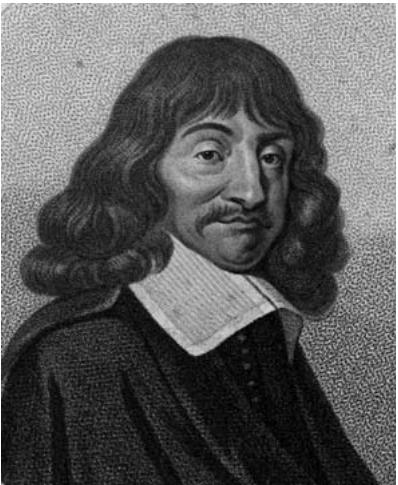

A further influential result in La Géométrie, and the one of which Descartes himself said he was most proud, was his method to determine the normal (and thus also the tangent) at a given point on a curve with a given equation. It was a pre-calculus forerunner of differentiation. 
There are three important differences between how Descartes treated curves and their equations and how they are treated in modern analytic geometry: he employed oblique as well as rectangular axes; he did not consider the equation as defining a curve—rather it represented a problem, namely to construct the curve itself, as well as its axes, tangents, etc.; and he did not consider the plane itself as a collection of points characterized by pairs of real numbers—for him the xs and ys were not dimensionless numbers but the lengths of line segments. (The term “Cartesian plane” for R2 is therefore anachronistic.) 
Descartes supposed (too optimistically) that his procedures could be extended to polynomial equations of any degree (usually connected to Pappus’s problem with more than four lines) and that therefore he had shown how, in principle, all geometrical construction problems could be solved. For higher-order constructions he needed new algebraic techniques. The relevant section in La Géométrie constituted the first general theory of polynomial equations and their roots. It contained his “sign rule” about the number of positive and negative roots of a polynomial, various transformation rules, and methods to check equations for reducibility. He gave no proofs; his results were based on a conviction that polynomials could essentially be written as products of linear factors , in which the roots xi could be positive, negative, or “imaginary.” 

It appears, then, that analytic geometry was not the primary goal of La Géométrie. Rather, its aim was to provide a universal method for solving geometrical problems, and to do so Descartes had to answer two urgent methodological questions. The first was how to solve geometrical problems not constructible by ruler and compass, and the second was how to use algebra as an analytic, i.e., solution-finding, tool in geometry. 
For the first of these, Descartes allowed successively more complicated curves as means of construction. It was Descartes’s conviction that algebra, through the equations of these curves, could guide him to choose, among all such construction curves, the most appropriate for the problem, in particular the simplest, i.e., that of lowest degree. 
The second question addressed serious conceptual difficulties that were felt at the time about using algebra in geometry. The transfer of algebraic operations to geometry was indeed problematic because multiplication in geometry was generally interpreted dimensionally: for example, a product of two lengths had to represent an area, and a product of three a volume. But until then algebra had dealt mostly with numbers and had routinely used products of more than three factors. Thus, a consistent and unrestricted geometrical interpretation of the operations of algebra was needed. Descartes did indeed provide such a reinterpretation. He introduced a unit line segment in such a way that multiplication no longer raised the dimension and inhomogeneous terms could be allowed in equations. 
By 1637 he had given up on his earlier attempts to link philosophy and mathematics. Yet the preoccupation with certainty remained. As his concept of construction involved the use of curves, he had to consider which curves could be understood by the human mind with sufficient clarity to be acceptable in geometry. His answer was that all algebraic curves were acceptable (he called these “geometrical curves”) and all others were not (these he called “mechanical”). Few seventeenthcentury mathematicians followed Descartes in this strict demarcation of geometry. This is typical of the reception of Descartes’s La Géométrie: the philosophical and methodological aspects of the book were largely ignored by his mathematical readers, but the technical mathematical aspects were eagerly accepted and used. 

# Further Reading 
Henk J. M. Bos 
# VI.12 Pierre Fermat 
b. Beaumont-de-Lomagne, France, 160?; d. Castres, France, 1665 Number theory; probability theory; variational principles; quadrature; geometry 
Fermat, who spent his life as a magistrate in the south of France, contributed decisively to most of the mathematical subjects of his time: from quadrature to optics, from geometry to number theory. Very little is known about his early life—even the date of his birth is uncertain—but by 1629 he had close contacts with viète’s [VI.9] scientific heirs in Bordeaux. His work displays a thorough knowledge of ancient as well as contemporary mathematics and he exchanged problems and mathematical information by correspondence with, among others, rené descartes [VI.11], Gilles Personne de Roberval, Marin Mersenne, Bernard Frenicle, John Wallis, and Christiaan Huygens. 
A crucial early-modern topic was the use of algebra to solve geometric problems. Viète and other algebraists before him had used equations in a single unknown to rewrite and solve “determinate” problems (problems admitting a finite number of solutions). In his manuscript Ad Locos Planos et Solidos Isagoge, which circulated in Paris in 1637 (the same year as Descartes’s La Géométrie), Fermat presented a general way of handling and solving indeterminate problems associated with constructions of loci: that is, of sets of points (usually curves) defined by some constraints. He identified the points of such loci by two coordinates linked by an equation (although he chose a different way of taking coordinates from the usual modern x and y coordinates). Moreover, Fermat gave the standard forms of the corresponding equation when the locus to be found was a line, a parabola, an ellipse, etc. 

Fermat also used algebraic analysis to solve problems of extrema, including finding the tangent or the normal to a curve at a given point, and determining centers of gravity. His method relies on the principle that a certain algebraic expression takes on the same values twice near the extremum. Although the procedure is purely algebraic, his successors tended to interpret it from a differential perspective, thereby making his work an apparent precursor of the calculus. Fermat applied the method to a variety of problems, including (within the framework of a controversy with Descartes’s followers around 1660) a proof of the law of refraction in optics. Basing his analysis on the principle that “nature acts in the shortest time,” Fermat was able to express the problem as one of extrema and to solve it with his method. The problem of refraction was one of the first complex physical problems to be treated in a thoroughly mathematical way, and Fermat’s approach later led to variational methods [III.94]. 
However, Fermat also showed a perfect mastery of more classical, for instance Archimedean, techniques, which he used when dealing with other types of geometrical questions such as quadrature. 
Such versatility also appears in Fermat’s work on numbers. On the one hand, he was happy to apply his algebraic approach to Diophantine analysis in order to obtain solutions for cases previously thought to be insoluble, or to derive new solutions from ones already known. On the other hand, he advocated a theoretical study of the integers, for which the currently available algebraic theory of equations was not sufficient. For example, he gave general properties of the divisors of numbers of the form (among them his now celebrated little theorem [III.58]) and of for various N. He invented the method of infinite descent specifically to deal with problems concerning integers. He used this method, which relies on the impossibility of constructing an infinite strictly decreasing sequence of integers, to prove that has no nontrivial integer solutions. This is a particular case of his famous last theorem [V.10], which Fermat only stated in the margins of one of his books: has no nontrivial integer solutions for n . The first proof of the general case was given by Andrew Wiles in 1995. 
In 1654 Fermat exchanged letters with pascal [VI.13] on the idea of a “fair game” and on the redistribution of the stakes if a game is interrupted before its end. These letters introduced important concepts in probability, including expected value and conditional probability. 
# Further Reading 
Cifoletti, G. 1990. La Méthode de Fermat, Son Statut et Sa Diffusion. Société d’Histoire des Sciences et des Techniques. Paris: Belin. 
Goldstein, C. 1995. Un Théorème de Fermat et Ses Lecteurs. Saint-Denis: Presses Universitaires de Vincennes. 
Mahoney, M. 1994. The Mathematical Career of Pierre de Fermat (1601–1665), second revised edn. Princeton, NJ: Princeton University Press. 
Catherine Goldstein 
# VI.13 Blaise Pascal 
b. Clermont-Ferrand, France, 1623; d. Paris, 1662 
Scientist and theologian 
Pascal was the first to make a systematic study of the arithmetical triangle which now bears his name; although the triangle itself is found earlier, notably in the work of the Chinese mathematician Zhu Shijie (1303). “Pascal’s triangle” 
$\begin{array}{c} 1 \\ 1 \quad 1 \\ 1 \quad 2 \quad 1 \\ 1 \quad 3 \quad 3 \quad 1 \\ 1 \quad 4 \quad 6 \quad 4 \quad 1 \\ \cdot \cdot \cdot . \end{array}$
a triangular array in which each number is the sum of the two immediately above it, provides a geometrical arrangement of the binomial coefficients  nk  , with  nk  appearing as the (k + 1)st element in the (n + 1)st row. Here  n  is, as usual, the number of subsets of size k in a set of size n, so that 
$\binom {n} {k} = \frac {n !}{k ! (n - k) !}.$
The number nk is also the coefficient of in the binomial expansion of for any integer and . In his Traité du Triangle Arithmétique (printed in 1654 but not distributed until 1665) Pascal was the first to connect binomial coefficients with the combinatorial coefficients that arise in probability. The Traité is famous too for its explicit statement of the principle of mathematical induction. 

Pascal is also known for a theorem in projective geometry (given an arbitrary hexagon inscribed in any conic section, if the three pairs of opposite sides are continued until they meet, then the three points of intersection lie on a straight line) (1640); and for a twofunction (addition and subtraction) mechanical calculating machine (1645). 
# VI.14 Isaac Newton 
b. Woolsthorpe, England, 1642; d. London, 1727 
Calculus; algebra; geometry; mechanics; optics; mathematical astronomy 
Newton entered Trinity College, Cambridge, in 1661, and it was in Cambridge that he spent most of his formative years, first as a student, then as a Fellow, and then, from 1669, as Lucasian Professor of Mathematics. His election to the Lucasian Chair was engineered by his mentor Isaac Barrow, a talented mathematician and theologian who was the first to hold the prestigious chair. In 1696 Newton moved to London to take up the post of Warden of the Mint. He resigned his professorship in 1702. 
It appears that Newton’s interest in mathematics began in 1664. In that year he embarked on a course of self-instruction, reading viète’s [VI.9] works (1646), Oughtred’s Clavis Mathematicae (1631), descartes’s [VI.11] La Géométrie (1637), and Wallis’s Arithmetica Infinitorum (1656). From Descartes, Newton learned how useful it could be to relate algebra to geometry, since plane curves could be represented by algebraic equations in two unknowns. Descartes had, however, imposed strict limitations on the class of curves allowed in La Géométrie: “geometrical” (i.e., algebraic) curves were admitted but “mechanical” (i.e., transcendental) ones were not. In common with many of his contemporaries, Newton felt that such limitations ought to be overcome and that a “new analysis” capable of dealing with mechanical curves ought to be possible. He found the answer in infinite series. 
Newton had learned how to deal with infinite series from Wallis’s work, and it was while elaborating one of Wallis’s techniques that, in the winter of 1664, he obtained his first great mathematical discovery: the binomial theorem for fractional powers. This provided him with a method for expanding into power series a large class of “curves,” including transcendental curves, which could now be given an “analytical” representation to which the rules of algebra could be applied. Termwise application of the relation (which he knew from Wallis and which is expressed in familiar Leibnizian notation as allowed him to “square” a variety of curves when they were expanded as a power series. (In the seventeenth century, squaring a curvilinear figure meant finding a square the area of which is equal to that of the curvilinear figure.) 
Isaac Newton
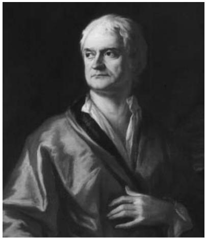

A few months later, Newton, with extraordinary insight, realized that most of the problems dealt with by his contemporaries could be reduced to two classes: problems in which one is required to find the tangent to a curve, and problems in which one is required to find the area subtended by a curve. He conceived geometrical magnitudes as being generated by continuous motion. For example, the motion of a point generates a line and the motion of a line generates a surface. These he called “fluents,” while the instantaneous rate of flow he called the “fluxion.” Basing his intuitions on kinematical models, he formulated a version of what is known today as the fundamental theorem of calculus [I.3 §5.5]. Namely, he proved that tangent and area problems are inverses of each other. In modern terms, Newton was able to reduce quadrature problems (i.e., calculating curvilinear areas) to the search for primitive functions (indefinite integrals). He built “catalogues of curves” (tables of integrals), deploying techniques equivalent to substitution of variables and integration by parts. He developed an efficient algorithm that allowed him to tackle both the direct (differential) and inverse (integral) methods of fluxions. He was able to calculate the tangent to and curvature of any known curve, and perform integrations of many classes of (what we now call) ordinary differential equations. Such mathematical tools allowed him to explore the properties of cubics, and he classified seventy-two different species of them. His results on series and on the direct and inverse methods of fluxions were published in De Quadratura Curvarum and those on cubics in the Enumeratio Linearum Tertii Ordinis, both works appearing in 1704 as appendices to Opticks. His Arithmetica Universalis, the text in which he collected together his lectures on algebra, appeared in 1707. 

Before 1704, Newton, displaying his characteristic reluctance to publish, had divulged his discoveries on the fluxional method through letters and manuscripts rather than in printed form. In the meantime leibniz [VI.15], later than Newton but independently, had also discovered the differential and integral calculus, and had printed it as early as 1684–86. Newton was convinced that Leibniz had stolen the idea from him, and from 1699 onward he engaged Leibniz in a bitter quarrel over priority. 
In the early 1670s Newton began distancing himself from the modern symbolic style that had characterized his youthful researches. He turned to geometry in the hope of restoring a hidden geometric method of discovery: the “method of analysis,” known to the ancient Greeks. In fact, geometry dominates Newton’s masterpiece, the Philosophiae Naturalis Principia Mathematica. In this work, which appeared in 1687, Newton presented his theory of gravitation. Newton was convinced that the ancient method was superior to the modern symbolic one that he identified with Cartesian analysis. In his attempts to rediscover the method, he developed elements of projective geometry. (This sprang from the idea that the ancients were able to solve complex problems related to conics by using projective transformations.) An important result is his solution of Pappus’s locus problem, which appears in book I of the Principia (1687). Here he shows that a conic is the locus of points, the product of whose distances from two given lines is proportional to the product of its distances from a third and fourth given line. He then applied projective transformations to determine the conic tangent to m given lines that passes through n given points, when m n 5. 
The Principia contains a rich array of mathematical results. In book I Newton presents the “method of first and ultimate ratios,” in which he deploys geometric limit procedures in order to determine tangents, curvatures, and curvilinear areas, the latter containing the basic ingredients of what today is known as the riemann integral [I.3 §5.5]. He also shows that “ovals” are algebraically nonintegrable. In dealing with the socalled Kepler problem, Newton approximates the roots of x − d sin x = z (d and z given) by a technique equivalent to the newton–raphson method [II.4 §2.3]. In book II he inaugurates variational methods [III.94] by tackling the problem of the solid with least resistance. And in book III, in dealing with cometary paths, he presents a method of interpolation which inspired research by mathematicians such as Stirling, Bessel, and gauss [VI.26]. In his masterpiece, Newton had shown how productive the application of mathematics to natural philosophy could be: most notably, his studies on the Moon’s motion, the precession of the equinoxes, and the tides were seminal in stimulating eighteenth-century perturbation theory. 

# Further Reading 
Niccolò Guicciardini 
# VI.15 Gottfried Wilhelm Leibniz 
b. Leipzig, Germany, 1646; d. Hanover, Germany, 1716 
Calculus; theory of linear equations and elimination theory; logic 
Renowned among mathematicians for his invention of the calculus, Leibniz was a universal thinker who graduated in law and was self-taught in mathematics. In 1676 he became counselor and librarian in Hanover for the Duke Johann Friedrich of Braunschweig–Lüneburg, holding this position until the end of his life. Besides mathematics he occupied himself with technical, historiographical, political, religious, and philosophical questions. His philosophy distinguished between two areas of reality: the world of appearances and the world of substances. It was in developing his philosophy that he was led to declare that the real world is “the best of all possible worlds.” In 1700 he was appointed first president of the newly founded Brandenburg Society of Sciences established in Berlin. 

Gottfried Wilhelm Leibniz
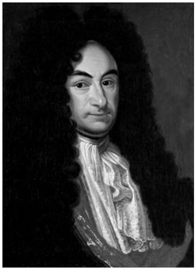
Most of his mathematical ideas and writings were not published during his lifetime, and consequently many of his results were rediscovered many years later. About a fifth of his mathematical papers have now been published. He was always more interested in general or even universal methods than in technical details, using analogy and inductive reasoning to develop the art of invention. For the same reason he became a key creator of mathematical notation: he knew how much a suitable notation could facilitate mathematical discoveries. 
One of Leibniz’s earliest mathematical works was a treatise on infinitesimal geometry (written in 1675–76 but not published until 1993). In it he used his “quanta” concept of the infinite. In Leibniz’s eyes the actual infinite as well as indivisibles, in the strictest sense of the word, were not quantities and therefore not mathematical entities: hence, he used the notions “infinitely small” and “infinitely large.” These denoted, it is true, variable quantities, but nevertheless they were quantities of a sort, so they could be handled by mathematics. Among the results in this treatise is a rigorous proof, in the style of archimedes [VI.3], of the existence of (what is today known as) the riemann integral [I.3 §5.5] of continuous functions, which is based on intermediary values of the function within subintervals. Only a few of these results were actually published by Leibniz, and even these mainly without proof: in 1682 the alternating series for π /4; in 1691 some further results. In 1713 he communicated his alternating series test in a private letter to johann bernoulli [VI.18]. 
The year 1675 was also the year in which Leibniz invented his version of the differential and integral calculus, although its publication did not begin until 1684. His calculus was based on the key concept of a variable (quantity) ranging over a sequence of values infinitely close to each other, with the differential, the difference between two successive values in the sequence, being itself a variable that could be manipulated in the usual manner. Differentiation was represented by the operator “d”, which assigned variables to variables. For example, if x is a line of variable length, then dx is a very short line, also of variable length. Integration meant summation. His notation (d and 
 ) is still used today. He deduced the standard differentiation rules (the chain rule, the product rule, etc.) and successfully applied his calculus to the differentiation of families of curves, to differentiation under the integral sign, and to various types of differential equations. 
Leibniz considered “combinatorial art” as a general qualitative science, which did not coincide with modern combinatorial analysis but included combinatorics and algebra: Leibniz considered it as “the inventive part of logic.” Here he found the Girard formula for the representation of sums of powers of roots of equations by means of elementary symmetric functions, and the socalled Waring formulas by which polynomial symmetric functions are reduced to power sums (these were rediscovered by waring [VI.21] in 1762). He invented double and multiple indices in order to solve systems of linear equations and problems of elimination theory. Between 1678 and 1713 he laid the foundations for the theory of determinants [III.15]. The method now known as Cramer’s rule, for solving simultaneous equations, which in modern terms is based on determinants, and which Cramer published in 1750, was in fact found in 1684 by Leibniz (but again not published by him). He also stated (without proof) several theorems in the theory of linear equations and elimination theory now attributed to euler [VI.19], laplace [VI.23], and sylvester [VI.42]. 
Among Leibniz’s other mathematical interests was additive number theory. In 1673 he found a recursion formula for the number of tripartitions of a natural number (published in 1976) and discovered further rules of recurrence now attributed to Euler. He also developed a formalism for a positional calculus (calculus situs) in order to express positions in space: if the definitions of figures are completely expressed by this calculus, all of their properties can then be found by this calculus. This is closely linked with the modern notions of geometry and topology. 

Leibniz was one of the pioneers of actuarial theory. Using mathematical models of human life he calculated the purchase price of life annuities both for single persons and for groups of men, and he applied such considerations to the liquidation of a state’s indebtedness. 
From the very beginning of his scientific career Leibniz was deeply interested in logic. He conceived of a general science: that is, of an art of inventing and of judging all sciences by means of sufficient data and a suitable universal language or writing. Yet, his “characteristica universalis” and the ensuing logical calculi remained fragmentary projects. His “calculus ratiocinator” was meant to be a formalized deduction of truth. Given that Leibniz was interested in formalizing calculations, it is not surprising that he also constructed the first four-function calculating machine. In constructing this machine he invented a new technical device, which he developed in two different versions: the so-called pinwheel (before 1676) and the stepped drum (from 1693 or earlier). 
# Further Reading 
Leibniz, G. W. 1990–. Sämtliche Schriften und Briefe, Reihe 7 Mathematische Schriften, four volumes (so far). Berlin: Akademie. 
Eberhard Knobloch 
# VI.16 Brook Taylor 
b. Edmonton, Middlesex, England, 1685; d. London, 1731 Secretary of the Royal Society (1714–18) 
Taylor was not the first to discover the theorem that bears his name (James Gregory found the theorem in 1671), but he was the first to publish it and the first to appreciate its significance and applicability. The theorem, which states that any function that satisfies certain conditions can be expressed as (what is now known as) a Taylor series, was published in Taylor’s Methodus Incrementorum Directa et Inversa (1715). In the Methodus Taylor gave the series as 
$f (x + h) = f (x) + \frac {f ^ {\prime} (x)}{1 !} h + \frac {f ^ {\prime \prime} (x)}{2 !} h ^ {2} + \frac {f ^ {\prime \prime \prime} (x)}{3 !} h ^ {3} + \dots$
(as it would appear in modern notation). Although Taylor did not attend to questions of rigor—there is no consideration of convergence, of the remainder term, or of the validity of expressing a function by such a series—his derivation of the series was not out of line with the standards of its day. Taylor used the theorem for approximating the roots of equations and for solving differential equations. Although he was aware of its use for expanding functions into series, he does not appear to have fully appreciated its significance in this respect. 

Taylor is also noted for his contribution to the problem of the vibrating string (discussed in the Methodus and in earlier papers) and for a book on the theory of linear perspective (1715). 
# VI.17 Christian Goldbach 
b. Königsberg (now Kaliningrad, Russia), 1690; d. Moscow, 1764 Professor of Mathematics, Imperial Academy of Sciences, Saint Petersburg (1725–28); tutor to Tsarevitch Peter II, Moscow (1728–30); corresponding secretary and administrator, Imperial Academy of Sciences, Saint Petersburg (1732–42); Ministry of Foreign Affairs (1742–64) 
Goldbach is remembered today for the conjecture that bears his name: that every even number greater than 2 is a sum of two primes. This was first stated by euler [VI.19] in 1742 in a letter to Goldbach in response to the earlier proposal by Goldbach that every number greater than 2 is a sum of three primes (Goldbach considered 1 as a prime number). Goldbach’s conjecture, together with the weaker conjecture that every odd number is either prime or the sum of three primes, was first published by waring [VI.21] in 1770 but without attribution. Both conjectures remain unsolved. However, Vinogradov proved that every sufficiently large odd number is the sum of three primes: see problems and results in additive number theory [V.27]. 
# VI.18 The Bernoullis 
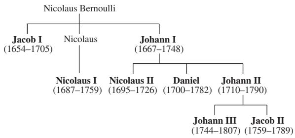
All born in Basel, Switzerland, apart from Daniel (Groningen, the Netherlands). All died in Basel, apart from Jacob II, Nicolaus II (both Saint Petersburg, Russia), and Johann III (Berlin). (The two members of the family not in bold text were not mathematicians.) 
The Bernoullis played a remarkable role in the development of mathematics during the Enlightenment. Indeed such was the family’s importance that in 1715 leibniz [VI.15] coined the term “bernoullizare” to describe the activity of doing mathematics. Altogether eight members of the family devoted themselves to the mathematical sciences (including physics, especially mechanics and fluid mechanics), and from 1687 to 1790 the mathematics chair of the university of Basel was occupied by successive members of the family: first Jacob (1687–1705), then his brother Johann (1705–48), and finally Johann’s son, Johann II (1748–90). Throughout the eighteenth century Bernoullis were members of the Paris Academy of Sciences and individually they won prestigious prizes on many occasions. The same was true of the academies in Berlin, Saint Petersburg, and several others. 

The family goes back to a line of Calvinist merchants who fled the Spanish Netherlands. The first Bernoulli to settle in Basel was Jacob, a druggist, who became a citizen in 1622. His grandson, Jacob I, studied philosophy and theology in Basel before turning to mathematics, against the will of his father. This was to be a typical pattern in the family: many of the Bernoullis studied mathematics despite pressure from the family to make a career in other areas (such as medicine or law). Having received a licentiate in theology in 1676, Jacob undertook an educational journey which took him first to France, then to the Netherlands, and finally to England. And it was through his encounters with Nicolas Malebranche, Jan Hudde, and others that he became acquainted with Cartesianism and its most eminent representatives. In 1677 he started his diary, Meditationes, in which he wrote down many of his mathematical insights and thoughts. 
Having obtained the chair of mathematics in Basel, Jacob studied Leibniz’s early memoirs on differential calculus, whose power he was the first, together with his younger brother Johann I, to recognize. In a paper on the curve of constant descent, published in the Leipzig Acta Eruditorum in 1690, Jacob was the first to use the term “integral” in its present mathematical sense. From then on he showed his mastery of Leibnizian methods in his study of curves, including, among others, the catenary, the form of a bent elastic beam, the form of a sail inflated by the wind, and the parabolic and logarithmic spirals. He also solved the differential equation , which is now named after him. However he is best remembered for his Ars Conjectandi (1713), which was published posthumously with a short foreword by his nephew, Nicolaus I. It contains an attempt to give a sound mathematical treatment of a commonsense principle already appealed to by cardano [VI.7] and Halley: if an experiment is repeated a large number of times, then the relative frequency with which an event occurs will roughly equal the probability of the event. Bernoulli’s theorem, known since poisson [VI.27] as the (weak) law of large numbers [III.71 §4], establishes a first link between the theories of probability and statistics. In the same book, Bernoulli also introduced the sequence of rational numbers that now bears his name, which can be defined as the coefficients of in the power-series expansion 

$\frac {t}{\mathrm{e} ^ {t} - 1} = \sum_ {k = 0} ^ {\infty} B _ {k} \frac {t ^ {k}}{k !}.$
Jacob computed these numbers up to . 
Johann, who had to study medicine before he could devote himself to mathematics, got his first mathematical training from his brother Jacob, with whom he developed numerous applications of the new Leibnizian calculus to mechanics. An academic peregrination brought him to Paris in 1691–92, where he gave private lessons to Guillaume de l’Hôpital. These lessons are the basis of l’Hôpital’s famous Analyse des Infiniment Petits (1696). This textbook, the first on calculus, contains l’Hôpital’s rule, which Johann had communicated by letter to his student. In 1695, Johann left Basel for Groningen to take up a professorship in mathematics. 
With the growing visibility of Johann’s work, the friendly collaboration between the two brothers Jacob and Johann transformed into an endless round of controversies, priority disputes, and public accusations. They engaged in heated struggles concerning the solution of the brachistochrone (curve of fastest descent) problem, and a complicated isoperimetric problem that involved minimizing the area enclosed by a curve of fixed length. Eventually, these bitter quarrels led to an interesting mathematical outcome: the creation of the calculus of variations [III.94]. After Jacob’s death, Johann took over the mathematics chair in Basel, where he taught until the end of his life, attracting students from all over Europe, including euler [VI.19]. 
Johann’s most important achievement in mathematics is the development of the integral calculus. He developed a general theory for the integration of rational functions and new methods for the solution of differential equations. He also extended the infinitesimal calculus to handle exponential functions [III.25]. 

Johann’s correspondence with Leibniz (which spans approximately twenty-five years) can be viewed as a laboratory of mathematical invention and debate. The priority dispute that ensued when newton [VI.14] accused Leibniz of having stolen the calculus from him also involved Johann, who fought on Leibniz’s side. With each camp defying the other with difficult problems, Johann had the opportunity to create, with his son Nicolaus II, the theory of orthogonal trajectories of families of curves. Johann was also a towering figure in the origins of analytical mechanics and in mathematical physics, where, among other things, he made notable contributions to the study of central forces, to navigational theories, and to the question of the principles of statics. 
Nicolaus I studied mathematics at the university of Basel with his uncle Jacob before taking a degree of Doctor of Jurisprudence (1709). He was the professor of mathematics in Padua, occupying the chair once held by Galileo, and he later held the professorship of logic in Basel. His main interests in mathematics were infinite series and the applications of probability theory to questions of law. He formulated, in 1713, the notorious Saint Petersburg paradox, which originated with a gambling game. Suppose that Peter is tossing a fair coin, and he will give Paul one ducat if the coin turns up heads on the first toss, two ducats if it shows heads for the first time on the second toss, and in general 2n−1 ducats if the coin turns up heads for the first time on the nth toss. The standard calculation shows that the value of Paul’s expectation 2 4 8  is infinitely great. Nevertheless no “fairly reasonable man” would be willing to pay even a moderately high price to purchase Paul’s prospects. The result of the mathematical analysis clearly affronted common sense; this was the paradox. Nicolaus’s cousin, Daniel, discussed the problem while he was staying in Saint Petersburg (hence the name given to the paradox). His strategy was to distinguish two senses of expectation, one mathematical and the other moral. The latter was to take into account the individual characteristics of the risk taker (his wealth, for instance). 
Although primarily a physicist and author of the famous Hydrodynamica (1738), Daniel obtained a solution of the Riccati equation, , and engaged in the problem of the vibrating string. 
Otto Spiess, from Basel, started to publish the complete edition of the works and correspondence of the Bernoullis in 1955. The project continues. 
# Further Reading 
Jeanne Peiffer 
# VI.19 Leonhard Euler 
b. Basel, Switzerland, 1707; d. Saint Petersburg, Russia, 1783 Analysis; series; rational mechanics; number theory; music theory; mathematical astronomy; calculus of variations; differential equations 
Euler was one of the most influential and prolific mathematicians in history. His first publication was a 1726 paper on mechanics, and his last was a collection published in 1862, seventy-nine years after his death. There are over eight hundred papers bearing his name, about three hundred of them appearing posthumously, and more than twenty books. His Opera Omnia fill over eighty volumes. 
In number theory, Euler introduced the Euler phi function, φ(n), to denote the number of positive integers less than n and relatively prime to n, and proved the fermat–euler theorem [III.58] that n divides . He showed that the remainders relatively prime to n form what we now call a group under multiplication and he expanded the theory of quadratic and higher-order residues. He proved fermat’s last theorem [V.10] for . He stated that any real polynomial of degree n is a product of real and quadratic factors and has n complex roots, but was unable to give complete proofs. He was the first to use generating functions [IV.18 §§2.4, 3] when he gave a generating function for Naudé’s partition problem: the question of how many different ways a given integer can be written as a sum of positive integers. He introduced the function σ (n), the sum of the divisors of an integer n, and used this function to increase the number of known pairs of amicable numbers (a pair m, n of numbers is called amicable if the sum of the proper divisors of m equals n, and vice versa) from 3 to over 100. He showed that any prime number of the form 4n 1 is the sum of two rational squares. lagrange [VI.22] later improved this result to show that such numbers are the sum of two integer squares. Euler factored the fifth Fermat number, , thus refuting fermat’s [VI.12] conjecture that all integers of the form were prime. He made extensive studies of the binary quadratic forms , and , and proved a form of the law of quadratic reciprocity [V.28]. 

Leonhard Euler
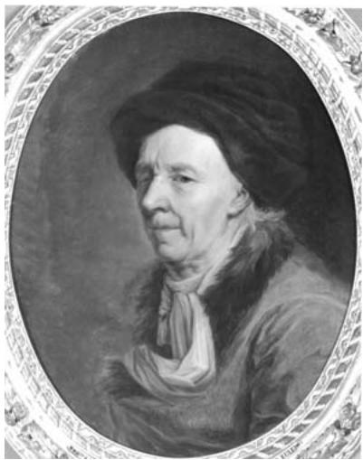

Euler was the first to use analytic methods in number theory. In the 1730s he calculated to several decimal places the so-called Euler–Mascheroni constant 
$\gamma = \lim _ {n \rightarrow \infty} \left[\left(\sum_ {k = 1} ^ {n} \frac {1}{k}\right) - \log n \right]$
and discovered many of its properties. Mascheroni added to those properties in the 1790s. Euler also discovered the sum–product formula for what we now call the Riemann zeta function, 
$\zeta (s) = \sum_ {n = 1} ^ {\infty} \frac {1}{n ^ {s}} = \prod_ {p \text {   prime }} \frac {1}{1 - p ^ {- s}},$
and he evaluated the function for positive even values of s. 
In analysis, Euler was largely responsible for shaping the modern calculus curriculum. He was also the first person to take a systematic approach to the solution of differential equations and to problems of the calculus of variations [III.94]. He discovered a differential equation sometimes called the “Euler necessary condition” and sometimes called the “Euler–Lagrange equation.” The equation tells us that if J is defined by the integral equation dx, then a function y(x) that maximizes or minimizes J will satisfy the differential equation 

$\frac {\partial f}{\partial y} - \frac {\mathrm{d}}{\mathrm{d} x} \left(\frac {\partial f}{\partial y ^ {\prime}}\right) = 0.$
Euler apparently thought that the condition was also sufficient. Very early in his career, he pioneered the use of integrating factors for solving differential equations, though the almost simultaneous published solution of Clairaut was more complete and more widely read, so credit for this innovation usually falls to Clairaut. He also did the first work using what are now called fourier series [III.27] and laplace transforms [III.91], more than a generation before laplace [VI.23] or fourier [VI.25] began doing mathematics, though they took the fields much farther than Euler had. 
Much of Euler’s best work involved series. His first widely acclaimed result was when he solved one of the best-known problems of his age, the seventy-year-old “Basel problem.” The problem was to evaluate the sum of the reciprocals of the square integers, or ζ(2). Euler showed that 
$\sum_ {n = 1} ^ {\infty} \frac {1}{n ^ {2}} = \frac {\pi^ {2}}{6}.$
(For a sketch of a proof, see π [III.70].) 
He developed the Euler–Maclaurin series to strengthen the relationships between series and integrals. The existence of the Euler–Mascheroni constant followed from these researches. Using techniques he called “interpolation of series,” he developed the gamma function [III.31] and the beta function. He developed the first extensive theory of continued fractions [III.22], and derived series for the accurate and efficient calculation of logarithms [III.25 §4] and trigonometric tables, often to more than twenty decimal places. 
He was the first to do calculus with complex numbers and to investigate logarithms of negative and complex numbers. This research led to a long and bitter controversy with d’alembert [VI.20]. 
Euler was not the first to prove that i sin θ or to know that , but he made so much more use of these facts than any of his predecessors that this last formula is generally known as Euler’s identity. 
He is regarded as a pioneer in topology and graph theory for his necessary condition for a graph to have an Euler path, the so-called Königsburg bridge problem. This is to determine whether or not a graph has a path that traverses every edge exactly once. He also discovered and gave a flawed proof that, for a polyhedron “bounded by planes,” Euler’s words for what we now call “convex,” V E F 2, where V is the number of vertices, E is the number of edges, and F is the number of faces. (For details about the flaws in Euler’s proof, see Richeson and Francese (2006).) 

Euler proved a form of the general addition theorem for elliptic integrals and gave a complete classification of elastic curves. At the command of his king, Frederick the Great of Prussia, he studied hydraulics, designed pumps and fountains, and evaluated the probabilities and combinatorics involved in the state lotteries. 
In a triangle, the line on which the orthocenter, the centroid, and the circumcenter lie is the Euler line. The Euler method is an algorithm for giving numerical solutions to differential equations. The euler differential equation [III.23] is the partial differential equation that describes continuity of fluid flow. 
Euler tried to use lunar and planetary theory to solve the problem of finding longitude at sea. In studying the orbit of a comet, he made the first steps in the statistics of observed data. 
He left Switzerland in 1727 to work in the new academy of Peter the Great in Saint Petersburg. In 1741 he moved to Berlin and the academy of Frederick the Great, but returned to Saint Petersburg in 1766, after the ascension of Catherine the Great. He was blind for the last fifteen years of his life, during which time he nevertheless wrote over three hundred papers. He won the annual prize competition of the Paris Academy twelve times. 
His series of calculus books, published in four volumes between 1755 and 1770, were the first successful calculus textbooks. It was the climax of a complete series of mathematical textbooks, including arithmetic (1738), algebra (1770), and the Introductio in Analysin Infinitorum (1748), a textbook on the mathematics Euler thought was necessary to understand calculus. 
In the two volumes of the Mechanica (1736), Euler gave the first calculus-based treatment of the mechanics of point masses. He followed this with another twovolume work, Theoria Motus Corporum (1765), on the motions of solid bodies, including rotations. 
Other books include Methodus Inveniendi (1744), the first unified treatment of the calculus of variations, Tentamen Novae Theoriae Musicae (1739), on the physics of music and including the first use of logarithms in the theory of pitch, three different books on celestial mechanics and lunar theory, two on the theory of shipbuilding, three on optics, and one on ballistics. 
Our modern notion that functions [I.2 §2.2] are a fundamental object in mathematics is due to Euler. Euler standardized the use of the symbols e, π, and i, as well as  for summations and Δ for finite differences. 

His Letters to a German Princess in three volumes (1768–71) is regarded variously as the first work of popular science writing by a first-rate scientist and as an important work in the philosophy of science. 
Laplace is reported to have advised, “Read Euler. Read Euler. He is the master of us all.” The words are probably not those of Laplace, but the misattribution does not affect the quality of the advice. 
# Further Reading 
Edward Sandifer 
# VI.20 Jean Le Rond d’Alembert 
b. Paris, 1717; d. Paris, 1783 
Algebra; infinitesimal calculus; rational mechanics; fluid mechanics; celestial mechanics; epistemology 
D’Alembert spent his whole life in Paris, where he became one of the most influential members of the Académie Royale des Sciences and of the Académie Française. He became well-known as the scientific editor of the celebrated French Encyclopédie, the twentyeight-volume work on which he collaborated with Denis Diderot, and for which he wrote most of the mathematical and many of the scientific articles. 
As a student at the Jansenist Collège des Quatre-Nations, he followed the usual curriculum of grammar, rhetoric, and philosophy, the latter including some Cartesian science, a little mathematics, and much theology framed by the then burning debate about predestination, freedom, and grace. Disgusted with the permanent climate of controversy and the endless metaphysical discussions among his Jansenist teachers, d’Alembert decided, after attaining his diploma in law, to devote himself to his personal passion, “géométrie” (that is, mathematics). 

D’Alembert’s first communications to the French Académie were concerned with the analytic geometry of curves, the integral calculus, and fluid resistance, notably the problem of the deceleration and deflection of a disk entering a fluid, which was linked to the Cartesian explanation of refraction of light. He made a close reading of newton’s [VI.14] Principia, his commentary on passages of the first book showing his clear preference for analytical methods over the synthetic geometry of Newton. 
D’Alembert’s Traité de Dynamique (1743) made him famous in learned circles. He built up a systematic and rigorous theory of mechanics founded upon a short list of well-chosen principles—inertia, composition of motions (i.e., the addition of the effects of two forces or powers), and equilibrium—while at the same time trying to avoid metaphysical arguments. Most notably he proposed an important general principle, known today as “d’Alembert’s principle,” to simplify the investigation of constrained systems, such as the compound pendulum, vibrating rods, strings, rotating bodies, and even fluids, which he considered to be aggregates of parallel slices. The essential idea behind the principle was to reduce a problem in dynamics to one in statics, roughly speaking by introducing a fictitious force, the “kinetic reaction,” which was minus the mass times the acceleration. This allowed techniques from statics to be brought to bear on problems in dynamics. 
His other books and memoirs were developments, some very innovative, in fluid theory, partial differential equations, celestial mechanics, algebra, and integral calculus. He devoted much thought to the use and status of imaginary numbers. 
In his Réflexions sur la Cause Générale des Vents (1747) and his Recherches sur le Calcul Intégral (1748) he observed that numbers of the form a  bi (where retain the same form when subjected to the usual operations (addition, subtraction, multiplication, division, and exponentiation). He proved that, for a real polynomial, imaginary roots always occur in conjugate pairs, and that even if a real polynomial has no real root, there is still always a complex root. However, his work was not rigorous—for example, he presupposed the existence of roots—and consequently he did not provide a proof of the fundamental theorem of algebra [V.13]. 
At the end of the 1740s there was a crisis in Newtonian science, with d’Alembert, Clairaut, and euler [VI.19] each independently coming to the conclusion that Newton’s theory of gravitation could not account for the motion of the Moon. In 1747 d’Alembert discussed various possibilities for solving the problem— an additional force, or a very irregular shape for the Moon, or some vortices between Earth and Moon—and produced a long study on celestial mechanics and planetary perturbations that has only recently been rediscovered and published (see d’Alembert 2002). By 1749 an improved mathematical analysis of the problem had shown that Newton’s theory was correct. The rest of d’Alembert’s extensive work on celestial mechanics was published in his Recherches sur la Précession des Équinoxes (1749), Recherches sur Différents Points du Système du Monde (1754–56), and in some of the eight volumes of his Opuscules (1761–83). 

In 1747 d’Alembert presented a paper on the famous problem of vibrating strings, Recherches sur la Courbe que Forme une Corde Tendue Mise en Vibration (1749). This paper contained a solution of the wave equation [I.3 §5.4]. This was the first solution of a partial differential equation—partial differential equations were a new tool that he had already used in his 1747 Réflexions sur la Cause Générale des Vents. It led to a lengthy debate with Euler and daniel bernoulli [VI.18] about the possible form of the solutions and the general notion of function. 
D’Alembert’s work for the Encyclopédie (1751–65) and his efforts to find rigorous foundations for the sciences led him into the field of philosophy, where his main contributions concerned the classification of various sciences. He also worked on the study of cognition following the lines proposed by descartes [VI.11], Locke, and Condillac. 
# Further Reading 
Francois de Gandt 
# VI.21 Edward Waring 
b. Shrewsbury, England, ca. 1735; d. Shrewsbury, 1798 
Lucasian Professor of Mathematics, Cambridge (1760–98) 
Waring, the leading British mathematician of the latter half of the eighteenth century, wrote several advanced but somewhat impenetrable analytical texts. His first work, Miscellanea Analytica (1762), is devoted to the theory of numbers and algebraic equations and contains many results which he revised and expanded in his Meditationes Algebraicae (1770). Included in the latter is the problem known today as Waring’s problem (that every positive integer is the sum of not more than nine cubes, or the sum of not more than nineteen fourth powers, and so on, with a fixed number of summands depending on the exponent), which was solved by hilbert [VI.63] in the affirmative in 1909 and which gave rise to important work by hardy [VI.73] and littlewood [VI.79] in the 1920s. The Meditationes also contained the first publication of Goldbach’s conjecture (that every even integer greater than 2 can be written as the sum of two primes) and of Wilson’s theorem (if p is a prime number, then is divisible by p), which was subsequently proved by lagrange [VI.22]. 

Waring’s problem and Goldbach’s conjecture are discussed in problems and results in additive number theory [V.27]. 
# VI.22 Joseph Louis Lagrange 
b. Turin, Italy, 1736; d. Paris, 1813 
Number theory; algebra; analysis; classical and celestial mechanics 
In 1766 Lagrange left his native Turin, where he had been a founding member of what would later become the Turin Academy of Sciences, to become the mathematics director at the Berlin Academy of Sciences. In 1787 he moved to Paris to take up a position as a pensionnaire veteran at the Academy of Sciences. In Paris he also lectured at the École Polytechnique, founded in 1794, and served as one of the members of the committee that established the modern metric system. 
Lagrange was only nineteen years old when he wrote to euler [VI.19] announcing a new formalism to simplify Euler’s method for finding a curve that satisfied an extremum condition. Lagrange’s method was based on the introduction of a new differential operator, δ, to express the independent variations of the coordinates of a curve that produced a local infinitesimal deformation. 
Using this formalism he derived the differential equation known today as the Euler–Lagrange equation, the fundamental equation of the calculus of variations [III.94]. Suppose that we wish to find the function y y(x) that maximizes or minimizes a definite integral of the form 

$\int_ {a} ^ {b} f (x, y, y ^ {\prime}) \mathrm{d} x,$
where y	 = dy/dx. The equation states a necessary condition that this function must satisfy: 
$\frac {\partial f}{\partial y} - \frac {\mathrm{d}}{\mathrm{d} x} \left(\frac {\partial f}{\partial y ^ {\prime}}\right) = 0.$
This is a typical example of Lagrange’s reductionist style. Throughout his career he sought suitable formalisms with which to express and solve the key problems of mathematical analysis. 
Lagrange publicly presented his δ-formalism in a memoir published in the second volume (1760–61) of Miscellanea Taurinensia, a review he had helped to found. He coupled this memoir with another in which he used the same formalism to formulate a generalized version of the principle of least action (previously introduced by Maupertuis and Euler). As a result, he was able to derive the equations of motion of any system of distinct bodies attracted by central forces depending on the distances from their centers. 
Meanwhile, in the first volume of Miscellanea Taurinensia (1759), Lagrange had published a memoir presenting a new approach to the problem of the vibrating string, where the string is first represented as a discrete system of n particles, and n is then allowed to tend to infinity. Using this method Lagrange argued that Euler was right to allow a large class of “functions,” both “continuous” and “discontinuous,” as solutions of this problem, whereas d’alembert [VI.20] had maintained that only “continuous functions” (that is, curves expressed by a single equation) could count as solutions. 
Lagrange established a very general program in the foundations of classical mechanics in these memoirs. It was based on the interpretation of a continuous system as a limiting case of a discrete one and the use of the method of indeterminate coefficients: supposing that P(x) is a polynomial in x, whose coefficients depend on some indeterminates, and that P (x)  0 for all x (in a given interval), this method consists of deducing the system of equations , from which the indeterminates are possibly determined. Lagrange extended this method to sums of polynomials in several (independent) variables, and (following Euler, d’Alembert, and many others) also used it with respect to power series. This program was further elaborated in two memoirs on the motion of the Moon (1764, 1780), and later realized in the Méchanique Analitique (1788). Here, the principle of least action was replaced by a generalization of the Bernoullian principle of “virtual velocities,” which were expressed by variations. Using what are now known as generalized coordinates, (that mutually independent coordinates in the configuration space of a discrete system that characterize completely the position of its bodies), Lagrange derived the equations that are now named after him: 

$\frac {\mathrm{d}}{\mathrm{d} t} \left(\frac {\partial T}{\partial \dot {\varphi} _ {i}}\right) - \frac {\partial T}{\partial \varphi_ {i}} + \frac {\partial U}{\partial \varphi_ {i}} = 0,$
where T and U are the kinetic and potential energy of the system, respectively. 
The Méchanique Analitique appeared a century after newton’s [VI.14] Principia and marked the culmination of a purely analytical approach to mechanics. In the preface Lagrange proudly stated that no diagrams would be found in the work and that everything would be reduced to “algebraic operations submitted to a regular and uniform progression.” 
Lagrange made fundamental contributions to perturbation theory and the three-body problem [V.33] with research published in the 1770s and 1780s. His methods were further developed by laplace [VI.23] in his Mécanique Céleste and formed the basis for subsequent mathematical work in physical astronomy. 
The method of indeterminate coefficients, or rather its extension to power series, is also the crucial technique underlying Lagrange’s approach to the calculus. In a memoir which appeared in the Proceedings of the Berlin Academy (1768) he used it to prove an important result connecting the calculus to the theory of algebraic equations, the so-called Lagrange inversion theorem, which states that a function of a root p of an equation where ϕ(x) is an arbitrary function of , can be expanded in a series based on the Taylor expansions of and (the precise conditions to be satisfied by , and ψ(t) were later clarified by cauchy [VI.29] and Roché). 
In a memoir of 1772 Lagrange returned to power series and proved that if a function has a power-series expansion in then this series can be written in the form 
$\sum_ {i = 0} ^ {\infty} f ^ {(i)} (x) \frac {h ^ {i}}{i !},$
where, for any is derived from in the same way that derives from f . Thus, he just had to prove, through an infinitesimal argument, that /dx to conclude that the only power-series expansion of a function is its Taylor series. In Théorie des Fonctions Analytiques (1797) he then showed (or, rather, claimed to have shown), without making an appeal to the differential calculus, that any function can be expanded in a power series, and suggested interpreting the differential formalism as a formalism that applies to the coefficients of ! in such an expansion. In other words, he suggested defining the differential ratios of any order (that is, the ratios , where ) as derivative functions supplying these coefficients, whereas previously these had been thought of as genuine ratios of differentials. He also proved that the remainder of a Taylor series could be written in the form now known as the Lagrange remainder. 

The main results obtained by Lagrange within the theory of algebraic equations were presented in a long memoir of 1770 and 1771 in which the formulas for solving equations of degree 2, 3, and 4 were obtained through an analysis of permutations of the roots. This work constituted the starting point for the later researches of abel [VI.33] and galois [VI.41]. In the same memoir Lagrange stated a particular but significant case of the theorem in group theory that today bears his name: that the order of a subgroup of a finite group divides the order of the group. 
Lagrange also obtained important results in number theory. Arguably the most significant were the proof of a conjecture, advanced by fermat [VI.12] (among others) and which Euler had already tried to prove, asserting that any positive integer is the sum of (at most) four squares (1770), and the proof of Wilson’s theorem (first guessed by Wilson and published by waring [VI.21] without proof), asserting that if n is prime, then is divisible by n (1771). 
# Further Reading 
Burzio, F. 1942. Lagrange. Torino: UTET. 
Marco Panza 
# VI.23 Pierre-Simon Laplace 
b. Beaumont-en-Auge, France, 1749; d. Paris, 1827 
Celestial mechanics; probability; mathematical physics 
Laplace is known to later mathematicians for many concepts of fundamental importance to mathematics, including the laplace transform [III.91], the Laplace expansion, Laplace’s angles, Laplace’s theorem, Laplace functions, inverse probability, generating functions [IV.18 §§2.4, 3], a derivation of the Gauss/Legendre least-squares rule of error by means of a linear regression, and the laplacian [I.3 §5.4] or potential function. Laplace developed the fields of celestial mechanics (the phrase was his coinage) and probability, and along the way the mathematics to service and advance them. For Laplace, celestial mechanics and probability were complementary instruments that implemented a unified vision of a fully determined universe. Celestial mechanics vindicated the Newtonian system of the world. Probability was the measure, not of the operations of chance in nature, for there are none, but of human ignorance of causes, which was to be reduced to virtual certainty by calculation. The third reason for Laplace’s importance to the history of science was the mathematization of physics in the first two decades of the nineteenth century. Apart from a few formulations—speed of sound, capillary action, refractive indices of gases— his role there was that of instigator and patron rather than of major contributor. 

Laplace came up with the majority of the above concepts in a probabilistic context. The earliest hints of the method of solving difference, differential, and integral equations, later known as the Laplace transform, appeared in “Mémoire sur les suites” (1782a), where Laplace introduced generating functions. Laplace considered generating functions to be the approach of choice in solving problems that involved the development of functions in series and evaluation of the sums. Years later, in composing Théorie Analytique des Probabilités (1812), he subordinated all the analytical part to the theory of generating functions and treated the entire subject as their field of application. In the early memoir, however, he emphasized what he expected to be their applicability to problems of nature. 
In an even earlier paper, “Mémoire sur la probabilité des causes par les événements” (1774), Laplace stated the theorem permitting the analysis later termed bayesian [III.3]. Unknown to Laplace, Thomas Bayes had arrived at the same theorem eleven years earlier but had not developed it. Laplace for his part proceeded, in further investigations over some thirty years, to develop inverse probability into the basis for statistical inference, philosophical causality, estimation of scientific error, quantification of the credibility of evidence, and optimal voting rules in the proceedings of legislative bodies and judicial panels. His initial attraction to the approach was its applicability to human concerns. It was in the course of these papers, most notably “Mémoire sur les probabilités” (1780), that the word probability came to connote not merely the basic quantity in the theory of games and chance but a subject in itself. 

Laplace first addressed error theory in the above paper on causality. The problem was to estimate the most appropriate mean value to be taken in a series of astronomical observations of the same phenomenon. He also determined how the limits of the error were related to the number of observations (“Mémoire sur les probabilités” above). In “Essai pour connaître la population du Royaume” (1783–91) Laplace turned to demographic applications. In the absence of census data, one needed to determine the multiplier to be applied to the number of births at any one time in order to estimate the approximate size of a population. The specific problem Laplace solved was the size of the sample required for the probability of error to fall within given limits. 
Laplace then put probabilistic investigation aside. Only twenty-five years later did he return to the subject, in the course of preparing the comprehensive Théorie Analytique des Probabilités. In 1810 he returned to the problem of determining the mean value from a large number of observations, which he interpreted as the problem of the probability that the mean value falls within certain limits. He proved a law of large numbers, stating that if positive and negative errors in an indefinitely large number of observations are assumed to be equally possible, then their mean result converges to a limit in a precise way. From this analysis followed the least-squares law of error. A priority dispute over the discovery of that law was even then simmering between gauss [VI.26] and legendre [VI.24]. 
In a long series of investigations brought together in Traité de Mécanique Céleste (1799–1825, five volumes), the two part “Mémoire sur la Théorie de Jupiter et de Saturne” (1788) demonstrates the most famous of his findings in planetary astronomy. He established that the current acceleration in orbital motion of Jupiter and the deceleration of Saturn are the reciprocal effects of their mutual gravitation, which are cyclical over many hundreds of years and not cumulative. From this and analysis of other phenomena that Laplace explored, it followed that the so-called secular inequalities of planetary motions are periodic over many centuries. Thus, they are not derogations from the law of gravity but evidence that its validity extended beyond the Sun– planet attractions that had been studied by newton [VI.14]. He was never able to prove, however, that lunar acceleration is self-correcting over time. 
The expansion known by Laplace’s name in the theory of determinants first appears in the background of the Jupiter–Saturn memoir in an analysis of the eccentricities and inclinations of orbits, “Recherches sur le calcul intégral et sur le système du monde” (1776). Except for that, Laplace’s mathematical originality is less notable in his analysis of planetary motion than in his development of the theory of probability. More in evidence in his astronomical work is his motivational drive and his power and virtuosity in calculation, which may indeed have been more important throughout his long career. Laplace was masterful in finding rapidly convergent series, in obtaining mathematical expressions incorporating terms to represent a multitude of physical phenomena, in justifying the neglect of inconvenient quantities in order to reach solutions, and in giving the widest possible generality to his conclusions. 

The attraction exerted by a spheroid on an external or internal point proved to be mathematically the most fertile set of problems in Laplacian planetary astronomy. In “Théorie des attractions des sphéroïdes et de la figure des planètes” (1785) Laplace employed legendre polynomials [III.85] in a form later called Laplace functions. He also proved a theorem that stated that all ellipsoids with the same foci for their principal sections attract a given point with a force proportional to their masses. Laplace’s angles appear in his development of the equation for the attraction of a spheroid on a given point. Laplace used polar coordinates in this analysis. He transformed the equation into one in Cartesian coordinates in “Mémoire sur la théorie de l’anneau de Saturne” (1789). In 1828 George Green dubbed Poisson’s application of the formula to electrostatic and magnetic forces the potential function, the term used thereafter in classical physics. 
# Further Reading 
The memoirs cited in this article can be found in the bibliography of C. C. Gillispie’s Pierre-Simon Laplace: A Life in Exact Science (Princeton University Press, Princeton, NJ, 1997). 
For the mathematical content of Laplacian physics, see pp. 440–55 (and elsewhere) of I. Grattan-Guinness’s Convolutions in French Mathematics (Birkhäuser, Basel, 1990, three volumes). 
Charles C. Gillispie 
# VI.24 Adrien-Marie Legendre 
b. Paris, 1752; d. Paris, 1833 
Analysis; theory of attractions; geometry; number theory 
Legendre passed his career in Paris and seems to have been largely of independent means. Somewhat younger than lagrange [VI.22] (who was resident there from 1787) and laplace [VI.23], he did not quite match their reputation, though the range of his mathematical interests was comparably wide. His professional appointments were modest; however, in 1799 he took over from Laplace as a graduation examiner at the École Polytechnique and remained there until his retirement in 1816. Additionally, in 1813 he succeeded Lagrange at the Bureau des Longitudes. 

Legendre’s early research concerned the shape of Earth and its external attraction to a point. Solutions of the differential equations involved led him to examine properties of the functions that are named after him; he was in rivalry with Laplace, after whom the functions were named during the nineteenth century. His other main concern in analysis, and the longest lasting, was with elliptic integrals. He wrote on them at great length up to a Traité of 1825–28. But in supplements of 1829–32 he acknowledged that his theory had just been eclipsed by the inverse elliptic functions [V.31] of jacobi [VI.35] and abel [VI.33]. He also studied various other (functions defined as) integrals, including the beta and gamma functions [III.31]; solutions to differential equations; and optimization in the calculus of variations [III.94]. 
Among Legendre’s contributions to numerical mathematics was a beautiful theorem (found in 1789) relating spheroidal triangles (that is, triangles drawn on the surface of a spheroid) to spherical triangles, which was used in the 1790s by J. B. J. Delambre in the triangulation analysis that led to the specification of the meter. His most famous numerical result is the least-squares criterion of curve fitting, proposed in 1805 in connection with determining the orbits of comets. For him the criterion was simply one of minimization; he did not make the connections to probability theory that were soon to be effected by laplace [VI.23] and gauss [VI.26]. 
Legendre’s Essai sur la Théorie des Nombres (1798) was the first monograph on this subject. After reviewing continued fractions [III.22] and the theory of equations, he focused upon the algebraic branch, solving various Diophantine equations. Among many properties of integers, he stressed quadratic reciprocity [V.28], and proved various partition theorems concerning quadratic and some higher forms. Little in the book was new; while expanded editions appeared in 1808 and 1830, he had been quickly eclipsed on methods of proof by the Disquisitiones Arithmeticae (1801) of the young Gauss. 

For educational use Legendre produced Elements de Géométrie (1794), an account of euclidean geometry [I.3 §6.2] that emulated the same kind of form and organization and standards of proof of the Greek original. He also handled aspects that had lain outside Euclid’s concerns, such as alternatives to the parallel postulate, related numerical issues such as approximations to the value of π, and a lengthy summary of planar and spherical trigonometry. He produced eleven further editions up to 1823 and there were further posthumous editions up until 1839 (which were followed by reprints). It was a very influential book in mathematics education. 
# Further Reading 
de Beaumont, E. 1867. Eloge Historique de Adrien Marie Legendre. Paris: Gauthier-Villars. 
Ivor Grattan-Guinness
# VI.25 Jean-Baptiste Joseph Fourier 
b. Auxerre, France, 1768; d. Paris, 1830 
Analysis; equations; heat theory 
Unusually for a mathematician, Fourier pursued a distinguished nonmathematical career. He was a civilian member of General Bonaparte’s expedition to Egypt (1798–1801), important enough for the First Consul to make him, in 1802, the Prefect of the département at Grenoble, a position which he held until Emperor Napoleon’s fall in the mid 1810s. Thereafter, Fourier moved to Paris, where he managed to establish himself to the extent of being appointed a secrétaire perpétuel of the Paris Academy of Sciences in 1822. 
The prefectureship involved heavy commitments, and Fourier was also active in Egyptology, most notably discovering a teenager named Jean Champollion in Grenoble, who was later to decipher the Rosetta Stone and who helped to found the discipline. Nevertheless, between 1804 and 1815 he also created most of his scientific work. His motivation was the mathematical study of the diffusion of heat in continuous and solid bodies; his “diffusion equation” for this purpose was not only novel in itself but also marked the first largescale mathematization of physical phenomena that lay outside mechanics. To solve this differential equation he proposed using infinite trigonometric series. These series were already known but had a low status. Fourier (re)found many properties: not only the formulas for their coefficients and some conditions for their convergence but especially their representability, namely, how a periodic series could represent a general function. For diffusion in a cylinder he found many properties of the Bessel function J0(x), which was then little studied. 

Fourier presented his findings to the scientific class of the Institut de France in 1807. lagrange [VI.22] did not like the series, while laplace [VI.23] was disappointed in the physical modeling. But Laplace also gave him a clue about solutions of the diffusion equation for infinite bodies, which led Fourier to find, by 1811, his integral solution (including inversion) for them. His main publication was the book Théorie Analytique de la Chaleur (1822), which greatly influenced younger mathematicians: for example, the first satisfactory proof of the convergence of the series by dirichlet [VI.36] (1829) and their use in fluid dynamics by C. L. M. H. Navier (1825). Less happy was his relationship with poisson [VI.27], who tried to rederive the entire theory following the molecularist physical principles of Laplace and the methods of solution of Lagrange, but only added a few special cases. 
Fourier also worked on other topics in mathematics. As a teenager he gave the first proof of descartes’s [VI.11] rule of signs on the numbers of positive and negative roots of a polynomial equation. (He used an inductive proof that has now become standard.) He also found an upper bound on the number of roots within a given interval, which J. C. F. Sturm improved to an exact evaluation in 1829. At that time Fourier was trying to finish a book on equations, which appeared posthumously in 1831 thanks to Navier. The main novelty was the basic theory of linear programming [III.84], as we now call it. Despite his prestige and advocacy, he gained few followers (Navier was one), and the theory lay dormant for over a century. Fourier also took up a few aspects of Laplace’s work on mathematical statistics, examining the status of the normal distribution [III.71 §5]. 
# Further Reading 
Fourier, J. 1888–90. Oeuvres Complètes, edited by G. Darboux, two volumes. Paris: Gauthier-Villars. 
Grattan-Guinness, I., and J. R. Ravetz. 1972. Joseph Fourier. Cambridge, MA: MIT Press. 
Ivor Grattan-Guinness
# VI.26 Carl Friedrich Gauss 
b. Brunswick, Germany, 1777; d. Göttingen, Germany, 1855 Algebra; astronomy; complex function theory including elliptic function theory; differential equations; differential geometry; land surveying; number theory; potential theory; statistics 
Gauss’s prodigious mathematical abilities brought him to the attention of the duke of Brunswick when he was fifteen, when the duke paid for his further education, lifting him out of near poverty. For the rest of his life Gauss felt a loyalty to the state and a strong desire to do useful work, which led him to become a professional astronomer. In 1801 he was the first person to manage to reobserve Ceres, the first asteroid to be discovered, after it had disappeared behind the Sun. Gauss produced a novel statistical analysis of the original observations, using the method of least squares, which he had invented but not published, to predict where Ceres would reappear. Gauss then assisted for many years in the analysis of the orbits of several more asteroids. He also wrote extensively on celestial mechanics and cartography, and did important work on telegraphy. 

Nonetheless, it is as a pure mathematician that Gauss will always be remembered. In 1801 he published his Disquisitiones Arithmeticae, the book that created modern algebraic number theory. In it he gave the first rigorous proof of the law of quadratic reciprocity [V.28], going on to find seven more proofs over the years. Later he extended the theorem to higher powers, introducing the Gaussian integers for the purpose in 1831 (Gaussian integers are numbers of the form m  ni, where m and n are integers and i  √ 1). He did major work on differential equations, chiefly the hypergeometric equation, which is a second-order linear differential equation depending on three parameters and having two singular points, with the property that many of the familiar functions of analysis are related to its solutions. He showed that this equation played a significant role in the new theory of elliptic functions [V.31], but because most of this work was unpublished it had no influence on the dramatic and rapidly advancing publications of abel [VI.33] and jacobi [VI.35]. This unpublished work showed that he was the first mathematician to see the need to create a theory of complex functions of a complex variable. He also gave four proofs of the fundamental theorem of algebra [V.13]. By the 1820s he was persuaded that physical space might not be Euclidean, but he confined his opinion to his circle of friends, most of them astronomers and sympathetic to the idea; the much more detailed accounts of bolyai [VI.34] and lobachevskii [VI.31] were published independently in the early 1830s. Credit for the first detailed, mathematical descriptions of a non-Euclidean space therefore rightly attaches to Bolyai and Lobachevskii (for further discussion of this, see geometry [II.2 §7]). In 1827 Gauss wrote his Disquisitiones Generales Circa Superficies Curvas, in which the concept of intrinsic (Gaussian) curvature of a surface was put forward for the first time, thus reformulating differential geometry. 
Carl Friedrich Gauss
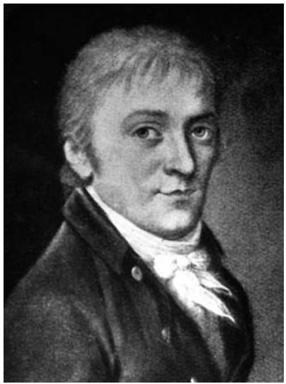

In statistics, he was one of the two or three discoverers of the normal distribution [III.71 §5], and he was an expert in error analysis, bringing the levels of accuracy in astronomy to land surveying. In that context he invented the heliotrope, which couples a mirror to a telescope in order to transmit a precise beam of light, to improve precision measurement. 
The sheer volume of Gauss’s work is overwhelming. The Werke run to twelve volumes, and there are several books, of which the Disquisitiones Arithmeticae stands out. 
A truly original mathematician and scientist, Gauss was otherwise a conservative in his tastes and views. His first marriage ended after only four years with the death of his wife in 1809; he then married again. A number of Gauss’s descendants may now be found in the United States. 
Gauss was the last great mathematician to be called the “Prince of mathematicians,” and he has been admired as much for his breadth as for the depth of his insights and the fertility of his ideas. His own view of mathematics and its importance is captured both in the much-quoted remark that “mathematics is the queen of the sciences and arithmetic the queen of mathematics” (which he did say) and in the apocryphal remark that “mathematics is the queen and the servant of science.” 

# Further Reading 
Dunnington, G. W. 2003. Gauss: Titan of Science, new edition with additional material by J. J. Gray. Washington, DC: Mathematical Association of America. 
Jeremy Gray 
# VI.27 Siméon-Denis Poisson 
b. Pithiviers, France, 1781; d. Paris, 1840 Analysis; mechanics; mathematical physics; probability 
A brilliant graduate of the École Polytechnique in 1800, Poisson was quickly appointed to the staff, and became professor and graduation examiner there until his death. He was also founder professor of mechanics at the new Paris Faculté des Sciences of the Université de France; from 1830 he was also a member of the governing Council of the Université. 
Poisson’s research output was dominated by his adherence to the traditions established by lagrange [VI.22] and laplace [VI.23]. Like Lagrange he preferred to algebraize theories, and to rely if possible upon power series and variational methods. From the mid 1810s he challenged the new theories of fourier [VI.25] (especially the solving of differential equations by trigonometric series and the Fourier integral) and of cauchy [VI.29] (the new approach to real-variable analysis using limits, and his innovation of complexvariable analysis). His overall achievements were much less significant than theirs: the main novelties were the “Poisson integral,” which embedded Fourier series within a power series; and a summation formula. He also studied the general and singular solutions of differential, difference, and mixed equations. 
In physics Poisson tried to justify Laplace’s claim that all physical phenomena were molecular, and that the cumulative action upon a molecule of all its companions should be expressed mathematically in terms of an integral. He applied this approach to heat diffusion and to elasticity theory by the mid 1820s, but then decided that integrals should be replaced by sums; he elaborated this alternative especially in capillary theory (1831). Curiously, molecularism did not dominate his most important contributions to physics: to electrostatics (1812–14) and to magnetic bodies and the process of magnetization (1824–27). His mathematical contributions to these topics included modifying Laplace’s equation to what we now call Poisson’s equation, which deals with the potential at points inside a charged body or region of charge (1814); and also a divergence theorem (1826). 
In mechanics, between 1808 and 1810 Poisson and Lagrange developed the brackets theory (named after them) of canonical solutions to the equations of motion. Poisson’s motivation was to extend, to secondorder terms in masses of the planets, Lagrange’s superb attempt to prove that the planetary system was stable; in later work he examined this (first-order) problem specifically, as well as other aspects of perturbation theory. He also analyzed rotating bodies by using moving frames of reference (1839), in an analysis that was to inspire Léon Foucault to propose his famous long pendulum in 1851. His best-known publications include a substantial and wide-ranging two-volume Traité de Mécanique (editions in 1811 and 1833), which did not, however, have room for Louis Poinsot’s beautiful recent theory (1803) of the couple in statics. In the mid 1810s, he studied deep-body fluid dynamics, in rivalry with Cauchy. 
Poisson was one of the few contemporaries to take up Laplace’s work in probability theory and mathematical statistics. He studied various probability distributions [III.71]: not only the one named after him (1837, rather in passing) but also the so-called Cauchy (1824) and Rayleigh (1830) distributions. He also examined proofs of the central limit theorem [III.71 §5], and formulated the law of large numbers [III.71 §4] (his term). One of his main applications was to the old problem of determining the probability that a triad of judges would come to the correct decision in court cases (1837). 
# Further Reading 
Grattan-Guinness, I. 1990. Convolutions in French Mathematics 1800–1840. Basel: Birkhäuser. 
Métivier, M., P. Costabel, and P. Dugac, eds. 1981. Siméon-Denis Poisson et la Science de son Temps. Paris: École Polytechnique. 
Ivor Grattan-Guinness
# VI.28 Bernard Bolzano 
b. Prague, 1781; d. Prague, 1848 
Catholic priest and Professor of Theology, Prague (1805–19) 
Bolzano was concerned with problems connected with finding the “correct,” or the most appropriate, proofs and definitions in analysis and related areas. In 1817 he proved an early version of the intermediate value theorem for continuous functions—he was among the first to have a rigorous conception of a continuous function—and in the course of doing so proved the following important lemma. If a property M does not apply to all values of a variable x but does apply for all values smaller than a certain u, then there is always a quantity U, which is the greatest of those of which it can be asserted that all smaller x possess the property M. The value u in this formulation is a lower bound for the (nonempty) set of numbers with the property not-M. Bolzano’s lemma is therefore equivalent to what nowadays might be called the “greatest lower bound” axiom (or, more commonly and equivalently, the “least upper bound” axiom). It is also equivalent to the Bolzano– Weierstrass theorem (that every bounded infinite set in R, or more generally Rn, has an accumulation point). It is likely that weierstrass [VI.44] independently rediscovered the Bolzano–Weierstrass theorem, but it is also likely that he knew, and was influenced by, Bolzano’s proof technique of iterated bisection (used by Bolzano in 1817). 

In the early 1830s it was widely believed that a continuous function must be differentiable except at some isolated points. But at that time Bolzano constructed a counterexample (although he did not publish it), and proved that it was such—more than thirty years before the well-known counterexample due to Weierstrass. 
Bolzano had a surprising variety of insights and successful proof techniques that were well ahead of their time: notably in analysis, topology, dimension theory, and set theory. 
# VI.29 Augustin-Louis Cauchy 
b. Paris, 1789; d. Sceaux, France, 1857 
Real and complex analysis; mechanics; number theory; equations and algebra 
Trained as a roads and bridges engineer at the École Polytechnique (hereafter, “EP”) and the École des Ponts et Chaussées (1805–10), Cauchy passed his career as an academic at the EP and the Paris Faculté des Sciences of the Université de France until 1830, when he left France with the deposed royal family after the revolution of that year. He returned only in 1838, and later taught in the Paris Faculté. 
Of Cauchy’s many contributions to pure and applied mathematics, the best known are in mathematical analysis. In the foundations of real variables, he replaced all previous approaches to the theory with one that (in more developed forms) has now become standard: (i) lay down an explicit theory of limits; (ii) formulate definitions carefully, and in general terms; (iii) define the derivative of a function as the limiting value of the difference quotient, its integral as the limiting value of a sequence of partition sums, its continuity in terms of the joint passage to limits of any sequence of its argument and of its corresponding values, and the sum of a convergent infinite series as the limiting value of its partial sums. A key ingredient in all this was the idea that (iv) limits may not exist: their existence has to be justified carefully. Similarly, (v) the existence of solutions to differential equations has to be proved, not just assumed. 

This approach brought a new level of rigor to analysis; for example, for the first time the fundamental theorem of calculus [I.3 §5.5] was a genuine theorem, governed by conditions on the function. However, this emphasis on limits made the theory hard for beginners: it was not liked by staff or students at the EP, where he taught it in this form between 1816 and 1830 and published it extensively, especially in his Cours d’Analyse (1821) and his Résumé (1823) of the calculus. Its rise to standard educational practice was very gradual, both in France and elsewhere. 
Another major innovation of Cauchy dates from 1814, when he began to create complex-variable analysis. Initially the integrand was a complex function but the limits of integration were real; however, from 1825 on they too became complex, and in this form he found many theorems on the residues of functions over closed domains of various shapes. Unusually for him, his progress was fitful, and he cast the theory in terms of the complex plane only in the mid 1840s. He also studied the general theory of complex functions, including their expansion in power series of various kinds. 
Cauchy’s main single achievement in applied mathematics lies in linear elasticity theory, where in the 1820s he used stress–strain models to analyze the behavior of various kinds of surfaces and solids; later he adapted it to study aspects of (aetherian) optics. In the 1810s he studied deep-body fluid dynamics, where he found Fourier-integral solutions. In this and several other areas he was in some competition with Fourier and, especially, Poisson, regarding both the quality of the theory and the chronology of its development. 
Cauchy’s other contributions lie in basic mechanics (derived from the EP teaching); singular and general solutions of differential equations; the theory of equations, especially methods that helped in the rise of group theory; algebraic number theory; perturbation theory in celestial mechanics; and an astounding paper of 1829 on quadratic forms, which could have launched the spectral theory of matrices had its author recognized its significance! 

# Further Reading 
Belhoste, B. 1991. Augustin-Louis Cauchy. A Biography. New York: Springer. 
Cauchy, A. L. 1882–1974. Oeuvres Complètes, twelve volumes in the first series and fifteen in the second. Paris: Gauthier-Villars. 
Ivor Grattan-Guinness
# VI.30 August Ferdinand Möbius 
b. Schulpforta, Saxony, 1790; d. Leipzig, Germany, 1868 
Astronomy; geometry; statics 
Möbius was briefly a student of gauss [VI.26], and worked as an astronomer at Leipzig University for almost all of his life. His finest mathematical work was his Der barycentrische Calcul (1829), in which he introduced algebraic methods into the study of projective geometry. He showed in this way how points can be described by a homogeneous triple of coordinates, lines can be described by linear equations, the concept of cross-ratio can be introduced, and the duality of points and lines in the plane can be handled algebraically. He also introduced a Möbius net, which is the projective equivalent of squared paper in Cartesian geometry. His work is all the more remarkable because Möbius knew very little of Poncelet’s radical reinvention of projective geometry only a few years before. In its turn his work was for a time overshadowed by Jakob Steiner’s synthetic treatment of projective geometry of 1832, and then Plücker’s two books on algebraic curves in the 1830s, but the simplicity and generality of Möbius’s methods were important in establishing projective geometry as a rigorous mainstream subject. 
In the 1830s Möbius developed a geometrical theory of statics and the composition of forces, and it was in this connection that he showed that whereas duality in plane geometry necessarily gives rise to a conic, duality in space need not. Möbius’s study of duality in space, which pairs points with planes, led him to consider the set of all lines in space, which is a four-dimensional space. It pleased the educator Rudolf Steiner very much that the ordinary three-dimensional space may also be thought of as a four-dimensional space, because Steiner’s philosophy was directed against breaking what he saw as a stranglehold of orthodox teaching. 
Möbius is also remembered for the “Möbius band” (or möbius strip [IV.7 §2.3]), a one-sided or nonorientable surface, but the first mathematician to describe such a surface was his compatriot J. B. Listing, in July 1858 (published in 1861). Möbius discovered it only in September 1858 (publishing it in 1865). He is also one of the most important mathematicians to study inversion in circles, and his account of it in 1855 is one reason that such transformations are often called Möbius transformations. 
# Further Reading 
Fauvel, J., R. Flood, and R. J. Wilson, eds. 1993. Möbius and His Band. Oxford: Oxford University Press. 
Möbius, A. 1885–87. Gesammelte Werke, edited by R. Baltzer (except volume 4, edited by W. Scheibner and F. Klein), four volumes. Leipzig: Hirzel. 
Jeremy Gray 
# VI.31 Nicolai Ivanovich Lobachevskii 
b. Nizhni Novgorod (formerly Gorki), Russia, 1792; 
d. Kazan, Russia, 1856 
Non-Euclidean geometry 
Lobachevskii came from a poor background, but his mother was able to have him enrolled at the local Gymnasium (or high school) on a scholarship in 1800. In 1805 the Gymnasium was made the kernel of the new University of Kazan, and in 1807 Lobachevskii began to study there. The university had just appointed Martin Bartels as Professor of Mathematics, and Bartels not only trained Lobachevskii well, but protected him from trouble with the authorities when Lobachevskii was suspected of atheism. Eventually, Lobachevskii graduated not with the ordinary degree but with a Master’s qualification, and his career as a professional mathematician began. 
In 1826, after a reform of the university, Lobachevskii gave a public lecture: “On the principles of geometry, with a rigorous demonstration of the theory of parallels.” The manuscript of this talk is now lost, but it probably marked the start of Lobachevskii’s awareness of a non-Euclidean geometry. Lobachevskii was soon elected Rector of the University of Kazan, a post he occupied with distinction for thirty years, helping to protect the university from a cholera epidemic in 1830, to rebuild it after a fire in 1841, and generally to expand its library and other facilities. 
In the 1830s he also wrote his major works, on a geometry different in only one respect from Euclidean geometry. He called it imaginary geometry and it is known today as non-Euclidean geometry. In the new geometry, given a line in a plane and a point not on the line there are two lines through the point that are asymptotic to the given line (one in each direction); these two lines separate the lines through the point which meet the given line from those that do not. Lobachevskii called these the parallels to the given line through the given point. Starting from this definition, he gave formulas for the new trigonometry of triangles, and showed that these formulas reduce to the familiar formulas of plane Euclidean trigonometry when the triangles are very small. He extended his results to describe a geometry of three dimensions, thus making it clear that his new geometry could be a geometry of space, and attempted, inconclusively, to measure the parallax of stars in order to determine whether his imaginary geometry gave a more accurate account of space than Euclidean geometry. 

He published these conclusions in lengthy papers in Russian in the Journal of Kazan University, but they drew only a relentlessly hostile review from Ostrogradskii, a much better known mathematician in Saint Petersburg. He published in French in a German journal in 1837, in German in a booklet of 1840, and again in French in 1855, but to little avail. gauss [VI.26] appreciated the booklet of 1840 and in 1842 had Lobachevskii made a corresponding member of the Göttingen Academy of Sciences, but this was to be the only acclaim Lobachevskii received in his lifetime. 
Lobachevskii’s final years were marked by terrible financial and mental decline. Such was the chaos of his household that Lobachevskii’s biographers have been unable to establish the number of children born into it, but it may well have been fifteen or even eighteen. 
# Further Reading 
Jeremy Gray 
# VI.32 George Green 
b. Nottingham, England, 1793; d. Nottingham, 1841 
Miller; Fellow of Caius College, Cambridge (1839–41) 
Green, a self-taught mathematician, went to Cambridge University at the age of forty, having already produced his most important work, the privately printed An Essay on the Application of Mathematical Analysis to the Theories of Electricity and Magnetism (1828). In this work, which Green opened by stressing the central role of the “potential function” (a term that he himself coined), he proved the three-dimensional version of the theorem now named after him, and introduced the concept that riemann [VI.49] later called Green’s function (1860). The Essay became widely known only after its discovery in 1845 by William Thomson (later Lord Kelvin), who was responsible for its republication in the Journal für die reine und angewandte Mathematik (1850–54). 

Green gave his version of the theorem (in modern notation) as 
$\iiint U \Delta V \mathrm{d} \nu + \iint U \frac {\partial V}{\mathrm{d} n} \mathrm{d} \sigma = \iiint V \Delta U \mathrm{d} \nu + \iint V \frac {\partial U}{\mathrm{d} n} \mathrm{d} \sigma ,$
where U and V are two continuous functions of x, y, z whose derivatives are not infinite at any point of an arbitrary body, n is the surface normal of the body directed inward, and dσ is a surface element. The result today known as Green’s theorem, which is the planar version of the above, was first published by cauchy [VI.29] in 1846, and it can be given (in modern notation) as follows. Let R be a closed plane region with a piecewise-smooth boundary curve C with positive orientation. Let P (x, y) and Q(x, y), having continuous partial derivatives, be defined on an open region containing R. We then have 
$\int_ {C} (P \mathrm{d} x + Q \mathrm{d} y) = \iint_ {R} \left(\frac {\partial Q}{\partial x} - \frac {\partial P}{\partial y}\right) \mathrm{d} x \mathrm{d} y.$
More original than his theorem, however, was the powerful technique Green developed to solve certain second-order differential equations. In essence, Green sought a “potential function” and formulated the conditions it needed to satisfy. His great insight was to recognize that the central issue in potential theory was to relate properties inside volumes to properties on their surfaces. Green’s functions are extensively used today in the solution of inhomogeneous differential equations with boundary conditions and in the solution of partial differential equations. 
# VI.33 Niels Henrik Abel 
b. Finnöy, Norway, 1802; d. Froland, Norway, 1829 
Theory of equations; analysis; elliptic functions; Abelian integrals 
Abel’s life was short and penurious, but successful, and he received recognition in his lifetime. His father—a minister of the church in Norway, but also at one time a government minister—overreached himself and when he died he left the family in straitened circumstances. Abel’s exceptional intellectual talents were recognized at school, and funds were raised to enable him to complete his education and, in particular, to study mathematics. At age twenty-two, he was awarded a scholarship to make a two-year tour of Europe, during which he studied in Berlin and Paris. In Berlin he met and was befriended by Auguste Crelle, the engineer who had just founded the Journal für die reine und angewandte Mathematik (otherwise known as Crelle’s Journal). Almost all of Abel’s mathematical work was published in the first four volumes of the journal. From 1826 until his death in 1829 Abel eked out a poor existence, earning a little by teaching, but using what few resources he had to support his mother and his younger brother. He died of consumption at the age of twenty-seven within a couple of days of the news reaching Norway that he had been appointed to an established post in Berlin. 

Abel’s main mathematical contributions lie in three distinct areas. The first of these was the theory of equations. Here he was influenced by ideas published by lagrange [VI.22] in 1770 and cauchy [VI.29] in 1815 about the form of functions of the roots of an equation, and what happens to such functions when the roots are permuted. Lagrange had hinted at the possibility that quintic equations might perhaps not be soluble in classical terms and Paolo Ruffini had expended much effort between 1799 and 1814 trying to prove this, though he had not managed to persuade his contemporaries. Abel’s first success was to give an acceptable proof of the fact that, for polynomial equations of degree 5, there is no formula in the coefficients involving the usual operations of arithmetic together with extraction of roots that will always yield a solution. This first appeared in 1824 in a short pamphlet written in French and published privately in Christiania (Oslo). Once Abel reached Berlin, however, Crelle translated it into German and published it in the first volume of his journal; he also published a fuller, more detailed account, covering polynomials of any degree greater than 4, in 1826. 
Abel returned to equations a few years later, publishing a long paper in 1829 about a class of equations satisfying two special conditions. His first requirement is that every root of the equation can be expressed as a function of every other root, the second that these functions commute (in modern terms, the galois group [V.21] of the equation is commutative). He proved various theorems about such equations, the most striking being that they are soluble by radicals. This represented an extensive generalization of the ideas described by gauss [VI.26] in the seventh part of Disquisitiones Arithmeticae, where the special case of cyclotomic equations (which satisfy both of these conditions) is treated systematically. It was in honour of this work that, later, the adjective “Abelian” was applied to groups that are commutative. It is important to appreciate, however, that Abel reached his results in the theory of equations without any appeal to groups, which at that time were not yet known. 

He also made major contributions to the theory of convergence. Although there had been over a century of critical thinking devoted to foundations of the calculus, modern ideas of rigour were only just emerging in the writings of bolzano [VI.28], Cauchy, and others. Convergence had received some attention in Cauchy’s lectures of 1820–21, but series in general, and power series in particular, were still far from well understood. Among other contributions, Abel offered a proper proof of the binomial theorem for exponents other than positive integers, and the insight about the continuity of a function defined by a power series as its argument goes to the circle of convergence that is now known as Abel’s limit theorem. 
Perhaps his greatest discoveries, however, were in the area where analysis and algebraic geometry come together. To summarize his legacy in this area in just a few words: first, a new and productive approach to the theory of elliptic functions [V.31]; and, second, a vast generalization of elliptic functions to what are now called Abelian functions and Abelian integrals. In this area Abel competed for priority with jacobi [VI.35]. Most (though by no means all) of his work was written in two memoirs. One was published in two parts, “Recherches sur les fonctions elliptiques” and “Précis d’une théorie des fonctions elliptiques,” coming to well over two hundred pages in Crelle’s Journal in 1828 and 1829. The other, entitled “Mémoire sur une propriété générale d’une classe très étendue de fonctions transcendantes,” was submitted to the Paris Academy of Sciences in October 1826. There it lay on Cauchy’s desk, unread until after Abel’s death. It was published by the Paris Academy in 1841. The manuscript itself, however, was stolen by G. Libri, lost, and rediscovered in parts between 1952 and 2000 by Viggo Brun and Andrea del Centina. 
In June 1830 the Paris Academy awarded its Grand Prix de Mathématiques jointly to Abel (posthumously) and Jacobi for their work on elliptic functions. 

# Further Reading 
Peter M. Neumann 
# VI.34 János Bolyai 
b. Klausenburg, Transylvania, Hungary (now Cluj, Romania), 1802; d. Marosvásárhely, Hungary (now Tirgu-Mures, Romania), 1860 Non-Euclidean geometry 
János Bolyai’s father Farkas Bolyai taught him mathematics at home, using the first six books of euclid’s [VI.2] Elements and euler’s [VI.19] Algebra. Between 1818 and 1823 János studied at the Royal Engineering Academy in Vienna, and then served as an engineer in the Austrian Army for ten years, before retiring on a pension as a semi-invalid. Probably inspired by his father’s attempts to prove the parallel postulate, a key assumption in Euclidean geometry, but very much against the advice of his father, János also attempted to prove it. But in 1820 he switched direction and attempted to show that there could be a geometry independent of the parallel postulate. By 1823 he believed he had succeeded, and after much subsequent discussion father and son agreed to publish the son’s ideas as a twenty-eight-page appendix to his father’s two-volume work on geometry in 1832. 
In this appendix, Bolyai started from a new definition of parallels, according to which, given a line in a plane and a point not on the line, there are many lines through the point that do not meet the given line. Of these lines, there are two that are asymptotic to the given line (one in each direction), and Bolyai called these the parallels to the given line through the given point. He went on to derive many results that follow from this assumption in the geometry of two and three dimensions, and gave formulas for the new trigonometry of triangles. He showed that these formulas reduce to the familiar formulas of plane Euclidean geometry when the triangles are very small. He also found a surface in his three-dimensional geometry in which geometry is Euclidean. He concluded that there were logically two geometries and that it remained undecided which one corresponded to reality. He also showed that in his new geometry it was possible to construct a square equal in area to a given circle, thus accomplishing a feat that was widely (and, as was later shown, correctly) believed to be impossible in Euclidean geometry. 

A copy of the book was sent to gauss [VI.26], who eventually replied on March 6, 1832, that he could not praise the work, for “to praise it, would be to praise myself,” going on to claim that the methods and results in the appendix agreed with his own work over the previous thirty-five years, although he was “very glad that it was just the son of my old friend, who takes the precedence of me in such a remarkable manner.” This endorsement of the validity of János’s ideas pleased the father but infuriated the son, and soured relations between father and son for several years. They did eventually resume an uncomfortable relationship, which persisted until Farkas’s death in 1856. 
János Bolyai published virtually nothing else, and his discovery was not appreciated in his lifetime. Indeed, it is unclear that anyone but Gauss ever read it, but specific comments about it that Gauss left behind led mathematicians back to it, and it was translated into French by Hoüel in 1867 and into English in 1896 (reprinted in 1912 and 2004). 
# Further Reading 
Gray, J. J. 2004. János Bolyai, Non-Euclidean Geometry and the Nature of Space. Cambridge, MA: Burndy Library, MIT Press. 
Jeremy Gray 
# VI.35 Carl Gustav Jacob Jacobi 
b. Potsdam, Germany, 1804; d. Berlin, 1851 
Theory of functions; number theory; algebra; differential equations; calculus of variations; analytical mechanics; perturbation theory; history of mathematics 
Jacobi grew up as Jacques Simon Jacobi in a wealthy and well-educated Jewish family. He was baptized during his first year at the University of Berlin in 1821, probably in order to make it possible for him to follow an academic career at a time when Jews were ineligible for academic positions. Jacobi studied classics under the famous philologist Boeckh and philosophy under Hegel. Owing to the mediocrity of the mathematics staff in Berlin at that time, he was self-taught in the discipline, which soon became his favorite. He read euler [VI.19], lagrange [VI.22], laplace [VI.23], gauss [VI.26], and, last but not least, Greek mathematicians like Pappus and Diophantus. In 1825, Jacobi was awarded his doctorate for a thesis, written in Latin, on the theory of functions. The subsequent disputatio (discussion) included critical comments both on Lagrange’s theory of functions and on his analytical mechanics. The following year Jacobi went to the University of Königsberg, where (in 1829) he got a full professorship. In 1834, he and the physicist F. E. Neumann founded the “Königsberg mathematical physics seminar,” which, because of the close connection between research and teaching that it fostered, soon led to Königsberg becoming the most successful and influential educational institution for theoretical physics and mathematics in the German-speaking part of the scientific world. By 1844, when Jacobi left Königsberg because of poor health and in order to become a member of the Berlin Academy of Sciences, he was recognized as Germany’s most important mathematician after Gauss. After seven more fruitful years of research in Berlin he died unexpectedly from smallpox. 

Throughout his life Jacobi was an advocate of pure mathematics, conceiving mathematical thinking as a means of developing the human intellect and, indeed, of advancing humanity itself. He published his first paper in 1827: it was devoted to number theory (cubic residues) and was influenced by Gauss’s Disquisitiones Arithmeticae. Further investigations were devoted to higher residues, the division of the circle, quadratic forms, and related subjects. Many of Jacobi’s results in number theory were published in the book Canon Arithmeticus (1839). The extension of the concept of divisibility to algebraic numbers by Jacobi and Gauss paved the way for the later algebraic theory of numbers (by kummer [VI.40] and others). 
Jacobi’s “most original achievements” (in the words of klein [VI.57]) were his contributions to the theory of elliptic functions [V.31], which developed in competition with abel [VI.33] between 1827 and 1829. Starting with legendre’s [VI.24] work, Jacobi’s approach was analytical and focused on the transformation of elliptic functions, their properties (like double periodicity), and the introduction of the inverse function. Jacobi’s research on elliptic functions culminated in the book Fundamenta Nova Theoriae Functionum Ellipticarum (1829). Together with Abel he should be viewed as one of the founders of the theory of complex functions, which emerged in the second half of the century. In particular, his application of research on elliptic functions to Diophantine equations became important for the development of analytic number theory. Jacobi’s contributions to algebra include investigations into the theory of determinants (the “Jacobian” functional determinant) and their relation to inverse functions, into quadratic forms (“Sylvester’s law of inertia”), and into the transformation of multiple integrals. 

Even Jacobi’s work in mathematical physics bears the stamp of “pure mathematics”: following the analytical tradition of Euler and Lagrange, he presented the foundations of mechanics in an abstract and formal manner, paying special attention to the relation between conservation laws [IV.12 §4.1] and symmetries of space and to the unifying role of variational principles. Jacobi’s achievements in this area, which he developed in close relation to the theory of differential equations and the calculus of variations [III.94], include what is now called the “Jacobi–Poisson theorem,” the “principle of the last multiplier,” a theory for integrating hamilton’s [VI.37] canonical equations of motion [IV.16 §2.1.3] by transformation (“Hamilton– Jacobi theory”), and a time-independent formulation of the principle of least action (“Jacobi’s principle”). His approach to these areas and the results he obtained are documented in two comprehensive books based on his lectures: Vorlesungen über Dynamik (1866) and Vorlesungen über Analytische Mechanik (not published until 1996). The former had considerable impact on the development of German mathematical physics in the last third of the nineteenth century. The latter reveals Jacobi’s criticism of the traditional understanding of mechanical principles (as laws that are firmly based on empirical observation or a priori reasoning) and shows strong parallels with the “conventionalist” viewpoint, which did not become popular in science and philosophy until half a century later, when it numbered H. Hertz and poincaré [VI.61] among its adherents. 
Jacobi not only promoted new mathematical developments, but also studied the history of mathematics: he worked on ancient number theory, was the advisor for the historical parts of A. von Humboldt’s great Kosmos (1845–62), and developed detailed plans for the publication of Euler’s works. 
# Further Reading 
Koenigsberger, L. 1904. Carl Gustav Jacob Jacobi. Festschrift zur Feier des hundertsten Wiederkehr seines Geburtstages. Leipzig: Teubner. 
Helmut Pulte 

# VI.36 Peter Gustav Lejeune Dirichlet 
b. Düren, French Empire (now Germany), 1805; 
d. Göttingen, Germany, 1859 
Number theory; analysis; mathematical physics; hydrodynamics; probability theory 
The low level of mathematics education at German universities prompted Dirichlet to study in Paris, where he came into contact with the leading French mathematicians Lacroix, poisson [VI.27], and fourier [VI.25], who particularly attracted him. In 1827 he took up a position at the University of Breslau. The following year he moved to Berlin, where he was appointed as a professor at the military academy and where he was also allowed to teach at the university. In 1831 he was made a professor at the university and from then on held positions at both institutions until 1855, when he was appointed as the successor to gauss [VI.26] at the University of Göttingen. 
Dirichlet’s primary interest was in number theory. His guiding star was Gauss’s pioneering Disquisitiones Arithmeticae (1801)—the work that made number theory into a mathematical discipline—which he studied throughout his career. Dirichlet was not only the first mathematician to completely understand this work but he also became its interpreter, picking up its problems and improving its proofs, as well as developing its ideas. 
With his very first publication, which appeared in 1825, Dirichlet came to international prominence. The paper, which dealt with Diophantine equations of the form , yielded substantial results for the verification of fermat’s last theorem [V.10] for the case n  5 (these results were used by legendre [VI.24] for a complete proof for that case some weeks later). In a paper published in 1837 Dirichlet came up with the new and revolutionary idea of applying analytical methods to number theory. He introduced expressions that are now known as Dirichlet L-series. These are infinite series of the form 
$L (s, \chi) = \sum_ {n = 1} ^ {\infty} \frac {\chi (n)}{n ^ {s}}$
where is a Dirichlet character modulo k: that is, a complex-valued function on the integers that is totally multiplicative, in the sense that for all a and b, and χ is periodic with period k and not identically zero. Using these L-series, Dirichlet showed that every arithmetic progression , where a and b are relatively prime, contains infinitely many prime numbers. In two subsequent papers, published in 1838 and 1839, he used his new methods, among other things, to determine the formula of the class number of binary quadratic forms: that is, the number of proper classes of forms of given determinant. It is often said that these three papers mark the start of analytic number theory [IV.2]. 

Dirichlet also made important contributions to algebraic number theory, culminating in his unit theorem [III.63] for the Abelian group of units in an algebraic number field. These contributions, together with numerous others due to him (e.g., his Schubfachprinzip, or box principle; work on the law of biquadratic reciprocity; and results concerning Gaussian sums), were brought together in his influential Vorlesungen über Zahlentheorie (lectures on number theory), published by his former student dedekind [VI.50] in 1863. 
Inspired by his close contact with fourier [VI.25] during his student days in Paris, Dirichlet’s other main interests were in analysis and mathematical physics, and in the connections between them. In a groundbreaking paper of 1829, Dirichlet not only gave the first strict proof of the convergence of a Fourier series under given conditions, but he also used new methods and concepts , his insight into the importance of conditional convergence of series; his Dirichlet function influencing the development of the concept of a function) that became classic and that served as a basis for countless nineteenth-century investigations on analysis. He also occupied himself with the determination of multiple integrals as well as with the expansion of a function into spherical functions (Kugelfunktionen) and applied these results to problems in mathematical physics. His main contributions to mathematical physics include papers on the theory of heat, hydrodynamics, the gravitational attraction of an ellipsoid, the n-body problem, and potential theory. The first boundary-value problem (the “Dirichlet problem” of finding the solution of an elliptic partial differential equation in the interior of a given region that takes prescribed values on the boundary of the region) had already been handled by Fourier and others, but Dirichlet proved the uniqueness of the solution, while the dirichlet principle [IV.12 §3.5] (a method for solving boundary problems for elliptic partial differential equations [IV.12 §2.5] by reducing them to variational problems [III.94]) was introduced by him in lectures on potential theory, enhancing a method introduced by Gauss. Connected with Dirichlet’s work on analysis was his contribution to probability and error theory, in particular his development of new methods for probabilistic limit theorems. 

Dirichlet also influenced the further development of mathematics by his mathematical style, by the exactness and elegance of his proofs, and by his teaching. Together with his friend jacobi [VI.35], he ushered in a new epoch of mathematical teaching at German universities by introducing lectures and seminars on the most recent research, and with him began the golden age of mathematics in Berlin. Although Dirichlet did not found his own mathematical school, his influence can be found in the work of Dedekind, Eisenstein, kronecker [VI.48], and riemann [VI.49], among others. 
# Further Reading 
Butzer, P.-L., M. Jansen, and H. Zilles. 1984. Zum bevorstehenden 125. Todestag des Mathematikers Johann Peter Gustav Lejeune Dirichlet (1805–1859), Mitbegründer der mathematischen Physik im deutschsprachigen Raum. Sudhoffs Archiv 68:1–20. 
Kronecker, L., and L. Fuchs, eds. 1889–97. G. Lejeune Dirichlet’s Werke, two volumes. Berlin: Reimer. 
Ulf Hashagen 
# VI.37 William Rowan Hamilton 
b. Dublin, 1805; d. Dublin, 1865 
Calculus of variations; optics; dynamics; algebra; geometry 
Hamilton was educated at Trinity College, Dublin. Shortly before graduating in 1827, he was appointed Professor of Astronomy and Royal Astronomer of Ireland, a post which he held for the remainder of his life. 
His first paper, “Theory of systems of rays: part first” (1828), was written while he was still an undergraduate. In it he developed new methods for the study of foci and caustics produced by the reflection of light from curved surfaces. Hamilton developed his approach to optics over the following five years, publishing three substantial supplements to his original paper. He showed that the properties of an optical system are completely determined by a certain “characteristic function” that is a function of the initial and final coordinates of a ray of light and which measures the time of passage of light through the system. In 1832 he predicted that light falling at a certain angle on a biaxial crystal would be refracted to form a hollow cone of emergent rays. This prediction was verified by his friend and colleague Humphrey Lloyd. 
Hamilton adapted his optical methods to the study of dynamics. In a paper “On a general method in dynamics” (1834), he showed that the dynamics of a system of attracting and repelling point particles is completely determined by a certain characteristic function, which satisfies a differential equation, today referred to as the hamilton–jacobi equation [IV.12 §2.1]. In a subsequent paper, “Second essay on a general method in dynamics” (1835), he introduced the principal function of a dynamical system, presented the equations of motion of such a system in hamiltonian form [IV.16 §2.1.3], and adapted methods of perturbation theory to this setting. 
Hamilton discovered the system of quaternions [III.76] in 1843. The fundamental equations of this system occurred to him in a flash of insight as he was walking along the bank of the Royal Canal, near Dublin, on October 16 of that year. Most of his subsequent mathematical work involved quaternions. It is not difficult to translate much of this work into the language of modern vector analysis, and indeed many of the basic concepts and results of vector algebra and analysis emerged from Hamilton’s work on quaternions. Hamilton applied quaternion methods to the study of dynamics in a series of short papers published in the three years immediately following his discovery of quaternions. He also investigated a number of algebraic systems related to quaternions. However, most of his work with quaternions was concerned with their application to the study of geometrical problems, and, in particular, to the study of surfaces of the second order and (especially in the final years of his life) to the study of the differential geometry of curves and surfaces. Much of this research is to be found in his two books Lectures on Quaternions (1853) and Elements of Quaternions (1866, published posthumously). 
# Further Reading 
Hankins, T. L. 1980. Sir William Rowan Hamilton. Baltimore, MD: Johns Hopkins University Press. 
David Wilkins 
# VI.38 Augustus De Morgan 
b. Madura (now Madurai), India, 1806; d. London, 1871 
Professor of Mathematics, University College London 
(1828–31, 1836–66); first president of the 
London Mathematical Society (1865–66) 
De Morgan, a prolific author in many fields of mathematics and its history, made important and original contributions to the development of mathematical logic. He is particularly remembered for what we now call de Morgan’s laws, which he first published in 1858 in a paper in the Transactions of the Cambridge Philosophical Society. The “laws” can be stated (using the notation of sets) as follows. If A and B are subsets of a set X, then and , where “ ” represents union, “ ” represents intersection, and a superscript “c” denotes the complement with respect to X. 

# VI.39 Joseph Liouville 
b. Saint Omer, France, 1809; d. Paris, 1882 
Differentiation of arbitrary order; integration in closed form; 
Sturm–Liouville theory; potential theory; mechanics; 
differential geometry; doubly periodic functions; 
transcendental numbers; quadratic forms 
Liouville was the leading French mathematician in the generation between cauchy [VI.29] and hermite [VI.47]. He taught analysis and mechanics at his alma mater, the École Polytechnique, until 1851, when he became professor at the Collège de France. Moreover, he was professor at the Sorbonne from 1857 and member of the Paris Academy of Sciences and the Bureau des Longitudes. In 1836 he founded the Journal de Mathématiques Pures et Appliquées, which exists to this day. 
His wide-ranging research was often inspired by physics. For example, his early theory of differential operators of the form (d/dx)k, where k is an arbitrary complex number, had its origin in Ampère’s electrodynamics. Similarly, Sturm–Liouville theory, which he developed in around 1836 with his friend C. F. Sturm, was inspired by the theory of heat conduction. Sturm– Liouville theory deals with a linear self-adjoint secondorder differential equation involving a parameter that must be chosen so that there exist nontrivial solutions (eigenfunctions) that satisfy given boundary-value conditions. Liouville’s main contribution to this theory was a proof that an “arbitrary” function has a convergent “Fourier expansion” in terms of eigenfunctions. Sturm– Liouville theory was a major step toward a more qualitative theory of differential equations, and the first work on spectral theory of a general class of differential operators. 
In 1844 Liouville gave the first proof that there exist transcendental numbers [III.41], of which a wellknown example is . In a similar vein, in the 1830s he had already shown that there are elementary functions such as et/t whose integrals are not expressible in elementary (or closed) form, i.e., in terms of algebraic functions, exponentials, and logarithms. In particular he proved that the elliptic integrals are nonelementary. 

Around 1844 Liouville suggested an entirely new approach to elliptic functions [V.31] (inverses of elliptic integrals), based on a systematic investigation of doubly periodic complex functions and in particular the observation that such a function must have singularities if it is not constant. When Cauchy heard of this theorem he immediately generalized it to the statement that any bounded complex analytic function must be a constant. Today this is called Liouville’s theorem. 
In mechanics, Liouville’s name is connected with the theorem stating that the volume in phase space is constant when a mechanical system moves according to hamilton’s equations [III.88 §2.1]. In fact, Liouville proved the constancy of a certain determinant [III.15] formed from the solutions of a general class of differential equations. It was jacobi [VI.35] who pointed out that the theorem applied to Hamilton’s equations, and Boltzmann who interpreted the determinant as the volume in phase space, and emphasized its importance in statistical mechanics. 
Liouville made many other important contributions to mechanics and to potential theory. For example, Jacobi had postulated that when the angular momentum of a fluid planet revolving around an axis is high enough, there are two shapes that are in equilibrium in their rotating frames of reference: an ellipsoid of revolution and an ellipsoid with three different axes. Liouville showed that Jacobi was right, and moreover proved the surprising result that only the latter figure is in stable equilibrium. Liouville published only the result, leaving the verification to Lyapunov and poincaré [VI.61] (at least if the angular momentum is not too large). 
The first mathematician to recognize the significance of galois’s [VI.41] theory of solvability of equations [V.20], Liouville did a great service to algebra when he published some of Galois’s most important papers in his journal. 
# Further Reading 
Jesper Lützen 

# VI.40 Ernst Eduard Kummer 
b. Sorau (now Zary, Poland), 1810; d. Berlin, 1893 Gymnasium teacher, Liegnitz (now Legnica, Poland) 1832–42; Professor of Mathematics: Breslau (now Wroclaw, Poland) 1842–55, Berlin 1855–82 
Kummer’s early research was in function theory, in which he made an important contribution to the theory of the (generalized) hypergeometric series (a power series in which the ratios of successive coefficients are rational functions). Surpassing earlier work of gauss [VI.26], Kummer not only provided a systematic account of solutions to the hypergeometric differential equation 
$x (x - 1) \frac {\mathrm{d} ^ {2} y}{\mathrm{d} x ^ {2}} + (c - (a + b + 1) x) \frac {\mathrm{d} y}{\mathrm{d} x} - a b y = 0,$
where a, b, and c are constants, but also made the connection between the hypergeometric functions and newer functions in analysis, such as the elliptic functions [V.31]. 
After moving to Breslau, Kummer started doing research in number theory, the field in which he achieved his greatest success: the creation of the theory of “ideal prime factors” (1845–47). Although Kummer’s theory is often described as an early contribution to the theory of ideals [III.81 §2], his algorithmic approach was very different from that later followed by dedekind [VI.50]. Kummer’s original goal had been to generalize the law of quadratic reciprocity [V.28] to higher powers, and he succeeded in this in 1859. An additional consequence of this research was that he managed to prove fermat’s last theorem [V.10] for all prime exponents (and hence, since it was known for fourth powers, all exponents) less than 100. 
In the third phase of his career Kummer turned to algebraic geometry. Continuing the work of hamilton [VI.37] and jacobi [VI.35] on ray systems and geometric optics, he was led to the discovery of the quartic surface with sixteen nodal points, which is now named after him. 
# VI.41 Évariste Galois 
b. Bourg-la-Reine, France, 1811; d. Paris, 1832 Theory of equations; theory of groups; Galois theory; finite fields 
Galois studied at home until he was eleven years old, then entered the Collège Louis-le-Grand in Paris, where he stayed for six years. He had, and gave his teachers, a difficult time there, but excelled in mathematics, in which he read advanced work of lagrange [VI.22], gauss [VI.26], and cauchy [VI.29] alongside standard texts of the time. He attempted the entrance examination for the École Polytechnique prematurely in June 1828, but failed. In July 1829, after his father’s suicide, Galois was again rejected by the École Polytechnique. He entered the École Préparatoire (later known as the École Normale Supérieure) in October 1829 but was expelled in December 1830 for unacceptable behaviour arising from political disagreements with the authorities. Arrested on Bastille Day (14 July) 1831, he spent the next eight months in prison for flouting authority again. He emerged at the end of April 1832 but somehow got himself challenged to a duel. On 29 May he edited his manuscripts and wrote a summary of his discoveries in a letter to his friend Auguste Chevalier. The duel took place the next morning and he died on 31 May 1832. Much has been written about him. But a man who dies so young leaves little real evidence for historians to work with, however rich his story, and most of his biographers have allowed romantic invention to colour their accounts of his life. 

There are four main papers in Galois’s mathematical works (and a number of smaller and less important items). The first to be published was “Sur la théorie des nombres,” which appeared in April 1830 and contains the theory of Galois fields. These are analogues of the complex numbers obtained by adjoining to the integers modulo a prime number p a root of an irreducible polynomial congruence modulo p. The paper contains most of the basic features of what later became the theory of finite fields. 
In the letter to Chevalier written on the eve of the duel, Galois mentions three memoirs. The first, now known as the Premier Mémoire, is a manuscript entitled “Sur les conditions de résolubilité des équations par radicaux.” Galois submitted work on the theory of equations to the Paris Academy on 25 May and 1 June 1829, but this is now lost and it seems quite possible that Galois withdrew it on the advice of Cauchy (to whom it had been given to referee) in January 1830. In February 1830 he resubmitted his work in competition for the Grand Prix de Mathématiques, but his manuscript was unfortunately and mysteriously lost on the death of fourier [VI.25] (and the prize was awarded jointly to abel [VI.33], posthumously, and jacobi [VI.35]). Encouraged to do so by poisson [VI.27] he submitted his ideas to the Academy for a third time in January 1831. It is this third submission (which was read by the Academy referees, Poisson and Lacroix, and rejected on 4 July 1831) that survives as the manuscript of the Premier Mémoire. This is the remarkable work in which he introduced what is now called the Galois group of an equation and showed how solubility of the equation in terms of radicals could be precisely characterized by a property of the group. It was the Premier Mémoire which turned the theory of equations into what is now called galois theory [V.21]. 

The Second Mémoire also exists. Galois never completed it, however, nor is it all correct. Nevertheless, it is an exciting document that focuses on aspects of what is now recognized as the theory of groups. Its main theorem is (in group-theoretic language) that every primitive soluble permutation group has degree a power of a prime number and may be represented as a group of affine transformations over the prime field . It also contains an incomplete study of two-dimensional linear groups over . The Troisième Mémoire, which he described as being on the theory of integrals and elliptic functions [V.31], has never been found. 
Galois’s main work—comprising the paper “Sur la théorie des nombres,” the Premier Mémoire, the Second Mémoire, and the letter to Chevalier—was finally published by liouville [VI.39] in 1846. A critical edition by Bourgne and Azra, including every known fragment of Galois’s writing, was published in 1962. 
Galois’s legacy is enormous. His ideas led directly to “abstract algebra” (see [II.3 §6]): when the abstract notion of field developed later in the nineteenth century, it turned out that most of the theory of finite fields had already been anticipated in that first paper; Galois theory developed directly out of the material in the Premier Mémoire; and the theory of groups developed from the ideas in the Premier Mémoire and the Second Mémoire together with a series of papers published by Cauchy in 1845. 
# Further Reading 
Bourgne, R., and J.-P. Azra, eds. 1962. Écrits et Mémoires Mathématiques d’Évariste Galois. Paris: Gauthiers-Villars. Edwards, H. M. 1984. Galois Theory. New York: Springer. Taton, R. 1983. Évariste Galois and his contemporaries. Bulletin of the London Mathematical Society 15:107–18. Toti Rigatelli, L. 1996. Évariste Galois 1811–1832, translated from the Italian by J. Denton. Basel: Birkhäuser. 
Peter M. Neumann 
# VI.42 James Joseph Sylvester 
b. London, 1814; d. London, 1897 
Algebra 
As a Jew, Sylvester could neither take the degree he earned at St John’s College, Cambridge, in 1837 nor compete for positions at England’s Anglican universities. This effectively forced him down a convoluted path toward his personal goal of a career as a research mathematician. He worked as an actuary in London in the 1840s and 1850s before qualifying as a lawyer by passing the English Bar. He was unemployed for some six years in the 1870s, but held professorships at various times, both of natural philosophy and of mathematics, in England and in the United States. Most notably, Sylvester served as the first Professor of Mathematics at Johns Hopkins University in Baltimore, Maryland, from 1876 to 1883 and, thanks to an 1871 law that finally made it possible for non-Anglicans to hold professorships at Oxbridge, was eligible for and won the appointment as Oxford’s Savilian Professor of Geometry in 1883. He held the Oxford chair until ill health forced his retirement in 1894. The program Sylvester set up at Johns Hopkins established his pivotal place in the history of American research-level mathematics, while his mathematical accomplishments had garnered him an international reputation as early as the 1860s. 

Sylvester entered the research arena in the late 1830s with work on the problem of determining when two polynomial equations have a common root. This naturally led not only to questions in the theory of determinants but also to an explicit, pioneering, and self-consciously algebraic analysis of the intermediate expressions that arise in Charles François Sturm’s algorithm for determining the number of real roots of a polynomial equation that lie between two given real numbers (1839, 1840). Sylvester followed this up with what he called the dialytic method of elimination: a new criterion in terms of determinants [III.15] for detecting whether two polynomial equations have a common root (1841). 
His next major research push came in the 1850s when, together with cayley [VI.46], he formulated a theory of invariants. This involved an associated and slightly more general theory of “covariants.” More concretely, given a binary form of a particular degree, Sylvester and Cayley devised techniques both for explicitly finding invariants and covariants of that form and for determining algebraic relations, or “syzygies,” between them. Sylvester tackled these questions in two important papers: “On the principles of the calculus of forms” (1852) and “On a theory of the syzygetic relations of two rational integral functions” (1853). In the latter, he proved, among other results, Sylvester’s law of inertia: if is a real quadratic form [III.73] of rank then there exists a (real) nonsingular linear transformation that takes to , where p is uniquely determined. 

Sylvester surprised the mathematical world in 1864 and 1865 with the first proof of newton’s [VI.14] rule (Newton had only stated it) for determining bounds on the number of positive and negative roots of a polynomial equation. However, he then entered a fallow period that ended only with his move to Baltimore. While there, he returned to invariant theory, and specifically to the problem of inductively determining, for binary forms first of degree 2 then of degree 3 then of degree 4, etc., the number of covariants in a minimum generating set associated with the form. In 1868, Paul Gordan had proved that this number is always finite and, in so doing, had proved wrong an earlier result of Cayley, who claimed to have shown that a minimum generating set of covariants for the binary quintic form (that is, the binary form of degree 5) was infinite. By 1879, Sylvester had explicitly calculated minimum generating sets of covariants associated with binary forms of degrees two through ten. He had also succeeded in recognizing and filling (1878) a critical gap in the proof that Cayley had given of a theorem on the maximal number of linearly independent covariants associated with a binary form of any given degree. 
Sylvester was the founding editor of the American Journal of Mathematics, and indeed much of this invariant-theoretic work, as well as results on partitions (1882), on rational points on a cubic curve (1879–80), and on matrix algebras (1884), appeared there. 
# Further Reading 
Parshall, K. H. 1998. James Joseph Sylvester: Life and Work in Letters. Oxford: Clarendon. 
. 2006. James Joseph Sylvester: Jewish Mathematician in a Victorian World. Baltimore, MD: Johns Hopkins University Press. 
Sylvester, J. J. 1904–12. The Collected Mathematical Papers of James Joseph Sylvester, four volumes. Cambridge: Cambridge University Press. (Reprint edition published in 1973. New York: Chelsea.) 
Karen Hunger Parshall 
# VI.43 George Boole 
b. Lincoln, England, 1815; d. Cork, Republic of Ireland, 1864 
Boolean algebra; logic; operator theory; differential equations; difference equations 
Boole, who never attended secondary school, college, or university, was almost entirely self-taught. His father was a poor shoemaker who was more interested in building telescopes and scientific instruments than making shoes—the result being that his business failed and Boole had to leave school at the age of fourteen and take a job as a junior teacher to support his parents, sister, and two brothers. By the age of ten he had mastered Latin and Ancient Greek, and by the age of sixteen he could read and speak French, Italian, Spanish, and German fluently. From his father he got a love of mechanics, physics, geometry, and astronomy, and together they built functioning scientific instruments. Boole then turned to mathematics and by the age of twenty he was publishing original research in calculus and linear systems. He wrote two seminal papers on linear transformations (1841, 1843), which provided the starting point for invariant theory, but he left it to others such as cayley [VI.46] and sylvester [VI.42] to develop the subject. In 1844 he was awarded the Royal Society’s Gold Medal for his paper on operators in analysis, the first gold medal for mathematics to be presented by the society. The paper was important not only because it contained (arguably for the first time) a clear definition of the concept of an operator [III.50], but also because of the influence it had on Boole’s subsequent ideas. An operator, for Boole, was an operation of the calculus, such as differentiation (which he denoted by D), considered as an object in its own right. There was an explicit similarity between the laws he derived for functions of D and the laws of his algebra of logic, which we shall discuss below. 

At one time Boole had hoped to become a clergyman but family circumstances prevented this. His reverence for creation made him interested in the workings of the human mind, which he regarded as God’s greatest accomplishment. He longed, as Aristotle and leibniz [VI.15] had before him, to explain how the brain processes information and to express this information in mathematical form. In 1847 he published a book entitled A Mathematical Analysis of Logic in which he took the first steps toward achieving his goal, but the book did not have a wide circulation and so made very little impact on the mathematical world. 
In 1849 Boole was appointed Professor of Mathematics at Queen’s College, Cork. It was there that he rewrote and expanded his ideas in a book entitled An Investigation of the Laws of Thought (1854), in which he introduced a new type of algebra, an algebra of logic, which evolved into what we now call Boolean algebra. From his earlier study of languages, he realized that there were mathematical structures concealed in everyday speech. For example, the class of European men, together with (i.e., union) the class of European women, is the same as the class of European men and women. By using letters to represent a class, or set, of objects, he could write the above as , where the letters x, y, and z represent the class of men, the class of women, and the class of all Europeans, respectively. Here addition is to be understood as union, at least for disjoint classes like men and women, and multiplication is to be understood as intersection. 

The principal laws of Boole’s algebra are commutativity, distributivity, and the law which he called the “fundamental law of duality” and which is represented by . This law can be interpreted by observing that the class of all white sheep intersected with the class of all white sheep is still the class of all white sheep. Unlike his other laws, all of which apply to ordinary numerical algebra, this law applies to numerical algebra only when x is 0 or 1. 
Boole broke with traditional mathematics by showing that the study of well-defined classes or sets of objects is capable of precise mathematical interpretation and is indeed fundamental to mathematical analysis. In simple cases, his approach also reduces classical logic to symbolic mathematical form. Using the symbols 0 and 1 to denote “nothing” and “universe” respectively, and denoting the complement of the class x by 1 x, he derived (from the law of duality) the law x(1 − x) = 0, which represents the impossibility of an object simultaneously possessing and not possessing a given property, otherwise known as the principle of contradiction. Boole also applied his calculus to the theory of probability. 
Boole’s algebra lay dormant until 1939, when Shannon discovered that it was the appropriate language for describing digital switching circuits. Boole’s work thus became an essential tool in the modern development of electronics and digital computer technology. 
Boole also made several other contributions to mathematics: differential equations, difference equations, operator theory, calculus of integrals, etc. His textbooks on differential equations (1859) and finite differences (1860) include much of his original research and are still in print today, but he is best remembered as the father of symbolic logic and one of the founders of computer science. 
# Further Reading 
MacHale, D. 1983. George Boole, His Life and Work. Dublin: Boole Press. 
Des MacHale 
# VI.44 Karl Weierstrass 
b. Ostenfelde, Germany, 1815; d. Berlin, 1897 Analysis 
Weierstrass began his career studying finance and administration at the University of Bonn but his real interest was mathematics and he did not complete his course. He qualified as a teacher and taught in gymnasia for fourteen years. The turning point in his life occurred when, at the age of almost forty, he published a ground-breaking paper on Abelian functions, in which he solved the problem of inversion of hyperelliptic integrals. Shortly afterward he was offered a position at the University of Berlin. He demanded of himself the very strictest standards, with the result that he published little. His ideas, and his reputation, spread through his excellent lectures, which drew students and established mathematicians from around the world. 
Weierstrass has been described as the “father of modern analysis.” He contributed to all branches of the subject: calculus, differential and integral equations, the calculus of variations [III.94], infinite series, elliptic and Abelian functions, and real and complex analysis. His work is characterized by attention to foundations and by scrupulous logical reasoning. “Weierstrassian rigor” has come to denote rigor of the strictest standard. 
Calculus in the seventeenth and eighteenth centuries was heuristic, lacking logical foundations. The nineteenth century ushered in a rigorous spirit in mathematics which included an examination of the foundation of various fields of mathematics. cauchy [VI.29] initiated this process in calculus in the 1820s. But there were several major foundational problems with his approach: verbal definitions of limit and continuity; frequent use of infinitesimals; and intuitive appeal to geometry in proving the existence of various limits. 
Weierstrass and dedekind [VI.50] (among others) determined to remedy this unsatisfactory situation, and set themselves the goal of establishing theorems in a “purely arithmetic” manner, as Dedekind put it. To that end, Weierstrass gave precise ε–δ definitions of limit [I.3 §5.1] and continuity [I.3 §5.2] (those we still use today), thus banishing infinitesimals from analysis (until robinson [VI.95] some hundred years later). He also defined the real numbers based on the rationals (although Dedekind’s and cantor’s [VI.54] approaches proved more accessible). He was thereby largely responsible for the “arithmetization of analysis” (a term coined by klein [VI.57]). Among his remarkable contributions to real analysis are his introduction of uniform convergence (introduced independently by P. L. Seidel) and his example of an everywhere-continuous and nowhere-differentiable function (Cauchy and his contemporaries believed that a continuous function was differentiable except possibly at isolated points). 

Both riemann [VI.49] and Weierstrass (succeeding Cauchy) founded complex function theory, but they had fundamentally different approaches to the subject. Riemann’s global, geometric conception was based on the notion of a riemann surface [III.79] and on the dirichlet principle [IV.12 §3.5], while Weierstrass’s local algebraic theory was grounded in power series and analytic continuation [I.3 §5.6]. “The more I ponder the principles of function theory—and I do so incessantly—the more I am convinced that it must be founded on simple algebraic truths. . . ,” he asserted in a letter to H. A. Schwartz. He severely criticized the Dirichlet principle for being mathematically not wellgrounded, and produced a counterexample, after which his approach to complex analysis became dominant until the early twentieth century. Klein commented on Weierstrass’s general approach to mathematics: “[He] is first of all a logician; he proceeds slowly, systematically, step-by-step. When he works, he strives for the definitive form.” 
Weierstrass’s name is attached to various concepts and results, among them the Weierstrass approximation theorem, which says that a continuous function can be uniformly approximated by polynomials; the Bolzano– Weierstrass theorem, which states that every infinite, bounded set of real numbers has a limit point; the Weierstrass factorization theorem, which gives the representation of an entire function in terms of an infinite product of “prime functions”; the Casorati–Weierstrass theorem, which says that in every neighborhood of an isolated essential singularity an analytic function takes values arbitrarily close to any assigned complex number; the Weierstrass M-test, which deals with the comparison of series for convergence; and the Weierstrass ℘-function, an example of an elliptic function [V.31] of order 2. 
Weierstrass was most proud of his work on Abelian functions, and much of his fame in the nineteenth century rested on it. His results in this field are, however, less significant today. For us, his main legacy is his unrelenting insistence on maintaining high standards of rigor and seeking the fundamental ideas underlying mathematical concepts and theories. 

# Further Reading 
Bottazzini, U. 1986. The Higher Calculus: A History of Real and Complex Analysis from Euler to Weierstrass. New York: Springer. 
Israel Kleiner 
# VI.45 Pafnuty Chebyshev 
b. Okatovo, Russia, 1821; d. Saint Petersburg, Russia, 1894 Assistant, Extraordinary then full Professor of Mathematics, Saint Petersburg (1847–82); Artillery Committee (1856); Scientific Committee of the Ministry of Education (1856) 
Fascinated by Watt’s parallelogram (the linkage used in steam engines) and the problem of converting circular motion into rectilinear motion, Chebyshev embarked on a deep study of the theory of hinge mechanisms. In particular, he sought the linkage that would produce the minimum deviation from a straight line over a given range. This corresponds to the mathematical problem of finding, from among the class of functions chosen to approximate a given function, the one with the smallest absolute error for all specified values of the argument. It was in this context, in particular considering the approximation of functions by polynomials, that Chebyshev discovered the polynomials now named after him (see [III.85]). These polynomials were first published in his memoir “Théorie des mécanismes connus sous le nom de parallélogrammes” (1854), and they marked the beginning of his important contributions to the theory of orthogonal polynomials. 
Chebyshev polynomials of the first kind are defined by Tn(cos θ) = cos(nθ), for n = 0, 1, 2, . . . . These polynomials also satisfy the recurrence relation , where T0(x)  1 and x. Chebyshev polynomials of the second kind satisfy Un(cos θ)  sin((n  1)θ)/ sin θ and the recurrence relation , where U0(x) = 1 and 
Chebyshev also had a significant impact on number theory, coming close to proving the prime number theorem [V.26]. In probability he is remembered for Chebyshev’s inequality, a result that is simple but has innumerable applications. 

# VI.46 Arthur Cayley 
b. Richmond, England, 1821; d. Cambridge, England, 1895 Algebra; geometry; mathematical astronomy 
At the beginning of his career in the 1840s, Cayley laid down subjects that informed much of his later research. The novelties of his very first undergraduate paper, “On a theorem in the geometry of position” (1841), are the now-standard notation for determinants [III.15] of arrays set between vertical lines and the introduction of the Cayley–Menger determinant. Following hamilton’s [VI.37] discovery of the quaternions [III.76] (1843), Cayley expressed rotations in three-dimensional space via the succinctly expressed mapping , a result that led him to the Cayley–Klein parameters. He outlined the nonassociative system of the octaves (cayley numbers [III.76]), the intersection of curves (the Cayley–Bacharach theorem), and a dual curve called the Cayleyan. In major papers, he described a theory of multilinear determinants and elliptic functions [V.31] as doubly infinite products. In concert with George Salmon he investigated the famous twenty-seven lines that lie in a cubic surface. The most important studies among his juvenilia, though, were his first steps in invariant theory (1845, 1846), the field in which his reputation was made. 
Between 1849 and 1863, years spent as a qualified London barrister, Cayley broadened his range, but unlike other gentlemen of science who roamed across a multitude of subjects, he restricted his activity exclusively to mathematics. This was mostly pure mathematics. He generalized permutation groups [III.68] using the calculus of operations as a basis, and he saw that not only were matrices useful as a notational device, but they also constituted a study in their own right. Not generally an excitable person, at the point of discovery he declared the Cayley–Hamilton theorem as “very remarkable” and generations of mathematicians have shared his delight. Matrix algebra was used in his solution of the Cayley–Hermite problem, which required a description of those linear transformations that leave a bilinear form invariant. A special case of the solution gives rise to the Cayley orthogonal transform . The links between quaternions, matrices, and group theory that he observed in the 1850s are indicative of his concern for the organization of mathematics. 
In the 1850s, Cayley set in motion his famous memoirs on quantics, a term he coined for algebraic forms, now referred to as multilinear homogeneous algebraic forms. He discovered Cayley’s formula for the general form of covariants of binary forms and Cayley’s law for counting them. In the Sixth Memoir (1859), he demonstrated that euclidean geometry [I.3 §6.2] was part of projective geometry [I.3 §6.7] rather than the converse. The idea of a projective metric (Cayley’s absolute) was seen by klein [VI.57] in the 1870s as the unifying conceptual idea for classifying non-Euclidean geometries. 
For twenty-five years, from 1858, he was the editor of the Monthly Notices of the Royal Astronomical Society. In astronomy he contributed to the theory of elliptic planetary motion, calculatory work that demanded an assiduous attention to detail. His work on the lunar theory was noteworthy, and in one long calculation he helped to settle an Anglo-French controversy by verifying the correct value for the secular acceleration of the Moon, which had been established by John Couch Adams in 1853. 
Cayley returned to the academic world in 1863 as the founding Sadleirian Professor of Pure Mathematics at Cambridge. In 1868 Paul Gordan startled invariant theorists by proving that invariants and covariants of a binary quantic could be expressed in terms of a finite basis. This contradicted an earlier result of Cayley’s but, undaunted, he completed his series with a listing of the irreducible invariants and covariants of the binary form of order 5 (the binary quintic), and their connecting syzygies. 
Many developments in pure mathematics can be traced back to his minor notes of the 1870s and 1880s, including the theory of knots, fractals, dynamic programming, and group theory (the well-known Cayley’s theorem). In graph theory, the number of distinct labeled trees with n nodes being is known as Cayley’s graph theorem. He brought his theoretical knowledge of graphical trees to bear on the problem of counting isomers in organic chemistry, thus prompting questions about the actual existence of certain chemical compounds that have since been discovered in many instances by chemists. In the last decade of his life, Cayley set about the task that gave him an important line of contact with today’s mathematicians: the publication of his Collected Mathematical Papers in thirteen large volumes by Cambridge University Press. 

# Further Reading 
Crilly, T. 2006. Arthur Cayley: Mathematician Laureate of the Victorian Age. Baltimore, MD: Johns Hopkins University Press. 
Tony Crilly 
# VI.47 Charles Hermite 
b. Dieuze, Moselle, France, 1822; d. Paris, 1901 Analysis (elliptic functions, differential equations); algebra (invariant theory, quadratic forms); approximation theory 
Like many who aspired to enter the École Polytechnique, Hermite undertook special preparatory classes, in his case at Lycée Henri IV and Lycée Louis-le-Grand. He began to study serious mathematics, immersing himself in the work of lagrange [VI.22] and legendre [VI.24], and became interested in the solution of equations by radicals. Admitted to the École Polytechnique in 1842, by the end of that year he had completed his first significant original work. This extended results of jacobi [VI.35] in the theory of elliptic functions [V.31]. He sent these to Jacobi, who responded very positively. This achievement both brought him recognition in Paris and initiated a correspondence with Jacobi on elliptic functions and number theory that launched Hermite’s career. 
Hermite nonetheless struggled to find a position commensurate with his abilities, and for almost a decade survived on teaching assistant and examiner jobs around Paris. Hermite’s work turned to number theory, in particular the arithmetic of quadratic forms, where he followed gauss [VI.26] and Lagrange in studying when one form can be reduced to another by a linear transformation. It was in this context that the hermitian matrices [III.50 §3] named after him arose. Hermite was interested in invariants of quadratic forms, and also applied his work to the problem of location of roots of polynomials. As a result of these efforts, in 1856 he was appointed to the Paris Academy of Sciences, with liouville [VI.39] and cauchy [VI.29] supporting him. This appointment was quickly followed by Hermite’s 1858 discovery of a means to express the solutions of the general fifth-degree polynomial equation in terms of elliptic functions, which earned him widespread international recognition. 
Finally obtaining a professorship at the Faculty of Science in Paris in 1869, Hermite became an influential mentor for a generation of mathematicians, his bestknown protégés including J. Tannery, poincaré [VI.61], E. Picard, P. Appell, and E. Goursat. Hermite’s dynastic connections are also impressive: his brother-in-law, Joseph Bertrand, was permanent secretary of the Paris Academy of Sciences, Picard was his son-in-law, Appell married Bertrand’s daughter, and their daughter married borel [VI.70]. His advocacy of improved international communication led to German work becoming much better known in France than it had been previously. During this period, he obtained a proof of the transcendence [III.41] of “e” using continuedfraction [III.22] methods based on earlier research in approximation theory (which had included the invention of the Hermite polynomials). His influence in the mathematical community was strong until his death. 

# Further Reading 
Picard, É. 1901. L’œuvre scientifique de Charles Hermite. Annales Scientifiques de l’École Normale Supérieure (3) 18: 9–34. 
Tom Archibald 
# VI.48 Leopold Kronecker 
b. Liegnitz, Silesia, today Poland, 1823; d. Berlin, 1891 Algebra; number theory 
One of the dominant mathematicians of the second half of the nineteenth century, Kronecker is best known today for his constructivist views and his contributions to number theory. After finishing his Ph.D. under the supervision of dirichlet [VI.36] in 1845, Kronecker left Berlin and mathematics in order to manage a family estate and to wind up his father-in-law’s banking business. These activities left him wealthy and free to return to Berlin and concentrate on mathematics without holding an academic position. In 1855, Kronecker’s former school teacher and closest scientific friend, ernst eduard kummer [VI.40], also came to Berlin and stayed there until his death in 1893. In 1861, Kronecker became a member of the Berlin Academy of Sciences and started teaching courses at Berlin University. Kronecker valued the exchange with his Berlin colleagues (especially Kummer and weierstrass [VI.44]) highly, until a quarrel arose between Kronecker and Weierstrass in the 1870s, which drove Weierstrass to bitter, even anti-Semitic, complaints to others about Kronecker. After Kummer’s retirement in 1883, Kronecker occupied Kummer’s chair and stepped up his teaching activities as well as the frequency of his publications. This last active period was cut short when he died, shortly after the death of his wife. 

Kronecker was renowned for the originality of his mathematical insight and became increasingly influential through the 1860s and 1870s. In 1868, he was offered the chair at Göttingen formerly held by gauss [VI.26], and was elected to the Paris Academy. After the Franco-Prussian war of 1870–71, he was invited to recommend mathematicians for the newly opened German university in Strasbourg; and in 1880 he became the managing editor of the Journal für die reine und angewandte Mathematik (otherwise known as Crelle’s Journal). He was often criticized for incomplete, unpublished, or incomprehensible proofs—jordan [VI.52] spoke of his colleagues’ “envy and despair” with regard to his results. Only in his later years was he explicit about his constructivist methodology. This constituted at least part of the quarrel with Weierstrass, and later prompted hilbert [VI.63] to call Kronecker a “Verbotsdiktator” (“forbidding dictator”). Generally affable and hospitable, Kronecker was tough in defending his mathematical ideas and his claims to priority. 
In his first works on solvable algebraic equations (in the early 1850s), he claimed not only the socalled Kronecker–Weber theorem (in today’s formulation: every finite Galois extension of the rational numbers with Abelian galois group [V.21] lies in a field generated by roots of unity; the first correct proof of it was given by Hilbert in 1896), but also a generalization to Abelian extensions of imaginary quadratic fields, which he later called his “liebster Jugendtraum” (“dearest dream of his youth”). This dream, which was incorrectly translated by Hilbert into his twelfth problem in 1900, is today part of class field theory [V.28] and the theory of complex multiplication. Such connections between algebra, analysis, and arithmetic continued to pervade Kronecker’s later work. Important results of Kronecker include class number relations and limit formulas in the theory of elliptic functions [V.31], the structure theorem for finitely generated Abelian groups, and a theory of bilinear forms. 
In the late 1850s, Kronecker began to work on algebraic number theory, but only in 1881 did he publish his “Grundzüge einer arithmetischen Theorie der algebraischen Grössen,” dedicated to Kummer on the fiftieth anniversary of his doctorate. This mathematical testament contains an (incomplete) exposition of a unified arithmetical theory of algebraic numbers and algebraic functions. As a research program, it adumbrates important aspects of class field theory as well as of an arithmetico-geometric theory in dimensions higher than one. Kronecker’s concept of “divisor” is equivalent to Dedekind’s notion of “ideal” in the case of Dedekind domains, but is more restricted in the general case. Several mathematicians, such as H. Weber, K. Hensel, and G. König, took up the “Grundzüge” in their own work. 

On a more general level, Kronecker asked for the complete arithmetization of pure mathematics, i.e., for the effective finitary reduction of pure mathematics to the notion of positive integer. For this, he propagated the introduction of indeterminates and equivalence relations, a method which he traced back to Gauss. In the case of a finite extension of the rational numbers, for instance, Kronecker is explicitly working with polynomials modulo an irreducible equation f (x) = 0, rather than adjoining a root of it. 
# Further Reading 
Kronecker, L. 1895–1930. Werke, five volumes. Leipzig: Teubner. 
Vlˇadu¸t, S. G. 1991. Kronecker’s Jugendtraum and Modular Functions. New York: Gordon & Breach. 
Norbert Schappacher and Birgit Petri 
# VI.49 Georg Friedrich Bernhard Riemann 
b. Breselenz, near Dannenberg, Germany, 1826; d. Selasca, Italy, 1866 
Real and complex analysis; differential equations; differential geometry; heat distribution; number theory; propagation of shock waves; topology 
Riemann was born into a poor pastor’s family and studied mathematics at Göttingen, eventually becoming a professor there. His health broke in 1862 and he died near Lake Maggiore, Italy, of pleurisy at the age of thirty-nine. 
No mathematician is more associated with the midnineteenth-century transition from algorithmic to conceptual thought than Riemann. His doctoral thesis of 1851, and still more his paper on Abelian functions (1857), promoted the view that a holomorphic function [I.3 §5.6] is properly defined by the cauchy– riemann equations [I.3 §5.6] and is to be studied through a close connection with the theory of harmonic functions [IV.24 §5.1]. In his thesis he sketched a proof of the remarkable riemann mapping theorem [V.34]. This states that if X and Y are any two simply connected open subsets in the complex plane, neither of which is the whole plane, then there is a holomorphic map from one to the other with a holomorphic inverse. For example, if you draw any closed curve in the plane that does not intersect itself, and let D be the region inside the curve, then D is biholomorphically equivalent to the open unit disk. In the 1857 paper he defined riemann surfaces [III.79], showed how to analyze them topologically, and outlined the Riemann inequality which his student Gustav Roch improved to the riemann–roch theorem [V.31] in 1864. (The Riemann–Roch theorem, which is of great importance in algebraic geometry as well as complex analysis, determines the dimension of the space of meromorphic functions on a given Riemann surface with a prescribed number of poles.) In 1857 he extended the theory of differential equations, specifically the important case of the hypergeometric equation, to complex functions. In 1859 he used deep, new ideas from complex function theory to study the (Riemann) zeta function and proposed his celebrated conjecture, the riemann hypothesis [IV.2 §3], concerning the location of the complex zeros of this function. The conjecture remains unsolved to this day. 

Georg Friedrich Bernhard Riemann
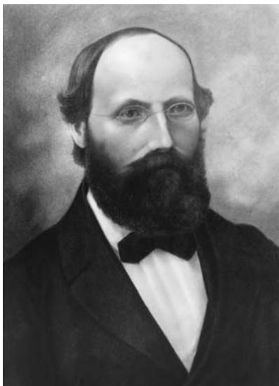

These ideas enabled mathematicians to study complex functions on domains other than the plane and subsets of the plane. They opened the way to a geometric study of algebraic functions and algebraic curves, and proved to be decisive in the study of the integrals of algebraic functions (the theories of Abelian functions and theta functions of several variables). Investigations of the Riemann zeta function led not only to the discovery of new properties of classes of complex functions, but more recently to the use of zeta functions of many other kinds in other branches of mathematics, including dynamics. 

In 1854 Riemann, inspired by his mentor dirichlet [VI.36], formulated the concept of the riemann integral [I.3 §5.5], which permitted him to do profound work on the convergence of trigonometric series. Dirichlet had been able to prove that a real function was correctly represented by a Fourier series, but only under very restrictive conditions. This left open the questions of what sorts of functions did not satisfy these conditions and how could they be studied. Riemann reformulated the concept of the integral and was able to show that it is not just the continuity of a function and the ways in which it may fail to be continuous that affect the accuracy of its Fourier series representation, but the nature of its oscillations. The Riemann integral remained the dominant definition of the integral until it was replaced by the lebesgue integral [III.55] after 1902, which is better adapted to capturing the way the behavior of a function affects its Fourier series. 
In a lecture, also given in 1854 (but published posthumously in 1868), he entirely reformulated geometry as being about spaces (sets of points, which he called manifolds [I.3 §6.9]) with a riemannian metric [I.3 §6.10] (an appropriate concept of distance) and argued that the geometric properties of a space were its intrinsic ones. He noted that there are three constant-curvature spaces in two dimensions and showed how the idea of constant curvature can be extended to higher dimensions. In passing, he was the first person to write down a metric for non-Euclidean geometry (more than a decade before Beltrami’s publication of 1868, which legitimized non-Euclidean geometry). This lecture earned him the right to teach in a German university. 
Riemann also did important work on shock waves, and shares with weierstrass [VI.44] the honor of introducing the methods of complex function theory in the study of minimal surfaces [III.94 §3.1], where he was led to several new solutions of the Plateau problem, which asks for the surface of least area spanning a given curve in space. 
The distinguished complex analyst Lars Ahlfors once described Riemann’s complex analysis as consisting of “almost cryptic messages to the future” and said that his mapping theorem was given in a form that “would defy any attempt at proof, even with modern methods,” and it is true that Riemann’s presentation is more visionary than precise. But his vision described a geometric setting for complex function theory that, as Ahlfors’s own work indicates, remains fertile over 150 years after it was written. 

# Further Reading 
Laugwitz, D. 1999. Bernhard Riemann, 1826–1866. Turning Points in the Conception of Mathematics, translated by A. Shenitzer. Boston, MA/Basel: Birkhäuser. 
Riemann, G. F. B. 1990. Gesammelte Werke, Collected Works, edited by R. Narasimhan, third edn. Berlin: Springer. 
Jeremy Gray 
# VI.50 Julius Wilhelm Richard Dedekind 
b. Brunswick, Germany, 1831; d. Brunswick, Germany, 1916 Algebraic number theory; algebraic curves; set theory; foundations of mathematics 
Dedekind spent most of his life as a professor at the Technische Hochschule in Brunswick, Germany (his and gauss’s [VI.26] home town), having spent the years 1858–62 at the Polytechnikum in Zürich (which later became known as ETH). He obtained his mathematical education at Göttingen, being Gauss’s last Ph.D. student and subsequently a pupil of dirichlet [VI.36] and riemann [VI.49]. Dedekind was a retiring man with, as klein [VI.57] said, a “contemplative nature;” he remained a bachelor, living with his mother and sister. Nevertheless, he had an impact upon a select group of contemporaries (especially cantor [VI.54], frobenius [VI.58], and Heinrich Weber) through his rich correspondence. 
A key figure in the emergence of modern set-theoretic mathematics, and particularly the notion of a mathematical structure, Dedekind is best known for his work on the foundations of the real number system [I.3 §1.4]. His main contribution, however, was in algebraic number theory. Indeed, he shaped modern number theory as we know it, presenting it as a theory of ideals in rings of integers (see algebraic numbers [IV.1 §§4–7]). This was first made public in 1871, within Supplement X to his edition of Dirichlet’s Vorlesungen über Zahlentheorie, where he established unique decomposition of ideals into prime ideals for all rings of algebraic integers. In the process, he formulated the concepts of field, ring, ideal, and module (see [I.3 §2.2] and [III.81]), always within the particular context of the complex numbers. It was also in the context of algebra (Galois theory) and number theory that Dedekind started systematic work with quotient structures, isomorphisms, homomorphisms, and automorphisms. 

In subsequent editions of Dirichlet’s Vorlesungen (1879 and 1894) Dedekind went on refining his presentation of ideal theory, making it more purely settheoretic. In 1882, together with Weber, he offered a theory of ideals in fields of algebraic functions, which made it possible to give a rigorous treatment of Riemann’s results on algebraic curves up to the riemann– roch theorem [V.31]. This work paved the way for modern algebraic geometry. 
Intimately linked with Dedekind’s work in algebra and number theory were his reflections on the foundations of the real number system. In 1858 (published 1872) he formulated a definition of the real numbers using what are now known as “Dedekind cuts” in the set of rational numbers. During the 1870s (published 1888) he elaborated a purely set-theoretic definition of the natural numbers as “simply infinite” sets, which led him to crystallize the dedekind–peano axioms [III.67]. In this work, as in his more advanced research, sets, structures, and mappings form the essential building blocks, the very foundations of pure mathematics. In the light of (now superseded) conceptions of logic, this led Dedekind to the view that “arithmetic (algebra, analysis) is only a part of logic.” From a modern viewpoint, his contributions show that set theory [IV.22] is a sufficient foundation for classical mathematics. Thus he contributed as much as anybody else to the set-theoretic reformulation of modern mathematics. 
# Further Reading 
José Ferreirós 
# VI.51 Émile Léonard Mathieu 
b. Metz, France, 1835; d. Nancy, France, 1890 
Student at the École Polytechnique; Docteur és sciences with 
thesis on transitive functions (1859); Professor of Mathematics: 
Besançon (1869–74), Nancy (1874–90) 
Mathieu is known for the functions that take his name, which he discovered while solving the two-dimensional wave equation for the vibrations of an elliptical membrane. These functions, which are special cases of the hypergeometric function, are particular solutions of Mathieu’s equation: 

$\frac {\mathrm{d} ^ {2} u}{\mathrm{d} z ^ {2}} + (a + 1 6 q \cos 2 z) u = 0,$
where a and q are constants that depend on the physical problem. 
Mathieu is also known for his discovery of the five Mathieu groups. These were the first sporadic simple groups [V.7] (meaning that they did not fit into one of the known infinite families of simple groups) to be found. It is now known that there are twenty-six such groups altogether, although it was almost a century after Mathieu before a sixth one was found. 
# VI.52 Camille Jordan 
b. Lyon, France, 1838; d. Milan, Italy, 1922 
Nominally an engineer until 1885; teacher of mathematics, 
École Polytechnique and Collège de France (1873–1912) 
Jordan was the leading group theorist of his generation. His immense Traité des Substitutions et des Équations Algébriques (1870), which brought together all his earlier results on permutation groups [III.68] and provided a synthesis of galois’s [VI.41] ideas, remained a cornerstone for group theorists for many years. Included in the Traité, in the chapter on what he calls linear substitutions (now written in matrix form as y  Ax), is the definition of what today is called the jordan normal form [III.43] of a matrix, although in 1868 weierstrass [VI.44] had already defined an equivalent normal form. 
Jordan is also known for his work in topology, especially for the theorem now known as the Jordan curve theorem. This states that a simple closed curve in the plane separates the plane into two disjoint regions, an inside and an outside, and it was given by him in his influential Cours d’Analyse (1887). Although the theorem appears obvious, the proof, as Jordan recognized, is difficult and the one he gave was incorrect. (The proof is relatively easy for smooth curves; the difficulties arise when dealing with nowhere-smooth curves, such as the Koch snowflake.) The first rigorous proof was given by Oswald Veblen in 1905. There is a stronger form of the theorem, known as the Jordan–Schönflies theorem, which states that in addition the two regions of the plane, the inside and the outside, are homeomorphic to the standard circle in the plane. Unlike the original theorem, this stronger form of the theorem cannot be generalized to higher dimensions, a famous counterexample being the Alexander horned sphere. 

# VI.53 Sophus Lie 
b. Nordfjordeid (western Norway), 1842; d. Oslo, 1899 
Transformation groups; Lie groups; partial differential equations 
Lie was twenty-six when he discovered that, in his own words, he “harbored a mathematician.” Before then he had primarily wanted to be an observational astronomer. Later in life, looking back on his career, he said that it was the “audacity of his thinking” more than any formal knowledge and education that had given him a position among the foremost of mathematicians. During a career spanning more than thirty years, Lie produced almost eight thousand pages of mathematics, making him one of the most productive mathematicians of his time. 
Lie graduated in general science from the university in Oslo in 1865 but without showing any special aptitude for mathematics. It was not until 1868, when he attended a lecture by the Danish geometer Hieronymus Zeuthen on the work of Chasles, möbius [VI.30], and Plücker, that he became inspired by modern geometry. He studied the works of Poncelet (projective geometry) and Plücker (line geometry), and wrote a dissertation on “imaginary geometry,” that is, geometry based on complex numbers. In the fall of 1869 he traveled to Berlin, Göttingen, and Paris, where he met mathematicians who would remain friends and colleagues for the rest of his life. In Berlin he met klein [VI.57], in Göttingen he met Clebsch, and in Paris, where he was joined by Klein, he met Darboux and jordan [VI.52]. These two had a particular influence on him—Darboux through his theory of surfaces and Jordan through his knowledge of group theory and the work of galois [VI.41]—with the result that he (and Klein) began to recognize the value of group theory for the study of geometry. Lie and Klein published three joint papers on geometrical topics, including one on the so-called Lie line–sphere transformation (the contact transformation, which is a transformation that maps straight lines into spheres and principal tangent curves into curvature lines; and then the study of the geometrical entities that are invariant under such transformations). 
When Klein prepared what was to become his famous “Erlanger Programm” (his characterization of geometry as properties invariant under a group action), Lie was with him. This work later created a deep rift between them. (Friendship turned into aloofness and hostility and culminated in the following statement by Lie in 1893: “I am no pupil of Klein’s, nor is the reverse the case, although this would be nearer to the truth.”) 

Lie returned (after his first trip abroad) to Oslo and, in 1872, a chair of mathematics at the university was created especially for him. During the early 1870s Lie worked on turning his line–sphere transformation into a general theory of contact transformations. From 1873 he worked on a systematic study of continuous transformation groups (today known as lie groups [III.48 §1]), his aim being to classify lie algebras [III.48 §§2, 3] and apply the results to the solution of differential equations. He also published studies on minimal surfaces [III.94 §3.1]. In Norway, however, there was no scientific milieu, and he felt very isolated. In 1884 Klein and his friend Adolf Mayer in Leipzig tried to help him by sending their student Friedrich Engel to study with him and to help him with the formulation and writing of his new ideas. The work that Engel and Lie started together resulted in three volumes, Theorie der Transformationsgruppen (1888–93). In 1886 Lie accepted the professorship in Leipzig (in succession to Klein, who had moved to Göttingen). In Leipzig he became a leading mathematician and a central figure in the European community of mathematicians. Promising new students from both France and the United States were sent to study with him. Besides teaching he continued his research on transformation groups and differential equations, and he solved the so-called Helmholtz space problem (characterizing the geometry of space in terms of groups of transformations). In 1898, the year before he died, Lie returned to Oslo to take up a position created especially for him. 
The theory of transformation groups, which Lie initiated and developed in the study of differential equations, has grown into a field of its own, the theory of Lie groups and Lie algebras, which today permeates large parts of mathematics and mathematical physics. 
# Further Reading 
Arild Stubhaug 
# VI.54 Georg Cantor 
b. Saint Petersburg, Russia, 1845; d. Halle, Germany, 1918 Set theory; transfinite numbers; the continuum hypothesis 
Although born in Russia, Cantor was raised and educated in Prussia and spent his entire career as professor of mathematics at the University of Halle. He studied at the Universities of Berlin and Göttingen with kronecker [VI.48], kummer [VI.40], and weierstrass [VI.44], and received his Ph.D. from the University of Berlin in 1867. His dissertation, “De aequationibus secundi gradus indeterminatis” (“On indeterminate equations of the second grade”), dealt with work in number theory on Diophantine equations, work that had been pioneered by lagrange [VI.22], gauss [VI.26], and legendre [VI.24]. The following year he accepted a position in the mathematics department at the University of Halle, where he spent the rest of his academic career. There, his Habilitationsschrift was again devoted to number theory, and dealt with transformations of ternary quadratic forms. 
It was at Halle that Cantor’s colleague, Eduard Heine, was working on difficult problems involving trigonometric series, and he interested Cantor in the problem of determining the conditions under which a trigonometric series of the form 
$f (x) = \frac {1}{2} a _ {0} + \sum_ {n = 1} ^ {\infty} \left(a _ {n} \sin n x + b _ {n} \cos n x\right)$
uniquely represented a given function. In other words, could it be that two different trigonometric series could represent the same function? Heine had shown, in 1870, that if f (x) is continuous in general (i.e., for all but a finite number of points of discontinuity, at which points Heine added that the function need not necessarily be finite), the representation is unique if we insist that the series is uniformly convergent to f in general. Cantor was able to establish much more general results, and in five papers written between 1870 and 1872 he was able to show that such representations were unique even if an infinite number of exceptional points were allowed, so long as these exceptional points (i.e., points at which the function failed to be continuous) were distributed over the domain of the function’s definition in a particular way, constituting what Cantor called “point sets of the first species.” His studies of these and related point sets eventually led Cantor to his much more abstract and powerful theory of sets and transfinite numbers. 

Point sets of the first species were sets P for which, given its sequence of derived sets (the derived set of a set P is the set of all the limit points of there was some finite n such that the nth derived set of P was finite, and thus the (n  1)st derived set was empty, i.e., . It was Cantor’s subsequent study of infinite linear point sets that would eventually lead to his creation of transfinite set theory in the 1880s. (For more details about this, see set theory [IV.22 §2].) 
Before he did Cantor first began to explore the implications of his work on trigonometric series and the structure of the real numbers in several papers, one of which was to revolutionize mathematics in a fundamental way. The first of these papers was published in 1874, and bore the innocuous title “Über eine Eigenschaft des Inbegriffes aller reellen algebraischen Zahlen” (“On a property of the collection of all real algebraic numbers”). In this paper, Cantor proved that the set of all algebraic real numbers was countably infinite [III.11]. What was revolutionary about the paper, however, was that he also proved that the set of all real numbers was not countable, and must be of a higher order of infinity than the countably infinite set of natural numbers. He returned to this result in 1891 with a new approach, the groundbreaking method of diagonalization, to prove in a very direct way that the set of real numbers is uncountably infinite. Cantor’s second important paper of the decade appeared in 1878, “Ein Beitrag zur Mannigfaltigkeitslehre” (“A contribution to the theory of aggregates”), in which he proved (with a partly faulty argument) the invariance of dimension, a theorem first correctly proved by brouwer [VI.75] in 1911. 
Between 1879 and 1884 Cantor published six papers designed to outline the basic elements of his new thinking about sets. He first considered what happened if a set were not of the first species by introducing symbols for the infinite indices needed to identify such sets. For example, a set P was said to be of the second species if there was no finite n such that the nth derived set of P was finite. He then considered the case in which the intersection of all the derived sets of P (namely was again an infinite set, which he designated . This set, since it was infinite, had a derived set as well, , and this led in fact to an entire sequence of derived sets of the second species: 1, . . . , P ∞+n, . . . , P 2∞, 
In his first papers on infinite linear sets, these indices for derived sets remained “infinitary symbols”: that is, devices for distinguishing between different sets. But in his Grundlagen einer allgemeinen Mannigfaltigkeitslehre (“Foundations of a general set theory”), published in 1883, these symbols became the first transfinite numbers: the transfinite ordinal numbers. These numbers began with the transfinite ordinal number representing the sequence of natural numbers 1, 2, 3, . . . , which could also be thought of as the first infinite ordinal number after all of the finite whole numbers. In the Grundlagen, Cantor not only devised the basic features of a transfinite arithmetic for these numbers, but he provided a detailed philosophical defense of the new numbers. Acknowledging the revolutionary nature of what he was introducing, he argued that the new concepts were necessary in order to achieve precise mathematical results that he could obtain by no other means. 

Cantor’s best-known mathematical creation, however, the transfinite cardinal numbers, which he denoted using the Hebrew letter aleph, were introduced only later, in the 1890s. They were first given full exposition in a pair of papers (1895, 1897) that constituted his “Beiträge zur Begrundung der transfiniten Mengenlehre” (“Contributions to the founding of transfinite set theory”). In two articles published in Mathematische Annalen, he not only set out his theory of transfinite ordinal and cardinal numbers, as well as their arithmetics, but also explained his theory of order types, namely the different properties exhibited by the sets of natural, rational, and real numbers considered in their natural orders. There he also stated (but could not prove) his famous continuum hypothesis [IV.22 §5], namely that the power (or cardinal number) of the continuum of all real numbers R is the next largest infinite set (or cardinal number) after the countably infinite set of natural numbers N, the cardinality of which was taken to be . Cantor expressed the continuum hypothesis algebraically as the statement that . 
By the end of his career Cantor had received honorary degrees from foreign universities and the Copley Medal of the Royal Society for his great contributions to mathematics, but there were problems with set theory that were beyond his capacities to remedy. The most disturbing for many mathematicians were the “antinomies” of set theory: the paradoxes put forward by the likes of Burali-Forti and russell [VI.71]. In 1897 the former published the paradox arising from the collection of all ordinal numbers, the ordinal number of which should be an ordinal number greater than any in the collection of all ordinal numbers. In 1901 the latter discovered the paradox of the class of all classes that are not members of themselves: is it a member of itself or not? (See the crisis in the foundations of mathematics [II.7 §2.1].) Cantor himself was aware of the contradictions that arose from considering the collections of all transfinite ordinal or cardinal numbers, and what their ordinal or cardinal numbers might be. The solution Cantor adopted was to regard such collections as too large, and not really sets at all, but “inconsistent aggregates” as he called them. Others, like Zermelo, began to axiomatize set theory in an effort to exclude the possibility of contradictions. The two most powerful results of the twentieth century to complement Cantor’s work are those of gödel [VI.92] (who established the consistency of the continuum hypothesis with zermelo–fraenkel set theory [IV.22 §3]) and Paul Cohen (who determined the independence of the continuum hypothesis from Zermelo–Fraenkel set theory), the latter finally establishing the impossibility of proving the continuum hypothesis. 

Cantor’s legacy for the history of mathematics has truly been revolutionary. Above all, his transfinite set theory for the first time gave mathematicians the means of dealing with concepts of the infinite in a careful and precise way. 
# Further Reading 
Joseph W. Dauben 
# VI.55 William Kingdon Clifford 
b. Exeter, England, 1845; d. Madeira, Portugal, 1879 
Geometry; complex function theory; popularization of mathematics 
Clifford went up to Trinity College Cambridge in 1863. 
He graduated from there in 1867 as 2nd Wrangler and also came second in the more demanding Smith’s prize examination. In 1868 he became a Fellow of Trinity, leaving in 1871 to become the professor of applied mathematics at University College London. He died of tuberculosis in 1879. 

A versatile mathematician, regarded by many as the best of his generation, Clifford’s favorite field was geometry, over which he ranged widely, proving new results in classical Euclidean geometry as well as in projective and differential geometry. He was the first English mathematician to appreciate the work of riemann [VI.49] on differential geometry, and published a translation of Riemann’s paper “On the hypotheses that lie at the foundations of geometry” in 1873. He endorsed Riemann’s fundamental reformulation of geometry, and went even further in speculating that the curvature of physical space might explain the motion of matter. He also made a significant application of the riemann–roch theorem [V.31], and was among the first to analyze the complicated topological nature of a riemann surface [III.79] by showing how to dissect any Riemann surface into simple pieces in a standard way. He was the first to study a geometry locally equivalent to plane geometry but topologically distinct (the flat torus, also known today as the Clifford–Klein space form after klein’s [VI.57] later more detailed study of it). In algebra, he invented the biquaternions (these are like quaternions, but have complex numbers as coefficients). 
Clifford was regarded as a marvelous lecturer until his health broke, and he was a successful popularizer and essay writer. He forcefully adopted the view that geometry was a matter of experience, not a priori truth. He was a friend of T. H. Huxley and was sympathetic to humanism in philosophy. 
# Further Reading 
Clifford, W. K. 1968. Mathematical Papers, edited by R. Tucker. New York: Chelsea. (First published in 1882.) 
Jeremy Gray 
# VI.56 Gottlob Frege 
b. Wismar, Germany, 1848; d. Bad Kleinen, Germany, 1925 
Logic; foundations of mathematics; paradox 
Frege was a precursor of modern logic, in that many of the hallmarks of contemporary logic appear first in his writing. His work has also been singularly influential outside the foundations of mathematics, especially in the philosophy of language. 

Frege was trained at Jena and Göttingen, receiving a Ph.D. under Ernst Schering in 1873. His Ph.D. thesis addressed the spatial representation of imaginary elements in geometry, and his 1874 Habilitation essay at Jena worked out some basic details of what we would now call “iteration theory.” Though his early work gave no obvious sign of the revolutionary work to come, with hindsight one can discern a foundational motif running through even the apparently conventional mathematics of the early work: a conviction that arithmetic was in some way or other logical, and that geometry was fundamentally different and less general because it was grounded in spatial intuition. This is an especially salient concern in some of his areas of early research, such as Plücker’s line geometry and riemann’s [VI.49] complex analysis, where the role of visual representation was a matter of some dispute. Frege sought to resolve the dispute by deriving arithmetic and analysis rigorously from logical principles. His motivation was not so much a desire for certainty: rather, he held that only “gap-free” proofs can reveal a science’s fundamental principles. 
Among the features of contemporary logic appearing first in Frege’s core logical writings (Begriffsschrift (1879) and Grundgesetze der Arithmetik (volume 1, 1893; volume 2, 1903)) are the following. 
ematicians of the time, including one of Frege’s teachers, Alfred Clebsch, held the concept of function to be too vague to serve as a basic building block.) A sharp distinction is enforced between functions and the things (called objects) that can be arguments of functions. 
(vi) Quantifiers can be iterated, making possible the logical representations of distinctions such as that between uniform and pointwise convergence. 
However, any simple catalogue of novelties understates the crystalline sharpness of Frege’s logical writing when compared with works with similar aims, such as the later Principia Mathematica of Whitehead and russell [VI.71]. It would be several decades before logicians approached Frege’s standards for exactness and clarity. The notation, however, seemed unwieldy to readers at the time (and since). Here, for example, is the statement “if not q, then every v is ( v)F(v)) in Frege’s notation: 
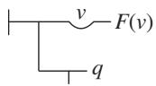
(Here represents negation, v is the universal quantifier, and the long vertical line represents the conditional.) 
Frege also wrote an informal treatise, Grundlagen der Arithmetik (1884), which has had a profound influence on English-language philosophy since its translation in 1950. Its account of number contains the first hint of the tension that would collapse the project from within. Frege sets out conditions that a definition of number must satisfy to be counted as “acceptable.” However, when formalized these lead to a contradiction, of a similar type to Russell’s paradox (on the set of all sets that are not members of themselves). This problem escaped Frege’s notice until Russell alerted him to it in a letter of 1903. Frege’s reaction (“arithmetic totters”) has been taken to be an overreaction to the failure of one set of axioms among many possible ones. But in Frege’s view, the problem was not with the specific axioms, but rather that any logically adequate weakening appeared to violate some principle he took to be grounded in the nature of thought. Recently, many logicians who do not share Frege’s often baroque-seeming metaphysics of concepts have shown that some natural consistent weakenings of Frege’s system do support the derivation of the mathematics Frege aimed to reconstruct. 

The years after 1903 brought personal tragedies in Frege’s life and he ceased serious work for over a decade. Though he resumed writing in 1918 with a series of philosophical articles, his only research in mathematics was a brief jotted effort to found arithmetic on geometry, rather than logic, indicating his conclusion that his logical program had failed. 
# Further Reading 
A particularly detailed recent example of “neo-Fregean” reconstructions of Frege’s foundations of arithmetic appears in John Burgess’s Fixing Frege (Princeton University Press, Princeton, NJ, 2005). Many of the classic papers on the technical details of reconstructing Frege’s philosophy of logic are reprinted in Frege’s Philosophy of Mathematics (Harvard University Press, Harvard, MA, 1995) by William Demopoulos. 
Jamie Tappenden 
# VI.57 Christian Felix Klein 
b. Düsseldorf, Germany, 1849; d. Göttingen, Germany, 1925 Higher geometry; function theory; theory of algebraic equations; pedagogy 
Klein had originally intended to be a physicist but during the course of his studies with Julius Plücker in Bonn, with whom he studied both mathematics and physics, he turned to mathematics, receiving his doctorate for a thesis on line geometry in 1868. After Plücker’s death in 1868 he went to Göttingen to study with Alfred Clebsch, where he worked exclusively on mathematics. In 1869–70 he spent some months in Berlin studying with weierstrass [VI.44] and kummer [VI.40] before joining lie [VI.53] for a trip to Paris to see hermite [VI.47]. After passing his habilitation in Göttingen in 1871, he took positions successively at Erlangen, Munich, and Leipzig, returning to Göttingen in 1886, where he remained until he retired (because of poor health) in 1913. In 1875 he married Anna Hegel, a granddaughter of the philosopher Georg Wilhelm Friedrich Hegel. 
In 1872 Klein published his celebrated “Erlanger Programm,” a creative and unified conception of geometry. Building on a paper of cayley [VI.46] of 1859 in which Cayley had shown how to deduce euclidean geometry [I.3 §6.2] from projective geometry [I.3 §6.7], Klein applied his knowledge of group theory (learned from jordan [VI.52] in Paris) to create a hierarchy of all geometries. He had recognized that each geometry could be characterized by a group of transformations and classified accordingly (see some fundamental mathematical definitions [I.3 §6.1]). The classification showed, as Klein had anticipated, that of all the geometries, projective is the most basic and that the others, e.g., affine, hyperbolic, Euclidean, etc., are subsumed at some level beneath it. Moreover, it was clear from his construction that a contradiction in noneuclidean geometry [II.2 §§6–10] would simultaneously involve a contradiction in Euclidean geometry. 

Klein regarded his work in function theory as his greatest achievement. As his career progressed, he moved more and more from Plücker’s and Clebsch’s strictly geometric viewpoint toward the wider outlook embraced by riemann [VI.49], who had regarded analytic functions as given by conformal mappings between given domains. In his “Riemanns Theorie der algebraischen Funktionen und ihrer Integrale” (1882), Klein gave a geometric treatment of function theory in which he fused Riemann’s ideas with the rigorous power-series methods of Weierstrass. 
In 1882, when he was at the height of his powers, Klein’s health broke down. His attempt to keep up with poincaré [VI.61] in the race to develop the theory of automorphic functions (which are generalizations of periodic functions such as trigonometric functions, elliptic functions [V.31], etc.), during which he had proved his famous Grenzkreis (boundary circle) Theorem, had left him exhausted, and he was never again able to work with such intensity and at such a high level. 
After his breakdown Klein’s interest shifted progressively from research toward pedagogy. In his efforts to modernize mathematical education he developed outstanding organizational skills and initiated important and far-reaching editorial projects ranging from the preparation of lecture notes to coediting the twentyfour-volume Encyklopädie der mathematischen Wissenschaften (1896–1935). He was an editor of the Mathematische Annalen for almost fifty years, and was among the founding members of the Deutsche Mathematiker-Vereinigung (1890). He also played an active role in establishing mathematical applications in science and engineering, as well as promoting the better understanding of mathematics by engineers. 
Among Klein’s other achievements were important results in the theory of algebraic equations (through a consideration of the icosahedron he obtained a complete theory of the general fifth-degree equation (1884)) and in mechanics, in which, jointly with Arnold Sommerfeld, he developed the theory of the gyroscope (1897–1910). He also worked on ideas involving the application of group theory to the theory of relativity, producing papers on the lorentz group [IV.13 §1] (1910) and gravitation (1918). Klein was an international figure who traveled widely, including to the United States and the United Kingdom, and he played a significant role in the first International Congresses of Mathematicians. His many foreign students included several from the United States, e.g., Maxime Bôcher and William Fogg Osgood, and a number of women, notably Grace Chisholm Young and Mary Winston. 

Klein’s achievements made Göttingen the scientific center of Germany and one of the mathematical centers of the world. He possessed an outstanding ability to “see” the truth in mathematical statements and to bring mathematical fields together without feeling the necessity for detailed calculations and justification (which he left to his students and others). He believed strongly in the unity of mathematics. 
# Further Reading 
Rüdiger Thiele 
# VI.58 Ferdinand Georg Frobenius 
b. Berlin, 1849; d. Berlin, 1917 
Analysis; linear algebra; number theory; theory of groups; character theory 
After school in Berlin, Frobenius (who suppressed his first name and wrote mainly as G. Frobenius) spent one semester studying mathematics and physics in Göttingen, then returned to Berlin where he studied under kronecker [VI.48], kummer [VI.40], weierstrass [VI.44], and others. He wrote his doctoral dissertation (in Latin) supervised by Weierstrass, in 1870, on infinite series representations of analytic functions of one variable. For four years he worked as a schoolteacher in Berlin before he became Außerordentlicher Professor (associate professor) at Berlin University. After less than two years, in 1875, he was called to a full professorship at the Eidgenössische Technische Hochschule in Zürich, where he remained until 1892, when he returned to Berlin as successor to kronecker [VI.48]. He retired in 1916, and died one year later. 

His early contributions were to analysis and the theory of differential equations. Later he wrote mainly on theta functions, algebra, and number theory. One of his well-known contributions lies across group theory and number theory. Given a polynomial with coefficients in an algebraic number field, one may ask for the degrees of the irreducible factors that occur when it is reduced modulo a prime ideal. In particular, one may ask for the “density” (suitably defined) of the set of prime ideals modulo which a given pattern of irreducible-factor degrees arises. Pursuing ideas of Kronecker, Frobenius proved that, if the galois group [V.21] is the symmetric group [III.68], then that density is the proportion of elements of the group whose cycle structure is the pattern of degrees. He conjectured that this should be true whatever the Galois group. A tool he used for this led to the name “Frobenius automorphism” for the natural generator of the Galois group of a finite extension of the field . The conjecture was proved by N. G. Chebotaryov in 1925 and is now known as the Chebotaryov density theorem, or, sometimes, the Frobenius–Chebotaryov density theorem. 
Another well-known and important contribution was to the theory of matrices and linear transformations, where Frobenius introduced the minimal polynomial and other invariants (the elementary divisors). 
Frobenius is best known for his work in finite group theory. Like Otto Hölder and william burnside [VI.60], he focused for a time on the search for finite simple groups [V.7]. His greatest contribution, however, is his invention of the theory of group characters [IV.9]. This emerged unexpectedly in 1896 out of his study of group determinants. These are the determinants of square matrices with rows and columns indexed by the members of a finite group G, and with (a, b)-entry , where the are independent variables, one for each element of G. His interest, stimulated by correspondence with dedekind [VI.50], was in how the group determinant factorizes as a polynomial in these variables. This problem led Frobenius to the discovery of certain sets of complex numbers, which he called Gruppencharactere, one for each conjugacy class in the group, that arose as the solutions of sets of linear equations connected with the group. Nowadays they are defined differently: for each complex linear representation of the group G (that is, homomorphism , where is the group of invertible matrices over C), the associated character χ is the map such that for . Frobenius proved the orthogonality relations, recognized the connection of his characters with matrix representations of the group, calculated the character tables of the symmetric groups, the alternating groups, and the Mathieu groups, and used properties of induced characters to prove his famous theorem that a transitive permutation group in which no element other than the identity fixes two or more points has a regular normal subgroup (that is, a subgroup consisting of the identity together with the fixed-point-free elements of the group). To this day no purely group-theoretic proof of this theorem has been found. In recognition of his contribution such groups are now called Frobenius groups. Through character theory and representation theory, as developed by Frobenius for finite groups (and by his pupil, friend, and colleague Issai Schur for classical matrix groups), group theory found important applications in physics and chemistry a generation later. 

# Further Reading 
Begehr, H., ed. 1998. Mathematik in Berlin: Geschichte und Dokumentation, two volumes. Aachen: Shaker. 
Curtis, C. W. 1999. Pioneers of Representation Theory: Frobenius, Burnside, Schur, and Brauer. Providence, RI: American Mathematical Society. 
Serre, J.-P., ed. 1968. F. G. Frobenius: Gesammelte Abhandlungen, three volumes. Berlin: Springer. 
Peter M. Neumann 
# VI.59 Sofya (Sonya) Kovalevskaya 
b. Moscow, 1850; d. Stockholm, 1891 
Partial differential equations; Abelian integrals 
Kovalevskaya showed talent for mathematics at an early age but as a woman in mid-nineteenth-century Russia she was denied access to university. Unable to leave the country unescorted she married and in 1869 traveled to Heidelberg, where she was taught mathematics by Du Bois-Reymond. The following year she moved to Berlin to work with weierstrass [VI.44]. Berlin University was closed to women but Weierstrass agreed to tutor her privately. Under his supervision Kovalevskaya completed dissertations on partial differential equations (PDEs), Abelian integrals, and Saturn’s rings, and in 1874 she became the first woman to receive a doctorate in mathematics. The dissertation on PDEs, which excited particular attention, contained the result now known as the cauchy–kovalevskaya theorem [IV.12 §§2.2, 2.4], an important tool in establishing the existence of analytic solutions of PDEs. 

That same year Kovalevskaya returned to Russia and, unable to find a suitable position, temporarily abandoned mathematics. In 1880, at the invitation of chebyshev [VI.45], she gave a paper on Abelian integrals at a conference in Saint Petersburg. It was enthusiastically received and in 1881 she returned to Berlin. She saw Weierstrass frequently and devoted herself to the study of the propagation of light in a crystalline medium— a subject to which she had been led by studying the work of the French physicist Gabriel Lamé—and to the study of the rotation of a solid body about a fixed point. Later that year she moved to Paris to work with mathematicians there. 
In 1883, championed by Mittag-Leffler, Kovalevskaya was appointed as a Privatdozent at the University of Stockholm. She also became an editor of Acta Mathematica, making her the first woman to join the board of a scientific journal. On behalf of Acta she liaised with mathematicians from Paris, Berlin, and Russia, providing an important link between Russian mathematicians and their western European counterparts. She continued to work on the rotation problem and in 1885 made the breakthrough that, three years later, would win her the prestigious Prix Bordin of the French Academy of Sciences. Prior to her work the problem had been completely solved for only two cases, both symmetrical. In the first, solved by euler [VI.19], the center of gravity of the moving body coincides with the fixed point; and in the second, solved by lagrange [VI.22], the center of gravity and the fixed point lie on the same axis. Kovalevskaya discovered that there was a third case, one that was asymmetrical and more complicated than the other two, which could also be solved completely. (It was later shown that there are no others.) The novelty of her results lay in her application of the recently developed theory of theta functions—the simplest elements from which elliptic functions [V.31] can be constructed—to solve Abelian integrals. 
Kovalevskaya became a full professor of mathematics at the University of Stockholm in 1889, the first woman anywhere to achieve such a position. Shortly afterward, she was nominated by Chebyshev for corresponding membership of the Russian Academy of Sciences, her subsequent election breaking the gender barrier once again. 

# Further Reading 
Cooke, R. 1984. The Mathematics of Sonya Kovalevskaya. New York: Springer. 
Koblitz, A. H. 1983. A Convergence of Lives. Sofia Kovalevskaia: Scientist, Writer, Revolutionary. Boston, MA: Birkhäuser. 
# VI.60 William Burnside 
b. London, 1852; d. West Wickham, England, 1927 
Theory of groups; character theory; representation theory 
Burnside’s mathematical abilities first showed themselves at school. From there he won a place at Cambridge, where he read for the Mathematical Tripos and graduated as 2nd Wrangler in 1875. For ten years he remained in Cambridge as a Fellow of Pembroke College, coaching student rowers and mathematicians. In 1885, having published three very short papers, he was appointed professor at the Royal Naval College, Greenwich. He married in 1886 and the next year, at the age of thirty-five, he embarked on his career as a productive mathematician. He was elected as a Fellow of the Royal Society in 1893 on the basis of his contributions in applied mathematics (statistical mechanics and hydrodynamics), geometry, and the theory of functions. Although he continued to contribute to these areas throughout his working life, and added probability theory to his fields of interest during World War I, he turned to the theory of groups in 1893, and it is for his discoveries in this subject that he is remembered. 
Burnside treated every aspect of the theory of finite groups. He was much concerned with the search for finite simple groups, and made the famous conjecture, finally proved by Walter Feit and John Thompson in 1962, that there are no simple groups of odd composite order (see the classification of finite simple groups [V.7]). He helped to develop character theory, which had been created by frobenius [VI.58] in 1896, into a tool for proving theorems of pure group theory, using it in 1904 to spectacular effect when he proved his so-called -theorem: the theorem that groups whose orders are divisible by at most two different prime numbers are soluble. By asking, in effect, whether a group all of whose elements have finite order and which is generated by finitely many elements must be finite, he launched the huge area of research which for much of the twentieth century was known as the Burnside problem (see geometric and combinatorial group theory [IV.10 §5.1]). 
Although cayley [VI.46] and the Reverend T. P. Kirkman had written about groups before him, he was the only British mathematician to work in group theory until Philip Hall started his mathematical career in 1928. Burnside’s influential book Theory of Groups of Finite Order (1897) was written in the hope of “arousing interest among English mathematicians in a branch of pure mathematics which becomes the more interesting the more it is studied.” Its influence in his own country was minimal, however, until several years after his death. It went to a second edition in 1911 (reprinted 1955), which differs from the first in that it has been substantially revised and, in particular, it includes chapters about the character theory of finite groups and its applications—mathematics which had been much developed by Frobenius, Burnside, and Schur over the fifteen years following the invention of character theory in 1896. 
# Further Reading 
Curtis, C. W. 1999. Pioneers of Representation Theory: Frobenius, Burnside, Schur, and Brauer. Providence, RI: American Mathematical Society. 
Neumann, P. M., A. J. S. Mann, and J. C. Tompson. 2004. The Collected Papers of William Burnside, two volumes. Oxford: Oxford University Press. 
Peter M. Neumann 
# VI.61 Jules Henri Poincaré 
b. Nancy, France, 1854; d. Paris, 1912 
Function theory; geometry; topology; celestial mechanics; mathematical physics; foundations of science 
Educated at the École Polytechnique and the École des Mines in Paris, Poincaré began his teaching career at the University of Caen in 1879. In 1881 he took up an appointment at the University of Paris where, from 1886, he held successive chairs until his death in 1912. He was of a retiring nature and did not attract graduate students, but his lecture courses provided the basis for a number of treatises, mostly in mathematical physics. 
Poincaré came to international prominence in the early 1880s when, fusing ideas from complex function theory, group theory, non-Euclidean geometry, and the theory of ordinary linear differential equations, he identified an important class of automorphic functions. Named Fuchsian functions, in honor of the mathematician Lazarus Fuchs, they are defined on a disk and remain invariant under certain discrete groups of transformations. Soon after, he identified the related but more complicated Kleinian functions, which are automorphic functions without a limit circle. His theory of automorphic functions was the first significant application of non-Euclidean geometry. It led to his discovery of the disk model of the hyperbolic plane and later inspired the uniformization theorem [V.34]. 

Jules Henri Poincaré
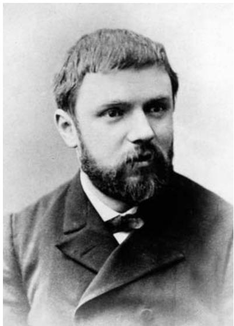

During the same period Poincaré began pioneering work on the qualitative theory of differential equations, motivated in part by an interest in some of the fundamental questions of mechanics, notably the problem of the stability of the solar system. What was new and important was his idea of thinking of the solutions in terms of curves rather than functions, i.e., thinking geometrically rather than algebraically, and it was this that marked a departure from the work of his predecessors, whose research had been dominated by power-series methods. From the mid 1880s he began applying his geometric theory to problems in celestial mechanics. His memoir on the three-body problem [V.33] (1890) is famous both for providing the basis for his acclaimed treatise, Les Méthodes Nouvelles de la Mécanique Céleste (1892–99), and for containing the first mathematical description of chaotic behavior [IV.14 §1.5] in a dynamical system. Stability was also at the heart of his investigation into the forms of rotating fluid masses (1885). This work, which contained the discovery of new, pear-shaped figures of equilibrium, aroused considerable attention because of its important implications for cosmogony in relation to the evolution of binary stars and other celestial bodies. 

Poincaré’s work on Fuchsian functions and on the qualitative theory of differential equations led him to recognize the importance of the topology (or, as it was then called, analysis situs) of manifolds [I.3 §6.9]. And in the 1890s he began to study the topology of manifolds as a subject in its own right, effectively creating the powerful independent field of algebraic topology [IV.6]. In a series of memoirs published between 1892 and 1904, the last of which contains the hypothesis known today as the poincaré conjecture [IV.7 §2.4], he introduced a number of new ideas and concepts, including Betti numbers, the fundamental group [IV.6 §2], homology [IV.6 §4], and torsion. 
A deep interest in physical problems lay behind Poincaré’s achievements in mathematical physics. His work in potential theory forms a bridge between that of Carl Neumann on boundary-value problems and that of fredholm [VI.66] on integral equations. He introduced a technique known as the “méthode de balayage” (“sweeping-out method”) for establishing the existence of solutions to the dirichlet problem [IV.12 §1] (1890); and he had the idea that the Dirichlet problem itself should give rise to a sequence of eigenvalues and eigenfunctions [I.3 §4.3] (1898). In developing the theory for functions of several variables he was led to the discovery of new results in complex function theory. In Électricité et Optique (1890, revised 1901), which derived from his university lectures, he gave an authoritative account of the electromagnetic theories of Maxwell, Helmholtz, and Hertz. In 1905 he responded to Lorentz’s new theory of the electron, coming close to anticipating Einstein’s theory of special relativity [IV.13 §1], thereby provoking controversy among later writers about the question of priority. And in 1911 he attended the first Solvay Conference on quantum theory, publishing an influential memoir (1912) in its favor. 
As Poincaré’s career developed, so too did his interest in the philosophy of mathematics and science. His ideas became widely known through four books of essays: La Science et l’Hypothèse (1902), La Valeur de la Science (1905), Science et Méthode (1908), and Dernières Pensées (1913). As a philosopher of geometry he was a proponent of the view, known as conventionalism, that it is not an objective question which model of geometry best fits physical space but is rather a matter of which model we find most convenient. By contrast, his position on arithmetic was intuitionist. On the question of foundational issues, he was largely critical. Although sympathetic to the goals of set theory, he attacked what he perceived as its counterintuitive results. (See the crisis in the foundations of mathematics [II.7 §2.2] for further discussion.) 

Poincaré’s visionary geometric style led him to new and brilliant ideas, which frequently connected different branches of mathematics, but lack of detail often made his work hard to follow. At times his approach was censured for imprecision; it was in marked contrast to that of hilbert [VI.63], his German counterpart, whose work was rooted in algebra and rigor. 
# Further Reading 
Barrow-Green, J. E. 1997. Poincaré and the Three Body Problem. Providence, RI: American Mathematical Society. Poincaré, J. H. 1915–56. Collected Works: Œuvres de Henri Poincaré, eleven volumes. Paris: Gauthier Villars. 
# VI.62 Giuseppe Peano 
b. Spinetta, Italy, 1858; d. Turin, 1932 
Analysis; mathematical logic; foundations of mathematics 
Known above all for his (and dedekind’s [VI.50]) axiom system for the natural numbers, Peano made important contributions to analysis, logic, and the axiomatization of mathematics. He was born in Spinetta (Piedmont, Italy) as the son of a peasant, and from 1876 studied at the University of Turin, taking his doctoral degree in 1880. He remained there until his death in 1932, becoming full professor in 1895. 
During the 1880s Peano worked in analysis, achieving what are generally considered to be his most important results. Particularly noteworthy are the continuous space-filling Peano curve (1890), the notion of content (a precedent of measure theory [III.55]) developed independently by jordan [VI.52], and his theorems on the existence of solutions for differential equations of the first order (1886, 1890). The textbook he published in 1884, Calcolo Differentiale e Principii di Calcolo Integrale, partly based on lectures by his teacher Angelo Genocchi, was noteworthy for its rigor and critical style, and is counted among the very best nineteenth-century treatises. 
The years 1889–1908 saw Peano dedicating himself intensively to symbolic logic, axiomatization, and producing the encyclopedic Formulaire de Mathématiques (1895–1908, five volumes). This ambitious assembly of mathematical results, compactly presented in the symbols of mathematical logic, was given completely without proofs. This was by no means standard at the time, but it shows what Peano expected from logic: it was supposed to bring precision of language and brevity, but not a greater level of rigor (something that was, by contrast, crucial for frege [VI.56]). In 1891, together with some colleagues, he founded the journal Rivista di Matematica, gathering around him an important group of followers. 

Peano was an accessible man, and the way he mingled with students was regarded as “scandalous” in Turin. He was a socialist in politics, and a tolerant universalist in all matters of life and culture. In the late 1890s Peano became increasingly interested in elaborating a universal spoken language, “Latino sine flexione”; the last edition of the Formulario (1905–8) appeared in this language. 
Peano followed closely the work of German mathematicians such as Hermann Grassmann, Ernst Schrö- der, and Richard Dedekind; for example, the 1884 textbook defined the real numbers by Dedekind cuts, and in 1888 he published Calcolo Geometrico Secondo l’Ausdehnungslehre di H. Grassmann. In 1889 there appeared (notably in Latin) a first version of the famous peano axioms [III.67] for the set of natural numbers, which he refined in volume 2 of the Formulaire (1898). It aimed at filling the most significant gap in the foundations of mathematics at a time when the arithmetization of analysis had essentially been completed. It is no coincidence that other mathematicians (Frege, Charles S. Peirce, and Dedekind) published similar work in the same decade. Peano’s attempt is better rounded than Peirce’s, but simpler and framed in more familiar terms than those of Frege and Dedekind; because of this, it has been more popular. 
Peano’s work on the natural numbers was at the crossroads of his diverse mathematical contributions, linking naturally his previous research in analysis with his later work on logical foundations, and being a necessary prerequisite for the Formulaire project. Actually, Arithmetices Principia can be regarded as a simplification, refinement, and translation into logical language (the “nova methodo” in its title) of Grassmann’s Lehrbuch der Arithmetik (1861). Grassmann had striven to elaborate a stern deductive structure, stressing proofs by mathematical induction and recursive definitions. But curiously, unlike Peano, he did not postulate an axiom of induction; thus, Peano presented the basic assumptions much more clearly, bringing induction to center stage as the key defining property of the natural numbers. 

# Further Reading 
Borga, M., P. Freguglia, and D. Palladino. 1985. I Contributi Fondazionali della Scuola di Peano. Milan: Franco Angeli. Ferreirós, J. 2005. Richard Dedekind (1888) and Giuseppe Peano (1889), booklets on the foundations of arithmetic. In Landmark Writings in Western Mathematics 1640– 1940, edited by I. Grattan-Guinness, pp. 613–26. Amsterdam: Elsevier. Peano, G. 1973. Selected Works of Giuseppe Peano, with a biographical sketch and bibliography by H. C. Kennedy. Toronto: University of Toronto Press. 
José Ferreirós 
# VI.63 David Hilbert 
b. Königsberg, Germany, 1862; d. Göttingen, Germany, 1943 Invariant theory; number theory; geometry; International Congress of Mathematicians; axiomatics 
hermann weyl [VI.80] described his teacher Hilbert’s style: “It is as if you were on a swift walk through a sunny open landscape; you look freely around, demarcation lines and connecting roads are pointed out to you, before you must brace yourself to climb the hill; then the path goes straight up. . . .” Several themes balance in Hilbert’s career as a mathematician. He wanted clarity, rigor, simplicity, and depth. Though he loved mathematics for its beauty, a beauty that transcends human failures, Hilbert saw mathematics as a social collaboration. A turning point came when he met minkowski [VI.64] and Adolf Hurwitz at university in Königsberg. 
Hilbert wrote: “On unending walks we engrossed ourselves in the actual problems of the mathematics of the time; exchanged our newly acquired understandings, our thoughts and scientific plans; and formed a friendship for life.” Later Hilbert became professor at Göttingen and, with klein [VI.57], drew mathematicians from all over the world and turned that small city into a crossroads for mathematics—until Hitler destroyed it. 
When he was a new Privatdozent, Hilbert decided he would study mathematics as he taught, and he resolved never to repeat lectures. He and Hurwitz decided to embark on a “systematic exploration” of mathematics, and he followed this pattern for the rest of his life. Hilbert’s career divides easily into six periods: (i) algebra and algebraic invariants (1885–93); (ii) algebraic number theory (1893–98); (iii) geometry (1898–1902); (iv) analysis (1902–12); (v) mathematical physics (1910– 22); and (vi) foundations (1918–30). Remarkably, there is very little overlap. When Hilbert finished a subject, he was finished with it. 
David Hilbert
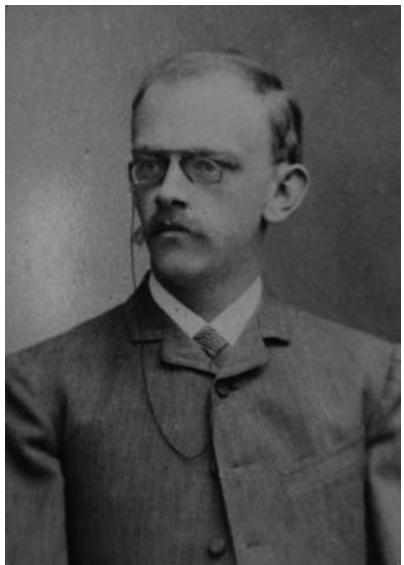

Hilbert’s first breakthrough came in 1888 when he solved Gordan’s problem, named after Paul Gordan, in a single bold move. Given a polynomial equation with at least two variables, some things about the polynomial change and some do not when you change coordinate systems. For example, consider the real polynomial equation 
$a x ^ {2} + b x y + c y ^ {2} + d = 0.$
If you rotate the coordinate system, then this equation changes dramatically, but the graph does not, and neither does the discriminant b2  4ac. The discriminant is one invariant. In the general case—a more complicated class of polynomials and coordinate changes— there can be many invariants. Mathematicians suspected that a finite number of essentially different invariants existed for any given type of polynomial and class of coordinate changes. Was this so? Many mathematicians calculated individual examples industriously. Instead, Hilbert reasoned indirectly: what if there is no finite basis for a specific class of polynomials and transformations? He found that it was always possible to produce a contradiction. He concluded that there must be such a basis. At first this result was greeted with disbelief because he did not display a basis. Gordan said, “Das ist nicht Mathematik. Das ist 

Theologie.” However, the result was so powerful that it has been said that it killed algebraic invariant theory. 
In 1893 Hilbert and Minkowski were asked by the German Mathematical Society to write a report on number theory. Hilbert chose algebraic number theory [IV.1] and transformed the results of the nineteenth century into the study of algebraic number fields [III.63]. The deep organizing structure Hilbert found eventually led to what has been called “the magnificent edifice of class field theory” (described in [V.28]). 
Hilbert’s classic Foundations of Geometry, first published in 1899 and revised many times, starts with realnumber arithmetic. He assumes that it is consistent, i.e., that it is free of the possibility of contradictory deductions. Using analytic geometry, he then exhibits a model of euclidean geometry [II.2 §3]. A point is a pair of real numbers; a line is a set of pairs of numbers that satisfy the equation for a line; a circle. . . ; and so on. All of Euclid’s axioms are true statements about these “lines” and “points,” that is, they are true statements about these sets of real numbers. Euclidean geometry is thereby reduced to a fraction of all the true statements about real numbers, and we conclude that if realnumber arithmetic is consistent then Euclid’s geometry is consistent. Next Hilbert constructs models of various non-Euclidean geometries in terms of Euclidean geometry, exploring in depth and with great inventiveness which possible axioms follow from which groups of axioms and which are independent yet consistent. 
Hilbert was invited to address the Second International Congress of Mathematicians in Paris in 1900. He gave a talk proposing twenty-three problems for the new century. These problems are known today as “Hilbert’s problems”; in a sense they have created a virtual Göttingen where mathematicians have entered into conversation with Hilbert and each other ever since. 
Next Hilbert turned to analysis. weierstrass [VI.44] had found counterexamples to Dirichlet’s principle, which is essentially the assertion that, in variational problems, maxima and minima are always attained. Hilbert proved a modified, but still powerful, version that “salvaged” much of the work that assumed the principle. The larger theme of this period, though, was integral equations and what is now called hilbert space [III.37]. Newton’s equations for motion are differential equations, and it was natural to phrase equations in physics that way. However, in many cases it was easier to solve problems if the equations were written using integrals rather than derivatives. Between 1902 and 1912 Hilbert attacked a variety of problems from this direction. He viewed the solutions as part of Hilbert space and gave a spectral interpretation analogous to an infinite-dimensional vector space. Thus, an amorphous sea of functions acquired geometric structure. 

In 1910 he turned toward mathematical physics and had some successes, but physics was undergoing multiple revolutions and was not ready for mathematical clarification. 
When he delivered his problems in 1900, Hilbert was aware that there were contradictions in mathematics as it was then phrased, and specifically in set theory. His second problem asked for a proof that first arithmetic, and then set theory, were consistent. As the debate widened, some mathematicians began to pull back on what they accepted as valid reasoning. Hilbert wanted none of this. By 1918 he was increasingly focused on a program to formally axiomatize mathematics and prove it free of contradictions using proof-theoretic, combinatorial methods. gödel [VI.92] proved his incompleteness theorems in 1930 and thereby showed that Hilbert’s program, at least as initially conceived, could never be successful. Hilbert was wrong here, but even if wrong, his dream of placing mathematics on a formal foundation stimulated some of the most important work of the twentieth century—and mathematics did not pull back. 
# Further Reading 
Reid, C. 1986. Hilbert–Courant. New York: Springer. 
Weyl, H. 1944. David Hilbert and his mathematical work. Bulletin of the American Mathematical Society 50:612–54. 
Benjamin H. Yandell 
# VI.64 Hermann Minkowski 
b. Alexotas, Russia (present day Kaunas, Lithuania), 1864; d. Göttingen, Germany, 1909 
Number theory; geometry; relativity theory 
In 1883, the Paris Academy of Sciences awarded its prestigious Grand Prix for mathematical science to the eighteen-year-old student Hermann Minkowski. The prize problem was to give the number of representations of an integer as a sum of five squares of integers. In a manuscript of 140 pages written in German, Minkowski developed a general theory of quadratic forms [III.73] that contains the solution to this problem as a special case. Two years later, Minkowski obtained his Ph.D. in Königsberg, and in 1887 he received his habilitation in Bonn with further work on quadratic forms in n variables. 

While a student in Königsberg, Minkowski became a close friend of Adolf Hurwitz and hilbert [VI.63]. In 1894, after Hurwitz had moved to Zürich, Minkowski returned from Bonn to his alma mater, and soon became Hilbert’s successor after Hilbert left for Göttingen. In 1896, Minkowski moved on to Zurich to become Hurwitz’s colleague. In 1902, Hilbert negotiated for another chair of mathematics to be created for Minkowski in Göttingen. There he worked as Hilbert’s colleague and closest friend until he died, unexpectedly, of a ruptured appendix in early 1909. 
Minkowski’s later work is characterized by an ingenious use of geometric intuition for the solution of number-theoretic problems. His starting point was a theorem of hermite [VI.47] on the smallest positive real that can be represented by a given positive-definite quadratic form of n integer-valued nonzero variables. By interpreting the quadratic forms in terms of geometric objects such as ellipses (for n = 2) or ellipsoids (for n = 3), and considering the integer values of the variables as the coordinates of the points of a regular lattice, Minkowski was able to employ the notion of volume to arrive at nontrivial numbertheoretic results. His investigations were published in 1896 in a book entitled The Geometry of Numbers. Realizing that the geometric arguments based on ellipsoids used only the property of convexity, Minkowski further generalized his theory by introducing a general concept of convex point sets. A convex body, according to Minkowski, is one in which the straight line connecting any two interior points lies completely within the set. This notion allowed Minkowski to investigate a geometry in which the Euclidean axiom about the congruence of triangles is replaced by the weaker axiom that the sum of two sides of a triangle is always larger than the third one (which we would nowadays call the triangle inequality, the key notion in metric spaces). Theorems about this Minkowskian geometry also produced immediate nontrivial number-theoretic results. Further results were obtained in the theory of continued fractions [III.22]. In 1907, Minkowski published introductory lectures on number theory under the title Diophantine Approximations. 
Minkowski always had a deep interest in physics. In 1906, he wrote the article on capillarity for the authoritative Encyclopedia of the Mathematical Sciences (edited by klein [VI.57] and others). In Göttingen, Hilbert and Minkowski gave joint seminars in which they studied contemporary work in electrodynamics by poincaré [VI.61], Einstein, and others. Minkowski soon realized the significance of the fact that the special theory of relativity was a consequence of the invariance of the Maxwell equations under the group of Lorentz transformations (see general relativity and the einstein equations [IV.13 §1]). He reinterpreted Maxwell–Lorentz electrodynamics geometrically in a mathematical formulation in which no formal distinction between the space and time coordinates exists. This is expressed in the famous opening words of his address to the Cologne meeting of the Society of German Scientists and Physicians a few weeks before his death: “From this hour on, space by itself and time by itself are to sink fully into shadows and only a kind of union of the two should yet preserve autonomy.” Minkowski’s four-dimensional Lorentz-covariant formulation of special relativity was a prerequisite for Einstein’s later general theory of relativity. 

# Further Reading 
Tilman Sauer 
# VI.65 Jacques Hadamard 
b. Versailles, France, 1865; d. Paris, 1963 
Function theory; calculus of variations; number theory; 
partial differential equations; hydrodynamics 
A graduate of the École Normale in Paris, Hadamard obtained a position at the University of Bordeaux in 1893. He returned to Paris in 1897 where he taught at the Collège de France, the École Polytechnique, and the École Centrale until his retirement in 1937. The Hadamard Seminar at the Collège de France, where mathematicians came from around the world to expound on recent results, was an influential and integral part of mathematical life in France between the wars. 
Hadamard’s first significant papers were concerned with the theory of holomorphic functions [I.3 §5.6] of a complex variable, in particular with the analytic continuation of a Taylor series; and in his thesis of 1892 he investigated how the properties of the singularities of a series could be deduced from those of its coefficients. Notably he showed that the radius of convergence R of a Taylor series could be given by , a result now known as the Cauchy–Hadamard theorem. (cauchy [VI.29] had published the formula in 1821 but Hadamard, who had discovered it independently, was the first to give a complete proof.) Further results followed, including the famous “Hadamard gap theorem,” which gives the condition for the circle of convergence of the series to be a natural boundary of the function. His monograph La Série de Taylor et son Prolongement Analytique (1901) proved especially influential. In 1912 he formulated the problem of quasi-analyticity for infinitely differentiable functions. 

The year 1892 also saw the appearance of Hadamard’s prize-winning memoir on entire functions, in which he used results from his thesis to establish the relations between the coefficients of the Taylor series of an entire function and its zeros, and then applied them to evaluate the genus of the entire function. He applied this work, and other results from his thesis, to the riemann zeta function [IV.2 §3], which enabled him, in 1896, to prove his most famous result: the prime number theorem [V.26]. (The theorem was proved simultaneously by de la vallée poussin [VI.67] but in a more complicated way.) 
Hadamard’s other key achievements of the 1890s include a well-known inequality concerning determinants [III.15] (1893), a result essential in the fredholm theory [IV.15 §1] of integral equations; and his “three-circles theorem” (1896), which demonstrates the importance of convexity in the study of analytic functions and plays a significant role in interpolation theory. 
In 1896 Hadamard won the Prix Bordin for his study of the behavior of geodesics on surfaces. (The motivation for studying such geodesics is that they can be used to represent the trajectories of motion in dynamical systems.) It was Hadamard’s first major work on a subject other than analysis. His two papers, one on geodesics on a surface of positive curvature (1897) and the other on geodesics on a surface of negative curvature (1898), are characterized by a qualitative analysis inherited from poincaré [VI.61]. The first relies on results from classical differential geometry, while the second is dominated by topological considerations. 
Prompted by an interest in the calculus of variations [III.94], Hadamard developed the ideas of Volterra’s functional calculus. In 1903 he was the first to describe linear functionals on a function space. By considering the space of continuous functions on a given interval, he showed that every functional is the limit of a sequence of intervals, a result now recognized as a precursor to the riesz representation theorem [III.18] formulated by riesz [VI.74] in 1909. Hadamard’s influential Leçons sur le Calcul de Variations (1910) is the first book in which the ideas of modern functional analysis can be found. 

In applied mathematics Hadamard was primarily concerned with wave propagation, in particular highspeed flows. In 1900 he began working on the theory of partial differential equations, and in 1903 published Leçons sur la Propagation des Ondes et les Équations de l’Hydrodynamique; this was followed by Lectures on Cauchy’s Problem in Linear Partial Differential Equations (1922). The latter contained the details of his fundamental idea of the well-posed problem [IV.12 §2.4] (i.e., a problem in which the solution must not only exist and be unique but must also depend continuously on the initial data). The origins of the idea can be found in his 1898 paper on geodesics [I.3 §6.10]. 
Hadamard’s book The Psychology of Invention in the Mathematical Field (1945) is well-known for its discussion of the unconscious and its role in mathematical discovery. 
# Further Reading 
Hadamard, J. 1968. Collected Works: Œuvres de Jacques Hadamard, four volumes. Paris: CNRS. 
Maz’ya, V., and T. Shaposhnikova. 1998. Jacques Hadamard. A Universal Mathematician. Providence, RI: American Mathematical Society/London Mathematical Society. 
# VI.66 Ivar Fredholm 
b. Stockholm, 1866; d. Stockholm, 1927 
Professor of Mechanics and Mathematical Physics, Stockholm (1906–27) 
In papers of 1900 and 1903 Fredholm solved the integral equations named after him, 
$\varphi (x) + \int_ {a} ^ {b} K (x, y) \varphi (y) d y = \psi (x),$
with a continuous “kernel” K and unknown ϕ(x), by analogy with infinite systems of linear equations and generalized determinants. Both the solution and several ideas attached to it (“Fredholm alternatives”) made this work an important stimulus for hilbert’s [VI.63] theory of integral equations (1904–6) and thus a starting point for functional analysis. (For more about this, see operator algebras [IV.15 §1].) The equations arise in the context of problems of mathematical physics, e.g., in potential theory and in the theory of oscillations. Fredholm considered himself primarily a mathematical physicist, and his colleague Mittag-Leffler tried in vain to have him awarded the Nobel Prize for physics. 

# VI.67 Charles-Jean de la Vallée Poussin 
b. Louvain, Belgium, 1866; d. Brussels, 1962 
Analytic number theory; analysis 
De la Vallée Poussin graduated in engineering (1890) and mathematics (1891) from the Université Catholique de Louvain, where he went on to teach mathematical analysis from 1891 until 1951. His lectures formed the basis for his renowned Cours d’Analyse Infinitésimale, which ran to many editions from 1903 to 1959. A member of the most famous academies in Europe and the United States, with honorary doctorates from Paris, Strasbourg, Toronto, and Oslo, he was the first president (1920) of the International Union of Mathematicians (now the International Mathematical Union). He was made a baron in 1930. 
De la Vallée Poussin’s main achievement was his proof in 1896 of the prime number theorem [V.26] (an asymptotic estimate for the distribution of prime numbers in the integers), first conjectured by gauss [VI.26] in around 1793. (The theorem was also proved independently by hadamard [VI.65] in the same year, also using complex function theory.) Shortly afterward, de la Vallée Poussin followed his proof with a sharper error term (1899), which he extended to prime numbers in an arithmetic progression. 
When lebesgue [VI.72] first published his integral [III.55] in 1902, de la Vallée Poussin immediately grasped its importance and, using an original approach, described it in the second edition of his Cours d’Analyse (1908). In addition, he introduced the concept of the characteristic function of a set (1915), and shortly afterward gave a decomposition theorem for the measure generated by a continuous function of bounded variation (1916). 
Of particular importance for approximation theory and the summation of series is de la Vallée Poussin’s convolution integral (1908), for approximating periodic functions by trigonometric polynomials. His other significant results in this field include a lower bound for the error in the best approximation of a continuous function by a polynomial (1910), and a convergence test and a summation method for Fourier series (1918). 

In 1911 de la Vallée Poussin was responsible for suggesting the Belgian Academy prize question that led to Jackson’s and Bernstein’s theorems on the order of the best approximation of a continuous function by polynomials. His existence and uniqueness theorem for the Chebyshev problem for an overdetermined system of linear equations (1911) was an important step in linear programming [III.84]; his interpolation formula (1908) was fundamental for sampling theory; and his characterization of new classes of quasi-analytic functions by the rate of decrease of their Fourier coefficients (1915) was a notable development. 
De la Vallée Poussin’s other achievements include determining a uniqueness condition for multipoint boundary-value problems (1929), which was a significant result for the study of nonoscillatory solutions of linear differential equations; and solving various problems of the conformal representation of multiply connected regions (1930–31). In potential theory he extended the concept of capacity to arbitrary bounded sets, proved his extraction theorem for bounded sequences of set functions, and, by introducing measure theory into poincaré’s [VI.61] “méthode de balayage” (“sweeping-out method”) for the dirichlet problem [IV.12 §1], he paved the way for modern abstract potential theory. 
# Further Reading 
Butzer, P., J. Mawhin, and P. Vetro, eds. 2000–4. Charles-Jean de la Vallée Poussin. Collected Works—Oeuvres Scientifiques, four volumes. Bruxelles/Palermo: Académie Royale de Belgique/Circolo Matematico di Palermo. 
Jean Mawhin 
# VI.68 Felix Hausdorff 
b. Breslau, Germany (now Wrocław, Poland), 1868; 
d. Bonn, Germany, 1942 
Set theory; topology 
Hausdorff studied mathematics at Leipzig, Freiburg, and Berlin between 1887 and 1891, and then started research in applied mathematics at Leipzig under Heinrich Bruns. After his habilitation (1895) he taught first at Leipzig and then later at Bonn (1910–13, 1921–35) and Greifswald (1913–21). He is best known for his work in set theory and general topology, his magnum opus being Grundzüge der Mengenlehre (“Basic features of set theory”). It was published in 1914 and had second and third editions in 1927 and 1935. The second edition was so heavily revised in content, however, that it should really be considered a new book. 

In his early work, Hausdorff concentrated on applied mathematics, mainly related to astronomy, in particular the refraction and extinction of light in the atmosphere. He had broad intellectual interests and moved in Nietzschean circles of artists and poets at Leipzig. Under the pseudonym Paul Mongré he wrote two long philosophical essays of which the more prominent was “Das Chaos in kosmischer Auslese” (“The chaos in cosmic selection”). Until 1904 he regularly contributed cultural critical essays to a renowned German intellectual review of the time, continuing to contribute, although less frequently, until 1912. He also published poems and a satirical play. 
Hausdorff took up set theory at the turn of the century and gave his first lecture course on the topic in the summer semester of 1901 at Leipzig university. After his turn toward “Cantorianism” (set theory) he began deep and innovative research on order structures and their classification. Among the results of his early work in set theory are the Hausdorff recursion formula for exponentiation of cardinals and several contributions to the study of order structures (cofinality, etc.). Although Hausdorff did not pursue active research in the axiomatic foundation of set theory, he contributed important insights on transfinite numbers, in particular a characterization of what are now known as weakly inaccessible cardinals and his maximal chain principle, a form of zorn’s lemma [III.1] that predated the latter and differed from it in formulation and intention. 
His own contribution to the axiomatic method was oriented toward generalizing classical areas of mathematics and founding them on axiomatic principles within the framework of set theory. Hausdorff’s move to use set theory inside mathematics was seminal for the turn toward modern mathematics in the sense of the twentieth century, most prominently characterized by the bourbaki [VI.96] group. Best known in this respect are his axiomatization of general topology in terms of axioms for neighborhood systems, first published in the Grundzüge (1914), and the study of the properties of general, or more specialized, topological spaces [III.90]. Less well-known (it remained unpublished until recently) was Hausdorff’s axiomatization of probability theory, which was presented in a lecture course of 1923 and which preceded kolmogorov’s [VI.88] work in this area by about a decade. He also made important contributions to analysis and algebra. In algebra, he contributed to lie theory [III.48] (via what is now called the Baker–Campbell–Hausdorff formula), while in analysis he developed summation methods for divergent series and also a generalization of the Riesz–Fischer theory. 

Hausdorff’s central goals in using set theory were for applications to analytical disciplines such as function theory. Among his most important contributions in this respect, and of wide-ranging importance, was the concept of hausdorff dimension [III.17], which he introduced to give a notion of dimension to rather general sets (such as, for example, fractal-type sets). 
Hausdorff realized that analytical questions of set theory were deeply connected to foundational questions. In 1916 he (and, independently, P. Alexandroff) showed that any uncountable borel set [III.55] in the reals actually has the cardinality of the continuum. This was an important development of a strategy proposed by Cantor to clarify the continuum. Although this strategy did not finally contribute to the decisive results by Gödel and Cohen on the continuum hypothesis [IV.22 §5], it led to the development of an extended field of investigation in the border region between set theory and analysis, now dealt with in descriptive set theory [IV.22 §9]. Hausdorff’s second edition of the Mengenlehre (1927) was the first monograph in this field. 
After the rise to power of the Nazi regime, working conditions and life in general deteriorated more and more drastically for Hausdorff and others of Jewish origin. When Hausdorff, his wife Charlotte, and a sister of hers were ordered to leave their house for local internment in January 1942, they opted for suicide rather than suffering further persecution. 
# Further Reading 
Erhard Scholz 

# VI.69 Élie Joseph Cartan 
b. Dolomieu, France, 1869; d. Paris, 1951 
Lie algebras; differential geometry; differential equations 
Cartan was one of the leading mathematicians of his generation, particularly influential for his work on geometry and the theory of lie algebras [III.48 §§2, 3]. In the bleak years after World War I he was one of the most prominent mathematicians in France. He eventually became a notable influence on the bourbaki [VI.96] group, of which his son Henri, another distinguished mathematician, was one of the seven founder members. Cartan held lecturing positions in Montpellier and Lyon before becoming a professor in Nancy in 1903. He went on to gain a lecturing position at the Sorbonne in 1909, becoming a professor in 1912 and remaining there until his retirement. 
In his doctoral thesis of 1894 Cartan classified the simple Lie algebras over the field of complex numbers, refining and correcting earlier work of Wilhelm Killing and emphasizing the deep general abstract structures inherent in the theory. In later years he returned to these ideas and drew out their implications for the study of the corresponding lie groups [III.48 §1]— these groups have a major bearing on symmetry considerations in physics. 
Cartan spent much of his life working on geometry. In the 1870s and the 1890s klein [VI.57] had analyzed geometry and shown how the major branches (Euclidean, non-Euclidean, projective, and affine) could be unified and treated as special cases of projective geometry. Cartan became interested in the extent to which the group-theoretic ideas that had animated Klein could be adapted to the setting of differential geometry, and especially to spaces of variable curvature [III.78]—the mathematical setting for einstein’s general theory of relativity [IV.13]. In that subject the observations of different observers are related by coordinate transformations, and changes in the gravitational field are expressed through changes in the metric, and hence curvature, of the underlying spacetime manifold. In the 1920s Cartan broadened the setting to what are today called fiber bundles [IV.6 §5], and showed that Klein’s approach could be carried through by concentrating on the possible types of coordinate transformation and the Lie groups to which they can belong. 
There are many problems in which one has a multitude of possible observations at each point of a space: for example, the weather at each point of Earth’s surface. In Cartan’s formulation, Earth’s surface is taken as the base manifold [I.3 §6.9] and the possible observations at each point form another manifold, called the fiber at the point. The pair consisting of all fibers and all points of the base manifold is, roughly, a fiber bundle; the precise concept has proved to be fundamental across the whole field of modern differential geometry. It was to prove a natural setting for the study of what are called connections on a manifold, which deal with the way objects, such as vectors, are transformed as they move along curves in the manifold. Cartan’s fundamental idea was to capture the symmetry of a geometrical problem by allowing fibers to have a common symmetry group, although aspects of the geometry of the base manifold, such as its curvature, were allowed to vary from point to point in such a way that the base manifold admits no symmetries at all. 

Cartan also applied his geometric approach to the study of differential equations, which had earlier been a motivating concern for lie [VI.53] in the creation of the theory of Lie algebras. He did important work on systems of equations, and this led him to emphasize the role of what are called exterior forms. Familiar examples include the 1-form [III.16] that represents the element of length along a curve, the 2-form that represents the element of area of a surface, and so on. The main thing one does to a 1-form is integrate it; integrating the 1-form that describes arc-length gives length along a curve. Cartan studied systems of equations involving arbitrary 1-forms and was led to discover ways in which the algebra of 1-forms, and more generally the algebra of k-forms for arbitrary k, captures features of the geometry of the manifold on which they are defined. This led him to reformulate a method of studying the geometry of curves and surfaces that had been pursued by Gaston Darboux, the leading French geometer of the previous generation, and to proclaim his method of “moving frames” that again related to the study of fiber bundles and symmetries in differential geometry. This work, together with his work on fiber bundles, remains a major source of ideas for the study of differentiable manifolds to this day. 
# Further Reading 
Jeremy Gray 

# VI.70 Emile Borel 
b. Saint-Affrique, France, 1871; d. Paris, 1956 
Professor of Mathematics: University of Lille (1893–96), 
École Normale, Paris (1896–1909); Chair of Theory of Functions 
(specially created for him), Sorbonne, Paris (1909–41); 
first director of the Institut Poincaré (1926) 
Borel’s thesis of 1894 started with problems from within the classical theory of complex functions. With a new theory of measure [III.55] based on cantor’s [VI.54] set theory and, in particular, a “covering theorem” (later misnamed the Heine–Borel theorem), he gave a rationale for neglecting certain infinite sets of singularities. He assigned them “measure zero” and thus extended the domain of regularity of the functions considered. Borel’s theory of measure, based on operations with infinitely many sets, became widely known through his influential Leçons sur la Théorie des Fonctions (1898) and was later completed and developed into a major tool of analysis by lebesgue [VI.72]. It was, in addition, an important prerequisite for the axiomatization of probability by kolmogorov [VI.88]. 
# VI.71 Bertrand Arthur William Russell 
b. Trelleck, Wales, 1872; d. Plas Penrhyn, Wales, 1970 
Mathematical logic and set theory; philosophy of mathematics 
Russell’s training at Cambridge University in the early 1890s inspired the part of his long and varied life that relates to mathematics. He divided his Tripos into Part 1 (Mathematics) and Part 2 (Philosophy), and then united these two trainings to seek a general philosophy of mathematics, especially its epistemological foundations, with geometry as the first test case (1897). But over the next few years he changed his philosophical stance, especially when he recognized the significance of cantor’s [VI.54] set theory from 1896 onward, and also discovered in 1900 a group of mathematicians around peano [VI.62] in Turin. Wishing to raise the level of axiomatization and rigor in mathematics, the followers of Peano formalized theories as much as possible, including the “mathematical logic” of propositions and predicates with set theory, but they kept mathematical and logical notions separate. After learning their system and adding to it a logic of relations, Russell decided in 1901 that their distinction of notions was not necessary: all notions lay in that logic. This is the philosophical position that has become known as “logicism,” and Russell wrote a largely nonsymbolic account of it in The Principles of Mathematics (1903). In an appendix to this book he publicized the work of frege [VI.56], who had anticipated logicism (but advocated it only for arithmetic and some analysis); Russell read him in detail after forming his own position, which continued to be influenced more by Peano. 

Now the job was to expound logicism in Peanesque detail—a daunting task, made even harder by Russell’s discovery in 1901 that set theory was susceptible to paradoxes, which would have to be avoided or even solved. He was joined in the effort by his former Cambridge tutor, A. N. Whitehead; eventually three volumes of Principia Mathematica appeared between 1910 and 1913. After the basic logic and set theory, the arithmetic of real numbers and also the arithmetic of transfinite numbers were worked out in detail; a fourth volume on geometry was due to be written by Whitehead, but he abandoned it around 1920. 
The paradoxes were solved by a “theory of types,” which formed a hierarchy of individuals, sets of individuals, sets of sets of individuals, and so on. A set or individual could only be a member of a set immediately above it in the hierarchy; thus, a set could not belong to itself. Comparable restrictions were laid on relations and predicates. While this avoided the paradoxes, it also ruled out a great deal of good mathematics, since different kinds of numbers lay in different types and so could not be brought together for arithmetic operations: for example, 34 + 718 was not even definable. The authors proposed the “axiom of reducibility” to allow such definitions to be made; but this was, frankly, just a fudge. 
Among the various features of Russell’s theory was a form of the axiom of choice [III.1], called the “multiplicative axiom,” that he had found in 1904, just before Ernst Zermelo. It had a curious role within logicism, partly because its logicist status was suspect. 
While there was discussion of Principia Mathematica, concerning both its logic and its logicism, it tended to be too mathematical for the philosophers and too philosophical for the mathematicians. However, the program influenced some kinds of philosophy, including Russell’s own; and as an example of high-level axiomatization it served as a model for foundational studies, including gödel’s incompleteness theorems [V.15] of 1931, which showed that logicism as Russell had conceived it could not be achieved. 

# Further Reading 
Grattan-Guinness, I. 2000. The Search for Mathematical Roots. Princeton, NJ: Princeton University Press. Russell, B. 1983–. Collected Papers, thirty volumes. London: Routledge. 
Ivor Grattan-Guinness
# VI.72 Henri Lebesgue 
b. Beauvais, France, 1875; d. Paris, 1941 
Theory of the integral; measure; applications in Fourier analysis; dimension in topology; calculus of variations 
Lebesgue studied at the École Normale in Paris (1894– 97), where he was influenced by the slightly older borel [VI.70] and René-Louis Baire. As a teacher at Nancy he completed his seminal thesis “Intégrale, longueure, aire” (1902). After university positions in Rennes, Poitiers, and at the Sorbonne in Paris, and following war-related research, Lebesgue became a professor at the Sorbonne (1919) and then, finally, at the Collège de France (1921). One year later he was elected to the French Academy of Sciences. 
Lebesgue’s most important achievement was his generalization of riemann’s [VI.49] notion of an integral. This was partly in response to the need to include broader classes of real-valued functions, and partly to give secure foundations to concepts such as the interchangeability of limit and integral in infinite series (particularly Fourier series). Alluding to a famous example (1881) by Vito Volterra of a bounded derivative that could not be integrated, Lebesgue wrote in his thesis: 
The kind of integration defined by Riemann does not allow in all cases for the solution of the fundamental problem of the calculus: find a function with a given derivative. It thus seems natural to search for a definition of the integral which makes integration the inverse operation of differentiation in as large a class of functions as possible. 
Lebesgue defined his integral by partitioning the range of a function and summing up sets of x-coordinates (or arguments) belonging to given y-coordinates (or ordinates), rather than, as had traditionally been done, partitioning the domain. Lebesgue himself, according to his colleague, Paul Montel, compared his method with paying off a debt: 
I have to pay a certain sum, which I have collected in my pocket. I take the bills and coins out of my pocket and give them to the creditor in the order I find them until I have reached the total sum. This is the Riemann integral. But I can proceed differently. After I have taken 
out all my money I order the bills and coins according to identical values and then I pay the several heaps one after another to the creditor. This is my integral. 
The comparison reveals the more theoretical character of Lebesgue’s integral, as compared with the more intuitive and natural summation used by Riemann. This meant that more sophisticated functions, which were not necessarily integrable in Riemann’s sense, became “summable” according to Lebesgue. 
In order to perform his summations, Lebesgue had to base his new integral on Borel’s notion of measure [III.55] (1898), which in turn drew heavily on cantor’s [VI.54] theory of infinite sets. He used infinitely many intervals to cover and to measure sets, and was thus able to measure much less intuitive subsets of the linear continuum (the reals) than had hitherto been considered. A crucial role was played by the notion of “the set of measure zero” and the consideration of properties that were valid “except for” such sets, i.e., “almost everywhere.” This allowed for the theory to be streamlined to include fundamental results such as: “A bounded function is Riemann integrable if and only if the set of its points of discontinuity has measure zero.” 
Lebesgue completed Borel’s theory of measure, making it a true generalization of jordan’s [VI.52] earlier theory. From Jordan he also borrowed the important notion of a function of bounded variation for his theory of the integral. Lebesgue ascribed a measure to any subset of a “set of measure zero,” and opened up broader theoretical questions such as whether there exist any sets that are not Lebesgue-measurable. The latter question was proved in the affirmative by the Italian Giuseppe Vitali in 1905 with the help of the axiom of choice [III.1], while Robert Solovay showed in 1970, with methods of mathematical logic, that without the axiom of choice such existence cannot be proved (see set theory [IV.22 §5.2]). Lebesgue himself remained skeptical about an unlimited use of set-theoretical principles such as the axiom of choice. He held a restrictive view of the “existence” of mathematical objects by making “definability” the touchstone for his empiricist philosophy of mathematics. 
Lebesgue’s integral—the idea of which was paralleled, although not in such depth, in the work of the English mathematician W. H. Young—served as a sophisticated stimulus to developments in harmonic and functional analysis (e.g., the Lp spaces of riesz [VI.74] (1909)). Generalizations to functions defined on n-dimensional space, proposed by Lebesgue himself (1910), contributed to even more general theories of integrals, e.g., the theory of Radon (1913). 

Although it took several decades for the importance of Lebesgue’s integral to become widely recognized, its significance for applications, especially in the analysis of discontinuous and statistical phenomena of nature and in probability theory, could not be ignored in the long run. 
# Further Reading 
Hawkins, T. 1970. Lebesgue’s Theory of Integration: Its Origins and Development. Madison, WI: University of Wisconsin Press. 
Lebesgue, H. 1972–73. Œuvres Scientifiques en Cinq Volumes. Geneva: Université de Genève. 
Reinhard Siegmund-Schultze 
# VI.73 Godfrey Harold Hardy 
b. Cranleigh, England, 1877; d. Cambridge, 1947 
Number theory; analysis 
G. H. Hardy was the most influential mathematician in Britain in the twentieth century. With the exception of the years from 1919 to 1931, when he was the Savilian professor of geometry in Oxford, he spent his adult life in Cambridge, where from 1931 until his retirement in 1942 he was the Sadleirian professor of pure mathematics. He became a Fellow of the Royal Society in 1910 and was awarded a Royal Medal in 1920 and the Sylvester Medal in 1940. He died on the day the Royal Society’s highest honor, the Copley Medal, was to be presented to him. 
At the beginning of the twentieth century, the standard of mathematical analysis was rather low in Britain; Hardy did much to remedy this situation, not only through his research, but also by publishing A Course of Pure Mathematics in 1908. This book, which he wrote as “a missionary talking to cannibals,” had a tremendous influence on several generations of mathematicians in the United Kingdom. Unfortunately, Hardy’s love of pure mathematics, and analysis in particular, somewhat stifled the growth of applied mathematics and algebraic subjects for several decades. 
In 1911 he began a long collaboration with littlewood [VI.79], with whom he wrote almost one hundred papers: this partnership is generally considered to have been the most fruitful in the history of mathematics. They worked on convergence and summability of series, inequalities, additive number theory [V.27] (including Waring’s problem and Goldbach’s conjecture), and Diophantine approximation. 

Hardy was one of the first to do important work on the riemann hypothesis [IV.2 §3] when, in 1914, he proved that the zeta function ζ(s) ζ(σ it) has infinitely many zeros on the critical line (see littlewood [VI.79]). Later, with Littlewood, he proved deep extensions of this result. 
From 1914 to 1919 he collaborated with the largely self-taught Indian genius, srinivasa ramanujan [VI.82]. They wrote five papers, the most famous of which is about p(n), the number of partitions of n. This is a rapidly growing function: but 
$p (2 0 0) = 3 9 7 2 9 9 9 0 2 9 3 8 8.$
The generating function [IV.18 §§2.4, 3] of p(n), that is, 
$f (z) = 1 + \sum_ {n = 1} ^ {\infty} p (n) z ^ {n},$

$p (n) = \frac {1}{2 \pi \mathrm{i}} \int_ {\Gamma} \frac {f (z)}{z ^ {n + 1}} \mathrm{d} z,$
where Γ is a circle about the origin of radius just less than 1. In 1918, Hardy and Ramanujan not only gave a rapidly convergent asymptotic formula for p(n) but also showed that, for n large enough, p(n) could be calculated exactly by taking the integer nearest to the sum of the first few terms. In particular, p(200) can be computed from the first five terms. 
Hardy and Ramanujan proved their asymptotic formula for p(n) with the aid of the “circle method”; later, Hardy and Littlewood developed this method into one of the most powerful tools in analytic number theory. In order to estimate contour integrals like the one above, Hardy and Littlewood found it advisable to break up the circle of integration in a subtle way. 
Another Hardy–Ramanujan result concerns the number ω(n) of distinct prime divisors of a “typical” number n. They proved that a “typical” number n has about log log n distinct prime factors in a certain precise sense. In 1940 Erd˝os and Kac sharpened and extended this result by showing that additive number-theoretic functions like ω(n) obey the gaussian law [III.71 §5] of errors: this gave birth to the important field of probabilistic number theory. 
Hardy’s name has been attached to several concepts and results, including Hardy spaces, Hardy’s inequality, and the hardy–littlewood maximal theorem [IV.11 §3]. For the Hardy space Hp consists of functions analytic in the unit disk that are bounded in various ways; in particular, consists of bounded analytic functions. Hardy and Littlewood deduced fundamental properties of from their maximal theorem, which relates a function to its “radial limits” at the boundary of the disk. The theory of spaces has found numerous applications not only in analysis, but also in probability theory and control theory. 

Hardy and Littlewood loved inequalities of all kinds; their book on the subject with George Pólya, an instant classic the moment it was published in 1934, greatly influenced the development of hard analysis. 
Although Hardy was fiercely proud of the purity of his mathematics, in a paper published in 1908 he formulated the extension of the Mendelian law about the proportions of dominant and recessive characters. This law, which later became known as the Hardy–Weinberg law, refuted the idea “that a dominant character should show a tendency to spread over a whole population, or that a recessive should tend to die out.” In a later article he dealt a severe blow to eugenics by giving a simple mathematical argument that showed the futility of forbidding people with “undesirable” characteristics to breed. 
In his interest in mathematical philosophy, Hardy was a disciple of russell [VI.71], whose political views he also shared. He was a secretary of the committee which forced the abolition of the order of merit in the Mathematical Tripos through a reluctant Senate in 1910, and many years later he fought hard for the abolition (not reform!) of the Mathematical Tripos itself, which he considered to be harmful to mathematics in the United Kingdom. After World War I, Hardy led the British efforts to heal the wounds of the international mathematical community, and with the advent of the Nazi persecutions on the Continent in the early 1930s, he was an important figure in an extensive network finding jobs for refugee mathematicians in the United States, Britain, and the Commonwealth. He was a great supporter of the London Mathematical Society: he was not only one of the secretaries for close to twenty years, but also its president for two terms. 
Hardy was a militant atheist; as an affectation, he liked to talk of God as his personal enemy. He was a great conversationalist, and was fond of various intellectual games, like putting together cricket teams of bores, bogus poets, Fellows of a Cambridge college, and so on. He loved ball games, especially cricket, baseball, bowls (with the curved woods of his college), and real tennis (as opposed to lawn tennis); to praise people, he frequently likened them to outstanding cricketers. 

He had an exceptional gift for collaboration and launching young mathematicians on their research careers. He was a master not only of mathematics, but also of English prose; he was lively and charming, and left a lasting impression even on his casual acquaintances. His poetic book A Mathematician’s Apology, written toward the end of his life, gives a rare insight into the world of a mathematician. 
# Further Reading 
Béla Bollobás 
# VI.74 Frigyes (Frédéric) Riesz 
b. Györ, Hungary, 1880; d. Budapest, 1956 
Functional analysis; set theory; measure theory 
After being educated at Budapest University and elsewhere in Europe, Riesz was appointed in 1911 to the University of Kolozsvár (Hungary), which moved in 1920 to become Szeged University; he served twice as Rector. He returned to Budapest in 1946. Most of Riesz’s research work lay in mathematical analysis enriched with techniques from set and measure theory, and functional analysis. 
One of Riesz’s famous results was the converse of a generalization of Parseval’s theorem for fourier series [III.27]: given a sequence of orthonormal functions on a finite interval, and a sequence of real numbers, there exists a function that can be expanded as a Fourier-type series with respect to those functions with the ar as coefficients if and only if is convergent; further, f is itself square summable. He proved the theorem in 1907, simultaneously with the German mathematician Ernst Fischer; so it is named after both of them. 
Two years later Riesz found the “representation theorem” named after him. It states that a continuous linear functional that maps continuous functions F over a finite interval I onto the real numbers can be represented as a Stieltjes integral of F over I with respect to a function of bounded variation. It was to be a fertile source of applications and generalizations. 

Riesz found these two theorems partly in connection with his study of integral equations, a topic then being developed by hilbert [VI.63], and partly in connection with his study of functional analysis as formulated by Maurice Fréchet. Hilbert’s work had led him to consider infinite matrices, which were then little studied: Riesz wrote the first monograph on them, Les Systèmes d’Équations Linéaires à une Infinité d’Inconnues (1913). He also studied the theory of spaces for (that is, spaces of functions f such that is measureintegrable over some specified interval) and their dual spaces where and he worked on applying his and Fischer’s theorem to the self-dual space, now known as hilbert space [III.37], that is given by . Later he laid some of the foundations of complete spaces (later known as banach spaces [III.62]), and applied functional analysis to ergodic theory. He summed up much of his work in these areas in the book Leçons d’Analyse Fonctionnelle (1952), written with his student B. Szökefnalvy-Nagy. 
All this work constituted important contributions to theories already laid out in principle by various other mathematicians. Riesz achieved groundbreaking work on subharmonic functions: he modified the dirichlet problem [IV.12 §1] by allowing the function that extends a given function into a domain to be subharmonic (“locally less than harmonic”) instead of harmonic. He studied some of the applications of these functions to potential theory. 
Riesz also studied some foundational aspects of set theory, especially types of ordering, continuity, and generalized Heine–Borel covering theorems. He also reformulated the lebesgue integral [III.55] in a constructive manner, using step functions and sets of measure zero as primitive notions, and avoiding measure theory [III.55] as much as possible. 
# Further Reading 
Riesz, F. 1960. Oeuvres Complètes, edited by Á. Császár, two volumes. Budapest: Akademiai Kiado. 
Ivor Grattan-Guinness
# VI.75 Luitzen Egbertus Jan Brouwer 
b. Overschie, the Netherlands, 1881; 
d. Blaricum, the Netherlands, 1966 
Lie groups; topology; geometry; intuitionistic mathematics; 
philosophy of mathematics 
Brouwer entered the University of Amsterdam at the age of sixteen, where his teacher was D. J. Korteweg. The young Brouwer taught himself modern mathematics, as well as a fair amount of philosophy. As a graduate student he published some original papers on the decomposition of rotations in four-dimensional space. He also published a brief monograph on mysticism that contained a number of ideas that became prominent in his later philosophy. In his dissertation of 1907 he solved a special case of hilbert’s [VI.63] fifth problem (the elimination of differentiability conditions from the axioms of lie groups [III.48 §1]), and he presented his first program for “constructive mathematics.” 

The basis of his mathematics was the ur-intuition of mathematics: the continuum and the natural numbers are simultaneously created from intuition. Mathematical objects (including proofs) are mental creations. After sketching the development of the basic parts of mathematics, Brouwer went on to criticize contemporary mathematics for transcending the bounds of the human mind. In particular, he criticized cantor [VI.54] for introducing sets beyond human recognition, and Hilbert for the axiomatic method and for formalism. He criticized the latter’s consistency program and denied that “consistency implies existence.” 
In his 1908 paper “The unreliability of the logical principles,” Brouwer explicitly rejected the principle of the excluded middle as unreliable (and also rejected Hilbert’s dogma that “all mathematical problems can be solved in one way or another”). Between 1909 and 1913 Brouwer worked in topology. He continued his work on Lie groups, and noted that topology (in the style of Cantor–Schoenflies) was in need of a sound basis. In his paper “Zur Analysis Situs” (1910), he spelled out a number of notions and examples (curves, indecomposable continua, three domains with one common boundary). This was the beginning of his revision of set-theoretic topology. At the same time he started two lines of research: one on homeomorphisms from surfaces to themselves, establishing fixed point theorems [V.11] on the sphere and the plane translation theorem (a characterization of homeomorphisms of the Euclidean plane that have no fixed points); and one on vector distributions on the sphere, yielding existence theorems for singular points, and a characterization of these points. The best-known theorem in this area is Brouwer’s “hairy ball theorem” (no matter how one combs a hairy ball, there is always a crown). In 1910 Brouwer published a direct topological proof of the Jordan curve theorem, which remains one of the most elegant proofs. The so-called new topology opened with Brouwer’s “invariance of dimension” theorem (1910). 

He then laid the basis for topology of manifolds [I.3 §6.9], where his basic tool was the Brouwer degree of continuous mappings. The basic paper is his “Über Abbildungen von Mannigfaltigkeiten” (“On mappings of manifolds,” 1911), which contained most of the tools for the new topology, e.g., simplicial approximation, mapping degree, homotopy [IV.6 §§2, 3], singularity index (in his own terminology), and also the fundamental properties of the new notions. 
Brouwer’s new topological insights and techniques led him to a wealth of spectacular results: the Brouwer fixed point theorem, the invariance-of-domain theorem, the higher-dimensional Jordan theorem, and the definition of dimension, including the soundness proof (that Rn has dimension n). He also applied his invariance-of-domain theorem to the theory of automorphic functions and uniformization, thus proving the correctness of the Klein–Poincaré continuity method (1912). 
During World War I Brouwer returned to the foundations of mathematics; he conceived his mature intuitionistic mathematics [II.7 §3.1], which fully exploited the potential of constructive mathematics, based on mentally created objects and notions. The key notions were (infinite) choice sequences (i.e., sequences determined by more or less free choices (by the mathematician) of mathematical objects, say natural numbers), well-orderings, and intuitionistic logic. In “Brouwer’s universe” strong results can be obtained: the “continuity principle,” for example, which says that a function that assigns natural numbers to choice sequences is continuous (i.e., the output is determined by a finite piece of the (infinite) input); and certain transfinite induction principles, in particular the novel principle of “bar-induction.” With the help of these principles he showed that (i) all real functions on a closed segment are uniformly continuous and (ii) the continuum is indecomposable (cannot be split). This enabled him to refute the principle of the excluded middle in a strong sense: it is not the case that each real number is zero or nonzero. In Brouwer’s universe many classical theorems, such as the intermediate value theorem and the Bolzano–Weierstrass theorem, fail. 
Brouwer’s mathematical universe lacked the logical “principle of the excluded middle,” but instead it had certain strong constructive principles at its disposal, which turned it into an alternative to the traditional universe, with a comparable strength. 
His foundational program brought him into conflict with Hilbert (“intuitionism versus formalism”). In 1928 matters came to a head and, in an incident famously described by Einstein as “the war of frogs and mice,” Hilbert succeeded in getting Brouwer removed (after fourteen years’ service) from the editorial board of Mathematische Annalen. 

Brouwer was unconventional and had wide-ranging interests: art, literature, politics, philosophy, mysticism. He was a staunch internationalist. 
He was a professor at the University of Amsterdam from 1912 until 1951. 
# Further Reading 
Brouwer, L. E. J. 1975–76. Collected Works, two volumes. Amsterdam: North-Holland. 
van Dalen, D. 1999–2005. Mystic, Geometer and Intuitionist. The Life of L. E. J. Brouwer, two volumes. Oxford: Oxford University Press. Divl 
Dirk van Dalen 
# VI.76 Emmy Noether 
b. Erlangen, Germany, 1882; d. Bryn Mawr, Pennsylvania, 1935 Algebra; mathematical physics; topology 
Noether began her career with a feat of classical algebra, which she transmuted into the noether conservation theorems [IV.12 §4.1] for physics. She became a founder of modern abstract algebra and the leader in spreading that algebra all across mathematics. 
Her father Max Noether and family friend Paul Gordan were Erlangen mathematicians and favored educating women. Gordan made heroic calculations of invariants in algebra. A quadratic polynomial Ax2 Bx C has essentially just one invariant, the discriminant √ B2  4AC used in the quadratic formula. As Gordan’s student, Noether found 331 independent invariants of degree-four polynomials in three variables, and proved that all others depend on them. It was impressive, though not, as it turned out, groundbreaking. 
hilbert [VI.63] brought her to Göttingen in 1915 to work on invariants for differential equations in general relativity by reducing them to algebra. That year she found her conservation theorems, which show that the conserved quantities of a physical system correspond to its symmetries. For example, if a system has laws unchanging with time, so that a time shift is a symmetry of the system, then energy is conserved in the system (Feynman 1965, chapter 4). These theorems became fundamental in Newtonian physics and especially quantum mechanics. They also showed that general relativity admits conservation laws only in special cases. 
Noether saw the creation of general abstract algebra as her life’s work. Instead of classical algebra with real numbers, or complex numbers, and polynomials using them, she would study any system satisfying abstract rules such as the ring axioms [III.81] or the group axioms [I.3 §2.1]. Concrete examples include the ring of all algebraic functions defined on a space (such as a sphere), and the group of all symmetries of a given space. She largely created the now-standard style of abstract algebra. Her ideas were also adopted in algebraic geometry [IV.4] where every abstract ring appears as the ring of functions on a corresponding space called a scheme [IV.5 §3]. 

She turned her attention away from operations on elements of a system, like plus and times, and focused instead on relating whole systems to each other, such as rings related by ring homomorphisms [I.3 §4.1] from R to . She organized all algebra around her homomorphism and isomorphism theorems. Her aim was to show how ideals [III.81 §2] and their corresponding homomorphisms could replace equations between elements as the basic tools for stating and proving theorems. (This approach was to come to fruition in the 1950s, with the advent of Grothendieckstyle homological algebra.) 
Topologists studied topological spaces [III.90] by looking at continuous functions from one space to another. Noether saw how her algebraic methods could apply here, and convinced young topologists in the 1920s to use them in algebraic topology. Each topological space S has homology groups [IV.6 §4] with the property that continuous functions from S to induce group homomorphisms from to . Theorems of topology follow by abstract algebra. This relationship between homomorphisms and continuous functions is what inspired category theory [III.8]. 
In the 1930s Noether pursued the algebra of galois theory [V.21] through a radically simplified abstract theory of groups acting on rings. The applications are quite arcane, beginning with class field theory [V.28] and eventually growing into group cohomology and many other algebraic and topological methods used in arithmetic geometry [IV.5]. 
Exiled from Germany by the Nazis in 1933, she died following surgery in the United States, at the height of her creative power. 
# Further Reading 
Colin McLarty 
# VI.77 Wacław Sierpi´nski 
b. Warsaw, 1882; d. Warsaw, 1969 
Number theory; set theory; real functions; topology 
Sierpi´nski studied mathematics at the Russian university in Warsaw under the guidance of Georgii Voronoi. In his first paper (1906), he improved gauss’s [VI.26] estimate for the difference between the number of lattice points inside the circle and the area of the circle, showing that it is . 
He became an associate professor at the University of Lwów in 1910, at which point his interest shifted to set theory, on which he wrote a textbook in 1912, only the fifth book ever to be published on the subject. His first important results on set theory were obtained during World War I, which he spent in Russia: in 1915– 16 he constructed two curves that were among the first published examples of fractals, one known now as Sierpi´nski’s gasket and the other as Sierpi´nski’s carpet. The latter is the set of all points in the square such that, when written out as base 3 decimals, there is no position in which both x and have a 1. It is also known as Sierpi´nski’s universal curve, since it contains a homeomorphic image of every planar continuum (a continuum is a compact connected set) without interior points. 
In 1917, Souslin had shown that projections of borel sets [III.55] (from the plane into the line, say) need not be Borel. Together with Lusin, Sierpi´nski proved in 1918 that in fact every analytic set (a projection of a Borel set) is the intersection of Borel sets (where is the smallest uncountable cardinal). That same year he also published an important study of the axiom of choice [III.1] and the role it plays in set theory and analysis, and proved that no continuum can be decomposed into countably many pairwise disjoint nonempty closed subsets. 
In 1919 Sierpi´nski was made a full professor at the new Polish University of Warsaw and in 1920 he founded (together with Janiszewski and Mazurkiewicz) the first specialized mathematical journal, Fundamenta Mathematicae, which was devoted to set theory, topology, and applications. He remained its editor until 1951. Among his results published in volume 1 are a proof that every countable subset of without isolated points is homeomorphic to the rationals; a complete classification of countable compact subsets of , obtained jointly with Mazurkiewicz; and a necessary and sufficient condition for a subset of to be a continuous image of an interval. 

Using the continuum hypothesis [IV.22 §5] , he constructed an uncountable set [III.11] of reals, now known as a Sierpi´nski set, such that every uncountable subset of it is nonmeasurable (1924); and also a one-to-one mapping of the line into itself that maps sets of measure zero [III.55] to sets of first category, in such a way that every set of the first category is obtained (1934). The former result is highly paradoxical (there is no explicit example of a nonmeasurable set); the latter has led, thanks to Erd˝os, to the following duality principle. Let P be any proposition involving solely the notions of measure zero, first category, and pure set theory. Let be the proposition obtained from P by interchanging the terms “set of measure zero” and “set of first category.” Then P and are equivalent, assuming the continuum hypothesis. 
Sierpi´nski wrote a monograph devoted to the continuum hypothesis in 1934, entitled Hypothèse du Continu. Together with tarski [VI.87] he introduced the notion of strongly inaccessible cardinals [IV.22 §6] (1930), meaning cardinals that cannot be obtained mas products of fewer than  cardinals less than . He m malso worked in Ramsey theory, giving a limitation on infinite extensions to Ramsey’s theorem. To be precise, Ramsey had proved that, whenever one finitely colors the pairs from the natural numbers, there is an infinite monochromatic subset (i.e., a subset all of whose pairs have the same color); Sierpi´nski showed that, by contrast, one can 2-color the pairs from a ground set of size in such a way that there is no monochromatic subset of size . He also deduced the axiom of choice from the generalized continuum hypothesis (formulated without cardinals in 1947). 
In his old age he returned to number theory and became the editor of Acta Arithmetica (1958–69). 
# Further Reading 
Sierpi´nski, W. 1974–76. Oeuvres Choisies. Warsaw: Polish Scientific. 
Andrzej Schinzel 
# VI.78 George Birkhoff 
b. Oversiel, Michigan, 1884; d. Cambridge, Massachusetts, 1944 Difference equations; differential equations; dynamical systems; ergodic theory; relativity theory 
At the International Congress of Mathematicians in 1924 the Russian mathematician A. N. Krylov described Birkhoff as “the poincaré [VI.61] of America.” It was an apt description and one that Birkhoff would have relished, for he was deeply influenced by Poincaré’s work, in particular his great treatise on celestial mechanics. 

Birkhoff studied first at Chicago under E. H. Moore and Oskar Bolza, and then at Harvard under W. F. Osgood and Maxime Bôcher. Returning to Chicago, he was awarded his doctorate in 1907 for a thesis on asymptotic expansions, boundary-value problems, and Sturm–Liouville theory. In 1909, after two years at Wisconsin under E. B. Van Vleck, he went to Princeton, where he formed a close association with Oswald Veblen. In 1912 he moved to Harvard and remained there, in professorial positions, until his sudden death in 1944. Birkhoff was steadfast in his support for the development of American mathematics, supervising forty-five doctoral students, including Marston Morse and Marshall Stone, and holding many distinguished positions within the scientific community. He was generally recognized, both at home and abroad, as the leading American mathematician of his generation. 
Birkhoff first came to prominence with a memoir on the theory of linear difference equations (1911), and he continued to publish on the topic intermittently throughout his career. Related to this work were several papers on the theory of linear differential equations and a paper on the generalized Riemann problem (1913), which concerns complex functions defined by differential equations. (Until recently it was believed that the latter paper included a solution to Hilbert’s twenty-first problem, the Hilbert–Riemann problem, but in 1989 Bolibruch proved this belief to be mistaken.) 
Throughout his life Birkhoff’s deepest interest in analysis lay in dynamical systems [IV.14] and it was here that he enjoyed his greatest success. His overarching aim was to obtain a reduction of the most general dynamical system to a normal form from which a complete qualitative characterization could be deduced. As with Poincaré, the study of periodic motions was central to his work, and he wrote extensively on the three-body problem [V.33] as well as on questions connected with stability. Of his memoir on dynamical systems with two degrees of freedom (1917), which won the Bôcher prize in 1923, he is said to have remarked that it was as good a piece of work as he was ever likely to do. Another celebrated achievement was his proof of Poincaré’s topological “last geometric theorem,” the publication of which brought him immediate international acclaim (1913). (The theorem states that any one-to-one area-preserving transformation of an annulus that moves the boundary circles in opposite directions must have at least two fixed points, and its importance lies in the fact that its proof implies the existence of periodic orbits in the restricted threebody problem.) He introduced several new concepts into dynamical theory, including “recurrent motion” (1912) and “metric transitivity” (1928), and promoted the use of symbolism in dynamics (1935), the latter helping to pave the way for the formalized development of symbolic dynamics (the branch of dynamical systems invented by hadamard [VI.65] (1898) that deals with spaces consisting of infinite sequences of symbols) by Marston Morse and Gustav Hedlund at the end of the 1930s. His book Dynamical Systems (1927) was the first book on the qualitative theory of systems defined by differential equations. Awash with topological ideas, it provides a connected account of much of his earlier research. 

Closely related to Birkhoff’s dynamical research was his work on ergodic theory [V.9]. Stimulated by the theorems of Bernard Koopman and von neumann [VI.91], Birkhoff presented his own ergodic theorem in 1931, a fundamental result both for statistical mechanics and for measure theory [III.55], the proof of which combined Poincaré’s topological approach with the use of Lebesgue measure theory. (Roughly speaking, Birkhoff’s ergodic theorem states that for any dynamical system given by differential equations that possesses an invariant volume integral, there is a definite “time probability” p that any moving point, except those of a set of measure zero, will be in an assigned region v. In other words, if t is a total elapsed time interval and t∗ is the portion of time during which the point is in v, then lim 
In the creation of physical theories Birkhoff advocated mathematical symmetry and simplicity above physical intuition. His books on relativity theory (which were among the first on the subject in English), Relativity and Modern Physics (1923) and The Origin, Nature, and Influence of Relativity (1925), were characteristically original and widely read. At the time of his death he was engaged in developing a new theory of matter (taken to be a perfect fluid), electricity, and gravitation, which he had first proposed in 1943 and which, unlike Einstein’s theory, was based on flat spacetime. 
Birkhoff published in several other fields, including the calculus of variations [III.94] and map coloring, and he was the coauthor (with Ralph Beatley) of a textbook of elementary geometry (1929). His paper (with O. D. Kellogg) on fixed points in function space (1922) provided a stimulus for the later work of Leray and Schauder. 

Birkhoff had a lifelong interest in the arts and was fascinated by the problem of analyzing the fundamentals of musical and artistic form. In later life he lectured extensively on the application of mathematics to aesthetics, and his book Aesthetic Measure (1933) enjoyed popular success. 
# Further Reading 
Aubin, D. 2005. George David Birkhoff. Dynamical systems. In Landmark Writings in Western Mathematics 1640– 1940, edited by I. Grattan-Guinness, pp. 871–81. Amsterdam: Elsevier. 
# VI.79 John Edensor Littlewood 
b. Rochester, England, 1885; d. Cambridge, England, 1977 Analysis; number theory; differential equations 
Littlewood made important contributions to several different branches of analysis and analytic number theory, including Abelian and Tauberian theory, the riemann zeta function [IV.2 §3], waring’s problem, goldbach’s conjecture [V.27], harmonic analysis, probabilistic analysis, and nonlinear differential equations. He loved concrete problems such as the riemann hypothesis [IV.2 §3]: he was arguably the best problem solver of his generation. Much of his work was done in collaboration with hardy [VI.73]: the Hardy–Littlewood partnership dominated the mathematical scene in the United Kingdom for a third of a century. With the exception of three years in Manchester, he lived all his adult life in Trinity College, Cambridge. From 1928 until his retirement in 1950, he was the first holder of the Rouse Ball Chair of Mathematics in Cambridge. 
His first major result, published in 1911, was a deep converse of abel’s [VI.33] classical theorem that if a series of reals sums to A, then also tends to A as from below. In general, the converse is false, but Tauber had proved that it is true if . Littlewood extended this by weakening the condition to being bounded. This result gave rise to an extended area of analysis called Tauberian theorems. 
In the theory of functions, he did elegant, important, and innovative work on injective holomorphic functions, the minimum modulus, and subharmonic functions. In particular, he worked on the conjecture that Bieberbach made in 1916 that if 十 is an injective holomorphic function [I.3 §5.6] in the open disk , then for every n. Littlewood proved in 1923 that for every n. After many improvements by a number of people, the constant e was eventually reduced to a value close to 1, before de Branges proved the full conjecture in 1984. 

Littlewood had a lifelong interest in the zeta function. This is defined in the half-plane by the absolutely convergent series 
$\zeta (s) = \zeta (\sigma + \mathrm{i} t) = \frac {1}{1 ^ {s}} + \frac {1}{2 ^ {s}} + \frac {1}{3 ^ {s}} + \dots ,$
and in the whole complex plane by analytic continuation. In fact, the second problem suggested to him by his supervisor was the Riemann hypothesis that the zeros of in the “critical stri are on the “critical line” . If true, this famous conjecture would imply deep results about the distribution of primes. Most of Littlewood’s work on the zeta function was done in collaboration with Hardy and concerned analytic properties of . 
In addition to his work with Hardy, he also made use of the zeta function to prove a striking theorem about the error term in the prime number theorem [V.26]. The prime number theorem itself had been proved by hadamard [VI.65] and, independently, by de la vallée poussin [VI.67] in 1896. This fundamental result states that , the number of primes less than is asymptotic to the “logarithmic inte-log t) dt. There was much numerical evidence that for all in particular, by 1914 this inequality was known to hold for all . Nevertheless, Littlewood proved that changes sign infinitely often. Interestingly, he did not obtain any explicit bound for a value x with ; the first such bound, given by Skewes in 1955, was 
$1 0 ^ {1 0 ^ {1 0 ^ {1 0 0 0}}}.$
Hardy and Littlewood proved important approximate formulas for , which they used to deduce that, in a certain sense, ζ(s) is “small” on the critical line; this was viewed as a breakthrough. Littlewood also studied the number of zeros of in a rectangle , . 
In in his Meditationes Algebraicae, waring [VI.21] asserted on the basis of empirical evidence that every natural number is the sum of nine nonnegative integral cubes, nineteen fourth powers, and so on: for every natural number k there is a minimal integer such that every natural number is the sum of nonnegative kth powers. In 1909 hilbert [VI.63] used complicated algebraic identities to prove that indeed exists, but the bounds he obtained on were rather weak. In the 1920s, in a groundbreaking series of papers entitled Partitio Numerorum, Hardy and Littlewood introduced an analytic method that could be used to tackle not only Waring’s problem of determining , but many other problems as well. The origins of this “circle method” of Hardy and Littlewood go back to the work of Hardy and ramanujan [VI.82] on the partition function, but the technical difficulties that Hardy and Littlewood had to overcome were much greater than in that earlier work. This method enabled them to show, for example, that every sufficiently large number is the sum of nineteen fourth powers. (In 1986, Balasubramanian, Dress, and Deshouillers proved that is indeed 19.) More importantly, they gave an asymptotic estimate for the number of representations of n as a sum of at most s positive kth powers. 

The circle method also provides a possible line of attack on Goldbach’s conjecture that every even number greater than two is the sum of two primes, and gives strong heuristic evidence for the strengthened version of the twin prime conjecture that the number of primes n such that is also a prime is asymptotic to dt for a constant . The socalled k-tuple conjecture of Hardy and Littlewood is a further extension of this conjecture for “constellations of primes.” 
Much of Littlewood’s remarkable work on harmonic analysis was done in collaboration with R. E. A. C. Paley in the early 1930s. The starting point of the littlewood–paley theory [VII.3 §7] is an inequality concerning trigonometric polynomials. Roughly speaking, Littlewood and Paley related the size of a function to the projection of its fourier coefficients [III.27] onto various intervals. The original one-dimensional Littlewood–Paley theory has been extended to higher dimensions, arbitrary intervals, and even to tensors on two-dimensional compact manifolds; the theory has connections to such varied topics as wavelets [VII.3], semigroups acting on -spaces of functions with values in a banach space [III.62], and the geometry of null hypersurfaces for rough Einstein metrics. 
Littlewood was also a formidable applied mathematician. During World War I he worked on ballistics, and during World War II, with his collaborator Mary Cartwright, he worked on the van der Pol oscillator in order to help the development of radio. Cartwright and Littlewood were among the first to combine topological and analytical methods to tackle differential equations, and discovered many of the phenomena that later became known as “chaos”: they proved that chaos could arise even in equations originating in real engineering problems. 

From 1910 until his death sixty-seven years later, Littlewood lived in the same set of spacious rooms in Trinity College, Cambridge. He was a great raconteur: after almost every dinner he was to be found in the Combination Room drinking claret in the company of Fellows and any mathematicians who might be visiting. In spite of his tremendous output, he suffered for decades from severe bouts of depression, from which he was cured only in 1957. He practiced his belief that mathematicians should take a vacation of at least twenty-one days a year during which they should do no mathematics. He was a keen and skilled rock climber and an avid Alpine skier. Although not an active musician, on most days he listened to Bach, Beethoven, and Mozart for hours on end. 
In 1943, when he was awarded the Sylvester Medal of the Royal Society, the citation read: “Littlewood, on Hardy’s own estimate, is the finest mathematician he has ever known. He was the man most likely to storm and smash a really deep and formidable problem; there was no one else who could command such a combination of insight, technique and power.” 
# Further Reading 
Littlewood, J. E. 1986. Littlewood’s Miscellany, edited and with a foreword by B. Bollobás. Cambridge: Cambridge University Press. 
Béla Bollobás 
# VI.80 Hermann Weyl 
b. Elmshorn, Germany, 1885; d. Zürich, 1955 
Analysis; geometry; topology; foundations; mathematical physics 
Weyl studied mathematics at Göttingen under hilbert [VI.63], klein [VI.57], and minkowski [VI.64] between 1904 and 1908. His first teaching positions were at Göttingen (1910–13) and ETH Zürich (1913–30). In 1930 he accepted the call to Göttingen as Hilbert’s successor. After the rise to power of the Nazis, he emigrated to the United States and became a member of the newly founded Institute of Advanced Studies at Princeton (1933–51). 
Weyl made contributions to real and complex analysis, geometry and topology, lie groups [III.48 §1], number theory, the foundations of mathematics, mathematical physics, and philosophy. He contributed at least one book to each of these fields, publishing thirteen in total. Together with his other technical and conceptual innovations, these books were all of lasting influence: many had a pronounced and immediate effect. 

His early research dealt with integral operators and differential equations with singular boundary conditions. His fame came later, with his book The Concept of a Riemann Surface (1913). This grew out of a lecture course in the winter of 1910–11 and built upon Klein’s intuitive treatment of riemann’s [VI.49] geometric function theory and Hilbert’s justification of the dirichlet principle [IV.12 §3.5]. Here Weyl gave a new presentation of the properties of riemann surfaces [III.79], which became highly influential for the geometric function theory of the twentieth century. 
His second book, The Continuum (1918), marked the beginning of Weyl’s interest in the foundations of mathematics. He was critical of Hilbert’s “formalist” program for an axiomatic foundation of mathematics, and explored the possibility of a semi-formalized arithmetical approach to a strictly constructivist foundation of real analysis. Shortly thereafter he shifted toward brouwer’s [VI.75] intuitionistic program and attacked Hilbert’s foundational views even more strongly in a famous article of 1921. In the late 1920s he developed a more balanced view of the foundational questions. After World War II he returned to a weak preference for his arithmetical constructive approach of 1918. 
At the same time as he was working on foundational questions Weyl took up Einstein’s theory of general relativity and wrote his third book, Space–Time–Matter. It was first published in 1918, and appeared in five successive editions until 1923. This was one of the first monographs on relativity theory and was among the most influential. The book represented only the tip of the iceberg of his contributions to differential geometry and general relativity. Weyl undertook this research within a broad conceptual and philosophical framework. One of the outcomes of this approach was his Analysis of the Problem of Space (1923), in which he sketched ideas that would later be analyzed in terms of the geometry of fiber bundles [IV.6 §5] and the study of gauge fields. He had already introduced gauge fields (and the key idea of a point-dependent rescaling of the metric) in 1918 for a generalization of riemannian geometry [I.3 §6.10] and a geometrically unified field theory of gravity and electromagnetism. 

Weyl made his most influential contributions to pure mathematics around the middle of the 1920s with his work on the representation theory [IV.9] of semisimple Lie groups. Combining cartan’s [VI.69] insights into the representation theory of lie algebras [III.48 §2] with methods developed by Hurwitz and Schur, Weyl used his knowledge of the topology of manifolds and developed the core of the general theory of representations of Lie groups in a blend of geometric, algebraic, and analytic methods. He extended and refined this work and it formed the core of his later book The Classical Groups (1939)—a harvest of his work and lectures on this topic during his Princeton years. 
Along with all this work, Weyl actively followed the rise of the new quantum mechanics. In 1927–28 he gave a lecture course at ETH on the topic, which gave rise to his next book on mathematical physics, Group Theory and Quantum Mechanics (1928). Weyl emphasized the conceptual role of group methods in the symbolic representation of quantum structures, in particular the intriguing interplay between representations of the special linear group and permutation groups [III.68]. A second step in his gauge theory of the electromagnetic field was published separately, which gave rise to a modified gauge theory of electromagnetism. This was endorsed by leading theoretical physicists, including Pauli, Schrödinger, and Fock. It served as a starting point for the next generation of physicists who developed gauge field theories in the 1950s and 1960s. 
Weyl’s research in mathematics and physics was shaped by his philosophical outlook and he included his philosophical reflections on scientific activity in many of his publications. Most influential was his contribution to a philosophical handbook, Philosophy of Mathematics and Natural Science, originally published in German in 1927 and translated into English in 1949. It became a classic in the philosophy of science. 
# Further Reading 
Erhard Scholz 
# VI.81 Thoralf Skolem 
b. Sandsvaer, Norway, 1887; d. Oslo, 1963 Mathematical logic 
Thoralf Skolem was one of the major logicians of the twentieth century, often a lone voice in his understanding of the subtle relationship between abstract set theory and logic. He also worked on Diophantine equations and on group theory, but his contributions to mathematical logic have proved the most lasting. He taught at Bergen and Oslo, was for a time President of the Norwegian Mathematical Society and an editor of its journal, and in 1954 was named a Knight of the First Class in the Royal Order of St. Olav by the king of Norway. 
In 1915 Skolem extended a result obtained by the Polish mathematician Leopold Löwenheim. His conclusion (published in 1920 and known as the Löwenheim– Skolem theorem) says that if a mathematical theory defined using only the first-order predicate calculus has a model [IV.23 §1], then it has a countable model. Here a model is a set of mathematical objects that obeys the axioms of the theory. Now, the real numbers are definable in such a theory (for example, zermelo–fraenkel set theory [IV.22 §3], or any other axioms for set theory). From this we obtain the so-called Skolem paradox, that the real numbers can be defined in a theory with a countable model, even though it had been known since the time of cantor [VI.54] that the real numbers are uncountable. How can this paradox be resolved? 
The answer is that one has to be very careful about what we mean by “countable.” In this strange countable model of set theory, we can see that the reals are countable, but to the model the reals may be uncountable. In other words, the actual enumeration of the reals that we can see (i.e., the actual bijection between the reals and the natural numbers) may not belong to the model: the model can be so “small” that it is missing some functions. Skolem’s paradox highlights the difference between the viewpoint from outside the model and that from inside the model. 
Several fundamental aspects of Skolem’s work are visible in these two results, the Löwenheim–Skolem theorem and the Skolem paradox. Skolem had realized, long before anyone else, that mathematical theories nearly always have several different models. He argued that there are axiom systems, and one can prove theorems in these settings, but what is meant by the objects that obey these rules will generally vary from case to case. From this he drew the radical conclusion that attempts to build mathematics on axiomatic theories were unlikely to succeed (although nowadays, of course, mathematics built on axiomatic foundations has become overwhelmingly successful). 

Skolem’s insistence on first-order theories, in which variables may range only over elements, not subsets, was one that his contemporaries took time to accept. But that viewpoint, and the great clarity that comes with it, is today the overwhelmingly dominant one. Skolem insisted that the only possible logic to use in any investigation of the foundations of mathematics was firstorder logic [IV.22 §3.2], and that second-order theories were impermissible in the foundations, precisely because second-order theories allowed the axioms to refer to sets, but the nature of sets was, in his view, one of the topics to be elucidated. Skolem also felt that, while one can talk of individual objects, talk of all objects of a certain kind can be problematic if it is too informal. Indeed, a generation earlier mathematicians had encountered the paradoxes of naive set theory, where loose talk about all sets of certain kinds causes real difficulties: for example, Russell’s paradox of the set of all sets that are not members of themselves (if it is a member of itself, then it is not, but if it is not, then it is). 
Skolem’s work is also characterized by a distrust of the concept of infinity and a preference for finitistic reasoning. He was an early advocate of primitive recursion [II.4 §3.2.1], which deals with the theory of what are called computable functions, as a way of avoiding paradoxes concerning the infinite. 
# Further Reading 
Fenstadt, J. E., ed. 1970. Thoralf Skolem: Selected Works in Logic. Oslo: Universitetsforlaget. 
Jeremy Gray 
# VI.82 Srinivasa Ramanujan 
b. Erode, India, 1887; d. Madras (now Chennai), India, 1920 
Partitions; modular forms; mock theta functions 
Ramanujan, a self-taught Indian genius, made monumental contributions to mathematics that set the stage for many of the breakthroughs in number theory in the twentieth century. He worked on analytic number theory, as well as on elliptic functions [V.31], hypergeometric series, and the theory of continued fractions [III.22]. Much of this work was carried out together with his friend, benefactor, and collaborator g. h. hardy [VI.73]. 

Hardy and Ramanujan founded the powerful “circle method” in their remarkable paper that gave an exact formula for p(n), the number of integer partitions of n. Ramanujan independently discovered the two identities that came to be known as the Rogers–Ramanujan identities: 
$\begin{array}{l} 1 + \sum_ {n = 1} ^ {\infty} \frac {q ^ {n ^ {2}}}{(1 - q) (1 - q ^ {2}) \cdots (1 - q ^ {n})} \\ = \prod_ {n = 0} ^ {\infty} \frac {1}{(1 - q ^ {5 n + 1}) (1 - q ^ {5 n + 4})}, \\ \end{array}$
$\begin{array}{l} 1 + \sum_ {n = 1} ^ {\infty} \frac {q ^ {n ^ {2} + n}}{(1 - q) (1 - q ^ {2}) \cdots (1 - q ^ {n})} \\ = \prod_ {n = 0} ^ {\infty} \frac {1}{(1 - q ^ {5 n + 2}) (1 - q ^ {5 n + 3})}. \\ \end{array}$
These have applications ranging from lie theory [III.48] to statistical physics. The importance of these identities relates to the fact that the generating function [IV.18 §§2.4, 3] for p(n) is 
$\prod_ {n = 0} ^ {\infty} \frac {1}{1 - q ^ {n}}.$
Thus, for example, the second identity asserts that the number of partitions of n into parts all of which are 2 or 3 mod 5 is equal to the number of partitions into distinct parts, all greater than 1, in which no two parts are consecutive integers. 
In his work on p(n), Ramanujan discovered and proved many divisibility properties, e.g., that 5 always divides p(5n 4) and that 7 always divides p(7n 6). His conjectures on these divisibility properties inspired the development of extensive methods in modular forms [III.59], and his last conjecture was finally settled in 1969 by Oliver Atkin. 
All Ramanujan’s studies involving p(n) concerned the modular form 
$\eta (w) = q ^ {1 / 2 4} \prod_ {n = 1} ^ {\infty} (1 - q ^ {n}), \quad \text { where } q = \mathrm{e} ^ {2 \pi \mathrm{i} w}.$
The relevance of this is that q1/24/η(w) is the generating function for p(n). Of special interest to Ramanujan was the arithmetic function τ(n), defined by the 24th 

power of η(w): namely, 
$\sum_ {n = 1} ^ {\infty} \tau (n) q ^ {n} = q \prod_ {n = 1} ^ {\infty} (1 - q ^ {n}) ^ {2 4}.$
Ramanujan conjectured that for every prime p. The study of this problem led to deep and extensive work on modular forms by H. Petersson, R. Rankin, and others. Eventually, the conjecture was proved by P. Deligne, who received the Fields Medal for his achievement in 1978. 
The full story of Ramanujan’s life makes his achievements all the more amazing. As a child he was mathematically precocious. In high school he won prizes in mathematics. On the basis of his high school record, he won a scholarship to the Government College in Kumbakonam in 1904. At about this time, Ramanujan came into contact with the book A Synopsis of Elementary Results in Pure and Applied Mathematics by G. S. Carr. This rather eccentric book is essentially a huge collection of formulas and theorems compiled for students preparing for the celebrated Mathematical Tripos examination at Cambridge. This book fascinated Ramanujan, who became obsessed with mathematics. In college, he neglected his other subjects and gave his all to mathematics. Consequently, he failed some subjects and lost his scholarship. By 1913, Ramanujan seemed destined for obscurity—he was now a mere clerk in the Madras Port Trust. Friends encouraged him to write to English mathematicians about his mathematical discoveries. Eventually he wrote to G. H. Hardy, who was able to discern that Ramanujan was a truly extraordinary mathematician. 
Hardy arranged for Ramanujan to travel to England, and between 1914 and 1918 the two of them produced the groundbreaking work described above. 
In 1918, Ramanujan became ill with a sickness diagnosed as tuberculosis. He convalesced in England for a year. His health improved a little in 1919 and he was able to return to India. Unfortunately, his health worsened after his return, and he died in 1920. During this last year in India he penned the pages now known as Ramanujan’s Lost Notebook and therein laid the foundations of the theory of mock theta functions, a class of functions similar to but more general than the classical theta functions. 
# Further Reading 
George Andrews 
# VI.83 Richard Courant 
b. Lublinitz, Silesia (then part of Germany, now Poland), 1888; d. New York, 1972 
Mathematical physics; partial differential equations; minimal surfaces; compressible flow; shock waves 
The long and eventful life of Courant was full of high achievements: in mathematical research, the applications of mathematics, as a teacher of many future mathematicians, as a writer of superb books on mathematics, and as an organizer and administrator of large institutions. The fact that Courant—an outsider in his native Germany and a refugee in the United States— could accomplish these things is a testament to his personality as well as to his scientific outlook. 
Born in Lublinitz, Courant completed his high school training in Breslau, living on his own and supporting himself by tutoring. His older Breslau friends, Hellinger and Toeplitz, went on to Göttingen, then the mecca of mathematics, and in due course Courant followed them. There he was taken on as an assistant to hilbert [VI.63], and he began a close friendship with Harald Bohr, which was later extended to Harald’s brother Niels. 
Under Hilbert’s direction, Courant wrote his dissertation on the use of dirichlet’s principle [IV.12 §3.5] (on minimizing energy) for constructing conformal maps. Courant also used Dirichlet’s principle in several further mathematical studies. 
During World War I Courant was drafted into the army as an officer; he fought on the western front and was seriously wounded. After returning to academic life he turned his energies to mathematics and proved some remarkable results: an isoperimetric inequality for the lowest frequency of a vibrating membrane; and the Courant max–min principle for the eigenvalues [I.3 §4.3] of a self-adjoint operator [III.50 §3.2], so useful in studying the distribution of eigenvalues of the operators of mathematical physics. 
In 1920 Courant was named as klein’s [VI.57] successor as professor in Göttingen; the appointment was pushed through by Klein and Hilbert, who saw, correctly, that he shared their vision of the relationship between mathematics and science, that he would strike a balance between research and education, and that he had the administrative energy and wisdom to push his mission to fruition. 
Courant became close friends with the publisher Ferdinand Springer. One of the fruits of this relationship was the famous “Grundlehren” series of monographs, affectionately known as the “Yellow Peril.” The third volume in this series is Courant’s exposition of riemann’s [VI.49] geometric view of the theory of analytic functions, combined with Hurwitz’s lectures on elliptic functions [V.31]. In 1924 the first volume of Courant–Hilbert on Mathematical Physics appeared; it contained, presciently, much of the mathematics needed for Schrödinger’s version of quantum mechanics. His influential calculus book appeared in 1927. His research did not languish; in 1928 he published, jointly with his students Friedrichs and Lewy, the basic paper on the difference equations of mathematical physics. 

Under Courant’s leadership, Göttingen, where the lively international atmosphere had been destroyed by World War I, became once again an important center for mathematics, as well as physics: the list of visitors reads like a Who’s Who of mathematics. This was totally shattered when Hitler took over the government: Jewish professors, Courant among the first, were dismissed unceremoniously and had to flee or face annihilation. Courant and his family found refuge in New York, where he was invited to build a Graduate School of Mathematics at New York University (NYU). Without any foundation to build on, Courant succeeded in this task, with the help of his former student Friedrichs and of the American James Stoker, who shared Courant’s scientific ideals. Courant found New York a reservoir of talent, and attracted students such as Max Shiffman, and later Harold Grad, Joe Keller, Martin Kruskal, Cathleen Morawetz, Louis Nirenberg, and others, including the writer of this article. 
In 1936, in a burst of creativity, Courant obtained several basic results about minimal surfaces [III.94 §3.1] using Dirichlet’s principle. In 1937 he finished the second volume of Courant–Hilbert. The immensely successful popular book he wrote jointly with Herb Robbins, What Is Mathematics?, appeared in 1940. In 1942 when federal financing for scientific research became available, Courant’s group embarked on an ambitious study of supersonic flow and shock waves. 
Federal support did not stop after the war; this enabled Courant to vastly expand the scale of research and graduate instruction at NYU. The research combined, at a high intellectual level, theoretical mathematics with applications such as fluid dynamics, statistical mechanics, the theory of elasticity, meteorology, the numerical solution of partial differential equations, and other topics. Nothing like this had been attempted before at a university in the United States. The institute created by Courant, eventually named after him, is flourishing today and has served as a model for other centers around the world. 

Courant hated the Nazis, but did not condemn all Germans; after the war he helped to rebuild mathematics in Germany and was instrumental in inviting talented young German mathematicians and physicists to the United States. 
Courant received much help from friends of his youth, many of whom became leaders in their fields, as well as from science administrators in government and industry who admired his vision of mathematics and the gallant spirit that was demonstrated by his willingness to fight against seemingly insuperable odds. 
# Further Reading 
Reid, C. 1976. Courant in Göttingen and New York: The Story of an Improbable Mathematician. New York: Springer. 
Peter D. Lax 
# VI.84 Stefan Banach 
b. Kraków, Poland, 1892; d. Lwów, Poland, 1945 
Functional analysis; real analysis; measure theory; 
orthogonal series; set theory; topology 
Banach was the son of Katarzyna Banach and Stefan Greczek. As his parents were unmarried and his mother was too poor to support her son, he was brought up mainly in Kraków by a foster mother, Franciszka Płowa. 
After graduating from high school in 1910, Banach enrolled at the Lwów Polytechnic in the Faculty of Engineering. Two years after his studies were interrupted by the outbreak of World War I, Banach returned to Kraków, where on a summer evening in 1916 he was “discovered” by Hugo Steinhaus, who overheard the words “Lebesgue integral” and brought him to Lwów. Steinhaus considered this event as his “greatest mathematical discovery.” It was also through Steinhaus that Banach met his future wife, Łucja Braus, whom he married in 1920. 
In the same year Professor Antoni Łomnicki engaged Banach as his assistant at the Lwów Polytechnic, even though Banach had not yet finished his studies. This was the beginning of the meteoric rise of Banach’s scientific career. 
In June 1920 Banach defended his doctoral dissertation, “On operations on abstract sets and their application to integral equations,” at the Jan Kazimierz University in Lwów. His dissertation was written in Polish and published in 1922 in French. In his thesis Banach introduced the concept of complete normed linear spaces, which are today known as banach spaces [III.62] (the name was proposed by Fréchet in 1928). The theory combined the contributions of riesz [VI.74], Volterra, fredholm [VI.66], Lévy, and hilbert [VI.63] on concrete spaces and on integral equations into a general theory. Banach’s dissertation could be viewed as the birth of functional analysis, since Banach spaces are one of its central objects of study. 

On April 17, 1922, the Jan Kazimierz University in Lwów awarded Banach his habilitation (a degree allowing him to teach at the university), after which he was appointed Docent in Mathematics. On July 22, 1922, he became a professor of the university (and a full professor from 1927). Banach achieved great research results and became an authority in functional analysis and measure theory [III.55]. During the academic year 1924–25 Banach was on sabbatical leave in Paris, where he met lebesgue [VI.72], who became a lifelong friend. 
In Lwów a group of talented young mathematicians around Banach and Steinhaus soon became the Lwów School of Mathematics and started the journal Studia Mathematica in 1929. Among the members of this school were S. Mazur, S. Ulam, W. Orlicz, J. P. Schauder, H. Auerbach, M. Kac, S. Kaczmarz, S. Ruziewicz, and W. Nikliborc. Banach also collaborated with Steinhaus, Saks, and Kuratowski. Many of these mathematicians were later killed by the Germans during the occupation of Poland. 
In 1932, Banach’s famous book Theory of Linear Operations appeared in French (a Polish version was published the year before) as part of a new series of mathematical monographs, of which he was one of the founders. This was the first monograph on functional analysis as an independent discipline, and it was the culmination of more than a decade of intense activity by Banach and others. 
Banach and the mathematicians around him liked to discuss mathematics in the Café Szkocka (“Scottish café”). This unconventional way of doing mathematics made the atmosphere of Lwów unique—it is one of the rare cases in mathematics of genuine teamwork among a large group. Turowicz and Ulam noted that (see Kaluza 1996, pp. 62, 74): 
Banach liked to spend most of his days in a café. He liked the noise and the music. They did not prevent him from concentrating and thinking. It was difficult to outlast or outdrink Banach during these sessions. Problems posed right there were discussed, often with no solution evident even after several hours of thinking. 
The next day Banach was likely to appear with several small sheets of paper containing outlines of proofs he had completed. 
One day in 1935, Banach proposed that the open problems should be collected in a notebook. This notebook later became famous under the name “The Scottish Book.” In the years 1935–41 over 190 problems from various branches of mathematical analysis were proposed in this notebook, and the collection was published in English in 1957 by Ulam. A version with commentaries was published in 1981 by Birkhäuser as The Scottish Book, Mathematics from the Scottish Café (edited by R. D. Mauldin). 
Banach was also the author of the books Mechanics (in two volumes, 1929 and 1930; English translation in 1951), Differential and Integral Calculus (in two volumes, 1929 and 1930, with several editions in Polish), Introduction to the Theory of Real Functions (in two volumes, written by Banach before the war, although only the first volume remains), and ten textbooks (jointly written with Sto˙zek and sierpi´nski [VI.77]) for primary and secondary schools on arithmetic, geometry, and algebra (published in the years 1930–36 and reprinted in 1944–47). 
Banach’s famous discoveries in functional analysis had three important steps. First, he considered abstract linear spaces, where functions are treated like points or vectors, sets of functions as function spaces, and operations on functions as operators. Second, he introduced the norm  ·  of a mathematical object, that is, a quantity that in some (possibly abstract) sense describes the length, size, or extent of the object. The distance between two abstract elements x and y is then given naturally by d(x, y) = x − y. The third important step was to introduce the notion of “completeness” for these spaces. In such general spaces (Banach spaces) he was able to prove several fundamental theorems, like the uniform boundedness principle, the open mapping theorem, and the closed graph theorem. What these results say, roughly speaking, is that in a Banach space we cannot have bad (pathological) behavior everywhere—there is always some part of the space where our linear map or other object is well-behaved. 
Names like Banach space, Banach algebra, Banach lattice, Banach manifold, Banach measure, the Hahn– Banach theorem, the Banach fixed point theorem, the Banach–Mazur game, the Banach–Mazur distance between isomorphic spaces, Banach limits, the Banach–Saks property, the Banach–Alaoglu theorem, and the banach–tarski paradox [V.3] show how wide his influence has been. Banach also introduced the notions of dual space [III.19], dual operator, and the general concepts of weak and weak-star convergence, and he used all of these notions in linear operator equations. 

In 1936, Banach delivered a one-hour plenary address at the International Congress of Mathematicians in Oslo, where he described the work of the whole Lwów school. In 1937 Norbert Wiener tried to lure him to the United States. In 1939 he was elected president of the Polish Mathematical Society and was awarded a Grand Prize of the Polish Academy of Knowledge. Banach spent the war years in Lwów. During the years 1940–41 and 1944–45 he was the Dean of the Faculty of Science at the renamed Iwan Franko State University. In the period 1941–44 Lwów was occupied by the German army. During this period Banach was saved from almost certain death by the action of Rudolf Weigel, a “Schindleresque” factory owner and inventor of the typhus vaccine, who gave him employment at his Bacteriological Institute as a louse feeder. After the war, he accepted a chair at the Jagiellonian University. He died on August 31, 1945, in Lwów of lung cancer at the age of fifty-three. 
The complete list of Banach’s publications comprises fifty-eight items, and they were reprinted in Banach’s Collected Works (published in two volumes in 1967 and 1979). Banach said, “Mathematics is the most beautiful and most powerful creation of the human spirit. Mathematics is as old as Man.” Banach is considered a national hero in Poland, as a great scientist and a major figure in the great flowering of Polish scientific life in the independent Poland of the interwar years. 
# Further Reading 
Banach, S. 1967, 1996. Oeuvres, two volumes. Warsaw: PWN. Kaluza, R. 1996. The Life of Stefan Banach. Basel: Birkhäuser. 
Lech Maligranda 
# VI.85 Norbert Wiener 
b. Columbia, Missouri, 1894; d. Stockholm, 1964 
Stochastic processes; applications to electrical engineering and physiology; harmonic analysis; cybernetics 
Wiener was just eighteen years old when, in 1913, he was awarded a Ph.D. in logic while studying under Josiah Royce at Harvard University. Afterward, he studied with, among others, russell [VI.71] and hardy [VI.73] in Cambridge and hilbert [VI.63] in Göttingen. After doing work on ballistics for the military during World War II, he was appointed instructor of mathematics at the fledgling Massachusetts Institute of Technology in Cambridge, MA, where he remained for the rest of his career. 

Wiener was in many respects a nonconformist, certainly scientifically and mathematically, but also socially, culturally, politically, and philosophically. He was a precocious child and his home education by his father (a noted linguist and Harvard professor), along with his Jewish background in a society still stricken by anti-Semitism, made his nonconformism almost inevitable. Garrett Birkhoff, the son of george birkhoff [VI.78], said the following in 1977: 
Wiener was notable as one of the few Americans of his time who was outstanding in both pure mathematics and its applications. How much of this can be attributed to his varied and cosmopolitan early background, and how much to his continuing contacts with non-mathematicians … it is hard to say. 
During a period in which American mathematics was largely self-sufficient and was still in a phase in which interdisciplinary approaches were generally ignored, Wiener was reaching out to European mathematics and collaborating with engineers such as Vannevar Bush. 
This attitude also affected his choices of research topics, even within pure mathematics: he worked on whatever took his fancy. In a talk in 1938, George Birkhoff described Wiener’s work on Tauberian theorems as an example of “exercising talent for free invention,” contrasting this with the typically American approach: “mathematics as serious business.” 
Wiener’s way of connecting pure and applied mathematics did not follow the usual path of taking old problems of applied mathematics (such as in classical mechanics and electrical engineering) and tackling them with new, and rigorously sharpened, mathematical tools. Rather the opposite: Wiener used some of the newest, and much debated, results of pure mathematics—such as the lebesgue integral [III.55], Fourier transformations in the complex domain, and stochastic processes [IV.24]—and connected them to several of the newest physical, technological, and biological problems. The types of problem he attacked included those of brownian motion [IV.24], quantum mechanics, radio astronomy, anti-aircraft fire control, noise filtration in radar, the nervous system, and the theory of automata. 

Of Wiener’s many analytical results that make connections between very different domains we give only one as an example. Around 1931 Wiener discussed the following (Lebesgue) integral equation with the German mathematical astrophysicist Eberhard Hopf: 
$f (t) = \int_ {0} ^ {\infty} W (t - \tau) f (\tau) d \tau .$
The solution for unknown f(t), which was found with the help of a new and very important factorization technique, and which was dependent on the analytical behavior of the fourier transforms [III.27] of the functions involved, could be connected to radiative equilibrium in stars. When t is interpreted as time, equations of this kind can be seen to describe causality: the transition from the influencing “past” to the indeterminate “future.” A decade later the Wiener–Hopf equations would be connected to Wiener’s theories of prediction and filtering. 
Wiener’s discussion of such disparate fields of application could not fail to invoke philosophically relevant notions such as causality, information (Wiener is considered together with Claude Shannon as the founder of the modern concept of information), control, feedback, and finally the wide-ranging theory of “cybernetics.” Cybernetics (literally, the art of steering) can be retrospectively connected to earlier discussions in Greek antiquity (Plato), to James Watt’s centrifugal governor, and to Ampère’s philosophical writings. Wiener’s broad outlook resulted from his collaboration with colleagues from very different domains: mathematical (R. E. A. C. Paley), physical (Hopf), technical (Julian Bigelow, Bush), and physiological (Arturo Rosenblueth). However, this outlook left him vulnerable to criticism and to philosophical and political misinterpretation. The prominent mathematician Hans Freudenthal was a sharp-tongued critic of Wiener’s epoch-making book of 1948, Cybernetics or the Control and Communication in the Animal and the Machine, claiming that it “shows there is not much to be reported” and that it “has contributed to spreading mistaken ideas of what mathematics really means,” although even he had to admit that the book “earned Wiener the greater part of his public renown” and that its “mathematical readers were more fascinated by the richness of its ideas than by its shortcomings.” 
During the period of the Nazi threat Wiener helped refugees from Europe to settle in the United States, while after World War II he cautioned against the repetition of mistakes such as the boycott of German science in the aftermath of World War I. Wiener warned against the arms race and the misuse of technological developments in the postwar world. Having resigned from the National Academy of Sciences in 1941 because of its alleged bureaucracy and complacency, Wiener nevertheless accepted, shortly before his death in 1964 while traveling, the National Medal of Science from President Johnson. 

# Further Reading 
Masani, P. R. 1990. Norbert Wiener 1894–1964. Basel: Birkhäuser. 
Reinhard Siegmund-Schultze 
# VI.86 Emil Artin 
b. Vienna, 1898; d. Hamburg, Germany, 1962 
Number theory; algebra; theory of braids 
Born in fin de siècle Vienna to an art dealer father and opera singer mother, Artin was influenced throughout his life by the rich cultural atmosphere of the late Hapsburg Empire. He was, as the algebraist Richard Brauer described him, as much artist as mathematician. After his first semester at the University of Vienna in 1916, Artin was drafted into the Austrian Army, in which he served until the end of World War I. In 1919 he enrolled at the University of Leipzig, and completed his doctorate under the direction of Gustav Herglotz in only two years. 
Artin spent the academic year 1921–22 at the mathematically vibrant University of Göttingen, and then moved to the recently opened University of Hamburg. He achieved the rank of full professor in 1926. While at Hamburg, Artin oversaw the work of eleven doctoral students, including Max Zorn and Hans Zassenhaus. Artin’s years at Hamburg were among the most productive of his life. 
Artin’s work in class field theory [V.28], the subject closest to his heart, led him to a solution of Hilbert’s ninth problem: a proof of the most general law of reciprocity. The aim was to generalize Gauss’s law of quadratic reciprocity and the higher reciprocity laws. Teiji Tagaki’s fundamental results on class field theory had appeared when Artin was a student. Using Takagi’s theory, N. G. Chebotaryov’s 1922 proof of the density theorem (conjectured by frobenius [VI.58] in 1880), and his own theory of L-functions [III.47], Artin established his general law of reciprocity in 1927. Artin’s theorem not only provided the final form of the classical question on reciprocity but it also formed the central result of class field theory. Both Artin’s result and his tools, particularly his L-functions, proved important. 

Artin posed a conjecture about his L-functions that remains unanswered today. Questions in non-Abelian class field theory also remain open. 
In 1926–27, Artin and Otto Schreier developed the theory of formally real fields: fields with the property that 1 cannot be expressed as the sum of two squares (an example being the real numbers). This work formed the basis of Artin’s solution of Hilbert’s seventeenth problem concerning rational functions. 
Artin extended Wedderburn’s theory of algebras (“hypercomplex numbers”) to noncommutative rings with chain conditions in 1928. Indeed, the class of such rings called “Artinian rings” is named in his honor. 
In 1929 Artin married one of his students, Natalie Jasny. Natalie’s Jewish background and Artin’s personal sense of justice prompted them to leave Germany in 1937. They emigrated to America, where Artin spent a year at Notre Dame University before moving to a permanent position at Indiana University. Artin’s lectures at Notre Dame led to his influential text Galois Theory (1942), which reflected his quest for simplification and his desire to unite different research trends. 
At Indiana, Artin began a collaboration with George Whaples of the University of Pennsylvania and introduced the concept of a valuation vector, a notion closely related to the concept of an idèle introduced by Claude Chevalley. This work seemed to revitalize Artin’s mathematical research, and, after something of a hiatus in his written work, he began to publish regularly again. 
In 1946, Artin moved to Princeton University. While there, Artin oversaw eighteen of his thirty-one Ph.D. students, including John Tate and Serge Lang. He also returned to his work in the theory of braids [III.4], a topic that relates questions in topology and group theory. His introduction to the theory of braids that appeared in American Scientist in 1950 reveals Artin’s prowess as a master expositor. 
# Further Reading 
Brauer, R. 1967. Emil Artin. Bulletin of the American Mathematical Society 73:27–43. 
Della Fenster 
# VI.87 Alfred Tarski 
b. Warsaw, 1901; d. Berkeley, California, 1983 
Symbolic logic; metamathematics; set theory; semantics; model theory; algebras of logic; universal algebra; axiomatic geometry 
Tarski matured during Poland’s renaissance in mathematics and philosophy in the remarkable interwar period of Polish independence. His teachers at the University of Warsaw included Stanisław Le´sniewski and Jan Łukasiewicz in logic, sierpi´nski [VI.77] in set theory, and Stefan Mazurkiewicz and Kazimierz Kuratowski in topology. In his thesis Tarski solved a core problem in Le´sniewski’s idiosyncratic system for the foundation of mathematics, but afterward he focused on set theory and more mainstream mathematical logic. Almost immediately he obtained the spectacular banach–tarski paradox [V.3] (that it is possible to dissect a solid sphere into a finite number of pieces that may then be reassembled to form two spheres of the same radius as the original one) in collaboration with banach [VI.84]. 

Encouraged by his professors, he changed his original surname, Teitelbaum, to Tarski just before receiving his Ph.D. in 1924, because a Jewish name was a professional handicap. This accorded with Tarski’s strong identification with Polish nationalism and his belief that assimilation was a rational solution to the Jewish question. 
By 1930, Tarski had established one of his most important results: the completeness and decidability of formal systems of the algebra of real numbers and of Euclidean geometry axiomatized within firstorder logic (see logic and model theory [IV.23 §4]). In the following years Tarski concentrated on fundamental conceptual developments in metamathematics and the semantics of formalized languages. In contrast with hilbert [VI.63], who called for the execution of his metamathematical consistency program by the most restricted means possible, Tarski was open to the use of any mathematical methods, including all those of set theory. His main conceptual contribution was to provide a theory of truth for formalized languages, in which he laid down a novel criterion— called the T-scheme—for an adequate definition of truth for such a language, and showed how it can be met by a set-theoretical definition within a metalanguage, while it cannot be defined within the language itself. 
Though Tarski’s preeminence in Polish logic was widely acknowledged, he never succeeded in obtaining a chair in his country of birth, partly because of the paucity of positions, and partly as a result of anti-Semitism, notwithstanding his change of name. Made a Docent at the University of Warsaw as soon as he had finished his Ph.D., his position was later raised to that of Adjunct Professor. Neither post paid a living wage, and so, in order to make ends meet, Tarski also taught in a Gymnasium (high school) throughout the 1930s. Because he did not hold a chair, he could not be designated the official director of the dissertation of his first student, Andrzej Mostowski; instead Kuratowski assumed that role. 

An invitation to attend a Unity of Science meeting (an offshoot of the Vienna Circle) at Harvard brought Tarski to the United States two weeks before the Nazi invasion of Poland on September 1, 1939. Given his Jewish origins, this probably saved his life, but the war separated him from his family. (His wife and immediate family survived the war, but most of the rest of his family perished in the Holocaust.) In the United States he was granted a permanent nonquota visa within months, but only temporary positions were available to him during the period 1939–42. Finally, he succeeded in obtaining a position as Lecturer in the Department of Mathematics of the University of California at Berkeley. There Tarski’s manifest excellence was soon recognized and he rose rapidly to the position of Full Professor by 1946. In the following decade, through his charismatic teaching and zealous campaigning for additional appointments in the field, he built a program in logic and the foundations of mathematics that made Berkeley a mecca for logicians from all over the world for years to come. 
It was not until 1939 that Tarski wrote up his decision procedure for algebra and geometry for publication; it was slated to appear as a monograph for a Parisian publisher, but that was aborted following the invasion of France by Germany in 1940. A revised version with full details was finally prepared with the assistance of J. C. C. McKinsey as a RAND Corporation report in 1948; it only became publicly available a few years later through the University of California Press. This work then became paradigmatic for the applications of model theory to algebra in which the Tarski school led the way; the subject has continued to be one of the most important parts of mathematical logic to this day. At Berkeley during the postwar period Tarski also promoted substantial developments along several different lines: algebraic logic, the axiomatics of set theory and the significance of large cardinal [IV.22 §6] assumptions for mathematical problems, and the axiomatics of geometry. Above all, the importance of Tarski’s work lay in opening the field of logic to the unrestricted use of set-theoretical methods, combined with a constant attention to rigorous and proper conceptual development. 
# Further Reading 
Feferman, A. B., and S. Feferman. 2004. Alfred Tarski. Life and Logic. New York: Cambridge University Press. 
Givant, S. 1999. Unifying threads in Alfred Tarski’s work. Mathematics Intelligencer 13(3):16–32. 
Tarski, A. 1986. Collected Papers, four volumes. Basel: Birkhäuser. 
Anita Burdman Feferman and Solomon Feferman 
# VI.88 Andrei Nikolaevich Kolmogorov 
b. Tambov, Russia, 1903; d. Moscow, 1987 
Analysis; probability; statistics; algorithms; turbulence 
Kolmogorov was one of the greatest mathematicians of the twentieth century. His work was distinguished both by its great depth and power, and by its breadth: he made important contributions to several different areas. He is most famous for his work on probability theory, and is widely regarded as having been the greatest probabilist ever. 
Kolmogorov’s mother, Mariya Yakovlena Kolmogorova, died in childbirth; his father, Nikolai Matveevich Kataev, an agronomist, worked for the Ministry of Agriculture after the Revolution and died in the Denikin offensive in the Civil War in 1919. Kolmogorov was brought up by his mother’s sister Vera, whom he regarded as his mother and who lived to see her adopted son’s success. 
After his childhood in Tunoshna, near Yaroslavl on the Volga, Kolmogorov became a student of mathematics at Moscow University in 1920. His teachers included Aleksandrov, Lusin, Urysohn, and Stepanov. Kolmogorov’s first work, published in 1923 when he was still nineteen, gave an example of a (Lebesgue integrable) function whose fourier series [III.27] diverges almost everywhere. (This is in contrast to the classical theorems giving regularity conditions on a function that are sufficient for its Fourier series to converge to it.) This famous and unexpected result made him a celebrity, all the more so when in 1925 he sharpened “almost everywhere” to “everywhere.” 
Kolmogorov became a postgraduate student in 1925, studying under Lusin. Also in 1925, he published his first work on probability theory, in collaboration with Alexander Yakovlevich Khinchin (Khintchine, Hincin), on the “three series theorem.” This classical result gives a necessary and sufficient condition for the convergence of a random series with independent terms, namely the convergence of three nonrandom series. 

The paper also contains the Kolmogorov inequality on maxima of independent sums. By the time of his doctorate in 1929, Kolmogorov had written eighteen mathematical papers: on analysis, on probability, and on intuitionist logic, an indication of his lifelong interest in the foundations of mathematics. He became a professor at Moscow University in 1931. 
Also in 1931, Kolmogorov published his famous paper on analytic methods in probability theory. This deals with Markov processes in continuous time, with the state space continuous or discrete (in which case one speaks of a Markov chain). The Chapman–Kolmogorov equations, and the Kolmogorov forward and backward differential equations, date from this paper. Diffusions are also treated, developing earlier work by Bachelier. 
The whole subject of modern probability theory was given a firm foundation by Kolmogorov’s epoch-making monograph Grundbegriffe der Wahrscheinlichkeitsrechnung of 1933 (later translated as Foundations of Probability Theory). Before this time, probability had lacked a rigorous mathematical foundation, and indeed some authors had believed that it was impossible to provide one. However, the relevant mathematical theory, measure theory [III.55], had been introduced by lebesgue [VI.72] in 1902, in connection with his theory of the integral. Measure theory also provides a firm foundation for the mathematics of length, area, and volume. By the 1930s, the subject had been freed from its origins in Euclidean space. Kolmogorov treated probability simply as a measure of total mass 1, events as measurable sets, random variables [III.71 §4] as measurable functions, etc. The decisive technical innovation was his treatment of conditioning, which used the thenrecent Radon–Nikodým theorem (whereby conditional expectations became Radon–Nikodým derivatives). The Grundbegriffe also contains two further key results. The first is the Daniell–Kolmogorov theorem, basic to the definition of a stochastic process [IV.24]. The second is Kolmogorov’s strong law of large numbers [III.71 §4]. When we repeatedly toss a fair coin, we expect the observed frequency of heads to tend to the expected frequency, a half. Some restriction is needed to make precise mathematical sense out of this intuition. It was known before Kolmogorov that the qualification needed here is that convergence takes place with probability 1 (“almost surely,” or “a.s.”). Kolmogorov generalized this result from coin tossing to repeated replication of any random experiment. One needs the expected value (often called the mean) to exist, in the technical sense of measure theory. Then the average value in a sample, the sample mean, converges to the expectation, the population mean, with probability 1. 

Further work by Kolmogorov on probability theory followed in the 1930s and 1940s. He worked on limit theorems, on infinite divisibility, on the Kolmogorov– Petrovskii–Piscunov equation governing the wave of advance of an advantageous gene, and on linear prediction of stationary stochastic processes. This application, which led to the “Kolmogorov–Wiener filter,” was motivated by wartime applications to fire control problems. 
This last work led Kolmogorov naturally to pathbreaking work on turbulence in 1941, including the Kolmogorov “two-thirds power” law. This work has been profoundly important subsequently, as the problem of understanding turbulence is a central one in fluid dynamics. 
Motivated by questions of the stability of the solar system, and related dynamical systems [IV.14], Kolmogorov published in 1954 his work on mechanics and invariant tori, work that developed into the subject of “KAM theory” (for Kolmogorov, Arnold, and Moser). 
Kolmogorov’s axiomatization of probability theory can be regarded as a solution of (part of) Hilbert’s sixth problem, to put probability and mechanics onto a rigorous footing. In 1956 and 1957, Kolmogorov solved another of Hilbert’s problems, the thirteenth. His solution gave a surprising structure theorem, by which a function of many variables can be built up from functions of few variables by means of basic operations. He showed that a continuous function of any number of real variables may be built up by combining (using the operations of addition and of taking a function of a function) a finite number of functions of only three real variables. He regarded this work as his most technically difficult accomplishment. 
In the 1960s, Kolmogorov turned his attention to foundational questions: in mathematics, in probability theory, and in information theory [VII.6] and the theory of algorithms. He introduced the concept now called “Kolmogorov complexity.” He gave a new approach to randomness, quite different from that in his earlier work on probability theory. Here, random sequences are identified as sequences of maximal complexity. His later work was dominated by his lifelong interest in teaching, and in particular his involvement in special schools for particularly gifted pupils. 

Kolmogorov’s Selected Works comprise three volumes: Mathematics and Mechanics, Probability and Statistics, and Information Theory and Algorithms. 
He was widely honored, both within the Soviet Union and outside. He was married, with no children. 
# Further Reading 
Nicholas Bingham 
# VI.89 Alonzo Church 
b. Washington, District of Columbia, 1903; d. Hudson, Ohio, 1995 Logic 
Church’s career was spent almost entirely at Princeton. Having studied there, he returned, after spending time in Harvard, Göttingen, and Amsterdam, to take up a position as an assistant professor in 1929. He became Professor of Philosophy and Mathematics in 1961, a position he held until his retirement in 1967. He then moved to the University of California at Los Angeles, where he was Kent Professor of Philosophy and Professor of Mathematics until he retired (again) in 1990. 
Princeton became an important center for logic during the 1930s: von neumann [VI.91] arrived at the beginning of the decade; gödel [VI.92] visited in 1933 and 1935 before moving there permanently in 1940; and from September 1936 turing [VI.94] spent two years there as a graduate student, completing his Ph.D. with Church. 
In 1936 Church made two profound contributions to the theory of logic. The first, which appeared in a paper entitled “An unsolvable problem in elementary number theory,” is what is now known as Church’s thesis: the proposal to identify the vague intuitive notion of effective calculability with the precise notion of a recursive function [II.4 §3.2.1]. It quickly transpired that Church’s definition of a recursive function was equivalent to Turing’s definition of computable functions. At the end of 1936, Turing, who had been working with analogous ideas in an entirely different way, published his famous paper “On computable numbers,” which contained the result that every function that is naturally regarded as computable is computable by a turing machines [IV.20 §1.1]. Church’s thesis is therefore often known as the Church–Turing thesis. 

The second of Church’s contributions is what is now known as Church’s theorem. In a short paper published in the first issue of The Journal of Symbolic Logic, Church showed that it is impossible to decide algorithmically whether statements in arithmetic are true or false. It follows that a general solution to the Entscheidungsproblem (decision problem) does not exist; equivalently, first-order logic is undecidable (see the insolubility of the halting problem [V.20]). This result is also known as the Church– Turing theorem because Turing independently (and in the paper referred to above) proved the same result. In achieving this result, both Church and Turing were strongly influenced by gödel’s incompleteness theorem [V.15]. 
# VI.90 William Vallance Douglas Hodge 
b. Edinburgh, Scotland, 1903; d. Cambridge, England, 1975 Algebraic geometry; differential geometry; topology 
Hodge is famous for his theory of harmonic integrals (or forms), which was described by weyl [VI.80] as “one of the landmarks of twentieth century mathematics.” He was a Scot who spent his early life in Edinburgh but lived for most of his life in Cambridge, where he was Lowndean Professor of Astronomy and Geometry (an archaic title) from 1936 until 1970. 
Hodge’s work straddles the area between algebraic geometry, differential geometry, and complex analysis. It can be seen as a natural outgrowth of the theory of riemann surfaces [III.79] (or algebraic curves) and the work of Lefschetz on the topology of algebraic varieties [IV.4 §7] (of higher dimension). It put algebraic geometry on a modern analytic footing and prepared the ground for the spectacular breakthroughs of the postwar period in the 1950s and 1960s. It also harmonized well with the later interaction with theoretical physics, harking back to the influence of James Clerk Maxwell. 
In Riemann surface theory (with one complex dimension), complex structures and real metrics are very closely related and the roots of their relationship can be traced back to the link between the cauchy– riemann equations [I.3 §5.6] and the laplace operator [I.3 §5.4]. In higher dimensions this close link disappears and a riemannian metric [I.3 §6.10] seems alien to complex analysis, but it was Hodge’s great insight to see that real analysis could still play a fruitful role. 

Following the formalism of electromagnetic theory as developed by Maxwell, he introduced a generalization of the Laplace operator to exterior differential forms [III.16] (on any Riemannian manifold) and proved the key theorem that the null space of this operator on r -forms (“harmonic” forms) is naturally isomorphic to the r -dimensional cohomology [IV.6 §4] Hr . In other words, a harmonic form is uniquely specified by its periods, and all sets of periods occur. 
For complex manifolds, provided the metric is suitably compatible with the complex structure (the kähler condition [III.88 §3], always satisfied by algebraic varieties in projective space), this result can be refined. We get a decomposition of Hr into subspaces Hp,q with p + q = r , with the extreme cases p = r , q = r corresponding to holomorphic or anti-holomorphic forms. 
This Hodge decomposition has a rich structure and a wealth of applications. One of the most remarkable is the Hodge signature theorem, which (for an evendimensional algebraic variety) expresses the signature of the intersection matrix of middle-dimensional cycles in terms of the dimensions of the Hp,q. 
Another success of the theory was the characterization of those homology classes of dimension 2n 2 (on a complex n-manifold) that arise from algebraic subvarieties. He conjectured that a similar characterization would work for all dimensions and proved the easy part. The hard part has resisted all subsequent attempts, and is now one of the million-dollar Millennium Problems of the Clay Institute. 
The influence of Hodge’s theory was enormous. First, in algebraic geometry it integrated many classical results into a modern framework and it acted as a launch pad for the subsequent development of modern sheaf theory by Henri Cartan, Serre, and others. Second, it was the first deep result in global differential geometry and paved the way for what became known as “global analysis.” Third, it provided the basis for later developments arising from, or linked to, theoretical physics. These included the atiyah– singer index theorem [V.2] for elliptic operators, and nonlinear analogues of Hodge theory (the Yang– Mills and the Seiberg–Witten equations), which have played such a key role in the Donaldson theory of four-dimensional manifolds (see differential topology [IV.7 §2.5]). More recently, Witten and others have shown how suitable infinite-dimensional versions of Hodge’s theory turn up naturally in quantum field theory [IV.17 §2.1.4]. 

# Further Reading 
Griffiths, P., and J. Harris. 1978. Principles of Algebraic Geometry. New York: Wiley. 
Sir Michael Atiyah 
# VI.91 John von Neumann 
b. Budapest, 1903; d. Washington, District of Columbia, 1957 Axiomatic set theory; quantum physics; measure theory; ergodic theory; operator theory; algebraic geometry; theory of games; computer engineering; computer science 
Raised as a Hungarian Jew in the Austrian Empire, Neumann János Lajos’s political outlook was strongly affected by the five-month reign of the communist Béla Kun’s regime after World War I. It formed his liberal and democratic political credo (although he did insist on retaining the title of nobility “margittai,” acquired by his father in 1913, which he later translated to the German “von”). He was a child prodigy, learning several languages and demonstrating an early enthusiasm for mathematics. 
During the early 1920s von Neumann studied mathematics, physics, and chemistry in Berlin and Zürich, and was also enrolled to study mathematics in Budapest although he never attended any lectures there. He received a diploma in chemical engineering at the ETH Zürich and shortly afterward (in 1926) a doctorate in mathematics at the University of Budapest (his thesis was entitled “The axiomatic deduction of general set theory”). While engineering was considered a respectable profession for a brilliant young man with such wide-ranging interests, the theoretical challenges of mathematics and formal logic drove von Neumann to the more academic environment in Germany, where he immediately received attention from hilbert [VI.63]. Although the sensible choice, academically speaking, would have been to stay with Hilbert at Göttingen— and he did spend six months there during 1926–27 on a Rockefeller Fellowship—he preferred the pulsating atmosphere of Berlin. 
During the following years he published on the axiomatic foundations of set theory, on measure theory [III.55], and on the mathematical foundations of quantum mechanics. He also wrote his first paper on game theory (“Zur Theorie der Gesellschaftsspiele,” published in Mathematische Annalen in 1928), proving the minimax theorem (the theorem that states that every two-person finite zero-sum game has optimal mixed strategies). 

In 1927 von Neumann received his habilitation in mathematics from the Philosophical Faculty of Berlin University with a written thesis and a lecture on the foundations of set theory and mathematics, becoming one of the youngest Privatdozents in the history of the university. At this point he changed his name to the German Johann von Neumann. He gave lecture courses in Hamburg (1929–30) as well as in Berlin, but in 1933, with the Nazi seizure of power, he resigned from his appointment at Berlin. By that time he was already in Princeton, where his visiting status at the university, originally conferred in 1930, was transformed into a tenured position at the newly founded Institute for Advanced Study. He modified his name once again, this time to John von Neumann, receiving U.S. citizenship in 1937. 
At Princeton he found a peaceful ivory tower. Much of his important mathematical work stems from that period in the mid 1930s: he published around six journal articles per year (a rate he maintained until his death), as well as several books. The Institute’s environment allowed him to expand his research scope, taking in, among other things, ergodic theory [V.9], Haar measure, certain spaces of operators on a hilbert space [III.37] (these spaces are now known as von neumann algebras [IV.15 §2]), and “continuous geometry.” 
Von Neumann was much too politically sensitive to ignore the European crisis that led to World War II. Having begun to investigate turbulent flow beyond the speed of sound in the mid 1930s, he was invited to the Ballistic Research Laboratory in 1937 as an expert on shock waves. Later he acted as a consultant to the Navy and the Air Force. Although he was not in the initial group of Los Alamos scientists, in 1943 he became an advisor to the Manhattan Project, where his mathematical treatment of shock waves became essential, leading to the “implosion lens,” an arrangement of explosives that started the uranium chain reaction. 
In parallel with his war-related work, von Neumann pursued his interest in economics, which resulted in a collaboration with Oskar Morgenstern: their groundbreaking book The Theory of Games and Economic Behavior, partly based on his 1928 Mathematische Annalen paper, appeared in 1944. 
In the 1940s von Neumann began to focus on computing as a result of two very different branches of his thinking: namely, the numerical approximation of solutions to otherwise unsolvable problems, and his proficiency in the foundations of mathematics. He had tried to enlist turing [VI.94] as an assistant at Princeton and he was certainly aware of the importance of Turing’s seminal paper on computable numbers (1936). While Turing discussed an abstract machine in the form of a thought experiment, von Neumann also considered the problems arising from the actual construction of computers, such as those connected with the use of electronic hardware. His training as a mathematician allowed him to focus on the very essentials of computing machinery and avoid baroque designs like the Moore School’s ENIAC (Electronic Numerical Integrator And Computer). In 1945 he defined the essential components for the “Electronic Discrete Variable Computer.” His “First draft of a report on the EDVAC,” which summarized and focused ideas gathered from work on early electronic computers, provided a logical framework for the modern electronic computer, becoming a road map for computer architecture for the ensuing decades. While von Neumann probably did not consider this paper to have the same importance as his mathematical results, today it is considered the birth certificate of modern computers. 

Von Neumann quickly recognized that programming computers (or “coding,” as he called it) was likely to be more demanding than building basic hardware. In essence he considered programming as a new branch of formal logic. In 1947 he coauthored (with Herman Goldstine) a three-part report, “Planning and coding of problems for an electronic computing instrument,” in which many insights on the novel and demanding art of software construction were collected together. 
Von Neumann’s thinking went beyond the restrictions of calculating machines, and allowed him to venture into philosophical questions on the structure of the human brain and cellular automata and the idea of self-reproducing systems—questions that were forerunners to the disciplines now called “artificial intelligence” and “artificial life.” Consideration of these questions resulted in a series of lectures published as The Computer and the Brain (1958) and a book, Theory of Self-Reproducing Automata (1966), both of which appeared posthumously. 
In 1954 von Neumann was appointed to the fivemember U.S. Atomic Energy Commission and in 1956 he was awarded the Presidential Medal of Freedom by President Eisenhower. 

# Further Reading 
Aspray, W. 1990. John von Neumann and the Origins of Modern Computing. Cambridge, MA: MIT Press. 
Wolfgang Coy 
# VI.92 Kurt Gödel 
b. Brno, Moravia (now Czech Republic), 1906; 
d. Princeton, New Jersey, 1978 
Logic; relativity theory 
Born in Brno, Moravia, Gödel did his most important work at the University of Vienna. In 1940 he emigrated to the United States, where he accepted an appointment at the Institute for Advanced Study in Princeton. 
Considered the greatest mathematical logician of the twentieth century, Gödel is renowned for his proofs of three fundamental results: the semantic completeness of first-order logic [IV.23 §2]; the syntactic incompleteness of formal number theory [V.15]; and the consistency, relative to the axioms of zermelo– fraenkel [IV.22 §3.1] set theory, of the axiom of choice [III.1] and the generalized continuum hypothesis [IV.22 §5]. 
Gödel’s completeness theorem (1930) is concerned with the following kind of question: how do we know that a statement in group theory, for example, that is true in every group is actually provable from the axioms of group theory? Gödel showed that in any first-order theory (one in which quantifiers are allowed over elements but not over subsets), any statement true in all models is indeed provable. In an equivalent form, this completeness theorem states that any set of statements that is consistent (that is, from which no contradiction may be derived) has a model—a structure in which all those statements hold. 
Gödel’s incompleteness theorem (1931) sent shock waves through logic and the philosophy of mathematics. hilbert [VI.63] had set out a program in which all statements (in number theory, for example) should be derivable from a fixed set of axioms. It was generally believed that such a program was in principle possible, until the incompleteness theorem destroyed that hope. 
Gödel’s idea was to construct a statement S that, in effect, asserts “S is not provable.” A moment’s thought shows that such a statement must be both true and unprovable. Gödel’s remarkable achievement was to manage to encode such a statement in the language of number theory. His proof applies to such axioms as the peano axioms [III.67] for number theory, and more generally, to any reasonable extension of them (such as the Zermelo–Fraenkel axioms for set theory). 

Gödel’s second incompleteness theorem represented another blow to the Hilbert program. Suppose that we have a set of axioms T (for example, the Peano axioms) that is consistent. Can we prove that it is consistent? Gödel showed that, if T is consistent, then the statement “T is consistent” (when encoded as a statement of number theory) cannot be proved from T . So “T is consistent” is an explicit example of a true but unprovable statement. Again, this applies when T is the set of Peano axioms, or any reasonable extension thereof (roughly, any extension that allows one to encode into arithmetic statements about provability and the like). As a slogan: “a theory cannot prove its own consistency.” 
The axiom of choice became highly controversial when Ernst Zermelo used it to prove that every set can be well-ordered, a task that, together with the proof of the continuum hypothesis, Hilbert had listed first among the problems he posed in 1900 to the International Congress of Mathematicians. In 1938 Gödel showed that both the axiom of choice and the generalized continuum hypothesis are consequences of another principle (the axiom of constructibility) that holds in a submodel of any model of Zermelo–Fraenkel set theory. Both are consequently consistent with (not disprovable from) the Zermelo–Fraenkel axioms. Much later (1963) Paul Cohen showed that both statements are also independent of (not provable from) those axioms. 
Apart from logic, Gödel also worked in relativity theory, where he established the existence of models of einstein’s field equations [IV.13] that permit time travel into the past. 
# Further Reading 
Dawson Jr., J. W. 1997. Logical Dilemmas: The Life and Work of Kurt Gödel. Natick, MA: A. K. Peters. 
John W. Dawson Jr. 
# VI.93 André Weil 
b. Paris, 1906; d. Princeton, New Jersey, 1998 
Algebraic geometry; number theory 
André Weil was one of the most influential mathematicians of the twentieth century. His influence is due both to his original contributions to a remarkably broad spectrum of mathematical theories, and to the mark he left on mathematical practice and style, through some of his own works as well as through the bourbaki [VI.96] group, of which he was one of the principal founders. 

Weil, as well as his sister, the philosopher, political activist, and religious thinker Simone Weil, received an excellent education. Both were brilliant students, very widely read, with a keen interest in languages (including Sanskrit). André Weil soon specialized in mathematics, his sister in philosophy. He graduated (and was first in his year in the agrégation for mathematics) from the École Normale Supérieure (ENS) when he was not even nineteen years old, and traveled in Italy and Germany. He obtained his doctorate in Paris at the age of twentytwo, and then went to Aligarh, India, as a professor for two years. After a brief spell in Marseilles, he was Maître de Conférences at Strasbourg University (along with Henri Cartan) from 1933 to 1939. The idea of the Bourbaki project arose there from discussions about teaching with Cartan, and grew in Paris in meetings that included other friends from the ENS. 
His research achievements began with his 1928 Paris thesis. In it, he generalized mordell’s theorem [V.29] of 1922, that the group of rational points on an elliptic curve [III.21] is a finitely generated Abelian group, to the group of K-rational points (where K is a number field [III.63]) of a Jacobian variety. During the following twelve years, Weil branched out in various directions, all related to important research topics of the 1930s: the approximation of holomorphic functions of several variables by polynomials; the conjugation of maximal tori in compact lie groups [III.48 §1]; the theory of integration on compact and Abelian topological groups; and the definition of uniform topological spaces [III.90]. But problems of arithmetic origin stood out among his interests: further thoughts on his thesis and on Siegel’s finiteness theorem for integral points; a bold “vector bundle” version of the riemann– roch theorem [V.31] on a Riemann surface (in parallel with similar work by E. Witt); p-adic analogs of elliptic functions [V.31] (with his student Elisabeth Lutz). 
Starting in 1940, Weil became active on what was probably the biggest challenge in arithmetic algebraic geometry at the time. Helmut Hasse had proved in 1932 the analogue of the riemann hypothesis [IV.2 §3] for curves of genus 1 (elliptic curves) defined over a field with finitely many elements. The problem was to generalize this to algebraic curves of genus higher than 1. In 1936, Max Deuring had proposed algebraic correspondences as a crucial new ingredient for attacking this problem; but the problem remained open until World War II. Weil’s initial attempt, written while in jail in Rouen, was very modest, and contained little more than Deuring’s observations of 1936. But, after several years of searching in various directions while in residence in the United States, Weil finally became the first person to prove the analogue of the Riemann hypothesis for all nonsingular curves. This proof relied on his complete rewriting of algebraic geometry (over an arbitrary ground field), which he had published before in his Foundations of Algebraic Geometry (1946). Furthermore, Weil generalized the analogue of the Riemann hypothesis from curves to algebraic varieties of arbitrary dimensions, defined over a finite field, and added a new topological interpretation of the main invariants of the relevant zeta functions. Taken together, all these conjectures became known as the weil conjectures [V.35]; they represented the most important stimulus for the further development of algebraic geometry right through to the 1970s, and to some extent later as well. 

Several mathematicians were at work in the 1930s and 1940s trying to rewrite algebraic geometry. Weil’s Foundations, even though it does contain striking new insights (e.g., a novel definition of intersection multiplicity), owes its basic notions (generic points, specializations) to van der Waerden, and it exerted its influence on the mathematical community in conjunction with the (different) rewriting of algebraic geometry developed so successfully by Oscar Zariski from 1938 onward. It was therefore to a large extent the characteristic style, rather than just the “mathematical content,” of the Foundations that would create a new way of doing algebraic geometry for the next twenty years or so, until it began to be replaced by Grothendieck’s language of schemes. 
Later works include, among other seminal papers and books, Weil’s “adelic” rewriting of Siegel’s work on quadratic forms, and a crucial contribution to the philosophy, due to Taniyama and Shimura, that elliptic curves over the rational numbers should be modular— the proof of this fact is the basis of Wiles’s 1995 proof of fermat’s last theorem [V.10]. 
In 1947, Weil—whose evasion of the French draft in 1939 was considered very critically by many American colleagues—finally obtained a professorship at a distinguished university, namely Chicago. In 1958, he moved to Princeton as a permanent member of the Institute for Advanced Study. 
The postwar years saw Weil continuously active on many fronts of mathematical research, contributing insightfully to many subjects that were in the air at the time. To mention just a few: the Weil groups of class field theory [V.28]; the explicit formulas of analytic number theory; various aspects of differential geometry, in particular kähler manifolds [III.88 §3]; the determination of Dirichlet series by their functional equations. All of these topics point to seminal works without which today’s mathematics would not be what it is. 

In his later years, Weil put his erudition and historical sense to work writing articles and a book on the history of mathematics: Number Theory, an Approach through History. He also published a partial autobiography ending in 1945, Souvenirs d’Apprentissage, of considerable literary quality. 
# Further Reading 
Norbert Schappacher and Birgit Petri 
# VI.94 Alan Turing 
b. London, 1912; d. Wilmslow, England, 1954 
Logic; computing; cryptography; mathematical biology 
In 1936, as a young Fellow of King’s College, Cambridge, Alan Turing made a crucial contribution to mathematical logic: he defined “computability” with what is now called the turing machines [IV.20 §1.1]. Although mathematically equivalent to a definition of effective calculability earlier given by church [VI.89], Turing’s concept was compelling because of his entirely original philosophical analysis. It won the endorsement of Church, and indeed also of gödel [VI.92], whose 1931 incompleteness theorem [V.15] underlay Turing’s investigation. Using his definition, Turing showed that first-order logic was undecidable, and thus dealt the final death blow to hilbert’s [VI.63] formalist program. (See logic and model theory [IV.23 §2] for more details.) 
Computability is now fundamental in mathematics, in that it gives an exact meaning to the question of whether a method exists to solve a problem. As an illustration, hilbert’s tenth problem [V.20], on the general solubility of Diophantine equations, was completely resolved in 1970 by methods connected with Turing’s ideas. Turing himself pioneered extensions of his definition in mathematical logic, and applications of it in algebra. However, he was unusual as a mathematician in that he explored not only the mathematical uses of his ideas (in questions of decidability in algebra) but also the wider implications for philosophy, science, and engineering. 

One factor in Turing’s breakthrough was his fascination with the problem of mind and matter. Turing’s analysis of mental states and operations has since become a point of departure for the cognitive sciences. Turing himself blazed this trail later by his advocacy of the possibility of artificial intelligence. His famous 1950 “Turing test” was part of an extensive range of research proposals in this field. 
A more immediately applicable aspect of his 1936 work lay in his observation that a single “universal” machine could do the work of any Turing machine, by reading the description of that machine as a table of instructions. This is the essential principle of the modern digital computer, whose programs are themselves data structures. In 1945 Turing used this insight to plan a first electronic computer and its programming. He was preempted by von neumann [VI.91], but it can be argued that von Neumann had used Turing’s insight that computing must be primarily an application of logic. Thus, Turing laid the foundations of modern computer science. 
Turing was able to bridge theory and practice because between 1938 and 1945 he was the chief scientific figure in British cryptography, with particular responsibility for decrypting German naval signals. His main contributions lay in a brilliant logical solution of the Enigma cipher, and in Bayesian information theory. The advanced electronics employed in British code breaking gave him the experience to become a pioneer of practical computing as well. 
Turing had less success in postwar computer engineering, and increasingly withdrew from attempts to influence the course of computer development. Instead, at Manchester University after 1949 he concentrated on a theory of nonlinear partial differential equations applied to biological development. Like his 1936 work, this opened an entirely new field. It also illustrated his broad mathematical scope, which included important work on the riemann zeta function [IV.2 §3]. He was busy working on biological theory and new ideas in physics at the time of his sudden death. 

Turing’s short life combined the purest mathematics and the most practical applications. It was also marked by other contrasts. Although he promoted the theme of computer-based artificial intelligence, there was nothing mechanical about his thought or life. The wit and drama of the “Turing test” have made him a lasting figure in the popularization of mathematical ideas. The dramatization of his life, drawing on the extraordinary secrecy of his war work, and his subsequent persecution as a homosexual, have also attracted great public interest. 
# Further Reading 
Hodges, A. 1983. Alan Turing: The Enigma. New York: Simon & Schuster. 
Turing, A. M. 1992–2001. The Collected Works of A. M. Turing. Amsterdam: Elsevier. 
Andrew Hodges 
# VI.95 Abraham Robinson 
b. Waldenburg (Lower Silesia; now Walbrzych, Poland), 1918; d. New Haven, Connecticut, 1974 
Applied mathematics; logic; model theory; nonstandard analysis 
Robinson was educated at a private Rabbinical school and then at the Jewish High School in Breslau until 1933, when he emigrated with his family to Palestine. There Robinson finished high school, going on to study mathematics at the Hebrew University under Abraham Fraenkel. He spent the spring of 1940 at the Sorbonne, but when the Germans invaded France Robinson made his way to England. There he spent the war as a refugee, in the service of the Free French Forces. Robinson’s mathematical talents were soon recognized, and he was assigned to the Royal Aircraft Establishment in Farnborough, where he was part of a team designing supersonic delta wings and reconstructing German V-2 rockets to determine how they worked. After the war, Robinson received his M.Sc. degree in mathematics from the Hebrew University, with minors in physics and philosophy. Several years later, he completed his Ph.D. in mathematics at Birkbeck College, London. His thesis, “On the metamathematics of algebra,” was published in 1951. 
Meanwhile, Robinson had been teaching at the Royal College of Aeronautics since its founding in Cranfield in October of 1946. Although promoted to Deputy Head of the Department of Aeronautics in 1950, in the following year Robinson accepted a position, at the rank of associate professor, at the University of Toronto in the Department of Applied Mathematics. While at Toronto, most of his publications were devoted to applied mathematics, including papers on supersonic airfoil design and a book he coauthored with his former student from Cranfield, J. A. Laurmann, on Wing Theory. 

His years at Toronto (1951–57) proved to be a transitional period in Robinson’s career, as his interests turned increasingly toward mathematical logic, beginning with studies of algebraically closed fields of characteristic zero. In 1955 he published a book in French summarizing much of his early work in mathematical logic and model theory [IV.23], Théorie Métamathé- matique des Ideaux. Robinson was a pioneering contributor to model theory, which at its simplest uses mathematical logic to analyze mathematical structures (like groups, fields, or even set theory itself). Given an axiomatic system, a model is a structure that satisfies the axioms. One of his early impressive results was a model-theoretic proof, which he published in 1955 in Mathematische Annalen, of Hilbert’s seventeenth problem, namely that a positive-definite rational function over the reals can be expressed as a sum of squares of rational functions. This was soon followed by another book, Complete Theories (1956), which further extended ideas he had explored earlier in his thesis on model-theoretic algebra. Here Robinson introduced such important concepts as model completeness, model completion, and the “prime model test,” along with proofs of the completeness of real-closed fields [IV.23 §5] and the uniqueness of the model completion of a model-complete theory. 
In the fall of 1957 Robinson returned to the Hebrew University, where he assumed the chair formerly held by his teacher Abraham Fraenkel in the Einstein Institute of Mathematics. While at the Hebrew University, Robinson worked on aspects of local differential algebra, differentially closed fields, and in logic on skolem’s [VI.81] results dealing with nonstandard models of arithmetic. These provide models of ordinary peano arithmetic [III.67], the usual arithmetic of the integers (0, 1, 2, 3, . . . ), but ones that include “nonstandard” elements, “numbers” that extend the scope of the standard model to models that are larger but nevertheless satisfy the axioms of the standard structure. A nonstandard model of arithmetic may include, for example, infinite integers. As Haim Gaifman puts it succinctly, “A nonstandard model is one that constitutes an interpretation of a formal system that is admittedly different from the intended one.” 

Robinson spent the year 1960–61 in the United States, at Princeton, replacing church [VI.89], who was on sabbatical leave. It was there that Robinson was inspired to make his most revolutionary contribution to mathematics, nonstandard analysis, using model theory to allow the rigorous introduction of infinitesimals. In fact, this extended the usual, standard model of the real numbers to a nonstandard model that included both infinite and infinitesimal elements. He first published on this topic in 1961 in the Proceedings of the Netherlands Royal Academy of Sciences. This paper was soon followed by a book, Introduction to Model Theory and to the Metamathematics of Algebra (1963), a thorough revision of his earlier book of 1951, including a new section on nonstandard analysis. 
Meanwhile, Robinson had left Jerusalem for Los Angeles, where he was appointed as Carnap’s chair at UCLA in mathematics and philosophy. In addition to writing an introductory text, Numbers and Ideals: An Introduction to Some Basic Concepts of Algebra and Number Theory (1965), he also published his definitive introduction to Nonstandard Analysis (1966). Among the important results he obtained while at UCLA (1962– 67) was his proof of the invariant subspace theorem in Hilbert space for the case of polynomially compact operators, published with his graduate student Allen Bernstein. (The case for compact operators had been established by Aronszajn and Smith in 1954; what Bernstein and Robinson did was extend this to the case of an operator T such that some nonzero polynomial of T is compact.) 
In 1967 Robinson moved to Yale University (1967– 74), where he was eventually given a Sterling Professorship in 1971. Among Robinson’s most important mathematical achievements during this period were his extension of Paul Cohen’s method of forcing [IV.22 §5.2] in set theory to model theory, and applications of nonstandard analysis in economics and quantum physics. He also applied nonstandard analysis to achieve an outstanding result in number theory, namely a simplification of Carl Ludwig Siegel’s theorem regarding integer points on curves (1929), as generalized by Kurt Mahler for rational as well as integer solutions (1934). This was work that Robinson did jointly with Peter Roquette; together they extended the Siegel– Mahler theorem by considering nonstandard integer points and nonstandard prime divisors. After Robinson’s death from pancreatic cancer in 1974, Roquette published this work in the Journal of Number Theory in 1975. 

# Further Reading 
Joseph W. Dauben 
# VI.96 Nicolas Bourbaki 
b. Paris, 1935; d. — 
Set theory; algebra; topology; foundations of mathematics; analysis; differential and algebraic geometry; integration theory; spectral theory; Lie algebras; commutative algebras; history of mathematics 
Bourbaki is a pseudonym chosen in 1935 by a group of French mathematicians, including Henri Cartan, Jean Dieudonné, and andré weil [VI.93]. Under this nom de plume, several generations of mostly French mathematicians conceived, wrote, and published a series of treatises under the general title Éléments de Mathématique. The uncommon use of the singular “mathématique” underscored a strong commitment to the unity of mathematics that is one of the chief characteristics of the group. Together with the “Bourbaki Seminar,” this monumental work promoted a unified, axiomatic, and structural view of pure mathematics that has exerted a strong influence on teaching and research since World War II, especially in France. 
Charles Denis Sauter Bourbaki was a French general who fought in the Franco-Prussian war in 1870–71. A hoax lecture given by students at the École Normale Supérieure to the entering class in 1923 culminated with a “Bourbaki theorem.” In 1935, a group of mathematicians, many of whom had taken part in that lecture, as either audience or pranksters, decided to adopt that name for the fictive author of the modern treatise of analysis they were planning to write. 
Their first meeting had taken place in Paris on December 10, 1934. In addition to Cartan, Dieudonné, and Weil, other young university professors of mathematics were present: Claude Chevalley, Jean Delsarte, and René de Possel. Agreeing that analysis textbooks available in French (such as Édouard Goursat’s Cours d’Analyse) were outdated, they decided to write a book, collectively, to replace them. Having been in touch with modern German mathematics, especially at hilbert’s [VI.63] Göttingen, and influenced in particular by Barteel van der Waerden’s Moderne Algebra, they thought that their large treatise should begin with an “abstract packet” summarizing in axiomatic form basic general notions such as sets, groups, and fields. Soon after this, Szolem Mandelbrojt joined the group. Paul Dubreil and Jean Leray took part in just a few of the original meetings, and were replaced by Charles Ehresmann and the physicist Jean Coulomb. 

In July 1935, the group had its first “congress” (as its annual summer meetings would later be called) in Besse-en-Chandesse, Auvergne, where the pen name “N. Bourbaki” was definitively adopted (the first name, Nicolas, was chosen later). Settling on working procedures, they drew up the general outline of the planned treatise. The members of the group worked collectively following certain ritual rules. They co-opted new collaborators, kept membership secret, and refused to acknowledge individual contributions. During the three or four working sessions they held every year, each contribution prepared in advance by one of them was read line by line, discussed, and severely criticized by the others. Up to ten successive drafts and several years of work by various authors were often needed before a final version was unanimously adopted. 
The first booklet—a digest of results in set theory— was dated 1939 but issued in 1940. Despite the difficult working conditions during World War II, this was soon followed in the 1940s by several booklets dealing mostly with general topology and algebra. Today, the Elements of Mathematics consists of several books: Theory of Sets, Algebra, General Topology, Real-Variable Functions, Topological Vector Spaces, Integration, Commutative Algebra, Differential and Analytic Manifolds, Lie Groups and Lie Algebra, Spectral Theories, and Elements of the History of Mathematics. Many of them have been extensively revised over the years and translated into several languages, including English and Russian. 
The first six books formed a tight linear exposition entitled “The fundamental structures of analysis.” When they first appeared, they were striking for the logical organization of the topics covered. The axiomatic method was used systematically, and great effort was made to ensure a global unity of style, notation, and terminology. The avowed ambition was to take mathematics from its very start and, proceeding from the general toward the particular, write a unified survey of most of modern mathematics. 

Several generations of mathematicians were co-opted into the “Association of Bourbaki’s Collaborators,” as the group is now officially known. After World War II, Samuel Eilenberg, Laurent Schwartz, Roger Godement, Jean-Louis Koszul, and Jean-Pierre Serre, among others, took part in the writing of the treatise. Later, Armand Borel, John Tate, François Bruhat, Serge Lang, and Alexander Grothendieck also joined. Although its frequency of publication has now slowed to a trickle, the group is still functioning in the first decade of the twenty-first century. 
Notwithstanding the number of collaborators involved and the extensiveness of the work they published, Bourbaki’s vision of mathematics was, and has remained, surprisingly coherent. Most of the crucial mathematical choices, which would come to have a huge impact on the structural image of mathematics that the group would later vigorously promote, were made in the late 1930s. In the following decades, many mathematicians shared a conviction that a tight axiomatic refoundation of their research domains would help overcome current blockages. This was felt, for example, in probability theory, model theory, algebraic geometry and topology, commutative algebra, Lie groups, and Lie algebras. 
After World War II, as the notoriety of both the group and its individual members steadily grew, Bourbaki’s public image soon encompassed more than just the treatise. At the level of mathematical research, the Bourbaki Seminar was a prestigious outlet established in Paris in 1948, and it has met three times a year ever since. Members of Bourbaki selected speakers who usually summarized someone else’s work, and supervised the publication of their talks. The topics selected emphasized specific domains of mathematics, such as algebraic and differential geometry, at the expense of others, such as probability theory or applied mathematics. 
Bourbaki’s views on the philosophy of mathematics were always clear, especially after two articles published in the late 1940s under that name argued for a complete reorganization of mathematics, eschewing older classification schemes in favor of fundamental structures (sometimes called “mother-structures” and supposedly closer to the deep mental structures of humans) meant to underscore the organic unity of mathematics. Bourbaki’s public image was echoed by structuralists in the human sciences as well as artists and philosophers, and it was invoked by radical reformers of mathematical education from kindergarten to university—although actual members of Bourbaki were rarely involved directly. 

From the late 1960s, Bourbaki’s critics became louder on two counts: they took issue with the Bourbaki approach to the logical foundations of mathematics and they found gaps in the group’s encyclopedic objectives. category theory [III.8] developed by Saunders Mac Lane and Samuel Eilenberg was found to offer a more fruitful foundational framework than Bourbaki’s structures. It also became clear that whole branches of mathematics—probability theory, geometry, and, to a lesser extent, analysis and logic—were to remain absent from the treatise, their very place in the grand architecture of Bourbakist mathematics left unclear. For a new generation of mathematicians, it was Bourbaki’s elitist contempt for applications that was especially damaging. 

Bourbaki’s impact on mathematics was profound: despite its excesses, Bourbaki’s unified, structural, rigorous image of mathematics is still with us. But it was those very characteristics that led to a feeling that Bourbaki was corseting mathematical research. The backlash seems to be abating somewhat nowadays, but no new Bourbaki is in view. 
# Further Reading 
David Aubin 

This page intentionally left blank 

# Part VII 
# The Influence of Mathematics 
# VII.1 Mathematics and Chemistry 
Jacek Klinowski and Alan L. Mackay 
# 1 Introduction 
Since archimedes [VI.3], and his experimental investigation (described by Vitruvius) of the proportions of gold and silver in an alloy, the solution of chemical problems has employed mathematics. Carl Schorlemmer studied the paraffinic series of hydrocarbons (then important because of the discovery of oil in Pennsylvania) and showed how their properties changed with the addition of successive carbon atoms. His close friend in Manchester, Friedrich Engels, was inspired by this to introduce the transformation of “quantity into quality” into his philosophical outlook, which then became a mantra of dialectical materialism. From a similar chemical observation, cayley [VI.46] in 1857 developed “rooted trees” and the mathematics of the enumeration of branched molecules, the first articulation of graph theory [III.34]. Later, George Pólya developed his fundamental enumeration theorem, facilitating further advances in the counting of these molecules. Still more recently, chemical problems such as the mechanics and kinematics of DNA have had a significant influence on knot theory [III.44]. 
However, chemistry has been a quantitative modern science for no more than 150 years. Before this, it was a distant dream: when newton [VI.14] was developing the calculus in around 1700, much of his time was spent working on alchemy. He explained why, having established “the motions of the planets, the comets, the Moon and the sea,” he was unable to determine the remaining structure of the world from the same propositions: 
I suspect that they may all depend upon certain forces by which the particles of the bodies, by some causes hitherto unknown, are either mutually impelled toward one another, and cohere in regular figures, or are 
repelled and recede from one another. These forces being unknown, philosophers have hitherto attempted the search of Nature in vain; but I hope the principles laid down will afford some light either to this or some truer method of philosophy. 
The nature of such forces came to be understood only two hundred years later, and indeed the electron, the particle responsible for chemical bonding, was not discovered until 1897. This is why the main flow of ideas has been from mathematical theory to applications in chemistry. 
Some of the fundamental equations of chemistry, though based on experiment rather than strict mathematical reasoning, convey a wealth of information with great simplicity and elegance (Thomas 2003). For example, consider Boltzmann’s fundamental equation of statistical thermodynamics, which links entropy, S, to Ω, the number of possible ways of arranging the particles: S k log Ω, where k is known as the Boltzmann constant. There is also the expression derived by Balmer for the wavelength, λ, of spectral lines from hydrogen in the visible portion of the spectrum: 
$\frac {1}{\lambda} = R \left(\frac {1}{n _ {1} ^ {2}} - \frac {1}{n _ {2} ^ {2}}\right),$
where n and n are integers, n < n , and R is known as the Rydberg constant. A third example, the Bragg equation, links the wavelength, λ, of monochromatic X-rays, the distance, d, between planes in a crystal lattice, and the angle, θ, between the crystal planes and the direction of the X-rays. It says that nλ 2d sin θ, where n is a small integer. Finally, there is the “phase rule,” P F C 2, which links the number of phases, P, the number of degrees of freedom, F, and the number of components, C, in a chemical system. This is the same relationship as that between the number of vertices, faces, and edges in a convex polyhedron, and emerges from the geometrical representation of the system. 
In recent years computers have become the dominant tool in theoretical chemistry. Not only can computers solve differential equations numerically, they can often provide exact algebraic expressions, sometimes even ones that are too elaborate to write out. Computing has required the development of algorithms in the fields of structure, process, modeling, and search. Mathematics has been revolutionized by the advent of computers: in particular in the facility for dealing with nonlinear problems and for displaying results graphically. This has led to fundamental advances, some of them bearing on chemistry. 

In general, mathematical approaches to chemical problems can be divided into discrete and continuous treatments, reflecting on the one hand the fundamental discrete atomic nature of matter and on the other the continuous statistical behavior of large numbers of atoms. For example, enumerating molecules is a discrete problem, while a problem involving global measures such as temperature and other thermodynamic parameters will be continuous. These treatments have required different branches of mathematics, with integers more important for discrete problems and real numbers more important for continuous ones. 
We shall now outline some chemical problems to which, in our view, mathematics has made the most significant contributions. 
# 2 Structure 
# 2.1 Description of Crystal Structure 
Crystal structure is the study of how atoms arrange themselves to form macroscopic materials. Early ideas in the subject were based purely on the symmetry of crystals and their morphology (that is, the shapes they tended to form), and were developed in the nineteenth century in the absence of definite information about the atomic structure of matter. The 230 space groups, which codify different ways of arranging objects periodically in three-dimensional (3D) space, were found independently by Fedorov, Schoenflies, and Barlow between 1885 and 1891. They result from the systematic combination of a certain collection of fourteen lattices, named Bravais lattices after their discovery in 1848 by Auguste Bravais, with the thirty-two so-called crystallographic point groups, which were developed from morphological considerations. 
Since the diffraction of X-rays was demonstrated in 1912 by Max von Laue and practical X-ray analysis was developed by W. H. Bragg and his son W. L. Bragg, the crystal structures of several hundred thousand inorganic and organic substances have been determined. However, such analysis was for a long time held back by the time required for the calculation of fourier transforms [III.27]. This difficulty is now a thing of the past, owing to the discovery of the fast fourier transform [III.26] by Cooley and Tukey in 1965—a universally applied algorithm and one of those most often cited in mathematics and computer science. 

The fundamental geometry of two-dimensional (2D) and 3D spatial structures led mathematicians to seek analogous problems in N dimensions. Some of this work has found application in the description of quasicrystals, which are arrangements of atoms that, like crystals, exhibit a high degree of organization, but which lack the periodic behavior of crystals. (That is, they do not have translational symmetry.) The most notable example is the following, which uses six-dimensional geometry. Take a regular cubic lattice L in six dimensions and let V be a 3D subspace of that contains no point of L apart from the origin. Now project on to V all points from L that are closer to V than a certain distance d. The result is a 3D structure of points that exhibits a great deal of local regularity but not global regularity. This structure gives a very good model for quasicrystals. 
Until recently, crystals in three dimensions had always been thought of as periodic, and therefore capable of showing only twofold, threefold, fourfold, or sixfold axes of symmetry. Fivefold axes were excluded, because a plane cannot be tiled with regular pentagons. However, in 1982, X-ray and electron diffraction demonstrated the presence of fivefold diffraction symmetry in certain rapidly cooled alloys. Careful electron microscopy was necessary to distinguish the observed structures from the twinning (symmetrical intergrowth) of “normal” crystals. This discovery, of a quasicrystalline alloy phase “with long-range orientational order and no translational symmetry,” has brought about an ideological shift in crystallography. 
The earlier concept of a “quasilattice” appeared to be one possible mathematical formalism for the description of quasicrystals. Quasilattices have two incommensurable periods in the same direction, and the ratio of these periods was given by so-called Pisot and Salem numbers. A Pisot number θ is a root of a polynomial with integer coefficients of degree m such that if are the other roots, then , . A real quadratic algebraic integer [IV.1 §11] greater than 1 and of degree 2 or 3 is a Pisot number if its norm is equal to 1. The golden ratio is an example of a Pisot number since it has degree 2 and norm −1. A Salem number is defined in a similar way to a Pisot number, but with the inequalities replaced by equalities. 

lie algebra [III.48 §2] arguments have also been used to describe quasicrystals. This has stimulated a great deal of theoretical N-dimensional geometry. Before the discovery of quasicrystals, Roger Penrose had shown how to cover a plane nonperiodically using two different types of rhombic tiles, and corresponding rules were developed for 3D space with two kinds of rhombohedral tiles. The Fourier transform of such a 3D structure with atoms placed in the rhombohedral cells explains the observed diffraction patterns of 3D quasicrystals, while Penrose’s 2D pattern corresponds to decagonal quasicrystals, which consist of stacked layers of the 2D pattern and which have been experimentally observed. 
The broadening of classical crystallography to encompass quasicrystals has been given further impetus by recent advances in electron microscopy. It is now possible to observe atomic arrangements directly, including those of the decagonal quasicrystals just mentioned, rather than having to deduce them from diffraction patterns, where the phases of the various diffracted beams are lost in the experimental system and have to be recovered mathematically. The whole field of computational and experimental image processing has become coherent as a result. 
Another model describes 2D quasicrystals in terms of a single repeating unit, but the unit is a composite object, a pattern made out of identical decagons. Unlike the unit cells in periodic crystals, these quasiunit cells are allowed to overlap, but where they do their constituent decagons must match up. This conceptual device is an alternative to the use of two kinds of unit cell. It emphasizes the dominating physical presence of locally ordered atomic clusters, with no long-range order, and it can be extended to three dimensions. The predictions of this model agree with the observed composition of a 2D decagonal quasicrystal, as well as with the results obtained by electron microscopy and X-ray diffraction. Nevertheless, although a huge amount of interesting mathematics has been generated by the discovery of quasicrystals, most of it is not physically relevant: the structures emerge from the competition between local and global ordering forces rather than from the mathematics of the Penrose tiling. 
The acceptance of quasicrystals demonstrates the need to accommodate more general concepts of order into classical crystallography. It has explicitly introduced concepts of hierarchy, by involving not just ordered clusters of atoms but ordered clusters of clusters, where local order has predominated over the regular lattice repetition. Quasicrystals represent the first step from absolute regularity toward more general structures that are intimately bound up with the notion of information. 

Information can be stored in a device which has two or more clearly identifiable states that are metastable. This means that each state is a local equilibrium, and to pass from one to another, one must supply and remove enough energy to take the device over the local energy watershed. A switch, for example, can be on or off; it is stable in either state and to change the state takes a certain amount of energy. To take a more general example, any information, encoded as a sequence of binary digits, can be read in, read out, and stored as a sequence of magnetic domains, where each one is magnetized either north or south. 
Perfect crystals have no alternative metastable states, so cannot be used to store information, but a piece of silicon carbide, for example, exists as a sequence of close-packed layers, each of which may be in one or other of two almost equivalent positions. To describe the structure of a piece of silicon carbide therefore demands a knowledge of the sequence of positions in which the layers are stacked. This can be represented by a string of binary digits. Now that it is possible to arrange atoms in a structure almost at will, at least if they are on a surface, the processing of information has become important to chemistry. 
In determining the arrangement of atoms in crystals, mathematics has been essential for the solution of the phase problem, which had held up progress in structural chemistry and molecular biology for decades. A pattern of diffracted X-rays, recorded as an array of spots on a photographic plate, depends on the arrangement of atoms in the molecule causing the diffraction. The problem is that the diffraction pattern registers only the intensity of the light waves, but to work back to the molecular structure it is necessary to know their phase as well (that is, the positions of the crests and troughs of the waves relative to each other). This results in a classic inverse problem, which was solved by Jerome and Isabella Karle and Herbert A. Hauptman. 
A Voronoi diagram consists of points, representing atom sites, with each point contained in a region (see also mathematical biology [VII.2 §5]). The region surrounding a given site consists of all points that are closer to that site than to any of the other sites (figure 1). The geometric dual of the Voronoi diagram, a system of triangles with the sites as vertices, is called the Delaunay triangulation. (An alternative definition of the Delaunay triangulation is that it is a triangulation of the sites with the additional property that, for each triangle, the circumcircle of that triangle contains no other sites.) These dissections give a well-defined way of representing many N-dimensional chemical structures as arrangements of polytopes. Crystals, which have periodic boundaries, are easier to deal with than extended structures that terminate in a boundary. The Voronoi dissection of crystal structures enables one to describe them as networks. Nevertheless, despite much progress in understanding structure, it is not yet possible to guess a crystal structure in advance just from the composition of elements in its molecules. 

Figure 1 Voronoi dissection of 2D space.
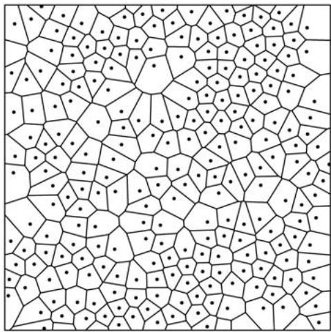

# 2.2 Computational Chemistry 
Attempts to solve the schrödinger equation [III.83], which gives the quantum mechanical description of matter, began soon after it was proposed in 1926. For very simple systems, calculations performed on mechanical calculators agreed with the experimental results of spectroscopy. In the 1950s, electronic computers became available for general scientific use, and the new field of computational chemistry developed, the aim of which was to obtain quantitative information on atomic positions, bond lengths, electronic configurations of atoms, etc., by means of numerical solutions of the Schrödinger equation. Advances during the 1960s included deriving suitable functions for representing electronic orbitals, obtaining approximate solutions to the problem of how the motions of different electrons correlate with each other, and providing formulas for the derivative of the energy of a molecule with respect to the positions of the atomic nuclei. Powerful software packages became available in the early 1970s. Much current research is aimed at developing methods that can handle larger and larger molecules. 

Density functional theory (DFT) (Parr and Yang 1989) is a major recent field of activity in quantum mechanical computation, and concerns macroscopic features of materials. It has been successful in the description of the properties of metals, semiconductors, and insulators, and even of complex materials such as proteins and carbon nanotubes. Traditional methods in the study of electronic structure—such as one called the Hartree–Fock theory molecular orbital method, which assigns the electrons two at a time to a set of molecular orbitals—involve very complicated many-electron wave functions. The main objective of DFT is to replace the many-body electronic wave function, which depends on 3N variables, with a different basic quantity, the electronic density, which depends on just 3 variables, and therefore greatly speeds up calculations. 
The partial differential equations of quantum mechanics, physics, fields, surfaces, potentials, and waves can sometimes be solved analytically, but even if they cannot, they are now almost always soluble by numerical methods. All this relies on the corresponding pure mathematics. (For a discussion of how to solve partial differential equations numerically, see numerical analysis [IV.21 §5].) 
# 2.3 Chemical Topology 
Isomers are chemical compounds that are made out of the same elements but have different physical and chemical properties. This can happen for various reasons. In structural isomers, the atoms and functional groups are linked together in different ways. This class includes chain isomers, where hydrocarbon chains have variable amounts of branching, and position isomers, where the position of a functional group in a chain is different (figure 2(a)). In stereoisomers the bond structure is the same, but the geometrical positioning of atoms and functional groups in space differs (figure 2(b)). This class includes optical isomers, where different isomers are mirror images of each other (figure 2(c)). While structural isomers have different chemical properties, stereoisomers behave identically in most chemical reactions. There are also topological isomers such as catenanes and DNA. 

Figure 2 (a) Position isomerism. (b) Stereoisomerism. (c) Optical isomerism.
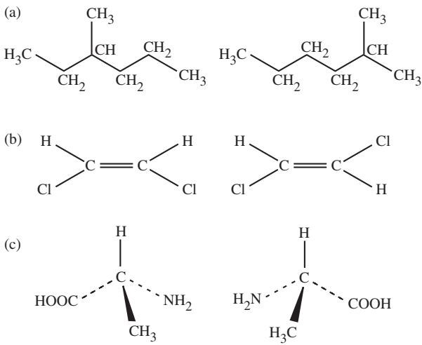
An important theme in chemical topology is determining, for any given molecule, how many isomers it has. To do this, one first associates with any molecule a molecular graph, the vertices representing atoms and the edges representing chemical bonds. To enumerate stereoisomers, one counts the symmetries of this graph, but first one must consider symmetries of the molecule (Cotton 1990) in order to decide which symmetries of the graph correspond to spatial transformations that make chemical sense. Cayley addressed the problem of enumerating structural isomers, that is, combinatorially possible branched molecules. To do this, one must count how many different molecular graphs there are with a given set of elements, where two graphs are regarded as the same if they are isomorphic. The enumeration of isomorphism types uses group theory to count the intrinsic graph symmetries. After Pólya published his remarkable enumeration theorem [IV.18 §6] in 1937, his work using generating functions [IV.18 §§2.4, 3] and permutation groups [III.68] became central to the enumeration of isomers in organic chemistry. The theorem solves the general problem of how many configurations there are with certain properties. It has applications such as the enumeration of chemical compounds and the enumeration of rooted trees in graph theory. A new branch of graph theory, called enumerative graph theory, is based on Pólya’s ideas (see algebraic and enumerative combinatorics [IV.18]). 
Although not all the possible isomers occur in nature, molecules with remarkable topologies have been synthesized artificially. Among them are cubane, C8H8, which contains eight carbon atoms arranged at the corners of a cube, each linked to a single hydrogen atom; dodecahedrane, , which, as its name suggests, has a dodecahedral shape; the molecular trefoil knot; and the self-assembling compound olympiadane composed of five interlocked rings. Catenanes (from Latin catena, chain) are molecules containing two or more interlocked rings that are inseparable without breaking a covalent bond. Rotaxanes (from Latin rota, wheel, and axis, axle) are dumbbell shaped, having a rod and two bulky stopper groups, around which there are encircling macrocyclic components. The stoppers of the dumbbell prevent the macrocycles from slipping off the rod. Even a molecular möbius strip [IV.7 §2.3] has recently been synthesized. 

Macromolecules, such as synthetic polymers and biopolymers (e.g., DNA and proteins), are very large and highly flexible. The degree to which a polymer molecule coils and knots and links with other molecules is crucial to its physical and chemical properties, such as reactivity, viscosity, and crystallization behavior. The topological entanglement of short chains can be modeled using Monte Carlo simulation, and the results can now be experimentally verified with fluorescence microscopy. 
DNA, the central substance of life, has a complex and fascinating topology, which is closely related to its biological function. The major geometric descriptions of supercoiled DNA (that is, DNA wrapped around a series of proteins) involve the concepts of linking, twisting, and writhing numbers that come from knot theory. DNA knots, which are created spontaneously within cells, interfere with replication, reduce transcription, and may decrease the stability of the DNA. “Resolvase enzymes” detect and remove these knots, but the mechanism of this process is not understood. However, using topological concepts of knots and tangles, one can gain insight into the reaction site and thereby try to infer the mechanism. (See also mathematical biology [VII.2 §5].) 
# 2.4 Fullerenes 
Graphite and diamond, the two crystalline forms of the element carbon, have been known since time immemorial, but fullerenes, which were subsequently found to exist naturally in soot and geological deposits, were discovered only in the mid 1980s. The most common is the almost-spherical carbon cage molecule (figure 3), also known as “buckminsterfullerene” after the architect who designed enormous domes, but fullerenes , also exist. Topology provides insights into the possible types of such structures, while group theory and graph theory describe the symmetry of the molecules, allowing one to interpret their vibrational modes. 

Figure 3 The structure of the fullerene { \mathrm { C } } _ { 6 0 } .

In all fullerenes, each carbon atom is connected to exactly three neighboring ones, and the resulting molecule is made of rings of either five or six carbon atoms. From euler’s [VI.19] topological relationship , where is the number of n-hedral faces and the summation is over all faces of the polyhedron, we conclude first that , since n is found to take only the values 5 or and second that can take any value greater than 1. 
In 1994, Terrones and Mackay predicted the existence of ordered structures of a new kind, derived from graphite and related to fullerenes, with topologies of triply periodic minimal surfaces [III.94 §3.1]. These new structures, which are of great practical interest, are produced by introducing eight-membered rings of carbon atoms into a sheet of six-membered rings. This gives rise to saddle-shaped surfaces of negative gaussian curvature [III.78], unlike the fullerenes, which have positive curvature. Thus, to model them mathematically one must consider embeddings of non-Euclidean 2D spaces into . This has contributed to a renewed interest in certain aspects of non-Euclidean geometry. 
# 2.5 Spectroscopy 
Spectroscopy is the study of the interaction of electromagnetic radiation (light, radio waves, X-rays, etc.) with matter. The central portion of the electromagnetic spectrum—spanning the infrared, visible, and ultraviolet wavelengths and the radio frequency region—is of particular interest to chemistry. A molecule, which consists of electrically charged nuclei and electrons, may interact with the oscillating electric and magnetic fields of light and absorb enough energy to be promoted from one discrete vibrational energy level to another. Such a transition is registered in the infrared spectrum of the molecule. The Raman spectrum monitors inelastic scattering of light by molecules (that is, when some of the light is scattered at a different frequency from the frequency of the incoming photons). Visible and ultraviolet light can redistribute the electrons in the molecule: this is electronic spectroscopy. 

Group theory is essential in the interpretation of the spectra of chemical compounds (Cotton 1990; Hollas 2003). For any given molecule, the symmetry operations that can be applied to it form a group [I.3 §2.1], and can be represented by matrices. This allows one to identify “spectroscopically active” events in a molecule. For example, just three bands are observed in the infrared spectrum and eight bands in the Raman spectrum of dodecahedrane. This is a consequence of the icosahedral symmetry of the molecule and is what one expects from group-theoretic considerations. Also, there are no coincidences between the infrared- and Raman-active modes. Similarly, group theory correctly predicts that, because of the high symmetry of a molecule, it has only four lines in its infrared spectrum and ten in its Raman spectrum, even though it has 174 vibrational modes. 
# 2.6 Curved Surfaces 
Structural chemistry has greatly changed in the last twenty years. First, as we have seen, the rigid concept of a “perfect crystal” has been relaxed to embrace structures such as quasicrystals and textures. Second, an advance has been made from classical geometry to 3D differential geometry. The main reason for this has been the use of curved surfaces for describing a great variety of structures (Hyde et al. 1997). 
When a wire frame is dipped into soapy water, a thin film is formed. Surface tension minimizes the energy of the film, which is proportional to its surface area. As a result, the film has the smallest area consistent with the shape of the frame and with the requirement that the mean curvature of the film be zero at every point. If the symmetries of a minimal surface are given by one of the 230 space groups mentioned earlier, then the surface is periodic in three independent directions. Such triply periodic minimal surfaces (TPMSs) are of special interest because they appear in a variety of real structures such as silicates, bicontinuous mixtures, lyotropic colloids, detergent films, lipid bilayers, polymer interfaces, and biological formations (an example of a TPMS is illustrated in figure 4). Thus, TPMSs provide a concise description of many seemingly unrelated structures. Extensions of TPMSs may even have applications in cosmology as “branes.” 

Figure 4 One unit cell of the P triply periodic minimal surface. The surface divides space into two interpenetrating labyrinths.
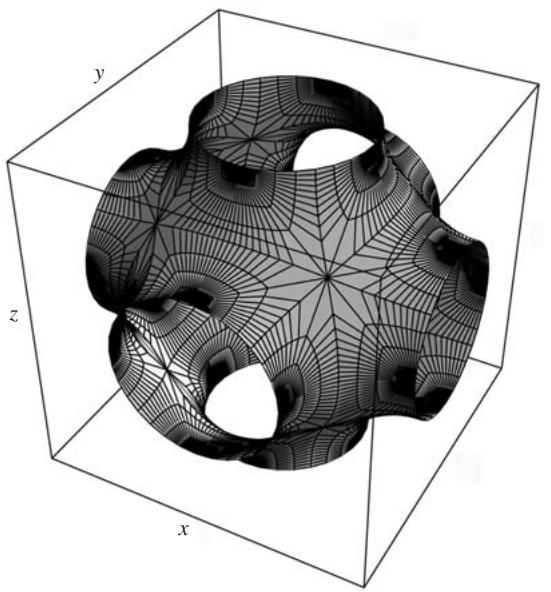

In 1866 weierstrass [VI.44] discovered a method of complex analysis suitable for general investigation of minimal surfaces. Consider a transformation of a minimal surface into the complex plane by combination of two simple maps. The first is the Gauss map ν, under which the image of a point P of the surface is the point of the intersection of the surface normal vector at P with the unit sphere centered at P. The second map is a stereographic projection σ of the point on the sphere into the complex plane C, resulting in the point . The composite map, , conformally maps the neighborhood of any nonumbilic point on the surface to a simply connected region of C. (An umbilic point is one where the two principal curvatures are the same.) The inverse of this composite map is called the Enneper–Weierstrass representation. 
In a system with the origin at , the Cartesian coordinates of any nontrivial minimal surface are determined by a set of three integrals: 
$x = x _ {0} + \operatorname{Re} \int_ {\omega_ {0}} ^ {\omega} (1 - \tau^ {2}) R (\tau) \mathrm{d} \tau ,$
$y = y _ {0} + \operatorname{Re} \int_ {\omega_ {0}} ^ {\omega} \mathrm{i} (1 + \tau^ {2}) R (\tau) \mathrm{d} \tau ,$
$z = z _ {0} + \operatorname{Re} \int_ {\omega_ {0}} ^ {\omega} 2 \tau R (\tau) \mathrm{d} \tau .$
Here is the Weierstrass function. It is a function of a complex variable τ, and it is holomorphic [I.3 §5.6] in a simply connected region of C, except at isolated points. 
The Cartesian coordinates of any (nonumbilic) point on a minimal surface are thus expressed as the real parts of certain contour integrals, evaluated in the complex plane from some fixed point to a variable point ω. Integration is carried out within the domain where the integrands are holomorphic [I.3 §5.6], and thus by Cauchy’s theorem the values of the integrals are independent of the path of integration from to ω. In this way, a specific minimal surface is completely defined by its Weierstrass function. 
While the Weierstrass functions for many TPMSs are unknown, the coordinates of points lying on some minimal surfaces involve functions of the form 
$R (\tau) = \frac {1}{\sqrt {\tau^ {8} + 2 \mu \tau^ {6} + \lambda \tau^ {4} + 2 \mu \tau^ {2} + 1}},$
where μ and λ are sufficient to parametrize the surface. A method has been developed for deriving this function for a given type of surface, and it generates different families of minimal surfaces from the above equation. For example, taking and λ  14 gives a surface known as the D surface (for “diamond”). 
The application of minimal surfaces to the physical world has so far been descriptive, rather than quantitative. Although explicit analytical equations for the parameters of some TPMSs have recently been derived, problems such as stability and mechanical strength are unresolved. While describing structure using the concept of curvature is mathematically attractive, it has yet to make its full impact on chemistry. 
# 2.7 Enumeration of Crystalline Structures 
It is a matter of considerable scientific and practical importance to enumerate all possible networks of atoms in a systematic way. For example, 4-connected networks (that is, networks in which each atom is connected to exactly four neighbors) occur in crystalline elements, hydrates, covalently bonded crystals, silicates, and many synthetic compounds. Of particular interest is the possibility of using systematic enumeration to discover and generate new nanoporous architectures. 

Nanoporous materials are materials with tiny holes in them that allow some substances to pass through and not others. Many are naturally occurring, such as cell membranes and “molecular sieves” called zeolites, but many others have been synthesized. There are now 152 recognized structure types of zeolites, with several new types being added to the list every year. Zeolites find many important applications in science and technology, in areas as diverse as catalysis, chemical separation, water softening, agriculture, refrigeration, and optoelectronics. Unfortunately, the problem of enumeration is fraught with difficulties, and since the number of 4-connected 3D networks is infinite and there is no systematic procedure for their derivation, the results reported so far have been obtained by empirical methods. 
Enumeration originated with the work of Wells (1984) on 3D nets and polyhedra. Many possible new structures were found by model building or computer search algorithms. New research in this field is based on recent advances in combinatorial tiling theory, developed by the first generation of pure mathematicians familiar with computing. The tiling approach identified over nine hundred networks with one, two, and three kinds of inequivalent vertices, which we call uninodal, binodal, and trinodal. 
However, only a fraction of the mathematically generated networks are chemically feasible (many would be “strained” frameworks requiring unrealistic bond lengths and bond angles), so for the mathematics to be useful an effective filtering process is needed to identify the most plausible frameworks. Methods of computational chemistry were therefore used to minimize the framework energy of the various hypothetical structures, which were treated as though they were made from silicon dioxide. The unit cell parameters, framework energies and densities, volumes available to adsorption, and X-ray diffraction patterns were all calculated. A total of 887 structures were successfully optimized and ranked according to their framework energies and available volumes to give a subset of chemically feasible hypothetical structures. A number of them have since been synthesized. 
The results of these calculations are relevant to the structures of zeolites and other silicates, aluminophosphates (AlPOs), oxides, nitrides, chalcogenides, halides, carbon networks, and even to polyhedral bubbles in foams. 

# 2.8 Global Optimization Algorithms 
A wide variety of problems in practically all fields of physical science involve global optimization, that is, determining the global minimum (or maximum) of a function of an arbitrary number of independent variables (Wales 2004). These problems also appear in technology, design, economics, telecommunications, logistics, financial planning, travel scheduling, and the design of microprocessor circuitry. In chemistry and biology, global optimization arises in connection with the structure of clusters of atoms, protein conformation, and molecular docking (the fitting and binding of small molecules at the active sites of biomacromolecules such as enzymes and DNA). The quantity to be minimized is nearly always the energy of the system (see below). 
Global optimization is like trying to find the deepest point in a very rugged landscape. In most cases of practical interest it is very difficult because of the ubiquity of local minima, or holes in the landscape, the number of which tend to increase exponentially with the size of the problem. Conventional minimization techniques are time-consuming and have a tendency to find a nearby hole and stay there: that is, they converge to whichever local minimum they first encounter. The genetic algorithm (GA), an approach inspired by Darwin’s theory of evolution, was introduced in the 1960s. This algorithm starts with a set of solutions (represented by “chromosomes”) called a population. Solutions from one population are taken and used to form a new population. This is done in such a way that one expects the new population to be better than the old one. Solutions that are chosen for forming new solutions (“offspring”) are selected according to their “fitness”: the more suitable they are the more chances they have to reproduce. This is repeated until some condition is satisfied. (For example, one might stop after a certain number of generations or after a certain improvement of the solution has been achieved.) 
Simulated annealing (SA), introduced in 1983, uses an analogy between the annealing process, in which a molten metal cools and freezes into a minimumenergy structure, and the search for a minimum in a more general system. The process can be thought of as an adiabatic approach to the lowest-energy state. 

The algorithm employs a random search which accepts not only changes that decrease the energy, but also some changes that increase it. The energy is represented by an objective function and the energyincreasing changes are accepted with a probability exp( δf /T ), where is the increase in f and T is the system “temperature,” irrespective of the nature of the objective function. SA involves the choice of “annealing schedule,” initial temperature, the number of iterations at each temperature, and the temperature decrease at each step as cooling proceeds. 
Taboo (or tabu) search is a general-purpose stochastic global-optimization method originally proposed by Glover in 1989. It is used for very large combinatorial optimization tasks and has been extended to continuous-valued functions of many variables with many local minima. Taboo search uses a modification of “local search,” which starts from some initial solution and attempts to find a better solution. This becomes the new solution and the process restarts from it. The procedure continues step by step until no improvement is found to the current solution. The algorithm avoids entrapment in local minima and gives the optimal final solution. A recent method of global optimization, known as “basin hopping,” has been successfully applied to a variety of atomic and molecular clusters, peptides, polymers, and glass-forming solids. The algorithm is based upon a transformation of the energy landscape that does not affect the relative energies of local minima. Combined with taboo search, basin hopping shows a significant improvement in efficiency over the best published results for atomic clusters. 
# 2.9 Protein Structure 
Proteins are linear sequences of amino acids, which are molecules that contain both the amide (–NH2) and carboxylic (–COOH) functional groups. Understanding the means by which a protein adopts its 3D structure is a key scientific challenge (Wales 2004). This problem is also critical to developing strategies, at the molecular level, to counter “protein folding diseases” such as Alzheimer’s disease and “mad cow” disease. The strategy in tackling protein folding relies upon the fact, observed by Anfinsen, Haber, Sela, and White in 1961, that the structure of a folded protein corresponds to the conformation which minimizes the free energy of the system. The free energy of a protein depends on the various interactions within the system, and each can be modeled mathematically using the principles of electrostatics and physical chemistry. As a result, the free energy of a protein can be expressed as a function of the positions of the constituent atoms. The 3D arrangement of the protein then corresponds to the set of atomic locations providing the minimum possible value of the free energy, and the problem is reduced to finding the global minimum of the potential-energy surface of the protein. The problem is further complicated because some proteins require other molecules, “chaperones,” to enable them to reach a particular configuration. 
Figure 5 A fifty-five-atom Lennard-Jones cluster. (Courtesy of Dr. D. J. Wales, Cambridge University.)
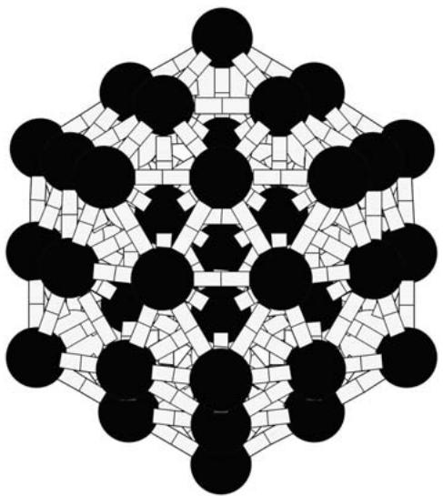

# 2.10 Lennard-Jones Clusters 
A Lennard-Jones cluster is a closely packed arrangement of atoms in which every pair of atoms has an associated potential energy, given by the classical Lennard-Jones potential-energy function. The Lennard-Jones cluster problem is to determine the atomic cluster configurations with minimum potential energy (figure 5). If n is the number of atoms in the cluster, then one wishes to find points so as to minimize the sum 
$\sum_ {i = 1} ^ {n - 1} \sum_ {j = i + 1} ^ {n} (r _ {i j} ^ {- 1 2} - 2 r _ {i j} ^ {- 6}),$
where stands for the Euclidean distance between and and the atoms of the cluster are positioned at . The problem is still a challenge, both to optimization methods and to computer technology. A systematic survey by Northby in 1987, which yielded most of the lowest Lennard-Jones potential values in the range , was a significant landmark, and these results have since been improved by about 10%. The results for n = 148, 149, 150, 192, 200, 201, 300, and 309 have now been reported using stochastic global-optimization algorithms. 

# 2.11 Random Structures 
Stereology, originally the deduction of 3D structure from microscope examination of sections, has required the development of a substantial branch of statistical mathematics, in which R. E. Miles and R. Coleman have played leading roles. Stereology concerns the estimation of geometrical quantities. Geometrical shapes are used to probe objects to learn about their quantities, such as volume or length. Random sampling is a basic step in all stereological estimation. The degree of randomness required for any estimate varies. 
Even apparently simple questions involving randomness with spatial constraints may prove difficult. For example, Gotoh and Finney gave an estimate of 0.6357 as the density expected for a dense random packing of hard spheres of equal size, and their answer to this apparently simple question has not since been improved upon, as far as we know. The problem needs to be defined very carefully, since it is far from obvious what one means by a “random packing” of spheres. This is even more true when one investigates other, related problems concerning the interaction of molecules using computer simulation. This area, called molecular dynamics, was begun by A. Rahman, and it developed steadily from the 1960s as computers themselves developed. An example of a problem in molecular dynamics is the modeling of liquid water. This is still difficult, but the immense computing power that is now available has enabled enormous progress to be made. 
# 3 Process 
In 1951 Belousov discovered the Belousov–Zhabotinski reaction, in which time-dependent spatial patterns appear in an apparently isotropic medium. The mechanism of this reaction was elucidated in 1972, and this opened up an entire new research area: nonlinear chemical dynamics. Oscillatory phenomena have also been observed in membrane transport. Winfree and Prigogine have shown how patterns in space and time can appear, and some of these patterns have been fitted to practical examples. 
The development of cellular automata began with Stanisław Ulam, Lindenmeyer systems, and Conway’s “game of life” and continues to this day. With his huge book, Wolfram (2002) has demonstrated the complexity that can arise from apparently simple rules, and recently Reiter has used cellular automata to simulate the growth of snowflakes, beginning to answer questions that Kepler posed in 1611. There is a group of mathematicians in Bielefeld, led by Andreas Dress, who deal with structure-forming processes; they have made particular progress in modeling actual chemistry and thus revealing possible mechanisms. 
# 4 Search 
# 4.1 Chemical Informatics 
A fundamental development in chemistry has been the application of computing to searching multidimensional databases of chemical compounds and their structures. These databases are now enormous compared with their (already large) predecessors, the classical Gmelin and Beilstein databases. The search process has required fundamental mathematical analyses, as exemplified in the pioneering work of Kennard and Bernal in developing the Cambridge Structural Database (www.ccdc.cam.ac.uk/products/csd/). 
What is the best way to encode the structure of a 3D molecule or a crystal arrangement as a linear sequence of symbols? One would like to be able to restore the structure efficiently from its encoding, and also to search efficiently through a big list of encoded structures. The problems that this raises are of long standing, and need insights both from mathematics and chemistry. 
# 4.2 Inverse Problems 
Many of the mathematical challenges of chemistry are inverse problems. Often they involve solving a set of linear equations. If there are as many equations as unknowns and the equations are independent, then this can be done by inverting a square matrix. However, if the system is singular or redundant, or if there are fewer equations or more equations than unknowns, then the corresponding matrix is singular or rectangular and there is no ordinary inverse. Nevertheless, it is possible to define a generalized inverse, which gives a good model for linear problems. (It is the so-called Moore–Penrose inverse or pseudo-inverse involved in singular value decomposition.) This always exists and it uses all available information; it is related to the problem of reconstructing a 3D structure from a 2D projection. The operation has been fully described and is now available in Mathematica. 

The generalized inverse also enables one to handle redundant axes in quasicrystals, but usually the interesting problems are nonlinear. Other inverse problems include the following. 
Some questions of this type do not have unique answers. For example, the classic question as to whether the shape of a drumhead can be determined from its vibration spectrum (can you hear the shape of a drum?) has been answered in the negative: two vibrating membranes with different shapes may have the same spectrum. It was thought that this ambiguity might also be the case for crystal structures. Linus Pauling suggested that there might be two different crystal structures that were homometric (that is, giving the same diffraction pattern), but no definite example has been found. 
# 5 Conclusion 
As the examples in this article show, mathematics and chemistry have a symbiotic relationship, with developments in one often stimulating advances in the other. Many interesting problems, including several that we have mentioned here, are still waiting to be solved. 
# Further Reading 
# VII.2 Mathematical Biology 
# Michael C. Reed 
# 1 Introduction 
Mathematical biology is an extremely large and diverse field. It studies objects ranging from molecules to global ecosystems and the mathematical methods come from many of the subdisciplines of the mathematical sciences: ordinary and partial differential equations, probability theory, numerical analysis, control theory, graph theory, combinatorics, geometry, computer science, and statistics. The most that one short article can do is to illustrate by selected examples this diversity and the range of new mathematical questions that arise naturally in the biological sciences. 
# 2 How Do Cells Work? 
From the simplest point of view, cells are large biochemical factories that take inputs and manufacture lots of intermediate products and outputs. For example, when a cell divides, its DNA must be copied and that requires the biochemical synthesis of large numbers of adenine, cytosine, guanine, and thymine molecules. Biochemical reactions are usually catalyzed by enzymes, proteins that facilitate a reaction but are not used up by it. Consider, for example, a reaction in which chemical A is converted to chemical B with the help of an enzyme E. If a(t) and b(t) are the respective concentrations of A and B at time t, then one typically writes down a differential equation for b(t), which takes the form 
$b ^ {\prime} (t) = f (a, b, E) + \dots - \dots .$
Here, f is the rate of production, which typically depends on a, b, and E. Of course B may be produced by other reactions (which would lead to additional positive terms ) and may be used as a substrate itself in still other reactions (which would lead to additional negative terms  ). So, given a particular cell function or biochemical pathway, we can just write down the appropriate set of nonlinear coupled ordinary differential equations for the chemical concentrations and solve it by hand or by machine computation. However, this straightforward approach is often unsuccessful. First of all, there are a lot of parameters (and variables) in these equations and measuring them in the context of real living cells is difficult. Second, different cells behave differently and may have different functions, so we would expect the parameters to be different. Third, cells are alive and change what they are doing, so the parameters may themselves be functions of time. But the greatest difficulty is that the particular pathway under study is not really isolated. Rather, it is embedded in a much larger system. How do we know that our model system will continue to behave in the same way when embedded in this larger context? We need new theorems in dynamical systems that answer questions such as this, not for general “complex systems” but for the particular kinds of complex systems that arise in important biological problems. 

Cells continue to accomplish many basic tasks even though their environments (i.e., their inputs) are constantly changing. A brief example of this phenomenon, which is known as homeostasis, will illustrate the problem of “context.” Let us suppose that the chemical reaction above is one step in the pathway for making the thymines necessary for cell division. If the cell is a cancer cell, we would like to turn off this pathway, and a reasonable way to try to do this would be to put into the cell a compound X that binds to E, thereby reducing the amount of free enzyme available to make the reaction run. Two homeostatic mechanisms immediately come into play. First, a typical reaction is inhibited by its product: that is, f decreases as b increases. This makes biological sense because it ensures that B is not overproduced. So, when the amount of free E is reduced and the rate f declines, the resulting decrease in b drives the rate up again. Second, if the rate f is lower than usual, the concentration a typically rises since A is not being used up as quickly, which also drives the rate f up again since f increases as a increases. Given the network in which A and B are embedded, one can imagine calculating how much f will drop if we put a certain amount of X into the cell. In fact, f may drop even less than we calculate because of another homeostatic mechanism that is not even in our network. The enzyme E is a protein produced by the cell via instructions from a gene. It turns out that sometimes the concentration of free E inhibits the messenger RNA that codes for the production of E itself. Then, if we introduce X and reduce free E, the inhibition is removed and the cell automatically increases its rate of production of E, thus raising the amount of free E and with it raising the reaction rate f . 

This illustrates a fundamental difficulty in studying cell biochemistry, indeed a difficulty in studying many biological systems. These systems are very large and very complex. To gain understanding, it is natural to concentrate on particular relatively simple subsystems. But one always has to be aware that the subsystems exist in a larger context that may contain variables (excluded by the simplification) that are crucial for understanding the behavior and biological function of the subsystem itself. 
Although cells exhibit remarkable homeostasis, they also undergo spectacular changes. For example, cell division requires unzipping of the DNA, synthesis of two new complementary strands, the movement apart of the two new DNAs, and the pinching off of the mother cell to produce two daughters. How does a cell do all this? In the case of yeast cells, which are comparatively simple, the actions of the biochemical pathways are quite well understood, partly because of the mathematical work of John Tyson. But as our brief discussion makes clear, biochemistry is not all there is to cell division; an important additional feature is motion. Materials are being transported all the time throughout cells from one specific place to another (so their motion is not just diffusion), and indeed, cells themselves move. How does this happen? The answer is that materials are transported by special molecules called molecular motors that turn the energy of chemical bonds into mechanical force. Since bonds are formed and broken stochastically (that is, some randomness is involved), the study of molecular motors leads naturally to new questions in stochastic ordinary and partial differential equations [IV.24]. A good introduction to the mathematics of cell biology is Fall et al. (2002). 
# 3 Genomics 
To understand the mathematics that was involved in sequencing the human genome it is useful to start with the following simple question. Suppose that we cut up a line segment into smaller segments and are presented with the pieces. If we are told the order in which the pieces came in the original segment, then we can put them back together and reconstruct the segment. In general, since there are many possible orders, we cannot reconstruct the segment without extra information of this kind. Now suppose that we have cut up the segment in two different ways. Think of the line segment as an interval I of real numbers, and let the pieces be when you cut it up the first way, and when you cut it up the other way. That is, the sets form a partition of the interval I into subintervals, and the sets form another partition. For simplicity, assume that no shares an endpoint with any , except for the two endpoints of I itself. 

Suppose that we know nothing about the order in which the pieces and come in I. In fact, suppose that all we know about them is which overlap with which that is, which of the intersections are nonempty. Can we use this information to work out the original order of the pieces and thereby reconstruct the interval I (or its reflection)? The answer will sometimes be yes and sometimes no. If it is yes, then we would like to find an efficient algorithm for doing the reconstruction, and if it is then we would like to know how many different reconstructions are consistent with the given information. This so-called restriction mapping problem is really a problem in graph theory [III.34]: the vertices of the graph correspond to the sets or and there is an edge between and if . 
A second problem is whether we can find the original order of the (or the if what we are told is the length of each set and each set , and the set of all the lengths of the intersections . The catch is that we are not told which length corresponds to which intersection. This is called the double digest problem. Again one would like to be able to tell when there is only one solution, or to place an upper bound on the number of possible reconstructions if there is more than one. 
Human DNA for our purposes here, a word of length approximately over a four-letter alphabet A, G, C, T. That is, it is a sequence of length in which each entry is A, G, C, or T. In the cell, the word is bound letter by letter to the “complementary” word, which is determined by the rule that A can only be bound to T, and C can only be bound to G. (For example, if the word is ATTGATCCTG, then the complementary word is TAACTAGGAC.) In this brief discussion we will ignore the complementary word. 
Since DNA is so long (it would be approximately two meters if one stretched it out into a straight line) it is very hard to handle experimentally, but the sequence of letters in short segments of approximately five hundred letters can be determined by a process called gel chromatography. There are enzymes that cut DNA wherever specific very short sequences occur. So if we digest a DNA molecule with one of these enzymes and digest another copy with a different enzyme, we can hope to determine which fragments from the first digestion overlap fragments from the second digestion and then use techniques from the restriction mapping problem to reconstruct the original DNA molecule. The interval I corresponds to the whole DNA word, and the sets to the fragments. This involves sequencing and comparing the fragments, which has its own difficulties. However, lengths of fragments are not so hard to determine, so another possibility is to digest with the first enzyme and measure lengths, digest with the second and measure lengths, and finally digest with both and measure lengths. If one does this, then the problem one obtains is essentially the double digest problem. 
To completely reconstruct the DNA word one takes many copies of the word, digests with enzymes, and selects at random enough fragments that together they have a high probability of covering the word. Each of the fragments is cloned, in order to get enough mass, and then sequenced by gel chromatography. Both processes can introduce errors, so one is left with a very large number of sequenced fragments with known error rates for the letters. These need to be compared to see if they overlap: that is, to see if the sequence near the end of one fragment is the same as (or very similar to) the sequence at the beginning of another. This alignment problem is itself difficult because of the large number of possibilities involved. in the end we have a very large restriction mapping problem except that we can only say that given fragments overlap with probabilities that are themselves hard to estimate. A further difficulty is that DNA tends to have large blocks that repeat in different parts of the word. As a result of these complications, the problem is much harder than the restriction mapping problem described earlier. It is clear that graph theory, combinatorics, probability theory, statistics, and the design of algorithms all play central roles in sequencing a genome. 
Sequence alignment is important in other problems as well. In phylogenetics (see below) one would like a way of saying how similar two genes or genomes are. When studying proteins, one can sometimes predict protein three-dimensional structure by searching databases for known proteins with the most similar amino acid sequence. To illustrate how complex these problems are, consider a sequence of one thousand letters from our four-letter alphabet. We wish to say how similar it is to another sequence . Naively, one could just compare with and define a metric [III.56] like . However, DNA sequences have evolved typically by insertions and deletions as well as by substitutions. Thus if the sequence ACACAC · · · lost its first C to become AACAC , the two sequences would be very far apart in this metric even though they are very similar and related in a simple way. The way around this difficulty is to allow sequences to include a fifth symbol, –, which stands for the place of a deletion or a place opposite an insertion. Thus, given two sequences (of perhaps different lengths), we wish to find how they can be augmented with dashes to give the minimum possible distance between them. A little thought will convince the reader that it is not feasible to use a brute-force search for a problem like this, even for the fastest computers— there are so many potential augmentations that the search would take far too long. Serious and thoughtful algorithm development is required. Two excellent introductions to the material discussed in this section are Waterman (1995) and Pevzner (2000). 

# 4 Correlation and Causality 
The central dogma of molecular biology is DNA RNA proteins. That is, information is stored in DNA, it is transferred out of the nucleus by RNA, and the RNA is then used in the cell to make proteins that carry out the work of the cell through the metabolic processes discussed in section 2. Thus DNA directs the life of the cell. Like most things in biology, the true situation is much more complicated. Genes, which are segments of DNA that code for the manufacture of particular proteins, are sometimes turned on and sometimes turned off. Usually, they are partially turned on; that is, the protein they code for is manufactured at some intermediate rate. This rate is controlled by the binding (or lack of binding) of small molecules or specific proteins to the gene, or to the RNA that the gene codes for. Thus genes can produce proteins that inhibit (or excite) other genes; this called a gene network. 
In a way, this was obvious all along. If cells can respond to their environments by changing what they do, they must be able to sense the environment and signal the DNA to change the protein content of the cell. Thus, while sequencing DNA and understanding specific biochemical reactions are important first steps in understanding cells, the hard and interesting work to come is to understand networks of genes and biochemical reactions. It is these networks, in which proteins control genes and genes control proteins, that carry out and control specific cellular functions. The mathematics will be ordinary differential equations for chemical concentrations and variables that indicate to what extent a gene is turned on. Since transport into and out of the nucleus occurs, partial differential equations will be involved. And, finally, since some of the molecular species occur in very small numbers, concentration (molecules per unit volume) may not be a useful approximation for computations about chemical binding and dissociation: they are probabilistic events. 

Two kinds of statistical data can give hints about the components of these gene networks. First, there are large numbers of population studies that correlate specific genotypes to specific phenotypes (such as height, enzyme concentration, cancer incidence). Second, tools known as microarrays allow us to measure the relative amounts of a large number of different messenger RNAs in a group of cells. The amount of RNA tells us how much a particular gene is turned on. Thus, microarrays allow us to find correlations that may indicate that certain genes are turned on at the same time or perhaps in a sequence. Of course, correlation is not causality and a consistent sequential relationship is not necessarily causal either (sure, football causes winter, a sociologist once said). Real biological progress requires understanding the gene networks discussed above; they are the mechanisms by which the genotypes play out in the life of the cell. 
A nice discussion of the relationship between population correlations and mechanisms occurs in Nijhout (2002), from which we take the following simple example. Most phenotypic traits depend on many genes; suppose that we consider a trait that depends on only two genes. Figure 1 depicts a surface that shows how the trait in an individual depends on how much each of the genes is turned on. All three variables are scaled from 0 to 1. Suppose that we study a population whose members have a genetic makeup that puts the individuals near the point X on the graph. If we do a statistical analysis of the population, we will find that gene B is highly statistically correlated to the trait, but gene A is not. On the other hand, if the individuals in the population all live near the point Y on the surface, we will discover in our population study that gene A is highly statistically correlated to the trait, but gene B is not. More detailed examples with specific biochemical mechanisms are discussed in Nijhout’s paper. Similar examples can be given for microarray data. This does not mean that population studies or microarray data are unimportant. Indeed, in studying hugely complex biological systems, statistical information can suggest where to look for the mechanisms that will ultimately give biological understanding. 

# 5 The Geometry and Topology of Macromolecules 
To illustrate the natural geometric and topological questions that arise when one studies macromolecules, we will briefly discuss molecular dynamics, protein– protein interactions, and the coiling of DNA. Genes code for the manufacture of proteins, which are large molecules made up of sequences of amino acids. There are twenty amino acids, each coded by a triplet of base pairs, and a typical protein might have five hundred amino acids. Interactions among the amino acids cause the protein to fold up into a complicated threedimensional shape. This three-dimensional structure is crucial for the function of the protein since the exposed groups and the nooks and crannies in the shape govern the possible chemical interactions with small molecules and other proteins. Three-dimensional structures of proteins can be approximately determined by X-ray crystallography and nontrivial inverse scattering calculations. The forward problem—namely, given the sequence of amino acids, predict the three-dimensional structure of the protein—is important not only for understanding existing proteins, but also for the pharmacological design of new proteins to accomplish specific tasks. Thus, in the past twenty years a large field called molecular dynamics has arisen, in which one uses classical mechanical methods. 

Suppose we have a protein that consists of N atoms. Let denote the position (specified by three real coordinates) of the ith atom, and let x denote the vector formed from all these coordinates (which belongs to . For each pair of atoms, one attempts to write down a good approximation to the potential energy, , due to their pairwise interaction. This could be the electrostatic interaction, for example, or the van der Waals interaction, which is a classical mechanical formulation of quantum effects. The total potential energy is and Newton’s equations of motion take the form 
$\dot {\boldsymbol {v}} = - \nabla E (\boldsymbol {x}), \quad \dot {\boldsymbol {x}} = \boldsymbol {v},$
where v is the vector of velocities. Starting with some initial conditions one can try to solve these equations to follow the dynamics of the molecule. Note that this is a very high-dimensional problem. A typical amino acid has twenty atoms, so that is sixty coordinates right there, and if we are looking at a protein made up of five hundred amino acids, then x will be a vector with thirty thousand coordinates. Alternatively, one could assume that the protein will fold to the configuration that has the minimum potential energy. Finding this configuration would mean finding the roots of E(x), by newton’s method [II.4 §2.3] say, and then checking to see which root gives the lowest energy. Again this is an enormous computational task. 
It is not surprising that molecular dynamics calculations have been only moderately successful and have predicted the shapes of only relatively small molecules and proteins. The numerical problems are substantial and the choice of energy terms is somewhat speculative. Even more importantly, context matters, as it does in many biological problems. The way proteins fold depends on properties of the solution in which they sit. Many proteins have several preferred configurations and switch from one to the other depending on interactions with small molecules or other proteins. Finally, it has recently been discovered that proteins do not fold up by themselves from their linear configuration to their three-dimensional shape, but are helped and guided by other proteins called chaperones. It is natural to ask whether there are quantifiable geometrical units larger than points (atoms) that could reasonably form the basis for a good approximation to the dynamics of large molecules. 

A start has been made in this direction by research groups studying the interactions of proteins with small molecules and other proteins. These interactions are fundamental to cell biochemistry, cell-transport processes, and cell signaling, and so progress is vital to understanding how cells work. Suppose one has two large proteins that are bound to each other. The first thing one would like to do is describe the geometry of the binding region. One could do this as follows. Consider an atom in either protein that is at point x. Given another atom at point there is a plane that divides into two open half-spaces: the points closer to x and the points closer to Now let denote the intersection of all such open half-spaces as y ranges over the positions of all other atoms: that is, consists of those points that are closer to x than to any other atom. The union of the boundaries, , called a Voronoi surface, consists of triangles and pieces of planes and has the property that each point on the surface is equidistant from at least two atom positions. To model the binding region between the two proteins, we discard all pieces of the Voronoi surface that are equidistant from two atoms that belong to the same protein and keep just the ones that are equidistant from two atoms that are in different proteins. This surface goes off to infinity, so we clip off the parts that are not “close” to either protein. The result is a surface with a boundary made up of polyhedral faces that is a reasonable approximation of the interaction interface between the two proteins. (This is not quite an accurate description: in the actual construction, “distance” is weighted in a way that depends on the atoms involved.) Now choose colors representing the twenty amino acids and color each side of each polyhedral piece with the color of the amino acid that the closest atom is in. This divides each side of the surface into large colored patches corresponding to nearness of a particular amino acid on that side. The coloring of the two sides of the boundary surface will be different, of course, and the placement of the patches gives information about which amino acids in one protein are interacting with which amino acids in the other. In particular, one amino acid in one protein may interact with several in the other. This gives a way of using geometry to classify the nature of the particular protein–protein interaction. 

Finally, let us touch on questions involving the packaging of DNA. The basic problem is easy to see. As mentioned earlier, the human DNA double helix when stretched out linearly is about two meters long. A typical cell has a diameter of about one-hundredth of a millimeter and its nucleus has a diameter of about onethird that size. All of that DNA has to be packed into the nucleus. How is this done? 
At least the first stages are well understood. The DNA double helix is wound around proteins called histones, which consist of about two hundred base pairs each, yielding chromatin, which is a sequence of such DNA-wrapped histones connected by short segments of DNA. Then the chromatin is itself wrapped up and compacted; the geometrical details are not completely understood. It is important to understand the packing and the mechanisms that create it, because the life of the cell requires unpacking! When the cell divides, the entire DNA helix must be unzipped to form two separate strands, which are the templates on which the two new copies of DNA will be built. Clearly this cannot be done all at once but must involve local unwinding of the DNA off the histones, local unzipping, synthesis, and then local repacking. 
It is equally challenging to understand the sequence of events that occurs when a protein is synthesized from a gene. Transcription factors diffuse into the nucleus and bind to specific short segments of DNA (of about ten base pairs) in the regulatory region of the gene. Of course, they will randomly bind wherever they see the same segment. Typically, one needs the binding of several different transcription factors in the regulatory region along with RNA polymerase to start transcription of a gene. That process involves the unwinding of the gene-coding region from the histones so that it can be transcribed, the transport of the resulting RNA out of the nucleus, and the recompactification of the DNA. To understand these processes fully, one will have to solve problems in partial differential equations, geometry, combinatorics, probability theory, and topology. DeWitt Sumners is the mathematician who brought the topological problems in the study of DNA (links, twists, knots, supercoiling) to the attention of the mathematics community. A good reference for molecular dynamics and the general mathematical issues posed by biological macromolecules is Schlick (2002). 

# 6 Physiology 
When one first studies human physiological systems, they seem almost miraculous. They accomplish enormous numbers of tasks simultaneously. They are robust but capable of quick changes if the situation warrants. They are made up of large numbers of cells that actively cooperate so that the tasks of the whole can be done. It is the nature of many of these systems that they are complex, controlled by feedback, and integrated with each other. It is the job of mathematical physiology to understand how they work. We will illustrate some of these points by discussing problems in biological fluid dynamics. 
The heart pumps blood throughout a circulatory system that consists of vessels of diameter as large as 2.5 cm (the aorta) and as small as cm (the capillaries). Not only are the vessels flexible, but many are surrounded by muscle and can contract to exert local force on the blood. The main force-generating mechanism (the heart!) is approximately periodic, but the period can change. The blood itself is a very complicated fluid. About 40% of its volume is made up of cells: red blood cells carry most of the oxygen and white blood cells are immune system cells that hunt bacteria; and platelets are part of the blood clotting process. Some of these cells have diameters that are larger than the smallest capillaries, which raises the nice question of how they get through. You notice that we are very far away from most of the simplifying assumptions of classical fluid dynamics. 
Here is an example of a circulatory-system question. In a significant number of people, the mitral valve, which is the inflow valve to the left side of the heart, becomes defective. It is common to replace the valve by an artificial one and this leads to an important question: how should one design the artificial valve so that the resulting flow in the left heart chamber has as few stagnant points as possible, since clots tend to form at these points? Charles Peskin did the pioneering work on this problem. Here is another question. The white blood cells are not carried in the middle of the fluid but tend to roll along the walls. Why do they do that? It is a good thing that they because their job is to sniff out inflammation outside the blood vessel and, when they find it, to stop and burrow through the blood vessel wall to get to the inflamed site. Another circulatory fluid dynamics question is discussed in section 10. 
The circulatory system is connected to many other systems. The heart has its own pacemaker cells, but its frequency of contraction is regulated by the autonomic nervous system. Through the baroreceptor reflex, the sympathetic nervous system tightens blood vessels to avoid a dramatic drop in blood pressure when we stand. Overall average blood pressure is maintained by a complicated regulatory feedback mechanism involving the kidneys. It is worthwhile remembering that all these things are being accomplished by living tissues whose parts are always decaying and being replaced. For example, the gap junctions that transmit current at very low resistance between heart muscle cells have a half-life of approximately one day. 

As a final example, we consider the lung, which has a fractal branching structure that terminates after twenty-three levels in about 600 million air sacs called alveoli, in which oxygen and are exchanged with the circulating blood. The Reynolds number of the air flow varies by about three orders of magnitude between the large vessels near the throat and the tiny vessels near the alveoli. Premature infants often have respiratory difficulty because they lack surfactants that reduce surface tension on the inner surfaces of the alveoli. The high surface tension makes the alveoli collapse, which makes breathing difficult. One would like the infants to breathe in air that includes tiny aerosol drops of surfactant. How small should the drops be so that as much surfactant as possible makes it to the alveoli? 
The mathematics of physiology consists mostly of ordinary and partial differential equations. However, there is a new feature: many of these equations have time delays. For example, the rate of respiration is controlled by a brain center that senses the content of blood. It takes almost fifteen seconds for blood to go from the lungs to the left heart and from there to the brain center. This time delay is even longer in patients with weak hearts and often these patients display Cheyne–Stokes breathing: very rapid breathing alternates with periods of little or no breathing. Such oscillations in control systems are well-known as the time delay gets longer. Since partial differential equations are often involved, new mathematical results are needed that go well beyond the standard theory of ordinary differential equations with delay, which was initiated by Bellman in the 1950s. An excellent reference for the applications of mathematics to physiology is Keener and Sneyd (1998). 
# 7 What’s Wrong with Neurobiology? 
The short answer is that there is not enough theory. This may seem an odd thing to say, since neurobiology is the home of the Hodgkin–Huxley equations, which are often cited as a triumph of mathematics in biology. In a series of papers in the early 1950s, Hodgkin and Huxley described several experiments, and gave a theoretical basis for explaining them. Building on the work of physicists and chemists (for example, Walter Nernst, Max Planck, and Kenneth Cole), they discovered the relationship between certain ionic conductances and the trans-membrane electrical potential, in the axons of neurons, and they formulated a mathematical model: 

$\frac {\partial v}{\partial t} = \alpha \frac {\partial^ {2} v}{\partial x ^ {2}} + g (v, y _ {1}, y _ {2}, y _ {3}),$
$\frac {\partial y _ {i}}{\partial t} = f _ {i} (v, y _ {i}), \quad i = 1, 2, 3.$
Here the are related to the membrane conductances of various ions. The equations have solutions that are pulses that keep their shape and travel at constant velocity in a way that corresponds to the observed behavior of action potentials in real neurons. The ideas, both explicit and implicit, in these discoveries form the basis of much single-neuron physiology. Of course, mathematicians should not be too proud about this since Hodgkin and Huxley were biologists. The Hodgkin–Huxley equations were part of the stimulus for interesting work by mathematicians on traveling waves and pattern formation in reaction–diffusion equations. 
However, not everything can be explained at the level of just one neuron. Watch your hand as it reaches out gracefully to pick up an object. Think about the socalled ocular–vestibular reflex in which motions of the head are automatically compensated for by motions of the eyes so that your gaze can remain fixed. Consider the fact that you are looking at stereotypical black marks on a page and they mean something inside your head. These are system properties, and the systems are large indeed. There are approximately neurons in the central nervous system and on average each makes about one thousand connections to other neurons. These systems will not be understood just by examining their parts (the neurons) and, for obvious reasons, experimentation is limited. Thus, experimental neurobiology, like experimental physics, needs input from deep and imaginative theorists. 
The lack of a large theory community interacting robustly with experimentalists is to some extent a historical accident. Grossberg asked how groups of (quite simple) model neurons, if they were connected in the right ways, could accomplish various tasks such as pattern recognition and decision making, or could exhibit certain “psychological” properties (Grossberg 1982). He also asked how these networks could be trained. At about the same time it was shown that networks of neuron-like elements connected in the right way could automatically compute good solutions of large, difficult problems like the traveling salesman problem [VII.5 §2]. These and other factors, including the great interest in software engineering and artificial intelligence, led to the emergence of a large community of researchers studying “neural networks.” The members of this community were mostly computer scientists and physicists, so it was natural for them to concentrate on the design of devices, rather than biology. This was noticed, of course, by experimental neurobiologists, who lost interest in collaborating with these theorists. 

This brief history is of course an oversimplification. There are mathematicians (and physicists and computer scientists) who are essentially theoreticians for neuroscience. Some of them work on hypothetical networks, typically either very small networks or networks with strong homogeneity properties, to discover what are the emergent behaviors of the systems. Others work on modeling real physiological neural networks, often collaboratively with biologists. Usually, the models consist of ordinary differential equations for the firing rates of the individual neurons or mean-field models that involve integral equations. These mathematicians have made real contributions to neurobiology. 
But much more is needed, and to see why, it is useful to think about just how difficult these problems really are. First, there is no one-to-one correspondence between the cells of the central nervous system in different members of the same species (except in special cases like C. elegans). Second, neurons in the same animal differ widely in their anatomy and physiology. Third, the details of a particular network may well depend on the life history of the animal. Fourth, most neurons are somewhat unreliable devices in that they give different outputs under repeated trials with the same input. Finally, one of the prime characteristics of neural systems is that they are plastic, adaptable, and ever changing. After all, if you remember anything of what is written here, then your head is different from when you began. Between the level of the single neuron and the psychological level, there are probably twenty levels of networks, each network feeding into and being controlled by networks at other levels. The mathematical objects that will enable us to classify, analyze, and understand how this all works have probably not yet been discovered. 

# 8 Population Biology and Ecology 
Let us begin with a simple example. Imagine a large orchard of equally spaced trees and suppose that one tree has a disease. The disease can be transmitted only to nearest neighbors, and is transmitted with probability What is , the expected percentage of trees that will be infected? Intuitively, if is small, should be small, and if is large, should be close to 100%. In fact, one can prove that changes very rapidly from being small to being large as passes through a small transition region around a particular critical probability . One would expect to decrease as the distance, between trees increases; farmers should choose in such a way that is less than the critical probability, in order to make small. We see here a typical issue in ecological problems: how does behavior on the large scale (tree epidemic or not) depend on behavior at the small scale (the distance between trees). And, of course, the example illustrates that understanding the biological situation requires mathematics. For other examples of sharp global changes in probabilistic models, see probabilistic models of critical phenomena [IV.25]. 
Suppose that we now widen our gaze to consider forests—let us say the forests on the East coast of the United States. We would like to understand how they have come to be as they are. Most of them were not planted in neat rows, so that is already a complication. But there are two other really new features. First, there is not one species but many, and each species of tree has different properties: shape, seed dispersal, need for light, and so forth. The species are different, but their properties affect each other because they are living in the same space. Second, the species, and the interactions between the species, are affected by the physics of the environment. There are physical parameters that vary on long timescales, like average temperature, and there are other parameters that vary on very short timescales, like wind speed (for seed dispersal). Certain properties of forests may depend on the fluctuations in these parameters as much as on the values themselves. Finally, one might have to take into account the reaction of the ecosystem to catastrophic events such as hurricanes or prolonged drought. 
The difficulties are similar to those we have seen for other problems in mathematical biology. One would like to understand the emergent behavior on the large scale. To do this one creates mathematical models that relate the behavior on the small scale to the large scale. However, on the small scale one is overwhelmed by the biological details. Which of these details should be in the model? Of course, there is no simple answer to this because, in fact, this is the heart of what we want to know. Which of the bewildering variety of local properties or variables give rise to the large-scale behavior and by what mechanisms? Furthermore, it is not obvious what kinds of model are best. Should we model each individual and its interactions, or should we use population densities? Should we use deterministic models or stochastic models? These are also hard questions, and the answers depend on the system being studied and the questions being asked. A nice discussion of these different modeling choices can be found in Durrett and Levin (1994). 

Let us focus again on a simple model: the so-called SIRS model for the spread of a disease in a population. A crucial parameter is the infectious contact number, which represents the average number of new infections that an infected individual creates in the susceptible population. For a serious disease one would like to bring the value of σ down to below 1 (so that an epidemic will be unlikely) by vaccination, which takes individuals from the susceptible category and puts them in the removed category. Since vaccination is expensive and it is difficult to vaccinate high percentages of the population, it is an important public-health problem to know how much vaccination is needed to bring σ to below 1. A little reflection shows us how difficult this problem really is. First of all, the population is not well mixed, so one may not be able to ignore spatial separation, as is done in the SIRS model. Even more important, depends on the social behavior of individuals and the subclasses of the population to which they belong (as anyone with small children in school will attest). Thus, we see a genuinely new issue here: if an ecological problem involves animals, then the social behavior of the animals may affect the biology. 
In fact, the issues are even deeper. Individuals in groups, or species, or subpopulations, vary and it is just this variation on which natural selection acts. to understand how an ecosystem got to where it is today, one may have to take this individual variability into account. Social behavior is also transmitted from generation to generation, both biologically and culturally, and therefore also evolves. For instance, there are many examples of plant and animal species in which the biology of the plants and the sociology of the animals clearly coevolved, to the benefit of both. Game-theory models have been used to study the evolution of certain human behaviors such as altruism. Therefore, ecological problems, which sometimes seem simple at first, are often very deep, because the biology and its evolution are connected in complicated ways to both the physics of the environment and the social behavior of the animals. A good introductory review of these questions can be found in Levin et al. (1997). 

# 9 Phylogenetics and Graph Theory 
Since Darwin, a deep ongoing problem in biology has been to determine the history of the evolution of species that has brought us to our current state. It is natural when thinking about such questions to draw directed graphs [III.34] in which the vertices, are species (past or present) and an edge from species to species indicates that evolved directly from . Indeed, Darwin himself wrote down such graphs. To explain the mathematical issues, we will consider a simple special case. A connected graph with no cycles is called a tree. If we distinguish a particular vertex, and call it the root, then the tree is called rooted. The vertices of the tree that have degree one (i.e., have only one attached edge) are called leaves. We will assume that is not a leaf. Notice that, because there are no cycles, there is exactly one path in the tree from to each vertex ν. We say that if the path from to ν2 contains (see figure 2). The problem is to determine which trees with a given set of leaves X (current species) and a given root vertex (a hypothesized ancestral species) are consistent with experimental information and theoretical assumptions about the mechanisms of evolution. Such a tree is called a rooted phylogenetic X-tree. One can always add extra intermediate species, so typically one imposes the additional restriction that the phylogenetic trees be as simple as possible. 
Suppose that we are interested in a certain characteristic, the number of teeth, for example. We can use it to define a function f from X, the set of current species, to the nonnegative integers: given a species x in X, we let be the number of teeth of members of x. In general, a character is a function from X to a set C of possible values of a particular characteristic (having or not having a gene, the number of vertebrae, the presence or absence of a particular enzyme, etc.). It is characters such as these that are measured by biologists in current species. In order to say something about evolutionary history, one would like to extend the definition of from X to the larger set V of all the vertices in a phylogenetic tree. To do this, one specifies some rules for how characters can change as species evolve. A character is called convex if can be extended to a function from to C in such a way that for every , the subset of V is a connected subgraph of the tree. That is, between any two species x and with character value c there should be a path back in evolutionary history from x and forward again to y such that all the species in between have the same value c. This essentially forbids new values from arising and then reverting back and forbids two values evolving separately (in different parts of the tree). Of course, we have the current species and lots of characters. What is unknown is the phylogenetic tree, that is, the collection of intermediate species and the relations between them that link the current species to a common ancestor. A collection of characters is called compatible if there exists a phylogenetic tree on which they are all convex. Determining when this is the case and finding an algorithm for constructing such a tree (or a minimal such tree) is called the perfect phylogeny problem. This problem is understood for collections of characters with binary values, but not in general. 
Figure 2 A rooted tree.
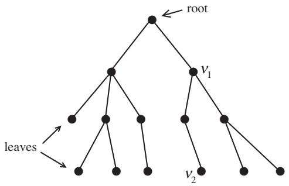

An alternative problem is the following. Note that we have been treating all the edges alike when in fact some may represent longer or shorter evolutionary steps. Suppose that we have a function w that assigns a positive number to each edge. Then, since there is a unique shortest path between any two vertices in the tree, w induces a distance function on , and in particular on X. Now, suppose that we are given a distance function δ on that tells us how far apart current species are. The question is whether there exists a phylogenetic tree and a weighting function w so that for all . If so, one would like an algorithm to construct the tree and the weights. If not, one would like to construct a family of trees that satisfy the relation approximately. 

Finally, we note that there is a blossoming field of Markov processes on trees where the partial order on V forms the basis for the Markov condition. Not only are there wonderful mathematical questions relating the geometry of the tree to the processes, but there are important issues for phylogenetics. Suppose that one starts with characters defined only at the root and then allows them to “evolve” down the tree by (possibly different) Markov processes. Then, given the distribution of characters on the leaves, when can we reconstruct the tree? These questions have even given rise to problems in algebraic geometry. 
Phylogenetics is useful not only for determining our past but also for controlling our present and future: see Fitch et al. (1997), where you can find a phylogenetic reconstruction for the influenza A virus. An excellent recent graduate text in this field is Semple and Steel (2003). 
# 10 Mathematics in Medicine 
It is clear that an improved understanding of biological systems leads, at least indirectly, to improved medical care. However, there are many cases in which mathematics has a direct impact on medicine. We give two brief examples. 
Charles Taylor is a biomedical engineer at Stanford who works on the fluid dynamics of the cardiovascular system. He wants to use fast simulations of flows as part of the medical decision-making process. Suppose that a patient presents with leg weakness and is found on magnetic resonance imaging (MRI) to have an arterial constriction in the thigh. Typically, the surgical group will meet and consider a variety of options including shunting blood from other vessels to a point below the constriction or shunting blood around the constriction with vessels removed from some other site in the patient’s body. Among a fairly large number of possible choices, the surgical group chooses based on what they have been taught and on their own experience. The characteristics of the flow after the graft are important not just for recovery of function but to prevent the formation of possibly destructive clots. An important difficulty is that patients treated successfully are rarely seen again, so one does not know the actual characteristics of the flow after the operation. Taylor wants to be in on the discussion with the surgical team with immediate fluid dynamical simulations based on the patient’s actual vasculature (as revealed by the MRI) for each proposed graft suggested. And he wants followup on each patient to check how well his simulations predicted the actual postoperative flow. 

David Eddy is an applied mathematician who has worked on health policy for thirty years. He first became prominent when he published Screening for Cancer: Theory, Analysis and Design (Eddy 1980), which grew out of his Ph.D. thesis. Because of this book, the American Cancer Society changed its recommendation for the frequency of Pap smears from once a year to once every three years, since Eddy’s modeling showed that the change would have little effect on the life expectancy of the average American woman. A short calculation easily estimates the amount of money saved in an economy that spends 15% of its gross domestic product (GDP) on health care. Throughout his career Eddy has criticized both the indiscriminate use of diagnostic tests and the incorrect use of the results by physicians and policy boards often ignorant of the basic facts of conditional probability. He has criticized specific health-policy guidelines as based on seat-ofthe-pants guesswork instead of quantitative analysis. In a classic case he distributed questionnaires to physicians at a conference on colorectal cancer. The physicians were asked to estimate the percentage drop in mortality from colorectal cancers if all Americans over age fifty were to have the two most common diagnostic tests each year: fecal blood smear and flexible sigmoidoscopy. The answers were approximately uniformly distributed in a range from 2% to 95%. Even more startling was the fact that the physicians did not even know that they disagreed so dramatically. He has used mathematical models to analyze the costs and benefits of new and existing surgeries, medical treatments, and drugs, and he has participated robustly in debates on the current health-policy crisis. Throughout, he has pointed out that a hefty percentage of GDP is spent on devices, drugs, and procedures with almost no mathematical analysis of which are effective. 
For more on the interrelations between mathematics and medicine, see mathematics and medical statistics [VII.11]. 
# 11 Conclusions 
Mathematics and mathematicians have played important roles in many fields of biology that this brief article has not had the space to cover: immunology, radiology, developmental biology, and the design of medical devices and synthetic biomaterials, to name just a few of the most obvious omissions. Nevertheless, this collection of examples and introductory discussions allows us to draw a few conclusions about mathematical biology. The range of biological problems needing explanation by mathematics is enormous and techniques from many different branches of mathematics are important. It is not so easy in mathematical biology to extract simple, clear mathematical questions to work on, because biological systems typically operate in a complex environment where it is difficult to decide what should be counted as the system and what as the parts. Finally, biology is a source of new, interesting, and difficult questions for mathematicians, whose participation in the biological revolution is necessary for a full understanding of the biology itself. 

# Further Reading 
# VII.3 Wavelets and Applications Ingrid Daubechies 
# 1 Introduction 
One of the best ways to understand a function is to expand it in terms of a well-chosen set of “basic” functions, of which trigonometric functions [III.92] are perhaps the best-known example. Wavelets are families of functions that are very good building blocks for a number of purposes. They emerged in the 1980s from a synthesis of older ideas in mathematics, physics, electrical engineering, and computer science, and have since found applications in a wide range of fields. The following example, concerning image compression, illustrates several important properties of wavelets. 
# 2 Compressing an Image 
Directly storing an image on a computer uses a lot of memory. Since memory is a limited resource, it is highly desirable to find more efficient ways of storing images, or rather to find compressions of images. One of the main ways of doing this is to express the image as a function and write that function as a linear combination of basic functions of some kind. Typically, most of the coefficients in the expansion will be small, and if the basic functions are chosen in a good way it may well be that one can change all these small coefficients to zero without changing the original function in a way that is visually detectable. 
Digital images are typically given by large collections of pixels (short for picture elements; see figure 1). 
The boat image in figure 1 is made up of 256  384 pixels; each pixel has one of 256 possible gray values, ranging from pitch black to pure white. (Similar ideas apply to color images, but for this exposition, it is simpler to keep track of only one color.) Writing a number between 0 and 255 requires 8 digits in binary; the resulting 8-bit requirement to register the gray level for each of the 256 384  98 304 pixels thus gives a total memory requirement of 786 432 bits, for just this one image. 
This memory requirement can be significantly reduced. In figure 2, two squares of 36 36 pixels are highlighted, in different areas of the image. As is clear from its blowup, square A has fewer distinctive characteristics than square B (a blowup of which is shown in figure 1), and should therefore be describable with fewer bits. Square B has more features, but it too contains (smaller) squares that consist of many similar pixels; again this can be used to describe this region with fewer than the 36 36 8 bits given by the naive estimate of assigning 8 bits to each pixel. 

Figure 1 A digital image with successive blowups.
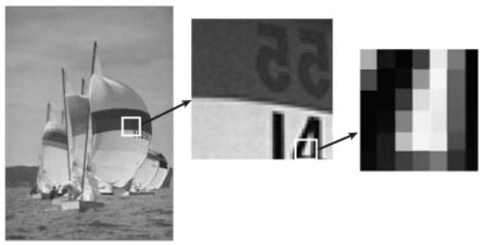
Figure 2 Blowup of a 36 × 36 square in the sky.
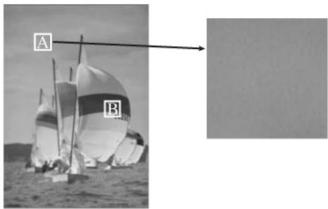

These arguments suggest that a change in the representation of the image can lead to reduced memory requirements: instead of a huge assembly of pixels, all equally small, the image should be viewed as a combination of regions of different size, each of which has more or less constant gray value; each such region can then be described by its size (or scale), by where it appears in the image, and by the 8-bit number that tells us its average gray value. Given any subregion of the image, it is easy to check whether it is already of this simple type by comparing it with its average gray value. For square A, taking the average makes virtually no difference, but for square B, the average gray value is not sufficient to characterize this portion of the image (see figure 3). 
When square B is subdivided into yet smaller subsquares, some of them have a virtually constant gray level (e.g., in the top-left or bottom-left regions of square B); others, such as subsquares 2 and 3 (see figure 4), that are not of just one constant gray level may still have a simple gray level substructure that can be easily characterized with a few bits. 
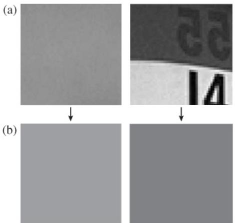
Figure 3 (a) Blowups of squares A (left) and B (right) with(b) the average grayvalue foreach. Figure 4 Subsquare 1 has constant gray level, while subsquares 2 and 3 do not, but they can be split horizontally (2) or vertically (3) into two regions with (almost) constant gray level. Subsquare 4 needs finer subdivision to be reduced to “simple” regions.
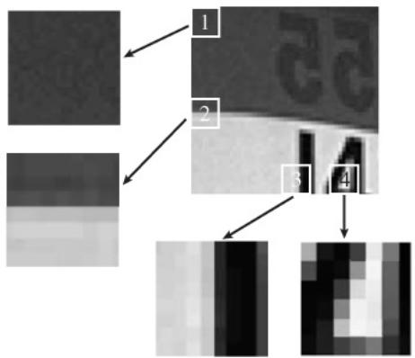
To use this decomposition for image compression, one should be able to implement it easily in an automated way. This could be done as follows: 

In some of the subsquares it may be necessary to divide down to the pixel level (as in subsquare 4 in figure 4, for example), but in most cases subdivision can be stopped much earlier. Although this method is very easy to implement automatically, and leads to a description using many fewer bits for images such as the one shown, it is still somewhat wasteful. For instance, if the average gray level of the original image is 160, and we next determine the gray levels of each of the four quarter images as 224, 176, 112, and 128, then we have really computed one number too many: the average of the gray levels for the four equal-sized subimages is automatically the gray level of the whole image, so it is unnecessary to store all five numbers. In addition to the average gray value for a square, one just needs to store the extra information contained in the average gray values of its four quarters, given by the three numbers that describe 
Consider for example a square divided up into four subsquares with average values 224, 176, 112, and 128, as shown in figure 5. The average gray value for the whole square can easily be checked to be 160. Now let us do three further calculations. First, we work out the average gray values of the top half and the bottom half, which are 200 and 120, respectively, and calculate their difference, which is 80. Then we do the same for the left half and the right half, obtaining the difference . Finally, we divide the four squares up diagonally: the average over the bottom-left and topright squares is 144, the average over the other two is 176, and the difference between these two is 32. 
From these four numbers one can reconstruct the four original averages. For example, the average for the top-right subsquare is given by . 
Figure 5 The average gray values for four subsquares of a square.
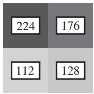

It is thus this process, rather than simply averaging over smaller and smaller squares as described above, that needs to be repeated. We now turn to the question of making the whole decomposition procedure as efficient as possible. 
A complete decomposition of a 256 × 256 square, from “top” (largest square) to “bottom” (the three types of “differences” for the subsquares), involves the computation of many numbers (in fact exactly 256  256 before pruning), some of which are themselves combinations of many of the original pixel values. For instance, the grayscale average of the whole 256 256 square requires adding numbers with values between 0 and 255 and then dividing the result by 65 536; another example, the difference between the averages of the left and right halves, requires adding the 256×128 = 32 768 grayscale numbers for the left half and then subtracting from this sum A the sum B of another 32 768 numbers. On the other hand, the sum of the pixel grayscale values over the whole square is simply A B, a sum of two 33- bit numbers instead of 65 536 numbers of 8 bits each. This allows us to make a considerable saving in computational complexity if A and B are computed before the average over the whole square. A computationally optimal implementation of the ideas explained so far must therefore proceed along a different path from the one sketched above. 
Indeed, a much better procedure is to start from the other end of the scale. Instead of starting with the whole image and repeatedly subdividing it, one begins at the pixel level and builds up. If the image has pixels in total, then it can also be viewed as consisting of “superpixels,” each of which is a small square of pixels. For each square, the average of the four gray values can be computed (this is the gray value of the superpixel), as well as the three types of differences indicated above. Moreover, these computations are all very simple. 

The next step is to store the three difference values for each of the squares and organize their averages, the gray values of the superpixels, into a new square. This square can be divided, in turn, into “super-superpixels,” each of which is a small square of superpixels (and thus stands for “standard” pixels), and so on. At the very end, after J levels of “zooming out,” there is only one superJ - pixel remaining; its gray value is the average over the whole image. The last three differences that were computed in this pixel-level-up process correspond exactly to the largest-scale differences that the top-down procedure would have computed first, at much greater computational expense. 
Carrying out the procedure from the pixel level up, none of the individual averaging or differencing computations involves more than two numbers; the total number of these elementary computations, for the whole transform, is only . For the 256×256 square discussed before, so the total is 174 752, which is about the number of computations needed for just one level in the top-down procedure. 
How can all this lead to compression? At each stage of the process, three species of difference numbers are accumulated, at different levels and corresponding to different positions. The total number of differences calculated is . Together with the gray value of the whole square, this means we end up with exactly as many numbers as we had gray values for the original pixels. However, many of these difference numbers will be very small (as argued before), and can just as well be dropped or put to zero, and if the image is reconstructed from the remainder there will be no perceptible loss of quality. Once we have set these very small differences to zero, a list that enumerates all the differences (in some prearranged order) can be made much shorter: whenever a long stretch of Z zeros is encountered, it can be replaced by the statement “insert Z zeros now,” which requires only a prearranged symbol (for “insert zeros now”), followed by the number of bits needed for Z, i.e., log2 Z. This achieves, as desired, a significant compression of the data that need to be stored for large images. (In practice, however, image compression involves many more issues, to which we shall return briefly below.) 
The very simple image decomposition described above is an elementary example of a wavelet decomposition. The data that are retained consist of 
Moreover, within each scale j the detail layer consists of many pieces, each of which has a definite localization (indicating to which of the superj -pixels it pertains), and all the pieces have “size” 2j . (That is, the size, in pixel widths, of the corresponding superj -pixel is In particular, the building blocks are very small at fine scales and become gradually larger as the scale becomes coarser. 
# 3 Wavelet Transforms of Functions 
In the image-compression example we needed to look at three types of differences at each level (horizontal, vertical, and diagonal) because the example was a twodimensional image. For a one-dimensional signal, one type of difference suffices. Given a function f from R to R, one can write a wavelet transform of f that is entirely analogous to the image example. For simplicity, let us look at a function f such that except when x belongs to the interval [0, 1]. 
Let us now consider successive approximations of f by step functions: that is, functions that change value in only finitely many places. More precisely, for each positive integer j, divide the interval [0, 1] up into 2j equal intervals, denoting the interval from to by (so that k runs from 0 to . Then define a function by setting its value on to be the average value of f on that interval. This is illustrated in figure which shows the step function for a function f whose graph is shown as well. As j increases, the width of the intervals decreases, and gets closer to (In more precise mathematical terms, if and f belongs to the function space [III.29] , then converges to in 
Each approximation of f can be computed easily from the approximation at the next-finer scale: the average of the values that takes on the two intervals and gives the value that takes on . 
Of course, some information about f is lost when we move from to . On every interval , the difference between and is a step function, with constant levels on the , that takes on exactly opposite values on each pair . 

The difference of the two approximation functions, over all of [0, 1], consists of a juxtaposition of such up-and-down (or down-and-up) step functions, and can therefore be written as a sum of translates of the same up-and-down function, with appropriate coefficients: 
$\boldsymbol {P} _ {j + 1} (f) (x) - \boldsymbol {P} _ {j} (f) (x) = \sum_ {k = 0} ^ {2 ^ {j} - 1} a _ {j, k} U _ {j} (x - 2 ^ {- j} k),$
where 
$U _ {j} (x) = \left\{ \begin{array}{l l} 1 & \text { for   } x \text {   between   } 0 \text {   and   } 2 ^ {- (j + 1)}, \\ - 1 & \text { for   } x \text {   between   } 2 ^ {- (j + 1)} \text {   and   } 2 \times 2 ^ {- (j + 1)}, \\ 0 & \text { for   all   other   } x. \end{array} \right.$
Moreover, the “difference functions” at the different levels are all scaled copies of a single function H, which takes the value 1 between 0 and and 1 between and 1; indeed, . It follows that each difference is a linear combination of the functions , with k ranging from 0 to adding many such differences, for successive j, shows that is a linear combination of the collection of functions , with j ranging from 0 to J  1 and k ranging from 0 to . Picking larger and larger J makes closer and closer to one finds that ., the difference between and its average) can be viewed as a (possibly infinite) linear combination of the functions , now with j ranging over all the nonnegative integers. 
This decomposition is very similar to what was done for images at the start of the article, but in one dimension instead of two and presented in a more abstract way. The basic ingredients are that minus its average has been decomposed into a sum of layers at successively finer and finer scales, and that each extra layer of detail consists of a sum of simple “difference contributions” that all have width proportional to the scale. Moreover, this decomposition is realized by using translates and dilates of the single function , often called the Haar wavelet, after Alfred Haar, who first defined it at the start of the twentieth century (though not in a wavelet context). The functions constitute an orthogonal set of functions, meaning that the inner product ) dx is zero except when and if we define , then we also have that consequence of this is that the wavelet coefficients that appear when we write the “jth layer” ) of the function as a linear combination are given by the formula . 

Haar wavelets are a good tool for exposition, but for most applications, including image compression, they are not the best choice. Basically, this is because replacing a function simply by its averages over intervals (in one dimension) or squares (in two dimensions) results in a very-low-quality approximation, as illustrated in figure 7(b). 
As the scale of approximation is made finer and finer , as the j in increases), the difference between and becomes smaller; with a piecewise-constant approximation, however, this requires corrections at almost every scale “to get it right” in the end. Unless the original happens to be made up of large areas where it is roughly constant, many small-scale Haar wavelets will be required even in stretches where the function just has a consistent, sustained slope, without “genuine” fine features. 
The right framework to discuss these questions is that of approximation schemes. An approximation scheme can be defined by providing a family of “building blocks,” often with a natural order in which they are usually enumerated. A common way of measuring the quality of an approximation scheme is to define to be the space of all linear combinations of the first N building blocks, and then to let be the closest function in to where distance is measured by the -norm (though other norms can also be used). Then one examines how the distance decays as N tends to infinity. An approximation scheme is said to be of order L for a class of functions for all functions f in F, where C typically depends on but must be independent of N. The order of an approximation scheme for smooth functions is closely linked to the performance of the approximation scheme on polynomials (because smooth functions can be replaced in estimations, at very little cost, by the polynomials given by their Taylor expansions). In particular, the types of approximation schemes considered here can have order L only if they perfectly reproduce polynomials of degree at most . In other words, there should exist some such that if is any polynomial of degree at most L − 1 and , then . 

In the Haar case, applied to functions that differ from zero only between 0 and 1, the building blocks consist of the function ϕ that takes the value 1 on and 0 outside, together with the families for . We saw above that can be written as a linear combination of the first building blocks . Because the Haar wavelets are orthogonal to each other, this is also the linear combination of these basis functions that is clos-. Figurech is the shows (forest approx-imation of by a continuous, piecewise-linear function with breakpoints at . It turns out that if you are trying to approximate a function using Haar wavelets, then the best decay you can obtain, even if is smooth, is of the form , or for . This means that approximation by Haar wavelets is a first-order approximation scheme. Approximation by continuous piecewise-linear functions is a second-order scheme: for smooth for . Note that the difference between the two schemes can also be seen from the maximal degree d of polynomials they “reproduce” perfectly: clearly both schemes can reproduce constants the piecewise-linear scheme can also reproduce linear functions (d  1), whereas the Haar scheme cannot. 
Take now any continuously differentiable function f defined on the interval [0, 1]. Typically equals about for an approximation scheme of order 2, that same difference would be about . In order to achieve the same accuracy as , the piecewise-linear scheme would thus require only levels instead of j levels. For higher orders the gain would be even greater. If the projections gave rise to a higher-order approximation scheme like this, then the difference would be so small as not to matter, even for modest values of wherever the function was reasonably smooth; for these values of the difference would be important only near points where the function was not as smooth, and so only in those places would a contribution be needed from “difference coefficients” at very fine scales. 
This is a powerful motivation to develop a framework similar to that for Haar, but with fancier “generalized averages and differences” corresponding to successive associated with higher-order approximation schemes. This can be done, and was done in an exciting period in the 1980s to which we shall return briefly below. In these constructions, the generalized averages and differences are typically computed by combining more than two finer-scale entries each time, in appropriate linear combinations. The corresponding function decomposition represents functions as (possibly infinite) linear combinations of wavelets derived from a wavelet As in the case of is defined to be . Thus, the functions are again normalized translates and dilates of a single function; this is due to our using systematically the same averaging operator to go from scale t o scale and the same differencing operator to quantify the difference between levels and regardless of the value of There is no absolutely compelling reason to use the same averaging and differencing operator for the transition between any two successive levels, and thus to have all the generated by translating and dilating a single function. However, it is very convenient for implementing the transform, and it simplifies the mathematical analysis. 

One can additionally require that, like the , the constitute an orthonormal basis for the space . The basis part means that every function can be written as a (possibly infinite) linear combination of the the orthonormality means that the are orthogonal to each other, except if they are equal, in which case their inner product is 1. 
As we have already mentioned, the projections for the wavelet ψ will correspond to an approximation scheme of order L only if they can reproduce perfectly all polynomials of degree less than L. If the functions are orthogonal, then dx = whenever . The can thus be associated with an approximation scheme of order L only if for sufficiently large j and for all polynomials p of degree less than L. By scaling and translating, this reduces to the requirement for . When this requirement is met, ψ is said to have L vanishing moments. 
Figure 8 shows the graphs of some choices for that give rise to orthonormal wavelet bases and that are used in various circumstances. 
For the wavelets of the type , and thus in particular for , and in figure an algorithm similar to that for the Haar wavelet can be used to carry out the decomposition, except that instead of combining two numbers from to obtain an average or a difference coefficient at level these wavelet decompositions require weighted combinations of four, six, or twelve finer-level numbers, respectively. (More generally, 2n finer-level numbers are used for 
Because the Meyer and Battle–Lemarié wavelets and are not concentrated on a finite interval, different algorithms are used for wavelet expansions with respect to these wavelets. 
There are many useful orthonormal wavelet bases besides the examples given above. Which one to choose depends on the application one has in mind. For instance, if the function classes of interest in the application have smooth pieces, with abrupt transitions or spikes, then it is advantageous to pick a smooth ψ, corresponding to a high-order approximation scheme. This allows one to describe the smooth pieces efficiently with coarse-scale basis functions, and to leave the fine-scale wavelets to deal with the spikes and abrupt transitions. In that case, why not always use a wavelet basis with a very high approximation order? The reason is that most applications require numerical computation of wavelet transforms; the higher the order of the approximation scheme, the more spread out the wavelet, and the more terms have to be used in each generalized average/difference, which slows down numerical computation. In addition, the wider the wavelet, and hence the wider all the finer-scale wavelets derived from it, the more often a discontinuity or sharp transition will overlap with these wavelets. This tends to spread out the influence of such transitions over more fine-scale wavelet coefficients. Therefore, one must find a good balance between the approximation order and the width of the wavelet, and the best balance varies from problem to problem. 
Figure 8 Six different choices of \psifor which the \psi _ { j , k } ( x ) =2 ^ { j / 2 } \psi ( 2 ^ { j } x - k ) , j , k \in \mathbb { Z } ,constitute an orthonormal basis for L ^ { 2 } ( \mathbb { R } ). The Haar wavelet can be viewed as the first example of a family \psi ^ { [ 2 n ] }, of which the wavelets for n \ = \ 2 ,3, and 6 are also plotted here. Each \psi ^ { [ 2 n ] }has n vanishing moments and is supported on ( \mathrm { i . e . , }is equal to zero outside) an interval of width 2 n - 1. The remaining two wavelets are not supported on an interval; however, the Fourier transform of the Meyer wavelet \psi ^ { [ \mathrm { M } ] }is supported on [ 8π /3, 2π /3]  [2π /3, 8π /3]; all moments of \psi ^ { [ \mathrm { M } ] }vanish. The Battle–Lemarié wavelet \psi ^ { \mathrm { [ B L ] } }is twice differentiable, is piecewise polynomial of degree 3, and has exponential decay; it has four vanishing moments.
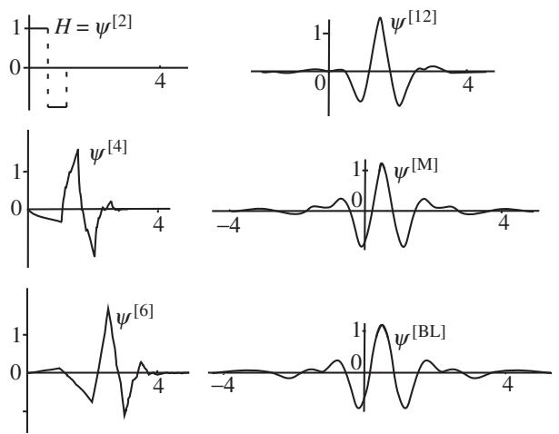

There are also wavelet bases in which the restriction of orthonormality is relaxed. In this case one typically uses two different “dual” wavelets ψ and ψ˜, such that dx = 0 unless and . The approximation order of the scheme that approximates functions by linear combinations of the is then governed by the number of vanishing moments of ψ˜. Such wavelet bases are called biorthogonal. They have the advantage that the basic wavelets ψ and can both be symmetric and concentrated on an interval, which is impossible for orthonormal wavelet bases other than the Haar wavelets. 

The symmetry condition is important for image decomposition, where preference is usually given to twodimensional wavelet bases derived from one-dimensional bases with a symmetric function ψ, a derivation to which we return below. When an image is compressed by deleting or rounding off wavelet coefficients, the difference between the original image I and its compressed version is a combination, with small coefficients, of these two-dimensional wavelets. It has been observed that the human visual system is more tolerant of such small deviations if they are symmetric; the use of symmetric wavelets thus allows for slightly larger errors, which translates to higher compression rates, before the deviations cross the threshold of perception or acceptability. 
Another way of generalizing the notion of wavelet bases is to allow more than one starting wavelet. Such systems, known as multiwavelets, can be useful even in one dimension. 
When wavelet bases are considered for functions defined on the interval [a, b] rather than the whole of R, the constructions are typically adapted, giving bases of interval wavelets in which specially crafted wavelets are used near the edges of the interval. It is sometimes useful to choose less regular ways of subdividing intervals than the systematic halving considered above: in this case, the constructions can be adapted to give irregularly spaced wavelet bases. 
When the goal of a decomposition is compression of the information, as in the image example at the start, it is best to use a decomposition that is itself as efficient as possible. For other applications, such as pattern recognition, it is often better to use redundant families of wavelets, i.e., collections of wavelets that contain “too many” wavelets, in the sense that all functions in could still be represented even if one dropped some of the wavelets from the collection. Continuous wavelet families and wavelet frames are the two main kinds of collections used for such redundant wavelet representations. 
# 4 Wavelets and Function Properties 
Wavelet expansions are useful for image compression because many regions of an image do not have features at very fine scales. Returning to the one-dimensional case, the same is true for a function that is reasonably smooth at most but not all points, like the function illustrated in figure 6(a). If we zoom in on such a function near a point x0 where it is smooth, then it will look almost linear, so we will be able to represent that part of the function efficiently if our wavelets are good at representing linear functions. 

This is where wavelet bases other than Haar show their power: the wavelets , and depicted in figure 8 all define approximation schemes of order 2 or higher, so that for all This is also seen in the numerical implementation schemes: the corresponding generalized differencing that computes the wavelet coefficients of f gives a zero result not only when the graph is flat, but also when it is a straight but sloped line, which is not true for the simple differencing used for the Haar basis. As a result, the number of coefficients needed for the wavelet expansion of smooth functions to reach a preassigned accuracy is much smaller when one uses more sophisticated wavelets than the Haar wavelets. 
For a function f that is twice differentiable except at a finite number of discontinuities, and with a basic wavelet that has, say, three vanishing moments, typically only very few wavelets at fine scales will be needed to write a very-high-precision approximation to f . Moreover, those will be needed only near the discontinuity points. This feature is characteristic for all wavelet expansions, whether they are with respect to an orthonormal basis, a basis that is nonorthogonal, or even a redundant family. 
Figure 9 illustrates this for one type of redundant expansion, which uses the so-called Mexican hat wavelets, which are given by 
$\psi (x) = (2 \sqrt {2} / \sqrt {3}) \pi^ {- 1 / 4} (1 - 4 x ^ {2}) \mathrm{e} ^ {- 2 x ^ {2}};$
this wavelet gets its name from the shape of its graph, which looks like the cross section of a Mexican hat (see the figure). 
The smoother a function is , the more times it is differentiable), the faster its wavelet coefficients will decay as j increases, provided the wavelet ψ has sufficiently many vanishing moments. The converse statement is also true: one can read off how smooth the function is at from how the wavelet coefficients decay, as j increases. Here one restricts attention to the “relevant” pairs . In other words, one considers only the pairs where is localized near (In more precise terms, this converse statement can be reformulated as an exact characterization of the socalled Lipschitz spaces for all noninteger α that are strictly less than the number of vanishing moments of 

Wavelet coefficients can be used to characterize many other useful properties of functions, both global and local. Because of this, wavelets are good bases not just for the Lipschitz spaces, but also for many other function spaces, such as, for instance, the -spaces with , the sobolev spaces [III.29 §2.4], and a wide range of Besov spaces. The versatility of wavelets is partly due to their connection with powerful techniques developed in harmonic analysis throughout the twentieth century. 
We have already seen in some detail that wavelet bases are associated with approximation schemes of different orders. So far we have considered approximation schemes in which the are always linear combinations of the same N building blocks, regardless of the function This is called linear approximation, because the collection of all functions of the form is contained in the linear span of the first N basis functions. Some of the function spaces mentioned above can be characterized by specifying the decay of as N increases, where is defined in terms of an appropriate wavelet basis. 

However, when it is compression that we are interested in, we are really carrying out a different kind of approximation. Given a function and a desired accuracy, we want to approximate to within that accuracy by a linear combination of as few basis functions as possible, but we are not trying to choose those functions from the first few levels. In other words, we are no longer interested in the ordering of the basis functions and we do not prefer one label over another. 
If we want to formalize this, we can define an approximation to be the closest linear combination to f that is made up of at most N basis functions. By analogy with linear approximation, we can then define the set as the set of all possible linear combinations of N basis functions. However, the sets are no longer linear spaces: two arbitrary elements are typically combinations of two different collections of N basis functions, so that their sum has no reason to belong to (though it will belong to . For this reason, is called a nonlinear approximation of . 
One can go further and define classes of functions by imposing conditions on the decay of , as N increases, with respect to some function space norm . This can of course be done starting from any basis; wavelet bases distinguish themselves from many other bases (such as the trigonometric functions) in that the resulting function spaces turn out to be standard function spaces, such as the Besov spaces, for example. We have referred several times to functions that are smooth in many places but have possible discontinuities in isolated points, and argued that they can be approximated well by linear combinations of a fairly small number of wavelets. Such functions are special cases of elements of particular Besov spaces, and their good approximation properties by sparse wavelet expansions can be viewed as a consequence of the characterization of these Besov spaces by nonlinear approximation schemes using wavelets.1 

# 5 Wavelets in More than One Dimension 
There are many ways to extend the one-dimensional constructions to higher dimensions. An easy way to construct a multidimensional wavelet basis is to combine several one-dimensional wavelet bases. The image decomposition at the start is an example of such a combination: it combines two one-dimensional Haar decompositions. We saw earlier that a superpixel could be decomposed as follows. First, think of it as arranged in two rows of two numbers, representing the gray levels of the corresponding pixels. Next, for each row replace its two numbers by their average and their difference, obtaining a new array. Finally, do the same process to the columns of the new array. This produces four numbers, the result of, respectively, 
The first is the average gray level for the superpixel, which is needed as the input for the next round of the decomposition at the next scale up. The other three correspond to the three types of “differences” already encountered earlier. If we start with a rectangular image that consists of rows, each containing pixels, then we end up with numbers of each of the four types. Each collection is naturally arranged in a rectangle of half the size of the original (in both directions); it is customary in the image-processing literature to put the rectangle with gray values for the superpixels in the top left; the other three rectangles each group together all the differences (or wavelet coefficients) of the other three kinds. (See the level 1 decomposition in figure 10.) The rectangle that results from horizontal differencing and vertical averaging typically has large coefficients at places where the original image has vertical edges (such as the boat masts in the example above); likewise, the horizontal averaging/vertical differencing rectangle has large coefficients for horizontal edges in the original (such as the stripes in the sails); the horizontal differencing/vertical differencing rectangle selects for diagonal features. The three different types of “difference terms” indicate that we have here three basic wavelets (instead of just one in the one-dimensional case). 
In order to go to the next round, one scale up, the scenario is repeated on the rectangle that contains the superpixel gray values (the results of averaging both horizontally and vertically); the other three rectangles are left unchanged. Figure 10 shows the result of this process for the original boat image, though the wavelet basis used here is not the Haar basis, but a symmetric biorthogonal wavelet basis that has been adopted in the JPEG 2000 image compression standard. The result is a decomposition of the original image into its component wavelets. The fact that so much of this is gray indicates that a lot of this information can be discarded without affecting the image quality. 

Figure 11 illustrates that the number of vanishing moments is important not just when the wavelet basis is used for characterizing properties of functions, but also when it comes to image analysis. It shows an image that has been decomposed in two different ways: once with Haar wavelets, the other with the JPEG 2000 standard biorthogonal wavelet basis. In both cases, all but the largest 5% of the wavelet coefficients have been set to zero, and we are looking at the corresponding reconstructions of the images, neither of which is perfect. However, the wavelet used in the JPEG 2000 standard has four vanishing moments, and therefore gives a much better approximation in smoothly varying parts of the image than the Haar basis. Moreover, the reconstruction obtained from the Haar expansion is “blockier” and less attractive. 
# 6 Truth in Advertising: Closer to True Image Compression 
Image compression has been discussed several times in this article, and it is indeed a context in which wavelets are used. However, in practice there is much more to image compression than the simple idea of dropping all but the largest wavelet coefficients, taking the resulting truncated list of coefficients, and replacing each of the many long stretches of zeros by its runlength. In this short section we shall give a glimpse of the large gap between the mathematical theory of wavelets as discussed above and the real-life practice of engineers who want to compress images. 
First of all, compression applications set a “bit bud-and all the information to be stored has to fit within the bit budget; statistical estimates and information-theoretic arguments about the class of images under consideration are used to allocate different numbers of bits to different types of coefficients. This bit allocation is much more gradual and subtle than just retaining or dropping coefficients. Even so, many coefficients will get no bits assigned to them, meaning that they are indeed dropped altogether. 

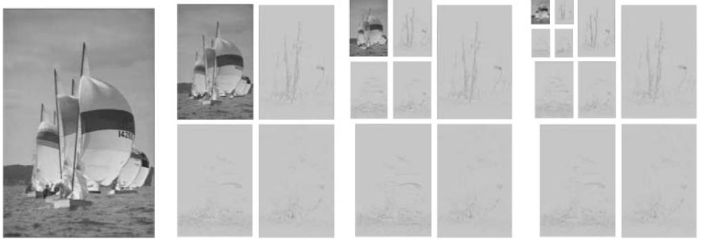
Figure 10 Wavelet decomposition of the boat image, together with a grayscale rendition of the wavelet coefficients. The decompositions are shown after one level of averaging and differencing, as well as after two and three levels. In the rectangles corresponding to wavelet coefficients (i.e., not averaged in both directions), where numbers can be negative, the convention is to use gray scale 128 for zero, and darker/lighter gray scales for positive and negative values. The wavelet rectangles are mostly at gray scale 128, indicating that most of the wavelet coefficients are negligibly small. Figure 11 Top: original image, with blowup. Bottom: approximations obtained by expanding the image into a wavelet basis, and discarding the 95% smallest wavelet coefficients. Left: Haar wavelet transform. Right: wavelet transform using the so-called 9–7 biorthogonal wavelet basis.
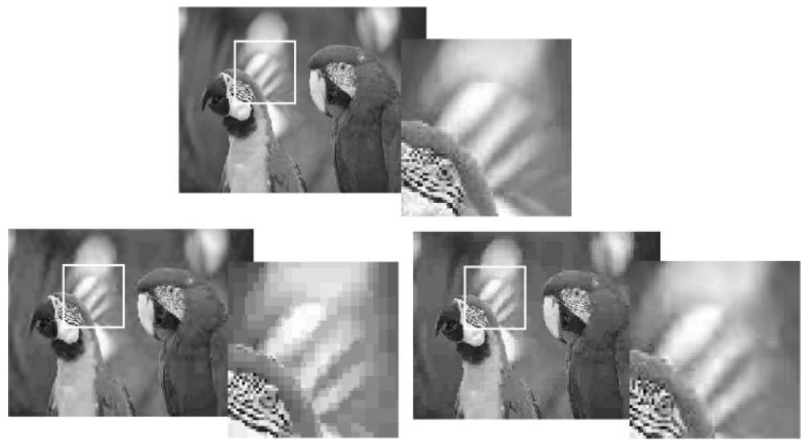

Because some coefficients are dropped, care has to be taken that each of the remaining coefficients is given its correct address, i.e., its (j, k1, k2) label, which is essential for “decompressing” the stored information in order to reconstruct the image (or rather, an approximation to it). If you do not have a good strategy for doing this, then you can easily find that the computational resources needed to encode information about the addresses cancel out a large portion of the gain made by the nonlinear wavelet approximation. Every practical wavelet-based image-compression scheme uses some sort of clever approach to deal with this problem. One implementation exploits the observation that at locations in the image where wavelet coefficients of some species are negligibly small at some scale j, the wavelet coefficients of the same species at finer scales are often very small as well. (Check it out on the boat image decomposition given above.) At each such location, this method sets a whole tree of finer-scale coefficients (four for scale j  1, sixteen for scale j  2, etc.) automatically to zero; for those locations where this assumption is not borne out by the wavelet coefficients that are obtained from the actual decomposition of the image at hand, extra bits must then be spent to store the information that a correction has to be made to the assumption. In practice, the bits gained by the “zero-trees” far outweigh the bits needed for these occasional corrections. 

Depending on the application, many other factors can play a role. For instance, if the compression algorithm has to be implemented in an instrument on a satellite where it can only draw on very limited power supplies, then it is also important for the computations involved in the transform itself to be as economical as possible. 
Readers who want to know more about (important!) considerations of this kind can find them discussed in the engineering literature. Readers who are content to stay at the lofty mathematical level are of course welcome to do so, but are hereby warned that there is more to image compression via wavelet transforms than has been sketched in the previous sections. 
# 7 Brief Overview of Several Influences on the Development of Wavelets 
Most of what is now called “wavelet theory” was developed in the 1980s and early 1990s. It built on existing work and insights from many fields, including harmonic analysis (mathematics), computer vision and computer graphics (computer science), signal analysis and signal compression (electrical engineering), coherent states (theoretical physics), and seismology (geophysics). These different strands did not come together all at once but were brought together gradually, often as the result of serendipitous circumstances and involving many different agents. 
In harmonic analysis, the roots of wavelet theory go back to work by littlewood [VI.79] and Paley in the 1930s. An important general principle in Fourier analysis is that the smoothness of a function is reflected in its fourier transform [III.27]: the smoother the function, the faster the decay of its transform. Littlewood and Paley addressed the question of characterizing local smoothness. Consider, for example, a periodic function with period 1 that has just one discontinuity in the interval [0, 1) (which is then repeated at all integer translates of that point), and is smooth elsewhere. Is the smoothness reflected in the Fourier transform? If the question is understood in the obvious way, then the answer is no: a discontinuity causes the Fourier coefficients to decay slowly, however smooth the rest of the function is. Indeed, the best possible decay is of the form . If there were no discontinuity, the decay would be at least as good as when f is k-times differentiable. 

However, there is a more subtle connection between local smoothness and Fourier coefficients. Let f be a periodic function, and let us write its nth Fourier coefficient as , where is the absolute value of and is its phase. When examining the decay of the Fourier coefficients, we look just at and forget all about the phases, which means that we cannot detect any phenomenon unless it is unaffected by arbitrary changes to the phases. If f has a discontinuity, then we can clearly move it about by changing the phases. It turns out that these phases play an important role in determining not just where the singularities are, but even their severity: if the singularity at x0 is not just a discontinuity but a divergence of the type , then one can change the value of β just by changing the phases and without altering the absolute values . Thus, changing phases in Fourier series is a dangerous thing to do: it can greatly change the properties of the function in question. 
Littlewood and Paley showed that some changes of the phases of Fourier coefficients are more innocuous. In particular, if you choose a phase change for the first Fourier coefficient, another one for both the next two coefficients, another for the next four, another for the next eight, and so on, so that the phase changes are constant on “blocks” of Fourier coefficients that keep doubling in length, then local smoothness (or absence of smoothness) properties of are preserved. Similar statements hold for the Fourier transform of functions on R (as opposed to Fourier series of periodic functions). This was the first result of a whole branch of harmonic analysis in which scaling was exploited systematically to deal with detailed local analysis, and in which very powerful theorems were proved that, with hindsight, seem ready-made to establish a host of powerful properties for wavelet decompositions. The simplest way to see the connection between Littlewood–Paley theory and wavelet decompositions is to consider the Shannon wavelet , which is defined by 1 when , and otherwise. Here, denotes the Fourier transform of the wavelet . The corresponding functions constitute an orthonormal basis for 

Figure 12 Differences between successive blurs give detail at different scales.
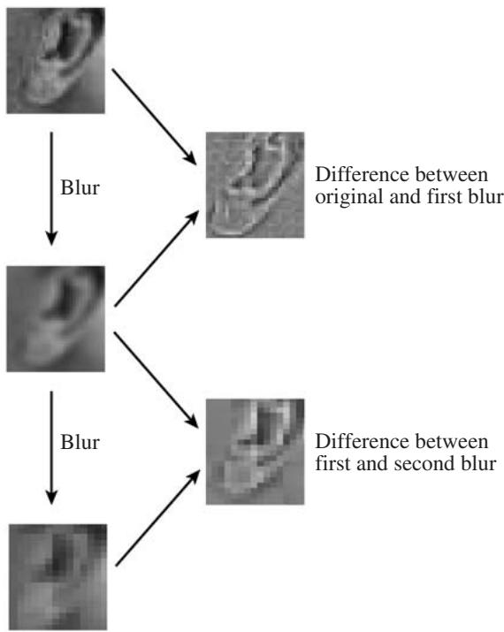
, and for each and each j the collection of inner products tells us how restricts to the set . In other words, it gives us the jth Littlewood–Paley block of . 
Scaling also plays an important role in computer vision, where one of the basic ways to “understand” an image (going back to at least the early 1970s) is to blur it more and more, erasing more detail each time, so as to obtain approximations that are graded in “coarseness” (see figure 12). Details at different scales can then be found by considering the differences between successive coarsenings. The relationship with wavelet transforms is obvious! 
An important class of signals of interest to electrical engineers is that of bandlimited signals, which are functions usually of one variable only, for which the Fourier transform vanishes outside some interval. In other words, the frequencies that make up come from some “limited band.” If the interval is , then is said to have bandlimit Such functions are completely characterized by their values, often called samples, at integer multiples of . Most manipulations on the signal are carried out not directly but by operations on this sequence of samples. For instance, we might want to restrict to its “lower-frequency half.” To do this, we would define a function by the condition that and is 0 otherwise. Equivalently, we could say that , where and 0 otherwise. The next step is to let be , and we find that . To put this more neatly, if we write and for and , respectively, then . On the other hand, g clearly has bandlimit , so to characterize it suffices to know only the sequence of samples at integer multiples of . In other words, we just need to know the numbers . The transition from to is therefore given by In the appropriate electrical engineering vocabulary, we have gone from a critically sampled sequence for f (i.e., its sampling rate corresponded exactly to its bandlimit) to a critically sampled sequence for by filtering (multiplying by some function, or convolving the sequence with a sequence of filter coefficients) and downsampling (retaining only one sample in two, because these are the only samples necessary to characterize the more narrowly bandlimited . The upperfrequency half h of can be obtained by the inverse Fourier transform of the restriction of to . Like the function h is also completely characterized by its values at multiples of , and h can also be obtained from f by filtering and downsampling. This split of into its lower and upper frequency halves, or subbands, is thus given by formulas that are the exact equivalent of the generalized averaging and differencing encountered in the implementation of wavelet transforms for orthonormal wavelet bases supported on an interval. Subband filtering followed by critical downsampling had been developed in the electrical engineering literature before wavelets came along, but were typically not concatenated in several stages. 

A concept of central importance in quantum physics is that of a unitary representation [IV.15 §1.4] of a lie group [III.48 §1] on some hilbert space [III.37]. In other words, given a Lie group and a Hilbert space one interprets the elements of G as unitary transformations of H. The elements of H are called states, and for certain Lie groups, if v is some fixed state, then the family of vectors is called a family coherent states. Coherent states go back to work by Schrödinger in the 1920s. Their name dates back to the 1950s, when they were used in quantum optics: the word “coherent” referred to the coherence of the light they were describing. These families turned out to be of interest in a much wider range of settings in quantum physics, and the name stuck, even outside the original setting of optics. In many applications it helps not to use the whole family of coherent states but only those coherent states that correspond to a certain kind of discrete subset of . Wavelets turn out to be just such a subfamily of coherent states: one starts with a single, basic wavelet, and the transformations that convert it (by dilation and translation) into the remaining wavelets form a discrete semigroup of such transformations. 

Despite the fact that wavelets synthesized ideas from all these fields, their discovery originated in another area altogether. In the late 1970s, the geophysicist J. Morlet was working for an oil company. Dissatisfied with the existing techniques for extracting special types of signals from seismograms, he came up with an ad hoc transform that combined translations and scalings: nowadays, it would be called a redundant wavelet transform. Other transforms in seismology with which Morlet was familiar involve comparing the seismic traces with special functions of the form cos(mωt), where w is a smooth function that gently rises from 0 to 1 and then gently decays to 0 again, all within a finite interval. Several different examples of functions w, proposed by several different scientists, are used in practice: because the functions look like small waves (they oscillate, but have a nice beginning and end because of w) they are typically called “wavelets of named after proposer X for that particular w. The reference functions in Morlet’s new ad hoc family, which he used to compare pieces of seismic traces, were different in that they were produced from a function w by scaling instead of multiplying them by increasingly oscillating trigonometric functions. Because of this, they always had the same shape, and Morlet called them “wavelets of constant shape” (see figure 13) in order to distinguish them from the wavelets of X (or Y, or Z, etc.). 
Morlet taught himself to work with this new transform and found it numerically useful, but had difficulty explaining his intuition to others because he had no underlying theory. A former classmate pointed him in the direction of A. Grossmann, a theoretical physicist, who made the connection with coherent states and, together with Morlet and other collaborators, started to develop a theory for the transform in the early 1980s. Outside the field of geophysics it was no longer necessary to use the phrase “of constant shape,” so this was quickly dropped, which annoyed geophysicists when, 
Figure 13 Top: an example of a window function w that is used in practice by geophysicists, with just below it two examples of w ( t { - } n \tau ) \mathrm { e } ^ { \mathrm { i } m t }, i.e., two “traditional” geophysics wavelets. Bottom: a wavelet as used by Morlet, with two translates and dilates just below it—these have constant shape, unlike the “traditional” ones.
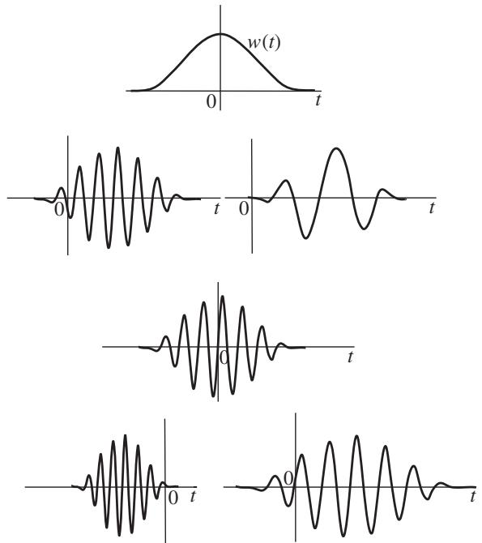
some years later, more mature forms of wavelet theory impinged on their field again. 
A few years later, in 1985, standing in line for a photocopy machine at his university, harmonic analysis expert Y. Meyer heard about this work and realized it presented an interestingly different take on the scaling techniques with which he and other harmonic analysts had long been familiar. At the time, no wavelet bases were known in which the initial function ψ combined the properties of smoothness and good decay. Indeed, there seemed to be a subliminal expectation in papers on wavelet expansions that no such orthonormal wavelet bases could exist. Meyer set out to prove this, and to everyone’s surprise and delight he failed in the best possible way—by finding a counterexample, the first smooth wavelet basis! Except that it later turned out not to have been the very first: a few years before, a different harmonic analyst, O. Stromberg, had constructed a different example, but this had not attracted attention at the time. 
Meyer’s proof was ingenious, and worked because of some seemingly miraculous cancellations, which is always unsatisfactory from the point of view of mathematical understanding. Similar miracles played a role in independent constructions by P. G. Lemarié (now Lemarié-Rieusset) and G. Battle of orthonormal wavelet bases that were piecewise polynomial. (They came to the same result from completely different points of departure—harmonic analysis for Lemarié and quantum field theory for Battle.) 

A few months later, S. Mallat, then a Ph.D. candidate in computer vision in the United States, learned about these wavelet bases. He was on vacation, chatting on the beach with a former classmate who was one of Meyer’s graduate students. After returning to his Ph.D. work, Mallat kept thinking about a possible connection with the reigning paradigm in computer vision. On learning that Meyer was coming to the United States in the fall of 1986 to give a named lecture series, he went to see him and explain his insight. In a few days of feverish enthusiasm, they hammered out multiresolution analysis, a different approach to Meyer’s construction inspired by the computer vision framework. In this new setting, all the miracles fell into place as inevitable consequences of simple, entirely natural construction rules, embodying the principle of successively finer approximations. Multiresolution analysis has remained the basic principle behind the construction of many wavelet bases and redundant families. 
None of the smooth wavelet bases constructed up to that point was supported inside an interval, so the algorithms to implement the transform (which were using the subband filtering framework without their creators knowing that it had been named and developed in electrical engineering) required, in principle, infinite filters that were impossible to implement. In practice, this meant that the infinite filters from the mathematical theory had to be truncated; it was not clear how to construct a multiresolution analysis that would lead to finite filters. Truncation of the infinite filters seemed to me a blemish on the whole beautiful edifice, and I was unhappy with this state of affairs. I had learned about wavelets from Grossmann and about multiresolution analysis from explanations scribbled by Meyer on a napkin after dinner during a conference. In early 1987 I decided to insist on finite filters for the implementation. I wondered whether a whole multiresolution analysis (and its corresponding orthonormal basis of wavelets) could be reconstructed from appropriate but finite filters. I managed to carry out this program, and as a result found the first construction of an orthonormal wavelet basis for which ψ is smooth and supported on an interval. 

Soon after this, the connection with the electrical engineering approaches was discovered. Especially easy algorithms were inspired by the needs of computer graphics applications. More exciting constructions and generalizations followed: biorthogonal wavelet bases, wavelet packets, multiwavelets, irregularly spaced wavelets, sophisticated multidimensional wavelet bases not derived from one-dimensional constructions, and so on. 
It was a heady, exciting period. The development of the theory benefited from all the different influences and in its turn enriched the different fields with which wavelets are related. As the theory has matured, wavelets have become an accepted addition to the mathematical toolbox used by mathematicians, scientists, and engineers alike. They have also inspired the development of other tools that are better adapted to tasks for which wavelets are not optimal. 
# Further Reading 
# VII.4 The Mathematics of Traffic in Networks 
# Frank Kelly 
# 1 Introduction 
We are all familiar with congested roads, and perhaps also with congestion in other networks such as the Internet, so it is obviously important to have a general understanding of how and why congestion occurs in networks. However, the pattern of the flow of traffic through a network is the consequence of a subtle and complex interaction between different users. For example, in a road network we would normally expect each driver to attempt to choose the most convenient route, and this choice will depend upon the delays the driver expects to encounter on different roads; but these delays will in turn depend upon the choices of routes made by others. This mutual interdependence makes it difficult to predict the effects of changes to the system, such as the construction of a new road or the introduction of tolls in certain places. 

Related issues arise in other large-scale systems like the telephone network or the Internet. In these systems a major practical concern is the extent to which control can be decentralized. When you are browsing the Web, the rate at which a Web page is transferred to you across the network is controlled by software protocols running on your computer and on the Web server hosting the Web page, and not by some huge central computer. This decentralized approach to flow control has been outstandingly successful as the Internet has evolved from a small-scale research network to today’s interconnection of hundreds of millions of hosts, but is beginning to show signs of strain. In developing new protocols, the challenge is to understand just which aspects of decentralized flow control are important if the network as a whole is to continue to expand and evolve. 
In this article we introduce the reader to some of the mathematical models that have been used to address these issues. The models need to be able to represent several distinct aspects of the system. We shall see that the language of graph theory [III.34] and matrices [I.3 §4.2] is needed to capture the pattern of connections within the network. Calculus is needed to describe how congestion depends upon traffic volumes. And optimization concepts are needed to model the way in which self-interested drivers choose their shortest routes, or the way that decentralized controls in communication networks can cause the system as a whole to perform well. 
# 2 Network Structure 
Figure 1 illustrates a set of three nodes connected by a set of five directed links. We might imagine the nodes as representing towns or locations within a city, and the links as representing road capacity between different nodes. A two-way road is represented by two links, one in each direction. Notice that there are two routes from node c to node a that a driver can choose: the first route, 
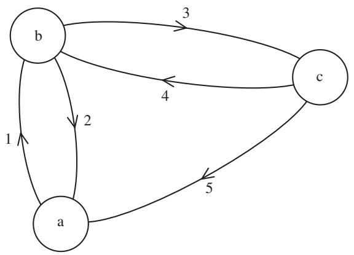
$A = \begin{array}{l} 1 \\ 2 \\ 3 \\ 4 \\ 5 \end{array} \left( \begin{array}{c c c c c c c c} \text {ab} & \text {ac} & \text {ba} & \text {bc} & \text {ca1} & \text {ca2} & \text {cb1} & \text {cb2} \\ 1 & 1 & 0 & 0 & 0 & 0 & 0 & 1 \\ 0 & 0 & 1 & 0 & 0 & 1 & 0 & 0 \\ 0 & 1 & 0 & 1 & 0 & 0 & 0 & 0 \\ 0 & 0 & 0 & 0 & 0 & 1 & 1 & 0 \\ 0 & 0 & 0 & 0 & 1 & 0 & 0 & 1 \end{array} \right)$
$H = \begin{array}{c} \text {ab} \quad \text {ac} \quad \text {ba} \quad \text {bc} \quad \text {ca1} \quad \text {ca2} \quad \text {cb1} \quad \text {cb2} \\ \text {ab} \\ \text {ac} \\ \text {ba} \\ \text {bc} \\ \text {ca} \\ \text {cb} \end{array} \left( \begin{array}{c c c c c c c c} 1 & 0 & 0 & 0 & 0 & 0 & 0 & 0 \\ 0 & 1 & 0 & 0 & 0 & 0 & 0 & 0 \\ 0 & 0 & 1 & 0 & 0 & 0 & 0 & 0 \\ 0 & 0 & 0 & 1 & 0 & 0 & 0 & 0 \\ 0 & 0 & 0 & 0 & 1 & 1 & 0 & 0 \\ 0 & 0 & 0 & 0 & 0 & 0 & 1 & 1 \end{array} \right)$
Figure 1 A simple network and its link-route incidence matrix, A. The matrix H represents which routes serve which source–destination pairs. 
let us call it ca1, is the direct route, using link 5; the second route, let us call it ca2, is via node b and uses links 4 and 2. 
Let J be the set of directed links and let R be the set of possible routes. One way to describe the relationship between links and routes is with a table, or matrix, defined as follows. Set if link j lies on route r , and set otherwise. This defines a matrix called the link-route incidence matrix. Each column of the matrix corresponds to one of the routes r , and each row to one of the links j of the network. The column for route r is composed of 0s and 1s: the 1s tell us which links are on route r . As for the rows, the 1s in the row for link j tell us which routes pass through that link. Thus, for example, the incidence matrix in figure 1 has a column for each of the two routes, ca1 and ca2, between node c and node a. 

These columns encode the information that route ca1 uses link 5 and that route ca2 uses links 4 and 2. Note that the incidence matrix does not tell us the order of the links on the route. Also the incidence matrix shown does not include all logically possible routes, but it could if we wanted it to. And while we have illustrated a very small network, there is no limit to the number of nodes and links there could be in the network, or to the number of choices of route each driver might have—the incidence matrix would just be bigger. 
One quantity of interest in a network is the volume of traffic along a particular route or link. Let xr be the flow on route r, defined as the number of cars per hour that travel along that route. We can list the flows along all the routes in the network as a sequence of numbers , and we can think of this sequence as a vector. From this vector we can calculate the total flow through a link: for example, the total flow through link 5 in figure 1 is the sum of the flows along routes ca1 and cb2, since these are the routes that pass through link 5. In general, since when a route r passes through link j and when it does not, the total flow through link j, coming from all of the routes that use it, is 
$y _ {j} = \sum_ {r \in R} A _ {j r} x _ {r}, \quad j \in J.$
Again, the numbers can be thought of as forming a vector. The above equations can then be represented succinctly in matrix form as 
$y = A x.$
We expect the level of congestion at a link to depend on the total flow through the link, and we expect this to influence the time taken to travel along the link. We shall call this time the delay. Figure 2 shows a typical way in which the delay might depend on the amount of flow. At small values of the flow y the delay D(y) is just the time taken to travel along an empty road; for larger values of y the delay is larger, and quite possibly much larger, owing to congestion effects.1 

Let be the delay along link j when the flow through that link is the nature of this delay may depend upon characteristics of link j such as its length and width, so we have to use the subscript j on the function to indicate that the functions for the various links can be different. 
# 2.1 Routing Choices 
Given two nodes in a network there will in general be a variety of possible routes capable of linking them. For example, in figure 1 we have seen that the incidence matrix A records two routes between nodes c and a. The pair ca is an example of a source–destination pair. Flow originating from source c and destined for node a can use either ca1 or ca2, the two routes that serve this source–destination pair. We now need another matrix, this time to describe the relationship between source– destination pairs and routes. Let us use s to denote a typical source–destination pair, and let S be the set of all source–destination pairs. Then, for each source– destination pair s and each route r , let if s can be served by the route r , and let otherwise. This defines a matrix figure 1 gives an example. Observe that the row labeled ca has 1s for the two routes, , ca2, that serve the source–destination pair . Each column of H corresponds to a route, and contains a single 1: this identifies the source–destination pair served by the route. For each route r let us write s(r ) for the source–destination pair served by r : for example, in figure and s(ca1)  ca. 
From the vector we can calculate the total flow from a source to a destination: for example, the flow from node c to node a in figure 1 is the sum of flows along routes ca1 and ca2, since from the matrix H we see that these are the routes that serve the source– destination pair ca. More generally, if is the total flow of traffic added up over all of the routes serving source– destination pair then 

$f _ {s} = \sum_ {r \in R} H _ {s r} x _ {r}, \quad s \in S.$
Thus the vector of source–destination flows can be expressed succinctly in matrix form as . 
# 3 Wardrop Equilibria 
We are now able to approach the central issue: how do the traffic flows between the various sources and destinations distribute themselves over the links of the network? Each driver will try to use whatever route is quickest, but this may make other routes quicker or slower and cause other drivers to change their routes. Only when they cannot find alternative, quicker routes will drivers not have an incentive to change routes. What does this mean mathematically? 
Let us first calculate the time taken for a driver to travel along route r . The column labeled r of the matrix A tells us which links j are on route r . If we add up the delays on each of these links, we get the time taken to travel along route r as the expression 
$\sum_ {j \in J} D _ {j} (y _ {j}) A _ {j r}.$
Now the driver using route r could have used any other route that served the same source–destination pair . So, for the driver to be content with route r , we require 
$\sum_ {j \in J} D _ {j} (y _ {j}) A _ {j r} \leqslant \sum_ {j \in J} D _ {j} (y _ {j}) A _ {j r ^ {\prime}}$
for every other route that serves the same source– destination pair s(r ). 
Define a Wardrop equilibrium (Wardrop 1952) to be a vector of nonnegative numbers such that for every pair of routes serving the same source–destination pair, 
$x _ {r} > 0 \Rightarrow \sum_ {j \in J} D _ {j} (y _ {j}) A _ {j r} \leqslant \sum_ {j \in J} D _ {j} (y _ {j}) A _ {j r ^ {\prime}},$
where . The inequality expresses the defining characteristic of a Wardrop equilibrium: that if a route r is actively used, then it achieves the minimum delay over all routes serving its source–destination pair s(r ). 
Does a Wardrop equilibrium exist? It is not at all clear whether it is possible to find a vector x such that all of the above inequalities, for the various routes through the network, are satisfied simultaneously. To answer the question, we shall proceed by addressing a seemingly different question: what is the answer to the following optimization problem? 

j∈J 0 

Let us see in outline why this optimization problem has a solution , and why, if is a solution, the vector is a Wardrop equilibrium. 
The optimization problem has some aspects that are quite natural. An obvious constraint is that the flows along each route are nonnegative, which is why we insist that The constraints just enforce the accounting rules we have seen earlier—the rules that allow the source–destination flows and the link flows to be calculated from the route flows x using the matrices and respectively. We view the source–destination flows as fixed, to be distributed over the various routes. Given a choice of our task is then to find the route flows x and consequently the link flows At a solution to the optimization problem will be nonnegative, since x is. 
This much is fairly natural, but the function to be minimized looks somewhat strange. Its importance rests on the fact that the rate of change of the integral 
$\int_ {0} ^ {y _ {j}} D _ {j} (u) \mathrm{d} u$
with respect to is , by the fundamental theorem of calculus [I.3 §5.5], and the function to be minimized is the sum of these integrals over all links. We shall see that the link between Wardrop equilibria and the optimization problem is a direct consequence of this observation. 
To find a solution to the optimization problem, we will use the method of lagrange multipliers [III.64]. Define the function 
$\begin{array}{l} L (x, y; \lambda , \mu) \\ = \sum_ {j \in J} \int_ {0} ^ {\mathcal {Y} _ {j}} D _ {j} (u) d u + \lambda \cdot (f - H x) - \mu \cdot (y - A x), \\ \end{array}$
where are vectors of Lagrange multipliers, to be fixed later. The idea is that if we make the right choices of Lagrange multipliers, the minimization of the function L over x and y will find a solution to the original problem. The reason this works is that, for the right choices of Lagrange multipliers, the constraints and are consistent with the minimization of L. 

To minimize the function L we need to differentiate. First, 
$\frac {\partial L}{\partial y _ {j}} = D _ {j} (y _ {j}) - \mu_ {j}.$
Second, 
$\frac {\partial L}{\partial x _ {r}} = - \lambda_ {s (r)} + \sum_ {j \in J} \mu_ {j} A _ {j r}.$
Note that the form of the matrix H causes the derivative with respect to to pick out exactly one component of λ, namely , and the form of the matrix A causes the derivative to pick out just those components of that correspond to links on route r . These derivatives allow us to deduce that a minimum of over all and all occurs when 
$\mu_ {j} = D _ {j} (y _ {j})$
and 
$\begin{array}{l} \lambda_ {s (r)} = \sum_ {j \in J} \mu_ {j} A _ {j r} \quad \text { if } x _ {r} > 0 \\ \leqslant \sum_ {j \in J} \mu_ {j} A _ {j r} \quad \text { if } x _ {r} = 0. \\ \end{array}$
The equality condition for is straightforward: if then small variations up or down in should not decrease the function , and hence we deduce that the partial derivative with respect to must be zero. But if then we can only vary xr upward, and so all we can deduce is that the partial derivative with respect to is nonnegative, and from this we deduce the inequality condition for . 
Minimizing the function L corresponds to allowing the constraints to be violated, but at a cost: now one charges a price for any shortfall of the sum below and a price for any excess of the sum over . From general results on convex optimization it is known that there exist Lagrange multipliers and a vector such that minimizes , satisfies the constraints , and solves the original optimization problem. 
Our solution for the Lagrange multipliers shows that they have a simple interpretation: is the delay on link and is the minimum delay over all routes serving the node pair s. The various conditions established for the multipliers thus show that an optimum of the function known as the objective function, corresponds precisely to a Wardrop equilibrium. 
Thus if traffic in the network distributes itself in accordance with the self-interested choices of drivers, the equilibrium flows will solve an optimization problem. This result is originally due to Beckmann et al. (1956), and it provides a remarkable insight into the equilibrium patterns achieved in road traffic networks. The pattern of traffic resulting from the individual decisions of a large number of self-interested drivers behaves as if a central intelligence were directing flows to optimize a certain (rather strange) objective function. 
The result does not mean that average delays in the network will be minimal: a striking illustration of this fact is provided by Braess’s paradox (Braess 1968), which we describe next. 
# 4 Braess’s Paradox 
Consider the network illustrated in figure 3(a). Cars travel from node S to node N, via either node W or node E. The total flow is and the link delays are given next to the links in the figure. One can imagine the figure illustrating rush hour as commuters travel from the center of a city in the south to their homes in the north. Commuters learn from experience what the delays are likely to be along the eastern and western routes. The distribution of traffic shown is the Wardrop equilibrium: there is no incentive for any drivers to change their routes, since the two possible routes incur the same delay, namely units of time. Now suppose that a new link is added, between nodes W and as shown in figure 3(b). Traffic is attracted onto the new link, since to begin with it offers a shorter journey time from the south to the north. Eventually, after everyone knows about the new link and traffic patterns have settled down, a new Wardrop equilibrium will be established, and this is shown in figure 3(b). In the new equilibrium there are three routes used, which each incur the same delay, namely . Thus in figure 3(b) each car incurs a delay of 92, while in figure 3(a) the delay of each car was only 83. Adding the new link has increased everyone’s delay! 
The explanation for this apparent paradox is as follows. At a Wardrop equilibrium each driver is using a route which, given the choices of others, gives the minimum delay over the routes available between that driver’s source and destination. But there is no intrinsic reason why this equilibrium should correspond to particularly low delays relative to what could be achieved by another flow pattern. If all drivers could be encouraged to depart from their own self-interested choices, it is quite possible that all might benefit. And in the above example, if all drivers in the second network could agree to avoid the new link, effectively converting the network back into the first network, then all would incur lower delays. 

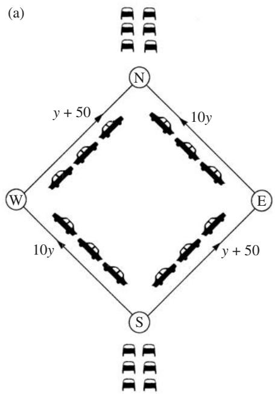
Figure 3 Braess’s paradox. The addition of a link causes everyone’s journey time to lengthen. (After Braess (1968) and Cohen (1988).)
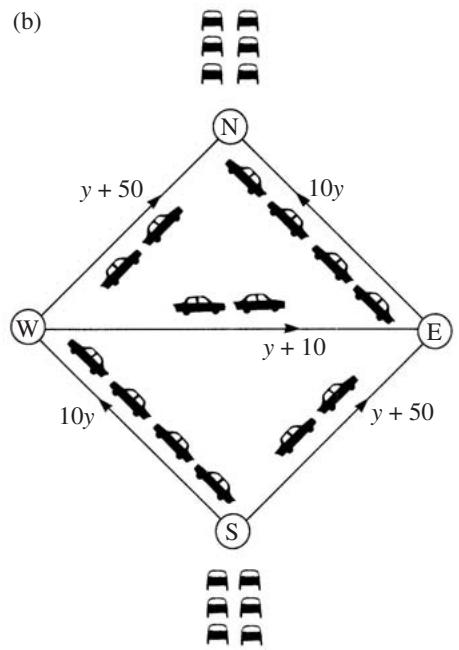

To explore the point further, note that the product of the flow and the delay is the delay incurred at link j per unit time, aggregated over all the vehicles using link j. Let us try to find the flow pattern that minimizes the total delay per unit time, summed over the entire network. Consider then the following problem. 

Note that the problem is of the same form as the earlier optimization problem, but the function to be minimized now measures the total network delay per unit time. (Recall that the function to be minimized in the first optimization problem seemed initially to be rather arbitrary, with its eventual motivation being that its minimization was achieved by a Wardrop equilibrium.) Again define the function 

$\begin{array}{l} L (x, y; \lambda , \mu) \\ = \sum_ {j \in J} y _ {j} D _ {j} (y _ {j}) + \lambda \cdot (f - H x) - \mu \cdot (y - A x). \\ \end{array}$
Again 
$\frac {\partial L}{\partial x _ {r}} = - \lambda_ {s (r)} + \sum_ {j \in J} \mu_ {j} A _ {j r},$
but now 
$\frac {\partial L}{\partial y _ {j}} = D _ {j} (y _ {j}) + y _ {j} D _ {j} ^ {\prime} (y _ {j}) - \mu_ {j}.$
Hence a minimum of L over and y occurs when 
$\mu_ {j} = D _ {j} (y _ {j}) + y _ {j} D _ {j} ^ {\prime} (y _ {j})$
and 
$\lambda_ {s (r)} = \sum_ {j \in J} \mu_ {j} A _ {j r} \quad \text { if } x _ {r} > 0$
$\leqslant \sum_ {j \in J} \mu_ {j} A _ {j r} \quad \text { if } x _ {r} = 0.$
The Lagrange multipliers now have a more sophisticated interpretation. Suppose that, in addition to the delay , users of link j incur a traffic-dependent toll 
$T _ {j} (y _ {j}) = y _ {j} D _ {j} ^ {\prime} (y _ {j}).$

Then is the generalized cost of using link defined as the sum of the toll and the delay, and is the minimum generalized cost over all routes serving the node pair s. If users select routes in an attempt to minimize the sum of their tolls and their delays, then they will produce a flow pattern that minimizes total delay in the network. Notice that the generalized cost is , which is the rate of increase in the total delay at link j as the flow is increased. So the assumption now is that, in a certain sense, drivers try to minimize their contribution to the total delay rather than minimizing their own delay. 
We have seen that if drivers attempt to minimize their own delay, then the resulting equilibrium flows will minimize a certain objective function defined for the network. However, the objective function is certainly not the total network delay, and thus there is no guarantee that when capacity is added to a network the situation is improved. We have also seen that, with the imposition of appropriate tolls, it is possible for the self-interested behavior of drivers to lead to an equilibrium pattern of flow that minimizes total delay. A major challenge for governments and transport planners is to understand how insights from these and more sophisticated models might be used to encourage more efficient development and use of road networks (Department for Transport 2004). 
# 5 Flow Control in the Internet 
When a file is requested over the Internet, the computer that hosts that file breaks it into small packets of data that are then transferred across the network by the transmission control protocol of the Internet, or TCP. The rate at which packets enter the network is controlled by TCP, which is implemented as software on the two computers that are the source and destination of the data. The general approach is as follows (Jacobson 1988). When a link within the network becomes overloaded, one or more packets are lost; loss of a packet is taken as an indication of congestion, the destination informs the source, and the source slows down. TCP then gradually increases its sending rate until it again receives an indication of congestion. This cycle of increase and decrease enables the source computers to discover and use the available capacity, and to share it between different flows of packets. 
TCP has been outstandingly successful as the Internet has evolved from a small-scale research network to today’s interconnection of hundreds of millions of endpoints and links. This in itself is a striking observation. Each of a large but indeterminate number of flows is controlled by a feedback loop that can know only of that flow’s experience of congestion. A flow does not know how many other flows are sharing a link on its route, or even how many links are on its route. The links vary in capacity by many orders of magnitude, as do the numbers of flows sharing different links. It is remarkable that so much has been achieved in such a rapidly growing and heterogeneous network with congestion controlled just at the endpoints. Why does this algorithm work so well? 

In recent years theoreticians have shed some light on TCP’s success, by interpreting the protocol as a decentralized parallel algorithm that solves an optimization problem, just as the decentralized choices of drivers in a road network solve an optimization problem. We shall outline the argument, beginning with a more detailed description of TCP.2 
Packets transferred by TCP across the Internet contain sequence numbers indicating their order, and they should arrive at their destination in that order. When a packet is received at the destination, it is acknowledged: an acknowledgment is a short packet sent by the destination back to the source. If a packet has been lost in the transfer, the source can tell this from the sequence numbers contained in the acknowledgments. The source keeps a copy of each packet sent until it has been positively acknowledged; these copies form what is called a sliding window, and allow packets lost in transfer to be sent again by the source. 
Meanwhile, stored in the source computer there is a numerical variable known as the congestion window and denoted cwnd. The congestion window directs the size of the sliding window in the following sense: if the size of the sliding window is less than cwnd, then the computer increases it by sending out a packet; if it is greater than or equal to cwnd, then it waits for positive acknowledgments to come in, which have the effect of reducing the size of the sliding window and, as we shall see, increasing cwnd as well. Thus, the size of the sliding window continually changes, moving in the direction of a target size that is given by the congestion window. 
The congestion window itself is not a fixed number: rather, it is constantly being updated, and the precise rules for how this is done are critical for TCP’s sharing of capacity. The rules currently used are as follows. 

Every time a positive acknowledgment comes in, cwnd is increased by cwnd−1, and every time a lost packet is detected, cwnd is halved.3 Thus, if the source computer detects a lost packet, it realizes that there has been some congestion and backs off for a while, but if all its packets are getting through then it allows the rate at which it sends packets to inch up again. 
If is the probability that a packet is lost, then with probability the congestion window will increase by cwnd−1 and with probability it will decrease by 12 cwnd. The expected change in the congestion window cwnd per update step is therefore 
$\operatorname{cwnd} ^ {- 1} (1 - p) - \frac {1}{2} \operatorname{cwnd} p.$
The expected change will be positive for small values of cwnd, but will become negative if cwnd is big enough. We might therefore expect an equilibrium for cwnd to arise when the expression is zero: that is, when 
$\operatorname{cwnd} = \sqrt {\frac {2 (1 - p)}{p}}.$
Now let us see how this calculation can be extended to networks. Suppose that a network consists of a set of nodes connected by directed links, like the network illustrated in figure 1. As earlier, let J be the set of directed links, let R be the set of routes, and let be the link-route incidence matrix. When a request reaches a computer in this network, that computer will set up a congestion window for the flow of packets that will result. Since there will be many different such congestion windows, they need to be labeled, and it is convenient to label them with the route that will be used for the flow. (Exactly how these flows are routed is a complicated and important question, but one that we shall not discuss here.) So, for each route r that is being used, let cwnd be the congestion window for that route. Let be the round-trip time for the route r : that is, the time between the sending out of a packet and the receiving of an acknowledgment for Finally, define a variable to be cwndr . 
Now at any given time the sliding window consists of those packets that have been sent but not acknowledged. Therefore, if a packet has just been acknowledged and its round-trip has taken time , the sliding window consists of all packets sent out in the last time units. Since the source computer is aiming for the number of such packets to be about cwndr , we can interpret to be the rate at which packets are transferred over route r . Thus, the numbers form a flow vector that is closely analogous to the traffic flow vector discussed earlier. 
As we did then, let us define a vector , so that is the total flow through link j, obtained by summing over each route r that passes through link j. Let be the proportion of packets that are lost, or “dropped,” at link We expect to be related to , the total flow through link as follows. If is less than the capacity of link then will be zero; there will be no dropped packets at link j if the link is not full. And if then if packets are dropped then the link is full. If we assume that the proportions of packets dropped at links are small, then the probability that a packet is lost on route r is approximately 
$p _ {r} = \sum_ {j \in J} p _ {j} A _ {j r}.$
(The exact formula would be , but when the are small we can ignore their products.) Since , our earlier calculation of cwnd now gives us that 
$x _ {r} = \frac {1}{T _ {r}} \sqrt {\frac {2 (1 - p _ {r})}{p _ {r}}}.$
Is it possible to choose the rates and the drop probabilities in a consistent fashion, so that the last two equations are satisfied and either is zero or for each The remarkable observation is that such a choice corresponds precisely to the solution of the following optimization problem (Kelly 2001; Low et al. 2002). 

Some aspects of this optimization problem are as we might expect: in particular, the inequality simply adds up the flows through link and requires that the sum not exceed the capacity of link j, for each link But, as before, the function being optimized is undoubtedly strange. The arctan function, illustrated in figure 4, is the inverse function to the trigonometric function tan, and can also be defined as 

$\arctan (x) = \int_ {0} ^ {x} \frac {1}{1 + u ^ {2}} d u.$
From this form, we see that its derivative with respect to x is . 
Let us sketch the relationship between the optimization problem and the equilibrium rates and drop probabilities. Define the function 
$L (x, z; \mu)$
$= \sum_ {r \in R} \frac {\sqrt {2}}{T _ {r}} \arctan \left(\frac {x _ {r} T _ {r}}{\sqrt {2}}\right) + \mu \cdot (C - A x - z),$
where is a vector of Lagrange multipliers, and is a vector of slack variables, measuring the spare capacity on each of the links of the network. Then, using the derivative of the arctan function, 
$\frac {\partial L}{\partial x _ {r}} = \left(1 + \frac {1}{2} x _ {r} ^ {2} T _ {r} ^ {2}\right) ^ {- 1} - \sum_ {j \in J} \mu_ {j} A _ {j r} \quad \text { and } \quad \frac {\partial L}{\partial z _ {j}} = - \mu_ {j}.$
We look for a maximum of L over it turns out that this maximum is, under the identification , precisely the collection of rates and drop probabilities that we were looking for. For example, setting to zero the partial derivative with respect to gives the desired equation for . 
In summary, for each link the Lagrange multiplier arising from the optimization problem is precisely the proportion of packets dropped at that link, much as the Lagrange multipliers arising earlier were precisely the delays on links of a road traffic network. And the equilibrium reached by the interaction of many competing TCPs, each implemented only on the source and destination computers, is effectively maximizing an objective function for the entire network. The objective function has a surprising interpretation: it is as if the usefulness of the flow rate to the source– destination pair served by this route is given by a utility function 

$\frac {\sqrt {2}}{T _ {r}} \arctan \left(\frac {x _ {r} T _ {r}}{\sqrt {2}}\right),$
and the network is attempting to maximize the sum of these utility functions across all source–destination pairs, subject to constraints arising from the limited capacities of the links. 
The arctan function, illustrated in figure 4, is concave. Thus, if two or more connections share an overloaded link, the rates achieved will be approximately equal, since otherwise the total utility could be increased by reducing the largest rate a little and increasing the smallest rate a little. As a result, there is a tendency for TCP to share resources more or less equitably. This is very different from resource-control mechanisms in traditional telephone networks where, if the network is overloaded, some calls are blocked in order that the calls that are accepted are unaffected by the overload. 
# 6 Conclusion 
The behavior of large-scale systems has been of great interest to mathematicians for over a century, with many examples coming from physics. For example, the behavior of a gas can be described at the microscopic level in terms of the position and velocity of each molecule. At this level of detail a molecule’s velocity appears as a random process, as the molecule bounces around off other molecules and the walls of the container. Yet consistent with this detailed microscopic description of the system is macroscopic behavior best described by quantities such as temperature and pressure. Similarly, the behavior of electrons in an electrical network can be described in terms of random walks, and yet this simple description at the microscopic level leads to rather sophisticated behavior at the macroscopic level: Kelvin showed that the pattern of potentials in a network of resistors is exactly the one that minimizes heat dissipation for a given level of current flow (Kelly 1991). The local, random behavior of the electrons causes the network as a whole to solve a rather complex optimization problem. 
In the last fifty years we have begun to realize that large-scale engineered systems are often best understood in similar terms. Thus a microscopic description of traffic flow in terms of each driver’s choice of the most convenient route can be consistent with macroscopic behavior described in terms of a function minimization. And the simple, local rules that control how packets are transmitted through the Internet can correspond to a maximizing of aggregate utility across the entire network. 

One thought-provoking difference is that, whereas the microscopic rules governing physical systems are fixed, for engineered systems such as transport or communication networks we may be able to choose the microscopic rules so as to achieve the macroscopic consequences we judge desirable. 
# Further Reading 
# VII.5 The Mathematics of Algorithm Design Jon Kleinberg 
# 1 The Goals of Algorithm Design 
When computer science began to emerge as a subject at universities in the 1960s and 1970s, it drew some amount of puzzlement from the practitioners of more established fields. Indeed, it is not initially clear why computer science should be viewed as a distinct academic discipline. The world abounds with novel technologies, but we do not generally create a separate field around each one; rather, we tend to view them as by-products of existing branches of science and engineering. What is special about computers? 

Viewed in retrospect, such debates highlighted an important issue: computer science is not so much about the computer as a specific piece of technology as it is about the more general phenomenon of computation itself, the design of processes that represent and manipulate information. Such processes turn out to obey their own inherent laws, and they are performed not only by computers but by people, by organizations, and by systems that arise in nature. We will refer to these computational processes as algorithms. For the purposes of our discussion in this article, one can think of an algorithm informally as a step-by-step sequence of instructions, expressed in a stylized language, for solving a problem. 
This view of algorithms is general enough to capture both the way a computer processes data and the way a person performs calculations by hand. For example, the rules for adding and multiplying numbers that we learn as children are algorithms; the rules used by an airline company for scheduling flights constitute an algorithm; and the rules used by a search engine like Google for ranking Web pages constitute an algorithm. It is also fair to say that the rules used by the human brain to identify objects in the visual field constitute a kind of algorithm, though we are currently a long way from understanding what this algorithm looks like or how it is implemented on our neural hardware. 
A common theme here is that one can reason about all these algorithms without recourse to specific computing devices or computer programming languages, instead expressing them using the language of mathematics. In fact, the notion of an algorithm as we now think of it was formalized in large part by the work of mathematical logicians in the 1930s, and algorithmic reasoning is implicit in the past several millennia of mathematical activity. (For example, equation-solving methods have always tended to have a strong algorithmic flavor; the geometric constructions of the ancient Greeks were inherently algorithmic as well.) Today, the mathematical analysis of algorithms occupies a central position in computer science; reasoning about algorithms independently of the specific devices on which they run can yield insight into general design principles and fundamental constraints on computation. 
At the same time, computer-science research struggles to keep two diverging views in focus: this more abstract view that formulates algorithms mathematically, and the more applied view that the public generally associates with the field, the one that seeks to develop applications such as Internet search engines, electronic banking systems, medical imaging software, and the host of other creations we have come to expect from computer technology. The tension between these two views means that the field’s mathematical formulations are continually being tested against their implementation in practice; it provides novel avenues for mathematical notions to influence widely used applications; and it sometimes leads to new mathematical problems motivated by these applications. 

The goal of this short article is to illustrate this balance between the mathematical formalism and the motivating applications of computing. We begin by building up to one of the most basic definitional questions in this vein: how should we formulate the notion of efficient computation? 
# 2 Two Representative Problems 
To make the discussion of efficiency more concrete, and to illustrate how one might think about an issue like this, we first discuss two representative problems— both fundamental in the study of algorithms—that are similar in their formulation but very different in their computational difficulty. 
The first in this pair is the traveling salesman problem (TSP), which is defined as follows. We imagine a salesman contemplating a map with n cities (he is currently located in one of them). The map gives the distance between each pair of cities, and the salesman wishes to plan the shortest possible tour that visits all n cities and returns to the starting point. In other words, we are seeking an algorithm that takes as input the set of all distances among pairs of cities, and produces a tour of minimum total length. Figure 1(a) depicts the optimal solution to a sample input instance of the TSP; the circles represent the cities, the dark lines (with lengths labeling them) connect cities that the salesman visits consecutively on the tour, and the lighter lines connect all the other pairs of cities, which are not visited consecutively. 
A second problem is the minimum spanning tree problem (MSTP). Here we imagine a construction firm with access to the same map of n cities, but with a different goal in mind. They wish to build a set of roads connecting certain pairs of the cities on the map, so that after these roads are built there is a route from each of the n cities to each other one. (A key point here is that each road must go directly from one city to another.) The goal is to build such a road network as cheaply as possible—in other words, using as little total road material as possible. Figure 1(b) depicts the optimal solution to the instance of the MSTP defined by the same set of cities used for part (a). 
Figure 1 Solutions to instance of (a) the traveling salesman problem and (b) the minimum spanning tree problem, on the same set of points. The dark lines indicate the pairs of cities that are connected by the respective optimal solutions, and the lighter lines indicate all pairs that are not connected.
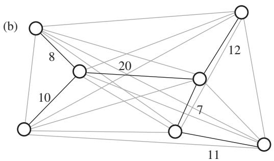

Both of these problems have a wide range of practical applications. The TSP is a basic problem concerned with sequencing a given set of objects in a “good” order; it has been used for problems that run from planning the motion of robotic arms drilling holes on printed circuit boards (where the “cities” are the locations where the holes must be drilled) to ordering genetic markers on a chromosome in a linear sequence (with the markers constituting the cities, and the distances derived from probabilistic estimates of proximity). The MSTP is a basic issue in the design of efficient communication networks; this follows the motivation given above, with fiber-optic cable acting in the role of “roads.” The MSTP also plays an important role in the problem of clustering data into natural groupings. Note, for example, how the points on the left-hand side of figure 1(b) are joined to the points on the right-hand side by a relatively long link; in clustering applications, this can be taken as evidence that the left and right points form natural groupings. 

It is not hard to come up with an algorithm for solving the TSP. We first list every possible way of ordering the cities (other than the starting city, which is fixed in advance). Each ordering defines a tour—the salesman could visit the cities in this order and then return to the start—and for each ordering we could compute the total length of the tour, by traversing the cities in this order and summing the distances from each city to the next. As we perform this calculation for all possible orders, we keep track of the order that yields the smallest total distance, and at the end of the process we return this tour as the optimal solution. 
While this algorithm does solve the problem, it is extremely inefficient. There are n − 1 cities other than the starting point, and any possible sequence of them defines a tour, so we need to consider possible tours. Even for n = 30 cities, this is an astronomically large quantity; on the fastest computers we have today, running this algorithm to completion would take longer than the life expectancy of the Earth. The difficulty is that the algorithm we have just described is performing a brute-force search: the “search space” of possible solutions to the TSP is very large, and the algorithm is doing nothing more than plowing its way through this entire space, considering every possible solution. 
For most problems, there is a comparably inefficient algorithm that simply performs a brute-force search. Things tend to get interesting when one finds a way to improve significantly on this brute-force approach. 
The MSTP provides a nice example of how such an improvement can happen. Rather than considering all possible road networks on the given set of cities, suppose we try the following myopic, “greedy” approach to the MSTP. We sort all the pairs of cities in order of increasing distance, and then work through the pairs in this order. When we get to a pair of cities, say A and B, we test if there is already a way to travel from A to B in the collection of roads constructed thus far. If there is, then it would be superfluous to build a direct road from A to B—our goal, remember, is just to make sure every pair is connected by some sequence of roads, and A and B are already connected in this case. But if there is no way to get from A to B using what has already been built, then we construct the direct road from A to B. (As an example of this reasoning, note that the potential road of length 14 in figure 1(a) would not get built by this MSTP algorithm; by the time this direct route is considered, its endpoints are already joined by the sequence of two shorter roads of length 7 and 11, as depicted in figure 1(b).) 

It is not at all obvious that the resulting road network should have the minimum possible cost, but in fact this is true. In other words, one can prove a theorem that says, essentially, “On every input, the algorithm just described produces an optimal solution.” The payoff from this theorem is that we now have a way to compute an optimal road network by an algorithm that is much, much more efficient than brute-force search: it simply needs to sort the pairs of cities by their distances, and then make a single pass through this sorted list to decide which roads to build. 
This discussion has provided us with a fair amount of insight into the nature of the TSP and the MSTP. Rather than experimenting with actual computer programs, we described algorithms in words, and made claims about their performance that could be stated and proved as mathematical theorems. But what can we abstract from these examples if we want to talk about computational efficiency in general? 
# 3 Computational Efficiency 
Most interesting computational problems share the following feature with the TSP and the MSTP: an input of size n implicitly defines a search space of possible solutions whose size grows exponentially with n. One can appreciate this explosive growth rate as follows: if we simply add one to the size of the input, the time required to search the entire space increases by a multiplicative factor. We would prefer algorithms to scale more reasonably: their running times should only increase by a multiplicative factor when the input itself increases by a multiplicative factor. Running times that are bounded by a polynomial function of the input size—in other words, proportional to n raised to some fixed power—exhibit this property. For example, if an algorithm requires at most steps on an input of size n, then it requires at most steps on an input twice as large. 
In part because of arguments like this, computer scientists in the 1960s adopted polynomial time as a working definition of efficiency: an algorithm is deemed to be efficient if the number of steps it requires on an input of size n grows like n raised to a fixed power. Using the concrete notion of polynomial time as a surrogate for the fuzzier concept of efficiency is the kind of modeling decision that ultimately succeeds or fails based on its utility in guiding the development of real algorithms. And in this regard, polynomial time has turned out to be a definition of surprising power in practice: problems for which one can develop a polynomial-time algorithm have turned out in general to be highly tractable, while those for which we lack polynomial-time algorithms tend to pose serious challenges even for modest input sizes. 

A concrete mathematical formulation of efficiency provides a further benefit: it becomes possible to pose, in a precise way, the conjecture that certain problems cannot be solved by efficient algorithms. The TSP is a natural candidate for such a conjecture; after decades of failed attempts to find an efficient algorithm for the TSP, one would like to be able to prove a theorem that says, “There is no polynomial-time algorithm that finds an optimal solution to every instance of the TSP.” A theory known as np-completeness [IV.20 §4] provides a unifying framework for thinking about such questions; it shows that a large class of computational problems, containing literally thousands of naturally arising problems (including the TSP), are equivalent with respect to polynomial-time solvability: there is an efficient algorithm for one if and only if there is an efficient algorithm for all. It is a major open problem to decide whether or not these problems have efficient algorithms; the deeply held sense that they do not has become the P versus NP conjecture, which has begun to appear on lists of the most prominent problems in mathematics. 
Like any attempt to make an intuitive notion mathematically precise, polynomial time as a definition of efficiency in practice begins to break down around its boundaries. There are algorithms for which one can prove a polynomial bound on the running time, but which are hopelessly inefficient in practice. Conversely, there are well-known algorithms (such as the standard simplex method [III.84] for linear programming) that require exponential running time on certain pathological instances, but which run quickly on almost all inputs encountered in real life. And for computing applications that work with massive data sets, an algorithm with a polynomial running time may not be efficient enough; if the input is a trillion bytes long (as can easily occur when dealing with snapshots of the Web, for example), even an algorithm whose running time depends quadratically on the input will be unusable in practice. For such applications, one generally needs algorithms that scale linearly with the size of the input—or, more strongly, that operate by “streaming” through the input in one or two passes, solving the problem as they go. The theory of such streaming algorithms is an active topic of research, drawing on techniques from information theory, Fourier analysis, and other areas. None of this means that polynomial time is losing its relevance to algorithm design—it is still the standard benchmark for efficiency—but new computing applications tend to push the limits of current definitions, and in the process raise new mathematical problems. 

# 4 Algorithms for Computationally Intractable Problems 
In the previous section we discussed how researchers have identified a large class of natural problems, including the TSP, for which it is strongly believed that no efficient algorithm exists. While this explains our difficulties in solving these problems optimally, it leaves open a natural question: what should we do when actually confronted by such a problem in practice? 
There are a number of different strategies for approaching such computationally intractable problems. One of these is approximation: for problems like the TSP that involve choosing an optimal solution from among many possibilities, we could try to formulate an efficient algorithm that is guaranteed to produce a solution almost as good as the optimal one. The design of such approximation algorithms is an active area of research; we can see a basic example of this process by considering the TSP. Suppose we are given an instance of the TSP, specified by a map with distances, and we set ourselves the task of constructing a tour whose total length is at most twice that of the shortest tour. At first this goal seems a bit daunting: since we do not know how to compute the optimal tour (or its length), how will we guarantee that the solution we produce is short enough? It turns out, however, that this can be done by exploiting an interesting connection between the TSP and the MSTP, a relationship between the respective optimal solutions to each problem on the same set of cities. 
Consider an optimal solution to the MSTP on the given set of cities, consisting of a network of roads; recall that this is something we can compute efficiently. Now, the salesman interested in finding a short tour for these cities can use this optimal road network to visit the cities as follows. Starting at one city, he follows roads until he hits a dead end, that is, a city with no new roads exiting it. He then backs up, retracing his steps until he gets to a junction with a road he has not yet taken, and he proceeds down this new road. For example, starting in the upper left corner of figure 1(b), the salesman would follow the road of length 8 and then choose one of the roads of length 10 or 20; if he selects the former, then after reaching the dead end he would back up to this junction again and continue the tour by following the road of length 20. A tour constructed in this way traverses each road twice (once in each direction), so if we let m denote the total length of all roads in the optimal MSTP solution, we have found a tour of length 2m. 

How does this compare to the length of the best possible tour? Let us first argue that . This is true because, in the space of all possible solutions to the MSTP, one option is to build roads between cities that the salesman visits consecutively in the optimal TSP tour, for a total mileage of on the other hand, m is the total length of the shortest possible road network, and hence t cannot be smaller than m. So we have concluded that the optimal solution to the TSP has length at least m. However, we have just exhibited an algorithm that finds a tour of length 2m, so, as we wanted, we have an efficient way to find a tour that is at most twice as long as the shortest one possible. 
People trying to solve large instances of computationally hard problems in practice frequently use algorithms that have been observed empirically to give nearly optimal solutions, even when no guarantees on their performance have been proved. Local-search algorithms form one widely used class of approaches like this. A local-search algorithm starts with an initial solution and repeatedly modifies it by making some “local” change to its structure, looking for a way to improve its quality. In the case of the TSP, a local-search algorithm would seek simple improving modifications to its current tour; for example, it might look at sets of cities that are visited consecutively and see if visiting them in the opposite order would shorten the tour. Researchers have drawn connections between local-search algorithms and phenomena in nature; for example, just as a large molecule contorts itself in space trying to find a minimum-energy conformation, we can imagine the TSP tour in a local-search algorithm modifying itself as it tries to reduce its length. Determining how deeply this analogy goes is an interesting research issue. 
# 5 Mathematics and Algorithm Design: Reciprocal Influences 
Many branches of mathematics have contributed to aspects of algorithm design, and the issues raised by the analysis of new algorithmic problems have, in a number of cases, suggested novel mathematical questions. 

Combinatorics and graph theory have been qualitatively transformed by the growth of computer science, to the extent that algorithmic questions have become thoroughly intertwined with the mainstream of research in these areas. Techniques from probability have also become fundamental to many areas of computer science: probabilistic algorithms draw power from the ability to make random choices while they are being executed, and probabilistic models of the input to an algorithm can give one a more realistic view of the problem instances that arise in practice. This style of analysis provides a steady source of new questions in discrete probability. 
A computational perspective is often useful in thinking about “characterization” problems in mathematics. For example, the general issue of characterizing prime numbers has an obvious algorithmic component: given a number n as input, how efficiently can we determine whether it is prime? (There exist algorithms that are exponentially better than the approach of dividing n by all numbers up to √n: see computational number theory [IV.3 §2].) Problems in knot theory [III.44], such as the characterization of unknotted loops, have a similar algorithmic side. Suppose we are given a circular loop of string in three dimensions (described as a jointed chain of line segments), and it wraps around itself in complicated ways. How efficiently can we determine whether it is truly knotted, or whether by moving it around we can fully untangle it? We can ask this sort of question in many similar mathematical contexts; it is clear that these algorithmic issues are extremely concrete as problems, though they may lose part of the original intent of the mathematicians who posed the questions more generally. 
Rather than attempting to enumerate the intersection of algorithmic ideas with all the different branches of mathematics, we conclude this article with two case studies that involve the design of algorithms for particular applications, and the ways in which mathematical ideas arise in each instance. 
# 6 Web Search and Eigenvectors 
As the World Wide Web grew in popularity throughout the 1990s, computer-science researchers grappled with a difficult problem: the Web contains a vast amount of useful information, but its anarchic structure makes it very hard for users, unassisted, to find the specific information they are looking for. Thus, early in the Web’s history, people began to develop search engines that would index the information on the Web, and produce relevant Web pages in response to user queries. But of the thousands or millions of pages relevant to a topic on the Web, which few should the search engine present to a user? This is the ranking problem: how to determine the “best” resources on a given topic. Note the contrast with concrete problems like the TSP. There, the goal (the shortest tour) was not in doubt; the difficulty was simply in computing an optimal solution efficiently. For the search engine ranking problem, on the other hand, formalizing the goal is a large part of the challenge—what do we mean by the “best” page on a topic? In other words, an algorithm to rank Web pages is really providing a definition of the quality of a Web page as well as the means to evaluate this definition. 

The first search engines ranked each Web page based purely on the text it contained. These approaches began to break down as the Web grew, because they did not take into account the quality judgments encoded in the Web’s hyperlinks: in browsing the Web, we often discover high-quality resources because they are “endorsed” through the links they receive from other pages. This insight led to a second generation of search engines that determined rankings using link analysis. 
The simplest such analysis would just count the number of links to a page: in response to the query “newspapers,” for example, one could rank pages by the number of incoming links they receive from other pages containing the term—in effect, allowing pages containing the term “newspapers” to vote on the result. Such a scheme will generally do well for the top few items, placing prominent news sites like The New York Times and The Financial Times at the head of the list; beyond this, however, it will quickly break down, favoring a large number of highly linked but irrelevant sites. 
It is possible to make much more effective use of the latent information in the links. Consider pages that link to many of the sites ranked highly by this simple voting scheme; it is natural to expect that these are authored by people with a good sense for where the interesting newspapers are, and so we could run the voting again, this time giving more voting power to these pages that selected many of the highly ranked sites. This revote might elevate certain lesser-known newspapers favored by Web-page authors who were more knowledgeable on the topic; in response to the results of this revote, we could further sharpen our weighting of the voters. This “principle of repeated improvement” uses the information contained in a set of page-quality estimates to produce a more refined set of estimates. If we perform these refinements repeatedly, will they converge to a stable solution? 

In fact, this sequence of refinements can be viewed as an algorithm for computing the principal eigenvector [I.3 §4.3] of a particular matrix; this both establishes the convergence of the process and characterizes the end result. To establish this connection, we introduce some notation. Each Web page is assigned two scores: an authority weight, measuring its quality as a primary source on the topic; and a hub weight, measuring its power as a voter for the highest-quality content. Pages may score highly in one of these measures but not in the other—one should not expect a prominent newspaper to simultaneously serve as a good guide to other newspapers—but there is also nothing to prevent a page from scoring well in both. One round of voting can now be viewed as follows: we update the authority weight of each page by summing the hub weights of all pages that point to it (receiving links from highly weighted voters makes you a better authority); we then reweight all the voters, updating each page’s hub weight by summing the authority weights of the pages it points to (linking to high-quality content makes you a better hub). 
How do eigenvectors come into this? Suppose we define a matrix M with one row and one column for each page under consideration; the entry equals 1 if page i links to page j, and it equals 0 otherwise. We encode the authority weights in a vector a, where the coordinate is the authority weight of page i. The hub weights can be similarly written as a vector h. Using the definition of matrix–vector multiplication, we can now check that the updating of hub weights in terms of authority weights is simply the act of setting h equal to Ma; correspondingly, setting a equal to updates the authority weights. (Here denotes the transpose of the matrix M.) Running these updates n times each from starting vectors and we obtain This is the power-iteration method for computing the principal eigenvector of in which we repeatedly multiply some fixed starting vector by larger and larger powers of (As we do this, we also divide all coordinates of the vector by a scaling factor to prevent them from growing unboundedly.) Hence this eigenvector is the stable set of authority weights toward which our updates are converging. By completely symmetric reasoning, the hub weights are converging toward the principal eigenvector of . 

A related link-based measure is PageRank, defined by a different procedure that is also based on repeated refinement. Instead of drawing a distinction between the voters and the voted-on, one posits a single kind of quality measure that assigns a weight to each page. A current set of page weights is then updated by having each page distribute its weight uniformly among the pages it links to. In other words, receiving links from high-quality pages raises one’s own quality. This too can be written as multiplication by a matrix, obtained from by dividing each row’s entries by the number of outgoing links from the corresponding page; repeated updates again converge to an eigenvector. (There is a further wrinkle here: repeated updating in this case tends to cause all weight to pool at “dead-end” pages that have no outgoing links and hence nowhere to pass their weight. Thus, to obtain the PageRank measure used in applications, one adds a tiny quantity in each iteration to the weight of each page; this is equivalent to using a slightly modified matrix.) 
PageRank is one of the main ingredients in the search engine Google; hubs and authorities form the basis for Ask’s search engine Teoma, as well as a number of other Web search tools. In practice, current search engines (including Google and Ask) use highly refined versions of these basic measures, often combining features of each; understanding how relevance and quality measures are related to large-scale eigenvector computations remains an active research topic. 
# 7 Distributed Algorithms 
Thus far we have been discussing algorithms that run on a single computer. As a concluding topic, we briefly touch on a broad area in computer science concerned with computations that are distributed over multiple communicating computers. Here the problem of efficiency is compounded by concerns over maintaining coordination and consistency among the communicating processes. 
As a simple example illustrating these issues, consider a network of automatic teller machines (ATMs). When you withdraw an amount of money x at one of these ATMs, it must do two things: (1) notify a central bank computer to deduct x from your account; and (2) emit the correct amount of money in physical bills. Now, suppose that between steps (1) and (2) the ATM crashes so that you do not get your money; you would like it to be the case that the bank does not subtract x from your account anyway. Or suppose that the ATM executes both of steps (1) and (2), but its message to the bank is lost; the bank would like for x to be eventually subtracted from your account anyway. The field of distributed computing is concerned with designing algorithms that operate correctly in the presence of such difficulties. 

As a distributed system runs, certain processes may experience long delays, some of them may fail in midcomputation, and some of the messages between them may be lost. This leads to significant challenges in reasoning about distributed systems, because this pattern of failures can cause each process to have a slightly different view of the computation. It is easily possible for there to be two runs of the system, with different patterns of failure, that are “indistinguishable” from the point of view of some process in other words, P will have the same view of each, simply because the differences in the runs did not affect any of the communications that it received. This can pose a problem if final output is supposed to depend on its having noticed that the two runs were different. 
A major advance in the study of such systems came about in the 1990s, when a connection was made to techniques from algebraic topology. Consider for simplicity a system with three processes, though everything we say generalizes to any number of processes. We consider the set of all possible runs of the system; each run defines a set of three views, one held by each process. We now imagine the views associated with a single run as the three corners of a triangle, and we glue these triangles together according to the following rule: for any two runs that are indistinguishable to some process P, we paste the two corresponding triangles together at their corners associated with P. This gives us a potentially very complicated geometric object, constructed by applying all these pasting operations to the triangles; we call this object the complex associated with the algorithm. (If there were more than three processes, we would have an object in a higher number of dimensions.) While it is far from obvious, researchers have been able to show that the correctness of distributed algorithms can be closely connected with the topological properties of the complexes that they define. 
This is another powerful example of the way in which mathematical ideas can appear unexpectedly in the study of algorithms, and it has led to new insights into the limits of the distributed model of computation. 
