Combining the analysis of algorithms and their complexes with classical results from algebraic topology has in some cases resolved tricky open problems in this area, establishing that certain tasks are provably impossible to solve in a distributed system. 
# Further Reading 
Algorithm design is a standard topic in the undergraduate computer-science curriculum, and it is the subject of a number of textbooks, including Cormen et al. (2001) and a book by Kleinberg and Tardos (2005). The perspective of early computer scientists on how to formalize efficiency is discussed by Sipser (1992). The TSP and the MSTP are fundamental to the field of combinatorial optimization; the TSP is used as a lens through which this field is surveyed in a book edited by Lawler et al. (1985). Approximation algorithms and local-search algorithms for computationally intractable problems are discussed in books edited by Hochbaum (1996) and by Aarts and Lenstra (1997), respectively. Web search and the role of link analysis is covered in a book by Chakrabarti (2002); beyond Web applications, there are a number of other interesting connections between eigenvectors and network structures, as described by Chung (1997). Distributed algorithms are covered in a book by Lynch (1996), and the topological approach to analyzing distributed algorithms is reviewed by Rajsbaum (2004). 
# VII.6 Reliable Transmission of Information 
Madhu Sudan 
# 1 Introduction 
The notion of “digital information” emerged in the middle of the twentieth century, in response to the advent of the telegraph and to the beginnings of computer science, which at the time was principally a theoretical discipline. Of course, the use of electricity to communicate signals goes back further, but the earlier uses involved signals of a “continuous” nature: music, voice, etc. The new era was characterized by the transmission of (or the need to transmit) more “discrete” messages, i.e., messages such as English sentences, which can be described as finite sequences of letters taken from some finite alphabet. The phrase “digital information” came to be applied to such families of messages. 
Digital information posed some novel challenges to the engineers and mathematicians charged with the task of communicating such messages. The root cause of these challenges is “noise.” Every communication medium is noisy, and never transmits any signal completely accurately. In the case of continuous signals, somehow the receivers (typically, our ears and eyes) can adjust to such errors and learn to discount them. For example, if you play a very old recording of a musical performance, then there will typically be a crackling noise, but it is possible to ignore this, unless the quality is very bad indeed, and concentrate on the music. However, in the case of digital information errors can have a more catastrophic effect. To see this, suppose that we are communicating in English sentences and that the communication medium makes occasional mistakes by altering one of the transmitted letters. In such a scenario the message 
# WE ARE NOT READY 
could easily be changed into the message 
# WE ARE NOW READY. 
All it takes is one error on the part of the communication medium, and the entire intention of the message is reversed. Digital information tends to be inherently intolerant of errors, and the mathematicians and engineers of the time were charged with the task of inventing methods that would make communication reliable even if the process of transmission is not. 

Here is one way of achieving this. To communicate any message, the sender of the message repeats every letter, say five times. For example, to send the message 
# WE ARE NOT READY 
the sender says something like 
# WWWWWEEEEE AAAAA. . . . 
The receiver can then detect errors (as long as there are not too many) by checking that every block of five successive letters repeats the same letter. If this ever fails to be the case, then it is clear that errors have occurred during transmission. If it is not possible for five successive symbols to be in error (or even if it is just very unlikely), then it follows that the resulting scheme is also more reliable than the underlying means of transmission. Finally, if even less error is possible, then it may be possible for the receiver to determine the actual message, rather than simply being able to tell when errors have occurred. For example, if at most two symbols in any block of five can be erroneous, then the most commonly occurring letter in each block of five must be the letter from the original message: for instance, a sequence such as 
# WWWMWEFEEE AAAAA . . . 
would be interpreted by the receiver as 
WE A . . . . 
Repeating every symbol five times in order to be able to correct two errors does not appear to be a very efficient way to use the communication channel. Indeed, as we will show in the rest of this article, when transmitting long messages one can do much better. However, in order to understand this issue, we need to define the process of communication, the model of error, and the measures of performance more carefully. We do so next. 
# 2 Model 
# 2.1 Channel and Errors 
The central object of attention in the problem of information transmission is the “channel of communication,” or simply the channel. The channel has an input (the original signal to be communicated) and an output (the signal after it is transmitted). The input consists of a sequence of elements from some finite set: by analogy with the English-language example, these elements are called letters and the finite set, which is typically denoted Σ, is called an alphabet. The channel attempts to transmit the input to the receiver, but while doing so it may make some errors. The alphabet and the process that underlies the errors are what specifies the channel. 

The alphabet Σ varies from scenario to scenario. In the example described above, the alphabet consisted of the English characters , and possibly some punctuation symbols. In most communication scenarios, the alphabet is the “binary alphabet” that consists just of the “letters” 0 and 1, which are known as bits. On the other hand, in applications involving storage of digital information (in compact discs (CDs), digital versatile discs (DVDs), etc.), the alphabet contains 256 elements (the alphabet of “bytes”). 
Specifying an alphabet is easy, but if we wish to define a good mathematical model for the way that errors are produced, then a lot more care is needed. At one extreme is a worst-case model suggested by Hamming (1950), where there is some limit on the number of errors that the channel can make, but within that limit it chooses the errors to be as damaging as possible. A more benign class of errors was proposed by Shannon (1948), who suggested that errors could be modeled by a probabilistic process. 
We will focus on one probabilistic model to illustrate many of the concepts below. In this model, the error of the channel is specified by a real number parameter p, where . Every use of the channel results in an error with probability p. To be precise, if the sender transmits an element , then with probability 1  p the output for that element is σ but with probability p it is some other element of Σ, chosen uniformly at random. Furthermore, and this is very crucial to this model, the errors are assumed to be independent, i.e., the channel repeats this process for each letter it transmits without any memory of how it acted on previous symbols. We refer to this model as the Σ-symmetric channel with parameter p (or Σ-SC(p)) in the rest of this article. A special case of particular importance is the binary symmetric channel, which is the Σ-symmetric channel when Σ is the binary alphabet 0, 1 . Then, if the input bit is 0, say, the corresponding output bit will be 0 with probability 1  p and 1 with probability p. 
While this model of error may seem rather oversimplified (and even unnatural if Σ is not the binary alphabet 0, 1 ), it turns out that it captures the essence of most mathematical challenges that arise when one tries to make communication reliable. Furthermore, many of the solutions found to make communication reliable in this setting have been generalized to other scenarios, so this simple model is very useful both in practice and in the theoretical study of communication. 

# 2.2 Encoding and Decoding 
Suppose the sender wishes to transmit a sequence through a channel that makes errors. One way to compensate for these errors is to send through the channel not the sequence itself but a modified version of the sequence that contains redundant information. The process of modification that we choose is called the encoding of the message. We have already seen one method of encoding, namely repeating each term in the sequence several times. However, this is by no means the only way of doing it, so to discuss encoding we use the following general framework: if the sender has a message consisting of a sequence of k elements of , then by some means or another it expands the message into a new sequence, now consisting of n elements of for some . Formally, the sender applies an encoding function to the message. stands for the set of sequences of length k with letters in Σ, and for the set of sequences of length n.) Thus, to convey a message to the receiver, the sender transmits over the channel not the k symbols of m but the n symbols of E(m). 
Errors may then be introduced, after which the receiver receives a sequence ); its goal is then to “compress” the sequence r back to a k-letter sequence, removing the error and obtaining the original message m (at least if not too many errors have occurred). It does this by applying a decoding function , which tells it how sequences of length n are converted back into sequences of length k. 
The possible pairs of functions E, D describe the options available to the designers of the communication system. Their choice determines the performance of the system. Let us now describe how this performance is measured. 
# 2.3 Goals 
Very informally, our goals are threefold. We would like to make the communication as reliable as possible. At the same time, we would like to maximize the utilization of the channel. Finally, we would like to do so with effective computation. We describe these goals more carefully below, in the case of the model Σ-SC(p) described earlier. 
Consider first the reliability. If we start with a message m, encode it as E(m), and pass it through the channel, then the output, after some random errors have been introduced, will be a string y. The receiver will decode y, producing a new message . For each message m, there is a certain probability of a decoding error, i.e., a certain probability that will not in fact be equal to the original message m. The reliability of the communication is measured by the largest of these probabilities. If this is small, then we know that, whatever the original message m, a decoding error is unlikely, and then we regard the communication as reliable. 

Next, let us look at the utilization of the channel. This is measured by the rate of the encoding, i.e., the quantity In other words, it is the ratio of the length of the original message to the length of the encoded message: the smaller this ratio, the less efficiently one is using the channel. 
Finally, practical considerations also require us to be able to encode and decode quickly: a pair of reliable and efficient encoding and decoding functions will not be of much use if they are very time-consuming to compute. Adopting the standard convention in algorithm design, we regard our algorithms as feasible if they run in polynomial time: that is, if their running time can be bounded above by a polynomial function of the length of their input and output. 
To illustrate the above ideas, let us analyze the “repetition encoding” that repeats every letter of the alphabet five times. For simplicity, take the alphabet Σ to be 0, 1 , let the probability be fixed, and let us consider the behavior of the model as the message length k tends to . Our encoding function takes strings of length k to strings of length 5k and thus has a rate of . Given any particular block of five transmissions, the probability that it contains three or more errors is 
$p ^ {\prime} = \binom{5}{3} p ^ {3} (1 - p) ^ {2} + \binom{5}{4} p ^ {4} (1 - p) + \binom{5}{5} p ^ {5}.$
The probability that that block does not give rise to a decoding error is , so the probability that there is no decoding error is and the probability that there is a decoding error is . If we fix and let , then tends to 0 (exponentially quickly), so the probability of decoding error tends to 1. Thus, this encoding/decoding pair is highly unreliable, and its rate is not too good either. The only redeeming feature is that it is very easy indeed to compute. (Its computational efficiency is easily seen to be bounded by a number of operations that is linear in k.) 
One way to salvage the repetition code is to repeat every symbol c log k times. For a largish constant c, the probability of a decoding error goes to 0, but now the rate of the code goes to 0 as well. Prior to the work of Shannon it may have even been believed that a trade-off of this kind was inevitable: every encoding/decoding scheme would either achieve a vanishingly small rate or make mistakes with probability tending to 1. As we will see later in the article, it is in fact possible to define encoding schemes that achieve all three of our goals: they operate at a positive rate, they can correct errors that occur a positive proportion of the time (in either the probabilistic or the worst-case model), and they use efficient encoding and decoding algorithms. Most of the insight for this remarkable result goes back to a seminal paper by Shannon (1948). In that paper he gave the first examples of encoding and decoding functions that satisfied the first two goals, though they were not computationally efficient. 

Shannon’s encoding and decoding functions were therefore not practical, but we can now see, with the benefit of hindsight, that ignoring the goal of efficient computability in order to gain some theoretical insight into the channels was extraordinarily fruitful. A general rule of thumb seems to operate: that the performance of the very best encoding and decoding functions can be matched arbitrarily closely by encoding and decoding functions that are also computationally efficient. This justifies considering the goal of efficiency separately from the other two goals. 
# 3 The Existence of Good Encoding and Decoding Functions 
In this section we will describe results that demonstrate the existence of encoding and decoding functions that have an extremely good rate and reliability. In order to describe these results, first proved by Shannon, it will be useful to consider two related notions introduced by Hamming in work that was essentially concurrent with that of Shannon. 
In order to understand these notions, let us start by describing what makes one encoding function E better or worse than another. The task of the decoding function is to work out, when it receives a string y, what the original message m was. Notice that this is equivalent to working out what the encoded message E(m) was, since no two messages are encoded in the same way. The possible encoded messages are called codewords: that is, a codeword is a string of length n that arises as E(m) for some message . 
What we are worried about is the possibility of confusing two codewords after errors have been introduced, and this depends only on the set of codewords, and not on which codeword corresponds to which original message. Therefore, we adopt what at first seems a strange definition: an error-correcting code is any set of strings of length n in the alphabet Σ (that is, any subset of Σn). The strings in an error-correcting code are still called codewords. This definition completely ignores the actual process of encoding of a message, but that is so that we can focus on the rate and the decoding error while ignoring computational efficiency. If we are given an encoding function E, then the corresponding error-correcting code is simply the set of all the codewords of E. Mathematically, this is just the image of the function E. 
What makes an error-correcting code good or bad? To answer this question, let us consider what happens if the alphabet is {0, 1} and the code contains two strings and that differ in precisely d places. If errors are introduced with probability p, then the probability that x is converted into y is . Assuming that , this probability gets smaller as d increases, so the smaller d is, the more likely the strings x and y are to be confused. It seems preferable, therefore, that there should not be too many pairs of strings in the code that differ in just a few places. A similar argument applies to larger alphabets as well. 
The above thoughts lead to a definition that is very natural in this context. Given an alphabet Σ and two strings and belonging to , the Hamming distance between x and y is defined to be the number of coordinates i for which . For example, let and let . The strings abccad and abdcab differ in the third and sixth places and are identical otherwise, so their Hamming distance is 2. Our goal is to find an encoding function E such that the associated code maximizes the typical Hamming distance between pairs of codewords. 
Shannon’s solution to this is an extremely simple application of the probabilistic method [IV.19 §3]: he picks the encoding function at random. That is, for every message m, the encoding E(m) is chosen entirely randomly from the set Σn, with all choices equally likely. Furthermore, for every message m, this choice is independent of the encoding of every other message m	 . It is a good exercise in basic probability to see that such a choice almost always leads to a code where the distances between codewords are on average large. In fact, even the minimum distance between codewords is almost always large. However, we will not show this. Instead, we will argue that with high probability this random choice leads to a “nearly optimal” encoding function, from the point of view of rate and reliability. 

First, let us consider what the decoding function ought to be. In the absence of computational requirements, it is not hard to say what the “optimal” decoding algorithm is. If you receive a sequence z, then you should choose the message m that is most likely to have resulted in this sequence. For the model Σ-SC(p) with , it is easily verified that this will be the message m for which the encoding is nearest to as measured by Hamming distance. (If the minimum distance is attained by both E(m) and , then one can make an arbitrary choice between them.) The condition on is important here. It ensures that when the sequence E(m) passes through the channel, the most likely output corresponding to any given term, out of the Σ different possibilities, is the same as the input. Without this condition, there would be no reason to expect z to be close to E(m). We shall argue that there is a number depending only on the error probability p and the size of the alphabet, such that for a random encoding function with rate smaller than this decoding function recovers the original message with a high probability. As an aside, Shannon also showed that for the same constant any attempt to communicate at rates greater than C would lead to errors with probability exponentially close to 1. Because of this result, the constant C is known as the Shannon capacity of the channel. 
Once again, for simplicity we shall consider just the case of the binary alphabet . In this case we are choosing a random function E from , and we would like to show that, under suitable circumstances, the resulting code will almost certainly be very reliable. In order to do this, we shall focus on a single message m, and rely on two basic ideas. 
The first idea is a precise form of the law of large numbers [III.71 §4]. If the error probability is , then the expected number of errors introduced into a codeword is pn, so, if n is large, then we expect that the actual number of errors will almost certainly be very close to this, just as, if you toss a fair coin ten thousand times, you will be surprised if the number of heads is not close to five thousand. The result that expresses this formally is as follows. 
Claim. There exists a constant such that the probability that the number of errors exceeds is at most . 
The same can be said of the probability that the number of errors is less than , but we shall not use this result. 
When n is large, is extremely small, so the number of errors is almost certainly at most The number of errors equals the Hamming distance from the output of the channel, to , the codeword that was transmitted. Therefore, the decoding function that chooses the codeword with smallest Hamming distance from y will almost certainly choose , provided that there is no message such that is closer to y than . 
The second idea, which allows us to say that this will almost certainly be the case, is that “Hamming balls are small.” Let z be a sequence in . Then the Hamming ball of radius r about z is the set of all sequences w with Hamming distance at most r from z. How big is this set? Well, in order to specify a sequence w with Hamming distance exactly d from it is enough to specify the set of d places where w and z differ. There are ways of choosing this set, so the number of sequences at a distance of at most r is 
$\binom{n}{0} + \binom{n}{1} + \binom{n}{2} + \dots + \binom{n}{r}.$
If and , then this number is at most a constant times , because each term is at least 
$\frac {n - r}{r} = \frac {1 - \alpha}{\alpha}$
times the one before. But 
$\binom {n} {r} = \frac {n !}{r ! (n - r) !}.$
If we now use stirling’s formula [III.31] or the looser approximation , then we find that this is about , which is , where 
$H (\alpha) = - \alpha \log_ {2} \alpha - (1 - \alpha) \log_ {2} (1 - \alpha).$
(Note that is positive, because α and 1 α are less than 1 and therefore have negative logarithms.) The function H is called the entropy function. It is continuous and strictly increasing on the interval with and if , then , and therefore is exponentially smaller than this is what is meant by saying that the Hamming ball of radius αn is small. 

Let us set α to be . Then the probability that a single randomly chosen sequence lies in the Hamming ball of radius about is at most . (The 2 is to compensate for slight inaccuracies in the above estimate for the size of the ball.) Since there are possibilities for , the probability that one can be found for which lies in the ball is at most . Therefore, if , this probability is at most , which is exponentially small. 
Because we can choose  to be as small as we like, we can make k/n as close as we like to while still maintaining an exponentially small probability of decoding error. It turns out that the quantity is the constant C discussed earlier: the Shannon capacity of the binary symmetric channel. Thus, the capacity of the binary symmetric channel is always positive if . 
Shannon’s theorem and proof are significantly more general than the above example demonstrates. For a wide variety of channels, and for a wide variety of models of (probabilistic) error, his theory pins down the capacity of the channel and shows that reliable communication is possible if and only if the rate of the channel is less than its capacity. Shannon’s proof is a remarkable example of the use of the probabilistic method in the practice of engineering. Note, however, that the encoding and decoding algorithms are quite impractical. The proof gives no clue about how to find an encoding function, though of course one can consider every encoding function to check if it is good. However, even if such a function is found, it may have no succinct description, in which case the encoder and decoder have to store this encoding function as an exponentially long table in their memory. Finally, the decoding algorithm seems to involve a brute-force search for the nearest codeword, a problem which seems to be the most serious obstacle to obtaining a computationally efficient version of Shannon’s theorem that can be used in practice. What the theorem definitely does give us is a significant insight into the limitations and potential utility of the communication channel. With this in mind, we can set ourselves the right targets to strive for when we come to devise more practical encoding and decoding procedures. In the next section we will show that it is possible to achieve a fixed rate that is bounded away from zero, to tolerate a constant fraction of errors, and to do both of these with efficient algorithms. 
# 4 Efficient Encoding and Decoding 
Let us now turn to the task of designing encoding and decoding functions that can be calculated efficiently. Currently, there are at least two very different approaches to building such functions. We describe here an approach based on algebra over finite fields. The alternative approach is based on the construction of expanding graphs [III.24], but we will not describe that here. 
# 4.1 Codes for Large Alphabets Using Algebra 
In this section we describe a simple way to get an encoding function , where Σ is a finite field [I.3 §2.2] with at least n elements. (Recall that there are finite fields with q elements whenever q is of the form for a prime p and a positive integer t.) These codes were introduced by Reed and Solomon (1960) and have since been called the Reed–Solomon codes. 
A Reed–Solomon code is specified by a sequence of n distinct field elements . Given a message , we associate with the message the polynomial . The encoding of m is simply the sequence . In other words, to encode a sequence m, you treat the terms of the sequence as the k coefficients of a polynomial of degree and write out the values that this polynomial takes at . 
Before describing the error-correcting capability of this code, let us note that it is very succinctly represented: all that is needed to specify it is a description of the field Σ and the sequence of n elements . It is easy to show that the number of additions and multiplications needed to compute is at most Ck for some constant C. (For example, to work out , you start with 3, multiply by subtract 1, multiply by α, add 5, multiply by and add 4.) Therefore, the number of field operations needed to compute the entire encoding is bounded above by for some (different) constant C. (In fact, more sophisticated and efficient algorithms are known for the encoding problem that take at most steps.) 
Now let us consider the error-correcting properties of the code. We start by showing that the encodings of any two messages m1 and m2 have a Hamming distance of at least . To see this, let and be the polynomials associated with and Now the difference has degree at most , and it is not the zero polynomial (since and are distinct), and therefore it has at most roots. This tells us that there are at most values of α for which . It follows that the Hamming distance between the sequences 

$E (m _ {1}) = \left(M _ {1} (\alpha_ {1}), M _ {1} (\alpha_ {2}), \dots , M _ {1} (\alpha_ {n})\right)$
and 
$E (m _ {2}) = \left(M _ {2} (\alpha_ {1}), M _ {2} (\alpha_ {2}), \dots , M _ {2} (\alpha_ {n})\right)$
is at least . 
It follows that if z is any sequence, then its Hamming distance from at least one of and is greater than (since otherwise the distance between and would have to be at most . Therefore, if the number of errors that occur during transmission is at most , then the original message m is uniquely determined by the received sequence z. What is much less obvious is that there is an efficient algorithm for working out what m was, but, remarkably, it is possible to compute m with a polynomial-time algorithm (in n), which we shall now describe. 
What must the decoding algorithm do? It is given the numbers and the received sequence and is required to find a polynomial M of degree or less such that for all but at most values of i. If such a polynomial exists, then it is unique, as we have just seen, and its coefficients will give the original message m (if the number of errors is at most . 
If there were no errors, then our task would be much easier: one can determine the coefficients of a polynomial of degree k 1 from k of its values by solving k simultaneous equations. However, if some of the values we use are incorrect, then we will end up with a completely different polynomial, so this method is not easy to use for the problem we actually face. 
To overcome this difficulty, let us imagine that M exists and that the errors introduced into the sequence occur at where . Then the polynomial has degree at most and is zero if and only if x is equal to for some j. Let us set to equal . Then is a polynomial of degree at most , and for every i we have . (If there is no error at then this is obvious, since , and if there is an error at i, then both sides are 0.) 
Conversely, suppose that we manage to find polynomials , of degree at most , and , of degree at most , such that for every i. Then is a polynomial of degree at most , and whenever . Since there are at most errors, this happens for at least values of i. Therefore, the number of roots of R is bigger than its degree, from which it follows that R is identically zero, so that for every x. From this we can determine M: given k values of x for which and are nonzero, one can determine k values of , and hence determine M. 
It remains to show that we can indeed (efficiently) find polynomials and with the required properties. The n constraints turn into n linear constraints on the unknown coefficients of A and B. Since B has coefficients and A has k) coefficients, the total number of unknowns is . Since the system of equations is homogeneous (that is, we obtain a solution if we take all unknowns to be zero) and the number of unknowns is greater than the number of constraints, there must be a nontrivial solution: that is, a solution where and are not both the zero polynomial. Moreover, we can find such a solution by Gaussian elimination, which takes at most steps. 
To summarize: we construct a code by exploiting the fact that two distinct low-degree polynomials cannot be equal for too many values. We then exploit the rigid algebraic structure of low-degree polynomials for the purposes of decoding. The main tool that allows us to do this is linear algebra and in particular the solving of systems of simultaneous equations. 
# 4.2 Reducing the Size of the Alphabet Using Good Codes 
The ideas described in the previous section show us how to build codes with efficient encoding and decoding algorithms, but they use relatively large alphabets. In this section we shall exploit these results to build binary codes. 
To begin with, let us consider a very obvious method of converting codes over large alphabets into codes over the binary alphabet 0, 1 . For simplicity, assume that we have a Reed–Solomon code over an alphabet Σ of size for some integer l. Then we can associate the elements of Σ with binary strings of length l. In such a case, we can regard the Reed–Solomon encoding function, which maps , as a function from to . (For instance, an element of is a sequence of k objects, each of which is a binary sequence of length l. Putting them together produces a single binary sequence of length kl.) Since the encodings of two distinct messages differ for at least elements of Σ, they must also differ on at least n − k + 1 bits. 

This gives a fairly reasonable code over the binary alphabet. However, is not as large as a fixed fraction of ln: the ratio is less than and since we need , the size of Σ, to be at least n, we find that this fraction is at most which tends to zero as n tends to infinity. However, this can be fixed in a simple way, as we shall see. 
The problem with the simple binary approach is that two different elements of Σ may be represented by binary sequences that differ in just one bit. However, the Hamming distance between two binary sequences of length l is usually much larger: it is more like cl for some positive constant c. Suppose that we could represent the elements of Σ as binary sequences of some length L in such a way that the Hamming distances between any two of the sequences used was at least cL. This would allow us to improve our argument above: if the encodings of two messages were different for at least elements of Σ, then they would have to differ on at least bits rather than just , and this is a positive fraction of Ln. 
What we are asking for is an encoding of the binary sequences of length l as sequences of length L in such a way that no two codewords are closer than cL to each other. But we know, from the previous section, that such an encoding exists, provided that L and c satisfy appropriate conditions: for instance, it is possible to find an encoding function that works with and . 
So how do we use this? We start with a binary sequence m of length lk. As above, we associate with this a sequence of length k in the alphabet Σ. We then encode this sequence using the Reed–Solomon code, obtaining a sequence of length n in the alphabet Σ. Next, we convert each term of this sequence into a binary sequence of length l. And, finally, we encode each of these n binary sequences as a sequence of length L using a good encoding function, obtaining as a result a binary sequence of length Ln. We then pass this sequence through the channel, where errors may be introduced. The receiver then breaks the received sequence up into n blocks of length L, decodes each block to work out what binary sequence of length l gave rise to it, and interprets that binary sequence as an element of Σ. This results in a sequence of n elements of Σ. It then uses the Reed–Solomon decoding algorithm to decode this sequence, producing a sequence of k elements of Σ. Finally, this can be converted into a binary sequence of length lk. 

We have said nothing about the efficiency of the encoding and decoding procedures that convert binary sequences of length l into ones of length L and back again, stating merely that they exist. Since efficiency is supposed to be our priority, this may seem rather strange: do we not now face exactly the same problem that we were trying to solve in the first place? Luckily we do not, because although these encoding and decoding procedures may take exponentially long, they take exponentially long as a function of and L is much much smaller than n. Indeed, L is proportional to log n, from which it follows that is bounded above by a polynomial function of n. This is a useful principle: one can afford procedures of exponential complexity provided that one only ever applies them to very short strings. 
Thus even though we have not managed to specify the code explicitly, we have demonstrated that there is an encoding and decoding algorithm that runs in polynomial time and that corrects a constant fraction of errors. To complete this section, let us address the question of the probability of decoding error, which we have not yet discussed. The technique described above, of composing encoding functions (and decoding functions), can also be used to improve the above code so that the encoding and decoding still take place in polynomial time, but now the decoding error probability is exponentially small on the binary symmetric channel with parameter p, and the rate is arbitrarily close to the Shannon capacity, which is the theoretical maximum. (The idea is to compose a Reed–Solomon code that has rate close to 1 with a random inner code, and then to show that with random errors most of the inner decoding steps decode correctly. One then uses the outer decoding step to convert the “mostly correct decoding” to a “fully correct decoding.”) 
# 5 Impact on Communication and Storage 
The mathematical theory of error-correcting codes has made a deep impact on the technologies for storage and communication of information, and we elaborate a little on this below. 
Storage of information on digital media is probably the biggest success story for error-correcting codes. 

Most known forms of storage media, and in particular standards for audio and data CDs and DVDs, prescribe error-correcting codes based on Reed–Solomon codes. Specifically, they are based on a code that maps F223256 to F255256, where F256 is the finite field with 256 elements. In audio CDs, codes are use to protect from minor scratches, though more serious scratches do lead to audible errors. In data CDs the error correction is stronger (with more redundancies), so that even serious scratches do not lead to loss of data. In all cases (CDs and DVDs) the readers for these devices use fast algorithms for decoding when reading the information on the media. Typically, these algorithms are based on the idea of the previous section, but are much faster implementations (in particular, an algorithm due to E. Berlekamp is widely used). Indeed, several CD readers owe their faster reading speed to faster decoding algorithms. Similarly, the increased storage capacity of DVDs (compared with CDs) is attributed in part to better error-correcting codes. Indeed, error-correction technology played a crucial role in establishing the dominance of audio CDs, which store music digitally, over the traditional, and now almost extinct, gramophone records, which store music in continuous forms. Thus, mathematical advances in coding theory have played an influential role in this technology. 
Similarly, error-correcting codes have had a profound effect on communication. Since the late 1960s, errorcorrecting codes (and decoding) have been used for communication from satellites to their base stations on Earth. Of late, error-correcting codes are also being used in cellular phone communications and modems. Again, the most commonly used code at the time of the writing of this article is the Reed–Solomon code, though this situation has been changing rapidly since the discovery of a new class of codes called “turbo codes.” This new family of codes seems to offer significant resilience to random errors (more so than that offered by methods based on Reed–Solomon codes) and uses a simple and quick algorithm, even when the codes used have small block length. These codes and the corresponding decoding algorithm have led to a resurgence of interest in codes constructed with the help of insights from graph theory [III.34]. Many of the good properties of turbo codes have been observed only empirically: that is, the codes seem to work very well in practice but it has not yet been proved rigorously that they do. Nevertheless, the observations have been so compelling that new standards for communication are starting to prescribe these codes. 
Finally, it must be stressed that while many of the codes used are based on ones that are studied in the mathematical literature, this should not be taken to mean that they can be deployed immediately without further design. For example, the Mariner spacecraft used not a Reed–Muller code but a variant of it designed to allow for synchronization between blocks. Similarly, the Reed–Solomon codes used in storage devices are carefully spread out over the disc, so as to allow the physical device to resemble more closely the model of a code over a large alphabet. Note that errors due to a scratch on the disc surface tend to ruin a large collection of bits in a small localized part of the disc. If all the data from a block were sitting in such a neighborhood, the entire block would be lost. So each block of 255 bytes of information is spread out all over the disc. On the other hand, the bytes themselves, which are elements of , are written as eight bits in close proximity. So a scratch corrupting one bit out of these eight is also likely to corrupt others in the neighborhood. However, this is all right from the perspective of the model that views the entire collection of eight bits as a single element. In general, working out the right way to apply the theory of error correction to a given scenario is a major challenge, and many success stories would not have been success stories had it not been for some careful design choices. 
Mathematics and engineering continue to feed each other in this arena. Mathematical successes, such as new algorithms for decoding Reed–Solomon codes, raise the challenge of how to adapt technology to exploit new algorithms. Engineering successes, such as the discovery of turbo codes that perform extremely well, challenge mathematicians to come up with a formal model and analysis that can explain this success. And if such a model and analysis emerges, it is likely to lead to the discovery of new codes that might surpass the performance of turbo codes and lead to a new set of standards! 
# 6 Bibliographic Notes 
The theory of reliable communication and storage of information owes much to the seminal works of Shannon (1948) and Hamming (1950), which formed the basis for much of this article. The Reed–Solomon codes of section 4.1 are from Reed and Solomon (1960). Their decoding algorithm originates in the work of Peterson (1960), though the algorithm given here is significantly simplified. The technique of composing codes is due to Forney (1966). 

Over the years, coding theory has amassed a wide variety of results. Some of these give better constructions of codes with faster algorithms. Others provide theoretical upper limits on how well codes can perform. The theory uses an enormous variety of mathematical tools, many of them more advanced than the ones described in this article. Most notable among them are algebraic geometry and graph theory, which are used to construct very good codes, and the theory of orthogonal polynomials, which is used to prove limits on parameters of codes, such as their rate and reliability. Most of the highlights of this vast literature are covered in Pless and Huffman (1998). 
# Further Reading 
# VII.7 Mathematics and Cryptography Clifford Cocks 
# 1 Introduction and History 
Cryptography is the science of hiding the meaning or content of communications. The aim is that an adversary who sees a message only in its enciphered state cannot make sense of or derive useful information from what is seen. On the other hand, the intended recipient must be able to decipher the true meaning. For most of history cryptography has been an art practiced seriously only by a few—such as governments for military and diplomatic communications—for whom the consequences of unauthorized disclosure of information are damaging enough to justify the expense and inconvenience of enciphering messages. Recently this has changed: one of the results of the information revolution has been the need for instant and secure communication for all on demand. Fortunately, mathematics has come to the rescue and provided theoretical and algorithmic developments to meet this need. It has also provided entirely new possibilities, such as “digital signatures” (which will be discussed later). 

One of the oldest and most basic methods of cryptography is simple substitution. Suppose that a message to be enciphered consists of a piece of English text. Before it is sent, the sender and recipient agree on a permutation of the twenty-six letters of the alphabet, which they keep private. An enciphered message might then look something like 
# ZPLKKWL MFUPP UFL XA EUXMFLP 
For very short messages this method is reasonably secure—it is just possible to work out the meaning of the above example by matching letter patterns to those commonly seen in English, but it is quite challenging! However, for longer messages, simply counting the frequencies of each letter and comparing those counts with the frequencies of letters in natural language will almost always reveal the hidden permutation sufficiently to allow the meaning to be easily recovered. 
A major leap forward in cryptography came with the advent of mechanical encryption devices in the twentieth century, of which the German Enigma used during World War II is perhaps the most famous example. An account of the fascinating Enigma story and the role of the code breakers of Bletchley Park appears in Simon Singh’s excellent book on cryptography (Singh 1999). It is interesting that the principle on which Enigma operates is a development of the simple substitution method. Each letter of the input message is enciphered exactly as a simple substitution, but with the additional rule that the permutation controlling the substitution changes after every letter. A complex electromechanical device controls the substitution process in a deterministic way. The recipient can decipher the message only if he or she can set up another device in exactly the same way as the originator. The information needed to do this is called the key. Making sure that keys are known only by the right people is called key management. Until the advent of public-key cryptography (to be discussed later), key management was a major inconvenience and expense for anyone wanting to secure their communications. 
# 2 Stream Ciphers and Linear Feedback Shift Registers 
Since the advent of computers, information has tended to be transmitted as binary data: that is, as a stream of 0s and 1s. For such data there is a rather different method of encipherment based on a device called the linear feedback shift register, or LFSR (see figure 1). The first step is to generate a random-looking sequence of 0s and 1s in a deterministic and this is done by means of a recurrence formula, of which a simple example is 

Figure 1 Linear feedback shift register.
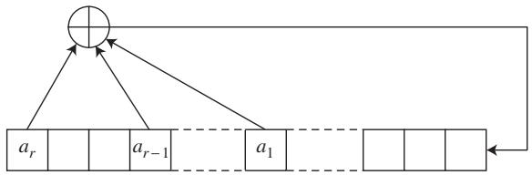

$x _ {t} = x _ {t - 3} + x _ {t - 4}.$
Here, addition is mod 2, so will be 1 if an odd number of the terms is 1, and it will be 0 otherwise. We must also specify the first four values of the sequence, so let us begin with 1000. The sequence then continues as follows: 
$\begin{array}{l} 1 0 0 1 1 0 1 0 1 1 1 1 0 0 0 1 0 0 1 1 0 1 0 1 1 1 1 \dots \end{array}$
More generally, one specifies some positive integers , called feedback positions—the numbers 3 and 4 in the above example—and defines a sequence by means of the recurrence formula 
$x _ {t} = x _ {t - a _ {1}} + x _ {t - a _ {2}} + \dots + x _ {t - a _ {r}},$
where again the addition is mod 2. 
A sequence produced in this way usually looks fairly random, but because there are only finitely many binary sequences of length must eventually repeat. Notice that, in our example, the sequence is periodic with period 15, which is actually the longest possible period, since there are sixteen binary sequences of length and after a moment’s thought one sees that the sequence 0000 cannot occur (or else the whole sequence up to then would have had to consist entirely of zeros). 
In general, the length of the sequence depends on properties of the polynomial 
$P (x) = 1 + x ^ {a _ {1}} + x ^ {a _ {2}} + \dots + x ^ {a _ {r}}$
over the field [I.3 §2.2] of two elements. As we have just seen in the case the maximum possible sequence length is , and for this length to be achieved the polynomial must be irreducible over that is, it must not factorize into smaller polynomials. For example, the polynomial is not irreducible, because expands out to 

$1 + x + x + x ^ {2} + x ^ {2} + x ^ {3} + x ^ {3} + x ^ {4} + x ^ {5},$
which equals since in the field 
Irreducibility is a necessary condition for the sequence to have the maximum length, but it does not guarantee it. For that we need a second condition: that the polynomial is primitive. To see what this means, let us take the polynomial and calculate the remainder when, for the first few positive integers m, we divide by (with all coefficients in When m goes from 1 to 7 we obtain the polynomials , 1. For instance, 
$x ^ {6} = (x ^ {3} + x + 1) (x ^ {3} + x + 1) + x ^ {2} + 1,$
so the remainder on dividing by is . 
Now the first time that we obtained the polynomial 1 was when and . This shows that the polynomial is primitive. In general, a polynomial of degree d is primitive if the first time you obtain a remainder of 1 when you divide by p(x) is when . 
There are computationally efficient tests for determining whether a polynomial is irreducible and whether it is primitive. The advantage of using a primitive polynomial as the basis of an LFSR is that, in the sequence it generates, no subsequence of length is repeated until all nonzero sequences of length have appeared exactly once. 
How is all this applied in cryptography? A simple idea would be to take the stream of bits generated by an LFSR and add it term by term to the message one is enciphering. For instanc if the LFSR generated a sequence that began 1001101 and the message was 0000111, then the encrypted message would begin 1001010. To decipher such a message, one could simply repeat the process: adding the two sequences 1001101 and 1001010 gives the original message 0000111. For this to work, the recipient would need to know the details of the LFSR in order to be able to generate the same sequence 1001101, so one might consider using the feedback positions (in this case 3 and 4) as the secret key. 
The above procedure is not good enough to be of practical use because there is an efficient algorithm, due to Berlekamp and Massey (1969), that can recover the feedback rule from the stream of bits it generates. It is better to use some predetermined nonlinear function of the successive sequences of bits in order to scramble further the sequence of bits produced by the LFSR. Even then, such procedures are simple enough that, with careful design, they can be applied to large amounts of data very quickly. 

Figure 2 Feistel round structure.
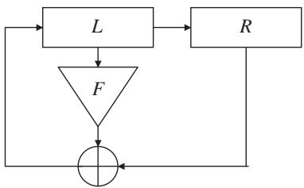

# 3 Block Ciphers and the Computer Age 
# 3.1 Data Encryption Standard 
When computers started to be used, an entirely different method of cryptography became practical: the block cipher. The first example of this was DES: the Data Encryption Standard (first published in 1977). DES was adopted as a standard in 1976 by the U.S. National Bureau of Standards (now the National Institute of Standards and Technology). This enciphers a block of 64 bits at a time, with a key of length 56 bits. It has a particular structure, referred to as a Feistel cipher (see figure 2). 
This structure is as follows. Given a block of 64 bits, you first divide it into two parts of 32 bits each, and call them L and R. Next, you take a subset of the 56 bits of the key, according to some predetermined rule, and use this subset to define a nonlinear function F, again according to some predetermined rule, which takes 32- bit sequences to 32-bit sequences. You then replace the pair [L, R] by the pair [R ⊕ F(L), L]. (Here R ⊕ F(L) denotes the result of taking the mod-2 sum of R and F (L) one bit at a time.) 
Having done that, you repeat the process a number of times, choosing a different nonlinear function F each time (but always deriving it in a predetermined way from the 56-bit key). A complete encryption by DES consists of 16 such rounds, together with some permutation of the bits of the input and output. 
One reason for using the Feistel structure is that as long as one knows the 56-bit key it is quite easy to reverse the encryption process. Given a round that performs the transformation 
$[ L, R ] \to [ R \oplus F (L), L ],$
one can invert it by means of the transformation 
$[ L, R ] \rightarrow [ R, L \oplus F (R) ].$
This has the great advantage that it does not require us to invert F, so even if F is quite complicated the procedure can be easy to carry out. 
A number of what are called “modes of use” of DES have been developed. Simply using the algorithm to encrypt each 64-bit block of data in turn is called ECB (for electronic codebook) mode. A disadvantage of this mode is that if there is an exact 64-bit repeat in the data then this results in an exact 64-bit repeat in the cipher. 
Another mode is CBC, or cipher block chaining, mode. Here, each block of data is added mod 2 to the previous block before being encrypted as above. In OFB, or output feedback, mode the block of data is added to the DES encipherment of the previous block. It is an easy exercise to see how to decipher in CBC and OFB modes, and in practice these are the two most common modes of use of DES. 
# 3.2 Advanced Encryption Standard 
The U.S. National Institute of Standards and Technology recently held a competition for a replacement for DES, to be called the Advanced Encryption Standard, or AES. This was to be a 128-wide block cipher with a variety of possible key lengths. Many competing designs were submitted and subjected to public scrutiny, and the winning entry was called Rijndael, after the designers Joan Daemen and Vincent Rijmen. 
The design is remarkable and elegant and makes use of interesting mathematical structures (Daeman and Rijmen 2002). The 128 bits in each block are thought of as 16 bytes (a byte consists of eight bits), arranged in a 4 4 square. Each byte is then thought of as an element of , the field of order 256. Encryption consists of ten or more rounds (the exact number depending upon the key length); and each round mixes the data and the key. 
A round consists of a series of steps, typically as follows. First, each byte, regarded as an element of the finite field , is replaced by its inverse in the field, except that 0 is left unchanged. Each byte is then regarded as an element of the vector space of dimension 8 over the field and an invertible linear transformation is applied. Each row of the square is then rotated, by a different number of bytes for each row. Next, the values of each column of the square are taken to be the coefficients of a degree 3 polynomial over and this is multiplied by a fixed polynomial and reduced modulo . Finally, the key for the round, which is derived linearly from the encryption key, is added modulo 2 to the 128 bits. 

It can be seen that all of these steps are reversible, which makes decipherment straightforward. It is likely that AES will take over from DES as the most widely used block cipher. 
# 4 One-Time Key 
The various encryption methods described above rely on the computational difficulty of recovering some secret that protects the enciphered data. There is one classic encryption method that does not rely on this property. This is the “one-time key.” Imagine that the message to be enciphered is encoded as a sequence of bits (for example, the standard ASCII encoding that represents each character as eight bits). Suppose that ahead of time the sender and recipient have shared a sequence of random key bits at least as long as the message. Suppose that the message bits are . 
The enciphered message is then , where . Here, as usual, addition is mod 2 addition in each bit. If the bits are fully random, then knowing the sequence gives no information whatsoever about the message sequence This system is called one-time key. It is very secure as long as the key is used only once. However, it is impractical to use this method except in very specialized situations because of the need for sender and recipient to share and keep safe possibly large quantities of key material. 
# 5 Public-Key Cryptography 
All of the examples of encryption methods that we have seen so far have had the following structure. Two communicators agree on an algorithm or method for encryption. The choice of method (e.g., simple substitution, AES, or one-time key) can be made public without the security of the system being compromised. The two communicators also agree on a secret key in the form required by the chosen encryption method. This key needs to be kept secure and never revealed to any adversary. The communicators encipher and decipher messages using the algorithm and secret key. 
This presents a major problem: how can the communicators securely share the secret key? It would be insecure to exchange this over the same system that they will later use to send enciphered messages. Until socalled public-key methods were discovered this issue limited the use of encryption to those organizations that could afford the physical security and separate communication channels necessary for distributing keys reliably. 

The following remarkable, counterintuitive proposition forms the basis of public-key cryptography: it is possible for two entities to communicate information in such a way that they start with no secret shared information; an adversary has access to all communications between them; at the end the entities have shared secret knowledge that the adversary is unable to determine. 
It is easy to see how useful such a capability could be. Consider, for example, someone making a purchase over the Internet. Having identified a product one wishes to buy the next step is to send personal information such as credit card details to the vendor. With public-key cryptography it is possible to do this in a secure manner straightaway. 
How might public-key cryptography be possible? The structure of a solution was proposed by James Ellis in with the first public description by Diffie and Hellman (1976). The critical idea is to use a function that is hard to invert unless you have an “inverse key” that helps you to do so. 
More formally, a one-way function H is a mapping from a set X to itself, with the property that if you are told the value for some then it is computationally hard to determine x. The inverse key is a secret value, z, say, used in creating the function H, with the property that if you know z then it becomes computationally easy to recover x from H(x). 
We can use this to solve the problem of secure key exchange as follows. Let us suppose that Bob wishes to send some data securely to Alice. (Particularly useful would be a shared secret that they can use later as a key for subsequent communications.) Alice begins by generating a one-way function H with an inverse key z. She then communicates the function H to Bob, but the inverse key remains her personal secret, which she reveals to no one—not even to Bob. Bob takes the data x that he wishes to send, computes H(x), and returns the result of his computation to Alice. Because Alice has the inverse key z, she can reverse the function H and thereby recover x. 
Now suppose that an adversary manages to read all the communications between Alice and Bob. Then the adversary will know the function H and the value H(x). However, Alice has not communicated the inverse key z, so the adversary is faced with the computationally intractable problem of inverting H. Therefore, Bob has successfully transmitted the secret x to Alice without the adversary being able to work out what it is. (For a more precise idea of what computational intractability is and a further discussion of one-way functions, see computational complexity [IV.20], especially section 7.) 

It can be helpful to imagine the one-way function H as a padlock and the inverse key as the key that unlocks the padlock. Then if Alice wants to receive an enciphered message from Bob, she sends him her padlock, retaining the key. Bob locks (enciphers) the message into a box with the padlock, and returns it. Only Alice, who is in possession of the padlock key, can unlock (decipher) the message. 
# 5.1 RSA 
It is all very well to have such a framework, but it leaves open an obvious question: how can one produce a one-way function with an inverse key? The following method was published by Rivest, Shamir, and Adleman (1978). It relies on the fact that it is relatively easy to find large prime numbers and multiply them to produce a composite number, but it is much harder, if you are given that composite number, to determine its two prime factors. 
To create a one-way function by their method, Alice first finds two large prime numbers P and Q. She then calculates the integer and sends it to Bob, together with another integer e called the encryption exponent. The values N and e are called the public parameters because it does not matter if an adversary knows what they are. 
Bob then expresses the secret value x that he wishes to send to Alice as a number modulo N. Next, he computes H(x), which is defined to be mod N, that is, the remainder when is divided by N. Bob sends H(x) to Alice. 
Upon receipt of Bob’s message, Alice needs to recover x from mod N. This she can do by first calculating the number d that satisfies the equation 
$d e \equiv 1 \mod (P - 1) (Q - 1).$
To do this efficiently, Alice can use euclid’s algorithm [III.22]. Notice, however, that this would not be possible if she did not know the values of P and Q. In fact, the ability to calculate the correct value of d can be shown to be equivalent to the ability to factorize N. The value of d is Alice’s private key (or “inverse key” in the terminology above): it is the secret that can undo the encryption function H. 

This is because mod N can be shown to equal x. Indeed, the significance of the number is that it equals φ(N), the number of integers less than N and coprime to N. euler’s theorem [III.58] states that mod N whenever x is coprime to N. Therefore, mod N as well, so if de has the form m , as we are assuming, then mod N. In other words, if you raise x to the power e mod N and then raise that to the power d mod N you get back to x. (An important point is that raising numbers to powers mod N is computationally easy by the method of “repeated squaring.” This is discussed in computational number theory [IV.3 §2].) 
While it has not been proved that the only way for an adversary to defeat the RSA encryption system is to factorize N, no other general attack has been found. This has created interest in finding improved factorization methods. A number of new subexponential methods—elliptic curve factorization (Lenstra 1987), the multiple polynomial quadratic sieve (Silverman 1987), and the number field sieve (Lenstra and Lenstra 1993)—have been discovered in the years since the RSA algorithm was found. See computational number theory [IV.3 §3] for discussions of some of them. 
# 5.1.1 Implementation Details 
The security of the RSA system depends on the primes P and Q being large enough to make factorization hard. However, the larger they are, the slower the encryption process is. Thus, there is a trade-off between security and the speed of encryption. A typical choice that is often made is to use primes that are each of 512 bits. 
For the deciphering method to work, the encryption exponent e must have no factors in common with either (P  1) or (Q  1). This assumption was needed when we applied Euler’s theorem, and if it does not hold then the encryption function is not invertible. Values such as 17 or are often used in practice, because making e small reduces the amount of computation needed to calculate the encrypted value xe mod N. (These two values of e are also well-suited to calculation by repeated squaring.) 
# 5.2 Diffie–Hellman 
Another approach to generating a shared secret was published by Whitfield Diffie and Martin Hellman. In their protocol Alice and Bob jointly create a shared secret, which can then be used as the key for one of the conventional cryptographic systems such as AES. To do this, they agree on a large prime number P and a primitive element g modulo which means a number g such that mod but mod P for any . 

Alice then creates her own private key a number randomly chosen between 1 and , and calculates mod P and sends this to Bob. 
Bob similarly creates his own private key b between 1 and and calculates and sends mod P to Alice. 
Alice and Bob can now create the shared secret mod P. Alice calculates this as mod P and Bob calculates this as mod P . Note that all of these terms can be calculated in time logarithmic in a and b through repeated squaring. 
An adversary, however, would see only mod P and mod and would also know and P. How could mod P be determined from this? One method is to solve what is called the discrete logarithm problem. This is the problem of calculating a if you know , and mod For large this appears to be a computationally intractable problem. It is not known for certain whether there is a faster way for the adversary to calculate mod P than computing discrete logarithms—this is called the Diffie–Hellman problem— but at present no better method is known. 
It is not obvious how to find primitive elements in general, but it is much easier if, as is usually the case, the prime P has been constructed so as to ensure that the factorization of is known. For instance, if P is of the form , where Q is also a prime (such numbers are called Sophie Germain primes), then it can be shown that for any a, exactly one of a and a has the property that its Qth power is congruent to 1 mod and this one is a primitive element. In practice, one can find such primes by a process of trial and error: for example, one can choose a number Q randomly and use randomized primality tests to see whether and are prime. Assuming that, as everyone believes, such pairs occur with the “expected” frequency, the probability of finding one on any given attempt is large enough for this approach to be feasible. 
# 5.3 Other Groups 
The Diffie–Hellman protocol can be expressed in the language of group theory [I.3 §2.1]. Suppose we have a group G and some element . We will require the group to be Abelian and will use to denote the group operation. (In the examples so far, the groups under consideration were multiplicative groups consisting of elements coprime to some integer so by using additive notation we are taking a “logarithmic” perspective.) 

To execute the protocol Alice computes some private integer a and computes and sends ag to Bob. Note that Alice can compute this sum of a elements of G in time of order logarithmic in a by successive doubling and adding. (In the multiplicative groups considered earlier, “doubling” is squaring, “adding” is multiplying, and “multiplying by is raising to the power a.) 
Similarly, Bob computes a private integer b and computes and sends to Alice. 
Both Alice and Bob can calculate the shared value abg. An adversary will know only , and . 
The question is: which groups can be used in practical cryptographic systems? The critical property is that the discrete logarithm problem in G must be hard; in other words, given , and it should be a hard problem to determine a. 
One type of group that has aroused interest for cryptographic purposes is the additive group generated by points on an elliptic curve [III.21]. An elliptic curve has an equation of the form 
$y ^ {2} = x ^ {3} + a x + b.$
It is an interesting exercise to sketch this curve over the real numbers—the shape depends upon how many times the curve 
$y = x ^ {3} + a x + b$
crosses the x-axis. 
It is possible to define an “addition rule” (often called a group law) on the points of this curve, as follows. Given two points A and B on the curve, the straight line joining them must meet the curve in a third point, C say. This is because a straight line must meet a cubic in three places precisely. Define A + B to be the mirror image of C in the x-axis (see figure 3). 
It is obvious that from this definition. What is rather more surprising is that the associative law holds. That is, for any three points A, B, and C we have . There are some deep reasons why this is true, but of course it can be verified by just doing the algebra. 
To use this for cryptography the group is formed from the set of points on an elliptic curve defined over a finite field. The graphical image for the sum of two points is no longer valid, but the algebraic definition still holds, so addition still obeys the associative law. We need to add one further point to the set of points on the curve to function as the zero of the group: this is the “point at infinity” on the curve. 

Figure 3 Addition of points on an elliptic curve.
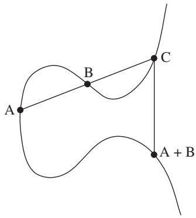

For optimal security it turns out to be best to find a curve defined over for which the number of elements in the group is a prime number. In fact it is guaranteed—by a deep result on the theory of elliptic curves—that the number of points on a curve defined over will lie between and . (See the weil conjectures [V.35].) 
The reason this group is used is that for general curves the discrete logarithm problem appears to be particularly hard. If the group has n elements and if we are given group elements and , then the number of steps needed to determine by the best algorithms that are currently known, is around . Since there is a so-called birthday attack that allows one to solve this problem in any group with n elements in around computational steps, this means that the problem for elliptic curve groups is as hard as it can be. Therefore, whatever level of security you require, the public key is as short as it can be. This is important when there are constraints on the number of bits that can be sent as it allows the protocol to be executed in the minimum possible time. 
# 6 Digital Signatures 
As well as secure transmission of data, there is another very useful capability that is provided by public-key cryptography. That is the concept of a digital signature. A digital signature is a string of symbols that an author attaches to the end of a message that certifies the authenticity of the message. In other words, it proves that the message was written by the attested author and that it has not been modified. Once the necessary frameworks are in place, this opens up the possibility of much legal business being conducted online. 

There are a number of ways that public-key methods can be used to create digital signatures. The one based on the RSA system is perhaps the simplest. Suppose Alice wants to sign documents. Just as she does for encryption, she generates two large prime numbers P and Q and calculates her public modulus and her public exponent e. She also generates her private key—the deciphering exponent d with the property that mod N for any x. She will use the same parameters both for encryption and for the creation of digital signatures. 
Alice can assume that the recipients of her signed messages know her N and e values. In practice she may have these values themselves signed and certified by a trusted authority or organization that the prospective recipient of a signed message will recognize. 
One other component of this system is an object called a one-way hash function, which takes as its input the message to be signed, which may be rather long, and outputs a number between 1 and . The important property that a hash function must have is that for any value y between 1 and N it is computationally hard to construct a message x that hashes to that value. This is similar to a one-way function except that we are no longer assuming that for each y there is exactly one x that maps to y. However, the hash function should ideally also be collision free, which means that, even though there are many pairs of messages that hash to the same value, it is not easy to find any. Such hash functions need to be carefully designed, but there are some recognized standard hash functions (two of which are called MD5 and SHA-1). Suppose that x is the message to be signed, and let X be the output when you apply the hash function to x. The digital signature that Alice appends to the message is mod N. 
Observe that anyone in possession of Alice’s public key can verify the signature by following these steps. First, calculate the hashed value X of the message x, which is possible because the hash function is made public. Next, compute mod N, which can be done because the parameters N and e are also public. Finally, verify that X equals Z. In order to fake such a signature, you have to find Y with the property that mod N. That is, you must know how to calculate , which is computationally intractable if you do not already know d. 

It is also possible to construct digital signatures using a public key based on discrete logarithms (Diffie– Hellman type) rather than on factorization (RSA type). The U.S. standards body has published such a proposal: the Digital Signature Standard (1994). 
# 7 Some Current Research Topics 
Cryptography remains an active and fascinating area for research—there are undoubtedly more results and ideas to be discovered. For a good overview of current activity one should look at recent proceedings of the main conferences, such as Crypto, Eurocrypt, or Asiacrypt (these are published in the Springer series Lecture Notes in Computer Science). The comprehensive book on cryptography by Menezes, van Oorschott, and Vanstone (1996) is a good way to get up to speed on present theory. In this final section I outline just a few of the directions in which the subject is moving. 
# 7.1 New Public-Key Methods 
One important area of investigation is the search for new public-key methods and signature schemes. Recently some interesting new ideas have come from the use of pairings on elliptic curves (Boneh and Franklin 2001). These are maps w from pairs of points on the curve to either the finite field over which the curve is defined or an extension field. 
A pairing w is bilinear, in the sense that w and , where addition is the group operation defined on points of the curve and multiplication takes place in the field. 
One way that such a map can be used is to create an “identity-based cryptosystem.” Here, a user’s identity serves as his or her public key, which eliminates the need for directories or other public-key infrastructure in order to store and propagate public keys. 
In such a system, a central authority decides upon a curve, a pairing map w, and a hash function that maps identities to points on the curve. All of this is made public, but there is also a secret parameter, an integer x. 
Suppose that the hash function maps Alice’s identity to the point A on the curve. The authority calculates Alice’s private key xA and issues it to her when she registers, after making appropriate checks on her identity. Similarly, Bob would receive his private key xB, where B is the point on the curve corresponding to his identity. 

Alice and Bob are now able to communicate without any initial key exchange, using the common key . The important point is that unlike other public-key systems this can be done without any need to share public keys. 
# 7.2 Communication Protocols 
A second area of activity is the study of proposed protocols, especially those likely to become international standards. When public-key methods are to be used in practical communication the sequence of bits to be transmitted needs to be clearly defined, so that both communicating parties understand the same thing by each bit sent. For example, if an n-bit number is transmitted, are the bits transmitted in increasing or decreasing order of significance? The rules or protocols are often enshrined in public standards, and it is important that they do not introduce any weakness into the system. 
An example of the sort of weakness that can be introduced in this way is one discovered by Coppersmith (1997) in a seminal paper. He showed that in a lowexponent RSA system (for example, one with encryption exponent equal to 17) a weakness arises if too many of the bits of the number that is to be enciphered are set to publicly known values. This is something that is natural to want to do, if, as is often the case, a large public-key modulus is being used to transmit a much shorter communication key. As a result of Coppersmith’s discovery such fields are nowadays usually padded out before they are encrypted, with bits that vary unpredictably. 
# 7.3 Control of Information 
Using public-key methods, one can control very precisely how information is released, shared, or generated. Research in this area is usually focused on finding elegant and efficient ways of achieving different sorts of control in a variety of situations. As a simple example, we might want to create a secret that is shared between N people in such a way that if any K people combine their share (where K < N) they can reconstruct the secret, but no information can be gained about the secret by any smaller number than K collaborating. 
Another example of this type of control is a protocol that allows two participants to create an RSA modulus (a product of two primes) in such a way that neither participant gets to know the primes that were used to produce the modulus. To decipher a message enciphered under this modulus the two participants have to collaborate—neither can achieve this on their own (Cocks 1997). 

A third and more amusing example is a protocol that allows Alice and Bob to replicate tossing a coin, but to do it over the telephone. Obviously, it would not be satisfactory for Alice to toss the coin and for Bob to make the call “heads” or “tails”—for how does Bob know that Alice is telling the truth about how the coin actually fell? This problem turns out to have a simple solution. Alice and Bob choose large random sequences. Alice then appends either a 1 or a 0 to her sequence and Bob does the same for his. Alice’s extra bit represents the outcome of the coin toss, and Bob’s represents his guess. Next, they send one-way hashes of their sequences (with the extra bits appended). At this point, because of the nature of one-way hashes, neither has any idea what the other’s sequence is, so, for example, if Alice reveals her hashed sequence first, Bob cannot use this information to increase his chance of guessing correctly. Alice and Bob then exchange the unhashed sequences to see whether Bob’s guess was correct. If either does not trust the other, they can hash the other’s sequence to check that it really does give the right answer. Since it is hard to find a different sequence that gives the right answer, they can each be confident that the other has not cheated. More complicated protocols of this type have been designed—it is even possible to play poker remotely in this way. 
# Further Reading 
# VII.8 Mathematics and Economic Reasoning 
Partha Dasgupta 
# 1 Two Girls 
# 1.1 Becky’s World 
Becky, who is ten years old, lives with her parents and an older brother Sam in a suburban town in America’s Midwest. Becky’s father works in a law firm specializing in small business enterprises. Depending on the firm’s profits, his annual income varies somewhat, but it is rarely below $145 000. Becky’s parents met in college. For a few years her mother worked in publishing, but when Sam was born she decided to concentrate on raising a family. Now that both Becky and Sam attend school, she does voluntary work in local education. The family live in a two-story house. It has four bedrooms, two bathrooms upstairs and a toilet downstairs, a large drawing-cum-dining room, a modern kitchen, and a family room in the basement. There is a small plot of land in the rear, which the family use for leisure activities. 
Although they have a partial mortgage on their property, Becky’s parents own stocks and bonds and have a savings account in the local branch of a national bank. Becky’s father and his firm jointly contribute to his retirement pension. He also makes monthly payments into a scheme with the bank that will cover college education for Becky and Sam. The family’s assets and their lives are insured. Becky’s parents often remark that, federal taxes being high, they have to be careful with money; and they are. Nevertheless, they own two cars, the children attend camp each summer, and the family take a vacation together once camp is over. Becky’s parents also remark that her generation will be much more prosperous than they. Becky wants to save the environment and insists on biking to school each day. Her ambition is to become a doctor. 

# 1.2 Desta’s World 
Desta, who is about ten years old, lives with her parents and five siblings in a village in subtropical, southwest Ethiopia. The family live in a two-room, grass-roofed mud hut. Desta’s father grows maize and tef on half a hectare of land that the government has awarded him. Desta’s older brother helps him to farm the land and care for the household’s livestock: a cow, a goat, and a few chickens. The small quantity of tef produced is sold so as to raise cash income, but the maize is largely consumed by the household as a staple. Desta’s mother works a small plot next to their cottage, growing cabbage, onions, and enset (a year-round root crop that also serves as a staple). In order to supplement household income, she brews a local drink made from maize. As she is also responsible for cooking, cleaning, and minding the infants, her work day usually lasts fourteen hours. Despite the long hours, it would not be possible for her to complete the tasks on her own. (As the ingredients are all raw, cooking alone takes five hours or more.) So Desta and her older sister help their mother with household chores and mind their younger siblings. Although a younger brother attends the local school, neither Desta nor her older sister has ever been enrolled there. Her parents can neither read nor write, but they are numerate. 
Desta’s home has no electricity or running water. Around where they live, sources of water, land for grazing cattle, and the woodlands are communal property. They are shared by people in Desta’s village; but the villagers do not allow outsiders to make use of them. Each day Desta’s mother and the girls fetch water, collect fuelwood, and pick berries and herbs from the local commons. Desta’s mother frequently observes that the time and effort needed to collect their daily needs has increased over the years. 
There is no financial institution nearby to offer either credit or insurance. As funerals are expensive occasions, Desta’s father long ago joined a community insurance scheme (iddir) to which he contributes monthly. When Desta’s father purchased the cow they now own, he used the entire cash he had accumulated and stored at home, but had to supplement that with funds borrowed from kinfolk, with a promise to repay the debt when he had the ability to do so. In turn, when they are in need, his kinfolk come to him for a loan, which he supplies if he is able to. Desta’s father says that such patterns of reciprocity he and those close to him practice are part of their culture, reflecting their norms of social conduct. He also says that his sons are his main assets, as they are the ones who will look after him and Desta’s mother in their old age. 

Economic statisticians estimate that, adjusting for differences in the cost of living between Ethiopia and the United States, Desta’s family income is about $5000 per year, of which $1000 is attributable to the products they draw from the local commons. However, as rainfall varies from year to year, Desta’s family income fluctuates widely. In bad years, the grain they store at home gets depleted well before the next harvest. Food is then so scarce that they all grow weaker, the younger children especially so. It is only after harvest that they regain their weight and strength. Periodic hunger and illnesses have meant that Desta and her siblings are somewhat stunted. Over the years Desta’s parents have lost two children in their infancy, stricken by malaria in one case and diarrhea in the other. There have also been several miscarriages. 
Desta knows that she will be married (in all likelihood to a farmer, like her father) when she reaches eighteen and will then live on her husband’s land in a neighboring village. She expects her life to be similar to that of her mother. 
# 2 The Economist’s Agenda 
That the lives people are able to construct differ enormously across the globe is a commonplace. In our age of travel, it is even a common sight. That Becky and Desta face widely different futures is also something we have come to expect, perhaps also to accept. Nevertheless, it may not be out of turn to imagine that the two girls are intrinsically very similar: they both enjoy eating, playing, and gossiping; they are close to their families; they like pretty things to wear; and they both have the capacity to be disappointed, get annoyed, be happy. Their parents are also alike. They are knowledgeable about the ways of their worlds. They also care about their families, finding ingenious ways to meet the recurring problem of producing income and allocating resources among family members—over time and allowing for unexpected contingencies. So, a promising route for exploring the underlying causes behind their vastly different conditions of life would be to begin by observing that the constraints the families face are very different: that in some sense Desta’s family are far more restricted in what they are able to be and do than Becky’s. 

Economics in large measure tries to uncover the processes that influence how people’s lives come to be what they are. The context may be a household, a village, a district, a state, a country, or the whole world. In its remaining measure, the discipline tries to identify ways to influence those very processes so as to improve the prospects of those who are hugely constrained in what they can be and do. Modern economics, by which I mean the style of economics taught and practiced in today’s graduate schools, does the exercises from the ground up: from individuals, through the household, village, district, state, country, to the whole world. In varying degrees the millions of individual decisions shape the eventualities people all face; as both theory and evidence tell us that there are enormous numbers of unintended consequences of what we all do. But there is also a feedback, in that those consequences go on to shape what people subsequently can do and choose to do. For example, when Becky’s family drive their cars or use electricity, or when Desta’s family create compost or burn wood for cooking, they contribute to global carbon emissions. Their contributions are no doubt negligible, but the millions of such tiny contributions cumulatively sum to a sizable amount, having consequences that people everywhere are likely to experience in different ways. 
To understand Becky’s and Desta’s lives, we need first of all to identify the prospects they face for transforming goods and services into further goods and services—now and in the future, under various contingencies. Second, we need to uncover the character of their choices and the pathways by which the choices made by millions of households like Becky’s and Desta’s go to produce the prospects they all face. Third, and relatedly, we need to uncover the pathways by which the families came to inherit their current circumstances. 
The last of these is the stuff of economic history. In studying history we could, should we feel bold, take the long view—from about the time agriculture came to be settled practice in the Fertile Crescent (roughly, Anatolia) some eleven thousand years ago—and try to explain why the many innovations and practices that have cumulatively contributed to the making of Becky’s world either did not reach or did not take hold in Desta’s part of the world. (Diamond (1997) is an enquiry into this set of questions.) If we wanted a sharper account, we could study, say, the past six hundred years and ask how it is that, instead of the several regions in Eurasia that were economically promising in about 1400 c.e., it was the unlikely northern Europe that made it and helped to create Becky’s world, even while bypassing Desta’s. (Landes (1998) is an inquiry into that question. Fogel (2004) explores the pathways by which Europe during the past three hundred years has escaped permanent hunger.) As modern economics is largely concerned with the first two sets of enquiries, this article focuses on them. However, the methods that today’s economic historians deploy to answer their questions are not dissimilar to the ones I describe below to study contemporary lives. The methods involve studying individual and collective choices in terms of maximization exercises. The predictions of the theories are then tested by studying data relating to actual behavior. Even the ethical foundations of national economic policies involve maximization exercises: the maximization of social well-being subject to constraints. (The treatise that codified this approach to economic reasoning was Samuelson (1947).) 

# 3 The Household Maximization Problem 
Both Becky’s and Desta’s households are microeconomies. Each subscribes to particular arrangements over who does what and when, recognizing that it faces constraints on what its members are capable of doing. We imagine that both sets of parents have their families’ well-being in mind and want to do as well as they can to protect and promote it.1 Of course, both Becky’s and Desta’s parents would have a wider notion of what constitutes their families than I have allowed here. Maintaining ties with kinfolk would be an important aspect of their lives, a matter I return to later. One also imagines that Becky’s and Desta’s parents are interested in their future grandchildren’s well-being. But as they recognize that their children will in turn care about their children, they are right to conclude by recursion that doing the best for their children amounts to doing the best for their grandchildren, for their great grandchildren, and so on, down the generations. 

Personal well-being is made up of a variety of constituents: health, relationships, place in society, and satisfaction at work are but four. Economists and psychologists have identified ways to represent well-being as a numerical measure. To say that someone’s wellbeing is greater in situation Y than in situation Z is to say that her well-being measure is numerically higher in Y than in Z. A family’s well-being is an aggregate of its members’ well-beings. As goods and services are among the determinants of well-being (some important examples are food, shelter, clothing, and medical care), the problem that both Becky’s and Desta’s parents face is to determine, from among those allocations of goods and services that are feasible, the ones that are best for their households. However, both pairs of parents care not only about today, but also about the future. Moreover, the future is uncertain. So when the parents think about which goods and services their households should consume, they are concerned not just with the goods and services themselves, but also with when they will be consumed (food today, food tomorrow, and so on) and what will happen in the case of various contingencies (food the day after tomorrow if rainfall turns out to be bad tomorrow, and so forth). Implicitly or explicitly, both sets of parents convert their experience and knowledge into probabilistic judgments. Some of the probabilities they attach to contingencies are no doubt very subjective, but others, such as their predictions about the weather, are arrived at from long experience. 
In subsequent sections we shall study the way in which Becky’s and Desta’s parents allocate goods and services across time and contingencies. But here we shall keep the exposition simple and consider a model that is static and deterministic. That is, we shall pretend that the people live in a timeless world, and that they are completely certain about all the information they need in order to make their decisions. 
Suppose that a certain household has N members, whom we label . Let us think about how we can appropriately model the well-being of household member i. As has already been mentioned, well-being is taken to be a real number that depends in some way on the goods and services consumed and supplied by i. It is traditional to divide goods and services into those consumed and those supplied, and to use positive numbers to represent quantities of the former and negative numbers for the latter. Imagine now that there are M commodities in all. Let represent the quantity of the jth commodity that is consumed or supplied by i. By our convention, is consumed by i (e.g., food eaten or clothing worn) and is supplied by i (e.g., labor). Now consider the vector . It denotes the quantities of all the goods and services consumed or supplied by is a point in —the Euclidean space of M dimensions. We now let denote i’s well-being. Let us assume that supplying goods and services decreases i’s wellbeing, while consuming them increases it. Because the goods that are supplied by i are measured as negative quantities, we can justifiably assume that increases as any of its components increases. 

The next step is to generalize the model to one that applies to an entire household. The individual well-beings of the members of the household can be collected together so that they themselves form an N-dimensional vector, . The household’s well-being is dependent in some way on this vector. That is, we say that the well-being of the household is , for some function W . (Utilitarian philosophers have argued that W is simply the sum of the We also make the natural assumption that W is an increasing function of each (which is certainly the case if W is the sum of the . 
Let Y denote the sequence . Y is a point in the NM-dimensional Euclidean space . It can also be thought of as the matrix you obtain if you make a table of the amounts of each commodity consumed or supplied by each member of the household. Now, it is clear that not every Y in can actually occur: after all, the total amount of any given commodity (in the whole world, say) is finite. So we assume that Y belongs to a certain set J, which we regard as the set of all potentially feasible values of Y . Within J we identify a smaller set, of “actually feasible” values of Y. This is the set of values of Y from which the household could in principle choose. It is smaller than J because of constraints that the household faces, such as the maximum amount of income it can earn. F is the household’s feasible set.2 The decision faced by a household is to choose Y from the feasible set F so as to maximize its well-being ). This is called the household maximization problem. 
It is reasonable, and mathematically convenient, to assume that the sets J and F are both closed and bounded subsets of , and that the well-being function W is continuous. Since every continuous function on a closed bounded set has a maximum, it follows that the household maximization problem has a solution. in addition, W is differentiable, the theory of nonlinear programming can be used to identify the optimality conditions the household’s choice must satisfy. If F is a convex set and W is a concave function of those conditions are both necessary and sufficient. The lagrange multipliers [III.64] associated with F can be interpreted as notional prices: they reflect the worth to the household of slightly relaxing the constraints. 

Let us conduct an exercise to test the power of the modern economist’s way of studying choice. First, let us assume that W is a symmetric and concave function of the individual well-beings (as would be the case if W were the sum of the . The symmetry assumption means that if two individuals exchange their wellbeings, then W is unchanged; and concavity means, roughly speaking, that, other things being equal, as a increases, the rate of increase of W does not rise. Let us suppose in addition that the household members are identical: that is, let us set all the functions to be equal to a single function, say. Assume also that U is a strictly concave function of the which means that the rate of increase of well-being declines as consumption increases. Finally, assume that the feasible set F is nonempty, convex, and symmetric. (Symmetry means that if some Y is feasible, and the vector Z is the same as Y except that the consumptions of a pair of individuals in the household have been exchanged, then Z is also feasible.) From these assumptions it can be shown that members of the household would be treated equally: that is, W is maximized when they all receive the same bundle of goods and services. 
At low levels of consumption, however, the hypothesis that the function U is concave is unreasonable. To see why, we should note that, typically, 60–75% of the daily energy intake of someone in nutritional balance goes toward maintenance, while the remaining 25–40% is expended in discretionary activities (work and leisure). The 60–75% is rather like a fixed cost: over the long run a person needs it as a minimum no matter what he or she does. The simplest way to uncover the implications of such fixed costs is to continue to suppose that F is convex (which is the case, for example, if there is a fixed quantity of food for allocation among members of the household), but that U is a strictly convex function at low intakes of food and a strictly concave function thereafter. It is not hard to show that a poor household in such a world will maximize its well-being by allocating food unequally among its members, while a rich household can afford the luxury of equal treatment and will choose to distribute food equally. Suppose, to take a very stylized example, that energy requirement for daily maintenance is 1500 kcal and that a household of four can obtain at most 5000 kcal for consumption. Then equal sharing would mean that no one would have sufficient energy for any work, so it is better to share the food unequally. On the other hand, if the household is able to obtain more than 6000 kcal, it can share the food equally without jeopardizing its future. 

There are empirical correlates of this finding. When food is very scarce, the younger and weaker members of Desta’s household are given less to eat than the others, even after allowance is made for differences in their ages. In good times, though, Desta’s parents can afford to be egalitarian. In contrast, Becky’s household can always afford enough food. Her parents therefore allocate food equally every day. 
# 4 Social Equilibrium 
Household transactions in Becky’s world are carried out mostly in markets. The terms of trade are the quoted market prices. In developing a mathematical construction of social outcomes, I continue to imagine, for simplicity, a static, deterministic world. Let be the vector of market prices and let be the vector of a household’s endowments of goods and services. (That is, for each commodity is the price of j and is the amount of j that the household already has.) Recalling our convention that goods consumed are of positive sign and goods supplied are of negative sign, define (Thus, is the total amount of commodity j that is consumed by the household.) Then P  X is the total price of goods consumed by the household, minus the total price of goods supplied, and P M is the total value of its endowments. The feasible set F is the set of household choices Y that satisfy the “budget” constraint . 
The income that Becky’s household earns from the assets it supplies to the market is determined by market prices (Becky’s father’s salary, interest rates on bank deposits, returns on shares owned). Those prices in turn depend on the size and distribution of household endowments of goods and services and on household needs and preferences. They depend too on the ability and willingness of institutions, such as private firms and the government, to make use of the rights they in turn have been awarded. These functional relationships explain why Becky’s father’s skills as a lawyer (itself an asset, termed “human capital” by economists) would not be worth much in Desta’s village, even though they are much valued in the United States. In fact, it was a firm belief that lawyers would continue to prove valuable in the United States that encouraged Becky’s father to be a lawyer. 

Although Desta’s household does operate in markets (when her father sells tef or her mother sells the liquor she has brewed), it undertakes many transactions directly with nature; in the local commons and in farming, and in nonmarket relationships with others in the village. Therefore the F that Desta’s household faces is not defined simply by a linear budget inequality, as in the idealized model we have constructed to display Becky’s world, but also reflects the constraints that nature imposes, such as soil productivity and rainfall, the assets it has access and the terms and conditions involving transactions with others in the village via nonmarket relationships, a matter I come to later. The constraints imposed by nature are felt by Becky’s household too, but through market prices. For example, should a drought lead to a fall in world cereal production, it would become noticeable to Becky’s household through the high price of cereal. Desta’s household, in contrast, would notice it directly from the reduced harvest from their field. 
Desta’s household assets include the family home, livestock, agricultural implements, and their half hectare of land. The skills Desta’s family members have accumulated in farming, managing livestock, and collecting resources from the local commons are part of their human capital. Those skills do not command much return in the global marketplace, but they do shape the household’s feasible set F and are vital to the family’s well-being. Desta’s parents learned those skills from their parents and grandparents, just as Desta and her siblings have learned them from their parents and grandparents. Desta’s family can also be said to own a portion of the local commons: in effect, her household shares its ownership with others in the village. Difficulties in reaching and enforcing agreement with neighbors over the use of the local commons are less severe than they are in the case of global commons, such as the atmosphere as a sink for carbon emissions. This is not only because the required negotiations involve far fewer people when the commons are local, but also because there is likely to be greater congruence of opinions and interests among the users. It helps too that the parties are able to observe whether the agreements they made over the use of local commons are being kept. (See below in our discussion of insurance arrangements in Desta’s world.) 

Thus, the choices that are available to individuals are affected by the choices that other people make: this results in feedback. In a market economy, the feedback is in large part transmitted in prices. In nonmarket economies the feedback is transmitted through the terms in which households are able to negotiate with one another. 
Let us try to model this situation mathematically. We start by imagining an economy of H households. For ease of exposition, I shall suppose that a household’s well-being can be expressed directly in terms of its aggregate consumption of goods and services, disregarding how this consumption is distributed among the individual members. Let denote the consumption vector in household h (with the usual sign convention), let be the set of potentially feasible vectors , and let be h’s well-being. 
Within h’s potentially feasible set of consumption vectors lies the actual feasible set . In order to model the feedback we shall explicitly recognize that depends on the consumptions of other households. That is, it is a function of the sequence . To save space, we shall denote this sequence, which consists of every household’s consumption vector except by Formally, is a function (sometimes called a “correspondence”) that takes objects of the form to subsets of . Household h’s economic problem is to choose its consumption from its feasible set in such a way as to maximize its well-being . The optimum choice depends on h’s beliefs about and the correspondence . 
Meanwhile, all other households are making similar calculations. How can we unravel the feedbacks? One way would be to ask people to disclose their beliefs about the feedbacks. Fortunately, economists avoid that route. So as to anchor their investigation, economists study equilibrium beliefs; that is, beliefs that are self-confirming. The idea is to identify states of affairs where the choices people make on the basis of their beliefs about the feedbacks are precisely those that give rise to those very feedbacks. We call any such state of affairs a social equilibrium. Formally, a sequence of household choices is called a social equilibrium if, for every the choice of household h maximizes the well-being over all choices of in its feasible set . 

This raises an obvious question: does a social equilibrium exist? Classic papers by Nash in 1950 and Debreu in 1952 showed that, under a fairly general set of conditions, it always does. Here is a set of conditions that Debreu identified. Assume that each well-being function is continuous and quasi-concave (which means that for any potentially feasible choice in , the set of in for which is greater than or equal to is convex). Assume also that for every household the feasible set (recall that this is a subset of is nonempty, compact, and convex, and depends continuously on the choices X h made by other households. The proof that under the above conditions a social equilibrium always exists is a relatively straightforward use of the kakutani fixed point theorem [V.11 §2], which is itself a generalization of Brouwer’s fixed point theorem. Alternative sets of sufficient conditions for the existence of social equilibria (which allow the feasible set to be nonconvex) have been explored in recent years. 
In Becky’s world, a social equilibrium is called a market equilibrium. A market equilibrium is a price vector and a consumption vector for each household such that maximizes subject to the budget constraint , and such that the demands for goods and services across households are feasible . That market equilibria are social equilibria, in the sense in which we have defined the latter term here, was demonstrated by Arrow and Debreu in 1954. Debreu (1959) is the definitive treatise on market equilibria. In that book, Debreu followed the leads of Erik Lindahl and Kenneth J. Arrow, by distinguishing goods and services not only in terms of their physical characteristics, but also in terms of the date and contingency in which they appear. Later in this article we shall expand the commodity space in that way to study savings and insurance decisions in both Becky’s and Desta’s worlds. 
One cannot automatically assume that a social equilibrium is just or collectively good. Moreover, except for the most artificial examples, social equilibrium is not unique—which means that a study of equilibria per se leaves open the question of which social equilibrium we should expect to observe. In order to probe that question, economists study disequilibrium behavior and analyze the stability properties of the resulting dynamic processes. The basic idea is to hypothesize about the way people form beliefs about the way the world works, track the consequences of those patterns of learning, and check them against data. It is reasonable to limit such a study by considering only those learning processes that converge to a social equilibrium in stationary environments. Initial beliefs would then dictate which equilibrium is reached in the long run (see, for example, Evans and Honkapohja 2000). Since the study of disequilibria would lengthen this article greatly, we shall continue to study social equilibria here. 

# 5 Public Policy 
Economists distinguish between what they call private goods and public goods. For many goods, consumption is rivalrous: if you consume a bit more from a given supply of such a good ., food), others have that much less to consume. These are private goods. The way to assess their consumption throughout the economy is to add up the amounts consumed by all individual households; which is what we did in the previous section when arriving at the notion of a social equilibrium. Not all goods are like that, however. For example, the extent of national security on offer to you is the same as that on offer to all households in your country. In a just society the law has that same property, as has the state: not only is consumption not rivalrous, but in addition, no one can be prevented from availing himself or herself of the entire amount available in the economy. Public goods are goods of this second kind. One models the quantity of a public good as a number and the quantity consumed by each household h is deemed to equal G. An example of a public good that has a global coverage is the Earth’s atmosphere: the whole world benefits from it jointly. 
If the supply of public goods is left to private individuals, then problems arise. For example, even though everyone in a city would benefit from a cleaner, healthier environment, individuals have a strong incentive to free-ride on others when it comes to paying for that cleaner environment. Samuelson showed in 1954 that such a situation resembles the prisoner’s dilemma: each party has a strategy that is best for him/her, regardless of what strategies the other parties choose, even though there is another set of strategies, one per party, that is better for everybody. Under such circumstances, one usually needs public measures, such as taxes and subsidies, in order for it to be in the interest of private individuals to act in a way that implements the collectively preferred outcomes. In other words, the dilemma can be expected to be resolved effectively not by markets but by politics. It is widely accepted in political theory that government should be charged with imposing taxes, subsidies, and transfers, and should be engaged in supplying public goods. The government is also the natural agency to supply infrastructure, such as roads, ports, and electrical cables, requiring as they do investments that are huge in comparison with individual incomes. We shall now extend our earlier model to include public goods and infrastructure, so that we can study the government’s economic task. 

Let us assume that social well-being is a numerical aggregate of household well-beings. Thus, if V is social well-being, we write it as . It is natural to postulate that V increases as any increases. (One example of such a function V is the one prescribed by utilitarian philosophy, namely, The government chooses what quantities to supply of the various public goods and infrastructure commodities. These numbers can be modeled by two vectors, which we will call G and respectively. The government also chooses to impose on each household h certain transfers of goods and services (for example, providing health care and charging income tax). Let us write T for the sequence . Whether or not a particular choice of vectors G and I is actually feasible for the government will depend on T , so we define to be the set of feasible pairs of vectors (G, I), given the choice of T . 
Because we have introduced a new set of goods, we shall have to modify the household well-being functions by enlarging their domains. The obvious notation to express this extra dependence is to write for the well-being of household h. Moreover, h’s feasible set now also depends on I, and so we write the set of feasible household choices as . 
To try to determine the optimum public policy, imagine a two-stage game. The government has the first move, choosing T and then G and I from . Households go second, reacting to decisions made by the government. Imagine that a social equilibrium is reached and that the equilibrium is unique. (We assume that if there are multiple equilibria, the government can select among them by resorting to public signals.) Clearly, this equilibrium is a function of and T . An intelligent and benevolent government will anticipate it and choose T , G, and I from in such a way as to maximize the resulting social well-being . 
The public policy problem we have just designed, involving as it does a double optimization, is technically very difficult. It transpires, for example, that even in some of the simplest model economies one can imagine, is not convex. This means that the social equilibrium cannot be guaranteed to depend continuously on and T , as was shown by Mirrlees in 1984. This in turn means that standard techniques are not suitable for the government’s optimization problem. In fact, of course, even “double optimization” is a huge simplification. The government chooses; people respond by trading, producing, consuming; the government chooses again; people respond once again—and so forth in an unending series of moves and countermoves. Identifying the optimum public policy involves severe computational difficulties. 

# 6 Matters of Trust: Laws and Norms 
The previous examples demonstrate that a fundamental problem facing people who would like to transact with one another concerns trust. For example, the extent to which parties trust one another shapes the sets and . If the parties do not trust one another, what could have been mutually beneficial transactions will not take place. But what grounds does a person have for trusting someone to do what he promises to do under the terms of an agreement? Such grounds can exist if promises can be made credible. Societies everywhere have constructed mechanisms to create credibility of this kind, but in different ways. What the mechanisms have in common, however, is that individuals who fail to comply with agreements without a good reason are punished. 
How does that common feature work? 
In Becky’s world the rules governing transactions are embodied in the law. The markets Becky’s family enters are supported by an elaborate legal structure (a public good). Becky’s father’s firm, for example, is a legal entity; as are the financial institutions he deals with in order to accumulate his retirement pension, to save for Becky’s and Sam’s education, and so on. Even when someone in the family goes to the grocery store, the purchases (paid for with cash or by card) involve the law, which provides protection for both parties (the grocer, in case the cash is counterfeit or the card is void; the purchaser, in case the product turns out on inspection to be substandard). The law is enforced by the coercive power of the state. Transactions involve legal contracts backed by an external enforcer, namely, the state. It is because Becky’s family and the grocery store’s owner are confident that the government has the ability and willingness to enforce contracts (i.e., to continue to supply the public good in question) that they are willing to make transactions. 

What is the basis of that confidence? After all, the contemporary world has shown that there are states and there are states. Why should Becky’s family trust the government to carry out its tasks in an honest manner? A possible answer is that the government in her country worries about its reputation: a free and inquisitive press in a democracy helps to sober the government into believing that incompetence or malfeasance would mean an end to its rule come the next election. Notice how the argument involves a system of interlocking beliefs about the abilities and intentions of others. The millions of households in Becky’s country trust their government (more or less!) to enforce contracts, because they know that government leaders know that not to enforce contracts efficiently would mean being thrown out of office. In their turn, each party to a contract trusts the other to refrain from reneging (again, more or less!), because each knows that the other knows that the government can be trusted to enforce contracts. And so on. Trust is maintained by the threat of punishment (a fine, a jail term, dismissal, or whatever) for anyone who breaks a contract. Once again, we are in the realm of equilibrium beliefs, held together by their own bootstraps. Mutual trust encourages people to seek out mutually beneficial transactions and engage in them. As the formal argument that supports the above claim is very similar to the one showing that social norms contain mechanisms for enforcing agreements, we turn to the place of social norms in people’s lives. 
Although the law of contracts exists also in Desta’s country, her family cannot depend on it because the nearest courts are far from their village. Moreover, there are no lawyers in sight. As transport is enormously costly, economic life is shaped outside a formal legal system. In short, crucial public goods and infrastructure are either unavailable, or, at best, in short supply. But even though there is no external enforcer, Desta’s parents do make transactions with others. Credit (not dissimilar to insurance in her village) involves saying, “I will lend to you now if you promise to repay me when you can.” Saving for funerals involves saying, “I agree to abide by the terms and conditions of the iddir.” And so on. But why should the parties have any confidence that the agreements will not be broken? 
Such confidence can be justified if agreements are mutually enforced. The basic idea is this: a credible threat by members of a community that stiff sanctions will be imposed on anyone who breaks an agreement can deter everyone from breaking it. The problem is then to make the threat credible. In Desta’s world credibility is achieved by recourse to social norms of behavior. 

By a social norm we mean a rule of behavior followed by members of a community. A rule of behavior (or “strategy” in economic parlance) reads like, “I will do X if you do Y,” “I will do P if Q happens,” and so forth. For a rule of behavior to be a social norm, it must be in the interest of everyone to act in accordance with the rule if all others act in accordance with it. Social norms are equilibrium rules of behavior. We will now see how social norms work and how transactions based on them compare with market-based transactions. To do this we will study insurance as a commodity. 
# 7 Insurance 
To insure oneself against a risk is to act in ways to reduce that risk. (Formally, a random variable [III.71 §4] X˜ is said to be riskier than a random variable Y˜ if there is a random variable Z˜ with zero mean such that X˜ has the same distribution as In this case, X˜ and Y˜ have the same mean but X˜ is more “spread out.”) As long as it does not cost too much, riskaverse households will want to reduce risk by purchasing insurance: in fact, avoiding risk would seem to be a universal urge. To formalize these notions, consider an isolated village, such as Desta’s. Suppose for simplicity that it contains H identical households. If household h’s food consumption is (represented by a single real number), let us say that its well-being is . We shall assume that (that is, more food leads to greater well-being) and that (the more food you already have, the less you benefit from yet more). We shall confirm below that the second property of W , its strict concavity, implies, and is implied by, risk aversion; but the basic reason is simple: if W is strictly concave, then you gain less when you are lucky than you lose when you are unlucky. 
For simplicity, let us suppose that the production of food by a household h, which is subject to chance factors such as the weather, involves no effort. Since the output is uncertain, we represent it by a random variable , with expected value which is assumed to be positive. We shall denote expectations by E. 
If a household h is completely self-sufficient, then its expected well-being is simply . However, the strict concavity of W implies that ). To put this in words: h’s well-being at the average level of production is greater than the expectation of h’s wellbeing if the production is random. This means that h will prefer a sure level of consumption to a risky one with mean equal to that sure level. In short, h is risk averse. Define a number μ¯ by . So is the level of production that achieves the expected well-being. This will be less than and so is a measure of the cost of the risk that a self-sufficient household bears. Notice that the greater the “curva-of W is, the greater the cost is of the risk associated with useful measure of curvature turns out to be . We will make use of this measure when discussing intertemporal choices.) To see how households could gain by pooling their risks, let us write , where is a random variable with mean zero, variance , and finite support. Suppose for simplicity that the random variables are identical , they do not depend on h). Let the correlation coefficient of any two of these distributions be It turns out that, as long as , households can reduce their risks by agreeing to share their outputs. Suppose that households are able to observe one another’s outputs. Given that the random variables are identical, the obvious insurance scheme is to share out the outputs equally. Under this scheme, h’s uncertain food consumption becomes the average of , which is an improvement on self-sufficiency because ). The problem is that, without an enforcement mechanism, the agreement to share will not stick, because once each household knows how much food every household has produced, all but the unluckiest households will wish to renege. To see why, notice first that the luckiest households will renege because their outputs are above the average; but this means that the next luckiest set of households will renege because their outputs are above the reduced average; and so on, down to the unluckiest households. Since households know in advance that this will happen if there are no enforcement mechanisms, they will not enter the scheme in the first place: the only social equilibrium is pure self-sufficiency and there is no pooling of risk. 

Let us call the insurance game just described the stage game. Although pure self-sufficiency is the only social equilibrium for the stage game, we shall now see that the situation changes if the game is played repeatedly. To model this, let us use the letter t to denote time, and let us take time to be a nonnegative integer. (The game might, for instance, take place every year, with 0 standing for the current year.) Let us assume that the villagers face the same set of risks in each time period, and that the risk in one year is independent of the risks in all other years. Also assume that, in each period, once food outputs are realized, households decide independently of one another whether they will abide by the agreement to share their produce equally or whether they will renege on it. 

Although future well-being is important to a household, it will typically be less important than present well-being. To model this we introduce a positive parameter which measures how much a household discounts its future well-being. The assumption is that, when making calculations at a household divides its well-being at time t by a factor : that is, the importance decays by a certain fixed percentage at each time period. We shall now show that, provided δ is sufficiently small (i.e., provided that households care enough about their future well-being), there is a social equilibrium in which households abide by the agreement to share their aggregate output equally. 
Let be the uncertain amount of food available to household h at time t. If all households are participating in the agreement, then will be , and if there is no agreement, then it will be . At time the total expected well-being of household h, present and future, is . (To calculate this we took, for each , the expected well-being of h at time t and divided it by . Then we added these numbers up.) 
Now consider the following simple strategy that h might adopt: it begins by participating in the insurance scheme and continues to participate so long as no household has reneged on the agreement; but it withdraws from the scheme from the date following the first violation of the agreement by some household. Game theorists have christened this the “grim strategy,” or simply because of its unforgiving nature. Let us see how grim could support the original agreement to share aggregate output equally at every date. (For a general account of repeated games and the variety of social norms that can sustain agreements, see Fudenberg and Maskin (1986).) 
Suppose that household h believes that all other households have chosen grim. Then h knows that none of the other households will be the first to defect. What should h do then? We will show that if δ is small enough, h can do no better than play grim. As the same reasoning would be applicable to all other households, we should conclude that, for small enough values of δ, grim is an equilibrium strategy in the repeated game. But if all households play grim, then no household will ever defect. Grim can therefore function as a social norm for sustaining cooperation. Let us see how the argument works. 

The basic idea is simple. As all other households are assumed to be playing grim, household h would enjoy a one-period gain by defecting if its own output exceeded the average output of all households. But if h defects in any period, all other households will defect in all following periods (they are assumed to be playing grim, remember). Therefore, h’s own best option in all following periods will be to defect also, which means that subsequent to a single deviation by h, the outcome can be predicted to be pure self-sufficiency. So, set against a one-period gain that household h would enjoy if its output exceeded the average output of all households is the loss it would suffer from the following date because of the breakdown of cooperation. That loss exceeds the one-period gain if δ is small enough. So, if δ is sufficiently small, household h will not defect, but will adopt grim; implying that grim is an equilibrium strategy and equal sharing among households in every period is a social equilibrium. 
To formalize the above argument, we consider the situation in which h’s incentive to defect is greatest. Let A and B be the minimum and maximum possible outputs of any household. Then the maximum gain that household h could possibly enjoy from defecting at t = 0 arises if h happens to produce B and all other households happen to produce A. Since the average output in this eventuality is , the one-period gain that household h would enjoy from defecting is 
$W (B) - W \left(\frac {B + (H - 1) A}{H}\right).$
But h knows that if it defects, the expected loss in each subsequent period (i.e., from t 1 onward) will be . In order to simplify the notation, let us write E(W as L. Household h can then calculate that the expected total loss it will suffer from defecting at t  0 is , which equals L/δ. If this future loss exceeds the present gain from defecting, then household h will not want to defect. In other words, h will not want to defect if 
$\frac {L}{\delta} > W (B) - W \left(\frac {B + (H - 1) A}{H}\right)$
or 
$\delta <   L \bigg / \left(W (B) - W \left(\frac {B + (H - 1) A}{H}\right)\right). \tag {1}$
But if h does not find it in its interest to defect when the one-period gain from defection is the largest possible, it will certainly not want to defect in any other situation. We conclude that if inequality (1) holds, then grim is an equilibrium strategy and equal sharing among households in every period is a resulting social equilibrium. Notice that, as we said, this will happen if δ is sufficiently small. 
We usually reserve the term “society” to denote a collective that has managed to find a mutually beneficial equilibrium. Notice, however, that another social equilibrium of the repeated game is each household for itself. If everyone believed that all others would break the agreement from the start, then everyone would break the agreement from the start. Noncooperation would involve each household selecting the strategy: renege on the agreement. Failure to cooperate could be due simply to a collection of unfortunate, selfconfirming beliefs, and nothing else. It is also easy to show that noncooperation is the only social equilibrium of the repeated game if 
$\delta > L \Bigg / \left(W (B) - W \left(\frac {B + (H - 1) A}{H}\right)\right). \tag {2}$
We now have in hand a tool for understanding how a community can slide from cooperative to noncooperative behavior. For example, political instability (in the extreme, civil war) can mean that households are increasingly concerned that they will be forced to disperse from their village. This translates into an increase in δ. Similarly, if households fear that their government is now bent on destroying communal institutions in order to strengthen its own authority, δ will increase. But from (1) and (2) we know that if δ increases sufficiently, then cooperation ceases. The model therefore offers an explanation for why, in recent decades, cooperation at the local level has declined in the unsettled regions of sub-Saharan Africa. Social norms work only when people have reasons to value the future benefits of cooperation. 
In the above analysis, we allowed for the possibility that, in each period, household risks were positively correlated. Moreover, the number of households in any village is typically not large. These are two reasons why Desta’s household is unable to attain anything like full insurance against the risk they face. Becky’s parents, in contrast, have access to an elaborate set of insurance markets that pool the risks of hundreds of thousands of households across the country (even the world, if the insurance company is a multinational). This helps to reduce individual risk more than Desta’s parents can, because, first, spatially distant risks are more likely to be uncorrelated, and, second, Becky’s parents can pool their risk with many more households. With enough households and enough independence of their risk, the law of large numbers [III.71 §4] practically guarantees that equal sharing among those households will provide each one with the average μ. This is an advantage of markets, backed by the coercive power of the state as an external enforcer: in a competitive market, insurance contracts are available, enabling people who do not know one another to do business through third parties, in this case the insurance companies. 

Many of the risks that Desta’s parents face, such as low rainfall, will in fact be very similar for all households in their village. Since the insurance they are able to obtain within their village is therefore very limited, they adopt additional risk-reducing strategies, such as diversifying their crops. Desta’s parents plant maize, tef, and enset (an inferior crop), with the hope that even if maize were to fail one year, enset would not let them down. That the local resource base in Desta’s village is communally owned probably also has something to do with a mutual desire to pool risks. Woodlands are spatially nonhomogeneous ecosystems. In one year one group of plants bears fruit, in another year some other group does. If the woodland were divided into private parcels, each household would face a greater risk than it would under communal ownership. The reduction in individual household risks owing to communal ownership may be small, but as average incomes are very low, household benefits from communal ownership are large. (For a fuller account of the management of local commons in poor countries, see Dasgupta (1993).) 
# 8 The Reach of Transactions and the Division of Labor 
Payments in Becky’s world are made in money, expressed in U.S. dollars. Money would not be required in a world where everyone was known to be utterly trustworthy, people did not incur computational costs, and transactions were costless: simple IOUs, stipulating repayment in terms of specific good and services, would suffice in that world. However, we do not live in that world. A debt in Becky’s world involves a contract specifying that the borrower is to receive a certain number of dollars and that he promises to repay the lender dollars in accordance with an agreed schedule. When signing the contract the relevant parties entertain certain beliefs about the dollar’s future value in terms of goods and services. Those beliefs are in part based on their confidence in the U.S. government to manage the value of the dollar. Of course, the beliefs are based on many other things as well; but the important point remains that money’s value is maintained only because people believe it will be maintained (the classic reference on this is Samuelson (1958)). Similarly, if, for whatever reason, people feared that the value would not be maintained, then it would not be maintained. Currency crashes, such as the one that occurred in Weimar Germany in 1922–23, are an illustration of how a loss in confidence can be self-fulfilling. Bank runs share that feature, as do stock market bubbles and crashes. To put it formally, there are multiple social equilibria, each supported by a set of self-fulfilling beliefs. 

The use of money enables transactions to be anonymous. Becky frequently does not know the salespeople in the department stores of her town’s shopping mall, nor do they know Becky. When Becky’s parents borrow from their bank, the funds made available to them come from unknown depositors. Literally millions of transactions occur each day between people who have never met and will never meet in the future. The problem of creating trust is solved in Becky’s world by building confidence in the medium of exchange: money. The value of money is maintained by the state, which has an incentive to maintain it because, as we saw earlier, it wishes not to destroy its reputation and be thrown out of office. 
In the absence of infrastructure, markets are unable to penetrate Desta’s village. Becky’s suburban town, by contrast, is embedded in a gigantic world economy. Becky’s father is able to specialize as a lawyer only because he is assured that his income can be used to purchase food in the supermarket, water from the tap, and heat from cooking ovens and radiators. Specialization enables people to produce more in total than they would be able to if they were each required to diversify their activities. Adam Smith famously remarked that the division of labor is limited by the size of the market. Earlier we noted that Desta’s household does not specialize, but produces pretty much all of its daily requirements from a raw state. Moreover, the many transactions it enters into with others, being supported by social norms, are of necessity personalized, thus limited. There is a world of a difference between laws and social norms as the basis of economic activities. 

# 9 Borrowing, Saving, and Reproducing 
If you do not have insurance, then your consumption will depend heavily on various contingencies. Purchasing insurance helps to smooth out this dependence. We shall see presently that the human desire to smooth out the dependence on contingencies is related to the equally common desire to smooth out consumption across time: they are both a reflection of the strict concavity of the well-being function W . The flow of income over a person’s lifetime tends not to be smooth, so people look for mechanisms, such as mortgages and pensions, that enable them to transfer consumption across time. For instance, Becky’s parents took out a mortgage on their house because at the time of purchase they did not have sufficient funds to finance it. The resulting debt decreased their future consumption, but it enabled them to buy the house at the time they did and thereby raise current consumption. Becky’s parents also pay into a pension fund, which transfers present consumption to their retired future. Borrowing for current consumption transfers future consumption to the present; saving achieves the reverse. Since capital assets are productive, they can earn positive returns if they are put to good use. This is one reason why, in Becky’s world, borrowing involves having to pay interest, while saving and investing earn positive returns. 
Becky’s parents also make a considerable investment in their children’s education, but they do not expect to be repaid for this. In Becky’s world, resources are transferred from parents to children. Children are a direct source of parental well-being; they are not regarded as investment goods. 
A simple way to formulate the problem Becky’s parents face when they arrange transfers of resources across time is to imagine that they view themselves as part of a dynasty. This means that, in reaching their consumption and saving decisions, they take explicit note not only of their own well-being and the well-being of Becky and Sam, but also of the well-being of their potential grandchildren, great grandchildren, and so on, down the generations. 
To analyze the problem, it is notationally tidiest to assume that time is a continuous variable. At time t (which we take to be greater than or equal to 0), let K(t) denote household wealth and X(t) the consumption rate, which is some aggregate based on the market prices of what they consume. In practice, a household will want to smooth its consumption across both time and contingencies, but in order to concentrate on time we shall consider a deterministic model. Suppose that the market rate of return on investment is a positive constant r . This means that if household wealth at time t is K(t), then the income it earns from that wealth at t is r K(t). The dynamical equation describing the dynasty’s consumption options over time is then 

$\mathrm{d} K (t) / \mathrm{d} t = r K (t) - X (t). \tag {3}$
The right-hand side of the equation is the difference between the investment income at time t (which is r times its wealth at t) and its consumption at t. This amount is saved and invested, so it gives the rate of increase of the dynasty’s wealth at t. The present time is t  0 and K(0) is the wealth that Becky’s parents have inherited from the past. Earlier, we assumed that the household allocates its consumption across contingencies by maximizing its expected well-being. The corresponding quantity for allocating consumption across time is 
$\int_ {0} ^ {\infty} W (X (t)) \mathrm{e} ^ {- \delta t} \mathrm{d} t, \tag {4}$
where, as before, we assume that W satisfies the conditions and . The parameter δ is once again a measure of the rate at which future well-being is discounted—owing to shortsightedness, the possibility of dynastic extinction, and so on. The difference between this and the previous δ is that now we are considering a continuous model rather than a discrete one, but the decay is still assumed to be exponential. In Becky’s world the rate of return on investment is large; that is, investment is very productive. So it makes empirical sense to suppose that . We will see presently that this condition provides Becky’s parents with the incentive to accumulate wealth and pass it on to Becky and Sam, who in turn will accumulate their wealth and pass that on, and so on. For simplicity, let us suppose that the “curvature” of W , which , is equal to a parameter α, whose value exceeds 1.3 As we saw earlier, strict concavity of W means that you gain less from increasing consumption than you lose from decreasing it by the same amount. The strength of this effect is measured by α: 

the larger it is, the greater the benefit of any smoothing you are able to do. 
Becky’s parents’ problem at t = 0 is to maximize the quantity in (4) by making a suitable choice of the rate at which they consume their wealth (namely, X(t)), subject to the condition (3), together with the conditions that K(t) and X(t) should not be negative.4 This is a problem in the calculus of variations [III.94]. But it is of a somewhat unusual form, in that the horizon is infinite and there is no boundary condition at infinity. The reason for the latter is that Becky’s parents would ideally like to determine the level of assets that the dynasty ought to aim at in the long run; they do not think it is appropriate to specify it in advance. If we assume for the moment that a solution to the optimization problem exists, then it turns out that it must satisfy the Euler–Lagrange equation: 
$\alpha (\mathrm{d} X (t) / \mathrm{d} t) = (r - \delta) X (t), \quad t \geqslant 0. \tag {5}$
This equation is easily solved, and gives 
$X (t) = X (0) \mathrm{e} ^ {(r - \delta) t / \alpha}. \tag {6}$
However, for this problem we are free to choose X(0). Koopmans showed in 1965 that X(t) in (6) is optimal if . It transpires that, for the model in hand, there is a value of , which we shall write as , such that the condition (3) and Koopmans’s asymptotic condition are satisfied by the function X(t) given in (6). This implies that is the unique optimum. Consumption grows at the percentage rate and dynastic wealth accumulates continually in order to make that rising consumption level possible. All other things being equal, the larger the productivity of investment r , the higher the optimum rate of growth of consumption. By contrast, the larger the value of α, the lower the rate of growth of consumption, since there is a greater wish to spread it out among the generations. 
Let us conduct a simple exercise with our finding. Suppose the annual market rate of return is 4% (i.e., per year)—a reasonable figure for the United States—that δ is small, and that α  2. Then we can conclude from (6) that optimum consumption will grow at an annual rate of 2%; meaning that it will double every thirty-five years—roughly, every generation. The figure is close to the postwar growth experience in the United States. 

For Desta’s parents the calculations are very different, since they are heavily constrained in their ability to transfer consumption across time. For example, they have no access to capital markets from which they can earn a positive return. Admittedly, they invest in their land (clearing weeds, leaving portions fallow, and so forth), but that is to prevent the productivity of the land from declining. Moreover, the only way they are able to draw on the maize crop following each harvest is to store it. Let us see how Desta’s household would ideally wish to consume that harvest over the annual cycle. 
Let K(0) be the harvest, measured, say, in kilocalories. As rats and moisture are a potent combination, stocks depreciate. If X(t) is the planned rate of consumption and γ the rate of depreciation of the maize stock, then the stock at t satisfies the equation 
$\mathrm{d} K (t) / \mathrm{d} t = - X (t) - \gamma K (t). \tag {7}$
Here, γ is assumed to be positive and both X(t) and K(t) nonnegative. Let us imagine that Desta’s parents regard their household’s well-being over the year to be dt. As with Becky’s household, let be equal to a number . Desta’s parents’ optimization exercise is to maximize 10 W (X(t)) dt, subject to (7) and the condition that . 
This is a straightforward problem in the calculus of variations. It can be shown that the optimum maize consumption declines over time at the rate . This explains why Desta’s family consume less and become physically weaker as the next harvest grows nearer. But Desta’s parents have realized that the human body is a more productive bank. So the family consumes a good deal of maize during the months following each harvest so as to accumulate body mass, but they draw on that reserve during the weeks before the next harvest, when maize reserves have been depleted. Across the years maize consumption assumes a sawtooth pattern. (Readers may wish to construct the model that incorporates the body as a store of energy: see Dasgupta (1993) for details.) 
As Desta and her siblings contribute to daily household production, they are economically valuable assets. Her male siblings, however, offer a higher return to their parents, because the custom (itself a social equilibrium!) is for girls to leave home on marriage and for boys to inherit the family property and offer security to their parents in old age. Because of an absence of capital markets and state pensions, male children are an essential form of investment. The transfer of resources in Desta’s household, in contrast to Becky’s, will be from the children to their parents. 

The under-five mortality rate in Ethiopia was, until relatively recently, in excess of 300 per 1000 births. So, parents had to aim at large families if they were to have a reasonable chance of being looked after by a male child in their old age. But fertility is not entirely a private matter, since people are influenced by the choices of others. This gives rise to a certain inertia in household behavior even under changing circumstances, which is why even though the under-five mortality rate has fallen in Ethiopia in recent decades, Desta has five siblings.5 High population growth has placed additional pressure on the local ecosystem, meaning that the local commons that used to be managed in a sustainable manner no longer are. That they are not is reflected in Desta’s mother’s complaint that the daily time and effort required to collect from the local commons has increased in recent years. 
# 10 Differences in Economic Life among Similar People 
In this article, I have used Becky’s and Desta’s experiences to show how it can be that the lives of essentially very similar people can become so different (for further elaboration, see Dasgupta (2004)). Desta’s life is one of poverty. In her world people do not enjoy food security, do not own many assets, are stunted and wasted, do not live long (life expectancy at birth in Ethiopia is under fifty years), cannot read or write, are not empowered, cannot insure themselves well against crop failure or household calamity, do not have control over their own lives, and live in unhealthy surroundings. The deprivations reinforce one another, so that the productivity of labor effort, ideas, physical capital, and of land and natural resources are all very low and remain low. The rate of return on investment is zero, perhaps even negative (as it is with the storage of maize). Desta’s life is filled with problems each day. 
5. See Dasgupta (1993) for the use of interdependent preferences to explain fertility behavior. In the notation of the section on social equilibria, we are to suppose that household h’s well-being has the form , where one of the components of is the number of births in the household, and that the higher the fertility rate is among other households in the village, the larger the desired number of children in h. The theory based on interdependent preferences interprets transitions from high to low fertility rates as bifurcations. Fertility rates are expected to decline even in Ethiopia. Interdependent preferences are currently being much studied by economists (see Durlauf and Young 2001). 
Becky suffers from no such deprivation (for example, life expectancy at birth in the United States is nearly eighty years). She faces what her society calls challenges. In her world, the productivity of labor effort, ideas, physical capital, and of land and natural resources are all very high and continually increasing; success in meeting each challenge reinforces the prospects of success in meeting further challenges. 
We have seen, however, that, despite the enormous differences between Becky’s and Desta’s lives, there is a unified way to view them, and that mathematics is an essential language for analyzing them. It is tempting to pronounce that life’s essentials cannot be reduced to mere mathematics; but in fact mathematics is essential to economic reasoning. It is essential because in economics we deal with quantifiable objects of vital interest to people. 
Acknowledgments. In describing Desta’s life, I have received much guidance from my colleague Pramila Krishnan. 
# Further Reading 

# VII.9 The Mathematics of Money Mark Joshi 
# 1 Introduction 
The last twenty years have seen an explosive growth in the use of mathematics in finance. Mathematics has made its way into finance mainly via the application of two principles from economics: market efficiency and no arbitrage. 
Market efficiency is the idea that the financial markets price every asset correctly. There is no sense in which a share can be a “good buy,” because the market has already taken all available information into account. Instead, the only way that we have of distinguishing between two assets is their differing risk characteristics. For example, a technology share might offer a high rate of growth but also a high probability of losing a lot of money, while a U.K. or U.S. government bond would offer a much smaller rate of growth, but an extremely low probability of losing money. In fact, the probability of loss is so small in the latter case that these instruments are generally regarded as being riskless. 
No arbitrage, the second fundamental principle, simply says that it is impossible to make money without taking risk. It is sometimes called the “no free lunch” principle. In this context, “making money” is defined to mean making more money than could be obtained by investing in a riskless government bond. A simple application of the principle of no arbitrage is that if one changes dollars into yen and then the yen into euros and then the euros back into dollars, then, apart from any transaction costs, one will finish with the same number of dollars that one started with. This forces a simple relationship between the three foreign exchange (FX) rates: 
$\mathrm{FX} _ {, \in} = \mathrm{FX} _ {, \yen} \mathrm{FX} _ {\yen , \in}. \tag {1}$
Of course, occasional anomalies and exceptions to this relationship can occur, but these will be spotted by traders. The exploitation of the resulting arbitrage opportunity will quickly move the exchange rates until the opportunity disappears. 
One can roughly divide the use of mathematics in finance into four main areas. 
Derivatives pricing. This is the use of mathematics to price securities (i.e., financial instruments), whose value depends purely upon the behavior of another 
asset. The simplest example of such a security is a call option, which is the right, but not the obligation, to buy a share for a pre-agreed price, K, on some specified future date. The pre-agreed price is called the strike. The pricing of derivatives is heavily reliant upon the principle of no arbitrage. 
Risk analysis and reduction. Any financial institution has holdings and borrowings of assets; it needs to keep careful control of how much money it can lose from adverse market moves and to reduce these risks as necessary to keep within the owners’ desired risk profiles. 
Portfolio optimization. Any investor in the markets will have notions of how much risk he wants to take and how much return he wants to generate, and most importantly of where he sees the trade-off between the two. There is, therefore, a theory of how to invest in shares in such a way as to maximize the return at a given level of risk. This theory relies greatly on the principle of market efficiency. 
Statistical arbitrage. Crudely put, this is using mathematics to predict price movements in the stock market, or indeed in any other market. Statistical arbitrageurs laugh at the concept of market efficiency, and their objective is to exploit the inefficiencies in the market to make money. 
Of these four areas, it is derivatives pricing that has seen the greatest growth in recent years, and which has seen the most powerful application of advanced mathematics. 
# 2 Derivatives Pricing 
# 2.1 Black and Scholes 
Many of the foundations of mathematical finance were laid down by Bachelier (1900) in his thesis; his mathematical study of brownian motion [IV.24] preceded that of Einstein (see Einstein (1985), which contains his 1905 paper). However, his work was neglected for many years and the great breakthrough in derivatives pricing was made by Black and Scholes (1973). They showed that, under certain reasonable assumptions, it was possible to use the principle of no arbitrage to guarantee a unique price for a call option. The pricing of derivatives had ceased to be an economics problem and had become a mathematics problem. 
The result of Black and Scholes was deduced by extending the principle of no arbitrage to encompass the idea that an arbitrage could result not just from static holdings of securities, but also from continuously trading them in a dynamic fashion depending upon their price movements. It is this principle of no dynamic arbitrage that underpins derivatives pricing. 

In order to properly formulate the principle, we have to use the language of probability theory. 
An arbitrage is a trading strategy in a collection of assets, the portfolio, such that 
Note that we do not require the profit to be certain; we merely require that it is possible that money may be made with no risk taken. (Recall that the notion of making money is by comparison with a government bond. The same is true of the “value” of a portfolio: it will be considered positive in the future if its price has increased by more than that of a government bond.) 
The prices of shares appear to fluctuate randomly, but often with a general upward or downward tendency. It is natural to model them by means of a Brownian motion with an extra “drift term.” This is what Black and Scholes did, except that it was the logarithm of the share price that was assumed to follow a Brownian motion with a drift. This is a natural assumption to make, because changes in prices behave multiplicatively rather than additively. (For example, we measure inflation in terms of percentage increases.) They also assumed the existence of a riskless bond, , growing at a constant rate. To put these assumptions more formally: 
$\log S = \log S _ {0} + \mu t + \sigma W _ {t}, \tag {2}$
$B _ {t} = B _ {0} \mathrm{e} ^ {r t}. \tag {3}$
Notice that the expectation of log S is log , so it changes at a rate which is called the drift. The term σ is known as the volatility. The higher the volatility, the greater the influence of the Brownian motion and the more unpredictable the movements of S. (An investor will want a large and a small however, market efficiency ensures that such shares are rather rare.) Under additional assumptions such as that there are no transaction costs, that trading in a share does not affect its price, and that it is possible to trade continuously, Black and Scholes showed that if there is no dynamic arbitrage, then at time t, the price of a call option, C(S, t), that expires at time T must be equal to 

$\mathrm{BS} (S, t, r, \sigma , T) = S \Phi (d _ {1}) - K \mathrm{e} ^ {- r (T - t)} \Phi (d _ {2}), \tag {4}$
with 
$d _ {1} = \frac {\log (S / K) + (r + \sigma^ {2} / 2) (T - t)}{\sigma \sqrt {T - t}} \tag {5}$
and 
$d _ {2} = \frac {\log (S / K) + (r - \sigma^ {2} / 2) (T - t)}{\sigma \sqrt {T - t}}. \tag {6}$
Here, denotes the probability that a standard normal random variable has value less than x. As x tends to , Φ(x) tends to 1, and as x tends to , Φ(x) tends to 0. If we let t tend to we find that and tend to  if (in which case and if . It follows that the price converges to max , which is the value of a call option at expiry, just as one would expect. We illustrate this in figure 1. 
There are a number of interesting aspects to this result that go far beyond the formula itself. The first and most important result is that the price is unique. Using just the hypothesis that it is impossible to make a riskless profit, along with some natural and innocuous assumptions, we discover that there is only one possible price for the option. This is a very strong conclusion. It is not just the case that the option is a bad deal if traded at a different price: if a call option is bought for less or sold for more than the Black–Scholes price, then a riskless profit can be made. 
A second fact, which may seem rather paradoxical, is that μ, the drift, does not appear anywhere in the Black– Scholes formula. This means that the expected behavior of the share’s future mean price does not affect the price of the call option; our beliefs about the probability that the option will be used do not affect its price. Instead, it is the volatility of the share price that is all-important. 

As part of their proof, Black and Scholes showed that the call option price satisfied a certain partial differential equation (PDE) now known as the Black–Scholes equation, or BS equation for short: 
$\frac {\partial C}{\partial t} + r S \frac {\partial C}{\partial S} + \frac {1}{2} \sigma^ {2} S ^ {2} \frac {\partial^ {2} C}{\partial S ^ {2}} = r C. \tag {7}$
This part of the proof did not rely on the derivative being a call option: there is in fact a large class of derivatives whose prices satisfy the BS equation, differing only in boundary conditions. If one changes variables, setting τ = T − t and X = log S, then the BS equation becomes the heat equation [I.3 §5.4] with an extra first-order term which can easily be removed. This means that the value of an option behaves in a similar way to time-reversed heat: it diffuses and spreads out the farther back one gets from the option’s expiry and the more uncertainty there is about the value of the share at time T . 
# 2.2 Replication 
The fundamental idea underlying the Black–Scholes proof and much of modern derivatives pricing is - namic replication. Suppose we have a derivative Y that pays an amount that depends on the value of the share at some set of times , and suppose that the payout occurs at a certain time . This can be expressed in terms of a payoff function, . 
The value of Y will vary with the share price. If, in addition, we hold just the right number of the shares themselves, then a portfolio consisting of Y and the shares will be instantaneously immune to changes in the share price, i.e., its value will have zero rate of change with respect to the share price. As the value of Y will vary with time and share price, we will need to continuously buy and sell shares to maintain this neutrality to share-price movements. If we have sold a call option, then it turns out that we will have to buy when the share price goes up and sell when it goes down; so these transactions will cost us a certain amount of money. 
Black and Scholes’s proof showed that this sum of money was always the same and that it could be computed. The sum of money is such that by investing it in shares and riskless bonds, one can end up with a portfolio precisely equal in value to the payoff of Y no matter what the share price did in between. 
Thus if one could sell Y for more than this sum of money, one would simply carry out the trading strategy from their proof and always end up ahead. Similarly, if one can buy Y for less, one does the negative of the strategy and always ends up ahead. Both of these are outlawed by the principle of no arbitrage, and a unique price is guaranteed. 
The property that the payoff of any derivative can be replicated is called market completeness. 
# 2.3 Risk-Neutral Pricing 
A curious aspect of the Black–Scholes result, mentioned above, is that the price of a derivative does not depend upon the drift of the share price. This leads to an alternative approach to derivatives pricing theory called risk-neutral pricing. An arbitrage can be thought of as the ultimate unfair game: the player can only make money. By contrast, a martingale [IV.24 §4] encapsulates the notion of a fair game: it is a random process whose expected future value is always equal to its current value. Clearly, an arbitrage portfolio can never be a martingale. So if we can arrange for everything to be a martingale, there can be no arbitrages, and the price of derivatives must be free of arbitrage. 
Unfortunately, this cannot be done because the price of the riskless bond grows at a constant rate, and is therefore certainly not a martingale. However, we can carry out the idea for discounted prices: that is, for prices of assets when they are divided by the price of the riskless bond. 
In the real world, we do not expect discounted prices to be martingales. After all, why buy shares if their mean return is no better than that of a bond that carries no risk? Nevertheless, there is an ingenious way of introducing martingales into the analysis: by changing the probability measure [III.71 §2] that one uses. 
If you look back at the definition of arbitrage, you will see that it depends only on which events have zero probability and which have nonzero probability. Thus, it uses the probability measure in a rather incomplete way. In particular, if we use a different probability measure for which the sets of measure zero are the same, then the set of arbitrage portfolios will not change. Two measures with the same sets of measure zero are said to be equivalent. 
A theorem of Girsanov says that if you change the drift of a Brownian motion, then the measure that you derive from it will be equivalent to the measure you had before. This means that we can change the term μ. A good value to choose turns out to be . 

With this value of μ, one has 
$\mathbb {E} (S / B _ {t}) = S / B _ {0} \tag {8}$
for any t, and since we can take any time as our starting point, it follows that is a martingale. (The extra − in the drift comes from the concavity of the coordinate change to log-space.) This means that the expectation has been taken in such a way that shares do not carry any greater return, on average, than bonds. Normally, as we have mentioned, one would expect an investor to demand a greater return from a risky share than from a bond. (An investor who does not demand such compensation is said to be risk neutral.) However, now that we are measuring expectations differently, we have managed to build an equivalent model in which this is no longer the case. 
This yields a way of finding arbitrage-free prices. First, pick a measure in which the discounted price processes of all the fundamental instruments, e.g., shares and bonds, are martingales. Second, set the discounted price process of derivatives to be the expectations of their payoff; this makes them into martingales by construction. 
Everything is now a martingale and there can be no arbitrage. Of course, this merely shows that the price is nonarbitrageable, rather than that it is the only nonarbitrageable price. However, work by Harrison and Kreps (1979) and by Harrison and Pliska (1981) shows that if a system of prices is nonarbitrageable, then there must be an equivalent martingale measure. Thus the pricing problem is reduced to classifying the set of equivalent martingale measures. Market completeness corresponds to the pricing measure being unique. 
Risk-neutral evaluation has become such a pervasive technique that it is now typical to start a pricing problem by postulating risk-neutral dynamics for assets rather than real-world ones. 
We now have two techniques for pricing: the Black– Scholes replication approach, and the risk-neutral expectation approach. In both cases, the real-world drift, μ, of the share price does not matter. Not surprisingly, a theorem from pure mathematics, the Feynman– Kac theorem, joins the two approaches together by stating that certain second-order linear partial differential equations can be solved by taking expectations of diffusive processes. 
# 2.4 Beyond Black–Scholes 
For a number of reasons, the theory outlined above is not the end of the story. There is considerable evidence that the log of the share price does not follow a Brownian motion with drift. In particular, market crashes occur. For example, in October 1987 the stock market fell by 30% in one day and financial institutions found that their replication strategies failed badly. Mathematically, a crash corresponds to a jump in the share price, and Brownian motion has the property that all paths are continuous. Thus the Black–Scholes model failed to capture an important feature of share-price evolution. 

A reflection of this failure is that options on the same share but with differing strike prices often trade with different volatilities, despite the fact that the BS model suggests that all options should trade with the same volatility. The graph of volatility as a function of the strike price is normally in the shape of a smile, displaying the disbelief of traders in the Black–Scholes model. 
Another deficiency of the model is that it assumes that the volatility is constant. In practice, market activity varies in intensity and goes through some periods when share prices are much more volatile and others when they are much less so. Models must therefore be corrected to take account of the stochasticity of volatility, and the prediction of volatility over the life of an option is an important part of its pricing. Such models are called stochastic volatility models. 
If one examines the data on small-scale share movements, one quickly discovers that they do not resemble a diffusion. They appear to be more like a series of small jumps than a Brownian motion. However, if one rescales time so that it is based on the number of trades that have occurred rather than on calendar time, then the returns do become approximately normal. One way to generalize the Black–Scholes model is to introduce a second process that expresses trading time. An example of such a model is known as the variance gamma model. More generally, the theory of Lévy processes has been applied to develop wider theories of price movements for shares and other assets. 
Most generalizations of the Black–Scholes model do not retain the property of market completeness. They therefore give rise to many prices for options rather than just one. 
# 2.5 Exotic Options 
Many derivatives have quite complicated rules to determine their payoffs. For example, a barrier option can be exercised only if the share price does not go below a certain level at any time during the contract’s life, and an 

Asian option pays a sum that depends on the average of the share price over certain dates rather than on the price at expiry. Or the derivative might depend upon several assets at once, such as, for example, the right to buy or sell a basket of shares for a certain price. It is easy to write down expressions for the value of such derivatives in the Black–Scholes model, either via a PDE or as a risk-neutral expectation. It is not so easy to evaluate these expressions. Much research is therefore devoted to developing efficient methods of pricing such options. In certain cases it is possible to develop analytic expressions. However, these tend to be the exception rather than the rule, and this means that one must resort to numerical techniques. 
There is a wealth of methods for solving PDEs and these can be applied to derivatives-pricing problems. One difficulty in mathematical finance, however, is that the PDE can be very high dimensional. For example, if one is trying to evaluate a credit product depending on 100 assets, the PDE could be 100 dimensional. PDE methods are most effective for low-dimensional problems, and so research is devoted to trying to make them effective in a wider range of cases. 
One method that is less affected by dimensionality is Monte Carlo evaluation. The basis of this method is very simple: both intuitively and (via the law of large numbers) mathematically, an expectation is the long-run average of a series of independent samples of a random variable X. This immediately yields a numerical method for estimating . One simply takes many independent samples of X, calculates for each one and computes their average. It follows from the central limit theorem [III.71 §5] that the error after N draws is approximately distributed as a normal distribution with variance equal to times the variance of f (X). The rate of convergence is therefore dimension independent. If the variance of f (X) is large, it may still be rather slow, however. Much effort is therefore devoted by financial mathematicians to developing methods of reducing the variance when one computes high-dimensional integrals. 
# 2.6 Vanilla versus Exotics 
Generally, a simple option to buy or sell an asset is known as a vanilla option, whereas a more complicated derivative is known as an exotic option. An essential difference between the pricing of the two is that one can hedge an exotic option not just with the underlying share, but also by trading appropriately in the vanilla options on that share. Typically, the price of a derivative will depend not just on observable inputs, such as the share price and interest rates, but also on unobservable parameters, such as the volatility of the share price or the frequency of market crashes, which cannot be measured but only estimated. 

When trading exotic options, one wishes to reduce dependence upon these unobservable inputs. A standard way to do this is to trade vanilla options in such a way as to make the rate of change of the value of the portfolio with respect to such parameters equal to zero. A small misestimation of their value will then have little effect on the worth of the portfolio. 
This means that when one prices exotic options, one wishes not just to capture the dynamics of the underlying asset accurately but also to price all the vanilla options on that asset correctly. In addition, the model will predict how the prices of vanilla options change when the share price changes. We want these predictions to be accurate. 
The BS model takes volatility to be constant. However, one can modify it so that the volatility varies with the share price and over time. One can choose how it varies in such a way that the model matches the market prices of all vanilla options. Such models are known as local volatility models or Dupire models. Local volatility models were very popular for a while, but have become less so because they give a poor model for how the prices of vanilla options change over time. 
Much of the impetus behind the development of the models we mentioned in section 2.4 comes from the desire to produce a model that is computationally tractable, prices all vanilla options correctly, and produces realistic dynamics for both the underlying assets and the vanilla options. This problem has still not been wholly solved. There tends to be a trade-off between realistic dynamics and perfect matching of the vanilla options market. One compromise is to fit the market as well as possible using a realistic model and then to superimpose a local volatility model to remove the remaining errors. 
# 3 Risk Management 
# 3.1 Introduction 
Once we have accepted that it is impossible to make money in finance without taking risk, it becomes important to be able to measure and quantify risks. We wish to measure accurately how much risk we are taking and decide whether we are comfortable with that level of risk. For a given level of risk, we want to maximize our expected return. When considering a new transaction, we will want to examine how it affects our risk levels and returns. Certain transactions may even reduce our risk while increasing our returns if they cancel out other risk. (A risk that can be canceled out by other risks that have a tendency to move in the opposite direction is called diversifiable.) 

The control of risk becomes particularly important when dealing with portfolios of derivatives, which are often of zero value initially but which can very quickly change value. Placing a limit on the value of the contracts held is therefore not of much use, and controls based on deal sizes are complicated by the fact that often many derivatives contracts largely cancel each other out; it is the residual risk that one wishes to control. 
# 3.2 Value-at-Risk 
One method of limiting an institution’s risks in derivatives trading is to place a limit on the amount it can lose with a given probability over a specified period of time. For instance, one might consider the losses at a 1% level over ten days, or at a 5% level over one day. This value is called Value-at-Risk or VAR. 
To compute VAR one has to build up a probabilistic model of how the portfolio of derivatives might change in value over the time period. This requires a model of how all the underlying assets can move. Given this model, one then builds up the distribution of possible profits and losses over the given time period. Once one has this distribution one simply reads off the desired percentile. 
The issues involved in modeling the changes for VAR computation are quite different from those for derivatives pricing. Typically, a VAR computation is done over a very short time period, such as one or ten days, unlike the pricing of an option, which deals with a long time frame. Also, one is not interested in the typical path for VAR, but instead one focuses on the extreme moves. In addition, since it is the VAR of an entire portfolio that matters, one has to develop an accurate model of the underlying assets’ joint distributions: the movement of one underlying asset could magnify the price movement of another, or it could act as a hedge. 
There are two main approaches to developing a probabilistic model for computing VAR. The first, the historical approach, is to record all the daily changes over some time period, for example two years, and then assume that the set of changes tomorrow will be identical to one of the sets of changes we have recorded. If we assign equal probability to each of those changes, then we get an approximation to the profit and loss distribution, from which we can read off the desired percentile. Note that as we are using a day’s change for all assets simultaneously, we automatically get an approximation to the joint distribution of all the asset prices. 

A second approach is to assume that asset price movements come from some well-known class of distributions. For example, we could assume that the logs of the asset price movements are jointly normal. We would then use historical data to estimate the volatilities and the correlations between the various prices. The main difficulty with this approach is obtaining robust estimates of the correlations given a limited amount of data. 
# 4 Portfolio Optimization 
# 4.1 Introduction 
The job of a fund manager is to maximize the return on the money invested while minimizing the risk. If we assume that markets are efficient, then there is no point in trying to pick shares that we believe to be undervalued as we have assumed that they do not exist. A corollary is that just as no shares are good buys, no shares are bad buys. In any case, over half the shares in the market are owned via funds and therefore under the control of fund managers. Therefore, the average fund manager cannot expect to outperform the market. 
It may seem that this does not leave much for fund managers to do, but in fact it leaves two things. 
To do these things requires an accurate model of the joint distribution of asset prices over the longer term, and a quantifiable notion of risk. 
# 4.2 The Capital Asset Pricing Model 
Portfolio theory has been in its modern form for longer than derivatives pricing. As an area, it relies less on stochastic calculus and more on economics. We briefly review the key ideas. The best-known model for modeling portfolio returns is the capital asset pricing model (or CAPM), which was introduced in the 

1950s by Sharpe (see Sharpe 1964), and is still ubiquitous. Sharpe’s model built on earlier work of Markowitz (1952). 
The fundamental problem in this area is to assess what portfolio of assets, generally shares, an investor should hold in order to maximize returns at a given level of risk. The theory requires assumptions to be made about the joint distribution of share returns, e.g., joint normality, and/or about the risk preferences of investors, e.g., that they only care about the mean and variance of returns. 
Under these assumptions, the CAPM yields the result that every investor should hold a multiple of the “market portfolio,” which is essentially a portfolio consisting of everything traded in appropriate quantities to achieve maximum diversification, together with a certain amount of the risk-free asset. The relative amounts are determined by the investor’s risk preferences. 
A consequence of the model is the distinction between diversifiable risk and undiversifiable risk. While investors are compensated for taking undiversifiable, or systematic, risk via higher expected returns, diversifiable risk does not carry a risk premium. This is because one can cancel out diversifiable risk by holding appropriate combinations of other assets. Therefore, if it carried a risk premium, investors could receive extra return without taking any risk. 
Much of the current research in this area is directed at trying to find more accurate models for the joint distribution of returns, and at finding techniques that estimate the parameters of such returns. A related problem is the “equity premium puzzle,” which is that the excess return on investing in shares is much higher than the model predicts for reasonable levels of risk aversion. 
# 5 Statistical Arbitrage 
We only briefly mention statistical arbitrage as it is a rapidly changing area that is shrouded in secrecy. The fundamental idea in this area is to squeeze information out of asset price movements that the market has not already acted on. It therefore contradicts the principle of market efficiency, which says that all available information is already encoded in the market price. One explanation is that it is the action of taking such arbitrages that makes the market efficient. 
# Further Reading 
# VII.10 Mathematical Statistics 
Persi Diaconis 
# 1 Introduction 
Suppose you want to measure something: your height, or the velocity of an airplane for example. You take repeated measurements and you would like to combine them into a final estimate. An obvious way of doing this is to use the sample mean . However, modern statisticians use many other estimators, such as the median or the trimmed mean (where you throw away the largest and smallest 10% of the measurements and take the average of what is left). Mathematical statistics helps us to decide when one estimate is preferable to another. For example, it is intuitively clear that throwing away a random half of the data and averaging the rest is foolish, but setting up a framework that shows this clearly turns out to be a serious enterprise. One benefit of the undertaking is the discovery that the mean turns out to be inferior to nonintuitive “shrinkage estimators” even when the data are drawn from a probability distribution [III.71] as natural as the bell-shaped curve (that is, are normally distributed [III.71 §5]). 
To get an idea of why the mean may not always give you the most useful estimate, consider the following situation. You have a collection of a hundred coins and you would like to estimate their biases. That is, you would like to estimate a sequence of a hundred numbers, where the nth number is the probability that the nth coin will come up heads when it is flipped. Suppose that you flip each coin five times and note down how many times it shows heads. What should your estimate be for the sequence If you use the means, then your guess for will be the number of times the nth coin shows heads, divided by 5. However, if you do this, then you are likely to get some very anomalous results. For instance, if all the coins happen to be unbiased, then the probability that any given coin shows up heads five times is so you are likely to guess that around three of the coins have biases of 1. So you will be guessing that if you flip those coins five hundred times then they will come up heads every single time. 

Many alternative methods of estimation have been proposed in order to deal with this obvious problem. However, one must be careful: if a coin comes up heads five times it could be that really is equal to 1. What reason is there to believe that a different method of estimation is not in fact taking us further from the truth? 
Here is a second example, drawn from work of Bradley Efron, this time concerning a situation from real life. Table 1 shows the batting averages of eighteen baseball players. The first column shows the proportion of for each player in their first forty-five times at bat, and the second column shows the proportion of hits at the end of the season. Consider the task of predicting the second column given only the first column. Once again, the obvious approach is to use the average. In other words, one would simply use the first column as a predictor of the second column. The third column is obtained by a shrinkage estimator: more precisely, it takes a number y in the first column and replaces it by . The number 0.265 is the average of the entries in the first column, so the shrinkage estimator is replacing each entry in the first column by one that is about five times closer to the average. (How the number 0.212 is chosen will be explained later.) If you look at the table, you will see that the shrinkage estimators in the third column are better predictors of the second column in almost every case, and certainly on average. Indeed, the sum of squared differences between the James–Stein estimator and the truth divided by the sum of squared differences between the usual estimator and the truth is 0.29. That is a threefold improvement. 
There is beautiful mathematics behind this improvement and a clear sense in which the new estimator is always better than the average. We describe the framework, ideas, and extensions of this example as an introduction to the mathematics of statistics. 
Before beginning, it will be useful to distinguish between probability and statistics. In probability theory, 
Table 1 Batting averages for eighteen major league players in 1970. 
| Player number | Batting average after 45 at bats | Batting average remainder of season | James-Stein estimator | Remaining at bats |
| --- | --- | --- | --- | --- |
| 1 | 0.400 | 0.346 | 0.293 | 367 |
| 2 | 0.378 | 0.298 | 0.289 | 426 |
| 3 | 0.356 | 0.276 | 0.284 | 521 |
| 4 | 0.333 | 0.221 | 0.279 | 276 |
| 5 | 0.311 | 0.273 | 0.275 | 418 |
| 6 | 0.311 | 0.270 | 0.275 | 467 |
| 7 | 0.289 | 0.263 | 0.270 | 586 |
| 8 | 0.267 | 0.210 | 0.265 | 138 |
| 9 | 0.244 | 0.269 | 0.261 | 510 |
| 10 | 0.244 | 0.230 | 0.261 | 200 |
| 11 | 0.222 | 0.264 | 0.256 | 277 |
| 12 | 0.222 | 0.256 | 0.256 | 270 |
| 13 | 0.222 | 0.304 | 0.256 | 434 |
| 14 | 0.222 | 0.264 | 0.256 | 538 |
| 15 | 0.222 | 0.226 | 0.256 | 186 |
| 16 | 0.200 | 0.285 | 0.251 | 558 |
| 17 | 0.178 | 0.319 | 0.247 | 405 |
| 18 | 0.156 | 0.200 | 0.242 | 70 |
one begins with a set  (for the moment taken to be finite) and a collection of numbers , one for each , which are positive and sum to one. This function is called a probability distribution. The basic problem of probability is this. You are given the probability distribution and a subset , and you must compute or approximate , which is defined to be the sum of for x in A. (In probabilistic terms, each x has a probability of being chosen, and is the probability that x belongs to A.) This simple formulation hides wonderful mathematical problems. For example, X might be the set of all sequences of pluses and minuses of length 100 (e.g., +−−++−−− ), and each pattern might be equally likely, in which case for every sequence x. Finally, A might be the set of sequences such that for every positive integer the number of + symbols in the first k places is larger than the number of − symbols in the first k places. This is a mathematical model for the following probability problem: if you and a friend flip a fair coin a hundred times, then what is the chance that your friend is always ahead? One might expect this chance to be very small. It turns out, however, to be about , though verifying this is a far from trivial exercise. (Our poor intuitions about chance fluctuations have been used to explain road rage: suppose you choose one of two lines at a toll booth. As you wait, you notice whether your line or the other has made more progress. We feel it should all balance out, but the calculations above show that a fair proportion of the time you are always behind—and frustrated!) 

# 2 The Basic Problem of Statistics 
Statistics is a kind of opposite of probability. In statistics, we are given a collection of probability distributions , indexed by some parameter θ. We see just one x and are required to guess which member of the family (which θ) was used to generate x. For example, let us keep as the sequence of pluses and minuses of length 100, but this time let be the chance of obtaining the sequence x if the probability of a plus is θ and the probability of a minus is , with all terms in the sequence chosen independently. Here , and is easily seen to be , where S is the number of times “ ” appears in the sequence x and is the number of times appears. This is a mathematical model for the following enterprise. You have a biased coin with a probability θ of turning up heads, but you do not know θ. You flip the coin a hundred times, and are required to estimate θ based on the outcome of the flips. 
In general, for each , we want to find a guess, which we denote by , for the parameter θ. That is, we want to come up with a function θˆ, which will be defined on the observation space . Such functions are called estimators. The above simple formulation hides a wealth of complexity, since both the observation space  and the space Θ of possible parameters may be infinite, or even infinite dimensional. For example, in nonparametric statistics, Θ is often taken as the set of all probability distributions on X. All of the usual problems of statistics—design of experiments, testing hypotheses, prediction, and many others—fit into this framework. We will stick with the imagery of estimation. 
To evaluate and compare estimators, one more ingredient is needed: you have to know what it means to get the right answer. This is formalized through the notion of a loss function . One can think of this in practical terms: wrong guesses have financial consequences, and the loss function is a measure of how much it will cost if θ is the true value of the parameter but the statistician’s guess is . The most widely used choice is the squared error , but and many other variants are also used. The risk function measures the expected loss if θ is the true parameter and the estimator is used. That 

$R (\theta , \hat {\theta}) = \int L (\theta , \hat {\theta} (x)) P _ {\theta} (\mathrm{d} x).$
Here, the right-hand side is notation for the average value of if x is chosen randomly according to the probability distribution . In general, one would like to choose estimators that will make the risk function as small as possible. 
# 3 Admissibility and Stein’s Paradox 
We now have the basic ingredients: a family and a loss function L. An estimator is called inadmissible if there is a better estimator , in the sense that 
$R (\theta , \theta^ {*}) <   R (\theta , \hat {\theta}) \quad \text { for   all } \theta .$
In other words, the expected loss with is less than the expected loss with θˆ, whatever the true value of θ. 
Given our assumptions (the model and loss function L) it seems silly to use an inadmissible estimator. However, one of the great achievements of mathematical statistics is Charles Stein’s proof that the usual least-squares estimator, which does not at first glance seem silly at all, is inadmissible in natural problems. Here is that story. 
Consider the basic measurement model 
$X _ {i} = \theta + \epsilon_ {i}, \quad 1 \leqslant i \leqslant n.$
Here is the ith measurement, θ is the quantity to be estimated, and is measurement error. The classical assumptions are that the measurement errors are independently and normally distributed: that is, they are distributed according to the bell-shaped, or Gaussian, curve . In terms of the language we introduced earlier, the measurement space , the parameter space Θ is R, and the observation has probability density . The usual estimator is the mean: that is, if , then one takes to be . It has been known for a long time that if the loss function is defined to be , then the mean is an admissible estimator. It has many other optimal properties as well (for example, it is the best linear unbiased estimator, and it is minimax—a property that will be defined later in this article). 

Now suppose that we wish to estimate two parameters, and , say. This time we have two sets of observations, and , with and . The errors and are independent and normally distributed, as above. The loss function is now defined to be that is, you add up the squared errors from the two parts. Again, the mean of the and the mean of the make up an admissible estimator for . 
Consider the same setup with three parameters, , . Again, are independent and all the error terms are normally distributed. Stein’s surprising result is that for three (or more) parameters the estimator 
$\hat {\theta} _ {1} (x) = \left(x _ {1} + \dots + x _ {n}\right) / n,$
$\hat {\theta} _ {2} (y) = \left(y _ {1} + \dots + y _ {m}\right) / m,$
$\hat {\theta} _ {3} (z) = (z _ {1} + \dots + z _ {l}) / l$
is inadmissible: there are other estimators that do better in all cases. For example, if is the number of parameters (and , then the James–Stein estimator is defined to be 
$\hat {\theta} _ {\mathrm{JS}} = \left(1 - \frac {p - 2}{\| \hat {\theta} \|}\right) _ {+} \hat {\theta}.$
Here we are using the notation to denote the maximum of X and 0; θ stands for the vector ) of all the averages and is notation for . 
The James–Stein estimator satisfies the inequality for all and therefore the usual estimator is indeed inadmissible. The James–Stein estimator shrinks the classical estimator toward zero. The amount of shrinkage is small if is large and appreciable for near zero. Now the problem as we have described it is invariant under translation, so if we can improve the classical estimate by shrinking toward zero, then we must be able to improve it by shrinking toward any other point. This seems very strange at first, but one can obtain some insight into the phenomenon by considering the following informal description of the estimator. It makes an a priori guess at θ. (This guess was zero above.) If the usual estimator θˆ is close to the guess, in the sense that is small, then it moves toward the guess. If θˆ is far from the guess, it leaves alone. Thus, although the estimator moves the classical estimator toward an arbitrary guess, it does so only if there are reasons to believe that the guess is a good one. With four or more parameters the data can in fact be used to suggest which point one should use as the initial guess. In the example of table 1, there are eighteen parameters, and the initial guess was the constant vector with all its eighteen coordinates equal to the average 0.265. The number that was used for the shrinking is equal to . (Note that for this choice of is the standard deviation of the parameters that make up θ.) 

The mathematics used to prove inadmissibility is an elegant blend of harmonic function theory and tricky calculus. The proof itself has had many ramifications: it gave rise to what is called “Stein’s method” in probability theory—this is a method for proving things like the central limit theorem for complex dependent problems. The mathematics is “robust,” since it is applicable to nonnormal error distributions, a variety of different loss functions, and estimation problems far from the measurement model. 
The result has had enormous practical application. It is routinely used in problems where many parameters have to be simultaneously estimated. Examples include national laboratories’ estimates of the percentage of defectives when they are looking at many different products at once, and the simultaneous estimate of census undercounts for each of the fifty states in the United States. The apparent robustness of the method is very useful for such applications: even though the James–Stein estimator was derived for the bell-shaped curve, it seems to work well, without special assumptions, in problems where its assumptions hold only roughly. Consider the baseball players above, for example. Adaptations and variations abound. Two popular ones are called empirical Bayes estimates (now widely used in genomics) and hierarchical modeling (now widely used in the assessment of education). 
The mathematical problems are far from completely solved. For example, the James–Stein estimator is itself inadmissible. (It can be shown that any admissible estimator in a normal measurement problem is an analytic function of the observations. The James–Stein estimator is, however, clearly not analytic because it involves the nondifferentiable function While it is known that there is little practical improvement possible, the search for an admissible estimator that is always better than the James–Stein estimator is a tantalizing research problem. 
Another active area of research in modern mathematical statistics is to understand which statistical problems give rise to Stein’s paradox. For example, although at the beginning of this essay we discussed some inadequacies of the usual maximum-likelihood estimator for estimating the biases of a hundred coins, it turns out that that estimator is admissible! In fact, the maximumlikelihood estimator is admissible for any problem with finite state spaces. 

# 4 Bayesian Statistics 
The Bayesian approach to statistics adds one further ingredient to the family and loss function L. This is known as a prior probability distribution , which gives different weights to different values of the parameter There are many ways of generating a prior distribution: it may quantify the working scientists’ best guess at it may be derived from previous studies or estimates; or it may just be a convenient way to generate estimators. Once the prior distribution has been specified, the observation x and Bayes’s theorem combine to give a posterior distribution for here denoted . Intuitively, if x is your observation, then measures how likely it is that θ was the parameter, given that the parameter was generated from the probability distribution π. The mean value of with respect to the posterior distribution 号 gives a Bayes estimator: 
$\hat {\theta} _ {\text { Bayes }} (x) = \int \theta \pi (\theta | x).$
For the squared–error loss function, all Bayes estimators are admissible, and, in the converse direction, any admissible estimator is a limit of Bayes estimators. (However, not every limit of Bayes estimators is admissible: indeed, the average, which we have seen to be inadmissible, is a limit of Bayes rules.) The point for the present discussion is this. In a wide variety of practical variations of the measurement problem—things like regression analysis or the estimation of correlation matrices—it is relatively straightforward to write down sensible Bayes estimators that incorporate available prior knowledge. These estimators include close cousins of the James–Stein estimator, but they are more general, and allow it to be routinely extended to almost any statistical problem. 
Because of the high-dimensional integrals involved, Bayes estimates can be difficult to compute. One of the great advances in this area is the use of computersimulation algorithms, called variously Markov chain Monte Carlo or Gibbs samplers, to compute useful approximations to Bayes estimators. The whole package—provable superiority, easy adaptability, and ease of computation—has made this Bayesian version of statistics a practical success. 

# 5 A Bit More Theory 
Mathematical statistics makes good use of a wide range of mathematics: fairly esoteric analysis, logic, combinatorics, algebraic topology, and differential geometry all play a role. Here is an application of group theory. Let us return to the basic setup of a sample space a family of probability distributions , and a loss function ). It is natural to consider how the estimator changes when you change the units of the problem: from pounds to grams, or from centimeters to inches, say. Will this have a significant impact on the mathematics? One would expect not, but if we want to think about this question precisely then it is useful to consider a group of transformations of . For example, linear changes of units correspond to the affine group, which consists of transformations of the form . The family is said to be invariant under G if for each element of the transformed distribution is equal to a distribution for some other in . For example, the family of normal distributions 
$\frac {\exp \left[ - \frac {(x - \theta_ {1}) ^ {2}}{2 \theta_ {2} ^ {2}} \right]}{\sqrt {2 \pi \theta_ {2} ^ {2}}}, \quad - \infty <   \theta_ {1} <   \infty , 0 <   \theta_ {2} <   \infty ,$
is invariant under ax b transformations: if you change x to , then after some easy manipulations you can rewrite the resulting modified formula in the form for some new parameters and . An estimator is called equivariant if . This is a formal way of saying that if you change the data from one unit to another, then the estimate transforms as it should. For example, suppose your data are temperatures presented in centigrade and you want an answer in Fahrenheit. If your estimator is equivariant, then it will make no difference whether you first apply the estimator and then convert the answer into Fahrenheit or first convert all the data into Fahrenheit and then apply the estimator. 
The multivariate normal problem underlying Stein’s paradox is invariant under a variety of groups, including the p-dimensional group of Euclidian motions (rotations and translations). However, the James–Stein estimator is not equivariant, since, as we have already discussed, it depends on the choice of origin. This is not necessarily bad, but it is certainly thought provoking. If you ask a working scientist if they want a “most accurate” estimator, they will say “of course.” If you ask if they insist on equivariance, “of course” will follow as well. One way of expressing Stein’s paradox is the statement that the two desiderata—accuracy and invariance—are incompatible. This is one of many places where mathematics and statistics part company. Deciding whether mathematically optimal procedures are “sensible” is important and hard to mathematize. 

Here is a second use of group theory. An estimator θˆ is called minimax if it minimizes the maximum risk over all θ. Minimax corresponds to playing things safe: you have optimal behavior (that is, the least possible risk) in the worst case. Finding minimax estimators in natural problems is hard, honest work. For example, the vector of means is a minimax estimator in normal location problems. The work is easier if the problem is invariant under a group. Then one can first search for best invariant estimators. Invariance often reduces things to a straightforward calculus problem. Now the question arises of whether an estimator that is minimax among invariant estimators is minimax among all estimators. A celebrated theorem of Hurt and Stein says “yes” if the group involved is nice (e.g., Abelian or compact or amenable). Determining whether the best invariant estimator is minimax when the group is not nice is a challenging open problem in mathematical statistics. And it is not just a mathematical curiosity. For example, the following problem is very natural, and invariant under the group of invertible matrices: given a sample from the multivariate normal distribution, estimate its correlation matrix. In this case, the group is not nice and good estimates are not known. 
# 6 Conclusion 
The point of this article is to show how mathematics enters and enriches statistics. To be sure, there are parts of statistics that are hard to mathematize: graphical displays of data are an example. Further, much of modern statistical practice is driven by the computer. There is no longer any need to restrict attention to tractable families of probability distributions. Complex and more realistic models can be used. This gives rise to the subject of statistical computing. Nonetheless, every once in a while someone has to think about what the computer should do and determine whether one innovative procedure works better than another. Then, mathematics holds its own. Indeed, mathematizing modern statistical practice is a challenging, rewarding enterprise, of which Stein’s estimator is a current highlight. This endeavor gives us something to aim for and helps us to calibrate our day-to-day achievements. 

# Further Reading 
# VII.11 Mathematics and Medical Statistics 
David J. Spiegelhalter 
# 1 Introduction 
There are many ways in which mathematics has been applied in medicine: for example, the use of differential equations in pharmacokinetics and models for epidemics in populations; and fourier analysis [III.27] of biological signals. Here we are concerned with medical statistics, by which we mean collecting data about individuals and using it to draw conclusions about the development and treatment of disease. This definition may appear to be rather restrictive, but it includes all of the following: randomized clinical trials of therapies, evaluating interventions such as screening programs, comparing health outcomes in different populations and institutions, describing and comparing the survival of groups of individuals, and modeling the way in which a disease develops, both naturally and when it is influenced by an intervention. In this article we are not concerned with epidemiology, the study of why diseases occur and how they spread, although most of the formal ideas described here can be applied to it. 
After a brief historical introduction, we shall summarize the varied approaches to probabilistic modeling in medical statistics. We shall then illustrate each one in turn using data about the survival of a sample of patients with lymphoma, showing how alternative “philosophical” perspectives lead directly to different methods of analysis. Throughout, we shall give an indication of the mathematical background to what can appear to be a conceptually untidy subject. 
# 2 A Historical Perspective 
One of the first uses of probability theory in the late seventeenth century was in the development of “life-tables” of mortality in order to decide premiums for annuities, and Charles Babbage’s work on life-tables in 1824 helped motivate him to design his “difference engine” (although it was not until 1859 that Scheutz’s implementation of the engine finally calculated a lifetable). However, statistical analysis of medical data was a matter of arithmetic rather than mathematics until the growth of the “biometric” school founded by Francis Galton and Karl Pearson at the end of the nineteenth century. This group introduced the use of families of probability distributions [III.71] to describe populations, as well as concepts of correlation and regression in anthropology, biology, and eugenics. Meanwhile, agriculture and genetics motivated Fisher’s huge contributions in the theory of likelihood (see below) and significance testing. Postwar statistical developments were influenced by industrial applications and a U.S.- led increase in mathematical rigor, but from around the 1970s medical research, particularly concerning randomized trials and survival analysis, has been a major methodological driver in statistics. 

For around thirty years after 1945 there were many attempts to put statistical inference on a sound foundational or axiomatic basis, but no consensus could be reached. This has given rise to a widespread ecumenical perspective which makes use of a mix of statistical “philosophies” which we shall illustrate below. The somewhat uncomfortable lack of an axiomatic basis can make statistical work deeply unattractive to many mathematicians, but it provides a great stimulus to those engaged in the area. 
# 3 Models 
In this context, by a model we mean a mathematical description of a probability distribution for one or more currently uncertain quantities. Such a quantity might, for example, be the outcome of a patient who is treated with a particular drug, or the future survival time of a patient with cancer. We can identify four broad approaches to modeling—these brief descriptions make use of terms that will be covered properly in later sections. 
These are not absolute distinctions: for example, some apparently “model-free” procedures may turn out to match procedures that are derived under certain parametric assumptions. 
Another complicating factor is the multiplicity of possible aims of a statistical analysis. These may include 
A common aspect of these objectives is that any conclusion should be accompanied by some form of assessment of the potential for an error having been made, and any estimate or prediction should have an associated expression of uncertainty. It is this concern for “second-order” properties that distinguishes a statistical “inference” based on probability theory from a purely algorithmic approach to producing conclusions from data. 
# 4 The Nonparametric or “Model-Free” Approach 
Now let us introduce a running example that will be used to illustrate the various approaches. 
Matthews and Farewell (1985) report data on sixtyfour patients from Seattle’s Fred Hutchinson Cancer Research Center who had been diagnosed with advancedstage non-Hodgkin’s lymphoma: for each patient the information comprises their follow-up time since diagnosis, whether their follow-up ended in death, whether they presented with clinical symptoms, their stage of disease (stage IV or not), and whether a large abdominal mass (greater than 10 cm) was present. Such information has many uses. For example, we may wish to look at the general distribution of survival times, or assess which factors most influence survival, or provide a new patient with an estimate of their chance of surviving, say, five years. This is, of course, too small and limited a data set to draw firm conclusions, but it allows us to illustrate the different mathematical tools that can be used. 

We need to introduce a few technical terms. Patients who are still alive at the end of data collection, or have been lost to follow-up, are said to have their survival times “censored”: all we know is that they survived beyond the last time that any data was recorded about them. We also tend to call times of death “failure” times, since the forms of analysis do not just apply to death. (This term also reflects the close connection between this area and reliability theory.) 
The original approach to such survival data was “actuarial,” using the life-table techniques mentioned previously. Survival times are grouped into intervals such as years, and simple estimates are made of one’s chance of dying in an interval given that one was alive at the start of it. Historically, this probability was known as the “force of mortality,” but now it is usually called the hazard. A simple approach like this may be fine for describing large populations. 
It was not until Kaplan and Meier (1958) that this procedure was refined to take into account the exact rather than the grouped survival times: with over thirty thousand citations, their paper is one of the most referenced papers in all of science. Figure 1 shows so-called Kaplan–Meier curves for the groups of patients with (n  31) and without (n  33) clinical symptoms at diagnosis. 
These curves represent estimates of the underlying survival function, whose value at a time t is thought of as the probability that a typical patient will survive until that time. The obvious way of producing such a curve is simply to let its value at time t be the proportion of the initial sample that is still alive. However, this does not quite work, because of the censored patients. So instead, if a patient dies at time t, and if, just before time there are m patients still in the sample, then the value of the curve is multiplied by and if a patient is censored then the value stays the same. (The tick marks on the curves show the censored survival times.) The set of patients alive just before time t is called the risk set and the hazard at t is estimated to be 1/m. (We are assuming that two people do not die at the same time, but it is easy to drop that assumption and make appropriate adjustments.) 

Although we do not assume that the actual survival curve has any particular functional form, we do need to make the qualitative assumption that the censoring mechanism is independent of the survival time. (For example, it is important that those who are about to die are not for some reason preferentially removed from the study.) We also need to provide error bounds on the curves: these can be based on a variance formula developed by Major Greenwood in 1926. (“Major” was his name rather than a title, one of the few characteristics he shared with Count Basie and Duke Ellington.) 
The “true underlying survival curve” is a theoretical construct, and not something that one can directly observe. One can think of it as the survival experience that would be observed in a vast population of patients, or equivalently the expected survival for a new individual drawn at random from that population. As well as estimating these curves for the two groups of patients, we may wish to test hypotheses about them. A typical one would be that the true underlying survival curves in the two groups are precisely the same. Traditionally such “null” hypotheses are denoted and the traditional way to test them is to determine how unlikely it is that we would observe two Kaplan–Meier curves that are so far apart if were true. One can construct a summary measure, known as a test statistic, that is large if the observed curves are very different. For example, one possibility is to contrast the observed number of deaths in those with symptoms with the number one would have expected if were true (E 11.9). 

Under the null hypothesis it turns out there is only a 0.2% chance of observing such a high discrepancy between O and which casts considerable doubt on the null hypothesis in this case. 
When constructing intervals around estimates and testing hypotheses we require approximate probability distributions for our estimates and test statistics. From a mathematical perspective the important theory therefore concerns large-sample distributions of functions of random variables, largely developed in the early twentieth century. Theories for optimal hypothesis testing were developed by Neyman and Pearson in the 1930s: the idea is to maximize the “power” of a test to detect a difference, while at the same time making sure that the probability of wrongly rejecting a null hypothesis is less than some acceptable threshold such as 5% or 1%. This approach still finds a role in the design of randomized clinical trials. 
# 5 Full Parametric Models 
Clearly we do not actually believe that deaths can only occur at the previously observed survival times shown in the Kaplan–Meier curve, so it seems reasonable to investigate a fairly simple functional form for the true survival function. That is, we assume that the survival function belongs to some natural class of functions, each of which can be fully parametrized by a small number of parameters, collectively denoted by θ. It is θ that we are trying to discover (or rather estimate with a reasonable degree of confidence). If we can do so, then the model is fully specified and we can even extrapolate a certain amount beyond the observed data. We first relate the survival function and the hazard, and then illustrate how observed data can be used to estimate θ in a simple example. 
We assume that an unknown survival time has a probability density ; without getting into technical details, this essentially corresponds to assuming that ) dt is the probability of dying in a small interval t to t dt. Then the survival function, given a particular value of θ, is the probability of surviving beyond t: we denote it by S(t θ). To calculate it, we integrate the probability density over all times greater than t. That is, 
$S (t | \theta) = \int_ {t} ^ {\infty} p (x | \theta) d x = 1 - \int_ {0} ^ {t} p (x | \theta) d x.$
From this and the fundamental theorem of calculus [I.3 §5.5] it follows that . The hazard function h(t θ) dt is the risk of death in the small interval t to t dt, conditional on having survived to time t. Using the laws of elementary probability we find that 

$h (t | \theta) = p (t | \theta) / S (t | \theta).$
For example, suppose we assume an exponential survival function with mean survival time so that the probability of surviving beyond time t is . The density is . Therefore, the hazard function is a constant so that 1/θ represents the mortality rate per unit of time. For instance, were the mean postdiagnosis survival to be , an exponential model would imply a constant 1/1000 risk of dying each day, regardless of how long the patient had already survived after diagnosis. More complex parametric survival functions allow hazard functions that increase, decrease, or have other shapes. 
When it comes to estimating θ we need Fisher’s concept of likelihood. This takes the probability distribution but considers it as a function of θ rather than t, and hence for observed t allows us to examine plausible values of θ that “support” the data. The rough idea is that we multiply together the probabilities (or probability densities) of the observed events, assuming the value of θ. In survival analysis, observed and censored failure times make different contributions to this product: an observed time t contributes , while a censored time contributes S(t θ). If, for example, we assume that the survival function is exponential, then an observed failure time contributes , and a censored time contributes . Thus, in this case the likelihood is 
$L (\theta) = \prod_ {i \in \text { Obs }} \theta^ {- 1} \mathrm{e} ^ {- t _ {i} / \theta} \prod_ {i \in \text { Cens }} \mathrm{e} ^ {- t _ {i} / \theta} = \theta^ {- n _ {0}} \mathrm{e} ^ {- T / \theta}.$
Here “Obs” and “Cens” indicate the sets of observed and censored failure times. We denote their sizes by nO and respectively, and we denote the total follow-up time by T . For the group of thirty-one patients presenting with symptoms we have and T 68.3 years: figure 2 shows both the likelihood and its logarithm 
$L L (\theta) = - T / \theta - n _ {0} \log \theta .$
We note that the vertical axis for the likelihood is unlabeled since only relative likelihood is important. A maximum-likelihood estimate (MLE) θˆ finds parameter values that maximize this likelihood or equivalently the log-likelihood. Taking derivatives of and equating to 0 reveals that years, which is the total follow-up time divided by the number of failures. Intervals around MLEs may be derived by directly examining the likelihood function, or by making a quadratic approximation around the maximum of the log-likelihood. 

Figure 3 shows the fitted exponential survival curves: loosely, we have carried out a form of curve fitting by selecting the exponential curves that maximize the probability of the observed data. Visual inspection suggests the fit may be improved by investigating a more flexible family of curves such as the Weibull distribution (a distribution widely used in reliability theory): to compare how well two models fit the data, one can compare their maximized likelihoods. 
Fisher’s concept of likelihood has been the foundation for most current work in medical statistics, and indeed statistics in general. From a mathematical perspective there has been extensive development relating the large-sample distributions of MLEs to the second derivative of the log-likelihood around its maximum, which forms the basis for most of the outputs of statistical packages. Unfortunately, it is not necessarily straightforward to scale up the theory to deal with multidimensional parameters. First, as likelihoods become more complex and contain increasing numbers of parameters, the technical problems of maximization increase. Second, the recurring difficulty with likelihood theory remains that of “nuisance parameters,” in which a part of the model is of no particular interest and yet needs to be accounted for. No generic theory has been developed, and instead there is a somewhat bewildering variety of adaptations of standard likelihood to specific circumstances, such as conditional likelihood, quasi-likelihood, pseudo-likelihood, extended likelihood, hierarchical likelihood, marginal likelihood, profile likelihood, and so on. Below we consider one extremely popular development, that of partial likelihood and the Cox model. 

# 6 A Semi-Parametric Approach 
Clinical trials in cancer therapy were a major motivating force in developing survival analysis—in particular, trials to assess the influence of a treatment on survival while taking account of other possible risk factors. In our simple lymphoma data set we have three risk factors, but in more realistic examples there will be many more. Fortunately, Cox (1972) showed that it was possible both to test hypotheses and to estimate the influence of possible risk factors, without having to go the whole way and specify the full survival function on the basis of possibly limited data. 
The Cox regression model is based on assuming a hazard function of the form 
$h (t | \theta) = h _ {0} (t) \mathrm{e} ^ {\beta \cdot x}.$
Here is a baseline hazard function and is typically a column vector of regression coefficients that measure the influence of a vector of risk factors x on the hazard. (The expression denotes the scalar product of and x.) The baseline hazard function corresponds to the hazard function of an individual whose risk factor vector is , since then . More generally, we see that an increase of one unit in a factor will multiply the hazard by a factor , for which reason this is known as the “proportional hazards” regression model. It is possible to specify a parametric form for , but remarkably it turns out to be possible to estimate the terms of without specifying the form of the if we are willing to consider the situation immediately before a particular failure time. Again we construct a risk set, and the chance of a particular patient failing, given the knowledge that someone in the risk set fails, provides a term in a likelihood. This is known as a “partial” likelihood since it ignores any possible information in the times between failures. 

When we fit this model to the lymphoma data we find that our estimate of for the patients with symptoms is 1.2: easier to interpret is its exponent , which is the proportional increase in hazard associated with presenting with symptoms. We can estimate error bounds of 1.5–7.3 around this estimate, so we can be confident that the risk of a patient who presents with symptoms will die at any stage following diagnosis is substantially higher than that of a patient who does not present with symptoms, all other factors in the model being kept constant. 
A huge literature has arisen from this model, dealing with errors around estimates, different censoring patterns, tied failure times, estimating the baseline survival, and so on. Large-sample properties were rigorously established only after the method came into routine use, and have made extensive use of the theory of stochastic counting processes: see, for example, Andersen et al. (1992). These powerful mathematical tools have enabled the theory to be expanded to deal with the general analysis of sequences of events, while allowing for censoring and multiple risk factors that may depend on time. 
Cox’s 1972 paper has over twenty thousand citations, and its importance to medicine is reflected in his having been awarded the 1990 Kettering Prize and Gold Medal for Cancer Research. 
# 7 Bayesian Analysis 
Bayes’s theorem is a basic result in probability theory. It states that, for two random quantities t and θ, 
$p (\theta | t) = p (t | \theta) p (\theta) / p (t).$
In itself this is a very simple fact, but when θ represents parameters in a model, the use of this theorem represents a different philosophy of statistical modeling. The major step in using Bayes’s theorem for inference is in considering parameters as random variables [III.71 §4] with probability distributions and therefore making probabilistic statements about them. For example, in the Bayesian framework one could express one’s uncertainty about a survival curve by saying that one had assessed that the probability that the mean survival time was greater than three years was 0.90. To make such an assessment, one can combine a “prior” distribution (a distribution representing the relative plausibility of different values of θ before you look at the data) with a likelihood (how likely you were to observe the data t with that value of θ) and then use Bayes’s theorem to provide a “posterior” distribution (a distribution representing the relative plausibility of different values of θ after you look at the data). 

Put in this way Bayesian analysis appears to be a simple application of probability theory, and for any given choice of prior distribution that is exactly what it is. But how do you choose the prior distribution? You could use evidence external to the current study, or even your own personal judgment. There is also an extensive literature on attempts to produce a toolkit of “objective” priors to use in different situations. In practice you need to specify the prior distribution in a way that is convincing to others, and this is where the subtlety arises. 
As a simple example, suppose that previous studies of lymphoma had suggested that mean survival times of patients presenting with clinical symptoms probably lie between three and six years, with values of around four years being most plausible. Then it seems reasonable not to ignore such evidence when drawing conclusions for future patients, but rather to combine it with the evidence from the thirty-one patients in the current study. We could represent this external evidence by a prior distribution for θ with the form given in figure 4. When combined with the likelihood (taken from figure 2(a)), this gives rise to the posterior distribution shown. For this calculation, the functional form of the prior is assumed to be that of the inverse-Gamma distribution, which happens to make the mathematics of dealing with exponential likelihoods particularly straightforward, but such simplifications are not necessary if one is using simulation methods for deriving posterior distributions. 
It can be seen from figure 4 that the external evidence has increased the plausibility of higher survival times. By integrating the posterior distribution above three years, we find that the posterior probability that the mean survival is greater than three years is 0.90. 

Likelihoods in Bayesian models need to be fully parametric, although semi-parametric models such as the Cox model can be approximated by high-dimensional functions of nuisance parameters, which then need to be integrated out of the posterior distributions. Difficulties with evaluating such integrals held up realistic applications of Bayesian analysis for many years, but now developments in simulation approaches such as Markov chain Monte Carlo (MCMC) methods have led to a startling growth in practical Bayesian analyses. Mathematical work in Bayesian analysis has mainly focused on theories of objective priors, large-sample properties of posterior distributions, and dealing with hugely multivariate problems and the necessary high-dimensional integrals. 
# 8 Discussion 
The preceding sections have given some idea of the tangled conceptual issues that underlie even routine medical statistical analysis. We need to distinguish a number of different roles for mathematics in medical statistics—the following are a few examples. 
Individual applications: here the use of mathematics is generally quite limited, since extensive use is made of software packages, which can fit a wide variety of models. In nonstandard problems, algebraic or numerical maximization of likelihoods may be necessary, or developing MCMC algorithms for numerical integration. 
Derivation of generic methods: these can then be implemented in software. This is perhaps the most widespread mathematical work, which requires extensive use of probability theory on functions of random variables, particularly using large-sample arguments. 
Proof of properties of methods: this requires the most sophisticated mathematics, which concerns topics such as the convergence of estimators, or the behavior of Bayesian methods under different circumstances. 
Medical applications continue to be a driving force in the development of new methods of statistical analysis, partly because of new sources of high-dimensional data from areas such as bioinformatics, imaging, and performance monitoring, but also because of the increasing willingness of health policy makers to use complex models: this has the consequence of focusing attention on analytic methods and the design of studies for checking, challenging, and refining such models. 
Nevertheless, it may appear that rather limited mathematical tools are required in medical statistics, even for those engaged in methodological research. This is compensated for by the fascinating and continuing debate over the underlying philosophy of even the most common statistical tools, and the consequent variety of approaches to apparently simple problems. Much of this debate is hidden from the routine user. Regarding the appropriate role of mathematical theory in statistics, we can do no better than quote David Cox in his 1981 Presidential Address to the Royal Statistical Society (Cox 1981): 
Lord Rayleigh defined applied mathematics as being concerned with quantitative investigation of the real world “neither seeking nor evading mathematical difficulties.” This describes rather precisely the delicate relation that ideally should hold between mathematics and statistics. Much fine work in statistics involves minimal mathematics; some bad work in statistics gets by because of its apparent mathematical content. Yet it would be harmful for the development of the subject for there to be widespread an anti-mathematical attitude, a fear of powerful mathematics appropriately deployed. 
# Further Reading 

Cox, D. R. 1972. Theory and general principle in statistics. Journal of the Royal Statistical Society A 144:289–97. 
. 1981. Regression models and life-tables (with discussion). Journal of the Royal Statistical Society B 34: 187–220. 
Kaplan, E. L., and P. Meier. 1958. Nonparametric estimation from incomplete observations. Journal of the American Statistical Association 53:457–81. 
Matthews, D. E., and V. T. Farewell. 1985. Using and Understanding Medical Statistics. Basel: Karger. 
# VII.12 Analysis, Mathematical and Philosophical 
John P. Burgess 
# 1 The Analytic Tradition in Philosophy 
Philosophical problems are never solved for the same reason that treasonous conspiracies never succeed: as successful conspiracies are never called “treason,” so solved problems are no longer called “philosophy.” Philosophy, which once included almost every subject in the university (every subject in which the highest degree is Ph.D.), has thus been shrunk by success. The greatest shrinkage occurred during the seventeenth and eighteenth centuries, when natural philosophy became natural science. Philosophers of the period, all intensely interested in the emergence of the new science, differed over issues of scientific method. Philosophy had always been understood to differ from, for instance, theology, by restricting itself to the methods of reasoned argument and the evidence of experience, without appeal to authority, tradition, revelation, or faith. But philosophers of the era of the scientific revolution disagreed about the comparative importance of reason and experience. 
In introductory histories, philosophers are accordingly divided into the rationalists, or the party of reason, and the empiricists, or the party of experience. The former, mainly from Continental Europe, were dominant in the seventeenth century, while the latter, mainly from the British Isles, predominated in the eighteenth. The rationalists, who included the mathematicians descartes [VI.11] and leibniz [VI.15], were impressed by the apparent ability of pure thought—logical deduction from self-evident postulates—to achieve, as it seemed to do in geometry, substantive results with worldly applications; and they were tempted to adopt similar methods in other areas. Spinoza even wrote his Ethics in the style of euclid’s [VI.2] Elements, a worldhistoric peak of the influence of mathematics on philosophy. The empiricists, who included that acute critic of the calculus, Berkeley, recognized that in physics one cannot proceed as the rationalists wished to. The principles of physics are not self-evident, but must be conjectured from and tested against systematic observation and controlled experiment. What puzzled leading empiricists such as Locke and Hume was how pure thought was able to succeed in any area, as it seemed to in geometry. Thus, while for rationalists mathematics was a source of methods, for empiricists it was the source of a problem. 

An influential formulation of that problem was offered by Kant, whose system attempted a synthesis of rationalism with empiricism. On the one hand, Kant claimed, geometry and arithmetic are a priori rather than a posteriori, by which he meant that they are knowable in advance of experience rather than dependent on it. On the other hand, they are synthetic rather than analytic, which is to say that they are more than mere logical consequences of the definitions of concepts, statements whose denials would amount to contradictions in terms. Philosophy of mathematics, today a smallish specialty within philosophy of science, itself a smallish specialty within epistemology or the theory of knowledge, played a much more important role for Kant, who in his own summary of his system gave pride of place to the question, “How is pure mathematics possible?” as the first case of the question, “How is synthetic a priori knowledge possible?” Kant’s proposed solution was based on the insight that our knowledge must be shaped as much by the nature of ourselves, the knowers, as by that of what is known. Kant concluded that space, the subject matter of geometry, and time, according to him the ultimate subject matter of arithmetic, were not features of things as they are in themselves, but rather of things as we must perceive and experience them, given the nature of our sensibility. Synthetic a priori knowledge is ultimately self - knowledge, knowledge of the forms that we supply, and into which reality independent of us pours content. This distinction between phenomena, or things as we experience them, and noumena, things beyond our experience, about which we can wonder but never know, was central to Kant’s entire system, his ethics as much as his metaphysics. 
Such is the history, painted in quick strokes and with a broad brush, of early modern philosophy. After Kant, the story no longer has as clear a plotline. 

System building continued for another generation, down to Hegel. But eventually, and inevitably, his system collapsed under its own weight, and in the ensuing reaction philosophers went off in all directions. Outside academia, striking figures sporadically appeared on the borders of philosophy and literature, notably Nietzsche. Meanwhile, academic philosophy, rather like Victorian architecture, experienced a number of revivals, of which the Kantian was the most prominent. But even as neo-Kantianism prevailed in the schools, the Kantian conception of mathematics was under attack. First, though the development of consistent non-Euclidean geometries in itself only confirms Kant’s claim that geometry is synthetic, those who developed alternatives to Euclid were quickly led to question whether Euclidean geometry is really a priori, as Kant had claimed. gauss [VI.26] had already concluded that geometry is a posteriori, or, as he put it, of the same status as mechanics, and riemann [VI.49] argued at greater length that an examination of the hypotheses that lie at the foundation of geometry must lead us into the domain of the neighboring science of physics. Second, while few doubted Kant’s claim that arithmetic is a priori, a challenge arose to the claim that it is synthetic in the work of gottlob frege [VI.56] and (slightly later, but largely independently) bertrand russell [VI.71], who both attempted a derivation of arithmetic from logic along with an appropriate definition of number. 
Frege’s work long remained less well-known than it deserved to be, despite the publicity given it by Russell once he became aware of it himself. As a result, Frege, though very influential at present, is more a precursor of the tradition in philosophy within which he stands than a founder, the founders being rather Russell and his contemporary and colleague G. E. Moore. That pair began by rebelling against the philosophy of their teachers, a late nineteenth-century aberration called absolute idealism, a kind of Hegel revival; but it soon became apparent that the rebels were aiming at more than just a return to the traditional empiricism of British philosophy from Bacon to Mill. Meanwhile, Edmund Husserl was developing the first form of what was to become the great rival to the Russell– Moore tradition in twentieth-century philosophy. Like Frege, Husserl had begun his career with work in the philosophy of arithmetic, work of which Frege himself had taken notice, and no one in the early twentieth century expected that Husserl’s and Frege’s heirs would, within a generation, split into two noncommunicating lines of descent. 

The two lines of development or traditions are oddly named, with a stylistic label, “analytic,” for one, and a geographical label, “Continental,” for the other. This odd labeling reflects the historical fact that the principal representatives of the analytic style in Continental Europe (Ludwig Wittgenstein, Rudolf Carnap, and others) were forced to go into exile in the Englishspeaking world in the 1930s, as a result of the process generally known as the Nazification (but celebrated by Husserl’s estranged student Martin Heidegger as the “self-affirmation”) of the German university. This physical separation—more than Heidegger’s break with his teacher, hostility toward science, rebarbative prose style, or loathsome politics—created a split that no one could have anticipated twenty years earlier. 
With the years the gap has widened, as later writers on each side tend to read and cite only predecessors on that side. Indeed, the divide has extended backwards in time. For while Borges has said that in literature great writers create their own predecessors, in philosophy even not-so-great writers can do so, and the two twentieth-century traditions came to see different nineteenth-century figures as leading up to themselves, thus extending the division between them right back to the death of Kant (with Hegel rather than Heidegger being identified as the first distinctively Continental philosopher). The gap between the reading lists of students in the two traditions has become so large that nowadays for a student trained in one to take up the other is virtually to switch disciplines. 
The word “tradition,” rather than “school” or “movement,” is used advisedly, for each tradition has contained several movements, as well as individuals who defy classification by school. It would be a serious mistake to suppose that there is any doctrine or method on either side of the analytic/Continental divide that all philosophers on that side uphold. In particular, analytic philosophy should not be confused with logical positivism, a Viennese–American school defunct for more than half a century, nor should Continental philosophy be confused with existentialism, a literaryphilosophical movement out of fashion in Paris for nearly as long. Logical positivism and existentialism were indeed varieties of analytic and Continental philosophy respectively, and perhaps the most prominent varieties half a century or so ago; but each was even then far from being the only variety. In assessing the influence of mathematics on philosophy in the twentieth century, one must take into account divisions within each tradition as much as the division between the two traditions. 

It may be true that since the early work of Husserl there has been comparatively little contact between mathematics and philosophy on the Continental side, though the label “structuralist” is broad enough to take in both the mathematics of bourbaki [VI.96] and the various anthropological and linguistic doctrines that became influential in France after the eclipse of existentialism; but it is also true that the direct influence of mathematical ways of thinking on many individuals and groups within the analytic tradition has been negligible. Thus, just as there are distinguishable German and French subtraditions within the Continental tradition, so within the analytic tradition one may distinguish a more technically oriented subtradition, including Frege (who was himself a professor of mathematics), Russell (who as an undergraduate had concentrated on mathematics before turning to philosophy), and the logical positivists (who had mostly been trained as theoretical physicists), from a nontechnical or antitechnical subtradition, including Moore, Wittgenstein, the so-called ordinary-language school of midcentury Oxford, and others. (Wittgenstein even went so far as to claim that mathematicians always make bad philosophers, a sweeping judgment condemning many right back to Thales and pythagoras [VI.1], though the immediate target was Russell.) However, there has been very much more communication and influence back and forth between the two subtraditions within each tradition than between the two traditions. 
Even among the more technical analytic philosophers the influence of mathematics after the period of the founders has been occasional and sporadic, and has come mostly from areas such as mathematical logic, computability theory, probability and statistics, game theory, and mathematical economics (as in the work of the philosopher–economist Amartya Sen), which are rather far from the core of pure mathematics as mathematicians see it. Thus it is hard to imagine the solution to any of the Millennium Prize Problems (except perhaps the P vs NP problem, the one question coming from theoretical computer science rather than core mathematics) having measurable impact even among the most susceptible analytic philosophers. In contrast to this limited direct influence, the indirect influence of mathematics, resulting from its effect on the thought of the early figures Frege and Russell, has been overwhelming even among the less technically oriented analytic philosophers. The branches of mathematics that influenced Frege and Russell were geometry and algebra and, above all, the third great branch of core mathematics, “analysis,” in the mathematical rather than the philosophical sense, the branch beginning with differential and integral calculus. (Frege and Russell were not influenced by mathematical logic: rather, they created it, and mathematical analysis was a key influence on its creation.) 

# 2 Mathematical Analysis and Frege’s New Logic 
Let us turn, then, to consider the state of mathematical analysis in the days of Frege and Russell, beginning our account with a quick look back at the situation ca. 1800. As rich as its results were, and as powerful its applications, mathematics at the beginning of the nineteenth century was concerned with but a few structures: the natural, rational, real, and complex number systems; and the Euclidean and projective spaces of dimensions one, two, and three. All that changed quickly when the work of Gauss, hamilton [VI.37], and others introduced the first non-Euclidean spaces and first noncommutative algebras, after which a proliferation of new mathematical structures rapidly ensued. This generalizing tendency went hand in hand with a rigorizing tendency, since the proliferation of novelties persuaded mathematicians that they needed to adhere more strictly than had become customary to the ancient ideal of rigor, according to which all new results in mathematics are to be logically deduced from previous results, and ultimately from a list of explicit axioms. For without rigor, intuitions derived from familiarity with more traditional structures might easily be unconsciously transferred to new situations where they are no longer appropriate. 
Generalization and rigorization went hand in hand not only in geometry and algebra, but also in mathematical analysis. Generalization in mathematical analysis took place in two directions. The eighteenth-century notion of “function” had been that of an operation applying to one or more real numbers as inputs or “arguments” and yielding a real number as output or “value,” according to a certain formula, such as or . On the one hand, nineteenth-century mathematicians generalized by dropping the requirement of an explicit formula. On the other hand, Cauchy, Riemann, and others extended the notion to allow as arguments not only real numbers but also complex numbers, that is, numbers of the form a + bi, where a and b are real numbers and i is the “imaginary” square root of −1. 

Rigorization in mathematical analysis also took place on two levels. First, for each theorem it had to be clearly stated just what special properties were being assumed for the functions to which the result was supposed to apply, since special properties such as definability by a formula (or continuity or differentiability) were no longer being built into the highly general notion of function itself; moreover, the relevant properties themselves had to be clearly defined (leading to the so-called weierstrass [VI.44] epsilon–delta definitions of such concepts as “continuity” and “differentiability” in freshman calculus), since, as poincaré [VI.61] remarked, until one has rigor in one’s definitions one cannot have rigor in one’s theorems. Second, the properties assumed for the numbers to which the functions apply had also to be clarified and stated explicitly as axioms, with the properties of complex numbers being derived by logical definition and deduction from properties of real numbers (by Hamilton), which themselves in turn were derived from properties of rational numbers (by dedekind [VI.50] and cantor [VI.54]), which themselves in turn were derived from properties of the system of natural numbers 0, 1, 2, and so on. 
Here Frege wished to press still further, and to do what Kant had said could not be done, and derive the properties of the natural numbers themselves from pure logic. For this purpose he needed to become more self-conscious about logic than even the most rigorist mathematicians: he needed not merely to adhere implicitly to the rules and standards of logical definition and deduction, but also to analyze explicitly those very rules and standards themselves. Such selfconscious analysis of definition and deduction was a topic that had, since antiquity, traditionally belonged to philosophy rather than mathematics. Frege needed to carry out a revolution in this philosophical subject, one that would bring it much closer to mathematics, and would bring progress to a field that Kant had described as having advanced not a step beyond the state in which it was left by its founder, Aristotle. (The description is slightly exaggerated, but essentially correct, in that each step forward in the two millennia after Aristotle had been followed by a step back.) It was Frege’s new logic, detached from its original role as part of a special project in foundations of arithmetic and applied to quite diverse subject matters, that was to become the single most important general instrument for philosophical analysis in the twentieth century. Indeed, to a large degree philosophical analysis simply is the logical analysis of philosophical rather than mathematical notions, carried out with the aid of Frege’s broad new logic, or still broader extensions of it introduced by his successors. It was by the creation of this general instrument of a new logic, rather than the specialized application he made of it to the philosophy of mathematics, that Frege became the grandfather of analytic philosophy. And the novelty in Frege’s logic was directly inspired by novel developments in mathematical analysis, as he himself emphasized. 

In an article entitled “Function and concept,” Frege describes the broadening of the notion of function as follows (in the translation by Peter Geach and Max Black): 
Now how has the reference of the word “function” been extended by the progress of science? We can distinguish two directions in which this has happened. In the first place, the field of mathematical operations that serve for constructing functions has been extended. Besides addition, multiplication, exponentiation, and their converses, the various means of transition to the limit have been introduced—to be sure, without people’s being always clearly aware that they were thus adopting something essentially new. People have even gone further still, and have actually been obliged to resort to ordinary language, because the symbolic language of Analysis failed, e.g., when they were speaking of a function whose value is 1 for rational and 0 for irrational arguments. [This is a famous example of dirichlet [VI.36].] Secondly, the field of possible arguments and values for functions has been extended by the admission of complex numbers. In conjunction with this, the sense of the expressions “sum,” “product,” etc. had to be defined more widely. 
Frege adds at the end, “In both directions I go still further.” For it was the broadening of the notion of function by mathematicians that provided Frege with the clue he needed to develop a logic broader than Aristotle’s. 
Before one can appreciate the advance represented by Frege’s logic, one must understand something of Aristotle’s. Though it is a pretty poor achievement if it is considered as the best the human race could do in this area in a couple of thousand years, it is a brilliant one when considered as the work of a single individual in the course of a career devoted to many other projects. For Aristotle created from nothing the science of logic, whose aim is to distinguish valid from invalid inferences of conclusions from premises. Here an inference is valid if its form alone, regardless of the material truth or falsehood of premises and conclusions, guarantees that if the premises are true, then the conclusion is true. Equivalently, the inference is valid if in all inferences of the same form in which the premises are true, the conclusion is true. Thus, to adapt an example of Lewis Carroll, the inference from “I believe whatever to “I say whatever I believe” is not valid, because there are inferences of identical form in which the premise is true and the conclusion false, such as the inference from “I see whatever I eat” to “I eat whatever I see.” 

The scope of Aristotle’s logic is limited by the limited range of forms of potential premises and conclusions he recognizes. In fact, he recognized only four: the universal affirmative “All A’s are the universal negative “No A’s are B’s,” the particular affirmative “Some A’s are and the particular negative “Some A’s are not or “Not all A’s are The premise “I believe whatever I amounts to “All things that I say are things that I believe,” and hence is a universal affirmative. The invalidity of the inference in the Lewis Carroll example exemplifies the invalidity of the inference from “All A’s are to “All B’s are The validity of the inference from the two premises “All Greeks are human beings” and “All human beings are mortal” to the conclusion “All Greeks are mortal” exemplifies the validity of the inference from “All A’s are and “All B’s are to “All A’s are traditionally called the “syllogism in Barbara,” for reasons that need not concern us here. Aristotle’s logic was in part inspired by the practice of deduction in philosophical debate (“dialectic”) and in part by the practice of deduction in mathematical theorem-proving (“demonstration”), and he offers in his Posterior Analytics an account of a deductive science that is presumed to be based on the practice of the contemporary geometer Eudoxus, in the same sense and to the same degree in which his account in the Poetics of tragedy is based on the practice of the contemporary playwright Euripides. But, in fact, Aristotle’s logic is inadequate for the analysis of mathematicians’ actual arguments, because he makes no provision for forms of argument involving relations. He cannot, for instance, analyze properly the valid argument from “All squares are rectangles” to “Anyone who draws a square draws a rectangle,” because he has no way of representing adequately the form of the conclusion. 
By contrast, if you open any present-day introductory logic text, you will find instructions on how to represent symbolically the forms of arguments involving relations. The example just given would appear textbook-style as follows: 
$\forall x (\text { Square } (x) \to \text { Rectangle } (x))$
$\therefore \quad \forall y (\exists x (\text { Square } (x) \&\text { Draws } (y, x)) \rightarrow$
$\exists x (\text { Rectangle } (x) \& \text { Draws } (y, x))).$
In words this would amount to the following. For every x, if x is a square, then x is a rectangle. Therefore, for every y, if there is an x such that x is a square and y draws x, then there exists an x such that x is a rectangle and y draws x. (Thus “ ” means then means “for every,” and “∃” means “there is.”) This style of logical analysis is the invention of Frege. 
Underlying it is a notion of a “concept” as a special kind of function, a function that (generalizing the mathematical notion in one direction) need not be given by any kind of mathematical description, and that (generalizing the mathematical notion in another direction) need not have as arguments any kind of numbers. A concept for Frege is a function whose argument or arguments may be any objects at all, and whose values are Truth and Falsehood. Thus, the concept Wise applied to the argument Socrates produces the value Truth, since Socrates is wise (at least to the extent of recognizing that he lacked perfect wisdom), while the concept Immortal applied to Socrates produces Falsehood, since Socrates was not immortal but died of drinking hemlock. Frege is able to handle relations because he follows the mathematical analysts who allowed functions of two or more arguments. Thus the two-argument concept or relation Taught applied to Socrates and Plato, in that order, produces Truth, since Socrates taught Plato, while applied to Plato and Socrates, in that order, produces Falsehood, since Plato did not teach Socrates. Aristotle’s simple “All A’s are becomes, for Frege, the more complex “For all objects x, if A(x), then At the price of such extra complexity, he is able to logically analyze arguments turning on relations, as Aristotle was not. 
Aristotle analyzed the concept Human Being in terms of the concepts Animal and Rational in the sense of “language-using.” In present-day textbook notation (writing “ ” for “if and only if”), this would be 
$\operatorname{Human} (x) \leftrightarrow \operatorname{Animal} (x) \& \operatorname{Rational} (x).$
But Aristotle, with no theory of relations, was unable to analyze the notion of Mother (respectively, Father) 

in terms of Female (respectively, Male) and Parent. For Frege, Mother is analyzed as follows: 
$\operatorname{Mother} (x) \leftrightarrow \operatorname{Female} (x) \& \exists y \operatorname{Parent} (x, y).$
A mother is a female who is someone’s parent, and analogously for a father. Frege was even able to analyze the concept Ancestor in terms of the concept Parent, though this analysis is beyond the scope of the present sketch. Later philosophical analysis would have been unthinkable without Frege’s broadening of logical analysis beyond Aristotle’s, and Frege rightly saw his broadening of logical analysis as a direct extrapolation from the nineteenth-century mathematical analysts’ broadening of the notion of function they had inherited from their eighteenth-century predecessors. 
# 3 Mathematical Analysis and Russell’s Theory of Descriptions 
Like Frege, Russell found in mathematics both a source of problems and a source of methods. For the purposes of a specialized investigation of problems in the philosophy of mathematics, he created an instrument, his theory of descriptions, and a more general method, that of contextual definition, which his successors took up and applied to many other problem areas. Indeed, it was not merely Russell’s successors who applied these ideas to areas outside philosophy of mathematics, since Russell himself did so in his first publications on the subject. Thus it is not apparent from Russell’s still widely read “On denoting,” published in 1905 and even today a key item on the syllabus of students of analytic philosophy, that the theory of descriptions originated in the course of studies in foundations and philosophy of mathematics. Rather, this is a fact mentioned in Russell’s autobiographical writings and known to historians of twentieth-century philosophy. The degree to which the method of contextual definition, which the theory of descriptions exemplifies, was inspired by the nineteenth-century rigorization of analysis is perhaps not sufficiently appreciated even by such specialists. 
A principal puzzle Russell addresses in “On denoting” is that of so-called negative existentials, such as “The king of France does not exist.” In superficial grammatical form this statement resembles “The queen of England does not agree,” and to that extent it appears to involve picking out an object (in this case, a person), and then attributing a property to him (or her, as the case may be). Thus it seems that in order to say that someone or something does not exist, one must assume that in some sense there is such a person or thing, to whom or which the property of nonexistence may be ascribed. Russell cites Alexius Meinong (a student of Husserl’s teacher Franz Brentano) as a philosopher committed to such a view. For Meinong had a theory of “objects beyond being and nonbeing,” exemplified by The Golden Mountain and The Round Square. But as Scott Soames reveals, in his Philosophical Analysis in the Twentieth Century, volume I: The Dawn of Analysis, Russell himself had briefly held a similar view in the first days of his and Moore’s joint rebellion against absolute idealism. It was through the development of his theory of descriptions that Russell was able to free himself from anything like commitment to Meinongian “objects.” 

According to that theory, to say that a Golden Mountain exists is to say that there is something that is both golden and a mountain: ∃x(Golden(x) & Mountain(x)). To say that the Golden Mountain exists is to say that there is one thing that is both golden and a mountain and no other such thing: 
$\exists x (\text { Golden } (x) \& \text { Mountain } (x)$
$\& \sim \exists y (\text { Golden } (y) \& \text { Mountain } (y) \& y \neq x)).$
(Here “∼” represents “it is not the case that.”) This is logically equivalent to saying there is something such that a thing is both golden and a mountain if and only if it is identical with that thing: 
$\exists x \forall y (\text { Golden } (y) \& \text { Mountain } (y) \leftrightarrow y = x).$
To say that the Golden Mountain does not exist is simply to deny this: 
$\sim \exists x \forall y (\text { Golden } (y) \& \text { Mountain } (y) \leftrightarrow y = x).$
To say that the king of France is bald is, similarly, to say that there is something such that a thing is king of France if and only if it is identical with that thing, and that thing is bald: 
$\exists x (\forall y (\text { King - of - France } (y) \leftrightarrow y = x) \& \operatorname{Bald} (x)).$
This is not the place to go into the subtleties of Russell’s theory, whose main point should be clear from these few examples: when the logical form is properly analyzed, using the new logic, the phrase “the Golden Mountain” or “the present king of France” disappears. With it vanishes any appearance that we must acknowledge such an “object” as the Golden Mountain or king of France even in order to deny that any such object exists. The examples illustrate in miniature two lessons: 

first, that the logical form of a statement may differ significantly from its grammatical form, and that recognition of this difference may be the key to solving or dissolving a philosophical problem; second, that the correct logical analysis of a word or phrase may involve an explanation not of what that word or phrase taken by itself means, but rather of what whole sentences containing the word or phrase mean. Such an explanation is what is meant by a contextual definition: a definition that does not provide an analysis of the word or phrase standing alone, but rather provides an analysis of contexts in which it appears. 
Russell’s distinction between grammatical and logical form, and his claim that the former may be systematically misleading, was to prove immensely influential, even among nontechnically oriented philosophers, such as the Oxford ordinary-language school, who saw no need to use special symbols to represent logical forms, and objected to details of Russell’s specific application of the distinction in his theory of descriptions. But Russell’s notion of contextual definition is one implicit already in the practice of Weierstrass and other leaders of the nineteenth-century rigorization of analysis, and familiar to Russell from his undergraduate mathematical studies, so that even the antitechnical ordinary-language school of philosophical analysts are being influenced at one remove (and, so to speak, in spite of themselves) by mathematical analysis. 
Contextual definition was the tool the rigorizers used to dispel the mysteries surrounding the notions of infinitesimals and infinities in the calculus. The followers of Leibniz had, for instance, written for the derivative of a function f (x), wherein dx was supposed to represent an “infinitesimal” change in the argument, and a corresponding “infinitesimal” change in the value when the argument changes from x to . (Leibniz claimed that this was all just a figure of speech, but his followers seem to have taken it literally.) These infinitesimals could be treated as nonzero in some circumstances— in particular, one could divide by them, as one cannot divide by zero—and yet treated as zero and neglected in other circumstances. Thus the derivative of the function was computed as follows: 
$\frac {\mathrm{d} f (x)}{\mathrm{d} x} = \frac {f (x + \mathrm{d} x) - f (x)}{\mathrm{d} x} = \frac {(x + \mathrm{d} x) ^ {2} - x ^ {2}}{\mathrm{d} x}$
$= \frac {2 x \mathrm{d} x + (\mathrm{d} x) ^ {2}}{\mathrm{d} x} = 2 x + \mathrm{d} x = 2 x.$
Here dx is treated as nonzero at the next-to-last step, and zero at the last step—the kind of procedure that outraged critics like Berkeley. In the course of the nineteenth-century rigorization, the infinitesimals were banished: what was provided was not a direct explanation of the meaning of or dx, taken separately, but rather an explanation of the meaning of contexts containing such expressions, taken as wholes. The apparent form of as a quotient of infinitesimals and dx was explained away, the true form being , indicating the application of an operation of differentiation d/dx applied to a function . 

Similarly, such an expression as o r “the limit of 1/x as x goes to zero is infinity,” was explained as a whole, without requiring any explanation of or “infinity” taken separately. The details, which now appear in any freshman calculus textbook, need not detain us. What is important historically is that the notion of contextual definition employed in Russell’s theory of descriptions was an idea that would have been familiar to him as a student of mathematics. To acknowledge this is, needless to say, not to deny that there is a certain genius involved in extracting such an idea from its original context of mathematical analysis and employing it to resolve philosophical puzzles. To acknowledge the germs of Russell’s ideas in ideas of Weierstrass is merely to indicate more precisely what kind of genius Russell, like Frege before him, was bringing to bear on philosophical issues: a kind of philosophical genius informed by knowledge of mathematics. 
# 4 Philosophical Analysis and Analytic Philosophy 
Anyone who acquires a new tool is in some danger of behaving like the proverbial man with a hammer to whom everything seems to be a nail. There is no denying that some of the first people to apply the new methods of Frege and Russell were overenthusiastic about what such methods could accomplish. Russell himself, having established to his own satisfaction that mathematics could be reduced to pure logic once one had a sufficiently rich and powerful logic, went on to conclude that every science apart from mathematics could be reduced to logical compounds of statements about immediate sensory impressions—“sense data” as they were called. The logical positivists reached a similar conclusion, and were ready to ban any statement that did not admit such a reduction, from the assertions of Hegelian or absolute idealist metaphysicians on, as a “pseudo-statement,” or mere nonsense. 

Conscientious attempts to work out just how science, even the parts concerned with theoretical entities not directly observable (such as quarks and black holes in the science of today), could be reduced logically to statements about sense data, or at least to statements about everyday observable objects (such as meter readings), failed. Hence the positivists were forced to acknowledge that their program could not succeed, and (since they did not wish to dismiss large parts of modern science as mere pseudo-statements) that their standards of meaningfulness were too rigid. But as Soames emphasizes, this very acknowledgment of failure was a kind of success, because few if any philosophical schools before the positivists had even stated their aims with sufficient clarity to make it possible to see that they were unachievable. The new logical resources provided by Frege and Russell had both tempted the positivists to conjecture more than they could prove and made it clear to them that proof of their conjecture was impossible. 
With experience the scope and limits of the new methods gradually came to be better understood. Russell’s theory of descriptions had been hailed by his student F. P. Ramsey as “a paradigm of philosophical analysis,” which indeed it is. But it came to be appreciated that the kind of application Russell made to the issue of negative existentials, where a philosophical problem was completely dissolved by philosophical analysis, would seldom be possible. Analysis, in general, is only a preliminary, a process that makes it clearer what the real problems are, and not a panacea, exposing all apparent problems as mere pseudo-problems. 
As analytic philosophy has developed, enthusiasm has been replaced by dedication: recognition of the limitations of Frege’s and Russell’s methods has led not to the abandonment of the goal of clarity, which was the underlying motive of the great pioneering figures, but rather to firmer adherence to it. Today, when one can read large tracts of philosophy in the analytic tradition without encountering a single explicit analysis, let alone one expressed in special logical symbolism, one still finds almost everywhere a clarity of prose style that instantly distinguishes writing in this tradition from the writings of Continental philosophers (to say nothing of the Continentalizing philosophasters to be found in certain humanities departments in universities in the English-speaking world). This clarity—found, to be sure, already in the mathematician–philosopher Descartes, the first truly modern philosopher, but lost in many of his successors—is the ultimate influence and legacy which the pioneers of analytic philosophy transmitted from mathematics to their philosophical heirs. 

# Further Reading 
I recommend Philosophical Analysis in the Twentieth Century (Princeton, NJ: Princeton University Press, 2003) by Scott Soames for those wishing to read more about this subject. Each of the two volumes of this work contains substantial lists of primary and secondary sources at the end of each of its several parts. 
# VII.13 Mathematics and Music Catherine Nolan 
# 1 Introduction and Historical Overview 
Music is the pleasure the human mind experiences from counting without being aware that it is counting. 
This intriguing remark of leibniz [VI.15], from a 1712 letter to fellow mathematician christian goldbach [VI.17], suggests a serious connection between mathematics and music, two subjects—one a science, the other an art—that may at first seem very different from each other. Leibniz was perhaps thinking of the longstanding historical and intellectual association of the two disciplines that date back to the time of pythagoras [VI.1], when the subject of music was part of an elaborate classification scheme of knowledge in the mathematical sciences. This scheme became known in the Middle Ages as the quadrivium, and consisted of the four disciplines of arithmetic, music (harmonics), geometry, and astronomy. In the Pythagorean worldview, these subjects were interlinked, since in one way or another they were all concerned with simple ratios. Music was merely the aural manifestation of a more universal harmony, which was likewise expressed by relationships between numbers, geometrical magnitudes, or the motions of celestial bodies. Harmonic consonance of musical intervals resulted from simple ratios of the first four natural numbers, 1:1 (the unison), 2:1 (the octave), 3:2 (the perfect fifth), and 4:3 (the perfect fourth), and was demonstrated empirically by the ratios of lengths of vibrating strings on the ancient instrument the monochord.1 Beginning with the Scientific 

Revolution of the seventeenth century, theories of tuning and temperament of musical intervals required more advanced mathematical ideas as well, such as logarithms and decimal expansions. 
Musical composition has been inspired by mathematical techniques throughout its history, although mathematically inspired compositional techniques are associated mainly with music of the twentieth, and now twenty-first, centuries. A striking early example appears in the section on melody in a monumental treatise on music, entitled Harmonie universelle (1636– 37), by the mathematician Marin Mersenne. Mersenne applied simple (from today’s perspective) combinatorial techniques to the distribution and organization of notes in melodies. For example, he calculated the number of different arrangements or permutations of n notes, for each n between 1 and 22 (twenty-two notes delimiting the range of three octaves). The answer is of course n!, but in his zeal to illustrate this, he notated on musical staves all 720 (6!) permutations of the six notes of the minor hexachord (A, B, C, D, E, F), occupying a full twelve pages of Harmonie universelle. He went on to explore more complicated problems such as determining the number of melodies of a certain number of notes selected from a larger number, or determining the number of arrangements of finite collections of notes containing certain numbers of repetitions of one or more notes. He illustrated some of his findings with combinations of letters as well as musical notation, thereby showing that the music was incidental to the problems, which were in essence purely combinatorial. Such exercises, while seemingly of little practical or aesthetic value, at least demonstrated the great musical diversity that was in principle available with only a limited set of resources. 
The polymath Mersenne was a composer and practicing musician as well as a mathematician, and his fascination with applying a relatively new mathematical technique to music composition showed a level of interest in abstract connections between mathematics and music that is shared by many music theorists, and to a lesser degree by performing musicians and nonspecialist music enthusiasts. The patterns of music, in particular pitch and rhythm, lend themselves well to mathematical description, and some of them are amenable to algebraic reasoning. In particular, the system of twelve equal-tempered notes is naturally modeled using modular arithmetic [III.58], and this, together with combinatorial arguments, was used in the music theory of the twentieth century. In this article we survey the association of mathematics and music from its concrete representation in sound itself, through its manifestation in the working materials of composers, and finally to its explanatory power in abstract music theory. 

# 2 Tuning and Temperament 
The most obvious relationships between mathematics and music appear in acoustics, the science of musical sound, and particularly in the analysis of the intervals between pairs of pitches. With the development of polyphonic music in the Renaissance period, the Pythagorean conception of consonance based on the simple ratios of the integers from 1 to 4 eventually came into conflict with musical practice. The acoustically pure perfect consonances of Pythagorean tuning were well-suited for medieval parallel organum,2 but in the fifteenth and sixteenth centuries use was increasingly made of the so-called imperfect consonances, that is, major and minor thirds and their octave inversions, minor and major sixths. In Pythagorean tuning, intervals are derived by successions of perfect fifths, so the corresponding frequency ratios are powers of . In conventional Western music, twelve perfect fifths in succession, , are supposed to equal seven octaves , but this does not work in Pythagorean tuning, since does not equal . Indeed, a succession of Pythagorean perfect fifths will never result in a whole number of octaves. As it happens, twelve Pythagorean perfect fifths give an interval slightly larger than seven octaves. The difference is a small interval known as the Pythagorean comma, which corresponds to a ratio of , which is about 1.013643. 
Pythagorean tuning was originally conceived in terms of successive single pitches. The problems associated with it start to arise when pitches sound simultaneously. While Pythagorean fifths between simultaneous pitches sound pleasing with their simple 3:2 ratios, Pythagorean thirds and sixths have much more complex ratios that sound harsh to Western ears. These came to be replaced by the simple ratios of just intonation, which are ratios of quite small whole numbers. These ratios were considered “natural” because they reflect the ratios of the natural overtone series.3 The Pythagorean major third, which has the relatively complex ratio of , was replaced by the slightly smaller major third of just intonation, which has the much simpler ratio 5:4. The difference between these two intervals is known as the syntonic comma, which corresponds to the ratio 81:80, or 1.0125. Likewise, the Pythagorean minor third has ratio 32:27, and so is slightly smaller than the minor third of just intonation, which has ratio 6:5. The difference is again a syntonic comma. The Pythagorean major and minor sixths, the octave inversions of the thirds, also differ from their just counterparts by a syntonic comma. 

Figure 1 Successive intervals in a major scale tuned in just intonation. 
| Notes | C | D | E | F | G | A | B | C |
| --- | --- | --- | --- | --- | --- | --- | --- | --- |
| Intervals (ratios) | $\frac{9}{8}$ | $\frac{10}{9}$ | $\frac{16}{15}$ | $\frac{9}{8}$ | $\frac{10}{9}$ | $\frac{9}{8}$ | $\frac{16}{15}$ |  |

Suppose that you want to build a C-major scale in just intonation. You can do it as follows. Start with C and define each other note by the ratio of its frequency to that of C. The subdominant and dominant, that is, F and G, have ratios 4:3 and 3:2, respectively. From these three notes one can build major triads in the ratios 4:5:6. So E, for instance, which belongs to the major triad that starts with C, has ratio 5:4. Similarly, A has ratio 5:3, since it is in a ratio 5:4 with F. With this kind of calculation, one ends up with the scale shown in figure 1, where the fractions now represent the frequency ratios between successive notes. The smaller whole tone (10:9) between notes D and E creates intonation problems for the supertonic triad, D–F–A. While the minor triads on E and A (the mediant and submediant) produce the proportion 10:12:15, the minor triad on D is out of tune. Its fifth, D–A, is a syntonic comma flat, as is its third, D–F, which is in fact a Pythagorean minor third. 
Tempering (increasing or decreasing) the size of intervals offered a practical solution to the problems inherent in just intonation by distributing the syntonic comma among the major thirds or the perfect fifths of the scale, thereby compromising the purity of one interval to preserve the purity of another. This practice became known as meantone temperament. Various systems of meantone temperament were put forward in the sixteenth and seventeenth centuries for the tuning of keyboard instruments, the most common of which was quarter-comma meantone temperament. In this system the perfect fifth is lowered by a quarter of a syntonic comma so that the major thirds have the pure ratio 5:4. 

A perpetual problem with meantone temperaments is that, while modulation to closely related keys sounds pleasing, modulation to more remote keys sounds out of tune. The system of equal temperament, in which the syntonic comma is distributed evenly among all twelve semitones of the octave, gradually became adopted because it removed the limitations on keys for modulation. The discrepancies between just and equaltempered intervals are small and easily accepted by most listeners. The ratio of an equal-tempered semitone is 12√ 2, or 1.05946 . . . ; by comparison, a just semitone, with ratio 16:15, is . The ratio of an equal-tempered perfect fifth, seven semitones, is or 12√ 128, which is whereas a just perfect fifth, with ratio 3:2, is of course 1.5. In equal temperament, one starts from a reference such as the note A, which is usually taken to have frequency 440 Hz.4 All other notes have frequencies of the form 440( 12√ 2)n, where n is the number of semitones between the note in question and the reference note A. In equal temperament, enharmonic notes such as C* and D+ are acoustically identical—that is, they share the same frequency. Equal temperament was well-suited for the kind of music that was written from the eighteenth century onward, with its much greater range of modulations and chromatic harmonic vocabulary. 
The unit of the cent was defined by A. J. Ellis as the ratio between two pitches separated by one hundredth of an equal-tempered semitone, and became the most commonly used unit for measuring and comparing intervals.5 The octave consists, therefore, of 1200 cents. If a and b are two frequencies, then the distance in cents between the corresponding pitches is given by the formula . (As a check, notice that if then one does indeed get the answer n 1200.) 

Microtonal systems based on the equal division of the octave into more than twelve parts were proposed and realized by some composers in the twentieth century, but they have not become widely used in Western music. However, the idea of dividing the octave into equal parts has become fundamental. It means that the notes used are naturally modeled by integers. If one regards two notes an octave apart as “the same,” which makes good musical sense, then one is dividing all notes into twelve equivalence classes [I.2 §2.3]. The natural model for these is arithmetic modulo 12. As we shall see later, the symmetries of the group of integers mod 12 are of great musical significance. 
# 3 Mathematics and Music Composition 
The association of number and music in acoustics was the result of scientific discovery. Number and music have also been associated through invention and creativity in music composition. Fundamental aspects of the temporal organization of music reflect simple proportional relationships. The basic durational values in Western music notation are the whole note ( ), half note , quarter note , eighth note , etc. These are related to each other by simple multiples or fractions— all powers of 2—and these relationships are reflected in the metric organization of musical time into bars with the same number of beats. Bars or measures are indicated by time signatures such as the simple meters , 34 , or 44 ( ), where beats (the in these examples) are typically subdivided into two, or the compound meters 68 , 98 , or , in which beats (the in these examples) are subdivided into three. 
A common device in musical composition, especially counterpoint, is for a melodic theme, or subject, to reappear at half or twice the original speed, techniques known as rhythmic augmentation or diminution, respectively. Figures 2 and 3 show the subjects of two fugues from the second volume of J. S. Bach’s Well-Tempered Clavier: no. 9 in E major, whose subject appears in diminution; and no. 2 in C minor, whose subject appears in augmentation. (The last note of the diminished or augmented subject may not be proportionally related to the original in order to allow a good continuation for the music that follows.) 
Geometric relations have served as musical resources of other kinds too. A well-known construct in music theory is the circle of fifths, which was originally designed to demonstrate the relationships between different major and minor keys. As illustrated in figure 4, the twelve notes are arranged around the circle as a succession of perfect fifths. Any seven consecutive notes in this circle will be the notes of some major scale, which makes it easy to understand some of the patterns of the key signatures. For instance, the C major scale consists of all the notes from F to B (clockwise). To change from C major to G major, one shifts the sequence by one, losing the note F but gaining . Continuing in this way, we see that C major is the key with no sharps or flats, G major has one sharp, D major has two sharps, A major has three sharps, etc. Similarly, moving counterclockwise from C, F major has one flat, major has two flats, major has three flats, etc. From a mathematical point of view, we have transformed the chromatic scale, which we identify with the additive group of integers mod 12, using the automorphism x  7x, and this makes some musical phenomena much more transparent. 
Figure 2 J. S. Bach, Well-Tempered Clavier, Book 2, Fugue no. 9, subject and diminution.
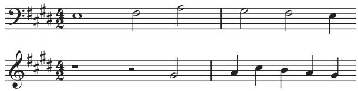
Figure 3 J. S. Bach, Well-Tempered Clavier, Book 2, Fugue no. 2, subject and augmentation.
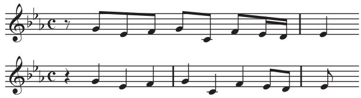

Reflective symmetry is another geometrical concept with a long history in musical composition. Musicians will frequently describe melodic lines in spatial terms, referring to notes of higher frequencies as “up,” and notes of lower frequencies as “down.” This allows one to think of melodic lines as ascending or descending. Reflection in a horizontal axis interchanges up and down. The musical counterpart to this is known as melodic inversion: one reverses the ascending or descending direction of each interval, and the result is an inverted form of the melody. Figure 5 shows the subject of Fugue no. 23 in B major from the first volume of Bach’s Well-Tempered Clavier and a later appearance of the subject in inverted form. A geometrical reflection is clearly visible in the notation, but, more importantly, the inversion can also be clearly heard in the sound of the music itself. 

Figure 4 The circle of fifths.
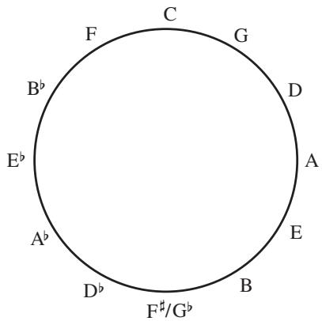
Figure 5 J. S. Bach, Well-Tempered Clavier, Book 1, Fugue no. 23, subject and inversion.
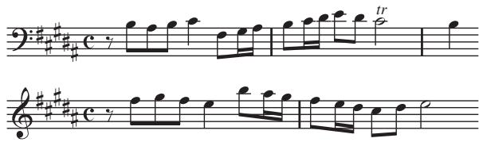

Conventional Western musical notation implies a two-dimensional organization: the vertical dimension expresses the relative frequency of pitches from low to high, and the horizontal dimension expresses chronological time from left to right. Another compositional device, much rarer than the devices of rhythmic augmentation and diminution or melodic inversion, is that of retrograde, where a melody is played backwards. When the melody is played backwards and forwards simultaneously, the technique is known as a cancrizans canon. Perhaps the best-known examples of cancrizans occur in the music of J. S. Bach, such as in the first canon of The Musical Offering or the first and second canons of the Goldberg Variations. Figure 6 shows the opening and closing measures of the cancrizans from Bach’s Musical Offering. The melody of the first few bars of the upper staff returns in reverse order at the end of the piece in the lower staff, and likewise, the melody of the first few bars of the lower staff returns in reverse order at the end of the upper staff. Joseph Haydn’s Menuetto al rovescio, from the Sonata no. 4 for violin and piano, is another well-known example of a similar technique, in which the first half of the piece is played backwards in the second half. 

We may regard the devices of melodic retrograde and inversion as reflections in a two-dimensional musical space. However, retrograde is much more esoteric, owing to the greater constraints involved in the manipulation of musical time. Examples such as those by Bach and Haydn mentioned above demonstrate great ingenuity on the part of the composer, who must make the melodic retrogrades work convincingly with the underlying harmonic progressions. Certain common chord progressions, such as moving from the supertonic to the dominant, do not work well in reverse, so a composer attempting to write a cancrizans canon is forced to avoid them. Similarly, many common melodic patterns do not sound good when reversed. These difficulties account for the rarity of retrograde techniques in tonal music (i.e., music based on major and minor keys). With the abandonment of tonality in the early twentieth century, the main constraints were removed, making composition with retrograde easier. For instance, retrograde and inversion played an important role in serial music, as we shall see. However, composers of such music replaced the traditional constraints of tonal music with others, such as avoiding major or minor triads and bringing out other intervals deemed important for a particular piece. 
The atonal revolution in the early twentieth century, during which composers experimented with novel methods of harmonic organization, led to the exploration of new types of symmetry relations in music composition. Scales based on repeating interval patterns (measured in semitones), such as the whole-tone scale (2–2–2–2–2–2) or the octatonic scale (1–2–1–2–1– 2–1–2), appealed to composers for the symmetric structures and novel harmonies they embodied. The octatonic scale, also known in jazz circles as the diminished scale, had a particularly wide appeal among a variety of composers of different nationalities, such as Igor Stravinsky, Olivier Messiaen, and Béla Bartók. The novelty of the whole-tone and octatonic scales is that they have nontrivial translational symmetry, a property not shared by the major or minor scales. The whole-tone scale is unchanged if it is transposed by a tone, and the octatonic scale is unchanged if it is transposed by a minor third. There are thus only two distinct translates of the whole-tone scale and three of the octatonic scale. For this reason, neither scale has a clearly defined tonal center, which was a major reason for their attractiveness to early twentieth-century composers. 

Figure 6 J. S. Bach, The Musical Offering, opening and closing measures of the cancrizans (canon 1).
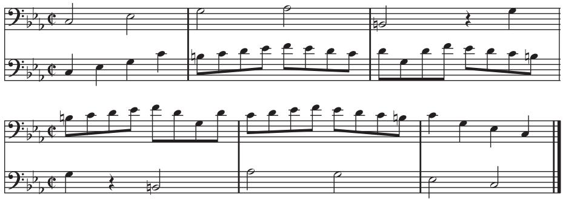
Reflective symmetry was used by twentieth-century composers as well, to help them with the formal aspects of compositional design. A fascinating example is the first movement of Bartók’s Music for Strings, Percussion, and Celesta (1936), which extends the traditional principles of the baroque fugue and incorporates a symmetric design. Figure 7 illustrates the structure of the fugue subject entries, starting from the initial entry on A. In a traditional fugue, the subject is stated in tonic, followed by a statement in the dominant, and then again in the tonic (and continuing the alternating pattern of tonic and dominant entries for fugues with more than three voices). In Bartók’s fugue, the first statement of the subject begins with the note A, and the next with E. Instead of returning to A for the third statement, however, the subsequent entries follow a pattern of alternating fifths in opposite directions from A: that is, the sequence A–E–B–F*, etc., alternates with the sequence A–D–G–C, etc. This pattern is illustrated in figure 7. Each of the interlocked cycles completes a circle of fifths, one clockwise, the other counterclockwise. Each letter in the illustration represents a statement of the fugue subject beginning on that note, and each of the interlocked cycles of fifths arrives on E+ (six semitones from the starting point, A) at its midpoint, so that all twelve notes occur once in the first half of the pattern and once again in the second half. The midpoint of the pattern corresponds to the dramatic climax of the work, after which the pattern of interlocked cycles of fifths resumes with subject entries in inverted form until the conclusion of the work with the return of the subject starting on A. 
Arnold Schoenberg’s twelve-tone method of composition, which he revealed in the early 1920s, is based on permutations of all the twelve notes, rather than of subsets of seven notes as one has in music in major or minor keys. In twelve-tone music (and atonal music in general), the twelve notes are supposed to have equal prominence: in particular, there is no single note with a special status like that of the tonic in a major or minor key. The basic ingredient of a piece of twelvetone music is a tone row, which is a sequence given by some permutation of the twelve notes of the chromatic scale. (These notes can, however, be stated in any octave.) Once the tone row has been chosen, it can be manipulated by means of four types of transformation: transposition, inversion, retrograde, and retrograde inversion. Musical transposition corresponds to the mathematical operation of translation: the intervals between successive notes of a transposed row are the same as those between the corresponding notes of the original row, so the entire row is shifted up or down.6 Inversion corresponds to reflection, as we have already discussed: the intervals of the row are reflected about a “horizontal” axis. Retrograde corresponds to reflection in time: the row is stated backwards. (However, if it is combined with a transposition, as it may be, then it is better described as a glide reflection.) Retrograde inversion is a composition of two reflections, one vertical and one horizontal: it therefore corresponds to a half turn. 
Figure 7 Plan of fugal entries in Béla Bartók’s Music for Strings, Percussion, and Celesta, first movement (after Morris (1994, p. 61), with permission).
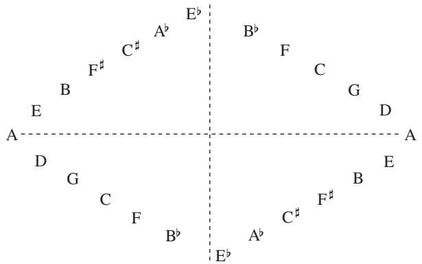

Figure 8 Row forms in Schoenberg’s Suite for Piano (1923).
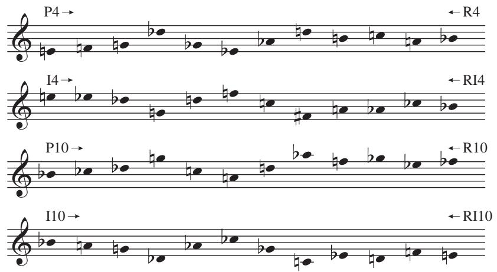

Figure 8 illustrates the serial transformations applied to a row created by Schoenberg for his Suite for Piano, opus 25, published in 1923. The forms of the row are labeled P (for prime—the original row and its transpositions), R (for retrograde), I (for inversion), and RI (for retrograde inversion). The integers 4 and 10 in the row labels on the left and right refer to the starting notes of the P and I row forms by telling us how many semitones away from C they are. Thus, 4 refers to E (4 semitones above C) and 10 refers to B+ (10 semitones above C). The retrogrades of the P and I forms, R and RI, are labeled on the right-hand side of the figure. It is easy to see the inversion (reflection) of P4 in I4 about the first note E and the transposition of P4 by six semitones in P10, as well as the inversion of P10 about the first note, B+. 
One may wonder what sort of insight we gain from understanding these abstract relationships and why they were so attractive to composers like Schoenberg. In Schoenberg’s Suite, the eight row forms shown in figure 8 are in fact the only ones used in all five movements of the composition. This represents a high degree of selectivity, since there are 48 ( 12  4) available row forms. However, this self-imposed restriction is not on its own enough to account for the interest or attraction of this music. An additional aspect of the technique is that the row itself, and the way its transformations unfold in the course of a work, are chosen carefully to bring out certain relationships between notes. For example, all the row forms used in the Suite begin and end on the notes E and B+, and these notes are frequently articulated in the work so that they take on an anchoring function that fills the void created by the absence of a conventional tonal center. Similarly, the notes in the third and fourth positions in each of the four row forms are always G and D+, in either order, and likewise these are articulated in various ways in the movements of the Suite so that they can become recognizable. The two pairs of notes just mentioned, E–B+ and G–D+, are related to each other by sharing the same interval, six semitones (half an octave, also known as the tritone because it spans three whole tones). In the hands of a master composer, a twelve-tone row is not a random collection of notes, but a foundation for an extended composition carefully constructed to produce interesting structural effects that one can learn to recognize and appreciate. 

Permutations and serial transformations of other musical parameters besides pitch—such as rhythm, tempo, dynamics, and articulation—were explored by a new generation of postwar European composers, including Olivier Messiaen, Pierre Boulez, and Karlheinz Stockhausen. Compared with the serialization of pitch, however, serialization of these parameters does not lend itself to such precise transformations, because it is less easy to organize them into discrete units than it is the twelve notes of musical space. 
It is important to recognize that Schoenberg and most composers whose music exhibits mathematical conceptions such as those we have seen had little if any mathematical training.7 Nevertheless, the basic mathematical patterns and relations that we have discussed are so pervasive in so many aspects of so many different kinds of music that the importance of mathematics in music is undeniable. 

We end this section with a few more examples. Proportional relations such as the simple ones between note values reappear on a larger scale in relations between lengths of formal divisions in music of Mozart, Haydn, and others: they often use basic building blocks of four-measure phrases and use them in pairs, and pairs of pairs, to form larger units. The techniques of melodic manipulation seen in Bach’s works, which are found in a new guise in Schoenberg’s twelve-tone techniques, can also be found in contrapuntal works of composers before Bach, such as Palestrina. And some composers, including Bach, Mozart, Beethoven, Debussy, Berg, and others, are said to have incorporated numerological elements into their composition, such as symbolic numbers or proportions based on Fibonacci sequences and the golden ratio. 
# 4 Mathematics and Music Theory 
In the second half of the twentieth century, the ideas of Schoenberg and his followers were extended and developed in North American music theory. Milton Babbitt, a renowned American composer and theorist, is widely credited with introducing formal mathematics, specifically group theory, to the theoretical study of music. He generalized Schoenberg’s twelve-tone system to any system where one has a finite set of basic musical elements (of which Schoenberg’s twelve-tone rows were just one example), with relations and transformations between them (see Babbitt 1960, 1992). There are forty-eight ways of transforming a row, and Babbitt noted that these transformations form a group, which is in fact the product of the dihedral group with the cyclic group of two elements. (The in this product is the symmetry group of a dodecagon, and the allows the time reversal.) The four sets of transformations—P, I, R, and RI (see the previous section)—define a homomorphism from this group to 
Figure 9 Circular model of the twelve notes (pitch classes).
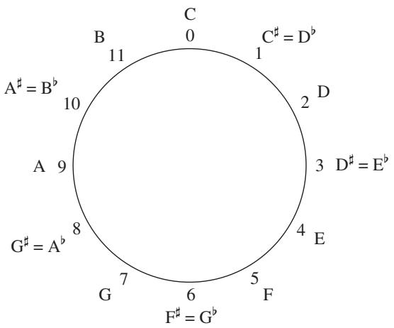
the Klein group by identifying transformations that are equivalent up to rotation. 
Identifying musical notes with the elements of the group of integers mod 12, and modeling various musical operations by means of transformations on this group, makes it much easier to analyze some kinds of music, such as the atonal music of Schoenberg, Berg, and Webern, that do not lend themselves easily to more traditional analysis of harmony (see Forte 1973; Morris 1987; Straus 2005). This identification is illustrated in figure 9. As we have already commented, multiplying by 5 or 7 is an automorphism of , and gives the cycle of fifths shown in figure 4 (when one substitutes the mod-12 integers for the names of the notes). This mathematical fact has many musical consequences. One of them is that it is common to substitute fifths by semitones, and vice versa, in chromatic harmony and in jazz. 
A branch of music theory known as atonal set theory attempts to give a very general understanding of pitch relations by looking at all the 4096 possible combinations of notes, and defining two such combinations to be equivalent if one can be derived from the other by two simple transformations, the idea being that equivalent combinations will have the same intervals. The transformations in question are transposition and inversion. A transposition up by n semitones (where we think of n as an integer mod 12) is denoted . The notation I is used for a reflection about the note so a general inversion takes the form for some n. (Inversion in this context refers to reflection in musical space, and should not be confused with chord inversion in tonal music.) In these terms, to use a familiar example, the major triad and the minor triad are related to each other by inversion since their successive intervals are reflections of each other (four then three semitones in the major triad and three then four semitones in the minor triad, counting from the lowest note). Consequently, all major and minor triads belong to the same equivalence class. For example, the E-major triad 4, 8, 11 is related to the C-major triad by the transposition (because , mod 12), and the G-minor triad {7, 10, 2} is related by inversion to the D-major triad 2, 6, 9 by (because , mod 12). An equivalence class, such as the class of major and minor triads, will normally consist of twenty-four sets. However, if it has internal symmetries, such as those of the diminished seventh chord (with interval succession 3–3–3–3) or the whole-tone and octatonic scales mentioned earlier, then the number of sets in the class will be smaller, though it will always be a factor of 24. 

Sets of notes in the same equivalence class share certain sonic attributes because they share the same number and types of intervals. But while it seems reasonable enough to regard transposed chords as equivalent, since they really do have an obvious “sameness” in the way they sound, there has been some controversy over the notion of inversional equivalence. For example, is it reasonable to declare major and minor triads to be equivalent to each other when they clearly do not sound the same and have very different musical roles? Of course, we are free to define any equivalence relation we like, so the real question is whether this one has any utility. And in some contexts it does: with sets of notes that do not possess extensive associations with tonal music it is easier to recognize this form of equivalence than it is with major and minor triads. For example, the three notes C, F, and B share the same intervals (one semitone, one perfect fourth or fifth, and one tritone) as the three notes F*, G, and , and this does indeed give them a noticeable form of “sameness.” (The set 11, 0, 5 is inversionally related to by because , mod 12.) 
There is other important work in music theory that has been inspired by group theory. The most influential example is David Lewin’s Generalized Musical Intervals and Transformations (1987), which develops a formal theory that connects mathematical reasoning and musical intuition. Lewin generalizes the concept of interval to mean any measurable distance, whether between pairs of pitches, durations, time points, or contextually defined events in a musical work. He develops a model called the generalized interval system (GIS), which consists of a set of musical objects (e.g., pitches, rhythmic durations, time spans, or time points), a group (in the mathematical sense) of intervals (representing the distance, span, or motion between a pair of objects in the system), and a function that maps all possible pairs of objects in the system into the group of intervals. He also uses graph theory [III.34] to model musical processes, through his notion of a transformation network. The vertices of such a network are basic musical elements such as melodic lines or chordal roots. These elements come with certain transformations, such as transposition (or shifting by a generalized interval) or the serial transformations from twelvetone theory. Two vertices are joined by an edge if there is an allowable transformation that takes one to the other. The emphasis thus shifts from the basic elements to the relations that connect them. Transformation networks offer a dynamic way of looking at musical processes, giving visible form to abstract and often nonchronological connections in the analysis of musical works. 

The level of generalization and abstraction makes Lewin’s treatise a challenge for the mathematically unsophisticated music theorist, but it does not need more than fairly simple undergraduate-level algebra, so it is accessible enough for the determined reader with some mathematical training. It becomes clear to such a reader that the formality of the presentation is essential to a proper understanding of the transformational approach to music theory and analysis. Despite this formality, Lewin continually maintains contact with music itself, and how his mathematical tools can be applied in different contexts. The result is that the reader is rewarded with insights that would be impossible without the mathematical rigor. Mathematicians, while likely to find the material relatively elementary, may find their attention “captivated by the way in which the author gives new and, sometimes, unexpected interpretations to classical mathematical ideas when applied to musical contexts” (Vuza 1988, p. 285). 
# 5 Conclusion 
The playful Leibniz quotation with which this essay began underscores an enduring mathematical presence in music. Both disciplines rely in a fundamental way on concepts of order and reason, as well as more dynamic concepts of pattern and transformation. Music was once subsumed within mathematics, but it has now acquired its own identity as an art that has always derived inspiration from mathematics. Mathematical concepts have provided composers and theorists of music both with tools for creating music and with a language for articulating analytical insights about it. 

# Further Reading 
# VII.14 Mathematics and Art 
# Florence Fasanelli 
# 1 Introduction 
This article focuses on the relationship between the history of mathematics and the history of art in twentiethcentury France, England, and the United States. The effect of mathematics on artists and the direct interactions between artists and mathematicians have both been extensively studied. These studies show that knowledge of mathematics has had a significant influence on many artists, as well as on musicians and writers. In particular, the increasingly wide acceptance, during the nineteenth century, of mathematical ideas that had once been revolutionary contributed strongly to what is now called modern art. At the end of the nineteenth century and the beginning of the twentieth, artists expressed on canvas and in sculpture their understanding of the fourth dimension and of noneuclidean geometry [II.2 §§6–10]. In doing so, they left behind their earlier training and heritage, which had been heavily based on a mathematical perspective derived from euclid [VI.2]. Their new ideas reflected the progress that had been made in mathematics, and many of the artists who formed new schools of thought were also engaged in interpreting these new mathematical developments. 

The connection between mathematics and art is rich, complex, and informative. This is evident in some of the artistic styles and the philosophies that developed under the influence of new mathematics (and science), and in the creation of mathematics to fulfill artistic needs. Some examples include the paintings (with their often-studied geometries) of Italian mathematician Piero della Francesca (ca. 1412–92), who, having made a transcription of Jacopo of Cremona’s Latin translation of Archimedes’ Codex A, wrote out his own mathematical theories of perspective; Hans Holbein’s (1497–1543) Ambassadors (1533), which illustrates how an artist can use a distorted variation on mathematical perspective to fool the eye (anamorphosis); Artemesia Gentileschi’s (1593–1652) deliberate correction of a smattering of blood in her first version of Judith Beheading Holofernes (1612–13) to a parabolic arc of blood in the second version (1620) to match a sketch that her friend, scientist, court mathematician, and amateur painter Galileo Galilei (1564–1642) had made as a study for his as yet unpublished law of projectile motion; various works of the Dutch portrait painter Johannes Vermeer (1632–75) using the camera obscura; Johann Hummel’s (1769–1852) paintings of the making of the great granite bowl in Berlin, which used Gaspard Monge’s (1746–1818) Géométrie Descriptive (1799); sculpture by Naum Gabo1 (1890–1977) and his brother Antoine Pevsner (1886–1962) following their youthful academic study of solid geometry; and the mathematically understandable but physically implausible scenes by Maurits Cornelis Escher (1898– 1972). 

This article begins with a brief history of the development of perspective in art, because it is necessary to understand this in order to understand the rebellion against it that had such a decisive impact on modern art. This is followed by a short summary of the changing course of geometry in the nineteenth century through the development of non-Euclidean geometry and n-dimensional geometry. We then move on to the activities of artists, beginning in France in the early twentieth century and continuing with the works of representative artists in other countries, all the while keeping in mind the mathematics that provoked their artistic responses. 
# 2 Development of Perspective 
During the fifteenth century artists were still primarily employed to produce images of sacred subjects, but there was an increased interest in having pictures match aspects of the physical world. Lacking any precursors, artists had to devise their own axioms of linear perspective. At the beginning of the sixteenth century these early ideas of mathematical perspective were spread by books that contained visual representations. Mathematics that was previously known only in writing or orally now took a visual form, which was copied in engravings and spread across Europe. 
The first writings on perspective were by Leon Battista Alberti (1404–72) and Piero della Francesca, while the ideas of Filippo Brunelleschi (1377–1446), the Florentine architect and engineer who was in fact the first to consider a mathematical theory of perspective, were captured by his biographer Antonio Manetti (1423–97). Artists and mathematicians continued to develop the rules of perspective while looking for ways to best represent space and distance. Among the mathematicians, Federico Commandino (1509–75), renowned for his Latin editions of the works of Greek mathematicians such as Euclid, archimedes [VI.3], and apollonius [VI.4], was the first to write about perspective for the benefit of mathematicians rather than artists. His student Guidobaldi del Monte (1505–1647) published the influential book Perspectivae libri sex in 1600, in which he showed that any set of parallel lines not parallel to the plane of the picture will converge to a vanishing point. 
Great artists, notably Leonardo da Vinci (1452–1519) and Albrecht Dürer (1471–1528), were now portraying mathematics in a visual form. Mathematician Luca Pacioli’s (1445–1517) De Divina Proportione (1509) includes Leonardo’s unsurpassed woodcuts of polyhedra (among them the first published illustration of a rhombicuboctohedron), and Dürer’s Unterweysung der Messung (1525) contains the first illustration of nets for models of polyhedra. Dürer’s own new knowledge of perspective, whose secrets he had learned on a trip to Italy from Germany, inspired him to create his famous illustrations of how to draw a picture in which all the elements are in one-point perspective (see figure 1). 
Figure 1 An artist using Dürer’s perspective machine. © Copyright: The Trustees of the British Museum.
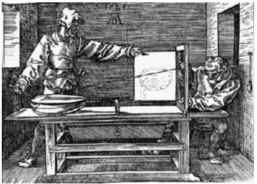

In the seventeenth century, Girard Desargues (1591– 1661), a French engineer and architect who wrote on practical subjects, continued the study of perspective that had been begun by the Renaissance artists. In doing so he invented a new, “non-Greek” way of doing geometry, which he published in his Brouillon Project d’une Atteinte aux Événemens des Rencontres du Cône avec un Plan (1639). In this essay, he attempted to unify the theory of conic sections through the use of projective techniques. This new projective geometry [I.3 §6.7] was based on his earlier realization than an artist can construct a perspective image without using a point from outside the picture field. However, of the original fifty printed copies of the Brouillon Project only one survives and his work, including his “perspective theorem,” was made known through the publications of other mathematicians. Abraham Bosse (1602–76), a friend of Desargues who ran a famous atelier where the art of engraving was taught, was responsible for publishing much of Desargues’s work, including that on the theory of perspective. But Bosse’s promotion of Desargues’s innovative ideas created controversy in art circles and seriously damaged his professional reputation. However, in the twentieth century, when engraving was revived as an important art form, a replica of Bosse’s studio was built in Paris. 

In the early eighteenth century, the mathematician and amateur painter brook taylor [VI.16] published Linear Perspective: Or a New Method of Representing Justly All Manner of Objects as They Appear to the Eye in All Situations (1715), the first book on perspective to give a general treatment of vanishing points. As Taylor wrote on the title page, the book was “a work necessary for painters, architects, etc., to judge of, and regulate designs by.” Taylor invented the phrase “linear perspective” and stressed the importance of what is now described as the main theorem of perspective: given any direction not parallel to the plane of the picture there is a “vanishing point” through which the representations of all lines in that direction must pass. 
Since ancient times the axioms of Euclid’s Elements have provided the basis for the understanding of twoand three-dimensional figures, and in the fifteenth century they provided the foundations for the study of perspective. But during the nineteenth century the long-standing debate about whether to accept Euclid’s fifth axiom (the “parallel postulate”) was resolved in a way that was to provoke a radical change in the perception of geometry: it was demonstrated by several mathematicians—notably lobachevskii [VI.31] in 1829, bolyai [VI.34] in 1832, and riemann [VI.49] in 1854—that a consistent “non-Euclidean geometry” was possible in which the fifth axiom no longer held. 
The mathematician and expositor henri poincaré [VI.61] provided popular accounts of these new ideas in his books La Science et l’Hypothèse (1902) and Dernières Pensées (1913), which were widely read in France and elsewhere. Poincaré’s works provoked the highly influential French (and later American) artist Marcel Duchamp (1887–1968) to attach new meanings to the concepts of space and measurement. Duchamp famously discussed and used Poincaré’s essays “Mathematical magnitude and experiment” and “Why space has three dimensions” to create artistic works of a completely new kind. (Duchamp’s ideas have been explored by the art historian Linda Dalrymple Henderson, who has used Duchamp’s extensive notes to analyze his understanding of four-dimensional and non-Euclidean geometries.) 
# 3 Four-Dimensional Geometry 
The modern movement known as cubism was greatly influenced by ideas of the fourth dimension. One of the ways cubists came into contact with these ideas, as well as with non-Euclidean geometry, was through their reading of popular science fiction. In Gestes et Opinions du Docteur Faustroll (1911), French author Alfred Jarry (1873–1907), a close friend of Spanish artist Pablo Picasso (1881–1973), attracted by the novelty of higherdimensional geometries, wrote about the work of the British mathematician arthur cayley [VI.46]. In 1843, Cayley published “Chapters in the analytic geometry of n dimensions” in the Cambridge Mathematical Journal. This work, along with Hermann Grassmann’s (1809–77) Die Lineale Ausdehnungslehre, published in German a year earlier, was of interest not only to mathematicians but also to the general public, who recognized that in spaces of higher than three dimensions basic concepts had to be redefined and generalized. 

In 1880 Washington Irving Stringham (1847–1909), in another influential article, “Regular figures in n-dimensional space,” published in the American Journal of Mathematics, extended euler’s formula [I.4 §2.2] for polyhedra to new objects called “polyhedroids” in which polyhedra are joined by their faces so as to enclose a hyperspace. This article, which included illustrations of four-dimensional figures created by Stringham, was cited for the next twenty years in the most important mathematical texts on four-dimensional geometry. Stringham’s figures intrigued several artists during the first decade of the twentieth century: Albert Gleizes’s (1881–1953) painting Woman with Phlox (1910) has flowers that are similar to Stringham’s “ikosatetrahedroid”; while in Henri Victor Gabriel Le Fauconnier’s (1881–1946) Abundance (1910–11) Stringham’s “hekatonikosihedroid” appears. 
Art forms evolved as artists found new ways of responding visually to the world around them. This was particularly true of cubism, in which the artist depicted objects from several viewpoints at once. In order to make sense of a cubist painting, the viewer was invited to construct a single (elusive) object from an array of different perspective “facets” laid out across the picture’s surface. 
The n-dimensional geometries influenced not just the visual arts but also literature, including works by Rudyard Kipling and H. G. Wells, and music, for example Edgard Varese’s “Hyperprism” (1923). Some mathematicians used this new mathematics for humorous purposes: two examples were Charles Dodgson in his Through the Looking Glass of 1872 and Edwin Abbott in Flatland: A Romance of Many Dimensions of 1884. The latter in particular was read by French artists and was referred to in other mathematics books that they read, such as those by Esprit Pascal Jouffret (1837–1907). 

# 4 Formal Protests against Euclid 
In the early twentieth century, informed by Poincaré’s exposition of “the fourth dimension” and by knowledge of non-Euclidean geometry, a group of artists, including Gleizes and Jean Metzinger (1883–1956), explicitly attempted to liberate themselves from the geometry of three-dimensional Euclidean space. In an essay titled “Du Cubisme” they stated, “If we wished to tie the painter’s space to a particular geometry, we should have to refer to the non-Euclidean scholars; we should have to study, at some length, certain of Riemann’s theorems.” Here they appear to be referring to riemannian geometry [I.3 §6.10], in which the notion of shape is less rigid than it is in Euclidean geometry. They go on to say, “An object does not have one absolute shape, it has several, it has as many as it has planes in a range of meaning.” It is likely that they are referring here to Poincaré’s “Les géométries non euclidiennes” in La Science et l’Hypothèse. The title of a (lost) 1913 painting of Metzinger’s, Nature morte (4me dimension), gives a good indication of his interest in representing three and four dimensions on a two-dimensional surface. Both Riemann’s geometry and the fourth dimension lay behind what these artists were trying to accomplish; they referred to both, however, as “non-Euclidean.” 
In 1918, enraged by the destruction wrought by World War I, a dozen artists, including Jean (Hans) Arp (1886–1986) and Francis Picabia (1879–1953), signed the Dada Manifesto. In it, they explicitly stated their belief that “all objects, sentiments, obscurities, apparitions and the precise clash of parallel lines are weapons for the fight [against conformity].” By the 1930s, more and more artists were using their knowledge of mathematics to change, in a radical way, the appearance of sculpture and painting. 
# 5 Paris at the Center 
During the last decade of the nineteenth century and the years before the outbreak of World War I, artists were profoundly influenced not just by mathematics, but also by the extraordinary developments and discoveries in science and technology. For instance, motion pictures (1880s), radios (1890s), airplanes, cars, X-rays (1895), and the discovery of electrons (1897) all had an impact on the work of artists. The pioneering painter Wassily Kandinsky (1866–1944) wrote that an artist’s block he was experiencing disappeared when he learned of what was new in science; his old world collapsed and he could begin painting again. 
While it is not entirely clear how knowledge of scientific and mathematical thinking came to working artists in the early twentieth century, it is nevertheless evident that many artists were familiar with articles about mathematics written for the general public. There was also at least one tutor with whom they explored mathematics in depth. In 1911, in Paris, the mathematician and actuary Maurice Princet (1875–1971) gave informal lectures on four-dimensional geometry, using mathematician Esprit Pascal Jouffret’s Traité Élémentaire de Géométrie à Quatre Dimensions et Introduction à la Géométrie à n Dimensions (1903). Jouffret’s Traité, which makes reference to Flatland, contains ways to present four dimensions on paper, the diagrams by Stringham of polyhedroids in four-dimensional space, and clear presentations of the ideas and theories of Poincaré. A second book, Mélanges de Géométrie à Quatre Dimensions (1906), emphasizes similar points. 
Princet’s audience was the Puteaux cubist group (which was sometimes called the “Section d’Or”). The central figures in this group were the three brothers Raymond Duchamp-Villon (1876–1918), Duchamp, and Jacques Villon (born Gaston Emile Duchamp) (1875– 1963). Princet’s involvement with the artists continued, even after his divorce from Alice Géry (1884–1975), who shared a bohemian life with the best man at their wedding, Pablo Picasso, and who later married André Derain (1880–1954). Géry had introduced Princet to the artists. An avid reader, she may have been the sitter for Seated Woman with a Book (1910), an early cubist painting by Picasso. 
Together, in Paris, Princet and Duchamp privately studied Poincaré and Riemann, who were two important sources for Duchamp’s work, as we have already seen. Duchamp’s own notes, written a decade later as he created his famous painting The Bride Stripped Bare by her Bachelors, Even (The Large Glass) (1915–23), document his increasing interest in and understanding of four-dimensional and non-Euclidean geometries. Referring to Jouffret’s book, which explained how a three-dimensional projection of a four-dimensional figure can be considered as a sort of “shadow,” Duchamp told friends that the bride in his picture was a threedimensional projection of a four-dimensional object recorded in two-dimensional form. He also refers to the fact, which fascinated him, that electrons were known to exist but could not be directly observed, claiming that his picture contained elements that were not directly represented. These notes, and others containing speculations on mathematics, were published in À l’Infinitif (1966). Working in a field hitherto dominated by fifteenth-century Renaissance perspective and its dependence on a Euclidean framework, Duchamp and other artists learned with excitement that many mathematicians no longer felt it necessary to subject themselves to Euclidean restrictions, and art was dramatically changed. 

Rather surprisingly, Riemann and Poincaré were even part of the original inspiration for Duchamp’s famous “readymades,” found objects presented as art. As the artist Rhonda Shearer described in the New York Academy of Science newsletter in 1997, Duchamp was very taken with Poincaré’s description of the creative process in Science and Method. Poincaré reported on his accidental discovery of the so-called Fuchsian functions. After days of “unfruitful” conscious work spent trying to prove that the functions do not exist, he changed his habit and one evening drank black coffee late at night. The next morning, “fruitful” ideas came into his conscious mind. From these he selected “tout fait” (readymade) ideas and saw, surprisingly, a way to prove the existence of the mathematical functions whose existence he had previously doubted. Duchamp used the term “readymade” (and “tout fait”) in 1915. The examples he selected, titled, and signed are ordinary manufactured objects such as a urinal turned upside down, Fountain (1917), and a bottle drying rack, Bottle Rack (1914), thought to be the first readymade. 
# 6 Constructivism 
In Russia in 1920, the artists Naum Gabo and Antoine Pevsner wrote that they had turned to mathematics in order to rethink their work. As they put it: “We construct our work as the universe constructs its men; as the engineer constructs his bridges; as the mathematician his formulas of the orbits.” Gabo began to use a stereometric system that he had studied in engineering, creating sculptures such as “Head No. 2” (see figure 2). The subject of stereometry goes back at least as far as 1579, where it is listed in the “Groundplat” of John Dee’s celebrated Mathematicall Praeface to Billingsley’s edition of Euclid. It concerns the measurement of properties of solids, and was widely taught at universities in the nineteenth and twentieth centuries: indeed, it is still taught today in some European countries. Gabo and Pevsner constructed their sculptures out of planar parts, so space, rather than mass, became the sculptural element. Density was no longer important, with the result that the subtraction techniques used in classical sculpture (where material is carved away from a solid block leaving the artist’s work as the solid) were no longer necessary. Sculpture became airy; surfaces became less significant and have remained so, at least within the tradition that became known as constructivism. 
Figure 2 Gabo’s Head No. 2, COR-TEN steel, 1916 (enlarged version 1964). The works of Naum Gabo: © Nina Williams.
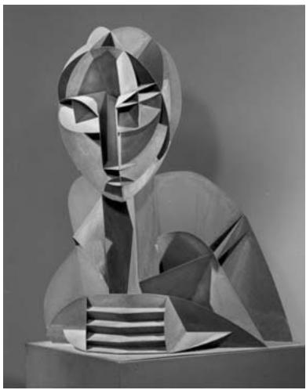

This tradition was first formalized in the Russian Realistic Manifesto (1920), written and signed by Gabo and Pevsner. There they argued that “The material formation of the object is to be substituted for its aesthetic combination. The object is to be treated as a whole … a product of an industrial order like a car.” Gabo took constructivism to the Bauhaus in Germany and then to France and England in the 1930s, where he worked alongside the British artists Barbara Hepworth (1903– 75) and her husband Ben Nicholson (1894–1982). Gabo and Nicholson (with Leslie Martin) edited Circle: International Survey of Constructive Art (1937), which contained articles by themselves as well as ones by Hepworth, Piet Mondrian (1872–1944), and the critic Herbert Read (1893–1968), among others. In Circle, Gabo, referring back to the seventeen-year-old Realistic Manifesto, spells out what is meant by constructivism by guiding the reader to see how two cubes (shown in the photograph in figure 3) can illustrate the distinction between two kinds of representation of the same object: carving and construction. The cubes have different methods of execution and different centers of interest: one is mass and the other makes visible the space in which mass exists. Constructivism created an artistic context in which a mathematically understood space became a sculptural element. As Gabo wrote: 

Figure 3 Gabo’s two cubes: carving and construction. Image courtesy of the Library of Congress.

“The stereometrical method in which [the right-hand cube] is executed shows elementarily the constructive principle of a sculptural space expression.” 
These artists studied mathematical models in museums and catalogues. These models, designed by mathematicians for teaching about surfaces, were made of string, cardboard, metal, and plaster. The same artists also studied photographs produced by the surrealist Man Ray showing strings and striations of surface lines on a model that had been found by another surrealist artist, Max Ernst, at the Institut Henri Poincaré in Paris. Ray portrayed these models with impressionistic patterns of light and shadow (see figure 4); he was interested in the “elegance”—the aesthetic persuasiveness— of the model, though aware that the original modelmaker had sought to give visual form to an elegance inherent in the mathematical equations themselves. Other artists too, such as Hepworth and Gabo, stated that it was not mathematics itself but the beauty of the mathematical models that provided the inspiration for their work. Hepworth studied mathematical models that were on display in Oxford, considering them to be “sculptural working out of mathematical equations.” They inspired her to add strings to her own work. However, she wrote that her inspiration was not the mathematics exhibited by the strings, but rather their power: “the tension I felt between myself and the sea, the winds, and the hills.” 
A close friend of both Gabo and Hepworth was the renowned sculptor Henry Moore (1898–1986). Moore too spoke and wrote about the influence of mathematical models on his work. He had seen stringed figures of Theodore Olivier (see figure 5) and after making many of his own mathematical models introduced strings into his sculpture in 1938, later considering it to have been the most abstract of his work. He said he “had gone to the Science Museum in South Kensington and had been greatly intrigued by some of the mathematical models … hyperboloids and groins … developed by [Fabre de] Lagrange in Paris, that have geometric fig-
Figure 4 Man Ray’s Allure de la Fonction Elliptique, 1936. Image courtesy of the National Gallery of Art.
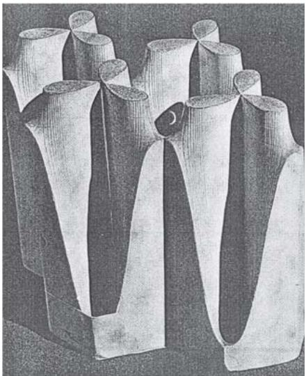
Figure 5 Olivier’s Intersection of Two Hyperbolic Paraboloids, 1830. Image courtesy of the Union College Permanent Collection, Schenectady, NY.
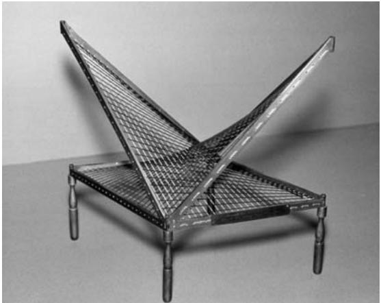
ures at the ends with colored threads from one to the other to show what the form between would be. I saw the sculptural possibilities of them, and I did some.” Moore recognized that the use of strings connecting protrusions actually created a barrier between the solid sculpture and the space around the sculpture (see figure 6). The string barrier made it possible to see the captured space. Moore and Gabo made different uses of the mathematical models. As Moore later put it, Gabo “developed this string idea so that his structure always became space itself, whereas I liked the contrast between the solid and the strings … I was making an outside shape a sculpture in its own right (Interior/ Exterior forms), yet one which was not completed until each part was connected to the other.” 

Figure 6 Moore’s Stringed Figure No. 1, cherry wood and string, on oak base, 1937. Image (taken by Lee Stalsworth) courtesy of the Hirshhorn Museum and Sculpture Garden, Smithsonian Institution, Joseph H. Hirshhorn Purchase Fund (1989).
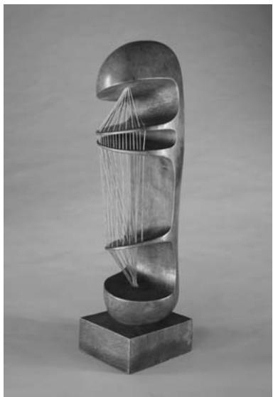

# 7 Other Countries, Other Times, Other Artists 
# 7.1 Switzerland and Max Bill 
In the mid 1930s the Swiss designer and artist Max Bill (1908–94) became intrigued by a one-sided surface, unaware that it had been published in 1865 by the German mathematician and astronomer august ferdinand möbius [VI.30]. Bill, when he needed a design for a sculpture to hang in a stairwell, independently invented his own möbius strip [IV.7 §2.3], by dangling a long narrow rectangle of flexible material and then attaching the corners appropriately (1935). 
Having been informed some years later of the connection between his sculpture and its mathematical forerunner, Bill, who liked the simplicity of geometric forms, continued to earn commissions by making sculptures based on topological problems and singlesided surfaces (see figure 7). In a 1955 essay on the mathematical approach in contemporary art, he wrote that mathematics, by giving all phenomena a meaningful arrangement, is an essential method to understand the world. For Bill, when mathematical relationships are given form they “emanate undeniable aesthetic appeal, such as goes out from space-models, as, for instance, those that stand in the Musée Poincaré in Paris.” 
Figure 7 Bill’s Eindeloze Kronkel, bronze, 1953–56. Image courtesy of Mary Ann Sullivan, Bluffton University.
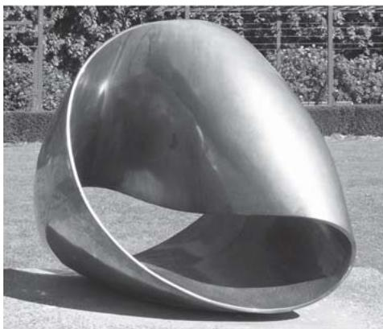

# 7.2 Holland and Escher 
From the second half of the twentieth century onward there has been a groundswell of interest in the relationship between mathematics and art, particularly since 1992 when artists and mathematicians from around the world began holding joint annual conferences to explore old and new ideas about the connections between their disciplines. The popularity in the West of this interdisciplinary study is in no small part due to the unusual drawings and prints made by Maurits Cornelis Escher (1898–1972), a Dutch graphic artist— or “craftsman,” as he wished to be known. Escher was deeply interested in tessellations and “impossible” objects that are not constructible in three dimensions but that can nevertheless be portrayed in two dimensions. While his oeuvre is not thought of as an integral part of twentieth century art, he is greatly appreciated by mathematicians and also by the general public. Among his best-known works are pictures based on Penrose triangles and on the Möbius strip. 
He was inspired by knowing and learning from mathematicians including Georg Pólya (1887–1985), Roger Penrose (1931–), and Harold Scott MacDonald “Donald” Coxeter (1907–2003). Escher was introduced to the international mathematics community in 1954 when the organizing committee for the Amsterdam meeting of the International Congress of Mathematicians inaugurated an exhibition of his work at the Stedelijk Museum. After Penrose viewed Escher’s 1953 print Relativity at this exhibition, he and his father, geneticist Lionel Penrose (1898–1972), were inspired to create impossible figures: the Penrose tribar and the Penrose staircase published in the British Journal of Psychology in 1958—the Penroses sent Escher an offprint of the article. Escher subsequently used these in two wellknown lithographs: Waterfall (1961), in which water runs in perpetual motion from the base of a waterfall to the top of the waterfall; and Ascending and Descending (1960), which features a building with an impossible staircase which constantly rises or falls (depending on the direction you go around it) but returns to the same level. Coxeter’s field was symmetry in the Euclidean and hyperbolic planes, but he also took pleasure in analyzing the works of artists from a mathematical point of view. Escher began a correspondence with him shortly after the congress, at which they met, and it lasted until his death in 1972. In 1957 Coxeter requested the use of two of Escher’s drawings to illustrate planar symmetry in “Crystal Symmetry and Its Generalizations,” his presidential address to the Royal Society of Canada—in this way Escher’s work spread among the mathematical community. In 1958, Coxeter sent Escher a letter containing a reprint of his address. The response was a request: “Could [you] give me a simple explanation how to construct the following circles, whose centers approach gradually from the outside till they reach the limit?” Coxeter’s reply, meant to be helpful, gave Escher one small piece of useful information; the rest of the lengthy letter was unintelligible to the artist. But from the pictures and his own keen geometric intuition, Escher was able to construct the circles he required, and by 1958 he was the first graphic artist to have used the three main geometries in his works: Euclidean, spherical, and hyperbolic. Coxeter was astounded that an artist, untrained in mathematics, could produce such accurate “equidistant curves” as he did in his 1958 woodcut Circle Limit III. Escher always claimed that he knew little mathematics, but many of his prints are a direct result of using mathematics. Mathematician Doris Schattschneider has said that Escher was really a “secret mathematician,” since much of his work depended on his pursuit of mathematical questions that arose from his interests and his interaction with mathematicians, which he referred to as “Coxetering.” He did, however, write that he preferred to find solutions and understanding by himself. 

As well as his artistic and mathematical legacy, Escher had an important influence on crystallographers, who have used his symmetry drawings for analysis. Crystallographer Caroline MacGillavry has pointed out that Escher began a deep study of color symmetry and created a classification system in 1941–42, which was some time before crystallographers became interested in this field of study, which has become very active. The International Union of Crystallography subsequently commissioned Escher to illustrate MacGillavry’s Symmetry Aspects of M. C. Escher’s Periodic Drawings, first published in 1965. Its purpose was to interest “students in the laws which underlie repeating designs and their colorings.” 
# 7.3 Spain and Dalí 
As we have seen, some artists were influenced by their own knowledge of mathematics, others by a less direct appreciation of mathematical thinking, and still others by the appeal of mathematical models. Another kind of connection is illustrated by the example of the surrealist artist Salvador Dalí (1904–89) and his relationship with the mathematician and graphic artist Thomas Banchoff (1938–). Banchoff is a professor of mathematics at Brown University, known for his research in differential geometry in three and four dimensions. Since the late 1960s, he has also been involved in the development of computer graphics. Dalí’s 1954 painting of Christ crucified on a hypercube was reproduced in a 1975 article about Banchoff’s pioneering work, which used computer animation to illustrate geometry beyond the third dimension. This led to a series of meetings between Banchoff and Dalí over the next decade, at which hypercubes and other aspects of geometry and art were discussed. One joint project was the design for a giant sculpture of a horse that would appear realistic from only one viewing position. Dalí eventually envisioned a horse with its head in front of the viewer and its rump somewhere on the moon—clearly a project solely of the imagination. Dalí created works using anamorphoses, as other artists, beginning with Leonardo, had done. He prized his interactions with scientists and mathematicians, later stating, “Scientists give me everything, even the immortality of the soul.” Dalí also met the French mathematician René Thom (1923–2002) to discuss catastrophe theory, which, in 1983, he sought to represent in what turned out to be his last series of paintings. 

# 7.4 Other Recent Developments: The United States and Helaman Ferguson 
So far we have seen how mathematics has influenced art. Occasionally, artists have actually created mathematics, for instance to produce sculpture by means of carefully chosen mathematical equations. The noted American sculptor/mathematician Helaman Ferguson (1943–) divides his time equally between mathematics and the interpretation of mathematics in his art. As a mathematician he designs algorithms for operating machinery and for scientific visualization. In 1979 he found a method for finding integer relationships between more than two real or complex numbers—this was later named one of the top ten algorithms of the twentieth century. As an artist, he carves in stone. In 1994, he asked mathematician Alfred Gray (1939–98) to develop equations for a Costa surface (named after the graduate student who invented equations for describing a minimal surface with holes), so that he could sculpt the surface (see figure 8). Gray developed the equations in terms of the Weierstrass zeta function. This could be used with Mathematica, which made it possible for Ferguson to create a stone sculpture. Ferguson sees his art as deriving from applied mathematics that has been developed over the course of the last two centuries: 
Start with physical observations about soap films in nature (Plateau), write down a differential equation model describing minimizing surfaces (Euler– Lagrange), define a minimal surface geometrically in terms of curvature (Gauss), discover a minimal surface with non-trivial topology (Costa), draw computer images of the surface (Hoffman–Hoffman), recognize symmetry and prove the surface has not self intersections (Hoffman–Meeks), discover fast parametric equations for the surface (Gray), and finally return to nature with a sculpture, a solid form of a “soap film” big enough to touch and climb on. 
# 7.5 The United States and Tony Robbin 
The development of n-dimensional geometry also had a powerful effect on many other European and American artists, and this continued into the late twentieth century. Interest was boosted in the 1970s with the development of computer graphics by mathematicians and artists. Examples can be found in the work of American artist Tony Robbin (1943–), who has explored concepts of dimension in painting, prints, and sculpture (see figure 9). In late 1979, Robbin, who had also been a student of mathematics, was working on Banchoff’s parallel processor computer and managed to visualize for the first time a four-dimensional cube, an event which radically changed his art, and which led him to develop two-dimensional works that portrayed the spatial fourth dimension. Writing in his book Fourfield: Computers, Art & the 4th Dimension (1992), Robbin tells us, “When the fourth dimension becomes part of our intuition our understanding will soar.” Some of Robbin’s constructions, paintings, and prints show figures in independent planes: that is, in overlapping spaces that cannot be fully seen in three dimensions. If the viewer wants to see two structures in the same place at the same time and rotating with respect to one another (as though projected from four-dimensional space), then looking at one of Robbin’s wall-relief sculptures lit by red and blue light while wearing 3D glasses (one red and one blue lens) will create a full stereoscopic effect of the four-dimensional figure. In digital prints it is Robbin’s lines and polyhedra that imply four dimensions, with the two-dimensional picture being a shadow of the higher-order object. 
Figure 8 Ferguson’s Invisible Handshake II : a triply punctured torus with negative Gaussian curvature. Image courtesy of the artist.
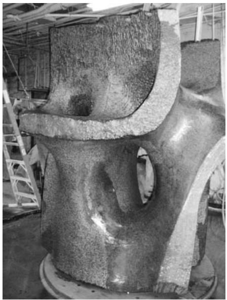
Figure 9 Robbin’s Lobofour, acrylic on canvas with metal rods, 1982, collection of the artist.
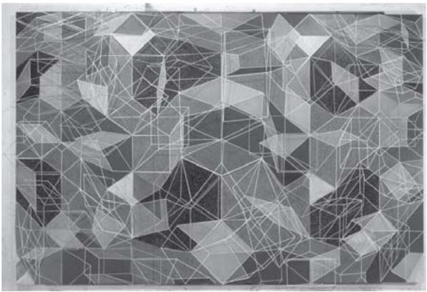

# 7.6 Hayter and Atelier 17 
In 1927, the British surrealist and printmaker Stanley William Hayter (1901–88) decided to revive the almost lost skill of intaglio printing and established an experimental studio, “Atelier in Paris. This was followed by another in New York from 1940 to 1950 before he returned to Paris. Hayter was aware that many of the artists who used his facilities were working with a “different space from that seen through the classical window of Renaissance representation” that had existed when engraving flourished a hundred years earlier. The founding of Atelier 17 was central to the revival of the print as an autonomous art form, and Hayter’s sensitivity to the significance of mathematics in the experimental techniques of printmaking (which had been evolving since the nineteenth century) is quite apparent: “Man’s increasing consciousness of and power over space (in physics and mathematics) have been reflected in new and unorthodox methods of demonstrating space and time graphically,” so that “many properties of matter and space, which had been represented diagrammatically only by the scientists, found their expression in graphic and affective forms.” A printmaker in the twentieth century could use an arrangement of transparent webs to define planes above the picture plane. Specifically, by hollowing out spaces in the plate being engraved—possibly even gouging all the way to the bottom of the plate—the artist could make a projection in front of the plane of the picture. Although artists could have used this technique much earlier, it became important only at the end of the nineteenth century when the representational aspect of intaglio had been challenged by photography. They therefore used the gouge to create the third dimension. Hayter also describes in About Prints (1962) how Abraham Bosse’s seventeenthcentury atelier was organized and reconstructed in Paris in the twentieth century. 

In World War II Hayter’s interest in mathematics revealed itself in a more practical way, when, in collaboration with artist and patron of art Roland Penrose and others, he set up a camouflage unit and, as Art News reported in 1941, constructed 
an apparatus which can duplicate the angle of the sun and the consequent length of cast shadows at any time of day, and day of the year, at any given latitude. This complex of turntables, discs inscribed with a scale of weeks, allowances for seasonal declination, and so on is just the kind of working mathematics he really delights in. 
# 8 Conclusion 
There has been a complex and fruitful relationship between Western art and mathematics in the twentieth century. Gabo, Moore, Bill, Dalí, and Duchamp are notable artists who have been influenced by mathematics, and Poincaré, Banchoff, Penrose, and Coxeter are among the mathematicians who influenced them. In the other direction, twentieth-century mathematicians, like their forebears in the fifteenth and sixteenth centuries, often turned to art to explore and exhibit, or even just to explain more expressively, the meaning of their mathematics. They have also likened their creative processes to those of artists. As the French mathematician andré weil [VI.93] wrote to his sister, author Simone Weil (1909–43), from military prison in 1940, “When I invented (I say invented, and not discovered) uniform spaces, I did not have the impression of working with resistant material, but rather the impression that a professional sculptor must have when he plays by making a snowman.” 
# Further Reading 

# Part VIII 
# Final Perspectives 
# VIII.1 The Art of Problem Solving A. Gardiner 
Where there are problems, there is life. 
Zinoviev (1980) 
In English the word “problem” has negative connotations, suggesting some unwanted and unresolved tension. Zinoviev’s reminder is therefore important: problems are the stuff of life—and of mathematics. Good problems focus the mind: they challenge and frustrate; they cultivate ambition and humility; they show up the limitations of what we know, and highlight potential sources of more powerful ideas. By contrast, the word “solving” suggests a release of tension. The juxtaposition of these two words in the expression “problem solving” may encourage the naive to think that this unwelcome tension can be massaged away by means of some “magic formula” or process. It cannot; there is no magic formula. 
Why don’t we tell the truth? No one has the faintest idea how the process … works, and in calling it a “process” we may be already making a dangerous assumption. 
Gian-Carlo Rota, in Kac et al. (1986) 
A “problem” is something that one wants to understand, to explain, or to solve, but which eludes one’s initial attempts to classify it as being of some familiar “type.” The experience of being confronted by such a “problem” is inevitably unsettling: it may eventually prove to be more familiar than one thought, but the would-be solver is initially dumped in terrain with few signposts or marked tracks. Some (such as Pólya and his recent followers) have tried to devise a universal “problem-solving meta-map.” But in reality there is no easy alternative to that painful immersion so familiar to generations of postgraduate students. 
Grand general principles can help to make sense of this experience, but are unlikely to take us very far. Consider, for example, the four general principles formulated by descartes [VI.11] in his Discourse on Method. 

The first was never to accept anything for true which I did not clearly know to be such. The second, to divide each of the difficulties under examination into as many parts as possible, and as might be necessary for its adequate solution. The third, to conduct my thoughts in such order that by commencing with objects the simplest and easiest to know, I might ascend … step by step to the knowledge of the more complex. And the last … to make enumerations so complete … that I might be assured that nothing was omitted. 
Descartes’s rules are worth pondering. But it is hard to accept that it was the systematic application of these four rules that led to Descartes’s almost single-handed creation of analytic geometry as we know them today! In the detailed working out of the creative process, problem-specific “know-how” distilled from endless hands-on experience is likely to be far more important than any general principles. What then can one usefully say? To describe the “art of problem solving” in impressive-sounding detail would be irresponsible. But to say nothing would be misleading. Both options are unsatisfactory—yet these two responses are what students, teachers, and would-be mathematicians are most likely to meet! Attempts to teach “problem-solving” in schools often misconstrue mathematics as a kind of “subjective pattern-spotting.” Instead of correcting this distortion at university level, mathematicians often maintain a discreet public silence about the very private matter of how serious mathematical problems actually get solved. Hence, in addressing the theme for readers with a mathematical bent, this article has to start largely from scratch, and to proceed slowly. So we begin with a warning. The subject of problem solving is well worth exploring, but we shall proceed obliquely and our conclusions will often remain implicit. Along the way we shall meet extracts from a number of sources— which may be viewed as an initial reading list for those who wish to pursue the theme in greater detail, provided they never forget that the only way to gain true insight into a craft is through practicing the craft itself. Mathematics may be “the queen of the sciences,” but the art of doing mathematics remains a craft, passed on in the ancient craft tradition, through painful initiation. A number of collections of problems at various levels—often using relatively elementary material—are listed in the references. Here we make do with a single example. 

Problem. For all positive integers n and k, show that some triangular number is congruent to k (mod 2n). 
The reader is encouraged to explore this problem before reading on, noting any obvious stages along the way: from initial bewilderment, through an exploratory/organization phase, eventually culminating in a solution and an attempt to locate this isolated challenge in some broader mathematical context. 
Mathematics is a largely unexplored “mental universe,” whose initial exploration and charting, subsequent colonization, routine traverse, and efficient administration correspond, in many ways, to the realworld adventures of geographical explorers in former centuries. To strike out beyond the security of the oldworld coastline, to imagine and explore something new, takes intellectual courage. 
Most prominent among these mathematical explorers are the “system builders,” who identify new mathematical continents, or who uncover profound and unexpected bridges joining known lands. Their initial motivation may stem from a specific problem, whose analysis provides hints of the outline of previously undiscerned structures; but the system builder’s focus then switches to the bigger picture: trying to identify, and to clarify, connections between the structures that underlie “mathematics in the large.” Such ventures often end up with little to show for them— they may come close to discovering some mathematical El Dorado, but they lack the gold to prove it. Some of these explorers may later be singled out as major prophets or discoverers, but such recognition can be fickle: those so honored may not have been the first to see their particular promised land; they may not have appreciated the significance of what they had stumbled upon, or of how it would eventually be seen to link known mathematical lands; their success may have depended on earlier attempts by others; and their bounty may not have impressed their contemporaries as deeply as we now imagine. 
Each triumph of the system builders is rooted in detailed knowledge of “mathematics in the small,” which may derive from work in a very different mathematical style—such as that of the mathematical beachcomber, who is most at home exploring the known mathematical shoreline, using some sixth sense to spot suspicious-looking rocks, under which are hidden intricate, and totally unexpected, microworlds on our very doorstep. While great explorers range further and further afield, they leave behind annoying gaps, or unsolved problems, which represent significant lacunas in our understanding—gaps that some future beachcomber may one day explain, so opening the way for some new synthesis. 
The system builder and the beachcomber represent very different mental styles; but their contributions complement each other. In our evolving picture of the mathematical universe, insights on a small scale and on a large scale must somehow fit together. Hence the beachcomber’s chance discoveries may contribute in unexpected ways to our future conception of the large-scale mathematical universe. 
Such differing styles should be borne in mind as we strive to make our introductory comments more specific. Our first attempt is based on a version of Alain Connes’s three levels of mathematical activity. 
The first [level] is defined by the faculty of calculation— being able to apply a given algorithm rapidly and reliably. . . . The second level begins when the actual method of calculation is adapted to, and criticized in the context of, a particular problem. . . . In mathematics this is what often makes it possible to solve problems that aren’t too difficult or that don’t require any new ideas. . . . The third level [is] the level at which the mind, or rather conscious thought, is occupied with another task while the problem in question is being solved … subconsciously. . . . At [the third] level it isn’t only a matter of solving a given problem; it is also possible to discover … a part of mathematics to which the [previously] existing corpus gives no direct access. 
Alain Connes, in Changeux and Connes (1995) 
Connes’s first level focuses on the development of robust technique—that is, fluency, accuracy, and confidence in using given procedures in relatively standard ways. We say no more about work on this level except to stress its importance! Discussion about the “art of problem solving” presupposes, and only makes sense in the context of, appropriate robust technique. 
Connes’s second level includes most, but by no means all, of the serious mathematics that mathematicians engage in on a daily basis. Genuine problems occur on this level in different guises, ranging from (i) challenges designed to stretch the young wouldbe mathematician (in high school geometry, in puzzle books and problem-solving journals, in Olympiads, etc., whose material is designed to force the would-be solver to select, to adapt, and to combine known methods in unexpected ways), to (ii) genuine research problems that can be tackled and largely solved by selecting, adapting, and combining known methods in a suitably imaginative way. 

In our problem about triangular numbers, the first level includes the immediate translation from words into symbols to obtain the congruence m k (mod 2n), or m(m − 1) ≡ 2k (mod 2n+1), which, for arbitrary given n  1, has to be solved for all . The second level might then include a systematic attempt to make sense of what happens for small values of n, leading to the formulation of simple conjectures whose proofs would solve the problem, followed by moves to devise the necessary proofs. 
It is tempting to think of Connes’s third level as “inscrutable,” in the spirit of the following extract: 
In science, as well as in other fields of human endeavor, there are two kinds of geniuses: the “ordinary” and the “magicians.” An ordinary genius is a fellow that you or I would be just as good as if we were only many times better [than we are]. There is no mystery as to how his mind works. Once we understand what he has done, we feel certain that we, too, could have done it. It is different with the magicians. They are … in the orthogonal complement of where we are and the working of their minds is for all intents and purposes incomprehensible. Even after we understand what they have done, the process by which they have done it is completely in the dark. They seldom if ever have students because they cannot be emulated and it must be terribly frustrating to cope with the mysterious ways in which a magician’s mind works. 
Kac (1985) 
However, one would then expect activity on this level to be so idiosyncratic as to be irrelevant to ordinary mortals. In fact, the most valuable insights we have into “the art of problem solving” derive from personal testimony about work on this level by precisely such “magicians” as poincaré [VI.61], which suggests that there are clear parallels between the experience of the very best mathematicians on Connes’s third level and what happens when ordinary students, or mathematicians, operate “out of their depth” when tackling more mundane problems; that is, when their own fumbling requires them to work in regions to which their own “existing corpus gives no direct access.” In our problem about triangular numbers this might occur when a solver who has never met “congruences for binomial coefficients” manages to adapt the naive proof for (mod 2n) to cover the slightly more awkward (mod 2n), and realizes that, even though this naive approach does not extend to  m4  (mod 2n), something more general may be lurking in the darkness. 

Thus we use the word “problem” to refer to a serious mathematical challenge on at least Connes’s second level, where this is to be interpreted in the spirit of activity on Connes’s second and third levels. So any analysis of the art of mathematical problem solving must somehow reflect experience on these two higher levels. By contrast, the educational assumptions that underpin most attempts to bring “problem-solving” to the classroom generally try to reduce this subtle process to a set of rules in the spirit of Connes’s first level ! 
A problem is much more than just a hard exercise. Consider the question, When is a “problem” not a problem? One answer is clearly, When it is too easy! However, many students and teachers are tempted to reject unfamiliar or mildly confusing problems because they appear to be too hard. This is an understandable reaction only where mathematics is limited to a succession of predictable exercises. 
Most of us learn mathematics as a collection of standard techniques, which we use to solve standard problems in predictable contexts (Connes’s first level). Like the athlete or musician, the mathematics student needs to develop technique. However, as the athlete trains in order to compete, and the musician practices in order to make music, so the mathematician needs technique in order to make mathematics by tackling challenging problems. Each new piece of printed music may initially strike the beginner as a confusing array of black blobs. But as they work on the piece, phrase by phrase, it slowly takes on a shape of its own, revealing internal connections that may previously have been overlooked. Much the same is true when we confront an unfamiliar mathematical problem. At first sight we may not even understand the question. But as we struggle to make sense of the problem, we regularly find that, little by little, the fog begins to lift. 
Two rats fell into a can of milk. After swimming for a time one of them realized his hopeless fate and drowned. The other persisted, and at last the milk was turned to butter and he could get out. 

In the first part of the war, Miss Cartwright and I got drawn into van der Pol’s equation. . . . [W]e went on and on … with no earthly prospect of “results”: suddenly the entire vista of the dramatic fine structure of solutions stared us in the face. 
Littlewood (1986) 
In 1923 hardy [VI.73] and littlewood [VI.79] made a conjecture about the number of arithmetic progressions (APs) of length k among the primes. One potential corollary was that the prime numbers must contain arbitrarily long APs. Faced with such a claim it is natural to start looking for APs which consist entirely of primes! But if you try, you will soon approach the limits of what is known: the first three odd primes, 3, 5, 7, form a very familiar AP of length three, but longer APs are surprisingly elusive (in 2004 the record for an AP of distinct primes had length twenty-three, with both the primes themselves and the step size being astronomical). Despite this unpromising lack of evidence, in 2004 Ben Green and Terence Tao proved that the set of prime numbers does indeed contain arbitrarily long APs. Their proof is a fine example of the way in which significant progress often combines a detailed reevaluation of known results (in this case a deep result of Szemerédi), lateral thinking (they embed the primes not in the integers, but in a natural but sparser set of “almost primes” of which the primes constitute a nonzero fraction), and the determination and ingenuity to make such ideas deliver the goods. 
It remains a serious challenge to capture the essence of Littlewood’s experience (where the fog suddenly lifts) in a form that is suitable for relative beginners, whether through time-constrained problems (see Barbeau 1989; Gardiner 1997; Lovasz 1979), or through structured investigations (see Gardiner 1987; Ringel 1974). In the year in which Green and Tao announced their proof, the British Mathematical Olympiad posed the following problem, which readers are encouraged to tackle. 
Problem. In an AP of seven distinct primes, what is the smallest possible value of the largest prime? 
This challenge could enliven any introductory number theory course, as well as providing a natural link to recent developments. For the novice it is far from obvious how to begin, but the basic idea is elementary and should be “known” (in some sense), and can be used to generate natural APs of lengths 4, 5, 6, 7, 8, provided that one accepts the value of carrying out extensive computations quickly and intelligently. 
A great discovery solves a great problem. But there is a grain of discovery in the solution of any problem. Your problem may be modest; but if it challenges your curiosity and brings into play your inventive faculties, and if you solve it by your own means, you may experience the tension and enjoy the triumph of discovery. Such experiences at a susceptible age may create a taste for mental work and leave their imprint on mind and character for a lifetime. 
From the preface to the first printing of Pólya (2004) 
Pólya is, if anything, too reticent here. The important distinction is not between that which is “known” and that which is truly “original,” but rather between mathematical activity in the spirit of Connes’s first level and mathematical activity in the spirit of Connes’s second and third levels. Any introduction to this distinction is inevitably through problems whose solution is known to someone, so we should collect and use good “modest problems,” not apologize for them. Ulam puts it more directly. 
I learned chess from my father. . . . The moves of the knight fascinated me, especially the way two enemy pieces can be threatened simultaneously with one knight. Although it is a simple stratagem, I thought it was marvelous, and I have loved the game ever since. 
Could the same process apply to the talent for mathematics? A child by chance has some satisfying experiences with numbers; then he experiments further and enlarges his memory by building up a store of experiences. (1001 
Ulam (1991) 
Children also find delight—if less profound and more short-lived—in the discovery that one can set up a “corner move” in the children’s game noughts and crosses (tic-tac-toe) so as to simultaneously threaten to complete two lines-of-three, at most one of which can be countered. This delight in a double-edged strategy, which points in two directions at once, has much in common with the pleasure we derive from (i) puns and double entendres in ordinary language, in humor, and in poetry, (ii) the almost physical response when we recognize subtle variations on a theme in music, and (iii) the more cerebral appreciation we feel when we meet counting methods based on unanticipated isomorphisms, or the essentially two-faced idea of “proof by contradiction” in mathematics. This enjoyment of hidden ambiguities and double meanings is related to the evident (but poorly understood) way in which analogy guides, and delights, mathematicians of all ages. 

Banach once told me, “Good mathematicians see analogies between theorems or theories; the very best ones see analogies between analogies.” 
Ulam (1991) 
Koestler, in his thought-provoking book The Act of Creation (1976), shows how scientific and literary “creativity” often flows from the identification and exploitation of “double meanings with a built-in tension.” (Koestler calls them bisociations: “the perceiving of a situation or idea L in two self-consistent but habitually incompatible frames of reference … the event L is made to vibrate simultaneously on two different wavelengths, as it were.”) His study begins with an analysis in precisely this vein of the human response to humor, both comic and tragic, including a selection of jokes attributed to von neumann [VI.91]! 
Ulam’s innocent-sounding question (in the extract before last) challenges us not only to provide children with “satisfying experiences with numbers,” but also to identify other quintessential aspects of mathematics and to ensure that they are experienced memorably at school (and undergraduate) level. In particular, insofar as there is such a thing as an “art of problem solving,” we need to learn how to convey it faithfully and effectively through the medium of classical elementary mathematics to those who are near the beginning of their mathematical studies, or who may not yet have any commitment to mathematics. 
It is often claimed that Pólya’s little book How to Solve It provides an answer. It does not. Pólya was a pioneer who sought to provoke a debate among mathematicians about “heuristics.” This debate never really got started. Instead his first low-level attempt at a theoretical framework has been embraced uncritically. 
Much of what Pólya writes about specific problems in How to Solve It makes sense; but his general conclusions on “how to help students solve problems” are less convincing. As a result, much of the book’s general theorizing needs to be read extremely carefully. For example, Pólya’s suggestion that “when the teacher solves a problem before the class, he should dramatize his ideas a little and he should put to himself the same questions which he uses when helping students” is spot on. But alarm bells should start ringing when he confidently concludes that “[thanks] to such guidance, the student will eventually … acquire something that is more important than the knowledge of any particular mathematical fact.” In the right setting the claim may occasionally be true; but as a statement about the effect on students in general it is false. 
Similar claims have been widely used to justify the introduction of a whole new branch of school mathematics called “problem-solving” (see NCTM (1980) and www.pisa.oecd.org), which has grown at the expense of mastery of the “particular mathematical facts” on which the activity itself depends. 
Pólya and others were right to insist that school mathematics should include a regular diet of good problems, and that educators have a duty to convey not just the techniques and inner logical structure of the subject, but also the experience of struggling to uncover the mathematics hidden in multistep problems and carefully structured investigations. Fortunately, the four volumes that Pólya wrote to illustrate this broader thesis remain in print (Pólya 1981, 1990). There the focus is on mathematics, and the rhetoric is more restrained: 
[L]et us learn proving, but also let us learn guessing. . . . I do not believe there is a foolproof method to learn guessing. At any rate, if there is such a method, I do not know it, and quite certainly I do not pretend to offer it in the following pages. . . . [P]lausible reasoning is a practical skill and it is learned, as any other practical skill, by imitation and practice. 
Pólya (1990, volume 1) 
These four books should be compulsory reading for all serious mathematics educators, graduate students, and mathematics lecturers. However, Pólya and others failed to show how problem solving could be developed within the standard school mathematics curriculum. Instead they concentrated on proposing general rules that might “help students become better problem solvers.” What is needed is to clarify (i) which aspects of elementary mathematics have the potential to captivate young minds—not because they are more “enjoyable” in some superficial sense, but because they are more “pregnant with meaning”; and (ii) how to teach such material so as to convey this deeper meaning on an elementary level. This is not the place for a detailed analysis, but we suspect such an analysis would strengthen the position of many traditionally important topics and themes, encouraging them to be taught in such a way as to bring out their inherent richness, while recognizing that these goals depend on prior mastery of certain basic techniques without which this richness can scarcely be appreciated. In contrast, recent “reforms,” whose declared intention was to enrich school mathematics, have regularly reduced both the emphasis on, and the time available for, serious elementary mathematics. 

Those who want good problems to enrich school mathematics often fail to recognize that well-intentioned “reforms” are usually unstable under the kind of distortions that routinely affect large-scale educational change (where the cultivation of professional competence, sensitivity, independence, and responsibility among teachers is regularly replaced by centralized control via a fragmented list of separate “outcomes,” which are then assessed in ways that actively discourage good teaching). 
Small-scale experiments can also have unintended side effects! As a little-known example of a radical attempt to cultivate the art of problem solving at school level we offer Eisenstein’s account of his own education at lower secondary school (1833–37). 
[E]ach student had to prove the theorems consecutively. No lecture took place at all. No one was allowed to tell his solutions to anybody else and each student received the next theorem to prove, independent of the other students, as soon as he had proved the preceding one correctly, and as long as he had understood the reasoning. . . . While my peers were still struggling with the eleventh or twelfth, I had already proved the hundredth.... [T]his method … can probably not be adapted.... One does not obtain that overview of the whole subject, which can only be achieved by a good lecture. . . . In the end, the best mathematical genius cannot discover alone what has been discovered by the collaboration of many outstanding minds.... For students this method is only practicable if it deals with small fields of easily understandable knowledge, especially geometric theorems, which do not require new insights and ideas. 
Eisenstein (1975) 
Eisenstein was a remarkable mathematician. Yet at the tender age of twenty, on the threshold of the mathematical world that he longed to inhabit, he could see the limitations of this approach—even for students such as himself. 
Problems that cultivate a taste for problem solving tend to incorporate certain characteristic features, such as simplicity, rhythm, naturalness, elegance, and surprise; and their solutions are often double-edged. But their most important feature is that, while their solution should be within reach of those in the target audience, the statement of the problem should convey no direct hint as to how to begin. Indeed, a good problem may continue to frustrate the would-be solver for a disturbingly long period. 
A tacit rite of passage for the mathematician is the first sleepless night caused by an unsolved problem. 
Reznick (1994) 
The role of sleep and sleeplessness in creative problem solving is well documented (if poorly understood). It often features within the “incubation” phase of hadamard’s [VI.65] “four phases” (discussed below), which summarize the process through which the initial experience of helplessness and leaden frustration is sometimes transmuted into golden success. 
Such success is neither mechanical, nor the result of pure chance. In solving a good problem—as with a good puzzle—there is no magic problem-solving method that might relieve us of the need to struggle: the struggle may sometimes be fruitless, but it is an important part of the process. Thus, a successful outcome generally presupposes a certain kind of preparatory hard work. When asked how he made his discoveries, gauss [VI.26] is said to have answered, “Durch planmässiges Tattonieren,” that is, through systematic and persistent groping around! 
Having discovered a way into a problem, one may realize that it “should have been obvious” where to begin; but things are often obvious only in retrospect. One learns by experience how a certain kind of persistence can cause the fog that initially surrounds an unfamiliar problem to magically evaporate; what was at first invisible then stands out so clearly that one can scarcely understand how it could ever have been missed. 
When faced with an unfamiliar mathematical problem, the mathematician, young or old, is like someone who is trying to open some fiendishly difficult Chinese puzzle box with a hopelessly small bunch of keys. At first glance the surface seems totally smooth, without a single visible crack. If you were not convinced that it was indeed a Chinese puzzle box, and that it could in fact be opened, you would soon give up. Knowing (or rather believing) that it can be opened, you may be willing to keep searching until you eventually begin to discern the slightest hint of a crack here and there. You may still have no idea how the pieces are meant to move, or which of your “keys” may help you to open up the first layer of the puzzle, but by trying the most appropriate-looking keys in the most promising cracks, you eventually stumble on one that fits exactly, and the pieces begin to move. The job is certainly not done; but the mood has changed and you feel you are well on the way. 
As we have already seen, this experience of initial confusion, giving way as one grapples with a problem to unexpected insight, is in no way confined to beginners. It is part of the very nature of mathematics and of the way human beings do mathematics. If a problem is unfamiliar, its solution may require persistence, faith, and much time. So one should never give up too easily, and should always be prepared to look back after solving a problem to see what one could perhaps have done differently. 

It is most important in creative science not to give up. If you are an optimist you will be willing to “try” more than if you are a pessimist. It is the same in games like chess. A really good chess player tends to believe (sometimes mistakenly) that he holds a better position than his opponent. This, of course, helps to keep the game moving and does not increase the fatigue that self-doubt engenders. Physical and mental stamina are of crucial importance in chess and also in creative scientific work. TT] 
Ulam (1991) 
Persistence is of course easier to sustain if one has a degree of optimism about the likely outcome, or if one has cultivated the sheer “bloody-mindedness” that makes one refuse to give up (as with Littlewood’s surviving rat). However, there are dangers. 
I learned, subconsciously, from Mazur how to control my inborn optimism and how to verify details. I learned to go more slowly over intermediate steps with a skeptical mind and not to let myself be carried away. 
Ulam (1991) 
At the International Congress of Mathematicians in Paris in 1900, hilbert [VI.63] presented twenty-three major research problems, which he judged would be important for the development of mathematics in the twentieth century. These problems seemed very hard; yet in bringing them to the attention of his fellow mathematicians Hilbert felt the need to stress that this should not be used as an excuse for putting off trying to solve them. 
However unapproachable these problems may seem to us and however helpless we stand before them, we have, nevertheless, the firm conviction that their solution must follow by a finite number of purely logical processes. . . . This conviction of the solvability of every mathematical problem is a powerful incentive to the worker. We hear within us the perpetual call: There is the problem. Seek its solution. You can find it by pure reason; for in mathematics there is no ignorabimus. 
During the nineteenth century it became clear that the more that scientists discovered about nature, the more they realized how little they knew, and that one could never hope to discover “the whole truth.” This realization was summed up by the physiologist Emil du Bois-Reymond in the phrase “ignoramus et ignorabimus”— ignorant we are and ignorant we shall remain. As the new century dawned, Hilbert felt that it was important to state as clearly as he could that mathematics is different. In mathematics, he said, we can tackle problems with “the firm conviction that their solution must follow by a finite number of purely logical processes.” As if to underline his assertion, one of his problems was solved almost immediately (though the most famous, the riemann hypothesis [IV.2 §3], remains unresolved). 

Hilbert was talking about mathematical research: but his principle applies even more strongly when tackling problems from textbooks, Olympiads, or university courses. When faced with an unfamiliar and apparently very difficult mathematical problem, we have little choice about how to proceed: we must either tackle the problem using the “bunch of keys” or mathematical techniques that we already know (no matter how limited they may be), or put off trying. Of course it is important to learn new tricks, and to revise old ones, as we go along. And of course there is always the temptation to imagine that the problem we face is simply too hard, that progress toward a solution requires some trick or technique that we have not yet learned and that the solution is therefore beyond our powers. This defeatist view is all the more plausible because it must sometimes be true! Mathematicians know perfectly well that, strictly speaking, the assumption that every problem can be solved is irrational (in that it cannot be justified logically, and is in general clearly false: we now know that some problems are intrinsically insoluble as stated). It is nevertheless an invaluable working hypothesis. Thus we should never let such doubts interfere with the basic hypothesis that every problem we tackle has to be solved using essentially the techniques that we already know (deployed with sufficient ingenuity!). Though strictly illogical, the assumption that every problem can be solved has justified itself so often in practice that it becomes a powerful conviction—a conviction that is psychologically invaluable each time we experience that feeling of helplessness when trying to get to grips with a hard mathematical problem. 
Hilbert’s judgment that his problems would play a central role in the mathematics of the twentieth century was remarkably astute. But the most interesting thing for us here is his rallying call: however unapproachable these problems may seem at first sight, and however helpless we stand before them, we have the firm conviction that their solution must be possible by purely logical processes. “There is the problem. Seek its solution. You can find it by pure reason.” As in most printed mathematics, Hilbert offered no psychological guidance on how to proceed. Those who took up Hilbert’s challenge were expected to discover such things for themselves. 

Like every social activity, mathematics has a “front” and a “back”: the front is where the finished products are displayed for public consumption, while the back is where the real work is done in less presentable surroundings. A naive realist might view the front as a mere facade, insist that all serious “problem solving” goes on “out back,” and declare this separation to be artificial. 
Sometime, in a future that is knocking at our door, we shall have to retrain ourselves and our children to properly tell the truth. The exercise will be particularly painful in mathematics. The enrapturing discoveries of our field systematically conceal, like footprints erased in the sand, the analogical train of thought that is the authentic life of mathematics. . . . Until that day, however, the truths of mathematics will make only fleeting appearances, like shameful confessions whispered to a priest, to a psychiatrist, or to a wife. 
In the nineteenth chapter of “The Betrothed,” Manzoni describes as follows the one genuine moment in a conversation between astute Milanese diplomats: “It was as if, between acts in the performance of an opera, the curtain were to be raised too soon, and the spectators were given a glimpse of a half-dressed soprano screaming at the tenor.” 
Gian-Carlo Rota, in Kac et al. (1986) 
However, the prospect of some mathematical equivalent of being obliged to witness “a half-dressed soprano screaming at the tenor” should cause us to hesitate before embracing Rota’s vision of the future. 
The front–back metaphor is due to the sociologist Erving Goffman. One standard example is that of a restaurant. We tend to think of a restaurant in terms of what we see “out front,” where the manners, food, and language are “all dressed up”; but everything we see out front is totally dependent on the raw heat, the steam and grease, the conflicts and curses “out back” in the kitchen—where the hard work is done to tight deadlines and in very different conditions. 
The triumph of mathematics in the modern world has been largely due to the fact that these two worlds— the front and the back—have been deliberately and systematically separated. It may seem curious that we have no agreed way of discussing the dynamics of the mathematical kitchen; but mathematics has grown largely because its practitioners have learned to separate its objective results, and the way they are validated and presented, from the intriguing, but inscrutable (and ultimately irrelevant!) subjective alchemy through which these mathematical results are conjured up. This formal separation has led to the adoption of a universally communicable format, which transcends personal taste and style, and which can therefore be comprehended, checked, and improved by anyone. Any move to pay greater attention to the mental, physical, and emotional dynamics that underlie mathematical problem solving must understand the need for this separation and respect the formal world of “objective” mathematics. 

There are intriguing insights into the human dynamics of the mathematical kitchen scattered throughout the mathematical literature. One such insight is the fact that different mathematicians may have very different styles, even though most of these differences are rarely discussed. One example is the perceived role of memory. Some mathematicians value memory highly. 
It seems to me that a good memory—at least for mathematicians and physicists—forms a large part of their talent. And what we call talent or perhaps genius itself depends to a large extent on the ability to use one’s memory properly to find the analogies, past, present and future, which, as Banach said, are essential to the development of new ideas. 
Ulam (1991) 
Others have an excellent memory for anything within their own field of interest, but have considerable difficulty storing information from outside that domain in an easily retrievable form. And many would-be mathematicians are drawn to the subject precisely because they see it as requiring markedly less memorizing than most other disciplines. The important point would seem to be not how much one remembers, but what one makes automatic, and how accessibly this and other information is stored. It is clearly worth making a serious effort to organize in one’s mind that material which is central to one’s own work—so that it is available for instant use. It is also important, as we shall see, to collect a penumbra of possibly useful ideas, information, and examples—so that the mind is in a position to make incidental connections which might be fruitful. But it is not necessarily wise to learn in a uniform way everything that might conceivably be needed for the problem at hand: knowing slightly less sometimes forces the mind to get by on less, and hence to be more ingenious or inventive. 

# Hadamard’s Four Phases 
Littlewood’s (1986) numerous perceptive observations concerning his contemporaries highlight other differences in style—such as speed and working habits. Similar insights may be found in many of the livelier mathematical autobiographies, but Littlewood’s remarks are especially valuable. 
With a good deal of diffidence I will try to give some practical advice about research and the strategy it calls for. In the first place research work is of a different “order” from the learning process of pre-research education (essential as it is). The latter can easily be rotememory, with little associative power: on the other hand, after a month’s immersion in research the mind knows its problem as much as the tongue knows the inside of one’s mouth. You must acquire the art of “thinking vaguely”, an elusive idea that I can’t elaborate in short form. . . . I should stress the importance of giving the subconscious every chance. There should be relaxed periods during the working day, profitably I say spent in walking. (1086) 
Littlewood (1986) 
At one stage Poincaré thought there might be just two main styles of mathematical thinking: 
The one sort are above all preoccupied with logic. . . . The other sort are guided by intuition and at the first stroke make quick but sometimes precarious conquests. . . . [O]ne often says of the first that they are analysts and calls the others geometers. 
Poincaré (1904) 
But in identifying the label “logical” with that of “analyst,” and the label “intuitive” with that of “geometer,” he noticed that hermite [VI.47] constituted a counterexample—an “intuitive analyst”! Clearly, the range of mathematical styles is more complex (see Hadamard 1945, chapter VII). One consequence is that any analysis of the art of problem solving in general needs to be drawn with a broad brush. Despite this caveat, Hadamard’s “four-phase” model of mathematical creativity has found widespread acceptance, so it may help if one’s work habits respect these phases: 
It is usual to distinguish four phases in creation: preparation, incubation, illumination and verification, or working out. . . . Preparation is largely conscious, and anyhow directed by the conscious. The essential problem has to be stripped of accidentals and brought clearly into view; all relevant knowledge surveyed; possible analogues pondered. It should be kept constantly before the mind during intervals of other work. . . . Incubation is the work of the subconscious during the waiting time, which may be several years. Illumination, which can happen in a fraction of a second, is the emergence of the creative idea into the conscious. This almost always occurs when the mind is in a state of relaxation and engaged lightly with ordinary matters. . . . Illumination implies some mysterious rapport between the subconscious and the conscious, otherwise emergence could not happen. What rings the bell at the right moment? 

Littlewood (1986) 
Pólya’s How to Solve It proposes a less convincing four-stage “recipe” for the problem-solving process (“understand, plan, act, reflect”), which has nevertheless been widely used at school level. Hadamard’s four phases provide a useful framework for thinking and communicating about the creative process; they also separate the relatively routine aspects (which one may be able to influence more easily) from the more elusive ones. The “conscious preparation” phase is perhaps the most mundane stage, requiring a combination of method and discipline. Littlewood again offers sound advice. He recognizes that his advice may not suit all tastes, but he insists that we would all benefit from trying different patterns of working in order to identify and cultivate habits that are as effective as possible. 
Most people need half an hour or so before being able to concentrate fully. . . . The natural impulse towards the end of a day’s work is to finish the immediate job: this is of course right if stopping would mean doing work all over again. But try to end in the middle of something; in a job of writing out, stop in the middle of a sentence. The usual recipe for warming up is to run over the latter part of the previous day’s work; this dodge is a further improvement.... When I am working really hard I wake around 5.30 a.m. ready and eager to start; if I am slack I sleep till I am called. 
Littlewood (1986) 
At some ill-defined stage, this preparation achieves a sufficiently clear understanding of the immediate problem, together with a level of saturation in relevant background information, to enable the mind to begin trying different approaches and combinations of ideas. We have reached the incubation phase. 
We cannot know all the facts, since they are practically infinite in number. . . . Method is precisely the selection of facts. 
Poincaré (1908) 

I’ve often observed too that once the first hurdle of preparation has been surmounted, one runs up against a wall. The main error to be avoided is trying to attack the problem head-on. During the incubation phase you have to proceed indirectly, obliquely.... Thought needs to be liberated in such a way that subconscious work can take place. 
Alain Connes, in Changeux and Connes (1995) 
Temperament, general character, and “hormonal” factors must play a very important role in what is considered to be purely “mental” activity. . . . A “subconscious brewing” (or pondering) sometimes produces better results than forced, systematic thinking. . . . [W]hat we call originality … might to some extent consist of a methodical way of exploring all avenues—an almost automatic sorting of attempts. … 
When I remember a mathematical proof, it seems to me that I remember only salient points, markers, as it were, of pleasure or difficulty. What is easy is easily passed over because it can be reconstructed logically with ease. If, on the other hand, I want to do something new or original, then it is no longer a question of syllogism chains. When I was a boy I felt that the role of rhyme in poetry was to compel one to find the unobvious because of the necessity of finding a word which rhymes. This forces novel associations and almost guarantees deviations from routine chains or trains of thought. It becomes paradoxically a sort of automatic mechanism of originality. . . . What people think of as inspiration or illumination is really the result of much subconscious work and association through channels in the brain of which one is not aware at all. 
Ulam (1991) 
It takes two to invent anything. The one makes up combinations; the other one chooses, recognizes what he wishes and what is important to him in the mass of the things which the former has imparted to him. What we call genius is much less the work of the first one than the readiness of the second one to grasp the value of what has been laid before him and to choose it. 
Paul Valéry, quoted in Hadamard (1945) 
We have reached a double conclusion: that invention is choice [and] that this choice is imperatively governed by the sense of scientific beauty. 
Hadamard (1945) 
Part of the pleasure (and pain), the magic (and masochism) of mathematics stems from the fact that the next step—from incubation to illumination—remains so mysteriously elusive. Illumination can occur at any time. In most cases—especially where the realization is of something relatively straightforward—this occurs during periods of “official work.” However, this need not be so, especially when the corner to be illuminated is especially dark or unfamiliar, or if the leap of imagination required is large. In such cases it seems that, after the hard graft of the preparation and incubation phases, the mind often needs to “step back” in order to see the way forward more clearly. That is, hard work needs to be combined with relaxation, as Connes implies when he warns against “trying to attack the problem head-on.” In one oft-quoted example, Poincaré recalls how he realized the profound connection between Fuchsian functions and hyperbolic geometry as he stepped aboard a bus while on a day out! The first three extracts below show that the mind may achieve this in-between state as a result of sleeplessness, or in the very act of waking. The fourth extract concerns strenuous hill walking. What is common to them all is that the moment of enlightenment does not occur while the beneficiary is officially working! 

It was his custom to tell his friends that if others would meditate as long and as deeply as he did on mathematical truths, they would be able to make his discoveries. He said that often he meditated for days on a piece of research without finding a solution, which finally became clear to him after a sleepless night. 
Dunnington (1955) 
One phenomenon is certain and I can vouch for its absolute certainty: the sudden and immediate appearance of a solution at the very moment of sudden awakening. On being very abruptly awakened by an external noise a solution long searched for appeared to me without the slightest instant of reflection on my part … and in a quite different direction from any of those which I had previously tried to follow. 
Hadamard (1945) 
Most striking at first is this appearance of sudden illumination, a manifest sign of long, conscious prior work. . . . The role of this unconscious work in mathematical invention appears to me incontestable. . . . 
For a fortnight I had been attempting to prove that there could not be any function analogous to what I have since called Fuchsian functions. I was at that time very ignorant. Every day I sat down at my table and spent an hour or two trying a great number of combinations, and I arrived at no result. One night I took some black coffee, contrary to my custom, and was unable to sleep. A host of ideas kept surging in my head; I could feel them jostling one another, until two of them coalesced, so to speak, to form a stable combination. When morning came, I had established the existence of one class of Fuchsian functions, those that are derived from the hypergeometric series. I had only to verify the results, which only took a few hours. Poincaré (1908) 

I had been struggling for two months to prove a result I was pretty sure was true. When … walking up a Swiss mountain, fully occupied by the effort, a very odd device emerged—so odd that though it worked I could not grasp the resulting proof as a whole. . . . I had a sense that my subconscious was saying, “Are you never going to do it, confound you; try this.” 
Littlewood (1986) 
The resulting sense of satisfaction is familiar even to those whose mathematical experience is limited. 
Illumination is not only marked by the pleasure— the exhilaration!—one inevitably experiences at the moment it strikes, but also by the relief one suddenly feels at seeing a fog abruptly lift, and disappear. 
Alain Connes in Changeux and Connes (1995) 
However, after months of hard work, such intoxication can sometimes be deceptive. 
In mathematics one cannot stop at drawing with a big, wide brush; all the details have to be filled in at some time. Ulam (1991) 
The verification, or working-out, process often appears mundane; but it is rarely routine, and regularly reveals hidden subtleties that force us to reassess the anticipated approach. Unforeseen difficulties may remain unresolved, and we may be obliged reluctantly to begin the cycle all over again. It is tempting to think of this as “failure.” But mathematics is not a mere machine for solving problems; it is a way of life. In their different ways success and failure both send us back to the drawing board—as Gauss observed in a letter to bolyai [VI.34] in 1808. 
It is not knowledge, but the act of learning, not possession but the act of getting there, which grants the greatest enjoyment. When I have clarified and exhausted a subject, then I turn away from it, in order to go into darkness again; the never-satisfied man is so strange— if he has completed a structure, then it is not in order to dwell in it peacefully, but in order to begin another. I imagine the world conqueror must feel thus, who after one kingdom is scarcely conquered, stretches out his arms for others. 
# Further Reading 

# VIII.2 “Why Mathematics?” 
# You Might Ask 
Michael Harris 
It seems to me that they have a poor opinion of our religion if they think it needs the protection of philosophy. Will 
Lorenzo Valla, Dialogue on Free Will 
# 1 A Metaphysical Burden 
andré weil [VI.93], speaking at the 1978 International Congress of Mathematicians at Helsinki, concluded his address entitled “History of Mathematics: Why and How?” with these words: 
Thus my original question “Why mathematical history?” finally reduces itself to the question “Why mathematics?,” which fortunately I do not feel called upon to answer. 
Proceedings of the ICM, Helsinki, 1978 
(pp. 227–36, quotation on p. 236) 
I heard Weil’s address, and the applause that followed, and remember imagining circumstances in which that final question could not be so easily evaded. For instance, in 1991 the House Committee on Science, Space, and Technology called upon the American Mathematical Society (AMS) to answer a very similar question: “What are the main goals in the mathematical sciences?” Weil knew his audience, and the committee of twelve mathematicians responding to the government body responsible for research budgets knew theirs: 
The most important long-term goals for the mathematical sciences are: provision of fundamental tools for science and technology, improvement of mathematics education, discovery of new mathematics, facilitation of technology transfer, and support of efficient computation.1 
“Meaning is what makes things sell,” wrote Roland Barthes (1967), and the AMS adopted the posture of fourier [VI.25], who, according to a celebrated comment of jacobi [VI.35], included in a letter to legendre [VI.24] of July 2, 1830, 
… had the opinion that the principal aim of mathematics was public utility and explanation of natural phenomena; but a philosopher like him should have known that the sole end of science is the honor of the human mind. 
It might seem that the AMS has left a place for “honor” in its third goal, but a later elaboration of that goal directs the reader toward “unexpected” applications of pure mathematics. 
Few pure mathematicians are as indifferent to practical applications as hardy [VI.73], who in A Mathematician’s Apology famously claimed that: “Judged by all practical standards, the value of my mathematical life is nil.” But it is fair to assume that, when they are addressing one another rather than government committees, most pure mathematicians (including those who represented the AMS in 1991) would choose a quite different list of “most important long-term goals.” 
In this they have long been able to count on the protection of philosophy. It has been a commonplace since Plato to grant mathematics intrinsic value on metaphysical grounds.2 The topos of mathematics as a source of certain knowledge was already well established by the second century, when Ptolemy wrote 
Only mathematics, if one attacks it critically, provides for those who practice it sure and unswerving knowledge, since the demonstration comes about through incontrovertible means, by arithmetic and geometry.3 

the crisis in the foundations of mathematics [II.7] of the early twentieth century, which culminated in gödel’s incompleteness theorems [V.15], was largely motivated by a desire to make mathematical certainty safe from dependence on human frailty. As russell [VI.71] wrote in Reflections on my Eightieth Birthday: 
I wanted certainty in the kind of way in which people want religious faith. I thought that certainty is more likely to be found in mathematics than elsewhere. . . . Mathematics is, I believe, the chief source of the belief in eternal and exact truth. 
Quoted in Hersh (1997) 
Russell’s hope to ground certainty in logic is largely a thing of the past—as Marvin Minsky wrote in another context, “without an intimate connection between our knowledge and our intentions, logic leads to madness, not intelligence” (Minsky 1985/1986)4—but his words continue to echo. After Jean-Pierre Serre was named first recipient of the Abel Prize, he was quoted in Libération (May 23, 2003) to the effect that mathematics is the only producer of “totally reliable and verifiable” truths. And Landon T. Clay III, announcing the creation of the $7 000 000 Millennium Prize Fund, linked his decision to devote much of his personal fortune to the support of pure mathematics to “the decline in religious certitude … the pursuit of proof continues to be a strong motivating force in human actions.” 5 
The mind saves its honor, as Jacobi would have it, but only through indenture to a higher power. I would like to express my opinion that the bargain implicit in comments like those just quoted, placing pure mathematicians on the front lines in defense of metaphysical certainty or some other normative concern of philosophers, is an unnecessary burden that fails to do justice to what is uniquely valuable about mathematics. It also fails to protect pure mathematics from the real existential dangers it faces, of which budget cuts are only the 
most obvious expression. Mathematics is not likely to collapse for lack of a coherent account of its certainty, but it may well collapse for lack of an account of its value. 
# 2 Postmodernism versus Mathematics? 
One danger that should not worry mathematicians is that of postmodernism. Many thousands of pages have been written on this topic, although it is not clear that the word designates anything specific. I will nevertheless add a few pages of my own, because the term has come to be used as shorthand for a radical relativism that is thought to call into question not only certainty but rationality in all its forms.6 One thus finds mathematicians who are skeptical of certainty in Russell’s sense but who nonetheless express hostility to something they call “postmodernism” as they try to defend reason and the value of mathematics as a rational activity. 
Applied to architecture, postmodernism designates a reasonably precise tendency. As a trend defining the spirit of the times, it has been called “the cultural logic of late capitalism,” differing from modernism by emphasizing space rather than time, multiple perspectives and fragmentation rather than unity of meaning and totality, pastiche (sampling)7 rather than progress, and much more along the same lines. As a movement in philosophy it is most typically (if abusively) associated with Michel Foucault, Jacques Derrida, Gilles Deleuze, Roland Barthes, Jean-François Lyotard, and more generally the “French theory” of the 1960s and 1970s. Postmodern prose is eclectic, ironic, self-referential, and hostile to linear narrative. The variant known as posthumanism celebrates the fading of conceptual and material boundaries between human beings and machines. 
We are all postmodernists insofar as we have experienced the degradation of public discourse under the influence of advertising slogans, and are therefore likely, in spite of ourselves, to read Jacobi’s invocation of “the honor of the human mind” as a precursor of that genre. Mathematicians can even claim to be the first postmodernists: compare an art critic’s definition of postmodernism—“meaning is suspended in favor of a game involving free-floating signs”—with the definition of mathematics, attributed to hilbert [VI.63], as “a game played according to certain simple rules with meaningless marks on paper.” 8 Mathematics could nevertheless (or for that very reason) safely ignore postmodernism, were it not that the latter is supposed to have no room for certainty, metaphysical or otherwise.9 So it is not surprising that authors who are considered postmodernists have had some perplexing run-ins with science and mathematics. 

The typically controversial postmodernist account of science sounds like this: 
Science and philosophy must jettison their grandiose metaphysical claims and view themselves more modestly as just another set of narratives. 
Terry Eagleton’s caricature of postmodernism, quoted in Harvey (1989) 
As far as mathematics is concerned, relativism of this kind has more to do with English-language postmodernism than with the French original. One might have thought that mathematical progress from axioms to theorems and from lesser to greater abstraction or generality constituted a prime example of the sort of “master narrative” that French postmodernists regarded with suspicion, and a particularly tempting target given the special role Enlightenment thinking reserved for mathematical explanation; but that seems not to have been the case. Although the most prominent French philosophers associated with postmodernism were metaphysical skeptics in other regards, they had no quarrel with mathematics’ metaphysical pretensions per se; but they did question their relevance to the human sciences. For Derrida, thinking of leibniz [VI.15] in particular, “[mathematics] was always the exemplary model of scientificity” (in Of Grammatology, p. 27), and Foucault claimed that: 
Mathematics has certainly served as a model for most scientific discourse[s] in their efforts to attain formal rigor and demonstrativity; but for the historian who 
questions the actual development of the sciences, it is … an example … from which one cannot generalize.10 
The Archeology of Knowledge (pp. 188–89) 
At least one of postmodernism’s canonical French texts does take on the issue of certainty in science and mathematics directly. Alluding to the trilogy of Gödel’s theorems, uncertainty in quantum mechanics, and fractals,11 Lyotard saw in contemporary mathematics 
a current that calls into question precise measurement and prediction of the behavior of objects at the human scale … postmodern science … produces not the known, but the unknown. 
Lyotard (1979) 
Various authors have reminded readers that Gödel’s theorems and the uncertainty principle (and chaos) are statements about formal systems in mathematics and particle physics (and nonlinear differential equations), respectively, and as such have no bearing on metaphysics.12 The arguments are often eloquent but altogether beside the point, and of little comfort to seekers of certainty like Russell. Metaphysical certainty, whatever it may be, cannot be any less binding than a mathematical proof. Gödel’s theorem, that it is impossible to prove, within a formal system, that that formal system is consistent, can reasonably be taken to mean that metaphysical certainty cannot be guaranteed by mathematical means alone.13 But Serre, in his comments to Libération, surely meant something more than the tautology that mathematical truth is totally reliable and verifiable by the standards of mathematics. The struggle to pin down this “something more,” to find what one might call the “essence” of mathematics, is why the philosophy of mathematics keeps visiting the scenes of its many past defeats. 

Even if Lyotard does not make the case very well, one can detect a “postmodern” sensibility in much of recent science, from Stephen Jay Gould’s insistence that evolution is highly contingent, to complexity theory, to the study of consciousness as an “emergent” phenomenon. What these developments have in common is a rejection of reductionism and related top-down “master narratives,” not because they are wrong but because they are irrelevant and useless. It would be going too far to describe this kind of science as a new Kuhnian paradigm (the notion is, in any case, widely criticized as oversimplified), but it is noticeably different from the disciplines that inspired the analytic philosophy of science. As for mathematics, there have been suggestions that it too has postmodern aspects—for example, Jürgen Jost has written a book entitled Postmodern Analysis and some specialists now claim to be working in “postmodern algebra”—but I do not see any genuine signs of this sensibility. Indeed, I am not even sure that it makes sense to draw the line between modern and postmodern. Hilbert’s definition of mathematics as a game does sound like something from Derrida, but if Hilbert’s foundational program (“wir müssen wissen, wir werden wissen”) is not a prime example of high modernism, then what is? On the other hand, the abandonment of all forms of foundationalism in an anthology of Tymoczko (1998) is a rejection of “master narratives” within philosophy of mathematics, and indeed the blurb calls the anthology “postmodern.” 14 
# 3 Sociology Aims for the High Ground 
While Weil is supposed to have discounted Gödel’s metaphysical menace by making it into a joke—“God exists since mathematics is consistent, and the Devil exists since we cannot prove it”—his fellow Bourbakist Dieudonné attempted a counterattack: 
Just as physicists and biologists believe in the permanence of the laws of nature, solely because they have observed this up to now, … the mathematicians called—wrongly—“formalists” (… at present the near totality of mathematical researchers) are convinced 
that no contradiction will appear in set theory, none having manifested themselves for 80 years.15 
This is either an inductive (empirical), sociological, or pragmatist argument. All these trends are indeed present in postmodernism, more typically in English sociology of science than in French philosophy: 
The compelling force of mathematical procedures does not derive from their being transcendent, but from their being accepted and used by a group of people. The procedures are not used because they are correct, or correspond to an ideal; they are deemed correct because they are accepted. 
David Bloor, in Wittgenstein: A Social Theory of Knowledge (Macmillan, London, 1983) 
The Sociology of Scientific Knowledge (SSK) movement, of which David Bloor was a founder, is firmly rooted in postwar philosophy of science in the analytic tradition. The later Wittgenstein’s discussion of mathematics, and knowledge more generally, in terms of “language-games,” “forms of life,” and learning to follow rules emphasizes social factors, and SSK is enthusiastically Wittgensteinian. Of course, Wittgenstein’s work is notoriously unsystematic and lends itself to a variety of interpretations. I find it wrong to see the Wittgenstein who wrote “Grounds for doubt are lacking!” as a skeptic. Beyond the social factors to which Wittgenstein drew explicit attention, he clearly perceived “something more” specifically in mathematics (“the hardness of the logical must”), to which our language and philosophy are not able to do justice.16 
Can sociology succeed where philosophy has failed? Bloor’s militant “naturalist” response to the question of “whether sociology can touch the very heart of mathematical knowledge” (Bloor 1976) is less an exercise in debunking metaphysics than an attempt to seize the metaphysical high ground for sociology. An otherwise subtle ethnographic study by Claude Rosental of the resolution of a conflict among logicians betrays a similar sensibility, as does his suggestion that training in mathematics and logic might have constituted a “serious handicap” to carrying out his project (Rosental 

2003). The classic declaration of the latter kind is due to Bruno Latour and Stephen Woolgar: 
[W]e do not regard prior cognition … as a necessary prerequisite for understanding scientists’ work. This is similar to an anthropologist’s refusal to bow before the knowledge of a primitive sorcerer. There are, as far as we know, no a priori reasons for supposing that scientists’ practice is more rational than that of outsiders. 
Latour and Woolgar, Laboratory Life, pp. 29–30 (Princeton University Press, Princeton, NJ, 1986) 
But one can also imagine sociologists paying serious attention to mathematicians’ accounts of their experience, addressing in the process the question that Weil did not. For example, Bettina Heintz, in fieldwork at the Max-Planck-Institut in Bonn, which was billed as the first study of mathematics from the perspective of constructivist sociology of science, worries about “going native” and “overidentifying with the dominant culture.” But her subject is the eminently sociological one of determining how mathematicians reach consensus, and her methodology, far from treating practicing mathematicians as “primitive sorcerers,” records their epistemic perspectives sympathetically and at length. One has the impression that, in spite of the limitations of her methodology, Heintz is more interested in accounting for “real mathematics,” to which we shall return below, whereas Bloor and Rosental are preoccupied with marshaling evidence to counter the metaphysical preoccupations of philosophers. 
Under siege from Gödel’s theorem, Popper’s attack on verificationism, Kuhn’s theory of scientific revolutions, Lakatos’s dialectical approach to the contents of knowledge in Proofs and Refutations, as well as Wittgenstein, certainty in Russell’s sense has largely been scrapped.17 As for the social, philosophical, and spiritual needs that the notion of metaphysical certainty was designed to address, they remain. Thus, on the one hand, those with tendencies that I have described as postmodernist continue to express skepticism regarding certainty, seemingly unaware that their target is now little more than an advertising slogan that has little to do with the real concerns of mathematicians; while, on the other hand, analytic philosophy has sought to substitute more flexible notions. The term “warrant,” for example, is used in an attempt by Philip Kitcher to develop a consistent account of mathematics on empirical rather than aprioristic grounds. Kitcher recalls frege’s [VI.56] frustration with the mathematicians of his time, observing that, “When Frege emphasizes the possibility of complete clarity and certainty in mathematical knowledge, he is advancing a picture of mathematics that is almost irrelevant to the working mathematician” (Kitcher 1984). However, Kitcher and the SSK remain obsessed by the problem of “how our mathematical knowledge [is] acquired” (Kitcher 1984), where knowledge is taken to be true and justified belief. 

Reading Heintz (2000), one learns that now, as in Frege’s day, mathematicians themselves widely consider these problems to be outdated or beside the point. The most controversial aspect of the SSK’s “strong programme,” formulated by Bloor and Barry Barnes, is the “thesis of symmetry”: the insistence that truth or falsity not be taken into account when investigating how a scientific claim comes to be accepted as knowledge. Heintz’s fieldwork suggests that this is compatible with the view prevailing among mathematicians regarding acceptance of a mathematical proof, a “kind of consensus theory of truth” (Heintz 2000).18 
A striking instance of “how a mathematical proof comes to be accepted as knowledge” is playing out even as I am writing these lines. Grigori Perelman’s announced proof of the poincaré conjecture [V.25] is undergoing unprecedented scrutiny in a small number of specialized centers, with the hope of determining the truth or falsity of Perelman’s claim. This is going on completely beyond the spotlight of sociology, as far as I know, and with no guidance from philosophy, even though the $1 000 000 prize offered by the Clay 

Mathematical Institute is in no sense Platonic,19 and the rules for awarding the prize presuppose the fallibility of the mathematical community, in terms very similar to those that Heintz’s informants expressed spontaneously (see the third and subsequent paragraphs at www.claymath.org/millennium/rules_etc). The case is exceptional, however; “certifying knowledge,” in Rosental’s sense, is as such relatively unimportant to mathematicians, and Perelman’s close readers would probably describe what they are doing as attempting to understand his proof rather than “certifying” it as knowledge (for the sake of the community, or a generous benefactor, or philosophers or sociologists).20 
# 4 Truth and Knowledge 
“By far the larger part of activity in what goes by the name philosophy of mathematics is dead to what mathematicians think and have thought, aside from an unbalanced interest in the ‘foundational’ ideas of the 1880–1930 period, yielding too often a distorted picture of that time,” announced David Corfield, presenting his efforts to develop a “philosophy of real mathematics.” 21 Corfield contrasted the traditional apriorist’s concerns, “How should we talk about mathematical truth? Do mathematical terms or statements refer? If so, what are the referents and how do we have access to them?” (Corfield 2003), with the list of questions Aspray and Kitcher consider typical of the “maverick tradition” in philosophy of mathematics: “How does mathematical knowledge grow? What is mathematical progress? What makes some mathematical ideas (or theories) better than others? What is mathematical explanation?” (quoted by Corfield 2003). 
The mavericks, well represented in Tymoczko’s anthology, have moved a welcome step away from cer-
tainty. Nevertheless, the philosophers and philosophically minded sociologists I have mentioned—with the partial exception of Corfield, to be explored below— still often write as though mathematicians were creating Truth or Knowledge,22 almost as a favor to philosophy or sociology, to show how such a feat is possible. Or just to show that it is possible.23 We mathematicians, on the other hand, are quite convinced that we are creating mathematics, and it is the “why” of that activity, without the ennobling assimilation to the generic objects of interest to epistemology, that, as Weil understood, required no explanation in Helsinki. 
“Whoever undertakes to set himself up as a judge in the field of Truth and Knowledge is shipwrecked by the laughter of the gods,” wrote Einstein. Mathematicians tend to respond with dismay rather than laughter, and then only to blunders so egregious as to be universally recognized as such.24 Although those who find fault with philosophical speculation regarding the nature of mathematics seem to be under an implicit obligation to propose a speculative alternative, experience suggests that the practice of mathematics renders one unfit to do so. This, more than the fear of ridicule, is the main reason I would not venture my own speculative philosophy of mathematics. If it is hard “for those who are used to thought processes stemming from geometry and algebra” to “develop the sort of intuition common among physicists” (R. MacPherson, quoted in Quantum Fields and Strings: A Course for Mathematicians by Deligne (volume 1, p. 2)), bridging the gap between mathematicians and metaphysicians is probably hopeless. There are superficial parallels, to be sure: a metaphysical abstraction such as “essence,” like a mathematical abstraction such as “set,” designates nothing in itself, but rather refers to a canonical body of specialized texts in which the term plays a central role. I would like to argue that the nothing designated by “set” is somehow different, and more fruitful, than the nothing designated by “essence.” But the means at my disposal for making such an argument take the form of mathematical reasoning, which leads me, at best, to a vicious circle.25 More bluntly, and for reasons akin to those Serre invoked in his Libération interview, I cannot be satisfied with an answer that is less certain than the sort of answer mathematics provides; for a mathematician, a pragmatist answer to Weil’s question is an admission of defeat. And yet I am aware that (metaphysically certain) grounds for distinguishing mathematical certainty from pragmatic certainty are lacking! 

Another, possibly more profound, reason to steer clear of speculation is that, whereas philosophy presents itself as a dialogue extending over millennia, so that to understand each new contribution one would ideally be familiar with all previous contributions, mathematics is in principle supposed to be derivable by pure reason from a small number of axioms. A philosophical proposition, in other words, remains attached to its origins and context; a mathematical proposition floats free. This principle, an important constituent of the aura of metaphysical certainty surrounding mathematics, does not in fact bear much resemblance to mathematics as it is actually practiced—“one of humankind’s longest conversations,” as Barry Mazur puts it. I am nonetheless painfully aware that my personal “conversation” with the philosophical tradition is thoroughly unreliable, and my choice of footnotes is primarily the fruit of a random walk (or random surf, or remix) among scraps of the literature I have happened to encounter. 
If I am nevertheless writing about philosophy, it is in large part because of a question that was put to me in 1995, during a presentation of Wiles’s proof of fermat’s last theorem [V.10] to an audience of scientists. An October 1993 article in Scientific American entitled “The death of proof” had called Wiles’s proof a “splendid anachronism,” citing Laszlo Babai and his collaborators, among others, in support of the thesis that, in the future, deductive proof in mathematics will be largely supplanted by computer-assisted proofs and probabilistic arguments. That same month the Notices of the American Mathematical Society (40: 978–81) published Doron Zeilberger’s manifesto “Theorems for a price,” predicting a rapid transition from rigorous proofs to an “age of semi-rigorous mathematics, in which identities (and perhaps other kinds of theorems) will carry price tags” measured in computer time and proportional to the degree of certainty desired, to be followed in turn by “abandoning the task of keeping track of price altogether, and … the metamorphosis to non-rigorous mathematics” (John Horgan, Scientific American October 1993:92–102).26 

Feeling called upon to answer the question Weil avoided, I argued that the basic unit of mathematics is the concept rather than the theorem, that the purpose of a proof is to illuminate a concept rather than merely confirm a theorem, and that the replacement of deductive proofs by probabilistic or mechanical proofs should be compared not to the introduction of a new technology for producing shoes, say, but rather to the attempt to replace shoes by the sales receipts, or perhaps the cash profits, of the shoe factory. The audience had its own question: Was I talking about certainty? Of course not. That option has been philosophically discredited, as I have tried to explain. And other normative prescriptions fall victim no less easily to the laughter of philosophers. On the other hand, I see no pragmatic reason why probabilistic or mechanical proofs would not suit the five goals on the AMS committee’s list just as well as deductive proofs, nor any sociological reason why they should not be as effective in commanding consensus in the event of a paradigm shift. So what was I talking about? 
Such a question, at this point in the essay, practically begs to be answered by an advertising slogan. For example: 
The practice of making what one writes “reliable and verifiable” fosters critical thinking in general. 
This is a popular argument for teaching proofs, and is probably even true, but how would one go about verifying such a claim? I am very much tempted to say that the concepts that serve as material for “one of humankind’s longest conversations,” deserve to be appreciated on their own terms. Note that nothing is more “emergent” than a conversation. But that would be unfaithful to the spirit of Mazur’s book, one of whose strengths is its refusal to conform to a linear narrative. In any case, on its own the argument does not seem to be sufficient: a similar argument could be made in favor of religious faith. 

# 5 “Ideas, Even Dreams” 
Rather than hazard an answer to Weil’s (non)question here, I will take a cue from Corfield and suggest that one can best account for the value of pure mathematics by attending to what mathematicians write and say. A handful of commonplace words appear consistently, invested with unexpected power, when mathematicians attempt to account, formally as well as informally, for their value judgments, and these collectively constitute an answer to the question Weil left hanging. 
weyl [VI.80] wrote a book with the provocative title The Idea of a Riemann Surface27 and referred in his preface to Plato. The word “concept” that was central in my reply to the audience is closer to this use of the term “Idea” as used by any number of philosophers, including most of those mentioned in this essay. A square, or a riemannian manifold [I.3 §6.10], would be a concept or “Idea” in this sense, and this is how the word “concept” tends to be used by mathematicians, who generally reserve the word “idea” to designate something else. In Plato’s Meno, the proof of the doubling of the square—draw diagonals and fit the resulting triangles together—which the slave “remembers” under Socrates’ coaching, is taken by Plato to be contained in the “Idea” of the square. For a mathematician, drawing the diagonals and moving the triangles are the ideas. 
That a contrast can be drawn, as I did in 1995, between “illuminating concepts” and “confirming theorems” is something of a truism among mathematicians and even some philosophers. Even by 1950 Popper had argued that “a calculator … will not distinguish ingenious proofs and interesting theorems from dull and uninteresting ones” (quoted in Heintz 2000). Corfield correctly states that “what mathematicians are largely looking for from each other’s proofs are new concepts, techniques, and interpretations”; they are not merely “establishing the truth or correctness of propositions” (p. 56). However, although he devotes a chapter to the “extremely complex subject” of “mathematical conceptualization,” he does not dwell on concepts (or “Ideas”) as such; and neither will I. It is almost impossible to talk in general terms about mathematical concepts without getting caught up in the debate over their reality (and provoking the laughter of the philosophers). Those who write about mathematics (mathematicians included: see Hersh (1997)) have an irritating tendency to claim that most mathematicians are Platonists, whether or not they have committed themselves explicitly to a philosophical position. Maybe it can be argued that Platonism is implicit in the syntax of mathematical statements; maybe this is what Weil meant by his claim, quoted by Bourguignon (2001), that most mathematicians “spend a good portion of their professional time behaving as if they were [Platonists].” 28 In practice I would guess that most mathematicians are pragmatists, in the spirit of the remarks of Dieudonné quoted above. 

On the other hand, there is no doubt whatsoever that the “ideas” that matter to mathematicians are real. A mathematician, according to a joke attributed to Weil,29 can be defined as someone who has had two ideas (mathematical, of course). But then, Weil worried, so-and-so would be a mathematician. In a celebrated account by poincaré [VI.61] of the role of the unconscious in a mathematical discovery, the climactic moment was the arrival of an idea (“the idea came to me”) as he placed his foot on the steps of the omnibus (“L’idée me vint,” Poincaré (1999)). 
More to the point, consider Hacking’s justification of his own commitment to a realist ontology of electrons: “So far as I’m concerned, if you can spray them then they are real” (Hacking 1983). By the same token, if you can steal ideas, then they are real. Every mathematician knows that ideas can be and often are stolen. Polemics then ensue, considerably juicier than the epistemic controversy studied by Rosental. 
Nothing in the life of mathematics has more of the attributes of materiality than (lowercase) ideas. They have “features” (Gowers 2002), they can be “tried out” 

(Singer30), they can be “passed from hand to hand” (Corfield 2003), they sometimes “originate in the real world” (Atiyah in the preface to Arnold et al. (2000)) or are promoted from the status of calculations by becoming “an integral part of the theory” (Godement 2001). At some point they come into being: it is generally understood, for example, that “new ideas” will be needed to solve the Clay Millennium Problems. They can also be counted. I once heard Serre introduce the proof of a famous conjecture by saying that it contained two or three real ideas, where “real” was intended as high praise. The ambiguity did not concern the number of ideas—there were three, which Serre enumerated—but whether all three were original to the author. Ideas are public: necessarily so, in order to be stolen, or to be presentable as Serre did in his lecture. Poincaré’s idea was a sentence (“the transformations of which I had made use to define Fuchsian functions were identical to those of non-Euclidean geometry”); the slave’s idea in Meno was a line in the sand. 
Early in his unpublished memoirs Récoltes et Semailles, Grothendieck wrote that “ideas, even dreams” were, in Allyn Jackson’s terminology, the “essence and power” of his mathematical work (Jackson 2004). An idea is typically symptomatic of “insight,” and the capacity for insight is generally called “intuition.” Mathematicians have borrowed all of these terms from philosophy but use them to completely different ends. Philosophers tend to follow Kant in attributing intuitions—the ones that without concepts are blind—to transcendental subjects or their more down-to-earth offspring. Intuition in this sense is a poor substitute for certainty, as even the mavericks recognize. “Intuition … is frequently a prelude to mathematical knowledge,” wrote Kitcher. “By itself it does not warrant belief.” Poincaré called intuition “the tool of invention,” a “je ne sais quoi” that holds a proof together, but he contrasted it with logic, “the tool of demonstration,” which “alone can provide certainty.” Saunders Mac Lane expressed himself in much the same terms nearly a century later. David Ruelle considered reliance on (visual) intuition a characteristic feature of human (as opposed to extraterrestrial) mathematics.31 
In each case intuition belongs to the private sphere, and is relegated to the “context of discovery,” as opposed to the “context of justification” deemed worthy of philosophy’s full attention. When mathematicians refer to “intuition” in the sense I have in mind, it is crucially public.32 As in the quotation from MacPherson a few paragraphs back, it can be transmitted from teacher to student, or through a successful lecture, or developed collectively by running a seminar and writing a book on the proceedings. It has something in common with a “style of reasoning,” but on a smaller scale. Grothendieck resorted to perceptual metaphor when describing Serre’s ability to communicate something akin to intuition: 
The essential thing was that Serre each time strongly sensed the rich meaning behind a statement that, on the page, would doubtless have left me neither hot nor cold—and that he could “transmit” this perception of a rich, tangible, and mysterious substance—this perception that is at the same time the desire to understand this substance, to penetrate it. 
Récoltes et Semailles, p. 556 
“Even those who try to articulate, to classify, the fruits of the imagination, and who are committed to the existence of an inner experience concomitant with it, admit to dark difficulty in describing it,” wrote Mazur, elaborating an unusual array of literary and rhetorical strategies to chip away at the difficulty (Mazur 2003). This much is certain: this inner experience of imagination, or of understanding, is what drives people to become mathematicians, and it is why Weil could count on his audience’s silent assent. Heintz recorded some of her informants’ attempts to describe this inner experience: “[In mathematics] you have concrete objects before you and you interact with them, talk with them. And sometimes they answer you.” She even talks about the “idea” that helps put the pieces together. “And suddenly you see the picture,” she was told. Yet all this raw ethnographic data is presented in a chapter whose title, “Beauty and experiment: discovery of truth in mathematics,” betrays her relentlessly epistemological preoccupations (Heintz 2000). 
“The specific ways that mathematical truths move from person to person, and how they are transformed in the process, are as difficult to capture as the truths themselves,” wrote Mazur (2003), in what could have been a comment on Grothendieck’s remarks on Serre. The central notion in Mazur’s book is that of “imagination.” I have chosen the terms “idea” and “intuition” not for their intrinsic importance, though I believe each of the terms points to ways of talking about the famous “flash in the middle of a long night” that ends Poincaré’s The Value of Science: “But this flash is everything.” What strikes me about these terms is how their pervasiveness in mathematicians’ conversations—the sense that they, more than the definitive theorems, are “everything”— contrasts so starkly with their near exclusion from philosophical consideration, even though the words themselves can be seen on practically every page of philosophy of mathematics. Maybe their very banality makes them appear philosophically trivial. Or maybe the problem is that the same words serve so many distinct purposes. Corfield uses the same word to designate what I am calling “ideas” (“the ideas in Hopf’s 1942 paper”) as well as “Ideas” (“the idea of groups”) and something halfway between the two (the “idea” of decomposing representations into their irreducible components for a variety of purposes, p. 206). Elsewhere, the word crops up in connection with what mathematicians often refer to as “philosophy,” as in the “Langlands philosophy” (“Kronecker’s ideas” about divisibility, p. 202), and in many completely unrelated places as well. Corfield proposes to resolve what he sees as an anomaly in Lakatos’s “methodology of scientific research programmes” as applied to mathematics by “a shift of perspective from seeing a mathematical theory as a collection of statements making truth claims, to seeing it as the clarification and elaboration of certain central ideas” (p. 181). He sees “a kind of creative vagueness to the central idea” in each of the four examples he offers to represent this shift of perspective; but on my count the ideas he chooses include two “philosophies,” one “Idea,” and one which is neither of these. 

Other value-laden terms are no less important. In the wake of bourbaki [VI.96], quite a few philosophers (Cavaillès, Lautman, Piaget, and more recently Tiles) have made serious attempts to make sense of “structure” in mathematics. I have read a number of philosophical attempts to account for mathematical aesthetics, though none has left much of an impression. The practically universal use of dynamical or spatiotemporal metaphors (“the space X is fibered over Y ,” etc.), and the pronounced tendency to present proofs as series of actions playing out in time (“now choose an orbit passing arbitrarily close to the point x”) have attracted little attention from philosophers.33 These phenomena may be linked to the curious preference of many mathematicians for blackboards over contemporary audiovisual technology, which in turn draws attention to the neglected (and emergent) aspect of mathematical communication as performance, a word that manages to be typically postmodern and premodern at the same time. 

For his part, Corfield does not talk much about “intuition” and is ambiguous about what he means by “ideas,” but his discussions of “natural” and “importance,” in the context of an analysis of the debate on the relative merits of groups and groupoids, are philosophically insightful while remaining faithful to the use of the terms by “real” mathematicians. His treatment of “postmodern algebra,” where “diagrams are not just there to illustrate, they are used to calculate and to prove results rigorously” (p. 254), also has street credibility. It is true that much of his book remains concerned with “maverick” questions, such as accounting for plausible reasoning. But there is no question that Corfield likes mathematics, and for the right reasons; his book, unlike most treatises in philosophy of mathematics, is definitely part of the “conversation.” 
Morris Kline called the “loss of certainty” entailed by Gödel’s theorems an “intellectual tragedy” and actually counseled “prudence” in designing bridges “using theory involving infinite sets or the axiom of choice” (Kline 1980). The word “tragedy” seems misplaced but the pathos is real, as it was for Russell. Pathos and its twin, resolute optimism, have found an unlikely home in the philosophy of mathematics: 
If this conception of mathematics [as “human knowledge of structures gained by employing reason beyond the bounds of logic”] can be sustained, mathematics could once again serve as a source of an image of reason liberated from formal imprisonment, freed to confront apocalyptic post-modern visions. 
Mary Tiles, Mathematics and the Image of Reason, p. 4 
(Routledge, London, 1991) 
Whether or not it carries weight with congressional committees, I find this goal appealing, but it is a goal for philosophers, not for mathematicians. I’m willing to apply the “principle of charity” to philosophers if they will do the same for me. Corfield wrote (p. 39): 

Human mathematicians pride themselves on producing beautiful, clear, explanatory proofs, and devote much of their effort to reworking results in conceptually illuminating ways. Philosophers must not evade their duty to treat these value judgments in mathematics. 
They also have a duty, it seems to me, to account for terms like “idea” and “intuition”—and “conceptual” for that matter. An answer to the question “Why philosophy?” might well begin there. 
# Postscript 
In December 2004 my university joined a number of other institutions in France and elsewhere in hosting a traveling UNESCO-sponsored exhibition entitled “Pourquoi les mathématiques?” Hoping to learn the answer before my submission deadline, I spent a few hours at the exhibition. It was clever and engaging, presenting a variety of (pure) mathematical ideas with a sprinkling of practical applications, but in no way did it address the “Pourquoi?” of the title. An organizer was on hand, and when I turned to her for guidance she explained that the French title was a solution to a problem of translation. The English title, which came first, was “Experiencing mathematics.” This, she assured me, has no adequate French translation, so “Pourquoi les mathématiques?” was chosen as the best substitute. 
Maybe the solution to the problem of my title is simply to accept the translation in the opposite direction. Even the most ruthless funding agency is not yet so post-human as to require an answer to “Why experience?” 34 
Acknowledgments. I thank Cathérine Goldstein and Norbert Schappacher for pointing me in the directions of the Rosental and Heintz books, among other source material, and for vigorously criticizing my project as well as its execution. I also thank Mireille Chaleyat-Maurel for explaining the title of the UNESCO exhibition and Ian Hacking for critically reading an earlier version of the manuscript with tolerance and rigor. David Corfield receives thanks for several helpful clarifications. Barry Mazur is thanked especially warmly for many suggestions, much encouragement, for help with the title, and most of all for showing, in his Imagining Numbers, that there is at least one way out of the fly-bottle. 
# Further Reading 

Poincaré, H. 1970. La Valeur de la Science. Paris: Flammarion. 
. 1999. Science et méthode. Paris: Éditions Kimé. 
Rosental, C. 2003. La Trame de l’Évidence. Paris: Presses Universitaires de France. 
Tymoczko, T., ed. 1998. New Directions in the Philosophy of Mathematics. Princeton, NJ: Princeton University Press. (First published in 1986.) 
Wittgenstein, L. 1958. Philosophical Investigations, volume I. Oxford: Basil Blackwell. 
. 1969. On Certainty. Oxford: Basil Blackwell. 
# VIII.3 The Ubiquity of Mathematics 
T. W. Körner 
# 1 Introduction 
We live surrounded by mathematics: when we open a door or use a nutcracker, we exploit archimedes’ [VI.3] law of the lever; when a bus goes around the corner, we experience at first hand newton’s [VI.14] law that a body continues to travel in uniform motion in a straight line unless acted on by an external force; when we use a rapidly accelerating elevator, we can feel for ourselves the equivalence of gravitational and accelerational inertia that lies at the heart of general relativity [IV.13]; and when we run a tap fast into a kitchen sink we see a thin and flat circle of water with a clear boundary, which is the chaotic “hydraulic jump” between two wellbehaved solutions of a certain partial differential equation [I.3 §5.4]. 
Because mathematics and physics are so interlinked, almost everything we see involves mathematics. With the help of elementary calculus, we know that a baseball, after it leaves the bat, will have a trajectory in the shape of a parabola. This calculation assumes that there is no air resistance, but a more complicated calculation can take air resistance into account too. If a chain hangs between two points, then the curve it forms can again be explained mathematically. This time, the technique used is the calculus of variations [III.94]: the curve is the one that minimizes the potential energy of the chain, and the calculus of variations allows you to work it out. (It is called a catenary. The rough idea of the calculation is to consider small perturbations of the chain. Since the potential energy is minimized, we know that however we perturb it, we cannot decrease the potential energy. This information can be used to derive a differential equation that determines the curve. In general, the differential equations that arise from this technique are called the Euler–Lagrange equations.) Even the way that wet sand behaves when you walk across it involves interesting mathematics, as Reynolds realized in 1885. Typically, the sand just around where you tread dries out—if you have not noticed this strange phenomenon, then have a look next time you are on a beach. The reason this occurs is that when the tide goes out the sea tends to leave the grains of sand extremely well-packed. If you then tread on the sand, you disturb this packing, creating a less well-packed part of the sand near where you tread. This has more room for water, so it draws water in and down, temporarily drying out the sand around your foot. 

It would be easy to give hundreds more examples of physical phenomena that can be analyzed mathematically. However, if one accepts that physics governs the universe and that mathematics is the language of physics, then it is not surprising that these applications exist. Therefore, this article will focus on the appearance of mathematics in other areas, and in particular geography, design, biology, communication, and sociology. 
# 2 Uses of Geometry 
If you travel about on Earth’s surface, then you need to make small adjustments to your watch as you move from one time zone to another. There is one exception to this, however: if you cross the international date line, then you have to make a big adjustment (assuming, that that your watch shows not just the time but the date as well). Why is it necessary to have a discontinuity of this kind? Well, suppose that it is midnight on a Tuesday in Lisbon, for example, and imagine a path that goes westward right around the globe. If the time changes along this path are all small ones that reflect where one is in relation to the sun, then the time of day goes back by one hour for every 15 degrees of longitude that we move. Therefore, when one gets back to Lisbon it is midnight on Monday. (Remember that we are talking about a mental path here, and not an actual journey.) Something is clearly not right. The practical consequences of this theoretical problem were first felt by the tattered remnants of Magellan’s first circumnavigation of the globe who had to do penance for performing religious ceremonies on the wrong day! 
Here is another argument for the necessity of the date line. Let us ask exactly when the year 2000 began. The answer depends, of course, on what part of the world you are talking about, and more particularly on its longitude, but for any part the answer is midnight at the beginning of January 1. In other words, in any particular place the year began when the Sun was (approximately) over the opposite side of the world. It follows that at any given time at most a small fraction of the world was celebrating the very beginning of the year 2000. Therefore, at least somewhere had to go first, which means that parts of the world just to the east of it had missed their chance and had to wait almost 24 hours. Thus, again we see that there has to be a discontinuity. 

These phenomena reflect the fact that a certain continuous map has no continuous inverse. The map in question takes a real number w to the point w (cos w, sin w), which lives in the unit circle. Notice that if we add 2π to w then we do not affect the values of cos w and sin w. Now let us try to invert the map. This means that for each point (x, y) in the unit circle we must pick some w such that cos w x and sin w y. This w is the angle that the line from 0 to (x, y) makes with the horizontal, with the all-important proviso that you can add any multiple of 2π to it. So the question becomes, can we choose the appropriate multiple in a continuous way? Again, the answer is no, since if you go around the circle once and let the angle vary continuously, you find that you have added 2π to it. 
The above fact is one of the simplest theorems of topology [IV.6], the branch of mathematics that you turn to if you want to know about the existence or nonexistence of continuous functions with given properties. Another situation where continuous functions are useful is when one is creating a map (in the geographer’s sense) of the world. Such maps are more convenient if they are drawn on a flat piece of paper, so a preliminary question we might ask is whether there is a continuous function from the surface of the sphere to the plane such that any two different points in the sphere go to different points in the plane. Not only is the answer no, but Borsuk’s antipodal theorem tells us that there must be some pair of antipodal points (that is, points of the sphere that are exactly opposite each other, such as the North and South Poles) that go to the same point in the plane. 
However, perhaps we do not mind too much about continuity. If we take our sphere and make a cut from the North Pole to the South Pole, then we can open it up at the cut and flatten it out onto a plane. (To see this, imagine that it is made of particularly stretchy rubber.) Alternatively, we could cut the sphere into two hemispheres and draw maps of each hemisphere separately. 

Now another problem arises: it does not seem to be possible to draw a map of even half the world without distortions. This is not a topological problem, but a geometrical one, in the sense that we are interested in finer properties of Earth’s surface—shape, angle, area, and so on—than those that are preserved by continuity. Because the sphere has positive curvature [III.78], no part of it can be mapped to the plane in a length-preserving manner, so some distortion is necessary. However, we have a certain amount of freedom to decide what kind of distortion we are prepared to accept and what kind we would like to avoid. There is, it turns out, a conformal map from the sphere (minus the poles) to a cylinder (which one can cut and roll out so that it fits into a plane)—it is the famous “Mercator projection.” A conformal map is one that preserves angles, so the Mercator projection is particularly useful for navigation purposes: if it looks as though you need to head north-northwest, then you really do. A disadvantage of the Mercator projection is that as you move away from the equator, the countries look bigger and bigger (though the angle-preserving property means that in close-up they are always the right shape). There is another projection that distorts shapes but preserves area. To work out the details of these projections, one must use mathematics—and in particular solve differential equations. 
Here are a few simple applications of geometry to everyday life. If you have ever wondered what the best shape is for a manhole cover, then mathematics can come to your aid. Of course, it depends what one means by “best,” but if you often need to lift manhole covers, then you may be annoyed if they keep falling down the manholes. Can this be avoided? If the cover is rectangular, then the length of any side is less than the length of the diagonal, so it can drop down the hole, but if it is circular, then its width is the same in all directions and this is not possible. 
Does this mean that only circular manhole covers are safe from dropping down their manholes? Actually, no. If you draw the three vertices of an equilateral triangle and join each pair of them by a circular arc centered on the third, then you obtain a sort of “curved triangle,” known as the Reuleaux triangle. (This is commonly misspelt “Rouleaux” in the mistaken belief that it has something to do with rolling. Actually, it is named after a nineteenth-century German engineer called Franz Reuleaux.) 

Have you ever wondered why coins are the shapes they are? Most of them are circular, but the British fifty pence piece, for example, is a slightly curved polygon with seven sides. A moment’s thought makes it clear that for any odd number you can have a Reuleaux polygon with n sides, and the fifty pence piece is indeed a Reuleaux heptagon. This is convenient for slot machines: it means that you can have a slot into which the coin only just fits, however you push it in. 
What about the best shape for a conveyor belt? If we construct it in the obvious manner, then one of its two sides will be exposed and the other not. Eventually, the exposed side will wear out, but the other side will be in pristine condition, since it will not have been used at all. However, as any mathematician will tell you, not all surfaces have two sides. The most famous example of a one-sided surface is the möbius strip [IV.7 §2.3], which is obtained from a flat strip of paper by twisting one end through 180 degrees and joining it to the other end. If you have a long enough conveyor belt for it to be practical to give it a twist somewhere, then you can wear out both sides equally (this makes sense locally even if globally the belt now has just one side), thereby doubling the use you get out of the belt. (You might think it simpler just to turn the belt over after a while, but the Möbius-strip design has been taken seriously enough to be patented, and similar designs have been used as typewriter ribbons and in tape recorders.) 
# 3 Scaling and Chirality 
Why are Arctic mammals large? Is it just a fluke that they have evolved that way? This does not sound like a mathematical question, but some simple mathematics can easily convince us that it is not a fluke at all. Since the Arctic is cold and animals need heat, animals that are better at preserving heat are more likely to thrive. The rate at which an object loses heat is proportional to its surface area, but the rate at which it generates heat is proportional to its volume. So if you double the size of an animal in every direction, then the rate at which heat is generated goes up by a factor of eight, while the rate at which it is lost goes up by a factor of only four. That is, larger animals find it easier to preserve heat. 
But why, in that case, are Arctic animals not much bigger still? This can be explained by a similar scaling argument. If you scale an animal up by a factor of t, then its volume, and hence its weight (animals, being made predominantly of water, tend to have roughly the same density), will multiply by . The animal has to support this weight with its bones. The amount of force you need to snap a bone is roughly proportional to the area of a cross-section of that bone, and areas go up by a factor of . So if t is too large, the animal will not be able to support its own weight. It does have the option of increasing the relative thickness of its bones, but if t is very large then its legs will be too thick for this to be a practical solution. 

A similar sort of scaling argument explains why, if you drop a mouse down a 1000 foot mine shaft, then, to quote Haldane, “on arriving at the bottom, [it] gets a slight shock and walks away.” In this case, air resistance is roughly proportional to surface area, while the gravitational pull is proportional to mass, and therefore to volume. It follows that, the smaller you are, the smaller your terminal velocity, and the less you are bothered by a fall. 
A simple fact with many scientific ramifications is that two shapes can be reflections of each other without being rotations or translations. For example, if you see a hand without seeing the body to which it is attached, then you can tell whether it is a right hand or a left hand. (If you can shake it naturally with your right hand, then it is a right hand.) This phenomenon is known as chirality: a shape is chiral if it cannot be obtained from its mirror image by rotation or translation. 
The notion of chirality appears in many parts of science. For example, many elementary particles have a fundamental property known as “spin,” which means that they often have right-handed versions and lefthanded versions. In pharmacology, it is now understood that many molecules are chiral, and that the two different versions can have radically different properties. An example that had tragic consequences is the drug thalidomide: one form of it is effective against morning sickness while the other causes birth defects. Unfortunately, in the late 1950s several thousand pregnant women were given a 50:50 mixture of the two forms. Less harmful examples of the importance of chirality abound. For instance, there are many chemicals that smell or taste different when you look at their reflected versions. (This may seem paradoxical, but the explanation is simple: the sensors in our noses and mouths also contain molecules with chirality.) 
So far we have been considering rigid motions, but some shapes are chiral in the stronger sense that not even a continuous motion in space is enough to turn them into their mirror images. Two interesting examples are the trefoil knot [III.44], which comes in a “right-handed” and a “left-handed” version (the proof that these two versions are genuinely distinct is not at all easy), and the Möbius strip, which was mentioned earlier. The rough reason that the Möbius strip is chiral is that when you do the twist, you do it either according to the “corkscrew rule”—that is, twisting it as if you were pushing a corkscrew into the cork—or the opposite way. If you try to visualize it, you may be able to convince yourself that the direction of twist is not altered by continuous deformations, and also that the mirror image of a Möbius strip that obeys the corkscrew rule is a Möbius strip that does not obey the corkscrew rule. 

# 4 Hearing Numerical Coincidences 
Legend has it that Pythagoras, passing a blacksmith hammering a set of iron bars in a particularly pleasing way, was led to discover the laws of harmony. In modern terms, these laws say that two sounds go together particularly well (at least in the European tradition) if their frequencies are in the ratio r to s for some pair of small integers r and s: the smaller the better. As a result, people have tried to devise musical scales that have as many of these pleasing intervals as possible. 
Unfortunately, there are limits to how well you can do. If you take a very simple ratio such as which corresponds to what musicians call a perfect fifth, then its powers— and so on—get successively more complicated. However, by great good fortune it happens that is rather close to . To be precise, and , which is a difference of about 1.4%. It follows that is close to . Since doubling a frequency raises the note by an octave, this says that twelve perfect fifths make an interval close to seven octaves. This allows one to build up a scale in which the fifths are approximately perfect. 
There are many ways of doing the approximation. Early choices of musical scale would make some of the fifths perfect, at the expense of others. The modern compromise adopted by Western music for the last 250 years is to distribute the inaccuracies equally. If successive notes in a musical scale have frequencies in the ratio 1 to then starting from a frequency u the notes will have frequencies u, αu, , and so on. If you want k notes in the scale, then should equal 2 (so that after k steps you have gone up by an octave). This means that all smaller powers of α must be irrational, so that all the other intervals in the scale are inharmonious! However, when , the fact that and are close has the consequence that , which equals , is close to 3/2 (more precisely, it is just over 1.4983), which means that all the fifths are close to perfect. 

Tuning systems are discussed in more detail in mathematics and music [VII.13 §2]. 
# 5 Information 
Few things illustrate better how the abstract mathematical theory of one generation can become the common sense of the next than the following two closely related ideas: that all information can be expressed as a series of 0s and 1s, and that the “quantity of information” carried by a book, a picture, or a sound is proportional to the number of 0s and 1s required to express it. 
A famous theorem of Shannon (described in reliable transmission of information [VII.6 §3]) tells us that the rate at which information can be transferred by signals depends on the range of frequencies available. For example, it is the change from signaling electrically along copper wires (with a narrow range of frequencies) to signaling by light (with a very wide range) that has allowed the massive data transfers required by the Internet. The sound waves we hear belong to a very narrow range of frequencies, while the light waves that we see belong to a wide range, and this is why we need much more memory on our computers to store an hour of film than an hour of music. Similarly, it may feel as though visual perception is a passive process— we point our eyes in a certain direction, they behave a bit like video cameras, and we just watch the video—but because light carries so much information, our brains actually have to resort to a wide variety of tricks to deal with it. What we think we see is actually a theatrical representation of reality that our brains have cunningly manipulated. This is why there are optical illusions, and why they continue to work even when you know how they work. By contrast, since sound carries so little information, our brains can process it in a much more direct way (though still not completely direct— there are aural illusions too, and the brain has tricks that help us to pick out the information we are actually interested in from all the sound waves that enter our ears). 
When information is transmitted, there are almost always faults in the transmission system, so that our messages are not transmitted perfectly. How do we then recover the messages? Here is a Victorian parlor trick that shows how in a very simple case. One begins by writing down all sequences 

such that every is either 0 or 1 and such that the numbers , and are all even. An example of such a sequence is . 
If you think of these sequences as vectors in the vector space (that the seven-dimensional space where the scalars belong to the field of integers mod then you will readily convince yourself that these three properties of a sequence are independent linear conditions, so the set of sequences in question is a fourdimensional subspace of . Therefore, there are sixteen such sequences. A member of the audience is asked to take one of them and change it in one place. The magician can at once identify which digit has been changed. Let us see how this works if we change the third digit of the sequence above, so we now have the sequence . 
The first step is to note that and have become odd, while is still even (since it is that has changed). Now the only number that belongs to the first two of the sets 1, 3, 5, 7 , 2, 3, 6, 7 , and 4, 5, 6, 7 but not the third is 3. This tells us that is the variable that has been changed. How are the sets chosen so that this sort of argument will always work? The answer becomes clearer if we use the binary representations of the integers instead and put in a couple of leading zeros. Then the sets are 001, 011, 101, 111 , 010, 011, 110, 111 , and 100, 101, 110, 111 and we see that the ith set is the set of integers with a 1 in the ith digit from the end. So if we know which of the three parities have been changed, then we know the binary representation of the place where the sequence was altered. Therefore, we can reconstruct the original sequence. 
This trick, rediscovered by Hamming, is the ancestor of all the error-correcting methods (also discussed in reliable transmission of information [VII.6]) that allow our CDs and DVDs to perform flawlessly even if they are slightly scuffed. 
The fact that there is a precise mathematical way of measuring information content is of considerable importance in genetics. It has been suggested that the amount of information carried by our DNA, though very large, is much smaller than the information required to describe our bodies completely. This would explain what experimental evidence also corroborates: that the DNA carries a set of general instructions, but the fine detail of our anatomy, such as our fingerprints and the precise arrangements of our capillaries, is partly a matter of chance. So, for example, if it were possible to rerun the growth of the fertilized egg that ended up as you, the result would be broadly similar to you, but small environmental differences would result in a different set of fingerprints and a different arrangement of capillaries. 

Under certain circumstances, it is not enough just to transmit information: it must also be protected. If we send our credit card number over the Internet, we want to do so in such a way that it would be very hard for an eavesdropper to find that number. A mathematical way of doing this is described in cryptography [VII.7 §5]. 
Here is a slightly different but closely related problem. Suppose that Albert has a secret that he would like to share with Bertha (and only Bertha) in a conversation that everyone can hear. What is he to do? A first step is to think of any piece of information that they can share secretly—it turns out to be a short step from this to sharing a particular piece of information. The following procedure achieves this. First, Albert shouts out a large integer n and an integer u. Next, he chooses a large integer a, which he keeps secret (including from Bertha—obviously, since he does not yet know how to share secrets with her), and shouts out the value of modulo n. Bertha then chooses an integer which she keeps secret, and shouts out the value of modulo n. Now Albert is in a position to work out modulo since Bertha has told him and he knows a. Similarly, Bertha can use her secret number to work out modulo n. Albert and Bertha now both know the number modulo n. This is a good example of a shared secret, because all that the eavesdroppers know is , and and when n is large there is no known way of calculating modulo n from and modulo n, apart from methods that take far too long to be practical. 
Now suppose that Albert wants to send a credit card number N to Bertha. Assuming that , then all he needs to do is shout out the number modulo n. Bertha then subtracts the secret number and obtains N. (Albert should convey only one secret this way, or he will reveal information. For instance, if he sent another credit card number M using the same , then the eavesdroppers would know the value of M  N. But if he and Bertha choose new numbers , and b and use those to share the value of M, the eavesdroppers will effectively know nothing about the pair ) 
Why do we believe that it is “hard” to calculate from and What if tomorrow somebody discovers a simple trick for doing it? Surprisingly, even though we cannot be absolutely sure that the problem is hard, there are very precise ways of discussing the question. In particular, there are extremely plausible conjectures, the truth of which would imply that it really is impossible to calculate in a short time. These issues are discussed in considerable detail in computational complexity [IV.20]. 

# 6 Mathematics in Society 
A street in which all houses have front gardens is much prettier than a street in which all those front gardens have been converted into parking places. For some people, aesthetics are more important than convenience, so the effect of converting all the front gardens in a street may well be to reduce the values of all the houses. However, if you convert just one front garden, then it will increase the convenience for that household without making too much of a difference to the look of the street, so the value of that house will increase and the values of all the other houses will decrease slightly. Thus, for each individual house owner there is a financial incentive to convert the front garden, even though if everybody does so then everybody will lose financially. 
Clearly, to avoid this unfortunate result the households must cooperate. Nash has shown how, starting from simple assumptions about fairness, there must be a system of mutual payments—for example, a household that wishes to convert its front garden might have to pay a charge that was shared between the other households—which will change their incentives in such a way that they will no longer want to ruin the street. 
If the households do not wish to cooperate, Nash has shown that they come to a (usually less favorable) agreement which it is not in the interest of any single individual to break. A simple example of a situation in which no single individual may wish to change but a group acting in concert may wish to change is given by the following game. Suppose that three people hand to an umpire an envelope containing either the word “yes” or the word If two players have written the same thing and the third has not, then those two players get $400 each and the third player gets nothing. However, if all three have written the same, then all three players get $300. Suppose that the players meet before the game and agree that they will all write “yes” (in order to maximize their average gain). Then no single player will gain by writing “no” instead, but if two players decide to change then they will both gain. 
Nash’s ingenious argument starts with an agreement that is not necessarily in equilibrium, and allows the parties to the agreement to modify their actions very slightly in a way that would improve their own situation if nobody else changed their actions. (However, since the other parties are changing their actions, the total change may be preferable to nobody.) This results in a function that takes agreements to agreements. This function turns out to obey the conditions of the kakutani fixed point theorem [V.11 §2], from which it follows that there is an agreement that no single individual wishes to change. (See mathematics and economic reasoning [VII.8], particularly section 4, for a further discussion of Nash’s theorem. Another situation where individual and collective self-interest do not necessarily coincide is the flow of traffic (see the mathematics of traffic in networks [VII.4 §4]).) 
Not all applications of mathematical thought to social problems have such satisfactory outcomes. Suppose that there is to be an election (or, more generally, that society has to make a choice between various possibilities) with n candidates and m voters. Let us use the term “voting system” to mean any method of putting the n candidates in order given the preferences of the individual voters. Kenneth Arrow has shown that, under normal circumstances, there is no good voting system. More precisely, he has identified a small set of very reasonable sounding properties that one would wish a voting system to have, and shown that no voting system has all these properties. To give two examples of these properties, it is surely desirable that the final ranking of the candidates should depend on more than just the ranking of one individual voter, and one would also expect that if every voter prefers one candidate x to another candidate y, then x should be ranked higher than y. Instead of listing the other properties, we present a simpler result, known as Condorcet’s paradox, that gives some of the flavor of Arrow’s theorem. (Indeed, Arrow’s theorem can be regarded as a descendant of Condorcet’s paradox.) Consider three voters A, B, and C with the following preferences. 
|  | A | B | C |
| --- | --- | --- | --- |
| First preferences | x | y | z |
| Second preferences | y | z | x |
| Third preferences | z | x | y |

Observe that the majority of the voters prefer x to y, a majority prefer y to z, and a majority prefer z to x. Therefore, majority preference is not a transitive relation [I.2 §2.3]. One consequence of this is that if voters are first asked to vote between two of x, y, and z and there is then a run-off between the winner of the first vote and whichever of x, y, and z is left, then the remaining candidate will always win. 
Probability is another branch of mathematics that plays a central role in modern society. In earlier societies people worked until they died. Today people can stop working and live off their savings. You can, of course, just live off the interest of your savings but this means that you will die with a large sum unspent. Alternatively, you can assume that you will live a certain number of years and run down your savings, reaching zero at precisely the moment you expect to expire. This will not be satisfactory if you live longer than you expect. The solution is to make a bet with a wealthy corporation. You pay them your capital and in return they pay you a certain sum every year until you die. If you die early then they have won their bet, and if you die late then they have lost. By taking a large number of such bets and relying on results like the strong law of large numbers [III.71 §4], the corporation can be almost certain of making a profit in the long run. In effect you have paid a certain amount to transfer the risk (from the financial point of view) that you might live a long time from yourself to the corporation. 
One of the earliest ways for mathematicians to make money was to become actuaries—that is, advisers on the appropriate price for transfer of risk in the situation described above. Nowadays, all sorts of risk (Will next year’s coffee crop fail? Will the euro fall against the dollar?) are bought and sold and have to be priced. A discussion of risk pricing in general can be found in the mathematics of money [VII.9]. 
# 7 Conclusion 
In the past, mathematics has had a dramatic impact on physics and engineering. At one time this led to hopes that biological and sociological phenomena would eventually come to be explained mathematically as well. Later, such hopes came to seem unrealistic: it was understood that these areas contain “emergent phenomena” that are not easily amenable to a reductionist approach and are therefore genuinely harder to describe mathematically than the phenomena studied in the “harder sciences.” However, mathematicians are now beginning to grapple with such phenomena: as even the simple examples in this article have shown, one can apply mathematics to many areas outside its traditional domain, and doing so can be extremely illuminating. 

# VIII.4 Numeracy 
# Eleanor Robson 
# 1 Introduction 
Most of this Companion is rightly concerned with the theories and practices of professional mathematicians. But all human beings have ideas about numbers, space, and shape, and ways of putting these ideas to use. It could be said that numeracy is to mathematics what literacy is to literature: everyday, routine application versus expert, elite innovation. But while literacy is now a wildly fashionable subject of academic study, the word “numeracy” is not even recognized by my mass-market word processor. Yet an array of interesting work has been done on nonprofessional mathematical concepts, practices, and attitudes. They range from historical studies and ethnographies to cognitive analyses and developmental psychologies, and cover such diverse periods and places as ancient Iraq, the pre-Columbian Andes, and the European Middle Ages, as well as many parts of the contemporary world. By surveying selected studies on five broadly construed topics in numeracy and artisanal mathematics, I hope to make the case in this essay that numeracy is as valuable a topic of academic research as professional mathematics on the one hand and literacy on the other. 
Mathematics has rarely been considered part of the sociology or anthropology of knowledge, as it has often been assumed to stand outside culture. That is to say, many people have held the view that one can only think mathematics, not think about it. Furthermore, such work as has been done on the place of mathematics in culture is fragmented: mathematical thinking in the developed world has tended to be studied by sociologists, but in the developing world by anthropologists; historians of mathematics have mostly taken as their subject the literate mathematics of the professional elite, while psychologists have generally focused on the acquisition of numeracy, by adults and children. 
But, as we shall see, the way that societies and individuals regard mathematics is strongly contingent on many environmental factors. Educational, linguistic, visual, and intellectual cultures all shape mathematical thinking in different ways. That is not to say that there are no constraints, however. Humans all share basic anatomical similarities that influence our ways of thinking: we are approximately symmetrical about one vertical axis, for instance, which gives rise to arguably innate concepts of left and right, front and back. And we all have fingers and opposable thumbs and the ability to subitize (that is, to recognize the size of a small set without counting its individual members). This, Reviel Netz has argued, makes human beings uniquely good at manipulating small groups of small objects, which has given rise to sophisticated systems of accounting and coinage. We shall return to Netz’s work later. 

The examples in this essay have been selected from studies of three very different clusters of world cultures. The ancient Middle East and Mediterranean (Egypt and Mesopotamia, classical Greece and Rome) have strongly influenced modern global culture in a variety of ways. Most obviously, the Euclidean tradition has been central to Western educational ideals for centuries, along with the teaching of Latin. And while the languages and writings of ancient Egypt and Mesopotamia are essentially nineteenth-century rediscoveries, their cultural influence runs in deep undercurrents throughout Western thinking, having percolated through classical and biblical learning. We should not be surprised, then, to discover the familiar as well as the alien in the world’s oldest evidence for numeracy and artisanal mathematics. By contrast, the cultures of the pre-Columbian Americas are important for their very lack of contact with the premodern old world and thus their isolation from modernity. Virtually extinguished by the European conquests of the sixteenth and seventeenth centuries, and yet structurally similar to many old-world societies, they give a useful sense both of the constraints on numerate practice and thinking and of their diversity. Finally, this article also draws material from studies of the contemporary Americas, both South and North, in an attempt to break down the traditional disciplinary boundaries between past and present and between the developed world and the developing world. Numeracy is a feature of all human culture, wherever and whenever we have lived, and this should be reflected in how it is investigated. 
# 2 Number Words and Social Values 
Number words are usually studied for their mathematical content. French, for instance, shows traces of a vigesimal system in words such as quatre-vingts, meaning “four twenties,” while the English word eighty is clearly derived from “eight tens.” But in all languages number words also have social values attached, especially the counting numbers and words for sets. This is a rather different phenomenon from mystical numerology such as that of Late Antique Neo-Pythagoreanism. For instance, Nichomachus’s book The Theology of Arithmetic (written in the second century b.c.e. but now known only from later summaries) assigned esoteric meanings to the first ten integers, understanding those numbers to represent fundamental attributes of the cosmos. But the social values of number words are often much more prosaic than that. English, for instance, has a variety of words for “group of three,” each of which is applicable to a particular range of objects and has particular social connotations. “Threesome” is not a synonym of “trinity” in everyday language, just as in musical terminology “trio” does not have the same referents as “triad” or “triplet.” There is nothing mystical or esoteric in the use of these words; it is simply that, in addition to their semantic content, these words also carry implicit qualitative information about the sort of objects that are being grouped (sexually active adults, divine beings, musicians, musical notes, criminals, babies), about which society and individuals tend to form value judgments. 

That numbers have a “social life” was first recognized by Gary Urton in his ethnographic study of the Quechua-speaking inhabitants of the Bolivian Andes. Structurally, Quechua numeration is straightforwardly decimal, much like modern European number systems, and is written with Arabic numerals. This has ensured its survival side by side with Spanish, but the fact that it is not particularly exotic relative to Western norms has caused it to be somewhat neglected academically. However, as Urton shows, there are two predominant social aspects to Quechua numeration: family relations on the one hand, and the idea of completeness or “rectification” on the other. There are also clear boundaries around what may be counted and who may count them. 
All Quechua number words are composed of a dozen basic lexemes—one to ten, hundred, and thousand— which may be combined additively or multiplicatively, just as in English the word thirteen means “three and ten” and thirty means “three tens.” Also as in English, Quechua number words tend to be a distinct lexical set; for instance, kinsa means “three” and nothing else. But where synonyms for cardinal numbers are fairly rare in English (one example is dozen for “twelve”), they are a normal part of Quechua speech: 

Family relations are most clearly visible in ordinal sequences, especially the names of the fingers, which are themselves important everyday counting tools. Urton lists six very similar sets of names, attested over the past 500 years. The most recent, collected by the Bolivian anthropologist Primitivo Nina Llanos in 1994, goes as follows: 
Thus the thumb is considered both the oldest and the antecedent of the others and the little finger the youngest; this is true of all six attested variants of the finger names. The hands themselves are considered as two symmetrical halves of a unified whole—as are paired items in general. In Quechua, one hand alone (or indeed an odd number) is not in its natural state. As Urton explains: 
[T]he motivation for two is the “loneliness” (ch’ulla) of one. “One” is an incomplete, alienated entity: it needs a “partner” (ch’ullantin). The principle and motivational force obtain … regardless of whether the unit that composes the “one” is indivisible (e.g., a single digit) or divisible (e.g., a hand with five digits). 
And more generally, Urton shows that in Quechua, odd numbers (ch’ulla) are incomplete while even numbers (ch’ullantin, “the part together with its pair”) represent the normal state of being. 
But in Quechua society not everything is permissibly countable, even when there is no obvious difficulty in doing so. For example, they inventorize their herds, on whom they are often heavily economically dependent, not by counting but by naming. It is thought that counting individualizes the constituent members of the inseparable group, and thereby threatens its unity and fertility. If a herd must be counted then only a woman may do so; it is an unacceptably effeminate action for a man to carry out. 

While restrictions on counting are not a notable feature of contemporary English-speaking culture, taboos on particular numbers are still common. Why is thirteen considered so unlucky, for instance, particularly in North American hotels or on Fridays, while seven is regarded as lucky? In ancient Babylonia (modernday southern Iraq) in the second and first millennia b.c.e., seven was thought to be particularly uncanny and unworldly. There were seven heavenly bodies (the Sun, the Moon, five visible planets), seven books of the Epic of Creation, and seven nights in each phase of the Moon. Demons, both beneficent and malevolent, were said to operate in groups of seven. 
The Babylonians’ primary numerical base for counting and recording groups of discrete objects was 60, factored into six groups of ten. The number 7 is, of course, the smallest one that is coprime to 60 and thus became a favorite subject of mathematics problems designed to be solved by trainee scribes. Further sexagesimal coprimes—11, 13, 17, 19—also featured prominently in ancient Babylonian mathematical problems and riddles. More often than not, however, the parameters were chosen in such a way that the tricky coprimes factored out or were otherwise disposed of, leaving an arithmetically innocuous answer: 
I found a stone; I did not weigh it. I added a seventh. I added an eleventh. I weighed it: 1 mina. What was the original (weight of the) stone? The original stone was 2 mina 8 shekels, 22 1 grains. (180 grains  1 shekel; 60 shekel = 1 mina, ca. 0.5 kg.) 
It is probably otiose to speculate whether the difficult mathematical properties of seven led directly to its cosmological demonization; the link is never made explicitly in any surviving cuneiform sources. But just as Babylonian demons failed to adhere to the norms of human behavior, so certain integers did not conform to the numerical patterns of the sexagesimally regular majority and the conceptual tools were not yet in place to explain that phenomenon in mathematical terms. 
# 3 Counting and Calculating 
While anyone can have views on whether particular numbers are lucky or unlucky, lonely or partnered, the ability to manipulate numbers arithmetically, and to take pleasure in doing so, is not universally shared. Both personal cognitive skills and social constraints are at work here. Patricia Cline Cohen argues that there were two key factors in the rapid rise in numerical competence in the early nineteenth-century United States. It was not that people suddenly became smarter. On the one hand, the decimalization of money in the late eighteenth century meant that at last accountants, shopkeepers, and business owners were working with a single number base. At the same time, a new educational movement forsook the rote learning of arithmetical rules, applied mechanically to particular situations, for inductive instruction that encouraged pupils to calculate with fingers and counters, and in their heads, before they progressed to pen and paper. In this way some basic structural impediments were removed, both to the learning of number relationships, and to their application in commercial life. 

Because modern decimal notation is a calculating system as well as a recording device, it is easily forgotten that other methods are just as effective. Indeed, for most communities, most of the time, numerals were simply a means to record the outcome of operations performed on the body or with other calculating tools. Finger counting and abacus use remained ubiquitous in the medieval Islamic world and Christian Europe long after knowledge of decimal numerals, together with al-khw¯arizm¯ı’s [VI.5] treatise on how to use them, and cheap paper on which to write them, began to spread outward from Baghdad in the ninth century c.e. Their retention was not a knee-jerk reaction in the face of an overwhelmingly superior technology; rather, it took into account such factors as portability, speed of use, and a long-established trust in and institutional sanction of the old methods. 
Indeed, it is difficult to overestimate just how old abacus calculation is. Reviel Netz identifies two evolutionary prerequisites for what he calls “counter culture,” by which he means the uniquely and ubiquitously human use of small objects to represent other objects that are being counted, in one–one or one–many relationships. One is physiological: one needs to be able to pick up and manipulate small objects such as pebbles or shells. All primates share this ability thanks to prehensile fingers and opposable thumbs. The other is cognitive: one must be able to subitize, or recognize the size of a small set of up to about seven objects, without counting them individually. Stringed-bead abacuses exploit this most obviously, whether in the Russian-style tenbead variety, whose fifth and sixth beads are always a different color from the others, or in the Japanese version, whose strings contain just four unit-beads and one five-bead each. 
But, as Netz so powerfully puts it, “The abacus is not an artefact: it is a state of mind.” All one needs is a flat surface and a pile of small objects to act as counters. This extreme ephemerality makes the use of abacuses almost impossible to detect in the archaeological record, except in the rare cases where abacus counters can be recognized as such. Denise Schmandt-Besserat has argued that a sophisticated accounting system was developed in the Neolithic Middle East from the ninth millennium b.c.e. She proposes that the tiny, unbaked pieces of clay, crudely shaped into various simple geometrical figures and found in preliterate archaeological contexts from eastern Turkey to Iran, are ancient accounting tokens. It is certainly true that the earliest written numerals in the area, from southern Iraq in the late fourth millennium b.c.e., are marks on clay tablets that look remarkably like stylized impressions of such objects, and are visually distinct from the signs for the objects that were being counted, which were scratched onto the clay rather than impressed. It is also true that these earliest written records are almost exclusively accounting records, drawn up by temple administrators in the management of assets such as land, labor, and agricultural products. And from the fifth millennium b.c.e. onward, those tiny clay tokens are found in archaeological contexts—sealed into jars, for instance, or wrapped in little clay bundles, or carefully piled in the corners of storerooms—that are entirely compatible with their use as abacus counters. But Schmandt-Besserat’s claim for a universally standardized system across the Middle East from several millennia before then is not provable: there is no way of establishing that they were not sometimes gaming pieces, for instance, or sling shot, or any number of other possibilities, and certainly no way of determining what specific shapes signified and to whom. 
In fact, ad hoc means of counting and measuring are still everyday occurrences in all our lives, even among those with a high level of formal mathematics education. A team of anthropologists and psychologists, headed by Jean Lave, observed newcomers to a Californian Weight Watchers scheme in the 1980s as they adjusted to careful quantification of the food they were allowed to consume on the diet. One participant, who had taken a calculus course at college, was asked to modify a recipe calling for two-thirds of a cup of cottage cheese so that it contained three-quarters of that amount. Lave recalls: “He filled a measuring cup twothirds full of cottage cheese, dumped it out on a cutting board, patted it into a circle, marked a cross on it, scooped away one quadrant, and served the rest.” She comments: 

Thus, “take three-quarters of two-thirds of a cup of cottage cheese” was not just the problem statement but also the solution to the problem and the procedure for solving it. The setting was part of the calculating process and the solution was simply the problem statement enacted within the setting. At no time did the Weight Watcher check his procedure against a paper and pencil algorithm, which would have produced cup. Instead, the coincidence of problem, setting, and enactment was the means by which checking took place. 
In other words, there are many situations in many people’s lives in which potentially applicable literate, school-taught mathematical procedures are ignored in favor of equally effective nonliterate ones that produce the correct result with the tools at hand. Numeracy takes many forms, not all of which entail writing. 
# 4 Measurement and Control 
The Weight Watcher invented a system of cottagecheese measurement that satisfied him in its accuracy and fulfilled his immediate culinary needs. But as individuals and social groups we also accept the accuracy and consistency of standardized measurement systems, and the institutional necessity of counting and measuring particular things but not others. Theodore Porter has written eloquently of the twentieth century’s growing “trust in numbers,” whether of census statistics or environmental data. But institutionally sanctioned quantification is often contested, and it frequently alters the very phenomenon that is being pinned down. Cohen’s description of nineteenthcentury North America is more generally apposite: 
What people chose to count and measure reveals not only what was important to them but what they wanted to understand and, often, what they wanted to control. Further, how people counted and measured reveals underlying assumptions about the subject under study, assumptions ranging from plain old bias … to ideas about the structure of society and of knowledge. In some cases, the activity of counting and measuring itself altered the way people thought about what they were quantifying: numeracy could be an agent of change. 
Cohen and Porter both explore problems raised by early nineteenth-century census taking. Porter describes the obstacles that the under-resourced Bureau de Statistique faced in obtaining accurate population data in post-revolutionary France. Without resorting to the old class categorizations of the ancien régime, it needed to acknowledge the huge diversity of occupations and social structures across the country. To do so it relied on local officials to return a mass of quantitative data that was simply not readily available—and so the prefectures commissioned qualitative descriptions of their regions instead. As Porter puts it, in 1800 “France was not yet capable of being reduced to statistics.” Cohen analyzes the U.S. Census of 1840, which appeared to demonstrate a much higher rate of insanity among the black population in the abolitionist northern states than in the south. Pro-slavery factions took this as irrefutable evidence that slavery suited the black population much better than freedom did; abolitionists queried the trustworthiness of the census itself. Whether or not one chose to believe the data was more or less a matter of what one’s preexisting political convictions were. As Cohen shows, the source of the error lay in clumsily designed recording sheets, in which the “idiot white” and “idiot black” columns were easily confused, resulting in the misrecording of many elderly senile inhabitants of all-white households. In the 1840s, however, the public debate was not about methodology, but whether fraud had been committed: the numbers themselves could not lie. 

Two thousand years earlier, as Serafina Cuomo has shown, the Roman land surveyor Frontinus opined that the world was essentially unknowable without quantitative intervention, and that the trustworthiness of that measure was dependent on professional expertise: 
The basis of the art of measuring lies in the experience of the agent. It is in fact impossible to express the truth of the places or of the size without calculable lines, because the wavy and uneven edge of any piece of land is enclosed by a boundary which, because of the great quantity of unequal angles, can be contracted or expanded, even when their number [that is, the number of the angles] remains the same. Indeed pieces of land which are not finally demarcated have a fluctuating space and an uncertain determination of iugera. 
The natural world is problematically irregular, Frontinus believed, and must be disciplined into quantified straight lines—and, ideally, marked out into grids of 2400 foot squares (iugera)—in order to be brought under control. The Roman reshaping of the landscape through its quantification is still visible throughout 

Europe, the Middle East, and North Africa today, both on land and from the air. 
The Incas, by contrast, brought time, space, society, and the gods under control through radial lines in the landscape, tied to the ceremonial year. Before Spanish-led Christianization in the sixteenth-century, the heart of the Inca cosmos was the sacred city of Cuzco in the Peruvian Andes. The Incas divided the world into unequal quarters or tawantinsuyu “the four parts together,” radiating out from the Temple of the Sun. Through each suyu ran nine to fourteen ceque paths through the mountains, forty-one in total, with an average of eight huaca shrines stationed on each. The local inhabitants performed a ritual at one of the 328 huacas every day of the sacred year (composed of twelve months of days). Thus the religious focus of the Inca state moved systematically around its territory, day by day and from community to community, binding every social group into the same calendar, cult, and cosmos. 
Numeracy, then, is a powerful institutional tool: measuring, quantifying, and classifying can transform an unknowable mass of individual people, places, or things into manageable categories of known entities; in turn, this institutionally imposed structure shapes the self-identities of those being managed. Institutional numeracy, while imposed from above, is always dependent to some degree on community-wide support and cooperation, if not necessarily for the objects of account then always for the counters. Attempts at censuses in the eighteenth century did not fail because people refused to be reduced to numbers in boxes, but because those charged with collecting the data had neither the infrastructural means to do so nor an intellectual outlook that valued quantification. Inca and Roman societies, by contrast, were able to produce whole classes of the professionally numerate who did. 
# 5 Numeracy and Gender 
In modern anglophone culture, academic mathematics is popularly considered a male pursuit—and women supposedly have to subordinate or compromise their femininity if they are to succeed in it. But such perceptions are far from universal: studies collected by Barbro Grevholm and Gila Hanna, for instance, show that in the early 1990s some 80% of Kuwaiti and over half of Portuguese undergraduate mathematics majors were women. However, as the following examples demonstrate, this has more to do with how particular societies construct ideals of femininity and masculinity and with what they count as mathematical activity than with any intrinsically gendered properties of mathematics itself. 

For most of the second millennium b.c.e., Babylonian scribes understood professional numeracy to be a divine gift—not from the gods in general but from a handful of powerful goddesses. In the literary works that scribal students memorized as part of their professional training, creator gods bestowed land-measuring equipment and numeracy on those goddesses to enable them to manage household estates equitably. In a myth now known as Enki and the World Order the great god Enki announces: 
My illustrious sister, holy Nisaba, 
Is to receive the 1-rod measuring reed. 
The lapis lazuli rope is to hang from her arm. 
She is to proclaim all the great divine powers. 
She is to fix boundaries and mark borders. 
She is to be the scribe of the Land. 
The gods’ eating and drinking are to be in her hands. 
The scribes’ literary works also portrayed Nisaba as the patron of institutional numeracy in the real world: she in turn provided mensuration tools to scribes and kings to enable them to uphold justice in society. 
Another scholastic literary genre was the scribal dialogue, in which the protagonists argue over the ideals of scribal professionalism. In one such debate the young scribe Enki-manshum explicitly relates metrological competence to social justice: 
When I go to divide a plot, I can divide it; when I go to apportion a field, I can apportion the pieces, 
So that when wronged men have a quarrel I soothe their hearts and … . 
Brother will be at peace with brother, their hearts … . 
This was not merely a literary trope: law codes promulgated by real-life Babylonian kings often began with prologues claiming that they would uphold fairness in commercial measuring, weighing, and counting, and included provisions for punishing metrological fraud. Many hundreds of legal records survive, attesting to the settlement of land disputes through accurate professional measurement and calculation. In the nineteenthcentury b.c.e. city of Sippar, the judges who held court in the temple of Shamash, god of justice, employed female scribes and surveyors as well as male (often from the same families). Further, the personal seals of fourteenth-century b.c.e. royal land surveyors were often dedicated to Nin-sumun, the divine mother of the legendary hero Gilgamesh: for them the numerate goddess who bestows numerate justice was no school story but at the very heart of their professional self-identity. 

In ancient Babylonia, then, numeracy and metrology gained institutional authority and power as much through association with divine femininity as with royal masculinity. Many modern societies, by contrast, defeminize numerate thought and activity by denying its mathematical status when it is carried out by women. Gary Urton’s study of Quechua numeration started out as an ethnography of Bolivian weaving, which, he discovered, was based on highly intricate symmetrical patterns that the (female) weavers know by heart. They count off threads effortlessly, unerringly picking up where they have left off after interruptions to nurse babies, prepare food, or attend to other domestic matters. And yet the men of the area categorically told Urton that the weavers “can’t count”—because when a woman sells her finished weavings at market she will invariably ask another woman of the group to check her takings to ensure that she has not been cheated. 
Urton was taught to weave by Irene Flores Condori, a twelve-year-old girl. He recalls: 
On one occasion, a stern old woman … asked me point blank if, by weaving, I was trying to be like a woman. I answered by telling her that in some villages I know of, it is the men rather than the women who do the weaving.... The old woman gave us both a wry look and asked, if that was the case, then is it the women in those villages who have the penises! 
Weaving was such a strongly gendered activity that this and other incidents led Urton to feel that “my behavior was being tolerated to the degree that it was only because, as an outsider, I was not subject to the same rules and expectations as local men.” Weaving is exclusively women’s work and therefore its intrinsically numerate character is socially invisible; women are more reluctant than men to trust strangers to handle money fairly and are therefore considered innumerate. 
Mary Harris shows how a similarly powerful gender divide developed in Victorian Britain as primary education became available to an ever-widening section of the populace. Mathematics was regarded as the quintessentially male school subject, while needlework was the epitome of femininity. Yet: 
Every garment knitted to fit a particular body depends on the principle of ratio. Every pinafore pattern copied from a blackboard requires visual interpretation of scaling and the ability to draw a smooth curve. All the fine stitching that the early Inspectors were unable to tell from machine stitching depended on the ability to judge equal distances by eye and maintain them in a straight row. 
In other words, wherever girls and women weave, knit, or sew they are unwittingly engaging numerate aptitudes and skills, often highly creatively, just as Molière’s Monsieur Jourdain had been speaking prose all his life “without knowing anything about it.” 
# 6 Numeracy and Literacy, School and Supermarket 
Perhaps one reason that women’s work is not often thought to belong to the realm of professional numeracy is that numeracy is so often considered (when it is considered at all) as a subset of literacy. As Reviel Netz puts it, 
With Arabic numerals, numbers appear as secondary to writing, benefiting from tools that were largely invented to record verbal systems and not numerical symbols. In broad historical perspective, this is the exception and not the rule. The rule is that, across cultures, and especially in early cultures, the record and manipulation of visual symbols precede and predominate over the record and manipulation of verbal symbols. 
Netz is thinking here of counters and abacuses, but the Bolivian weavers remind us that numeracy does not have to entail symbolic manipulation at all. One may count threads, llamas, ideas, anything, and perform calculations without the intervention of external tools. The use of fingers and other body parts has cropped up repeatedly in the examples presented in this essay. Much of the weavers’ mental work is so naturalized within the rhythms and movements of their bodies that they can no longer verbalize the mental or physical processes involved. (That is why Urton chose a young girl as his teacher, who was still learning the craft, rather than a fully competent adult woman.) Nonliterate numerate practices and ideas, especially in the developing world, are often labeled by academic observers as “ethnomathematics.” But this raises difficult questions about the appropriate use of the “ethno” prefix and about the border between numeracy and mathematics. How do we distinguish numeracy from mathematics, and where does ethnomathematics fit in? 

When Ubiratan D’Ambrosio coined the term “ethnomathematics” in the mid 1970s it was to describe the study of mathematics “in direct relation to [its] social, economic, and cultural backgrounds,” a subject lying “on the borderline between the history of mathematics and cultural anthropology.” However, for many, particularly within mathematics education, it has come to mean the study of culturally “other” mathematics, as if only the academically marginalized have ethnicity (just as, according to some lazy academic views, only women have gender). This semantic shrinkage is doubly damaging, for it implies that “ethnic” cultures are not fully numerate, while rendering the mainstream of academic mathematics, both past and present, invisible to sociological, anthropological, or ethnographic research. Nor does it distinguish between the intellectual creativity that is mathematics and the routine application of numeracy. 
If “ethnomathematics” is an unhelpful term, there are useful alternatives. An influential Brazilian study of childhood numeracy, by Terezinha Nunes and colleagues, distinguishes formally learned “school mathematics” from “street mathematics” created informally by the same children. Jean Lave’s ethnography of adult numeracy in 1980s California likewise contrasts “school arithmetic” with “supermarket arithmetic.” The participants in her study often described themselves as arithmetically incompetent and “were unaware of the efficacy of their math practice in the supermarket, and some did not know, even that they used arithmetic practices there.” Yet often the supermarket setting required the solution of mathematical problems of much greater complexity than superficially similar scholastic “word problems”: 
The shopper was standing in front of a produce display. As she spoke she put apples, one at a time, into a bag. She put the bag in the cart as she finished talking: “There’s only about three or four [apples] at home, and I have four kids, so you figure at least two apiece in the next three days. These are the kinds of things I have to resupply. I only have a certain amount of storage space in the refrigerator, so I can’t load it up totally. . . . Now that I’m home in the summertime, this is a good snack food. And I like an apple sometimes at lunchtime when I come home.” 
While explicitly considering such variables as the number of apple-consumers in the household, their rate of consumption, fridge storage space, and perhaps implicitly the apples’ price and probably shelf life, the shopper selected nine apples to buy. She might also have compared the prices of different varieties of apple and/or considered whether loose or prepackaged apples were the better buy—all typical supermarket activities that Lave and her researchers observed and correlated with the same subjects’ performance in written tests of arithmetically similar skills. They found “not a single significant correlation between frequency of calculation in a supermarket, and scores on math test, multiple choice test or number facts. . . . Success and frequency of calculation in supermarket and simulation experiment bear no statistical relationship with schooling, years since schooling was completed, or age.” 

Rather depressingly for educators, perhaps, Lave’s work suggests that training in school mathematics has little or no impact on numerical competence in adult life. (Interestingly, this finding conflicts with Cohen’s historical argument discussed above, relating improvements in mathematics education to rising standards of numeracy in early nineteenth-century North America.) Rather, as she and Étienne Wenger argue, learning takes place most effectively when it is situated in the social and professional context to which it pertains, through interaction and collaboration with competent practitioners, rather than through abstract, decontextualized classroom learning. Learners become part of a “community of practice” that inculcates not only the necessary technical skills but also the beliefs, standards, and behaviors of the group. Through gains in competence, confidence, and social acceptance, the learner moves from the periphery toward the center of the practice community, in due course becoming accepted as a fully fledged expert. It is perhaps in this light, then, that we should understand the process of becoming professionally numerate. But if situated learning is so effective, the development of supra-utilitarian educational mathematics in the societies of the ancient Middle East and Mediterranean is a major historical conundrum that has hitherto gone unrecognized. 
# 7 Conclusions 
This essay began by suggesting that “numeracy is to mathematics what literacy is to literature.” But the case studies presented here show that numeracy has a far greater cognitive reach than that. Throughout time and across the world countless individuals and societies have managed perfectly well, and continue to thrive, without writing; none has yet been attested without counting, measuring, or pattern-making in some form or other. In this light a better formulation might be that “numeracy is to mathematics what language is to literature.” Indeed babies, toddlers, and young children learn many essential mathematical skills through engagement with their immediate environment well before formal school learning begins. Just as some children grow into more articulate adults than others, with or without highly developed skills in reading and writing, so they may become more or less numerate in their everyday practices, independently of their competence in school mathematics. 

There are many deep and important questions about the relationships between numeracy and mathematics, language and literacy that have hardly yet been formulated, let alone explored: this is perhaps one of the most open fields of enquiry in academia today. This essay has only scratched the surface of a fascinating and complex subject that has paradoxically been overlooked because of its very ubiquity and centrality to human existence. In the next few decades, a wide range of interdisciplinary approaches will almost certainly yield important and surprising discoveries about numeracy that today we can only guess at. 
# Further Reading 
# VIII.5 Mathematics: An Experimental Science 
Herbert S. Wilf 
# 1 The Mathematician’s Telescope 
Albert Einstein once said, “You can confirm a theory with experiment, but no path leads from experiment to theory.” But that was before computers. In mathematical research now, there’s a very clear path of that kind. It begins with wondering what a particular situation looks like in detail; it continues with some computer experiments to show the structure of that situation for a selection of small values of the parameters of the problem; and then comes the human part: the mathematician gazes at the computer output, attempting to see and to codify some patterns. If this seems fruitful, then the final step requires the mathematician to prove that the apparent pattern is really there, and is not a shimmering mirage above the desert sands. 
A computer is used by a pure mathematician in much the same way that a telescope is used by a theoretical astronomer. It shows us “what’s out there.” Neither the computer nor the telescope can provide a theoretical explanation for what it sees, but both of them extend the reach of the mind by providing numerous examples that might otherwise be hidden, and from which one has some chance of perceiving, and then demonstrating, the existence of patterns, or universal laws. 

In this article I would like to show you some examples of this process at work. Naturally the focus will be on examples in which some degree of success has been realized, rather than on the much more numerous cases where no pattern could be perceived, at least by my eyes. Since my work is mainly in combinatorics and discrete mathematics, the focus will also be on those areas of mathematics. It should not be inferred that experimental methods are not used in other areas; only that I don’t know those applications well enough to write about them. 
In one short article we cannot even begin to do justice to the richly varied, broad, and deep achievements of experimental mathematics. For further reading, see the journal Experimental Mathematics and the books by Borwein and Bailey (2003) and Borwein et al. (2004). 
In the following sections we give first a brief description of some of the useful tools in the armament of experimental mathematics, and then some successful examples of the method, if it is a method. The examples have been chosen subject to fairly severe restrictions: 
I must apologize for including several examples from my own work, but those are the ones with which I am most familiar. 
# 2 Some of the Tools in the Toolbox 
# 2.1 Computer Algebra Systems 
The mathematician who enjoys using computers will find an enormous number of programs and packages available, beginning with the two major computer algebra systems (CASs), Maple and Mathematica. These programs can provide so much assistance to a working mathematician that they must be regarded as essential pieces of one’s professional armamentarium. They are extremely user-friendly and capable. 
Typically one uses a CAS in interactive mode, meaning that you type in a one-line command and the program responds with its output, then you type in another line, etc. This modus operandi will suffice for many purposes, but for best results one should learn the programming languages that are embedded in these packages. With a little knowledge of programming, one can ask the computer to look at larger and larger cases until something nice happens, then take the result and use another package to learn something else, and so forth. Many are the times when I have written little programs in Mathematica or Maple and then gone away for the weekend leaving the computer running and searching for interesting phenomena. 

# 2.2 Neil Sloane’s Database of Integer Sequences 
Aside from a CAS, another indispensable tool for experimentally inclined mathematicians, particularly for combinatorialists, is Neil Sloane’s “On-Line Encyclopedia of Integer Sequences,” which is on the Web at www.research.att.com/ njas. At present, this contains nearly 100 000 integer sequences and has full search capabilities. A great deal of information is given for each sequence. 
Suppose that for each positive integer n you have an associated set of objects that you want to count. You might, for example, be trying to determine the number of sets of size n with some given property, or you might wish to know how many prime divisors n has (which is the same as counting the set of these prime divisors). Suppose further that you’ve found the answer for n , say, but you haven’t been able to find any simple formula for the general answer. 
Here’s a concrete example. Suppose you’re working on such a problem, and the answers that you get for n  1, 2, . . . , 10 are 1, 1, 1, 1, 2, 3, 6, 11, 23, 47. The next step should be to look online to see if the human race has encountered your sequence before. You might find nothing at all, or you might find that the result that you’d been hoping for has long since been known, or you might find that your sequence is mysteriously the same as another sequence that arose in quite a different context. In the third case, an example of which is described below in section 3, something interesting will surely happen next. If you haven’t tried this before, do look up the little example sequence above, and see what it represents. 
# 2.3 Krattenthaler’s Package “Rate” 
A very helpful Mathematica package for guessing the form of hypergeometric sequences has been written by Christian Krattenthaler and is available from his Web site. The name of the package is Rate (rot’-eh), which is the German word for “guess.” 
To say what a hypergeometric sequence is, let’s first recall that a rational function of n is a quotient of two polynomials in n, like . A hypergeometric sequence is one in which the ratio is a rational function of the index n. For example, if then works out to be , which is a rational function of n, so is a hypergeometric sequence. Other examples are 

$n!, \quad (7 n + 3)!, \quad \binom {n} {7} t ^ {n}, \quad \frac {(3 n + 4) ! (2 n - 3) !}{4 ^ {n} n ! ^ {4}},$
all of which are easily seen to be hypergeometric. 
If you input the first several members of the unknown sequence, Rate will look for a hypergeometric sequence that takes those values. It will also look for a hyper-hypergeometric sequence one in which the ratio of consecutive terms is hypergeometric), and a hyper-hyper-hypergeometric sequence, etc. 
For example, the line 

elicits the (somewhat inscrutable) output 
$\{4 ^ {1 - i 0} (- 1 + i 0)! ^ {2} \}.$
Here i0 is the running index of Rate, so we would normally write that answer as, say, 
$\frac {(n - 1) ! ^ {2}}{4 ^ {n - 1}} \quad (n = 1, 2, 3, 4, 5, 6),$
which fits the input sequence perfectly. Rate is a part of the Superseeker front end to the Integer Sequences database, discussed in section 2.2 above. 
# 2.4 Identification of Numbers 
Suppose that, in the course of your work, you encountered a number, let’s call it β, which, as nearly as you could calculate it, was 1.218041583332573. It might be that is related to other famous mathematical constants, like and so forth, or it might not. But you’d like to know. 
The general problem that is posed here is the following. We are given k numbers, (the basis), and a target number α. We want to find integers such that the linear combination 
$m \alpha + m _ {1} \alpha_ {1} + m _ {2} \alpha_ {2} + \dots + m _ {k} \alpha_ {k} \tag {1}$
is an extremely close numerical approximation to 0. 
If we had a computer program that could find such integers, how would we use it to identify the mystery constant β 1.218041583332573? We would take the to be a list of the logarithms of various well-known universal constants and prime numbers, and we would take α = log β. For example, we might use 

$\{\log \pi , 1, \log 2, \log 3 \} \tag {2}$
as our basis. If we then find integers such that 
$m \log \beta + m _ {1} \log \pi + m _ {2} + m _ {3} \log 2 + m _ {4} \log 3 \tag {3}$
is extremely close to 0, then we will have found that our mystery number β is extremely close to 
$\beta = \pi^ {- m _ {1} / m} \mathrm{e} ^ {- m _ {2} / m} 2 ^ {- m _ {3} / m} 3 ^ {- m _ {4} / m}. \tag {4}$
At this point we will have a judgment to make. If the integers seem rather large, then the presumed evaluation (4) is suspect. Indeed, for any target α and basis we can always find huge integers such that the linear combination (1) is exactly 0, to the limits of machine precision. The real trick is to find a linear combination that is extraordinarily close to while using only “small” integers m, mi, and that is a matter of judgment. If the judgment is that the relation found is real, rather than spurious, then there remains the little job of proving that the suspected evaluation of α is correct, but that task is beyond our scope here. For a nice survey of this subject, see Bailey and Plouffe (1997). 
There are two major tools that can be used to discover linear dependencies such as (1) among the members of a set of real numbers. They are the algorithms PSLQ, of Ferguson and Forcade (1979), and LLL, of Lenstra et al. (1982), which uses their lattice basis reduction algorithm. For the working mathematician, the good news is that these tools are available in CASs. For example, Maple has a package, IntegerRelations [LinearDependency], which places the PSLQ and the LLL algorithms at the immediate disposal of the user. Similarly there are Mathematica packages on the Web that can be freely downloaded and which perform the same functions. 
An application of these methods will be given in section 7. For a quick illustration, though, let us try to recognize the mystery number β 1.218041583332573. We use as a basis the list in (2) above, and we put this list, augmented by log 1.218041583332573, into Maple’s IntegerRelations[LinearDependency] package. The output is the integer vector , which tells us that , to the number of decimal places carried. 
# 2.5 Solving Partial Differential Equations 
I had occasion recently to need the solution to a certain partial differential equation (PDE) that arose in connection with a research problem that was posed by Graham et al. (1989). It was a first-order linear PDE, so in principle the method of characteristics [III.49 §2.1] gives the solution. As those who have tried that method know, it can be fraught with technical difficulties relating to the solution of the associated ordinary differential equations. 

However, some extremely intelligent packages are available for solving PDEs. I used the Maple command pdsolve to handle the equation 
$\begin{array}{l} (1 - \alpha x - \alpha^ {\prime} y) \frac {\partial u (x , y)}{\partial x} \\ = y \left(\beta + \beta^ {\prime} y\right) \frac {\partial u (x , y)}{\partial y} + \left(y + \left(\beta^ {\prime} + y ^ {\prime}\right) y\right) u (x, y) \\ \end{array}$
with u(0, y)  1. pdsolve found that 
$u (x, y) = \frac {(1 - \alpha x) ^ {- \gamma / \alpha}}{(1 + (\beta^ {\prime} / \beta) y (1 - (1 - \alpha x) ^ {- \beta / \alpha})) ^ {1 + \gamma^ {\prime} / \beta^ {\prime}}}$
is the solution, and that enabled me to find explicit formulas for certain combinatorial quantities, with much less work and fewer errors than would otherwise have been possible. 
# 3 Thinking Rationally 
The following problem appeared in the September/ October 1997 issue of Quantum (and was chosen by Stan Wagon for the Problem of the Week archive). 
How many ways can 90 316 be written as 
$a + 2 b + 4 c + 8 d + 1 6 e + 3 2 f + \dots ,$
where the coefficients can be any of 0, 1, or 2? 
In standard combinatorial terminology, the question asks for the number of partitions of the integer 90 316 into powers of 2, where the multiplicity of each part is at most 2. 
Let’s define to be the number of partitions of subject to the same restrictions. Thus and the two relevant partitions are and . Then it is easy to see that b(n) satisfies the recurrences and , for with . 
It is now easy to calculate particular values of . This can be done directly from the recurrence, which is quite fast for computational purposes. Alternatively, it can be shown quite easily that our sequence has the generating function 
$\sum_ {n = 0} ^ {\infty} b (n) x ^ {n} = \prod_ {j = 0} ^ {\infty} (1 + x ^ {2 ^ {j}} + x ^ {2 \cdot 2 ^ {j}}).$
(Generating functions are discussed in algebraic and enumerative combinatorics [IV.18 §§2.4, 3], or see Wilf (1994).) This helps us to avoid much programming when working with the sequence, because we can use the built-in series-expansion instructions in Mathematica or Maple to show us a large number of terms in this series quite rapidly. Returning to the original question from Quantum, it is a simple matter to compute from the recurrence. But let’s try to learn more about the sequence {b(n)} in general. To do that we open up our telescope, and calculate the first ninety-five members of the sequence, i.e., , which are shown in table 1. The question is now, as it always is in the mathematics laboratory, what patterns do you see in these numbers? 
Just as an example, one might notice that when n is 1 less than a power of 2, it seems that . The reader who is fond of such puzzles is invited to cease reading here for the moment (without peeking at the next paragraph), and look at table 1 to spend some time finding whatever interesting patterns seem to be there. Computations up to n = 94 aren’t as helpful for a quest like this as computations up to or so might be, so the reader is also invited to compute a much longer table of values of , using the above recurrence formulas, and to study it carefully for fruitful patterns. 
OK, did you notice that if then appears to be a 1? How about this one: in the block of values of n between 2a and , inclusive, the largest value of that seems to occur is the Fibonacci number . There are many intriguing things going on in this sequence, but the one that was of crucial importance in understanding it was the observation that consecutive values of b(n) seem always to be relatively prime.1 
It was totally unexpected to find a property of the values of this sequence that involved the multiplicative structure of the positive integers, rather than their additive structure, which would have been quite natural. This is because the theory of partitions of integers belongs to the additive theory of numbers, and multiplicative properties of partitions are rare and always cherished. 
Once this relative primality is noticed, the proof is easy. If m is the smallest n for which b(n), b(n  1) fail to be relatively prime, then suppose divides both of them. If is odd, then the recurrence implies that p divides b(k) and , contradicting the minimality, whereas if m  2k is even, the recurrence again gives that result, finishing the proof. 

Table 1 The first ninety-five values of b(n). 
| 0 | 1 | 2 | 3 | 4 | 5 | 6 | 7 | 8 | 9 | 10 | 11 | 12 | 13 | 14 | 15 | 16 | 17 | 18 |
| --- | --- | --- | --- | --- | --- | --- | --- | --- | --- | --- | --- | --- | --- | --- | --- | --- | --- | --- |
| 1 | 1 | 2 | 1 | 3 | 2 | 3 | 1 | 4 | 3 | 5 | 2 | 5 | 3 | 4 | 1 | 5 | 4 | 7 |
|  |  |  |  |  |  |  |  |  |  |  |  |  |  |  |  |  |  |  |
| 19 | 20 | 21 | 22 | 23 | 24 | 25 | 26 | 27 | 28 | 29 | 30 | 31 | 32 | 33 | 34 | 35 | 36 | 37 |
| 3 | 8 | 5 | 7 | 2 | 7 | 5 | 8 | 3 | 7 | 4 | 5 | 1 | 6 | 5 | 9 | 4 | 11 | 7 |
|  |  |  |  |  |  |  |  |  |  |  |  |  |  |  |  |  |  |  |
| 38 | 39 | 40 | 41 | 42 | 43 | 44 | 45 | 46 | 47 | 48 | 49 | 50 | 51 | 52 | 53 | 54 | 55 | 56 |
| 10 | 3 | 11 | 8 | 13 | 5 | 12 | 7 | 9 | 2 | 9 | 7 | 12 | 5 | 13 | 8 | 11 | 3 | 10 |
|  |  |  |  |  |  |  |  |  |  |  |  |  |  |  |  |  |  |  |
| 57 | 58 | 59 | 60 | 61 | 62 | 63 | 64 | 65 | 66 | 67 | 68 | 69 | 70 | 71 | 72 | 73 | 74 | 75 |
| 7 | 11 | 4 | 9 | 5 | 6 | 1 | 7 | 6 | 11 | 5 | 14 | 9 | 13 | 4 | 15 | 11 | 18 | 7 |
|  |  |  |  |  |  |  |  |  |  |  |  |  |  |  |  |  |  |  |
| 76 | 77 | 78 | 79 | 80 | 81 | 82 | 83 | 84 | 85 | 86 | 87 | 88 | 89 | 90 | 91 | 92 | 93 | 94 |
| 17 | 10 | 13 | 3 | 14 | 11 | 19 | 8 | 21 | 13 | 18 | 5 | 17 | 12 | 19 | 7 | 16 | 9 | 11 |

Why was it so interesting that consecutive values appeared to be relatively prime? Well, at once that raised the question of whether every possible relatively prime pair of positive integers occurs as a pair of consecutive values of this sequence, and if so, whether every such pair occurs once and only once. Both of those possibilities are supported by the table of values above, and upon further investigation both turned out to be true. See Calkin and Wilf (2000) for details. 
The bottom line here is that every positive rational number occurs once and only once, and in reduced form, among the members of the sequence Hence the partition function b(n) induces an enumeration of the rational numbers, a result which was found by gazing at a computer screen and looking for patterns. 
Moral: be sure to spend many hours each day gazing at your computer screen and looking for patterns. 
# 4 An Unexpected Factorization 
One of the great strengths of computer algebra systems is that they are very good at factoring. They can factor very large integers and very complicated expressions. Whenever you run into some large expression as the answer to a problem that interests you, it is good practice to ask your CAS to factor it for you. Sometimes the results will surprise you. This is one such story. 

The theory of Young tableaux forms an important part of modern combinatorics. To create a Young tableau we choose a positive integer n and a partition of that integer. We’ll use the integer n 6 and the partition as an example. Next we draw the Ferrers board of the partition, which is a truncated chessboard that has a1 squares in its first in its second row, etc., the rows being leftjustified. In our example, the Ferrers board is as shown in figure 1. 
To make a tableau, we insert the labels 1, 2, . . . , n into the n cells of the board in such a way that the labels increase from left to right across each row and increase from top to bottom down every column. With our example, one way to do this is as shown in figure 2. 
One of several important properties of tableaux is that there is a one-to-one correspondence, known as the Robinson–Schensted–Knuth (RSK) correspondence, which assigns to every permutation of n letters a pair of tableaux of the same shape. One use of the RSK correspondence is to find the length of the longest increasing subsequence in the vector of values of a given permutation. It turns out that this length is the same as the length of the first row of either of the tableaux to which the permutation corresponds under the RSK mapping. This fact gives us a good way, algorithmically speaking, of finding the length of the longest increasing subsequence of a given permutation. 

Figure 1 The Ferrers board.

Figure 2 A Young tableau. 
| 1 | 2 | 4 |
| --- | --- | --- |
| 3 | 6 |  |
| 5 |  |  |

Now suppose that is the number of permutations of n letters that have no increasing subsequence of length greater than k. A spectacular theorem of Gessel (1990) states that 
$\sum_ {n \geqslant 0} \frac {u _ {k} (n)}{n ! ^ {2}} x ^ {2 n} = \det (I _ {| i - j |} (2 x)) _ {i, j = 1, \dots , k}, \tag {5}$
in which is (the modified Bessel function) 
$I _ {\nu} (t) = \sum_ {j = 0} ^ {\infty} \frac {(\frac {1}{2} t) ^ {2 j + \nu}}{j ! (j + \nu) !}.$
At any rate, it seems fairly “spectacular” to me that when you place various infinite series such as the above into a determinant and then expand the determinant, you should find that the coefficient of , when multiplied by , is exactly the number of permutations of n letters with no increasing subsequence longer than k. 
Let’s evaluate one of these determinants, say the one with . We find that 
$\det (I _ {| i - j |} (2 x)) _ {i, j = 1, 2} = I _ {0} ^ {2} - I _ {1} ^ {2},$
which of course factors as . The arguments of the are all and have been omitted. 
When , no such factorization occurs. If you ask your CAS for this determinant when , it will show you 

$\begin{array}{l} I _ {0} ^ {4} - 3 I _ {0} ^ {2} I _ {1} ^ {2} + I _ {1} ^ {4} + 4 I _ {0} I _ {1} ^ {2} I _ {2} \\ - 2 I _ {0} ^ {2} I _ {2} ^ {2} - 2 I _ {1} ^ {2} I _ {2} ^ {2} + I _ {2} ^ {4} - 2 I _ {1} ^ {3} I _ {3} \\ + 4 I _ {0} I _ {1} I _ {2} I _ {3} - 2 I _ {1} I _ {2} ^ {2} I _ {3} - I _ {0} ^ {2} I _ {3} ^ {2} + I _ {1} ^ {2} I _ {3} ^ {2}, \\ \end{array}$
where now we have abbreviated simply by . If we ask our CAS to factor this last expression, it (surprisingly) replies with 
$\begin{array}{l} \left(I _ {0} ^ {2} - I _ {0} I _ {1} - I _ {1} ^ {2} + 2 I _ {1} I _ {2} - I _ {2} ^ {2} - I _ {0} I _ {3} + I _ {1} I _ {3}\right) \\ \times (I _ {0} ^ {2} + I _ {0} I _ {1} - I _ {1} ^ {2} - 2 I _ {1} I _ {2} - I _ {2} ^ {2} + I _ {0} I _ {3} + I _ {1} I _ {3}), \\ \end{array}$
which is actually of the form , as a quick inspection will reveal. 
We have now observed, experimentally, that for and Gessel’s determinant has a nontrivial factorization of the form , in which A and B are certain polynomials of degree in the Bessel functions. Such a factorization of a large expression in terms of formal Bessel functions simply cannot be ignored. It demands explanation. Does this factorization extend to all even values of k? It does. Can we say anything in general about what the factors mean? We can. 
The key point, as it turns out, is that in Gessel’s determinant (5), the matrix entries depend only on (such a matrix is called a Toeplitz matrix). The determinants of such matrices have a natural factorization, as follows. If is some sequence, and , then we have 
$\begin{array}{l} \det (a _ {i - j}) _ {i, j = 1} ^ {2 m} \\ = \det (a _ {i - j} + a _ {i + j - 1}) _ {i, j = 1} ^ {m} \det (a _ {i - j} - a _ {i + j - 1}) _ {i, j = 1} ^ {m}. \\ \end{array}$
When we apply this fact to the present situation it correctly reproduces the above factorizations for and generalizes them to all even k, as follows. 
Let be the number of Young tableaux of n cells whose first row is of length at most and let 
$U _ {k} (x) = \sum_ {n \geqslant 0} \frac {u _ {k} (n)}{n ! ^ {2}} x ^ {2 n} \quad \text { and } \quad Y _ {k} (x) = \sum_ {n \geqslant 0} \frac {y _ {k} (n)}{n !} x ^ {n}.$
In terms of these two generating functions, the general factorization theorem states that 
$U _ {k} (x) = Y _ {k} (x) Y _ {k} (- x) \quad (k = 2, 4, 6, \dots).$
Why is it useful to have such factorizations? For one thing we can equate the coefficients of like powers of x on both sides of this factorization (try it!). We then find an interesting explicit formula that relates the number of Young tableaux of n cells whose first row is of length at most k, on the one hand, and the number of permutations of n letters that have no increasing subsequence of length greater than on the other. No more direct proof of this relationship is known. For more details and some further consequences, see Wilf (1992). 

Moral: cherchez les factorisations! 
# 5 A Score for Sloane’s Database 
Here is a case study in which, as it happens, not only was Sloane’s database utilized, but Sloane himself was one of the authors of the ensuing research paper. 
Eric Weisstein, the creator of the invaluable Web resource MathWorld, became interested in the enumeration of 0–1 matrices whose eigenvalues are all positive real numbers. If f (n) is the number of n n matrices whose entries are all 0s and 1s and whose eigenvalues are all real and positive, then by computation, Weisstein found for f (n) the values 
$1, 3, 2 5, 5 4 3, 2 9 2 8 1 \quad (\text { for } n = 1, 2, \dots , 5).$
Upon looking up this sequence in Sloane’s database, Weisstein found, interestingly, that this sequence is identical, as far as it goes, with sequence A003024 in the database. The latter sequence counts vertex-labeled acyclic directed graphs (“digraphs”) of n vertices, and so Weisstein’s conjecture was born: 
[T]he number of vertex-labeled acyclic digraphs of n vertices is equal to the number of n  n 0–1 matrices whose eigenvalues are all real and positive. 
This conjecture was proved in McKay et al. (2003). En route to the proof of the result, the following somewhat surprising fact was shown. 
Theorem 1. If a 0–1 matrix A has only real positive eigenvalues, then those eigenvalues are all equal to 1. 
To prove this, let be the eigenvalues of A. Then 
$\begin{array}{l} 1 \geqslant \frac {1}{n} \operatorname{trace} (A) \quad (\text { since   all } A _ {i, i} \leqslant 1) \\ = \frac {1}{n} \left(\lambda_ {1} + \lambda_ {2} + \dots + \lambda_ {n}\right) \\ \geqslant (\lambda_ {1} \lambda_ {2} \dots \lambda_ {n}) ^ {1 / n} \\ = (\det A) ^ {1 / n} \\ \geqslant 1, \\ \end{array}$
in which the third line uses the arithmetic–geometric mean inequality, and the last line uses the fact that det A is a positive integer. Since the arithmetic and 
geometric means of the eigenvalues are equal, the eigenvalues are all equal, and in fact all . 
The proof of the conjecture itself works by finding an explicit bijection between the two sets that are being counted. Indeed, let A be an n n matrix of 0s and 1s with positive eigenvalues only. Then those eigenvalues are all 1s, so the diagonal of A is all 1s, whence the matrix also has solely 0s and 1s as its entries. Regard A−I as the vertex adjacency matrix of a digraph G. Then (it turns out that) G is acyclic. 
Conversely, if G is such a digraph, let B be its vertex adjacency matrix. By renumbering the vertices of if necessary, B can be brought to triangular form with zero diagonal. Then A = I + B is a 0–1 matrix with positive real eigenvalues only. But then the same must have been true for the matrix I + B before simultaneously renumbering its rows and columns. For more details and more corollaries, see McKay et al. (2003). 
Moral: see if you can find your sequence in the online encyclopedia! 
# 6 The Twenty-One-Stage Rocket 
Now we’ll describe a successful attack that was carried out by Andrews (1998) on the problem of evaluating the Mills–Robbins–Rumsey determinant, which is the determinant of the n n matrix 
$M _ {n} (\mu) = \left(\binom {i + j + \mu} {2 j - i}\right) _ {0 \leqslant i, j \leqslant n - 1}. \tag {6}$
This problem arose (Mills et al. 1987) in connection with the study of plane partitions. A plane partition of an integer n is an (infinite) array of nonnegative integers whose sum is n, subject to the restriction that the entries are nonincreasing across each row, and also down each column. 
It turns out that det can be expressed neatly as a product, namely as 
$\det M _ {n} (\mu) = 2 ^ {- n} \prod_ {k = 0} ^ {n - 1} \Delta_ {2 k} (2 \mu), \tag {7}$
in which 
$\Delta_ {2 j} (\mu) = \frac {(\mu + 2 j + 2) _ {j} (\frac {1}{2} \mu + 2 j + \frac {3}{2}) _ {j - 1}}{(j) _ {j} (\frac {1}{2} \mu + j + \frac {3}{2}) _ {j - 1}},$
and is the rising factorial . 
The strategy of Andrews’s proof is elegant in conception and difficult in execution: we are going to find an upper triangular matrix , whose diagonal entries are all 1s, such that the matrix 
$M _ {n} (\mu) E _ {n} (\mu) = L _ {n} (\mu) \tag {8}$

is lower triangular, with the numbers on its diagonal. Of course, if we can do this, then from (8), since det , we will have proved the theorem since the determinant of the product of two matrices is the product of their determinants, and the determinant of a triangular matrix (i.e., of a matrix all of whose entries below the diagonal are 0s) is simply the product of its diagonal entries. 
But how shall we find this matrix By holding tightly to the hand of our computer and letting it guide us there. More precisely, 
It was in step (ii) above that an extraordinary twentyone-stage event occurred which was successfully managed by Andrews. What he did was to set up a system of twenty-one propositions, each of them a fairly technical hypergeometric identity. Next, he carried out a simultaneous induction on these twenty-one propositions. That is to say, he showed that if, say, the thirteenth proposition was true for a certain value of then so was the fourteenth, etc., and if they were all true for that value of then the first proposition was true for . The reader should be sure to look at Andrews (1998) to gain more of the flavor and substance of what was done than can be conveyed in this short summary. 
Here we will confine ourselves to a few comments about step (i) of the program above. So, let’s look at the matrix for some small values of n. The condition that is upper triangular with 1s on the diagonal means that 
$\sum_ {k = 0} ^ {j - 1} (M _ {n}) _ {i, k} e _ {k, j} = - (M _ {n}) _ {i, j},$
for and . We can regard these as equations in the above-diagonal entries of and we can ask our CAS to find those entries, for some small values of n. Here is : 
$\left( \begin{array}{c c c c} 1 & 0 & 0 & 0 \\ 0 & 1 & - \frac {1}{\mu + 2} & \frac {6 (\mu + 5)}{(\mu + 2) (\mu + 3) (2 \mu + 1 1)} \\ 0 & 0 & 1 & - \frac {6 (\mu + 5)}{(\mu + 3) (2 \mu + 1 1)} \\ 0 & 0 & 0 & 1 \end{array} \right).$
At this point the news is all good. While it is true that the matrix entries are fairly complicated, the fact that leaps off the page and warms the heart of the experimental mathematician is that all of the polynomials in μ factor into linear factors with pleasant-looking integer coefficients. So there is hope for conjecturing a general form of the E matrix. Will this benign situation persist when further computation reveals that is as shown in figure 3. Now it is a “certainty” that some nice formulas exist for the entries of the general matrix . The Rate package, described in section 2.3, would certainly facilitate the next step, which is to find general formulas for the entries of the E matrix. The final result is that the entry of is 0 if and 
$\frac {(- 1) ^ {j - i} (i) _ {2 (j - i)} (2 \mu + 2 j + i + 2) _ {j - i}}{4 ^ {j - i} (j - i) ! (\mu + i + 1) _ {j - i} (\mu + j + i + \frac {1}{2}) _ {j - i}}$
otherwise. 
After divining that the E matrix has the above form, Andrews now faced the task of proving that it works, , that is lower triangular and has the diagonal entries specified above. It was in this part of the work that the twenty-one-fold induction was unleashed. Another proof of the evaluation of the Mills– Robbins–Rumsey determinant is in Petkovšek and Wilf (1996). That proof begins with Andrews’s discovery of the above form of the matrix, and then uses the machinery of the so-called WZ method (Petkovšek et al. 1996), instead of a twenty-one-stage induction, to prove that the matrix performs the desired triangulation (8). 
Moral: never give up, even when defeat seems certain. 
# 7 The Computation of π 
In 1997, a remarkable formula for π was found (Bailey et al. 1997). This formula permits the computation of just a single hexadecimal digit of if desired, using minimal space and time. For example, we might compute the trillionth digit of , without ever having to deal with any of the earlier ones, in a time that is faster than what we might attain if we had to calculate all of the first trillion digits. For example, Bailey et al. found that in the hexadecimal expansion of , the block of fourteen digits in positions through are 921C73C6838FB2. The formula is 
$\pi = \sum_ {i = 0} ^ {\infty} \frac {1}{1 6 ^ {i}} \left(\frac {4}{8 i + 1} - \frac {2}{8 i + 4} - \frac {1}{8 i + 5} - \frac {1}{8 i + 6}\right). \tag {9}$

$\left( \begin{array}{c c c c c} 1 & 0 & 0 & 0 & 0 \\ 0 & 1 & - \frac {1}{\mu + 2} & \frac {6 (\mu + 5)}{(\mu + 2) (\mu + 3) (2 \mu + 1 1)} & - \frac {3 0 (\mu + 6)}{(\mu + 2) (\mu + 3) (\mu + 4) (2 \mu + 1 5)} \\ 0 & 0 & 1 & - \frac {6 (\mu + 5)}{(\mu + 3) (2 \mu + 1 1)} & \frac {3 0 (\mu + 6)}{(\mu + 3) (\mu + 4) (2 \mu + 1 5)} \\ 0 & 0 & 0 & 1 & - \frac {6 (2 \mu + 1 3)}{(\mu + 4) (2 \mu + 1 5)} \\ 0 & 0 & 0 & 0 & 1 \end{array} \right)$
Figure 3 The upper triangular matrix . 
In our discussion here we will limit ourselves to describing how we might have found the specific expansion (9) once we had decided that an interesting expansion of the form 
$\pi = \sum_ {i = 0} ^ {\infty} \frac {1}{c ^ {i}} \sum_ {k = 1} ^ {b - 1} \frac {a _ {k}}{b i + k}. \tag {10}$
might exist. This, of course, leaves open the question of how the discovery of the form (10) was singled out in the first place. 
The strategy will be to use the linear dependency algorithm described in section 2.4. More precisely, we want to find a nontrivial integer linear combination of π and the seven numbers 
$\alpha_ {k} = \sum_ {i = 0} ^ {\infty} \frac {1}{(8 i + k) 1 6 ^ {i}} \quad (k = 1, \dots , 7)$
that sums to 0. As in equation (3), we now compute the seven numbers and we look for a relation 
$m \pi + m _ {1} \alpha_ {1} + m _ {2} \alpha_ {2} + \dots + m _ {7} \alpha_ {7} = 0$
$(m, m _ {i} \in Z)$
by using, for example, the Maple IntegerRelations package. The output vector, 
$(m, m _ {1}, m _ {2}, \dots , m _ {7}) = (1, - 4, 0, 0, 2, 1, 1, 0),$
yields the identity (9). You should do this calculation for yourself, then prove that the apparent identity is in fact true, and, finally, look for something similar that uses powers of 64 instead of 16. Good luck! 
Moral: even as late as the year 1997 c.e., something new and interesting was said about the number π. 
# 8 Conclusions 
When computers first appeared in mathematicians’ environments the almost universal reaction was that they would never be useful for proving theorems since a computer can never investigate infinitely many cases, no matter how fast it is. But computers are useful for proving theorems despite that handicap. We have seen several examples of how a mathematician can act in concert with a computer to explore a world within mathematics. From such explorations there can grow understanding, and conjectures, and roads to proofs, and phenomena that would not have been imaginable in the pre-computer era. This role of computation within pure mathematics seems destined only to expand over the coming years and to be imbued into our students along with euclid’s [VI.2] axioms and other staples of mathematical education. 

At the other end of the rainbow there may lie a more far-reaching role for computers. Perhaps one day we will be able to input some hypotheses and a desired conclusion, press the “Enter” key, and get a printout of a proof. There are a few fields of mathematics in which we can do such things, notably in the proofs of identities (Petkovšek et al. 1996; Greene and Wilf 2007), but in general the road to that brave new world remains long and uncharted. 
# Further Reading 

# VIII.6 Advice to a Young Mathematician 
The most important thing that a young mathematician needs to learn is of course mathematics. However, it can also be very valuable to learn from the experiences of other mathematicians. The five contributors to this article were asked to draw on their experiences of mathematical life and research, and to offer advice that they might have liked to receive when they were just setting out on their careers. (The title of this entry is a nod to Sir Peter Medawar’s well-known book, Advice to a Young Scientist.) The resulting contributions were every bit as interesting as we had expected; what was more surprising was that there was remarkably little overlap between the contributions. So here they are, five gems intended for young mathematicians but surely destined to be read and enjoyed by mathematicians of all ages. 

# I. Sir Michael Atiyah 
# Warning 
What follows is very much a personal view based on my own experience and reflecting my personality, the type of mathematics that I work on, and my style of work. However, mathematicians vary widely in all these characteristics and you should follow your own instinct. You may learn from others but interpret what you learn in your own way. Originality comes by breaking away, in some respects, from the practice of the past. 
# Motivation 
A research mathematician, like a creative artist, has to be passionately interested in the subject and fully dedicated to it. Without strong internal motivation you cannot succeed, but if you enjoy mathematics the satisfaction you can get from solving hard problems is immense. 
The first year or two of research is the most difficult. There is so much to learn. One struggles unsuccessfully with small problems and one has serious doubts about one’s ability to prove anything interesting. I went through such a period in my second year of research, and Jean-Pierre Serre, perhaps the outstanding mathematician of my generation, told me that he too had contemplated giving up at one stage. 
Only the mediocre are supremely confident of their ability. The better you are, the higher the standards you set yourself—you can see beyond your immediate reach. 
Many would-be mathematicians also have talents and interests in other directions and they may have a difficult choice to make between embarking on a mathematical career and pursuing something else. The great Gauss is reputed to have wavered between mathematics and philology, Pascal deserted mathematics at an early age for theology, while Descartes and Leibniz are also famous as philosophers. Some mathematicians move into physics (e.g., Freeman Dyson) while others (e.g., Harish Chandra, Raoul Bott) have moved the other way. You should not regard mathematics as a closed world, and the interaction between mathematics and other disciplines is healthy both for the individual and for society. 

# Psychology 
Because of the intense mental concentration required in mathematics, psychological pressures can be considerable, even when things are going well. Depending on your personality this may be a major or only a minor problem, but one can take steps to reduce the tension. Interaction with fellow students—attending lectures, seminars, and conferences—both widens one’s horizons and provides important social support. Too much isolation and introspection can be dangerous, and time spent in apparently idle conversation is not really wasted. 
Collaboration, initially with fellow students or one’s supervisor, has many benefits, and long-term collaboration with coworkers can be extremely fruitful both in mathematical terms and at the personal level. There is always the need for hard quiet thought on one’s own, but this can be enhanced and balanced by discussion and exchange of ideas with friends. 
# Problems versus Theory 
Mathematicians are sometimes categorized as either “problem solvers” or “theorists.” It is certainly true that there are extreme cases that highlight this division (Erd˝os versus Grothendieck, for example) but most mathematicians lie somewhere in between, with their work involving both the solution of problems and the development of some theory. In fact, a theory that does not lead to the solution of concrete and interesting problems is not worth having. Conversely, any really deep problem tends to stimulate the development of theory for its solution (Fermat’s last theorem being a classic example). 
What bearing does this have on a beginning student? Although one has to read books and papers and absorb general concepts and techniques (theory), realistically, a student has to focus on one or more specific problems. This provides something to chew on and to test one’s mettle. A definite problem, which one struggles with and understands in detail, is also an invaluable benchmark against which to measure the utility and strength of available theories. 
Depending on how the research goes, the eventual Ph.D. thesis may strip away most of the theory and focus only on the essential problem, or else it may describe a wider scenario into which the problem naturally fits. 
# The Role of Curiosity 
The driving force in research is curiosity. When is a particular result true? Is that the best proof, or is there a more natural or elegant one? What is the most general context in which the result holds? 
If you keep asking yourself such questions when reading a paper or listening to a lecture, then sooner or later a glimmer of an answer will emerge—some possible route to investigate. When this happens to me I always take time out to pursue the idea to see where it leads or whether it will stand up to scrutiny. Nine times out of ten it turns out to be a blind alley, but occasionally one strikes gold. The difficulty is in knowing when an idea that is initially promising is in fact going nowhere. At this stage one has to cut one’s losses and return to the main road. Often the decision is not clear-cut, and in fact I frequently return to a previously discarded idea and give it another try. 
Ironically, good ideas can emerge unexpectedly from a bad lecture or seminar. I often find myself listening to a lecture where the result is beautiful and the proof ugly and complicated. Instead of trying to follow a messy proof on the blackboard, I spend the rest of the hour thinking about producing a more elegant proof. Usually, but not always, without success, but even then my time is better spent, since I have thought hard about the problem in my own way. This is much better than passively following another person’s reasoning. 
# Examples 
If you are, like me, someone who prefers large vistas and powerful theories (I was influenced but not converted by Grothendieck), then it is essential to be able to test general results by applying them to simple examples. Over the years I have built up a large array of such examples, drawn from a variety of fields. These are examples where one can do concrete calculations, sometimes with elaborate formulas, that help to make the general theory understandable. They keep your feet on the ground. Interestingly enough, Grothendieck eschewed examples, but fortunately he was in close touch with Serre, who was able to rectify this omission. There is no clear-cut distinction between example and theory. Many of my favorite examples come from my early training in classical projective geometry: the twisted cubic, the quadric surface, or the Klein representation of lines in 3-space. Nothing could be more concrete or classical and all can be looked at algebraically or geometrically, but each illustrates and is the first case in a large class of examples which then become a theory: the theory of rational curves, of homogeneous spaces, or of Grassmannians. 

Another aspect of examples is that they can lead off in different directions. One example can be generalized in several different ways or illustrate several different principles. For instance, the classical conic is a rational curve, a quadric, and a Grassmannian all in one. 
But most of all a good example is a thing of beauty. It shines and convinces. It gives insight and understanding. It provides the bedrock of belief. 
# Proof 
We are all taught that “proof” is the central feature of mathematics, and Euclidean geometry with its careful array of axioms and propositions has provided the essential framework for modern thought since the Renaissance. Mathematicians pride themselves on absolute certainty, in comparison with the tentative steps of natural scientists, let alone the woolly thinking of other areas. 
It is true that, since Gödel, absolute certainty has been undermined, and the more mundane assault of computer proofs of interminable length has induced some humility. Despite all this, proof retains its cardinal role in mathematics, and a serious gap in your argument will lead to your paper being rejected. 
However, it is a mistake to identify research in mathematics with the process of producing proofs. In fact, one could say that all the really creative aspects of mathematical research precede the proof stage. To take the metaphor of the “stage” further, you have to start with the idea, develop the plot, write the dialogue, and provide the theatrical instructions. The actual production can be viewed as the “proof”: the implementation of an idea. 
In mathematics, ideas and concepts come first, then come questions and problems. At this stage the search for solutions begins, one looks for a method or strategy. Once you have convinced yourself that the problem has been well-posed, and that you have the right tools for the job, you then begin to think hard about the technicalities of the proof. 
Before long you may realize, perhaps by finding counterexamples, that the problem was incorrectly formulated. Sometimes there is a gap between the initial intuitive idea and its formalization. You left out some hidden assumption, you overlooked some technical detail, you tried to be too general. You then have to go back and refine your formalization of the problem. It would be an unfair exaggeration to say that mathematicians rig their questions so that they can answer them, but there is undoubtedly a grain of truth in the statement. The art in good mathematics, and mathematics is an art, is to identify and tackle problems that are both interesting and solvable. 

Proof is the end product of a long interaction between creative imagination and critical reasoning. Without proof the program remains incomplete, but without the imaginative input it never gets started. One can see here an analogy with the work of the creative artist in other fields: writer, painter, composer, or architect. The vision comes first, it develops into an idea that gets tentatively sketched out, and finally comes the long technical process of erecting the work of art. But the technique and the vision have to remain in touch, each modifying the other according to its own rules. 
# Strategy 
In the previous section I discussed the philosophy of proof and its role in the whole creative process. Now let me turn to the most down-to-earth question of interest to the young practitioner. What strategy should one adopt? How do you actually go about finding a proof? 
This question makes little sense in the abstract. As I explained in the previous section a good problem always has antecedents: it arises from some background, it has roots. You have to understand these roots in order to make progress. That is why it is always better to find your own problem, asking your own questions, rather than getting it on a plate from your supervisor. If you know where a problem comes from, why the question has been asked, then you are halfway toward its solution. In fact, asking the right question is often as difficult as solving it. Finding the right context is an essential first step. 
So, in brief, you need to have a good knowledge of the history of the problem. You should know what sort of methods have worked with similar problems and what their limitations are. 
It is a good idea to start thinking hard about a problem as soon as you have fully absorbed it. To get to grips with it, there is no substitute for a hands-on approach. You should investigate special cases and try to identify where the essential difficulty lies. The more you know about the background and previous methods, the more techniques and tricks you can try. On the other hand, ignorance is sometimes bliss. J. E. Littlewood is reported to have set each of his research students to work on a disguised version of the Riemann hypothesis, letting them know what he had done only after six months. He argued that the student would not have the confidence to attack such a famous problem directly, but might make progress if not told of the fame of his opponent! The policy may not have led to a proof of the Riemann hypothesis, but it certainly led to resilient and battle-hardened students. 

My own approach has been to try to avoid the direct onslaught and look for indirect approaches. This involves connecting your problem with ideas and techniques from different fields that may shed unexpected light on it. If this strategy succeeds, it can lead to a beautiful and simple proof, which also “explains” why something is true. In fact, I believe the search for an explanation, for understanding, is what we should really be aiming for. Proof is simply part of that process, and sometimes its consequence. 
As part of the search for new methods it is a good idea to broaden your horizons. Talking to people will extend your general education and will sometimes introduce you to new ideas and techniques. Very occasionally you may get a productive idea for your own research or even for a new direction. 
If you need to learn a new subject, consult the literature but, even better, find a friendly expert and get instruction “from the horse’s mouth”—it gives more insight more quickly. 
As well as looking forward, and being alert to new developments, you should not forget the past. Many powerful mathematical results from earlier eras have got buried and have been forgotten, coming to light only when they have been independently rediscovered. These results are not easy to find, partly because terminology and style change, but they can be gold mines. As usual with gold mines, you have to be lucky to strike one, and the rewards go to the pioneers. 
# Independence 
At the start of your research your relationship with your supervisor can be crucial, so choose carefully, bearing in mind subject matter, personality, and track record. Few supervisors score highly on all three. Moreover, if things do not work out well during the first year or so, or if your interests diverge significantly, then do not hesitate to change supervisors or even universities. Your supervisor will not be offended and may even be relieved! 
Sometimes you may be part of a large group and may interact with other members of the faculty, so that you effectively have more than one supervisor. This can be helpful in that it provides different inputs and alternative modes of work. You may also learn much from fellow students in such large groups, which is why choosing a department with a large graduate school is a good idea. 
Once you have successfully earned your Ph.D. you enter a new stage. Although you may still carry on collaborating with your supervisor and remain part of the same research group, it is healthy for your future development to move elsewhere for a year or more. This opens you up to new influences and opportunities. This is the time when you have the chance to carve out a niche for yourself in the mathematical world. In general, it is not a good idea to continue too closely in the line of your Ph.D. thesis for too long. You have to show your independence by branching out. It need not be a radical change of direction but there should be some clear novelty and not simply a routine continuation of your thesis. 
# Style 
In writing up your thesis your supervisor will normally assist you in the manner of presentation and organization. But acquiring a personal style is an important part of your mathematical development. Although the needs may vary, depending on the kind of mathematics, many aspects are common to all subjects. Here are a number of hints on how to write a good paper. 

# II. Béla Bollobás 
“There is no permanent place in this world for ugly mathematics,” wrote Hardy; I believe that it is just as true that there is no place in this world for unenthusiastic, dour mathematicians. Do mathematics only if you are passionate about it, only if you would do it even if you had to find the time for it after a full day’s work in another job. Like poetry and music, mathematics is not an occupation but a vocation. 
Taste is above everything. It is a miracle of our subject that there seems to be a consensus as to what constitutes good mathematics. You should work in areas that are important and unlikely to dry up for a long time, and you should work on problems that are beautiful and important: in a good area there will be plenty of these, and not just a handful of well-known problems. Indeed, aiming too high all the time may lead to long barren periods: these may be tolerated at some stage of your life, but at the beginning of your career it is best to avoid them. 
Strive for a balance in your mathematical activity: research should and does come first for real mathematicians, but in addition to doing research, do plenty of reading and teach well. Have fun with mathematics at all levels, even if it has (almost) no bearing on your research. Teaching should not be a burden but a source of inspiration. 
Research should never be a chore (unlike writing up): you should choose problems that you find it difficult not to think about. This is why it is good if you get yourself hooked on problems rather than working on problems as if you were doing a task imposed on you. At the very beginning of your career, when you are a research student, you should use your experienced supervisor to help you judge problems that you have found and like, rather than working on a problem that he has handed to you, which may not be to your taste. After all, your supervisor should have a fairly good idea whether a certain problem is worth your efforts or not, while he may not yet know your strength and taste. Later in your career, when you can no longer rely on your supervisor, it is frequently inspiring to talk to sympathetic colleagues. 

I would recommend that at any one time you have problems of two types to work on. 
In addition, there are two more types you should consider, although these are less important than the previous ones. 
Be patient and persistent. When thinking about a problem, perhaps the most useful device you can employ is to bear the problem in mind all the time: it worked for Newton, and it has worked for many a mortal as well. Give yourself time, especially when attacking major problems; promise yourself that you will spend a certain amount of time on a big problem without expecting much, and after that take stock and decide what to do next. Give your approach a chance to work, but do not be so wrapped up in it that you miss other ways of attacking the problem. Be mentally agile: as Paul Erd˝os put it, keep your brain open. 
Do not be afraid to make mistakes. A mistake for a chess player is fatal; for a mathematician it is par for the course. What you should be terrified of is a blank sheet in front of you after having thought about a problem for a little while. If after a session your wastepaper basket is full of notes of failed attempts, you may still be doing very well. Avoid pedestrian approaches, but always be happy to put in work. In particular, doing the simplest cases of a problem is unlikely to be a waste of time and may well turn out to be very useful. 

When you spend a significant amount of time on a problem, it is easy to underestimate the progress you have made, and it is equally easy to overestimate your ability to remember it all. It is best to write down even your very partial results: there is a good chance that your notes will save you a great deal of time later. 
If you are lucky enough to have made a breakthrough, it is natural to feel fed up with the project and to want to rest on your laurels. Resist this temptation and see what else your breakthrough may give you. 
As a young mathematician, your main advantage is that you have plenty of time for research. You may not realize it, but it is very unlikely that you will ever again have as much time as you do at the beginning of your career. Everybody feels that there is not enough time to do mathematics, but as the years pass this feeling gets more and more acute, and more and more justified. 
Turning to reading, young people are at a disadvantage when it comes to the amount of mathematics they have read, so to compensate for this, read as much as you can, both in your general area and in mathematics as a whole. In your own research area, make sure that you read many papers written by the best people. These papers are often not as carefully written as they could be, but the quality of the ideas and results should amply reward you for the effort you have to make to read them. Whatever you read, be alert: try to anticipate what the author will do and try to think up a better attack. When the author takes the route you had in mind, you will be happy, and when he chooses to go a different way, you can look forward to finding out why. Ask yourself questions about the results and proofs, even if they seem simpleminded: they will greatly help your understanding. 
On the other hand, it is often useful not to read up everything about an open problem you are about to attack: once you have thought deeply about it and apparently got nowhere, you can (and should) read the failed attempts of others. 
Keep your ability to be surprised, do not take phenomena for granted, appreciate the results and ideas you read. It is all too easy to think that you know what is going on: after all, you have just read the proof. Outstanding people often spend a great deal of time digesting new ideas. It is not enough for them to know a circle of theorems and understand their proofs: they want to feel them in their blood. 

As your career progresses, always keep your mind open to new ideas and new directions: the mathematical landscape changes all the time, and you will probably have to as well if you do not want to be left behind. Always sharpen your tools and learn new ones. 
Above everything, enjoy mathematics and be enthusiastic about it. Enjoy your research, look forward to reading about new results, feed the love of mathematics in others, and even in your recreation have fun with mathematics by thinking about beautiful little problems you come across or hear from your colleagues. 
If I wanted to sum up the advice we should all follow in order to be successful in the sciences and the arts, I could hardly do better than recall what Vitruvius wrote over two thousand years ago: 
Neque enim ingenium sine disciplina aut disciplina sine ingenio perfectum artificem potest efficere. 
For neither genius without learning nor learning without genius can make a perfect artist. 
# III. Alain Connes 
Mathematics is the backbone of modern science and a remarkably efficient source of new concepts and tools for understanding the “reality” in which we participate. The new concepts themselves are the result of a long process of “distillation” in the alembic of human thought. 
I was asked to write some advice for young mathematicians. My first observation is that each mathematician is a special case, and in general mathematicians tend to behave like “fermions,” i.e., they avoid working in areas that are too trendy, whereas physicists behave a lot more like “bosons,” which coalesce in large packs, often “overselling” their achievements—an attitude that mathematicians despise. 
It might be tempting at first to regard mathematics as a collection of separate branches, such as geometry, algebra, analysis, number theory, etc., where the first is dominated by the attempt to understand the concept of “space,” the second by the art of manipulating symbols, the third by access to “infinity” and the “continuum,” and so on. 
This, however, does not do justice to one of the most important features of the mathematical world, namely that it is virtually impossible to isolate any of the above parts from the others without depriving them of their essence. In this way the corpus of mathematics resembles a biological entity, which can only survive as a whole and which would perish if separated into disjoint pieces. 

The scientific life of mathematicians can be pictured as an exploration of the geography of the “mathematical reality” which they unveil gradually in their own private mental frame. 
This process often begins with an act of rebellion against the dogmatic descriptions of that space that can be found in existing books. Young, prospective mathematicians begin to realize that their own perception of the mathematical world captures some features that do not quite fit in with the existing dogma. This initial rebellion is, in most cases, due to ignorance, but it can nevertheless be beneficial, as it frees people from reverence for authority and allows them to rely on their intuition, provided that that intuition can be backed up by actual proofs. Once a mathematician truly gets to know, in an original and “personal” manner, some small part of the mathematical world, however esoteric it may look at first,1 the journey can properly start. It is of course vital not to break the “fil d’Arianne” (“Ariadne’s thread”): that way one can constantly keep a fresh eye on whatever one encounters along the way, but one can also go back to the source if one ever begins to feel lost. 
It is also vital to keep moving. Otherwise, one risks confining oneself to a relatively small area of extreme technical specialization, thereby limiting one’s perception of the mathematical world and of its huge, even bewildering, diversity. 
The fundamental point in this respect is that, even though many mathematicians have spent their lives exploring different parts of that world, with different perspectives, they all agree on its contours and interconnections. Whatever the origin of one’s journey, one day, if one walks far enough, one is bound to stumble on a well-known town: for instance, elliptic functions, modular forms, or zeta functions. “All roads lead to Rome,” and the mathematical world is “connected.” Of course, this is not to say that all parts of mathematics look alike, and it is worth quoting what Grothendieck says (in Récoltes et Semailles) in comparing the landscape of analysis in which he first worked with that of algebraic geometry, in which he spent the rest of his mathematical life: 

Je me rappelle encore de cette impression saisissante (toute subjective certes), comme si je quittais des steppes arides et revêches, pour me retrouver soudain dans une sorte de “pays promis” aux richesses luxuriantes, se multipliant à l’infini partout où il plait à la main de se poser, pour cueillir ou pour fouiller.2 
Most mathematicians adopt a pragmatic attitude and see themselves as explorers of this “mathematical world” whose existence they do not have any wish to question, and whose structure they uncover by a mixture of intuition and a great deal of rational thought. The former is not so different from “poetical desire” (as emphasized by the French poet Paul Valery), while the latter requires intense periods of concentration. 
Each generation builds a mental picture that reflects their own understanding of this world. They construct mental tools that penetrate more and more deeply into it, so that they can explore aspects of it that were previously hidden. 
Where things get really interesting is when unexpected bridges emerge between parts of the mathematical world that were remote from each other in the mental picture that had been developed by previous generations of mathematicians. When this happens, one gets the feeling that a sudden wind has blown away the fog that was hiding parts of a beautiful landscape. In my own work this type of great surprise has come mostly from the interaction with physics. The mathematical concepts that arise naturally in physics often turn out to be fundamental, as Hadamard pointed out. For him they exhibit 
not this short lived novelty which can too often influence the mathematician left to his own devices, but the infinitely fecund novelty that springs from the nature of things. 
I will end this article with some more “practical” advice. Note, though, that each mathematician is a “special case” and one should not take the advice too seriously. 
Walks. One very sane exercise, when fighting with a very complicated problem (often involving computations), is to go for a long walk (no paper or pencil) 

and do the computation in one’s head, irrespective of whether one initially feels that “it is too complicated to be done like that.” Even if one does not succeed, it trains the live memory and sharpens one’s skills. 
Lying down. Mathematicians usually have a hard time explaining to their partner that the times when they work with most intensity are when they are lying down in the dark on a sofa. Unfortunately, with e-mail and the invasion of computer screens in all mathematical institutions, the opportunity to isolate oneself and concentrate is becoming rarer, and all the more valuable. 
Being brave. There are several phases in the process that leads to the discovery of new mathematics. While the checking phase is scary, but involves just rationality and concentration, the first, more creative, phase is of a totally different nature. In some sense, it requires a kind of protection of one’s ignorance, since this also protects one from the billions of reasons there will always be for not looking at a problem that has already been unsuccessfully attacked by many other mathematicians. 
Setbacks. Throughout their working lives, including at the very early stages, mathematicians will receive preprints from competitors and feel disrupted. The only suggestion I have here is to try to convert this feeling of frustration into an injection of positive energy for working harder. However, this is not always easy. 
Grudging approbation. A colleague of mine once said, “We [mathematicians] work for the grudging approbation of a few friends.” It is true that, since research work is of a rather solitary nature, we badly need that approbation in one way or another, but quite frankly one should not expect much. In fact, the only real judge is oneself. Nobody else is in as good a position to know what work was involved, and caring too much about the opinion of others is a waste of time: so far no theorem has been proved as the result of a vote. As Feynman put it, “Why do you care what other people think?” 
# IV. Dusa McDuff 
I started my adult life in a very different situation from most of my contemporaries. Always brought up to think I would have an independent career, I had also received a great deal of encouragement from my family and school to do mathematics. Unusually, my girls’ school had a wonderful mathematics teacher who showed me the beauty of Euclidean geometry and calculus. In contrast, I did not respect the science teachers, and since those at university were not much better I never really learned any physics. 

Very successful within this limited sphere, I was highly motivated to be a research mathematician. While in some respects I had enormous self-confidence, in other ways I grew to feel very inadequate. One basic problem was that somehow I had absorbed the message that women are second rate as far as professional life is concerned and are therefore to be ignored. I had no female friends and did not really value my kind of intelligence, thinking it boring and practical (female), and not truly creative (male). There were many ways of saying this: women keep the home fires burning while men go out into the world, women are muses not poets, women do not have the true soul needed to be a mathematician, etc. And there still are many ways of saying this. Recently an amusing letter circulated among my feminist friends: it listed various common and contradictory prejudices in different scientific fields, the message being that women are perceived to be incapable of whatever is most valued. 
Another problem that became apparent a little later was that I had managed to write a successful Ph.D. thesis while learning very little mathematics. My thesis was in von Neumann algebras, a specialized topic that did not relate to anything with real meaning for me. I could see no way forward in that field, and yet I knew almost nothing else. When I arrived in Moscow in my last year of graduate study, Gel’fand gave me a paper to read on the cohomology of the Lie algebra of vector fields on a manifold, and I did not know what cohomology was, what a manifold was, what a vector field was, or what a Lie algebra was. 
Though this ignorance was partly the fault of an overspecialized educational system, it also resulted from my lack of contact with the wider world of mathematics. I had solved the problem of how to reconcile being a woman with being a mathematician by essentially leading two separate lives. My isolation increased upon my return from Moscow. Having switched fields from functional analysis to topology, I had little guidance, and I was too afraid of appearing ignorant to ask many questions. Also, I had a baby while I was a postdoc, and was therefore very busy coping with practical matters. At that stage, with no understanding of the process of doing mathematics, I was learning mostly by reading, unaware of the essential role played by formulating questions and trying out one’s own, perhaps naive, ideas. I also had no understanding of how to build a career. Good things do not just happen: one has to apply for fellowships and jobs and keep an eye out for interesting conferences. It would certainly have helped to have had a mentor to suggest better ways of dealing with all these difficulties. 

I probably most needed to learn how to ask good questions. As a student, one’s job is not only to learn enough to be able to answer questions posed by others, but also to learn how to frame questions that might lead somewhere interesting. When studying something new I often used to start in the middle, using some complicated theory already developed by others. But often one sees further by starting with the simplest questions and examples, because that makes it easier to understand the basic problem and then perhaps to find a new approach to it. For example, I have always liked working with Gromov’s nonsqueezing theorem in symplectic geometry, which imposes restrictions on the ways a ball can be manipulated in a symplectic way. This very fundamental and geometric result somehow resonates for me, and so forms a solid basis from which to start exploring. 
These days people are much more aware that mathematics is a communal endeavor: even the most brilliant idea gets meaning only from its relation to the whole. Once one has an understanding of the context, it is often very important and fruitful to work by oneself. However, while one is learning it is vital to interact with others. 
There have been many successful attempts to facilitate such communication, by changing the structure of buildings, of conferences and meetings, of departmental programs, and also, less formally, of seminars and lectures. It is amazing how the atmosphere in a seminar changes when a senior mathematician, instead of going to sleep or looking bored, asks questions that clarify and open up the discussion for everyone there. Often people (both young and old) are intimidated into silence because they fear showing their ignorance, lack of imagination, or other fatal defect. But in the face of a subject as difficult and beautiful as mathematics, everyone has something to learn from others. Now there are many wonderful small conferences and workshops, organized so that it is easy to have discussions both about the details of specific theories and also about formulating new directions and questions. 
The problem of how to reconcile being a woman and a mathematician is still of concern, although the idea that mathematics is intrinsically unfeminine is much less prevalent. I do not think that we women are as fully present in the world of mathematics as we could be, but there are enough of us that we can no longer be dismissed as exceptions. I have found meetings intended primarily for women to be unexpectedly worthwhile; the atmosphere is different when a lecture room is full of women discussing mathematics. Also, as is increasingly understood, the real question is how any young person can build a satisfying personal life while still managing to be a creative mathematician. Once people start working on this in a serious way, we will have truly come a long way. 

# V. Peter Sarnak 
I have guided quite a number of Ph.D. students over the years, which perhaps qualifies me to write as an experienced mentor. When advising a brilliant student (and I have been fortunate enough to have had my fair share of these) the interaction is a bit like telling someone to dig for gold in some general area and offering just a few vague suggestions. Once they move into action with their skill and talent they find diamonds instead (and of course, after the fact one cannot resist saying “I told you so”). In these cases, and in most others as well, the role of a senior mentor is more like that of a coach: one provides encouragement and makes sure that the person being mentored is working on interesting problems and is aware of the basic tools that are available. Over the years I have found myself repeating certain comments and suggestions that may have been found useful. Here is a list of some of them. 
(i) When learning an area, one should combine reading modern treatments with a study of the original papers, especially papers by the masters of our subject. One of the troubles with recent accounts of certain topics is that they can become too slick. As each new author finds cleverer proofs or treatments of a theory, the treatment evolves toward the one that contains the “shortest proofs.” Unfortunately, these are often in a form that causes the new student to ponder, “How did anyone think of this?” By going back to the original sources one can usually see the subject evolving naturally and understand how it has reached its modern form. (There will remain those unexpected and brilliant steps at which one can only marvel at the genius of the inventor, but there are far fewer of these than you might think.) As an example, I usually recommend reading Weyl’s original papers on the representation theory of compact Lie groups and the derivation of his character formula, alongside one of the many modern treatments. Similarly, I recommend his book The Concept of a Riemann Surface to someone who knows complex analysis and wants to learn about the modern theory of Riemann surfaces, which is of central importance to many areas of mathematics. It is also instructive to study the collected works of superb mathematicians such as Weyl. Besides learning their theorems one uncovers how their minds work. There is almost always a natural line of thought that leads from one paper to the next and certain developments are then appreciated as inevitable. This can be very inspiring. 

(ii) On the other hand, you should question dogma and “standard conjectures,” even if these have been made by brilliant people. Many standard conjectures are made on the basis of special cases that one understands. Beyond that, they are sometimes little more than wishful thinking: one just hopes that the general picture is not significantly different from the picture that the special cases suggest. There are a number of instances that I know of where someone set out to prove a result that was generally believed to be true and made no progress until they seriously questioned it. Having said that, I also find it a bit irritating when, for no particularly good reason, skepticism is thrown on certain special conjectures, such as the Riemann hypothesis, or on their provability. While as a scientist one should certainly adopt a critical attitude (especially toward some of the artificial objects that we mathematicians have invented), it is important psychologically that we have beliefs about our mathematical universe and about what is true and what is provable. 
(iii) Do not confuse “elementary” with “easy”: a proof can certainly be elementary without being easy. In fact, there are many examples of theorems for which a little sophistication makes the proof easy to understand and brings out the underlying ideas, whereas an elementary treatment that avoids sophisticated notions hides what is going on. At the same time, beware of equating sophistication with quality or with the “beef of an argument” (an expression that I apparently like to use a lot in this context: many of my former students have teased me about it). There is a tendency among some young mathematicians to think that using fancy and sophisticated language means that what they are doing is deep. Nevertheless, modern tools are powerful when they are understood properly and when they are combined with new ideas. Those working in certain fields (number theory, for example) who do not put in the time and substantial effort needed to learn these tools are putting themselves at a great disadvantage. Not to learn the tools is like trying to demolish a building with just a chisel. Even if you are very adept at using the chisel, somebody with a bulldozer will have a huge advantage and will not need to be nearly as skilful as you. 

(iv) Doing research in mathematics is frustrating and if being frustrated is something you cannot get used to, then mathematics may not be an ideal occupation for you. Most of the time one is stuck, and if this is not the case for you, then either you are exceptionally talented or you are tackling problems that you knew how to solve before you started. There is room for some work of the latter kind, and it can be of a high quality, but most of the big breakthroughs are earned the hard way, with many false steps and long periods of little progress, or even negative progress. There are ways to make this aspect of research less unpleasant. Many people these days work jointly, which, besides the obvious advantage of bringing different expertise to bear on a problem, allows one to share the frustration. For most people this is a big positive (and in mathematics the corresponding sharing of the joy and credit on making a breakthrough has not, so far at least, led to many big fights in the way that it has in some other areas of science). I often advise students to try to have a range of problems at hand at any given moment. The least challenging should still be difficult enough that solving it will give you satisfaction (for without that, what is the point?) and with luck it will be of interest to others. Then you should have a range of more challenging problems, with the most difficult ones being central unsolved problems. One should attack these on and off over time, looking at them from different points of view. It is important to keep exposing oneself to the possibility of solving very difficult problems and perhaps benefiting from a bit of luck. 
(v) Go to your departmental colloquium every week, and hope that its organizers have made some good choices for speakers. It is important to have a broad awareness of mathematics. Besides learning about interesting problems and progress that people are making in other fields, you can often have an idea stimulated in your mind when the speaker is talking about something quite different. Also, you may learn of a technique or theory that could be applied to one of the problems that you are working on. In recent times, a good number of the most striking resolutions of longstanding problems have come about from an unexpected combination of ideas from different areas of mathematics. 

# VIII.7 A Chronology of Mathematical Events 
# Adrian Rice 
Where a personal name is not attached to a specific mathematical work, the corresponding date is an approximate mean date for the period of that person’s mathematical activity. Please note that the early dates in this chronology are approximate, with those before 1000 b.c.e. being very approximate. With regard to post-1500 entries, unless otherwise specified all dates refer to the apparent date of first publication rather than to the date of composition. 
ca. 18 000 b.c.e. The Ishango Bone, Zaire (possibly the earliest known evidence of counting). 
ca. 4000 Clay accounting tokens used in the Middle East. 
ca. 3400–3200 Development of numerical notation, Sumer (southern Iraq). 
ca. 2050 First attestation of place-value sexagesimal system, Sumer (southern Iraq). 
ca. 1850–1650 Old Babylonian mathematics. 
ca. 1650 Rhind Papyrus (copy of papyrus from around 1850; largest and best preserved mathematical papyrus from ancient Egypt). 
ca. 1400–1300 Decimal numeration, China, found on oracle bones of the Shang Dynasty. 
ca. 580 Thales of Miletus (“Father of geometry”). 
ca. 530–450 The Pythagoreans (number theory, geometry, astronomy, and music). 
ca. 450 Zeno’s paradoxes of motion. 
ca. 370 Eudoxus (theory of proportion, astronomy, method of exhaustion). 
ca. 350 Aristotle (logic). 
ca. 320 Eudemus’s History of Geometry (important evidence about knowledge of geometry at the time). Decimal numeration, India. 
ca. 300 Euclid’s Elements. 
ca. 250 Archimedes (solid geometry, quadrature, statics, hydrostatics, approximation of π). 
ca. 230 Eratosthenes (measurement of Earth’s circumference, algorithm for finding prime numbers). 
ca. 200 Apollonius’s Conics (extensive and influential work on conics). 
ca. 150 Hipparchus (computed first chord table). 
ca. 100 Jiu Zhang Suan Shu (“Nine Chapters on Mathematical Procedures”; the most important ancient Chinese mathematical text). 
ca. 60 c.e. Heron of Alexandria (optics, geodesy). 
ca. 100 Menelaus’s Spherics (spherical trigonometry). 
ca. 150 Ptolemy’s Almagest (authoritative text on mathematical astronomy). 
ca. 250 Diophantus’s Arithmetica (solutions of determinant and indeterminant equations, early algebraic symbolism). 
ca. 300–400 Sun Zi (Chinese remainder theorem). 
ca. 320 Pappus’s Collection (summarized and extended most important mathematics known at the time). 
ca. 370 Theon of Alexandria (commentary on Ptolemy’s Almagest, revision of Euclid). 
ca. 400 Hypatia of Alexandria (commentaries on Diophantus, Apollonius, and Ptolemy). 
ca. 450 Proclus (commentary on Euclid Book I, summary of Eudemus’s History). 
ca. 500–510 The Aryabhat ¯ .¯ıya of Aryabhat ¯ .a (Indian astronomical treatise that included close approximations to π, √ 2, and the sines of many angles). 
ca. 510 Boethius translates Greek works into Latin. 
ca. 625 Wang Xiaotong (numerical solutions of cubic equations, expressed geometrically). 
628 Brahmagupta’s Br¯ahmasphut.asiddh¯anta (astronomical treatise, first treatment of so-called Pell’s equation). 
ca. 710 Venerable Bede (calendar reckoning, astronomy, tides). 
ca. 830 Al-Khw¯arizm¯ı’s Algebra (theory of equations). 
ca. 900 Ab¯u K¯amil (irrational solutions to quadratics). 
ca. 970–990 Gerbert d’Aurillac introduces Arabic mathematical techniques to Europe. 
ca. 980 Ab¯u al-Waf¯a’ (regarded as first to have calculated the modern trigonometric functions; first to use and publish spherical law of sines). 
ca. 1000 Ibn al-Haytham (optics, Alhazen’s problem). 
ca. 1100 Omar Khayyám (cubic equations, parallel postulate). 
1100–1200 Many translations of mathematical works from Arabic to Latin. 
ca. 1150 Bh¯askara’s L¯ıl¯avat¯ı and B¯ıjaganit.a (standard arithmetic and algebra textbooks of the Sanskrit tradition, the latter includes a detailed treatment of Pell’s equation). 
1202 Fibonacci’s Liber Abacci (introduces Hindu-Arabic numerals into Europe). 

ca. 1270 Yang Hui’s A Detailed Analysis of the Mathematical Methods in the Nine Chapters (includes diagram similar to “Pascal’s triangle,” which Hui ascribes to Jia Xian in the eleventh century). 
1303 Zhu Shijie’s Siyuan Yujian (“Precious Mirror of the Four Elements”; elimination methods for solving simultaneous equations in as many as four unknowns). 
ca. 1330 Merton School of kinematics, Oxford. 
1335 Heytesbury states mean-speed theorem. 
ca. 1350 Oresme invents an early form of coordinate geometry, proves the mean-speed theorem, and uses fractional exponents for the first time. 
ca. 1415 Brunelleschi demonstrates geometrical method of perspective. 
ca. 1464 Regiomontanus’s De Triangulis Omnimodis (published 1533; first comprehensive European work on plane and spherical trigonometry). 
1484 Chuquet’s Triparty en la Science des Nombres (zero and negative exponents, names “billion,” “trillion,” etc., introduced). 
1489 First appearance in print of “+” and “−” signs. 
1494 Pacioli’s Summa de Arithmetica (summarized all the mathematics known at the time, laying foundation for major progress soon after). 
1525 Rudolff’s Die Coss (partial use of algebraic symbolism; introduces the symbol . 
1525–28 Dürer publishes on perspective, proportion, and geometrical constructions. 
1543 Copernicus’s De Revolutionibus (proposes heliocentric theory of planetary motion). 
1545 Cardano’s Ars Magna (cubic and quartic equations). 
1557 Recorde’s The Whetstone of Witte (introduces the symbol “ ”). 
1572 Bombelli’s Algebra (complex numbers). 
1585 Stevin’s De Thiende (popularizes decimal fractions). 
1591 Viète’s In Artem Analyticem Isagoge (use of letters for unknowns). 
1609 Kepler’s Astronomia Nova (first two of Kepler’s laws of planetary motion). 
1610 Galileo’s Sidereus Nuncius (description of discoveries made with his telescope, including four moons of Jupiter). 
1614 Napier’s Mirifici Logarithmorum Canonis Descriptio (first table of logarithms). 
1619 Kepler’s Harmonice Mundi (Kepler’s third law). 
1621 Publication of Bachet’s translation of Diophantus’s Arithmetica. 
ca. 1621 Oughtred invents rectilinear slide rule. 
1624 Briggs’s Arithmetica Logarithmica (first printed book of logarithmic tables in base 10). 
1631 Harriot’s Artis Analyticae Praxis (theory of equations). 
1632 Galileo’s Dialogue Concerning the Two Chief World Systems (comparison of Ptolemaic and Copernican theories). 
1637 Descartes’s La Géométrie (geometry via algebraic means). 
1638 Galileo’s Discourses—Concerning Two New Sciences (systematic mathematical treatments of physical problems). Fermat studies Bachet’s edition of Diophantus’s Arithmetica and conjectures Fermat’s last theorem. 
1642 Pascal invents an adding machine. 
1654 Fermat and Pascal correspond on probability. Pascal’s Traité du Triangle Arithmétique. 
1656 Wallis’s Arithmetica Infinitorum (areas under curves, product formula for 4/π, systematic study of continued fractions). 
1657 Huygens’s Ratiociniis in Aleae Ludo (investigates games of chance). 
1664–72 Newton’s early work on calculus. 
1678 Hooke’s De Potentia Restitutiva (formulates law of elasticity). 
1683 Seki’s “Kaifukudai no h¯o” (procedure for determining the terms of a determinant). 
1684 First publication of Leibniz’s calculus. 
1687 Newton’s Principia (Newton’s laws of motion and gravity, foundation of classical mechanics, derivation of Kepler’s laws). 
1690 The Bernoullis’ earliest work on calculus. 
1696 L’Hôpital’s Analyse des Infiniment Petits (first calculus textbook). Solutions to the brachistochrone problem by Jacob Bernoulli, Johann Bernoulli, Newton, Leibniz, and l’Hôpital (beginning of calculus of variations). 
1704 Newton’s De Quadratura (appendix to Opticks containing first publication of Newton’s calculus). 
1706 Jones introduces the notation “π” for the ratio of the circumference of a circle to its diameter. 
1713 Jacob Bernoulli’s Ars Conjectandi (founding work in probability theory). 
1715 Taylor’s Methodus Incrementorum (Taylor’s theorem). 
1727–1777 Euler introduces the notation “e” for the exponential function (1727), “f (x)” for functions (1734), “” for sums (1755), and “i” for √ −1 (1777). 
1734 Berkeley’s The Analyst (major attack on use of infinitesimals). 
1735 Euler solves the Basel problem, proving that . 
1736 Euler solves the Königsberg bridge problem. 

1737 Euler’s “Variae observationes circa series infinitis” (Euler product). 
1738 Daniel Bernoulli’s Hydrodynamica (relates fluid flow to pressure). 
1742 Goldbach’s conjecture (contained in a letter to Euler). Maclaurin’s Treatise of Fluxions (defense of Newton against attacks of Berkeley). 
1743 D’Alembert’s Traité de Dynamique (d’Alembert’s principle). 
1744 Euler’s Methodus Inveniendi Lineas Curvas (calculus of variations). 
1747 Euler states law of quadratic reciprocity. D’Alembert derives one-dimensional wave equation as the law governing the motion of a vibrating string. 
1748 Euler’s Introductio in Analysin Infinitorum (introduction of function concept, the formula eiθ = cos θ + i sin θ, and much much more). 
1750–52 Euler’s formula for polyhedra. 
1757 Euler’s “Principes généraux du mouvement des fluides” (Euler equations, start of modern hydrodynamics). 
1763 Bayes’s An Essay towards Solving a Problem in the Doctrine of Chances (Bayes’s theorem). 
1771 Lagrange’s “Réflections sur la résolution algébrique des équations” (codifies work on theory of equations, foreshadowing group theory). 
1788 Lagrange’s Méchanique Analitique (Lagrangian approach to mechanics). 
1795 Monge’s Application de l’Analyse à la Géométrie (differential geometry) and Géométrie Descriptive (significant for creation of projective geometry). 
1796 Gauss constructs regular 17-gon. 
1797 Lagrange’s Théorie des Fonctions Analytiques (major study of functions as power series). 
1798 Legendre’s Théorie des Nombres (first book dedicated to number theory). 
1799 Gauss proves the fundamental theorem of algebra. 
1799–1825 Laplace’s Traité de la Mécanique Céleste (authoritative statement on celestial and planetary mechanics). 
1801 Gauss’s Disquisitiones Arithmeticae (modular arithmetic, first complete proof of law of quadratic reciprocity, many other major results and concepts in number theory). 
1805 Legendre’s method of least squares. 
1809 Gauss on celestial motion. 
1812 Laplace’s Théorie Analytique des Probabilités (introduction of many new concepts in probability, including probability generating functions and the central limit theorem). 
1814 Servois coins terms “commutative” and “distributive.” 
1815 Cauchy on permutations. 
1817 Bolzano’s early version of the intermediate value theorem. 
1821 Cauchy’s Cours d’Analyse (major contribution to rigorization of analysis). 
1822 Fourier’s Théorie Analytique de la Chaleur (first appearance in print of Fourier series). Poncelet’s Traité des Propriétés Projective des Figures (rediscovery of projective geometry). 
1823 Navier formulates equations now known as the Navier–Stokes equations. Cauchy’s Résumé des Leçons sur le Calcul Infinitésimal. 
1825 Cauchy’s integral theorem. 
1826 Journal für die reine und angewandte Mathematik (otherwise known as Crelle’s Journal; first major mathematics journal that continues to be important today, published in Germany). Abel proves the insolubility of the quintic by radicals. 
1827 Ampère’s law for electrodynamics. Gauss’s Disquisitiones Generales Circa Superficies Curva (Gaussian curvature, theorema egregium). Ohm’s law for electricity. 
1828 Green’s theorem. 
1829 Dirichlet on convergence of Fourier series. Sturm’s theorem. Lobachevskii’s non-Euclidean geometry. Jacobi’s Fundamenta Nova Theoriae Functionum Ellipticarum (key work on elliptic functions). 
1830–32 Galois’s systematic treatment of solubility of polynomial equations by radicals and inception of group theory. 
1832 Bolyai’s non-Euclidean geometry. 
1836 Journal de Mathématiques Pures et Appliquées (also known as Liouville’s Journal; major mathematics journal which continues to be important today, published in France). 
1836–37 Sturm and Liouville create Sturm–Liouville theory. 
1837 Dirichlet’s theorem on infinitely many primes in arithmetic progressions. Poisson’s Recherches sur la Probabilité des Jugements (Poisson distribution; the phrase “law of large numbers” coined). 
1841 Jacobian determinants. 
1843 Hamilton discovers quaternions. 
1844 Grassmann’s Ausdehnungslehre (multilinear algebra). Cayley’s earliest work on invariants. 
1846 Chebyshev proves a version of the weak law of large numbers. 
1851 Riemann’s Grundlagen für eine Theorie der Funktionen einer veränderlichen complexen Grösse (Cauchy–Riemann equations, Riemann surface). 

1930 Ramsey’s “On a problem of formal logic” (Ramsey’s theorem). Van der Waerden’s Moderne Algebra (revolutionized modern algebra, promoted approaches of Artin and Noether). 
1931 Gödel’s incompleteness theorems. 
1932 Banach’s Théorie des Opérations Linéaires (first monograph on functional analysis). 
1933 Kolmogorov’s axioms for probability. 
1935 Birth of Bourbaki. 
1937 Turing’s paper “On computable numbers” (theory of Turing machines). 
1938 Gödel proves that the continuum hypothesis and the axiom of choice are consistent with the Zermelo–Fraenkel axioms. 
1939 First volume of Bourbaki’s Éléments de Mathématique. 
1943 Colossus (first programmable electronic computer). 
1944 Von Neumann and Morgenstern’s Theory of Games and Economic Behavior (foundation of game theory). 
1945 Eilenberg and Mac Lane define the notion of a category. Eilenberg and Steenrod introduce axiomatic approach to homology theories. 
1947 Dantzig discovers the simplex algorithm. 
1948 Shannon’s “A mathematical theory of communication” (foundation of information theory). 
1949 The Weil conjectures. Erd˝os and Selberg give elementary proofs of the prime number theorem. 
1950 Hamming’s “Error-detecting and error-correcting codes” (the beginning of coding theory). 
1955 Roth’s theorem on approximating algebraic numbers by rationals. Shimura–Taniyama conjecture. 
1959–70 Grothendieck revolutionizes algebraic geometry during his years at the Insitut des Hautes Études Scientifiques. 
1963 The Atiyah–Singer index theorem. Cohen proves that the axiom of choice is independent of ZF and the continuum hypothesis is independent of ZFC. 
1964 Hironaka’s theorem on resolution of singularities. 
1965 Publication of Birch–Swinnerton-Dyer conjecture. Carleson’s theorem proved. 
1966 Robinson’s Non-Standard Analysis. 
1966–67 Langlands introduces conjectures that give rise to the Langlands program (profoundly reshaped much of algebraic number theory and representation theory). 
1967 Analytical solution of the KdV equation by Gardner, Greene, Kruskal, and Miura. 
1970 Matiyasevich, building on work of Davis, Putnam, and Robinson, proves that there is no algorithm to solve Diophantine equations, thereby solving Hilbert’s tenth problem. 
1971–72 Notion of NP-completeness developed by Cook, Karp, and Levin. 
1974 Deligne completes proof of the Weil conjectures. 
1976 The four-color theorem proved by Appel and Haken using a computer program. 
1978 RSA algorithm for public-key cryptography. Brooks and Matelski produce the first picture of a Mandelbrot set. 
1981 Announcement of classification theorem for finite simple groups (as of 2008, definitive version not yet fully available in print but theorem widely accepted). 
1982 Hamilton introduces Ricci flow. Thurston’s geometrization conjecture. 
1983 Faltings proves the Mordell conjecture. 
1984 De Branges proves the Bieberbach conjecture. 
1985 Masser and Oesterlé formulate the ABC conjecture. 
1989 Anosov and Bolibruch answer the Riemann–Hilbert problem in the negative. 
1994 Shor’s quantum algorithm for factorization of integers. Fermat’s last theorem proved in papers by Wiles and Taylor/Wiles. 
2003 Perelman uses Ricci flow to solve the Poincaré conjecture and Thurston’s geometrization conjecture. 

Bold numbers indicate pages that may be particularly helpful, usually because they contain definitions or detailed discussions. 
3-colorability, 583, 598 
3SAT, 582–83 
4-potential, 490 
Ω-logic, see logic, Ω- 
abacuses, 106 
ABC conjecture, 361, 681, 722 
Abel, Niels Henrik, 20, 50, 81, 101, 123–24, 331, 709, 760–62 
Abelian field extensions, 720 
Abelian groups, 20, 190, 255, 274, 285, 323, 761 
Abelian varieties, see varieties, Abelian 
absolute convergence, see convergence, absolute 
abstract algebra, 82, 95–106, 800–801 
abstract nonsense, 166, 417 
abstraction in mathematics, 20, 55–56, 96, 539 
Ackermann function, 112 
Acta Mathematica, 784 
action principle, see Hamilton’s least action principle 
actions of a group, see groups, actions of 
actions of a physical system, 287, 311, 478, 524–26, 541 
Adams formulas, 609–10 
adaptive algorithms, 614 
addition, 284–85, 635–36, 638 
additive number theory, 715–18 
adjacency matrix of a graph, 198, 571 
adjectives, 8, 10, 77 
adjoint, 172, 179, 186, 188, 212, 240, 272, 277 
advanced encryption standard, 889–90 
affine algebraic groups, 429 
affine buildings, 162 
affine geometry, 39–40 
Airy function, 449 
Al-T. us¯ı, Nas ¯ . ir al-D¯ın, 86–87 
Al-Karaj¯ı, 98 
Al-Khw¯arizm¯ı, Abu Ja’far Muhammad ibn M¯us¯a, 79–80, 98–99, 106, 133, 736–37, 986 
al-Kit¯ab al-mukhtas. ar f¯ı h. is¯ab al-jabr wa’l-muq¯abala (al-Khw¯arizm¯ı), 98, 106, 133, 736 
Aldous’s theorem, 656 
Alexander polynomial, the, 225–27 
algebra, 1–4, 57–58, 80, 95–106, 539 
Algebra (Bombelli), 737 
algebraic closure, 642 
algebraic curves, 190, 367, 381, 392, 721 
algebraic functions, 241 
algebraic geometry, 5, 285, 363–72 
algebraic integrals, 726 
algebraic multiplicity, 225 
algebraic number theory, 4, 315–32; algebraic integers, 254, 315, 317–19, 324–30; algebraic numbers, 171, 222, 241–42, 315, 325–30, 616, 641, 779 
algebraic sets, 313, 363, 367 
algebraic structure on a surface, 411 
algebraic topology, 40, 383–96, 801 
algebraically closed fields, 640–42 
algebras, 105, 172, 239–40, 272 
algorithms, 50, 65, 68, 71–73, 106–17, 436, 575–77, 579, 707, 871–72 
alternating groups, 61, 261, 279, 688 
alternating knots, 227 
AM–GM inequality, 703–4 
amalgamated free products, 437, 442 
amicable numbers, 747 
A-model, 531–34 
analysis, 2–3, 5–6, 30–38, 118, 122–23, 125, 127–28, 136, 138 
Analyst, The (Berkeley), 120 
analytic continuation, 38 
analytic formulas for special values of L-functions, 316–17, 323 
analytic geometry, 100, 138 
analytic number theory, 4, 332–48 
analytic philosophy, 928–35 
analytic sets, 628, 632, 801 
AND gates, 584, 587 
Andrews, George, 997–98 
angles, 41, 219–20 
Apollonius, 735–36 
Appel, Kenneth, 117, 142, 563, 698 
approximate algorithms, 874 
approximate counting, 595 
approximating square roots, 110 
approximation by polynomials, 253 
approximation by rational numbers, 192, 222, 315–16, 710 
approximation method in computational complexity, 587 
approximation schemes, 852–53, 856 
a priori estimates, 474–75 
arbitrage, 911–12 
arboreal group theory, 442 
Archimedean property, 636 
Archimedes, 79, 97, 108, 132, 609, 734–35 
area, 57, 183–84 
Argand diagrams, 18, 201
arguments of complex numbers, 19 
Aristotelean logic, see logic, Aristotelean 
Aristotle, 83, 86, 151, 931–33 
arithmetic circuits, 589–91 
arithmetic geometry, 372–83 
Arithmetica (Diophantus), 97–99 
Arithmetica Universalis (Newton), 100, 136 
Arrow’s theorem, 982 
arrows, 166 
Ars Conjectandi (Jacob Bernoulli), 746 
Ars Magna (Cardano), 99, 134, 737 
Artin, Emil, 161, 720, 730, 812–13 
Artin zeta functions, 730 
Artin’s reciprocity law, see reciprocity, Artin’s law of 

Asian option, 914 
Ask, see search engines 
associative law, 13, 105, 272, 278, 301, 323, 892 
asymptotically stable orbit, 495 
Atiyah, Michael, 394, 683 
Atiyah–Singer index theorem, 219, 460, 521, 681–84, 725 
Atkinson’s theorem, 520–21 
atlas, 44, 279 
atonal set theory, 942 
attaching maps, 441 
attracting basin, 501–2 
automatic differentiation, 613 
automorphic forms, 191, 252, 419 
automorphisms, 27–28, 29, 412, 709 
average-case complexity, 603 
avoidable properties, 626, 633 
axiom of choice, 145, 147–48, 157–58, 159, 314, 619–21, 623–24, 626–28, 684 
axiom of comprehension, 157 
axiom of extensionality, 620–21 
axiom of foundation, 620 
axiom of infinity, 620–21 
axiom of regularity, 620–21 
axiom of replacement, 620–22 
axiom of separation, 620 
axiom of union, 620–21 
axiom scheme, 259, 622 
axiomatic approach: to mathematics, 84, 128, 138–40, 145, 152; to probability, 793, 795, 815 
axioms, 20, 56, 284, 700 
Babbage, Charles, 111 
Babylonian mathematics, 96 
Bach, J. S., 938–40 
Baire category theorem, 633 
Baker–Campbell–Hausdorff formula, 232 
Banach, Stefan, 254, 809–11, 813 
Banach algebras, 172, 202, 211, 239; commutative, 307 
Banach spaces, 172, 188, 210, 239–40, 252–54, 270, 294, 799, 810 
Banach–Tarski paradox, 158, 684–85, 813 
bandlimited signals, 860 
Barban–Davenport–Halberstam theorem, 341 
barrier option, 913 
Bartók, Béla, 940 
base space, 392 
basic feasible solutions, 288 
basis: of a matroid, 245–46; of a topology, 302; of a vector space, 21–22, 28, 30, 223 
basis states, 270 
Baum–Connes conjecture, 522 
Bayesian analysis, 159–60, 753, 920, 926–27 
Begriffsschrift (Frege), 140 
Beltrami operator, 296 
Beltrami, Eugenio, 92 
Berkeley, George, 120 
Bernoulli, Daniel, 747 
Bernoulli, Jacob I, 746 
Bernoulli, Johann I, 746 
Bernoulli, Nicolaus I, 120, 747 
Bernoulli distribution, 263, 267 
Bernoulli numbers, 395 
Betti number, 731 
Bézout’s lemma, 114 
Bézout’s theorem, 365–66, 392 
Bianchi identities, 488 
bicharacteristic curves, 463, 466–67 
Bieberbach conjecture, 803 
bifurcation set, 505 
big bang, 492 
biholomorphic equivalence, 728 
bijection, 11, 616 
bijective proofs, 555–56 
bilinear forms, 178, 268 
bilinear maps, 188, 301 
binary operations, 12–13, 284 
binary symmetric channel, 879, 883 
binomial distribution, 263, 266–67 
biological fluid dynamics, 843 
biorthogonal wavelet bases, 855 
bipartite graphs, see graphs, bipartite 
birational equivalence, 722 
Birch–Swinnerton-Dyer conjecture, 229, 381, 685–86 
Birkhoff, George, 691, 802–3 
Birkhoff’s ergodic theorem, 691, 803 
black holes, 491 
Black–Scholes equation, 655, 910, 912–13 
block designs, 172–73 
blow-up, 463, 465 
B-model, 531–34 
Bochner identity, 474 
Boltzmann factor, 667, 669 
Bolyai, János, 42, 89–92, 137, 762 
Bolzano, Bernard, 124, 757–58 
Bolzano–Weierstrass theorem, 124, 144, 147, 168, 758, 771 
Bombelli, Rafael, 81, 104, 317, 737 
Boole, George, 111, 769–70 
Boolean algebra, 770 
Boolean circuits, 584–89; monotone, 586–87 
bootstrap argument, 475 
Borcherds, Richard, 60, 548–49
Borel, Emile, 795, 796 
Borel sets, 247, 628, 631–32, 801 
Borsuk’s antipodal theorem, 978 
Borsuk’s problem, 677 
Bott periodicity theorem, 227, 394, 682–83 
Böttcher maps, 502–5 
bound states, 472 
bound variables, see free and bound variables 
boundary conditions, 217, 458–59, 467, 469 
bounded-depth circuits, 587–88 
Bourbaki, Nicolas, 823–25 
BPP, see complexity classes, 595 
Braess’s paradox, 866–68 
braid groups, 160–61, 274, 388 
branching processes, 658–59 
branes, 535–36, 538 
Brauer, Richard, 320, 428 
breakdown of solutions to partial differential equations, 194–96, 481 
breaking time, 237 
Bride Stripped Bare by her Bachelors, Even (The Large Glass), The (Duchamp), 947 
Britton’s lemma, 437, 439–40 
Brouwer, Luitzen Egbertus Jan, 116, 142, 148–51, 153, 155, 181, 799–800 
Brouwer’s fixed point theorem, 693–96, 800, 901 
Brown–Douglas–Fillmore theorem, 521 
Brownian excursion, 656–57 
Brownian motion, 218, 647–56, 910–11 
Brun sieve, the, see sieves 
Brunn–Minkowski inequality, 672–73, 705; reverse form of, 676 
brute-force search, 59, 62–63, 580, 840, 873, 883 
buildings, 161–62 
Burali-Forti paradox, 145, 779 
Burgers equation, 236, 463, 467, 476 
Burnside, William, 68, 785 
Burnside problem, 68, 438, 785 
Burnside’s lemma, 560 
butterfly effect, 496 
C∗-algebras, 57, 172, 227, 313, 518–20, 522–23 
Calabi conjecture, 164 

complex orientation, 163–64 
complex structures, 300, 411–13, 417, 816 
complex systems, 838 
complexity, see computational complexity 
complexity classes, 169–70; BPP, 595; co NP, 582, 584; EXP, 580–81, 595; N C, 170; NP, 170, 446, 580–83, 595–96, 598–99; , 579–81, 595, 713; PSPACE, 170, 597 
complexity of algorithms, 578 
composition: of braids, 160; of morphisms, 165–66, 536–37; of operators, 240, 294, 515; of permutations, 259–60; 
of symmetries, 20, 277, 420, 484 
comprehension principle, 145 
computable functions, 112–13, 577, 816, 821 
computational chemistry, 830 
computational complexity, 114, 575–604 
computational fluid dynamics, 611 
computational number theory, 348–62 
computer memory, 114, 169–70, 578, 597, 848–49, 980 
computer-assisted proofs, 142, 496, 575, 698, 972 
concatenation of paths, 176–77, 221, 401 
conditional probability, 159 
Condorcet’s paradox, 982–83 
conformal equivalence, 209, 282, 411 
conformal field theory, 543–45 
conformal invariance, 654, 665 
conformal maps, 543, 728, 978 
conformal structure on a surface, 209, 411 
conformal vector, 546 
conic sections, 43, 365, 735–36, 739, 743 
Conics (Apollonius), 735 
conjectures, 69–70, 76, 142, 335, 349–60, 381, 722, 957 
conjugacy (in group theory), 26; classes, 422–26, 428–31; conjugacy problem, the, 436; conjugate subgroups, 421 
conjugates: algebraic, 319, 329–31; complex, 19, 276, 278, 710 
connectedness, 198, 230, 245, 303, 309, 383–85, 398, 504–8, 564, 573, 660–64 
Connes, Alain, 517, 522–23, 956–57 
co NP, see complexity classes 
conservation laws, 236, 286, 479, 486, 488, 525, 540, 800 
conservative extensions, 154 
consistency, 139–40, 145–46, 153, 622–23, 625, 639, 701, 819; of the continuum hypothesis, 155, 624, 780; of Euclidean geometry, 789; of Peano arithmetic, 702; of ZFC, 629, 702 
consistency strength, 629; lower bound, 629; upper bound, 629 
constant-curvature metric, 92, 281, 712, 728, 775 
constrained optimization, 256–57 
constructible set theory, 623–26, 629, 819 
construction of regular 17-gon, 101, 327 
constructive proofs, 143–44, 149, 157 
constructivism, 116, 157–59; in art, 948–50 
contextual definition, 933–34 
Continental philosophy, 929 
continued fractions, 192–93, 315–17, 326; for tangent function, 193 
continuous functions, 32–33, 123, 144, 151, 168, 211, 301–2 
continuum hypothesis, 145, 155, 618, 623–27, 629, 632, 634, 703, 780, 802, 819; independence of, 703 
contour function of a tree, 655–56 
contractible spaces, 309, 387, 388, 442 
contraction mapping theorem, 696 
control theory, 461, 472 
conventionalism, 94, 786 
convergence, 31–33, 109–10, 123, 126, 168–69, 254, 452; absolute, 334; almost everywhere, 452–53, 687, 815; in distribution, 650; in probability, 266; quadratic, 110, 612; superlinear, 612; uniform, 124, 126, 211; weak, 186–87 
convexity, 72, 288, 671, 675, 696, 704–5, 790 
convolution, 203, 207, 213, 303–4, 306–7, 450 
Conway, J. H., 59, 227, 268, 549 
Conway group, 59 
coordinate charts, 45, 47, 181, 279, 282–83, 396–98, 401 
coordinate ring, 376–78 
coprime integers, 107 
coproduct, 272, 274 
corollaries, 74 
correlation function, 528 
correlation length in percolation, 663 
cosine function, see trigonometric functions 
counit, 273 
countable additivity, 247, 628 
countable chain condition (CCC), 632–33 
countable models, 625–26, 645–46 
countable sets, 71, 157, 170–72, 223, 617, 619, 623, 779 
counterexamples, 69, 121, 124–26 
counting, 61–66, 984–88 
Courant, Richard, 808–9 
Cours d’Analyse (Cauchy), 758 
covariant 2-tensors, 485 
cover of a topological space, 310 
Cox regression model, 925 
Coxeter, Harold Scott MacDonald (“Donald”), 53, 950–51 
Cramér, Harald, 335 
Cramer’s rule, 329 
creation and annihilation operators, 528, 542 
Crelle’s Journal, 91, 125, 761, 774 
crisis in foundations, 142–56 
critical exponents, 659, 663–65, 668 
critical phenomena, 657–58 
critical points, 310 
critical probability, 658, 660, 662–64 
critical strip, 337–38, 715 
critical temperature, 666–68 
Critique of Pure Reason (Kant), 137 
crossing probability, 665 
cryptography, 601–2, 887 
crystallographic point groups, 828 
cube, n-dimensional, 53; discrete, 197 
cubic equations, 81, 98–99, 101, 326, 708, 737 
cubism, 946 
cuneiform texts, 96 
Curie–Weiss model, 668 
curl, 180 
curvature, 42, 92, 172, 280, 311, 388, 394, 670; Ricci, 218, 280–81, 406–7, 488; scalar, 280; Weyl, 489 
cut rule, 593 
cybernetics, 812 
cycle decomposition of permutations, 260, 558 
cyclic cohomology, 523 
cyclic groups, 422, 688, 709 
cyclotomic fields, 254 
cylinder, 734 

d’Alembert, Jean Le Rond, 35, 121, 136, 749–50 
d’Alembert’s solution to the wave equation, 236 
d’Alembertian, 35, 457, 460, 478, 490 
Dalí, Salvador, 951 
Dantzig, George, 289, 613 
Darboux, Gaston, 125, 777, 794 
Darboux’s theorem, 300 
Das Kontinuum (Weyl), 149 
data encryption standard (DES), 889 
de Branges, Louis, 804 
de Gennes, Pierre-Gilles, 70 
de la Vallée Poussin, Charles-Jean, 63, 338, 356, 686, 715, 792 
de Morgan’s laws, 188, 766 
de Rham cohomology, 175, 177, 179 
De Thiende (Stevin), 738 
decay of particles, 528 
decidability, 638, 640, 643, 645, 813 
decimal notation, 30, 79–80, 106, 171, 242, 738, 986 
decision problems, 269–70, 577–79, 581 
decoherence, 271 
decomposition of a finite set, 551 
Dedekind, Julius Wilhelm Richard, 104, 127, 138, 143–45, 241, 729–70, 776 
Dedekind cuts, 127, 144 
Dedekind zeta functions, 730 
definable real numbers, 146 
definable sets, 624, 627, 631, 643–44 
definitions, 74, 84, 146–47, 149 
deformation theory, 418 
degree, 410; of an algebraic number, 328; of a continuous function, 388, 694–95; of a number field, 329 
Dehn, Max, 435–36 
Dehn functions, 445–47 
Delaunay triangulation, 830 
Deligne, P., 347, 729, 732, 808 
depth of a circuit, 587–88 
derandomization, 601 
derangements, 560 
derivations, 178–79, 547 
derivative of a set of real numbers, 618 
derivatives pricing, 910–14 
Desargues, Girard, 945; Brouillon Project of, 945 
Descartes, René, 81, 100, 134–35, 739–40, 955 
descriptive set theory, 631–32 
designs, 172–73 
determinacy, 159, 630–34; axiom of, 159, 631 
determinants, 39, 103, 174–75, 277, 420, 514, 590–91, 641 
determined system of equations, 459 
Deuring–Heilbronn phenomenon, 340–41 
deviation principles, 673–76, 679 
diagonalization, 206, 223, 297 
diagrams in Greek mathematics, 131, 134, 137, 139 
diffeomorphism, 298 
difference set, 715 
differentiable manifolds, see manifolds, differentiable 
differential equations, 51–52, 297, 455, 523–24, 609–11; linear, 51. See also ordinary differential equations, partial differential equations, stochastic differential equations 
differential forms, 175–80, 189, 273, 300 
differential geometry, 44–46 
differential operators, 456–57, 478 
differentiation, 30, 33–34, 36–37, 45, 51, 65, 74, 122, 125, 144, 177, 179, 186, 239, 255–56, 282, 397, 450 
Diffie–Hellman protocol, 891–92 
diffusion processes, 293, 655 
digital information, 829, 878 
digital signatures, 893–94 
dihedral group, 24, 420–21, 424 
dimension, 52, 56, 180–84, 367, 516–17, 724; algebraic, 367; codimension, 391; cohomological, 182; fractional, 184; Hausdorff, 184, 508, 793; homological, 182–83; inductive, 181–82; of a manifold, 396; topological, 184, 367; of a vector space, 22 
dimension argument, 571 
Diophantine equations, 50–51, 111, 373–75, 378, 692, 706–8, 720, 722 
Diophantus, 97–98, 134 
Dirac, Paul, 542 
Dirac distribution, 186, 473, 542–43 
Dirac equation, 460 
direct products of groups, see groups, direct products of 
direct sums and products, 24 
Dirichlet, Peter Gustav Lejeune, 124, 143, 229, 305, 339, 686, 689, 764–65, 775–76 
Dirichlet L-functions, see L-functions, Dirichlet 
Dirichlet boundary conditions, 458, 469, 654 
Dirichlet characters, 339, 764 
Dirichlet principle, 125–26, 475, 789 
Dirichlet problem, 458, 476, 653, 764 
Dirichlet series, 228–29 
Dirichlet summation operators, 451, 453 
Dirichlet’s class number formula, 340 
Dirichlet’s theorem, 689 
Dirichlet’s unit theorem, 255 
discrepancy theory, 574 
discrete logarithm problem, 892–93 
discrete mathematics, see combinatorics 
discrete subgroups, 402 
discrete topology, 302 
discrete-time stochastic process, 649 
discretization, 203 
discriminant, 320–21, 323, 788, 800; of a binary quadratic form, 320; of a number field, 330; of a polynomial, 317; of an elliptic curve, 347 
disk model of hyperbolic geometry, see hyperbolic geometry 
dispersive PDEs, see partial differential equations, dispersive 
Disquisitiones Arithmeticae (Gauss), 101, 103, 315, 320, 756, 761, 763–64 
Disquisitiones Generales Circa Superficies Curvas (Gauss), 756 
distance, 31, 41–43, 46, 220, 248, 253, 280, 671 
distributed computation, 603, 877–78 
distributions, 184–87, 190, 211, 456, 475, 542, 544 
distributive law, 20, 284, 770 
divergence operator, 180, 194 
diversifiable risk, 915–16 
divisibility, 118, 242, 249, 807 
DNA, 838–40, 842, 981 
domain of a function, 11 
domain of attraction, 110 
Donaldson, Simon, 394, 404 
Douady, Adrien, 506, 508 
Douady rabbit, 500 
double contradiction, method of, 132, 134 
double cover, 277 
double digest problem, 839 
downsampling, 860 
drift of a Brownian motion, 654, 911–12 

duality, 177, 185–90, 212, 274–75, 288; of convex bodies, 189; of groups, 189; of linear spaces, 185, 188, 212; Pontryagin, 189, 205–6 
Duchamp, Marcel, 947–48 
Dvoretzky’s theorem, 675–76 
dynamic replication, 912 
dynamical systems: continuous, 494; discrete, 495 
dynamics, 5–6, 190, 493–504, 506–10, 576, 713, 728, 766, 802–3; holomorphic, 497–509; topological, 495 
Dynkin diagrams, 233–34
e, 71, 81, 200–201, 222–23, 748, 773; transcendence of, 773 
effective and ineffective proofs, 117, 722 
efficiency of a proof system, 593 
efficient computation, 197, 579, 872–74, 883–85 
Egyptian fractions, 77–78 
eigenfunctions, 206–7, 217, 297, 306, 511 
eigenspaces, 224–25, 295 
eigenvalues and eigenvectors, 30, 198, 206, 223–25, 240, 294–97, 608, 694, 876–77; eigenvalue decomposition, 608; eigenvalue problem, 472 
eikonal equation, 463, 466 
Eilenberg, Samuel, 167, 221 
Einstein, Albert, 83, 95, 153–54, 218, 483–93, 647–48 
Einstein constraint equations, 490 
Einstein equations, 164, 460, 470, 483, 489–93; vacuum, 489, 491 
Eisenstein series, 251–52 
elementary functions, 293, 726, 766 
Éléments de Géométrie (Legendre), 88 
Éléments de Mathématique (Bourbaki), 823 
elements of a set, 9 
Elements of Algebra (Euler), 104 
Elements (Euclid), 84–88, 96, 98, 107–8, 118, 130–31, 133–34, 733–34, 762, 928 
elliptic curves, 51, 190–91, 252, 347, 356, 370–71, 380–82, 412–14, 685, 692, 721, 730–31, 892; group law of, 355, 721, 892; use in factoring, 355–56 
elliptic functions, 241, 293, 724, 773, 949 
elliptic modular function, 60, 324–25 
elliptic PDEs, see partial differential equations, elliptic 
elliptic regularity theorem, 682 
encoding and decoding functions, 880–83 
Encyclopédie (d’Alembert), 107 
energy estimates, 217, 474 
entropy function, 882 
Entscheidungsproblem, 113, 707 
equal temperament, 937 
equation of a circle, 374 
equipotentials, 502–6 
equivalence: of binary quadratic forms, 320–22; of physical theories, 523–25, 529–30, 532 
equivalence relations and equivalence classes, 12, 25, 40, 185, 221, 252 
Erd˝os, Paul, 64, 338, 342, 351, 359, 361, 572, 627, 660, 802 
Erd˝os–Ko–Rado theorem, 569 
ergodic theorems, 299, 512–13, 689–91 
Erlanger Programm, 93, 777, 782 
error function, 293 
error-correcting codes, 173, 364, 575, 598, 881–86, 981 
Escher, Maurits Cornelis, 950–51 
Essai sur la Théorie des Nombres (Legendre), 754 
essential supremum, 211 
estimates, 62–63, 72, 200, 474–75, 714–17, 916–21, 924; asymptotic, 335 
estimators, statistical, 916–21 
étale cohomology, 382, 732 
Euclid, 74, 84–85, 96–97, 107, 118, 132, 689, 734 
Euclidean algorithm, 107–8, 114–15, 191–92, 353, 378, 700 
Euclidean geometry, 39, 44, 83–84, 87–94, 139, 208, 283, 401, 789 
Euclidean space, 45, 248, 302 
Euclidean structure, 401–2 
Euler, Leonhard, 81, 104, 120–21, 228, 261, 290, 333–34, 348, 555, 692, 718–19, 727–29, 746, 747–49, 751 
Euler characteristic, 53, 215, 219, 393, 684 
Euler class, 393, 411 
Euler equation, 193–96 
Euler product, 228–29, 283, 336, 340, 347 
Euler vector field, 427 
Euler’s constant, 214, 222 
Euler’s formula, 697 
Euler’s identity, 748 
Euler’s theorem, 250, 891 
Euler’s totient function, 250 
Euler–Lagrange equations, 65, 311–12, 478–79, 489, 748, 751, 908, 977 
evaluation, operation of, 184–86, 378 
even functions, 204 
even permutations, see permutations 
events in probability, 265 
evolution equations, 235, 456 
evolution maps, 299 
examples, importance of, 1001–2 
exchange axiom, 244–45 
excluded middle, law of, 149, 157, 799–800 
existence of solutions, 48, 51, 510 
exotic options, 914 
EXP, see complexity classes 
expanders, 196–99, 572 
explicit constructions, 197, 574; of expanders, 197–99; strong, 197 
explicit formula for counting primes, 337, 344 
explicit proofs, 71–73, 150 
exploration process, 664 
exponential distribution, 265 
exponential function, 30, 193, 199–202, 223, 232, 265, 308, 746 
exponential generating functions, 557–59 
exponential sums, 347, 716–18 
exponential varieties, see varieties, exponential 
exponential-time algorithm, 349–50, 355, 580, 874 
extended real line, 169 
external rays, 504–6 
extremal problems, 64–66; in combinatorics, 215, 562–72, 865–70 
factorials, 213–14, 350 
factorization of integers, 271, 353–56, 583, 590; into primes, 699–700 
factors in von Neumann algebra theory, 516–18 
faithful actions, 420 
Faltings, Gerd, 117, 722 
fast Fourier transform, the, 65, 202–4, 271 
Fatou, Pierre, 498 
Fatou sets, 501–2 
fault-tolerant networks, 198 
feasible set, 288, 613, 898–900 
feedbacks, 900 

Feistel cipher, 889 
Feit, Walter, 785 
Fejér summation operators, 452 
Ferguson, Helaman, 952 
Fermat, Pierre, 100, 104, 134, 268, 325, 353, 380, 691–92, 740–41 
Fermat equation, 50, 111, 117, 254, 681, 722 
Fermat prime, 327, 748 
Fermat’s last theorem, 51, 69, 104, 111, 141, 191, 229, 243, 252, 255, 347, 359–60, 364, 380, 562, 691–93, 764, 820 
Fermat’s little theorem, 55, 250, 350–52, 355 
Fermat–Catalan conjecture, 360–61 
Ferrari, Ludovico, 99, 101 
Feynman, Richard, 527–28, 541, 1007 
Feynman diagrams, 528, 541 
Feynman–Kac formula, 218 
fiber bundles, 392–93, 794 
Fibonacci, see Leonardo of Pisa 
Fibonacci numbers, 115, 222, 249–50, 316, 737 
fields, 18, 20–21, 23–25, 27–28, 102, 254, 284, 317–18, 329; extensions of, 21, 28, 102, 254 
fields (in physics), 525–26, 542–43 
figure eight knot, 225–26 
filtering, 860 
finite simple groups, 26, 59, 261, 439, 687–89; search for, 783, 785 
finitely generated groups, 67, 438–39, 443–44, 685 
finitely presented groups, 434–36, 439–48 
finitism, 152 
first-order logic, see logic, first-order 
Fisher, Ronald, 173, 924 
fixed field, 710 
fixed point, 495, 499, 559–60, 693, 731–32; attracting, 499; indifferent, 499; repelling, 499; super-attracting, 499 
fixed point theorems, 693–96, 732, 799, 901 
flat metrics, 711–12 
Flatland: A Romance of Many Dimensions (Abbott), 946–47 
floating-point arithmetic, 605–6 
flow in networks, 864–70 
fluid dynamics, 193–96, 847; biological, 843; computational, 611 
forbidden minors, 725 
forcing, 624–30, 632–33, 703; iterated, 627 
forcing axioms, 632–34 
Foreman, Matthew, 630, 633 
formal languages, 621–23, 635–37 
formal power series, 546, 552, 556 
formalism, doctrine of, 153–55 
formalization of mathematics, 16, 74, 111, 138, 140, 152 
formulas, 140, 151, 153, 259, 582, 592, 621–24, 635–37, 640, 642, 700; atomic, 621; Boolean, 588 
Foundations of Algebraic Geometry (Weil), 731, 820 
Foundations of Geometry (Hilbert), 789 
Foundations of Probability Theory (Kolmogorov), 815 
four-color theorem, 117, 142, 563, 696–98 
four-dimensional manifolds, see manifolds, four-dimensional 
Fourier, Jean-Baptiste Joseph, 216, 755 
Fourier analysis, 220, 261–62, 295–97, 425, 457 
Fourier coefficients, 202–3, 205, 212, 262, 451, 454; phase of, 859 
Fourier series, 124, 305–6, 451, 511, 686–87 
Fourier transforms, 186, 189, 203, 204–8, 214, 236, 239, 274, 306, 450, 453–54, 457, 473–74, 523–24, 859; discrete, 203, 590, 611; inversion formula for, 206, 306, 426; non-Abelian, 274, 424–25, 429–30. See also fast Fourier transform, the 
fractal sets, 31, 57, 110, 184, 244, 496, 498, 502, 509 
Fraenkel, Abraham, 105, 148 
Fredholm, Ivar, 511, 520, 791–92 
Fredholm operators, see operators, Fredholm 
free Abelian group, 390 
free and bound variables, 15–16, 635–36 
free Burnside group, 438 
free group, 387–88, 390, 433–34, 437, 440, 447, 685 
free products of groups, see groups, free products of 
Freedman, Michael, 404–5, 714 
Frege, Gottlob, 111, 127, 140, 146, 780–82, 929, 931–34 
Frege system, 593–94 
Freiman’s theorem, 717–18 
Frey, Gerhard, 692 
Frobenius, Ferdinand Georg, 514, 560, 783–84, 785 
Frobenius map, 731 
Fuchs, Lazarus, 209, 785 
Fuchsian groups, 208–10, 417 
full parametric statistical models, 924–25 
fullerenes, 831–32 
function field of an algebraic variety, see varieties, function field of 
function spaces, 29, 210–13, 239, 253–54 
function-classes, 621–22 
functional calculus, 207, 519 
functional equation for the Riemann zeta function, 214, 229, 337, 356–57, 729–32 
functional equations, 200–202, 455–56 
functions, 10–11, 29, 51, 121, 125, 128, 144, 151, 184, 930–31 
functors, 166–67 
fundamental discriminants, 320, 324 
fundamental groups, 166, 221, 225, 310, 385–88, 390, 416–17, 436, 441–42, 446, 517, 786 
fundamental parallelogram, 413 
fundamental quadratic form, 320–21 
fundamental solutions, 187, 473 
fundamental theorem of algebra, 81, 100, 147, 224, 275, 294, 326, 386, 640, 695, 698–99 
fundamental theorem of arithmetic, 57, 104, 191, 221, 283, 332–33, 336, 699–700 
fundamental theorem of calculus, 37, 175, 177, 179, 290, 651, 742, 758 
fundamental theorem of exponential generating functions, 557 
fundamental theorem of numerical analysis, 610 
fundamental units, 320, 327 
Funk–Hecke formula, 297 
Gabo, Naum, 948–49 
Galois, Évariste, 50, 81–82, 101–2, 104, 331, 709–10, 766, 767–68 
Galois correspondence, 310, 710 
Galois groups, 28, 191, 213, 331, 709, 761, 783 
Galton–Watson tree, 655, 657 
gamma function, the, 213–14, 290, 337 
Gaudin distribution, 359 
gauge, 470, 490 
Gauss, Carl Friedrich, 42, 81, 88, 90–91, 100–101, 103–4, 137, 255, 269, 292, 315, 318, 320, 326–28, 335, 341, 349–50, 353, 356, 605, 609, 692, 699, 714, 718–19, 755–57, 760–62, 764, 929 

Gauss sums, 328 
Gauss–Bonnet theorem, 219, 394, 684 
Gauss–Cramér model, 335–36, 341–43 
Gaussian distribution, see normal distribution 
Gaussian elimination, 606–7 
Gaussian function, 293, 528, 705 
Gaussian integers, 104, 108, 221, 318–19, 325–26, 719, 756 
Gaussian quadrature, see quadrature, Gaussian 
Gaussian unitary ensemble, 359 
Gauss’s circle problem, 801 
Gel’fond–Schneider theorem, 223 
Gelfand transform, 307, 519 
Gelfand–Naimark theorem, 519 
genealogical tree, 655–56 
general linear group, 29, 39, 161, 230–31, 429 
general relativity, see relativity, general 
generalization, 55–58, 199 
generalized continuum hypothesis, 624, 629–30, 633 
generalized eigenvectors, 224 
generalized functions, 185 
generalized inverse of a matrix, 836 
generalized solutions, 187, 475–77 
generating functions, 62, 214–15, 228, 304–5, 552, 555, 557, 753, 807 
generic absoluteness, 633–34 
generic extension, 626 
generic real numbers, 625–26 
genetic algorithm, 834 
Gentzen, Gerhard, 151 
genus, 54, 215, 370, 399, 411; of an algebraic curve, 721, 730 
geodesics, 47, 92, 248, 312, 446, 488 
geometric classification problems, 408–9 
geometric distribution, 263 
geometric group theory, 443–45 
geometric Langlands program, 538 
geometric mean, 703 
geometric multiplicity, 225 
geometric proof systems, 594 
geometric structures on manifolds, 401, 406–7 
geometrization conjecture, 281, 402–3, 406, 440 
geometry, 1–2, 4–5, 38–47, 58, 83–97, 130, 136–39 
giant component of a random graph, 573, 660 
Girard, Albert, 81 
global maximum principle for the heat equation, 217 
global optimization, 834–35 
GNS construction, 514, 517 
Gödel, Kurt, 151–56, 624, 639, 701, 703, 819 
Gödel’s completeness theorem, 623, 638, 819 
Gödel’s incompleteness theorem, 141, 623, 629, 634, 638, 640, 700–702, 819 
Gödel’s second incompleteness theorem, 623, 627, 701, 819 
Goldbach, Christian, 343, 745 
Goldbach’s conjecture, 69–70, 343–44, 346, 362, 715, 745, 751, 803–4; ternary, 715 
Goldberg Variations (Bach), 939 
golden ratio, 193, 222, 316–17, 320 
Google, see search engines 
Gordan, Paul, 103, 144, 769, 772, 788, 800 
gradient, 34, 180, 239, 255–57 
Gram–Schmidt orthogonalization, 607 
graphs, 196, 198, 215, 245, 564, 645, 660, 697, 725, 846; bipartite, 157–58, 199, 565; coloring of, 564–65, 697; complete, 564, 725; edge-coloring of, 565; of groups, 442; minors of, 725–26; planar, 564, 697, 725; regular, 196 
gravitational radiation, 491 
gravitational waves, 490 
great circle, 40 
great wave of translation, 234–35 
greatest common divisor, 107, 321 
greedy algorithm, 245–46, 565, 873 
Greek mathematics, 131–33 
Green, George, 760 
Green’s theorem, 180, 760 
Green–Tao theorem, 344, 346, 570, 958 
grim strategy, 904–5 
Gromov, Mikhail, 199, 299, 444, 447 
Gromov’s filling theorem, 445–46 
Gromov’s nonsqueezing theorem, 298–99 
Gromov’s polynomial-growth theorem, 444, 702–3 
Gromov–Witten invariants, see invariants, Gromov–Witten 
Grothendieck, Alexander, 285, 373, 394, 724, 731–32, 974, 1001, 1006 
group C∗-algebras, 520 
group algebra, 274 
groups, 19–20, 27–29, 39, 53, 66–68, 102, 204, 208, 221, 229, 248–49, 252, 260, 273, 277, 279, 284, 296, 636–37; actions of, 297, 309–10, 420–21, 424–25; axioms for, 20, 636; direct products of, 23–24, 436; free products of, 436–38; generators of, 433–34; of Lie type, 162, 688; presentations of, 436; residually finite, 439; simple, 26, 59, 261, 439, 687–88; solvable, 447, 710; of transformations, 39–41, 93, 419–20, 441 
Grundlagen der Arithmetik (Frege), 127, 781 
Grundlagen der Geometrie (Hilbert), 138 
GUE conjecture, 359 
Hölder’s inequality, 704 
Haar measure, 425 
Haar wavelets, 852–55, 858 
Hadamard, Jacques, 63, 155, 338, 356, 468, 715, 790–91, 963–65 
hairy ball theorem, 393, 799 
Haken, Wolfgang, 117, 142, 563, 698 
Hales, Thomas, 58 
half-plane model of hyperbolic geometry, see hyperbolic geometry, half-plane model of 
Hall’s theorem, 566 
halting problem, 638–39, 707–8 
Hamilton, Richard, 281, 406, 714 
Hamilton, William Rowan, 81–82, 105, 276, 299, 567, 765 
Hamilton cycle, 567 
Hamilton’s equations, 216, 286–87, 298–99 
Hamilton’s least action principle, 478–79, 524, 525, 527, 541 
Hamilton–Jacobi equations, 463–64, 466 
Hamiltonians, 215–16, 286, 524–27, 540, 542 
Hamming, Richard, 879, 881, 981 
Hamming distance, 248, 881–82 
Hardy, Godfrey Harold, 62–64, 346, 797–98, 807–8 
Hardy–Littlewood k-tuple conjecture, 804 
Hardy–Littlewood maximal inequality, 452, 455 
Hardy–Weinberg law, 798 
Harish-Chandra, 428–29 
harmonic analysis, 205, 448–55, 859. See also Fourier analysis 

infinitesimals, 119–22, 128–29, 640, 770, 823, 934 
infinities, 118–19, 127–28, 616, 744, 778 
initial data, 459 
initial value problem, 459, 464–67 
injection, 11, 642 
inner models, 624, 629, 631–32 
inner products, 185, 189, 219–20, 240, 268, 278, 301, 704 
instantons, 529, 538 
Institutiones Calculi Differentialis (Euler), 120–21 
integers, 17, 82, 127, 170, 254, 284, 377, 570, 636, 992 
integral delay equation, 346 
integral domain, 377 
integral equations, 510–11 
integral operators, 511, 515 
integration, 35–37, 51, 175–80, 247, 450, 686, 744; Lebesgue, 247, 686, 796; numerical, 292, 609; Riemann, 247, 796 
interactive proof systems, 596–97 
interesting numbers, 261 
interior methods for linear programming, 614 
intermediate value theorem, 49, 67, 124, 384, 693 
International Congress of Mathematicians, 110, 145, 619, 783, 789, 811, 950, 961, 966 
Internet, 862–63, 868–70, 890 
Internet search engines, see search engines 
interpolation, 212, 450, 454 
intersecting family, 569 
intersection numbers, 189, 383–85, 391–93 
intuitionism, 116, 148–51, 799 
invariant subspaces, 422, 425, 427, 515, 689 
invariants, 53–54, 103, 221, 225, 370, 383–87, 395, 404, 407, 410–12, 442, 695, 788, 800; cardinal, 627; discrete, 370–71, 411–12; Gromov– Witten, 419, 533–34, 537; of elliptic equations, 682; Seiberg–Witten, 404, 407, 419; theory of, 103, 144, 550, 773, 789, 800 
inverse problems: in additive number theory, 717; in chemistry, 829, 836–37; in spectral theory, 472 
inverse-Gamma distribution, 926 
inverses, 13; of functions, 10, 202; of matrices, 174; of operators, 294; under multiplication, 276–78, 284 
involution principle, 556 
involutions, 172, 554 
irrational numbers, 18, 80, 222–23, 315–17, 328, 710 
irrational rotation algebra, 520 
irrationality of π , 193 
irreducible element of a ring, 318–19 
irreducible polynomial, 102, 328, 710, 888 
Ising model, 223, 666–68 
Islamic mathematics, 79–80, 86–87, 98, 133–34 
isomers, 830–31 
isometry groups, 402, 712–13 
isomorphism problem: for graphs, 584, 596; for groups, 436 
isomorphisms, 27–28, 165–67, 202, 408, 411, 645, 801 
isoperimetric inequalities, 210, 445–46, 670, 672–73, 676, 679, 705–6 
isotopy, 160, 225 
iteration, 107, 112–14, 190, 244, 495 
Itô, Kiyoshi, 655 
Itô’s formula, 651–52, 654 
Jacobi, Carl Gustav Jacob, 727, 762–63, 766 
Jacobi identity, 231, 541 
Jacobian, 418 
James–Stein estimator, see estimators, statistical 
Jensen, Ronald, 624 
Jensen’s inequality, 704 
j-function, 324–26, 415, 548 
Jones, Vaughan, 518 
Jones polynomial, 226–27, 274 
Jordan, Camille, 777 
Jordan curve theorem, 777, 799 
Jordan normal form, 223–25, 285 
Journal des Mathématiques Pures et Appliquées, 102 
Journal für die reine und angewandte Mathematik, see Crelle’s Journal J-stability, 506 
Julia, Gaston, 110, 498 
Julia sets, 244, 500–506, 508 
just intonation, 936–37 
K-theory, 227, 394–95, 521–22, 683 
Kähler manifolds, 163, 297, 300 
Kac–Moody algebras, 234 
Kakutani fixed point theorem, 694, 901 
Kant, Immanuel, 93, 136, 928–29 
Kaplan–Meier curves, 923–24 
Kasparov, Gennadi, 522 
Kauffman polynomial, 227 
KdV equation, 235–38, 471, 481 
Kepler conjecture, 58 
kernel: heat, 218–19; integral, 29, 239, 791 
kernel of a homomorphism, 28, 284 
key management, 887 
Khayyam, Omar, 80, 86, 98–99 
Khinchin, Alexander Yakovlevich, 814 
Khinchin’s inequality, 705 
Kirchhoff formula, 474 
Kleene, Stephen, 111–12 
Klein, Christian Felix, 92–93, 137, 209, 324, 327, 777–78, 782–83, 794 
Klein bottle, 279, 388, 400, 441 
Klein–Gordon equation, 456, 478 
Kleinian groups, 209 
Kloosterman sum, 347 
Kneser conjecture, 569 
knots, 225–26, 385, 435 
Koch snowflake, 184 
Koebe, Paul, 210
Kolmogorov, Andrei Nikolaevich, 453, 648, 677, 687, 793, 795, 814–16 
Kontsevich, Maxim, 69, 536–37 
Korteweg, Diederik, 235, 237, 799 
Kovalevskaya, Sofya (Sonya), 125, 784–85 
Kronecker, Leopold, 143–44, 146, 315, 327–28, 330–31, 773–74 
Kronecker–Weber theorem, 720, 774 
Krylov subspace iterations, 608–9 
Kummer, Ernst Eduard, 81, 692, 719, 767 
Kuratowski’s theorem, 725 
L∞-norm, 211, 294, 449 
Lp-norm, 211, 449, 706 
La Géométrie (Descartes), 100, 739–40, 742 
Lagrange, Joseph Louis, 101, 122, 136, 193, 268, 554, 570, 636, 727, 751–52 
Lagrange inversion theorem, 554, 752 
Lagrange multipliers, 256–57, 865–67, 870, 899 
Lagrange’s theorem, 55, 688 
Lagrangian, 257, 311, 478–79 
Lambert, Johann, 81, 87–88, 193 
Landau, Edmund, 63 
Lang’s conjecture, see Mordell–Lang conjecture 
Langlands, Robert, 69 

Martin’s maximum (MM), 633 
Martin–Löf thesis, 116 
martingale, 652, 912–13; problem for Brownian motion, 652 
mathematical collaboration, 1001 
Mathematical Physics (Courant and Hilbert), 809 
mathematical physics, 7–8 
Mathematische Annalen, 93, 153, 782, 800, 817, 822 
Mathieu, Émile Léonard, 688, 776–77 
Matiyasevitch, Yuri, 50, 708 
matrices, 28–30, 33, 49, 174, 223, 240; diagonalizable, 223–24; Hermitian, 240; invertible, 174–75; lower-triangular, 607; nilpotent, 224; orthogonal, 240; permutation, 423, 607; self-adjoint, 240; similar, 174; skew-Hermitian, 231; stochastic, 694; symmetric, 240, 511; symplectic, 298; transpose of, 240; unipotent, 430; unitary, 240, 271, 277, 511; upper-triangular, 607 
matrix multiplication, see multiplication, of matrices 
matroids, 244–46 
maximal function, 455 
maximal operator, 452 
maximal torus, 430 
maximum principle for the Laplace equation, 475 
maximum-likelihood estimate, 924 
Maxwell’s equations, 479, 484, 490, 525 
McKay, John, 60 
mean of a random variable, 265–66 
meantone temperament, 937 
measurable cardinals, see cardinals, measurable 
measurable sets, 128, 158, 247, 627–29, 631–32 
measure problem, the, 628–29 
measurement problem, 269 
measures, 246–47, 628, 815; probability, 264. See also Haar measure, Lebesgue measure 
Méchanique Analitique (Lagrange), 751 
Mellin transform, 214 
melodic retrograde and inversion, 938–40 
memorylessness, 265 
meromorphic continuation, 228–29 
meromorphic functions, 213, 723–24 
Mersenne, Marin, 936 
Mersenne primes, 353 
Mesopotamian mathematics, 77–78, 733 
metamathematics, 152, 154, 622 
metastable states, 829 
method of characteristics, 236 
method of exhaustion, 132, 735 
metric spaces, 46, 172, 181, 220, 247–48, 253, 302 
Meyer, Y., 861–62 
microlocal analysis, 477 
millionaires’ problem, 602 
Mills–Robbins–Rumsey determinant, 997–98 
Milman, Vitali, 675–76 
Milnor, John, 395, 404 
Milnor–Švarc lemma, 444 
minimal polynomial, 225, 328, 330 
minimal surface equation, 312, 457 
minimal surfaces, 312, 534, 670, 832–33 
minimum connector problem, 245 
minimum spanning tree problem (MSTP), 872–75 
Minkowski, Hermann, 330, 484, 487, 672, 789–90 
Minkowski space, 43, 268, 402, 457, 478, 484–85, 487 
Minkowski’s inequality, 704 
minor arcs, 346 
mirror symmetry, 69, 164, 190, 523–24, 529–32, 534, 537–38 
Möbius, August Ferdinand, 759 
Möbius function, 345 
Möbius inversion, 561 
Möbius strip, 384, 392–93, 399–400, 759, 950, 979–80 
Möbius transformations, 208–9, 415–16 
model spaces for geometric structures, 402 
model theory, 6, 645, 814, 822 
models, 621–22, 636, 639, 645, 822; of set theory, 248–49, 806; of ZFC, 620–21, 623–27, 629–30 
Moderne Algebra (van der Waerden), 105, 824 
modes in quantum field theory, 532, 543 
modular arithmetic, 249–50 
modular automorphism group, 517 
modular elliptic curve, 692 
modular forms, 251–52, 268, 419, 692, 724, 807–8 
modular functions, 347, 545, 549 
modules, 104, 285 
moduli spaces, 191, 252, 370–71, 408–19, 711–13 
modulus of a complex number, 19, 276 
modus ponens, 700 
molecular dynamics, 836, 841–42 
momentum operator, 286 
Monge–Ampère equation, 462 
Monier–Rabin theorem, 351 
monochromatic subsets, 567, 802 
monoidal category, 275 
monotone circuits, see Boolean circuits, monotone 
Monster group, 60, 252, 549 
Monstrous Moonshine conjecture, 60, 548–49 
Mordell conjecture, the, 117, 382, 681, 722 
Mordell–Lang conjecture, 382, 722 
Mordell–Weil theorem, 190 
Mordell’s theorem, 685, 820 
Morlet, J., 861 
morphisms, 165–67, 536 
Mostow, George, 713 
Mostow’s rigidity theorem, 712–13 
multiplication, 275–78, 284, 306–7, 635–36, 638; of ideal classes, 323; of ideals, 322; of integers, 65, 586; of matrices, 29, 65, 67, 272, 277–78, 591 
multiplication operators, 239–40, 294–95, 511–12, 519 
multiplicative sequence, 228 
multiplicity of a solution, 366 
multiplier of a fixed point, 499 
multistep methods for numerical solution of ODEs, 609 
Music for Strings, Percussion, and Celesta of Bartók, 940 
Musical Offering, The (Bach), 939–40 
naive set theory, see set theory, naive 
nanoporous architectures, 834 
Nash, John, 694, 901, 982 
Nash equilibrium, 694, 901, 982 
Nash’s theorem, 364 
natural numbers, 17, 258; theory of, 638 
natural proofs in computational complexity, 589 
natural transformations, 167 
Navier–Stokes equations, 193–96, 477 
n-body problem, 493, 726–28, 764 
N C, see complexity classes 
n-category, 167 
negation, 15 
negative numbers, 17, 81, 126 
networks, 862–71 

Neumann boundary conditions, 458, 469 
neural networks, 844 
Newton, Isaac, 87, 100, 109, 118–20, 134, 136, 493–94, 609, 612, 726, 742–43, 827 
Newton–Raphson method, 109–10 
Newtonian limit, 480, 488 
Newton’s law of gravitation, 493 
Newton’s method, 494–95, 498, 509, 612–13 
Newton’s second law of motion, 194, 286, 311, 493, 524, 726 
nilpotent groups, 444, 447, 702 
nilpotent matrices, see matrices, nilpotent 
no arbitrage principle, 910 
Noether, Emmy, 82, 104, 525, 800–801 
Noether’s principle, 479, 525, 540 
noise, 878 
non-Euclidean geometry, 84, 88–94, 832, 946 
noncollision singularities in the n-body problem, 727 
noncommutative algebraic topology, 523 
noncommutative geometry, 57, 272, 522–23 
nonconstructible real numbers, 629 
nonconstructible sets, 629 
nonconstructive arguments, 157 
nonconstructive proofs, 693 
nondetermined game, 631 
nonlinear approximation scheme, 856 
nonlinear Poisson equation, 312 
nonmeasurable sets, 158, 627–28, 796, 802 
nonorientable manifolds, see manifolds, nonorientable 
nonparametric approach to statistical modeling, 922–24 
nonperturbative phenomena in physics, 530 
nonpositively curved groups, 447 
nonrigorous arguments, 68–71 
nonstandard analysis, 128, 823 
nonstandard models of arithmetic, 702, 822 
norm residue symbol, 719 
normal distribution, 51, 214, 262, 266–67, 647–50, 654, 678, 797 
normal number, 262 
normal operators, see operators, normal 
normal subgroup, 26 
normed division algebra, 278 
normed spaces, 185, 210, 252–54 
norms, 210–11, 253, 278, 319, 321, 704, 810; of quadratic integers, 319, 321, 323 
Norton, Simon, 60, 549 
NOT gates, 584 
notional prices, 899 
Novikov, Pyotr, 68, 438, 708 
NP, see complexity classes 
NP-complete problems, 68, 271–72, 583–87, 596, 874 
NP versus co NP problem, 582, 593 
null hypotheses, 923–24 
Nullstellensatz, see Hilbert’s Nullstellensatz 
number field sieve, see sieves number fields, 254–55, 329, 730 
number systems, 16–19, 77–83, 104, 278, 984 
number theory, 4. See also additive number theory, algebraic number theory, analytic number theory, combinatorial number theory, computational number theory 
numeracy, 983–91 
numerical analysis, 109, 604–15; integration, 292, 609; linear algebra, 606–9 
numerical evidence, 69–70 
numerical instability, 606, 610 
n-vector model, 70 
o-minimal structures, 644 
objective functions, 255–57, 288–89, 613, 835, 866 
objective prior distributions, 926 
objects in a category, 185–87, 536–37 
observables, 286–87, 513, 540–42 
octahedron, n-dimensional, 53 
octatonic scale, 939 
octonions, 278–79 
odd functions, 204 
odd permutations, see permutations 
one-step methods for numerical solution of ordinary differential equations, 610 
one-time key, 890 
one-way functions, 598–601, 890 
one-way hash function, 893–95 
open sets, 302–3, 633 
operator algebras, 240, 510–23 
operators, 295, 450, 526; compact, 519; essentially normal, 521; Fredholm, 520–22; Hermitian, 240, 295, 540; normal, 240, 518; self-adjoint, 511, 513; 
Toeplitz, 521; trace-class, 515, 523; unitary, 513–14, 689, 691 
optimization, 255–56, 612–14, 865–70 
Opus Restitutae Mathematicae Analyseos, seu Algebra Nova (Viète), 738 
OR gates, 584, 587 
orbifolds, 257–58, 367, 371, 534–35 
orbits, 421, 442, 494–95, 559 
order: of a group element, 67; of a permutation, 260 
order isomorphism, 258, 617 
ordered fields, 643 
ordinals, 145, 258, 616–22, 624–27, 629, 779; countable, 624–26 
ordinary differential equations (ODEs), 51–52, 464–65, 609–11 
orientable manifolds, see manifolds, orientable 
orthogonal arrays, 173 
orthogonal groups, 39, 230, 232 
orthogonal maps, 240 
orthogonal projections, see projections, orthogonal 
orthogonality: of Legendre polynomials, 292; of spherical harmonics, 296–97; of trigonometric functions, 308; of wavelets, 852–54 
orthonormal basis, 212, 220, 240, 296, 423 
overdetermined system of equations, 459 
P, see complexity classes 
p-adic numbers, 82, 241–43 
P versus BPP problem, 595, 601 
P versus NP problem, 69, 170, 580–81, 585, 591, 598–600, 713–14, 874 
Pacioli, Luca, 99, 945 
packing problems, 173, 836 
PageRank, 877 
pairing axiom, 314, 620 
pairings, 189 
Paley, R. E. A. C., 572, 804, 812, 859 
palindromic numbers, 75 
parabolic equations, see partial differential equations, parabolic 
paradifferential calculus, 477 
paradoxes, 145–46 
parallel computation, 587, 603 
parallel postulate, 42, 84–88, 90, 94 
parity function, 588 
partial derivative, 33 
