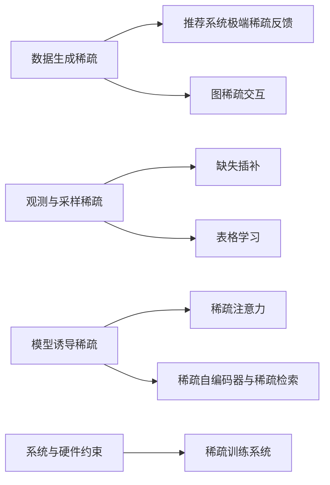
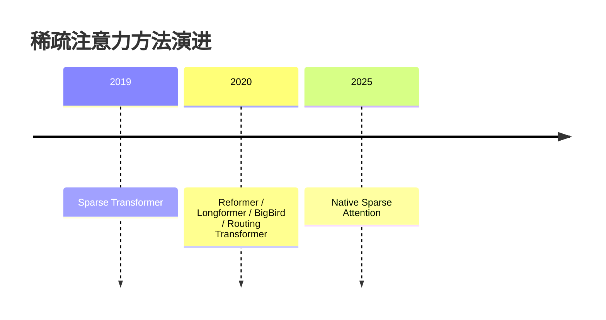

# 非生物稀疏算法七类分类框架与核心文献综述

稀疏并不是一个单一现象，而是一组在不同计算层级上反复出现的结构性约束：它既可以来自数据生成机制本身，例如用户只会接触极少量物品、图中真实交互边远少于可能边数；也可以来自观测与采样过程，例如缺失值、正负样本不平衡与暴露偏差；还可以由模型主动诱导，例如 Top-k 激活、稀疏注意力、稀疏检索向量；最后还会由系统与硬件约束强行塑形，例如 block-sparse 内核、MoE 路由、动态稀疏训练。围绕这四种来源，可以把非生物方向的稀疏算法组织成七类：推荐系统极端稀疏反馈、表格学习、缺失插补、稀疏注意力、稀疏自编码器与稀疏检索、图稀疏交互、稀疏训练系统。这样的分类比按“模型家族”分法更稳定，因为它直指矩阵/张量对象、损失函数形态与计算代价结构之间的耦合关系。citeturn0academia0turn35academia1turn7academia0turn10academia0turn16academia1turn22academia0turn25academia3

从方法论上看，这七类并非彼此隔绝，而是共享几个重复出现的核心思想：其一，利用低秩、局部性、邻域一致性或字典稀疏性，将原本难以估计的高维对象压缩到可学习的结构子空间；其二，借助 pairwise ranking、对比学习、重构损失、核化/索引化检索等目标，把“未观测”从一种简单的零值处理，改写为带不确定性的统计对象；其三，通过硬件对齐、块化、索引化、稀疏核和路由机制，把算法稀疏性真正转译为运行时收益。也正因为如此，今天最有价值的稀疏研究已经不再满足于“参数更少”或“矩阵更空”，而是追问稀疏模式是否与任务统计结构、推理路径和系统内核相一致。citeturn35academia3turn14academia0turn17academia0turn19academia2turn24academia0turn25academia0

本文最终筛选了 33 篇非生物方向代表文献，优先保留原始论文、arXiv 原文、作者仓库与官方项目页。需要说明的是，少数经典方法的正式发表信息与作者仓库并不总是同页可核，因此在个别条目中我采用了更保守的“arXiv 版本/未检索到明确官方仓库”的表述；这并不影响其在分类框架中的方法学位置，但意味着相关开源实现的“官方性”有时弱于“可复现性”。citeturn37view0turn39view0turn40view0turn41view0turn46view0

## 推荐系统极端稀疏反馈

推荐系统中的基本对象通常是用户—物品交互矩阵 \(R\in\{0,1,\varnothing\}^{|U|\times |I|}\)，在带上下文时也可扩展为 \(R\in\mathbb{R}^{|U|\times |I|\times T\times C}\)。这一类稀疏性并不只是“零很多”，而是由暴露机制、点击机制和标签缺失共同塑造：观测到的多为正反馈，未观测并不等同于负反馈，因此天然落入 positive-unlabeled 学习范式；核心任务也从“补全评分”转向“排序未见物品”，典型目标函数包括 pointwise 加权重构、pairwise ranking loss、对比式排序损失与生成式多项式似然，评价则以 Recall@K、NDCG@K、Hit Rate、AUC 为主。BPR 奠定了 pairwise ranking 的基座，NCF 把用户—物品交互函数神经化，Mult-VAE 把极端稀疏 implicit feedback 放入生成式概率模型，而后续工作则进一步把 MNAR 与 PU 偏差显式写进风险估计之中。citeturn0academia0turn0academia1turn1academia0turn35academia1turn35academia3

下表概括本类方法谱系，所列矩阵对象、任务与机制综合自 BPR、NCF、Mult-VAE、MNAR unbiased learning 与 DPL 等工作。citeturn0academia0turn0academia1turn1academia0turn35academia1turn35academia3

| 子谱系 | 矩阵/张量对象 | 稀疏来源 | 核心任务 | 代表机制 | 典型论文 |
| --- | --- | --- | --- | --- | --- |
| 隐式反馈排序 | \(R\in\{1,\varnothing\}^{U\times I}\) | 只观测正反馈；负样本缺失 | Top-K 排序 | pairwise ranking、负采样、BPR-Opt | BPR, DPL |
| 深度交互建模 | 用户/物品 embedding 张量 | 交互极少、非线性偏好难显式表达 | 点击/偏好打分与排序 | MLP 交互、神经协同过滤 | NCF |
| 生成式稀疏建模 | 用户行为向量 \(x_u\in\{0,1\}^{I}\) | 每个用户历史极短；尾部物品稀疏 | 重构+排序兼容 | multinomial likelihood、VAE | Mult-VAE |
| PU / MNAR 偏差修正 | 曝露-点击二阶段观测矩阵 | 未曝光与不喜欢混叠 | 无偏风险估计 | clipping、propensity、debiased pairwise loss | Saito 2019, DPL |

适用场景上，这一类方法最适合电商、短视频、新闻流、广告与搜索推荐等“正反馈远多于显式差评”的环境；其限制则集中在三个层面。其一，负采样的统计含义极为脆弱，热门物品更易被暴露，长尾物品更易被误判为负样本，导致学习到的是“被看见的偏好”而不是真偏好。其二，随着图谱、文本、多模态特征被加入，单纯稀疏矩阵分解往往无法表达复杂交互，但深模型又容易在极稀疏 regime 中过拟合。其三，离线指标与在线收益之间存在系统性鸿沟，特别是在曝光策略会反过来改变下一轮训练数据时，静态排序损失会低估反馈闭环的偏差。最新的 PU/false-negative 修正工作甚至开始直接把误采负样本的分布校正写入 loss 中，说明这一类研究的前沿已经从“如何拟合稀疏矩阵”转向“如何估计稀疏反馈的反事实语义”。citeturn35academia1turn35academia3turn2academia0turn1academia0

**核心文献评注**

**Steffen Rendle, Christoph Freudenthaler, Zeno Gantner, Lars Schmidt-Thieme. 2009. *BPR: Bayesian Personalized Ranking from Implicit Feedback*. Proceedings of UAI 2009.** 这篇论文的决定性贡献，是把隐式反馈推荐从“预测分值”改写为“成对排序”，并从贝叶斯视角推出 BPR-Opt，使训练目标直接对应用户更喜欢已交互物品而不是未交互物品。它之所以经典，不在于模型本身多复杂，而在于它首次稳定地给出了面向 Top-K 推荐的 pairwise ranking loss 规范，后来大量 GNN 推荐、检索排序与自监督推荐都仍以此为基准。其局限也很清楚：随机负采样默认未观测即弱负例，这在 positive-unlabeled 场景中会持续引入假负例偏差。标签：推荐系统极端稀疏反馈。关键贡献：pairwise 排序目标、BPR 优化框架。开源：未检索到明确官方仓库。 citeturn0academia0

**Xiangnan He, Lizi Liao, Hanwang Zhang, Liqiang Nie, Xia Hu, Tat-Seng Chua. 2017. *Neural Collaborative Filtering*. Proceedings of WWW 2017.** NCF 的核心思想，是把传统 MF 中固定的内积交互函数替换为可学习的神经网络映射，从而让用户 embedding 与物品 embedding 之间的关系不再被线性内积绑定。它将 GMF 与 MLP 统一在一个可扩展框架中，证明“稀疏交互矩阵上的深度交互函数”可以在不依赖外部模态特征的前提下提升推荐质量。它适用于能够承受更多参数与训练成本、且希望增强高阶交互表达的场景，但在极低数据密度下仍会面临负采样偏差与过拟合问题。标签：推荐系统极端稀疏反馈。关键贡献：神经化交互函数、GMF/MLP 融合。开源：[GitHub](https://github.com/hexiangnan/neural_collaborative_filtering)。 citeturn0academia1turn41view2

**Dawen Liang, Rahul G. Krishnan, Matthew D. Hoffman, Tony Jebara. 2018. *Variational Autoencoders for Collaborative Filtering*. Proceedings of WWW 2018.** 这篇工作把用户行为向量视为多项式事件生成结果，用 VAE 在用户级稀疏行为上学习非线性潜变量结构，并指出在协同过滤里 multinomial likelihood 比常见高斯/伯努利设定更贴近目标。文章的重要性在于，它证明生成式重构目标并不必然与排序冲突，只要似然和正则参数设计得当，生成模型也可以在 Top-K 指标上优于强基线。它特别适合“每个用户行为很短，但总体用户规模很大”的场景；限制则是后验退化、调参敏感和对曝光偏差的隐式吸收。标签：推荐系统极端稀疏反馈。关键贡献：多项式似然、VAE 形式化 implicit CF。开源：[GitHub](https://github.com/dawenl/vae_cf)。 citeturn1academia0turn41view3

**Yuta Saito, Suguru Yaginuma, Yuta Nishino, Hayato Sakata, Kazuhide Nakata. 2019. *Unbiased Recommender Learning from Missing-Not-At-Random Implicit Feedback*. arXiv 2019.** 该文直接指出 implicit feedback 的关键症结不只是标签缺失，而是 missing-not-at-random：热门或高曝光物品更可能被点击，从而让训练集的观测分布系统偏离真实偏好分布。作者给出理想损失的无偏估计以及 clipped estimator，在偏差—方差权衡意义上改善风险估计稳定性，并在稀有物品上显著优于传统 OCCF 基线。它的重要意义在于把推荐训练从“经验启发式负采样”提升到“显式反偏差风险最小化”，但实践中仍依赖对 propensities 或相关分布的估计质量。标签：推荐系统极端稀疏反馈。关键贡献：MNAR 风险建模、clipped unbiased estimator。开源：未检索到明确官方仓库。 citeturn35academia1

**Bin Liu, Qin Luo, Bang Wang. 2023. *Debiased Pairwise Learning from Positive-Unlabeled Implicit Feedback*. arXiv 2023.** DPL 的出发点非常直接：在 pairwise learning 中，只要负样本来自未标注集合，就不可避免混入 false negatives，于是梯度本身就是有偏的。该文通过校正由假负例造成的概率偏差，构造 debiased pairwise loss，使更新方向更接近全监督情形的真实梯度，同时保持较低实现复杂度。它代表了当前 OCCF 的一个新方向，即不再把 BPR 当作静态终点，而是把它视作一个需要不断做 PU 校正的基础骨架。标签：推荐系统极端稀疏反馈。关键贡献：PU 条件下的 pairwise 无偏校正。开源：未检索到明确官方仓库。 citeturn35academia3

## 表格学习

表格学习面对的矩阵对象通常是样本—特征矩阵 \(X\in\mathbb{R}^{N\times D}\)，其中数值列、类别列与 one-hot/哈希展开列共同构成混合稀疏结构；当高基数类别、文本衍生列或跨域拼接特征增多时，真正困难的不是维度“大”，而是有效非零特征在每个样本上极少。这里的稀疏来源既有数据编码层面的 one-hot 稀疏，也有特征工程后“近互斥列”的结构稀疏，还有模型主动施加的稀疏特征选择。核心任务主要是分类、回归与排序，目标函数常见 logloss、平方误差、pairwise ranking；评价指标则是 AUC、Accuracy、F1、RMSE 与推理时延/内存。XGBoost 的 sparsity-aware split、LightGBM 的 EFB/GOSS、CatBoost 的 ordered boosting 与 TabNet 的 sequential sparse feature mask，构成了本类最具代表性的四条路线。citeturn7academia0turn8search0turn7academia2turn35academia2turn37view0

下表概括表格稀疏学习的主要机制。citeturn7academia0turn8search0turn7academia2turn35academia2

| 子谱系 | 矩阵/张量对象 | 稀疏来源 | 核心任务 | 代表机制 | 典型论文 |
| --- | --- | --- | --- | --- | --- |
| 稀疏感知 GBDT | \(X\in\mathbb{R}^{N\times D}\) | one-hot、高缺失率列 | 分类/回归/排序 | sparsity-aware split | XGBoost |
| 稀疏特征压缩 | 近互斥列簇 | 高基数类别展开 | 大规模训练、降内存 | EFB、GOSS、leaf-wise growth | LightGBM |
| 类别特征稳健编码 | 类别统计张量 | 目标泄漏、类别稀疏 | 分类/排序 | ordered boosting、ordered target statistics | CatBoost |
| 稀疏选择式深表格学习 | feature token 序列 | 输入异质、重要特征少 | 端到端分类/回归 | sequential attention、sparse masks | TabNet |

这一类方法最典型的适用场景，是金融风控、广告点击率预估、工业质量检测、交易审计、保险定价与企业经营表等中高维结构化数据。它的核心限制不在“是否能训得动”，而在于三种冲突：一是类别特征的高基数与统计稳定性之间的冲突，二是深度表征能力与小样本泛化之间的冲突，三是精度与部署成本之间的冲突。树模型在稀疏表格上长期占优，并不是因为深度模型天然劣势，而是因为树模型更早把“零、缺失、互斥、类别统计”当作一等公民处理；深度表格模型若不能在输入级或决策步级显式稀疏化，往往只是在用更高代价重做传统树模型已解决的问题。近年的工作如面向表格学习的原生稀疏注意力，恰恰说明该领域前沿正在重新吸收稀疏归纳偏置，而不是简单照搬通用 Transformer。citeturn7academia0turn8search0turn7academia2turn35academia2turn17academia1

**核心文献评注**

**Tianqi Chen, Carlos Guestrin. 2016. *XGBoost: A Scalable Tree Boosting System*. Proceedings of KDD 2016.** 这篇论文的关键意义，是把 boosting 的统计强度与系统层面的 cache、压缩、分布式设计紧密耦合，并提出面向稀疏数据的 split finding 算法。它使“表格稀疏特征可直接由树模型优雅消费”成为工业标准，也由此奠定了后续 CTR、风控与结构化竞赛的实践基线。对于高稀疏、非平稳、类别特征主导的数据，XGBoost 仍是极强基点，但它对更复杂跨列语义交互的表达能力依旧依赖特征工程。标签：表格学习。关键贡献：sparsity-aware split、系统级 boosting。开源：[GitHub](https://github.com/dmlc/xgboost)。 citeturn7academia0turn42view1

**Guolin Ke, Qi Meng, Thomas Finley, Taifeng Wang, Wei Chen, Weidong Ma, Qiwei Ye, Tie-Yan Liu. 2017. *LightGBM: A Highly Efficient Gradient Boosting Decision Tree*. NeurIPS 2017.** LightGBM 的突破在于把“稀疏互斥特征”视为可压缩对象，并用 Exclusive Feature Bundling 降维，同时用 GOSS 优先保留大梯度样本、以叶子优先生长提升训练效率。它不只是另一种 GBDT，而是把表格稀疏性转译成更低内存和更高吞吐的工程结构，因此在大规模工业表格与排序任务中长期占优。它的代价在于叶子优先生长更敏感于参数配置，小数据和噪声场景下更容易过拟合。标签：表格学习。关键贡献：EFB、GOSS、分布式高性能 GBDT。开源：[GitHub](https://github.com/microsoft/LightGBM)。 citeturn8search0turn37view0

**Liudmila Prokhorenkova, Gleb Gusev, Aleksandr Vorobev, Anna Veronika Dorogush, Andrey Gulin. 2018. *CatBoost: unbiased boosting with categorical features*. NeurIPS 2018.** CatBoost 的理论与工程价值，在于它把类别特征处理中的 target leakage 与 prediction shift 明确问题化，并用 ordered boosting 与 permutation 驱动的类别统计修正偏差。对于大量高基数类别列、样本顺序稳定且需要强泛化的业务表格，它往往比简单 one-hot 更稳健。其局限不在表达，而在解释成本与部分大规模场景的训练开销；但就“类别稀疏”这一痛点而言，CatBoost 仍是极少数把统计偏差与系统可用性同时处理到位的方法。标签：表格学习。关键贡献：ordered boosting、无偏类别特征处理。开源：[GitHub](https://github.com/catboost/catboost)。 citeturn7academia2turn42view2

**Sercan O. Arik, Tomas Pfister. 2019. *TabNet: Attentive Interpretable Tabular Learning*. arXiv 2019.** TabNet 的思想是让模型在多个决策步上顺序选择少量关键特征，从而把“稀疏特征选择”直接内嵌到深度表格学习流程之中。与把全部列一次性送入 MLP 的做法相比，它更强调逐步推理、局部稀疏决策和可解释特征归因，因此在一部分非饱和表格基准上表现出较强竞争力。它适合需要解释、预训练与端到端表示学习的场景，但在中小数据与强类别统计结构场景下，未必总能压过成熟 GBDT。标签：表格学习。关键贡献：step-wise sparse mask、可解释深表格模型。开源：[GitHub](https://github.com/dreamquark-ai/tabnet)。 citeturn35academia2turn42view0

## 缺失插补

缺失插补的对象最常见的是带掩码的矩阵 \(X\in\mathbb{R}^{N\times D}\) 与时间序列张量 \(X\in\mathbb{R}^{N\times T\times D}\)，同时伴随缺失指示矩阵 \(M\in\{0,1\}^{N\times D}\) 或 \(M\in\{0,1\}^{N\times T\times D}\)。本类稀疏来源主要有两种：一种是观测层缺失，即部分单元根本未被记录；另一种是结构层低秩或图结构可恢复性，即虽然观测不全，但对象本身可由较低维结构重建。对应地，经典路线依靠 nuclear norm 与低秩矩阵完成，深度路线则使用 GAN、RNN、自注意力或图神经网络学习缺失模式与变量关系。评价上通常关注 RMSE、MAE、下游任务性能，以及在不同缺失率/缺失机制下的稳健性。citeturn10academia0turn13academia7turn10academia1turn10academia2turn15academia0turn14academia0

下表概括缺失插补的比较矩阵。citeturn10academia0turn13academia7turn10academia1turn10academia2turn15academia0turn14academia0

| 子谱系 | 矩阵/张量对象 | 稀疏来源 | 核心任务 | 代表机制 | 典型论文 |
| --- | --- | --- | --- | --- | --- |
| 低秩矩阵补全 | \(X\in\mathbb{R}^{N\times D}\) | 随机抽样缺失；近低秩 | 恢复未观测单元 | nuclear norm、thresholded SVD | Candès & Recht, Mazumder et al. |
| GAN 插补 | 向量/表格样本 | 任意单元缺失 | 条件生成+重构 | generator-discriminator、hint vector | GAIN |
| RNN 时间序列插补 | \(X\in\mathbb{R}^{N\times T\times D}\) | 时间缺测、不规则观测 | 序列插补与预测 | bidirectional RNN、可学习缺失值节点 | BRITS |
| 自注意力插补 | 多变量时间序列 | 长程时间依赖、变量相关性 | 长程依赖下的高效插补 | masked self-attention | SAITS |
| 图表示插补 | 观测—特征二部图 | 缺失边与异构相关性 | 边级插补/节点预测 | GNN、edge prediction | GRAPE |

适用场景上，低秩方法更适合评分矩阵、监测面板与缺失接近随机抽样的表格；时序深度模型更适合工业传感、交通、日志与连续监控数据；GAN 与图方法则适合变量之间关系复杂、难以被低秩假设充分刻画的场景。限制同样鲜明：低秩补全强依赖可恢复性假设，GAN 插补可能在稳定性与校准上存在问题，RNN 在超长序列上受限，自注意力则需要处理掩码、时间间隔与效率之间的张力，图方法还会遭遇构图成本与可扩展性压力。真正开放的问题，是如何把缺失机制本身纳入建模，即不只补值，还要判断“为什么缺、缺得是否有信息”，因为 MNAR 场景里最难恢复的恰恰不是数值，而是缺失过程的因果语义。citeturn10academia0turn10academia1turn10academia2turn14academia0turn15academia0

**核心文献评注**

**Emmanuel J. Candès, Benjamin Recht. 2009. *Exact Matrix Completion via Convex Optimization*. Foundations of Computational Mathematics 2009.** 这篇论文是低秩补全理论的里程碑，它表明在适当 incoherence 与随机采样条件下，可以通过核范数最小化精确恢复大部分低秩矩阵。它的价值不在于直接给出最好用的工程算法，而在于奠定了“缺失值并非只能靠启发式填补，而可以被视为受限观测下的可恢复对象”的理论基础。其局限同样根本：一旦真实数据不近低秩、采样不接近随机，理论可恢复性就会明显减弱。标签：缺失插补。关键贡献：核范数矩阵补全理论。开源：无。 citeturn10academia0

**Rahul Mazumder, Trevor Hastie, Rob Tibshirani. 2009. *Regularization Methods for Learning Incomplete Matrices*. arXiv 2009.** 与纯理论工作不同，这篇工作把低秩补全推进到可操作算法层面，提出了利用 thresholded SVD 与 warm-start 的正则路径求解框架，后来发展出 Soft-Impute 家族。它的重要性在于让大规模不完整矩阵的低秩学习变得可实现、可扩展，并成为推荐、面板数据与工业缺失插补的长期基线。其适用性仍受低秩假设约束，但在结构化、噪声适中且规模较大的场景中极具工程价值。标签：缺失插补。关键贡献：Soft-Impute 思路、正则路径求解。开源：未检索到明确官方仓库。 citeturn13academia7turn44academia0

**Wei Cao, Dong Wang, Jian Li, Hao Zhou, Lei Li, Yitan Li. 2018. *BRITS: Bidirectional Recurrent Imputation for Time Series*. NeurIPS 2018.** BRITS 的关键创新，是把“待插补值”视为计算图中的变量，而不是前处理阶段的静态填充值，并用双向 RNN 让未来与过去信息共同参与修正。它对多变量时间序列的非线性动力学比经典状态空间或线性方法更灵活，因此在空气质量、定位、人类活动等非生物场景中显示出较强效果。它的限制是长序列与高维变量下的训练成本，以及对时间间隔显式建模仍可进一步加强。标签：缺失插补。关键贡献：可学习缺失节点、双向时序插补。开源：[GitHub](https://github.com/caow13/BRITS)。 citeturn10academia2turn43view1

**Jinsung Yoon, James Jordon, Mihaela van der Schaar. 2018. *GAIN: Missing Data Imputation using Generative Adversarial Nets*. ICML 2018.** GAIN 把插补问题嵌入 GAN 框架，用生成器补缺、判别器识别哪些分量被补，并引入 hint vector 以稳定识别目标。它的重要性在于证明“生成式缺失补全”可以显著超越传统基线，尤其在复杂非线性表格上更有优势。其主要问题在于 GAN 的训练稳定性和评价校准，一旦缺失机制复杂或数据规模有限，调参敏感性会比低秩方法更强。标签：缺失插补。关键贡献：hint 机制、GAN 插补范式。开源：[GitHub](https://github.com/jsyoon0823/GAIN)。 citeturn10academia1turn43view0

**Jiaxuan You, Xiaobai Ma, Daisy Yi Ding, Mykel Kochenderfer, Jure Leskovec. 2020. *Handling Missing Data with Graph Representation Learning*. arXiv 2020.** GRAPE 的思路是把“样本—特征—观测值”重写为二部图，把插补转化为边级预测，从而让缺失不再只是表格里的空单元，而成为图上的未观测边。该建模非常适合变量间关系复杂、传统低秩假设不足或希望与下游标签预测联训的场景。它的挑战则在于构图与图学习成本，以及当图结构构造不恰当时可能放大噪声相关。标签：缺失插补。关键贡献：图化缺失数据、edge-level imputation。开源：未检索到明确官方仓库。 citeturn15academia0

**Wenjie Du, David Cote, Yan Liu. 2022. *SAITS: Self-Attention-based Imputation for Time Series*. arXiv 2022.** SAITS 用两个对角掩码自注意力块联合建模时间依赖与变量相关，并通过加权融合提升精度与速度平衡。它显示出相较 RNN 类方法更强的长程依赖建模能力，同时避免了全 Transformer 一味堆深带来的额外负担。该方法很适合长序列、多变量、缺失模式复杂的工业时间序列，但在极端实时和超大规模场景中仍依赖高效注意力与掩码工程。标签：缺失插补。关键贡献：DMSA 结构、时序自注意力插补。开源：[GitHub](https://github.com/WenjieDu/SAITS)。 citeturn14academia0turn43view2

## 稀疏注意力

稀疏注意力的基本张量对象是批量序列表示 \(X\in\mathbb{R}^{B\times L\times d}\)，其核心计算对象是注意力矩阵 \(A\in\mathbb{R}^{B\times H\times L\times L}\)。这一类稀疏性主要不是来自数据本身，而是来自模型诱导与计算约束：全注意力的 \(O(L^2)\) 时间与内存成本使长上下文训练与推理难以扩展，因此研究重点转向“保留必要连边、舍弃低价值连边”的稀疏图设计。任务上覆盖语言建模、长文档分类、问答、摘要与长上下文推理；指标既包括困惑度、下游任务分数，也包括显存占用、吞吐与支持的最大上下文长度。Sparse Transformer、Reformer、Longformer、BigBird 与最新的 Native Sparse Attention 共同勾勒出从固定模式到内容路由、再到硬件对齐可训练稀疏的演进脉络。citeturn16academia1turn16academia2turn16academia0turn16academia3turn17academia0

下表概括稀疏注意力的机制分层。citeturn16academia1turn16academia2turn16academia0turn16academia3turn17academia0

| 子谱系 | 矩阵/张量对象 | 稀疏来源 | 核心任务 | 代表机制 | 典型论文 |
| --- | --- | --- | --- | --- | --- |
| 固定块/步幅稀疏 | \(A\in\mathbb{R}^{L\times L}\) | 计算约束 | 长序列建模 | fixed/strided/block sparse | Sparse Transformer |
| 局部+全局稀疏 | 滑窗局部图 + 少量全局 token | 文档长程依赖 | 长文档分类/QA | sliding window + global | Longformer |
| 随机/小世界稀疏 | local + random + global | 保理论表达能力 | 长序列 NLP | random blocks、global tokens | BigBird |
| 哈希/内容路由 | query-key 聚类/哈希 | 内容相关性稀疏 | 长文本/图像生成 | LSH attention、routing | Reformer, Routing Transformer |
| 原生可训练稀疏 | 分层压缩+细粒度选择 | 训练/推理与硬件一体化 | 64k 级长上下文 | hardware-aligned native sparse attention | NSA |

此类方法的根本难题，不在于“把复杂度写得更低”，而在于让稀疏模式既保语义、又利于内核执行。很多早期方法在理论复杂度上优雅，但在 GPU 上未必有真实 wall-clock 收益，因为索引不规则、访存不连续与 kernel launch 开销会吞掉稀疏收益；另一些方法则在训练时引入稀疏、推理时却又回到全注意力，导致训练—部署不一致。最新 NSA 的价值，恰恰在于它不再把稀疏模式当作纯算法对象，而是把算术强度、层级选择与端到端可训练性一起设计。开放问题主要集中在三个方向：稀疏模式的自适应可解释性、稀疏训练下被屏蔽 token 的梯度贫化，以及 KV cache 与批处理推理阶段的协同压缩。citeturn18academia0turn17academia0turn28academia1turn28academia2

**核心文献评注**

**Rewon Child, Scott Gray, Alec Radford, Ilya Sutskever. 2019. *Generating Long Sequences with Sparse Transformers*. arXiv 2019.** 该文首次系统化提出固定与步幅式稀疏注意力，把全注意力复杂度从二次降到次二次，并配合注意力重计算与快速 kernel，在超长序列语言、图像与音频建模上取得效果。它的重要性在于证明 Transformer 并不必然被全连接注意力束缚，长序列可以通过稀疏图结构保存全局一致性。其局限是稀疏模式仍较手工、对任务结构不够自适应。标签：稀疏注意力。关键贡献：fixed/strided sparse attention、长序列生成。开源：[GitHub](https://github.com/openai/sparse_attention)。 citeturn16academia1turn39view0

**Nikita Kitaev, Łukasz Kaiser, Anselm Levskaya. 2020. *Reformer: The Efficient Transformer*. ICLR 2020.** Reformer 将稀疏注意力推进到内容驱动层面，使用 LSH attention 以 \(O(L\log L)\) 近似全注意力，同时用 reversible residual layers 节省激活存储。它在方法学上的价值，是把“谁该互相看见”交给哈希近邻而不是固定图案，从而在效率与内容适配之间找到折中。它适合超长序列和受限显存场景，但哈希近邻的稳定性与近似误差仍会影响下游鲁棒性。标签：稀疏注意力。关键贡献：LSH attention、可逆层。开源：[GitHub](https://github.com/google/trax/tree/master/trax/models/reformer)。 citeturn16academia2turn39view1

**Iz Beltagy, Matthew E. Peters, Arman Cohan. 2020. *Longformer: The Long-Document Transformer*. arXiv 2020.** Longformer 使用滑动窗口局部注意力配合任务相关的全局注意力，使长文档编码从二次复杂度降低到线性规模。它尤其适合需要保留局部语境又必须处理极长输入的问答、文档分类与摘要场景，并且设计上比纯哈希或随机图更贴近文档结构。其局限是局部窗口大小、全局 token 指派与不同任务之间仍存在显著超参数依赖。标签：稀疏注意力。关键贡献：windowed + global attention。开源：[GitHub](https://github.com/allenai/longformer)。 citeturn16academia0turn39view2

**Manzil Zaheer, Guru Guruganesh, Avinava Dubey, Joshua Ainslie, Chris Alberti, Santiago Ontanon, Philip Pham, Qifan Wang, Li Yang, Amr Ahmed. 2020. *Big Bird: Transformers for Longer Sequences*. NeurIPS 2020.** BigBird 把局部、随机与全局 token 组合成小世界式稀疏图，并进一步证明这类稀疏 Transformer 仍保有较强理论表达能力。它的意义不只是“更长”，而是在理论保证、任务泛化与工程可实现之间取得了更平衡的方案。它适合长上下文 NLP，但随机边的可控性和硬件实现效率仍低于更对齐内核的后续方法。标签：稀疏注意力。关键贡献：local/random/global 三元稀疏图、理论可表达性。开源：[GitHub](https://github.com/google-research/bigbird)。 citeturn16academia3turn39view3

**Jingyang Yuan, Huazuo Gao, Damai Dai, Junyu Luo, Liang Zhao, Zhengyan Zhang, Zhenda Xie, Y. X. Wei, Lean Wang, Zhiping Xiao, Yuqing Wang, Chong Ruan, Ming Zhang, Wenfeng Liang, Wangding Zeng. 2025. *Native Sparse Attention: Hardware-Aligned and Natively Trainable Sparse Attention*. arXiv 2025.** NSA 代表稀疏注意力的新阶段：它不是先设计稀疏图再想办法跑得快，而是把层级化 token 压缩、细粒度选择与硬件对齐一起纳入原生训练机制。该文显示在 64k 长度的训练和解码上，可以在保持乃至超过 full attention 基线能力的同时获得显著系统级加速。它的重要性在于把“算法稀疏”真正推进到“可部署稀疏”，但是否形成统一标准，还取决于更广泛模型结构与内核生态的支持。标签：稀疏注意力。关键贡献：hardware-aligned native sparse training。开源：未检索到明确官方仓库。 citeturn17academia0

## 稀疏自编码器与稀疏检索

这一类最值得注意的地方，是它把两种表面上很不同的问题连接起来：一端是 sparse autoencoder，用稀疏隐变量 \(z\in\mathbb{R}^m\) 去重构原激活或输入；另一端是 learned sparse retrieval，把查询和文档投影为高维稀疏词汇权重向量 \(q,d\in\mathbb{R}^{|V|}\)，以 inverted index 进行高效检索。前者的稀疏来源主要是模型诱导，如 Top-k、lifetime sparsity、winner-take-all；后者则同时受模型诱导与检索系统约束驱动，需要在稀疏度、可解释性与检索效率之间权衡。核心任务分别是重构/解释与 first-stage ranking，评价则涉及重构误差、死特征比例、loss recovered、MRR、NDCG、latency 与索引大小。近年来，稀疏自编码器在大模型可解释性上迅速扩张，而稀疏检索则重新把 lexical exact match 与神经语义统一起来。citeturn20academia0turn19academia3turn19academia0turn19academia2turn35academia0

下表概括本类机制。citeturn20academia0turn19academia3turn19academia0turn19academia2turn35academia0

| 子谱系 | 矩阵/张量对象 | 稀疏来源 | 核心任务 | 代表机制 | 典型论文 |
| --- | --- | --- | --- | --- | --- |
| Top-k 稀疏编码 | \(z\in\mathbb{R}^m\) | 模型诱导 | 重构、压缩、解缠结 | top-k activation | k-Sparse AE |
| WTA 稀疏表示 | batch/layer 激活张量 | 模型诱导 | 层级稀疏表征 | lifetime sparsity、spatial sparsity | WTA AE |
| 大模型 SAE | LM 中间层激活 | 模型诱导、可解释性需求 | 语义特征抽取 | 大字典 SAE、feature quality metrics | Gao et al. 2024 |
| 学习稀疏检索 | 词汇维稀疏向量 | 词项稀疏、索引约束 | first-stage retrieval | lexical expansion、FLOPS regularization | SPLADE |
| 语境化精确匹配 | token-level indexed vectors | 精确词项匹配 | 检索+语义对齐 | contextualized inverted list | COIL |

本类最深的理论问题，是“稀疏究竟在逼近什么”。对自编码器而言，它可能是在做字典学习、特征解缠结，也可能只是在用稀疏性换取可读的局部坐标系；对检索而言，它或许是在恢复词汇空间中的可索引语义，而不只是拟合语料频率。适用上，SAE 非常适合模型解释、异常检测、压缩表征与稀疏特征发现，稀疏检索则适合低延迟大规模候选召回。限制则集中于 dead latents、稀疏度调参、索引膨胀、词汇偏置与跨域泛化；开放问题是如何把 SAE 的可解释特征与检索中的可索引稀疏语义真正接驳起来，让“稀疏维度”同时具有语义可读性、因果可干预性和工程可部署性。citeturn19academia0turn48view0turn41view0turn40view0

**核心文献评注**

**Alireza Makhzani, Brendan Frey. 2013. *k-Sparse Autoencoders*. arXiv 2013.** k-Sparse Autoencoder 通过一个非常直接的操作，把隐层中仅前 \(k\) 个最大激活保留，其余全置零，从而让 sparsity 从惩罚项变成结构性约束。它的重要性在于证明 top-k 本身就足以形成高效、快速且可扩展的稀疏编码，不必依赖复杂采样或附加正则。这个思路后来被大量大模型 SAE 工作继承，因为它能更稳定地控制激活预算。标签：稀疏自编码器与稀疏检索。关键贡献：显式 Top-k 稀疏瓶颈。开源：无明确官方仓库。 citeturn20academia0

**Alireza Makhzani, Brendan Frey. 2014. *Winner-Take-All Autoencoders*. arXiv 2014.** WTA 将稀疏性的控制进一步推进到 lifetime 与 spatial 两个维度，用赢家通吃机制学习层级化稀疏表征。它的理论价值在于说明稀疏不只是“少量维度非零”，还可以具有跨样本、跨空间的竞争结构，从而改善表征分离性。它适合无监督特征学习，但在现代大模型激活分解场景中，如何避免死特征与信息丢失仍是问题。标签：稀疏自编码器与稀疏检索。关键贡献：winner-take-all 稀疏规则、层级稀疏表征。开源：无明确官方仓库。 citeturn19academia3

**Luyu Gao, Zhuyun Dai, Jamie Callan. 2021. *COIL: Revisit Exact Lexical Match in Information Retrieval with Contextualized Inverted List*. NAACL 2021.** COIL 的核心思想是把“精确词项匹配”重新语境化：只有 query/document 的重叠词项参与相似度计算，但这些词项向量来自上下文编码器，因此保留了 lexical exact match 的可索引性与神经模型的语义能力。它非常适合第一阶段召回，因为可以继续使用 inverted list，而不必像 dense retrieval 那样依赖 ANN 向量库。它的限制是词项重叠依赖仍较强，在词汇错配极严重的零样本场景中未必优于更强扩展模型。标签：稀疏自编码器与稀疏检索。关键贡献：contextualized exact lexical match、上下文倒排表。开源：[GitHub](https://github.com/luyug/COIL)。 citeturn35academia0turn41view0

**Thibault Formal, Benjamin Piwowarski, Stéphane Clinchant. 2021. *SPLADE: Sparse Lexical and Expansion Model for First Stage Ranking*. SIGIR 2021.** SPLADE 的关键贡献，是通过显式稀疏正则和词汇扩展，把稀疏神经检索向量做成真正可用于首阶段召回的表示形式。它同时继承词项精确匹配的倒排索引效率与 Transformer 语义扩展能力，因此成为 learned sparse retrieval 的代表模型。其主要限制在于查询与文档稀疏度控制、索引体积与延迟之间的张力，但这恰恰也构成了后续 SPLADE v2/++ 的改进空间。标签：稀疏自编码器与稀疏检索。关键贡献：稀疏词汇扩展、一阶段神经检索。开源：[GitHub](https://github.com/naver/splade)。 citeturn19academia2turn48view0turn48view2

**Leo Gao, Tom Dupré la Tour, Henk Tillman, Gabriel Goh, Rajan Troll, Alec Radford, Ilya Sutskever, Jan Leike, Jeffrey Wu. 2024. *Scaling and evaluating sparse autoencoders*. arXiv 2024.** 这篇工作把 SAE 从“小模型上的可视化工具”推进到“具有缩放定律的大模型解释基础设施”，并使用 k-sparse 设计减少 dead latents，同时提出多种 feature-quality 评估指标。它之所以重要，在于它不再把 SAE 只当作局部技巧，而是系统性研究 SAE 大规模训练时的重构—稀疏前沿。其限制是解释质量仍高度依赖评价代理和人工/半自动语义归纳，但它无疑把 SAE 推向了更工程化、可比较的阶段。标签：稀疏自编码器与稀疏检索。关键贡献：大规模 SAE 缩放规律、特征质量评估。开源：[GitHub](https://github.com/openai/sparse_autoencoder)。 citeturn19academia0turn40view0

## 图稀疏交互

图稀疏交互的核心对象是稀疏邻接矩阵 \(A\in\{0,1\}^{|V|\times|V|}\)，在推荐中更常见的是用户—物品二部图 \(B\in\{0,1\}^{|U|\times|I|}\)。其稀疏来源最自然：真实交互边数 \(|E|\) 远小于所有可能边数，因此学习的关键不在“如何压稠密图”，而在“如何从极少观测边中恢复高阶协同信号”。任务上包括推荐、链路预测、节点表示与跨视图对比学习，目标函数既有 BPR，也有 InfoNCE/对比目标，评价则以 Recall@K、NDCG@K、AUC 与鲁棒性/长尾效果为主。近年来这一类工作的核心变化，是从 GCN 传播单边推进到“稀疏交互图 + contrastive regularization”的范式，试图用自监督信号弥补稀疏监督。citeturn22academia0turn22academia3turn24academia0turn22academia1

下表给出比较矩阵。citeturn22academia0turn22academia3turn24academia0turn22academia1

| 子谱系 | 矩阵/张量对象 | 稀疏来源 | 核心任务 | 代表机制 | 典型论文 |
| --- | --- | --- | --- | --- | --- |
| 线性图传播 | 二部稀疏图 \(B\) | 交互边极少 | Top-K 推荐 | neighborhood aggregation | LightGCN |
| 结构增强对比 | 多视图图样本 | 稀疏监督不足、噪声边 | 鲁棒表示学习 | edge/node dropout、random walk | SGL |
| 增强自由对比 | embedding 视图 | 图增强不稳定 | 更均匀表征、去流行偏差 | noise perturbation | SimGCL |
| 全局结构对比 | SVD 结构视图 | 稀疏图噪声与语义失真 | 全局协同对比 | SVD-based augmentation | LightGCL |

本类方法最适合推荐交互图、交易网络、行为网络与局部观测极稀薄但高阶邻居信息仍有意义的场景。限制则体现在：图增强可能破坏本就稀少的真实语义边，随机 dropout 在稀图中未必“鲁棒”反而可能“去信号”；另一方面，contrastive learning 带来的性能提升常常来自 representation uniformity 与 popularity bias 缓解，而不一定来自增强本身，这意味着许多看似复杂的增强策略可能只是以高开销实现了简单的正则效果。开放问题主要包括：如何为稀疏二部图构造语义保真的视图、如何把长尾公平性与对比学习统一建模，以及如何在更大规模动态图上保持稀疏交互的系统可扩展性。citeturn22academia3turn24academia0turn22academia1

**核心文献评注**

**Xiangnan He, Kuan Deng, Xiang Wang, Yan Li, Yongdong Zhang, Meng Wang. 2020. *LightGCN: Simplifying and Powering Graph Convolution Network for Recommendation*. SIGIR 2020.** LightGCN 最重要的贡献，是通过消融发现特征变换和非线性在推荐图上并非必要，从而把 GCN 化简为纯邻域传播与层间加权求和。它使图推荐回到最贴近稀疏交互本质的结构：沿图传播协同信号，而不是叠加不必要的神经组件。它成为后续几乎所有图对比推荐模型的共同骨架，也说明“在极稀疏用户—物品图上，简洁结构往往比复杂层堆叠更有效”。标签：图稀疏交互。关键贡献：简化版 GCN 推荐基座。开源：[GitHub](https://github.com/gusye1234/LightGCN-PyTorch)。 citeturn22academia0turn47view0

**Jiancan Wu, Xiang Wang, Fuli Feng, Xiangnan He, Liang Chen, Jianxun Lian, Xing Xie. 2021. *Self-supervised Graph Learning for Recommendation*. SIGIR 2021.** SGL 把自监督图对比正式引入推荐，用节点/边 dropout 和随机游走生成视图，通过一致性约束增强低度节点与长尾物品的表征质量。文章的理论亮点之一是指出自监督目标能够自动挖掘 harder negatives，从而在稀疏图上改善监督不足问题。它适合稀疏且含噪交互图，但视图生成本身仍可能扭曲真实结构，因此增强质量是其性能天花板所在。标签：图稀疏交互。关键贡献：图自监督推荐、结构增强视图。开源：[GitHub](https://github.com/wujcan/SGL)。 citeturn22academia3turn31academia1turn47view1

**Junliang Yu, Hongzhi Yin, Xin Xia, Tong Chen, Lizhen Cui, Quoc Viet Hung Nguyen. 2022. *Are Graph Augmentations Necessary? Simple Graph Contrastive Learning for Recommendation*. SIGIR 2022.** SimGCL 的关键论断相当尖锐：图增强未必是图对比推荐成功的真正原因，更可能是对表征均匀性的一种间接调节。作者因此直接在 embedding 空间加噪声构造视图，抛弃复杂结构增强，反而得到更优精度与训练效率。它的重要性在于把图对比推荐从“不断堆增强技巧”拉回到“理解对比目标究竟在优化什么”的层面。标签：图稀疏交互。关键贡献：augmentation-free graph contrastive recommendation。开源：[GitHub](https://github.com/Coder-Yu/QRec)。 citeturn24academia0turn47view2

**Xuheng Cai, Chao Huang, Lianghao Xia, Xubin Ren. 2023. *LightGCL: Simple Yet Effective Graph Contrastive Learning for Recommendation*. ICLR 2023.** LightGCL 使用 SVD 视图替代随机扰动视图，把全局协同关系直接写入对比学习过程，从而避免增强破坏稀疏图语义结构。它的意义在于把“图对比学习的视图”从启发式随机增广推进到更具结构约束的全局近似，尤其在稀疏和流行度偏置场景中显示出更强鲁棒性。它也提醒我们：在稀疏交互图上，真正稀缺的不是边数，而是语义一致的增强方式。标签：图稀疏交互。关键贡献：SVD-based contrastive augmentation。开源：[GitHub](https://github.com/HKUDS/LightGCL)。 citeturn22academia1turn47view3

## 稀疏训练系统

稀疏训练系统面对的对象不再只是输入数据，而是网络参数张量 \(W_l\)、梯度张量 \(G_l\)、优化器状态以及路由张量；在 MoE 中，还包括 token-to-expert 分派矩阵。其稀疏来源主要有三类：模型主动稀疏化，训练中动态改图，系统/硬件对 block-sparse 或 structured sparse 的执行偏好。任务目标不再仅是“保持精度”，而是联合优化精度、FLOPs、吞吐、峰值显存、通信量与可扩展性。SET、RigL、Sparse GPU Kernels 与 MegaBlocks 反映了这一类从算法到系统的完整链条：从层连接拓扑的动态演化，到稀疏网络从头训练，再到 CUDA kernel 与 block-sparse MoE 系统。citeturn25academia2turn25academia1turn25academia3turn25academia0

下表概括本类的比较矩阵。citeturn25academia2turn25academia1turn25academia3turn25academia0

| 子谱系 | 矩阵/张量对象 | 稀疏来源 | 核心任务 | 代表机制 | 典型论文 |
| --- | --- | --- | --- | --- | --- |
| 自适应稀疏连接 | 权重矩阵 \(W\) | 模型诱导 | 从头稀疏训练 | sparse evolutionary training | SET |
| 动态稀疏训练 | 固定参数预算下的连接图 | 模型诱导 | 少 FLOPs 保精度 | prune-regrow、ERK、RigL | Rigging the Lottery |
| 稀疏 GPU 内核 | SpMM / SDDMM 张量 | 硬件/内核约束 | 真实加速 | sparse GPU kernels | Sputnik / Sparse GPU Kernels |
| MoE block-sparse 训练 | token-expert block tensor | 路由动态、系统约束 | 高吞吐 sparse tensor training | block-sparse MoE runtime | MegaBlocks |

这类研究的真正难点，是算法稀疏与系统稀疏经常不一致：一个模型可以在数学上 90% sparse，却在 GPU 上比 dense 更慢，因为访存、负载均衡、索引维护和 kernel 发射成本并未同步下降。SET 与 RigL 解决的是“怎么训练出稀疏拓扑”，Sputnik 解决的是“稀疏乘法怎么真跑快”，MegaBlocks 则把这一问题推向 LLM 时代的 MoE 路由动态。它们的局限同样清楚：动态改图带来优化不稳定，稀疏 kernel 往往只在特定 sparsity regime 获得收益，而 block-sparse MoE 需要模型路由分布与硬件块结构高度对齐。开放问题集中在可泛化稀疏内核、稀疏优化器状态压缩、跨设备并行中的稀疏负载均衡，以及“训练时稀疏”和“推理时稀疏”的统一编译链。citeturn25academia2turn25academia1turn25academia3turn25academia0

**核心文献评注**

**Decebal Constantin Mocanu, Elena Mocanu, Peter Stone, Phuong H. Nguyen, Madeleine Gibescu, Antonio Liotta. 2018. *Scalable Training of Artificial Neural Networks with Adaptive Sparse Connectivity Inspired by Network Science*. Nature Communications 2018.** SET 的根本思想，是在训练一开始就放弃全连接网络，而从随机稀疏图出发，在训练中持续删除弱连接并随机生长新连接。它的重要性在于把“先训 dense 再剪枝”的惯性打破，证明稀疏网络可以从头开始学习并保持竞争性能。其挑战是拓扑演化与优化稳定性并重，且不同层的理想稀疏分配并不容易统一设定。标签：稀疏训练系统。关键贡献：Sparse Evolutionary Training、始终稀疏训练。开源：[GitHub](https://github.com/dcmocanu/sparse-evolutionary-artificial-neural-networks)。 citeturn25academia2turn46view3

**Utku Evci, Trevor Gale, Jacob Menick, Pablo Samuel Castro, Erich Elsen. 2019. *Rigging the Lottery: Making All Tickets Winners*. arXiv 2019.** 这篇工作把动态稀疏训练推进到更系统的 prune-regrow 框架，在固定参数预算和固定计算成本下训练稀疏网络，并用极少额外梯度信息更新拓扑。它的贡献在于把“稀疏训练”从启发式现象提升为可稳定复现的训练范式，并在多种网络与数据集上逼近甚至超过 dense-to-sparse 流程。它表明稀疏真正困难的不是保留哪些权重，而是在训练过程中持续寻找更好的连通结构。标签：稀疏训练系统。关键贡献：动态拓扑更新、低 FLOPs 稀疏训练。开源：[GitHub](https://github.com/google-research/rigl)。 citeturn25academia1turn46view0

**Trevor Gale, Matei Zaharia, Cliff Young, Erich Elsen. 2020. *Sparse GPU Kernels for Deep Learning*. arXiv 2020.** 该文直面一个常被忽略的事实：深度学习中的稀疏矩阵并不像传统科学计算里那样极端稀疏，因此现有通用 sparse kernel 往往跑不过 dense kernel。作者针对 DNN 稀疏矩阵的统计结构设计稀疏矩阵—稠密矩阵与 sampled dense-dense multiplication 核，证明适配 DL 稀疏模式的内核可以带来真正的 1.2–2.1 倍加速和显著内存节省。它的重要性在于把“结构稀疏”变成“系统收益”，为后续 MoE 与 block-sparse 训练提供了基础。标签：稀疏训练系统。关键贡献：深度学习定制 sparse GPU kernels、Sputnik 方向。开源：[GitHub](https://github.com/google-research/sputnik)。 citeturn25academia3turn46view1

**Trevor Gale, Deepak Narayanan, Cliff Young, Matei Zaharia. 2022. *MegaBlocks: Efficient Sparse Training with Mixture-of-Experts*. arXiv 2022.** MegaBlocks 的关键贡献，是把 MoE 的动态路由重写为 block-sparse 运算，避免 token dropping 与 padding 浪费之间的两难。它说明在大模型时代，最重要的稀疏训练对象之一已经从“稀疏权重矩阵”转向“稀疏路由张量”，系统设计必须围绕动态 expert 分配而非静态剪枝展开。它特别适合大规模 MoE 预训练，但也要求模型路由、块大小和 GPU 内核三者协同设计。标签：稀疏训练系统。关键贡献：block-sparse MoE training、系统级稀疏张量重写。开源：[GitHub](https://github.com/databricks/megablocks)。 citeturn25academia0turn46view2

## 文献清单表

下表汇总本文筛选的 33 篇非生物方向文献。个别条目只检索到论文原文而未检索到明确官方仓库，因此以“未检索到明确官方仓库”标注；这表示代码官方性不明，并不等于不存在复现实现。前文各条目已给出逐篇中文摘要与方法定位。citeturn0academia0turn7academia0turn10academia0turn16academia1turn19academia0turn22academia0turn25academia0

| 序号 | 作者+年份 | 标题 | 会议/期刊 | 关键词标签 | 开源链接 |
| --- | --- | --- | --- | --- | --- |
| 1 | Steffen Rendle 等，2009 | BPR: Bayesian Personalized Ranking from Implicit Feedback | UAI 2009 | sparse feedback; ranking loss; pairwise | 无明确官方仓库 |
| 2 | Xiangnan He 等，2017 | Neural Collaborative Filtering | WWW 2017 | implicit CF; neural interaction; top-K | [链接](https://github.com/hexiangnan/neural_collaborative_filtering) |
| 3 | Dawen Liang 等，2018 | Variational Autoencoders for Collaborative Filtering | WWW 2018 | implicit feedback; VAE; multinomial likelihood | [链接](https://github.com/dawenl/vae_cf) |
| 4 | Yuta Saito 等，2019 | Unbiased Recommender Learning from Missing-Not-At-Random Implicit Feedback | arXiv 2019 | positive-unlabeled; MNAR; unbiased ranking | 未检索到明确官方仓库 |
| 5 | Bin Liu 等，2023 | Debiased Pairwise Learning from Positive-Unlabeled Implicit Feedback | arXiv 2023 | PU learning; debiased pairwise loss; false negatives | 未检索到明确官方仓库 |
| 6 | Tianqi Chen 等，2016 | XGBoost: A Scalable Tree Boosting System | KDD 2016 | tabular sparse feature; sparsity-aware split; boosting | [链接](https://github.com/dmlc/xgboost) |
| 7 | Guolin Ke 等，2017 | LightGBM: A Highly Efficient Gradient Boosting Decision Tree | NeurIPS 2017 | exclusive feature bundling; GOSS; leaf-wise GBDT | [链接](https://github.com/microsoft/LightGBM) |
| 8 | Liudmila Prokhorenkova 等，2018 | CatBoost: unbiased boosting with categorical features | NeurIPS 2018 | categorical feature; ordered boosting; target leakage | [链接](https://github.com/catboost/catboost) |
| 9 | Sercan O. Arik 等，2019 | TabNet: Attentive Interpretable Tabular Learning | arXiv 2019 | sparse feature selection; attentive masks; tabular DL | [链接](https://github.com/dreamquark-ai/tabnet) |
| 10 | Emmanuel J. Candès 等，2009 | Exact Matrix Completion via Convex Optimization | Foundations of Computational Mathematics 2009 | low-rank imputation; nuclear norm; matrix completion | 无 |
| 11 | Rahul Mazumder 等，2009 | Regularization Methods for Learning Incomplete Matrices | arXiv 2009 | soft-impute; incomplete matrix; regularization path | 未检索到明确官方仓库 |
| 12 | Wei Cao 等，2018 | BRITS: Bidirectional Recurrent Imputation for Time Series | NeurIPS 2018 | time-series imputation; bidirectional RNN; missingness | [链接](https://github.com/caow13/BRITS) |
| 13 | Jinsung Yoon 等，2018 | GAIN: Missing Data Imputation using Generative Adversarial Nets | ICML 2018 | GAN imputation; hint vector; RMSE | [链接](https://github.com/jsyoon0823/GAIN) |
| 14 | Jiaxuan You 等，2020 | Handling Missing Data with Graph Representation Learning | arXiv 2020 | graph imputation; bipartite graph; edge prediction | 未检索到明确官方仓库 |
| 15 | Wenjie Du 等，2022 | SAITS: Self-Attention-based Imputation for Time Series | arXiv 2022 | self-attention imputation; temporal missingness; efficiency | [链接](https://github.com/WenjieDu/SAITS) |
| 16 | Rewon Child 等，2019 | Generating Long Sequences with Sparse Transformers | arXiv 2019 | block sparse attention; long sequence; recomputation | [链接](https://github.com/openai/sparse_attention) |
| 17 | Manzil Zaheer 等，2020 | Big Bird: Transformers for Longer Sequences | NeurIPS 2020 | random-global-local attention; long context; linear complexity | [链接](https://github.com/google-research/bigbird) |
| 18 | Iz Beltagy 等，2020 | Longformer: The Long-Document Transformer | arXiv 2020 | windowed+global attention; long documents; linear scaling | [链接](https://github.com/allenai/longformer) |
| 19 | Nikita Kitaev 等，2020 | Reformer: The Efficient Transformer | ICLR 2020 | LSH attention; reversible layers; efficient transformer | [链接](https://github.com/google/trax/tree/master/trax/models/reformer) |
| 20 | Jingyang Yuan 等，2025 | Native Sparse Attention: Hardware-Aligned and Natively Trainable Sparse Attention | arXiv 2025 | hardware-aligned sparse attention; native training; long context | 未检索到明确官方仓库 |
| 21 | Alireza Makhzani 等，2013 | k-Sparse Autoencoders | arXiv 2013 | top-k sparsity; sparse coding; autoencoder | 无明确官方仓库 |
| 22 | Alireza Makhzani 等，2014 | Winner-Take-All Autoencoders | arXiv 2014 | winner-take-all; lifetime sparsity; hierarchical SAE | 无明确官方仓库 |
| 23 | Luyu Gao 等，2021 | COIL: Revisit Exact Lexical Match in Information Retrieval with Contextualized Inverted List | NAACL 2021 | learned sparse retrieval; exact lexical match; inverted index | [链接](https://github.com/luyug/COIL) |
| 24 | Thibault Formal 等，2021 | SPLADE: Sparse Lexical and Expansion Model for First Stage Ranking | SIGIR 2021 | sparse retrieval; lexical expansion; first-stage ranking | [链接](https://github.com/naver/splade) |
| 25 | Leo Gao 等，2024 | Scaling and evaluating sparse autoencoders | arXiv 2024 | LLM interpretability; large-scale SAE; top-k | [链接](https://github.com/openai/sparse_autoencoder) |
| 26 | Xiangnan He 等，2020 | LightGCN: Simplifying and Powering Graph Convolution Network for Recommendation | SIGIR 2020 | user-item graph; linear propagation; sparse interaction | [链接](https://github.com/gusye1234/LightGCN-PyTorch) |
| 27 | Jiancan Wu 等，2021 | Self-supervised Graph Learning for Recommendation | SIGIR 2021 | graph SSL; edge dropout; hard negatives | [链接](https://github.com/wujcan/SGL) |
| 28 | Junliang Yu 等，2022 | Are Graph Augmentations Necessary? Simple Graph Contrastive Learning for Recommendation | SIGIR 2022 | graph contrastive learning; augmentation-free; uniformity | [链接](https://github.com/Coder-Yu/QRec) |
| 29 | Xuheng Cai 等，2023 | LightGCL: Simple Yet Effective Graph Contrastive Learning for Recommendation | ICLR 2023 | SVD augmentation; graph contrastive; popularity bias | [链接](https://github.com/HKUDS/LightGCL) |
| 30 | Decebal Constantin Mocanu 等，2018 | Scalable Training of Artificial Neural Networks with Adaptive Sparse Connectivity Inspired by Network Science | Nature Communications 2018 | dynamic sparse connectivity; SET; adaptive topology | [链接](https://github.com/dcmocanu/sparse-evolutionary-artificial-neural-networks) |
| 31 | Utku Evci 等，2019 | Rigging the Lottery: Making All Tickets Winners | arXiv 2019 | dynamic sparse training; RigL; FLOP efficiency | [链接](https://github.com/google-research/rigl) |
| 32 | Trevor Gale 等，2020 | Sparse GPU Kernels for Deep Learning | arXiv 2020 | sparse tensor kernel; GPU; sampled dense-dense multiplication | [链接](https://github.com/google-research/sputnik) |
| 33 | Trevor Gale 等，2022 | MegaBlocks: Efficient Sparse Training with Mixture-of-Experts | arXiv 2022 | MoE; block-sparse training; system co-design | [链接](https://github.com/databricks/megablocks) |